# dotnet MiniPdf vs Microsoft 365 Word Reference PDF Comparison Report

Generated: 2026-09-19T22:06:46.342371

## Summary

| # | Test Case | Valid | Text Sim | Visual Avg | Pages (M/R) | Overall |
|---|-----------|-------|----------|------------|-------------|--------|
| 1 | 🟢 docx_classic01_single_paragraph | ✅ | 1.0 | 0.997 | 1/1 | **0.9988** |
| 2 | 🟢 docx_classic02_multiple_paragraphs | ✅ | 1.0 | 0.9859 | 1/1 | **0.9944** |
| 3 | 🟢 docx_classic03_headings | ✅ | 1.0 | 0.9971 | 1/1 | **0.9988** |
| 4 | 🟢 docx_classic04_bold_italic | ✅ | 1.0 | 0.9982 | 1/1 | **0.9993** |
| 5 | 🟢 docx_classic05_font_sizes | ✅ | 1.0 | 0.9902 | 1/1 | **0.9961** |
| 6 | 🟢 docx_classic06_font_colors | ✅ | 1.0 | 0.9991 | 1/1 | **0.9996** |
| 7 | 🟢 docx_classic07_alignment | ✅ | 1.0 | 0.9904 | 1/1 | **0.9962** |
| 8 | 🟢 docx_classic08_bullet_list | ✅ | 1.0 | 0.999 | 1/1 | **0.9996** |
| 9 | 🟢 docx_classic09_numbered_list | ✅ | 1.0 | 0.9983 | 1/1 | **0.9993** |
| 10 | 🟢 docx_classic10_simple_table | ✅ | 1.0 | 0.9832 | 1/1 | **0.9933** |
| 11 | 🟢 docx_classic11_table_with_shading | ✅ | 1.0 | 0.9141 | 1/1 | **0.9656** |
| 12 | 🟢 docx_classic12_merged_cells_table | ✅ | 1.0 | 0.9849 | 1/1 | **0.994** |
| 13 | 🟢 docx_classic13_long_document | ✅ | 1.0 | 0.9348 | 4/4 | **0.9739** |
| 14 | 🟢 docx_classic14_mixed_content | ✅ | 1.0 | 0.9828 | 1/1 | **0.9931** |
| 15 | 🟢 docx_classic15_indentation | ✅ | 1.0 | 0.9924 | 1/1 | **0.997** |
| 16 | 🟢 docx_classic16_line_spacing | ✅ | 1.0 | 0.9923 | 1/1 | **0.9969** |
| 17 | 🟢 docx_classic17_page_break | ✅ | 1.0 | 0.9993 | 3/3 | **0.9997** |
| 18 | 🟢 docx_classic18_embedded_image | ✅ | 1.0 | 0.9987 | 1/1 | **0.9995** |
| 19 | 🟢 docx_classic19_multiple_images | ✅ | 1.0 | 0.9957 | 1/1 | **0.9983** |
| 20 | 🟢 docx_classic20_table_with_many_rows | ✅ | 1.0 | 0.9601 | 1/1 | **0.984** |
| 21 | 🟢 docx_classic21_nested_lists | ✅ | 1.0 | 0.9961 | 1/1 | **0.9984** |
| 22 | 🟢 docx_classic22_horizontal_rule | ✅ | 1.0 | 0.9949 | 1/1 | **0.998** |
| 23 | 🟢 docx_classic23_mixed_formatting_runs | ✅ | 1.0 | 0.9956 | 1/1 | **0.9982** |
| 24 | 🟢 docx_classic24_two_column_table_layout | ✅ | 0.7907 | 0.9839 | 1/1 | **0.9098** |
| 25 | 🟢 docx_classic25_title_and_subtitle | ✅ | 1.0 | 0.9939 | 2/2 | **0.9976** |
| 26 | 🟢 docx_classic26_table_alignment | ✅ | 1.0 | 0.9852 | 1/1 | **0.9941** |
| 27 | 🟢 docx_classic27_long_paragraph_wrapping | ✅ | 1.0 | 0.9589 | 1/1 | **0.9836** |
| 28 | 🟢 docx_classic28_special_characters | ✅ | 1.0 | 0.9967 | 1/1 | **0.9987** |
| 29 | 🟢 docx_classic29_table_with_image | ✅ | 0.9728 | 0.974 | 1/1 | **0.9787** |
| 30 | 🟢 docx_classic30_comprehensive_report | ✅ | 1.0 | 0.983 | 3/3 | **0.9932** |
| 31 | 🟢 docx_classic31_product_card_with_image | ✅ | 1.0 | 0.9886 | 1/1 | **0.9954** |
| 32 | 🟢 docx_classic31_strikethrough_text | ✅ | 1.0 | 0.9951 | 1/1 | **0.998** |
| 33 | 🟢 docx_classic32_company_logo_header | ✅ | 1.0 | 0.9803 | 1/1 | **0.9921** |
| 34 | 🟢 docx_classic32_superscript_subscript | ✅ | 0.9762 | 0.9977 | 1/1 | **0.9896** |
| 35 | 🟢 docx_classic33_highlighted_text | ✅ | 1.0 | 0.9966 | 1/1 | **0.9986** |
| 36 | 🟢 docx_classic33_two_products_side_by_side | ✅ | 1.0 | 0.9817 | 1/1 | **0.9927** |
| 37 | 🟢 docx_classic34_employee_directory_with_photo | ✅ | 1.0 | 0.9969 | 2/2 | **0.9988** |
| 38 | 🟢 docx_classic34_paragraph_borders | ✅ | 1.0 | 0.9884 | 1/1 | **0.9954** |
| 39 | 🟢 docx_classic35_inventory_with_product_photos | ✅ | 1.0 | 0.94 | 2/2 | **0.976** |
| 40 | 🟢 docx_classic35_tab_stops | ✅ | 0.9685 | 0.9941 | 1/1 | **0.985** |
| 41 | 🟢 docx_classic36_invoice_with_logo | ✅ | 1.0 | 0.9685 | 1/1 | **0.9874** |
| 42 | 🟢 docx_classic36_wide_table | ✅ | 1.0 | 0.9404 | 1/1 | **0.9762** |
| 43 | 🟢 docx_classic37_nested_table | ✅ | 0.963 | 0.9855 | 1/1 | **0.9794** |
| 44 | 🟢 docx_classic37_real_estate_listing | ✅ | 1.0 | 0.9778 | 1/1 | **0.9911** |
| 45 | 🟢 docx_classic38_restaurant_menu_with_photos | ✅ | 1.0 | 0.9945 | 2/2 | **0.9978** |
| 46 | 🟢 docx_classic38_table_column_widths | ✅ | 0.8485 | 0.974 | 1/1 | **0.929** |
| 47 | 🟢 docx_classic39_cover_page_with_image | ✅ | 1.0 | 0.9961 | 2/2 | **0.9984** |
| 48 | 🟢 docx_classic39_financial_report | ✅ | 1.0 | 0.9705 | 1/1 | **0.9882** |
| 49 | 🟢 docx_classic40_product_catalog_with_images | ✅ | 1.0 | 0.9803 | 1/1 | **0.9921** |
| 50 | 🟢 docx_classic40_resume | ✅ | 1.0 | 0.9749 | 1/1 | **0.99** |
| 51 | 🟢 docx_classic41_business_letter | ✅ | 1.0 | 0.9884 | 1/1 | **0.9954** |
| 52 | 🟢 docx_classic41_newsletter_with_hero_image | ✅ | 1.0 | 0.972 | 1/1 | **0.9888** |
| 53 | 🟢 docx_classic42_chart_image_with_data | ✅ | 1.0 | 0.9743 | 1/1 | **0.9897** |
| 54 | 🟢 docx_classic42_meeting_minutes | ✅ | 0.9903 | 0.959 | 1/1 | **0.9797** |
| 55 | 🟢 docx_classic43_event_flyer_with_banner | ✅ | 1.0 | 0.9789 | 1/1 | **0.9916** |
| 56 | 🟢 docx_classic43_invoice_document | ✅ | 0.9775 | 0.9497 | 1/1 | **0.9709** |
| 57 | 🟢 docx_classic44_dashboard_with_kpi_image | ✅ | 1.0 | 0.9711 | 1/1 | **0.9884** |
| 58 | 🟢 docx_classic44_memo | ✅ | 1.0 | 0.9752 | 1/1 | **0.9901** |
| 59 | 🟢 docx_classic45_certificate_with_seal | ✅ | 1.0 | 0.988 | 1/1 | **0.9952** |
| 60 | 🟢 docx_classic45_project_plan | ✅ | 1.0 | 0.9512 | 1/1 | **0.9805** |
| 61 | 🟢 docx_classic46_comparison_table | ✅ | 1.0 | 0.9661 | 1/1 | **0.9864** |
| 62 | 🟢 docx_classic46_product_image_grid | ✅ | 1.0 | 0.9909 | 1/1 | **0.9964** |
| 63 | 🟢 docx_classic47_data_dictionary | ✅ | 1.0 | 0.9525 | 1/1 | **0.981** |
| 64 | 🟢 docx_classic47_news_article_with_hero_image | ✅ | 1.0 | 0.9808 | 1/1 | **0.9923** |
| 65 | 🟢 docx_classic48_multi_level_headings | ✅ | 1.0 | 0.9805 | 3/3 | **0.9922** |
| 66 | 🟢 docx_classic48_task_list_with_status_icons | ✅ | 1.0 | 0.9643 | 1/1 | **0.9857** |
| 67 | 🟢 docx_classic49_cjk_document | ✅ | 0.9849 | 0.9763 | 1/1 | **0.9845** |
| 68 | 🟢 docx_classic49_wide_panoramic_banner | ✅ | 1.0 | 0.9817 | 1/1 | **0.9927** |
| 69 | 🔴 docx_classic50_long_table_with_formatting | ✅ | 0.7465 | 0.4076 | 1/2 | **0.5616** |
| 70 | 🟢 docx_classic50_portrait_tall_image | ✅ | 1.0 | 0.9891 | 1/1 | **0.9956** |
| 71 | 🟢 docx_classic51_step_by_step_with_images | ✅ | 1.0 | 0.9937 | 1/1 | **0.9975** |
| 72 | 🟢 docx_classic51_underline_styles | ✅ | 1.0 | 0.9974 | 1/1 | **0.999** |
| 73 | 🟢 docx_classic52_before_after_comparison | ✅ | 1.0 | 0.9861 | 1/1 | **0.9944** |
| 74 | 🟢 docx_classic52_spacing_before_after | ✅ | 1.0 | 0.9899 | 1/1 | **0.996** |
| 75 | 🟢 docx_classic53_color_swatch_palette | ✅ | 1.0 | 0.9868 | 1/1 | **0.9947** |
| 76 | 🟢 docx_classic53_table_merged_complex | ✅ | 1.0 | 0.9644 | 1/1 | **0.9858** |
| 77 | 🟢 docx_classic54_multi_font_family | ✅ | 1.0 | 0.9924 | 1/1 | **0.997** |
| 78 | 🟢 docx_classic54_travel_destination_cards | ✅ | 1.0 | 0.9845 | 1/1 | **0.9938** |
| 79 | 🟢 docx_classic55_background_shading_paragraph | ✅ | 1.0 | 0.8996 | 1/1 | **0.9598** |
| 80 | 🟢 docx_classic55_lab_results_with_image | ✅ | 1.0 | 0.9414 | 1/1 | **0.9766** |
| 81 | 🟢 docx_classic56_images_and_tables_mixed | ✅ | 1.0 | 0.9642 | 1/1 | **0.9857** |
| 82 | 🟢 docx_classic56_software_screenshot_features | ✅ | 1.0 | 0.9817 | 1/1 | **0.9927** |
| 83 | 🟢 docx_classic57_right_to_left_text | ✅ | 0.9328 | 0.9958 | 1/1 | **0.9714** |
| 84 | 🟢 docx_classic57_sports_results_with_logos | ✅ | 1.0 | 0.9796 | 1/1 | **0.9918** |
| 85 | 🟢 docx_classic58_dense_paragraph_document | ✅ | 1.0 | 0.9441 | 7/7 | **0.9776** |
| 86 | 🟢 docx_classic58_report_with_footer_image | ✅ | 1.0 | 0.96 | 1/1 | **0.984** |
| 87 | 🟢 docx_classic59_numbered_and_bullet_mixed | ✅ | 0.9948 | 0.9888 | 1/1 | **0.9934** |
| 88 | 🟢 docx_classic59_nutrition_label_with_image | ✅ | 1.0 | 0.9762 | 1/1 | **0.9905** |
| 89 | 🟢 docx_classic60_comprehensive_styled_report | ✅ | 1.0 | 0.9692 | 3/3 | **0.9877** |
| 90 | 🟢 docx_classic60_project_status_with_milestones | ✅ | 1.0 | 0.9819 | 2/2 | **0.9928** |
| 91 | 🟢 docx_classic61_header_and_footer | ✅ | 1.0 | 0.9856 | 1/1 | **0.9942** |
| 92 | 🟢 docx_classic62_footnote_references | ✅ | 1.0 | 0.9901 | 1/1 | **0.996** |
| 93 | 🟢 docx_classic63_toc_style_headings | ✅ | 1.0 | 0.9835 | 1/1 | **0.9934** |
| 94 | 🟢 docx_classic64_multi_column_layout | ✅ | 0.8494 | 0.9728 | 1/1 | **0.9289** |
| 95 | 🟢 docx_classic65_code_block_styling | ✅ | 1.0 | 0.8288 | 1/1 | **0.9315** |
| 96 | 🟢 docx_classic66_colored_title_page | ✅ | 1.0 | 0.9539 | 1/1 | **0.9816** |
| 97 | 🟢 docx_classic67_alternating_row_table | ✅ | 0.9778 | 0.907 | 1/1 | **0.9539** |
| 98 | 🟢 docx_classic68_sidebar_layout | ✅ | 0.9091 | 0.9513 | 1/1 | **0.9442** |
| 99 | 🟢 docx_classic69_blockquote_styling | ✅ | 1.0 | 0.9913 | 1/1 | **0.9965** |
| 100 | 🟢 docx_classic70_academic_paper | ✅ | 1.0 | 0.951 | 1/1 | **0.9804** |
| 101 | 🟢 docx_classic71_legal_document | ✅ | 1.0 | 0.9748 | 1/1 | **0.9899** |
| 102 | 🟢 docx_classic72_technical_specification | ✅ | 1.0 | 0.9303 | 1/1 | **0.9721** |
| 103 | 🟢 docx_classic73_calendar_layout | ✅ | 1.0 | 0.9554 | 1/1 | **0.9822** |
| 104 | 🟢 docx_classic74_org_chart | ✅ | 1.0 | 0.8718 | 1/1 | **0.9487** |
| 105 | 🟢 docx_classic75_newsletter_layout | ✅ | 0.9857 | 0.9642 | 1/1 | **0.98** |
| 106 | 🟢 docx_classic76_recipe_card | ✅ | 1.0 | 0.9664 | 1/1 | **0.9866** |
| 107 | 🟢 docx_classic77_timeline_layout | ✅ | 1.0 | 0.9347 | 1/1 | **0.9739** |
| 108 | 🟢 docx_classic78_faq_document | ✅ | 1.0 | 0.9703 | 2/2 | **0.9881** |
| 109 | 🟢 docx_classic79_glossary | ✅ | 1.0 | 0.9774 | 1/1 | **0.991** |
| 110 | 🟢 docx_classic80_matrix_grid | ✅ | 0.9737 | 0.9318 | 1/1 | **0.9622** |
| 111 | 🟢 docx_classic81_budget_table | ✅ | 1.0 | 0.9208 | 1/1 | **0.9683** |
| 112 | 🟢 docx_classic82_survey_questionnaire | ✅ | 0.9883 | 0.9554 | 2/2 | **0.9775** |
| 113 | 🟢 docx_classic83_medical_form | ✅ | 1.0 | 0.9532 | 1/1 | **0.9813** |
| 114 | 🟢 docx_classic84_shipping_label | ✅ | 1.0 | 0.929 | 1/1 | **0.9716** |
| 115 | 🟢 docx_classic85_report_card | ✅ | 1.0 | 0.9463 | 1/1 | **0.9785** |
| 116 | 🟢 docx_classic86_checklist_document | ✅ | 1.0 | 0.9816 | 1/1 | **0.9926** |
| 117 | 🟢 docx_classic87_bibliography | ✅ | 1.0 | 0.9794 | 1/1 | **0.9918** |
| 118 | 🟡 docx_classic88_presentation_handout | ✅ | 1.0 | 0.6814 | 2/2 | **0.8726** |
| 119 | 🟢 docx_classic89_multi_image_gallery | ✅ | 1.0 | 0.9387 | 1/1 | **0.9755** |
| 120 | 🟢 docx_classic90_comprehensive_annual_report | ✅ | 1.0 | 0.9648 | 4/4 | **0.9859** |
| 121 | 🟢 docx_classic91_landscape_page | ✅ | 1.0 | 0.9553 | 1/1 | **0.9821** |
| 122 | 🟢 docx_classic92_first_line_indent | ✅ | 1.0 | 0.9859 | 1/1 | **0.9944** |
| 123 | 🟢 docx_classic93_hanging_indent | ✅ | 1.0 | 0.9784 | 1/1 | **0.9914** |
| 124 | 🟢 docx_classic94_custom_bullet_characters | ✅ | 1.0 | 0.9898 | 1/1 | **0.9959** |
| 125 | 🟢 docx_classic95_contract_template | ✅ | 1.0 | 0.983 | 1/1 | **0.9932** |
| 126 | 🟢 docx_classic96_dense_data_table | ✅ | 1.0 | 0.8944 | 1/1 | **0.9578** |
| 127 | 🟢 docx_classic97_product_catalog | ✅ | 1.0 | 0.9392 | 1/1 | **0.9757** |
| 128 | 🟢 docx_classic98_training_manual | ✅ | 1.0 | 0.9731 | 1/1 | **0.9892** |
| 129 | 🟢 docx_classic99_policy_document | ✅ | 1.0 | 0.9579 | 1/1 | **0.9832** |
| 130 | 🟢 docx_classic100_multi_page_table | ✅ | 0.9866 | 0.8874 | 2/2 | **0.9496** |
| 131 | 🟢 docx_classic101_warranty_document | ✅ | 1.0 | 0.9627 | 1/1 | **0.9851** |
| 132 | 🟢 docx_classic102_curriculum_syllabus | ✅ | 1.0 | 0.9498 | 1/1 | **0.9799** |
| 133 | 🟢 docx_classic103_event_program | ✅ | 0.9917 | 0.9581 | 2/2 | **0.9799** |
| 134 | 🟢 docx_classic104_sop_document | ✅ | 0.9915 | 0.9767 | 2/2 | **0.9873** |
| 135 | 🟢 docx_classic105_certificate | ✅ | 1.0 | 0.972 | 1/1 | **0.9888** |
| 136 | 🟢 docx_classic106_multi_section_orientation | ✅ | 0.9939 | 0.9833 | 3/3 | **0.9909** |
| 137 | 🟢 docx_classic107_order_form | ✅ | 0.9859 | 0.9612 | 1/1 | **0.9788** |
| 138 | 🟢 docx_classic108_comparison_matrix | ✅ | 0.9753 | 0.9426 | 1/1 | **0.9672** |
| 139 | 🟢 docx_classic109_release_notes | ✅ | 1.0 | 0.9777 | 1/1 | **0.9911** |
| 140 | 🟢 docx_classic110_troubleshooting_guide | ✅ | 1.0 | 0.9835 | 1/1 | **0.9934** |
| 141 | 🟢 docx_classic111_meeting_agenda | ✅ | 0.9912 | 0.9629 | 1/1 | **0.9816** |
| 142 | 🟢 docx_classic112_project_status_report | ✅ | 0.9798 | 0.9467 | 1/1 | **0.9706** |
| 143 | 🟢 docx_classic113_address_labels | ✅ | 1.0 | 0.9783 | 1/1 | **0.9913** |
| 144 | 🟢 docx_classic114_test_report | ✅ | 1.0 | 0.9325 | 1/1 | **0.973** |
| 145 | 🟢 docx_classic115_price_list | ✅ | 0.9709 | 0.9226 | 1/1 | **0.9574** |
| 146 | 🟢 docx_classic116_risk_assessment | ✅ | 1.0 | 0.9367 | 1/1 | **0.9747** |
| 147 | 🟢 docx_classic117_employee_handbook_excerpt | ✅ | 1.0 | 0.9621 | 1/1 | **0.9848** |
| 148 | 🟢 docx_classic118_data_report_with_summary | ✅ | 1.0 | 0.9188 | 1/1 | **0.9675** |
| 149 | 🟢 docx_classic119_multi_language_document | ✅ | 0.9876 | 0.987 | 1/1 | **0.9898** |
| 150 | 🟢 docx_classic120_comprehensive_business_proposal | ✅ | 0.9918 | 0.9566 | 3/3 | **0.9794** |
| 151 | 🟢 docx_classic121_thin_border_table | ✅ | 1.0 | 0.9873 | 1/1 | **0.9949** |
| 152 | 🟢 docx_classic122_thick_outer_border_table | ✅ | 1.0 | 0.9777 | 1/1 | **0.9911** |
| 153 | 🟢 docx_classic123_dashed_border_table | ✅ | 1.0 | 0.9918 | 1/1 | **0.9967** |
| 154 | 🟢 docx_classic124_colored_border_table | ✅ | 1.0 | 0.9837 | 1/1 | **0.9935** |
| 155 | 🟢 docx_classic125_solid_cell_fills | ✅ | 1.0 | 0.9609 | 1/1 | **0.9844** |
| 156 | 🟢 docx_classic126_dark_header_table | ✅ | 1.0 | 0.969 | 1/1 | **0.9876** |
| 157 | 🟢 docx_classic127_font_styles_showcase | ✅ | 1.0 | 0.9832 | 1/1 | **0.9933** |
| 158 | 🟢 docx_classic128_font_sizes_showcase | ✅ | 1.0 | 0.968 | 1/1 | **0.9872** |
| 159 | 🟢 docx_classic129_alignment_combinations | ✅ | 1.0 | 0.9877 | 1/1 | **0.9951** |
| 160 | 🟢 docx_classic130_wrap_and_indent | ✅ | 1.0 | 0.9913 | 1/1 | **0.9965** |
| 161 | 🟢 docx_classic131_number_format_table | ✅ | 1.0 | 0.9804 | 1/1 | **0.9922** |
| 162 | 🟢 docx_classic132_striped_table | ✅ | 1.0 | 0.9059 | 1/1 | **0.9624** |
| 163 | 🟢 docx_classic133_gradient_rows_table | ✅ | 1.0 | 0.9535 | 1/1 | **0.9814** |
| 164 | 🟢 docx_classic134_heatmap_table | ✅ | 1.0 | 0.9485 | 1/1 | **0.9794** |
| 165 | 🟢 docx_classic135_bottom_border_paragraphs | ✅ | 1.0 | 0.9882 | 1/1 | **0.9953** |
| 166 | 🟢 docx_classic136_financial_statement | ✅ | 1.0 | 0.958 | 1/1 | **0.9832** |
| 167 | 🟢 docx_classic137_checkerboard_table | ✅ | 1.0 | 0.9245 | 1/1 | **0.9698** |
| 168 | 🟢 docx_classic138_color_grid_table | ✅ | 1.0 | 0.9419 | 1/1 | **0.9768** |
| 169 | 🟢 docx_classic139_paragraph_shading_patterns | ✅ | 1.0 | 0.8863 | 1/1 | **0.9545** |
| 170 | 🟢 docx_classic140_rotated_text_table | ✅ | 0.8158 | 0.9853 | 1/1 | **0.9204** |
| 171 | 🟢 docx_classic141_mixed_border_styles | ✅ | 1.0 | 0.9908 | 1/1 | **0.9963** |
| 172 | 🟢 docx_classic142_styled_invoice_document | ✅ | 1.0 | 0.9429 | 1/1 | **0.9772** |
| 173 | 🟢 docx_classic143_multi_section_document | ✅ | 1.0 | 0.8826 | 1/1 | **0.953** |
| 174 | 🟢 docx_classic144_note_style_paragraphs | ✅ | 1.0 | 0.9783 | 1/1 | **0.9913** |
| 175 | 🟢 docx_classic145_status_badge_table | ✅ | 1.0 | 0.954 | 1/1 | **0.9816** |
| 176 | 🟢 docx_classic146_double_border_table | ✅ | 1.0 | 0.9738 | 1/1 | **0.9895** |
| 177 | 🟢 docx_classic147_multi_section_styled_report | ✅ | 1.0 | 0.9116 | 1/1 | **0.9646** |
| 178 | 🟢 docx_classic148_data_grid_document | ✅ | 1.0 | 0.874 | 1/1 | **0.9496** |
| 179 | 🟢 docx_classic149_merged_section_report | ✅ | 1.0 | 0.9311 | 1/1 | **0.9724** |
| 180 | 🟢 docx_classic150_kitchen_sink_styles | ✅ | 1.0 | 0.9623 | 2/2 | **0.9849** |

**Average Overall Score: 0.9810**

## Labeled Side-by-Side Comparison

<table>
<tr><th>Case</th><th>Comparison</th></tr>
<tr>
  <td><b>docx_classic01_single_paragraph<br><small>format: docx | case: docx_classic01_single_paragraph | scope: dotnet-classic-docx</small></b><br>Page 1</td>
  <td></td>
</tr>
<tr>
  <td><b>docx_classic02_multiple_paragraphs<br><small>format: docx | case: docx_classic02_multiple_paragraphs | scope: dotnet-classic-docx</small></b><br>Page 1</td>
  <td></td>
</tr>
<tr>
  <td><b>docx_classic03_headings<br><small>format: docx | case: docx_classic03_headings | scope: dotnet-classic-docx</small></b><br>Page 1</td>
  <td></td>
</tr>
<tr>
  <td><b>docx_classic04_bold_italic<br><small>format: docx | case: docx_classic04_bold_italic | scope: dotnet-classic-docx</small></b><br>Page 1</td>
  <td></td>
</tr>
<tr>
  <td><b>docx_classic05_font_sizes<br><small>format: docx | case: docx_classic05_font_sizes | scope: dotnet-classic-docx</small></b><br>Page 1</td>
  <td></td>
</tr>
<tr>
  <td><b>docx_classic06_font_colors<br><small>format: docx | case: docx_classic06_font_colors | scope: dotnet-classic-docx</small></b><br>Page 1</td>
  <td></td>
</tr>
<tr>
  <td><b>docx_classic07_alignment<br><small>format: docx | case: docx_classic07_alignment | scope: dotnet-classic-docx</small></b><br>Page 1</td>
  <td></td>
</tr>
<tr>
  <td><b>docx_classic08_bullet_list<br><small>format: docx | case: docx_classic08_bullet_list | scope: dotnet-classic-docx</small></b><br>Page 1</td>
  <td></td>
</tr>
<tr>
  <td><b>docx_classic09_numbered_list<br><small>format: docx | case: docx_classic09_numbered_list | scope: dotnet-classic-docx</small></b><br>Page 1</td>
  <td></td>
</tr>
<tr>
  <td><b>docx_classic10_simple_table<br><small>format: docx | case: docx_classic10_simple_table | scope: dotnet-classic-docx</small></b><br>Page 1</td>
  <td></td>
</tr>
<tr>
  <td><b>docx_classic11_table_with_shading<br><small>format: docx | case: docx_classic11_table_with_shading | scope: dotnet-classic-docx</small></b><br>Page 1</td>
  <td></td>
</tr>
<tr>
  <td><b>docx_classic12_merged_cells_table<br><small>format: docx | case: docx_classic12_merged_cells_table | scope: dotnet-classic-docx</small></b><br>Page 1</td>
  <td></td>
</tr>
<tr>
  <td><b>docx_classic13_long_document<br><small>format: docx | case: docx_classic13_long_document | scope: dotnet-classic-docx</small></b><br>Page 1</td>
  <td></td>
</tr>
<tr>
  <td><b>docx_classic13_long_document<br><small>format: docx | case: docx_classic13_long_document | scope: dotnet-classic-docx</small></b><br>Page 2</td>
  <td></td>
</tr>
<tr>
  <td><b>docx_classic13_long_document<br><small>format: docx | case: docx_classic13_long_document | scope: dotnet-classic-docx</small></b><br>Page 3</td>
  <td></td>
</tr>
<tr>
  <td><b>docx_classic13_long_document<br><small>format: docx | case: docx_classic13_long_document | scope: dotnet-classic-docx</small></b><br>Page 4</td>
  <td></td>
</tr>
<tr>
  <td><b>docx_classic14_mixed_content<br><small>format: docx | case: docx_classic14_mixed_content | scope: dotnet-classic-docx</small></b><br>Page 1</td>
  <td></td>
</tr>
<tr>
  <td><b>docx_classic15_indentation<br><small>format: docx | case: docx_classic15_indentation | scope: dotnet-classic-docx</small></b><br>Page 1</td>
  <td></td>
</tr>
<tr>
  <td><b>docx_classic16_line_spacing<br><small>format: docx | case: docx_classic16_line_spacing | scope: dotnet-classic-docx</small></b><br>Page 1</td>
  <td></td>
</tr>
<tr>
  <td><b>docx_classic17_page_break<br><small>format: docx | case: docx_classic17_page_break | scope: dotnet-classic-docx</small></b><br>Page 1</td>
  <td></td>
</tr>
<tr>
  <td><b>docx_classic17_page_break<br><small>format: docx | case: docx_classic17_page_break | scope: dotnet-classic-docx</small></b><br>Page 2</td>
  <td></td>
</tr>
<tr>
  <td><b>docx_classic17_page_break<br><small>format: docx | case: docx_classic17_page_break | scope: dotnet-classic-docx</small></b><br>Page 3</td>
  <td></td>
</tr>
<tr>
  <td><b>docx_classic18_embedded_image<br><small>format: docx | case: docx_classic18_embedded_image | scope: dotnet-classic-docx</small></b><br>Page 1</td>
  <td></td>
</tr>
<tr>
  <td><b>docx_classic19_multiple_images<br><small>format: docx | case: docx_classic19_multiple_images | scope: dotnet-classic-docx</small></b><br>Page 1</td>
  <td></td>
</tr>
<tr>
  <td><b>docx_classic20_table_with_many_rows<br><small>format: docx | case: docx_classic20_table_with_many_rows | scope: dotnet-classic-docx</small></b><br>Page 1</td>
  <td></td>
</tr>
<tr>
  <td><b>docx_classic21_nested_lists<br><small>format: docx | case: docx_classic21_nested_lists | scope: dotnet-classic-docx</small></b><br>Page 1</td>
  <td></td>
</tr>
<tr>
  <td><b>docx_classic22_horizontal_rule<br><small>format: docx | case: docx_classic22_horizontal_rule | scope: dotnet-classic-docx</small></b><br>Page 1</td>
  <td></td>
</tr>
<tr>
  <td><b>docx_classic23_mixed_formatting_runs<br><small>format: docx | case: docx_classic23_mixed_formatting_runs | scope: dotnet-classic-docx</small></b><br>Page 1</td>
  <td></td>
</tr>
<tr>
  <td><b>docx_classic24_two_column_table_layout<br><small>format: docx | case: docx_classic24_two_column_table_layout | scope: dotnet-classic-docx</small></b><br>Page 1</td>
  <td></td>
</tr>
<tr>
  <td><b>docx_classic25_title_and_subtitle<br><small>format: docx | case: docx_classic25_title_and_subtitle | scope: dotnet-classic-docx</small></b><br>Page 1</td>
  <td></td>
</tr>
<tr>
  <td><b>docx_classic25_title_and_subtitle<br><small>format: docx | case: docx_classic25_title_and_subtitle | scope: dotnet-classic-docx</small></b><br>Page 2</td>
  <td></td>
</tr>
<tr>
  <td><b>docx_classic26_table_alignment<br><small>format: docx | case: docx_classic26_table_alignment | scope: dotnet-classic-docx</small></b><br>Page 1</td>
  <td></td>
</tr>
<tr>
  <td><b>docx_classic27_long_paragraph_wrapping<br><small>format: docx | case: docx_classic27_long_paragraph_wrapping | scope: dotnet-classic-docx</small></b><br>Page 1</td>
  <td></td>
</tr>
<tr>
  <td><b>docx_classic28_special_characters<br><small>format: docx | case: docx_classic28_special_characters | scope: dotnet-classic-docx</small></b><br>Page 1</td>
  <td></td>
</tr>
<tr>
  <td><b>docx_classic29_table_with_image<br><small>format: docx | case: docx_classic29_table_with_image | scope: dotnet-classic-docx</small></b><br>Page 1</td>
  <td></td>
</tr>
<tr>
  <td><b>docx_classic30_comprehensive_report<br><small>format: docx | case: docx_classic30_comprehensive_report | scope: dotnet-classic-docx</small></b><br>Page 1</td>
  <td></td>
</tr>
<tr>
  <td><b>docx_classic30_comprehensive_report<br><small>format: docx | case: docx_classic30_comprehensive_report | scope: dotnet-classic-docx</small></b><br>Page 2</td>
  <td></td>
</tr>
<tr>
  <td><b>docx_classic30_comprehensive_report<br><small>format: docx | case: docx_classic30_comprehensive_report | scope: dotnet-classic-docx</small></b><br>Page 3</td>
  <td></td>
</tr>
<tr>
  <td><b>docx_classic31_product_card_with_image<br><small>format: docx | case: docx_classic31_product_card_with_image | scope: dotnet-classic-docx</small></b><br>Page 1</td>
  <td></td>
</tr>
<tr>
  <td><b>docx_classic31_strikethrough_text<br><small>format: docx | case: docx_classic31_strikethrough_text | scope: dotnet-classic-docx</small></b><br>Page 1</td>
  <td></td>
</tr>
<tr>
  <td><b>docx_classic32_company_logo_header<br><small>format: docx | case: docx_classic32_company_logo_header | scope: dotnet-classic-docx</small></b><br>Page 1</td>
  <td></td>
</tr>
<tr>
  <td><b>docx_classic32_superscript_subscript<br><small>format: docx | case: docx_classic32_superscript_subscript | scope: dotnet-classic-docx</small></b><br>Page 1</td>
  <td></td>
</tr>
<tr>
  <td><b>docx_classic33_highlighted_text<br><small>format: docx | case: docx_classic33_highlighted_text | scope: dotnet-classic-docx</small></b><br>Page 1</td>
  <td></td>
</tr>
<tr>
  <td><b>docx_classic33_two_products_side_by_side<br><small>format: docx | case: docx_classic33_two_products_side_by_side | scope: dotnet-classic-docx</small></b><br>Page 1</td>
  <td></td>
</tr>
<tr>
  <td><b>docx_classic34_employee_directory_with_photo<br><small>format: docx | case: docx_classic34_employee_directory_with_photo | scope: dotnet-classic-docx</small></b><br>Page 1</td>
  <td></td>
</tr>
<tr>
  <td><b>docx_classic34_employee_directory_with_photo<br><small>format: docx | case: docx_classic34_employee_directory_with_photo | scope: dotnet-classic-docx</small></b><br>Page 2</td>
  <td></td>
</tr>
<tr>
  <td><b>docx_classic34_paragraph_borders<br><small>format: docx | case: docx_classic34_paragraph_borders | scope: dotnet-classic-docx</small></b><br>Page 1</td>
  <td></td>
</tr>
<tr>
  <td><b>docx_classic35_inventory_with_product_photos<br><small>format: docx | case: docx_classic35_inventory_with_product_photos | scope: dotnet-classic-docx</small></b><br>Page 1</td>
  <td></td>
</tr>
<tr>
  <td><b>docx_classic35_inventory_with_product_photos<br><small>format: docx | case: docx_classic35_inventory_with_product_photos | scope: dotnet-classic-docx</small></b><br>Page 2</td>
  <td></td>
</tr>
<tr>
  <td><b>docx_classic35_tab_stops<br><small>format: docx | case: docx_classic35_tab_stops | scope: dotnet-classic-docx</small></b><br>Page 1</td>
  <td></td>
</tr>
<tr>
  <td><b>docx_classic36_invoice_with_logo<br><small>format: docx | case: docx_classic36_invoice_with_logo | scope: dotnet-classic-docx</small></b><br>Page 1</td>
  <td></td>
</tr>
<tr>
  <td><b>docx_classic36_wide_table<br><small>format: docx | case: docx_classic36_wide_table | scope: dotnet-classic-docx</small></b><br>Page 1</td>
  <td></td>
</tr>
<tr>
  <td><b>docx_classic37_nested_table<br><small>format: docx | case: docx_classic37_nested_table | scope: dotnet-classic-docx</small></b><br>Page 1</td>
  <td></td>
</tr>
<tr>
  <td><b>docx_classic37_real_estate_listing<br><small>format: docx | case: docx_classic37_real_estate_listing | scope: dotnet-classic-docx</small></b><br>Page 1</td>
  <td></td>
</tr>
<tr>
  <td><b>docx_classic38_restaurant_menu_with_photos<br><small>format: docx | case: docx_classic38_restaurant_menu_with_photos | scope: dotnet-classic-docx</small></b><br>Page 1</td>
  <td></td>
</tr>
<tr>
  <td><b>docx_classic38_restaurant_menu_with_photos<br><small>format: docx | case: docx_classic38_restaurant_menu_with_photos | scope: dotnet-classic-docx</small></b><br>Page 2</td>
  <td></td>
</tr>
<tr>
  <td><b>docx_classic38_table_column_widths<br><small>format: docx | case: docx_classic38_table_column_widths | scope: dotnet-classic-docx</small></b><br>Page 1</td>
  <td></td>
</tr>
<tr>
  <td><b>docx_classic39_cover_page_with_image<br><small>format: docx | case: docx_classic39_cover_page_with_image | scope: dotnet-classic-docx</small></b><br>Page 1</td>
  <td></td>
</tr>
<tr>
  <td><b>docx_classic39_cover_page_with_image<br><small>format: docx | case: docx_classic39_cover_page_with_image | scope: dotnet-classic-docx</small></b><br>Page 2</td>
  <td></td>
</tr>
<tr>
  <td><b>docx_classic39_financial_report<br><small>format: docx | case: docx_classic39_financial_report | scope: dotnet-classic-docx</small></b><br>Page 1</td>
  <td></td>
</tr>
<tr>
  <td><b>docx_classic40_product_catalog_with_images<br><small>format: docx | case: docx_classic40_product_catalog_with_images | scope: dotnet-classic-docx</small></b><br>Page 1</td>
  <td></td>
</tr>
<tr>
  <td><b>docx_classic40_resume<br><small>format: docx | case: docx_classic40_resume | scope: dotnet-classic-docx</small></b><br>Page 1</td>
  <td></td>
</tr>
<tr>
  <td><b>docx_classic41_business_letter<br><small>format: docx | case: docx_classic41_business_letter | scope: dotnet-classic-docx</small></b><br>Page 1</td>
  <td></td>
</tr>
<tr>
  <td><b>docx_classic41_newsletter_with_hero_image<br><small>format: docx | case: docx_classic41_newsletter_with_hero_image | scope: dotnet-classic-docx</small></b><br>Page 1</td>
  <td></td>
</tr>
<tr>
  <td><b>docx_classic42_chart_image_with_data<br><small>format: docx | case: docx_classic42_chart_image_with_data | scope: dotnet-classic-docx</small></b><br>Page 1</td>
  <td></td>
</tr>
<tr>
  <td><b>docx_classic42_meeting_minutes<br><small>format: docx | case: docx_classic42_meeting_minutes | scope: dotnet-classic-docx</small></b><br>Page 1</td>
  <td></td>
</tr>
<tr>
  <td><b>docx_classic43_event_flyer_with_banner<br><small>format: docx | case: docx_classic43_event_flyer_with_banner | scope: dotnet-classic-docx</small></b><br>Page 1</td>
  <td></td>
</tr>
<tr>
  <td><b>docx_classic43_invoice_document<br><small>format: docx | case: docx_classic43_invoice_document | scope: dotnet-classic-docx</small></b><br>Page 1</td>
  <td></td>
</tr>
<tr>
  <td><b>docx_classic44_dashboard_with_kpi_image<br><small>format: docx | case: docx_classic44_dashboard_with_kpi_image | scope: dotnet-classic-docx</small></b><br>Page 1</td>
  <td></td>
</tr>
<tr>
  <td><b>docx_classic44_memo<br><small>format: docx | case: docx_classic44_memo | scope: dotnet-classic-docx</small></b><br>Page 1</td>
  <td></td>
</tr>
<tr>
  <td><b>docx_classic45_certificate_with_seal<br><small>format: docx | case: docx_classic45_certificate_with_seal | scope: dotnet-classic-docx</small></b><br>Page 1</td>
  <td></td>
</tr>
<tr>
  <td><b>docx_classic45_project_plan<br><small>format: docx | case: docx_classic45_project_plan | scope: dotnet-classic-docx</small></b><br>Page 1</td>
  <td></td>
</tr>
<tr>
  <td><b>docx_classic46_comparison_table<br><small>format: docx | case: docx_classic46_comparison_table | scope: dotnet-classic-docx</small></b><br>Page 1</td>
  <td></td>
</tr>
<tr>
  <td><b>docx_classic46_product_image_grid<br><small>format: docx | case: docx_classic46_product_image_grid | scope: dotnet-classic-docx</small></b><br>Page 1</td>
  <td></td>
</tr>
<tr>
  <td><b>docx_classic47_data_dictionary<br><small>format: docx | case: docx_classic47_data_dictionary | scope: dotnet-classic-docx</small></b><br>Page 1</td>
  <td></td>
</tr>
<tr>
  <td><b>docx_classic47_news_article_with_hero_image<br><small>format: docx | case: docx_classic47_news_article_with_hero_image | scope: dotnet-classic-docx</small></b><br>Page 1</td>
  <td></td>
</tr>
<tr>
  <td><b>docx_classic48_multi_level_headings<br><small>format: docx | case: docx_classic48_multi_level_headings | scope: dotnet-classic-docx</small></b><br>Page 1</td>
  <td></td>
</tr>
<tr>
  <td><b>docx_classic48_multi_level_headings<br><small>format: docx | case: docx_classic48_multi_level_headings | scope: dotnet-classic-docx</small></b><br>Page 2</td>
  <td></td>
</tr>
<tr>
  <td><b>docx_classic48_multi_level_headings<br><small>format: docx | case: docx_classic48_multi_level_headings | scope: dotnet-classic-docx</small></b><br>Page 3</td>
  <td></td>
</tr>
<tr>
  <td><b>docx_classic48_task_list_with_status_icons<br><small>format: docx | case: docx_classic48_task_list_with_status_icons | scope: dotnet-classic-docx</small></b><br>Page 1</td>
  <td></td>
</tr>
<tr>
  <td><b>docx_classic49_cjk_document<br><small>format: docx | case: docx_classic49_cjk_document | scope: dotnet-classic-docx</small></b><br>Page 1</td>
  <td></td>
</tr>
<tr>
  <td><b>docx_classic49_wide_panoramic_banner<br><small>format: docx | case: docx_classic49_wide_panoramic_banner | scope: dotnet-classic-docx</small></b><br>Page 1</td>
  <td></td>
</tr>
<tr>
  <td><b>docx_classic50_long_table_with_formatting<br><small>format: docx | case: docx_classic50_long_table_with_formatting | scope: dotnet-classic-docx</small></b><br>Page 1</td>
  <td></td>
</tr>
<tr>
  <td><b>docx_classic50_long_table_with_formatting<br><small>format: docx | case: docx_classic50_long_table_with_formatting | scope: dotnet-classic-docx</small></b><br>Page 2</td>
  <td></td>
</tr>
<tr>
  <td><b>docx_classic50_portrait_tall_image<br><small>format: docx | case: docx_classic50_portrait_tall_image | scope: dotnet-classic-docx</small></b><br>Page 1</td>
  <td></td>
</tr>
<tr>
  <td><b>docx_classic51_step_by_step_with_images<br><small>format: docx | case: docx_classic51_step_by_step_with_images | scope: dotnet-classic-docx</small></b><br>Page 1</td>
  <td></td>
</tr>
<tr>
  <td><b>docx_classic51_underline_styles<br><small>format: docx | case: docx_classic51_underline_styles | scope: dotnet-classic-docx</small></b><br>Page 1</td>
  <td></td>
</tr>
<tr>
  <td><b>docx_classic52_before_after_comparison<br><small>format: docx | case: docx_classic52_before_after_comparison | scope: dotnet-classic-docx</small></b><br>Page 1</td>
  <td></td>
</tr>
<tr>
  <td><b>docx_classic52_spacing_before_after<br><small>format: docx | case: docx_classic52_spacing_before_after | scope: dotnet-classic-docx</small></b><br>Page 1</td>
  <td></td>
</tr>
<tr>
  <td><b>docx_classic53_color_swatch_palette<br><small>format: docx | case: docx_classic53_color_swatch_palette | scope: dotnet-classic-docx</small></b><br>Page 1</td>
  <td></td>
</tr>
<tr>
  <td><b>docx_classic53_table_merged_complex<br><small>format: docx | case: docx_classic53_table_merged_complex | scope: dotnet-classic-docx</small></b><br>Page 1</td>
  <td></td>
</tr>
<tr>
  <td><b>docx_classic54_multi_font_family<br><small>format: docx | case: docx_classic54_multi_font_family | scope: dotnet-classic-docx</small></b><br>Page 1</td>
  <td></td>
</tr>
<tr>
  <td><b>docx_classic54_travel_destination_cards<br><small>format: docx | case: docx_classic54_travel_destination_cards | scope: dotnet-classic-docx</small></b><br>Page 1</td>
  <td></td>
</tr>
<tr>
  <td><b>docx_classic55_background_shading_paragraph<br><small>format: docx | case: docx_classic55_background_shading_paragraph | scope: dotnet-classic-docx</small></b><br>Page 1</td>
  <td></td>
</tr>
<tr>
  <td><b>docx_classic55_lab_results_with_image<br><small>format: docx | case: docx_classic55_lab_results_with_image | scope: dotnet-classic-docx</small></b><br>Page 1</td>
  <td></td>
</tr>
<tr>
  <td><b>docx_classic56_images_and_tables_mixed<br><small>format: docx | case: docx_classic56_images_and_tables_mixed | scope: dotnet-classic-docx</small></b><br>Page 1</td>
  <td></td>
</tr>
<tr>
  <td><b>docx_classic56_software_screenshot_features<br><small>format: docx | case: docx_classic56_software_screenshot_features | scope: dotnet-classic-docx</small></b><br>Page 1</td>
  <td></td>
</tr>
<tr>
  <td><b>docx_classic57_right_to_left_text<br><small>format: docx | case: docx_classic57_right_to_left_text | scope: dotnet-classic-docx</small></b><br>Page 1</td>
  <td></td>
</tr>
<tr>
  <td><b>docx_classic57_sports_results_with_logos<br><small>format: docx | case: docx_classic57_sports_results_with_logos | scope: dotnet-classic-docx</small></b><br>Page 1</td>
  <td></td>
</tr>
<tr>
  <td><b>docx_classic58_dense_paragraph_document<br><small>format: docx | case: docx_classic58_dense_paragraph_document | scope: dotnet-classic-docx</small></b><br>Page 1</td>
  <td></td>
</tr>
<tr>
  <td><b>docx_classic58_dense_paragraph_document<br><small>format: docx | case: docx_classic58_dense_paragraph_document | scope: dotnet-classic-docx</small></b><br>Page 2</td>
  <td></td>
</tr>
<tr>
  <td><b>docx_classic58_dense_paragraph_document<br><small>format: docx | case: docx_classic58_dense_paragraph_document | scope: dotnet-classic-docx</small></b><br>Page 3</td>
  <td></td>
</tr>
<tr>
  <td><b>docx_classic58_dense_paragraph_document<br><small>format: docx | case: docx_classic58_dense_paragraph_document | scope: dotnet-classic-docx</small></b><br>Page 4</td>
  <td></td>
</tr>
<tr>
  <td><b>docx_classic58_dense_paragraph_document<br><small>format: docx | case: docx_classic58_dense_paragraph_document | scope: dotnet-classic-docx</small></b><br>Page 5</td>
  <td></td>
</tr>
<tr>
  <td><b>docx_classic58_dense_paragraph_document<br><small>format: docx | case: docx_classic58_dense_paragraph_document | scope: dotnet-classic-docx</small></b><br>Page 6</td>
  <td></td>
</tr>
<tr>
  <td><b>docx_classic58_dense_paragraph_document<br><small>format: docx | case: docx_classic58_dense_paragraph_document | scope: dotnet-classic-docx</small></b><br>Page 7</td>
  <td></td>
</tr>
<tr>
  <td><b>docx_classic58_report_with_footer_image<br><small>format: docx | case: docx_classic58_report_with_footer_image | scope: dotnet-classic-docx</small></b><br>Page 1</td>
  <td></td>
</tr>
<tr>
  <td><b>docx_classic59_numbered_and_bullet_mixed<br><small>format: docx | case: docx_classic59_numbered_and_bullet_mixed | scope: dotnet-classic-docx</small></b><br>Page 1</td>
  <td></td>
</tr>
<tr>
  <td><b>docx_classic59_nutrition_label_with_image<br><small>format: docx | case: docx_classic59_nutrition_label_with_image | scope: dotnet-classic-docx</small></b><br>Page 1</td>
  <td></td>
</tr>
<tr>
  <td><b>docx_classic60_comprehensive_styled_report<br><small>format: docx | case: docx_classic60_comprehensive_styled_report | scope: dotnet-classic-docx</small></b><br>Page 1</td>
  <td></td>
</tr>
<tr>
  <td><b>docx_classic60_comprehensive_styled_report<br><small>format: docx | case: docx_classic60_comprehensive_styled_report | scope: dotnet-classic-docx</small></b><br>Page 2</td>
  <td></td>
</tr>
<tr>
  <td><b>docx_classic60_comprehensive_styled_report<br><small>format: docx | case: docx_classic60_comprehensive_styled_report | scope: dotnet-classic-docx</small></b><br>Page 3</td>
  <td></td>
</tr>
<tr>
  <td><b>docx_classic60_project_status_with_milestones<br><small>format: docx | case: docx_classic60_project_status_with_milestones | scope: dotnet-classic-docx</small></b><br>Page 1</td>
  <td></td>
</tr>
<tr>
  <td><b>docx_classic60_project_status_with_milestones<br><small>format: docx | case: docx_classic60_project_status_with_milestones | scope: dotnet-classic-docx</small></b><br>Page 2</td>
  <td></td>
</tr>
<tr>
  <td><b>docx_classic61_header_and_footer<br><small>format: docx | case: docx_classic61_header_and_footer | scope: dotnet-classic-docx</small></b><br>Page 1</td>
  <td></td>
</tr>
<tr>
  <td><b>docx_classic62_footnote_references<br><small>format: docx | case: docx_classic62_footnote_references | scope: dotnet-classic-docx</small></b><br>Page 1</td>
  <td></td>
</tr>
<tr>
  <td><b>docx_classic63_toc_style_headings<br><small>format: docx | case: docx_classic63_toc_style_headings | scope: dotnet-classic-docx</small></b><br>Page 1</td>
  <td></td>
</tr>
<tr>
  <td><b>docx_classic64_multi_column_layout<br><small>format: docx | case: docx_classic64_multi_column_layout | scope: dotnet-classic-docx</small></b><br>Page 1</td>
  <td></td>
</tr>
<tr>
  <td><b>docx_classic65_code_block_styling<br><small>format: docx | case: docx_classic65_code_block_styling | scope: dotnet-classic-docx</small></b><br>Page 1</td>
  <td></td>
</tr>
<tr>
  <td><b>docx_classic66_colored_title_page<br><small>format: docx | case: docx_classic66_colored_title_page | scope: dotnet-classic-docx</small></b><br>Page 1</td>
  <td></td>
</tr>
<tr>
  <td><b>docx_classic67_alternating_row_table<br><small>format: docx | case: docx_classic67_alternating_row_table | scope: dotnet-classic-docx</small></b><br>Page 1</td>
  <td></td>
</tr>
<tr>
  <td><b>docx_classic68_sidebar_layout<br><small>format: docx | case: docx_classic68_sidebar_layout | scope: dotnet-classic-docx</small></b><br>Page 1</td>
  <td></td>
</tr>
<tr>
  <td><b>docx_classic69_blockquote_styling<br><small>format: docx | case: docx_classic69_blockquote_styling | scope: dotnet-classic-docx</small></b><br>Page 1</td>
  <td></td>
</tr>
<tr>
  <td><b>docx_classic70_academic_paper<br><small>format: docx | case: docx_classic70_academic_paper | scope: dotnet-classic-docx</small></b><br>Page 1</td>
  <td></td>
</tr>
<tr>
  <td><b>docx_classic71_legal_document<br><small>format: docx | case: docx_classic71_legal_document | scope: dotnet-classic-docx</small></b><br>Page 1</td>
  <td></td>
</tr>
<tr>
  <td><b>docx_classic72_technical_specification<br><small>format: docx | case: docx_classic72_technical_specification | scope: dotnet-classic-docx</small></b><br>Page 1</td>
  <td></td>
</tr>
<tr>
  <td><b>docx_classic73_calendar_layout<br><small>format: docx | case: docx_classic73_calendar_layout | scope: dotnet-classic-docx</small></b><br>Page 1</td>
  <td></td>
</tr>
<tr>
  <td><b>docx_classic74_org_chart<br><small>format: docx | case: docx_classic74_org_chart | scope: dotnet-classic-docx</small></b><br>Page 1</td>
  <td></td>
</tr>
<tr>
  <td><b>docx_classic75_newsletter_layout<br><small>format: docx | case: docx_classic75_newsletter_layout | scope: dotnet-classic-docx</small></b><br>Page 1</td>
  <td></td>
</tr>
<tr>
  <td><b>docx_classic76_recipe_card<br><small>format: docx | case: docx_classic76_recipe_card | scope: dotnet-classic-docx</small></b><br>Page 1</td>
  <td></td>
</tr>
<tr>
  <td><b>docx_classic77_timeline_layout<br><small>format: docx | case: docx_classic77_timeline_layout | scope: dotnet-classic-docx</small></b><br>Page 1</td>
  <td></td>
</tr>
<tr>
  <td><b>docx_classic78_faq_document<br><small>format: docx | case: docx_classic78_faq_document | scope: dotnet-classic-docx</small></b><br>Page 1</td>
  <td></td>
</tr>
<tr>
  <td><b>docx_classic78_faq_document<br><small>format: docx | case: docx_classic78_faq_document | scope: dotnet-classic-docx</small></b><br>Page 2</td>
  <td></td>
</tr>
<tr>
  <td><b>docx_classic79_glossary<br><small>format: docx | case: docx_classic79_glossary | scope: dotnet-classic-docx</small></b><br>Page 1</td>
  <td></td>
</tr>
<tr>
  <td><b>docx_classic80_matrix_grid<br><small>format: docx | case: docx_classic80_matrix_grid | scope: dotnet-classic-docx</small></b><br>Page 1</td>
  <td></td>
</tr>
<tr>
  <td><b>docx_classic81_budget_table<br><small>format: docx | case: docx_classic81_budget_table | scope: dotnet-classic-docx</small></b><br>Page 1</td>
  <td></td>
</tr>
<tr>
  <td><b>docx_classic82_survey_questionnaire<br><small>format: docx | case: docx_classic82_survey_questionnaire | scope: dotnet-classic-docx</small></b><br>Page 1</td>
  <td></td>
</tr>
<tr>
  <td><b>docx_classic82_survey_questionnaire<br><small>format: docx | case: docx_classic82_survey_questionnaire | scope: dotnet-classic-docx</small></b><br>Page 2</td>
  <td></td>
</tr>
<tr>
  <td><b>docx_classic83_medical_form<br><small>format: docx | case: docx_classic83_medical_form | scope: dotnet-classic-docx</small></b><br>Page 1</td>
  <td></td>
</tr>
<tr>
  <td><b>docx_classic84_shipping_label<br><small>format: docx | case: docx_classic84_shipping_label | scope: dotnet-classic-docx</small></b><br>Page 1</td>
  <td></td>
</tr>
<tr>
  <td><b>docx_classic85_report_card<br><small>format: docx | case: docx_classic85_report_card | scope: dotnet-classic-docx</small></b><br>Page 1</td>
  <td></td>
</tr>
<tr>
  <td><b>docx_classic86_checklist_document<br><small>format: docx | case: docx_classic86_checklist_document | scope: dotnet-classic-docx</small></b><br>Page 1</td>
  <td></td>
</tr>
<tr>
  <td><b>docx_classic87_bibliography<br><small>format: docx | case: docx_classic87_bibliography | scope: dotnet-classic-docx</small></b><br>Page 1</td>
  <td></td>
</tr>
<tr>
  <td><b>docx_classic88_presentation_handout<br><small>format: docx | case: docx_classic88_presentation_handout | scope: dotnet-classic-docx</small></b><br>Page 1</td>
  <td></td>
</tr>
<tr>
  <td><b>docx_classic88_presentation_handout<br><small>format: docx | case: docx_classic88_presentation_handout | scope: dotnet-classic-docx</small></b><br>Page 2</td>
  <td></td>
</tr>
<tr>
  <td><b>docx_classic89_multi_image_gallery<br><small>format: docx | case: docx_classic89_multi_image_gallery | scope: dotnet-classic-docx</small></b><br>Page 1</td>
  <td></td>
</tr>
<tr>
  <td><b>docx_classic90_comprehensive_annual_report<br><small>format: docx | case: docx_classic90_comprehensive_annual_report | scope: dotnet-classic-docx</small></b><br>Page 1</td>
  <td></td>
</tr>
<tr>
  <td><b>docx_classic90_comprehensive_annual_report<br><small>format: docx | case: docx_classic90_comprehensive_annual_report | scope: dotnet-classic-docx</small></b><br>Page 2</td>
  <td></td>
</tr>
<tr>
  <td><b>docx_classic90_comprehensive_annual_report<br><small>format: docx | case: docx_classic90_comprehensive_annual_report | scope: dotnet-classic-docx</small></b><br>Page 3</td>
  <td></td>
</tr>
<tr>
  <td><b>docx_classic90_comprehensive_annual_report<br><small>format: docx | case: docx_classic90_comprehensive_annual_report | scope: dotnet-classic-docx</small></b><br>Page 4</td>
  <td></td>
</tr>
<tr>
  <td><b>docx_classic91_landscape_page<br><small>format: docx | case: docx_classic91_landscape_page | scope: dotnet-classic-docx</small></b><br>Page 1</td>
  <td></td>
</tr>
<tr>
  <td><b>docx_classic92_first_line_indent<br><small>format: docx | case: docx_classic92_first_line_indent | scope: dotnet-classic-docx</small></b><br>Page 1</td>
  <td></td>
</tr>
<tr>
  <td><b>docx_classic93_hanging_indent<br><small>format: docx | case: docx_classic93_hanging_indent | scope: dotnet-classic-docx</small></b><br>Page 1</td>
  <td></td>
</tr>
<tr>
  <td><b>docx_classic94_custom_bullet_characters<br><small>format: docx | case: docx_classic94_custom_bullet_characters | scope: dotnet-classic-docx</small></b><br>Page 1</td>
  <td></td>
</tr>
<tr>
  <td><b>docx_classic95_contract_template<br><small>format: docx | case: docx_classic95_contract_template | scope: dotnet-classic-docx</small></b><br>Page 1</td>
  <td></td>
</tr>
<tr>
  <td><b>docx_classic96_dense_data_table<br><small>format: docx | case: docx_classic96_dense_data_table | scope: dotnet-classic-docx</small></b><br>Page 1</td>
  <td></td>
</tr>
<tr>
  <td><b>docx_classic97_product_catalog<br><small>format: docx | case: docx_classic97_product_catalog | scope: dotnet-classic-docx</small></b><br>Page 1</td>
  <td></td>
</tr>
<tr>
  <td><b>docx_classic98_training_manual<br><small>format: docx | case: docx_classic98_training_manual | scope: dotnet-classic-docx</small></b><br>Page 1</td>
  <td></td>
</tr>
<tr>
  <td><b>docx_classic99_policy_document<br><small>format: docx | case: docx_classic99_policy_document | scope: dotnet-classic-docx</small></b><br>Page 1</td>
  <td></td>
</tr>
<tr>
  <td><b>docx_classic100_multi_page_table<br><small>format: docx | case: docx_classic100_multi_page_table | scope: dotnet-classic-docx</small></b><br>Page 1</td>
  <td></td>
</tr>
<tr>
  <td><b>docx_classic100_multi_page_table<br><small>format: docx | case: docx_classic100_multi_page_table | scope: dotnet-classic-docx</small></b><br>Page 2</td>
  <td></td>
</tr>
<tr>
  <td><b>docx_classic101_warranty_document<br><small>format: docx | case: docx_classic101_warranty_document | scope: dotnet-classic-docx</small></b><br>Page 1</td>
  <td></td>
</tr>
<tr>
  <td><b>docx_classic102_curriculum_syllabus<br><small>format: docx | case: docx_classic102_curriculum_syllabus | scope: dotnet-classic-docx</small></b><br>Page 1</td>
  <td></td>
</tr>
<tr>
  <td><b>docx_classic103_event_program<br><small>format: docx | case: docx_classic103_event_program | scope: dotnet-classic-docx</small></b><br>Page 1</td>
  <td></td>
</tr>
<tr>
  <td><b>docx_classic103_event_program<br><small>format: docx | case: docx_classic103_event_program | scope: dotnet-classic-docx</small></b><br>Page 2</td>
  <td></td>
</tr>
<tr>
  <td><b>docx_classic104_sop_document<br><small>format: docx | case: docx_classic104_sop_document | scope: dotnet-classic-docx</small></b><br>Page 1</td>
  <td></td>
</tr>
<tr>
  <td><b>docx_classic104_sop_document<br><small>format: docx | case: docx_classic104_sop_document | scope: dotnet-classic-docx</small></b><br>Page 2</td>
  <td></td>
</tr>
<tr>
  <td><b>docx_classic105_certificate<br><small>format: docx | case: docx_classic105_certificate | scope: dotnet-classic-docx</small></b><br>Page 1</td>
  <td></td>
</tr>
<tr>
  <td><b>docx_classic106_multi_section_orientation<br><small>format: docx | case: docx_classic106_multi_section_orientation | scope: dotnet-classic-docx</small></b><br>Page 1</td>
  <td></td>
</tr>
<tr>
  <td><b>docx_classic106_multi_section_orientation<br><small>format: docx | case: docx_classic106_multi_section_orientation | scope: dotnet-classic-docx</small></b><br>Page 2</td>
  <td></td>
</tr>
<tr>
  <td><b>docx_classic106_multi_section_orientation<br><small>format: docx | case: docx_classic106_multi_section_orientation | scope: dotnet-classic-docx</small></b><br>Page 3</td>
  <td></td>
</tr>
<tr>
  <td><b>docx_classic107_order_form<br><small>format: docx | case: docx_classic107_order_form | scope: dotnet-classic-docx</small></b><br>Page 1</td>
  <td></td>
</tr>
<tr>
  <td><b>docx_classic108_comparison_matrix<br><small>format: docx | case: docx_classic108_comparison_matrix | scope: dotnet-classic-docx</small></b><br>Page 1</td>
  <td></td>
</tr>
<tr>
  <td><b>docx_classic109_release_notes<br><small>format: docx | case: docx_classic109_release_notes | scope: dotnet-classic-docx</small></b><br>Page 1</td>
  <td></td>
</tr>
<tr>
  <td><b>docx_classic110_troubleshooting_guide<br><small>format: docx | case: docx_classic110_troubleshooting_guide | scope: dotnet-classic-docx</small></b><br>Page 1</td>
  <td></td>
</tr>
<tr>
  <td><b>docx_classic111_meeting_agenda<br><small>format: docx | case: docx_classic111_meeting_agenda | scope: dotnet-classic-docx</small></b><br>Page 1</td>
  <td></td>
</tr>
<tr>
  <td><b>docx_classic112_project_status_report<br><small>format: docx | case: docx_classic112_project_status_report | scope: dotnet-classic-docx</small></b><br>Page 1</td>
  <td></td>
</tr>
<tr>
  <td><b>docx_classic113_address_labels<br><small>format: docx | case: docx_classic113_address_labels | scope: dotnet-classic-docx</small></b><br>Page 1</td>
  <td></td>
</tr>
<tr>
  <td><b>docx_classic114_test_report<br><small>format: docx | case: docx_classic114_test_report | scope: dotnet-classic-docx</small></b><br>Page 1</td>
  <td></td>
</tr>
<tr>
  <td><b>docx_classic115_price_list<br><small>format: docx | case: docx_classic115_price_list | scope: dotnet-classic-docx</small></b><br>Page 1</td>
  <td></td>
</tr>
<tr>
  <td><b>docx_classic116_risk_assessment<br><small>format: docx | case: docx_classic116_risk_assessment | scope: dotnet-classic-docx</small></b><br>Page 1</td>
  <td></td>
</tr>
<tr>
  <td><b>docx_classic117_employee_handbook_excerpt<br><small>format: docx | case: docx_classic117_employee_handbook_excerpt | scope: dotnet-classic-docx</small></b><br>Page 1</td>
  <td></td>
</tr>
<tr>
  <td><b>docx_classic118_data_report_with_summary<br><small>format: docx | case: docx_classic118_data_report_with_summary | scope: dotnet-classic-docx</small></b><br>Page 1</td>
  <td></td>
</tr>
<tr>
  <td><b>docx_classic119_multi_language_document<br><small>format: docx | case: docx_classic119_multi_language_document | scope: dotnet-classic-docx</small></b><br>Page 1</td>
  <td></td>
</tr>
<tr>
  <td><b>docx_classic120_comprehensive_business_proposal<br><small>format: docx | case: docx_classic120_comprehensive_business_proposal | scope: dotnet-classic-docx</small></b><br>Page 1</td>
  <td></td>
</tr>
<tr>
  <td><b>docx_classic120_comprehensive_business_proposal<br><small>format: docx | case: docx_classic120_comprehensive_business_proposal | scope: dotnet-classic-docx</small></b><br>Page 2</td>
  <td></td>
</tr>
<tr>
  <td><b>docx_classic120_comprehensive_business_proposal<br><small>format: docx | case: docx_classic120_comprehensive_business_proposal | scope: dotnet-classic-docx</small></b><br>Page 3</td>
  <td></td>
</tr>
<tr>
  <td><b>docx_classic121_thin_border_table<br><small>format: docx | case: docx_classic121_thin_border_table | scope: dotnet-classic-docx</small></b><br>Page 1</td>
  <td></td>
</tr>
<tr>
  <td><b>docx_classic122_thick_outer_border_table<br><small>format: docx | case: docx_classic122_thick_outer_border_table | scope: dotnet-classic-docx</small></b><br>Page 1</td>
  <td></td>
</tr>
<tr>
  <td><b>docx_classic123_dashed_border_table<br><small>format: docx | case: docx_classic123_dashed_border_table | scope: dotnet-classic-docx</small></b><br>Page 1</td>
  <td></td>
</tr>
<tr>
  <td><b>docx_classic124_colored_border_table<br><small>format: docx | case: docx_classic124_colored_border_table | scope: dotnet-classic-docx</small></b><br>Page 1</td>
  <td></td>
</tr>
<tr>
  <td><b>docx_classic125_solid_cell_fills<br><small>format: docx | case: docx_classic125_solid_cell_fills | scope: dotnet-classic-docx</small></b><br>Page 1</td>
  <td></td>
</tr>
<tr>
  <td><b>docx_classic126_dark_header_table<br><small>format: docx | case: docx_classic126_dark_header_table | scope: dotnet-classic-docx</small></b><br>Page 1</td>
  <td></td>
</tr>
<tr>
  <td><b>docx_classic127_font_styles_showcase<br><small>format: docx | case: docx_classic127_font_styles_showcase | scope: dotnet-classic-docx</small></b><br>Page 1</td>
  <td></td>
</tr>
<tr>
  <td><b>docx_classic128_font_sizes_showcase<br><small>format: docx | case: docx_classic128_font_sizes_showcase | scope: dotnet-classic-docx</small></b><br>Page 1</td>
  <td></td>
</tr>
<tr>
  <td><b>docx_classic129_alignment_combinations<br><small>format: docx | case: docx_classic129_alignment_combinations | scope: dotnet-classic-docx</small></b><br>Page 1</td>
  <td></td>
</tr>
<tr>
  <td><b>docx_classic130_wrap_and_indent<br><small>format: docx | case: docx_classic130_wrap_and_indent | scope: dotnet-classic-docx</small></b><br>Page 1</td>
  <td></td>
</tr>
<tr>
  <td><b>docx_classic131_number_format_table<br><small>format: docx | case: docx_classic131_number_format_table | scope: dotnet-classic-docx</small></b><br>Page 1</td>
  <td></td>
</tr>
<tr>
  <td><b>docx_classic132_striped_table<br><small>format: docx | case: docx_classic132_striped_table | scope: dotnet-classic-docx</small></b><br>Page 1</td>
  <td></td>
</tr>
<tr>
  <td><b>docx_classic133_gradient_rows_table<br><small>format: docx | case: docx_classic133_gradient_rows_table | scope: dotnet-classic-docx</small></b><br>Page 1</td>
  <td></td>
</tr>
<tr>
  <td><b>docx_classic134_heatmap_table<br><small>format: docx | case: docx_classic134_heatmap_table | scope: dotnet-classic-docx</small></b><br>Page 1</td>
  <td></td>
</tr>
<tr>
  <td><b>docx_classic135_bottom_border_paragraphs<br><small>format: docx | case: docx_classic135_bottom_border_paragraphs | scope: dotnet-classic-docx</small></b><br>Page 1</td>
  <td></td>
</tr>
<tr>
  <td><b>docx_classic136_financial_statement<br><small>format: docx | case: docx_classic136_financial_statement | scope: dotnet-classic-docx</small></b><br>Page 1</td>
  <td></td>
</tr>
<tr>
  <td><b>docx_classic137_checkerboard_table<br><small>format: docx | case: docx_classic137_checkerboard_table | scope: dotnet-classic-docx</small></b><br>Page 1</td>
  <td></td>
</tr>
<tr>
  <td><b>docx_classic138_color_grid_table<br><small>format: docx | case: docx_classic138_color_grid_table | scope: dotnet-classic-docx</small></b><br>Page 1</td>
  <td></td>
</tr>
<tr>
  <td><b>docx_classic139_paragraph_shading_patterns<br><small>format: docx | case: docx_classic139_paragraph_shading_patterns | scope: dotnet-classic-docx</small></b><br>Page 1</td>
  <td></td>
</tr>
<tr>
  <td><b>docx_classic140_rotated_text_table<br><small>format: docx | case: docx_classic140_rotated_text_table | scope: dotnet-classic-docx</small></b><br>Page 1</td>
  <td></td>
</tr>
<tr>
  <td><b>docx_classic141_mixed_border_styles<br><small>format: docx | case: docx_classic141_mixed_border_styles | scope: dotnet-classic-docx</small></b><br>Page 1</td>
  <td></td>
</tr>
<tr>
  <td><b>docx_classic142_styled_invoice_document<br><small>format: docx | case: docx_classic142_styled_invoice_document | scope: dotnet-classic-docx</small></b><br>Page 1</td>
  <td></td>
</tr>
<tr>
  <td><b>docx_classic143_multi_section_document<br><small>format: docx | case: docx_classic143_multi_section_document | scope: dotnet-classic-docx</small></b><br>Page 1</td>
  <td></td>
</tr>
<tr>
  <td><b>docx_classic144_note_style_paragraphs<br><small>format: docx | case: docx_classic144_note_style_paragraphs | scope: dotnet-classic-docx</small></b><br>Page 1</td>
  <td></td>
</tr>
<tr>
  <td><b>docx_classic145_status_badge_table<br><small>format: docx | case: docx_classic145_status_badge_table | scope: dotnet-classic-docx</small></b><br>Page 1</td>
  <td></td>
</tr>
<tr>
  <td><b>docx_classic146_double_border_table<br><small>format: docx | case: docx_classic146_double_border_table | scope: dotnet-classic-docx</small></b><br>Page 1</td>
  <td></td>
</tr>
<tr>
  <td><b>docx_classic147_multi_section_styled_report<br><small>format: docx | case: docx_classic147_multi_section_styled_report | scope: dotnet-classic-docx</small></b><br>Page 1</td>
  <td></td>
</tr>
<tr>
  <td><b>docx_classic148_data_grid_document<br><small>format: docx | case: docx_classic148_data_grid_document | scope: dotnet-classic-docx</small></b><br>Page 1</td>
  <td></td>
</tr>
<tr>
  <td><b>docx_classic149_merged_section_report<br><small>format: docx | case: docx_classic149_merged_section_report | scope: dotnet-classic-docx</small></b><br>Page 1</td>
  <td></td>
</tr>
<tr>
  <td><b>docx_classic150_kitchen_sink_styles<br><small>format: docx | case: docx_classic150_kitchen_sink_styles | scope: dotnet-classic-docx</small></b><br>Page 1</td>
  <td></td>
</tr>
<tr>
  <td><b>docx_classic150_kitchen_sink_styles<br><small>format: docx | case: docx_classic150_kitchen_sink_styles | scope: dotnet-classic-docx</small></b><br>Page 2</td>
  <td></td>
</tr>
</table>

## Difference Heatmaps

Blue areas are below the configured difference threshold; red areas have stronger pixel differences. The reference rendering is retained as faint context.

<table>
<tr><th>Case</th><th>Heatmap</th><th>Metrics</th></tr>
<tr>
  <td><b>docx_classic01_single_paragraph</b><br>Page 1</td>
  <td></td>
  <td>changed: 10107 px (0.48%)<br>bbox: [188, 155, 1088, 206]<br>mean abs RGB: 0.6761<br>RMSE RGB: 11.1628<br>threshold: 12, gain: 5.0</td>
</tr>
<tr>
  <td><b>docx_classic02_multiple_paragraphs</b><br>Page 1</td>
  <td></td>
  <td>changed: 54315 px (2.58%)<br>bbox: [188, 155, 1029, 540]<br>mean abs RGB: 3.5174<br>RMSE RGB: 25.149<br>threshold: 12, gain: 5.0</td>
</tr>
<tr>
  <td><b>docx_classic03_headings</b><br>Page 1</td>
  <td>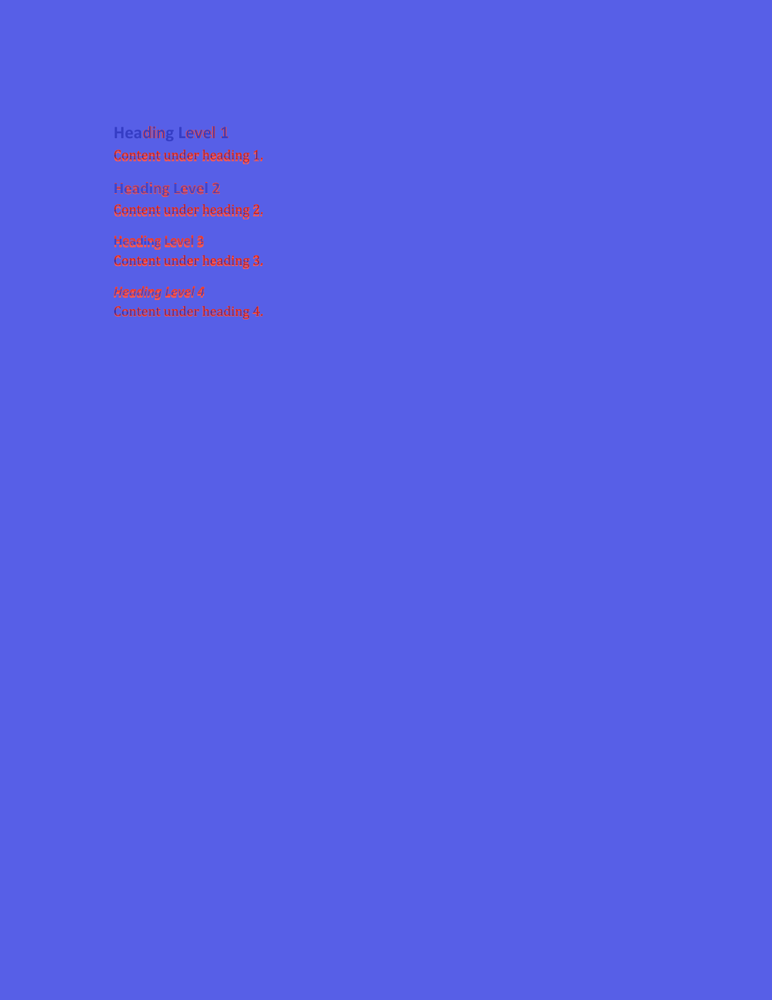</td>
  <td>changed: 12438 px (0.59%)<br>bbox: [188, 208, 434, 527]<br>mean abs RGB: 0.6337<br>RMSE RGB: 9.9936<br>threshold: 12, gain: 5.0</td>
</tr>
<tr>
  <td><b>docx_classic04_bold_italic</b><br>Page 1</td>
  <td></td>
  <td>changed: 5600 px (0.27%)<br>bbox: [188, 155, 716, 176]<br>mean abs RGB: 0.4268<br>RMSE RGB: 9.3371<br>threshold: 12, gain: 5.0</td>
</tr>
<tr>
  <td><b>docx_classic05_font_sizes</b><br>Page 1</td>
  <td>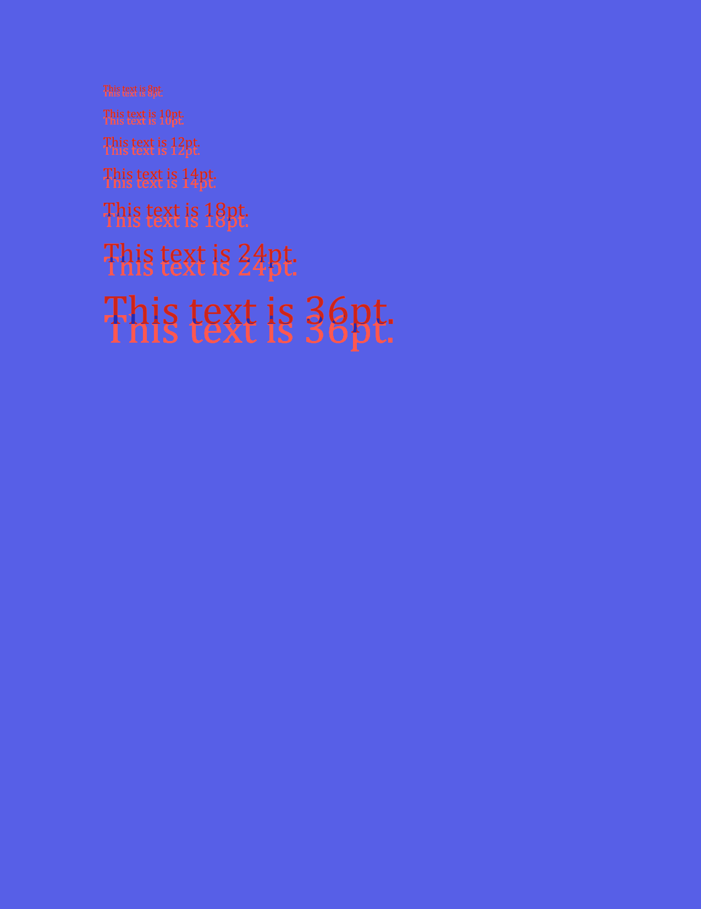</td>
  <td>changed: 32630 px (1.55%)<br>bbox: [188, 154, 715, 638]<br>mean abs RGB: 3.0128<br>RMSE RGB: 26.1814<br>threshold: 12, gain: 5.0</td>
</tr>
<tr>
  <td><b>docx_classic06_font_colors</b><br>Page 1</td>
  <td></td>
  <td>changed: 4132 px (0.20%)<br>bbox: [188, 156, 302, 386]<br>mean abs RGB: 0.1694<br>RMSE RGB: 5.1719<br>threshold: 12, gain: 5.0</td>
</tr>
<tr>
  <td><b>docx_classic07_alignment</b><br>Page 1</td>
  <td></td>
  <td>changed: 39419 px (1.87%)<br>bbox: [188, 155, 1088, 510]<br>mean abs RGB: 2.5358<br>RMSE RGB: 21.3572<br>threshold: 12, gain: 5.0</td>
</tr>
<tr>
  <td><b>docx_classic08_bullet_list</b><br>Page 1</td>
  <td></td>
  <td>changed: 3300 px (0.16%)<br>bbox: [188, 179, 347, 362]<br>mean abs RGB: 0.2302<br>RMSE RGB: 6.6203<br>threshold: 12, gain: 5.0</td>
</tr>
<tr>
  <td><b>docx_classic09_numbered_list</b><br>Page 1</td>
  <td></td>
  <td>changed: 7450 px (0.35%)<br>bbox: [188, 179, 406, 358]<br>mean abs RGB: 0.461<br>RMSE RGB: 9.0216<br>threshold: 12, gain: 5.0</td>
</tr>
<tr>
  <td><b>docx_classic10_simple_table</b><br>Page 1</td>
  <td></td>
  <td>changed: 35463 px (1.69%)<br>bbox: [175, 178, 1088, 345]<br>mean abs RGB: 2.5362<br>RMSE RGB: 21.7319<br>threshold: 12, gain: 5.0</td>
</tr>
<tr>
  <td><b>docx_classic11_table_with_shading</b><br>Page 1</td>
  <td></td>
  <td>changed: 126163 px (6.00%)<br>bbox: [175, 178, 1088, 372]<br>mean abs RGB: 5.357<br>RMSE RGB: 27.9452<br>threshold: 12, gain: 5.0</td>
</tr>
<tr>
  <td><b>docx_classic12_merged_cells_table</b><br>Page 1</td>
  <td></td>
  <td>changed: 31883 px (1.52%)<br>bbox: [175, 179, 1088, 345]<br>mean abs RGB: 2.2933<br>RMSE RGB: 20.6213<br>threshold: 12, gain: 5.0</td>
</tr>
<tr>
  <td><b>docx_classic13_long_document</b><br>Page 1</td>
  <td>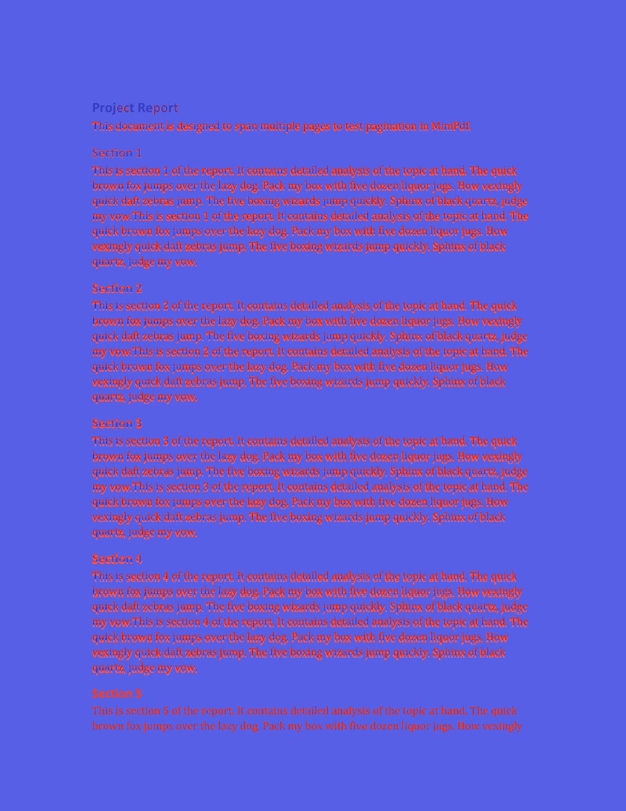</td>
  <td>changed: 221404 px (10.52%)<br>bbox: [187, 210, 1076, 1489]<br>mean abs RGB: 15.3441<br>RMSE RGB: 53.9797<br>threshold: 12, gain: 5.0</td>
</tr>
<tr>
  <td><b>docx_classic13_long_document</b><br>Page 2</td>
  <td>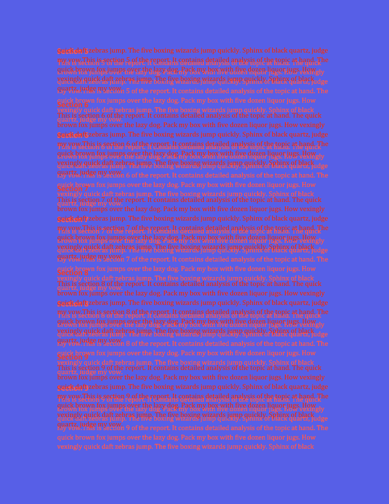</td>
  <td>changed: 313101 px (14.88%)<br>bbox: [187, 155, 1076, 1474]<br>mean abs RGB: 24.1972<br>RMSE RGB: 70.0767<br>threshold: 12, gain: 5.0</td>
</tr>
<tr>
  <td><b>docx_classic13_long_document</b><br>Page 3</td>
  <td>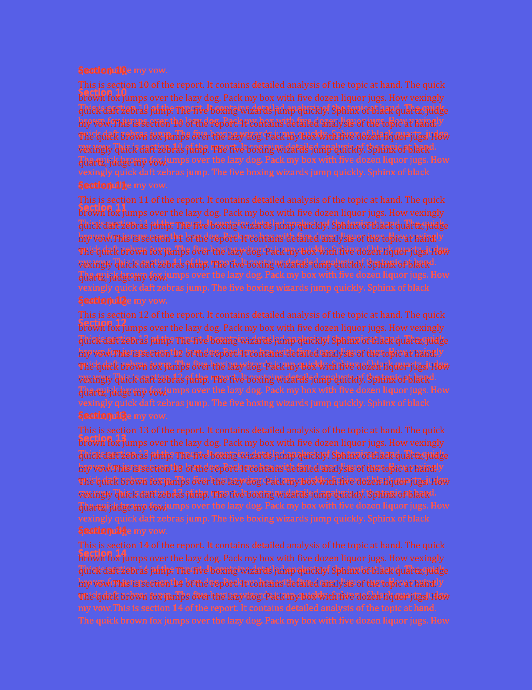</td>
  <td>changed: 294490 px (14.00%)<br>bbox: [187, 158, 1078, 1496]<br>mean abs RGB: 22.1812<br>RMSE RGB: 66.5884<br>threshold: 12, gain: 5.0</td>
</tr>
<tr>
  <td><b>docx_classic13_long_document</b><br>Page 4</td>
  <td></td>
  <td>changed: 56877 px (2.70%)<br>bbox: [187, 155, 1078, 486]<br>mean abs RGB: 3.8323<br>RMSE RGB: 26.6595<br>threshold: 12, gain: 5.0</td>
</tr>
<tr>
  <td><b>docx_classic14_mixed_content</b><br>Page 1</td>
  <td>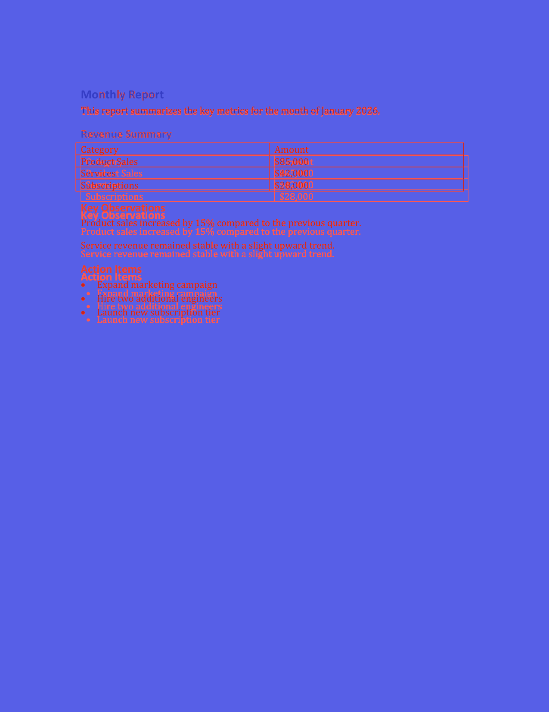</td>
  <td>changed: 64847 px (3.08%)<br>bbox: [175, 208, 1088, 753]<br>mean abs RGB: 4.4193<br>RMSE RGB: 28.5653<br>threshold: 12, gain: 5.0</td>
</tr>
<tr>
  <td><b>docx_classic15_indentation</b><br>Page 1</td>
  <td></td>
  <td>changed: 33410 px (1.59%)<br>bbox: [188, 178, 1020, 558]<br>mean abs RGB: 2.1241<br>RMSE RGB: 19.3848<br>threshold: 12, gain: 5.0</td>
</tr>
<tr>
  <td><b>docx_classic16_line_spacing</b><br>Page 1</td>
  <td></td>
  <td>changed: 33209 px (1.58%)<br>bbox: [187, 179, 1078, 726]<br>mean abs RGB: 2.0958<br>RMSE RGB: 19.2344<br>threshold: 12, gain: 5.0</td>
</tr>
<tr>
  <td><b>docx_classic17_page_break</b><br>Page 1</td>
  <td></td>
  <td>changed: 2269 px (0.11%)<br>bbox: [188, 209, 432, 271]<br>mean abs RGB: 0.14<br>RMSE RGB: 4.9837<br>threshold: 12, gain: 5.0</td>
</tr>
<tr>
  <td><b>docx_classic17_page_break</b><br>Page 2</td>
  <td></td>
  <td>changed: 4163 px (0.20%)<br>bbox: [188, 159, 642, 221]<br>mean abs RGB: 0.2673<br>RMSE RGB: 6.9513<br>threshold: 12, gain: 5.0</td>
</tr>
<tr>
  <td><b>docx_classic17_page_break</b><br>Page 3</td>
  <td></td>
  <td>changed: 2316 px (0.11%)<br>bbox: [188, 159, 441, 221]<br>mean abs RGB: 0.1441<br>RMSE RGB: 5.0611<br>threshold: 12, gain: 5.0</td>
</tr>
<tr>
  <td><b>docx_classic18_embedded_image</b><br>Page 1</td>
  <td>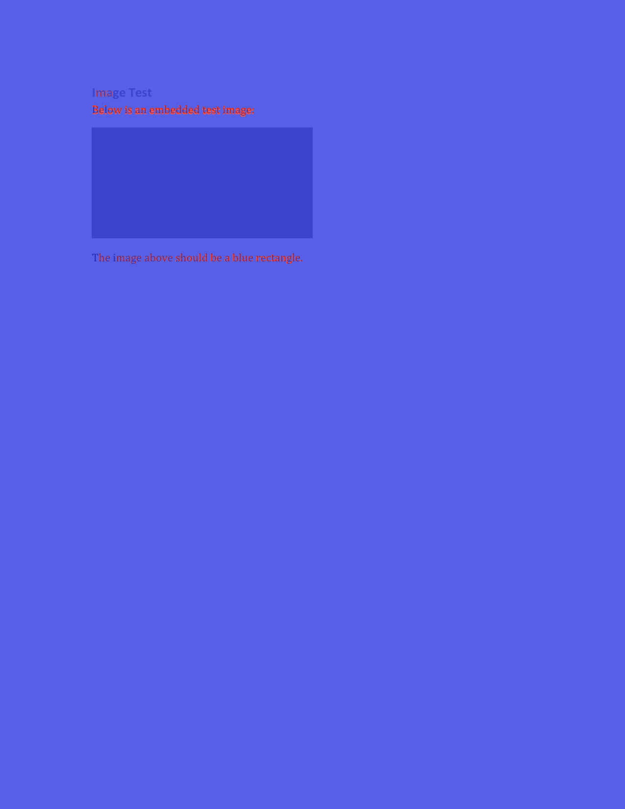</td>
  <td>changed: 4969 px (0.24%)<br>bbox: [188, 184, 617, 538]<br>mean abs RGB: 0.2485<br>RMSE RGB: 6.1306<br>threshold: 12, gain: 5.0</td>
</tr>
<tr>
  <td><b>docx_classic19_multiple_images</b><br>Page 1</td>
  <td>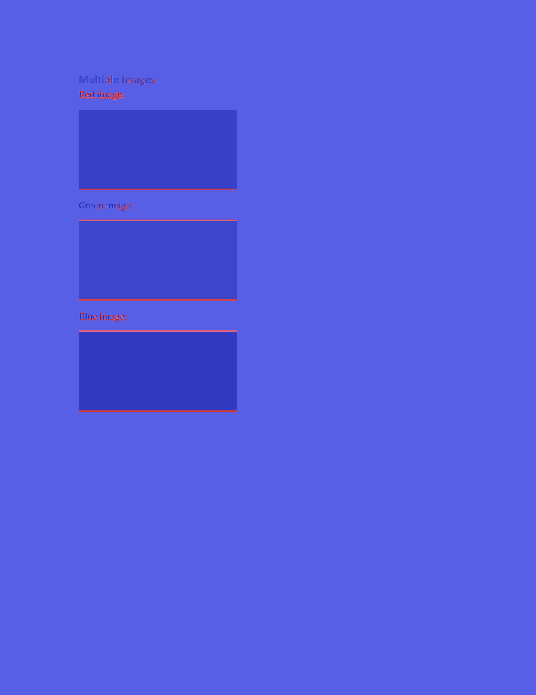</td>
  <td>changed: 7553 px (0.36%)<br>bbox: [187, 178, 563, 977]<br>mean abs RGB: 0.4911<br>RMSE RGB: 9.4212<br>threshold: 12, gain: 5.0</td>
</tr>
<tr>
  <td><b>docx_classic20_table_with_many_rows</b><br>Page 1</td>
  <td>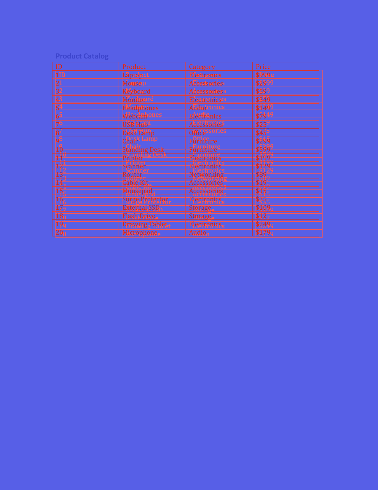</td>
  <td>changed: 143838 px (6.84%)<br>bbox: [175, 178, 1088, 801]<br>mean abs RGB: 10.5252<br>RMSE RGB: 45.2708<br>threshold: 12, gain: 5.0</td>
</tr>
<tr>
  <td><b>docx_classic21_nested_lists</b><br>Page 1</td>
  <td>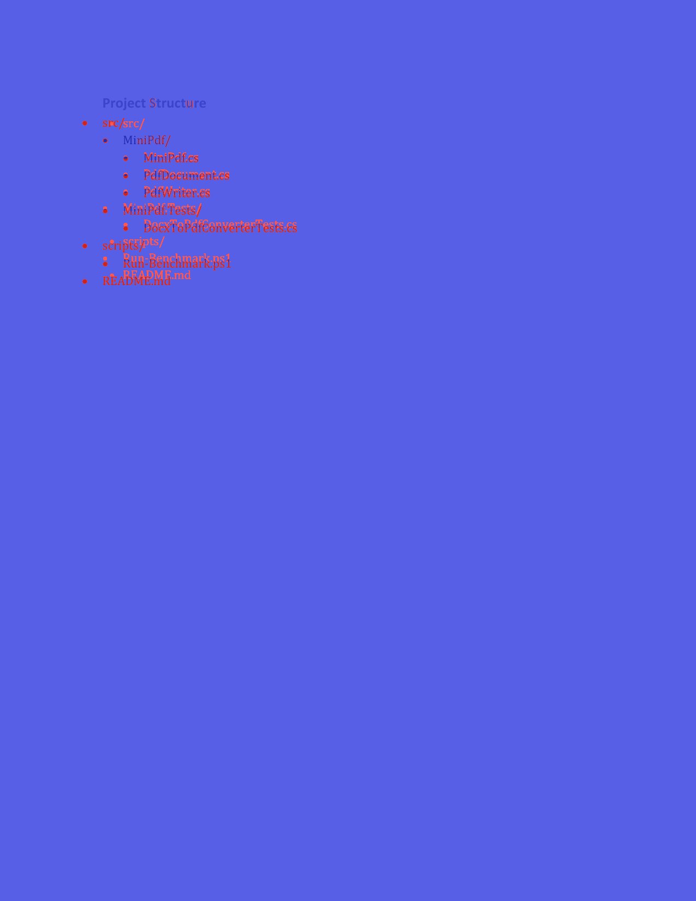</td>
  <td>changed: 14463 px (0.69%)<br>bbox: [151, 179, 544, 523]<br>mean abs RGB: 1.0335<br>RMSE RGB: 14.2588<br>threshold: 12, gain: 5.0</td>
</tr>
<tr>
  <td><b>docx_classic22_horizontal_rule</b><br>Page 1</td>
  <td>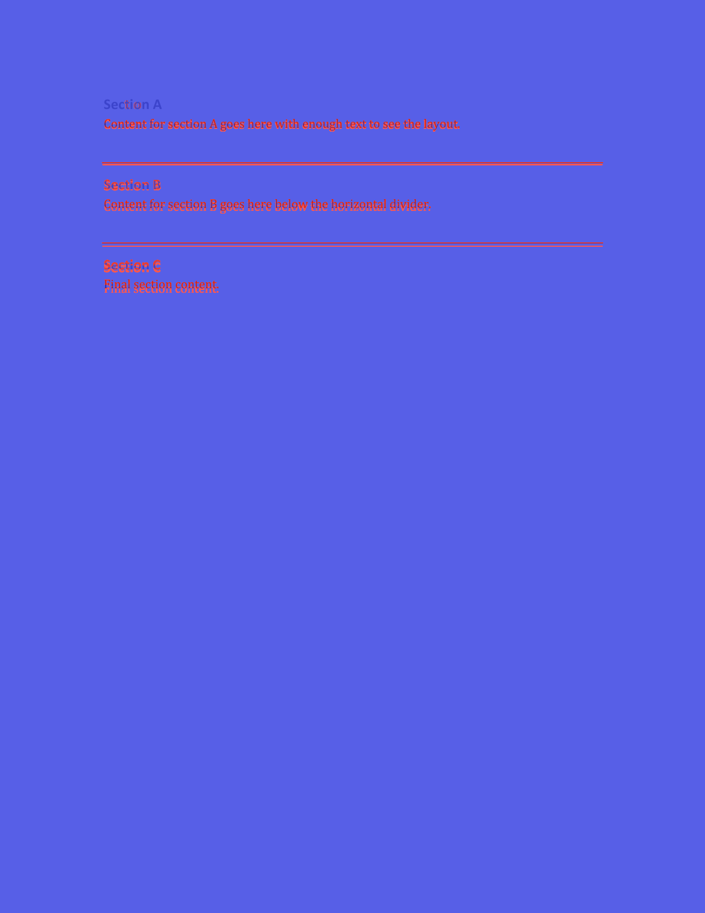</td>
  <td>changed: 23191 px (1.10%)<br>bbox: [184, 179, 1091, 530]<br>mean abs RGB: 1.6114<br>RMSE RGB: 17.4971<br>threshold: 12, gain: 5.0</td>
</tr>
<tr>
  <td><b>docx_classic23_mixed_formatting_runs</b><br>Page 1</td>
  <td></td>
  <td>changed: 6605 px (0.31%)<br>bbox: [188, 178, 707, 259]<br>mean abs RGB: 0.4859<br>RMSE RGB: 9.9316<br>threshold: 12, gain: 5.0</td>
</tr>
<tr>
  <td><b>docx_classic24_two_column_table_layout</b><br>Page 1</td>
  <td></td>
  <td>changed: 24544 px (1.17%)<br>bbox: [188, 181, 1075, 329]<br>mean abs RGB: 1.8407<br>RMSE RGB: 19.1916<br>threshold: 12, gain: 5.0</td>
</tr>
<tr>
  <td><b>docx_classic25_title_and_subtitle</b><br>Page 1</td>
  <td>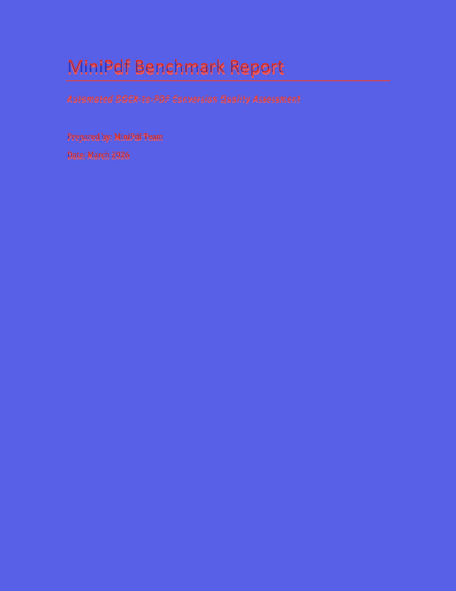</td>
  <td>changed: 22034 px (1.05%)<br>bbox: [184, 165, 1091, 446]<br>mean abs RGB: 1.2746<br>RMSE RGB: 14.4466<br>threshold: 12, gain: 5.0</td>
</tr>
<tr>
  <td><b>docx_classic25_title_and_subtitle</b><br>Page 2</td>
  <td></td>
  <td>changed: 6228 px (0.30%)<br>bbox: [188, 158, 879, 221]<br>mean abs RGB: 0.3954<br>RMSE RGB: 8.4541<br>threshold: 12, gain: 5.0</td>
</tr>
<tr>
  <td><b>docx_classic26_table_alignment</b><br>Page 1</td>
  <td></td>
  <td>changed: 29511 px (1.40%)<br>bbox: [175, 179, 1088, 345]<br>mean abs RGB: 2.1284<br>RMSE RGB: 19.9375<br>threshold: 12, gain: 5.0</td>
</tr>
<tr>
  <td><b>docx_classic27_long_paragraph_wrapping</b><br>Page 1</td>
  <td>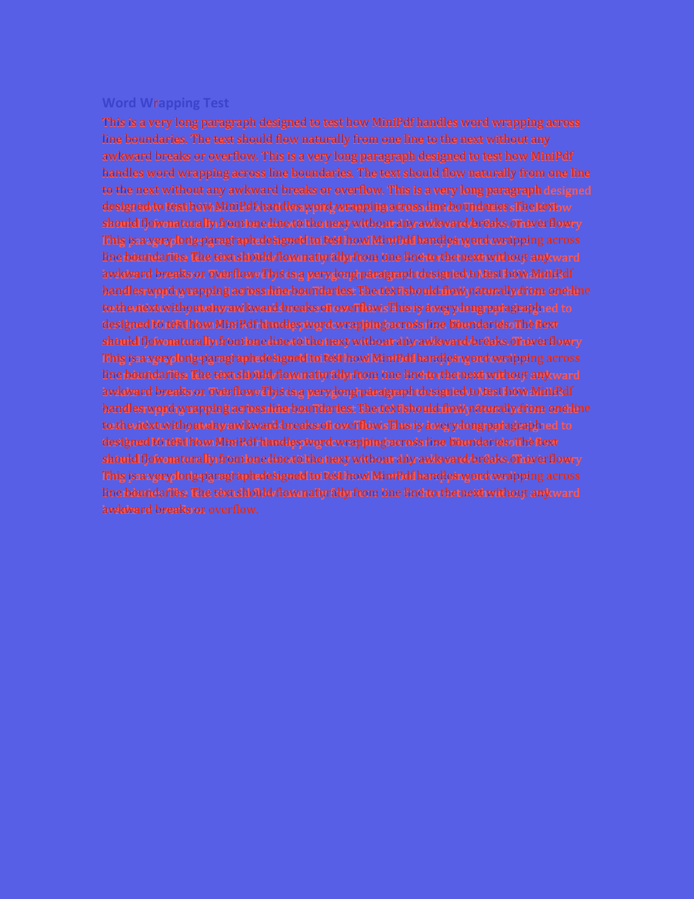</td>
  <td>changed: 184799 px (8.78%)<br>bbox: [187, 180, 1086, 944]<br>mean abs RGB: 13.117<br>RMSE RGB: 50.207<br>threshold: 12, gain: 5.0</td>
</tr>
<tr>
  <td><b>docx_classic28_special_characters</b><br>Page 1</td>
  <td></td>
  <td>changed: 13130 px (0.62%)<br>bbox: [187, 178, 724, 441]<br>mean abs RGB: 0.8318<br>RMSE RGB: 12.2157<br>threshold: 12, gain: 5.0</td>
</tr>
<tr>
  <td><b>docx_classic29_table_with_image</b><br>Page 1</td>
  <td></td>
  <td>changed: 36351 px (1.73%)<br>bbox: [175, 182, 1088, 401]<br>mean abs RGB: 2.7387<br>RMSE RGB: 22.9064<br>threshold: 12, gain: 5.0</td>
</tr>
<tr>
  <td><b>docx_classic30_comprehensive_report</b><br>Page 1</td>
  <td></td>
  <td>changed: 18980 px (0.90%)<br>bbox: [184, 165, 1091, 292]<br>mean abs RGB: 1.2196<br>RMSE RGB: 14.4403<br>threshold: 12, gain: 5.0</td>
</tr>
<tr>
  <td><b>docx_classic30_comprehensive_report</b><br>Page 2</td>
  <td>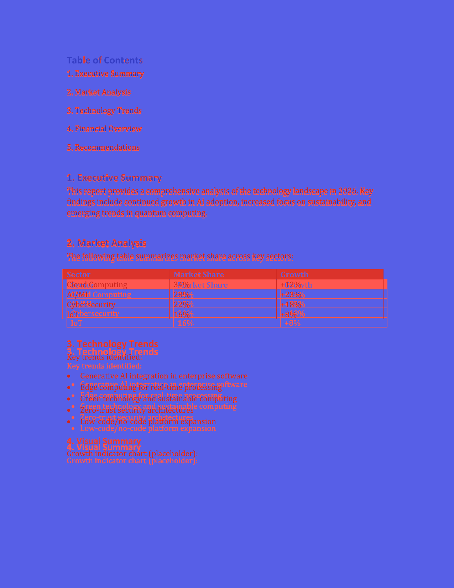</td>
  <td>changed: 149863 px (7.12%)<br>bbox: [175, 158, 1088, 1305]<br>mean abs RGB: 10.6891<br>RMSE RGB: 44.49<br>threshold: 12, gain: 5.0</td>
</tr>
<tr>
  <td><b>docx_classic30_comprehensive_report</b><br>Page 3</td>
  <td>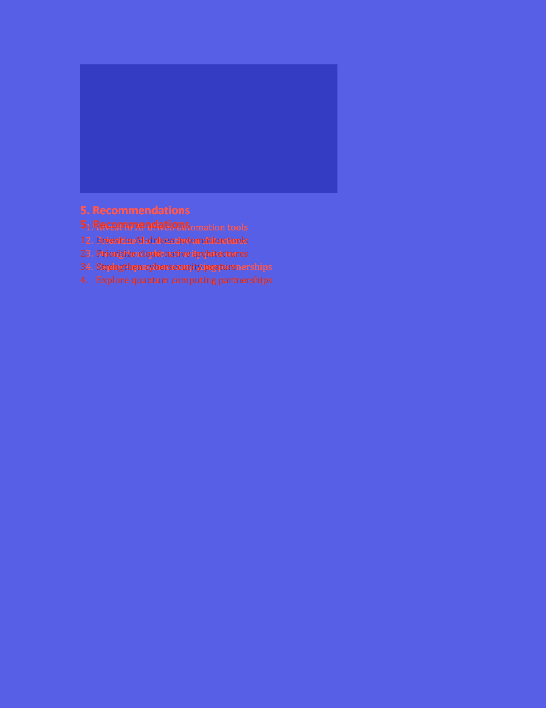</td>
  <td>changed: 19764 px (0.94%)<br>bbox: [188, 479, 635, 665]<br>mean abs RGB: 1.3815<br>RMSE RGB: 16.1445<br>threshold: 12, gain: 5.0</td>
</tr>
<tr>
  <td><b>docx_classic31_product_card_with_image</b><br>Page 1</td>
  <td>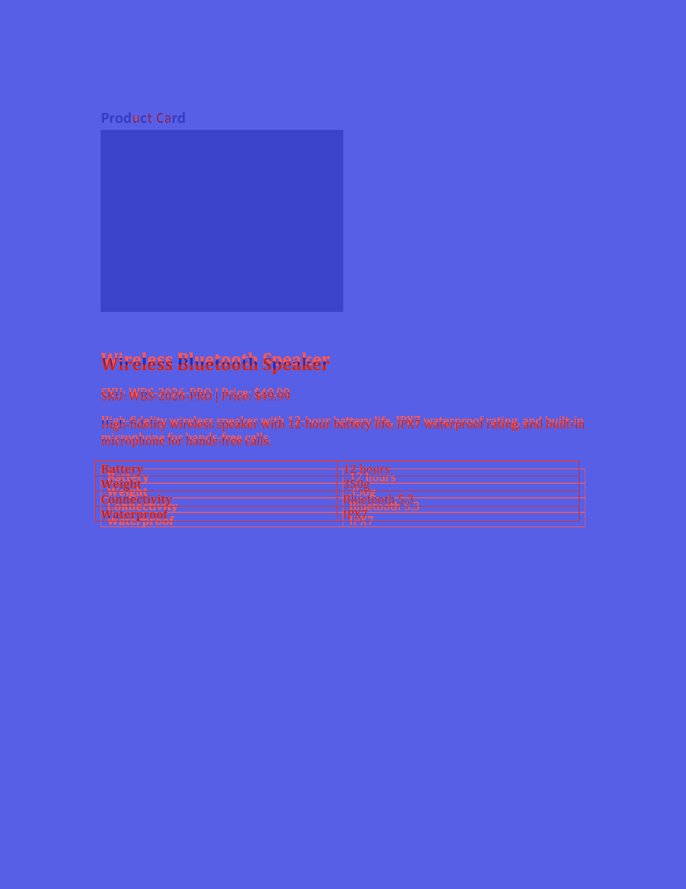</td>
  <td>changed: 51093 px (2.43%)<br>bbox: [175, 208, 1088, 979]<br>mean abs RGB: 3.7924<br>RMSE RGB: 27.7984<br>threshold: 12, gain: 5.0</td>
</tr>
<tr>
  <td><b>docx_classic31_strikethrough_text</b><br>Page 1</td>
  <td>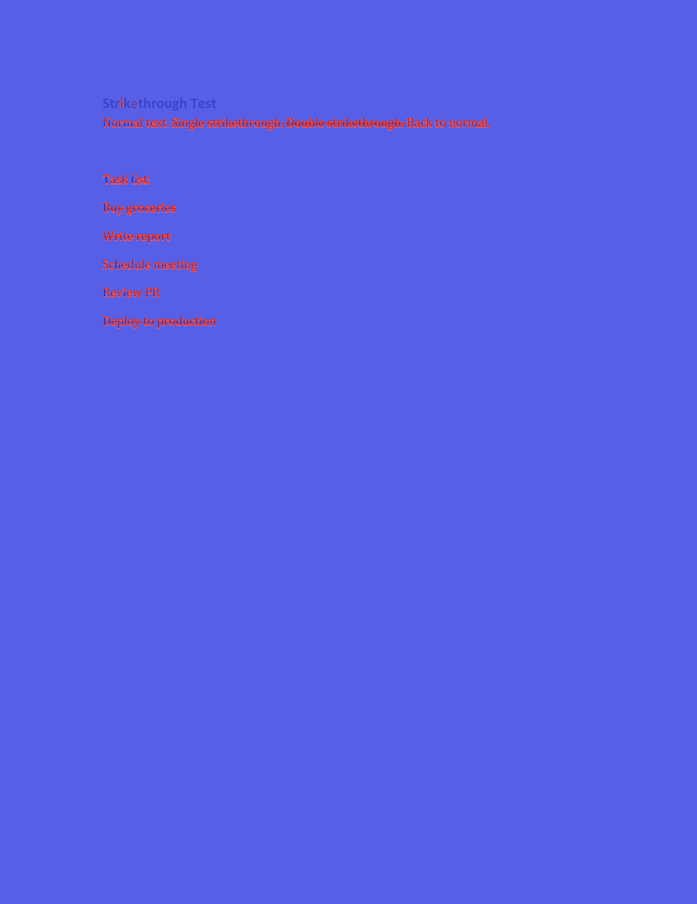</td>
  <td>changed: 13775 px (0.65%)<br>bbox: [187, 179, 895, 600]<br>mean abs RGB: 0.8952<br>RMSE RGB: 12.6567<br>threshold: 12, gain: 5.0</td>
</tr>
<tr>
  <td><b>docx_classic32_company_logo_header</b><br>Page 1</td>
  <td>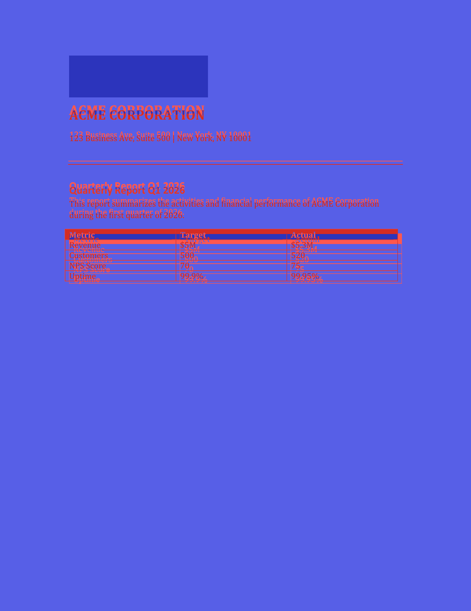</td>
  <td>changed: 83361 px (3.96%)<br>bbox: [175, 284, 1091, 767]<br>mean abs RGB: 6.3437<br>RMSE RGB: 35.1601<br>threshold: 12, gain: 5.0</td>
</tr>
<tr>
  <td><b>docx_classic32_superscript_subscript</b><br>Page 1</td>
  <td></td>
  <td>changed: 8321 px (0.40%)<br>bbox: [187, 178, 474, 445]<br>mean abs RGB: 0.5871<br>RMSE RGB: 10.6953<br>threshold: 12, gain: 5.0</td>
</tr>
<tr>
  <td><b>docx_classic33_highlighted_text</b><br>Page 1</td>
  <td>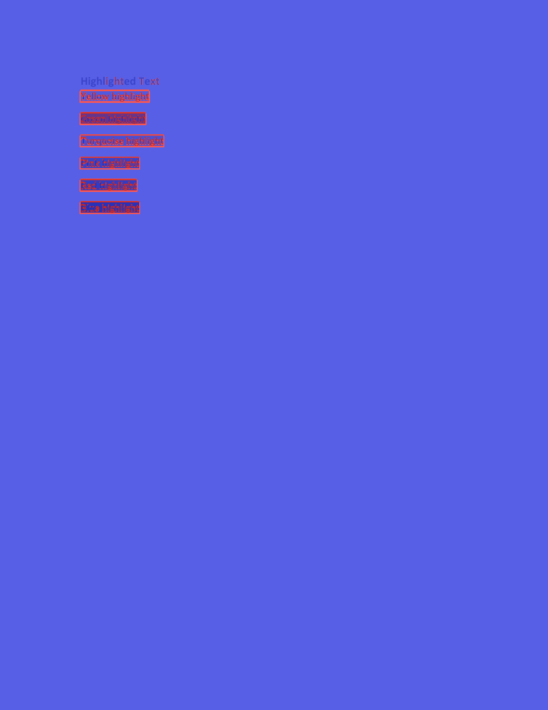</td>
  <td>changed: 17814 px (0.85%)<br>bbox: [185, 178, 383, 498]<br>mean abs RGB: 0.6122<br>RMSE RGB: 10.8302<br>threshold: 12, gain: 5.0</td>
</tr>
<tr>
  <td><b>docx_classic33_two_products_side_by_side</b><br>Page 1</td>
  <td>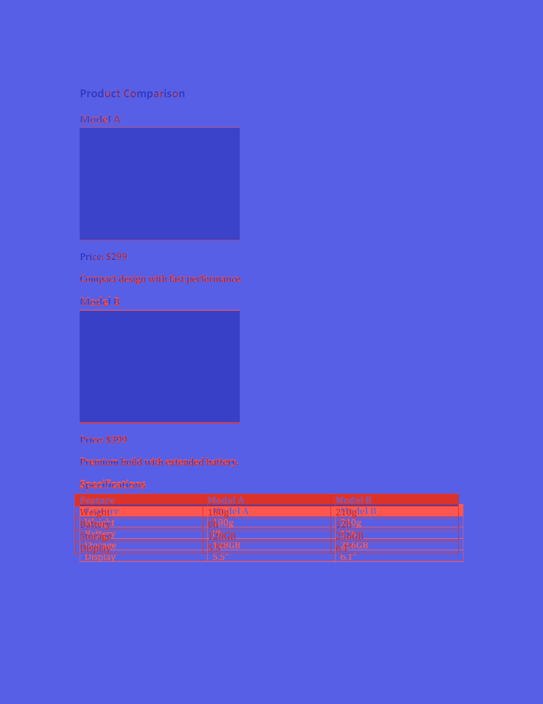</td>
  <td>changed: 78898 px (3.75%)<br>bbox: [175, 208, 1088, 1317]<br>mean abs RGB: 5.2743<br>RMSE RGB: 30.1512<br>threshold: 12, gain: 5.0</td>
</tr>
<tr>
  <td><b>docx_classic34_employee_directory_with_photo</b><br>Page 1</td>
  <td>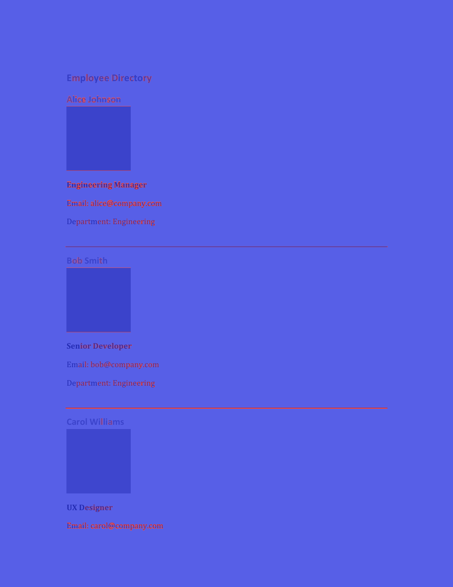</td>
  <td>changed: 16389 px (0.78%)<br>bbox: [184, 208, 1091, 1491]<br>mean abs RGB: 0.6746<br>RMSE RGB: 9.2068<br>threshold: 12, gain: 5.0</td>
</tr>
<tr>
  <td><b>docx_classic34_employee_directory_with_photo</b><br>Page 2</td>
  <td></td>
  <td>changed: 5388 px (0.26%)<br>bbox: [184, 156, 1091, 240]<br>mean abs RGB: 0.4435<br>RMSE RGB: 9.5341<br>threshold: 12, gain: 5.0</td>
</tr>
<tr>
  <td><b>docx_classic34_paragraph_borders</b><br>Page 1</td>
  <td>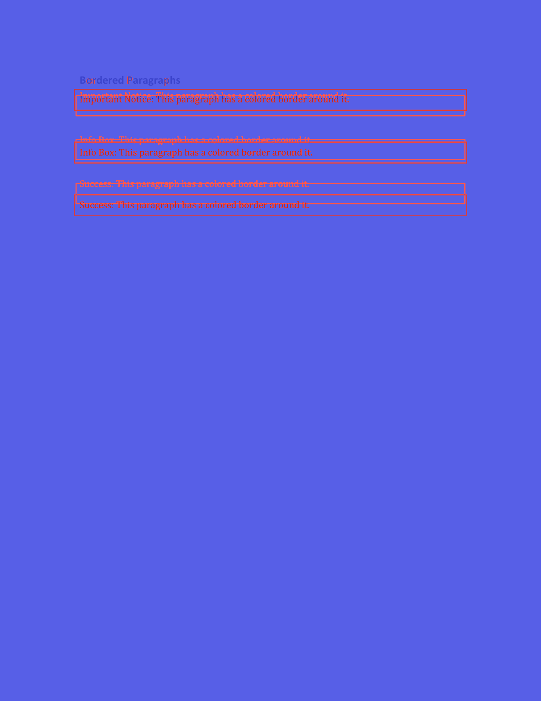</td>
  <td>changed: 48643 px (2.31%)<br>bbox: [174, 179, 1101, 509]<br>mean abs RGB: 3.0758<br>RMSE RGB: 24.1688<br>threshold: 12, gain: 5.0</td>
</tr>
<tr>
  <td><b>docx_classic35_inventory_with_product_photos</b><br>Page 1</td>
  <td>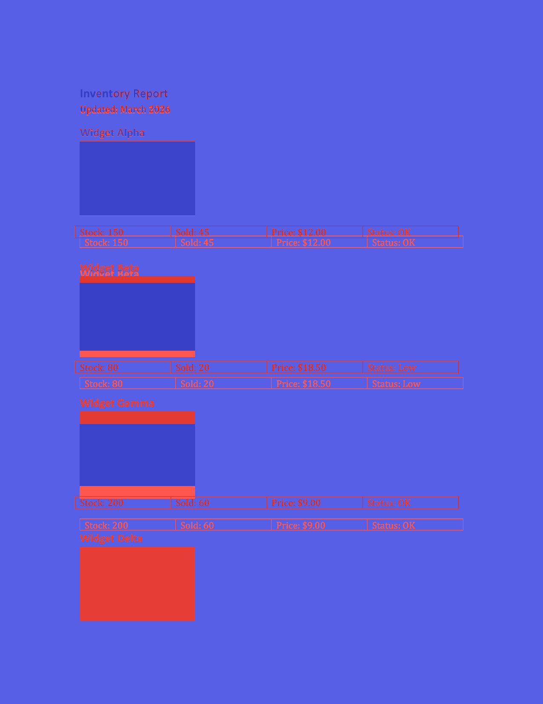</td>
  <td>changed: 119352 px (5.67%)<br>bbox: [175, 209, 1088, 1456]<br>mean abs RGB: 7.8799<br>RMSE RGB: 36.5045<br>threshold: 12, gain: 5.0</td>
</tr>
<tr>
  <td><b>docx_classic35_inventory_with_product_photos</b><br>Page 2</td>
  <td></td>
  <td>changed: 57551 px (2.74%)<br>bbox: [175, 149, 1088, 374]<br>mean abs RGB: 3.8508<br>RMSE RGB: 25.3401<br>threshold: 12, gain: 5.0</td>
</tr>
<tr>
  <td><b>docx_classic35_tab_stops</b><br>Page 1</td>
  <td></td>
  <td>changed: 25994 px (1.24%)<br>bbox: [188, 179, 1187, 445]<br>mean abs RGB: 1.9437<br>RMSE RGB: 19.5134<br>threshold: 12, gain: 5.0</td>
</tr>
<tr>
  <td><b>docx_classic36_invoice_with_logo</b><br>Page 1</td>
  <td>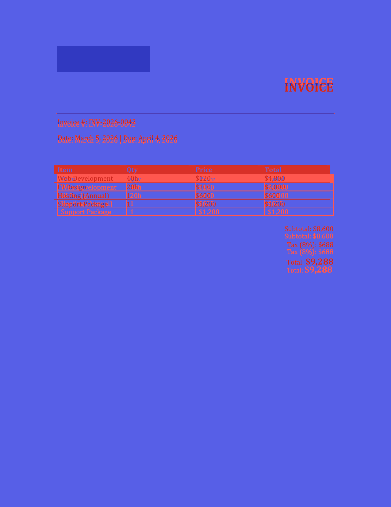</td>
  <td>changed: 95561 px (4.54%)<br>bbox: [175, 252, 1091, 891]<br>mean abs RGB: 7.448<br>RMSE RGB: 38.7171<br>threshold: 12, gain: 5.0</td>
</tr>
<tr>
  <td><b>docx_classic36_wide_table</b><br>Page 1</td>
  <td>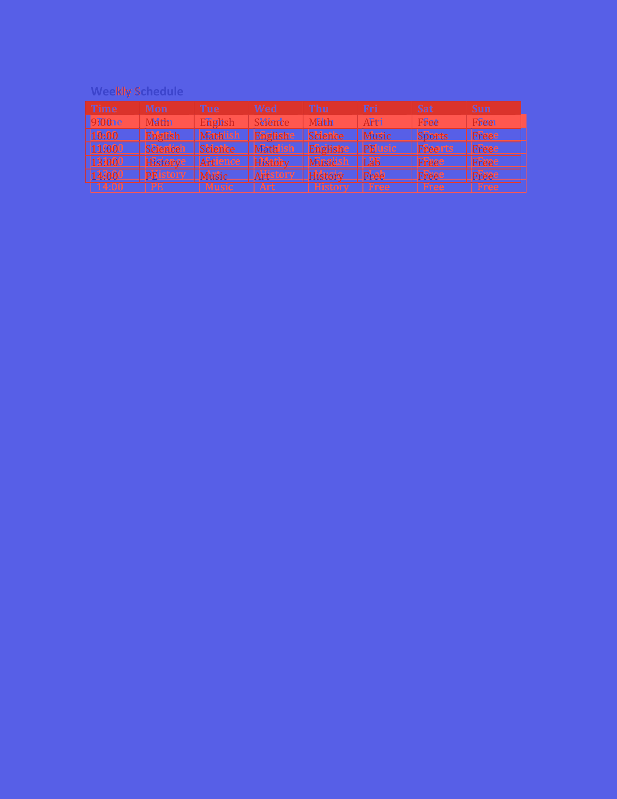</td>
  <td>changed: 92124 px (4.38%)<br>bbox: [175, 178, 1088, 398]<br>mean abs RGB: 6.5889<br>RMSE RGB: 34.364<br>threshold: 12, gain: 5.0</td>
</tr>
<tr>
  <td><b>docx_classic37_nested_table</b><br>Page 1</td>
  <td></td>
  <td>changed: 28316 px (1.35%)<br>bbox: [175, 180, 1088, 398]<br>mean abs RGB: 1.9555<br>RMSE RGB: 18.8141<br>threshold: 12, gain: 5.0</td>
</tr>
<tr>
  <td><b>docx_classic37_real_estate_listing</b><br>Page 1</td>
  <td>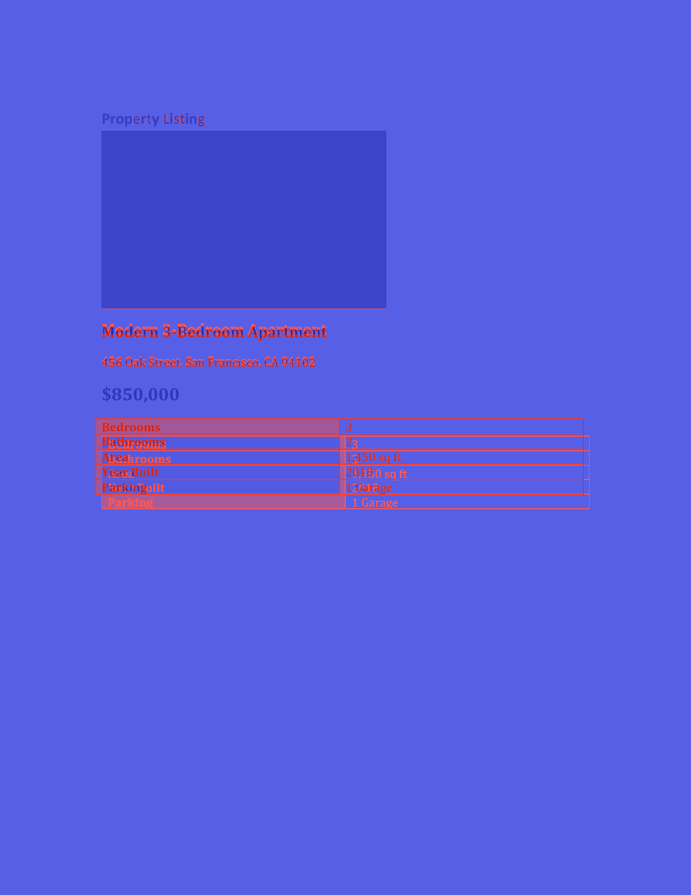</td>
  <td>changed: 62901 px (2.99%)<br>bbox: [175, 208, 1088, 939]<br>mean abs RGB: 2.9753<br>RMSE RGB: 21.9271<br>threshold: 12, gain: 5.0</td>
</tr>
<tr>
  <td><b>docx_classic38_restaurant_menu_with_photos</b><br>Page 1</td>
  <td>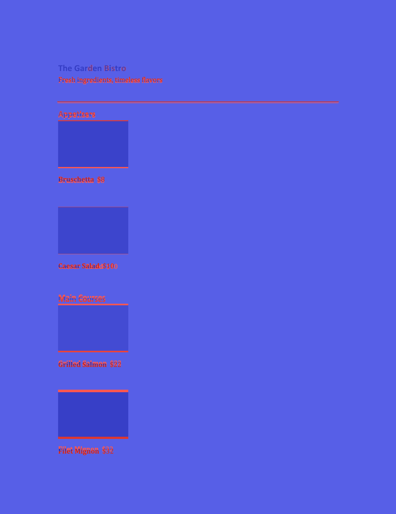</td>
  <td>changed: 25559 px (1.21%)<br>bbox: [184, 208, 1091, 1461]<br>mean abs RGB: 1.7822<br>RMSE RGB: 18.0811<br>threshold: 12, gain: 5.0</td>
</tr>
<tr>
  <td><b>docx_classic38_restaurant_menu_with_photos</b><br>Page 2</td>
  <td>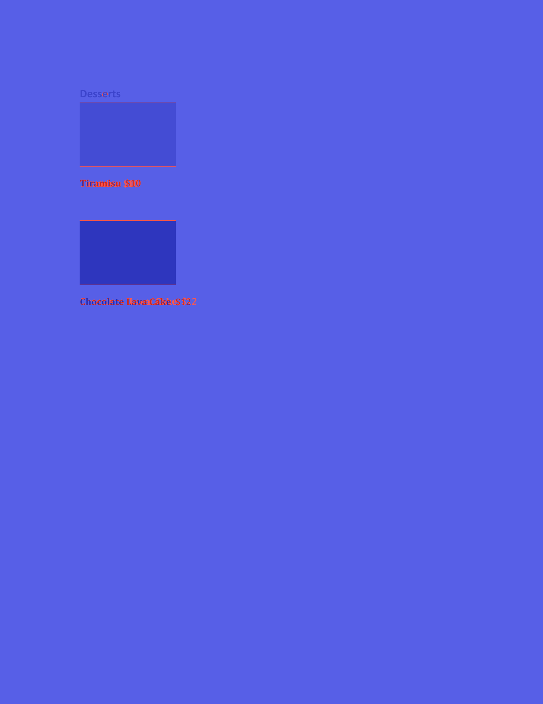</td>
  <td>changed: 4914 px (0.23%)<br>bbox: [187, 212, 461, 717]<br>mean abs RGB: 0.3593<br>RMSE RGB: 8.3999<br>threshold: 12, gain: 5.0</td>
</tr>
<tr>
  <td><b>docx_classic38_table_column_widths</b><br>Page 1</td>
  <td>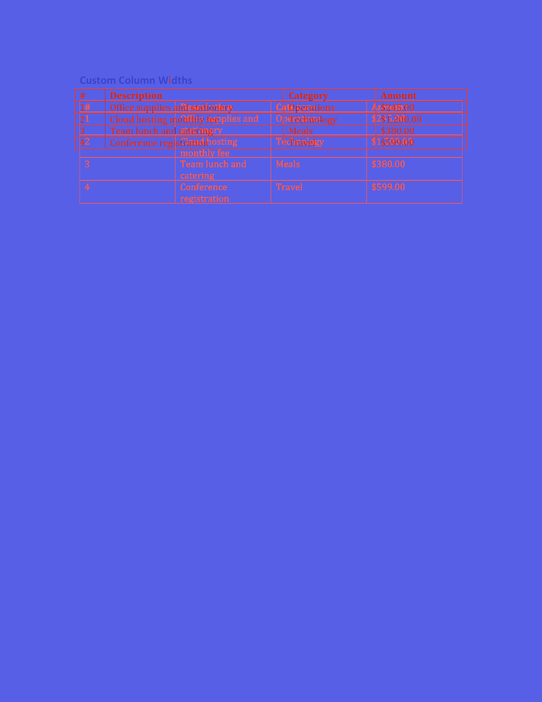</td>
  <td>changed: 49883 px (2.37%)<br>bbox: [175, 179, 1100, 479]<br>mean abs RGB: 3.6946<br>RMSE RGB: 26.6806<br>threshold: 12, gain: 5.0</td>
</tr>
<tr>
  <td><b>docx_classic39_cover_page_with_image</b><br>Page 1</td>
  <td>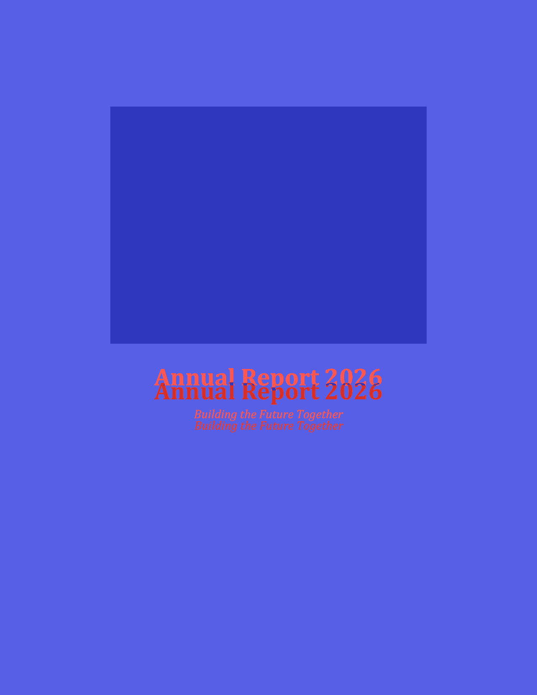</td>
  <td>changed: 22778 px (1.08%)<br>bbox: [365, 874, 906, 1027]<br>mean abs RGB: 1.6111<br>RMSE RGB: 16.7233<br>threshold: 12, gain: 5.0</td>
</tr>
<tr>
  <td><b>docx_classic39_cover_page_with_image</b><br>Page 2</td>
  <td></td>
  <td>changed: 7308 px (0.35%)<br>bbox: [188, 158, 405, 376]<br>mean abs RGB: 0.4666<br>RMSE RGB: 9.1682<br>threshold: 12, gain: 5.0</td>
</tr>
<tr>
  <td><b>docx_classic39_financial_report</b><br>Page 1</td>
  <td>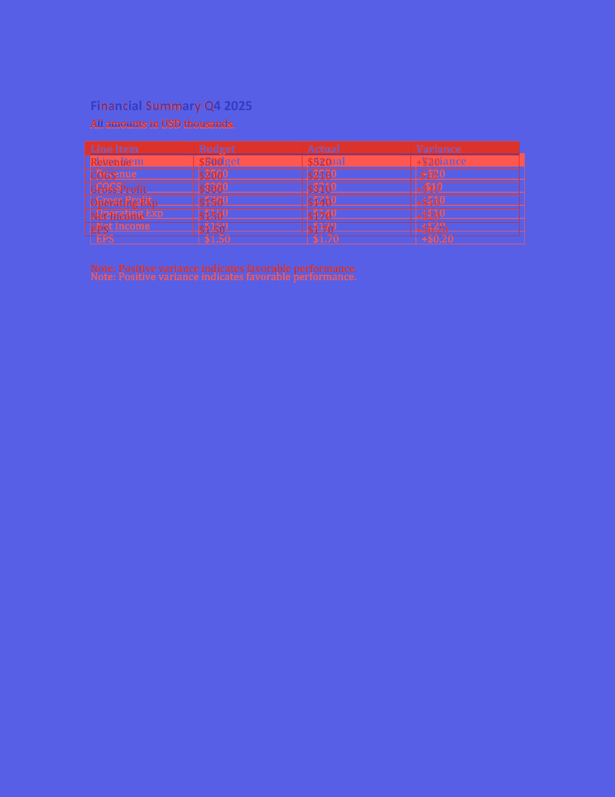</td>
  <td>changed: 91865 px (4.37%)<br>bbox: [175, 208, 1088, 585]<br>mean abs RGB: 6.5554<br>RMSE RGB: 34.7674<br>threshold: 12, gain: 5.0</td>
</tr>
<tr>
  <td><b>docx_classic40_product_catalog_with_images</b><br>Page 1</td>
  <td>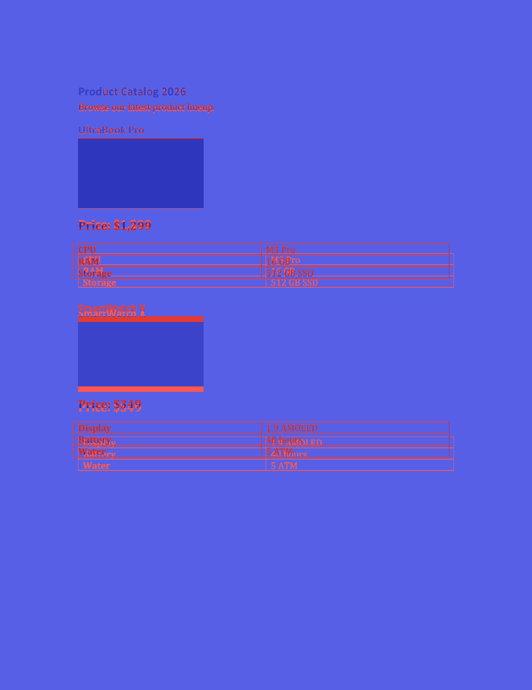</td>
  <td>changed: 61904 px (2.94%)<br>bbox: [175, 208, 1088, 1126]<br>mean abs RGB: 4.2615<br>RMSE RGB: 27.6516<br>threshold: 12, gain: 5.0</td>
</tr>
<tr>
  <td><b>docx_classic40_resume</b><br>Page 1</td>
  <td>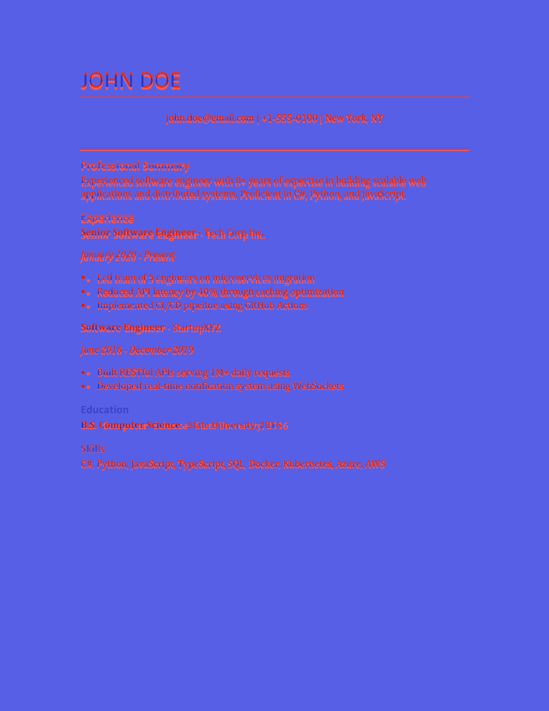</td>
  <td>changed: 86586 px (4.12%)<br>bbox: [184, 167, 1091, 1092]<br>mean abs RGB: 6.041<br>RMSE RGB: 34.0122<br>threshold: 12, gain: 5.0</td>
</tr>
<tr>
  <td><b>docx_classic41_business_letter</b><br>Page 1</td>
  <td>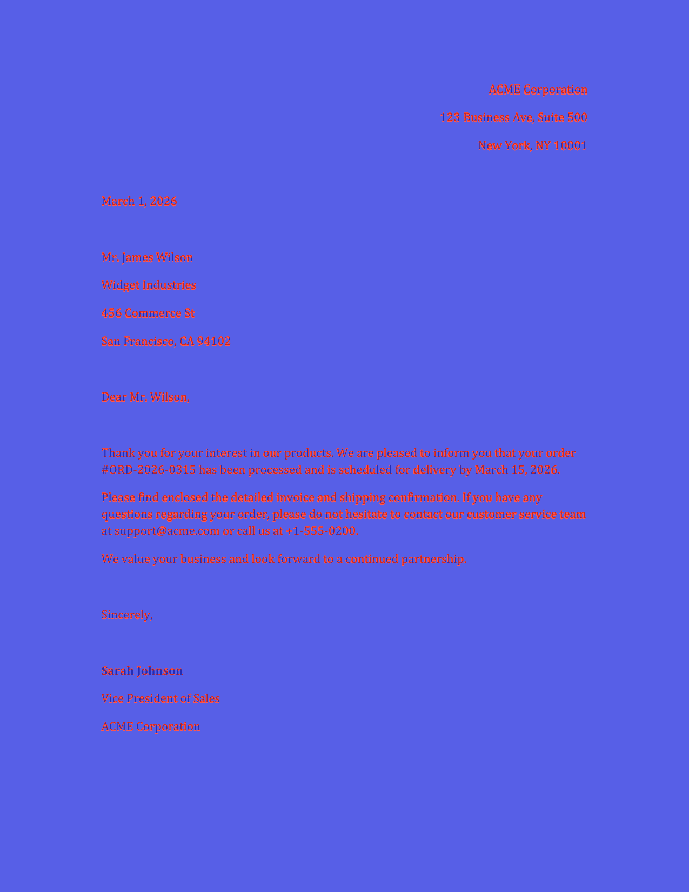</td>
  <td>changed: 52101 px (2.48%)<br>bbox: [187, 156, 1087, 1357]<br>mean abs RGB: 3.1171<br>RMSE RGB: 23.0053<br>threshold: 12, gain: 5.0</td>
</tr>
<tr>
  <td><b>docx_classic41_newsletter_with_hero_image</b><br>Page 1</td>
  <td>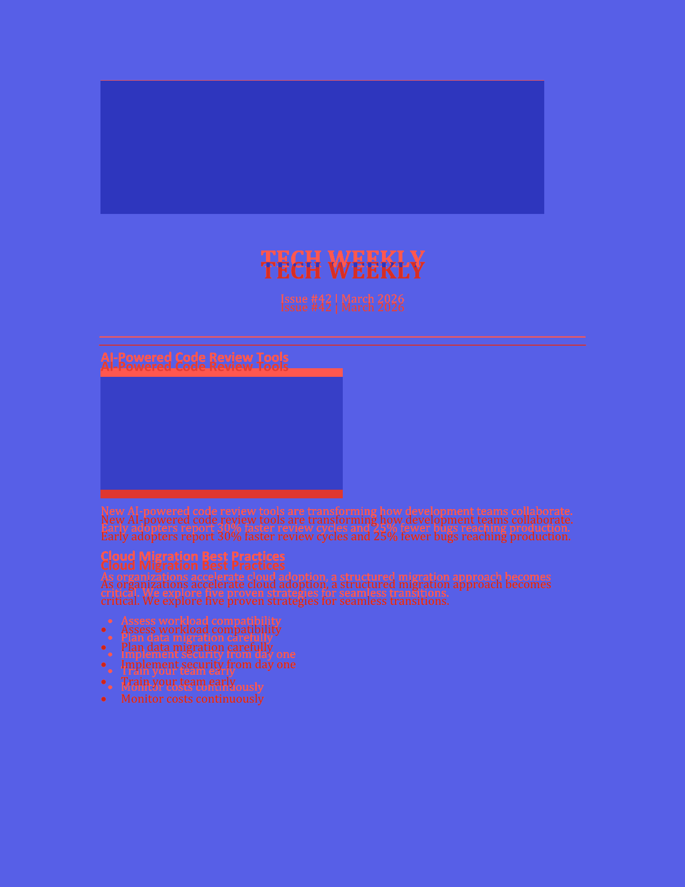</td>
  <td>changed: 97382 px (4.63%)<br>bbox: [184, 149, 1091, 1312]<br>mean abs RGB: 7.1751<br>RMSE RGB: 36.9597<br>threshold: 12, gain: 5.0</td>
</tr>
<tr>
  <td><b>docx_classic42_chart_image_with_data</b><br>Page 1</td>
  <td>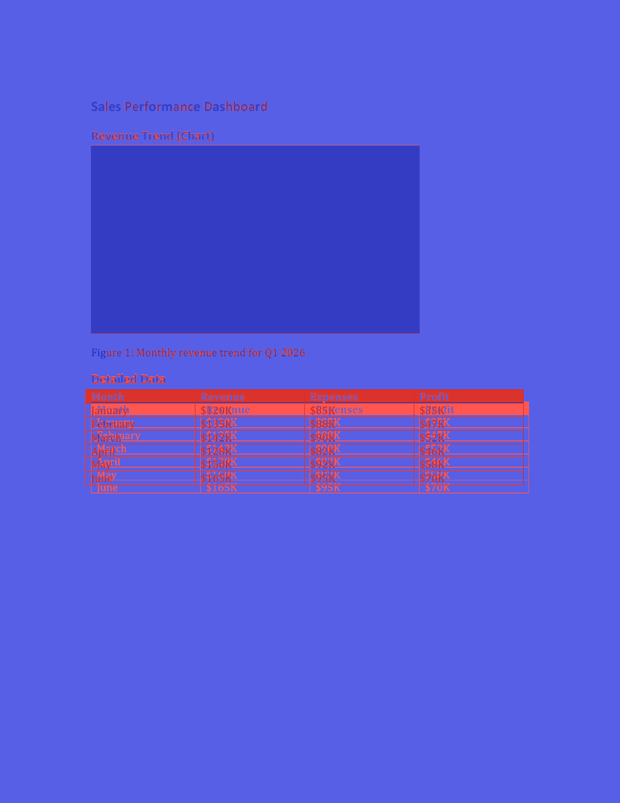</td>
  <td>changed: 89708 px (4.26%)<br>bbox: [175, 208, 1088, 1014]<br>mean abs RGB: 6.2889<br>RMSE RGB: 33.6883<br>threshold: 12, gain: 5.0</td>
</tr>
<tr>
  <td><b>docx_classic42_meeting_minutes</b><br>Page 1</td>
  <td>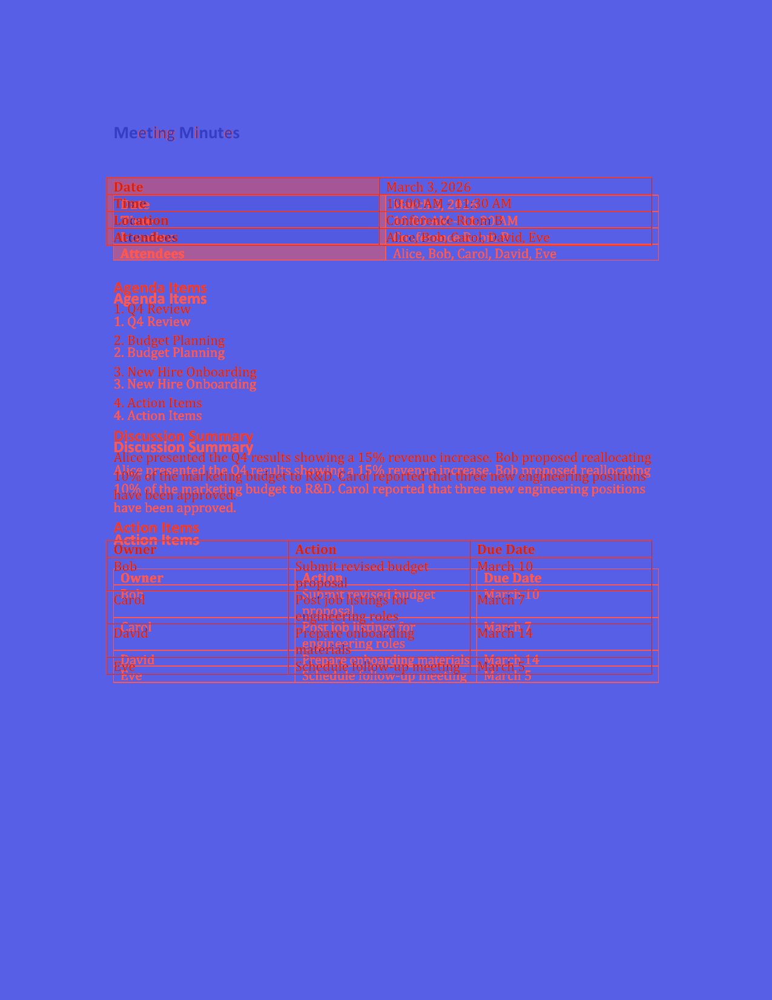</td>
  <td>changed: 139303 px (6.62%)<br>bbox: [175, 208, 1088, 1127]<br>mean abs RGB: 8.5709<br>RMSE RGB: 40.0705<br>threshold: 12, gain: 5.0</td>
</tr>
<tr>
  <td><b>docx_classic43_event_flyer_with_banner</b><br>Page 1</td>
  <td>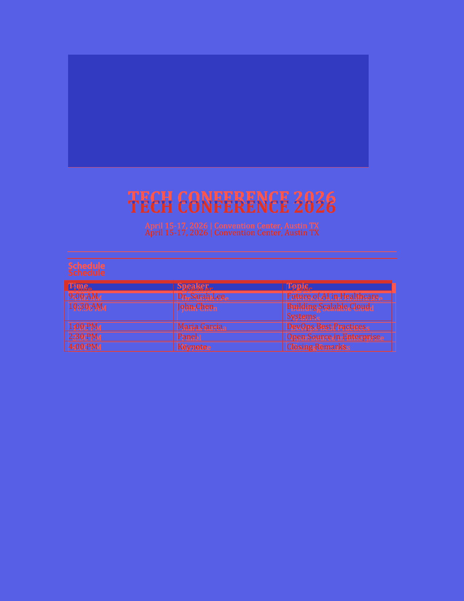</td>
  <td>changed: 88252 px (4.20%)<br>bbox: [175, 459, 1091, 966]<br>mean abs RGB: 6.1805<br>RMSE RGB: 33.9139<br>threshold: 12, gain: 5.0</td>
</tr>
<tr>
  <td><b>docx_classic43_invoice_document</b><br>Page 1</td>
  <td>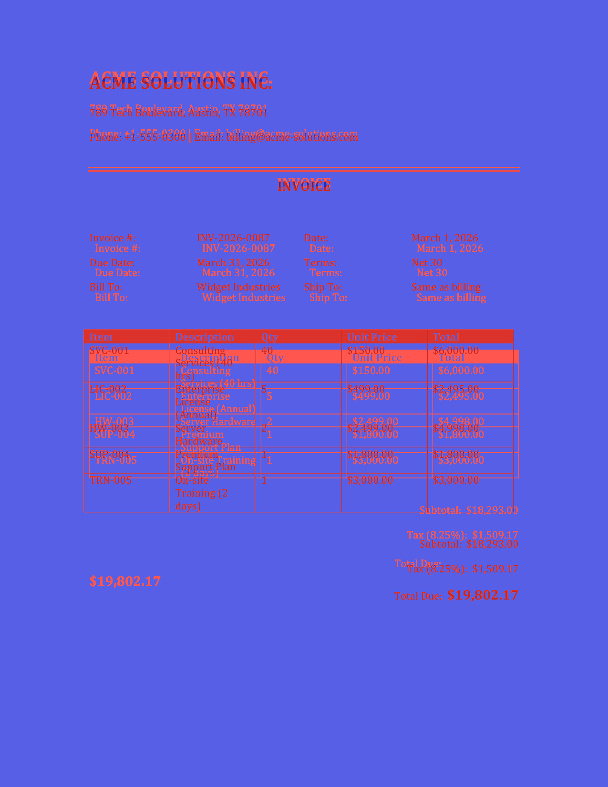</td>
  <td>changed: 152219 px (7.24%)<br>bbox: [175, 149, 1091, 1261]<br>mean abs RGB: 11.5071<br>RMSE RGB: 47.283<br>threshold: 12, gain: 5.0</td>
</tr>
<tr>
  <td><b>docx_classic44_dashboard_with_kpi_image</b><br>Page 1</td>
  <td>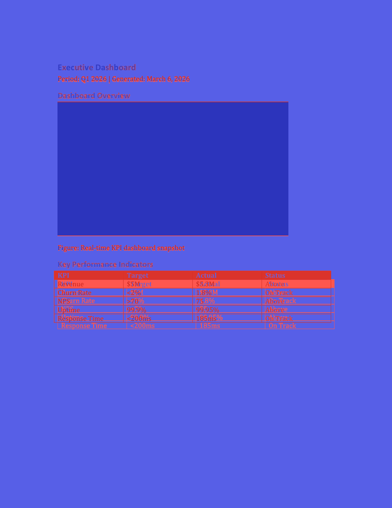</td>
  <td>changed: 97011 px (4.61%)<br>bbox: [175, 208, 1088, 1070]<br>mean abs RGB: 6.8642<br>RMSE RGB: 35.2227<br>threshold: 12, gain: 5.0</td>
</tr>
<tr>
  <td><b>docx_classic44_memo</b><br>Page 1</td>
  <td>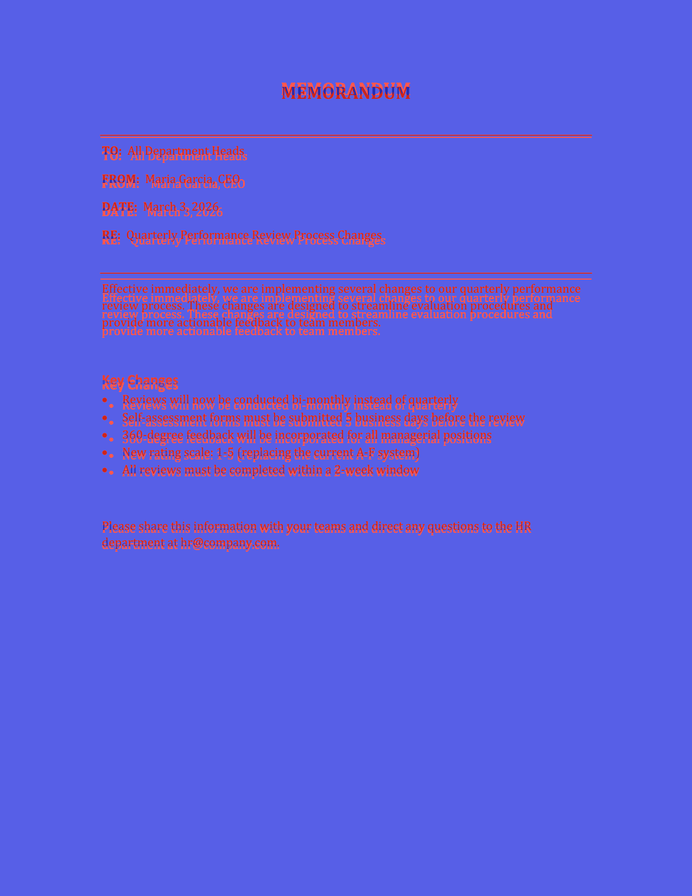</td>
  <td>changed: 98957 px (4.70%)<br>bbox: [184, 152, 1091, 1016]<br>mean abs RGB: 7.5054<br>RMSE RGB: 38.8454<br>threshold: 12, gain: 5.0</td>
</tr>
<tr>
  <td><b>docx_classic45_certificate_with_seal</b><br>Page 1</td>
  <td>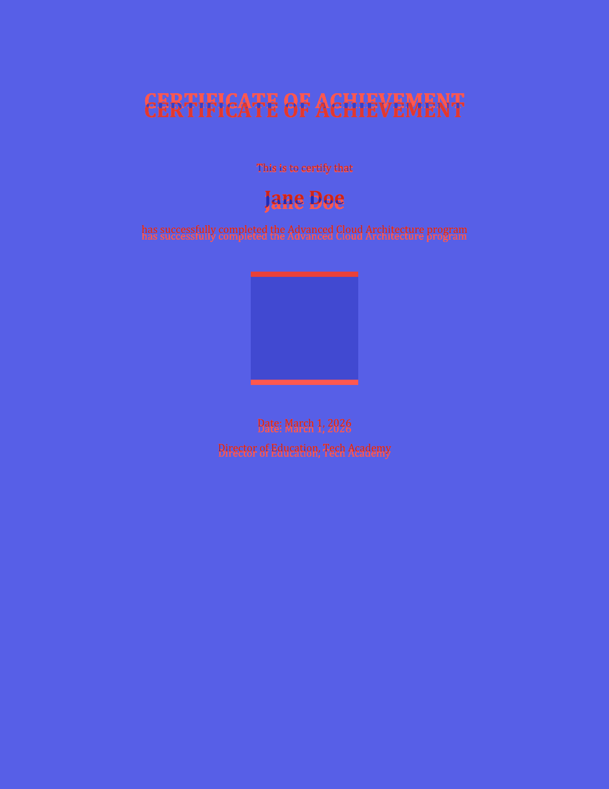</td>
  <td>changed: 39871 px (1.90%)<br>bbox: [297, 195, 978, 960]<br>mean abs RGB: 2.8887<br>RMSE RGB: 23.4173<br>threshold: 12, gain: 5.0</td>
</tr>
<tr>
  <td><b>docx_classic45_project_plan</b><br>Page 1</td>
  <td>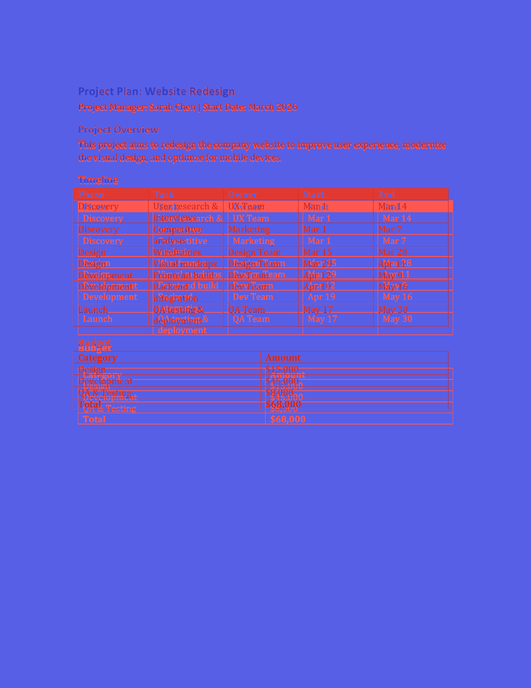</td>
  <td>changed: 174653 px (8.30%)<br>bbox: [175, 208, 1088, 1018]<br>mean abs RGB: 11.9877<br>RMSE RGB: 47.1257<br>threshold: 12, gain: 5.0</td>
</tr>
<tr>
  <td><b>docx_classic46_comparison_table</b><br>Page 1</td>
  <td>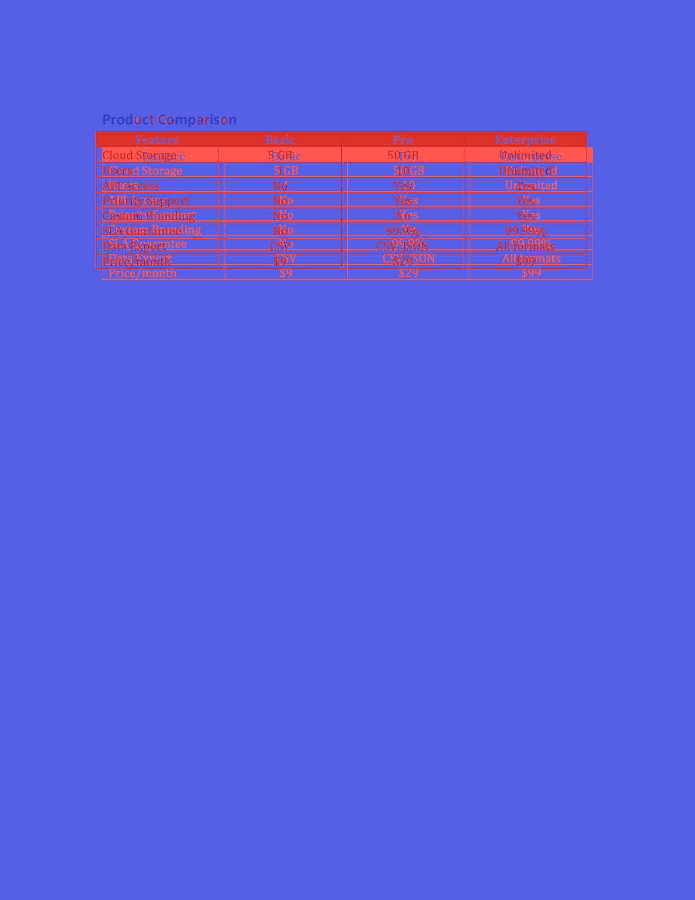</td>
  <td>changed: 101042 px (4.80%)<br>bbox: [175, 208, 1088, 513]<br>mean abs RGB: 7.4521<br>RMSE RGB: 36.8067<br>threshold: 12, gain: 5.0</td>
</tr>
<tr>
  <td><b>docx_classic46_product_image_grid</b><br>Page 1</td>
  <td>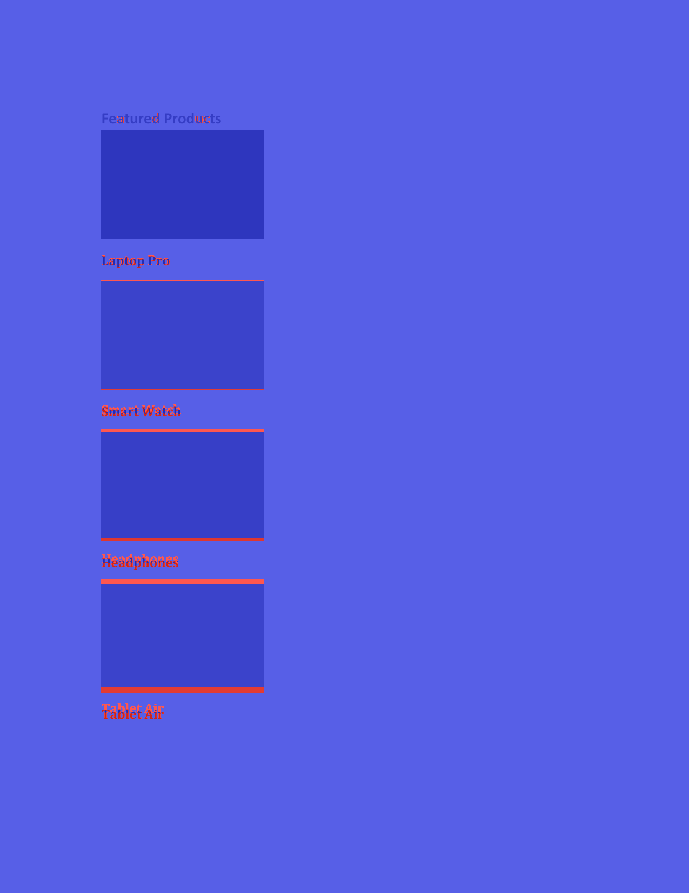</td>
  <td>changed: 18200 px (0.87%)<br>bbox: [187, 208, 488, 1329]<br>mean abs RGB: 1.3535<br>RMSE RGB: 15.8765<br>threshold: 12, gain: 5.0</td>
</tr>
<tr>
  <td><b>docx_classic47_data_dictionary</b><br>Page 1</td>
  <td>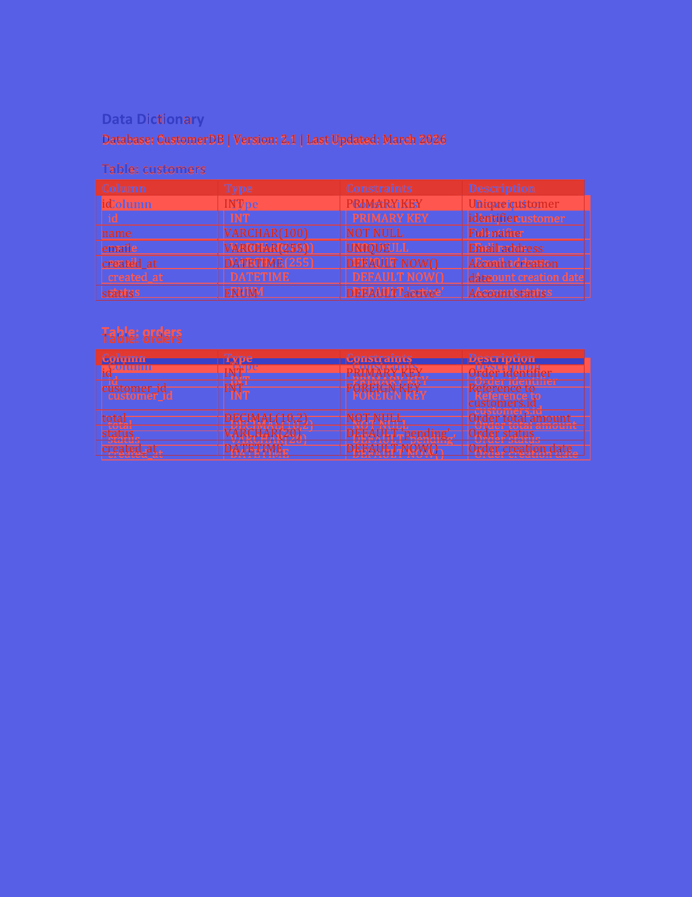</td>
  <td>changed: 180379 px (8.57%)<br>bbox: [175, 208, 1088, 847]<br>mean abs RGB: 12.0415<br>RMSE RGB: 46.5322<br>threshold: 12, gain: 5.0</td>
</tr>
<tr>
  <td><b>docx_classic47_news_article_with_hero_image</b><br>Page 1</td>
  <td>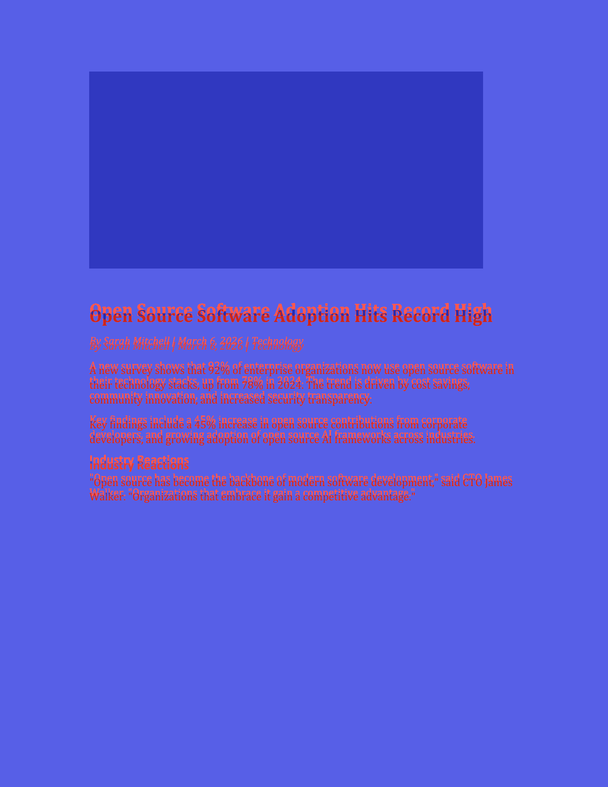</td>
  <td>changed: 84295 px (4.01%)<br>bbox: [187, 635, 1078, 1054]<br>mean abs RGB: 6.3886<br>RMSE RGB: 35.9349<br>threshold: 12, gain: 5.0</td>
</tr>
<tr>
  <td><b>docx_classic48_multi_level_headings</b><br>Page 1</td>
  <td>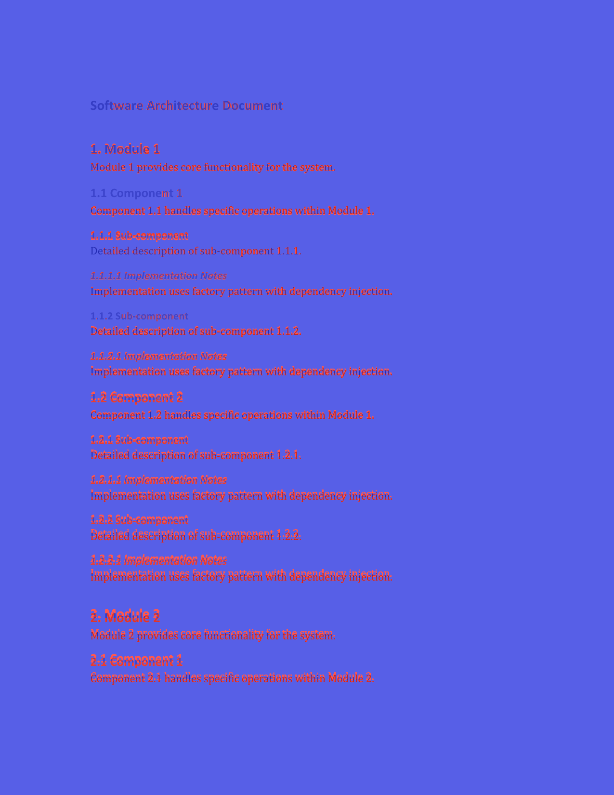</td>
  <td>changed: 84087 px (4.00%)<br>bbox: [188, 208, 814, 1421]<br>mean abs RGB: 4.7458<br>RMSE RGB: 28.1784<br>threshold: 12, gain: 5.0</td>
</tr>
<tr>
  <td><b>docx_classic48_multi_level_headings</b><br>Page 2</td>
  <td>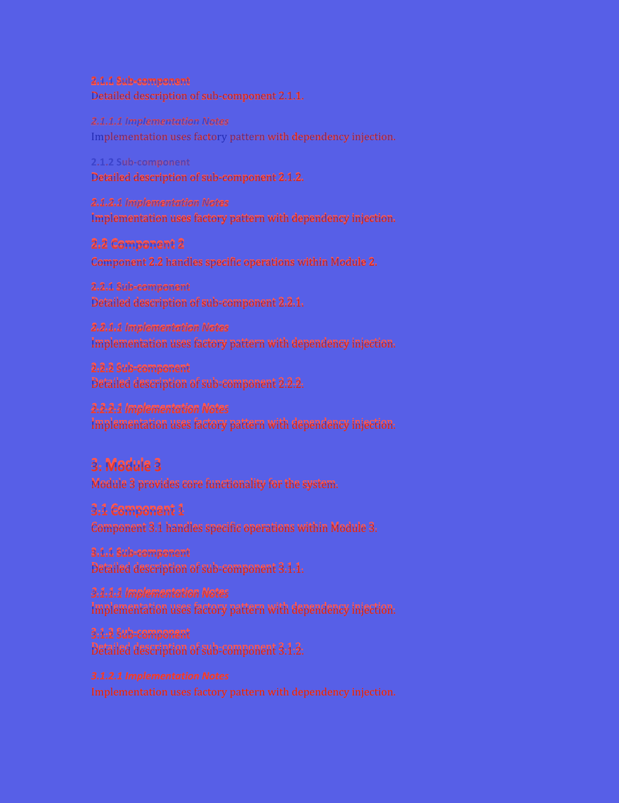</td>
  <td>changed: 101362 px (4.82%)<br>bbox: [187, 156, 814, 1434]<br>mean abs RGB: 5.9202<br>RMSE RGB: 31.9037<br>threshold: 12, gain: 5.0</td>
</tr>
<tr>
  <td><b>docx_classic48_multi_level_headings</b><br>Page 3</td>
  <td>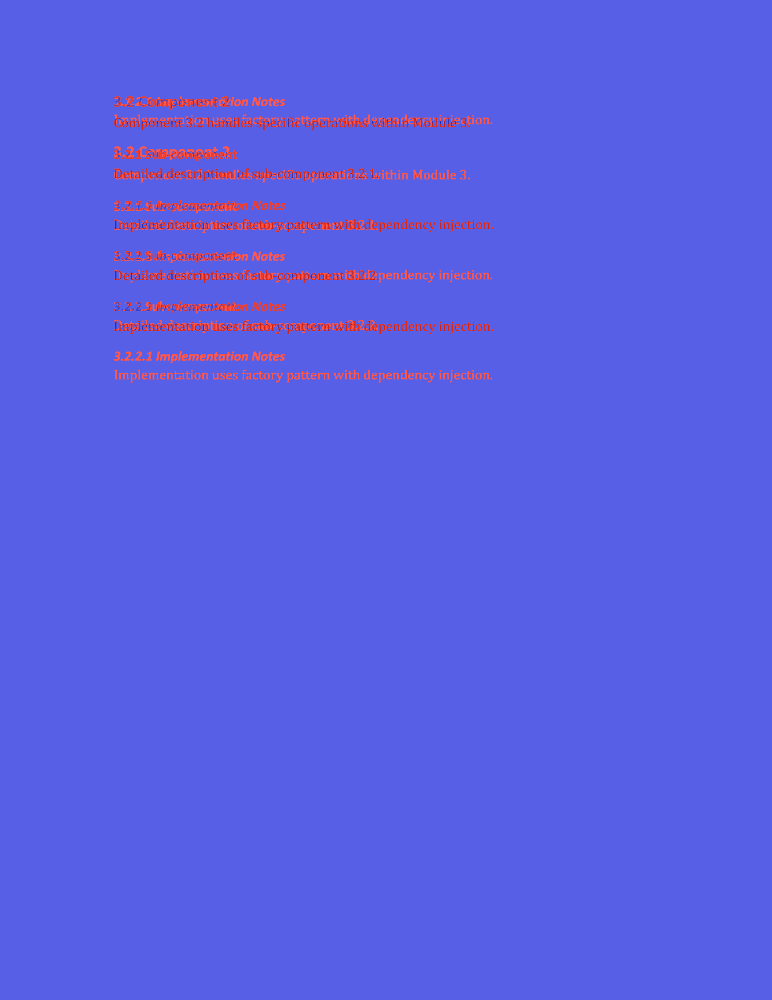</td>
  <td>changed: 44900 px (2.13%)<br>bbox: [187, 158, 814, 631]<br>mean abs RGB: 2.8397<br>RMSE RGB: 22.7005<br>threshold: 12, gain: 5.0</td>
</tr>
<tr>
  <td><b>docx_classic48_task_list_with_status_icons</b><br>Page 1</td>
  <td>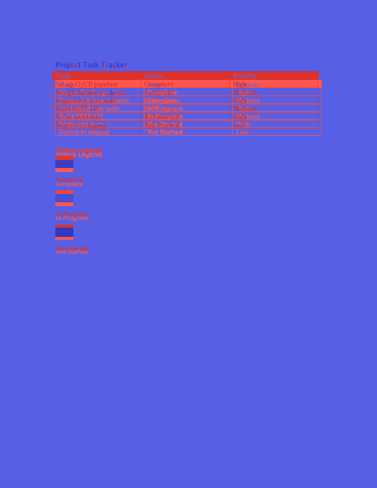</td>
  <td>changed: 104788 px (4.98%)<br>bbox: [175, 209, 1088, 859]<br>mean abs RGB: 7.5408<br>RMSE RGB: 37.131<br>threshold: 12, gain: 5.0</td>
</tr>
<tr>
  <td><b>docx_classic49_cjk_document</b><br>Page 1</td>
  <td>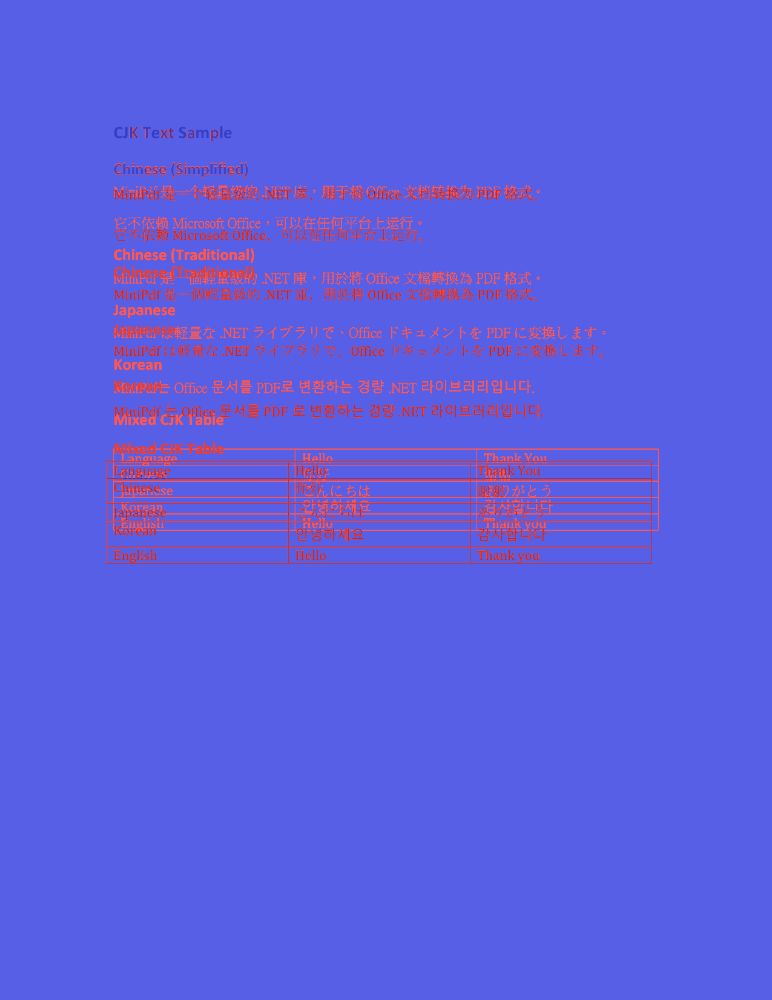</td>
  <td>changed: 91221 px (4.34%)<br>bbox: [175, 208, 1088, 931]<br>mean abs RGB: 5.853<br>RMSE RGB: 32.4212<br>threshold: 12, gain: 5.0</td>
</tr>
<tr>
  <td><b>docx_classic49_wide_panoramic_banner</b><br>Page 1</td>
  <td>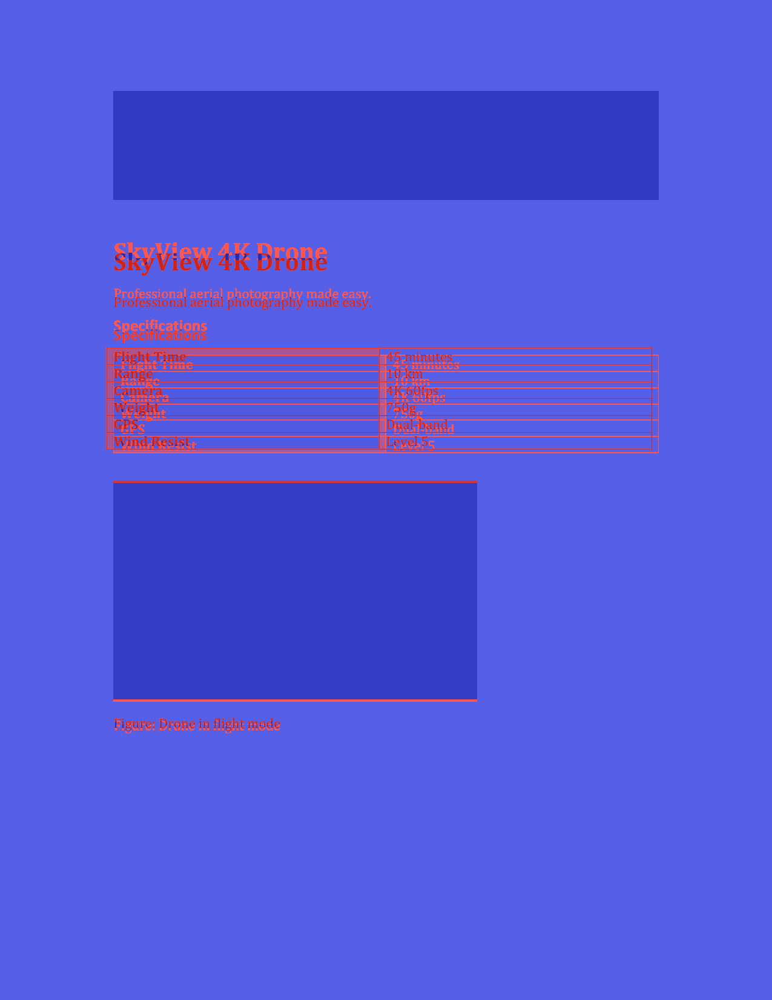</td>
  <td>changed: 70129 px (3.33%)<br>bbox: [175, 399, 1088, 1210]<br>mean abs RGB: 4.5571<br>RMSE RGB: 29.2853<br>threshold: 12, gain: 5.0</td>
</tr>
<tr>
  <td><b>docx_classic50_long_table_with_formatting</b><br>Page 1</td>
  <td>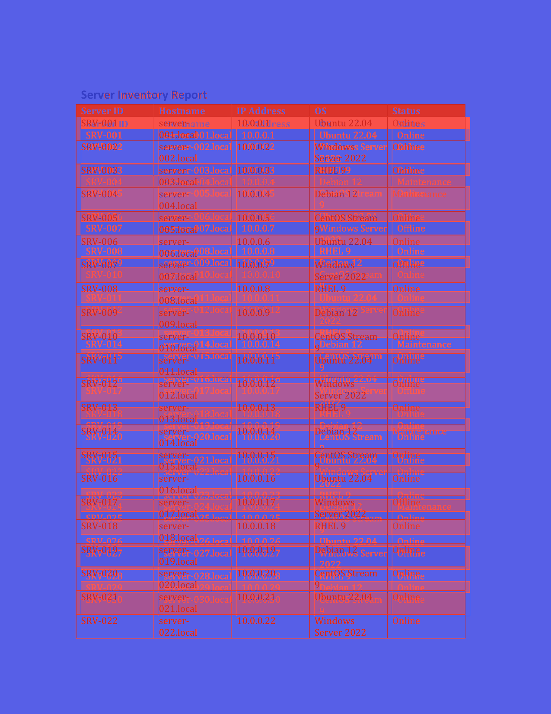</td>
  <td>changed: 692142 px (32.90%)<br>bbox: [175, 209, 1088, 1476]<br>mean abs RGB: 26.6186<br>RMSE RGB: 64.9381<br>threshold: 12, gain: 5.0</td>
</tr>
<tr>
  <td><b>docx_classic50_portrait_tall_image</b><br>Page 1</td>
  <td>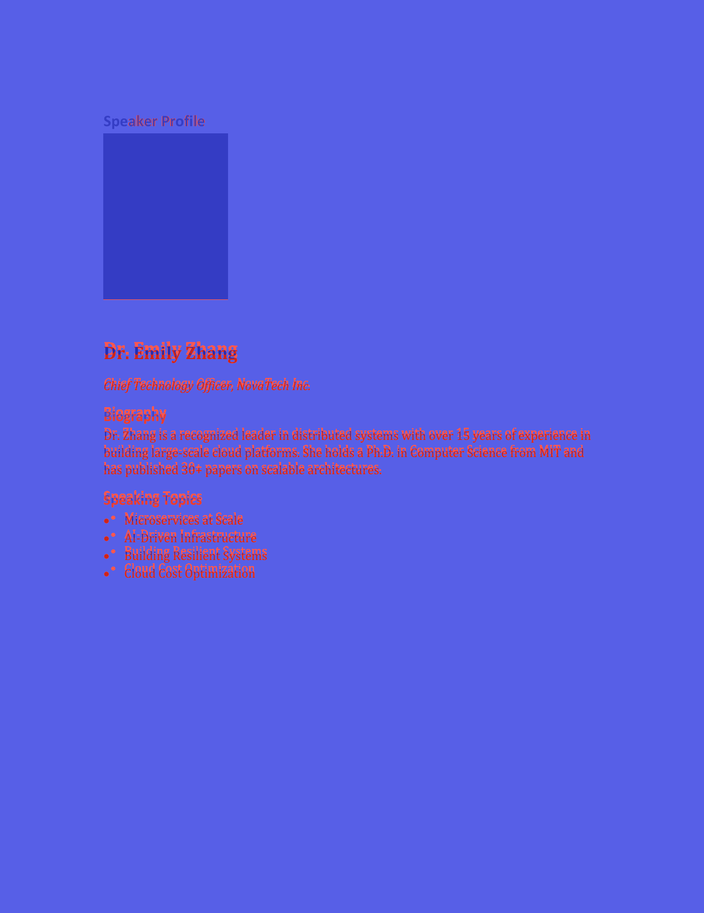</td>
  <td>changed: 44855 px (2.13%)<br>bbox: [187, 208, 1070, 1049]<br>mean abs RGB: 3.1529<br>RMSE RGB: 24.6722<br>threshold: 12, gain: 5.0</td>
</tr>
<tr>
  <td><b>docx_classic51_step_by_step_with_images</b><br>Page 1</td>
  <td>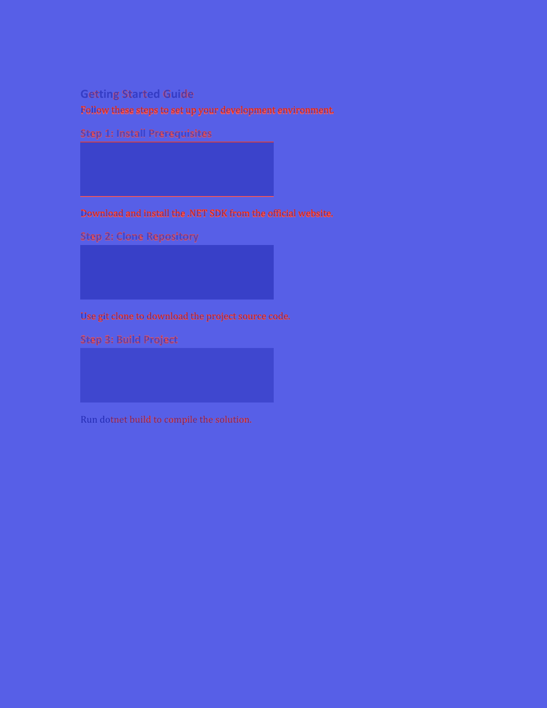</td>
  <td>changed: 21883 px (1.04%)<br>bbox: [187, 208, 778, 990]<br>mean abs RGB: 1.1144<br>RMSE RGB: 13.1316<br>threshold: 12, gain: 5.0</td>
</tr>
<tr>
  <td><b>docx_classic51_underline_styles</b><br>Page 1</td>
  <td>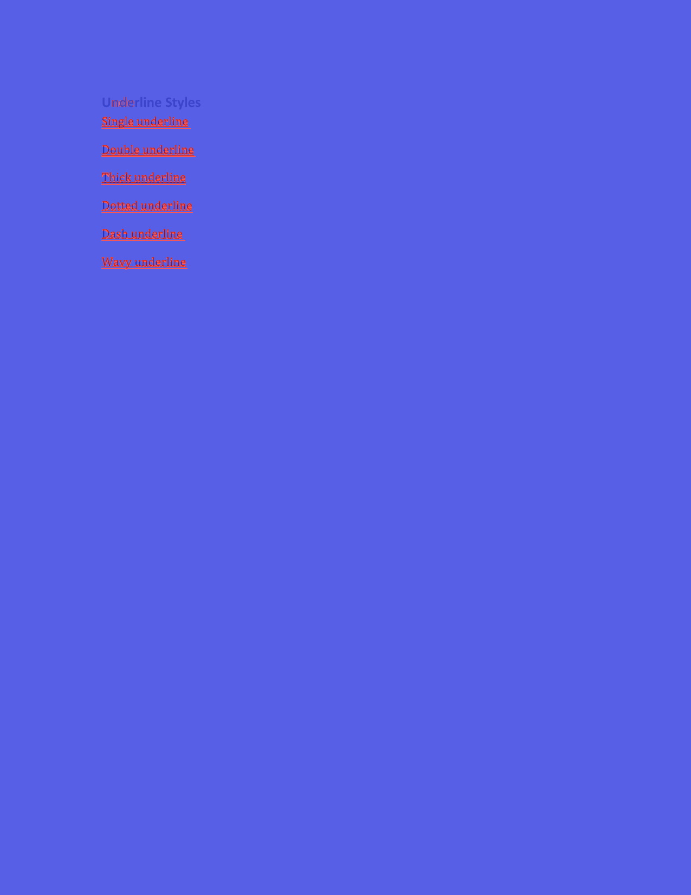</td>
  <td>changed: 10750 px (0.51%)<br>bbox: [187, 178, 361, 497]<br>mean abs RGB: 0.6662<br>RMSE RGB: 10.6659<br>threshold: 12, gain: 5.0</td>
</tr>
<tr>
  <td><b>docx_classic52_before_after_comparison</b><br>Page 1</td>
  <td>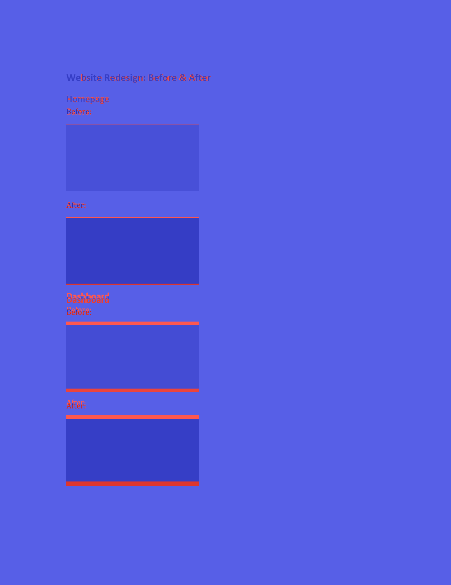</td>
  <td>changed: 25958 px (1.23%)<br>bbox: [187, 208, 596, 1370]<br>mean abs RGB: 1.5628<br>RMSE RGB: 15.4592<br>threshold: 12, gain: 5.0</td>
</tr>
<tr>
  <td><b>docx_classic52_spacing_before_after</b><br>Page 1</td>
  <td></td>
  <td>changed: 44273 px (2.10%)<br>bbox: [188, 179, 1008, 530]<br>mean abs RGB: 2.9321<br>RMSE RGB: 23.1365<br>threshold: 12, gain: 5.0</td>
</tr>
<tr>
  <td><b>docx_classic53_color_swatch_palette</b><br>Page 1</td>
  <td>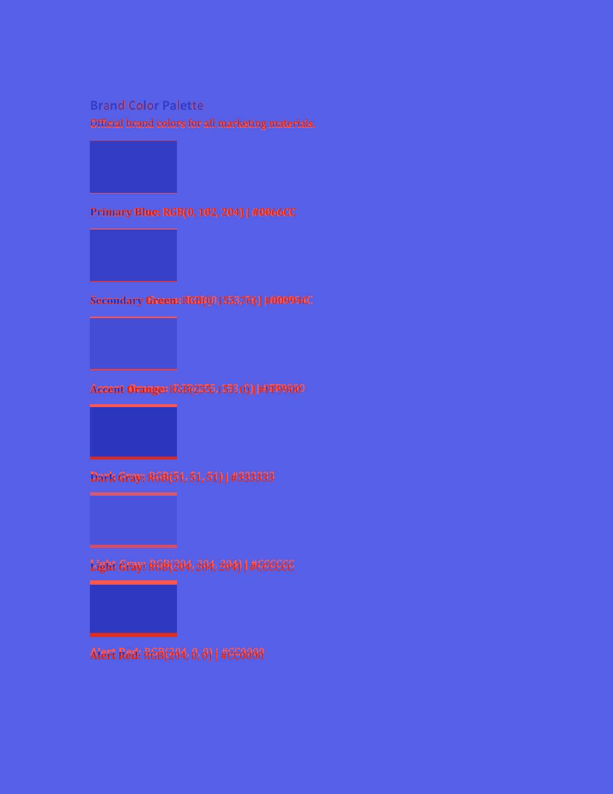</td>
  <td>changed: 41475 px (1.97%)<br>bbox: [187, 208, 655, 1375]<br>mean abs RGB: 3.0305<br>RMSE RGB: 24.7065<br>threshold: 12, gain: 5.0</td>
</tr>
<tr>
  <td><b>docx_classic53_table_merged_complex</b><br>Page 1</td>
  <td>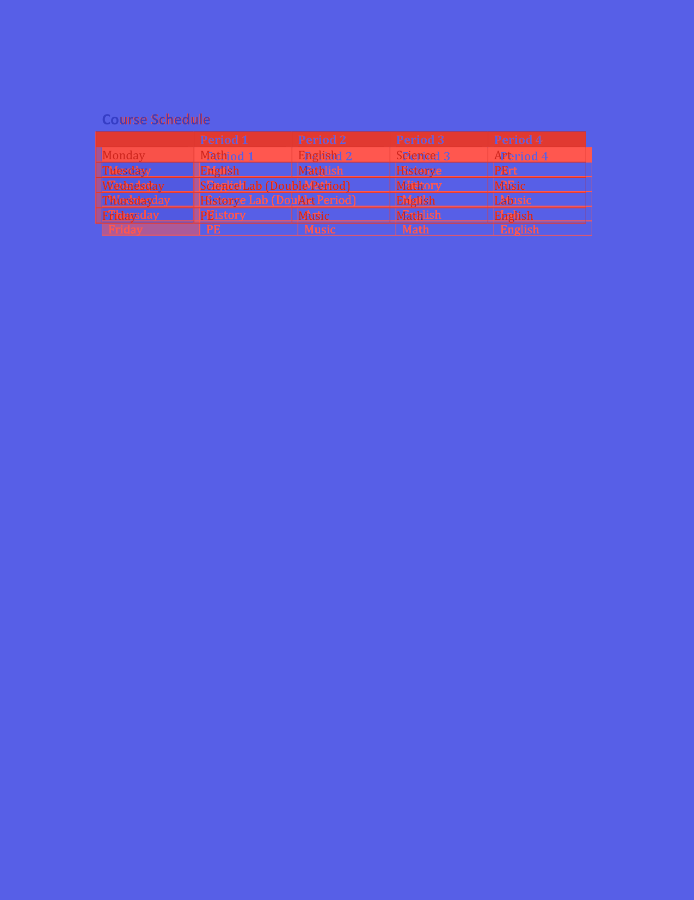</td>
  <td>changed: 90579 px (4.31%)<br>bbox: [175, 208, 1088, 433]<br>mean abs RGB: 5.6011<br>RMSE RGB: 30.6314<br>threshold: 12, gain: 5.0</td>
</tr>
<tr>
  <td><b>docx_classic54_multi_font_family</b><br>Page 1</td>
  <td></td>
  <td>changed: 31357 px (1.49%)<br>bbox: [187, 179, 967, 496]<br>mean abs RGB: 2.1954<br>RMSE RGB: 20.5677<br>threshold: 12, gain: 5.0</td>
</tr>
<tr>
  <td><b>docx_classic54_travel_destination_cards</b><br>Page 1</td>
  <td>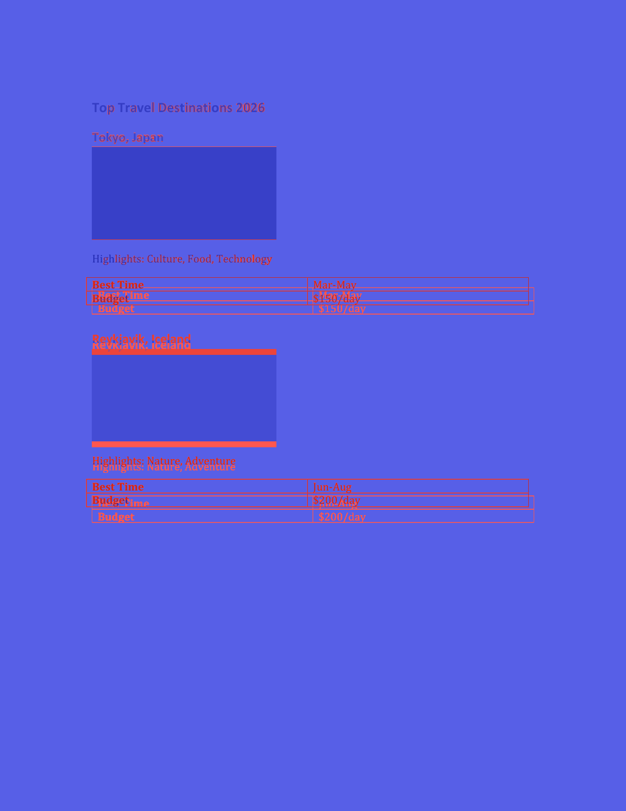</td>
  <td>changed: 52833 px (2.51%)<br>bbox: [175, 208, 1088, 1064]<br>mean abs RGB: 3.2581<br>RMSE RGB: 23.7889<br>threshold: 12, gain: 5.0</td>
</tr>
<tr>
  <td><b>docx_classic55_background_shading_paragraph</b><br>Page 1</td>
  <td>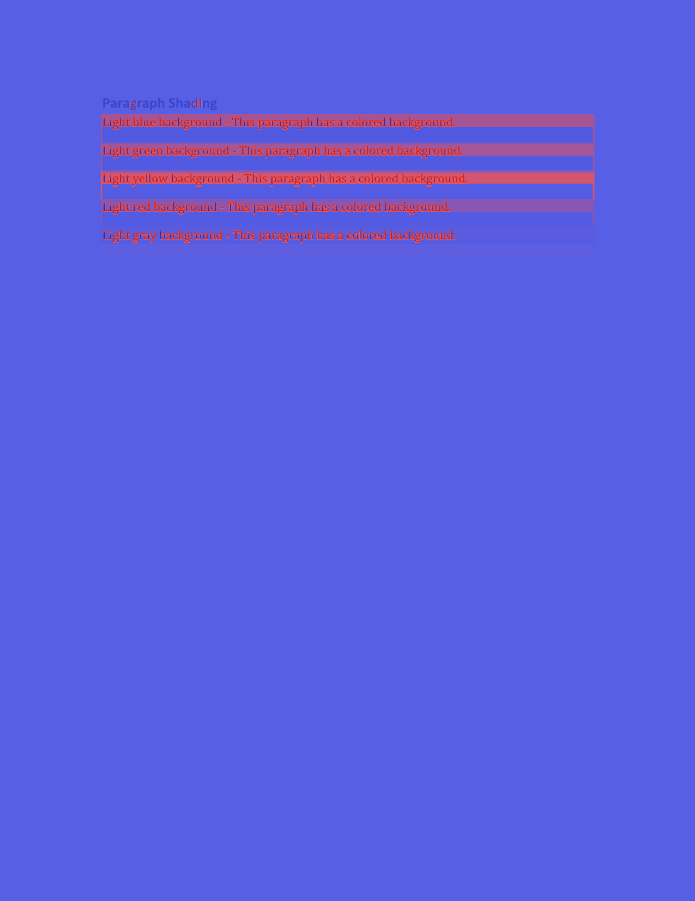</td>
  <td>changed: 130662 px (6.21%)<br>bbox: [184, 178, 1091, 470]<br>mean abs RGB: 2.7005<br>RMSE RGB: 18.1508<br>threshold: 12, gain: 5.0</td>
</tr>
<tr>
  <td><b>docx_classic55_lab_results_with_image</b><br>Page 1</td>
  <td>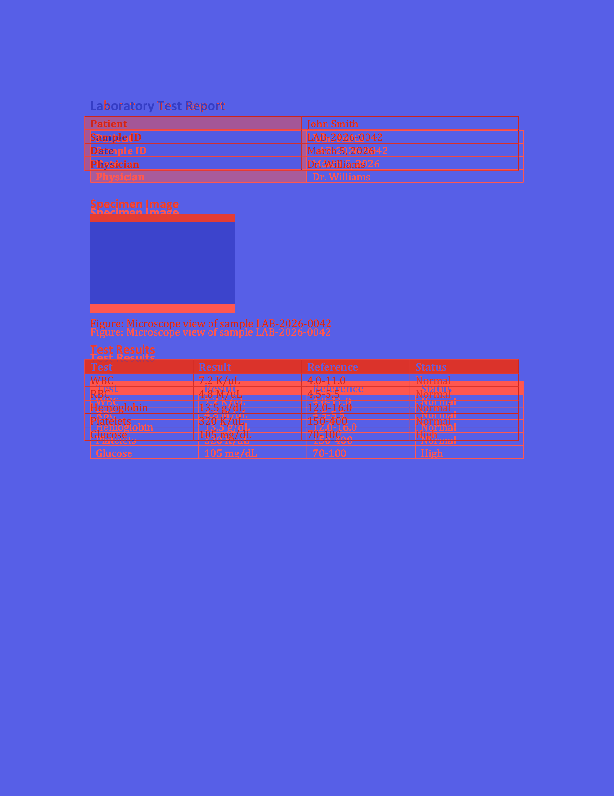</td>
  <td>changed: 154401 px (7.34%)<br>bbox: [175, 208, 1088, 952]<br>mean abs RGB: 9.6101<br>RMSE RGB: 41.0491<br>threshold: 12, gain: 5.0</td>
</tr>
<tr>
  <td><b>docx_classic56_images_and_tables_mixed</b><br>Page 1</td>
  <td>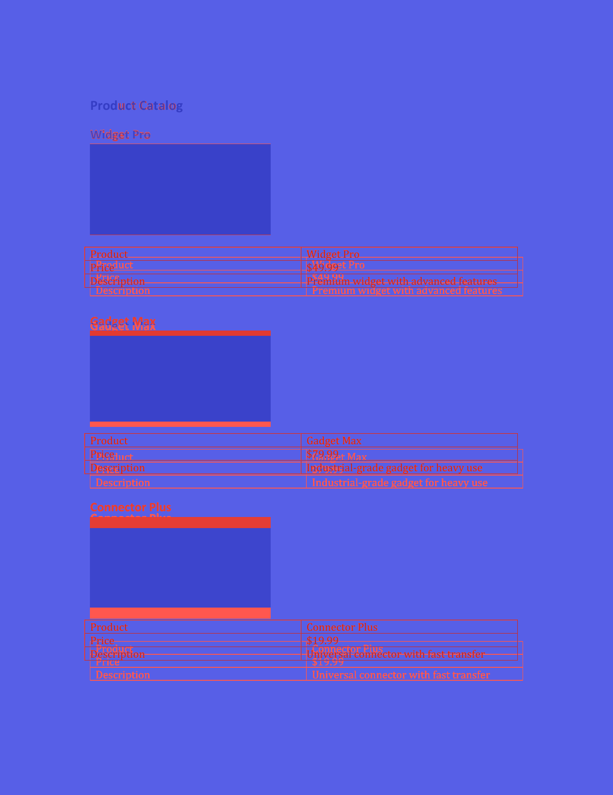</td>
  <td>changed: 105263 px (5.00%)<br>bbox: [175, 208, 1088, 1413]<br>mean abs RGB: 7.3123<br>RMSE RGB: 37.5098<br>threshold: 12, gain: 5.0</td>
</tr>
<tr>
  <td><b>docx_classic56_software_screenshot_features</b><br>Page 1</td>
  <td>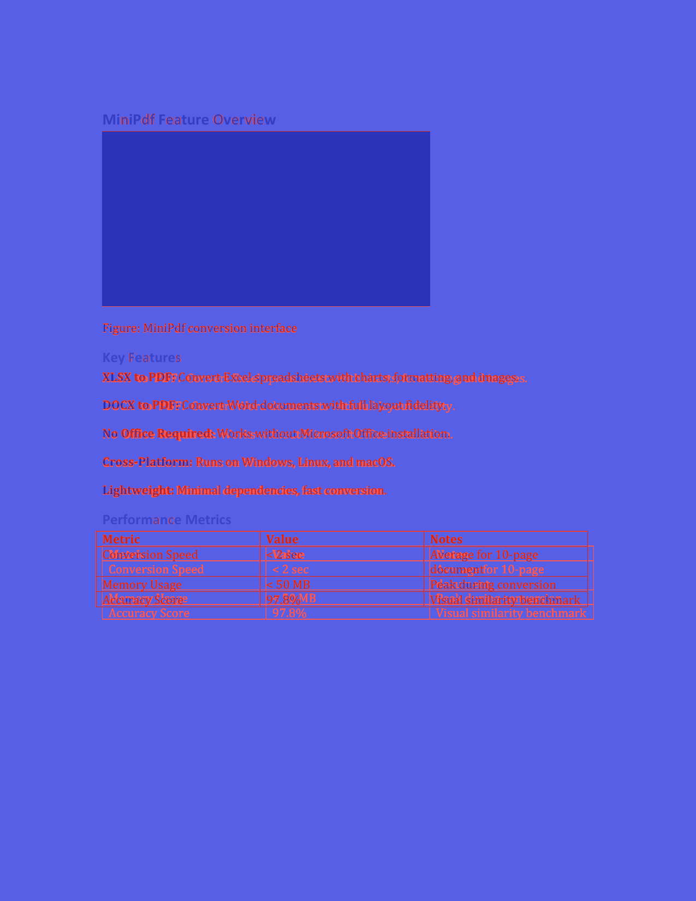</td>
  <td>changed: 73244 px (3.48%)<br>bbox: [175, 208, 1088, 1135]<br>mean abs RGB: 5.2262<br>RMSE RGB: 31.974<br>threshold: 12, gain: 5.0</td>
</tr>
<tr>
  <td><b>docx_classic57_right_to_left_text</b><br>Page 1</td>
  <td></td>
  <td>changed: 18453 px (0.88%)<br>bbox: [187, 179, 1104, 756]<br>mean abs RGB: 1.1817<br>RMSE RGB: 14.5672<br>threshold: 12, gain: 5.0</td>
</tr>
<tr>
  <td><b>docx_classic57_sports_results_with_logos</b><br>Page 1</td>
  <td>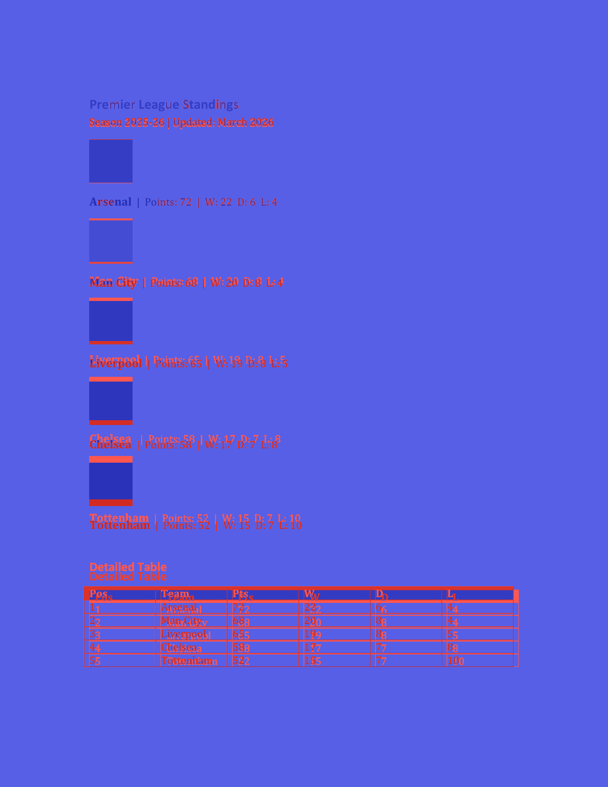</td>
  <td>changed: 78657 px (3.74%)<br>bbox: [175, 208, 1088, 1399]<br>mean abs RGB: 5.6015<br>RMSE RGB: 32.6632<br>threshold: 12, gain: 5.0</td>
</tr>
<tr>
  <td><b>docx_classic58_dense_paragraph_document</b><br>Page 1</td>
  <td>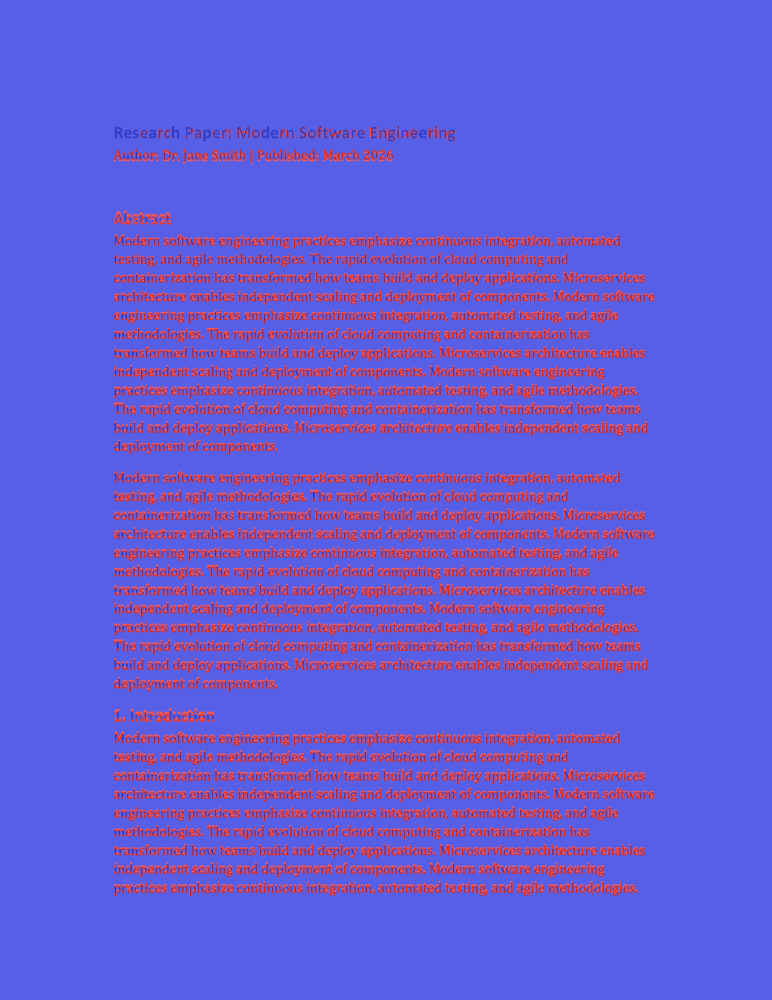</td>
  <td>changed: 238499 px (11.34%)<br>bbox: [187, 208, 1081, 1478]<br>mean abs RGB: 15.1389<br>RMSE RGB: 51.8789<br>threshold: 12, gain: 5.0</td>
</tr>
<tr>
  <td><b>docx_classic58_dense_paragraph_document</b><br>Page 2</td>
  <td>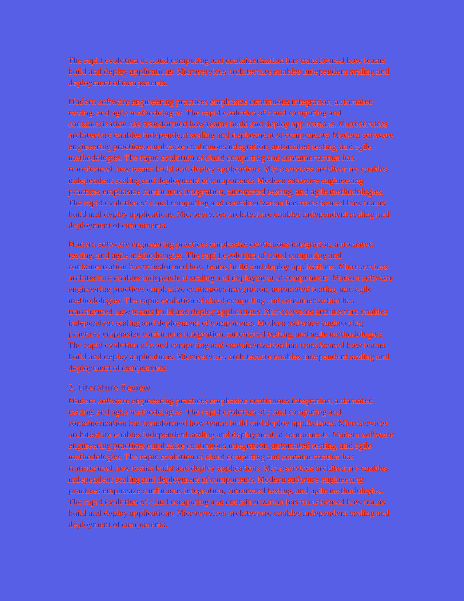</td>
  <td>changed: 245681 px (11.68%)<br>bbox: [188, 155, 1081, 1453]<br>mean abs RGB: 15.02<br>RMSE RGB: 50.7223<br>threshold: 12, gain: 5.0</td>
</tr>
<tr>
  <td><b>docx_classic58_dense_paragraph_document</b><br>Page 3</td>
  <td>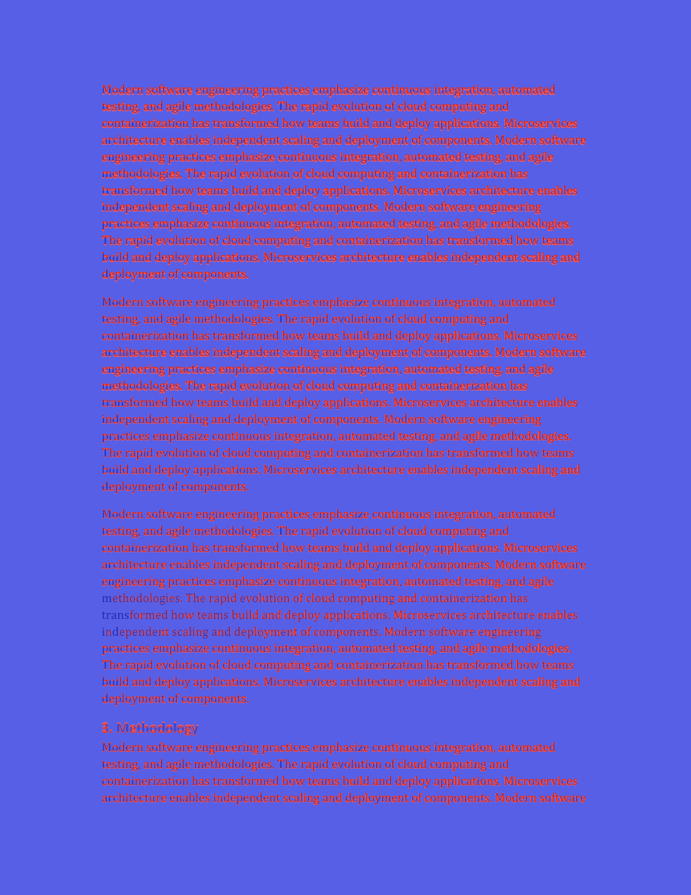</td>
  <td>changed: 246744 px (11.73%)<br>bbox: [188, 155, 1081, 1484]<br>mean abs RGB: 14.5938<br>RMSE RGB: 49.3449<br>threshold: 12, gain: 5.0</td>
</tr>
<tr>
  <td><b>docx_classic58_dense_paragraph_document</b><br>Page 4</td>
  <td>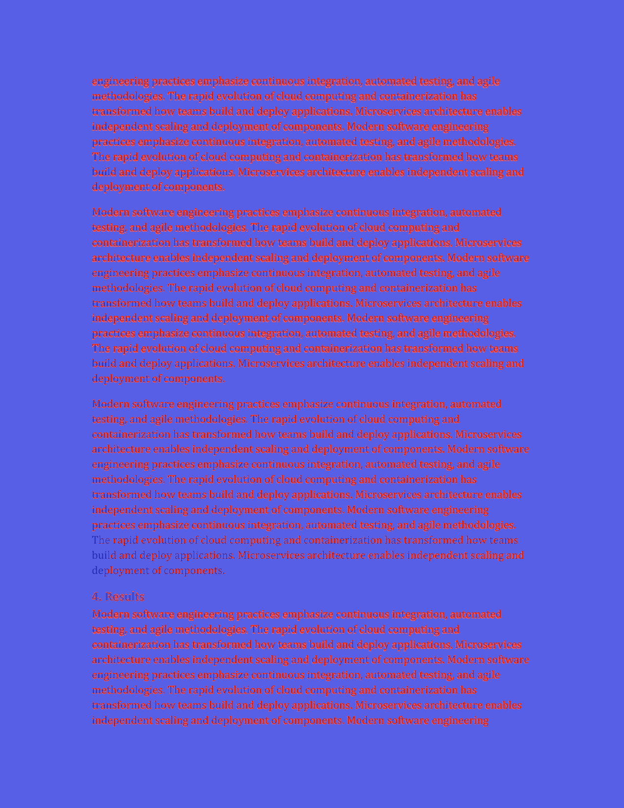</td>
  <td>changed: 249433 px (11.86%)<br>bbox: [188, 155, 1081, 1484]<br>mean abs RGB: 14.9723<br>RMSE RGB: 50.299<br>threshold: 12, gain: 5.0</td>
</tr>
<tr>
  <td><b>docx_classic58_dense_paragraph_document</b><br>Page 5</td>
  <td>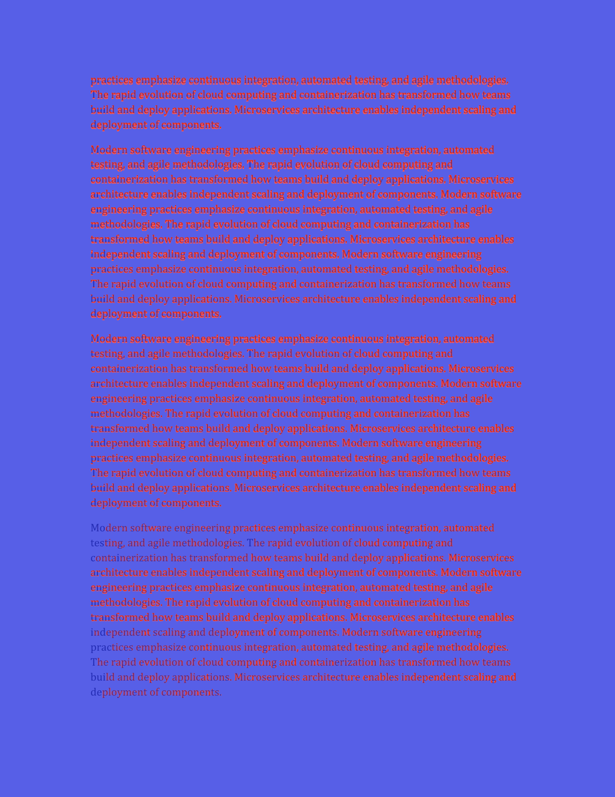</td>
  <td>changed: 233890 px (11.12%)<br>bbox: [188, 156, 1081, 1445]<br>mean abs RGB: 13.4973<br>RMSE RGB: 47.0788<br>threshold: 12, gain: 5.0</td>
</tr>
<tr>
  <td><b>docx_classic58_dense_paragraph_document</b><br>Page 6</td>
  <td>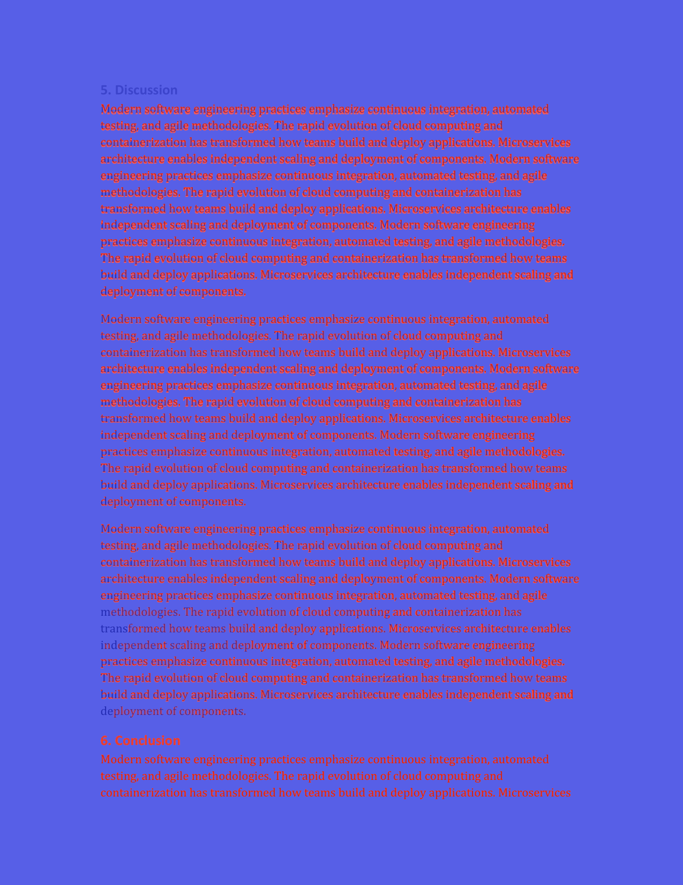</td>
  <td>changed: 236816 px (11.26%)<br>bbox: [188, 160, 1081, 1490]<br>mean abs RGB: 14.3639<br>RMSE RGB: 49.5132<br>threshold: 12, gain: 5.0</td>
</tr>
<tr>
  <td><b>docx_classic58_dense_paragraph_document</b><br>Page 7</td>
  <td></td>
  <td>changed: 208290 px (9.90%)<br>bbox: [188, 155, 1081, 948]<br>mean abs RGB: 15.991<br>RMSE RGB: 56.8168<br>threshold: 12, gain: 5.0</td>
</tr>
<tr>
  <td><b>docx_classic58_report_with_footer_image</b><br>Page 1</td>
  <td>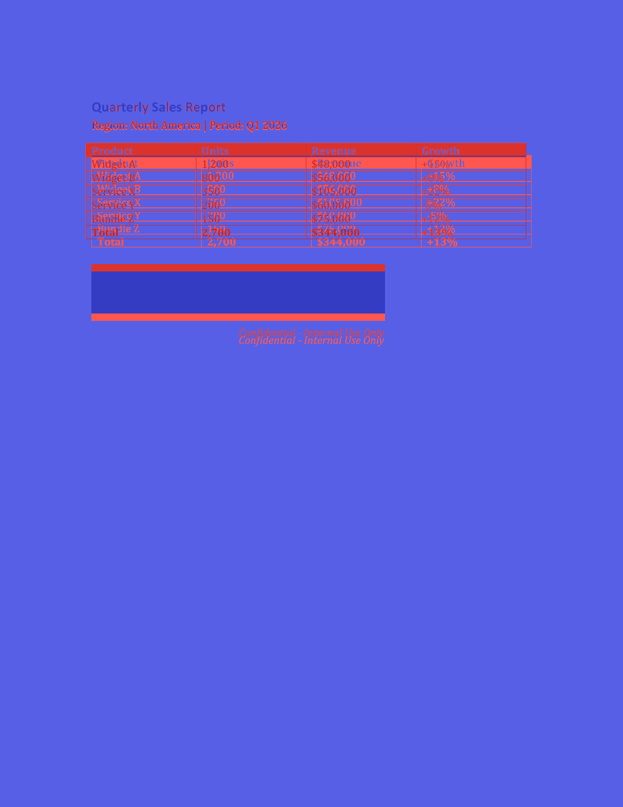</td>
  <td>changed: 109534 px (5.21%)<br>bbox: [175, 208, 1088, 708]<br>mean abs RGB: 7.7872<br>RMSE RGB: 37.463<br>threshold: 12, gain: 5.0</td>
</tr>
<tr>
  <td><b>docx_classic59_numbered_and_bullet_mixed</b><br>Page 1</td>
  <td>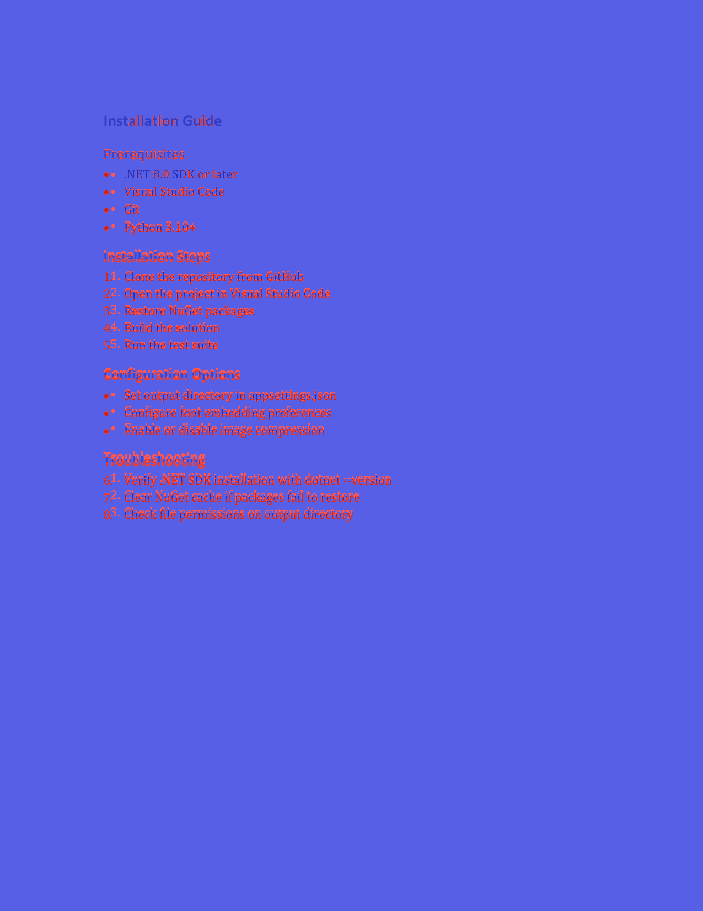</td>
  <td>changed: 48064 px (2.28%)<br>bbox: [187, 208, 711, 945]<br>mean abs RGB: 2.9325<br>RMSE RGB: 22.7779<br>threshold: 12, gain: 5.0</td>
</tr>
<tr>
  <td><b>docx_classic59_nutrition_label_with_image</b><br>Page 1</td>
  <td>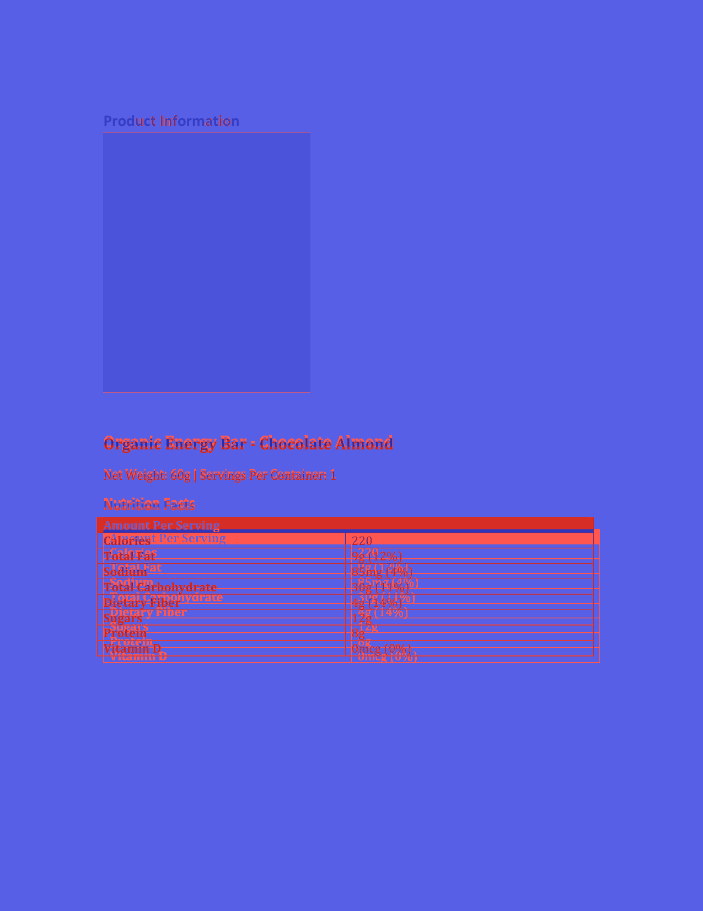</td>
  <td>changed: 100844 px (4.79%)<br>bbox: [175, 208, 1088, 1201]<br>mean abs RGB: 8.01<br>RMSE RGB: 39.8752<br>threshold: 12, gain: 5.0</td>
</tr>
<tr>
  <td><b>docx_classic60_comprehensive_styled_report</b><br>Page 1</td>
  <td></td>
  <td>changed: 20851 px (0.99%)<br>bbox: [184, 165, 1091, 392]<br>mean abs RGB: 1.3599<br>RMSE RGB: 15.4259<br>threshold: 12, gain: 5.0</td>
</tr>
<tr>
  <td><b>docx_classic60_comprehensive_styled_report</b><br>Page 2</td>
  <td>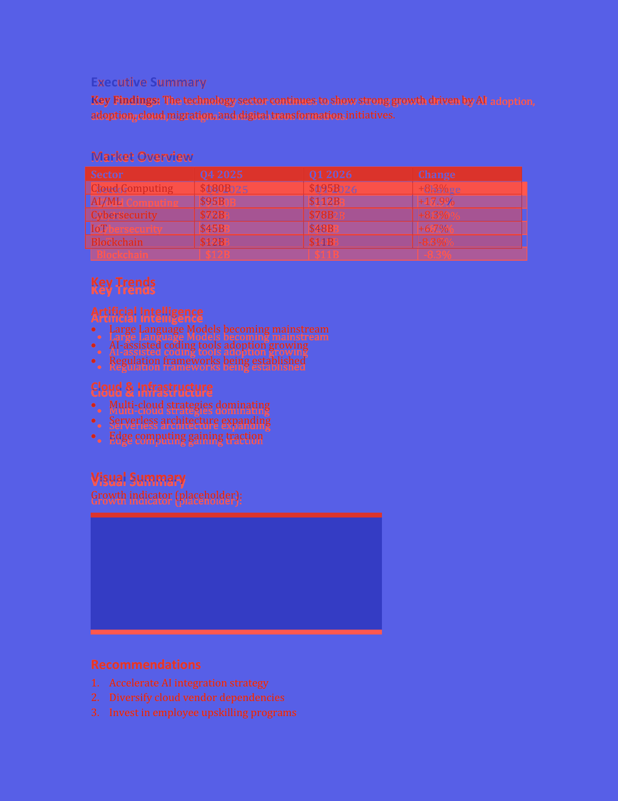</td>
  <td>changed: 258066 px (12.27%)<br>bbox: [175, 158, 1103, 1480]<br>mean abs RGB: 12.5638<br>RMSE RGB: 45.6508<br>threshold: 12, gain: 5.0</td>
</tr>
<tr>
  <td><b>docx_classic60_comprehensive_styled_report</b><br>Page 3</td>
  <td>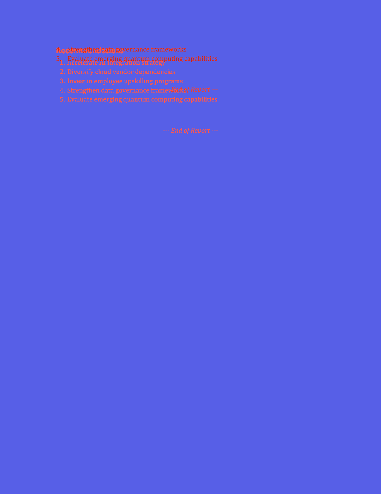</td>
  <td>changed: 22159 px (1.05%)<br>bbox: [188, 155, 729, 448]<br>mean abs RGB: 1.6118<br>RMSE RGB: 17.7112<br>threshold: 12, gain: 5.0</td>
</tr>
<tr>
  <td><b>docx_classic60_project_status_with_milestones</b><br>Page 1</td>
  <td>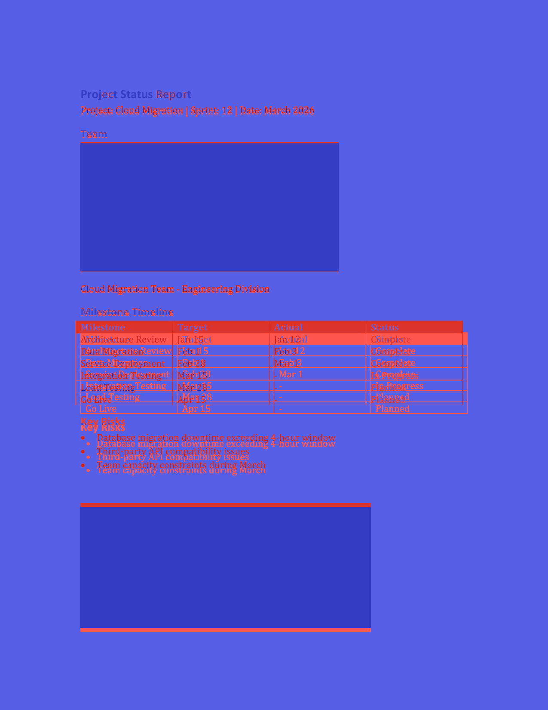</td>
  <td>changed: 134594 px (6.40%)<br>bbox: [175, 209, 1088, 1468]<br>mean abs RGB: 9.5453<br>RMSE RGB: 41.8587<br>threshold: 12, gain: 5.0</td>
</tr>
<tr>
  <td><b>docx_classic60_project_status_with_milestones</b><br>Page 2</td>
  <td></td>
  <td>changed: 2359 px (0.11%)<br>bbox: [188, 155, 461, 180]<br>mean abs RGB: 0.1552<br>RMSE RGB: 5.3302<br>threshold: 12, gain: 5.0</td>
</tr>
<tr>
  <td><b>docx_classic61_header_and_footer</b><br>Page 1</td>
  <td>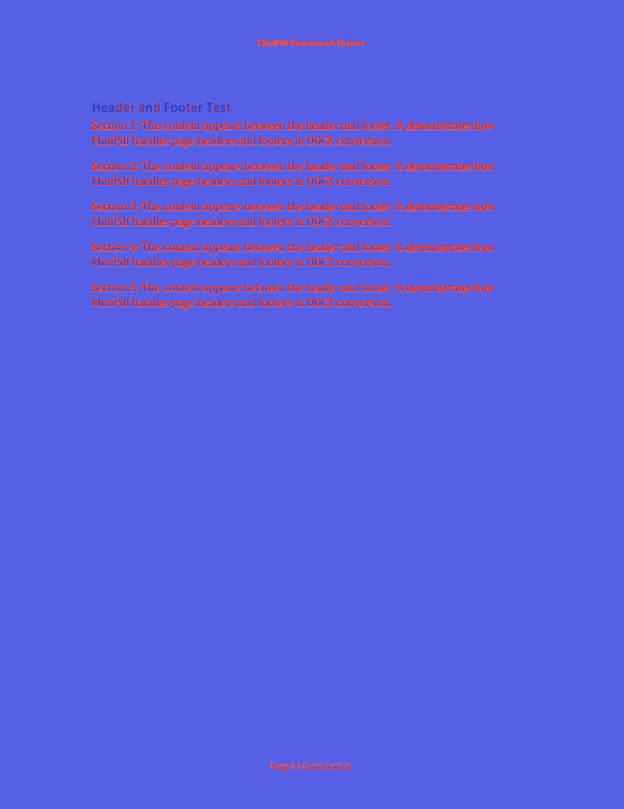</td>
  <td>changed: 66372 px (3.15%)<br>bbox: [188, 79, 1013, 1575]<br>mean abs RGB: 4.303<br>RMSE RGB: 27.8678<br>threshold: 12, gain: 5.0</td>
</tr>
<tr>
  <td><b>docx_classic62_footnote_references</b><br>Page 1</td>
  <td>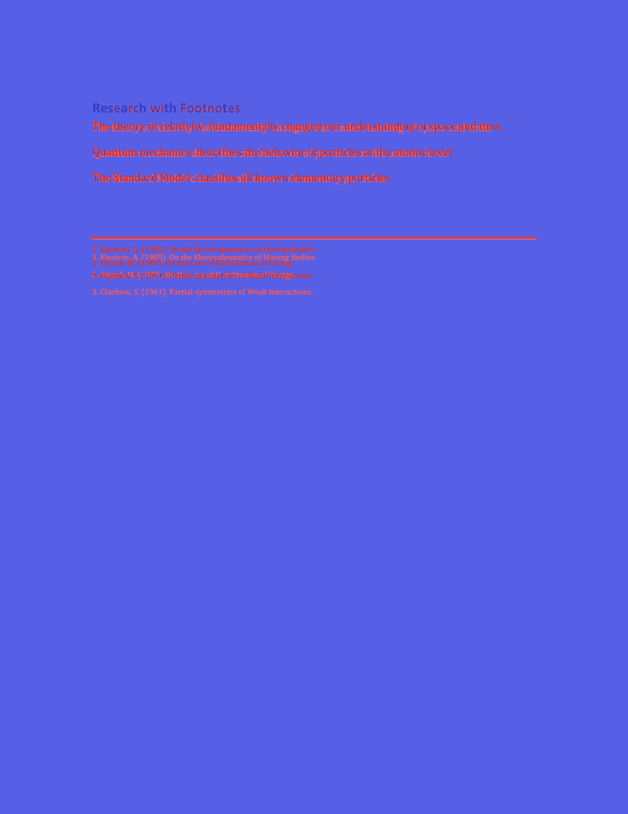</td>
  <td>changed: 39457 px (1.88%)<br>bbox: [184, 208, 1091, 601]<br>mean abs RGB: 2.8183<br>RMSE RGB: 23.422<br>threshold: 12, gain: 5.0</td>
</tr>
<tr>
  <td><b>docx_classic63_toc_style_headings</b><br>Page 1</td>
  <td>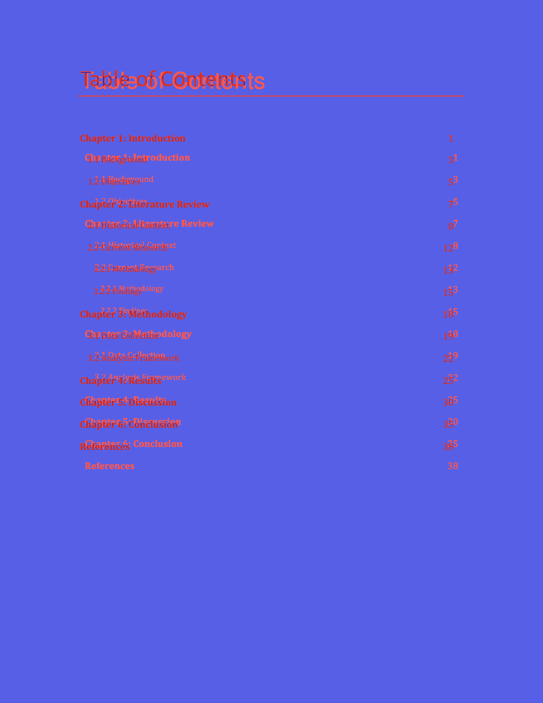</td>
  <td>changed: 50566 px (2.40%)<br>bbox: [184, 165, 1091, 1102]<br>mean abs RGB: 3.8783<br>RMSE RGB: 28.1165<br>threshold: 12, gain: 5.0</td>
</tr>
<tr>
  <td><b>docx_classic64_multi_column_layout</b><br>Page 1</td>
  <td>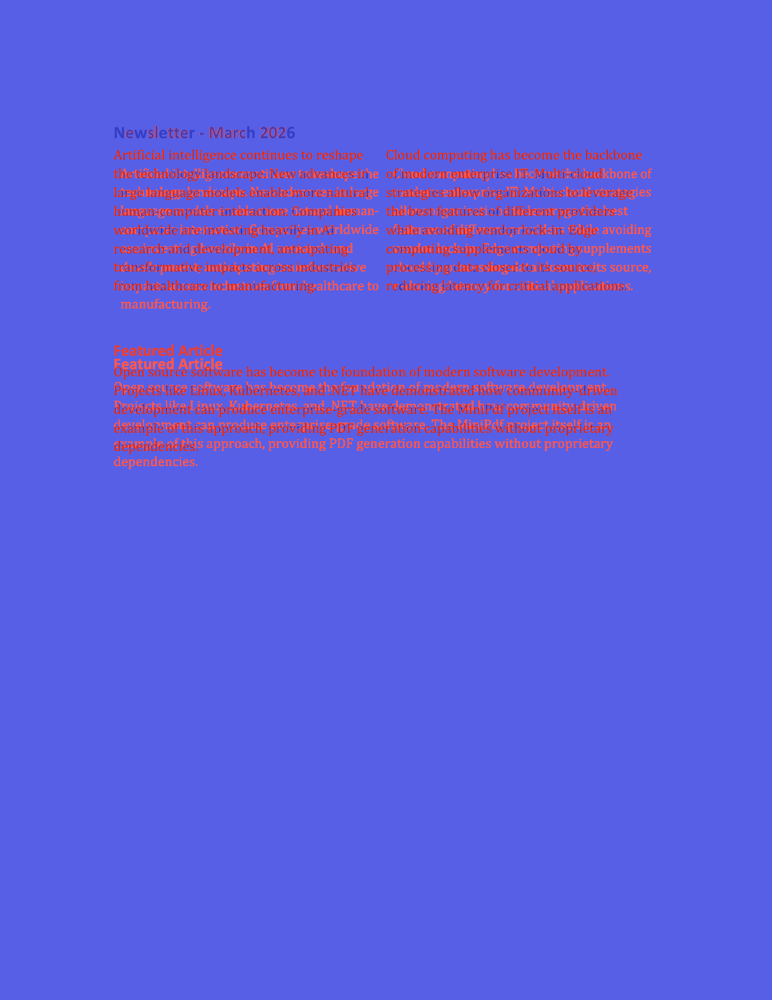</td>
  <td>changed: 100896 px (4.80%)<br>bbox: [187, 208, 1077, 774]<br>mean abs RGB: 7.2728<br>RMSE RGB: 37.6795<br>threshold: 12, gain: 5.0</td>
</tr>
<tr>
  <td><b>docx_classic65_code_block_styling</b><br>Page 1</td>
  <td>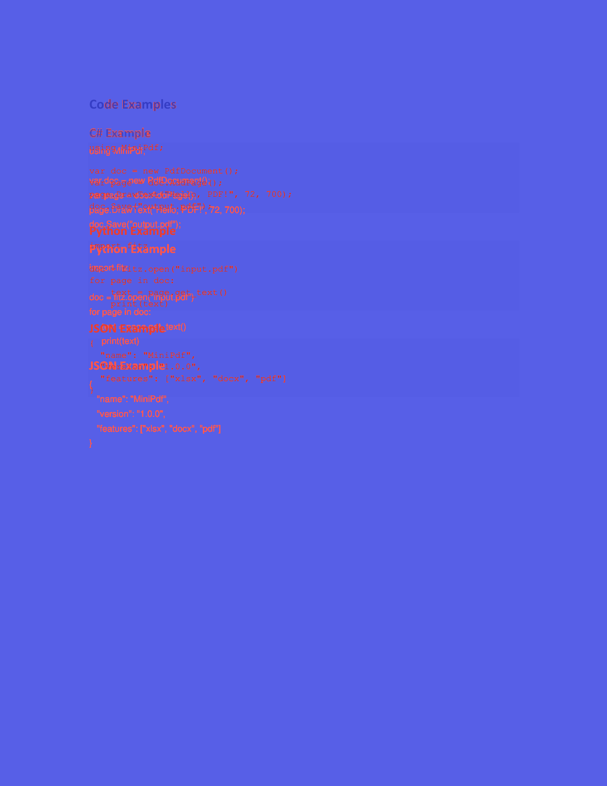</td>
  <td>changed: 30692 px (1.46%)<br>bbox: [187, 208, 611, 940]<br>mean abs RGB: 3.437<br>RMSE RGB: 17.9635<br>threshold: 12, gain: 5.0</td>
</tr>
<tr>
  <td><b>docx_classic66_colored_title_page</b><br>Page 1</td>
  <td>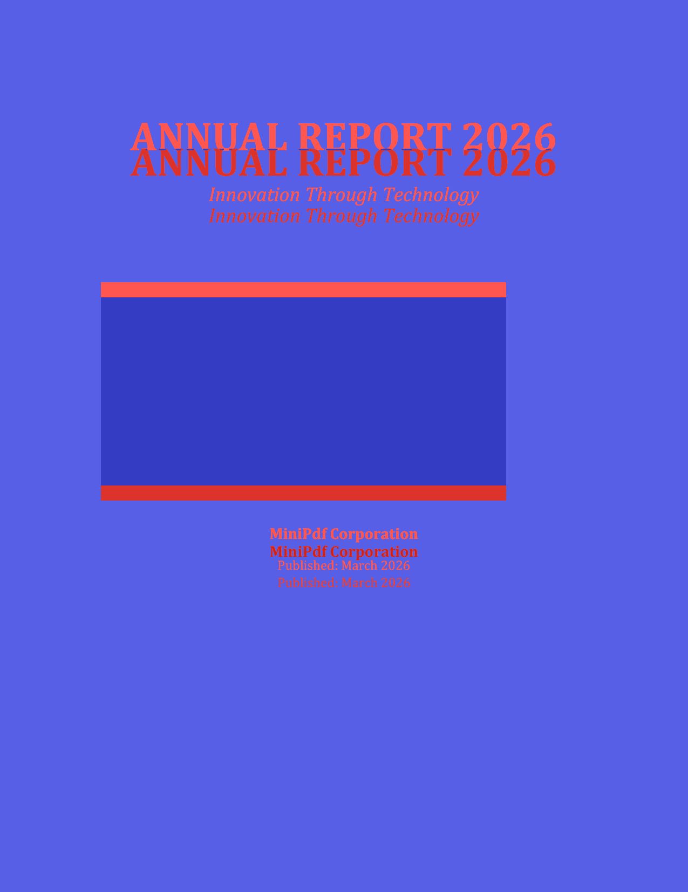</td>
  <td>changed: 93074 px (4.42%)<br>bbox: [187, 227, 1029, 1087]<br>mean abs RGB: 6.7663<br>RMSE RGB: 34.0686<br>threshold: 12, gain: 5.0</td>
</tr>
<tr>
  <td><b>docx_classic67_alternating_row_table</b><br>Page 1</td>
  <td>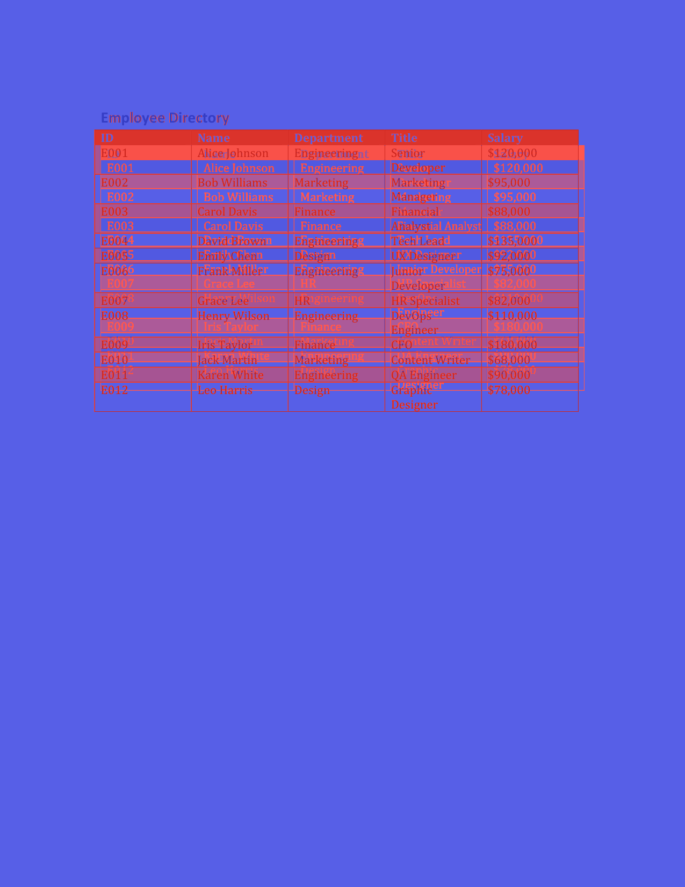</td>
  <td>changed: 304090 px (14.45%)<br>bbox: [175, 208, 1088, 767]<br>mean abs RGB: 13.6103<br>RMSE RGB: 47.2606<br>threshold: 12, gain: 5.0</td>
</tr>
<tr>
  <td><b>docx_classic68_sidebar_layout</b><br>Page 1</td>
  <td>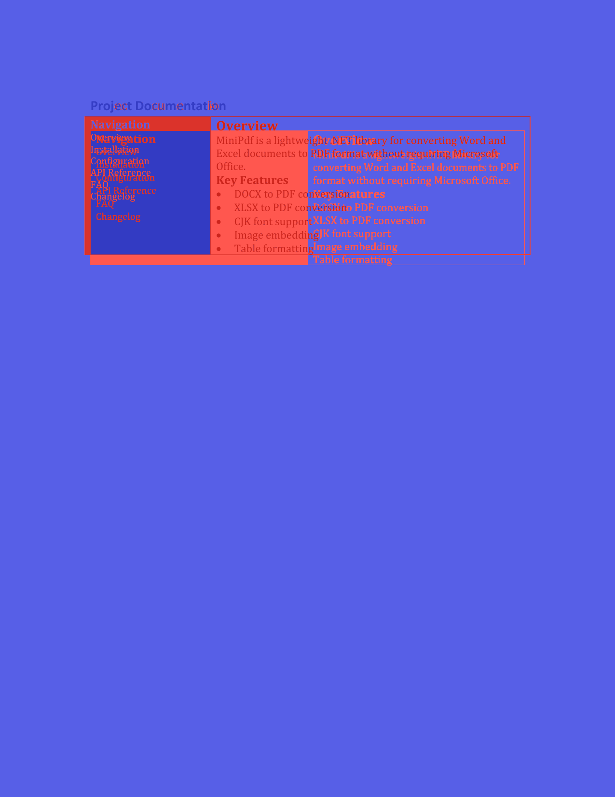</td>
  <td>changed: 107094 px (5.09%)<br>bbox: [175, 208, 1100, 550]<br>mean abs RGB: 7.5194<br>RMSE RGB: 36.5264<br>threshold: 12, gain: 5.0</td>
</tr>
<tr>
  <td><b>docx_classic69_blockquote_styling</b><br>Page 1</td>
  <td>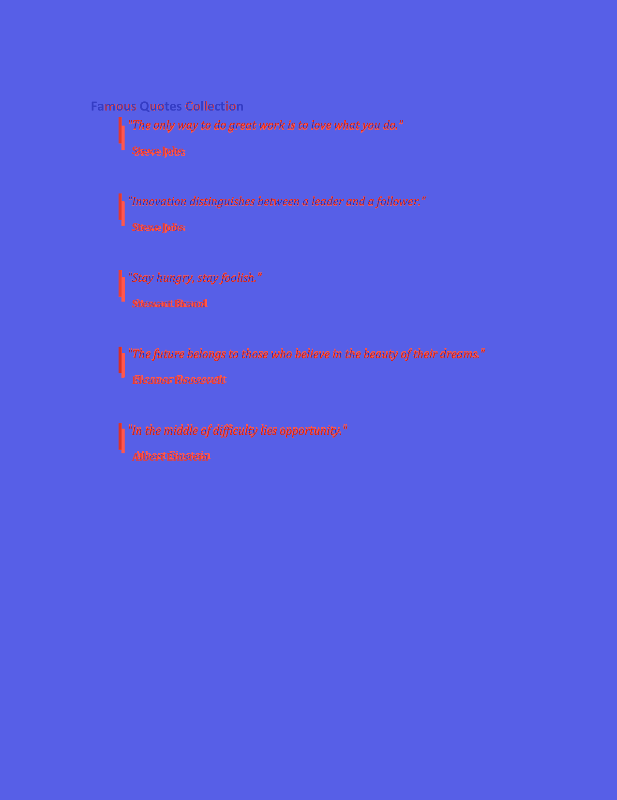</td>
  <td>changed: 35102 px (1.67%)<br>bbox: [212, 208, 1003, 951]<br>mean abs RGB: 1.9765<br>RMSE RGB: 17.8655<br>threshold: 12, gain: 5.0</td>
</tr>
<tr>
  <td><b>docx_classic70_academic_paper</b><br>Page 1</td>
  <td>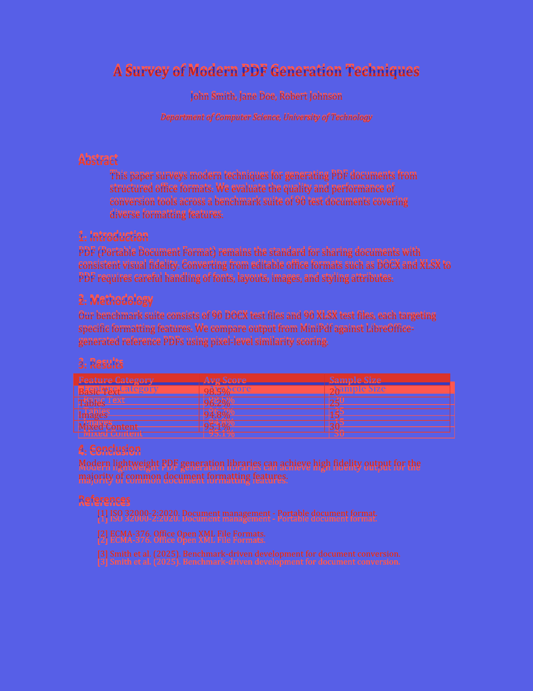</td>
  <td>changed: 195389 px (9.29%)<br>bbox: [175, 151, 1088, 1353]<br>mean abs RGB: 13.7045<br>RMSE RGB: 50.7606<br>threshold: 12, gain: 5.0</td>
</tr>
<tr>
  <td><b>docx_classic71_legal_document</b><br>Page 1</td>
  <td>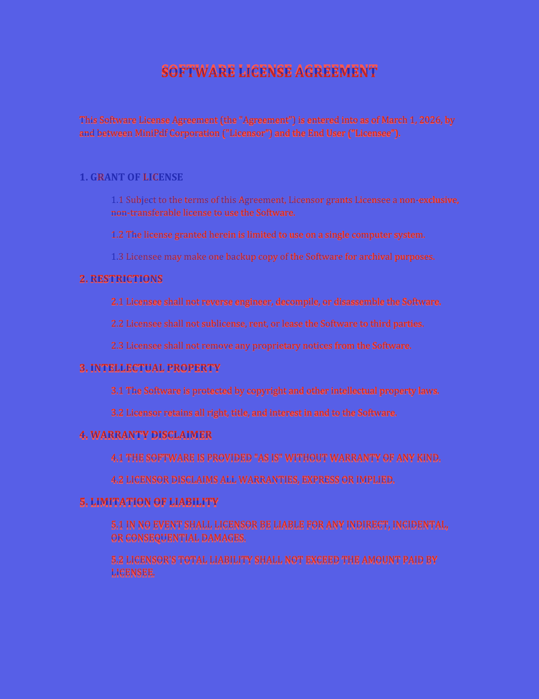</td>
  <td>changed: 111950 px (5.32%)<br>bbox: [188, 152, 1085, 1364]<br>mean abs RGB: 7.4091<br>RMSE RGB: 37.0483<br>threshold: 12, gain: 5.0</td>
</tr>
<tr>
  <td><b>docx_classic72_technical_specification</b><br>Page 1</td>
  <td>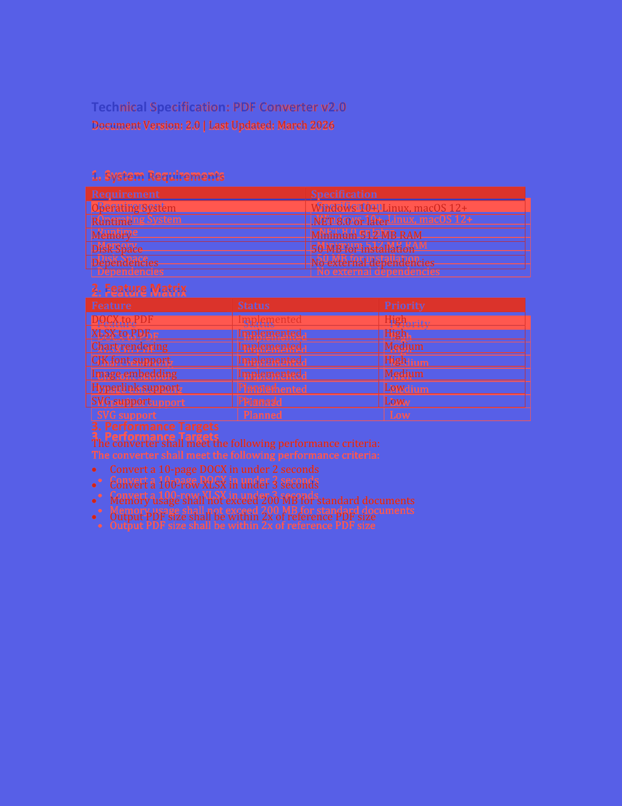</td>
  <td>changed: 222797 px (10.59%)<br>bbox: [175, 208, 1088, 1088]<br>mean abs RGB: 15.7738<br>RMSE RGB: 53.8455<br>threshold: 12, gain: 5.0</td>
</tr>
<tr>
  <td><b>docx_classic73_calendar_layout</b><br>Page 1</td>
  <td>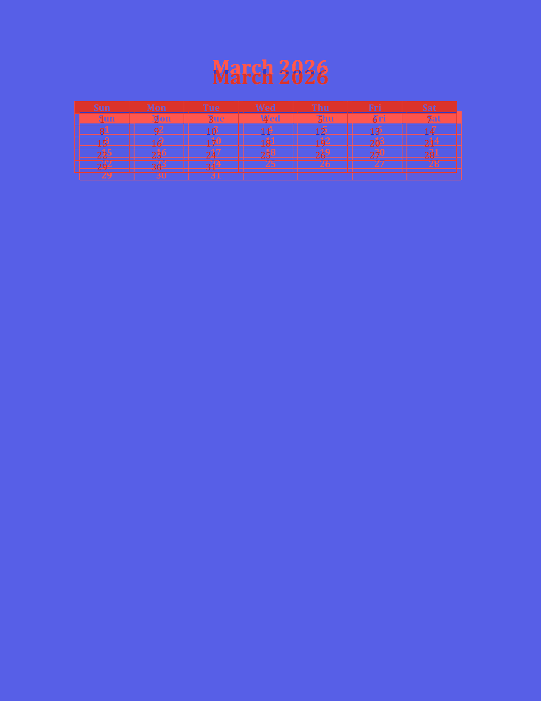</td>
  <td>changed: 84490 px (4.02%)<br>bbox: [175, 140, 1088, 425]<br>mean abs RGB: 5.59<br>RMSE RGB: 31.658<br>threshold: 12, gain: 5.0</td>
</tr>
<tr>
  <td><b>docx_classic74_org_chart</b><br>Page 1</td>
  <td>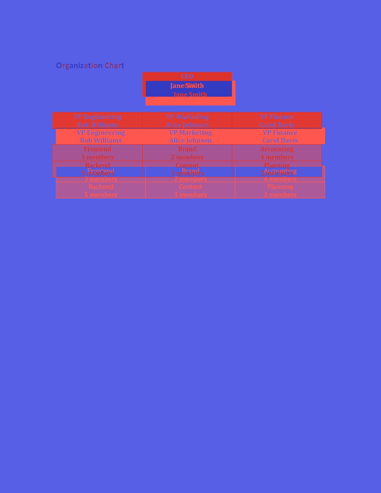</td>
  <td>changed: 248960 px (11.83%)<br>bbox: [175, 208, 1088, 664]<br>mean abs RGB: 10.1888<br>RMSE RGB: 38.1657<br>threshold: 12, gain: 5.0</td>
</tr>
<tr>
  <td><b>docx_classic75_newsletter_layout</b><br>Page 1</td>
  <td>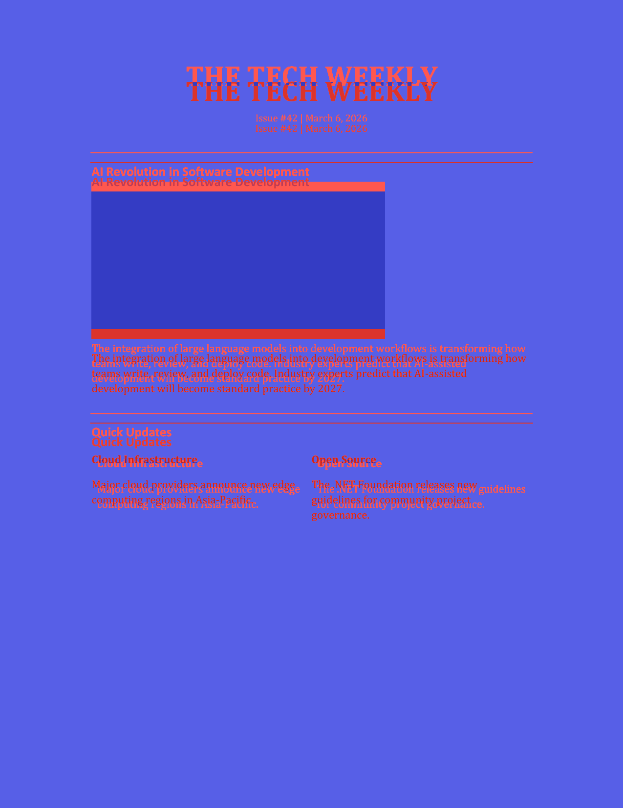</td>
  <td>changed: 108222 px (5.14%)<br>bbox: [184, 135, 1091, 1064]<br>mean abs RGB: 7.6363<br>RMSE RGB: 37.7286<br>threshold: 12, gain: 5.0</td>
</tr>
<tr>
  <td><b>docx_classic76_recipe_card</b><br>Page 1</td>
  <td>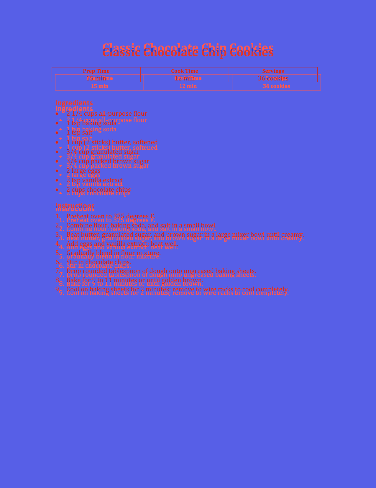</td>
  <td>changed: 103299 px (4.91%)<br>bbox: [175, 145, 1088, 1002]<br>mean abs RGB: 7.8614<br>RMSE RGB: 39.6798<br>threshold: 12, gain: 5.0</td>
</tr>
<tr>
  <td><b>docx_classic77_timeline_layout</b><br>Page 1</td>
  <td>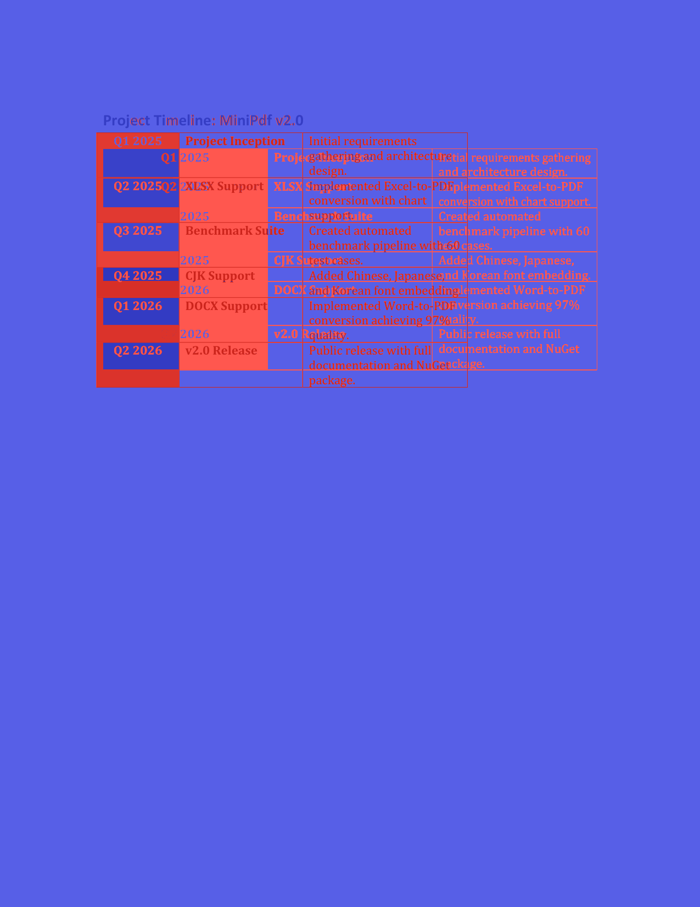</td>
  <td>changed: 166055 px (7.89%)<br>bbox: [175, 208, 1088, 706]<br>mean abs RGB: 11.2801<br>RMSE RGB: 45.7828<br>threshold: 12, gain: 5.0</td>
</tr>
<tr>
  <td><b>docx_classic78_faq_document</b><br>Page 1</td>
  <td>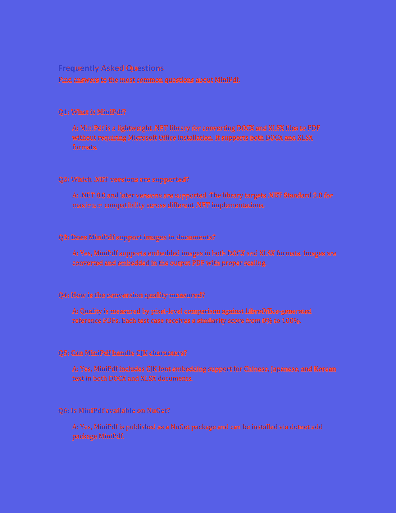</td>
  <td>changed: 96912 px (4.61%)<br>bbox: [188, 208, 1083, 1417]<br>mean abs RGB: 5.7941<br>RMSE RGB: 31.6118<br>threshold: 12, gain: 5.0</td>
</tr>
<tr>
  <td><b>docx_classic78_faq_document</b><br>Page 2</td>
  <td>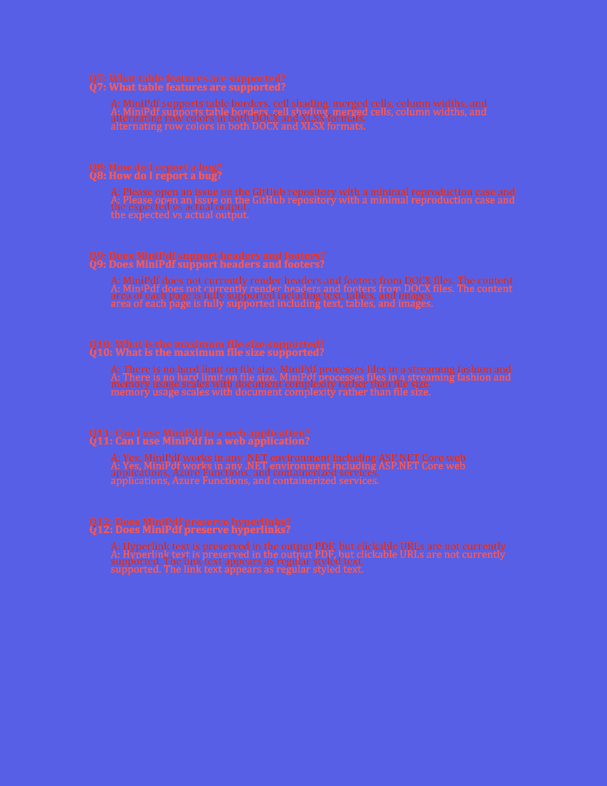</td>
  <td>changed: 138775 px (6.60%)<br>bbox: [188, 155, 1082, 1207]<br>mean abs RGB: 9.9768<br>RMSE RGB: 43.8109<br>threshold: 12, gain: 5.0</td>
</tr>
<tr>
  <td><b>docx_classic79_glossary</b><br>Page 1</td>
  <td>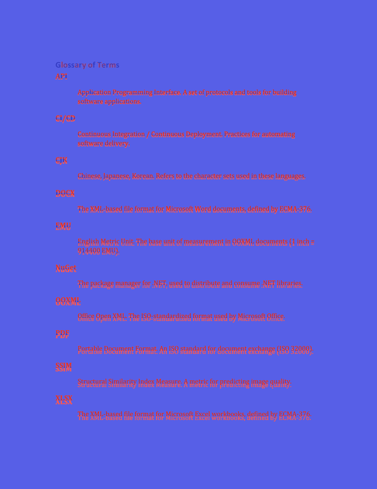</td>
  <td>changed: 93426 px (4.44%)<br>bbox: [187, 208, 1063, 1422]<br>mean abs RGB: 6.6513<br>RMSE RGB: 35.8255<br>threshold: 12, gain: 5.0</td>
</tr>
<tr>
  <td><b>docx_classic80_matrix_grid</b><br>Page 1</td>
  <td>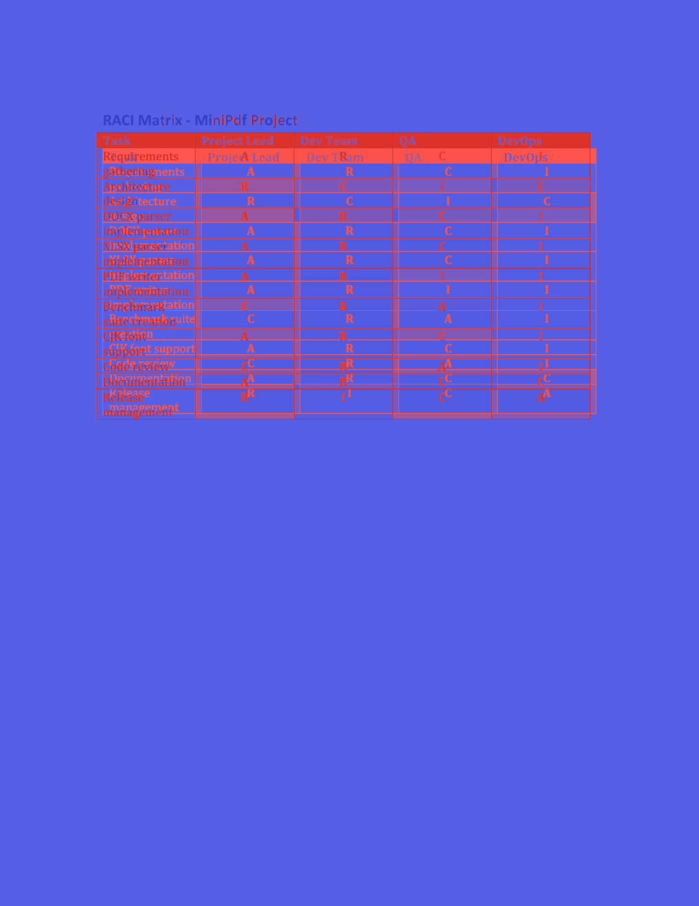</td>
  <td>changed: 205166 px (9.75%)<br>bbox: [175, 208, 1088, 765]<br>mean abs RGB: 9.1585<br>RMSE RGB: 39.3351<br>threshold: 12, gain: 5.0</td>
</tr>
<tr>
  <td><b>docx_classic81_budget_table</b><br>Page 1</td>
  <td>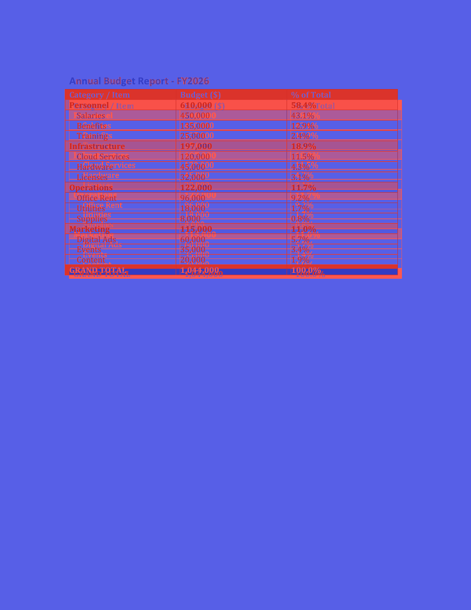</td>
  <td>changed: 264784 px (12.59%)<br>bbox: [175, 208, 1088, 754]<br>mean abs RGB: 13.2006<br>RMSE RGB: 47.0039<br>threshold: 12, gain: 5.0</td>
</tr>
<tr>
  <td><b>docx_classic82_survey_questionnaire</b><br>Page 1</td>
  <td>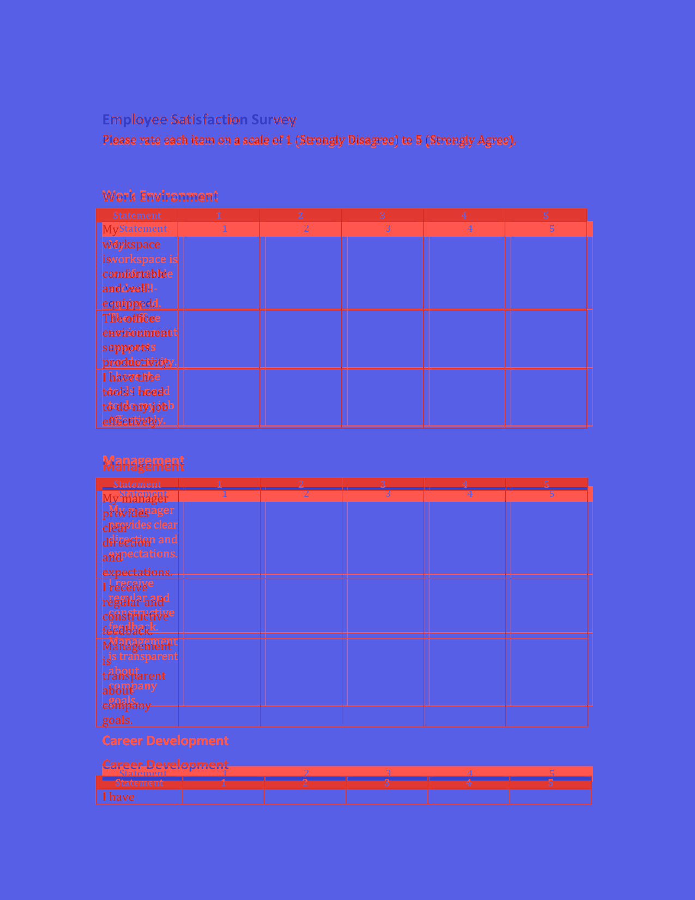</td>
  <td>changed: 201597 px (9.58%)<br>bbox: [175, 208, 1088, 1475]<br>mean abs RGB: 12.5641<br>RMSE RGB: 46.2896<br>threshold: 12, gain: 5.0</td>
</tr>
<tr>
  <td><b>docx_classic82_survey_questionnaire</b><br>Page 2</td>
  <td>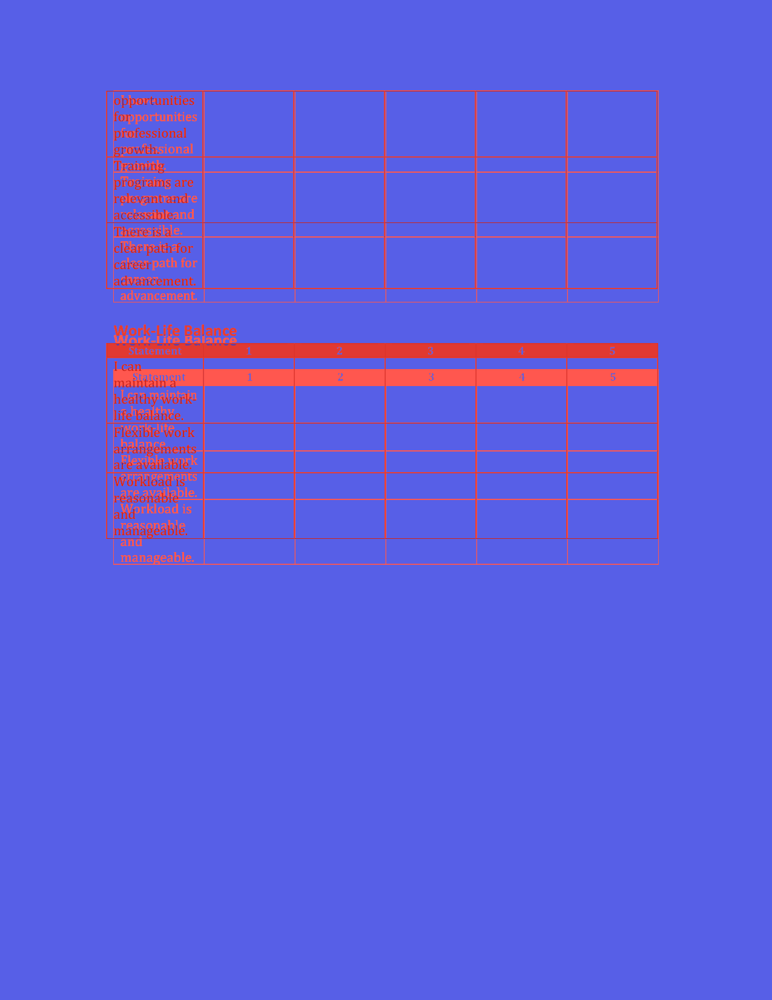</td>
  <td>changed: 114598 px (5.45%)<br>bbox: [175, 149, 1088, 932]<br>mean abs RGB: 7.772<br>RMSE RGB: 37.2891<br>threshold: 12, gain: 5.0</td>
</tr>
<tr>
  <td><b>docx_classic83_medical_form</b><br>Page 1</td>
  <td>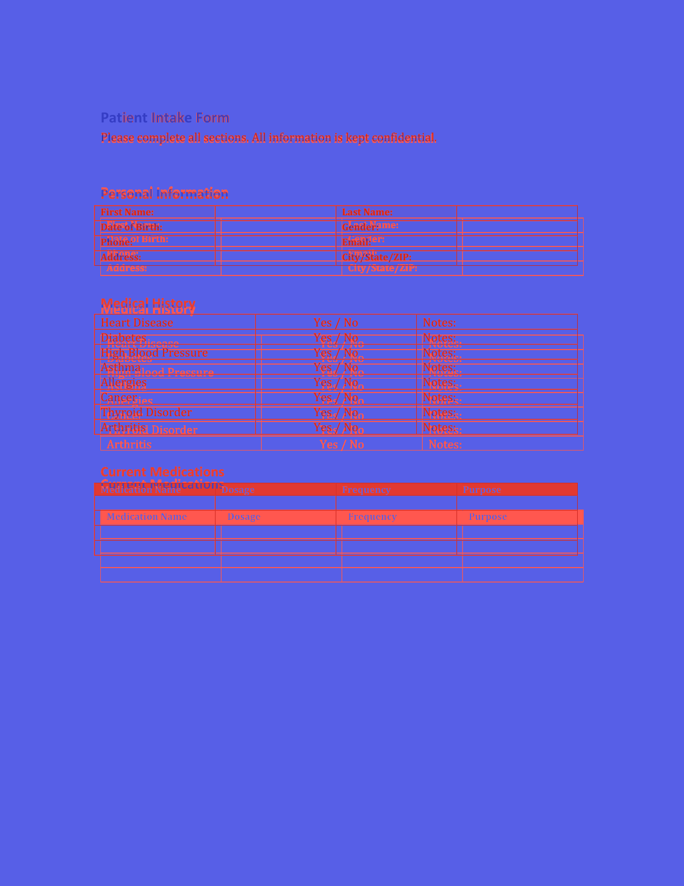</td>
  <td>changed: 175257 px (8.33%)<br>bbox: [175, 208, 1088, 1085]<br>mean abs RGB: 10.6878<br>RMSE RGB: 43.4389<br>threshold: 12, gain: 5.0</td>
</tr>
<tr>
  <td><b>docx_classic84_shipping_label</b><br>Page 1</td>
  <td>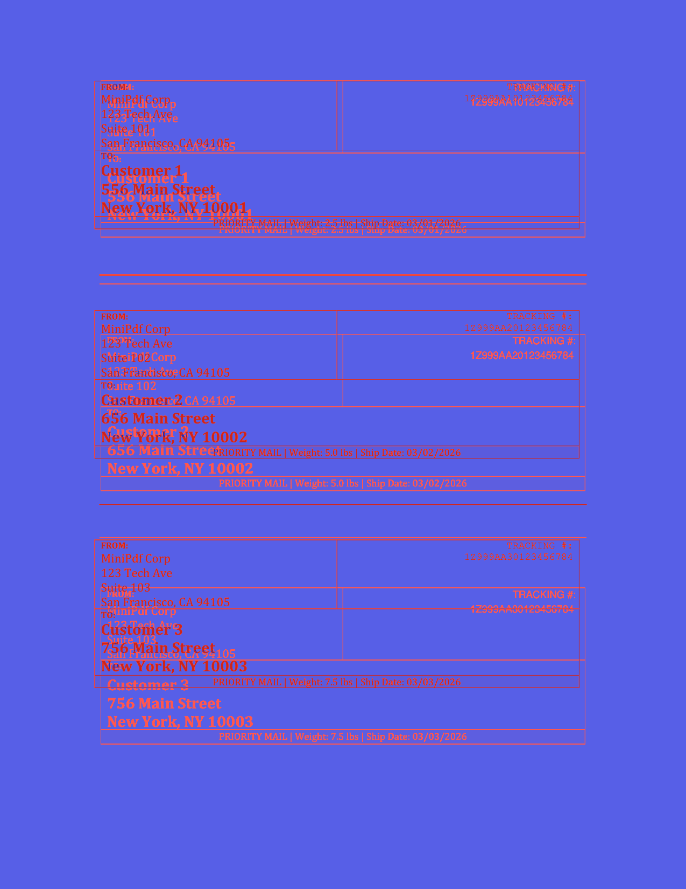</td>
  <td>changed: 224484 px (10.67%)<br>bbox: [175, 149, 1091, 1382]<br>mean abs RGB: 10.9983<br>RMSE RGB: 46.1902<br>threshold: 12, gain: 5.0</td>
</tr>
<tr>
  <td><b>docx_classic85_report_card</b><br>Page 1</td>
  <td>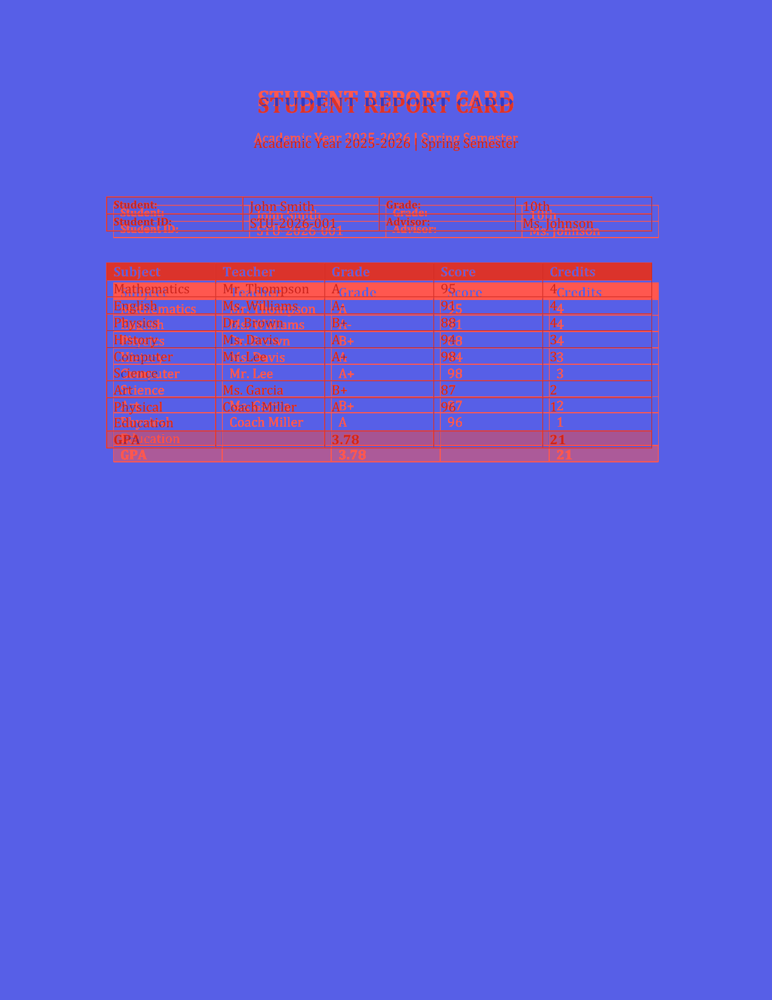</td>
  <td>changed: 178276 px (8.47%)<br>bbox: [175, 149, 1088, 763]<br>mean abs RGB: 9.9752<br>RMSE RGB: 41.901<br>threshold: 12, gain: 5.0</td>
</tr>
<tr>
  <td><b>docx_classic86_checklist_document</b><br>Page 1</td>
  <td>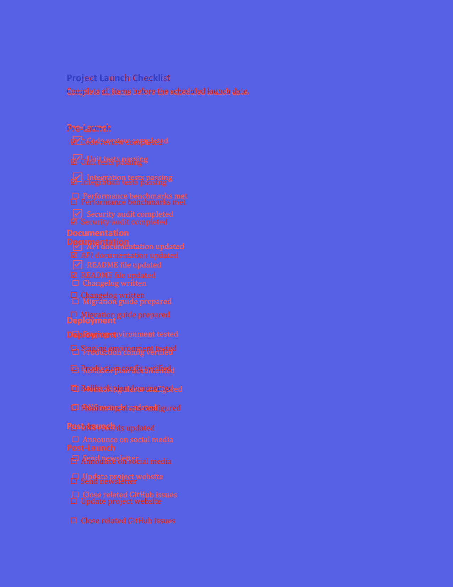</td>
  <td>changed: 71702 px (3.41%)<br>bbox: [188, 208, 701, 1472]<br>mean abs RGB: 4.9166<br>RMSE RGB: 30.4899<br>threshold: 12, gain: 5.0</td>
</tr>
<tr>
  <td><b>docx_classic87_bibliography</b><br>Page 1</td>
  <td>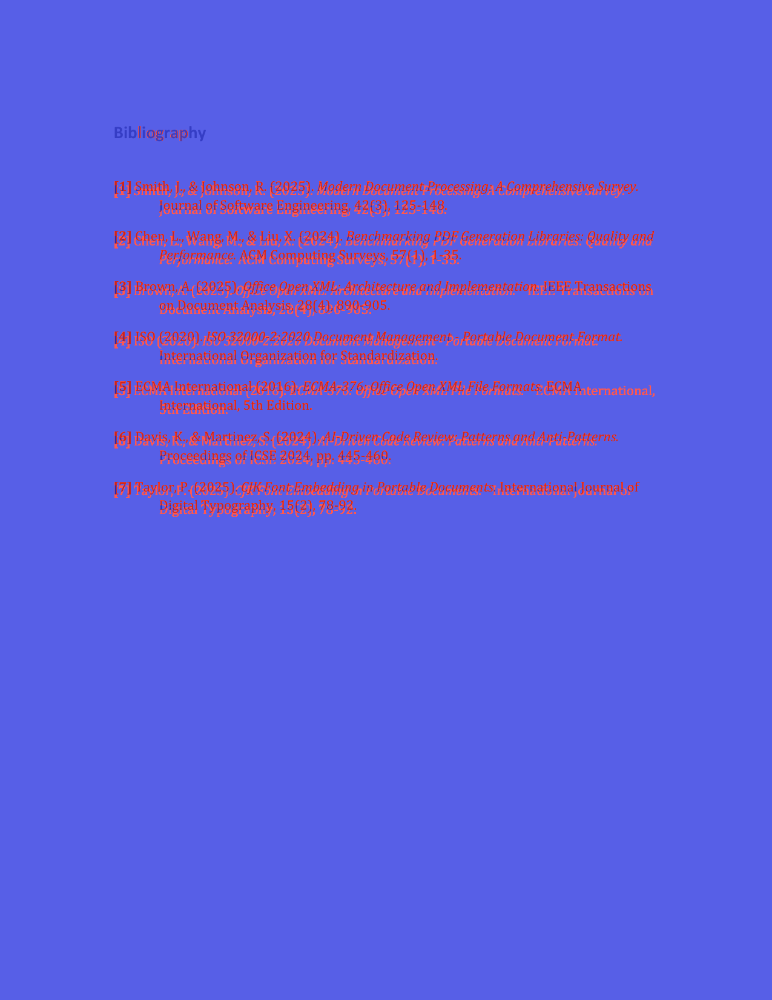</td>
  <td>changed: 93481 px (4.44%)<br>bbox: [189, 208, 1081, 853]<br>mean abs RGB: 6.9558<br>RMSE RGB: 37.2251<br>threshold: 12, gain: 5.0</td>
</tr>
<tr>
  <td><b>docx_classic88_presentation_handout</b><br>Page 1</td>
  <td>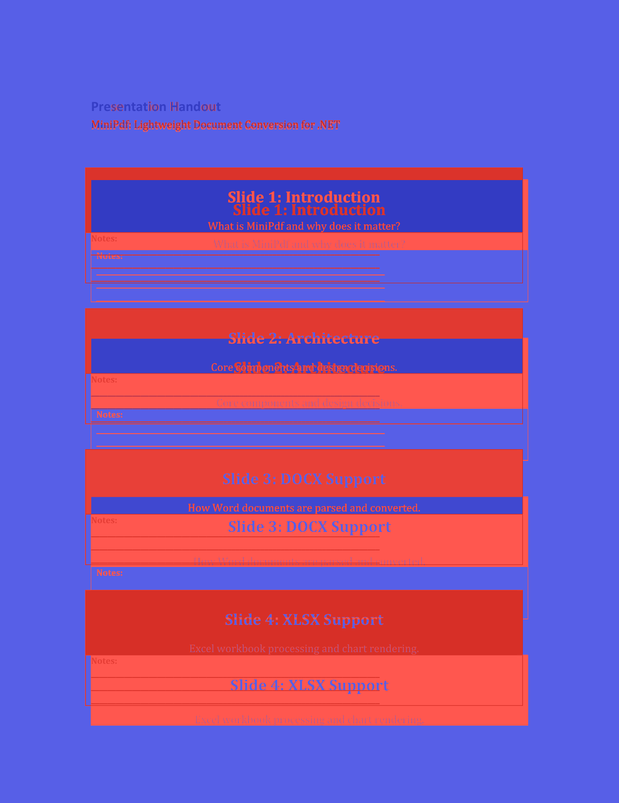</td>
  <td>changed: 657873 px (31.27%)<br>bbox: [175, 208, 1088, 1491]<br>mean abs RGB: 50.1524<br>RMSE RGB: 100.0<br>threshold: 12, gain: 5.0</td>
</tr>
<tr>
  <td><b>docx_classic88_presentation_handout</b><br>Page 2</td>
  <td>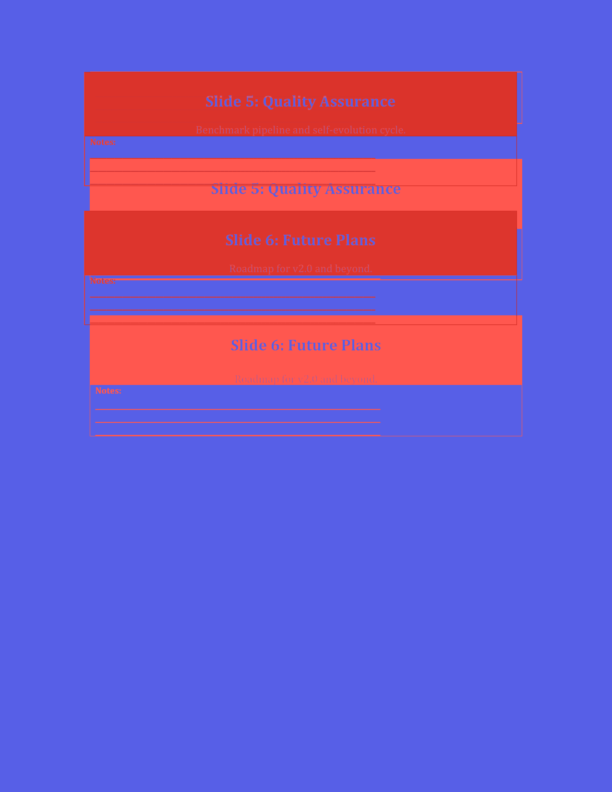</td>
  <td>changed: 477984 px (22.72%)<br>bbox: [175, 149, 1088, 909]<br>mean abs RGB: 32.2431<br>RMSE RGB: 75.0777<br>threshold: 12, gain: 5.0</td>
</tr>
<tr>
  <td><b>docx_classic89_multi_image_gallery</b><br>Page 1</td>
  <td>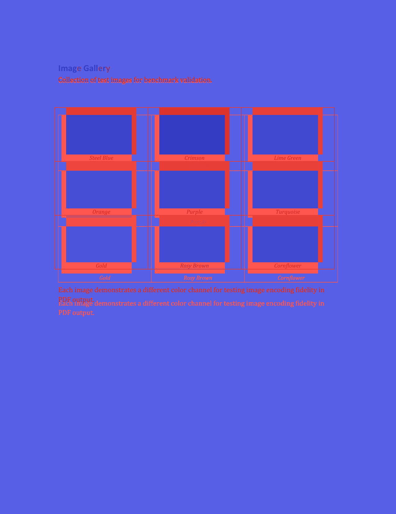</td>
  <td>changed: 180034 px (8.56%)<br>bbox: [175, 209, 1088, 1016]<br>mean abs RGB: 10.0187<br>RMSE RGB: 41.6781<br>threshold: 12, gain: 5.0</td>
</tr>
<tr>
  <td><b>docx_classic90_comprehensive_annual_report</b><br>Page 1</td>
  <td>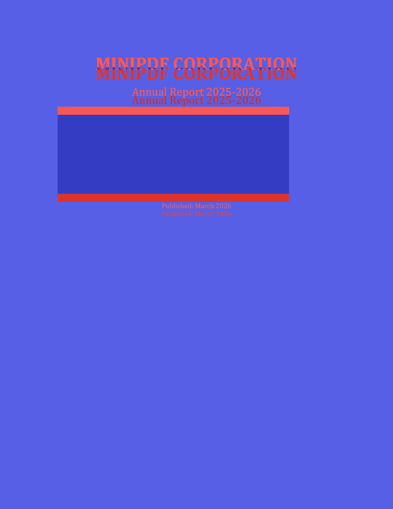</td>
  <td>changed: 71738 px (3.41%)<br>bbox: [187, 186, 963, 702]<br>mean abs RGB: 5.2957<br>RMSE RGB: 30.4802<br>threshold: 12, gain: 5.0</td>
</tr>
<tr>
  <td><b>docx_classic90_comprehensive_annual_report</b><br>Page 2</td>
  <td></td>
  <td>changed: 14598 px (0.69%)<br>bbox: [188, 158, 558, 479]<br>mean abs RGB: 0.9725<br>RMSE RGB: 13.3905<br>threshold: 12, gain: 5.0</td>
</tr>
<tr>
  <td><b>docx_classic90_comprehensive_annual_report</b><br>Page 3</td>
  <td>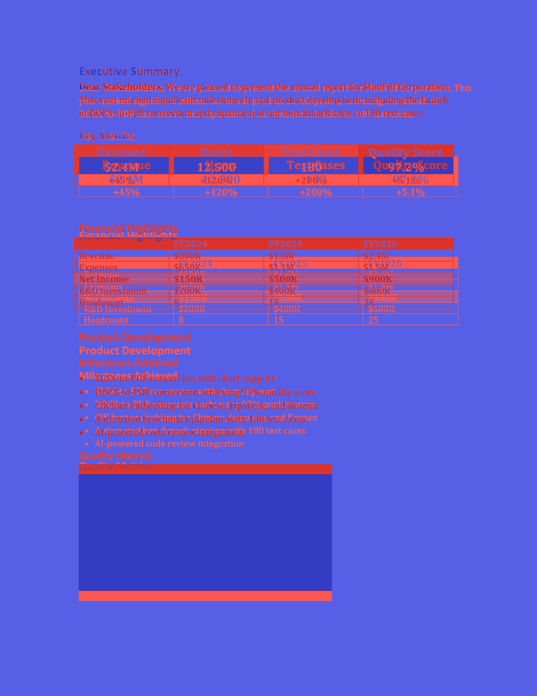</td>
  <td>changed: 278355 px (13.23%)<br>bbox: [175, 158, 1120, 1425]<br>mean abs RGB: 17.4028<br>RMSE RGB: 55.1207<br>threshold: 12, gain: 5.0</td>
</tr>
<tr>
  <td><b>docx_classic90_comprehensive_annual_report</b><br>Page 4</td>
  <td>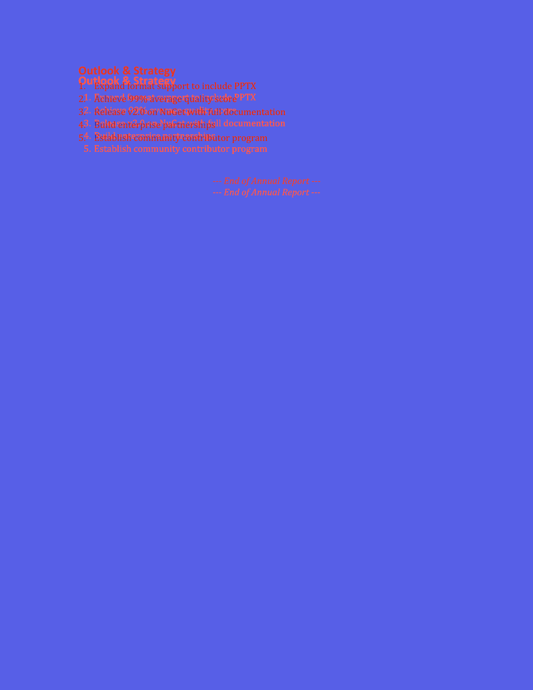</td>
  <td>changed: 28713 px (1.36%)<br>bbox: [188, 158, 766, 472]<br>mean abs RGB: 1.9999<br>RMSE RGB: 19.3941<br>threshold: 12, gain: 5.0</td>
</tr>
<tr>
  <td><b>docx_classic91_landscape_page</b><br>Page 1</td>
  <td>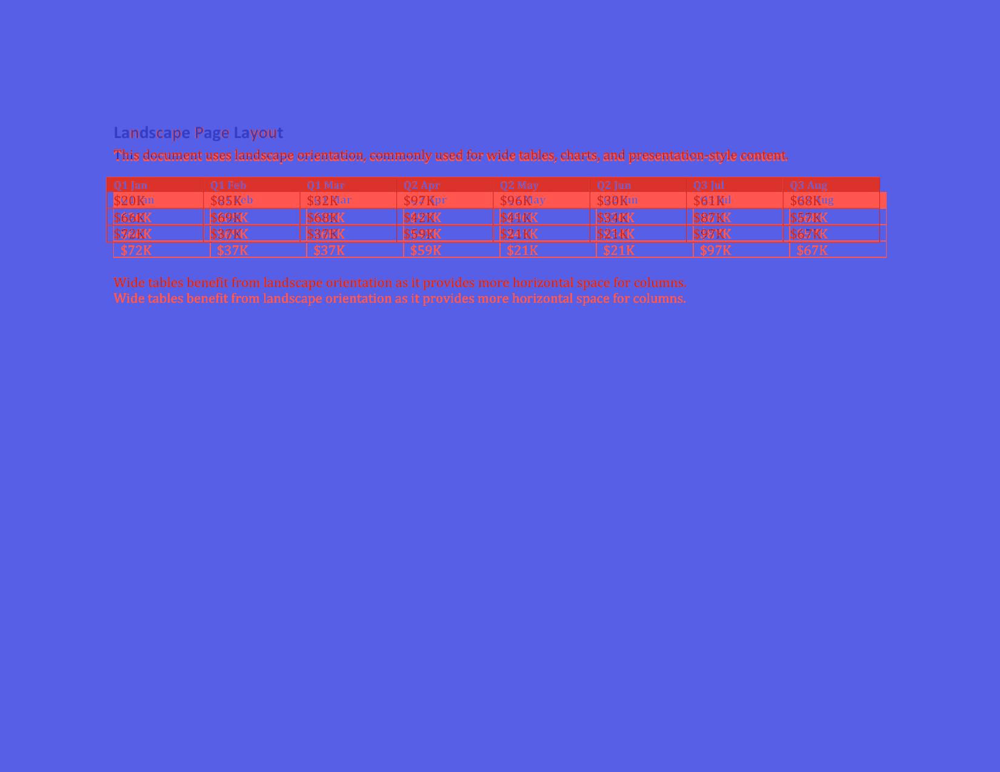</td>
  <td>changed: 114199 px (5.43%)<br>bbox: [175, 208, 1463, 505]<br>mean abs RGB: 8.2602<br>RMSE RGB: 38.3919<br>threshold: 12, gain: 5.0</td>
</tr>
<tr>
  <td><b>docx_classic92_first_line_indent</b><br>Page 1</td>
  <td></td>
  <td>changed: 63724 px (3.03%)<br>bbox: [187, 208, 1083, 642]<br>mean abs RGB: 4.1408<br>RMSE RGB: 27.3585<br>threshold: 12, gain: 5.0</td>
</tr>
<tr>
  <td><b>docx_classic93_hanging_indent</b><br>Page 1</td>
  <td></td>
  <td>changed: 88212 px (4.19%)<br>bbox: [187, 207, 1086, 826]<br>mean abs RGB: 6.2339<br>RMSE RGB: 34.6077<br>threshold: 12, gain: 5.0</td>
</tr>
<tr>
  <td><b>docx_classic94_custom_bullet_characters</b><br>Page 1</td>
  <td>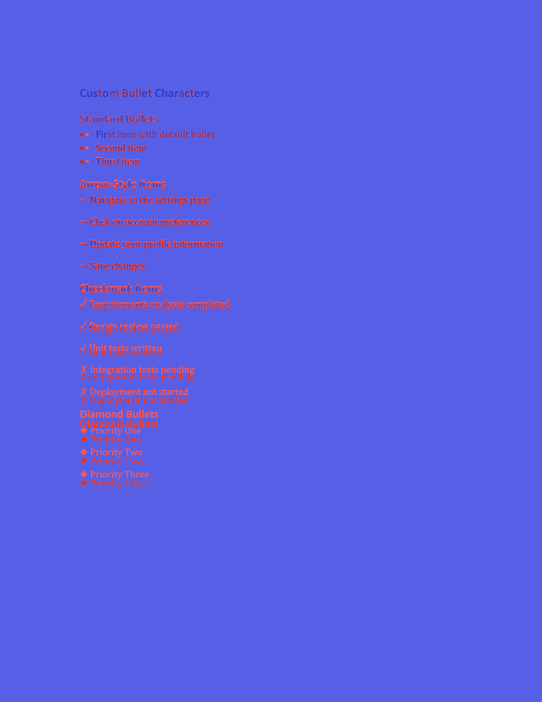</td>
  <td>changed: 39834 px (1.89%)<br>bbox: [187, 208, 540, 1148]<br>mean abs RGB: 2.1061<br>RMSE RGB: 18.263<br>threshold: 12, gain: 5.0</td>
</tr>
<tr>
  <td><b>docx_classic95_contract_template</b><br>Page 1</td>
  <td>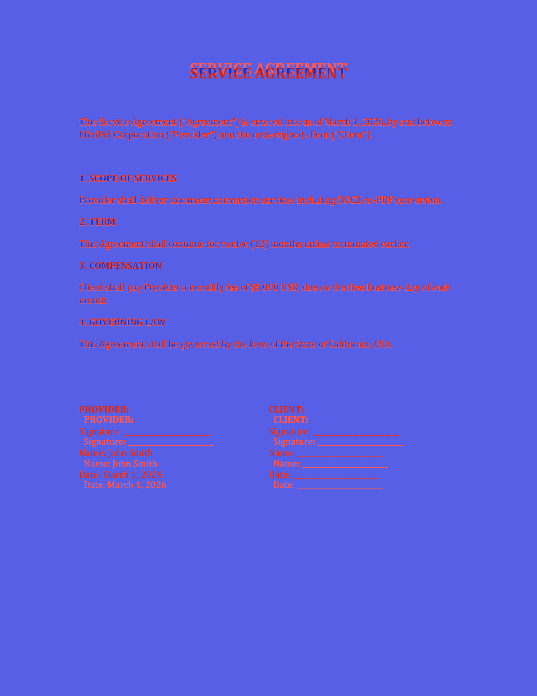</td>
  <td>changed: 68196 px (3.24%)<br>bbox: [188, 149, 1075, 1160]<br>mean abs RGB: 4.8363<br>RMSE RGB: 30.4339<br>threshold: 12, gain: 5.0</td>
</tr>
<tr>
  <td><b>docx_classic96_dense_data_table</b><br>Page 1</td>
  <td>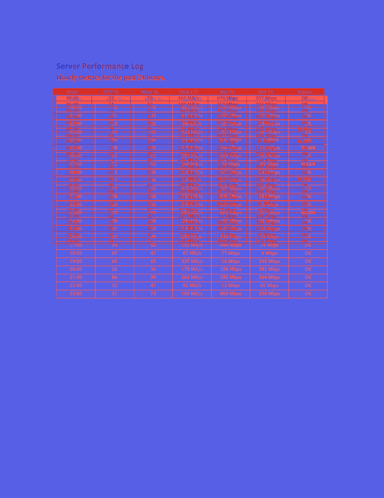</td>
  <td>changed: 413881 px (19.67%)<br>bbox: [175, 208, 1088, 989]<br>mean abs RGB: 16.4997<br>RMSE RGB: 53.1864<br>threshold: 12, gain: 5.0</td>
</tr>
<tr>
  <td><b>docx_classic97_product_catalog</b><br>Page 1</td>
  <td>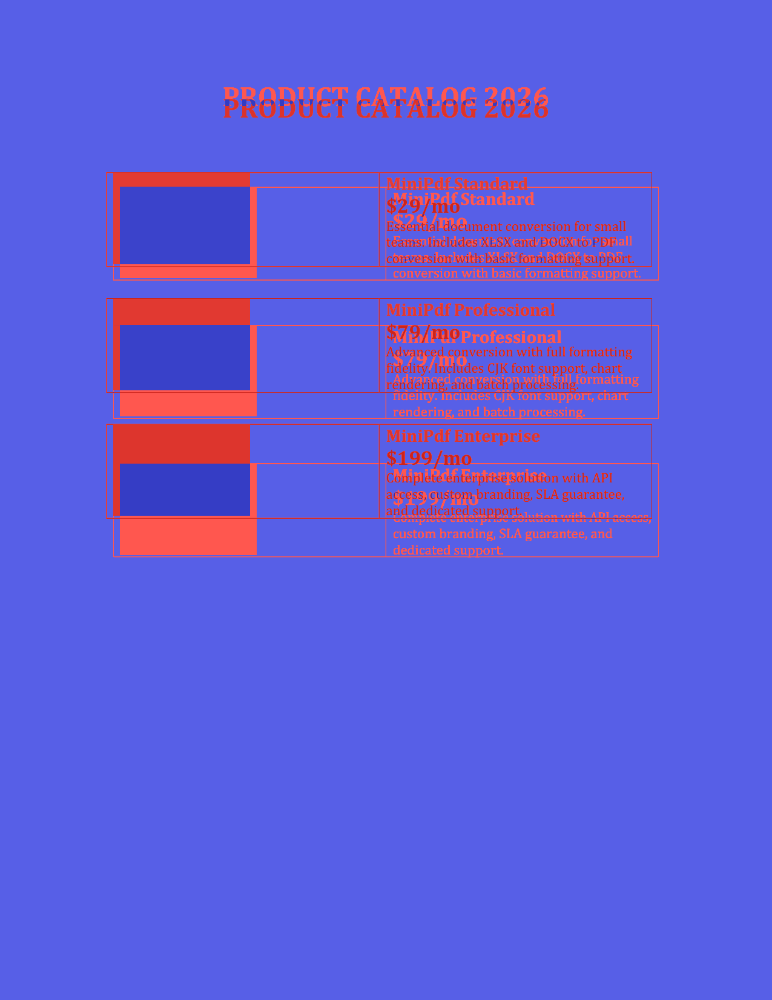</td>
  <td>changed: 160374 px (7.62%)<br>bbox: [175, 144, 1088, 920]<br>mean abs RGB: 11.7141<br>RMSE RGB: 46.8718<br>threshold: 12, gain: 5.0</td>
</tr>
<tr>
  <td><b>docx_classic98_training_manual</b><br>Page 1</td>
  <td>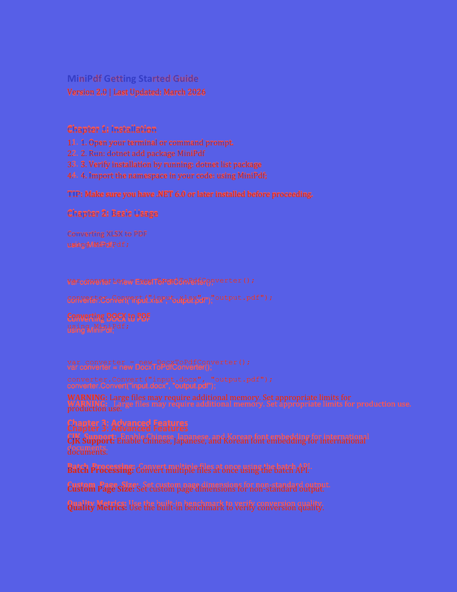</td>
  <td>changed: 110170 px (5.24%)<br>bbox: [187, 208, 1146, 1427]<br>mean abs RGB: 7.5772<br>RMSE RGB: 38.1007<br>threshold: 12, gain: 5.0</td>
</tr>
<tr>
  <td><b>docx_classic99_policy_document</b><br>Page 1</td>
  <td>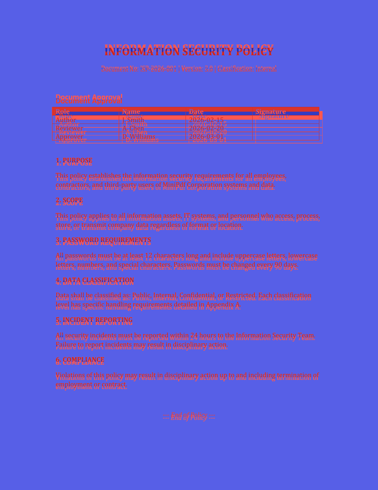</td>
  <td>changed: 181702 px (8.64%)<br>bbox: [175, 149, 1088, 1419]<br>mean abs RGB: 13.6497<br>RMSE RGB: 51.9847<br>threshold: 12, gain: 5.0</td>
</tr>
<tr>
  <td><b>docx_classic100_multi_page_table</b><br>Page 1</td>
  <td>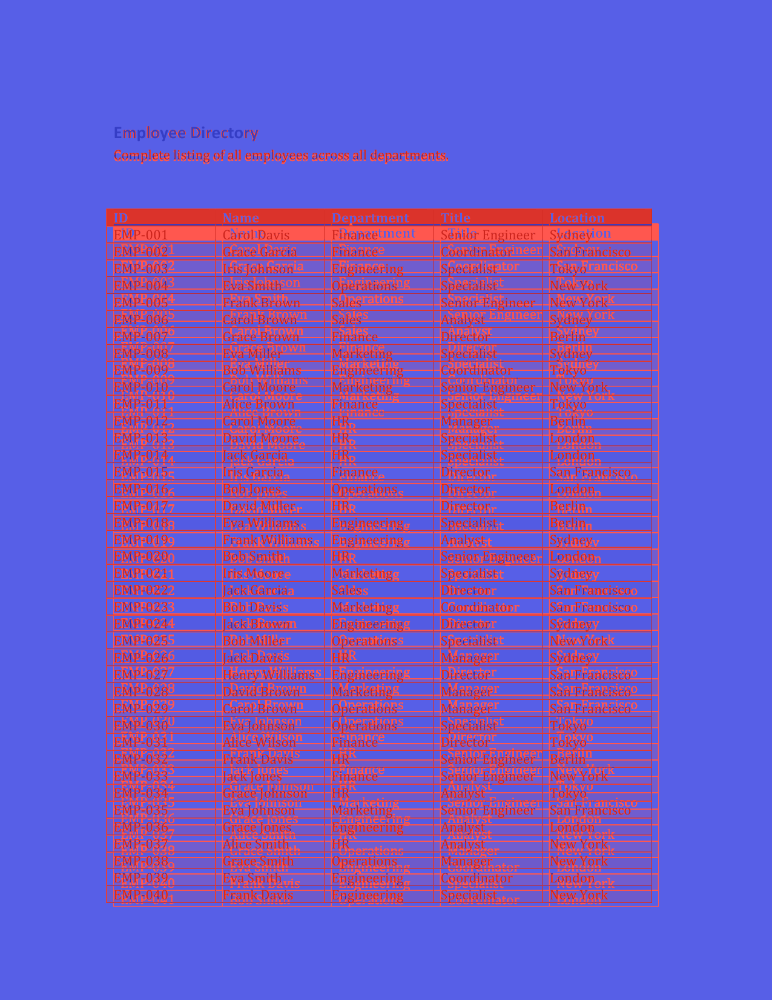</td>
  <td>changed: 657262 px (31.24%)<br>bbox: [175, 208, 1088, 1497]<br>mean abs RGB: 30.6987<br>RMSE RGB: 74.3146<br>threshold: 12, gain: 5.0</td>
</tr>
<tr>
  <td><b>docx_classic100_multi_page_table</b><br>Page 2</td>
  <td>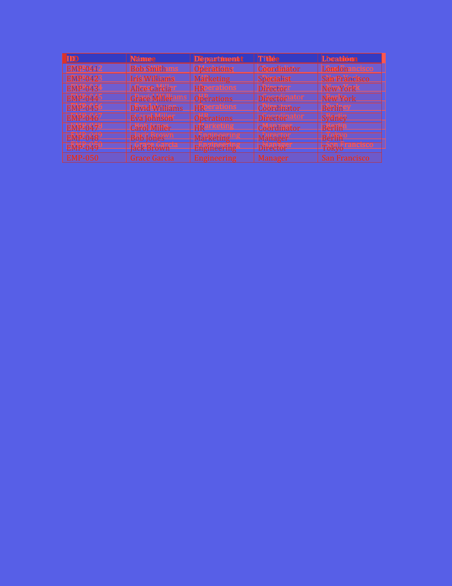</td>
  <td>changed: 222526 px (10.58%)<br>bbox: [175, 149, 1088, 458]<br>mean abs RGB: 7.5393<br>RMSE RGB: 35.7372<br>threshold: 12, gain: 5.0</td>
</tr>
<tr>
  <td><b>docx_classic101_warranty_document</b><br>Page 1</td>
  <td>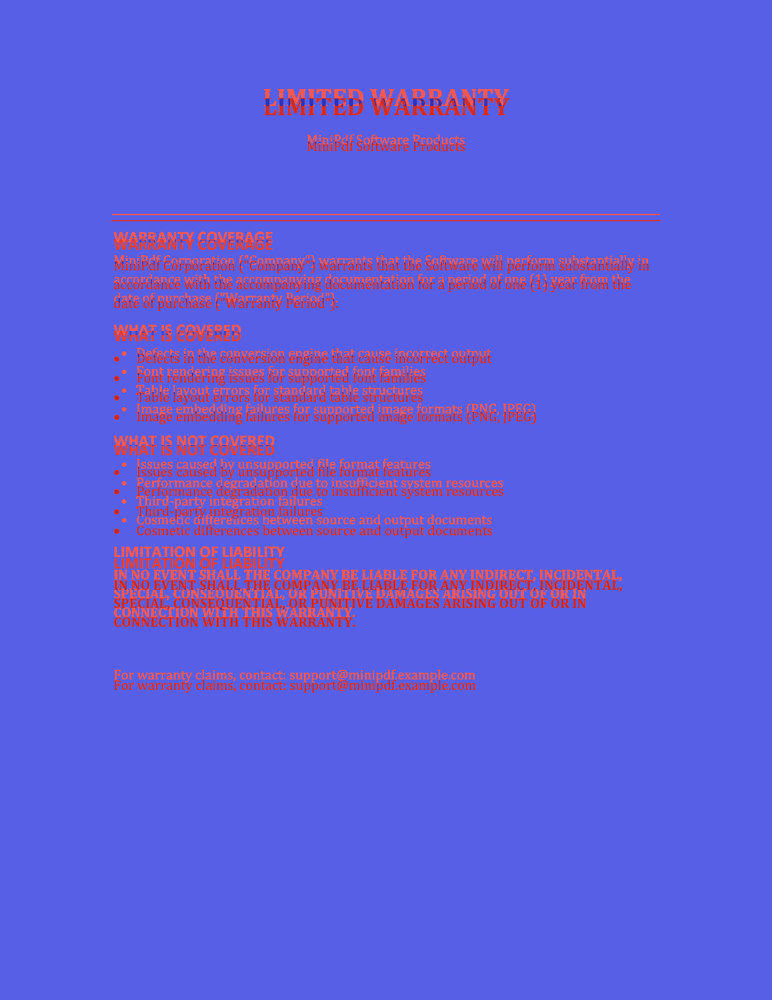</td>
  <td>changed: 147473 px (7.01%)<br>bbox: [184, 147, 1091, 1143]<br>mean abs RGB: 11.1882<br>RMSE RGB: 47.555<br>threshold: 12, gain: 5.0</td>
</tr>
<tr>
  <td><b>docx_classic102_curriculum_syllabus</b><br>Page 1</td>
  <td>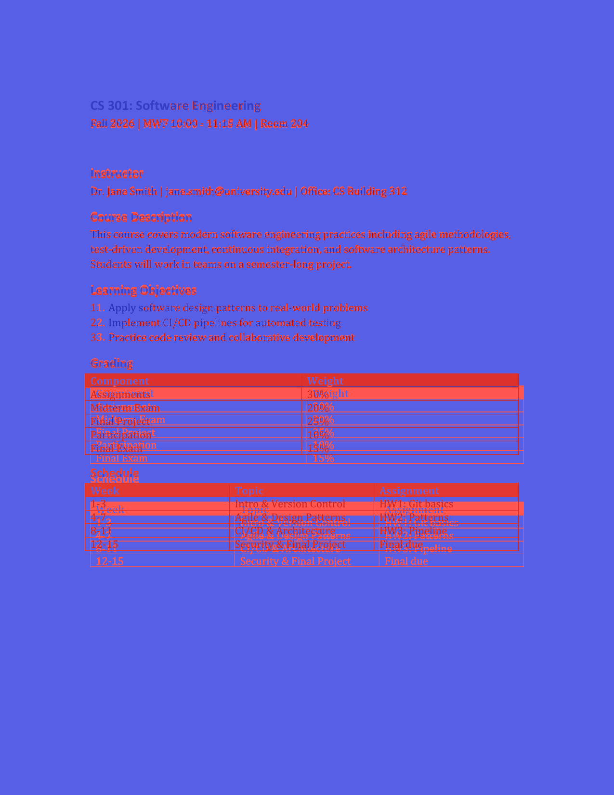</td>
  <td>changed: 195191 px (9.28%)<br>bbox: [175, 208, 1088, 1177]<br>mean abs RGB: 12.6292<br>RMSE RGB: 46.6223<br>threshold: 12, gain: 5.0</td>
</tr>
<tr>
  <td><b>docx_classic103_event_program</b><br>Page 1</td>
  <td></td>
  <td>changed: 47664 px (2.27%)<br>bbox: [337, 138, 938, 551]<br>mean abs RGB: 3.4874<br>RMSE RGB: 24.9762<br>threshold: 12, gain: 5.0</td>
</tr>
<tr>
  <td><b>docx_classic103_event_program</b><br>Page 2</td>
  <td>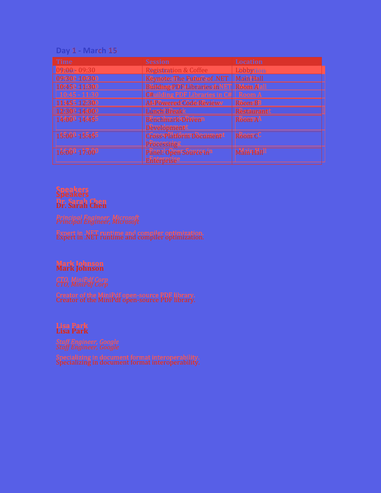</td>
  <td>changed: 156072 px (7.42%)<br>bbox: [175, 158, 1088, 1225]<br>mean abs RGB: 11.2014<br>RMSE RGB: 46.0611<br>threshold: 12, gain: 5.0</td>
</tr>
<tr>
  <td><b>docx_classic104_sop_document</b><br>Page 1</td>
  <td>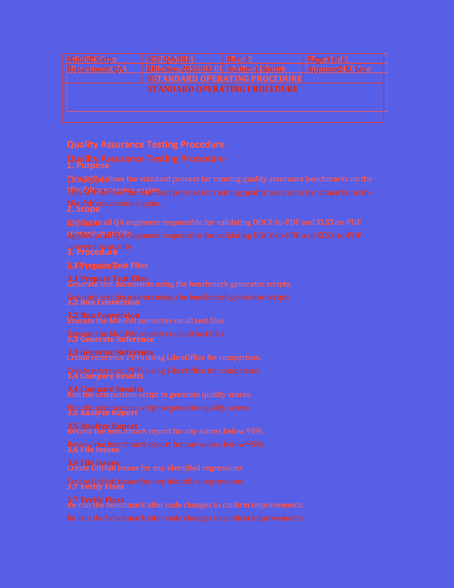</td>
  <td>changed: 139391 px (6.63%)<br>bbox: [175, 149, 1088, 1466]<br>mean abs RGB: 10.66<br>RMSE RGB: 46.3914<br>threshold: 12, gain: 5.0</td>
</tr>
<tr>
  <td><b>docx_classic104_sop_document</b><br>Page 2</td>
  <td></td>
  <td>changed: 13328 px (0.63%)<br>bbox: [188, 163, 670, 313]<br>mean abs RGB: 0.8259<br>RMSE RGB: 12.0242<br>threshold: 12, gain: 5.0</td>
</tr>
<tr>
  <td><b>docx_classic105_certificate</b><br>Page 1</td>
  <td>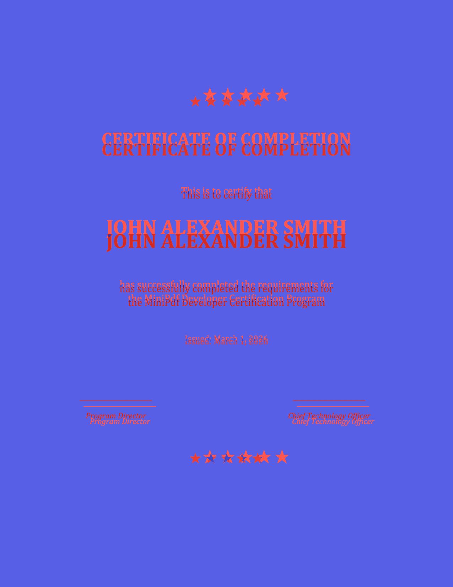</td>
  <td>changed: 81414 px (3.87%)<br>bbox: [224, 246, 1054, 1303]<br>mean abs RGB: 6.1676<br>RMSE RGB: 34.8287<br>threshold: 12, gain: 5.0</td>
</tr>
<tr>
  <td><b>docx_classic106_multi_section_orientation</b><br>Page 1</td>
  <td></td>
  <td>changed: 45447 px (2.16%)<br>bbox: [188, 207, 1077, 549]<br>mean abs RGB: 3.0122<br>RMSE RGB: 23.5129<br>threshold: 12, gain: 5.0</td>
</tr>
<tr>
  <td><b>docx_classic106_multi_section_orientation</b><br>Page 2</td>
  <td>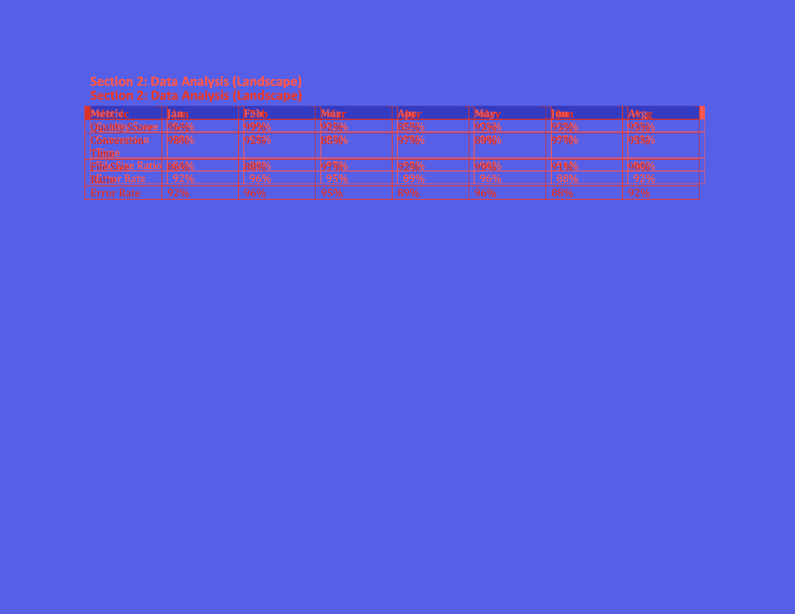</td>
  <td>changed: 66637 px (3.17%)<br>bbox: [175, 157, 1463, 415]<br>mean abs RGB: 4.3856<br>RMSE RGB: 28.4734<br>threshold: 12, gain: 5.0</td>
</tr>
<tr>
  <td><b>docx_classic106_multi_section_orientation</b><br>Page 3</td>
  <td></td>
  <td>changed: 21932 px (1.04%)<br>bbox: [188, 157, 1055, 278]<br>mean abs RGB: 1.535<br>RMSE RGB: 16.9456<br>threshold: 12, gain: 5.0</td>
</tr>
<tr>
  <td><b>docx_classic107_order_form</b><br>Page 1</td>
  <td>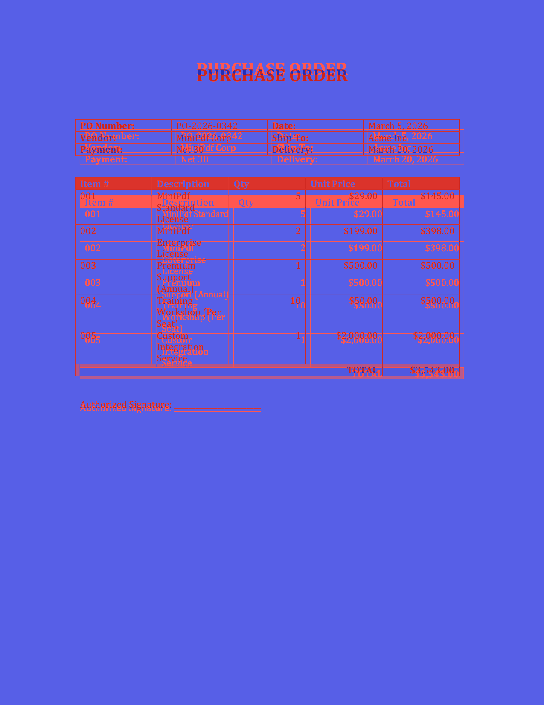</td>
  <td>changed: 162001 px (7.70%)<br>bbox: [175, 146, 1088, 967]<br>mean abs RGB: 11.4852<br>RMSE RGB: 46.5649<br>threshold: 12, gain: 5.0</td>
</tr>
<tr>
  <td><b>docx_classic108_comparison_matrix</b><br>Page 1</td>
  <td>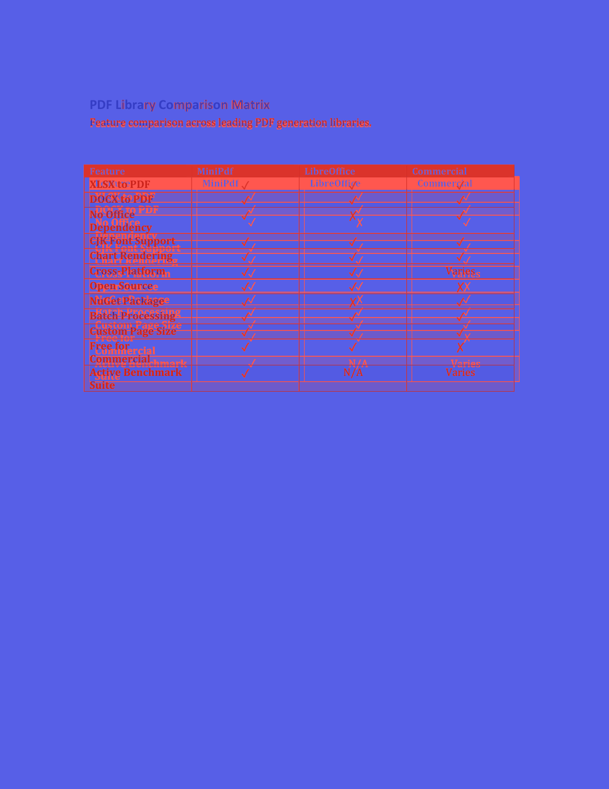</td>
  <td>changed: 240582 px (11.44%)<br>bbox: [175, 208, 1088, 820]<br>mean abs RGB: 10.4601<br>RMSE RGB: 42.9061<br>threshold: 12, gain: 5.0</td>
</tr>
<tr>
  <td><b>docx_classic109_release_notes</b><br>Page 1</td>
  <td>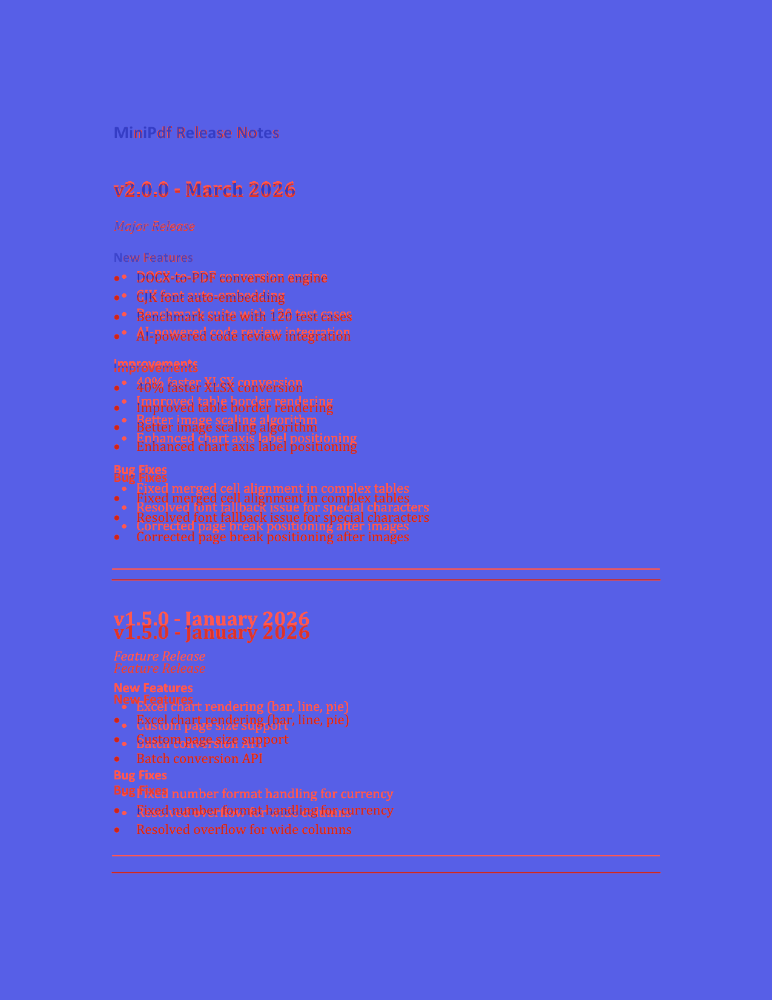</td>
  <td>changed: 93696 px (4.45%)<br>bbox: [184, 208, 1091, 1441]<br>mean abs RGB: 6.4778<br>RMSE RGB: 35.229<br>threshold: 12, gain: 5.0</td>
</tr>
<tr>
  <td><b>docx_classic110_troubleshooting_guide</b><br>Page 1</td>
  <td>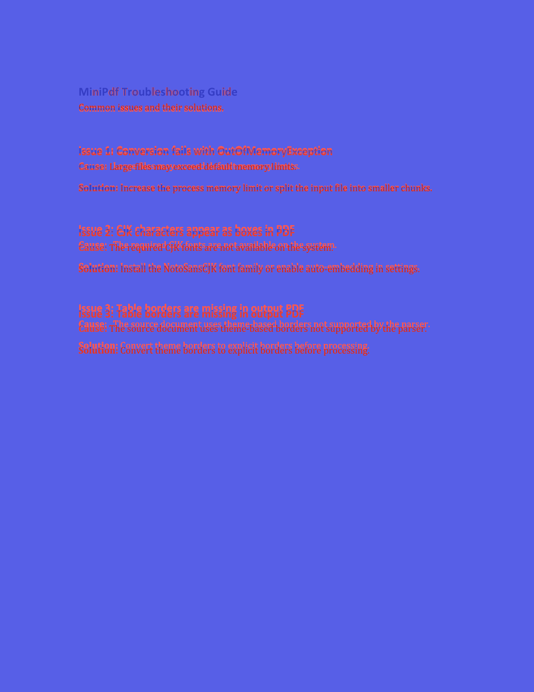</td>
  <td>changed: 70013 px (3.33%)<br>bbox: [188, 208, 1031, 848]<br>mean abs RGB: 4.3539<br>RMSE RGB: 27.832<br>threshold: 12, gain: 5.0</td>
</tr>
<tr>
  <td><b>docx_classic111_meeting_agenda</b><br>Page 1</td>
  <td>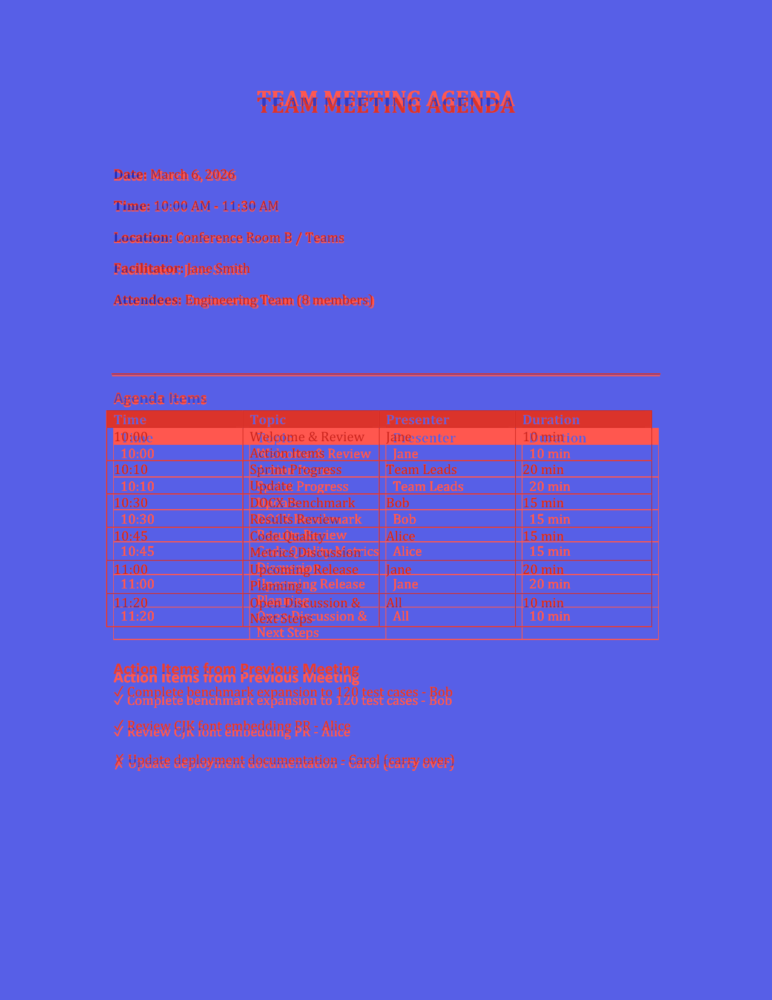</td>
  <td>changed: 155536 px (7.39%)<br>bbox: [175, 149, 1091, 1272]<br>mean abs RGB: 11.0345<br>RMSE RGB: 45.0771<br>threshold: 12, gain: 5.0</td>
</tr>
<tr>
  <td><b>docx_classic112_project_status_report</b><br>Page 1</td>
  <td>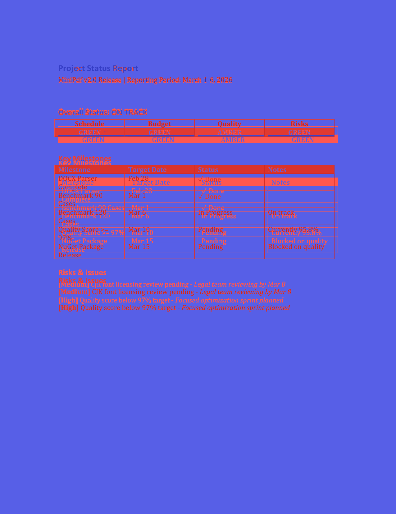</td>
  <td>changed: 176262 px (8.38%)<br>bbox: [175, 209, 1088, 1000]<br>mean abs RGB: 12.5835<br>RMSE RGB: 48.0764<br>threshold: 12, gain: 5.0</td>
</tr>
<tr>
  <td><b>docx_classic113_address_labels</b><br>Page 1</td>
  <td>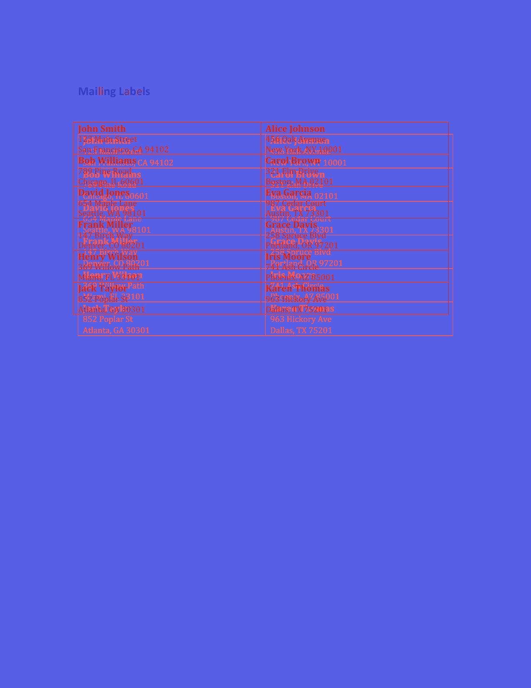</td>
  <td>changed: 89221 px (4.24%)<br>bbox: [175, 208, 1088, 806]<br>mean abs RGB: 6.7335<br>RMSE RGB: 36.7765<br>threshold: 12, gain: 5.0</td>
</tr>
<tr>
  <td><b>docx_classic114_test_report</b><br>Page 1</td>
  <td>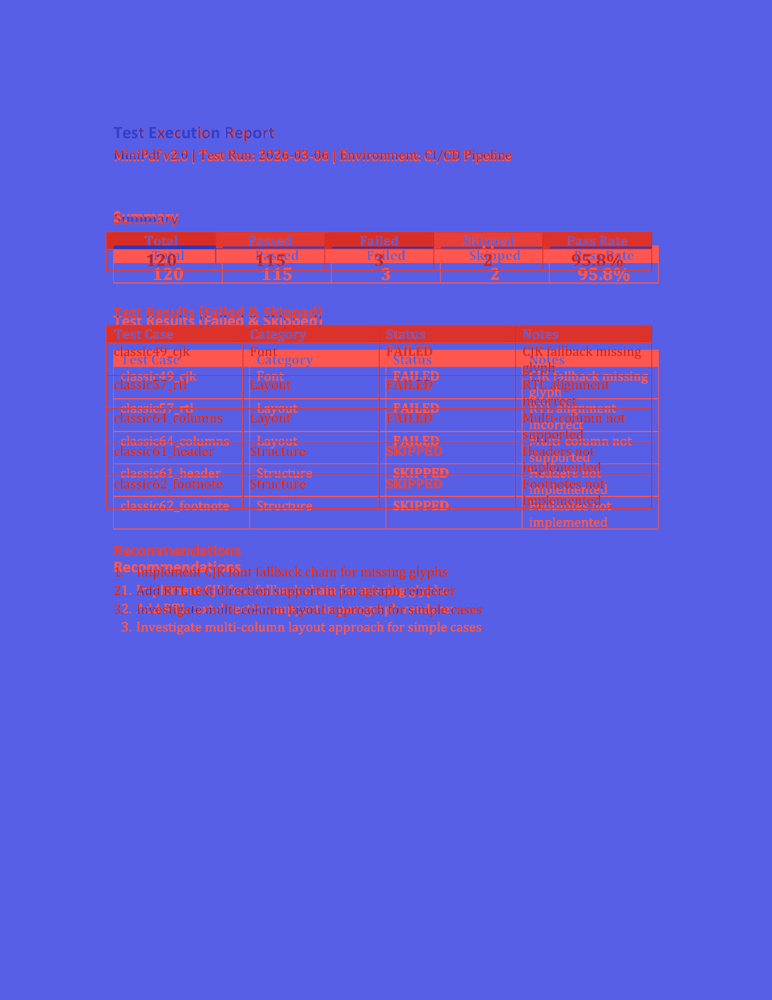</td>
  <td>changed: 187841 px (8.93%)<br>bbox: [175, 208, 1088, 1047]<br>mean abs RGB: 13.3113<br>RMSE RGB: 49.65<br>threshold: 12, gain: 5.0</td>
</tr>
<tr>
  <td><b>docx_classic115_price_list</b><br>Page 1</td>
  <td>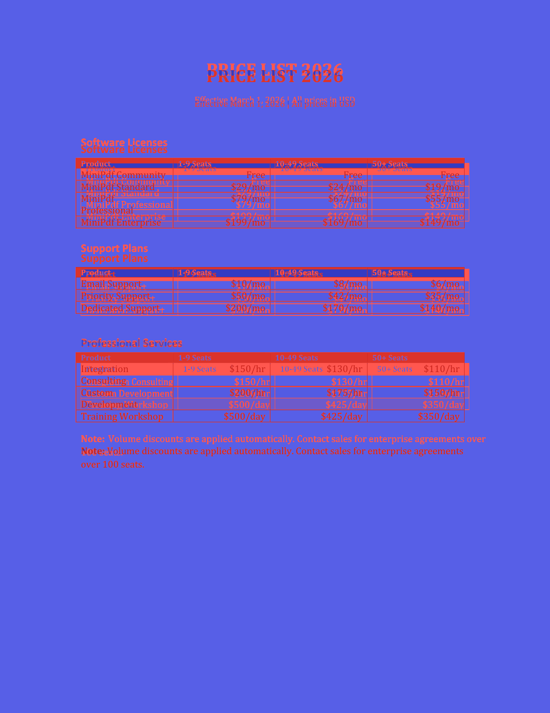</td>
  <td>changed: 270884 px (12.88%)<br>bbox: [175, 146, 1126, 1083]<br>mean abs RGB: 14.7015<br>RMSE RGB: 50.6399<br>threshold: 12, gain: 5.0</td>
</tr>
<tr>
  <td><b>docx_classic116_risk_assessment</b><br>Page 1</td>
  <td>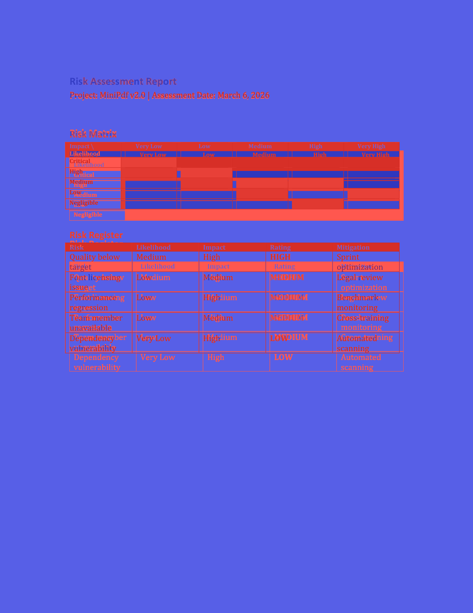</td>
  <td>changed: 238846 px (11.35%)<br>bbox: [175, 208, 1088, 1001]<br>mean abs RGB: 15.5253<br>RMSE RGB: 52.7114<br>threshold: 12, gain: 5.0</td>
</tr>
<tr>
  <td><b>docx_classic117_employee_handbook_excerpt</b><br>Page 1</td>
  <td>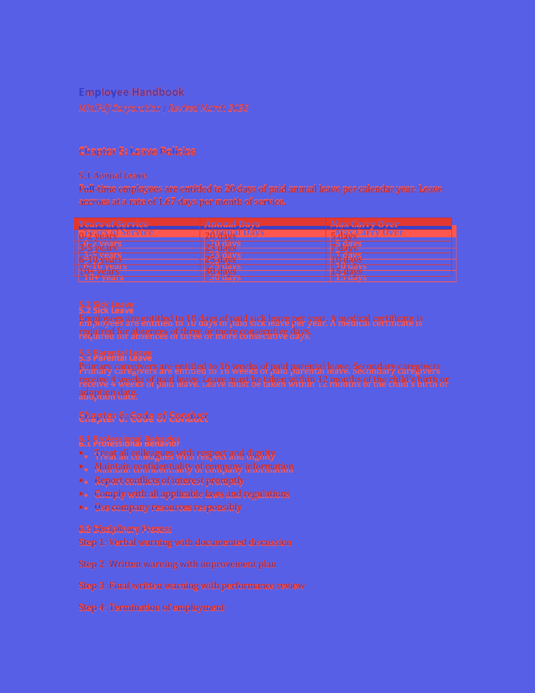</td>
  <td>changed: 165022 px (7.84%)<br>bbox: [175, 208, 1088, 1460]<br>mean abs RGB: 10.6466<br>RMSE RGB: 43.7162<br>threshold: 12, gain: 5.0</td>
</tr>
<tr>
  <td><b>docx_classic118_data_report_with_summary</b><br>Page 1</td>
  <td>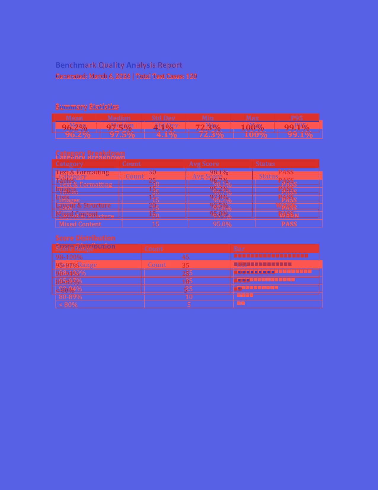</td>
  <td>changed: 239627 px (11.39%)<br>bbox: [175, 208, 1088, 1038]<br>mean abs RGB: 16.8332<br>RMSE RGB: 55.4172<br>threshold: 12, gain: 5.0</td>
</tr>
<tr>
  <td><b>docx_classic119_multi_language_document</b><br>Page 1</td>
  <td>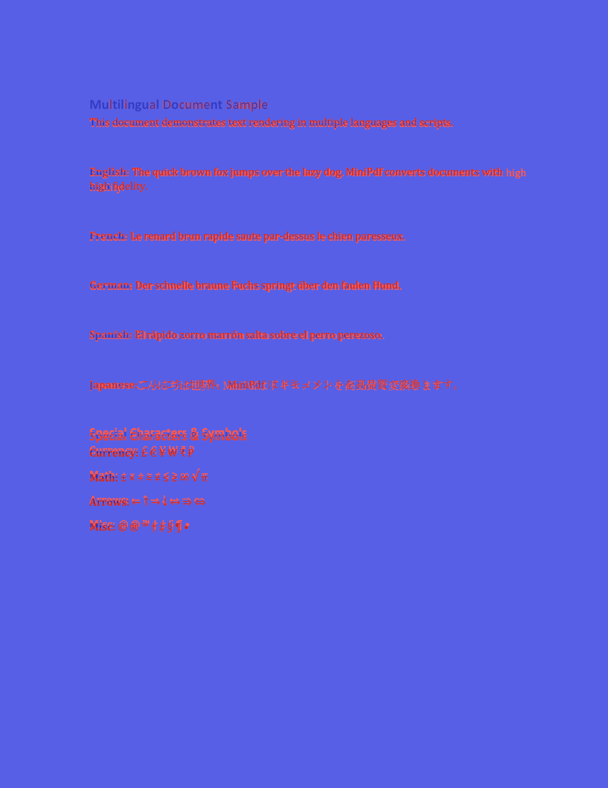</td>
  <td>changed: 56201 px (2.67%)<br>bbox: [187, 208, 1103, 1116]<br>mean abs RGB: 3.7642<br>RMSE RGB: 26.521<br>threshold: 12, gain: 5.0</td>
</tr>
<tr>
  <td><b>docx_classic120_comprehensive_business_proposal</b><br>Page 1</td>
  <td>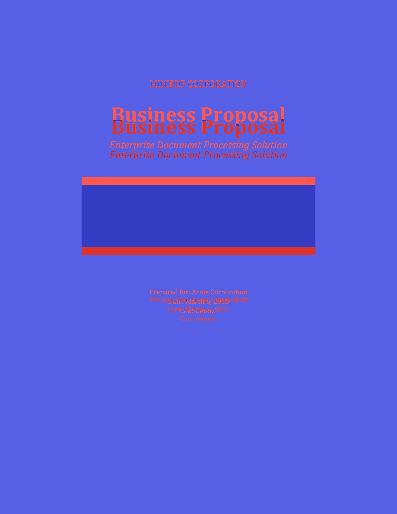</td>
  <td>changed: 77326 px (3.68%)<br>bbox: [262, 258, 1013, 1032]<br>mean abs RGB: 5.4842<br>RMSE RGB: 30.7097<br>threshold: 12, gain: 5.0</td>
</tr>
<tr>
  <td><b>docx_classic120_comprehensive_business_proposal</b><br>Page 2</td>
  <td></td>
  <td>changed: 20051 px (0.95%)<br>bbox: [188, 158, 584, 579]<br>mean abs RGB: 1.3627<br>RMSE RGB: 15.9354<br>threshold: 12, gain: 5.0</td>
</tr>
<tr>
  <td><b>docx_classic120_comprehensive_business_proposal</b><br>Page 3</td>
  <td>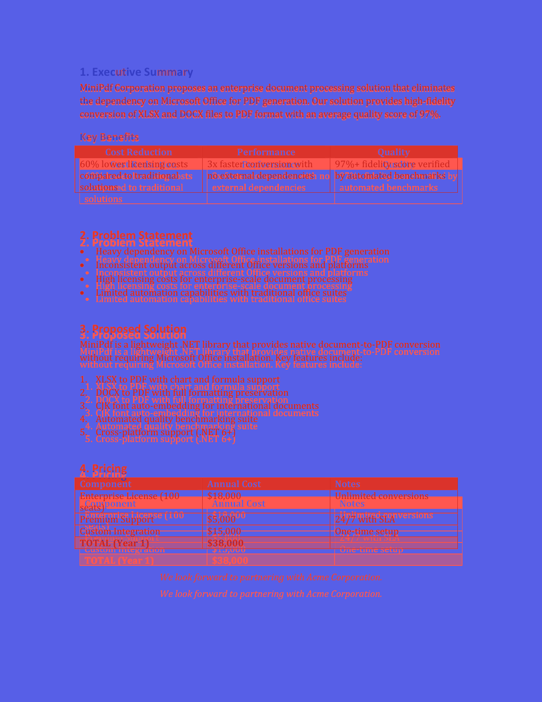</td>
  <td>changed: 307400 px (14.61%)<br>bbox: [175, 158, 1088, 1408]<br>mean abs RGB: 20.1527<br>RMSE RGB: 60.5568<br>threshold: 12, gain: 5.0</td>
</tr>
<tr>
  <td><b>docx_classic121_thin_border_table</b><br>Page 1</td>
  <td>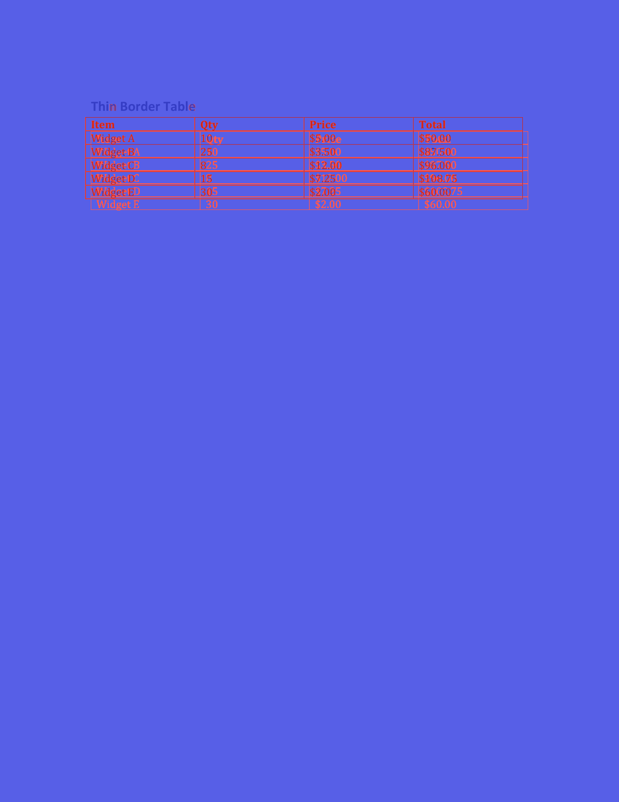</td>
  <td>changed: 40708 px (1.93%)<br>bbox: [175, 208, 1088, 433]<br>mean abs RGB: 2.9495<br>RMSE RGB: 23.8851<br>threshold: 12, gain: 5.0</td>
</tr>
<tr>
  <td><b>docx_classic122_thick_outer_border_table</b><br>Page 1</td>
  <td></td>
  <td>changed: 53863 px (2.56%)<br>bbox: [174, 208, 1090, 434]<br>mean abs RGB: 4.6801<br>RMSE RGB: 31.5987<br>threshold: 12, gain: 5.0</td>
</tr>
<tr>
  <td><b>docx_classic123_dashed_border_table</b><br>Page 1</td>
  <td>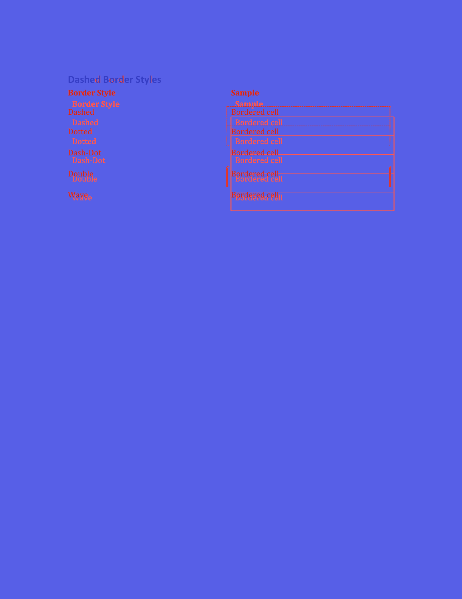</td>
  <td>changed: 27017 px (1.28%)<br>bbox: [187, 208, 1089, 582]<br>mean abs RGB: 1.9723<br>RMSE RGB: 19.5518<br>threshold: 12, gain: 5.0</td>
</tr>
<tr>
  <td><b>docx_classic124_colored_border_table</b><br>Page 1</td>
  <td>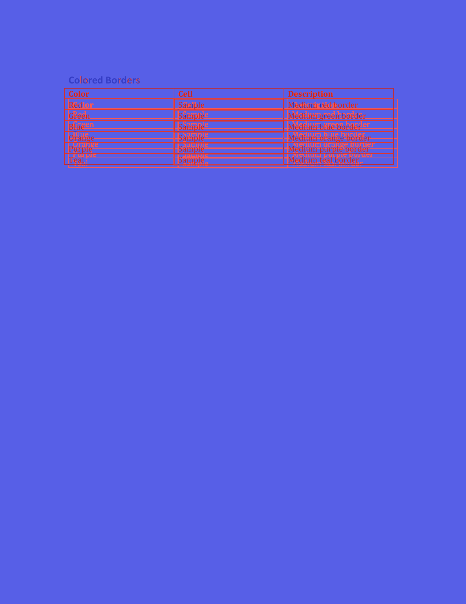</td>
  <td>changed: 63032 px (3.00%)<br>bbox: [175, 208, 1088, 460]<br>mean abs RGB: 4.4433<br>RMSE RGB: 29.7126<br>threshold: 12, gain: 5.0</td>
</tr>
<tr>
  <td><b>docx_classic125_solid_cell_fills</b><br>Page 1</td>
  <td>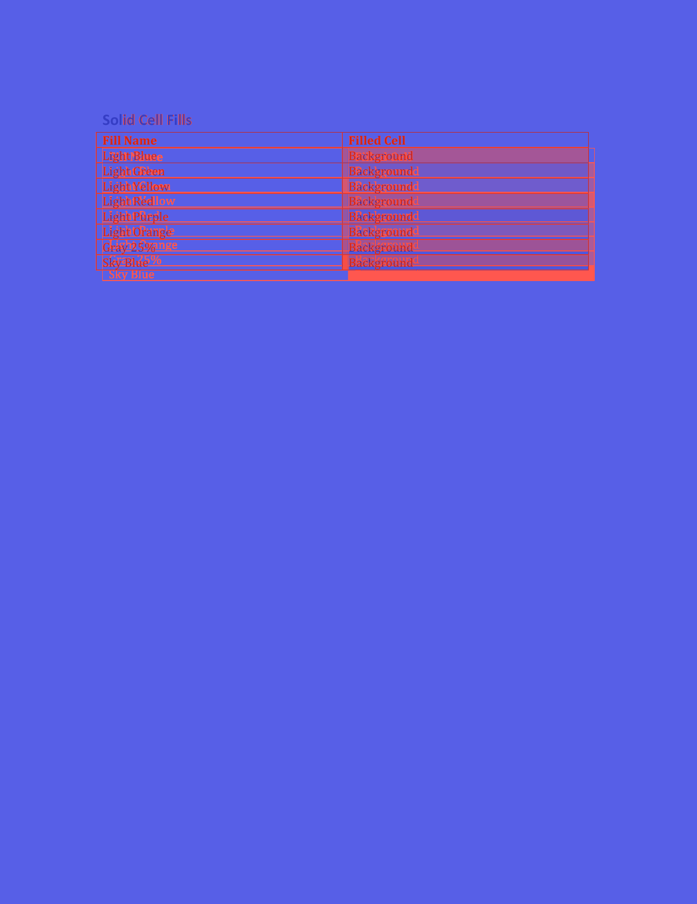</td>
  <td>changed: 133914 px (6.37%)<br>bbox: [175, 208, 1088, 513]<br>mean abs RGB: 4.6441<br>RMSE RGB: 27.1086<br>threshold: 12, gain: 5.0</td>
</tr>
<tr>
  <td><b>docx_classic126_dark_header_table</b><br>Page 1</td>
  <td>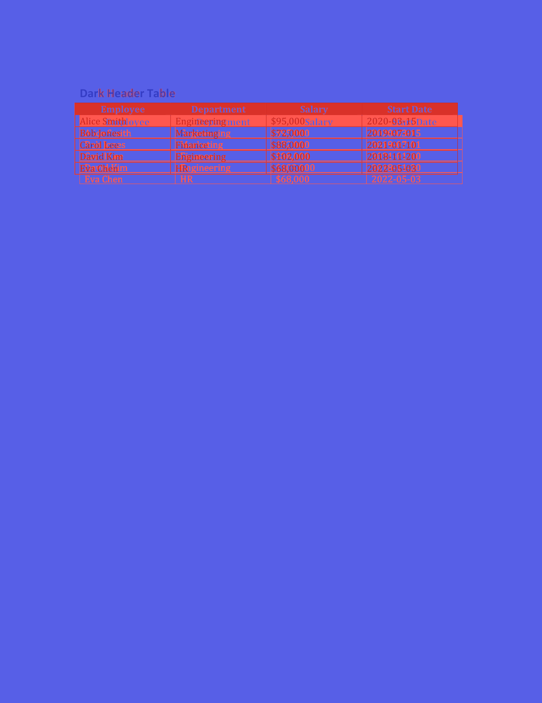</td>
  <td>changed: 85540 px (4.07%)<br>bbox: [175, 208, 1088, 432]<br>mean abs RGB: 6.5505<br>RMSE RGB: 34.9779<br>threshold: 12, gain: 5.0</td>
</tr>
<tr>
  <td><b>docx_classic127_font_styles_showcase</b><br>Page 1</td>
  <td>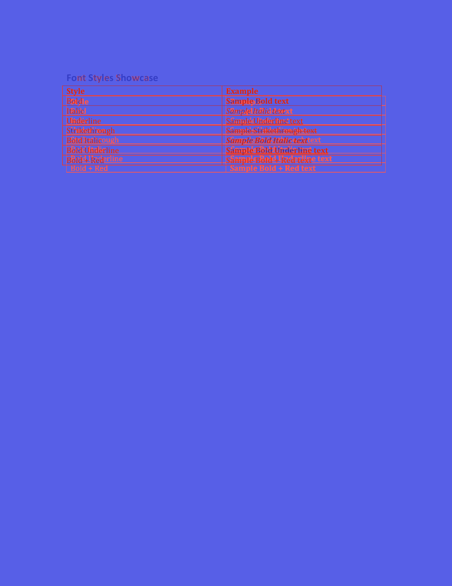</td>
  <td>changed: 60432 px (2.87%)<br>bbox: [175, 209, 1088, 486]<br>mean abs RGB: 4.373<br>RMSE RGB: 29.1699<br>threshold: 12, gain: 5.0</td>
</tr>
<tr>
  <td><b>docx_classic128_font_sizes_showcase</b><br>Page 1</td>
  <td>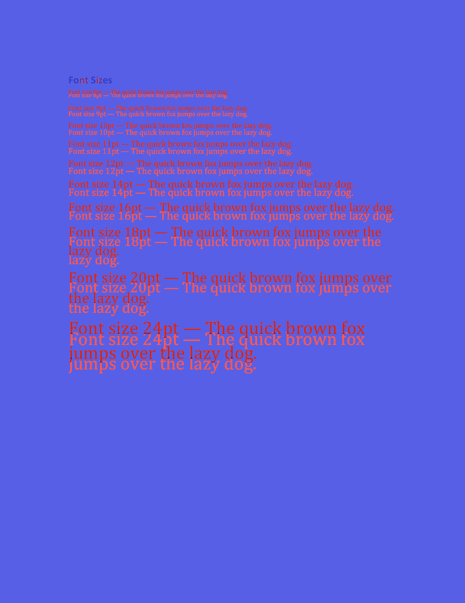</td>
  <td>changed: 117888 px (5.60%)<br>bbox: [188, 208, 1080, 1022]<br>mean abs RGB: 10.2184<br>RMSE RGB: 47.3049<br>threshold: 12, gain: 5.0</td>
</tr>
<tr>
  <td><b>docx_classic129_alignment_combinations</b><br>Page 1</td>
  <td>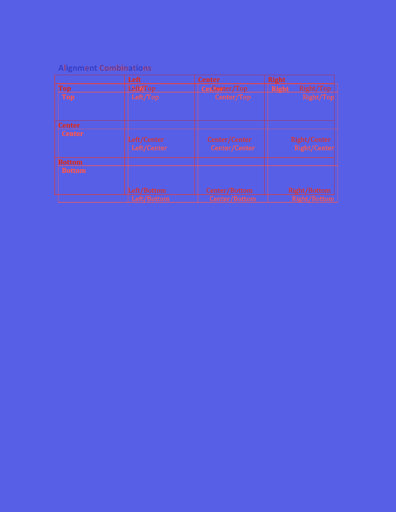</td>
  <td>changed: 43793 px (2.08%)<br>bbox: [175, 208, 1088, 653]<br>mean abs RGB: 3.2809<br>RMSE RGB: 26.0677<br>threshold: 12, gain: 5.0</td>
</tr>
<tr>
  <td><b>docx_classic130_wrap_and_indent</b><br>Page 1</td>
  <td></td>
  <td>changed: 36644 px (1.74%)<br>bbox: [188, 208, 1079, 745]<br>mean abs RGB: 2.054<br>RMSE RGB: 18.1814<br>threshold: 12, gain: 5.0</td>
</tr>
<tr>
  <td><b>docx_classic131_number_format_table</b><br>Page 1</td>
  <td>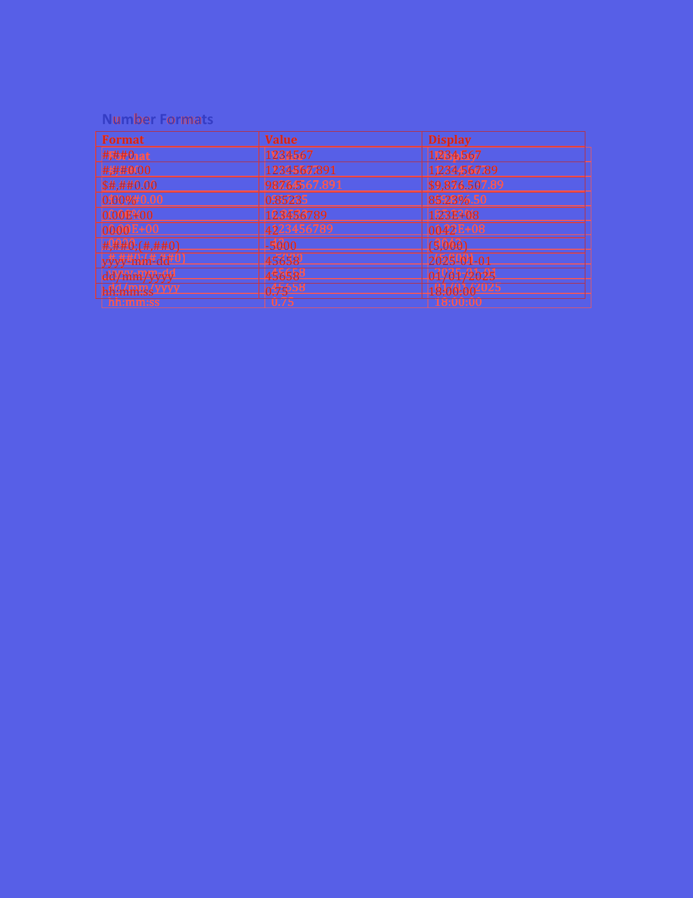</td>
  <td>changed: 73014 px (3.47%)<br>bbox: [175, 208, 1088, 566]<br>mean abs RGB: 5.4484<br>RMSE RGB: 32.8371<br>threshold: 12, gain: 5.0</td>
</tr>
<tr>
  <td><b>docx_classic132_striped_table</b><br>Page 1</td>
  <td>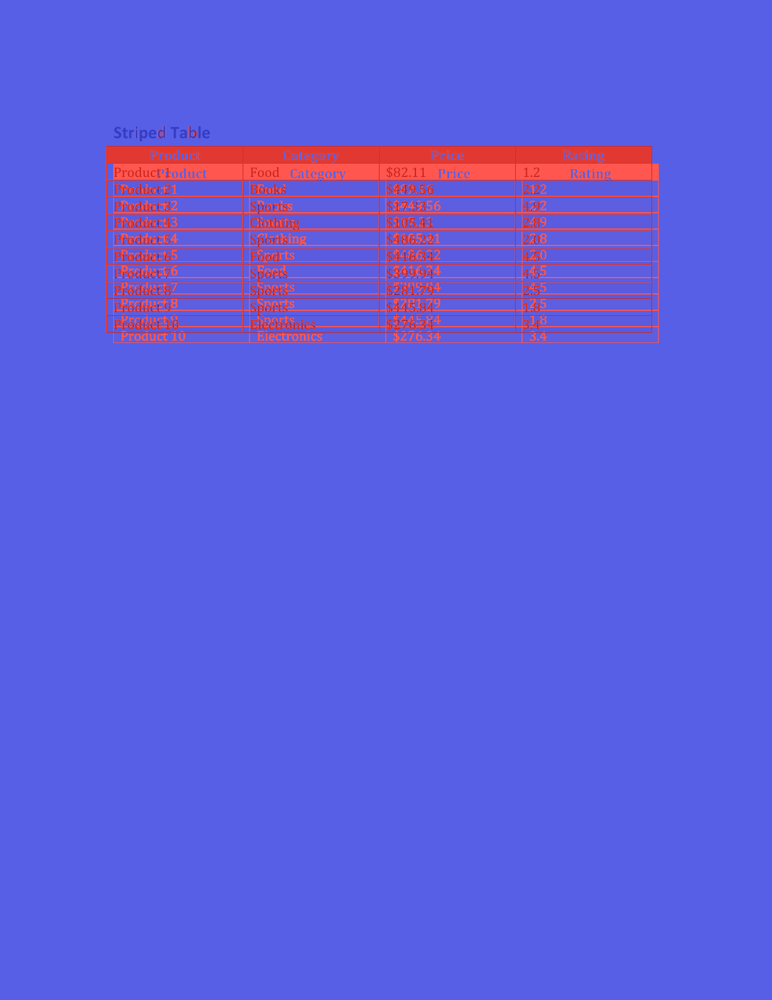</td>
  <td>changed: 261251 px (12.42%)<br>bbox: [175, 208, 1088, 566]<br>mean abs RGB: 8.5856<br>RMSE RGB: 36.9485<br>threshold: 12, gain: 5.0</td>
</tr>
<tr>
  <td><b>docx_classic133_gradient_rows_table</b><br>Page 1</td>
  <td>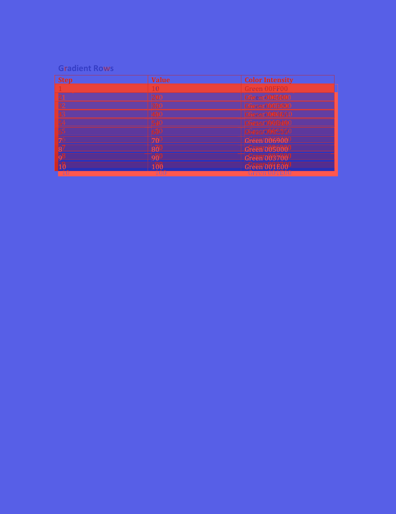</td>
  <td>changed: 243551 px (11.58%)<br>bbox: [175, 208, 1088, 566]<br>mean abs RGB: 6.4159<br>RMSE RGB: 35.9524<br>threshold: 12, gain: 5.0</td>
</tr>
<tr>
  <td><b>docx_classic134_heatmap_table</b><br>Page 1</td>
  <td>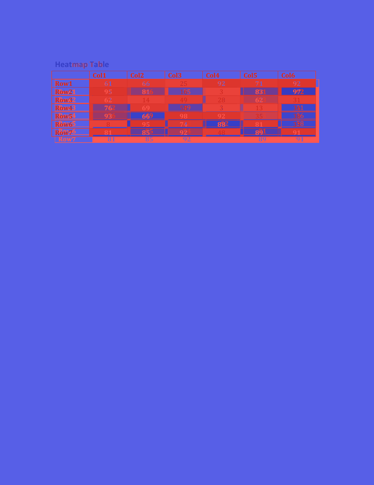</td>
  <td>changed: 164063 px (7.80%)<br>bbox: [175, 208, 1088, 486]<br>mean abs RGB: 7.5017<br>RMSE RGB: 35.419<br>threshold: 12, gain: 5.0</td>
</tr>
<tr>
  <td><b>docx_classic135_bottom_border_paragraphs</b><br>Page 1</td>
  <td>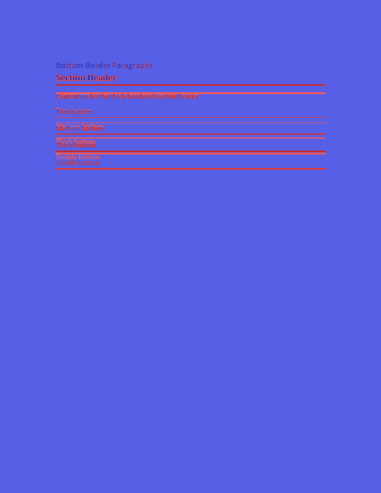</td>
  <td>changed: 49230 px (2.34%)<br>bbox: [184, 208, 1091, 568]<br>mean abs RGB: 4.139<br>RMSE RGB: 29.7198<br>threshold: 12, gain: 5.0</td>
</tr>
<tr>
  <td><b>docx_classic136_financial_statement</b><br>Page 1</td>
  <td>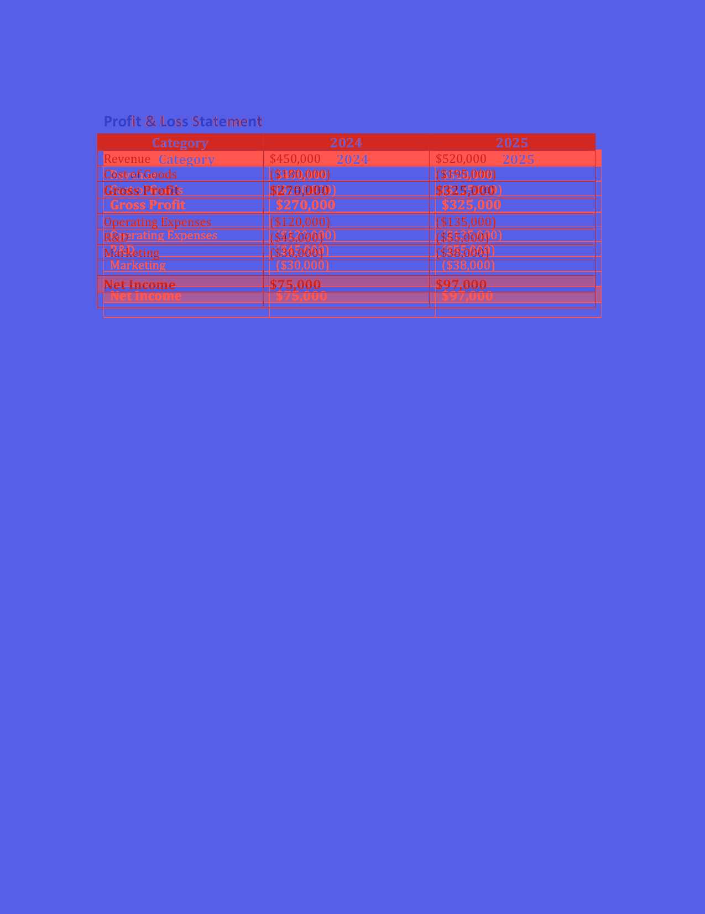</td>
  <td>changed: 140417 px (6.67%)<br>bbox: [175, 208, 1088, 574]<br>mean abs RGB: 9.9139<br>RMSE RGB: 44.6953<br>threshold: 12, gain: 5.0</td>
</tr>
<tr>
  <td><b>docx_classic137_checkerboard_table</b><br>Page 1</td>
  <td>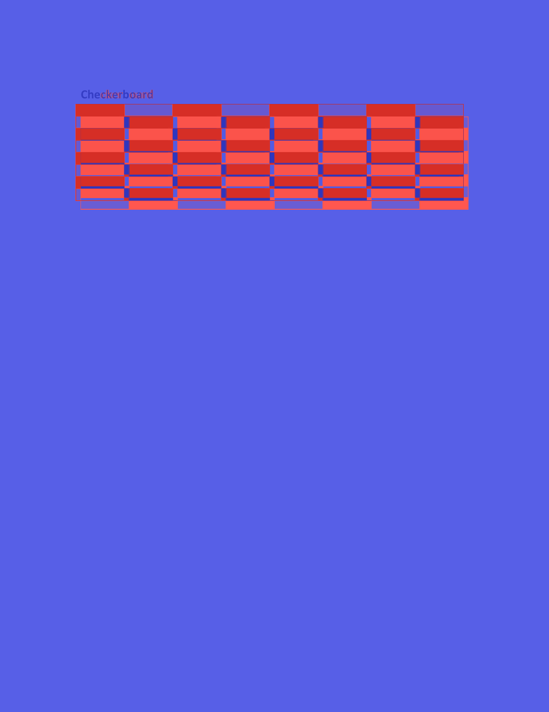</td>
  <td>changed: 201293 px (9.57%)<br>bbox: [175, 208, 1088, 486]<br>mean abs RGB: 15.415<br>RMSE RGB: 53.3862<br>threshold: 12, gain: 5.0</td>
</tr>
<tr>
  <td><b>docx_classic138_color_grid_table</b><br>Page 1</td>
  <td></td>
  <td>changed: 125343 px (5.96%)<br>bbox: [175, 208, 1088, 379]<br>mean abs RGB: 5.1384<br>RMSE RGB: 26.6247<br>threshold: 12, gain: 5.0</td>
</tr>
<tr>
  <td><b>docx_classic139_paragraph_shading_patterns</b><br>Page 1</td>
  <td>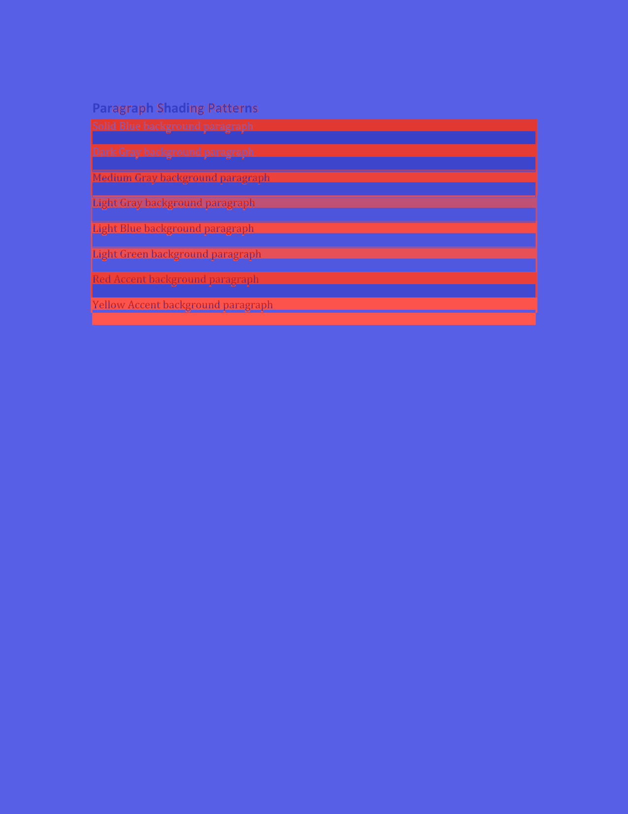</td>
  <td>changed: 208320 px (9.90%)<br>bbox: [184, 208, 1091, 659]<br>mean abs RGB: 7.197<br>RMSE RGB: 29.3067<br>threshold: 12, gain: 5.0</td>
</tr>
<tr>
  <td><b>docx_classic140_rotated_text_table</b><br>Page 1</td>
  <td>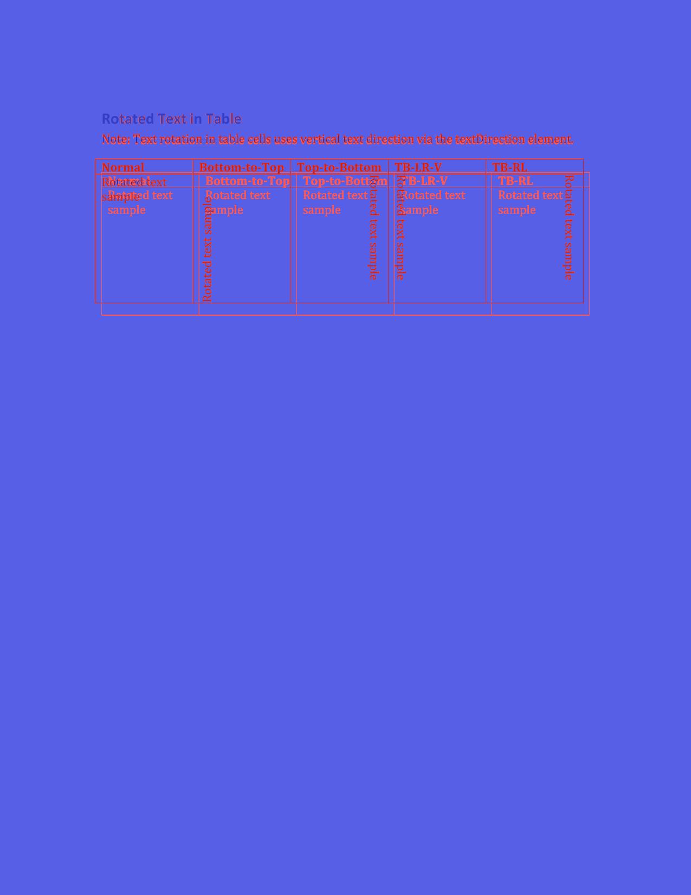</td>
  <td>changed: 45088 px (2.14%)<br>bbox: [175, 208, 1088, 582]<br>mean abs RGB: 3.2713<br>RMSE RGB: 25.6773<br>threshold: 12, gain: 5.0</td>
</tr>
<tr>
  <td><b>docx_classic141_mixed_border_styles</b><br>Page 1</td>
  <td>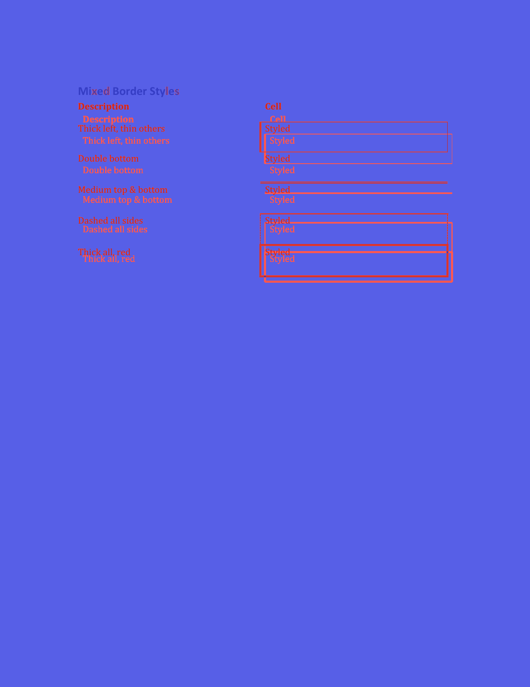</td>
  <td>changed: 40758 px (1.94%)<br>bbox: [188, 208, 1090, 679]<br>mean abs RGB: 3.0246<br>RMSE RGB: 25.3172<br>threshold: 12, gain: 5.0</td>
</tr>
<tr>
  <td><b>docx_classic142_styled_invoice_document</b><br>Page 1</td>
  <td>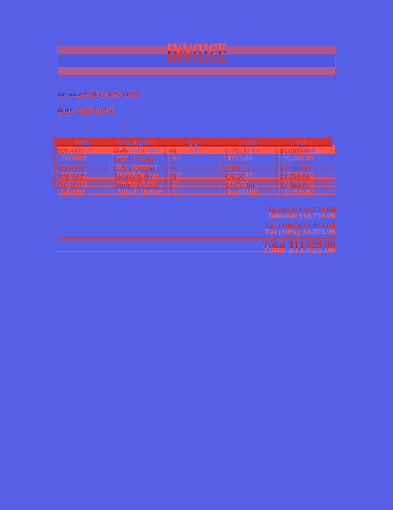</td>
  <td>changed: 195542 px (9.29%)<br>bbox: [175, 141, 1091, 821]<br>mean abs RGB: 8.5144<br>RMSE RGB: 38.152<br>threshold: 12, gain: 5.0</td>
</tr>
<tr>
  <td><b>docx_classic143_multi_section_document</b><br>Page 1</td>
  <td>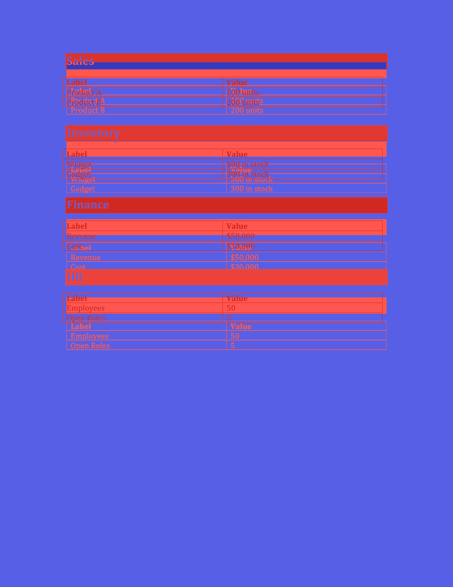</td>
  <td>changed: 354305 px (16.84%)<br>bbox: [175, 149, 1091, 984]<br>mean abs RGB: 26.4768<br>RMSE RGB: 77.15<br>threshold: 12, gain: 5.0</td>
</tr>
<tr>
  <td><b>docx_classic144_note_style_paragraphs</b><br>Page 1</td>
  <td>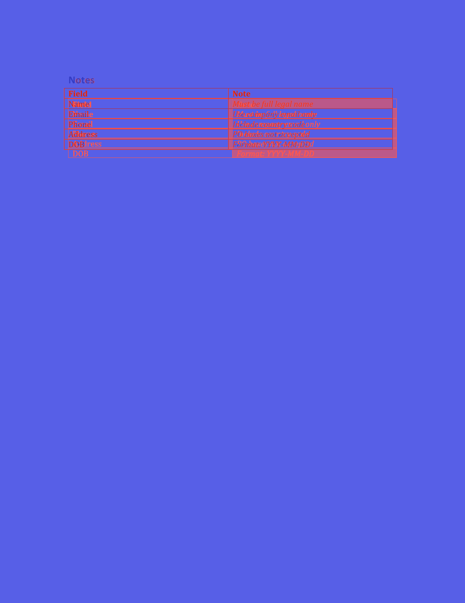</td>
  <td>changed: 57338 px (2.73%)<br>bbox: [175, 214, 1088, 432]<br>mean abs RGB: 2.6257<br>RMSE RGB: 21.0976<br>threshold: 12, gain: 5.0</td>
</tr>
<tr>
  <td><b>docx_classic145_status_badge_table</b><br>Page 1</td>
  <td>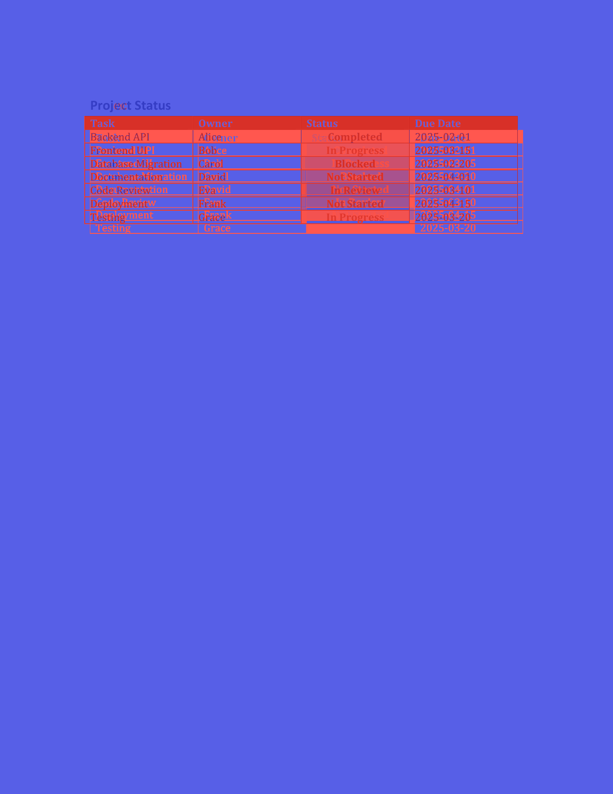</td>
  <td>changed: 130136 px (6.19%)<br>bbox: [175, 210, 1088, 486]<br>mean abs RGB: 8.2438<br>RMSE RGB: 38.2302<br>threshold: 12, gain: 5.0</td>
</tr>
<tr>
  <td><b>docx_classic146_double_border_table</b><br>Page 1</td>
  <td>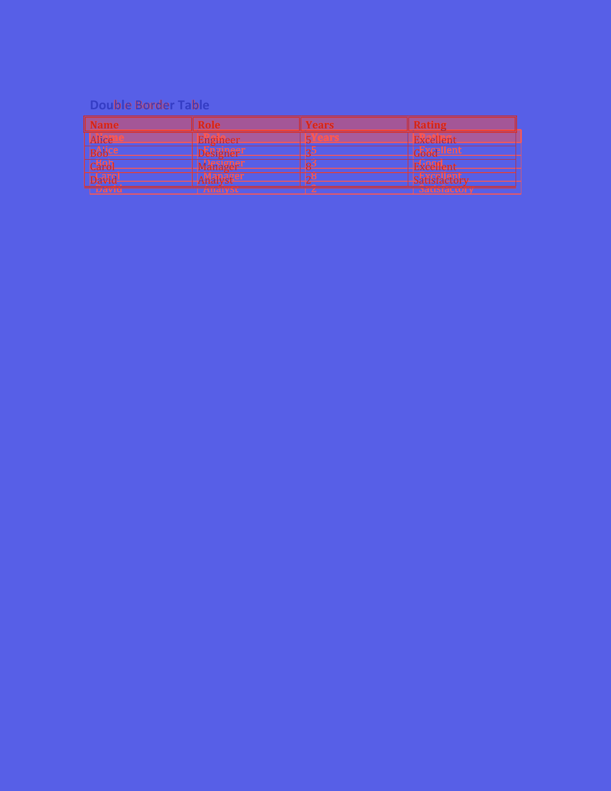</td>
  <td>changed: 77932 px (3.70%)<br>bbox: [174, 208, 1089, 406]<br>mean abs RGB: 3.9169<br>RMSE RGB: 26.7786<br>threshold: 12, gain: 5.0</td>
</tr>
<tr>
  <td><b>docx_classic147_multi_section_styled_report</b><br>Page 1</td>
  <td>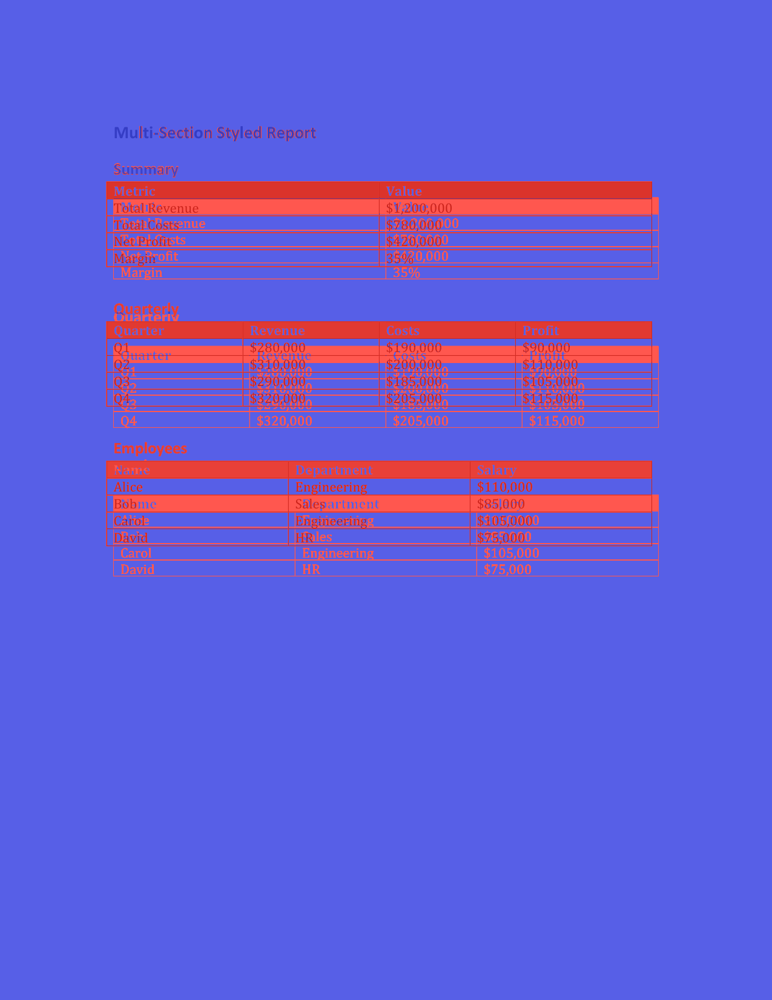</td>
  <td>changed: 228927 px (10.88%)<br>bbox: [175, 208, 1088, 952]<br>mean abs RGB: 16.2637<br>RMSE RGB: 54.5139<br>threshold: 12, gain: 5.0</td>
</tr>
<tr>
  <td><b>docx_classic148_data_grid_document</b><br>Page 1</td>
  <td>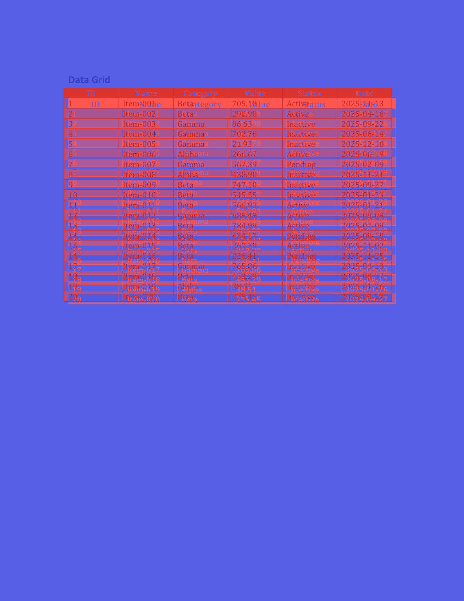</td>
  <td>changed: 412605 px (19.61%)<br>bbox: [175, 208, 1088, 835]<br>mean abs RGB: 17.6287<br>RMSE RGB: 53.5214<br>threshold: 12, gain: 5.0</td>
</tr>
<tr>
  <td><b>docx_classic149_merged_section_report</b><br>Page 1</td>
  <td>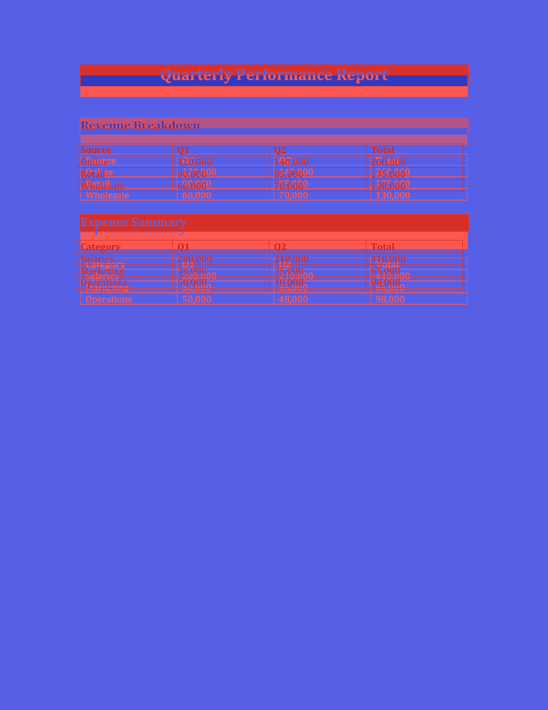</td>
  <td>changed: 225116 px (10.70%)<br>bbox: [175, 149, 1091, 708]<br>mean abs RGB: 15.1943<br>RMSE RGB: 55.2113<br>threshold: 12, gain: 5.0</td>
</tr>
<tr>
  <td><b>docx_classic150_kitchen_sink_styles</b><br>Page 1</td>
  <td>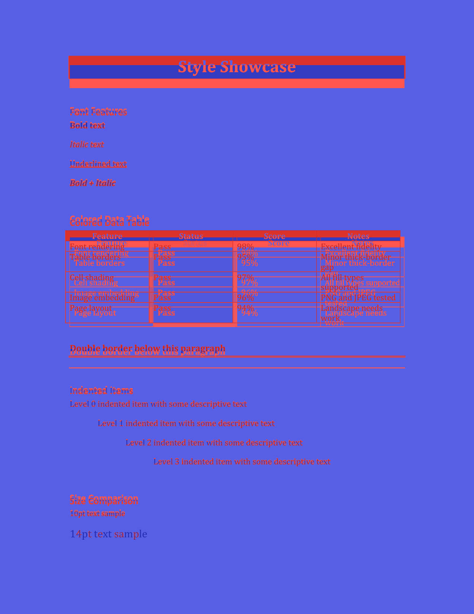</td>
  <td>changed: 203564 px (9.68%)<br>bbox: [175, 149, 1091, 1451]<br>mean abs RGB: 11.5458<br>RMSE RGB: 44.1723<br>threshold: 12, gain: 5.0</td>
</tr>
<tr>
  <td><b>docx_classic150_kitchen_sink_styles</b><br>Page 2</td>
  <td>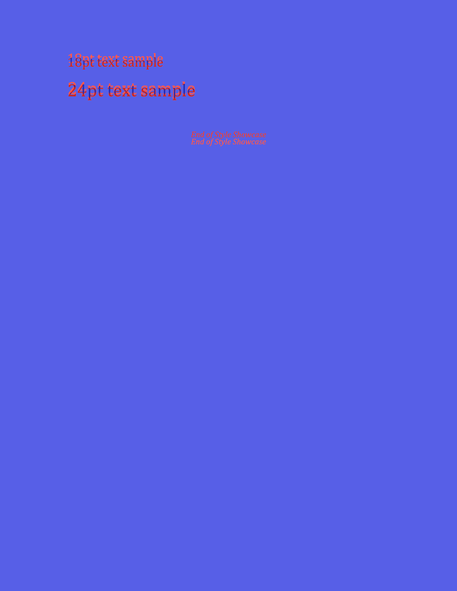</td>
  <td>changed: 11388 px (0.54%)<br>bbox: [191, 148, 742, 408]<br>mean abs RGB: 0.8556<br>RMSE RGB: 13.2076<br>threshold: 12, gain: 5.0</td>
</tr>
</table>

## Visual Comparison

Scores compare dotnet MiniPdf against Microsoft 365 Word Reference. LibreOffice is an auxiliary rendering and does not affect scores.

<table>
<tr><th>dotnet MiniPdf</th><th>Microsoft 365 Word Reference</th><th>LibreOffice</th></tr>
<tr>
  <td><b>docx_classic01_single_paragraph<br><small>format: docx | case: docx_classic01_single_paragraph | scope: dotnet-classic-docx</small></b></td>
  <td colspan="2">docx_classic01_single_paragraph <span style="color:#3fb950">⬤</span> 99.9%</td>
</tr>
<tr>
  <td></td>
  <td></td>
  <td></td>
</tr>
<tr>
  <td><b>docx_classic02_multiple_paragraphs<br><small>format: docx | case: docx_classic02_multiple_paragraphs | scope: dotnet-classic-docx</small></b></td>
  <td colspan="2">docx_classic02_multiple_paragraphs <span style="color:#3fb950">⬤</span> 99.4%</td>
</tr>
<tr>
  <td></td>
  <td></td>
  <td></td>
</tr>
<tr>
  <td><b>docx_classic03_headings<br><small>format: docx | case: docx_classic03_headings | scope: dotnet-classic-docx</small></b></td>
  <td colspan="2">docx_classic03_headings <span style="color:#3fb950">⬤</span> 99.9%</td>
</tr>
<tr>
  <td></td>
  <td></td>
  <td></td>
</tr>
<tr>
  <td><b>docx_classic04_bold_italic<br><small>format: docx | case: docx_classic04_bold_italic | scope: dotnet-classic-docx</small></b></td>
  <td colspan="2">docx_classic04_bold_italic <span style="color:#3fb950">⬤</span> 99.9%</td>
</tr>
<tr>
  <td></td>
  <td></td>
  <td></td>
</tr>
<tr>
  <td><b>docx_classic05_font_sizes<br><small>format: docx | case: docx_classic05_font_sizes | scope: dotnet-classic-docx</small></b></td>
  <td colspan="2">docx_classic05_font_sizes <span style="color:#3fb950">⬤</span> 99.6%</td>
</tr>
<tr>
  <td></td>
  <td></td>
  <td></td>
</tr>
<tr>
  <td><b>docx_classic06_font_colors<br><small>format: docx | case: docx_classic06_font_colors | scope: dotnet-classic-docx</small></b></td>
  <td colspan="2">docx_classic06_font_colors <span style="color:#3fb950">⬤</span> 100.0%</td>
</tr>
<tr>
  <td></td>
  <td></td>
  <td></td>
</tr>
<tr>
  <td><b>docx_classic07_alignment<br><small>format: docx | case: docx_classic07_alignment | scope: dotnet-classic-docx</small></b></td>
  <td colspan="2">docx_classic07_alignment <span style="color:#3fb950">⬤</span> 99.6%</td>
</tr>
<tr>
  <td></td>
  <td></td>
  <td></td>
</tr>
<tr>
  <td><b>docx_classic08_bullet_list<br><small>format: docx | case: docx_classic08_bullet_list | scope: dotnet-classic-docx</small></b></td>
  <td colspan="2">docx_classic08_bullet_list <span style="color:#3fb950">⬤</span> 100.0%</td>
</tr>
<tr>
  <td></td>
  <td></td>
  <td></td>
</tr>
<tr>
  <td><b>docx_classic09_numbered_list<br><small>format: docx | case: docx_classic09_numbered_list | scope: dotnet-classic-docx</small></b></td>
  <td colspan="2">docx_classic09_numbered_list <span style="color:#3fb950">⬤</span> 99.9%</td>
</tr>
<tr>
  <td></td>
  <td></td>
  <td></td>
</tr>
<tr>
  <td><b>docx_classic10_simple_table<br><small>format: docx | case: docx_classic10_simple_table | scope: dotnet-classic-docx</small></b></td>
  <td colspan="2">docx_classic10_simple_table <span style="color:#3fb950">⬤</span> 99.3%</td>
</tr>
<tr>
  <td></td>
  <td></td>
  <td></td>
</tr>
<tr>
  <td><b>docx_classic11_table_with_shading<br><small>format: docx | case: docx_classic11_table_with_shading | scope: dotnet-classic-docx</small></b></td>
  <td colspan="2">docx_classic11_table_with_shading <span style="color:#3fb950">⬤</span> 96.6%</td>
</tr>
<tr>
  <td></td>
  <td></td>
  <td></td>
</tr>
<tr>
  <td><b>docx_classic12_merged_cells_table<br><small>format: docx | case: docx_classic12_merged_cells_table | scope: dotnet-classic-docx</small></b></td>
  <td colspan="2">docx_classic12_merged_cells_table <span style="color:#3fb950">⬤</span> 99.4%</td>
</tr>
<tr>
  <td></td>
  <td></td>
  <td></td>
</tr>
<tr>
  <td><b>docx_classic13_long_document<br><small>format: docx | case: docx_classic13_long_document | scope: dotnet-classic-docx</small></b></td>
  <td colspan="2">docx_classic13_long_document <span style="color:#3fb950">⬤</span> 97.4%</td>
</tr>
<tr>
  <td></td>
  <td></td>
  <td></td>
</tr>
<tr>
  <td></td>
  <td></td>
  <td></td>
</tr>
<tr>
  <td></td>
  <td></td>
  <td></td>
</tr>
<tr>
  <td></td>
  <td></td>
  <td></td>
</tr>
<tr>
  <td><b>docx_classic14_mixed_content<br><small>format: docx | case: docx_classic14_mixed_content | scope: dotnet-classic-docx</small></b></td>
  <td colspan="2">docx_classic14_mixed_content <span style="color:#3fb950">⬤</span> 99.3%</td>
</tr>
<tr>
  <td></td>
  <td></td>
  <td></td>
</tr>
<tr>
  <td><b>docx_classic15_indentation<br><small>format: docx | case: docx_classic15_indentation | scope: dotnet-classic-docx</small></b></td>
  <td colspan="2">docx_classic15_indentation <span style="color:#3fb950">⬤</span> 99.7%</td>
</tr>
<tr>
  <td></td>
  <td></td>
  <td></td>
</tr>
<tr>
  <td><b>docx_classic16_line_spacing<br><small>format: docx | case: docx_classic16_line_spacing | scope: dotnet-classic-docx</small></b></td>
  <td colspan="2">docx_classic16_line_spacing <span style="color:#3fb950">⬤</span> 99.7%</td>
</tr>
<tr>
  <td></td>
  <td></td>
  <td>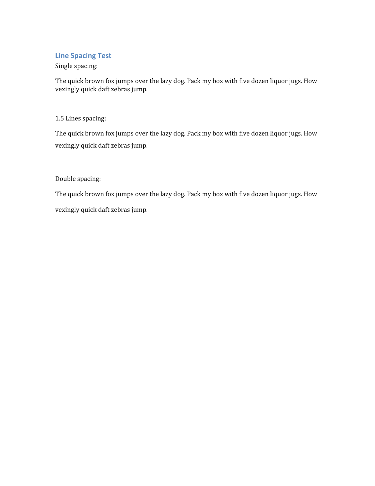</td>
</tr>
<tr>
  <td><b>docx_classic17_page_break<br><small>format: docx | case: docx_classic17_page_break | scope: dotnet-classic-docx</small></b></td>
  <td colspan="2">docx_classic17_page_break <span style="color:#3fb950">⬤</span> 100.0%</td>
</tr>
<tr>
  <td></td>
  <td></td>
  <td></td>
</tr>
<tr>
  <td></td>
  <td></td>
  <td></td>
</tr>
<tr>
  <td></td>
  <td></td>
  <td></td>
</tr>
<tr>
  <td><b>docx_classic18_embedded_image<br><small>format: docx | case: docx_classic18_embedded_image | scope: dotnet-classic-docx</small></b></td>
  <td colspan="2">docx_classic18_embedded_image <span style="color:#3fb950">⬤</span> 100.0%</td>
</tr>
<tr>
  <td></td>
  <td></td>
  <td></td>
</tr>
<tr>
  <td><b>docx_classic19_multiple_images<br><small>format: docx | case: docx_classic19_multiple_images | scope: dotnet-classic-docx</small></b></td>
  <td colspan="2">docx_classic19_multiple_images <span style="color:#3fb950">⬤</span> 99.8%</td>
</tr>
<tr>
  <td></td>
  <td></td>
  <td></td>
</tr>
<tr>
  <td><b>docx_classic20_table_with_many_rows<br><small>format: docx | case: docx_classic20_table_with_many_rows | scope: dotnet-classic-docx</small></b></td>
  <td colspan="2">docx_classic20_table_with_many_rows <span style="color:#3fb950">⬤</span> 98.4%</td>
</tr>
<tr>
  <td></td>
  <td></td>
  <td></td>
</tr>
<tr>
  <td><b>docx_classic21_nested_lists<br><small>format: docx | case: docx_classic21_nested_lists | scope: dotnet-classic-docx</small></b></td>
  <td colspan="2">docx_classic21_nested_lists <span style="color:#3fb950">⬤</span> 99.8%</td>
</tr>
<tr>
  <td></td>
  <td></td>
  <td></td>
</tr>
<tr>
  <td><b>docx_classic22_horizontal_rule<br><small>format: docx | case: docx_classic22_horizontal_rule | scope: dotnet-classic-docx</small></b></td>
  <td colspan="2">docx_classic22_horizontal_rule <span style="color:#3fb950">⬤</span> 99.8%</td>
</tr>
<tr>
  <td></td>
  <td></td>
  <td>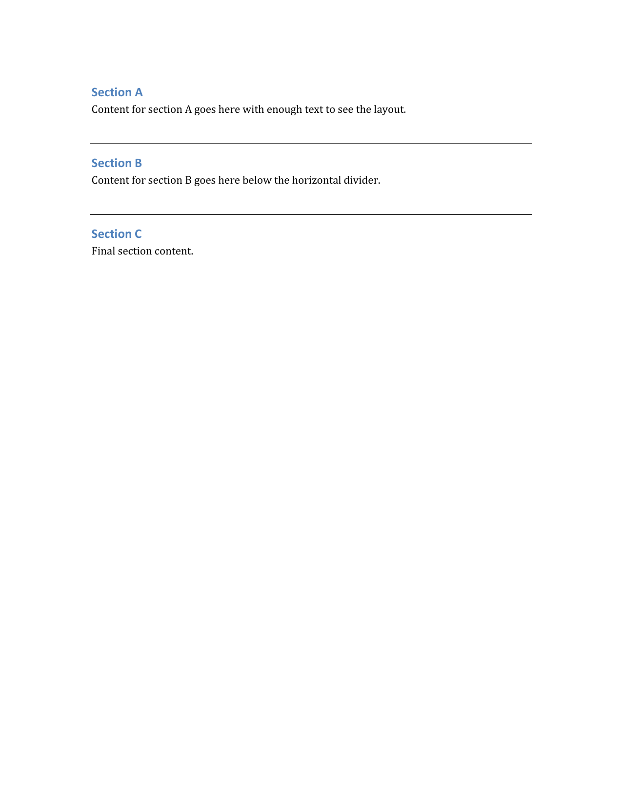</td>
</tr>
<tr>
  <td><b>docx_classic23_mixed_formatting_runs<br><small>format: docx | case: docx_classic23_mixed_formatting_runs | scope: dotnet-classic-docx</small></b></td>
  <td colspan="2">docx_classic23_mixed_formatting_runs <span style="color:#3fb950">⬤</span> 99.8%</td>
</tr>
<tr>
  <td></td>
  <td></td>
  <td></td>
</tr>
<tr>
  <td><b>docx_classic24_two_column_table_layout<br><small>format: docx | case: docx_classic24_two_column_table_layout | scope: dotnet-classic-docx</small></b></td>
  <td colspan="2">docx_classic24_two_column_table_layout <span style="color:#3fb950">⬤</span> 91.0%</td>
</tr>
<tr>
  <td></td>
  <td></td>
  <td></td>
</tr>
<tr>
  <td><b>docx_classic25_title_and_subtitle<br><small>format: docx | case: docx_classic25_title_and_subtitle | scope: dotnet-classic-docx</small></b></td>
  <td colspan="2">docx_classic25_title_and_subtitle <span style="color:#3fb950">⬤</span> 99.8%</td>
</tr>
<tr>
  <td></td>
  <td></td>
  <td></td>
</tr>
<tr>
  <td></td>
  <td></td>
  <td></td>
</tr>
<tr>
  <td><b>docx_classic26_table_alignment<br><small>format: docx | case: docx_classic26_table_alignment | scope: dotnet-classic-docx</small></b></td>
  <td colspan="2">docx_classic26_table_alignment <span style="color:#3fb950">⬤</span> 99.4%</td>
</tr>
<tr>
  <td></td>
  <td></td>
  <td></td>
</tr>
<tr>
  <td><b>docx_classic27_long_paragraph_wrapping<br><small>format: docx | case: docx_classic27_long_paragraph_wrapping | scope: dotnet-classic-docx</small></b></td>
  <td colspan="2">docx_classic27_long_paragraph_wrapping <span style="color:#3fb950">⬤</span> 98.4%</td>
</tr>
<tr>
  <td></td>
  <td></td>
  <td></td>
</tr>
<tr>
  <td><b>docx_classic28_special_characters<br><small>format: docx | case: docx_classic28_special_characters | scope: dotnet-classic-docx</small></b></td>
  <td colspan="2">docx_classic28_special_characters <span style="color:#3fb950">⬤</span> 99.9%</td>
</tr>
<tr>
  <td></td>
  <td></td>
  <td></td>
</tr>
<tr>
  <td><b>docx_classic29_table_with_image<br><small>format: docx | case: docx_classic29_table_with_image | scope: dotnet-classic-docx</small></b></td>
  <td colspan="2">docx_classic29_table_with_image <span style="color:#3fb950">⬤</span> 97.9%</td>
</tr>
<tr>
  <td></td>
  <td></td>
  <td></td>
</tr>
<tr>
  <td><b>docx_classic30_comprehensive_report<br><small>format: docx | case: docx_classic30_comprehensive_report | scope: dotnet-classic-docx</small></b></td>
  <td colspan="2">docx_classic30_comprehensive_report <span style="color:#3fb950">⬤</span> 99.3%</td>
</tr>
<tr>
  <td></td>
  <td></td>
  <td></td>
</tr>
<tr>
  <td></td>
  <td></td>
  <td></td>
</tr>
<tr>
  <td></td>
  <td></td>
  <td></td>
</tr>
<tr>
  <td><b>docx_classic31_product_card_with_image<br><small>format: docx | case: docx_classic31_product_card_with_image | scope: dotnet-classic-docx</small></b></td>
  <td colspan="2">docx_classic31_product_card_with_image <span style="color:#3fb950">⬤</span> 99.5%</td>
</tr>
<tr>
  <td></td>
  <td></td>
  <td></td>
</tr>
<tr>
  <td><b>docx_classic31_strikethrough_text<br><small>format: docx | case: docx_classic31_strikethrough_text | scope: dotnet-classic-docx</small></b></td>
  <td colspan="2">docx_classic31_strikethrough_text <span style="color:#3fb950">⬤</span> 99.8%</td>
</tr>
<tr>
  <td></td>
  <td></td>
  <td></td>
</tr>
<tr>
  <td><b>docx_classic32_company_logo_header<br><small>format: docx | case: docx_classic32_company_logo_header | scope: dotnet-classic-docx</small></b></td>
  <td colspan="2">docx_classic32_company_logo_header <span style="color:#3fb950">⬤</span> 99.2%</td>
</tr>
<tr>
  <td></td>
  <td></td>
  <td></td>
</tr>
<tr>
  <td><b>docx_classic32_superscript_subscript<br><small>format: docx | case: docx_classic32_superscript_subscript | scope: dotnet-classic-docx</small></b></td>
  <td colspan="2">docx_classic32_superscript_subscript <span style="color:#3fb950">⬤</span> 99.0%</td>
</tr>
<tr>
  <td></td>
  <td></td>
  <td>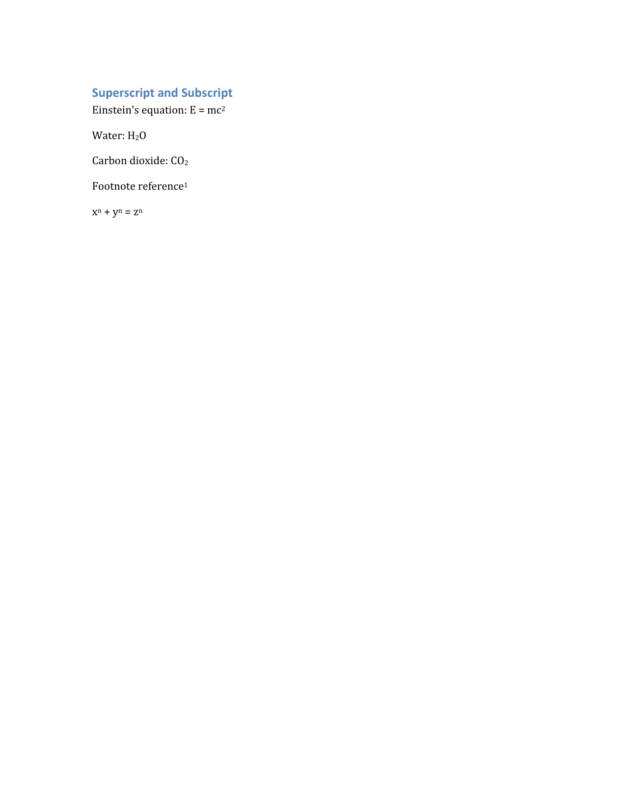</td>
</tr>
<tr>
  <td><b>docx_classic33_highlighted_text<br><small>format: docx | case: docx_classic33_highlighted_text | scope: dotnet-classic-docx</small></b></td>
  <td colspan="2">docx_classic33_highlighted_text <span style="color:#3fb950">⬤</span> 99.9%</td>
</tr>
<tr>
  <td></td>
  <td></td>
  <td></td>
</tr>
<tr>
  <td><b>docx_classic33_two_products_side_by_side<br><small>format: docx | case: docx_classic33_two_products_side_by_side | scope: dotnet-classic-docx</small></b></td>
  <td colspan="2">docx_classic33_two_products_side_by_side <span style="color:#3fb950">⬤</span> 99.3%</td>
</tr>
<tr>
  <td></td>
  <td></td>
  <td></td>
</tr>
<tr>
  <td><b>docx_classic34_employee_directory_with_photo<br><small>format: docx | case: docx_classic34_employee_directory_with_photo | scope: dotnet-classic-docx</small></b></td>
  <td colspan="2">docx_classic34_employee_directory_with_photo <span style="color:#3fb950">⬤</span> 99.9%</td>
</tr>
<tr>
  <td></td>
  <td></td>
  <td></td>
</tr>
<tr>
  <td></td>
  <td></td>
  <td></td>
</tr>
<tr>
  <td><b>docx_classic34_paragraph_borders<br><small>format: docx | case: docx_classic34_paragraph_borders | scope: dotnet-classic-docx</small></b></td>
  <td colspan="2">docx_classic34_paragraph_borders <span style="color:#3fb950">⬤</span> 99.5%</td>
</tr>
<tr>
  <td></td>
  <td></td>
  <td></td>
</tr>
<tr>
  <td><b>docx_classic35_inventory_with_product_photos<br><small>format: docx | case: docx_classic35_inventory_with_product_photos | scope: dotnet-classic-docx</small></b></td>
  <td colspan="2">docx_classic35_inventory_with_product_photos <span style="color:#3fb950">⬤</span> 97.6%</td>
</tr>
<tr>
  <td></td>
  <td></td>
  <td>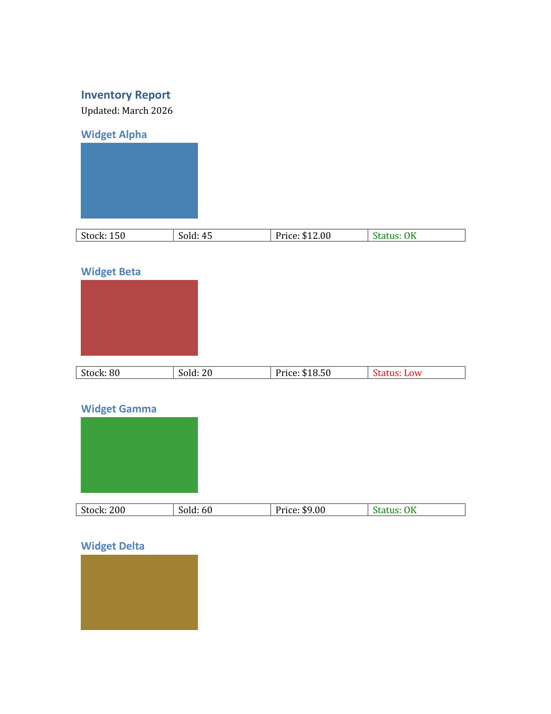</td>
</tr>
<tr>
  <td></td>
  <td></td>
  <td></td>
</tr>
<tr>
  <td><b>docx_classic35_tab_stops<br><small>format: docx | case: docx_classic35_tab_stops | scope: dotnet-classic-docx</small></b></td>
  <td colspan="2">docx_classic35_tab_stops <span style="color:#3fb950">⬤</span> 98.5%</td>
</tr>
<tr>
  <td></td>
  <td></td>
  <td></td>
</tr>
<tr>
  <td><b>docx_classic36_invoice_with_logo<br><small>format: docx | case: docx_classic36_invoice_with_logo | scope: dotnet-classic-docx</small></b></td>
  <td colspan="2">docx_classic36_invoice_with_logo <span style="color:#3fb950">⬤</span> 98.7%</td>
</tr>
<tr>
  <td></td>
  <td></td>
  <td></td>
</tr>
<tr>
  <td><b>docx_classic36_wide_table<br><small>format: docx | case: docx_classic36_wide_table | scope: dotnet-classic-docx</small></b></td>
  <td colspan="2">docx_classic36_wide_table <span style="color:#3fb950">⬤</span> 97.6%</td>
</tr>
<tr>
  <td></td>
  <td></td>
  <td></td>
</tr>
<tr>
  <td><b>docx_classic37_nested_table<br><small>format: docx | case: docx_classic37_nested_table | scope: dotnet-classic-docx</small></b></td>
  <td colspan="2">docx_classic37_nested_table <span style="color:#3fb950">⬤</span> 97.9%</td>
</tr>
<tr>
  <td></td>
  <td></td>
  <td></td>
</tr>
<tr>
  <td><b>docx_classic37_real_estate_listing<br><small>format: docx | case: docx_classic37_real_estate_listing | scope: dotnet-classic-docx</small></b></td>
  <td colspan="2">docx_classic37_real_estate_listing <span style="color:#3fb950">⬤</span> 99.1%</td>
</tr>
<tr>
  <td></td>
  <td></td>
  <td>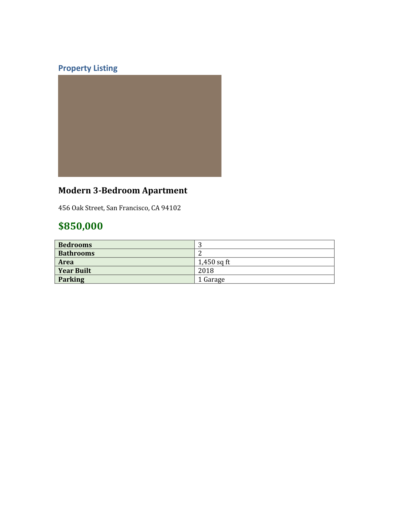</td>
</tr>
<tr>
  <td><b>docx_classic38_restaurant_menu_with_photos<br><small>format: docx | case: docx_classic38_restaurant_menu_with_photos | scope: dotnet-classic-docx</small></b></td>
  <td colspan="2">docx_classic38_restaurant_menu_with_photos <span style="color:#3fb950">⬤</span> 99.8%</td>
</tr>
<tr>
  <td></td>
  <td></td>
  <td>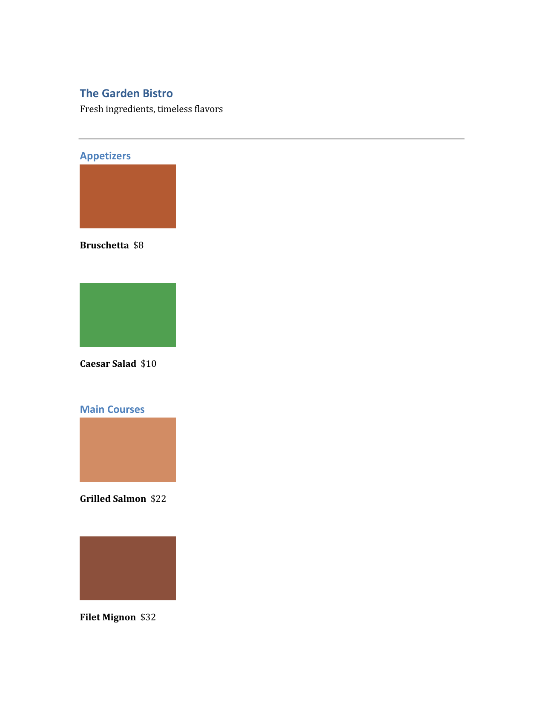</td>
</tr>
<tr>
  <td></td>
  <td></td>
  <td></td>
</tr>
<tr>
  <td><b>docx_classic38_table_column_widths<br><small>format: docx | case: docx_classic38_table_column_widths | scope: dotnet-classic-docx</small></b></td>
  <td colspan="2">docx_classic38_table_column_widths <span style="color:#3fb950">⬤</span> 92.9%</td>
</tr>
<tr>
  <td></td>
  <td></td>
  <td></td>
</tr>
<tr>
  <td><b>docx_classic39_cover_page_with_image<br><small>format: docx | case: docx_classic39_cover_page_with_image | scope: dotnet-classic-docx</small></b></td>
  <td colspan="2">docx_classic39_cover_page_with_image <span style="color:#3fb950">⬤</span> 99.8%</td>
</tr>
<tr>
  <td></td>
  <td></td>
  <td></td>
</tr>
<tr>
  <td></td>
  <td></td>
  <td></td>
</tr>
<tr>
  <td><b>docx_classic39_financial_report<br><small>format: docx | case: docx_classic39_financial_report | scope: dotnet-classic-docx</small></b></td>
  <td colspan="2">docx_classic39_financial_report <span style="color:#3fb950">⬤</span> 98.8%</td>
</tr>
<tr>
  <td></td>
  <td></td>
  <td></td>
</tr>
<tr>
  <td><b>docx_classic40_product_catalog_with_images<br><small>format: docx | case: docx_classic40_product_catalog_with_images | scope: dotnet-classic-docx</small></b></td>
  <td colspan="2">docx_classic40_product_catalog_with_images <span style="color:#3fb950">⬤</span> 99.2%</td>
</tr>
<tr>
  <td></td>
  <td></td>
  <td></td>
</tr>
<tr>
  <td><b>docx_classic40_resume<br><small>format: docx | case: docx_classic40_resume | scope: dotnet-classic-docx</small></b></td>
  <td colspan="2">docx_classic40_resume <span style="color:#3fb950">⬤</span> 99.0%</td>
</tr>
<tr>
  <td></td>
  <td></td>
  <td></td>
</tr>
<tr>
  <td><b>docx_classic41_business_letter<br><small>format: docx | case: docx_classic41_business_letter | scope: dotnet-classic-docx</small></b></td>
  <td colspan="2">docx_classic41_business_letter <span style="color:#3fb950">⬤</span> 99.5%</td>
</tr>
<tr>
  <td></td>
  <td></td>
  <td></td>
</tr>
<tr>
  <td><b>docx_classic41_newsletter_with_hero_image<br><small>format: docx | case: docx_classic41_newsletter_with_hero_image | scope: dotnet-classic-docx</small></b></td>
  <td colspan="2">docx_classic41_newsletter_with_hero_image <span style="color:#3fb950">⬤</span> 98.9%</td>
</tr>
<tr>
  <td></td>
  <td></td>
  <td></td>
</tr>
<tr>
  <td><b>docx_classic42_chart_image_with_data<br><small>format: docx | case: docx_classic42_chart_image_with_data | scope: dotnet-classic-docx</small></b></td>
  <td colspan="2">docx_classic42_chart_image_with_data <span style="color:#3fb950">⬤</span> 99.0%</td>
</tr>
<tr>
  <td></td>
  <td></td>
  <td></td>
</tr>
<tr>
  <td><b>docx_classic42_meeting_minutes<br><small>format: docx | case: docx_classic42_meeting_minutes | scope: dotnet-classic-docx</small></b></td>
  <td colspan="2">docx_classic42_meeting_minutes <span style="color:#3fb950">⬤</span> 98.0%</td>
</tr>
<tr>
  <td></td>
  <td></td>
  <td>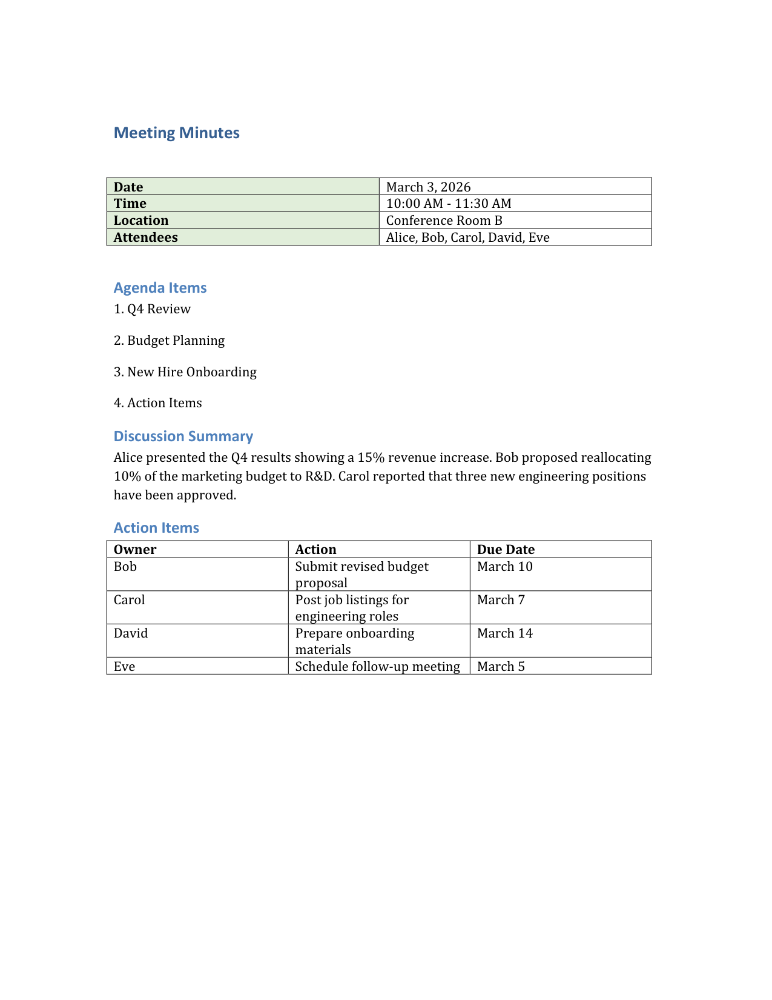</td>
</tr>
<tr>
  <td><b>docx_classic43_event_flyer_with_banner<br><small>format: docx | case: docx_classic43_event_flyer_with_banner | scope: dotnet-classic-docx</small></b></td>
  <td colspan="2">docx_classic43_event_flyer_with_banner <span style="color:#3fb950">⬤</span> 99.2%</td>
</tr>
<tr>
  <td></td>
  <td></td>
  <td>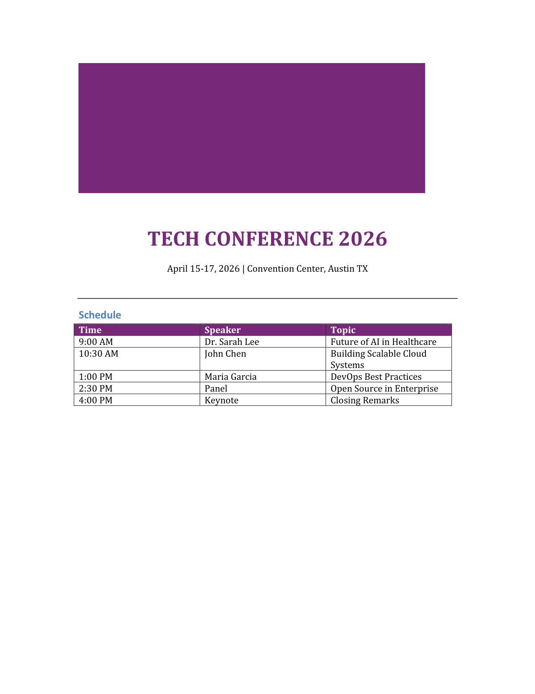</td>
</tr>
<tr>
  <td><b>docx_classic43_invoice_document<br><small>format: docx | case: docx_classic43_invoice_document | scope: dotnet-classic-docx</small></b></td>
  <td colspan="2">docx_classic43_invoice_document <span style="color:#3fb950">⬤</span> 97.1%</td>
</tr>
<tr>
  <td></td>
  <td></td>
  <td></td>
</tr>
<tr>
  <td><b>docx_classic44_dashboard_with_kpi_image<br><small>format: docx | case: docx_classic44_dashboard_with_kpi_image | scope: dotnet-classic-docx</small></b></td>
  <td colspan="2">docx_classic44_dashboard_with_kpi_image <span style="color:#3fb950">⬤</span> 98.8%</td>
</tr>
<tr>
  <td></td>
  <td></td>
  <td>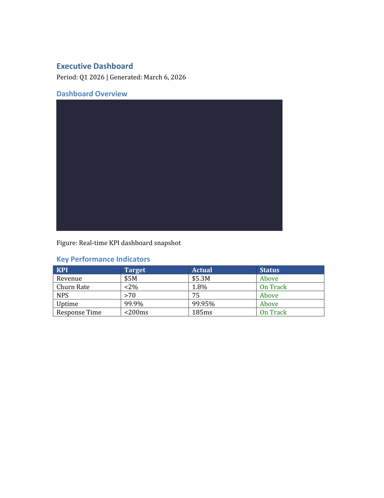</td>
</tr>
<tr>
  <td><b>docx_classic44_memo<br><small>format: docx | case: docx_classic44_memo | scope: dotnet-classic-docx</small></b></td>
  <td colspan="2">docx_classic44_memo <span style="color:#3fb950">⬤</span> 99.0%</td>
</tr>
<tr>
  <td></td>
  <td></td>
  <td></td>
</tr>
<tr>
  <td><b>docx_classic45_certificate_with_seal<br><small>format: docx | case: docx_classic45_certificate_with_seal | scope: dotnet-classic-docx</small></b></td>
  <td colspan="2">docx_classic45_certificate_with_seal <span style="color:#3fb950">⬤</span> 99.5%</td>
</tr>
<tr>
  <td></td>
  <td></td>
  <td></td>
</tr>
<tr>
  <td><b>docx_classic45_project_plan<br><small>format: docx | case: docx_classic45_project_plan | scope: dotnet-classic-docx</small></b></td>
  <td colspan="2">docx_classic45_project_plan <span style="color:#3fb950">⬤</span> 98.0%</td>
</tr>
<tr>
  <td></td>
  <td></td>
  <td></td>
</tr>
<tr>
  <td><b>docx_classic46_comparison_table<br><small>format: docx | case: docx_classic46_comparison_table | scope: dotnet-classic-docx</small></b></td>
  <td colspan="2">docx_classic46_comparison_table <span style="color:#3fb950">⬤</span> 98.6%</td>
</tr>
<tr>
  <td></td>
  <td></td>
  <td></td>
</tr>
<tr>
  <td><b>docx_classic46_product_image_grid<br><small>format: docx | case: docx_classic46_product_image_grid | scope: dotnet-classic-docx</small></b></td>
  <td colspan="2">docx_classic46_product_image_grid <span style="color:#3fb950">⬤</span> 99.6%</td>
</tr>
<tr>
  <td></td>
  <td></td>
  <td></td>
</tr>
<tr>
  <td><b>docx_classic47_data_dictionary<br><small>format: docx | case: docx_classic47_data_dictionary | scope: dotnet-classic-docx</small></b></td>
  <td colspan="2">docx_classic47_data_dictionary <span style="color:#3fb950">⬤</span> 98.1%</td>
</tr>
<tr>
  <td></td>
  <td></td>
  <td></td>
</tr>
<tr>
  <td><b>docx_classic47_news_article_with_hero_image<br><small>format: docx | case: docx_classic47_news_article_with_hero_image | scope: dotnet-classic-docx</small></b></td>
  <td colspan="2">docx_classic47_news_article_with_hero_image <span style="color:#3fb950">⬤</span> 99.2%</td>
</tr>
<tr>
  <td></td>
  <td></td>
  <td></td>
</tr>
<tr>
  <td><b>docx_classic48_multi_level_headings<br><small>format: docx | case: docx_classic48_multi_level_headings | scope: dotnet-classic-docx</small></b></td>
  <td colspan="2">docx_classic48_multi_level_headings <span style="color:#3fb950">⬤</span> 99.2%</td>
</tr>
<tr>
  <td></td>
  <td></td>
  <td></td>
</tr>
<tr>
  <td></td>
  <td></td>
  <td></td>
</tr>
<tr>
  <td></td>
  <td></td>
  <td></td>
</tr>
<tr>
  <td><b>docx_classic48_task_list_with_status_icons<br><small>format: docx | case: docx_classic48_task_list_with_status_icons | scope: dotnet-classic-docx</small></b></td>
  <td colspan="2">docx_classic48_task_list_with_status_icons <span style="color:#3fb950">⬤</span> 98.6%</td>
</tr>
<tr>
  <td></td>
  <td></td>
  <td></td>
</tr>
<tr>
  <td><b>docx_classic49_cjk_document<br><small>format: docx | case: docx_classic49_cjk_document | scope: dotnet-classic-docx</small></b></td>
  <td colspan="2">docx_classic49_cjk_document <span style="color:#3fb950">⬤</span> 98.5%</td>
</tr>
<tr>
  <td></td>
  <td></td>
  <td></td>
</tr>
<tr>
  <td><b>docx_classic49_wide_panoramic_banner<br><small>format: docx | case: docx_classic49_wide_panoramic_banner | scope: dotnet-classic-docx</small></b></td>
  <td colspan="2">docx_classic49_wide_panoramic_banner <span style="color:#3fb950">⬤</span> 99.3%</td>
</tr>
<tr>
  <td></td>
  <td></td>
  <td></td>
</tr>
<tr>
  <td><b>docx_classic50_long_table_with_formatting<br><small>format: docx | case: docx_classic50_long_table_with_formatting | scope: dotnet-classic-docx</small></b></td>
  <td colspan="2">docx_classic50_long_table_with_formatting <span style="color:#f85149">⬤</span> 56.2%</td>
</tr>
<tr>
  <td></td>
  <td></td>
  <td>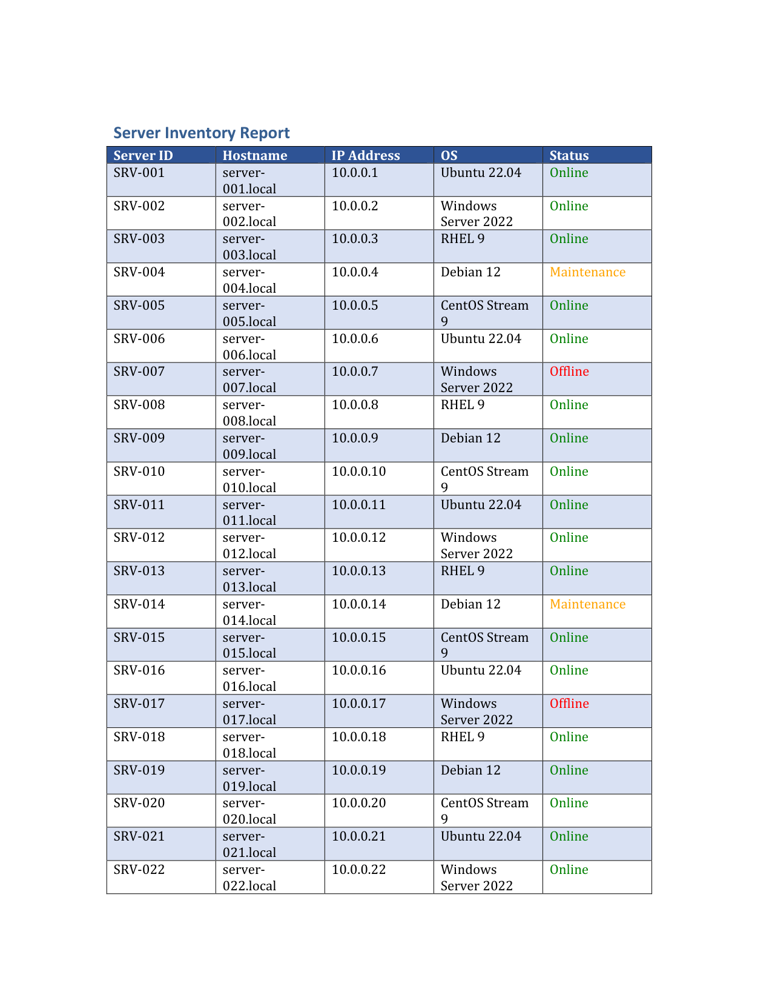</td>
</tr>
<tr>
  <td><i>missing</i></td>
  <td></td>
  <td>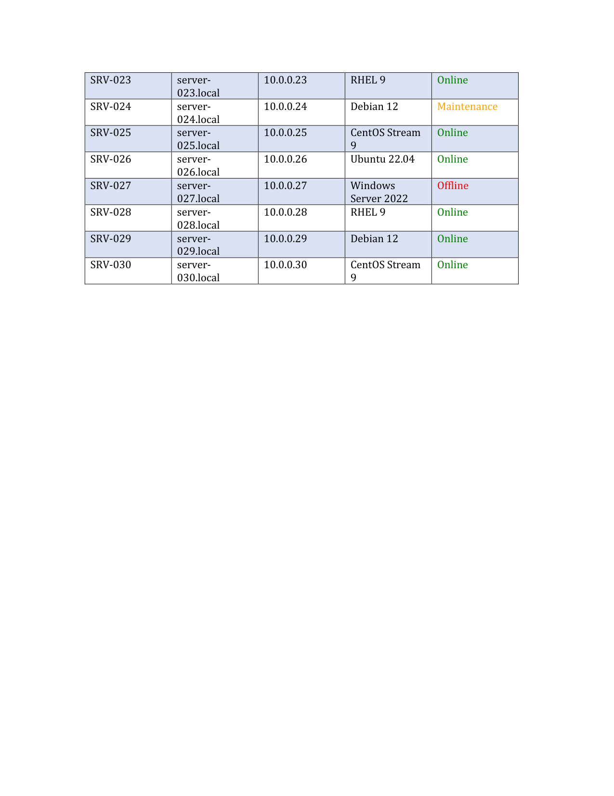</td>
</tr>
<tr>
  <td><b>docx_classic50_portrait_tall_image<br><small>format: docx | case: docx_classic50_portrait_tall_image | scope: dotnet-classic-docx</small></b></td>
  <td colspan="2">docx_classic50_portrait_tall_image <span style="color:#3fb950">⬤</span> 99.6%</td>
</tr>
<tr>
  <td></td>
  <td></td>
  <td></td>
</tr>
<tr>
  <td><b>docx_classic51_step_by_step_with_images<br><small>format: docx | case: docx_classic51_step_by_step_with_images | scope: dotnet-classic-docx</small></b></td>
  <td colspan="2">docx_classic51_step_by_step_with_images <span style="color:#3fb950">⬤</span> 99.8%</td>
</tr>
<tr>
  <td></td>
  <td></td>
  <td></td>
</tr>
<tr>
  <td><b>docx_classic51_underline_styles<br><small>format: docx | case: docx_classic51_underline_styles | scope: dotnet-classic-docx</small></b></td>
  <td colspan="2">docx_classic51_underline_styles <span style="color:#3fb950">⬤</span> 99.9%</td>
</tr>
<tr>
  <td></td>
  <td></td>
  <td></td>
</tr>
<tr>
  <td><b>docx_classic52_before_after_comparison<br><small>format: docx | case: docx_classic52_before_after_comparison | scope: dotnet-classic-docx</small></b></td>
  <td colspan="2">docx_classic52_before_after_comparison <span style="color:#3fb950">⬤</span> 99.4%</td>
</tr>
<tr>
  <td></td>
  <td></td>
  <td>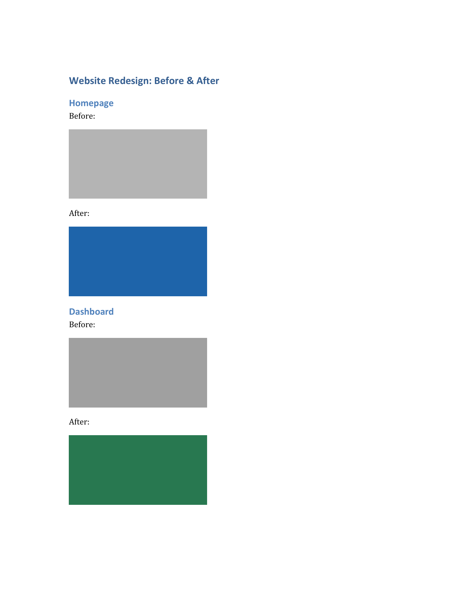</td>
</tr>
<tr>
  <td><b>docx_classic52_spacing_before_after<br><small>format: docx | case: docx_classic52_spacing_before_after | scope: dotnet-classic-docx</small></b></td>
  <td colspan="2">docx_classic52_spacing_before_after <span style="color:#3fb950">⬤</span> 99.6%</td>
</tr>
<tr>
  <td></td>
  <td></td>
  <td></td>
</tr>
<tr>
  <td><b>docx_classic53_color_swatch_palette<br><small>format: docx | case: docx_classic53_color_swatch_palette | scope: dotnet-classic-docx</small></b></td>
  <td colspan="2">docx_classic53_color_swatch_palette <span style="color:#3fb950">⬤</span> 99.5%</td>
</tr>
<tr>
  <td></td>
  <td></td>
  <td></td>
</tr>
<tr>
  <td><b>docx_classic53_table_merged_complex<br><small>format: docx | case: docx_classic53_table_merged_complex | scope: dotnet-classic-docx</small></b></td>
  <td colspan="2">docx_classic53_table_merged_complex <span style="color:#3fb950">⬤</span> 98.6%</td>
</tr>
<tr>
  <td></td>
  <td></td>
  <td></td>
</tr>
<tr>
  <td><b>docx_classic54_multi_font_family<br><small>format: docx | case: docx_classic54_multi_font_family | scope: dotnet-classic-docx</small></b></td>
  <td colspan="2">docx_classic54_multi_font_family <span style="color:#3fb950">⬤</span> 99.7%</td>
</tr>
<tr>
  <td></td>
  <td></td>
  <td></td>
</tr>
<tr>
  <td><b>docx_classic54_travel_destination_cards<br><small>format: docx | case: docx_classic54_travel_destination_cards | scope: dotnet-classic-docx</small></b></td>
  <td colspan="2">docx_classic54_travel_destination_cards <span style="color:#3fb950">⬤</span> 99.4%</td>
</tr>
<tr>
  <td></td>
  <td></td>
  <td></td>
</tr>
<tr>
  <td><b>docx_classic55_background_shading_paragraph<br><small>format: docx | case: docx_classic55_background_shading_paragraph | scope: dotnet-classic-docx</small></b></td>
  <td colspan="2">docx_classic55_background_shading_paragraph <span style="color:#3fb950">⬤</span> 96.0%</td>
</tr>
<tr>
  <td></td>
  <td></td>
  <td>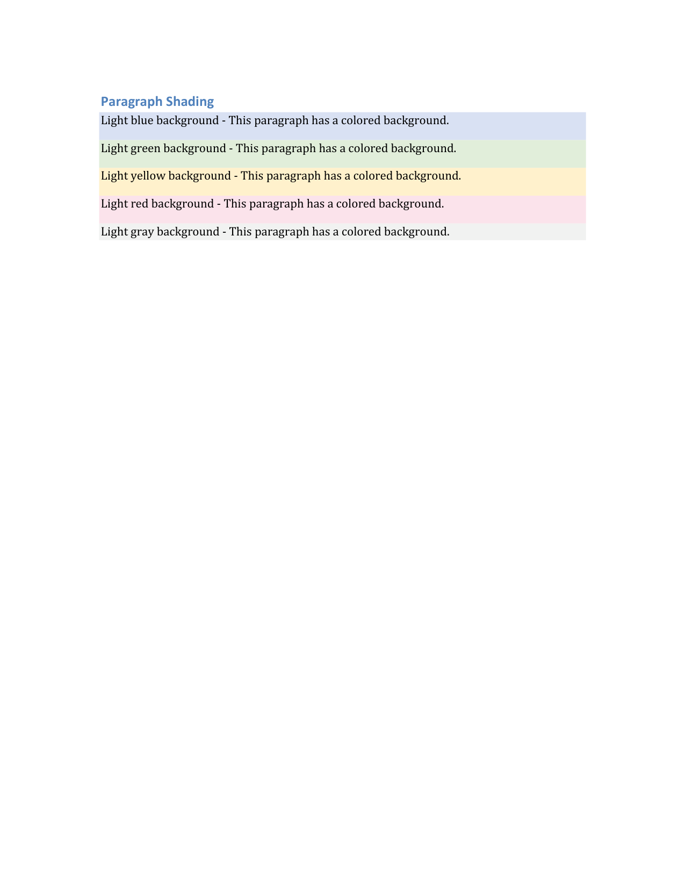</td>
</tr>
<tr>
  <td><b>docx_classic55_lab_results_with_image<br><small>format: docx | case: docx_classic55_lab_results_with_image | scope: dotnet-classic-docx</small></b></td>
  <td colspan="2">docx_classic55_lab_results_with_image <span style="color:#3fb950">⬤</span> 97.7%</td>
</tr>
<tr>
  <td></td>
  <td></td>
  <td></td>
</tr>
<tr>
  <td><b>docx_classic56_images_and_tables_mixed<br><small>format: docx | case: docx_classic56_images_and_tables_mixed | scope: dotnet-classic-docx</small></b></td>
  <td colspan="2">docx_classic56_images_and_tables_mixed <span style="color:#3fb950">⬤</span> 98.6%</td>
</tr>
<tr>
  <td></td>
  <td></td>
  <td></td>
</tr>
<tr>
  <td><b>docx_classic56_software_screenshot_features<br><small>format: docx | case: docx_classic56_software_screenshot_features | scope: dotnet-classic-docx</small></b></td>
  <td colspan="2">docx_classic56_software_screenshot_features <span style="color:#3fb950">⬤</span> 99.3%</td>
</tr>
<tr>
  <td></td>
  <td></td>
  <td></td>
</tr>
<tr>
  <td><b>docx_classic57_right_to_left_text<br><small>format: docx | case: docx_classic57_right_to_left_text | scope: dotnet-classic-docx</small></b></td>
  <td colspan="2">docx_classic57_right_to_left_text <span style="color:#3fb950">⬤</span> 97.1%</td>
</tr>
<tr>
  <td></td>
  <td></td>
  <td></td>
</tr>
<tr>
  <td><b>docx_classic57_sports_results_with_logos<br><small>format: docx | case: docx_classic57_sports_results_with_logos | scope: dotnet-classic-docx</small></b></td>
  <td colspan="2">docx_classic57_sports_results_with_logos <span style="color:#3fb950">⬤</span> 99.2%</td>
</tr>
<tr>
  <td></td>
  <td></td>
  <td></td>
</tr>
<tr>
  <td><b>docx_classic58_dense_paragraph_document<br><small>format: docx | case: docx_classic58_dense_paragraph_document | scope: dotnet-classic-docx</small></b></td>
  <td colspan="2">docx_classic58_dense_paragraph_document <span style="color:#3fb950">⬤</span> 97.8%</td>
</tr>
<tr>
  <td></td>
  <td></td>
  <td></td>
</tr>
<tr>
  <td></td>
  <td></td>
  <td></td>
</tr>
<tr>
  <td></td>
  <td></td>
  <td></td>
</tr>
<tr>
  <td></td>
  <td></td>
  <td></td>
</tr>
<tr>
  <td></td>
  <td></td>
  <td></td>
</tr>
<tr>
  <td></td>
  <td></td>
  <td></td>
</tr>
<tr>
  <td></td>
  <td></td>
  <td></td>
</tr>
<tr>
  <td><b>docx_classic58_report_with_footer_image<br><small>format: docx | case: docx_classic58_report_with_footer_image | scope: dotnet-classic-docx</small></b></td>
  <td colspan="2">docx_classic58_report_with_footer_image <span style="color:#3fb950">⬤</span> 98.4%</td>
</tr>
<tr>
  <td></td>
  <td></td>
  <td></td>
</tr>
<tr>
  <td><b>docx_classic59_numbered_and_bullet_mixed<br><small>format: docx | case: docx_classic59_numbered_and_bullet_mixed | scope: dotnet-classic-docx</small></b></td>
  <td colspan="2">docx_classic59_numbered_and_bullet_mixed <span style="color:#3fb950">⬤</span> 99.3%</td>
</tr>
<tr>
  <td></td>
  <td></td>
  <td></td>
</tr>
<tr>
  <td><b>docx_classic59_nutrition_label_with_image<br><small>format: docx | case: docx_classic59_nutrition_label_with_image | scope: dotnet-classic-docx</small></b></td>
  <td colspan="2">docx_classic59_nutrition_label_with_image <span style="color:#3fb950">⬤</span> 99.1%</td>
</tr>
<tr>
  <td></td>
  <td></td>
  <td></td>
</tr>
<tr>
  <td><b>docx_classic60_comprehensive_styled_report<br><small>format: docx | case: docx_classic60_comprehensive_styled_report | scope: dotnet-classic-docx</small></b></td>
  <td colspan="2">docx_classic60_comprehensive_styled_report <span style="color:#3fb950">⬤</span> 98.8%</td>
</tr>
<tr>
  <td></td>
  <td></td>
  <td></td>
</tr>
<tr>
  <td></td>
  <td></td>
  <td></td>
</tr>
<tr>
  <td></td>
  <td></td>
  <td></td>
</tr>
<tr>
  <td><b>docx_classic60_project_status_with_milestones<br><small>format: docx | case: docx_classic60_project_status_with_milestones | scope: dotnet-classic-docx</small></b></td>
  <td colspan="2">docx_classic60_project_status_with_milestones <span style="color:#3fb950">⬤</span> 99.3%</td>
</tr>
<tr>
  <td></td>
  <td></td>
  <td></td>
</tr>
<tr>
  <td></td>
  <td></td>
  <td></td>
</tr>
<tr>
  <td><b>docx_classic61_header_and_footer<br><small>format: docx | case: docx_classic61_header_and_footer | scope: dotnet-classic-docx</small></b></td>
  <td colspan="2">docx_classic61_header_and_footer <span style="color:#3fb950">⬤</span> 99.4%</td>
</tr>
<tr>
  <td></td>
  <td></td>
  <td></td>
</tr>
<tr>
  <td><b>docx_classic62_footnote_references<br><small>format: docx | case: docx_classic62_footnote_references | scope: dotnet-classic-docx</small></b></td>
  <td colspan="2">docx_classic62_footnote_references <span style="color:#3fb950">⬤</span> 99.6%</td>
</tr>
<tr>
  <td></td>
  <td></td>
  <td></td>
</tr>
<tr>
  <td><b>docx_classic63_toc_style_headings<br><small>format: docx | case: docx_classic63_toc_style_headings | scope: dotnet-classic-docx</small></b></td>
  <td colspan="2">docx_classic63_toc_style_headings <span style="color:#3fb950">⬤</span> 99.3%</td>
</tr>
<tr>
  <td></td>
  <td></td>
  <td></td>
</tr>
<tr>
  <td><b>docx_classic64_multi_column_layout<br><small>format: docx | case: docx_classic64_multi_column_layout | scope: dotnet-classic-docx</small></b></td>
  <td colspan="2">docx_classic64_multi_column_layout <span style="color:#3fb950">⬤</span> 92.9%</td>
</tr>
<tr>
  <td></td>
  <td></td>
  <td></td>
</tr>
<tr>
  <td><b>docx_classic65_code_block_styling<br><small>format: docx | case: docx_classic65_code_block_styling | scope: dotnet-classic-docx</small></b></td>
  <td colspan="2">docx_classic65_code_block_styling <span style="color:#3fb950">⬤</span> 93.2%</td>
</tr>
<tr>
  <td></td>
  <td></td>
  <td>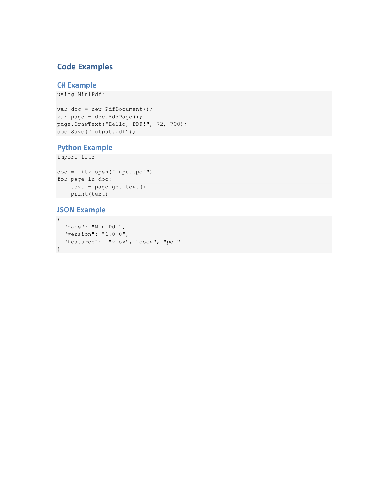</td>
</tr>
<tr>
  <td><b>docx_classic66_colored_title_page<br><small>format: docx | case: docx_classic66_colored_title_page | scope: dotnet-classic-docx</small></b></td>
  <td colspan="2">docx_classic66_colored_title_page <span style="color:#3fb950">⬤</span> 98.2%</td>
</tr>
<tr>
  <td></td>
  <td></td>
  <td></td>
</tr>
<tr>
  <td><b>docx_classic67_alternating_row_table<br><small>format: docx | case: docx_classic67_alternating_row_table | scope: dotnet-classic-docx</small></b></td>
  <td colspan="2">docx_classic67_alternating_row_table <span style="color:#3fb950">⬤</span> 95.4%</td>
</tr>
<tr>
  <td></td>
  <td></td>
  <td></td>
</tr>
<tr>
  <td><b>docx_classic68_sidebar_layout<br><small>format: docx | case: docx_classic68_sidebar_layout | scope: dotnet-classic-docx</small></b></td>
  <td colspan="2">docx_classic68_sidebar_layout <span style="color:#3fb950">⬤</span> 94.4%</td>
</tr>
<tr>
  <td></td>
  <td></td>
  <td></td>
</tr>
<tr>
  <td><b>docx_classic69_blockquote_styling<br><small>format: docx | case: docx_classic69_blockquote_styling | scope: dotnet-classic-docx</small></b></td>
  <td colspan="2">docx_classic69_blockquote_styling <span style="color:#3fb950">⬤</span> 99.7%</td>
</tr>
<tr>
  <td></td>
  <td></td>
  <td></td>
</tr>
<tr>
  <td><b>docx_classic70_academic_paper<br><small>format: docx | case: docx_classic70_academic_paper | scope: dotnet-classic-docx</small></b></td>
  <td colspan="2">docx_classic70_academic_paper <span style="color:#3fb950">⬤</span> 98.0%</td>
</tr>
<tr>
  <td></td>
  <td></td>
  <td></td>
</tr>
<tr>
  <td><b>docx_classic71_legal_document<br><small>format: docx | case: docx_classic71_legal_document | scope: dotnet-classic-docx</small></b></td>
  <td colspan="2">docx_classic71_legal_document <span style="color:#3fb950">⬤</span> 99.0%</td>
</tr>
<tr>
  <td></td>
  <td></td>
  <td></td>
</tr>
<tr>
  <td><b>docx_classic72_technical_specification<br><small>format: docx | case: docx_classic72_technical_specification | scope: dotnet-classic-docx</small></b></td>
  <td colspan="2">docx_classic72_technical_specification <span style="color:#3fb950">⬤</span> 97.2%</td>
</tr>
<tr>
  <td></td>
  <td></td>
  <td>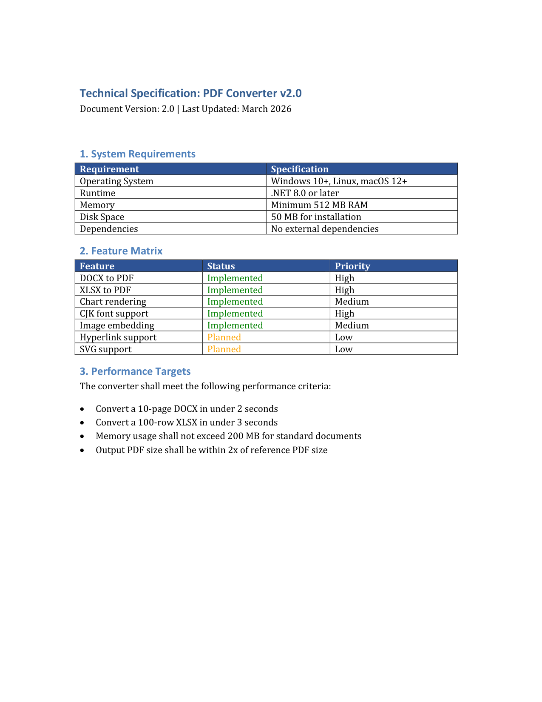</td>
</tr>
<tr>
  <td><b>docx_classic73_calendar_layout<br><small>format: docx | case: docx_classic73_calendar_layout | scope: dotnet-classic-docx</small></b></td>
  <td colspan="2">docx_classic73_calendar_layout <span style="color:#3fb950">⬤</span> 98.2%</td>
</tr>
<tr>
  <td></td>
  <td></td>
  <td></td>
</tr>
<tr>
  <td><b>docx_classic74_org_chart<br><small>format: docx | case: docx_classic74_org_chart | scope: dotnet-classic-docx</small></b></td>
  <td colspan="2">docx_classic74_org_chart <span style="color:#3fb950">⬤</span> 94.9%</td>
</tr>
<tr>
  <td></td>
  <td></td>
  <td></td>
</tr>
<tr>
  <td><b>docx_classic75_newsletter_layout<br><small>format: docx | case: docx_classic75_newsletter_layout | scope: dotnet-classic-docx</small></b></td>
  <td colspan="2">docx_classic75_newsletter_layout <span style="color:#3fb950">⬤</span> 98.0%</td>
</tr>
<tr>
  <td></td>
  <td></td>
  <td></td>
</tr>
<tr>
  <td><b>docx_classic76_recipe_card<br><small>format: docx | case: docx_classic76_recipe_card | scope: dotnet-classic-docx</small></b></td>
  <td colspan="2">docx_classic76_recipe_card <span style="color:#3fb950">⬤</span> 98.7%</td>
</tr>
<tr>
  <td></td>
  <td></td>
  <td></td>
</tr>
<tr>
  <td><b>docx_classic77_timeline_layout<br><small>format: docx | case: docx_classic77_timeline_layout | scope: dotnet-classic-docx</small></b></td>
  <td colspan="2">docx_classic77_timeline_layout <span style="color:#3fb950">⬤</span> 97.4%</td>
</tr>
<tr>
  <td></td>
  <td></td>
  <td></td>
</tr>
<tr>
  <td><b>docx_classic78_faq_document<br><small>format: docx | case: docx_classic78_faq_document | scope: dotnet-classic-docx</small></b></td>
  <td colspan="2">docx_classic78_faq_document <span style="color:#3fb950">⬤</span> 98.8%</td>
</tr>
<tr>
  <td></td>
  <td></td>
  <td></td>
</tr>
<tr>
  <td></td>
  <td></td>
  <td></td>
</tr>
<tr>
  <td><b>docx_classic79_glossary<br><small>format: docx | case: docx_classic79_glossary | scope: dotnet-classic-docx</small></b></td>
  <td colspan="2">docx_classic79_glossary <span style="color:#3fb950">⬤</span> 99.1%</td>
</tr>
<tr>
  <td></td>
  <td></td>
  <td></td>
</tr>
<tr>
  <td><b>docx_classic80_matrix_grid<br><small>format: docx | case: docx_classic80_matrix_grid | scope: dotnet-classic-docx</small></b></td>
  <td colspan="2">docx_classic80_matrix_grid <span style="color:#3fb950">⬤</span> 96.2%</td>
</tr>
<tr>
  <td></td>
  <td></td>
  <td></td>
</tr>
<tr>
  <td><b>docx_classic81_budget_table<br><small>format: docx | case: docx_classic81_budget_table | scope: dotnet-classic-docx</small></b></td>
  <td colspan="2">docx_classic81_budget_table <span style="color:#3fb950">⬤</span> 96.8%</td>
</tr>
<tr>
  <td></td>
  <td></td>
  <td></td>
</tr>
<tr>
  <td><b>docx_classic82_survey_questionnaire<br><small>format: docx | case: docx_classic82_survey_questionnaire | scope: dotnet-classic-docx</small></b></td>
  <td colspan="2">docx_classic82_survey_questionnaire <span style="color:#3fb950">⬤</span> 97.8%</td>
</tr>
<tr>
  <td></td>
  <td></td>
  <td></td>
</tr>
<tr>
  <td></td>
  <td></td>
  <td></td>
</tr>
<tr>
  <td><b>docx_classic83_medical_form<br><small>format: docx | case: docx_classic83_medical_form | scope: dotnet-classic-docx</small></b></td>
  <td colspan="2">docx_classic83_medical_form <span style="color:#3fb950">⬤</span> 98.1%</td>
</tr>
<tr>
  <td></td>
  <td></td>
  <td></td>
</tr>
<tr>
  <td><b>docx_classic84_shipping_label<br><small>format: docx | case: docx_classic84_shipping_label | scope: dotnet-classic-docx</small></b></td>
  <td colspan="2">docx_classic84_shipping_label <span style="color:#3fb950">⬤</span> 97.2%</td>
</tr>
<tr>
  <td></td>
  <td></td>
  <td></td>
</tr>
<tr>
  <td><b>docx_classic85_report_card<br><small>format: docx | case: docx_classic85_report_card | scope: dotnet-classic-docx</small></b></td>
  <td colspan="2">docx_classic85_report_card <span style="color:#3fb950">⬤</span> 97.9%</td>
</tr>
<tr>
  <td></td>
  <td></td>
  <td>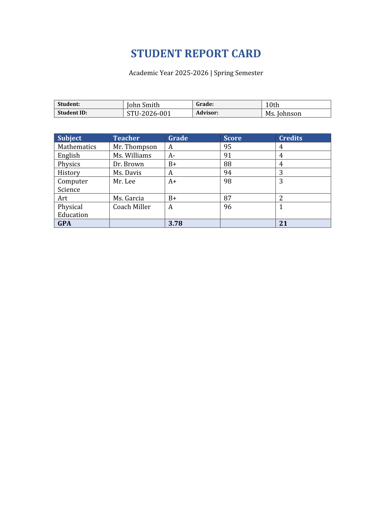</td>
</tr>
<tr>
  <td><b>docx_classic86_checklist_document<br><small>format: docx | case: docx_classic86_checklist_document | scope: dotnet-classic-docx</small></b></td>
  <td colspan="2">docx_classic86_checklist_document <span style="color:#3fb950">⬤</span> 99.3%</td>
</tr>
<tr>
  <td></td>
  <td></td>
  <td></td>
</tr>
<tr>
  <td><b>docx_classic87_bibliography<br><small>format: docx | case: docx_classic87_bibliography | scope: dotnet-classic-docx</small></b></td>
  <td colspan="2">docx_classic87_bibliography <span style="color:#3fb950">⬤</span> 99.2%</td>
</tr>
<tr>
  <td></td>
  <td></td>
  <td></td>
</tr>
<tr>
  <td><b>docx_classic88_presentation_handout<br><small>format: docx | case: docx_classic88_presentation_handout | scope: dotnet-classic-docx</small></b></td>
  <td colspan="2">docx_classic88_presentation_handout <span style="color:#d29922">⬤</span> 87.3%</td>
</tr>
<tr>
  <td></td>
  <td></td>
  <td></td>
</tr>
<tr>
  <td></td>
  <td></td>
  <td>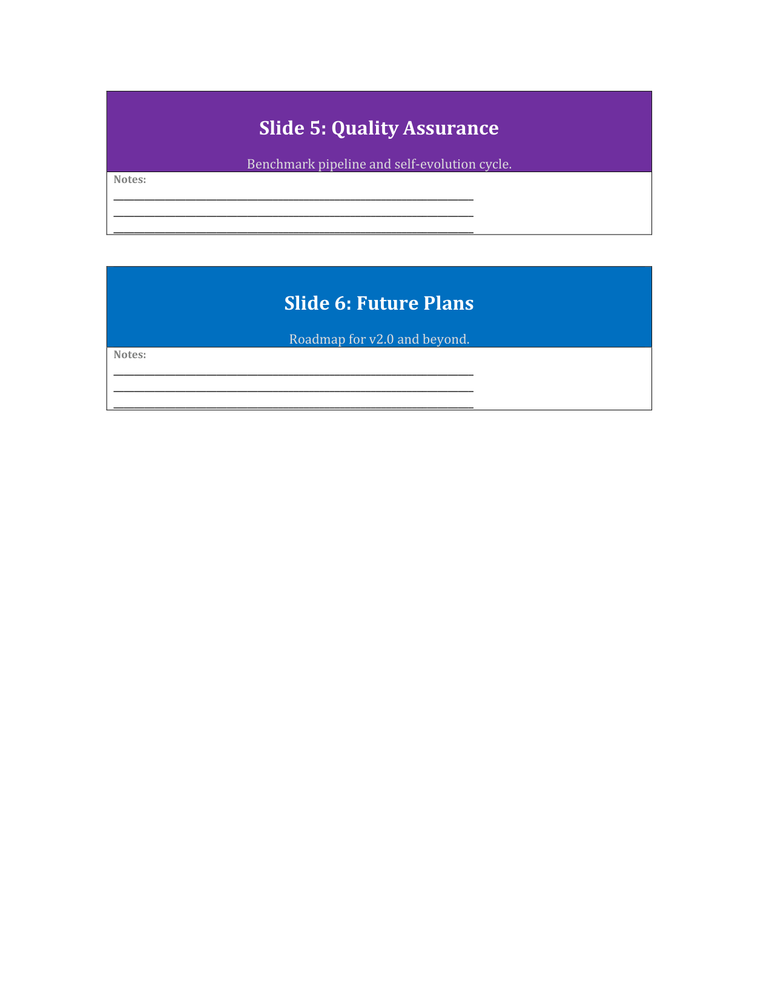</td>
</tr>
<tr>
  <td><b>docx_classic89_multi_image_gallery<br><small>format: docx | case: docx_classic89_multi_image_gallery | scope: dotnet-classic-docx</small></b></td>
  <td colspan="2">docx_classic89_multi_image_gallery <span style="color:#3fb950">⬤</span> 97.5%</td>
</tr>
<tr>
  <td></td>
  <td></td>
  <td></td>
</tr>
<tr>
  <td><b>docx_classic90_comprehensive_annual_report<br><small>format: docx | case: docx_classic90_comprehensive_annual_report | scope: dotnet-classic-docx</small></b></td>
  <td colspan="2">docx_classic90_comprehensive_annual_report <span style="color:#3fb950">⬤</span> 98.6%</td>
</tr>
<tr>
  <td></td>
  <td></td>
  <td></td>
</tr>
<tr>
  <td></td>
  <td></td>
  <td></td>
</tr>
<tr>
  <td></td>
  <td></td>
  <td></td>
</tr>
<tr>
  <td></td>
  <td></td>
  <td></td>
</tr>
<tr>
  <td><b>docx_classic91_landscape_page<br><small>format: docx | case: docx_classic91_landscape_page | scope: dotnet-classic-docx</small></b></td>
  <td colspan="2">docx_classic91_landscape_page <span style="color:#3fb950">⬤</span> 98.2%</td>
</tr>
<tr>
  <td></td>
  <td></td>
  <td></td>
</tr>
<tr>
  <td><b>docx_classic92_first_line_indent<br><small>format: docx | case: docx_classic92_first_line_indent | scope: dotnet-classic-docx</small></b></td>
  <td colspan="2">docx_classic92_first_line_indent <span style="color:#3fb950">⬤</span> 99.4%</td>
</tr>
<tr>
  <td></td>
  <td></td>
  <td></td>
</tr>
<tr>
  <td><b>docx_classic93_hanging_indent<br><small>format: docx | case: docx_classic93_hanging_indent | scope: dotnet-classic-docx</small></b></td>
  <td colspan="2">docx_classic93_hanging_indent <span style="color:#3fb950">⬤</span> 99.1%</td>
</tr>
<tr>
  <td></td>
  <td></td>
  <td></td>
</tr>
<tr>
  <td><b>docx_classic94_custom_bullet_characters<br><small>format: docx | case: docx_classic94_custom_bullet_characters | scope: dotnet-classic-docx</small></b></td>
  <td colspan="2">docx_classic94_custom_bullet_characters <span style="color:#3fb950">⬤</span> 99.6%</td>
</tr>
<tr>
  <td></td>
  <td></td>
  <td></td>
</tr>
<tr>
  <td><b>docx_classic95_contract_template<br><small>format: docx | case: docx_classic95_contract_template | scope: dotnet-classic-docx</small></b></td>
  <td colspan="2">docx_classic95_contract_template <span style="color:#3fb950">⬤</span> 99.3%</td>
</tr>
<tr>
  <td></td>
  <td></td>
  <td></td>
</tr>
<tr>
  <td><b>docx_classic96_dense_data_table<br><small>format: docx | case: docx_classic96_dense_data_table | scope: dotnet-classic-docx</small></b></td>
  <td colspan="2">docx_classic96_dense_data_table <span style="color:#3fb950">⬤</span> 95.8%</td>
</tr>
<tr>
  <td></td>
  <td></td>
  <td></td>
</tr>
<tr>
  <td><b>docx_classic97_product_catalog<br><small>format: docx | case: docx_classic97_product_catalog | scope: dotnet-classic-docx</small></b></td>
  <td colspan="2">docx_classic97_product_catalog <span style="color:#3fb950">⬤</span> 97.6%</td>
</tr>
<tr>
  <td></td>
  <td></td>
  <td></td>
</tr>
<tr>
  <td><b>docx_classic98_training_manual<br><small>format: docx | case: docx_classic98_training_manual | scope: dotnet-classic-docx</small></b></td>
  <td colspan="2">docx_classic98_training_manual <span style="color:#3fb950">⬤</span> 98.9%</td>
</tr>
<tr>
  <td></td>
  <td></td>
  <td></td>
</tr>
<tr>
  <td><b>docx_classic99_policy_document<br><small>format: docx | case: docx_classic99_policy_document | scope: dotnet-classic-docx</small></b></td>
  <td colspan="2">docx_classic99_policy_document <span style="color:#3fb950">⬤</span> 98.3%</td>
</tr>
<tr>
  <td></td>
  <td></td>
  <td></td>
</tr>
<tr>
  <td><b>docx_classic100_multi_page_table<br><small>format: docx | case: docx_classic100_multi_page_table | scope: dotnet-classic-docx</small></b></td>
  <td colspan="2">docx_classic100_multi_page_table <span style="color:#3fb950">⬤</span> 95.0%</td>
</tr>
<tr>
  <td></td>
  <td></td>
  <td></td>
</tr>
<tr>
  <td></td>
  <td></td>
  <td></td>
</tr>
<tr>
  <td><b>docx_classic101_warranty_document<br><small>format: docx | case: docx_classic101_warranty_document | scope: dotnet-classic-docx</small></b></td>
  <td colspan="2">docx_classic101_warranty_document <span style="color:#3fb950">⬤</span> 98.5%</td>
</tr>
<tr>
  <td></td>
  <td></td>
  <td></td>
</tr>
<tr>
  <td><b>docx_classic102_curriculum_syllabus<br><small>format: docx | case: docx_classic102_curriculum_syllabus | scope: dotnet-classic-docx</small></b></td>
  <td colspan="2">docx_classic102_curriculum_syllabus <span style="color:#3fb950">⬤</span> 98.0%</td>
</tr>
<tr>
  <td></td>
  <td></td>
  <td></td>
</tr>
<tr>
  <td><b>docx_classic103_event_program<br><small>format: docx | case: docx_classic103_event_program | scope: dotnet-classic-docx</small></b></td>
  <td colspan="2">docx_classic103_event_program <span style="color:#3fb950">⬤</span> 98.0%</td>
</tr>
<tr>
  <td></td>
  <td></td>
  <td></td>
</tr>
<tr>
  <td></td>
  <td></td>
  <td></td>
</tr>
<tr>
  <td><b>docx_classic104_sop_document<br><small>format: docx | case: docx_classic104_sop_document | scope: dotnet-classic-docx</small></b></td>
  <td colspan="2">docx_classic104_sop_document <span style="color:#3fb950">⬤</span> 98.7%</td>
</tr>
<tr>
  <td></td>
  <td></td>
  <td></td>
</tr>
<tr>
  <td></td>
  <td></td>
  <td></td>
</tr>
<tr>
  <td><b>docx_classic105_certificate<br><small>format: docx | case: docx_classic105_certificate | scope: dotnet-classic-docx</small></b></td>
  <td colspan="2">docx_classic105_certificate <span style="color:#3fb950">⬤</span> 98.9%</td>
</tr>
<tr>
  <td></td>
  <td></td>
  <td></td>
</tr>
<tr>
  <td><b>docx_classic106_multi_section_orientation<br><small>format: docx | case: docx_classic106_multi_section_orientation | scope: dotnet-classic-docx</small></b></td>
  <td colspan="2">docx_classic106_multi_section_orientation <span style="color:#3fb950">⬤</span> 99.1%</td>
</tr>
<tr>
  <td></td>
  <td></td>
  <td></td>
</tr>
<tr>
  <td></td>
  <td></td>
  <td></td>
</tr>
<tr>
  <td></td>
  <td></td>
  <td></td>
</tr>
<tr>
  <td><b>docx_classic107_order_form<br><small>format: docx | case: docx_classic107_order_form | scope: dotnet-classic-docx</small></b></td>
  <td colspan="2">docx_classic107_order_form <span style="color:#3fb950">⬤</span> 97.9%</td>
</tr>
<tr>
  <td></td>
  <td></td>
  <td></td>
</tr>
<tr>
  <td><b>docx_classic108_comparison_matrix<br><small>format: docx | case: docx_classic108_comparison_matrix | scope: dotnet-classic-docx</small></b></td>
  <td colspan="2">docx_classic108_comparison_matrix <span style="color:#3fb950">⬤</span> 96.7%</td>
</tr>
<tr>
  <td></td>
  <td></td>
  <td></td>
</tr>
<tr>
  <td><b>docx_classic109_release_notes<br><small>format: docx | case: docx_classic109_release_notes | scope: dotnet-classic-docx</small></b></td>
  <td colspan="2">docx_classic109_release_notes <span style="color:#3fb950">⬤</span> 99.1%</td>
</tr>
<tr>
  <td></td>
  <td></td>
  <td></td>
</tr>
<tr>
  <td><b>docx_classic110_troubleshooting_guide<br><small>format: docx | case: docx_classic110_troubleshooting_guide | scope: dotnet-classic-docx</small></b></td>
  <td colspan="2">docx_classic110_troubleshooting_guide <span style="color:#3fb950">⬤</span> 99.3%</td>
</tr>
<tr>
  <td></td>
  <td></td>
  <td></td>
</tr>
<tr>
  <td><b>docx_classic111_meeting_agenda<br><small>format: docx | case: docx_classic111_meeting_agenda | scope: dotnet-classic-docx</small></b></td>
  <td colspan="2">docx_classic111_meeting_agenda <span style="color:#3fb950">⬤</span> 98.2%</td>
</tr>
<tr>
  <td></td>
  <td></td>
  <td></td>
</tr>
<tr>
  <td><b>docx_classic112_project_status_report<br><small>format: docx | case: docx_classic112_project_status_report | scope: dotnet-classic-docx</small></b></td>
  <td colspan="2">docx_classic112_project_status_report <span style="color:#3fb950">⬤</span> 97.1%</td>
</tr>
<tr>
  <td></td>
  <td></td>
  <td></td>
</tr>
<tr>
  <td><b>docx_classic113_address_labels<br><small>format: docx | case: docx_classic113_address_labels | scope: dotnet-classic-docx</small></b></td>
  <td colspan="2">docx_classic113_address_labels <span style="color:#3fb950">⬤</span> 99.1%</td>
</tr>
<tr>
  <td></td>
  <td></td>
  <td></td>
</tr>
<tr>
  <td><b>docx_classic114_test_report<br><small>format: docx | case: docx_classic114_test_report | scope: dotnet-classic-docx</small></b></td>
  <td colspan="2">docx_classic114_test_report <span style="color:#3fb950">⬤</span> 97.3%</td>
</tr>
<tr>
  <td></td>
  <td></td>
  <td></td>
</tr>
<tr>
  <td><b>docx_classic115_price_list<br><small>format: docx | case: docx_classic115_price_list | scope: dotnet-classic-docx</small></b></td>
  <td colspan="2">docx_classic115_price_list <span style="color:#3fb950">⬤</span> 95.7%</td>
</tr>
<tr>
  <td></td>
  <td></td>
  <td></td>
</tr>
<tr>
  <td><b>docx_classic116_risk_assessment<br><small>format: docx | case: docx_classic116_risk_assessment | scope: dotnet-classic-docx</small></b></td>
  <td colspan="2">docx_classic116_risk_assessment <span style="color:#3fb950">⬤</span> 97.5%</td>
</tr>
<tr>
  <td></td>
  <td></td>
  <td></td>
</tr>
<tr>
  <td><b>docx_classic117_employee_handbook_excerpt<br><small>format: docx | case: docx_classic117_employee_handbook_excerpt | scope: dotnet-classic-docx</small></b></td>
  <td colspan="2">docx_classic117_employee_handbook_excerpt <span style="color:#3fb950">⬤</span> 98.5%</td>
</tr>
<tr>
  <td></td>
  <td></td>
  <td></td>
</tr>
<tr>
  <td><b>docx_classic118_data_report_with_summary<br><small>format: docx | case: docx_classic118_data_report_with_summary | scope: dotnet-classic-docx</small></b></td>
  <td colspan="2">docx_classic118_data_report_with_summary <span style="color:#3fb950">⬤</span> 96.8%</td>
</tr>
<tr>
  <td></td>
  <td></td>
  <td></td>
</tr>
<tr>
  <td><b>docx_classic119_multi_language_document<br><small>format: docx | case: docx_classic119_multi_language_document | scope: dotnet-classic-docx</small></b></td>
  <td colspan="2">docx_classic119_multi_language_document <span style="color:#3fb950">⬤</span> 99.0%</td>
</tr>
<tr>
  <td></td>
  <td></td>
  <td></td>
</tr>
<tr>
  <td><b>docx_classic120_comprehensive_business_proposal<br><small>format: docx | case: docx_classic120_comprehensive_business_proposal | scope: dotnet-classic-docx</small></b></td>
  <td colspan="2">docx_classic120_comprehensive_business_proposal <span style="color:#3fb950">⬤</span> 97.9%</td>
</tr>
<tr>
  <td></td>
  <td></td>
  <td></td>
</tr>
<tr>
  <td></td>
  <td></td>
  <td></td>
</tr>
<tr>
  <td></td>
  <td></td>
  <td></td>
</tr>
<tr>
  <td><b>docx_classic121_thin_border_table<br><small>format: docx | case: docx_classic121_thin_border_table | scope: dotnet-classic-docx</small></b></td>
  <td colspan="2">docx_classic121_thin_border_table <span style="color:#3fb950">⬤</span> 99.5%</td>
</tr>
<tr>
  <td></td>
  <td></td>
  <td>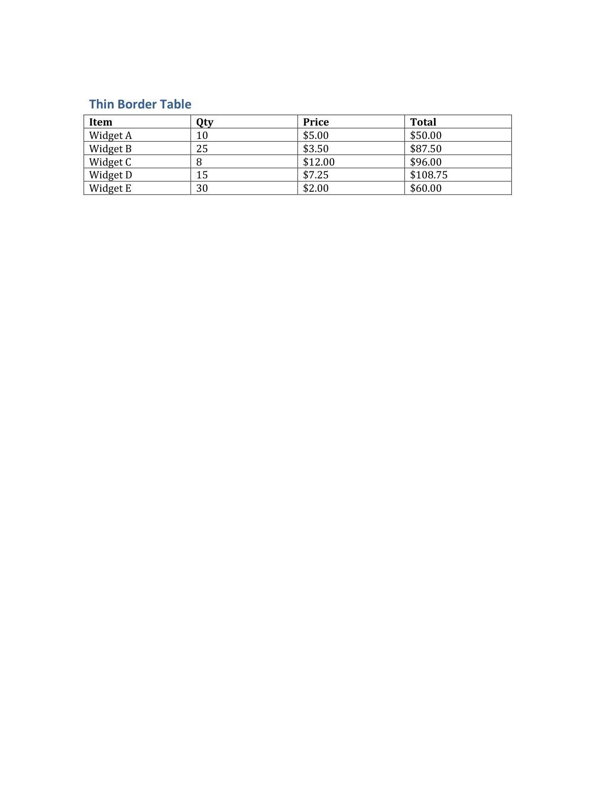</td>
</tr>
<tr>
  <td><b>docx_classic122_thick_outer_border_table<br><small>format: docx | case: docx_classic122_thick_outer_border_table | scope: dotnet-classic-docx</small></b></td>
  <td colspan="2">docx_classic122_thick_outer_border_table <span style="color:#3fb950">⬤</span> 99.1%</td>
</tr>
<tr>
  <td></td>
  <td></td>
  <td></td>
</tr>
<tr>
  <td><b>docx_classic123_dashed_border_table<br><small>format: docx | case: docx_classic123_dashed_border_table | scope: dotnet-classic-docx</small></b></td>
  <td colspan="2">docx_classic123_dashed_border_table <span style="color:#3fb950">⬤</span> 99.7%</td>
</tr>
<tr>
  <td></td>
  <td></td>
  <td></td>
</tr>
<tr>
  <td><b>docx_classic124_colored_border_table<br><small>format: docx | case: docx_classic124_colored_border_table | scope: dotnet-classic-docx</small></b></td>
  <td colspan="2">docx_classic124_colored_border_table <span style="color:#3fb950">⬤</span> 99.4%</td>
</tr>
<tr>
  <td></td>
  <td></td>
  <td></td>
</tr>
<tr>
  <td><b>docx_classic125_solid_cell_fills<br><small>format: docx | case: docx_classic125_solid_cell_fills | scope: dotnet-classic-docx</small></b></td>
  <td colspan="2">docx_classic125_solid_cell_fills <span style="color:#3fb950">⬤</span> 98.4%</td>
</tr>
<tr>
  <td></td>
  <td></td>
  <td></td>
</tr>
<tr>
  <td><b>docx_classic126_dark_header_table<br><small>format: docx | case: docx_classic126_dark_header_table | scope: dotnet-classic-docx</small></b></td>
  <td colspan="2">docx_classic126_dark_header_table <span style="color:#3fb950">⬤</span> 98.8%</td>
</tr>
<tr>
  <td></td>
  <td></td>
  <td></td>
</tr>
<tr>
  <td><b>docx_classic127_font_styles_showcase<br><small>format: docx | case: docx_classic127_font_styles_showcase | scope: dotnet-classic-docx</small></b></td>
  <td colspan="2">docx_classic127_font_styles_showcase <span style="color:#3fb950">⬤</span> 99.3%</td>
</tr>
<tr>
  <td></td>
  <td></td>
  <td></td>
</tr>
<tr>
  <td><b>docx_classic128_font_sizes_showcase<br><small>format: docx | case: docx_classic128_font_sizes_showcase | scope: dotnet-classic-docx</small></b></td>
  <td colspan="2">docx_classic128_font_sizes_showcase <span style="color:#3fb950">⬤</span> 98.7%</td>
</tr>
<tr>
  <td></td>
  <td></td>
  <td></td>
</tr>
<tr>
  <td><b>docx_classic129_alignment_combinations<br><small>format: docx | case: docx_classic129_alignment_combinations | scope: dotnet-classic-docx</small></b></td>
  <td colspan="2">docx_classic129_alignment_combinations <span style="color:#3fb950">⬤</span> 99.5%</td>
</tr>
<tr>
  <td></td>
  <td></td>
  <td></td>
</tr>
<tr>
  <td><b>docx_classic130_wrap_and_indent<br><small>format: docx | case: docx_classic130_wrap_and_indent | scope: dotnet-classic-docx</small></b></td>
  <td colspan="2">docx_classic130_wrap_and_indent <span style="color:#3fb950">⬤</span> 99.7%</td>
</tr>
<tr>
  <td></td>
  <td></td>
  <td></td>
</tr>
<tr>
  <td><b>docx_classic131_number_format_table<br><small>format: docx | case: docx_classic131_number_format_table | scope: dotnet-classic-docx</small></b></td>
  <td colspan="2">docx_classic131_number_format_table <span style="color:#3fb950">⬤</span> 99.2%</td>
</tr>
<tr>
  <td></td>
  <td></td>
  <td></td>
</tr>
<tr>
  <td><b>docx_classic132_striped_table<br><small>format: docx | case: docx_classic132_striped_table | scope: dotnet-classic-docx</small></b></td>
  <td colspan="2">docx_classic132_striped_table <span style="color:#3fb950">⬤</span> 96.2%</td>
</tr>
<tr>
  <td></td>
  <td></td>
  <td></td>
</tr>
<tr>
  <td><b>docx_classic133_gradient_rows_table<br><small>format: docx | case: docx_classic133_gradient_rows_table | scope: dotnet-classic-docx</small></b></td>
  <td colspan="2">docx_classic133_gradient_rows_table <span style="color:#3fb950">⬤</span> 98.1%</td>
</tr>
<tr>
  <td></td>
  <td></td>
  <td>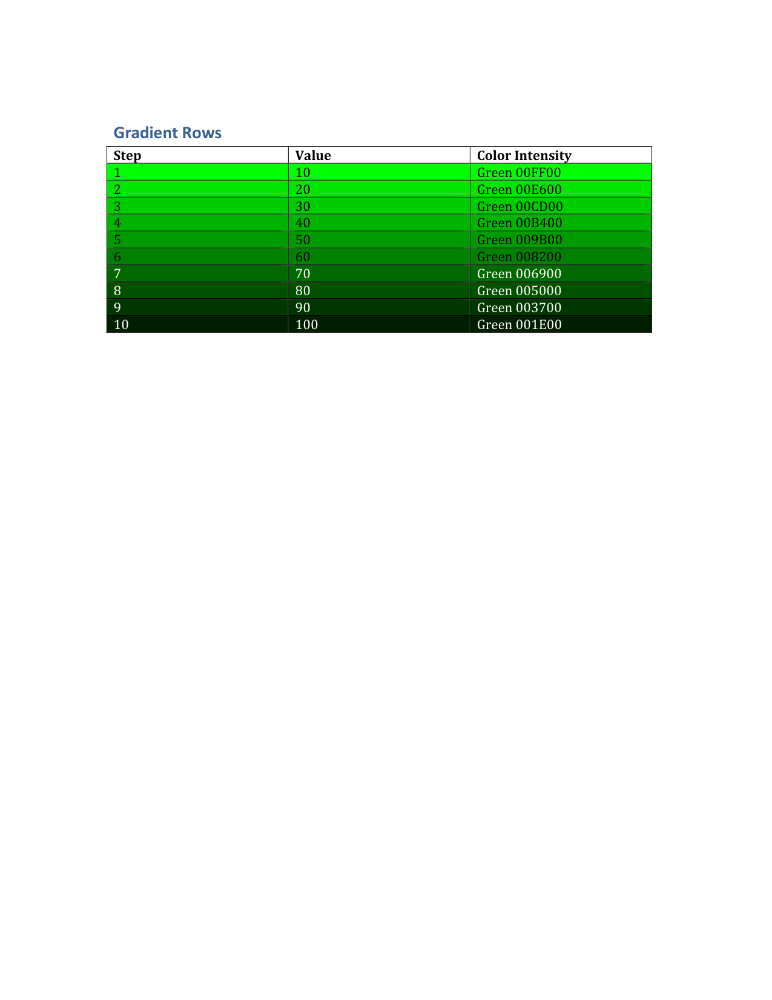</td>
</tr>
<tr>
  <td><b>docx_classic134_heatmap_table<br><small>format: docx | case: docx_classic134_heatmap_table | scope: dotnet-classic-docx</small></b></td>
  <td colspan="2">docx_classic134_heatmap_table <span style="color:#3fb950">⬤</span> 97.9%</td>
</tr>
<tr>
  <td></td>
  <td></td>
  <td></td>
</tr>
<tr>
  <td><b>docx_classic135_bottom_border_paragraphs<br><small>format: docx | case: docx_classic135_bottom_border_paragraphs | scope: dotnet-classic-docx</small></b></td>
  <td colspan="2">docx_classic135_bottom_border_paragraphs <span style="color:#3fb950">⬤</span> 99.5%</td>
</tr>
<tr>
  <td></td>
  <td></td>
  <td></td>
</tr>
<tr>
  <td><b>docx_classic136_financial_statement<br><small>format: docx | case: docx_classic136_financial_statement | scope: dotnet-classic-docx</small></b></td>
  <td colspan="2">docx_classic136_financial_statement <span style="color:#3fb950">⬤</span> 98.3%</td>
</tr>
<tr>
  <td></td>
  <td></td>
  <td></td>
</tr>
<tr>
  <td><b>docx_classic137_checkerboard_table<br><small>format: docx | case: docx_classic137_checkerboard_table | scope: dotnet-classic-docx</small></b></td>
  <td colspan="2">docx_classic137_checkerboard_table <span style="color:#3fb950">⬤</span> 97.0%</td>
</tr>
<tr>
  <td></td>
  <td></td>
  <td></td>
</tr>
<tr>
  <td><b>docx_classic138_color_grid_table<br><small>format: docx | case: docx_classic138_color_grid_table | scope: dotnet-classic-docx</small></b></td>
  <td colspan="2">docx_classic138_color_grid_table <span style="color:#3fb950">⬤</span> 97.7%</td>
</tr>
<tr>
  <td></td>
  <td></td>
  <td></td>
</tr>
<tr>
  <td><b>docx_classic139_paragraph_shading_patterns<br><small>format: docx | case: docx_classic139_paragraph_shading_patterns | scope: dotnet-classic-docx</small></b></td>
  <td colspan="2">docx_classic139_paragraph_shading_patterns <span style="color:#3fb950">⬤</span> 95.5%</td>
</tr>
<tr>
  <td></td>
  <td></td>
  <td></td>
</tr>
<tr>
  <td><b>docx_classic140_rotated_text_table<br><small>format: docx | case: docx_classic140_rotated_text_table | scope: dotnet-classic-docx</small></b></td>
  <td colspan="2">docx_classic140_rotated_text_table <span style="color:#3fb950">⬤</span> 92.0%</td>
</tr>
<tr>
  <td></td>
  <td></td>
  <td></td>
</tr>
<tr>
  <td><b>docx_classic141_mixed_border_styles<br><small>format: docx | case: docx_classic141_mixed_border_styles | scope: dotnet-classic-docx</small></b></td>
  <td colspan="2">docx_classic141_mixed_border_styles <span style="color:#3fb950">⬤</span> 99.6%</td>
</tr>
<tr>
  <td></td>
  <td></td>
  <td></td>
</tr>
<tr>
  <td><b>docx_classic142_styled_invoice_document<br><small>format: docx | case: docx_classic142_styled_invoice_document | scope: dotnet-classic-docx</small></b></td>
  <td colspan="2">docx_classic142_styled_invoice_document <span style="color:#3fb950">⬤</span> 97.7%</td>
</tr>
<tr>
  <td></td>
  <td></td>
  <td></td>
</tr>
<tr>
  <td><b>docx_classic143_multi_section_document<br><small>format: docx | case: docx_classic143_multi_section_document | scope: dotnet-classic-docx</small></b></td>
  <td colspan="2">docx_classic143_multi_section_document <span style="color:#3fb950">⬤</span> 95.3%</td>
</tr>
<tr>
  <td></td>
  <td></td>
  <td></td>
</tr>
<tr>
  <td><b>docx_classic144_note_style_paragraphs<br><small>format: docx | case: docx_classic144_note_style_paragraphs | scope: dotnet-classic-docx</small></b></td>
  <td colspan="2">docx_classic144_note_style_paragraphs <span style="color:#3fb950">⬤</span> 99.1%</td>
</tr>
<tr>
  <td></td>
  <td></td>
  <td></td>
</tr>
<tr>
  <td><b>docx_classic145_status_badge_table<br><small>format: docx | case: docx_classic145_status_badge_table | scope: dotnet-classic-docx</small></b></td>
  <td colspan="2">docx_classic145_status_badge_table <span style="color:#3fb950">⬤</span> 98.2%</td>
</tr>
<tr>
  <td></td>
  <td></td>
  <td></td>
</tr>
<tr>
  <td><b>docx_classic146_double_border_table<br><small>format: docx | case: docx_classic146_double_border_table | scope: dotnet-classic-docx</small></b></td>
  <td colspan="2">docx_classic146_double_border_table <span style="color:#3fb950">⬤</span> 99.0%</td>
</tr>
<tr>
  <td></td>
  <td></td>
  <td></td>
</tr>
<tr>
  <td><b>docx_classic147_multi_section_styled_report<br><small>format: docx | case: docx_classic147_multi_section_styled_report | scope: dotnet-classic-docx</small></b></td>
  <td colspan="2">docx_classic147_multi_section_styled_report <span style="color:#3fb950">⬤</span> 96.5%</td>
</tr>
<tr>
  <td></td>
  <td></td>
  <td></td>
</tr>
<tr>
  <td><b>docx_classic148_data_grid_document<br><small>format: docx | case: docx_classic148_data_grid_document | scope: dotnet-classic-docx</small></b></td>
  <td colspan="2">docx_classic148_data_grid_document <span style="color:#3fb950">⬤</span> 95.0%</td>
</tr>
<tr>
  <td></td>
  <td></td>
  <td></td>
</tr>
<tr>
  <td><b>docx_classic149_merged_section_report<br><small>format: docx | case: docx_classic149_merged_section_report | scope: dotnet-classic-docx</small></b></td>
  <td colspan="2">docx_classic149_merged_section_report <span style="color:#3fb950">⬤</span> 97.2%</td>
</tr>
<tr>
  <td></td>
  <td></td>
  <td></td>
</tr>
<tr>
  <td><b>docx_classic150_kitchen_sink_styles<br><small>format: docx | case: docx_classic150_kitchen_sink_styles | scope: dotnet-classic-docx</small></b></td>
  <td colspan="2">docx_classic150_kitchen_sink_styles <span style="color:#3fb950">⬤</span> 98.5%</td>
</tr>
<tr>
  <td></td>
  <td></td>
  <td></td>
</tr>
<tr>
  <td></td>
  <td></td>
  <td></td>
</tr>
</table>

## Detailed Results

### docx_classic01_single_paragraph

- **Case Metadata:** format: docx | case: docx_classic01_single_paragraph | scope: dotnet-classic-docx
- **Source:** tests/MiniPdf.Scripts/output_docx/docx_classic01_single_paragraph.docx
- **Text Similarity:** 1.0
- **Visual Average:** 0.997
- **Overall Score:** 0.9988
- **Pages:** MiniPdf=1, Reference=1
- **File Size:** MiniPdf=220676 bytes, Reference=48037 bytes

Text content: ✅ Identical

### docx_classic02_multiple_paragraphs

- **Case Metadata:** format: docx | case: docx_classic02_multiple_paragraphs | scope: dotnet-classic-docx
- **Source:** tests/MiniPdf.Scripts/output_docx/docx_classic02_multiple_paragraphs.docx
- **Text Similarity:** 1.0
- **Visual Average:** 0.9859
- **Overall Score:** 0.9944
- **Pages:** MiniPdf=1, Reference=1
- **File Size:** MiniPdf=222810 bytes, Reference=48946 bytes

Text content: ✅ Identical

### docx_classic03_headings

- **Case Metadata:** format: docx | case: docx_classic03_headings | scope: dotnet-classic-docx
- **Source:** tests/MiniPdf.Scripts/output_docx/docx_classic03_headings.docx
- **Text Similarity:** 1.0
- **Visual Average:** 0.9971
- **Overall Score:** 0.9988
- **Pages:** MiniPdf=1, Reference=1
- **File Size:** MiniPdf=1140510 bytes, Reference=95865 bytes

Text content: ✅ Identical

### docx_classic04_bold_italic

- **Case Metadata:** format: docx | case: docx_classic04_bold_italic | scope: dotnet-classic-docx
- **Source:** tests/MiniPdf.Scripts/output_docx/docx_classic04_bold_italic.docx
- **Text Similarity:** 1.0
- **Visual Average:** 0.9982
- **Overall Score:** 0.9993
- **Pages:** MiniPdf=1, Reference=1
- **File Size:** MiniPdf=834144 bytes, Reference=94134 bytes

Text content: ✅ Identical

### docx_classic05_font_sizes

- **Case Metadata:** format: docx | case: docx_classic05_font_sizes | scope: dotnet-classic-docx
- **Source:** tests/MiniPdf.Scripts/output_docx/docx_classic05_font_sizes.docx
- **Text Similarity:** 1.0
- **Visual Average:** 0.9902
- **Overall Score:** 0.9961
- **Pages:** MiniPdf=1, Reference=1
- **File Size:** MiniPdf=216894 bytes, Reference=43230 bytes

Text content: ✅ Identical

### docx_classic06_font_colors

- **Case Metadata:** format: docx | case: docx_classic06_font_colors | scope: dotnet-classic-docx
- **Source:** tests/MiniPdf.Scripts/output_docx/docx_classic06_font_colors.docx
- **Text Similarity:** 1.0
- **Visual Average:** 0.9991
- **Overall Score:** 0.9996
- **Pages:** MiniPdf=1, Reference=1
- **File Size:** MiniPdf=217154 bytes, Reference=41050 bytes

Text content: ✅ Identical

### docx_classic07_alignment

- **Case Metadata:** format: docx | case: docx_classic07_alignment | scope: dotnet-classic-docx
- **Source:** tests/MiniPdf.Scripts/output_docx/docx_classic07_alignment.docx
- **Text Similarity:** 1.0
- **Visual Average:** 0.9904
- **Overall Score:** 0.9962
- **Pages:** MiniPdf=1, Reference=1
- **File Size:** MiniPdf=220085 bytes, Reference=43210 bytes

Text content: ✅ Identical

### docx_classic08_bullet_list

- **Case Metadata:** format: docx | case: docx_classic08_bullet_list | scope: dotnet-classic-docx
- **Source:** tests/MiniPdf.Scripts/output_docx/docx_classic08_bullet_list.docx
- **Text Similarity:** 1.0
- **Visual Average:** 0.999
- **Overall Score:** 0.9996
- **Pages:** MiniPdf=1, Reference=1
- **File Size:** MiniPdf=764517 bytes, Reference=92213 bytes

Text content: ✅ Identical

### docx_classic09_numbered_list

- **Case Metadata:** format: docx | case: docx_classic09_numbered_list | scope: dotnet-classic-docx
- **Source:** tests/MiniPdf.Scripts/output_docx/docx_classic09_numbered_list.docx
- **Text Similarity:** 1.0
- **Visual Average:** 0.9983
- **Overall Score:** 0.9993
- **Pages:** MiniPdf=1, Reference=1
- **File Size:** MiniPdf=766926 bytes, Reference=91983 bytes

Text content: ✅ Identical

### docx_classic10_simple_table

- **Case Metadata:** format: docx | case: docx_classic10_simple_table | scope: dotnet-classic-docx
- **Source:** tests/MiniPdf.Scripts/output_docx/docx_classic10_simple_table.docx
- **Text Similarity:** 1.0
- **Visual Average:** 0.9832
- **Overall Score:** 0.9933
- **Pages:** MiniPdf=1, Reference=1
- **File Size:** MiniPdf=772155 bytes, Reference=73744 bytes

Text content: ✅ Identical

### docx_classic11_table_with_shading

- **Case Metadata:** format: docx | case: docx_classic11_table_with_shading | scope: dotnet-classic-docx
- **Source:** tests/MiniPdf.Scripts/output_docx/docx_classic11_table_with_shading.docx
- **Text Similarity:** 1.0
- **Visual Average:** 0.9141
- **Overall Score:** 0.9656
- **Pages:** MiniPdf=1, Reference=1
- **File Size:** MiniPdf=976663 bytes, Reference=91111 bytes

Text content: ✅ Identical

### docx_classic12_merged_cells_table

- **Case Metadata:** format: docx | case: docx_classic12_merged_cells_table | scope: dotnet-classic-docx
- **Source:** tests/MiniPdf.Scripts/output_docx/docx_classic12_merged_cells_table.docx
- **Text Similarity:** 1.0
- **Visual Average:** 0.9849
- **Overall Score:** 0.994
- **Pages:** MiniPdf=1, Reference=1
- **File Size:** MiniPdf=770115 bytes, Reference=71750 bytes

Text content: ✅ Identical

### docx_classic13_long_document

- **Case Metadata:** format: docx | case: docx_classic13_long_document | scope: dotnet-classic-docx
- **Source:** tests/MiniPdf.Scripts/output_docx/docx_classic13_long_document.docx
- **Text Similarity:** 1.0
- **Visual Average:** 0.9348
- **Overall Score:** 0.9739
- **Pages:** MiniPdf=4, Reference=4
- **File Size:** MiniPdf=818815 bytes, Reference=102517 bytes

<details><summary>Text Diff</summary>

```diff
--- minipdf/docx_classic13_long_document.pdf
+++ reference/docx_classic13_long_document.pdf
@@ -32,10 +32,10 @@
 quick brown fox jumps over the lazy dog. Pack my box with five dozen liquor jugs. How

 vexingly quick daft zebras jump. The five boxing wizards jump quickly. Sphinx of black

 quartz, judge my vow.

----PAGE---

 Section 5

 This is section 5 of the report. It contains detailed analysis of the topic at hand. The quick

 brown fox jumps over the lazy dog. Pack my box with five dozen liquor jugs. How vexingly

+---PAGE---

 quick daft zebras jump. The five boxing wizards jump quickly. Sphinx of black quartz, judge

 my vow.This is section 5 of the report. It contains detailed analysis of the topic at hand. The

 quick brown fox jumps over the lazy dog. Pack my box with five dozen liquor jugs. How

@@ -72,8 +72,8 @@
 my vow.This is section 9 of the report. It contains detailed analysis of the topic at hand. The

 quick brown fox jumps over the lazy dog. Pack my box with five dozen liquor jugs. How

 vexingly quick daft zebras jump. The five boxing wizards jump quickly. Sphinx of black

+quartz, judge my vow.

 ---PAGE---

-quartz, judge my vow.

 Section 10

 This is section 10 of the report. It contains detailed analysis of the topic at hand. The quick

 brown fox jumps over the lazy dog. Pack my box with five dozen liquor jugs. How vexingly
```
</details>

### docx_classic14_mixed_content

- **Case Metadata:** format: docx | case: docx_classic14_mixed_content | scope: dotnet-classic-docx
- **Source:** tests/MiniPdf.Scripts/output_docx/docx_classic14_mixed_content.docx
- **Text Similarity:** 1.0
- **Visual Average:** 0.9828
- **Overall Score:** 0.9931
- **Pages:** MiniPdf=1, Reference=1
- **File Size:** MiniPdf=780087 bytes, Reference=115112 bytes

Text content: ✅ Identical

### docx_classic15_indentation

- **Case Metadata:** format: docx | case: docx_classic15_indentation | scope: dotnet-classic-docx
- **Source:** tests/MiniPdf.Scripts/output_docx/docx_classic15_indentation.docx
- **Text Similarity:** 1.0
- **Visual Average:** 0.9924
- **Overall Score:** 0.997
- **Pages:** MiniPdf=1, Reference=1
- **File Size:** MiniPdf=768865 bytes, Reference=74243 bytes

Text content: ✅ Identical

### docx_classic16_line_spacing

- **Case Metadata:** format: docx | case: docx_classic16_line_spacing | scope: dotnet-classic-docx
- **Source:** tests/MiniPdf.Scripts/output_docx/docx_classic16_line_spacing.docx
- **Text Similarity:** 1.0
- **Visual Average:** 0.9923
- **Overall Score:** 0.9969
- **Pages:** MiniPdf=1, Reference=1
- **File Size:** MiniPdf=771215 bytes, Reference=78004 bytes

Text content: ✅ Identical

### docx_classic17_page_break

- **Case Metadata:** format: docx | case: docx_classic17_page_break | scope: dotnet-classic-docx
- **Source:** tests/MiniPdf.Scripts/output_docx/docx_classic17_page_break.docx
- **Text Similarity:** 1.0
- **Visual Average:** 0.9993
- **Overall Score:** 0.9997
- **Pages:** MiniPdf=3, Reference=3
- **File Size:** MiniPdf=765132 bytes, Reference=69855 bytes

Text content: ✅ Identical

### docx_classic18_embedded_image

- **Case Metadata:** format: docx | case: docx_classic18_embedded_image | scope: dotnet-classic-docx
- **Source:** tests/MiniPdf.Scripts/output_docx/docx_classic18_embedded_image.docx
- **Text Similarity:** 1.0
- **Visual Average:** 0.9987
- **Overall Score:** 0.9995
- **Pages:** MiniPdf=1, Reference=1
- **File Size:** MiniPdf=765566 bytes, Reference=67381 bytes

Text content: ✅ Identical

### docx_classic19_multiple_images

- **Case Metadata:** format: docx | case: docx_classic19_multiple_images | scope: dotnet-classic-docx
- **Source:** tests/MiniPdf.Scripts/output_docx/docx_classic19_multiple_images.docx
- **Text Similarity:** 1.0
- **Visual Average:** 0.9957
- **Overall Score:** 0.9983
- **Pages:** MiniPdf=1, Reference=1
- **File Size:** MiniPdf=765890 bytes, Reference=66233 bytes

Text content: ✅ Identical

### docx_classic20_table_with_many_rows

- **Case Metadata:** format: docx | case: docx_classic20_table_with_many_rows | scope: dotnet-classic-docx
- **Source:** tests/MiniPdf.Scripts/output_docx/docx_classic20_table_with_many_rows.docx
- **Text Similarity:** 1.0
- **Visual Average:** 0.9601
- **Overall Score:** 0.984
- **Pages:** MiniPdf=1, Reference=1
- **File Size:** MiniPdf=803221 bytes, Reference=95029 bytes

Text content: ✅ Identical

### docx_classic21_nested_lists

- **Case Metadata:** format: docx | case: docx_classic21_nested_lists | scope: dotnet-classic-docx
- **Source:** tests/MiniPdf.Scripts/output_docx/docx_classic21_nested_lists.docx
- **Text Similarity:** 1.0
- **Visual Average:** 0.9961
- **Overall Score:** 0.9984
- **Pages:** MiniPdf=1, Reference=1
- **File Size:** MiniPdf=768417 bytes, Reference=98694 bytes

Text content: ✅ Identical

### docx_classic22_horizontal_rule

- **Case Metadata:** format: docx | case: docx_classic22_horizontal_rule | scope: dotnet-classic-docx
- **Source:** tests/MiniPdf.Scripts/output_docx/docx_classic22_horizontal_rule.docx
- **Text Similarity:** 1.0
- **Visual Average:** 0.9949
- **Overall Score:** 0.998
- **Pages:** MiniPdf=1, Reference=1
- **File Size:** MiniPdf=767314 bytes, Reference=70951 bytes

Text content: ✅ Identical

### docx_classic23_mixed_formatting_runs

- **Case Metadata:** format: docx | case: docx_classic23_mixed_formatting_runs | scope: dotnet-classic-docx
- **Source:** tests/MiniPdf.Scripts/output_docx/docx_classic23_mixed_formatting_runs.docx
- **Text Similarity:** 1.0
- **Visual Average:** 0.9956
- **Overall Score:** 0.9982
- **Pages:** MiniPdf=1, Reference=1
- **File Size:** MiniPdf=1181052 bytes, Reference=100389 bytes

Text content: ✅ Identical

### docx_classic24_two_column_table_layout

- **Case Metadata:** format: docx | case: docx_classic24_two_column_table_layout | scope: dotnet-classic-docx
- **Source:** tests/MiniPdf.Scripts/output_docx/docx_classic24_two_column_table_layout.docx
- **Text Similarity:** 0.7907
- **Visual Average:** 0.9839
- **Overall Score:** 0.9098
- **Pages:** MiniPdf=1, Reference=1
- **File Size:** MiniPdf=768711 bytes, Reference=72170 bytes

<details><summary>Text Diff</summary>

```diff
--- minipdf/docx_classic24_two_column_table_layout.pdf
+++ reference/docx_classic24_two_column_table_layout.pdf
@@ -1,4 +1,5 @@
 Two-Column Layout

-Left column content. This is the first column of Right column content. This is the second

-a two-column layout. It demonstrates how column. Both columns should render side-by-

-tables can be used for text layout purposes. side in the PDF output.
+Left column content. This is the first Right column content. This is the second

+column of a two-column layout. It column. Both columns should render side-

+demonstrates how tables can be used for by-side in the PDF output.

+text layout purposes.
```
</details>

### docx_classic25_title_and_subtitle

- **Case Metadata:** format: docx | case: docx_classic25_title_and_subtitle | scope: dotnet-classic-docx
- **Source:** tests/MiniPdf.Scripts/output_docx/docx_classic25_title_and_subtitle.docx
- **Text Similarity:** 1.0
- **Visual Average:** 0.9939
- **Overall Score:** 0.9976
- **Pages:** MiniPdf=2, Reference=2
- **File Size:** MiniPdf=966308 bytes, Reference=134268 bytes

Text content: ✅ Identical

### docx_classic26_table_alignment

- **Case Metadata:** format: docx | case: docx_classic26_table_alignment | scope: dotnet-classic-docx
- **Source:** tests/MiniPdf.Scripts/output_docx/docx_classic26_table_alignment.docx
- **Text Similarity:** 1.0
- **Visual Average:** 0.9852
- **Overall Score:** 0.9941
- **Pages:** MiniPdf=1, Reference=1
- **File Size:** MiniPdf=973601 bytes, Reference=94051 bytes

Text content: ✅ Identical

### docx_classic27_long_paragraph_wrapping

- **Case Metadata:** format: docx | case: docx_classic27_long_paragraph_wrapping | scope: dotnet-classic-docx
- **Source:** tests/MiniPdf.Scripts/output_docx/docx_classic27_long_paragraph_wrapping.docx
- **Text Similarity:** 1.0
- **Visual Average:** 0.9589
- **Overall Score:** 0.9836
- **Pages:** MiniPdf=1, Reference=1
- **File Size:** MiniPdf=777533 bytes, Reference=72456 bytes

<details><summary>Text Diff</summary>

```diff
--- minipdf/docx_classic27_long_paragraph_wrapping.pdf
+++ reference/docx_classic27_long_paragraph_wrapping.pdf
@@ -3,23 +3,23 @@
 line boundaries. The text should flow naturally from one line to the next without any

 awkward breaks or overflow. This is a very long paragraph designed to test how MiniPdf

 handles word wrapping across line boundaries. The text should flow naturally from one line

-to the next without any awkward breaks or overflow. This is a very long paragraph designed

-to test how MiniPdf handles word wrapping across line boundaries. The text should flow

-naturally from one line to the next without any awkward breaks or overflow. This is a very

-long paragraph designed to test how MiniPdf handles word wrapping across line

-boundaries. The text should flow naturally from one line to the next without any awkward

-breaks or overflow. This is a very long paragraph designed to test how MiniPdf handles

-word wrapping across line boundaries. The text should flow naturally from one line to the

-next without any awkward breaks or overflow. This is a very long paragraph designed to

-test how MiniPdf handles word wrapping across line boundaries. The text should flow

-naturally from one line to the next without any awkward breaks or overflow. This is a very

-long paragraph designed to test how MiniPdf handles word wrapping across line

-boundaries. The text should flow naturally from one line to the next without any awkward

-breaks or overflow. This is a very long paragraph designed to test how MiniPdf handles

-word wrapping across line boundaries. The text should flow naturally from one line to the

-next without any awkward breaks or overflow. This is a very long paragraph designed to

-test how MiniPdf handles word wrapping across line boundaries. The text should flow

-naturally from one line to the next without any awkward breaks or overflow. This is a very

-long paragraph designed to test how MiniPdf handles word wrapping across line

-boundaries. The text should flow naturally from one line to the next without any awkward

-breaks or overflow.
+to the next without any awkward breaks or overflow. This is a very long paragraph

+designed to test how MiniPdf handles word wrapping across line boundaries. The text

+should flow naturally from one line to the next without any awkward breaks or overflow.

+This is a very long paragraph designed to test how MiniPdf handles word wrapping across

+line boundaries. The text should flow naturally from one line to the next without any

+awkward breaks or overflow. This is a very long paragraph designed to test how MiniPdf

+handles word wrapping across line boundaries. The text should flow naturally from one line

+to the next without any awkward breaks or overflow. This is a very long paragraph

+designed to test how MiniPdf handles word wrapping across line boundaries. The text

+should flow naturally from one line to the next without any awkward breaks or overflow.

+This is a ve
... (813 more characters)

```
</details>

### docx_classic28_special_characters

- **Case Metadata:** format: docx | case: docx_classic28_special_characters | scope: dotnet-classic-docx
- **Source:** tests/MiniPdf.Scripts/output_docx/docx_classic28_special_characters.docx
- **Text Similarity:** 1.0
- **Visual Average:** 0.9967
- **Overall Score:** 0.9987
- **Pages:** MiniPdf=1, Reference=1
- **File Size:** MiniPdf=771634 bytes, Reference=80991 bytes

Text content: ✅ Identical

### docx_classic29_table_with_image

- **Case Metadata:** format: docx | case: docx_classic29_table_with_image | scope: dotnet-classic-docx
- **Source:** tests/MiniPdf.Scripts/output_docx/docx_classic29_table_with_image.docx
- **Text Similarity:** 0.9728
- **Visual Average:** 0.974
- **Overall Score:** 0.9787
- **Pages:** MiniPdf=1, Reference=1
- **File Size:** MiniPdf=768453 bytes, Reference=70208 bytes

<details><summary>Text Diff</summary>

```diff
--- minipdf/docx_classic29_table_with_image.pdf
+++ reference/docx_classic29_table_with_image.pdf
@@ -1,5 +1,5 @@
 Product Card

 Product Description

-MiniPdf Widget - A compact, efficient tool for

-PDF conversion. Lightweight and dependency-

-free.
+MiniPdf Widget - A compact, efficient tool

+for PDF conversion. Lightweight and

+dependency-free.
```
</details>

### docx_classic30_comprehensive_report

- **Case Metadata:** format: docx | case: docx_classic30_comprehensive_report | scope: dotnet-classic-docx
- **Source:** tests/MiniPdf.Scripts/output_docx/docx_classic30_comprehensive_report.docx
- **Text Similarity:** 1.0
- **Visual Average:** 0.983
- **Overall Score:** 0.9932
- **Pages:** MiniPdf=3, Reference=3
- **File Size:** MiniPdf=1196504 bytes, Reference=220886 bytes

Text content: ✅ Identical

### docx_classic31_product_card_with_image

- **Case Metadata:** format: docx | case: docx_classic31_product_card_with_image | scope: dotnet-classic-docx
- **Source:** tests/MiniPdf.Scripts/output_docx/docx_classic31_product_card_with_image.docx
- **Text Similarity:** 1.0
- **Visual Average:** 0.9886
- **Overall Score:** 0.9954
- **Pages:** MiniPdf=1, Reference=1
- **File Size:** MiniPdf=978726 bytes, Reference=108260 bytes

Text content: ✅ Identical

### docx_classic31_strikethrough_text

- **Case Metadata:** format: docx | case: docx_classic31_strikethrough_text | scope: dotnet-classic-docx
- **Source:** tests/MiniPdf.Scripts/output_docx/docx_classic31_strikethrough_text.docx
- **Text Similarity:** 1.0
- **Visual Average:** 0.9951
- **Overall Score:** 0.998
- **Pages:** MiniPdf=1, Reference=1
- **File Size:** MiniPdf=769130 bytes, Reference=73919 bytes

Text content: ✅ Identical

### docx_classic32_company_logo_header

- **Case Metadata:** format: docx | case: docx_classic32_company_logo_header | scope: dotnet-classic-docx
- **Source:** tests/MiniPdf.Scripts/output_docx/docx_classic32_company_logo_header.docx
- **Text Similarity:** 1.0
- **Visual Average:** 0.9803
- **Overall Score:** 0.9921
- **Pages:** MiniPdf=1, Reference=1
- **File Size:** MiniPdf=984696 bytes, Reference=112769 bytes

Text content: ✅ Identical

### docx_classic32_superscript_subscript

- **Case Metadata:** format: docx | case: docx_classic32_superscript_subscript | scope: dotnet-classic-docx
- **Source:** tests/MiniPdf.Scripts/output_docx/docx_classic32_superscript_subscript.docx
- **Text Similarity:** 0.9762
- **Visual Average:** 0.9977
- **Overall Score:** 0.9896
- **Pages:** MiniPdf=1, Reference=1
- **File Size:** MiniPdf=769244 bytes, Reference=73303 bytes

<details><summary>Text Diff</summary>

```diff
--- minipdf/docx_classic32_superscript_subscript.pdf
+++ reference/docx_classic32_superscript_subscript.pdf
@@ -1,10 +1,8 @@
 Superscript and Subscript

 2

 Einstein's equation: E = mc

-Water: H O

-2

-Carbon dioxide: CO

-2

+Water: H 2 O

+Carbon dioxide: CO 2

 1

 Footnote reference

 n n n
```
</details>

### docx_classic33_highlighted_text

- **Case Metadata:** format: docx | case: docx_classic33_highlighted_text | scope: dotnet-classic-docx
- **Source:** tests/MiniPdf.Scripts/output_docx/docx_classic33_highlighted_text.docx
- **Text Similarity:** 1.0
- **Visual Average:** 0.9966
- **Overall Score:** 0.9986
- **Pages:** MiniPdf=1, Reference=1
- **File Size:** MiniPdf=765628 bytes, Reference=67420 bytes

Text content: ✅ Identical

### docx_classic33_two_products_side_by_side

- **Case Metadata:** format: docx | case: docx_classic33_two_products_side_by_side | scope: dotnet-classic-docx
- **Source:** tests/MiniPdf.Scripts/output_docx/docx_classic33_two_products_side_by_side.docx
- **Text Similarity:** 1.0
- **Visual Average:** 0.9817
- **Overall Score:** 0.9927
- **Pages:** MiniPdf=1, Reference=1
- **File Size:** MiniPdf=986478 bytes, Reference=107718 bytes

Text content: ✅ Identical

### docx_classic34_employee_directory_with_photo

- **Case Metadata:** format: docx | case: docx_classic34_employee_directory_with_photo | scope: dotnet-classic-docx
- **Source:** tests/MiniPdf.Scripts/output_docx/docx_classic34_employee_directory_with_photo.docx
- **Text Similarity:** 1.0
- **Visual Average:** 0.9969
- **Overall Score:** 0.9988
- **Pages:** MiniPdf=2, Reference=2
- **File Size:** MiniPdf=975599 bytes, Reference=99625 bytes

Text content: ✅ Identical

### docx_classic34_paragraph_borders

- **Case Metadata:** format: docx | case: docx_classic34_paragraph_borders | scope: dotnet-classic-docx
- **Source:** tests/MiniPdf.Scripts/output_docx/docx_classic34_paragraph_borders.docx
- **Text Similarity:** 1.0
- **Visual Average:** 0.9884
- **Overall Score:** 0.9954
- **Pages:** MiniPdf=1, Reference=1
- **File Size:** MiniPdf=768674 bytes, Reference=69819 bytes

Text content: ✅ Identical

### docx_classic35_inventory_with_product_photos

- **Case Metadata:** format: docx | case: docx_classic35_inventory_with_product_photos | scope: dotnet-classic-docx
- **Source:** tests/MiniPdf.Scripts/output_docx/docx_classic35_inventory_with_product_photos.docx
- **Text Similarity:** 1.0
- **Visual Average:** 0.94
- **Overall Score:** 0.976
- **Pages:** MiniPdf=2, Reference=2
- **File Size:** MiniPdf=781499 bytes, Reference=84431 bytes

Text content: ✅ Identical

### docx_classic35_tab_stops

- **Case Metadata:** format: docx | case: docx_classic35_tab_stops | scope: dotnet-classic-docx
- **Source:** tests/MiniPdf.Scripts/output_docx/docx_classic35_tab_stops.docx
- **Text Similarity:** 0.9685
- **Visual Average:** 0.9941
- **Overall Score:** 0.985
- **Pages:** MiniPdf=1, Reference=1
- **File Size:** MiniPdf=773686 bytes, Reference=76285 bytes

<details><summary>Text Diff</summary>

```diff
--- minipdf/docx_classic35_tab_stops.pdf
+++ reference/docx_classic35_tab_stops.pdf
@@ -1,6 +1,6 @@
 Tab Stop Alignment

-Chapter 1: Introduction ..................................................................................................................................................................... 1

-Chapter 2: Getting Started .............................................................................................................................................................. 5

-Chapter 3: Advanced Topics .......................................................................................................................................................... 15

-Chapter 4: Best Practices ................................................................................................................................................................ 28

-Chapter 5: Conclusion ...................................................................................................................................................................... 35
+Chapter 1: Introduction ......................................................................................................................................................... 1

+Chapter 2: Getting Started..................................................................................................................................................... 5

+Chapter 3: Advanced Topics.............................................................................................................................................. 15

+Chapter 4: Best Practices .................................................................................................................................................... 28

+Chapter 5: Conclusion .......................................................................................................................................................... 35
```
</details>

### docx_classic36_invoice_with_logo

- **Case Metadata:** format: docx | case: docx_classic36_invoice_with_logo | scope: dotnet-classic-docx
- **Source:** tests/MiniPdf.Scripts/output_docx/docx_classic36_invoice_with_logo.docx
- **Text Similarity:** 1.0
- **Visual Average:** 0.9685
- **Overall Score:** 0.9874
- **Pages:** MiniPdf=1, Reference=1
- **File Size:** MiniPdf=437694 bytes, Reference=86303 bytes

Text content: ✅ Identical

### docx_classic36_wide_table

- **Case Metadata:** format: docx | case: docx_classic36_wide_table | scope: dotnet-classic-docx
- **Source:** tests/MiniPdf.Scripts/output_docx/docx_classic36_wide_table.docx
- **Text Similarity:** 1.0
- **Visual Average:** 0.9404
- **Overall Score:** 0.9762
- **Pages:** MiniPdf=1, Reference=1
- **File Size:** MiniPdf=988457 bytes, Reference=100125 bytes

Text content: ✅ Identical

### docx_classic37_nested_table

- **Case Metadata:** format: docx | case: docx_classic37_nested_table | scope: dotnet-classic-docx
- **Source:** tests/MiniPdf.Scripts/output_docx/docx_classic37_nested_table.docx
- **Text Similarity:** 0.963
- **Visual Average:** 0.9855
- **Overall Score:** 0.9794
- **Pages:** MiniPdf=1, Reference=1
- **File Size:** MiniPdf=770552 bytes, Reference=76696 bytes

<details><summary>Text Diff</summary>

```diff
--- minipdf/docx_classic37_nested_table.pdf
+++ reference/docx_classic37_nested_table.pdf
@@ -1,6 +1,6 @@
 Nested Table Layout

 Section A Section B

-Details: This cell contains plain text while the adjacent

-Item Qty cell has a nested table.

+Details: This cell contains plain text while the

+Item Qty adjacent cell has a nested table.

 Widget 10

 Gadget 5
```
</details>

### docx_classic37_real_estate_listing

- **Case Metadata:** format: docx | case: docx_classic37_real_estate_listing | scope: dotnet-classic-docx
- **Source:** tests/MiniPdf.Scripts/output_docx/docx_classic37_real_estate_listing.docx
- **Text Similarity:** 1.0
- **Visual Average:** 0.9778
- **Overall Score:** 0.9911
- **Pages:** MiniPdf=1, Reference=1
- **File Size:** MiniPdf=979471 bytes, Reference=106313 bytes

Text content: ✅ Identical

### docx_classic38_restaurant_menu_with_photos

- **Case Metadata:** format: docx | case: docx_classic38_restaurant_menu_with_photos | scope: dotnet-classic-docx
- **Source:** tests/MiniPdf.Scripts/output_docx/docx_classic38_restaurant_menu_with_photos.docx
- **Text Similarity:** 1.0
- **Visual Average:** 0.9945
- **Overall Score:** 0.9978
- **Pages:** MiniPdf=2, Reference=2
- **File Size:** MiniPdf=979144 bytes, Reference=104667 bytes

Text content: ✅ Identical

### docx_classic38_table_column_widths

- **Case Metadata:** format: docx | case: docx_classic38_table_column_widths | scope: dotnet-classic-docx
- **Source:** tests/MiniPdf.Scripts/output_docx/docx_classic38_table_column_widths.docx
- **Text Similarity:** 0.8485
- **Visual Average:** 0.974
- **Overall Score:** 0.929
- **Pages:** MiniPdf=1, Reference=1
- **File Size:** MiniPdf=979770 bytes, Reference=102328 bytes

<details><summary>Text Diff</summary>

```diff
--- minipdf/docx_classic38_table_column_widths.pdf
+++ reference/docx_classic38_table_column_widths.pdf
@@ -1,10 +1,6 @@
 Custom Column Widths

 # Description Category Amount

-1 Office supplies and Operations $245.00

-stationery

-2 Cloud hosting Technology $1,200.00

-monthly fee

-3 Team lunch and Meals $380.00

-catering

-4 Conference Travel $599.00

-registration
+1 Office supplies and stationery Operations $245.00

+2 Cloud hosting monthly fee Technology $1,200.00

+3 Team lunch and catering Meals $380.00

+4 Conference registration Travel $599.00
```
</details>

### docx_classic39_cover_page_with_image

- **Case Metadata:** format: docx | case: docx_classic39_cover_page_with_image | scope: dotnet-classic-docx
- **Source:** tests/MiniPdf.Scripts/output_docx/docx_classic39_cover_page_with_image.docx
- **Text Similarity:** 1.0
- **Visual Average:** 0.9961
- **Overall Score:** 0.9984
- **Pages:** MiniPdf=2, Reference=2
- **File Size:** MiniPdf=1191720 bytes, Reference=120726 bytes

Text content: ✅ Identical

### docx_classic39_financial_report

- **Case Metadata:** format: docx | case: docx_classic39_financial_report | scope: dotnet-classic-docx
- **Source:** tests/MiniPdf.Scripts/output_docx/docx_classic39_financial_report.docx
- **Text Similarity:** 1.0
- **Visual Average:** 0.9705
- **Overall Score:** 0.9882
- **Pages:** MiniPdf=1, Reference=1
- **File Size:** MiniPdf=988042 bytes, Reference=111342 bytes

Text content: ✅ Identical

### docx_classic40_product_catalog_with_images

- **Case Metadata:** format: docx | case: docx_classic40_product_catalog_with_images | scope: dotnet-classic-docx
- **Source:** tests/MiniPdf.Scripts/output_docx/docx_classic40_product_catalog_with_images.docx
- **Text Similarity:** 1.0
- **Visual Average:** 0.9803
- **Overall Score:** 0.9921
- **Pages:** MiniPdf=1, Reference=1
- **File Size:** MiniPdf=985279 bytes, Reference=117045 bytes

Text content: ✅ Identical

### docx_classic40_resume

- **Case Metadata:** format: docx | case: docx_classic40_resume | scope: dotnet-classic-docx
- **Source:** tests/MiniPdf.Scripts/output_docx/docx_classic40_resume.docx
- **Text Similarity:** 1.0
- **Visual Average:** 0.9749
- **Overall Score:** 0.99
- **Pages:** MiniPdf=1, Reference=1
- **File Size:** MiniPdf=1214299 bytes, Reference=197726 bytes

Text content: ✅ Identical

### docx_classic41_business_letter

- **Case Metadata:** format: docx | case: docx_classic41_business_letter | scope: dotnet-classic-docx
- **Source:** tests/MiniPdf.Scripts/output_docx/docx_classic41_business_letter.docx
- **Text Similarity:** 1.0
- **Visual Average:** 0.9884
- **Overall Score:** 0.9954
- **Pages:** MiniPdf=1, Reference=1
- **File Size:** MiniPdf=433286 bytes, Reference=80009 bytes

Text content: ✅ Identical

### docx_classic41_newsletter_with_hero_image

- **Case Metadata:** format: docx | case: docx_classic41_newsletter_with_hero_image | scope: dotnet-classic-docx
- **Source:** tests/MiniPdf.Scripts/output_docx/docx_classic41_newsletter_with_hero_image.docx
- **Text Similarity:** 1.0
- **Visual Average:** 0.972
- **Overall Score:** 0.9888
- **Pages:** MiniPdf=1, Reference=1
- **File Size:** MiniPdf=985376 bytes, Reference=132792 bytes

Text content: ✅ Identical

### docx_classic42_chart_image_with_data

- **Case Metadata:** format: docx | case: docx_classic42_chart_image_with_data | scope: dotnet-classic-docx
- **Source:** tests/MiniPdf.Scripts/output_docx/docx_classic42_chart_image_with_data.docx
- **Text Similarity:** 1.0
- **Visual Average:** 0.9743
- **Overall Score:** 0.9897
- **Pages:** MiniPdf=1, Reference=1
- **File Size:** MiniPdf=991198 bytes, Reference=112851 bytes

Text content: ✅ Identical

### docx_classic42_meeting_minutes

- **Case Metadata:** format: docx | case: docx_classic42_meeting_minutes | scope: dotnet-classic-docx
- **Source:** tests/MiniPdf.Scripts/output_docx/docx_classic42_meeting_minutes.docx
- **Text Similarity:** 0.9903
- **Visual Average:** 0.959
- **Overall Score:** 0.9797
- **Pages:** MiniPdf=1, Reference=1
- **File Size:** MiniPdf=991375 bytes, Reference=112714 bytes

<details><summary>Text Diff</summary>

```diff
--- minipdf/docx_classic42_meeting_minutes.pdf
+++ reference/docx_classic42_meeting_minutes.pdf
@@ -18,5 +18,6 @@
 proposal

 Carol Post job listings for March 7

 engineering roles

-David Prepare onboarding materials March 14

+David Prepare onboarding March 14

+materials

 Eve Schedule follow-up meeting March 5
```
</details>

### docx_classic43_event_flyer_with_banner

- **Case Metadata:** format: docx | case: docx_classic43_event_flyer_with_banner | scope: dotnet-classic-docx
- **Source:** tests/MiniPdf.Scripts/output_docx/docx_classic43_event_flyer_with_banner.docx
- **Text Similarity:** 1.0
- **Visual Average:** 0.9789
- **Overall Score:** 0.9916
- **Pages:** MiniPdf=1, Reference=1
- **File Size:** MiniPdf=983637 bytes, Reference=109856 bytes

Text content: ✅ Identical

### docx_classic43_invoice_document

- **Case Metadata:** format: docx | case: docx_classic43_invoice_document | scope: dotnet-classic-docx
- **Source:** tests/MiniPdf.Scripts/output_docx/docx_classic43_invoice_document.docx
- **Text Similarity:** 0.9775
- **Visual Average:** 0.9497
- **Overall Score:** 0.9709
- **Pages:** MiniPdf=1, Reference=1
- **File Size:** MiniPdf=447308 bytes, Reference=99728 bytes

<details><summary>Text Diff</summary>

```diff
--- minipdf/docx_classic43_invoice_document.pdf
+++ reference/docx_classic43_invoice_document.pdf
@@ -7,15 +7,18 @@
 Bill To: Widget Industries Ship To: Same as billing

 Item Description Qty Unit Price Total

 SVC-001 Consulting 40 $150.00 $6,000.00

-Services (40 hrs)

+Services (40

+hrs)

 LIC-002 Enterprise 5 $499.00 $2,495.00

-License (Annual)

-HW-003 Server Hardware 2 $2,499.00 $4,998.00

+License

+(Annual)

+HW-003 Server 2 $2,499.00 $4,998.00

+Hardware

 SUP-004 Premium 1 $1,800.00 $1,800.00

 Support Plan

-TRN-005 On-site Training 1 $3,000.00 $3,000.00

-(2 days)

+TRN-005 On-site 1 $3,000.00 $3,000.00

+Training (2

+days)

 Subtotal:  $18,293.00

 Tax (8.25%):  $1,509.17

-Total Due:

-$19,802.17
+Total Due: $19,802.17
```
</details>

### docx_classic44_dashboard_with_kpi_image

- **Case Metadata:** format: docx | case: docx_classic44_dashboard_with_kpi_image | scope: dotnet-classic-docx
- **Source:** tests/MiniPdf.Scripts/output_docx/docx_classic44_dashboard_with_kpi_image.docx
- **Text Similarity:** 1.0
- **Visual Average:** 0.9711
- **Overall Score:** 0.9884
- **Pages:** MiniPdf=1, Reference=1
- **File Size:** MiniPdf=992395 bytes, Reference=116297 bytes

Text content: ✅ Identical

### docx_classic44_memo

- **Case Metadata:** format: docx | case: docx_classic44_memo | scope: dotnet-classic-docx
- **Source:** tests/MiniPdf.Scripts/output_docx/docx_classic44_memo.docx
- **Text Similarity:** 1.0
- **Visual Average:** 0.9752
- **Overall Score:** 0.9901
- **Pages:** MiniPdf=1, Reference=1
- **File Size:** MiniPdf=980299 bytes, Reference=129775 bytes

Text content: ✅ Identical

### docx_classic45_certificate_with_seal

- **Case Metadata:** format: docx | case: docx_classic45_certificate_with_seal | scope: dotnet-classic-docx
- **Source:** tests/MiniPdf.Scripts/output_docx/docx_classic45_certificate_with_seal.docx
- **Text Similarity:** 1.0
- **Visual Average:** 0.988
- **Overall Score:** 0.9952
- **Pages:** MiniPdf=1, Reference=1
- **File Size:** MiniPdf=425669 bytes, Reference=71997 bytes

Text content: ✅ Identical

### docx_classic45_project_plan

- **Case Metadata:** format: docx | case: docx_classic45_project_plan | scope: dotnet-classic-docx
- **Source:** tests/MiniPdf.Scripts/output_docx/docx_classic45_project_plan.docx
- **Text Similarity:** 1.0
- **Visual Average:** 0.9512
- **Overall Score:** 0.9805
- **Pages:** MiniPdf=1, Reference=1
- **File Size:** MiniPdf=1006215 bytes, Reference=128979 bytes

Text content: ✅ Identical

### docx_classic46_comparison_table

- **Case Metadata:** format: docx | case: docx_classic46_comparison_table | scope: dotnet-classic-docx
- **Source:** tests/MiniPdf.Scripts/output_docx/docx_classic46_comparison_table.docx
- **Text Similarity:** 1.0
- **Visual Average:** 0.9661
- **Overall Score:** 0.9864
- **Pages:** MiniPdf=1, Reference=1
- **File Size:** MiniPdf=989330 bytes, Reference=107695 bytes

Text content: ✅ Identical

### docx_classic46_product_image_grid

- **Case Metadata:** format: docx | case: docx_classic46_product_image_grid | scope: dotnet-classic-docx
- **Source:** tests/MiniPdf.Scripts/output_docx/docx_classic46_product_image_grid.docx
- **Text Similarity:** 1.0
- **Visual Average:** 0.9909
- **Overall Score:** 0.9964
- **Pages:** MiniPdf=1, Reference=1
- **File Size:** MiniPdf=967476 bytes, Reference=83076 bytes

Text content: ✅ Identical

### docx_classic47_data_dictionary

- **Case Metadata:** format: docx | case: docx_classic47_data_dictionary | scope: dotnet-classic-docx
- **Source:** tests/MiniPdf.Scripts/output_docx/docx_classic47_data_dictionary.docx
- **Text Similarity:** 1.0
- **Visual Average:** 0.9525
- **Overall Score:** 0.981
- **Pages:** MiniPdf=1, Reference=1
- **File Size:** MiniPdf=998859 bytes, Reference=114030 bytes

<details><summary>Text Diff</summary>

```diff
--- minipdf/docx_classic47_data_dictionary.pdf
+++ reference/docx_classic47_data_dictionary.pdf
@@ -6,7 +6,8 @@
 identifier

 name VARCHAR(100) NOT NULL Full name

 email VARCHAR(255) UNIQUE Email address

-created_at DATETIME DEFAULT NOW() Account creation date

+created_at DATETIME DEFAULT NOW() Account creation

+date

 status ENUM DEFAULT 'active' Account status

 Table: orders

 Column Type Constraints Description
```
</details>

### docx_classic47_news_article_with_hero_image

- **Case Metadata:** format: docx | case: docx_classic47_news_article_with_hero_image | scope: dotnet-classic-docx
- **Source:** tests/MiniPdf.Scripts/output_docx/docx_classic47_news_article_with_hero_image.docx
- **Text Similarity:** 1.0
- **Visual Average:** 0.9808
- **Overall Score:** 0.9923
- **Pages:** MiniPdf=1, Reference=1
- **File Size:** MiniPdf=1199531 bytes, Reference=131080 bytes

Text content: ✅ Identical

### docx_classic48_multi_level_headings

- **Case Metadata:** format: docx | case: docx_classic48_multi_level_headings | scope: dotnet-classic-docx
- **Source:** tests/MiniPdf.Scripts/output_docx/docx_classic48_multi_level_headings.docx
- **Text Similarity:** 1.0
- **Visual Average:** 0.9805
- **Overall Score:** 0.9922
- **Pages:** MiniPdf=3, Reference=3
- **File Size:** MiniPdf=1170999 bytes, Reference=118651 bytes

<details><summary>Text Diff</summary>

```diff
--- minipdf/docx_classic48_multi_level_headings.pdf
+++ reference/docx_classic48_multi_level_headings.pdf
@@ -54,9 +54,9 @@
 Implementation uses factory pattern with dependency injection.

 3.1.2 Sub-component

 Detailed description of sub-component 3.1.2.

----PAGE---

 3.1.2.1 Implementation Notes

 Implementation uses factory pattern with dependency injection.

+---PAGE---

 3.2 Component 2

 Component 3.2 handles specific operations within Module 3.

 3.2.1 Sub-component
```
</details>

### docx_classic48_task_list_with_status_icons

- **Case Metadata:** format: docx | case: docx_classic48_task_list_with_status_icons | scope: dotnet-classic-docx
- **Source:** tests/MiniPdf.Scripts/output_docx/docx_classic48_task_list_with_status_icons.docx
- **Text Similarity:** 1.0
- **Visual Average:** 0.9643
- **Overall Score:** 0.9857
- **Pages:** MiniPdf=1, Reference=1
- **File Size:** MiniPdf=984281 bytes, Reference=106209 bytes

Text content: ✅ Identical

### docx_classic49_cjk_document

- **Case Metadata:** format: docx | case: docx_classic49_cjk_document | scope: dotnet-classic-docx
- **Source:** tests/MiniPdf.Scripts/output_docx/docx_classic49_cjk_document.docx
- **Text Similarity:** 0.9849
- **Visual Average:** 0.9763
- **Overall Score:** 0.9845
- **Pages:** MiniPdf=1, Reference=1
- **File Size:** MiniPdf=996291 bytes, Reference=141092 bytes

<details><summary>Text Diff</summary>

```diff
--- minipdf/docx_classic49_cjk_document.pdf
+++ reference/docx_classic49_cjk_document.pdf
@@ -1,16 +1,18 @@
 CJK Text Sample

 Chinese (Simplified)

-MiniPdf 是一个轻量级的 .NET 库，用于将 Office 文档转换为 PDF 格式。

-它不依赖 Microsoft Office，可以在任何平台上运行。

+MiniPdf 是一个 轻 量 级 的 .NET 库 ，用于将 Office 文档 转换为 PDF 格式。

+它不依 赖 Microsoft Office ，可以在任何平台上运行。

 Chinese (Traditional)

 MiniPdf 是一個輕量級的 .NET 庫，用於將 Office 文檔轉換為 PDF 格式。

 Japanese

-MiniPdf は軽量な .NET ライブラリで、Office ドキュメントを PDF に変換します。

+MiniPdf は軽量な .NET ライブラリで、 Office ドキュメントを PDF に変換します。

 Korean

 MiniPdf 는 Office 문서를 PDF 로 변환하는 경량 .NET 라이브러리입니다 .

 Mixed CJK Table

 Language Hello Thank You

-Chinese 你好 谢谢

+Chinese 你好

+谢谢

 Japanese こんにちは ありがとう

-Korean 안녕하세요 감사합니다

+Korean

+안녕하세요 감사합니다

 English Hello Thank you
```
</details>

### docx_classic49_wide_panoramic_banner

- **Case Metadata:** format: docx | case: docx_classic49_wide_panoramic_banner | scope: dotnet-classic-docx
- **Source:** tests/MiniPdf.Scripts/output_docx/docx_classic49_wide_panoramic_banner.docx
- **Text Similarity:** 1.0
- **Visual Average:** 0.9817
- **Overall Score:** 0.9927
- **Pages:** MiniPdf=1, Reference=1
- **File Size:** MiniPdf=980381 bytes, Reference=108687 bytes

Text content: ✅ Identical

### docx_classic50_long_table_with_formatting

- **Case Metadata:** format: docx | case: docx_classic50_long_table_with_formatting | scope: dotnet-classic-docx
- **Source:** tests/MiniPdf.Scripts/output_docx/docx_classic50_long_table_with_formatting.docx
- **Text Similarity:** 0.7465
- **Visual Average:** 0.4076
- **Overall Score:** 0.5616
- **Pages:** MiniPdf=1, Reference=2
- **File Size:** MiniPdf=1041463 bytes, Reference=122324 bytes

<details><summary>Text Diff</summary>

```diff
--- minipdf/docx_classic50_long_table_with_formatting.pdf
+++ reference/docx_classic50_long_table_with_formatting.pdf
@@ -1,44 +1,63 @@
 Server Inventory Report

 Server ID Hostname IP Address OS Status

-SRV-001 server-001.local 10.0.0.1 Ubuntu 22.04 Online

-SRV-002 server-002.local 10.0.0.2 Windows Server Online

-2022

-SRV-003 server-003.local 10.0.0.3 RHEL 9 Online

-SRV-004 server-004.local 10.0.0.4 Debian 12 Maintenance

-SRV-005 server-005.local 10.0.0.5 CentOS Stream Online

-9

-SRV-006 server-006.local 10.0.0.6 Ubuntu 22.04 Online

-SRV-007 server-007.local 10.0.0.7 Windows Server Offline

-2022

-SRV-008 server-008.local 10.0.0.8 RHEL 9 Online

-SRV-009 server-009.local 10.0.0.9 Debian 12 Online

-SRV-010 server-010.local 10.0.0.10 CentOS Stream Online

-9

-SRV-011 server-011.local 10.0.0.11 Ubuntu 22.04 Online

-SRV-012 server-012.local 10.0.0.12 Windows Server Online

-2022

-SRV-013 server-013.local 10.0.0.13 RHEL 9 Online

-SRV-014 server-014.local 10.0.0.14 Debian 12 Maintenance

-SRV-015 server-015.local 10.0.0.15 CentOS Stream Online

-9

-SRV-016 server-016.local 10.0.0.16 Ubuntu 22.04 Online

-SRV-017 server-017.local 10.0.0.17 Windows Server Offline

-2022

-SRV-018 server-018.local 10.0.0.18 RHEL 9 Online

-SRV-019 server-019.local 10.0.0.19 Debian 12 Online

-SRV-020 server-020.local 10.0.0.20 CentOS Stream Online

-9

-SRV-021 server-021.local 10.0.0.21 Ubuntu 22.04 Online

-SRV-022 server-022.local 10.0.0.22 Windows Server Online

-2022

-SRV-023 server-023.local 10.0.0.23 RHEL 9 Online

-SRV-024 server-024.local 10.0.0.24 Debian 12 Maintenance

-SRV-025 server-025.local 10.0.0.25 CentOS Stream Online

-9

-SRV-026 server-026.local 10.0.0.26 Ubuntu 22.04 Online

-SRV-027 server-027.local 10.0.0.27 Windows Server Offline

-2022

-SRV-028 server-028.local 10.0.0.28 RHEL 9 Online

-SRV-029 server-029.local 10.0.0.29 Debian 12 Online

-SRV-030 server-030.local 10.0.0.30 CentOS Stream Online

-9
+SRV-001 server- 10.0.0.1 Ubuntu 22.04 Online

+001.local

+SRV-002 server- 10.0.0.2 Windows Online

+002.local Server 2022

+SRV-003 server- 10.0.0.3 RHEL 9 Online

+003.local

+SRV-004 server- 10.0.0.4 Debian 12 Maintenance

+004.local

+SRV-005 server- 10.0.0.5 CentOS Stream Online

+005.local 9

+SRV-006 server- 10.0.0.6 Ubuntu 22.04 Online

+006.local

+SRV-007 server- 10.0.0.7 Windows Offline

+007.local Server 2022

+SRV-008 server- 10.0.0.8 RHEL 9 Online

+008.local

+SRV-009 server- 10.0.0.9 Debian 12 Online

+009.local

+SRV-010 server- 10.0.0.10 CentOS Stream Online

+010.local 9

+SRV-011 server- 10.0.0.11 Ubuntu 22.04 Online

+011.local

+SRV-012 server- 10.0.0.12 Windows Online

+012.local Server 2022

+SRV-013 server- 10.0.0.13 RHEL 9 Online

+013.local

+SRV-014 server- 10.0.0.14 Debian 12 Maintenance

+014.local

+SRV-015 server- 10.0.0.15 CentOS Stream Online

+015.local 9

+SRV-016 server- 10.0.0.16 Ubuntu 22.04 Online

+016.local

+SRV-017 server- 10.0.0.17 Windows Offline

+017.local Server 2022

+SRV-018 server
... (778 more characters)

```
</details>

### docx_classic50_portrait_tall_image

- **Case Metadata:** format: docx | case: docx_classic50_portrait_tall_image | scope: dotnet-classic-docx
- **Source:** tests/MiniPdf.Scripts/output_docx/docx_classic50_portrait_tall_image.docx
- **Text Similarity:** 1.0
- **Visual Average:** 0.9891
- **Overall Score:** 0.9956
- **Pages:** MiniPdf=1, Reference=1
- **File Size:** MiniPdf=1199251 bytes, Reference=156207 bytes

Text content: ✅ Identical

### docx_classic51_step_by_step_with_images

- **Case Metadata:** format: docx | case: docx_classic51_step_by_step_with_images | scope: dotnet-classic-docx
- **Source:** tests/MiniPdf.Scripts/output_docx/docx_classic51_step_by_step_with_images.docx
- **Text Similarity:** 1.0
- **Visual Average:** 0.9937
- **Overall Score:** 0.9975
- **Pages:** MiniPdf=1, Reference=1
- **File Size:** MiniPdf=778488 bytes, Reference=86405 bytes

Text content: ✅ Identical

### docx_classic51_underline_styles

- **Case Metadata:** format: docx | case: docx_classic51_underline_styles | scope: dotnet-classic-docx
- **Source:** tests/MiniPdf.Scripts/output_docx/docx_classic51_underline_styles.docx
- **Text Similarity:** 1.0
- **Visual Average:** 0.9974
- **Overall Score:** 0.999
- **Pages:** MiniPdf=1, Reference=1
- **File Size:** MiniPdf=766194 bytes, Reference=68896 bytes

Text content: ✅ Identical

### docx_classic52_before_after_comparison

- **Case Metadata:** format: docx | case: docx_classic52_before_after_comparison | scope: dotnet-classic-docx
- **Source:** tests/MiniPdf.Scripts/output_docx/docx_classic52_before_after_comparison.docx
- **Text Similarity:** 1.0
- **Visual Average:** 0.9861
- **Overall Score:** 0.9944
- **Pages:** MiniPdf=1, Reference=1
- **File Size:** MiniPdf=769593 bytes, Reference=71180 bytes

Text content: ✅ Identical

### docx_classic52_spacing_before_after

- **Case Metadata:** format: docx | case: docx_classic52_spacing_before_after | scope: dotnet-classic-docx
- **Source:** tests/MiniPdf.Scripts/output_docx/docx_classic52_spacing_before_after.docx
- **Text Similarity:** 1.0
- **Visual Average:** 0.9899
- **Overall Score:** 0.996
- **Pages:** MiniPdf=1, Reference=1
- **File Size:** MiniPdf=770944 bytes, Reference=76163 bytes

Text content: ✅ Identical

### docx_classic53_color_swatch_palette

- **Case Metadata:** format: docx | case: docx_classic53_color_swatch_palette | scope: dotnet-classic-docx
- **Source:** tests/MiniPdf.Scripts/output_docx/docx_classic53_color_swatch_palette.docx
- **Text Similarity:** 1.0
- **Visual Average:** 0.9868
- **Overall Score:** 0.9947
- **Pages:** MiniPdf=1, Reference=1
- **File Size:** MiniPdf=977742 bytes, Reference=105872 bytes

Text content: ✅ Identical

### docx_classic53_table_merged_complex

- **Case Metadata:** format: docx | case: docx_classic53_table_merged_complex | scope: dotnet-classic-docx
- **Source:** tests/MiniPdf.Scripts/output_docx/docx_classic53_table_merged_complex.docx
- **Text Similarity:** 1.0
- **Visual Average:** 0.9644
- **Overall Score:** 0.9858
- **Pages:** MiniPdf=1, Reference=1
- **File Size:** MiniPdf=981444 bytes, Reference=93385 bytes

Text content: ✅ Identical

### docx_classic54_multi_font_family

- **Case Metadata:** format: docx | case: docx_classic54_multi_font_family | scope: dotnet-classic-docx
- **Source:** tests/MiniPdf.Scripts/output_docx/docx_classic54_multi_font_family.docx
- **Text Similarity:** 1.0
- **Visual Average:** 0.9924
- **Overall Score:** 0.997
- **Pages:** MiniPdf=1, Reference=1
- **File Size:** MiniPdf=709435 bytes, Reference=250187 bytes

Text content: ✅ Identical

### docx_classic54_travel_destination_cards

- **Case Metadata:** format: docx | case: docx_classic54_travel_destination_cards | scope: dotnet-classic-docx
- **Source:** tests/MiniPdf.Scripts/output_docx/docx_classic54_travel_destination_cards.docx
- **Text Similarity:** 1.0
- **Visual Average:** 0.9845
- **Overall Score:** 0.9938
- **Pages:** MiniPdf=1, Reference=1
- **File Size:** MiniPdf=980645 bytes, Reference=105061 bytes

Text content: ✅ Identical

### docx_classic55_background_shading_paragraph

- **Case Metadata:** format: docx | case: docx_classic55_background_shading_paragraph | scope: dotnet-classic-docx
- **Source:** tests/MiniPdf.Scripts/output_docx/docx_classic55_background_shading_paragraph.docx
- **Text Similarity:** 1.0
- **Visual Average:** 0.8996
- **Overall Score:** 0.9598
- **Pages:** MiniPdf=1, Reference=1
- **File Size:** MiniPdf=767010 bytes, Reference=67663 bytes

Text content: ✅ Identical

### docx_classic55_lab_results_with_image

- **Case Metadata:** format: docx | case: docx_classic55_lab_results_with_image | scope: dotnet-classic-docx
- **Source:** tests/MiniPdf.Scripts/output_docx/docx_classic55_lab_results_with_image.docx
- **Text Similarity:** 1.0
- **Visual Average:** 0.9414
- **Overall Score:** 0.9766
- **Pages:** MiniPdf=1, Reference=1
- **File Size:** MiniPdf=993841 bytes, Reference=118015 bytes

Text content: ✅ Identical

### docx_classic56_images_and_tables_mixed

- **Case Metadata:** format: docx | case: docx_classic56_images_and_tables_mixed | scope: dotnet-classic-docx
- **Source:** tests/MiniPdf.Scripts/output_docx/docx_classic56_images_and_tables_mixed.docx
- **Text Similarity:** 1.0
- **Visual Average:** 0.9642
- **Overall Score:** 0.9857
- **Pages:** MiniPdf=1, Reference=1
- **File Size:** MiniPdf=781533 bytes, Reference=84307 bytes

Text content: ✅ Identical

### docx_classic56_software_screenshot_features

- **Case Metadata:** format: docx | case: docx_classic56_software_screenshot_features | scope: dotnet-classic-docx
- **Source:** tests/MiniPdf.Scripts/output_docx/docx_classic56_software_screenshot_features.docx
- **Text Similarity:** 1.0
- **Visual Average:** 0.9817
- **Overall Score:** 0.9927
- **Pages:** MiniPdf=1, Reference=1
- **File Size:** MiniPdf=989136 bytes, Reference=118476 bytes

Text content: ✅ Identical

### docx_classic57_right_to_left_text

- **Case Metadata:** format: docx | case: docx_classic57_right_to_left_text | scope: dotnet-classic-docx
- **Source:** tests/MiniPdf.Scripts/output_docx/docx_classic57_right_to_left_text.docx
- **Text Similarity:** 0.9328
- **Visual Average:** 0.9958
- **Overall Score:** 0.9714
- **Pages:** MiniPdf=1, Reference=1
- **File Size:** MiniPdf=931986 bytes, Reference=97228 bytes

<details><summary>Text Diff</summary>

```diff
--- minipdf/docx_classic57_right_to_left_text.pdf
+++ reference/docx_classic57_right_to_left_text.pdf
@@ -4,6 +4,6 @@
 Right-aligned text (simulating RTL):

 This text is right-aligned to simulate right-to-left layout.

 Hebrew sample (RTL):

-םולש םלוע

+עולם שלום

 Arabic sample (RTL):

-ﺎﺒﺣﺮﻣ ﻢﻟﺎﻌﻟﺎﺑ
+بالعالم مرحبا
```
</details>

### docx_classic57_sports_results_with_logos

- **Case Metadata:** format: docx | case: docx_classic57_sports_results_with_logos | scope: dotnet-classic-docx
- **Source:** tests/MiniPdf.Scripts/output_docx/docx_classic57_sports_results_with_logos.docx
- **Text Similarity:** 1.0
- **Visual Average:** 0.9796
- **Overall Score:** 0.9918
- **Pages:** MiniPdf=1, Reference=1
- **File Size:** MiniPdf=991897 bytes, Reference=112026 bytes

Text content: ✅ Identical

### docx_classic58_dense_paragraph_document

- **Case Metadata:** format: docx | case: docx_classic58_dense_paragraph_document | scope: dotnet-classic-docx
- **Source:** tests/MiniPdf.Scripts/output_docx/docx_classic58_dense_paragraph_document.docx
- **Text Similarity:** 1.0
- **Visual Average:** 0.9441
- **Overall Score:** 0.9776
- **Pages:** MiniPdf=7, Reference=7
- **File Size:** MiniPdf=878169 bytes, Reference=107116 bytes

<details><summary>Text Diff</summary>

```diff
--- minipdf/docx_classic58_dense_paragraph_document.pdf
+++ reference/docx_classic58_dense_paragraph_document.pdf
@@ -239,11 +239,11 @@
 The rapid evolution of cloud computing and containerization has transformed how teams

 build and deploy applications. Microservices architecture enables independent scaling and

 deployment of components.

----PAGE---

 6. Conclusion

 Modern software engineering practices emphasize continuous integration, automated

 testing, and agile methodologies. The rapid evolution of cloud computing and

 containerization has transformed how teams build and deploy applications. Microservices

+---PAGE---

 architecture enables independent scaling and deployment of components. Modern software

 engineering practices emphasize continuous integration, automated testing, and agile

 methodologies. The rapid evolution of cloud computing and containerization has
```
</details>

### docx_classic58_report_with_footer_image

- **Case Metadata:** format: docx | case: docx_classic58_report_with_footer_image | scope: dotnet-classic-docx
- **Source:** tests/MiniPdf.Scripts/output_docx/docx_classic58_report_with_footer_image.docx
- **Text Similarity:** 1.0
- **Visual Average:** 0.96
- **Overall Score:** 0.984
- **Pages:** MiniPdf=1, Reference=1
- **File Size:** MiniPdf=1208558 bytes, Reference=136402 bytes

Text content: ✅ Identical

### docx_classic59_numbered_and_bullet_mixed

- **Case Metadata:** format: docx | case: docx_classic59_numbered_and_bullet_mixed | scope: dotnet-classic-docx
- **Source:** tests/MiniPdf.Scripts/output_docx/docx_classic59_numbered_and_bullet_mixed.docx
- **Text Similarity:** 0.9948
- **Visual Average:** 0.9888
- **Overall Score:** 0.9934
- **Pages:** MiniPdf=1, Reference=1
- **File Size:** MiniPdf=779288 bytes, Reference=119386 bytes

<details><summary>Text Diff</summary>

```diff
--- minipdf/docx_classic59_numbered_and_bullet_mixed.pdf
+++ reference/docx_classic59_numbered_and_bullet_mixed.pdf
@@ -15,6 +15,6 @@
 • Configure font embedding preferences

 • Enable or disable image compression

 Troubleshooting

-1. Verify .NET SDK installation with dotnet --version

-2. Clear NuGet cache if packages fail to restore

-3. Check file permissions on output directory
+6. Verify .NET SDK installation with dotnet --version

+7. Clear NuGet cache if packages fail to restore

+8. Check file permissions on output directory
```
</details>

### docx_classic59_nutrition_label_with_image

- **Case Metadata:** format: docx | case: docx_classic59_nutrition_label_with_image | scope: dotnet-classic-docx
- **Source:** tests/MiniPdf.Scripts/output_docx/docx_classic59_nutrition_label_with_image.docx
- **Text Similarity:** 1.0
- **Visual Average:** 0.9762
- **Overall Score:** 0.9905
- **Pages:** MiniPdf=1, Reference=1
- **File Size:** MiniPdf=983876 bytes, Reference=109697 bytes

Text content: ✅ Identical

### docx_classic60_comprehensive_styled_report

- **Case Metadata:** format: docx | case: docx_classic60_comprehensive_styled_report | scope: dotnet-classic-docx
- **Source:** tests/MiniPdf.Scripts/output_docx/docx_classic60_comprehensive_styled_report.docx
- **Text Similarity:** 1.0
- **Visual Average:** 0.9692
- **Overall Score:** 0.9877
- **Pages:** MiniPdf=3, Reference=3
- **File Size:** MiniPdf=1423012 bytes, Reference=244937 bytes

<details><summary>Text Diff</summary>

```diff
--- minipdf/docx_classic60_comprehensive_styled_report.pdf
+++ reference/docx_classic60_comprehensive_styled_report.pdf
@@ -4,8 +4,8 @@
 March 2026

 ---PAGE---

 Executive Summary

-Key Findings: The technology sector continues to show strong growth driven by AI adoption,

-cloud migration, and digital transformation initiatives.

+Key Findings: The technology sector continues to show strong growth driven by AI

+adoption, cloud migration, and digital transformation initiatives.

 Market Overview

 Sector Q4 2025 Q1 2026 Change

 Cloud Computing $180B $195B +8.3%

@@ -24,11 +24,11 @@
 • Edge computing gaining traction

 Visual Summary

 Growth indicator (placeholder):

----PAGE---

 Recommendations

 1. Accelerate AI integration strategy

 2. Diversify cloud vendor dependencies

 3. Invest in employee upskilling programs

+---PAGE---

 4. Strengthen data governance frameworks

 5. Evaluate emerging quantum computing capabilities

 --- End of Report ---
```
</details>

### docx_classic60_project_status_with_milestones

- **Case Metadata:** format: docx | case: docx_classic60_project_status_with_milestones | scope: dotnet-classic-docx
- **Source:** tests/MiniPdf.Scripts/output_docx/docx_classic60_project_status_with_milestones.docx
- **Text Similarity:** 1.0
- **Visual Average:** 0.9819
- **Overall Score:** 0.9928
- **Pages:** MiniPdf=2, Reference=2
- **File Size:** MiniPdf=994222 bytes, Reference=141002 bytes

Text content: ✅ Identical

### docx_classic61_header_and_footer

- **Case Metadata:** format: docx | case: docx_classic61_header_and_footer | scope: dotnet-classic-docx
- **Source:** tests/MiniPdf.Scripts/output_docx/docx_classic61_header_and_footer.docx
- **Text Similarity:** 1.0
- **Visual Average:** 0.9856
- **Overall Score:** 0.9942
- **Pages:** MiniPdf=1, Reference=1
- **File Size:** MiniPdf=772383 bytes, Reference=76328 bytes

Text content: ✅ Identical

### docx_classic62_footnote_references

- **Case Metadata:** format: docx | case: docx_classic62_footnote_references | scope: dotnet-classic-docx
- **Source:** tests/MiniPdf.Scripts/output_docx/docx_classic62_footnote_references.docx
- **Text Similarity:** 1.0
- **Visual Average:** 0.9901
- **Overall Score:** 0.996
- **Pages:** MiniPdf=1, Reference=1
- **File Size:** MiniPdf=773242 bytes, Reference=83417 bytes

Text content: ✅ Identical

### docx_classic63_toc_style_headings

- **Case Metadata:** format: docx | case: docx_classic63_toc_style_headings | scope: dotnet-classic-docx
- **Source:** tests/MiniPdf.Scripts/output_docx/docx_classic63_toc_style_headings.docx
- **Text Similarity:** 1.0
- **Visual Average:** 0.9835
- **Overall Score:** 0.9934
- **Pages:** MiniPdf=1, Reference=1
- **File Size:** MiniPdf=430310 bytes, Reference=116889 bytes

<details><summary>Text Diff</summary>

```diff
--- minipdf/docx_classic63_toc_style_headings.pdf
+++ reference/docx_classic63_toc_style_headings.pdf
@@ -1,17 +1,22 @@
 Table of Contents

 Chapter 1: Introduction 1

-1.1 Background 3

-1.2 Objectives 5

+1.1 Background

+3

+1.2 Objectives

+5

 Chapter 2: Literature Review 7

 2.1 Historical Context 8

-2.2 Current Research 12

+2.2 Current Research

+12

 2.2.1 Methodology

 13

 2.2.2 Findings

 15

 Chapter 3: Methodology 18

-3.1 Data Collection 19

-3.2 Analysis Framework 22

+3.1 Data Collection

+19

+3.2 Analysis Framework

+22

 Chapter 4: Results 25

 Chapter 5: Discussion 30

 Chapter 6: Conclusion 35
```
</details>

### docx_classic64_multi_column_layout

- **Case Metadata:** format: docx | case: docx_classic64_multi_column_layout | scope: dotnet-classic-docx
- **Source:** tests/MiniPdf.Scripts/output_docx/docx_classic64_multi_column_layout.docx
- **Text Similarity:** 0.8494
- **Visual Average:** 0.9728
- **Overall Score:** 0.9289
- **Pages:** MiniPdf=1, Reference=1
- **File Size:** MiniPdf=778436 bytes, Reference=84036 bytes

<details><summary>Text Diff</summary>

```diff
--- minipdf/docx_classic64_multi_column_layout.pdf
+++ reference/docx_classic64_multi_column_layout.pdf
@@ -1,12 +1,12 @@
 Newsletter - March 2026

-Artificial intelligence continues to reshape the Cloud computing has become the backbone of

-technology landscape. New advances in large modern enterprise IT. Multi-cloud strategies

-language models enable more natural human- allow organizations to leverage the best

-computer interaction. Companies worldwide features of different providers while avoiding

-are investing heavily in AI research and vendor lock-in. Edge computing supplements

-development, anticipating transformative cloud by processing data closer to its source,

-impacts across industries from healthcare to reducing latency for critical applications.

-manufacturing.

+Artificial intelligence continues to reshape Cloud computing has become the backbone

+the technology landscape. New advances in of modern enterprise IT. Multi-cloud

+large language models enable more natural strategies allow organizations to leverage

+human-computer interaction. Companies the best features of different providers

+worldwide are investing heavily in AI while avoiding vendor lock-in. Edge

+research and development, anticipating computing supplements cloud by

+transformative impacts across industries processing data closer to its source,

+from healthcare to manufacturing. reducing latency for critical applications.

 Featured Article

 Open source software has become the foundation of modern software development.

 Projects like Linux, Kubernetes, and .NET have demonstrated how community-driven
```
</details>

### docx_classic65_code_block_styling

- **Case Metadata:** format: docx | case: docx_classic65_code_block_styling | scope: dotnet-classic-docx
- **Source:** tests/MiniPdf.Scripts/output_docx/docx_classic65_code_block_styling.docx
- **Text Similarity:** 1.0
- **Visual Average:** 0.8288
- **Overall Score:** 0.9315
- **Pages:** MiniPdf=1, Reference=1
- **File Size:** MiniPdf=554905 bytes, Reference=91759 bytes

Text content: ✅ Identical

### docx_classic66_colored_title_page

- **Case Metadata:** format: docx | case: docx_classic66_colored_title_page | scope: dotnet-classic-docx
- **Source:** tests/MiniPdf.Scripts/output_docx/docx_classic66_colored_title_page.docx
- **Text Similarity:** 1.0
- **Visual Average:** 0.9539
- **Overall Score:** 0.9816
- **Pages:** MiniPdf=1, Reference=1
- **File Size:** MiniPdf=641218 bytes, Reference=89358 bytes

Text content: ✅ Identical

### docx_classic67_alternating_row_table

- **Case Metadata:** format: docx | case: docx_classic67_alternating_row_table | scope: dotnet-classic-docx
- **Source:** tests/MiniPdf.Scripts/output_docx/docx_classic67_alternating_row_table.docx
- **Text Similarity:** 0.9778
- **Visual Average:** 0.907
- **Overall Score:** 0.9539
- **Pages:** MiniPdf=1, Reference=1
- **File Size:** MiniPdf=1005350 bytes, Reference=115887 bytes

<details><summary>Text Diff</summary>

```diff
--- minipdf/docx_classic67_alternating_row_table.pdf
+++ reference/docx_classic67_alternating_row_table.pdf
@@ -4,10 +4,12 @@
 Developer

 E002 Bob Williams Marketing Marketing $95,000

 Manager

-E003 Carol Davis Finance Financial Analyst $88,000

+E003 Carol Davis Finance Financial $88,000

+Analyst

 E004 David Brown Engineering Tech Lead $135,000

 E005 Emily Chen Design UX Designer $92,000

-E006 Frank Miller Engineering Junior Developer $75,000

+E006 Frank Miller Engineering Junior $75,000

+Developer

 E007 Grace Lee HR HR Specialist $82,000

 E008 Henry Wilson Engineering DevOps $110,000

 Engineer
```
</details>

### docx_classic68_sidebar_layout

- **Case Metadata:** format: docx | case: docx_classic68_sidebar_layout | scope: dotnet-classic-docx
- **Source:** tests/MiniPdf.Scripts/output_docx/docx_classic68_sidebar_layout.docx
- **Text Similarity:** 0.9091
- **Visual Average:** 0.9513
- **Overall Score:** 0.9442
- **Pages:** MiniPdf=1, Reference=1
- **File Size:** MiniPdf=976787 bytes, Reference=129996 bytes

<details><summary>Text Diff</summary>

```diff
--- minipdf/docx_classic68_sidebar_layout.pdf
+++ reference/docx_classic68_sidebar_layout.pdf
@@ -2,17 +2,17 @@
 Navigation

 Overview

 Overview

-MiniPdf is a lightweight .NET library for

+MiniPdf is a lightweight .NET library for converting Word and

 Installation

-converting Word and Excel documents to PDF

+Excel documents to PDF format without requiring Microsoft

 Configuration

-format without requiring Microsoft Office.

+Office.

 API Reference

 Key Features

 FAQ

-DOCX to PDF conversion

+• DOCX to PDF conversion

 Changelog

-XLSX to PDF conversion

-CJK font support

-Image embedding

-Table formatting
+• XLSX to PDF conversion

+• CJK font support

+• Image embedding

+• Table formatting
```
</details>

### docx_classic69_blockquote_styling

- **Case Metadata:** format: docx | case: docx_classic69_blockquote_styling | scope: dotnet-classic-docx
- **Source:** tests/MiniPdf.Scripts/output_docx/docx_classic69_blockquote_styling.docx
- **Text Similarity:** 1.0
- **Visual Average:** 0.9913
- **Overall Score:** 0.9965
- **Pages:** MiniPdf=1, Reference=1
- **File Size:** MiniPdf=1188991 bytes, Reference=110121 bytes

Text content: ✅ Identical

### docx_classic70_academic_paper

- **Case Metadata:** format: docx | case: docx_classic70_academic_paper | scope: dotnet-classic-docx
- **Source:** tests/MiniPdf.Scripts/output_docx/docx_classic70_academic_paper.docx
- **Text Similarity:** 1.0
- **Visual Average:** 0.951
- **Overall Score:** 0.9804
- **Pages:** MiniPdf=1, Reference=1
- **File Size:** MiniPdf=1221189 bytes, Reference=158286 bytes

Text content: ✅ Identical

### docx_classic71_legal_document

- **Case Metadata:** format: docx | case: docx_classic71_legal_document | scope: dotnet-classic-docx
- **Source:** tests/MiniPdf.Scripts/output_docx/docx_classic71_legal_document.docx
- **Text Similarity:** 1.0
- **Visual Average:** 0.9748
- **Overall Score:** 0.9899
- **Pages:** MiniPdf=1, Reference=1
- **File Size:** MiniPdf=437482 bytes, Reference=91798 bytes

Text content: ✅ Identical

### docx_classic72_technical_specification

- **Case Metadata:** format: docx | case: docx_classic72_technical_specification | scope: dotnet-classic-docx
- **Source:** tests/MiniPdf.Scripts/output_docx/docx_classic72_technical_specification.docx
- **Text Similarity:** 1.0
- **Visual Average:** 0.9303
- **Overall Score:** 0.9721
- **Pages:** MiniPdf=1, Reference=1
- **File Size:** MiniPdf=1005345 bytes, Reference=158590 bytes

Text content: ✅ Identical

### docx_classic73_calendar_layout

- **Case Metadata:** format: docx | case: docx_classic73_calendar_layout | scope: dotnet-classic-docx
- **Source:** tests/MiniPdf.Scripts/output_docx/docx_classic73_calendar_layout.docx
- **Text Similarity:** 1.0
- **Visual Average:** 0.9554
- **Overall Score:** 0.9822
- **Pages:** MiniPdf=1, Reference=1
- **File Size:** MiniPdf=436052 bytes, Reference=68915 bytes

Text content: ✅ Identical

### docx_classic74_org_chart

- **Case Metadata:** format: docx | case: docx_classic74_org_chart | scope: dotnet-classic-docx
- **Source:** tests/MiniPdf.Scripts/output_docx/docx_classic74_org_chart.docx
- **Text Similarity:** 1.0
- **Visual Average:** 0.8718
- **Overall Score:** 0.9487
- **Pages:** MiniPdf=1, Reference=1
- **File Size:** MiniPdf=976389 bytes, Reference=102171 bytes

Text content: ✅ Identical

### docx_classic75_newsletter_layout

- **Case Metadata:** format: docx | case: docx_classic75_newsletter_layout | scope: dotnet-classic-docx
- **Source:** tests/MiniPdf.Scripts/output_docx/docx_classic75_newsletter_layout.docx
- **Text Similarity:** 0.9857
- **Visual Average:** 0.9642
- **Overall Score:** 0.98
- **Pages:** MiniPdf=1, Reference=1
- **File Size:** MiniPdf=984262 bytes, Reference=112463 bytes

<details><summary>Text Diff</summary>

```diff
--- minipdf/docx_classic75_newsletter_layout.pdf
+++ reference/docx_classic75_newsletter_layout.pdf
@@ -6,5 +6,6 @@
 development will become standard practice by 2027.

 Quick Updates

 Cloud Infrastructure Open Source

-Major cloud providers announce new edge The .NET Foundation releases new guidelines

-computing regions in Asia-Pacific. for community project governance.
+Major cloud providers announce new edge The .NET Foundation releases new

+computing regions in Asia-Pacific. guidelines for community project

+governance.
```
</details>

### docx_classic76_recipe_card

- **Case Metadata:** format: docx | case: docx_classic76_recipe_card | scope: dotnet-classic-docx
- **Source:** tests/MiniPdf.Scripts/output_docx/docx_classic76_recipe_card.docx
- **Text Similarity:** 1.0
- **Visual Average:** 0.9664
- **Overall Score:** 0.9866
- **Pages:** MiniPdf=1, Reference=1
- **File Size:** MiniPdf=981499 bytes, Reference=138002 bytes

Text content: ✅ Identical

### docx_classic77_timeline_layout

- **Case Metadata:** format: docx | case: docx_classic77_timeline_layout | scope: dotnet-classic-docx
- **Source:** tests/MiniPdf.Scripts/output_docx/docx_classic77_timeline_layout.docx
- **Text Similarity:** 1.0
- **Visual Average:** 0.9347
- **Overall Score:** 0.9739
- **Pages:** MiniPdf=1, Reference=1
- **File Size:** MiniPdf=989925 bytes, Reference=120673 bytes

<details><summary>Text Diff</summary>

```diff
--- minipdf/docx_classic77_timeline_layout.pdf
+++ reference/docx_classic77_timeline_layout.pdf
@@ -1,8 +1,10 @@
 Project Timeline: MiniPdf v2.0

-Q1 2025 Project Inception Initial requirements gathering

-and architecture design.

+Q1 2025 Project Inception Initial requirements

+gathering and architecture

+design.

 Q2 2025 XLSX Support Implemented Excel-to-PDF

-conversion with chart support.

+conversion with chart

+support.

 Q3 2025 Benchmark Suite Created automated

 benchmark pipeline with 60

 test cases.
```
</details>

### docx_classic78_faq_document

- **Case Metadata:** format: docx | case: docx_classic78_faq_document | scope: dotnet-classic-docx
- **Source:** tests/MiniPdf.Scripts/output_docx/docx_classic78_faq_document.docx
- **Text Similarity:** 1.0
- **Visual Average:** 0.9703
- **Overall Score:** 0.9881
- **Pages:** MiniPdf=2, Reference=2
- **File Size:** MiniPdf=993197 bytes, Reference=128489 bytes

Text content: ✅ Identical

### docx_classic79_glossary

- **Case Metadata:** format: docx | case: docx_classic79_glossary | scope: dotnet-classic-docx
- **Source:** tests/MiniPdf.Scripts/output_docx/docx_classic79_glossary.docx
- **Text Similarity:** 1.0
- **Visual Average:** 0.9774
- **Overall Score:** 0.991
- **Pages:** MiniPdf=1, Reference=1
- **File Size:** MiniPdf=982687 bytes, Reference=112625 bytes

Text content: ✅ Identical

### docx_classic80_matrix_grid

- **Case Metadata:** format: docx | case: docx_classic80_matrix_grid | scope: dotnet-classic-docx
- **Source:** tests/MiniPdf.Scripts/output_docx/docx_classic80_matrix_grid.docx
- **Text Similarity:** 0.9737
- **Visual Average:** 0.9318
- **Overall Score:** 0.9622
- **Pages:** MiniPdf=1, Reference=1
- **File Size:** MiniPdf=999929 bytes, Reference=111032 bytes

<details><summary>Text Diff</summary>

```diff
--- minipdf/docx_classic80_matrix_grid.pdf
+++ reference/docx_classic80_matrix_grid.pdf
@@ -10,9 +10,10 @@
 implementation

 PDF writer A R I I

 implementation

-Benchmark suite C R A I

-creation

-CJK font support A R C I

+Benchmark C R A I

+suite creation

+CJK font A R C I

+support

 Code review C R A I

 Documentation A R C C

 Release R I C A
```
</details>

### docx_classic81_budget_table

- **Case Metadata:** format: docx | case: docx_classic81_budget_table | scope: dotnet-classic-docx
- **Source:** tests/MiniPdf.Scripts/output_docx/docx_classic81_budget_table.docx
- **Text Similarity:** 1.0
- **Visual Average:** 0.9208
- **Overall Score:** 0.9683
- **Pages:** MiniPdf=1, Reference=1
- **File Size:** MiniPdf=1003234 bytes, Reference=129792 bytes

Text content: ✅ Identical

### docx_classic82_survey_questionnaire

- **Case Metadata:** format: docx | case: docx_classic82_survey_questionnaire | scope: dotnet-classic-docx
- **Source:** tests/MiniPdf.Scripts/output_docx/docx_classic82_survey_questionnaire.docx
- **Text Similarity:** 0.9883
- **Visual Average:** 0.9554
- **Overall Score:** 0.9775
- **Pages:** MiniPdf=2, Reference=2
- **File Size:** MiniPdf=1018286 bytes, Reference=123279 bytes

<details><summary>Text Diff</summary>

```diff
--- minipdf/docx_classic82_survey_questionnaire.pdf
+++ reference/docx_classic82_survey_questionnaire.pdf
@@ -3,7 +3,8 @@
 Work Environment

 Statement 1 2 3 4 5

 My

-workspace is

+workspace

+is

 comfortable

 and well-

 equipped.

@@ -18,22 +19,25 @@
 Management

 Statement 1 2 3 4 5

 My manager

-provides clear

-direction and

+provides

+clear

+direction

+and

 expectations.

 I receive

 regular and

 constructive

 feedback.

 Management

-is transparent

+is

+transparent

 about

 company

 goals.

 Career Development

 Statement 1 2 3 4 5

+I have

 ---PAGE---

-I have

 opportunities

 for

 professional

@@ -48,10 +52,10 @@
 advancement.

 Work-Life Balance

 Statement 1 2 3 4 5

-I can maintain

-a healthy

-work-life

-balance.

+I can

+maintain a

+healthy work-

+life balance.

 Flexible work

 arrangements

 are available.
```
</details>

### docx_classic83_medical_form

- **Case Metadata:** format: docx | case: docx_classic83_medical_form | scope: dotnet-classic-docx
- **Source:** tests/MiniPdf.Scripts/output_docx/docx_classic83_medical_form.docx
- **Text Similarity:** 1.0
- **Visual Average:** 0.9532
- **Overall Score:** 0.9813
- **Pages:** MiniPdf=1, Reference=1
- **File Size:** MiniPdf=999501 bytes, Reference=116392 bytes

Text content: ✅ Identical

### docx_classic84_shipping_label

- **Case Metadata:** format: docx | case: docx_classic84_shipping_label | scope: dotnet-classic-docx
- **Source:** tests/MiniPdf.Scripts/output_docx/docx_classic84_shipping_label.docx
- **Text Similarity:** 1.0
- **Visual Average:** 0.929
- **Overall Score:** 0.9716
- **Pages:** MiniPdf=1, Reference=1
- **File Size:** MiniPdf=435284 bytes, Reference=115136 bytes

Text content: ✅ Identical

### docx_classic85_report_card

- **Case Metadata:** format: docx | case: docx_classic85_report_card | scope: dotnet-classic-docx
- **Source:** tests/MiniPdf.Scripts/output_docx/docx_classic85_report_card.docx
- **Text Similarity:** 1.0
- **Visual Average:** 0.9463
- **Overall Score:** 0.9785
- **Pages:** MiniPdf=1, Reference=1
- **File Size:** MiniPdf=450297 bytes, Reference=95268 bytes

Text content: ✅ Identical

### docx_classic86_checklist_document

- **Case Metadata:** format: docx | case: docx_classic86_checklist_document | scope: dotnet-classic-docx
- **Source:** tests/MiniPdf.Scripts/output_docx/docx_classic86_checklist_document.docx
- **Text Similarity:** 1.0
- **Visual Average:** 0.9816
- **Overall Score:** 0.9926
- **Pages:** MiniPdf=1, Reference=1
- **File Size:** MiniPdf=884626 bytes, Reference=89619 bytes

Text content: ✅ Identical

### docx_classic87_bibliography

- **Case Metadata:** format: docx | case: docx_classic87_bibliography | scope: dotnet-classic-docx
- **Source:** tests/MiniPdf.Scripts/output_docx/docx_classic87_bibliography.docx
- **Text Similarity:** 1.0
- **Visual Average:** 0.9794
- **Overall Score:** 0.9918
- **Pages:** MiniPdf=1, Reference=1
- **File Size:** MiniPdf=1206470 bytes, Reference=141475 bytes

<details><summary>Text Diff</summary>

```diff
--- minipdf/docx_classic87_bibliography.pdf
+++ reference/docx_classic87_bibliography.pdf
@@ -3,12 +3,12 @@
 Journal of Software Engineering, 42(3), 125-148.

 [2] Chen, L., Wang, M., & Liu, X. (2024). Benchmarking PDF Generation Libraries: Quality and

 Performance. ACM Computing Surveys, 57(1), 1-35.

-[3] Brown, A. (2025). Office Open XML: Architecture and Implementation. IEEE Transactions on

-Document Analysis, 28(4), 890-905.

+[3] Brown, A. (2025). Office Open XML: Architecture and Implementation. IEEE Transactions

+on Document Analysis, 28(4), 890-905.

 [4] ISO (2020). ISO 32000-2:2020 Document Management - Portable Document Format.

 International Organization for Standardization.

-[5] ECMA International (2016). ECMA-376: Office Open XML File Formats. ECMA International,

-5th Edition.

+[5] ECMA International (2016). ECMA-376: Office Open XML File Formats. ECMA

+International, 5th Edition.

 [6] Davis, K., & Martinez, S. (2024). AI-Driven Code Review: Patterns and Anti-Patterns.

 Proceedings of ICSE 2024, pp. 445-460.

 [7] Taylor, P. (2025). CJK Font Embedding in Portable Documents. International Journal of
```
</details>

### docx_classic88_presentation_handout

- **Case Metadata:** format: docx | case: docx_classic88_presentation_handout | scope: dotnet-classic-docx
- **Source:** tests/MiniPdf.Scripts/output_docx/docx_classic88_presentation_handout.docx
- **Text Similarity:** 1.0
- **Visual Average:** 0.6814
- **Overall Score:** 0.8726
- **Pages:** MiniPdf=2, Reference=2
- **File Size:** MiniPdf=991027 bytes, Reference=113749 bytes

<details><summary>Text Diff</summary>

```diff
--- minipdf/docx_classic88_presentation_handout.pdf
+++ reference/docx_classic88_presentation_handout.pdf
@@ -20,11 +20,11 @@
 ______________________________________________________________________

 Slide 4: XLSX Support

 Excel workbook processing and chart rendering.

----PAGE---

 Notes:

 ______________________________________________________________________

 ______________________________________________________________________

 ______________________________________________________________________

+---PAGE---

 Slide 5: Quality Assurance

 Benchmark pipeline and self-evolution cycle.

 Notes:
```
</details>

### docx_classic89_multi_image_gallery

- **Case Metadata:** format: docx | case: docx_classic89_multi_image_gallery | scope: dotnet-classic-docx
- **Source:** tests/MiniPdf.Scripts/output_docx/docx_classic89_multi_image_gallery.docx
- **Text Similarity:** 1.0
- **Visual Average:** 0.9387
- **Overall Score:** 0.9755
- **Pages:** MiniPdf=1, Reference=1
- **File Size:** MiniPdf=992533 bytes, Reference=103275 bytes

Text content: ✅ Identical

### docx_classic90_comprehensive_annual_report

- **Case Metadata:** format: docx | case: docx_classic90_comprehensive_annual_report | scope: dotnet-classic-docx
- **Source:** tests/MiniPdf.Scripts/output_docx/docx_classic90_comprehensive_annual_report.docx
- **Text Similarity:** 1.0
- **Visual Average:** 0.9648
- **Overall Score:** 0.9859
- **Pages:** MiniPdf=4, Reference=4
- **File Size:** MiniPdf=1238889 bytes, Reference=198796 bytes

<details><summary>Text Diff</summary>

```diff
--- minipdf/docx_classic90_comprehensive_annual_report.pdf
+++ reference/docx_classic90_comprehensive_annual_report.pdf
@@ -11,9 +11,9 @@
 Outlook & Strategy................................10

 ---PAGE---

 Executive Summary

-Dear Stakeholders, We are pleased to present the annual report for MiniPdf Corporation. This

-year marked significant milestones in our product development, including the launch of

-DOCX-to-PDF conversion and expansion of our benchmark suite to 180 test cases.

+Dear Stakeholders, We are pleased to present the annual report for MiniPdf Corporation.

+This year marked significant milestones in our product development, including the launch

+of DOCX-to-PDF conversion and expansion of our benchmark suite to 180 test cases.

 Key Metrics

 Revenue Users Test Cases Quality Score

 $2.4M 12,500 180 97.2%
```
</details>

### docx_classic91_landscape_page

- **Case Metadata:** format: docx | case: docx_classic91_landscape_page | scope: dotnet-classic-docx
- **Source:** tests/MiniPdf.Scripts/output_docx/docx_classic91_landscape_page.docx
- **Text Similarity:** 1.0
- **Visual Average:** 0.9553
- **Overall Score:** 0.9821
- **Pages:** MiniPdf=1, Reference=1
- **File Size:** MiniPdf=989089 bytes, Reference=109003 bytes

Text content: ✅ Identical

### docx_classic92_first_line_indent

- **Case Metadata:** format: docx | case: docx_classic92_first_line_indent | scope: dotnet-classic-docx
- **Source:** tests/MiniPdf.Scripts/output_docx/docx_classic92_first_line_indent.docx
- **Text Similarity:** 1.0
- **Visual Average:** 0.9859
- **Overall Score:** 0.9944
- **Pages:** MiniPdf=1, Reference=1
- **File Size:** MiniPdf=773823 bytes, Reference=77578 bytes

Text content: ✅ Identical

### docx_classic93_hanging_indent

- **Case Metadata:** format: docx | case: docx_classic93_hanging_indent | scope: dotnet-classic-docx
- **Source:** tests/MiniPdf.Scripts/output_docx/docx_classic93_hanging_indent.docx
- **Text Similarity:** 1.0
- **Visual Average:** 0.9784
- **Overall Score:** 0.9914
- **Pages:** MiniPdf=1, Reference=1
- **File Size:** MiniPdf=779371 bytes, Reference=93155 bytes

<details><summary>Text Diff</summary>

```diff
--- minipdf/docx_classic93_hanging_indent.pdf
+++ reference/docx_classic93_hanging_indent.pdf
@@ -6,7 +6,8 @@
 Williams, D. R. (2023). "Cross-Platform Document Conversion: Challenges and Solutions." In

 Proceedings of the International Conference on Software Engineering, pp. 89-102.

 Chen, L., & Martinez, R. (2025). "Benchmarking Document Fidelity: A Comprehensive

-Framework for PDF Quality Assessment." ACM Computing Surveys, 58(1), Article 12.

+Framework for PDF Quality Assessment." ACM Computing Surveys, 58(1), Article

+12.

 Anderson, K. M., Brown, T. P., & Davis, S. (2024). "Open-Source Approaches to Office

 Document Rendering Without Native Dependencies." Software: Practice and

 Experience, 54(7), 1120-1145.
```
</details>

### docx_classic94_custom_bullet_characters

- **Case Metadata:** format: docx | case: docx_classic94_custom_bullet_characters | scope: dotnet-classic-docx
- **Source:** tests/MiniPdf.Scripts/output_docx/docx_classic94_custom_bullet_characters.docx
- **Text Similarity:** 1.0
- **Visual Average:** 0.9898
- **Overall Score:** 0.9959
- **Pages:** MiniPdf=1, Reference=1
- **File Size:** MiniPdf=884545 bytes, Reference=117189 bytes

Text content: ✅ Identical

### docx_classic95_contract_template

- **Case Metadata:** format: docx | case: docx_classic95_contract_template | scope: dotnet-classic-docx
- **Source:** tests/MiniPdf.Scripts/output_docx/docx_classic95_contract_template.docx
- **Text Similarity:** 1.0
- **Visual Average:** 0.983
- **Overall Score:** 0.9932
- **Pages:** MiniPdf=1, Reference=1
- **File Size:** MiniPdf=433252 bytes, Reference=82650 bytes

Text content: ✅ Identical

### docx_classic96_dense_data_table

- **Case Metadata:** format: docx | case: docx_classic96_dense_data_table | scope: dotnet-classic-docx
- **Source:** tests/MiniPdf.Scripts/output_docx/docx_classic96_dense_data_table.docx
- **Text Similarity:** 1.0
- **Visual Average:** 0.8944
- **Overall Score:** 0.9578
- **Pages:** MiniPdf=1, Reference=1
- **File Size:** MiniPdf=1048475 bytes, Reference=126875 bytes

Text content: ✅ Identical

### docx_classic97_product_catalog

- **Case Metadata:** format: docx | case: docx_classic97_product_catalog | scope: dotnet-classic-docx
- **Source:** tests/MiniPdf.Scripts/output_docx/docx_classic97_product_catalog.docx
- **Text Similarity:** 1.0
- **Visual Average:** 0.9392
- **Overall Score:** 0.9757
- **Pages:** MiniPdf=1, Reference=1
- **File Size:** MiniPdf=432862 bytes, Reference=84145 bytes

<details><summary>Text Diff</summary>

```diff
--- minipdf/docx_classic97_product_catalog.pdf
+++ reference/docx_classic97_product_catalog.pdf
@@ -11,6 +11,6 @@
 rendering, and batch processing.

 MiniPdf Enterprise

 $199/mo

-Complete enterprise solution with API access,

-custom branding, SLA guarantee, and

-dedicated support.
+Complete enterprise solution with API

+access, custom branding, SLA guarantee,

+and dedicated support.
```
</details>

### docx_classic98_training_manual

- **Case Metadata:** format: docx | case: docx_classic98_training_manual | scope: dotnet-classic-docx
- **Source:** tests/MiniPdf.Scripts/output_docx/docx_classic98_training_manual.docx
- **Text Similarity:** 1.0
- **Visual Average:** 0.9731
- **Overall Score:** 0.9892
- **Pages:** MiniPdf=1, Reference=1
- **File Size:** MiniPdf=991278 bytes, Reference=173553 bytes

<details><summary>Text Diff</summary>

```diff
--- minipdf/docx_classic98_training_manual.pdf
+++ reference/docx_classic98_training_manual.pdf
@@ -15,7 +15,8 @@
 using MiniPdf;

 var converter = new DocxToPdfConverter();

 converter.Convert("input.docx", "output.pdf");

-WARNING: Large files may require additional memory. Set appropriate limits for production use.

+WARNING: Large files may require additional memory. Set appropriate limits for

+production use.

 Chapter 3: Advanced Features

 CJK Support: Enable Chinese, Japanese, and Korean font embedding for international

 documents.
```
</details>

### docx_classic99_policy_document

- **Case Metadata:** format: docx | case: docx_classic99_policy_document | scope: dotnet-classic-docx
- **Source:** tests/MiniPdf.Scripts/output_docx/docx_classic99_policy_document.docx
- **Text Similarity:** 1.0
- **Visual Average:** 0.9579
- **Overall Score:** 0.9832
- **Pages:** MiniPdf=1, Reference=1
- **File Size:** MiniPdf=1210255 bytes, Reference=139982 bytes

Text content: ✅ Identical

### docx_classic100_multi_page_table

- **Case Metadata:** format: docx | case: docx_classic100_multi_page_table | scope: dotnet-classic-docx
- **Source:** tests/MiniPdf.Scripts/output_docx/docx_classic100_multi_page_table.docx
- **Text Similarity:** 0.9866
- **Visual Average:** 0.8874
- **Overall Score:** 0.9496
- **Pages:** MiniPdf=2, Reference=2
- **File Size:** MiniPdf=1087447 bytes, Reference=141154 bytes

<details><summary>Text Diff</summary>

```diff
--- minipdf/docx_classic100_multi_page_table.pdf
+++ reference/docx_classic100_multi_page_table.pdf
@@ -41,9 +41,9 @@
 EMP-038 Grace Smith Operations Manager New York

 EMP-039 Eva Smith Engineering Coordinator London

 EMP-040 Frank Davis Engineering Specialist New York

-EMP-041 Bob Smith Operations Coordinator London

 ---PAGE---

 ID Name Department Title Location

+EMP-041 Bob Smith Operations Coordinator London

 EMP-042 Iris Williams Marketing Specialist San Francisco

 EMP-043 Alice Garcia HR Director New York

 EMP-044 Grace Miller Operations Director New York
```
</details>

### docx_classic101_warranty_document

- **Case Metadata:** format: docx | case: docx_classic101_warranty_document | scope: dotnet-classic-docx
- **Source:** tests/MiniPdf.Scripts/output_docx/docx_classic101_warranty_document.docx
- **Text Similarity:** 1.0
- **Visual Average:** 0.9627
- **Overall Score:** 0.9851
- **Pages:** MiniPdf=1, Reference=1
- **File Size:** MiniPdf=984514 bytes, Reference=134098 bytes

Text content: ✅ Identical

### docx_classic102_curriculum_syllabus

- **Case Metadata:** format: docx | case: docx_classic102_curriculum_syllabus | scope: dotnet-classic-docx
- **Source:** tests/MiniPdf.Scripts/output_docx/docx_classic102_curriculum_syllabus.docx
- **Text Similarity:** 1.0
- **Visual Average:** 0.9498
- **Overall Score:** 0.9799
- **Pages:** MiniPdf=1, Reference=1
- **File Size:** MiniPdf=1001554 bytes, Reference=150812 bytes

Text content: ✅ Identical

### docx_classic103_event_program

- **Case Metadata:** format: docx | case: docx_classic103_event_program | scope: dotnet-classic-docx
- **Source:** tests/MiniPdf.Scripts/output_docx/docx_classic103_event_program.docx
- **Text Similarity:** 0.9917
- **Visual Average:** 0.9581
- **Overall Score:** 0.9799
- **Pages:** MiniPdf=2, Reference=2
- **File Size:** MiniPdf=1216622 bytes, Reference=147081 bytes

<details><summary>Text Diff</summary>

```diff
--- minipdf/docx_classic103_event_program.pdf
+++ reference/docx_classic103_event_program.pdf
@@ -5,7 +5,8 @@
 Time Session Location

 09:00 - 09:30 Registration & Coffee Lobby

 09:30 - 10:30 Keynote: The Future of .NET Main Hall

-10:45 - 11:30 Building PDF Libraries in C# Room A

+10:45 - 11:30 Building PDF Libraries in Room A

+C#

 11:45 - 12:30 AI-Powered Code Review Room B

 12:30 - 14:00 Lunch Break Restaurant

 14:00 - 14:45 Benchmark-Driven Room A
```
</details>

### docx_classic104_sop_document

- **Case Metadata:** format: docx | case: docx_classic104_sop_document | scope: dotnet-classic-docx
- **Source:** tests/MiniPdf.Scripts/output_docx/docx_classic104_sop_document.docx
- **Text Similarity:** 0.9915
- **Visual Average:** 0.9767
- **Overall Score:** 0.9873
- **Pages:** MiniPdf=2, Reference=2
- **File Size:** MiniPdf=996049 bytes, Reference=161569 bytes

<details><summary>Text Diff</summary>

```diff
--- minipdf/docx_classic104_sop_document.pdf
+++ reference/docx_classic104_sop_document.pdf
@@ -1,5 +1,6 @@
 MiniPdf Corp SOP-QA-001 Rev: 3 Page 1 of 1

-Department: QA Effective: 2026-03-01 Author: J. Smith Approved: D. Lee

+Department: QA Effective: 2026-03- Author: J. Smith Approved: D. Lee

+01

 STANDARD OPERATING PROCEDURE

 Quality Assurance Testing Procedure

 1. Purpose
```
</details>

### docx_classic105_certificate

- **Case Metadata:** format: docx | case: docx_classic105_certificate | scope: dotnet-classic-docx
- **Source:** tests/MiniPdf.Scripts/output_docx/docx_classic105_certificate.docx
- **Text Similarity:** 1.0
- **Visual Average:** 0.972
- **Overall Score:** 0.9888
- **Pages:** MiniPdf=1, Reference=1
- **File Size:** MiniPdf=734598 bytes, Reference=104606 bytes

Text content: ✅ Identical

### docx_classic106_multi_section_orientation

- **Case Metadata:** format: docx | case: docx_classic106_multi_section_orientation | scope: dotnet-classic-docx
- **Source:** tests/MiniPdf.Scripts/output_docx/docx_classic106_multi_section_orientation.docx
- **Text Similarity:** 0.9939
- **Visual Average:** 0.9833
- **Overall Score:** 0.9909
- **Pages:** MiniPdf=3, Reference=3
- **File Size:** MiniPdf=1002567 bytes, Reference=121828 bytes

<details><summary>Text Diff</summary>

```diff
--- minipdf/docx_classic106_multi_section_orientation.pdf
+++ reference/docx_classic106_multi_section_orientation.pdf
@@ -13,7 +13,8 @@
 Quality Score 96% 99% 92% 85% 93% 93% 93%

 Conversion 98% 92% 85% 97% 89% 97% 93%

 Time

-File Size Ratio 86% 88% 97% 92% 90% 91% 90%

+File Size 86% 88% 97% 92% 90% 91% 90%

+Ratio

 Error Rate 92% 96% 95% 89% 96% 88% 92%

 ---PAGE---

 Section 3: Conclusions (Portrait)
```
</details>

### docx_classic107_order_form

- **Case Metadata:** format: docx | case: docx_classic107_order_form | scope: dotnet-classic-docx
- **Source:** tests/MiniPdf.Scripts/output_docx/docx_classic107_order_form.docx
- **Text Similarity:** 0.9859
- **Visual Average:** 0.9612
- **Overall Score:** 0.9788
- **Pages:** MiniPdf=1, Reference=1
- **File Size:** MiniPdf=448659 bytes, Reference=96453 bytes

<details><summary>Text Diff</summary>

```diff
--- minipdf/docx_classic107_order_form.pdf
+++ reference/docx_classic107_order_form.pdf
@@ -3,13 +3,15 @@
 Vendor: MiniPdf Corp Ship To: Acme Inc

 Payment: Net 30 Delivery: March 20, 2026

 Item # Description Qty Unit Price Total

-001 MiniPdf Standard 5 $29.00 $145.00

+001 MiniPdf 5 $29.00 $145.00

+Standard

 License

 002 MiniPdf 2 $199.00 $398.00

 Enterprise

 License

 003 Premium 1 $500.00 $500.00

-Support (Annual)

+Support

+(Annual)

 004 Training 10 $50.00 $500.00

 Workshop (Per

 Seat)
```
</details>

### docx_classic108_comparison_matrix

- **Case Metadata:** format: docx | case: docx_classic108_comparison_matrix | scope: dotnet-classic-docx
- **Source:** tests/MiniPdf.Scripts/output_docx/docx_classic108_comparison_matrix.docx
- **Text Similarity:** 0.9753
- **Visual Average:** 0.9426
- **Overall Score:** 0.9672
- **Pages:** MiniPdf=1, Reference=1
- **File Size:** MiniPdf=1106302 bytes, Reference=118891 bytes

<details><summary>Text Diff</summary>

```diff
--- minipdf/docx_classic108_comparison_matrix.pdf
+++ reference/docx_classic108_comparison_matrix.pdf
@@ -1,18 +1,30 @@
 PDF Library Comparison Matrix

 Feature comparison across leading PDF generation libraries.

 Feature MiniPdf LibreOffice Commercial

-XLSX to PDF ✓ ✓ ✓

-DOCX to PDF ✓ ✓ ✓

-No Office ✓ ✗ ✓

+XLSX to PDF

+✓ ✓ ✓

+DOCX to PDF

+✓ ✓ ✓

+No Office

+✓ ✗ ✓

 Dependency

-CJK Font Support ✓ ✓ ✓

-Chart Rendering ✓ ✓ ✓

-Cross-Platform ✓ ✓ Varies

-Open Source ✓ ✓ ✗

-NuGet Package ✓ ✗ ✓

-Batch Processing ✓ ✓ ✓

-Custom Page Size ✓ ✓ ✓

-Free for ✓ ✓ ✗

+CJK Font Support

+✓ ✓ ✓

+Chart Rendering

+✓ ✓ ✓

+Cross-Platform Varies

+✓ ✓

+Open Source

+✓ ✓ ✗

+NuGet Package

+✓ ✗ ✓

+Batch Processing

+✓ ✓ ✓

+Custom Page Size

+✓ ✓ ✓

+Free for

+✓ ✓ ✗

 Commercial

-Active Benchmark ✓ N/A Varies

+Active Benchmark N/A Varies

+✓

 Suite
```
</details>

### docx_classic109_release_notes

- **Case Metadata:** format: docx | case: docx_classic109_release_notes | scope: dotnet-classic-docx
- **Source:** tests/MiniPdf.Scripts/output_docx/docx_classic109_release_notes.docx
- **Text Similarity:** 1.0
- **Visual Average:** 0.9777
- **Overall Score:** 0.9911
- **Pages:** MiniPdf=1, Reference=1
- **File Size:** MiniPdf=1207755 bytes, Reference=161252 bytes

Text content: ✅ Identical

### docx_classic110_troubleshooting_guide

- **Case Metadata:** format: docx | case: docx_classic110_troubleshooting_guide | scope: dotnet-classic-docx
- **Source:** tests/MiniPdf.Scripts/output_docx/docx_classic110_troubleshooting_guide.docx
- **Text Similarity:** 1.0
- **Visual Average:** 0.9835
- **Overall Score:** 0.9934
- **Pages:** MiniPdf=1, Reference=1
- **File Size:** MiniPdf=984262 bytes, Reference=111746 bytes

Text content: ✅ Identical

### docx_classic111_meeting_agenda

- **Case Metadata:** format: docx | case: docx_classic111_meeting_agenda | scope: dotnet-classic-docx
- **Source:** tests/MiniPdf.Scripts/output_docx/docx_classic111_meeting_agenda.docx
- **Text Similarity:** 0.9912
- **Visual Average:** 0.9629
- **Overall Score:** 0.9816
- **Pages:** MiniPdf=1, Reference=1
- **File Size:** MiniPdf=1105068 bytes, Reference=130313 bytes

<details><summary>Text Diff</summary>

```diff
--- minipdf/docx_classic111_meeting_agenda.pdf
+++ reference/docx_classic111_meeting_agenda.pdf
@@ -12,8 +12,8 @@
 Update

 10:30 DOCX Benchmark Bob 15 min

 Results Review

-10:45 Code Quality Metrics Alice 15 min

-Discussion

+10:45 Code Quality Alice 15 min

+Metrics Discussion

 11:00 Upcoming Release Jane 20 min

 Planning

 11:20 Open Discussion & All 10 min
```
</details>

### docx_classic112_project_status_report

- **Case Metadata:** format: docx | case: docx_classic112_project_status_report | scope: dotnet-classic-docx
- **Source:** tests/MiniPdf.Scripts/output_docx/docx_classic112_project_status_report.docx
- **Text Similarity:** 0.9798
- **Visual Average:** 0.9467
- **Overall Score:** 0.9706
- **Pages:** MiniPdf=1, Reference=1
- **File Size:** MiniPdf=1330445 bytes, Reference=159646 bytes

<details><summary>Text Diff</summary>

```diff
--- minipdf/docx_classic112_project_status_report.pdf
+++ reference/docx_classic112_project_status_report.pdf
@@ -5,12 +5,16 @@
 GREEN GREEN AMBER GREEN

 Key Milestones

 Milestone Target Date Status Notes

-DOCX Parser Feb 28 ✓ Done

+DOCX Parser Feb 28

+✓ Done

 Complete

-Benchmark 90 Cases Mar 1 ✓ Done

+Benchmark 90 Mar 1

+✓ Done

+Cases

 Benchmark 120 Mar 6 In Progress On track

 Cases

-Quality Score >= 97% Mar 10 Pending Currently 95.8%

+Quality Score >= Mar 10 Pending Currently 95.8%

+97%

 NuGet Package Mar 15 Pending Blocked on quality

 Release

 Risks & Issues
```
</details>

### docx_classic113_address_labels

- **Case Metadata:** format: docx | case: docx_classic113_address_labels | scope: dotnet-classic-docx
- **Source:** tests/MiniPdf.Scripts/output_docx/docx_classic113_address_labels.docx
- **Text Similarity:** 1.0
- **Visual Average:** 0.9783
- **Overall Score:** 0.9913
- **Pages:** MiniPdf=1, Reference=1
- **File Size:** MiniPdf=985230 bytes, Reference=116233 bytes

Text content: ✅ Identical

### docx_classic114_test_report

- **Case Metadata:** format: docx | case: docx_classic114_test_report | scope: dotnet-classic-docx
- **Source:** tests/MiniPdf.Scripts/output_docx/docx_classic114_test_report.docx
- **Text Similarity:** 1.0
- **Visual Average:** 0.9325
- **Overall Score:** 0.973
- **Pages:** MiniPdf=1, Reference=1
- **File Size:** MiniPdf=998580 bytes, Reference=147821 bytes

Text content: ✅ Identical

### docx_classic115_price_list

- **Case Metadata:** format: docx | case: docx_classic115_price_list | scope: dotnet-classic-docx
- **Source:** tests/MiniPdf.Scripts/output_docx/docx_classic115_price_list.docx
- **Text Similarity:** 0.9709
- **Visual Average:** 0.9226
- **Overall Score:** 0.9574
- **Pages:** MiniPdf=1, Reference=1
- **File Size:** MiniPdf=1002583 bytes, Reference=123194 bytes

<details><summary>Text Diff</summary>

```diff
--- minipdf/docx_classic115_price_list.pdf
+++ reference/docx_classic115_price_list.pdf
@@ -4,7 +4,8 @@
 Product 1-9 Seats 10-49 Seats 50+ Seats

 MiniPdf Community Free Free Free

 MiniPdf Standard $29/mo $24/mo $19/mo

-MiniPdf Professional $79/mo $67/mo $55/mo

+MiniPdf $79/mo $67/mo $55/mo

+Professional

 MiniPdf Enterprise $199/mo $169/mo $149/mo

 Support Plans

 Product 1-9 Seats 10-49 Seats 50+ Seats

@@ -13,8 +14,10 @@
 Dedicated Support $200/mo $170/mo $140/mo

 Professional Services

 Product 1-9 Seats 10-49 Seats 50+ Seats

-Integration Consulting $150/hr $130/hr $110/hr

-Custom Development $200/hr $175/hr $150/hr

+Integration $150/hr $130/hr $110/hr

+Consulting

+Custom $200/hr $175/hr $150/hr

+Development

 Training Workshop $500/day $425/day $350/day

-Note: Volume discounts are applied automatically. Contact sales for enterprise agreements over

-100 seats.
+Note: Volume discounts are applied automatically. Contact sales for enterprise agreements

+over 100 seats.
```
</details>

### docx_classic116_risk_assessment

- **Case Metadata:** format: docx | case: docx_classic116_risk_assessment | scope: dotnet-classic-docx
- **Source:** tests/MiniPdf.Scripts/output_docx/docx_classic116_risk_assessment.docx
- **Text Similarity:** 1.0
- **Visual Average:** 0.9367
- **Overall Score:** 0.9747
- **Pages:** MiniPdf=1, Reference=1
- **File Size:** MiniPdf=1005750 bytes, Reference=120292 bytes

Text content: ✅ Identical

### docx_classic117_employee_handbook_excerpt

- **Case Metadata:** format: docx | case: docx_classic117_employee_handbook_excerpt | scope: dotnet-classic-docx
- **Source:** tests/MiniPdf.Scripts/output_docx/docx_classic117_employee_handbook_excerpt.docx
- **Text Similarity:** 1.0
- **Visual Average:** 0.9621
- **Overall Score:** 0.9848
- **Pages:** MiniPdf=1, Reference=1
- **File Size:** MiniPdf=1218051 bytes, Reference=179606 bytes

Text content: ✅ Identical

### docx_classic118_data_report_with_summary

- **Case Metadata:** format: docx | case: docx_classic118_data_report_with_summary | scope: dotnet-classic-docx
- **Source:** tests/MiniPdf.Scripts/output_docx/docx_classic118_data_report_with_summary.docx
- **Text Similarity:** 1.0
- **Visual Average:** 0.9188
- **Overall Score:** 0.9675
- **Pages:** MiniPdf=1, Reference=1
- **File Size:** MiniPdf=1006993 bytes, Reference=130167 bytes

Text content: ✅ Identical

### docx_classic119_multi_language_document

- **Case Metadata:** format: docx | case: docx_classic119_multi_language_document | scope: dotnet-classic-docx
- **Source:** tests/MiniPdf.Scripts/output_docx/docx_classic119_multi_language_document.docx
- **Text Similarity:** 0.9876
- **Visual Average:** 0.987
- **Overall Score:** 0.9898
- **Pages:** MiniPdf=1, Reference=1
- **File Size:** MiniPdf=1085337 bytes, Reference=136786 bytes

<details><summary>Text Diff</summary>

```diff
--- minipdf/docx_classic119_multi_language_document.pdf
+++ reference/docx_classic119_multi_language_document.pdf
@@ -1,11 +1,11 @@
 Multilingual Document Sample

 This document demonstrates text rendering in multiple languages and scripts.

-English: The quick brown fox jumps over the lazy dog. MiniPdf converts documents with high

-fidelity.

+English: The quick brown fox jumps over the lazy dog. MiniPdf converts documents with

+high fidelity.

 French: Le renard brun rapide saute par-dessus le chien paresseux.

 German: Der schnelle braune Fuchs springt über den faulen Hund.

 Spanish: El rápido zorro marrón salta sobre el perro perezoso.

-Japanese: こんにちは世界。MiniPdfはドキュメントを高品質で変換します。

+Japanese: こんにちは世界。 MiniPdf はドキュメントを高品質で変換します。

 Special Characters & Symbols

 Currency: £ € ¥ ₩ ₹ ₽

 Math: ± × ÷ ≈ ≠ ≤ ≥ ∞ √ π
```
</details>

### docx_classic120_comprehensive_business_proposal

- **Case Metadata:** format: docx | case: docx_classic120_comprehensive_business_proposal | scope: dotnet-classic-docx
- **Source:** tests/MiniPdf.Scripts/output_docx/docx_classic120_comprehensive_business_proposal.docx
- **Text Similarity:** 0.9918
- **Visual Average:** 0.9566
- **Overall Score:** 0.9794
- **Pages:** MiniPdf=3, Reference=3
- **File Size:** MiniPdf=1234263 bytes, Reference=200101 bytes

<details><summary>Text Diff</summary>

```diff
--- minipdf/docx_classic120_comprehensive_business_proposal.pdf
+++ reference/docx_classic120_comprehensive_business_proposal.pdf
@@ -21,8 +21,8 @@
 conversion of XLSX and DOCX files to PDF format with an average quality score of 97%.

 Key Benefits

 Cost Reduction Performance Quality

-60% lower licensing costs 3x faster conversion with no 97%+ fidelity score verified by

-compared to traditional external dependencies automated benchmarks

+60% lower licensing costs 3x faster conversion with 97%+ fidelity score verified

+compared to traditional no external dependencies by automated benchmarks

 solutions

 2. Problem Statement

 • Heavy dependency on Microsoft Office installations for PDF generation
```
</details>

### docx_classic121_thin_border_table

- **Case Metadata:** format: docx | case: docx_classic121_thin_border_table | scope: dotnet-classic-docx
- **Source:** tests/MiniPdf.Scripts/output_docx/docx_classic121_thin_border_table.docx
- **Text Similarity:** 1.0
- **Visual Average:** 0.9873
- **Overall Score:** 0.9949
- **Pages:** MiniPdf=1, Reference=1
- **File Size:** MiniPdf=979166 bytes, Reference=93903 bytes

Text content: ✅ Identical

### docx_classic122_thick_outer_border_table

- **Case Metadata:** format: docx | case: docx_classic122_thick_outer_border_table | scope: dotnet-classic-docx
- **Source:** tests/MiniPdf.Scripts/output_docx/docx_classic122_thick_outer_border_table.docx
- **Text Similarity:** 1.0
- **Visual Average:** 0.9777
- **Overall Score:** 0.9911
- **Pages:** MiniPdf=1, Reference=1
- **File Size:** MiniPdf=979502 bytes, Reference=98269 bytes

Text content: ✅ Identical

### docx_classic123_dashed_border_table

- **Case Metadata:** format: docx | case: docx_classic123_dashed_border_table | scope: dotnet-classic-docx
- **Source:** tests/MiniPdf.Scripts/output_docx/docx_classic123_dashed_border_table.docx
- **Text Similarity:** 1.0
- **Visual Average:** 0.9918
- **Overall Score:** 0.9967
- **Pages:** MiniPdf=1, Reference=1
- **File Size:** MiniPdf=968246 bytes, Reference=94837 bytes

Text content: ✅ Identical

### docx_classic124_colored_border_table

- **Case Metadata:** format: docx | case: docx_classic124_colored_border_table | scope: dotnet-classic-docx
- **Source:** tests/MiniPdf.Scripts/output_docx/docx_classic124_colored_border_table.docx
- **Text Similarity:** 1.0
- **Visual Average:** 0.9837
- **Overall Score:** 0.9935
- **Pages:** MiniPdf=1, Reference=1
- **File Size:** MiniPdf=974762 bytes, Reference=88322 bytes

Text content: ✅ Identical

### docx_classic125_solid_cell_fills

- **Case Metadata:** format: docx | case: docx_classic125_solid_cell_fills | scope: dotnet-classic-docx
- **Source:** tests/MiniPdf.Scripts/output_docx/docx_classic125_solid_cell_fills.docx
- **Text Similarity:** 1.0
- **Visual Average:** 0.9609
- **Overall Score:** 0.9844
- **Pages:** MiniPdf=1, Reference=1
- **File Size:** MiniPdf=976921 bytes, Reference=92426 bytes

Text content: ✅ Identical

### docx_classic126_dark_header_table

- **Case Metadata:** format: docx | case: docx_classic126_dark_header_table | scope: dotnet-classic-docx
- **Source:** tests/MiniPdf.Scripts/output_docx/docx_classic126_dark_header_table.docx
- **Text Similarity:** 1.0
- **Visual Average:** 0.969
- **Overall Score:** 0.9876
- **Pages:** MiniPdf=1, Reference=1
- **File Size:** MiniPdf=982892 bytes, Reference=101627 bytes

Text content: ✅ Identical

### docx_classic127_font_styles_showcase

- **Case Metadata:** format: docx | case: docx_classic127_font_styles_showcase | scope: dotnet-classic-docx
- **Source:** tests/MiniPdf.Scripts/output_docx/docx_classic127_font_styles_showcase.docx
- **Text Similarity:** 1.0
- **Visual Average:** 0.9832
- **Overall Score:** 0.9933
- **Pages:** MiniPdf=1, Reference=1
- **File Size:** MiniPdf=1398973 bytes, Reference=138431 bytes

Text content: ✅ Identical

### docx_classic128_font_sizes_showcase

- **Case Metadata:** format: docx | case: docx_classic128_font_sizes_showcase | scope: dotnet-classic-docx
- **Source:** tests/MiniPdf.Scripts/output_docx/docx_classic128_font_sizes_showcase.docx
- **Text Similarity:** 1.0
- **Visual Average:** 0.968
- **Overall Score:** 0.9872
- **Pages:** MiniPdf=1, Reference=1
- **File Size:** MiniPdf=770699 bytes, Reference=79780 bytes

Text content: ✅ Identical

### docx_classic129_alignment_combinations

- **Case Metadata:** format: docx | case: docx_classic129_alignment_combinations | scope: dotnet-classic-docx
- **Source:** tests/MiniPdf.Scripts/output_docx/docx_classic129_alignment_combinations.docx
- **Text Similarity:** 1.0
- **Visual Average:** 0.9877
- **Overall Score:** 0.9951
- **Pages:** MiniPdf=1, Reference=1
- **File Size:** MiniPdf=970428 bytes, Reference=93307 bytes

Text content: ✅ Identical

### docx_classic130_wrap_and_indent

- **Case Metadata:** format: docx | case: docx_classic130_wrap_and_indent | scope: dotnet-classic-docx
- **Source:** tests/MiniPdf.Scripts/output_docx/docx_classic130_wrap_and_indent.docx
- **Text Similarity:** 1.0
- **Visual Average:** 0.9913
- **Overall Score:** 0.9965
- **Pages:** MiniPdf=1, Reference=1
- **File Size:** MiniPdf=774273 bytes, Reference=80252 bytes

Text content: ✅ Identical

### docx_classic131_number_format_table

- **Case Metadata:** format: docx | case: docx_classic131_number_format_table | scope: dotnet-classic-docx
- **Source:** tests/MiniPdf.Scripts/output_docx/docx_classic131_number_format_table.docx
- **Text Similarity:** 1.0
- **Visual Average:** 0.9804
- **Overall Score:** 0.9922
- **Pages:** MiniPdf=1, Reference=1
- **File Size:** MiniPdf=984508 bytes, Reference=98702 bytes

Text content: ✅ Identical

### docx_classic132_striped_table

- **Case Metadata:** format: docx | case: docx_classic132_striped_table | scope: dotnet-classic-docx
- **Source:** tests/MiniPdf.Scripts/output_docx/docx_classic132_striped_table.docx
- **Text Similarity:** 1.0
- **Visual Average:** 0.9059
- **Overall Score:** 0.9624
- **Pages:** MiniPdf=1, Reference=1
- **File Size:** MiniPdf=989657 bytes, Reference=103001 bytes

Text content: ✅ Identical

### docx_classic133_gradient_rows_table

- **Case Metadata:** format: docx | case: docx_classic133_gradient_rows_table | scope: dotnet-classic-docx
- **Source:** tests/MiniPdf.Scripts/output_docx/docx_classic133_gradient_rows_table.docx
- **Text Similarity:** 1.0
- **Visual Average:** 0.9535
- **Overall Score:** 0.9814
- **Pages:** MiniPdf=1, Reference=1
- **File Size:** MiniPdf=984510 bytes, Reference=96779 bytes

Text content: ✅ Identical

### docx_classic134_heatmap_table

- **Case Metadata:** format: docx | case: docx_classic134_heatmap_table | scope: dotnet-classic-docx
- **Source:** tests/MiniPdf.Scripts/output_docx/docx_classic134_heatmap_table.docx
- **Text Similarity:** 1.0
- **Visual Average:** 0.9485
- **Overall Score:** 0.9794
- **Pages:** MiniPdf=1, Reference=1
- **File Size:** MiniPdf=984162 bytes, Reference=92444 bytes

Text content: ✅ Identical

### docx_classic135_bottom_border_paragraphs

- **Case Metadata:** format: docx | case: docx_classic135_bottom_border_paragraphs | scope: dotnet-classic-docx
- **Source:** tests/MiniPdf.Scripts/output_docx/docx_classic135_bottom_border_paragraphs.docx
- **Text Similarity:** 1.0
- **Visual Average:** 0.9882
- **Overall Score:** 0.9953
- **Pages:** MiniPdf=1, Reference=1
- **File Size:** MiniPdf=968493 bytes, Reference=87812 bytes

Text content: ✅ Identical

### docx_classic136_financial_statement

- **Case Metadata:** format: docx | case: docx_classic136_financial_statement | scope: dotnet-classic-docx
- **Source:** tests/MiniPdf.Scripts/output_docx/docx_classic136_financial_statement.docx
- **Text Similarity:** 1.0
- **Visual Average:** 0.958
- **Overall Score:** 0.9832
- **Pages:** MiniPdf=1, Reference=1
- **File Size:** MiniPdf=988032 bytes, Reference=114465 bytes

Text content: ✅ Identical

### docx_classic137_checkerboard_table

- **Case Metadata:** format: docx | case: docx_classic137_checkerboard_table | scope: dotnet-classic-docx
- **Source:** tests/MiniPdf.Scripts/output_docx/docx_classic137_checkerboard_table.docx
- **Text Similarity:** 1.0
- **Visual Average:** 0.9245
- **Overall Score:** 0.9698
- **Pages:** MiniPdf=1, Reference=1
- **File Size:** MiniPdf=786512 bytes, Reference=63596 bytes

Text content: ✅ Identical

### docx_classic138_color_grid_table

- **Case Metadata:** format: docx | case: docx_classic138_color_grid_table | scope: dotnet-classic-docx
- **Source:** tests/MiniPdf.Scripts/output_docx/docx_classic138_color_grid_table.docx
- **Text Similarity:** 1.0
- **Visual Average:** 0.9419
- **Overall Score:** 0.9768
- **Pages:** MiniPdf=1, Reference=1
- **File Size:** MiniPdf=767069 bytes, Reference=65776 bytes

Text content: ✅ Identical

### docx_classic139_paragraph_shading_patterns

- **Case Metadata:** format: docx | case: docx_classic139_paragraph_shading_patterns | scope: dotnet-classic-docx
- **Source:** tests/MiniPdf.Scripts/output_docx/docx_classic139_paragraph_shading_patterns.docx
- **Text Similarity:** 1.0
- **Visual Average:** 0.8863
- **Overall Score:** 0.9545
- **Pages:** MiniPdf=1, Reference=1
- **File Size:** MiniPdf=770358 bytes, Reference=72758 bytes

Text content: ✅ Identical

### docx_classic140_rotated_text_table

- **Case Metadata:** format: docx | case: docx_classic140_rotated_text_table | scope: dotnet-classic-docx
- **Source:** tests/MiniPdf.Scripts/output_docx/docx_classic140_rotated_text_table.docx
- **Text Similarity:** 0.8158
- **Visual Average:** 0.9853
- **Overall Score:** 0.9204
- **Pages:** MiniPdf=1, Reference=1
- **File Size:** MiniPdf=972174 bytes, Reference=90797 bytes

<details><summary>Text Diff</summary>

```diff
--- minipdf/docx_classic140_rotated_text_table.pdf
+++ reference/docx_classic140_rotated_text_table.pdf
@@ -1,5 +1,7 @@
 Rotated Text in Table

 Note: Text rotation in table cells uses vertical text direction via the textDirection element.

 Normal Bottom-to-Top Top-to-Bottom TB-LR-V TB-RL

-Rotated text Rotated text Rotated text Rotated text Rotated text

-sample sample sample sample sample
+Rotated text sample Rotated text sample Rotated text sample

+Rotated text

+sample

+Rotated text sample
```
</details>

### docx_classic141_mixed_border_styles

- **Case Metadata:** format: docx | case: docx_classic141_mixed_border_styles | scope: dotnet-classic-docx
- **Source:** tests/MiniPdf.Scripts/output_docx/docx_classic141_mixed_border_styles.docx
- **Text Similarity:** 1.0
- **Visual Average:** 0.9908
- **Overall Score:** 0.9963
- **Pages:** MiniPdf=1, Reference=1
- **File Size:** MiniPdf=970791 bytes, Reference=91481 bytes

Text content: ✅ Identical

### docx_classic142_styled_invoice_document

- **Case Metadata:** format: docx | case: docx_classic142_styled_invoice_document | scope: dotnet-classic-docx
- **Source:** tests/MiniPdf.Scripts/output_docx/docx_classic142_styled_invoice_document.docx
- **Text Similarity:** 1.0
- **Visual Average:** 0.9429
- **Overall Score:** 0.9772
- **Pages:** MiniPdf=1, Reference=1
- **File Size:** MiniPdf=440900 bytes, Reference=94931 bytes

Text content: ✅ Identical

### docx_classic143_multi_section_document

- **Case Metadata:** format: docx | case: docx_classic143_multi_section_document | scope: dotnet-classic-docx
- **Source:** tests/MiniPdf.Scripts/output_docx/docx_classic143_multi_section_document.docx
- **Text Similarity:** 1.0
- **Visual Average:** 0.8826
- **Overall Score:** 0.953
- **Pages:** MiniPdf=1, Reference=1
- **File Size:** MiniPdf=435369 bytes, Reference=80334 bytes

Text content: ✅ Identical

### docx_classic144_note_style_paragraphs

- **Case Metadata:** format: docx | case: docx_classic144_note_style_paragraphs | scope: dotnet-classic-docx
- **Source:** tests/MiniPdf.Scripts/output_docx/docx_classic144_note_style_paragraphs.docx
- **Text Similarity:** 1.0
- **Visual Average:** 0.9783
- **Overall Score:** 0.9913
- **Pages:** MiniPdf=1, Reference=1
- **File Size:** MiniPdf=1189531 bytes, Reference=110519 bytes

Text content: ✅ Identical

### docx_classic145_status_badge_table

- **Case Metadata:** format: docx | case: docx_classic145_status_badge_table | scope: dotnet-classic-docx
- **Source:** tests/MiniPdf.Scripts/output_docx/docx_classic145_status_badge_table.docx
- **Text Similarity:** 1.0
- **Visual Average:** 0.954
- **Overall Score:** 0.9816
- **Pages:** MiniPdf=1, Reference=1
- **File Size:** MiniPdf=987239 bytes, Reference=110142 bytes

Text content: ✅ Identical

### docx_classic146_double_border_table

- **Case Metadata:** format: docx | case: docx_classic146_double_border_table | scope: dotnet-classic-docx
- **Source:** tests/MiniPdf.Scripts/output_docx/docx_classic146_double_border_table.docx
- **Text Similarity:** 1.0
- **Visual Average:** 0.9738
- **Overall Score:** 0.9895
- **Pages:** MiniPdf=1, Reference=1
- **File Size:** MiniPdf=978533 bytes, Reference=96549 bytes

Text content: ✅ Identical

### docx_classic147_multi_section_styled_report

- **Case Metadata:** format: docx | case: docx_classic147_multi_section_styled_report | scope: dotnet-classic-docx
- **Source:** tests/MiniPdf.Scripts/output_docx/docx_classic147_multi_section_styled_report.docx
- **Text Similarity:** 1.0
- **Visual Average:** 0.9116
- **Overall Score:** 0.9646
- **Pages:** MiniPdf=1, Reference=1
- **File Size:** MiniPdf=997247 bytes, Reference=115750 bytes

Text content: ✅ Identical

### docx_classic148_data_grid_document

- **Case Metadata:** format: docx | case: docx_classic148_data_grid_document | scope: dotnet-classic-docx
- **Source:** tests/MiniPdf.Scripts/output_docx/docx_classic148_data_grid_document.docx
- **Text Similarity:** 1.0
- **Visual Average:** 0.874
- **Overall Score:** 0.9496
- **Pages:** MiniPdf=1, Reference=1
- **File Size:** MiniPdf=1023052 bytes, Reference=111668 bytes

Text content: ✅ Identical

### docx_classic149_merged_section_report

- **Case Metadata:** format: docx | case: docx_classic149_merged_section_report | scope: dotnet-classic-docx
- **Source:** tests/MiniPdf.Scripts/output_docx/docx_classic149_merged_section_report.docx
- **Text Similarity:** 1.0
- **Visual Average:** 0.9311
- **Overall Score:** 0.9724
- **Pages:** MiniPdf=1, Reference=1
- **File Size:** MiniPdf=439379 bytes, Reference=84151 bytes

Text content: ✅ Identical

### docx_classic150_kitchen_sink_styles

- **Case Metadata:** format: docx | case: docx_classic150_kitchen_sink_styles | scope: dotnet-classic-docx
- **Source:** tests/MiniPdf.Scripts/output_docx/docx_classic150_kitchen_sink_styles.docx
- **Text Similarity:** 1.0
- **Visual Average:** 0.9623
- **Overall Score:** 0.9849
- **Pages:** MiniPdf=2, Reference=2
- **File Size:** MiniPdf=1429637 bytes, Reference=159873 bytes

<details><summary>Text Diff</summary>

```diff
--- minipdf/docx_classic150_kitchen_sink_styles.pdf
+++ reference/docx_classic150_kitchen_sink_styles.pdf
@@ -9,9 +9,9 @@
 Font rendering Pass 98% Excellent fidelity

 Table borders Pass 95% Minor thick-border

 gap

-Cell shading Pass 97% All fill types supported

-Image embedding Pass 96% PNG and JPEG

-tested

+Cell shading Pass 97% All fill types

+supported

+Image embedding Pass 96% PNG and JPEG tested

 Page layout Pass 94% Landscape needs

 work

 Double border below this paragraph
```
</details>

## Improvement Suggestions

### ⚠ Low-Score Test Cases (below 0.8)

1. **docx_classic50_long_table_with_formatting** (score: 0.5616)

Review the text diffs and visual comparisons above to identify specific rendering issues.
