# dotnet MiniPdf vs Microsoft 365 Excel Reference PDF Comparison Report

Generated: 2026-09-19T21:58:33.966315

## Summary

| # | Test Case | Valid | Text Sim | Visual Avg | Pages (M/R) | Overall |
|---|-----------|-------|----------|------------|-------------|--------|
| 1 | 🟢 classic01_basic_table_with_headers | ✅ | 1.0 | 0.9971 | 1/1 | **0.9988** |
| 2 | 🟢 classic02_multiple_worksheets | ✅ | 0.9942 | 0.9981 | 3/3 | **0.9969** |
| 3 | 🟢 classic03_empty_workbook | ✅ | 1.0 | 1.0 | 1/1 | **1.0** |
| 4 | 🟢 classic04_single_cell | ✅ | 1.0 | 0.9998 | 1/1 | **0.9999** |
| 5 | 🟢 classic05_wide_table | ✅ | 0.8846 | 0.993 | 3/3 | **0.951** |
| 6 | 🟢 classic06_tall_table | ✅ | 1.0 | 0.9426 | 5/5 | **0.977** |
| 7 | 🟢 classic07_numbers_only | ✅ | 1.0 | 0.9992 | 1/1 | **0.9997** |
| 8 | 🟢 classic08_mixed_text_and_numbers | ✅ | 1.0 | 0.9982 | 1/1 | **0.9993** |
| 9 | 🔴 classic09_long_text | ✅ | 0.2866 | 0.6984 | 11/12 | **0.494** |
| 10 | 🟢 classic10_special_xml_characters | ✅ | 1.0 | 0.9965 | 1/1 | **0.9986** |
| 11 | 🟢 classic11_sparse_rows | ✅ | 1.0 | 0.9994 | 2/2 | **0.9998** |
| 12 | 🟢 classic12_sparse_columns | ✅ | 1.0 | 0.9991 | 2/2 | **0.9996** |
| 13 | 🟢 classic13_date_strings | ✅ | 0.9751 | 0.9955 | 1/1 | **0.9882** |
| 14 | 🟢 classic14_decimal_numbers | ✅ | 1.0 | 0.9976 | 1/1 | **0.999** |
| 15 | 🟢 classic15_negative_numbers | ✅ | 0.9375 | 0.9966 | 1/1 | **0.9736** |
| 16 | 🟢 classic16_percentage_strings | ✅ | 0.9939 | 0.9965 | 1/1 | **0.9962** |
| 17 | 🟢 classic17_currency_strings | ✅ | 1.0 | 0.9959 | 1/1 | **0.9984** |
| 18 | 🟢 classic18_large_dataset | ✅ | 1.0 | 0.9427 | 42/42 | **0.9771** |
| 19 | 🟢 classic19_single_column_list | ✅ | 1.0 | 0.9962 | 1/1 | **0.9985** |
| 20 | 🟢 classic20_all_empty_cells | ✅ | 1.0 | 1.0 | 1/1 | **1.0** |
| 21 | 🟢 classic21_header_only | ✅ | 1.0 | 0.9987 | 1/1 | **0.9995** |
| 22 | 🟢 classic22_long_sheet_name | ✅ | 1.0 | 0.9985 | 1/1 | **0.9994** |
| 23 | 🟢 classic23_unicode_text | ✅ | 0.8971 | 0.9947 | 1/1 | **0.9567** |
| 24 | 🟢 classic24_red_text | ✅ | 1.0 | 0.9964 | 1/1 | **0.9986** |
| 25 | 🟢 classic25_multiple_colors | ✅ | 0.9978 | 0.9938 | 1/1 | **0.9966** |
| 26 | 🟢 classic26_inline_strings | ✅ | 1.0 | 0.9974 | 1/1 | **0.999** |
| 27 | 🟢 classic27_single_row | ✅ | 1.0 | 0.9987 | 1/1 | **0.9995** |
| 28 | 🟢 classic28_duplicate_values | ✅ | 1.0 | 0.9971 | 1/1 | **0.9988** |
| 29 | 🟢 classic29_formula_results | ✅ | 1.0 | 0.9975 | 1/1 | **0.999** |
| 30 | 🟢 classic30_mixed_empty_and_filled_sheets | ✅ | 1.0 | 0.9987 | 2/2 | **0.9995** |
| 31 | 🟢 classic31_bold_header_row | ✅ | 1.0 | 0.9936 | 1/1 | **0.9974** |
| 32 | 🟢 classic32_right_aligned_numbers | ✅ | 1.0 | 0.9975 | 1/1 | **0.999** |
| 33 | 🟢 classic33_centered_text | ✅ | 1.0 | 0.9985 | 1/1 | **0.9994** |
| 34 | 🟢 classic34_explicit_column_widths | ✅ | 1.0 | 0.9968 | 1/1 | **0.9987** |
| 35 | 🟢 classic35_explicit_row_heights | ✅ | 0.9574 | 0.9982 | 1/1 | **0.9822** |
| 36 | 🟢 classic36_merged_cells | ✅ | 0.9643 | 0.9935 | 1/1 | **0.9831** |
| 37 | 🟢 classic37_freeze_panes | ✅ | 1.0 | 0.9883 | 1/1 | **0.9953** |
| 38 | 🟢 classic38_hyperlink_cell | ✅ | 1.0 | 0.996 | 1/1 | **0.9984** |
| 39 | 🟢 classic39_financial_table | ✅ | 1.0 | 0.9948 | 1/1 | **0.9979** |
| 40 | 🟢 classic40_scientific_notation | ✅ | 0.8636 | 0.9931 | 1/1 | **0.9427** |
| 41 | 🟢 classic41_integer_vs_float | ✅ | 1.0 | 0.9966 | 1/1 | **0.9986** |
| 42 | 🟢 classic42_boolean_values | ✅ | 0.9744 | 0.9946 | 1/1 | **0.9876** |
| 43 | 🟢 classic43_inventory_report | ✅ | 1.0 | 0.9849 | 1/1 | **0.994** |
| 44 | 🟢 classic44_employee_roster | ✅ | 0.8067 | 0.978 | 1/1 | **0.9139** |
| 45 | 🟢 classic45_sales_by_region | ✅ | 1.0 | 0.9977 | 4/4 | **0.9991** |
| 46 | 🟢 classic46_grade_book | ✅ | 1.0 | 0.992 | 1/1 | **0.9968** |
| 47 | 🟢 classic47_time_series | ✅ | 1.0 | 0.9825 | 1/1 | **0.993** |
| 48 | 🟢 classic48_survey_results | ✅ | 0.9831 | 0.9911 | 1/1 | **0.9897** |
| 49 | 🟡 classic49_contact_list | ✅ | 0.6658 | 0.9783 | 1/1 | **0.8576** |
| 50 | 🟢 classic50_budget_vs_actuals | ✅ | 0.9933 | 0.9919 | 3/3 | **0.9941** |
| 51 | 🟡 classic51_product_catalog | ✅ | 0.6341 | 0.9704 | 1/1 | **0.8418** |
| 52 | 🟢 classic52_pivot_summary | ✅ | 0.9978 | 0.9875 | 1/1 | **0.9941** |
| 53 | 🟢 classic53_invoice | ✅ | 0.9444 | 0.9843 | 1/1 | **0.9715** |
| 54 | 🟢 classic54_multi_level_header | ✅ | 1.0 | 0.9921 | 1/1 | **0.9968** |
| 55 | 🟢 classic55_error_values | ✅ | 1.0 | 0.9948 | 1/1 | **0.9979** |
| 56 | 🟢 classic56_alternating_row_colors | ✅ | 1.0 | 0.9875 | 1/1 | **0.995** |
| 57 | 🟢 classic57_cjk_only | ✅ | 0.9945 | 0.9951 | 1/1 | **0.9958** |
| 58 | 🟢 classic58_mixed_numeric_formats | ✅ | 0.9726 | 0.9935 | 1/1 | **0.9864** |
| 59 | 🟢 classic59_multi_sheet_summary | ✅ | 1.0 | 0.9964 | 4/4 | **0.9986** |
| 60 | 🔴 classic60_large_wide_table | ✅ | 0.852 | 0.6167 | 4/6 | **0.6875** |
| 61 | 🟢 classic61_product_card_with_image | ✅ | 1.0 | 0.9979 | 1/1 | **0.9992** |
| 62 | 🟢 classic62_company_logo_header | ✅ | 0.9879 | 0.9941 | 1/1 | **0.9928** |
| 63 | 🟢 classic63_two_products_side_by_side | ✅ | 1.0 | 0.9951 | 1/1 | **0.998** |
| 64 | 🟢 classic64_employee_directory_with_photo | ✅ | 0.9803 | 0.9946 | 1/1 | **0.99** |
| 65 | 🟢 classic65_inventory_with_product_photos | ✅ | 0.9809 | 0.9937 | 1/1 | **0.9898** |
| 66 | 🟢 classic66_invoice_with_logo | ✅ | 0.9801 | 0.993 | 1/1 | **0.9892** |
| 67 | 🟢 classic67_real_estate_listing | ✅ | 0.9966 | 0.9943 | 1/1 | **0.9964** |
| 68 | 🟢 classic68_restaurant_menu | ✅ | 0.9858 | 0.9803 | 1/1 | **0.9864** |
| 69 | 🟢 classic69_image_only_sheet | ✅ | 1.0 | 0.9989 | 1/1 | **0.9996** |
| 70 | 🟢 classic70_product_catalog_with_images | ✅ | 0.9829 | 0.9924 | 1/1 | **0.9901** |
| 71 | 🟢 classic71_multi_sheet_with_images | ✅ | 0.9896 | 0.9988 | 3/3 | **0.9954** |
| 72 | 🟢 classic72_bar_chart_image_with_data | ✅ | 1.0 | 0.9868 | 1/1 | **0.9947** |
| 73 | 🟢 classic73_event_flyer_with_banner | ✅ | 0.9344 | 0.9919 | 1/1 | **0.9705** |
| 74 | 🟢 classic74_dashboard_with_kpi_image | ✅ | 0.9874 | 0.9859 | 1/1 | **0.9893** |
| 75 | 🟢 classic75_certificate_with_seal | ✅ | 1.0 | 0.9874 | 1/1 | **0.995** |
| 76 | 🟢 classic76_product_image_grid | ✅ | 1.0 | 0.9893 | 1/1 | **0.9957** |
| 77 | 🟢 classic77_news_article_with_hero_image | ✅ | 1.0 | 0.9889 | 1/1 | **0.9956** |
| 78 | 🟢 classic78_small_icon_per_row | ✅ | 0.9797 | 0.9947 | 1/1 | **0.9898** |
| 79 | 🟢 classic79_wide_panoramic_banner | ✅ | 1.0 | 0.9919 | 1/1 | **0.9968** |
| 80 | 🟢 classic80_portrait_tall_image | ✅ | 1.0 | 0.9943 | 1/1 | **0.9977** |
| 81 | 🟢 classic81_step_by_step_with_images | ✅ | 1.0 | 0.9914 | 1/1 | **0.9966** |
| 82 | 🟢 classic82_before_after_images | ✅ | 0.9926 | 0.9922 | 1/1 | **0.9939** |
| 83 | 🟢 classic83_color_swatch_palette | ✅ | 0.9699 | 0.9928 | 1/1 | **0.9851** |
| 84 | 🟢 classic84_travel_destination_cards | ✅ | 1.0 | 0.9907 | 1/1 | **0.9963** |
| 85 | 🟢 classic85_lab_results_with_image | ✅ | 0.9911 | 0.9875 | 1/1 | **0.9914** |
| 86 | 🟢 classic86_software_screenshot_features | ✅ | 0.9797 | 0.9963 | 1/1 | **0.9904** |
| 87 | 🟢 classic87_sports_results_with_logos | ✅ | 1.0 | 0.9933 | 1/1 | **0.9973** |
| 88 | 🟢 classic88_image_after_data | ✅ | 1.0 | 0.9893 | 1/1 | **0.9957** |
| 89 | 🟢 classic89_nutrition_label_with_image | ✅ | 0.9806 | 0.9935 | 1/1 | **0.9896** |
| 90 | 🟢 classic90_project_status_with_milestones | ✅ | 0.9813 | 0.9857 | 1/1 | **0.9868** |
| 91 | 🟡 classic91_simple_bar_chart | ✅ | 0.8732 | 0.7502 | 2/2 | **0.8494** |
| 92 | 🟡 classic92_horizontal_bar_chart | ✅ | 0.6891 | 0.9575 | 2/2 | **0.8586** |
| 93 | 🟡 classic93_line_chart | ✅ | 0.8333 | 0.7894 | 2/2 | **0.8491** |
| 94 | 🟡 classic94_pie_chart | ✅ | 0.8415 | 0.8716 | 2/2 | **0.8852** |
| 95 | 🟡 classic95_area_chart | ✅ | 0.9 | 0.7527 | 2/2 | **0.8611** |
| 96 | 🟡 classic96_scatter_chart | ✅ | 0.7626 | 0.9804 | 2/2 | **0.8972** |
| 97 | 🟡 classic97_doughnut_chart | ✅ | 0.8514 | 0.8386 | 2/2 | **0.876** |
| 98 | 🟡 classic98_radar_chart | ✅ | 0.7176 | 0.9909 | 2/2 | **0.8834** |
| 99 | 🟡 classic99_bubble_chart | ✅ | 0.8354 | 0.7392 | 2/2 | **0.8298** |
| 100 | 🟡 classic100_stacked_bar_chart | ✅ | 0.7857 | 0.9317 | 1/1 | **0.887** |
| 101 | 🟡 classic101_percent_stacked_bar | ✅ | 0.7959 | 0.922 | 1/1 | **0.8872** |
| 102 | 🟡 classic102_line_chart_with_markers | ✅ | 0.7322 | 0.7863 | 2/2 | **0.8074** |
| 103 | 🟡 classic103_pie_chart_with_labels | ✅ | 0.5361 | 0.9446 | 2/2 | **0.7923** |
| 104 | 🟡 classic104_combo_bar_line_chart | ✅ | 0.7402 | 0.7383 | 2/2 | **0.7914** |
| 105 | 🟡 classic105_3d_bar_chart | ✅ | 0.7034 | 0.7257 | 2/2 | **0.7716** |
| 106 | 🟡 classic106_3d_pie_chart | ✅ | 0.929 | 0.7534 | 2/2 | **0.873** |
| 107 | 🟡 classic107_multi_series_line | ✅ | 0.8314 | 0.7731 | 2/2 | **0.8418** |
| 108 | 🔴 classic108_stacked_area_chart | ✅ | 0.8113 | 0.4405 | 1/2 | **0.6007** |
| 109 | 🟡 classic109_scatter_with_trendline | ✅ | 0.7037 | 0.9825 | 2/2 | **0.8745** |
| 110 | 🟡 classic110_chart_with_legend | ✅ | 0.7487 | 0.7554 | 2/2 | **0.8016** |
| 111 | 🟡 classic111_chart_with_axis_labels | ✅ | 0.735 | 0.9739 | 2/2 | **0.8836** |
| 112 | 🟡 classic112_multiple_charts | ✅ | 0.6699 | 0.742 | 2/2 | **0.7648** |
| 113 | 🟡 classic113_chart_sheet | ✅ | 0.7442 | 0.736 | 2/2 | **0.7921** |
| 114 | 🟢 classic114_chart_large_dataset | ✅ | 0.9379 | 0.8874 | 4/4 | **0.9301** |
| 115 | 🟡 classic115_chart_negative_values | ✅ | 0.8158 | 0.7758 | 2/2 | **0.8366** |
| 116 | 🔴 classic116_percent_stacked_area | ✅ | 0.7925 | 0.4245 | 1/2 | **0.5868** |
| 117 | 🟡 classic117_stock_ohlc_chart | ✅ | 0.7836 | 0.7165 | 2/2 | **0.8** |
| 118 | 🟢 classic118_bar_chart_custom_colors | ✅ | 0.8344 | 0.9645 | 2/2 | **0.9196** |
| 119 | 🟡 classic119_dashboard_multi_charts | ✅ | 0.7958 | 0.7062 | 2/2 | **0.8008** |
| 120 | 🟡 classic120_chart_with_date_axis | ✅ | 0.7789 | 0.7835 | 2/2 | **0.825** |
| 121 | 🟢 classic121_thin_borders | ✅ | 1.0 | 0.9906 | 1/1 | **0.9962** |
| 122 | 🟢 classic122_thick_outer_thin_inner | ✅ | 1.0 | 0.9873 | 1/1 | **0.9949** |
| 123 | 🟢 classic123_dashed_borders | ✅ | 0.9655 | 0.9928 | 1/1 | **0.9833** |
| 124 | 🟢 classic124_colored_borders | ✅ | 1.0 | 0.9929 | 1/1 | **0.9972** |
| 125 | 🟢 classic125_solid_fills | ✅ | 0.9873 | 0.9708 | 1/1 | **0.9832** |
| 126 | 🟢 classic126_dark_header | ✅ | 0.9908 | 0.9822 | 1/1 | **0.9892** |
| 127 | 🟢 classic127_font_styles | ✅ | 0.9195 | 0.9865 | 1/1 | **0.9624** |
| 128 | 🟢 classic128_font_sizes | ✅ | 1.0 | 0.9932 | 1/1 | **0.9973** |
| 129 | 🟢 classic129_alignment_combos | ✅ | 1.0 | 0.9953 | 1/1 | **0.9981** |
| 130 | 🟢 classic130_wrap_and_indent | ✅ | 1.0 | 0.9941 | 1/1 | **0.9976** |
| 131 | 🟢 classic131_number_formats | ✅ | 1.0 | 0.9896 | 1/1 | **0.9958** |
| 132 | 🟢 classic132_striped_table | ✅ | 0.9984 | 0.9702 | 1/1 | **0.9874** |
| 133 | 🟢 classic133_gradient_rows | ✅ | 1.0 | 0.9723 | 1/1 | **0.9889** |
| 134 | 🟢 classic134_heatmap | ✅ | 1.0 | 0.9814 | 1/1 | **0.9926** |
| 135 | 🟢 classic135_bottom_border_only | ✅ | 1.0 | 0.9936 | 1/1 | **0.9974** |
| 136 | 🟢 classic136_financial_report_styled | ✅ | 1.0 | 0.9792 | 1/1 | **0.9917** |
| 137 | 🟢 classic137_checkerboard | ✅ | 1.0 | 0.9854 | 1/1 | **0.9942** |
| 138 | 🟢 classic138_color_grid | ✅ | 1.0 | 0.9912 | 1/1 | **0.9965** |
| 139 | 🟢 classic139_pattern_fills | ✅ | 1.0 | 0.9672 | 1/1 | **0.9869** |
| 140 | 🟢 classic140_rotated_text | ✅ | 0.9583 | 0.994 | 1/1 | **0.9809** |
| 141 | 🟢 classic141_mixed_edge_borders | ✅ | 1.0 | 0.9931 | 1/1 | **0.9972** |
| 142 | 🟢 classic142_styled_invoice | ✅ | 1.0 | 0.9771 | 1/1 | **0.9908** |
| 143 | 🟢 classic143_colored_tabs | ✅ | 0.9916 | 0.9981 | 4/4 | **0.9959** |
| 144 | 🟢 classic144_note_style_cells | ✅ | 1.0 | 0.9914 | 1/1 | **0.9966** |
| 145 | 🟢 classic145_status_badges | ✅ | 1.0 | 0.9756 | 1/1 | **0.9902** |
| 146 | 🟢 classic146_double_border_table | ✅ | 1.0 | 0.9816 | 1/1 | **0.9926** |
| 147 | 🟢 classic147_multi_sheet_styled | ✅ | 1.0 | 0.9868 | 3/3 | **0.9947** |
| 148 | 🟢 classic148_frozen_styled_grid | ✅ | 1.0 | 0.9097 | 1/1 | **0.9639** |
| 149 | 🟢 classic149_merged_styled_sections | ✅ | 1.0 | 0.975 | 1/1 | **0.99** |
| 150 | 🟢 classic150_kitchen_sink_styles | ✅ | 0.9839 | 0.9775 | 1/1 | **0.9846** |
| 151 | 🟢 classic151_multilingual_greetings | ✅ | 0.9225 | 0.9914 | 1/1 | **0.9656** |
| 152 | 🟢 classic152_emoji_sampler | ✅ | 0.9707 | 0.9931 | 1/1 | **0.9855** |
| 153 | 🟢 classic153_currency_symbols | ✅ | 0.9918 | 0.9908 | 1/1 | **0.993** |
| 154 | 🟢 classic154_math_symbols | ✅ | 0.9881 | 0.9931 | 1/1 | **0.9925** |
| 155 | 🟢 classic155_diacritical_marks | ✅ | 1.0 | 0.9954 | 1/1 | **0.9982** |
| 156 | 🟡 classic156_rtl_bidi_text | ✅ | 0.5912 | 0.9964 | 1/1 | **0.835** |
| 157 | 🟢 classic157_cjk_extended | ✅ | 1.0 | 0.9894 | 1/1 | **0.9958** |
| 158 | 🟢 classic158_emoji_skin_tones | ✅ | 1.0 | 0.9787 | 1/1 | **0.9915** |
| 159 | 🟢 classic159_zwj_emoji | ✅ | 0.9231 | 0.9893 | 1/1 | **0.965** |
| 160 | 🟢 classic160_punctuation_marks | ✅ | 0.9915 | 0.9957 | 1/1 | **0.9949** |
| 161 | 🟢 classic161_box_drawing | ✅ | 0.9976 | 0.994 | 1/1 | **0.9966** |
| 162 | 🟢 classic162_cjk_emoji_styled | ✅ | 1.0 | 0.9954 | 1/1 | **0.9982** |
| 163 | 🟢 classic163_cyrillic_alphabets | ✅ | 0.9519 | 0.9908 | 1/1 | **0.9771** |
| 164 | 🟢 classic164_indic_scripts | ✅ | 0.9688 | 0.9955 | 1/1 | **0.9857** |
| 165 | 🟢 classic165_southeast_asian | ✅ | 0.9347 | 0.8171 | 1/1 | **0.9007** |
| 166 | 🟢 classic166_emoji_progress | ✅ | 1.0 | 0.989 | 1/1 | **0.9956** |
| 167 | 🟢 classic167_musical_symbols | ✅ | 1.0 | 0.9952 | 1/1 | **0.9981** |
| 168 | 🟢 classic168_mixed_ltr_rtl_styled | ✅ | 0.8696 | 0.983 | 1/1 | **0.941** |
| 169 | 🟢 classic169_korean_invoice | ✅ | 1.0 | 0.9914 | 1/1 | **0.9966** |
| 170 | 🟢 classic170_emoji_dashboard | ✅ | 1.0 | 0.9922 | 1/1 | **0.9969** |
| 171 | 🟢 classic171_ipa_phonetic | ✅ | 0.9703 | 0.9938 | 1/1 | **0.9856** |
| 172 | 🟢 classic172_emoji_timeline | ✅ | 1.0 | 0.9902 | 1/1 | **0.9961** |
| 173 | 🟢 classic173_african_languages | ✅ | 0.9783 | 0.9917 | 1/1 | **0.988** |
| 174 | 🟢 classic174_technical_symbols | ✅ | 0.9971 | 0.9919 | 1/1 | **0.9956** |
| 175 | 🟢 classic175_multiscript_catalog | ✅ | 0.9664 | 0.9901 | 1/1 | **0.9826** |
| 176 | 🟢 classic176_combining_characters | ✅ | 0.9469 | 0.9946 | 1/1 | **0.9766** |
| 177 | 🟢 classic177_emoji_calendar | ✅ | 0.9965 | 0.9905 | 1/1 | **0.9948** |
| 178 | 🟢 classic178_caucasus_ethiopic | ✅ | 0.9936 | 0.992 | 1/1 | **0.9942** |
| 179 | 🟢 classic179_emoji_inventory | ✅ | 0.9924 | 0.9874 | 1/1 | **0.9919** |
| 180 | 🟢 classic180_polyglot_paragraph | ✅ | 0.9552 | 0.994 | 1/1 | **0.9797** |
| 181 | 🟢 classic181_feedback_tracker_with_images | ✅ | 0.9865 | 0.9877 | 2/2 | **0.9897** |
| 182 | 🟢 classic182_dense_long_text_columns | ✅ | 0.9311 | 0.9808 | 2/2 | **0.9648** |
| 183 | 🟢 classic183_mixed_content_grid | ✅ | 1.0 | 0.987 | 1/1 | **0.9948** |
| 184 | 🟢 classic184_wide_narrow_columns | ✅ | 1.0 | 0.9627 | 1/1 | **0.9851** |
| 185 | 🟢 classic185_tall_rows_vertical_align | ✅ | 1.0 | 0.9886 | 1/1 | **0.9954** |
| 186 | 🟢 classic186_multi_sheet_image_report | ✅ | 1.0 | 0.9919 | 2/2 | **0.9968** |
| 187 | 🟢 classic187_bug_report_with_screenshots | ✅ | 1.0 | 0.978 | 1/1 | **0.9912** |
| 188 | 🟢 classic188_merged_header_with_images | ✅ | 1.0 | 0.9908 | 1/1 | **0.9963** |
| 189 | 🟢 classic189_alternating_image_text_rows | ✅ | 0.9713 | 0.9855 | 1/1 | **0.9827** |
| 190 | 🟢 classic190_dashboard_kpi_images | ✅ | 1.0 | 0.9872 | 1/1 | **0.9949** |
| 191 | 🟢 classic191_payroll_calculator | ✅ | 0.9376 | 0.9053 | 9/9 | **0.9372** |

**Average Overall Score: 0.9578**

## Labeled Side-by-Side Comparison

<table>
<tr><th>Case</th><th>Comparison</th></tr>
<tr>
  <td><b>classic01_basic_table_with_headers<br><small>format: xlsx | case: classic01_basic_table_with_headers | scope: dotnet-classic-xlsx</small></b><br>Page 1</td>
  <td></td>
</tr>
<tr>
  <td><b>classic02_multiple_worksheets<br><small>format: xlsx | case: classic02_multiple_worksheets | scope: dotnet-classic-xlsx</small></b><br>Page 1</td>
  <td></td>
</tr>
<tr>
  <td><b>classic02_multiple_worksheets<br><small>format: xlsx | case: classic02_multiple_worksheets | scope: dotnet-classic-xlsx</small></b><br>Page 2</td>
  <td></td>
</tr>
<tr>
  <td><b>classic02_multiple_worksheets<br><small>format: xlsx | case: classic02_multiple_worksheets | scope: dotnet-classic-xlsx</small></b><br>Page 3</td>
  <td></td>
</tr>
<tr>
  <td><b>classic03_empty_workbook<br><small>format: xlsx | case: classic03_empty_workbook | scope: dotnet-classic-xlsx</small></b><br>Page 1</td>
  <td></td>
</tr>
<tr>
  <td><b>classic04_single_cell<br><small>format: xlsx | case: classic04_single_cell | scope: dotnet-classic-xlsx</small></b><br>Page 1</td>
  <td></td>
</tr>
<tr>
  <td><b>classic05_wide_table<br><small>format: xlsx | case: classic05_wide_table | scope: dotnet-classic-xlsx</small></b><br>Page 1</td>
  <td></td>
</tr>
<tr>
  <td><b>classic05_wide_table<br><small>format: xlsx | case: classic05_wide_table | scope: dotnet-classic-xlsx</small></b><br>Page 2</td>
  <td></td>
</tr>
<tr>
  <td><b>classic05_wide_table<br><small>format: xlsx | case: classic05_wide_table | scope: dotnet-classic-xlsx</small></b><br>Page 3</td>
  <td></td>
</tr>
<tr>
  <td><b>classic06_tall_table<br><small>format: xlsx | case: classic06_tall_table | scope: dotnet-classic-xlsx</small></b><br>Page 1</td>
  <td></td>
</tr>
<tr>
  <td><b>classic06_tall_table<br><small>format: xlsx | case: classic06_tall_table | scope: dotnet-classic-xlsx</small></b><br>Page 2</td>
  <td></td>
</tr>
<tr>
  <td><b>classic06_tall_table<br><small>format: xlsx | case: classic06_tall_table | scope: dotnet-classic-xlsx</small></b><br>Page 3</td>
  <td></td>
</tr>
<tr>
  <td><b>classic06_tall_table<br><small>format: xlsx | case: classic06_tall_table | scope: dotnet-classic-xlsx</small></b><br>Page 4</td>
  <td></td>
</tr>
<tr>
  <td><b>classic06_tall_table<br><small>format: xlsx | case: classic06_tall_table | scope: dotnet-classic-xlsx</small></b><br>Page 5</td>
  <td></td>
</tr>
<tr>
  <td><b>classic07_numbers_only<br><small>format: xlsx | case: classic07_numbers_only | scope: dotnet-classic-xlsx</small></b><br>Page 1</td>
  <td></td>
</tr>
<tr>
  <td><b>classic08_mixed_text_and_numbers<br><small>format: xlsx | case: classic08_mixed_text_and_numbers | scope: dotnet-classic-xlsx</small></b><br>Page 1</td>
  <td></td>
</tr>
<tr>
  <td><b>classic09_long_text<br><small>format: xlsx | case: classic09_long_text | scope: dotnet-classic-xlsx</small></b><br>Page 1</td>
  <td></td>
</tr>
<tr>
  <td><b>classic09_long_text<br><small>format: xlsx | case: classic09_long_text | scope: dotnet-classic-xlsx</small></b><br>Page 2</td>
  <td></td>
</tr>
<tr>
  <td><b>classic09_long_text<br><small>format: xlsx | case: classic09_long_text | scope: dotnet-classic-xlsx</small></b><br>Page 3</td>
  <td></td>
</tr>
<tr>
  <td><b>classic09_long_text<br><small>format: xlsx | case: classic09_long_text | scope: dotnet-classic-xlsx</small></b><br>Page 4</td>
  <td></td>
</tr>
<tr>
  <td><b>classic09_long_text<br><small>format: xlsx | case: classic09_long_text | scope: dotnet-classic-xlsx</small></b><br>Page 5</td>
  <td></td>
</tr>
<tr>
  <td><b>classic09_long_text<br><small>format: xlsx | case: classic09_long_text | scope: dotnet-classic-xlsx</small></b><br>Page 6</td>
  <td></td>
</tr>
<tr>
  <td><b>classic09_long_text<br><small>format: xlsx | case: classic09_long_text | scope: dotnet-classic-xlsx</small></b><br>Page 7</td>
  <td></td>
</tr>
<tr>
  <td><b>classic09_long_text<br><small>format: xlsx | case: classic09_long_text | scope: dotnet-classic-xlsx</small></b><br>Page 8</td>
  <td></td>
</tr>
<tr>
  <td><b>classic09_long_text<br><small>format: xlsx | case: classic09_long_text | scope: dotnet-classic-xlsx</small></b><br>Page 9</td>
  <td></td>
</tr>
<tr>
  <td><b>classic09_long_text<br><small>format: xlsx | case: classic09_long_text | scope: dotnet-classic-xlsx</small></b><br>Page 10</td>
  <td></td>
</tr>
<tr>
  <td><b>classic09_long_text<br><small>format: xlsx | case: classic09_long_text | scope: dotnet-classic-xlsx</small></b><br>Page 11</td>
  <td></td>
</tr>
<tr>
  <td><b>classic09_long_text<br><small>format: xlsx | case: classic09_long_text | scope: dotnet-classic-xlsx</small></b><br>Page 12</td>
  <td></td>
</tr>
<tr>
  <td><b>classic10_special_xml_characters<br><small>format: xlsx | case: classic10_special_xml_characters | scope: dotnet-classic-xlsx</small></b><br>Page 1</td>
  <td></td>
</tr>
<tr>
  <td><b>classic11_sparse_rows<br><small>format: xlsx | case: classic11_sparse_rows | scope: dotnet-classic-xlsx</small></b><br>Page 1</td>
  <td></td>
</tr>
<tr>
  <td><b>classic11_sparse_rows<br><small>format: xlsx | case: classic11_sparse_rows | scope: dotnet-classic-xlsx</small></b><br>Page 2</td>
  <td></td>
</tr>
<tr>
  <td><b>classic12_sparse_columns<br><small>format: xlsx | case: classic12_sparse_columns | scope: dotnet-classic-xlsx</small></b><br>Page 1</td>
  <td></td>
</tr>
<tr>
  <td><b>classic12_sparse_columns<br><small>format: xlsx | case: classic12_sparse_columns | scope: dotnet-classic-xlsx</small></b><br>Page 2</td>
  <td></td>
</tr>
<tr>
  <td><b>classic13_date_strings<br><small>format: xlsx | case: classic13_date_strings | scope: dotnet-classic-xlsx</small></b><br>Page 1</td>
  <td></td>
</tr>
<tr>
  <td><b>classic14_decimal_numbers<br><small>format: xlsx | case: classic14_decimal_numbers | scope: dotnet-classic-xlsx</small></b><br>Page 1</td>
  <td></td>
</tr>
<tr>
  <td><b>classic15_negative_numbers<br><small>format: xlsx | case: classic15_negative_numbers | scope: dotnet-classic-xlsx</small></b><br>Page 1</td>
  <td></td>
</tr>
<tr>
  <td><b>classic16_percentage_strings<br><small>format: xlsx | case: classic16_percentage_strings | scope: dotnet-classic-xlsx</small></b><br>Page 1</td>
  <td></td>
</tr>
<tr>
  <td><b>classic17_currency_strings<br><small>format: xlsx | case: classic17_currency_strings | scope: dotnet-classic-xlsx</small></b><br>Page 1</td>
  <td></td>
</tr>
<tr>
  <td><b>classic18_large_dataset<br><small>format: xlsx | case: classic18_large_dataset | scope: dotnet-classic-xlsx</small></b><br>Page 1</td>
  <td></td>
</tr>
<tr>
  <td><b>classic18_large_dataset<br><small>format: xlsx | case: classic18_large_dataset | scope: dotnet-classic-xlsx</small></b><br>Page 2</td>
  <td></td>
</tr>
<tr>
  <td><b>classic18_large_dataset<br><small>format: xlsx | case: classic18_large_dataset | scope: dotnet-classic-xlsx</small></b><br>Page 3</td>
  <td></td>
</tr>
<tr>
  <td><b>classic18_large_dataset<br><small>format: xlsx | case: classic18_large_dataset | scope: dotnet-classic-xlsx</small></b><br>Page 4</td>
  <td></td>
</tr>
<tr>
  <td><b>classic18_large_dataset<br><small>format: xlsx | case: classic18_large_dataset | scope: dotnet-classic-xlsx</small></b><br>Page 5</td>
  <td></td>
</tr>
<tr>
  <td><b>classic18_large_dataset<br><small>format: xlsx | case: classic18_large_dataset | scope: dotnet-classic-xlsx</small></b><br>Page 6</td>
  <td></td>
</tr>
<tr>
  <td><b>classic18_large_dataset<br><small>format: xlsx | case: classic18_large_dataset | scope: dotnet-classic-xlsx</small></b><br>Page 7</td>
  <td></td>
</tr>
<tr>
  <td><b>classic18_large_dataset<br><small>format: xlsx | case: classic18_large_dataset | scope: dotnet-classic-xlsx</small></b><br>Page 8</td>
  <td></td>
</tr>
<tr>
  <td><b>classic18_large_dataset<br><small>format: xlsx | case: classic18_large_dataset | scope: dotnet-classic-xlsx</small></b><br>Page 9</td>
  <td></td>
</tr>
<tr>
  <td><b>classic18_large_dataset<br><small>format: xlsx | case: classic18_large_dataset | scope: dotnet-classic-xlsx</small></b><br>Page 10</td>
  <td></td>
</tr>
<tr>
  <td><b>classic18_large_dataset<br><small>format: xlsx | case: classic18_large_dataset | scope: dotnet-classic-xlsx</small></b><br>Page 11</td>
  <td></td>
</tr>
<tr>
  <td><b>classic18_large_dataset<br><small>format: xlsx | case: classic18_large_dataset | scope: dotnet-classic-xlsx</small></b><br>Page 12</td>
  <td></td>
</tr>
<tr>
  <td><b>classic18_large_dataset<br><small>format: xlsx | case: classic18_large_dataset | scope: dotnet-classic-xlsx</small></b><br>Page 13</td>
  <td></td>
</tr>
<tr>
  <td><b>classic18_large_dataset<br><small>format: xlsx | case: classic18_large_dataset | scope: dotnet-classic-xlsx</small></b><br>Page 14</td>
  <td></td>
</tr>
<tr>
  <td><b>classic18_large_dataset<br><small>format: xlsx | case: classic18_large_dataset | scope: dotnet-classic-xlsx</small></b><br>Page 15</td>
  <td></td>
</tr>
<tr>
  <td><b>classic18_large_dataset<br><small>format: xlsx | case: classic18_large_dataset | scope: dotnet-classic-xlsx</small></b><br>Page 16</td>
  <td></td>
</tr>
<tr>
  <td><b>classic18_large_dataset<br><small>format: xlsx | case: classic18_large_dataset | scope: dotnet-classic-xlsx</small></b><br>Page 17</td>
  <td></td>
</tr>
<tr>
  <td><b>classic18_large_dataset<br><small>format: xlsx | case: classic18_large_dataset | scope: dotnet-classic-xlsx</small></b><br>Page 18</td>
  <td></td>
</tr>
<tr>
  <td><b>classic18_large_dataset<br><small>format: xlsx | case: classic18_large_dataset | scope: dotnet-classic-xlsx</small></b><br>Page 19</td>
  <td></td>
</tr>
<tr>
  <td><b>classic18_large_dataset<br><small>format: xlsx | case: classic18_large_dataset | scope: dotnet-classic-xlsx</small></b><br>Page 20</td>
  <td></td>
</tr>
<tr>
  <td><b>classic18_large_dataset<br><small>format: xlsx | case: classic18_large_dataset | scope: dotnet-classic-xlsx</small></b><br>Page 21</td>
  <td></td>
</tr>
<tr>
  <td><b>classic18_large_dataset<br><small>format: xlsx | case: classic18_large_dataset | scope: dotnet-classic-xlsx</small></b><br>Page 22</td>
  <td></td>
</tr>
<tr>
  <td><b>classic18_large_dataset<br><small>format: xlsx | case: classic18_large_dataset | scope: dotnet-classic-xlsx</small></b><br>Page 23</td>
  <td></td>
</tr>
<tr>
  <td><b>classic18_large_dataset<br><small>format: xlsx | case: classic18_large_dataset | scope: dotnet-classic-xlsx</small></b><br>Page 24</td>
  <td></td>
</tr>
<tr>
  <td><b>classic18_large_dataset<br><small>format: xlsx | case: classic18_large_dataset | scope: dotnet-classic-xlsx</small></b><br>Page 25</td>
  <td></td>
</tr>
<tr>
  <td><b>classic18_large_dataset<br><small>format: xlsx | case: classic18_large_dataset | scope: dotnet-classic-xlsx</small></b><br>Page 26</td>
  <td></td>
</tr>
<tr>
  <td><b>classic18_large_dataset<br><small>format: xlsx | case: classic18_large_dataset | scope: dotnet-classic-xlsx</small></b><br>Page 27</td>
  <td></td>
</tr>
<tr>
  <td><b>classic18_large_dataset<br><small>format: xlsx | case: classic18_large_dataset | scope: dotnet-classic-xlsx</small></b><br>Page 28</td>
  <td></td>
</tr>
<tr>
  <td><b>classic18_large_dataset<br><small>format: xlsx | case: classic18_large_dataset | scope: dotnet-classic-xlsx</small></b><br>Page 29</td>
  <td></td>
</tr>
<tr>
  <td><b>classic18_large_dataset<br><small>format: xlsx | case: classic18_large_dataset | scope: dotnet-classic-xlsx</small></b><br>Page 30</td>
  <td></td>
</tr>
<tr>
  <td><b>classic18_large_dataset<br><small>format: xlsx | case: classic18_large_dataset | scope: dotnet-classic-xlsx</small></b><br>Page 31</td>
  <td></td>
</tr>
<tr>
  <td><b>classic18_large_dataset<br><small>format: xlsx | case: classic18_large_dataset | scope: dotnet-classic-xlsx</small></b><br>Page 32</td>
  <td></td>
</tr>
<tr>
  <td><b>classic18_large_dataset<br><small>format: xlsx | case: classic18_large_dataset | scope: dotnet-classic-xlsx</small></b><br>Page 33</td>
  <td></td>
</tr>
<tr>
  <td><b>classic18_large_dataset<br><small>format: xlsx | case: classic18_large_dataset | scope: dotnet-classic-xlsx</small></b><br>Page 34</td>
  <td></td>
</tr>
<tr>
  <td><b>classic18_large_dataset<br><small>format: xlsx | case: classic18_large_dataset | scope: dotnet-classic-xlsx</small></b><br>Page 35</td>
  <td></td>
</tr>
<tr>
  <td><b>classic18_large_dataset<br><small>format: xlsx | case: classic18_large_dataset | scope: dotnet-classic-xlsx</small></b><br>Page 36</td>
  <td></td>
</tr>
<tr>
  <td><b>classic18_large_dataset<br><small>format: xlsx | case: classic18_large_dataset | scope: dotnet-classic-xlsx</small></b><br>Page 37</td>
  <td></td>
</tr>
<tr>
  <td><b>classic18_large_dataset<br><small>format: xlsx | case: classic18_large_dataset | scope: dotnet-classic-xlsx</small></b><br>Page 38</td>
  <td></td>
</tr>
<tr>
  <td><b>classic18_large_dataset<br><small>format: xlsx | case: classic18_large_dataset | scope: dotnet-classic-xlsx</small></b><br>Page 39</td>
  <td></td>
</tr>
<tr>
  <td><b>classic18_large_dataset<br><small>format: xlsx | case: classic18_large_dataset | scope: dotnet-classic-xlsx</small></b><br>Page 40</td>
  <td></td>
</tr>
<tr>
  <td><b>classic18_large_dataset<br><small>format: xlsx | case: classic18_large_dataset | scope: dotnet-classic-xlsx</small></b><br>Page 41</td>
  <td></td>
</tr>
<tr>
  <td><b>classic18_large_dataset<br><small>format: xlsx | case: classic18_large_dataset | scope: dotnet-classic-xlsx</small></b><br>Page 42</td>
  <td></td>
</tr>
<tr>
  <td><b>classic19_single_column_list<br><small>format: xlsx | case: classic19_single_column_list | scope: dotnet-classic-xlsx</small></b><br>Page 1</td>
  <td></td>
</tr>
<tr>
  <td><b>classic20_all_empty_cells<br><small>format: xlsx | case: classic20_all_empty_cells | scope: dotnet-classic-xlsx</small></b><br>Page 1</td>
  <td></td>
</tr>
<tr>
  <td><b>classic21_header_only<br><small>format: xlsx | case: classic21_header_only | scope: dotnet-classic-xlsx</small></b><br>Page 1</td>
  <td></td>
</tr>
<tr>
  <td><b>classic22_long_sheet_name<br><small>format: xlsx | case: classic22_long_sheet_name | scope: dotnet-classic-xlsx</small></b><br>Page 1</td>
  <td></td>
</tr>
<tr>
  <td><b>classic23_unicode_text<br><small>format: xlsx | case: classic23_unicode_text | scope: dotnet-classic-xlsx</small></b><br>Page 1</td>
  <td></td>
</tr>
<tr>
  <td><b>classic24_red_text<br><small>format: xlsx | case: classic24_red_text | scope: dotnet-classic-xlsx</small></b><br>Page 1</td>
  <td></td>
</tr>
<tr>
  <td><b>classic25_multiple_colors<br><small>format: xlsx | case: classic25_multiple_colors | scope: dotnet-classic-xlsx</small></b><br>Page 1</td>
  <td></td>
</tr>
<tr>
  <td><b>classic26_inline_strings<br><small>format: xlsx | case: classic26_inline_strings | scope: dotnet-classic-xlsx</small></b><br>Page 1</td>
  <td></td>
</tr>
<tr>
  <td><b>classic27_single_row<br><small>format: xlsx | case: classic27_single_row | scope: dotnet-classic-xlsx</small></b><br>Page 1</td>
  <td></td>
</tr>
<tr>
  <td><b>classic28_duplicate_values<br><small>format: xlsx | case: classic28_duplicate_values | scope: dotnet-classic-xlsx</small></b><br>Page 1</td>
  <td></td>
</tr>
<tr>
  <td><b>classic29_formula_results<br><small>format: xlsx | case: classic29_formula_results | scope: dotnet-classic-xlsx</small></b><br>Page 1</td>
  <td></td>
</tr>
<tr>
  <td><b>classic30_mixed_empty_and_filled_sheets<br><small>format: xlsx | case: classic30_mixed_empty_and_filled_sheets | scope: dotnet-classic-xlsx</small></b><br>Page 1</td>
  <td></td>
</tr>
<tr>
  <td><b>classic30_mixed_empty_and_filled_sheets<br><small>format: xlsx | case: classic30_mixed_empty_and_filled_sheets | scope: dotnet-classic-xlsx</small></b><br>Page 2</td>
  <td></td>
</tr>
<tr>
  <td><b>classic31_bold_header_row<br><small>format: xlsx | case: classic31_bold_header_row | scope: dotnet-classic-xlsx</small></b><br>Page 1</td>
  <td></td>
</tr>
<tr>
  <td><b>classic32_right_aligned_numbers<br><small>format: xlsx | case: classic32_right_aligned_numbers | scope: dotnet-classic-xlsx</small></b><br>Page 1</td>
  <td></td>
</tr>
<tr>
  <td><b>classic33_centered_text<br><small>format: xlsx | case: classic33_centered_text | scope: dotnet-classic-xlsx</small></b><br>Page 1</td>
  <td></td>
</tr>
<tr>
  <td><b>classic34_explicit_column_widths<br><small>format: xlsx | case: classic34_explicit_column_widths | scope: dotnet-classic-xlsx</small></b><br>Page 1</td>
  <td></td>
</tr>
<tr>
  <td><b>classic35_explicit_row_heights<br><small>format: xlsx | case: classic35_explicit_row_heights | scope: dotnet-classic-xlsx</small></b><br>Page 1</td>
  <td></td>
</tr>
<tr>
  <td><b>classic36_merged_cells<br><small>format: xlsx | case: classic36_merged_cells | scope: dotnet-classic-xlsx</small></b><br>Page 1</td>
  <td></td>
</tr>
<tr>
  <td><b>classic37_freeze_panes<br><small>format: xlsx | case: classic37_freeze_panes | scope: dotnet-classic-xlsx</small></b><br>Page 1</td>
  <td></td>
</tr>
<tr>
  <td><b>classic38_hyperlink_cell<br><small>format: xlsx | case: classic38_hyperlink_cell | scope: dotnet-classic-xlsx</small></b><br>Page 1</td>
  <td></td>
</tr>
<tr>
  <td><b>classic39_financial_table<br><small>format: xlsx | case: classic39_financial_table | scope: dotnet-classic-xlsx</small></b><br>Page 1</td>
  <td></td>
</tr>
<tr>
  <td><b>classic40_scientific_notation<br><small>format: xlsx | case: classic40_scientific_notation | scope: dotnet-classic-xlsx</small></b><br>Page 1</td>
  <td></td>
</tr>
<tr>
  <td><b>classic41_integer_vs_float<br><small>format: xlsx | case: classic41_integer_vs_float | scope: dotnet-classic-xlsx</small></b><br>Page 1</td>
  <td></td>
</tr>
<tr>
  <td><b>classic42_boolean_values<br><small>format: xlsx | case: classic42_boolean_values | scope: dotnet-classic-xlsx</small></b><br>Page 1</td>
  <td></td>
</tr>
<tr>
  <td><b>classic43_inventory_report<br><small>format: xlsx | case: classic43_inventory_report | scope: dotnet-classic-xlsx</small></b><br>Page 1</td>
  <td></td>
</tr>
<tr>
  <td><b>classic44_employee_roster<br><small>format: xlsx | case: classic44_employee_roster | scope: dotnet-classic-xlsx</small></b><br>Page 1</td>
  <td></td>
</tr>
<tr>
  <td><b>classic45_sales_by_region<br><small>format: xlsx | case: classic45_sales_by_region | scope: dotnet-classic-xlsx</small></b><br>Page 1</td>
  <td></td>
</tr>
<tr>
  <td><b>classic45_sales_by_region<br><small>format: xlsx | case: classic45_sales_by_region | scope: dotnet-classic-xlsx</small></b><br>Page 2</td>
  <td></td>
</tr>
<tr>
  <td><b>classic45_sales_by_region<br><small>format: xlsx | case: classic45_sales_by_region | scope: dotnet-classic-xlsx</small></b><br>Page 3</td>
  <td></td>
</tr>
<tr>
  <td><b>classic45_sales_by_region<br><small>format: xlsx | case: classic45_sales_by_region | scope: dotnet-classic-xlsx</small></b><br>Page 4</td>
  <td></td>
</tr>
<tr>
  <td><b>classic46_grade_book<br><small>format: xlsx | case: classic46_grade_book | scope: dotnet-classic-xlsx</small></b><br>Page 1</td>
  <td></td>
</tr>
<tr>
  <td><b>classic47_time_series<br><small>format: xlsx | case: classic47_time_series | scope: dotnet-classic-xlsx</small></b><br>Page 1</td>
  <td></td>
</tr>
<tr>
  <td><b>classic48_survey_results<br><small>format: xlsx | case: classic48_survey_results | scope: dotnet-classic-xlsx</small></b><br>Page 1</td>
  <td></td>
</tr>
<tr>
  <td><b>classic49_contact_list<br><small>format: xlsx | case: classic49_contact_list | scope: dotnet-classic-xlsx</small></b><br>Page 1</td>
  <td></td>
</tr>
<tr>
  <td><b>classic50_budget_vs_actuals<br><small>format: xlsx | case: classic50_budget_vs_actuals | scope: dotnet-classic-xlsx</small></b><br>Page 1</td>
  <td></td>
</tr>
<tr>
  <td><b>classic50_budget_vs_actuals<br><small>format: xlsx | case: classic50_budget_vs_actuals | scope: dotnet-classic-xlsx</small></b><br>Page 2</td>
  <td></td>
</tr>
<tr>
  <td><b>classic50_budget_vs_actuals<br><small>format: xlsx | case: classic50_budget_vs_actuals | scope: dotnet-classic-xlsx</small></b><br>Page 3</td>
  <td></td>
</tr>
<tr>
  <td><b>classic51_product_catalog<br><small>format: xlsx | case: classic51_product_catalog | scope: dotnet-classic-xlsx</small></b><br>Page 1</td>
  <td></td>
</tr>
<tr>
  <td><b>classic52_pivot_summary<br><small>format: xlsx | case: classic52_pivot_summary | scope: dotnet-classic-xlsx</small></b><br>Page 1</td>
  <td></td>
</tr>
<tr>
  <td><b>classic53_invoice<br><small>format: xlsx | case: classic53_invoice | scope: dotnet-classic-xlsx</small></b><br>Page 1</td>
  <td></td>
</tr>
<tr>
  <td><b>classic54_multi_level_header<br><small>format: xlsx | case: classic54_multi_level_header | scope: dotnet-classic-xlsx</small></b><br>Page 1</td>
  <td></td>
</tr>
<tr>
  <td><b>classic55_error_values<br><small>format: xlsx | case: classic55_error_values | scope: dotnet-classic-xlsx</small></b><br>Page 1</td>
  <td></td>
</tr>
<tr>
  <td><b>classic56_alternating_row_colors<br><small>format: xlsx | case: classic56_alternating_row_colors | scope: dotnet-classic-xlsx</small></b><br>Page 1</td>
  <td></td>
</tr>
<tr>
  <td><b>classic57_cjk_only<br><small>format: xlsx | case: classic57_cjk_only | scope: dotnet-classic-xlsx</small></b><br>Page 1</td>
  <td></td>
</tr>
<tr>
  <td><b>classic58_mixed_numeric_formats<br><small>format: xlsx | case: classic58_mixed_numeric_formats | scope: dotnet-classic-xlsx</small></b><br>Page 1</td>
  <td></td>
</tr>
<tr>
  <td><b>classic59_multi_sheet_summary<br><small>format: xlsx | case: classic59_multi_sheet_summary | scope: dotnet-classic-xlsx</small></b><br>Page 1</td>
  <td></td>
</tr>
<tr>
  <td><b>classic59_multi_sheet_summary<br><small>format: xlsx | case: classic59_multi_sheet_summary | scope: dotnet-classic-xlsx</small></b><br>Page 2</td>
  <td></td>
</tr>
<tr>
  <td><b>classic59_multi_sheet_summary<br><small>format: xlsx | case: classic59_multi_sheet_summary | scope: dotnet-classic-xlsx</small></b><br>Page 3</td>
  <td></td>
</tr>
<tr>
  <td><b>classic59_multi_sheet_summary<br><small>format: xlsx | case: classic59_multi_sheet_summary | scope: dotnet-classic-xlsx</small></b><br>Page 4</td>
  <td></td>
</tr>
<tr>
  <td><b>classic60_large_wide_table<br><small>format: xlsx | case: classic60_large_wide_table | scope: dotnet-classic-xlsx</small></b><br>Page 1</td>
  <td></td>
</tr>
<tr>
  <td><b>classic60_large_wide_table<br><small>format: xlsx | case: classic60_large_wide_table | scope: dotnet-classic-xlsx</small></b><br>Page 2</td>
  <td></td>
</tr>
<tr>
  <td><b>classic60_large_wide_table<br><small>format: xlsx | case: classic60_large_wide_table | scope: dotnet-classic-xlsx</small></b><br>Page 3</td>
  <td></td>
</tr>
<tr>
  <td><b>classic60_large_wide_table<br><small>format: xlsx | case: classic60_large_wide_table | scope: dotnet-classic-xlsx</small></b><br>Page 4</td>
  <td></td>
</tr>
<tr>
  <td><b>classic61_product_card_with_image<br><small>format: xlsx | case: classic61_product_card_with_image | scope: dotnet-classic-xlsx</small></b><br>Page 1</td>
  <td></td>
</tr>
<tr>
  <td><b>classic62_company_logo_header<br><small>format: xlsx | case: classic62_company_logo_header | scope: dotnet-classic-xlsx</small></b><br>Page 1</td>
  <td></td>
</tr>
<tr>
  <td><b>classic63_two_products_side_by_side<br><small>format: xlsx | case: classic63_two_products_side_by_side | scope: dotnet-classic-xlsx</small></b><br>Page 1</td>
  <td></td>
</tr>
<tr>
  <td><b>classic64_employee_directory_with_photo<br><small>format: xlsx | case: classic64_employee_directory_with_photo | scope: dotnet-classic-xlsx</small></b><br>Page 1</td>
  <td></td>
</tr>
<tr>
  <td><b>classic65_inventory_with_product_photos<br><small>format: xlsx | case: classic65_inventory_with_product_photos | scope: dotnet-classic-xlsx</small></b><br>Page 1</td>
  <td></td>
</tr>
<tr>
  <td><b>classic66_invoice_with_logo<br><small>format: xlsx | case: classic66_invoice_with_logo | scope: dotnet-classic-xlsx</small></b><br>Page 1</td>
  <td></td>
</tr>
<tr>
  <td><b>classic67_real_estate_listing<br><small>format: xlsx | case: classic67_real_estate_listing | scope: dotnet-classic-xlsx</small></b><br>Page 1</td>
  <td></td>
</tr>
<tr>
  <td><b>classic68_restaurant_menu<br><small>format: xlsx | case: classic68_restaurant_menu | scope: dotnet-classic-xlsx</small></b><br>Page 1</td>
  <td></td>
</tr>
<tr>
  <td><b>classic69_image_only_sheet<br><small>format: xlsx | case: classic69_image_only_sheet | scope: dotnet-classic-xlsx</small></b><br>Page 1</td>
  <td></td>
</tr>
<tr>
  <td><b>classic70_product_catalog_with_images<br><small>format: xlsx | case: classic70_product_catalog_with_images | scope: dotnet-classic-xlsx</small></b><br>Page 1</td>
  <td></td>
</tr>
<tr>
  <td><b>classic71_multi_sheet_with_images<br><small>format: xlsx | case: classic71_multi_sheet_with_images | scope: dotnet-classic-xlsx</small></b><br>Page 1</td>
  <td></td>
</tr>
<tr>
  <td><b>classic71_multi_sheet_with_images<br><small>format: xlsx | case: classic71_multi_sheet_with_images | scope: dotnet-classic-xlsx</small></b><br>Page 2</td>
  <td></td>
</tr>
<tr>
  <td><b>classic71_multi_sheet_with_images<br><small>format: xlsx | case: classic71_multi_sheet_with_images | scope: dotnet-classic-xlsx</small></b><br>Page 3</td>
  <td></td>
</tr>
<tr>
  <td><b>classic72_bar_chart_image_with_data<br><small>format: xlsx | case: classic72_bar_chart_image_with_data | scope: dotnet-classic-xlsx</small></b><br>Page 1</td>
  <td></td>
</tr>
<tr>
  <td><b>classic73_event_flyer_with_banner<br><small>format: xlsx | case: classic73_event_flyer_with_banner | scope: dotnet-classic-xlsx</small></b><br>Page 1</td>
  <td></td>
</tr>
<tr>
  <td><b>classic74_dashboard_with_kpi_image<br><small>format: xlsx | case: classic74_dashboard_with_kpi_image | scope: dotnet-classic-xlsx</small></b><br>Page 1</td>
  <td></td>
</tr>
<tr>
  <td><b>classic75_certificate_with_seal<br><small>format: xlsx | case: classic75_certificate_with_seal | scope: dotnet-classic-xlsx</small></b><br>Page 1</td>
  <td></td>
</tr>
<tr>
  <td><b>classic76_product_image_grid<br><small>format: xlsx | case: classic76_product_image_grid | scope: dotnet-classic-xlsx</small></b><br>Page 1</td>
  <td></td>
</tr>
<tr>
  <td><b>classic77_news_article_with_hero_image<br><small>format: xlsx | case: classic77_news_article_with_hero_image | scope: dotnet-classic-xlsx</small></b><br>Page 1</td>
  <td></td>
</tr>
<tr>
  <td><b>classic78_small_icon_per_row<br><small>format: xlsx | case: classic78_small_icon_per_row | scope: dotnet-classic-xlsx</small></b><br>Page 1</td>
  <td></td>
</tr>
<tr>
  <td><b>classic79_wide_panoramic_banner<br><small>format: xlsx | case: classic79_wide_panoramic_banner | scope: dotnet-classic-xlsx</small></b><br>Page 1</td>
  <td></td>
</tr>
<tr>
  <td><b>classic80_portrait_tall_image<br><small>format: xlsx | case: classic80_portrait_tall_image | scope: dotnet-classic-xlsx</small></b><br>Page 1</td>
  <td></td>
</tr>
<tr>
  <td><b>classic81_step_by_step_with_images<br><small>format: xlsx | case: classic81_step_by_step_with_images | scope: dotnet-classic-xlsx</small></b><br>Page 1</td>
  <td></td>
</tr>
<tr>
  <td><b>classic82_before_after_images<br><small>format: xlsx | case: classic82_before_after_images | scope: dotnet-classic-xlsx</small></b><br>Page 1</td>
  <td></td>
</tr>
<tr>
  <td><b>classic83_color_swatch_palette<br><small>format: xlsx | case: classic83_color_swatch_palette | scope: dotnet-classic-xlsx</small></b><br>Page 1</td>
  <td></td>
</tr>
<tr>
  <td><b>classic84_travel_destination_cards<br><small>format: xlsx | case: classic84_travel_destination_cards | scope: dotnet-classic-xlsx</small></b><br>Page 1</td>
  <td></td>
</tr>
<tr>
  <td><b>classic85_lab_results_with_image<br><small>format: xlsx | case: classic85_lab_results_with_image | scope: dotnet-classic-xlsx</small></b><br>Page 1</td>
  <td></td>
</tr>
<tr>
  <td><b>classic86_software_screenshot_features<br><small>format: xlsx | case: classic86_software_screenshot_features | scope: dotnet-classic-xlsx</small></b><br>Page 1</td>
  <td></td>
</tr>
<tr>
  <td><b>classic87_sports_results_with_logos<br><small>format: xlsx | case: classic87_sports_results_with_logos | scope: dotnet-classic-xlsx</small></b><br>Page 1</td>
  <td></td>
</tr>
<tr>
  <td><b>classic88_image_after_data<br><small>format: xlsx | case: classic88_image_after_data | scope: dotnet-classic-xlsx</small></b><br>Page 1</td>
  <td></td>
</tr>
<tr>
  <td><b>classic89_nutrition_label_with_image<br><small>format: xlsx | case: classic89_nutrition_label_with_image | scope: dotnet-classic-xlsx</small></b><br>Page 1</td>
  <td></td>
</tr>
<tr>
  <td><b>classic90_project_status_with_milestones<br><small>format: xlsx | case: classic90_project_status_with_milestones | scope: dotnet-classic-xlsx</small></b><br>Page 1</td>
  <td></td>
</tr>
<tr>
  <td><b>classic91_simple_bar_chart<br><small>format: xlsx | case: classic91_simple_bar_chart | scope: dotnet-classic-xlsx</small></b><br>Page 1</td>
  <td></td>
</tr>
<tr>
  <td><b>classic91_simple_bar_chart<br><small>format: xlsx | case: classic91_simple_bar_chart | scope: dotnet-classic-xlsx</small></b><br>Page 2</td>
  <td></td>
</tr>
<tr>
  <td><b>classic92_horizontal_bar_chart<br><small>format: xlsx | case: classic92_horizontal_bar_chart | scope: dotnet-classic-xlsx</small></b><br>Page 1</td>
  <td></td>
</tr>
<tr>
  <td><b>classic92_horizontal_bar_chart<br><small>format: xlsx | case: classic92_horizontal_bar_chart | scope: dotnet-classic-xlsx</small></b><br>Page 2</td>
  <td></td>
</tr>
<tr>
  <td><b>classic93_line_chart<br><small>format: xlsx | case: classic93_line_chart | scope: dotnet-classic-xlsx</small></b><br>Page 1</td>
  <td></td>
</tr>
<tr>
  <td><b>classic93_line_chart<br><small>format: xlsx | case: classic93_line_chart | scope: dotnet-classic-xlsx</small></b><br>Page 2</td>
  <td></td>
</tr>
<tr>
  <td><b>classic94_pie_chart<br><small>format: xlsx | case: classic94_pie_chart | scope: dotnet-classic-xlsx</small></b><br>Page 1</td>
  <td></td>
</tr>
<tr>
  <td><b>classic94_pie_chart<br><small>format: xlsx | case: classic94_pie_chart | scope: dotnet-classic-xlsx</small></b><br>Page 2</td>
  <td></td>
</tr>
<tr>
  <td><b>classic95_area_chart<br><small>format: xlsx | case: classic95_area_chart | scope: dotnet-classic-xlsx</small></b><br>Page 1</td>
  <td></td>
</tr>
<tr>
  <td><b>classic95_area_chart<br><small>format: xlsx | case: classic95_area_chart | scope: dotnet-classic-xlsx</small></b><br>Page 2</td>
  <td></td>
</tr>
<tr>
  <td><b>classic96_scatter_chart<br><small>format: xlsx | case: classic96_scatter_chart | scope: dotnet-classic-xlsx</small></b><br>Page 1</td>
  <td></td>
</tr>
<tr>
  <td><b>classic96_scatter_chart<br><small>format: xlsx | case: classic96_scatter_chart | scope: dotnet-classic-xlsx</small></b><br>Page 2</td>
  <td></td>
</tr>
<tr>
  <td><b>classic97_doughnut_chart<br><small>format: xlsx | case: classic97_doughnut_chart | scope: dotnet-classic-xlsx</small></b><br>Page 1</td>
  <td></td>
</tr>
<tr>
  <td><b>classic97_doughnut_chart<br><small>format: xlsx | case: classic97_doughnut_chart | scope: dotnet-classic-xlsx</small></b><br>Page 2</td>
  <td></td>
</tr>
<tr>
  <td><b>classic98_radar_chart<br><small>format: xlsx | case: classic98_radar_chart | scope: dotnet-classic-xlsx</small></b><br>Page 1</td>
  <td></td>
</tr>
<tr>
  <td><b>classic98_radar_chart<br><small>format: xlsx | case: classic98_radar_chart | scope: dotnet-classic-xlsx</small></b><br>Page 2</td>
  <td></td>
</tr>
<tr>
  <td><b>classic99_bubble_chart<br><small>format: xlsx | case: classic99_bubble_chart | scope: dotnet-classic-xlsx</small></b><br>Page 1</td>
  <td></td>
</tr>
<tr>
  <td><b>classic99_bubble_chart<br><small>format: xlsx | case: classic99_bubble_chart | scope: dotnet-classic-xlsx</small></b><br>Page 2</td>
  <td></td>
</tr>
<tr>
  <td><b>classic100_stacked_bar_chart<br><small>format: xlsx | case: classic100_stacked_bar_chart | scope: dotnet-classic-xlsx</small></b><br>Page 1</td>
  <td></td>
</tr>
<tr>
  <td><b>classic101_percent_stacked_bar<br><small>format: xlsx | case: classic101_percent_stacked_bar | scope: dotnet-classic-xlsx</small></b><br>Page 1</td>
  <td></td>
</tr>
<tr>
  <td><b>classic102_line_chart_with_markers<br><small>format: xlsx | case: classic102_line_chart_with_markers | scope: dotnet-classic-xlsx</small></b><br>Page 1</td>
  <td></td>
</tr>
<tr>
  <td><b>classic102_line_chart_with_markers<br><small>format: xlsx | case: classic102_line_chart_with_markers | scope: dotnet-classic-xlsx</small></b><br>Page 2</td>
  <td></td>
</tr>
<tr>
  <td><b>classic103_pie_chart_with_labels<br><small>format: xlsx | case: classic103_pie_chart_with_labels | scope: dotnet-classic-xlsx</small></b><br>Page 1</td>
  <td></td>
</tr>
<tr>
  <td><b>classic103_pie_chart_with_labels<br><small>format: xlsx | case: classic103_pie_chart_with_labels | scope: dotnet-classic-xlsx</small></b><br>Page 2</td>
  <td></td>
</tr>
<tr>
  <td><b>classic104_combo_bar_line_chart<br><small>format: xlsx | case: classic104_combo_bar_line_chart | scope: dotnet-classic-xlsx</small></b><br>Page 1</td>
  <td></td>
</tr>
<tr>
  <td><b>classic104_combo_bar_line_chart<br><small>format: xlsx | case: classic104_combo_bar_line_chart | scope: dotnet-classic-xlsx</small></b><br>Page 2</td>
  <td></td>
</tr>
<tr>
  <td><b>classic105_3d_bar_chart<br><small>format: xlsx | case: classic105_3d_bar_chart | scope: dotnet-classic-xlsx</small></b><br>Page 1</td>
  <td></td>
</tr>
<tr>
  <td><b>classic105_3d_bar_chart<br><small>format: xlsx | case: classic105_3d_bar_chart | scope: dotnet-classic-xlsx</small></b><br>Page 2</td>
  <td></td>
</tr>
<tr>
  <td><b>classic106_3d_pie_chart<br><small>format: xlsx | case: classic106_3d_pie_chart | scope: dotnet-classic-xlsx</small></b><br>Page 1</td>
  <td></td>
</tr>
<tr>
  <td><b>classic106_3d_pie_chart<br><small>format: xlsx | case: classic106_3d_pie_chart | scope: dotnet-classic-xlsx</small></b><br>Page 2</td>
  <td></td>
</tr>
<tr>
  <td><b>classic107_multi_series_line<br><small>format: xlsx | case: classic107_multi_series_line | scope: dotnet-classic-xlsx</small></b><br>Page 1</td>
  <td></td>
</tr>
<tr>
  <td><b>classic107_multi_series_line<br><small>format: xlsx | case: classic107_multi_series_line | scope: dotnet-classic-xlsx</small></b><br>Page 2</td>
  <td></td>
</tr>
<tr>
  <td><b>classic108_stacked_area_chart<br><small>format: xlsx | case: classic108_stacked_area_chart | scope: dotnet-classic-xlsx</small></b><br>Page 1</td>
  <td></td>
</tr>
<tr>
  <td><b>classic109_scatter_with_trendline<br><small>format: xlsx | case: classic109_scatter_with_trendline | scope: dotnet-classic-xlsx</small></b><br>Page 1</td>
  <td></td>
</tr>
<tr>
  <td><b>classic109_scatter_with_trendline<br><small>format: xlsx | case: classic109_scatter_with_trendline | scope: dotnet-classic-xlsx</small></b><br>Page 2</td>
  <td></td>
</tr>
<tr>
  <td><b>classic110_chart_with_legend<br><small>format: xlsx | case: classic110_chart_with_legend | scope: dotnet-classic-xlsx</small></b><br>Page 1</td>
  <td></td>
</tr>
<tr>
  <td><b>classic110_chart_with_legend<br><small>format: xlsx | case: classic110_chart_with_legend | scope: dotnet-classic-xlsx</small></b><br>Page 2</td>
  <td></td>
</tr>
<tr>
  <td><b>classic111_chart_with_axis_labels<br><small>format: xlsx | case: classic111_chart_with_axis_labels | scope: dotnet-classic-xlsx</small></b><br>Page 1</td>
  <td></td>
</tr>
<tr>
  <td><b>classic111_chart_with_axis_labels<br><small>format: xlsx | case: classic111_chart_with_axis_labels | scope: dotnet-classic-xlsx</small></b><br>Page 2</td>
  <td></td>
</tr>
<tr>
  <td><b>classic112_multiple_charts<br><small>format: xlsx | case: classic112_multiple_charts | scope: dotnet-classic-xlsx</small></b><br>Page 1</td>
  <td></td>
</tr>
<tr>
  <td><b>classic112_multiple_charts<br><small>format: xlsx | case: classic112_multiple_charts | scope: dotnet-classic-xlsx</small></b><br>Page 2</td>
  <td></td>
</tr>
<tr>
  <td><b>classic113_chart_sheet<br><small>format: xlsx | case: classic113_chart_sheet | scope: dotnet-classic-xlsx</small></b><br>Page 1</td>
  <td></td>
</tr>
<tr>
  <td><b>classic113_chart_sheet<br><small>format: xlsx | case: classic113_chart_sheet | scope: dotnet-classic-xlsx</small></b><br>Page 2</td>
  <td></td>
</tr>
<tr>
  <td><b>classic114_chart_large_dataset<br><small>format: xlsx | case: classic114_chart_large_dataset | scope: dotnet-classic-xlsx</small></b><br>Page 1</td>
  <td></td>
</tr>
<tr>
  <td><b>classic114_chart_large_dataset<br><small>format: xlsx | case: classic114_chart_large_dataset | scope: dotnet-classic-xlsx</small></b><br>Page 2</td>
  <td></td>
</tr>
<tr>
  <td><b>classic114_chart_large_dataset<br><small>format: xlsx | case: classic114_chart_large_dataset | scope: dotnet-classic-xlsx</small></b><br>Page 3</td>
  <td></td>
</tr>
<tr>
  <td><b>classic114_chart_large_dataset<br><small>format: xlsx | case: classic114_chart_large_dataset | scope: dotnet-classic-xlsx</small></b><br>Page 4</td>
  <td></td>
</tr>
<tr>
  <td><b>classic115_chart_negative_values<br><small>format: xlsx | case: classic115_chart_negative_values | scope: dotnet-classic-xlsx</small></b><br>Page 1</td>
  <td></td>
</tr>
<tr>
  <td><b>classic115_chart_negative_values<br><small>format: xlsx | case: classic115_chart_negative_values | scope: dotnet-classic-xlsx</small></b><br>Page 2</td>
  <td></td>
</tr>
<tr>
  <td><b>classic116_percent_stacked_area<br><small>format: xlsx | case: classic116_percent_stacked_area | scope: dotnet-classic-xlsx</small></b><br>Page 1</td>
  <td></td>
</tr>
<tr>
  <td><b>classic117_stock_ohlc_chart<br><small>format: xlsx | case: classic117_stock_ohlc_chart | scope: dotnet-classic-xlsx</small></b><br>Page 1</td>
  <td></td>
</tr>
<tr>
  <td><b>classic117_stock_ohlc_chart<br><small>format: xlsx | case: classic117_stock_ohlc_chart | scope: dotnet-classic-xlsx</small></b><br>Page 2</td>
  <td></td>
</tr>
<tr>
  <td><b>classic118_bar_chart_custom_colors<br><small>format: xlsx | case: classic118_bar_chart_custom_colors | scope: dotnet-classic-xlsx</small></b><br>Page 1</td>
  <td></td>
</tr>
<tr>
  <td><b>classic118_bar_chart_custom_colors<br><small>format: xlsx | case: classic118_bar_chart_custom_colors | scope: dotnet-classic-xlsx</small></b><br>Page 2</td>
  <td></td>
</tr>
<tr>
  <td><b>classic119_dashboard_multi_charts<br><small>format: xlsx | case: classic119_dashboard_multi_charts | scope: dotnet-classic-xlsx</small></b><br>Page 1</td>
  <td></td>
</tr>
<tr>
  <td><b>classic119_dashboard_multi_charts<br><small>format: xlsx | case: classic119_dashboard_multi_charts | scope: dotnet-classic-xlsx</small></b><br>Page 2</td>
  <td></td>
</tr>
<tr>
  <td><b>classic120_chart_with_date_axis<br><small>format: xlsx | case: classic120_chart_with_date_axis | scope: dotnet-classic-xlsx</small></b><br>Page 1</td>
  <td></td>
</tr>
<tr>
  <td><b>classic120_chart_with_date_axis<br><small>format: xlsx | case: classic120_chart_with_date_axis | scope: dotnet-classic-xlsx</small></b><br>Page 2</td>
  <td></td>
</tr>
<tr>
  <td><b>classic121_thin_borders<br><small>format: xlsx | case: classic121_thin_borders | scope: dotnet-classic-xlsx</small></b><br>Page 1</td>
  <td></td>
</tr>
<tr>
  <td><b>classic122_thick_outer_thin_inner<br><small>format: xlsx | case: classic122_thick_outer_thin_inner | scope: dotnet-classic-xlsx</small></b><br>Page 1</td>
  <td></td>
</tr>
<tr>
  <td><b>classic123_dashed_borders<br><small>format: xlsx | case: classic123_dashed_borders | scope: dotnet-classic-xlsx</small></b><br>Page 1</td>
  <td></td>
</tr>
<tr>
  <td><b>classic124_colored_borders<br><small>format: xlsx | case: classic124_colored_borders | scope: dotnet-classic-xlsx</small></b><br>Page 1</td>
  <td></td>
</tr>
<tr>
  <td><b>classic125_solid_fills<br><small>format: xlsx | case: classic125_solid_fills | scope: dotnet-classic-xlsx</small></b><br>Page 1</td>
  <td></td>
</tr>
<tr>
  <td><b>classic126_dark_header<br><small>format: xlsx | case: classic126_dark_header | scope: dotnet-classic-xlsx</small></b><br>Page 1</td>
  <td></td>
</tr>
<tr>
  <td><b>classic127_font_styles<br><small>format: xlsx | case: classic127_font_styles | scope: dotnet-classic-xlsx</small></b><br>Page 1</td>
  <td></td>
</tr>
<tr>
  <td><b>classic128_font_sizes<br><small>format: xlsx | case: classic128_font_sizes | scope: dotnet-classic-xlsx</small></b><br>Page 1</td>
  <td></td>
</tr>
<tr>
  <td><b>classic129_alignment_combos<br><small>format: xlsx | case: classic129_alignment_combos | scope: dotnet-classic-xlsx</small></b><br>Page 1</td>
  <td></td>
</tr>
<tr>
  <td><b>classic130_wrap_and_indent<br><small>format: xlsx | case: classic130_wrap_and_indent | scope: dotnet-classic-xlsx</small></b><br>Page 1</td>
  <td></td>
</tr>
<tr>
  <td><b>classic131_number_formats<br><small>format: xlsx | case: classic131_number_formats | scope: dotnet-classic-xlsx</small></b><br>Page 1</td>
  <td></td>
</tr>
<tr>
  <td><b>classic132_striped_table<br><small>format: xlsx | case: classic132_striped_table | scope: dotnet-classic-xlsx</small></b><br>Page 1</td>
  <td></td>
</tr>
<tr>
  <td><b>classic133_gradient_rows<br><small>format: xlsx | case: classic133_gradient_rows | scope: dotnet-classic-xlsx</small></b><br>Page 1</td>
  <td></td>
</tr>
<tr>
  <td><b>classic134_heatmap<br><small>format: xlsx | case: classic134_heatmap | scope: dotnet-classic-xlsx</small></b><br>Page 1</td>
  <td></td>
</tr>
<tr>
  <td><b>classic135_bottom_border_only<br><small>format: xlsx | case: classic135_bottom_border_only | scope: dotnet-classic-xlsx</small></b><br>Page 1</td>
  <td></td>
</tr>
<tr>
  <td><b>classic136_financial_report_styled<br><small>format: xlsx | case: classic136_financial_report_styled | scope: dotnet-classic-xlsx</small></b><br>Page 1</td>
  <td></td>
</tr>
<tr>
  <td><b>classic137_checkerboard<br><small>format: xlsx | case: classic137_checkerboard | scope: dotnet-classic-xlsx</small></b><br>Page 1</td>
  <td></td>
</tr>
<tr>
  <td><b>classic138_color_grid<br><small>format: xlsx | case: classic138_color_grid | scope: dotnet-classic-xlsx</small></b><br>Page 1</td>
  <td></td>
</tr>
<tr>
  <td><b>classic139_pattern_fills<br><small>format: xlsx | case: classic139_pattern_fills | scope: dotnet-classic-xlsx</small></b><br>Page 1</td>
  <td></td>
</tr>
<tr>
  <td><b>classic140_rotated_text<br><small>format: xlsx | case: classic140_rotated_text | scope: dotnet-classic-xlsx</small></b><br>Page 1</td>
  <td></td>
</tr>
<tr>
  <td><b>classic141_mixed_edge_borders<br><small>format: xlsx | case: classic141_mixed_edge_borders | scope: dotnet-classic-xlsx</small></b><br>Page 1</td>
  <td></td>
</tr>
<tr>
  <td><b>classic142_styled_invoice<br><small>format: xlsx | case: classic142_styled_invoice | scope: dotnet-classic-xlsx</small></b><br>Page 1</td>
  <td></td>
</tr>
<tr>
  <td><b>classic143_colored_tabs<br><small>format: xlsx | case: classic143_colored_tabs | scope: dotnet-classic-xlsx</small></b><br>Page 1</td>
  <td></td>
</tr>
<tr>
  <td><b>classic143_colored_tabs<br><small>format: xlsx | case: classic143_colored_tabs | scope: dotnet-classic-xlsx</small></b><br>Page 2</td>
  <td></td>
</tr>
<tr>
  <td><b>classic143_colored_tabs<br><small>format: xlsx | case: classic143_colored_tabs | scope: dotnet-classic-xlsx</small></b><br>Page 3</td>
  <td></td>
</tr>
<tr>
  <td><b>classic143_colored_tabs<br><small>format: xlsx | case: classic143_colored_tabs | scope: dotnet-classic-xlsx</small></b><br>Page 4</td>
  <td></td>
</tr>
<tr>
  <td><b>classic144_note_style_cells<br><small>format: xlsx | case: classic144_note_style_cells | scope: dotnet-classic-xlsx</small></b><br>Page 1</td>
  <td></td>
</tr>
<tr>
  <td><b>classic145_status_badges<br><small>format: xlsx | case: classic145_status_badges | scope: dotnet-classic-xlsx</small></b><br>Page 1</td>
  <td></td>
</tr>
<tr>
  <td><b>classic146_double_border_table<br><small>format: xlsx | case: classic146_double_border_table | scope: dotnet-classic-xlsx</small></b><br>Page 1</td>
  <td></td>
</tr>
<tr>
  <td><b>classic147_multi_sheet_styled<br><small>format: xlsx | case: classic147_multi_sheet_styled | scope: dotnet-classic-xlsx</small></b><br>Page 1</td>
  <td></td>
</tr>
<tr>
  <td><b>classic147_multi_sheet_styled<br><small>format: xlsx | case: classic147_multi_sheet_styled | scope: dotnet-classic-xlsx</small></b><br>Page 2</td>
  <td></td>
</tr>
<tr>
  <td><b>classic147_multi_sheet_styled<br><small>format: xlsx | case: classic147_multi_sheet_styled | scope: dotnet-classic-xlsx</small></b><br>Page 3</td>
  <td></td>
</tr>
<tr>
  <td><b>classic148_frozen_styled_grid<br><small>format: xlsx | case: classic148_frozen_styled_grid | scope: dotnet-classic-xlsx</small></b><br>Page 1</td>
  <td></td>
</tr>
<tr>
  <td><b>classic149_merged_styled_sections<br><small>format: xlsx | case: classic149_merged_styled_sections | scope: dotnet-classic-xlsx</small></b><br>Page 1</td>
  <td></td>
</tr>
<tr>
  <td><b>classic150_kitchen_sink_styles<br><small>format: xlsx | case: classic150_kitchen_sink_styles | scope: dotnet-classic-xlsx</small></b><br>Page 1</td>
  <td></td>
</tr>
<tr>
  <td><b>classic151_multilingual_greetings<br><small>format: xlsx | case: classic151_multilingual_greetings | scope: dotnet-classic-xlsx</small></b><br>Page 1</td>
  <td></td>
</tr>
<tr>
  <td><b>classic152_emoji_sampler<br><small>format: xlsx | case: classic152_emoji_sampler | scope: dotnet-classic-xlsx</small></b><br>Page 1</td>
  <td></td>
</tr>
<tr>
  <td><b>classic153_currency_symbols<br><small>format: xlsx | case: classic153_currency_symbols | scope: dotnet-classic-xlsx</small></b><br>Page 1</td>
  <td></td>
</tr>
<tr>
  <td><b>classic154_math_symbols<br><small>format: xlsx | case: classic154_math_symbols | scope: dotnet-classic-xlsx</small></b><br>Page 1</td>
  <td></td>
</tr>
<tr>
  <td><b>classic155_diacritical_marks<br><small>format: xlsx | case: classic155_diacritical_marks | scope: dotnet-classic-xlsx</small></b><br>Page 1</td>
  <td></td>
</tr>
<tr>
  <td><b>classic156_rtl_bidi_text<br><small>format: xlsx | case: classic156_rtl_bidi_text | scope: dotnet-classic-xlsx</small></b><br>Page 1</td>
  <td></td>
</tr>
<tr>
  <td><b>classic157_cjk_extended<br><small>format: xlsx | case: classic157_cjk_extended | scope: dotnet-classic-xlsx</small></b><br>Page 1</td>
  <td></td>
</tr>
<tr>
  <td><b>classic158_emoji_skin_tones<br><small>format: xlsx | case: classic158_emoji_skin_tones | scope: dotnet-classic-xlsx</small></b><br>Page 1</td>
  <td></td>
</tr>
<tr>
  <td><b>classic159_zwj_emoji<br><small>format: xlsx | case: classic159_zwj_emoji | scope: dotnet-classic-xlsx</small></b><br>Page 1</td>
  <td></td>
</tr>
<tr>
  <td><b>classic160_punctuation_marks<br><small>format: xlsx | case: classic160_punctuation_marks | scope: dotnet-classic-xlsx</small></b><br>Page 1</td>
  <td></td>
</tr>
<tr>
  <td><b>classic161_box_drawing<br><small>format: xlsx | case: classic161_box_drawing | scope: dotnet-classic-xlsx</small></b><br>Page 1</td>
  <td></td>
</tr>
<tr>
  <td><b>classic162_cjk_emoji_styled<br><small>format: xlsx | case: classic162_cjk_emoji_styled | scope: dotnet-classic-xlsx</small></b><br>Page 1</td>
  <td></td>
</tr>
<tr>
  <td><b>classic163_cyrillic_alphabets<br><small>format: xlsx | case: classic163_cyrillic_alphabets | scope: dotnet-classic-xlsx</small></b><br>Page 1</td>
  <td></td>
</tr>
<tr>
  <td><b>classic164_indic_scripts<br><small>format: xlsx | case: classic164_indic_scripts | scope: dotnet-classic-xlsx</small></b><br>Page 1</td>
  <td></td>
</tr>
<tr>
  <td><b>classic165_southeast_asian<br><small>format: xlsx | case: classic165_southeast_asian | scope: dotnet-classic-xlsx</small></b><br>Page 1</td>
  <td></td>
</tr>
<tr>
  <td><b>classic166_emoji_progress<br><small>format: xlsx | case: classic166_emoji_progress | scope: dotnet-classic-xlsx</small></b><br>Page 1</td>
  <td></td>
</tr>
<tr>
  <td><b>classic167_musical_symbols<br><small>format: xlsx | case: classic167_musical_symbols | scope: dotnet-classic-xlsx</small></b><br>Page 1</td>
  <td></td>
</tr>
<tr>
  <td><b>classic168_mixed_ltr_rtl_styled<br><small>format: xlsx | case: classic168_mixed_ltr_rtl_styled | scope: dotnet-classic-xlsx</small></b><br>Page 1</td>
  <td></td>
</tr>
<tr>
  <td><b>classic169_korean_invoice<br><small>format: xlsx | case: classic169_korean_invoice | scope: dotnet-classic-xlsx</small></b><br>Page 1</td>
  <td></td>
</tr>
<tr>
  <td><b>classic170_emoji_dashboard<br><small>format: xlsx | case: classic170_emoji_dashboard | scope: dotnet-classic-xlsx</small></b><br>Page 1</td>
  <td></td>
</tr>
<tr>
  <td><b>classic171_ipa_phonetic<br><small>format: xlsx | case: classic171_ipa_phonetic | scope: dotnet-classic-xlsx</small></b><br>Page 1</td>
  <td></td>
</tr>
<tr>
  <td><b>classic172_emoji_timeline<br><small>format: xlsx | case: classic172_emoji_timeline | scope: dotnet-classic-xlsx</small></b><br>Page 1</td>
  <td></td>
</tr>
<tr>
  <td><b>classic173_african_languages<br><small>format: xlsx | case: classic173_african_languages | scope: dotnet-classic-xlsx</small></b><br>Page 1</td>
  <td></td>
</tr>
<tr>
  <td><b>classic174_technical_symbols<br><small>format: xlsx | case: classic174_technical_symbols | scope: dotnet-classic-xlsx</small></b><br>Page 1</td>
  <td></td>
</tr>
<tr>
  <td><b>classic175_multiscript_catalog<br><small>format: xlsx | case: classic175_multiscript_catalog | scope: dotnet-classic-xlsx</small></b><br>Page 1</td>
  <td></td>
</tr>
<tr>
  <td><b>classic176_combining_characters<br><small>format: xlsx | case: classic176_combining_characters | scope: dotnet-classic-xlsx</small></b><br>Page 1</td>
  <td></td>
</tr>
<tr>
  <td><b>classic177_emoji_calendar<br><small>format: xlsx | case: classic177_emoji_calendar | scope: dotnet-classic-xlsx</small></b><br>Page 1</td>
  <td></td>
</tr>
<tr>
  <td><b>classic178_caucasus_ethiopic<br><small>format: xlsx | case: classic178_caucasus_ethiopic | scope: dotnet-classic-xlsx</small></b><br>Page 1</td>
  <td></td>
</tr>
<tr>
  <td><b>classic179_emoji_inventory<br><small>format: xlsx | case: classic179_emoji_inventory | scope: dotnet-classic-xlsx</small></b><br>Page 1</td>
  <td></td>
</tr>
<tr>
  <td><b>classic180_polyglot_paragraph<br><small>format: xlsx | case: classic180_polyglot_paragraph | scope: dotnet-classic-xlsx</small></b><br>Page 1</td>
  <td></td>
</tr>
<tr>
  <td><b>classic181_feedback_tracker_with_images<br><small>format: xlsx | case: classic181_feedback_tracker_with_images | scope: dotnet-classic-xlsx</small></b><br>Page 1</td>
  <td></td>
</tr>
<tr>
  <td><b>classic181_feedback_tracker_with_images<br><small>format: xlsx | case: classic181_feedback_tracker_with_images | scope: dotnet-classic-xlsx</small></b><br>Page 2</td>
  <td></td>
</tr>
<tr>
  <td><b>classic182_dense_long_text_columns<br><small>format: xlsx | case: classic182_dense_long_text_columns | scope: dotnet-classic-xlsx</small></b><br>Page 1</td>
  <td></td>
</tr>
<tr>
  <td><b>classic182_dense_long_text_columns<br><small>format: xlsx | case: classic182_dense_long_text_columns | scope: dotnet-classic-xlsx</small></b><br>Page 2</td>
  <td></td>
</tr>
<tr>
  <td><b>classic183_mixed_content_grid<br><small>format: xlsx | case: classic183_mixed_content_grid | scope: dotnet-classic-xlsx</small></b><br>Page 1</td>
  <td></td>
</tr>
<tr>
  <td><b>classic184_wide_narrow_columns<br><small>format: xlsx | case: classic184_wide_narrow_columns | scope: dotnet-classic-xlsx</small></b><br>Page 1</td>
  <td></td>
</tr>
<tr>
  <td><b>classic185_tall_rows_vertical_align<br><small>format: xlsx | case: classic185_tall_rows_vertical_align | scope: dotnet-classic-xlsx</small></b><br>Page 1</td>
  <td></td>
</tr>
<tr>
  <td><b>classic186_multi_sheet_image_report<br><small>format: xlsx | case: classic186_multi_sheet_image_report | scope: dotnet-classic-xlsx</small></b><br>Page 1</td>
  <td></td>
</tr>
<tr>
  <td><b>classic186_multi_sheet_image_report<br><small>format: xlsx | case: classic186_multi_sheet_image_report | scope: dotnet-classic-xlsx</small></b><br>Page 2</td>
  <td></td>
</tr>
<tr>
  <td><b>classic187_bug_report_with_screenshots<br><small>format: xlsx | case: classic187_bug_report_with_screenshots | scope: dotnet-classic-xlsx</small></b><br>Page 1</td>
  <td></td>
</tr>
<tr>
  <td><b>classic188_merged_header_with_images<br><small>format: xlsx | case: classic188_merged_header_with_images | scope: dotnet-classic-xlsx</small></b><br>Page 1</td>
  <td></td>
</tr>
<tr>
  <td><b>classic189_alternating_image_text_rows<br><small>format: xlsx | case: classic189_alternating_image_text_rows | scope: dotnet-classic-xlsx</small></b><br>Page 1</td>
  <td></td>
</tr>
<tr>
  <td><b>classic190_dashboard_kpi_images<br><small>format: xlsx | case: classic190_dashboard_kpi_images | scope: dotnet-classic-xlsx</small></b><br>Page 1</td>
  <td></td>
</tr>
<tr>
  <td><b>classic191_payroll_calculator<br><small>format: xlsx | case: classic191_payroll_calculator | scope: dotnet-classic-xlsx</small></b><br>Page 1</td>
  <td></td>
</tr>
<tr>
  <td><b>classic191_payroll_calculator<br><small>format: xlsx | case: classic191_payroll_calculator | scope: dotnet-classic-xlsx</small></b><br>Page 2</td>
  <td></td>
</tr>
<tr>
  <td><b>classic191_payroll_calculator<br><small>format: xlsx | case: classic191_payroll_calculator | scope: dotnet-classic-xlsx</small></b><br>Page 3</td>
  <td></td>
</tr>
<tr>
  <td><b>classic191_payroll_calculator<br><small>format: xlsx | case: classic191_payroll_calculator | scope: dotnet-classic-xlsx</small></b><br>Page 4</td>
  <td></td>
</tr>
<tr>
  <td><b>classic191_payroll_calculator<br><small>format: xlsx | case: classic191_payroll_calculator | scope: dotnet-classic-xlsx</small></b><br>Page 5</td>
  <td></td>
</tr>
<tr>
  <td><b>classic191_payroll_calculator<br><small>format: xlsx | case: classic191_payroll_calculator | scope: dotnet-classic-xlsx</small></b><br>Page 6</td>
  <td></td>
</tr>
<tr>
  <td><b>classic191_payroll_calculator<br><small>format: xlsx | case: classic191_payroll_calculator | scope: dotnet-classic-xlsx</small></b><br>Page 7</td>
  <td></td>
</tr>
<tr>
  <td><b>classic191_payroll_calculator<br><small>format: xlsx | case: classic191_payroll_calculator | scope: dotnet-classic-xlsx</small></b><br>Page 8</td>
  <td></td>
</tr>
<tr>
  <td><b>classic191_payroll_calculator<br><small>format: xlsx | case: classic191_payroll_calculator | scope: dotnet-classic-xlsx</small></b><br>Page 9</td>
  <td></td>
</tr>
</table>

## Difference Heatmaps

Blue areas are below the configured difference threshold; red areas have stronger pixel differences. The reference rendering is retained as faint context.

<table>
<tr><th>Case</th><th>Heatmap</th><th>Metrics</th></tr>
<tr>
  <td><b>classic01_basic_table_with_headers</b><br>Page 1</td>
  <td></td>
  <td>changed: 7950 px (0.37%)<br>bbox: [117, 157, 426, 300]<br>mean abs RGB: 0.5609<br>RMSE RGB: 10.4942<br>threshold: 12, gain: 5.0</td>
</tr>
<tr>
  <td><b>classic02_multiple_worksheets</b><br>Page 1</td>
  <td></td>
  <td>changed: 4923 px (0.23%)<br>bbox: [117, 157, 318, 301]<br>mean abs RGB: 0.3515<br>RMSE RGB: 8.3471<br>threshold: 12, gain: 5.0</td>
</tr>
<tr>
  <td><b>classic02_multiple_worksheets</b><br>Page 2</td>
  <td></td>
  <td>changed: 5378 px (0.25%)<br>bbox: [117, 157, 318, 269]<br>mean abs RGB: 0.3777<br>RMSE RGB: 8.6218<br>threshold: 12, gain: 5.0</td>
</tr>
<tr>
  <td><b>classic02_multiple_worksheets</b><br>Page 3</td>
  <td></td>
  <td>changed: 5270 px (0.24%)<br>bbox: [116, 157, 318, 269]<br>mean abs RGB: 0.3623<br>RMSE RGB: 8.3781<br>threshold: 12, gain: 5.0</td>
</tr>
<tr>
  <td><b>classic03_empty_workbook</b><br>Page 1</td>
  <td></td>
  <td>changed: 0 px (0.00%)<br>bbox: None<br>mean abs RGB: 0.0<br>RMSE RGB: 0.0<br>threshold: 12, gain: 5.0</td>
</tr>
<tr>
  <td><b>classic04_single_cell</b><br>Page 1</td>
  <td></td>
  <td>changed: 545 px (0.03%)<br>bbox: [118, 157, 168, 175]<br>mean abs RGB: 0.0396<br>RMSE RGB: 2.7851<br>threshold: 12, gain: 5.0</td>
</tr>
<tr>
  <td><b>classic05_wide_table</b><br>Page 1</td>
  <td></td>
  <td>changed: 18235 px (0.84%)<br>bbox: [117, 157, 1042, 331]<br>mean abs RGB: 1.4083<br>RMSE RGB: 17.104<br>threshold: 12, gain: 5.0</td>
</tr>
<tr>
  <td><b>classic05_wide_table</b><br>Page 2</td>
  <td></td>
  <td>changed: 20112 px (0.92%)<br>bbox: [117, 157, 1044, 332]<br>mean abs RGB: 1.5691<br>RMSE RGB: 18.1333<br>threshold: 12, gain: 5.0</td>
</tr>
<tr>
  <td><b>classic05_wide_table</b><br>Page 3</td>
  <td></td>
  <td>changed: 13051 px (0.60%)<br>bbox: [118, 157, 871, 331]<br>mean abs RGB: 0.9925<br>RMSE RGB: 14.3184<br>threshold: 12, gain: 5.0</td>
</tr>
<tr>
  <td><b>classic06_tall_table</b><br>Page 1</td>
  <td></td>
  <td>changed: 275149 px (12.64%)<br>bbox: [118, 157, 740, 1600]<br>mean abs RGB: 20.9331<br>RMSE RGB: 65.6491<br>threshold: 12, gain: 5.0</td>
</tr>
<tr>
  <td><b>classic06_tall_table</b><br>Page 2</td>
  <td></td>
  <td>changed: 285839 px (13.13%)<br>bbox: [118, 157, 740, 1600]<br>mean abs RGB: 21.6804<br>RMSE RGB: 66.7601<br>threshold: 12, gain: 5.0</td>
</tr>
<tr>
  <td><b>classic06_tall_table</b><br>Page 3</td>
  <td></td>
  <td>changed: 298344 px (13.71%)<br>bbox: [118, 157, 753, 1600]<br>mean abs RGB: 22.6821<br>RMSE RGB: 68.3209<br>threshold: 12, gain: 5.0</td>
</tr>
<tr>
  <td><b>classic06_tall_table</b><br>Page 4</td>
  <td></td>
  <td>changed: 301860 px (13.87%)<br>bbox: [118, 157, 753, 1600]<br>mean abs RGB: 22.9468<br>RMSE RGB: 68.7076<br>threshold: 12, gain: 5.0</td>
</tr>
<tr>
  <td><b>classic06_tall_table</b><br>Page 5</td>
  <td></td>
  <td>changed: 86625 px (3.98%)<br>bbox: [118, 157, 753, 679]<br>mean abs RGB: 6.6102<br>RMSE RGB: 36.9302<br>threshold: 12, gain: 5.0</td>
</tr>
<tr>
  <td><b>classic07_numbers_only</b><br>Page 1</td>
  <td></td>
  <td>changed: 2804 px (0.13%)<br>bbox: [183, 157, 423, 269]<br>mean abs RGB: 0.2074<br>RMSE RGB: 6.4687<br>threshold: 12, gain: 5.0</td>
</tr>
<tr>
  <td><b>classic08_mixed_text_and_numbers</b><br>Page 1</td>
  <td></td>
  <td>changed: 6155 px (0.28%)<br>bbox: [117, 157, 320, 331]<br>mean abs RGB: 0.4124<br>RMSE RGB: 8.8836<br>threshold: 12, gain: 5.0</td>
</tr>
<tr>
  <td><b>classic09_long_text</b><br>Page 1</td>
  <td></td>
  <td>changed: 35750 px (1.64%)<br>bbox: [117, 157, 1241, 299]<br>mean abs RGB: 2.6614<br>RMSE RGB: 23.3069<br>threshold: 12, gain: 5.0</td>
</tr>
<tr>
  <td><b>classic09_long_text</b><br>Page 2</td>
  <td></td>
  <td>changed: 19689 px (0.90%)<br>bbox: [114, 189, 1056, 294]<br>mean abs RGB: 1.5186<br>RMSE RGB: 17.8276<br>threshold: 12, gain: 5.0</td>
</tr>
<tr>
  <td><b>classic09_long_text</b><br>Page 3</td>
  <td></td>
  <td>changed: 19602 px (0.90%)<br>bbox: [114, 189, 1056, 294]<br>mean abs RGB: 1.5177<br>RMSE RGB: 17.8163<br>threshold: 12, gain: 5.0</td>
</tr>
<tr>
  <td><b>classic09_long_text</b><br>Page 4</td>
  <td></td>
  <td>changed: 19666 px (0.90%)<br>bbox: [114, 189, 1056, 294]<br>mean abs RGB: 1.5167<br>RMSE RGB: 17.8153<br>threshold: 12, gain: 5.0</td>
</tr>
<tr>
  <td><b>classic09_long_text</b><br>Page 5</td>
  <td></td>
  <td>changed: 20962 px (0.96%)<br>bbox: [114, 189, 1056, 294]<br>mean abs RGB: 1.6194<br>RMSE RGB: 18.4231<br>threshold: 12, gain: 5.0</td>
</tr>
<tr>
  <td><b>classic09_long_text</b><br>Page 6</td>
  <td></td>
  <td>changed: 21292 px (0.98%)<br>bbox: [114, 189, 1056, 294]<br>mean abs RGB: 1.6502<br>RMSE RGB: 18.5919<br>threshold: 12, gain: 5.0</td>
</tr>
<tr>
  <td><b>classic09_long_text</b><br>Page 7</td>
  <td></td>
  <td>changed: 13445 px (0.62%)<br>bbox: [114, 219, 1056, 294]<br>mean abs RGB: 1.03<br>RMSE RGB: 14.6915<br>threshold: 12, gain: 5.0</td>
</tr>
<tr>
  <td><b>classic09_long_text</b><br>Page 8</td>
  <td></td>
  <td>changed: 5910 px (0.27%)<br>bbox: [114, 279, 1056, 294]<br>mean abs RGB: 0.441<br>RMSE RGB: 9.564<br>threshold: 12, gain: 5.0</td>
</tr>
<tr>
  <td><b>classic09_long_text</b><br>Page 9</td>
  <td></td>
  <td>changed: 5891 px (0.27%)<br>bbox: [114, 279, 1056, 294]<br>mean abs RGB: 0.4392<br>RMSE RGB: 9.5449<br>threshold: 12, gain: 5.0</td>
</tr>
<tr>
  <td><b>classic09_long_text</b><br>Page 10</td>
  <td></td>
  <td>changed: 5910 px (0.27%)<br>bbox: [114, 279, 1056, 294]<br>mean abs RGB: 0.4408<br>RMSE RGB: 9.5623<br>threshold: 12, gain: 5.0</td>
</tr>
<tr>
  <td><b>classic09_long_text</b><br>Page 11</td>
  <td></td>
  <td>changed: 5903 px (0.27%)<br>bbox: [114, 279, 1056, 294]<br>mean abs RGB: 0.4403<br>RMSE RGB: 9.557<br>threshold: 12, gain: 5.0</td>
</tr>
<tr>
  <td><b>classic10_special_xml_characters</b><br>Page 1</td>
  <td></td>
  <td>changed: 10993 px (0.51%)<br>bbox: [117, 157, 477, 367]<br>mean abs RGB: 0.7986<br>RMSE RGB: 12.6492<br>threshold: 12, gain: 5.0</td>
</tr>
<tr>
  <td><b>classic11_sparse_rows</b><br>Page 1</td>
  <td></td>
  <td>changed: 3064 px (0.14%)<br>bbox: [117, 157, 215, 769]<br>mean abs RGB: 0.2261<br>RMSE RGB: 6.7307<br>threshold: 12, gain: 5.0</td>
</tr>
<tr>
  <td><b>classic11_sparse_rows</b><br>Page 2</td>
  <td></td>
  <td>changed: 1015 px (0.05%)<br>bbox: [118, 188, 184, 238]<br>mean abs RGB: 0.0795<br>RMSE RGB: 4.0563<br>threshold: 12, gain: 5.0</td>
</tr>
<tr>
  <td><b>classic12_sparse_columns</b><br>Page 1</td>
  <td></td>
  <td>changed: 3185 px (0.15%)<br>bbox: [118, 157, 718, 238]<br>mean abs RGB: 0.227<br>RMSE RGB: 6.7207<br>threshold: 12, gain: 5.0</td>
</tr>
<tr>
  <td><b>classic12_sparse_columns</b><br>Page 2</td>
  <td></td>
  <td>changed: 837 px (0.04%)<br>bbox: [117, 219, 198, 242]<br>mean abs RGB: 0.0614<br>RMSE RGB: 3.4983<br>threshold: 12, gain: 5.0</td>
</tr>
<tr>
  <td><b>classic13_date_strings</b><br>Page 1</td>
  <td></td>
  <td>changed: 11797 px (0.54%)<br>bbox: [117, 157, 353, 335]<br>mean abs RGB: 0.8757<br>RMSE RGB: 13.3636<br>threshold: 12, gain: 5.0</td>
</tr>
<tr>
  <td><b>classic14_decimal_numbers</b><br>Page 1</td>
  <td></td>
  <td>changed: 7802 px (0.36%)<br>bbox: [117, 157, 320, 335]<br>mean abs RGB: 0.5625<br>RMSE RGB: 10.5846<br>threshold: 12, gain: 5.0</td>
</tr>
<tr>
  <td><b>classic15_negative_numbers</b><br>Page 1</td>
  <td></td>
  <td>changed: 9074 px (0.42%)<br>bbox: [117, 157, 362, 367]<br>mean abs RGB: 0.6764<br>RMSE RGB: 11.7273<br>threshold: 12, gain: 5.0</td>
</tr>
<tr>
  <td><b>classic16_percentage_strings</b><br>Page 1</td>
  <td></td>
  <td>changed: 9589 px (0.44%)<br>bbox: [117, 157, 330, 331]<br>mean abs RGB: 0.6991<br>RMSE RGB: 11.8411<br>threshold: 12, gain: 5.0</td>
</tr>
<tr>
  <td><b>classic17_currency_strings</b><br>Page 1</td>
  <td></td>
  <td>changed: 12216 px (0.56%)<br>bbox: [117, 157, 343, 363]<br>mean abs RGB: 0.8825<br>RMSE RGB: 13.3036<br>threshold: 12, gain: 5.0</td>
</tr>
<tr>
  <td><b>classic18_large_dataset</b><br>Page 1</td>
  <td></td>
  <td>changed: 322268 px (14.81%)<br>bbox: [117, 156, 1027, 1596]<br>mean abs RGB: 23.469<br>RMSE RGB: 68.8737<br>threshold: 12, gain: 5.0</td>
</tr>
<tr>
  <td><b>classic18_large_dataset</b><br>Page 2</td>
  <td></td>
  <td>changed: 343584 px (15.78%)<br>bbox: [118, 156, 1027, 1596]<br>mean abs RGB: 24.7739<br>RMSE RGB: 70.5492<br>threshold: 12, gain: 5.0</td>
</tr>
<tr>
  <td><b>classic18_large_dataset</b><br>Page 3</td>
  <td></td>
  <td>changed: 388582 px (17.85%)<br>bbox: [118, 156, 1040, 1596]<br>mean abs RGB: 28.64<br>RMSE RGB: 76.4157<br>threshold: 12, gain: 5.0</td>
</tr>
<tr>
  <td><b>classic18_large_dataset</b><br>Page 4</td>
  <td></td>
  <td>changed: 399953 px (18.37%)<br>bbox: [118, 156, 1040, 1596]<br>mean abs RGB: 29.4614<br>RMSE RGB: 77.5053<br>threshold: 12, gain: 5.0</td>
</tr>
<tr>
  <td><b>classic18_large_dataset</b><br>Page 5</td>
  <td></td>
  <td>changed: 397432 px (18.26%)<br>bbox: [118, 156, 1040, 1596]<br>mean abs RGB: 29.0788<br>RMSE RGB: 76.7078<br>threshold: 12, gain: 5.0</td>
</tr>
<tr>
  <td><b>classic18_large_dataset</b><br>Page 6</td>
  <td></td>
  <td>changed: 401446 px (18.44%)<br>bbox: [118, 156, 1040, 1596]<br>mean abs RGB: 29.3159<br>RMSE RGB: 76.945<br>threshold: 12, gain: 5.0</td>
</tr>
<tr>
  <td><b>classic18_large_dataset</b><br>Page 7</td>
  <td></td>
  <td>changed: 405329 px (18.62%)<br>bbox: [118, 156, 1040, 1596]<br>mean abs RGB: 29.4131<br>RMSE RGB: 76.9459<br>threshold: 12, gain: 5.0</td>
</tr>
<tr>
  <td><b>classic18_large_dataset</b><br>Page 8</td>
  <td></td>
  <td>changed: 410598 px (18.86%)<br>bbox: [118, 156, 1040, 1596]<br>mean abs RGB: 29.6482<br>RMSE RGB: 77.1798<br>threshold: 12, gain: 5.0</td>
</tr>
<tr>
  <td><b>classic18_large_dataset</b><br>Page 9</td>
  <td></td>
  <td>changed: 405274 px (18.62%)<br>bbox: [118, 156, 1040, 1596]<br>mean abs RGB: 29.4912<br>RMSE RGB: 77.0541<br>threshold: 12, gain: 5.0</td>
</tr>
<tr>
  <td><b>classic18_large_dataset</b><br>Page 10</td>
  <td></td>
  <td>changed: 404316 px (18.57%)<br>bbox: [118, 156, 1040, 1596]<br>mean abs RGB: 29.5159<br>RMSE RGB: 77.1363<br>threshold: 12, gain: 5.0</td>
</tr>
<tr>
  <td><b>classic18_large_dataset</b><br>Page 11</td>
  <td></td>
  <td>changed: 407684 px (18.73%)<br>bbox: [118, 156, 1040, 1596]<br>mean abs RGB: 29.5939<br>RMSE RGB: 77.1625<br>threshold: 12, gain: 5.0</td>
</tr>
<tr>
  <td><b>classic18_large_dataset</b><br>Page 12</td>
  <td></td>
  <td>changed: 411004 px (18.88%)<br>bbox: [118, 156, 1040, 1596]<br>mean abs RGB: 29.6773<br>RMSE RGB: 77.2029<br>threshold: 12, gain: 5.0</td>
</tr>
<tr>
  <td><b>classic18_large_dataset</b><br>Page 13</td>
  <td></td>
  <td>changed: 410409 px (18.85%)<br>bbox: [118, 156, 1040, 1596]<br>mean abs RGB: 29.6072<br>RMSE RGB: 77.0925<br>threshold: 12, gain: 5.0</td>
</tr>
<tr>
  <td><b>classic18_large_dataset</b><br>Page 14</td>
  <td></td>
  <td>changed: 410832 px (18.87%)<br>bbox: [118, 156, 1040, 1596]<br>mean abs RGB: 29.5855<br>RMSE RGB: 76.9912<br>threshold: 12, gain: 5.0</td>
</tr>
<tr>
  <td><b>classic18_large_dataset</b><br>Page 15</td>
  <td></td>
  <td>changed: 405835 px (18.64%)<br>bbox: [118, 156, 1040, 1596]<br>mean abs RGB: 29.4031<br>RMSE RGB: 76.9454<br>threshold: 12, gain: 5.0</td>
</tr>
<tr>
  <td><b>classic18_large_dataset</b><br>Page 16</td>
  <td></td>
  <td>changed: 402368 px (18.49%)<br>bbox: [118, 156, 1040, 1596]<br>mean abs RGB: 29.4993<br>RMSE RGB: 77.3672<br>threshold: 12, gain: 5.0</td>
</tr>
<tr>
  <td><b>classic18_large_dataset</b><br>Page 17</td>
  <td></td>
  <td>changed: 406060 px (18.65%)<br>bbox: [118, 156, 1040, 1596]<br>mean abs RGB: 29.4887<br>RMSE RGB: 77.1478<br>threshold: 12, gain: 5.0</td>
</tr>
<tr>
  <td><b>classic18_large_dataset</b><br>Page 18</td>
  <td></td>
  <td>changed: 412761 px (18.96%)<br>bbox: [118, 156, 1040, 1596]<br>mean abs RGB: 29.7647<br>RMSE RGB: 77.2467<br>threshold: 12, gain: 5.0</td>
</tr>
<tr>
  <td><b>classic18_large_dataset</b><br>Page 19</td>
  <td></td>
  <td>changed: 415068 px (19.07%)<br>bbox: [118, 156, 1040, 1596]<br>mean abs RGB: 29.7154<br>RMSE RGB: 77.0614<br>threshold: 12, gain: 5.0</td>
</tr>
<tr>
  <td><b>classic18_large_dataset</b><br>Page 20</td>
  <td></td>
  <td>changed: 408729 px (18.78%)<br>bbox: [118, 156, 1040, 1596]<br>mean abs RGB: 29.5959<br>RMSE RGB: 77.1105<br>threshold: 12, gain: 5.0</td>
</tr>
<tr>
  <td><b>classic18_large_dataset</b><br>Page 21</td>
  <td></td>
  <td>changed: 353179 px (16.23%)<br>bbox: [118, 156, 1040, 1384]<br>mean abs RGB: 25.3086<br>RMSE RGB: 71.1429<br>threshold: 12, gain: 5.0</td>
</tr>
<tr>
  <td><b>classic18_large_dataset</b><br>Page 22</td>
  <td></td>
  <td>changed: 37960 px (1.74%)<br>bbox: [117, 156, 187, 1596]<br>mean abs RGB: 2.7759<br>RMSE RGB: 23.6869<br>threshold: 12, gain: 5.0</td>
</tr>
<tr>
  <td><b>classic18_large_dataset</b><br>Page 23</td>
  <td></td>
  <td>changed: 40684 px (1.87%)<br>bbox: [118, 156, 187, 1596]<br>mean abs RGB: 2.9765<br>RMSE RGB: 24.5384<br>threshold: 12, gain: 5.0</td>
</tr>
<tr>
  <td><b>classic18_large_dataset</b><br>Page 24</td>
  <td></td>
  <td>changed: 44871 px (2.06%)<br>bbox: [118, 156, 200, 1596]<br>mean abs RGB: 3.2555<br>RMSE RGB: 25.5998<br>threshold: 12, gain: 5.0</td>
</tr>
<tr>
  <td><b>classic18_large_dataset</b><br>Page 25</td>
  <td></td>
  <td>changed: 45966 px (2.11%)<br>bbox: [118, 156, 200, 1596]<br>mean abs RGB: 3.3153<br>RMSE RGB: 25.7856<br>threshold: 12, gain: 5.0</td>
</tr>
<tr>
  <td><b>classic18_large_dataset</b><br>Page 26</td>
  <td></td>
  <td>changed: 45574 px (2.09%)<br>bbox: [118, 156, 200, 1596]<br>mean abs RGB: 3.2996<br>RMSE RGB: 25.7391<br>threshold: 12, gain: 5.0</td>
</tr>
<tr>
  <td><b>classic18_large_dataset</b><br>Page 27</td>
  <td></td>
  <td>changed: 46131 px (2.12%)<br>bbox: [118, 156, 200, 1596]<br>mean abs RGB: 3.327<br>RMSE RGB: 25.803<br>threshold: 12, gain: 5.0</td>
</tr>
<tr>
  <td><b>classic18_large_dataset</b><br>Page 28</td>
  <td></td>
  <td>changed: 46668 px (2.14%)<br>bbox: [118, 156, 200, 1596]<br>mean abs RGB: 3.3656<br>RMSE RGB: 25.9743<br>threshold: 12, gain: 5.0</td>
</tr>
<tr>
  <td><b>classic18_large_dataset</b><br>Page 29</td>
  <td></td>
  <td>changed: 47523 px (2.18%)<br>bbox: [118, 156, 200, 1596]<br>mean abs RGB: 3.4078<br>RMSE RGB: 26.0941<br>threshold: 12, gain: 5.0</td>
</tr>
<tr>
  <td><b>classic18_large_dataset</b><br>Page 30</td>
  <td></td>
  <td>changed: 46631 px (2.14%)<br>bbox: [118, 156, 200, 1596]<br>mean abs RGB: 3.4003<br>RMSE RGB: 26.1677<br>threshold: 12, gain: 5.0</td>
</tr>
<tr>
  <td><b>classic18_large_dataset</b><br>Page 31</td>
  <td></td>
  <td>changed: 46597 px (2.14%)<br>bbox: [118, 156, 200, 1596]<br>mean abs RGB: 3.4038<br>RMSE RGB: 26.1894<br>threshold: 12, gain: 5.0</td>
</tr>
<tr>
  <td><b>classic18_large_dataset</b><br>Page 32</td>
  <td></td>
  <td>changed: 46999 px (2.16%)<br>bbox: [118, 156, 200, 1596]<br>mean abs RGB: 3.4158<br>RMSE RGB: 26.2328<br>threshold: 12, gain: 5.0</td>
</tr>
<tr>
  <td><b>classic18_large_dataset</b><br>Page 33</td>
  <td></td>
  <td>changed: 47421 px (2.18%)<br>bbox: [118, 156, 200, 1596]<br>mean abs RGB: 3.401<br>RMSE RGB: 26.0854<br>threshold: 12, gain: 5.0</td>
</tr>
<tr>
  <td><b>classic18_large_dataset</b><br>Page 34</td>
  <td></td>
  <td>changed: 47715 px (2.19%)<br>bbox: [118, 156, 200, 1596]<br>mean abs RGB: 3.4426<br>RMSE RGB: 26.2917<br>threshold: 12, gain: 5.0</td>
</tr>
<tr>
  <td><b>classic18_large_dataset</b><br>Page 35</td>
  <td></td>
  <td>changed: 48130 px (2.21%)<br>bbox: [118, 156, 200, 1596]<br>mean abs RGB: 3.4604<br>RMSE RGB: 26.2784<br>threshold: 12, gain: 5.0</td>
</tr>
<tr>
  <td><b>classic18_large_dataset</b><br>Page 36</td>
  <td></td>
  <td>changed: 47360 px (2.18%)<br>bbox: [118, 156, 200, 1596]<br>mean abs RGB: 3.4333<br>RMSE RGB: 26.2822<br>threshold: 12, gain: 5.0</td>
</tr>
<tr>
  <td><b>classic18_large_dataset</b><br>Page 37</td>
  <td></td>
  <td>changed: 46128 px (2.12%)<br>bbox: [118, 156, 200, 1596]<br>mean abs RGB: 3.3451<br>RMSE RGB: 25.9435<br>threshold: 12, gain: 5.0</td>
</tr>
<tr>
  <td><b>classic18_large_dataset</b><br>Page 38</td>
  <td></td>
  <td>changed: 46856 px (2.15%)<br>bbox: [118, 156, 200, 1596]<br>mean abs RGB: 3.3967<br>RMSE RGB: 26.1464<br>threshold: 12, gain: 5.0</td>
</tr>
<tr>
  <td><b>classic18_large_dataset</b><br>Page 39</td>
  <td></td>
  <td>changed: 48187 px (2.21%)<br>bbox: [118, 156, 200, 1596]<br>mean abs RGB: 3.4925<br>RMSE RGB: 26.4714<br>threshold: 12, gain: 5.0</td>
</tr>
<tr>
  <td><b>classic18_large_dataset</b><br>Page 40</td>
  <td></td>
  <td>changed: 48337 px (2.22%)<br>bbox: [118, 156, 200, 1596]<br>mean abs RGB: 3.4759<br>RMSE RGB: 26.3589<br>threshold: 12, gain: 5.0</td>
</tr>
<tr>
  <td><b>classic18_large_dataset</b><br>Page 41</td>
  <td></td>
  <td>changed: 47706 px (2.19%)<br>bbox: [118, 156, 200, 1596]<br>mean abs RGB: 3.4492<br>RMSE RGB: 26.2989<br>threshold: 12, gain: 5.0</td>
</tr>
<tr>
  <td><b>classic18_large_dataset</b><br>Page 42</td>
  <td></td>
  <td>changed: 41125 px (1.89%)<br>bbox: [118, 156, 200, 1384]<br>mean abs RGB: 2.939<br>RMSE RGB: 24.2031<br>threshold: 12, gain: 5.0</td>
</tr>
<tr>
  <td><b>classic19_single_column_list</b><br>Page 1</td>
  <td></td>
  <td>changed: 15946 px (0.73%)<br>bbox: [118, 157, 193, 800]<br>mean abs RGB: 1.156<br>RMSE RGB: 15.1824<br>threshold: 12, gain: 5.0</td>
</tr>
<tr>
  <td><b>classic20_all_empty_cells</b><br>Page 1</td>
  <td></td>
  <td>changed: 0 px (0.00%)<br>bbox: None<br>mean abs RGB: 0.0<br>RMSE RGB: 0.0<br>threshold: 12, gain: 5.0</td>
</tr>
<tr>
  <td><b>classic21_header_only</b><br>Page 1</td>
  <td></td>
  <td>changed: 2359 px (0.11%)<br>bbox: [117, 157, 583, 175]<br>mean abs RGB: 0.1603<br>RMSE RGB: 5.5788<br>threshold: 12, gain: 5.0</td>
</tr>
<tr>
  <td><b>classic22_long_sheet_name</b><br>Page 1</td>
  <td></td>
  <td>changed: 3253 px (0.15%)<br>bbox: [118, 157, 318, 238]<br>mean abs RGB: 0.2328<br>RMSE RGB: 6.8027<br>threshold: 12, gain: 5.0</td>
</tr>
<tr>
  <td><b>classic23_unicode_text</b><br>Page 1</td>
  <td></td>
  <td>changed: 17281 px (0.79%)<br>bbox: [116, 157, 426, 367]<br>mean abs RGB: 1.2745<br>RMSE RGB: 16.0267<br>threshold: 12, gain: 5.0</td>
</tr>
<tr>
  <td><b>classic24_red_text</b><br>Page 1</td>
  <td></td>
  <td>changed: 9917 px (0.46%)<br>bbox: [117, 157, 456, 273]<br>mean abs RGB: 0.5281<br>RMSE RGB: 10.0286<br>threshold: 12, gain: 5.0</td>
</tr>
<tr>
  <td><b>classic25_multiple_colors</b><br>Page 1</td>
  <td></td>
  <td>changed: 23108 px (1.06%)<br>bbox: [117, 157, 457, 429]<br>mean abs RGB: 0.9562<br>RMSE RGB: 13.4965<br>threshold: 12, gain: 5.0</td>
</tr>
<tr>
  <td><b>classic26_inline_strings</b><br>Page 1</td>
  <td></td>
  <td>changed: 5826 px (0.27%)<br>bbox: [117, 157, 401, 238]<br>mean abs RGB: 0.3867<br>RMSE RGB: 8.6072<br>threshold: 12, gain: 5.0</td>
</tr>
<tr>
  <td><b>classic27_single_row</b><br>Page 1</td>
  <td></td>
  <td>changed: 2419 px (0.11%)<br>bbox: [118, 157, 781, 175]<br>mean abs RGB: 0.1531<br>RMSE RGB: 5.3371<br>threshold: 12, gain: 5.0</td>
</tr>
<tr>
  <td><b>classic28_duplicate_values</b><br>Page 1</td>
  <td></td>
  <td>changed: 6867 px (0.32%)<br>bbox: [117, 157, 470, 300]<br>mean abs RGB: 0.4819<br>RMSE RGB: 9.7274<br>threshold: 12, gain: 5.0</td>
</tr>
<tr>
  <td><b>classic29_formula_results</b><br>Page 1</td>
  <td></td>
  <td>changed: 7350 px (0.34%)<br>bbox: [117, 157, 527, 300]<br>mean abs RGB: 0.5309<br>RMSE RGB: 10.3114<br>threshold: 12, gain: 5.0</td>
</tr>
<tr>
  <td><b>classic30_mixed_empty_and_filled_sheets</b><br>Page 1</td>
  <td></td>
  <td>changed: 2637 px (0.12%)<br>bbox: [118, 157, 281, 239]<br>mean abs RGB: 0.1827<br>RMSE RGB: 5.9227<br>threshold: 12, gain: 5.0</td>
</tr>
<tr>
  <td><b>classic30_mixed_empty_and_filled_sheets</b><br>Page 2</td>
  <td></td>
  <td>changed: 3048 px (0.14%)<br>bbox: [117, 157, 422, 206]<br>mean abs RGB: 0.2191<br>RMSE RGB: 6.597<br>threshold: 12, gain: 5.0</td>
</tr>
<tr>
  <td><b>classic31_bold_header_row</b><br>Page 1</td>
  <td></td>
  <td>changed: 14820 px (0.68%)<br>bbox: [117, 157, 563, 300]<br>mean abs RGB: 1.1183<br>RMSE RGB: 15.1779<br>threshold: 12, gain: 5.0</td>
</tr>
<tr>
  <td><b>classic32_right_aligned_numbers</b><br>Page 1</td>
  <td></td>
  <td>changed: 6004 px (0.28%)<br>bbox: [118, 157, 320, 269]<br>mean abs RGB: 0.416<br>RMSE RGB: 8.9923<br>threshold: 12, gain: 5.0</td>
</tr>
<tr>
  <td><b>classic33_centered_text</b><br>Page 1</td>
  <td></td>
  <td>changed: 4267 px (0.20%)<br>bbox: [118, 157, 596, 238]<br>mean abs RGB: 0.3131<br>RMSE RGB: 7.9747<br>threshold: 12, gain: 5.0</td>
</tr>
<tr>
  <td><b>classic34_explicit_column_widths</b><br>Page 1</td>
  <td></td>
  <td>changed: 9959 px (0.46%)<br>bbox: [118, 157, 662, 273]<br>mean abs RGB: 0.7013<br>RMSE RGB: 11.7468<br>threshold: 12, gain: 5.0</td>
</tr>
<tr>
  <td><b>classic35_explicit_row_heights</b><br>Page 1</td>
  <td></td>
  <td>changed: 5162 px (0.24%)<br>bbox: [117, 188, 385, 342]<br>mean abs RGB: 0.3831<br>RMSE RGB: 8.8212<br>threshold: 12, gain: 5.0</td>
</tr>
<tr>
  <td><b>classic36_merged_cells</b><br>Page 1</td>
  <td></td>
  <td>changed: 11655 px (0.54%)<br>bbox: [117, 157, 712, 269]<br>mean abs RGB: 0.8829<br>RMSE RGB: 13.5081<br>threshold: 12, gain: 5.0</td>
</tr>
<tr>
  <td><b>classic37_freeze_panes</b><br>Page 1</td>
  <td></td>
  <td>changed: 45611 px (2.10%)<br>bbox: [118, 157, 514, 800]<br>mean abs RGB: 3.4529<br>RMSE RGB: 26.6259<br>threshold: 12, gain: 5.0</td>
</tr>
<tr>
  <td><b>classic38_hyperlink_cell</b><br>Page 1</td>
  <td></td>
  <td>changed: 7649 px (0.35%)<br>bbox: [116, 157, 496, 243]<br>mean abs RGB: 0.4989<br>RMSE RGB: 9.8103<br>threshold: 12, gain: 5.0</td>
</tr>
<tr>
  <td><b>classic39_financial_table</b><br>Page 1</td>
  <td></td>
  <td>changed: 17489 px (0.80%)<br>bbox: [116, 157, 530, 363]<br>mean abs RGB: 1.2177<br>RMSE RGB: 15.5916<br>threshold: 12, gain: 5.0</td>
</tr>
<tr>
  <td><b>classic40_scientific_notation</b><br>Page 1</td>
  <td></td>
  <td>changed: 13859 px (0.64%)<br>bbox: [117, 157, 427, 335]<br>mean abs RGB: 1.0451<br>RMSE RGB: 14.6249<br>threshold: 12, gain: 5.0</td>
</tr>
<tr>
  <td><b>classic41_integer_vs_float</b><br>Page 1</td>
  <td></td>
  <td>changed: 11559 px (0.53%)<br>bbox: [117, 157, 340, 425]<br>mean abs RGB: 0.848<br>RMSE RGB: 13.066<br>threshold: 12, gain: 5.0</td>
</tr>
<tr>
  <td><b>classic42_boolean_values</b><br>Page 1</td>
  <td></td>
  <td>changed: 12159 px (0.56%)<br>bbox: [117, 157, 368, 331]<br>mean abs RGB: 0.9094<br>RMSE RGB: 13.5856<br>threshold: 12, gain: 5.0</td>
</tr>
<tr>
  <td><b>classic43_inventory_report</b><br>Page 1</td>
  <td></td>
  <td>changed: 38694 px (1.78%)<br>bbox: [117, 157, 821, 395]<br>mean abs RGB: 2.9301<br>RMSE RGB: 24.5633<br>threshold: 12, gain: 5.0</td>
</tr>
<tr>
  <td><b>classic44_employee_roster</b><br>Page 1</td>
  <td></td>
  <td>changed: 61253 px (2.81%)<br>bbox: [118, 157, 1046, 429]<br>mean abs RGB: 4.6041<br>RMSE RGB: 30.664<br>threshold: 12, gain: 5.0</td>
</tr>
<tr>
  <td><b>classic45_sales_by_region</b><br>Page 1</td>
  <td></td>
  <td>changed: 5837 px (0.27%)<br>bbox: [117, 157, 318, 301]<br>mean abs RGB: 0.4238<br>RMSE RGB: 9.2256<br>threshold: 12, gain: 5.0</td>
</tr>
<tr>
  <td><b>classic45_sales_by_region</b><br>Page 2</td>
  <td></td>
  <td>changed: 5916 px (0.27%)<br>bbox: [117, 157, 318, 301]<br>mean abs RGB: 0.4302<br>RMSE RGB: 9.2853<br>threshold: 12, gain: 5.0</td>
</tr>
<tr>
  <td><b>classic45_sales_by_region</b><br>Page 3</td>
  <td></td>
  <td>changed: 6110 px (0.28%)<br>bbox: [117, 157, 318, 301]<br>mean abs RGB: 0.443<br>RMSE RGB: 9.412<br>threshold: 12, gain: 5.0</td>
</tr>
<tr>
  <td><b>classic45_sales_by_region</b><br>Page 4</td>
  <td></td>
  <td>changed: 5957 px (0.27%)<br>bbox: [117, 157, 318, 301]<br>mean abs RGB: 0.4323<br>RMSE RGB: 9.312<br>threshold: 12, gain: 5.0</td>
</tr>
<tr>
  <td><b>classic46_grade_book</b><br>Page 1</td>
  <td></td>
  <td>changed: 23367 px (1.07%)<br>bbox: [117, 157, 804, 394]<br>mean abs RGB: 1.7237<br>RMSE RGB: 18.6815<br>threshold: 12, gain: 5.0</td>
</tr>
<tr>
  <td><b>classic47_time_series</b><br>Page 1</td>
  <td></td>
  <td>changed: 70412 px (3.23%)<br>bbox: [118, 157, 527, 1148]<br>mean abs RGB: 5.3143<br>RMSE RGB: 33.0783<br>threshold: 12, gain: 5.0</td>
</tr>
<tr>
  <td><b>classic48_survey_results</b><br>Page 1</td>
  <td></td>
  <td>changed: 20148 px (0.93%)<br>bbox: [117, 157, 908, 331]<br>mean abs RGB: 1.5009<br>RMSE RGB: 17.4515<br>threshold: 12, gain: 5.0</td>
</tr>
<tr>
  <td><b>classic49_contact_list</b><br>Page 1</td>
  <td></td>
  <td>changed: 47639 px (2.19%)<br>bbox: [117, 157, 904, 398]<br>mean abs RGB: 3.5654<br>RMSE RGB: 26.9646<br>threshold: 12, gain: 5.0</td>
</tr>
<tr>
  <td><b>classic50_budget_vs_actuals</b><br>Page 1</td>
  <td></td>
  <td>changed: 29163 px (1.34%)<br>bbox: [117, 157, 736, 331]<br>mean abs RGB: 2.1252<br>RMSE RGB: 20.6406<br>threshold: 12, gain: 5.0</td>
</tr>
<tr>
  <td><b>classic50_budget_vs_actuals</b><br>Page 2</td>
  <td></td>
  <td>changed: 28638 px (1.32%)<br>bbox: [117, 157, 736, 331]<br>mean abs RGB: 2.0779<br>RMSE RGB: 20.377<br>threshold: 12, gain: 5.0</td>
</tr>
<tr>
  <td><b>classic50_budget_vs_actuals</b><br>Page 3</td>
  <td></td>
  <td>changed: 22714 px (1.04%)<br>bbox: [117, 157, 736, 331]<br>mean abs RGB: 1.6404<br>RMSE RGB: 18.1073<br>threshold: 12, gain: 5.0</td>
</tr>
<tr>
  <td><b>classic51_product_catalog</b><br>Page 1</td>
  <td></td>
  <td>changed: 62124 px (2.85%)<br>bbox: [118, 157, 1030, 492]<br>mean abs RGB: 4.694<br>RMSE RGB: 31.0114<br>threshold: 12, gain: 5.0</td>
</tr>
<tr>
  <td><b>classic52_pivot_summary</b><br>Page 1</td>
  <td></td>
  <td>changed: 32232 px (1.48%)<br>bbox: [116, 157, 802, 331]<br>mean abs RGB: 2.4746<br>RMSE RGB: 22.6919<br>threshold: 12, gain: 5.0</td>
</tr>
<tr>
  <td><b>classic53_invoice</b><br>Page 1</td>
  <td></td>
  <td>changed: 44017 px (2.02%)<br>bbox: [117, 162, 818, 781]<br>mean abs RGB: 3.4787<br>RMSE RGB: 27.115<br>threshold: 12, gain: 5.0</td>
</tr>
<tr>
  <td><b>classic54_multi_level_header</b><br>Page 1</td>
  <td></td>
  <td>changed: 20880 px (0.96%)<br>bbox: [117, 157, 841, 300]<br>mean abs RGB: 1.5348<br>RMSE RGB: 17.6205<br>threshold: 12, gain: 5.0</td>
</tr>
<tr>
  <td><b>classic55_error_values</b><br>Page 1</td>
  <td></td>
  <td>changed: 15892 px (0.73%)<br>bbox: [117, 157, 443, 367]<br>mean abs RGB: 1.1613<br>RMSE RGB: 15.2746<br>threshold: 12, gain: 5.0</td>
</tr>
<tr>
  <td><b>classic56_alternating_row_colors</b><br>Page 1</td>
  <td></td>
  <td>changed: 39058 px (1.79%)<br>bbox: [112, 157, 452, 494]<br>mean abs RGB: 1.5536<br>RMSE RGB: 16.39<br>threshold: 12, gain: 5.0</td>
</tr>
<tr>
  <td><b>classic57_cjk_only</b><br>Page 1</td>
  <td></td>
  <td>changed: 15219 px (0.70%)<br>bbox: [117, 154, 553, 333]<br>mean abs RGB: 1.0397<br>RMSE RGB: 14.1247<br>threshold: 12, gain: 5.0</td>
</tr>
<tr>
  <td><b>classic58_mixed_numeric_formats</b><br>Page 1</td>
  <td></td>
  <td>changed: 19292 px (0.89%)<br>bbox: [117, 157, 427, 460]<br>mean abs RGB: 1.4473<br>RMSE RGB: 17.1894<br>threshold: 12, gain: 5.0</td>
</tr>
<tr>
  <td><b>classic59_multi_sheet_summary</b><br>Page 1</td>
  <td></td>
  <td>changed: 11507 px (0.53%)<br>bbox: [118, 157, 422, 331]<br>mean abs RGB: 0.8523<br>RMSE RGB: 13.1446<br>threshold: 12, gain: 5.0</td>
</tr>
<tr>
  <td><b>classic59_multi_sheet_summary</b><br>Page 2</td>
  <td></td>
  <td>changed: 11507 px (0.53%)<br>bbox: [118, 157, 422, 331]<br>mean abs RGB: 0.8523<br>RMSE RGB: 13.1446<br>threshold: 12, gain: 5.0</td>
</tr>
<tr>
  <td><b>classic59_multi_sheet_summary</b><br>Page 3</td>
  <td></td>
  <td>changed: 11507 px (0.53%)<br>bbox: [118, 157, 422, 331]<br>mean abs RGB: 0.8523<br>RMSE RGB: 13.1446<br>threshold: 12, gain: 5.0</td>
</tr>
<tr>
  <td><b>classic59_multi_sheet_summary</b><br>Page 4</td>
  <td></td>
  <td>changed: 5796 px (0.27%)<br>bbox: [116, 157, 370, 269]<br>mean abs RGB: 0.415<br>RMSE RGB: 9.077<br>threshold: 12, gain: 5.0</td>
</tr>
<tr>
  <td><b>classic60_large_wide_table</b><br>Page 1</td>
  <td></td>
  <td>changed: 474368 px (21.79%)<br>bbox: [117, 157, 1105, 1596]<br>mean abs RGB: 36.2058<br>RMSE RGB: 86.6887<br>threshold: 12, gain: 5.0</td>
</tr>
<tr>
  <td><b>classic60_large_wide_table</b><br>Page 2</td>
  <td></td>
  <td>changed: 41956 px (1.93%)<br>bbox: [118, 157, 1105, 300]<br>mean abs RGB: 3.185<br>RMSE RGB: 25.6564<br>threshold: 12, gain: 5.0</td>
</tr>
<tr>
  <td><b>classic60_large_wide_table</b><br>Page 3</td>
  <td></td>
  <td>changed: 451100 px (20.72%)<br>bbox: [117, 157, 1105, 1596]<br>mean abs RGB: 34.4916<br>RMSE RGB: 84.7331<br>threshold: 12, gain: 5.0</td>
</tr>
<tr>
  <td><b>classic60_large_wide_table</b><br>Page 4</td>
  <td></td>
  <td>changed: 39968 px (1.84%)<br>bbox: [118, 157, 1105, 300]<br>mean abs RGB: 3.0422<br>RMSE RGB: 25.1168<br>threshold: 12, gain: 5.0</td>
</tr>
<tr>
  <td><b>classic61_product_card_with_image</b><br>Page 1</td>
  <td></td>
  <td>changed: 6769 px (0.31%)<br>bbox: [112, 149, 588, 442]<br>mean abs RGB: 0.5084<br>RMSE RGB: 10.2228<br>threshold: 12, gain: 5.0</td>
</tr>
<tr>
  <td><b>classic62_company_logo_header</b><br>Page 1</td>
  <td></td>
  <td>changed: 15157 px (0.70%)<br>bbox: [112, 149, 632, 429]<br>mean abs RGB: 1.1406<br>RMSE RGB: 15.2906<br>threshold: 12, gain: 5.0</td>
</tr>
<tr>
  <td><b>classic63_two_products_side_by_side</b><br>Page 1</td>
  <td></td>
  <td>changed: 12182 px (0.56%)<br>bbox: [112, 149, 567, 379]<br>mean abs RGB: 0.912<br>RMSE RGB: 13.4554<br>threshold: 12, gain: 5.0</td>
</tr>
<tr>
  <td><b>classic64_employee_directory_with_photo</b><br>Page 1</td>
  <td></td>
  <td>changed: 20455 px (0.94%)<br>bbox: [112, 149, 727, 405]<br>mean abs RGB: 1.3887<br>RMSE RGB: 16.3577<br>threshold: 12, gain: 5.0</td>
</tr>
<tr>
  <td><b>classic65_inventory_with_product_photos</b><br>Page 1</td>
  <td></td>
  <td>changed: 18753 px (0.86%)<br>bbox: [112, 157, 631, 555]<br>mean abs RGB: 1.3733<br>RMSE RGB: 16.6535<br>threshold: 12, gain: 5.0</td>
</tr>
<tr>
  <td><b>classic66_invoice_with_logo</b><br>Page 1</td>
  <td></td>
  <td>changed: 19267 px (0.89%)<br>bbox: [112, 149, 661, 513]<br>mean abs RGB: 1.4864<br>RMSE RGB: 17.6418<br>threshold: 12, gain: 5.0</td>
</tr>
<tr>
  <td><b>classic67_real_estate_listing</b><br>Page 1</td>
  <td></td>
  <td>changed: 12438 px (0.57%)<br>bbox: [112, 149, 642, 417]<br>mean abs RGB: 0.9691<br>RMSE RGB: 14.255<br>threshold: 12, gain: 5.0</td>
</tr>
<tr>
  <td><b>classic68_restaurant_menu</b><br>Page 1</td>
  <td></td>
  <td>changed: 46294 px (2.13%)<br>bbox: [117, 159, 656, 883]<br>mean abs RGB: 2.5939<br>RMSE RGB: 21.2943<br>threshold: 12, gain: 5.0</td>
</tr>
<tr>
  <td><b>classic69_image_only_sheet</b><br>Page 1</td>
  <td></td>
  <td>changed: 470 px (0.02%)<br>bbox: [112, 149, 582, 150]<br>mean abs RGB: 0.0321<br>RMSE RGB: 2.3435<br>threshold: 12, gain: 5.0</td>
</tr>
<tr>
  <td><b>classic70_product_catalog_with_images</b><br>Page 1</td>
  <td></td>
  <td>changed: 20287 px (0.93%)<br>bbox: [112, 163, 545, 865]<br>mean abs RGB: 1.5244<br>RMSE RGB: 17.534<br>threshold: 12, gain: 5.0</td>
</tr>
<tr>
  <td><b>classic71_multi_sheet_with_images</b><br>Page 1</td>
  <td></td>
  <td>changed: 3620 px (0.17%)<br>bbox: [112, 149, 318, 317]<br>mean abs RGB: 0.26<br>RMSE RGB: 7.1726<br>threshold: 12, gain: 5.0</td>
</tr>
<tr>
  <td><b>classic71_multi_sheet_with_images</b><br>Page 2</td>
  <td></td>
  <td>changed: 3299 px (0.15%)<br>bbox: [112, 149, 318, 317]<br>mean abs RGB: 0.2395<br>RMSE RGB: 6.8802<br>threshold: 12, gain: 5.0</td>
</tr>
<tr>
  <td><b>classic71_multi_sheet_with_images</b><br>Page 3</td>
  <td></td>
  <td>changed: 3024 px (0.14%)<br>bbox: [112, 149, 326, 317]<br>mean abs RGB: 0.214<br>RMSE RGB: 6.4562<br>threshold: 12, gain: 5.0</td>
</tr>
<tr>
  <td><b>classic72_bar_chart_image_with_data</b><br>Page 1</td>
  <td></td>
  <td>changed: 18112 px (0.83%)<br>bbox: [116, 159, 423, 429]<br>mean abs RGB: 1.4069<br>RMSE RGB: 16.6938<br>threshold: 12, gain: 5.0</td>
</tr>
<tr>
  <td><b>classic73_event_flyer_with_banner</b><br>Page 1</td>
  <td></td>
  <td>changed: 31222 px (1.43%)<br>bbox: [112, 149, 582, 818]<br>mean abs RGB: 2.4454<br>RMSE RGB: 22.6316<br>threshold: 12, gain: 5.0</td>
</tr>
<tr>
  <td><b>classic74_dashboard_with_kpi_image</b><br>Page 1</td>
  <td></td>
  <td>changed: 31320 px (1.44%)<br>bbox: [117, 159, 917, 376]<br>mean abs RGB: 1.6172<br>RMSE RGB: 18.1418<br>threshold: 12, gain: 5.0</td>
</tr>
<tr>
  <td><b>classic75_certificate_with_seal</b><br>Page 1</td>
  <td></td>
  <td>changed: 30059 px (1.38%)<br>bbox: [215, 193, 806, 401]<br>mean abs RGB: 2.3412<br>RMSE RGB: 22.3153<br>threshold: 12, gain: 5.0</td>
</tr>
<tr>
  <td><b>classic76_product_image_grid</b><br>Page 1</td>
  <td></td>
  <td>changed: 24160 px (1.11%)<br>bbox: [112, 159, 683, 532]<br>mean abs RGB: 1.6447<br>RMSE RGB: 17.8858<br>threshold: 12, gain: 5.0</td>
</tr>
<tr>
  <td><b>classic77_news_article_with_hero_image</b><br>Page 1</td>
  <td></td>
  <td>changed: 46297 px (2.13%)<br>bbox: [112, 149, 896, 877]<br>mean abs RGB: 3.5331<br>RMSE RGB: 26.9855<br>threshold: 12, gain: 5.0</td>
</tr>
<tr>
  <td><b>classic78_small_icon_per_row</b><br>Page 1</td>
  <td></td>
  <td>changed: 15230 px (0.70%)<br>bbox: [112, 157, 534, 387]<br>mean abs RGB: 1.0938<br>RMSE RGB: 14.8146<br>threshold: 12, gain: 5.0</td>
</tr>
<tr>
  <td><b>classic79_wide_panoramic_banner</b><br>Page 1</td>
  <td></td>
  <td>changed: 25779 px (1.18%)<br>bbox: [112, 149, 863, 728]<br>mean abs RGB: 2.0925<br>RMSE RGB: 21.1633<br>threshold: 12, gain: 5.0</td>
</tr>
<tr>
  <td><b>classic80_portrait_tall_image</b><br>Page 1</td>
  <td></td>
  <td>changed: 18566 px (0.85%)<br>bbox: [112, 149, 751, 369]<br>mean abs RGB: 1.3708<br>RMSE RGB: 16.6848<br>threshold: 12, gain: 5.0</td>
</tr>
<tr>
  <td><b>classic81_step_by_step_with_images</b><br>Page 1</td>
  <td></td>
  <td>changed: 28830 px (1.32%)<br>bbox: [112, 159, 709, 1005]<br>mean abs RGB: 1.9435<br>RMSE RGB: 19.8794<br>threshold: 12, gain: 5.0</td>
</tr>
<tr>
  <td><b>classic82_before_after_images</b><br>Page 1</td>
  <td></td>
  <td>changed: 21725 px (1.00%)<br>bbox: [112, 157, 663, 602]<br>mean abs RGB: 1.4008<br>RMSE RGB: 15.7975<br>threshold: 12, gain: 5.0</td>
</tr>
<tr>
  <td><b>classic83_color_swatch_palette</b><br>Page 1</td>
  <td></td>
  <td>changed: 21580 px (0.99%)<br>bbox: [112, 159, 617, 735]<br>mean abs RGB: 1.5904<br>RMSE RGB: 17.9685<br>threshold: 12, gain: 5.0</td>
</tr>
<tr>
  <td><b>classic84_travel_destination_cards</b><br>Page 1</td>
  <td></td>
  <td>changed: 29018 px (1.33%)<br>bbox: [112, 159, 825, 922]<br>mean abs RGB: 2.0546<br>RMSE RGB: 20.1277<br>threshold: 12, gain: 5.0</td>
</tr>
<tr>
  <td><b>classic85_lab_results_with_image</b><br>Page 1</td>
  <td></td>
  <td>changed: 28463 px (1.31%)<br>bbox: [117, 159, 718, 402]<br>mean abs RGB: 1.698<br>RMSE RGB: 18.0948<br>threshold: 12, gain: 5.0</td>
</tr>
<tr>
  <td><b>classic86_software_screenshot_features</b><br>Page 1</td>
  <td></td>
  <td>changed: 6492 px (0.30%)<br>bbox: [112, 149, 685, 398]<br>mean abs RGB: 0.5033<br>RMSE RGB: 10.4161<br>threshold: 12, gain: 5.0</td>
</tr>
<tr>
  <td><b>classic87_sports_results_with_logos</b><br>Page 1</td>
  <td></td>
  <td>changed: 15056 px (0.69%)<br>bbox: [112, 159, 736, 459]<br>mean abs RGB: 1.1869<br>RMSE RGB: 15.8302<br>threshold: 12, gain: 5.0</td>
</tr>
<tr>
  <td><b>classic88_image_after_data</b><br>Page 1</td>
  <td></td>
  <td>changed: 25698 px (1.18%)<br>bbox: [112, 157, 689, 494]<br>mean abs RGB: 1.6315<br>RMSE RGB: 18.102<br>threshold: 12, gain: 5.0</td>
</tr>
<tr>
  <td><b>classic89_nutrition_label_with_image</b><br>Page 1</td>
  <td></td>
  <td>changed: 19751 px (0.91%)<br>bbox: [112, 149, 653, 530]<br>mean abs RGB: 1.4831<br>RMSE RGB: 17.4286<br>threshold: 12, gain: 5.0</td>
</tr>
<tr>
  <td><b>classic90_project_status_with_milestones</b><br>Page 1</td>
  <td></td>
  <td>changed: 41972 px (1.93%)<br>bbox: [117, 159, 885, 436]<br>mean abs RGB: 2.6605<br>RMSE RGB: 22.7129<br>threshold: 12, gain: 5.0</td>
</tr>
<tr>
  <td><b>classic91_simple_bar_chart</b><br>Page 1</td>
  <td></td>
  <td>changed: 183490 px (8.43%)<br>bbox: [117, 157, 1241, 772]<br>mean abs RGB: 10.4648<br>RMSE RGB: 39.4221<br>threshold: 12, gain: 5.0</td>
</tr>
<tr>
  <td><b>classic91_simple_bar_chart</b><br>Page 2</td>
  <td></td>
  <td>changed: 26220 px (1.20%)<br>bbox: [112, 179, 372, 772]<br>mean abs RGB: 1.3658<br>RMSE RGB: 14.0412<br>threshold: 12, gain: 5.0</td>
</tr>
<tr>
  <td><b>classic92_horizontal_bar_chart</b><br>Page 1</td>
  <td></td>
  <td>changed: 161421 px (7.42%)<br>bbox: [117, 157, 1241, 772]<br>mean abs RGB: 9.2796<br>RMSE RGB: 37.5525<br>threshold: 12, gain: 5.0</td>
</tr>
<tr>
  <td><b>classic92_horizontal_bar_chart</b><br>Page 2</td>
  <td></td>
  <td>changed: 8113 px (0.37%)<br>bbox: [112, 179, 372, 772]<br>mean abs RGB: 0.4862<br>RMSE RGB: 9.0822<br>threshold: 12, gain: 5.0</td>
</tr>
<tr>
  <td><b>classic93_line_chart</b><br>Page 1</td>
  <td></td>
  <td>changed: 50309 px (2.31%)<br>bbox: [116, 157, 1241, 772]<br>mean abs RGB: 3.1589<br>RMSE RGB: 24.1989<br>threshold: 12, gain: 5.0</td>
</tr>
<tr>
  <td><b>classic93_line_chart</b><br>Page 2</td>
  <td></td>
  <td>changed: 12761 px (0.59%)<br>bbox: [112, 179, 432, 772]<br>mean abs RGB: 0.7318<br>RMSE RGB: 11.1161<br>threshold: 12, gain: 5.0</td>
</tr>
<tr>
  <td><b>classic94_pie_chart</b><br>Page 1</td>
  <td></td>
  <td>changed: 213453 px (9.81%)<br>bbox: [117, 157, 1219, 839]<br>mean abs RGB: 11.0325<br>RMSE RGB: 39.9984<br>threshold: 12, gain: 5.0</td>
</tr>
<tr>
  <td><b>classic94_pie_chart</b><br>Page 2</td>
  <td></td>
  <td>changed: 2574 px (0.12%)<br>bbox: [112, 179, 195, 772]<br>mean abs RGB: 0.145<br>RMSE RGB: 4.7369<br>threshold: 12, gain: 5.0</td>
</tr>
<tr>
  <td><b>classic95_area_chart</b><br>Page 1</td>
  <td></td>
  <td>changed: 186670 px (8.58%)<br>bbox: [117, 157, 1241, 925]<br>mean abs RGB: 8.6804<br>RMSE RGB: 35.4413<br>threshold: 12, gain: 5.0</td>
</tr>
<tr>
  <td><b>classic95_area_chart</b><br>Page 2</td>
  <td></td>
  <td>changed: 46054 px (2.12%)<br>bbox: [112, 179, 432, 772]<br>mean abs RGB: 2.6045<br>RMSE RGB: 19.3861<br>threshold: 12, gain: 5.0</td>
</tr>
<tr>
  <td><b>classic96_scatter_chart</b><br>Page 1</td>
  <td></td>
  <td>changed: 82500 px (3.79%)<br>bbox: [117, 156, 1241, 800]<br>mean abs RGB: 5.026<br>RMSE RGB: 30.0893<br>threshold: 12, gain: 5.0</td>
</tr>
<tr>
  <td><b>classic96_scatter_chart</b><br>Page 2</td>
  <td></td>
  <td>changed: 9754 px (0.45%)<br>bbox: [112, 179, 313, 772]<br>mean abs RGB: 0.6121<br>RMSE RGB: 10.3114<br>threshold: 12, gain: 5.0</td>
</tr>
<tr>
  <td><b>classic97_doughnut_chart</b><br>Page 1</td>
  <td></td>
  <td>changed: 223954 px (10.29%)<br>bbox: [117, 157, 1167, 839]<br>mean abs RGB: 11.6699<br>RMSE RGB: 40.6334<br>threshold: 12, gain: 5.0</td>
</tr>
<tr>
  <td><b>classic97_doughnut_chart</b><br>Page 2</td>
  <td></td>
  <td>changed: 2414 px (0.11%)<br>bbox: [112, 179, 195, 772]<br>mean abs RGB: 0.1344<br>RMSE RGB: 4.5148<br>threshold: 12, gain: 5.0</td>
</tr>
<tr>
  <td><b>classic98_radar_chart</b><br>Page 1</td>
  <td></td>
  <td>changed: 49723 px (2.28%)<br>bbox: [117, 157, 1192, 772]<br>mean abs RGB: 2.954<br>RMSE RGB: 23.2248<br>threshold: 12, gain: 5.0</td>
</tr>
<tr>
  <td><b>classic98_radar_chart</b><br>Page 2</td>
  <td></td>
  <td>changed: 2008 px (0.09%)<br>bbox: [112, 179, 195, 772]<br>mean abs RGB: 0.1028<br>RMSE RGB: 3.7419<br>threshold: 12, gain: 5.0</td>
</tr>
<tr>
  <td><b>classic99_bubble_chart</b><br>Page 1</td>
  <td></td>
  <td>changed: 79169 px (3.64%)<br>bbox: [118, 155, 1241, 772]<br>mean abs RGB: 4.8966<br>RMSE RGB: 29.232<br>threshold: 12, gain: 5.0</td>
</tr>
<tr>
  <td><b>classic99_bubble_chart</b><br>Page 2</td>
  <td></td>
  <td>changed: 14244 px (0.65%)<br>bbox: [112, 179, 418, 772]<br>mean abs RGB: 0.9448<br>RMSE RGB: 12.8779<br>threshold: 12, gain: 5.0</td>
</tr>
<tr>
  <td><b>classic100_stacked_bar_chart</b><br>Page 1</td>
  <td></td>
  <td>changed: 169459 px (7.79%)<br>bbox: [112, 157, 999, 953]<br>mean abs RGB: 9.5403<br>RMSE RGB: 37.958<br>threshold: 12, gain: 5.0</td>
</tr>
<tr>
  <td><b>classic101_percent_stacked_bar</b><br>Page 1</td>
  <td></td>
  <td>changed: 218438 px (10.04%)<br>bbox: [112, 157, 1011, 984]<br>mean abs RGB: 12.217<br>RMSE RGB: 43.0324<br>threshold: 12, gain: 5.0</td>
</tr>
<tr>
  <td><b>classic102_line_chart_with_markers</b><br>Page 1</td>
  <td></td>
  <td>changed: 47962 px (2.20%)<br>bbox: [117, 157, 1241, 772]<br>mean abs RGB: 2.9814<br>RMSE RGB: 23.5158<br>threshold: 12, gain: 5.0</td>
</tr>
<tr>
  <td><b>classic102_line_chart_with_markers</b><br>Page 2</td>
  <td></td>
  <td>changed: 14734 px (0.68%)<br>bbox: [112, 179, 536, 772]<br>mean abs RGB: 0.9464<br>RMSE RGB: 12.8831<br>threshold: 12, gain: 5.0</td>
</tr>
<tr>
  <td><b>classic103_pie_chart_with_labels</b><br>Page 1</td>
  <td></td>
  <td>changed: 166839 px (7.66%)<br>bbox: [117, 157, 1241, 839]<br>mean abs RGB: 8.1378<br>RMSE RGB: 34.4066<br>threshold: 12, gain: 5.0</td>
</tr>
<tr>
  <td><b>classic103_pie_chart_with_labels</b><br>Page 2</td>
  <td></td>
  <td>changed: 4426 px (0.20%)<br>bbox: [112, 179, 254, 772]<br>mean abs RGB: 0.2585<br>RMSE RGB: 6.4939<br>threshold: 12, gain: 5.0</td>
</tr>
<tr>
  <td><b>classic104_combo_bar_line_chart</b><br>Page 1</td>
  <td></td>
  <td>changed: 162784 px (7.48%)<br>bbox: [116, 157, 1241, 772]<br>mean abs RGB: 9.2089<br>RMSE RGB: 37.041<br>threshold: 12, gain: 5.0</td>
</tr>
<tr>
  <td><b>classic104_combo_bar_line_chart</b><br>Page 2</td>
  <td></td>
  <td>changed: 85080 px (3.91%)<br>bbox: [112, 179, 536, 772]<br>mean abs RGB: 4.9517<br>RMSE RGB: 27.019<br>threshold: 12, gain: 5.0</td>
</tr>
<tr>
  <td><b>classic105_3d_bar_chart</b><br>Page 1</td>
  <td></td>
  <td>changed: 203703 px (9.36%)<br>bbox: [117, 157, 1241, 772]<br>mean abs RGB: 11.1954<br>RMSE RGB: 40.7902<br>threshold: 12, gain: 5.0</td>
</tr>
<tr>
  <td><b>classic105_3d_bar_chart</b><br>Page 2</td>
  <td></td>
  <td>changed: 71208 px (3.27%)<br>bbox: [112, 179, 477, 772]<br>mean abs RGB: 4.6379<br>RMSE RGB: 27.695<br>threshold: 12, gain: 5.0</td>
</tr>
<tr>
  <td><b>classic106_3d_pie_chart</b><br>Page 1</td>
  <td></td>
  <td>changed: 167671 px (7.70%)<br>bbox: [117, 157, 1087, 871]<br>mean abs RGB: 9.21<br>RMSE RGB: 37.5199<br>threshold: 12, gain: 5.0</td>
</tr>
<tr>
  <td><b>classic106_3d_pie_chart</b><br>Page 2</td>
  <td></td>
  <td>changed: 20104 px (0.92%)<br>bbox: [112, 179, 254, 772]<br>mean abs RGB: 1.6735<br>RMSE RGB: 18.1605<br>threshold: 12, gain: 5.0</td>
</tr>
<tr>
  <td><b>classic107_multi_series_line</b><br>Page 1</td>
  <td></td>
  <td>changed: 110889 px (5.09%)<br>bbox: [118, 157, 1241, 804]<br>mean abs RGB: 7.5211<br>RMSE RGB: 38.4563<br>threshold: 12, gain: 5.0</td>
</tr>
<tr>
  <td><b>classic107_multi_series_line</b><br>Page 2</td>
  <td></td>
  <td>changed: 31970 px (1.47%)<br>bbox: [112, 179, 759, 772]<br>mean abs RGB: 1.9854<br>RMSE RGB: 18.9581<br>threshold: 12, gain: 5.0</td>
</tr>
<tr>
  <td><b>classic108_stacked_area_chart</b><br>Page 1</td>
  <td></td>
  <td>changed: 398392 px (18.30%)<br>bbox: [112, 157, 1062, 1014]<br>mean abs RGB: 15.9211<br>RMSE RGB: 43.2803<br>threshold: 12, gain: 5.0</td>
</tr>
<tr>
  <td><b>classic109_scatter_with_trendline</b><br>Page 1</td>
  <td></td>
  <td>changed: 71074 px (3.27%)<br>bbox: [117, 157, 1241, 772]<br>mean abs RGB: 4.2525<br>RMSE RGB: 27.6756<br>threshold: 12, gain: 5.0</td>
</tr>
<tr>
  <td><b>classic109_scatter_with_trendline</b><br>Page 2</td>
  <td></td>
  <td>changed: 9627 px (0.44%)<br>bbox: [112, 179, 313, 772]<br>mean abs RGB: 0.6528<br>RMSE RGB: 11.1026<br>threshold: 12, gain: 5.0</td>
</tr>
<tr>
  <td><b>classic110_chart_with_legend</b><br>Page 1</td>
  <td></td>
  <td>changed: 148065 px (6.80%)<br>bbox: [117, 157, 1241, 772]<br>mean abs RGB: 8.6451<br>RMSE RGB: 36.7696<br>threshold: 12, gain: 5.0</td>
</tr>
<tr>
  <td><b>classic110_chart_with_legend</b><br>Page 2</td>
  <td></td>
  <td>changed: 17210 px (0.79%)<br>bbox: [112, 179, 477, 772]<br>mean abs RGB: 1.1039<br>RMSE RGB: 13.6823<br>threshold: 12, gain: 5.0</td>
</tr>
<tr>
  <td><b>classic111_chart_with_axis_labels</b><br>Page 1</td>
  <td></td>
  <td>changed: 120192 px (5.52%)<br>bbox: [116, 157, 1241, 772]<br>mean abs RGB: 7.0242<br>RMSE RGB: 33.2108<br>threshold: 12, gain: 5.0</td>
</tr>
<tr>
  <td><b>classic111_chart_with_axis_labels</b><br>Page 2</td>
  <td></td>
  <td>changed: 10628 px (0.49%)<br>bbox: [112, 179, 432, 772]<br>mean abs RGB: 0.6594<br>RMSE RGB: 10.5746<br>threshold: 12, gain: 5.0</td>
</tr>
<tr>
  <td><b>classic112_multiple_charts</b><br>Page 1</td>
  <td></td>
  <td>changed: 156835 px (7.21%)<br>bbox: [116, 157, 1241, 1197]<br>mean abs RGB: 8.9245<br>RMSE RGB: 37.3206<br>threshold: 12, gain: 5.0</td>
</tr>
<tr>
  <td><b>classic112_multiple_charts</b><br>Page 2</td>
  <td></td>
  <td>changed: 84469 px (3.88%)<br>bbox: [112, 179, 522, 1197]<br>mean abs RGB: 5.069<br>RMSE RGB: 28.0785<br>threshold: 12, gain: 5.0</td>
</tr>
<tr>
  <td><b>classic113_chart_sheet</b><br>Page 1</td>
  <td></td>
  <td>changed: 185447 px (8.52%)<br>bbox: [117, 157, 1241, 890]<br>mean abs RGB: 9.782<br>RMSE RGB: 37.2822<br>threshold: 12, gain: 5.0</td>
</tr>
<tr>
  <td><b>classic113_chart_sheet</b><br>Page 2</td>
  <td></td>
  <td>changed: 82062 px (3.77%)<br>bbox: [112, 179, 550, 890]<br>mean abs RGB: 4.6174<br>RMSE RGB: 25.1<br>threshold: 12, gain: 5.0</td>
</tr>
<tr>
  <td><b>classic114_chart_large_dataset</b><br>Page 1</td>
  <td></td>
  <td>changed: 95845 px (4.40%)<br>bbox: [118, 157, 1241, 1595]<br>mean abs RGB: 6.3892<br>RMSE RGB: 35.2272<br>threshold: 12, gain: 5.0</td>
</tr>
<tr>
  <td><b>classic114_chart_large_dataset</b><br>Page 2</td>
  <td></td>
  <td>changed: 44265 px (2.03%)<br>bbox: [182, 157, 318, 1596]<br>mean abs RGB: 3.3718<br>RMSE RGB: 26.3884<br>threshold: 12, gain: 5.0</td>
</tr>
<tr>
  <td><b>classic114_chart_large_dataset</b><br>Page 3</td>
  <td></td>
  <td>changed: 7189 px (0.33%)<br>bbox: [171, 157, 318, 425]<br>mean abs RGB: 0.5485<br>RMSE RGB: 10.6456<br>threshold: 12, gain: 5.0</td>
</tr>
<tr>
  <td><b>classic114_chart_large_dataset</b><br>Page 4</td>
  <td></td>
  <td>changed: 21991 px (1.01%)<br>bbox: [112, 179, 668, 772]<br>mean abs RGB: 1.2695<br>RMSE RGB: 14.889<br>threshold: 12, gain: 5.0</td>
</tr>
<tr>
  <td><b>classic115_chart_negative_values</b><br>Page 1</td>
  <td></td>
  <td>changed: 107929 px (4.96%)<br>bbox: [116, 156, 1241, 772]<br>mean abs RGB: 6.2115<br>RMSE RGB: 31.4811<br>threshold: 12, gain: 5.0</td>
</tr>
<tr>
  <td><b>classic115_chart_negative_values</b><br>Page 2</td>
  <td></td>
  <td>changed: 16373 px (0.75%)<br>bbox: [112, 179, 372, 772]<br>mean abs RGB: 0.843<br>RMSE RGB: 11.1278<br>threshold: 12, gain: 5.0</td>
</tr>
<tr>
  <td><b>classic116_percent_stacked_area</b><br>Page 1</td>
  <td></td>
  <td>changed: 506736 px (23.28%)<br>bbox: [112, 157, 1101, 1014]<br>mean abs RGB: 19.9642<br>RMSE RGB: 47.239<br>threshold: 12, gain: 5.0</td>
</tr>
<tr>
  <td><b>classic117_stock_ohlc_chart</b><br>Page 1</td>
  <td></td>
  <td>changed: 165203 px (7.59%)<br>bbox: [118, 157, 1241, 772]<br>mean abs RGB: 9.3368<br>RMSE RGB: 38.6308<br>threshold: 12, gain: 5.0</td>
</tr>
<tr>
  <td><b>classic117_stock_ohlc_chart</b><br>Page 2</td>
  <td></td>
  <td>changed: 193009 px (8.87%)<br>bbox: [112, 179, 863, 772]<br>mean abs RGB: 11.1208<br>RMSE RGB: 39.8584<br>threshold: 12, gain: 5.0</td>
</tr>
<tr>
  <td><b>classic118_bar_chart_custom_colors</b><br>Page 1</td>
  <td></td>
  <td>changed: 140372 px (6.45%)<br>bbox: [117, 157, 1241, 772]<br>mean abs RGB: 8.5982<br>RMSE RGB: 38.6605<br>threshold: 12, gain: 5.0</td>
</tr>
<tr>
  <td><b>classic118_bar_chart_custom_colors</b><br>Page 2</td>
  <td></td>
  <td>changed: 9558 px (0.44%)<br>bbox: [112, 179, 372, 772]<br>mean abs RGB: 0.6211<br>RMSE RGB: 10.6628<br>threshold: 12, gain: 5.0</td>
</tr>
<tr>
  <td><b>classic119_dashboard_multi_charts</b><br>Page 1</td>
  <td></td>
  <td>changed: 274613 px (12.62%)<br>bbox: [117, 159, 1241, 1134]<br>mean abs RGB: 15.415<br>RMSE RGB: 48.3138<br>threshold: 12, gain: 5.0</td>
</tr>
<tr>
  <td><b>classic119_dashboard_multi_charts</b><br>Page 2</td>
  <td></td>
  <td>changed: 41336 px (1.90%)<br>bbox: [112, 187, 300, 1085]<br>mean abs RGB: 2.3919<br>RMSE RGB: 18.9777<br>threshold: 12, gain: 5.0</td>
</tr>
<tr>
  <td><b>classic120_chart_with_date_axis</b><br>Page 1</td>
  <td></td>
  <td>changed: 73986 px (3.40%)<br>bbox: [117, 157, 1241, 772]<br>mean abs RGB: 4.6828<br>RMSE RGB: 29.8149<br>threshold: 12, gain: 5.0</td>
</tr>
<tr>
  <td><b>classic120_chart_with_date_axis</b><br>Page 2</td>
  <td></td>
  <td>changed: 21588 px (0.99%)<br>bbox: [112, 179, 550, 772]<br>mean abs RGB: 1.3606<br>RMSE RGB: 15.7255<br>threshold: 12, gain: 5.0</td>
</tr>
<tr>
  <td><b>classic121_thin_borders</b><br>Page 1</td>
  <td></td>
  <td>changed: 27164 px (1.25%)<br>bbox: [112, 149, 536, 338]<br>mean abs RGB: 1.9765<br>RMSE RGB: 19.7544<br>threshold: 12, gain: 5.0</td>
</tr>
<tr>
  <td><b>classic122_thick_outer_thin_inner</b><br>Page 1</td>
  <td></td>
  <td>changed: 32600 px (1.50%)<br>bbox: [110, 147, 535, 339]<br>mean abs RGB: 2.4998<br>RMSE RGB: 22.7132<br>threshold: 12, gain: 5.0</td>
</tr>
<tr>
  <td><b>classic123_dashed_borders</b><br>Page 1</td>
  <td></td>
  <td>changed: 19190 px (0.88%)<br>bbox: [117, 157, 433, 339]<br>mean abs RGB: 1.399<br>RMSE RGB: 16.7032<br>threshold: 12, gain: 5.0</td>
</tr>
<tr>
  <td><b>classic124_colored_borders</b><br>Page 1</td>
  <td></td>
  <td>changed: 30757 px (1.41%)<br>bbox: [117, 157, 559, 370]<br>mean abs RGB: 2.1185<br>RMSE RGB: 20.4057<br>threshold: 12, gain: 5.0</td>
</tr>
<tr>
  <td><b>classic125_solid_fills</b><br>Page 1</td>
  <td></td>
  <td>changed: 53063 px (2.44%)<br>bbox: [117, 157, 410, 432]<br>mean abs RGB: 2.2443<br>RMSE RGB: 19.9027<br>threshold: 12, gain: 5.0</td>
</tr>
<tr>
  <td><b>classic126_dark_header</b><br>Page 1</td>
  <td></td>
  <td>changed: 30902 px (1.42%)<br>bbox: [112, 149, 640, 331]<br>mean abs RGB: 2.1641<br>RMSE RGB: 20.5232<br>threshold: 12, gain: 5.0</td>
</tr>
<tr>
  <td><b>classic127_font_styles</b><br>Page 1</td>
  <td></td>
  <td>changed: 39667 px (1.82%)<br>bbox: [117, 157, 622, 429]<br>mean abs RGB: 3.0077<br>RMSE RGB: 25.0775<br>threshold: 12, gain: 5.0</td>
</tr>
<tr>
  <td><b>classic128_font_sizes</b><br>Page 1</td>
  <td></td>
  <td>changed: 25292 px (1.16%)<br>bbox: [117, 157, 492, 583]<br>mean abs RGB: 2.0777<br>RMSE RGB: 21.2344<br>threshold: 12, gain: 5.0</td>
</tr>
<tr>
  <td><b>classic129_alignment_combos</b><br>Page 1</td>
  <td></td>
  <td>changed: 14883 px (0.68%)<br>bbox: [116, 157, 849, 430]<br>mean abs RGB: 1.0822<br>RMSE RGB: 14.7665<br>threshold: 12, gain: 5.0</td>
</tr>
<tr>
  <td><b>classic130_wrap_and_indent</b><br>Page 1</td>
  <td></td>
  <td>changed: 17443 px (0.80%)<br>bbox: [116, 157, 660, 436]<br>mean abs RGB: 1.2464<br>RMSE RGB: 15.7112<br>threshold: 12, gain: 5.0</td>
</tr>
<tr>
  <td><b>classic131_number_formats</b><br>Page 1</td>
  <td></td>
  <td>changed: 34066 px (1.57%)<br>bbox: [116, 157, 838, 488]<br>mean abs RGB: 2.5368<br>RMSE RGB: 22.7435<br>threshold: 12, gain: 5.0</td>
</tr>
<tr>
  <td><b>classic132_striped_table</b><br>Page 1</td>
  <td></td>
  <td>changed: 83894 px (3.85%)<br>bbox: [112, 149, 599, 494]<br>mean abs RGB: 3.2628<br>RMSE RGB: 23.1932<br>threshold: 12, gain: 5.0</td>
</tr>
<tr>
  <td><b>classic133_gradient_rows</b><br>Page 1</td>
  <td></td>
  <td>changed: 62514 px (2.87%)<br>bbox: [112, 157, 506, 494]<br>mean abs RGB: 3.5256<br>RMSE RGB: 27.4851<br>threshold: 12, gain: 5.0</td>
</tr>
<tr>
  <td><b>classic134_heatmap</b><br>Page 1</td>
  <td></td>
  <td>changed: 52811 px (2.43%)<br>bbox: [118, 157, 846, 400]<br>mean abs RGB: 2.6005<br>RMSE RGB: 21.2474<br>threshold: 12, gain: 5.0</td>
</tr>
<tr>
  <td><b>classic135_bottom_border_only</b><br>Page 1</td>
  <td></td>
  <td>changed: 16334 px (0.75%)<br>bbox: [112, 159, 558, 345]<br>mean abs RGB: 1.2788<br>RMSE RGB: 16.2889<br>threshold: 12, gain: 5.0</td>
</tr>
<tr>
  <td><b>classic136_financial_report_styled</b><br>Page 1</td>
  <td></td>
  <td>changed: 66954 px (3.08%)<br>bbox: [112, 149, 761, 466]<br>mean abs RGB: 3.9638<br>RMSE RGB: 26.5016<br>threshold: 12, gain: 5.0</td>
</tr>
<tr>
  <td><b>classic137_checkerboard</b><br>Page 1</td>
  <td></td>
  <td>changed: 26482 px (1.22%)<br>bbox: [112, 149, 584, 572]<br>mean abs RGB: 1.728<br>RMSE RGB: 16.9945<br>threshold: 12, gain: 5.0</td>
</tr>
<tr>
  <td><b>classic138_color_grid</b><br>Page 1</td>
  <td></td>
  <td>changed: 26381 px (1.21%)<br>bbox: [112, 149, 608, 404]<br>mean abs RGB: 1.0736<br>RMSE RGB: 12.5224<br>threshold: 12, gain: 5.0</td>
</tr>
<tr>
  <td><b>classic139_pattern_fills</b><br>Page 1</td>
  <td></td>
  <td>changed: 89948 px (4.13%)<br>bbox: [117, 157, 584, 557]<br>mean abs RGB: 3.3618<br>RMSE RGB: 22.3101<br>threshold: 12, gain: 5.0</td>
</tr>
<tr>
  <td><b>classic140_rotated_text</b><br>Page 1</td>
  <td></td>
  <td>changed: 17695 px (0.81%)<br>bbox: [117, 157, 421, 1102]<br>mean abs RGB: 1.3142<br>RMSE RGB: 16.3922<br>threshold: 12, gain: 5.0</td>
</tr>
<tr>
  <td><b>classic141_mixed_edge_borders</b><br>Page 1</td>
  <td></td>
  <td>changed: 25348 px (1.16%)<br>bbox: [116, 157, 705, 500]<br>mean abs RGB: 1.6007<br>RMSE RGB: 17.8659<br>threshold: 12, gain: 5.0</td>
</tr>
<tr>
  <td><b>classic142_styled_invoice</b><br>Page 1</td>
  <td></td>
  <td>changed: 84655 px (3.89%)<br>bbox: [112, 150, 914, 615]<br>mean abs RGB: 4.5884<br>RMSE RGB: 28.5657<br>threshold: 12, gain: 5.0</td>
</tr>
<tr>
  <td><b>classic143_colored_tabs</b><br>Page 1</td>
  <td></td>
  <td>changed: 3941 px (0.18%)<br>bbox: [118, 157, 318, 238]<br>mean abs RGB: 0.2786<br>RMSE RGB: 7.4165<br>threshold: 12, gain: 5.0</td>
</tr>
<tr>
  <td><b>classic143_colored_tabs</b><br>Page 2</td>
  <td></td>
  <td>changed: 3802 px (0.17%)<br>bbox: [117, 157, 318, 242]<br>mean abs RGB: 0.2652<br>RMSE RGB: 7.2092<br>threshold: 12, gain: 5.0</td>
</tr>
<tr>
  <td><b>classic143_colored_tabs</b><br>Page 3</td>
  <td></td>
  <td>changed: 4206 px (0.19%)<br>bbox: [117, 157, 318, 238]<br>mean abs RGB: 0.3039<br>RMSE RGB: 7.8056<br>threshold: 12, gain: 5.0</td>
</tr>
<tr>
  <td><b>classic143_colored_tabs</b><br>Page 4</td>
  <td></td>
  <td>changed: 3659 px (0.17%)<br>bbox: [117, 157, 318, 242]<br>mean abs RGB: 0.2581<br>RMSE RGB: 7.1244<br>threshold: 12, gain: 5.0</td>
</tr>
<tr>
  <td><b>classic144_note_style_cells</b><br>Page 1</td>
  <td></td>
  <td>changed: 31200 px (1.43%)<br>bbox: [117, 157, 761, 338]<br>mean abs RGB: 1.3365<br>RMSE RGB: 14.1503<br>threshold: 12, gain: 5.0</td>
</tr>
<tr>
  <td><b>classic145_status_badges</b><br>Page 1</td>
  <td></td>
  <td>changed: 65042 px (2.99%)<br>bbox: [112, 149, 855, 401]<br>mean abs RGB: 2.9041<br>RMSE RGB: 21.5189<br>threshold: 12, gain: 5.0</td>
</tr>
<tr>
  <td><b>classic146_double_border_table</b><br>Page 1</td>
  <td></td>
  <td>changed: 33700 px (1.55%)<br>bbox: [110, 147, 681, 307]<br>mean abs RGB: 2.4875<br>RMSE RGB: 22.3166<br>threshold: 12, gain: 5.0</td>
</tr>
<tr>
  <td><b>classic147_multi_sheet_styled</b><br>Page 1</td>
  <td></td>
  <td>changed: 18838 px (0.87%)<br>bbox: [112, 149, 491, 307]<br>mean abs RGB: 0.9614<br>RMSE RGB: 12.3835<br>threshold: 12, gain: 5.0</td>
</tr>
<tr>
  <td><b>classic147_multi_sheet_styled</b><br>Page 2</td>
  <td></td>
  <td>changed: 34358 px (1.58%)<br>bbox: [112, 149, 867, 307]<br>mean abs RGB: 1.7053<br>RMSE RGB: 16.3137<br>threshold: 12, gain: 5.0</td>
</tr>
<tr>
  <td><b>classic147_multi_sheet_styled</b><br>Page 3</td>
  <td></td>
  <td>changed: 23947 px (1.10%)<br>bbox: [112, 149, 679, 307]<br>mean abs RGB: 1.1103<br>RMSE RGB: 12.8201<br>threshold: 12, gain: 5.0</td>
</tr>
<tr>
  <td><b>classic148_frozen_styled_grid</b><br>Page 1</td>
  <td></td>
  <td>changed: 338033 px (15.53%)<br>bbox: [112, 149, 1102, 807]<br>mean abs RGB: 11.4778<br>RMSE RGB: 40.7117<br>threshold: 12, gain: 5.0</td>
</tr>
<tr>
  <td><b>classic149_merged_styled_sections</b><br>Page 1</td>
  <td></td>
  <td>changed: 83720 px (3.85%)<br>bbox: [112, 149, 867, 572]<br>mean abs RGB: 4.6431<br>RMSE RGB: 28.0427<br>threshold: 12, gain: 5.0</td>
</tr>
<tr>
  <td><b>classic150_kitchen_sink_styles</b><br>Page 1</td>
  <td></td>
  <td>changed: 75076 px (3.45%)<br>bbox: [112, 149, 996, 637]<br>mean abs RGB: 4.2595<br>RMSE RGB: 27.9923<br>threshold: 12, gain: 5.0</td>
</tr>
<tr>
  <td><b>classic151_multilingual_greetings</b><br>Page 1</td>
  <td></td>
  <td>changed: 34270 px (1.57%)<br>bbox: [116, 157, 979, 555]<br>mean abs RGB: 2.4792<br>RMSE RGB: 22.1736<br>threshold: 12, gain: 5.0</td>
</tr>
<tr>
  <td><b>classic152_emoji_sampler</b><br>Page 1</td>
  <td></td>
  <td>changed: 28780 px (1.32%)<br>bbox: [117, 157, 503, 429]<br>mean abs RGB: 2.0533<br>RMSE RGB: 20.1784<br>threshold: 12, gain: 5.0</td>
</tr>
<tr>
  <td><b>classic153_currency_symbols</b><br>Page 1</td>
  <td></td>
  <td>changed: 34420 px (1.58%)<br>bbox: [116, 157, 581, 550]<br>mean abs RGB: 2.5259<br>RMSE RGB: 22.5606<br>threshold: 12, gain: 5.0</td>
</tr>
<tr>
  <td><b>classic154_math_symbols</b><br>Page 1</td>
  <td></td>
  <td>changed: 23733 px (1.09%)<br>bbox: [117, 157, 802, 460]<br>mean abs RGB: 1.7037<br>RMSE RGB: 18.3344<br>threshold: 12, gain: 5.0</td>
</tr>
<tr>
  <td><b>classic155_diacritical_marks</b><br>Page 1</td>
  <td></td>
  <td>changed: 18555 px (0.85%)<br>bbox: [117, 157, 541, 493]<br>mean abs RGB: 1.3251<br>RMSE RGB: 16.1885<br>threshold: 12, gain: 5.0</td>
</tr>
<tr>
  <td><b>classic156_rtl_bidi_text</b><br>Page 1</td>
  <td></td>
  <td>changed: 8006 px (0.37%)<br>bbox: [117, 157, 803, 305]<br>mean abs RGB: 0.5859<br>RMSE RGB: 10.8412<br>threshold: 12, gain: 5.0</td>
</tr>
<tr>
  <td><b>classic157_cjk_extended</b><br>Page 1</td>
  <td></td>
  <td>changed: 39875 px (1.83%)<br>bbox: [116, 157, 999, 396]<br>mean abs RGB: 2.8022<br>RMSE RGB: 23.3855<br>threshold: 12, gain: 5.0</td>
</tr>
<tr>
  <td><b>classic158_emoji_skin_tones</b><br>Page 1</td>
  <td></td>
  <td>changed: 30511 px (1.40%)<br>bbox: [117, 156, 598, 335]<br>mean abs RGB: 2.1967<br>RMSE RGB: 20.9192<br>threshold: 12, gain: 5.0</td>
</tr>
<tr>
  <td><b>classic159_zwj_emoji</b><br>Page 1</td>
  <td></td>
  <td>changed: 25092 px (1.15%)<br>bbox: [117, 157, 492, 460]<br>mean abs RGB: 1.8726<br>RMSE RGB: 19.5217<br>threshold: 12, gain: 5.0</td>
</tr>
<tr>
  <td><b>classic160_punctuation_marks</b><br>Page 1</td>
  <td></td>
  <td>changed: 14840 px (0.68%)<br>bbox: [117, 157, 844, 398]<br>mean abs RGB: 1.0705<br>RMSE RGB: 14.6022<br>threshold: 12, gain: 5.0</td>
</tr>
<tr>
  <td><b>classic161_box_drawing</b><br>Page 1</td>
  <td></td>
  <td>changed: 23143 px (1.06%)<br>bbox: [117, 157, 683, 363]<br>mean abs RGB: 1.7731<br>RMSE RGB: 19.1449<br>threshold: 12, gain: 5.0</td>
</tr>
<tr>
  <td><b>classic162_cjk_emoji_styled</b><br>Page 1</td>
  <td></td>
  <td>changed: 15744 px (0.72%)<br>bbox: [112, 149, 678, 304]<br>mean abs RGB: 1.0015<br>RMSE RGB: 13.8933<br>threshold: 12, gain: 5.0</td>
</tr>
<tr>
  <td><b>classic163_cyrillic_alphabets</b><br>Page 1</td>
  <td></td>
  <td>changed: 27375 px (1.26%)<br>bbox: [117, 157, 933, 336]<br>mean abs RGB: 1.8944<br>RMSE RGB: 19.0822<br>threshold: 12, gain: 5.0</td>
</tr>
<tr>
  <td><b>classic164_indic_scripts</b><br>Page 1</td>
  <td></td>
  <td>changed: 11644 px (0.53%)<br>bbox: [117, 157, 427, 335]<br>mean abs RGB: 0.8062<br>RMSE RGB: 12.5053<br>threshold: 12, gain: 5.0</td>
</tr>
<tr>
  <td><b>classic165_southeast_asian</b><br>Page 1</td>
  <td></td>
  <td>changed: 13781 px (0.63%)<br>bbox: [117, 157, 601, 332]<br>mean abs RGB: 1.006<br>RMSE RGB: 14.175<br>threshold: 12, gain: 5.0</td>
</tr>
<tr>
  <td><b>classic166_emoji_progress</b><br>Page 1</td>
  <td></td>
  <td>changed: 48631 px (2.23%)<br>bbox: [117, 157, 818, 367]<br>mean abs RGB: 3.33<br>RMSE RGB: 24.9902<br>threshold: 12, gain: 5.0</td>
</tr>
<tr>
  <td><b>classic167_musical_symbols</b><br>Page 1</td>
  <td></td>
  <td>changed: 19675 px (0.90%)<br>bbox: [117, 157, 752, 335]<br>mean abs RGB: 1.443<br>RMSE RGB: 16.8957<br>threshold: 12, gain: 5.0</td>
</tr>
<tr>
  <td><b>classic168_mixed_ltr_rtl_styled</b><br>Page 1</td>
  <td></td>
  <td>changed: 28908 px (1.33%)<br>bbox: [112, 149, 797, 307]<br>mean abs RGB: 1.3878<br>RMSE RGB: 14.5965<br>threshold: 12, gain: 5.0</td>
</tr>
<tr>
  <td><b>classic169_korean_invoice</b><br>Page 1</td>
  <td></td>
  <td>changed: 34678 px (1.59%)<br>bbox: [119, 154, 868, 466]<br>mean abs RGB: 2.5992<br>RMSE RGB: 23.0426<br>threshold: 12, gain: 5.0</td>
</tr>
<tr>
  <td><b>classic170_emoji_dashboard</b><br>Page 1</td>
  <td></td>
  <td>changed: 26634 px (1.22%)<br>bbox: [119, 157, 671, 369]<br>mean abs RGB: 1.5607<br>RMSE RGB: 16.8463<br>threshold: 12, gain: 5.0</td>
</tr>
<tr>
  <td><b>classic171_ipa_phonetic</b><br>Page 1</td>
  <td></td>
  <td>changed: 22564 px (1.04%)<br>bbox: [117, 157, 885, 399]<br>mean abs RGB: 1.6191<br>RMSE RGB: 17.9014<br>threshold: 12, gain: 5.0</td>
</tr>
<tr>
  <td><b>classic172_emoji_timeline</b><br>Page 1</td>
  <td></td>
  <td>changed: 36663 px (1.68%)<br>bbox: [117, 157, 704, 429]<br>mean abs RGB: 2.7692<br>RMSE RGB: 23.8679<br>threshold: 12, gain: 5.0</td>
</tr>
<tr>
  <td><b>classic173_african_languages</b><br>Page 1</td>
  <td></td>
  <td>changed: 27650 px (1.27%)<br>bbox: [117, 157, 831, 398]<br>mean abs RGB: 2.0058<br>RMSE RGB: 20.0164<br>threshold: 12, gain: 5.0</td>
</tr>
<tr>
  <td><b>classic174_technical_symbols</b><br>Page 1</td>
  <td></td>
  <td>changed: 34352 px (1.58%)<br>bbox: [117, 156, 976, 426]<br>mean abs RGB: 2.4874<br>RMSE RGB: 22.2683<br>threshold: 12, gain: 5.0</td>
</tr>
<tr>
  <td><b>classic175_multiscript_catalog</b><br>Page 1</td>
  <td></td>
  <td>changed: 31605 px (1.45%)<br>bbox: [112, 149, 1007, 429]<br>mean abs RGB: 2.0221<br>RMSE RGB: 19.7389<br>threshold: 12, gain: 5.0</td>
</tr>
<tr>
  <td><b>classic176_combining_characters</b><br>Page 1</td>
  <td></td>
  <td>changed: 22908 px (1.05%)<br>bbox: [117, 157, 782, 367]<br>mean abs RGB: 1.6188<br>RMSE RGB: 17.7997<br>threshold: 12, gain: 5.0</td>
</tr>
<tr>
  <td><b>classic177_emoji_calendar</b><br>Page 1</td>
  <td></td>
  <td>changed: 37569 px (1.73%)<br>bbox: [116, 157, 564, 554]<br>mean abs RGB: 2.7795<br>RMSE RGB: 23.7259<br>threshold: 12, gain: 5.0</td>
</tr>
<tr>
  <td><b>classic178_caucasus_ethiopic</b><br>Page 1</td>
  <td></td>
  <td>changed: 25175 px (1.16%)<br>bbox: [117, 157, 761, 335]<br>mean abs RGB: 1.8312<br>RMSE RGB: 19.1483<br>threshold: 12, gain: 5.0</td>
</tr>
<tr>
  <td><b>classic179_emoji_inventory</b><br>Page 1</td>
  <td></td>
  <td>changed: 41186 px (1.89%)<br>bbox: [112, 149, 843, 492]<br>mean abs RGB: 2.7264<br>RMSE RGB: 22.8379<br>threshold: 12, gain: 5.0</td>
</tr>
<tr>
  <td><b>classic180_polyglot_paragraph</b><br>Page 1</td>
  <td></td>
  <td>changed: 22671 px (1.04%)<br>bbox: [116, 157, 791, 429]<br>mean abs RGB: 1.6021<br>RMSE RGB: 17.6987<br>threshold: 12, gain: 5.0</td>
</tr>
<tr>
  <td><b>classic181_feedback_tracker_with_images</b><br>Page 1</td>
  <td></td>
  <td>changed: 61231 px (2.81%)<br>bbox: [112, 149, 1041, 1387]<br>mean abs RGB: 4.3879<br>RMSE RGB: 29.5094<br>threshold: 12, gain: 5.0</td>
</tr>
<tr>
  <td><b>classic181_feedback_tracker_with_images</b><br>Page 2</td>
  <td></td>
  <td>changed: 15343 px (0.70%)<br>bbox: [112, 149, 373, 1387]<br>mean abs RGB: 0.9052<br>RMSE RGB: 11.7888<br>threshold: 12, gain: 5.0</td>
</tr>
<tr>
  <td><b>classic182_dense_long_text_columns</b><br>Page 1</td>
  <td></td>
  <td>changed: 62902 px (2.89%)<br>bbox: [117, 157, 982, 429]<br>mean abs RGB: 4.6328<br>RMSE RGB: 30.5968<br>threshold: 12, gain: 5.0</td>
</tr>
<tr>
  <td><b>classic182_dense_long_text_columns</b><br>Page 2</td>
  <td></td>
  <td>changed: 72193 px (3.32%)<br>bbox: [116, 157, 1033, 429]<br>mean abs RGB: 5.2637<br>RMSE RGB: 32.5161<br>threshold: 12, gain: 5.0</td>
</tr>
<tr>
  <td><b>classic183_mixed_content_grid</b><br>Page 1</td>
  <td></td>
  <td>changed: 33322 px (1.53%)<br>bbox: [117, 157, 990, 631]<br>mean abs RGB: 2.2642<br>RMSE RGB: 20.6447<br>threshold: 12, gain: 5.0</td>
</tr>
<tr>
  <td><b>classic184_wide_narrow_columns</b><br>Page 1</td>
  <td></td>
  <td>changed: 143134 px (6.58%)<br>bbox: [112, 149, 937, 800]<br>mean abs RGB: 10.6696<br>RMSE RGB: 46.6704<br>threshold: 12, gain: 5.0</td>
</tr>
<tr>
  <td><b>classic185_tall_rows_vertical_align</b><br>Page 1</td>
  <td></td>
  <td>changed: 33812 px (1.55%)<br>bbox: [117, 157, 1020, 622]<br>mean abs RGB: 2.5586<br>RMSE RGB: 22.9153<br>threshold: 12, gain: 5.0</td>
</tr>
<tr>
  <td><b>classic186_multi_sheet_image_report</b><br>Page 1</td>
  <td></td>
  <td>changed: 14793 px (0.68%)<br>bbox: [117, 157, 627, 331]<br>mean abs RGB: 1.0764<br>RMSE RGB: 14.685<br>threshold: 12, gain: 5.0</td>
</tr>
<tr>
  <td><b>classic186_multi_sheet_image_report</b><br>Page 2</td>
  <td></td>
  <td>changed: 26380 px (1.21%)<br>bbox: [116, 157, 802, 783]<br>mean abs RGB: 1.8135<br>RMSE RGB: 18.6542<br>threshold: 12, gain: 5.0</td>
</tr>
<tr>
  <td><b>classic187_bug_report_with_screenshots</b><br>Page 1</td>
  <td></td>
  <td>changed: 56265 px (2.58%)<br>bbox: [112, 149, 1101, 748]<br>mean abs RGB: 3.6163<br>RMSE RGB: 25.9598<br>threshold: 12, gain: 5.0</td>
</tr>
<tr>
  <td><b>classic188_merged_header_with_images</b><br>Page 1</td>
  <td></td>
  <td>changed: 19163 px (0.88%)<br>bbox: [116, 167, 891, 607]<br>mean abs RGB: 1.3863<br>RMSE RGB: 16.6608<br>threshold: 12, gain: 5.0</td>
</tr>
<tr>
  <td><b>classic189_alternating_image_text_rows</b><br>Page 1</td>
  <td></td>
  <td>changed: 49796 px (2.29%)<br>bbox: [117, 157, 871, 1080]<br>mean abs RGB: 3.4428<br>RMSE RGB: 25.7252<br>threshold: 12, gain: 5.0</td>
</tr>
<tr>
  <td><b>classic190_dashboard_kpi_images</b><br>Page 1</td>
  <td></td>
  <td>changed: 36730 px (1.69%)<br>bbox: [117, 189, 919, 638]<br>mean abs RGB: 2.9628<br>RMSE RGB: 25.2404<br>threshold: 12, gain: 5.0</td>
</tr>
<tr>
  <td><b>classic191_payroll_calculator</b><br>Page 1</td>
  <td></td>
  <td>changed: 114405 px (5.26%)<br>bbox: [112, 149, 1119, 511]<br>mean abs RGB: 4.1485<br>RMSE RGB: 24.6766<br>threshold: 12, gain: 5.0</td>
</tr>
<tr>
  <td><b>classic191_payroll_calculator</b><br>Page 2</td>
  <td></td>
  <td>changed: 138510 px (6.36%)<br>bbox: [112, 151, 1079, 511]<br>mean abs RGB: 6.889<br>RMSE RGB: 32.7643<br>threshold: 12, gain: 5.0</td>
</tr>
<tr>
  <td><b>classic191_payroll_calculator</b><br>Page 3</td>
  <td></td>
  <td>changed: 133336 px (6.13%)<br>bbox: [112, 151, 996, 511]<br>mean abs RGB: 5.97<br>RMSE RGB: 29.8958<br>threshold: 12, gain: 5.0</td>
</tr>
<tr>
  <td><b>classic191_payroll_calculator</b><br>Page 4</td>
  <td></td>
  <td>changed: 73305 px (3.37%)<br>bbox: [112, 149, 985, 542]<br>mean abs RGB: 3.1573<br>RMSE RGB: 21.6533<br>threshold: 12, gain: 5.0</td>
</tr>
<tr>
  <td><b>classic191_payroll_calculator</b><br>Page 5</td>
  <td></td>
  <td>changed: 146558 px (6.73%)<br>bbox: [112, 152, 1102, 542]<br>mean abs RGB: 6.6<br>RMSE RGB: 30.9578<br>threshold: 12, gain: 5.0</td>
</tr>
<tr>
  <td><b>classic191_payroll_calculator</b><br>Page 6</td>
  <td></td>
  <td>changed: 134681 px (6.19%)<br>bbox: [110, 152, 1102, 542]<br>mean abs RGB: 6.7953<br>RMSE RGB: 32.1054<br>threshold: 12, gain: 5.0</td>
</tr>
<tr>
  <td><b>classic191_payroll_calculator</b><br>Page 7</td>
  <td></td>
  <td>changed: 51119 px (2.35%)<br>bbox: [112, 152, 444, 542]<br>mean abs RGB: 2.2389<br>RMSE RGB: 17.9732<br>threshold: 12, gain: 5.0</td>
</tr>
<tr>
  <td><b>classic191_payroll_calculator</b><br>Page 8</td>
  <td></td>
  <td>changed: 101983 px (4.69%)<br>bbox: [112, 251, 1126, 744]<br>mean abs RGB: 4.4582<br>RMSE RGB: 25.9669<br>threshold: 12, gain: 5.0</td>
</tr>
<tr>
  <td><b>classic191_payroll_calculator</b><br>Page 9</td>
  <td></td>
  <td>changed: 77114 px (3.54%)<br>bbox: [112, 159, 750, 752]<br>mean abs RGB: 3.1044<br>RMSE RGB: 22.0909<br>threshold: 12, gain: 5.0</td>
</tr>
</table>

## Visual Comparison

Scores compare dotnet MiniPdf against Microsoft 365 Excel Reference. LibreOffice is an auxiliary rendering and does not affect scores.

<table>
<tr><th>dotnet MiniPdf</th><th>Microsoft 365 Excel Reference</th><th>LibreOffice</th></tr>
<tr>
  <td><b>classic01_basic_table_with_headers<br><small>format: xlsx | case: classic01_basic_table_with_headers | scope: dotnet-classic-xlsx</small></b></td>
  <td colspan="2">classic01_basic_table_with_headers <span style="color:#3fb950">⬤</span> 99.9%</td>
</tr>
<tr>
  <td></td>
  <td></td>
  <td></td>
</tr>
<tr>
  <td><b>classic02_multiple_worksheets<br><small>format: xlsx | case: classic02_multiple_worksheets | scope: dotnet-classic-xlsx</small></b></td>
  <td colspan="2">classic02_multiple_worksheets <span style="color:#3fb950">⬤</span> 99.7%</td>
</tr>
<tr>
  <td></td>
  <td></td>
  <td></td>
</tr>
<tr>
  <td></td>
  <td></td>
  <td></td>
</tr>
<tr>
  <td></td>
  <td></td>
  <td></td>
</tr>
<tr>
  <td><b>classic03_empty_workbook<br><small>format: xlsx | case: classic03_empty_workbook | scope: dotnet-classic-xlsx</small></b></td>
  <td colspan="2">classic03_empty_workbook <span style="color:#3fb950">⬤</span> 100.0%</td>
</tr>
<tr>
  <td></td>
  <td></td>
  <td></td>
</tr>
<tr>
  <td><b>classic04_single_cell<br><small>format: xlsx | case: classic04_single_cell | scope: dotnet-classic-xlsx</small></b></td>
  <td colspan="2">classic04_single_cell <span style="color:#3fb950">⬤</span> 100.0%</td>
</tr>
<tr>
  <td></td>
  <td></td>
  <td></td>
</tr>
<tr>
  <td><b>classic05_wide_table<br><small>format: xlsx | case: classic05_wide_table | scope: dotnet-classic-xlsx</small></b></td>
  <td colspan="2">classic05_wide_table <span style="color:#3fb950">⬤</span> 95.1%</td>
</tr>
<tr>
  <td></td>
  <td></td>
  <td></td>
</tr>
<tr>
  <td></td>
  <td></td>
  <td></td>
</tr>
<tr>
  <td></td>
  <td></td>
  <td></td>
</tr>
<tr>
  <td><b>classic06_tall_table<br><small>format: xlsx | case: classic06_tall_table | scope: dotnet-classic-xlsx</small></b></td>
  <td colspan="2">classic06_tall_table <span style="color:#3fb950">⬤</span> 97.7%</td>
</tr>
<tr>
  <td></td>
  <td></td>
  <td></td>
</tr>
<tr>
  <td></td>
  <td></td>
  <td></td>
</tr>
<tr>
  <td></td>
  <td></td>
  <td></td>
</tr>
<tr>
  <td></td>
  <td></td>
  <td></td>
</tr>
<tr>
  <td></td>
  <td></td>
  <td>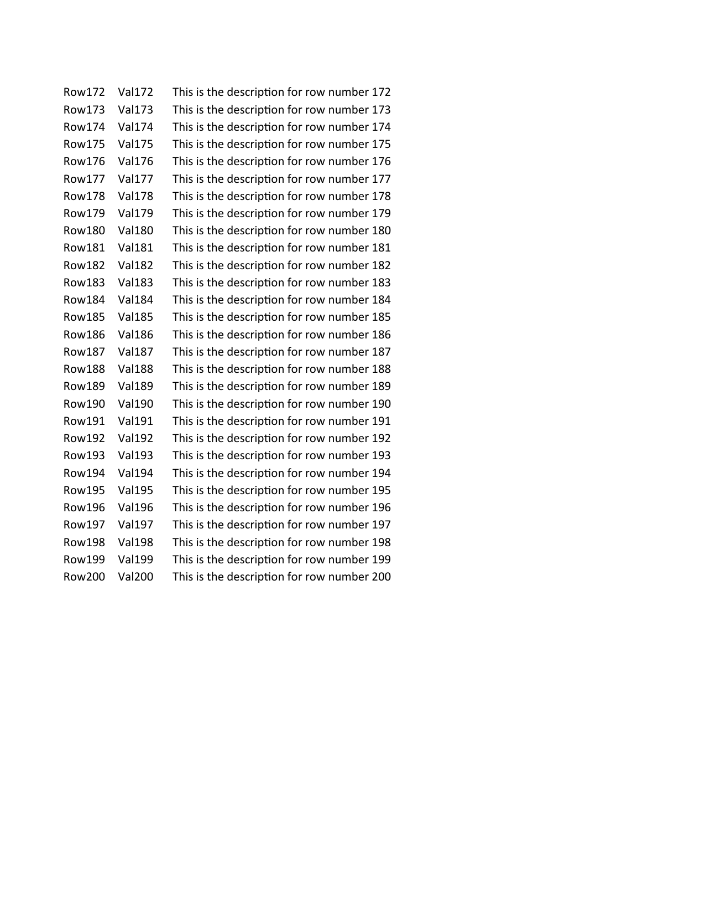</td>
</tr>
<tr>
  <td><b>classic07_numbers_only<br><small>format: xlsx | case: classic07_numbers_only | scope: dotnet-classic-xlsx</small></b></td>
  <td colspan="2">classic07_numbers_only <span style="color:#3fb950">⬤</span> 100.0%</td>
</tr>
<tr>
  <td></td>
  <td></td>
  <td></td>
</tr>
<tr>
  <td><b>classic08_mixed_text_and_numbers<br><small>format: xlsx | case: classic08_mixed_text_and_numbers | scope: dotnet-classic-xlsx</small></b></td>
  <td colspan="2">classic08_mixed_text_and_numbers <span style="color:#3fb950">⬤</span> 99.9%</td>
</tr>
<tr>
  <td></td>
  <td></td>
  <td></td>
</tr>
<tr>
  <td><b>classic09_long_text<br><small>format: xlsx | case: classic09_long_text | scope: dotnet-classic-xlsx</small></b></td>
  <td colspan="2">classic09_long_text <span style="color:#f85149">⬤</span> 49.4%</td>
</tr>
<tr>
  <td></td>
  <td></td>
  <td></td>
</tr>
<tr>
  <td></td>
  <td></td>
  <td></td>
</tr>
<tr>
  <td></td>
  <td></td>
  <td></td>
</tr>
<tr>
  <td></td>
  <td></td>
  <td></td>
</tr>
<tr>
  <td></td>
  <td></td>
  <td></td>
</tr>
<tr>
  <td></td>
  <td></td>
  <td></td>
</tr>
<tr>
  <td></td>
  <td></td>
  <td></td>
</tr>
<tr>
  <td></td>
  <td></td>
  <td></td>
</tr>
<tr>
  <td></td>
  <td></td>
  <td></td>
</tr>
<tr>
  <td></td>
  <td></td>
  <td></td>
</tr>
<tr>
  <td></td>
  <td></td>
  <td></td>
</tr>
<tr>
  <td><i>missing</i></td>
  <td></td>
  <td></td>
</tr>
<tr>
  <td><b>classic10_special_xml_characters<br><small>format: xlsx | case: classic10_special_xml_characters | scope: dotnet-classic-xlsx</small></b></td>
  <td colspan="2">classic10_special_xml_characters <span style="color:#3fb950">⬤</span> 99.9%</td>
</tr>
<tr>
  <td></td>
  <td></td>
  <td></td>
</tr>
<tr>
  <td><b>classic11_sparse_rows<br><small>format: xlsx | case: classic11_sparse_rows | scope: dotnet-classic-xlsx</small></b></td>
  <td colspan="2">classic11_sparse_rows <span style="color:#3fb950">⬤</span> 100.0%</td>
</tr>
<tr>
  <td></td>
  <td></td>
  <td></td>
</tr>
<tr>
  <td></td>
  <td></td>
  <td></td>
</tr>
<tr>
  <td><b>classic12_sparse_columns<br><small>format: xlsx | case: classic12_sparse_columns | scope: dotnet-classic-xlsx</small></b></td>
  <td colspan="2">classic12_sparse_columns <span style="color:#3fb950">⬤</span> 100.0%</td>
</tr>
<tr>
  <td></td>
  <td></td>
  <td></td>
</tr>
<tr>
  <td></td>
  <td></td>
  <td><i>missing</i></td>
</tr>
<tr>
  <td><b>classic13_date_strings<br><small>format: xlsx | case: classic13_date_strings | scope: dotnet-classic-xlsx</small></b></td>
  <td colspan="2">classic13_date_strings <span style="color:#3fb950">⬤</span> 98.8%</td>
</tr>
<tr>
  <td></td>
  <td></td>
  <td></td>
</tr>
<tr>
  <td><b>classic14_decimal_numbers<br><small>format: xlsx | case: classic14_decimal_numbers | scope: dotnet-classic-xlsx</small></b></td>
  <td colspan="2">classic14_decimal_numbers <span style="color:#3fb950">⬤</span> 99.9%</td>
</tr>
<tr>
  <td></td>
  <td></td>
  <td></td>
</tr>
<tr>
  <td><b>classic15_negative_numbers<br><small>format: xlsx | case: classic15_negative_numbers | scope: dotnet-classic-xlsx</small></b></td>
  <td colspan="2">classic15_negative_numbers <span style="color:#3fb950">⬤</span> 97.4%</td>
</tr>
<tr>
  <td></td>
  <td></td>
  <td></td>
</tr>
<tr>
  <td><b>classic16_percentage_strings<br><small>format: xlsx | case: classic16_percentage_strings | scope: dotnet-classic-xlsx</small></b></td>
  <td colspan="2">classic16_percentage_strings <span style="color:#3fb950">⬤</span> 99.6%</td>
</tr>
<tr>
  <td></td>
  <td></td>
  <td></td>
</tr>
<tr>
  <td><b>classic17_currency_strings<br><small>format: xlsx | case: classic17_currency_strings | scope: dotnet-classic-xlsx</small></b></td>
  <td colspan="2">classic17_currency_strings <span style="color:#3fb950">⬤</span> 99.8%</td>
</tr>
<tr>
  <td></td>
  <td></td>
  <td></td>
</tr>
<tr>
  <td><b>classic18_large_dataset<br><small>format: xlsx | case: classic18_large_dataset | scope: dotnet-classic-xlsx</small></b></td>
  <td colspan="2">classic18_large_dataset <span style="color:#3fb950">⬤</span> 97.7%</td>
</tr>
<tr>
  <td></td>
  <td></td>
  <td></td>
</tr>
<tr>
  <td></td>
  <td></td>
  <td></td>
</tr>
<tr>
  <td></td>
  <td></td>
  <td></td>
</tr>
<tr>
  <td></td>
  <td></td>
  <td></td>
</tr>
<tr>
  <td></td>
  <td></td>
  <td>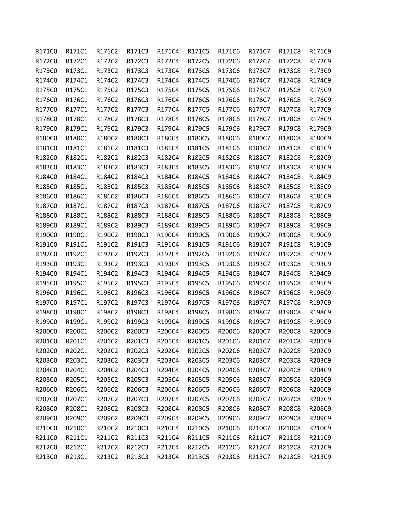</td>
</tr>
<tr>
  <td></td>
  <td></td>
  <td>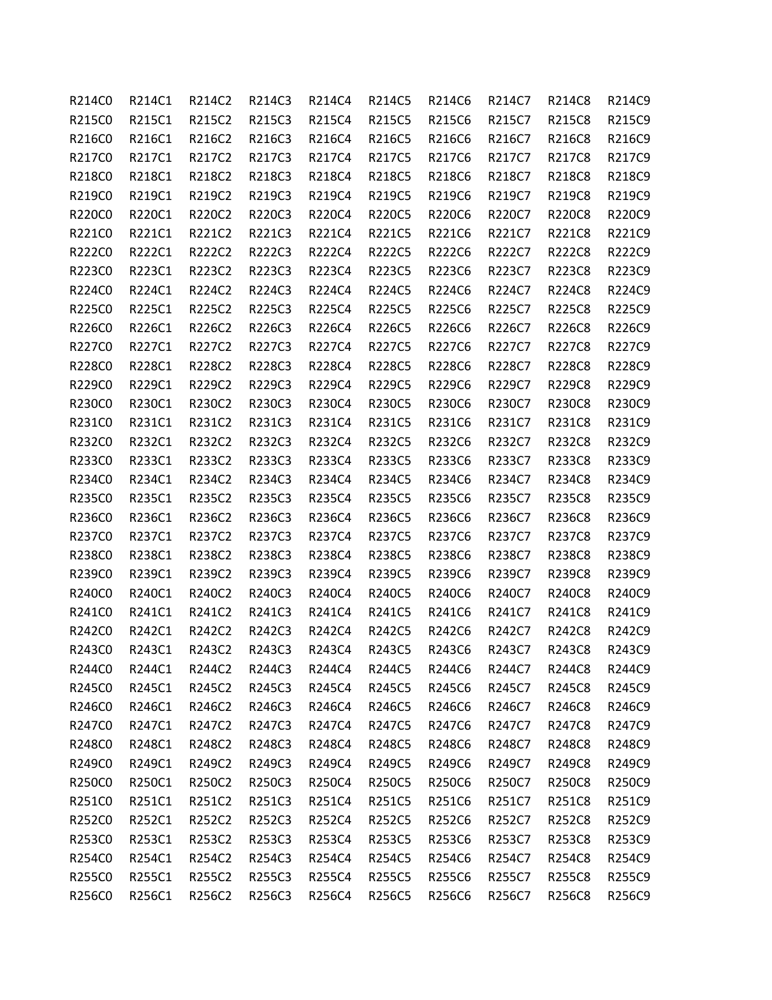</td>
</tr>
<tr>
  <td></td>
  <td></td>
  <td></td>
</tr>
<tr>
  <td></td>
  <td></td>
  <td></td>
</tr>
<tr>
  <td></td>
  <td></td>
  <td></td>
</tr>
<tr>
  <td></td>
  <td></td>
  <td></td>
</tr>
<tr>
  <td></td>
  <td></td>
  <td></td>
</tr>
<tr>
  <td></td>
  <td></td>
  <td></td>
</tr>
<tr>
  <td></td>
  <td></td>
  <td></td>
</tr>
<tr>
  <td></td>
  <td></td>
  <td></td>
</tr>
<tr>
  <td></td>
  <td></td>
  <td></td>
</tr>
<tr>
  <td></td>
  <td></td>
  <td></td>
</tr>
<tr>
  <td></td>
  <td></td>
  <td></td>
</tr>
<tr>
  <td></td>
  <td></td>
  <td></td>
</tr>
<tr>
  <td></td>
  <td></td>
  <td></td>
</tr>
<tr>
  <td></td>
  <td></td>
  <td></td>
</tr>
<tr>
  <td></td>
  <td></td>
  <td></td>
</tr>
<tr>
  <td></td>
  <td></td>
  <td></td>
</tr>
<tr>
  <td></td>
  <td></td>
  <td></td>
</tr>
<tr>
  <td></td>
  <td></td>
  <td></td>
</tr>
<tr>
  <td></td>
  <td></td>
  <td><i>missing</i></td>
</tr>
<tr>
  <td></td>
  <td></td>
  <td><i>missing</i></td>
</tr>
<tr>
  <td></td>
  <td></td>
  <td><i>missing</i></td>
</tr>
<tr>
  <td></td>
  <td>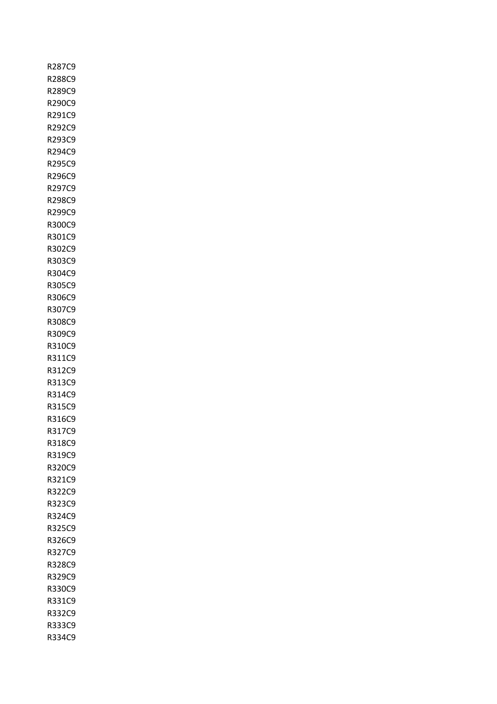</td>
  <td><i>missing</i></td>
</tr>
<tr>
  <td></td>
  <td></td>
  <td><i>missing</i></td>
</tr>
<tr>
  <td></td>
  <td></td>
  <td><i>missing</i></td>
</tr>
<tr>
  <td></td>
  <td></td>
  <td><i>missing</i></td>
</tr>
<tr>
  <td></td>
  <td></td>
  <td><i>missing</i></td>
</tr>
<tr>
  <td></td>
  <td>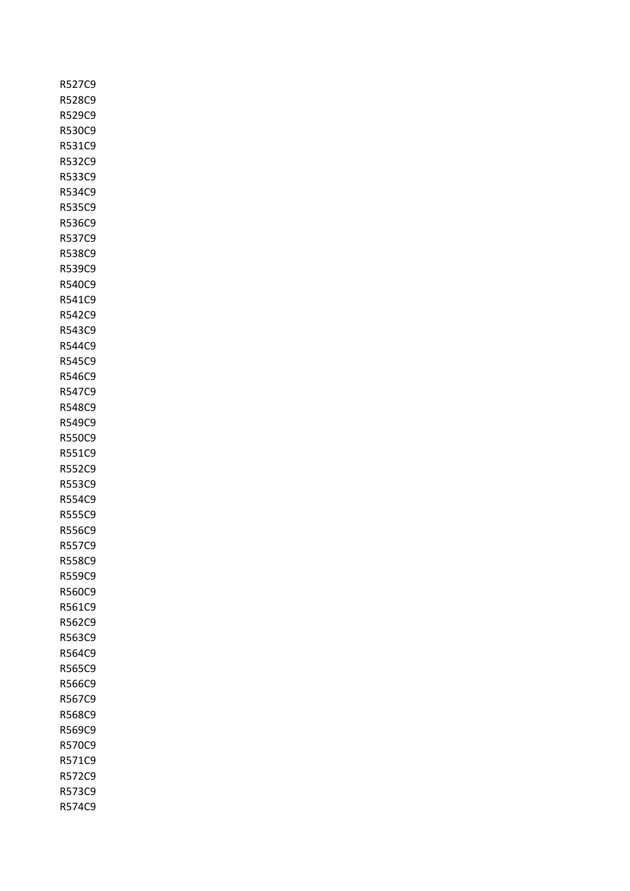</td>
  <td><i>missing</i></td>
</tr>
<tr>
  <td></td>
  <td>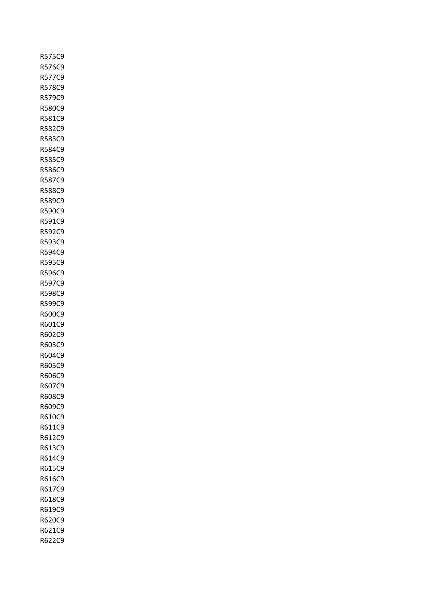</td>
  <td><i>missing</i></td>
</tr>
<tr>
  <td></td>
  <td></td>
  <td><i>missing</i></td>
</tr>
<tr>
  <td></td>
  <td></td>
  <td><i>missing</i></td>
</tr>
<tr>
  <td></td>
  <td></td>
  <td><i>missing</i></td>
</tr>
<tr>
  <td></td>
  <td></td>
  <td><i>missing</i></td>
</tr>
<tr>
  <td></td>
  <td></td>
  <td><i>missing</i></td>
</tr>
<tr>
  <td></td>
  <td></td>
  <td><i>missing</i></td>
</tr>
<tr>
  <td></td>
  <td></td>
  <td><i>missing</i></td>
</tr>
<tr>
  <td></td>
  <td>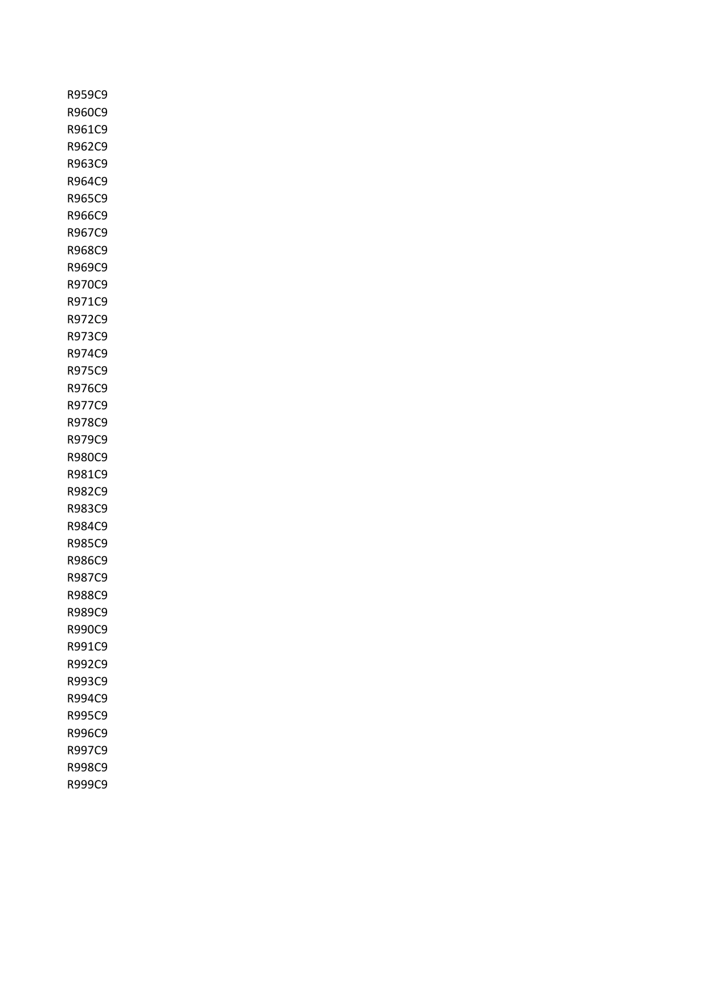</td>
  <td><i>missing</i></td>
</tr>
<tr>
  <td><b>classic19_single_column_list<br><small>format: xlsx | case: classic19_single_column_list | scope: dotnet-classic-xlsx</small></b></td>
  <td colspan="2">classic19_single_column_list <span style="color:#3fb950">⬤</span> 99.9%</td>
</tr>
<tr>
  <td></td>
  <td></td>
  <td></td>
</tr>
<tr>
  <td><b>classic20_all_empty_cells<br><small>format: xlsx | case: classic20_all_empty_cells | scope: dotnet-classic-xlsx</small></b></td>
  <td colspan="2">classic20_all_empty_cells <span style="color:#3fb950">⬤</span> 100.0%</td>
</tr>
<tr>
  <td></td>
  <td></td>
  <td></td>
</tr>
<tr>
  <td><b>classic21_header_only<br><small>format: xlsx | case: classic21_header_only | scope: dotnet-classic-xlsx</small></b></td>
  <td colspan="2">classic21_header_only <span style="color:#3fb950">⬤</span> 100.0%</td>
</tr>
<tr>
  <td></td>
  <td></td>
  <td></td>
</tr>
<tr>
  <td><b>classic22_long_sheet_name<br><small>format: xlsx | case: classic22_long_sheet_name | scope: dotnet-classic-xlsx</small></b></td>
  <td colspan="2">classic22_long_sheet_name <span style="color:#3fb950">⬤</span> 99.9%</td>
</tr>
<tr>
  <td></td>
  <td></td>
  <td></td>
</tr>
<tr>
  <td><b>classic23_unicode_text<br><small>format: xlsx | case: classic23_unicode_text | scope: dotnet-classic-xlsx</small></b></td>
  <td colspan="2">classic23_unicode_text <span style="color:#3fb950">⬤</span> 95.7%</td>
</tr>
<tr>
  <td></td>
  <td></td>
  <td></td>
</tr>
<tr>
  <td><b>classic24_red_text<br><small>format: xlsx | case: classic24_red_text | scope: dotnet-classic-xlsx</small></b></td>
  <td colspan="2">classic24_red_text <span style="color:#3fb950">⬤</span> 99.9%</td>
</tr>
<tr>
  <td></td>
  <td></td>
  <td></td>
</tr>
<tr>
  <td><b>classic25_multiple_colors<br><small>format: xlsx | case: classic25_multiple_colors | scope: dotnet-classic-xlsx</small></b></td>
  <td colspan="2">classic25_multiple_colors <span style="color:#3fb950">⬤</span> 99.7%</td>
</tr>
<tr>
  <td></td>
  <td></td>
  <td></td>
</tr>
<tr>
  <td><b>classic26_inline_strings<br><small>format: xlsx | case: classic26_inline_strings | scope: dotnet-classic-xlsx</small></b></td>
  <td colspan="2">classic26_inline_strings <span style="color:#3fb950">⬤</span> 99.9%</td>
</tr>
<tr>
  <td></td>
  <td></td>
  <td></td>
</tr>
<tr>
  <td><b>classic27_single_row<br><small>format: xlsx | case: classic27_single_row | scope: dotnet-classic-xlsx</small></b></td>
  <td colspan="2">classic27_single_row <span style="color:#3fb950">⬤</span> 100.0%</td>
</tr>
<tr>
  <td></td>
  <td></td>
  <td></td>
</tr>
<tr>
  <td><b>classic28_duplicate_values<br><small>format: xlsx | case: classic28_duplicate_values | scope: dotnet-classic-xlsx</small></b></td>
  <td colspan="2">classic28_duplicate_values <span style="color:#3fb950">⬤</span> 99.9%</td>
</tr>
<tr>
  <td></td>
  <td></td>
  <td></td>
</tr>
<tr>
  <td><b>classic29_formula_results<br><small>format: xlsx | case: classic29_formula_results | scope: dotnet-classic-xlsx</small></b></td>
  <td colspan="2">classic29_formula_results <span style="color:#3fb950">⬤</span> 99.9%</td>
</tr>
<tr>
  <td></td>
  <td></td>
  <td></td>
</tr>
<tr>
  <td><b>classic30_mixed_empty_and_filled_sheets<br><small>format: xlsx | case: classic30_mixed_empty_and_filled_sheets | scope: dotnet-classic-xlsx</small></b></td>
  <td colspan="2">classic30_mixed_empty_and_filled_sheets <span style="color:#3fb950">⬤</span> 100.0%</td>
</tr>
<tr>
  <td></td>
  <td></td>
  <td></td>
</tr>
<tr>
  <td></td>
  <td></td>
  <td></td>
</tr>
<tr>
  <td><b>classic31_bold_header_row<br><small>format: xlsx | case: classic31_bold_header_row | scope: dotnet-classic-xlsx</small></b></td>
  <td colspan="2">classic31_bold_header_row <span style="color:#3fb950">⬤</span> 99.7%</td>
</tr>
<tr>
  <td></td>
  <td></td>
  <td></td>
</tr>
<tr>
  <td><b>classic32_right_aligned_numbers<br><small>format: xlsx | case: classic32_right_aligned_numbers | scope: dotnet-classic-xlsx</small></b></td>
  <td colspan="2">classic32_right_aligned_numbers <span style="color:#3fb950">⬤</span> 99.9%</td>
</tr>
<tr>
  <td></td>
  <td></td>
  <td></td>
</tr>
<tr>
  <td><b>classic33_centered_text<br><small>format: xlsx | case: classic33_centered_text | scope: dotnet-classic-xlsx</small></b></td>
  <td colspan="2">classic33_centered_text <span style="color:#3fb950">⬤</span> 99.9%</td>
</tr>
<tr>
  <td></td>
  <td></td>
  <td></td>
</tr>
<tr>
  <td><b>classic34_explicit_column_widths<br><small>format: xlsx | case: classic34_explicit_column_widths | scope: dotnet-classic-xlsx</small></b></td>
  <td colspan="2">classic34_explicit_column_widths <span style="color:#3fb950">⬤</span> 99.9%</td>
</tr>
<tr>
  <td></td>
  <td></td>
  <td></td>
</tr>
<tr>
  <td><b>classic35_explicit_row_heights<br><small>format: xlsx | case: classic35_explicit_row_heights | scope: dotnet-classic-xlsx</small></b></td>
  <td colspan="2">classic35_explicit_row_heights <span style="color:#3fb950">⬤</span> 98.2%</td>
</tr>
<tr>
  <td></td>
  <td></td>
  <td></td>
</tr>
<tr>
  <td><b>classic36_merged_cells<br><small>format: xlsx | case: classic36_merged_cells | scope: dotnet-classic-xlsx</small></b></td>
  <td colspan="2">classic36_merged_cells <span style="color:#3fb950">⬤</span> 98.3%</td>
</tr>
<tr>
  <td></td>
  <td></td>
  <td></td>
</tr>
<tr>
  <td><b>classic37_freeze_panes<br><small>format: xlsx | case: classic37_freeze_panes | scope: dotnet-classic-xlsx</small></b></td>
  <td colspan="2">classic37_freeze_panes <span style="color:#3fb950">⬤</span> 99.5%</td>
</tr>
<tr>
  <td></td>
  <td></td>
  <td></td>
</tr>
<tr>
  <td><b>classic38_hyperlink_cell<br><small>format: xlsx | case: classic38_hyperlink_cell | scope: dotnet-classic-xlsx</small></b></td>
  <td colspan="2">classic38_hyperlink_cell <span style="color:#3fb950">⬤</span> 99.8%</td>
</tr>
<tr>
  <td></td>
  <td></td>
  <td></td>
</tr>
<tr>
  <td><b>classic39_financial_table<br><small>format: xlsx | case: classic39_financial_table | scope: dotnet-classic-xlsx</small></b></td>
  <td colspan="2">classic39_financial_table <span style="color:#3fb950">⬤</span> 99.8%</td>
</tr>
<tr>
  <td></td>
  <td></td>
  <td></td>
</tr>
<tr>
  <td><b>classic40_scientific_notation<br><small>format: xlsx | case: classic40_scientific_notation | scope: dotnet-classic-xlsx</small></b></td>
  <td colspan="2">classic40_scientific_notation <span style="color:#3fb950">⬤</span> 94.3%</td>
</tr>
<tr>
  <td></td>
  <td></td>
  <td></td>
</tr>
<tr>
  <td><b>classic41_integer_vs_float<br><small>format: xlsx | case: classic41_integer_vs_float | scope: dotnet-classic-xlsx</small></b></td>
  <td colspan="2">classic41_integer_vs_float <span style="color:#3fb950">⬤</span> 99.9%</td>
</tr>
<tr>
  <td></td>
  <td></td>
  <td>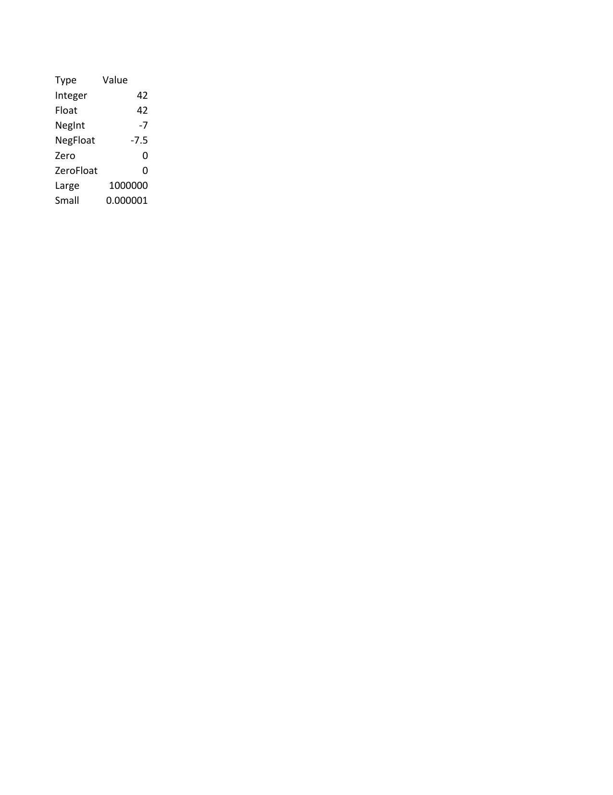</td>
</tr>
<tr>
  <td><b>classic42_boolean_values<br><small>format: xlsx | case: classic42_boolean_values | scope: dotnet-classic-xlsx</small></b></td>
  <td colspan="2">classic42_boolean_values <span style="color:#3fb950">⬤</span> 98.8%</td>
</tr>
<tr>
  <td></td>
  <td></td>
  <td></td>
</tr>
<tr>
  <td><b>classic43_inventory_report<br><small>format: xlsx | case: classic43_inventory_report | scope: dotnet-classic-xlsx</small></b></td>
  <td colspan="2">classic43_inventory_report <span style="color:#3fb950">⬤</span> 99.4%</td>
</tr>
<tr>
  <td></td>
  <td></td>
  <td>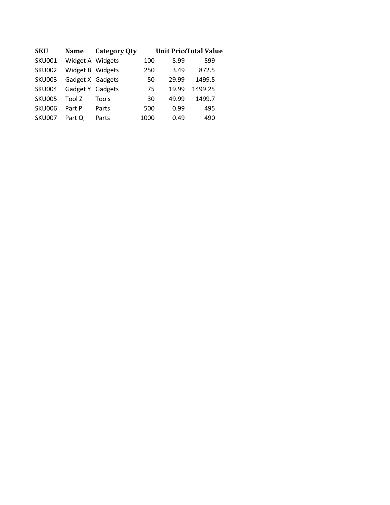</td>
</tr>
<tr>
  <td><b>classic44_employee_roster<br><small>format: xlsx | case: classic44_employee_roster | scope: dotnet-classic-xlsx</small></b></td>
  <td colspan="2">classic44_employee_roster <span style="color:#3fb950">⬤</span> 91.4%</td>
</tr>
<tr>
  <td></td>
  <td></td>
  <td></td>
</tr>
<tr>
  <td><b>classic45_sales_by_region<br><small>format: xlsx | case: classic45_sales_by_region | scope: dotnet-classic-xlsx</small></b></td>
  <td colspan="2">classic45_sales_by_region <span style="color:#3fb950">⬤</span> 99.9%</td>
</tr>
<tr>
  <td></td>
  <td></td>
  <td></td>
</tr>
<tr>
  <td></td>
  <td></td>
  <td></td>
</tr>
<tr>
  <td></td>
  <td></td>
  <td></td>
</tr>
<tr>
  <td></td>
  <td></td>
  <td></td>
</tr>
<tr>
  <td><b>classic46_grade_book<br><small>format: xlsx | case: classic46_grade_book | scope: dotnet-classic-xlsx</small></b></td>
  <td colspan="2">classic46_grade_book <span style="color:#3fb950">⬤</span> 99.7%</td>
</tr>
<tr>
  <td></td>
  <td></td>
  <td>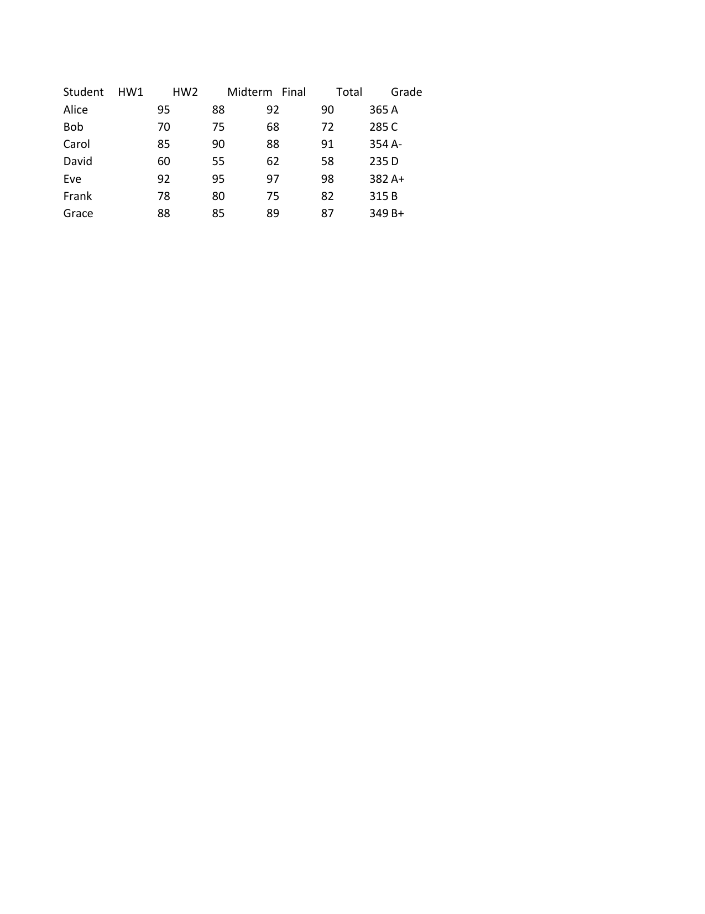</td>
</tr>
<tr>
  <td><b>classic47_time_series<br><small>format: xlsx | case: classic47_time_series | scope: dotnet-classic-xlsx</small></b></td>
  <td colspan="2">classic47_time_series <span style="color:#3fb950">⬤</span> 99.3%</td>
</tr>
<tr>
  <td></td>
  <td></td>
  <td></td>
</tr>
<tr>
  <td><b>classic48_survey_results<br><small>format: xlsx | case: classic48_survey_results | scope: dotnet-classic-xlsx</small></b></td>
  <td colspan="2">classic48_survey_results <span style="color:#3fb950">⬤</span> 99.0%</td>
</tr>
<tr>
  <td></td>
  <td></td>
  <td></td>
</tr>
<tr>
  <td><b>classic49_contact_list<br><small>format: xlsx | case: classic49_contact_list | scope: dotnet-classic-xlsx</small></b></td>
  <td colspan="2">classic49_contact_list <span style="color:#d29922">⬤</span> 85.8%</td>
</tr>
<tr>
  <td></td>
  <td></td>
  <td>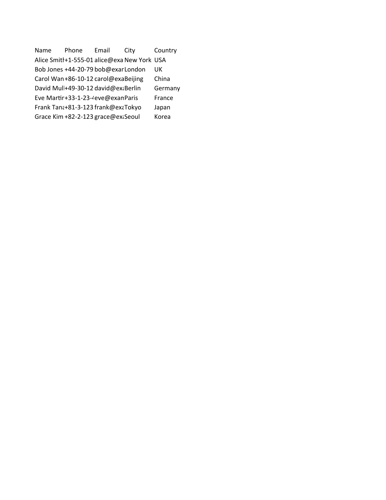</td>
</tr>
<tr>
  <td><b>classic50_budget_vs_actuals<br><small>format: xlsx | case: classic50_budget_vs_actuals | scope: dotnet-classic-xlsx</small></b></td>
  <td colspan="2">classic50_budget_vs_actuals <span style="color:#3fb950">⬤</span> 99.4%</td>
</tr>
<tr>
  <td></td>
  <td></td>
  <td></td>
</tr>
<tr>
  <td></td>
  <td></td>
  <td></td>
</tr>
<tr>
  <td></td>
  <td></td>
  <td></td>
</tr>
<tr>
  <td><b>classic51_product_catalog<br><small>format: xlsx | case: classic51_product_catalog | scope: dotnet-classic-xlsx</small></b></td>
  <td colspan="2">classic51_product_catalog <span style="color:#d29922">⬤</span> 84.2%</td>
</tr>
<tr>
  <td></td>
  <td></td>
  <td></td>
</tr>
<tr>
  <td><b>classic52_pivot_summary<br><small>format: xlsx | case: classic52_pivot_summary | scope: dotnet-classic-xlsx</small></b></td>
  <td colspan="2">classic52_pivot_summary <span style="color:#3fb950">⬤</span> 99.4%</td>
</tr>
<tr>
  <td></td>
  <td></td>
  <td></td>
</tr>
<tr>
  <td><b>classic53_invoice<br><small>format: xlsx | case: classic53_invoice | scope: dotnet-classic-xlsx</small></b></td>
  <td colspan="2">classic53_invoice <span style="color:#3fb950">⬤</span> 97.2%</td>
</tr>
<tr>
  <td></td>
  <td></td>
  <td></td>
</tr>
<tr>
  <td><b>classic54_multi_level_header<br><small>format: xlsx | case: classic54_multi_level_header | scope: dotnet-classic-xlsx</small></b></td>
  <td colspan="2">classic54_multi_level_header <span style="color:#3fb950">⬤</span> 99.7%</td>
</tr>
<tr>
  <td></td>
  <td></td>
  <td></td>
</tr>
<tr>
  <td><b>classic55_error_values<br><small>format: xlsx | case: classic55_error_values | scope: dotnet-classic-xlsx</small></b></td>
  <td colspan="2">classic55_error_values <span style="color:#3fb950">⬤</span> 99.8%</td>
</tr>
<tr>
  <td></td>
  <td></td>
  <td></td>
</tr>
<tr>
  <td><b>classic56_alternating_row_colors<br><small>format: xlsx | case: classic56_alternating_row_colors | scope: dotnet-classic-xlsx</small></b></td>
  <td colspan="2">classic56_alternating_row_colors <span style="color:#3fb950">⬤</span> 99.5%</td>
</tr>
<tr>
  <td></td>
  <td></td>
  <td></td>
</tr>
<tr>
  <td><b>classic57_cjk_only<br><small>format: xlsx | case: classic57_cjk_only | scope: dotnet-classic-xlsx</small></b></td>
  <td colspan="2">classic57_cjk_only <span style="color:#3fb950">⬤</span> 99.6%</td>
</tr>
<tr>
  <td></td>
  <td></td>
  <td></td>
</tr>
<tr>
  <td><b>classic58_mixed_numeric_formats<br><small>format: xlsx | case: classic58_mixed_numeric_formats | scope: dotnet-classic-xlsx</small></b></td>
  <td colspan="2">classic58_mixed_numeric_formats <span style="color:#3fb950">⬤</span> 98.6%</td>
</tr>
<tr>
  <td></td>
  <td></td>
  <td></td>
</tr>
<tr>
  <td><b>classic59_multi_sheet_summary<br><small>format: xlsx | case: classic59_multi_sheet_summary | scope: dotnet-classic-xlsx</small></b></td>
  <td colspan="2">classic59_multi_sheet_summary <span style="color:#3fb950">⬤</span> 99.9%</td>
</tr>
<tr>
  <td></td>
  <td></td>
  <td></td>
</tr>
<tr>
  <td></td>
  <td></td>
  <td></td>
</tr>
<tr>
  <td></td>
  <td></td>
  <td></td>
</tr>
<tr>
  <td></td>
  <td></td>
  <td></td>
</tr>
<tr>
  <td><b>classic60_large_wide_table<br><small>format: xlsx | case: classic60_large_wide_table | scope: dotnet-classic-xlsx</small></b></td>
  <td colspan="2">classic60_large_wide_table <span style="color:#f85149">⬤</span> 68.8%</td>
</tr>
<tr>
  <td></td>
  <td></td>
  <td></td>
</tr>
<tr>
  <td></td>
  <td></td>
  <td></td>
</tr>
<tr>
  <td></td>
  <td></td>
  <td></td>
</tr>
<tr>
  <td></td>
  <td></td>
  <td></td>
</tr>
<tr>
  <td><i>missing</i></td>
  <td></td>
  <td><i>missing</i></td>
</tr>
<tr>
  <td><i>missing</i></td>
  <td></td>
  <td><i>missing</i></td>
</tr>
<tr>
  <td><b>classic61_product_card_with_image<br><small>format: xlsx | case: classic61_product_card_with_image | scope: dotnet-classic-xlsx</small></b></td>
  <td colspan="2">classic61_product_card_with_image <span style="color:#3fb950">⬤</span> 99.9%</td>
</tr>
<tr>
  <td></td>
  <td></td>
  <td></td>
</tr>
<tr>
  <td><b>classic62_company_logo_header<br><small>format: xlsx | case: classic62_company_logo_header | scope: dotnet-classic-xlsx</small></b></td>
  <td colspan="2">classic62_company_logo_header <span style="color:#3fb950">⬤</span> 99.3%</td>
</tr>
<tr>
  <td></td>
  <td></td>
  <td></td>
</tr>
<tr>
  <td><b>classic63_two_products_side_by_side<br><small>format: xlsx | case: classic63_two_products_side_by_side | scope: dotnet-classic-xlsx</small></b></td>
  <td colspan="2">classic63_two_products_side_by_side <span style="color:#3fb950">⬤</span> 99.8%</td>
</tr>
<tr>
  <td></td>
  <td></td>
  <td></td>
</tr>
<tr>
  <td><b>classic64_employee_directory_with_photo<br><small>format: xlsx | case: classic64_employee_directory_with_photo | scope: dotnet-classic-xlsx</small></b></td>
  <td colspan="2">classic64_employee_directory_with_photo <span style="color:#3fb950">⬤</span> 99.0%</td>
</tr>
<tr>
  <td></td>
  <td></td>
  <td></td>
</tr>
<tr>
  <td><b>classic65_inventory_with_product_photos<br><small>format: xlsx | case: classic65_inventory_with_product_photos | scope: dotnet-classic-xlsx</small></b></td>
  <td colspan="2">classic65_inventory_with_product_photos <span style="color:#3fb950">⬤</span> 99.0%</td>
</tr>
<tr>
  <td></td>
  <td></td>
  <td></td>
</tr>
<tr>
  <td><b>classic66_invoice_with_logo<br><small>format: xlsx | case: classic66_invoice_with_logo | scope: dotnet-classic-xlsx</small></b></td>
  <td colspan="2">classic66_invoice_with_logo <span style="color:#3fb950">⬤</span> 98.9%</td>
</tr>
<tr>
  <td></td>
  <td></td>
  <td></td>
</tr>
<tr>
  <td><b>classic67_real_estate_listing<br><small>format: xlsx | case: classic67_real_estate_listing | scope: dotnet-classic-xlsx</small></b></td>
  <td colspan="2">classic67_real_estate_listing <span style="color:#3fb950">⬤</span> 99.6%</td>
</tr>
<tr>
  <td></td>
  <td></td>
  <td></td>
</tr>
<tr>
  <td><b>classic68_restaurant_menu<br><small>format: xlsx | case: classic68_restaurant_menu | scope: dotnet-classic-xlsx</small></b></td>
  <td colspan="2">classic68_restaurant_menu <span style="color:#3fb950">⬤</span> 98.6%</td>
</tr>
<tr>
  <td></td>
  <td></td>
  <td>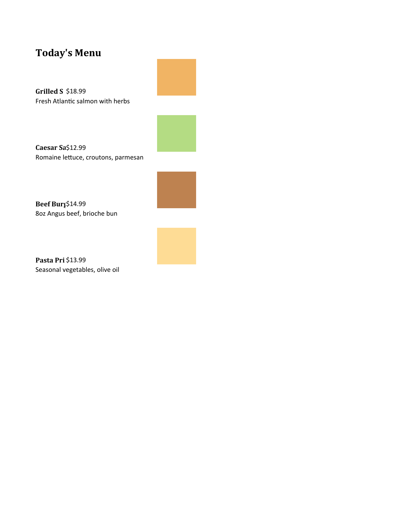</td>
</tr>
<tr>
  <td><b>classic69_image_only_sheet<br><small>format: xlsx | case: classic69_image_only_sheet | scope: dotnet-classic-xlsx</small></b></td>
  <td colspan="2">classic69_image_only_sheet <span style="color:#3fb950">⬤</span> 100.0%</td>
</tr>
<tr>
  <td></td>
  <td></td>
  <td></td>
</tr>
<tr>
  <td><b>classic70_product_catalog_with_images<br><small>format: xlsx | case: classic70_product_catalog_with_images | scope: dotnet-classic-xlsx</small></b></td>
  <td colspan="2">classic70_product_catalog_with_images <span style="color:#3fb950">⬤</span> 99.0%</td>
</tr>
<tr>
  <td></td>
  <td></td>
  <td></td>
</tr>
<tr>
  <td><b>classic71_multi_sheet_with_images<br><small>format: xlsx | case: classic71_multi_sheet_with_images | scope: dotnet-classic-xlsx</small></b></td>
  <td colspan="2">classic71_multi_sheet_with_images <span style="color:#3fb950">⬤</span> 99.5%</td>
</tr>
<tr>
  <td></td>
  <td></td>
  <td></td>
</tr>
<tr>
  <td></td>
  <td></td>
  <td></td>
</tr>
<tr>
  <td></td>
  <td></td>
  <td></td>
</tr>
<tr>
  <td><b>classic72_bar_chart_image_with_data<br><small>format: xlsx | case: classic72_bar_chart_image_with_data | scope: dotnet-classic-xlsx</small></b></td>
  <td colspan="2">classic72_bar_chart_image_with_data <span style="color:#3fb950">⬤</span> 99.5%</td>
</tr>
<tr>
  <td></td>
  <td></td>
  <td></td>
</tr>
<tr>
  <td><b>classic73_event_flyer_with_banner<br><small>format: xlsx | case: classic73_event_flyer_with_banner | scope: dotnet-classic-xlsx</small></b></td>
  <td colspan="2">classic73_event_flyer_with_banner <span style="color:#3fb950">⬤</span> 97.0%</td>
</tr>
<tr>
  <td></td>
  <td></td>
  <td></td>
</tr>
<tr>
  <td><b>classic74_dashboard_with_kpi_image<br><small>format: xlsx | case: classic74_dashboard_with_kpi_image | scope: dotnet-classic-xlsx</small></b></td>
  <td colspan="2">classic74_dashboard_with_kpi_image <span style="color:#3fb950">⬤</span> 98.9%</td>
</tr>
<tr>
  <td></td>
  <td></td>
  <td></td>
</tr>
<tr>
  <td><b>classic75_certificate_with_seal<br><small>format: xlsx | case: classic75_certificate_with_seal | scope: dotnet-classic-xlsx</small></b></td>
  <td colspan="2">classic75_certificate_with_seal <span style="color:#3fb950">⬤</span> 99.5%</td>
</tr>
<tr>
  <td></td>
  <td></td>
  <td></td>
</tr>
<tr>
  <td><b>classic76_product_image_grid<br><small>format: xlsx | case: classic76_product_image_grid | scope: dotnet-classic-xlsx</small></b></td>
  <td colspan="2">classic76_product_image_grid <span style="color:#3fb950">⬤</span> 99.6%</td>
</tr>
<tr>
  <td></td>
  <td></td>
  <td></td>
</tr>
<tr>
  <td><b>classic77_news_article_with_hero_image<br><small>format: xlsx | case: classic77_news_article_with_hero_image | scope: dotnet-classic-xlsx</small></b></td>
  <td colspan="2">classic77_news_article_with_hero_image <span style="color:#3fb950">⬤</span> 99.6%</td>
</tr>
<tr>
  <td></td>
  <td></td>
  <td></td>
</tr>
<tr>
  <td><b>classic78_small_icon_per_row<br><small>format: xlsx | case: classic78_small_icon_per_row | scope: dotnet-classic-xlsx</small></b></td>
  <td colspan="2">classic78_small_icon_per_row <span style="color:#3fb950">⬤</span> 99.0%</td>
</tr>
<tr>
  <td></td>
  <td></td>
  <td></td>
</tr>
<tr>
  <td><b>classic79_wide_panoramic_banner<br><small>format: xlsx | case: classic79_wide_panoramic_banner | scope: dotnet-classic-xlsx</small></b></td>
  <td colspan="2">classic79_wide_panoramic_banner <span style="color:#3fb950">⬤</span> 99.7%</td>
</tr>
<tr>
  <td></td>
  <td></td>
  <td></td>
</tr>
<tr>
  <td><b>classic80_portrait_tall_image<br><small>format: xlsx | case: classic80_portrait_tall_image | scope: dotnet-classic-xlsx</small></b></td>
  <td colspan="2">classic80_portrait_tall_image <span style="color:#3fb950">⬤</span> 99.8%</td>
</tr>
<tr>
  <td></td>
  <td></td>
  <td></td>
</tr>
<tr>
  <td><b>classic81_step_by_step_with_images<br><small>format: xlsx | case: classic81_step_by_step_with_images | scope: dotnet-classic-xlsx</small></b></td>
  <td colspan="2">classic81_step_by_step_with_images <span style="color:#3fb950">⬤</span> 99.7%</td>
</tr>
<tr>
  <td></td>
  <td></td>
  <td></td>
</tr>
<tr>
  <td><b>classic82_before_after_images<br><small>format: xlsx | case: classic82_before_after_images | scope: dotnet-classic-xlsx</small></b></td>
  <td colspan="2">classic82_before_after_images <span style="color:#3fb950">⬤</span> 99.4%</td>
</tr>
<tr>
  <td></td>
  <td></td>
  <td></td>
</tr>
<tr>
  <td><b>classic83_color_swatch_palette<br><small>format: xlsx | case: classic83_color_swatch_palette | scope: dotnet-classic-xlsx</small></b></td>
  <td colspan="2">classic83_color_swatch_palette <span style="color:#3fb950">⬤</span> 98.5%</td>
</tr>
<tr>
  <td></td>
  <td></td>
  <td></td>
</tr>
<tr>
  <td><b>classic84_travel_destination_cards<br><small>format: xlsx | case: classic84_travel_destination_cards | scope: dotnet-classic-xlsx</small></b></td>
  <td colspan="2">classic84_travel_destination_cards <span style="color:#3fb950">⬤</span> 99.6%</td>
</tr>
<tr>
  <td></td>
  <td></td>
  <td></td>
</tr>
<tr>
  <td><b>classic85_lab_results_with_image<br><small>format: xlsx | case: classic85_lab_results_with_image | scope: dotnet-classic-xlsx</small></b></td>
  <td colspan="2">classic85_lab_results_with_image <span style="color:#3fb950">⬤</span> 99.1%</td>
</tr>
<tr>
  <td></td>
  <td></td>
  <td>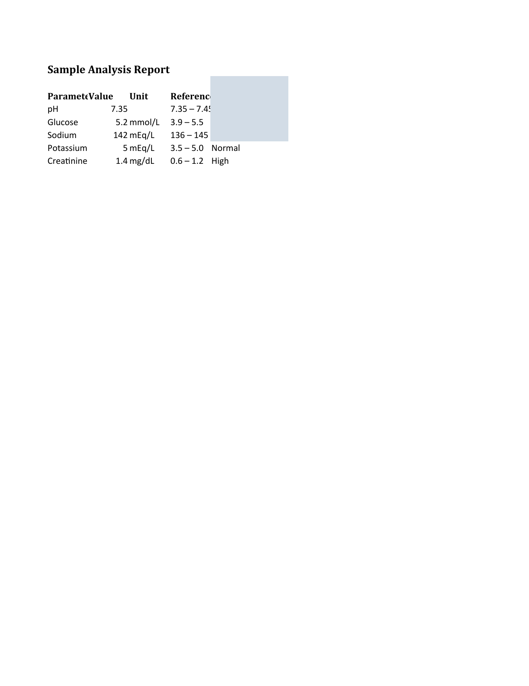</td>
</tr>
<tr>
  <td><b>classic86_software_screenshot_features<br><small>format: xlsx | case: classic86_software_screenshot_features | scope: dotnet-classic-xlsx</small></b></td>
  <td colspan="2">classic86_software_screenshot_features <span style="color:#3fb950">⬤</span> 99.0%</td>
</tr>
<tr>
  <td></td>
  <td></td>
  <td></td>
</tr>
<tr>
  <td><b>classic87_sports_results_with_logos<br><small>format: xlsx | case: classic87_sports_results_with_logos | scope: dotnet-classic-xlsx</small></b></td>
  <td colspan="2">classic87_sports_results_with_logos <span style="color:#3fb950">⬤</span> 99.7%</td>
</tr>
<tr>
  <td></td>
  <td></td>
  <td>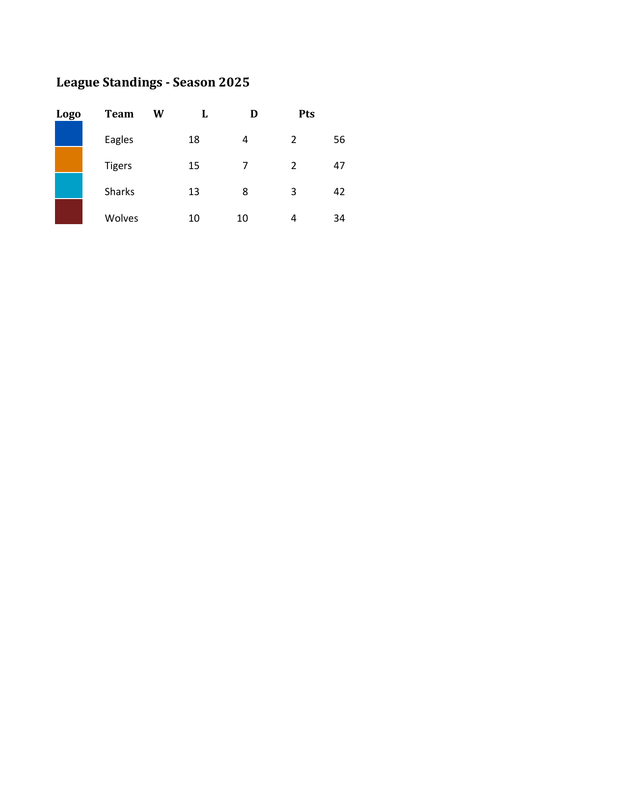</td>
</tr>
<tr>
  <td><b>classic88_image_after_data<br><small>format: xlsx | case: classic88_image_after_data | scope: dotnet-classic-xlsx</small></b></td>
  <td colspan="2">classic88_image_after_data <span style="color:#3fb950">⬤</span> 99.6%</td>
</tr>
<tr>
  <td></td>
  <td></td>
  <td></td>
</tr>
<tr>
  <td><b>classic89_nutrition_label_with_image<br><small>format: xlsx | case: classic89_nutrition_label_with_image | scope: dotnet-classic-xlsx</small></b></td>
  <td colspan="2">classic89_nutrition_label_with_image <span style="color:#3fb950">⬤</span> 99.0%</td>
</tr>
<tr>
  <td></td>
  <td></td>
  <td></td>
</tr>
<tr>
  <td><b>classic90_project_status_with_milestones<br><small>format: xlsx | case: classic90_project_status_with_milestones | scope: dotnet-classic-xlsx</small></b></td>
  <td colspan="2">classic90_project_status_with_milestones <span style="color:#3fb950">⬤</span> 98.7%</td>
</tr>
<tr>
  <td></td>
  <td></td>
  <td></td>
</tr>
<tr>
  <td><b>classic91_simple_bar_chart<br><small>format: xlsx | case: classic91_simple_bar_chart | scope: dotnet-classic-xlsx</small></b></td>
  <td colspan="2">classic91_simple_bar_chart <span style="color:#d29922">⬤</span> 84.9%</td>
</tr>
<tr>
  <td></td>
  <td></td>
  <td></td>
</tr>
<tr>
  <td></td>
  <td></td>
  <td></td>
</tr>
<tr>
  <td><b>classic92_horizontal_bar_chart<br><small>format: xlsx | case: classic92_horizontal_bar_chart | scope: dotnet-classic-xlsx</small></b></td>
  <td colspan="2">classic92_horizontal_bar_chart <span style="color:#d29922">⬤</span> 85.9%</td>
</tr>
<tr>
  <td></td>
  <td></td>
  <td></td>
</tr>
<tr>
  <td></td>
  <td></td>
  <td></td>
</tr>
<tr>
  <td><b>classic93_line_chart<br><small>format: xlsx | case: classic93_line_chart | scope: dotnet-classic-xlsx</small></b></td>
  <td colspan="2">classic93_line_chart <span style="color:#d29922">⬤</span> 84.9%</td>
</tr>
<tr>
  <td></td>
  <td></td>
  <td></td>
</tr>
<tr>
  <td></td>
  <td></td>
  <td></td>
</tr>
<tr>
  <td><b>classic94_pie_chart<br><small>format: xlsx | case: classic94_pie_chart | scope: dotnet-classic-xlsx</small></b></td>
  <td colspan="2">classic94_pie_chart <span style="color:#d29922">⬤</span> 88.5%</td>
</tr>
<tr>
  <td></td>
  <td></td>
  <td></td>
</tr>
<tr>
  <td></td>
  <td></td>
  <td></td>
</tr>
<tr>
  <td><b>classic95_area_chart<br><small>format: xlsx | case: classic95_area_chart | scope: dotnet-classic-xlsx</small></b></td>
  <td colspan="2">classic95_area_chart <span style="color:#d29922">⬤</span> 86.1%</td>
</tr>
<tr>
  <td></td>
  <td></td>
  <td></td>
</tr>
<tr>
  <td></td>
  <td></td>
  <td></td>
</tr>
<tr>
  <td><b>classic96_scatter_chart<br><small>format: xlsx | case: classic96_scatter_chart | scope: dotnet-classic-xlsx</small></b></td>
  <td colspan="2">classic96_scatter_chart <span style="color:#d29922">⬤</span> 89.7%</td>
</tr>
<tr>
  <td></td>
  <td></td>
  <td></td>
</tr>
<tr>
  <td></td>
  <td></td>
  <td></td>
</tr>
<tr>
  <td><b>classic97_doughnut_chart<br><small>format: xlsx | case: classic97_doughnut_chart | scope: dotnet-classic-xlsx</small></b></td>
  <td colspan="2">classic97_doughnut_chart <span style="color:#d29922">⬤</span> 87.6%</td>
</tr>
<tr>
  <td></td>
  <td></td>
  <td></td>
</tr>
<tr>
  <td></td>
  <td></td>
  <td></td>
</tr>
<tr>
  <td><b>classic98_radar_chart<br><small>format: xlsx | case: classic98_radar_chart | scope: dotnet-classic-xlsx</small></b></td>
  <td colspan="2">classic98_radar_chart <span style="color:#d29922">⬤</span> 88.3%</td>
</tr>
<tr>
  <td></td>
  <td></td>
  <td>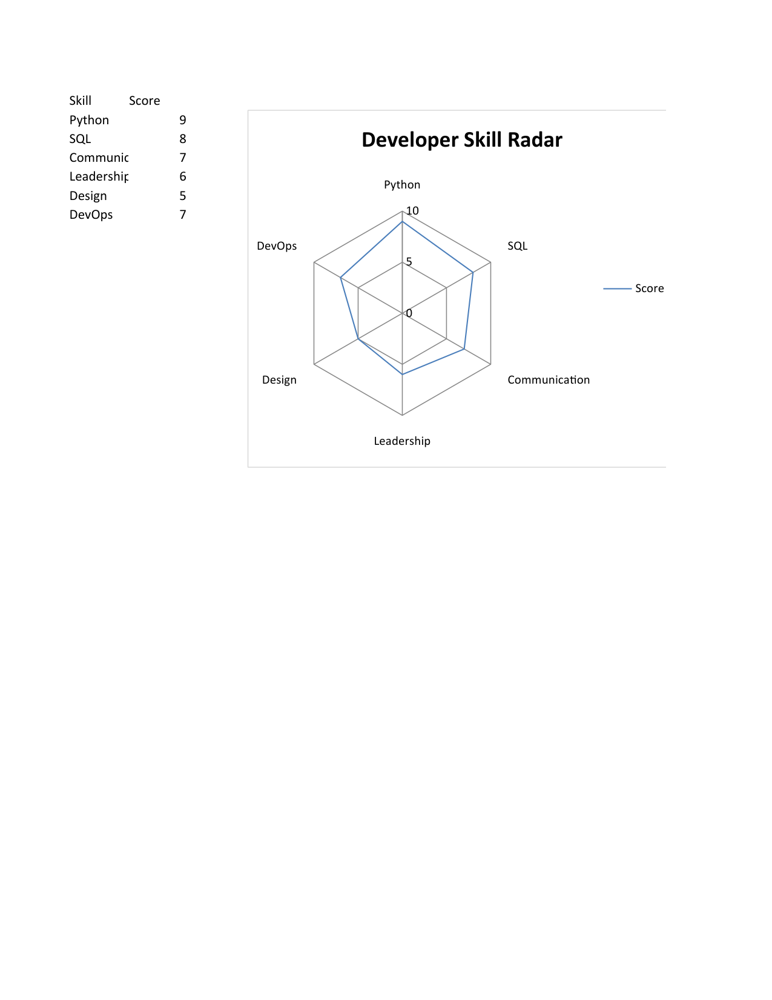</td>
</tr>
<tr>
  <td></td>
  <td></td>
  <td></td>
</tr>
<tr>
  <td><b>classic99_bubble_chart<br><small>format: xlsx | case: classic99_bubble_chart | scope: dotnet-classic-xlsx</small></b></td>
  <td colspan="2">classic99_bubble_chart <span style="color:#d29922">⬤</span> 83.0%</td>
</tr>
<tr>
  <td></td>
  <td></td>
  <td>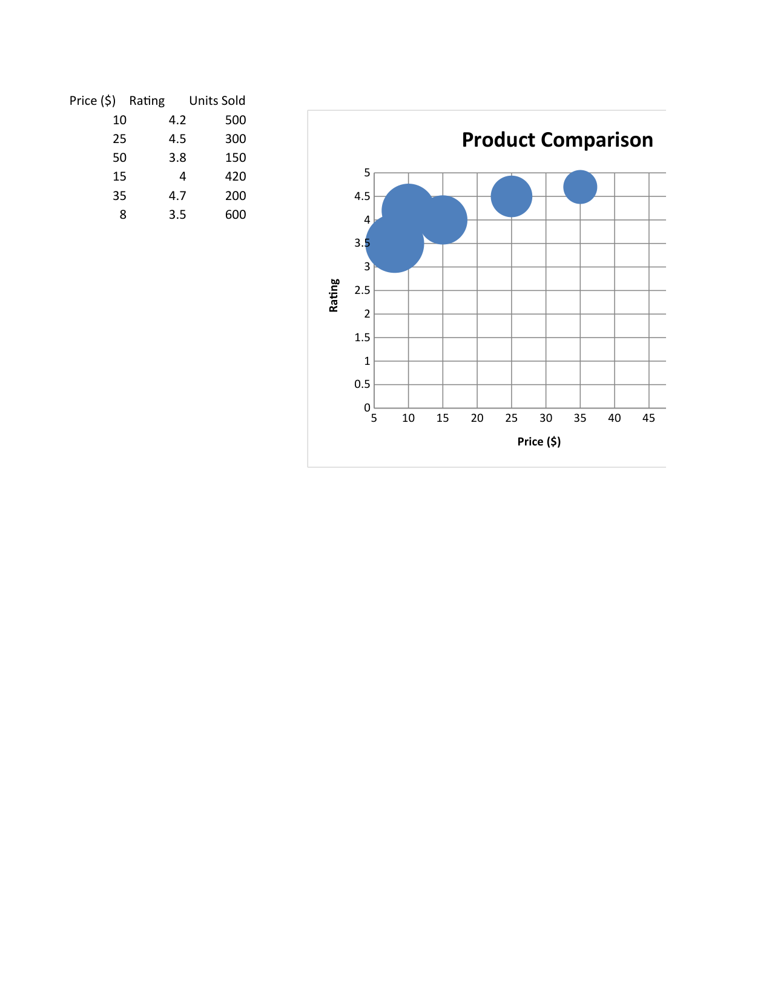</td>
</tr>
<tr>
  <td></td>
  <td></td>
  <td></td>
</tr>
<tr>
  <td><b>classic100_stacked_bar_chart<br><small>format: xlsx | case: classic100_stacked_bar_chart | scope: dotnet-classic-xlsx</small></b></td>
  <td colspan="2">classic100_stacked_bar_chart <span style="color:#d29922">⬤</span> 88.7%</td>
</tr>
<tr>
  <td></td>
  <td></td>
  <td></td>
</tr>
<tr>
  <td><b>classic101_percent_stacked_bar<br><small>format: xlsx | case: classic101_percent_stacked_bar | scope: dotnet-classic-xlsx</small></b></td>
  <td colspan="2">classic101_percent_stacked_bar <span style="color:#d29922">⬤</span> 88.7%</td>
</tr>
<tr>
  <td></td>
  <td></td>
  <td></td>
</tr>
<tr>
  <td><b>classic102_line_chart_with_markers<br><small>format: xlsx | case: classic102_line_chart_with_markers | scope: dotnet-classic-xlsx</small></b></td>
  <td colspan="2">classic102_line_chart_with_markers <span style="color:#d29922">⬤</span> 80.7%</td>
</tr>
<tr>
  <td></td>
  <td></td>
  <td></td>
</tr>
<tr>
  <td></td>
  <td></td>
  <td></td>
</tr>
<tr>
  <td><b>classic103_pie_chart_with_labels<br><small>format: xlsx | case: classic103_pie_chart_with_labels | scope: dotnet-classic-xlsx</small></b></td>
  <td colspan="2">classic103_pie_chart_with_labels <span style="color:#d29922">⬤</span> 79.2%</td>
</tr>
<tr>
  <td></td>
  <td></td>
  <td></td>
</tr>
<tr>
  <td></td>
  <td></td>
  <td></td>
</tr>
<tr>
  <td><b>classic104_combo_bar_line_chart<br><small>format: xlsx | case: classic104_combo_bar_line_chart | scope: dotnet-classic-xlsx</small></b></td>
  <td colspan="2">classic104_combo_bar_line_chart <span style="color:#d29922">⬤</span> 79.1%</td>
</tr>
<tr>
  <td></td>
  <td></td>
  <td>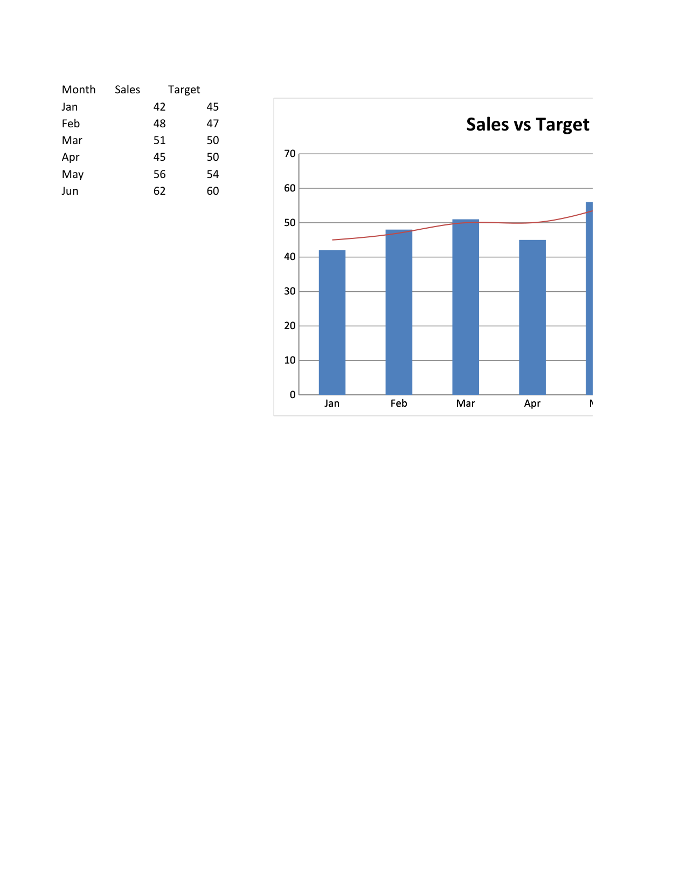</td>
</tr>
<tr>
  <td></td>
  <td></td>
  <td></td>
</tr>
<tr>
  <td><b>classic105_3d_bar_chart<br><small>format: xlsx | case: classic105_3d_bar_chart | scope: dotnet-classic-xlsx</small></b></td>
  <td colspan="2">classic105_3d_bar_chart <span style="color:#d29922">⬤</span> 77.2%</td>
</tr>
<tr>
  <td></td>
  <td></td>
  <td></td>
</tr>
<tr>
  <td></td>
  <td></td>
  <td></td>
</tr>
<tr>
  <td><b>classic106_3d_pie_chart<br><small>format: xlsx | case: classic106_3d_pie_chart | scope: dotnet-classic-xlsx</small></b></td>
  <td colspan="2">classic106_3d_pie_chart <span style="color:#d29922">⬤</span> 87.3%</td>
</tr>
<tr>
  <td></td>
  <td></td>
  <td></td>
</tr>
<tr>
  <td></td>
  <td></td>
  <td></td>
</tr>
<tr>
  <td><b>classic107_multi_series_line<br><small>format: xlsx | case: classic107_multi_series_line | scope: dotnet-classic-xlsx</small></b></td>
  <td colspan="2">classic107_multi_series_line <span style="color:#d29922">⬤</span> 84.2%</td>
</tr>
<tr>
  <td></td>
  <td></td>
  <td></td>
</tr>
<tr>
  <td></td>
  <td></td>
  <td></td>
</tr>
<tr>
  <td><b>classic108_stacked_area_chart<br><small>format: xlsx | case: classic108_stacked_area_chart | scope: dotnet-classic-xlsx</small></b></td>
  <td colspan="2">classic108_stacked_area_chart <span style="color:#f85149">⬤</span> 60.1%</td>
</tr>
<tr>
  <td></td>
  <td></td>
  <td></td>
</tr>
<tr>
  <td><i>missing</i></td>
  <td></td>
  <td><i>missing</i></td>
</tr>
<tr>
  <td><b>classic109_scatter_with_trendline<br><small>format: xlsx | case: classic109_scatter_with_trendline | scope: dotnet-classic-xlsx</small></b></td>
  <td colspan="2">classic109_scatter_with_trendline <span style="color:#d29922">⬤</span> 87.5%</td>
</tr>
<tr>
  <td></td>
  <td></td>
  <td></td>
</tr>
<tr>
  <td></td>
  <td></td>
  <td></td>
</tr>
<tr>
  <td><b>classic110_chart_with_legend<br><small>format: xlsx | case: classic110_chart_with_legend | scope: dotnet-classic-xlsx</small></b></td>
  <td colspan="2">classic110_chart_with_legend <span style="color:#d29922">⬤</span> 80.2%</td>
</tr>
<tr>
  <td></td>
  <td></td>
  <td></td>
</tr>
<tr>
  <td></td>
  <td></td>
  <td></td>
</tr>
<tr>
  <td><b>classic111_chart_with_axis_labels<br><small>format: xlsx | case: classic111_chart_with_axis_labels | scope: dotnet-classic-xlsx</small></b></td>
  <td colspan="2">classic111_chart_with_axis_labels <span style="color:#d29922">⬤</span> 88.4%</td>
</tr>
<tr>
  <td></td>
  <td></td>
  <td></td>
</tr>
<tr>
  <td></td>
  <td></td>
  <td></td>
</tr>
<tr>
  <td><b>classic112_multiple_charts<br><small>format: xlsx | case: classic112_multiple_charts | scope: dotnet-classic-xlsx</small></b></td>
  <td colspan="2">classic112_multiple_charts <span style="color:#d29922">⬤</span> 76.5%</td>
</tr>
<tr>
  <td></td>
  <td></td>
  <td></td>
</tr>
<tr>
  <td></td>
  <td></td>
  <td></td>
</tr>
<tr>
  <td><b>classic113_chart_sheet<br><small>format: xlsx | case: classic113_chart_sheet | scope: dotnet-classic-xlsx</small></b></td>
  <td colspan="2">classic113_chart_sheet <span style="color:#d29922">⬤</span> 79.2%</td>
</tr>
<tr>
  <td></td>
  <td></td>
  <td></td>
</tr>
<tr>
  <td></td>
  <td></td>
  <td></td>
</tr>
<tr>
  <td><b>classic114_chart_large_dataset<br><small>format: xlsx | case: classic114_chart_large_dataset | scope: dotnet-classic-xlsx</small></b></td>
  <td colspan="2">classic114_chart_large_dataset <span style="color:#3fb950">⬤</span> 93.0%</td>
</tr>
<tr>
  <td></td>
  <td></td>
  <td></td>
</tr>
<tr>
  <td></td>
  <td></td>
  <td>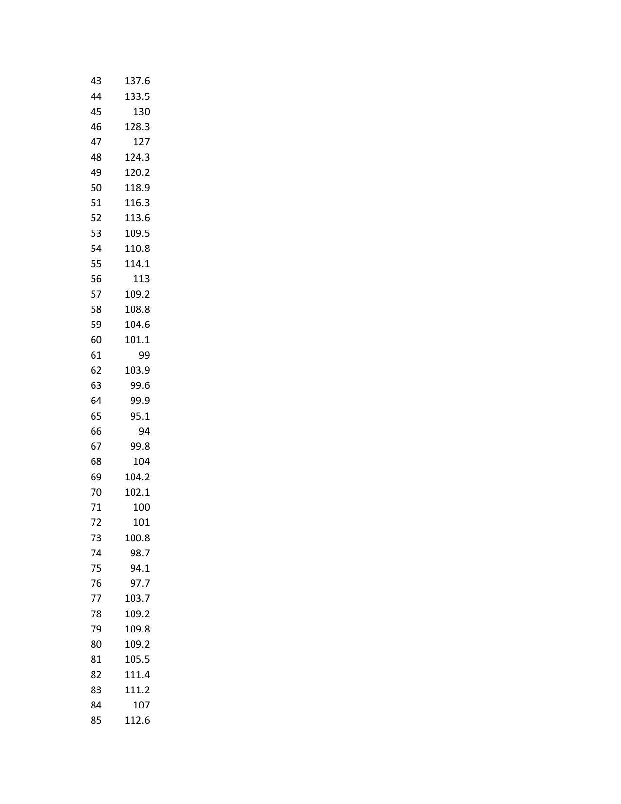</td>
</tr>
<tr>
  <td></td>
  <td></td>
  <td></td>
</tr>
<tr>
  <td></td>
  <td></td>
  <td></td>
</tr>
<tr>
  <td><b>classic115_chart_negative_values<br><small>format: xlsx | case: classic115_chart_negative_values | scope: dotnet-classic-xlsx</small></b></td>
  <td colspan="2">classic115_chart_negative_values <span style="color:#d29922">⬤</span> 83.7%</td>
</tr>
<tr>
  <td></td>
  <td></td>
  <td></td>
</tr>
<tr>
  <td></td>
  <td></td>
  <td></td>
</tr>
<tr>
  <td><b>classic116_percent_stacked_area<br><small>format: xlsx | case: classic116_percent_stacked_area | scope: dotnet-classic-xlsx</small></b></td>
  <td colspan="2">classic116_percent_stacked_area <span style="color:#f85149">⬤</span> 58.7%</td>
</tr>
<tr>
  <td></td>
  <td></td>
  <td>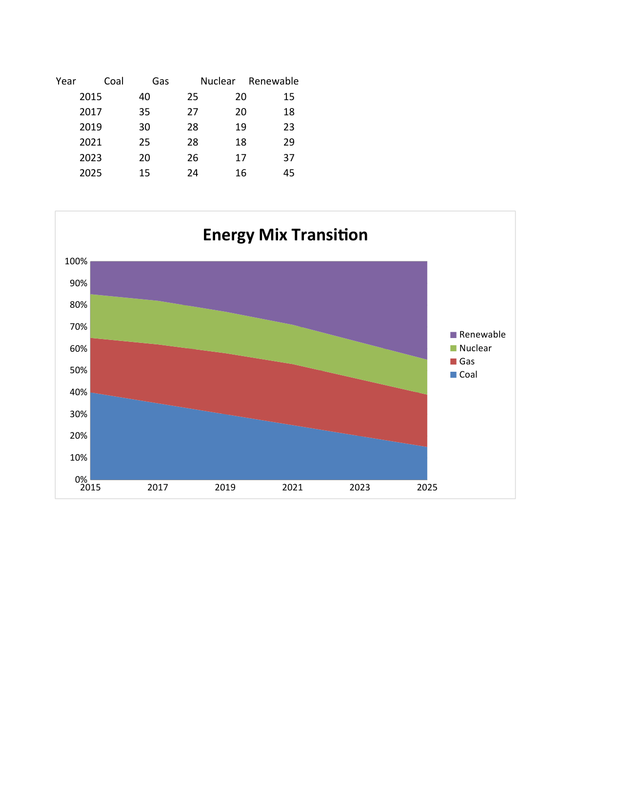</td>
</tr>
<tr>
  <td><i>missing</i></td>
  <td></td>
  <td><i>missing</i></td>
</tr>
<tr>
  <td><b>classic117_stock_ohlc_chart<br><small>format: xlsx | case: classic117_stock_ohlc_chart | scope: dotnet-classic-xlsx</small></b></td>
  <td colspan="2">classic117_stock_ohlc_chart <span style="color:#d29922">⬤</span> 80.0%</td>
</tr>
<tr>
  <td></td>
  <td></td>
  <td></td>
</tr>
<tr>
  <td></td>
  <td></td>
  <td></td>
</tr>
<tr>
  <td><b>classic118_bar_chart_custom_colors<br><small>format: xlsx | case: classic118_bar_chart_custom_colors | scope: dotnet-classic-xlsx</small></b></td>
  <td colspan="2">classic118_bar_chart_custom_colors <span style="color:#3fb950">⬤</span> 92.0%</td>
</tr>
<tr>
  <td></td>
  <td></td>
  <td></td>
</tr>
<tr>
  <td></td>
  <td></td>
  <td></td>
</tr>
<tr>
  <td><b>classic119_dashboard_multi_charts<br><small>format: xlsx | case: classic119_dashboard_multi_charts | scope: dotnet-classic-xlsx</small></b></td>
  <td colspan="2">classic119_dashboard_multi_charts <span style="color:#d29922">⬤</span> 80.1%</td>
</tr>
<tr>
  <td></td>
  <td></td>
  <td></td>
</tr>
<tr>
  <td></td>
  <td></td>
  <td></td>
</tr>
<tr>
  <td><b>classic120_chart_with_date_axis<br><small>format: xlsx | case: classic120_chart_with_date_axis | scope: dotnet-classic-xlsx</small></b></td>
  <td colspan="2">classic120_chart_with_date_axis <span style="color:#d29922">⬤</span> 82.5%</td>
</tr>
<tr>
  <td></td>
  <td></td>
  <td>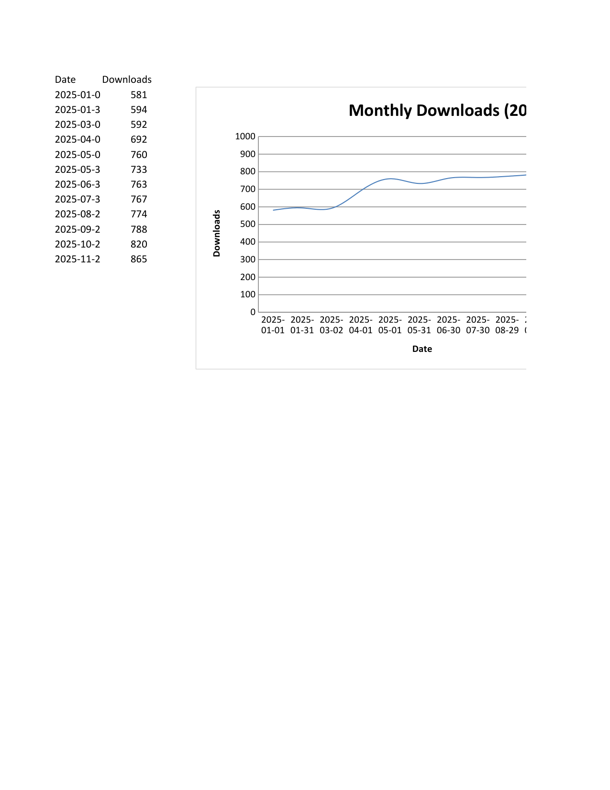</td>
</tr>
<tr>
  <td></td>
  <td></td>
  <td>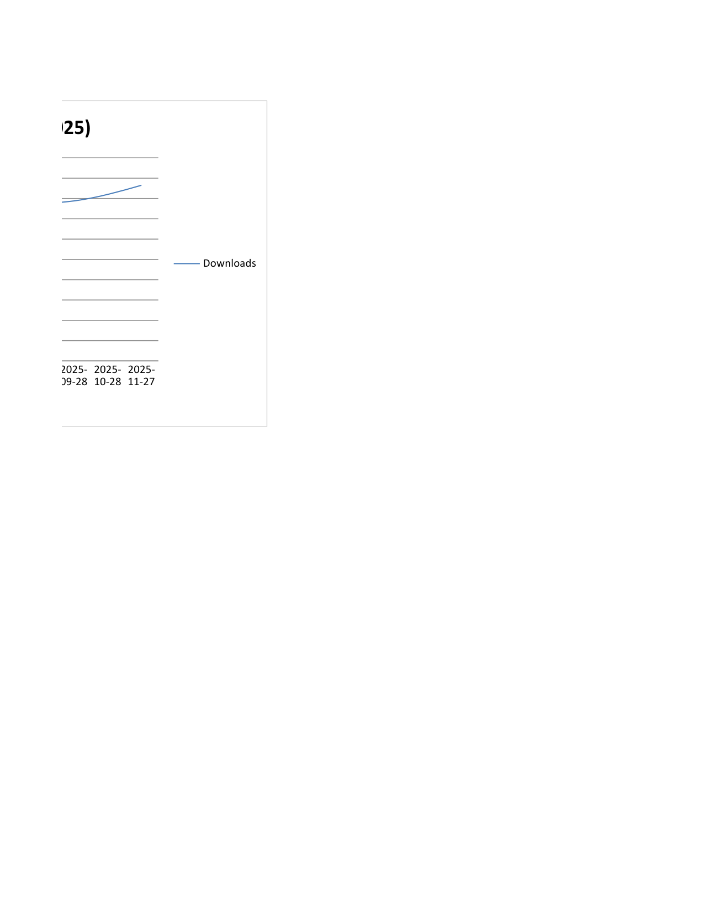</td>
</tr>
<tr>
  <td><b>classic121_thin_borders<br><small>format: xlsx | case: classic121_thin_borders | scope: dotnet-classic-xlsx</small></b></td>
  <td colspan="2">classic121_thin_borders <span style="color:#3fb950">⬤</span> 99.6%</td>
</tr>
<tr>
  <td></td>
  <td></td>
  <td></td>
</tr>
<tr>
  <td><b>classic122_thick_outer_thin_inner<br><small>format: xlsx | case: classic122_thick_outer_thin_inner | scope: dotnet-classic-xlsx</small></b></td>
  <td colspan="2">classic122_thick_outer_thin_inner <span style="color:#3fb950">⬤</span> 99.5%</td>
</tr>
<tr>
  <td></td>
  <td></td>
  <td></td>
</tr>
<tr>
  <td><b>classic123_dashed_borders<br><small>format: xlsx | case: classic123_dashed_borders | scope: dotnet-classic-xlsx</small></b></td>
  <td colspan="2">classic123_dashed_borders <span style="color:#3fb950">⬤</span> 98.3%</td>
</tr>
<tr>
  <td></td>
  <td></td>
  <td></td>
</tr>
<tr>
  <td><b>classic124_colored_borders<br><small>format: xlsx | case: classic124_colored_borders | scope: dotnet-classic-xlsx</small></b></td>
  <td colspan="2">classic124_colored_borders <span style="color:#3fb950">⬤</span> 99.7%</td>
</tr>
<tr>
  <td></td>
  <td></td>
  <td></td>
</tr>
<tr>
  <td><b>classic125_solid_fills<br><small>format: xlsx | case: classic125_solid_fills | scope: dotnet-classic-xlsx</small></b></td>
  <td colspan="2">classic125_solid_fills <span style="color:#3fb950">⬤</span> 98.3%</td>
</tr>
<tr>
  <td></td>
  <td></td>
  <td></td>
</tr>
<tr>
  <td><b>classic126_dark_header<br><small>format: xlsx | case: classic126_dark_header | scope: dotnet-classic-xlsx</small></b></td>
  <td colspan="2">classic126_dark_header <span style="color:#3fb950">⬤</span> 98.9%</td>
</tr>
<tr>
  <td></td>
  <td></td>
  <td></td>
</tr>
<tr>
  <td><b>classic127_font_styles<br><small>format: xlsx | case: classic127_font_styles | scope: dotnet-classic-xlsx</small></b></td>
  <td colspan="2">classic127_font_styles <span style="color:#3fb950">⬤</span> 96.2%</td>
</tr>
<tr>
  <td></td>
  <td></td>
  <td></td>
</tr>
<tr>
  <td><b>classic128_font_sizes<br><small>format: xlsx | case: classic128_font_sizes | scope: dotnet-classic-xlsx</small></b></td>
  <td colspan="2">classic128_font_sizes <span style="color:#3fb950">⬤</span> 99.7%</td>
</tr>
<tr>
  <td></td>
  <td></td>
  <td></td>
</tr>
<tr>
  <td><b>classic129_alignment_combos<br><small>format: xlsx | case: classic129_alignment_combos | scope: dotnet-classic-xlsx</small></b></td>
  <td colspan="2">classic129_alignment_combos <span style="color:#3fb950">⬤</span> 99.8%</td>
</tr>
<tr>
  <td></td>
  <td></td>
  <td></td>
</tr>
<tr>
  <td><b>classic130_wrap_and_indent<br><small>format: xlsx | case: classic130_wrap_and_indent | scope: dotnet-classic-xlsx</small></b></td>
  <td colspan="2">classic130_wrap_and_indent <span style="color:#3fb950">⬤</span> 99.8%</td>
</tr>
<tr>
  <td></td>
  <td></td>
  <td></td>
</tr>
<tr>
  <td><b>classic131_number_formats<br><small>format: xlsx | case: classic131_number_formats | scope: dotnet-classic-xlsx</small></b></td>
  <td colspan="2">classic131_number_formats <span style="color:#3fb950">⬤</span> 99.6%</td>
</tr>
<tr>
  <td></td>
  <td></td>
  <td></td>
</tr>
<tr>
  <td><b>classic132_striped_table<br><small>format: xlsx | case: classic132_striped_table | scope: dotnet-classic-xlsx</small></b></td>
  <td colspan="2">classic132_striped_table <span style="color:#3fb950">⬤</span> 98.7%</td>
</tr>
<tr>
  <td></td>
  <td></td>
  <td></td>
</tr>
<tr>
  <td><b>classic133_gradient_rows<br><small>format: xlsx | case: classic133_gradient_rows | scope: dotnet-classic-xlsx</small></b></td>
  <td colspan="2">classic133_gradient_rows <span style="color:#3fb950">⬤</span> 98.9%</td>
</tr>
<tr>
  <td></td>
  <td></td>
  <td></td>
</tr>
<tr>
  <td><b>classic134_heatmap<br><small>format: xlsx | case: classic134_heatmap | scope: dotnet-classic-xlsx</small></b></td>
  <td colspan="2">classic134_heatmap <span style="color:#3fb950">⬤</span> 99.3%</td>
</tr>
<tr>
  <td></td>
  <td></td>
  <td></td>
</tr>
<tr>
  <td><b>classic135_bottom_border_only<br><small>format: xlsx | case: classic135_bottom_border_only | scope: dotnet-classic-xlsx</small></b></td>
  <td colspan="2">classic135_bottom_border_only <span style="color:#3fb950">⬤</span> 99.7%</td>
</tr>
<tr>
  <td></td>
  <td></td>
  <td></td>
</tr>
<tr>
  <td><b>classic136_financial_report_styled<br><small>format: xlsx | case: classic136_financial_report_styled | scope: dotnet-classic-xlsx</small></b></td>
  <td colspan="2">classic136_financial_report_styled <span style="color:#3fb950">⬤</span> 99.2%</td>
</tr>
<tr>
  <td></td>
  <td></td>
  <td></td>
</tr>
<tr>
  <td><b>classic137_checkerboard<br><small>format: xlsx | case: classic137_checkerboard | scope: dotnet-classic-xlsx</small></b></td>
  <td colspan="2">classic137_checkerboard <span style="color:#3fb950">⬤</span> 99.4%</td>
</tr>
<tr>
  <td></td>
  <td></td>
  <td></td>
</tr>
<tr>
  <td><b>classic138_color_grid<br><small>format: xlsx | case: classic138_color_grid | scope: dotnet-classic-xlsx</small></b></td>
  <td colspan="2">classic138_color_grid <span style="color:#3fb950">⬤</span> 99.7%</td>
</tr>
<tr>
  <td></td>
  <td></td>
  <td></td>
</tr>
<tr>
  <td><b>classic139_pattern_fills<br><small>format: xlsx | case: classic139_pattern_fills | scope: dotnet-classic-xlsx</small></b></td>
  <td colspan="2">classic139_pattern_fills <span style="color:#3fb950">⬤</span> 98.7%</td>
</tr>
<tr>
  <td></td>
  <td></td>
  <td></td>
</tr>
<tr>
  <td><b>classic140_rotated_text<br><small>format: xlsx | case: classic140_rotated_text | scope: dotnet-classic-xlsx</small></b></td>
  <td colspan="2">classic140_rotated_text <span style="color:#3fb950">⬤</span> 98.1%</td>
</tr>
<tr>
  <td></td>
  <td></td>
  <td>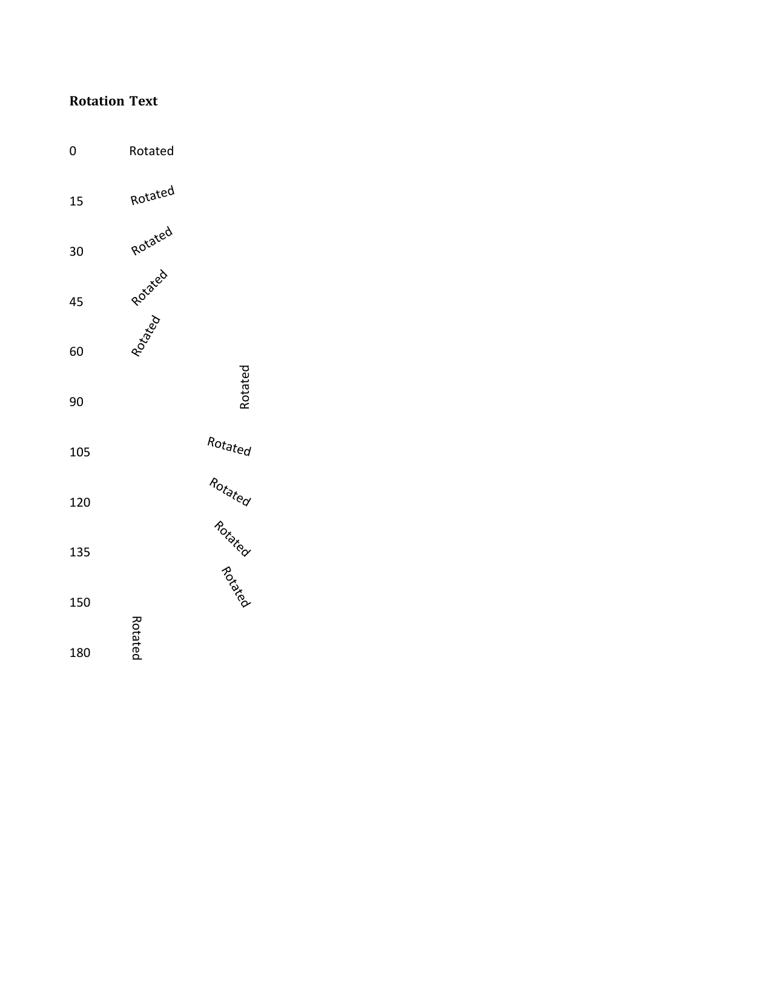</td>
</tr>
<tr>
  <td><b>classic141_mixed_edge_borders<br><small>format: xlsx | case: classic141_mixed_edge_borders | scope: dotnet-classic-xlsx</small></b></td>
  <td colspan="2">classic141_mixed_edge_borders <span style="color:#3fb950">⬤</span> 99.7%</td>
</tr>
<tr>
  <td></td>
  <td></td>
  <td></td>
</tr>
<tr>
  <td><b>classic142_styled_invoice<br><small>format: xlsx | case: classic142_styled_invoice | scope: dotnet-classic-xlsx</small></b></td>
  <td colspan="2">classic142_styled_invoice <span style="color:#3fb950">⬤</span> 99.1%</td>
</tr>
<tr>
  <td></td>
  <td></td>
  <td>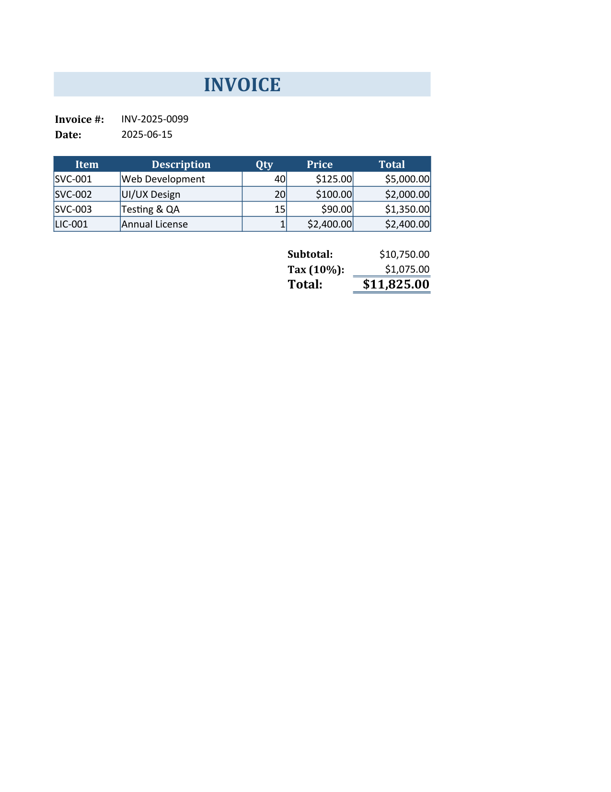</td>
</tr>
<tr>
  <td><b>classic143_colored_tabs<br><small>format: xlsx | case: classic143_colored_tabs | scope: dotnet-classic-xlsx</small></b></td>
  <td colspan="2">classic143_colored_tabs <span style="color:#3fb950">⬤</span> 99.6%</td>
</tr>
<tr>
  <td></td>
  <td></td>
  <td></td>
</tr>
<tr>
  <td></td>
  <td></td>
  <td></td>
</tr>
<tr>
  <td></td>
  <td></td>
  <td></td>
</tr>
<tr>
  <td></td>
  <td></td>
  <td></td>
</tr>
<tr>
  <td><b>classic144_note_style_cells<br><small>format: xlsx | case: classic144_note_style_cells | scope: dotnet-classic-xlsx</small></b></td>
  <td colspan="2">classic144_note_style_cells <span style="color:#3fb950">⬤</span> 99.7%</td>
</tr>
<tr>
  <td></td>
  <td></td>
  <td></td>
</tr>
<tr>
  <td><b>classic145_status_badges<br><small>format: xlsx | case: classic145_status_badges | scope: dotnet-classic-xlsx</small></b></td>
  <td colspan="2">classic145_status_badges <span style="color:#3fb950">⬤</span> 99.0%</td>
</tr>
<tr>
  <td></td>
  <td></td>
  <td></td>
</tr>
<tr>
  <td><b>classic146_double_border_table<br><small>format: xlsx | case: classic146_double_border_table | scope: dotnet-classic-xlsx</small></b></td>
  <td colspan="2">classic146_double_border_table <span style="color:#3fb950">⬤</span> 99.3%</td>
</tr>
<tr>
  <td></td>
  <td></td>
  <td></td>
</tr>
<tr>
  <td><b>classic147_multi_sheet_styled<br><small>format: xlsx | case: classic147_multi_sheet_styled | scope: dotnet-classic-xlsx</small></b></td>
  <td colspan="2">classic147_multi_sheet_styled <span style="color:#3fb950">⬤</span> 99.5%</td>
</tr>
<tr>
  <td></td>
  <td></td>
  <td></td>
</tr>
<tr>
  <td></td>
  <td></td>
  <td></td>
</tr>
<tr>
  <td></td>
  <td></td>
  <td></td>
</tr>
<tr>
  <td><b>classic148_frozen_styled_grid<br><small>format: xlsx | case: classic148_frozen_styled_grid | scope: dotnet-classic-xlsx</small></b></td>
  <td colspan="2">classic148_frozen_styled_grid <span style="color:#3fb950">⬤</span> 96.4%</td>
</tr>
<tr>
  <td></td>
  <td></td>
  <td></td>
</tr>
<tr>
  <td><b>classic149_merged_styled_sections<br><small>format: xlsx | case: classic149_merged_styled_sections | scope: dotnet-classic-xlsx</small></b></td>
  <td colspan="2">classic149_merged_styled_sections <span style="color:#3fb950">⬤</span> 99.0%</td>
</tr>
<tr>
  <td></td>
  <td></td>
  <td></td>
</tr>
<tr>
  <td><b>classic150_kitchen_sink_styles<br><small>format: xlsx | case: classic150_kitchen_sink_styles | scope: dotnet-classic-xlsx</small></b></td>
  <td colspan="2">classic150_kitchen_sink_styles <span style="color:#3fb950">⬤</span> 98.5%</td>
</tr>
<tr>
  <td></td>
  <td></td>
  <td></td>
</tr>
<tr>
  <td><b>classic151_multilingual_greetings<br><small>format: xlsx | case: classic151_multilingual_greetings | scope: dotnet-classic-xlsx</small></b></td>
  <td colspan="2">classic151_multilingual_greetings <span style="color:#3fb950">⬤</span> 96.6%</td>
</tr>
<tr>
  <td></td>
  <td></td>
  <td></td>
</tr>
<tr>
  <td><b>classic152_emoji_sampler<br><small>format: xlsx | case: classic152_emoji_sampler | scope: dotnet-classic-xlsx</small></b></td>
  <td colspan="2">classic152_emoji_sampler <span style="color:#3fb950">⬤</span> 98.6%</td>
</tr>
<tr>
  <td></td>
  <td></td>
  <td></td>
</tr>
<tr>
  <td><b>classic153_currency_symbols<br><small>format: xlsx | case: classic153_currency_symbols | scope: dotnet-classic-xlsx</small></b></td>
  <td colspan="2">classic153_currency_symbols <span style="color:#3fb950">⬤</span> 99.3%</td>
</tr>
<tr>
  <td></td>
  <td></td>
  <td></td>
</tr>
<tr>
  <td><b>classic154_math_symbols<br><small>format: xlsx | case: classic154_math_symbols | scope: dotnet-classic-xlsx</small></b></td>
  <td colspan="2">classic154_math_symbols <span style="color:#3fb950">⬤</span> 99.2%</td>
</tr>
<tr>
  <td></td>
  <td></td>
  <td></td>
</tr>
<tr>
  <td><b>classic155_diacritical_marks<br><small>format: xlsx | case: classic155_diacritical_marks | scope: dotnet-classic-xlsx</small></b></td>
  <td colspan="2">classic155_diacritical_marks <span style="color:#3fb950">⬤</span> 99.8%</td>
</tr>
<tr>
  <td></td>
  <td></td>
  <td></td>
</tr>
<tr>
  <td><b>classic156_rtl_bidi_text<br><small>format: xlsx | case: classic156_rtl_bidi_text | scope: dotnet-classic-xlsx</small></b></td>
  <td colspan="2">classic156_rtl_bidi_text <span style="color:#d29922">⬤</span> 83.5%</td>
</tr>
<tr>
  <td></td>
  <td></td>
  <td></td>
</tr>
<tr>
  <td><b>classic157_cjk_extended<br><small>format: xlsx | case: classic157_cjk_extended | scope: dotnet-classic-xlsx</small></b></td>
  <td colspan="2">classic157_cjk_extended <span style="color:#3fb950">⬤</span> 99.6%</td>
</tr>
<tr>
  <td></td>
  <td></td>
  <td></td>
</tr>
<tr>
  <td><b>classic158_emoji_skin_tones<br><small>format: xlsx | case: classic158_emoji_skin_tones | scope: dotnet-classic-xlsx</small></b></td>
  <td colspan="2">classic158_emoji_skin_tones <span style="color:#3fb950">⬤</span> 99.2%</td>
</tr>
<tr>
  <td></td>
  <td></td>
  <td></td>
</tr>
<tr>
  <td><b>classic159_zwj_emoji<br><small>format: xlsx | case: classic159_zwj_emoji | scope: dotnet-classic-xlsx</small></b></td>
  <td colspan="2">classic159_zwj_emoji <span style="color:#3fb950">⬤</span> 96.5%</td>
</tr>
<tr>
  <td></td>
  <td></td>
  <td></td>
</tr>
<tr>
  <td><b>classic160_punctuation_marks<br><small>format: xlsx | case: classic160_punctuation_marks | scope: dotnet-classic-xlsx</small></b></td>
  <td colspan="2">classic160_punctuation_marks <span style="color:#3fb950">⬤</span> 99.5%</td>
</tr>
<tr>
  <td></td>
  <td></td>
  <td>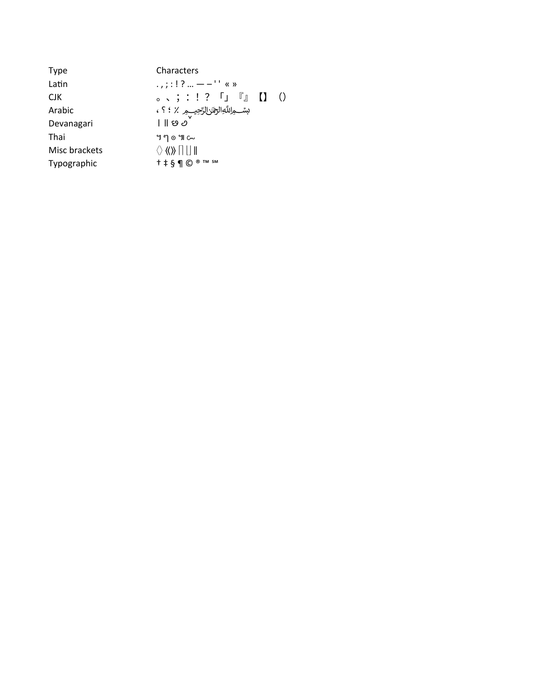</td>
</tr>
<tr>
  <td><b>classic161_box_drawing<br><small>format: xlsx | case: classic161_box_drawing | scope: dotnet-classic-xlsx</small></b></td>
  <td colspan="2">classic161_box_drawing <span style="color:#3fb950">⬤</span> 99.7%</td>
</tr>
<tr>
  <td></td>
  <td></td>
  <td></td>
</tr>
<tr>
  <td><b>classic162_cjk_emoji_styled<br><small>format: xlsx | case: classic162_cjk_emoji_styled | scope: dotnet-classic-xlsx</small></b></td>
  <td colspan="2">classic162_cjk_emoji_styled <span style="color:#3fb950">⬤</span> 99.8%</td>
</tr>
<tr>
  <td></td>
  <td></td>
  <td></td>
</tr>
<tr>
  <td><b>classic163_cyrillic_alphabets<br><small>format: xlsx | case: classic163_cyrillic_alphabets | scope: dotnet-classic-xlsx</small></b></td>
  <td colspan="2">classic163_cyrillic_alphabets <span style="color:#3fb950">⬤</span> 97.7%</td>
</tr>
<tr>
  <td></td>
  <td></td>
  <td></td>
</tr>
<tr>
  <td><b>classic164_indic_scripts<br><small>format: xlsx | case: classic164_indic_scripts | scope: dotnet-classic-xlsx</small></b></td>
  <td colspan="2">classic164_indic_scripts <span style="color:#3fb950">⬤</span> 98.6%</td>
</tr>
<tr>
  <td></td>
  <td></td>
  <td></td>
</tr>
<tr>
  <td><b>classic165_southeast_asian<br><small>format: xlsx | case: classic165_southeast_asian | scope: dotnet-classic-xlsx</small></b></td>
  <td colspan="2">classic165_southeast_asian <span style="color:#3fb950">⬤</span> 90.1%</td>
</tr>
<tr>
  <td></td>
  <td></td>
  <td></td>
</tr>
<tr>
  <td><b>classic166_emoji_progress<br><small>format: xlsx | case: classic166_emoji_progress | scope: dotnet-classic-xlsx</small></b></td>
  <td colspan="2">classic166_emoji_progress <span style="color:#3fb950">⬤</span> 99.6%</td>
</tr>
<tr>
  <td></td>
  <td></td>
  <td></td>
</tr>
<tr>
  <td><b>classic167_musical_symbols<br><small>format: xlsx | case: classic167_musical_symbols | scope: dotnet-classic-xlsx</small></b></td>
  <td colspan="2">classic167_musical_symbols <span style="color:#3fb950">⬤</span> 99.8%</td>
</tr>
<tr>
  <td></td>
  <td></td>
  <td></td>
</tr>
<tr>
  <td><b>classic168_mixed_ltr_rtl_styled<br><small>format: xlsx | case: classic168_mixed_ltr_rtl_styled | scope: dotnet-classic-xlsx</small></b></td>
  <td colspan="2">classic168_mixed_ltr_rtl_styled <span style="color:#3fb950">⬤</span> 94.1%</td>
</tr>
<tr>
  <td></td>
  <td></td>
  <td></td>
</tr>
<tr>
  <td><b>classic169_korean_invoice<br><small>format: xlsx | case: classic169_korean_invoice | scope: dotnet-classic-xlsx</small></b></td>
  <td colspan="2">classic169_korean_invoice <span style="color:#3fb950">⬤</span> 99.7%</td>
</tr>
<tr>
  <td></td>
  <td></td>
  <td></td>
</tr>
<tr>
  <td><b>classic170_emoji_dashboard<br><small>format: xlsx | case: classic170_emoji_dashboard | scope: dotnet-classic-xlsx</small></b></td>
  <td colspan="2">classic170_emoji_dashboard <span style="color:#3fb950">⬤</span> 99.7%</td>
</tr>
<tr>
  <td></td>
  <td></td>
  <td></td>
</tr>
<tr>
  <td><b>classic171_ipa_phonetic<br><small>format: xlsx | case: classic171_ipa_phonetic | scope: dotnet-classic-xlsx</small></b></td>
  <td colspan="2">classic171_ipa_phonetic <span style="color:#3fb950">⬤</span> 98.6%</td>
</tr>
<tr>
  <td></td>
  <td></td>
  <td></td>
</tr>
<tr>
  <td><b>classic172_emoji_timeline<br><small>format: xlsx | case: classic172_emoji_timeline | scope: dotnet-classic-xlsx</small></b></td>
  <td colspan="2">classic172_emoji_timeline <span style="color:#3fb950">⬤</span> 99.6%</td>
</tr>
<tr>
  <td></td>
  <td></td>
  <td></td>
</tr>
<tr>
  <td><b>classic173_african_languages<br><small>format: xlsx | case: classic173_african_languages | scope: dotnet-classic-xlsx</small></b></td>
  <td colspan="2">classic173_african_languages <span style="color:#3fb950">⬤</span> 98.8%</td>
</tr>
<tr>
  <td></td>
  <td></td>
  <td></td>
</tr>
<tr>
  <td><b>classic174_technical_symbols<br><small>format: xlsx | case: classic174_technical_symbols | scope: dotnet-classic-xlsx</small></b></td>
  <td colspan="2">classic174_technical_symbols <span style="color:#3fb950">⬤</span> 99.6%</td>
</tr>
<tr>
  <td></td>
  <td></td>
  <td>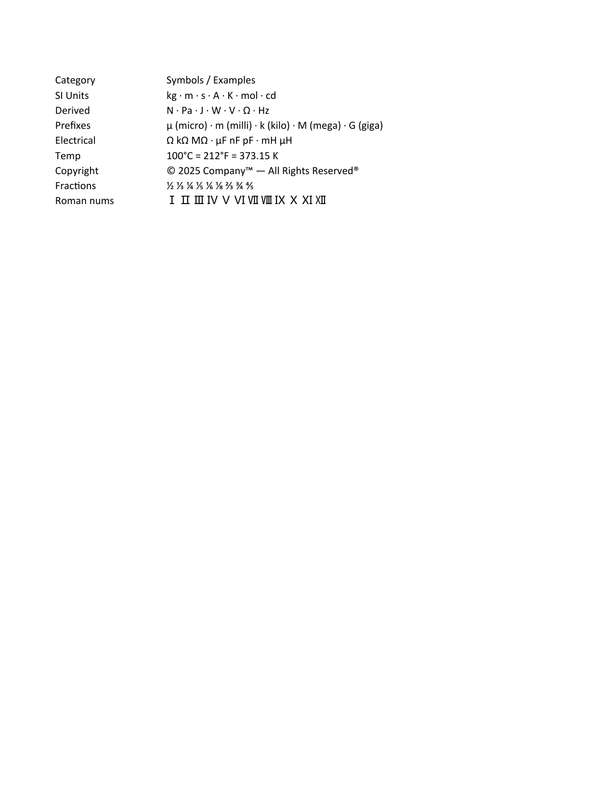</td>
</tr>
<tr>
  <td><b>classic175_multiscript_catalog<br><small>format: xlsx | case: classic175_multiscript_catalog | scope: dotnet-classic-xlsx</small></b></td>
  <td colspan="2">classic175_multiscript_catalog <span style="color:#3fb950">⬤</span> 98.3%</td>
</tr>
<tr>
  <td></td>
  <td></td>
  <td></td>
</tr>
<tr>
  <td><b>classic176_combining_characters<br><small>format: xlsx | case: classic176_combining_characters | scope: dotnet-classic-xlsx</small></b></td>
  <td colspan="2">classic176_combining_characters <span style="color:#3fb950">⬤</span> 97.7%</td>
</tr>
<tr>
  <td></td>
  <td></td>
  <td></td>
</tr>
<tr>
  <td><b>classic177_emoji_calendar<br><small>format: xlsx | case: classic177_emoji_calendar | scope: dotnet-classic-xlsx</small></b></td>
  <td colspan="2">classic177_emoji_calendar <span style="color:#3fb950">⬤</span> 99.5%</td>
</tr>
<tr>
  <td></td>
  <td></td>
  <td></td>
</tr>
<tr>
  <td><b>classic178_caucasus_ethiopic<br><small>format: xlsx | case: classic178_caucasus_ethiopic | scope: dotnet-classic-xlsx</small></b></td>
  <td colspan="2">classic178_caucasus_ethiopic <span style="color:#3fb950">⬤</span> 99.4%</td>
</tr>
<tr>
  <td></td>
  <td></td>
  <td></td>
</tr>
<tr>
  <td><b>classic179_emoji_inventory<br><small>format: xlsx | case: classic179_emoji_inventory | scope: dotnet-classic-xlsx</small></b></td>
  <td colspan="2">classic179_emoji_inventory <span style="color:#3fb950">⬤</span> 99.2%</td>
</tr>
<tr>
  <td></td>
  <td></td>
  <td></td>
</tr>
<tr>
  <td><b>classic180_polyglot_paragraph<br><small>format: xlsx | case: classic180_polyglot_paragraph | scope: dotnet-classic-xlsx</small></b></td>
  <td colspan="2">classic180_polyglot_paragraph <span style="color:#3fb950">⬤</span> 98.0%</td>
</tr>
<tr>
  <td></td>
  <td></td>
  <td></td>
</tr>
<tr>
  <td><b>classic181_feedback_tracker_with_images<br><small>format: xlsx | case: classic181_feedback_tracker_with_images | scope: dotnet-classic-xlsx</small></b></td>
  <td colspan="2">classic181_feedback_tracker_with_images <span style="color:#3fb950">⬤</span> 99.0%</td>
</tr>
<tr>
  <td></td>
  <td></td>
  <td></td>
</tr>
<tr>
  <td></td>
  <td></td>
  <td>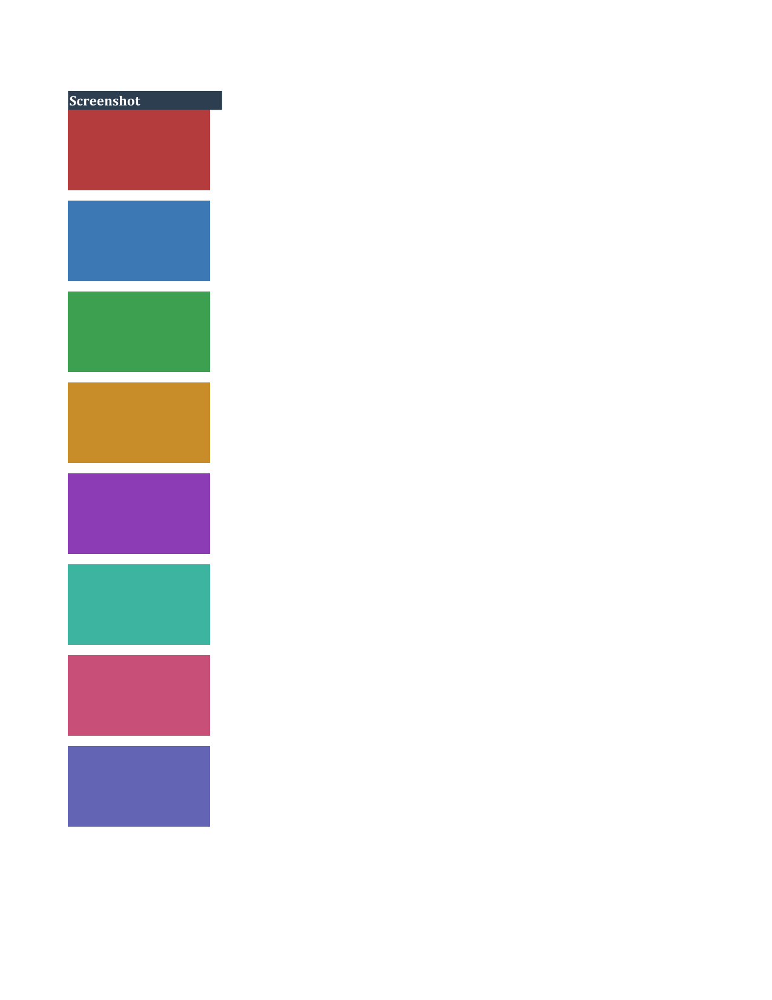</td>
</tr>
<tr>
  <td><b>classic182_dense_long_text_columns<br><small>format: xlsx | case: classic182_dense_long_text_columns | scope: dotnet-classic-xlsx</small></b></td>
  <td colspan="2">classic182_dense_long_text_columns <span style="color:#3fb950">⬤</span> 96.5%</td>
</tr>
<tr>
  <td></td>
  <td></td>
  <td></td>
</tr>
<tr>
  <td></td>
  <td></td>
  <td></td>
</tr>
<tr>
  <td><b>classic183_mixed_content_grid<br><small>format: xlsx | case: classic183_mixed_content_grid | scope: dotnet-classic-xlsx</small></b></td>
  <td colspan="2">classic183_mixed_content_grid <span style="color:#3fb950">⬤</span> 99.5%</td>
</tr>
<tr>
  <td></td>
  <td></td>
  <td></td>
</tr>
<tr>
  <td><b>classic184_wide_narrow_columns<br><small>format: xlsx | case: classic184_wide_narrow_columns | scope: dotnet-classic-xlsx</small></b></td>
  <td colspan="2">classic184_wide_narrow_columns <span style="color:#3fb950">⬤</span> 98.5%</td>
</tr>
<tr>
  <td></td>
  <td></td>
  <td>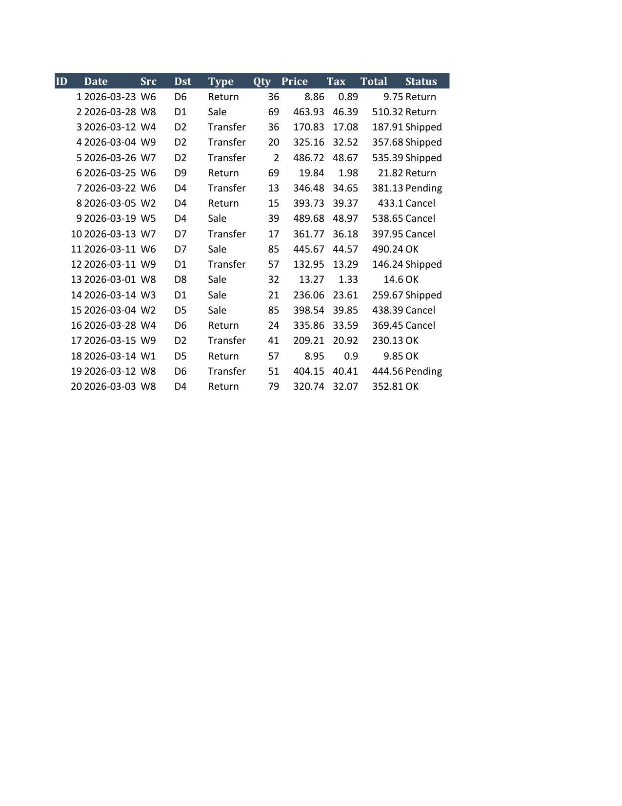</td>
</tr>
<tr>
  <td><b>classic185_tall_rows_vertical_align<br><small>format: xlsx | case: classic185_tall_rows_vertical_align | scope: dotnet-classic-xlsx</small></b></td>
  <td colspan="2">classic185_tall_rows_vertical_align <span style="color:#3fb950">⬤</span> 99.5%</td>
</tr>
<tr>
  <td></td>
  <td></td>
  <td></td>
</tr>
<tr>
  <td><b>classic186_multi_sheet_image_report<br><small>format: xlsx | case: classic186_multi_sheet_image_report | scope: dotnet-classic-xlsx</small></b></td>
  <td colspan="2">classic186_multi_sheet_image_report <span style="color:#3fb950">⬤</span> 99.7%</td>
</tr>
<tr>
  <td></td>
  <td></td>
  <td></td>
</tr>
<tr>
  <td></td>
  <td></td>
  <td></td>
</tr>
<tr>
  <td><b>classic187_bug_report_with_screenshots<br><small>format: xlsx | case: classic187_bug_report_with_screenshots | scope: dotnet-classic-xlsx</small></b></td>
  <td colspan="2">classic187_bug_report_with_screenshots <span style="color:#3fb950">⬤</span> 99.1%</td>
</tr>
<tr>
  <td></td>
  <td></td>
  <td></td>
</tr>
<tr>
  <td><b>classic188_merged_header_with_images<br><small>format: xlsx | case: classic188_merged_header_with_images | scope: dotnet-classic-xlsx</small></b></td>
  <td colspan="2">classic188_merged_header_with_images <span style="color:#3fb950">⬤</span> 99.6%</td>
</tr>
<tr>
  <td></td>
  <td></td>
  <td></td>
</tr>
<tr>
  <td><b>classic189_alternating_image_text_rows<br><small>format: xlsx | case: classic189_alternating_image_text_rows | scope: dotnet-classic-xlsx</small></b></td>
  <td colspan="2">classic189_alternating_image_text_rows <span style="color:#3fb950">⬤</span> 98.3%</td>
</tr>
<tr>
  <td></td>
  <td></td>
  <td></td>
</tr>
<tr>
  <td><b>classic190_dashboard_kpi_images<br><small>format: xlsx | case: classic190_dashboard_kpi_images | scope: dotnet-classic-xlsx</small></b></td>
  <td colspan="2">classic190_dashboard_kpi_images <span style="color:#3fb950">⬤</span> 99.5%</td>
</tr>
<tr>
  <td></td>
  <td></td>
  <td></td>
</tr>
<tr>
  <td><b>classic191_payroll_calculator<br><small>format: xlsx | case: classic191_payroll_calculator | scope: dotnet-classic-xlsx</small></b></td>
  <td colspan="2">classic191_payroll_calculator <span style="color:#3fb950">⬤</span> 93.7%</td>
</tr>
<tr>
  <td></td>
  <td></td>
  <td></td>
</tr>
<tr>
  <td></td>
  <td></td>
  <td></td>
</tr>
<tr>
  <td></td>
  <td></td>
  <td>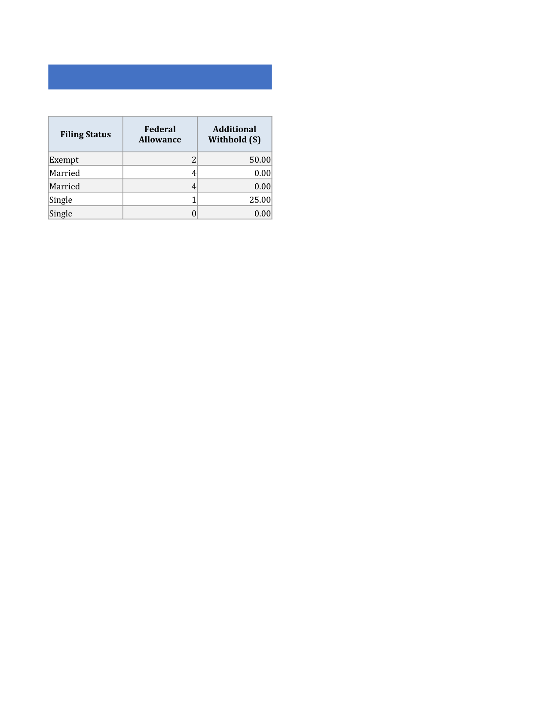</td>
</tr>
<tr>
  <td></td>
  <td></td>
  <td></td>
</tr>
<tr>
  <td></td>
  <td></td>
  <td></td>
</tr>
<tr>
  <td></td>
  <td></td>
  <td></td>
</tr>
<tr>
  <td></td>
  <td></td>
  <td></td>
</tr>
<tr>
  <td></td>
  <td></td>
  <td></td>
</tr>
<tr>
  <td></td>
  <td></td>
  <td></td>
</tr>
</table>

## Detailed Results

### classic01_basic_table_with_headers

- **Case Metadata:** format: xlsx | case: classic01_basic_table_with_headers | scope: dotnet-classic-xlsx
- **Source:** tests/MiniPdf.Scripts/output/classic01_basic_table_with_headers.xlsx
- **Text Similarity:** 1.0
- **Visual Average:** 0.9971
- **Overall Score:** 0.9988
- **Pages:** MiniPdf=1, Reference=1
- **File Size:** MiniPdf=2104 bytes, Reference=51282 bytes

Text content: ✅ Identical

### classic02_multiple_worksheets

- **Case Metadata:** format: xlsx | case: classic02_multiple_worksheets | scope: dotnet-classic-xlsx
- **Source:** tests/MiniPdf.Scripts/output/classic02_multiple_worksheets.xlsx
- **Text Similarity:** 0.9942
- **Visual Average:** 0.9981
- **Overall Score:** 0.9969
- **Pages:** MiniPdf=3, Reference=3
- **File Size:** MiniPdf=3455 bytes, Reference=56518 bytes

<details><summary>Text Diff</summary>

```diff
--- minipdf/classic02_multiple_worksheets.pdf
+++ reference/classic02_multiple_worksheets.pdf
@@ -10,6 +10,6 @@
 Utilities 200

 ---PAGE---

 Metric Value

-Total Rev 1130

-Total Cost 3700

+Total Reve 1130

+Total Costs 3700

 Net -2570
```
</details>

### classic03_empty_workbook

- **Case Metadata:** format: xlsx | case: classic03_empty_workbook | scope: dotnet-classic-xlsx
- **Source:** tests/MiniPdf.Scripts/output/classic03_empty_workbook.xlsx
- **Text Similarity:** 1.0
- **Visual Average:** 1.0
- **Overall Score:** 1.0
- **Pages:** MiniPdf=1, Reference=1
- **File Size:** MiniPdf=986 bytes, Reference=25793 bytes

Text content: ✅ Identical

### classic04_single_cell

- **Case Metadata:** format: xlsx | case: classic04_single_cell | scope: dotnet-classic-xlsx
- **Source:** tests/MiniPdf.Scripts/output/classic04_single_cell.xlsx
- **Text Similarity:** 1.0
- **Visual Average:** 0.9998
- **Overall Score:** 0.9999
- **Pages:** MiniPdf=1, Reference=1
- **File Size:** MiniPdf=1069 bytes, Reference=27469 bytes

Text content: ✅ Identical

### classic05_wide_table

- **Case Metadata:** format: xlsx | case: classic05_wide_table | scope: dotnet-classic-xlsx
- **Source:** tests/MiniPdf.Scripts/output/classic05_wide_table.xlsx
- **Text Similarity:** 0.8846
- **Visual Average:** 0.993
- **Overall Score:** 0.951
- **Pages:** MiniPdf=3, Reference=3
- **File Size:** MiniPdf=12823 bytes, Reference=60760 bytes

<details><summary>Text Diff</summary>

```diff
--- minipdf/classic05_wide_table.pdf
+++ reference/classic05_wide_table.pdf
@@ -1,20 +1,20 @@
-A B C D E F G H I J

-A1 B1 C1 D1 E1 F1 G1 H1 I1 J1

-A2 B2 C2 D2 E2 F2 G2 H2 I2 J2

-A3 B3 C3 D3 E3 F3 G3 H3 I3 J3

-A4 B4 C4 D4 E4 F4 G4 H4 I4 J4

-A5 B5 C5 D5 E5 F5 G5 H5 I5 J5

+A B C D E F G H I

+A1 B1 C1 D1 E1 F1 G1 H1 I1

+A2 B2 C2 D2 E2 F2 G2 H2 I2

+A3 B3 C3 D3 E3 F3 G3 H3 I3

+A4 B4 C4 D4 E4 F4 G4 H4 I4

+A5 B5 C5 D5 E5 F5 G5 H5 I5

 ---PAGE---

-K L M N O P Q R S T

-K1 L1 M1 N1 O1 P1 Q1 R1 S1 T1

-K2 L2 M2 N2 O2 P2 Q2 R2 S2 T2

-K3 L3 M3 N3 O3 P3 Q3 R3 S3 T3

-K4 L4 M4 N4 O4 P4 Q4 R4 S4 T4

-K5 L5 M5 N5 O5 P5 Q5 R5 S5 T5

+J K L M N O P Q R

+J1 K1 L1 M1 N1 O1 P1 Q1 R1

+J2 K2 L2 M2 N2 O2 P2 Q2 R2

+J3 K3 L3 M3 N3 O3 P3 Q3 R3

+J4 K4 L4 M4 N4 O4 P4 Q4 R4

+J5 K5 L5 M5 N5 O5 P5 Q5 R5

 ---PAGE---

-U V W X Y Z

-U1 V1 W1 X1 Y1 Z1

-U2 V2 W2 X2 Y2 Z2

-U3 V3 W3 X3 Y3 Z3

-U4 V4 W4 X4 Y4 Z4

-U5 V5 W5 X5 Y5 Z5
+S T U V W X Y Z

+S1 T1 U1 V1 W1 X1 Y1 Z1

+S2 T2 U2 V2 W2 X2 Y2 Z2

+S3 T3 U3 V3 W3 X3 Y3 Z3

+S4 T4 U4 V4 W4 X4 Y4 Z4

+S5 T5 U5 V5 W5 X5 Y5 Z5
```
</details>

### classic06_tall_table

- **Case Metadata:** format: xlsx | case: classic06_tall_table | scope: dotnet-classic-xlsx
- **Source:** tests/MiniPdf.Scripts/output/classic06_tall_table.xlsx
- **Text Similarity:** 1.0
- **Visual Average:** 0.9426
- **Overall Score:** 0.977
- **Pages:** MiniPdf=5, Reference=5
- **File Size:** MiniPdf=54610 bytes, Reference=116996 bytes

<details><summary>Text Diff</summary>

```diff
--- minipdf/classic06_tall_table.pdf
+++ reference/classic06_tall_table.pdf
@@ -44,9 +44,9 @@
 Row43 Val43 This is the description for row number 43

 Row44 Val44 This is the description for row number 44

 Row45 Val45 This is the description for row number 45

----PAGE---

 Row46 Val46 This is the description for row number 46

 Row47 Val47 This is the description for row number 47

+---PAGE---

 Row48 Val48 This is the description for row number 48

 Row49 Val49 This is the description for row number 49

 Row50 Val50 This is the description for row number 50

@@ -91,11 +91,11 @@
 Row89 Val89 This is the description for row number 89

 Row90 Val90 This is the description for row number 90

 Row91 Val91 This is the description for row number 91

----PAGE---

 Row92 Val92 This is the description for row number 92

 Row93 Val93 This is the description for row number 93

 Row94 Val94 This is the description for row number 94

 Row95 Val95 This is the description for row number 95

+---PAGE---

 Row96 Val96 This is the description for row number 96

 Row97 Val97 This is the description for row number 97

 Row98 Val98 This is the description for row number 98

@@ -138,13 +138,13 @@
 Row135 Val135 This is the description for row number 135

 Row136 Val136 This is the description for row number 136

 Row137 Val137 This is the description for row number 137

----PAGE---

 Row138 Val138 This is the description for row number 138

 Row139 Val139 This is the description for row number 139

 Row140 Val140 This is the description for row number 140

 Row141 Val141 This is the description for row number 141

 Row142 Val142 This is the description for row number 142

 Row143 Val143 This is the description for row number 143

+---PAGE---

 Row144 Val144 This is the description for row number 144

 Row145 Val145 This is the description for row number 145

 Row146 Val146 This is the description for row number 146

@@ -185,7 +185,6 @@
 Row181 Val181 This is the description for row number 181

 Row182 Val182 This is the description for row number 182

 Row183 Val183 This is the description for row number 183

----PAGE---

 Row184 Val184 This is the description for row number 184

 Row185 Val185 This is the description for row number 185

 Row186 Val186 This is the description for row number 186

@@ -194,6 +193,7 @@
 Row189 Val189 This is the description for row number 189

 Row190 Val190 This is the description for row number 190

 Row191 Val191 This is the description for row number 191

+---PAGE---

 Row192 Val192 This is the description for row number 192

 Row193 Val193 This is the description for row number 193

 Row194 Val194 This is the description for row number 194
```
</details>

### classic07_numbers_only

- **Case Metadata:** format: xlsx | case: classic07_numbers_only | scope: dotnet-classic-xlsx
- **Source:** tests/MiniPdf.Scripts/output/classic07_numbers_only.xlsx
- **Text Similarity:** 1.0
- **Visual Average:** 0.9992
- **Overall Score:** 0.9997
- **Pages:** MiniPdf=1, Reference=1
- **File Size:** MiniPdf=1864 bytes, Reference=42110 bytes

Text content: ✅ Identical

### classic08_mixed_text_and_numbers

- **Case Metadata:** format: xlsx | case: classic08_mixed_text_and_numbers | scope: dotnet-classic-xlsx
- **Source:** tests/MiniPdf.Scripts/output/classic08_mixed_text_and_numbers.xlsx
- **Text Similarity:** 1.0
- **Visual Average:** 0.9982
- **Overall Score:** 0.9993
- **Pages:** MiniPdf=1, Reference=1
- **File Size:** MiniPdf=1875 bytes, Reference=44923 bytes

Text content: ✅ Identical

### classic09_long_text

- **Case Metadata:** format: xlsx | case: classic09_long_text | scope: dotnet-classic-xlsx
- **Source:** tests/MiniPdf.Scripts/output/classic09_long_text.xlsx
- **Text Similarity:** 0.2866
- **Visual Average:** 0.6984
- **Overall Score:** 0.494
- **Pages:** MiniPdf=11, Reference=12
- **File Size:** MiniPdf=4304 bytes, Reference=44367 bytes

<details><summary>Text Diff</summary>

```diff
--- minipdf/classic09_long_text.pdf
+++ reference/classic09_long_text.pdf
@@ -1,24 +1,38 @@
 Long Text Column

-XXXXXXXXXXXXXXXXXXXXXXXXXXXXXXXXXXXXXXXXXXXXXXXXXXXXXXXXXXXXXXXXXXXXXXXXXX

-AAAAAAAAAAAAAAAAAAAAAAAAAAAAAAAAAAAAAAAAAAAAAAAAAAAAAAAAAAAAAAAAAAAAAAAAAA

+XXXXXXXXXXXXXXXXXXXXXXXXXXXXXXXXXXXXXXXXXXXXXXXXXXXXXXXXXXXXXXXXXXXXXXXXXXXXXXX

+AAAAAAAAAAAAAAAAAAAAAAAAAAAAAAAAAAAAAAAAAAAAAAAAAAAAAAAAAAAAAAAAAAAAAAA

 Short

-YYYYYYYYYYYYYYYYYYYYYYYYYYYYYYYYYYYYYYYYYYYYYYYYYYYYYYYYYYYYYYYYYYYYYYYYYY

+YYYYYYYYYYYYYYYYYYYYYYYYYYYYYYYYYYYYYYYYYYYYYYYYYYYYYYYYYYYYYYYYYYYYYYYYYYYYYYYYYYYY

 ---PAGE---

-

+XXXXXXXXXXXXXXXXXXXXXXXXXXXXXXXXXXXXXXXXXXXXXXXXXXXXXXXXXXXXXXXXXXXXXXXXXXXXXXX

+AAAAAAAAAAAAAAAAAAAAAAAAAAAAAAAAAAAAAAAAAAAAAAAAAAAAAAAAAAAAAAAAAAAAAAAA

+YYYYYYYYYYYYYYYYYYYYYYYYYYYYYYYYYYYYYYYYYYYYYYYYYYYYYYYYYYYYYYYYYYYYYYYYYYYYYYYYYYYY

 ---PAGE---

-

+XXXXXXXXXXXXXXXXXXXXXXXXXXXXXXXXXXXXXXXXXXXXXXXXXXXXXXXXXXXXXXXXXXXXXXXXXXXXXXX

+AAAAAAAAAAAAAAAAAAAAAAAAAAAAAAAAAAAAAAAAAAAAAAAAAAAAAAAAAAAAAAAAAAAAAAAA

+YYYYYYYYYYYYYYYYYYYYYYYYYYYYYYYYYYYYYYYYYYYYYYYYYYYYYYYYYYYYYYYYYYYYYYYYYYYYYYYYYYYY

 ---PAGE---

-

+XXXXXXXXXXXXXXXXXXXXXXXXXXXXXXXXXXXXXXXXXXXXXXXXXXXXXXXXXXXXXXXXXXXXXXXXXXXXXXXX

+AAAAAAAAAAAAAAAAAAAAAAAAAAAAAAAAAAAAAAAAAAAAAAAAAAAAAAAAAAAAAAAAAAAAAAAA

+YYYYYYYYYYYYYYYYYYYYYYYYYYYYYYYYYYYYYYYYYYYYYYYYYYYYYYYYYYYYYYYYYYYYYYYYYYYYYYYYYYYYY

 ---PAGE---

-

+XXXXXXXXXXXXXXXXXXXXXXXXXXXXXXXXXXXXXXXXXXXXXXXXXXXXXXXXXXXXXXXXXXXXXXXXXXXXXXX

+AAAAAAAAAAAAAAAAA BBBBBBBBBBBBBBBBBBBBBBBBBBBBBBBBBBBBBBBBBBBBBBBBBBBBBBBBBB

+YYYYYYYYYYYYYYYYYYYYYYYYYYYYYYYYYYYYYYYYYYYYYYYYYYYYYYYYYYYYYYYYYYYYYYYYYYYYYYYYYYYY

 ---PAGE---

-

+XXXXXXXXXXXXXXXXXXXXXXXXXXXXXXXXXXXXXXXXXXXXXXXXXXXXXXXXXXXXXXXXXXXXXXXXXXXXXXXX

+BBBBBBBBBBBBBBBBBBBBBBBBBBBBBBBBBBBBBBBBBBBBBBBBBBBBBBBBBBBBBBBBBBBBBBBBBBBB

+YYYYYYYYYYYYYYYYYYYYYYYYYYYYYYYYYYYYYYYYYYYYYYYYYYYYYYYYYYYYYYYYYYYYYYYYYYYYYYYYYYYYY

 ---PAGE---

-

+BBBBBBBBBBBBBBBBBBBBBBBBBBBBBBBBBBBBBBBBBBBBBBBBBBBBBBBBBBBBBBBBBBB

+YYYYYYYYYYYYYYYYYYYYYYYYYYYYYYYYYYYYYYYYYYYYYYYYYYYYYYYYYYYYYYYYYYYYYYYYYYYYYYYYYYYYY

 ---PAGE---

-

+YYYYYYYYYYYYYYYYYYYYYYYYYYYYYYYYYYYYYYYYYYYYYYYYYYYYYYYYYYYYYYYYYYYYYYYYYYYYYYYYYYYY

 ---PAGE---

-

+YYYYYYYYYYYYYYYYYYYYYYYYYYYYYYYYYYYYYYYYYYYYYYYYYYYYYYYYYYYYYYYYYYYYYYYYYYYYYYYYYYYYY

 ---PAGE---

-

----PAGE---
+YYYYYYYYYYYYYYYYYYYYYYYYYYYYYYYYYYYYYYYYYYYYYYYYYYYYYYYYYYYYYYYYYYYYYYYYYYYYYYYYYYYY

+---PAGE---

+YYYYYYYYYYYYYYYYYYYYYYYYYYYYYYYYYYYYYYYYYYYYYYYYYYYYYYYYYYYYYYYYYYYYYYYYYYYYYYYYYYYYY

+---PAGE---

+YYYYYYYYYYYYYYYYYYYYYYYYYYYYYYYYYYYYYYYYYYYYYYYYYYYYYYYYYYYYYYYYYYYYYYYYYYYYYYYYY
```
</details>

### classic10_special_xml_characters

- **Case Metadata:** format: xlsx | case: classic10_special_xml_characters | scope: dotnet-classic-xlsx
- **Source:** tests/MiniPdf.Scripts/output/classic10_special_xml_characters.xlsx
- **Text Similarity:** 1.0
- **Visual Average:** 0.9965
- **Overall Score:** 0.9986
- **Pages:** MiniPdf=1, Reference=1
- **File Size:** MiniPdf=1571 bytes, Reference=43022 bytes

Text content: ✅ Identical

### classic11_sparse_rows

- **Case Metadata:** format: xlsx | case: classic11_sparse_rows | scope: dotnet-classic-xlsx
- **Source:** tests/MiniPdf.Scripts/output/classic11_sparse_rows.xlsx
- **Text Similarity:** 1.0
- **Visual Average:** 0.9994
- **Overall Score:** 0.9998
- **Pages:** MiniPdf=2, Reference=2
- **File Size:** MiniPdf=1636 bytes, Reference=34964 bytes

Text content: ✅ Identical

### classic12_sparse_columns

- **Case Metadata:** format: xlsx | case: classic12_sparse_columns | scope: dotnet-classic-xlsx
- **Source:** tests/MiniPdf.Scripts/output/classic12_sparse_columns.xlsx
- **Text Similarity:** 1.0
- **Visual Average:** 0.9991
- **Overall Score:** 0.9996
- **Pages:** MiniPdf=2, Reference=2
- **File Size:** MiniPdf=1712 bytes, Reference=41546 bytes

Text content: ✅ Identical

### classic13_date_strings

- **Case Metadata:** format: xlsx | case: classic13_date_strings | scope: dotnet-classic-xlsx
- **Source:** tests/MiniPdf.Scripts/output/classic13_date_strings.xlsx
- **Text Similarity:** 0.9751
- **Visual Average:** 0.9955
- **Overall Score:** 0.9882
- **Pages:** MiniPdf=1, Reference=1
- **File Size:** MiniPdf=1901 bytes, Reference=49430 bytes

<details><summary>Text Diff</summary>

```diff
--- minipdf/classic13_date_strings.pdf
+++ reference/classic13_date_strings.pdf
@@ -1,6 +1,6 @@
 Date Event

-2025-01-15 Launch

-2025-06-30 Release

-2025-12-25 Holiday

-2026-01-01 New Year

-2026-02-23 Today
+2025-01-15Launch

+2025-06-30Release

+2025-12-25Holiday

+2026-01-01New Year

+2026-02-23Today
```
</details>

### classic14_decimal_numbers

- **Case Metadata:** format: xlsx | case: classic14_decimal_numbers | scope: dotnet-classic-xlsx
- **Source:** tests/MiniPdf.Scripts/output/classic14_decimal_numbers.xlsx
- **Text Similarity:** 1.0
- **Visual Average:** 0.9976
- **Overall Score:** 0.999
- **Pages:** MiniPdf=1, Reference=1
- **File Size:** MiniPdf=1899 bytes, Reference=52898 bytes

Text content: ✅ Identical

### classic15_negative_numbers

- **Case Metadata:** format: xlsx | case: classic15_negative_numbers | scope: dotnet-classic-xlsx
- **Source:** tests/MiniPdf.Scripts/output/classic15_negative_numbers.xlsx
- **Text Similarity:** 0.9375
- **Visual Average:** 0.9966
- **Overall Score:** 0.9736
- **Pages:** MiniPdf=1, Reference=1
- **File Size:** MiniPdf=2027 bytes, Reference=42915 bytes

<details><summary>Text Diff</summary>

```diff
--- minipdf/classic15_negative_numbers.pdf
+++ reference/classic15_negative_numbers.pdf
@@ -3,5 +3,5 @@
 Small Loss -0.5

 Zero 0

 Gain 50

-Big Loss -99999.99

+Big Loss -100000

 Tiny -0.001
```
</details>

### classic16_percentage_strings

- **Case Metadata:** format: xlsx | case: classic16_percentage_strings | scope: dotnet-classic-xlsx
- **Source:** tests/MiniPdf.Scripts/output/classic16_percentage_strings.xlsx
- **Text Similarity:** 0.9939
- **Visual Average:** 0.9965
- **Overall Score:** 0.9962
- **Pages:** MiniPdf=1, Reference=1
- **File Size:** MiniPdf=1880 bytes, Reference=52564 bytes

<details><summary>Text Diff</summary>

```diff
--- minipdf/classic16_percentage_strings.pdf
+++ reference/classic16_percentage_strings.pdf
@@ -1,5 +1,5 @@
 Metric Rate

-Conversion 12.5%

+Conversion12.5%

 Bounce 45.3%

 Retention 88.7%

 Churn 3.2%
```
</details>

### classic17_currency_strings

- **Case Metadata:** format: xlsx | case: classic17_currency_strings | scope: dotnet-classic-xlsx
- **Source:** tests/MiniPdf.Scripts/output/classic17_currency_strings.xlsx
- **Text Similarity:** 1.0
- **Visual Average:** 0.9959
- **Overall Score:** 0.9984
- **Pages:** MiniPdf=1, Reference=1
- **File Size:** MiniPdf=2034 bytes, Reference=52509 bytes

Text content: ✅ Identical

### classic18_large_dataset

- **Case Metadata:** format: xlsx | case: classic18_large_dataset | scope: dotnet-classic-xlsx
- **Source:** tests/MiniPdf.Scripts/output/classic18_large_dataset.xlsx
- **Text Similarity:** 1.0
- **Visual Average:** 0.9427
- **Overall Score:** 0.9771
- **Pages:** MiniPdf=42, Reference=42
- **File Size:** MiniPdf=765444 bytes, Reference=920992 bytes

Text content: ✅ Identical

### classic19_single_column_list

- **Case Metadata:** format: xlsx | case: classic19_single_column_list | scope: dotnet-classic-xlsx
- **Source:** tests/MiniPdf.Scripts/output/classic19_single_column_list.xlsx
- **Text Similarity:** 1.0
- **Visual Average:** 0.9962
- **Overall Score:** 0.9985
- **Pages:** MiniPdf=1, Reference=1
- **File Size:** MiniPdf=2543 bytes, Reference=47524 bytes

Text content: ✅ Identical

### classic20_all_empty_cells

- **Case Metadata:** format: xlsx | case: classic20_all_empty_cells | scope: dotnet-classic-xlsx
- **Source:** tests/MiniPdf.Scripts/output/classic20_all_empty_cells.xlsx
- **Text Similarity:** 1.0
- **Visual Average:** 1.0
- **Overall Score:** 1.0
- **Pages:** MiniPdf=1, Reference=1
- **File Size:** MiniPdf=986 bytes, Reference=25793 bytes

Text content: ✅ Identical

### classic21_header_only

- **Case Metadata:** format: xlsx | case: classic21_header_only | scope: dotnet-classic-xlsx
- **Source:** tests/MiniPdf.Scripts/output/classic21_header_only.xlsx
- **Text Similarity:** 1.0
- **Visual Average:** 0.9987
- **Overall Score:** 0.9995
- **Pages:** MiniPdf=1, Reference=1
- **File Size:** MiniPdf=1369 bytes, Reference=35519 bytes

Text content: ✅ Identical

### classic22_long_sheet_name

- **Case Metadata:** format: xlsx | case: classic22_long_sheet_name | scope: dotnet-classic-xlsx
- **Source:** tests/MiniPdf.Scripts/output/classic22_long_sheet_name.xlsx
- **Text Similarity:** 1.0
- **Visual Average:** 0.9985
- **Overall Score:** 0.9994
- **Pages:** MiniPdf=1, Reference=1
- **File Size:** MiniPdf=1435 bytes, Reference=36175 bytes

Text content: ✅ Identical

### classic23_unicode_text

- **Case Metadata:** format: xlsx | case: classic23_unicode_text | scope: dotnet-classic-xlsx
- **Source:** tests/MiniPdf.Scripts/output/classic23_unicode_text.xlsx
- **Text Similarity:** 0.8971
- **Visual Average:** 0.9947
- **Overall Score:** 0.9567
- **Pages:** MiniPdf=1, Reference=1
- **File Size:** MiniPdf=450200 bytes, Reference=121984 bytes

<details><summary>Text Diff</summary>

```diff
--- minipdf/classic23_unicode_text.pdf
+++ reference/classic23_unicode_text.pdf
@@ -1,7 +1,7 @@
 Language Greeting Extra

 English Hello World

 Chinese 你好 世界

-Japanese こんにちは 世界

-Korean 안녕하세요 세계

-Arabic ﺎﺒﺣﺮﻣ ﻢﻟﺎﻌﻟﺍ

+Japanese こんにちは世界

+Korean 안녕하세요세계

+Arabicمرحبا العالم

 Emoji 😀🎉 ✅❌
```
</details>

### classic24_red_text

- **Case Metadata:** format: xlsx | case: classic24_red_text | scope: dotnet-classic-xlsx
- **Source:** tests/MiniPdf.Scripts/output/classic24_red_text.xlsx
- **Text Similarity:** 1.0
- **Visual Average:** 0.9964
- **Overall Score:** 0.9986
- **Pages:** MiniPdf=1, Reference=1
- **File Size:** MiniPdf=1689 bytes, Reference=41978 bytes

Text content: ✅ Identical

### classic25_multiple_colors

- **Case Metadata:** format: xlsx | case: classic25_multiple_colors | scope: dotnet-classic-xlsx
- **Source:** tests/MiniPdf.Scripts/output/classic25_multiple_colors.xlsx
- **Text Similarity:** 0.9978
- **Visual Average:** 0.9938
- **Overall Score:** 0.9966
- **Pages:** MiniPdf=1, Reference=1
- **File Size:** MiniPdf=2613 bytes, Reference=44930 bytes

<details><summary>Text Diff</summary>

```diff
--- minipdf/classic25_multiple_colors.pdf
+++ reference/classic25_multiple_colors.pdf
@@ -1,4 +1,4 @@
-Color Name Sample Text

+Color Nam Sample Text

 Red This is red text

 Green This is green text

 Blue This is blue text
```
</details>

### classic26_inline_strings

- **Case Metadata:** format: xlsx | case: classic26_inline_strings | scope: dotnet-classic-xlsx
- **Source:** tests/MiniPdf.Scripts/output/classic26_inline_strings.xlsx
- **Text Similarity:** 1.0
- **Visual Average:** 0.9974
- **Overall Score:** 0.999
- **Pages:** MiniPdf=1, Reference=1
- **File Size:** MiniPdf=1680 bytes, Reference=39664 bytes

Text content: ✅ Identical

### classic27_single_row

- **Case Metadata:** format: xlsx | case: classic27_single_row | scope: dotnet-classic-xlsx
- **Source:** tests/MiniPdf.Scripts/output/classic27_single_row.xlsx
- **Text Similarity:** 1.0
- **Visual Average:** 0.9987
- **Overall Score:** 0.9995
- **Pages:** MiniPdf=1, Reference=1
- **File Size:** MiniPdf=1513 bytes, Reference=33233 bytes

Text content: ✅ Identical

### classic28_duplicate_values

- **Case Metadata:** format: xlsx | case: classic28_duplicate_values | scope: dotnet-classic-xlsx
- **Source:** tests/MiniPdf.Scripts/output/classic28_duplicate_values.xlsx
- **Text Similarity:** 1.0
- **Visual Average:** 0.9971
- **Overall Score:** 0.9988
- **Pages:** MiniPdf=1, Reference=1
- **File Size:** MiniPdf=2445 bytes, Reference=30315 bytes

Text content: ✅ Identical

### classic29_formula_results

- **Case Metadata:** format: xlsx | case: classic29_formula_results | scope: dotnet-classic-xlsx
- **Source:** tests/MiniPdf.Scripts/output/classic29_formula_results.xlsx
- **Text Similarity:** 1.0
- **Visual Average:** 0.9975
- **Overall Score:** 0.999
- **Pages:** MiniPdf=1, Reference=1
- **File Size:** MiniPdf=2316 bytes, Reference=42240 bytes

Text content: ✅ Identical

### classic30_mixed_empty_and_filled_sheets

- **Case Metadata:** format: xlsx | case: classic30_mixed_empty_and_filled_sheets | scope: dotnet-classic-xlsx
- **Source:** tests/MiniPdf.Scripts/output/classic30_mixed_empty_and_filled_sheets.xlsx
- **Text Similarity:** 1.0
- **Visual Average:** 0.9987
- **Overall Score:** 0.9995
- **Pages:** MiniPdf=2, Reference=2
- **File Size:** MiniPdf=2152 bytes, Reference=40960 bytes

Text content: ✅ Identical

### classic31_bold_header_row

- **Case Metadata:** format: xlsx | case: classic31_bold_header_row | scope: dotnet-classic-xlsx
- **Source:** tests/MiniPdf.Scripts/output/classic31_bold_header_row.xlsx
- **Text Similarity:** 1.0
- **Visual Average:** 0.9936
- **Overall Score:** 0.9974
- **Pages:** MiniPdf=1, Reference=1
- **File Size:** MiniPdf=2511 bytes, Reference=77301 bytes

Text content: ✅ Identical

### classic32_right_aligned_numbers

- **Case Metadata:** format: xlsx | case: classic32_right_aligned_numbers | scope: dotnet-classic-xlsx
- **Source:** tests/MiniPdf.Scripts/output/classic32_right_aligned_numbers.xlsx
- **Text Similarity:** 1.0
- **Visual Average:** 0.9975
- **Overall Score:** 0.999
- **Pages:** MiniPdf=1, Reference=1
- **File Size:** MiniPdf=1594 bytes, Reference=50644 bytes

Text content: ✅ Identical

### classic33_centered_text

- **Case Metadata:** format: xlsx | case: classic33_centered_text | scope: dotnet-classic-xlsx
- **Source:** tests/MiniPdf.Scripts/output/classic33_centered_text.xlsx
- **Text Similarity:** 1.0
- **Visual Average:** 0.9985
- **Overall Score:** 0.9994
- **Pages:** MiniPdf=1, Reference=1
- **File Size:** MiniPdf=2086 bytes, Reference=41368 bytes

Text content: ✅ Identical

### classic34_explicit_column_widths

- **Case Metadata:** format: xlsx | case: classic34_explicit_column_widths | scope: dotnet-classic-xlsx
- **Source:** tests/MiniPdf.Scripts/output/classic34_explicit_column_widths.xlsx
- **Text Similarity:** 1.0
- **Visual Average:** 0.9968
- **Overall Score:** 0.9987
- **Pages:** MiniPdf=1, Reference=1
- **File Size:** MiniPdf=1925 bytes, Reference=47831 bytes

Text content: ✅ Identical

### classic35_explicit_row_heights

- **Case Metadata:** format: xlsx | case: classic35_explicit_row_heights | scope: dotnet-classic-xlsx
- **Source:** tests/MiniPdf.Scripts/output/classic35_explicit_row_heights.xlsx
- **Text Similarity:** 0.9574
- **Visual Average:** 0.9982
- **Overall Score:** 0.9822
- **Pages:** MiniPdf=1, Reference=1
- **File Size:** MiniPdf=1457 bytes, Reference=40677 bytes

<details><summary>Text Diff</summary>

```diff
--- minipdf/classic35_explicit_row_heights.pdf
+++ reference/classic35_explicit_row_heights.pdf
@@ -1,3 +1,3 @@
-Tall Header Value

-Extra Tall Row 42

-Normal Row 10
+Tall Heade Value

+Extra Tall R 42

+Normal Ro 10
```
</details>

### classic36_merged_cells

- **Case Metadata:** format: xlsx | case: classic36_merged_cells | scope: dotnet-classic-xlsx
- **Source:** tests/MiniPdf.Scripts/output/classic36_merged_cells.xlsx
- **Text Similarity:** 0.9643
- **Visual Average:** 0.9935
- **Overall Score:** 0.9831
- **Pages:** MiniPdf=1, Reference=1
- **File Size:** MiniPdf=1771 bytes, Reference=43920 bytes

<details><summary>Text Diff</summary>

```diff
--- minipdf/classic36_merged_cells.pdf
+++ reference/classic36_merged_cells.pdf
@@ -1,4 +1,4 @@
-Merged Header Spanning Three Columns

+Merged Header Spanning Three C

 Col1 Col2 Col3

 Row2A Row2B Row2C

 Row3A Row3B Row3C
```
</details>

### classic37_freeze_panes

- **Case Metadata:** format: xlsx | case: classic37_freeze_panes | scope: dotnet-classic-xlsx
- **Source:** tests/MiniPdf.Scripts/output/classic37_freeze_panes.xlsx
- **Text Similarity:** 1.0
- **Visual Average:** 0.9883
- **Overall Score:** 0.9953
- **Pages:** MiniPdf=1, Reference=1
- **File Size:** MiniPdf=7218 bytes, Reference=58159 bytes

Text content: ✅ Identical

### classic38_hyperlink_cell

- **Case Metadata:** format: xlsx | case: classic38_hyperlink_cell | scope: dotnet-classic-xlsx
- **Source:** tests/MiniPdf.Scripts/output/classic38_hyperlink_cell.xlsx
- **Text Similarity:** 1.0
- **Visual Average:** 0.996
- **Overall Score:** 0.9984
- **Pages:** MiniPdf=1, Reference=1
- **File Size:** MiniPdf=1545 bytes, Reference=41405 bytes

Text content: ✅ Identical

### classic39_financial_table

- **Case Metadata:** format: xlsx | case: classic39_financial_table | scope: dotnet-classic-xlsx
- **Source:** tests/MiniPdf.Scripts/output/classic39_financial_table.xlsx
- **Text Similarity:** 1.0
- **Visual Average:** 0.9948
- **Overall Score:** 0.9979
- **Pages:** MiniPdf=1, Reference=1
- **File Size:** MiniPdf=3144 bytes, Reference=52570 bytes

Text content: ✅ Identical

### classic40_scientific_notation

- **Case Metadata:** format: xlsx | case: classic40_scientific_notation | scope: dotnet-classic-xlsx
- **Source:** tests/MiniPdf.Scripts/output/classic40_scientific_notation.xlsx
- **Text Similarity:** 0.8636
- **Visual Average:** 0.9931
- **Overall Score:** 0.9427
- **Pages:** MiniPdf=1, Reference=1
- **File Size:** MiniPdf=1934 bytes, Reference=60659 bytes

<details><summary>Text Diff</summary>

```diff
--- minipdf/classic40_scientific_notation.pdf
+++ reference/classic40_scientific_notation.pdf
@@ -1,6 +1,6 @@
 Label Value

-Avogadro 6.022E+23

-Planck 6.626E-34

-Speed of Light 299800000

-Electron mass 9.109E-31

-Pi approx 3.141592654
+Avogadro 6.02E+23

+Planck 6.63E-34

+Speed of Li 3E+08

+Electron m 9.11E-31

+Pi approx 3.141593
```
</details>

### classic41_integer_vs_float

- **Case Metadata:** format: xlsx | case: classic41_integer_vs_float | scope: dotnet-classic-xlsx
- **Source:** tests/MiniPdf.Scripts/output/classic41_integer_vs_float.xlsx
- **Text Similarity:** 1.0
- **Visual Average:** 0.9966
- **Overall Score:** 0.9986
- **Pages:** MiniPdf=1, Reference=1
- **File Size:** MiniPdf=2309 bytes, Reference=46475 bytes

Text content: ✅ Identical

### classic42_boolean_values

- **Case Metadata:** format: xlsx | case: classic42_boolean_values | scope: dotnet-classic-xlsx
- **Source:** tests/MiniPdf.Scripts/output/classic42_boolean_values.xlsx
- **Text Similarity:** 0.9744
- **Visual Average:** 0.9946
- **Overall Score:** 0.9876
- **Pages:** MiniPdf=1, Reference=1
- **File Size:** MiniPdf=1916 bytes, Reference=44451 bytes

<details><summary>Text Diff</summary>

```diff
--- minipdf/classic42_boolean_values.pdf
+++ reference/classic42_boolean_values.pdf
@@ -1,6 +1,6 @@
 Feature Enabled

 Dark Mode TRUE

-Notifications FALSE

+Notificatio FALSE

 Auto-save TRUE

 Analytics FALSE

-Beta Features TRUE
+Beta Featu TRUE
```
</details>

### classic43_inventory_report

- **Case Metadata:** format: xlsx | case: classic43_inventory_report | scope: dotnet-classic-xlsx
- **Source:** tests/MiniPdf.Scripts/output/classic43_inventory_report.xlsx
- **Text Similarity:** 1.0
- **Visual Average:** 0.9849
- **Overall Score:** 0.994
- **Pages:** MiniPdf=1, Reference=1
- **File Size:** MiniPdf=4618 bytes, Reference=89289 bytes

Text content: ✅ Identical

### classic44_employee_roster

- **Case Metadata:** format: xlsx | case: classic44_employee_roster | scope: dotnet-classic-xlsx
- **Source:** tests/MiniPdf.Scripts/output/classic44_employee_roster.xlsx
- **Text Similarity:** 0.8067
- **Visual Average:** 0.978
- **Overall Score:** 0.9139
- **Pages:** MiniPdf=1, Reference=1
- **File Size:** MiniPdf=5256 bytes, Reference=69090 bytes

<details><summary>Text Diff</summary>

```diff
--- minipdf/classic44_employee_roster.pdf
+++ reference/classic44_employee_roster.pdf
@@ -1,9 +1,9 @@
 EmpID First Last Dept Title Email

-1001 Alice Smith Engineering Senior Engineer alice@example.com

-1002 Bob Jones Marketing Marketing Manager bob@example.com

-1003 Carol Williams HR HR Specialist carol@example.com

-1004 David Brown Engineering Junior Engineer david@example.com

-1005 Eve Davis Finance Financial Analyst eve@example.com

-1006 Frank Miller Sales Sales Representative frank@example.com

-1007 Grace Wilson Engineering Tech Lead grace@example.com

-1008 Henry Moore Support Support Specialist henry@example.com
+1001 Alice Smith Engineerin Senior Eng alice@example.com

+1002 Bob Jones Marketing Marketing bob@example.com

+1003 Carol Williams HR HR Specialicarol@example.com

+1004 David Brown Engineerin Junior Engidavid@example.com

+1005 Eve Davis Finance Financial A eve@example.com

+1006 Frank Miller Sales Sales Reprefrank@example.com

+1007 Grace Wilson Engineerin Tech Lead grace@example.com

+1008 Henry Moore Support Support Sphenry@example.com
```
</details>

### classic45_sales_by_region

- **Case Metadata:** format: xlsx | case: classic45_sales_by_region | scope: dotnet-classic-xlsx
- **Source:** tests/MiniPdf.Scripts/output/classic45_sales_by_region.xlsx
- **Text Similarity:** 1.0
- **Visual Average:** 0.9977
- **Overall Score:** 0.9991
- **Pages:** MiniPdf=4, Reference=4
- **File Size:** MiniPdf=4736 bytes, Reference=52603 bytes

Text content: ✅ Identical

### classic46_grade_book

- **Case Metadata:** format: xlsx | case: classic46_grade_book | scope: dotnet-classic-xlsx
- **Source:** tests/MiniPdf.Scripts/output/classic46_grade_book.xlsx
- **Text Similarity:** 1.0
- **Visual Average:** 0.992
- **Overall Score:** 0.9968
- **Pages:** MiniPdf=1, Reference=1
- **File Size:** MiniPdf=5090 bytes, Reference=60464 bytes

Text content: ✅ Identical

### classic47_time_series

- **Case Metadata:** format: xlsx | case: classic47_time_series | scope: dotnet-classic-xlsx
- **Source:** tests/MiniPdf.Scripts/output/classic47_time_series.xlsx
- **Text Similarity:** 1.0
- **Visual Average:** 0.9825
- **Overall Score:** 0.993
- **Pages:** MiniPdf=1, Reference=1
- **File Size:** MiniPdf=10454 bytes, Reference=60034 bytes

Text content: ✅ Identical

### classic48_survey_results

- **Case Metadata:** format: xlsx | case: classic48_survey_results | scope: dotnet-classic-xlsx
- **Source:** tests/MiniPdf.Scripts/output/classic48_survey_results.xlsx
- **Text Similarity:** 0.9831
- **Visual Average:** 0.9911
- **Overall Score:** 0.9897
- **Pages:** MiniPdf=1, Reference=1
- **File Size:** MiniPdf=3662 bytes, Reference=57959 bytes

<details><summary>Text Diff</summary>

```diff
--- minipdf/classic48_survey_results.pdf
+++ reference/classic48_survey_results.pdf
@@ -1,6 +1,6 @@
-Question StrongAgree Agree Neutral Disagree StrongDisagree

+Question StrongAgreAgree Neutral Disagree StrongDisagree

 Easy to use 30 45 15 7 3

-Recommend 25 40 20 10 5

+Recommen 25 40 20 10 5

 Fair price 20 35 25 15 5

-Good support 35 40 15 7 3

+Good supp 35 40 15 7 3

 Satisfied 28 42 18 8 4
```
</details>

### classic49_contact_list

- **Case Metadata:** format: xlsx | case: classic49_contact_list | scope: dotnet-classic-xlsx
- **Source:** tests/MiniPdf.Scripts/output/classic49_contact_list.xlsx
- **Text Similarity:** 0.6658
- **Visual Average:** 0.9783
- **Overall Score:** 0.8576
- **Pages:** MiniPdf=1, Reference=1
- **File Size:** MiniPdf=4171 bytes, Reference=72007 bytes

<details><summary>Text Diff</summary>

```diff
--- minipdf/classic49_contact_list.pdf
+++ reference/classic49_contact_list.pdf
@@ -1,8 +1,8 @@
 Name Phone Email City Country

-Alice Smith +1-555-0101 alice@example.com New York USA

-Bob Jones +44-20-7946-0958 bob@example.co.uk London UK

-Carol Wang +86-10-1234-5678 carol@example.cn Beijing China

-David Muller +49-30-1234567 david@example.de Berlin Germany

-Eve Martin +33-1-23-45-67-89 eve@example.fr Paris France

-Frank Tanaka +81-3-1234-5678 frank@example.jp Tokyo Japan

-Grace Kim +82-2-1234-5678 grace@example.kr Seoul Korea
+Alice Smith+1-555-010alice@examNew York USA

+Bob Jones +44-20-794bob@examLondon UK

+Carol Wang+86-10-123carol@exa Beijing China

+David Mull +49-30-123david@exaBerlin Germany

+Eve Martin+33-1-23-4eve@examParis France

+Frank Tana+81-3-1234frank@exaTokyo Japan

+Grace Kim +82-2-1234grace@exaSeoul Korea
```
</details>

### classic50_budget_vs_actuals

- **Case Metadata:** format: xlsx | case: classic50_budget_vs_actuals | scope: dotnet-classic-xlsx
- **Source:** tests/MiniPdf.Scripts/output/classic50_budget_vs_actuals.xlsx
- **Text Similarity:** 0.9933
- **Visual Average:** 0.9919
- **Overall Score:** 0.9941
- **Pages:** MiniPdf=3, Reference=3
- **File Size:** MiniPdf=9641 bytes, Reference=65935 bytes

<details><summary>Text Diff</summary>

```diff
--- minipdf/classic50_budget_vs_actuals.pdf
+++ reference/classic50_budget_vs_actuals.pdf
@@ -1,19 +1,19 @@
-Departme Q1 Q2 Q3 Q4 Annual

-Engineeri 200000 200000 210000 220000 830000

+DepartmenQ1 Q2 Q3 Q4 Annual

+Engineerin 200000 200000 210000 220000 830000

 Marketing 80000 90000 85000 95000 350000

 Sales 120000 130000 140000 150000 540000

 HR 40000 40000 42000 43000 165000

 Finance 35000 35000 37000 38000 145000

 ---PAGE---

-Departme Q1 Q2 Q3 Q4 Annual

-Engineeri 195000 205000 215000 225000 840000

+DepartmenQ1 Q2 Q3 Q4 Annual

+Engineerin 195000 205000 215000 225000 840000

 Marketing 82000 88000 91000 97000 358000

 Sales 118000 135000 142000 148000 543000

 HR 39000 41000 41500 44000 165500

 Finance 34000 36000 37500 39000 146500

 ---PAGE---

-Departme Q1 Q2 Q3 Q4 Annual

-Engineeri -5000 5000 5000 5000 10000

+DepartmenQ1 Q2 Q3 Q4 Annual

+Engineerin -5000 5000 5000 5000 10000

 Marketing 2000 -2000 6000 2000 8000

 Sales -2000 5000 2000 -2000 3000

 HR -1000 1000 -500 1000 500
```
</details>

### classic51_product_catalog

- **Case Metadata:** format: xlsx | case: classic51_product_catalog | scope: dotnet-classic-xlsx
- **Source:** tests/MiniPdf.Scripts/output/classic51_product_catalog.xlsx
- **Text Similarity:** 0.6341
- **Visual Average:** 0.9704
- **Overall Score:** 0.8418
- **Pages:** MiniPdf=1, Reference=1
- **File Size:** MiniPdf=5417 bytes, Reference=72763 bytes

<details><summary>Text Diff</summary>

```diff
--- minipdf/classic51_product_catalog.pdf
+++ reference/classic51_product_catalog.pdf
@@ -1,11 +1,11 @@
-Part# Name Description Weight(g) Price

-P-001 Basic Widget Standard widget for everyday use 150 4.99

-P-002 Pro Widget Enhanced widget with premium features 180 12.99

-P-003 Mini Gadget Compact gadget for mobile use 90 19.99

-P-004 Max Gadget Full-size gadget, industrial grade 450 89.99

-P-005 Connector A Type-A connector cable, 1m 80 7.49

-P-006 Connector B Type-B connector cable, 2m 110 9.99

-P-007 Adapter X Universal power adapter 200 15.99

-P-008 Adapter Y Travel power adapter 120 11.99

-P-009 Mount Bracket Wall mount bracket, steel 600 24.99

-P-010 Carry Case Padded carry case, waterproof 350 34.99
+Part# Name DescriptionWeight(g) Price

+P-001 Basic WidgStandard w 150 4.99

+P-002 Pro WidgetEnhanced w 180 12.99

+P-003 Mini GadgeCompact g 90 19.99

+P-004 Max GadgeFull-size ga 450 89.99

+P-005 Connector Type-A con 80 7.49

+P-006 Connector Type-B con 110 9.99

+P-007 Adapter X Universal p 200 15.99

+P-008 Adapter Y Travel pow 120 11.99

+P-009 Mount Bra Wall moun 600 24.99

+P-010 Carry Case Padded car 350 34.99
```
</details>

### classic52_pivot_summary

- **Case Metadata:** format: xlsx | case: classic52_pivot_summary | scope: dotnet-classic-xlsx
- **Source:** tests/MiniPdf.Scripts/output/classic52_pivot_summary.xlsx
- **Text Similarity:** 0.9978
- **Visual Average:** 0.9875
- **Overall Score:** 0.9941
- **Pages:** MiniPdf=1, Reference=1
- **File Size:** MiniPdf=3717 bytes, Reference=88958 bytes

<details><summary>Text Diff</summary>

```diff
--- minipdf/classic52_pivot_summary.pdf
+++ reference/classic52_pivot_summary.pdf
@@ -1,4 +1,4 @@
-Region Electronics Furniture Clothing Food Total

+Region ElectronicsFurniture Clothing Food Total

 North 45000 12000 8000 22000 87000

 South 38000 15000 11000 25000 89000

 East 52000 9000 14000 18000 93000
```
</details>

### classic53_invoice

- **Case Metadata:** format: xlsx | case: classic53_invoice | scope: dotnet-classic-xlsx
- **Source:** tests/MiniPdf.Scripts/output/classic53_invoice.xlsx
- **Text Similarity:** 0.9444
- **Visual Average:** 0.9843
- **Overall Score:** 0.9715
- **Pages:** MiniPdf=1, Reference=1
- **File Size:** MiniPdf=3880 bytes, Reference=105898 bytes

<details><summary>Text Diff</summary>

```diff
--- minipdf/classic53_invoice.pdf
+++ reference/classic53_invoice.pdf
@@ -7,10 +7,10 @@
 123 Business Rd, Suite 400

 New York, NY 10001

 Item Qty Unit Price Total

-Consulting Services 10 150 1500

-Software License 5 99 495

+Consulting 10 150 1500

+Software L 5 99 495

 Hardware 2 249.99 499.98

-Support Plan (annual) 1 1200 1200

+Support Pla 1 1200 1200

 Subtotal 3694.98

 Tax (8%) 295.6

 Total Due 3990.58
```
</details>

### classic54_multi_level_header

- **Case Metadata:** format: xlsx | case: classic54_multi_level_header | scope: dotnet-classic-xlsx
- **Source:** tests/MiniPdf.Scripts/output/classic54_multi_level_header.xlsx
- **Text Similarity:** 1.0
- **Visual Average:** 0.9921
- **Overall Score:** 0.9968
- **Pages:** MiniPdf=1, Reference=1
- **File Size:** MiniPdf=3332 bytes, Reference=73000 bytes

Text content: ✅ Identical

### classic55_error_values

- **Case Metadata:** format: xlsx | case: classic55_error_values | scope: dotnet-classic-xlsx
- **Source:** tests/MiniPdf.Scripts/output/classic55_error_values.xlsx
- **Text Similarity:** 1.0
- **Visual Average:** 0.9948
- **Overall Score:** 0.9979
- **Pages:** MiniPdf=1, Reference=1
- **File Size:** MiniPdf=2584 bytes, Reference=60359 bytes

Text content: ✅ Identical

### classic56_alternating_row_colors

- **Case Metadata:** format: xlsx | case: classic56_alternating_row_colors | scope: dotnet-classic-xlsx
- **Source:** tests/MiniPdf.Scripts/output/classic56_alternating_row_colors.xlsx
- **Text Similarity:** 1.0
- **Visual Average:** 0.9875
- **Overall Score:** 0.995
- **Pages:** MiniPdf=1, Reference=1
- **File Size:** MiniPdf=3748 bytes, Reference=50296 bytes

Text content: ✅ Identical

### classic57_cjk_only

- **Case Metadata:** format: xlsx | case: classic57_cjk_only | scope: dotnet-classic-xlsx
- **Source:** tests/MiniPdf.Scripts/output/classic57_cjk_only.xlsx
- **Text Similarity:** 0.9945
- **Visual Average:** 0.9951
- **Overall Score:** 0.9958
- **Pages:** MiniPdf=1, Reference=1
- **File Size:** MiniPdf=80714 bytes, Reference=54240 bytes

<details><summary>Text Diff</summary>

```diff
--- minipdf/classic57_cjk_only.pdf
+++ reference/classic57_cjk_only.pdf
@@ -1,4 +1,4 @@
-序号 产品名称 价格 库存

+序号 产品名称价格 库存

 1 笔记本电脑 5999 100

 2 智能手机 2999 250

 3 平板电脑 1999 150
```
</details>

### classic58_mixed_numeric_formats

- **Case Metadata:** format: xlsx | case: classic58_mixed_numeric_formats | scope: dotnet-classic-xlsx
- **Source:** tests/MiniPdf.Scripts/output/classic58_mixed_numeric_formats.xlsx
- **Text Similarity:** 0.9726
- **Visual Average:** 0.9935
- **Overall Score:** 0.9864
- **Pages:** MiniPdf=1, Reference=1
- **File Size:** MiniPdf=2530 bytes, Reference=56245 bytes

<details><summary>Text Diff</summary>

```diff
--- minipdf/classic58_mixed_numeric_formats.pdf
+++ reference/classic58_mixed_numeric_formats.pdf
@@ -2,9 +2,9 @@
 Integer 1000000

 Float 2dp 3.14

 Float 5dp 3.14159

-Negative int -42

-Negative float -3.14

+Negative in -42

+Negative fl -3.14

 Very small 0.0001

 Very large 10000000

 Zero 0

-Scientific approx 1.23E+10
+Scientific a 1.23E+10
```
</details>

### classic59_multi_sheet_summary

- **Case Metadata:** format: xlsx | case: classic59_multi_sheet_summary | scope: dotnet-classic-xlsx
- **Source:** tests/MiniPdf.Scripts/output/classic59_multi_sheet_summary.xlsx
- **Text Similarity:** 1.0
- **Visual Average:** 0.9964
- **Overall Score:** 0.9986
- **Pages:** MiniPdf=4, Reference=4
- **File Size:** MiniPdf=6427 bytes, Reference=61161 bytes

Text content: ✅ Identical

### classic60_large_wide_table

- **Case Metadata:** format: xlsx | case: classic60_large_wide_table | scope: dotnet-classic-xlsx
- **Source:** tests/MiniPdf.Scripts/output/classic60_large_wide_table.xlsx
- **Text Similarity:** 0.852
- **Visual Average:** 0.6167
- **Overall Score:** 0.6875
- **Pages:** MiniPdf=4, Reference=6
- **File Size:** MiniPdf=79747 bytes, Reference=130804 bytes

<details><summary>Text Diff</summary>

```diff
--- minipdf/classic60_large_wide_table.pdf
+++ reference/classic60_large_wide_table.pdf
@@ -1,105 +1,158 @@
-Col01 Col02 Col03 Col04 Col05 Col06 Col07 Col08 Col09 Col10

-R01C01 R01C02 R01C03 R01C04 R01C05 R01C06 R01C07 R01C08 R01C09 R01C10

-R02C01 R02C02 R02C03 R02C04 R02C05 R02C06 R02C07 R02C08 R02C09 R02C10

-R03C01 R03C02 R03C03 R03C04 R03C05 R03C06 R03C07 R03C08 R03C09 R03C10

-R04C01 R04C02 R04C03 R04C04 R04C05 R04C06 R04C07 R04C08 R04C09 R04C10

-R05C01 R05C02 R05C03 R05C04 R05C05 R05C06 R05C07 R05C08 R05C09 R05C10

-R06C01 R06C02 R06C03 R06C04 R06C05 R06C06 R06C07 R06C08 R06C09 R06C10

-R07C01 R07C02 R07C03 R07C04 R07C05 R07C06 R07C07 R07C08 R07C09 R07C10

-R08C01 R08C02 R08C03 R08C04 R08C05 R08C06 R08C07 R08C08 R08C09 R08C10

-R09C01 R09C02 R09C03 R09C04 R09C05 R09C06 R09C07 R09C08 R09C09 R09C10

-R10C01 R10C02 R10C03 R10C04 R10C05 R10C06 R10C07 R10C08 R10C09 R10C10

-R11C01 R11C02 R11C03 R11C04 R11C05 R11C06 R11C07 R11C08 R11C09 R11C10

-R12C01 R12C02 R12C03 R12C04 R12C05 R12C06 R12C07 R12C08 R12C09 R12C10

-R13C01 R13C02 R13C03 R13C04 R13C05 R13C06 R13C07 R13C08 R13C09 R13C10

-R14C01 R14C02 R14C03 R14C04 R14C05 R14C06 R14C07 R14C08 R14C09 R14C10

-R15C01 R15C02 R15C03 R15C04 R15C05 R15C06 R15C07 R15C08 R15C09 R15C10

-R16C01 R16C02 R16C03 R16C04 R16C05 R16C06 R16C07 R16C08 R16C09 R16C10

-R17C01 R17C02 R17C03 R17C04 R17C05 R17C06 R17C07 R17C08 R17C09 R17C10

-R18C01 R18C02 R18C03 R18C04 R18C05 R18C06 R18C07 R18C08 R18C09 R18C10

-R19C01 R19C02 R19C03 R19C04 R19C05 R19C06 R19C07 R19C08 R19C09 R19C10

-R20C01 R20C02 R20C03 R20C04 R20C05 R20C06 R20C07 R20C08 R20C09 R20C10

-R21C01 R21C02 R21C03 R21C04 R21C05 R21C06 R21C07 R21C08 R21C09 R21C10

-R22C01 R22C02 R22C03 R22C04 R22C05 R22C06 R22C07 R22C08 R22C09 R22C10

-R23C01 R23C02 R23C03 R23C04 R23C05 R23C06 R23C07 R23C08 R23C09 R23C10

-R24C01 R24C02 R24C03 R24C04 R24C05 R24C06 R24C07 R24C08 R24C09 R24C10

-R25C01 R25C02 R25C03 R25C04 R25C05 R25C06 R25C07 R25C08 R25C09 R25C10

-R26C01 R26C02 R26C03 R26C04 R26C05 R26C06 R26C07 R26C08 R26C09 R26C10

-R27C01 R27C02 R27C03 R27C04 R27C05 R27C06 R27C07 R27C08 R27C09 R27C10

-R28C01 R28C02 R28C03 R28C04 R28C05 R28C06 R28C07 R28C08 R28C09 R28C10

-R29C01 R29C02 R29C03 R29C04 R29C05 R29C06 R29C07 R29C08 R29C09 R29C10

-R30C01 R30C02 R30C03 R30C04 R30C05 R30C06 R30C07 R30C08 R30C09 R30C10

-R31C01 R31C02 R31C03 R31C04 R31C05 R31C06 R31C07 R31C08 R31C09 R31C10

-R32C01 R32C02 R32C03 R32C04 R32C05 R32C06 R32C07 R32C08 R32C09 R32C10

-R33C01 R33C02 R33C03 R33C04 R33C05 R33C06 R33C07 R33C08 R33C09 R33C10

-R34C01 R34C02 R34C03 R34C04 R34C05 R34C06 R34C07 R34C08 R34C09 R34C10

-R35C01 R35C02 R35C03 R35C04 R35C05 R35C06 R35C07 R35C08 R35C09 R35C10

-R36C01 R36C02 R36C03 R36C04 R36C05 R36C06 R36C07 R36C08 R36C09 R36C10

-R37C01 R37C02 R37C03 R37C04 R37C05 R37C06 R37C07 R37C08 R37C09 R37C10

-R38C01 R38C02 R38C03 R38C04 R38C05 R38C06 R38C07 R38C08 R38C09 R38C10

-R39C01 R39C02 R39C03 R39C04 R39C05 R39C06 R39C07 R39C08 R39C09 R39C10

-R40C01 R40C02 R40C03
... (11920 more characters)

```
</details>

### classic61_product_card_with_image

- **Case Metadata:** format: xlsx | case: classic61_product_card_with_image | scope: dotnet-classic-xlsx
- **Source:** tests/MiniPdf.Scripts/output/classic61_product_card_with_image.xlsx
- **Text Similarity:** 1.0
- **Visual Average:** 0.9979
- **Overall Score:** 0.9992
- **Pages:** MiniPdf=1, Reference=1
- **File Size:** MiniPdf=2618 bytes, Reference=71701 bytes

Text content: ✅ Identical

### classic62_company_logo_header

- **Case Metadata:** format: xlsx | case: classic62_company_logo_header | scope: dotnet-classic-xlsx
- **Source:** tests/MiniPdf.Scripts/output/classic62_company_logo_header.xlsx
- **Text Similarity:** 0.9879
- **Visual Average:** 0.9941
- **Overall Score:** 0.9928
- **Pages:** MiniPdf=1, Reference=1
- **File Size:** MiniPdf=3691 bytes, Reference=79788 bytes

<details><summary>Text Diff</summary>

```diff
--- minipdf/classic62_company_logo_header.pdf
+++ reference/classic62_company_logo_header.pdf
@@ -1,6 +1,6 @@
 ACME Corporation

 Annual Report 2025

-Departme Q1 Q2 Q3 Q4

+DepartmenQ1 Q2 Q3 Q4

 Sales 120 135 142 160

-Engineeri 85 90 95 100

+Engineerin 85 90 95 100

 Marketing 60 65 70 75
```
</details>

### classic63_two_products_side_by_side

- **Case Metadata:** format: xlsx | case: classic63_two_products_side_by_side | scope: dotnet-classic-xlsx
- **Source:** tests/MiniPdf.Scripts/output/classic63_two_products_side_by_side.xlsx
- **Text Similarity:** 1.0
- **Visual Average:** 0.9951
- **Overall Score:** 0.998
- **Pages:** MiniPdf=1, Reference=1
- **File Size:** MiniPdf=3638 bytes, Reference=46024 bytes

Text content: ✅ Identical

### classic64_employee_directory_with_photo

- **Case Metadata:** format: xlsx | case: classic64_employee_directory_with_photo | scope: dotnet-classic-xlsx
- **Source:** tests/MiniPdf.Scripts/output/classic64_employee_directory_with_photo.xlsx
- **Text Similarity:** 0.9803
- **Visual Average:** 0.9946
- **Overall Score:** 0.99
- **Pages:** MiniPdf=1, Reference=1
- **File Size:** MiniPdf=5277 bytes, Reference=71738 bytes

<details><summary>Text Diff</summary>

```diff
--- minipdf/classic64_employee_directory_with_photo.pdf
+++ reference/classic64_employee_directory_with_photo.pdf
@@ -1,4 +1,4 @@
-Photo Name Title Departme Email

-Alice Che Engineer R&D alice@example.com

+Photo Name Title DepartmenEmail

+Alice Chen Engineer R&D alice@example.com

 Bob Smith Manager Sales bob@example.com

-Carol Wa Designer UX carol@example.com
+Carol WangDesigner UX carol@example.com
```
</details>

### classic65_inventory_with_product_photos

- **Case Metadata:** format: xlsx | case: classic65_inventory_with_product_photos | scope: dotnet-classic-xlsx
- **Source:** tests/MiniPdf.Scripts/output/classic65_inventory_with_product_photos.xlsx
- **Text Similarity:** 0.9809
- **Visual Average:** 0.9937
- **Overall Score:** 0.9898
- **Pages:** MiniPdf=1, Reference=1
- **File Size:** MiniPdf=7586 bytes, Reference=81216 bytes

<details><summary>Text Diff</summary>

```diff
--- minipdf/classic65_inventory_with_product_photos.pdf
+++ reference/classic65_inventory_with_product_photos.pdf
@@ -1,6 +1,6 @@
 Image SKU Name Qty Price

-SKU-001 Red Widg 50 9.99

-SKU-002 Blue Gad 30 14.99

-SKU-003 Green To 100 4.49

-SKU-004 Yellow De 25 29.99

-SKU-005 Purple Ge 75 7.99
+SKU-001 Red Widge 50 9.99

+SKU-002 Blue Gadge 30 14.99

+SKU-003 Green Too 100 4.49

+SKU-004 Yellow Dev 25 29.99

+SKU-005 Purple Gea 75 7.99
```
</details>

### classic66_invoice_with_logo

- **Case Metadata:** format: xlsx | case: classic66_invoice_with_logo | scope: dotnet-classic-xlsx
- **Source:** tests/MiniPdf.Scripts/output/classic66_invoice_with_logo.xlsx
- **Text Similarity:** 0.9801
- **Visual Average:** 0.993
- **Overall Score:** 0.9892
- **Pages:** MiniPdf=1, Reference=1
- **File Size:** MiniPdf=3632 bytes, Reference=87535 bytes

<details><summary>Text Diff</summary>

```diff
--- minipdf/classic66_invoice_with_logo.pdf
+++ reference/classic66_invoice_with_logo.pdf
@@ -1,8 +1,8 @@
 INVOICE

 Invoice #: INV-20250301

 Date: 2025-03-01

-Descriptio Qty Unit Price Total

-Consultin 8 150 1200

-Software 1 299 299

-Support P 1 99 99

+DescriptionQty Unit Price Total

+Consulting 8 150 1200

+Software L 1 299 299

+Support Pa 1 99 99

 Total 1598
```
</details>

### classic67_real_estate_listing

- **Case Metadata:** format: xlsx | case: classic67_real_estate_listing | scope: dotnet-classic-xlsx
- **Source:** tests/MiniPdf.Scripts/output/classic67_real_estate_listing.xlsx
- **Text Similarity:** 0.9966
- **Visual Average:** 0.9943
- **Overall Score:** 0.9964
- **Pages:** MiniPdf=1, Reference=1
- **File Size:** MiniPdf=3532 bytes, Reference=95016 bytes

<details><summary>Text Diff</summary>

```diff
--- minipdf/classic67_real_estate_listing.pdf
+++ reference/classic67_real_estate_listing.pdf
@@ -3,7 +3,7 @@
 List Price: $485,000

 Feature Detail

 Bedrooms 4

-Bathroom 2.5

+Bathrooms 2.5

 Sq Ft 2100

 Lot Size 0.25 acres

 Year Built 1998
```
</details>

### classic68_restaurant_menu

- **Case Metadata:** format: xlsx | case: classic68_restaurant_menu | scope: dotnet-classic-xlsx
- **Source:** tests/MiniPdf.Scripts/output/classic68_restaurant_menu.xlsx
- **Text Similarity:** 0.9858
- **Visual Average:** 0.9803
- **Overall Score:** 0.9864
- **Pages:** MiniPdf=1, Reference=1
- **File Size:** MiniPdf=6009 bytes, Reference=89964 bytes

<details><summary>Text Diff</summary>

```diff
--- minipdf/classic68_restaurant_menu.pdf
+++ reference/classic68_restaurant_menu.pdf
@@ -1,9 +1,9 @@
 Today's Menu

-Grilled Sal $18.99

+Grilled Salm $18.99

 Fresh Atlantic salmon with herbs

-Caesar S $12.99

+Caesar Sala $12.99

 Romaine lettuce, croutons, parmesan

-Beef Burg $14.99

+Beef Burge $14.99

 8oz Angus beef, brioche bun

-Pasta Pri $13.99

+Pasta Prim $13.99

 Seasonal vegetables, olive oil
```
</details>

### classic69_image_only_sheet

- **Case Metadata:** format: xlsx | case: classic69_image_only_sheet | scope: dotnet-classic-xlsx
- **Source:** tests/MiniPdf.Scripts/output/classic69_image_only_sheet.xlsx
- **Text Similarity:** 1.0
- **Visual Average:** 0.9989
- **Overall Score:** 0.9996
- **Pages:** MiniPdf=1, Reference=1
- **File Size:** MiniPdf=2881 bytes, Reference=6125 bytes

Text content: ✅ Identical

### classic70_product_catalog_with_images

- **Case Metadata:** format: xlsx | case: classic70_product_catalog_with_images | scope: dotnet-classic-xlsx
- **Source:** tests/MiniPdf.Scripts/output/classic70_product_catalog_with_images.xlsx
- **Text Similarity:** 0.9829
- **Visual Average:** 0.9924
- **Overall Score:** 0.9901
- **Pages:** MiniPdf=1, Reference=1
- **File Size:** MiniPdf=5066 bytes, Reference=85583 bytes

<details><summary>Text Diff</summary>

```diff
--- minipdf/classic70_product_catalog_with_images.pdf
+++ reference/classic70_product_catalog_with_images.pdf
@@ -1,7 +1,7 @@
 Product Catalog - Spring 2025

-Classic P $3.99

+Classic Pen $3.99

 A reliable ballpoint pen

-Leather N $12.99

+Leather No $12.99

 Premium A5 notebook

-Desk Org $24.99

+Desk Organ $24.99

 Bamboo desk tidy set
```
</details>

### classic71_multi_sheet_with_images

- **Case Metadata:** format: xlsx | case: classic71_multi_sheet_with_images | scope: dotnet-classic-xlsx
- **Source:** tests/MiniPdf.Scripts/output/classic71_multi_sheet_with_images.xlsx
- **Text Similarity:** 0.9896
- **Visual Average:** 0.9988
- **Overall Score:** 0.9954
- **Pages:** MiniPdf=3, Reference=3
- **File Size:** MiniPdf=5982 bytes, Reference=56101 bytes

<details><summary>Text Diff</summary>

```diff
--- minipdf/classic71_multi_sheet_with_images.pdf
+++ reference/classic71_multi_sheet_with_images.pdf
@@ -6,6 +6,6 @@
 Digital 50000

 Print 20000

 ---PAGE---

-Departme Headcount

-Engineeri 45

+DepartmenHeadcount

+Engineerin 45

 Sales 30
```
</details>

### classic72_bar_chart_image_with_data

- **Case Metadata:** format: xlsx | case: classic72_bar_chart_image_with_data | scope: dotnet-classic-xlsx
- **Source:** tests/MiniPdf.Scripts/output/classic72_bar_chart_image_with_data.xlsx
- **Text Similarity:** 1.0
- **Visual Average:** 0.9868
- **Overall Score:** 0.9947
- **Pages:** MiniPdf=1, Reference=1
- **File Size:** MiniPdf=4020 bytes, Reference=74026 bytes

Text content: ✅ Identical

### classic73_event_flyer_with_banner

- **Case Metadata:** format: xlsx | case: classic73_event_flyer_with_banner | scope: dotnet-classic-xlsx
- **Source:** tests/MiniPdf.Scripts/output/classic73_event_flyer_with_banner.xlsx
- **Text Similarity:** 0.9344
- **Visual Average:** 0.9919
- **Overall Score:** 0.9705
- **Pages:** MiniPdf=1, Reference=1
- **File Size:** MiniPdf=3946 bytes, Reference=87466 bytes

<details><summary>Text Diff</summary>

```diff
--- minipdf/classic73_event_flyer_with_banner.pdf
+++ reference/classic73_event_flyer_with_banner.pdf
@@ -3,7 +3,7 @@
 Venue: Convention Center Hall A

 Speakers: 20+ Industry Leaders

 Time Session Speaker

-09:00 Opening Dr. Jane Kim

-10:30 AI in Pract Prof. Mark Liu

-13:00 Cloud Arc Eng. Sara Patel

-15:00 Panel Dis All Speakers
+09:00 Opening KeDr. Jane Kim

+10:30 AI in Practi Prof. Mark Liu

+13:00 Cloud ArchEng. Sara Patel

+15:00 Panel DiscuAll Speakers
```
</details>

### classic74_dashboard_with_kpi_image

- **Case Metadata:** format: xlsx | case: classic74_dashboard_with_kpi_image | scope: dotnet-classic-xlsx
- **Source:** tests/MiniPdf.Scripts/output/classic74_dashboard_with_kpi_image.xlsx
- **Text Similarity:** 0.9874
- **Visual Average:** 0.9859
- **Overall Score:** 0.9893
- **Pages:** MiniPdf=1, Reference=1
- **File Size:** MiniPdf=182311 bytes, Reference=99265 bytes

<details><summary>Text Diff</summary>

```diff
--- minipdf/classic74_dashboard_with_kpi_image.pdf
+++ reference/classic74_dashboard_with_kpi_image.pdf
@@ -1,6 +1,6 @@
 Executive Dashboard Q1 2025

 KPI Target Actual Status

 Revenue 500000 523000 ✓ Above

-New Cust 200 187 ✗ Below

-NPS Scor 70 74 ✓ Above

-Churn Rat < 3% 2.8% ✓ Above
+New Custo 200 187 ✗ Below

+NPS Score 70 74 ✓ Above

+Churn Rate< 3% 2.8% ✓ Above
```
</details>

### classic75_certificate_with_seal

- **Case Metadata:** format: xlsx | case: classic75_certificate_with_seal | scope: dotnet-classic-xlsx
- **Source:** tests/MiniPdf.Scripts/output/classic75_certificate_with_seal.xlsx
- **Text Similarity:** 1.0
- **Visual Average:** 0.9874
- **Overall Score:** 0.995
- **Pages:** MiniPdf=1, Reference=1
- **File Size:** MiniPdf=2529 bytes, Reference=77570 bytes

Text content: ✅ Identical

### classic76_product_image_grid

- **Case Metadata:** format: xlsx | case: classic76_product_image_grid | scope: dotnet-classic-xlsx
- **Source:** tests/MiniPdf.Scripts/output/classic76_product_image_grid.xlsx
- **Text Similarity:** 1.0
- **Visual Average:** 0.9893
- **Overall Score:** 0.9957
- **Pages:** MiniPdf=1, Reference=1
- **File Size:** MiniPdf=5647 bytes, Reference=67180 bytes

Text content: ✅ Identical

### classic77_news_article_with_hero_image

- **Case Metadata:** format: xlsx | case: classic77_news_article_with_hero_image | scope: dotnet-classic-xlsx
- **Source:** tests/MiniPdf.Scripts/output/classic77_news_article_with_hero_image.xlsx
- **Text Similarity:** 1.0
- **Visual Average:** 0.9889
- **Overall Score:** 0.9956
- **Pages:** MiniPdf=1, Reference=1
- **File Size:** MiniPdf=3298 bytes, Reference=112553 bytes

Text content: ✅ Identical

### classic78_small_icon_per_row

- **Case Metadata:** format: xlsx | case: classic78_small_icon_per_row | scope: dotnet-classic-xlsx
- **Source:** tests/MiniPdf.Scripts/output/classic78_small_icon_per_row.xlsx
- **Text Similarity:** 0.9797
- **Visual Average:** 0.9947
- **Overall Score:** 0.9898
- **Pages:** MiniPdf=1, Reference=1
- **File Size:** MiniPdf=6940 bytes, Reference=76703 bytes

<details><summary>Text Diff</summary>

```diff
--- minipdf/classic78_small_icon_per_row.pdf
+++ reference/classic78_small_icon_per_row.pdf
@@ -1,6 +1,6 @@
 Icon Task Assignee Status

-Fix login b Alice Done

+Fix login buAlice Done

 Write unit Bob In Progress

-Deploy to Carol Pending

-Code revi Alice Done

-Update do Dave In Progress
+Deploy to sCarol Pending

+Code revie Alice Done

+Update docDave In Progress
```
</details>

### classic79_wide_panoramic_banner

- **Case Metadata:** format: xlsx | case: classic79_wide_panoramic_banner | scope: dotnet-classic-xlsx
- **Source:** tests/MiniPdf.Scripts/output/classic79_wide_panoramic_banner.xlsx
- **Text Similarity:** 1.0
- **Visual Average:** 0.9919
- **Overall Score:** 0.9968
- **Pages:** MiniPdf=1, Reference=1
- **File Size:** MiniPdf=3675 bytes, Reference=87926 bytes

Text content: ✅ Identical

### classic80_portrait_tall_image

- **Case Metadata:** format: xlsx | case: classic80_portrait_tall_image | scope: dotnet-classic-xlsx
- **Source:** tests/MiniPdf.Scripts/output/classic80_portrait_tall_image.xlsx
- **Text Similarity:** 1.0
- **Visual Average:** 0.9943
- **Overall Score:** 0.9977
- **Pages:** MiniPdf=1, Reference=1
- **File Size:** MiniPdf=2909 bytes, Reference=71550 bytes

Text content: ✅ Identical

### classic81_step_by_step_with_images

- **Case Metadata:** format: xlsx | case: classic81_step_by_step_with_images | scope: dotnet-classic-xlsx
- **Source:** tests/MiniPdf.Scripts/output/classic81_step_by_step_with_images.xlsx
- **Text Similarity:** 1.0
- **Visual Average:** 0.9914
- **Overall Score:** 0.9966
- **Pages:** MiniPdf=1, Reference=1
- **File Size:** MiniPdf=5752 bytes, Reference=93150 bytes

Text content: ✅ Identical

### classic82_before_after_images

- **Case Metadata:** format: xlsx | case: classic82_before_after_images | scope: dotnet-classic-xlsx
- **Source:** tests/MiniPdf.Scripts/output/classic82_before_after_images.xlsx
- **Text Similarity:** 0.9926
- **Visual Average:** 0.9922
- **Overall Score:** 0.9939
- **Pages:** MiniPdf=1, Reference=1
- **File Size:** MiniPdf=4648 bytes, Reference=79534 bytes

<details><summary>Text Diff</summary>

```diff
--- minipdf/classic82_before_after_images.pdf
+++ reference/classic82_before_after_images.pdf
@@ -2,4 +2,4 @@
 Old design – legacy UI New design – modern UI

 Metric Before After Delta

 Load time 4.2s 1.1s -74%

-Conversio 2.1% 4.8% +129%
+Conversion2.1% 4.8% +129%
```
</details>

### classic83_color_swatch_palette

- **Case Metadata:** format: xlsx | case: classic83_color_swatch_palette | scope: dotnet-classic-xlsx
- **Source:** tests/MiniPdf.Scripts/output/classic83_color_swatch_palette.xlsx
- **Text Similarity:** 0.9699
- **Visual Average:** 0.9928
- **Overall Score:** 0.9851
- **Pages:** MiniPdf=1, Reference=1
- **File Size:** MiniPdf=7623 bytes, Reference=82749 bytes

<details><summary>Text Diff</summary>

```diff
--- minipdf/classic83_color_swatch_palette.pdf
+++ reference/classic83_color_swatch_palette.pdf
@@ -1,7 +1,7 @@
 Brand Color Palette

-Primary Bl RGB(0, 82, 165)

-Primary R RGB(197, 27, 50)

-Accent Gr RGB(0, 163, 108)

-Neutral Gr RGB(128, 128, 128)

-Warm Yell RGB(255, 193, 7)

-Dark Nav RGB(10, 30, 70)
+Primary BluRGB(0, 82, 165)

+Primary ReRGB(197, 27, 50)

+Accent GreRGB(0, 163, 108)

+Neutral GreRGB(128, 128, 128)

+Warm YelloRGB(255, 193, 7)

+Dark Navy RGB(10, 30, 70)
```
</details>

### classic84_travel_destination_cards

- **Case Metadata:** format: xlsx | case: classic84_travel_destination_cards | scope: dotnet-classic-xlsx
- **Source:** tests/MiniPdf.Scripts/output/classic84_travel_destination_cards.xlsx
- **Text Similarity:** 1.0
- **Visual Average:** 0.9907
- **Overall Score:** 0.9963
- **Pages:** MiniPdf=1, Reference=1
- **File Size:** MiniPdf=4971 bytes, Reference=83209 bytes

Text content: ✅ Identical

### classic85_lab_results_with_image

- **Case Metadata:** format: xlsx | case: classic85_lab_results_with_image | scope: dotnet-classic-xlsx
- **Source:** tests/MiniPdf.Scripts/output/classic85_lab_results_with_image.xlsx
- **Text Similarity:** 0.9911
- **Visual Average:** 0.9875
- **Overall Score:** 0.9914
- **Pages:** MiniPdf=1, Reference=1
- **File Size:** MiniPdf=4366 bytes, Reference=91041 bytes

<details><summary>Text Diff</summary>

```diff
--- minipdf/classic85_lab_results_with_image.pdf
+++ reference/classic85_lab_results_with_image.pdf
@@ -1,7 +1,7 @@
 Sample Analysis Report

-Paramete Value Unit Reference Flag

-pH 7.35 7.35 – 7.4 Normal

+Parameter Value Unit Reference Flag

+pH 7.35 7.35 – 7.45Normal

 Glucose 5.2 mmol/L 3.9 – 5.5 Normal

 Sodium 142 mEq/L 136 – 145 Normal

-Potassiu 5 mEq/L 3.5 – 5.0 Normal

+Potassium 5 mEq/L 3.5 – 5.0 Normal

 Creatinine 1.4 mg/dL 0.6 – 1.2 High
```
</details>

### classic86_software_screenshot_features

- **Case Metadata:** format: xlsx | case: classic86_software_screenshot_features | scope: dotnet-classic-xlsx
- **Source:** tests/MiniPdf.Scripts/output/classic86_software_screenshot_features.xlsx
- **Text Similarity:** 0.9797
- **Visual Average:** 0.9963
- **Overall Score:** 0.9904
- **Pages:** MiniPdf=1, Reference=1
- **File Size:** MiniPdf=3655 bytes, Reference=75924 bytes

<details><summary>Text Diff</summary>

```diff
--- minipdf/classic86_software_screenshot_features.pdf
+++ reference/classic86_software_screenshot_features.pdf
@@ -1,9 +1,9 @@
 MiniApp v2.0

 The fastest lightweight app

 Feature Available

-Dark Mod Yes

+Dark ModeYes

 Auto Save Yes

-Cloud Syn Yes

+Cloud SyncYes

 Offline Mo Yes

-API Acces Pro only

-Export to Yes
+API Access Pro only

+Export to PYes
```
</details>

### classic87_sports_results_with_logos

- **Case Metadata:** format: xlsx | case: classic87_sports_results_with_logos | scope: dotnet-classic-xlsx
- **Source:** tests/MiniPdf.Scripts/output/classic87_sports_results_with_logos.xlsx
- **Text Similarity:** 1.0
- **Visual Average:** 0.9933
- **Overall Score:** 0.9973
- **Pages:** MiniPdf=1, Reference=1
- **File Size:** MiniPdf=6634 bytes, Reference=84228 bytes

Text content: ✅ Identical

### classic88_image_after_data

- **Case Metadata:** format: xlsx | case: classic88_image_after_data | scope: dotnet-classic-xlsx
- **Source:** tests/MiniPdf.Scripts/output/classic88_image_after_data.xlsx
- **Text Similarity:** 1.0
- **Visual Average:** 0.9893
- **Overall Score:** 0.9957
- **Pages:** MiniPdf=1, Reference=1
- **File Size:** MiniPdf=3835 bytes, Reference=84797 bytes

Text content: ✅ Identical

### classic89_nutrition_label_with_image

- **Case Metadata:** format: xlsx | case: classic89_nutrition_label_with_image | scope: dotnet-classic-xlsx
- **Source:** tests/MiniPdf.Scripts/output/classic89_nutrition_label_with_image.xlsx
- **Text Similarity:** 0.9806
- **Visual Average:** 0.9935
- **Overall Score:** 0.9896
- **Pages:** MiniPdf=1, Reference=1
- **File Size:** MiniPdf=4138 bytes, Reference=90810 bytes

<details><summary>Text Diff</summary>

```diff
--- minipdf/classic89_nutrition_label_with_image.pdf
+++ reference/classic89_nutrition_label_with_image.pdf
@@ -1,11 +1,11 @@
 Nutrition Facts

 Serving Size: 30g (approx. 1 cup)

-Nutrient Amount p % Daily Value

+Nutrient Amount pe% Daily Value

 Calories 120 kcal

 Total Fat 3g 4%

-Saturated 0.5g 3%

+Saturated F0.5g 3%

 Sodium 160mg 7%

-Total Car 22g 8%

-Dietary Fi 3g 11%

+Total Carbo22g 8%

+Dietary Fib3g 11%

 Sugars 4g

 Protein 3g
```
</details>

### classic90_project_status_with_milestones

- **Case Metadata:** format: xlsx | case: classic90_project_status_with_milestones | scope: dotnet-classic-xlsx
- **Source:** tests/MiniPdf.Scripts/output/classic90_project_status_with_milestones.xlsx
- **Text Similarity:** 0.9813
- **Visual Average:** 0.9857
- **Overall Score:** 0.9868
- **Pages:** MiniPdf=1, Reference=1
- **File Size:** MiniPdf=4217 bytes, Reference=88752 bytes

<details><summary>Text Diff</summary>

```diff
--- minipdf/classic90_project_status_with_milestones.pdf
+++ reference/classic90_project_status_with_milestones.pdf
@@ -1,8 +1,8 @@
 Project Orion – Status Report

 Reporting Period: Q1 2025

 Milestone Due Date Owner Status

-Requirem Jan 15 PM Team Complete

-Architectu Feb 1 Tech Lea Complete

-Alpha Rel Feb 28 Dev Team In Progress

-Beta Testi Mar 31 QA Team Not Started

-Productio Apr 15 DevOps Not Started
+RequiremeJan 15 PM Team Complete

+ArchitecturFeb 1 Tech Lead Complete

+Alpha Rele Feb 28 Dev Team In Progress

+Beta TestinMar 31 QA Team Not Started

+ProductionApr 15 DevOps Not Started
```
</details>

### classic91_simple_bar_chart

- **Case Metadata:** format: xlsx | case: classic91_simple_bar_chart | scope: dotnet-classic-xlsx
- **Source:** tests/MiniPdf.Scripts/output/classic91_simple_bar_chart.xlsx
- **Text Similarity:** 0.8732
- **Visual Average:** 0.7502
- **Overall Score:** 0.8494
- **Pages:** MiniPdf=2, Reference=2
- **File Size:** MiniPdf=4109 bytes, Reference=76902 bytes

<details><summary>Text Diff</summary>

```diff
--- minipdf/classic91_simple_bar_chart.pdf
+++ reference/classic91_simple_bar_chart.pdf
@@ -2,16 +2,14 @@
 Widget A 12000

 Product Revenue

 Widget B 18500

-25000

 Widget C 9200

 Widget D 22000

 Widget E 15600

-20000

-15000

 Revenue ($)

-10000

-5000

-0

-Widget A Widget B Widget C Widget D Widget E

 Product

----PAGE---
+---PAGE---

+Widget A

+Widget B

+Widget C

+Widget D

+Widget E
```
</details>

### classic92_horizontal_bar_chart

- **Case Metadata:** format: xlsx | case: classic92_horizontal_bar_chart | scope: dotnet-classic-xlsx
- **Source:** tests/MiniPdf.Scripts/output/classic92_horizontal_bar_chart.xlsx
- **Text Similarity:** 0.6891
- **Visual Average:** 0.9575
- **Overall Score:** 0.8586
- **Pages:** MiniPdf=2, Reference=2
- **File Size:** MiniPdf=4924 bytes, Reference=78581 bytes

<details><summary>Text Diff</summary>

```diff
--- minipdf/classic92_horizontal_bar_chart.pdf
+++ reference/classic92_horizontal_bar_chart.pdf
@@ -1,15 +1,15 @@
-Department Headcount

-Engineering 45

+DepartmenHeadcount

+Engineerin 45

 Headcount by Department

 Sales 30

 Marketing 18

-HR 12 Operations

+HR 12

 Finance 15

 Operations 25

+---PAGE---

+Engineering

+Sales

+Marketing

+HR

 Finance

-HR

-Marketing

-Sales

-Engineering

-0 5 10 15 20 25 30 35 40

----PAGE---
+Operations
```
</details>

### classic93_line_chart

- **Case Metadata:** format: xlsx | case: classic93_line_chart | scope: dotnet-classic-xlsx
- **Source:** tests/MiniPdf.Scripts/output/classic93_line_chart.xlsx
- **Text Similarity:** 0.8333
- **Visual Average:** 0.7894
- **Overall Score:** 0.8491
- **Pages:** MiniPdf=2, Reference=2
- **File Size:** MiniPdf=6793 bytes, Reference=85633 bytes

<details><summary>Text Diff</summary>

```diff
--- minipdf/classic93_line_chart.pdf
+++ reference/classic93_line_chart.pdf
@@ -2,22 +2,27 @@
 Jan 3

 Monthly Average Temperature

 Feb 5

-30

 Mar 10

 Apr 15

 May 20

-25

 Jun 25

 Jul 28

-20

 Aug 27

 Sep 22

-15

 Oct 15

-Nov 8 Temperature (C)

+Nov 8

 Dec 4

-10

-5

-0

-Jan Feb Mar Apr May Jun Jul Aug Sep Oc

----PAGE---
+Temperature (C)

+---PAGE---

+Jan

+Feb

+Mar

+Apr

+May

+Jun

+Jul

+Aug

+Sep

+Oct

+Nov

+Dec
```
</details>

### classic94_pie_chart

- **Case Metadata:** format: xlsx | case: classic94_pie_chart | scope: dotnet-classic-xlsx
- **Source:** tests/MiniPdf.Scripts/output/classic94_pie_chart.xlsx
- **Text Similarity:** 0.8415
- **Visual Average:** 0.8716
- **Overall Score:** 0.8852
- **Pages:** MiniPdf=2, Reference=2
- **File Size:** MiniPdf=404850 bytes, Reference=78532 bytes

<details><summary>Text Diff</summary>

```diff
--- minipdf/classic94_pie_chart.pdf
+++ reference/classic94_pie_chart.pdf
@@ -3,12 +3,15 @@
 Market Share by Segment

 SMB 28

 Consumer 22

-Government 10

+Governme 10

 Education 5

-Share (%)

-Enterprise

+Enterp

 SMB

-Consumer

-Government

-Education

----PAGE---
+Consu

+Gover

+Educa

+---PAGE---

+prise

+umer

+rnment

+ation
```
</details>

### classic95_area_chart

- **Case Metadata:** format: xlsx | case: classic95_area_chart | scope: dotnet-classic-xlsx
- **Source:** tests/MiniPdf.Scripts/output/classic95_area_chart.xlsx
- **Text Similarity:** 0.9
- **Visual Average:** 0.7527
- **Overall Score:** 0.8611
- **Pages:** MiniPdf=2, Reference=2
- **File Size:** MiniPdf=15047 bytes, Reference=80677 bytes

<details><summary>Text Diff</summary>

```diff
--- minipdf/classic95_area_chart.pdf
+++ reference/classic95_area_chart.pdf
@@ -2,29 +2,22 @@
 00:00 214

 Website Traffic by Hour

 01:00 216

-1200

 02:00 218

 03:00 221

 04:00 224

-1000

 05:00 228

 06:00 233

-800

 07:00 240

 08:00 250

-600

 09:00 265

-10:00 288 Users

+Users

+10:00 288

 11:00 329

-400

 12:00 408

 13:00 600

-200

 14:00 1000

 15:00 600

-0

 16:00 408

-00:001:002:003:004:005:006:007:008:009:0010:0011:0012:0013:0014:0015:0016:0017:0018:0019:0020:0

 17:00 329

 18:00 288

 19:00 265

@@ -32,4 +25,5 @@
 21:00 240

 22:00 233

 23:00 228

----PAGE---
+---PAGE---

+Users
```
</details>

### classic96_scatter_chart

- **Case Metadata:** format: xlsx | case: classic96_scatter_chart | scope: dotnet-classic-xlsx
- **Source:** tests/MiniPdf.Scripts/output/classic96_scatter_chart.xlsx
- **Text Similarity:** 0.7626
- **Visual Average:** 0.9804
- **Overall Score:** 0.8972
- **Pages:** MiniPdf=2, Reference=2
- **File Size:** MiniPdf=8190 bytes, Reference=82367 bytes

<details><summary>Text Diff</summary>

```diff
--- minipdf/classic96_scatter_chart.pdf
+++ reference/classic96_scatter_chart.pdf
@@ -1,33 +1,39 @@
-Ad Spend ($K) Sales ($K)

+Ad Spend ( Sales ($K)

 45 96

 Ad Spend vs Sales

 6 11

-Data Points

-140

 20 43

 13 22

-120

 48 117

 10 31

-100

 32 64

 6 5

-80

 18 38

 37 94

-60

-6 20 Sales ($K)

+6 20

+Sales ($K)

 17 49

-40

 49 119

 31 68

-20

 33 83

 22 40

-0

 15 37

-0 10 20 30 40 50

-26 57 Ad Spend ($K)

+26 57

+Ad Spend ($K)

 14 28

 26 52

----PAGE---
+---PAGE---

+45

+6

+20

+13

+48

+10

+32

+6

+18

+37

+6

+17

+49

+31
```
</details>

### classic97_doughnut_chart

- **Case Metadata:** format: xlsx | case: classic97_doughnut_chart | scope: dotnet-classic-xlsx
- **Source:** tests/MiniPdf.Scripts/output/classic97_doughnut_chart.xlsx
- **Text Similarity:** 0.8514
- **Visual Average:** 0.8386
- **Overall Score:** 0.876
- **Pages:** MiniPdf=2, Reference=2
- **File Size:** MiniPdf=303476 bytes, Reference=76024 bytes

<details><summary>Text Diff</summary>

```diff
--- minipdf/classic97_doughnut_chart.pdf
+++ reference/classic97_doughnut_chart.pdf
@@ -5,10 +5,14 @@
 Marketing 8000

 R&D 15000

 Other 5000

-Amount

-Salaries

-Rent

-Marketing

+Sala

+Ren

+Ma

 R&D

-Other

----PAGE---
+Oth

+---PAGE---

+aries

+nt

+rketing

+D

+her
```
</details>

### classic98_radar_chart

- **Case Metadata:** format: xlsx | case: classic98_radar_chart | scope: dotnet-classic-xlsx
- **Source:** tests/MiniPdf.Scripts/output/classic98_radar_chart.xlsx
- **Text Similarity:** 0.7176
- **Visual Average:** 0.9909
- **Overall Score:** 0.8834
- **Pages:** MiniPdf=2, Reference=2
- **File Size:** MiniPdf=5396 bytes, Reference=75968 bytes

<details><summary>Text Diff</summary>

```diff
--- minipdf/classic98_radar_chart.pdf
+++ reference/classic98_radar_chart.pdf
@@ -2,21 +2,16 @@
 Python 9

 Developer Skill Radar

 SQL 8

+Communic 7

+Leadership 6

+Design 5

+DevOps 7

 Python

-Communication 7

-Leadership 6 10

-9

-Design 5

-8

-7

-DevOps 7 DevOps SQL

-6

-5

-4

-3

-2

-1

-0 Score

-Design Communication

-Leadership

----PAGE---
+SQL

+Commun

+Leadersh

+Design

+DevOps

+---PAGE---

+nication

+hip
```
</details>

### classic99_bubble_chart

- **Case Metadata:** format: xlsx | case: classic99_bubble_chart | scope: dotnet-classic-xlsx
- **Source:** tests/MiniPdf.Scripts/output/classic99_bubble_chart.xlsx
- **Text Similarity:** 0.8354
- **Visual Average:** 0.7392
- **Overall Score:** 0.8298
- **Pages:** MiniPdf=2, Reference=2
- **File Size:** MiniPdf=5663 bytes, Reference=86738 bytes

<details><summary>Text Diff</summary>

```diff
--- minipdf/classic99_bubble_chart.pdf
+++ reference/classic99_bubble_chart.pdf
@@ -2,19 +2,16 @@
 10 4.2 500

 Product Comparison

 25 4.5 300

-Products

-6

 50 3.8 150

 15 4 420

 35 4.7 200

-5

 8 3.5 600

-4

-3

 Rating

-2

-1

-0

-0 10 20 30 40

 Price ($)

----PAGE---
+---PAGE---

+10

+25

+50

+15

+35

+8
```
</details>

### classic100_stacked_bar_chart

- **Case Metadata:** format: xlsx | case: classic100_stacked_bar_chart | scope: dotnet-classic-xlsx
- **Source:** tests/MiniPdf.Scripts/output/classic100_stacked_bar_chart.xlsx
- **Text Similarity:** 0.7857
- **Visual Average:** 0.9317
- **Overall Score:** 0.887
- **Pages:** MiniPdf=1, Reference=1
- **File Size:** MiniPdf=6658 bytes, Reference=75642 bytes

<details><summary>Text Diff</summary>

```diff
--- minipdf/classic100_stacked_bar_chart.pdf
+++ reference/classic100_stacked_bar_chart.pdf
@@ -4,19 +4,7 @@
 East 40 35 30 45

 West 20 25 40 35

 Quarterly Revenue by Region

-Q4 Q3 Q2 Q1

-180

-160

-140

-120

-100

-Q1

-80

+Q4

+Q3

 Q2

-Q3

-60

-Q4

-40

-20

-0

-North South East West
+Q1
```
</details>

### classic101_percent_stacked_bar

- **Case Metadata:** format: xlsx | case: classic101_percent_stacked_bar | scope: dotnet-classic-xlsx
- **Source:** tests/MiniPdf.Scripts/output/classic101_percent_stacked_bar.xlsx
- **Text Similarity:** 0.7959
- **Visual Average:** 0.922
- **Overall Score:** 0.8872
- **Pages:** MiniPdf=1, Reference=1
- **File Size:** MiniPdf=7525 bytes, Reference=78650 bytes

<details><summary>Text Diff</summary>

```diff
--- minipdf/classic101_percent_stacked_bar.pdf
+++ reference/classic101_percent_stacked_bar.pdf
@@ -5,20 +5,7 @@
 2024 33 35 18 14

 2025 30 38 17 15

 Traffic Source Mix by Year

-Direct Referral Paid Organic

-100%

-90%

-80%

-70%

-60%

-Organic

-50%

+Direct

+Referral

 Paid

-40%

-Referral

-30%

-Direct

-20%

-10%

-0%

-2021 2022 2023 2024 2025
+Organic
```
</details>

### classic102_line_chart_with_markers

- **Case Metadata:** format: xlsx | case: classic102_line_chart_with_markers | scope: dotnet-classic-xlsx
- **Source:** tests/MiniPdf.Scripts/output/classic102_line_chart_with_markers.xlsx
- **Text Similarity:** 0.7322
- **Visual Average:** 0.7863
- **Overall Score:** 0.8074
- **Pages:** MiniPdf=2, Reference=2
- **File Size:** MiniPdf=6241 bytes, Reference=78986 bytes

<details><summary>Text Diff</summary>

```diff
--- minipdf/classic102_line_chart_with_markers.pdf
+++ reference/classic102_line_chart_with_markers.pdf
@@ -1,19 +1,13 @@
 Year Users (K) Revenue (K)

 2020 10 50

-Company Growth

+Company Grow

 2021 25 120

-Users (K) Revenue (K)

-1200

 2022 55 280

 2023 90 500

 2024 140 780

-1000

 2025 200 1100

-800

-600

 Value (K)

-400

-200

-0

-2020 2021 2022 2023

----PAGE---
+---PAGE---

+wth

+Users (K)

+Revenue (K)
```
</details>

### classic103_pie_chart_with_labels

- **Case Metadata:** format: xlsx | case: classic103_pie_chart_with_labels | scope: dotnet-classic-xlsx
- **Source:** tests/MiniPdf.Scripts/output/classic103_pie_chart_with_labels.xlsx
- **Text Similarity:** 0.5361
- **Visual Average:** 0.9446
- **Overall Score:** 0.7923
- **Pages:** MiniPdf=2, Reference=2
- **File Size:** MiniPdf=405305 bytes, Reference=76626 bytes

<details><summary>Text Diff</summary>

```diff
--- minipdf/classic103_pie_chart_with_labels.pdf
+++ reference/classic103_pie_chart_with_labels.pdf
@@ -1,19 +1,23 @@
 OS Share (%)

 Windows 42

+Share (%),

 Desktop OS Market Share

-macOS 28

-Linux 15

-Other; Share (%); 5; 5%

+macOS 28 Other, 5, 5%

+Share (%),

+Linux 15 ChromeOS, 10,

+10%

 ChromeOS 10

-ChromeOS; Share (%); 10; 10%

 Other 5

-Windows; Share (%); 42; 42%

-Linux; Share (%); 15; 15%

-Share (%

-macOS; Share (%); 28; 28%

+Share (%),

+Share (%), Linux,

+Windows, 42,

+15, 15%

+42%

+Share (%),

+macOS, 28, 28%

+---PAGE---

 Windows

 macOS

 Linux

 ChromeOS

-Other

----PAGE---
+Other
```
</details>

### classic104_combo_bar_line_chart

- **Case Metadata:** format: xlsx | case: classic104_combo_bar_line_chart | scope: dotnet-classic-xlsx
- **Source:** tests/MiniPdf.Scripts/output/classic104_combo_bar_line_chart.xlsx
- **Text Similarity:** 0.7402
- **Visual Average:** 0.7383
- **Overall Score:** 0.7914
- **Pages:** MiniPdf=2, Reference=2
- **File Size:** MiniPdf=5894 bytes, Reference=76509 bytes

<details><summary>Text Diff</summary>

```diff
--- minipdf/classic104_combo_bar_line_chart.pdf
+++ reference/classic104_combo_bar_line_chart.pdf
@@ -1,19 +1,12 @@
 Month Sales Target

 Jan 42 45

-Sales vs Target

+Sales vs Targe

 Feb 48 47

-Sales Target

-70

 Mar 51 50

 Apr 45 50

-60

 May 56 54

 Jun 62 60

-50

-40

-30

-20

-10

-0

-Jan Feb Mar Apr May

----PAGE---
+---PAGE---

+et

+Sales

+Target
```
</details>

### classic105_3d_bar_chart

- **Case Metadata:** format: xlsx | case: classic105_3d_bar_chart | scope: dotnet-classic-xlsx
- **Source:** tests/MiniPdf.Scripts/output/classic105_3d_bar_chart.xlsx
- **Text Similarity:** 0.7034
- **Visual Average:** 0.7257
- **Overall Score:** 0.7716
- **Pages:** MiniPdf=2, Reference=2
- **File Size:** MiniPdf=5203 bytes, Reference=103065 bytes

<details><summary>Text Diff</summary>

```diff
--- minipdf/classic105_3d_bar_chart.pdf
+++ reference/classic105_3d_bar_chart.pdf
@@ -1,20 +1,10 @@
 Region 2024 2025

 APAC 120 145

-Revenue by Region (3D)

+Revenue by Region (3

 EMEA 95 110

-2024 2025

-200

 Americas 150 175

 LATAM 40 55

-180

-160

-140

-120

-100

-80

-60

-40

-20

-0

-APAC EMEA Americas LA

----PAGE---
+---PAGE---

+3D)

+2024

+2025
```
</details>

### classic106_3d_pie_chart

- **Case Metadata:** format: xlsx | case: classic106_3d_pie_chart | scope: dotnet-classic-xlsx
- **Source:** tests/MiniPdf.Scripts/output/classic106_3d_pie_chart.xlsx
- **Text Similarity:** 0.929
- **Visual Average:** 0.7534
- **Overall Score:** 0.873
- **Pages:** MiniPdf=2, Reference=2
- **File Size:** MiniPdf=405017 bytes, Reference=113696 bytes

<details><summary>Text Diff</summary>

```diff
--- minipdf/classic106_3d_pie_chart.pdf
+++ reference/classic106_3d_pie_chart.pdf
@@ -3,13 +3,19 @@
 Monthly Expense Breakdown (3D)

 Housing 1500

 Transport 400

-Entertainment 300

+Entertainm 300

 Savings 700

 Other 200

+F

+H

+T

+E

+S

+O

+---PAGE---

 Food

 Housing

 Transport

 Entertainment

 Savings

-Other

----PAGE---
+Other
```
</details>

### classic107_multi_series_line

- **Case Metadata:** format: xlsx | case: classic107_multi_series_line | scope: dotnet-classic-xlsx
- **Source:** tests/MiniPdf.Scripts/output/classic107_multi_series_line.xlsx
- **Text Similarity:** 0.8314
- **Visual Average:** 0.7731
- **Overall Score:** 0.8418
- **Pages:** MiniPdf=2, Reference=2
- **File Size:** MiniPdf=18689 bytes, Reference=91236 bytes

<details><summary>Text Diff</summary>

```diff
--- minipdf/classic107_multi_series_line.pdf
+++ reference/classic107_multi_series_line.pdf
@@ -1,33 +1,28 @@
 Day AAPL GOOG MSFT

 Day 1 178.48 140.49 402.83

-Stock Price Trend (20 Da

+S

 Day 2 179.43 140.38 401.69

-AAPL GOOG MSFT

-450

 Day 3 177.25 143.38 403.21

 Day 4 175.75 143.94 404.47

-400

 Day 5 178.19 142.62 403.35

-Day 6 176.32 143.16 405.88 350

+Day 6 176.32 143.16 405.88

 Day 7 177.72 141 405.11

-300

 Day 8 175.18 138.97 405.07

-Day 9 173.1 137.59 403.53 250

+Day 9 173.1 137.59 403.53

 Day 10 172.64 139.72 401.94

-200

-Day 11 173.32 139.12 400.69 Price ($)

+Day 11 173.32 139.12 400.69

+Price ($)

 Day 12 172.11 140.8 402.75

-150

 Day 13 173.5 143.13 404.12

-100

 Day 14 172.29 141.53 404.52

 Day 15 172.95 143.24 406.95

-50

 Day 16 174.74 146.1 408

-0

 Day 17 175.83 147.89 407.98

-Day 1Day 2Day 3Day 4Day 5Day 6Day 7Day 8Day 9Day 10 Day 11 Day 1

 Day 18 177.62 150.15 408.05

 Day 19 176.68 149.43 408.73

 Day 20 177.07 149.4 408.07

----PAGE---
+---PAGE---

+Stock Price Trend (20 Days)

+AAPL

+GOOG

+MSFT
```
</details>

### classic108_stacked_area_chart

- **Case Metadata:** format: xlsx | case: classic108_stacked_area_chart | scope: dotnet-classic-xlsx
- **Source:** tests/MiniPdf.Scripts/output/classic108_stacked_area_chart.xlsx
- **Text Similarity:** 0.8113
- **Visual Average:** 0.4405
- **Overall Score:** 0.6007
- **Pages:** MiniPdf=1, Reference=2
- **File Size:** MiniPdf=13617 bytes, Reference=86751 bytes

<details><summary>Text Diff</summary>

```diff
--- minipdf/classic108_stacked_area_chart.pdf
+++ reference/classic108_stacked_area_chart.pdf
@@ -6,18 +6,8 @@
 May 150 130 240 125

 Jun 160 140 260 130

 Traffic by Channel (Stacked)

-Direct Search Social Email

-800

-700

-600

-500

+Direct

+Search

+Social

 Email

-400

-Social

-300

-Search

-Direct

-200

-100

-0

-Jan Feb Mar Apr May Jun
+---PAGE---
```
</details>

### classic109_scatter_with_trendline

- **Case Metadata:** format: xlsx | case: classic109_scatter_with_trendline | scope: dotnet-classic-xlsx
- **Source:** tests/MiniPdf.Scripts/output/classic109_scatter_with_trendline.xlsx
- **Text Similarity:** 0.7037
- **Visual Average:** 0.9825
- **Overall Score:** 0.8745
- **Pages:** MiniPdf=2, Reference=2
- **File Size:** MiniPdf=6894 bytes, Reference=86322 bytes

<details><summary>Text Diff</summary>

```diff
--- minipdf/classic109_scatter_with_trendline.pdf
+++ reference/classic109_scatter_with_trendline.pdf
@@ -1,28 +1,25 @@
-Study Hours Exam Score

+Study HourExam Score

 5 59

 Study Hours vs Exam Score

 8 90

-Students

-120

 9 85

+y = 8.1272x + 20.8

 2 35

+R² = 0.9586

 9 99

-100

 5 68

 2 35

-80

 8 92

 5 65

-60

 3 45

-9 100 Score

+Score

+9 100

 6 62

-40

 9 89

 1 30

-20

 10 98

-0

-0 2 4 6 8 10

 Hours

----PAGE---
+---PAGE---

+828

+Students

+Linear (Students)
```
</details>

### classic110_chart_with_legend

- **Case Metadata:** format: xlsx | case: classic110_chart_with_legend | scope: dotnet-classic-xlsx
- **Source:** tests/MiniPdf.Scripts/output/classic110_chart_with_legend.xlsx
- **Text Similarity:** 0.7487
- **Visual Average:** 0.7554
- **Overall Score:** 0.8016
- **Pages:** MiniPdf=2, Reference=2
- **File Size:** MiniPdf=5264 bytes, Reference=88129 bytes

<details><summary>Text Diff</summary>

```diff
--- minipdf/classic110_chart_with_legend.pdf
+++ reference/classic110_chart_with_legend.pdf
@@ -1,19 +1,12 @@
 Browser 2024 (%) 2025 (%)

 Chrome 65 62

-Browser Market Share Comparison

+Browser Market Share Com

 Safari 18 20

-2024 (%) 2025 (%)

-70

 Firefox 8 7

 Edge 6 8

-60

 Other 3 3

-50

-40

-30

 Market Share (%)

-20

-10

-0

-Chrome Safari Firefox Edge

----PAGE---
+2024 (%) 2025 (

+---PAGE---

+mparison

+(%)
```
</details>

### classic111_chart_with_axis_labels

- **Case Metadata:** format: xlsx | case: classic111_chart_with_axis_labels | scope: dotnet-classic-xlsx
- **Source:** tests/MiniPdf.Scripts/output/classic111_chart_with_axis_labels.xlsx
- **Text Similarity:** 0.735
- **Visual Average:** 0.9739
- **Overall Score:** 0.8836
- **Pages:** MiniPdf=2, Reference=2
- **File Size:** MiniPdf=4532 bytes, Reference=79609 bytes

<details><summary>Text Diff</summary>

```diff
--- minipdf/classic111_chart_with_axis_labels.pdf
+++ reference/classic111_chart_with_axis_labels.pdf
@@ -3,14 +3,15 @@
 CO2 Emissions by Country

 USA 5000

 India 2700

-Russia 1700 Germany

+Russia 1700

 Japan 1100

 Germany 700

+Country

+CO2 Emissions (Megatons)

+---PAGE---

+China

+USA

+India

+Russia

 Japan

-Russia

-CO2 Emissions (Megatons) India

-USA

-China

-0 2,000 4,000 6,000 8,000 10,000

-Country

----PAGE---
+Germany
```
</details>

### classic112_multiple_charts

- **Case Metadata:** format: xlsx | case: classic112_multiple_charts | scope: dotnet-classic-xlsx
- **Source:** tests/MiniPdf.Scripts/output/classic112_multiple_charts.xlsx
- **Text Similarity:** 0.6699
- **Visual Average:** 0.742
- **Overall Score:** 0.7648
- **Pages:** MiniPdf=2, Reference=2
- **File Size:** MiniPdf=8697 bytes, Reference=86399 bytes

<details><summary>Text Diff</summary>

```diff
--- minipdf/classic112_multiple_charts.pdf
+++ reference/classic112_multiple_charts.pdf
@@ -1,30 +1,20 @@
 Month Revenue Costs Profit

 Jan 50 30 20

-Revenue & Costs

+Revenue

 Feb 55 32 23

-Revenue Costs

-80

 Mar 60 35 25

 Apr 52 28 24

-70

 May 70 40 30

-60

 Jun 75 42 33

-50

-40

-30

-20

-10

-0

-Jan Feb Mar Apr May

-Profit Trend

-35

-30

-25

-20

-15

-10

-5

-0

-Jan Feb Mar Apr

----PAGE---
+Profit T

+---PAGE---

+& Costs

+Revenue

+Costs

+Trend

+Jan

+Feb

+Mar

+Apr

+May

+Jun
```
</details>

### classic113_chart_sheet

- **Case Metadata:** format: xlsx | case: classic113_chart_sheet | scope: dotnet-classic-xlsx
- **Source:** tests/MiniPdf.Scripts/output/classic113_chart_sheet.xlsx
- **Text Similarity:** 0.7442
- **Visual Average:** 0.736
- **Overall Score:** 0.7921
- **Pages:** MiniPdf=2, Reference=2
- **File Size:** MiniPdf=4186 bytes, Reference=68612 bytes

<details><summary>Text Diff</summary>

```diff
--- minipdf/classic113_chart_sheet.pdf
+++ reference/classic113_chart_sheet.pdf
@@ -2,17 +2,10 @@
 Q1 250

 Quarterly Revenue

 Q2 310

-450

 Q3 285

 Q4 400

-400

-350

-300

-250

-200

-150

-100

-50

-0

-Q1 Q2 Q3 Q4

----PAGE---
+---PAGE---

+Q1

+Q2

+Q3

+Q4
```
</details>

### classic114_chart_large_dataset

- **Case Metadata:** format: xlsx | case: classic114_chart_large_dataset | scope: dotnet-classic-xlsx
- **Source:** tests/MiniPdf.Scripts/output/classic114_chart_large_dataset.xlsx
- **Text Similarity:** 0.9379
- **Visual Average:** 0.8874
- **Overall Score:** 0.9301
- **Pages:** MiniPdf=4, Reference=4
- **File Size:** MiniPdf=38153 bytes, Reference=97214 bytes

<details><summary>Text Diff</summary>

```diff
--- minipdf/classic114_chart_large_dataset.pdf
+++ reference/classic114_chart_large_dataset.pdf
@@ -1,30 +1,22 @@
 Day Value

 1 97.7

-100-Day Value Trend

+100-Day Value

 2 93.7

-160

 3 96.1

 4 93.7

-140

 5 95.6

 6 92.3

-120

 7 98.1

-8 100.5 100

+8 100.5

 9 98.7

-80

 10 94.4

 11 98.6

-60

 12 103.5

 13 102.2

-40

 14 98.4

-15 104.2 20

+15 104.2

 16 109

-0

 17 109.1

-1234567891011121314151617181920212223242526272829303132333435363738394041424344454647484950515253545556575859606162636465666768697071727374757677787980818283848586878

 18 105.3

 19 108.6

 20 114.2

@@ -53,9 +45,9 @@
 43 137.6

 44 133.5

 45 130

----PAGE---

 46 128.3

 47 127

+---PAGE---

 48 124.3

 49 120.2

 50 118.9

@@ -100,14 +92,29 @@
 89 116.2

 90 120.1

 91 123.3

----PAGE---

 92 123.9

 93 129.2

 94 126.2

 95 131.7

+---PAGE---

 96 133.1

 97 129.3

 98 133.6

 99 138

 100 142.1

----PAGE---
+---PAGE---

+Trend

+1

+2

+3

+4

+5

+6

+7

+8

+9

+10

+11

+12

+13

+14
```
</details>

### classic115_chart_negative_values

- **Case Metadata:** format: xlsx | case: classic115_chart_negative_values | scope: dotnet-classic-xlsx
- **Source:** tests/MiniPdf.Scripts/output/classic115_chart_negative_values.xlsx
- **Text Similarity:** 0.8158
- **Visual Average:** 0.7758
- **Overall Score:** 0.8366
- **Pages:** MiniPdf=2, Reference=2
- **File Size:** MiniPdf=5494 bytes, Reference=85182 bytes

<details><summary>Text Diff</summary>

```diff
--- minipdf/classic115_chart_negative_values.pdf
+++ reference/classic115_chart_negative_values.pdf
@@ -2,22 +2,19 @@
 Jan 15

 Monthly Profit & Loss

 Feb -8

-35

 Mar 22

 Apr -3

-30

 May 30

-25

 Jun -12

-Jul 18 20

+Jul 18

 Aug 5

-15

-10

 Amount ($K)

-5

-0

--5

--10

--15

-Jan Feb Mar Apr May Jun Jul A

----PAGE---
+---PAGE---

+Jan

+Feb

+Mar

+Apr

+May

+Jun

+Jul

+Aug
```
</details>

### classic116_percent_stacked_area

- **Case Metadata:** format: xlsx | case: classic116_percent_stacked_area | scope: dotnet-classic-xlsx
- **Source:** tests/MiniPdf.Scripts/output/classic116_percent_stacked_area.xlsx
- **Text Similarity:** 0.7925
- **Visual Average:** 0.4245
- **Overall Score:** 0.5868
- **Pages:** MiniPdf=1, Reference=2
- **File Size:** MiniPdf=13897 bytes, Reference=80966 bytes

<details><summary>Text Diff</summary>

```diff
--- minipdf/classic116_percent_stacked_area.pdf
+++ reference/classic116_percent_stacked_area.pdf
@@ -6,20 +6,8 @@
 2023 20 26 17 37

 2025 15 24 16 45

 Energy Mix Transition

-Renewable Nuclear Gas Coal

-100%

-90%

-80%

-70%

-60%

+Renewable

+Nuclear

+Gas

 Coal

-50%

-Gas

-40%

-Nuclear

-30%

-Renewable

-20%

-10%

-0%

-2015 2017 2019 2021 2023 2025
+---PAGE---
```
</details>

### classic117_stock_ohlc_chart

- **Case Metadata:** format: xlsx | case: classic117_stock_ohlc_chart | scope: dotnet-classic-xlsx
- **Source:** tests/MiniPdf.Scripts/output/classic117_stock_ohlc_chart.xlsx
- **Text Similarity:** 0.7836
- **Visual Average:** 0.7165
- **Overall Score:** 0.8
- **Pages:** MiniPdf=2, Reference=2
- **File Size:** MiniPdf=11004 bytes, Reference=91947 bytes

<details><summary>Text Diff</summary>

```diff
--- minipdf/classic117_stock_ohlc_chart.pdf
+++ reference/classic117_stock_ohlc_chart.pdf
@@ -1,28 +1,18 @@
 Day Open High Low Close

 Day 1 148.96 149.78 146.96 147.41

-Stock OHLC

 Day 2 147.04 147.63 144.4 146.23

-Open High Low Close

-158

 Day 3 145.63 149.68 145.47 149.58

 Day 4 149.32 150.14 147.39 148.55

-156

 Day 5 146.58 150.1 143.38 147.36

-154

 Day 6 147.91 152.44 145.49 149.32

-152

 Day 7 151.08 155.51 150.22 150.81

-150

 Day 8 152.42 155.53 152.31 152.99

 Day 9 152.32 154.36 151.02 152.05

-148

 Day 10 152.27 156.85 148.76 156.35

-146

 Price ($)

-144

-142

-140

-138

-136

-Day 1 Day 2 Day 3 Day 4 Day 5

----PAGE---
+---PAGE---

+Stock OHLC (10 Days)

+Open

+High

+Low

+Close
```
</details>

### classic118_bar_chart_custom_colors

- **Case Metadata:** format: xlsx | case: classic118_bar_chart_custom_colors | scope: dotnet-classic-xlsx
- **Source:** tests/MiniPdf.Scripts/output/classic118_bar_chart_custom_colors.xlsx
- **Text Similarity:** 0.8344
- **Visual Average:** 0.9645
- **Overall Score:** 0.9196
- **Pages:** MiniPdf=2, Reference=2
- **File Size:** MiniPdf=4631 bytes, Reference=78458 bytes

<details><summary>Text Diff</summary>

```diff
--- minipdf/classic118_bar_chart_custom_colors.pdf
+++ reference/classic118_bar_chart_custom_colors.pdf
@@ -2,19 +2,12 @@
 Excellent 45

 Customer Satisfaction Survey

 Good 30

-50

 Average 15

 Poor 7

-45

 Very Poor 3

-40

-35

-30

-25

-20

-15

-10

-5

-0

-Excellent Good Average Poor Very Poor

----PAGE---
+---PAGE---

+Excellent

+Good

+Average

+Poor

+Very Poor
```
</details>

### classic119_dashboard_multi_charts

- **Case Metadata:** format: xlsx | case: classic119_dashboard_multi_charts | scope: dotnet-classic-xlsx
- **Source:** tests/MiniPdf.Scripts/output/classic119_dashboard_multi_charts.xlsx
- **Text Similarity:** 0.7958
- **Visual Average:** 0.7062
- **Overall Score:** 0.8008
- **Pages:** MiniPdf=2, Reference=2
- **File Size:** MiniPdf=219832 bytes, Reference=94742 bytes

<details><summary>Text Diff</summary>

```diff
--- minipdf/classic119_dashboard_multi_charts.pdf
+++ reference/classic119_dashboard_multi_charts.pdf
@@ -1,25 +1,19 @@
 KPI Dashboard - Q4 2025

 Revenue vs Expenses

 Month Revenue Expenses

-Revenue Expenses

-120

 Oct 85 60

 Nov 92 65

-100

 Dec 110 70

-80

-60

 Segment Share

-40

 Enterprise 45

 SMB 30

-20

 Consumer 25

-0

-Oct Nov Dec

 Revenue by Segment

-Enterprise

+Enter

 SMB

-Consumer

-Slice4

----PAGE---
+Cons

+---PAGE---

+Revenue

+Expenses

+rprise

+sumer
```
</details>

### classic120_chart_with_date_axis

- **Case Metadata:** format: xlsx | case: classic120_chart_with_date_axis | scope: dotnet-classic-xlsx
- **Source:** tests/MiniPdf.Scripts/output/classic120_chart_with_date_axis.xlsx
- **Text Similarity:** 0.7789
- **Visual Average:** 0.7835
- **Overall Score:** 0.825
- **Pages:** MiniPdf=2, Reference=2
- **File Size:** MiniPdf=7454 bytes, Reference=82299 bytes

<details><summary>Text Diff</summary>

```diff
--- minipdf/classic120_chart_with_date_axis.pdf
+++ reference/classic120_chart_with_date_axis.pdf
@@ -1,25 +1,30 @@
 Date Downloads

 2025-01-01 581

-Monthly Downloads (2025)

+Monthly Downloads (202

 2025-01-31 594

-900

 2025-03-02 592

 2025-04-01 692

-800

 2025-05-01 760

-2025-05-31 733 700

+2025-05-31 733

 2025-06-30 763

-600

 2025-07-30 767

-2025-08-29 774 500

+2025-08-29 774

 2025-09-28 788

-400

-2025-10-28 820 Downloads

+2025-10-28 820

+Downloads

 2025-11-27 865

-300

-200

-100

-0

-2025-01-01 2025-01-31 2025-03-02 2025-04-01 2025-05-01 2025-05-31 2025-06-30 2025-07-30 2025-08-2

 Date

----PAGE---
+---PAGE---

+25)

+2025-01-01

+2025-01-31

+2025-03-02

+2025-04-01

+2025-05-01

+2025-05-31

+2025-06-30

+2025-07-30

+2025-08-29

+2025-09-28

+2025-10-28

+2025-11-27
```
</details>

### classic121_thin_borders

- **Case Metadata:** format: xlsx | case: classic121_thin_borders | scope: dotnet-classic-xlsx
- **Source:** tests/MiniPdf.Scripts/output/classic121_thin_borders.xlsx
- **Text Similarity:** 1.0
- **Visual Average:** 0.9906
- **Overall Score:** 0.9962
- **Pages:** MiniPdf=1, Reference=1
- **File Size:** MiniPdf=9847 bytes, Reference=74465 bytes

Text content: ✅ Identical

### classic122_thick_outer_thin_inner

- **Case Metadata:** format: xlsx | case: classic122_thick_outer_thin_inner | scope: dotnet-classic-xlsx
- **Source:** tests/MiniPdf.Scripts/output/classic122_thick_outer_thin_inner.xlsx
- **Text Similarity:** 1.0
- **Visual Average:** 0.9873
- **Overall Score:** 0.9949
- **Pages:** MiniPdf=1, Reference=1
- **File Size:** MiniPdf=9855 bytes, Reference=78822 bytes

Text content: ✅ Identical

### classic123_dashed_borders

- **Case Metadata:** format: xlsx | case: classic123_dashed_borders | scope: dotnet-classic-xlsx
- **Source:** tests/MiniPdf.Scripts/output/classic123_dashed_borders.xlsx
- **Text Similarity:** 0.9655
- **Visual Average:** 0.9928
- **Overall Score:** 0.9833
- **Pages:** MiniPdf=1, Reference=1
- **File Size:** MiniPdf=3669 bytes, Reference=61720 bytes

<details><summary>Text Diff</summary>

```diff
--- minipdf/classic123_dashed_borders.pdf
+++ reference/classic123_dashed_borders.pdf
@@ -1,6 +1,6 @@
-Border Style Sample

+Border Sty Sample

 dashed Bordered cell

 dotted Bordered cell

 dashDot Bordered cell

-dashDotDot Bordered cell

-mediumDashed Bordered cell
+dashDotDoBordered cell

+mediumDaBordered cell
```
</details>

### classic124_colored_borders

- **Case Metadata:** format: xlsx | case: classic124_colored_borders | scope: dotnet-classic-xlsx
- **Source:** tests/MiniPdf.Scripts/output/classic124_colored_borders.xlsx
- **Text Similarity:** 1.0
- **Visual Average:** 0.9929
- **Overall Score:** 0.9972
- **Pages:** MiniPdf=1, Reference=1
- **File Size:** MiniPdf=4438 bytes, Reference=63553 bytes

Text content: ✅ Identical

### classic125_solid_fills

- **Case Metadata:** format: xlsx | case: classic125_solid_fills | scope: dotnet-classic-xlsx
- **Source:** tests/MiniPdf.Scripts/output/classic125_solid_fills.xlsx
- **Text Similarity:** 0.9873
- **Visual Average:** 0.9708
- **Overall Score:** 0.9832
- **Pages:** MiniPdf=1, Reference=1
- **File Size:** MiniPdf=2874 bytes, Reference=69321 bytes

<details><summary>Text Diff</summary>

```diff
--- minipdf/classic125_solid_fills.pdf
+++ reference/classic125_solid_fills.pdf
@@ -1,9 +1,9 @@
 Fill Name Filled Cell

 Light Blue Background

-Light Green Background

-Light Yellow Background

+Light GreenBackground

+Light YellowBackground

 Light Red Background

-Light Purple Background

-Light Orange Background

+Light Purpl Background

+Light OrangBackground

 Gray 25% Background

 Sky Blue Background
```
</details>

### classic126_dark_header

- **Case Metadata:** format: xlsx | case: classic126_dark_header | scope: dotnet-classic-xlsx
- **Source:** tests/MiniPdf.Scripts/output/classic126_dark_header.xlsx
- **Text Similarity:** 0.9908
- **Visual Average:** 0.9822
- **Overall Score:** 0.9892
- **Pages:** MiniPdf=1, Reference=1
- **File Size:** MiniPdf=2993 bytes, Reference=83023 bytes

<details><summary>Text Diff</summary>

```diff
--- minipdf/classic126_dark_header.pdf
+++ reference/classic126_dark_header.pdf
@@ -1,6 +1,6 @@
-Employee Department Salary Start Date

-Alice Smith Engineering 95000 2020-03-15

+EmployeeDepartment Salary Start Date

+Alice SmithEngineerin 95000 2020-03-15

 Bob Jones Marketing 72000 2019-07-01

 Carol Lee Finance 88000 2021-01-10

-David Kim Engineering 102000 2018-11-20

+David Kim Engineerin 102000 2018-11-20

 Eva Chen HR 68000 2022-05-03
```
</details>

### classic127_font_styles

- **Case Metadata:** format: xlsx | case: classic127_font_styles | scope: dotnet-classic-xlsx
- **Source:** tests/MiniPdf.Scripts/output/classic127_font_styles.xlsx
- **Text Similarity:** 0.9195
- **Visual Average:** 0.9865
- **Overall Score:** 0.9624
- **Pages:** MiniPdf=1, Reference=1
- **File Size:** MiniPdf=2802 bytes, Reference=121281 bytes

<details><summary>Text Diff</summary>

```diff
--- minipdf/classic127_font_styles.pdf
+++ reference/classic127_font_styles.pdf
@@ -2,8 +2,8 @@
 Bold Sample Bold text

 Italic Sample Italic text

 Underline Sample Underline text

-Strikethrough Sample Strikethrough text

+StrikethrouSample Strikethrough text

 Bold Italic Sample Bold Italic text

-Bold Underline Sample Bold Underline text

-Double Underline Sample Double Underline text

+Bold Under Sample Bold Underline text

+Double Un Sample Double Underline text

 Bold + Red Sample Bold + Red text
```
</details>

### classic128_font_sizes

- **Case Metadata:** format: xlsx | case: classic128_font_sizes | scope: dotnet-classic-xlsx
- **Source:** tests/MiniPdf.Scripts/output/classic128_font_sizes.xlsx
- **Text Similarity:** 1.0
- **Visual Average:** 0.9932
- **Overall Score:** 0.9973
- **Pages:** MiniPdf=1, Reference=1
- **File Size:** MiniPdf=2711 bytes, Reference=66894 bytes

Text content: ✅ Identical

### classic129_alignment_combos

- **Case Metadata:** format: xlsx | case: classic129_alignment_combos | scope: dotnet-classic-xlsx
- **Source:** tests/MiniPdf.Scripts/output/classic129_alignment_combos.xlsx
- **Text Similarity:** 1.0
- **Visual Average:** 0.9953
- **Overall Score:** 0.9981
- **Pages:** MiniPdf=1, Reference=1
- **File Size:** MiniPdf=2185 bytes, Reference=65763 bytes

Text content: ✅ Identical

### classic130_wrap_and_indent

- **Case Metadata:** format: xlsx | case: classic130_wrap_and_indent | scope: dotnet-classic-xlsx
- **Source:** tests/MiniPdf.Scripts/output/classic130_wrap_and_indent.xlsx
- **Text Similarity:** 1.0
- **Visual Average:** 0.9941
- **Overall Score:** 0.9976
- **Pages:** MiniPdf=1, Reference=1
- **File Size:** MiniPdf=1868 bytes, Reference=70816 bytes

Text content: ✅ Identical

### classic131_number_formats

- **Case Metadata:** format: xlsx | case: classic131_number_formats | scope: dotnet-classic-xlsx
- **Source:** tests/MiniPdf.Scripts/output/classic131_number_formats.xlsx
- **Text Similarity:** 1.0
- **Visual Average:** 0.9896
- **Overall Score:** 0.9958
- **Pages:** MiniPdf=1, Reference=1
- **File Size:** MiniPdf=3535 bytes, Reference=77127 bytes

Text content: ✅ Identical

### classic132_striped_table

- **Case Metadata:** format: xlsx | case: classic132_striped_table | scope: dotnet-classic-xlsx
- **Source:** tests/MiniPdf.Scripts/output/classic132_striped_table.xlsx
- **Text Similarity:** 0.9984
- **Visual Average:** 0.9702
- **Overall Score:** 0.9874
- **Pages:** MiniPdf=1, Reference=1
- **File Size:** MiniPdf=18676 bytes, Reference=84504 bytes

<details><summary>Text Diff</summary>

```diff
--- minipdf/classic132_striped_table.pdf
+++ reference/classic132_striped_table.pdf
@@ -8,4 +8,4 @@
 Product 7 Sports 399.94 4.5

 Product 8 Sports 281.79 2.5

 Product 9 Sports 445.84 1.8

-Product 10 Electronics 276.34 3.4
+Product 10Electronics 276.34 3.4
```
</details>

### classic133_gradient_rows

- **Case Metadata:** format: xlsx | case: classic133_gradient_rows | scope: dotnet-classic-xlsx
- **Source:** tests/MiniPdf.Scripts/output/classic133_gradient_rows.xlsx
- **Text Similarity:** 1.0
- **Visual Average:** 0.9723
- **Overall Score:** 0.9889
- **Pages:** MiniPdf=1, Reference=1
- **File Size:** MiniPdf=4202 bytes, Reference=75810 bytes

Text content: ✅ Identical

### classic134_heatmap

- **Case Metadata:** format: xlsx | case: classic134_heatmap | scope: dotnet-classic-xlsx
- **Source:** tests/MiniPdf.Scripts/output/classic134_heatmap.xlsx
- **Text Similarity:** 1.0
- **Visual Average:** 0.9814
- **Overall Score:** 0.9926
- **Pages:** MiniPdf=1, Reference=1
- **File Size:** MiniPdf=7701 bytes, Reference=78105 bytes

Text content: ✅ Identical

### classic135_bottom_border_only

- **Case Metadata:** format: xlsx | case: classic135_bottom_border_only | scope: dotnet-classic-xlsx
- **Source:** tests/MiniPdf.Scripts/output/classic135_bottom_border_only.xlsx
- **Text Similarity:** 1.0
- **Visual Average:** 0.9936
- **Overall Score:** 0.9974
- **Pages:** MiniPdf=1, Reference=1
- **File Size:** MiniPdf=1911 bytes, Reference=58955 bytes

Text content: ✅ Identical

### classic136_financial_report_styled

- **Case Metadata:** format: xlsx | case: classic136_financial_report_styled | scope: dotnet-classic-xlsx
- **Source:** tests/MiniPdf.Scripts/output/classic136_financial_report_styled.xlsx
- **Text Similarity:** 1.0
- **Visual Average:** 0.9792
- **Overall Score:** 0.9917
- **Pages:** MiniPdf=1, Reference=1
- **File Size:** MiniPdf=10329 bytes, Reference=100226 bytes

Text content: ✅ Identical

### classic137_checkerboard

- **Case Metadata:** format: xlsx | case: classic137_checkerboard | scope: dotnet-classic-xlsx
- **Source:** tests/MiniPdf.Scripts/output/classic137_checkerboard.xlsx
- **Text Similarity:** 1.0
- **Visual Average:** 0.9854
- **Overall Score:** 0.9942
- **Pages:** MiniPdf=1, Reference=1
- **File Size:** MiniPdf=9512 bytes, Reference=31191 bytes

Text content: ✅ Identical

### classic138_color_grid

- **Case Metadata:** format: xlsx | case: classic138_color_grid | scope: dotnet-classic-xlsx
- **Source:** tests/MiniPdf.Scripts/output/classic138_color_grid.xlsx
- **Text Similarity:** 1.0
- **Visual Average:** 0.9912
- **Overall Score:** 0.9965
- **Pages:** MiniPdf=1, Reference=1
- **File Size:** MiniPdf=2588 bytes, Reference=45006 bytes

Text content: ✅ Identical

### classic139_pattern_fills

- **Case Metadata:** format: xlsx | case: classic139_pattern_fills | scope: dotnet-classic-xlsx
- **Source:** tests/MiniPdf.Scripts/output/classic139_pattern_fills.xlsx
- **Text Similarity:** 1.0
- **Visual Average:** 0.9672
- **Overall Score:** 0.9869
- **Pages:** MiniPdf=1, Reference=1
- **File Size:** MiniPdf=3697 bytes, Reference=80842 bytes

Text content: ✅ Identical

### classic140_rotated_text

- **Case Metadata:** format: xlsx | case: classic140_rotated_text | scope: dotnet-classic-xlsx
- **Source:** tests/MiniPdf.Scripts/output/classic140_rotated_text.xlsx
- **Text Similarity:** 0.9583
- **Visual Average:** 0.994
- **Overall Score:** 0.9809
- **Pages:** MiniPdf=1, Reference=1
- **File Size:** MiniPdf=2784 bytes, Reference=68994 bytes

<details><summary>Text Diff</summary>

```diff
--- minipdf/classic140_rotated_text.pdf
+++ reference/classic140_rotated_text.pdf
@@ -1,12 +1,22 @@
 Rotation Text

 0 Rotated

-15 Rotated

-30 Rotated

-45 Rotated

-60 Rotated

-90 Rotated

-105 Rotated

-120 Rotated

-135 Rotated

-150 Rotated

-180 Rotated
+15

+Rotated

+30

+Rotated

+45

+Rotated

+60

+Rotated

+90

+Rotated

+Rotated

+105

+Rotated

+120

+Rotated

+135

+Rotated

+150

+Rotated

+180
```
</details>

### classic141_mixed_edge_borders

- **Case Metadata:** format: xlsx | case: classic141_mixed_edge_borders | scope: dotnet-classic-xlsx
- **Source:** tests/MiniPdf.Scripts/output/classic141_mixed_edge_borders.xlsx
- **Text Similarity:** 1.0
- **Visual Average:** 0.9931
- **Overall Score:** 0.9972
- **Pages:** MiniPdf=1, Reference=1
- **File Size:** MiniPdf=3092 bytes, Reference=66621 bytes

Text content: ✅ Identical

### classic142_styled_invoice

- **Case Metadata:** format: xlsx | case: classic142_styled_invoice | scope: dotnet-classic-xlsx
- **Source:** tests/MiniPdf.Scripts/output/classic142_styled_invoice.xlsx
- **Text Similarity:** 1.0
- **Visual Average:** 0.9771
- **Overall Score:** 0.9908
- **Pages:** MiniPdf=1, Reference=1
- **File Size:** MiniPdf=12301 bytes, Reference=105680 bytes

Text content: ✅ Identical

### classic143_colored_tabs

- **Case Metadata:** format: xlsx | case: classic143_colored_tabs | scope: dotnet-classic-xlsx
- **Source:** tests/MiniPdf.Scripts/output/classic143_colored_tabs.xlsx
- **Text Similarity:** 0.9916
- **Visual Average:** 0.9981
- **Overall Score:** 0.9959
- **Pages:** MiniPdf=4, Reference=4
- **File Size:** MiniPdf=3593 bytes, Reference=74632 bytes

<details><summary>Text Diff</summary>

```diff
--- minipdf/classic143_colored_tabs.pdf
+++ reference/classic143_colored_tabs.pdf
@@ -11,5 +11,5 @@
 Cost 30000

 ---PAGE---

 Label Value

-Employee 50

-Open Rol 5
+Employees 50

+Open Roles 5
```
</details>

### classic144_note_style_cells

- **Case Metadata:** format: xlsx | case: classic144_note_style_cells | scope: dotnet-classic-xlsx
- **Source:** tests/MiniPdf.Scripts/output/classic144_note_style_cells.xlsx
- **Text Similarity:** 1.0
- **Visual Average:** 0.9914
- **Overall Score:** 0.9966
- **Pages:** MiniPdf=1, Reference=1
- **File Size:** MiniPdf=3792 bytes, Reference=94925 bytes

Text content: ✅ Identical

### classic145_status_badges

- **Case Metadata:** format: xlsx | case: classic145_status_badges | scope: dotnet-classic-xlsx
- **Source:** tests/MiniPdf.Scripts/output/classic145_status_badges.xlsx
- **Text Similarity:** 1.0
- **Visual Average:** 0.9756
- **Overall Score:** 0.9902
- **Pages:** MiniPdf=1, Reference=1
- **File Size:** MiniPdf=13682 bytes, Reference=89140 bytes

Text content: ✅ Identical

### classic146_double_border_table

- **Case Metadata:** format: xlsx | case: classic146_double_border_table | scope: dotnet-classic-xlsx
- **Source:** tests/MiniPdf.Scripts/output/classic146_double_border_table.xlsx
- **Text Similarity:** 1.0
- **Visual Average:** 0.9816
- **Overall Score:** 0.9926
- **Pages:** MiniPdf=1, Reference=1
- **File Size:** MiniPdf=8616 bytes, Reference=77024 bytes

Text content: ✅ Identical

### classic147_multi_sheet_styled

- **Case Metadata:** format: xlsx | case: classic147_multi_sheet_styled | scope: dotnet-classic-xlsx
- **Source:** tests/MiniPdf.Scripts/output/classic147_multi_sheet_styled.xlsx
- **Text Similarity:** 1.0
- **Visual Average:** 0.9868
- **Overall Score:** 0.9947
- **Pages:** MiniPdf=3, Reference=3
- **File Size:** MiniPdf=18792 bytes, Reference=97561 bytes

Text content: ✅ Identical

### classic148_frozen_styled_grid

- **Case Metadata:** format: xlsx | case: classic148_frozen_styled_grid | scope: dotnet-classic-xlsx
- **Source:** tests/MiniPdf.Scripts/output/classic148_frozen_styled_grid.xlsx
- **Text Similarity:** 1.0
- **Visual Average:** 0.9097
- **Overall Score:** 0.9639
- **Pages:** MiniPdf=1, Reference=1
- **File Size:** MiniPdf=51641 bytes, Reference=90882 bytes

Text content: ✅ Identical

### classic149_merged_styled_sections

- **Case Metadata:** format: xlsx | case: classic149_merged_styled_sections | scope: dotnet-classic-xlsx
- **Source:** tests/MiniPdf.Scripts/output/classic149_merged_styled_sections.xlsx
- **Text Similarity:** 1.0
- **Visual Average:** 0.975
- **Overall Score:** 0.99
- **Pages:** MiniPdf=1, Reference=1
- **File Size:** MiniPdf=13309 bytes, Reference=93062 bytes

Text content: ✅ Identical

### classic150_kitchen_sink_styles

- **Case Metadata:** format: xlsx | case: classic150_kitchen_sink_styles | scope: dotnet-classic-xlsx
- **Source:** tests/MiniPdf.Scripts/output/classic150_kitchen_sink_styles.xlsx
- **Text Similarity:** 0.9839
- **Visual Average:** 0.9775
- **Overall Score:** 0.9846
- **Pages:** MiniPdf=1, Reference=1
- **File Size:** MiniPdf=4619 bytes, Reference=121318 bytes

<details><summary>Text Diff</summary>

```diff
--- minipdf/classic150_kitchen_sink_styles.pdf
+++ reference/classic150_kitchen_sink_styles.pdf
@@ -10,5 +10,4 @@
 This text wraps in the cell nicely

 Wrap + Center Multi-line

 Pattern Fill Gray pattern Hatched

-Large Font Size 24

-BIG
+Large Font BIG Size 24
```
</details>

### classic151_multilingual_greetings

- **Case Metadata:** format: xlsx | case: classic151_multilingual_greetings | scope: dotnet-classic-xlsx
- **Source:** tests/MiniPdf.Scripts/output/classic151_multilingual_greetings.xlsx
- **Text Similarity:** 0.9225
- **Visual Average:** 0.9914
- **Overall Score:** 0.9656
- **Pages:** MiniPdf=1, Reference=1
- **File Size:** MiniPdf=451908 bytes, Reference=108265 bytes

<details><summary>Text Diff</summary>

```diff
--- minipdf/classic151_multilingual_greetings.pdf
+++ reference/classic151_multilingual_greetings.pdf
@@ -3,11 +3,11 @@
 Chinese 你好 谢谢

 Japanese こんにちは ありがとう

 Korean 안녕하세요 감사합니다

-Thai สวั สดี ขอบคุ ณ

-Hindi नमस् ते धन् यवाद

-Arabic ﺎﺒﺣﺮﻣ ﺍﺮﻜﺷ

-Hebrew םולש הדות

-Greek Γεια σου Ευχαριστ ώ

+Thai สวัสดี ขอบคุณ

+Hindi नमस्ते धन्यवाद

+Arabicمرحبا شكرا

+Hebrewשלום תודה

+Greek Γεια σου Ευχαριστώ

 Russian Привет Спасибо

-Vietnamese Xin chào C ả m ơ n

-Turkish Merhaba Te ş ekkürler
+Vietnamese Xin chào Cảm ơn

+Turkish Merhaba Teşekkürler
```
</details>

### classic152_emoji_sampler

- **Case Metadata:** format: xlsx | case: classic152_emoji_sampler | scope: dotnet-classic-xlsx
- **Source:** tests/MiniPdf.Scripts/output/classic152_emoji_sampler.xlsx
- **Text Similarity:** 0.9707
- **Visual Average:** 0.9931
- **Overall Score:** 0.9855
- **Pages:** MiniPdf=1, Reference=1
- **File Size:** MiniPdf=192989 bytes, Reference=105280 bytes

<details><summary>Text Diff</summary>

```diff
--- minipdf/classic152_emoji_sampler.pdf
+++ reference/classic152_emoji_sampler.pdf
@@ -1,9 +1,9 @@
 Category Emoji

 Faces 😀😃😄😁😆

-Hearts ❤ 🧡💛💚💙

+Hearts ❤️🧡💛💚💙

 Animals 🐶🐱🐭🐹🐰

 Food 🍎🍐🍊🍋🍌

-Travel ✈ 🚗🚌🚂🚀

+Travel ✈️🚗🚌🚂🚀

 Sports ⚽🏀🏈⚾🎾

-Symbols ✅❌⚠ 🔴🟢

-Hands 👍👎👏🤝✌
+Symbols ✅❌⚠️🔴🟢

+Hands 👍👎👏🤝✌️
```
</details>

### classic153_currency_symbols

- **Case Metadata:** format: xlsx | case: classic153_currency_symbols | scope: dotnet-classic-xlsx
- **Source:** tests/MiniPdf.Scripts/output/classic153_currency_symbols.xlsx
- **Text Similarity:** 0.9918
- **Visual Average:** 0.9908
- **Overall Score:** 0.993
- **Pages:** MiniPdf=1, Reference=1
- **File Size:** MiniPdf=334768 bytes, Reference=66698 bytes

<details><summary>Text Diff</summary>

```diff
--- minipdf/classic153_currency_symbols.pdf
+++ reference/classic153_currency_symbols.pdf
@@ -5,9 +5,9 @@
 Japanese Yen ¥ ¥123,456

 Chinese Yuan ¥ ¥1,234.56

 Korean Won ₩ ₩1,234,560

-Indian Rupee ₹ ₹ 1,23,456

-Thai Baht ฿ ฿ 1,234.56

-Russian Ruble ₽ ₽ 1 234,56

-Turkish Lira ₺ ₺ 1.234,56

-Bitcoin ₿ ₿ 0.05

+Indian Rupee ₹ ₹1,23,456

+Thai Baht ฿ ฿1,234.56

+Russian Ruble ₽ ₽1 234,56

+Turkish Lira ₺ ₺1.234,56

+Bitcoin ₿ ₿0.05

 Swiss Franc CHF CHF 1'234.56
```
</details>

### classic154_math_symbols

- **Case Metadata:** format: xlsx | case: classic154_math_symbols | scope: dotnet-classic-xlsx
- **Source:** tests/MiniPdf.Scripts/output/classic154_math_symbols.xlsx
- **Text Similarity:** 0.9881
- **Visual Average:** 0.9931
- **Overall Score:** 0.9925
- **Pages:** MiniPdf=1, Reference=1
- **File Size:** MiniPdf=924067 bytes, Reference=85712 bytes

<details><summary>Text Diff</summary>

```diff
--- minipdf/classic154_math_symbols.pdf
+++ reference/classic154_math_symbols.pdf
@@ -6,5 +6,5 @@
 Calculus ∫ ∬ ∮ ∂ ∇ ∑ ∏ √

 Arrows → ← ↑ ↓ ↔ ⇒ ⇐ ⇔

 Misc ∞ ℏ ℝ ℤ ℚ ℕ ℂ

-Superscripts x² y³ a ⁿ e ⁱ

-Subscripts H ₂ O CO ₂ x ₙ a ᵢ
+Superscripts x² y³ aⁿ eⁱ

+Subscripts H₂O CO₂ x ₙ aᵢ
```
</details>

### classic155_diacritical_marks

- **Case Metadata:** format: xlsx | case: classic155_diacritical_marks | scope: dotnet-classic-xlsx
- **Source:** tests/MiniPdf.Scripts/output/classic155_diacritical_marks.xlsx
- **Text Similarity:** 1.0
- **Visual Average:** 0.9954
- **Overall Score:** 0.9982
- **Pages:** MiniPdf=1, Reference=1
- **File Size:** MiniPdf=498442 bytes, Reference=63383 bytes

Text content: ✅ Identical

### classic156_rtl_bidi_text

- **Case Metadata:** format: xlsx | case: classic156_rtl_bidi_text | scope: dotnet-classic-xlsx
- **Source:** tests/MiniPdf.Scripts/output/classic156_rtl_bidi_text.xlsx
- **Text Similarity:** 0.5912
- **Visual Average:** 0.9964
- **Overall Score:** 0.835
- **Pages:** MiniPdf=1, Reference=1
- **File Size:** MiniPdf=236418 bytes, Reference=47337 bytes

<details><summary>Text Diff</summary>

```diff
--- minipdf/classic156_rtl_bidi_text.pdf
+++ reference/classic156_rtl_bidi_text.pdf
@@ -1,5 +1,5 @@
 Script Text

-Arabic ﺎﺒﺣﺮﻣ ﻢﻟﺎﻌﻟﺎﺑ

-Hebrew םולש םלוע

-Persian ﻡﻼﺳ ﺍیﻥﺩ

-Urdu ﻮﻟیہ ﺍیﻥﺩ
+Arabicمرحبا بالعالم

+Hebrewשלום עולם

+Persianسالم دنیا

+Urduہیلو دنیا
```
</details>

### classic157_cjk_extended

- **Case Metadata:** format: xlsx | case: classic157_cjk_extended | scope: dotnet-classic-xlsx
- **Source:** tests/MiniPdf.Scripts/output/classic157_cjk_extended.xlsx
- **Text Similarity:** 1.0
- **Visual Average:** 0.9894
- **Overall Score:** 0.9958
- **Pages:** MiniPdf=1, Reference=1
- **File Size:** MiniPdf=187513 bytes, Reference=118156 bytes

Text content: ✅ Identical

### classic158_emoji_skin_tones

- **Case Metadata:** format: xlsx | case: classic158_emoji_skin_tones | scope: dotnet-classic-xlsx
- **Source:** tests/MiniPdf.Scripts/output/classic158_emoji_skin_tones.xlsx
- **Text Similarity:** 1.0
- **Visual Average:** 0.9787
- **Overall Score:** 0.9915
- **Pages:** MiniPdf=1, Reference=1
- **File Size:** MiniPdf=183973 bytes, Reference=99585 bytes

Text content: ✅ Identical

### classic159_zwj_emoji

- **Case Metadata:** format: xlsx | case: classic159_zwj_emoji | scope: dotnet-classic-xlsx
- **Source:** tests/MiniPdf.Scripts/output/classic159_zwj_emoji.xlsx
- **Text Similarity:** 0.9231
- **Visual Average:** 0.9893
- **Overall Score:** 0.965
- **Pages:** MiniPdf=1, Reference=1
- **File Size:** MiniPdf=345222 bytes, Reference=106035 bytes

<details><summary>Text Diff</summary>

```diff
--- minipdf/classic159_zwj_emoji.pdf
+++ reference/classic159_zwj_emoji.pdf
@@ -1,10 +1,10 @@
 Description Emoji

-Family 👨 ‍ 👩 ‍ 👧 ‍ 👦

-Couple with heart 👩 ‍ ❤ ‍ 👨

-Woman technologist 👩 ‍ 💻

-Man cook 👨 ‍ 🍳

-Rainbow flag 🏳 ‍ 🌈

-Trans flag 🏳 ‍ ⚧

-Firefighter 🧑 ‍ 🚒

-Health worker 🧑 ‍ ⚕

-Service dog 🐕 ‍ 🦺
+Family 👨‍👩‍👧‍👦

+Couple with heart 👩‍❤️‍👨

+Woman technologist 👩‍💻

+Man cook 👨‍🍳

+Rainbow flag 🏳️‍🌈

+Trans flag 🏳️‍⚧️

+Firefighter 🧑‍🚒

+Health worker 🧑‍⚕️

+Service dog 🐕‍🦺
```
</details>

### classic160_punctuation_marks

- **Case Metadata:** format: xlsx | case: classic160_punctuation_marks | scope: dotnet-classic-xlsx
- **Source:** tests/MiniPdf.Scripts/output/classic160_punctuation_marks.xlsx
- **Text Similarity:** 0.9915
- **Visual Average:** 0.9957
- **Overall Score:** 0.9949
- **Pages:** MiniPdf=1, Reference=1
- **File Size:** MiniPdf=450253 bytes, Reference=110515 bytes

<details><summary>Text Diff</summary>

```diff
--- minipdf/classic160_punctuation_marks.pdf
+++ reference/classic160_punctuation_marks.pdf
@@ -1,7 +1,7 @@
 Type Characters

 Latin . , ; : ! ? … — – ' '  « »

 CJK 。、；：！？「」『』【】（）

-Arabic ، ؛٪ ؟ ﷽

+Arabic ، ؛ ؟ ٪ ﷽

 Devanagari । ॥ ꣸ ꣹ ꣺

 Thai ฯ ๆ ๏ ๚ ๛

 Misc brackets ⟨⟩ ⟪⟫ ⌈⌉ ⌊⌋ ‖
```
</details>

### classic161_box_drawing

- **Case Metadata:** format: xlsx | case: classic161_box_drawing | scope: dotnet-classic-xlsx
- **Source:** tests/MiniPdf.Scripts/output/classic161_box_drawing.xlsx
- **Text Similarity:** 0.9976
- **Visual Average:** 0.994
- **Overall Score:** 0.9966
- **Pages:** MiniPdf=1, Reference=1
- **File Size:** MiniPdf=213295 bytes, Reference=94886 bytes

<details><summary>Text Diff</summary>

```diff
--- minipdf/classic161_box_drawing.pdf
+++ reference/classic161_box_drawing.pdf
@@ -2,6 +2,6 @@
 Light box ┌──┬──┐│  │  │├──┼──┤└──┴──┘

 Heavy box ┏━━┳━━┓┃  ┃  ┃┣━━╋━━┫┗━━┻━━┛

 Double box ╔══╦══╗║  ║  ║╠══╬══╣╚══╩══╝

-Blocks ▀ ▁▂▃ ▄ ▅▆▇ █ ░▒▓

+Blocks ▀ ▁ ▂▃ ▄ ▅▆▇ █ ░▒▓

 Geometric ■□▪▫▲ △ ▼ ▽◆◇ ○● ◎

 Braille ⠁⠂⠃⠄⠅⠆⠇⠈⠉⠊
```
</details>

### classic162_cjk_emoji_styled

- **Case Metadata:** format: xlsx | case: classic162_cjk_emoji_styled | scope: dotnet-classic-xlsx
- **Source:** tests/MiniPdf.Scripts/output/classic162_cjk_emoji_styled.xlsx
- **Text Similarity:** 1.0
- **Visual Average:** 0.9954
- **Overall Score:** 0.9982
- **Pages:** MiniPdf=1, Reference=1
- **File Size:** MiniPdf=184927 bytes, Reference=133693 bytes

Text content: ✅ Identical

### classic163_cyrillic_alphabets

- **Case Metadata:** format: xlsx | case: classic163_cyrillic_alphabets | scope: dotnet-classic-xlsx
- **Source:** tests/MiniPdf.Scripts/output/classic163_cyrillic_alphabets.xlsx
- **Text Similarity:** 0.9519
- **Visual Average:** 0.9908
- **Overall Score:** 0.9771
- **Pages:** MiniPdf=1, Reference=1
- **File Size:** MiniPdf=336860 bytes, Reference=56100 bytes

<details><summary>Text Diff</summary>

```diff
--- minipdf/classic163_cyrillic_alphabets.pdf
+++ reference/classic163_cyrillic_alphabets.pdf
@@ -1,6 +1,6 @@
 Language Sample Text

-Russian Съешь ещё этих мягких французских булок , да выпей чаю .

-Ukrainian Жебракують ф і лософи при ґ анку церкви в Гадяч і .

-Serbian Ђ ура ђ Бранкови ћ ј е био владар Срби ј е .

-Bulgarian Щъркел яде бялата жаба .

-Mongolian Би монгол хэл дээр бичиж байна .
+Russian Съешь ещё этих мягких французских булок, да выпей чаю.

+Ukrainian Жебракують філософи при ґанку церкви в Гадячі.

+Serbian Ђурађ Бранковић је био владар Србије.

+Bulgarian Щъркел яде бялата жаба.

+Mongolian Би монгол хэл дээр бичиж байна.
```
</details>

### classic164_indic_scripts

- **Case Metadata:** format: xlsx | case: classic164_indic_scripts | scope: dotnet-classic-xlsx
- **Source:** tests/MiniPdf.Scripts/output/classic164_indic_scripts.xlsx
- **Text Similarity:** 0.9688
- **Visual Average:** 0.9955
- **Overall Score:** 0.9857
- **Pages:** MiniPdf=1, Reference=1
- **File Size:** MiniPdf=77455 bytes, Reference=53352 bytes

<details><summary>Text Diff</summary>

```diff
--- minipdf/classic164_indic_scripts.pdf
+++ reference/classic164_indic_scripts.pdf
@@ -1,6 +1,6 @@
 Script Sample

-Devanagari नमस् ते

-Tamil வணக் கம்

-Bengali নমস্ কার

-Telugu నమస్ కా రం

-Gujarati નમસ્ તે
+Devanagari नमस्ते

+Tamil வணக்கம்

+Bengali নমস্কার

+Telugu నమస్కారం

+Gujarati નમસ્તે
```
</details>

### classic165_southeast_asian

- **Case Metadata:** format: xlsx | case: classic165_southeast_asian | scope: dotnet-classic-xlsx
- **Source:** tests/MiniPdf.Scripts/output/classic165_southeast_asian.xlsx
- **Text Similarity:** 0.9347
- **Visual Average:** 0.8171
- **Overall Score:** 0.9007
- **Pages:** MiniPdf=1, Reference=1
- **File Size:** MiniPdf=72728 bytes, Reference=94767 bytes

<details><summary>Text Diff</summary>

```diff
--- minipdf/classic165_southeast_asian.pdf
+++ reference/classic165_southeast_asian.pdf
@@ -1,6 +1,6 @@
 Script Sample

-Thai ภาษาไทยเป็ นภาษาที่ มี วรรณยุ กต์

-Lao ພາສາລາວເປັ ນພາສາທີ່ ສວຍງາມ

-Myanmar မြန် မာဘာသာစကားသည် လှ ပသည်

-Khmer ភាសាខ្ មែរជាភាសាចំ ណាស់

-Tibetan བོ ད་ཀྱི ་སྐ ད་ཡི ག་ནི ་གལ་ཆེ ན་པོ ་ཡི ན།
+Thai ภาษาไทยเป็นภาษาที่มีวรรณยุกต์

+Lao ພາສາລາວເປັນພາສາທ ີ່ສວຍງາມ

+Myanmar မြန်ြာဘာသာစကာားသည် လှပသည်

+Khmer ភាសាខ្មែរជាភាសាចំណាស់

+Tibetan བོད་ཀྱི་སྐད་ཡྱིག་ནྱི་གལ་ཆེན་པོ་ཡྱིན།
```
</details>

### classic166_emoji_progress

- **Case Metadata:** format: xlsx | case: classic166_emoji_progress | scope: dotnet-classic-xlsx
- **Source:** tests/MiniPdf.Scripts/output/classic166_emoji_progress.xlsx
- **Text Similarity:** 1.0
- **Visual Average:** 0.989
- **Overall Score:** 0.9956
- **Pages:** MiniPdf=1, Reference=1
- **File Size:** MiniPdf=181879 bytes, Reference=101519 bytes

Text content: ✅ Identical

### classic167_musical_symbols

- **Case Metadata:** format: xlsx | case: classic167_musical_symbols | scope: dotnet-classic-xlsx
- **Source:** tests/MiniPdf.Scripts/output/classic167_musical_symbols.xlsx
- **Text Similarity:** 1.0
- **Visual Average:** 0.9952
- **Overall Score:** 0.9981
- **Pages:** MiniPdf=1, Reference=1
- **File Size:** MiniPdf=387180 bytes, Reference=107225 bytes

Text content: ✅ Identical

### classic168_mixed_ltr_rtl_styled

- **Case Metadata:** format: xlsx | case: classic168_mixed_ltr_rtl_styled | scope: dotnet-classic-xlsx
- **Source:** tests/MiniPdf.Scripts/output/classic168_mixed_ltr_rtl_styled.xlsx
- **Text Similarity:** 0.8696
- **Visual Average:** 0.983
- **Overall Score:** 0.941
- **Pages:** MiniPdf=1, Reference=1
- **File Size:** MiniPdf=290612 bytes, Reference=83592 bytes

<details><summary>Text Diff</summary>

```diff
--- minipdf/classic168_mixed_ltr_rtl_styled.pdf
+++ reference/classic168_mixed_ltr_rtl_styled.pdf
@@ -1,5 +1,5 @@
 Code Name Price

 EN-001 Programming Book $29.99

 FR-002 Livre de code €25.00

-AR-003ﺔﺠﻣﺮﺑ ﺏﺎﺘﻛ50 SAR

-HE-004דוק רפס₪120
+AR-003كتاب برمجة50 SAR

+HE-004ספר קוד₪120
```
</details>

### classic169_korean_invoice

- **Case Metadata:** format: xlsx | case: classic169_korean_invoice | scope: dotnet-classic-xlsx
- **Source:** tests/MiniPdf.Scripts/output/classic169_korean_invoice.xlsx
- **Text Similarity:** 1.0
- **Visual Average:** 0.9914
- **Overall Score:** 0.9966
- **Pages:** MiniPdf=1, Reference=1
- **File Size:** MiniPdf=188041 bytes, Reference=118888 bytes

Text content: ✅ Identical

### classic170_emoji_dashboard

- **Case Metadata:** format: xlsx | case: classic170_emoji_dashboard | scope: dotnet-classic-xlsx
- **Source:** tests/MiniPdf.Scripts/output/classic170_emoji_dashboard.xlsx
- **Text Similarity:** 1.0
- **Visual Average:** 0.9922
- **Overall Score:** 0.9969
- **Pages:** MiniPdf=1, Reference=1
- **File Size:** MiniPdf=112008 bytes, Reference=137376 bytes

Text content: ✅ Identical

### classic171_ipa_phonetic

- **Case Metadata:** format: xlsx | case: classic171_ipa_phonetic | scope: dotnet-classic-xlsx
- **Source:** tests/MiniPdf.Scripts/output/classic171_ipa_phonetic.xlsx
- **Text Similarity:** 0.9703
- **Visual Average:** 0.9938
- **Overall Score:** 0.9856
- **Pages:** MiniPdf=1, Reference=1
- **File Size:** MiniPdf=590927 bytes, Reference=76615 bytes

<details><summary>Text Diff</summary>

```diff
--- minipdf/classic171_ipa_phonetic.pdf
+++ reference/classic171_ipa_phonetic.pdf
@@ -5,4 +5,4 @@
 Vowels i y ɨ ʉ ɯ u e ø ɘ ɵ ɤ o ɛ œ ɜ ɞ ʌ ɔ æ a ɶ ɑ ɒ

 Tones ˥ ˦ ˧ ˨ ˩ ˥˩ ˩˥

 Diacritics ʰ ʷ ʲ ˠ ˤ ⁿ ˡ

-Example word / ˌ ɪ nt əˈ næ ʃ ə n ə l/ (international)
+Example word /ˌɪntəˈnæʃənəl/ (international)
```
</details>

### classic172_emoji_timeline

- **Case Metadata:** format: xlsx | case: classic172_emoji_timeline | scope: dotnet-classic-xlsx
- **Source:** tests/MiniPdf.Scripts/output/classic172_emoji_timeline.xlsx
- **Text Similarity:** 1.0
- **Visual Average:** 0.9902
- **Overall Score:** 0.9961
- **Pages:** MiniPdf=1, Reference=1
- **File Size:** MiniPdf=114690 bytes, Reference=117160 bytes

Text content: ✅ Identical

### classic173_african_languages

- **Case Metadata:** format: xlsx | case: classic173_african_languages | scope: dotnet-classic-xlsx
- **Source:** tests/MiniPdf.Scripts/output/classic173_african_languages.xlsx
- **Text Similarity:** 0.9783
- **Visual Average:** 0.9917
- **Overall Score:** 0.988
- **Pages:** MiniPdf=1, Reference=1
- **File Size:** MiniPdf=236516 bytes, Reference=64361 bytes

<details><summary>Text Diff</summary>

```diff
--- minipdf/classic173_african_languages.pdf
+++ reference/classic173_african_languages.pdf
@@ -1,8 +1,8 @@
 Language Greeting Region

 Swahili Habari! Karibu sana. East Africa

-Amharic ሰላም! እንኳን ደህና መጣህ. Ethiopia

-Yoruba Ẹ kú àár ọ̀ ! Ẹ kú al ẹ́ ! Nigeria

+Amharic ሰላም ! እንኳን ደህና መጣህ . Ethiopia

+Yoruba Ẹ kú àárọ̀! Ẹ kú alẹ́! Nigeria

 Zulu Sawubona! Unjani? South Africa

 Hausa Sannu! Barka da zuwa. West Africa

-Igbo Nn ọọ ! Ked ụ ? Nigeria

-Tigrinya ሰላም! ከመይ ኣለኻ? Eritrea
+Igbo Nnọọ! Kedụ? Nigeria

+Tigrinya ሰላም ! ከመይ ኣለኻ ? Eritrea
```
</details>

### classic174_technical_symbols

- **Case Metadata:** format: xlsx | case: classic174_technical_symbols | scope: dotnet-classic-xlsx
- **Source:** tests/MiniPdf.Scripts/output/classic174_technical_symbols.xlsx
- **Text Similarity:** 0.9971
- **Visual Average:** 0.9919
- **Overall Score:** 0.9956
- **Pages:** MiniPdf=1, Reference=1
- **File Size:** MiniPdf=294494 bytes, Reference=81967 bytes

<details><summary>Text Diff</summary>

```diff
--- minipdf/classic174_technical_symbols.pdf
+++ reference/classic174_technical_symbols.pdf
@@ -6,4 +6,4 @@
 Temp 100°C = 212°F = 373.15 K

 Copyright © 2025 Company™ — All Rights Reserved®

 Fractions ½ ⅓ ¼ ⅕ ⅙ ⅛ ⅔ ¾ ⅘

-Roman nums Ⅰ Ⅱ Ⅲ Ⅳ Ⅴ Ⅵ Ⅶ Ⅷ Ⅸ Ⅹ Ⅺ Ⅻ
+Roman nums Ⅰ Ⅱ Ⅲ Ⅳ Ⅴ Ⅵ Ⅶ Ⅷ Ⅸ Ⅹ Ⅺ Ⅺ
```
</details>

### classic175_multiscript_catalog

- **Case Metadata:** format: xlsx | case: classic175_multiscript_catalog | scope: dotnet-classic-xlsx
- **Source:** tests/MiniPdf.Scripts/output/classic175_multiscript_catalog.xlsx
- **Text Similarity:** 0.9664
- **Visual Average:** 0.9901
- **Overall Score:** 0.9826
- **Pages:** MiniPdf=1, Reference=1
- **File Size:** MiniPdf=554101 bytes, Reference=191190 bytes

<details><summary>Text Diff</summary>

```diff
--- minipdf/classic175_multiscript_catalog.pdf
+++ reference/classic175_multiscript_catalog.pdf
@@ -1,9 +1,9 @@
 # Product (EN) Product (Local) Price Icon

 1 Green Tea 緑茶 ¥500 🍵

 2 Kimchi 김치 ₩3,000 🥬

-3 Samosa समोसा ₹ 50 🥟

+3 Samosa समोसा ₹50 🥟

 4 Croissant Croissant €2.50 🥐

 5 Taco Taco $3.99 🌮

-6 Borscht Борщ ₽ 250 🍲

-7 Falafel ﻞﻓﻼﻓ ₪15 🧆

-8 Pad Thai ผั ดไทย ฿ 80 🍜
+6 Borscht Борщ ₽250 🍲

+7 Falafelفالفل₪15 🧆

+8 Pad Thai ผัดไทย ฿80 🍜
```
</details>

### classic176_combining_characters

- **Case Metadata:** format: xlsx | case: classic176_combining_characters | scope: dotnet-classic-xlsx
- **Source:** tests/MiniPdf.Scripts/output/classic176_combining_characters.xlsx
- **Text Similarity:** 0.9469
- **Visual Average:** 0.9946
- **Overall Score:** 0.9766
- **Pages:** MiniPdf=1, Reference=1
- **File Size:** MiniPdf=344282 bytes, Reference=68236 bytes

<details><summary>Text Diff</summary>

```diff
--- minipdf/classic176_combining_characters.pdf
+++ reference/classic176_combining_characters.pdf
@@ -1,7 +1,7 @@
 Type Examples

-Single combining é = e + ́ ñ = n +

-Double combining ệ = e + ̣ +

+Single combining é = e + ́   ñ = n + ̃

+Double combining ệ = e + ̣ + ̂

 Vietnamese ắ ằ ẵ ẳ ặ ố ồ ỗ ổ ộ ứ ừ ữ ử ự

-Zalgo-like H e ̵̖̘ ̷̝̣ l l ̶̤ o ̴̥

-Precomposed vs decomposed ü (precomposed) vs u (decomposed) ̈

+Zalgo-like H ̵̖̘e ̣l ̶̤l ̴̥o ̸̮

+Precomposed vs decomposed ü (precomposed) vs ü (decomposed)

 Hangul Jamo ㅎ ㅏ ㄴ ㄱ ㅡ ㄹ → 한글
```
</details>

### classic177_emoji_calendar

- **Case Metadata:** format: xlsx | case: classic177_emoji_calendar | scope: dotnet-classic-xlsx
- **Source:** tests/MiniPdf.Scripts/output/classic177_emoji_calendar.xlsx
- **Text Similarity:** 0.9965
- **Visual Average:** 0.9905
- **Overall Score:** 0.9948
- **Pages:** MiniPdf=1, Reference=1
- **File Size:** MiniPdf=187060 bytes, Reference=107156 bytes

<details><summary>Text Diff</summary>

```diff
--- minipdf/classic177_emoji_calendar.pdf
+++ reference/classic177_emoji_calendar.pdf
@@ -4,9 +4,9 @@
 March 🌸 Spring Equinox

 April 🐣 Easter

 May 👩 Mother's Day

-June ☀ Summer Solstice

+June ☀️ Summer Solstice

 July 🎆 Independence Day

-August 🏖 Vacation Season

+August 🏖️ Vacation Season

 September 📚 Back to School

 October 🎃 Halloween

 November 🦃 Thanksgiving
```
</details>

### classic178_caucasus_ethiopic

- **Case Metadata:** format: xlsx | case: classic178_caucasus_ethiopic | scope: dotnet-classic-xlsx
- **Source:** tests/MiniPdf.Scripts/output/classic178_caucasus_ethiopic.xlsx
- **Text Similarity:** 0.9936
- **Visual Average:** 0.992
- **Overall Score:** 0.9942
- **Pages:** MiniPdf=1, Reference=1
- **File Size:** MiniPdf=244607 bytes, Reference=58144 bytes

<details><summary>Text Diff</summary>

```diff
--- minipdf/classic178_caucasus_ethiopic.pdf
+++ reference/classic178_caucasus_ethiopic.pdf
@@ -1,6 +1,6 @@
 Script Sample Text

-Georgian საქართველო არის ძველი ცივილიზაცია .

-Armenian Հայաստանը հին քաղաքակրթություն ունի .

+Georgian საქართველო არის ძველი ცივილიზაცია.

+Armenian Հայաստանը հին քաղաքակրթություն ունի.

 Ethiopic ኢትዮጵያ የጥንታዊ ሥልጣኔ ምድር ናት።

-Georgian mkhedr ა ბ გ დ ე ვ ზ თ ი კ ლ მ ნ ო პ

+Georgian mkhedrა ბ გ დ ე ვ ზ თ ი კ ლ მ ნ ო პ

 Armenian alphab Ա Բ Գ Դ Ե Զ Է Ը Թ Ժ Ի Լ Խ Ծ Կ
```
</details>

### classic179_emoji_inventory

- **Case Metadata:** format: xlsx | case: classic179_emoji_inventory | scope: dotnet-classic-xlsx
- **Source:** tests/MiniPdf.Scripts/output/classic179_emoji_inventory.xlsx
- **Text Similarity:** 0.9924
- **Visual Average:** 0.9874
- **Overall Score:** 0.9919
- **Pages:** MiniPdf=1, Reference=1
- **File Size:** MiniPdf=187550 bytes, Reference=138581 bytes

<details><summary>Text Diff</summary>

```diff
--- minipdf/classic179_emoji_inventory.pdf
+++ reference/classic179_emoji_inventory.pdf
@@ -1,11 +1,11 @@
 Icon Item Stock Min Status

 📱 Smartphone 150 50 🟢 OK

 💻 Laptop 42 30 🟡 Low

-🖨 Printer 8 10 🔴 Reorder

+🖨️ Printer 8 10 🔴 Reorder

 🎧 Headphones 200 40 🟢 OK

-⌨ Keyboard 75 25 🟢 OK

-🖱 Mouse 18 20 🔴 Reorder

+⌨️ Keyboard 75 25 🟢 OK

+🖱️ Mouse 18 20 🔴 Reorder

 📷 Camera 12 10 🟡 Low

 🔌 Charger 300 100 🟢 OK

 💾 USB Drive 5 15 🔴 Reorder

-🖥 Monitor 35 20 🟢 OK
+🖥️ Monitor 35 20 🟢 OK
```
</details>

### classic180_polyglot_paragraph

- **Case Metadata:** format: xlsx | case: classic180_polyglot_paragraph | scope: dotnet-classic-xlsx
- **Source:** tests/MiniPdf.Scripts/output/classic180_polyglot_paragraph.xlsx
- **Text Similarity:** 0.9552
- **Visual Average:** 0.994
- **Overall Score:** 0.9797
- **Pages:** MiniPdf=1, Reference=1
- **File Size:** MiniPdf=391397 bytes, Reference=153951 bytes

<details><summary>Text Diff</summary>

```diff
--- minipdf/classic180_polyglot_paragraph.pdf
+++ reference/classic180_polyglot_paragraph.pdf
@@ -2,8 +2,8 @@
 English The quick brown fox.

 Japanese 速い茶色の狐。

 Korean 빠른 갈색 여우 .

-Russian Быстрая бурая лиса .

-Greek Η γρ ή γορη αλεπο ύ .

-Thai สุ นั ขจิ้ งจอกสี น้ ำตาล

-Hindi ते ज़ भू री लोमड़ ी

-Emoji 🦊 ➡ 🐕
+Russian Быстрая бурая лиса.

+Greek Η γρήγορη αλεπού.

+Thai สุนัขจิ้งจอกสีน ้ำตำล

+Hindi तेज़ भूरी लोमडी

+Emoji 🦊 ➡️ 🐕
```
</details>

### classic181_feedback_tracker_with_images

- **Case Metadata:** format: xlsx | case: classic181_feedback_tracker_with_images | scope: dotnet-classic-xlsx
- **Source:** tests/MiniPdf.Scripts/output/classic181_feedback_tracker_with_images.xlsx
- **Text Similarity:** 0.9865
- **Visual Average:** 0.9877
- **Overall Score:** 0.9897
- **Pages:** MiniPdf=2, Reference=2
- **File Size:** MiniPdf=12795 bytes, Reference=93919 bytes

<details><summary>Text Diff</summary>

```diff
--- minipdf/classic181_feedback_tracker_with_images.pdf
+++ reference/classic181_feedback_tracker_with_images.pdf
@@ -6,6 +6,7 @@
 2026-03-03 Eve Wrong checklist used for application

 2026-03-03 Frank Name and contact details missing on cover letter

 2026-03-04 Grace Unable to scroll and read the privacy policy

-2026-03-04 Hank Applicant has three children, only one birth cert uploaded

+2026-03-04 Hank Applicant has three children, only one birth cert up

 ---PAGE---

-Screenshot
+Screenshot

+ploaded
```
</details>

### classic182_dense_long_text_columns

- **Case Metadata:** format: xlsx | case: classic182_dense_long_text_columns | scope: dotnet-classic-xlsx
- **Source:** tests/MiniPdf.Scripts/output/classic182_dense_long_text_columns.xlsx
- **Text Similarity:** 0.9311
- **Visual Average:** 0.9808
- **Overall Score:** 0.9648
- **Pages:** MiniPdf=2, Reference=2
- **File Size:** MiniPdf=7383 bytes, Reference=105199 bytes

<details><summary>Text Diff</summary>

```diff
--- minipdf/classic182_dense_long_text_columns.pdf
+++ reference/classic182_dense_long_text_columns.pdf
@@ -3,17 +3,17 @@
 1002 Magdalena Kowalczyk Human Resource HR Business Partner Lead

 1003 Christopher O'Sullivan Finance Chief Financial Analyst

 1004 Priyanka Ramasubrama Marketing Digital Marketing Strategist

-1005 Jean-Pierre Beaumont Sales Regional Sales Director (EMEA)

+1005 Jean-Pierre Beaumont Sales Regional Sales Director (EM

 1006 Anastasia Volkov Engineering Principal Data Scientist

-1007 Mohammed Al-Rashidi Operations Supply Chain Optimization Manager

+1007 Mohammed Al-Rashidi Operations Supply Chain Optimization

 1008 Guadalupe Hernandez Legal Senior Corporate Counsel

 ---PAGE---

 Email Address Phone Notes

-alexander.papadopoulos@example. +1-555-0101 Transferred from Athens office in Q2

-magdalena.kowalczyk@example.co +1-555-0102 Fluent in Polish, German, and English

-christopher.osullivan@example.com +1-555-0103 CPA certified, MBA from Wharton

+alexander.papadopoulos@example+1-555-0101 Transferred from Athens office in Q2

+magdalena.kowalczyk@example.co+1-555-0102 Fluent in Polish, German, and English

+christopher.osullivan@example.co +1-555-0103 CPA certified, MBA from Wharton

 priyanka.r@example.com +1-555-0104 Led rebranding campaign for APAC region

-jean-pierre.beaumont@example.co +1-555-0105 15+ years experience in B2B SaaS

+jean-pierre.beaumont@example.co+1-555-0105 15+ years experience in B2B SaaS

 anastasia.volkov@example.com +1-555-0106 PhD in Machine Learning, Stanford

-mohammed.alrashidi@example.co +1-555-0107 Six Sigma Black Belt certified

-guadalupe.hernandez@example.co +1-555-0108 Bar admitted in CA, NY, TX
+mohammed.alrashidi@example.co+1-555-0107 Six Sigma Black Belt certified

+guadalupe.hernandez@example.co+1-555-0108 Bar admitted in CA, NY, TX
```
</details>

### classic183_mixed_content_grid

- **Case Metadata:** format: xlsx | case: classic183_mixed_content_grid | scope: dotnet-classic-xlsx
- **Source:** tests/MiniPdf.Scripts/output/classic183_mixed_content_grid.xlsx
- **Text Similarity:** 1.0
- **Visual Average:** 0.987
- **Overall Score:** 0.9948
- **Pages:** MiniPdf=1, Reference=1
- **File Size:** MiniPdf=6028 bytes, Reference=79725 bytes

Text content: ✅ Identical

### classic184_wide_narrow_columns

- **Case Metadata:** format: xlsx | case: classic184_wide_narrow_columns | scope: dotnet-classic-xlsx
- **Source:** tests/MiniPdf.Scripts/output/classic184_wide_narrow_columns.xlsx
- **Text Similarity:** 1.0
- **Visual Average:** 0.9627
- **Overall Score:** 0.9851
- **Pages:** MiniPdf=1, Reference=1
- **File Size:** MiniPdf=16774 bytes, Reference=102871 bytes

Text content: ✅ Identical

### classic185_tall_rows_vertical_align

- **Case Metadata:** format: xlsx | case: classic185_tall_rows_vertical_align | scope: dotnet-classic-xlsx
- **Source:** tests/MiniPdf.Scripts/output/classic185_tall_rows_vertical_align.xlsx
- **Text Similarity:** 1.0
- **Visual Average:** 0.9886
- **Overall Score:** 0.9954
- **Pages:** MiniPdf=1, Reference=1
- **File Size:** MiniPdf=2548 bytes, Reference=72408 bytes

Text content: ✅ Identical

### classic186_multi_sheet_image_report

- **Case Metadata:** format: xlsx | case: classic186_multi_sheet_image_report | scope: dotnet-classic-xlsx
- **Source:** tests/MiniPdf.Scripts/output/classic186_multi_sheet_image_report.xlsx
- **Text Similarity:** 1.0
- **Visual Average:** 0.9919
- **Overall Score:** 0.9968
- **Pages:** MiniPdf=2, Reference=2
- **File Size:** MiniPdf=8247 bytes, Reference=92322 bytes

Text content: ✅ Identical

### classic187_bug_report_with_screenshots

- **Case Metadata:** format: xlsx | case: classic187_bug_report_with_screenshots | scope: dotnet-classic-xlsx
- **Source:** tests/MiniPdf.Scripts/output/classic187_bug_report_with_screenshots.xlsx
- **Text Similarity:** 1.0
- **Visual Average:** 0.978
- **Overall Score:** 0.9912
- **Pages:** MiniPdf=1, Reference=1
- **File Size:** MiniPdf=8499 bytes, Reference=94413 bytes

Text content: ✅ Identical

### classic188_merged_header_with_images

- **Case Metadata:** format: xlsx | case: classic188_merged_header_with_images | scope: dotnet-classic-xlsx
- **Source:** tests/MiniPdf.Scripts/output/classic188_merged_header_with_images.xlsx
- **Text Similarity:** 1.0
- **Visual Average:** 0.9908
- **Overall Score:** 0.9963
- **Pages:** MiniPdf=1, Reference=1
- **File Size:** MiniPdf=8139 bytes, Reference=81139 bytes

Text content: ✅ Identical

### classic189_alternating_image_text_rows

- **Case Metadata:** format: xlsx | case: classic189_alternating_image_text_rows | scope: dotnet-classic-xlsx
- **Source:** tests/MiniPdf.Scripts/output/classic189_alternating_image_text_rows.xlsx
- **Text Similarity:** 0.9713
- **Visual Average:** 0.9855
- **Overall Score:** 0.9827
- **Pages:** MiniPdf=1, Reference=1
- **File Size:** MiniPdf=10088 bytes, Reference=93481 bytes

<details><summary>Text Diff</summary>

```diff
--- minipdf/classic189_alternating_image_text_rows.pdf
+++ reference/classic189_alternating_image_text_rows.pdf
@@ -1,7 +1,7 @@
 Step Action Expected Result Evidence

 Step 1 Open login page Login form is displayed with e See below

-Step 2 Enter valid credentials Dashboard loads within 3 seco See below

-Step 3 Click export button CSV file downloads with all visi See below

-Step 4 Apply date filter Table updates to show only m See below

+Step 2 Enter valid credentials Dashboard loads within 3 secoSee below

+Step 3 Click export button CSV file downloads with all visSee below

+Step 4 Apply date filter Table updates to show only mSee below

 Step 5 Resize browser window Layout remains responsive at See below

-Step 6 Toggle dark mode All components switch to dark t See below
+Step 6 Toggle dark mode All components switch to darkSee below
```
</details>

### classic190_dashboard_kpi_images

- **Case Metadata:** format: xlsx | case: classic190_dashboard_kpi_images | scope: dotnet-classic-xlsx
- **Source:** tests/MiniPdf.Scripts/output/classic190_dashboard_kpi_images.xlsx
- **Text Similarity:** 1.0
- **Visual Average:** 0.9872
- **Overall Score:** 0.9949
- **Pages:** MiniPdf=1, Reference=1
- **File Size:** MiniPdf=7271 bytes, Reference=96601 bytes

Text content: ✅ Identical

### classic191_payroll_calculator

- **Case Metadata:** format: xlsx | case: classic191_payroll_calculator | scope: dotnet-classic-xlsx
- **Source:** tests/MiniPdf.Scripts/output/classic191_payroll_calculator.xlsx
- **Text Similarity:** 0.9376
- **Visual Average:** 0.9053
- **Overall Score:** 0.9372
- **Pages:** MiniPdf=9, Reference=9
- **File Size:** MiniPdf=115536 bytes, Reference=189742 bytes

<details><summary>Text Diff</summary>

```diff
--- minipdf/classic191_payroll_calculator.pdf
+++ reference/classic191_payroll_calculator.pdf
@@ -1,32 +1,32 @@
 Employee Register

 Information contained in this employee register is highly confidential

-ID Employee's Name M/F Hire Date Occupation

-1 Adam Jones M 2013-02-15 Senior Accountant

-2 Nichola Brown F 2011-09-28 CR Manager

-3 Benny Erwin M 2011-05-11 Applications PM

-4 Rachel Kim F 2016-08-03 HR Specialist

-5 Carlos Ruiz M 2019-11-20 Sales Rep

+ID Employee's Name M/F Hire Date

+1 Adam Jones M 2013-02-15

+2 Nichola Brown F 2011-09-28

+3 Benny Erwin M 2011-05-11

+4 Rachel Kim F 2016-08-03

+5 Carlos Ruiz M 2019-11-20

 ---PAGE---

 Regular Hourly Overtime Hourly Exempt from

-Annual Salary ($) Pay Frequency

+Occupation Annual Salary ($)

 Rate ($) Rate ($) Overtime

-42,000.00 20.19 30.29 Yes Monthly

-54,481.00 26.19 39.29 Yes Monthly

-48,785.00 23.45 35.18 No Monthly

-39,500.00 19.00 28.50 Yes Bi-Weekly

-51,200.00 24.62 36.92 No Monthly

+Senior Accountant 42,000.00 20.19 30.29 Yes

+CR Manager 54,481.00 26.19 39.29 Yes

+Applications PM 48,785.00 23.45 35.18 No

+HR Specialist 39,500.00 19.00 28.50 Yes

+Sales Rep 51,200.00 24.62 36.92 No

 ---PAGE---

-Additional Withhold

-W-4 Form Filing Status Federal Allowance

-($)

-W-4 (2020+) Exempt 2 50.00

-W-4 (2020+) Married 4 0.00

-W-4 (pre-2020) Married 4 0.00

-W-4 (2020+) Single 1 25.00

-W-4 (2020+) Single 0 0.00

+Additional

+Pay Frequency W-4 Form Filing Status Federal Allowance

+Withhold ($)

+Monthly W-4 (2020+) Exempt 2 50.00

+Monthly W-4 (2020+) Married 4 0.00

+Monthly W-4 (pre-2020) Married 4 0.00

+Bi-Weekly W-4 (2020+) Single 1 25.00

+Monthly W-4 (2020+) Single 0 0.00

 ---PAGE---

 Payroll Calculator

-Pay Period Hours

+Pay Period

 ID Employee Name From To Regular Hours

 1 Adam Jones 2020-12-01 2020-12-31 173.33

 2 Nichola Brown 2020-12-01 2020-12-31 173.33

@@ -34,16 +34,17 @@
 4 Rachel Kim 2020-12-01 2020-12-31 80.00

 5 Carlos Ruiz 2020-12-01 2020-12-31 173.33

 ---PAGE---

-Taxable Pre-Tax Deduction

+Hours

+Taxable Pre-Tax

 Holiday Hours Vacation Hours Sick Hours Overtime Hours

-Compensation s

+Compensation Deductions

 0.00 0.00 0.00 0.00 500.00 0.00

 0.00 0.00 0.00 0.00 0.00 0.00

 0.00 0.00 0.00 8.00 0.00 0.00

 8.00 0.00 0.00 0.00 0.00 0.00

 0.00 16.00 0.00 4.00 200.00 0.00

 ---PAGE---

-Pre-Tax Adjustments Withholdings

+Pre-Tax Adjustments

 Post-Tax Tax Deferral Plan

 Gross Pay Health Insurance Other Federal Tax

 Reimbursements (401k)

@@ -53,6 +54,7 @@
 0.00 1,685.58 50.57 120.00 0.00 142.30

 200.00 4,613.00 138.39 0.00 0.00 360.20

 ---PAGE---

+Withholdings

 State Tax Local Tax

 178.70 0.00

 203.88 0.00
```
</details>

## Improvement Suggestions

### ⚠ Low-Score Test Cases (below 0.8)

1. **classic09_long_text** (score: 0.494)
1. **classic116_percent_stacked_area** (score: 0.5868)
1. **classic108_stacked_area_chart** (score: 0.6007)
1. **classic60_large_wide_table** (score: 0.6875)
1. **classic112_multiple_charts** (score: 0.7648)
1. **classic105_3d_bar_chart** (score: 0.7716)
1. **classic104_combo_bar_line_chart** (score: 0.7914)
1. **classic113_chart_sheet** (score: 0.7921)
1. **classic103_pie_chart_with_labels** (score: 0.7923)

Review the text diffs and visual comparisons above to identify specific rendering issues.
