# MiniPdf vs Reference PDF Comparison Report

Generated: 2026-08-15T16:54:50.252677

## Summary

| # | Test Case | Valid | Text Sim | Visual Avg | Pages (M/R) | Overall |
|---|-----------|-------|----------|------------|-------------|--------|
| 1 | 🟢 classic01_basic_table_with_headers | ✅ | 1.0 | 0.9968 | 1/1 | **0.9987** |
| 2 | 🟢 classic02_multiple_worksheets | ✅ | 0.9942 | 0.998 | 3/3 | **0.9969** |
| 3 | 🟢 classic03_empty_workbook | ✅ | 1.0 | 1.0 | 1/1 | **1.0** |
| 4 | 🟢 classic04_single_cell | ✅ | 1.0 | 0.9998 | 1/1 | **0.9999** |
| 5 | 🟢 classic05_wide_table | ✅ | 1.0 | 0.9939 | 3/3 | **0.9976** |
| 6 | 🟢 classic06_tall_table | ✅ | 1.0 | 0.9441 | 5/5 | **0.9776** |
| 7 | 🟢 classic07_numbers_only | ✅ | 1.0 | 0.999 | 1/1 | **0.9996** |
| 8 | 🟢 classic08_mixed_text_and_numbers | ✅ | 1.0 | 0.9978 | 1/1 | **0.9991** |
| 9 | 🟢 classic09_long_text | ✅ | 0.9594 | 0.9989 | 12/12 | **0.9833** |
| 10 | 🟢 classic10_special_xml_characters | ✅ | 1.0 | 0.9966 | 1/1 | **0.9986** |
| 11 | 🟢 classic11_sparse_rows | ✅ | 1.0 | 0.9994 | 2/2 | **0.9998** |
| 12 | 🟢 classic12_sparse_columns | ✅ | 1.0 | 0.9979 | 1/1 | **0.9992** |
| 13 | 🟢 classic13_date_strings | ✅ | 0.9751 | 0.995 | 1/1 | **0.988** |
| 14 | 🟢 classic14_decimal_numbers | ✅ | 1.0 | 0.9973 | 1/1 | **0.9989** |
| 15 | 🟢 classic15_negative_numbers | ✅ | 1.0 | 0.9964 | 1/1 | **0.9986** |
| 16 | 🟢 classic16_percentage_strings | ✅ | 0.9939 | 0.9959 | 1/1 | **0.9959** |
| 17 | 🟢 classic17_currency_strings | ✅ | 1.0 | 0.9954 | 1/1 | **0.9982** |
| 18 | 🔴 classic18_large_dataset | ✅ | 0.9001 | 0.4677 | 42/24 | **0.6471** |
| 19 | 🟢 classic19_single_column_list | ✅ | 1.0 | 0.9962 | 1/1 | **0.9985** |
| 20 | 🟢 classic20_all_empty_cells | ✅ | 1.0 | 1.0 | 1/1 | **1.0** |
| 21 | 🟢 classic21_header_only | ✅ | 1.0 | 0.9985 | 1/1 | **0.9994** |
| 22 | 🟢 classic22_long_sheet_name | ✅ | 1.0 | 0.9985 | 1/1 | **0.9994** |
| 23 | 🟢 classic23_unicode_text | ✅ | 0.8971 | 0.9941 | 1/1 | **0.9565** |
| 24 | 🟢 classic24_red_text | ✅ | 1.0 | 0.9962 | 1/1 | **0.9985** |
| 25 | 🟢 classic25_multiple_colors | ✅ | 0.9955 | 0.9934 | 1/1 | **0.9956** |
| 26 | 🟢 classic26_inline_strings | ✅ | 1.0 | 0.997 | 1/1 | **0.9988** |
| 27 | 🟢 classic27_single_row | ✅ | 1.0 | 0.9984 | 1/1 | **0.9994** |
| 28 | 🟢 classic28_duplicate_values | ✅ | 1.0 | 0.9963 | 1/1 | **0.9985** |
| 29 | 🟢 classic29_formula_results | ✅ | 1.0 | 0.9971 | 1/1 | **0.9988** |
| 30 | 🟢 classic30_mixed_empty_and_filled_sheets | ✅ | 1.0 | 0.9986 | 2/2 | **0.9994** |
| 31 | 🟢 classic31_bold_header_row | ✅ | 1.0 | 0.9937 | 1/1 | **0.9975** |
| 32 | 🟢 classic32_right_aligned_numbers | ✅ | 1.0 | 0.9973 | 1/1 | **0.9989** |
| 33 | 🟢 classic33_centered_text | ✅ | 1.0 | 0.9982 | 1/1 | **0.9993** |
| 34 | 🟢 classic34_explicit_column_widths | ✅ | 1.0 | 0.9963 | 1/1 | **0.9985** |
| 35 | 🟢 classic35_explicit_row_heights | ✅ | 0.9231 | 0.9981 | 1/1 | **0.9685** |
| 36 | 🟢 classic36_merged_cells | ✅ | 0.963 | 0.9929 | 1/1 | **0.9824** |
| 37 | 🟢 classic37_freeze_panes | ✅ | 1.0 | 0.9879 | 1/1 | **0.9952** |
| 38 | 🟢 classic38_hyperlink_cell | ✅ | 1.0 | 0.9961 | 1/1 | **0.9984** |
| 39 | 🟢 classic39_financial_table | ✅ | 1.0 | 0.9938 | 1/1 | **0.9975** |
| 40 | 🟢 classic40_scientific_notation | ✅ | 0.8818 | 0.9936 | 1/1 | **0.9502** |
| 41 | 🟢 classic41_integer_vs_float | ✅ | 1.0 | 0.9963 | 1/1 | **0.9985** |
| 42 | 🟢 classic42_boolean_values | ✅ | 0.9744 | 0.9943 | 1/1 | **0.9875** |
| 43 | 🟢 classic43_inventory_report | ✅ | 0.9984 | 0.985 | 1/1 | **0.9934** |
| 44 | 🟡 classic44_employee_roster | ✅ | 0.7143 | 0.9764 | 1/1 | **0.8763** |
| 45 | 🟢 classic45_sales_by_region | ✅ | 1.0 | 0.9976 | 4/4 | **0.999** |
| 46 | 🟢 classic46_grade_book | ✅ | 1.0 | 0.9912 | 1/1 | **0.9965** |
| 47 | 🟢 classic47_time_series | ✅ | 1.0 | 0.9823 | 1/1 | **0.9929** |
| 48 | 🟢 classic48_survey_results | ✅ | 0.9803 | 0.991 | 1/1 | **0.9885** |
| 49 | 🟡 classic49_contact_list | ✅ | 0.6845 | 0.979 | 1/1 | **0.8654** |
| 50 | 🟢 classic50_budget_vs_actuals | ✅ | 0.9933 | 0.9905 | 3/3 | **0.9935** |
| 51 | 🟡 classic51_product_catalog | ✅ | 0.5786 | 0.9704 | 1/1 | **0.8196** |
| 52 | 🟢 classic52_pivot_summary | ✅ | 0.9978 | 0.9882 | 1/1 | **0.9944** |
| 53 | 🟢 classic53_invoice | ✅ | 0.9207 | 0.9844 | 1/1 | **0.962** |
| 54 | 🟢 classic54_multi_level_header | ✅ | 1.0 | 0.9919 | 1/1 | **0.9968** |
| 55 | 🟢 classic55_error_values | ✅ | 1.0 | 0.9946 | 1/1 | **0.9978** |
| 56 | 🟢 classic56_alternating_row_colors | ✅ | 1.0 | 0.9861 | 1/1 | **0.9944** |
| 57 | 🟢 classic57_cjk_only | ✅ | 0.9945 | 0.9931 | 1/1 | **0.995** |
| 58 | 🟢 classic58_mixed_numeric_formats | ✅ | 0.9664 | 0.9929 | 1/1 | **0.9837** |
| 59 | 🟢 classic59_multi_sheet_summary | ✅ | 1.0 | 0.9963 | 4/4 | **0.9985** |
| 60 | 🟢 classic60_large_wide_table | ✅ | 1.0 | 0.9352 | 4/4 | **0.9741** |
| 61 | 🟢 classic61_product_card_with_image | ✅ | 1.0 | 0.9985 | 1/1 | **0.9994** |
| 62 | 🟢 classic62_company_logo_header | ✅ | 0.9879 | 0.9942 | 1/1 | **0.9928** |
| 63 | 🟢 classic63_two_products_side_by_side | ✅ | 1.0 | 0.9981 | 1/1 | **0.9992** |
| 64 | 🟢 classic64_employee_directory_with_photo | ✅ | 0.98 | 0.9957 | 1/1 | **0.9903** |
| 65 | 🟢 classic65_inventory_with_product_photos | ✅ | 0.9809 | 0.9951 | 1/1 | **0.9904** |
| 66 | 🟢 classic66_invoice_with_logo | ✅ | 0.9766 | 0.9947 | 1/1 | **0.9885** |
| 67 | 🟢 classic67_real_estate_listing | ✅ | 0.9966 | 0.9942 | 1/1 | **0.9963** |
| 68 | 🟢 classic68_restaurant_menu | ✅ | 0.9928 | 0.9932 | 1/1 | **0.9944** |
| 69 | 🟢 classic69_image_only_sheet | ✅ | 1.0 | 1.0 | 1/1 | **1.0** |
| 70 | 🟢 classic70_product_catalog_with_images | ✅ | 0.9895 | 0.9935 | 1/1 | **0.9932** |
| 71 | 🟢 classic71_multi_sheet_with_images | ✅ | 0.9896 | 0.9991 | 3/3 | **0.9955** |
| 72 | 🟢 classic72_bar_chart_image_with_data | ✅ | 1.0 | 0.9949 | 1/1 | **0.998** |
| 73 | 🟢 classic73_event_flyer_with_banner | ✅ | 0.9383 | 0.9935 | 1/1 | **0.9727** |
| 74 | 🟢 classic74_dashboard_with_kpi_image | ✅ | 0.9781 | 0.9932 | 1/1 | **0.9885** |
| 75 | 🟢 classic75_certificate_with_seal | ✅ | 1.0 | 0.9923 | 1/1 | **0.9969** |
| 76 | 🟢 classic76_product_image_grid | ✅ | 1.0 | 0.9957 | 1/1 | **0.9983** |
| 77 | 🟢 classic77_news_article_with_hero_image | ✅ | 1.0 | 0.9908 | 1/1 | **0.9963** |
| 78 | 🟢 classic78_small_icon_per_row | ✅ | 0.9898 | 0.9957 | 1/1 | **0.9942** |
| 79 | 🟢 classic79_wide_panoramic_banner | ✅ | 1.0 | 0.9945 | 1/1 | **0.9978** |
| 80 | 🟢 classic80_portrait_tall_image | ✅ | 1.0 | 0.9945 | 1/1 | **0.9978** |
| 81 | 🟢 classic81_step_by_step_with_images | ✅ | 1.0 | 0.9925 | 1/1 | **0.997** |
| 82 | 🟢 classic82_before_after_images | ✅ | 0.9926 | 0.9963 | 1/1 | **0.9956** |
| 83 | 🟢 classic83_color_swatch_palette | ✅ | 0.9834 | 0.9933 | 1/1 | **0.9907** |
| 84 | 🟢 classic84_travel_destination_cards | ✅ | 1.0 | 0.9914 | 1/1 | **0.9966** |
| 85 | 🟢 classic85_lab_results_with_image | ✅ | 0.9888 | 0.9936 | 1/1 | **0.993** |
| 86 | 🟢 classic86_software_screenshot_features | ✅ | 0.9761 | 0.9968 | 1/1 | **0.9892** |
| 87 | 🟢 classic87_sports_results_with_logos | ✅ | 1.0 | 0.9941 | 1/1 | **0.9976** |
| 88 | 🟢 classic88_image_after_data | ✅ | 0.997 | 0.9936 | 1/1 | **0.9962** |
| 89 | 🟢 classic89_nutrition_label_with_image | ✅ | 0.9878 | 0.9941 | 1/1 | **0.9928** |
| 90 | 🟢 classic90_project_status_with_milestones | ✅ | 0.9511 | 0.9898 | 1/1 | **0.9764** |
| 91 | 🟢 classic91_simple_bar_chart | ✅ | 0.8341 | 0.9591 | 2/2 | **0.9173** |
| 92 | 🟢 classic92_horizontal_bar_chart | ✅ | 0.9126 | 0.9654 | 2/2 | **0.9512** |
| 93 | 🟡 classic93_line_chart | ✅ | 0.7593 | 0.9854 | 2/2 | **0.8979** |
| 94 | 🟢 classic94_pie_chart | ✅ | 0.9484 | 0.9247 | 2/2 | **0.9492** |
| 95 | 🟡 classic95_area_chart | ✅ | 0.6102 | 0.7648 | 2/2 | **0.75** |
| 96 | 🟢 classic96_scatter_chart | ✅ | 0.8227 | 0.985 | 2/2 | **0.9231** |
| 97 | 🟢 classic97_doughnut_chart | ✅ | 0.9214 | 0.9364 | 2/2 | **0.9431** |
| 98 | 🟢 classic98_radar_chart | ✅ | 0.8397 | 0.9892 | 2/2 | **0.9316** |
| 99 | 🟡 classic99_bubble_chart | ✅ | 0.7606 | 0.9649 | 2/2 | **0.8902** |
| 100 | 🟢 classic100_stacked_bar_chart | ✅ | 0.9348 | 0.9074 | 1/1 | **0.9369** |
| 101 | 🟢 classic101_percent_stacked_bar | ✅ | 0.9273 | 0.8775 | 1/1 | **0.9219** |
| 102 | 🟢 classic102_line_chart_with_markers | ✅ | 0.764 | 0.9889 | 2/2 | **0.9012** |
| 103 | 🟡 classic103_pie_chart_with_labels | ✅ | 0.62 | 0.9693 | 2/2 | **0.8357** |
| 104 | 🟡 classic104_combo_bar_line_chart | ✅ | 0.7083 | 0.7543 | 2/2 | **0.785** |
| 105 | 🟡 classic105_3d_bar_chart | ✅ | 0.8148 | 0.7408 | 2/2 | **0.8222** |
| 106 | 🟢 classic106_3d_pie_chart | ✅ | 0.8774 | 0.9618 | 2/2 | **0.9357** |
| 107 | 🟡 classic107_multi_series_line | ✅ | 0.7171 | 0.7761 | 2/2 | **0.7973** |
| 108 | 🟢 classic108_stacked_area_chart | ✅ | 0.931 | 0.8957 | 1/1 | **0.9307** |
| 109 | 🟡 classic109_scatter_with_trendline | ✅ | 0.7581 | 0.9851 | 2/2 | **0.8973** |
| 110 | 🟡 classic110_chart_with_legend | ✅ | 0.7333 | 0.7753 | 2/2 | **0.8034** |
| 111 | 🟢 classic111_chart_with_axis_labels | ✅ | 0.7733 | 0.9766 | 2/2 | **0.9** |
| 112 | 🟡 classic112_multiple_charts | ✅ | 0.8154 | 0.7596 | 2/2 | **0.83** |
| 113 | 🟡 classic113_chart_sheet | ✅ | 0.856 | 0.7338 | 2/2 | **0.8359** |
| 114 | 🟢 classic114_chart_large_dataset | ✅ | 0.884 | 0.8875 | 4/4 | **0.9086** |
| 115 | 🟢 classic115_chart_negative_values | ✅ | 0.7947 | 0.9708 | 2/2 | **0.9062** |
| 116 | 🟢 classic116_percent_stacked_area | ✅ | 0.9322 | 0.8795 | 1/1 | **0.9247** |
| 117 | 🟡 classic117_stock_ohlc_chart | ✅ | 0.7778 | 0.7272 | 2/2 | **0.802** |
| 118 | 🟢 classic118_bar_chart_custom_colors | ✅ | 0.8693 | 0.9589 | 2/2 | **0.9313** |
| 119 | 🟡 classic119_dashboard_multi_charts | ✅ | 0.8085 | 0.9149 | 2/2 | **0.8894** |
| 120 | 🔴 classic120_chart_with_date_axis | ✅ | 0.3443 | 0.7821 | 2/2 | **0.6506** |
| 121 | 🟢 classic121_thin_borders | ✅ | 1.0 | 0.992 | 1/1 | **0.9968** |
| 122 | 🟢 classic122_thick_outer_thin_inner | ✅ | 1.0 | 0.9905 | 1/1 | **0.9962** |
| 123 | 🟢 classic123_dashed_borders | ✅ | 0.9575 | 0.9921 | 1/1 | **0.9798** |
| 124 | 🟢 classic124_colored_borders | ✅ | 1.0 | 0.9918 | 1/1 | **0.9967** |
| 125 | 🟢 classic125_solid_fills | ✅ | 0.9742 | 0.9703 | 1/1 | **0.9778** |
| 126 | 🟢 classic126_dark_header | ✅ | 0.9885 | 0.9813 | 1/1 | **0.9879** |
| 127 | 🟢 classic127_font_styles | ✅ | 0.9318 | 0.986 | 1/1 | **0.9671** |
| 128 | 🟢 classic128_font_sizes | ✅ | 0.9521 | 0.9927 | 1/1 | **0.9779** |
| 129 | 🟢 classic129_alignment_combos | ✅ | 1.0 | 0.996 | 1/1 | **0.9984** |
| 130 | 🟢 classic130_wrap_and_indent | ✅ | 1.0 | 0.9912 | 1/1 | **0.9965** |
| 131 | 🟢 classic131_number_formats | ✅ | 1.0 | 0.9905 | 1/1 | **0.9962** |
| 132 | 🟢 classic132_striped_table | ✅ | 0.9984 | 0.9635 | 1/1 | **0.9848** |
| 133 | 🟢 classic133_gradient_rows | ✅ | 1.0 | 0.9716 | 1/1 | **0.9886** |
| 134 | 🟢 classic134_heatmap | ✅ | 1.0 | 0.9681 | 1/1 | **0.9872** |
| 135 | 🟢 classic135_bottom_border_only | ✅ | 1.0 | 0.9945 | 1/1 | **0.9978** |
| 136 | 🟢 classic136_financial_report_styled | ✅ | 1.0 | 0.9836 | 1/1 | **0.9934** |
| 137 | 🟢 classic137_checkerboard | ✅ | 1.0 | 0.9769 | 1/1 | **0.9908** |
| 138 | 🟢 classic138_color_grid | ✅ | 1.0 | 0.992 | 1/1 | **0.9968** |
| 139 | 🟢 classic139_pattern_fills | ✅ | 1.0 | 0.9844 | 1/1 | **0.9938** |
| 140 | 🟢 classic140_rotated_text | ✅ | 0.9583 | 0.994 | 1/1 | **0.9809** |
| 141 | 🟢 classic141_mixed_edge_borders | ✅ | 1.0 | 0.994 | 1/1 | **0.9976** |
| 142 | 🟢 classic142_styled_invoice | ✅ | 1.0 | 0.9644 | 1/1 | **0.9858** |
| 143 | 🟢 classic143_colored_tabs | ✅ | 0.9944 | 0.9983 | 4/4 | **0.9971** |
| 144 | 🟢 classic144_note_style_cells | ✅ | 1.0 | 0.9909 | 1/1 | **0.9964** |
| 145 | 🟢 classic145_status_badges | ✅ | 1.0 | 0.9794 | 1/1 | **0.9918** |
| 146 | 🟢 classic146_double_border_table | ✅ | 1.0 | 0.9854 | 1/1 | **0.9942** |
| 147 | 🟢 classic147_multi_sheet_styled | ✅ | 1.0 | 0.9888 | 3/3 | **0.9955** |
| 148 | 🟢 classic148_frozen_styled_grid | ✅ | 1.0 | 0.9421 | 1/1 | **0.9768** |
| 149 | 🟢 classic149_merged_styled_sections | ✅ | 1.0 | 0.9776 | 1/1 | **0.991** |
| 150 | 🟢 classic150_kitchen_sink_styles | ✅ | 0.9839 | 0.9734 | 1/1 | **0.9829** |
| 151 | 🟢 classic151_multilingual_greetings | ✅ | 0.9291 | 0.9913 | 1/1 | **0.9682** |
| 152 | 🟢 classic152_emoji_sampler | ✅ | 0.8607 | 0.9911 | 1/1 | **0.9407** |
| 153 | 🟢 classic153_currency_symbols | ✅ | 0.9918 | 0.9904 | 1/1 | **0.9929** |
| 154 | 🟢 classic154_math_symbols | ✅ | 0.9363 | 0.9926 | 1/1 | **0.9716** |
| 155 | 🟢 classic155_diacritical_marks | ✅ | 1.0 | 0.9948 | 1/1 | **0.9979** |
| 156 | 🟡 classic156_rtl_bidi_text | ✅ | 0.5912 | 0.9959 | 1/1 | **0.8348** |
| 157 | 🟢 classic157_cjk_extended | ✅ | 0.9984 | 0.9896 | 1/1 | **0.9952** |
| 158 | 🟢 classic158_emoji_skin_tones | ✅ | 1.0 | 0.9827 | 1/1 | **0.9931** |
| 159 | 🟢 classic159_zwj_emoji | ✅ | 0.8622 | 0.9899 | 1/1 | **0.9408** |
| 160 | 🟢 classic160_punctuation_marks | ✅ | 0.9532 | 0.9957 | 1/1 | **0.9796** |
| 161 | 🟢 classic161_box_drawing | ✅ | 0.983 | 0.9941 | 1/1 | **0.9908** |
| 162 | 🟢 classic162_cjk_emoji_styled | ✅ | 1.0 | 0.9932 | 1/1 | **0.9973** |
| 163 | 🟢 classic163_cyrillic_alphabets | ✅ | 0.9519 | 0.9924 | 1/1 | **0.9777** |
| 164 | 🟢 classic164_indic_scripts | ✅ | 1.0 | 0.9956 | 1/1 | **0.9982** |
| 165 | 🟢 classic165_southeast_asian | ✅ | 0.9803 | 0.8255 | 1/1 | **0.9223** |
| 166 | 🟢 classic166_emoji_progress | ✅ | 1.0 | 0.9723 | 1/1 | **0.9889** |
| 167 | 🟢 classic167_musical_symbols | ✅ | 0.9388 | 0.995 | 1/1 | **0.9735** |
| 168 | 🟢 classic168_mixed_ltr_rtl_styled | ✅ | 0.8696 | 0.9853 | 1/1 | **0.942** |
| 169 | 🟢 classic169_korean_invoice | ✅ | 0.9953 | 0.9901 | 1/1 | **0.9942** |
| 170 | 🟢 classic170_emoji_dashboard | ✅ | 1.0 | 0.9918 | 1/1 | **0.9967** |
| 171 | 🟢 classic171_ipa_phonetic | ✅ | 0.9703 | 0.9931 | 1/1 | **0.9854** |
| 172 | 🟢 classic172_emoji_timeline | ✅ | 1.0 | 0.9896 | 1/1 | **0.9958** |
| 173 | 🟢 classic173_african_languages | ✅ | 0.9728 | 0.9925 | 1/1 | **0.9861** |
| 174 | 🟢 classic174_technical_symbols | ✅ | 0.9838 | 0.9903 | 1/1 | **0.9896** |
| 175 | 🟢 classic175_multiscript_catalog | ✅ | 0.9686 | 0.9904 | 1/1 | **0.9836** |
| 176 | 🟢 classic176_combining_characters | ✅ | 0.9446 | 0.9938 | 1/1 | **0.9754** |
| 177 | 🟢 classic177_emoji_calendar | ✅ | 0.9896 | 0.9905 | 1/1 | **0.992** |
| 178 | 🟢 classic178_caucasus_ethiopic | ✅ | 0.9828 | 0.9912 | 1/1 | **0.9896** |
| 179 | 🟢 classic179_emoji_inventory | ✅ | 0.9596 | 0.99 | 1/1 | **0.9798** |
| 180 | 🟢 classic180_polyglot_paragraph | ✅ | 0.9692 | 0.9943 | 1/1 | **0.9854** |
| 181 | 🟢 classic181_feedback_tracker_with_images | ✅ | 0.9932 | 0.9919 | 2/2 | **0.994** |
| 182 | 🟢 classic182_dense_long_text_columns | ✅ | 0.929 | 0.9808 | 2/2 | **0.9639** |
| 183 | 🟢 classic183_mixed_content_grid | ✅ | 1.0 | 0.9931 | 1/1 | **0.9972** |
| 184 | 🟢 classic184_wide_narrow_columns | ✅ | 1.0 | 0.9692 | 1/1 | **0.9877** |
| 185 | 🟢 classic185_tall_rows_vertical_align | ✅ | 1.0 | 0.9903 | 1/1 | **0.9961** |
| 186 | 🟢 classic186_multi_sheet_image_report | ✅ | 1.0 | 0.9946 | 2/2 | **0.9978** |
| 187 | 🟢 classic187_bug_report_with_screenshots | ✅ | 1.0 | 0.9822 | 1/1 | **0.9929** |
| 188 | 🟢 classic188_merged_header_with_images | ✅ | 1.0 | 0.9941 | 1/1 | **0.9976** |
| 189 | 🟢 classic189_alternating_image_text_rows | ✅ | 0.9701 | 0.9871 | 1/1 | **0.9829** |
| 190 | 🟢 classic190_dashboard_kpi_images | ✅ | 1.0 | 0.9896 | 1/1 | **0.9958** |
| 191 | 🟢 classic191_payroll_calculator | ✅ | 0.9751 | 0.9056 | 9/9 | **0.9523** |

**Average Overall Score: 0.9672**

## Difference Heatmaps

Blue areas are below the configured difference threshold; red areas have stronger pixel differences. The reference rendering is retained as faint context.

<table>
<tr><th>Case</th><th>Heatmap</th><th>Metrics</th></tr>
<tr>
  <td><b>classic01_basic_table_with_headers</b><br>Page 1</td>
  <td></td>
  <td>changed: 8315 px (0.40%)<br>bbox: [115, 157, 426, 300]<br>mean abs RGB: 0.6135<br>RMSE RGB: 11.0217<br>threshold: 12, gain: 5.0</td>
</tr>
<tr>
  <td><b>classic02_multiple_worksheets</b><br>Page 1</td>
  <td></td>
  <td>changed: 4947 px (0.24%)<br>bbox: [115, 157, 313, 301]<br>mean abs RGB: 0.3717<br>RMSE RGB: 8.6537<br>threshold: 12, gain: 5.0</td>
</tr>
<tr>
  <td><b>classic02_multiple_worksheets</b><br>Page 2</td>
  <td></td>
  <td>changed: 5360 px (0.25%)<br>bbox: [115, 157, 311, 269]<br>mean abs RGB: 0.3938<br>RMSE RGB: 8.8402<br>threshold: 12, gain: 5.0</td>
</tr>
<tr>
  <td><b>classic02_multiple_worksheets</b><br>Page 3</td>
  <td></td>
  <td>changed: 5062 px (0.24%)<br>bbox: [114, 157, 311, 269]<br>mean abs RGB: 0.3607<br>RMSE RGB: 8.3691<br>threshold: 12, gain: 5.0</td>
</tr>
<tr>
  <td><b>classic03_empty_workbook</b><br>Page 1</td>
  <td></td>
  <td>changed: 0 px (0.00%)<br>bbox: None<br>mean abs RGB: 0.0<br>RMSE RGB: 0.0<br>threshold: 12, gain: 5.0</td>
</tr>
<tr>
  <td><b>classic04_single_cell</b><br>Page 1</td>
  <td></td>
  <td>changed: 513 px (0.02%)<br>bbox: [116, 157, 168, 175]<br>mean abs RGB: 0.0367<br>RMSE RGB: 2.6515<br>threshold: 12, gain: 5.0</td>
</tr>
<tr>
  <td><b>classic05_wide_table</b><br>Page 1</td>
  <td></td>
  <td>changed: 18374 px (0.87%)<br>bbox: [115, 157, 1042, 331]<br>mean abs RGB: 1.458<br>RMSE RGB: 17.3452<br>threshold: 12, gain: 5.0</td>
</tr>
<tr>
  <td><b>classic05_wide_table</b><br>Page 2</td>
  <td></td>
  <td>changed: 19488 px (0.93%)<br>bbox: [116, 157, 1044, 333]<br>mean abs RGB: 1.5255<br>RMSE RGB: 17.7414<br>threshold: 12, gain: 5.0</td>
</tr>
<tr>
  <td><b>classic05_wide_table</b><br>Page 3</td>
  <td></td>
  <td>changed: 11073 px (0.53%)<br>bbox: [116, 157, 644, 331]<br>mean abs RGB: 0.8749<br>RMSE RGB: 13.4453<br>threshold: 12, gain: 5.0</td>
</tr>
<tr>
  <td><b>classic06_tall_table</b><br>Page 1</td>
  <td>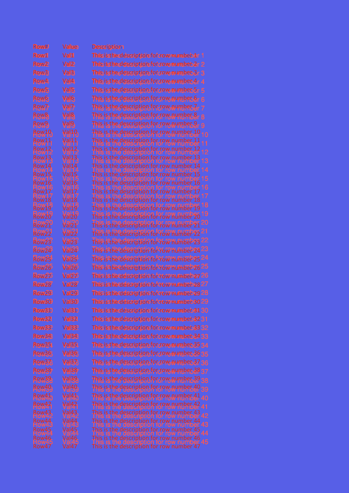</td>
  <td>changed: 217640 px (10.35%)<br>bbox: [116, 157, 740, 1492]<br>mean abs RGB: 16.3532<br>RMSE RGB: 57.2229<br>threshold: 12, gain: 5.0</td>
</tr>
<tr>
  <td><b>classic06_tall_table</b><br>Page 2</td>
  <td>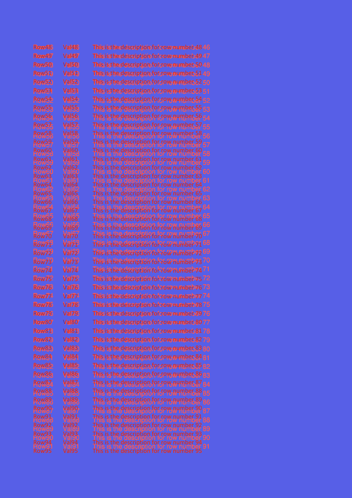</td>
  <td>changed: 226503 px (10.77%)<br>bbox: [116, 157, 740, 1492]<br>mean abs RGB: 16.9507<br>RMSE RGB: 58.1933<br>threshold: 12, gain: 5.0</td>
</tr>
<tr>
  <td><b>classic06_tall_table</b><br>Page 3</td>
  <td>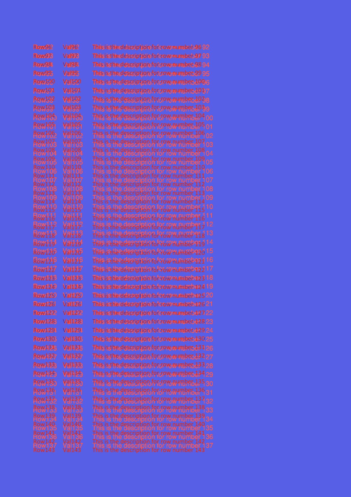</td>
  <td>changed: 234230 px (11.13%)<br>bbox: [116, 157, 753, 1492]<br>mean abs RGB: 17.5713<br>RMSE RGB: 59.2889<br>threshold: 12, gain: 5.0</td>
</tr>
<tr>
  <td><b>classic06_tall_table</b><br>Page 4</td>
  <td>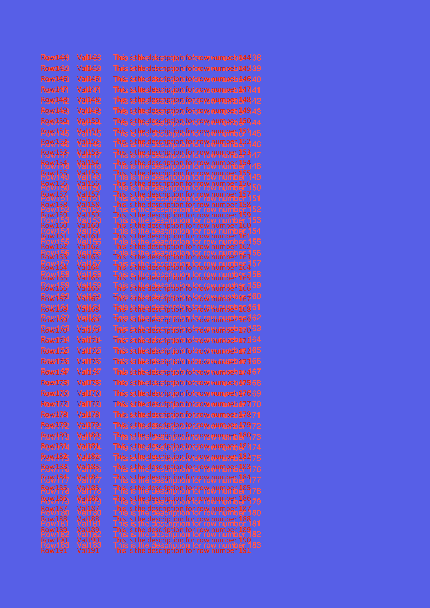</td>
  <td>changed: 238808 px (11.35%)<br>bbox: [116, 157, 753, 1492]<br>mean abs RGB: 17.9251<br>RMSE RGB: 59.9079<br>threshold: 12, gain: 5.0</td>
</tr>
<tr>
  <td><b>classic06_tall_table</b><br>Page 5</td>
  <td>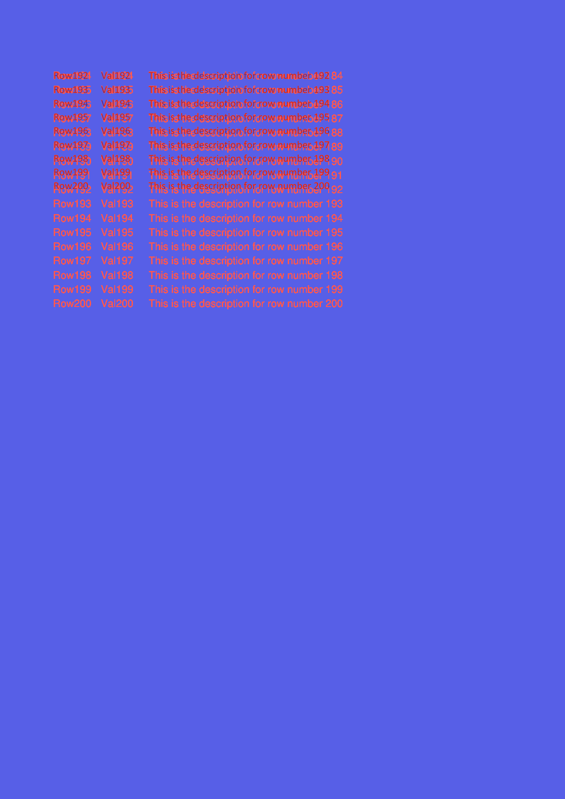</td>
  <td>changed: 161876 px (7.69%)<br>bbox: [116, 157, 753, 1054]<br>mean abs RGB: 12.1448<br>RMSE RGB: 49.3008<br>threshold: 12, gain: 5.0</td>
</tr>
<tr>
  <td><b>classic07_numbers_only</b><br>Page 1</td>
  <td></td>
  <td>changed: 2817 px (0.13%)<br>bbox: [183, 157, 416, 269]<br>mean abs RGB: 0.2183<br>RMSE RGB: 6.6724<br>threshold: 12, gain: 5.0</td>
</tr>
<tr>
  <td><b>classic08_mixed_text_and_numbers</b><br>Page 1</td>
  <td></td>
  <td>changed: 6646 px (0.32%)<br>bbox: [114, 157, 320, 331]<br>mean abs RGB: 0.4993<br>RMSE RGB: 9.9827<br>threshold: 12, gain: 5.0</td>
</tr>
<tr>
  <td><b>classic09_long_text</b><br>Page 1</td>
  <td></td>
  <td>changed: 36173 px (1.72%)<br>bbox: [115, 157, 1275, 299]<br>mean abs RGB: 2.7567<br>RMSE RGB: 23.6165<br>threshold: 12, gain: 5.0</td>
</tr>
<tr>
  <td><b>classic09_long_text</b><br>Page 2</td>
  <td></td>
  <td>changed: 0 px (0.00%)<br>bbox: None<br>mean abs RGB: 0.0<br>RMSE RGB: 0.0<br>threshold: 12, gain: 5.0</td>
</tr>
<tr>
  <td><b>classic09_long_text</b><br>Page 3</td>
  <td></td>
  <td>changed: 0 px (0.00%)<br>bbox: None<br>mean abs RGB: 0.0<br>RMSE RGB: 0.0<br>threshold: 12, gain: 5.0</td>
</tr>
<tr>
  <td><b>classic09_long_text</b><br>Page 4</td>
  <td></td>
  <td>changed: 0 px (0.00%)<br>bbox: None<br>mean abs RGB: 0.0<br>RMSE RGB: 0.0<br>threshold: 12, gain: 5.0</td>
</tr>
<tr>
  <td><b>classic09_long_text</b><br>Page 5</td>
  <td></td>
  <td>changed: 0 px (0.00%)<br>bbox: None<br>mean abs RGB: 0.0<br>RMSE RGB: 0.0<br>threshold: 12, gain: 5.0</td>
</tr>
<tr>
  <td><b>classic09_long_text</b><br>Page 6</td>
  <td></td>
  <td>changed: 0 px (0.00%)<br>bbox: None<br>mean abs RGB: 0.0<br>RMSE RGB: 0.0<br>threshold: 12, gain: 5.0</td>
</tr>
<tr>
  <td><b>classic09_long_text</b><br>Page 7</td>
  <td></td>
  <td>changed: 0 px (0.00%)<br>bbox: None<br>mean abs RGB: 0.0<br>RMSE RGB: 0.0<br>threshold: 12, gain: 5.0</td>
</tr>
<tr>
  <td><b>classic09_long_text</b><br>Page 8</td>
  <td></td>
  <td>changed: 0 px (0.00%)<br>bbox: None<br>mean abs RGB: 0.0<br>RMSE RGB: 0.0<br>threshold: 12, gain: 5.0</td>
</tr>
<tr>
  <td><b>classic09_long_text</b><br>Page 9</td>
  <td></td>
  <td>changed: 0 px (0.00%)<br>bbox: None<br>mean abs RGB: 0.0<br>RMSE RGB: 0.0<br>threshold: 12, gain: 5.0</td>
</tr>
<tr>
  <td><b>classic09_long_text</b><br>Page 10</td>
  <td></td>
  <td>changed: 0 px (0.00%)<br>bbox: None<br>mean abs RGB: 0.0<br>RMSE RGB: 0.0<br>threshold: 12, gain: 5.0</td>
</tr>
<tr>
  <td><b>classic09_long_text</b><br>Page 11</td>
  <td></td>
  <td>changed: 0 px (0.00%)<br>bbox: None<br>mean abs RGB: 0.0<br>RMSE RGB: 0.0<br>threshold: 12, gain: 5.0</td>
</tr>
<tr>
  <td><b>classic09_long_text</b><br>Page 12</td>
  <td></td>
  <td>changed: 0 px (0.00%)<br>bbox: None<br>mean abs RGB: 0.0<br>RMSE RGB: 0.0<br>threshold: 12, gain: 5.0</td>
</tr>
<tr>
  <td><b>classic10_special_xml_characters</b><br>Page 1</td>
  <td></td>
  <td>changed: 10463 px (0.50%)<br>bbox: [114, 157, 477, 367]<br>mean abs RGB: 0.762<br>RMSE RGB: 12.2459<br>threshold: 12, gain: 5.0</td>
</tr>
<tr>
  <td><b>classic11_sparse_rows</b><br>Page 1</td>
  <td></td>
  <td>changed: 2390 px (0.11%)<br>bbox: [114, 157, 215, 769]<br>mean abs RGB: 0.1642<br>RMSE RGB: 5.5629<br>threshold: 12, gain: 5.0</td>
</tr>
<tr>
  <td><b>classic11_sparse_rows</b><br>Page 2</td>
  <td></td>
  <td>changed: 1017 px (0.05%)<br>bbox: [116, 313, 184, 362]<br>mean abs RGB: 0.0822<br>RMSE RGB: 4.1294<br>threshold: 12, gain: 5.0</td>
</tr>
<tr>
  <td><b>classic12_sparse_columns</b><br>Page 1</td>
  <td></td>
  <td>changed: 4212 px (0.20%)<br>bbox: [116, 157, 1129, 242]<br>mean abs RGB: 0.3171<br>RMSE RGB: 7.9913<br>threshold: 12, gain: 5.0</td>
</tr>
<tr>
  <td><b>classic13_date_strings</b><br>Page 1</td>
  <td></td>
  <td>changed: 11608 px (0.55%)<br>bbox: [115, 157, 353, 335]<br>mean abs RGB: 0.8857<br>RMSE RGB: 13.4306<br>threshold: 12, gain: 5.0</td>
</tr>
<tr>
  <td><b>classic14_decimal_numbers</b><br>Page 1</td>
  <td></td>
  <td>changed: 7755 px (0.37%)<br>bbox: [115, 157, 320, 335]<br>mean abs RGB: 0.5726<br>RMSE RGB: 10.6752<br>threshold: 12, gain: 5.0</td>
</tr>
<tr>
  <td><b>classic15_negative_numbers</b><br>Page 1</td>
  <td></td>
  <td>changed: 8932 px (0.42%)<br>bbox: [114, 157, 362, 367]<br>mean abs RGB: 0.677<br>RMSE RGB: 11.7027<br>threshold: 12, gain: 5.0</td>
</tr>
<tr>
  <td><b>classic16_percentage_strings</b><br>Page 1</td>
  <td></td>
  <td>changed: 9306 px (0.44%)<br>bbox: [115, 157, 330, 331]<br>mean abs RGB: 0.6873<br>RMSE RGB: 11.6897<br>threshold: 12, gain: 5.0</td>
</tr>
<tr>
  <td><b>classic17_currency_strings</b><br>Page 1</td>
  <td></td>
  <td>changed: 12012 px (0.57%)<br>bbox: [115, 157, 343, 363]<br>mean abs RGB: 0.9016<br>RMSE RGB: 13.4501<br>threshold: 12, gain: 5.0</td>
</tr>
<tr>
  <td><b>classic18_large_dataset</b><br>Page 1</td>
  <td></td>
  <td>changed: 379700 px (18.54%)<br>bbox: [112, 146, 1034, 1502]<br>mean abs RGB: 29.2724<br>RMSE RGB: 76.5234<br>threshold: 12, gain: 5.0</td>
</tr>
<tr>
  <td><b>classic18_large_dataset</b><br>Page 2</td>
  <td></td>
  <td>changed: 406742 px (19.86%)<br>bbox: [113, 146, 1034, 1502]<br>mean abs RGB: 31.2965<br>RMSE RGB: 79.0366<br>threshold: 12, gain: 5.0</td>
</tr>
<tr>
  <td><b>classic18_large_dataset</b><br>Page 3</td>
  <td>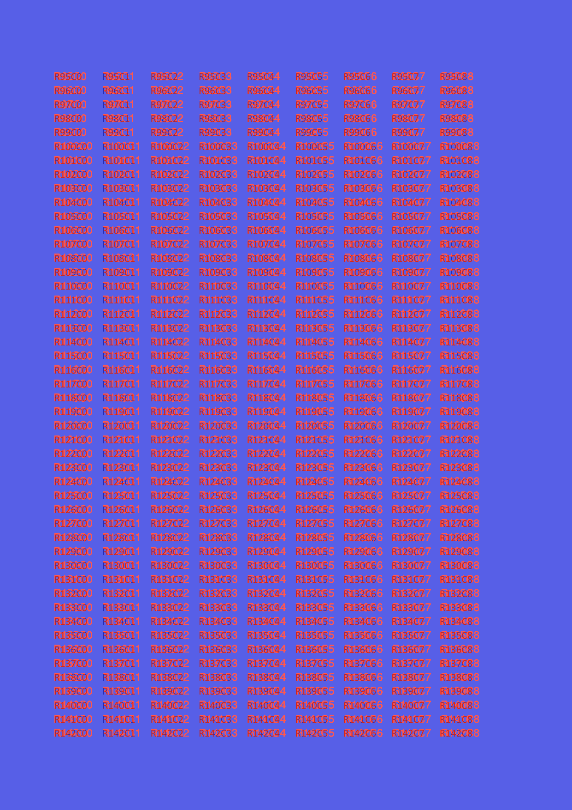</td>
  <td>changed: 433079 px (21.15%)<br>bbox: [113, 146, 1045, 1502]<br>mean abs RGB: 33.3592<br>RMSE RGB: 81.7152<br>threshold: 12, gain: 5.0</td>
</tr>
<tr>
  <td><b>classic18_large_dataset</b><br>Page 4</td>
  <td>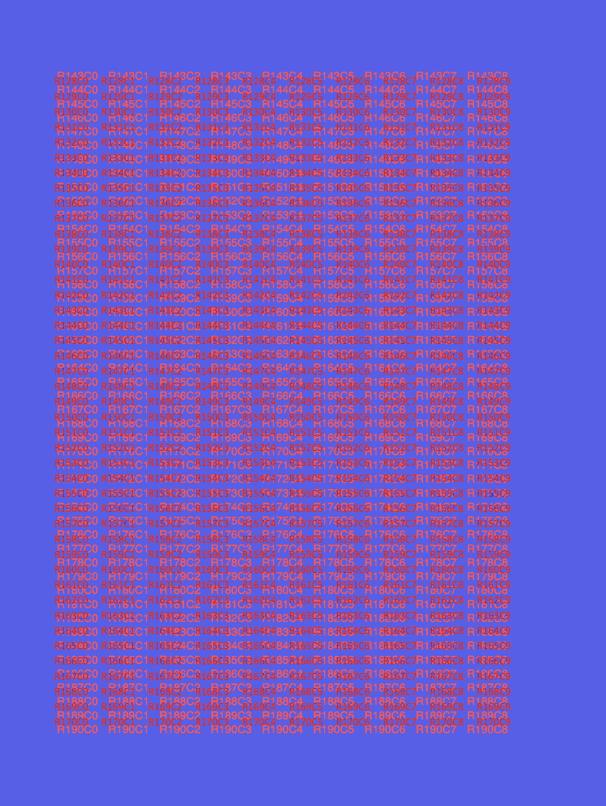</td>
  <td>changed: 446248 px (21.79%)<br>bbox: [113, 146, 1045, 1502]<br>mean abs RGB: 34.2668<br>RMSE RGB: 82.738<br>threshold: 12, gain: 5.0</td>
</tr>
<tr>
  <td><b>classic18_large_dataset</b><br>Page 5</td>
  <td>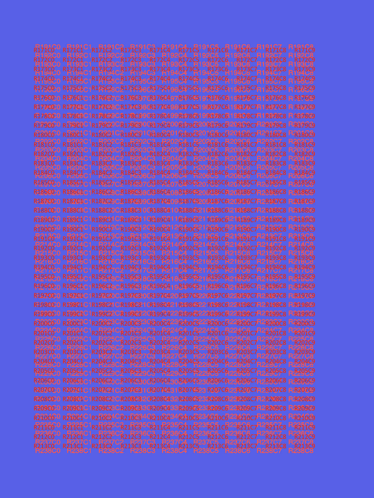</td>
  <td>changed: 460158 px (22.47%)<br>bbox: [113, 146, 1045, 1502]<br>mean abs RGB: 35.2851<br>RMSE RGB: 83.8274<br>threshold: 12, gain: 5.0</td>
</tr>
<tr>
  <td><b>classic18_large_dataset</b><br>Page 6</td>
  <td></td>
  <td>changed: 465501 px (22.73%)<br>bbox: [113, 146, 1045, 1502]<br>mean abs RGB: 35.7987<br>RMSE RGB: 84.4658<br>threshold: 12, gain: 5.0</td>
</tr>
<tr>
  <td><b>classic18_large_dataset</b><br>Page 7</td>
  <td>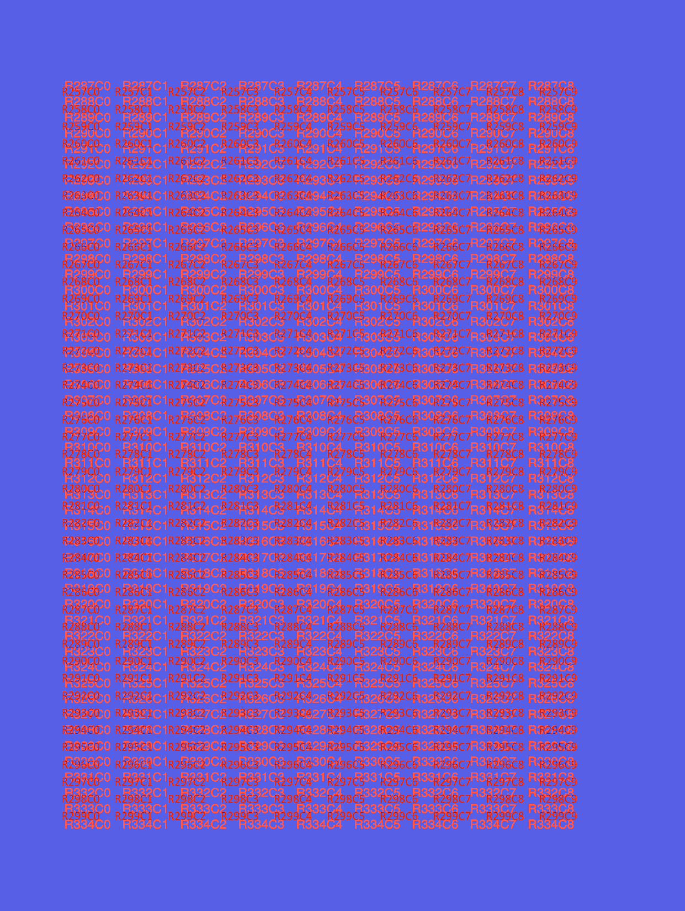</td>
  <td>changed: 468590 px (22.88%)<br>bbox: [113, 146, 1045, 1502]<br>mean abs RGB: 35.9659<br>RMSE RGB: 84.6233<br>threshold: 12, gain: 5.0</td>
</tr>
<tr>
  <td><b>classic18_large_dataset</b><br>Page 8</td>
  <td></td>
  <td>changed: 468900 px (22.90%)<br>bbox: [113, 146, 1045, 1502]<br>mean abs RGB: 35.7816<br>RMSE RGB: 84.307<br>threshold: 12, gain: 5.0</td>
</tr>
<tr>
  <td><b>classic18_large_dataset</b><br>Page 9</td>
  <td>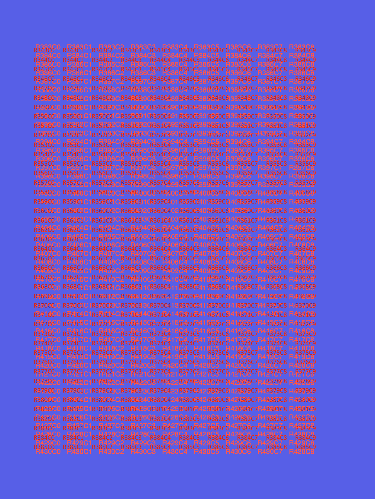</td>
  <td>changed: 467319 px (22.82%)<br>bbox: [113, 146, 1045, 1502]<br>mean abs RGB: 35.7701<br>RMSE RGB: 84.3055<br>threshold: 12, gain: 5.0</td>
</tr>
<tr>
  <td><b>classic18_large_dataset</b><br>Page 10</td>
  <td>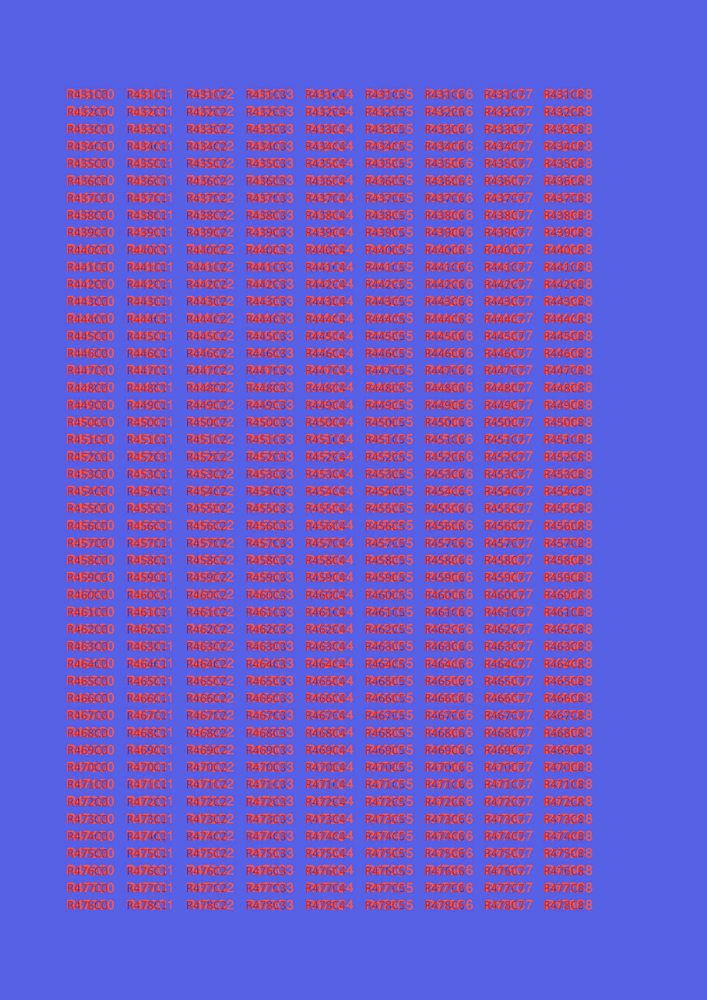</td>
  <td>changed: 465361 px (22.73%)<br>bbox: [113, 146, 1045, 1502]<br>mean abs RGB: 35.8235<br>RMSE RGB: 84.4358<br>threshold: 12, gain: 5.0</td>
</tr>
<tr>
  <td><b>classic18_large_dataset</b><br>Page 11</td>
  <td></td>
  <td>changed: 468427 px (22.88%)<br>bbox: [113, 146, 1045, 1502]<br>mean abs RGB: 35.91<br>RMSE RGB: 84.4343<br>threshold: 12, gain: 5.0</td>
</tr>
<tr>
  <td><b>classic18_large_dataset</b><br>Page 12</td>
  <td>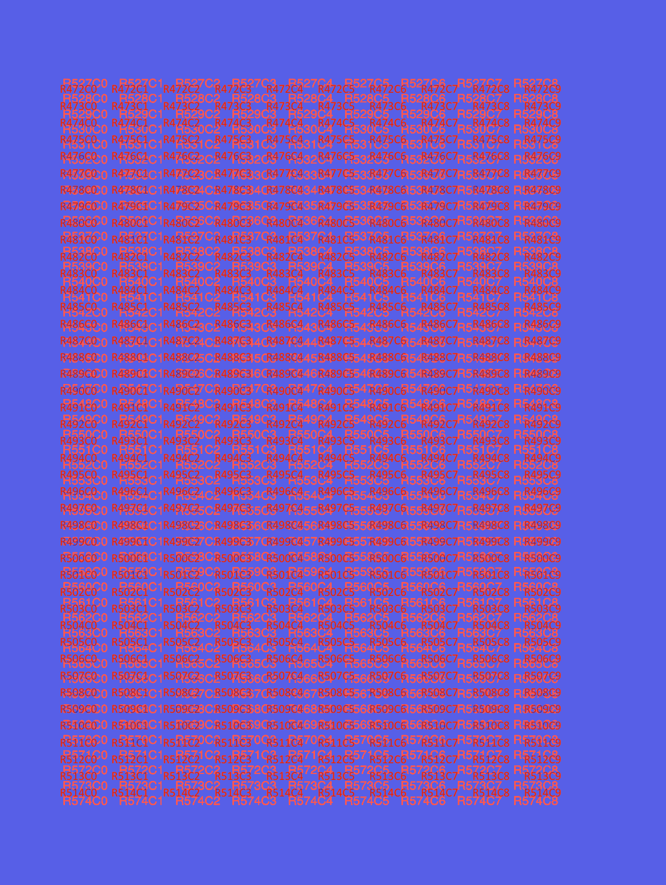</td>
  <td>changed: 474254 px (23.16%)<br>bbox: [113, 146, 1045, 1502]<br>mean abs RGB: 36.2541<br>RMSE RGB: 84.8215<br>threshold: 12, gain: 5.0</td>
</tr>
<tr>
  <td><b>classic18_large_dataset</b><br>Page 13</td>
  <td>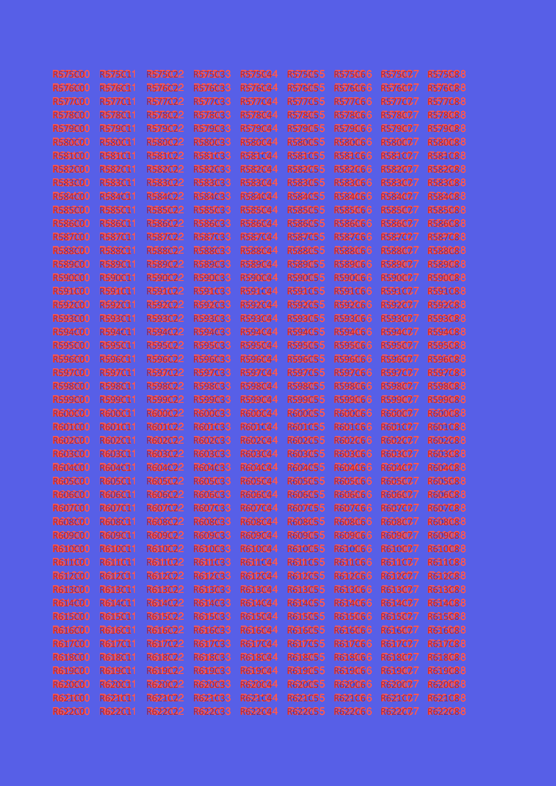</td>
  <td>changed: 470504 px (22.98%)<br>bbox: [113, 146, 1045, 1502]<br>mean abs RGB: 36.0324<br>RMSE RGB: 84.6392<br>threshold: 12, gain: 5.0</td>
</tr>
<tr>
  <td><b>classic18_large_dataset</b><br>Page 14</td>
  <td>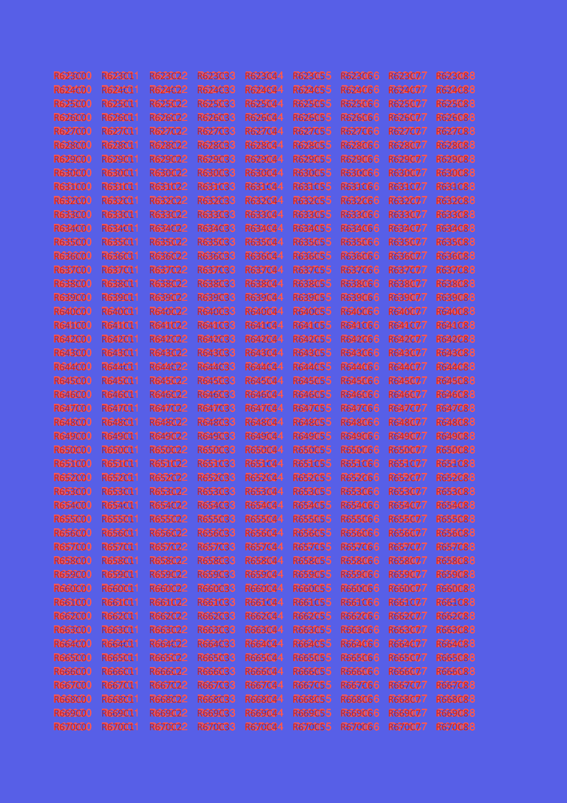</td>
  <td>changed: 478900 px (23.39%)<br>bbox: [113, 146, 1045, 1502]<br>mean abs RGB: 36.6096<br>RMSE RGB: 85.3009<br>threshold: 12, gain: 5.0</td>
</tr>
<tr>
  <td><b>classic18_large_dataset</b><br>Page 15</td>
  <td></td>
  <td>changed: 467720 px (22.84%)<br>bbox: [113, 146, 1045, 1502]<br>mean abs RGB: 35.8971<br>RMSE RGB: 84.5522<br>threshold: 12, gain: 5.0</td>
</tr>
<tr>
  <td><b>classic18_large_dataset</b><br>Page 16</td>
  <td>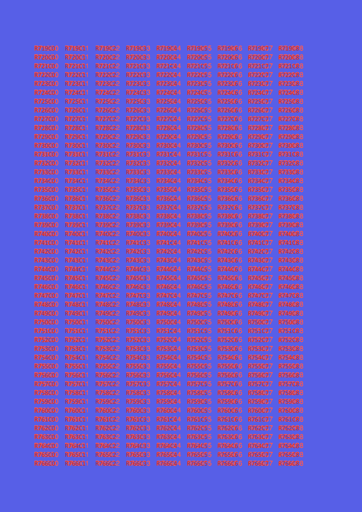</td>
  <td>changed: 464076 px (22.66%)<br>bbox: [113, 146, 1045, 1502]<br>mean abs RGB: 35.524<br>RMSE RGB: 84.0378<br>threshold: 12, gain: 5.0</td>
</tr>
<tr>
  <td><b>classic18_large_dataset</b><br>Page 17</td>
  <td>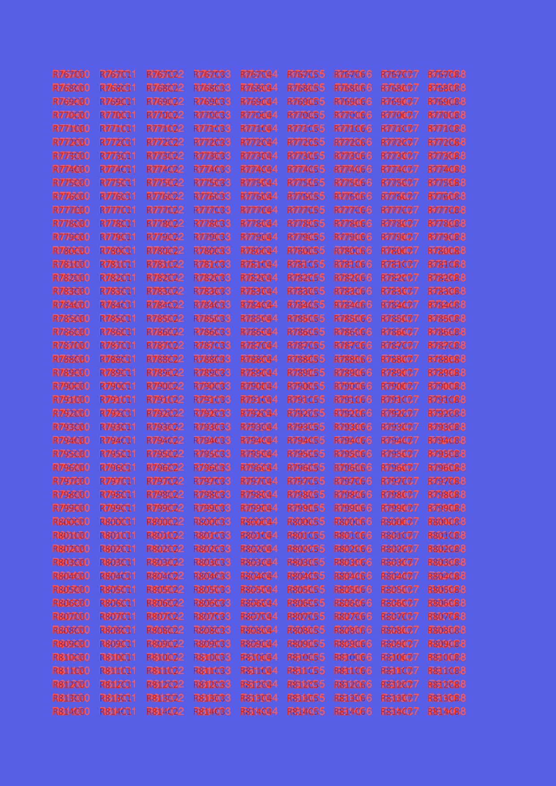</td>
  <td>changed: 461150 px (22.52%)<br>bbox: [113, 146, 1045, 1502]<br>mean abs RGB: 35.3784<br>RMSE RGB: 83.9175<br>threshold: 12, gain: 5.0</td>
</tr>
<tr>
  <td><b>classic18_large_dataset</b><br>Page 18</td>
  <td>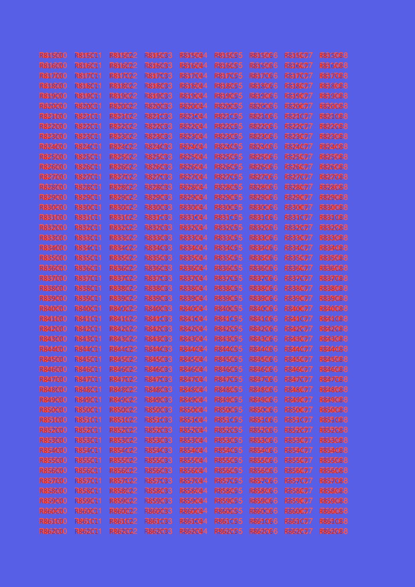</td>
  <td>changed: 469290 px (22.92%)<br>bbox: [113, 146, 1045, 1502]<br>mean abs RGB: 35.8733<br>RMSE RGB: 84.4196<br>threshold: 12, gain: 5.0</td>
</tr>
<tr>
  <td><b>classic18_large_dataset</b><br>Page 19</td>
  <td>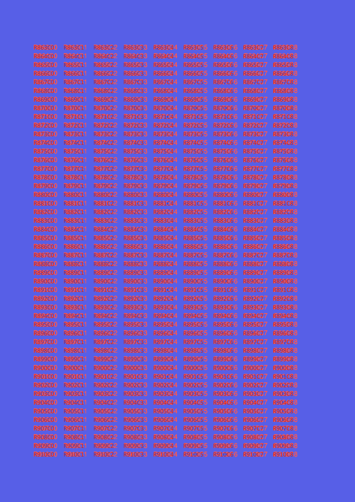</td>
  <td>changed: 478769 px (23.38%)<br>bbox: [113, 146, 1045, 1502]<br>mean abs RGB: 36.7058<br>RMSE RGB: 85.4697<br>threshold: 12, gain: 5.0</td>
</tr>
<tr>
  <td><b>classic18_large_dataset</b><br>Page 20</td>
  <td>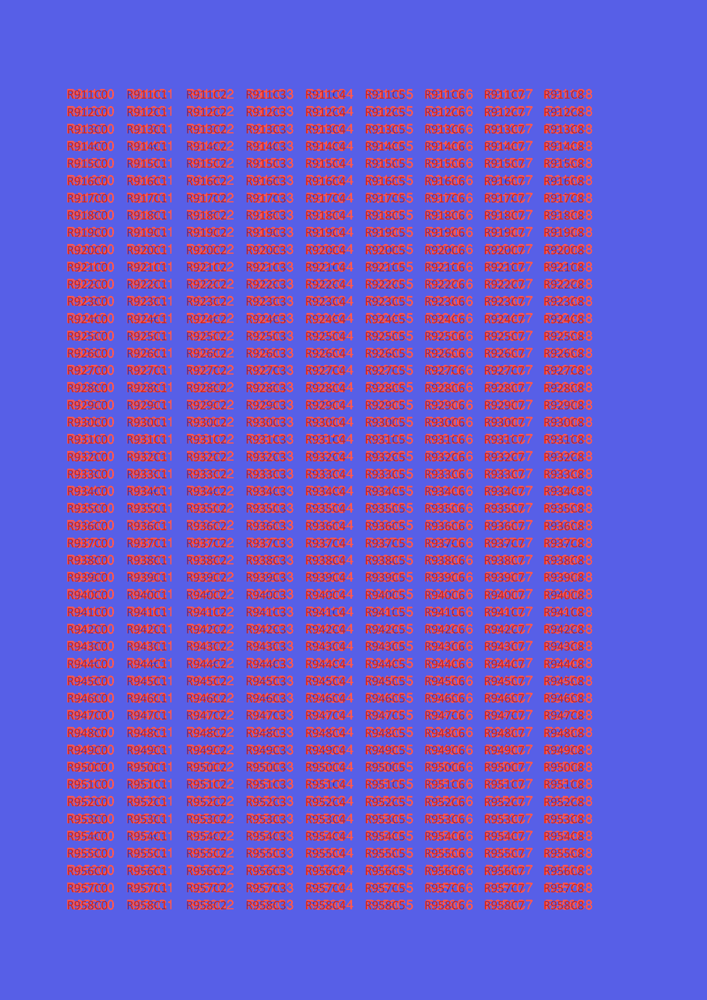</td>
  <td>changed: 477334 px (23.31%)<br>bbox: [113, 146, 1045, 1502]<br>mean abs RGB: 36.713<br>RMSE RGB: 85.5021<br>threshold: 12, gain: 5.0</td>
</tr>
<tr>
  <td><b>classic18_large_dataset</b><br>Page 21</td>
  <td>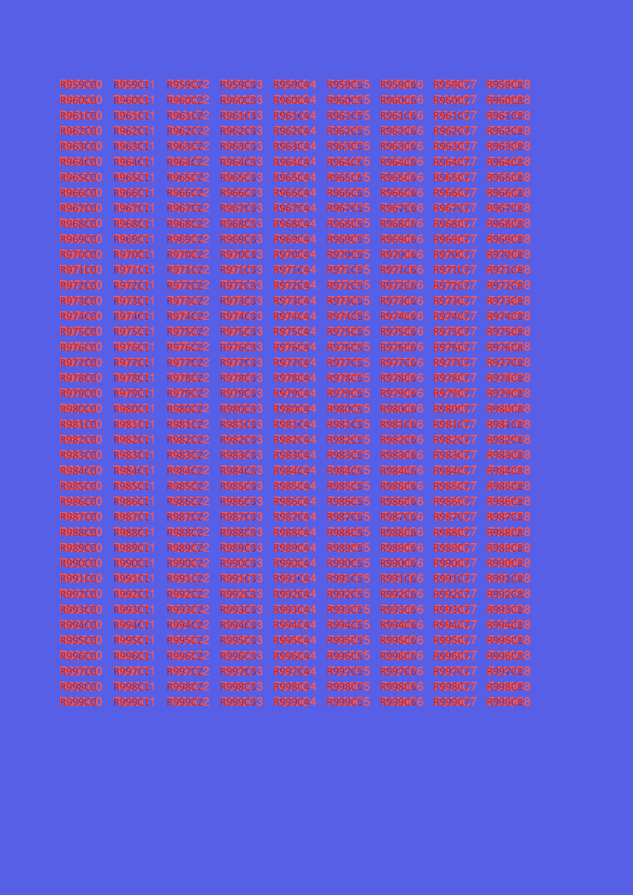</td>
  <td>changed: 450245 px (21.99%)<br>bbox: [113, 146, 1045, 1486]<br>mean abs RGB: 34.5602<br>RMSE RGB: 82.9489<br>threshold: 12, gain: 5.0</td>
</tr>
<tr>
  <td><b>classic18_large_dataset</b><br>Page 22</td>
  <td></td>
  <td>changed: 255673 px (12.49%)<br>bbox: [113, 146, 1045, 1502]<br>mean abs RGB: 19.6592<br>RMSE RGB: 62.613<br>threshold: 12, gain: 5.0</td>
</tr>
<tr>
  <td><b>classic18_large_dataset</b><br>Page 23</td>
  <td>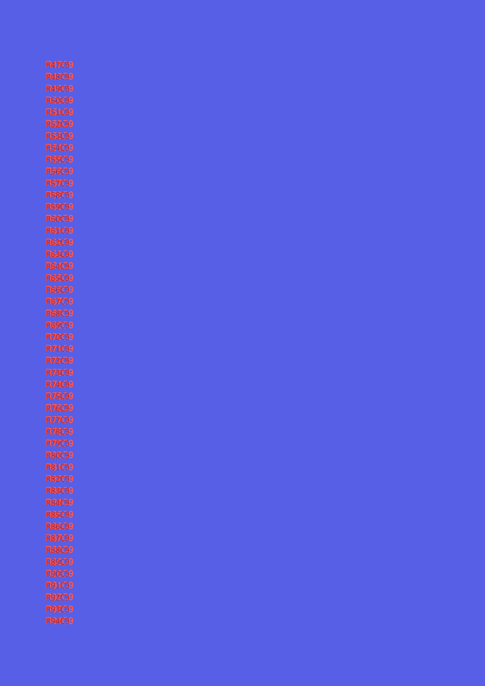</td>
  <td>changed: 260092 px (12.70%)<br>bbox: [113, 146, 1045, 1502]<br>mean abs RGB: 19.9451<br>RMSE RGB: 63.0117<br>threshold: 12, gain: 5.0</td>
</tr>
<tr>
  <td><b>classic18_large_dataset</b><br>Page 24</td>
  <td>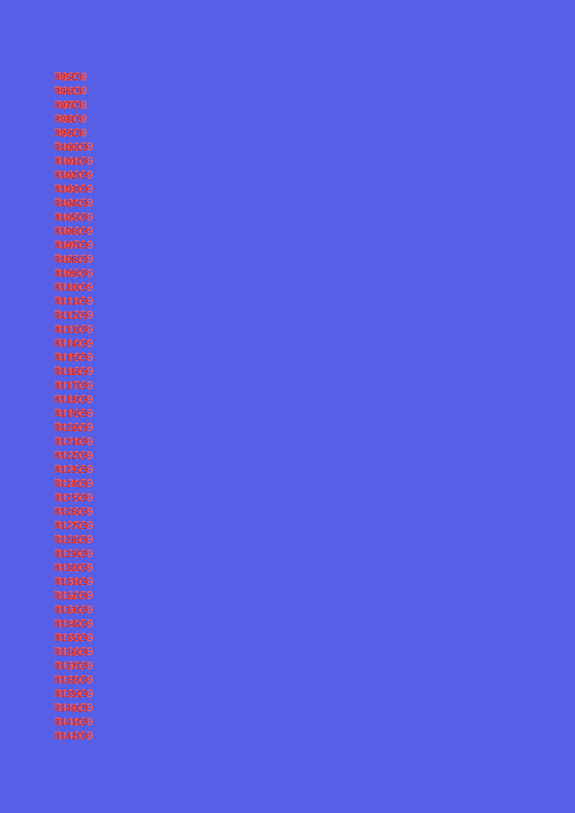</td>
  <td>changed: 97429 px (4.76%)<br>bbox: [113, 146, 1045, 1502]<br>mean abs RGB: 7.5767<br>RMSE RGB: 39.0446<br>threshold: 12, gain: 5.0</td>
</tr>
<tr>
  <td><b>classic19_single_column_list</b><br>Page 1</td>
  <td></td>
  <td>changed: 14862 px (0.71%)<br>bbox: [116, 157, 193, 800]<br>mean abs RGB: 1.1465<br>RMSE RGB: 15.249<br>threshold: 12, gain: 5.0</td>
</tr>
<tr>
  <td><b>classic20_all_empty_cells</b><br>Page 1</td>
  <td></td>
  <td>changed: 0 px (0.00%)<br>bbox: None<br>mean abs RGB: 0.0<br>RMSE RGB: 0.0<br>threshold: 12, gain: 5.0</td>
</tr>
<tr>
  <td><b>classic21_header_only</b><br>Page 1</td>
  <td></td>
  <td>changed: 2764 px (0.13%)<br>bbox: [115, 157, 583, 175]<br>mean abs RGB: 0.214<br>RMSE RGB: 6.6293<br>threshold: 12, gain: 5.0</td>
</tr>
<tr>
  <td><b>classic22_long_sheet_name</b><br>Page 1</td>
  <td></td>
  <td>changed: 3055 px (0.15%)<br>bbox: [116, 157, 311, 238]<br>mean abs RGB: 0.231<br>RMSE RGB: 6.8117<br>threshold: 12, gain: 5.0</td>
</tr>
<tr>
  <td><b>classic23_unicode_text</b><br>Page 1</td>
  <td></td>
  <td>changed: 18023 px (0.86%)<br>bbox: [114, 157, 426, 367]<br>mean abs RGB: 1.3664<br>RMSE RGB: 16.6068<br>threshold: 12, gain: 5.0</td>
</tr>
<tr>
  <td><b>classic24_red_text</b><br>Page 1</td>
  <td></td>
  <td>changed: 9964 px (0.47%)<br>bbox: [114, 157, 456, 273]<br>mean abs RGB: 0.547<br>RMSE RGB: 10.2213<br>threshold: 12, gain: 5.0</td>
</tr>
<tr>
  <td><b>classic25_multiple_colors</b><br>Page 1</td>
  <td></td>
  <td>changed: 22688 px (1.08%)<br>bbox: [114, 157, 457, 429]<br>mean abs RGB: 0.9342<br>RMSE RGB: 13.3126<br>threshold: 12, gain: 5.0</td>
</tr>
<tr>
  <td><b>classic26_inline_strings</b><br>Page 1</td>
  <td></td>
  <td>changed: 6458 px (0.31%)<br>bbox: [114, 157, 401, 238]<br>mean abs RGB: 0.4825<br>RMSE RGB: 9.8302<br>threshold: 12, gain: 5.0</td>
</tr>
<tr>
  <td><b>classic27_single_row</b><br>Page 1</td>
  <td></td>
  <td>changed: 3282 px (0.16%)<br>bbox: [116, 157, 781, 175]<br>mean abs RGB: 0.2622<br>RMSE RGB: 7.368<br>threshold: 12, gain: 5.0</td>
</tr>
<tr>
  <td><b>classic28_duplicate_values</b><br>Page 1</td>
  <td></td>
  <td>changed: 7974 px (0.38%)<br>bbox: [115, 157, 470, 300]<br>mean abs RGB: 0.6166<br>RMSE RGB: 11.2034<br>threshold: 12, gain: 5.0</td>
</tr>
<tr>
  <td><b>classic29_formula_results</b><br>Page 1</td>
  <td></td>
  <td>changed: 7700 px (0.37%)<br>bbox: [115, 157, 521, 300]<br>mean abs RGB: 0.589<br>RMSE RGB: 10.9353<br>threshold: 12, gain: 5.0</td>
</tr>
<tr>
  <td><b>classic30_mixed_empty_and_filled_sheets</b><br>Page 1</td>
  <td></td>
  <td>changed: 2858 px (0.14%)<br>bbox: [116, 157, 281, 239]<br>mean abs RGB: 0.2133<br>RMSE RGB: 6.5373<br>threshold: 12, gain: 5.0</td>
</tr>
<tr>
  <td><b>classic30_mixed_empty_and_filled_sheets</b><br>Page 2</td>
  <td></td>
  <td>changed: 3059 px (0.15%)<br>bbox: [115, 157, 418, 206]<br>mean abs RGB: 0.2293<br>RMSE RGB: 6.788<br>threshold: 12, gain: 5.0</td>
</tr>
<tr>
  <td><b>classic31_bold_header_row</b><br>Page 1</td>
  <td></td>
  <td>changed: 14890 px (0.71%)<br>bbox: [115, 157, 563, 300]<br>mean abs RGB: 1.1358<br>RMSE RGB: 15.2461<br>threshold: 12, gain: 5.0</td>
</tr>
<tr>
  <td><b>classic32_right_aligned_numbers</b><br>Page 1</td>
  <td></td>
  <td>changed: 6133 px (0.29%)<br>bbox: [116, 157, 320, 269]<br>mean abs RGB: 0.4387<br>RMSE RGB: 9.2551<br>threshold: 12, gain: 5.0</td>
</tr>
<tr>
  <td><b>classic33_centered_text</b><br>Page 1</td>
  <td></td>
  <td>changed: 4665 px (0.22%)<br>bbox: [116, 157, 594, 238]<br>mean abs RGB: 0.365<br>RMSE RGB: 8.6642<br>threshold: 12, gain: 5.0</td>
</tr>
<tr>
  <td><b>classic34_explicit_column_widths</b><br>Page 1</td>
  <td></td>
  <td>changed: 10063 px (0.48%)<br>bbox: [116, 157, 653, 273]<br>mean abs RGB: 0.7422<br>RMSE RGB: 12.1285<br>threshold: 12, gain: 5.0</td>
</tr>
<tr>
  <td><b>classic35_explicit_row_heights</b><br>Page 1</td>
  <td></td>
  <td>changed: 5088 px (0.24%)<br>bbox: [114, 188, 385, 342]<br>mean abs RGB: 0.391<br>RMSE RGB: 8.9291<br>threshold: 12, gain: 5.0</td>
</tr>
<tr>
  <td><b>classic36_merged_cells</b><br>Page 1</td>
  <td></td>
  <td>changed: 11362 px (0.54%)<br>bbox: [115, 157, 712, 269]<br>mean abs RGB: 0.8875<br>RMSE RGB: 13.5225<br>threshold: 12, gain: 5.0</td>
</tr>
<tr>
  <td><b>classic37_freeze_panes</b><br>Page 1</td>
  <td>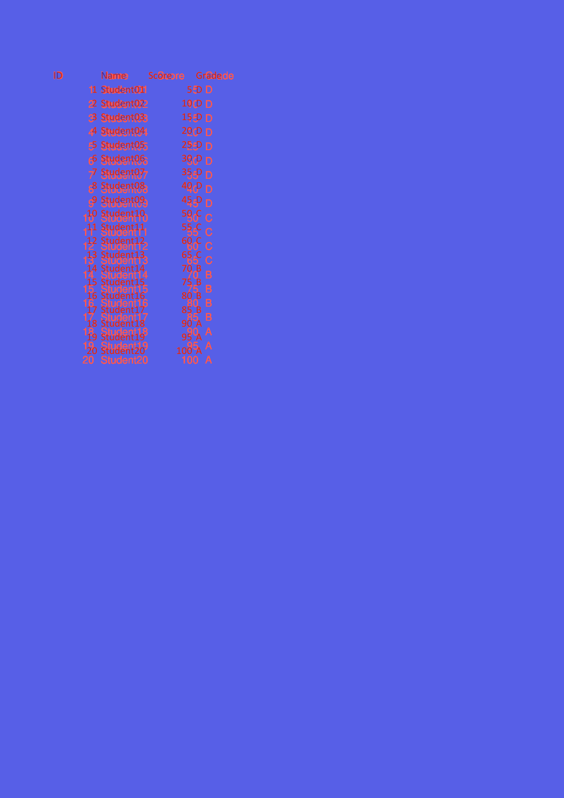</td>
  <td>changed: 40635 px (1.93%)<br>bbox: [116, 157, 514, 800]<br>mean abs RGB: 3.0127<br>RMSE RGB: 24.5597<br>threshold: 12, gain: 5.0</td>
</tr>
<tr>
  <td><b>classic38_hyperlink_cell</b><br>Page 1</td>
  <td></td>
  <td>changed: 8268 px (0.39%)<br>bbox: [114, 157, 496, 243]<br>mean abs RGB: 0.5918<br>RMSE RGB: 10.8109<br>threshold: 12, gain: 5.0</td>
</tr>
<tr>
  <td><b>classic39_financial_table</b><br>Page 1</td>
  <td></td>
  <td>changed: 17077 px (0.81%)<br>bbox: [114, 157, 530, 363]<br>mean abs RGB: 1.2009<br>RMSE RGB: 15.4417<br>threshold: 12, gain: 5.0</td>
</tr>
<tr>
  <td><b>classic40_scientific_notation</b><br>Page 1</td>
  <td></td>
  <td>changed: 13763 px (0.65%)<br>bbox: [115, 157, 427, 335]<br>mean abs RGB: 1.0714<br>RMSE RGB: 14.8249<br>threshold: 12, gain: 5.0</td>
</tr>
<tr>
  <td><b>classic41_integer_vs_float</b><br>Page 1</td>
  <td></td>
  <td>changed: 11144 px (0.53%)<br>bbox: [114, 157, 340, 425]<br>mean abs RGB: 0.8373<br>RMSE RGB: 12.9603<br>threshold: 12, gain: 5.0</td>
</tr>
<tr>
  <td><b>classic42_boolean_values</b><br>Page 1</td>
  <td></td>
  <td>changed: 11943 px (0.57%)<br>bbox: [115, 157, 368, 331]<br>mean abs RGB: 0.9213<br>RMSE RGB: 13.69<br>threshold: 12, gain: 5.0</td>
</tr>
<tr>
  <td><b>classic43_inventory_report</b><br>Page 1</td>
  <td></td>
  <td>changed: 38336 px (1.82%)<br>bbox: [115, 157, 821, 395]<br>mean abs RGB: 2.954<br>RMSE RGB: 24.6371<br>threshold: 12, gain: 5.0</td>
</tr>
<tr>
  <td><b>classic44_employee_roster</b><br>Page 1</td>
  <td></td>
  <td>changed: 59261 px (2.82%)<br>bbox: [116, 157, 1046, 429]<br>mean abs RGB: 4.5174<br>RMSE RGB: 30.2389<br>threshold: 12, gain: 5.0</td>
</tr>
<tr>
  <td><b>classic45_sales_by_region</b><br>Page 1</td>
  <td></td>
  <td>changed: 5544 px (0.26%)<br>bbox: [115, 157, 311, 301]<br>mean abs RGB: 0.4061<br>RMSE RGB: 8.987<br>threshold: 12, gain: 5.0</td>
</tr>
<tr>
  <td><b>classic45_sales_by_region</b><br>Page 2</td>
  <td></td>
  <td>changed: 5512 px (0.26%)<br>bbox: [115, 157, 311, 301]<br>mean abs RGB: 0.398<br>RMSE RGB: 8.8708<br>threshold: 12, gain: 5.0</td>
</tr>
<tr>
  <td><b>classic45_sales_by_region</b><br>Page 3</td>
  <td></td>
  <td>changed: 5763 px (0.27%)<br>bbox: [115, 157, 311, 301]<br>mean abs RGB: 0.417<br>RMSE RGB: 9.072<br>threshold: 12, gain: 5.0</td>
</tr>
<tr>
  <td><b>classic45_sales_by_region</b><br>Page 4</td>
  <td></td>
  <td>changed: 5596 px (0.27%)<br>bbox: [115, 157, 311, 301]<br>mean abs RGB: 0.4057<br>RMSE RGB: 8.9542<br>threshold: 12, gain: 5.0</td>
</tr>
<tr>
  <td><b>classic46_grade_book</b><br>Page 1</td>
  <td></td>
  <td>changed: 23226 px (1.10%)<br>bbox: [115, 157, 804, 394]<br>mean abs RGB: 1.7458<br>RMSE RGB: 18.7487<br>threshold: 12, gain: 5.0</td>
</tr>
<tr>
  <td><b>classic47_time_series</b><br>Page 1</td>
  <td>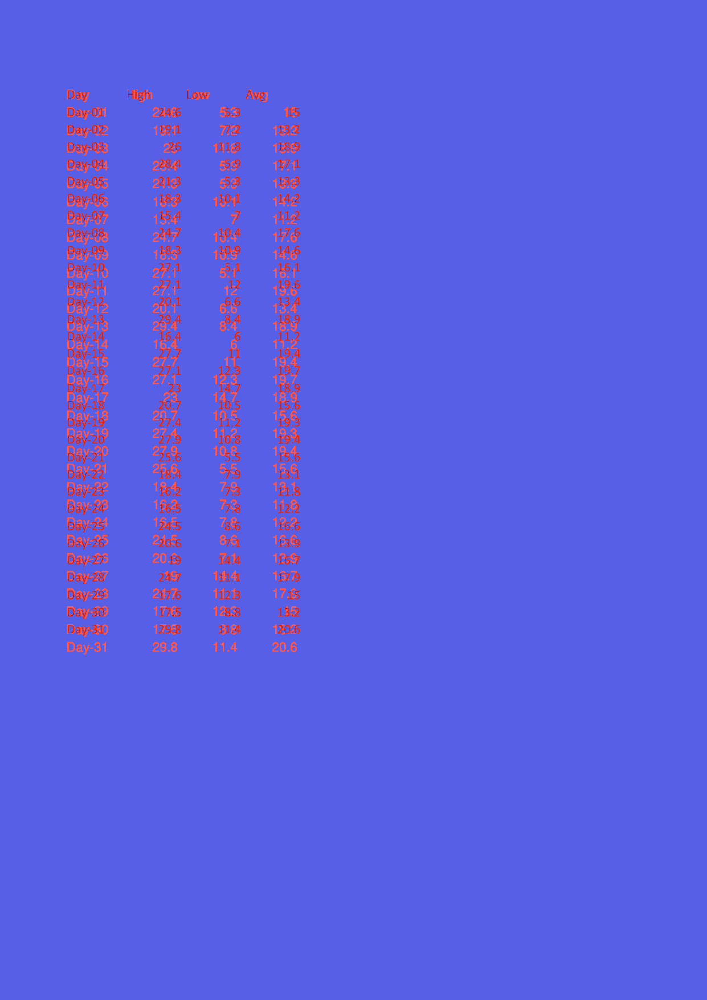</td>
  <td>changed: 62698 px (2.98%)<br>bbox: [116, 157, 522, 1148]<br>mean abs RGB: 4.7373<br>RMSE RGB: 30.896<br>threshold: 12, gain: 5.0</td>
</tr>
<tr>
  <td><b>classic48_survey_results</b><br>Page 1</td>
  <td></td>
  <td>changed: 19276 px (0.92%)<br>bbox: [115, 157, 908, 331]<br>mean abs RGB: 1.4482<br>RMSE RGB: 17.0643<br>threshold: 12, gain: 5.0</td>
</tr>
<tr>
  <td><b>classic49_contact_list</b><br>Page 1</td>
  <td></td>
  <td>changed: 45672 px (2.17%)<br>bbox: [115, 157, 904, 398]<br>mean abs RGB: 3.4735<br>RMSE RGB: 26.5058<br>threshold: 12, gain: 5.0</td>
</tr>
<tr>
  <td><b>classic50_budget_vs_actuals</b><br>Page 1</td>
  <td></td>
  <td>changed: 28797 px (1.37%)<br>bbox: [115, 157, 731, 331]<br>mean abs RGB: 2.1393<br>RMSE RGB: 20.6507<br>threshold: 12, gain: 5.0</td>
</tr>
<tr>
  <td><b>classic50_budget_vs_actuals</b><br>Page 2</td>
  <td></td>
  <td>changed: 28511 px (1.36%)<br>bbox: [115, 157, 731, 331]<br>mean abs RGB: 2.1201<br>RMSE RGB: 20.5707<br>threshold: 12, gain: 5.0</td>
</tr>
<tr>
  <td><b>classic50_budget_vs_actuals</b><br>Page 3</td>
  <td></td>
  <td>changed: 23426 px (1.11%)<br>bbox: [115, 157, 731, 331]<br>mean abs RGB: 1.7676<br>RMSE RGB: 18.8904<br>threshold: 12, gain: 5.0</td>
</tr>
<tr>
  <td><b>classic51_product_catalog</b><br>Page 1</td>
  <td></td>
  <td>changed: 59368 px (2.82%)<br>bbox: [116, 157, 1030, 492]<br>mean abs RGB: 4.5736<br>RMSE RGB: 30.5476<br>threshold: 12, gain: 5.0</td>
</tr>
<tr>
  <td><b>classic52_pivot_summary</b><br>Page 1</td>
  <td></td>
  <td>changed: 30637 px (1.46%)<br>bbox: [115, 157, 802, 331]<br>mean abs RGB: 2.3955<br>RMSE RGB: 22.2104<br>threshold: 12, gain: 5.0</td>
</tr>
<tr>
  <td><b>classic53_invoice</b><br>Page 1</td>
  <td>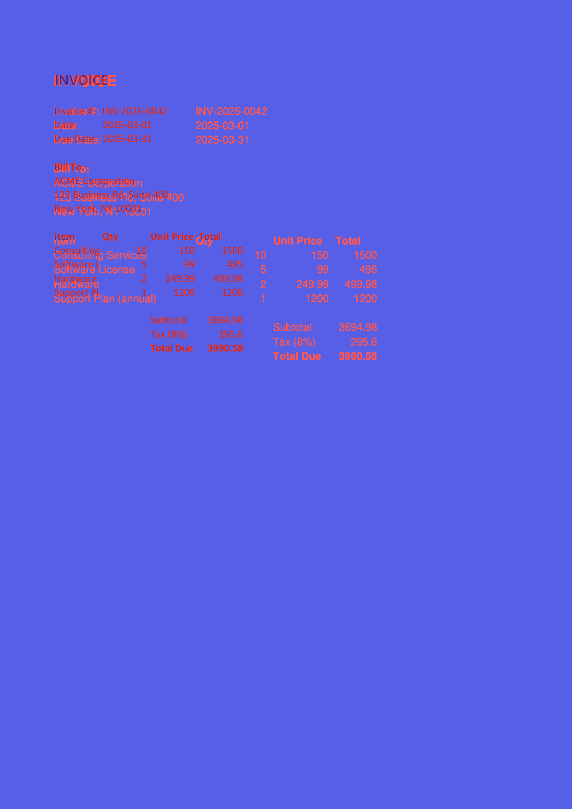</td>
  <td>changed: 43033 px (2.05%)<br>bbox: [115, 158, 818, 781]<br>mean abs RGB: 3.4637<br>RMSE RGB: 26.9775<br>threshold: 12, gain: 5.0</td>
</tr>
<tr>
  <td><b>classic54_multi_level_header</b><br>Page 1</td>
  <td></td>
  <td>changed: 21593 px (1.03%)<br>bbox: [115, 157, 831, 300]<br>mean abs RGB: 1.6387<br>RMSE RGB: 18.2794<br>threshold: 12, gain: 5.0</td>
</tr>
<tr>
  <td><b>classic55_error_values</b><br>Page 1</td>
  <td></td>
  <td>changed: 15757 px (0.75%)<br>bbox: [114, 157, 443, 367]<br>mean abs RGB: 1.1763<br>RMSE RGB: 15.3443<br>threshold: 12, gain: 5.0</td>
</tr>
<tr>
  <td><b>classic56_alternating_row_colors</b><br>Page 1</td>
  <td></td>
  <td>changed: 22709 px (1.08%)<br>bbox: [115, 157, 452, 494]<br>mean abs RGB: 1.3351<br>RMSE RGB: 15.7167<br>threshold: 12, gain: 5.0</td>
</tr>
<tr>
  <td><b>classic57_cjk_only</b><br>Page 1</td>
  <td></td>
  <td>changed: 16950 px (0.81%)<br>bbox: [115, 155, 553, 333]<br>mean abs RGB: 1.2612<br>RMSE RGB: 15.8608<br>threshold: 12, gain: 5.0</td>
</tr>
<tr>
  <td><b>classic58_mixed_numeric_formats</b><br>Page 1</td>
  <td></td>
  <td>changed: 18832 px (0.90%)<br>bbox: [114, 157, 427, 460]<br>mean abs RGB: 1.4548<br>RMSE RGB: 17.2517<br>threshold: 12, gain: 5.0</td>
</tr>
<tr>
  <td><b>classic59_multi_sheet_summary</b><br>Page 1</td>
  <td></td>
  <td>changed: 11097 px (0.53%)<br>bbox: [116, 157, 418, 331]<br>mean abs RGB: 0.8333<br>RMSE RGB: 12.9461<br>threshold: 12, gain: 5.0</td>
</tr>
<tr>
  <td><b>classic59_multi_sheet_summary</b><br>Page 2</td>
  <td></td>
  <td>changed: 11097 px (0.53%)<br>bbox: [116, 157, 418, 331]<br>mean abs RGB: 0.8333<br>RMSE RGB: 12.9461<br>threshold: 12, gain: 5.0</td>
</tr>
<tr>
  <td><b>classic59_multi_sheet_summary</b><br>Page 3</td>
  <td></td>
  <td>changed: 11097 px (0.53%)<br>bbox: [116, 157, 418, 331]<br>mean abs RGB: 0.8333<br>RMSE RGB: 12.9461<br>threshold: 12, gain: 5.0</td>
</tr>
<tr>
  <td><b>classic59_multi_sheet_summary</b><br>Page 4</td>
  <td></td>
  <td>changed: 5532 px (0.26%)<br>bbox: [114, 157, 370, 269]<br>mean abs RGB: 0.4051<br>RMSE RGB: 8.9126<br>threshold: 12, gain: 5.0</td>
</tr>
<tr>
  <td><b>classic60_large_wide_table</b><br>Page 1</td>
  <td>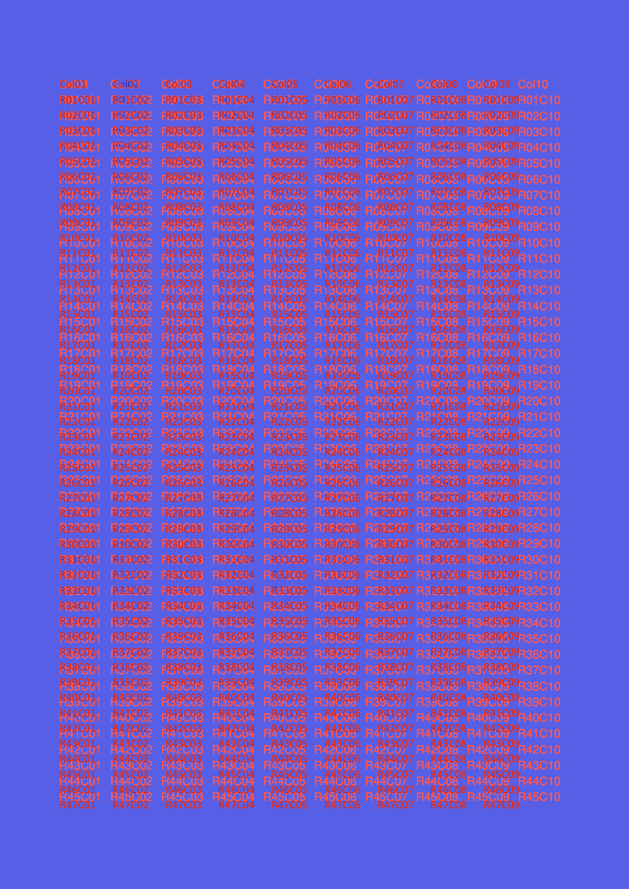</td>
  <td>changed: 413084 px (19.64%)<br>bbox: [115, 157, 1105, 1488]<br>mean abs RGB: 31.4567<br>RMSE RGB: 79.8701<br>threshold: 12, gain: 5.0</td>
</tr>
<tr>
  <td><b>classic60_large_wide_table</b><br>Page 2</td>
  <td></td>
  <td>changed: 77908 px (3.70%)<br>bbox: [116, 157, 1105, 394]<br>mean abs RGB: 5.9168<br>RMSE RGB: 34.6004<br>threshold: 12, gain: 5.0</td>
</tr>
<tr>
  <td><b>classic60_large_wide_table</b><br>Page 3</td>
  <td>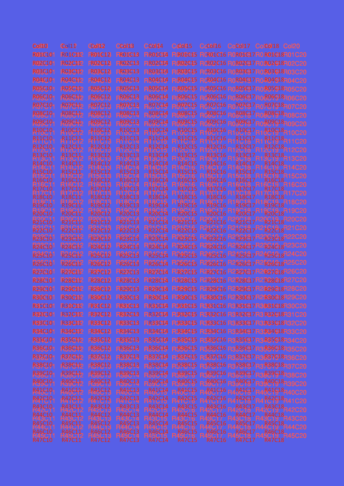</td>
  <td>changed: 390868 px (18.58%)<br>bbox: [115, 157, 1105, 1488]<br>mean abs RGB: 29.8434<br>RMSE RGB: 78.0034<br>threshold: 12, gain: 5.0</td>
</tr>
<tr>
  <td><b>classic60_large_wide_table</b><br>Page 4</td>
  <td></td>
  <td>changed: 73751 px (3.51%)<br>bbox: [116, 157, 1105, 394]<br>mean abs RGB: 5.616<br>RMSE RGB: 33.7947<br>threshold: 12, gain: 5.0</td>
</tr>
<tr>
  <td><b>classic61_product_card_with_image</b><br>Page 1</td>
  <td></td>
  <td>changed: 6253 px (0.30%)<br>bbox: [411, 268, 583, 442]<br>mean abs RGB: 0.4775<br>RMSE RGB: 9.8343<br>threshold: 12, gain: 5.0</td>
</tr>
<tr>
  <td><b>classic62_company_logo_header</b><br>Page 1</td>
  <td></td>
  <td>changed: 14326 px (0.68%)<br>bbox: [115, 215, 604, 429]<br>mean abs RGB: 1.1007<br>RMSE RGB: 14.9786<br>threshold: 12, gain: 5.0</td>
</tr>
<tr>
  <td><b>classic63_two_products_side_by_side</b><br>Page 1</td>
  <td></td>
  <td>changed: 7397 px (0.35%)<br>bbox: [116, 291, 547, 379]<br>mean abs RGB: 0.5774<br>RMSE RGB: 10.8648<br>threshold: 12, gain: 5.0</td>
</tr>
<tr>
  <td><b>classic64_employee_directory_with_photo</b><br>Page 1</td>
  <td></td>
  <td>changed: 17463 px (0.83%)<br>bbox: [112, 150, 719, 404]<br>mean abs RGB: 1.2405<br>RMSE RGB: 15.4445<br>threshold: 12, gain: 5.0</td>
</tr>
<tr>
  <td><b>classic65_inventory_with_product_photos</b><br>Page 1</td>
  <td>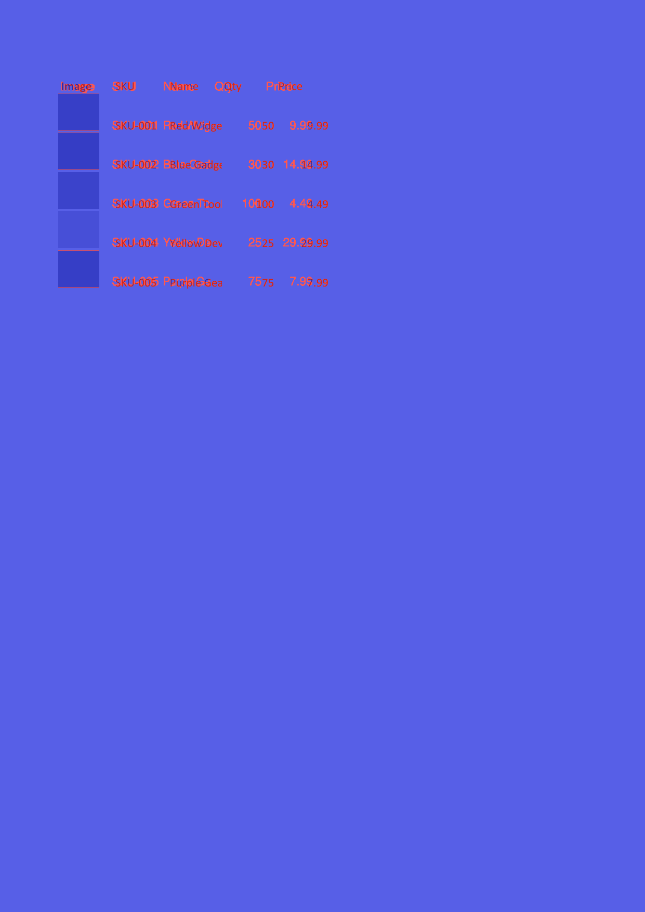</td>
  <td>changed: 16426 px (0.78%)<br>bbox: [115, 157, 603, 554]<br>mean abs RGB: 1.1856<br>RMSE RGB: 15.2632<br>threshold: 12, gain: 5.0</td>
</tr>
<tr>
  <td><b>classic66_invoice_with_logo</b><br>Page 1</td>
  <td></td>
  <td>changed: 17176 px (0.82%)<br>bbox: [115, 201, 661, 513]<br>mean abs RGB: 1.331<br>RMSE RGB: 16.5285<br>threshold: 12, gain: 5.0</td>
</tr>
<tr>
  <td><b>classic67_real_estate_listing</b><br>Page 1</td>
  <td></td>
  <td>changed: 12093 px (0.57%)<br>bbox: [115, 150, 642, 415]<br>mean abs RGB: 0.9805<br>RMSE RGB: 14.4092<br>threshold: 12, gain: 5.0</td>
</tr>
<tr>
  <td><b>classic68_restaurant_menu</b><br>Page 1</td>
  <td>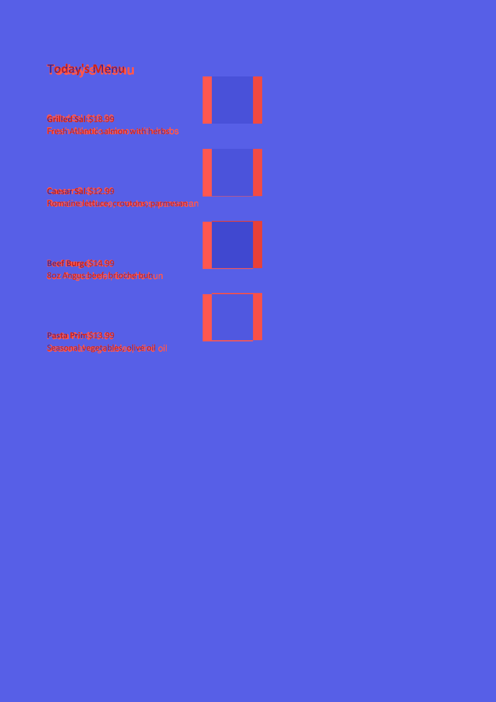</td>
  <td>changed: 24294 px (1.15%)<br>bbox: [115, 157, 633, 883]<br>mean abs RGB: 1.7965<br>RMSE RGB: 18.9752<br>threshold: 12, gain: 5.0</td>
</tr>
<tr>
  <td><b>classic69_image_only_sheet</b><br>Page 1</td>
  <td></td>
  <td>changed: 0 px (0.00%)<br>bbox: None<br>mean abs RGB: 0.0<br>RMSE RGB: 0.0<br>threshold: 12, gain: 5.0</td>
</tr>
<tr>
  <td><b>classic70_product_catalog_with_images</b><br>Page 1</td>
  <td>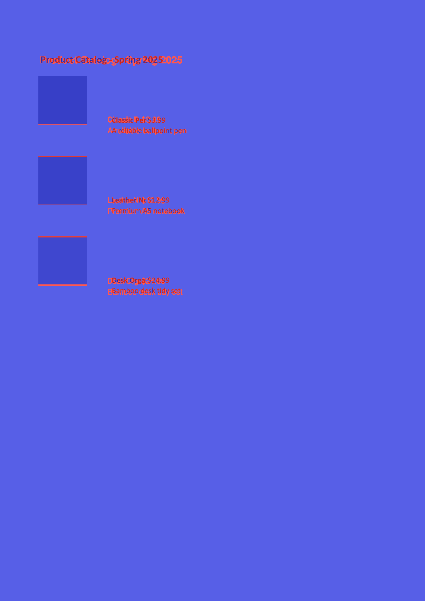</td>
  <td>changed: 20548 px (0.98%)<br>bbox: [112, 161, 545, 865]<br>mean abs RGB: 1.6355<br>RMSE RGB: 18.3255<br>threshold: 12, gain: 5.0</td>
</tr>
<tr>
  <td><b>classic71_multi_sheet_with_images</b><br>Page 1</td>
  <td></td>
  <td>changed: 3519 px (0.17%)<br>bbox: [115, 240, 308, 317]<br>mean abs RGB: 0.264<br>RMSE RGB: 7.2857<br>threshold: 12, gain: 5.0</td>
</tr>
<tr>
  <td><b>classic71_multi_sheet_with_images</b><br>Page 2</td>
  <td></td>
  <td>changed: 3010 px (0.14%)<br>bbox: [116, 237, 308, 317]<br>mean abs RGB: 0.2216<br>RMSE RGB: 6.6374<br>threshold: 12, gain: 5.0</td>
</tr>
<tr>
  <td><b>classic71_multi_sheet_with_images</b><br>Page 3</td>
  <td></td>
  <td>changed: 2790 px (0.13%)<br>bbox: [115, 237, 326, 317]<br>mean abs RGB: 0.2016<br>RMSE RGB: 6.3057<br>threshold: 12, gain: 5.0</td>
</tr>
<tr>
  <td><b>classic72_bar_chart_image_with_data</b><br>Page 1</td>
  <td></td>
  <td>changed: 17775 px (0.84%)<br>bbox: [114, 157, 406, 429]<br>mean abs RGB: 1.3875<br>RMSE RGB: 16.7993<br>threshold: 12, gain: 5.0</td>
</tr>
<tr>
  <td><b>classic73_event_flyer_with_banner</b><br>Page 1</td>
  <td>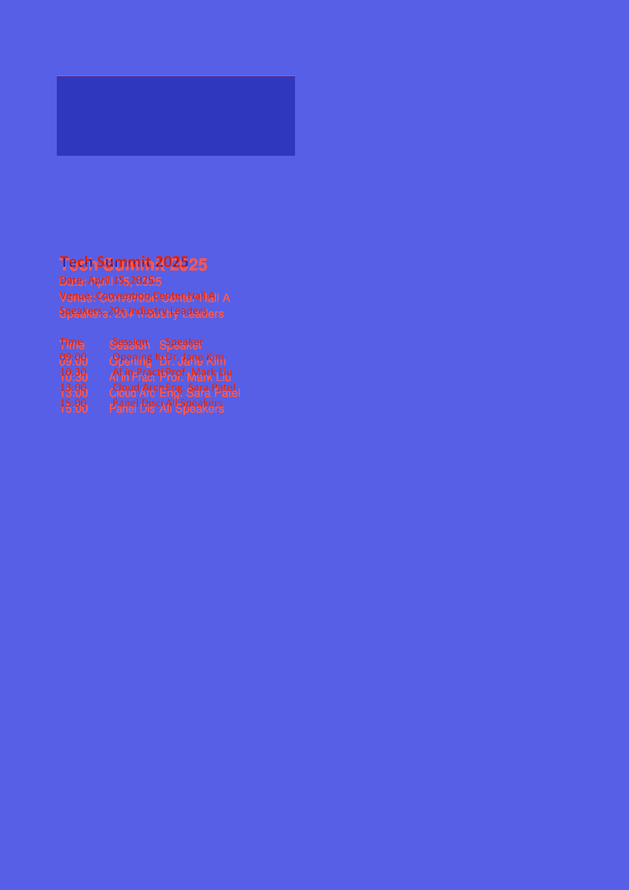</td>
  <td>changed: 28247 px (1.34%)<br>bbox: [114, 503, 473, 818]<br>mean abs RGB: 2.2123<br>RMSE RGB: 21.3763<br>threshold: 12, gain: 5.0</td>
</tr>
<tr>
  <td><b>classic74_dashboard_with_kpi_image</b><br>Page 1</td>
  <td></td>
  <td>changed: 20912 px (0.99%)<br>bbox: [115, 157, 888, 376]<br>mean abs RGB: 1.5857<br>RMSE RGB: 18.0858<br>threshold: 12, gain: 5.0</td>
</tr>
<tr>
  <td><b>classic75_certificate_with_seal</b><br>Page 1</td>
  <td></td>
  <td>changed: 24694 px (1.17%)<br>bbox: [213, 191, 806, 401]<br>mean abs RGB: 2.1586<br>RMSE RGB: 21.8155<br>threshold: 12, gain: 5.0</td>
</tr>
<tr>
  <td><b>classic76_product_image_grid</b><br>Page 1</td>
  <td></td>
  <td>changed: 13435 px (0.64%)<br>bbox: [112, 157, 679, 532]<br>mean abs RGB: 1.0626<br>RMSE RGB: 14.8733<br>threshold: 12, gain: 5.0</td>
</tr>
<tr>
  <td><b>classic77_news_article_with_hero_image</b><br>Page 1</td>
  <td></td>
  <td>changed: 39817 px (1.89%)<br>bbox: [114, 660, 896, 877]<br>mean abs RGB: 2.9386<br>RMSE RGB: 24.1837<br>threshold: 12, gain: 5.0</td>
</tr>
<tr>
  <td><b>classic78_small_icon_per_row</b><br>Page 1</td>
  <td></td>
  <td>changed: 15699 px (0.75%)<br>bbox: [112, 157, 529, 387]<br>mean abs RGB: 1.1767<br>RMSE RGB: 15.3635<br>threshold: 12, gain: 5.0</td>
</tr>
<tr>
  <td><b>classic79_wide_panoramic_banner</b><br>Page 1</td>
  <td>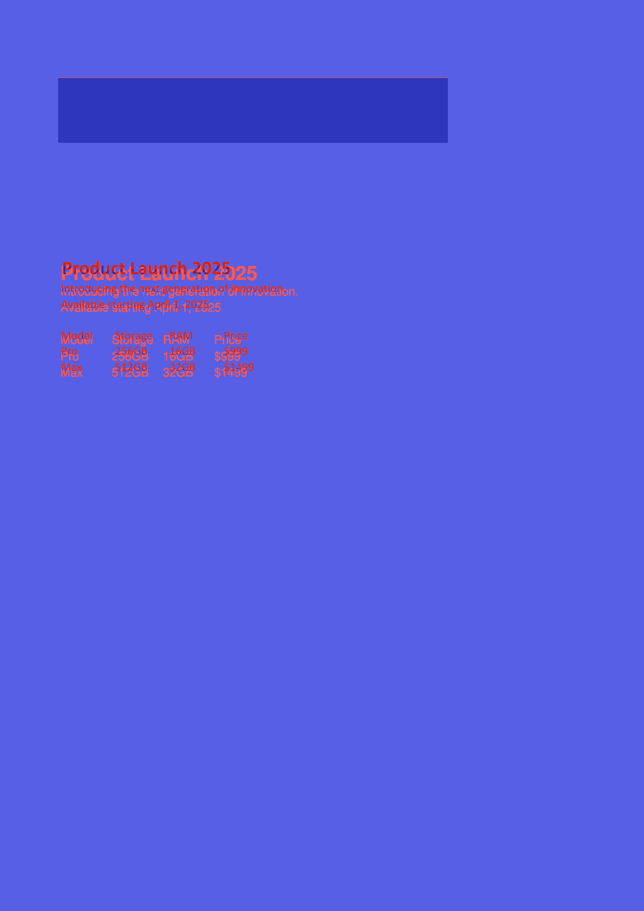</td>
  <td>changed: 23627 px (1.12%)<br>bbox: [115, 504, 574, 728]<br>mean abs RGB: 1.9462<br>RMSE RGB: 20.3416<br>threshold: 12, gain: 5.0</td>
</tr>
<tr>
  <td><b>classic80_portrait_tall_image</b><br>Page 1</td>
  <td></td>
  <td>changed: 18056 px (0.86%)<br>bbox: [410, 157, 751, 370]<br>mean abs RGB: 1.3458<br>RMSE RGB: 16.3947<br>threshold: 12, gain: 5.0</td>
</tr>
<tr>
  <td><b>classic81_step_by_step_with_images</b><br>Page 1</td>
  <td>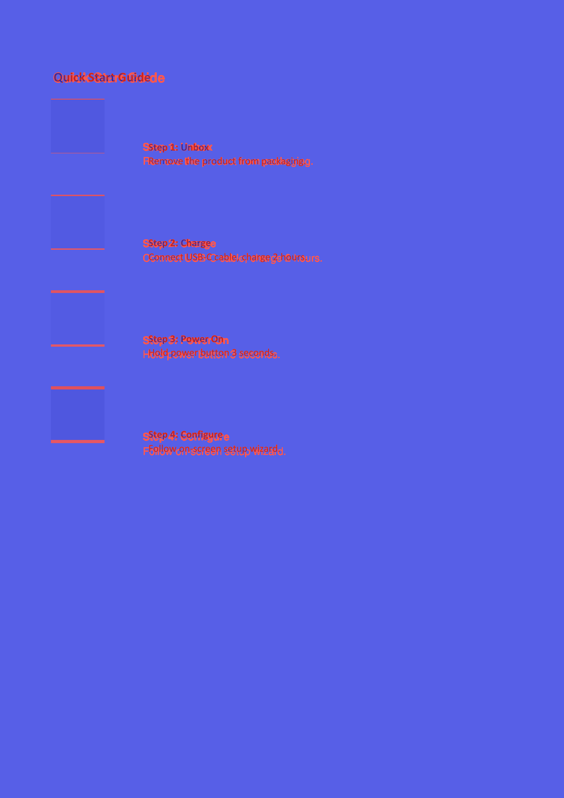</td>
  <td>changed: 27362 px (1.30%)<br>bbox: [112, 157, 709, 1005]<br>mean abs RGB: 2.048<br>RMSE RGB: 20.5468<br>threshold: 12, gain: 5.0</td>
</tr>
<tr>
  <td><b>classic82_before_after_images</b><br>Page 1</td>
  <td>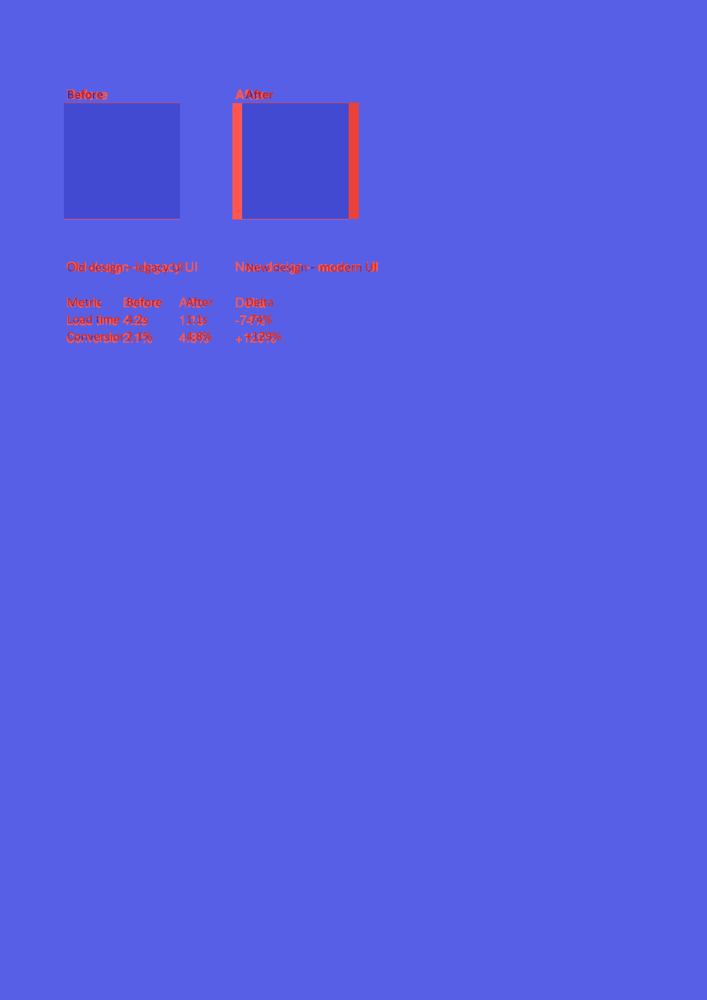</td>
  <td>changed: 14712 px (0.70%)<br>bbox: [115, 157, 663, 602]<br>mean abs RGB: 1.1269<br>RMSE RGB: 15.1397<br>threshold: 12, gain: 5.0</td>
</tr>
<tr>
  <td><b>classic83_color_swatch_palette</b><br>Page 1</td>
  <td>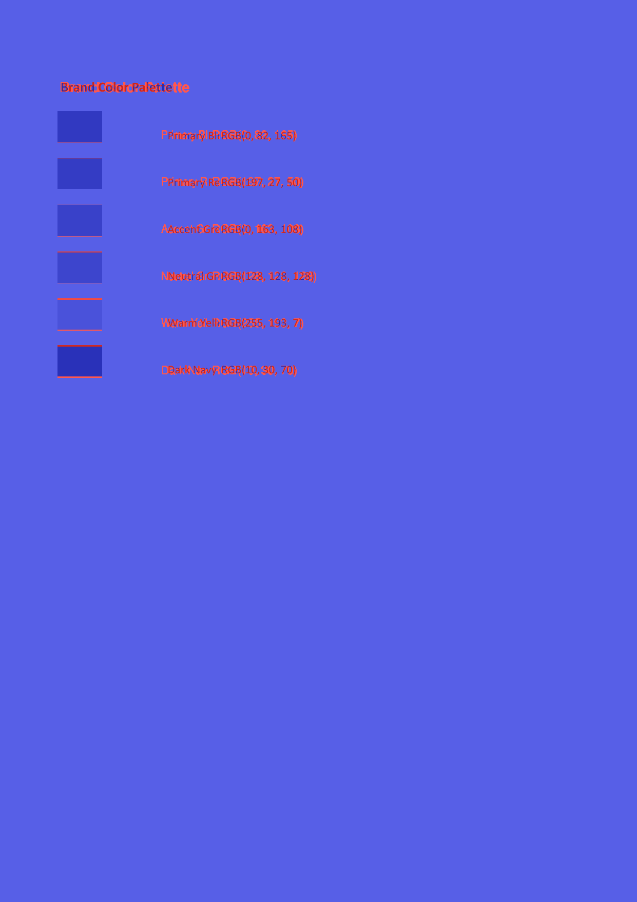</td>
  <td>changed: 26351 px (1.25%)<br>bbox: [112, 157, 617, 735]<br>mean abs RGB: 2.0567<br>RMSE RGB: 20.5385<br>threshold: 12, gain: 5.0</td>
</tr>
<tr>
  <td><b>classic84_travel_destination_cards</b><br>Page 1</td>
  <td>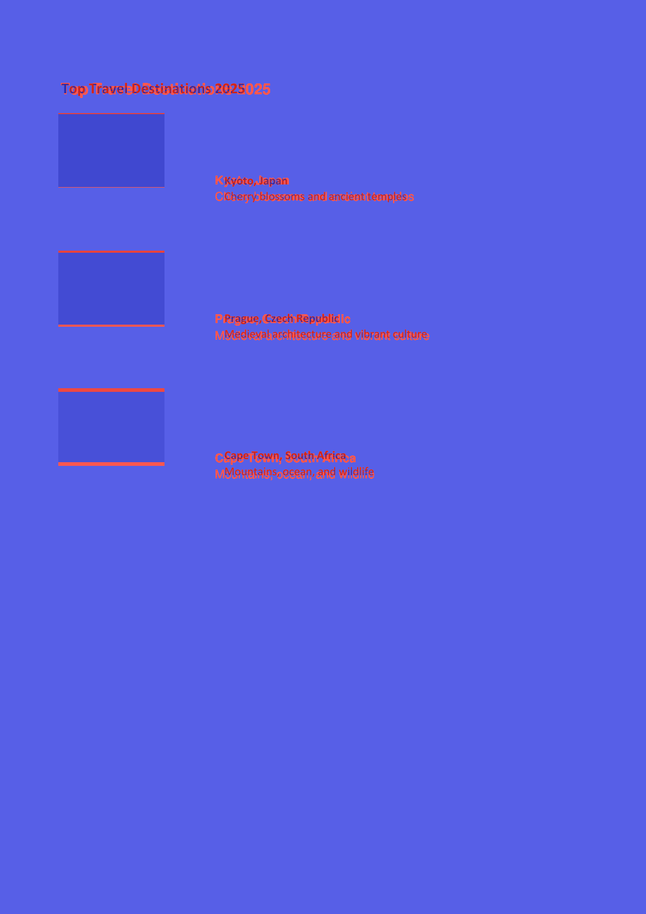</td>
  <td>changed: 28901 px (1.37%)<br>bbox: [112, 157, 825, 922]<br>mean abs RGB: 2.1757<br>RMSE RGB: 20.9432<br>threshold: 12, gain: 5.0</td>
</tr>
<tr>
  <td><b>classic85_lab_results_with_image</b><br>Page 1</td>
  <td></td>
  <td>changed: 22112 px (1.05%)<br>bbox: [115, 157, 695, 402]<br>mean abs RGB: 1.6665<br>RMSE RGB: 18.423<br>threshold: 12, gain: 5.0</td>
</tr>
<tr>
  <td><b>classic86_software_screenshot_features</b><br>Page 1</td>
  <td></td>
  <td>changed: 6461 px (0.31%)<br>bbox: [116, 150, 685, 398]<br>mean abs RGB: 0.5353<br>RMSE RGB: 10.7301<br>threshold: 12, gain: 5.0</td>
</tr>
<tr>
  <td><b>classic87_sports_results_with_logos</b><br>Page 1</td>
  <td></td>
  <td>changed: 16105 px (0.77%)<br>bbox: [112, 157, 703, 461]<br>mean abs RGB: 1.2899<br>RMSE RGB: 16.3956<br>threshold: 12, gain: 5.0</td>
</tr>
<tr>
  <td><b>classic88_image_after_data</b><br>Page 1</td>
  <td></td>
  <td>changed: 19723 px (0.94%)<br>bbox: [115, 157, 689, 426]<br>mean abs RGB: 1.4686<br>RMSE RGB: 17.1734<br>threshold: 12, gain: 5.0</td>
</tr>
<tr>
  <td><b>classic89_nutrition_label_with_image</b><br>Page 1</td>
  <td>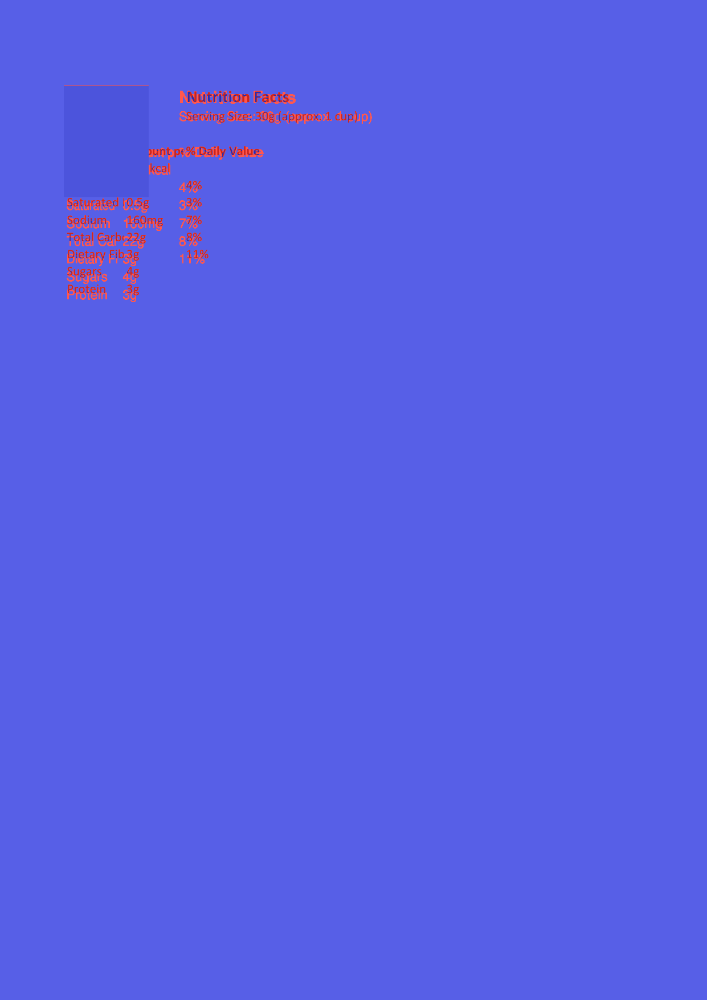</td>
  <td>changed: 18729 px (0.89%)<br>bbox: [114, 158, 653, 530]<br>mean abs RGB: 1.4462<br>RMSE RGB: 17.1624<br>threshold: 12, gain: 5.0</td>
</tr>
<tr>
  <td><b>classic90_project_status_with_milestones</b><br>Page 1</td>
  <td></td>
  <td>changed: 32437 px (1.54%)<br>bbox: [115, 158, 857, 436]<br>mean abs RGB: 2.486<br>RMSE RGB: 22.5684<br>threshold: 12, gain: 5.0</td>
</tr>
<tr>
  <td><b>classic91_simple_bar_chart</b><br>Page 1</td>
  <td></td>
  <td>changed: 167170 px (7.95%)<br>bbox: [115, 157, 1275, 772]<br>mean abs RGB: 9.7252<br>RMSE RGB: 38.2475<br>threshold: 12, gain: 5.0</td>
</tr>
<tr>
  <td><b>classic91_simple_bar_chart</b><br>Page 2</td>
  <td></td>
  <td>changed: 8493 px (0.40%)<br>bbox: [112, 181, 307, 772]<br>mean abs RGB: 0.3992<br>RMSE RGB: 7.3429<br>threshold: 12, gain: 5.0</td>
</tr>
<tr>
  <td><b>classic92_horizontal_bar_chart</b><br>Page 1</td>
  <td>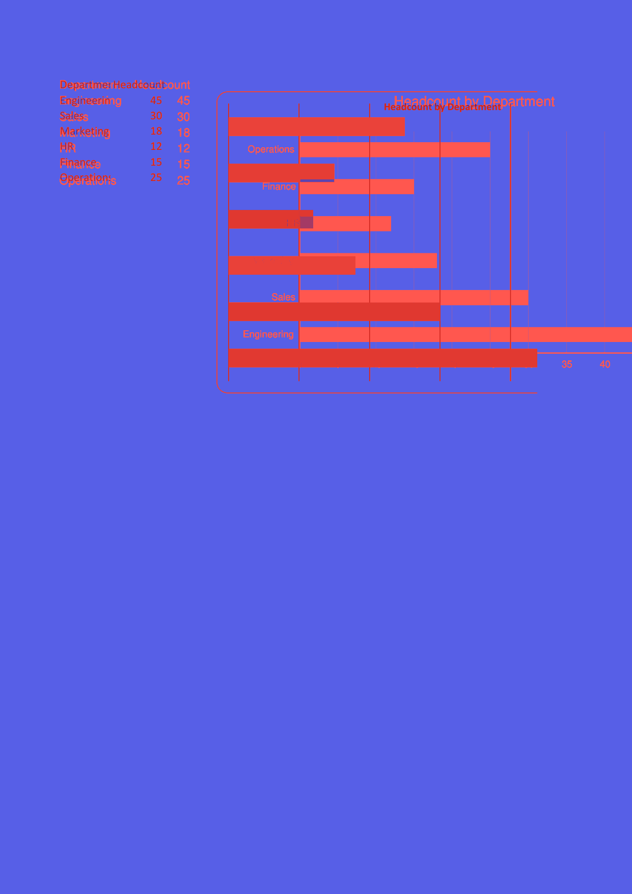</td>
  <td>changed: 175811 px (8.36%)<br>bbox: [115, 157, 1275, 772]<br>mean abs RGB: 10.1001<br>RMSE RGB: 38.9148<br>threshold: 12, gain: 5.0</td>
</tr>
<tr>
  <td><b>classic92_horizontal_bar_chart</b><br>Page 2</td>
  <td>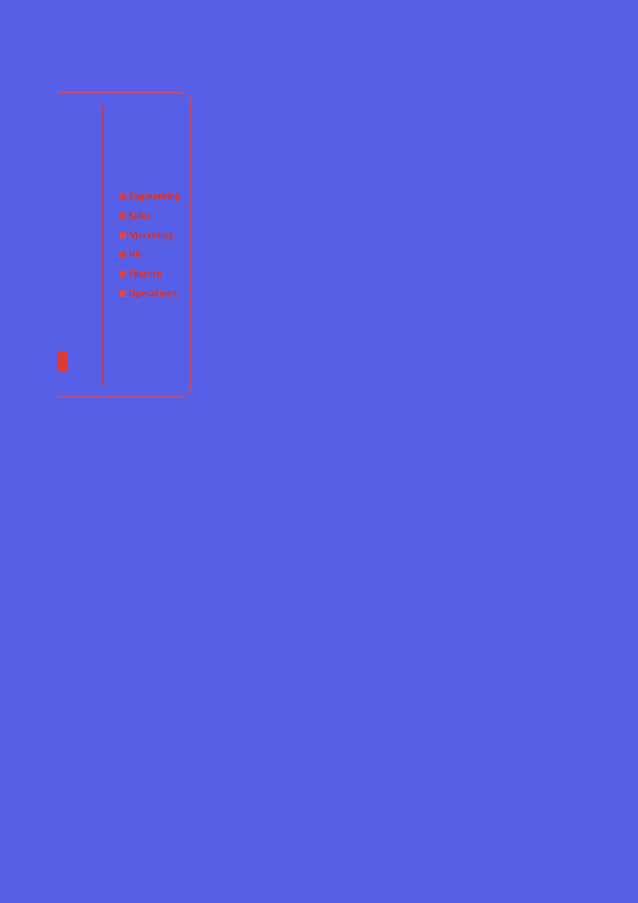</td>
  <td>changed: 4256 px (0.20%)<br>bbox: [112, 181, 307, 772]<br>mean abs RGB: 0.1353<br>RMSE RGB: 4.165<br>threshold: 12, gain: 5.0</td>
</tr>
<tr>
  <td><b>classic93_line_chart</b><br>Page 1</td>
  <td>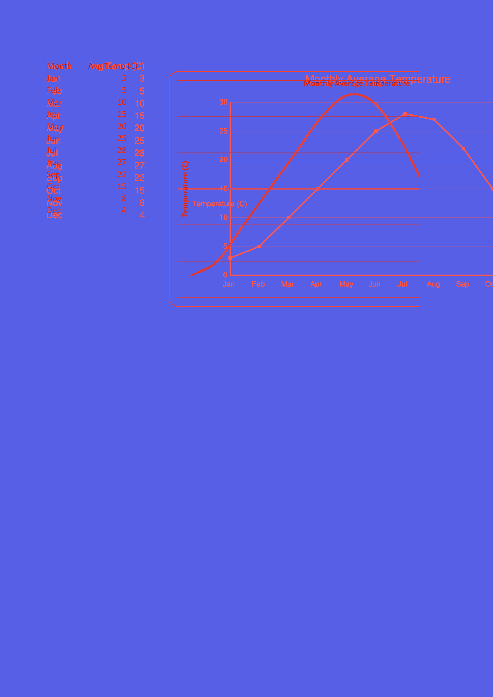</td>
  <td>changed: 56674 px (2.69%)<br>bbox: [114, 157, 1275, 772]<br>mean abs RGB: 3.3033<br>RMSE RGB: 24.4953<br>threshold: 12, gain: 5.0</td>
</tr>
<tr>
  <td><b>classic93_line_chart</b><br>Page 2</td>
  <td></td>
  <td>changed: 4159 px (0.20%)<br>bbox: [112, 181, 366, 772]<br>mean abs RGB: 0.1568<br>RMSE RGB: 4.8731<br>threshold: 12, gain: 5.0</td>
</tr>
<tr>
  <td><b>classic94_pie_chart</b><br>Page 1</td>
  <td>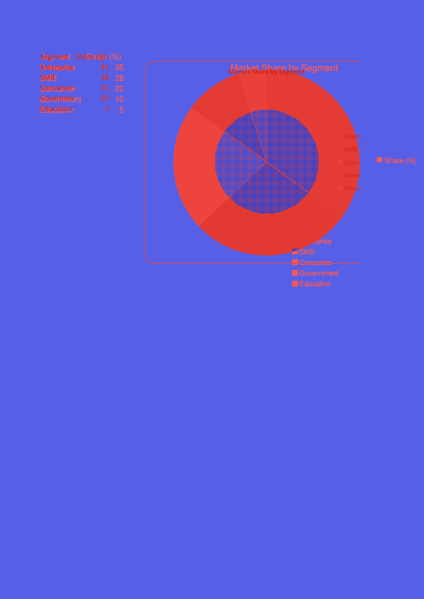</td>
  <td>changed: 198477 px (9.43%)<br>bbox: [115, 157, 1100, 839]<br>mean abs RGB: 10.3326<br>RMSE RGB: 38.586<br>threshold: 12, gain: 5.0</td>
</tr>
<tr>
  <td><b>classic94_pie_chart</b><br>Page 2</td>
  <td></td>
  <td>changed: 1245 px (0.06%)<br>bbox: [112, 181, 130, 772]<br>mean abs RGB: 0.0175<br>RMSE RGB: 0.7204<br>threshold: 12, gain: 5.0</td>
</tr>
<tr>
  <td><b>classic95_area_chart</b><br>Page 1</td>
  <td>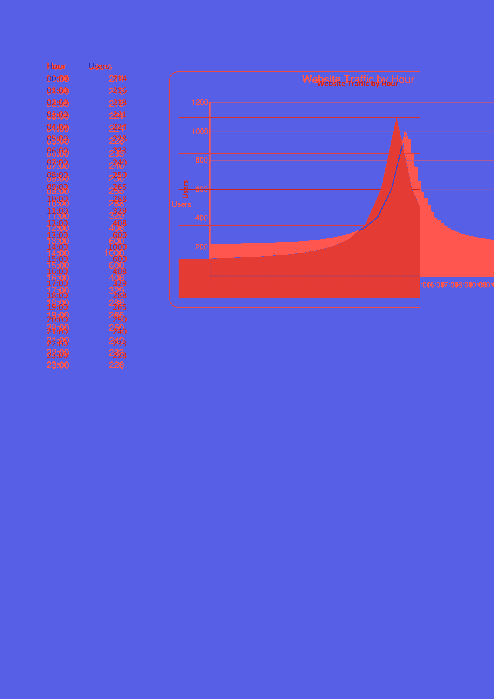</td>
  <td>changed: 174743 px (8.31%)<br>bbox: [115, 157, 1275, 925]<br>mean abs RGB: 8.0429<br>RMSE RGB: 34.293<br>threshold: 12, gain: 5.0</td>
</tr>
<tr>
  <td><b>classic95_area_chart</b><br>Page 2</td>
  <td></td>
  <td>changed: 16808 px (0.80%)<br>bbox: [112, 181, 366, 772]<br>mean abs RGB: 0.892<br>RMSE RGB: 11.2869<br>threshold: 12, gain: 5.0</td>
</tr>
<tr>
  <td><b>classic96_scatter_chart</b><br>Page 1</td>
  <td>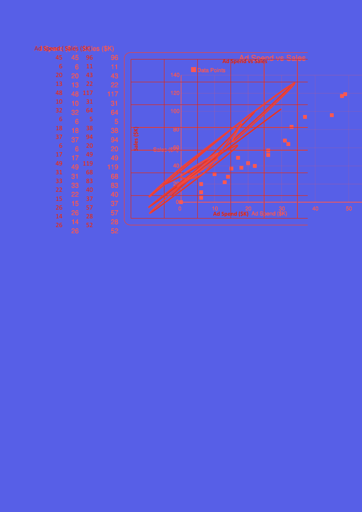</td>
  <td>changed: 72134 px (3.43%)<br>bbox: [115, 156, 1275, 800]<br>mean abs RGB: 4.0137<br>RMSE RGB: 26.3115<br>threshold: 12, gain: 5.0</td>
</tr>
<tr>
  <td><b>classic96_scatter_chart</b><br>Page 2</td>
  <td></td>
  <td>changed: 2335 px (0.11%)<br>bbox: [112, 181, 248, 772]<br>mean abs RGB: 0.0709<br>RMSE RGB: 3.1786<br>threshold: 12, gain: 5.0</td>
</tr>
<tr>
  <td><b>classic97_doughnut_chart</b><br>Page 1</td>
  <td>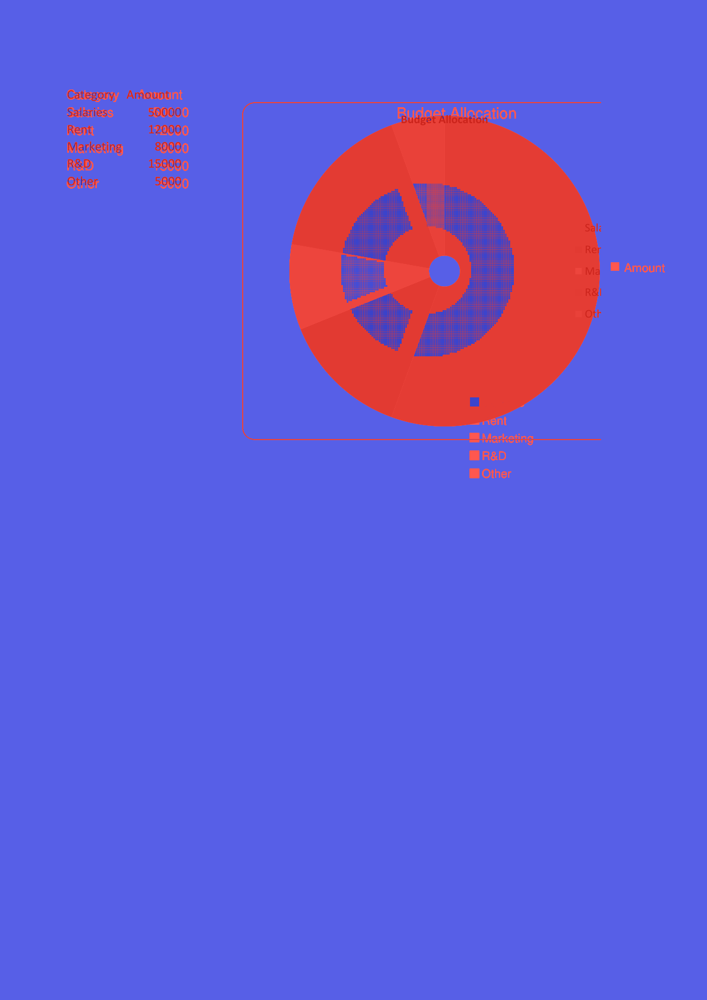</td>
  <td>changed: 160693 px (7.64%)<br>bbox: [115, 157, 1100, 839]<br>mean abs RGB: 8.7722<br>RMSE RGB: 35.9115<br>threshold: 12, gain: 5.0</td>
</tr>
<tr>
  <td><b>classic97_doughnut_chart</b><br>Page 2</td>
  <td></td>
  <td>changed: 1245 px (0.06%)<br>bbox: [112, 181, 130, 772]<br>mean abs RGB: 0.0175<br>RMSE RGB: 0.7204<br>threshold: 12, gain: 5.0</td>
</tr>
<tr>
  <td><b>classic98_radar_chart</b><br>Page 1</td>
  <td>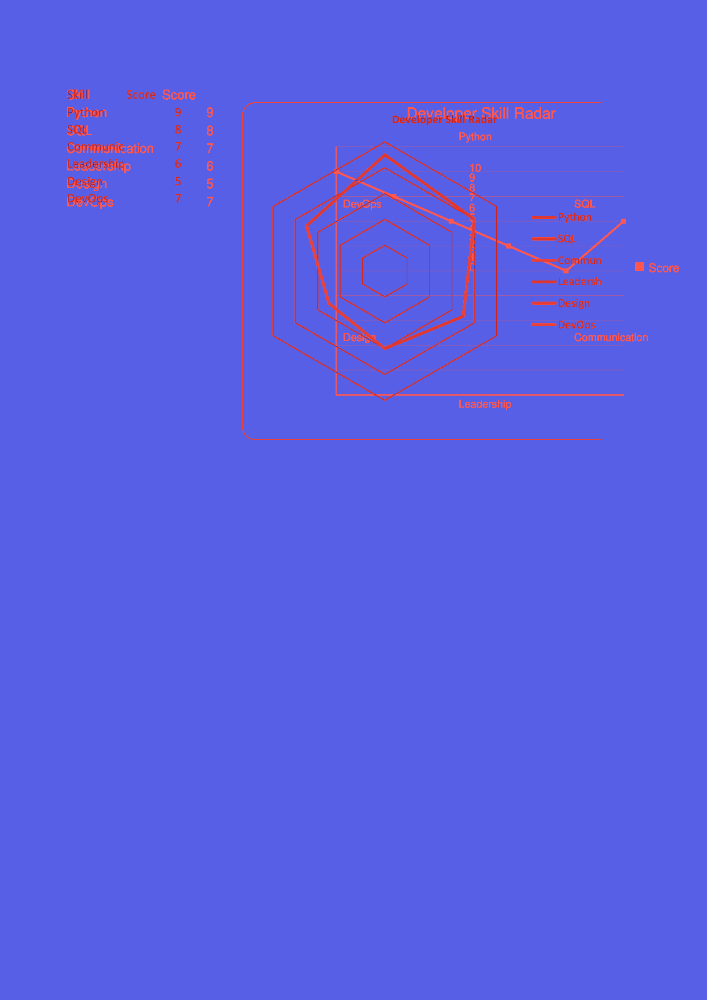</td>
  <td>changed: 45835 px (2.18%)<br>bbox: [115, 157, 1171, 772]<br>mean abs RGB: 2.487<br>RMSE RGB: 21.1447<br>threshold: 12, gain: 5.0</td>
</tr>
<tr>
  <td><b>classic98_radar_chart</b><br>Page 2</td>
  <td></td>
  <td>changed: 1245 px (0.06%)<br>bbox: [112, 181, 130, 772]<br>mean abs RGB: 0.0175<br>RMSE RGB: 0.7204<br>threshold: 12, gain: 5.0</td>
</tr>
<tr>
  <td><b>classic99_bubble_chart</b><br>Page 1</td>
  <td>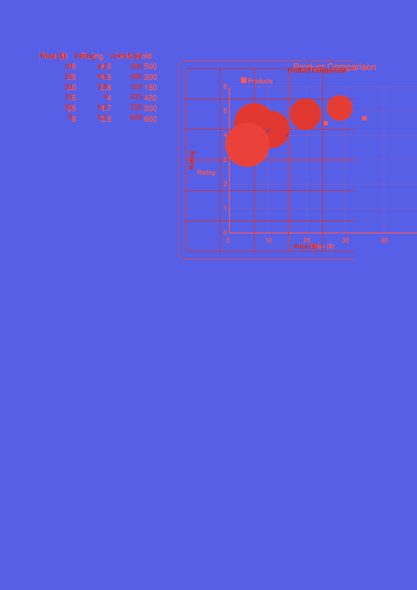</td>
  <td>changed: 76913 px (3.66%)<br>bbox: [116, 156, 1275, 772]<br>mean abs RGB: 4.1377<br>RMSE RGB: 25.8575<br>threshold: 12, gain: 5.0</td>
</tr>
<tr>
  <td><b>classic99_bubble_chart</b><br>Page 2</td>
  <td>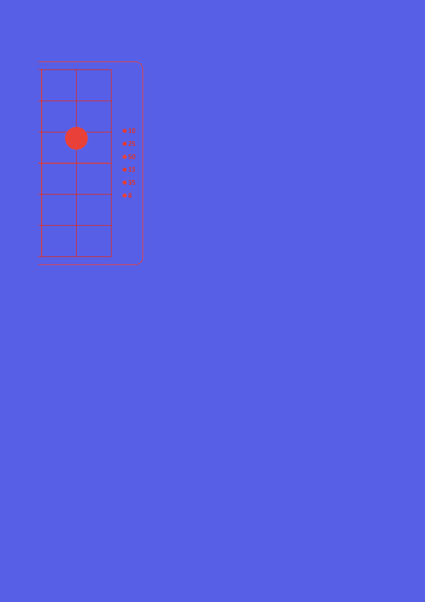</td>
  <td>changed: 8457 px (0.40%)<br>bbox: [112, 181, 347, 772]<br>mean abs RGB: 0.3452<br>RMSE RGB: 6.4736<br>threshold: 12, gain: 5.0</td>
</tr>
<tr>
  <td><b>classic100_stacked_bar_chart</b><br>Page 1</td>
  <td>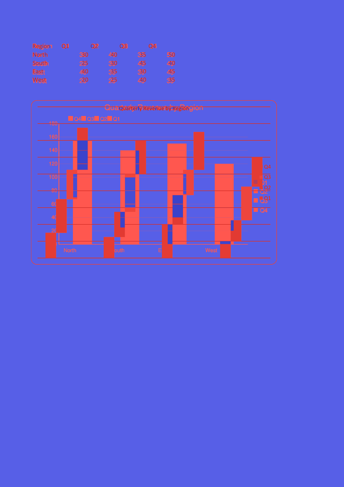</td>
  <td>changed: 217389 px (10.33%)<br>bbox: [112, 157, 998, 959]<br>mean abs RGB: 11.796<br>RMSE RGB: 41.1815<br>threshold: 12, gain: 5.0</td>
</tr>
<tr>
  <td><b>classic101_percent_stacked_bar</b><br>Page 1</td>
  <td>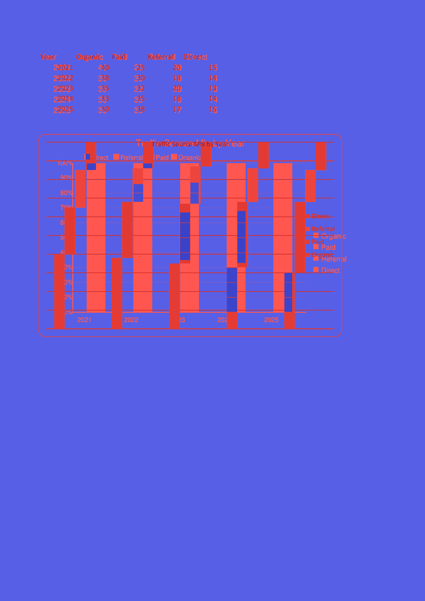</td>
  <td>changed: 310861 px (14.78%)<br>bbox: [112, 157, 998, 991]<br>mean abs RGB: 17.7975<br>RMSE RGB: 51.1747<br>threshold: 12, gain: 5.0</td>
</tr>
<tr>
  <td><b>classic102_line_chart_with_markers</b><br>Page 1</td>
  <td>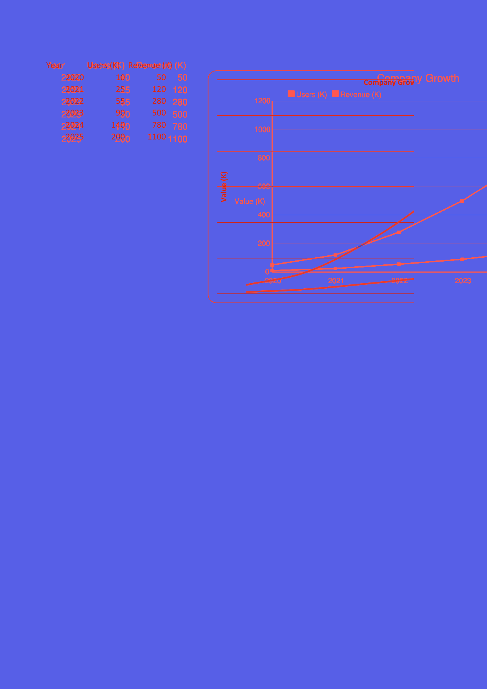</td>
  <td>changed: 54080 px (2.57%)<br>bbox: [115, 157, 1275, 772]<br>mean abs RGB: 3.1051<br>RMSE RGB: 23.5393<br>threshold: 12, gain: 5.0</td>
</tr>
<tr>
  <td><b>classic102_line_chart_with_markers</b><br>Page 2</td>
  <td></td>
  <td>changed: 8266 px (0.39%)<br>bbox: [112, 181, 465, 772]<br>mean abs RGB: 0.3605<br>RMSE RGB: 7.2547<br>threshold: 12, gain: 5.0</td>
</tr>
<tr>
  <td><b>classic103_pie_chart_with_labels</b><br>Page 1</td>
  <td></td>
  <td>changed: 121805 px (5.79%)<br>bbox: [115, 157, 1236, 839]<br>mean abs RGB: 6.1647<br>RMSE RGB: 30.7648<br>threshold: 12, gain: 5.0</td>
</tr>
<tr>
  <td><b>classic103_pie_chart_with_labels</b><br>Page 2</td>
  <td></td>
  <td>changed: 2416 px (0.11%)<br>bbox: [112, 181, 189, 772]<br>mean abs RGB: 0.0931<br>RMSE RGB: 3.9091<br>threshold: 12, gain: 5.0</td>
</tr>
<tr>
  <td><b>classic104_combo_bar_line_chart</b><br>Page 1</td>
  <td></td>
  <td>changed: 168167 px (7.99%)<br>bbox: [114, 157, 1275, 772]<br>mean abs RGB: 9.5263<br>RMSE RGB: 37.3495<br>threshold: 12, gain: 5.0</td>
</tr>
<tr>
  <td><b>classic104_combo_bar_line_chart</b><br>Page 2</td>
  <td></td>
  <td>changed: 40825 px (1.94%)<br>bbox: [112, 181, 465, 772]<br>mean abs RGB: 2.1954<br>RMSE RGB: 17.3841<br>threshold: 12, gain: 5.0</td>
</tr>
<tr>
  <td><b>classic105_3d_bar_chart</b><br>Page 1</td>
  <td></td>
  <td>changed: 227109 px (10.80%)<br>bbox: [115, 157, 1275, 772]<br>mean abs RGB: 12.6753<br>RMSE RGB: 43.1878<br>threshold: 12, gain: 5.0</td>
</tr>
<tr>
  <td><b>classic105_3d_bar_chart</b><br>Page 2</td>
  <td></td>
  <td>changed: 24640 px (1.17%)<br>bbox: [112, 181, 406, 772]<br>mean abs RGB: 1.2933<br>RMSE RGB: 13.7066<br>threshold: 12, gain: 5.0</td>
</tr>
<tr>
  <td><b>classic106_3d_pie_chart</b><br>Page 1</td>
  <td></td>
  <td>changed: 141904 px (6.75%)<br>bbox: [114, 157, 1100, 871]<br>mean abs RGB: 7.4059<br>RMSE RGB: 34.0613<br>threshold: 12, gain: 5.0</td>
</tr>
<tr>
  <td><b>classic106_3d_pie_chart</b><br>Page 2</td>
  <td></td>
  <td>changed: 1879 px (0.09%)<br>bbox: [112, 181, 189, 772]<br>mean abs RGB: 0.0525<br>RMSE RGB: 2.636<br>threshold: 12, gain: 5.0</td>
</tr>
<tr>
  <td><b>classic107_multi_series_line</b><br>Page 1</td>
  <td></td>
  <td>changed: 107152 px (5.09%)<br>bbox: [116, 157, 1275, 804]<br>mean abs RGB: 6.7942<br>RMSE RGB: 35.7251<br>threshold: 12, gain: 5.0</td>
</tr>
<tr>
  <td><b>classic107_multi_series_line</b><br>Page 2</td>
  <td></td>
  <td>changed: 24478 px (1.16%)<br>bbox: [112, 181, 682, 772]<br>mean abs RGB: 1.2224<br>RMSE RGB: 14.0792<br>threshold: 12, gain: 5.0</td>
</tr>
<tr>
  <td><b>classic108_stacked_area_chart</b><br>Page 1</td>
  <td></td>
  <td>changed: 348479 px (16.56%)<br>bbox: [112, 157, 1057, 1022]<br>mean abs RGB: 13.1937<br>RMSE RGB: 38.7731<br>threshold: 12, gain: 5.0</td>
</tr>
<tr>
  <td><b>classic109_scatter_with_trendline</b><br>Page 1</td>
  <td></td>
  <td>changed: 65776 px (3.13%)<br>bbox: [115, 157, 1275, 772]<br>mean abs RGB: 3.725<br>RMSE RGB: 25.7199<br>threshold: 12, gain: 5.0</td>
</tr>
<tr>
  <td><b>classic109_scatter_with_trendline</b><br>Page 2</td>
  <td></td>
  <td>changed: 2680 px (0.13%)<br>bbox: [112, 181, 248, 772]<br>mean abs RGB: 0.0985<br>RMSE RGB: 3.956<br>threshold: 12, gain: 5.0</td>
</tr>
<tr>
  <td><b>classic110_chart_with_legend</b><br>Page 1</td>
  <td></td>
  <td>changed: 107415 px (5.11%)<br>bbox: [115, 157, 1275, 772]<br>mean abs RGB: 6.1178<br>RMSE RGB: 31.2463<br>threshold: 12, gain: 5.0</td>
</tr>
<tr>
  <td><b>classic110_chart_with_legend</b><br>Page 2</td>
  <td></td>
  <td>changed: 14655 px (0.70%)<br>bbox: [112, 181, 406, 772]<br>mean abs RGB: 0.7322<br>RMSE RGB: 10.5005<br>threshold: 12, gain: 5.0</td>
</tr>
<tr>
  <td><b>classic111_chart_with_axis_labels</b><br>Page 1</td>
  <td></td>
  <td>changed: 93071 px (4.42%)<br>bbox: [114, 157, 1275, 772]<br>mean abs RGB: 5.4832<br>RMSE RGB: 29.8719<br>threshold: 12, gain: 5.0</td>
</tr>
<tr>
  <td><b>classic111_chart_with_axis_labels</b><br>Page 2</td>
  <td></td>
  <td>changed: 4535 px (0.22%)<br>bbox: [112, 181, 366, 772]<br>mean abs RGB: 0.1654<br>RMSE RGB: 4.7774<br>threshold: 12, gain: 5.0</td>
</tr>
<tr>
  <td><b>classic112_multiple_charts</b><br>Page 1</td>
  <td></td>
  <td>changed: 148325 px (7.05%)<br>bbox: [114, 157, 1275, 1213]<br>mean abs RGB: 8.2329<br>RMSE RGB: 35.7284<br>threshold: 12, gain: 5.0</td>
</tr>
<tr>
  <td><b>classic112_multiple_charts</b><br>Page 2</td>
  <td></td>
  <td>changed: 47963 px (2.28%)<br>bbox: [112, 181, 446, 1213]<br>mean abs RGB: 2.604<br>RMSE RGB: 19.3563<br>threshold: 12, gain: 5.0</td>
</tr>
<tr>
  <td><b>classic113_chart_sheet</b><br>Page 1</td>
  <td></td>
  <td>changed: 206083 px (9.80%)<br>bbox: [115, 157, 1275, 890]<br>mean abs RGB: 11.6112<br>RMSE RGB: 40.8223<br>threshold: 12, gain: 5.0</td>
</tr>
<tr>
  <td><b>classic113_chart_sheet</b><br>Page 2</td>
  <td></td>
  <td>changed: 50096 px (2.38%)<br>bbox: [112, 181, 484, 890]<br>mean abs RGB: 2.7414<br>RMSE RGB: 19.3339<br>threshold: 12, gain: 5.0</td>
</tr>
<tr>
  <td><b>classic114_chart_large_dataset</b><br>Page 1</td>
  <td></td>
  <td>changed: 89445 px (4.25%)<br>bbox: [116, 157, 1275, 1488]<br>mean abs RGB: 5.2999<br>RMSE RGB: 30.9096<br>threshold: 12, gain: 5.0</td>
</tr>
<tr>
  <td><b>classic114_chart_large_dataset</b><br>Page 2</td>
  <td></td>
  <td>changed: 32161 px (1.53%)<br>bbox: [182, 157, 312, 1488]<br>mean abs RGB: 2.3162<br>RMSE RGB: 21.3084<br>threshold: 12, gain: 5.0</td>
</tr>
<tr>
  <td><b>classic114_chart_large_dataset</b><br>Page 3</td>
  <td></td>
  <td>changed: 12033 px (0.57%)<br>bbox: [171, 157, 312, 613]<br>mean abs RGB: 0.8754<br>RMSE RGB: 13.1238<br>threshold: 12, gain: 5.0</td>
</tr>
<tr>
  <td><b>classic114_chart_large_dataset</b><br>Page 4</td>
  <td></td>
  <td>changed: 13011 px (0.62%)<br>bbox: [112, 181, 602, 772]<br>mean abs RGB: 0.5695<br>RMSE RGB: 8.7162<br>threshold: 12, gain: 5.0</td>
</tr>
<tr>
  <td><b>classic115_chart_negative_values</b><br>Page 1</td>
  <td></td>
  <td>changed: 130802 px (6.22%)<br>bbox: [114, 156, 1275, 772]<br>mean abs RGB: 7.1621<br>RMSE RGB: 32.7847<br>threshold: 12, gain: 5.0</td>
</tr>
<tr>
  <td><b>classic115_chart_negative_values</b><br>Page 2</td>
  <td></td>
  <td>changed: 4565 px (0.22%)<br>bbox: [112, 181, 307, 772]<br>mean abs RGB: 0.1701<br>RMSE RGB: 4.7001<br>threshold: 12, gain: 5.0</td>
</tr>
<tr>
  <td><b>classic116_percent_stacked_area</b><br>Page 1</td>
  <td></td>
  <td>changed: 427275 px (20.31%)<br>bbox: [112, 157, 1057, 1022]<br>mean abs RGB: 15.8092<br>RMSE RGB: 41.2624<br>threshold: 12, gain: 5.0</td>
</tr>
<tr>
  <td><b>classic117_stock_ohlc_chart</b><br>Page 1</td>
  <td></td>
  <td>changed: 182729 px (8.69%)<br>bbox: [116, 157, 1275, 772]<br>mean abs RGB: 10.4238<br>RMSE RGB: 40.0379<br>threshold: 12, gain: 5.0</td>
</tr>
<tr>
  <td><b>classic117_stock_ohlc_chart</b><br>Page 2</td>
  <td></td>
  <td>changed: 133681 px (6.35%)<br>bbox: [112, 181, 781, 772]<br>mean abs RGB: 7.7388<br>RMSE RGB: 33.3478<br>threshold: 12, gain: 5.0</td>
</tr>
<tr>
  <td><b>classic118_bar_chart_custom_colors</b><br>Page 1</td>
  <td></td>
  <td>changed: 174832 px (8.31%)<br>bbox: [115, 157, 1275, 772]<br>mean abs RGB: 10.3859<br>RMSE RGB: 41.2324<br>threshold: 12, gain: 5.0</td>
</tr>
<tr>
  <td><b>classic118_bar_chart_custom_colors</b><br>Page 2</td>
  <td></td>
  <td>changed: 5652 px (0.27%)<br>bbox: [112, 181, 307, 772]<br>mean abs RGB: 0.2298<br>RMSE RGB: 5.7466<br>threshold: 12, gain: 5.0</td>
</tr>
<tr>
  <td><b>classic119_dashboard_multi_charts</b><br>Page 1</td>
  <td></td>
  <td>changed: 311504 px (14.81%)<br>bbox: [115, 157, 1275, 1134]<br>mean abs RGB: 18.5656<br>RMSE RGB: 53.2165<br>threshold: 12, gain: 5.0</td>
</tr>
<tr>
  <td><b>classic119_dashboard_multi_charts</b><br>Page 2</td>
  <td></td>
  <td>changed: 2669 px (0.13%)<br>bbox: [112, 186, 229, 659]<br>mean abs RGB: 0.1093<br>RMSE RGB: 4.1701<br>threshold: 12, gain: 5.0</td>
</tr>
<tr>
  <td><b>classic120_chart_with_date_axis</b><br>Page 1</td>
  <td></td>
  <td>changed: 83921 px (3.99%)<br>bbox: [115, 157, 1275, 772]<br>mean abs RGB: 4.9797<br>RMSE RGB: 30.3603<br>threshold: 12, gain: 5.0</td>
</tr>
<tr>
  <td><b>classic120_chart_with_date_axis</b><br>Page 2</td>
  <td></td>
  <td>changed: 10846 px (0.52%)<br>bbox: [112, 181, 484, 772]<br>mean abs RGB: 0.4848<br>RMSE RGB: 8.5943<br>threshold: 12, gain: 5.0</td>
</tr>
<tr>
  <td><b>classic121_thin_borders</b><br>Page 1</td>
  <td></td>
  <td>changed: 24367 px (1.16%)<br>bbox: [111, 149, 536, 339]<br>mean abs RGB: 1.5628<br>RMSE RGB: 16.835<br>threshold: 12, gain: 5.0</td>
</tr>
<tr>
  <td><b>classic122_thick_outer_thin_inner</b><br>Page 1</td>
  <td></td>
  <td>changed: 26274 px (1.25%)<br>bbox: [109, 147, 528, 340]<br>mean abs RGB: 1.7989<br>RMSE RGB: 18.4478<br>threshold: 12, gain: 5.0</td>
</tr>
<tr>
  <td><b>classic123_dashed_borders</b><br>Page 1</td>
  <td></td>
  <td>changed: 18858 px (0.90%)<br>bbox: [115, 157, 433, 340]<br>mean abs RGB: 1.3893<br>RMSE RGB: 16.5597<br>threshold: 12, gain: 5.0</td>
</tr>
<tr>
  <td><b>classic124_colored_borders</b><br>Page 1</td>
  <td></td>
  <td>changed: 29304 px (1.39%)<br>bbox: [114, 157, 559, 371]<br>mean abs RGB: 2.0839<br>RMSE RGB: 20.2876<br>threshold: 12, gain: 5.0</td>
</tr>
<tr>
  <td><b>classic125_solid_fills</b><br>Page 1</td>
  <td></td>
  <td>changed: 53587 px (2.55%)<br>bbox: [115, 157, 410, 432]<br>mean abs RGB: 2.1956<br>RMSE RGB: 19.4267<br>threshold: 12, gain: 5.0</td>
</tr>
<tr>
  <td><b>classic126_dark_header</b><br>Page 1</td>
  <td></td>
  <td>changed: 29816 px (1.42%)<br>bbox: [112, 149, 640, 331]<br>mean abs RGB: 2.1997<br>RMSE RGB: 20.729<br>threshold: 12, gain: 5.0</td>
</tr>
<tr>
  <td><b>classic127_font_styles</b><br>Page 1</td>
  <td></td>
  <td>changed: 38528 px (1.83%)<br>bbox: [115, 157, 622, 429]<br>mean abs RGB: 2.9156<br>RMSE RGB: 24.4367<br>threshold: 12, gain: 5.0</td>
</tr>
<tr>
  <td><b>classic128_font_sizes</b><br>Page 1</td>
  <td></td>
  <td>changed: 26330 px (1.25%)<br>bbox: [115, 157, 492, 583]<br>mean abs RGB: 2.2441<br>RMSE RGB: 22.0592<br>threshold: 12, gain: 5.0</td>
</tr>
<tr>
  <td><b>classic129_alignment_combos</b><br>Page 1</td>
  <td></td>
  <td>changed: 13809 px (0.66%)<br>bbox: [115, 157, 833, 429]<br>mean abs RGB: 1.0084<br>RMSE RGB: 14.1183<br>threshold: 12, gain: 5.0</td>
</tr>
<tr>
  <td><b>classic130_wrap_and_indent</b><br>Page 1</td>
  <td></td>
  <td>changed: 18907 px (0.90%)<br>bbox: [114, 157, 642, 436]<br>mean abs RGB: 1.4253<br>RMSE RGB: 16.9107<br>threshold: 12, gain: 5.0</td>
</tr>
<tr>
  <td><b>classic131_number_formats</b><br>Page 1</td>
  <td></td>
  <td>changed: 31663 px (1.51%)<br>bbox: [115, 157, 827, 488]<br>mean abs RGB: 2.3702<br>RMSE RGB: 21.8091<br>threshold: 12, gain: 5.0</td>
</tr>
<tr>
  <td><b>classic132_striped_table</b><br>Page 1</td>
  <td></td>
  <td>changed: 63281 px (3.01%)<br>bbox: [111, 149, 599, 495]<br>mean abs RGB: 2.9466<br>RMSE RGB: 22.6235<br>threshold: 12, gain: 5.0</td>
</tr>
<tr>
  <td><b>classic133_gradient_rows</b><br>Page 1</td>
  <td></td>
  <td>changed: 49070 px (2.33%)<br>bbox: [112, 157, 506, 494]<br>mean abs RGB: 3.6348<br>RMSE RGB: 28.3145<br>threshold: 12, gain: 5.0</td>
</tr>
<tr>
  <td><b>classic134_heatmap</b><br>Page 1</td>
  <td></td>
  <td>changed: 59157 px (2.81%)<br>bbox: [115, 157, 836, 400]<br>mean abs RGB: 3.0583<br>RMSE RGB: 23.0272<br>threshold: 12, gain: 5.0</td>
</tr>
<tr>
  <td><b>classic135_bottom_border_only</b><br>Page 1</td>
  <td></td>
  <td>changed: 15460 px (0.73%)<br>bbox: [112, 157, 542, 345]<br>mean abs RGB: 1.2065<br>RMSE RGB: 15.5965<br>threshold: 12, gain: 5.0</td>
</tr>
<tr>
  <td><b>classic136_financial_report_styled</b><br>Page 1</td>
  <td></td>
  <td>changed: 58535 px (2.78%)<br>bbox: [111, 149, 749, 466]<br>mean abs RGB: 3.4097<br>RMSE RGB: 24.5916<br>threshold: 12, gain: 5.0</td>
</tr>
<tr>
  <td><b>classic137_checkerboard</b><br>Page 1</td>
  <td></td>
  <td>changed: 21513 px (1.02%)<br>bbox: [112, 150, 579, 567]<br>mean abs RGB: 1.3909<br>RMSE RGB: 14.8379<br>threshold: 12, gain: 5.0</td>
</tr>
<tr>
  <td><b>classic138_color_grid</b><br>Page 1</td>
  <td></td>
  <td>changed: 13482 px (0.64%)<br>bbox: [112, 150, 599, 400]<br>mean abs RGB: 0.7243<br>RMSE RGB: 10.6694<br>threshold: 12, gain: 5.0</td>
</tr>
<tr>
  <td><b>classic139_pattern_fills</b><br>Page 1</td>
  <td></td>
  <td>changed: 25052 px (1.19%)<br>bbox: [115, 157, 575, 554]<br>mean abs RGB: 1.6354<br>RMSE RGB: 17.3881<br>threshold: 12, gain: 5.0</td>
</tr>
<tr>
  <td><b>classic140_rotated_text</b><br>Page 1</td>
  <td></td>
  <td>changed: 18209 px (0.87%)<br>bbox: [115, 157, 415, 1092]<br>mean abs RGB: 1.4168<br>RMSE RGB: 17.0582<br>threshold: 12, gain: 5.0</td>
</tr>
<tr>
  <td><b>classic141_mixed_edge_borders</b><br>Page 1</td>
  <td></td>
  <td>changed: 21703 px (1.03%)<br>bbox: [114, 157, 694, 497]<br>mean abs RGB: 1.353<br>RMSE RGB: 15.8856<br>threshold: 12, gain: 5.0</td>
</tr>
<tr>
  <td><b>classic142_styled_invoice</b><br>Page 1</td>
  <td></td>
  <td>changed: 71540 px (3.40%)<br>bbox: [111, 150, 901, 615]<br>mean abs RGB: 4.3325<br>RMSE RGB: 27.7053<br>threshold: 12, gain: 5.0</td>
</tr>
<tr>
  <td><b>classic143_colored_tabs</b><br>Page 1</td>
  <td></td>
  <td>changed: 4064 px (0.19%)<br>bbox: [115, 157, 311, 238]<br>mean abs RGB: 0.31<br>RMSE RGB: 7.955<br>threshold: 12, gain: 5.0</td>
</tr>
<tr>
  <td><b>classic143_colored_tabs</b><br>Page 2</td>
  <td></td>
  <td>changed: 4190 px (0.20%)<br>bbox: [115, 157, 311, 242]<br>mean abs RGB: 0.3236<br>RMSE RGB: 8.1425<br>threshold: 12, gain: 5.0</td>
</tr>
<tr>
  <td><b>classic143_colored_tabs</b><br>Page 3</td>
  <td></td>
  <td>changed: 4253 px (0.20%)<br>bbox: [115, 157, 311, 238]<br>mean abs RGB: 0.3192<br>RMSE RGB: 8.0567<br>threshold: 12, gain: 5.0</td>
</tr>
<tr>
  <td><b>classic143_colored_tabs</b><br>Page 4</td>
  <td></td>
  <td>changed: 3960 px (0.19%)<br>bbox: [115, 157, 311, 242]<br>mean abs RGB: 0.2985<br>RMSE RGB: 7.7757<br>threshold: 12, gain: 5.0</td>
</tr>
<tr>
  <td><b>classic144_note_style_cells</b><br>Page 1</td>
  <td></td>
  <td>changed: 23706 px (1.13%)<br>bbox: [115, 157, 750, 339]<br>mean abs RGB: 1.0704<br>RMSE RGB: 12.7047<br>threshold: 12, gain: 5.0</td>
</tr>
<tr>
  <td><b>classic145_status_badges</b><br>Page 1</td>
  <td></td>
  <td>changed: 42567 px (2.02%)<br>bbox: [111, 149, 842, 401]<br>mean abs RGB: 2.3669<br>RMSE RGB: 20.2218<br>threshold: 12, gain: 5.0</td>
</tr>
<tr>
  <td><b>classic146_double_border_table</b><br>Page 1</td>
  <td></td>
  <td>changed: 26417 px (1.26%)<br>bbox: [110, 148, 670, 308]<br>mean abs RGB: 1.7164<br>RMSE RGB: 17.8001<br>threshold: 12, gain: 5.0</td>
</tr>
<tr>
  <td><b>classic147_multi_sheet_styled</b><br>Page 1</td>
  <td></td>
  <td>changed: 16051 px (0.76%)<br>bbox: [111, 149, 484, 307]<br>mean abs RGB: 0.821<br>RMSE RGB: 11.928<br>threshold: 12, gain: 5.0</td>
</tr>
<tr>
  <td><b>classic147_multi_sheet_styled</b><br>Page 2</td>
  <td></td>
  <td>changed: 27534 px (1.31%)<br>bbox: [111, 149, 854, 307]<br>mean abs RGB: 1.3126<br>RMSE RGB: 14.8392<br>threshold: 12, gain: 5.0</td>
</tr>
<tr>
  <td><b>classic147_multi_sheet_styled</b><br>Page 3</td>
  <td></td>
  <td>changed: 19212 px (0.91%)<br>bbox: [111, 149, 669, 307]<br>mean abs RGB: 0.8445<br>RMSE RGB: 11.7241<br>threshold: 12, gain: 5.0</td>
</tr>
<tr>
  <td><b>classic148_frozen_styled_grid</b><br>Page 1</td>
  <td></td>
  <td>changed: 131746 px (6.26%)<br>bbox: [111, 149, 1086, 807]<br>mean abs RGB: 7.1826<br>RMSE RGB: 35.2653<br>threshold: 12, gain: 5.0</td>
</tr>
<tr>
  <td><b>classic149_merged_styled_sections</b><br>Page 1</td>
  <td></td>
  <td>changed: 86267 px (4.10%)<br>bbox: [111, 150, 854, 572]<br>mean abs RGB: 4.6951<br>RMSE RGB: 28.2635<br>threshold: 12, gain: 5.0</td>
</tr>
<tr>
  <td><b>classic150_kitchen_sink_styles</b><br>Page 1</td>
  <td></td>
  <td>changed: 77760 px (3.70%)<br>bbox: [112, 150, 980, 637]<br>mean abs RGB: 5.1648<br>RMSE RGB: 31.2039<br>threshold: 12, gain: 5.0</td>
</tr>
<tr>
  <td><b>classic151_multilingual_greetings</b><br>Page 1</td>
  <td></td>
  <td>changed: 30384 px (1.44%)<br>bbox: [114, 157, 965, 555]<br>mean abs RGB: 2.1562<br>RMSE RGB: 20.4094<br>threshold: 12, gain: 5.0</td>
</tr>
<tr>
  <td><b>classic152_emoji_sampler</b><br>Page 1</td>
  <td></td>
  <td>changed: 25422 px (1.21%)<br>bbox: [114, 157, 503, 429]<br>mean abs RGB: 1.7658<br>RMSE RGB: 18.5493<br>threshold: 12, gain: 5.0</td>
</tr>
<tr>
  <td><b>classic153_currency_symbols</b><br>Page 1</td>
  <td></td>
  <td>changed: 31365 px (1.49%)<br>bbox: [114, 157, 581, 550]<br>mean abs RGB: 2.3028<br>RMSE RGB: 21.3359<br>threshold: 12, gain: 5.0</td>
</tr>
<tr>
  <td><b>classic154_math_symbols</b><br>Page 1</td>
  <td></td>
  <td>changed: 22107 px (1.05%)<br>bbox: [115, 157, 802, 460]<br>mean abs RGB: 1.5793<br>RMSE RGB: 17.5051<br>threshold: 12, gain: 5.0</td>
</tr>
<tr>
  <td><b>classic155_diacritical_marks</b><br>Page 1</td>
  <td></td>
  <td>changed: 17475 px (0.83%)<br>bbox: [114, 157, 541, 493]<br>mean abs RGB: 1.2596<br>RMSE RGB: 15.6782<br>threshold: 12, gain: 5.0</td>
</tr>
<tr>
  <td><b>classic156_rtl_bidi_text</b><br>Page 1</td>
  <td></td>
  <td>changed: 8056 px (0.38%)<br>bbox: [115, 157, 792, 305]<br>mean abs RGB: 0.6182<br>RMSE RGB: 11.1777<br>threshold: 12, gain: 5.0</td>
</tr>
<tr>
  <td><b>classic157_cjk_extended</b><br>Page 1</td>
  <td></td>
  <td>changed: 37829 px (1.80%)<br>bbox: [114, 157, 999, 396]<br>mean abs RGB: 2.6768<br>RMSE RGB: 22.7487<br>threshold: 12, gain: 5.0</td>
</tr>
<tr>
  <td><b>classic158_emoji_skin_tones</b><br>Page 1</td>
  <td></td>
  <td>changed: 31315 px (1.49%)<br>bbox: [114, 156, 598, 335]<br>mean abs RGB: 2.1633<br>RMSE RGB: 20.3138<br>threshold: 12, gain: 5.0</td>
</tr>
<tr>
  <td><b>classic159_zwj_emoji</b><br>Page 1</td>
  <td></td>
  <td>changed: 24182 px (1.15%)<br>bbox: [114, 157, 492, 460]<br>mean abs RGB: 1.7319<br>RMSE RGB: 18.4806<br>threshold: 12, gain: 5.0</td>
</tr>
<tr>
  <td><b>classic160_punctuation_marks</b><br>Page 1</td>
  <td></td>
  <td>changed: 14849 px (0.71%)<br>bbox: [114, 157, 674, 398]<br>mean abs RGB: 1.0614<br>RMSE RGB: 14.3576<br>threshold: 12, gain: 5.0</td>
</tr>
<tr>
  <td><b>classic161_box_drawing</b><br>Page 1</td>
  <td></td>
  <td>changed: 19206 px (0.91%)<br>bbox: [114, 157, 674, 363]<br>mean abs RGB: 1.4722<br>RMSE RGB: 17.2074<br>threshold: 12, gain: 5.0</td>
</tr>
<tr>
  <td><b>classic162_cjk_emoji_styled</b><br>Page 1</td>
  <td></td>
  <td>changed: 16330 px (0.78%)<br>bbox: [112, 150, 670, 304]<br>mean abs RGB: 1.1291<br>RMSE RGB: 14.8809<br>threshold: 12, gain: 5.0</td>
</tr>
<tr>
  <td><b>classic163_cyrillic_alphabets</b><br>Page 1</td>
  <td></td>
  <td>changed: 26124 px (1.24%)<br>bbox: [115, 157, 933, 336]<br>mean abs RGB: 1.8272<br>RMSE RGB: 18.6446<br>threshold: 12, gain: 5.0</td>
</tr>
<tr>
  <td><b>classic164_indic_scripts</b><br>Page 1</td>
  <td></td>
  <td>changed: 10358 px (0.49%)<br>bbox: [114, 157, 424, 335]<br>mean abs RGB: 0.697<br>RMSE RGB: 11.4219<br>threshold: 12, gain: 5.0</td>
</tr>
<tr>
  <td><b>classic165_southeast_asian</b><br>Page 1</td>
  <td></td>
  <td>changed: 13288 px (0.63%)<br>bbox: [114, 157, 555, 339]<br>mean abs RGB: 0.9845<br>RMSE RGB: 13.957<br>threshold: 12, gain: 5.0</td>
</tr>
<tr>
  <td><b>classic166_emoji_progress</b><br>Page 1</td>
  <td></td>
  <td>changed: 57908 px (2.75%)<br>bbox: [114, 157, 813, 367]<br>mean abs RGB: 3.2571<br>RMSE RGB: 24.7411<br>threshold: 12, gain: 5.0</td>
</tr>
<tr>
  <td><b>classic167_musical_symbols</b><br>Page 1</td>
  <td></td>
  <td>changed: 17455 px (0.83%)<br>bbox: [115, 157, 746, 335]<br>mean abs RGB: 1.2681<br>RMSE RGB: 15.6708<br>threshold: 12, gain: 5.0</td>
</tr>
<tr>
  <td><b>classic168_mixed_ltr_rtl_styled</b><br>Page 1</td>
  <td></td>
  <td>changed: 21883 px (1.04%)<br>bbox: [111, 149, 784, 307]<br>mean abs RGB: 1.0313<br>RMSE RGB: 13.1748<br>threshold: 12, gain: 5.0</td>
</tr>
<tr>
  <td><b>classic169_korean_invoice</b><br>Page 1</td>
  <td></td>
  <td>changed: 31509 px (1.50%)<br>bbox: [117, 154, 867, 466]<br>mean abs RGB: 2.3033<br>RMSE RGB: 21.3659<br>threshold: 12, gain: 5.0</td>
</tr>
<tr>
  <td><b>classic170_emoji_dashboard</b><br>Page 1</td>
  <td></td>
  <td>changed: 20540 px (0.98%)<br>bbox: [117, 157, 669, 369]<br>mean abs RGB: 1.2636<br>RMSE RGB: 15.4005<br>threshold: 12, gain: 5.0</td>
</tr>
<tr>
  <td><b>classic171_ipa_phonetic</b><br>Page 1</td>
  <td></td>
  <td>changed: 21553 px (1.02%)<br>bbox: [114, 157, 885, 399]<br>mean abs RGB: 1.5646<br>RMSE RGB: 17.5043<br>threshold: 12, gain: 5.0</td>
</tr>
<tr>
  <td><b>classic172_emoji_timeline</b><br>Page 1</td>
  <td></td>
  <td>changed: 35524 px (1.69%)<br>bbox: [115, 157, 702, 429]<br>mean abs RGB: 2.4974<br>RMSE RGB: 22.1827<br>threshold: 12, gain: 5.0</td>
</tr>
<tr>
  <td><b>classic173_african_languages</b><br>Page 1</td>
  <td></td>
  <td>changed: 26272 px (1.25%)<br>bbox: [114, 157, 831, 398]<br>mean abs RGB: 1.9405<br>RMSE RGB: 19.5964<br>threshold: 12, gain: 5.0</td>
</tr>
<tr>
  <td><b>classic174_technical_symbols</b><br>Page 1</td>
  <td></td>
  <td>changed: 32575 px (1.55%)<br>bbox: [114, 156, 976, 426]<br>mean abs RGB: 2.391<br>RMSE RGB: 21.7311<br>threshold: 12, gain: 5.0</td>
</tr>
<tr>
  <td><b>classic175_multiscript_catalog</b><br>Page 1</td>
  <td></td>
  <td>changed: 26855 px (1.28%)<br>bbox: [112, 149, 992, 429]<br>mean abs RGB: 1.7512<br>RMSE RGB: 18.0966<br>threshold: 12, gain: 5.0</td>
</tr>
<tr>
  <td><b>classic176_combining_characters</b><br>Page 1</td>
  <td></td>
  <td>changed: 21666 px (1.03%)<br>bbox: [114, 157, 782, 367]<br>mean abs RGB: 1.5499<br>RMSE RGB: 17.3531<br>threshold: 12, gain: 5.0</td>
</tr>
<tr>
  <td><b>classic177_emoji_calendar</b><br>Page 1</td>
  <td></td>
  <td>changed: 34352 px (1.63%)<br>bbox: [114, 157, 564, 554]<br>mean abs RGB: 2.4709<br>RMSE RGB: 22.0516<br>threshold: 12, gain: 5.0</td>
</tr>
<tr>
  <td><b>classic178_caucasus_ethiopic</b><br>Page 1</td>
  <td></td>
  <td>changed: 24462 px (1.16%)<br>bbox: [115, 157, 761, 335]<br>mean abs RGB: 1.8106<br>RMSE RGB: 19.021<br>threshold: 12, gain: 5.0</td>
</tr>
<tr>
  <td><b>classic179_emoji_inventory</b><br>Page 1</td>
  <td></td>
  <td>changed: 34607 px (1.65%)<br>bbox: [112, 150, 831, 492]<br>mean abs RGB: 2.282<br>RMSE RGB: 20.7155<br>threshold: 12, gain: 5.0</td>
</tr>
<tr>
  <td><b>classic180_polyglot_paragraph</b><br>Page 1</td>
  <td></td>
  <td>changed: 20984 px (1.00%)<br>bbox: [114, 157, 791, 429]<br>mean abs RGB: 1.493<br>RMSE RGB: 16.9615<br>threshold: 12, gain: 5.0</td>
</tr>
<tr>
  <td><b>classic181_feedback_tracker_with_images</b><br>Page 1</td>
  <td></td>
  <td>changed: 49934 px (2.37%)<br>bbox: [112, 150, 1041, 1379]<br>mean abs RGB: 3.6503<br>RMSE RGB: 26.8031<br>threshold: 12, gain: 5.0</td>
</tr>
<tr>
  <td><b>classic181_feedback_tracker_with_images</b><br>Page 2</td>
  <td></td>
  <td>changed: 3248 px (0.15%)<br>bbox: [112, 150, 347, 1365]<br>mean abs RGB: 0.2006<br>RMSE RGB: 5.5751<br>threshold: 12, gain: 5.0</td>
</tr>
<tr>
  <td><b>classic182_dense_long_text_columns</b><br>Page 1</td>
  <td></td>
  <td>changed: 59271 px (2.82%)<br>bbox: [115, 157, 982, 429]<br>mean abs RGB: 4.3508<br>RMSE RGB: 29.4074<br>threshold: 12, gain: 5.0</td>
</tr>
<tr>
  <td><b>classic182_dense_long_text_columns</b><br>Page 2</td>
  <td></td>
  <td>changed: 67192 px (3.19%)<br>bbox: [114, 157, 1033, 429]<br>mean abs RGB: 4.9171<br>RMSE RGB: 31.1986<br>threshold: 12, gain: 5.0</td>
</tr>
<tr>
  <td><b>classic183_mixed_content_grid</b><br>Page 1</td>
  <td></td>
  <td>changed: 26111 px (1.24%)<br>bbox: [115, 157, 979, 629]<br>mean abs RGB: 1.9145<br>RMSE RGB: 19.4456<br>threshold: 12, gain: 5.0</td>
</tr>
<tr>
  <td><b>classic184_wide_narrow_columns</b><br>Page 1</td>
  <td></td>
  <td>changed: 116937 px (5.56%)<br>bbox: [112, 149, 927, 800]<br>mean abs RGB: 8.3463<br>RMSE RGB: 40.2709<br>threshold: 12, gain: 5.0</td>
</tr>
<tr>
  <td><b>classic185_tall_rows_vertical_align</b><br>Page 1</td>
  <td></td>
  <td>changed: 32785 px (1.56%)<br>bbox: [114, 156, 1020, 614]<br>mean abs RGB: 2.5099<br>RMSE RGB: 22.5865<br>threshold: 12, gain: 5.0</td>
</tr>
<tr>
  <td><b>classic186_multi_sheet_image_report</b><br>Page 1</td>
  <td></td>
  <td>changed: 14238 px (0.68%)<br>bbox: [115, 157, 627, 331]<br>mean abs RGB: 1.0482<br>RMSE RGB: 14.4407<br>threshold: 12, gain: 5.0</td>
</tr>
<tr>
  <td><b>classic186_multi_sheet_image_report</b><br>Page 2</td>
  <td></td>
  <td>changed: 17105 px (0.81%)<br>bbox: [115, 157, 795, 779]<br>mean abs RGB: 1.2559<br>RMSE RGB: 15.7941<br>threshold: 12, gain: 5.0</td>
</tr>
<tr>
  <td><b>classic187_bug_report_with_screenshots</b><br>Page 1</td>
  <td></td>
  <td>changed: 35365 px (1.68%)<br>bbox: [112, 150, 1085, 744]<br>mean abs RGB: 2.3431<br>RMSE RGB: 20.9025<br>threshold: 12, gain: 5.0</td>
</tr>
<tr>
  <td><b>classic188_merged_header_with_images</b><br>Page 1</td>
  <td></td>
  <td>changed: 16126 px (0.77%)<br>bbox: [115, 167, 882, 606]<br>mean abs RGB: 1.3088<br>RMSE RGB: 16.6448<br>threshold: 12, gain: 5.0</td>
</tr>
<tr>
  <td><b>classic189_alternating_image_text_rows</b><br>Page 1</td>
  <td></td>
  <td>changed: 43850 px (2.08%)<br>bbox: [115, 157, 871, 1080]<br>mean abs RGB: 3.1573<br>RMSE RGB: 24.845<br>threshold: 12, gain: 5.0</td>
</tr>
<tr>
  <td><b>classic190_dashboard_kpi_images</b><br>Page 1</td>
  <td></td>
  <td>changed: 33728 px (1.60%)<br>bbox: [115, 188, 857, 638]<br>mean abs RGB: 2.8151<br>RMSE RGB: 24.6104<br>threshold: 12, gain: 5.0</td>
</tr>
<tr>
  <td><b>classic191_payroll_calculator</b><br>Page 1</td>
  <td></td>
  <td>changed: 67437 px (3.21%)<br>bbox: [111, 149, 1275, 511]<br>mean abs RGB: 3.5205<br>RMSE RGB: 23.4501<br>threshold: 12, gain: 5.0</td>
</tr>
<tr>
  <td><b>classic191_payroll_calculator</b><br>Page 2</td>
  <td></td>
  <td>changed: 122146 px (5.81%)<br>bbox: [111, 149, 1155, 511]<br>mean abs RGB: 6.9792<br>RMSE RGB: 32.998<br>threshold: 12, gain: 5.0</td>
</tr>
<tr>
  <td><b>classic191_payroll_calculator</b><br>Page 3</td>
  <td></td>
  <td>changed: 57023 px (2.71%)<br>bbox: [111, 149, 634, 511]<br>mean abs RGB: 3.2026<br>RMSE RGB: 22.1348<br>threshold: 12, gain: 5.0</td>
</tr>
<tr>
  <td><b>classic191_payroll_calculator</b><br>Page 4</td>
  <td></td>
  <td>changed: 86863 px (4.13%)<br>bbox: [111, 149, 1275, 542]<br>mean abs RGB: 3.6669<br>RMSE RGB: 23.1309<br>threshold: 12, gain: 5.0</td>
</tr>
<tr>
  <td><b>classic191_payroll_calculator</b><br>Page 5</td>
  <td></td>
  <td>changed: 125157 px (5.95%)<br>bbox: [111, 149, 1086, 542]<br>mean abs RGB: 6.3737<br>RMSE RGB: 30.9219<br>threshold: 12, gain: 5.0</td>
</tr>
<tr>
  <td><b>classic191_payroll_calculator</b><br>Page 6</td>
  <td></td>
  <td>changed: 133589 px (6.35%)<br>bbox: [111, 149, 1246, 542]<br>mean abs RGB: 6.6231<br>RMSE RGB: 31.5065<br>threshold: 12, gain: 5.0</td>
</tr>
<tr>
  <td><b>classic191_payroll_calculator</b><br>Page 7</td>
  <td></td>
  <td>changed: 22566 px (1.07%)<br>bbox: [111, 149, 276, 542]<br>mean abs RGB: 1.0259<br>RMSE RGB: 12.1179<br>threshold: 12, gain: 5.0</td>
</tr>
<tr>
  <td><b>classic191_payroll_calculator</b><br>Page 8</td>
  <td></td>
  <td>changed: 110027 px (5.23%)<br>bbox: [111, 251, 1269, 750]<br>mean abs RGB: 4.6713<br>RMSE RGB: 26.9747<br>threshold: 12, gain: 5.0</td>
</tr>
<tr>
  <td><b>classic191_payroll_calculator</b><br>Page 9</td>
  <td></td>
  <td>changed: 52303 px (2.49%)<br>bbox: [111, 158, 738, 752]<br>mean abs RGB: 2.5893<br>RMSE RGB: 20.6357<br>threshold: 12, gain: 5.0</td>
</tr>
</table>

## Visual Comparison

<table>
<tr><th>MiniPdf</th><th>LibreOffice (Reference)</th></tr>
<tr>
  <td><b>classic01_basic_table_with_headers</b></td>
  <td colspan="1">classic01_basic_table_with_headers <span style="color:#3fb950">⬤</span> 99.9%</td>
</tr>
<tr>
  <td></td>
  <td></td>
</tr>
<tr>
  <td><b>classic02_multiple_worksheets</b></td>
  <td colspan="1">classic02_multiple_worksheets <span style="color:#3fb950">⬤</span> 99.7%</td>
</tr>
<tr>
  <td></td>
  <td></td>
</tr>
<tr>
  <td></td>
  <td></td>
</tr>
<tr>
  <td></td>
  <td></td>
</tr>
<tr>
  <td><b>classic03_empty_workbook</b></td>
  <td colspan="1">classic03_empty_workbook <span style="color:#3fb950">⬤</span> 100.0%</td>
</tr>
<tr>
  <td></td>
  <td></td>
</tr>
<tr>
  <td><b>classic04_single_cell</b></td>
  <td colspan="1">classic04_single_cell <span style="color:#3fb950">⬤</span> 100.0%</td>
</tr>
<tr>
  <td></td>
  <td></td>
</tr>
<tr>
  <td><b>classic05_wide_table</b></td>
  <td colspan="1">classic05_wide_table <span style="color:#3fb950">⬤</span> 99.8%</td>
</tr>
<tr>
  <td></td>
  <td></td>
</tr>
<tr>
  <td></td>
  <td></td>
</tr>
<tr>
  <td></td>
  <td></td>
</tr>
<tr>
  <td><b>classic06_tall_table</b></td>
  <td colspan="1">classic06_tall_table <span style="color:#3fb950">⬤</span> 97.8%</td>
</tr>
<tr>
  <td></td>
  <td></td>
</tr>
<tr>
  <td></td>
  <td></td>
</tr>
<tr>
  <td></td>
  <td></td>
</tr>
<tr>
  <td></td>
  <td></td>
</tr>
<tr>
  <td></td>
  <td></td>
</tr>
<tr>
  <td><b>classic07_numbers_only</b></td>
  <td colspan="1">classic07_numbers_only <span style="color:#3fb950">⬤</span> 100.0%</td>
</tr>
<tr>
  <td></td>
  <td></td>
</tr>
<tr>
  <td><b>classic08_mixed_text_and_numbers</b></td>
  <td colspan="1">classic08_mixed_text_and_numbers <span style="color:#3fb950">⬤</span> 99.9%</td>
</tr>
<tr>
  <td></td>
  <td></td>
</tr>
<tr>
  <td><b>classic09_long_text</b></td>
  <td colspan="1">classic09_long_text <span style="color:#3fb950">⬤</span> 98.3%</td>
</tr>
<tr>
  <td></td>
  <td></td>
</tr>
<tr>
  <td></td>
  <td></td>
</tr>
<tr>
  <td></td>
  <td></td>
</tr>
<tr>
  <td></td>
  <td></td>
</tr>
<tr>
  <td></td>
  <td></td>
</tr>
<tr>
  <td></td>
  <td></td>
</tr>
<tr>
  <td></td>
  <td></td>
</tr>
<tr>
  <td></td>
  <td></td>
</tr>
<tr>
  <td></td>
  <td></td>
</tr>
<tr>
  <td></td>
  <td></td>
</tr>
<tr>
  <td></td>
  <td></td>
</tr>
<tr>
  <td></td>
  <td></td>
</tr>
<tr>
  <td><b>classic10_special_xml_characters</b></td>
  <td colspan="1">classic10_special_xml_characters <span style="color:#3fb950">⬤</span> 99.9%</td>
</tr>
<tr>
  <td></td>
  <td></td>
</tr>
<tr>
  <td><b>classic11_sparse_rows</b></td>
  <td colspan="1">classic11_sparse_rows <span style="color:#3fb950">⬤</span> 100.0%</td>
</tr>
<tr>
  <td></td>
  <td></td>
</tr>
<tr>
  <td></td>
  <td></td>
</tr>
<tr>
  <td><b>classic12_sparse_columns</b></td>
  <td colspan="1">classic12_sparse_columns <span style="color:#3fb950">⬤</span> 99.9%</td>
</tr>
<tr>
  <td></td>
  <td></td>
</tr>
<tr>
  <td><b>classic13_date_strings</b></td>
  <td colspan="1">classic13_date_strings <span style="color:#3fb950">⬤</span> 98.8%</td>
</tr>
<tr>
  <td></td>
  <td></td>
</tr>
<tr>
  <td><b>classic14_decimal_numbers</b></td>
  <td colspan="1">classic14_decimal_numbers <span style="color:#3fb950">⬤</span> 99.9%</td>
</tr>
<tr>
  <td></td>
  <td></td>
</tr>
<tr>
  <td><b>classic15_negative_numbers</b></td>
  <td colspan="1">classic15_negative_numbers <span style="color:#3fb950">⬤</span> 99.9%</td>
</tr>
<tr>
  <td></td>
  <td></td>
</tr>
<tr>
  <td><b>classic16_percentage_strings</b></td>
  <td colspan="1">classic16_percentage_strings <span style="color:#3fb950">⬤</span> 99.6%</td>
</tr>
<tr>
  <td></td>
  <td></td>
</tr>
<tr>
  <td><b>classic17_currency_strings</b></td>
  <td colspan="1">classic17_currency_strings <span style="color:#3fb950">⬤</span> 99.8%</td>
</tr>
<tr>
  <td></td>
  <td></td>
</tr>
<tr>
  <td><b>classic18_large_dataset</b></td>
  <td colspan="1">classic18_large_dataset <span style="color:#f85149">⬤</span> 64.7%</td>
</tr>
<tr>
  <td></td>
  <td></td>
</tr>
<tr>
  <td></td>
  <td></td>
</tr>
<tr>
  <td></td>
  <td></td>
</tr>
<tr>
  <td></td>
  <td></td>
</tr>
<tr>
  <td></td>
  <td></td>
</tr>
<tr>
  <td></td>
  <td></td>
</tr>
<tr>
  <td></td>
  <td></td>
</tr>
<tr>
  <td></td>
  <td></td>
</tr>
<tr>
  <td></td>
  <td></td>
</tr>
<tr>
  <td></td>
  <td></td>
</tr>
<tr>
  <td></td>
  <td></td>
</tr>
<tr>
  <td></td>
  <td></td>
</tr>
<tr>
  <td></td>
  <td></td>
</tr>
<tr>
  <td></td>
  <td></td>
</tr>
<tr>
  <td></td>
  <td></td>
</tr>
<tr>
  <td></td>
  <td></td>
</tr>
<tr>
  <td></td>
  <td></td>
</tr>
<tr>
  <td></td>
  <td></td>
</tr>
<tr>
  <td></td>
  <td></td>
</tr>
<tr>
  <td></td>
  <td></td>
</tr>
<tr>
  <td></td>
  <td></td>
</tr>
<tr>
  <td></td>
  <td></td>
</tr>
<tr>
  <td></td>
  <td></td>
</tr>
<tr>
  <td></td>
  <td></td>
</tr>
<tr>
  <td></td>
  <td><i>missing</i></td>
</tr>
<tr>
  <td></td>
  <td><i>missing</i></td>
</tr>
<tr>
  <td></td>
  <td><i>missing</i></td>
</tr>
<tr>
  <td></td>
  <td><i>missing</i></td>
</tr>
<tr>
  <td></td>
  <td><i>missing</i></td>
</tr>
<tr>
  <td></td>
  <td><i>missing</i></td>
</tr>
<tr>
  <td></td>
  <td><i>missing</i></td>
</tr>
<tr>
  <td></td>
  <td><i>missing</i></td>
</tr>
<tr>
  <td></td>
  <td><i>missing</i></td>
</tr>
<tr>
  <td></td>
  <td><i>missing</i></td>
</tr>
<tr>
  <td></td>
  <td><i>missing</i></td>
</tr>
<tr>
  <td></td>
  <td><i>missing</i></td>
</tr>
<tr>
  <td></td>
  <td><i>missing</i></td>
</tr>
<tr>
  <td></td>
  <td><i>missing</i></td>
</tr>
<tr>
  <td></td>
  <td><i>missing</i></td>
</tr>
<tr>
  <td></td>
  <td><i>missing</i></td>
</tr>
<tr>
  <td></td>
  <td><i>missing</i></td>
</tr>
<tr>
  <td></td>
  <td><i>missing</i></td>
</tr>
<tr>
  <td><b>classic19_single_column_list</b></td>
  <td colspan="1">classic19_single_column_list <span style="color:#3fb950">⬤</span> 99.9%</td>
</tr>
<tr>
  <td></td>
  <td></td>
</tr>
<tr>
  <td><b>classic20_all_empty_cells</b></td>
  <td colspan="1">classic20_all_empty_cells <span style="color:#3fb950">⬤</span> 100.0%</td>
</tr>
<tr>
  <td></td>
  <td></td>
</tr>
<tr>
  <td><b>classic21_header_only</b></td>
  <td colspan="1">classic21_header_only <span style="color:#3fb950">⬤</span> 99.9%</td>
</tr>
<tr>
  <td></td>
  <td></td>
</tr>
<tr>
  <td><b>classic22_long_sheet_name</b></td>
  <td colspan="1">classic22_long_sheet_name <span style="color:#3fb950">⬤</span> 99.9%</td>
</tr>
<tr>
  <td></td>
  <td></td>
</tr>
<tr>
  <td><b>classic23_unicode_text</b></td>
  <td colspan="1">classic23_unicode_text <span style="color:#3fb950">⬤</span> 95.7%</td>
</tr>
<tr>
  <td></td>
  <td></td>
</tr>
<tr>
  <td><b>classic24_red_text</b></td>
  <td colspan="1">classic24_red_text <span style="color:#3fb950">⬤</span> 99.9%</td>
</tr>
<tr>
  <td></td>
  <td></td>
</tr>
<tr>
  <td><b>classic25_multiple_colors</b></td>
  <td colspan="1">classic25_multiple_colors <span style="color:#3fb950">⬤</span> 99.6%</td>
</tr>
<tr>
  <td></td>
  <td></td>
</tr>
<tr>
  <td><b>classic26_inline_strings</b></td>
  <td colspan="1">classic26_inline_strings <span style="color:#3fb950">⬤</span> 99.9%</td>
</tr>
<tr>
  <td></td>
  <td></td>
</tr>
<tr>
  <td><b>classic27_single_row</b></td>
  <td colspan="1">classic27_single_row <span style="color:#3fb950">⬤</span> 99.9%</td>
</tr>
<tr>
  <td></td>
  <td></td>
</tr>
<tr>
  <td><b>classic28_duplicate_values</b></td>
  <td colspan="1">classic28_duplicate_values <span style="color:#3fb950">⬤</span> 99.9%</td>
</tr>
<tr>
  <td></td>
  <td></td>
</tr>
<tr>
  <td><b>classic29_formula_results</b></td>
  <td colspan="1">classic29_formula_results <span style="color:#3fb950">⬤</span> 99.9%</td>
</tr>
<tr>
  <td></td>
  <td></td>
</tr>
<tr>
  <td><b>classic30_mixed_empty_and_filled_sheets</b></td>
  <td colspan="1">classic30_mixed_empty_and_filled_sheets <span style="color:#3fb950">⬤</span> 99.9%</td>
</tr>
<tr>
  <td></td>
  <td></td>
</tr>
<tr>
  <td></td>
  <td></td>
</tr>
<tr>
  <td><b>classic31_bold_header_row</b></td>
  <td colspan="1">classic31_bold_header_row <span style="color:#3fb950">⬤</span> 99.8%</td>
</tr>
<tr>
  <td></td>
  <td></td>
</tr>
<tr>
  <td><b>classic32_right_aligned_numbers</b></td>
  <td colspan="1">classic32_right_aligned_numbers <span style="color:#3fb950">⬤</span> 99.9%</td>
</tr>
<tr>
  <td></td>
  <td></td>
</tr>
<tr>
  <td><b>classic33_centered_text</b></td>
  <td colspan="1">classic33_centered_text <span style="color:#3fb950">⬤</span> 99.9%</td>
</tr>
<tr>
  <td></td>
  <td></td>
</tr>
<tr>
  <td><b>classic34_explicit_column_widths</b></td>
  <td colspan="1">classic34_explicit_column_widths <span style="color:#3fb950">⬤</span> 99.9%</td>
</tr>
<tr>
  <td></td>
  <td></td>
</tr>
<tr>
  <td><b>classic35_explicit_row_heights</b></td>
  <td colspan="1">classic35_explicit_row_heights <span style="color:#3fb950">⬤</span> 96.9%</td>
</tr>
<tr>
  <td></td>
  <td></td>
</tr>
<tr>
  <td><b>classic36_merged_cells</b></td>
  <td colspan="1">classic36_merged_cells <span style="color:#3fb950">⬤</span> 98.2%</td>
</tr>
<tr>
  <td></td>
  <td></td>
</tr>
<tr>
  <td><b>classic37_freeze_panes</b></td>
  <td colspan="1">classic37_freeze_panes <span style="color:#3fb950">⬤</span> 99.5%</td>
</tr>
<tr>
  <td></td>
  <td></td>
</tr>
<tr>
  <td><b>classic38_hyperlink_cell</b></td>
  <td colspan="1">classic38_hyperlink_cell <span style="color:#3fb950">⬤</span> 99.8%</td>
</tr>
<tr>
  <td></td>
  <td></td>
</tr>
<tr>
  <td><b>classic39_financial_table</b></td>
  <td colspan="1">classic39_financial_table <span style="color:#3fb950">⬤</span> 99.8%</td>
</tr>
<tr>
  <td></td>
  <td></td>
</tr>
<tr>
  <td><b>classic40_scientific_notation</b></td>
  <td colspan="1">classic40_scientific_notation <span style="color:#3fb950">⬤</span> 95.0%</td>
</tr>
<tr>
  <td></td>
  <td></td>
</tr>
<tr>
  <td><b>classic41_integer_vs_float</b></td>
  <td colspan="1">classic41_integer_vs_float <span style="color:#3fb950">⬤</span> 99.9%</td>
</tr>
<tr>
  <td></td>
  <td></td>
</tr>
<tr>
  <td><b>classic42_boolean_values</b></td>
  <td colspan="1">classic42_boolean_values <span style="color:#3fb950">⬤</span> 98.8%</td>
</tr>
<tr>
  <td></td>
  <td></td>
</tr>
<tr>
  <td><b>classic43_inventory_report</b></td>
  <td colspan="1">classic43_inventory_report <span style="color:#3fb950">⬤</span> 99.3%</td>
</tr>
<tr>
  <td></td>
  <td></td>
</tr>
<tr>
  <td><b>classic44_employee_roster</b></td>
  <td colspan="1">classic44_employee_roster <span style="color:#d29922">⬤</span> 87.6%</td>
</tr>
<tr>
  <td></td>
  <td></td>
</tr>
<tr>
  <td><b>classic45_sales_by_region</b></td>
  <td colspan="1">classic45_sales_by_region <span style="color:#3fb950">⬤</span> 99.9%</td>
</tr>
<tr>
  <td></td>
  <td></td>
</tr>
<tr>
  <td></td>
  <td></td>
</tr>
<tr>
  <td></td>
  <td></td>
</tr>
<tr>
  <td></td>
  <td></td>
</tr>
<tr>
  <td><b>classic46_grade_book</b></td>
  <td colspan="1">classic46_grade_book <span style="color:#3fb950">⬤</span> 99.7%</td>
</tr>
<tr>
  <td></td>
  <td></td>
</tr>
<tr>
  <td><b>classic47_time_series</b></td>
  <td colspan="1">classic47_time_series <span style="color:#3fb950">⬤</span> 99.3%</td>
</tr>
<tr>
  <td></td>
  <td></td>
</tr>
<tr>
  <td><b>classic48_survey_results</b></td>
  <td colspan="1">classic48_survey_results <span style="color:#3fb950">⬤</span> 98.9%</td>
</tr>
<tr>
  <td></td>
  <td></td>
</tr>
<tr>
  <td><b>classic49_contact_list</b></td>
  <td colspan="1">classic49_contact_list <span style="color:#d29922">⬤</span> 86.5%</td>
</tr>
<tr>
  <td></td>
  <td></td>
</tr>
<tr>
  <td><b>classic50_budget_vs_actuals</b></td>
  <td colspan="1">classic50_budget_vs_actuals <span style="color:#3fb950">⬤</span> 99.4%</td>
</tr>
<tr>
  <td></td>
  <td></td>
</tr>
<tr>
  <td></td>
  <td></td>
</tr>
<tr>
  <td></td>
  <td></td>
</tr>
<tr>
  <td><b>classic51_product_catalog</b></td>
  <td colspan="1">classic51_product_catalog <span style="color:#d29922">⬤</span> 82.0%</td>
</tr>
<tr>
  <td></td>
  <td></td>
</tr>
<tr>
  <td><b>classic52_pivot_summary</b></td>
  <td colspan="1">classic52_pivot_summary <span style="color:#3fb950">⬤</span> 99.4%</td>
</tr>
<tr>
  <td></td>
  <td></td>
</tr>
<tr>
  <td><b>classic53_invoice</b></td>
  <td colspan="1">classic53_invoice <span style="color:#3fb950">⬤</span> 96.2%</td>
</tr>
<tr>
  <td></td>
  <td></td>
</tr>
<tr>
  <td><b>classic54_multi_level_header</b></td>
  <td colspan="1">classic54_multi_level_header <span style="color:#3fb950">⬤</span> 99.7%</td>
</tr>
<tr>
  <td></td>
  <td></td>
</tr>
<tr>
  <td><b>classic55_error_values</b></td>
  <td colspan="1">classic55_error_values <span style="color:#3fb950">⬤</span> 99.8%</td>
</tr>
<tr>
  <td></td>
  <td></td>
</tr>
<tr>
  <td><b>classic56_alternating_row_colors</b></td>
  <td colspan="1">classic56_alternating_row_colors <span style="color:#3fb950">⬤</span> 99.4%</td>
</tr>
<tr>
  <td></td>
  <td></td>
</tr>
<tr>
  <td><b>classic57_cjk_only</b></td>
  <td colspan="1">classic57_cjk_only <span style="color:#3fb950">⬤</span> 99.5%</td>
</tr>
<tr>
  <td></td>
  <td></td>
</tr>
<tr>
  <td><b>classic58_mixed_numeric_formats</b></td>
  <td colspan="1">classic58_mixed_numeric_formats <span style="color:#3fb950">⬤</span> 98.4%</td>
</tr>
<tr>
  <td></td>
  <td></td>
</tr>
<tr>
  <td><b>classic59_multi_sheet_summary</b></td>
  <td colspan="1">classic59_multi_sheet_summary <span style="color:#3fb950">⬤</span> 99.9%</td>
</tr>
<tr>
  <td></td>
  <td></td>
</tr>
<tr>
  <td></td>
  <td></td>
</tr>
<tr>
  <td></td>
  <td></td>
</tr>
<tr>
  <td></td>
  <td></td>
</tr>
<tr>
  <td><b>classic60_large_wide_table</b></td>
  <td colspan="1">classic60_large_wide_table <span style="color:#3fb950">⬤</span> 97.4%</td>
</tr>
<tr>
  <td></td>
  <td></td>
</tr>
<tr>
  <td></td>
  <td></td>
</tr>
<tr>
  <td></td>
  <td></td>
</tr>
<tr>
  <td></td>
  <td></td>
</tr>
<tr>
  <td><b>classic61_product_card_with_image</b></td>
  <td colspan="1">classic61_product_card_with_image <span style="color:#3fb950">⬤</span> 99.9%</td>
</tr>
<tr>
  <td></td>
  <td></td>
</tr>
<tr>
  <td><b>classic62_company_logo_header</b></td>
  <td colspan="1">classic62_company_logo_header <span style="color:#3fb950">⬤</span> 99.3%</td>
</tr>
<tr>
  <td></td>
  <td></td>
</tr>
<tr>
  <td><b>classic63_two_products_side_by_side</b></td>
  <td colspan="1">classic63_two_products_side_by_side <span style="color:#3fb950">⬤</span> 99.9%</td>
</tr>
<tr>
  <td></td>
  <td></td>
</tr>
<tr>
  <td><b>classic64_employee_directory_with_photo</b></td>
  <td colspan="1">classic64_employee_directory_with_photo <span style="color:#3fb950">⬤</span> 99.0%</td>
</tr>
<tr>
  <td></td>
  <td></td>
</tr>
<tr>
  <td><b>classic65_inventory_with_product_photos</b></td>
  <td colspan="1">classic65_inventory_with_product_photos <span style="color:#3fb950">⬤</span> 99.0%</td>
</tr>
<tr>
  <td></td>
  <td></td>
</tr>
<tr>
  <td><b>classic66_invoice_with_logo</b></td>
  <td colspan="1">classic66_invoice_with_logo <span style="color:#3fb950">⬤</span> 98.9%</td>
</tr>
<tr>
  <td></td>
  <td></td>
</tr>
<tr>
  <td><b>classic67_real_estate_listing</b></td>
  <td colspan="1">classic67_real_estate_listing <span style="color:#3fb950">⬤</span> 99.6%</td>
</tr>
<tr>
  <td></td>
  <td></td>
</tr>
<tr>
  <td><b>classic68_restaurant_menu</b></td>
  <td colspan="1">classic68_restaurant_menu <span style="color:#3fb950">⬤</span> 99.4%</td>
</tr>
<tr>
  <td></td>
  <td></td>
</tr>
<tr>
  <td><b>classic69_image_only_sheet</b></td>
  <td colspan="1">classic69_image_only_sheet <span style="color:#3fb950">⬤</span> 100.0%</td>
</tr>
<tr>
  <td></td>
  <td></td>
</tr>
<tr>
  <td><b>classic70_product_catalog_with_images</b></td>
  <td colspan="1">classic70_product_catalog_with_images <span style="color:#3fb950">⬤</span> 99.3%</td>
</tr>
<tr>
  <td></td>
  <td></td>
</tr>
<tr>
  <td><b>classic71_multi_sheet_with_images</b></td>
  <td colspan="1">classic71_multi_sheet_with_images <span style="color:#3fb950">⬤</span> 99.6%</td>
</tr>
<tr>
  <td></td>
  <td></td>
</tr>
<tr>
  <td></td>
  <td></td>
</tr>
<tr>
  <td></td>
  <td></td>
</tr>
<tr>
  <td><b>classic72_bar_chart_image_with_data</b></td>
  <td colspan="1">classic72_bar_chart_image_with_data <span style="color:#3fb950">⬤</span> 99.8%</td>
</tr>
<tr>
  <td></td>
  <td></td>
</tr>
<tr>
  <td><b>classic73_event_flyer_with_banner</b></td>
  <td colspan="1">classic73_event_flyer_with_banner <span style="color:#3fb950">⬤</span> 97.3%</td>
</tr>
<tr>
  <td></td>
  <td></td>
</tr>
<tr>
  <td><b>classic74_dashboard_with_kpi_image</b></td>
  <td colspan="1">classic74_dashboard_with_kpi_image <span style="color:#3fb950">⬤</span> 98.9%</td>
</tr>
<tr>
  <td></td>
  <td></td>
</tr>
<tr>
  <td><b>classic75_certificate_with_seal</b></td>
  <td colspan="1">classic75_certificate_with_seal <span style="color:#3fb950">⬤</span> 99.7%</td>
</tr>
<tr>
  <td></td>
  <td></td>
</tr>
<tr>
  <td><b>classic76_product_image_grid</b></td>
  <td colspan="1">classic76_product_image_grid <span style="color:#3fb950">⬤</span> 99.8%</td>
</tr>
<tr>
  <td></td>
  <td></td>
</tr>
<tr>
  <td><b>classic77_news_article_with_hero_image</b></td>
  <td colspan="1">classic77_news_article_with_hero_image <span style="color:#3fb950">⬤</span> 99.6%</td>
</tr>
<tr>
  <td></td>
  <td></td>
</tr>
<tr>
  <td><b>classic78_small_icon_per_row</b></td>
  <td colspan="1">classic78_small_icon_per_row <span style="color:#3fb950">⬤</span> 99.4%</td>
</tr>
<tr>
  <td></td>
  <td></td>
</tr>
<tr>
  <td><b>classic79_wide_panoramic_banner</b></td>
  <td colspan="1">classic79_wide_panoramic_banner <span style="color:#3fb950">⬤</span> 99.8%</td>
</tr>
<tr>
  <td></td>
  <td></td>
</tr>
<tr>
  <td><b>classic80_portrait_tall_image</b></td>
  <td colspan="1">classic80_portrait_tall_image <span style="color:#3fb950">⬤</span> 99.8%</td>
</tr>
<tr>
  <td></td>
  <td></td>
</tr>
<tr>
  <td><b>classic81_step_by_step_with_images</b></td>
  <td colspan="1">classic81_step_by_step_with_images <span style="color:#3fb950">⬤</span> 99.7%</td>
</tr>
<tr>
  <td></td>
  <td></td>
</tr>
<tr>
  <td><b>classic82_before_after_images</b></td>
  <td colspan="1">classic82_before_after_images <span style="color:#3fb950">⬤</span> 99.6%</td>
</tr>
<tr>
  <td></td>
  <td></td>
</tr>
<tr>
  <td><b>classic83_color_swatch_palette</b></td>
  <td colspan="1">classic83_color_swatch_palette <span style="color:#3fb950">⬤</span> 99.1%</td>
</tr>
<tr>
  <td></td>
  <td></td>
</tr>
<tr>
  <td><b>classic84_travel_destination_cards</b></td>
  <td colspan="1">classic84_travel_destination_cards <span style="color:#3fb950">⬤</span> 99.7%</td>
</tr>
<tr>
  <td></td>
  <td></td>
</tr>
<tr>
  <td><b>classic85_lab_results_with_image</b></td>
  <td colspan="1">classic85_lab_results_with_image <span style="color:#3fb950">⬤</span> 99.3%</td>
</tr>
<tr>
  <td></td>
  <td></td>
</tr>
<tr>
  <td><b>classic86_software_screenshot_features</b></td>
  <td colspan="1">classic86_software_screenshot_features <span style="color:#3fb950">⬤</span> 98.9%</td>
</tr>
<tr>
  <td></td>
  <td></td>
</tr>
<tr>
  <td><b>classic87_sports_results_with_logos</b></td>
  <td colspan="1">classic87_sports_results_with_logos <span style="color:#3fb950">⬤</span> 99.8%</td>
</tr>
<tr>
  <td></td>
  <td></td>
</tr>
<tr>
  <td><b>classic88_image_after_data</b></td>
  <td colspan="1">classic88_image_after_data <span style="color:#3fb950">⬤</span> 99.6%</td>
</tr>
<tr>
  <td></td>
  <td></td>
</tr>
<tr>
  <td><b>classic89_nutrition_label_with_image</b></td>
  <td colspan="1">classic89_nutrition_label_with_image <span style="color:#3fb950">⬤</span> 99.3%</td>
</tr>
<tr>
  <td></td>
  <td></td>
</tr>
<tr>
  <td><b>classic90_project_status_with_milestones</b></td>
  <td colspan="1">classic90_project_status_with_milestones <span style="color:#3fb950">⬤</span> 97.6%</td>
</tr>
<tr>
  <td></td>
  <td></td>
</tr>
<tr>
  <td><b>classic91_simple_bar_chart</b></td>
  <td colspan="1">classic91_simple_bar_chart <span style="color:#3fb950">⬤</span> 91.7%</td>
</tr>
<tr>
  <td></td>
  <td></td>
</tr>
<tr>
  <td></td>
  <td></td>
</tr>
<tr>
  <td><b>classic92_horizontal_bar_chart</b></td>
  <td colspan="1">classic92_horizontal_bar_chart <span style="color:#3fb950">⬤</span> 95.1%</td>
</tr>
<tr>
  <td></td>
  <td></td>
</tr>
<tr>
  <td></td>
  <td></td>
</tr>
<tr>
  <td><b>classic93_line_chart</b></td>
  <td colspan="1">classic93_line_chart <span style="color:#d29922">⬤</span> 89.8%</td>
</tr>
<tr>
  <td></td>
  <td></td>
</tr>
<tr>
  <td></td>
  <td></td>
</tr>
<tr>
  <td><b>classic94_pie_chart</b></td>
  <td colspan="1">classic94_pie_chart <span style="color:#3fb950">⬤</span> 94.9%</td>
</tr>
<tr>
  <td></td>
  <td></td>
</tr>
<tr>
  <td></td>
  <td></td>
</tr>
<tr>
  <td><b>classic95_area_chart</b></td>
  <td colspan="1">classic95_area_chart <span style="color:#d29922">⬤</span> 75.0%</td>
</tr>
<tr>
  <td></td>
  <td></td>
</tr>
<tr>
  <td></td>
  <td></td>
</tr>
<tr>
  <td><b>classic96_scatter_chart</b></td>
  <td colspan="1">classic96_scatter_chart <span style="color:#3fb950">⬤</span> 92.3%</td>
</tr>
<tr>
  <td></td>
  <td></td>
</tr>
<tr>
  <td></td>
  <td></td>
</tr>
<tr>
  <td><b>classic97_doughnut_chart</b></td>
  <td colspan="1">classic97_doughnut_chart <span style="color:#3fb950">⬤</span> 94.3%</td>
</tr>
<tr>
  <td></td>
  <td></td>
</tr>
<tr>
  <td></td>
  <td></td>
</tr>
<tr>
  <td><b>classic98_radar_chart</b></td>
  <td colspan="1">classic98_radar_chart <span style="color:#3fb950">⬤</span> 93.2%</td>
</tr>
<tr>
  <td></td>
  <td></td>
</tr>
<tr>
  <td></td>
  <td></td>
</tr>
<tr>
  <td><b>classic99_bubble_chart</b></td>
  <td colspan="1">classic99_bubble_chart <span style="color:#d29922">⬤</span> 89.0%</td>
</tr>
<tr>
  <td></td>
  <td></td>
</tr>
<tr>
  <td></td>
  <td></td>
</tr>
<tr>
  <td><b>classic100_stacked_bar_chart</b></td>
  <td colspan="1">classic100_stacked_bar_chart <span style="color:#3fb950">⬤</span> 93.7%</td>
</tr>
<tr>
  <td></td>
  <td></td>
</tr>
<tr>
  <td><b>classic101_percent_stacked_bar</b></td>
  <td colspan="1">classic101_percent_stacked_bar <span style="color:#3fb950">⬤</span> 92.2%</td>
</tr>
<tr>
  <td></td>
  <td></td>
</tr>
<tr>
  <td><b>classic102_line_chart_with_markers</b></td>
  <td colspan="1">classic102_line_chart_with_markers <span style="color:#3fb950">⬤</span> 90.1%</td>
</tr>
<tr>
  <td></td>
  <td></td>
</tr>
<tr>
  <td></td>
  <td></td>
</tr>
<tr>
  <td><b>classic103_pie_chart_with_labels</b></td>
  <td colspan="1">classic103_pie_chart_with_labels <span style="color:#d29922">⬤</span> 83.6%</td>
</tr>
<tr>
  <td></td>
  <td></td>
</tr>
<tr>
  <td></td>
  <td></td>
</tr>
<tr>
  <td><b>classic104_combo_bar_line_chart</b></td>
  <td colspan="1">classic104_combo_bar_line_chart <span style="color:#d29922">⬤</span> 78.5%</td>
</tr>
<tr>
  <td></td>
  <td></td>
</tr>
<tr>
  <td></td>
  <td></td>
</tr>
<tr>
  <td><b>classic105_3d_bar_chart</b></td>
  <td colspan="1">classic105_3d_bar_chart <span style="color:#d29922">⬤</span> 82.2%</td>
</tr>
<tr>
  <td></td>
  <td></td>
</tr>
<tr>
  <td></td>
  <td></td>
</tr>
<tr>
  <td><b>classic106_3d_pie_chart</b></td>
  <td colspan="1">classic106_3d_pie_chart <span style="color:#3fb950">⬤</span> 93.6%</td>
</tr>
<tr>
  <td></td>
  <td></td>
</tr>
<tr>
  <td></td>
  <td></td>
</tr>
<tr>
  <td><b>classic107_multi_series_line</b></td>
  <td colspan="1">classic107_multi_series_line <span style="color:#d29922">⬤</span> 79.7%</td>
</tr>
<tr>
  <td></td>
  <td></td>
</tr>
<tr>
  <td></td>
  <td></td>
</tr>
<tr>
  <td><b>classic108_stacked_area_chart</b></td>
  <td colspan="1">classic108_stacked_area_chart <span style="color:#3fb950">⬤</span> 93.1%</td>
</tr>
<tr>
  <td></td>
  <td></td>
</tr>
<tr>
  <td><b>classic109_scatter_with_trendline</b></td>
  <td colspan="1">classic109_scatter_with_trendline <span style="color:#d29922">⬤</span> 89.7%</td>
</tr>
<tr>
  <td></td>
  <td></td>
</tr>
<tr>
  <td></td>
  <td></td>
</tr>
<tr>
  <td><b>classic110_chart_with_legend</b></td>
  <td colspan="1">classic110_chart_with_legend <span style="color:#d29922">⬤</span> 80.3%</td>
</tr>
<tr>
  <td></td>
  <td></td>
</tr>
<tr>
  <td></td>
  <td></td>
</tr>
<tr>
  <td><b>classic111_chart_with_axis_labels</b></td>
  <td colspan="1">classic111_chart_with_axis_labels <span style="color:#3fb950">⬤</span> 90.0%</td>
</tr>
<tr>
  <td></td>
  <td></td>
</tr>
<tr>
  <td></td>
  <td></td>
</tr>
<tr>
  <td><b>classic112_multiple_charts</b></td>
  <td colspan="1">classic112_multiple_charts <span style="color:#d29922">⬤</span> 83.0%</td>
</tr>
<tr>
  <td></td>
  <td></td>
</tr>
<tr>
  <td></td>
  <td></td>
</tr>
<tr>
  <td><b>classic113_chart_sheet</b></td>
  <td colspan="1">classic113_chart_sheet <span style="color:#d29922">⬤</span> 83.6%</td>
</tr>
<tr>
  <td></td>
  <td></td>
</tr>
<tr>
  <td></td>
  <td></td>
</tr>
<tr>
  <td><b>classic114_chart_large_dataset</b></td>
  <td colspan="1">classic114_chart_large_dataset <span style="color:#3fb950">⬤</span> 90.9%</td>
</tr>
<tr>
  <td></td>
  <td></td>
</tr>
<tr>
  <td></td>
  <td></td>
</tr>
<tr>
  <td></td>
  <td></td>
</tr>
<tr>
  <td></td>
  <td></td>
</tr>
<tr>
  <td><b>classic115_chart_negative_values</b></td>
  <td colspan="1">classic115_chart_negative_values <span style="color:#3fb950">⬤</span> 90.6%</td>
</tr>
<tr>
  <td></td>
  <td></td>
</tr>
<tr>
  <td></td>
  <td></td>
</tr>
<tr>
  <td><b>classic116_percent_stacked_area</b></td>
  <td colspan="1">classic116_percent_stacked_area <span style="color:#3fb950">⬤</span> 92.5%</td>
</tr>
<tr>
  <td></td>
  <td></td>
</tr>
<tr>
  <td><b>classic117_stock_ohlc_chart</b></td>
  <td colspan="1">classic117_stock_ohlc_chart <span style="color:#d29922">⬤</span> 80.2%</td>
</tr>
<tr>
  <td></td>
  <td></td>
</tr>
<tr>
  <td></td>
  <td></td>
</tr>
<tr>
  <td><b>classic118_bar_chart_custom_colors</b></td>
  <td colspan="1">classic118_bar_chart_custom_colors <span style="color:#3fb950">⬤</span> 93.1%</td>
</tr>
<tr>
  <td></td>
  <td></td>
</tr>
<tr>
  <td></td>
  <td></td>
</tr>
<tr>
  <td><b>classic119_dashboard_multi_charts</b></td>
  <td colspan="1">classic119_dashboard_multi_charts <span style="color:#d29922">⬤</span> 88.9%</td>
</tr>
<tr>
  <td></td>
  <td></td>
</tr>
<tr>
  <td></td>
  <td></td>
</tr>
<tr>
  <td><b>classic120_chart_with_date_axis</b></td>
  <td colspan="1">classic120_chart_with_date_axis <span style="color:#f85149">⬤</span> 65.1%</td>
</tr>
<tr>
  <td></td>
  <td></td>
</tr>
<tr>
  <td></td>
  <td></td>
</tr>
<tr>
  <td><b>classic121_thin_borders</b></td>
  <td colspan="1">classic121_thin_borders <span style="color:#3fb950">⬤</span> 99.7%</td>
</tr>
<tr>
  <td></td>
  <td></td>
</tr>
<tr>
  <td><b>classic122_thick_outer_thin_inner</b></td>
  <td colspan="1">classic122_thick_outer_thin_inner <span style="color:#3fb950">⬤</span> 99.6%</td>
</tr>
<tr>
  <td></td>
  <td></td>
</tr>
<tr>
  <td><b>classic123_dashed_borders</b></td>
  <td colspan="1">classic123_dashed_borders <span style="color:#3fb950">⬤</span> 98.0%</td>
</tr>
<tr>
  <td></td>
  <td></td>
</tr>
<tr>
  <td><b>classic124_colored_borders</b></td>
  <td colspan="1">classic124_colored_borders <span style="color:#3fb950">⬤</span> 99.7%</td>
</tr>
<tr>
  <td></td>
  <td></td>
</tr>
<tr>
  <td><b>classic125_solid_fills</b></td>
  <td colspan="1">classic125_solid_fills <span style="color:#3fb950">⬤</span> 97.8%</td>
</tr>
<tr>
  <td></td>
  <td></td>
</tr>
<tr>
  <td><b>classic126_dark_header</b></td>
  <td colspan="1">classic126_dark_header <span style="color:#3fb950">⬤</span> 98.8%</td>
</tr>
<tr>
  <td></td>
  <td></td>
</tr>
<tr>
  <td><b>classic127_font_styles</b></td>
  <td colspan="1">classic127_font_styles <span style="color:#3fb950">⬤</span> 96.7%</td>
</tr>
<tr>
  <td></td>
  <td></td>
</tr>
<tr>
  <td><b>classic128_font_sizes</b></td>
  <td colspan="1">classic128_font_sizes <span style="color:#3fb950">⬤</span> 97.8%</td>
</tr>
<tr>
  <td></td>
  <td></td>
</tr>
<tr>
  <td><b>classic129_alignment_combos</b></td>
  <td colspan="1">classic129_alignment_combos <span style="color:#3fb950">⬤</span> 99.8%</td>
</tr>
<tr>
  <td></td>
  <td></td>
</tr>
<tr>
  <td><b>classic130_wrap_and_indent</b></td>
  <td colspan="1">classic130_wrap_and_indent <span style="color:#3fb950">⬤</span> 99.7%</td>
</tr>
<tr>
  <td></td>
  <td></td>
</tr>
<tr>
  <td><b>classic131_number_formats</b></td>
  <td colspan="1">classic131_number_formats <span style="color:#3fb950">⬤</span> 99.6%</td>
</tr>
<tr>
  <td></td>
  <td></td>
</tr>
<tr>
  <td><b>classic132_striped_table</b></td>
  <td colspan="1">classic132_striped_table <span style="color:#3fb950">⬤</span> 98.5%</td>
</tr>
<tr>
  <td></td>
  <td></td>
</tr>
<tr>
  <td><b>classic133_gradient_rows</b></td>
  <td colspan="1">classic133_gradient_rows <span style="color:#3fb950">⬤</span> 98.9%</td>
</tr>
<tr>
  <td></td>
  <td></td>
</tr>
<tr>
  <td><b>classic134_heatmap</b></td>
  <td colspan="1">classic134_heatmap <span style="color:#3fb950">⬤</span> 98.7%</td>
</tr>
<tr>
  <td></td>
  <td></td>
</tr>
<tr>
  <td><b>classic135_bottom_border_only</b></td>
  <td colspan="1">classic135_bottom_border_only <span style="color:#3fb950">⬤</span> 99.8%</td>
</tr>
<tr>
  <td></td>
  <td></td>
</tr>
<tr>
  <td><b>classic136_financial_report_styled</b></td>
  <td colspan="1">classic136_financial_report_styled <span style="color:#3fb950">⬤</span> 99.3%</td>
</tr>
<tr>
  <td></td>
  <td></td>
</tr>
<tr>
  <td><b>classic137_checkerboard</b></td>
  <td colspan="1">classic137_checkerboard <span style="color:#3fb950">⬤</span> 99.1%</td>
</tr>
<tr>
  <td></td>
  <td></td>
</tr>
<tr>
  <td><b>classic138_color_grid</b></td>
  <td colspan="1">classic138_color_grid <span style="color:#3fb950">⬤</span> 99.7%</td>
</tr>
<tr>
  <td></td>
  <td></td>
</tr>
<tr>
  <td><b>classic139_pattern_fills</b></td>
  <td colspan="1">classic139_pattern_fills <span style="color:#3fb950">⬤</span> 99.4%</td>
</tr>
<tr>
  <td></td>
  <td></td>
</tr>
<tr>
  <td><b>classic140_rotated_text</b></td>
  <td colspan="1">classic140_rotated_text <span style="color:#3fb950">⬤</span> 98.1%</td>
</tr>
<tr>
  <td></td>
  <td></td>
</tr>
<tr>
  <td><b>classic141_mixed_edge_borders</b></td>
  <td colspan="1">classic141_mixed_edge_borders <span style="color:#3fb950">⬤</span> 99.8%</td>
</tr>
<tr>
  <td></td>
  <td></td>
</tr>
<tr>
  <td><b>classic142_styled_invoice</b></td>
  <td colspan="1">classic142_styled_invoice <span style="color:#3fb950">⬤</span> 98.6%</td>
</tr>
<tr>
  <td></td>
  <td></td>
</tr>
<tr>
  <td><b>classic143_colored_tabs</b></td>
  <td colspan="1">classic143_colored_tabs <span style="color:#3fb950">⬤</span> 99.7%</td>
</tr>
<tr>
  <td></td>
  <td></td>
</tr>
<tr>
  <td></td>
  <td></td>
</tr>
<tr>
  <td></td>
  <td></td>
</tr>
<tr>
  <td></td>
  <td></td>
</tr>
<tr>
  <td><b>classic144_note_style_cells</b></td>
  <td colspan="1">classic144_note_style_cells <span style="color:#3fb950">⬤</span> 99.6%</td>
</tr>
<tr>
  <td></td>
  <td></td>
</tr>
<tr>
  <td><b>classic145_status_badges</b></td>
  <td colspan="1">classic145_status_badges <span style="color:#3fb950">⬤</span> 99.2%</td>
</tr>
<tr>
  <td></td>
  <td></td>
</tr>
<tr>
  <td><b>classic146_double_border_table</b></td>
  <td colspan="1">classic146_double_border_table <span style="color:#3fb950">⬤</span> 99.4%</td>
</tr>
<tr>
  <td></td>
  <td></td>
</tr>
<tr>
  <td><b>classic147_multi_sheet_styled</b></td>
  <td colspan="1">classic147_multi_sheet_styled <span style="color:#3fb950">⬤</span> 99.6%</td>
</tr>
<tr>
  <td></td>
  <td></td>
</tr>
<tr>
  <td></td>
  <td></td>
</tr>
<tr>
  <td></td>
  <td></td>
</tr>
<tr>
  <td><b>classic148_frozen_styled_grid</b></td>
  <td colspan="1">classic148_frozen_styled_grid <span style="color:#3fb950">⬤</span> 97.7%</td>
</tr>
<tr>
  <td></td>
  <td></td>
</tr>
<tr>
  <td><b>classic149_merged_styled_sections</b></td>
  <td colspan="1">classic149_merged_styled_sections <span style="color:#3fb950">⬤</span> 99.1%</td>
</tr>
<tr>
  <td></td>
  <td></td>
</tr>
<tr>
  <td><b>classic150_kitchen_sink_styles</b></td>
  <td colspan="1">classic150_kitchen_sink_styles <span style="color:#3fb950">⬤</span> 98.3%</td>
</tr>
<tr>
  <td></td>
  <td></td>
</tr>
<tr>
  <td><b>classic151_multilingual_greetings</b></td>
  <td colspan="1">classic151_multilingual_greetings <span style="color:#3fb950">⬤</span> 96.8%</td>
</tr>
<tr>
  <td></td>
  <td></td>
</tr>
<tr>
  <td><b>classic152_emoji_sampler</b></td>
  <td colspan="1">classic152_emoji_sampler <span style="color:#3fb950">⬤</span> 94.1%</td>
</tr>
<tr>
  <td></td>
  <td></td>
</tr>
<tr>
  <td><b>classic153_currency_symbols</b></td>
  <td colspan="1">classic153_currency_symbols <span style="color:#3fb950">⬤</span> 99.3%</td>
</tr>
<tr>
  <td></td>
  <td></td>
</tr>
<tr>
  <td><b>classic154_math_symbols</b></td>
  <td colspan="1">classic154_math_symbols <span style="color:#3fb950">⬤</span> 97.2%</td>
</tr>
<tr>
  <td></td>
  <td></td>
</tr>
<tr>
  <td><b>classic155_diacritical_marks</b></td>
  <td colspan="1">classic155_diacritical_marks <span style="color:#3fb950">⬤</span> 99.8%</td>
</tr>
<tr>
  <td></td>
  <td></td>
</tr>
<tr>
  <td><b>classic156_rtl_bidi_text</b></td>
  <td colspan="1">classic156_rtl_bidi_text <span style="color:#d29922">⬤</span> 83.5%</td>
</tr>
<tr>
  <td></td>
  <td></td>
</tr>
<tr>
  <td><b>classic157_cjk_extended</b></td>
  <td colspan="1">classic157_cjk_extended <span style="color:#3fb950">⬤</span> 99.5%</td>
</tr>
<tr>
  <td></td>
  <td></td>
</tr>
<tr>
  <td><b>classic158_emoji_skin_tones</b></td>
  <td colspan="1">classic158_emoji_skin_tones <span style="color:#3fb950">⬤</span> 99.3%</td>
</tr>
<tr>
  <td></td>
  <td></td>
</tr>
<tr>
  <td><b>classic159_zwj_emoji</b></td>
  <td colspan="1">classic159_zwj_emoji <span style="color:#3fb950">⬤</span> 94.1%</td>
</tr>
<tr>
  <td></td>
  <td></td>
</tr>
<tr>
  <td><b>classic160_punctuation_marks</b></td>
  <td colspan="1">classic160_punctuation_marks <span style="color:#3fb950">⬤</span> 98.0%</td>
</tr>
<tr>
  <td></td>
  <td></td>
</tr>
<tr>
  <td><b>classic161_box_drawing</b></td>
  <td colspan="1">classic161_box_drawing <span style="color:#3fb950">⬤</span> 99.1%</td>
</tr>
<tr>
  <td></td>
  <td></td>
</tr>
<tr>
  <td><b>classic162_cjk_emoji_styled</b></td>
  <td colspan="1">classic162_cjk_emoji_styled <span style="color:#3fb950">⬤</span> 99.7%</td>
</tr>
<tr>
  <td></td>
  <td></td>
</tr>
<tr>
  <td><b>classic163_cyrillic_alphabets</b></td>
  <td colspan="1">classic163_cyrillic_alphabets <span style="color:#3fb950">⬤</span> 97.8%</td>
</tr>
<tr>
  <td></td>
  <td></td>
</tr>
<tr>
  <td><b>classic164_indic_scripts</b></td>
  <td colspan="1">classic164_indic_scripts <span style="color:#3fb950">⬤</span> 99.8%</td>
</tr>
<tr>
  <td></td>
  <td></td>
</tr>
<tr>
  <td><b>classic165_southeast_asian</b></td>
  <td colspan="1">classic165_southeast_asian <span style="color:#3fb950">⬤</span> 92.2%</td>
</tr>
<tr>
  <td></td>
  <td></td>
</tr>
<tr>
  <td><b>classic166_emoji_progress</b></td>
  <td colspan="1">classic166_emoji_progress <span style="color:#3fb950">⬤</span> 98.9%</td>
</tr>
<tr>
  <td></td>
  <td></td>
</tr>
<tr>
  <td><b>classic167_musical_symbols</b></td>
  <td colspan="1">classic167_musical_symbols <span style="color:#3fb950">⬤</span> 97.4%</td>
</tr>
<tr>
  <td></td>
  <td></td>
</tr>
<tr>
  <td><b>classic168_mixed_ltr_rtl_styled</b></td>
  <td colspan="1">classic168_mixed_ltr_rtl_styled <span style="color:#3fb950">⬤</span> 94.2%</td>
</tr>
<tr>
  <td></td>
  <td></td>
</tr>
<tr>
  <td><b>classic169_korean_invoice</b></td>
  <td colspan="1">classic169_korean_invoice <span style="color:#3fb950">⬤</span> 99.4%</td>
</tr>
<tr>
  <td></td>
  <td></td>
</tr>
<tr>
  <td><b>classic170_emoji_dashboard</b></td>
  <td colspan="1">classic170_emoji_dashboard <span style="color:#3fb950">⬤</span> 99.7%</td>
</tr>
<tr>
  <td></td>
  <td></td>
</tr>
<tr>
  <td><b>classic171_ipa_phonetic</b></td>
  <td colspan="1">classic171_ipa_phonetic <span style="color:#3fb950">⬤</span> 98.5%</td>
</tr>
<tr>
  <td></td>
  <td></td>
</tr>
<tr>
  <td><b>classic172_emoji_timeline</b></td>
  <td colspan="1">classic172_emoji_timeline <span style="color:#3fb950">⬤</span> 99.6%</td>
</tr>
<tr>
  <td></td>
  <td></td>
</tr>
<tr>
  <td><b>classic173_african_languages</b></td>
  <td colspan="1">classic173_african_languages <span style="color:#3fb950">⬤</span> 98.6%</td>
</tr>
<tr>
  <td></td>
  <td></td>
</tr>
<tr>
  <td><b>classic174_technical_symbols</b></td>
  <td colspan="1">classic174_technical_symbols <span style="color:#3fb950">⬤</span> 99.0%</td>
</tr>
<tr>
  <td></td>
  <td></td>
</tr>
<tr>
  <td><b>classic175_multiscript_catalog</b></td>
  <td colspan="1">classic175_multiscript_catalog <span style="color:#3fb950">⬤</span> 98.4%</td>
</tr>
<tr>
  <td></td>
  <td></td>
</tr>
<tr>
  <td><b>classic176_combining_characters</b></td>
  <td colspan="1">classic176_combining_characters <span style="color:#3fb950">⬤</span> 97.5%</td>
</tr>
<tr>
  <td></td>
  <td></td>
</tr>
<tr>
  <td><b>classic177_emoji_calendar</b></td>
  <td colspan="1">classic177_emoji_calendar <span style="color:#3fb950">⬤</span> 99.2%</td>
</tr>
<tr>
  <td></td>
  <td></td>
</tr>
<tr>
  <td><b>classic178_caucasus_ethiopic</b></td>
  <td colspan="1">classic178_caucasus_ethiopic <span style="color:#3fb950">⬤</span> 99.0%</td>
</tr>
<tr>
  <td></td>
  <td></td>
</tr>
<tr>
  <td><b>classic179_emoji_inventory</b></td>
  <td colspan="1">classic179_emoji_inventory <span style="color:#3fb950">⬤</span> 98.0%</td>
</tr>
<tr>
  <td></td>
  <td></td>
</tr>
<tr>
  <td><b>classic180_polyglot_paragraph</b></td>
  <td colspan="1">classic180_polyglot_paragraph <span style="color:#3fb950">⬤</span> 98.5%</td>
</tr>
<tr>
  <td></td>
  <td></td>
</tr>
<tr>
  <td><b>classic181_feedback_tracker_with_images</b></td>
  <td colspan="1">classic181_feedback_tracker_with_images <span style="color:#3fb950">⬤</span> 99.4%</td>
</tr>
<tr>
  <td></td>
  <td></td>
</tr>
<tr>
  <td></td>
  <td></td>
</tr>
<tr>
  <td><b>classic182_dense_long_text_columns</b></td>
  <td colspan="1">classic182_dense_long_text_columns <span style="color:#3fb950">⬤</span> 96.4%</td>
</tr>
<tr>
  <td></td>
  <td></td>
</tr>
<tr>
  <td></td>
  <td></td>
</tr>
<tr>
  <td><b>classic183_mixed_content_grid</b></td>
  <td colspan="1">classic183_mixed_content_grid <span style="color:#3fb950">⬤</span> 99.7%</td>
</tr>
<tr>
  <td></td>
  <td></td>
</tr>
<tr>
  <td><b>classic184_wide_narrow_columns</b></td>
  <td colspan="1">classic184_wide_narrow_columns <span style="color:#3fb950">⬤</span> 98.8%</td>
</tr>
<tr>
  <td></td>
  <td></td>
</tr>
<tr>
  <td><b>classic185_tall_rows_vertical_align</b></td>
  <td colspan="1">classic185_tall_rows_vertical_align <span style="color:#3fb950">⬤</span> 99.6%</td>
</tr>
<tr>
  <td></td>
  <td></td>
</tr>
<tr>
  <td><b>classic186_multi_sheet_image_report</b></td>
  <td colspan="1">classic186_multi_sheet_image_report <span style="color:#3fb950">⬤</span> 99.8%</td>
</tr>
<tr>
  <td></td>
  <td></td>
</tr>
<tr>
  <td></td>
  <td></td>
</tr>
<tr>
  <td><b>classic187_bug_report_with_screenshots</b></td>
  <td colspan="1">classic187_bug_report_with_screenshots <span style="color:#3fb950">⬤</span> 99.3%</td>
</tr>
<tr>
  <td></td>
  <td></td>
</tr>
<tr>
  <td><b>classic188_merged_header_with_images</b></td>
  <td colspan="1">classic188_merged_header_with_images <span style="color:#3fb950">⬤</span> 99.8%</td>
</tr>
<tr>
  <td></td>
  <td></td>
</tr>
<tr>
  <td><b>classic189_alternating_image_text_rows</b></td>
  <td colspan="1">classic189_alternating_image_text_rows <span style="color:#3fb950">⬤</span> 98.3%</td>
</tr>
<tr>
  <td></td>
  <td></td>
</tr>
<tr>
  <td><b>classic190_dashboard_kpi_images</b></td>
  <td colspan="1">classic190_dashboard_kpi_images <span style="color:#3fb950">⬤</span> 99.6%</td>
</tr>
<tr>
  <td></td>
  <td></td>
</tr>
<tr>
  <td><b>classic191_payroll_calculator</b></td>
  <td colspan="1">classic191_payroll_calculator <span style="color:#3fb950">⬤</span> 95.2%</td>
</tr>
<tr>
  <td></td>
  <td></td>
</tr>
<tr>
  <td></td>
  <td></td>
</tr>
<tr>
  <td></td>
  <td></td>
</tr>
<tr>
  <td></td>
  <td></td>
</tr>
<tr>
  <td></td>
  <td></td>
</tr>
<tr>
  <td></td>
  <td></td>
</tr>
<tr>
  <td></td>
  <td></td>
</tr>
<tr>
  <td></td>
  <td></td>
</tr>
<tr>
  <td></td>
  <td></td>
</tr>
</table>

## Detailed Results

### classic01_basic_table_with_headers

- **Text Similarity:** 1.0
- **Visual Average:** 0.9968
- **Overall Score:** 0.9987
- **Pages:** MiniPdf=1, Reference=1
- **File Size:** MiniPdf=2049 bytes, Reference=30311 bytes

Text content: ✅ Identical

### classic02_multiple_worksheets

- **Text Similarity:** 0.9942
- **Visual Average:** 0.998
- **Overall Score:** 0.9969
- **Pages:** MiniPdf=3, Reference=3
- **File Size:** MiniPdf=3347 bytes, Reference=36003 bytes

<details><summary>Text Diff</summary>

```diff
--- minipdf/classic02_multiple_worksheets.pdf
+++ reference/classic02_multiple_worksheets.pdf
@@ -10,6 +10,6 @@
 Utilities 200

 ---PAGE---

 Metric Value

-Total Rev 1130

-Total Cost 3700

+Total Reve 1130

+Total Costs 3700

 Net -2570
```
</details>

### classic03_empty_workbook

- **Text Similarity:** 1.0
- **Visual Average:** 1.0
- **Overall Score:** 1.0
- **Pages:** MiniPdf=1, Reference=1
- **File Size:** MiniPdf=986 bytes, Reference=7283 bytes

Text content: ✅ Identical

### classic04_single_cell

- **Text Similarity:** 1.0
- **Visual Average:** 0.9998
- **Overall Score:** 0.9999
- **Pages:** MiniPdf=1, Reference=1
- **File Size:** MiniPdf=1056 bytes, Reference=19860 bytes

Text content: ✅ Identical

### classic05_wide_table

- **Text Similarity:** 1.0
- **Visual Average:** 0.9939
- **Overall Score:** 0.9976
- **Pages:** MiniPdf=3, Reference=3
- **File Size:** MiniPdf=12325 bytes, Reference=62308 bytes

Text content: ✅ Identical

### classic06_tall_table

- **Text Similarity:** 1.0
- **Visual Average:** 0.9441
- **Overall Score:** 0.9776
- **Pages:** MiniPdf=5, Reference=5
- **File Size:** MiniPdf=52715 bytes, Reference=185703 bytes

Text content: ✅ Identical

### classic07_numbers_only

- **Text Similarity:** 1.0
- **Visual Average:** 0.999
- **Overall Score:** 0.9996
- **Pages:** MiniPdf=1, Reference=1
- **File Size:** MiniPdf=1818 bytes, Reference=24806 bytes

Text content: ✅ Identical

### classic08_mixed_text_and_numbers

- **Text Similarity:** 1.0
- **Visual Average:** 0.9978
- **Overall Score:** 0.9991
- **Pages:** MiniPdf=1, Reference=1
- **File Size:** MiniPdf=1829 bytes, Reference=27336 bytes

Text content: ✅ Identical

### classic09_long_text

- **Text Similarity:** 0.9594
- **Visual Average:** 0.9989
- **Overall Score:** 0.9833
- **Pages:** MiniPdf=12, Reference=12
- **File Size:** MiniPdf=4447 bytes, Reference=29170 bytes

<details><summary>Text Diff</summary>

```diff
--- minipdf/classic09_long_text.pdf
+++ reference/classic09_long_text.pdf
@@ -1,8 +1,8 @@
 Long Text Column

-XXXXXXXXXXXXXXXXXXXXXXXXXXXXXXXXXXXXXXXXXXXXXXXXXXXXXXXXXXXXXXXXXXXXXXXXXXXX

-AAAAAAAAAAAAAAAAAAAAAAAAAAAAAAAAAAAAAAAAAAAAAAAAAAAAAAAAAAAAAAAAAAAAAAAAAAAA

+XXXXXXXXXXXXXXXXXXXXXXXXXXXXXXXXXXXXXXXXXXXXXXXXXXXXXXXXXXXXXXXXXXXXXXXXXXXXXXXXXXX

+AAAAAAAAAAAAAAAAAAAAAAAAAAAAAAAAAAAAAAAAAAAAAAAAAAAAAAAAAAAAAAAAAAAAAAAAAAA

 Short

-YYYYYYYYYYYYYYYYYYYYYYYYYYYYYYYYYYYYYYYYYYYYYYYYYYYYYYYYYYYYYYYYYYYYYYYYYYYY

+YYYYYYYYYYYYYYYYYYYYYYYYYYYYYYYYYYYYYYYYYYYYYYYYYYYYYYYYYYYYYYYYYYYYYYYYYYYYYYYYYYYYYYYYY

 ---PAGE---

 

 ---PAGE---

```
</details>

### classic10_special_xml_characters

- **Text Similarity:** 1.0
- **Visual Average:** 0.9966
- **Overall Score:** 0.9986
- **Pages:** MiniPdf=1, Reference=1
- **File Size:** MiniPdf=1540 bytes, Reference=27644 bytes

Text content: ✅ Identical

### classic11_sparse_rows

- **Text Similarity:** 1.0
- **Visual Average:** 0.9994
- **Overall Score:** 0.9998
- **Pages:** MiniPdf=2, Reference=2
- **File Size:** MiniPdf=1601 bytes, Reference=23538 bytes

Text content: ✅ Identical

### classic12_sparse_columns

- **Text Similarity:** 1.0
- **Visual Average:** 0.9979
- **Overall Score:** 0.9992
- **Pages:** MiniPdf=1, Reference=1
- **File Size:** MiniPdf=1418 bytes, Reference=24923 bytes

Text content: ✅ Identical

### classic13_date_strings

- **Text Similarity:** 0.9751
- **Visual Average:** 0.995
- **Overall Score:** 0.988
- **Pages:** MiniPdf=1, Reference=1
- **File Size:** MiniPdf=1855 bytes, Reference=29104 bytes

<details><summary>Text Diff</summary>

```diff
--- minipdf/classic13_date_strings.pdf
+++ reference/classic13_date_strings.pdf
@@ -1,6 +1,6 @@
 Date Event

-2025-01-15 Launch

-2025-06-30 Release

-2025-12-25 Holiday

-2026-01-01 New Year

-2026-02-23 Today
+2025-01-1 Launch

+2025-06-3 Release

+2025-12-2 Holiday

+2026-01-0 New Year

+2026-02-2 Today
```
</details>

### classic14_decimal_numbers

- **Text Similarity:** 1.0
- **Visual Average:** 0.9973
- **Overall Score:** 0.9989
- **Pages:** MiniPdf=1, Reference=1
- **File Size:** MiniPdf=1853 bytes, Reference=29057 bytes

Text content: ✅ Identical

### classic15_negative_numbers

- **Text Similarity:** 1.0
- **Visual Average:** 0.9964
- **Overall Score:** 0.9986
- **Pages:** MiniPdf=1, Reference=1
- **File Size:** MiniPdf=1974 bytes, Reference=28526 bytes

Text content: ✅ Identical

### classic16_percentage_strings

- **Text Similarity:** 0.9939
- **Visual Average:** 0.9959
- **Overall Score:** 0.9959
- **Pages:** MiniPdf=1, Reference=1
- **File Size:** MiniPdf=1834 bytes, Reference=29888 bytes

<details><summary>Text Diff</summary>

```diff
--- minipdf/classic16_percentage_strings.pdf
+++ reference/classic16_percentage_strings.pdf
@@ -1,5 +1,5 @@
 Metric Rate

-Conversion 12.5%

+Conversion12.5%

 Bounce 45.3%

 Retention 88.7%

 Churn 3.2%

```
</details>

### classic17_currency_strings

- **Text Similarity:** 1.0
- **Visual Average:** 0.9954
- **Overall Score:** 0.9982
- **Pages:** MiniPdf=1, Reference=1
- **File Size:** MiniPdf=1981 bytes, Reference=29862 bytes

Text content: ✅ Identical

### classic18_large_dataset

- **Text Similarity:** 0.9001
- **Visual Average:** 0.4677
- **Overall Score:** 0.6471
- **Pages:** MiniPdf=42, Reference=24
- **File Size:** MiniPdf=765444 bytes, Reference=2487195 bytes

<details><summary>Text Diff</summary>

```diff
--- minipdf/classic18_large_dataset.pdf
+++ reference/classic18_large_dataset.pdf
@@ -1,2043 +1,1024 @@
-Col0 Col1 Col2 Col3 Col4 Col5 Col6 Col7 Col8

-R0C0 R0C1 R0C2 R0C3 R0C4 R0C5 R0C6 R0C7 R0C8

-R1C0 R1C1 R1C2 R1C3 R1C4 R1C5 R1C6 R1C7 R1C8

-R2C0 R2C1 R2C2 R2C3 R2C4 R2C5 R2C6 R2C7 R2C8

-R3C0 R3C1 R3C2 R3C3 R3C4 R3C5 R3C6 R3C7 R3C8

-R4C0 R4C1 R4C2 R4C3 R4C4 R4C5 R4C6 R4C7 R4C8

-R5C0 R5C1 R5C2 R5C3 R5C4 R5C5 R5C6 R5C7 R5C8

-R6C0 R6C1 R6C2 R6C3 R6C4 R6C5 R6C6 R6C7 R6C8

-R7C0 R7C1 R7C2 R7C3 R7C4 R7C5 R7C6 R7C7 R7C8

-R8C0 R8C1 R8C2 R8C3 R8C4 R8C5 R8C6 R8C7 R8C8

-R9C0 R9C1 R9C2 R9C3 R9C4 R9C5 R9C6 R9C7 R9C8

-R10C0 R10C1 R10C2 R10C3 R10C4 R10C5 R10C6 R10C7 R10C8

-R11C0 R11C1 R11C2 R11C3 R11C4 R11C5 R11C6 R11C7 R11C8

-R12C0 R12C1 R12C2 R12C3 R12C4 R12C5 R12C6 R12C7 R12C8

-R13C0 R13C1 R13C2 R13C3 R13C4 R13C5 R13C6 R13C7 R13C8

-R14C0 R14C1 R14C2 R14C3 R14C4 R14C5 R14C6 R14C7 R14C8

-R15C0 R15C1 R15C2 R15C3 R15C4 R15C5 R15C6 R15C7 R15C8

-R16C0 R16C1 R16C2 R16C3 R16C4 R16C5 R16C6 R16C7 R16C8

-R17C0 R17C1 R17C2 R17C3 R17C4 R17C5 R17C6 R17C7 R17C8

-R18C0 R18C1 R18C2 R18C3 R18C4 R18C5 R18C6 R18C7 R18C8

-R19C0 R19C1 R19C2 R19C3 R19C4 R19C5 R19C6 R19C7 R19C8

-R20C0 R20C1 R20C2 R20C3 R20C4 R20C5 R20C6 R20C7 R20C8

-R21C0 R21C1 R21C2 R21C3 R21C4 R21C5 R21C6 R21C7 R21C8

-R22C0 R22C1 R22C2 R22C3 R22C4 R22C5 R22C6 R22C7 R22C8

-R23C0 R23C1 R23C2 R23C3 R23C4 R23C5 R23C6 R23C7 R23C8

-R24C0 R24C1 R24C2 R24C3 R24C4 R24C5 R24C6 R24C7 R24C8

-R25C0 R25C1 R25C2 R25C3 R25C4 R25C5 R25C6 R25C7 R25C8

-R26C0 R26C1 R26C2 R26C3 R26C4 R26C5 R26C6 R26C7 R26C8

-R27C0 R27C1 R27C2 R27C3 R27C4 R27C5 R27C6 R27C7 R27C8

-R28C0 R28C1 R28C2 R28C3 R28C4 R28C5 R28C6 R28C7 R28C8

-R29C0 R29C1 R29C2 R29C3 R29C4 R29C5 R29C6 R29C7 R29C8

-R30C0 R30C1 R30C2 R30C3 R30C4 R30C5 R30C6 R30C7 R30C8

-R31C0 R31C1 R31C2 R31C3 R31C4 R31C5 R31C6 R31C7 R31C8

-R32C0 R32C1 R32C2 R32C3 R32C4 R32C5 R32C6 R32C7 R32C8

-R33C0 R33C1 R33C2 R33C3 R33C4 R33C5 R33C6 R33C7 R33C8

-R34C0 R34C1 R34C2 R34C3 R34C4 R34C5 R34C6 R34C7 R34C8

-R35C0 R35C1 R35C2 R35C3 R35C4 R35C5 R35C6 R35C7 R35C8

-R36C0 R36C1 R36C2 R36C3 R36C4 R36C5 R36C6 R36C7 R36C8

-R37C0 R37C1 R37C2 R37C3 R37C4 R37C5 R37C6 R37C7 R37C8

-R38C0 R38C1 R38C2 R38C3 R38C4 R38C5 R38C6 R38C7 R38C8

-R39C0 R39C1 R39C2 R39C3 R39C4 R39C5 R39C6 R39C7 R39C8

-R40C0 R40C1 R40C2 R40C3 R40C4 R40C5 R40C6 R40C7 R40C8

-R41C0 R41C1 R41C2 R41C3 R41C4 R41C5 R41C6 R41C7 R41C8

-R42C0 R42C1 R42C2 R42C3 R42C4 R42C5 R42C6 R42C7 R42C8

-R43C0 R43C1 R43C2 R43C3 R43C4 R43C5 R43C6 R43C7 R43C8

-R44C0 R44C1 R44C2 R44C3 R44C4 R44C5 R44C6 R44C7 R44C8

-R45C0 R45C1 R45C2 R45C3 R45C4 R45C5 R45C6 R45C7 R45C8

-R46C0 R46C1 R46C2 R46C3 R46C4 R46C5 R46C6 R46C7 R46C8

----PAGE---

-R47C0 R47C1 R47C2 R47C3 R47C4 R47C5 R47C6 R47C7 R47C8

-R48C0 R48C1 R48C2 R48C3 R48C4 R48C5 R48C6 R48C7 R48C8

-R49C0 R49C1 R49C2 R49C3 R49C4 R49C5 R49C6 R49C7 R49C8

-R50C0 R50C1 R50C2 R50C3 R50C4 R50C5 R50C6 R50C7 R50C8

-R51C0 R51C1 R51C2 R51C3 R51C4 R51C5 R51C6 R51C7 R51C8

-R52C0 R52C1 R
... (141839 more characters)

```
</details>

### classic19_single_column_list

- **Text Similarity:** 1.0
- **Visual Average:** 0.9962
- **Overall Score:** 0.9985
- **Pages:** MiniPdf=1, Reference=1
- **File Size:** MiniPdf=2470 bytes, Reference=29688 bytes

Text content: ✅ Identical

### classic20_all_empty_cells

- **Text Similarity:** 1.0
- **Visual Average:** 1.0
- **Overall Score:** 1.0
- **Pages:** MiniPdf=1, Reference=1
- **File Size:** MiniPdf=986 bytes, Reference=7283 bytes

Text content: ✅ Identical

### classic21_header_only

- **Text Similarity:** 1.0
- **Visual Average:** 0.9985
- **Overall Score:** 0.9994
- **Pages:** MiniPdf=1, Reference=1
- **File Size:** MiniPdf=1344 bytes, Reference=22034 bytes

Text content: ✅ Identical

### classic22_long_sheet_name

- **Text Similarity:** 1.0
- **Visual Average:** 0.9985
- **Overall Score:** 0.9994
- **Pages:** MiniPdf=1, Reference=1
- **File Size:** MiniPdf=1407 bytes, Reference=23683 bytes

Text content: ✅ Identical

### classic23_unicode_text

- **Text Similarity:** 0.8971
- **Visual Average:** 0.9941
- **Overall Score:** 0.9565
- **Pages:** MiniPdf=1, Reference=1
- **File Size:** MiniPdf=450127 bytes, Reference=67722 bytes

<details><summary>Text Diff</summary>

```diff
--- minipdf/classic23_unicode_text.pdf
+++ reference/classic23_unicode_text.pdf
@@ -1,7 +1,7 @@
 Language Greeting Extra

 English Hello World

 Chinese 你好 世界

-Japanese こんにちは 世界

-Korean 안녕하세요 세계

-Arabic ﺎﺒﺣﺮﻣ ﻢﻟﺎﻌﻟﺍ

+Japanese こんにちは世界

+Korean 안녕하세요세계

+Arabicمرحبا العالم

 Emoji 😀🎉 ✅❌
```
</details>

### classic24_red_text

- **Text Similarity:** 1.0
- **Visual Average:** 0.9962
- **Overall Score:** 0.9985
- **Pages:** MiniPdf=1, Reference=1
- **File Size:** MiniPdf=1655 bytes, Reference=39031 bytes

Text content: ✅ Identical

### classic25_multiple_colors

- **Text Similarity:** 0.9955
- **Visual Average:** 0.9934
- **Overall Score:** 0.9956
- **Pages:** MiniPdf=1, Reference=1
- **File Size:** MiniPdf=2549 bytes, Reference=43116 bytes

<details><summary>Text Diff</summary>

```diff
--- minipdf/classic25_multiple_colors.pdf
+++ reference/classic25_multiple_colors.pdf
@@ -1,4 +1,4 @@
-Color Name Sample Text

+Color NamSample Text

 Red This is red text

 Green This is green text

 Blue This is blue text

```
</details>

### classic26_inline_strings

- **Text Similarity:** 1.0
- **Visual Average:** 0.997
- **Overall Score:** 0.9988
- **Pages:** MiniPdf=1, Reference=1
- **File Size:** MiniPdf=1643 bytes, Reference=25018 bytes

Text content: ✅ Identical

### classic27_single_row

- **Text Similarity:** 1.0
- **Visual Average:** 0.9984
- **Overall Score:** 0.9994
- **Pages:** MiniPdf=1, Reference=1
- **File Size:** MiniPdf=1482 bytes, Reference=23681 bytes

Text content: ✅ Identical

### classic28_duplicate_values

- **Text Similarity:** 1.0
- **Visual Average:** 0.9963
- **Overall Score:** 0.9985
- **Pages:** MiniPdf=1, Reference=1
- **File Size:** MiniPdf=2375 bytes, Reference=24729 bytes

Text content: ✅ Identical

### classic29_formula_results

- **Text Similarity:** 1.0
- **Visual Average:** 0.9971
- **Overall Score:** 0.9988
- **Pages:** MiniPdf=1, Reference=1
- **File Size:** MiniPdf=2252 bytes, Reference=27548 bytes

Text content: ✅ Identical

### classic30_mixed_empty_and_filled_sheets

- **Text Similarity:** 1.0
- **Visual Average:** 0.9986
- **Overall Score:** 0.9994
- **Pages:** MiniPdf=2, Reference=2
- **File Size:** MiniPdf=2096 bytes, Reference=27418 bytes

Text content: ✅ Identical

### classic31_bold_header_row

- **Text Similarity:** 1.0
- **Visual Average:** 0.9937
- **Overall Score:** 0.9975
- **Pages:** MiniPdf=1, Reference=1
- **File Size:** MiniPdf=2441 bytes, Reference=40714 bytes

Text content: ✅ Identical

### classic32_right_aligned_numbers

- **Text Similarity:** 1.0
- **Visual Average:** 0.9973
- **Overall Score:** 0.9989
- **Pages:** MiniPdf=1, Reference=1
- **File Size:** MiniPdf=1560 bytes, Reference=27582 bytes

Text content: ✅ Identical

### classic33_centered_text

- **Text Similarity:** 1.0
- **Visual Average:** 0.9982
- **Overall Score:** 0.9993
- **Pages:** MiniPdf=1, Reference=1
- **File Size:** MiniPdf=2031 bytes, Reference=26648 bytes

Text content: ✅ Identical

### classic34_explicit_column_widths

- **Text Similarity:** 1.0
- **Visual Average:** 0.9963
- **Overall Score:** 0.9985
- **Pages:** MiniPdf=1, Reference=1
- **File Size:** MiniPdf=1879 bytes, Reference=28834 bytes

Text content: ✅ Identical

### classic35_explicit_row_heights

- **Text Similarity:** 0.9231
- **Visual Average:** 0.9981
- **Overall Score:** 0.9685
- **Pages:** MiniPdf=1, Reference=1
- **File Size:** MiniPdf=1429 bytes, Reference=25108 bytes

<details><summary>Text Diff</summary>

```diff
--- minipdf/classic35_explicit_row_heights.pdf
+++ reference/classic35_explicit_row_heights.pdf
@@ -1,3 +1,3 @@
-Tall Header Value

-Extra Tall Row 42

-Normal Row 10
+Tall HeadeValue

+Extra Tall 42

+Normal Ro 10
```
</details>

### classic36_merged_cells

- **Text Similarity:** 0.963
- **Visual Average:** 0.9929
- **Overall Score:** 0.9824
- **Pages:** MiniPdf=1, Reference=1
- **File Size:** MiniPdf=1731 bytes, Reference=27256 bytes

<details><summary>Text Diff</summary>

```diff
--- minipdf/classic36_merged_cells.pdf
+++ reference/classic36_merged_cells.pdf
@@ -1,4 +1,4 @@
-Merged Header Spanning Three Columns

+Merged Header Spanning Three

 Col1 Col2 Col3

 Row2A Row2B Row2C

 Row3A Row3B Row3C
```
</details>

### classic37_freeze_panes

- **Text Similarity:** 1.0
- **Visual Average:** 0.9879
- **Overall Score:** 0.9952
- **Pages:** MiniPdf=1, Reference=1
- **File Size:** MiniPdf=6956 bytes, Reference=46420 bytes

Text content: ✅ Identical

### classic38_hyperlink_cell

- **Text Similarity:** 1.0
- **Visual Average:** 0.9961
- **Overall Score:** 0.9984
- **Pages:** MiniPdf=1, Reference=1
- **File Size:** MiniPdf=1518 bytes, Reference=26279 bytes

Text content: ✅ Identical

### classic39_financial_table

- **Text Similarity:** 1.0
- **Visual Average:** 0.9938
- **Overall Score:** 0.9975
- **Pages:** MiniPdf=1, Reference=1
- **File Size:** MiniPdf=3050 bytes, Reference=43383 bytes

Text content: ✅ Identical

### classic40_scientific_notation

- **Text Similarity:** 0.8818
- **Visual Average:** 0.9936
- **Overall Score:** 0.9502
- **Pages:** MiniPdf=1, Reference=1
- **File Size:** MiniPdf=1888 bytes, Reference=30852 bytes

<details><summary>Text Diff</summary>

```diff
--- minipdf/classic40_scientific_notation.pdf
+++ reference/classic40_scientific_notation.pdf
@@ -1,6 +1,6 @@
 Label Value

-Avogadro 6.022E+23

+Avogadro 6.02E+23

 Planck 6.626E-34

-Speed of Light 299800000

-Electron mass 9.109E-31

-Pi approx 3.141592654
+Speed of L 3E+08

+Electron m9.109E-31

+Pi approx 3.141593
```
</details>

### classic41_integer_vs_float

- **Text Similarity:** 1.0
- **Visual Average:** 0.9963
- **Overall Score:** 0.9985
- **Pages:** MiniPdf=1, Reference=1
- **File Size:** MiniPdf=2245 bytes, Reference=29637 bytes

Text content: ✅ Identical

### classic42_boolean_values

- **Text Similarity:** 0.9744
- **Visual Average:** 0.9943
- **Overall Score:** 0.9875
- **Pages:** MiniPdf=1, Reference=1
- **File Size:** MiniPdf=1870 bytes, Reference=28631 bytes

<details><summary>Text Diff</summary>

```diff
--- minipdf/classic42_boolean_values.pdf
+++ reference/classic42_boolean_values.pdf
@@ -1,6 +1,6 @@
 Feature Enabled

 Dark Mode TRUE

-Notifications FALSE

+Notificatio FALSE

 Auto-save TRUE

 Analytics FALSE

-Beta Features TRUE
+Beta Featu TRUE
```
</details>

### classic43_inventory_report

- **Text Similarity:** 0.9984
- **Visual Average:** 0.985
- **Overall Score:** 0.9934
- **Pages:** MiniPdf=1, Reference=1
- **File Size:** MiniPdf=4464 bytes, Reference=49849 bytes

<details><summary>Text Diff</summary>

```diff
--- minipdf/classic43_inventory_report.pdf
+++ reference/classic43_inventory_report.pdf
@@ -1,4 +1,4 @@
-SKU Name Category Qty Unit Price Total Value

+SKU Name Category Qty Unit PriceTotal Value

 SKU001 Widget A Widgets 100 5.99 599

 SKU002 Widget B Widgets 250 3.49 872.5

 SKU003 Gadget X Gadgets 50 29.99 1499.5

```
</details>

### classic44_employee_roster

- **Text Similarity:** 0.7143
- **Visual Average:** 0.9764
- **Overall Score:** 0.8763
- **Pages:** MiniPdf=1, Reference=1
- **File Size:** MiniPdf=5084 bytes, Reference=43656 bytes

<details><summary>Text Diff</summary>

```diff
--- minipdf/classic44_employee_roster.pdf
+++ reference/classic44_employee_roster.pdf
@@ -1,9 +1,9 @@
 EmpID First Last Dept Title Email

-1001 Alice Smith Engineering Senior Engineer alice@example.com

-1002 Bob Jones Marketing Marketing Manager bob@example.com

-1003 Carol Williams HR HR Specialist carol@example.com

-1004 David Brown Engineering Junior Engineer david@example.com

-1005 Eve Davis Finance Financial Analyst eve@example.com

-1006 Frank Miller Sales Sales Representative frank@example.com

-1007 Grace Wilson Engineering Tech Lead grace@example.com

-1008 Henry Moore Support Support Specialist henry@example.com
+1001 Alice Smith EngineerinSenior Engalice@example.com

+1002 Bob Jones MarketingMarketingbob@example.com

+1003 Carol Williams HR HR Specialcarol@example.com

+1004 David Brown EngineerinJunior Engdavid@example.com

+1005 Eve Davis Finance Financial Aeve@example.com

+1006 Frank Miller Sales Sales Reprfrank@example.com

+1007 Grace Wilson EngineerinTech Lead grace@example.com

+1008 Henry Moore Support Support Sphenry@example.com
```
</details>

### classic45_sales_by_region

- **Text Similarity:** 1.0
- **Visual Average:** 0.9976
- **Overall Score:** 0.999
- **Pages:** MiniPdf=4, Reference=4
- **File Size:** MiniPdf=4576 bytes, Reference=37087 bytes

Text content: ✅ Identical

### classic46_grade_book

- **Text Similarity:** 1.0
- **Visual Average:** 0.9912
- **Overall Score:** 0.9965
- **Pages:** MiniPdf=1, Reference=1
- **File Size:** MiniPdf=4912 bytes, Reference=40993 bytes

Text content: ✅ Identical

### classic47_time_series

- **Text Similarity:** 1.0
- **Visual Average:** 0.9823
- **Overall Score:** 0.9929
- **Pages:** MiniPdf=1, Reference=1
- **File Size:** MiniPdf=10059 bytes, Reference=55976 bytes

Text content: ✅ Identical

### classic48_survey_results

- **Text Similarity:** 0.9803
- **Visual Average:** 0.991
- **Overall Score:** 0.9885
- **Pages:** MiniPdf=1, Reference=1
- **File Size:** MiniPdf=3544 bytes, Reference=36069 bytes

<details><summary>Text Diff</summary>

```diff
--- minipdf/classic48_survey_results.pdf
+++ reference/classic48_survey_results.pdf
@@ -1,6 +1,6 @@
-Question StrongAgree Agree Neutral Disagree StrongDisagree

-Easy to use 30 45 15 7 3

-Recommend 25 40 20 10 5

+Question StrongAgr Agree Neutral Disagree StrongDisagree

+Easy to us 30 45 15 7 3

+Recommen 25 40 20 10 5

 Fair price 20 35 25 15 5

-Good support 35 40 15 7 3

+Good supp 35 40 15 7 3

 Satisfied 28 42 18 8 4
```
</details>

### classic49_contact_list

- **Text Similarity:** 0.6845
- **Visual Average:** 0.979
- **Overall Score:** 0.8654
- **Pages:** MiniPdf=1, Reference=1
- **File Size:** MiniPdf=4041 bytes, Reference=41523 bytes

<details><summary>Text Diff</summary>

```diff
--- minipdf/classic49_contact_list.pdf
+++ reference/classic49_contact_list.pdf
@@ -1,8 +1,8 @@
 Name Phone Email City Country

-Alice Smith +1-555-0101 alice@example.com New York USA

-Bob Jones +44-20-7946-0958 bob@example.co.uk London UK

-Carol Wang +86-10-1234-5678 carol@example.cn Beijing China

-David Muller +49-30-1234567 david@example.de Berlin Germany

-Eve Martin +33-1-23-45-67-89 eve@example.fr Paris France

-Frank Tanaka +81-3-1234-5678 frank@example.jp Tokyo Japan

-Grace Kim +82-2-1234-5678 grace@example.kr Seoul Korea
+Alice Smith+1-555-01 alice@exa New York USA

+Bob Jones +44-20-79 bob@examLondon UK

+Carol Wan+86-10-12 carol@exaBeijing China

+David Mull+49-30-12 david@exaBerlin Germany

+Eve Martin+33-1-23-4eve@examParis France

+Frank Tana+81-3-123 frank@exaTokyo Japan

+Grace Kim +82-2-123 grace@exaSeoul Korea
```
</details>

### classic50_budget_vs_actuals

- **Text Similarity:** 0.9933
- **Visual Average:** 0.9905
- **Overall Score:** 0.9935
- **Pages:** MiniPdf=3, Reference=3
- **File Size:** MiniPdf=9287 bytes, Reference=54986 bytes

<details><summary>Text Diff</summary>

```diff
--- minipdf/classic50_budget_vs_actuals.pdf
+++ reference/classic50_budget_vs_actuals.pdf
@@ -1,19 +1,19 @@
-Departme Q1 Q2 Q3 Q4 Annual

-Engineeri 200000 200000 210000 220000 830000

+DepartmenQ1 Q2 Q3 Q4 Annual

+Engineerin 200000 200000 210000 220000 830000

 Marketing 80000 90000 85000 95000 350000

 Sales 120000 130000 140000 150000 540000

 HR 40000 40000 42000 43000 165000

 Finance 35000 35000 37000 38000 145000

 ---PAGE---

-Departme Q1 Q2 Q3 Q4 Annual

-Engineeri 195000 205000 215000 225000 840000

+DepartmenQ1 Q2 Q3 Q4 Annual

+Engineerin 195000 205000 215000 225000 840000

 Marketing 82000 88000 91000 97000 358000

 Sales 118000 135000 142000 148000 543000

 HR 39000 41000 41500 44000 165500

 Finance 34000 36000 37500 39000 146500

 ---PAGE---

-Departme Q1 Q2 Q3 Q4 Annual

-Engineeri -5000 5000 5000 5000 10000

+DepartmenQ1 Q2 Q3 Q4 Annual

+Engineerin -5000 5000 5000 5000 10000

 Marketing 2000 -2000 6000 2000 8000

 Sales -2000 5000 2000 -2000 3000

 HR -1000 1000 -500 1000 500

```
</details>

### classic51_product_catalog

- **Text Similarity:** 0.5786
- **Visual Average:** 0.9704
- **Overall Score:** 0.8196
- **Pages:** MiniPdf=1, Reference=1
- **File Size:** MiniPdf=5242 bytes, Reference=44297 bytes

<details><summary>Text Diff</summary>

```diff
--- minipdf/classic51_product_catalog.pdf
+++ reference/classic51_product_catalog.pdf
@@ -1,11 +1,11 @@
-Part# Name Description Weight(g) Price

-P-001 Basic Widget Standard widget for everyday use 150 4.99

-P-002 Pro Widget Enhanced widget with premium features 180 12.99

-P-003 Mini Gadget Compact gadget for mobile use 90 19.99

-P-004 Max Gadget Full-size gadget, industrial grade 450 89.99

-P-005 Connector A Type-A connector cable, 1m 80 7.49

-P-006 Connector B Type-B connector cable, 2m 110 9.99

-P-007 Adapter X Universal power adapter 200 15.99

-P-008 Adapter Y Travel power adapter 120 11.99

-P-009 Mount Bracket Wall mount bracket, steel 600 24.99

-P-010 Carry Case Padded carry case, waterproof 350 34.99
+Part# Name Descriptio Weight(g) Price

+P-001 Basic WidgStandard w 150 4.99

+P-002 Pro WidgeEnhanced 180 12.99

+P-003 Mini GadgeCompact g 90 19.99

+P-004 Max GadgeFull-size g 450 89.99

+P-005 ConnectorType-A con 80 7.49

+P-006 ConnectorType-B con 110 9.99

+P-007 Adapter X Universal 200 15.99

+P-008 Adapter Y Travel pow 120 11.99

+P-009 Mount BraWall moun 600 24.99

+P-010 Carry CasePadded ca 350 34.99
```
</details>

### classic52_pivot_summary

- **Text Similarity:** 0.9978
- **Visual Average:** 0.9882
- **Overall Score:** 0.9944
- **Pages:** MiniPdf=1, Reference=1
- **File Size:** MiniPdf=3599 bytes, Reference=44493 bytes

<details><summary>Text Diff</summary>

```diff
--- minipdf/classic52_pivot_summary.pdf
+++ reference/classic52_pivot_summary.pdf
@@ -1,4 +1,4 @@
-Region Electronics Furniture Clothing Food Total

+Region ElectronicsFurniture Clothing Food Total

 North 45000 12000 8000 22000 87000

 South 38000 15000 11000 25000 89000

 East 52000 9000 14000 18000 93000

```
</details>

### classic53_invoice

- **Text Similarity:** 0.9207
- **Visual Average:** 0.9844
- **Overall Score:** 0.962
- **Pages:** MiniPdf=1, Reference=1
- **File Size:** MiniPdf=3819 bytes, Reference=53425 bytes

<details><summary>Text Diff</summary>

```diff
--- minipdf/classic53_invoice.pdf
+++ reference/classic53_invoice.pdf
@@ -6,11 +6,11 @@
 ACME Corporation

 123 Business Rd, Suite 400

 New York, NY 10001

-Item Qty Unit Price Total

-Consulting Services 10 150 1500

-Software License 5 99 495

+Item Qty Unit PriceTotal

+Consulting 10 150 1500

+Software L 5 99 495

 Hardware 2 249.99 499.98

-Support Plan (annual) 1 1200 1200

+Support Pl 1 1200 1200

 Subtotal 3694.98

 Tax (8%) 295.6

 Total Due 3990.58
```
</details>

### classic54_multi_level_header

- **Text Similarity:** 1.0
- **Visual Average:** 0.9919
- **Overall Score:** 0.9968
- **Pages:** MiniPdf=1, Reference=1
- **File Size:** MiniPdf=3229 bytes, Reference=38782 bytes

Text content: ✅ Identical

### classic55_error_values

- **Text Similarity:** 1.0
- **Visual Average:** 0.9946
- **Overall Score:** 0.9978
- **Pages:** MiniPdf=1, Reference=1
- **File Size:** MiniPdf=2511 bytes, Reference=34677 bytes

Text content: ✅ Identical

### classic56_alternating_row_colors

- **Text Similarity:** 1.0
- **Visual Average:** 0.9861
- **Overall Score:** 0.9944
- **Pages:** MiniPdf=1, Reference=1
- **File Size:** MiniPdf=3639 bytes, Reference=32363 bytes

Text content: ✅ Identical

### classic57_cjk_only

- **Text Similarity:** 0.9945
- **Visual Average:** 0.9931
- **Overall Score:** 0.995
- **Pages:** MiniPdf=1, Reference=1
- **File Size:** MiniPdf=80632 bytes, Reference=88207 bytes

<details><summary>Text Diff</summary>

```diff
--- minipdf/classic57_cjk_only.pdf
+++ reference/classic57_cjk_only.pdf
@@ -1,4 +1,4 @@
-序号 产品名称 价格 库存

+序号 产品名称价格 库存

 1 笔记本电脑 5999 100

 2 智能手机 2999 250

 3 平板电脑 1999 150

```
</details>

### classic58_mixed_numeric_formats

- **Text Similarity:** 0.9664
- **Visual Average:** 0.9929
- **Overall Score:** 0.9837
- **Pages:** MiniPdf=1, Reference=1
- **File Size:** MiniPdf=2460 bytes, Reference=32815 bytes

<details><summary>Text Diff</summary>

```diff
--- minipdf/classic58_mixed_numeric_formats.pdf
+++ reference/classic58_mixed_numeric_formats.pdf
@@ -2,9 +2,9 @@
 Integer 1000000

 Float 2dp 3.14

 Float 5dp 3.14159

-Negative int -42

-Negative float -3.14

+Negative in -42

+Negative fl -3.14

 Very small 0.0001

 Very large 10000000

 Zero 0

-Scientific approx 1.23E+10
+Scientific 1.23E+10
```
</details>

### classic59_multi_sheet_summary

- **Text Similarity:** 1.0
- **Visual Average:** 0.9963
- **Overall Score:** 0.9985
- **Pages:** MiniPdf=4, Reference=4
- **File Size:** MiniPdf=6201 bytes, Reference=44781 bytes

Text content: ✅ Identical

### classic60_large_wide_table

- **Text Similarity:** 1.0
- **Visual Average:** 0.9352
- **Overall Score:** 0.9741
- **Pages:** MiniPdf=4, Reference=4
- **File Size:** MiniPdf=76587 bytes, Reference=263350 bytes

Text content: ✅ Identical

### classic61_product_card_with_image

- **Text Similarity:** 1.0
- **Visual Average:** 0.9985
- **Overall Score:** 0.9994
- **Pages:** MiniPdf=1, Reference=1
- **File Size:** MiniPdf=2590 bytes, Reference=36974 bytes

Text content: ✅ Identical

### classic62_company_logo_header

- **Text Similarity:** 0.9879
- **Visual Average:** 0.9942
- **Overall Score:** 0.9928
- **Pages:** MiniPdf=1, Reference=1
- **File Size:** MiniPdf=3615 bytes, Reference=42880 bytes

<details><summary>Text Diff</summary>

```diff
--- minipdf/classic62_company_logo_header.pdf
+++ reference/classic62_company_logo_header.pdf
@@ -1,6 +1,6 @@
 ACME Corporation

 Annual Report 2025

-Departme Q1 Q2 Q3 Q4

+DepartmenQ1 Q2 Q3 Q4

 Sales 120 135 142 160

-Engineeri 85 90 95 100

+Engineerin 85 90 95 100

 Marketing 60 65 70 75
```
</details>

### classic63_two_products_side_by_side

- **Text Similarity:** 1.0
- **Visual Average:** 0.9981
- **Overall Score:** 0.9992
- **Pages:** MiniPdf=1, Reference=1
- **File Size:** MiniPdf=3610 bytes, Reference=28933 bytes

Text content: ✅ Identical

### classic64_employee_directory_with_photo

- **Text Similarity:** 0.98
- **Visual Average:** 0.9957
- **Overall Score:** 0.9903
- **Pages:** MiniPdf=1, Reference=1
- **File Size:** MiniPdf=5216 bytes, Reference=43408 bytes

<details><summary>Text Diff</summary>

```diff
--- minipdf/classic64_employee_directory_with_photo.pdf
+++ reference/classic64_employee_directory_with_photo.pdf
@@ -1,4 +1,4 @@
-Photo Name Title Departme Email

-Alice Che Engineer R&D alice@example.com

-Bob Smith Manager Sales bob@example.com

-Carol Wa Designer UX carol@example.com
+Photo Name Title DepartmeEmail

+Alice ChenEngineer R&D alice@example.com

+Bob SmithManager Sales bob@example.com

+Carol WanDesigner UX carol@example.com
```
</details>

### classic65_inventory_with_product_photos

- **Text Similarity:** 0.9809
- **Visual Average:** 0.9951
- **Overall Score:** 0.9904
- **Pages:** MiniPdf=1, Reference=1
- **File Size:** MiniPdf=7501 bytes, Reference=48227 bytes

<details><summary>Text Diff</summary>

```diff
--- minipdf/classic65_inventory_with_product_photos.pdf
+++ reference/classic65_inventory_with_product_photos.pdf
@@ -1,6 +1,6 @@
 Image SKU Name Qty Price

-SKU-001 Red Widg 50 9.99

-SKU-002 Blue Gad 30 14.99

-SKU-003 Green To 100 4.49

-SKU-004 Yellow De 25 29.99

-SKU-005 Purple Ge 75 7.99
+SKU-001 Red Widge 50 9.99

+SKU-002 Blue Gadge 30 14.99

+SKU-003 Green Too 100 4.49

+SKU-004 Yellow Dev 25 29.99

+SKU-005 Purple Gea 75 7.99
```
</details>

### classic66_invoice_with_logo

- **Text Similarity:** 0.9766
- **Visual Average:** 0.9947
- **Overall Score:** 0.9885
- **Pages:** MiniPdf=1, Reference=1
- **File Size:** MiniPdf=3562 bytes, Reference=45034 bytes

<details><summary>Text Diff</summary>

```diff
--- minipdf/classic66_invoice_with_logo.pdf
+++ reference/classic66_invoice_with_logo.pdf
@@ -1,8 +1,8 @@
 INVOICE

 Invoice #: INV-20250301

 Date: 2025-03-01

-Descriptio Qty Unit Price Total

-Consultin 8 150 1200

-Software 1 299 299

-Support P 1 99 99

+DescriptiQty Unit PriceTotal

+Consulting 8 150 1200

+Software L 1 299 299

+Support Pa 1 99 99

 Total 1598
```
</details>

### classic67_real_estate_listing

- **Text Similarity:** 0.9966
- **Visual Average:** 0.9942
- **Overall Score:** 0.9963
- **Pages:** MiniPdf=1, Reference=1
- **File Size:** MiniPdf=3475 bytes, Reference=44030 bytes

<details><summary>Text Diff</summary>

```diff
--- minipdf/classic67_real_estate_listing.pdf
+++ reference/classic67_real_estate_listing.pdf
@@ -3,7 +3,7 @@
 List Price: $485,000

 Feature Detail

 Bedrooms 4

-Bathroom 2.5

+Bathrooms 2.5

 Sq Ft 2100

 Lot Size 0.25 acres

 Year Built 1998
```
</details>

### classic68_restaurant_menu

- **Text Similarity:** 0.9928
- **Visual Average:** 0.9932
- **Overall Score:** 0.9944
- **Pages:** MiniPdf=1, Reference=1
- **File Size:** MiniPdf=5960 bytes, Reference=47320 bytes

<details><summary>Text Diff</summary>

```diff
--- minipdf/classic68_restaurant_menu.pdf
+++ reference/classic68_restaurant_menu.pdf
@@ -1,7 +1,7 @@
 Today's Menu

-Grilled Sal $18.99

+Grilled S $18.99

 Fresh Atlantic salmon with herbs

-Caesar S $12.99

+Caesar Sa $12.99

 Romaine lettuce, croutons, parmesan

 Beef Burg $14.99

 8oz Angus beef, brioche bun

```
</details>

### classic69_image_only_sheet

- **Text Similarity:** 1.0
- **Visual Average:** 1.0
- **Overall Score:** 1.0
- **Pages:** MiniPdf=1, Reference=1
- **File Size:** MiniPdf=2871 bytes, Reference=8905 bytes

Text content: ✅ Identical

### classic70_product_catalog_with_images

- **Text Similarity:** 0.9895
- **Visual Average:** 0.9935
- **Overall Score:** 0.9932
- **Pages:** MiniPdf=1, Reference=1
- **File Size:** MiniPdf=5026 bytes, Reference=44156 bytes

<details><summary>Text Diff</summary>

```diff
--- minipdf/classic70_product_catalog_with_images.pdf
+++ reference/classic70_product_catalog_with_images.pdf
@@ -1,7 +1,7 @@
 Product Catalog - Spring 2025

 Classic P $3.99

 A reliable ballpoint pen

-Leather N $12.99

+Leather $12.99

 Premium A5 notebook

-Desk Org $24.99

+Desk Orga $24.99

 Bamboo desk tidy set
```
</details>

### classic71_multi_sheet_with_images

- **Text Similarity:** 0.9896
- **Visual Average:** 0.9991
- **Overall Score:** 0.9955
- **Pages:** MiniPdf=3, Reference=3
- **File Size:** MiniPdf=5898 bytes, Reference=37419 bytes

<details><summary>Text Diff</summary>

```diff
--- minipdf/classic71_multi_sheet_with_images.pdf
+++ reference/classic71_multi_sheet_with_images.pdf
@@ -6,6 +6,6 @@
 Digital 50000

 Print 20000

 ---PAGE---

-Departme Headcount

-Engineeri 45

+DepartmenHeadcount

+Engineerin 45

 Sales 30
```
</details>

### classic72_bar_chart_image_with_data

- **Text Similarity:** 1.0
- **Visual Average:** 0.9949
- **Overall Score:** 0.998
- **Pages:** MiniPdf=1, Reference=1
- **File Size:** MiniPdf=4032 bytes, Reference=41342 bytes

Text content: ✅ Identical

### classic73_event_flyer_with_banner

- **Text Similarity:** 0.9383
- **Visual Average:** 0.9935
- **Overall Score:** 0.9727
- **Pages:** MiniPdf=1, Reference=1
- **File Size:** MiniPdf=3945 bytes, Reference=44512 bytes

<details><summary>Text Diff</summary>

```diff
--- minipdf/classic73_event_flyer_with_banner.pdf
+++ reference/classic73_event_flyer_with_banner.pdf
@@ -3,7 +3,7 @@
 Venue: Convention Center Hall A

 Speakers: 20+ Industry Leaders

 Time Session Speaker

-09:00 Opening Dr. Jane Kim

+09:00 Opening KDr. Jane Kim

 10:30 AI in Pract Prof. Mark Liu

-13:00 Cloud Arc Eng. Sara Patel

-15:00 Panel Dis All Speakers
+13:00 Cloud ArchEng. Sara Patel

+15:00 Panel Disc All Speakers
```
</details>

### classic74_dashboard_with_kpi_image

- **Text Similarity:** 0.9781
- **Visual Average:** 0.9932
- **Overall Score:** 0.9885
- **Pages:** MiniPdf=1, Reference=1
- **File Size:** MiniPdf=182298 bytes, Reference=48755 bytes

<details><summary>Text Diff</summary>

```diff
--- minipdf/classic74_dashboard_with_kpi_image.pdf
+++ reference/classic74_dashboard_with_kpi_image.pdf
@@ -1,6 +1,6 @@
 Executive Dashboard Q1 2025

 KPI Target Actual Status

 Revenue 500000 523000 ✓ Above

-New Cust 200 187 ✗ Below

-NPS Scor 70 74 ✓ Above

-Churn Rat < 3% 2.8% ✓ Above
+New Custo 200 187  Below ✗

+NPS Score 70 74 ✓ Above

+Churn Rate< 3% 2.8% ✓ Above
```
</details>

### classic75_certificate_with_seal

- **Text Similarity:** 1.0
- **Visual Average:** 0.9923
- **Overall Score:** 0.9969
- **Pages:** MiniPdf=1, Reference=1
- **File Size:** MiniPdf=2508 bytes, Reference=39135 bytes

Text content: ✅ Identical

### classic76_product_image_grid

- **Text Similarity:** 1.0
- **Visual Average:** 0.9957
- **Overall Score:** 0.9983
- **Pages:** MiniPdf=1, Reference=1
- **File Size:** MiniPdf=5634 bytes, Reference=39017 bytes

Text content: ✅ Identical

### classic77_news_article_with_hero_image

- **Text Similarity:** 1.0
- **Visual Average:** 0.9908
- **Overall Score:** 0.9963
- **Pages:** MiniPdf=1, Reference=1
- **File Size:** MiniPdf=3270 bytes, Reference=52664 bytes

Text content: ✅ Identical

### classic78_small_icon_per_row

- **Text Similarity:** 0.9898
- **Visual Average:** 0.9957
- **Overall Score:** 0.9942
- **Pages:** MiniPdf=1, Reference=1
- **File Size:** MiniPdf=6873 bytes, Reference=41646 bytes

<details><summary>Text Diff</summary>

```diff
--- minipdf/classic78_small_icon_per_row.pdf
+++ reference/classic78_small_icon_per_row.pdf
@@ -2,5 +2,5 @@
 Fix login b Alice Done

 Write unit Bob In Progress

 Deploy to Carol Pending

-Code revi Alice Done

-Update do Dave In Progress
+Code revieAlice Done

+Update doDave In Progress
```
</details>

### classic79_wide_panoramic_banner

- **Text Similarity:** 1.0
- **Visual Average:** 0.9945
- **Overall Score:** 0.9978
- **Pages:** MiniPdf=1, Reference=1
- **File Size:** MiniPdf=3672 bytes, Reference=43015 bytes

Text content: ✅ Identical

### classic80_portrait_tall_image

- **Text Similarity:** 1.0
- **Visual Average:** 0.9945
- **Overall Score:** 0.9978
- **Pages:** MiniPdf=1, Reference=1
- **File Size:** MiniPdf=2896 bytes, Reference=39079 bytes

Text content: ✅ Identical

### classic81_step_by_step_with_images

- **Text Similarity:** 1.0
- **Visual Average:** 0.9925
- **Overall Score:** 0.997
- **Pages:** MiniPdf=1, Reference=1
- **File Size:** MiniPdf=5727 bytes, Reference=47175 bytes

Text content: ✅ Identical

### classic82_before_after_images

- **Text Similarity:** 0.9926
- **Visual Average:** 0.9963
- **Overall Score:** 0.9956
- **Pages:** MiniPdf=1, Reference=1
- **File Size:** MiniPdf=4590 bytes, Reference=42486 bytes

<details><summary>Text Diff</summary>

```diff
--- minipdf/classic82_before_after_images.pdf
+++ reference/classic82_before_after_images.pdf
@@ -2,4 +2,4 @@
 Old design – legacy UI New design – modern UI

 Metric Before After Delta

 Load time 4.2s 1.1s -74%

-Conversio 2.1% 4.8% +129%
+Conversion2.1% 4.8% +129%
```
</details>

### classic83_color_swatch_palette

- **Text Similarity:** 0.9834
- **Visual Average:** 0.9933
- **Overall Score:** 0.9907
- **Pages:** MiniPdf=1, Reference=1
- **File Size:** MiniPdf=7624 bytes, Reference=45933 bytes

<details><summary>Text Diff</summary>

```diff
--- minipdf/classic83_color_swatch_palette.pdf
+++ reference/classic83_color_swatch_palette.pdf
@@ -1,7 +1,7 @@
 Brand Color Palette

-Primary Bl RGB(0, 82, 165)

-Primary R RGB(197, 27, 50)

+Primary BlRGB(0, 82, 165)

+Primary ReRGB(197, 27, 50)

 Accent Gr RGB(0, 163, 108)

-Neutral Gr RGB(128, 128, 128)

-Warm Yell RGB(255, 193, 7)

-Dark Nav RGB(10, 30, 70)
+Neutral GrRGB(128, 128, 128)

+Warm YellRGB(255, 193, 7)

+Dark Navy RGB(10, 30, 70)
```
</details>

### classic84_travel_destination_cards

- **Text Similarity:** 1.0
- **Visual Average:** 0.9914
- **Overall Score:** 0.9966
- **Pages:** MiniPdf=1, Reference=1
- **File Size:** MiniPdf=4946 bytes, Reference=42524 bytes

Text content: ✅ Identical

### classic85_lab_results_with_image

- **Text Similarity:** 0.9888
- **Visual Average:** 0.9936
- **Overall Score:** 0.993
- **Pages:** MiniPdf=1, Reference=1
- **File Size:** MiniPdf=4386 bytes, Reference=47866 bytes

<details><summary>Text Diff</summary>

```diff
--- minipdf/classic85_lab_results_with_image.pdf
+++ reference/classic85_lab_results_with_image.pdf
@@ -1,7 +1,7 @@
 Sample Analysis Report

-Paramete Value Unit Reference Flag

-pH 7.35 7.35 – 7.4 Normal

+ParameteValue Unit ReferenceFlag

+pH 7.35 7.35 – 7.45Normal

 Glucose 5.2 mmol/L 3.9 – 5.5 Normal

 Sodium 142 mEq/L 136 – 145 Normal

-Potassiu 5 mEq/L 3.5 – 5.0 Normal

+Potassium 5 mEq/L 3.5 – 5.0 Normal

 Creatinine 1.4 mg/dL 0.6 – 1.2 High
```
</details>

### classic86_software_screenshot_features

- **Text Similarity:** 0.9761
- **Visual Average:** 0.9968
- **Overall Score:** 0.9892
- **Pages:** MiniPdf=1, Reference=1
- **File Size:** MiniPdf=3595 bytes, Reference=41961 bytes

<details><summary>Text Diff</summary>

```diff
--- minipdf/classic86_software_screenshot_features.pdf
+++ reference/classic86_software_screenshot_features.pdf
@@ -1,9 +1,9 @@
 MiniApp v2.0

 The fastest lightweight app

 Feature Available

-Dark Mod Yes

+Dark ModeYes

 Auto Save Yes

-Cloud Syn Yes

-Offline Mo Yes

-API Acces Pro only

+Cloud SyncYes

+Offline MoYes

+API AccessPro only

 Export to Yes
```
</details>

### classic87_sports_results_with_logos

- **Text Similarity:** 1.0
- **Visual Average:** 0.9941
- **Overall Score:** 0.9976
- **Pages:** MiniPdf=1, Reference=1
- **File Size:** MiniPdf=6651 bytes, Reference=47076 bytes

Text content: ✅ Identical

### classic88_image_after_data

- **Text Similarity:** 0.997
- **Visual Average:** 0.9936
- **Overall Score:** 0.9962
- **Pages:** MiniPdf=1, Reference=1
- **File Size:** MiniPdf=3759 bytes, Reference=43273 bytes

<details><summary>Text Diff</summary>

```diff
--- minipdf/classic88_image_after_data.pdf
+++ reference/classic88_image_after_data.pdf
@@ -1,4 +1,4 @@
-Quarter Revenue Expenses Profit

+Quarter Revenue ExpensesProfit

 Q1 120000 80000 40000

 Q2 135000 88000 47000

 Q3 142000 91000 51000

```
</details>

### classic89_nutrition_label_with_image

- **Text Similarity:** 0.9878
- **Visual Average:** 0.9941
- **Overall Score:** 0.9928
- **Pages:** MiniPdf=1, Reference=1
- **File Size:** MiniPdf=4125 bytes, Reference=47194 bytes

<details><summary>Text Diff</summary>

```diff
--- minipdf/classic89_nutrition_label_with_image.pdf
+++ reference/classic89_nutrition_label_with_image.pdf
@@ -1,11 +1,11 @@
 Nutrition Facts

 Serving Size: 30g (approx. 1 cup)

-Nutrient Amount p % Daily Value

+Nutrient Amount p% Daily Value

 Calories 120 kcal

 Total Fat 3g 4%

 Saturated 0.5g 3%

 Sodium 160mg 7%

-Total Car 22g 8%

-Dietary Fi 3g 11%

+Total Carb22g 8%

+Dietary Fib3g 11%

 Sugars 4g

 Protein 3g
```
</details>

### classic90_project_status_with_milestones

- **Text Similarity:** 0.9511
- **Visual Average:** 0.9898
- **Overall Score:** 0.9764
- **Pages:** MiniPdf=1, Reference=1
- **File Size:** MiniPdf=4204 bytes, Reference=47112 bytes

<details><summary>Text Diff</summary>

```diff
--- minipdf/classic90_project_status_with_milestones.pdf
+++ reference/classic90_project_status_with_milestones.pdf
@@ -1,8 +1,8 @@
 Project Orion – Status Report

 Reporting Period: Q1 2025

-Milestone Due Date Owner Status

-Requirem Jan 15 PM Team Complete

-Architectu Feb 1 Tech Lea Complete

-Alpha Rel Feb 28 Dev Team In Progress

+MilestoneDue DateOwner Status

+RequiremeJan 15 PM Team Complete

+ArchitectuFeb 1 Tech Lead Complete

+Alpha ReleFeb 28 Dev Team In Progress

 Beta Testi Mar 31 QA Team Not Started

-Productio Apr 15 DevOps Not Started
+ProductionApr 15 DevOps Not Started
```
</details>

### classic91_simple_bar_chart

- **Text Similarity:** 0.8341
- **Visual Average:** 0.9591
- **Overall Score:** 0.9173
- **Pages:** MiniPdf=2, Reference=2
- **File Size:** MiniPdf=4050 bytes, Reference=46981 bytes

<details><summary>Text Diff</summary>

```diff
--- minipdf/classic91_simple_bar_chart.pdf
+++ reference/classic91_simple_bar_chart.pdf
@@ -1,17 +1,19 @@
 Product Revenue

 Widget A 12000

+Widget B 18500

 Product Revenue

-Widget B 18500

+Widget C 9200

 25000

-Widget C 9200

 Widget D 22000

 Widget E 15600

 20000

 15000

+10000

 Revenue ($)

-10000

 5000

 0

-Widget A Widget B Widget C Widget D Widget E

+Widget A Widget B Widget C Widget D Widg

 Product

----PAGE---
+---PAGE---

+Revenue

+get E
```
</details>

### classic92_horizontal_bar_chart

- **Text Similarity:** 0.9126
- **Visual Average:** 0.9654
- **Overall Score:** 0.9512
- **Pages:** MiniPdf=2, Reference=2
- **File Size:** MiniPdf=4866 bytes, Reference=49903 bytes

<details><summary>Text Diff</summary>

```diff
--- minipdf/classic92_horizontal_bar_chart.pdf
+++ reference/classic92_horizontal_bar_chart.pdf
@@ -1,9 +1,10 @@
-Department Headcount

-Engineering 45

+DepartmenHeadcount

+Engineerin 45

+Sales 30

 Headcount by Department

-Sales 30

 Marketing 18

-HR 12 Operations

+HR 12

+Operations

 Finance 15

 Operations 25

 Finance

@@ -12,4 +13,6 @@
 Sales

 Engineering

 0 5 10 15 20 25 30 35 40 45

----PAGE---
+---PAGE---

+Headcount

+50
```
</details>

### classic93_line_chart

- **Text Similarity:** 0.7593
- **Visual Average:** 0.9854
- **Overall Score:** 0.8979
- **Pages:** MiniPdf=2, Reference=2
- **File Size:** MiniPdf=6697 bytes, Reference=58815 bytes

<details><summary>Text Diff</summary>

```diff
--- minipdf/classic93_line_chart.pdf
+++ reference/classic93_line_chart.pdf
@@ -1,23 +1,26 @@
 Month Avg Temp (C)

 Jan 3

-Monthly Average Temperature

 Feb 5

+Monthly Average Temperatur

+Mar 10

 30

-Mar 10

 Apr 15

 May 20

+Jun 25

 25

-Jun 25

 Jul 28

+Aug 27

 20

-Aug 27

 Sep 22

+Oct 15

 15

-Oct 15

-Nov 8 Temperature (C)

+Nov 8

 Dec 4

-10

+Temperature (C) 10

 5

 0

-Jan Feb Mar Apr May Jun Jul Aug Sep Oct

----PAGE---
+Jan Feb Mar Apr May Jun Jul Aug Sep Oct Nov D

+---PAGE---

+re

+Avg Temp (C)

+Dec
```
</details>

### classic94_pie_chart

- **Text Similarity:** 0.9484
- **Visual Average:** 0.9247
- **Overall Score:** 0.9492
- **Pages:** MiniPdf=2, Reference=2
- **File Size:** MiniPdf=404665 bytes, Reference=47211 bytes

<details><summary>Text Diff</summary>

```diff
--- minipdf/classic94_pie_chart.pdf
+++ reference/classic94_pie_chart.pdf
@@ -1,9 +1,9 @@
 Segment Share (%)

 Enterprise 35

+SMB 28

 Market Share by Segment

-SMB 28

 Consumer 22

-Government 10

+Governme 10

 Education 5

 Enterprise

 SMB

```
</details>

### classic95_area_chart

- **Text Similarity:** 0.6102
- **Visual Average:** 0.7648
- **Overall Score:** 0.75
- **Pages:** MiniPdf=2, Reference=2
- **File Size:** MiniPdf=14891 bytes, Reference=60817 bytes

<details><summary>Text Diff</summary>

```diff
--- minipdf/classic95_area_chart.pdf
+++ reference/classic95_area_chart.pdf
@@ -1,35 +1,39 @@
 Hour Users

 00:00 214

+01:00 216

 Website Traffic by Hour

-01:00 216

+02:00 218

 1200

-02:00 218

 03:00 221

 04:00 224

-1000

-05:00 228

+05:00 228 1000

 06:00 233

+07:00 240

 800

-07:00 240

 08:00 250

+09:00 265

 600

-09:00 265

-10:00 288 Users

+10:00 288

+Users

 11:00 329

 400

 12:00 408

 13:00 600

+14:00 1000

 200

-14:00 1000

 15:00 600

+16:00 408

 0

-16:00 408

-00:001:002:003:004:005:006:007:008:009:0010:0011:0012:0013:0014:0015:0016:0017:0018:0019:0020:0021:0

+00: 01: 02: 03: 04: 05: 06: 07: 08: 09: 10: 11: 12: 13: 14: 15: 16: 17: 18: 1

 17:00 329

+00 00 00 00 00 00 00 00 00 00 00 00 00 00 00 00 00 00 00 0

 18:00 288

 19:00 265

 20:00 250

 21:00 240

 22:00 233

 23:00 228

----PAGE---
+---PAGE---

+Users

+19: 20: 21: 22: 23:

+00 00 00 00 00
```
</details>

### classic96_scatter_chart

- **Text Similarity:** 0.8227
- **Visual Average:** 0.985
- **Overall Score:** 0.9231
- **Pages:** MiniPdf=2, Reference=2
- **File Size:** MiniPdf=8047 bytes, Reference=62711 bytes

<details><summary>Text Diff</summary>

```diff
--- minipdf/classic96_scatter_chart.pdf
+++ reference/classic96_scatter_chart.pdf
@@ -1,22 +1,22 @@
-Ad Spend ($K) Sales ($K)

+Ad Spend (Sales ($K)

 45 96

+6 11

 Ad Spend vs Sales

-6 11

-Data Points

+20 43

 140

-20 43

 13 22

+48 117

 120

-48 117

 10 31

+32 64

 100

-32 64

 6 5

+18 38

 80

-18 38

 37 94

 60

-6 20 Sales ($K)

+6 20

+Sales ($K)

 17 49

 40

 49 119

@@ -25,9 +25,10 @@
 33 83

 22 40

 0

+0 10 20 30 40 50 60

 15 37

-0 10 20 30 40 50

 26 57 Ad Spend ($K)

 14 28

 26 52

----PAGE---
+---PAGE---

+Data Points
```
</details>

### classic97_doughnut_chart

- **Text Similarity:** 0.9214
- **Visual Average:** 0.9364
- **Overall Score:** 0.9431
- **Pages:** MiniPdf=2, Reference=2
- **File Size:** MiniPdf=303290 bytes, Reference=47227 bytes

<details><summary>Text Diff</summary>

```diff
--- minipdf/classic97_doughnut_chart.pdf
+++ reference/classic97_doughnut_chart.pdf
@@ -1,7 +1,7 @@
 Category Amount

 Salaries 50000

+Rent 12000

 Budget Allocation

-Rent 12000

 Marketing 8000

 R&D 15000

 Other 5000

```
</details>

### classic98_radar_chart

- **Text Similarity:** 0.8397
- **Visual Average:** 0.9892
- **Overall Score:** 0.9316
- **Pages:** MiniPdf=2, Reference=2
- **File Size:** MiniPdf=5200 bytes, Reference=47620 bytes

<details><summary>Text Diff</summary>

```diff
--- minipdf/classic98_radar_chart.pdf
+++ reference/classic98_radar_chart.pdf
@@ -1,21 +1,16 @@
 Skill Score

 Python 9

+SQL 8

 Developer Skill Radar

-SQL 8

+Communic 7

+Leadership 6

 Python

-Communication 7

-Leadership 6 10

-9

 Design 5

-8

-7

-DevOps 7 DevOps SQL

-6

+10

+DevOps 7

+DevOps SQL

 5

-4

-3

-2

-1

+Score

 0

 Design Communication

 Leadership

```
</details>

### classic99_bubble_chart

- **Text Similarity:** 0.7606
- **Visual Average:** 0.9649
- **Overall Score:** 0.8902
- **Pages:** MiniPdf=2, Reference=2
- **File Size:** MiniPdf=5575 bytes, Reference=57405 bytes

<details><summary>Text Diff</summary>

```diff
--- minipdf/classic99_bubble_chart.pdf
+++ reference/classic99_bubble_chart.pdf
@@ -1,20 +1,24 @@
 Price ($) Rating Units Sold

 10 4.2 500

+25 4.5 300

 Product Comparison

-25 4.5 300

-Products

-6

 50 3.8 150

+5

 15 4 420

-35 4.7 200

-5

+35 4.7 200 4.5

 8 3.5 600

 4

+3.5

 3

+2.5

 Rating

 2

+1.5

 1

+0.5

 0

-0 10 20 30 40 50

+5 10 15 20 25 30 35 40 45

 Price ($)

----PAGE---
+---PAGE---

+Products

+50 55
```
</details>

### classic100_stacked_bar_chart

- **Text Similarity:** 0.9348
- **Visual Average:** 0.9074
- **Overall Score:** 0.9369
- **Pages:** MiniPdf=1, Reference=1
- **File Size:** MiniPdf=6049 bytes, Reference=47565 bytes

<details><summary>Text Diff</summary>

```diff
--- minipdf/classic100_stacked_bar_chart.pdf
+++ reference/classic100_stacked_bar_chart.pdf
@@ -4,12 +4,14 @@
 East 40 35 30 45

 West 20 25 40 35

 Quarterly Revenue by Region

-Q4 Q3 Q2 Q1

 180

 160

 140

-120

+120 Q4

+Q3

 100

+Q2

+Q1

 80

 60

 40

```
</details>

### classic101_percent_stacked_bar

- **Text Similarity:** 0.9273
- **Visual Average:** 0.8775
- **Overall Score:** 0.9219
- **Pages:** MiniPdf=1, Reference=1
- **File Size:** MiniPdf=6888 bytes, Reference=49462 bytes

<details><summary>Text Diff</summary>

```diff
--- minipdf/classic101_percent_stacked_bar.pdf
+++ reference/classic101_percent_stacked_bar.pdf
@@ -5,13 +5,15 @@
 2024 33 35 18 14

 2025 30 38 17 15

 Traffic Source Mix by Year

-Direct Referral Paid Organic

 100%

 90%

 80%

 70%

-60%

+Direct

+60% Referral

+Paid

 50%

+Organic

 40%

 30%

 20%

```
</details>

### classic102_line_chart_with_markers

- **Text Similarity:** 0.764
- **Visual Average:** 0.9889
- **Overall Score:** 0.9012
- **Pages:** MiniPdf=2, Reference=2
- **File Size:** MiniPdf=6148 bytes, Reference=52236 bytes

<details><summary>Text Diff</summary>

```diff
--- minipdf/classic102_line_chart_with_markers.pdf
+++ reference/classic102_line_chart_with_markers.pdf
@@ -1,19 +1,22 @@
 Year Users (K) Revenue (K)

 2020 10 50

+2021 25 120

 Company Growth

-2021 25 120

-Users (K) Revenue (K)

+2022 55 280

 1200

-2022 55 280

 2023 90 500

 2024 140 780

+2025 200 1100

 1000

-2025 200 1100

 800

 600

 Value (K)

 400

 200

 0

-2020 2021 2022 2023

----PAGE---
+2020 2021 2022 2023 202

+---PAGE---

+h

+Users (K)

+Revenue (K)

+24 2025
```
</details>

### classic103_pie_chart_with_labels

- **Text Similarity:** 0.62
- **Visual Average:** 0.9693
- **Overall Score:** 0.8357
- **Pages:** MiniPdf=2, Reference=2
- **File Size:** MiniPdf=405116 bytes, Reference=48488 bytes

<details><summary>Text Diff</summary>

```diff
--- minipdf/classic103_pie_chart_with_labels.pdf
+++ reference/classic103_pie_chart_with_labels.pdf
@@ -1,18 +1,28 @@
 OS Share (%)

 Windows 42

+macOS 28

 Desktop OS Market Share

-macOS 28

 Linux 15

-Other; Share (%); 5; 5%

 ChromeOS 10

-ChromeOS; Share (%); 10; 10%

+Other; Share

 Other 5

-Windows; Share (%); 42; 42%

-Linux; Share (%); 15; 15%

-macOS; Share (%); 28; 28%

-Windows

-macOS

-Linux

-ChromeOS

-Other

----PAGE---
+(%); 5; 5%

+ChromeOS;

+Share (%);

+10; 10%

+Wind

+mac

+Linux; Share

+Linu

+(%); 15; 15% Windows;

+Share (%); 42; Chro

+42%

+Othe

+macOS; Share

+(%); 28; 28%

+---PAGE---

+dows

+OS

+x

+omeOS

+er
```
</details>

### classic104_combo_bar_line_chart

- **Text Similarity:** 0.7083
- **Visual Average:** 0.7543
- **Overall Score:** 0.785
- **Pages:** MiniPdf=2, Reference=2
- **File Size:** MiniPdf=5810 bytes, Reference=54330 bytes

<details><summary>Text Diff</summary>

```diff
--- minipdf/classic104_combo_bar_line_chart.pdf
+++ reference/classic104_combo_bar_line_chart.pdf
@@ -1,19 +1,21 @@
 Month Sales Target

 Jan 42 45

+Feb 48 47

 Sales vs Target

-Feb 48 47

-Sales Target

-70

 Mar 51 50

+70 70

 Apr 45 50

-60

 May 56 54

+60 60

 Jun 62 60

-50

-40

-30

-20

-10

-0

-Jan Feb Mar Apr May

----PAGE---
+50 50

+40 40

+30 30

+20 20

+10 10

+0 0

+Jan Jan Feb Feb Mar Mar Apr Apr M M

+---PAGE---

+Sales

+Target

+May May Jun Jun
```
</details>

### classic105_3d_bar_chart

- **Text Similarity:** 0.8148
- **Visual Average:** 0.7408
- **Overall Score:** 0.8222
- **Pages:** MiniPdf=2, Reference=2
- **File Size:** MiniPdf=5130 bytes, Reference=138437 bytes

<details><summary>Text Diff</summary>

```diff
--- minipdf/classic105_3d_bar_chart.pdf
+++ reference/classic105_3d_bar_chart.pdf
@@ -1,9 +1,7 @@
 Region 2024 2025

 APAC 120 145

-Revenue by Region (3D)

 EMEA 95 110

-2024 2025

-200

+Revenue by Region (3

 Americas 150 175

 LATAM 40 55

 180

@@ -16,5 +14,9 @@
 40

 20

 0

-APAC EMEA Americas LATAM

----PAGE---
+APAC EMEA Americas

+---PAGE---

+D)

+2024

+2025

+LATAM
```
</details>

### classic106_3d_pie_chart

- **Text Similarity:** 0.8774
- **Visual Average:** 0.9618
- **Overall Score:** 0.9357
- **Pages:** MiniPdf=2, Reference=2
- **File Size:** MiniPdf=404956 bytes, Reference=76353 bytes

<details><summary>Text Diff</summary>

```diff
--- minipdf/classic106_3d_pie_chart.pdf
+++ reference/classic106_3d_pie_chart.pdf
@@ -1,15 +1,17 @@
 Category Amount

 Food 800

+Housing 1500

 Monthly Expense Breakdown (3D)

-Housing 1500

 Transport 400

-Entertainment 300

+Entertainm 300

 Savings 700

 Other 200

 Food

 Housing

-Transport

-Entertainment

+Transpo

+Entertai

 Savings

 Other

----PAGE---
+---PAGE---

+rt

+nment
```
</details>

### classic107_multi_series_line

- **Text Similarity:** 0.7171
- **Visual Average:** 0.7761
- **Overall Score:** 0.7973
- **Pages:** MiniPdf=2, Reference=2
- **File Size:** MiniPdf=18408 bytes, Reference=82303 bytes

<details><summary>Text Diff</summary>

```diff
--- minipdf/classic107_multi_series_line.pdf
+++ reference/classic107_multi_series_line.pdf
@@ -1,33 +1,42 @@
 Day AAPL GOOG MSFT

 Day 1 178.48 140.49 402.83

-Stock Price Trend (20 Day

 Day 2 179.43 140.38 401.69

-AAPL GOOG MSFT

+Stock Price

+Day 3 177.25 143.38 403.21

 450

-Day 3 177.25 143.38 403.21

 Day 4 175.75 143.94 404.47

+Day 5 178.19 142.62 403.35

 400

-Day 5 178.19 142.62 403.35

-Day 6 176.32 143.16 405.88 350

+Day 6 176.32 143.16 405.88

+350

 Day 7 177.72 141 405.11

+Day 8 175.18 138.97 405.07

 300

-Day 8 175.18 138.97 405.07

-Day 9 173.1 137.59 403.53 250

+Day 9 173.1 137.59 403.53

+250

 Day 10 172.64 139.72 401.94

+Day 11 173.32 139.12 400.69

 200

-Day 11 173.32 139.12 400.69 Price ($)

 Day 12 172.11 140.8 402.75

+Price ($)

 150

 Day 13 173.5 143.13 404.12

+Day 14 172.29 141.53 404.52

 100

-Day 14 172.29 141.53 404.52

 Day 15 172.95 143.24 406.95

 50

 Day 16 174.74 146.1 408

+Day 17 175.83 147.89 407.98

 0

-Day 17 175.83 147.89 407.98

-Day 1Day 2Day 3Day 4Day 5Day 6Day 7Day 8Day 9Day 10Day 11Day 12D

+Day Day Day Day Day Day Day Day Day Da

 Day 18 177.62 150.15 408.05

+1 2 3 4 5 6 7 8 9 1

 Day 19 176.68 149.43 408.73

 Day 20 177.07 149.4 408.07

----PAGE---
+---PAGE---

+Trend (20 Days)

+AAPL

+GOOG

+MSFT

+ay Day Day Day Day Day Day Day Day Day Day

+0 11 12 13 14 15 16 17 18 19 20
```
</details>

### classic108_stacked_area_chart

- **Text Similarity:** 0.931
- **Visual Average:** 0.8957
- **Overall Score:** 0.9307
- **Pages:** MiniPdf=1, Reference=1
- **File Size:** MiniPdf=12748 bytes, Reference=51253 bytes

<details><summary>Text Diff</summary>

```diff
--- minipdf/classic108_stacked_area_chart.pdf
+++ reference/classic108_stacked_area_chart.pdf
@@ -6,12 +6,15 @@
 May 150 130 240 125

 Jun 160 140 260 130

 Traffic by Channel (Stacked)

-Direct Search Social Email

 800

 700

 600

+Direct

 500

+Search

+Social

 400

+Email

 300

 200

 100

```
</details>

### classic109_scatter_with_trendline

- **Text Similarity:** 0.7581
- **Visual Average:** 0.9851
- **Overall Score:** 0.8973
- **Pages:** MiniPdf=2, Reference=2
- **File Size:** MiniPdf=6773 bytes, Reference=60738 bytes

<details><summary>Text Diff</summary>

```diff
--- minipdf/classic109_scatter_with_trendline.pdf
+++ reference/classic109_scatter_with_trendline.pdf
@@ -1,28 +1,32 @@
-Study Hours Exam Score

+Study HouExam Score

 5 59

+8 90

 Study Hours vs Exam Score

-8 90

-Students

+9 85

 120

-9 85

 2 35

 9 99

 100

 5 68

+f(x) = 8.12719751809721 x + 20.8283350568769

+R² = 0.958630685218316

 2 35

 80

 8 92

 5 65

-60

-3 45

-9 100 Score

-6 62

-40

+Stud

+3 45 60

+Line

+Score

+9 100

+6 62 40

 9 89

 1 30

 20

 10 98

 0

-0 2 4 6 8 10

+0 2 4 6 8 10 12

 Hours

----PAGE---
+---PAGE---

+dents

+ear (Students)
```
</details>

### classic110_chart_with_legend

- **Text Similarity:** 0.7333
- **Visual Average:** 0.7753
- **Overall Score:** 0.8034
- **Pages:** MiniPdf=2, Reference=2
- **File Size:** MiniPdf=5187 bytes, Reference=52253 bytes

<details><summary>Text Diff</summary>

```diff
--- minipdf/classic110_chart_with_legend.pdf
+++ reference/classic110_chart_with_legend.pdf
@@ -1,13 +1,12 @@
 Browser 2024 (%) 2025 (%)

 Chrome 65 62

-Browser Market Share Comparison

 Safari 18 20

-2024 (%) 2025 (%)

+Browser Market Share Com

+Firefox 8 7

 70

-Firefox 8 7

 Edge 6 8

+Other 3 3

 60

-Other 3 3

 50

 40

 30

@@ -15,5 +14,8 @@
 20

 10

 0

-Chrome Safari Firefox Edge O

----PAGE---
+Chrome Safari Firefox

+2024 (%) 2025 (%)

+---PAGE---

+mparison

+Edge Other
```
</details>

### classic111_chart_with_axis_labels

- **Text Similarity:** 0.7733
- **Visual Average:** 0.9766
- **Overall Score:** 0.9
- **Pages:** MiniPdf=2, Reference=2
- **File Size:** MiniPdf=4470 bytes, Reference=51007 bytes

<details><summary>Text Diff</summary>

```diff
--- minipdf/classic111_chart_with_axis_labels.pdf
+++ reference/classic111_chart_with_axis_labels.pdf
@@ -1,16 +1,20 @@
 Country CO2 (Mt)

 China 10500

+USA 5000

 CO2 Emissions by Country

-USA 5000

 India 2700

-Russia 1700 Germany

+Russia 1700

+Germany

 Japan 1100

 Germany 700

 Japan

 Russia

-CO2 Emissions (Megatons) India

+India

+Country

 USA

 China

 0 2,000 4,000 6,000 8,000 10,000

-Country

----PAGE---
+CO2 Emissions (Megatons)

+---PAGE---

+CO2 (Mt)

+0 12,000
```
</details>

### classic112_multiple_charts

- **Text Similarity:** 0.8154
- **Visual Average:** 0.7596
- **Overall Score:** 0.83
- **Pages:** MiniPdf=2, Reference=2
- **File Size:** MiniPdf=8568 bytes, Reference=59342 bytes

<details><summary>Text Diff</summary>

```diff
--- minipdf/classic112_multiple_charts.pdf
+++ reference/classic112_multiple_charts.pdf
@@ -1,22 +1,21 @@
 Month Revenue Costs Profit

 Jan 50 30 20

-Revenue & Costs

 Feb 55 32 23

-Revenue Costs

+Revenue & Co

+Mar 60 35 25

 80

-Mar 60 35 25

 Apr 52 28 24

+May 70 40 30

 70

-May 70 40 30

+Jun 75 42 33

 60

-Jun 75 42 33

 50

 40

 30

 20

 10

 0

-Jan Feb Mar Apr May

+Jan Feb Mar Apr

 Profit Trend

 35

 30

@@ -26,5 +25,12 @@
 10

 5

 0

-Jan Feb Mar Apr M

----PAGE---
+Jan Feb Mar Apr

+---PAGE---

+osts

+Revenue

+Costs

+May Jun

+d

+Profit

+May Jun
```
</details>

### classic113_chart_sheet

- **Text Similarity:** 0.856
- **Visual Average:** 0.7338
- **Overall Score:** 0.8359
- **Pages:** MiniPdf=2, Reference=2
- **File Size:** MiniPdf=4129 bytes, Reference=43602 bytes

<details><summary>Text Diff</summary>

```diff
--- minipdf/classic113_chart_sheet.pdf
+++ reference/classic113_chart_sheet.pdf
@@ -1,9 +1,9 @@
 Quarter Revenue

 Q1 250

+Q2 310

 Quarterly Revenue

-Q2 310

+Q3 285

 450

-Q3 285

 Q4 400

 400

 350

@@ -14,5 +14,7 @@
 100

 50

 0

-Q1 Q2 Q3 Q4

----PAGE---
+Q1 Q2 Q3

+---PAGE---

+Revenue

+Q4
```
</details>

### classic114_chart_large_dataset

- **Text Similarity:** 0.884
- **Visual Average:** 0.8875
- **Overall Score:** 0.9086
- **Pages:** MiniPdf=4, Reference=4
- **File Size:** MiniPdf=37593 bytes, Reference=128765 bytes

<details><summary>Text Diff</summary>

```diff
--- minipdf/classic114_chart_large_dataset.pdf
+++ reference/classic114_chart_large_dataset.pdf
@@ -1,31 +1,32 @@
 Day Value

 1 97.7

-100-Day Value Trend

 2 93.7

+100-Day Value Tr

+3 96.1

 160

-3 96.1

 4 93.7

+5 95.6

 140

-5 95.6

 6 92.3

+7 98.1

 120

-7 98.1

-8 100.5 100

-9 98.7

+8 100.5

+9 98.7 100

+10 94.4

 80

-10 94.4

 11 98.6

+12 103.5

 60

-12 103.5

 13 102.2

+14 98.4

 40

-14 98.4

-15 104.2 20

-16 109

+15 104.2

+16 109 20

+17 109.1

 0

-17 109.1

-1234567891011213141516171819202122324252627282930313233435363738394041424344546474849505152535455657585960616263646566768697071727374757677879808182838485868788

 18 105.3

+1 5 9

+13 17 21 25 29 33 37 41 45 49 53 57 61 65

 19 108.6

 20 114.2

 21 112.6

@@ -110,4 +111,7 @@
 98 133.6

 99 138

 100 142.1

----PAGE---
+---PAGE---

+rend

+Value

+69 73 77 81 85 89 93 97
```
</details>

### classic115_chart_negative_values

- **Text Similarity:** 0.7947
- **Visual Average:** 0.9708
- **Overall Score:** 0.9062
- **Pages:** MiniPdf=2, Reference=2
- **File Size:** MiniPdf=5421 bytes, Reference=51633 bytes

<details><summary>Text Diff</summary>

```diff
--- minipdf/classic115_chart_negative_values.pdf
+++ reference/classic115_chart_negative_values.pdf
@@ -1,23 +1,26 @@
 Month Profit/Loss

 Jan 15

+Feb -8

 Monthly Profit & Loss

-Feb -8

+Mar 22

 35

-Mar 22

 Apr -3

+May 30

 30

-May 30

+Jun -12

 25

-Jun -12

-Jul 18 20

+Jul 18

 Aug 5

+20

 15

 10

+5

 Amount ($K)

-5

 0

+Jan Feb Mar Apr May Jun Jul Au

 -5

 -10

 -15

-Jan Feb Mar Apr May Jun Jul Aug

----PAGE---
+---PAGE---

+Profit/Loss

+ug
```
</details>

### classic116_percent_stacked_area

- **Text Similarity:** 0.9322
- **Visual Average:** 0.8795
- **Overall Score:** 0.9247
- **Pages:** MiniPdf=1, Reference=1
- **File Size:** MiniPdf=13028 bytes, Reference=50765 bytes

<details><summary>Text Diff</summary>

```diff
--- minipdf/classic116_percent_stacked_area.pdf
+++ reference/classic116_percent_stacked_area.pdf
@@ -6,13 +6,15 @@
 2023 20 26 17 37

 2025 15 24 16 45

 Energy Mix Transition

-Renewable Nuclear Gas Coal

 100%

 90%

 80%

 70%

-60%

+Renewable

+60% Nuclear

+Gas

 50%

+Coal

 40%

 30%

 20%

```
</details>

### classic117_stock_ohlc_chart

- **Text Similarity:** 0.7778
- **Visual Average:** 0.7272
- **Overall Score:** 0.802
- **Pages:** MiniPdf=2, Reference=2
- **File Size:** MiniPdf=10510 bytes, Reference=62401 bytes

<details><summary>Text Diff</summary>

```diff
--- minipdf/classic117_stock_ohlc_chart.pdf
+++ reference/classic117_stock_ohlc_chart.pdf
@@ -1,24 +1,27 @@
 Day Open High Low Close

 Day 1 148.96 149.78 146.96 147.41

-Stock OHLC (1

 Day 2 147.04 147.63 144.4 146.23

-Open High Low Close

-180

+St

 Day 3 145.63 149.68 145.47 149.58

+160

 Day 4 149.32 150.14 147.39 148.55

-160

 Day 5 146.58 150.1 143.38 147.36

-Day 6 147.91 152.44 145.49 149.32 140

+Day 6 147.91 152.44 145.49 149.32

+155

 Day 7 151.08 155.51 150.22 150.81

-120

 Day 8 152.42 155.53 152.31 152.99

-Day 9 152.32 154.36 151.02 152.05 100

+Day 9 152.32 154.36 151.02 152.05

+150

 Day 10 152.27 156.85 148.76 156.35

-80

 Price ($)

-60

-40

-20

-0

-Day 1 Day 2 Day 3 Day 4 Day 5

----PAGE---
+145

+140

+135

+Day 1 Day 2 Day 3 D

+---PAGE---

+tock OHLC (10 Days)

+Open

+High

+Low

+Close

+Day 4 Day 5 Day 6 Day 7 Day 8 Day 9 Day 10
```
</details>

### classic118_bar_chart_custom_colors

- **Text Similarity:** 0.8693
- **Visual Average:** 0.9589
- **Overall Score:** 0.9313
- **Pages:** MiniPdf=2, Reference=2
- **File Size:** MiniPdf=4574 bytes, Reference=48780 bytes

<details><summary>Text Diff</summary>

```diff
--- minipdf/classic118_bar_chart_custom_colors.pdf
+++ reference/classic118_bar_chart_custom_colors.pdf
@@ -1,12 +1,12 @@
 Rating Count

 Excellent 45

+Good 30

 Customer Satisfaction Survey

-Good 30

+Average 15

 50

-Average 15

 Poor 7

+Very Poor 3

 45

-Very Poor 3

 40

 35

 30

@@ -16,5 +16,7 @@
 10

 5

 0

-Excellent Good Average Poor Very Poor

----PAGE---
+Excellent Good Average Poor Very

+---PAGE---

+Count

+y Poor
```
</details>

### classic119_dashboard_multi_charts

- **Text Similarity:** 0.8085
- **Visual Average:** 0.9149
- **Overall Score:** 0.8894
- **Pages:** MiniPdf=2, Reference=2
- **File Size:** MiniPdf=219801 bytes, Reference=65175 bytes

<details><summary>Text Diff</summary>

```diff
--- minipdf/classic119_dashboard_multi_charts.pdf
+++ reference/classic119_dashboard_multi_charts.pdf
@@ -1,25 +1,24 @@
 KPI Dashboard - Q4 2025

+Month Revenue Expenses

 Revenue vs Expenses

-Month Revenue Expenses

-Revenue Expenses

+Oct 85 60

 120

-Oct 85 60

 Nov 92 65

+Dec 110 70

 100

-Dec 110 70

 80

-60

-Segment Share

+Segment Share 60

+Enterprise 45

 40

-Enterprise 45

 SMB 30

+Consumer 25

 20

-Consumer 25

 0

 Oct Nov Dec

 Revenue by Segment

 Enterprise

 SMB

 Consumer

-Slice4

----PAGE---
+---PAGE---

+Revenue

+Expenses
```
</details>

### classic120_chart_with_date_axis

- **Text Similarity:** 0.3443
- **Visual Average:** 0.7821
- **Overall Score:** 0.6506
- **Pages:** MiniPdf=2, Reference=2
- **File Size:** MiniPdf=7360 bytes, Reference=56955 bytes

<details><summary>Text Diff</summary>

```diff
--- minipdf/classic120_chart_with_date_axis.pdf
+++ reference/classic120_chart_with_date_axis.pdf
@@ -1,25 +1,32 @@
 Date Downloads

-2025-01-01 581

-Monthly Downloads (2025)

-2025-01-31 594

-900

-2025-03-02 592

-2025-04-01 692

+2025-01-0 581

+2025-01-3 594

+Monthly Downloads (20

+2025-03-0 592

+1000

+2025-04-0 692

+2025-05-0 760 900

+2025-05-3 733

 800

-2025-05-01 760

-2025-05-31 733 700

-2025-06-30 763

+2025-06-3 763

+700

+2025-07-3 767

 600

-2025-07-30 767

-2025-08-29 774 500

-2025-09-28 788

+2025-08-2 774

+500

+2025-09-2 788

 400

-2025-10-28 820 Downloads

-2025-11-27 865

-300

+2025-10-2 820

+Downloads

+2025-11-2 865 300

 200

 100

 0

-2025-01-01 2025-01-31 2025-03-02 2025-04-01 2025-05-01 2025-05-31 2025-06-30 2025-07-30 2025-08-29 20

+2025- 2025- 2025- 2025- 2025- 2025- 2025- 2025- 2025- 2

+01-01 01-31 03-02 04-01 05-01 05-31 06-30 07-30 08-29 0

 Date

----PAGE---
+---PAGE---

+025)

+Downloads

+2025- 2025- 2025-

+09-28 10-28 11-27
```
</details>

### classic121_thin_borders

- **Text Similarity:** 1.0
- **Visual Average:** 0.992
- **Overall Score:** 0.9968
- **Pages:** MiniPdf=1, Reference=1
- **File Size:** MiniPdf=9765 bytes, Reference=39925 bytes

Text content: ✅ Identical

### classic122_thick_outer_thin_inner

- **Text Similarity:** 1.0
- **Visual Average:** 0.9905
- **Overall Score:** 0.9962
- **Pages:** MiniPdf=1, Reference=1
- **File Size:** MiniPdf=9773 bytes, Reference=40404 bytes

Text content: ✅ Identical

### classic123_dashed_borders

- **Text Similarity:** 0.9575
- **Visual Average:** 0.9921
- **Overall Score:** 0.9798
- **Pages:** MiniPdf=1, Reference=1
- **File Size:** MiniPdf=3623 bytes, Reference=35187 bytes

<details><summary>Text Diff</summary>

```diff
--- minipdf/classic123_dashed_borders.pdf
+++ reference/classic123_dashed_borders.pdf
@@ -1,6 +1,6 @@
-Border Style Sample

+Border StSample

 dashed Bordered cell

 dotted Bordered cell

 dashDot Bordered cell

-dashDotDot Bordered cell

-mediumDashed Bordered cell
+dashDotDoBordered cell

+mediumDaBordered cell
```
</details>

### classic124_colored_borders

- **Text Similarity:** 1.0
- **Visual Average:** 0.9918
- **Overall Score:** 0.9967
- **Pages:** MiniPdf=1, Reference=1
- **File Size:** MiniPdf=4365 bytes, Reference=38667 bytes

Text content: ✅ Identical

### classic125_solid_fills

- **Text Similarity:** 0.9742
- **Visual Average:** 0.9703
- **Overall Score:** 0.9778
- **Pages:** MiniPdf=1, Reference=1
- **File Size:** MiniPdf=2810 bytes, Reference=39001 bytes

<details><summary>Text Diff</summary>

```diff
--- minipdf/classic125_solid_fills.pdf
+++ reference/classic125_solid_fills.pdf
@@ -1,9 +1,9 @@
-Fill Name Filled Cell

+Fill NameFilled Cell

 Light Blue Background

-Light Green Background

-Light Yellow Background

+Light GreeBackground

+Light YelloBackground

 Light Red Background

-Light Purple Background

-Light Orange Background

+Light PurplBackground

+Light OranBackground

 Gray 25% Background

 Sky Blue Background
```
</details>

### classic126_dark_header

- **Text Similarity:** 0.9885
- **Visual Average:** 0.9813
- **Overall Score:** 0.9879
- **Pages:** MiniPdf=1, Reference=1
- **File Size:** MiniPdf=2911 bytes, Reference=44287 bytes

<details><summary>Text Diff</summary>

```diff
--- minipdf/classic126_dark_header.pdf
+++ reference/classic126_dark_header.pdf
@@ -1,6 +1,6 @@
-Employee Department Salary Start Date

-Alice Smith Engineering 95000 2020-03-15

+EmployeeDepartmen Salary Start Date

+Alice SmithEngineerin 95000 2020-03-15

 Bob Jones Marketing 72000 2019-07-01

 Carol Lee Finance 88000 2021-01-10

-David Kim Engineering 102000 2018-11-20

+David Kim Engineerin 102000 2018-11-20

 Eva Chen HR 68000 2022-05-03
```
</details>

### classic127_font_styles

- **Text Similarity:** 0.9318
- **Visual Average:** 0.986
- **Overall Score:** 0.9671
- **Pages:** MiniPdf=1, Reference=1
- **File Size:** MiniPdf=2738 bytes, Reference=72555 bytes

<details><summary>Text Diff</summary>

```diff
--- minipdf/classic127_font_styles.pdf
+++ reference/classic127_font_styles.pdf
@@ -2,8 +2,8 @@
 Bold Sample Bold text

 Italic Sample Italic text

 Underline Sample Underline text

-Strikethrough Sample Strikethrough text

+Strikethro Sample Strikethrough text

 Bold Italic Sample Bold Italic text

-Bold Underline Sample Bold Underline text

-Double Underline Sample Double Underline text

+Bold Unde Sample Bold Underline text

+Double Un Sample Double Underline text

 Bold + Red Sample Bold + Red text
```
</details>

### classic128_font_sizes

- **Text Similarity:** 0.9521
- **Visual Average:** 0.9927
- **Overall Score:** 0.9779
- **Pages:** MiniPdf=1, Reference=1
- **File Size:** MiniPdf=2643 bytes, Reference=48278 bytes

<details><summary>Text Diff</summary>

```diff
--- minipdf/classic128_font_sizes.pdf
+++ reference/classic128_font_sizes.pdf
@@ -6,6 +6,9 @@
 12 Font size 12

 14 Font size 14

 16 Font size 16

-18 Font size 18

-20 Font size 20

-24 Font size 24
+Font size 18

+18

+Font size 20

+20

+Font size 24

+24
```
</details>

### classic129_alignment_combos

- **Text Similarity:** 1.0
- **Visual Average:** 0.996
- **Overall Score:** 0.9984
- **Pages:** MiniPdf=1, Reference=1
- **File Size:** MiniPdf=2124 bytes, Reference=35431 bytes

Text content: ✅ Identical

### classic130_wrap_and_indent

- **Text Similarity:** 1.0
- **Visual Average:** 0.9912
- **Overall Score:** 0.9965
- **Pages:** MiniPdf=1, Reference=1
- **File Size:** MiniPdf=1828 bytes, Reference=36937 bytes

<details><summary>Text Diff</summary>

```diff
--- minipdf/classic130_wrap_and_indent.pdf
+++ reference/classic130_wrap_and_indent.pdf
@@ -1,7 +1,7 @@
 Wrapped Text Indented Text

 This is a long text that should wrap

-within the cell when text wrapping is

-enabled.

+within the cell when text wrapping

+is enabled.

 Indent level 0

 Indent level 1

 Indent level 2

```
</details>

### classic131_number_formats

- **Text Similarity:** 1.0
- **Visual Average:** 0.9905
- **Overall Score:** 0.9962
- **Pages:** MiniPdf=1, Reference=1
- **File Size:** MiniPdf=3426 bytes, Reference=43396 bytes

Text content: ✅ Identical

### classic132_striped_table

- **Text Similarity:** 0.9984
- **Visual Average:** 0.9635
- **Overall Score:** 0.9848
- **Pages:** MiniPdf=1, Reference=1
- **File Size:** MiniPdf=18534 bytes, Reference=47692 bytes

<details><summary>Text Diff</summary>

```diff
--- minipdf/classic132_striped_table.pdf
+++ reference/classic132_striped_table.pdf
@@ -8,4 +8,4 @@
 Product 7 Sports 399.94 4.5

 Product 8 Sports 281.79 2.5

 Product 9 Sports 445.84 1.8

-Product 10 Electronics 276.34 3.4
+Product 10Electronics 276.34 3.4
```
</details>

### classic133_gradient_rows

- **Text Similarity:** 1.0
- **Visual Average:** 0.9716
- **Overall Score:** 0.9886
- **Pages:** MiniPdf=1, Reference=1
- **File Size:** MiniPdf=4093 bytes, Reference=54544 bytes

Text content: ✅ Identical

### classic134_heatmap

- **Text Similarity:** 1.0
- **Visual Average:** 0.9681
- **Overall Score:** 0.9872
- **Pages:** MiniPdf=1, Reference=1
- **File Size:** MiniPdf=7526 bytes, Reference=44182 bytes

Text content: ✅ Identical

### classic135_bottom_border_only

- **Text Similarity:** 1.0
- **Visual Average:** 0.9945
- **Overall Score:** 0.9978
- **Pages:** MiniPdf=1, Reference=1
- **File Size:** MiniPdf=1898 bytes, Reference=32996 bytes

Text content: ✅ Identical

### classic136_financial_report_styled

- **Text Similarity:** 1.0
- **Visual Average:** 0.9836
- **Overall Score:** 0.9934
- **Pages:** MiniPdf=1, Reference=1
- **File Size:** MiniPdf=10262 bytes, Reference=46675 bytes

Text content: ✅ Identical

### classic137_checkerboard

- **Text Similarity:** 1.0
- **Visual Average:** 0.9769
- **Overall Score:** 0.9908
- **Pages:** MiniPdf=1, Reference=1
- **File Size:** MiniPdf=9310 bytes, Reference=42995 bytes

Text content: ✅ Identical

### classic138_color_grid

- **Text Similarity:** 1.0
- **Visual Average:** 0.992
- **Overall Score:** 0.9968
- **Pages:** MiniPdf=1, Reference=1
- **File Size:** MiniPdf=2542 bytes, Reference=26461 bytes

Text content: ✅ Identical

### classic139_pattern_fills

- **Text Similarity:** 1.0
- **Visual Average:** 0.9844
- **Overall Score:** 0.9938
- **Pages:** MiniPdf=1, Reference=1
- **File Size:** MiniPdf=3609 bytes, Reference=43091 bytes

Text content: ✅ Identical

### classic140_rotated_text

- **Text Similarity:** 0.9583
- **Visual Average:** 0.994
- **Overall Score:** 0.9809
- **Pages:** MiniPdf=1, Reference=1
- **File Size:** MiniPdf=2702 bytes, Reference=39253 bytes

<details><summary>Text Diff</summary>

```diff
--- minipdf/classic140_rotated_text.pdf
+++ reference/classic140_rotated_text.pdf
@@ -3,10 +3,17 @@
 15 Rotated

 30 Rotated

 45 Rotated

-60 Rotated

-90 Rotated

-105 Rotated

-120 Rotated

-135 Rotated

-150 Rotated

-180 Rotated
+60

+Rotated

+90

+Rotated

+Rotated

+105

+Rotated

+120

+Rotated

+135

+Rotated

+150

+Rotated

+180
```
</details>

### classic141_mixed_edge_borders

- **Text Similarity:** 1.0
- **Visual Average:** 0.994
- **Overall Score:** 0.9976
- **Pages:** MiniPdf=1, Reference=1
- **File Size:** MiniPdf=3046 bytes, Reference=36300 bytes

Text content: ✅ Identical

### classic142_styled_invoice

- **Text Similarity:** 1.0
- **Visual Average:** 0.9644
- **Overall Score:** 0.9858
- **Pages:** MiniPdf=1, Reference=1
- **File Size:** MiniPdf=12189 bytes, Reference=52625 bytes

Text content: ✅ Identical

### classic143_colored_tabs

- **Text Similarity:** 0.9944
- **Visual Average:** 0.9983
- **Overall Score:** 0.9971
- **Pages:** MiniPdf=4, Reference=4
- **File Size:** MiniPdf=3481 bytes, Reference=43510 bytes

<details><summary>Text Diff</summary>

```diff
--- minipdf/classic143_colored_tabs.pdf
+++ reference/classic143_colored_tabs.pdf
@@ -11,5 +11,5 @@
 Cost 30000

 ---PAGE---

 Label Value

-Employee 50

-Open Rol 5
+Employees 50

+Open Role 5
```
</details>

### classic144_note_style_cells

- **Text Similarity:** 1.0
- **Visual Average:** 0.9909
- **Overall Score:** 0.9964
- **Pages:** MiniPdf=1, Reference=1
- **File Size:** MiniPdf=3746 bytes, Reference=48027 bytes

Text content: ✅ Identical

### classic145_status_badges

- **Text Similarity:** 1.0
- **Visual Average:** 0.9794
- **Overall Score:** 0.9918
- **Pages:** MiniPdf=1, Reference=1
- **File Size:** MiniPdf=13576 bytes, Reference=60432 bytes

Text content: ✅ Identical

### classic146_double_border_table

- **Text Similarity:** 1.0
- **Visual Average:** 0.9854
- **Overall Score:** 0.9942
- **Pages:** MiniPdf=1, Reference=1
- **File Size:** MiniPdf=8546 bytes, Reference=41798 bytes

Text content: ✅ Identical

### classic147_multi_sheet_styled

- **Text Similarity:** 1.0
- **Visual Average:** 0.9888
- **Overall Score:** 0.9955
- **Pages:** MiniPdf=3, Reference=3
- **File Size:** MiniPdf=18627 bytes, Reference=54487 bytes

Text content: ✅ Identical

### classic148_frozen_styled_grid

- **Text Similarity:** 1.0
- **Visual Average:** 0.9421
- **Overall Score:** 0.9768
- **Pages:** MiniPdf=1, Reference=1
- **File Size:** MiniPdf=51253 bytes, Reference=67067 bytes

Text content: ✅ Identical

### classic149_merged_styled_sections

- **Text Similarity:** 1.0
- **Visual Average:** 0.9776
- **Overall Score:** 0.991
- **Pages:** MiniPdf=1, Reference=1
- **File Size:** MiniPdf=13282 bytes, Reference=48481 bytes

Text content: ✅ Identical

### classic150_kitchen_sink_styles

- **Text Similarity:** 0.9839
- **Visual Average:** 0.9734
- **Overall Score:** 0.9829
- **Pages:** MiniPdf=1, Reference=1
- **File Size:** MiniPdf=4522 bytes, Reference=74184 bytes

<details><summary>Text Diff</summary>

```diff
--- minipdf/classic150_kitchen_sink_styles.pdf
+++ reference/classic150_kitchen_sink_styles.pdf
@@ -10,5 +10,5 @@
 This text wraps in the cell nicely

 Wrap + Center Multi-line

 Pattern Fill Gray pattern Hatched

-Large Font Size 24

-BIG
+BIG

+Large Font Size 24
```
</details>

### classic151_multilingual_greetings

- **Text Similarity:** 0.9291
- **Visual Average:** 0.9913
- **Overall Score:** 0.9682
- **Pages:** MiniPdf=1, Reference=1
- **File Size:** MiniPdf=451781 bytes, Reference=103044 bytes

<details><summary>Text Diff</summary>

```diff
--- minipdf/classic151_multilingual_greetings.pdf
+++ reference/classic151_multilingual_greetings.pdf
@@ -5,9 +5,9 @@
 Korean 안녕하세요 감사합니다

 Thai สวัสดี ขอบคุณ

 Hindi नमस्ते धन्यवाद

-Arabic ﺎﺒﺣﺮﻣ ﺍﺮﻜﺷ

-Hebrew םולש הדות

-Greek Γεια σου Ευχαριστ ώ

+Arabicمرحبا شكرا

+Hebrewשלום תודה

+Greek Γεια σου Ευχαριστώ

 Russian Привет Спасибо

-Vietnamese Xin chào C ả m ơ n

-Turkish Merhaba Te ş ekkürler
+Vietnamese Xin chào Cảm ơn

+Turkish Merhaba Teşekkürler
```
</details>

### classic152_emoji_sampler

- **Text Similarity:** 0.8607
- **Visual Average:** 0.9911
- **Overall Score:** 0.9407
- **Pages:** MiniPdf=1, Reference=1
- **File Size:** MiniPdf=192925 bytes, Reference=69423 bytes

<details><summary>Text Diff</summary>

```diff
--- minipdf/classic152_emoji_sampler.pdf
+++ reference/classic152_emoji_sampler.pdf
@@ -1,9 +1,9 @@
 Category Emoji

 Faces 😀😃😄😁😆

-Hearts ❤ ️ 🧡💛💚💙

+Hearts ❤️

 Animals 🐶🐱🐭🐹🐰

 Food 🍎🍐🍊🍋🍌

-Travel ✈ ️ 🚗🚌🚂🚀

-Sports ⚽🏀🏈⚾🎾

-Symbols ✅❌⚠ ️ 🔴🟢

-Hands 👍👎👏🤝✌ ️
+Travel 

+Sports ⚽ 🏀🏈 ⚾ 🎾

+Symbols  ⚠️  🔴🟢

+Hands  ✌️ 
```
</details>

### classic153_currency_symbols

- **Text Similarity:** 0.9918
- **Visual Average:** 0.9904
- **Overall Score:** 0.9929
- **Pages:** MiniPdf=1, Reference=1
- **File Size:** MiniPdf=334641 bytes, Reference=41642 bytes

<details><summary>Text Diff</summary>

```diff
--- minipdf/classic153_currency_symbols.pdf
+++ reference/classic153_currency_symbols.pdf
@@ -5,9 +5,9 @@
 Japanese Yen ¥ ¥123,456

 Chinese Yuan ¥ ¥1,234.56

 Korean Won ₩ ₩1,234,560

-Indian Rupee ₹ ₹ 1,23,456

-Thai Baht ฿ ฿ 1,234.56

-Russian Ruble ₽ ₽ 1 234,56

-Turkish Lira ₺ ₺ 1.234,56

-Bitcoin ₿ ₿ 0.05

+Indian Rupee ₹ ₹1,23,456

+Thai Baht ฿ ฿1,234.56

+Russian Ruble ₽ ₽1 234,56

+Turkish Lira ₺ ₺1.234,56

+Bitcoin ₿ ₿0.05

 Swiss Franc CHF CHF 1'234.56
```
</details>

### classic154_math_symbols

- **Text Similarity:** 0.9363
- **Visual Average:** 0.9926
- **Overall Score:** 0.9716
- **Pages:** MiniPdf=1, Reference=1
- **File Size:** MiniPdf=923997 bytes, Reference=61270 bytes

<details><summary>Text Diff</summary>

```diff
--- minipdf/classic154_math_symbols.pdf
+++ reference/classic154_math_symbols.pdf
@@ -1,10 +1,10 @@
 Category Symbols

-Operators ± × ÷ ≠ ≤ ≥ ≈ ∝ ∓

+Operators ± × ÷ ≠ ≤ ≥ ≈ ∝∓

 Greek Letters α β γ δ ε ζ η θ ι κ λ μ

-Set Theory ∈ ∉ ⊂ ⊃ ∪ ∩ ∅ ℵ

-Logic ∀ ∃ ¬ ∧ ∨ ⊕ ⟹ ⟺

-Calculus ∫ ∬ ∮ ∂ ∇ ∑ ∏ √

-Arrows → ← ↑ ↓ ↔ ⇒ ⇐ ⇔

-Misc ∞ ℏ ℝ ℤ ℚ ℕ ℂ

-Superscripts x² y³ a ⁿ e ⁱ

-Subscripts H ₂ O CO ₂ x ₙ a ᵢ
+Set Theory ∈∉⊂⊃∪ ∩ ∅ℵ

+Logic ∀∃ ¬ ∧∨⊕ ⟹⟺

+Calculus ∫ ∬∮ ∂ ∇ ∑ ∏ √

+Arrows → ← ↑ ↓ ↔ ⇒⇐⇔

+Misc ∞ ℏℝℤℚℕℂ

+Superscripts x² y³ aⁿ eⁱ

+Subscripts H₂O CO₂ x  aᵢ ₙ
```
</details>

### classic155_diacritical_marks

- **Text Similarity:** 1.0
- **Visual Average:** 0.9948
- **Overall Score:** 0.9979
- **Pages:** MiniPdf=1, Reference=1
- **File Size:** MiniPdf=498366 bytes, Reference=37150 bytes

Text content: ✅ Identical

### classic156_rtl_bidi_text

- **Text Similarity:** 0.5912
- **Visual Average:** 0.9959
- **Overall Score:** 0.8348
- **Pages:** MiniPdf=1, Reference=1
- **File Size:** MiniPdf=236377 bytes, Reference=30355 bytes

<details><summary>Text Diff</summary>

```diff
--- minipdf/classic156_rtl_bidi_text.pdf
+++ reference/classic156_rtl_bidi_text.pdf
@@ -1,5 +1,5 @@
 Script Text

-Arabic ﺎﺒﺣﺮﻣ ﻢﻟﺎﻌﻟﺎﺑ

-Hebrew םולש םלוע

-Persian ﻡﻼﺳ ﺍیﻥﺩ

-Urdu ﻮﻟیہ ﺍیﻥﺩ
+Arabicمرحبا بالعالم

+Hebrewשלום עולם

+Persianسالم دنیا

+Urduہیلو دنیا
```
</details>

### classic157_cjk_extended

- **Text Similarity:** 0.9984
- **Visual Average:** 0.9896
- **Overall Score:** 0.9952
- **Pages:** MiniPdf=1, Reference=1
- **File Size:** MiniPdf=187431 bytes, Reference=124659 bytes

<details><summary>Text Diff</summary>

```diff
--- minipdf/classic157_cjk_extended.pdf
+++ reference/classic157_cjk_extended.pdf
@@ -2,7 +2,7 @@
 Simplified CN 简体中文测试字符串 Mainland China

 Traditional CN 繁體中文測試字串 Taiwan / HK

 Japanese mixed 漢字とひらがなとカタカナ Kanji + Hiragana + Katakana

-Korean mixed 한글과 漢字 혼용 텍스트 Hangul + Hanja

+Korean mixed 한글과 漢字 혼용텍스트 Hangul + Hanja

 Rare CJK 𠀀𠀁𠀂𠀃𠀄 CJK Ext-B (SMP)

 Full-width ＡＢＣＤ１２３４ Full-width alphanumeric

 Half-width kana ｱｲｳｴｵ ｶｷｸｹｺ Half-width katakana
```
</details>

### classic158_emoji_skin_tones

- **Text Similarity:** 1.0
- **Visual Average:** 0.9827
- **Overall Score:** 0.9931
- **Pages:** MiniPdf=1, Reference=1
- **File Size:** MiniPdf=183927 bytes, Reference=46353 bytes

Text content: ✅ Identical

### classic159_zwj_emoji

- **Text Similarity:** 0.8622
- **Visual Average:** 0.9899
- **Overall Score:** 0.9408
- **Pages:** MiniPdf=1, Reference=1
- **File Size:** MiniPdf=345152 bytes, Reference=59557 bytes

<details><summary>Text Diff</summary>

```diff
--- minipdf/classic159_zwj_emoji.pdf
+++ reference/classic159_zwj_emoji.pdf
@@ -1,10 +1,10 @@
 Description Emoji

-Family 👨 ‍ 👩 ‍ 👧 ‍ 👦

-Couple with heart 👩 ‍ ❤ ️ ‍ 👨

-Woman technologist 👩 ‍ 💻

-Man cook 👨 ‍ 🍳

-Rainbow flag 🏳 ️ ‍ 🌈

-Trans flag 🏳 ️ ‍ ⚧ ️

-Firefighter 🧑 ‍ 🚒

-Health worker 🧑 ‍ ⚕ ️

-Service dog 🐕 ‍ 🦺
+Family  👨‍👩‍👧‍👦  

+Couple with heart 👩‍❤️‍👨

+Woman technologist 👩‍💻

+Man cook 👨‍🍳

+Rainbow flag 

+Trans flag 🏳️‍⚧️

+Firefighter  🧑‍🚒 #

+Health worker 🧑‍ ⚕ ️

+Service dog  🐕‍🦺
```
</details>

### classic160_punctuation_marks

- **Text Similarity:** 0.9532
- **Visual Average:** 0.9957
- **Overall Score:** 0.9796
- **Pages:** MiniPdf=1, Reference=1
- **File Size:** MiniPdf=450195 bytes, Reference=75536 bytes

<details><summary>Text Diff</summary>

```diff
--- minipdf/classic160_punctuation_marks.pdf
+++ reference/classic160_punctuation_marks.pdf
@@ -1,8 +1,8 @@
 Type Characters

 Latin . , ; : ! ? … — – ' '  « »

 CJK 。、；：！？「」『』【】（）

-Arabic ، ؛٪ ؟ ﷽

-Devanagari । ॥ ꣸ ꣹ ꣺

-Thai ฯ ๆ ๏ ๚ ๛

-Misc brackets ⟨⟩ ⟪⟫ ⌈⌉ ⌊⌋ ‖

+Arabic ،  ؛ ؟٪ ﷽

+Devanagari ।॥꣸꣹꣺

+Thai ฯๆ๏๚๛

+Misc brackets ⟨⟩ ⟪⟫ ‖ ⌈⌉⌊⌋

 Typographic † ‡ § ¶ © ® ™ ℠
```
</details>

### classic161_box_drawing

- **Text Similarity:** 0.983
- **Visual Average:** 0.9941
- **Overall Score:** 0.9908
- **Pages:** MiniPdf=1, Reference=1
- **File Size:** MiniPdf=213243 bytes, Reference=55369 bytes

<details><summary>Text Diff</summary>

```diff
--- minipdf/classic161_box_drawing.pdf
+++ reference/classic161_box_drawing.pdf
@@ -2,6 +2,6 @@
 Light box ┌──┬──┐│  │  │├──┼──┤└──┴──┘

 Heavy box ┏━━┳━━┓┃  ┃  ┃┣━━╋━━┫┗━━┻━━┛

 Double box ╔══╦══╗║  ║  ║╠══╬══╣╚══╩══╝

-Blocks ▀ ▁▂▃ ▄ ▅▆▇ █ ░▒▓

-Geometric ■□▪▫▲ △ ▼ ▽◆◇ ○● ◎

+Blocks ▀ ▁▂▃▅▆▇ ▄ █ ░▒▓

+Geometric ■□▪▫▲ △▽ ▼ ◆◇ ○● ◎

 Braille ⠁⠂⠃⠄⠅⠆⠇⠈⠉⠊
```
</details>

### classic162_cjk_emoji_styled

- **Text Similarity:** 1.0
- **Visual Average:** 0.9932
- **Overall Score:** 0.9973
- **Pages:** MiniPdf=1, Reference=1
- **File Size:** MiniPdf=184861 bytes, Reference=78504 bytes

Text content: ✅ Identical

### classic163_cyrillic_alphabets

- **Text Similarity:** 0.9519
- **Visual Average:** 0.9924
- **Overall Score:** 0.9777
- **Pages:** MiniPdf=1, Reference=1
- **File Size:** MiniPdf=336814 bytes, Reference=35137 bytes

<details><summary>Text Diff</summary>

```diff
--- minipdf/classic163_cyrillic_alphabets.pdf
+++ reference/classic163_cyrillic_alphabets.pdf
@@ -1,6 +1,6 @@
 Language Sample Text

-Russian Съешь ещё этих мягких французских булок , да выпей чаю .

-Ukrainian Жебракують ф і лософи при ґ анку церкви в Гадяч і .

-Serbian Ђ ура ђ Бранкови ћ ј е био владар Срби ј е .

-Bulgarian Щъркел яде бялата жаба .

-Mongolian Би монгол хэл дээр бичиж байна .
+Russian Съешь ещё этих мягких французских булок, да выпей чаю.

+Ukrainian Жебракують філософи при ґанку церкви в Гадячі.

+Serbian Ђурађ Бранковић је био владар Србије.

+Bulgarian Щъркел яде бялата жаба.

+Mongolian Би монгол хэл дээр бичиж байна.
```
</details>

### classic164_indic_scripts

- **Text Similarity:** 1.0
- **Visual Average:** 0.9956
- **Overall Score:** 0.9982
- **Pages:** MiniPdf=1, Reference=1
- **File Size:** MiniPdf=77409 bytes, Reference=38784 bytes

Text content: ✅ Identical

### classic165_southeast_asian

- **Text Similarity:** 0.9803
- **Visual Average:** 0.8255
- **Overall Score:** 0.9223
- **Pages:** MiniPdf=1, Reference=1
- **File Size:** MiniPdf=72682 bytes, Reference=68897 bytes

<details><summary>Text Diff</summary>

```diff
--- minipdf/classic165_southeast_asian.pdf
+++ reference/classic165_southeast_asian.pdf
@@ -1,6 +1,6 @@
 Script Sample

 Thai ภาษาไทยเป็นภาษาที่มีวรรณยุกต์

 Lao ພາສາລາວເປັນພາສາທີ່ສວຍງາມ

-Myanmar မြန်မာဘာသာစကားသည် လှပသည်

-Khmer ភាសាខ្មែរជាភាសាចំណាស់

+Myanmar မြန်မဘသစကသည်လှပသည်

+Khmer ភាសាខ្មែ រជាភាសាចំណាស់

 Tibetan བོད་ཀྱི་སྐད་ཡིག་ནི་གལ་ཆེན་པོ་ཡིན།
```
</details>

### classic166_emoji_progress

- **Text Similarity:** 1.0
- **Visual Average:** 0.9723
- **Overall Score:** 0.9889
- **Pages:** MiniPdf=1, Reference=1
- **File Size:** MiniPdf=181806 bytes, Reference=40333 bytes

Text content: ✅ Identical

### classic167_musical_symbols

- **Text Similarity:** 0.9388
- **Visual Average:** 0.995
- **Overall Score:** 0.9735
- **Pages:** MiniPdf=1, Reference=1
- **File Size:** MiniPdf=387134 bytes, Reference=78122 bytes

<details><summary>Text Diff</summary>

```diff
--- minipdf/classic167_musical_symbols.pdf
+++ reference/classic167_musical_symbols.pdf
@@ -1,6 +1,6 @@
 Category Symbols

-Music ♩ ♪ ♫ ♬ 🎵 🎶

+Music ♩♪♫♬ 🎵🎶

 Chess ♔♕♖♗♘♙

 Zodiac ♈♉♊♋♌♍♎♏♐♑♒♓

-Dice ⚀ ⚁ ⚂ ⚃ ⚄ ⚅

-Weather ☀ ☁ ☂ ☃ ❄ ☔
+Dice ⚀⚁⚂⚃⚄⚅

+Weather ☀☁☂☃ ❄ ☔
```
</details>

### classic168_mixed_ltr_rtl_styled

- **Text Similarity:** 0.8696
- **Visual Average:** 0.9853
- **Overall Score:** 0.942
- **Pages:** MiniPdf=1, Reference=1
- **File Size:** MiniPdf=290557 bytes, Reference=43114 bytes

<details><summary>Text Diff</summary>

```diff
--- minipdf/classic168_mixed_ltr_rtl_styled.pdf
+++ reference/classic168_mixed_ltr_rtl_styled.pdf
@@ -1,5 +1,5 @@
 Code Name Price

 EN-001 Programming Book $29.99

 FR-002 Livre de code €25.00

-AR-003ﺔﺠﻣﺮﺑ ﺏﺎﺘﻛ50 SAR

-HE-004דוק רפס₪120
+AR-003كتاب برمجة50 SAR

+HE-004ספר קוד₪120
```
</details>

### classic169_korean_invoice

- **Text Similarity:** 0.9953
- **Visual Average:** 0.9901
- **Overall Score:** 0.9942
- **Pages:** MiniPdf=1, Reference=1
- **File Size:** MiniPdf=188028 bytes, Reference=55693 bytes

<details><summary>Text Diff</summary>

```diff
--- minipdf/classic169_korean_invoice.pdf
+++ reference/classic169_korean_invoice.pdf
@@ -1,7 +1,7 @@
 거래명세서 (Transaction Statement)

 번호 상품명 수량 단가 금액

-1 노트북 컴퓨터 2 ₩1,200,000 ₩2,400,000

-2 무선 마우스 5 ₩25,000 ₩125,000

+1 노트북컴퓨터 2 ₩1,200,000 ₩2,400,000

+2 무선마우스 5 ₩25,000 ₩125,000

 3 모니터 27 인치 2 ₩350,000 ₩700,000

 4 키보드 ( 기계식 ) 3 ₩89,000 ₩267,000

 5 USB 허브 10 ₩15,000 ₩150,000

```
</details>

### classic170_emoji_dashboard

- **Text Similarity:** 1.0
- **Visual Average:** 0.9918
- **Overall Score:** 0.9967
- **Pages:** MiniPdf=1, Reference=1
- **File Size:** MiniPdf=111917 bytes, Reference=50748 bytes

Text content: ✅ Identical

### classic171_ipa_phonetic

- **Text Similarity:** 0.9703
- **Visual Average:** 0.9931
- **Overall Score:** 0.9854
- **Pages:** MiniPdf=1, Reference=1
- **File Size:** MiniPdf=590869 bytes, Reference=41195 bytes

<details><summary>Text Diff</summary>

```diff
--- minipdf/classic171_ipa_phonetic.pdf
+++ reference/classic171_ipa_phonetic.pdf
@@ -5,4 +5,4 @@
 Vowels i y ɨ ʉ ɯ u e ø ɘ ɵ ɤ o ɛ œ ɜ ɞ ʌ ɔ æ a ɶ ɑ ɒ

 Tones ˥ ˦ ˧ ˨ ˩ ˥˩ ˩˥

 Diacritics ʰ ʷ ʲ ˠ ˤ ⁿ ˡ

-Example word / ˌ ɪ nt əˈ næ ʃ ə n ə l/ (international)
+Example word /ˌɪntəˈnæʃənəl/ (international)
```
</details>

### classic172_emoji_timeline

- **Text Similarity:** 1.0
- **Visual Average:** 0.9896
- **Overall Score:** 0.9958
- **Pages:** MiniPdf=1, Reference=1
- **File Size:** MiniPdf=114572 bytes, Reference=53459 bytes

Text content: ✅ Identical

### classic173_african_languages

- **Text Similarity:** 0.9728
- **Visual Average:** 0.9925
- **Overall Score:** 0.9861
- **Pages:** MiniPdf=1, Reference=1
- **File Size:** MiniPdf=236434 bytes, Reference=41297 bytes

<details><summary>Text Diff</summary>

```diff
--- minipdf/classic173_african_languages.pdf
+++ reference/classic173_african_languages.pdf
@@ -1,8 +1,8 @@
 Language Greeting Region

 Swahili Habari! Karibu sana. East Africa

-Amharic ሰላም! እንኳን ደህና መጣህ. Ethiopia

-Yoruba Ẹ kú àár ọ̀ ! Ẹ kú al ẹ́ ! Nigeria

+Amharic ሰላም ! እንኳንደህናመጣህ . Ethiopia

+Yoruba Ẹ kú àárọ̀! Ẹ kú alẹ́! Nigeria

 Zulu Sawubona! Unjani? South Africa

 Hausa Sannu! Barka da zuwa. West Africa

-Igbo Nn ọọ ! Ked ụ ? Nigeria

-Tigrinya ሰላም! ከመይ ኣለኻ? Eritrea
+Igbo Nnọọ! Kedụ? Nigeria

+Tigrinya ሰላም ! ከመይኣለኻ ? Eritrea
```
</details>

### classic174_technical_symbols

- **Text Similarity:** 0.9838
- **Visual Average:** 0.9903
- **Overall Score:** 0.9896
- **Pages:** MiniPdf=1, Reference=1
- **File Size:** MiniPdf=294430 bytes, Reference=45148 bytes

<details><summary>Text Diff</summary>

```diff
--- minipdf/classic174_technical_symbols.pdf
+++ reference/classic174_technical_symbols.pdf
@@ -6,4 +6,4 @@
 Temp 100°C = 212°F = 373.15 K

 Copyright © 2025 Company™ — All Rights Reserved®

 Fractions ½ ⅓ ¼ ⅕ ⅙ ⅛ ⅔ ¾ ⅘

-Roman nums Ⅰ Ⅱ Ⅲ Ⅳ Ⅴ Ⅵ Ⅶ Ⅷ Ⅸ Ⅹ Ⅺ Ⅻ
+Roman nums ⅠⅡⅢⅣⅤⅥⅦⅧⅨⅩⅪⅫ
```
</details>

### classic175_multiscript_catalog

- **Text Similarity:** 0.9686
- **Visual Average:** 0.9904
- **Overall Score:** 0.9836
- **Pages:** MiniPdf=1, Reference=1
- **File Size:** MiniPdf=553956 bytes, Reference=98125 bytes

<details><summary>Text Diff</summary>

```diff
--- minipdf/classic175_multiscript_catalog.pdf
+++ reference/classic175_multiscript_catalog.pdf
@@ -1,9 +1,9 @@
 # Product (EN) Product (Local) Price Icon

 1 Green Tea 緑茶 ¥500 🍵

 2 Kimchi 김치 ₩3,000 🥬

-3 Samosa समोसा ₹ 50 🥟

+3 Samosa समोसा ₹50 🥟

 4 Croissant Croissant €2.50 🥐

 5 Taco Taco $3.99 🌮

-6 Borscht Борщ ₽ 250 🍲

-7 Falafel ﻞﻓﻼﻓ ₪15 🧆

-8 Pad Thai ผัดไทย ฿ 80 🍜
+6 Borscht Борщ ₽250 🍲

+7 Falafelفالفل₪15 🧆

+8 Pad Thai ผัดไทย ฿80 🍜
```
</details>

### classic176_combining_characters

- **Text Similarity:** 0.9446
- **Visual Average:** 0.9938
- **Overall Score:** 0.9754
- **Pages:** MiniPdf=1, Reference=1
- **File Size:** MiniPdf=344230 bytes, Reference=43113 bytes

<details><summary>Text Diff</summary>

```diff
--- minipdf/classic176_combining_characters.pdf
+++ reference/classic176_combining_characters.pdf
@@ -1,7 +1,7 @@
 Type Examples

-Single combining é = e + ́ ñ = n +

-Double combining ệ = e + ̣ +

+Single combining é = e + ́   ñ = n + ̃

+Double combining ệ = e + ̣ + ̂

 Vietnamese ắ ằ ẵ ẳ ặ ố ồ ỗ ổ ộ ứ ừ ữ ử ự

-Zalgo-like H e ̵̖̘ ̷̝̣ l l ̶̤ o ̴̥

-Precomposed vs decomposed ü (precomposed) vs u (decomposed) ̈

+Zalgo-like H̵̖̘e̷̝̣l̶̤l̴̥o̸̮

+Precomposed vs decomposed ü (precomposed) vs ü (decomposed)

 Hangul Jamo ㅎ ㅏ ㄴ ㄱ ㅡ ㄹ → 한글
```
</details>

### classic177_emoji_calendar

- **Text Similarity:** 0.9896
- **Visual Average:** 0.9905
- **Overall Score:** 0.992
- **Pages:** MiniPdf=1, Reference=1
- **File Size:** MiniPdf=186933 bytes, Reference=68347 bytes

<details><summary>Text Diff</summary>

```diff
--- minipdf/classic177_emoji_calendar.pdf
+++ reference/classic177_emoji_calendar.pdf
@@ -4,9 +4,9 @@
 March 🌸 Spring Equinox

 April 🐣 Easter

 May 👩 Mother's Day

-June ☀ ️ Summer Solstice

+June ☀️ Summer Solstice

 July 🎆 Independence Day

-August 🏖 ️ Vacation Season

+August  🏖️ % Vacation Season

 September 📚 Back to School

 October 🎃 Halloween

 November 🦃 Thanksgiving

```
</details>

### classic178_caucasus_ethiopic

- **Text Similarity:** 0.9828
- **Visual Average:** 0.9912
- **Overall Score:** 0.9896
- **Pages:** MiniPdf=1, Reference=1
- **File Size:** MiniPdf=244561 bytes, Reference=41776 bytes

<details><summary>Text Diff</summary>

```diff
--- minipdf/classic178_caucasus_ethiopic.pdf
+++ reference/classic178_caucasus_ethiopic.pdf
@@ -1,6 +1,6 @@
 Script Sample Text

-Georgian საქართველო არის ძველი ცივილიზაცია .

-Armenian Հայաստանը հին քաղաքակրթություն ունի .

-Ethiopic ኢትዮጵያ የጥንታዊ ሥልጣኔ ምድር ናት።

-Georgian mkhedr ა ბ გ დ ე ვ ზ თ ი კ ლ მ ნ ო პ

-Armenian alphab Ա Բ Գ Դ Ե Զ Է Ը Թ Ժ Ի Լ Խ Ծ Կ
+Georgian საქართველო არის ძველი ცივილიზაცია.

+Armenian Հայաստանը հին քաղաքակրթություն ունի.

+Ethiopic ኢትዮጵያየጥንታዊሥልጣኔምድርናት።

+Georgian mkhedrა ბ გ დ ე ვ ზ თ ი კ ლ მ ნ ო პ

+Armenian alphabԱ Բ Գ Դ Ե Զ Է Ը Թ Ժ Ի Լ Խ Ծ Կ
```
</details>

### classic179_emoji_inventory

- **Text Similarity:** 0.9596
- **Visual Average:** 0.99
- **Overall Score:** 0.9798
- **Pages:** MiniPdf=1, Reference=1
- **File Size:** MiniPdf=187375 bytes, Reference=72495 bytes

<details><summary>Text Diff</summary>

```diff
--- minipdf/classic179_emoji_inventory.pdf
+++ reference/classic179_emoji_inventory.pdf
@@ -1,11 +1,11 @@
 Icon Item Stock Min Status

 📱 Smartphone 150 50 🟢 OK

 💻 Laptop 42 30 🟡 Low

-🖨 ️ Printer 8 10 🔴 Reorder

+ 🖨️  Printer 8 10 🔴 Reorder

 🎧 Headphones 200 40 🟢 OK

-⌨ ️ Keyboard 75 25 🟢 OK

-🖱 ️ Mouse 18 20 🔴 Reorder

+⌨️ Keyboard 75 25 🟢 OK

+ 🖱️  Mouse 18 20 🔴 Reorder

 📷 Camera 12 10 🟡 Low

 🔌 Charger 300 100 🟢 OK

 💾 USB Drive 5 15 🔴 Reorder

-🖥 ️ Monitor 35 20 🟢 OK
+ 🖥️  Monitor 35 20 🟢 OK
```
</details>

### classic180_polyglot_paragraph

- **Text Similarity:** 0.9692
- **Visual Average:** 0.9943
- **Overall Score:** 0.9854
- **Pages:** MiniPdf=1, Reference=1
- **File Size:** MiniPdf=391333 bytes, Reference=79238 bytes

<details><summary>Text Diff</summary>

```diff
--- minipdf/classic180_polyglot_paragraph.pdf
+++ reference/classic180_polyglot_paragraph.pdf
@@ -1,9 +1,9 @@
 Language Greeting

 English The quick brown fox.

 Japanese 速い茶色の狐。

-Korean 빠른 갈색 여우 .

-Russian Быстрая бурая лиса .

-Greek Η γρ ή γορη αλεπο ύ .

+Korean 빠른갈색여우 .

+Russian Быстрая бурая лиса.

+Greek Η γρήγορη αλεπού.

 Thai สุนัขจิ้งจอกสีน้ำตาล

-Hindi तेज़ भूरी लोमड़ी

-Emoji 🦊 ➡ ️ 🐕
+Hindi तेज़भूरीलोमड़ी

+Emoji ➡️ 🐕
```
</details>

### classic181_feedback_tracker_with_images

- **Text Similarity:** 0.9932
- **Visual Average:** 0.9919
- **Overall Score:** 0.994
- **Pages:** MiniPdf=2, Reference=2
- **File Size:** MiniPdf=12691 bytes, Reference=57534 bytes

<details><summary>Text Diff</summary>

```diff
--- minipdf/classic181_feedback_tracker_with_images.pdf
+++ reference/classic181_feedback_tracker_with_images.pdf
@@ -6,6 +6,6 @@
 2026-03-03 Eve Wrong checklist used for application

 2026-03-03 Frank Name and contact details missing on cover letter

 2026-03-04 Grace Unable to scroll and read the privacy policy

-2026-03-04 Hank Applicant has three children, only one birth cert uploaded

+2026-03-04 Hank Applicant has three children, only one birth cert u

 ---PAGE---

 Screenshot
```
</details>

### classic182_dense_long_text_columns

- **Text Similarity:** 0.929
- **Visual Average:** 0.9808
- **Overall Score:** 0.9639
- **Pages:** MiniPdf=2, Reference=2
- **File Size:** MiniPdf=7147 bytes, Reference=64015 bytes

<details><summary>Text Diff</summary>

```diff
--- minipdf/classic182_dense_long_text_columns.pdf
+++ reference/classic182_dense_long_text_columns.pdf
@@ -1,19 +1,19 @@
 ID First Name Last Name Department Position Title

 1001 Alexander Papadopoulos Engineering Senior Software Engineer

-1002 Magdalena Kowalczyk Human Resource HR Business Partner Lead

+1002 Magdalena Kowalczyk Human ResourcesHR Business Partner Lead

 1003 Christopher O'Sullivan Finance Chief Financial Analyst

-1004 Priyanka Ramasubrama Marketing Digital Marketing Strategist

-1005 Jean-Pierre Beaumont Sales Regional Sales Director (EMEA)

+1004 Priyanka RamasubramanMarketing Digital Marketing Strategist

+1005 Jean-Pierre Beaumont Sales Regional Sales Director (EM

 1006 Anastasia Volkov Engineering Principal Data Scientist

-1007 Mohammed Al-Rashidi Operations Supply Chain Optimization Manager

+1007 Mohammed Al-Rashidi Operations Supply Chain Optimization

 1008 Guadalupe Hernandez Legal Senior Corporate Counsel

 ---PAGE---

 Email Address Phone Notes

-alexander.papadopoulos@example. +1-555-0101 Transferred from Athens office in Q2

-magdalena.kowalczyk@example.co +1-555-0102 Fluent in Polish, German, and English

-christopher.osullivan@example.com +1-555-0103 CPA certified, MBA from Wharton

+alexander.papadopoulos@exampl +1-555-0101 Transferred from Athens office in Q2

+magdalena.kowalczyk@example.c +1-555-0102 Fluent in Polish, German, and English

+christopher.osullivan@example.c +1-555-0103 CPA certified, MBA from Wharton

 priyanka.r@example.com +1-555-0104 Led rebranding campaign for APAC region

-jean-pierre.beaumont@example.co +1-555-0105 15+ years experience in B2B SaaS

+jean-pierre.beaumont@example.c +1-555-0105 15+ years experience in B2B SaaS

 anastasia.volkov@example.com +1-555-0106 PhD in Machine Learning, Stanford

-mohammed.alrashidi@example.co +1-555-0107 Six Sigma Black Belt certified

-guadalupe.hernandez@example.co +1-555-0108 Bar admitted in CA, NY, TX
+mohammed.alrashidi@example.c +1-555-0107 Six Sigma Black Belt certified

+guadalupe.hernandez@example.c +1-555-0108 Bar admitted in CA, NY, TX
```
</details>

### classic183_mixed_content_grid

- **Text Similarity:** 1.0
- **Visual Average:** 0.9931
- **Overall Score:** 0.9972
- **Pages:** MiniPdf=1, Reference=1
- **File Size:** MiniPdf=5985 bytes, Reference=45038 bytes

Text content: ✅ Identical

### classic184_wide_narrow_columns

- **Text Similarity:** 1.0
- **Visual Average:** 0.9692
- **Overall Score:** 0.9877
- **Pages:** MiniPdf=1, Reference=1
- **File Size:** MiniPdf=16134 bytes, Reference=85967 bytes

Text content: ✅ Identical

### classic185_tall_rows_vertical_align

- **Text Similarity:** 1.0
- **Visual Average:** 0.9903
- **Overall Score:** 0.9961
- **Pages:** MiniPdf=1, Reference=1
- **File Size:** MiniPdf=2496 bytes, Reference=40244 bytes

Text content: ✅ Identical

### classic186_multi_sheet_image_report

- **Text Similarity:** 1.0
- **Visual Average:** 0.9946
- **Overall Score:** 0.9978
- **Pages:** MiniPdf=2, Reference=2
- **File Size:** MiniPdf=8140 bytes, Reference=52179 bytes

Text content: ✅ Identical

### classic187_bug_report_with_screenshots

- **Text Similarity:** 1.0
- **Visual Average:** 0.9822
- **Overall Score:** 0.9929
- **Pages:** MiniPdf=1, Reference=1
- **File Size:** MiniPdf=8414 bytes, Reference=53176 bytes

Text content: ✅ Identical

### classic188_merged_header_with_images

- **Text Similarity:** 1.0
- **Visual Average:** 0.9941
- **Overall Score:** 0.9976
- **Pages:** MiniPdf=1, Reference=1
- **File Size:** MiniPdf=8078 bytes, Reference=46660 bytes

Text content: ✅ Identical

### classic189_alternating_image_text_rows

- **Text Similarity:** 0.9701
- **Visual Average:** 0.9871
- **Overall Score:** 0.9829
- **Pages:** MiniPdf=1, Reference=1
- **File Size:** MiniPdf=9994 bytes, Reference=52587 bytes

<details><summary>Text Diff</summary>

```diff
--- minipdf/classic189_alternating_image_text_rows.pdf
+++ reference/classic189_alternating_image_text_rows.pdf
@@ -1,7 +1,7 @@
 Step Action Expected Result Evidence

-Step 1 Open login page Login form is displayed with e See below

-Step 2 Enter valid credentials Dashboard loads within 3 seco See below

-Step 3 Click export button CSV file downloads with all visi See below

-Step 4 Apply date filter Table updates to show only m See below

+Step 1 Open login page Login form is displayed with eSee below

+Step 2 Enter valid credentials Dashboard loads within 3 sec See below

+Step 3 Click export button CSV file downloads with all visSee below

+Step 4 Apply date filter Table updates to show only mSee below

 Step 5 Resize browser window Layout remains responsive at See below

-Step 6 Toggle dark mode All components switch to dark t See below
+Step 6 Toggle dark mode All components switch to darkSee below
```
</details>

### classic190_dashboard_kpi_images

- **Text Similarity:** 1.0
- **Visual Average:** 0.9896
- **Overall Score:** 0.9958
- **Pages:** MiniPdf=1, Reference=1
- **File Size:** MiniPdf=7177 bytes, Reference=64050 bytes

Text content: ✅ Identical

### classic191_payroll_calculator

- **Text Similarity:** 0.9751
- **Visual Average:** 0.9056
- **Overall Score:** 0.9523
- **Pages:** MiniPdf=9, Reference=9
- **File Size:** MiniPdf=114659 bytes, Reference=136710 bytes

<details><summary>Text Diff</summary>

```diff
--- minipdf/classic191_payroll_calculator.pdf
+++ reference/classic191_payroll_calculator.pdf
@@ -16,9 +16,9 @@
 39,500.00 19.00 28.50 Yes Bi-Weekly W-4 (2020+)

 51,200.00 24.62 36.92 No Monthly W-4 (2020+)

 ---PAGE---

-Additional Withhold

-Filing Status Federal Allowance

-($)

+Federal Additional

+Filing Status

+Allowance Withhold ($)

 Exempt 2 50.00

 Married 4 0.00

 Married 4 0.00

@@ -26,7 +26,7 @@
 Single 0 0.00

 ---PAGE---

 Payroll Calculator

-Pay Period Hours

+Pay Period

 ID Employee Name From To Regular Hours Holiday Hours

 1 Adam Jones 2020-12-01 2020-12-31 173.33 0.00

 2 Nichola Brown 2020-12-01 2020-12-31 173.33 0.00

@@ -34,9 +34,12 @@
 4 Rachel Kim 2020-12-01 2020-12-31 80.00 8.00

 5 Carlos Ruiz 2020-12-01 2020-12-31 173.33 0.00

 ---PAGE---

-Taxable Pre-Tax Deduction Post-Tax

-Vacation Hours Sick Hours Overtime Hours

-Compensation s Reimbursements

+Hours

+Post-Tax

+Taxable Pre-Tax

+Vacation Hours Sick Hours Overtime Hours Reimbursement

+Compensation Deductions

+s

 0.00 0.00 0.00 500.00 0.00 500.00

 0.00 0.00 0.00 0.00 0.00 0.00

 0.00 0.00 8.00 0.00 0.00 0.00

@@ -44,9 +47,9 @@
 16.00 0.00 4.00 200.00 0.00 200.00

 ---PAGE---

 Pre-Tax Adjustments Withholdings

-Tax Deferral Plan

-Gross Pay Health Insurance Other Federal Tax State Tax

-(401k)

+Tax Deferral Health

+Gross Pay Other Federal Tax State Tax

+Plan (401k) Insurance

 3,999.60 139.98 0.00 0.00 319.49 178.70

 4,539.60 136.19 0.00 0.00 346.74 203.88

 4,346.11 195.57 0.00 0.00 110.89 192.17

```
</details>

## Improvement Suggestions

### ⚠ Low-Score Test Cases (below 0.8)

1. **classic18_large_dataset** (score: 0.6471)
1. **classic120_chart_with_date_axis** (score: 0.6506)
1. **classic95_area_chart** (score: 0.75)
1. **classic104_combo_bar_line_chart** (score: 0.785)
1. **classic107_multi_series_line** (score: 0.7973)

Review the text diffs and visual comparisons above to identify specific rendering issues.
