# dotnet MiniPdf vs Microsoft 365 Word Reference PDF Comparison Report

Generated: 2026-09-19T22:15:57.484953

## Summary

| # | Test Case | Valid | Text Sim | Visual Avg | Pages (M/R) | Overall |
|---|-----------|-------|----------|------------|-------------|--------|
| 1 | 🟢 13_IEEE_Style_Paper | ✅ | 1.0 | 0.9667 | 2/2 | **0.9867** |
| 2 | 🟢 14_Thesis_Chapter | ✅ | 1.0 | 0.9765 | 2/2 | **0.9906** |
| 3 | 🟢 20260317_sample_CN | ✅ | 0.994 | 0.9824 | 2/2 | **0.9906** |
| 4 | 🟢 20260318_issue | ✅ | 0.9675 | 0.8713 | 7/7 | **0.9355** |
| 5 | 🟢 CCU_article | ✅ | 0.8713 | 0.9476 | 21/21 | **0.9276** |
| 6 | 🟢 Class News | ✅ | 0.9777 | 0.9099 | 4/4 | **0.955** |
| 7 | 🟢 Confirmatory_Affidavit | ✅ | 0.975 | 0.9646 | 2/2 | **0.9758** |
| 8 | 🟢 Cooperation Agreement Template | ✅ | 0.9235 | 0.9839 | 7/7 | **0.963** |
| 9 | 🟢 Fabrikam | ✅ | 1.0 | 0.9426 | 1/1 | **0.977** |
| 10 | 🟢 Invoice | ✅ | 1.0 | 0.9357 | 1/1 | **0.9743** |
| 11 | 🟢 Issue79_FilledContract | ✅ | 0.9933 | 0.9807 | 1/1 | **0.9896** |
| 12 | 🟢 Issue79_TemplateContract | ✅ | 1.0 | 0.9799 | 1/1 | **0.992** |
| 13 | 🟢 Issue83_Output | ✅ | 1.0 | 0.9988 | 1/1 | **0.9995** |
| 14 | 🟢 Issue159_PageLayoutOptions | ✅ | 1.0 | 0.983 | 1/1 | **0.9932** |
| 15 | 🟢 issue202605 | ✅ | 0.8674 | 0.9156 | 2/2 | **0.9132** |
| 16 | 🟢 issue26050501 | ✅ | 0.94 | 0.9394 | 2/2 | **0.9518** |
| 17 | 🟢 issues66 | ✅ | 0.9548 | 0.9242 | 3/3 | **0.9516** |
| 18 | 🟡 MODERN LIVING | ✅ | 0.8115 | 0.8192 | 2/2 | **0.8523** |
| 19 | 🟢 nthu_article | ✅ | 0.9152 | 0.9436 | 18/18 | **0.9435** |
| 20 | 🟢 OSCAR WARD | ✅ | 0.9941 | 0.868 | 1/1 | **0.9448** |
| 21 | 🟢 SA8000 ch sample | ✅ | 0.9926 | 0.9641 | 2/2 | **0.9827** |
| 22 | 🟢 Support_Letter | ✅ | 1.0 | 0.9635 | 1/1 | **0.9854** |
| 23 | 🟢 Template for MSc Thesis | ✅ | 1.0 | 0.9849 | 17/17 | **0.994** |
| 24 | 🟡 TestIssue61 | ✅ | 0.7143 | 0.9954 | 8/8 | **0.8839** |
| 25 | 🟢 TestIssue78 | ✅ | 0.9872 | 0.9642 | 1/1 | **0.9806** |
| 26 | 🟢 TestIssue90 | ✅ | 0.9963 | 0.9774 | 1/1 | **0.9895** |
| 27 | 🟢 TestIssue91 | ✅ | 0.9725 | 0.9566 | 3/3 | **0.9716** |
| 28 | 🟢 TestIssue93 | ✅ | 0.9452 | 0.9625 | 1/1 | **0.9631** |

**Average Overall Score: 0.9628**

## Labeled Side-by-Side Comparison

<table>
<tr><th>Case</th><th>Comparison</th></tr>
<tr>
  <td><b>13_IEEE_Style_Paper<br><small>format: docx | case: 13_IEEE_Style_Paper | scope: dotnet-issue-docx</small></b><br>Page 1</td>
  <td></td>
</tr>
<tr>
  <td><b>13_IEEE_Style_Paper<br><small>format: docx | case: 13_IEEE_Style_Paper | scope: dotnet-issue-docx</small></b><br>Page 2</td>
  <td></td>
</tr>
<tr>
  <td><b>14_Thesis_Chapter<br><small>format: docx | case: 14_Thesis_Chapter | scope: dotnet-issue-docx</small></b><br>Page 1</td>
  <td></td>
</tr>
<tr>
  <td><b>14_Thesis_Chapter<br><small>format: docx | case: 14_Thesis_Chapter | scope: dotnet-issue-docx</small></b><br>Page 2</td>
  <td></td>
</tr>
<tr>
  <td><b>20260317_sample_CN<br><small>format: docx | case: 20260317_sample_CN | scope: dotnet-issue-docx</small></b><br>Page 1</td>
  <td></td>
</tr>
<tr>
  <td><b>20260317_sample_CN<br><small>format: docx | case: 20260317_sample_CN | scope: dotnet-issue-docx</small></b><br>Page 2</td>
  <td></td>
</tr>
<tr>
  <td><b>20260318_issue<br><small>format: docx | case: 20260318_issue | scope: dotnet-issue-docx</small></b><br>Page 1</td>
  <td></td>
</tr>
<tr>
  <td><b>20260318_issue<br><small>format: docx | case: 20260318_issue | scope: dotnet-issue-docx</small></b><br>Page 2</td>
  <td></td>
</tr>
<tr>
  <td><b>20260318_issue<br><small>format: docx | case: 20260318_issue | scope: dotnet-issue-docx</small></b><br>Page 3</td>
  <td></td>
</tr>
<tr>
  <td><b>20260318_issue<br><small>format: docx | case: 20260318_issue | scope: dotnet-issue-docx</small></b><br>Page 4</td>
  <td></td>
</tr>
<tr>
  <td><b>20260318_issue<br><small>format: docx | case: 20260318_issue | scope: dotnet-issue-docx</small></b><br>Page 5</td>
  <td></td>
</tr>
<tr>
  <td><b>20260318_issue<br><small>format: docx | case: 20260318_issue | scope: dotnet-issue-docx</small></b><br>Page 6</td>
  <td></td>
</tr>
<tr>
  <td><b>20260318_issue<br><small>format: docx | case: 20260318_issue | scope: dotnet-issue-docx</small></b><br>Page 7</td>
  <td></td>
</tr>
<tr>
  <td><b>CCU_article<br><small>format: docx | case: CCU_article | scope: dotnet-issue-docx</small></b><br>Page 1</td>
  <td></td>
</tr>
<tr>
  <td><b>CCU_article<br><small>format: docx | case: CCU_article | scope: dotnet-issue-docx</small></b><br>Page 2</td>
  <td></td>
</tr>
<tr>
  <td><b>CCU_article<br><small>format: docx | case: CCU_article | scope: dotnet-issue-docx</small></b><br>Page 3</td>
  <td></td>
</tr>
<tr>
  <td><b>CCU_article<br><small>format: docx | case: CCU_article | scope: dotnet-issue-docx</small></b><br>Page 4</td>
  <td></td>
</tr>
<tr>
  <td><b>CCU_article<br><small>format: docx | case: CCU_article | scope: dotnet-issue-docx</small></b><br>Page 5</td>
  <td></td>
</tr>
<tr>
  <td><b>CCU_article<br><small>format: docx | case: CCU_article | scope: dotnet-issue-docx</small></b><br>Page 6</td>
  <td></td>
</tr>
<tr>
  <td><b>CCU_article<br><small>format: docx | case: CCU_article | scope: dotnet-issue-docx</small></b><br>Page 7</td>
  <td></td>
</tr>
<tr>
  <td><b>CCU_article<br><small>format: docx | case: CCU_article | scope: dotnet-issue-docx</small></b><br>Page 8</td>
  <td></td>
</tr>
<tr>
  <td><b>CCU_article<br><small>format: docx | case: CCU_article | scope: dotnet-issue-docx</small></b><br>Page 9</td>
  <td></td>
</tr>
<tr>
  <td><b>CCU_article<br><small>format: docx | case: CCU_article | scope: dotnet-issue-docx</small></b><br>Page 10</td>
  <td></td>
</tr>
<tr>
  <td><b>CCU_article<br><small>format: docx | case: CCU_article | scope: dotnet-issue-docx</small></b><br>Page 11</td>
  <td></td>
</tr>
<tr>
  <td><b>CCU_article<br><small>format: docx | case: CCU_article | scope: dotnet-issue-docx</small></b><br>Page 12</td>
  <td></td>
</tr>
<tr>
  <td><b>CCU_article<br><small>format: docx | case: CCU_article | scope: dotnet-issue-docx</small></b><br>Page 13</td>
  <td></td>
</tr>
<tr>
  <td><b>CCU_article<br><small>format: docx | case: CCU_article | scope: dotnet-issue-docx</small></b><br>Page 14</td>
  <td></td>
</tr>
<tr>
  <td><b>CCU_article<br><small>format: docx | case: CCU_article | scope: dotnet-issue-docx</small></b><br>Page 15</td>
  <td></td>
</tr>
<tr>
  <td><b>CCU_article<br><small>format: docx | case: CCU_article | scope: dotnet-issue-docx</small></b><br>Page 16</td>
  <td></td>
</tr>
<tr>
  <td><b>CCU_article<br><small>format: docx | case: CCU_article | scope: dotnet-issue-docx</small></b><br>Page 17</td>
  <td></td>
</tr>
<tr>
  <td><b>CCU_article<br><small>format: docx | case: CCU_article | scope: dotnet-issue-docx</small></b><br>Page 18</td>
  <td></td>
</tr>
<tr>
  <td><b>CCU_article<br><small>format: docx | case: CCU_article | scope: dotnet-issue-docx</small></b><br>Page 19</td>
  <td></td>
</tr>
<tr>
  <td><b>CCU_article<br><small>format: docx | case: CCU_article | scope: dotnet-issue-docx</small></b><br>Page 20</td>
  <td></td>
</tr>
<tr>
  <td><b>CCU_article<br><small>format: docx | case: CCU_article | scope: dotnet-issue-docx</small></b><br>Page 21</td>
  <td></td>
</tr>
<tr>
  <td><b>Class News<br><small>format: docx | case: Class News | scope: dotnet-issue-docx</small></b><br>Page 1</td>
  <td></td>
</tr>
<tr>
  <td><b>Class News<br><small>format: docx | case: Class News | scope: dotnet-issue-docx</small></b><br>Page 2</td>
  <td></td>
</tr>
<tr>
  <td><b>Class News<br><small>format: docx | case: Class News | scope: dotnet-issue-docx</small></b><br>Page 3</td>
  <td></td>
</tr>
<tr>
  <td><b>Class News<br><small>format: docx | case: Class News | scope: dotnet-issue-docx</small></b><br>Page 4</td>
  <td></td>
</tr>
<tr>
  <td><b>Confirmatory_Affidavit<br><small>format: docx | case: Confirmatory_Affidavit | scope: dotnet-issue-docx</small></b><br>Page 1</td>
  <td></td>
</tr>
<tr>
  <td><b>Confirmatory_Affidavit<br><small>format: docx | case: Confirmatory_Affidavit | scope: dotnet-issue-docx</small></b><br>Page 2</td>
  <td></td>
</tr>
<tr>
  <td><b>Cooperation Agreement Template<br><small>format: docx | case: Cooperation Agreement Template | scope: dotnet-issue-docx</small></b><br>Page 1</td>
  <td></td>
</tr>
<tr>
  <td><b>Cooperation Agreement Template<br><small>format: docx | case: Cooperation Agreement Template | scope: dotnet-issue-docx</small></b><br>Page 2</td>
  <td></td>
</tr>
<tr>
  <td><b>Cooperation Agreement Template<br><small>format: docx | case: Cooperation Agreement Template | scope: dotnet-issue-docx</small></b><br>Page 3</td>
  <td></td>
</tr>
<tr>
  <td><b>Cooperation Agreement Template<br><small>format: docx | case: Cooperation Agreement Template | scope: dotnet-issue-docx</small></b><br>Page 4</td>
  <td></td>
</tr>
<tr>
  <td><b>Cooperation Agreement Template<br><small>format: docx | case: Cooperation Agreement Template | scope: dotnet-issue-docx</small></b><br>Page 5</td>
  <td></td>
</tr>
<tr>
  <td><b>Cooperation Agreement Template<br><small>format: docx | case: Cooperation Agreement Template | scope: dotnet-issue-docx</small></b><br>Page 6</td>
  <td></td>
</tr>
<tr>
  <td><b>Cooperation Agreement Template<br><small>format: docx | case: Cooperation Agreement Template | scope: dotnet-issue-docx</small></b><br>Page 7</td>
  <td></td>
</tr>
<tr>
  <td><b>Fabrikam<br><small>format: docx | case: Fabrikam | scope: dotnet-issue-docx</small></b><br>Page 1</td>
  <td></td>
</tr>
<tr>
  <td><b>Invoice<br><small>format: docx | case: Invoice | scope: dotnet-issue-docx</small></b><br>Page 1</td>
  <td></td>
</tr>
<tr>
  <td><b>Issue79_FilledContract<br><small>format: docx | case: Issue79_FilledContract | scope: dotnet-issue-docx</small></b><br>Page 1</td>
  <td></td>
</tr>
<tr>
  <td><b>Issue79_TemplateContract<br><small>format: docx | case: Issue79_TemplateContract | scope: dotnet-issue-docx</small></b><br>Page 1</td>
  <td></td>
</tr>
<tr>
  <td><b>Issue83_Output<br><small>format: docx | case: Issue83_Output | scope: dotnet-issue-docx</small></b><br>Page 1</td>
  <td></td>
</tr>
<tr>
  <td><b>Issue159_PageLayoutOptions<br><small>format: docx | case: Issue159_PageLayoutOptions | scope: dotnet-issue-docx</small></b><br>Page 1</td>
  <td></td>
</tr>
<tr>
  <td><b>issue202605<br><small>format: docx | case: issue202605 | scope: dotnet-issue-docx</small></b><br>Page 1</td>
  <td></td>
</tr>
<tr>
  <td><b>issue202605<br><small>format: docx | case: issue202605 | scope: dotnet-issue-docx</small></b><br>Page 2</td>
  <td></td>
</tr>
<tr>
  <td><b>issue26050501<br><small>format: docx | case: issue26050501 | scope: dotnet-issue-docx</small></b><br>Page 1</td>
  <td></td>
</tr>
<tr>
  <td><b>issue26050501<br><small>format: docx | case: issue26050501 | scope: dotnet-issue-docx</small></b><br>Page 2</td>
  <td></td>
</tr>
<tr>
  <td><b>issues66<br><small>format: docx | case: issues66 | scope: dotnet-issue-docx</small></b><br>Page 1</td>
  <td></td>
</tr>
<tr>
  <td><b>issues66<br><small>format: docx | case: issues66 | scope: dotnet-issue-docx</small></b><br>Page 2</td>
  <td></td>
</tr>
<tr>
  <td><b>issues66<br><small>format: docx | case: issues66 | scope: dotnet-issue-docx</small></b><br>Page 3</td>
  <td></td>
</tr>
<tr>
  <td><b>MODERN LIVING<br><small>format: docx | case: MODERN LIVING | scope: dotnet-issue-docx</small></b><br>Page 1</td>
  <td></td>
</tr>
<tr>
  <td><b>MODERN LIVING<br><small>format: docx | case: MODERN LIVING | scope: dotnet-issue-docx</small></b><br>Page 2</td>
  <td></td>
</tr>
<tr>
  <td><b>nthu_article<br><small>format: docx | case: nthu_article | scope: dotnet-issue-docx</small></b><br>Page 1</td>
  <td></td>
</tr>
<tr>
  <td><b>nthu_article<br><small>format: docx | case: nthu_article | scope: dotnet-issue-docx</small></b><br>Page 2</td>
  <td></td>
</tr>
<tr>
  <td><b>nthu_article<br><small>format: docx | case: nthu_article | scope: dotnet-issue-docx</small></b><br>Page 3</td>
  <td></td>
</tr>
<tr>
  <td><b>nthu_article<br><small>format: docx | case: nthu_article | scope: dotnet-issue-docx</small></b><br>Page 4</td>
  <td></td>
</tr>
<tr>
  <td><b>nthu_article<br><small>format: docx | case: nthu_article | scope: dotnet-issue-docx</small></b><br>Page 5</td>
  <td></td>
</tr>
<tr>
  <td><b>nthu_article<br><small>format: docx | case: nthu_article | scope: dotnet-issue-docx</small></b><br>Page 6</td>
  <td></td>
</tr>
<tr>
  <td><b>nthu_article<br><small>format: docx | case: nthu_article | scope: dotnet-issue-docx</small></b><br>Page 7</td>
  <td></td>
</tr>
<tr>
  <td><b>nthu_article<br><small>format: docx | case: nthu_article | scope: dotnet-issue-docx</small></b><br>Page 8</td>
  <td></td>
</tr>
<tr>
  <td><b>nthu_article<br><small>format: docx | case: nthu_article | scope: dotnet-issue-docx</small></b><br>Page 9</td>
  <td></td>
</tr>
<tr>
  <td><b>nthu_article<br><small>format: docx | case: nthu_article | scope: dotnet-issue-docx</small></b><br>Page 10</td>
  <td></td>
</tr>
<tr>
  <td><b>nthu_article<br><small>format: docx | case: nthu_article | scope: dotnet-issue-docx</small></b><br>Page 11</td>
  <td></td>
</tr>
<tr>
  <td><b>nthu_article<br><small>format: docx | case: nthu_article | scope: dotnet-issue-docx</small></b><br>Page 12</td>
  <td></td>
</tr>
<tr>
  <td><b>nthu_article<br><small>format: docx | case: nthu_article | scope: dotnet-issue-docx</small></b><br>Page 13</td>
  <td></td>
</tr>
<tr>
  <td><b>nthu_article<br><small>format: docx | case: nthu_article | scope: dotnet-issue-docx</small></b><br>Page 14</td>
  <td></td>
</tr>
<tr>
  <td><b>nthu_article<br><small>format: docx | case: nthu_article | scope: dotnet-issue-docx</small></b><br>Page 15</td>
  <td></td>
</tr>
<tr>
  <td><b>nthu_article<br><small>format: docx | case: nthu_article | scope: dotnet-issue-docx</small></b><br>Page 16</td>
  <td></td>
</tr>
<tr>
  <td><b>nthu_article<br><small>format: docx | case: nthu_article | scope: dotnet-issue-docx</small></b><br>Page 17</td>
  <td></td>
</tr>
<tr>
  <td><b>nthu_article<br><small>format: docx | case: nthu_article | scope: dotnet-issue-docx</small></b><br>Page 18</td>
  <td></td>
</tr>
<tr>
  <td><b>OSCAR WARD<br><small>format: docx | case: OSCAR WARD | scope: dotnet-issue-docx</small></b><br>Page 1</td>
  <td></td>
</tr>
<tr>
  <td><b>SA8000 ch sample<br><small>format: docx | case: SA8000 ch sample | scope: dotnet-issue-docx</small></b><br>Page 1</td>
  <td></td>
</tr>
<tr>
  <td><b>SA8000 ch sample<br><small>format: docx | case: SA8000 ch sample | scope: dotnet-issue-docx</small></b><br>Page 2</td>
  <td></td>
</tr>
<tr>
  <td><b>Support_Letter<br><small>format: docx | case: Support_Letter | scope: dotnet-issue-docx</small></b><br>Page 1</td>
  <td></td>
</tr>
<tr>
  <td><b>Template for MSc Thesis<br><small>format: docx | case: Template for MSc Thesis | scope: dotnet-issue-docx</small></b><br>Page 1</td>
  <td></td>
</tr>
<tr>
  <td><b>Template for MSc Thesis<br><small>format: docx | case: Template for MSc Thesis | scope: dotnet-issue-docx</small></b><br>Page 2</td>
  <td></td>
</tr>
<tr>
  <td><b>Template for MSc Thesis<br><small>format: docx | case: Template for MSc Thesis | scope: dotnet-issue-docx</small></b><br>Page 3</td>
  <td></td>
</tr>
<tr>
  <td><b>Template for MSc Thesis<br><small>format: docx | case: Template for MSc Thesis | scope: dotnet-issue-docx</small></b><br>Page 4</td>
  <td></td>
</tr>
<tr>
  <td><b>Template for MSc Thesis<br><small>format: docx | case: Template for MSc Thesis | scope: dotnet-issue-docx</small></b><br>Page 5</td>
  <td></td>
</tr>
<tr>
  <td><b>Template for MSc Thesis<br><small>format: docx | case: Template for MSc Thesis | scope: dotnet-issue-docx</small></b><br>Page 6</td>
  <td></td>
</tr>
<tr>
  <td><b>Template for MSc Thesis<br><small>format: docx | case: Template for MSc Thesis | scope: dotnet-issue-docx</small></b><br>Page 7</td>
  <td></td>
</tr>
<tr>
  <td><b>Template for MSc Thesis<br><small>format: docx | case: Template for MSc Thesis | scope: dotnet-issue-docx</small></b><br>Page 8</td>
  <td></td>
</tr>
<tr>
  <td><b>Template for MSc Thesis<br><small>format: docx | case: Template for MSc Thesis | scope: dotnet-issue-docx</small></b><br>Page 9</td>
  <td></td>
</tr>
<tr>
  <td><b>Template for MSc Thesis<br><small>format: docx | case: Template for MSc Thesis | scope: dotnet-issue-docx</small></b><br>Page 10</td>
  <td></td>
</tr>
<tr>
  <td><b>Template for MSc Thesis<br><small>format: docx | case: Template for MSc Thesis | scope: dotnet-issue-docx</small></b><br>Page 11</td>
  <td></td>
</tr>
<tr>
  <td><b>Template for MSc Thesis<br><small>format: docx | case: Template for MSc Thesis | scope: dotnet-issue-docx</small></b><br>Page 12</td>
  <td></td>
</tr>
<tr>
  <td><b>Template for MSc Thesis<br><small>format: docx | case: Template for MSc Thesis | scope: dotnet-issue-docx</small></b><br>Page 13</td>
  <td></td>
</tr>
<tr>
  <td><b>Template for MSc Thesis<br><small>format: docx | case: Template for MSc Thesis | scope: dotnet-issue-docx</small></b><br>Page 14</td>
  <td></td>
</tr>
<tr>
  <td><b>Template for MSc Thesis<br><small>format: docx | case: Template for MSc Thesis | scope: dotnet-issue-docx</small></b><br>Page 15</td>
  <td></td>
</tr>
<tr>
  <td><b>Template for MSc Thesis<br><small>format: docx | case: Template for MSc Thesis | scope: dotnet-issue-docx</small></b><br>Page 16</td>
  <td></td>
</tr>
<tr>
  <td><b>Template for MSc Thesis<br><small>format: docx | case: Template for MSc Thesis | scope: dotnet-issue-docx</small></b><br>Page 17</td>
  <td></td>
</tr>
<tr>
  <td><b>TestIssue61<br><small>format: docx | case: TestIssue61 | scope: dotnet-issue-docx</small></b><br>Page 1</td>
  <td></td>
</tr>
<tr>
  <td><b>TestIssue61<br><small>format: docx | case: TestIssue61 | scope: dotnet-issue-docx</small></b><br>Page 2</td>
  <td></td>
</tr>
<tr>
  <td><b>TestIssue61<br><small>format: docx | case: TestIssue61 | scope: dotnet-issue-docx</small></b><br>Page 3</td>
  <td></td>
</tr>
<tr>
  <td><b>TestIssue61<br><small>format: docx | case: TestIssue61 | scope: dotnet-issue-docx</small></b><br>Page 4</td>
  <td></td>
</tr>
<tr>
  <td><b>TestIssue61<br><small>format: docx | case: TestIssue61 | scope: dotnet-issue-docx</small></b><br>Page 5</td>
  <td></td>
</tr>
<tr>
  <td><b>TestIssue61<br><small>format: docx | case: TestIssue61 | scope: dotnet-issue-docx</small></b><br>Page 6</td>
  <td></td>
</tr>
<tr>
  <td><b>TestIssue61<br><small>format: docx | case: TestIssue61 | scope: dotnet-issue-docx</small></b><br>Page 7</td>
  <td></td>
</tr>
<tr>
  <td><b>TestIssue61<br><small>format: docx | case: TestIssue61 | scope: dotnet-issue-docx</small></b><br>Page 8</td>
  <td></td>
</tr>
<tr>
  <td><b>TestIssue78<br><small>format: docx | case: TestIssue78 | scope: dotnet-issue-docx</small></b><br>Page 1</td>
  <td></td>
</tr>
<tr>
  <td><b>TestIssue90<br><small>format: docx | case: TestIssue90 | scope: dotnet-issue-docx</small></b><br>Page 1</td>
  <td></td>
</tr>
<tr>
  <td><b>TestIssue91<br><small>format: docx | case: TestIssue91 | scope: dotnet-issue-docx</small></b><br>Page 1</td>
  <td></td>
</tr>
<tr>
  <td><b>TestIssue91<br><small>format: docx | case: TestIssue91 | scope: dotnet-issue-docx</small></b><br>Page 2</td>
  <td></td>
</tr>
<tr>
  <td><b>TestIssue91<br><small>format: docx | case: TestIssue91 | scope: dotnet-issue-docx</small></b><br>Page 3</td>
  <td></td>
</tr>
<tr>
  <td><b>TestIssue93<br><small>format: docx | case: TestIssue93 | scope: dotnet-issue-docx</small></b><br>Page 1</td>
  <td></td>
</tr>
</table>

## Difference Heatmaps

Blue areas are below the configured difference threshold; red areas have stronger pixel differences. The reference rendering is retained as faint context.

<table>
<tr><th>Case</th><th>Heatmap</th><th>Metrics</th></tr>
<tr>
  <td><b>13_IEEE_Style_Paper</b><br>Page 1</td>
  <td>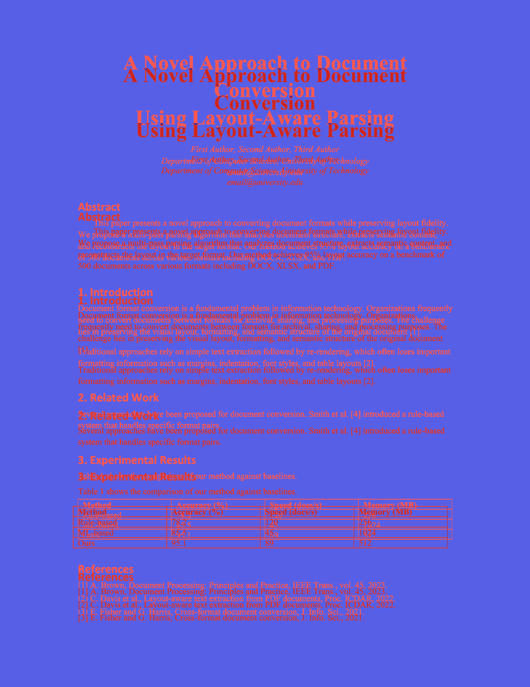</td>
  <td>changed: 225880 px (10.74%)<br>bbox: [175, 133, 1089, 1495]<br>mean abs RGB: 16.7255<br>RMSE RGB: 57.6211<br>threshold: 12, gain: 5.0</td>
</tr>
<tr>
  <td><b>13_IEEE_Style_Paper</b><br>Page 2</td>
  <td></td>
  <td>changed: 10706 px (0.51%)<br>bbox: [189, 152, 900, 206]<br>mean abs RGB: 0.6412<br>RMSE RGB: 10.5432<br>threshold: 12, gain: 5.0</td>
</tr>
<tr>
  <td><b>14_Thesis_Chapter</b><br>Page 1</td>
  <td>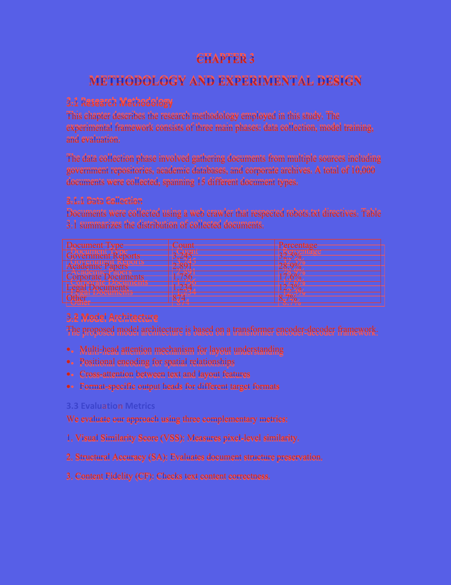</td>
  <td>changed: 177656 px (8.44%)<br>bbox: [175, 150, 1088, 1359]<br>mean abs RGB: 12.0835<br>RMSE RGB: 47.6994<br>threshold: 12, gain: 5.0</td>
</tr>
<tr>
  <td><b>14_Thesis_Chapter</b><br>Page 2</td>
  <td></td>
  <td>changed: 22553 px (1.07%)<br>bbox: [187, 158, 1085, 286]<br>mean abs RGB: 1.4335<br>RMSE RGB: 16.0226<br>threshold: 12, gain: 5.0</td>
</tr>
<tr>
  <td><b>20260317_sample_CN</b><br>Page 1</td>
  <td>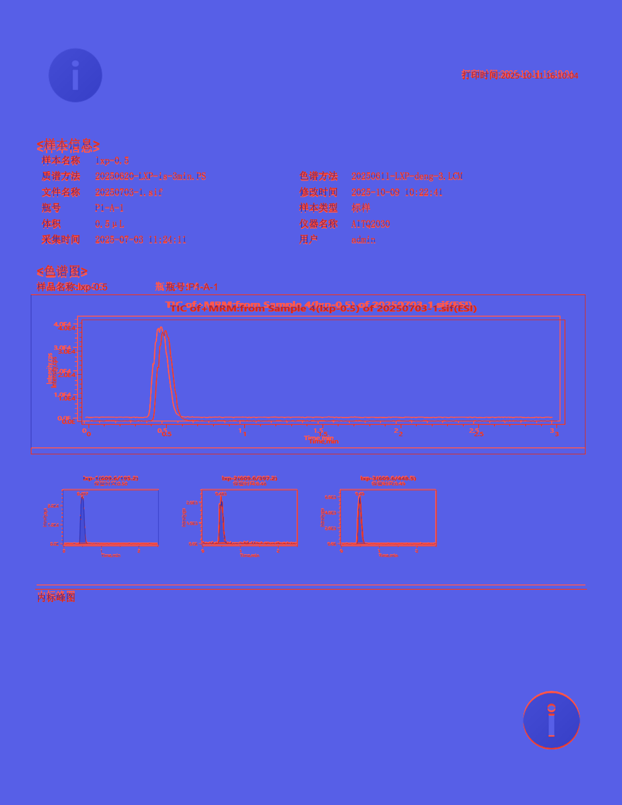</td>
  <td>changed: 90219 px (4.29%)<br>bbox: [63, 142, 1204, 1536]<br>mean abs RGB: 4.764<br>RMSE RGB: 27.5788<br>threshold: 12, gain: 5.0</td>
</tr>
<tr>
  <td><b>20260317_sample_CN</b><br>Page 2</td>
  <td>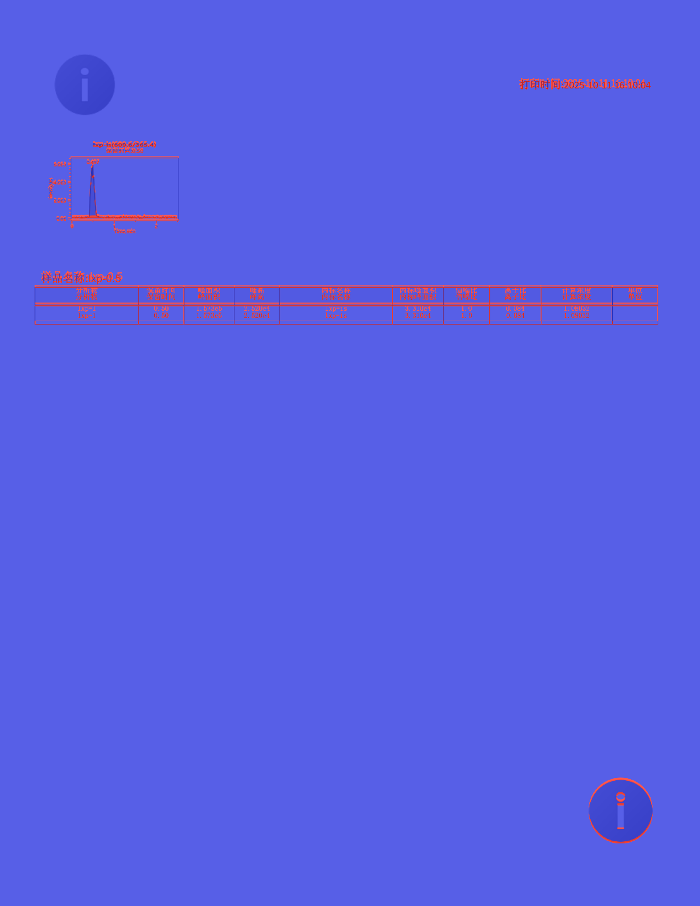</td>
  <td>changed: 40202 px (1.91%)<br>bbox: [63, 142, 1199, 1536]<br>mean abs RGB: 1.777<br>RMSE RGB: 16.8911<br>threshold: 12, gain: 5.0</td>
</tr>
<tr>
  <td><b>20260318_issue</b><br>Page 1</td>
  <td>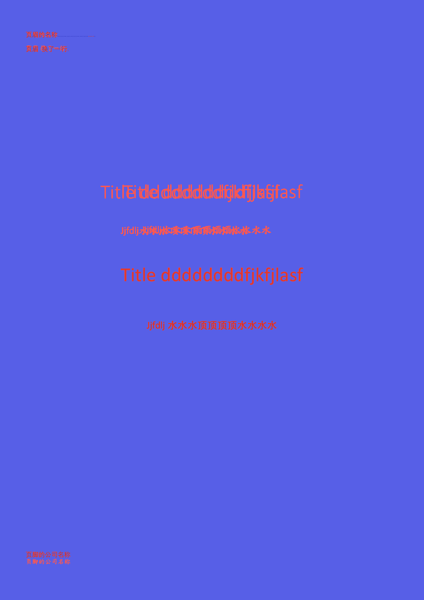</td>
  <td>changed: 34040 px (1.56%)<br>bbox: [76, 92, 888, 1650]<br>mean abs RGB: 1.9428<br>RMSE RGB: 18.1605<br>threshold: 12, gain: 5.0</td>
</tr>
<tr>
  <td><b>20260318_issue</b><br>Page 2</td>
  <td>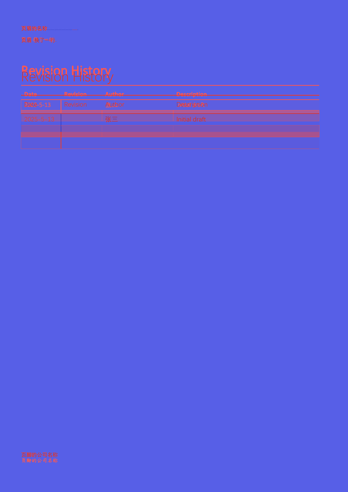</td>
  <td>changed: 193496 px (8.89%)<br>bbox: [74, 92, 1139, 1650]<br>mean abs RGB: 3.2586<br>RMSE RGB: 17.4132<br>threshold: 12, gain: 5.0</td>
</tr>
<tr>
  <td><b>20260318_issue</b><br>Page 3</td>
  <td>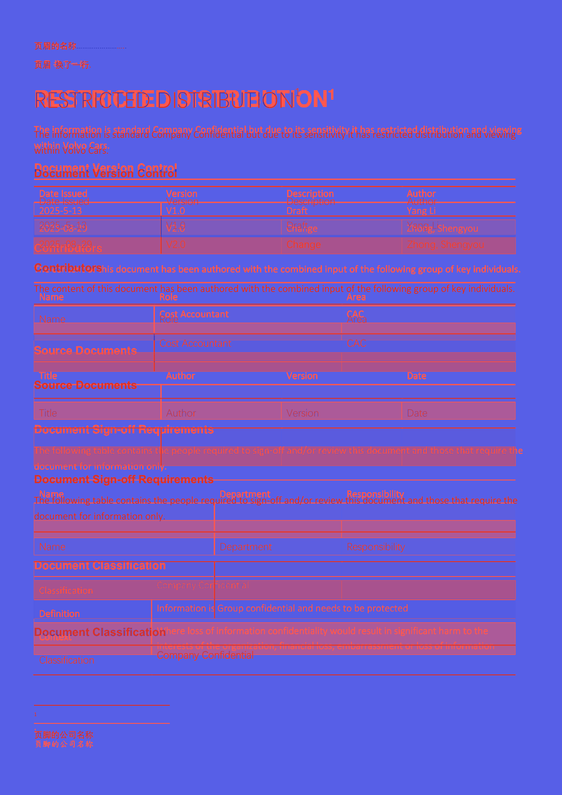</td>
  <td>changed: 838013 px (38.50%)<br>bbox: [73, 92, 1154, 1650]<br>mean abs RGB: 18.1827<br>RMSE RGB: 43.6966<br>threshold: 12, gain: 5.0</td>
</tr>
<tr>
  <td><b>20260318_issue</b><br>Page 4</td>
  <td>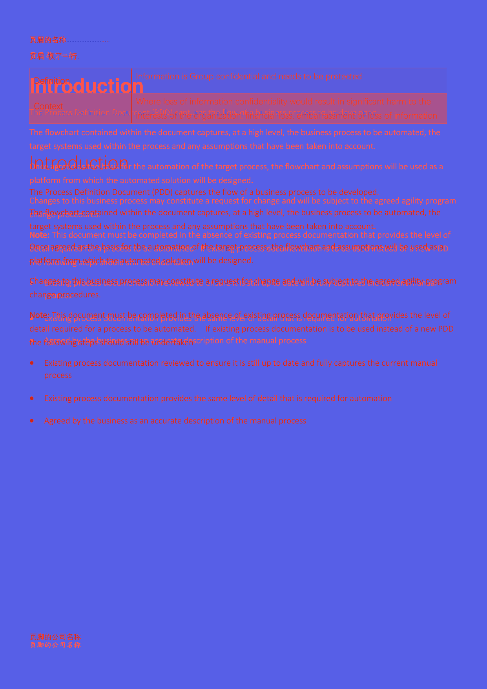</td>
  <td>changed: 263266 px (12.09%)<br>bbox: [74, 92, 1162, 1650]<br>mean abs RGB: 10.1314<br>RMSE RGB: 40.051<br>threshold: 12, gain: 5.0</td>
</tr>
<tr>
  <td><b>20260318_issue</b><br>Page 5</td>
  <td>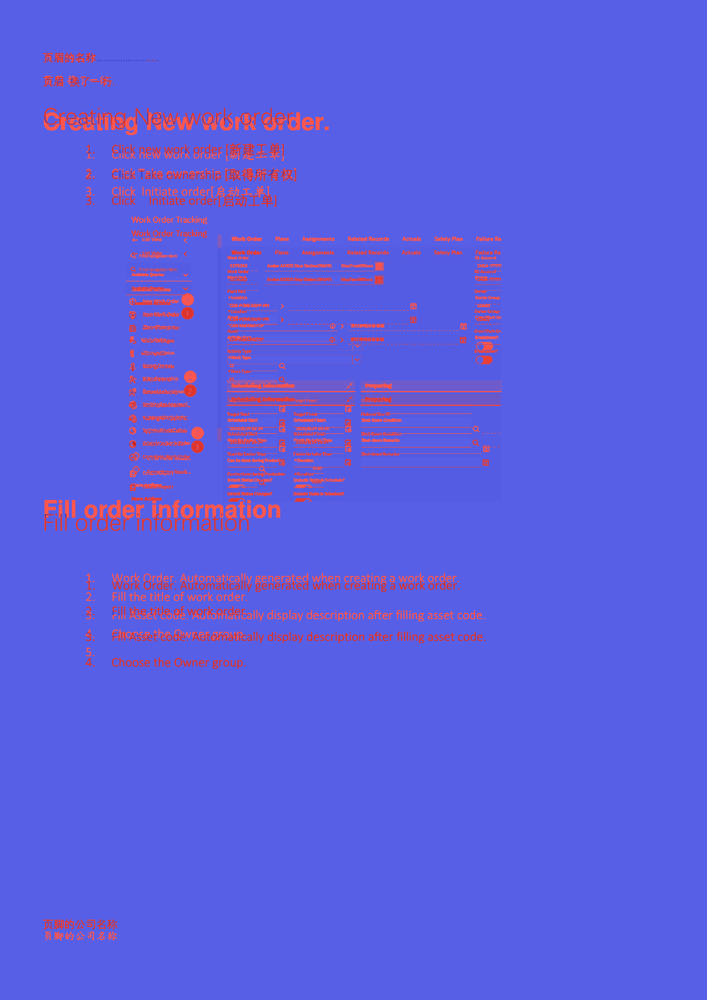</td>
  <td>changed: 117529 px (5.40%)<br>bbox: [76, 92, 880, 1650]<br>mean abs RGB: 5.2843<br>RMSE RGB: 27.6679<br>threshold: 12, gain: 5.0</td>
</tr>
<tr>
  <td><b>20260318_issue</b><br>Page 6</td>
  <td>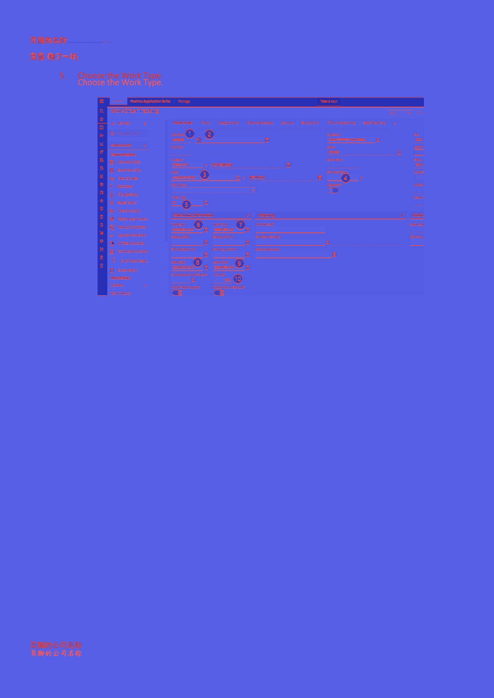</td>
  <td>changed: 46497 px (2.14%)<br>bbox: [76, 92, 1065, 1650]<br>mean abs RGB: 1.3524<br>RMSE RGB: 12.2812<br>threshold: 12, gain: 5.0</td>
</tr>
<tr>
  <td><b>20260318_issue</b><br>Page 7</td>
  <td></td>
  <td>changed: 4703 px (0.22%)<br>bbox: [76, 92, 274, 1650]<br>mean abs RGB: 0.2857<br>RMSE RGB: 7.0501<br>threshold: 12, gain: 5.0</td>
</tr>
<tr>
  <td><b>CCU_article</b><br>Page 1</td>
  <td>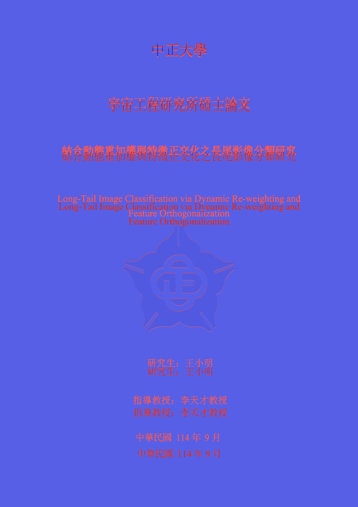</td>
  <td>changed: 73712 px (3.38%)<br>bbox: [199, 149, 1042, 1586]<br>mean abs RGB: 5.0678<br>RMSE RGB: 32.1264<br>threshold: 12, gain: 5.0</td>
</tr>
<tr>
  <td><b>CCU_article</b><br>Page 2</td>
  <td>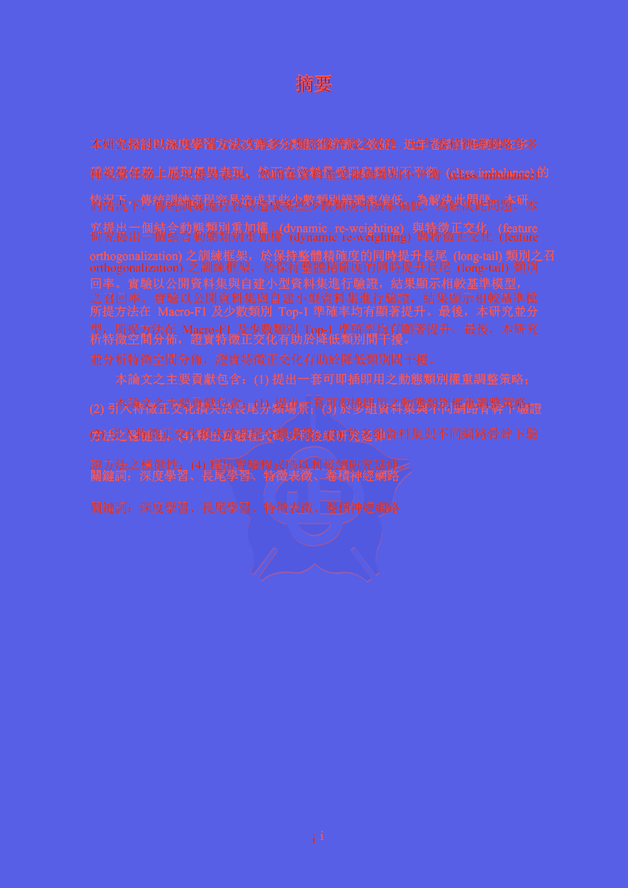</td>
  <td>changed: 156571 px (7.19%)<br>bbox: [177, 146, 1095, 1666]<br>mean abs RGB: 9.1648<br>RMSE RGB: 39.8904<br>threshold: 12, gain: 5.0</td>
</tr>
<tr>
  <td><b>CCU_article</b><br>Page 3</td>
  <td>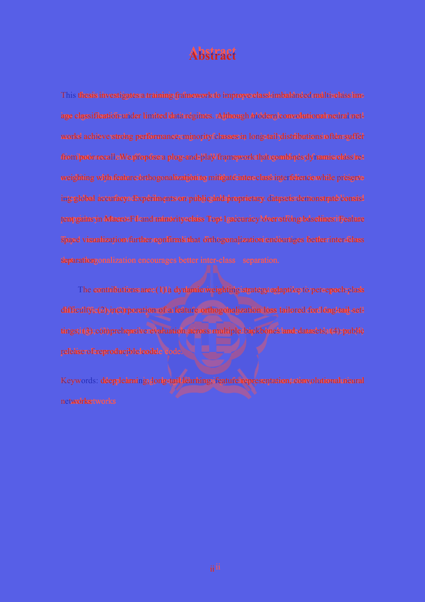</td>
  <td>changed: 148243 px (6.81%)<br>bbox: [177, 135, 1064, 1666]<br>mean abs RGB: 7.7327<br>RMSE RGB: 37.4651<br>threshold: 12, gain: 5.0</td>
</tr>
<tr>
  <td><b>CCU_article</b><br>Page 4</td>
  <td>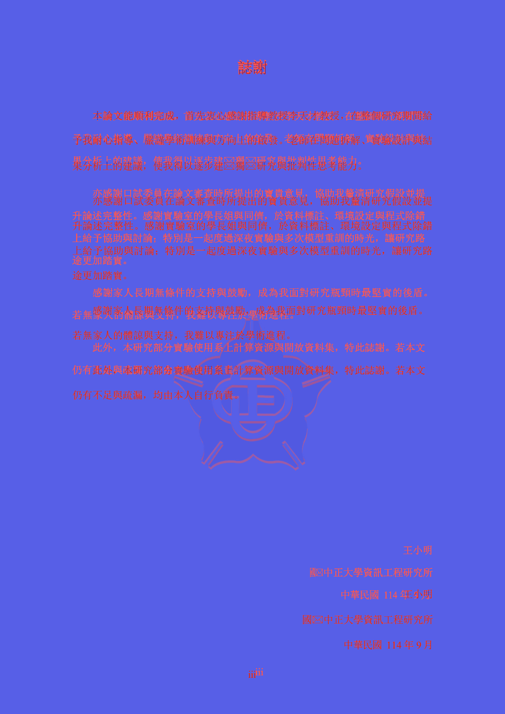</td>
  <td>changed: 142788 px (6.56%)<br>bbox: [178, 146, 1064, 1666]<br>mean abs RGB: 7.8775<br>RMSE RGB: 36.5149<br>threshold: 12, gain: 5.0</td>
</tr>
<tr>
  <td><b>CCU_article</b><br>Page 5</td>
  <td>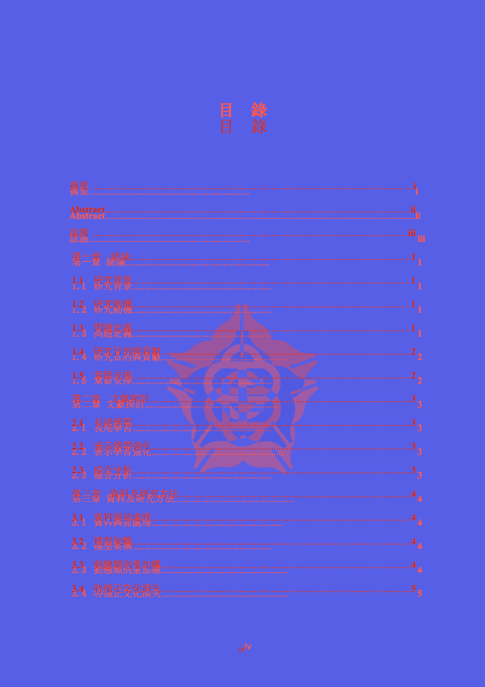</td>
  <td>changed: 146694 px (6.74%)<br>bbox: [177, 260, 1089, 1667]<br>mean abs RGB: 5.8086<br>RMSE RGB: 31.2859<br>threshold: 12, gain: 5.0</td>
</tr>
<tr>
  <td><b>CCU_article</b><br>Page 6</td>
  <td>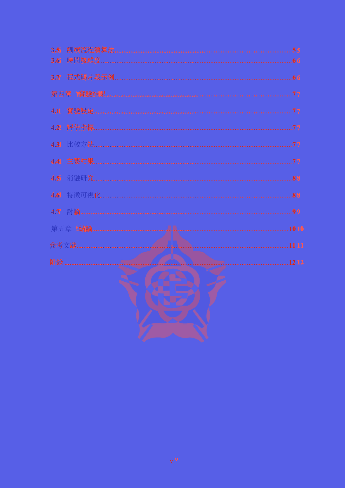</td>
  <td>changed: 100299 px (4.61%)<br>bbox: [178, 167, 1092, 1667]<br>mean abs RGB: 2.912<br>RMSE RGB: 20.299<br>threshold: 12, gain: 5.0</td>
</tr>
<tr>
  <td><b>CCU_article</b><br>Page 7</td>
  <td></td>
  <td>changed: 104040 px (4.78%)<br>bbox: [217, 211, 1062, 1667]<br>mean abs RGB: 1.7124<br>RMSE RGB: 12.5587<br>threshold: 12, gain: 5.0</td>
</tr>
<tr>
  <td><b>CCU_article</b><br>Page 8</td>
  <td></td>
  <td>changed: 100308 px (4.61%)<br>bbox: [215, 247, 1074, 1667]<br>mean abs RGB: 1.6319<br>RMSE RGB: 12.2818<br>threshold: 12, gain: 5.0</td>
</tr>
<tr>
  <td><b>CCU_article</b><br>Page 9</td>
  <td>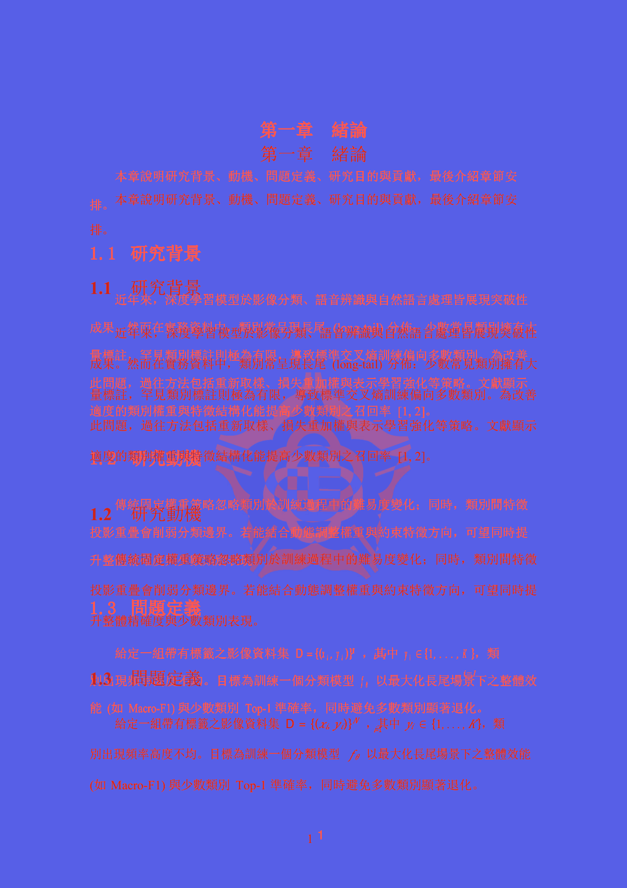</td>
  <td>changed: 210553 px (9.67%)<br>bbox: [178, 239, 1063, 1666]<br>mean abs RGB: 10.9988<br>RMSE RGB: 43.5608<br>threshold: 12, gain: 5.0</td>
</tr>
<tr>
  <td><b>CCU_article</b><br>Page 10</td>
  <td>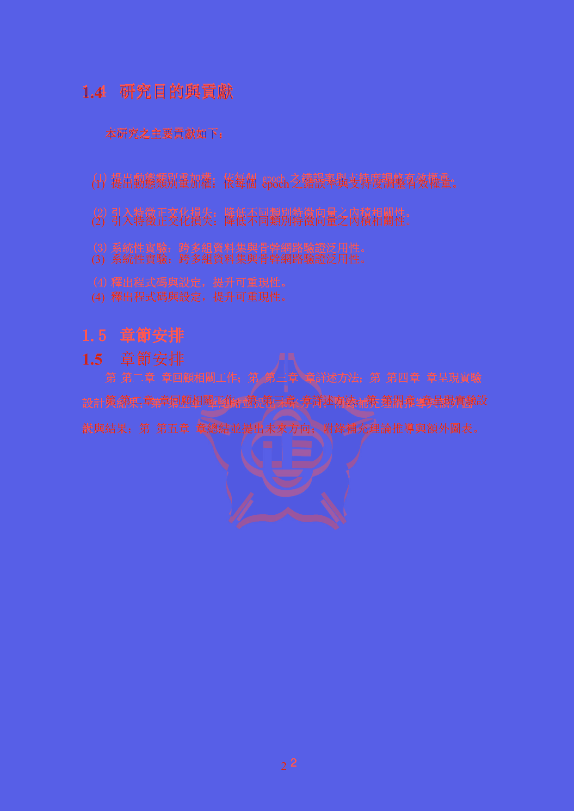</td>
  <td>changed: 105648 px (4.85%)<br>bbox: [178, 179, 1054, 1666]<br>mean abs RGB: 5.0027<br>RMSE RGB: 28.8718<br>threshold: 12, gain: 5.0</td>
</tr>
<tr>
  <td><b>CCU_article</b><br>Page 11</td>
  <td>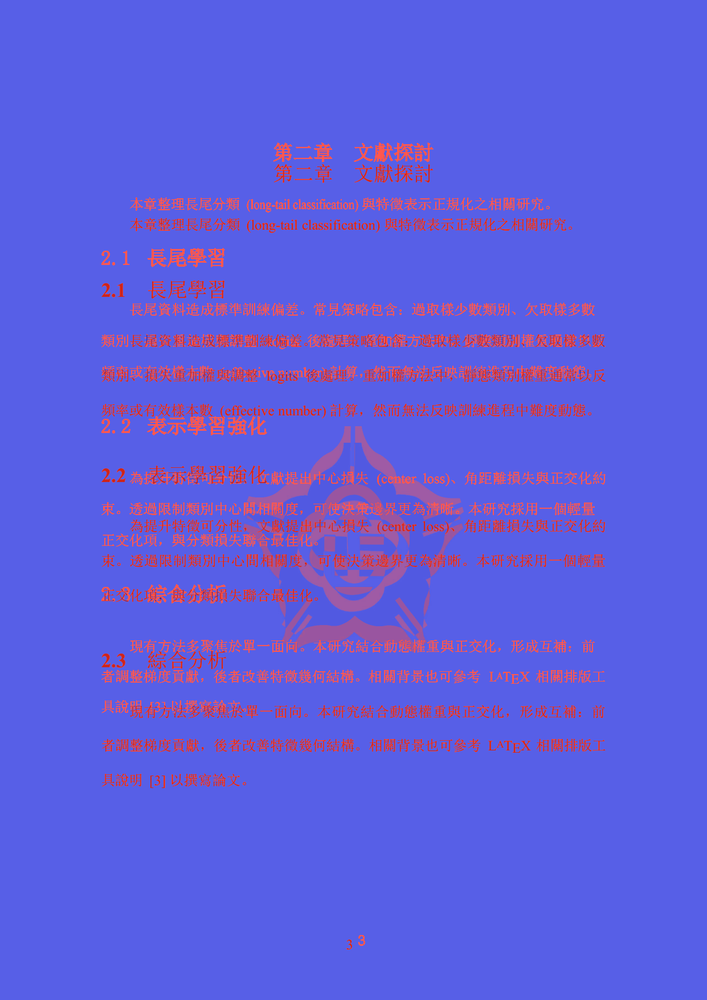</td>
  <td>changed: 172272 px (7.91%)<br>bbox: [178, 250, 1063, 1667]<br>mean abs RGB: 8.8728<br>RMSE RGB: 39.3394<br>threshold: 12, gain: 5.0</td>
</tr>
<tr>
  <td><b>CCU_article</b><br>Page 12</td>
  <td>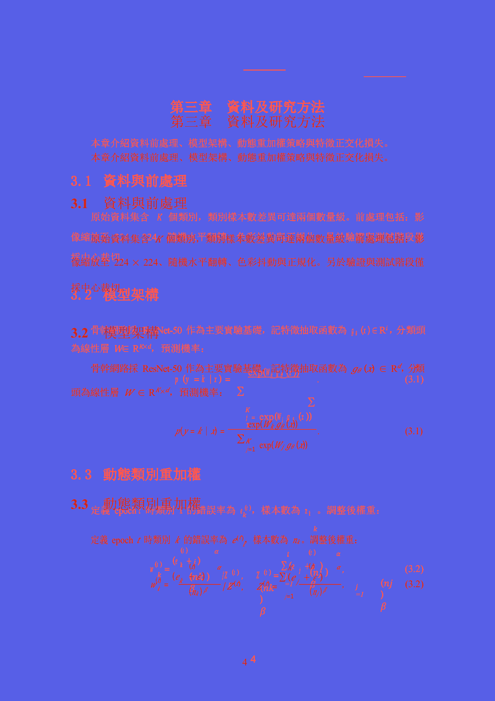</td>
  <td>changed: 112539 px (5.17%)<br>bbox: [178, 174, 1066, 1666]<br>mean abs RGB: 7.5381<br>RMSE RGB: 37.7278<br>threshold: 12, gain: 5.0</td>
</tr>
<tr>
  <td><b>CCU_article</b><br>Page 13</td>
  <td>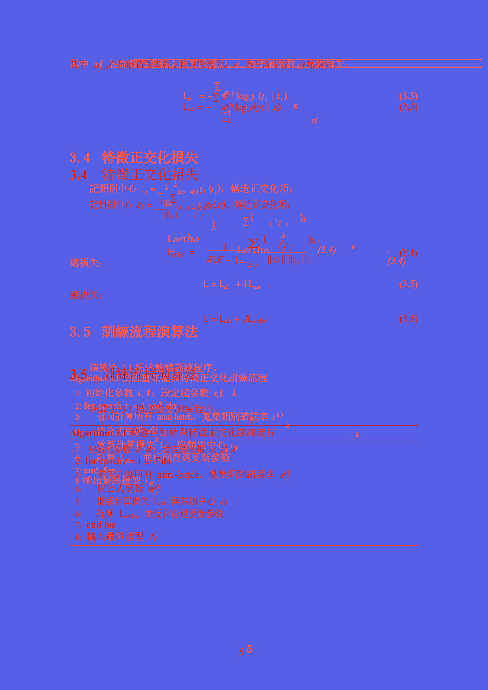</td>
  <td>changed: 97206 px (4.46%)<br>bbox: [177, 150, 1226, 1667]<br>mean abs RGB: 6.4183<br>RMSE RGB: 34.8521<br>threshold: 12, gain: 5.0</td>
</tr>
<tr>
  <td><b>CCU_article</b><br>Page 14</td>
  <td>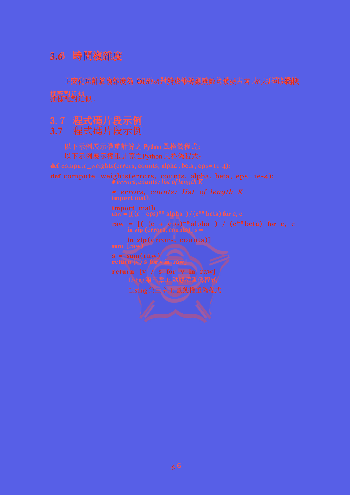</td>
  <td>changed: 91818 px (4.22%)<br>bbox: [178, 179, 1060, 1667]<br>mean abs RGB: 4.7574<br>RMSE RGB: 29.7004<br>threshold: 12, gain: 5.0</td>
</tr>
<tr>
  <td><b>CCU_article</b><br>Page 15</td>
  <td>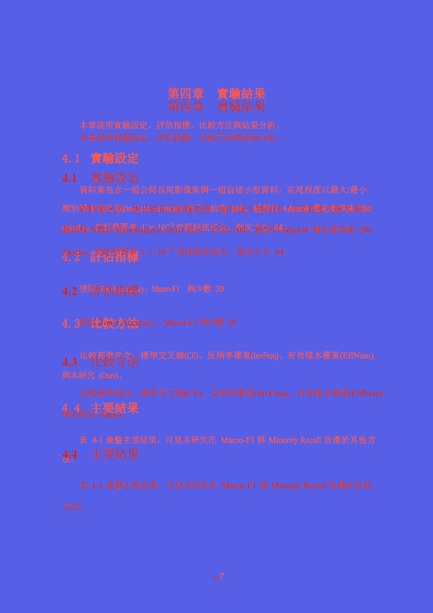</td>
  <td>changed: 98556 px (4.53%)<br>bbox: [177, 250, 1096, 1667]<br>mean abs RGB: 6.6755<br>RMSE RGB: 35.6428<br>threshold: 12, gain: 5.0</td>
</tr>
<tr>
  <td><b>CCU_article</b><br>Page 16</td>
  <td>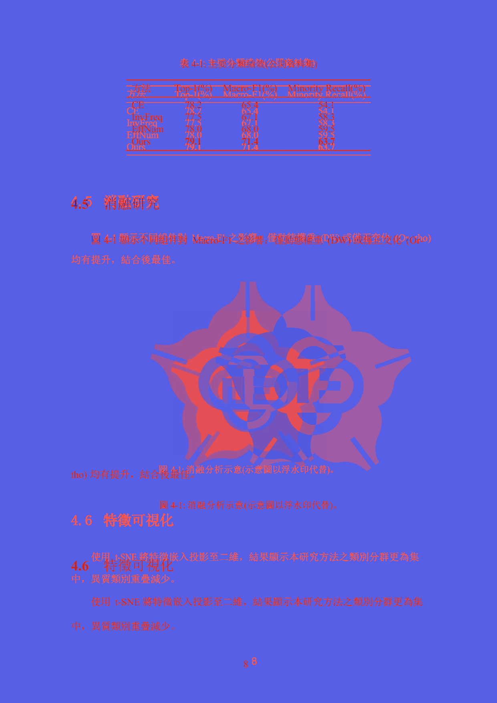</td>
  <td>changed: 233744 px (10.73%)<br>bbox: [177, 145, 1076, 1667]<br>mean abs RGB: 7.0588<br>RMSE RGB: 32.2184<br>threshold: 12, gain: 5.0</td>
</tr>
<tr>
  <td><b>CCU_article</b><br>Page 17</td>
  <td></td>
  <td>changed: 14960 px (0.69%)<br>bbox: [177, 179, 1046, 1667]<br>mean abs RGB: 0.8525<br>RMSE RGB: 11.9822<br>threshold: 12, gain: 5.0</td>
</tr>
<tr>
  <td><b>CCU_article</b><br>Page 18</td>
  <td>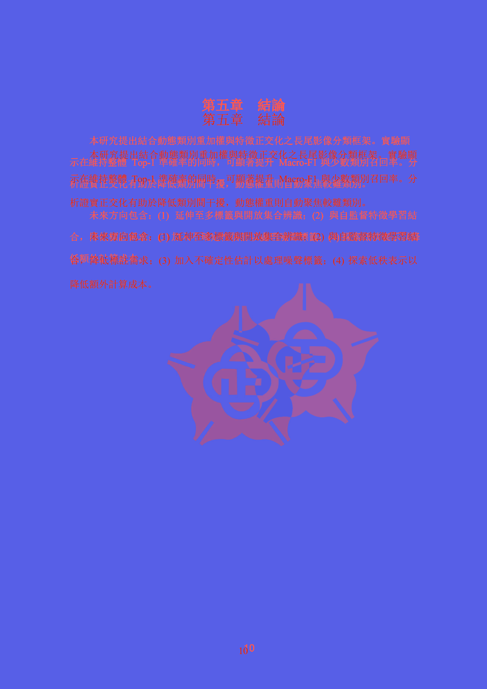</td>
  <td>changed: 162681 px (7.47%)<br>bbox: [178, 250, 1070, 1667]<br>mean abs RGB: 5.4466<br>RMSE RGB: 28.6186<br>threshold: 12, gain: 5.0</td>
</tr>
<tr>
  <td><b>CCU_article</b><br>Page 19</td>
  <td>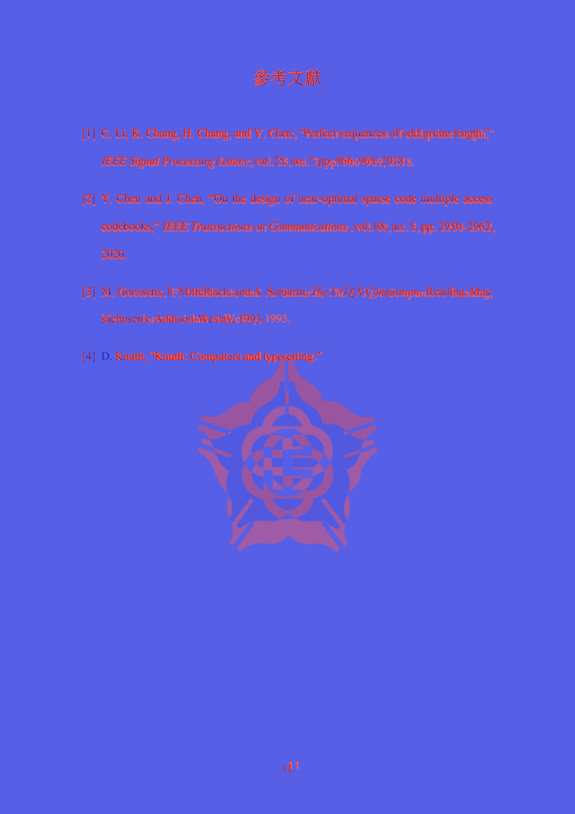</td>
  <td>changed: 109438 px (5.02%)<br>bbox: [179, 148, 1069, 1666]<br>mean abs RGB: 4.0951<br>RMSE RGB: 26.075<br>threshold: 12, gain: 5.0</td>
</tr>
<tr>
  <td><b>CCU_article</b><br>Page 20</td>
  <td>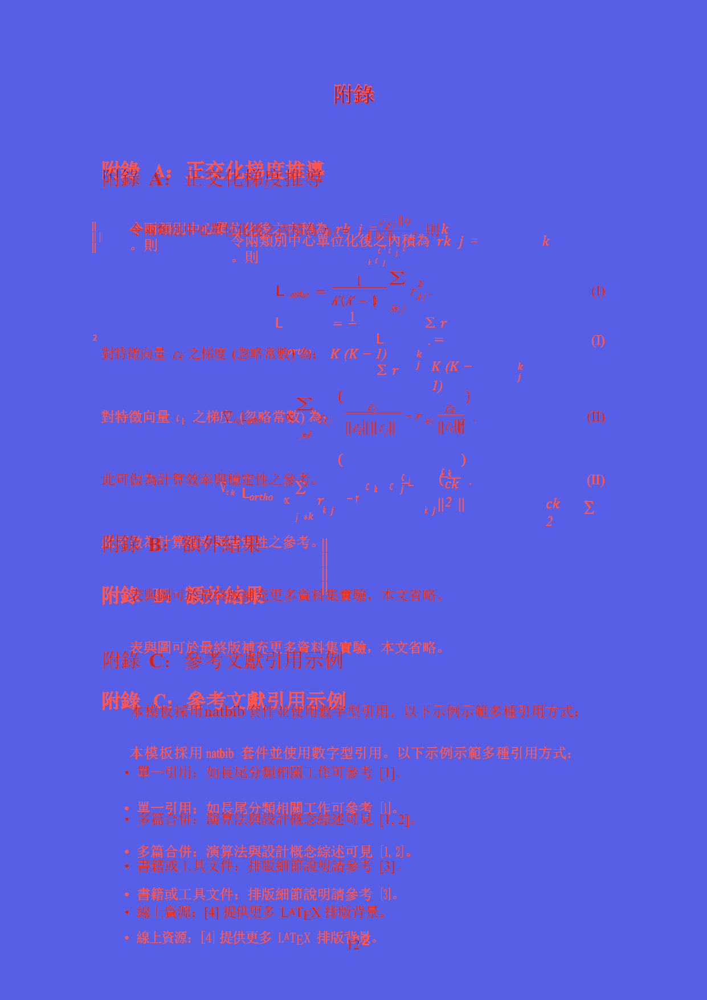</td>
  <td>changed: 103940 px (4.77%)<br>bbox: [162, 146, 1061, 1666]<br>mean abs RGB: 6.8899<br>RMSE RGB: 35.8795<br>threshold: 12, gain: 5.0</td>
</tr>
<tr>
  <td><b>CCU_article</b><br>Page 21</td>
  <td>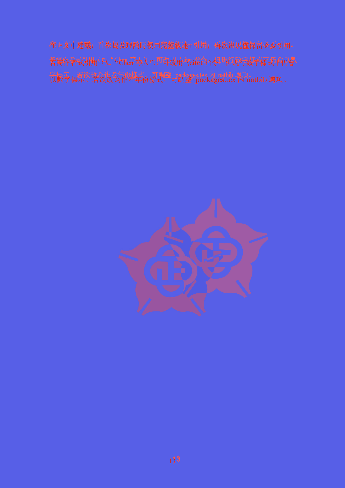</td>
  <td>changed: 125087 px (5.74%)<br>bbox: [178, 148, 1069, 1667]<br>mean abs RGB: 3.0281<br>RMSE RGB: 19.639<br>threshold: 12, gain: 5.0</td>
</tr>
<tr>
  <td><b>Class News</b><br>Page 1</td>
  <td></td>
  <td>changed: 286130 px (13.60%)<br>bbox: [2, 21, 1223, 1538]<br>mean abs RGB: 12.1519<br>RMSE RGB: 40.1705<br>threshold: 12, gain: 5.0</td>
</tr>
<tr>
  <td><b>Class News</b><br>Page 2</td>
  <td></td>
  <td>changed: 325149 px (15.46%)<br>bbox: [0, 110, 1223, 1650]<br>mean abs RGB: 12.76<br>RMSE RGB: 42.2499<br>threshold: 12, gain: 5.0</td>
</tr>
<tr>
  <td><b>Class News</b><br>Page 3</td>
  <td></td>
  <td>changed: 290002 px (13.79%)<br>bbox: [2, 104, 1223, 1413]<br>mean abs RGB: 12.6694<br>RMSE RGB: 41.6266<br>threshold: 12, gain: 5.0</td>
</tr>
<tr>
  <td><b>Class News</b><br>Page 4</td>
  <td></td>
  <td>changed: 326610 px (15.53%)<br>bbox: [2, 45, 1223, 1448]<br>mean abs RGB: 13.4709<br>RMSE RGB: 44.1614<br>threshold: 12, gain: 5.0</td>
</tr>
<tr>
  <td><b>Confirmatory_Affidavit</b><br>Page 1</td>
  <td>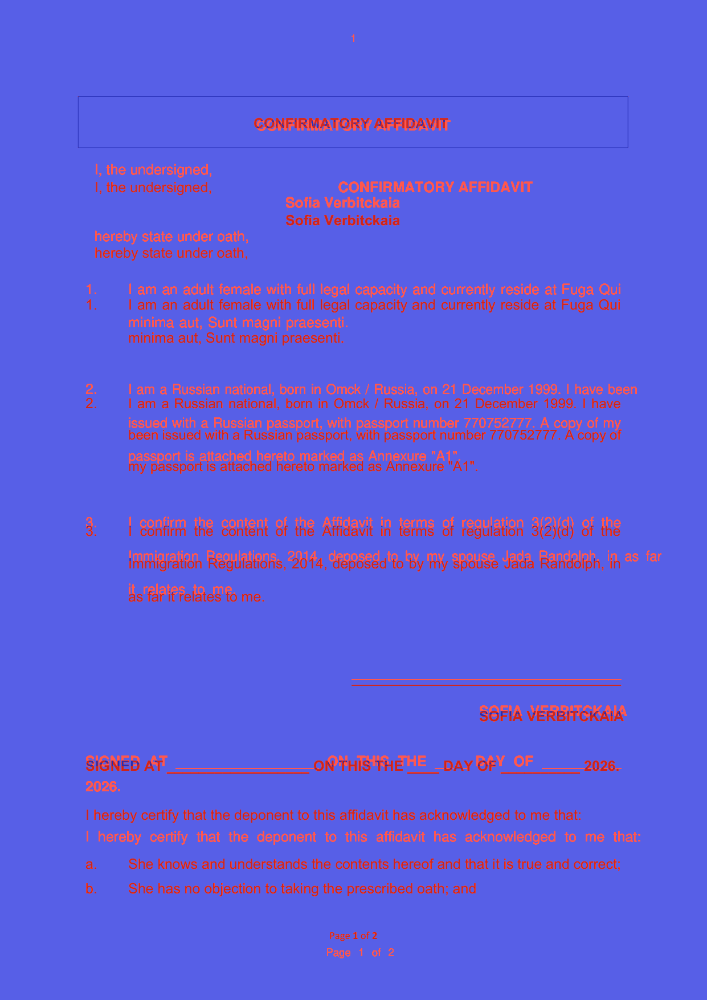</td>
  <td>changed: 137784 px (6.33%)<br>bbox: [136, 60, 1162, 1681]<br>mean abs RGB: 11.1717<br>RMSE RGB: 48.8698<br>threshold: 12, gain: 5.0</td>
</tr>
<tr>
  <td><b>Confirmatory_Affidavit</b><br>Page 2</td>
  <td>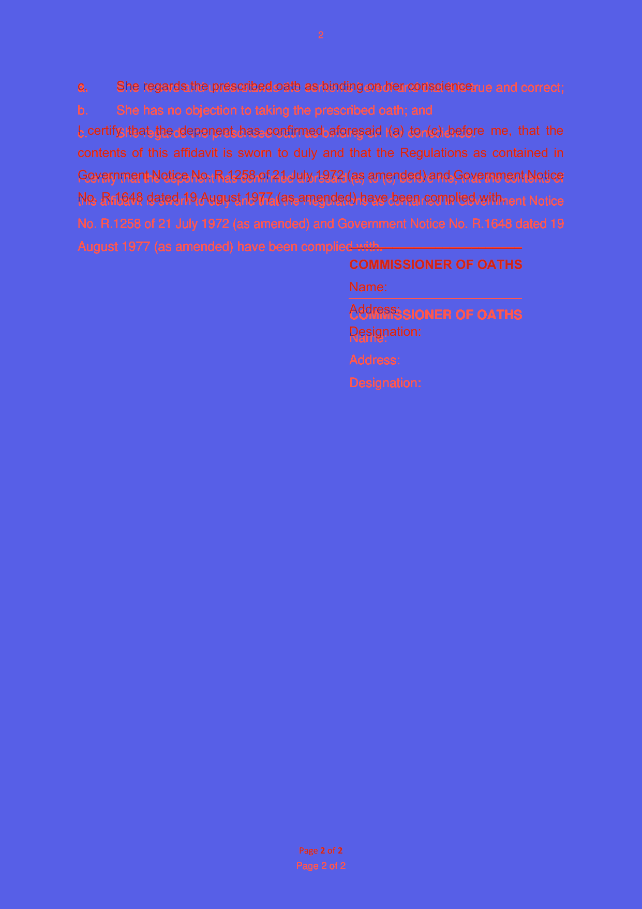</td>
  <td>changed: 78668 px (3.61%)<br>bbox: [150, 60, 1090, 1681]<br>mean abs RGB: 6.2103<br>RMSE RGB: 36.2653<br>threshold: 12, gain: 5.0</td>
</tr>
<tr>
  <td><b>Cooperation Agreement Template</b><br>Page 1</td>
  <td></td>
  <td>changed: 30957 px (1.42%)<br>bbox: [168, 222, 1082, 1654]<br>mean abs RGB: 2.714<br>RMSE RGB: 24.6848<br>threshold: 12, gain: 5.0</td>
</tr>
<tr>
  <td><b>Cooperation Agreement Template</b><br>Page 2</td>
  <td></td>
  <td>changed: 90551 px (4.16%)<br>bbox: [166, 276, 1087, 1654]<br>mean abs RGB: 5.2409<br>RMSE RGB: 29.5891<br>threshold: 12, gain: 5.0</td>
</tr>
<tr>
  <td><b>Cooperation Agreement Template</b><br>Page 3</td>
  <td></td>
  <td>changed: 24504 px (1.13%)<br>bbox: [165, 221, 1082, 1655]<br>mean abs RGB: 1.5737<br>RMSE RGB: 16.9964<br>threshold: 12, gain: 5.0</td>
</tr>
<tr>
  <td><b>Cooperation Agreement Template</b><br>Page 4</td>
  <td></td>
  <td>changed: 46090 px (2.12%)<br>bbox: [166, 221, 1087, 1654]<br>mean abs RGB: 2.7412<br>RMSE RGB: 21.7043<br>threshold: 12, gain: 5.0</td>
</tr>
<tr>
  <td><b>Cooperation Agreement Template</b><br>Page 5</td>
  <td></td>
  <td>changed: 142863 px (6.56%)<br>bbox: [165, 223, 1087, 1655]<br>mean abs RGB: 8.492<br>RMSE RGB: 38.1858<br>threshold: 12, gain: 5.0</td>
</tr>
<tr>
  <td><b>Cooperation Agreement Template</b><br>Page 6</td>
  <td></td>
  <td>changed: 6406 px (0.29%)<br>bbox: [166, 319, 1082, 1655]<br>mean abs RGB: 0.3754<br>RMSE RGB: 8.0314<br>threshold: 12, gain: 5.0</td>
</tr>
<tr>
  <td><b>Cooperation Agreement Template</b><br>Page 7</td>
  <td></td>
  <td>changed: 487 px (0.02%)<br>bbox: [951, 1622, 1082, 1654]<br>mean abs RGB: 0.0377<br>RMSE RGB: 2.9038<br>threshold: 12, gain: 5.0</td>
</tr>
<tr>
  <td><b>Fabrikam</b><br>Page 1</td>
  <td>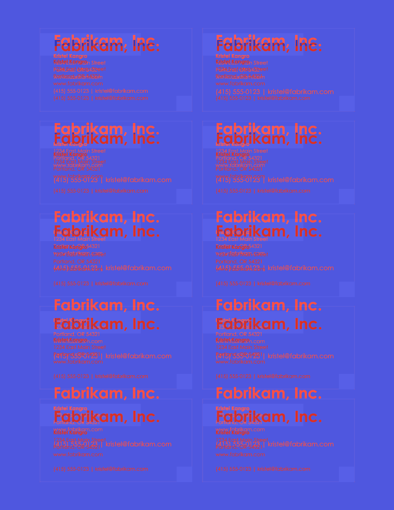</td>
  <td>changed: 205420 px (9.76%)<br>bbox: [128, 91, 1148, 1560]<br>mean abs RGB: 11.4858<br>RMSE RGB: 42.137<br>threshold: 12, gain: 5.0</td>
</tr>
<tr>
  <td><b>Invoice</b><br>Page 1</td>
  <td>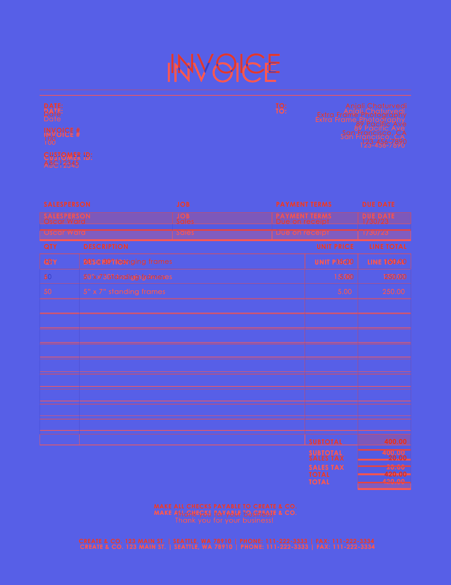</td>
  <td>changed: 195100 px (9.27%)<br>bbox: [111, 150, 1163, 1552]<br>mean abs RGB: 6.2606<br>RMSE RGB: 25.8387<br>threshold: 12, gain: 5.0</td>
</tr>
<tr>
  <td><b>Issue79_FilledContract</b><br>Page 1</td>
  <td>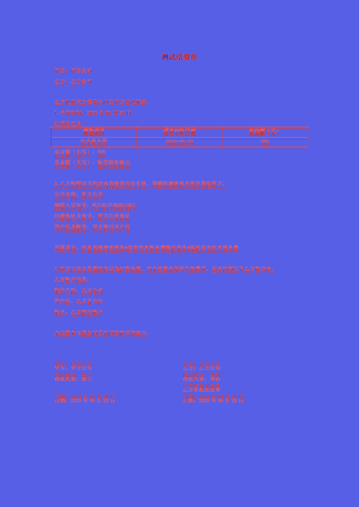</td>
  <td>changed: 82926 px (3.81%)<br>bbox: [175, 184, 1065, 1394]<br>mean abs RGB: 4.6329<br>RMSE RGB: 27.47<br>threshold: 12, gain: 5.0</td>
</tr>
<tr>
  <td><b>Issue79_TemplateContract</b><br>Page 1</td>
  <td>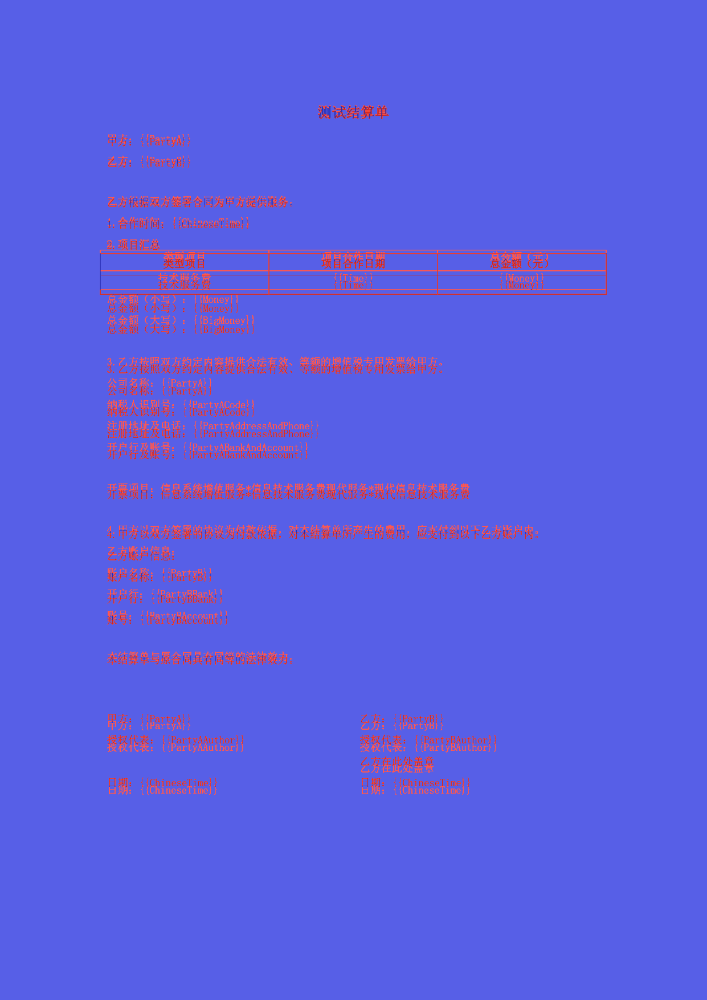</td>
  <td>changed: 84635 px (3.89%)<br>bbox: [175, 184, 1065, 1394]<br>mean abs RGB: 4.6874<br>RMSE RGB: 27.4834<br>threshold: 12, gain: 5.0</td>
</tr>
<tr>
  <td><b>Issue83_Output</b><br>Page 1</td>
  <td></td>
  <td>changed: 2028 px (0.09%)<br>bbox: [147, 198, 384, 289]<br>mean abs RGB: 0.1151<br>RMSE RGB: 4.5064<br>threshold: 12, gain: 5.0</td>
</tr>
<tr>
  <td><b>Issue159_PageLayoutOptions</b><br>Page 1</td>
  <td>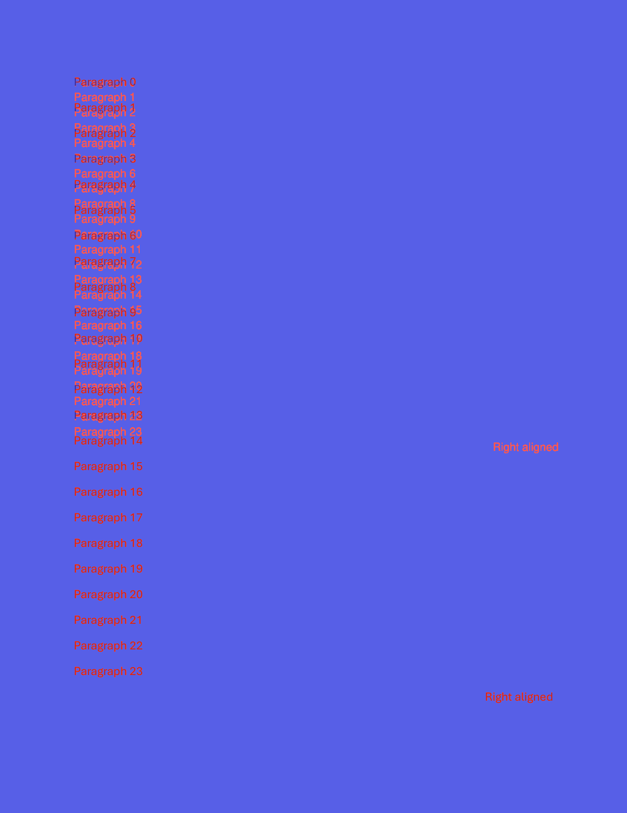</td>
  <td>changed: 43822 px (2.08%)<br>bbox: [152, 157, 1135, 1427]<br>mean abs RGB: 3.4487<br>RMSE RGB: 26.654<br>threshold: 12, gain: 5.0</td>
</tr>
<tr>
  <td><b>issue202605</b><br>Page 1</td>
  <td>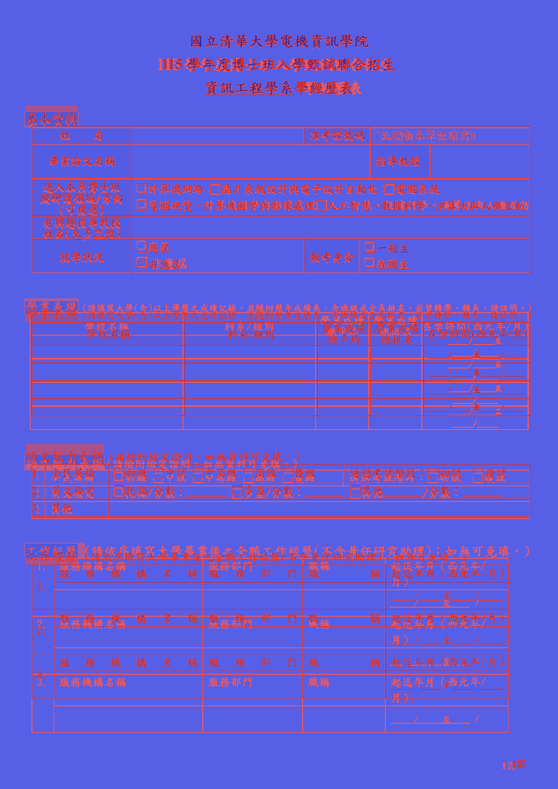</td>
  <td>changed: 315192 px (14.48%)<br>bbox: [54, 75, 1182, 1712]<br>mean abs RGB: 17.1881<br>RMSE RGB: 55.6526<br>threshold: 12, gain: 5.0</td>
</tr>
<tr>
  <td><b>issue202605</b><br>Page 2</td>
  <td>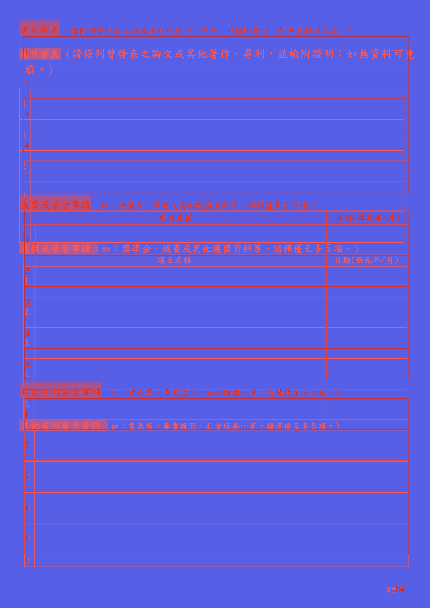</td>
  <td>changed: 243584 px (11.19%)<br>bbox: [54, 59, 1197, 1712]<br>mean abs RGB: 9.7878<br>RMSE RGB: 40.6703<br>threshold: 12, gain: 5.0</td>
</tr>
<tr>
  <td><b>issue26050501</b><br>Page 1</td>
  <td>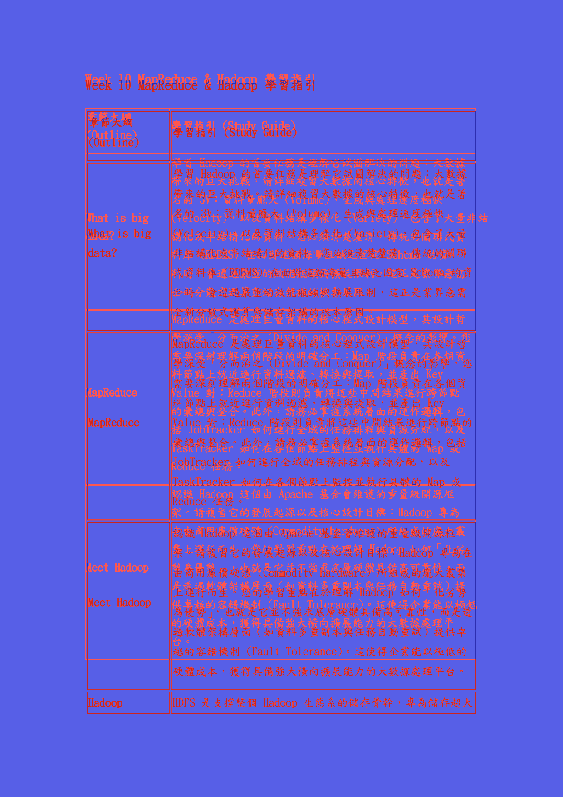</td>
  <td>changed: 282765 px (12.99%)<br>bbox: [187, 161, 1075, 1572]<br>mean abs RGB: 19.7941<br>RMSE RGB: 62.167<br>threshold: 12, gain: 5.0</td>
</tr>
<tr>
  <td><b>issue26050501</b><br>Page 2</td>
  <td>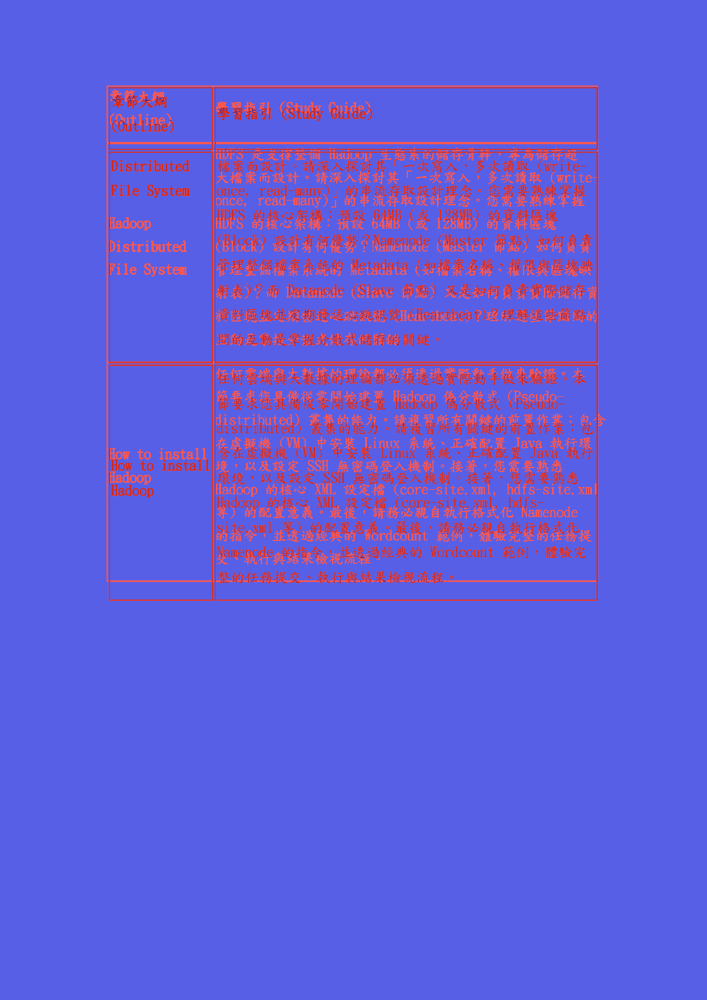</td>
  <td>changed: 184671 px (8.48%)<br>bbox: [187, 150, 1064, 1054]<br>mean abs RGB: 12.6779<br>RMSE RGB: 49.4467<br>threshold: 12, gain: 5.0</td>
</tr>
<tr>
  <td><b>issues66</b><br>Page 1</td>
  <td>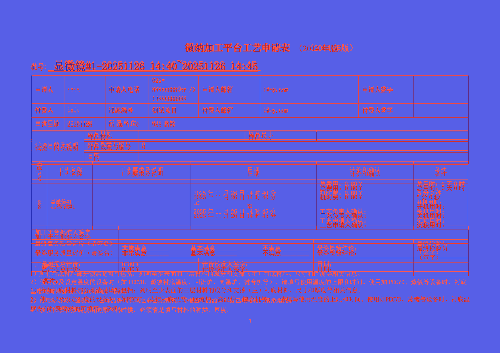</td>
  <td>changed: 232002 px (10.66%)<br>bbox: [106, 151, 1648, 1134]<br>mean abs RGB: 14.5971<br>RMSE RGB: 51.4868<br>threshold: 12, gain: 5.0</td>
</tr>
<tr>
  <td><b>issues66</b><br>Page 2</td>
  <td>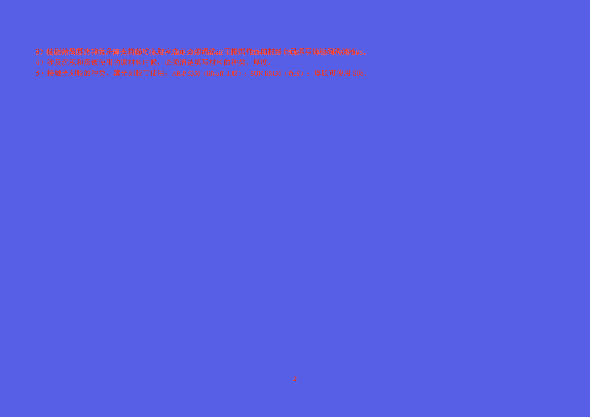</td>
  <td>changed: 22071 px (1.01%)<br>bbox: [107, 142, 1089, 1134]<br>mean abs RGB: 1.1904<br>RMSE RGB: 14.0893<br>threshold: 12, gain: 5.0</td>
</tr>
<tr>
  <td><b>issues66</b><br>Page 3</td>
  <td></td>
  <td>changed: 77 px (0.00%)<br>bbox: [872, 1120, 882, 1135]<br>mean abs RGB: 0.0042<br>RMSE RGB: 0.8243<br>threshold: 12, gain: 5.0</td>
</tr>
<tr>
  <td><b>MODERN LIVING</b><br>Page 1</td>
  <td></td>
  <td>changed: 143241 px (6.81%)<br>bbox: [86, 108, 1275, 1496]<br>mean abs RGB: 11.1833<br>RMSE RGB: 46.3948<br>threshold: 12, gain: 5.0</td>
</tr>
<tr>
  <td><b>MODERN LIVING</b><br>Page 2</td>
  <td></td>
  <td>changed: 275750 px (13.11%)<br>bbox: [75, 121, 1200, 1499]<br>mean abs RGB: 17.404<br>RMSE RGB: 55.6167<br>threshold: 12, gain: 5.0</td>
</tr>
<tr>
  <td><b>nthu_article</b><br>Page 1</td>
  <td>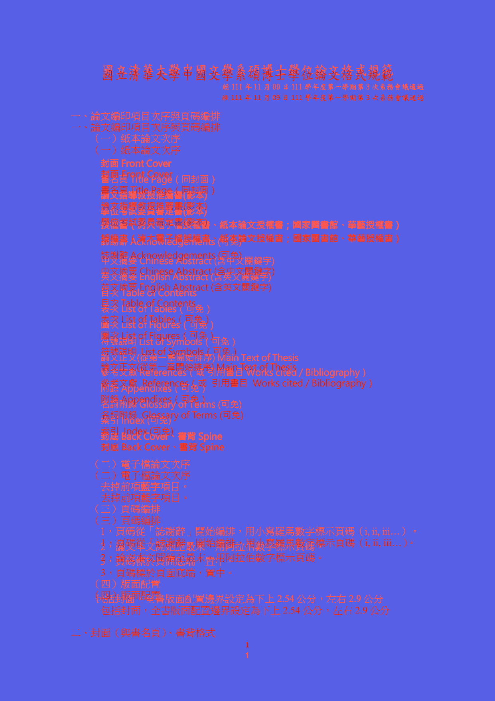</td>
  <td>changed: 173220 px (7.96%)<br>bbox: [178, 159, 1063, 1647]<br>mean abs RGB: 10.6745<br>RMSE RGB: 43.8439<br>threshold: 12, gain: 5.0</td>
</tr>
<tr>
  <td><b>nthu_article</b><br>Page 2</td>
  <td>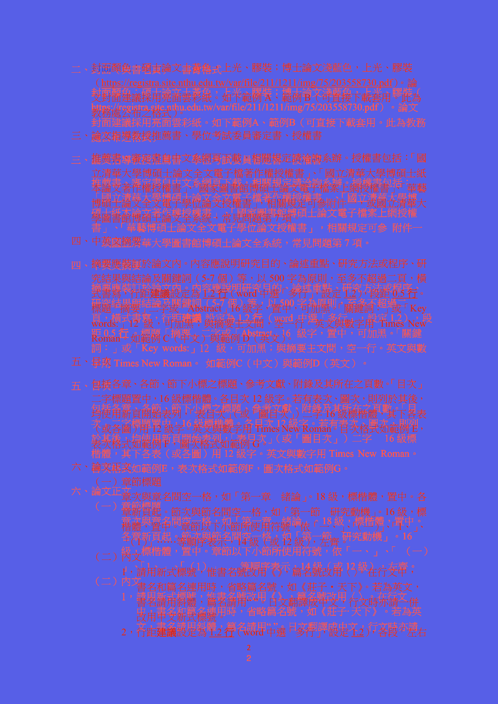</td>
  <td>changed: 301066 px (13.83%)<br>bbox: [178, 156, 1077, 1647]<br>mean abs RGB: 17.7054<br>RMSE RGB: 54.6935<br>threshold: 12, gain: 5.0</td>
</tr>
<tr>
  <td><b>nthu_article</b><br>Page 3</td>
  <td>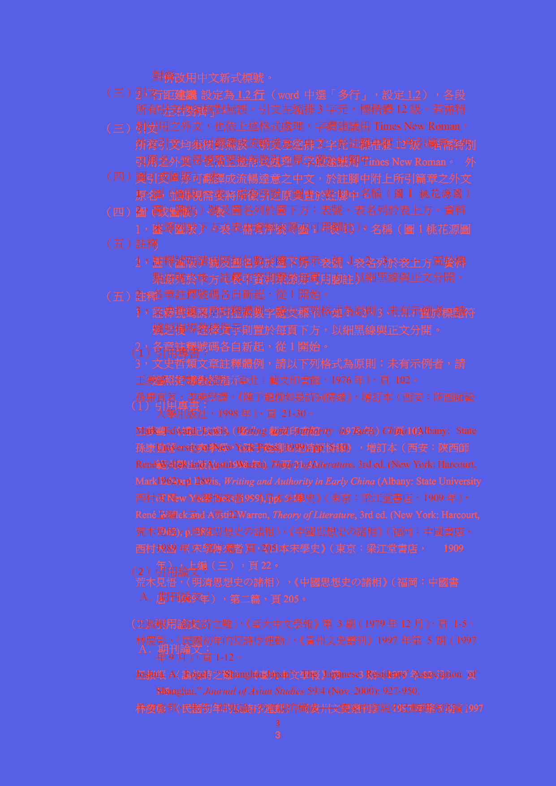</td>
  <td>changed: 216290 px (9.94%)<br>bbox: [239, 157, 1078, 1648]<br>mean abs RGB: 12.7885<br>RMSE RGB: 46.6495<br>threshold: 12, gain: 5.0</td>
</tr>
<tr>
  <td><b>nthu_article</b><br>Page 4</td>
  <td>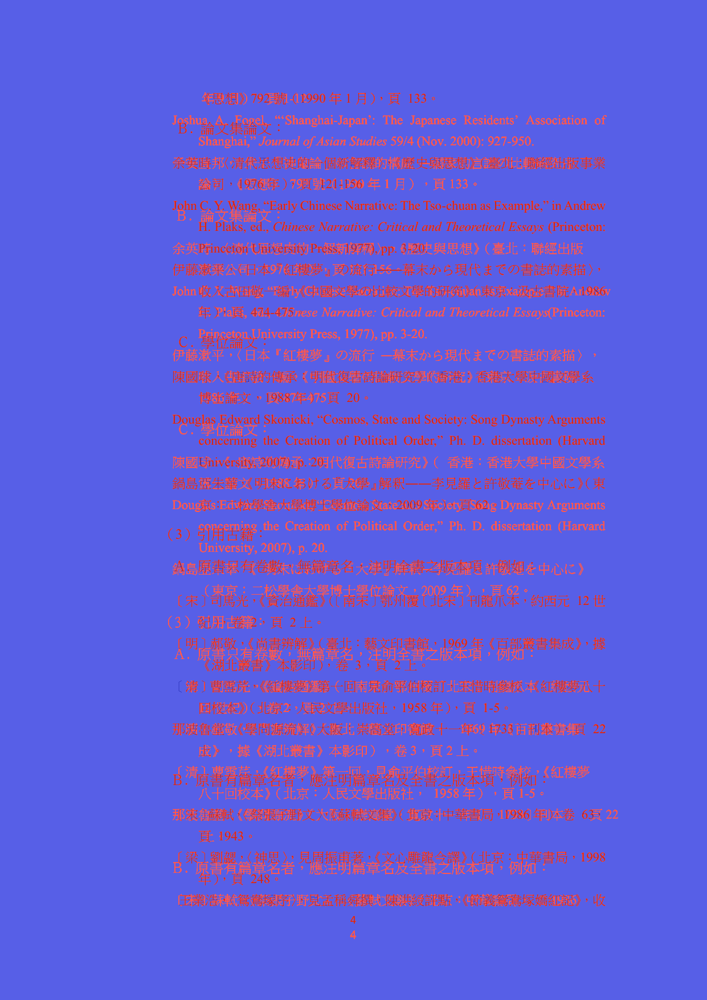</td>
  <td>changed: 206592 px (9.49%)<br>bbox: [295, 162, 1085, 1647]<br>mean abs RGB: 12.2374<br>RMSE RGB: 45.7577<br>threshold: 12, gain: 5.0</td>
</tr>
<tr>
  <td><b>nthu_article</b><br>Page 5</td>
  <td>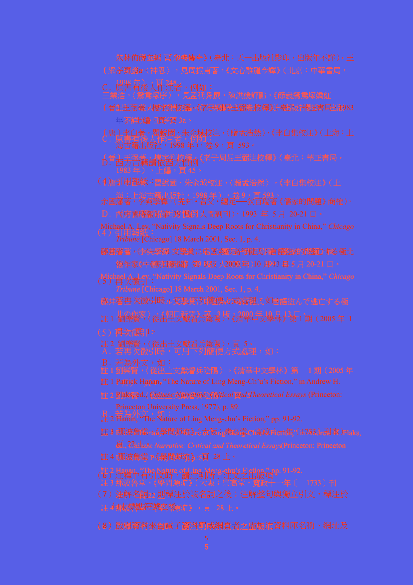</td>
  <td>changed: 188469 px (8.66%)<br>bbox: [295, 162, 1084, 1648]<br>mean abs RGB: 11.2002<br>RMSE RGB: 43.7988<br>threshold: 12, gain: 5.0</td>
</tr>
<tr>
  <td><b>nthu_article</b><br>Page 6</td>
  <td>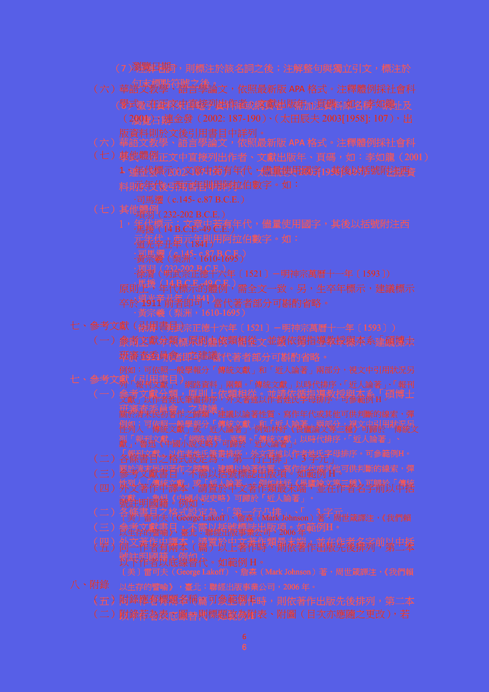</td>
  <td>changed: 244982 px (11.25%)<br>bbox: [178, 157, 1085, 1648]<br>mean abs RGB: 14.2548<br>RMSE RGB: 48.6351<br>threshold: 12, gain: 5.0</td>
</tr>
<tr>
  <td><b>nthu_article</b><br>Page 7</td>
  <td></td>
  <td>changed: 21748 px (1.00%)<br>bbox: [0, 156, 1051, 1647]<br>mean abs RGB: 1.2898<br>RMSE RGB: 14.7719<br>threshold: 12, gain: 5.0</td>
</tr>
<tr>
  <td><b>nthu_article</b><br>Page 8</td>
  <td>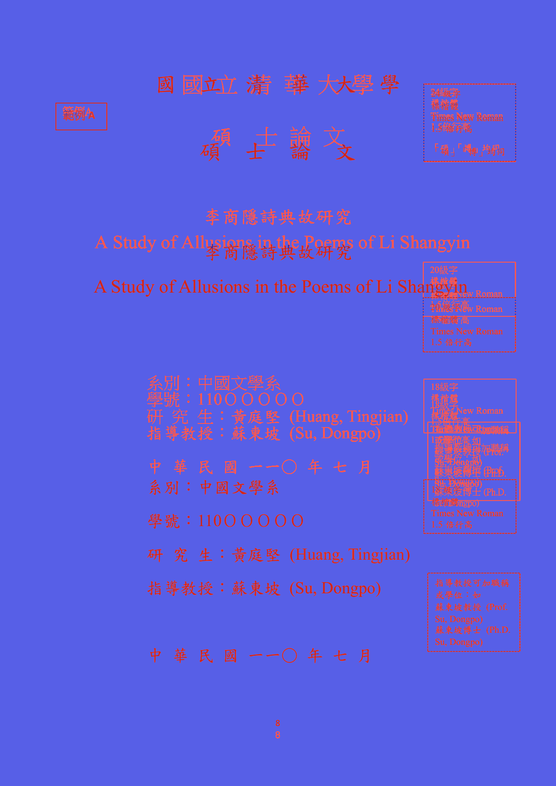</td>
  <td>changed: 115228 px (5.29%)<br>bbox: [123, 165, 1162, 1648]<br>mean abs RGB: 7.8322<br>RMSE RGB: 40.095<br>threshold: 12, gain: 5.0</td>
</tr>
<tr>
  <td><b>nthu_article</b><br>Page 9</td>
  <td>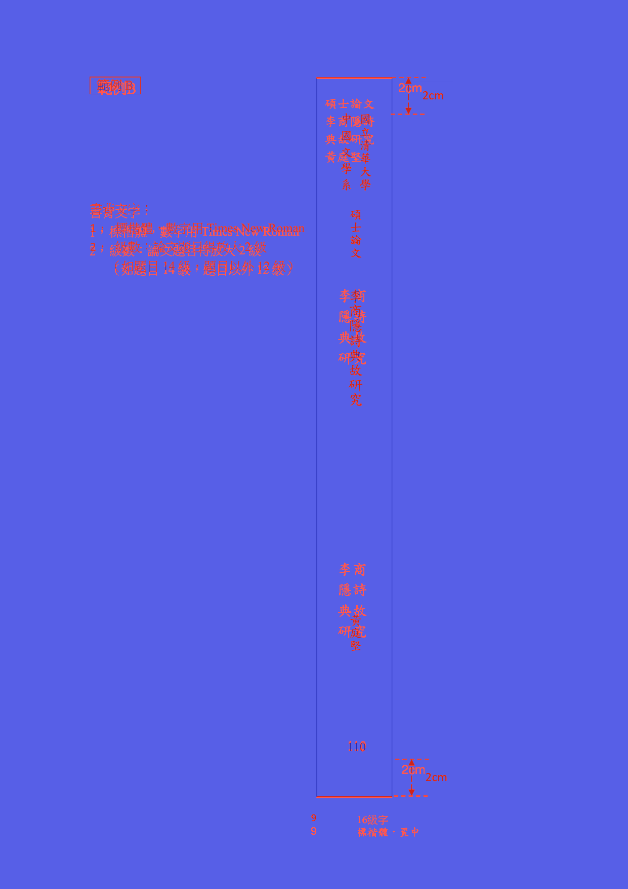</td>
  <td>changed: 33641 px (1.55%)<br>bbox: [177, 151, 883, 1651]<br>mean abs RGB: 1.8439<br>RMSE RGB: 18.4914<br>threshold: 12, gain: 5.0</td>
</tr>
<tr>
  <td><b>nthu_article</b><br>Page 10</td>
  <td>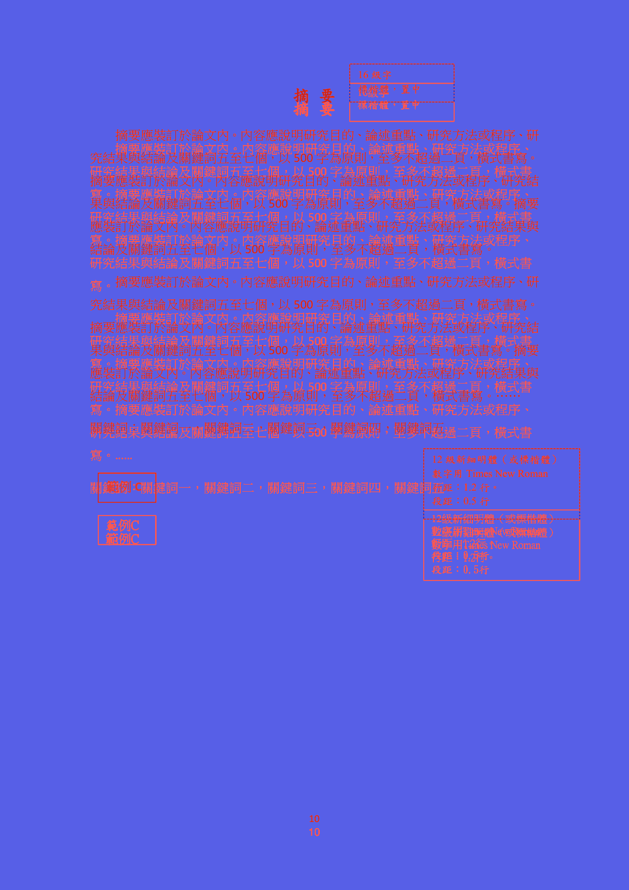</td>
  <td>changed: 195069 px (8.96%)<br>bbox: [177, 125, 1145, 1648]<br>mean abs RGB: 11.4427<br>RMSE RGB: 44.253<br>threshold: 12, gain: 5.0</td>
</tr>
<tr>
  <td><b>nthu_article</b><br>Page 11</td>
  <td></td>
  <td>changed: 81614 px (3.75%)<br>bbox: [140, 172, 1065, 1677]<br>mean abs RGB: 5.6442<br>RMSE RGB: 33.3925<br>threshold: 12, gain: 5.0</td>
</tr>
<tr>
  <td><b>nthu_article</b><br>Page 12</td>
  <td></td>
  <td>changed: 139854 px (6.42%)<br>bbox: [140, 134, 1226, 1685]<br>mean abs RGB: 8.4812<br>RMSE RGB: 39.7309<br>threshold: 12, gain: 5.0</td>
</tr>
<tr>
  <td><b>nthu_article</b><br>Page 13</td>
  <td></td>
  <td>changed: 40319 px (1.85%)<br>bbox: [166, 160, 1212, 1648]<br>mean abs RGB: 2.3503<br>RMSE RGB: 20.9437<br>threshold: 12, gain: 5.0</td>
</tr>
<tr>
  <td><b>nthu_article</b><br>Page 14</td>
  <td></td>
  <td>changed: 33895 px (1.56%)<br>bbox: [166, 161, 1212, 1647]<br>mean abs RGB: 2.0095<br>RMSE RGB: 19.4277<br>threshold: 12, gain: 5.0</td>
</tr>
<tr>
  <td><b>nthu_article</b><br>Page 15</td>
  <td></td>
  <td>changed: 239406 px (11.00%)<br>bbox: [176, 156, 1226, 1648]<br>mean abs RGB: 13.935<br>RMSE RGB: 48.8538<br>threshold: 12, gain: 5.0</td>
</tr>
<tr>
  <td><b>nthu_article</b><br>Page 16</td>
  <td></td>
  <td>changed: 96581 px (4.44%)<br>bbox: [178, 160, 1202, 1648]<br>mean abs RGB: 6.3738<br>RMSE RGB: 34.8388<br>threshold: 12, gain: 5.0</td>
</tr>
<tr>
  <td><b>nthu_article</b><br>Page 17</td>
  <td></td>
  <td>changed: 785223 px (36.07%)<br>bbox: [71, 190, 1241, 1647]<br>mean abs RGB: 20.991<br>RMSE RGB: 49.0211<br>threshold: 12, gain: 5.0</td>
</tr>
<tr>
  <td><b>nthu_article</b><br>Page 18</td>
  <td></td>
  <td>changed: 61245 px (2.81%)<br>bbox: [177, 156, 1063, 1648]<br>mean abs RGB: 4.2482<br>RMSE RGB: 28.6733<br>threshold: 12, gain: 5.0</td>
</tr>
<tr>
  <td><b>OSCAR WARD</b><br>Page 1</td>
  <td></td>
  <td>changed: 164239 px (7.81%)<br>bbox: [150, 220, 1137, 1416]<br>mean abs RGB: 10.3822<br>RMSE RGB: 40.5115<br>threshold: 12, gain: 5.0</td>
</tr>
<tr>
  <td><b>SA8000 ch sample</b><br>Page 1</td>
  <td></td>
  <td>changed: 134736 px (6.19%)<br>bbox: [59, 99, 1180, 1578]<br>mean abs RGB: 7.3363<br>RMSE RGB: 34.6155<br>threshold: 12, gain: 5.0</td>
</tr>
<tr>
  <td><b>SA8000 ch sample</b><br>Page 2</td>
  <td></td>
  <td>changed: 142976 px (6.57%)<br>bbox: [59, 83, 1181, 1717]<br>mean abs RGB: 6.1724<br>RMSE RGB: 29.3923<br>threshold: 12, gain: 5.0</td>
</tr>
<tr>
  <td><b>Support_Letter</b><br>Page 1</td>
  <td></td>
  <td>changed: 153663 px (7.30%)<br>bbox: [150, 156, 1137, 1375]<br>mean abs RGB: 11.5806<br>RMSE RGB: 48.2798<br>threshold: 12, gain: 5.0</td>
</tr>
<tr>
  <td><b>Template for MSc Thesis</b><br>Page 1</td>
  <td></td>
  <td>changed: 262284 px (12.47%)<br>bbox: [107, 82, 1216, 1527]<br>mean abs RGB: 19.937<br>RMSE RGB: 63.8481<br>threshold: 12, gain: 5.0</td>
</tr>
<tr>
  <td><b>Template for MSc Thesis</b><br>Page 2</td>
  <td></td>
  <td>changed: 121381 px (5.77%)<br>bbox: [105, 81, 1216, 1514]<br>mean abs RGB: 6.3286<br>RMSE RGB: 31.0227<br>threshold: 12, gain: 5.0</td>
</tr>
<tr>
  <td><b>Template for MSc Thesis</b><br>Page 3</td>
  <td></td>
  <td>changed: 85254 px (4.05%)<br>bbox: [131, 81, 1172, 1394]<br>mean abs RGB: 5.5779<br>RMSE RGB: 32.3226<br>threshold: 12, gain: 5.0</td>
</tr>
<tr>
  <td><b>Template for MSc Thesis</b><br>Page 4</td>
  <td></td>
  <td>changed: 124699 px (5.93%)<br>bbox: [131, 81, 1172, 1459]<br>mean abs RGB: 10.0547<br>RMSE RGB: 46.1199<br>threshold: 12, gain: 5.0</td>
</tr>
<tr>
  <td><b>Template for MSc Thesis</b><br>Page 5</td>
  <td></td>
  <td>changed: 228176 px (10.85%)<br>bbox: [89, 75, 1207, 1493]<br>mean abs RGB: 17.3026<br>RMSE RGB: 59.2122<br>threshold: 12, gain: 5.0</td>
</tr>
<tr>
  <td><b>Template for MSc Thesis</b><br>Page 6</td>
  <td></td>
  <td>changed: 4466 px (0.21%)<br>bbox: [456, 79, 848, 107]<br>mean abs RGB: 0.3494<br>RMSE RGB: 8.5844<br>threshold: 12, gain: 5.0</td>
</tr>
<tr>
  <td><b>Template for MSc Thesis</b><br>Page 7</td>
  <td></td>
  <td>changed: 3315 px (0.16%)<br>bbox: [489, 79, 816, 114]<br>mean abs RGB: 0.2585<br>RMSE RGB: 7.3659<br>threshold: 12, gain: 5.0</td>
</tr>
<tr>
  <td><b>Template for MSc Thesis</b><br>Page 8</td>
  <td></td>
  <td>changed: 25742 px (1.22%)<br>bbox: [180, 79, 1248, 260]<br>mean abs RGB: 2.0658<br>RMSE RGB: 20.8451<br>threshold: 12, gain: 5.0</td>
</tr>
<tr>
  <td><b>Template for MSc Thesis</b><br>Page 9</td>
  <td></td>
  <td>changed: 4059 px (0.19%)<br>bbox: [456, 79, 848, 107]<br>mean abs RGB: 0.3136<br>RMSE RGB: 8.1231<br>threshold: 12, gain: 5.0</td>
</tr>
<tr>
  <td><b>Template for MSc Thesis</b><br>Page 10</td>
  <td></td>
  <td>changed: 88237 px (4.19%)<br>bbox: [191, 79, 1077, 1472]<br>mean abs RGB: 7.8259<br>RMSE RGB: 41.746<br>threshold: 12, gain: 5.0</td>
</tr>
<tr>
  <td><b>Template for MSc Thesis</b><br>Page 11</td>
  <td></td>
  <td>changed: 3950 px (0.19%)<br>bbox: [509, 75, 795, 107]<br>mean abs RGB: 0.33<br>RMSE RGB: 8.5271<br>threshold: 12, gain: 5.0</td>
</tr>
<tr>
  <td><b>Template for MSc Thesis</b><br>Page 12</td>
  <td></td>
  <td>changed: 3536 px (0.17%)<br>bbox: [501, 79, 803, 111]<br>mean abs RGB: 0.2946<br>RMSE RGB: 7.9439<br>threshold: 12, gain: 5.0</td>
</tr>
<tr>
  <td><b>Template for MSc Thesis</b><br>Page 13</td>
  <td></td>
  <td>changed: 3815 px (0.18%)<br>bbox: [489, 79, 815, 111]<br>mean abs RGB: 0.3221<br>RMSE RGB: 8.3337<br>threshold: 12, gain: 5.0</td>
</tr>
<tr>
  <td><b>Template for MSc Thesis</b><br>Page 14</td>
  <td></td>
  <td>changed: 4283 px (0.20%)<br>bbox: [479, 79, 824, 118]<br>mean abs RGB: 0.3534<br>RMSE RGB: 8.6968<br>threshold: 12, gain: 5.0</td>
</tr>
<tr>
  <td><b>Template for MSc Thesis</b><br>Page 15</td>
  <td></td>
  <td>changed: 3337 px (0.16%)<br>bbox: [106, 79, 754, 176]<br>mean abs RGB: 0.2489<br>RMSE RGB: 7.1196<br>threshold: 12, gain: 5.0</td>
</tr>
<tr>
  <td><b>Template for MSc Thesis</b><br>Page 16</td>
  <td></td>
  <td>changed: 2147 px (0.10%)<br>bbox: [549, 79, 756, 107]<br>mean abs RGB: 0.176<br>RMSE RGB: 6.1555<br>threshold: 12, gain: 5.0</td>
</tr>
<tr>
  <td><b>Template for MSc Thesis</b><br>Page 17</td>
  <td></td>
  <td>changed: 2705 px (0.13%)<br>bbox: [541, 79, 764, 107]<br>mean abs RGB: 0.2159<br>RMSE RGB: 6.7955<br>threshold: 12, gain: 5.0</td>
</tr>
<tr>
  <td><b>TestIssue61</b><br>Page 1</td>
  <td></td>
  <td>changed: 43518 px (2.07%)<br>bbox: [156, 413, 1116, 1567]<br>mean abs RGB: 4.2983<br>RMSE RGB: 31.7674<br>threshold: 12, gain: 5.0</td>
</tr>
<tr>
  <td><b>TestIssue61</b><br>Page 2</td>
  <td></td>
  <td>changed: 26988 px (1.28%)<br>bbox: [151, 154, 1127, 1567]<br>mean abs RGB: 1.8973<br>RMSE RGB: 19.1957<br>threshold: 12, gain: 5.0</td>
</tr>
<tr>
  <td><b>TestIssue61</b><br>Page 3</td>
  <td></td>
  <td>changed: 2792 px (0.13%)<br>bbox: [152, 154, 644, 1568]<br>mean abs RGB: 0.1867<br>RMSE RGB: 5.8544<br>threshold: 12, gain: 5.0</td>
</tr>
<tr>
  <td><b>TestIssue61</b><br>Page 4</td>
  <td></td>
  <td>changed: 7104 px (0.34%)<br>bbox: [151, 154, 710, 1567]<br>mean abs RGB: 0.4845<br>RMSE RGB: 9.4823<br>threshold: 12, gain: 5.0</td>
</tr>
<tr>
  <td><b>TestIssue61</b><br>Page 5</td>
  <td></td>
  <td>changed: 1881 px (0.09%)<br>bbox: [152, 154, 644, 1568]<br>mean abs RGB: 0.1264<br>RMSE RGB: 4.8932<br>threshold: 12, gain: 5.0</td>
</tr>
<tr>
  <td><b>TestIssue61</b><br>Page 6</td>
  <td></td>
  <td>changed: 1772 px (0.08%)<br>bbox: [152, 154, 644, 1568]<br>mean abs RGB: 0.1217<br>RMSE RGB: 4.7722<br>threshold: 12, gain: 5.0</td>
</tr>
<tr>
  <td><b>TestIssue61</b><br>Page 7</td>
  <td></td>
  <td>changed: 2196 px (0.10%)<br>bbox: [151, 154, 644, 1567]<br>mean abs RGB: 0.1431<br>RMSE RGB: 5.1118<br>threshold: 12, gain: 5.0</td>
</tr>
<tr>
  <td><b>TestIssue61</b><br>Page 8</td>
  <td></td>
  <td>changed: 1823 px (0.09%)<br>bbox: [151, 154, 644, 1568]<br>mean abs RGB: 0.1209<br>RMSE RGB: 4.7257<br>threshold: 12, gain: 5.0</td>
</tr>
<tr>
  <td><b>TestIssue78</b><br>Page 1</td>
  <td></td>
  <td>changed: 142511 px (6.55%)<br>bbox: [188, 317, 1053, 1319]<br>mean abs RGB: 9.1516<br>RMSE RGB: 40.7766<br>threshold: 12, gain: 5.0</td>
</tr>
<tr>
  <td><b>TestIssue90</b><br>Page 1</td>
  <td></td>
  <td>changed: 107641 px (5.12%)<br>bbox: [148, 119, 1130, 1501]<br>mean abs RGB: 6.8352<br>RMSE RGB: 36.753<br>threshold: 12, gain: 5.0</td>
</tr>
<tr>
  <td><b>TestIssue91</b><br>Page 1</td>
  <td></td>
  <td>changed: 137578 px (6.54%)<br>bbox: [148, 103, 1122, 1570]<br>mean abs RGB: 8.9566<br>RMSE RGB: 41.0649<br>threshold: 12, gain: 5.0</td>
</tr>
<tr>
  <td><b>TestIssue91</b><br>Page 2</td>
  <td></td>
  <td>changed: 248785 px (11.83%)<br>bbox: [149, 96, 1131, 1570]<br>mean abs RGB: 17.2981<br>RMSE RGB: 57.5686<br>threshold: 12, gain: 5.0</td>
</tr>
<tr>
  <td><b>TestIssue91</b><br>Page 3</td>
  <td></td>
  <td>changed: 135180 px (6.43%)<br>bbox: [150, 91, 1126, 1571]<br>mean abs RGB: 9.9066<br>RMSE RGB: 44.3839<br>threshold: 12, gain: 5.0</td>
</tr>
<tr>
  <td><b>TestIssue93</b><br>Page 1</td>
  <td></td>
  <td>changed: 90301 px (4.15%)<br>bbox: [89, 96, 1147, 863]<br>mean abs RGB: 4.6491<br>RMSE RGB: 26.9522<br>threshold: 12, gain: 5.0</td>
</tr>
</table>

## Visual Comparison

Scores compare dotnet MiniPdf against Microsoft 365 Word Reference. LibreOffice is an auxiliary rendering and does not affect scores.

<table>
<tr><th>dotnet MiniPdf</th><th>Microsoft 365 Word Reference</th><th>LibreOffice</th></tr>
<tr>
  <td><b>13_IEEE_Style_Paper<br><small>format: docx | case: 13_IEEE_Style_Paper | scope: dotnet-issue-docx</small></b></td>
  <td colspan="2">13_IEEE_Style_Paper <span style="color:#3fb950">⬤</span> 98.7%</td>
</tr>
<tr>
  <td></td>
  <td></td>
  <td></td>
</tr>
<tr>
  <td></td>
  <td></td>
  <td></td>
</tr>
<tr>
  <td><b>14_Thesis_Chapter<br><small>format: docx | case: 14_Thesis_Chapter | scope: dotnet-issue-docx</small></b></td>
  <td colspan="2">14_Thesis_Chapter <span style="color:#3fb950">⬤</span> 99.1%</td>
</tr>
<tr>
  <td></td>
  <td></td>
  <td></td>
</tr>
<tr>
  <td></td>
  <td></td>
  <td></td>
</tr>
<tr>
  <td><b>20260317_sample_CN<br><small>format: docx | case: 20260317_sample_CN | scope: dotnet-issue-docx</small></b></td>
  <td colspan="2">20260317_sample_CN <span style="color:#3fb950">⬤</span> 99.1%</td>
</tr>
<tr>
  <td></td>
  <td></td>
  <td></td>
</tr>
<tr>
  <td></td>
  <td></td>
  <td></td>
</tr>
<tr>
  <td><b>20260318_issue<br><small>format: docx | case: 20260318_issue | scope: dotnet-issue-docx</small></b></td>
  <td colspan="2">20260318_issue <span style="color:#3fb950">⬤</span> 93.5%</td>
</tr>
<tr>
  <td></td>
  <td></td>
  <td></td>
</tr>
<tr>
  <td></td>
  <td></td>
  <td></td>
</tr>
<tr>
  <td></td>
  <td></td>
  <td></td>
</tr>
<tr>
  <td></td>
  <td></td>
  <td></td>
</tr>
<tr>
  <td></td>
  <td></td>
  <td></td>
</tr>
<tr>
  <td></td>
  <td></td>
  <td></td>
</tr>
<tr>
  <td></td>
  <td></td>
  <td></td>
</tr>
<tr>
  <td><b>CCU_article<br><small>format: docx | case: CCU_article | scope: dotnet-issue-docx</small></b></td>
  <td colspan="2">CCU_article <span style="color:#3fb950">⬤</span> 92.8%</td>
</tr>
<tr>
  <td></td>
  <td></td>
  <td></td>
</tr>
<tr>
  <td></td>
  <td></td>
  <td></td>
</tr>
<tr>
  <td></td>
  <td></td>
  <td></td>
</tr>
<tr>
  <td></td>
  <td></td>
  <td></td>
</tr>
<tr>
  <td></td>
  <td></td>
  <td></td>
</tr>
<tr>
  <td></td>
  <td></td>
  <td></td>
</tr>
<tr>
  <td></td>
  <td></td>
  <td></td>
</tr>
<tr>
  <td></td>
  <td></td>
  <td></td>
</tr>
<tr>
  <td></td>
  <td></td>
  <td></td>
</tr>
<tr>
  <td></td>
  <td></td>
  <td></td>
</tr>
<tr>
  <td></td>
  <td></td>
  <td></td>
</tr>
<tr>
  <td></td>
  <td></td>
  <td></td>
</tr>
<tr>
  <td></td>
  <td></td>
  <td></td>
</tr>
<tr>
  <td></td>
  <td></td>
  <td></td>
</tr>
<tr>
  <td></td>
  <td></td>
  <td></td>
</tr>
<tr>
  <td></td>
  <td></td>
  <td></td>
</tr>
<tr>
  <td></td>
  <td></td>
  <td></td>
</tr>
<tr>
  <td></td>
  <td></td>
  <td></td>
</tr>
<tr>
  <td></td>
  <td></td>
  <td></td>
</tr>
<tr>
  <td></td>
  <td></td>
  <td></td>
</tr>
<tr>
  <td></td>
  <td></td>
  <td></td>
</tr>
<tr>
  <td><b>Class News<br><small>format: docx | case: Class News | scope: dotnet-issue-docx</small></b></td>
  <td colspan="2">Class News <span style="color:#3fb950">⬤</span> 95.5%</td>
</tr>
<tr>
  <td></td>
  <td></td>
  <td></td>
</tr>
<tr>
  <td></td>
  <td></td>
  <td></td>
</tr>
<tr>
  <td></td>
  <td></td>
  <td></td>
</tr>
<tr>
  <td></td>
  <td></td>
  <td></td>
</tr>
<tr>
  <td><b>Confirmatory_Affidavit<br><small>format: docx | case: Confirmatory_Affidavit | scope: dotnet-issue-docx</small></b></td>
  <td colspan="2">Confirmatory_Affidavit <span style="color:#3fb950">⬤</span> 97.6%</td>
</tr>
<tr>
  <td></td>
  <td></td>
  <td></td>
</tr>
<tr>
  <td></td>
  <td></td>
  <td></td>
</tr>
<tr>
  <td><b>Cooperation Agreement Template<br><small>format: docx | case: Cooperation Agreement Template | scope: dotnet-issue-docx</small></b></td>
  <td colspan="2">Cooperation Agreement Template <span style="color:#3fb950">⬤</span> 96.3%</td>
</tr>
<tr>
  <td></td>
  <td></td>
  <td></td>
</tr>
<tr>
  <td></td>
  <td></td>
  <td></td>
</tr>
<tr>
  <td></td>
  <td></td>
  <td></td>
</tr>
<tr>
  <td></td>
  <td></td>
  <td></td>
</tr>
<tr>
  <td></td>
  <td></td>
  <td></td>
</tr>
<tr>
  <td></td>
  <td></td>
  <td></td>
</tr>
<tr>
  <td></td>
  <td></td>
  <td></td>
</tr>
<tr>
  <td><b>Fabrikam<br><small>format: docx | case: Fabrikam | scope: dotnet-issue-docx</small></b></td>
  <td colspan="2">Fabrikam <span style="color:#3fb950">⬤</span> 97.7%</td>
</tr>
<tr>
  <td></td>
  <td></td>
  <td></td>
</tr>
<tr>
  <td><b>Invoice<br><small>format: docx | case: Invoice | scope: dotnet-issue-docx</small></b></td>
  <td colspan="2">Invoice <span style="color:#3fb950">⬤</span> 97.4%</td>
</tr>
<tr>
  <td></td>
  <td></td>
  <td></td>
</tr>
<tr>
  <td><b>Issue79_FilledContract<br><small>format: docx | case: Issue79_FilledContract | scope: dotnet-issue-docx</small></b></td>
  <td colspan="2">Issue79_FilledContract <span style="color:#3fb950">⬤</span> 99.0%</td>
</tr>
<tr>
  <td></td>
  <td></td>
  <td></td>
</tr>
<tr>
  <td><b>Issue79_TemplateContract<br><small>format: docx | case: Issue79_TemplateContract | scope: dotnet-issue-docx</small></b></td>
  <td colspan="2">Issue79_TemplateContract <span style="color:#3fb950">⬤</span> 99.2%</td>
</tr>
<tr>
  <td></td>
  <td></td>
  <td></td>
</tr>
<tr>
  <td><b>Issue83_Output<br><small>format: docx | case: Issue83_Output | scope: dotnet-issue-docx</small></b></td>
  <td colspan="2">Issue83_Output <span style="color:#3fb950">⬤</span> 100.0%</td>
</tr>
<tr>
  <td></td>
  <td></td>
  <td></td>
</tr>
<tr>
  <td><b>Issue159_PageLayoutOptions<br><small>format: docx | case: Issue159_PageLayoutOptions | scope: dotnet-issue-docx</small></b></td>
  <td colspan="2">Issue159_PageLayoutOptions <span style="color:#3fb950">⬤</span> 99.3%</td>
</tr>
<tr>
  <td></td>
  <td></td>
  <td></td>
</tr>
<tr>
  <td><b>issue202605<br><small>format: docx | case: issue202605 | scope: dotnet-issue-docx</small></b></td>
  <td colspan="2">issue202605 <span style="color:#3fb950">⬤</span> 91.3%</td>
</tr>
<tr>
  <td></td>
  <td></td>
  <td></td>
</tr>
<tr>
  <td></td>
  <td></td>
  <td></td>
</tr>
<tr>
  <td><b>issue26050501<br><small>format: docx | case: issue26050501 | scope: dotnet-issue-docx</small></b></td>
  <td colspan="2">issue26050501 <span style="color:#3fb950">⬤</span> 95.2%</td>
</tr>
<tr>
  <td></td>
  <td></td>
  <td></td>
</tr>
<tr>
  <td></td>
  <td></td>
  <td></td>
</tr>
<tr>
  <td><b>issues66<br><small>format: docx | case: issues66 | scope: dotnet-issue-docx</small></b></td>
  <td colspan="2">issues66 <span style="color:#3fb950">⬤</span> 95.2%</td>
</tr>
<tr>
  <td></td>
  <td></td>
  <td></td>
</tr>
<tr>
  <td></td>
  <td></td>
  <td></td>
</tr>
<tr>
  <td></td>
  <td></td>
  <td></td>
</tr>
<tr>
  <td><b>MODERN LIVING<br><small>format: docx | case: MODERN LIVING | scope: dotnet-issue-docx</small></b></td>
  <td colspan="2">MODERN LIVING <span style="color:#d29922">⬤</span> 85.2%</td>
</tr>
<tr>
  <td></td>
  <td></td>
  <td></td>
</tr>
<tr>
  <td></td>
  <td></td>
  <td></td>
</tr>
<tr>
  <td><b>nthu_article<br><small>format: docx | case: nthu_article | scope: dotnet-issue-docx</small></b></td>
  <td colspan="2">nthu_article <span style="color:#3fb950">⬤</span> 94.3%</td>
</tr>
<tr>
  <td></td>
  <td></td>
  <td></td>
</tr>
<tr>
  <td></td>
  <td></td>
  <td></td>
</tr>
<tr>
  <td></td>
  <td></td>
  <td></td>
</tr>
<tr>
  <td></td>
  <td></td>
  <td></td>
</tr>
<tr>
  <td></td>
  <td></td>
  <td></td>
</tr>
<tr>
  <td></td>
  <td></td>
  <td></td>
</tr>
<tr>
  <td></td>
  <td></td>
  <td></td>
</tr>
<tr>
  <td></td>
  <td></td>
  <td></td>
</tr>
<tr>
  <td></td>
  <td></td>
  <td></td>
</tr>
<tr>
  <td></td>
  <td></td>
  <td></td>
</tr>
<tr>
  <td></td>
  <td></td>
  <td></td>
</tr>
<tr>
  <td></td>
  <td></td>
  <td></td>
</tr>
<tr>
  <td></td>
  <td></td>
  <td></td>
</tr>
<tr>
  <td></td>
  <td></td>
  <td></td>
</tr>
<tr>
  <td></td>
  <td></td>
  <td></td>
</tr>
<tr>
  <td></td>
  <td></td>
  <td></td>
</tr>
<tr>
  <td></td>
  <td></td>
  <td></td>
</tr>
<tr>
  <td></td>
  <td></td>
  <td></td>
</tr>
<tr>
  <td><i>missing</i></td>
  <td><i>missing</i></td>
  <td></td>
</tr>
<tr>
  <td><i>missing</i></td>
  <td><i>missing</i></td>
  <td></td>
</tr>
<tr>
  <td><b>OSCAR WARD<br><small>format: docx | case: OSCAR WARD | scope: dotnet-issue-docx</small></b></td>
  <td colspan="2">OSCAR WARD <span style="color:#3fb950">⬤</span> 94.5%</td>
</tr>
<tr>
  <td></td>
  <td></td>
  <td></td>
</tr>
<tr>
  <td><b>SA8000 ch sample<br><small>format: docx | case: SA8000 ch sample | scope: dotnet-issue-docx</small></b></td>
  <td colspan="2">SA8000 ch sample <span style="color:#3fb950">⬤</span> 98.3%</td>
</tr>
<tr>
  <td></td>
  <td></td>
  <td></td>
</tr>
<tr>
  <td></td>
  <td></td>
  <td></td>
</tr>
<tr>
  <td><b>Support_Letter<br><small>format: docx | case: Support_Letter | scope: dotnet-issue-docx</small></b></td>
  <td colspan="2">Support_Letter <span style="color:#3fb950">⬤</span> 98.5%</td>
</tr>
<tr>
  <td></td>
  <td></td>
  <td></td>
</tr>
<tr>
  <td><b>Template for MSc Thesis<br><small>format: docx | case: Template for MSc Thesis | scope: dotnet-issue-docx</small></b></td>
  <td colspan="2">Template for MSc Thesis <span style="color:#3fb950">⬤</span> 99.4%</td>
</tr>
<tr>
  <td></td>
  <td></td>
  <td></td>
</tr>
<tr>
  <td></td>
  <td></td>
  <td></td>
</tr>
<tr>
  <td></td>
  <td></td>
  <td></td>
</tr>
<tr>
  <td></td>
  <td></td>
  <td></td>
</tr>
<tr>
  <td></td>
  <td></td>
  <td></td>
</tr>
<tr>
  <td></td>
  <td></td>
  <td></td>
</tr>
<tr>
  <td></td>
  <td></td>
  <td></td>
</tr>
<tr>
  <td></td>
  <td></td>
  <td></td>
</tr>
<tr>
  <td></td>
  <td></td>
  <td></td>
</tr>
<tr>
  <td></td>
  <td></td>
  <td></td>
</tr>
<tr>
  <td></td>
  <td></td>
  <td></td>
</tr>
<tr>
  <td></td>
  <td></td>
  <td></td>
</tr>
<tr>
  <td></td>
  <td></td>
  <td></td>
</tr>
<tr>
  <td></td>
  <td></td>
  <td></td>
</tr>
<tr>
  <td></td>
  <td></td>
  <td></td>
</tr>
<tr>
  <td></td>
  <td></td>
  <td></td>
</tr>
<tr>
  <td></td>
  <td></td>
  <td></td>
</tr>
<tr>
  <td><b>TestIssue61<br><small>format: docx | case: TestIssue61 | scope: dotnet-issue-docx</small></b></td>
  <td colspan="2">TestIssue61 <span style="color:#d29922">⬤</span> 88.4%</td>
</tr>
<tr>
  <td></td>
  <td></td>
  <td></td>
</tr>
<tr>
  <td></td>
  <td></td>
  <td></td>
</tr>
<tr>
  <td></td>
  <td></td>
  <td></td>
</tr>
<tr>
  <td></td>
  <td></td>
  <td></td>
</tr>
<tr>
  <td></td>
  <td></td>
  <td></td>
</tr>
<tr>
  <td></td>
  <td></td>
  <td></td>
</tr>
<tr>
  <td></td>
  <td></td>
  <td></td>
</tr>
<tr>
  <td></td>
  <td></td>
  <td></td>
</tr>
<tr>
  <td><b>TestIssue78<br><small>format: docx | case: TestIssue78 | scope: dotnet-issue-docx</small></b></td>
  <td colspan="2">TestIssue78 <span style="color:#3fb950">⬤</span> 98.1%</td>
</tr>
<tr>
  <td></td>
  <td></td>
  <td></td>
</tr>
<tr>
  <td><b>TestIssue90<br><small>format: docx | case: TestIssue90 | scope: dotnet-issue-docx</small></b></td>
  <td colspan="2">TestIssue90 <span style="color:#3fb950">⬤</span> 99.0%</td>
</tr>
<tr>
  <td></td>
  <td></td>
  <td></td>
</tr>
<tr>
  <td><b>TestIssue91<br><small>format: docx | case: TestIssue91 | scope: dotnet-issue-docx</small></b></td>
  <td colspan="2">TestIssue91 <span style="color:#3fb950">⬤</span> 97.2%</td>
</tr>
<tr>
  <td></td>
  <td></td>
  <td></td>
</tr>
<tr>
  <td></td>
  <td></td>
  <td></td>
</tr>
<tr>
  <td></td>
  <td></td>
  <td></td>
</tr>
<tr>
  <td><b>TestIssue93<br><small>format: docx | case: TestIssue93 | scope: dotnet-issue-docx</small></b></td>
  <td colspan="2">TestIssue93 <span style="color:#3fb950">⬤</span> 96.3%</td>
</tr>
<tr>
  <td></td>
  <td></td>
  <td></td>
</tr>
</table>

## Detailed Results

### 13_IEEE_Style_Paper

- **Case Metadata:** format: docx | case: 13_IEEE_Style_Paper | scope: dotnet-issue-docx
- **Source:** tests/Issue_Files/docx/13_IEEE_Style_Paper.docx
- **Text Similarity:** 1.0
- **Visual Average:** 0.9667
- **Overall Score:** 0.9867
- **Pages:** MiniPdf=2, Reference=2
- **File Size:** MiniPdf=1032792 bytes, Reference=175037 bytes

<details><summary>Text Diff</summary>

```diff
--- minipdf/13_IEEE_Style_Paper.pdf
+++ reference/13_IEEE_Style_Paper.pdf
@@ -6,13 +6,14 @@
 email@university.edu

 Abstract

 This paper presents a novel approach to converting document formats while preserving layout fidelity.

-We propose a multi-pass parsing algorithm that analyzes document structure, extracts semantic content,

-and reconstructs the layout in the target format. Our method achieves 95% layout accuracy on a benchmark

-of 500 documents across various formats including DOCX, XLSX, and PDF.

+We propose a multi-pass parsing algorithm that analyzes document structure, extracts semantic content, and

+reconstructs the layout in the target format. Our method achieves 95% layout accuracy on a benchmark of

+500 documents across various formats including DOCX, XLSX, and PDF.

 1. Introduction

-Document format conversion is a fundamental problem in information technology. Organizations frequently

-need to convert documents between formats for archival, sharing, and processing purposes. The challenge

-lies in preserving the visual layout, formatting, and semantic structure of the original document [1].

+Document format conversion is a fundamental problem in information technology. Organizations

+frequently need to convert documents between formats for archival, sharing, and processing purposes. The

+challenge lies in preserving the visual layout, formatting, and semantic structure of the original document

+[1].

 Traditional approaches rely on simple text extraction followed by re-rendering, which often loses important

 formatting information such as margins, indentation, font styles, and table layouts [2].

 2. Related Work
```
</details>

### 14_Thesis_Chapter

- **Case Metadata:** format: docx | case: 14_Thesis_Chapter | scope: dotnet-issue-docx
- **Source:** tests/Issue_Files/docx/14_Thesis_Chapter.docx
- **Text Similarity:** 1.0
- **Visual Average:** 0.9765
- **Overall Score:** 0.9906
- **Pages:** MiniPdf=2, Reference=2
- **File Size:** MiniPdf=896781 bytes, Reference=159980 bytes

Text content: ✅ Identical

### 20260317_sample_CN

- **Case Metadata:** format: docx | case: 20260317_sample_CN | scope: dotnet-issue-docx
- **Source:** tests/Issue_Files/docx/20260317_sample_CN.docx
- **Text Similarity:** 0.994
- **Visual Average:** 0.9824
- **Overall Score:** 0.9906
- **Pages:** MiniPdf=2, Reference=2
- **File Size:** MiniPdf=317680 bytes, Reference=201411 bytes

<details><summary>Text Diff</summary>

```diff
--- minipdf/20260317_sample_CN.pdf
+++ reference/20260317_sample_CN.pdf
@@ -1,4 +1,4 @@
-打印时间:2025-10-11 16:10:04

+打印时间 :2025-10-11 16:10:04

 < 样本信息 >

 样本名称 lxp-0.5

 质谱方法 20250620-LXP-is-3min.PS 色谱方法 20250611-LXP-deng-3.LCM

@@ -7,10 +7,10 @@
 体积 0.5μL 仪器名称 AITQ2030

 采集时间 2025-07-03 11:24:11 用户 admin

 < 色谱图 >

-样品名称: lxp-0.5 瓶号: P1-A-1

+样品名称 : lxp-0.5 瓶号 : P1-A-1

 内标峰图

 ---PAGE---

-打印时间:2025-10-11 16:10:04

-样品名称: lxp-0.5

+打印时间 :2025-10-11 16:10:04

+样品名称 : lxp-0.5

 分析物 保留时间 峰面积 峰高 内标名称 内标峰面积 信噪比 离子比 计算浓度 单位

 lxp-1 0.50 1.573e5 2.520e4 lxp-is 3.310e4 1.0 0.084 1.08032
```
</details>

### 20260318_issue

- **Case Metadata:** format: docx | case: 20260318_issue | scope: dotnet-issue-docx
- **Source:** tests/Issue_Files/docx/20260318_issue.docx
- **Text Similarity:** 0.9675
- **Visual Average:** 0.8713
- **Overall Score:** 0.9355
- **Pages:** MiniPdf=7, Reference=7
- **File Size:** MiniPdf=1047910 bytes, Reference=344825 bytes

<details><summary>Text Diff</summary>

```diff
--- minipdf/20260318_issue.pdf
+++ reference/20260318_issue.pdf
@@ -1,7 +1,7 @@
 页眉的名称 ……………………..

 页眉 换了一行 .

-Title ddddddddfjkfjlasf Title ddddddddfjkfjlasf

-Jjfdlj 水水水顶顶顶顶水水水水 Jjfdlj 水水水顶顶顶顶水水水水

+Title ddddddddfjkfjlasf

+Jjfdlj 水水水顶顶顶顶水水水水

 页脚的公司名称

 ---PAGE---

 页眉的名称 ……………………..

@@ -34,16 +34,16 @@
 Document Classification

 Company Confidential

 Classification

+1

+页脚的公司名称

+---PAGE---

+页眉的名称 ……………………..

+页眉 换了一行 .

 Information is Group confidential and needs to be protected

 Definition

 Where loss of information confidentiality would result in significant harm to the

 Context

 interests of the organization, financial loss, embarrassment or loss of information

-1

-页脚的公司名称

----PAGE---

-页眉的名称 ……………………..

-页眉 换了一行 .

 Introduction

 The Process Definition Document (PDD) captures the flow of a business process to be developed.

 The flowchart contained within the document captures, at a high level, the business process to be automated, the

@@ -72,12 +72,11 @@
 2. Fill the title of work order.

 3. Fill Asset code. Automatically display description after filling asset code.

 4. Choose the Owner group.

-5.

 页脚的公司名称

 ---PAGE---

 页眉的名称 ……………………..

 页眉 换了一行 .

-Choose the Work Type.

+5. Choose the Work Type.

 页脚的公司名称

 ---PAGE---

 页眉的名称 ……………………..
```
</details>

### CCU_article

- **Case Metadata:** format: docx | case: CCU_article | scope: dotnet-issue-docx
- **Source:** tests/Issue_Files/docx/CCU_article.docx
- **Text Similarity:** 0.8713
- **Visual Average:** 0.9476
- **Overall Score:** 0.9276
- **Pages:** MiniPdf=21, Reference=21
- **File Size:** MiniPdf=2750657 bytes, Reference=625190 bytes

<details><summary>Text Diff</summary>

```diff
--- minipdf/CCU_article.pdf
+++ reference/CCU_article.pdf
@@ -9,35 +9,35 @@
 ---PAGE---

 摘要

 本研究探討以深度學習方法改善多分類影像辨識之效能。近年卷積神經網路在多

-種視覺任務上展現優異表現，然而在資料量受限與類別不平衡 (class imbalance) 的

-情況下，傳統訓練流程容易造成某些少數類別辨識率偏低。為解決此問題，本研

-究提出一個結合動態類別重加權 (dynamic re-weighting) 與特徵正交化 (feature

-orthogonalization) 之訓練框架，於保持整體精確度的同時提升長尾 (long-tail) 類別之召

-回率。實驗以公開資料集與自建小型資料集進行驗證，結果顯示相較基準模型，

-所提方法在 Macro-F1 及少數類別 Top-1 準確率均有顯著提升。最後，本研究並分

-析特徵空間分佈，證實特徵正交化有助於降低類別間干擾。

+種視覺任務上展現優異表現，然而在資料量受限與類別不平衡 (class imbalance)

+的情況下，傳統訓練流程容易造成某些少數類別辨識率偏低。為解決此問題，本

+研究提出一個結合動態類別重加權 (dynamic re-weighting) 與特徵正交化 (feature

+orthogonalization) 之訓練框架，於保持整體精確度的同時提升長尾 (long-tail) 類別

+之召回率。實驗以公開資料集與自建小型資料集進行驗證，結果顯示相較基準模

+型，所提方法在 Macro-F1 及少數類別 Top-1 準確率均有顯著提升。最後，本研究

+並分析特徵空間分佈，證實特徵正交化有助於降低類別間干擾。

 本論文之主要貢獻包含： (1) 提出一套可即插即用之動態類別權重調整策略；

-(2) 引入特徵正交化損失於長尾分類場景； (3) 於多組資料集與不同網路骨幹下驗證

-方法之穩健性； (4) 釋出實驗程式碼以利後續研究延伸。

+(2) 引入特徵正交化損失於長尾分類場景； (3) 於多組資料集與不同網路骨幹下驗

+證方法之穩健性； (4) 釋出實驗程式碼以利後續研究延伸。

 關鍵詞：深度學習、長尾學習、特徵表徵、卷積神經網路

 i

 ---PAGE---

 Abstract

-This thesis investigates a training framework to improve class-imbalanced multi-class

-im- age classification under limited data regimes. Although modern convolutional

-neural net- works achieve strong performance, minority classes in long-tail

-distributions often suffer from poor recall. We propose a plug-and-play framework that

-combines dynamic class re- weighting with feature orthogonalization to mitigate

-inter-class interference while preserv- ing global accuracy. Experiments on public and

-proprietary datasets demonstrate consis- tent gains in Macro-F1 and minority-class

-Top-1 accuracy over strong baselines. Feature space visualization further confirms

-that orthogonalization encourages better inter-class separation.

-The contributions are: (1) a dynamic weighting strategy adaptive to per-epoch

-class difficulty; (2) incorporation of a feature orthogonalization loss tailored for long-tail

-set- tings; (3) comprehensive evaluation across multiple backbones and datasets; (4)

-public release of reproducible code.

-Keywords: deep learning, long-tail learning, feature representation, convolutional

-neural networks

+This thesis investigates a training framework to improve class-imbalanced multi-class im-

+age classification under limited data regimes. Although modern convolutional neural net-

+works achieve strong performance, minority classes in long-tail distributions often suffer

+from poor recall. We propose a plug-and-play framework that combines dynamic class re-

+weighting with feature orthogonalization to mitigate inter-class interference while preserv-

+ing global accuracy. Experiments on public and proprietary datasets demonstrate consis-

+tent gains in Macro-F1 and minority-class Top-1 accuracy over strong baselines. Feature

+space visualization further confirms that orthogonalization encourages better inter-class

+separation.

+The contributions are: (1) a dynamic weighting strategy adaptive to per-epoch class
... (12825 more characters)

```
</details>

### Class News

- **Case Metadata:** format: docx | case: Class News | scope: dotnet-issue-docx
- **Source:** tests/Issue_Files/docx/Class News.docx
- **Text Similarity:** 0.9777
- **Visual Average:** 0.9099
- **Overall Score:** 0.955
- **Pages:** MiniPdf=4, Reference=4
- **File Size:** MiniPdf=341798 bytes, Reference=124498 bytes

<details><summary>Text Diff</summary>

```diff
--- minipdf/Class News.pdf
+++ reference/Class News.pdf
@@ -10,8 +10,7 @@
 non varius ipsum. Fusce venenatis quam vel libero sce lerisque, a mattis

 diam sollicitudin.

 Upcoming Events

-School Dance

-Maecenas massa velit, consectetur sit amet da pibus et, dapibus sit amet

+School Dance Maecenas massa velit, consectetur sit amet da pibus et, dapibus sit amet

 9.9 | 5-7pm

 odio. Vestibulum ultric ies erat sit amet massa ullamcorper ferm entum.

 Quisque a suscipit nulla, non posuere tellus. Vivamus justo erat, suscipit sit

@@ -35,8 +34,8 @@
 diam sollicitudin.

 Maecenas massa velit, consectetur sit amet dapibus et, dapibus sit amet

 odio. Vestibulum ultricies erat sit amet massa ullamco rper ferme ntum.

-Quisque a suscipit nulla, non posuere tellus. Viva mus justo erat, suscipit

-sit amet dui sed, ultricies porttitor mi.

+Quisque a suscipit nulla, non posuere tellus. Viva mus justo erat, suscipit sit

+amet dui sed, ultricies porttitor mi.

 Aliquam pharetra risus vitae odio imperdiet condimentum. Fusce in quam

 varius, dictum mi sit amet, aliquam mi. Suspe ndisse potenti. Pellentesque

 auctor id neque vel maximus.

@@ -45,8 +44,7 @@
 consec tetur adi piscing elit.

 Aliquam non varius ipsum.

 Fusce venenatis quam vel

-libero scelerisque. Quam vel

-Our next area of focus

+libero scelerisque. Quam vel Our next area of focus

 libero sce lerisque, a matm.

 Lorem ipsum dolor sit amet, consectetur adipiscing elit. Ma ecenas massa

 Lorem ipsum dolor sit amet,

@@ -80,8 +78,7 @@
 non varius ipsum. Fusce venenatis quam vel libero sce lerisque, a mattis

 diam sollicitudin.

 Upcoming Events

-School Dance

-Maecenas massa velit, consectetur sit amet da pibus et, dapibus sit amet

+School Dance Maecenas massa velit, consectetur sit amet da pibus et, dapibus sit amet

 9.9 | 5-7pm

 odio. Vestibulum ultric ies erat sit amet massa ullamcorper ferm entum.

 Quisque a suscipit nulla, non posuere tellus. Vivamus justo erat, suscipit sit

@@ -105,8 +102,8 @@
 diam sollicitudin.

 Maecenas massa velit, consectetur sit amet dapibus et, dapibus sit amet

 odio. Vestibulum ultricies erat sit amet massa ullamco rper ferme ntum.

-Quisque a suscipit nulla, non posuere tellus. Viva mus justo erat, suscipit

-sit amet dui sed, ultricies porttitor mi.

+Quisque a suscipit nulla, non posuere tellus. Viva mus justo erat, suscipit sit

+amet dui sed, ultricies porttitor mi.

 Aliquam pharetra risus vitae odio imperdiet condimentum. Fusce in quam

 varius, dictum mi sit amet, aliquam mi. Suspe ndisse potenti. Pellentesque

 auctor id neque vel maximus.

@@ -123,10 +120,12 @@
 consec tetur adi piscing elit.

 velit, consectetur sit amet dapibus et, dapibus sit amet odio. Aliquam non

 Aliquam non varius ipsum.

-Fusce venenatis quam vel varius ipsum. Fusce venenatis quam vel libero scelerisque, a mattis diam

-libero scelerisque. Quam vel sollicitudin. Lorem ipsum dolor sit amet, consectetur adipiscing elit. Non

+varius ipsum. Fusce venenatis quam vel li
... (519 more characters)

```
</details>

### Confirmatory_Affidavit

- **Case Metadata:** format: docx | case: Confirmatory_Affidavit | scope: dotnet-issue-docx
- **Source:** tests/Issue_Files/docx/Confirmatory_Affidavit.docx
- **Text Similarity:** 0.975
- **Visual Average:** 0.9646
- **Overall Score:** 0.9758
- **Pages:** MiniPdf=2, Reference=2
- **File Size:** MiniPdf=76834 bytes, Reference=143270 bytes

<details><summary>Text Diff</summary>

```diff
--- minipdf/Confirmatory_Affidavit.pdf
+++ reference/Confirmatory_Affidavit.pdf
@@ -1,32 +1,28 @@
-1

 CONFIRMATORY AFFIDAVIT

 I, the undersigned,

-CONFIRMATORY AFFIDAVIT

 Sofia Verbitckaia

 hereby state under oath,

 1. I am an adult female with full legal capacity and currently reside at Fuga Qui

 minima aut, Sunt magni praesenti.

-2. I am a Russian national, born in Omck / Russia, on 21 December 1999. I have been

-issued with a Russian passport, with passport number 770752777. A copy of my

-passport is attached hereto marked as Annexure "A1".

+2. I am a Russian national, born in Omck / Russia, on 21 December 1999. I have

+been issued with a Russian passport, with passport number 770752777. A copy of

+my passport is attached hereto marked as Annexure "A1".

 3. I confirm the content of the Affidavit in terms of regulation 3(2)(d) of the

-Immigration Regulations, 2014, deposed to by my spouse Jada Randolph, in as far

-it relates to me.

+Immigration Regulations, 2014, deposed to by my spouse Jada Randolph, in

+as far it relates to me.

 __________________________________

 SOFIA VERBITCKAIA

-SIGNED AT __________________ ON THIS THE ____ DAY OF __________

-2026.

+SIGNED AT __________________ ON THIS THE ____ DAY OF __________ 2026.

 I hereby certify that the deponent to this affidavit has acknowledged to me that:

+a. She knows and understands the contents hereof and that it is true and correct;

+b. She has no objection to taking the prescribed oath; and

 Page 1 of 2

 ---PAGE---

-2

-a. She knows and understands the contents hereof and that it is true and correct;

-b. She has no objection to taking the prescribed oath; and

 c. She regards the prescribed oath as binding on her conscience.

-I certify that the deponent has confirmed aforesaid (a) to (c) before me, that the contents of

-this affidavit is sworn to duly and that the Regulations as contained in Government Notice

-No. R.1258 of 21 July 1972 (as amended) and Government Notice No. R.1648 dated 19

-August 1977 (as amended) have been complied with.

+I certify that the deponent has confirmed aforesaid (a) to (c) before me, that the

+contents of this affidavit is sworn to duly and that the Regulations as contained in

+Government Notice No. R.1258 of 21 July 1972 (as amended) and Government Notice

+No. R.1648 dated 19 August 1977 (as amended) have been complied with.

 ________________________

 COMMISSIONER OF OATHS

 Name:
```
</details>

### Cooperation Agreement Template

- **Case Metadata:** format: docx | case: Cooperation Agreement Template | scope: dotnet-issue-docx
- **Source:** tests/Issue_Files/docx/Cooperation Agreement Template.docx
- **Text Similarity:** 0.9235
- **Visual Average:** 0.9839
- **Overall Score:** 0.963
- **Pages:** MiniPdf=7, Reference=7
- **File Size:** MiniPdf=443677 bytes, Reference=259866 bytes

<details><summary>Text Diff</summary>

```diff
--- minipdf/Cooperation Agreement Template.pdf
+++ reference/Cooperation Agreement Template.pdf
@@ -2,28 +2,28 @@
 XXXXXXX 项目

 合作协议

 （模板）

-甲    方：

-乙    方：

-丙    方：

+甲 方：

+乙 方：

+丙 方：

 签约地点：

-签订日期：       年    月     日

+签订日期： 年 月 日

 — 1 —

 ---PAGE---

-甲    方：

-电    话：                  地  址：

-乙    方：

-电    话：                  地  址：

-丙    方：

-电    话：                  地  址：

+甲 方：

+电 话： 地 址：

+乙 方：

+电 话： 地 址：

+丙 方：

+电 话： 地 址：

 经各主体单位友好协商，各主体单位本着互相合作的精神，自愿组成联合体，就《 XXXXX

 项目》（以下简称本项目）申报和执行中涉及的内容一致同意签订本协议如下：

 一、合作模式

-由   （甲方）      作为承担单位，     （乙方、丙方）         作为合作单位，组成

-联合体进行联合申报本项目。承担单位负责本项目的一切组织、协调、申报工作，合作单位授权

-承担单位牵头申报本项目并协助提供申报所需的相关材料。承担单位在申报和执行本项目过程

-中，与本项目主办单位签署的一切文件和处理本项目有关的一切事务，联合体各方均予以承认并

-承担法律责任。承担单位成功申报本项目后，由联合体各方按照本协议各主体单位职责执行，项

-目经费由承担单位向本项目主办单位申请，再由联合体各方按照本协议约定进行分配。

+由 （甲方） 作为承担单位， （乙方、丙方） 作为合作单位，组成联合体进行联

+合申报本项目。承担单位负责本项目的一切组织、协调、申报工作，合作单位授权承担单位牵头

+申报本项目并协助提供申报所需的相关材料。承担单位在申报和执行本项目过程中，与本项目主

+办单位签署的一切文件和处理本项目有关的一切事务，联合体各方均予以承认并承担法律责任。

+承担单位成功申报本项目后，由联合体各方按照本协议各主体单位职责执行，项目经费由承担单

+位向本项目主办单位申请，再由联合体各方按照本协议约定进行分配。

 二、任务分工

 联合体各方同意本项目按照如下分工：

 （一）甲方负责：

@@ -38,7 +38,7 @@
 2.

 3.

 ......

-（三） 丙方负责

+（三）丙方负责

 1.

 2.

 3.

@@ -53,9 +53,9 @@
 3.

 ......

 （二）乙方的权利和义务

-1.

 — 3 —

 ---PAGE---

+1.

 2.

 3.

 ......

@@ -69,27 +69,27 @@
 1.......

 2. 付款方式：采用支票、银行汇票、电汇三种形式。

 （二）乙方指定以下账号为唯一收款账号：

-户    名：

-账    号：

+户 名：

+账 号：

 开户银行：

 （三）丙方指定以下账号为唯一收款账号：

-户    名：

-账    号：

+户 名：

+账 号：

 开户银行：

-甲方向上述账号汇出款项即视为甲方已履行付款义务，在协议履行过程中，因乙方、丙方账户

-的原因（包括但不限于账号被注销、被冻结等）导致乙方、丙方无法收取款项的，由乙方、丙方承

-担相应后果。

+甲方向上述账号汇出款项即视为甲方已履行付款义务，在协议履行过程中，因乙方、丙方账

 — 4 —

 ---PAGE---

+户的原因（包括但不限于账号被注销、被冻结等）导致乙方、丙方无法收取款项的，由乙方、丙

+方承担相应后果。

 六、保密约定

-联合体各方均应对因协商、签订及执行本协议而了解的其他方的商业秘密承担保密责任。未经

-披露其他方事先书面许可，不得向任何第三人或公众泄露也不得从中牟利。如因一方泄露其他方商

-业秘密，则泄露方因承担相应责任，包括但不限于由此造成的损失以及律师费、保全费、诉讼费等

-合理维权费用。

+联合体各方均应对因协商、签订及执行本协议而了解的其他方的商业秘密承担保密责任。未

+经披露其他方事先书面许可，不得向任何第三人或公众泄露也不得从中牟利。如因一方泄露其他

+方商业秘密，则泄露方因承担相应责任，包括但不限于由此造成的损失以及律师费、保全费、诉

+讼费等合理维权费用。

 七、争议解决和适用法律

 （一）本协议适用于中华人民共和国法律。联合体各方同意，在本协议履行过程中如发生争

-议，应本着平等友好、相互理解的精神协商解决。如不能通过友好协商解决，任何一方应提交至广

-州仲裁委员会申请仲裁。

+议，应本着平等友好、相互理解的精神协商解决。如不能通过友好协商解决，任何一方应提交至

+广州仲裁委员会申请仲裁。

 八、不可抗力

 任何一方由于不可抗力原因不能履行协议时，应在不可抗力事件发生后 1 日内向联合体各方

 通报，以减轻可能给联合体各方造成的损失，在取得有关机构的不可抗力证明或联合体各方谅解

@@ -97,9 +97,9 @@
 九、合同生效

 1 ）本合同在甲、乙、丙方法人代表或其授权代表签字盖章后生效。

 2 ）合同一式 陆 份，其中甲方 贰 份，乙方 贰 份，丙方 贰 份。

-甲方（盖章）：                          乙方（盖章）：

-法定代表 / 授权代表（签字）：             法定代表 / 授权代表（签字）：

-日期：                                  日期：

+甲方（盖章）： 乙方（盖章）：

+法定代表 / 授权代表（签字）： 法定代表 / 授权代表（签字）：

+日期： 日期：

 — 5 —

 ---PAGE---

 丙方（盖章）：
```
</details>

### Fabrikam

- **Case Metadata:** format: docx | case: Fabrikam | scope: dotnet-issue-docx
- **Source:** tests/Issue_Files/docx/Fabrikam.docx
- **Text Similarity:** 1.0
- **Visual Average:** 0.9426
- **Overall Score:** 0.977
- **Pages:** MiniPdf=1, Reference=1
- **File Size:** MiniPdf=91987 bytes, Reference=55486 bytes

<details><summary>Text Diff</summary>

```diff
--- minipdf/Fabrikam.pdf
+++ reference/Fabrikam.pdf
@@ -3,8 +3,7 @@
 1234 East Main Street 1234 East Main Street

 Portland, OR 54321 Portland, OR 54321

 www.fabrikam.com www.fabrikam.com

-(415) 555-0123 | kristel@fabrikam.com

-(415) 555-0123 | kristel@fabrikam.com

+(415) 555-0123 | kristel@fabrikam.com (415) 555-0123 | kristel@fabrikam.com

 Fabrikam, Inc. Fabrikam, Inc.

 Kristel Kangro Kristel Kangro

 1234 East Main Street 1234 East Main Street
```
</details>

### Invoice

- **Case Metadata:** format: docx | case: Invoice | scope: dotnet-issue-docx
- **Source:** tests/Issue_Files/docx/Invoice.docx
- **Text Similarity:** 1.0
- **Visual Average:** 0.9357
- **Overall Score:** 0.9743
- **Pages:** MiniPdf=1, Reference=1
- **File Size:** MiniPdf=109705 bytes, Reference=54735 bytes

Text content: ✅ Identical

### Issue79_FilledContract

- **Case Metadata:** format: docx | case: Issue79_FilledContract | scope: dotnet-issue-docx
- **Source:** tests/Issue_Files/docx/Issue79_FilledContract.docx
- **Text Similarity:** 0.9933
- **Visual Average:** 0.9807
- **Overall Score:** 0.9896
- **Pages:** MiniPdf=1, Reference=1
- **File Size:** MiniPdf=293728 bytes, Reference=75476 bytes

<details><summary>Text Diff</summary>

```diff
--- minipdf/Issue79_FilledContract.pdf
+++ reference/Issue79_FilledContract.pdf
@@ -2,7 +2,7 @@
 甲方：甲方公司

 乙方：乙方公司

 乙方根据双方签署合同为甲方提供服务。

-1.合作时间：2026 年 06 月 29 日

+1.合作时间：2026 年06 月29 日

 2.项目汇总

 类型项目 项目合作日期 总金额（元）

 技术服务费 2026-06-29 666

@@ -23,4 +23,4 @@
 甲方：甲方公司 乙方：乙方公司

 授权代表：张三 授权代表：李四

 乙方在此处盖章

-日期：2026 年 06 月 29 日 日期：2026 年 06 月 29 日
+日期：2026 年06 月29 日 日期：2026 年06 月29 日
```
</details>

### Issue79_TemplateContract

- **Case Metadata:** format: docx | case: Issue79_TemplateContract | scope: dotnet-issue-docx
- **Source:** tests/Issue_Files/docx/Issue79_TemplateContract.docx
- **Text Similarity:** 1.0
- **Visual Average:** 0.9799
- **Overall Score:** 0.992
- **Pages:** MiniPdf=1, Reference=1
- **File Size:** MiniPdf=134305 bytes, Reference=74748 bytes

Text content: ✅ Identical

### Issue83_Output

- **Case Metadata:** format: docx | case: Issue83_Output | scope: dotnet-issue-docx
- **Source:** tests/Issue_Files/docx/Issue83_Output.docx
- **Text Similarity:** 1.0
- **Visual Average:** 0.9988
- **Overall Score:** 0.9995
- **Pages:** MiniPdf=1, Reference=1
- **File Size:** MiniPdf=3473 bytes, Reference=14968 bytes

Text content: ✅ Identical

### Issue159_PageLayoutOptions

- **Case Metadata:** format: docx | case: Issue159_PageLayoutOptions | scope: dotnet-issue-docx
- **Source:** tests/Issue_Files/docx/Issue159_PageLayoutOptions.docx
- **Text Similarity:** 1.0
- **Visual Average:** 0.983
- **Overall Score:** 0.9932
- **Pages:** MiniPdf=1, Reference=1
- **File Size:** MiniPdf=2876 bytes, Reference=19277 bytes

Text content: ✅ Identical

### issue202605

- **Case Metadata:** format: docx | case: issue202605 | scope: dotnet-issue-docx
- **Source:** tests/Issue_Files/docx/issue202605.docx
- **Text Similarity:** 0.8674
- **Visual Average:** 0.9156
- **Overall Score:** 0.9132
- **Pages:** MiniPdf=2, Reference=2
- **File Size:** MiniPdf=876643 bytes, Reference=154739 bytes

<details><summary>Text Diff</summary>

```diff
--- minipdf/issue202605.pdf
+++ reference/issue202605.pdf
@@ -2,7 +2,7 @@
 115 學年度博士班入學甄試聯合招生

 資訊工程學系學經歷表

 基本資料

-姓　　名 准考證號碼 (此欄由本單位填寫)

+姓  名 准考證號碼 ( 此欄由本單位填寫 )

 畢業論文名稱 指導教授

 進入本系博士班

 □計算機網路 □晶片系統設計與電子設計自動化 □電腦系統

@@ -11,40 +11,34 @@
 (可複選)

 有興趣指導教授

 姓名(至多三位)

-□應屆

-□一般生

+□應屆 □一般生

 就學狀況 報考身分

 □非應屆 □在職生

 學業表現 (請填寫大學(含)以上學歷之成績記錄，並隨附歷年成績表，含班級或全系排名，若曾轉學、轉系，請註明。)

 學業成績 學業成績

-學校名稱 科系/組別 在學時間(西元年/月)

+學校名稱 科系 / 組別 在學時間 ( 西元年 / 月 )

 總平均 總排名

-_____/_____至

-_____/_____

-_____/_____至

-_____/_____

-_____/_____至

-_____/_____

-_____/_____至

-_____/_____

+_____/_____ 至 _____/_____

+_____/_____ 至 _____/_____

+_____/_____ 至 _____/_____

+_____/_____ 至 _____/_____

 語文能力表現 (請檢附檢定證明，如無資料可免填。)

-1. 全民英檢 □初級 □中試 □中高級 □高級 □優級 通過考試階段：□初試　□複試

+1. 全民英檢 □初級 □中試 □中高級 □高級 □優級 通過考試階段：□初試 □複試

 2. 英文檢定 □托福/分數：        □多益/分數：        □其他       /分數：

 3. 其他

 工作經歷 (請依序填寫大學畢業後之全職工作經歷(不含兼任研究助理)；如無可免填。)

-1. 服務機構名稱 服務部門 職稱 起迄年月（西元年/

-月）

-/     至　   /

-2. 服務機構名稱 服務部門 職稱 起迄年月（西元年/

-月）

-/     至　   /

-3. 服務機構名稱 服務部門 職稱 起迄年月（西元年/

-月）

-/     至　   /

+服 務 機 構 名 稱 服 務 部 門 職 稱 起迄年月（西元年/月）

+1.

+/     至    /

+服 務 機 構 名 稱 服 務 部 門 職 稱 起迄年月（西元年/月）

+2.

+/     至    /

+服 務 機 構 名 稱 服 務 部 門 職 稱 起迄年月（西元年/月）

+3.

+/     至    /

 1 頁

 ---PAGE---

-著作發表 (請條列曾發表之論文或其他著作 、 專利，並檢附證明；如無資料可免

-填。)

+著作發表 (請條列曾發表之論文或其他著作 、 專利，並檢附證明；如無資料可免填。)

 1.

 2.

 3.
```
</details>

### issue26050501

- **Case Metadata:** format: docx | case: issue26050501 | scope: dotnet-issue-docx
- **Source:** tests/Issue_Files/docx/issue26050501.docx
- **Text Similarity:** 0.94
- **Visual Average:** 0.9394
- **Overall Score:** 0.9518
- **Pages:** MiniPdf=2, Reference=2
- **File Size:** MiniPdf=155845 bytes, Reference=111155 bytes

<details><summary>Text Diff</summary>

```diff
--- minipdf/issue26050501.pdf
+++ reference/issue26050501.pdf
@@ -5,50 +5,50 @@
 學習 Hadoop 的首要任務是理解它試圖解決的問題：大數據

 帶來的巨大挑戰。請詳細複習大數據的核心特徵，也就是著

 名的 3V：資料量龐大 (Volume)、生成與處理速度極快

-What is big (Velocity)，以及資料結構多樣化 (Variety)，包含了大量非結

-data? 構化或半結構化的資料。您必須清楚釐清，傳統的關聯式資

-料庫 (RDBMS) 在面對這類海量且缺乏固定 Schema 的資

+What is big (Velocity)，以及資料結構多樣化 (Variety)，包含了大量

+data? 非結構化或半結構化的資料。您必須清楚釐清，傳統的關聯

+式資料庫 (RDBMS) 在面對這類海量且缺乏固定 Schema 的資

 料時，會遭遇嚴重的效能瓶頸與擴展限制，這正是業界急需

 全新分散式運算與儲存架構的根本原因。

 MapReduce 是處理巨量資料的核心程式設計模型，其設計哲

 學深受「分而治之 (Divide and Conquer)」概念的影響。您

 需要深刻理解兩個階段的明確分工：Map 階段負責在各個資

 料節點上就近進行資料過濾、轉換與提取，並產出 Key-

-MapReduce Value 對；Reduce 階段則負責將這些中間結果進行跨節點

-的彙總與整合。此外，請務必掌握系統層面的運作邏輯，包

-括 JobTracker 如何進行全域的任務排程與資源分配，以及

+MapReduce Value 對；Reduce 階段則負責將這些中間結果進行跨節點的

+彙總與整合。此外，請務必掌握系統層面的運作邏輯，包括

+JobTracker 如何進行全域的任務排程與資源分配，以及

 TaskTracker 如何在各個節點上監控並執行具體的 Map 或

 Reduce 任務。

 認識 Hadoop 這個由 Apache 基金會維護的重量級開源框

-架。請複習它的發展起源以及核心設計目標：Hadoop 專為

-在由商用廉價硬體 (Commodity hardware) 所組成的龐大叢

-集上運行而生。您的學習重點在於理解 Hadoop 如何「化劣

-Meet Hadoop 勢為優勢」，也就是它並不強求底層硬體具備高可靠性，而

-是透過軟體架構層面（如資料多重副本與任務自動重試）提

-供卓越的容錯機制 (Fault Tolerance)。這使得企業能以極低

-的硬體成本，獲得具備強大橫向擴展能力的大數據處理平

-台。

+架。請複習它的發展起源以及核心設計目標：Hadoop 專為在

+由商用廉價硬體 (Commodity hardware) 所組成的龐大叢集

+上運行而生。您的學習重點在於理解 Hadoop 如何「化劣勢

+Meet Hadoop

+為優勢」，也就是它並不強求底層硬體具備高可靠性，而是透

+過軟體架構層面（如資料多重副本與任務自動重試）提供卓

+越的容錯機制 (Fault Tolerance)。這使得企業能以極低的

+硬體成本，獲得具備強大橫向擴展能力的大數據處理平台。

+Hadoop HDFS 是支撐整個 Hadoop 生態系的儲存骨幹，專為儲存超大

 ---PAGE---

 章節大綱

 學習指引 (Study Guide)

 (Outline)

-HDFS 是支撐整個 Hadoop 生態系的儲存骨幹，專為儲存超

-大檔案而設計。請深入探討其「一次寫入，多次讀取 (write-

-once, read-many)」的串流存取設計理念。您需要熟練掌握

-Hadoop HDFS 的核心架構：預設 64MB (或 128MB) 的資料區塊

-Distributed (Block) 設計有何優勢？Namenode (Master 節點) 如何負責

-File System 管理整個檔案系統的 Metadata (如檔案名稱、權限與區塊映

-射表)？而 Datanode (Slave 節點) 又是如何負責實際儲存資

-料區塊並定期發送心跳訊號 (Heartbeat)？理解這些節點間的

-互動是掌握分散式儲存的關鍵。

+Distributed 檔案而設計。請深入探討其「一次寫入，多次讀取 (write-

+File System once, read-many)」的串流存取設計理念。您需要熟練掌握

+HDFS 的核心架構：預設 64MB (或 128MB) 的資料區塊

+(Block) 設計有何優勢？Namenode (Master 節點) 如何負責

+管理整個檔案系統的 Metadata (如檔案名稱、權限與區塊映

+射表)？而 Datanode (Slave 節點) 又是如何負責實際儲存

+資料區塊並定期發送心跳訊號 (Heartbeat)？理解這些節點

+間的互動是掌握分散式儲存的關鍵。

 任何雲端與大數據的理論都必須透過實際動手做來驗證。本

 節要求您具備從零開始建置 Hadoop 偽分散式 (Pseudo-

-distributed) 叢集的能力。請複習所有關鍵的前置作業：包含

-在虛擬機 (VM) 中安裝 Linux 系統、正確配置 Java 執行環

+distributed) 叢集的能力。請複習所有關鍵的前置作業：包

+含在虛擬機 (VM) 中安裝 Linux 系統、正確配置 Java 執行

 How to install

-境，以及設定 SSH 無密碼登入機制。接著，您需要熟悉

+環境，以及設定 SSH 無密碼登入機制。接著，您需要熟悉

 Hadoop

-Hadoop 的核心 XML 設定檔 (core-site.xml, hdfs-site.xml

-等) 的配置意義。最後，請務必親自執行格式化 Namenode

-的指令，並透過經典的 Wordcount 範例，體驗完整的任務提

-交、執行與結果檢視流程。
+Hadoop 的核心 XML 設定檔 (core-site.xml, hdfs-

+site.xml 等) 的配置意義。最後，請務必親自執行格式化

+Namenode 的指令，並透過經典的 Wordcount 範例，體驗完

+整的任務提交、執行與結果檢視流程。
```
</details>

### issues66

- **Case Metadata:** format: docx | case: issues66 | scope: dotnet-issue-docx
- **Source:** tests/Issue_Files/docx/issues66.docx
- **Text Similarity:** 0.9548
- **Visual Average:** 0.9242
- **Overall Score:** 0.9516
- **Pages:** MiniPdf=3, Reference=3
- **File Size:** MiniPdf=626149 bytes, Reference=229713 bytes

<details><summary>Text Diff</summary>

```diff
--- minipdf/issues66.pdf
+++ reference/issues66.pdf
@@ -1,4 +1,4 @@
-微纳加工平台工艺申请表 （2014 年版）

+微纳加工平台工艺申请表 （ 2014 年版）

 批号 : 显微镜#1-20251126 14:40~20251126 14:45

 020-

 申请人 init 申请人电话 88888888<br /> 申请人邮箱 1@my.com 申请人签字

@@ -12,25 +12,25 @@
 序

 工艺名称 工艺要求及说明 日期 计价和确认 备注

 号

-总费用：0.80￥ 总用时：0 天 0 时

-2025 年 11 月 26 日 14 时 40 分 机时费：0.80￥ 5 分 0 秒

-显微镜#1

-8 至 开机用时：

-2025 年 11 月 26 日 14 时 45 分 工艺负责人确认： 关机用时：

+总费用：0.80￥ 总用时：0 天0 时

+2025 年11 月26 日14 时40 分 机时费：0.80￥ 5 分0 秒

+8 显微镜#1 至 开机用时：

+2025 年11 月26 日14 时45 分 工艺负责人确认： 关机用时：

 工艺申请人确认： 沉积用时：

 加工平台批准人签字

-最终服务质量评价（请签名） 最终检验员

-非常满意_______       基本满意_______        不满意_________ 最终检验结论：

+最终检验员

+最终服务质量评价（请签名） 非常满意_______       基本满意_______        不满意_________ 最终检验结论：

 （签字）

-工艺流程总计价： 备注： 0.80￥ 计价核准人签字： 日期：

-1 ） 所有衬底材料部分须清楚填写包括：列明至少表面的三层材料的成分和支撑（主）衬底材料、尺寸和厚度等相关信息。

-2）使用涉及设定温度的设备时（如 PECVD、蒸镀衬底温度、回流炉、高温炉、键合机等），请填写使用温度的上限和时间。使用如 PECVD、蒸镀等设备时，衬底

-温度没有特殊要求的可填写：常规。

+工艺流程总计价： 0.80￥ 计价核准人签字： 日期：

+备注：

+1 ）所有衬底材料部分须清楚填写包括：列明至少表面的三层材料的成分和支撑（主）衬底材料、尺寸和厚度等相关信息。

+2 ）使用涉及设定温度的设备时（如PECVD、蒸镀衬底温度、回流炉、高温炉、键合机等），请填写使用温度的上限和时间。使用如PECVD、蒸镀等设备时，衬底温

+度没有特殊要求的可填写：常规。

+1

+---PAGE---

 3）使用涉及真空的设备，在样品进入腔室之前必须清洗；可根据样品的材料自己填写使用清洗溶液。

 4）涉及沉积和蒸镀使用的原材料时候，必须清楚填写材料的种类、厚度。

-1

----PAGE---

-5 ） 接触光刻胶的种类，薄光刻胶可使用： AR-P 5350 （ lift-off 正胶）； SUN lift130 （负胶） ；厚胶可使用 SU8。

+5 ）接触光刻胶的种类，薄光刻胶可使用： AR-P 5350 （ lift-off 正胶）； SUN lift130 （负胶） ；厚胶可使用SU8。

 2

 ---PAGE---

 3
```
</details>

### MODERN LIVING

- **Case Metadata:** format: docx | case: MODERN LIVING | scope: dotnet-issue-docx
- **Source:** tests/Issue_Files/docx/MODERN LIVING.docx
- **Text Similarity:** 0.8115
- **Visual Average:** 0.8192
- **Overall Score:** 0.8523
- **Pages:** MiniPdf=2, Reference=2
- **File Size:** MiniPdf=687491 bytes, Reference=212025 bytes

<details><summary>Text Diff</summary>

```diff
--- minipdf/MODERN LIVING.pdf
+++ reference/MODERN LIVING.pdf
@@ -4,24 +4,25 @@
 WHAT’S NEW

 Ready to settle?

 By Peyton Davis

-Newsletters are periodicals used to advertise or update your subscribers with

 TAKE A LOOK INSIDE

-information about your product or blog. They can be printed or emailed and

+Newsletters are periodicals used to advertise or update your subscribers

+with information about your product or blog. They can be printed or

 Add description text here to get your

-are an excellent way to maintain regular contact with your subscribers and

+emailed and are an excellent way to maintain regular contact with your subscribers interested in your topic

+subscribers and drive traffic to your site. Type the content of your

+newsletter here.

+PROPERTY TRENDS

+Add description text here to get your

+Newsletters are periodicals used to advertise or update your subscribers

 subscribers interested in your topic

-drive traffic to your site. Type the content of your newsletter here.

-Newsletters are periodicals used to advertise or update your subscribers with PROPERTY TRENDS

-information about your product or blog. They are an excellent way to maintain

+with information about your product or blog. They are an excellent way to

+maintain regular contact with your subscribers. Type the content of your

+ARE YOU READY TO LIST?

+newsletter here.

 Add description text here to get your

-regular contact with your subscribers. Type the content of your newsletter subscribers interested in your topic

-here.

-ARE YOU READY TO LIST?

-Newsletters are periodicals used to advertise or update your subscribers with

-Add description text here to get your

-information about your product or blog. Type the content of your newsletter

-subscribers interested in your topic

-here.

+Newsletters are periodicals used to advertise or update your subscribers subscribers interested in your topic

+with information about your product or blog. Type the content of your

+newsletter here.

 ---PAGE---

 Property trends

 Take a look inside

@@ -30,22 +31,22 @@
 Newsletters are periodicals used to advertise or update your

 subscribers with information about your product or blog. They

 can be printed or emailed and are an excellent way to maintain

-regular contact with your subscribers and drive traffic to your site.

-Type the content of your newsletter here.

+regular contact with your subscribers and drive traffic to your

+site. Type the content of your newsletter here.

 Newsletters are periodicals use to advertise or update your

 subscribers with information about your product or blog. They

 can be printed or emailed and are an excellent way to maintain

 Newsletters are periodicals used to

-regular contact with your subscribers and drive traffic to your site.

+regular contact with your subscribers and drive traffic to your

 advertise or update your subscribers with

-Type your content here.

+site. Type your content here.

 information ab
... (1306 more characters)

```
</details>

### nthu_article

- **Case Metadata:** format: docx | case: nthu_article | scope: dotnet-issue-docx
- **Source:** tests/Issue_Files/docx/nthu_article.docx
- **Text Similarity:** 0.9152
- **Visual Average:** 0.9436
- **Overall Score:** 0.9435
- **Pages:** MiniPdf=18, Reference=18
- **File Size:** MiniPdf=1981748 bytes, Reference=910075 bytes

<details><summary>Text Diff</summary>

```diff
--- minipdf/nthu_article.pdf
+++ reference/nthu_article.pdf
@@ -23,186 +23,184 @@
 （二）電子檔論文次序

 去掉前項 藍字 項目。

 （三）頁碼編排

-1，頁碼從「誌謝辭」開始編排，用小寫羅馬數字標示頁碼（i, ii, iii … ）。

-2，論文本文開始至最末，用阿拉伯數字標示頁碼。

-3，頁碼標於頁面底端，置中。

+1 ，頁碼從「誌謝辭」開始編排，用小寫羅馬數字標示頁碼（ i, ii, iii… ）。

+2 ，論文本文開始至最末，用阿拉伯數字標示頁碼。

+3 ，頁碼標於頁面底端，置中。

 （四）版面配置

 包括封面，全書版面配置邊界設定為下上 2.54 公分，左右 2.9 公分

+二、 封面（與書名頁）、書背格式

 1

 ---PAGE---

-二、封面（與書名頁）、書背格式

-封面顏色：碩士論文 土黃色 ，上光、膠裝；博士論文 淺藍色 ，上光、膠裝（

-https://registra.site.nthu.edu.tw/var/file/211/1211/img/75/203558730.pdf ）。論文

-封面建議採用亮面雲彩紙。如下範例 A 、範例 B （ 可直接下載套用。此為教務

-處公布之格式）。

-三、論文指導教授推薦書、學位考試委員審定書、授權書

-推薦書、審定書自中文系網頁下載，相關規定請洽詢系辦。授權書包括：

-「國立清華大學博碩士論文全文電子檔著作權授權書」、「國立清華大學博

-碩士紙本論文著作權授權書」、「國家圖書館博碩士論文電子檔案上網授權

-書」、「華藝博碩士論文全文電子學位論文授權書」，相關規定可參 附件一

-，或國立清華大學圖書館博碩士論文全系統，常見問題第 7 項。

-四、中英文摘要

-摘要應裝訂於論文內。內容應說明研究目的、論述重點、研究方法或程序、

-研究結果與結論及關鍵詞（ 5-7 個）等，以 500 字為原則，至多不超過二

-頁，橫式書寫，行距建議設定為 1.2 行 （wor d 中選「多行」，設定 1.2 ），段

-距 0.5 行。標題「摘要」二字或「 Abstract 」1 6 級字，置中，可加黑。「關鍵

-詞：」或「 Key words: 」12 級，可加黑；與摘要主文間，空一行。英文與數

-字用 Times New Roman 。如範例 C （中文）與範例 D （英文）。

+封面顏色：碩士論文 土黃色 ，上光、膠裝；博士論文 淺藍色 ，上光、膠裝

+（ https://registra.site.nthu.edu.tw/var/file/211/1211/img/75/203558730.pdf ）。論

+文封面建議採用亮面雲彩紙。如下範例 A 、範例 B （可直接下載套用。此為

+教務處公布之格式）。

+三、 論文指導教授推薦書、學位考試委員審定書、授權書

+推薦書、審定書自中文系網頁下載，相關規定請洽詢系辦。授權書包括：「國

+立清華大學博碩士論文全文電子檔著作權授權書」、「國立清華大學博碩士紙

+本論文著作權授權書」、「國家圖書館博碩士論文電子檔案上網授權書」、「華藝

+博碩士論文全文電子學位論文授權書」，相關規定可參 附件一 ，或國立清華大

+學圖書館博碩士論文全系統，常見問題第 7 項。

+四、 中英文摘要

+摘要應裝訂於論文內。內容應說明研究目的、論述重點、研究方法或程序、研

+究結果與結論及關鍵詞（ 5-7 個）等，以 500 字為原則，至多不超過二頁，橫

+式書寫，行距建議設定為 1.2 行（ word 中選「多行」，設定 1.2 ），段距 0.5 行。

+標題「摘要」二字或「 Abstract 」 16 級字，置中，可加黑。「關鍵詞：」或「 Key

+words: 」 12 級，可加黑；與摘要主文間，空一行。英文與數字用 Times New

+Roman 。如範例 C （中文）與範例 D （英文）。

 五、目次

-包括各章、各節、節下小標之標題、參考文獻、附錄及其所在之頁數。「目

-次」二字標題置中， 16 級標楷體。各目次 12 級字。若有表次、圖次，則列

-於其後，均使用新頁開始表列，「表目次」（或「圖目次」）二字 16 級標

-楷體，其下各表（或各圖）用 12 級字。英文與數字用 Times New Roman 。

-目次格式如範例 E ，表次格式如範例 F ，圖次格式如範例 G 。

-六、論文正文

+包括各章、各節、節下小標之標題、參考文獻、附錄及其所在之頁數。「目次」

+二字標題置中， 16 級標楷體。各目次 12 級字。若有表次、圖次，則列於其後，

+均使用新頁開始表列，「表目次」（或「圖目次」）二字 16 級標楷體，其下各表

+（或各圖）用 12 級字。英文與數字用 Times New Roman 。目次格式如範例 E ，

+表次格式如範例 F ，圖次格式如範例 G 。

+六、 論文正文

 （一）章節標題

-章次與章名間空一格，如「第一章　緒論」。 18 級，標楷體，置中。

-各章新頁起。節次與節名間空一格，如「第一節　研究動機」。 16

-級，標楷體，置中。章節以下小節所使用符號，依「一、」、「（一）

-」、「1、」、「（1）」 …… 等順序表示， 14 級（或 12 級），左齊。

+章次與章名間空一格，如「第一章 緒論」。 18 級，標楷體，置中。各

+章新頁起。節次與節名間空一格，如「第一節 研究動機」。 16 級，標

+楷體，置中。章節以下小節所使用符號，依「一、」、「（一）」、「 1 、」、

+「（ 1 ）」……等順序表示， 14 級（或 12 級），左齊。

 （二）內文

-1，請用新式標號，惟書名號改用《》，篇名號改用〈〉。在行文

-中，書名和篇名連用時，省略篇名號，如《莊子 ‧ 天下》。若為英

-文，書名請用斜體，篇名請用 “ ” 。日文翻譯成中文，行文時亦請

+1 ，請用新式標號，惟書名號改用《》，篇名號改用〈〉。在行文中，

+書名和篇名連用時，省略篇名號，如《莊子‧天下》。若為英文，

+書名請用斜體，篇名請用 “ ” 。日文翻譯成中文，行文時亦請一併

+改用中文新式標號。

+2 ，行距建議設定為 1.2 行（ word 中選「多行」，設定 1.2 ），各段「左右

 2

 ---PAGE---

-一併改用中文新式標號。

-2，行距建議設定為 1.2 行 （wor d 中選「多行」，設定 1.2 ），各段

-「左右對齊」。

+對齊」。

 （三）引文

-所有引文均須核對無誤。引文左縮排 3 字元，標楷體 12 級。若需特別

-引用之外文，也依上述格式處理，字體建議用 Times New Roman 。 外

-文引文，亦可翻譯成流暢達意之中文，於註腳中附上所引篇章之外文

-原名，並得視需要將所徵引之原文置於註腳中。

+所有引文均須核對無誤。引文左縮排 3 字元，標楷體 12 級。若需特

+別引用之外文，也依上述格式處理，字體建議用 T
... (16891 more characters)

```
</details>

### OSCAR WARD

- **Case Metadata:** format: docx | case: OSCAR WARD | scope: dotnet-issue-docx
- **Source:** tests/Issue_Files/docx/OSCAR WARD.docx
- **Text Similarity:** 0.9941
- **Visual Average:** 0.868
- **Overall Score:** 0.9448
- **Pages:** MiniPdf=1, Reference=1
- **File Size:** MiniPdf=182300 bytes, Reference=62719 bytes

<details><summary>Text Diff</summary>

```diff
--- minipdf/OSCAR WARD.pdf
+++ reference/OSCAR WARD.pdf
@@ -7,14 +7,15 @@
 123 45th Ave Chicago, IL

 Dear Chanchal,

 I sincerely appreciate the opportunity to interview and learn more about the role. Our

-conversation reinforced my enthusiasm for contributing to the team and bringing my expertise to

-the company’s ongoing initiatives. I found our discussion about future goals particularly

-inspiring, and it further solidified my excitement about this opportunity.

-The role’s focus on impactful work aligns with my professional background, and I look forward

-to the possibility of applying my skills to support the company’s growth. I am eager to bring my

-experience in driving efficiency and innovation to the team while continuing to develop and

-refine my abilities in a fast-paced environment.

+conversation reinforced my enthusiasm for contributing to the team and bringing my

+expertise to the company’s ongoing initiatives. I found our discussion about future goals

+particularly inspiring, and it further solidified my excitement about this opportunity.

+The role’s focus on impactful work aligns with my professional background, and I look

+forward to the possibility of applying my skills to support the company’s growth. I am eager to

+bring my experience in driving efficiency and innovation to the team while continuing to

+develop and refine my abilities in a fast-paced environment.

 Thank you again for your time and thoughtful discussion. I appreciate the chance to be

 considered and look forward to next steps. Please let me know if I can provide any additional

 details to assist in the decision-making process.

-Warm regards,
+Warm regards,

+Oscar Ward
```
</details>

### SA8000 ch sample

- **Case Metadata:** format: docx | case: SA8000 ch sample | scope: dotnet-issue-docx
- **Source:** tests/Issue_Files/docx/SA8000 ch sample.docx
- **Text Similarity:** 0.9926
- **Visual Average:** 0.9641
- **Overall Score:** 0.9827
- **Pages:** MiniPdf=2, Reference=2
- **File Size:** MiniPdf=332078 bytes, Reference=186097 bytes

<details><summary>Text Diff</summary>

```diff
--- minipdf/SA8000 ch sample.pdf
+++ reference/SA8000 ch sample.pdf
@@ -1,20 +1,20 @@
 SA8000 基础知识培训考试题

 部门：                工号：           姓名：            得分：

-一、判断题（共 20 分，每题 2 分）

-1、公司应在新员工入厂后一个月内与之签定劳动合同。（  √  ）

+一、判断题（共20 分，每题2 分）

+1、公司应在新员工入厂后一个月内与之签定劳动合同。（ √  ）

 2、劳动合同签订后如果员工需要则发给其一份，否公司可代为保管。（  × ）

 3、一般地说，公司的招聘广告不可有性别限制，法规允许的情形除外。（  √   ）

 4、公司员工每周至少要有一天休息。（  √   ）

-5、童工是指年龄在 16 周岁以下的人（按照我国法律规定）。（  √   ）

+5、童工是指年龄在16 周岁以下的人（按照我国法律规定）。（  √   ）

 6、公司在员工辞职或解雇时应一次性把工资结算并支付。（  √   ）

 7、公司法定节假日安排上班的话，可以在其他时间安排调休。（  ×   ）

-8、当不同的法规、规章与 SA8000 标准同一议题时，公司应遵守最严格的要求。（  √    ）

-9、根据劳动法规定，员工每月加班时间最多不超过 36 小时。（  √    ）

-10、某公司将职工食堂的饭票作为工资支付给职工。（  ×   ）

-二、不定项选择题（共 20 分，每题 2 分）

+8、当不同的法规、规章与SA8000 标准同一议题时，公司应遵守最严格的要求。（  √    ）

+9、根据劳动法规定，员工每月加班时间最多不超过36 小时。（  √    ）

+10、 某公司将职工食堂的饭票作为工资支付给职工。（  ×   ）

+二、不定项选择题（共20 分，每题2 分）

 1、以下哪些形式属于强迫劳工（ ABD  ）

 A、工厂对新员工要求扣押身份证一星期       B、工厂使用监狱劳工

-C、工厂只给 1.2 倍的加班费                 D、工厂要求员工晚上都加班，如果不加班就要罚款

+C、工厂只给1.2 倍的加班费                 D、工厂要求员工晚上都加班，如果不加班就要罚款

 2、以下哪些属于特种作业，需要操作人员具有特种设备作业证（ ABCD  ）

 A、电工作业      B、叉车    C、锅炉      D、电梯     E、冲床操作

 3、公司推行社会责任的好处（  ABC  ）

@@ -23,7 +23,7 @@
 4、劳工标准包括（ ABCDE  ）

 A、结社自由与集体谈判权           B、就业的自由选择权、禁止强迫劳动

 C、男女同工同酬的权利      D、禁止童工      E、合理的工作条件的权利

-5、以下属于 SA8000 标准要素的是（ ABCD ）

+5、以下属于SA8000 标准要素的是（ ABCD ）

 A、童工     B、强迫性劳动        C、歧视          D、工作时间

 6、中国规定，未成年工是指任何年满     周岁但不满    周岁的工人（ B ）。

 A、14 , 16       B、16 , 18        C、16 ， 17      D、17 ， 18

@@ -39,16 +39,16 @@
 D、召开末次会议；  E、宣布审核结果。

 10、公司应在新员工入厂后 (  A  )个月内与之签定合同

 A、1 个月   B、二个月  C、3 个月   D、6 个月

-三、案例分析题（共 10 分，每题 5 分）

-针对以下事实描述分析是否违反社会责任要求，如果违反的话，请写出 SA8000 的哪一条款。

-1、 公司在运行 SA8000 社会责任管理体系过程中，内审发现使用了 2 名童工，公司的纠正措施是将 2 名童

-工立即开除。

+三、案例分析题（共10 分，每题5 分）

+针对以下事实描述分析是否违反社会责任要求，如果违反的话，请写出SA8000 的哪一条款。

+1、公司在运行SA8000 社会责任管理体系过程中，内审发现使用了2 名童工，公司的纠正措施是将2 名

+童工立即开除。

 STP 小组的含义是什么？

 ---PAGE---

 ISO45001 基础知识培训考试题

-一、判断题（共 20 分，每题 2 分）

-1、一个管理十分严谨、设备精良并经消防主管部门审批合格的油库，在加强日常管理的情况下，可以不列入危险

-源。（ × ）

+一、 判断题（共20 分，每题2 分）

+1、一个管理十分严谨、设备精良并经消防主管部门审批合格的油库，在加强日常管理的情况下，可以不列入危险源。

+（ × ）

 2、对危险源进行风险评价时，应考虑事故发生的可能性和事故可能的后果。（ √ ）

 3、组织制定的职业健康管理方案应严格执行，不得更改。（ √ ）

 4、最高管理者对组织的职业健康安全工作负最终责任。（ √ ）

@@ -58,34 +58,34 @@
 8、只有取得特种作业资格，才能进行特种作业。（ √ ）

 9、安全管理是管理者的事，员工关系不大。（ × ）

 10、我国《劳动法》规定，任何组织不得招收未成年工进行生产和服务作业。（ × ）

-二、单项选择题（共 20 分，每题 2 分）

+二、单项选择题（共20 分，每题2 分）

 1.建立和实施职业健康安全管理体系的根本目的是（ A  ）

-A、使组织能够控制职业健康安全风险，并持续改进其绩效。B、使组织的所有风险彻底消灭，作到绝对安全。

+A、 使组织能够控制职业健康安全风险，并持续改进其绩效。B、使组织的所有风险彻底消灭，作到绝对安全。

 C、制定健康安全方针和目标，并依照执行。D、将所有与职业健康安全有关的过程形成文件

 2.制定职业健康安全管理方案的目的是（ B  ）

-A、辨识和评价组织的危险源。     B、实现组织的职业健康安全目标。

+A、 辨识和评价组织的危险源。     B、实现组织的职业健康安全目标。

 C、便于组织实施纠正措施。        D、满足相关方的要求

 3.组织的职业健康安全管理体系文件应包含（ D  ）

-A、提供查询相关文件的途径。       B、对管理体系核心要素及相互作用的描述。

-C、至少对 11 个要素的描述。         D、A+B。

+A、 提供查询相关文件的途径。       B、对管理体系核心要素及相互作用的描述。

+C、至少对11 个要素的描述。         D、A+B。

 4.特种作业种类应包括（ D  ）

-A、电工。B、金属焊接切割。C、矿山通风。D、A+B+C。

+A、 电工。B、金属焊接切割。C、矿山通风。D、A+B+C。

 5.危险源辨识没有包括的内容有（ D  ）

-A、常规和非常规活动。B、所有进入工作场所的人
... (1062 more characters)

```
</details>

### Support_Letter

- **Case Metadata:** format: docx | case: Support_Letter | scope: dotnet-issue-docx
- **Source:** tests/Issue_Files/docx/Support_Letter.docx
- **Text Similarity:** 1.0
- **Visual Average:** 0.9635
- **Overall Score:** 0.9854
- **Pages:** MiniPdf=1, Reference=1
- **File Size:** MiniPdf=750532 bytes, Reference=147353 bytes

<details><summary>Text Diff</summary>

```diff
--- minipdf/Support_Letter.pdf
+++ reference/Support_Letter.pdf
@@ -12,9 +12,9 @@
 1. I, Pascale Donaldson, a South African national born on 09 February 2006 with South African

 Identification Number: 658, (a South African born on 09 February 2006 and a permanent resident of

 South Africa) hereby confirm that I am the life partner of Mrs. Sofia Verbitckaia (“Applicant”), a

-national born on 21 December 1999, and support her application for a renewal of his Relatives Visa

-in terms of section 18 of the Immigration Act, 2002 (Act No. 13 of 2002) (“Act”), read with the

-relevant Immigration Regulations made under section 7 of the Act.

+national born on 21 December 1999, and support her application for a renewal of his Relatives Visa in

+terms of section 18 of the Immigration Act, 2002 (Act No. 13 of 2002) (“Act”), read with the relevant

+Immigration Regulations made under section 7 of the Act.

 2. I accept full responsibility of any financial costs and subsistence, including but not limited to, housing,

 food, medical, physical and emotional needs he may require whilst residing with me in South Africa at

 the following address during his entire sojourn:
```
</details>

### Template for MSc Thesis

- **Case Metadata:** format: docx | case: Template for MSc Thesis | scope: dotnet-issue-docx
- **Source:** tests/Issue_Files/docx/Template for MSc Thesis.docx
- **Text Similarity:** 1.0
- **Visual Average:** 0.9849
- **Overall Score:** 0.994
- **Pages:** MiniPdf=17, Reference=17
- **File Size:** MiniPdf=807339 bytes, Reference=403479 bytes

<details><summary>Text Diff</summary>

```diff
--- minipdf/Template for MSc Thesis.pdf
+++ reference/Template for MSc Thesis.pdf
@@ -8,8 +8,9 @@
 ➢ Font and Font size for the general text of the report: Times New Roman 12

 ➢ LINE SPACING: 1.5

 ➢ MARGINS: At least 2.5 inch on the binding side; 1 inch at top and bottom

-➢ PAGE NUMBERING: Roman numerals till the first page of first chapter. The chapters

-to be numbered in the Arabic numerals. The Page number should be bottom centered

+➢ PAGE NUMBERING: Roman numerals till the first page of first chapter. The

+chapters to be numbered in the Arabic numerals. The Page number should be

+bottom centered

 ➢ PAPER TYPE AND SIZE: A4 size Executive Bond Paper

 ➢ PRINTING: BOTH SIDE PRINTING

 ➢ Number of copies of M.Sc. thesis to be submitted: 5 + number of thesis supervisor(s)

@@ -86,10 +87,10 @@
 I hereby certify that the work which is being presented in the thesis entitled <TITLE OF M.SC.

 THESIS> in the partial fulfillment of the requirements for the award of the degree of MASTER OF

 SCIENCE and submitted in the DEPARTMENT OF < NAME OF THE DEPARTMENT >, Indian

-Institute of Technology Indore , is an authentic record of my own work carried out during the time period from

-<Month and year of joining the M.Sc. program> to < Month and year of M.Sc. Thesis submission> under the

-supervision of <Name of the Supervisor of M.Sc. thesis  #1, Designation, and Affiliation> and < Name of the

-Supervisor of M.Sc. thesis #2, Designation, and Affiliation>

+Institute of Technology Indore , is an authentic record of my own work carried out during the time period

+from <Month and year of joining the M.Sc. program> to < Month and year of M.Sc. Thesis submission> under

+the supervision of <Name of the Supervisor of M.Sc. thesis  #1, Designation, and Affiliation> and < Name of

+the Supervisor of M.Sc. thesis #2, Designation, and Affiliation>

 The matter presented in this thesis has not been submitted by me for the award of any other degree of

 this or any other institute.

 Signature of the student with date

@@ -101,8 +102,8 @@
 M.Sc. thesis #1 (with date) M.Sc. thesis #2 (with date)

 (NAME OF SUPERVISOR) (NAME OF SUPERVISOR)

 --------------------------------------------------------------------------------------------------------------------------------

-< NAME OF THE M.Sc. STUDENT> has successfully given his/her M.Sc. Oral Examination held on

-<Date of M.Sc. Oral Examination> .

+< NAME OF THE M.Sc. STUDENT> has successfully given his/her M.Sc. Oral Examination held

+on <Date of M.Sc. Oral Examination> .

 Signature(s) of Supervisor(s) of MSc thesis Convener, DPGC

 Date: Date:

 Signature of PSPC Member #1 Signature of PSPC Member #1

@@ -114,9 +115,9 @@
 DEDICATION (if any)

 ---PAGE---

 Abstract

-The abstract should be a brief summary of the M. Tech. thesis. It should not contain more

-than 1-2 pages of A4 size with the text typed in 12 pt Times New Roman font having 1.5

-spacing .

+The abstract should be a brief summary of the M. Tec
... (188 more characters)

```
</details>

### TestIssue61

- **Case Metadata:** format: docx | case: TestIssue61 | scope: dotnet-issue-docx
- **Source:** tests/Issue_Files/docx/TestIssue61.docx
- **Text Similarity:** 0.7143
- **Visual Average:** 0.9954
- **Overall Score:** 0.8839
- **Pages:** MiniPdf=8, Reference=8
- **File Size:** MiniPdf=94365 bytes, Reference=100753 bytes

<details><summary>Text Diff</summary>

```diff
--- minipdf/TestIssue61.pdf
+++ reference/TestIssue61.pdf
@@ -2,12 +2,12 @@
 生簡章

 1

 ---PAGE---

-第一章 介紹與大綱..................................................................2

-1.1 背景與研究動機................................................................3

-1.1.1 技術定義..................................................................5

-1.2 專案目標......................................................................6

-第二章 系統設計....................................................................7

-2.1 系統架構......................................................................8

+第一章 介紹與大綱 ........................................................................................................ 2

+1.1 背景與研究動機 ................................................................................................... 3

+1.1.1 技術定義 ....................................................................................................... 5

+1.2 專案目標 ............................................................................................................. 6

+第二章 系統設計 ........................................................................................................... 7

+2.1 系統架構 ............................................................................................................. 8

 第一章 介紹與大綱

 2

 ---PAGE---
```
</details>

### TestIssue78

- **Case Metadata:** format: docx | case: TestIssue78 | scope: dotnet-issue-docx
- **Source:** tests/Issue_Files/docx/TestIssue78.docx
- **Text Similarity:** 0.9872
- **Visual Average:** 0.9642
- **Overall Score:** 0.9806
- **Pages:** MiniPdf=1, Reference=1
- **File Size:** MiniPdf=141895 bytes, Reference=117949 bytes

<details><summary>Text Diff</summary>

```diff
--- minipdf/TestIssue78.pdf
+++ reference/TestIssue78.pdf
@@ -4,15 +4,15 @@
 设   备   类  别 ： #[cardTypeName]#

 检   测   日  期 ： #[checkStart]# 至 #[checkEnd]#

 填 写 说 明

-一、本原始记录适用于曳引驱动乘客与载货电梯的自行检测；

-二、本原始记录的检测基本内容、要求和方法等均依据《电梯自行检测规则》（TSG

+一、 本原始记录适用于曳引驱动乘客与载货电梯的自行检测；

+二、 本原始记录的检测基本内容、要求和方法等均依据《电梯自行检测规则》（TSG

 T7008-2023）和公司正式发布的《电梯检测作业指导书》制定；

-三、检测项目分为关键检测项目和一般检测项目两个类别，其中标有“*”的为关键检

+三、 检测项目分为关键检测项目和一般检测项目两个类别，其中标有“*”的为关键检

 测项目；

-四、检测所使用的仪器、设备应完好，且在计量有效期内；

-五、检测过程中，检测人员应当使用检测信息化管理系统（如中奥智检系统、市场

-局检测系统等），按照《电梯检测作业指导书》的要求如实、规范地记录检测

-情况，不得漏检、漏记；

-六、检测记录填写，应按照如下要求进行填写：

-1）检测记录信息页按照检验报告、使用登记证、产品合格证、维保合同等现场实

-际情况信息进行填写，保证其信息的准确性；
+四、 检测所使用的仪器、设备应完好，且在计量有效期内；

+五、 检测过程中，检测人员应当使用检测信息化管理系统（如中奥智检系统、市场局检

+测系统等），按照《电梯检测作业指导书》的要求如实、规范地记录检测情况，不

+得漏检、漏记；

+六、 检测记录填写，应按照如下要求进行填写：

+1） 检测记录信息页按照检验报告、使用登记证、产品合格证、维保合同等现场实际情

+况信息进行填写，保证其信息的准确性；
```
</details>

### TestIssue90

- **Case Metadata:** format: docx | case: TestIssue90 | scope: dotnet-issue-docx
- **Source:** tests/Issue_Files/docx/TestIssue90.docx
- **Text Similarity:** 0.9963
- **Visual Average:** 0.9774
- **Overall Score:** 0.9895
- **Pages:** MiniPdf=1, Reference=1
- **File Size:** MiniPdf=717560 bytes, Reference=169801 bytes

<details><summary>Text Diff</summary>

```diff
--- minipdf/TestIssue90.pdf
+++ reference/TestIssue90.pdf
@@ -10,8 +10,8 @@
 Nay, đề nghị VCBS thực hiện mở Tiểu khoản giao dịch và lưu ký chứng khoán cho Tài khoản

 chứng khoán của tôi tại VCBS như sau:

 Loại tiểu khoản: API-ALGO

-Đăng ký ứng trước tiền bán chứng khoán tự động: ✓ Có Không

 ✓

+Đăng ký ứng trước tiền bán chứng khoán tự động: Có Không

 Tôi cam kết việc đề nghị mở tiểu khoản này được thực hiện hoàn toàn tự nguyện và xin chịu toàn

 bộ trách nhiệm trước pháp luật cũng như VCBS đối với yêu cầu của mình.

 …….., ngày        tháng       năm 20
```
</details>

### TestIssue91

- **Case Metadata:** format: docx | case: TestIssue91 | scope: dotnet-issue-docx
- **Source:** tests/Issue_Files/docx/TestIssue91.docx
- **Text Similarity:** 0.9725
- **Visual Average:** 0.9566
- **Overall Score:** 0.9716
- **Pages:** MiniPdf=3, Reference=3
- **File Size:** MiniPdf=502983 bytes, Reference=175213 bytes

<details><summary>Text Diff</summary>

```diff
--- minipdf/TestIssue91.pdf
+++ reference/TestIssue91.pdf
@@ -9,7 +9,7 @@
 Số CC/CCCD/Giấy ĐKKD/GPTL : [DELIVER_CARD_ID]

 Ngày cấp: [DELIVER_ISSUE_DATE] Nơi cấp: [DELIVER_ISSUE_PLACE]

 Địa chỉ liên hệ: [DELIVER_ADDRESS]

-Email: [DELIVER_EMAIL] Điện thoại: [DELIVER_PHONE]

+Email:  [DELIVER_EMAIL] Điện thoại: [DELIVER_PHONE]

 Người đại diện: [DELIVER_REPRE_NAME]

 Chức vụ: [DELIVER_REPRE_POSITION]

 Giấy ủy quyền: [DELIVER_AUTHOR_NO]

@@ -21,8 +21,8 @@
 Ngày cấp: [ISSUE_DATE]

 Nơi cấp: [ISSUE_PLACE]

 Địa chỉ liên hệ: [ADDRESS]

-Email: [EMAIL] Điện thoại: [PHONE]

-Người đại diện: [ REPRE_NAME ] Chức vụ: [ REPRE_POSITION ]

+Email:  [EMAIL] Điện thoại: [PHONE]

+Người đại diện: [REPRE_NAME] Chức vụ: [REPRE_POSITION]

 Giấy ủy quyền: [AUTHOR_NO]

 Số Tài khoản Ngân hàng: [ACC_BANK_CODE]

 mở tại Ngân hàng: [BANK_NAME]

@@ -31,54 +31,55 @@
 Giấy phép tương đương hợp pháp khác (nếu có)

 1

 ---PAGE---

-Trong Phụ lục này, Bên Cho Vay và Bên Vay được gọi riêng là “ Bên ” và được gọi chung là “ Các

-Bên ”. Các Bên đã thống nhất ký kết và thực hiện Hợp Đồng với các nội dung tại Phụ Lục này như

-sau:

+Trong Phụ lục này, Bên Cho Vay và Bên Vay được gọi riêng là “ Bên ” và được gọi chung là

+“ Các Bên ”. Các Bên đã thống nhất ký kết và thực hiện Hợp Đồng với các nội dung tại Phụ Lục

+này như sau:

 ĐIỀU 1: GIÁ TRỊ TÀI SẢN CHO VAY

 Bên A đồng ý cho Bên B vay và Bên B đồng ý vay số tiền là: [CASH_LOAN] VNĐ (Bằng

 chữ: [CASH_LOAN_TEXT] đồng).

-Mục đích vay: Vay vốn đầu tư chứng khoán

-ĐIỀU 2: THỜI HẠN VÀ PHƯƠNG THỨC VAY

-Thời hạn vay là: [TERM] ngày, được tính kể từ ngày giải ngân thực tế.

-Phương thức vay: Bên A giao toàn bộ số tiền cho Bên B vay nêu trên bằng hình thức: Bên A

-hoặc Bên thứ ba được Bên A ủy quyền chuyển khoản vào tài khoản chứng khoán của Bên B số tài

-khoản chứng khoán [DCTERM_CODE], mở tại CTCK.

+Mục đích vay: Vay vốn đầu tư chứng khoán

+ĐIỀU 2: THỜI HẠN VÀ PHƯƠNG THỨC VAY

+Thời hạn vay là: [TERM] ngày, được tính kể từ ngày giải ngân thực tế.

+Phương thức vay: Bên A giao toàn bộ số tiền cho Bên B vay nêu trên bằng hình thức: Bên

+A hoặc Bên thứ ba được Bên A ủy quyền chuyển khoản vào tài khoản chứng khoán của Bên B số

+tài khoản chứng khoán [DCTERM_CODE], mở tại CTCK.

 Phương thức và thời hạn trả nợ: Đến ngày đáo hạn, Bên B hoặc Bên thứ ba được Bên B ủy

-quyền sẽ chuyển khoản toàn bộ gốc và lãi cho bên A vào tài khoản ngân hàng của Bên A số tài

+quyền sẽ chuyển khoản toàn bộ gốc và lãi cho bên A vào tài khoản ngân hàng của Bên A số tài

 khoản [DELIVER_REPRE_ACC_BANK_CODE], mở tại [REPRE_BANK_NAME].

-ĐIỀU 3: LÃI SUẤT

-Các bên thỏa thuận lãi suất cho toàn bộ số tiền vay nêu trên là [INTEREST_RATE] %/năm.

+ĐIỀU 3: LÃI SUẤT

+Các bên thỏa thuận lãi suất cho toàn bộ số tiền vay nêu trên là [INTEREST_RATE] %/năm.

 Trong trường hợp Bên B trả nợ trước hạn, lãi vay bên B phải trả tính trên số ngày vay thực tế.

-Nếu quá thời hạn vay nêu trên mà Bên B không thanh toán số tiền gốc và tiền lãi thì Bên B

-p
... (4309 more characters)

```
</details>

### TestIssue93

- **Case Metadata:** format: docx | case: TestIssue93 | scope: dotnet-issue-docx
- **Source:** tests/Issue_Files/docx/TestIssue93.docx
- **Text Similarity:** 0.9452
- **Visual Average:** 0.9625
- **Overall Score:** 0.9631
- **Pages:** MiniPdf=1, Reference=1
- **File Size:** MiniPdf=346475 bytes, Reference=127582 bytes

<details><summary>Text Diff</summary>

```diff
--- minipdf/TestIssue93.pdf
+++ reference/TestIssue93.pdf
@@ -2,28 +2,34 @@
 基本信息

 使用单位名称： 产品整机编号：

 工作危险

-机房 可能出现下列危险：

-（扶梯 □1 挤压、夹 □4 绊、滑、落

-上机 □2 危险 能 量 □5 扭 / 扭伤

-舱） □3 打、撞击 □6 快口 / 化学 品

-轿顶井 可能出现下列危险：

-道（扶 □1 挤压、夹 □4 绊、滑、落

-梯倾斜 □2 危险 能 量 □5 扭 / 扭伤

-段） □3 打、撞击 □6 快口 / 化学 品

-底坑 可能出现下列危险：

-（扶梯 □1 挤压、夹 □4 绊、滑、落

-下机 □2 危险 能 量 □5 扭 / 扭伤

-舱） □3 打、撞击 □6 快口 / 化学 品

+机房 可能出现下列危险 ：

+（扶梯 □1 挤压、 夹 □4 绊、滑、 落

+上机 □2 危险能 量 □5 扭 / 扭 伤

+舱 ）

+□3 打、撞 击 □6 快口 / 化学 品

+轿顶井 可能出现下列危险 ：

+道（扶 □1 挤压、 夹 □4 绊、滑、 落

+梯倾斜 □2 危险能 量 □5 扭 / 扭 伤

+段 ）

+□3 打、撞 击 □6 快口 / 化学 品

+底坑 可能出现下列危险 ：

+（扶梯 □1 挤压、 夹 □4 绊、滑、 落

+下机

+□2 危险能 量 □5 扭 / 扭 伤

+舱 ）

+□3 打、撞 击 □6 快口 / 化学 品

 项目

 代码 项目 结果 代码 项目 结果

 A-1_1 机房、滑间境 半 A-1_27 底境

 月

 A-1_5 制器隙 A-1_31 底止装置

-半 项

+项

+半

 月 A-1_6 制动停子系

 季 A-2_2 制衬

 项 A-1_7 编器

 度

 层中传动钢丝绳、链号条、传动

-A-1_8 各部位 项 A-2_9

+项

+A-1_8 各部位 A-2_9

 带
```
</details>

## Improvement Suggestions

All test cases scored 0.8 or above. 🎉
