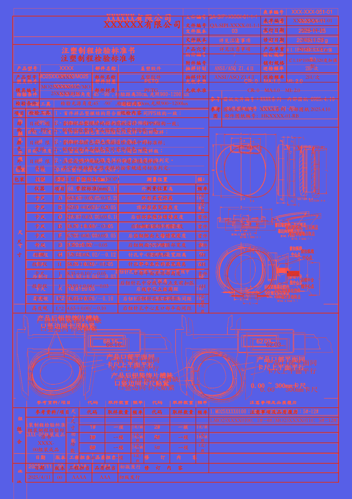
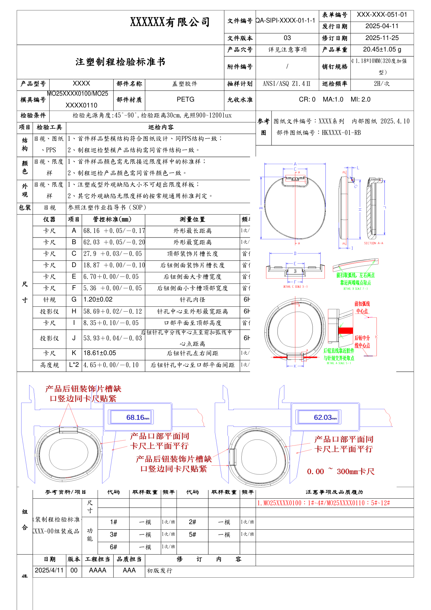
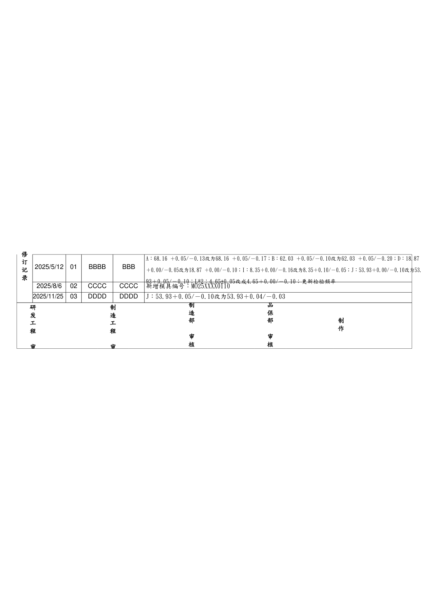
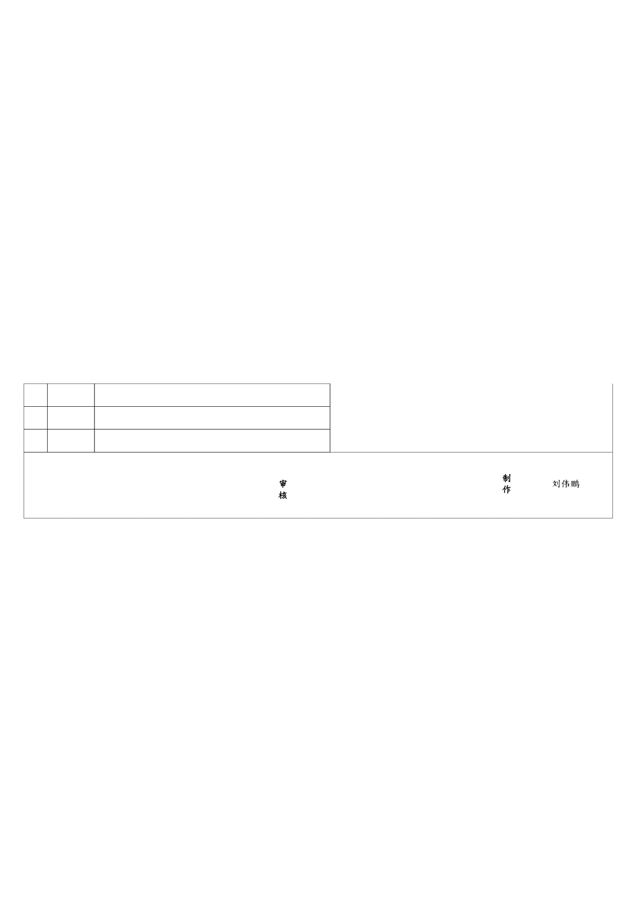

# dotnet MiniPdf vs Microsoft 365 Excel Reference PDF Comparison Report

Generated: 2026-09-05T15:54:50.378112

## Summary

| # | Test Case | Valid | Text Sim | Visual Avg | Pages (M/R) | Overall |
|---|-----------|-------|----------|------------|-------------|--------|
| 1 | 🟢 Issue202609031340 | ✅ | 0.8828 | 0.9524 | 4/4 | **0.9341** |

**Average Overall Score: 0.9341**

## Labeled Side-by-Side Comparison

<table>
<tr><th>Case</th><th>Comparison</th></tr>
<tr>
  <td><b>Issue202609031340<br><small>format: xlsx | case: Issue202609031340 | scope: dotnet-issue-xlsx</small></b><br>Page 1</td>
  <td></td>
</tr>
<tr>
  <td><b>Issue202609031340<br><small>format: xlsx | case: Issue202609031340 | scope: dotnet-issue-xlsx</small></b><br>Page 2</td>
  <td></td>
</tr>
<tr>
  <td><b>Issue202609031340<br><small>format: xlsx | case: Issue202609031340 | scope: dotnet-issue-xlsx</small></b><br>Page 3</td>
  <td></td>
</tr>
<tr>
  <td><b>Issue202609031340<br><small>format: xlsx | case: Issue202609031340 | scope: dotnet-issue-xlsx</small></b><br>Page 4</td>
  <td></td>
</tr>
</table>

## Difference Heatmaps

Blue areas are below the configured difference threshold; red areas have stronger pixel differences. The reference rendering is retained as faint context.

<table>
<tr><th>Case</th><th>Heatmap</th><th>Metrics</th></tr>
<tr>
  <td><b>Issue202609031340</b><br>Page 1</td>
  <td></td>
  <td>changed: 444245 px (20.41%)<br>bbox: [43, 29, 1195, 1754]<br>mean abs RGB: 27.6568<br>RMSE RGB: 71.4265<br>threshold: 12, gain: 5.0</td>
</tr>
<tr>
  <td><b>Issue202609031340</b><br>Page 2</td>
  <td></td>
  <td>changed: 63529 px (2.92%)<br>bbox: [43, 725, 1217, 1014]<br>mean abs RGB: 4.3159<br>RMSE RGB: 28.1847<br>threshold: 12, gain: 5.0</td>
</tr>
<tr>
  <td><b>Issue202609031340</b><br>Page 3</td>
  <td></td>
  <td>changed: 176239 px (8.10%)<br>bbox: [42, 40, 1196, 1754]<br>mean abs RGB: 10.4512<br>RMSE RGB: 43.9019<br>threshold: 12, gain: 5.0</td>
</tr>
<tr>
  <td><b>Issue202609031340</b><br>Page 4</td>
  <td></td>
  <td>changed: 18149 px (0.83%)<br>bbox: [42, 743, 1196, 1009]<br>mean abs RGB: 1.166<br>RMSE RGB: 14.6026<br>threshold: 12, gain: 5.0</td>
</tr>
</table>

## Visual Comparison

Scores compare dotnet MiniPdf against Microsoft 365 Excel Reference. LibreOffice is an auxiliary rendering and does not affect scores.

<table>
<tr><th>dotnet MiniPdf</th><th>Microsoft 365 Excel Reference</th><th>LibreOffice</th></tr>
<tr>
  <td><b>Issue202609031340<br><small>format: xlsx | case: Issue202609031340 | scope: dotnet-issue-xlsx</small></b></td>
  <td colspan="2">Issue202609031340 <span style="color:#3fb950">⬤</span> 93.4%</td>
</tr>
<tr>
  <td></td>
  <td></td>
  <td></td>
</tr>
<tr>
  <td></td>
  <td></td>
  <td></td>
</tr>
<tr>
  <td></td>
  <td></td>
  <td></td>
</tr>
<tr>
  <td></td>
  <td></td>
  <td></td>
</tr>
</table>

## Detailed Results

### Issue202609031340

- **Case Metadata:** format: xlsx | case: Issue202609031340 | scope: dotnet-issue-xlsx
- **Source:** tests/Issue_Files/xlsx/Issue202609031340.xlsx
- **Text Similarity:** 0.8828
- **Visual Average:** 0.9524
- **Overall Score:** 0.9341
- **Pages:** MiniPdf=4, Reference=4
- **File Size:** MiniPdf=470835 bytes, Reference=346206 bytes

<details><summary>Text Diff</summary>

```diff
--- minipdf/Issue202609031340.pdf
+++ reference/Issue202609031340.pdf
@@ -1,37 +1,34 @@
 表单编号 XXX-XXX-051-01

-文件编号 QA-SIPI-XXXX-01-1-1

-XXXXXX有限公司

+XXXXXX有限公司 文件编号QA-SIPI-XXXX-01-1-1

 发行日期 2025-04-11

 文件版本 03 修订日期 2025-11-25

 产品穴号 详见注意事项 产品单重 20.45±1.05 g

+注塑制程检验标准书

 ￠1.18*10MM(320度加强

-注塑制程检验标准书

 附件编号 / 销钉规格

 型)

 产品型号 XXXX 部件名称 盖塑胶件 抽样计划 ANSI/ASQ Z1.4Ⅱ 巡检频率 2H/次

-MO25XXXX0100/MO25

+MO25XXXX0100/MO

 模具编号 部件材质 PETG 允收水准 CR: 0    MA:1.0    MI: 2.0

-XXXX0110

+25XXXX0110

 检验条件 检验光源角度:45°-90°,检验距离30cm,光照900~1200lux

 参考 图纸文件编号：XXXX系列  内部图纸 2025.4.10

 项目 检验工具 巡检内容

 图 部件图纸编号：HKXXXX-01-RB

-目视、图纸 1、首件样品整模结构符合图纸设计、同PPS结构一致；

-结

-构

-、PPS 2、制程巡检整模产品结构需同首件结构一致。

-目视、限度 1、首件样品颜色需无限接近限度样中的标准样；

-颜

-色

-样 2、制程巡检产品颜色需同首件颜色一致。

-目视、限度 1、注塑成型外观缺陷大小不可超出限度样板；

-外

-观

-样 2、其它外观缺陷无限度样的按常规通用标准判定。

+结 目视、图 1、首件样品整模结构符合图纸设计、同PPS结构一致；

+构 纸、PPS 2、制程巡检整模产品结构需同首件结构一致。

+颜 目视、限 1、首件样品颜色需无限接近限度样中的标准样；

+色 度样 2、制程巡检产品颜色需同首件颜色一致。

+外 目视、限 1、注塑成型外观缺陷大小不可超出限度样板；

+观 度样 2、其它外观缺陷无限度样的按常规通用标准判定。

 包装 目视 参照注塑作业指导书（SOP）

 仪器 项目 管控标准(mm) 测量位置 频率

-卡尺 A 68.16 ＋0.05/－0.17 外形最长距离 1次/班

-卡尺 B 62.03 ＋0.05/－0.20 外形最宽距离 1次/班

+1次/

+卡尺 A 68.16 ＋0.05/－0.17 外形最长距离

+班

+1次/

+卡尺 B 62.03 ＋0.05/－0.20 外形最宽距离

+班

 卡尺 C 27.9 ＋0.03/－0.05 顶部装饰片槽长度 首件

 卡尺 D 18.87 ＋0.00/－0.10 后钮侧面装饰片槽长度 首件

 卡尺 E 6.70＋0.00/－0.05 后钮侧面大卡槽宽度 首件

@@ -40,22 +37,44 @@
 寸 针规 G 1.20±0.02 针孔内径 6H

 投影仪 H 58.69＋0.02/－0.12 针孔中心至外形最宽距离 6H

 卡尺 I 8.35＋0.10/－0.05 口部平面至顶部高度 首件

-后钮针孔中分线中心点至前扣弧线中

+后钮针孔中分线中心点至前扣弧

 投影仪 J 53.93＋0.04/－0.03 6H

-心点距离

-卡尺 K 18.61±0.05 后钮针孔左右间距 1次/班

-高度规 L*2 4.65＋0.00/－0.10 后钮针孔中心至口部平面间距 1次/班

+线中心点距离

+1次/

+卡尺 K 18.61±0.05 后钮针孔左右间距

+班

+1次/

+高度规 L*2 4.65＋0.00/－0.10 后钮针孔中心至口部平面间距

+班

+产品后钮装饰片槽缺

+口竖边同卡尺贴紧

+68.16 mm 62.03 mm

+产品口部平面同

+产品口部平面同

+卡尺上平面平行

+卡尺上平面平行

+产品后钮装饰片槽缺

+口竖边同卡尺贴紧

+0.00 ~ 300mm卡尺

 参考资料/项目 代码 取样数量 频率 代码 取样数量 频率 注意事项及品质履历

-尺 1.MO25XXXX0100：1#~4#/MO25XXXX0110：5#~12#

+1.MO25XXXX0100：1#~4#/MO25XXXX0110：5#~12#

+尺

 寸

 组

-组装制程检验标准书

-1# 一模 1次/班 2# 一模 1次/班

+组装制程检验标

+1次/ 1次/

+准书 1# 一模 2# 一模

+班 班

 合

-XXXX-00组装成品 功

-3# 一模 1次/班 5# 一模 1次/班

+XXXX-

+功

+1次/ 1次/

+3# 一模 5# 一模

+00组装成品 班 班

 能

-6# 一模 1次/班

+1次/

+6# 一模

+班

 日期 版本 工程担当 品质担当 修    订    内    容

 2025/4/11 00 AAAA AAA 初版发行

 修

@@ -63,23 +82,20 @@
 修

 A：68.16 ＋0.05/－0.13改为68.16 ＋0.05/－0.17；B：62.03 ＋0.05/－0.10改为62.03 ＋0.05/－0.20；D：18.87

 订

+＋0.00/－0.05改为18.87

 2025/5/12 01 BBBB BBB

-记 ＋0.00/－0.05改为18.87 ＋0.00/－0.10；I：8.35＋0.00/－0.16改为8.35＋0.10/－0.05；J：53.93＋0.00/－0.10改为53.

-录

-93＋0.05/－0.10；L*2：4.65±0.05改成4.65＋0.00/－0.10；更新检验频率

+记

+＋0.00/－0.10；I：8.35＋0.00/－0.16改为8.35＋0.10/－0.05；J：53.93＋0.00/－0.10改为53.93＋0.05/－0.10；

+录 L*2：4.65±0.05改成4.65＋0.00/－0.10；更新检验频率

 2025/8/6 02 CCCC CCCC 新增模具编号：MO25XXXX0110

 2025/11/25 03 DDDD DDDD J：53.93＋0.05/－0.10改为53.93＋0.04/－0.03

+研 制

 制 品

-研 制

+审 发 审 造 审 审 制

 造 保

-发 造

-部 部 制

-工 工

-作

+核 工 核 工 核 核 作

+部 部

 程 程

-审 审

-核 核

-审 审

 ---PAGE---

 文件编号 QA-SIPI-XXXX-01-1-1 表单编号 QA-FM-051-01

 XXXXXX有限公司

@@ -90,8 +106,8 @@
 产品品质履历（SIP附件）

 版本 日期 问题
... (88 more characters)

```
</details>

## Improvement Suggestions

All test cases scored 0.8 or above. 🎉
