# dotnet MiniPdf vs Microsoft 365 Excel Reference PDF Comparison Report

Generated: 2026-09-19T22:12:28.925682

## Summary

| # | Test Case | Valid | Text Sim | Visual Avg | Pages (M/R) | Overall |
|---|-----------|-------|----------|------------|-------------|--------|
| 1 | 🟢 Academic Achievement Summary Table | ✅ | 0.9436 | 0.9425 | 2/2 | **0.9544** |
| 2 | 🟢 AcademicAchievement_temp | ✅ | 0.9436 | 0.9425 | 2/2 | **0.9544** |
| 3 | 🟢 Business expense budget1 | ✅ | 0.9494 | 0.9081 | 4/4 | **0.943** |
| 4 | 🟡 Business expenses budget2 | ✅ | 0.9809 | 0.7341 | 4/4 | **0.886** |
| 5 | 🟡 Business plan checklist with SWOT analysis1 | ✅ | 1.0 | 0.6369 | 1/1 | **0.8548** |
| 6 | 🔴 Event budget1 | ✅ | 0.9547 | 0.4893 | 4/5 | **0.6776** |
| 7 | 🟢 Expense report basic1 | ✅ | 1.0 | 0.775 | 1/1 | **0.91** |
| 8 | 🟢 Grocery list1 | ✅ | 0.9915 | 0.8241 | 1/1 | **0.9262** |
| 9 | 🟢 Issue202609031340 | ✅ | 0.8828 | 0.9532 | 4/4 | **0.9344** |
| 10 | 🔴 payroll-calculator_f | ✅ | 0.7233 | 0.5184 | 25/29 | **0.5967** |
| 11 | 🟢 PO_anonymized | ✅ | 0.9841 | 0.898 | 9/9 | **0.9528** |
| 12 | 🟡 Simple invoice1 | ✅ | 0.9346 | 0.7609 | 1/1 | **0.8782** |
| 13 | 🔴 Small business cash flow forecast1 | ✅ | 0.8691 | 0.4895 | 3/5 | **0.6434** |
| 14 | 🟢 Wedding_timeline_planner1_copy | ✅ | 0.9492 | 0.8896 | 8/8 | **0.9355** |
| 15 | 🟡 Weekly schedule planner1 | ✅ | 0.9062 | 0.7587 | 1/1 | **0.866** |
| 16 | 🟡 XlsxIssue75 | ✅ | 0.9904 | 0.967 | 140/144 | **0.883** |
| 17 | 🟢 XlsxIssue77_MergedCellAlignment | ✅ | 1.0 | 0.8336 | 2/2 | **0.9334** |
| 18 | 🟢 XlsxIssue77_Template1 | ✅ | 1.0 | 0.8504 | 6/6 | **0.9402** |
| 19 | 🟢 XlsxIssue77_Template2_Workaround | ✅ | 1.0 | 0.8541 | 6/6 | **0.9416** |
| 20 | 🟡 XlsxIssue81_LayoutOptions | ✅ | 0.8266 | 0.8114 | 16/16 | **0.8552** |
| 21 | 🔴 XlsxIssue82_5mb | ✅ | 0.138 | 0.8145 | 722/766 | **0.481** |
| 22 | 🔴 XlsxIssue82_SampleTestData5mb | ✅ | 0.3692 | 0.9025 | 834/1668 | **0.6087** |
| 23 | 🟢 XlsxIssue82_WideTable | ✅ | 0.97 | 0.8209 | 13/13 | **0.9164** |
| 24 | ⚪ XlsxIssue152_ClusteredNonZeroBarChart | ✅ | N/A | N/A | ?/? | **N/A** |

**Average Overall Score: 0.8114**

## Labeled Side-by-Side Comparison

<table>
<tr><th>Case</th><th>Comparison</th></tr>
<tr>
  <td><b>Academic Achievement Summary Table<br><small>format: xlsx | case: Academic Achievement Summary Table | scope: dotnet-issue-xlsx</small></b><br>Page 1</td>
  <td></td>
</tr>
<tr>
  <td><b>Academic Achievement Summary Table<br><small>format: xlsx | case: Academic Achievement Summary Table | scope: dotnet-issue-xlsx</small></b><br>Page 2</td>
  <td></td>
</tr>
<tr>
  <td><b>AcademicAchievement_temp<br><small>format: xlsx | case: AcademicAchievement_temp | scope: dotnet-issue-xlsx</small></b><br>Page 1</td>
  <td></td>
</tr>
<tr>
  <td><b>AcademicAchievement_temp<br><small>format: xlsx | case: AcademicAchievement_temp | scope: dotnet-issue-xlsx</small></b><br>Page 2</td>
  <td></td>
</tr>
<tr>
  <td><b>Business expense budget1<br><small>format: xlsx | case: Business expense budget1 | scope: dotnet-issue-xlsx</small></b><br>Page 1</td>
  <td></td>
</tr>
<tr>
  <td><b>Business expense budget1<br><small>format: xlsx | case: Business expense budget1 | scope: dotnet-issue-xlsx</small></b><br>Page 2</td>
  <td></td>
</tr>
<tr>
  <td><b>Business expense budget1<br><small>format: xlsx | case: Business expense budget1 | scope: dotnet-issue-xlsx</small></b><br>Page 3</td>
  <td></td>
</tr>
<tr>
  <td><b>Business expense budget1<br><small>format: xlsx | case: Business expense budget1 | scope: dotnet-issue-xlsx</small></b><br>Page 4</td>
  <td></td>
</tr>
<tr>
  <td><b>Business expenses budget2<br><small>format: xlsx | case: Business expenses budget2 | scope: dotnet-issue-xlsx</small></b><br>Page 1</td>
  <td></td>
</tr>
<tr>
  <td><b>Business expenses budget2<br><small>format: xlsx | case: Business expenses budget2 | scope: dotnet-issue-xlsx</small></b><br>Page 2</td>
  <td></td>
</tr>
<tr>
  <td><b>Business expenses budget2<br><small>format: xlsx | case: Business expenses budget2 | scope: dotnet-issue-xlsx</small></b><br>Page 3</td>
  <td></td>
</tr>
<tr>
  <td><b>Business expenses budget2<br><small>format: xlsx | case: Business expenses budget2 | scope: dotnet-issue-xlsx</small></b><br>Page 4</td>
  <td></td>
</tr>
<tr>
  <td><b>Business plan checklist with SWOT analysis1<br><small>format: xlsx | case: Business plan checklist with SWOT analysis1 | scope: dotnet-issue-xlsx</small></b><br>Page 1</td>
  <td></td>
</tr>
<tr>
  <td><b>Event budget1<br><small>format: xlsx | case: Event budget1 | scope: dotnet-issue-xlsx</small></b><br>Page 1</td>
  <td></td>
</tr>
<tr>
  <td><b>Event budget1<br><small>format: xlsx | case: Event budget1 | scope: dotnet-issue-xlsx</small></b><br>Page 2</td>
  <td></td>
</tr>
<tr>
  <td><b>Event budget1<br><small>format: xlsx | case: Event budget1 | scope: dotnet-issue-xlsx</small></b><br>Page 3</td>
  <td></td>
</tr>
<tr>
  <td><b>Event budget1<br><small>format: xlsx | case: Event budget1 | scope: dotnet-issue-xlsx</small></b><br>Page 4</td>
  <td></td>
</tr>
<tr>
  <td><b>Event budget1<br><small>format: xlsx | case: Event budget1 | scope: dotnet-issue-xlsx</small></b><br>Page 5</td>
  <td></td>
</tr>
<tr>
  <td><b>Expense report basic1<br><small>format: xlsx | case: Expense report basic1 | scope: dotnet-issue-xlsx</small></b><br>Page 1</td>
  <td></td>
</tr>
<tr>
  <td><b>Grocery list1<br><small>format: xlsx | case: Grocery list1 | scope: dotnet-issue-xlsx</small></b><br>Page 1</td>
  <td></td>
</tr>
<tr>
  <td><b>Issue202609031340<br><small>format: xlsx | case: Issue202609031340 | scope: dotnet-issue-xlsx</small></b><br>Page 1</td>
  <td></td>
</tr>
<tr>
  <td><b>Issue202609031340<br><small>format: xlsx | case: Issue202609031340 | scope: dotnet-issue-xlsx</small></b><br>Page 2</td>
  <td></td>
</tr>
<tr>
  <td><b>Issue202609031340<br><small>format: xlsx | case: Issue202609031340 | scope: dotnet-issue-xlsx</small></b><br>Page 3</td>
  <td></td>
</tr>
<tr>
  <td><b>Issue202609031340<br><small>format: xlsx | case: Issue202609031340 | scope: dotnet-issue-xlsx</small></b><br>Page 4</td>
  <td></td>
</tr>
<tr>
  <td><b>payroll-calculator_f<br><small>format: xlsx | case: payroll-calculator_f | scope: dotnet-issue-xlsx</small></b><br>Page 1</td>
  <td></td>
</tr>
<tr>
  <td><b>payroll-calculator_f<br><small>format: xlsx | case: payroll-calculator_f | scope: dotnet-issue-xlsx</small></b><br>Page 2</td>
  <td></td>
</tr>
<tr>
  <td><b>payroll-calculator_f<br><small>format: xlsx | case: payroll-calculator_f | scope: dotnet-issue-xlsx</small></b><br>Page 3</td>
  <td></td>
</tr>
<tr>
  <td><b>payroll-calculator_f<br><small>format: xlsx | case: payroll-calculator_f | scope: dotnet-issue-xlsx</small></b><br>Page 4</td>
  <td></td>
</tr>
<tr>
  <td><b>payroll-calculator_f<br><small>format: xlsx | case: payroll-calculator_f | scope: dotnet-issue-xlsx</small></b><br>Page 5</td>
  <td></td>
</tr>
<tr>
  <td><b>payroll-calculator_f<br><small>format: xlsx | case: payroll-calculator_f | scope: dotnet-issue-xlsx</small></b><br>Page 6</td>
  <td></td>
</tr>
<tr>
  <td><b>payroll-calculator_f<br><small>format: xlsx | case: payroll-calculator_f | scope: dotnet-issue-xlsx</small></b><br>Page 7</td>
  <td></td>
</tr>
<tr>
  <td><b>payroll-calculator_f<br><small>format: xlsx | case: payroll-calculator_f | scope: dotnet-issue-xlsx</small></b><br>Page 8</td>
  <td></td>
</tr>
<tr>
  <td><b>payroll-calculator_f<br><small>format: xlsx | case: payroll-calculator_f | scope: dotnet-issue-xlsx</small></b><br>Page 9</td>
  <td></td>
</tr>
<tr>
  <td><b>payroll-calculator_f<br><small>format: xlsx | case: payroll-calculator_f | scope: dotnet-issue-xlsx</small></b><br>Page 10</td>
  <td></td>
</tr>
<tr>
  <td><b>payroll-calculator_f<br><small>format: xlsx | case: payroll-calculator_f | scope: dotnet-issue-xlsx</small></b><br>Page 11</td>
  <td></td>
</tr>
<tr>
  <td><b>payroll-calculator_f<br><small>format: xlsx | case: payroll-calculator_f | scope: dotnet-issue-xlsx</small></b><br>Page 12</td>
  <td></td>
</tr>
<tr>
  <td><b>payroll-calculator_f<br><small>format: xlsx | case: payroll-calculator_f | scope: dotnet-issue-xlsx</small></b><br>Page 13</td>
  <td></td>
</tr>
<tr>
  <td><b>payroll-calculator_f<br><small>format: xlsx | case: payroll-calculator_f | scope: dotnet-issue-xlsx</small></b><br>Page 14</td>
  <td></td>
</tr>
<tr>
  <td><b>payroll-calculator_f<br><small>format: xlsx | case: payroll-calculator_f | scope: dotnet-issue-xlsx</small></b><br>Page 15</td>
  <td></td>
</tr>
<tr>
  <td><b>PO_anonymized<br><small>format: xlsx | case: PO_anonymized | scope: dotnet-issue-xlsx</small></b><br>Page 1</td>
  <td></td>
</tr>
<tr>
  <td><b>PO_anonymized<br><small>format: xlsx | case: PO_anonymized | scope: dotnet-issue-xlsx</small></b><br>Page 2</td>
  <td></td>
</tr>
<tr>
  <td><b>PO_anonymized<br><small>format: xlsx | case: PO_anonymized | scope: dotnet-issue-xlsx</small></b><br>Page 3</td>
  <td></td>
</tr>
<tr>
  <td><b>PO_anonymized<br><small>format: xlsx | case: PO_anonymized | scope: dotnet-issue-xlsx</small></b><br>Page 4</td>
  <td></td>
</tr>
<tr>
  <td><b>PO_anonymized<br><small>format: xlsx | case: PO_anonymized | scope: dotnet-issue-xlsx</small></b><br>Page 5</td>
  <td></td>
</tr>
<tr>
  <td><b>PO_anonymized<br><small>format: xlsx | case: PO_anonymized | scope: dotnet-issue-xlsx</small></b><br>Page 6</td>
  <td></td>
</tr>
<tr>
  <td><b>PO_anonymized<br><small>format: xlsx | case: PO_anonymized | scope: dotnet-issue-xlsx</small></b><br>Page 7</td>
  <td></td>
</tr>
<tr>
  <td><b>PO_anonymized<br><small>format: xlsx | case: PO_anonymized | scope: dotnet-issue-xlsx</small></b><br>Page 8</td>
  <td></td>
</tr>
<tr>
  <td><b>PO_anonymized<br><small>format: xlsx | case: PO_anonymized | scope: dotnet-issue-xlsx</small></b><br>Page 9</td>
  <td></td>
</tr>
<tr>
  <td><b>Simple invoice1<br><small>format: xlsx | case: Simple invoice1 | scope: dotnet-issue-xlsx</small></b><br>Page 1</td>
  <td></td>
</tr>
<tr>
  <td><b>Small business cash flow forecast1<br><small>format: xlsx | case: Small business cash flow forecast1 | scope: dotnet-issue-xlsx</small></b><br>Page 1</td>
  <td></td>
</tr>
<tr>
  <td><b>Small business cash flow forecast1<br><small>format: xlsx | case: Small business cash flow forecast1 | scope: dotnet-issue-xlsx</small></b><br>Page 2</td>
  <td></td>
</tr>
<tr>
  <td><b>Small business cash flow forecast1<br><small>format: xlsx | case: Small business cash flow forecast1 | scope: dotnet-issue-xlsx</small></b><br>Page 3</td>
  <td></td>
</tr>
<tr>
  <td><b>Small business cash flow forecast1<br><small>format: xlsx | case: Small business cash flow forecast1 | scope: dotnet-issue-xlsx</small></b><br>Page 4</td>
  <td></td>
</tr>
<tr>
  <td><b>Small business cash flow forecast1<br><small>format: xlsx | case: Small business cash flow forecast1 | scope: dotnet-issue-xlsx</small></b><br>Page 5</td>
  <td></td>
</tr>
<tr>
  <td><b>Wedding_timeline_planner1_copy<br><small>format: xlsx | case: Wedding_timeline_planner1_copy | scope: dotnet-issue-xlsx</small></b><br>Page 1</td>
  <td></td>
</tr>
<tr>
  <td><b>Wedding_timeline_planner1_copy<br><small>format: xlsx | case: Wedding_timeline_planner1_copy | scope: dotnet-issue-xlsx</small></b><br>Page 2</td>
  <td></td>
</tr>
<tr>
  <td><b>Wedding_timeline_planner1_copy<br><small>format: xlsx | case: Wedding_timeline_planner1_copy | scope: dotnet-issue-xlsx</small></b><br>Page 3</td>
  <td></td>
</tr>
<tr>
  <td><b>Wedding_timeline_planner1_copy<br><small>format: xlsx | case: Wedding_timeline_planner1_copy | scope: dotnet-issue-xlsx</small></b><br>Page 4</td>
  <td></td>
</tr>
<tr>
  <td><b>Wedding_timeline_planner1_copy<br><small>format: xlsx | case: Wedding_timeline_planner1_copy | scope: dotnet-issue-xlsx</small></b><br>Page 5</td>
  <td></td>
</tr>
<tr>
  <td><b>Wedding_timeline_planner1_copy<br><small>format: xlsx | case: Wedding_timeline_planner1_copy | scope: dotnet-issue-xlsx</small></b><br>Page 6</td>
  <td></td>
</tr>
<tr>
  <td><b>Wedding_timeline_planner1_copy<br><small>format: xlsx | case: Wedding_timeline_planner1_copy | scope: dotnet-issue-xlsx</small></b><br>Page 7</td>
  <td></td>
</tr>
<tr>
  <td><b>Wedding_timeline_planner1_copy<br><small>format: xlsx | case: Wedding_timeline_planner1_copy | scope: dotnet-issue-xlsx</small></b><br>Page 8</td>
  <td></td>
</tr>
<tr>
  <td><b>Weekly schedule planner1<br><small>format: xlsx | case: Weekly schedule planner1 | scope: dotnet-issue-xlsx</small></b><br>Page 1</td>
  <td></td>
</tr>
<tr>
  <td><b>XlsxIssue75<br><small>format: xlsx | case: XlsxIssue75 | scope: dotnet-issue-xlsx</small></b><br>Page 1</td>
  <td></td>
</tr>
<tr>
  <td><b>XlsxIssue75<br><small>format: xlsx | case: XlsxIssue75 | scope: dotnet-issue-xlsx</small></b><br>Page 2</td>
  <td></td>
</tr>
<tr>
  <td><b>XlsxIssue75<br><small>format: xlsx | case: XlsxIssue75 | scope: dotnet-issue-xlsx</small></b><br>Page 3</td>
  <td></td>
</tr>
<tr>
  <td><b>XlsxIssue75<br><small>format: xlsx | case: XlsxIssue75 | scope: dotnet-issue-xlsx</small></b><br>Page 4</td>
  <td></td>
</tr>
<tr>
  <td><b>XlsxIssue75<br><small>format: xlsx | case: XlsxIssue75 | scope: dotnet-issue-xlsx</small></b><br>Page 5</td>
  <td></td>
</tr>
<tr>
  <td><b>XlsxIssue75<br><small>format: xlsx | case: XlsxIssue75 | scope: dotnet-issue-xlsx</small></b><br>Page 6</td>
  <td></td>
</tr>
<tr>
  <td><b>XlsxIssue75<br><small>format: xlsx | case: XlsxIssue75 | scope: dotnet-issue-xlsx</small></b><br>Page 7</td>
  <td></td>
</tr>
<tr>
  <td><b>XlsxIssue75<br><small>format: xlsx | case: XlsxIssue75 | scope: dotnet-issue-xlsx</small></b><br>Page 8</td>
  <td></td>
</tr>
<tr>
  <td><b>XlsxIssue75<br><small>format: xlsx | case: XlsxIssue75 | scope: dotnet-issue-xlsx</small></b><br>Page 9</td>
  <td></td>
</tr>
<tr>
  <td><b>XlsxIssue75<br><small>format: xlsx | case: XlsxIssue75 | scope: dotnet-issue-xlsx</small></b><br>Page 10</td>
  <td></td>
</tr>
<tr>
  <td><b>XlsxIssue75<br><small>format: xlsx | case: XlsxIssue75 | scope: dotnet-issue-xlsx</small></b><br>Page 11</td>
  <td></td>
</tr>
<tr>
  <td><b>XlsxIssue75<br><small>format: xlsx | case: XlsxIssue75 | scope: dotnet-issue-xlsx</small></b><br>Page 12</td>
  <td></td>
</tr>
<tr>
  <td><b>XlsxIssue75<br><small>format: xlsx | case: XlsxIssue75 | scope: dotnet-issue-xlsx</small></b><br>Page 13</td>
  <td></td>
</tr>
<tr>
  <td><b>XlsxIssue75<br><small>format: xlsx | case: XlsxIssue75 | scope: dotnet-issue-xlsx</small></b><br>Page 14</td>
  <td></td>
</tr>
<tr>
  <td><b>XlsxIssue75<br><small>format: xlsx | case: XlsxIssue75 | scope: dotnet-issue-xlsx</small></b><br>Page 15</td>
  <td></td>
</tr>
<tr>
  <td><b>XlsxIssue77_MergedCellAlignment<br><small>format: xlsx | case: XlsxIssue77_MergedCellAlignment | scope: dotnet-issue-xlsx</small></b><br>Page 1</td>
  <td></td>
</tr>
<tr>
  <td><b>XlsxIssue77_MergedCellAlignment<br><small>format: xlsx | case: XlsxIssue77_MergedCellAlignment | scope: dotnet-issue-xlsx</small></b><br>Page 2</td>
  <td></td>
</tr>
<tr>
  <td><b>XlsxIssue77_Template1<br><small>format: xlsx | case: XlsxIssue77_Template1 | scope: dotnet-issue-xlsx</small></b><br>Page 1</td>
  <td></td>
</tr>
<tr>
  <td><b>XlsxIssue77_Template1<br><small>format: xlsx | case: XlsxIssue77_Template1 | scope: dotnet-issue-xlsx</small></b><br>Page 2</td>
  <td></td>
</tr>
<tr>
  <td><b>XlsxIssue77_Template1<br><small>format: xlsx | case: XlsxIssue77_Template1 | scope: dotnet-issue-xlsx</small></b><br>Page 3</td>
  <td></td>
</tr>
<tr>
  <td><b>XlsxIssue77_Template1<br><small>format: xlsx | case: XlsxIssue77_Template1 | scope: dotnet-issue-xlsx</small></b><br>Page 4</td>
  <td></td>
</tr>
<tr>
  <td><b>XlsxIssue77_Template1<br><small>format: xlsx | case: XlsxIssue77_Template1 | scope: dotnet-issue-xlsx</small></b><br>Page 5</td>
  <td></td>
</tr>
<tr>
  <td><b>XlsxIssue77_Template1<br><small>format: xlsx | case: XlsxIssue77_Template1 | scope: dotnet-issue-xlsx</small></b><br>Page 6</td>
  <td></td>
</tr>
<tr>
  <td><b>XlsxIssue77_Template2_Workaround<br><small>format: xlsx | case: XlsxIssue77_Template2_Workaround | scope: dotnet-issue-xlsx</small></b><br>Page 1</td>
  <td></td>
</tr>
<tr>
  <td><b>XlsxIssue77_Template2_Workaround<br><small>format: xlsx | case: XlsxIssue77_Template2_Workaround | scope: dotnet-issue-xlsx</small></b><br>Page 2</td>
  <td></td>
</tr>
<tr>
  <td><b>XlsxIssue77_Template2_Workaround<br><small>format: xlsx | case: XlsxIssue77_Template2_Workaround | scope: dotnet-issue-xlsx</small></b><br>Page 3</td>
  <td></td>
</tr>
<tr>
  <td><b>XlsxIssue77_Template2_Workaround<br><small>format: xlsx | case: XlsxIssue77_Template2_Workaround | scope: dotnet-issue-xlsx</small></b><br>Page 4</td>
  <td></td>
</tr>
<tr>
  <td><b>XlsxIssue77_Template2_Workaround<br><small>format: xlsx | case: XlsxIssue77_Template2_Workaround | scope: dotnet-issue-xlsx</small></b><br>Page 5</td>
  <td></td>
</tr>
<tr>
  <td><b>XlsxIssue77_Template2_Workaround<br><small>format: xlsx | case: XlsxIssue77_Template2_Workaround | scope: dotnet-issue-xlsx</small></b><br>Page 6</td>
  <td></td>
</tr>
<tr>
  <td><b>XlsxIssue81_LayoutOptions<br><small>format: xlsx | case: XlsxIssue81_LayoutOptions | scope: dotnet-issue-xlsx</small></b><br>Page 1</td>
  <td></td>
</tr>
<tr>
  <td><b>XlsxIssue81_LayoutOptions<br><small>format: xlsx | case: XlsxIssue81_LayoutOptions | scope: dotnet-issue-xlsx</small></b><br>Page 2</td>
  <td></td>
</tr>
<tr>
  <td><b>XlsxIssue81_LayoutOptions<br><small>format: xlsx | case: XlsxIssue81_LayoutOptions | scope: dotnet-issue-xlsx</small></b><br>Page 3</td>
  <td></td>
</tr>
<tr>
  <td><b>XlsxIssue81_LayoutOptions<br><small>format: xlsx | case: XlsxIssue81_LayoutOptions | scope: dotnet-issue-xlsx</small></b><br>Page 4</td>
  <td></td>
</tr>
<tr>
  <td><b>XlsxIssue81_LayoutOptions<br><small>format: xlsx | case: XlsxIssue81_LayoutOptions | scope: dotnet-issue-xlsx</small></b><br>Page 5</td>
  <td></td>
</tr>
<tr>
  <td><b>XlsxIssue81_LayoutOptions<br><small>format: xlsx | case: XlsxIssue81_LayoutOptions | scope: dotnet-issue-xlsx</small></b><br>Page 6</td>
  <td></td>
</tr>
<tr>
  <td><b>XlsxIssue81_LayoutOptions<br><small>format: xlsx | case: XlsxIssue81_LayoutOptions | scope: dotnet-issue-xlsx</small></b><br>Page 7</td>
  <td></td>
</tr>
<tr>
  <td><b>XlsxIssue81_LayoutOptions<br><small>format: xlsx | case: XlsxIssue81_LayoutOptions | scope: dotnet-issue-xlsx</small></b><br>Page 8</td>
  <td></td>
</tr>
<tr>
  <td><b>XlsxIssue81_LayoutOptions<br><small>format: xlsx | case: XlsxIssue81_LayoutOptions | scope: dotnet-issue-xlsx</small></b><br>Page 9</td>
  <td></td>
</tr>
<tr>
  <td><b>XlsxIssue81_LayoutOptions<br><small>format: xlsx | case: XlsxIssue81_LayoutOptions | scope: dotnet-issue-xlsx</small></b><br>Page 10</td>
  <td></td>
</tr>
<tr>
  <td><b>XlsxIssue81_LayoutOptions<br><small>format: xlsx | case: XlsxIssue81_LayoutOptions | scope: dotnet-issue-xlsx</small></b><br>Page 11</td>
  <td></td>
</tr>
<tr>
  <td><b>XlsxIssue81_LayoutOptions<br><small>format: xlsx | case: XlsxIssue81_LayoutOptions | scope: dotnet-issue-xlsx</small></b><br>Page 12</td>
  <td></td>
</tr>
<tr>
  <td><b>XlsxIssue81_LayoutOptions<br><small>format: xlsx | case: XlsxIssue81_LayoutOptions | scope: dotnet-issue-xlsx</small></b><br>Page 13</td>
  <td></td>
</tr>
<tr>
  <td><b>XlsxIssue81_LayoutOptions<br><small>format: xlsx | case: XlsxIssue81_LayoutOptions | scope: dotnet-issue-xlsx</small></b><br>Page 14</td>
  <td></td>
</tr>
<tr>
  <td><b>XlsxIssue81_LayoutOptions<br><small>format: xlsx | case: XlsxIssue81_LayoutOptions | scope: dotnet-issue-xlsx</small></b><br>Page 15</td>
  <td></td>
</tr>
<tr>
  <td><b>XlsxIssue82_5mb<br><small>format: xlsx | case: XlsxIssue82_5mb | scope: dotnet-issue-xlsx</small></b><br>Page 1</td>
  <td></td>
</tr>
<tr>
  <td><b>XlsxIssue82_5mb<br><small>format: xlsx | case: XlsxIssue82_5mb | scope: dotnet-issue-xlsx</small></b><br>Page 2</td>
  <td></td>
</tr>
<tr>
  <td><b>XlsxIssue82_5mb<br><small>format: xlsx | case: XlsxIssue82_5mb | scope: dotnet-issue-xlsx</small></b><br>Page 3</td>
  <td></td>
</tr>
<tr>
  <td><b>XlsxIssue82_5mb<br><small>format: xlsx | case: XlsxIssue82_5mb | scope: dotnet-issue-xlsx</small></b><br>Page 4</td>
  <td></td>
</tr>
<tr>
  <td><b>XlsxIssue82_5mb<br><small>format: xlsx | case: XlsxIssue82_5mb | scope: dotnet-issue-xlsx</small></b><br>Page 5</td>
  <td></td>
</tr>
<tr>
  <td><b>XlsxIssue82_5mb<br><small>format: xlsx | case: XlsxIssue82_5mb | scope: dotnet-issue-xlsx</small></b><br>Page 6</td>
  <td></td>
</tr>
<tr>
  <td><b>XlsxIssue82_5mb<br><small>format: xlsx | case: XlsxIssue82_5mb | scope: dotnet-issue-xlsx</small></b><br>Page 7</td>
  <td></td>
</tr>
<tr>
  <td><b>XlsxIssue82_5mb<br><small>format: xlsx | case: XlsxIssue82_5mb | scope: dotnet-issue-xlsx</small></b><br>Page 8</td>
  <td></td>
</tr>
<tr>
  <td><b>XlsxIssue82_5mb<br><small>format: xlsx | case: XlsxIssue82_5mb | scope: dotnet-issue-xlsx</small></b><br>Page 9</td>
  <td></td>
</tr>
<tr>
  <td><b>XlsxIssue82_5mb<br><small>format: xlsx | case: XlsxIssue82_5mb | scope: dotnet-issue-xlsx</small></b><br>Page 10</td>
  <td></td>
</tr>
<tr>
  <td><b>XlsxIssue82_5mb<br><small>format: xlsx | case: XlsxIssue82_5mb | scope: dotnet-issue-xlsx</small></b><br>Page 11</td>
  <td></td>
</tr>
<tr>
  <td><b>XlsxIssue82_5mb<br><small>format: xlsx | case: XlsxIssue82_5mb | scope: dotnet-issue-xlsx</small></b><br>Page 12</td>
  <td></td>
</tr>
<tr>
  <td><b>XlsxIssue82_5mb<br><small>format: xlsx | case: XlsxIssue82_5mb | scope: dotnet-issue-xlsx</small></b><br>Page 13</td>
  <td></td>
</tr>
<tr>
  <td><b>XlsxIssue82_5mb<br><small>format: xlsx | case: XlsxIssue82_5mb | scope: dotnet-issue-xlsx</small></b><br>Page 14</td>
  <td></td>
</tr>
<tr>
  <td><b>XlsxIssue82_5mb<br><small>format: xlsx | case: XlsxIssue82_5mb | scope: dotnet-issue-xlsx</small></b><br>Page 15</td>
  <td></td>
</tr>
<tr>
  <td><b>XlsxIssue82_SampleTestData5mb<br><small>format: xlsx | case: XlsxIssue82_SampleTestData5mb | scope: dotnet-issue-xlsx</small></b><br>Page 1</td>
  <td></td>
</tr>
<tr>
  <td><b>XlsxIssue82_SampleTestData5mb<br><small>format: xlsx | case: XlsxIssue82_SampleTestData5mb | scope: dotnet-issue-xlsx</small></b><br>Page 2</td>
  <td></td>
</tr>
<tr>
  <td><b>XlsxIssue82_SampleTestData5mb<br><small>format: xlsx | case: XlsxIssue82_SampleTestData5mb | scope: dotnet-issue-xlsx</small></b><br>Page 3</td>
  <td></td>
</tr>
<tr>
  <td><b>XlsxIssue82_SampleTestData5mb<br><small>format: xlsx | case: XlsxIssue82_SampleTestData5mb | scope: dotnet-issue-xlsx</small></b><br>Page 4</td>
  <td></td>
</tr>
<tr>
  <td><b>XlsxIssue82_SampleTestData5mb<br><small>format: xlsx | case: XlsxIssue82_SampleTestData5mb | scope: dotnet-issue-xlsx</small></b><br>Page 5</td>
  <td></td>
</tr>
<tr>
  <td><b>XlsxIssue82_SampleTestData5mb<br><small>format: xlsx | case: XlsxIssue82_SampleTestData5mb | scope: dotnet-issue-xlsx</small></b><br>Page 6</td>
  <td></td>
</tr>
<tr>
  <td><b>XlsxIssue82_SampleTestData5mb<br><small>format: xlsx | case: XlsxIssue82_SampleTestData5mb | scope: dotnet-issue-xlsx</small></b><br>Page 7</td>
  <td></td>
</tr>
<tr>
  <td><b>XlsxIssue82_SampleTestData5mb<br><small>format: xlsx | case: XlsxIssue82_SampleTestData5mb | scope: dotnet-issue-xlsx</small></b><br>Page 8</td>
  <td></td>
</tr>
<tr>
  <td><b>XlsxIssue82_SampleTestData5mb<br><small>format: xlsx | case: XlsxIssue82_SampleTestData5mb | scope: dotnet-issue-xlsx</small></b><br>Page 9</td>
  <td></td>
</tr>
<tr>
  <td><b>XlsxIssue82_SampleTestData5mb<br><small>format: xlsx | case: XlsxIssue82_SampleTestData5mb | scope: dotnet-issue-xlsx</small></b><br>Page 10</td>
  <td></td>
</tr>
<tr>
  <td><b>XlsxIssue82_SampleTestData5mb<br><small>format: xlsx | case: XlsxIssue82_SampleTestData5mb | scope: dotnet-issue-xlsx</small></b><br>Page 11</td>
  <td></td>
</tr>
<tr>
  <td><b>XlsxIssue82_SampleTestData5mb<br><small>format: xlsx | case: XlsxIssue82_SampleTestData5mb | scope: dotnet-issue-xlsx</small></b><br>Page 12</td>
  <td></td>
</tr>
<tr>
  <td><b>XlsxIssue82_SampleTestData5mb<br><small>format: xlsx | case: XlsxIssue82_SampleTestData5mb | scope: dotnet-issue-xlsx</small></b><br>Page 13</td>
  <td></td>
</tr>
<tr>
  <td><b>XlsxIssue82_SampleTestData5mb<br><small>format: xlsx | case: XlsxIssue82_SampleTestData5mb | scope: dotnet-issue-xlsx</small></b><br>Page 14</td>
  <td></td>
</tr>
<tr>
  <td><b>XlsxIssue82_SampleTestData5mb<br><small>format: xlsx | case: XlsxIssue82_SampleTestData5mb | scope: dotnet-issue-xlsx</small></b><br>Page 15</td>
  <td></td>
</tr>
<tr>
  <td><b>XlsxIssue82_WideTable<br><small>format: xlsx | case: XlsxIssue82_WideTable | scope: dotnet-issue-xlsx</small></b><br>Page 1</td>
  <td></td>
</tr>
<tr>
  <td><b>XlsxIssue82_WideTable<br><small>format: xlsx | case: XlsxIssue82_WideTable | scope: dotnet-issue-xlsx</small></b><br>Page 2</td>
  <td></td>
</tr>
<tr>
  <td><b>XlsxIssue82_WideTable<br><small>format: xlsx | case: XlsxIssue82_WideTable | scope: dotnet-issue-xlsx</small></b><br>Page 3</td>
  <td></td>
</tr>
<tr>
  <td><b>XlsxIssue82_WideTable<br><small>format: xlsx | case: XlsxIssue82_WideTable | scope: dotnet-issue-xlsx</small></b><br>Page 4</td>
  <td></td>
</tr>
<tr>
  <td><b>XlsxIssue82_WideTable<br><small>format: xlsx | case: XlsxIssue82_WideTable | scope: dotnet-issue-xlsx</small></b><br>Page 5</td>
  <td></td>
</tr>
<tr>
  <td><b>XlsxIssue82_WideTable<br><small>format: xlsx | case: XlsxIssue82_WideTable | scope: dotnet-issue-xlsx</small></b><br>Page 6</td>
  <td></td>
</tr>
<tr>
  <td><b>XlsxIssue82_WideTable<br><small>format: xlsx | case: XlsxIssue82_WideTable | scope: dotnet-issue-xlsx</small></b><br>Page 7</td>
  <td></td>
</tr>
<tr>
  <td><b>XlsxIssue82_WideTable<br><small>format: xlsx | case: XlsxIssue82_WideTable | scope: dotnet-issue-xlsx</small></b><br>Page 8</td>
  <td></td>
</tr>
<tr>
  <td><b>XlsxIssue82_WideTable<br><small>format: xlsx | case: XlsxIssue82_WideTable | scope: dotnet-issue-xlsx</small></b><br>Page 9</td>
  <td></td>
</tr>
<tr>
  <td><b>XlsxIssue82_WideTable<br><small>format: xlsx | case: XlsxIssue82_WideTable | scope: dotnet-issue-xlsx</small></b><br>Page 10</td>
  <td></td>
</tr>
<tr>
  <td><b>XlsxIssue82_WideTable<br><small>format: xlsx | case: XlsxIssue82_WideTable | scope: dotnet-issue-xlsx</small></b><br>Page 11</td>
  <td></td>
</tr>
<tr>
  <td><b>XlsxIssue82_WideTable<br><small>format: xlsx | case: XlsxIssue82_WideTable | scope: dotnet-issue-xlsx</small></b><br>Page 12</td>
  <td></td>
</tr>
<tr>
  <td><b>XlsxIssue82_WideTable<br><small>format: xlsx | case: XlsxIssue82_WideTable | scope: dotnet-issue-xlsx</small></b><br>Page 13</td>
  <td></td>
</tr>
</table>

## Difference Heatmaps

Blue areas are below the configured difference threshold; red areas have stronger pixel differences. The reference rendering is retained as faint context.

<table>
<tr><th>Case</th><th>Heatmap</th><th>Metrics</th></tr>
<tr>
  <td><b>Academic Achievement Summary Table</b><br>Page 1</td>
  <td></td>
  <td>changed: 169488 px (7.79%)<br>bbox: [46, 21, 1717, 1143]<br>mean abs RGB: 11.2642<br>RMSE RGB: 45.6381<br>threshold: 12, gain: 5.0</td>
</tr>
<tr>
  <td><b>Academic Achievement Summary Table</b><br>Page 2</td>
  <td></td>
  <td>changed: 267697 px (12.30%)<br>bbox: [46, 11, 1717, 1170]<br>mean abs RGB: 17.8525<br>RMSE RGB: 57.9521<br>threshold: 12, gain: 5.0</td>
</tr>
<tr>
  <td><b>AcademicAchievement_temp</b><br>Page 1</td>
  <td>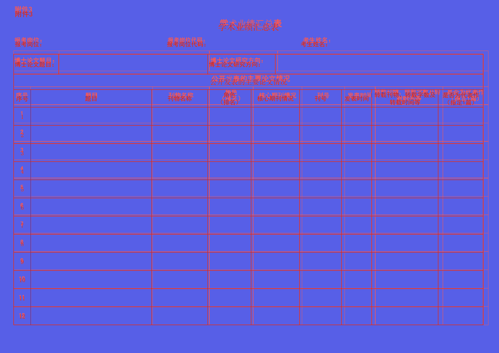</td>
  <td>changed: 169488 px (7.79%)<br>bbox: [46, 21, 1717, 1143]<br>mean abs RGB: 11.2642<br>RMSE RGB: 45.6381<br>threshold: 12, gain: 5.0</td>
</tr>
<tr>
  <td><b>AcademicAchievement_temp</b><br>Page 2</td>
  <td>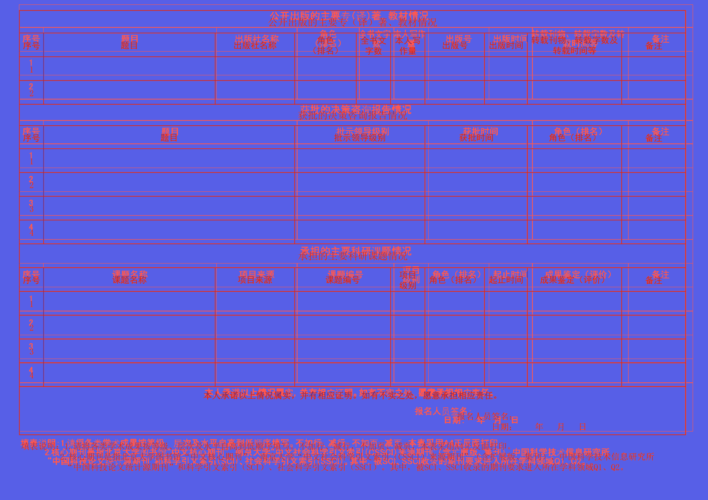</td>
  <td>changed: 267697 px (12.30%)<br>bbox: [46, 11, 1717, 1170]<br>mean abs RGB: 17.8525<br>RMSE RGB: 57.9521<br>threshold: 12, gain: 5.0</td>
</tr>
<tr>
  <td><b>Business expense budget1</b><br>Page 1</td>
  <td></td>
  <td>changed: 464773 px (21.35%)<br>bbox: [147, 176, 996, 1597]<br>mean abs RGB: 27.3772<br>RMSE RGB: 71.4821<br>threshold: 12, gain: 5.0</td>
</tr>
<tr>
  <td><b>Business expense budget1</b><br>Page 2</td>
  <td></td>
  <td>changed: 286439 px (13.16%)<br>bbox: [112, 149, 1170, 1225]<br>mean abs RGB: 17.7251<br>RMSE RGB: 54.6608<br>threshold: 12, gain: 5.0</td>
</tr>
<tr>
  <td><b>Business expense budget1</b><br>Page 3</td>
  <td></td>
  <td>changed: 229310 px (10.53%)<br>bbox: [112, 297, 444, 1597]<br>mean abs RGB: 13.6306<br>RMSE RGB: 49.8102<br>threshold: 12, gain: 5.0</td>
</tr>
<tr>
  <td><b>Business expense budget1</b><br>Page 4</td>
  <td></td>
  <td>changed: 59233 px (2.72%)<br>bbox: [0, 149, 444, 1225]<br>mean abs RGB: 3.7832<br>RMSE RGB: 25.7466<br>threshold: 12, gain: 5.0</td>
</tr>
<tr>
  <td><b>Business expenses budget2</b><br>Page 1</td>
  <td></td>
  <td>changed: 702356 px (32.27%)<br>bbox: [200, 74, 1553, 1124]<br>mean abs RGB: 15.2998<br>RMSE RGB: 39.7159<br>threshold: 12, gain: 5.0</td>
</tr>
<tr>
  <td><b>Business expenses budget2</b><br>Page 2</td>
  <td></td>
  <td>changed: 737544 px (33.88%)<br>bbox: [174, 74, 1579, 1163]<br>mean abs RGB: 14.9407<br>RMSE RGB: 39.3014<br>threshold: 12, gain: 5.0</td>
</tr>
<tr>
  <td><b>Business expenses budget2</b><br>Page 3</td>
  <td></td>
  <td>changed: 701512 px (32.23%)<br>bbox: [121, 74, 1598, 1163]<br>mean abs RGB: 13.5483<br>RMSE RGB: 33.7622<br>threshold: 12, gain: 5.0</td>
</tr>
<tr>
  <td><b>Business expenses budget2</b><br>Page 4</td>
  <td></td>
  <td>changed: 386129 px (17.74%)<br>bbox: [250, 74, 1568, 1160]<br>mean abs RGB: 14.2176<br>RMSE RGB: 43.6081<br>threshold: 12, gain: 5.0</td>
</tr>
<tr>
  <td><b>Business plan checklist with SWOT analysis1</b><br>Page 1</td>
  <td></td>
  <td>changed: 762823 px (35.04%)<br>bbox: [89, 60, 1181, 1510]<br>mean abs RGB: 20.2042<br>RMSE RGB: 53.7299<br>threshold: 12, gain: 5.0</td>
</tr>
<tr>
  <td><b>Event budget1</b><br>Page 1</td>
  <td></td>
  <td>changed: 86995 px (4.00%)<br>bbox: [72, 153, 1168, 766]<br>mean abs RGB: 5.9811<br>RMSE RGB: 34.5962<br>threshold: 12, gain: 5.0</td>
</tr>
<tr>
  <td><b>Event budget1</b><br>Page 2</td>
  <td></td>
  <td>changed: 959697 px (44.09%)<br>bbox: [66, 143, 1173, 1625]<br>mean abs RGB: 17.7407<br>RMSE RGB: 43.0033<br>threshold: 12, gain: 5.0</td>
</tr>
<tr>
  <td><b>Event budget1</b><br>Page 3</td>
  <td></td>
  <td>changed: 1001860 px (46.03%)<br>bbox: [66, 114, 1172, 1600]<br>mean abs RGB: 15.3596<br>RMSE RGB: 35.9734<br>threshold: 12, gain: 5.0</td>
</tr>
<tr>
  <td><b>Event budget1</b><br>Page 4</td>
  <td></td>
  <td>changed: 1396587 px (64.16%)<br>bbox: [61, 141, 1179, 1603]<br>mean abs RGB: 24.8022<br>RMSE RGB: 48.7445<br>threshold: 12, gain: 5.0</td>
</tr>
<tr>
  <td><b>Expense report basic1</b><br>Page 1</td>
  <td></td>
  <td>changed: 280075 px (12.87%)<br>bbox: [60, 60, 1694, 871]<br>mean abs RGB: 5.7233<br>RMSE RGB: 23.8634<br>threshold: 12, gain: 5.0</td>
</tr>
<tr>
  <td><b>Grocery list1</b><br>Page 1</td>
  <td></td>
  <td>changed: 397049 px (18.24%)<br>bbox: [45, 74, 1196, 941]<br>mean abs RGB: 9.0651<br>RMSE RGB: 31.3409<br>threshold: 12, gain: 5.0</td>
</tr>
<tr>
  <td><b>Issue202609031340</b><br>Page 1</td>
  <td></td>
  <td>changed: 430552 px (19.78%)<br>bbox: [43, 29, 1195, 1754]<br>mean abs RGB: 26.7515<br>RMSE RGB: 70.3679<br>threshold: 12, gain: 5.0</td>
</tr>
<tr>
  <td><b>Issue202609031340</b><br>Page 2</td>
  <td></td>
  <td>changed: 63529 px (2.92%)<br>bbox: [43, 725, 1217, 1014]<br>mean abs RGB: 4.3159<br>RMSE RGB: 28.1847<br>threshold: 12, gain: 5.0</td>
</tr>
<tr>
  <td><b>Issue202609031340</b><br>Page 3</td>
  <td></td>
  <td>changed: 176239 px (8.10%)<br>bbox: [42, 40, 1196, 1754]<br>mean abs RGB: 10.4512<br>RMSE RGB: 43.9019<br>threshold: 12, gain: 5.0</td>
</tr>
<tr>
  <td><b>Issue202609031340</b><br>Page 4</td>
  <td></td>
  <td>changed: 18149 px (0.83%)<br>bbox: [42, 743, 1196, 1009]<br>mean abs RGB: 1.166<br>RMSE RGB: 14.6026<br>threshold: 12, gain: 5.0</td>
</tr>
<tr>
  <td><b>payroll-calculator_f</b><br>Page 1</td>
  <td>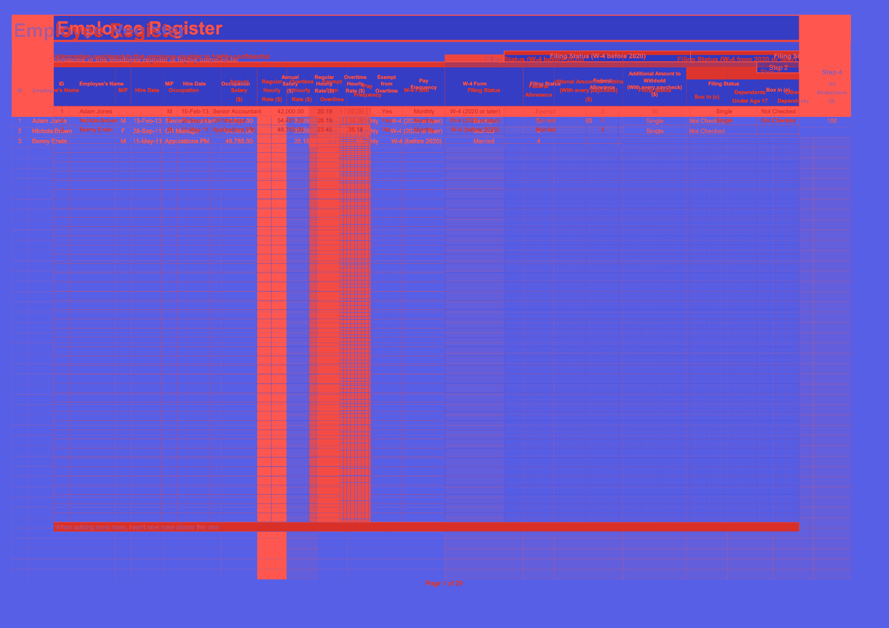</td>
  <td>changed: 822523 px (37.79%)<br>bbox: [23, 29, 1679, 1160]<br>mean abs RGB: 18.3103<br>RMSE RGB: 41.3801<br>threshold: 12, gain: 5.0</td>
</tr>
<tr>
  <td><b>payroll-calculator_f</b><br>Page 2</td>
  <td></td>
  <td>changed: 394601 px (18.13%)<br>bbox: [23, 29, 1679, 1160]<br>mean abs RGB: 19.4962<br>RMSE RGB: 53.1586<br>threshold: 12, gain: 5.0</td>
</tr>
<tr>
  <td><b>payroll-calculator_f</b><br>Page 3</td>
  <td></td>
  <td>changed: 511817 px (23.51%)<br>bbox: [23, 29, 1439, 1160]<br>mean abs RGB: 19.8013<br>RMSE RGB: 53.861<br>threshold: 12, gain: 5.0</td>
</tr>
<tr>
  <td><b>payroll-calculator_f</b><br>Page 4</td>
  <td>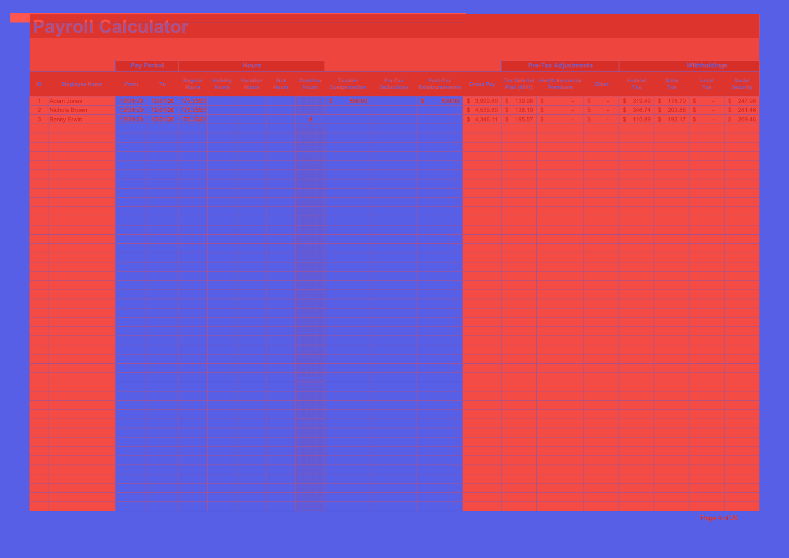</td>
  <td>changed: 1208764 px (55.53%)<br>bbox: [23, 29, 1689, 1160]<br>mean abs RGB: 36.1312<br>RMSE RGB: 59.6997<br>threshold: 12, gain: 5.0</td>
</tr>
<tr>
  <td><b>payroll-calculator_f</b><br>Page 5</td>
  <td></td>
  <td>changed: 1276611 px (58.65%)<br>bbox: [23, 29, 1730, 1166]<br>mean abs RGB: 38.1812<br>RMSE RGB: 61.2643<br>threshold: 12, gain: 5.0</td>
</tr>
<tr>
  <td><b>payroll-calculator_f</b><br>Page 6</td>
  <td></td>
  <td>changed: 616002 px (28.30%)<br>bbox: [23, 29, 1730, 1166]<br>mean abs RGB: 20.9643<br>RMSE RGB: 48.8791<br>threshold: 12, gain: 5.0</td>
</tr>
<tr>
  <td><b>payroll-calculator_f</b><br>Page 7</td>
  <td></td>
  <td>changed: 331914 px (15.25%)<br>bbox: [23, 29, 1730, 1166]<br>mean abs RGB: 11.7702<br>RMSE RGB: 38.0425<br>threshold: 12, gain: 5.0</td>
</tr>
<tr>
  <td><b>payroll-calculator_f</b><br>Page 8</td>
  <td>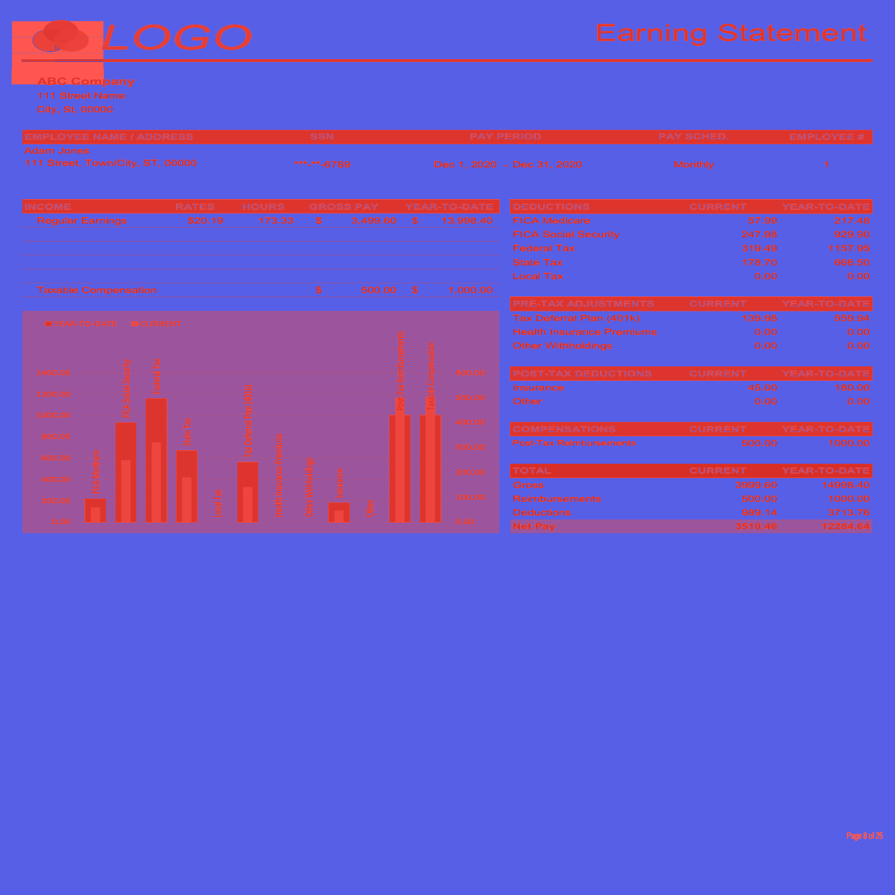</td>
  <td>changed: 352505 px (22.89%)<br>bbox: [16, 27, 1224, 1166]<br>mean abs RGB: 17.1395<br>RMSE RGB: 47.838<br>threshold: 12, gain: 5.0</td>
</tr>
<tr>
  <td><b>payroll-calculator_f</b><br>Page 9</td>
  <td>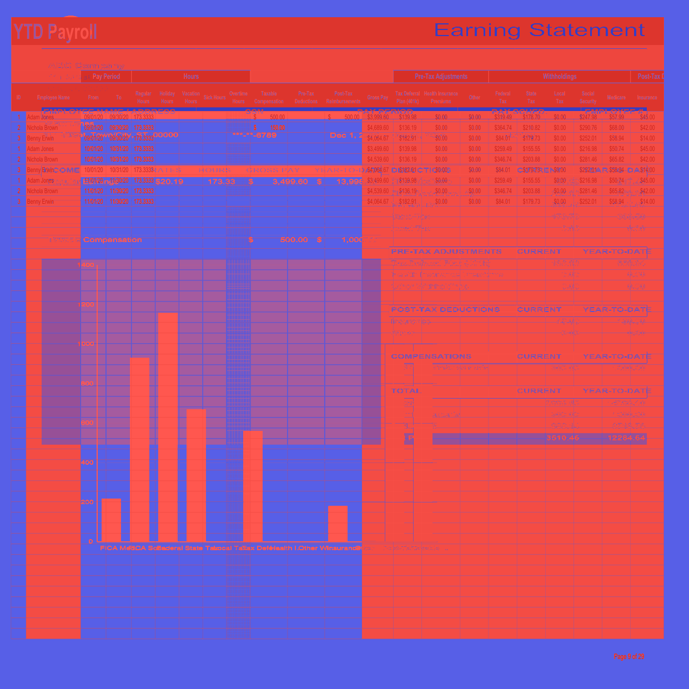</td>
  <td>changed: 1078162 px (70.01%)<br>bbox: [19, 28, 1196, 1190]<br>mean abs RGB: 46.5188<br>RMSE RGB: 70.0981<br>threshold: 12, gain: 5.0</td>
</tr>
<tr>
  <td><b>payroll-calculator_f</b><br>Page 10</td>
  <td>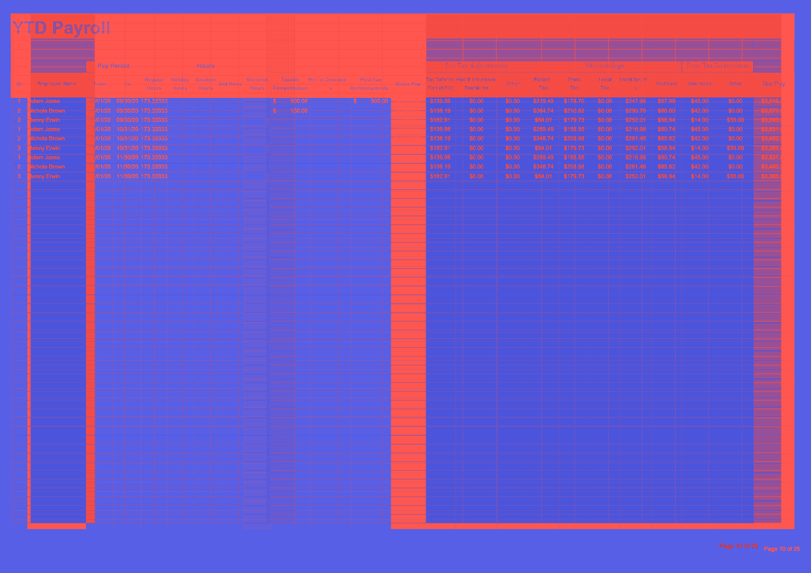</td>
  <td>changed: 789907 px (36.29%)<br>bbox: [23, 29, 1730, 1196]<br>mean abs RGB: 22.4943<br>RMSE RGB: 49.1305<br>threshold: 12, gain: 5.0</td>
</tr>
<tr>
  <td><b>payroll-calculator_f</b><br>Page 11</td>
  <td></td>
  <td>changed: 543507 px (24.97%)<br>bbox: [23, 29, 1730, 1196]<br>mean abs RGB: 7.7626<br>RMSE RGB: 18.2136<br>threshold: 12, gain: 5.0</td>
</tr>
<tr>
  <td><b>payroll-calculator_f</b><br>Page 12</td>
  <td>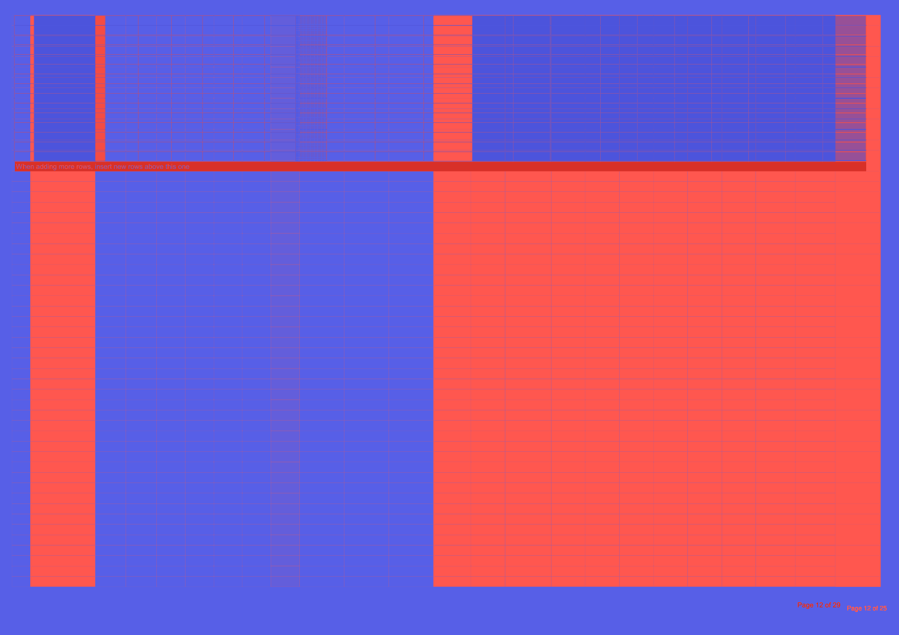</td>
  <td>changed: 1058917 px (48.65%)<br>bbox: [23, 29, 1730, 1196]<br>mean abs RGB: 24.0614<br>RMSE RGB: 39.7296<br>threshold: 12, gain: 5.0</td>
</tr>
<tr>
  <td><b>payroll-calculator_f</b><br>Page 13</td>
  <td>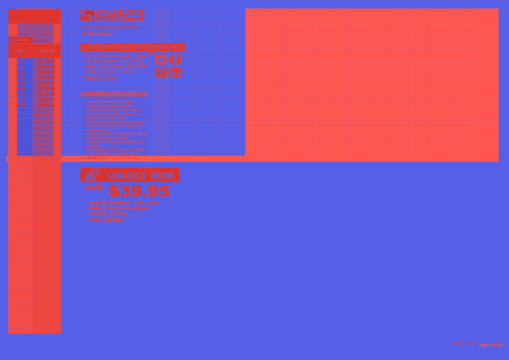</td>
  <td>changed: 809331 px (37.18%)<br>bbox: [23, 29, 1730, 1196]<br>mean abs RGB: 23.0002<br>RMSE RGB: 46.8206<br>threshold: 12, gain: 5.0</td>
</tr>
<tr>
  <td><b>payroll-calculator_f</b><br>Page 14</td>
  <td></td>
  <td>changed: 257203 px (11.82%)<br>bbox: [27, 30, 1730, 1196]<br>mean abs RGB: 7.8484<br>RMSE RGB: 27.9836<br>threshold: 12, gain: 5.0</td>
</tr>
<tr>
  <td><b>payroll-calculator_f</b><br>Page 15</td>
  <td></td>
  <td>changed: 680014 px (44.15%)<br>bbox: [19, 30, 1160, 1190]<br>mean abs RGB: 23.9955<br>RMSE RGB: 47.8798<br>threshold: 12, gain: 5.0</td>
</tr>
<tr>
  <td><b>PO_anonymized</b><br>Page 1</td>
  <td>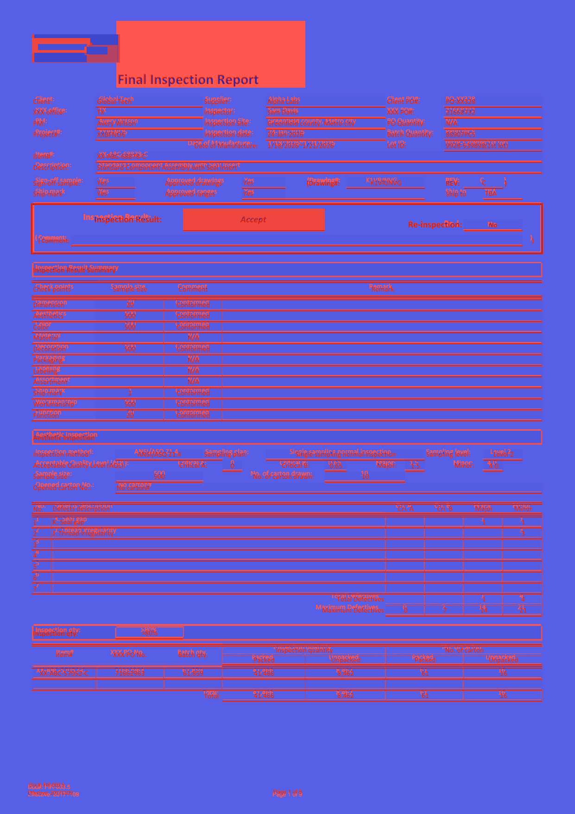</td>
  <td>changed: 440028 px (20.22%)<br>bbox: [61, 44, 1173, 1719]<br>mean abs RGB: 27.284<br>RMSE RGB: 72.748<br>threshold: 12, gain: 5.0</td>
</tr>
<tr>
  <td><b>PO_anonymized</b><br>Page 2</td>
  <td>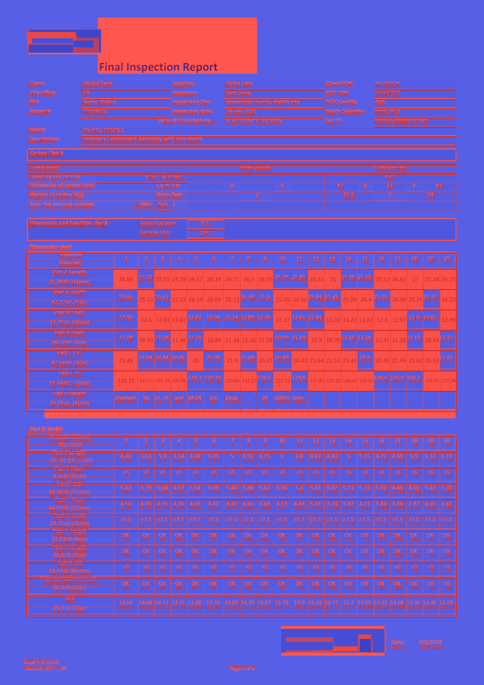</td>
  <td>changed: 609986 px (28.02%)<br>bbox: [61, 44, 1172, 1719]<br>mean abs RGB: 34.0715<br>RMSE RGB: 80.3586<br>threshold: 12, gain: 5.0</td>
</tr>
<tr>
  <td><b>PO_anonymized</b><br>Page 3</td>
  <td></td>
  <td>changed: 123882 px (5.69%)<br>bbox: [61, 44, 1171, 1719]<br>mean abs RGB: 8.1888<br>RMSE RGB: 41.8621<br>threshold: 12, gain: 5.0</td>
</tr>
<tr>
  <td><b>PO_anonymized</b><br>Page 4</td>
  <td></td>
  <td>changed: 62037 px (2.85%)<br>bbox: [61, 44, 1156, 1719]<br>mean abs RGB: 3.3298<br>RMSE RGB: 24.1981<br>threshold: 12, gain: 5.0</td>
</tr>
<tr>
  <td><b>PO_anonymized</b><br>Page 5</td>
  <td></td>
  <td>changed: 62113 px (2.85%)<br>bbox: [61, 44, 1155, 1719]<br>mean abs RGB: 3.3612<br>RMSE RGB: 24.3219<br>threshold: 12, gain: 5.0</td>
</tr>
<tr>
  <td><b>PO_anonymized</b><br>Page 6</td>
  <td></td>
  <td>changed: 58680 px (2.70%)<br>bbox: [61, 44, 1156, 1719]<br>mean abs RGB: 3.2508<br>RMSE RGB: 24.0649<br>threshold: 12, gain: 5.0</td>
</tr>
<tr>
  <td><b>PO_anonymized</b><br>Page 7</td>
  <td></td>
  <td>changed: 63542 px (2.92%)<br>bbox: [61, 44, 1156, 1719]<br>mean abs RGB: 3.3929<br>RMSE RGB: 24.3051<br>threshold: 12, gain: 5.0</td>
</tr>
<tr>
  <td><b>PO_anonymized</b><br>Page 8</td>
  <td></td>
  <td>changed: 58658 px (2.69%)<br>bbox: [61, 44, 1154, 1719]<br>mean abs RGB: 3.2538<br>RMSE RGB: 24.0588<br>threshold: 12, gain: 5.0</td>
</tr>
<tr>
  <td><b>PO_anonymized</b><br>Page 9</td>
  <td></td>
  <td>changed: 59241 px (2.72%)<br>bbox: [61, 44, 1155, 1719]<br>mean abs RGB: 3.2704<br>RMSE RGB: 24.1279<br>threshold: 12, gain: 5.0</td>
</tr>
<tr>
  <td><b>Simple invoice1</b><br>Page 1</td>
  <td></td>
  <td>changed: 660169 px (30.33%)<br>bbox: [41, 112, 1198, 1480]<br>mean abs RGB: 21.9004<br>RMSE RGB: 63.4199<br>threshold: 12, gain: 5.0</td>
</tr>
<tr>
  <td><b>Small business cash flow forecast1</b><br>Page 1</td>
  <td></td>
  <td>changed: 748074 px (34.37%)<br>bbox: [66, 74, 1173, 1677]<br>mean abs RGB: 13.9235<br>RMSE RGB: 37.0675<br>threshold: 12, gain: 5.0</td>
</tr>
<tr>
  <td><b>Small business cash flow forecast1</b><br>Page 2</td>
  <td></td>
  <td>changed: 564053 px (25.91%)<br>bbox: [151, 112, 1602, 1128]<br>mean abs RGB: 26.8734<br>RMSE RGB: 67.8617<br>threshold: 12, gain: 5.0</td>
</tr>
<tr>
  <td><b>Small business cash flow forecast1</b><br>Page 3</td>
  <td></td>
  <td>changed: 224303 px (10.30%)<br>bbox: [696, 102, 1673, 716]<br>mean abs RGB: 12.0086<br>RMSE RGB: 41.1317<br>threshold: 12, gain: 5.0</td>
</tr>
<tr>
  <td><b>Wedding_timeline_planner1_copy</b><br>Page 1</td>
  <td>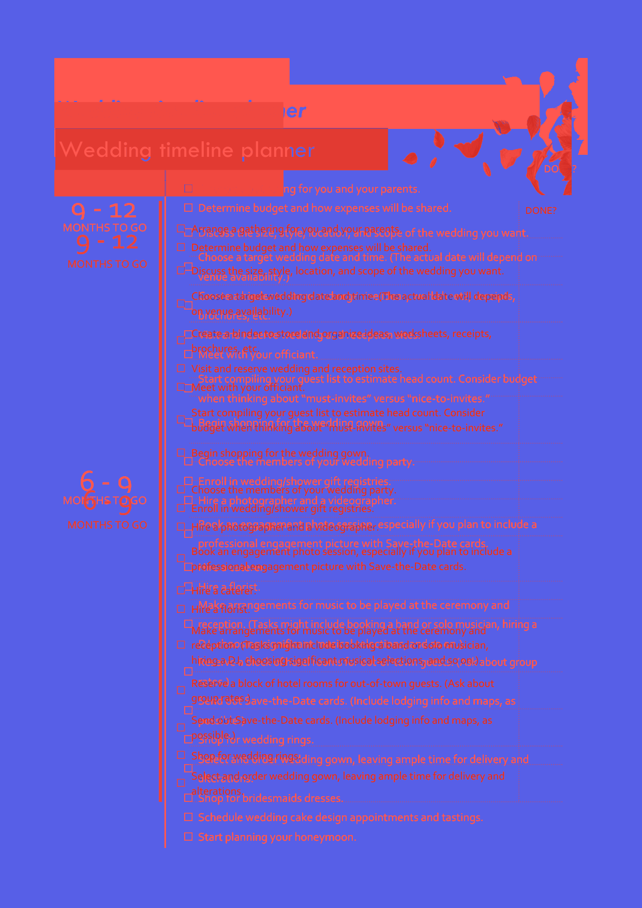</td>
  <td>changed: 376006 px (17.27%)<br>bbox: [105, 112, 1136, 1638]<br>mean abs RGB: 18.8886<br>RMSE RGB: 52.8202<br>threshold: 12, gain: 5.0</td>
</tr>
<tr>
  <td><b>Wedding_timeline_planner1_copy</b><br>Page 2</td>
  <td>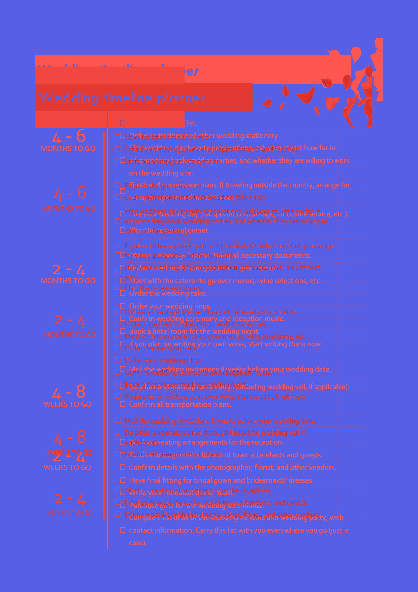</td>
  <td>changed: 357992 px (16.45%)<br>bbox: [105, 112, 1136, 1628]<br>mean abs RGB: 18.7542<br>RMSE RGB: 52.8055<br>threshold: 12, gain: 5.0</td>
</tr>
<tr>
  <td><b>Wedding_timeline_planner1_copy</b><br>Page 3</td>
  <td>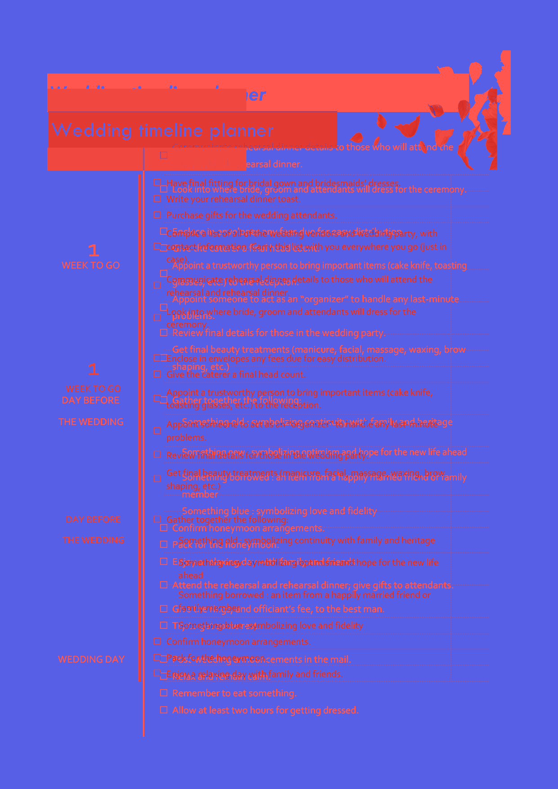</td>
  <td>changed: 334356 px (15.36%)<br>bbox: [105, 112, 1136, 1638]<br>mean abs RGB: 17.6731<br>RMSE RGB: 51.3313<br>threshold: 12, gain: 5.0</td>
</tr>
<tr>
  <td><b>Wedding_timeline_planner1_copy</b><br>Page 4</td>
  <td>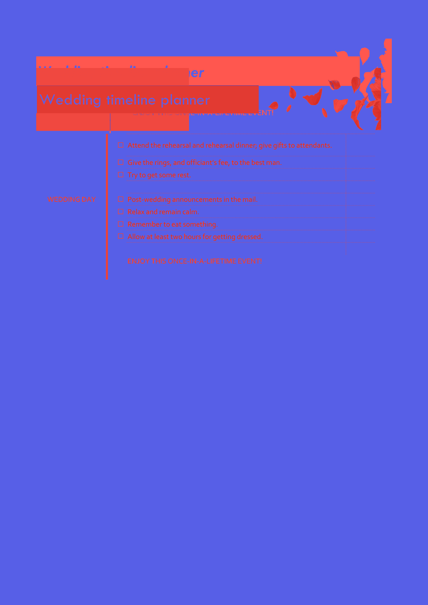</td>
  <td>changed: 198396 px (9.11%)<br>bbox: [105, 112, 1136, 811]<br>mean abs RGB: 10.0833<br>RMSE RGB: 37.2133<br>threshold: 12, gain: 5.0</td>
</tr>
<tr>
  <td><b>Wedding_timeline_planner1_copy</b><br>Page 5</td>
  <td></td>
  <td>changed: 19493 px (0.90%)<br>bbox: [105, 112, 286, 377]<br>mean abs RGB: 0.6071<br>RMSE RGB: 7.9015<br>threshold: 12, gain: 5.0</td>
</tr>
<tr>
  <td><b>Wedding_timeline_planner1_copy</b><br>Page 6</td>
  <td></td>
  <td>changed: 180 px (0.01%)<br>bbox: [105, 197, 106, 377]<br>mean abs RGB: 0.0141<br>RMSE RGB: 1.6233<br>threshold: 12, gain: 5.0</td>
</tr>
<tr>
  <td><b>Wedding_timeline_planner1_copy</b><br>Page 7</td>
  <td></td>
  <td>changed: 180 px (0.01%)<br>bbox: [105, 197, 106, 377]<br>mean abs RGB: 0.0141<br>RMSE RGB: 1.6233<br>threshold: 12, gain: 5.0</td>
</tr>
<tr>
  <td><b>Wedding_timeline_planner1_copy</b><br>Page 8</td>
  <td></td>
  <td>changed: 180 px (0.01%)<br>bbox: [105, 197, 106, 377]<br>mean abs RGB: 0.0141<br>RMSE RGB: 1.6233<br>threshold: 12, gain: 5.0</td>
</tr>
<tr>
  <td><b>Weekly schedule planner1</b><br>Page 1</td>
  <td></td>
  <td>changed: 583735 px (26.82%)<br>bbox: [182, 96, 1571, 1169]<br>mean abs RGB: 21.2114<br>RMSE RGB: 55.8433<br>threshold: 12, gain: 5.0</td>
</tr>
<tr>
  <td><b>XlsxIssue75</b><br>Page 1</td>
  <td></td>
  <td>changed: 128825 px (5.92%)<br>bbox: [112, 112, 1092, 1666]<br>mean abs RGB: 9.3923<br>RMSE RGB: 43.6267<br>threshold: 12, gain: 5.0</td>
</tr>
<tr>
  <td><b>XlsxIssue75</b><br>Page 2</td>
  <td></td>
  <td>changed: 132928 px (6.11%)<br>bbox: [117, 118, 1067, 1666]<br>mean abs RGB: 10.1372<br>RMSE RGB: 45.7278<br>threshold: 12, gain: 5.0</td>
</tr>
<tr>
  <td><b>XlsxIssue75</b><br>Page 3</td>
  <td></td>
  <td>changed: 123196 px (5.66%)<br>bbox: [117, 118, 1067, 1666]<br>mean abs RGB: 9.3471<br>RMSE RGB: 43.835<br>threshold: 12, gain: 5.0</td>
</tr>
<tr>
  <td><b>XlsxIssue75</b><br>Page 4</td>
  <td></td>
  <td>changed: 113800 px (5.23%)<br>bbox: [117, 118, 1067, 1666]<br>mean abs RGB: 8.4976<br>RMSE RGB: 41.6176<br>threshold: 12, gain: 5.0</td>
</tr>
<tr>
  <td><b>XlsxIssue75</b><br>Page 5</td>
  <td></td>
  <td>changed: 109960 px (5.05%)<br>bbox: [118, 118, 1067, 1666]<br>mean abs RGB: 8.1875<br>RMSE RGB: 40.8348<br>threshold: 12, gain: 5.0</td>
</tr>
<tr>
  <td><b>XlsxIssue75</b><br>Page 6</td>
  <td></td>
  <td>changed: 124608 px (5.72%)<br>bbox: [117, 118, 1067, 1666]<br>mean abs RGB: 9.357<br>RMSE RGB: 43.7546<br>threshold: 12, gain: 5.0</td>
</tr>
<tr>
  <td><b>XlsxIssue75</b><br>Page 7</td>
  <td></td>
  <td>changed: 119847 px (5.51%)<br>bbox: [117, 118, 1011, 1666]<br>mean abs RGB: 8.9273<br>RMSE RGB: 42.6362<br>threshold: 12, gain: 5.0</td>
</tr>
<tr>
  <td><b>XlsxIssue75</b><br>Page 8</td>
  <td></td>
  <td>changed: 118677 px (5.45%)<br>bbox: [117, 118, 1011, 1666]<br>mean abs RGB: 8.8319<br>RMSE RGB: 42.3898<br>threshold: 12, gain: 5.0</td>
</tr>
<tr>
  <td><b>XlsxIssue75</b><br>Page 9</td>
  <td></td>
  <td>changed: 122032 px (5.61%)<br>bbox: [117, 118, 1067, 1666]<br>mean abs RGB: 9.1127<br>RMSE RGB: 43.1192<br>threshold: 12, gain: 5.0</td>
</tr>
<tr>
  <td><b>XlsxIssue75</b><br>Page 10</td>
  <td></td>
  <td>changed: 120772 px (5.55%)<br>bbox: [117, 118, 1067, 1666]<br>mean abs RGB: 8.9616<br>RMSE RGB: 42.7287<br>threshold: 12, gain: 5.0</td>
</tr>
<tr>
  <td><b>XlsxIssue75</b><br>Page 11</td>
  <td></td>
  <td>changed: 122234 px (5.62%)<br>bbox: [117, 118, 1067, 1666]<br>mean abs RGB: 9.0821<br>RMSE RGB: 43.0252<br>threshold: 12, gain: 5.0</td>
</tr>
<tr>
  <td><b>XlsxIssue75</b><br>Page 12</td>
  <td></td>
  <td>changed: 120755 px (5.55%)<br>bbox: [117, 118, 1067, 1666]<br>mean abs RGB: 8.9596<br>RMSE RGB: 42.7237<br>threshold: 12, gain: 5.0</td>
</tr>
<tr>
  <td><b>XlsxIssue75</b><br>Page 13</td>
  <td></td>
  <td>changed: 125131 px (5.75%)<br>bbox: [117, 118, 1067, 1666]<br>mean abs RGB: 9.4759<br>RMSE RGB: 44.15<br>threshold: 12, gain: 5.0</td>
</tr>
<tr>
  <td><b>XlsxIssue75</b><br>Page 14</td>
  <td></td>
  <td>changed: 141903 px (6.52%)<br>bbox: [118, 118, 1011, 1666]<br>mean abs RGB: 10.6006<br>RMSE RGB: 46.5328<br>threshold: 12, gain: 5.0</td>
</tr>
<tr>
  <td><b>XlsxIssue75</b><br>Page 15</td>
  <td></td>
  <td>changed: 141903 px (6.52%)<br>bbox: [118, 118, 1011, 1666]<br>mean abs RGB: 10.6006<br>RMSE RGB: 46.5328<br>threshold: 12, gain: 5.0</td>
</tr>
<tr>
  <td><b>XlsxIssue77_MergedCellAlignment</b><br>Page 1</td>
  <td>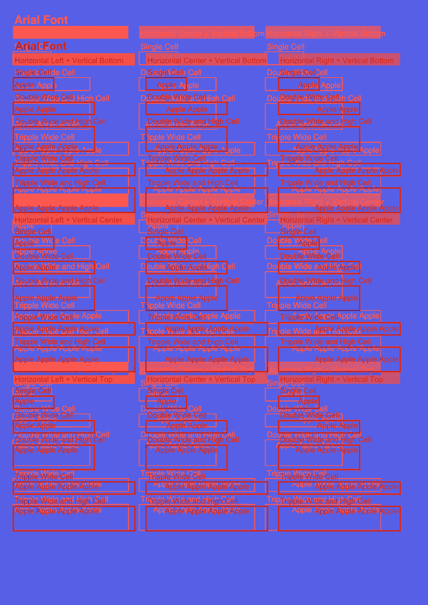</td>
  <td>changed: 588498 px (27.04%)<br>bbox: [36, 44, 1163, 1541]<br>mean abs RGB: 37.3353<br>RMSE RGB: 87.0787<br>threshold: 12, gain: 5.0</td>
</tr>
<tr>
  <td><b>XlsxIssue77_MergedCellAlignment</b><br>Page 2</td>
  <td>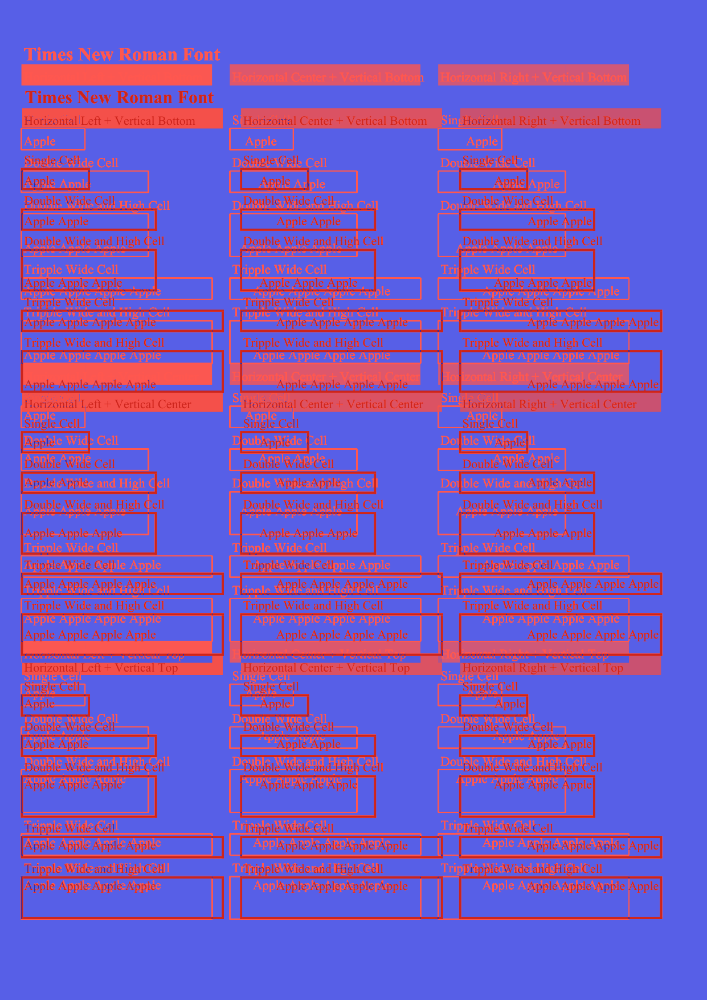</td>
  <td>changed: 564021 px (25.91%)<br>bbox: [36, 83, 1163, 1614]<br>mean abs RGB: 34.3303<br>RMSE RGB: 82.7831<br>threshold: 12, gain: 5.0</td>
</tr>
<tr>
  <td><b>XlsxIssue77_Template1</b><br>Page 1</td>
  <td>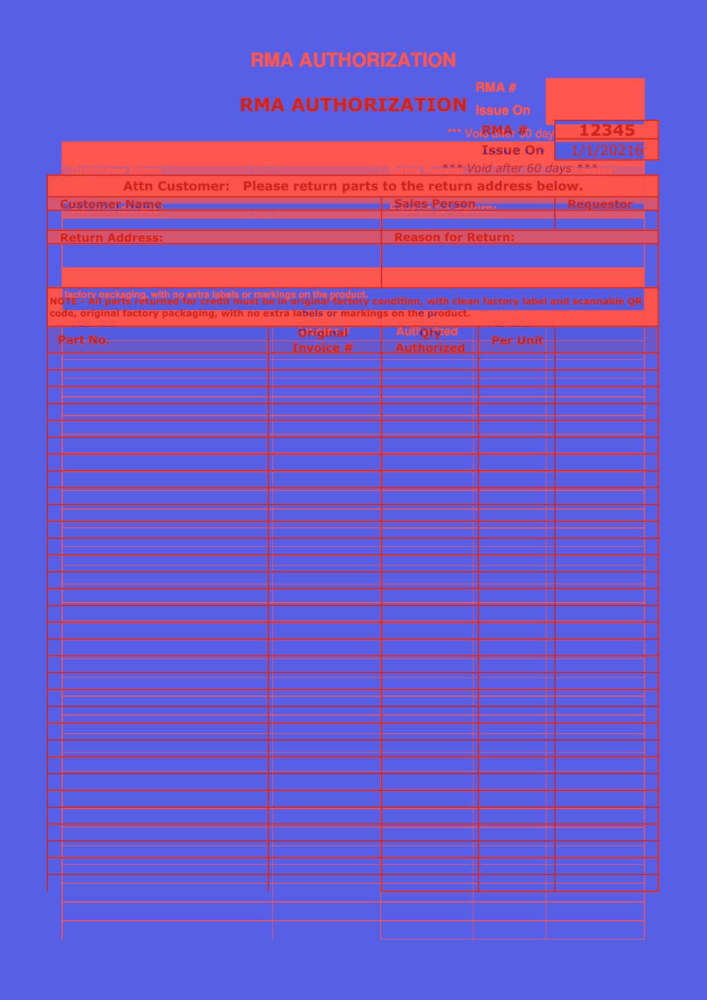</td>
  <td>changed: 478824 px (22.00%)<br>bbox: [82, 92, 1157, 1648]<br>mean abs RGB: 24.4452<br>RMSE RGB: 68.5673<br>threshold: 12, gain: 5.0</td>
</tr>
<tr>
  <td><b>XlsxIssue77_Template1</b><br>Page 2</td>
  <td>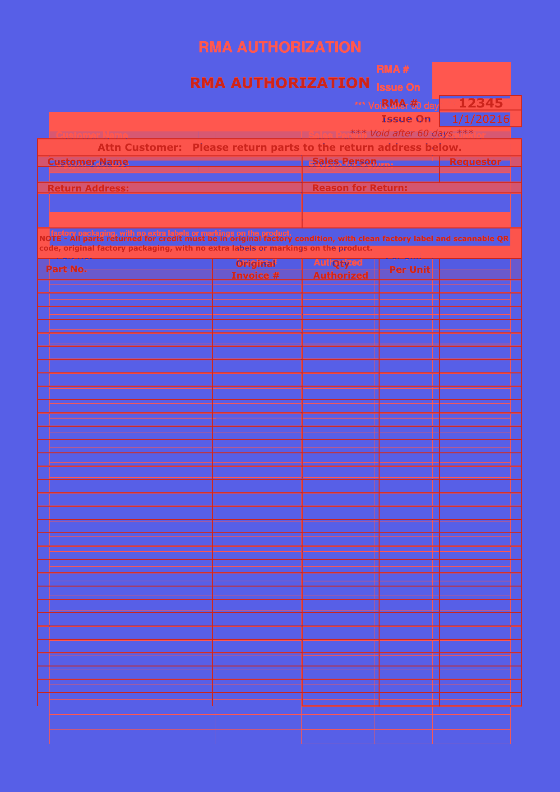</td>
  <td>changed: 478829 px (22.00%)<br>bbox: [82, 91, 1157, 1648]<br>mean abs RGB: 24.2945<br>RMSE RGB: 68.2468<br>threshold: 12, gain: 5.0</td>
</tr>
<tr>
  <td><b>XlsxIssue77_Template1</b><br>Page 3</td>
  <td></td>
  <td>changed: 478829 px (22.00%)<br>bbox: [82, 91, 1157, 1648]<br>mean abs RGB: 24.2168<br>RMSE RGB: 68.0598<br>threshold: 12, gain: 5.0</td>
</tr>
<tr>
  <td><b>XlsxIssue77_Template1</b><br>Page 4</td>
  <td>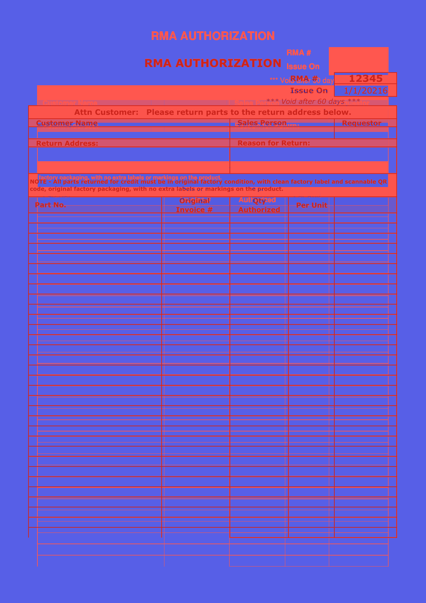</td>
  <td>changed: 478830 px (22.00%)<br>bbox: [82, 91, 1157, 1648]<br>mean abs RGB: 24.2042<br>RMSE RGB: 68.0611<br>threshold: 12, gain: 5.0</td>
</tr>
<tr>
  <td><b>XlsxIssue77_Template1</b><br>Page 5</td>
  <td>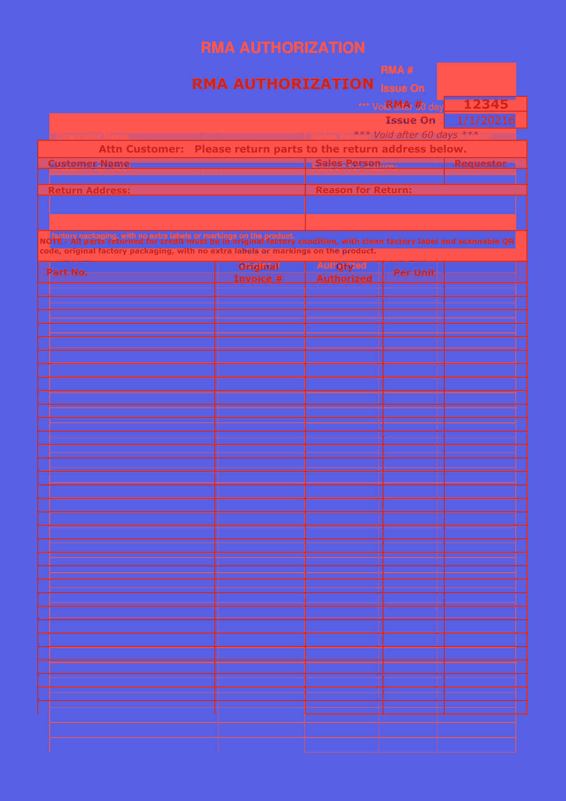</td>
  <td>changed: 478829 px (22.00%)<br>bbox: [82, 91, 1157, 1648]<br>mean abs RGB: 24.2176<br>RMSE RGB: 68.0659<br>threshold: 12, gain: 5.0</td>
</tr>
<tr>
  <td><b>XlsxIssue77_Template1</b><br>Page 6</td>
  <td>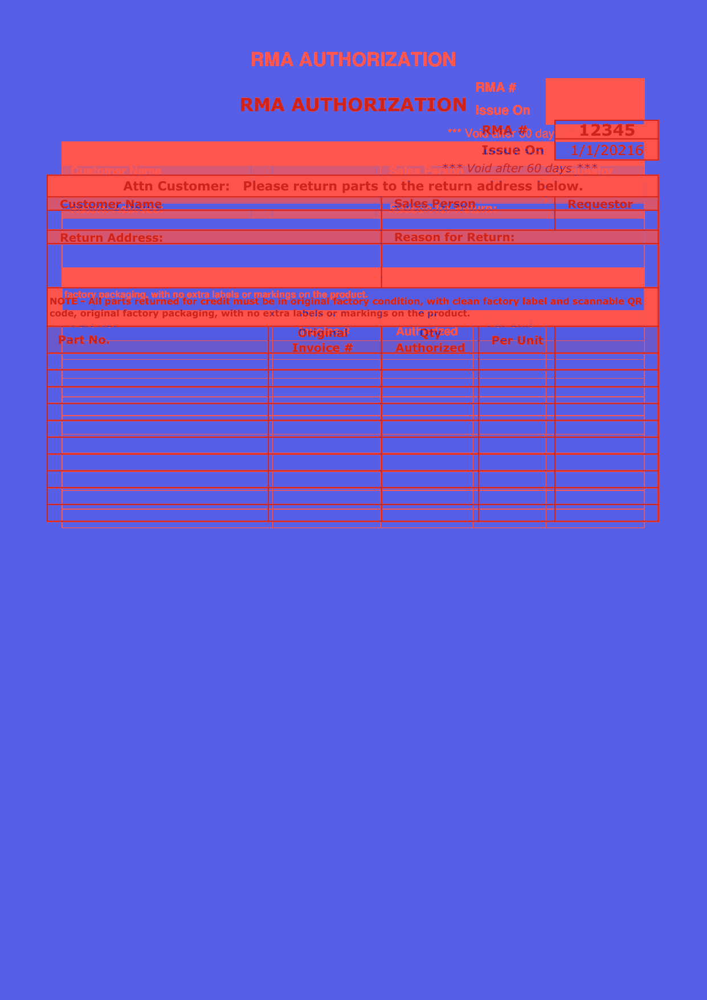</td>
  <td>changed: 362857 px (16.67%)<br>bbox: [82, 91, 1157, 927]<br>mean abs RGB: 15.8655<br>RMSE RGB: 54.3419<br>threshold: 12, gain: 5.0</td>
</tr>
<tr>
  <td><b>XlsxIssue77_Template2_Workaround</b><br>Page 1</td>
  <td>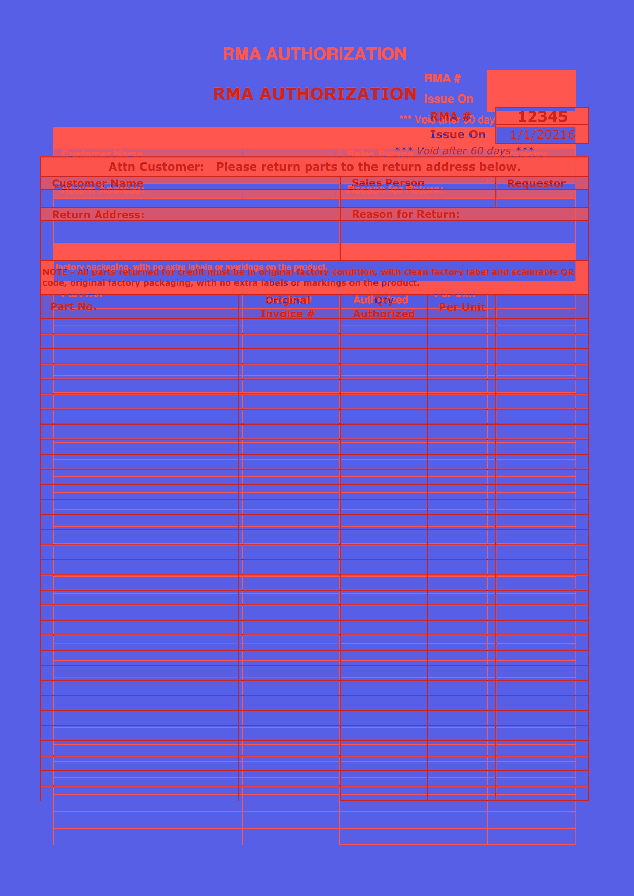</td>
  <td>changed: 477465 px (21.94%)<br>bbox: [78, 92, 1153, 1655]<br>mean abs RGB: 24.0697<br>RMSE RGB: 67.8234<br>threshold: 12, gain: 5.0</td>
</tr>
<tr>
  <td><b>XlsxIssue77_Template2_Workaround</b><br>Page 2</td>
  <td></td>
  <td>changed: 477459 px (21.93%)<br>bbox: [78, 91, 1153, 1655]<br>mean abs RGB: 23.9758<br>RMSE RGB: 67.636<br>threshold: 12, gain: 5.0</td>
</tr>
<tr>
  <td><b>XlsxIssue77_Template2_Workaround</b><br>Page 3</td>
  <td></td>
  <td>changed: 477463 px (21.93%)<br>bbox: [78, 91, 1153, 1655]<br>mean abs RGB: 23.9157<br>RMSE RGB: 67.5038<br>threshold: 12, gain: 5.0</td>
</tr>
<tr>
  <td><b>XlsxIssue77_Template2_Workaround</b><br>Page 4</td>
  <td></td>
  <td>changed: 477461 px (21.93%)<br>bbox: [78, 91, 1153, 1655]<br>mean abs RGB: 23.9221<br>RMSE RGB: 67.509<br>threshold: 12, gain: 5.0</td>
</tr>
<tr>
  <td><b>XlsxIssue77_Template2_Workaround</b><br>Page 5</td>
  <td></td>
  <td>changed: 477461 px (21.93%)<br>bbox: [78, 91, 1153, 1655]<br>mean abs RGB: 23.9353<br>RMSE RGB: 67.5023<br>threshold: 12, gain: 5.0</td>
</tr>
<tr>
  <td><b>XlsxIssue77_Template2_Workaround</b><br>Page 6</td>
  <td>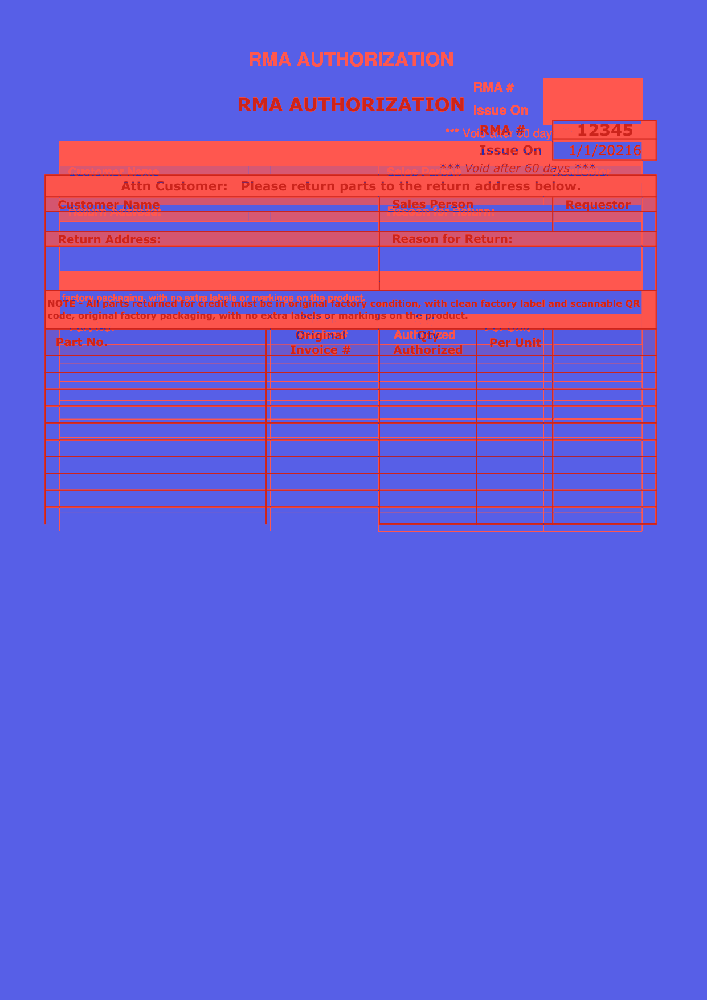</td>
  <td>changed: 360075 px (16.54%)<br>bbox: [78, 91, 1153, 933]<br>mean abs RGB: 15.5392<br>RMSE RGB: 53.8078<br>threshold: 12, gain: 5.0</td>
</tr>
<tr>
  <td><b>XlsxIssue81_LayoutOptions</b><br>Page 1</td>
  <td></td>
  <td>changed: 584081 px (28.52%)<br>bbox: [36, 74, 1033, 1575]<br>mean abs RGB: 34.4965<br>RMSE RGB: 79.7222<br>threshold: 12, gain: 5.0</td>
</tr>
<tr>
  <td><b>XlsxIssue81_LayoutOptions</b><br>Page 2</td>
  <td></td>
  <td>changed: 585002 px (28.57%)<br>bbox: [36, 74, 1033, 1575]<br>mean abs RGB: 34.587<br>RMSE RGB: 79.8389<br>threshold: 12, gain: 5.0</td>
</tr>
<tr>
  <td><b>XlsxIssue81_LayoutOptions</b><br>Page 3</td>
  <td>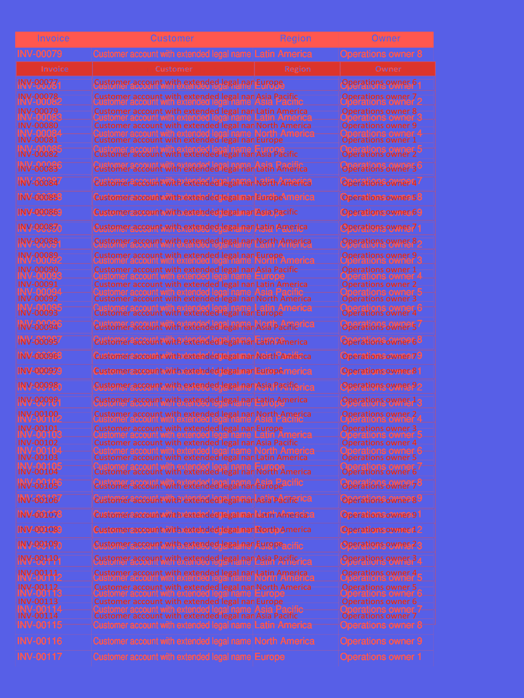</td>
  <td>changed: 583800 px (28.51%)<br>bbox: [36, 74, 1033, 1575]<br>mean abs RGB: 34.4811<br>RMSE RGB: 79.7133<br>threshold: 12, gain: 5.0</td>
</tr>
<tr>
  <td><b>XlsxIssue81_LayoutOptions</b><br>Page 4</td>
  <td></td>
  <td>changed: 129305 px (6.31%)<br>bbox: [36, 74, 1033, 386]<br>mean abs RGB: 8.1571<br>RMSE RGB: 37.6656<br>threshold: 12, gain: 5.0</td>
</tr>
<tr>
  <td><b>XlsxIssue81_LayoutOptions</b><br>Page 5</td>
  <td>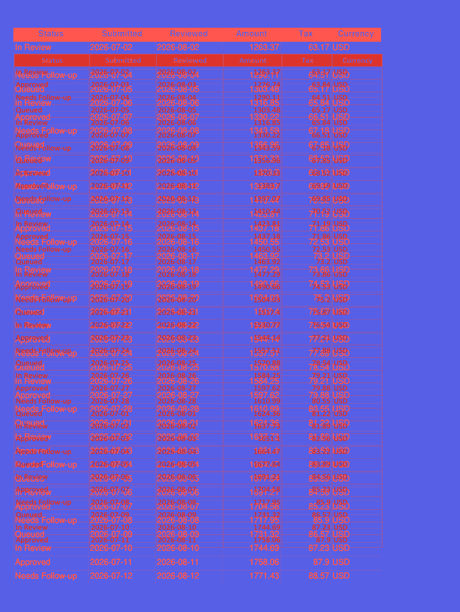</td>
  <td>changed: 472374 px (23.07%)<br>bbox: [36, 74, 1033, 1575]<br>mean abs RGB: 25.1901<br>RMSE RGB: 67.4092<br>threshold: 12, gain: 5.0</td>
</tr>
<tr>
  <td><b>XlsxIssue81_LayoutOptions</b><br>Page 6</td>
  <td></td>
  <td>changed: 475963 px (23.24%)<br>bbox: [36, 74, 1033, 1575]<br>mean abs RGB: 25.4746<br>RMSE RGB: 67.8377<br>threshold: 12, gain: 5.0</td>
</tr>
<tr>
  <td><b>XlsxIssue81_LayoutOptions</b><br>Page 7</td>
  <td>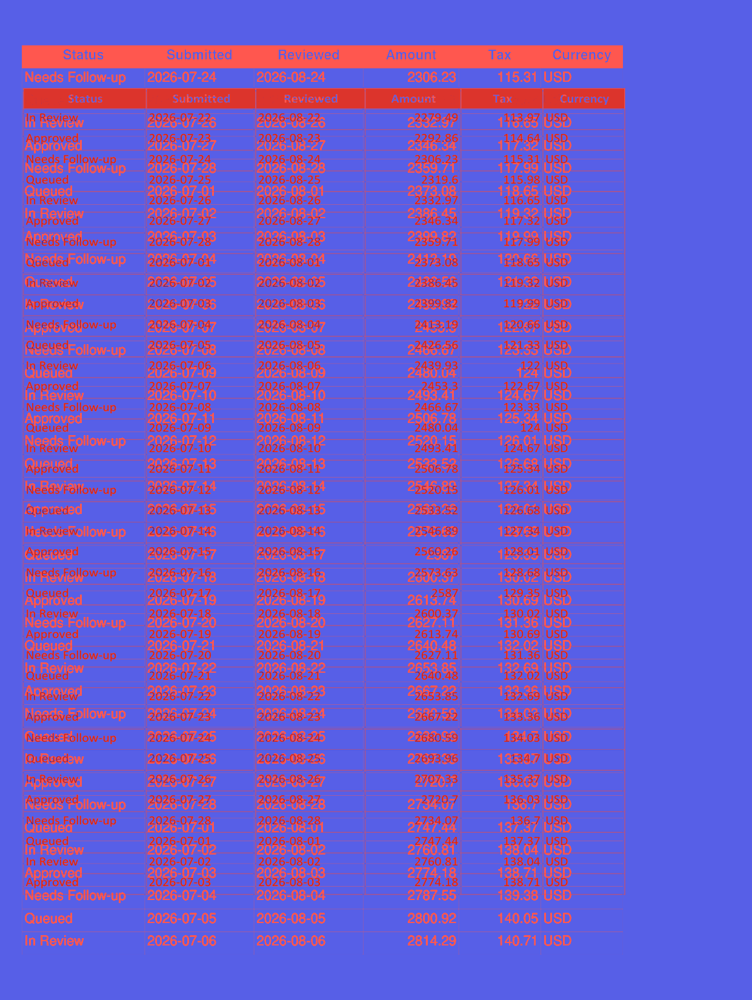</td>
  <td>changed: 479196 px (23.40%)<br>bbox: [36, 74, 1033, 1575]<br>mean abs RGB: 25.6867<br>RMSE RGB: 68.1322<br>threshold: 12, gain: 5.0</td>
</tr>
<tr>
  <td><b>XlsxIssue81_LayoutOptions</b><br>Page 8</td>
  <td></td>
  <td>changed: 116195 px (5.67%)<br>bbox: [36, 74, 1033, 386]<br>mean abs RGB: 7.1044<br>RMSE RGB: 34.8391<br>threshold: 12, gain: 5.0</td>
</tr>
<tr>
  <td><b>XlsxIssue81_LayoutOptions</b><br>Page 9</td>
  <td></td>
  <td>changed: 630231 px (30.78%)<br>bbox: [36, 74, 1241, 1575]<br>mean abs RGB: 41.0122<br>RMSE RGB: 88.3066<br>threshold: 12, gain: 5.0</td>
</tr>
<tr>
  <td><b>XlsxIssue81_LayoutOptions</b><br>Page 10</td>
  <td>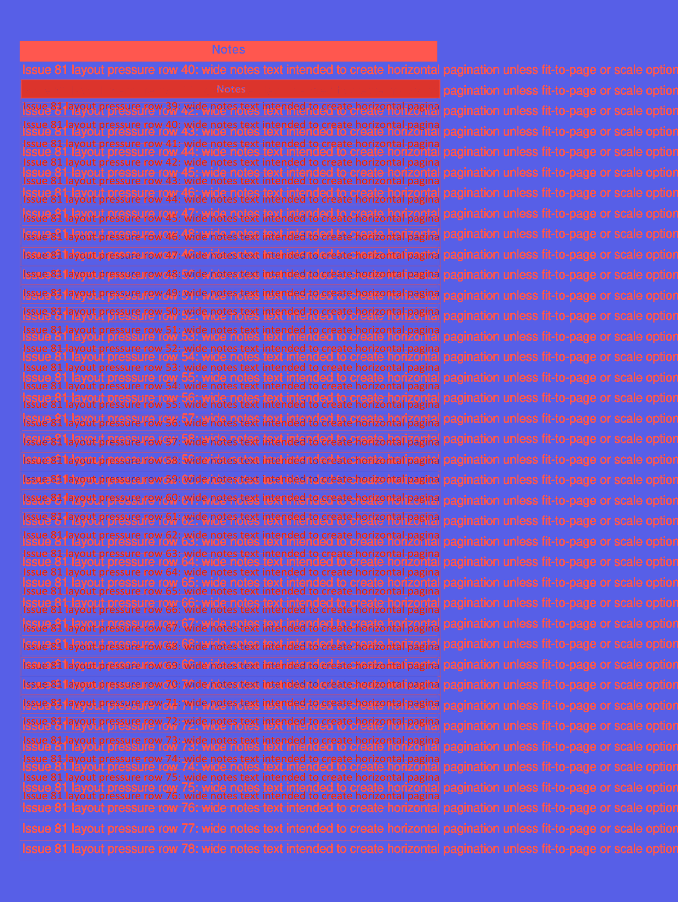</td>
  <td>changed: 630598 px (30.80%)<br>bbox: [36, 74, 1241, 1575]<br>mean abs RGB: 41.0176<br>RMSE RGB: 88.3055<br>threshold: 12, gain: 5.0</td>
</tr>
<tr>
  <td><b>XlsxIssue81_LayoutOptions</b><br>Page 11</td>
  <td></td>
  <td>changed: 630084 px (30.77%)<br>bbox: [36, 74, 1241, 1575]<br>mean abs RGB: 40.9758<br>RMSE RGB: 88.1913<br>threshold: 12, gain: 5.0</td>
</tr>
<tr>
  <td><b>XlsxIssue81_LayoutOptions</b><br>Page 12</td>
  <td></td>
  <td>changed: 116390 px (5.68%)<br>bbox: [36, 74, 1241, 386]<br>mean abs RGB: 7.6665<br>RMSE RGB: 36.965<br>threshold: 12, gain: 5.0</td>
</tr>
<tr>
  <td><b>XlsxIssue81_LayoutOptions</b><br>Page 13</td>
  <td></td>
  <td>changed: 568690 px (27.77%)<br>bbox: [36, 74, 997, 1575]<br>mean abs RGB: 37.0952<br>RMSE RGB: 83.8865<br>threshold: 12, gain: 5.0</td>
</tr>
<tr>
  <td><b>XlsxIssue81_LayoutOptions</b><br>Page 14</td>
  <td></td>
  <td>changed: 568791 px (27.78%)<br>bbox: [36, 74, 997, 1575]<br>mean abs RGB: 37.1206<br>RMSE RGB: 83.9187<br>threshold: 12, gain: 5.0</td>
</tr>
<tr>
  <td><b>XlsxIssue81_LayoutOptions</b><br>Page 15</td>
  <td></td>
  <td>changed: 567769 px (27.73%)<br>bbox: [36, 74, 997, 1575]<br>mean abs RGB: 37.0327<br>RMSE RGB: 83.8099<br>threshold: 12, gain: 5.0</td>
</tr>
<tr>
  <td><b>XlsxIssue82_5mb</b><br>Page 1</td>
  <td></td>
  <td>changed: 550940 px (25.31%)<br>bbox: [109, 119, 1241, 1610]<br>mean abs RGB: 41.2632<br>RMSE RGB: 91.8956<br>threshold: 12, gain: 5.0</td>
</tr>
<tr>
  <td><b>XlsxIssue82_5mb</b><br>Page 2</td>
  <td></td>
  <td>changed: 549980 px (25.27%)<br>bbox: [109, 118, 1241, 1610]<br>mean abs RGB: 41.1535<br>RMSE RGB: 91.7456<br>threshold: 12, gain: 5.0</td>
</tr>
<tr>
  <td><b>XlsxIssue82_5mb</b><br>Page 3</td>
  <td></td>
  <td>changed: 551078 px (25.32%)<br>bbox: [109, 118, 1241, 1610]<br>mean abs RGB: 41.1954<br>RMSE RGB: 91.7925<br>threshold: 12, gain: 5.0</td>
</tr>
<tr>
  <td><b>XlsxIssue82_5mb</b><br>Page 4</td>
  <td></td>
  <td>changed: 548725 px (25.21%)<br>bbox: [109, 118, 1241, 1610]<br>mean abs RGB: 41.0564<br>RMSE RGB: 91.6382<br>threshold: 12, gain: 5.0</td>
</tr>
<tr>
  <td><b>XlsxIssue82_5mb</b><br>Page 5</td>
  <td></td>
  <td>changed: 550203 px (25.28%)<br>bbox: [109, 118, 1241, 1610]<br>mean abs RGB: 41.2399<br>RMSE RGB: 91.9091<br>threshold: 12, gain: 5.0</td>
</tr>
<tr>
  <td><b>XlsxIssue82_5mb</b><br>Page 6</td>
  <td></td>
  <td>changed: 554143 px (25.46%)<br>bbox: [109, 118, 1241, 1610]<br>mean abs RGB: 41.4324<br>RMSE RGB: 92.0416<br>threshold: 12, gain: 5.0</td>
</tr>
<tr>
  <td><b>XlsxIssue82_5mb</b><br>Page 7</td>
  <td></td>
  <td>changed: 555925 px (25.54%)<br>bbox: [109, 118, 1241, 1610]<br>mean abs RGB: 41.604<br>RMSE RGB: 92.2656<br>threshold: 12, gain: 5.0</td>
</tr>
<tr>
  <td><b>XlsxIssue82_5mb</b><br>Page 8</td>
  <td></td>
  <td>changed: 549478 px (25.24%)<br>bbox: [109, 118, 1241, 1610]<br>mean abs RGB: 41.1241<br>RMSE RGB: 91.7439<br>threshold: 12, gain: 5.0</td>
</tr>
<tr>
  <td><b>XlsxIssue82_5mb</b><br>Page 9</td>
  <td></td>
  <td>changed: 550748 px (25.30%)<br>bbox: [109, 118, 1241, 1610]<br>mean abs RGB: 41.2441<br>RMSE RGB: 91.8875<br>threshold: 12, gain: 5.0</td>
</tr>
<tr>
  <td><b>XlsxIssue82_5mb</b><br>Page 10</td>
  <td></td>
  <td>changed: 553963 px (25.45%)<br>bbox: [109, 118, 1241, 1610]<br>mean abs RGB: 41.5253<br>RMSE RGB: 92.2278<br>threshold: 12, gain: 5.0</td>
</tr>
<tr>
  <td><b>XlsxIssue82_5mb</b><br>Page 11</td>
  <td></td>
  <td>changed: 554133 px (25.46%)<br>bbox: [109, 118, 1241, 1609]<br>mean abs RGB: 41.4921<br>RMSE RGB: 92.1672<br>threshold: 12, gain: 5.0</td>
</tr>
<tr>
  <td><b>XlsxIssue82_5mb</b><br>Page 12</td>
  <td></td>
  <td>changed: 552395 px (25.38%)<br>bbox: [109, 118, 1241, 1610]<br>mean abs RGB: 41.2637<br>RMSE RGB: 91.8627<br>threshold: 12, gain: 5.0</td>
</tr>
<tr>
  <td><b>XlsxIssue82_5mb</b><br>Page 13</td>
  <td></td>
  <td>changed: 556991 px (25.59%)<br>bbox: [109, 118, 1241, 1610]<br>mean abs RGB: 41.6928<br>RMSE RGB: 92.3686<br>threshold: 12, gain: 5.0</td>
</tr>
<tr>
  <td><b>XlsxIssue82_5mb</b><br>Page 14</td>
  <td></td>
  <td>changed: 552930 px (25.40%)<br>bbox: [109, 118, 1241, 1610]<br>mean abs RGB: 41.43<br>RMSE RGB: 92.0877<br>threshold: 12, gain: 5.0</td>
</tr>
<tr>
  <td><b>XlsxIssue82_5mb</b><br>Page 15</td>
  <td></td>
  <td>changed: 552394 px (25.38%)<br>bbox: [109, 118, 1241, 1610]<br>mean abs RGB: 41.3167<br>RMSE RGB: 91.9421<br>threshold: 12, gain: 5.0</td>
</tr>
<tr>
  <td><b>XlsxIssue82_SampleTestData5mb</b><br>Page 1</td>
  <td>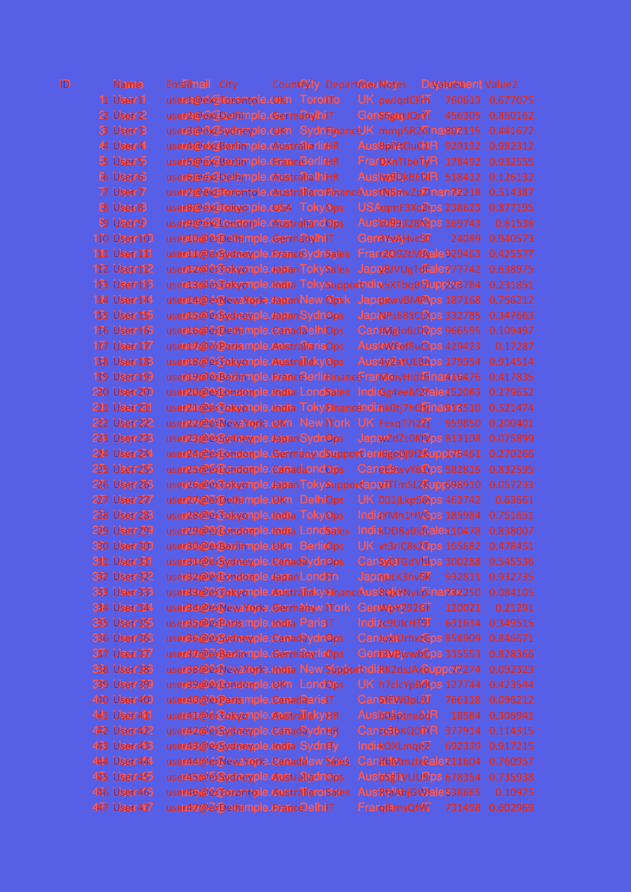</td>
  <td>changed: 317604 px (14.59%)<br>bbox: [118, 156, 1050, 1600]<br>mean abs RGB: 23.3776<br>RMSE RGB: 68.7987<br>threshold: 12, gain: 5.0</td>
</tr>
<tr>
  <td><b>XlsxIssue82_SampleTestData5mb</b><br>Page 2</td>
  <td>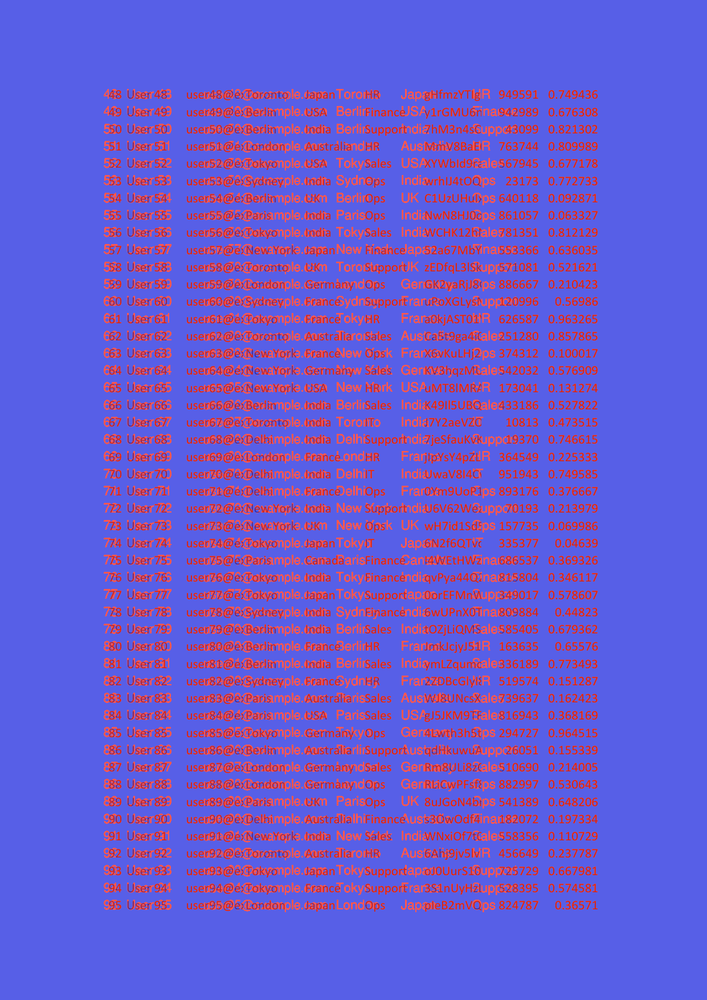</td>
  <td>changed: 329378 px (15.13%)<br>bbox: [182, 156, 1050, 1600]<br>mean abs RGB: 24.1773<br>RMSE RGB: 69.9264<br>threshold: 12, gain: 5.0</td>
</tr>
<tr>
  <td><b>XlsxIssue82_SampleTestData5mb</b><br>Page 3</td>
  <td></td>
  <td>changed: 329138 px (15.12%)<br>bbox: [171, 156, 1050, 1600]<br>mean abs RGB: 24.1452<br>RMSE RGB: 69.8702<br>threshold: 12, gain: 5.0</td>
</tr>
<tr>
  <td><b>XlsxIssue82_SampleTestData5mb</b><br>Page 4</td>
  <td></td>
  <td>changed: 335761 px (15.43%)<br>bbox: [171, 156, 1050, 1600]<br>mean abs RGB: 24.6539<br>RMSE RGB: 70.6242<br>threshold: 12, gain: 5.0</td>
</tr>
<tr>
  <td><b>XlsxIssue82_SampleTestData5mb</b><br>Page 5</td>
  <td></td>
  <td>changed: 339471 px (15.60%)<br>bbox: [169, 156, 1050, 1600]<br>mean abs RGB: 24.8195<br>RMSE RGB: 70.7753<br>threshold: 12, gain: 5.0</td>
</tr>
<tr>
  <td><b>XlsxIssue82_SampleTestData5mb</b><br>Page 6</td>
  <td>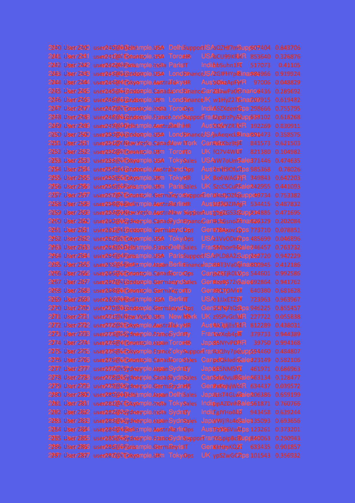</td>
  <td>changed: 338693 px (15.56%)<br>bbox: [169, 156, 1050, 1600]<br>mean abs RGB: 24.8709<br>RMSE RGB: 70.9192<br>threshold: 12, gain: 5.0</td>
</tr>
<tr>
  <td><b>XlsxIssue82_SampleTestData5mb</b><br>Page 7</td>
  <td></td>
  <td>changed: 337267 px (15.49%)<br>bbox: [169, 156, 1050, 1600]<br>mean abs RGB: 24.6243<br>RMSE RGB: 70.4156<br>threshold: 12, gain: 5.0</td>
</tr>
<tr>
  <td><b>XlsxIssue82_SampleTestData5mb</b><br>Page 8</td>
  <td></td>
  <td>changed: 343323 px (15.77%)<br>bbox: [169, 156, 1050, 1600]<br>mean abs RGB: 25.0164<br>RMSE RGB: 70.9494<br>threshold: 12, gain: 5.0</td>
</tr>
<tr>
  <td><b>XlsxIssue82_SampleTestData5mb</b><br>Page 9</td>
  <td>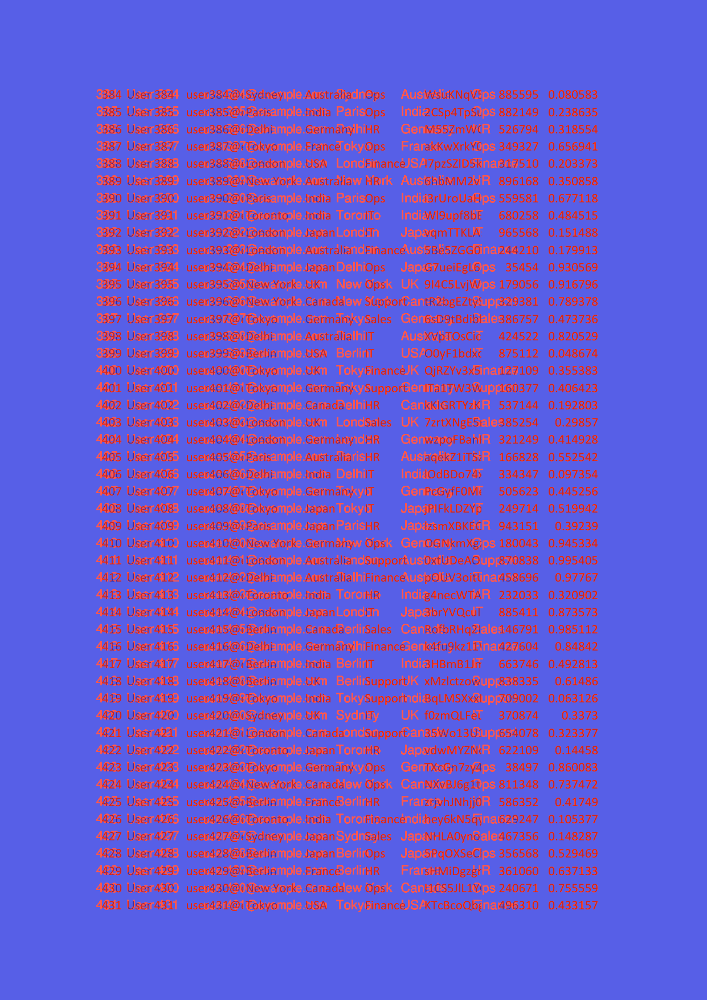</td>
  <td>changed: 336653 px (15.47%)<br>bbox: [169, 156, 1050, 1600]<br>mean abs RGB: 24.6222<br>RMSE RGB: 70.4672<br>threshold: 12, gain: 5.0</td>
</tr>
<tr>
  <td><b>XlsxIssue82_SampleTestData5mb</b><br>Page 10</td>
  <td></td>
  <td>changed: 334617 px (15.37%)<br>bbox: [169, 156, 1050, 1600]<br>mean abs RGB: 24.5685<br>RMSE RGB: 70.4525<br>threshold: 12, gain: 5.0</td>
</tr>
<tr>
  <td><b>XlsxIssue82_SampleTestData5mb</b><br>Page 11</td>
  <td>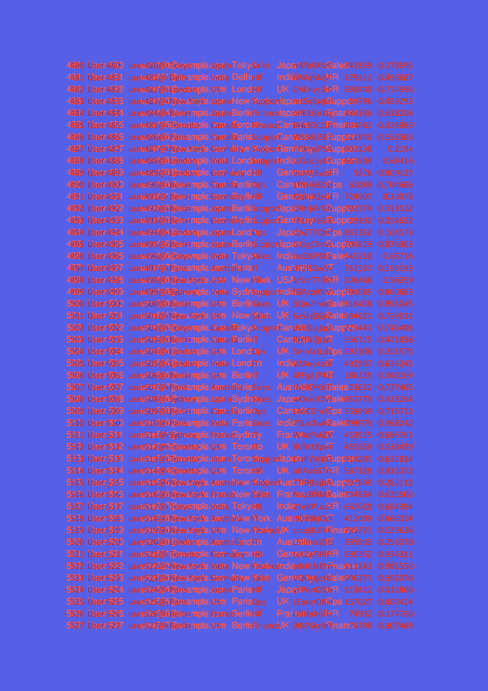</td>
  <td>changed: 339344 px (15.59%)<br>bbox: [169, 156, 1050, 1600]<br>mean abs RGB: 24.8177<br>RMSE RGB: 70.7609<br>threshold: 12, gain: 5.0</td>
</tr>
<tr>
  <td><b>XlsxIssue82_SampleTestData5mb</b><br>Page 12</td>
  <td></td>
  <td>changed: 346135 px (15.90%)<br>bbox: [169, 156, 1050, 1600]<br>mean abs RGB: 25.258<br>RMSE RGB: 71.3179<br>threshold: 12, gain: 5.0</td>
</tr>
<tr>
  <td><b>XlsxIssue82_SampleTestData5mb</b><br>Page 13</td>
  <td></td>
  <td>changed: 340612 px (15.65%)<br>bbox: [169, 156, 1050, 1600]<br>mean abs RGB: 24.8681<br>RMSE RGB: 70.7944<br>threshold: 12, gain: 5.0</td>
</tr>
<tr>
  <td><b>XlsxIssue82_SampleTestData5mb</b><br>Page 14</td>
  <td></td>
  <td>changed: 342215 px (15.72%)<br>bbox: [169, 156, 1050, 1600]<br>mean abs RGB: 25.1058<br>RMSE RGB: 71.1846<br>threshold: 12, gain: 5.0</td>
</tr>
<tr>
  <td><b>XlsxIssue82_SampleTestData5mb</b><br>Page 15</td>
  <td></td>
  <td>changed: 340898 px (15.66%)<br>bbox: [169, 156, 1050, 1600]<br>mean abs RGB: 24.9457<br>RMSE RGB: 70.943<br>threshold: 12, gain: 5.0</td>
</tr>
<tr>
  <td><b>XlsxIssue82_WideTable</b><br>Page 1</td>
  <td>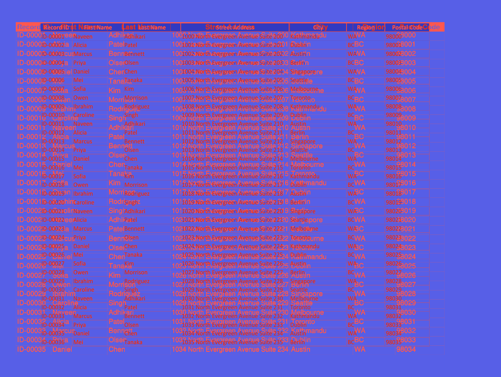</td>
  <td>changed: 537465 px (26.25%)<br>bbox: [52, 72, 1464, 1168]<br>mean abs RGB: 29.9125<br>RMSE RGB: 73.2059<br>threshold: 12, gain: 5.0</td>
</tr>
<tr>
  <td><b>XlsxIssue82_WideTable</b><br>Page 2</td>
  <td>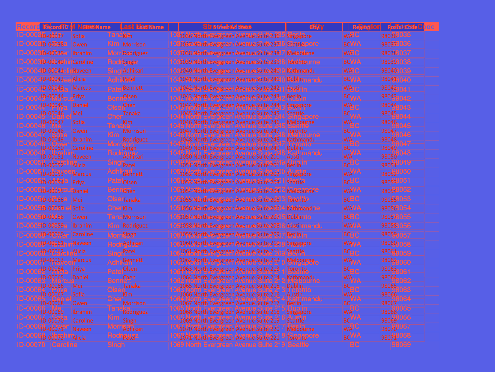</td>
  <td>changed: 541451 px (26.44%)<br>bbox: [52, 72, 1464, 1168]<br>mean abs RGB: 29.9704<br>RMSE RGB: 73.3741<br>threshold: 12, gain: 5.0</td>
</tr>
<tr>
  <td><b>XlsxIssue82_WideTable</b><br>Page 3</td>
  <td>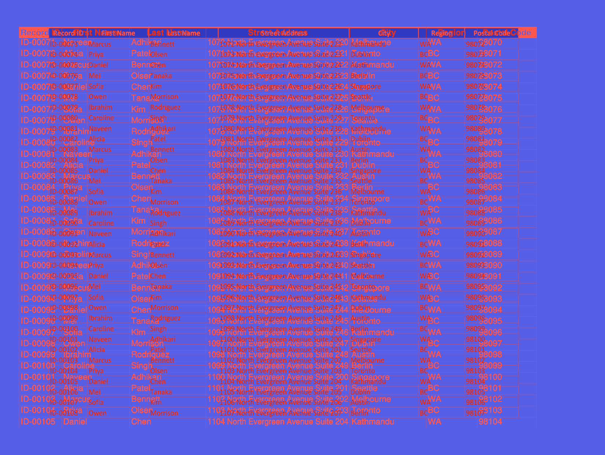</td>
  <td>changed: 539645 px (26.35%)<br>bbox: [52, 72, 1464, 1168]<br>mean abs RGB: 30.0047<br>RMSE RGB: 73.3285<br>threshold: 12, gain: 5.0</td>
</tr>
<tr>
  <td><b>XlsxIssue82_WideTable</b><br>Page 4</td>
  <td>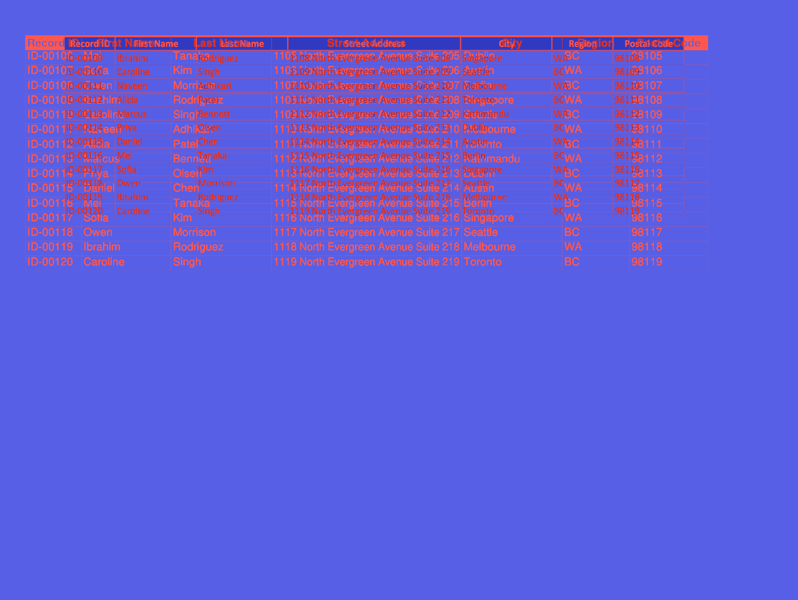</td>
  <td>changed: 216537 px (10.57%)<br>bbox: [52, 72, 1464, 560]<br>mean abs RGB: 12.0926<br>RMSE RGB: 46.1367<br>threshold: 12, gain: 5.0</td>
</tr>
<tr>
  <td><b>XlsxIssue82_WideTable</b><br>Page 5</td>
  <td>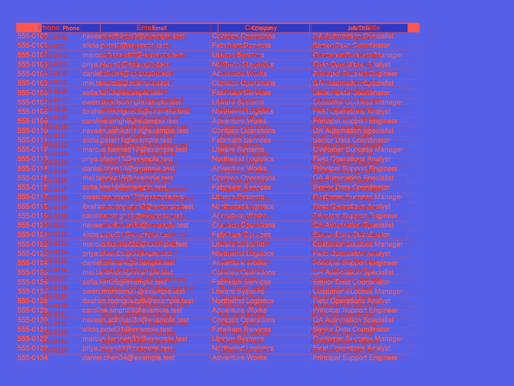</td>
  <td>changed: 522635 px (25.52%)<br>bbox: [52, 72, 1347, 1168]<br>mean abs RGB: 29.8403<br>RMSE RGB: 73.3864<br>threshold: 12, gain: 5.0</td>
</tr>
<tr>
  <td><b>XlsxIssue82_WideTable</b><br>Page 6</td>
  <td>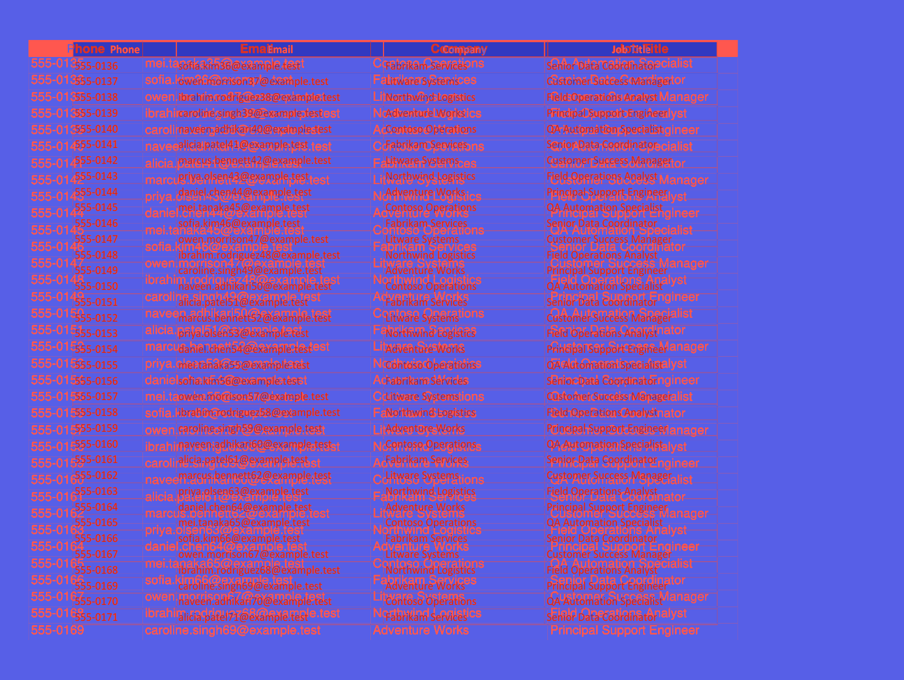</td>
  <td>changed: 526463 px (25.71%)<br>bbox: [52, 72, 1347, 1168]<br>mean abs RGB: 29.9738<br>RMSE RGB: 73.6532<br>threshold: 12, gain: 5.0</td>
</tr>
<tr>
  <td><b>XlsxIssue82_WideTable</b><br>Page 7</td>
  <td>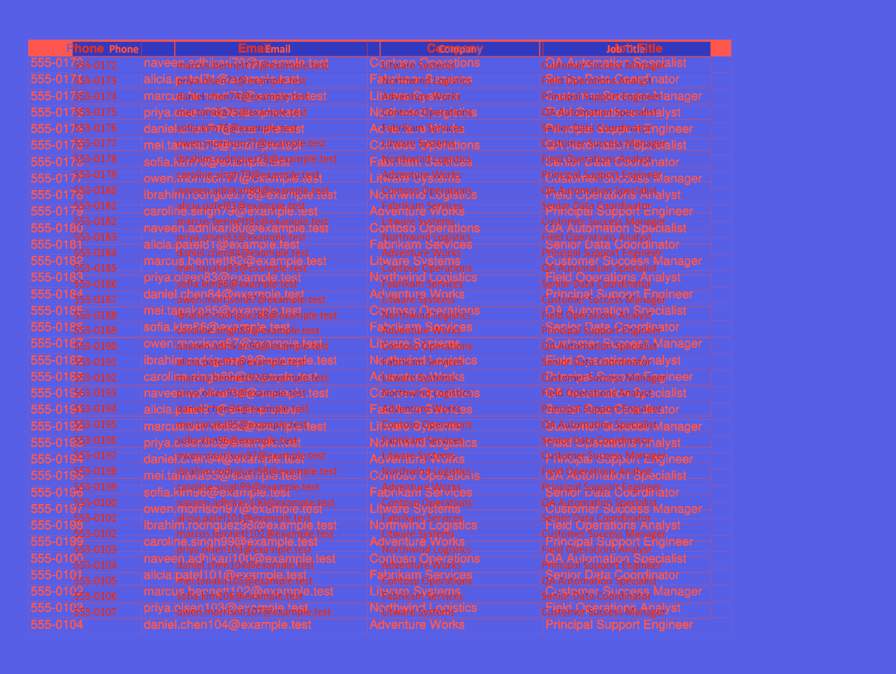</td>
  <td>changed: 525814 px (25.68%)<br>bbox: [52, 72, 1347, 1168]<br>mean abs RGB: 30.0486<br>RMSE RGB: 73.6583<br>threshold: 12, gain: 5.0</td>
</tr>
<tr>
  <td><b>XlsxIssue82_WideTable</b><br>Page 8</td>
  <td></td>
  <td>changed: 213327 px (10.42%)<br>bbox: [52, 72, 1347, 560]<br>mean abs RGB: 12.3451<br>RMSE RGB: 47.0141<br>threshold: 12, gain: 5.0</td>
</tr>
<tr>
  <td><b>XlsxIssue82_WideTable</b><br>Page 9</td>
  <td>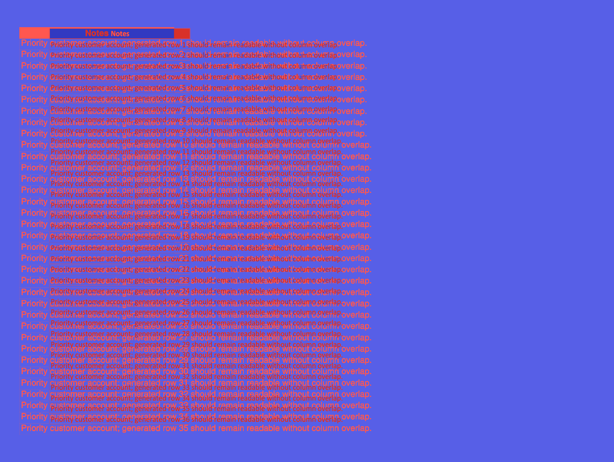</td>
  <td>changed: 417039 px (20.37%)<br>bbox: [52, 72, 998, 1168]<br>mean abs RGB: 28.2188<br>RMSE RGB: 73.4525<br>threshold: 12, gain: 5.0</td>
</tr>
<tr>
  <td><b>XlsxIssue82_WideTable</b><br>Page 10</td>
  <td></td>
  <td>changed: 419951 px (20.51%)<br>bbox: [52, 72, 998, 1168]<br>mean abs RGB: 28.439<br>RMSE RGB: 73.8206<br>threshold: 12, gain: 5.0</td>
</tr>
<tr>
  <td><b>XlsxIssue82_WideTable</b><br>Page 11</td>
  <td>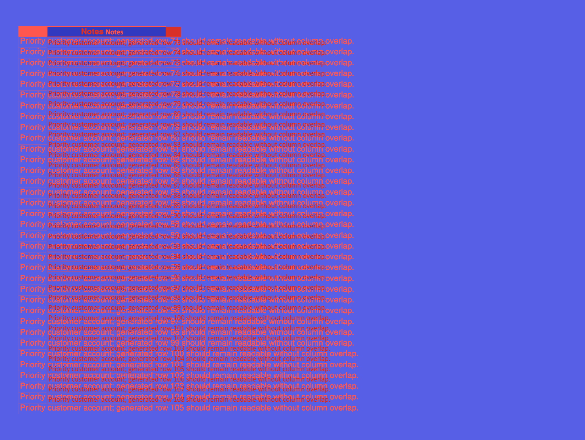</td>
  <td>changed: 420280 px (20.52%)<br>bbox: [52, 72, 1010, 1168]<br>mean abs RGB: 28.5231<br>RMSE RGB: 73.8858<br>threshold: 12, gain: 5.0</td>
</tr>
<tr>
  <td><b>XlsxIssue82_WideTable</b><br>Page 12</td>
  <td>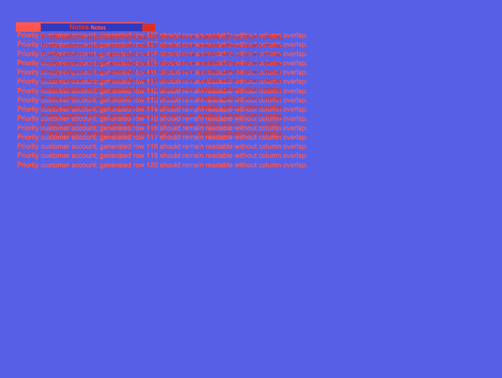</td>
  <td>changed: 166167 px (8.12%)<br>bbox: [52, 72, 1010, 560]<br>mean abs RGB: 11.2065<br>RMSE RGB: 46.1548<br>threshold: 12, gain: 5.0</td>
</tr>
<tr>
  <td><b>XlsxIssue82_WideTable</b><br>Page 13</td>
  <td>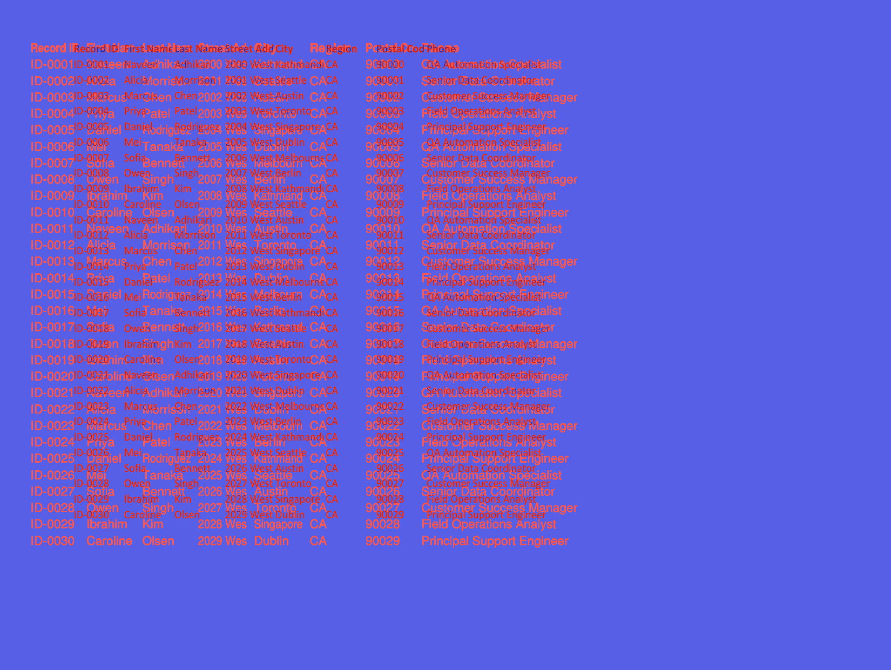</td>
  <td>changed: 286470 px (13.99%)<br>bbox: [58, 79, 1070, 1015]<br>mean abs RGB: 21.7202<br>RMSE RGB: 65.6012<br>threshold: 12, gain: 5.0</td>
</tr>
</table>

## Visual Comparison

Scores compare dotnet MiniPdf against Microsoft 365 Excel Reference. LibreOffice is an auxiliary rendering and does not affect scores.

<table>
<tr><th>dotnet MiniPdf</th><th>Microsoft 365 Excel Reference</th><th>LibreOffice</th></tr>
<tr>
  <td><b>Academic Achievement Summary Table<br><small>format: xlsx | case: Academic Achievement Summary Table | scope: dotnet-issue-xlsx</small></b></td>
  <td colspan="2">Academic Achievement Summary Table <span style="color:#3fb950">⬤</span> 95.4%</td>
</tr>
<tr>
  <td></td>
  <td></td>
  <td></td>
</tr>
<tr>
  <td></td>
  <td></td>
  <td></td>
</tr>
<tr>
  <td><b>AcademicAchievement_temp<br><small>format: xlsx | case: AcademicAchievement_temp | scope: dotnet-issue-xlsx</small></b></td>
  <td colspan="2">AcademicAchievement_temp <span style="color:#3fb950">⬤</span> 95.4%</td>
</tr>
<tr>
  <td></td>
  <td></td>
  <td></td>
</tr>
<tr>
  <td></td>
  <td></td>
  <td></td>
</tr>
<tr>
  <td><b>Business expense budget1<br><small>format: xlsx | case: Business expense budget1 | scope: dotnet-issue-xlsx</small></b></td>
  <td colspan="2">Business expense budget1 <span style="color:#3fb950">⬤</span> 94.3%</td>
</tr>
<tr>
  <td></td>
  <td></td>
  <td></td>
</tr>
<tr>
  <td></td>
  <td></td>
  <td></td>
</tr>
<tr>
  <td></td>
  <td></td>
  <td></td>
</tr>
<tr>
  <td></td>
  <td></td>
  <td></td>
</tr>
<tr>
  <td><b>Business expenses budget2<br><small>format: xlsx | case: Business expenses budget2 | scope: dotnet-issue-xlsx</small></b></td>
  <td colspan="2">Business expenses budget2 <span style="color:#d29922">⬤</span> 88.6%</td>
</tr>
<tr>
  <td></td>
  <td></td>
  <td></td>
</tr>
<tr>
  <td></td>
  <td></td>
  <td></td>
</tr>
<tr>
  <td></td>
  <td></td>
  <td></td>
</tr>
<tr>
  <td></td>
  <td></td>
  <td></td>
</tr>
<tr>
  <td><b>Business plan checklist with SWOT analysis1<br><small>format: xlsx | case: Business plan checklist with SWOT analysis1 | scope: dotnet-issue-xlsx</small></b></td>
  <td colspan="2">Business plan checklist with SWOT analysis1 <span style="color:#d29922">⬤</span> 85.5%</td>
</tr>
<tr>
  <td></td>
  <td></td>
  <td></td>
</tr>
<tr>
  <td><b>Event budget1<br><small>format: xlsx | case: Event budget1 | scope: dotnet-issue-xlsx</small></b></td>
  <td colspan="2">Event budget1 <span style="color:#f85149">⬤</span> 67.8%</td>
</tr>
<tr>
  <td></td>
  <td></td>
  <td></td>
</tr>
<tr>
  <td></td>
  <td></td>
  <td></td>
</tr>
<tr>
  <td></td>
  <td></td>
  <td></td>
</tr>
<tr>
  <td></td>
  <td></td>
  <td></td>
</tr>
<tr>
  <td><i>missing</i></td>
  <td></td>
  <td></td>
</tr>
<tr>
  <td><b>Expense report basic1<br><small>format: xlsx | case: Expense report basic1 | scope: dotnet-issue-xlsx</small></b></td>
  <td colspan="2">Expense report basic1 <span style="color:#3fb950">⬤</span> 91.0%</td>
</tr>
<tr>
  <td></td>
  <td></td>
  <td></td>
</tr>
<tr>
  <td><b>Grocery list1<br><small>format: xlsx | case: Grocery list1 | scope: dotnet-issue-xlsx</small></b></td>
  <td colspan="2">Grocery list1 <span style="color:#3fb950">⬤</span> 92.6%</td>
</tr>
<tr>
  <td></td>
  <td></td>
  <td></td>
</tr>
<tr>
  <td><b>Issue202609031340<br><small>format: xlsx | case: Issue202609031340 | scope: dotnet-issue-xlsx</small></b></td>
  <td colspan="2">Issue202609031340 <span style="color:#3fb950">⬤</span> 93.4%</td>
</tr>
<tr>
  <td></td>
  <td></td>
  <td></td>
</tr>
<tr>
  <td></td>
  <td></td>
  <td></td>
</tr>
<tr>
  <td></td>
  <td></td>
  <td></td>
</tr>
<tr>
  <td></td>
  <td></td>
  <td></td>
</tr>
<tr>
  <td><b>payroll-calculator_f<br><small>format: xlsx | case: payroll-calculator_f | scope: dotnet-issue-xlsx</small></b></td>
  <td colspan="2">payroll-calculator_f <span style="color:#f85149">⬤</span> 59.7%</td>
</tr>
<tr>
  <td></td>
  <td></td>
  <td></td>
</tr>
<tr>
  <td></td>
  <td></td>
  <td></td>
</tr>
<tr>
  <td>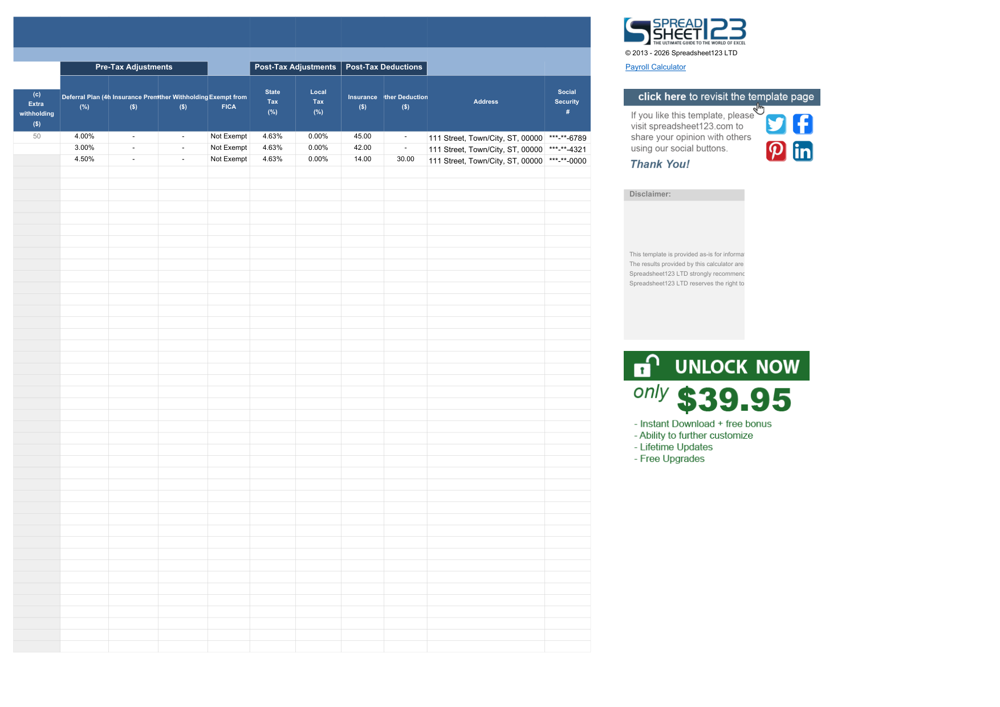</td>
  <td></td>
  <td></td>
</tr>
<tr>
  <td></td>
  <td></td>
  <td></td>
</tr>
<tr>
  <td></td>
  <td></td>
  <td></td>
</tr>
<tr>
  <td></td>
  <td></td>
  <td></td>
</tr>
<tr>
  <td>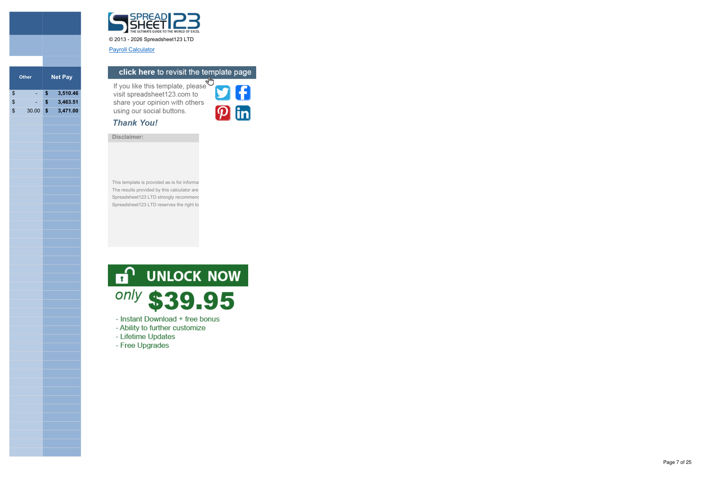</td>
  <td></td>
  <td></td>
</tr>
<tr>
  <td></td>
  <td></td>
  <td>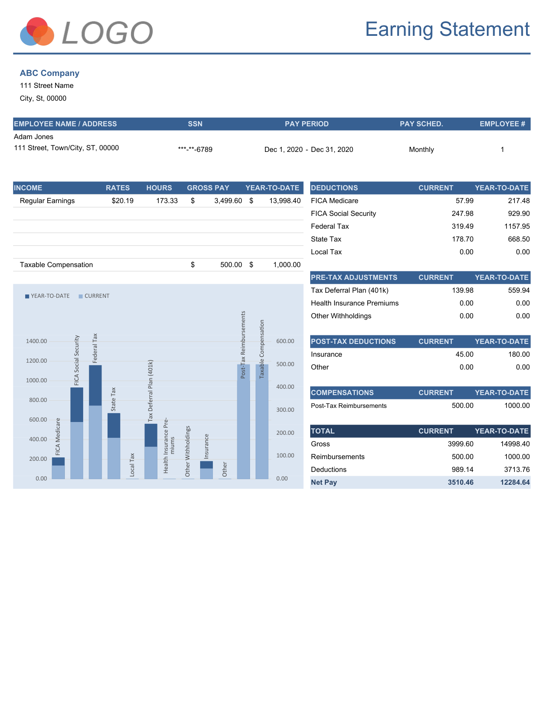</td>
</tr>
<tr>
  <td>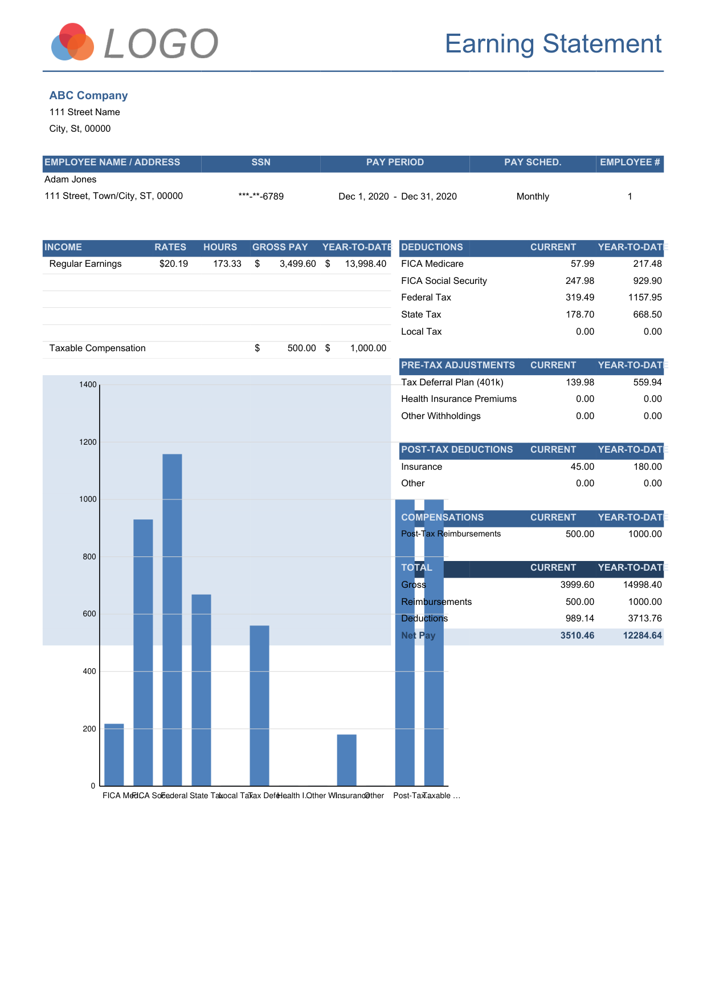</td>
  <td></td>
  <td></td>
</tr>
<tr>
  <td></td>
  <td></td>
  <td>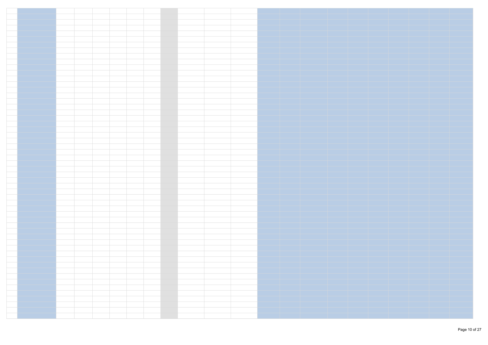</td>
</tr>
<tr>
  <td>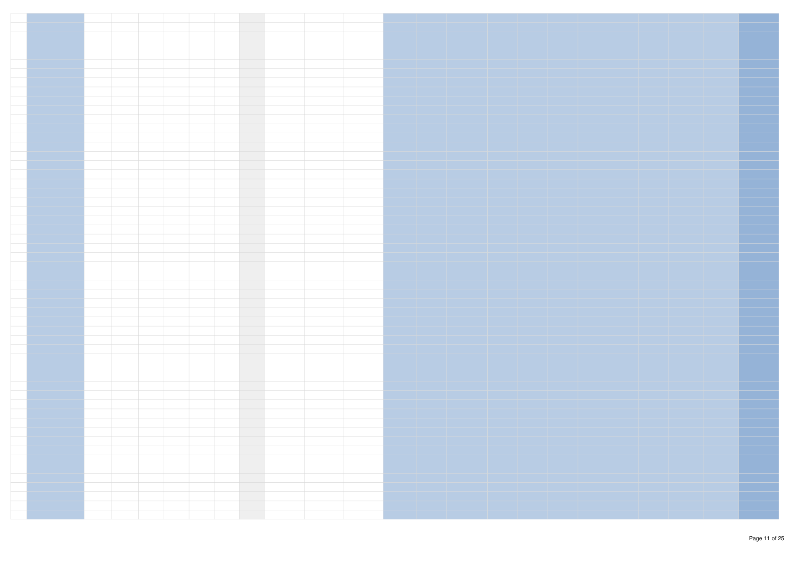</td>
  <td></td>
  <td></td>
</tr>
<tr>
  <td></td>
  <td></td>
  <td></td>
</tr>
<tr>
  <td></td>
  <td></td>
  <td></td>
</tr>
<tr>
  <td></td>
  <td></td>
  <td></td>
</tr>
<tr>
  <td></td>
  <td></td>
  <td></td>
</tr>
<tr>
  <td><b>PO_anonymized<br><small>format: xlsx | case: PO_anonymized | scope: dotnet-issue-xlsx</small></b></td>
  <td colspan="2">PO_anonymized <span style="color:#3fb950">⬤</span> 95.3%</td>
</tr>
<tr>
  <td></td>
  <td></td>
  <td></td>
</tr>
<tr>
  <td></td>
  <td></td>
  <td></td>
</tr>
<tr>
  <td></td>
  <td></td>
  <td></td>
</tr>
<tr>
  <td></td>
  <td></td>
  <td></td>
</tr>
<tr>
  <td></td>
  <td></td>
  <td></td>
</tr>
<tr>
  <td></td>
  <td></td>
  <td></td>
</tr>
<tr>
  <td></td>
  <td></td>
  <td></td>
</tr>
<tr>
  <td></td>
  <td></td>
  <td></td>
</tr>
<tr>
  <td></td>
  <td></td>
  <td><i>missing</i></td>
</tr>
<tr>
  <td><b>Simple invoice1<br><small>format: xlsx | case: Simple invoice1 | scope: dotnet-issue-xlsx</small></b></td>
  <td colspan="2">Simple invoice1 <span style="color:#d29922">⬤</span> 87.8%</td>
</tr>
<tr>
  <td></td>
  <td></td>
  <td></td>
</tr>
<tr>
  <td><b>Small business cash flow forecast1<br><small>format: xlsx | case: Small business cash flow forecast1 | scope: dotnet-issue-xlsx</small></b></td>
  <td colspan="2">Small business cash flow forecast1 <span style="color:#f85149">⬤</span> 64.3%</td>
</tr>
<tr>
  <td></td>
  <td></td>
  <td></td>
</tr>
<tr>
  <td></td>
  <td></td>
  <td></td>
</tr>
<tr>
  <td></td>
  <td></td>
  <td></td>
</tr>
<tr>
  <td><i>missing</i></td>
  <td></td>
  <td></td>
</tr>
<tr>
  <td><i>missing</i></td>
  <td></td>
  <td></td>
</tr>
<tr>
  <td><b>Wedding_timeline_planner1_copy<br><small>format: xlsx | case: Wedding_timeline_planner1_copy | scope: dotnet-issue-xlsx</small></b></td>
  <td colspan="2">Wedding_timeline_planner1_copy <span style="color:#3fb950">⬤</span> 93.5%</td>
</tr>
<tr>
  <td></td>
  <td></td>
  <td></td>
</tr>
<tr>
  <td></td>
  <td></td>
  <td></td>
</tr>
<tr>
  <td></td>
  <td></td>
  <td></td>
</tr>
<tr>
  <td></td>
  <td></td>
  <td></td>
</tr>
<tr>
  <td></td>
  <td></td>
  <td></td>
</tr>
<tr>
  <td></td>
  <td></td>
  <td><i>missing</i></td>
</tr>
<tr>
  <td></td>
  <td></td>
  <td><i>missing</i></td>
</tr>
<tr>
  <td></td>
  <td></td>
  <td><i>missing</i></td>
</tr>
<tr>
  <td><b>Weekly schedule planner1<br><small>format: xlsx | case: Weekly schedule planner1 | scope: dotnet-issue-xlsx</small></b></td>
  <td colspan="2">Weekly schedule planner1 <span style="color:#d29922">⬤</span> 86.6%</td>
</tr>
<tr>
  <td></td>
  <td></td>
  <td></td>
</tr>
<tr>
  <td><b>XlsxIssue75<br><small>format: xlsx | case: XlsxIssue75 | scope: dotnet-issue-xlsx</small></b></td>
  <td colspan="2">XlsxIssue75 <span style="color:#d29922">⬤</span> 88.3%</td>
</tr>
<tr>
  <td></td>
  <td></td>
  <td></td>
</tr>
<tr>
  <td></td>
  <td></td>
  <td></td>
</tr>
<tr>
  <td></td>
  <td></td>
  <td></td>
</tr>
<tr>
  <td></td>
  <td></td>
  <td></td>
</tr>
<tr>
  <td></td>
  <td></td>
  <td></td>
</tr>
<tr>
  <td></td>
  <td></td>
  <td></td>
</tr>
<tr>
  <td></td>
  <td></td>
  <td></td>
</tr>
<tr>
  <td></td>
  <td></td>
  <td></td>
</tr>
<tr>
  <td></td>
  <td></td>
  <td></td>
</tr>
<tr>
  <td></td>
  <td></td>
  <td></td>
</tr>
<tr>
  <td></td>
  <td></td>
  <td></td>
</tr>
<tr>
  <td></td>
  <td></td>
  <td></td>
</tr>
<tr>
  <td></td>
  <td></td>
  <td></td>
</tr>
<tr>
  <td></td>
  <td></td>
  <td></td>
</tr>
<tr>
  <td></td>
  <td></td>
  <td></td>
</tr>
<tr>
  <td><b>XlsxIssue77_MergedCellAlignment<br><small>format: xlsx | case: XlsxIssue77_MergedCellAlignment | scope: dotnet-issue-xlsx</small></b></td>
  <td colspan="2">XlsxIssue77_MergedCellAlignment <span style="color:#3fb950">⬤</span> 93.3%</td>
</tr>
<tr>
  <td></td>
  <td></td>
  <td></td>
</tr>
<tr>
  <td></td>
  <td></td>
  <td></td>
</tr>
<tr>
  <td><b>XlsxIssue77_Template1<br><small>format: xlsx | case: XlsxIssue77_Template1 | scope: dotnet-issue-xlsx</small></b></td>
  <td colspan="2">XlsxIssue77_Template1 <span style="color:#3fb950">⬤</span> 94.0%</td>
</tr>
<tr>
  <td></td>
  <td></td>
  <td></td>
</tr>
<tr>
  <td></td>
  <td></td>
  <td></td>
</tr>
<tr>
  <td></td>
  <td></td>
  <td></td>
</tr>
<tr>
  <td></td>
  <td></td>
  <td></td>
</tr>
<tr>
  <td></td>
  <td></td>
  <td></td>
</tr>
<tr>
  <td></td>
  <td></td>
  <td></td>
</tr>
<tr>
  <td><b>XlsxIssue77_Template2_Workaround<br><small>format: xlsx | case: XlsxIssue77_Template2_Workaround | scope: dotnet-issue-xlsx</small></b></td>
  <td colspan="2">XlsxIssue77_Template2_Workaround <span style="color:#3fb950">⬤</span> 94.2%</td>
</tr>
<tr>
  <td></td>
  <td></td>
  <td></td>
</tr>
<tr>
  <td></td>
  <td></td>
  <td></td>
</tr>
<tr>
  <td></td>
  <td></td>
  <td></td>
</tr>
<tr>
  <td></td>
  <td></td>
  <td></td>
</tr>
<tr>
  <td></td>
  <td></td>
  <td></td>
</tr>
<tr>
  <td></td>
  <td></td>
  <td></td>
</tr>
<tr>
  <td><b>XlsxIssue81_LayoutOptions<br><small>format: xlsx | case: XlsxIssue81_LayoutOptions | scope: dotnet-issue-xlsx</small></b></td>
  <td colspan="2">XlsxIssue81_LayoutOptions <span style="color:#d29922">⬤</span> 85.5%</td>
</tr>
<tr>
  <td></td>
  <td></td>
  <td></td>
</tr>
<tr>
  <td></td>
  <td></td>
  <td></td>
</tr>
<tr>
  <td></td>
  <td></td>
  <td></td>
</tr>
<tr>
  <td></td>
  <td></td>
  <td></td>
</tr>
<tr>
  <td></td>
  <td></td>
  <td></td>
</tr>
<tr>
  <td></td>
  <td></td>
  <td></td>
</tr>
<tr>
  <td></td>
  <td></td>
  <td></td>
</tr>
<tr>
  <td></td>
  <td></td>
  <td></td>
</tr>
<tr>
  <td></td>
  <td></td>
  <td></td>
</tr>
<tr>
  <td></td>
  <td></td>
  <td></td>
</tr>
<tr>
  <td></td>
  <td></td>
  <td></td>
</tr>
<tr>
  <td></td>
  <td></td>
  <td></td>
</tr>
<tr>
  <td></td>
  <td></td>
  <td></td>
</tr>
<tr>
  <td></td>
  <td></td>
  <td></td>
</tr>
<tr>
  <td></td>
  <td></td>
  <td></td>
</tr>
<tr>
  <td><b>XlsxIssue82_5mb<br><small>format: xlsx | case: XlsxIssue82_5mb | scope: dotnet-issue-xlsx</small></b></td>
  <td colspan="2">XlsxIssue82_5mb <span style="color:#f85149">⬤</span> 48.1%</td>
</tr>
<tr>
  <td></td>
  <td></td>
  <td></td>
</tr>
<tr>
  <td></td>
  <td></td>
  <td></td>
</tr>
<tr>
  <td></td>
  <td></td>
  <td></td>
</tr>
<tr>
  <td></td>
  <td></td>
  <td></td>
</tr>
<tr>
  <td></td>
  <td></td>
  <td></td>
</tr>
<tr>
  <td></td>
  <td></td>
  <td></td>
</tr>
<tr>
  <td></td>
  <td></td>
  <td></td>
</tr>
<tr>
  <td></td>
  <td></td>
  <td></td>
</tr>
<tr>
  <td></td>
  <td></td>
  <td></td>
</tr>
<tr>
  <td></td>
  <td></td>
  <td></td>
</tr>
<tr>
  <td></td>
  <td></td>
  <td></td>
</tr>
<tr>
  <td></td>
  <td></td>
  <td></td>
</tr>
<tr>
  <td></td>
  <td></td>
  <td></td>
</tr>
<tr>
  <td></td>
  <td></td>
  <td></td>
</tr>
<tr>
  <td></td>
  <td></td>
  <td></td>
</tr>
<tr>
  <td><b>XlsxIssue82_SampleTestData5mb<br><small>format: xlsx | case: XlsxIssue82_SampleTestData5mb | scope: dotnet-issue-xlsx</small></b></td>
  <td colspan="2">XlsxIssue82_SampleTestData5mb <span style="color:#f85149">⬤</span> 60.9%</td>
</tr>
<tr>
  <td></td>
  <td></td>
  <td></td>
</tr>
<tr>
  <td></td>
  <td></td>
  <td></td>
</tr>
<tr>
  <td></td>
  <td></td>
  <td></td>
</tr>
<tr>
  <td></td>
  <td></td>
  <td></td>
</tr>
<tr>
  <td></td>
  <td></td>
  <td></td>
</tr>
<tr>
  <td></td>
  <td></td>
  <td></td>
</tr>
<tr>
  <td></td>
  <td></td>
  <td></td>
</tr>
<tr>
  <td></td>
  <td></td>
  <td></td>
</tr>
<tr>
  <td></td>
  <td></td>
  <td></td>
</tr>
<tr>
  <td></td>
  <td></td>
  <td></td>
</tr>
<tr>
  <td></td>
  <td></td>
  <td></td>
</tr>
<tr>
  <td></td>
  <td></td>
  <td></td>
</tr>
<tr>
  <td></td>
  <td></td>
  <td></td>
</tr>
<tr>
  <td></td>
  <td></td>
  <td></td>
</tr>
<tr>
  <td></td>
  <td></td>
  <td></td>
</tr>
<tr>
  <td><b>XlsxIssue82_WideTable<br><small>format: xlsx | case: XlsxIssue82_WideTable | scope: dotnet-issue-xlsx</small></b></td>
  <td colspan="2">XlsxIssue82_WideTable <span style="color:#3fb950">⬤</span> 91.6%</td>
</tr>
<tr>
  <td></td>
  <td></td>
  <td></td>
</tr>
<tr>
  <td></td>
  <td></td>
  <td></td>
</tr>
<tr>
  <td></td>
  <td></td>
  <td></td>
</tr>
<tr>
  <td></td>
  <td></td>
  <td></td>
</tr>
<tr>
  <td></td>
  <td></td>
  <td></td>
</tr>
<tr>
  <td></td>
  <td></td>
  <td></td>
</tr>
<tr>
  <td></td>
  <td></td>
  <td></td>
</tr>
<tr>
  <td></td>
  <td></td>
  <td></td>
</tr>
<tr>
  <td></td>
  <td></td>
  <td></td>
</tr>
<tr>
  <td></td>
  <td></td>
  <td></td>
</tr>
<tr>
  <td></td>
  <td></td>
  <td></td>
</tr>
<tr>
  <td></td>
  <td></td>
  <td></td>
</tr>
<tr>
  <td></td>
  <td></td>
  <td></td>
</tr>
<tr>
  <td><b>XlsxIssue152_ClusteredNonZeroBarChart<br><small>format: xlsx | case: XlsxIssue152_ClusteredNonZeroBarChart | scope: dotnet-issue-xlsx</small></b></td>
  <td colspan="2">XlsxIssue152_ClusteredNonZeroBarChart N/A</td>
</tr>
<tr>
  <td colspan="3"><i>No images</i></td>
</tr>
</table>

## Detailed Results

### Academic Achievement Summary Table

- **Case Metadata:** format: xlsx | case: Academic Achievement Summary Table | scope: dotnet-issue-xlsx
- **Source:** tests/Issue_Files/xlsx/Academic Achievement Summary Table.xlsx
- **Text Similarity:** 0.9436
- **Visual Average:** 0.9425
- **Overall Score:** 0.9544
- **Pages:** MiniPdf=2, Reference=2
- **File Size:** MiniPdf=373982 bytes, Reference=151877 bytes

<details><summary>Text Diff</summary>

```diff
--- minipdf/Academic Achievement Summary Table.pdf
+++ reference/Academic Achievement Summary Table.pdf
@@ -1,11 +1,11 @@
 附件3

-学 术业绩汇总 表

+学术业绩汇总表

 报考岗位： 报考岗位代码： 考生姓名：

 博士论文题目： 博士论文研究方向：

-公开 发 表的主要 论文情况

-角色 转载刊物、转载字数及转 是否为代表作

+公开发表的主要论文情况

+角色 转载刊物、转载字数及 是否为代表作

 序号 题目 刊物名称 核心期刊情况 刊号 发表时间

-（排名） 载时间等 （指定1篇）

+（排名） 转载时间等 （指定1篇）

 1

 2

 3

@@ -19,19 +19,19 @@
 11

 12

 ---PAGE---

-公开出版的主要 专 （ 译 ）著、教材情况

-角色 全书文字 本人写作 转载刊物、转载字数及转

+公开出版的主要专（译）著、教材情况

+角色 全书文 本人写 转载刊物、转载字数及

 序号 题目 出版社名称 出版号 出版时间 备注

-（排名） 数 量 载时间等

+（排名） 字数 作量 转载时间等

 1

 2

-获 批的决策咨 询 报 告情况

+获批的决策咨询报告情况

 序号 题目 批示领导级别 获批时间 角色（排名） 备注

 1

 2

 3

 4

-承担的主要科研 课 题情况

+承担的主要科研课题情况

 项目

 序号 课题名称 项目来源 课题编号 角色（排名） 起止时间 成果鉴定（评价） 备注

 级别

@@ -39,9 +39,9 @@
 2

 3

 4

-本人承 诺 以上情况属 实 ，并有相 应证 明。如有不 实 之 处 ，愿意承担相 应责 任。

-报名人 员签 名：

+本人承诺以上情况属实，并有相应证明。如有不实之处，愿意承担相应责任。

+报名人员签名：

 日期：    年   月   日

-填表 说 明：1. 请 将各 类 学 术 成果按等 级、 层 次及水平自高到低 顺 序填写。不加行、减行，不加 页 、减 页 ，本表采用A4正反面打印。

-2.核心期刊是指北京大学 图 书 馆 “中文核心期刊”、南京大学“中文社会科学引文索引（CSSCI）来源期刊”（含 扩 展版、集刊）、中国科学技 术 信息研究所

-“中国科技 论文 统计 源期刊”和科学引文索引（SCI）、社会科学引文索引（SSCI）。其中，被SCI、SSCI收 录 的期刊要求 进 入所在学科 领 域Q1、Q2。
+填表说明：1.请将各类学术成果按等级、层次及水平自高到低顺序填写。不加行、减行，不加页、减页，本表采用A4正反面打印。

+2.核心期刊是指北京大学图书馆“中文核心期刊”、南京大学“中文社会科学引文索引（CSSCI）来源期刊”（含扩展版、集刊）、中国科学技术信息研究所

+“中国科技论文统计源期刊”和科学引文索引（SCI）、社会科学引文索引（SSCI）。其中，被SCI、SSCI收录的期刊要求进入所在学科领域Q1、Q2。
```
</details>

### AcademicAchievement_temp

- **Case Metadata:** format: xlsx | case: AcademicAchievement_temp | scope: dotnet-issue-xlsx
- **Source:** tests/Issue_Files/xlsx/AcademicAchievement_temp.xlsx
- **Text Similarity:** 0.9436
- **Visual Average:** 0.9425
- **Overall Score:** 0.9544
- **Pages:** MiniPdf=2, Reference=2
- **File Size:** MiniPdf=373982 bytes, Reference=151877 bytes

<details><summary>Text Diff</summary>

```diff
--- minipdf/AcademicAchievement_temp.pdf
+++ reference/AcademicAchievement_temp.pdf
@@ -1,11 +1,11 @@
 附件3

-学 术业绩汇总 表

+学术业绩汇总表

 报考岗位： 报考岗位代码： 考生姓名：

 博士论文题目： 博士论文研究方向：

-公开 发 表的主要 论文情况

-角色 转载刊物、转载字数及转 是否为代表作

+公开发表的主要论文情况

+角色 转载刊物、转载字数及 是否为代表作

 序号 题目 刊物名称 核心期刊情况 刊号 发表时间

-（排名） 载时间等 （指定1篇）

+（排名） 转载时间等 （指定1篇）

 1

 2

 3

@@ -19,19 +19,19 @@
 11

 12

 ---PAGE---

-公开出版的主要 专 （ 译 ）著、教材情况

-角色 全书文字 本人写作 转载刊物、转载字数及转

+公开出版的主要专（译）著、教材情况

+角色 全书文 本人写 转载刊物、转载字数及

 序号 题目 出版社名称 出版号 出版时间 备注

-（排名） 数 量 载时间等

+（排名） 字数 作量 转载时间等

 1

 2

-获 批的决策咨 询 报 告情况

+获批的决策咨询报告情况

 序号 题目 批示领导级别 获批时间 角色（排名） 备注

 1

 2

 3

 4

-承担的主要科研 课 题情况

+承担的主要科研课题情况

 项目

 序号 课题名称 项目来源 课题编号 角色（排名） 起止时间 成果鉴定（评价） 备注

 级别

@@ -39,9 +39,9 @@
 2

 3

 4

-本人承 诺 以上情况属 实 ，并有相 应证 明。如有不 实 之 处 ，愿意承担相 应责 任。

-报名人 员签 名：

+本人承诺以上情况属实，并有相应证明。如有不实之处，愿意承担相应责任。

+报名人员签名：

 日期：    年   月   日

-填表 说 明：1. 请 将各 类 学 术 成果按等 级、 层 次及水平自高到低 顺 序填写。不加行、减行，不加 页 、减 页 ，本表采用A4正反面打印。

-2.核心期刊是指北京大学 图 书 馆 “中文核心期刊”、南京大学“中文社会科学引文索引（CSSCI）来源期刊”（含 扩 展版、集刊）、中国科学技 术 信息研究所

-“中国科技 论文 统计 源期刊”和科学引文索引（SCI）、社会科学引文索引（SSCI）。其中，被SCI、SSCI收 录 的期刊要求 进 入所在学科 领 域Q1、Q2。
+填表说明：1.请将各类学术成果按等级、层次及水平自高到低顺序填写。不加行、减行，不加页、减页，本表采用A4正反面打印。

+2.核心期刊是指北京大学图书馆“中文核心期刊”、南京大学“中文社会科学引文索引（CSSCI）来源期刊”（含扩展版、集刊）、中国科学技术信息研究所

+“中国科技论文统计源期刊”和科学引文索引（SCI）、社会科学引文索引（SSCI）。其中，被SCI、SSCI收录的期刊要求进入所在学科领域Q1、Q2。
```
</details>

### Business expense budget1

- **Case Metadata:** format: xlsx | case: Business expense budget1 | scope: dotnet-issue-xlsx
- **Source:** tests/Issue_Files/xlsx/Business expense budget1.xlsx
- **Text Similarity:** 0.9494
- **Visual Average:** 0.9081
- **Overall Score:** 0.943
- **Pages:** MiniPdf=4, Reference=4
- **File Size:** MiniPdf=654851 bytes, Reference=159864 bytes

<details><summary>Text Diff</summary>

```diff
--- minipdf/Business expense budget1.pdf
+++ reference/Business expense budget1.pdf
@@ -41,19 +41,7 @@
 Travel & Entertainment 24700 22100

 Professional Services 24600 23400

 Budget vs Actual by Category

-Total Budget Total Actual

-140000

-120000

-100000

-80000

-Total Budget

-Total Actual

-60000

 Amount (\$)

-40000

-20000

-0

-Personnel Operations Marketing Travel & Entertain… Professional Servi…

 Category

 ---PAGE---

 Q2 ACTUAL VARIANCE

@@ -85,4 +73,5 @@
 12,600.00 1,200.00

 ---PAGE---

 121,600.00 6,350.00

-ertainment Professional Services
+Total Budget

+Total Actual
```
</details>

### Business expenses budget2

- **Case Metadata:** format: xlsx | case: Business expenses budget2 | scope: dotnet-issue-xlsx
- **Source:** tests/Issue_Files/xlsx/Business expenses budget2.xlsx
- **Text Similarity:** 0.9809
- **Visual Average:** 0.7341
- **Overall Score:** 0.886
- **Pages:** MiniPdf=4, Reference=4
- **File Size:** MiniPdf=641535 bytes, Reference=376973 bytes

<details><summary>Text Diff</summary>

```diff
--- minipdf/Business expenses budget2.pdf
+++ reference/Business expenses budget2.pdf
@@ -1,109 +1,109 @@
 Market Financial Consulting

 PLANNED EXPENSES

 January February March April May June July August September October November December Total

-EMPLOYEE COSTS $ 107,950.00 $ 107,950.00 $ 107,950.00 $ 111,125.00 $ 111,125.00 $ 111,125.00 $ 111,125.00 $ 117,348.00 $ 117,348.00 $ 117,348.00 $ 117,348.00 $ 117,348.00 $1,355,090.00

-Wages $ 85,000.00 $ 85,000.00 $ 85,000.00 $ 87,500.00 $ 87,500.00 $ 87,500.00 $ 87,500.00 $ 92,400.00 $ 92,400.00 $ 92,400.00 $ 92,400.00 $ 92,400.00 $1,067,000.00

+EMPLOYEE COSTS $ 107,950.00 $ 107,950.00 $ 107,950.00 $ 111,125.00 $ 111,125.00 $ 111,125.00 $ 111,125.00 $ 117,348.00 $ 117,348.00 $ 117,348.00 $ 117,348.00 $ 117,348.00 $ 1,355,090.00

+Wages $ 85,000.00 $ 85,000.00 $ 85,000.00 $ 87,500.00 $ 87,500.00 $ 87,500.00 $ 87,500.00 $ 92,400.00 $ 92,400.00 $ 92,400.00 $ 92,400.00 $ 92,400.00 $ 1,067,000.00

 Benefits $ 22,950.00 $ 22,950.00 $ 22,950.00 $ 23,625.00 $ 23,625.00 $ 23,625.00 $ 23,625.00 $ 24,948.00 $ 24,948.00 $ 24,948.00 $ 24,948.00 $ 24,948.00 $ 288,090.00

 OFFICE COSTS $ 11,370.00 $ 11,770.00 $ 11,770.00 $ 11,470.00 $ 11,470.00 $ 11,470.00 $ 11,470.00 $ 11,470.00 $ 11,470.00 $ 11,470.00 $ 11,770.00 $ 11,770.00 $ 138,740.00

-Office lease $ 9,800.00  $ 9,800.00  $ 9,800.00  $ 9,800.00  $ 9,800.00  $ 9,800.00  $ 9,800.00  $ 9,800.00  $ 9,800.00  $ 9,800.00  $ 9,800.00  $ 9,800.00  $ 117,600.00

-Gas $ -    $ 400.00  $ 400.00  $ 100.00  $ 100.00  $ 100.00  $ 100.00  $ 100.00  $ 100.00  $ 100.00  $ 400.00  $ 400.00  $ 2,300.00

-Electric $ 300.00  $ 300.00  $ 300.00  $ 300.00  $ 300.00  $ 300.00  $ 300.00  $ 300.00  $ 300.00  $ 300.00  $ 300.00  $ 300.00  $ 3,600.00

-Water $ 40.00  $ 40.00  $ 40.00  $ 40.00  $ 40.00  $ 40.00  $ 40.00  $ 40.00  $ 40.00  $ 40.00  $ 40.00  $ 40.00  $ 480.00

-Telephone $ 250.00  $ 250.00  $ 250.00  $ 250.00  $ 250.00  $ 250.00  $ 250.00  $ 250.00  $ 250.00  $ 250.00  $ 250.00  $ 250.00  $ 3,000.00

-Internet access $ 180.00  $ 180.00  $ 180.00  $ 180.00  $ 180.00  $ 180.00  $ 180.00  $ 180.00  $ 180.00  $ 180.00  $ 180.00  $ 180.00  $ 2,160.00

-Office supplies $ 200.00  $ 200.00  $ 200.00  $ 200.00  $ 200.00  $ 200.00  $ 200.00  $ 200.00  $ 200.00  $ 200.00  $ 200.00  $ 200.00  $ 2,400.00

-Security $ 600.00  $ 600.00  $ 600.00  $ 600.00  $ 600.00  $ 600.00  $ 600.00  $ 600.00  $ 600.00  $ 600.00  $ 600.00  $ 600.00  $ 7,200.00

-MARKETING COSTS $ 8,100.00  $ 3,100.00  $ 3,100.00  $ 11,100.00 $ 3,100.00  $ 3,900.00  $ 8,100.00  $ 6,100.00  $ 3,100.00  $ 8,100.00  $ 3,100.00  $ 6,900.00  $ 67,800.00

-Web site hosting $ 500.00  $ 500.00  $ 500.00  $ 500.00  $ 500.00  $ 500.00  $ 500.00  $ 500.00  $ 500.00  $ 500.00  $ 500.00  $ 500.00  $ 6,000.00

-Web site updates $ 200.00  $ 200.00  $ 200.00  $ 200.00  $ 200.00  $ 1,000.00  $ 200.00  $ 200.00  $ 200.00  $ 200.00  $ 200.00  $ 1,000.00  $ 4,000.00

-Collateral preparation $ 5,000.00  $ -    $ -    $ 5,000.00  $ -
... (13461 more characters)

```
</details>

### Business plan checklist with SWOT analysis1

- **Case Metadata:** format: xlsx | case: Business plan checklist with SWOT analysis1 | scope: dotnet-issue-xlsx
- **Source:** tests/Issue_Files/xlsx/Business plan checklist with SWOT analysis1.xlsx
- **Text Similarity:** 1.0
- **Visual Average:** 0.6369
- **Overall Score:** 0.8548
- **Pages:** MiniPdf=1, Reference=1
- **File Size:** MiniPdf=43841 bytes, Reference=64252 bytes

<details><summary>Text Diff</summary>

```diff
--- minipdf/Business plan checklist with SWOT analysis1.pdf
+++ reference/Business plan checklist with SWOT analysis1.pdf
@@ -13,8 +13,10 @@
 Kristin Orav 1/16/2023

 how it will differentiate itself within the marketplace.

 Weaknesses: Identify any barriers to market entry (for

-example, capital requirements, technical barriers, patents, Flora Berggren 1/6/2023

-and process barriers) that the company needs to overcome.

+example, capital requirements, technical barriers, patents,

+Flora Berggren 1/6/2023

+and process barriers) that the company needs to

+overcome.

 Weaknesses: Identify any risks inherent to the

 organization that need to be mitigated so that the company Flora Berggren 1/6/2023

 can realize the business plan.
```
</details>

### Event budget1

- **Case Metadata:** format: xlsx | case: Event budget1 | scope: dotnet-issue-xlsx
- **Source:** tests/Issue_Files/xlsx/Event budget1.xlsx
- **Text Similarity:** 0.9547
- **Visual Average:** 0.4893
- **Overall Score:** 0.6776
- **Pages:** MiniPdf=4, Reference=5
- **File Size:** MiniPdf=136813 bytes, Reference=121223 bytes

<details><summary>Text Diff</summary>

```diff
--- minipdf/Event budget1.pdf
+++ reference/Event budget1.pdf
@@ -1,16 +1,16 @@
 ABOUT THIS TEMPLATE

-Use this event budget workbook to track expenses incurred on and income earned from an event.

+Use this event budget workbook to track expenses incurred on and income earned from an

+event.

 Enter details in tables in expenses worksheet and income worksheet.

 Total expenses and total income are auto-calculated.

 Profit & loss summary and chart are auto-updated in profit-loss summary worksheet.

 Note:

-Additional instructions have been provided in column A in each worksheet. This text has been intentionally hidden. To

-remove text, select column A, then select DELETE.

-To learn more about tables, press SHIFT and then F10 within a table, select the TABLE option, and then select

-ALTERNATIVE TEXT

+Additional instructions have been provided in column A in each worksheet. This text has been

+intentionally hidden. To remove text, select column A, then select DELETE.

+To learn more about tables, press SHIFT and then F10 within a table, select the TABLE option, and

+then select ALTERNATIVE TEXT

 ---PAGE---

-EXPENSES

-Event budget

+Event budget EXPENSES

 Estimated Actual

 TOTAL EXPENSES

 $882.00 $333.00

@@ -39,8 +39,9 @@
 Fax services

 Total $12.00 $13.00

 ---PAGE---

-INCOME

-Event budget

+

+---PAGE---

+Event budget INCOME

 Estimated Actual

 TOTAL INCOME

 $1,936.00 $1,831.00

@@ -70,13 +71,15 @@
 Items @ $0.00 $0.00

 Total $0.00 $0.00

 ---PAGE---

-PROFIT

-Event budget

-Total expenses Total income

+Event budget PROFIT

+Total income

 LOSS SUMMARY

+Total expenses

+Estimated Actual

 $1,831 $333

-Total Estimated Actual

+ACT U AL

 Total income $1,936.00 $1,831.00

+Total expenses $882.00 $333.00

 $1,936 $882

-Total expenses $882.00 $333.00

-Total profit (or loss) $1,054.00 $1,498.00
+Total profit (or loss) $1,054.00 $1,498.00

+E ST I M AT E D
```
</details>

### Expense report basic1

- **Case Metadata:** format: xlsx | case: Expense report basic1 | scope: dotnet-issue-xlsx
- **Source:** tests/Issue_Files/xlsx/Expense report basic1.xlsx
- **Text Similarity:** 1.0
- **Visual Average:** 0.775
- **Overall Score:** 0.91
- **Pages:** MiniPdf=1, Reference=1
- **File Size:** MiniPdf=60481 bytes, Reference=47896 bytes

Text content: ✅ Identical

### Grocery list1

- **Case Metadata:** format: xlsx | case: Grocery list1 | scope: dotnet-issue-xlsx
- **Source:** tests/Issue_Files/xlsx/Grocery list1.xlsx
- **Text Similarity:** 0.9915
- **Visual Average:** 0.8241
- **Overall Score:** 0.9262
- **Pages:** MiniPdf=1, Reference=1
- **File Size:** MiniPdf=219225 bytes, Reference=71396 bytes

<details><summary>Text Diff</summary>

```diff
--- minipdf/Grocery list1.pdf
+++ reference/Grocery list1.pdf
@@ -1,8 +1,8 @@
 ORCHARD GROCERY HOME DELIVERY LOCAL MARKET OTHER GRAND TOTAL

 GROCERY LIST

-Customize this list. Replace the entries above with your own to track your most frequently

+Customize this list. Replace the entries above with your own to track your

 $11.95 $6.12 $31.85 $216.60 $3.99 $270.51

-used categories.

+most frequently used categories.

 DONE? ITEM STORE CATEGORY QTY UNIT UNIT PRICE TOTAL NOTE

 Yes Peaches Azure River Farm ORCHARD 2 lbs $2.99 $5.98

 Yes Apples Azure River Farm ORCHARD 3 lbs $1.99 $5.97 Have coupon
```
</details>

### Issue202609031340

- **Case Metadata:** format: xlsx | case: Issue202609031340 | scope: dotnet-issue-xlsx
- **Source:** tests/Issue_Files/xlsx/Issue202609031340.xlsx
- **Text Similarity:** 0.8828
- **Visual Average:** 0.9532
- **Overall Score:** 0.9344
- **Pages:** MiniPdf=4, Reference=4
- **File Size:** MiniPdf=485123 bytes, Reference=346206 bytes

<details><summary>Text Diff</summary>

```diff
--- minipdf/Issue202609031340.pdf
+++ reference/Issue202609031340.pdf
@@ -1,37 +1,34 @@
 表单编号 XXX-XXX-051-01

-文件编号 QA-SIPI-XXXX-01-1-1

-XXXXXX有限公司

+XXXXXX有限公司 文件编号QA-SIPI-XXXX-01-1-1

 发行日期 2025-04-11

 文件版本 03 修订日期 2025-11-25

 产品穴号 详见注意事项 产品单重 20.45±1.05 g

+注塑制程检验标准书

 ￠1.18*10MM(320度加强

-注塑制程检验标准书

 附件编号 / 销钉规格

 型)

 产品型号 XXXX 部件名称 盖塑胶件 抽样计划 ANSI/ASQ Z1.4Ⅱ 巡检频率 2H/次

-MO25XXXX0100/MO25

+MO25XXXX0100/MO

 模具编号 部件材质 PETG 允收水准 CR: 0    MA:1.0    MI: 2.0

-XXXX0110

+25XXXX0110

 检验条件 检验光源角度:45°-90°,检验距离30cm,光照900~1200lux

 参考 图纸文件编号：XXXX系列  内部图纸 2025.4.10

 项目 检验工具 巡检内容

 图 部件图纸编号：HKXXXX-01-RB

-目视、图纸 1、首件样品整模结构符合图纸设计、同PPS结构一致；

-结

-构

-、PPS 2、制程巡检整模产品结构需同首件结构一致。

-目视、限度 1、首件样品颜色需无限接近限度样中的标准样；

-颜

-色

-样 2、制程巡检产品颜色需同首件颜色一致。

-目视、限度 1、注塑成型外观缺陷大小不可超出限度样板；

-外

-观

-样 2、其它外观缺陷无限度样的按常规通用标准判定。

+结 目视、图 1、首件样品整模结构符合图纸设计、同PPS结构一致；

+构 纸、PPS 2、制程巡检整模产品结构需同首件结构一致。

+颜 目视、限 1、首件样品颜色需无限接近限度样中的标准样；

+色 度样 2、制程巡检产品颜色需同首件颜色一致。

+外 目视、限 1、注塑成型外观缺陷大小不可超出限度样板；

+观 度样 2、其它外观缺陷无限度样的按常规通用标准判定。

 包装 目视 参照注塑作业指导书（SOP）

 仪器 项目 管控标准(mm) 测量位置 频率

-卡尺 A 68.16 ＋0.05/－0.17 外形最长距离 1次/班

-卡尺 B 62.03 ＋0.05/－0.20 外形最宽距离 1次/班

+1次/

+卡尺 A 68.16 ＋0.05/－0.17 外形最长距离

+班

+1次/

+卡尺 B 62.03 ＋0.05/－0.20 外形最宽距离

+班

 卡尺 C 27.9 ＋0.03/－0.05 顶部装饰片槽长度 首件

 卡尺 D 18.87 ＋0.00/－0.10 后钮侧面装饰片槽长度 首件

 卡尺 E 6.70＋0.00/－0.05 后钮侧面大卡槽宽度 首件

@@ -40,22 +37,44 @@
 寸 针规 G 1.20±0.02 针孔内径 6H

 投影仪 H 58.69＋0.02/－0.12 针孔中心至外形最宽距离 6H

 卡尺 I 8.35＋0.10/－0.05 口部平面至顶部高度 首件

-后钮针孔中分线中心点至前扣弧线中

+后钮针孔中分线中心点至前扣弧

 投影仪 J 53.93＋0.04/－0.03 6H

-心点距离

-卡尺 K 18.61±0.05 后钮针孔左右间距 1次/班

-高度规 L*2 4.65＋0.00/－0.10 后钮针孔中心至口部平面间距 1次/班

+线中心点距离

+1次/

+卡尺 K 18.61±0.05 后钮针孔左右间距

+班

+1次/

+高度规 L*2 4.65＋0.00/－0.10 后钮针孔中心至口部平面间距

+班

+产品后钮装饰片槽缺

+口竖边同卡尺贴紧

+68.16 mm 62.03 mm

+产品口部平面同

+产品口部平面同

+卡尺上平面平行

+卡尺上平面平行

+产品后钮装饰片槽缺

+口竖边同卡尺贴紧

+0.00 ~ 300mm卡尺

 参考资料/项目 代码 取样数量 频率 代码 取样数量 频率 注意事项及品质履历

-尺 1.MO25XXXX0100：1#~4#/MO25XXXX0110：5#~12#

+1.MO25XXXX0100：1#~4#/MO25XXXX0110：5#~12#

+尺

 寸

 组

-组装制程检验标准书

-1# 一模 1次/班 2# 一模 1次/班

+组装制程检验标

+1次/ 1次/

+准书 1# 一模 2# 一模

+班 班

 合

-XXXX-00组装成品 功

-3# 一模 1次/班 5# 一模 1次/班

+XXXX-

+功

+1次/ 1次/

+3# 一模 5# 一模

+00组装成品 班 班

 能

-6# 一模 1次/班

+1次/

+6# 一模

+班

 日期 版本 工程担当 品质担当 修    订    内    容

 2025/4/11 00 AAAA AAA 初版发行

 修

@@ -63,23 +82,20 @@
 修

 A：68.16 ＋0.05/－0.13改为68.16 ＋0.05/－0.17；B：62.03 ＋0.05/－0.10改为62.03 ＋0.05/－0.20；D：18.87

 订

+＋0.00/－0.05改为18.87

 2025/5/12 01 BBBB BBB

-记 ＋0.00/－0.05改为18.87 ＋0.00/－0.10；I：8.35＋0.00/－0.16改为8.35＋0.10/－0.05；J：53.93＋0.00/－0.10改为53.

-录

-93＋0.05/－0.10；L*2：4.65±0.05改成4.65＋0.00/－0.10；更新检验频率

+记

+＋0.00/－0.10；I：8.35＋0.00/－0.16改为8.35＋0.10/－0.05；J：53.93＋0.00/－0.10改为53.93＋0.05/－0.10；

+录 L*2：4.65±0.05改成4.65＋0.00/－0.10；更新检验频率

 2025/8/6 02 CCCC CCCC 新增模具编号：MO25XXXX0110

 2025/11/25 03 DDDD DDDD J：53.93＋0.05/－0.10改为53.93＋0.04/－0.03

+研 制

 制 品

-研 制

+审 发 审 造 审 审 制

 造 保

-发 造

-部 部 制

-工 工

-作

+核 工 核 工 核 核 作

+部 部

 程 程

-审 审

-核 核

-审 审

 ---PAGE---

 文件编号 QA-SIPI-XXXX-01-1-1 表单编号 QA-FM-051-01

 XXXXXX有限公司

@@ -90,8 +106,8 @@
 产品品质履历（SIP附件）

 版本 日期 问题
... (88 more characters)

```
</details>

### payroll-calculator_f

- **Case Metadata:** format: xlsx | case: payroll-calculator_f | scope: dotnet-issue-xlsx
- **Source:** tests/Issue_Files/xlsx/payroll-calculator_f.xlsx
- **Text Similarity:** 0.7233
- **Visual Average:** 0.5184
- **Overall Score:** 0.5967
- **Pages:** MiniPdf=25, Reference=29
- **File Size:** MiniPdf=3132488 bytes, Reference=606513 bytes

<details><summary>Text Diff</summary>

```diff
--- minipdf/payroll-calculator_f.pdf
+++ reference/payroll-calculator_f.pdf
@@ -1,73 +1,92 @@
 Employee Register

-Information contained in this employee register is highly confidential Filing Status (W-4 before 2020) Filing Status (W-4 from 2020 or later)

-Step 2 Step 3 Step 4

-Annual Regular Overtime Exempt dditional Amount to Withho

-(b)

-Pay Federal

-ID Employee's Name M/F Hire Date Occupation Salary Hourly Hourly from W-4 Form Filing Status (With every paycheck) Filing Status

-Dependents Other Deductions

-Frequency Allowance

-Box in (c)

-($) Rate ($) Rate ($) Overtime ($)

-Under Age 17 Dependents ($)

-1 Adam Jones M 15-Feb-13 Senior Accountant 42,000.00 20.19 30.29 Yes Monthly W-4 (2020 or later) Exempt 2 50 Single Not Checked 100

+Information contained in this employee register is highly confidential Filing Status (W-4 before 2020) Filing St

+Step 2

+Additional Amount to

+Annual Regular Overtime Exempt

+Pay Federal Withhold

+ID Employee's Name M/F Hire Date Occupation Salary Hourly Hourly from W-4 Form Filing Status Filing Status

+Frequency Allowance (With every paycheck)

+($) Rate ($) Rate ($) Overtime Box in (c)

+($)

+1 Adam Jones M 15-Feb-13 Senior Accountant 42,000.00 20.19 30.29 Yes Monthly W-4 (2020 or later) Exempt 2 50 Single Not Checked

 2 Nichola Brown F 28-Sep-11 CR Manager 54,481.00 26.19 39.29 Yes Monthly W-4 (2020 or later) Married 4 Single Not Checked

 3 Benny Erwin M 11-May-11 Applications PM 48,785.00 23.45 35.18 No Monthly W-4 (before 2020) Married 4

+When adding more rows, insert new rows above this one

+Page 1 of 29

 ---PAGE---

-When adding more rows, insert new rows above this one

----PAGE---

-© 2013 - 2026 Spreadsheet123 LTD

-Pre-Tax Adjustments Post-Tax Adjustments Post-Tax Deductions Payroll Calculator

-State Local Social

-(c)

-Deferral Plan (40 h Insurance Prem Other Withholding Exempt from Insurance Other Deduction

-Tax Tax Address Security

-Extra

-(%) ($) ($) FICA ($) ($)

-(%) (%) #

-withholding

+tatus (W-4 from 2020 or later) Pre-Tax Adjustments Post-Tax Adjustments Post-Tax Deductions

+Step 3 Step 4

+Tax Deferral Plan Health Insurance Other State Local Other Social

+(b) (c) Exempt from Insurance

+(401k) Premiums Withholdings Tax Tax Deductions Address Security

+Dependents Other Deductions Extra FICA ($)

+(%) ($) ($) (%) (%) ($) #

+Under Age 17 Dependents ($) withholding

 ($)

-50 4.00% - - Not Exempt 4.63% 0.00% 45.00 -

-111 Street, Town/City, ST, 00000 ***-**-6789

-3.00% - - Not Exempt 4.63% 0.00% 42.00 -

-111 Street, Town/City, ST, 00000 ***-**-4321

-4.50% - - Not Exempt 4.63% 0.00% 14.00 30.00

-111 Street, Town/City, ST, 00000 ***-**-0000

-Disclaimer:

-This template is provided as-is for informat

-The results provided by this calculator are

-Spreadsheet123 LTD strongly recommend

-Spreadsheet123 LTD reserves the right to

----PAGE---

-

----PAGE---

-Payroll Calculator

-Pay Period Hours Pre-Tax Adjustments Withholdings Post-Tax Ded

-Regular Holiday Va
... (10135 more characters)

```
</details>

### PO_anonymized

- **Case Metadata:** format: xlsx | case: PO_anonymized | scope: dotnet-issue-xlsx
- **Source:** tests/Issue_Files/xlsx/PO_anonymized.xlsx
- **Text Similarity:** 0.9841
- **Visual Average:** 0.898
- **Overall Score:** 0.9528
- **Pages:** MiniPdf=9, Reference=9
- **File Size:** MiniPdf=1041897 bytes, Reference=409049 bytes

<details><summary>Text Diff</summary>

```diff
--- minipdf/PO_anonymized.pdf
+++ reference/PO_anonymized.pdf
@@ -9,7 +9,7 @@
 Sign-off sample: Yes Approved drawings Yes (Drawing#: K1VRJNVG REV: C )

 Ship mark Yes Approved ranges Yes Ship to TBA

 Inspection Result: Accept

-Re-i No

+Re-inspection: No

 ( Comment: )

 Inspection Result Summary

 Check points Sample size Comment Remark

@@ -61,7 +61,7 @@
 Quantity per carton: Part C & Insert 619

 Dimension of carton (cm): L x W X H x x 47 x 32 x 43

 Weight of carton (Kg): Gross/Net / 15.3 / 14

-Scan the barcode number: (Res N/A )

+Scan the barcode number: (Result: N/A )

 Dimension and Function check - Sampling level: S-2

 Sample size: 13+7

 Dimension chart

@@ -84,10 +84,10 @@
 21.49 21.04 20.84 20.86 20 21.08 21.4 21.08 20.41 20.89 20.43 21.64 21.52 21.44 20.8 20.45 21.49 21.62 20.53 21.01

 47.06±0.14(in)

 Part C ID

-126.15 131.5 131.5 126.6 129.3 129.91 127.6 132.2 128.9 127.2 129.8 131.3 127.2 128.0 133.2 130.6 129.0 129.7 126.6 127.4

+126.15 131.51 131.49 126.58 129.29 129.91 127.64 132.23 128.91 127.19 129.78 131.35 127.22 128.01 133.22 130.59 129.02 129.68 126.57 127.38

 19.14±0.17(mm)

 Part D Height

-checked by ø4.56 and ø4.64 pin gaug , all within spec.

+checked by ø4.56 and ø4.64 pin gauges , all within spec.

 35.23±0.18(cm)

 Part D Width

 46.81±0.47(mm)
```
</details>

### Simple invoice1

- **Case Metadata:** format: xlsx | case: Simple invoice1 | scope: dotnet-issue-xlsx
- **Source:** tests/Issue_Files/xlsx/Simple invoice1.xlsx
- **Text Similarity:** 0.9346
- **Visual Average:** 0.7609
- **Overall Score:** 0.8782
- **Pages:** MiniPdf=1, Reference=1
- **File Size:** MiniPdf=63968 bytes, Reference=94130 bytes

<details><summary>Text Diff</summary>

```diff
--- minipdf/Simple invoice1.pdf
+++ reference/Simple invoice1.pdf
@@ -1,16 +1,12 @@
 Elegant INVOICE

 Invoice #: 10654

-Invoice date: 9/19/2026

-Embrace

+Embrace Invoice date: 8/29/2026

 Job: Wedding florals

-Hailey Clark

-345 W Main Bill to:

+345 W Main Bill to: Hailey Clark

 Los Angeles, CA 14151 Address: 123 Avenue A,

-Burbank, CA 56789

-P: 915-555-0195

+P: 915-555-0195 Burbank, CA 56789

 F: 915-555-0105 Phone: 805-555-0185

-elegantembrace@example.com NA

-Fax:

+elegantembrace@example.com Fax: NA

 Item # Description Qty Unit price Discount Price

 A875 Peonies 35 $1.05 $36.75

 K245 Tulips 25 $2.00 $50.00
```
</details>

### Small business cash flow forecast1

- **Case Metadata:** format: xlsx | case: Small business cash flow forecast1 | scope: dotnet-issue-xlsx
- **Source:** tests/Issue_Files/xlsx/Small business cash flow forecast1.xlsx
- **Text Similarity:** 0.8691
- **Visual Average:** 0.4895
- **Overall Score:** 0.6434
- **Pages:** MiniPdf=3, Reference=5
- **File Size:** MiniPdf=381302 bytes, Reference=93247 bytes

<details><summary>Text Diff</summary>

```diff
--- minipdf/Small business cash flow forecast1.pdf
+++ reference/Small business cash flow forecast1.pdf
@@ -1,27 +1,27 @@
 ELBIDE REALTY

 Cash flow forecast

-Starting cash on hand $ 10,000.00 Starting date Apr 2026 Cash minimum balance alert $ 2,000.00

-Apr 2026 May 2026 Jun 2026 Jul 2026 Aug 2026 Sep 2026 Oct 2026 Nov 2026 Dec 2026 Jan 2027 Feb 2027 Mar 2027

+Starting cash on hand $ 10,000.00 Starting date Sep 2026 Cash minimum balance alert $ 2,000.00

+Sep 2026 Oct 2026 Nov 2026 Dec 2026 Jan 2027 Feb 2027 Mar 2027 Apr 2027 May 2027 Jun 2027 Jul 2027 Aug 2027

 Total

-Cash on hand (beginning of month) $ 10,000.00  $ 8,050.00  $ 9,350.00 $ 890.00 $ 2,190.00  $ 13,590.00  $ 13,790.00  $ 15,290.00  $ 16,410.00  $ 14,360.00  $ 16,560.00  $ 18,780.00

+Cash on hand (beginning of month) $ 10,000.00 $ 8,050.00 $ 9,350.00 $ 890.00 $ 2,190.00 $ 13,590.00 $ 13,790.00 $ 15,290.00 $ 16,410.00 $ 14,360.00 $ 16,560.00 $ 18,780.00

 Cash receipts

-Cash sales $ 2,500.00  $ 3,000.00  $ 3,600.00  $ 3,000.00  $ 14,000.00  $ 6,000.00  $ 3,000.00  $ 2,800.00  $ 3,500.00  $ 4,000.00  $ 3,800.00  $ 4,200.00  $ 53,400.00

+Cash sales $ 2,500.00 $ 3,000.00 $ 3,600.00 $ 3,000.00 $ 14,000.00 $ 6,000.00 $ 3,000.00 $ 2,800.00 $ 3,500.00 $ 4,000.00 $ 3,800.00 $ 4,200.00 $ 53,400.00

 Returns and allowances $ 200.00 $ 200.00

 Collections on accounts receivable $ -

 Interest, other income $ -

 Loan proceeds $ -

 Owner contributions $ -

 Other receipts $ -

-Total cash receipts $ 2,500.00  $ 3,000.00  $ 3,400.00  $ 3,000.00  $ 14,000.00  $ 6,000.00  $ 3,000.00  $ 2,800.00  $ 3,500.00  $ 4,000.00  $ 3,800.00  $ 4,200.00  $ 53,600.00

-Total cash available $ 12,500.00  $ 11,050.00  $ 12,750.00  $ 3,890.00  $ 16,190.00  $ 19,590.00  $ 16,790.00  $ 18,090.00  $ 19,910.00  $ 18,360.00  $ 20,360.00  $ 22,980.00

+Total cash receipts $ 2,500.00 $ 3,000.00 $ 3,400.00 $ 3,000.00 $ 14,000.00 $ 6,000.00 $ 3,000.00 $ 2,800.00 $ 3,500.00 $ 4,000.00 $ 3,800.00 $ 4,200.00 $ 53,600.00

+Total cash available $ 12,500.00 $ 11,050.00 $ 12,750.00 $ 3,890.00 $ 16,190.00 $ 19,590.00 $ 16,790.00 $ 18,090.00 $ 19,910.00 $ 18,360.00 $ 20,360.00 $ 22,980.00

 Cash paid out

 Advertising $ 3,000.00 $ 3,000.00

-Commissions and fees $ 250.00  $ 300.00  $ 360.00  $ 300.00  $ 1,400.00  $ 400.00  $ 300.00  $ 280.00  $ 350.00  $ 400.00  $ 380.00  $ 420.00  $ 5,140.00

-Contract labor $ 200.00 $ 200.00 $ 200.00 $ 200.00 $ 200.00 $ 200.00  $ 1,200.00

+Commissions and fees $ 250.00 $ 300.00 $ 360.00 $ 300.00 $ 1,400.00 $ 400.00 $ 300.00 $ 280.00 $ 350.00 $ 400.00 $ 380.00 $ 420.00 $ 5,140.00

+Contract labor $ 200.00 $ 200.00 $ 200.00 $ 200.00 $ 200.00 $ 200.00 $ 1,200.00

 Employee benefit programs $ -

-Insurance (other than health) $ 4,000.00 $ 4,000.00 $ 4,000.00 $ 4,000.00  $ 16,000.00

+Insurance (other than health) $ 4,000.00 $ 4,000.00 $ 4,000.00 $ 4,000.00 $ 16,000.00

 Interest expense $ -

-Materials and supplies (in COGS) $ 1,200.00  $ 1,200.00  $ 7,500.00  $ 1,200.00  $ 1,200.00  $ 1,20
... (2743 more characters)

```
</details>

### Wedding_timeline_planner1_copy

- **Case Metadata:** format: xlsx | case: Wedding_timeline_planner1_copy | scope: dotnet-issue-xlsx
- **Source:** tests/Issue_Files/xlsx/Wedding_timeline_planner1_copy.xlsx
- **Text Similarity:** 0.9492
- **Visual Average:** 0.8896
- **Overall Score:** 0.9355
- **Pages:** MiniPdf=8, Reference=8
- **File Size:** MiniPdf=704713 bytes, Reference=180076 bytes

<details><summary>Text Diff</summary>

```diff
--- minipdf/Wedding_timeline_planner1_copy.pdf
+++ reference/Wedding_timeline_planner1_copy.pdf
@@ -1,37 +1,38 @@
 Wedding timeline planner

 DONE?

 ☐ Arrange a gathering for you and your parents.

+9 - 12

 ☐ Determine budget and how expenses will be shared.

-9 - 12

 MONTHS TO GO

 ☐ Discuss the size, style, location, and scope of the wedding you want.

-Choose a target wedding date and time. (The actual date will depend on

+Choose a target wedding date and time. (The actual date will depend

 ☐

-venue availability.)

+on venue availability.)

 Create a binder to store and organize ideas, worksheets, receipts,

 ☐

 brochures, etc.

 ☐ Visit and reserve wedding and reception sites.

 ☐ Meet with your officiant.

-Start compiling your guest list to estimate head count. Consider budget

+Start compiling your guest list to estimate head count. Consider

 ☐

-when thinking about “must-invites” versus “nice-to-invites.”

+budget when thinking about “must-invites” versus “nice-to-invites.”

 ☐ Begin shopping for the wedding gown.

 ☐ Choose the members of your wedding party.

+6 - 9

 ☐ Enroll in wedding/shower gift registries.

-6 - 9

-MONTHS TO GO ☐ Hire a photographer and a videographer.

+MONTHS TO GO

+☐ Hire a photographer and a videographer.

 Book an engagement photo session, especially if you plan to include a

 ☐

 professional engagement picture with Save-the-Date cards.

 ☐ Hire a caterer.

 ☐ Hire a florist.

 Make arrangements for music to be played at the ceremony and

-☐ reception. (Tasks might include booking a band or solo musician, hiring a

-DJ, choosing significant musical selections, and so on.).

-Reserve a block of hotel rooms for out-of-town guests. (Ask about group

+☐ reception. (Tasks might include booking a band or solo musician,

+hiring a DJ, choosing significant musical selections, and so on.).

+Reserve a block of hotel rooms for out-of-town guests. (Ask about

 ☐

-rates.)

+group rates.)

 Send out Save-the-Date cards. (Include lodging info and maps, as

 ☐

 possible.)

@@ -39,57 +40,68 @@
 Select and order wedding gown, leaving ample time for delivery and

 ☐

 alterations.

+---PAGE---

+Wedding timeline planner

 ☐ Shop for bridesmaids dresses.

 ☐ Schedule wedding cake design appointments and tastings.

 ☐ Start planning your honeymoon.

----PAGE---

-Wedding timeline planner

 ☐ Finalize the guest list.

+4 - 6

 ☐ Order invitations and other wedding stationery.

-4 - 6

-MONTHS TO GO Plan wedding-day beauty preparations; ask your stylist how far in

-☐ advance they book wedding parties, and whether they are willing to work

-on the wedding site.

-Finalize all honeymoon plans. If traveling outside the country, arrange for

+MONTHS TO GO

+Plan wedding-day beauty preparations; ask your stylist how far in

+☐ advance they book wedding parties, and whether they are willing to

+work on the wedding site.

+Finalize all honeymoon plans. If traveling outside the country, arrange

 ☐

-visas, passports and inoc
... (3535 more characters)

```
</details>

### Weekly schedule planner1

- **Case Metadata:** format: xlsx | case: Weekly schedule planner1 | scope: dotnet-issue-xlsx
- **Source:** tests/Issue_Files/xlsx/Weekly schedule planner1.xlsx
- **Text Similarity:** 0.9062
- **Visual Average:** 0.7587
- **Overall Score:** 0.866
- **Pages:** MiniPdf=1, Reference=1
- **File Size:** MiniPdf=867183 bytes, Reference=148591 bytes

<details><summary>Text Diff</summary>

```diff
--- minipdf/Weekly schedule planner1.pdf
+++ reference/Weekly schedule planner1.pdf
@@ -1,12 +1,12 @@
 Weekly schedule planner

-Week of: 3/23/2026

+Week of: 8/24/2026

 Weekly objectives To do items Deadlines this week

 Run 3 miles Take FiFi to vet Presentation on Thursday

 Read 30 min/day Go grocery shopping

 Stretch Pick up dry cleaning

 Monday Tuesday Wednesday Thursday Friday Saturday Sunday

-23

-March 24 March 25 March 26 March 27 March 28 March 29 March

+24 25 26 27 28 29 30

+August August August August August August August

 ✔ Run ✔ Run ✖ Run Run Run Run Run

 ✖ Read ✔ Read ✔ Read Read Read Read Read

 ✔ Stretch ✔ Stretch ✖ Stretch Stretch Stretch Stretch Stretch
```
</details>

### XlsxIssue75

- **Case Metadata:** format: xlsx | case: XlsxIssue75 | scope: dotnet-issue-xlsx
- **Source:** tests/Issue_Files/xlsx/XlsxIssue75.xlsx
- **Text Similarity:** 0.9904
- **Visual Average:** 0.967
- **Overall Score:** 0.883
- **Pages:** MiniPdf=140, Reference=144
- **File Size:** MiniPdf=2673611 bytes, Reference=5896201 bytes

<details><summary>Text Diff</summary>

```diff
--- minipdf/XlsxIssue75.pdf
+++ reference/XlsxIssue75.pdf
@@ -8,14 +8,14 @@
 00198 Fred Invoice

 00198 Fred Invoice

 00198 Fred Invoice

-3991030        Fred Credit Memo

+3991030 Fred Credit Memo

 208 Fred Invoice

-3991014        Fred Invoice

-3991014        Fred Invoice

-3991014        Fred Invoice

-3991014        Fred Invoice

-3991014        Fred Invoice

-3991014        Fred Invoice

+3991014 Fred Invoice

+3991014 Fred Invoice

+3991014 Fred Invoice

+3991014 Fred Invoice

+3991014 Fred Invoice

+3991014 Fred Invoice

 32250 Fred Invoice

 32250 Fred Invoice

 95828 Fred Invoice

@@ -26,31 +26,31 @@
 91773 Fred Invoice

 0269 Fred Payment

 0269 Fred Payment

-3991032        Fred Invoice

-3991032        Fred Invoice

-3991032        Fred Invoice

-3991032        Fred Invoice

-3991032        Fred Invoice

-3991032        Fred Invoice

-3991032        Fred Invoice

+3991032 Fred Invoice

+3991032 Fred Invoice

+3991032 Fred Invoice

+3991032 Fred Invoice

+3991032 Fred Invoice

+3991032 Fred Invoice

+3991032 Fred Invoice

 04550 Fred Invoice

-3991293        Fred Invoice

-3991293        Fred Invoice

-3991293        Fred Invoice

-3991293        Fred Invoice

-3991293        Fred Invoice

-3991293        Fred Invoice

-3991293        Fred Invoice

-3991293        Fred Invoice

-3991293        Fred Invoice

-3991293        Fred Invoice

-30184 Fred Invoice

-30184 Fred Invoice

-30184 Fred Invoice

-30184 Fred Invoice

-30184 Fred Invoice

-30184 Fred Invoice

----PAGE---

+3991293 Fred Invoice

+3991293 Fred Invoice

+3991293 Fred Invoice

+3991293 Fred Invoice

+3991293 Fred Invoice

+3991293 Fred Invoice

+3991293 Fred Invoice

+3991293 Fred Invoice

+3991293 Fred Invoice

+3991293 Fred Invoice

+30184 Fred Invoice

+30184 Fred Invoice

+30184 Fred Invoice

+30184 Fred Invoice

+30184 Fred Invoice

+---PAGE---

+30184 Fred Invoice

 30184 Fred Invoice

 30184 Fred Invoice

 30184 Fred Invoice

@@ -101,9 +101,9 @@
 BLAC002 Fred Invoice

 BLAC002 Fred Invoice

 BLAC002 Fred Invoice

+---PAGE---

 BLAC002 Fred Credit Memo

 BLAC002 Fred Invoice

----PAGE---

 BLAC002 Fred Invoice

 BLAC002 Fred Invoice

 BLAC002 Fred Invoice

@@ -153,10 +153,10 @@
 48105 Fred Credit Memo

 12112 Fred Invoice

 14449 Fred Invoice

+---PAGE---

 16668 Fred Invoice

 16668 Fred Credit Memo

 16668 Fred Credit Memo

----PAGE---

 16668 Fred Credit Memo

 16668 Fred Credit Memo

 16668 Fred Credit Memo

@@ -205,11 +205,11 @@
 17957 Fred Invoice

 17957 Fred Invoice

 17957 Fred Invoice

-17957 Fred Invoice

-17957 Fred Invoice

-17957 Fred Invoice

-17957 Fred Invoice

----PAGE---

+---PAGE---

+17957 Fred Invoice

+17957 Fred Invoice

+17957 Fred Invoice

+17957 Fred Invoice

 17957 Fred Invoice

 17957 Fred Invoice

 17957 Fred Invoice

@@ -257,12 +257,12 @@
 17957 Fred Invoice

 17957 Fred Invoice

 17957 Fred Invoice

-17957 Fred Invoice

-17957 Fred Invoice

-17957 Fred Invoice

-17957 Fred Invoice

-17957 Fred Invoice

----PAGE---

+---PAGE---

+17
... (14994 more characters)

```
</details>

### XlsxIssue77_MergedCellAlignment

- **Case Metadata:** format: xlsx | case: XlsxIssue77_MergedCellAlignment | scope: dotnet-issue-xlsx
- **Source:** tests/Issue_Files/xlsx/XlsxIssue77_MergedCellAlignment.xlsx
- **Text Similarity:** 1.0
- **Visual Average:** 0.8336
- **Overall Score:** 0.9334
- **Pages:** MiniPdf=2, Reference=2
- **File Size:** MiniPdf=357004 bytes, Reference=172385 bytes

Text content: ✅ Identical

### XlsxIssue77_Template1

- **Case Metadata:** format: xlsx | case: XlsxIssue77_Template1 | scope: dotnet-issue-xlsx
- **Source:** tests/Issue_Files/xlsx/XlsxIssue77_Template1.xlsx
- **Text Similarity:** 1.0
- **Visual Average:** 0.8504
- **Overall Score:** 0.9402
- **Pages:** MiniPdf=6, Reference=6
- **File Size:** MiniPdf=308999 bytes, Reference=64464 bytes

<details><summary>Text Diff</summary>

```diff
--- minipdf/XlsxIssue77_Template1.pdf
+++ reference/XlsxIssue77_Template1.pdf
@@ -6,8 +6,8 @@
 Attn Customer:   Please return parts to the return address below.

 Customer Name Sales Person Requestor

 Return Address: Reason for Return:

-NOTE - All parts returned for credit must be in original factory condition, with clean factory label and scannable QR code, original

-factory packaging, with no extra labels or markings on the product.

+NOTE - All parts returned for credit must be in original factory condition, with clean factory label and scannable QR

+code, original factory packaging, with no extra labels or markings on the product.

 Original Qty

 Part No. Per Unit

 Invoice # Authorized

@@ -20,8 +20,8 @@
 Attn Customer:   Please return parts to the return address below.

 Customer Name Sales Person Requestor

 Return Address: Reason for Return:

-NOTE - All parts returned for credit must be in original factory condition, with clean factory label and scannable QR code, original

-factory packaging, with no extra labels or markings on the product.

+NOTE - All parts returned for credit must be in original factory condition, with clean factory label and scannable QR

+code, original factory packaging, with no extra labels or markings on the product.

 Original Qty

 Part No. Per Unit

 Invoice # Authorized

@@ -34,8 +34,8 @@
 Attn Customer:   Please return parts to the return address below.

 Customer Name Sales Person Requestor

 Return Address: Reason for Return:

-NOTE - All parts returned for credit must be in original factory condition, with clean factory label and scannable QR code, original

-factory packaging, with no extra labels or markings on the product.

+NOTE - All parts returned for credit must be in original factory condition, with clean factory label and scannable QR

+code, original factory packaging, with no extra labels or markings on the product.

 Original Qty

 Part No. Per Unit

 Invoice # Authorized

@@ -48,8 +48,8 @@
 Attn Customer:   Please return parts to the return address below.

 Customer Name Sales Person Requestor

 Return Address: Reason for Return:

-NOTE - All parts returned for credit must be in original factory condition, with clean factory label and scannable QR code, original

-factory packaging, with no extra labels or markings on the product.

+NOTE - All parts returned for credit must be in original factory condition, with clean factory label and scannable QR

+code, original factory packaging, with no extra labels or markings on the product.

 Original Qty

 Part No. Per Unit

 Invoice # Authorized

@@ -62,8 +62,8 @@
 Attn Customer:   Please return parts to the return address below.

 Customer Name Sales Person Requestor

 Return Address: Reason for Return:

-NOTE - All parts returned for credit must be in original factory condition, with clean factory label and scannable QR code, original

-factory packaging, with no extra labels or markings on the product.

+NOTE - All parts returned for credit
... (854 more characters)

```
</details>

### XlsxIssue77_Template2_Workaround

- **Case Metadata:** format: xlsx | case: XlsxIssue77_Template2_Workaround | scope: dotnet-issue-xlsx
- **Source:** tests/Issue_Files/xlsx/XlsxIssue77_Template2_Workaround.xlsx
- **Text Similarity:** 1.0
- **Visual Average:** 0.8541
- **Overall Score:** 0.9416
- **Pages:** MiniPdf=6, Reference=6
- **File Size:** MiniPdf=311392 bytes, Reference=64466 bytes

<details><summary>Text Diff</summary>

```diff
--- minipdf/XlsxIssue77_Template2_Workaround.pdf
+++ reference/XlsxIssue77_Template2_Workaround.pdf
@@ -6,8 +6,8 @@
 Attn Customer:   Please return parts to the return address below.

 Customer Name Sales Person Requestor

 Return Address: Reason for Return:

-NOTE - All parts returned for credit must be in original factory condition, with clean factory label and scannable QR code, original

-factory packaging, with no extra labels or markings on the product.

+NOTE - All parts returned for credit must be in original factory condition, with clean factory label and scannable QR

+code, original factory packaging, with no extra labels or markings on the product.

 Original Qty

 Part No. Per Unit

 Invoice # Authorized

@@ -20,8 +20,8 @@
 Attn Customer:   Please return parts to the return address below.

 Customer Name Sales Person Requestor

 Return Address: Reason for Return:

-NOTE - All parts returned for credit must be in original factory condition, with clean factory label and scannable QR code, original

-factory packaging, with no extra labels or markings on the product.

+NOTE - All parts returned for credit must be in original factory condition, with clean factory label and scannable QR

+code, original factory packaging, with no extra labels or markings on the product.

 Original Qty

 Part No. Per Unit

 Invoice # Authorized

@@ -34,8 +34,8 @@
 Attn Customer:   Please return parts to the return address below.

 Customer Name Sales Person Requestor

 Return Address: Reason for Return:

-NOTE - All parts returned for credit must be in original factory condition, with clean factory label and scannable QR code, original

-factory packaging, with no extra labels or markings on the product.

+NOTE - All parts returned for credit must be in original factory condition, with clean factory label and scannable QR

+code, original factory packaging, with no extra labels or markings on the product.

 Original Qty

 Part No. Per Unit

 Invoice # Authorized

@@ -48,8 +48,8 @@
 Attn Customer:   Please return parts to the return address below.

 Customer Name Sales Person Requestor

 Return Address: Reason for Return:

-NOTE - All parts returned for credit must be in original factory condition, with clean factory label and scannable QR code, original

-factory packaging, with no extra labels or markings on the product.

+NOTE - All parts returned for credit must be in original factory condition, with clean factory label and scannable QR

+code, original factory packaging, with no extra labels or markings on the product.

 Original Qty

 Part No. Per Unit

 Invoice # Authorized

@@ -62,8 +62,8 @@
 Attn Customer:   Please return parts to the return address below.

 Customer Name Sales Person Requestor

 Return Address: Reason for Return:

-NOTE - All parts returned for credit must be in original factory condition, with clean factory label and scannable QR code, original

-factory packaging, with no extra labels or markings on the product.

+NOTE - All par
... (876 more characters)

```
</details>

### XlsxIssue81_LayoutOptions

- **Case Metadata:** format: xlsx | case: XlsxIssue81_LayoutOptions | scope: dotnet-issue-xlsx
- **Source:** tests/Issue_Files/xlsx/XlsxIssue81_LayoutOptions.xlsx
- **Text Similarity:** 0.8266
- **Visual Average:** 0.8114
- **Overall Score:** 0.8552
- **Pages:** MiniPdf=16, Reference=16
- **File Size:** MiniPdf=581958 bytes, Reference=242251 bytes

<details><summary>Text Diff</summary>

```diff
--- minipdf/XlsxIssue81_LayoutOptions.pdf
+++ reference/XlsxIssue81_LayoutOptions.pdf
@@ -1,130 +1,130 @@
 Invoice Customer Region Owner

-INV-00001 Customer account with extended legal name Europe Operations owner 2

-INV-00002 Customer account with extended legal name Asia Pacific Operations owner 3

-INV-00003 Customer account with extended legal name Latin America Operations owner 4

-INV-00004 Customer account with extended legal name North America Operations owner 5

-INV-00005 Customer account with extended legal name Europe Operations owner 6

-INV-00006 Customer account with extended legal name Asia Pacific Operations owner 7

-INV-00007 Customer account with extended legal name Latin America Operations owner 8

-INV-00008 Customer account with extended legal name North America Operations owner 9

-INV-00009 Customer account with extended legal name Europe Operations owner 1

-INV-00010 Customer account with extended legal name Asia Pacific Operations owner 2

-INV-00011 Customer account with extended legal name Latin America Operations owner 3

-INV-00012 Customer account with extended legal name North America Operations owner 4

-INV-00013 Customer account with extended legal name Europe Operations owner 5

-INV-00014 Customer account with extended legal name Asia Pacific Operations owner 6

-INV-00015 Customer account with extended legal name Latin America Operations owner 7

-INV-00016 Customer account with extended legal name North America Operations owner 8

-INV-00017 Customer account with extended legal name Europe Operations owner 9

-INV-00018 Customer account with extended legal name Asia Pacific Operations owner 1

-INV-00019 Customer account with extended legal name Latin America Operations owner 2

-INV-00020 Customer account with extended legal name North America Operations owner 3

-INV-00021 Customer account with extended legal name Europe Operations owner 4

-INV-00022 Customer account with extended legal name Asia Pacific Operations owner 5

-INV-00023 Customer account with extended legal name Latin America Operations owner 6

-INV-00024 Customer account with extended legal name North America Operations owner 7

-INV-00025 Customer account with extended legal name Europe Operations owner 8

-INV-00026 Customer account with extended legal name Asia Pacific Operations owner 9

-INV-00027 Customer account with extended legal name Latin America Operations owner 1

-INV-00028 Customer account with extended legal name North America Operations owner 2

-INV-00029 Customer account with extended legal name Europe Operations owner 3

-INV-00030 Customer account with extended legal name Asia Pacific Operations owner 4

-INV-00031 Customer account with extended legal name Latin America Operations owner 5

-INV-00032 Customer account with extended legal name North America Operations owner 6

-INV-00033 Customer account with extended legal name Europe Operations owner 7

-INV-00034 Customer account with extended legal name Asia Paci
... (47600 more characters)

```
</details>

### XlsxIssue82_5mb

- **Case Metadata:** format: xlsx | case: XlsxIssue82_5mb | scope: dotnet-issue-xlsx
- **Source:** tests/Issue_Files/xlsx/XlsxIssue82_5mb.xlsx
- **Text Similarity:** 0.138
- **Visual Average:** 0.8145
- **Overall Score:** 0.481
- **Pages:** MiniPdf=722, Reference=766
- **File Size:** MiniPdf=14016799 bytes, Reference=21494385 bytes

<details><summary>Text Diff</summary>

```diff
--- minipdf/XlsxIssue82_5mb.pdf
+++ reference/XlsxIssue82_5mb.pdf
@@ -1,764 +1,719 @@
-Name Email Phone Address

-Quentin Hyatt oschiller@huels.com 573.920.9800 22808 Lueilwitz Street Apt. 357 Elysemouth,

-Lowell Olson eve.lind@braun.info 720.754.6402 67029 Deckow View Lake Marvin, NJ 39600

-Sydnee Crist gunnar.schowalter@hot 1.312812612E+10 908 Matteo Terrace Suite 323 Kirlintown, MA

-Tomasa Dietrich gerlach.arnold@gmail.co +1 (276) 970-4523 787 Rey Haven Keeblermouth, WA 08523-93

-Payton Kutch herman.bartell@yahoo.c 1-201-333-0688 53401 Hahn Drives Suite 920 North Jaquelinv

-Constantin Berge crist.elmer@runolfsson.i (551) 609-5462 32868 Kulas Via Randalltown, CA 90194

-Tad Hartmann kathryn04@gmail.com 1-928-434-0830 77833 Klein Islands Suite 594 Waelchiside, T

-Tristian Lindgren I little.bobbie@hotmail.co +1.870.923.9785 83843 Reed Hills Apt. 054 Douglasberg, MI 2

-Miss Tierra Cruickshank gpredovic@hayes.com 912-817-0782 310 Elliot Field Suite 766 Kaiachester, NJ 785

-Nicolette Stokes domenic43@dibbert.info +1-352-614-3553 13158 Stoltenberg Drive Suite 965 Gulgowsk

-Rosalind Franecki kimberly.price@gmail.co 1.678626965E+10 700 Hyatt Centers Apt. 867 O'Harahaven, NV

-Hector Brakus elarkin@schinner.com 1-458-225-2266 987 Isom Summit Apt. 782 New Michellebury

-Marjory Kertzmann brandyn.erdman@yahoo 1-210-606-6776 671 Kaci View Port Deron, LA 54797

-Forrest Turner IV wilmer93@ebert.net 216.242.5184 214 Bahringer Route Apt. 038 East Emily, VT

-Kennedy Walter IV gutkowski.david@funk.c +1.321.400.8611 693 Mossie Causeway East Jaunita, DC 1388

-Lysanne Hudson gebert@yahoo.com +1.272.473.2148 4137 Berge Vista Suite 831 Robbfort, AR 538

-Randall Davis greenholt.shaylee@gmai 1.702456784E+10 90795 Beier Street Suite 226 South Gracielab

-Chanelle Bartell sally46@gmail.com 1.443888922E+10 8856 Angelita Springs North Patricia, SC 653

-Mr. Gregorio Auer V udietrich@gmail.com 1-469-314-5762 750 Ebert Stravenue Apt. 791 Marlenemouth

-Rosalia Von donna.simonis@dibbert. 1.385346539E+10 9022 Cleta Points Catharinemouth, DC 0177

-Sigmund Thompson teresa93@marquardt.co +1.937.530.1251 2314 Crist Land Suite 521 West Bo, OH 6742

-Prof. Janice Medhurst IV ahettinger@mcglynn.info 312.745.3535 50901 Ludwig Shoal Suite 110 East Vergie, H

-Mr. Brad Feil lhickle@yahoo.com 856-513-7843 91499 Mossie Rest North Alexzander, AR 09

-Christop Graham dstrosin@considine.info (563) 429-4660 150 Bertrand Point Apt. 261 Powlowskimouth

-Dr. Toni Mohr II erling43@wintheiser.co +1-765-382-0838 6102 Assunta Wall Apt. 377 North Julianhave

-Reece Fadel V ekirlin@lowe.com 463.613.7214 9314 Sibyl Gardens Apt. 695 Angelicaport, O

-Izaiah Skiles Sr. hgoyette@huels.com 240-241-2622 8932 Bartoletti Lakes Hahnstad, SC 00025

-Mathilde Stiedemann III romaguera.marlin@hotm 1-218-298-8195 80599 Prohaska Turnpike Apt. 909 Schaeferv

-Mr. Jarred Heidenreich P dimitri.hayes@gmail.com 279.899.6723 6187 Conn Unions Suite 062 Lake Kellifort, C

-Kameron Pfannerstill simone.hyatt@hot
... (137961 more characters)

```
</details>

### XlsxIssue82_SampleTestData5mb

- **Case Metadata:** format: xlsx | case: XlsxIssue82_SampleTestData5mb | scope: dotnet-issue-xlsx
- **Source:** tests/Issue_Files/xlsx/XlsxIssue82_SampleTestData5mb.xlsx
- **Text Similarity:** 0.3692
- **Visual Average:** 0.9025
- **Overall Score:** 0.6087
- **Pages:** MiniPdf=834, Reference=1668
- **File Size:** MiniPdf=19513169 bytes, Reference=32924505 bytes

<details><summary>Text Diff</summary>

```diff
--- minipdf/XlsxIssue82_SampleTestData5mb.pdf
+++ reference/XlsxIssue82_SampleTestData5mb.pdf
@@ -1,734 +1,734 @@
-ID Name Email City Country Department

-1 User 1 user1@example.com Toronto UK IT

-2 User 2 user2@example.com Delhi Germany IT

-3 User 3 user3@example.com Sydney UK Finance

-4 User 4 user4@example.com Berlin Australia HR

-5 User 5 user5@example.com Berlin France HR

-6 User 6 user6@example.com Delhi Australia HR

-7 User 7 user7@example.com Toronto Australia Finance

-8 User 8 user8@example.com Tokyo USA Ops

-9 User 9 user9@example.com London Australia Ops

-10 User 10 user10@example.com Delhi Germany IT

-11 User 11 user11@example.com Sydney France Sales

-12 User 12 user12@example.com Tokyo Japan Sales

-13 User 13 user13@example.com Tokyo India Support

-14 User 14 user14@example.com New York Japan Ops

-15 User 15 user15@example.com Sydney Japan Ops

-16 User 16 user16@example.com Delhi Canada Ops

-17 User 17 user17@example.com Paris Australia Ops

-18 User 18 user18@example.com Tokyo Australia Ops

-19 User 19 user19@example.com Berlin France Finance

-20 User 20 user20@example.com London India Sales

-21 User 21 user21@example.com Tokyo India Finance

-22 User 22 user22@example.com New York UK IT

-23 User 23 user23@example.com Sydney Japan Ops

-24 User 24 user24@example.com London Germany Support

-25 User 25 user25@example.com London Canada Ops

-26 User 26 user26@example.com Tokyo Japan Support

-27 User 27 user27@example.com Delhi UK Ops

-28 User 28 user28@example.com Tokyo India Ops

-29 User 29 user29@example.com London India Sales

-30 User 30 user30@example.com Berlin UK Ops

-31 User 31 user31@example.com Sydney Canada Ops

-32 User 32 user32@example.com London Japan IT

-33 User 33 user33@example.com Tokyo Australia Finance

-34 User 34 user34@example.com New York Germany IT

-35 User 35 user35@example.com Paris India IT

-36 User 36 user36@example.com Sydney Canada Ops

-37 User 37 user37@example.com Berlin Germany Ops

-38 User 38 user38@example.com New York India Support

-39 User 39 user39@example.com London UK Ops

-40 User 40 user40@example.com Paris Canada IT

-41 User 41 user41@example.com Tokyo Australia HR

-42 User 42 user42@example.com Sydney Canada HR

-43 User 43 user43@example.com Sydney India IT

-44 User 44 user44@example.com New York Canada Sales

-45 User 45 user45@example.com Sydney Australia Ops

-46 User 46 user46@example.com Toronto Australia Sales

-47 User 47 user47@example.com Delhi France IT

----PAGE---

-48 User 48 user48@example.com Toronto Japan HR

-49 User 49 user49@example.com Berlin USA Finance

-50 User 50 user50@example.com Berlin India Support

-51 User 51 user51@example.com London Australia HR

-52 User 52 user52@example.com Tokyo USA Sales

-53 User 53 user53@example.com Sydney India Ops

-54 User 54 user54@example.com Berlin UK Ops

-55 User 55 user55@example.com Paris India Ops

-56 User 56 user56@example.com Tokyo India Sales

-57 User 57 user57@example.com New York Ja
... (84695 more characters)

```
</details>

### XlsxIssue82_WideTable

- **Case Metadata:** format: xlsx | case: XlsxIssue82_WideTable | scope: dotnet-issue-xlsx
- **Source:** tests/Issue_Files/xlsx/XlsxIssue82_WideTable.xlsx
- **Text Similarity:** 0.97
- **Visual Average:** 0.8209
- **Overall Score:** 0.9164
- **Pages:** MiniPdf=13, Reference=13
- **File Size:** MiniPdf=631538 bytes, Reference=467940 bytes

<details><summary>Text Diff</summary>

```diff
--- minipdf/XlsxIssue82_WideTable.pdf
+++ reference/XlsxIssue82_WideTable.pdf
@@ -34,9 +34,9 @@
 ID-00033 Marcus Bennett 1032 North Evergreen Avenue Suite 232 Kathmandu WA 98032

 ID-00034 Priya Olsen 1033 North Evergreen Avenue Suite 233 Dublin BC 98033

 ID-00035 Daniel Chen 1034 North Evergreen Avenue Suite 234 Austin WA 98034

+ID-00036 Mei Tanaka 1035 North Evergreen Avenue Suite 235 Berlin BC 98035

 ---PAGE---

 Record ID First Name Last Name Street Address City Region Postal Code

-ID-00036 Mei Tanaka 1035 North Evergreen Avenue Suite 235 Berlin BC 98035

 ID-00037 Sofia Kim 1036 North Evergreen Avenue Suite 236 Singapore WA 98036

 ID-00038 Owen Morrison 1037 North Evergreen Avenue Suite 237 Seattle BC 98037

 ID-00039 Ibrahim Rodriguez 1038 North Evergreen Avenue Suite 238 Melbourne WA 98038

@@ -71,10 +71,10 @@
 ID-00068 Owen Morrison 1067 North Evergreen Avenue Suite 217 Berlin BC 98067

 ID-00069 Ibrahim Rodriguez 1068 North Evergreen Avenue Suite 218 Singapore WA 98068

 ID-00070 Caroline Singh 1069 North Evergreen Avenue Suite 219 Seattle BC 98069

----PAGE---

-Record ID First Name Last Name Street Address City Region Postal Code

 ID-00071 Naveen Adhikari 1070 North Evergreen Avenue Suite 220 Melbourne WA 98070

 ID-00072 Alicia Patel 1071 North Evergreen Avenue Suite 221 Toronto BC 98071

+---PAGE---

+Record ID First Name Last Name Street Address City Region Postal Code

 ID-00073 Marcus Bennett 1072 North Evergreen Avenue Suite 222 Kathmandu WA 98072

 ID-00074 Priya Olsen 1073 North Evergreen Avenue Suite 223 Dublin BC 98073

 ID-00075 Daniel Chen 1074 North Evergreen Avenue Suite 224 Austin WA 98074

@@ -108,11 +108,11 @@
 ID-00103 Marcus Bennett 1102 North Evergreen Avenue Suite 202 Melbourne WA 98102

 ID-00104 Priya Olsen 1103 North Evergreen Avenue Suite 203 Toronto BC 98103

 ID-00105 Daniel Chen 1104 North Evergreen Avenue Suite 204 Kathmandu WA 98104

----PAGE---

-Record ID First Name Last Name Street Address City Region Postal Code

 ID-00106 Mei Tanaka 1105 North Evergreen Avenue Suite 205 Dublin BC 98105

 ID-00107 Sofia Kim 1106 North Evergreen Avenue Suite 206 Austin WA 98106

 ID-00108 Owen Morrison 1107 North Evergreen Avenue Suite 207 Berlin BC 98107

+---PAGE---

+Record ID First Name Last Name Street Address City Region Postal Code

 ID-00109 Ibrahim Rodriguez 1108 North Evergreen Avenue Suite 208 Singapore WA 98108

 ID-00110 Caroline Singh 1109 North Evergreen Avenue Suite 209 Seattle BC 98109

 ID-00111 Naveen Adhikari 1110 North Evergreen Avenue Suite 210 Melbourne WA 98110

@@ -162,9 +162,9 @@
 555-0132 marcus.bennett32@example.test Litware Systems Customer Success Manager

 555-0133 priya.olsen33@example.test Northwind Logistics Field Operations Analyst

 555-0134 daniel.chen34@example.test Adventure Works Principal Support Engineer

+555-0135 mei.tanaka35@example.test Contoso Operations QA Automation Specialist

 ---PAGE---

 Phone Email Company Job Title

-555-0135 mei.tanaka35@example.test Contoso
... (9319 more characters)

```
</details>

### XlsxIssue152_ClusteredNonZeroBarChart

**Error:** Reference PDF not found

## Improvement Suggestions

### ⚠ Low-Score Test Cases (below 0.8)

1. **XlsxIssue82_5mb** (score: 0.481)
1. **payroll-calculator_f** (score: 0.5967)
1. **XlsxIssue82_SampleTestData5mb** (score: 0.6087)
1. **Small business cash flow forecast1** (score: 0.6434)
1. **Event budget1** (score: 0.6776)

Review the text diffs and visual comparisons above to identify specific rendering issues.
