# go MiniPdf vs Microsoft 365 Word Reference PDF Comparison Report

Generated: 2026-09-19T22:59:00.572342

## Summary

| # | Test Case | Valid | Text Sim | Visual Avg | Pages (M/R) | Overall |
|---|-----------|-------|----------|------------|-------------|--------|
| 1 | 🟢 docx_classic01_single_paragraph | ✅ | 1.0 | 0.9931 | 1/1 | **0.9972** |
| 2 | 🟢 docx_classic02_multiple_paragraphs | ✅ | 1.0 | 0.9571 | 1/1 | **0.9828** |
| 3 | 🟢 docx_classic03_headings | ✅ | 1.0 | 0.9846 | 1/1 | **0.9938** |
| 4 | 🟢 docx_classic04_bold_italic | ✅ | 1.0 | 0.9971 | 1/1 | **0.9988** |
| 5 | 🟢 docx_classic05_font_sizes | ✅ | 1.0 | 0.9302 | 1/1 | **0.9721** |
| 6 | 🟢 docx_classic06_font_colors | ✅ | 1.0 | 0.9943 | 1/1 | **0.9977** |
| 7 | 🟢 docx_classic07_alignment | ✅ | 1.0 | 0.9677 | 1/1 | **0.9871** |
| 8 | 🟢 docx_classic08_bullet_list | ✅ | 0.918 | 0.9951 | 1/1 | **0.9652** |
| 9 | 🟢 docx_classic09_numbered_list | ✅ | 0.9282 | 0.9915 | 1/1 | **0.9679** |
| 10 | 🟢 docx_classic10_simple_table | ✅ | 1.0 | 0.9773 | 1/1 | **0.9909** |
| 11 | 🟡 docx_classic11_table_with_shading | ✅ | 1.0 | 0.6354 | 1/1 | **0.8542** |
| 12 | 🟢 docx_classic12_merged_cells_table | ✅ | 1.0 | 0.9809 | 1/1 | **0.9924** |
| 13 | 🟢 docx_classic13_long_document | ✅ | 1.0 | 0.9159 | 4/4 | **0.9664** |
| 14 | 🟢 docx_classic14_mixed_content | ✅ | 0.9833 | 0.9657 | 1/1 | **0.9796** |
| 15 | 🟢 docx_classic15_indentation | ✅ | 1.0 | 0.964 | 1/1 | **0.9856** |
| 16 | 🟢 docx_classic16_line_spacing | ✅ | 1.0 | 0.9651 | 1/1 | **0.986** |
| 17 | 🟢 docx_classic17_page_break | ✅ | 1.0 | 0.9974 | 3/3 | **0.999** |
| 18 | 🟡 docx_classic18_embedded_image | ✅ | 1.0 | 0.5651 | 1/1 | **0.826** |
| 19 | 🟡 docx_classic19_multiple_images | ✅ | 1.0 | 0.4876 | 1/1 | **0.795** |
| 20 | 🔴 docx_classic20_table_with_many_rows | ✅ | 1.0 | 0.3938 | 2/1 | **0.6575** |
| 21 | 🟢 docx_classic21_nested_lists | ✅ | 0.9371 | 0.9914 | 1/1 | **0.9714** |
| 22 | 🟢 docx_classic22_horizontal_rule | ✅ | 1.0 | 0.9895 | 1/1 | **0.9958** |
| 23 | 🟢 docx_classic23_mixed_formatting_runs | ✅ | 1.0 | 0.9955 | 1/1 | **0.9982** |
| 24 | 🟡 docx_classic24_two_column_table_layout | ✅ | 0.6118 | 0.9711 | 1/1 | **0.8332** |
| 25 | 🟢 docx_classic25_title_and_subtitle | ✅ | 1.0 | 0.9931 | 2/2 | **0.9972** |
| 26 | 🟢 docx_classic26_table_alignment | ✅ | 1.0 | 0.9632 | 1/1 | **0.9853** |
| 27 | 🟢 docx_classic27_long_paragraph_wrapping | ✅ | 1.0 | 0.9133 | 1/1 | **0.9653** |
| 28 | 🟢 docx_classic28_special_characters | ✅ | 0.9254 | 0.9808 | 1/1 | **0.9625** |
| 29 | 🟡 docx_classic29_table_with_image | ✅ | 1.0 | 0.7342 | 1/1 | **0.8937** |
| 30 | 🟡 docx_classic30_comprehensive_report | ✅ | 0.9767 | 0.5969 | 2/3 | **0.7294** |
| 31 | 🟡 docx_classic31_product_card_with_image | ✅ | 1.0 | 0.5802 | 1/1 | **0.8321** |
| 32 | 🟢 docx_classic31_strikethrough_text | ✅ | 1.0 | 0.9916 | 1/1 | **0.9966** |
| 33 | 🟡 docx_classic32_company_logo_header | ✅ | 1.0 | 0.6793 | 1/1 | **0.8717** |
| 34 | 🟢 docx_classic32_superscript_subscript | ✅ | 0.9262 | 0.9908 | 1/1 | **0.9668** |
| 35 | 🟢 docx_classic33_highlighted_text | ✅ | 1.0 | 0.9506 | 1/1 | **0.9802** |
| 36 | 🟡 docx_classic33_two_products_side_by_side | ✅ | 1.0 | 0.5276 | 1/1 | **0.811** |
| 37 | 🔴 docx_classic34_employee_directory_with_photo | ✅ | 1.0 | 0.3282 | 1/2 | **0.6313** |
| 38 | 🟢 docx_classic34_paragraph_borders | ✅ | 1.0 | 0.9814 | 1/1 | **0.9926** |
| 39 | 🔴 docx_classic35_inventory_with_product_photos | ✅ | 1.0 | 0.2762 | 1/2 | **0.6105** |
| 40 | 🟢 docx_classic35_tab_stops | ✅ | 0.8727 | 0.9853 | 1/1 | **0.9432** |
| 41 | 🟡 docx_classic36_invoice_with_logo | ✅ | 1.0 | 0.7241 | 1/1 | **0.8896** |
| 42 | 🔴 docx_classic36_wide_table | ✅ | 1.0 | 0.4063 | 2/1 | **0.6625** |
| 43 | 🟢 docx_classic37_nested_table | ✅ | 0.8 | 0.9812 | 1/1 | **0.9125** |
| 44 | 🟡 docx_classic37_real_estate_listing | ✅ | 1.0 | 0.4936 | 1/1 | **0.7974** |
| 45 | 🔴 docx_classic38_restaurant_menu_with_photos | ✅ | 1.0 | 0.2933 | 1/2 | **0.6173** |
| 46 | 🟢 docx_classic38_table_column_widths | ✅ | 1.0 | 0.9691 | 1/1 | **0.9876** |
| 47 | 🟡 docx_classic39_cover_page_with_image | ✅ | 1.0 | 0.6915 | 2/2 | **0.8766** |
| 48 | 🟢 docx_classic39_financial_report | ✅ | 1.0 | 0.9066 | 1/1 | **0.9626** |
| 49 | 🟡 docx_classic40_product_catalog_with_images | ✅ | 1.0 | 0.611 | 1/1 | **0.8444** |
| 50 | 🟢 docx_classic40_resume | ✅ | 0.9896 | 0.9649 | 1/1 | **0.9818** |
| 51 | 🟢 docx_classic41_business_letter | ✅ | 1.0 | 0.9606 | 1/1 | **0.9842** |
| 52 | 🟡 docx_classic41_newsletter_with_hero_image | ✅ | 0.9806 | 0.3741 | 1/1 | **0.7419** |
| 53 | 🟡 docx_classic42_chart_image_with_data | ✅ | 1.0 | 0.4916 | 1/1 | **0.7966** |
| 54 | 🟢 docx_classic42_meeting_minutes | ✅ | 0.9612 | 0.8826 | 1/1 | **0.9375** |
| 55 | 🟡 docx_classic43_event_flyer_with_banner | ✅ | 1.0 | 0.3624 | 1/1 | **0.745** |
| 56 | 🔴 docx_classic43_invoice_document | ✅ | 0.8764 | 0.4613 | 2/1 | **0.6351** |
| 57 | 🟡 docx_classic44_dashboard_with_kpi_image | ✅ | 1.0 | 0.4548 | 1/1 | **0.7819** |
| 58 | 🟢 docx_classic44_memo | ✅ | 0.9785 | 0.9578 | 1/1 | **0.9745** |
| 59 | 🟡 docx_classic45_certificate_with_seal | ✅ | 1.0 | 0.7001 | 1/1 | **0.88** |
| 60 | 🔴 docx_classic45_project_plan | ✅ | 0.9667 | 0.4496 | 2/1 | **0.6665** |
| 61 | 🟢 docx_classic46_comparison_table | ✅ | 1.0 | 0.8554 | 1/1 | **0.9422** |
| 62 | 🟡 docx_classic46_product_image_grid | ✅ | 1.0 | 0.4754 | 1/1 | **0.7902** |
| 63 | 🔴 docx_classic47_data_dictionary | ✅ | 1.0 | 0.4142 | 2/1 | **0.6657** |
| 64 | 🟡 docx_classic47_news_article_with_hero_image | ✅ | 1.0 | 0.3841 | 1/1 | **0.7536** |
| 65 | 🟡 docx_classic48_multi_level_headings | ✅ | 1.0 | 0.6304 | 2/3 | **0.7522** |
| 66 | 🟢 docx_classic48_task_list_with_status_icons | ✅ | 1.0 | 0.8501 | 1/1 | **0.94** |
| 67 | 🟡 docx_classic49_cjk_document | ✅ | 0.669 | 0.9599 | 1/1 | **0.8516** |
| 68 | 🟡 docx_classic49_wide_panoramic_banner | ✅ | 1.0 | 0.2516 | 1/1 | **0.7006** |
| 69 | 🔴 docx_classic50_long_table_with_formatting | ✅ | 0.6682 | 0.2423 | 4/2 | **0.4642** |
| 70 | 🟢 docx_classic50_portrait_tall_image | ✅ | 0.9792 | 0.8013 | 1/1 | **0.9122** |
| 71 | 🟡 docx_classic51_step_by_step_with_images | ✅ | 1.0 | 0.572 | 1/1 | **0.8288** |
| 72 | 🟢 docx_classic51_underline_styles | ✅ | 1.0 | 0.991 | 1/1 | **0.9964** |
| 73 | 🟡 docx_classic52_before_after_comparison | ✅ | 1.0 | 0.4666 | 1/1 | **0.7866** |
| 74 | 🟢 docx_classic52_spacing_before_after | ✅ | 1.0 | 0.9673 | 1/1 | **0.9869** |
| 75 | 🟡 docx_classic53_color_swatch_palette | ✅ | 1.0 | 0.6498 | 1/1 | **0.8599** |
| 76 | 🟢 docx_classic53_table_merged_complex | ✅ | 1.0 | 0.7527 | 1/1 | **0.9011** |
| 77 | 🟢 docx_classic54_multi_font_family | ✅ | 1.0 | 0.969 | 1/1 | **0.9876** |
| 78 | 🟡 docx_classic54_travel_destination_cards | ✅ | 1.0 | 0.5682 | 1/1 | **0.8273** |
| 79 | 🟡 docx_classic55_background_shading_paragraph | ✅ | 1.0 | 0.5423 | 1/1 | **0.8169** |
| 80 | 🟡 docx_classic55_lab_results_with_image | ✅ | 1.0 | 0.6425 | 1/1 | **0.857** |
| 81 | 🟡 docx_classic56_images_and_tables_mixed | ✅ | 1.0 | 0.5413 | 1/1 | **0.8165** |
| 82 | 🟡 docx_classic56_software_screenshot_features | ✅ | 1.0 | 0.6114 | 1/1 | **0.8446** |
| 83 | 🟢 docx_classic57_right_to_left_text | ✅ | 0.913 | 0.9845 | 1/1 | **0.959** |
| 84 | 🔴 docx_classic57_sports_results_with_logos | ✅ | 1.0 | 0.37 | 2/1 | **0.648** |
| 85 | 🟢 docx_classic58_dense_paragraph_document | ✅ | 1.0 | 0.8991 | 7/7 | **0.9596** |
| 86 | 🟡 docx_classic58_report_with_footer_image | ✅ | 1.0 | 0.6892 | 1/1 | **0.8757** |
| 87 | 🟢 docx_classic59_numbered_and_bullet_mixed | ✅ | 0.9656 | 0.9692 | 1/1 | **0.9739** |
| 88 | 🟡 docx_classic59_nutrition_label_with_image | ✅ | 1.0 | 0.5443 | 1/1 | **0.8177** |
| 89 | 🟢 docx_classic60_comprehensive_styled_report | ✅ | 0.9669 | 0.8644 | 3/3 | **0.9325** |
| 90 | 🔴 docx_classic60_project_status_with_milestones | ✅ | 0.9831 | 0.2352 | 1/2 | **0.5873** |
| 91 | 🟢 docx_classic61_header_and_footer | ✅ | 0.9702 | 0.9572 | 1/1 | **0.971** |
| 92 | 🟢 docx_classic62_footnote_references | ✅ | 0.9669 | 0.9603 | 1/1 | **0.9709** |
| 93 | 🟢 docx_classic63_toc_style_headings | ✅ | 1.0 | 0.9765 | 1/1 | **0.9906** |
| 94 | 🟡 docx_classic64_multi_column_layout | ✅ | 0.7364 | 0.931 | 1/1 | **0.867** |
| 95 | 🟡 docx_classic65_code_block_styling | ✅ | 1.0 | 0.4734 | 1/1 | **0.7894** |
| 96 | 🟡 docx_classic66_colored_title_page | ✅ | 1.0 | 0.4446 | 1/1 | **0.7778** |
| 97 | 🔴 docx_classic67_alternating_row_table | ✅ | 0.9333 | 0.2863 | 2/1 | **0.5878** |
| 98 | 🟡 docx_classic68_sidebar_layout | ✅ | 0.8283 | 0.7534 | 1/1 | **0.8327** |
| 99 | 🟢 docx_classic69_blockquote_styling | ✅ | 1.0 | 0.9767 | 1/1 | **0.9907** |
| 100 | 🟢 docx_classic70_academic_paper | ✅ | 0.9924 | 0.9278 | 1/1 | **0.9681** |
| 101 | 🟢 docx_classic71_legal_document | ✅ | 1.0 | 0.9261 | 1/1 | **0.9704** |
| 102 | 🔴 docx_classic72_technical_specification | ✅ | 0.9848 | 0.4299 | 2/1 | **0.6659** |
| 103 | 🟡 docx_classic73_calendar_layout | ✅ | 1.0 | 0.6245 | 1/1 | **0.8498** |
| 104 | 🟡 docx_classic74_org_chart | ✅ | 0.7714 | 0.5819 | 1/1 | **0.7413** |
| 105 | 🟡 docx_classic75_newsletter_layout | ✅ | 0.9143 | 0.6041 | 1/1 | **0.8074** |
| 106 | 🟢 docx_classic76_recipe_card | ✅ | 0.9424 | 0.9586 | 1/1 | **0.9604** |
| 107 | 🟢 docx_classic77_timeline_layout | ✅ | 1.0 | 0.8199 | 1/1 | **0.928** |
| 108 | 🟢 docx_classic78_faq_document | ✅ | 1.0 | 0.9453 | 2/2 | **0.9781** |
| 109 | 🟢 docx_classic79_glossary | ✅ | 1.0 | 0.9499 | 1/1 | **0.98** |
| 110 | 🔴 docx_classic80_matrix_grid | ✅ | 0.8816 | 0.2148 | 2/1 | **0.5386** |
| 111 | 🔴 docx_classic81_budget_table | ✅ | 1.0 | 0.3156 | 2/1 | **0.6262** |
| 112 | 🔴 docx_classic82_survey_questionnaire | ✅ | 0.9766 | 0.5221 | 3/2 | **0.6995** |
| 113 | 🔴 docx_classic83_medical_form | ✅ | 1.0 | 0.3565 | 2/1 | **0.6426** |
| 114 | 🟢 docx_classic84_shipping_label | ✅ | 0.9143 | 0.8657 | 1/1 | **0.912** |
| 115 | 🔴 docx_classic85_report_card | ✅ | 0.9444 | 0.3589 | 2/1 | **0.6213** |
| 116 | 🟢 docx_classic86_checklist_document | ✅ | 0.9548 | 0.9654 | 1/1 | **0.9681** |
| 117 | 🟢 docx_classic87_bibliography | ✅ | 1.0 | 0.9467 | 1/1 | **0.9787** |
| 118 | 🟡 docx_classic88_presentation_handout | ✅ | 1.0 | 0.4413 | 2/2 | **0.7765** |
| 119 | 🟡 docx_classic89_multi_image_gallery | ✅ | 1.0 | 0.4812 | 1/1 | **0.7925** |
| 120 | 🟡 docx_classic90_comprehensive_annual_report | ✅ | 0.9563 | 0.7456 | 4/4 | **0.8808** |
| 121 | 🔴 docx_classic91_landscape_page | ✅ | 1.0 | 0.4237 | 2/1 | **0.6695** |
| 122 | 🟢 docx_classic92_first_line_indent | ✅ | 0.9868 | 0.942 | 1/1 | **0.9715** |
| 123 | 🟢 docx_classic93_hanging_indent | ✅ | 1.0 | 0.9486 | 1/1 | **0.9794** |
| 124 | 🟢 docx_classic94_custom_bullet_characters | ✅ | 0.9658 | 0.9739 | 1/1 | **0.9759** |
| 125 | 🟢 docx_classic95_contract_template | ✅ | 1.0 | 0.9511 | 1/1 | **0.9804** |
| 126 | 🔴 docx_classic96_dense_data_table | ✅ | 1.0 | 0.1081 | 5/1 | **0.5432** |
| 127 | 🟡 docx_classic97_product_catalog | ✅ | 1.0 | 0.6855 | 1/1 | **0.8742** |
| 128 | 🟢 docx_classic98_training_manual | ✅ | 0.9865 | 0.9474 | 1/1 | **0.9736** |
| 129 | 🔴 docx_classic99_policy_document | ✅ | 1.0 | 0.4644 | 2/1 | **0.6858** |
| 130 | 🔴 docx_classic100_multi_page_table | ✅ | 0.9927 | 0.1666 | 6/2 | **0.5637** |
| 131 | 🟢 docx_classic101_warranty_document | ✅ | 0.9879 | 0.9451 | 1/1 | **0.9732** |
| 132 | 🟢 docx_classic102_curriculum_syllabus | ✅ | 0.988 | 0.9209 | 1/1 | **0.9636** |
| 133 | 🟡 docx_classic103_event_program | ✅ | 0.9669 | 0.7034 | 2/2 | **0.8681** |
| 134 | 🔴 docx_classic104_sop_document | ✅ | 0.9798 | 0.4659 | 1/2 | **0.6783** |
| 135 | 🟢 docx_classic105_certificate | ✅ | 0.9324 | 0.9504 | 1/1 | **0.9531** |
| 136 | 🟡 docx_classic106_multi_section_orientation | ✅ | 0.9866 | 0.5761 | 2/3 | **0.7251** |
| 137 | 🔴 docx_classic107_order_form | ✅ | 0.8451 | 0.3993 | 2/1 | **0.5978** |
| 138 | 🔴 docx_classic108_comparison_matrix | ✅ | 0.8039 | 0.2818 | 2/1 | **0.5343** |
| 139 | 🟢 docx_classic109_release_notes | ✅ | 0.978 | 0.9643 | 1/1 | **0.9769** |
| 140 | 🟢 docx_classic110_troubleshooting_guide | ✅ | 1.0 | 0.9628 | 1/1 | **0.9851** |
| 141 | 🟢 docx_classic111_meeting_agenda | ✅ | 0.885 | 0.9453 | 1/1 | **0.9321** |
| 142 | 🟢 docx_classic112_project_status_report | ✅ | 0.9293 | 0.8964 | 1/1 | **0.9303** |
| 143 | 🟡 docx_classic113_address_labels | ✅ | 0.7 | 0.9656 | 1/1 | **0.8662** |
| 144 | 🔴 docx_classic114_test_report | ✅ | 0.9836 | 0.4399 | 2/1 | **0.6694** |
| 145 | 🔴 docx_classic115_price_list | ✅ | 0.9709 | 0.3143 | 2/1 | **0.6141** |
| 146 | 🔴 docx_classic116_risk_assessment | ✅ | 0.9189 | 0.2733 | 2/1 | **0.5769** |
| 147 | 🟢 docx_classic117_employee_handbook_excerpt | ✅ | 0.9878 | 0.9295 | 1/1 | **0.9669** |
| 148 | 🔴 docx_classic118_data_report_with_summary | ✅ | 0.9419 | 0.3501 | 2/1 | **0.6168** |
| 149 | 🟢 docx_classic119_multi_language_document | ✅ | 0.8549 | 0.9664 | 1/1 | **0.9285** |
| 150 | 🟡 docx_classic120_comprehensive_business_proposal | ✅ | 0.9478 | 0.6049 | 4/3 | **0.7211** |
| 151 | 🟢 docx_classic121_thin_border_table | ✅ | 1.0 | 0.9818 | 1/1 | **0.9927** |
| 152 | 🟢 docx_classic122_thick_outer_border_table | ✅ | 1.0 | 0.8805 | 1/1 | **0.9522** |
| 153 | 🟢 docx_classic123_dashed_border_table | ✅ | 1.0 | 0.988 | 1/1 | **0.9952** |
| 154 | 🟢 docx_classic124_colored_border_table | ✅ | 1.0 | 0.9768 | 1/1 | **0.9907** |
| 155 | 🟡 docx_classic125_solid_cell_fills | ✅ | 1.0 | 0.6373 | 1/1 | **0.8549** |
| 156 | 🟢 docx_classic126_dark_header_table | ✅ | 1.0 | 0.8854 | 1/1 | **0.9542** |
| 157 | 🟢 docx_classic127_font_styles_showcase | ✅ | 1.0 | 0.9756 | 1/1 | **0.9902** |
| 158 | 🟢 docx_classic128_font_sizes_showcase | ✅ | 0.9242 | 0.9384 | 1/1 | **0.945** |
| 159 | 🟢 docx_classic129_alignment_combinations | ✅ | 1.0 | 0.9829 | 1/1 | **0.9932** |
| 160 | 🟢 docx_classic130_wrap_and_indent | ✅ | 1.0 | 0.957 | 1/1 | **0.9828** |
| 161 | 🟢 docx_classic131_number_format_table | ✅ | 1.0 | 0.9737 | 1/1 | **0.9895** |
| 162 | 🔴 docx_classic132_striped_table | ✅ | 1.0 | 0.3098 | 2/1 | **0.6239** |
| 163 | 🟡 docx_classic133_gradient_rows_table | ✅ | 1.0 | 0.5054 | 1/1 | **0.8022** |
| 164 | 🔴 docx_classic134_heatmap_table | ✅ | 1.0 | 0.2792 | 2/1 | **0.6117** |
| 165 | 🟢 docx_classic135_bottom_border_paragraphs | ✅ | 1.0 | 0.8583 | 1/1 | **0.9433** |
| 166 | 🟡 docx_classic136_financial_statement | ✅ | 1.0 | 0.7477 | 1/1 | **0.8991** |
| 167 | 🔴 docx_classic137_checkerboard_table | ✅ | 0.6857 | 0.2323 | 2/1 | **0.4672** |
| 168 | 🟡 docx_classic138_color_grid_table | ✅ | 1.0 | 0.6309 | 1/1 | **0.8524** |
| 169 | 🟡 docx_classic139_paragraph_shading_patterns | ✅ | 1.0 | 0.4636 | 1/1 | **0.7854** |
| 170 | 🟢 docx_classic140_rotated_text_table | ✅ | 1.0 | 0.9706 | 1/1 | **0.9882** |
| 171 | 🟢 docx_classic141_mixed_border_styles | ✅ | 1.0 | 0.9846 | 1/1 | **0.9938** |
| 172 | 🟡 docx_classic142_styled_invoice_document | ✅ | 0.9767 | 0.5437 | 1/1 | **0.8082** |
| 173 | 🟡 docx_classic143_multi_section_document | ✅ | 1.0 | 0.5202 | 1/1 | **0.8081** |
| 174 | 🟢 docx_classic144_note_style_paragraphs | ✅ | 1.0 | 0.7872 | 1/1 | **0.9149** |
| 175 | 🟢 docx_classic145_status_badge_table | ✅ | 1.0 | 0.7563 | 1/1 | **0.9025** |
| 176 | 🟢 docx_classic146_double_border_table | ✅ | 1.0 | 0.7612 | 1/1 | **0.9045** |
| 177 | 🔴 docx_classic147_multi_section_styled_report | ✅ | 1.0 | 0.3642 | 2/1 | **0.6457** |
| 178 | 🔴 docx_classic148_data_grid_document | ✅ | 1.0 | 0.1707 | 3/1 | **0.5683** |
| 179 | 🟡 docx_classic149_merged_section_report | ✅ | 1.0 | 0.5928 | 1/1 | **0.8371** |
| 180 | 🟢 docx_classic150_kitchen_sink_styles | ✅ | 1.0 | 0.7751 | 2/2 | **0.91** |

**Average Overall Score: 0.8547**

## Labeled Side-by-Side Comparison

<table>
<tr><th>Case</th><th>Comparison</th></tr>
<tr>
  <td><b>docx_classic01_single_paragraph<br><small>format: docx | case: docx_classic01_single_paragraph | scope: go-classic-docx</small></b><br>Page 1</td>
  <td></td>
</tr>
<tr>
  <td><b>docx_classic02_multiple_paragraphs<br><small>format: docx | case: docx_classic02_multiple_paragraphs | scope: go-classic-docx</small></b><br>Page 1</td>
  <td></td>
</tr>
<tr>
  <td><b>docx_classic03_headings<br><small>format: docx | case: docx_classic03_headings | scope: go-classic-docx</small></b><br>Page 1</td>
  <td></td>
</tr>
<tr>
  <td><b>docx_classic04_bold_italic<br><small>format: docx | case: docx_classic04_bold_italic | scope: go-classic-docx</small></b><br>Page 1</td>
  <td></td>
</tr>
<tr>
  <td><b>docx_classic05_font_sizes<br><small>format: docx | case: docx_classic05_font_sizes | scope: go-classic-docx</small></b><br>Page 1</td>
  <td></td>
</tr>
<tr>
  <td><b>docx_classic06_font_colors<br><small>format: docx | case: docx_classic06_font_colors | scope: go-classic-docx</small></b><br>Page 1</td>
  <td></td>
</tr>
<tr>
  <td><b>docx_classic07_alignment<br><small>format: docx | case: docx_classic07_alignment | scope: go-classic-docx</small></b><br>Page 1</td>
  <td></td>
</tr>
<tr>
  <td><b>docx_classic08_bullet_list<br><small>format: docx | case: docx_classic08_bullet_list | scope: go-classic-docx</small></b><br>Page 1</td>
  <td></td>
</tr>
<tr>
  <td><b>docx_classic09_numbered_list<br><small>format: docx | case: docx_classic09_numbered_list | scope: go-classic-docx</small></b><br>Page 1</td>
  <td></td>
</tr>
<tr>
  <td><b>docx_classic10_simple_table<br><small>format: docx | case: docx_classic10_simple_table | scope: go-classic-docx</small></b><br>Page 1</td>
  <td></td>
</tr>
<tr>
  <td><b>docx_classic11_table_with_shading<br><small>format: docx | case: docx_classic11_table_with_shading | scope: go-classic-docx</small></b><br>Page 1</td>
  <td></td>
</tr>
<tr>
  <td><b>docx_classic12_merged_cells_table<br><small>format: docx | case: docx_classic12_merged_cells_table | scope: go-classic-docx</small></b><br>Page 1</td>
  <td></td>
</tr>
<tr>
  <td><b>docx_classic13_long_document<br><small>format: docx | case: docx_classic13_long_document | scope: go-classic-docx</small></b><br>Page 1</td>
  <td></td>
</tr>
<tr>
  <td><b>docx_classic13_long_document<br><small>format: docx | case: docx_classic13_long_document | scope: go-classic-docx</small></b><br>Page 2</td>
  <td></td>
</tr>
<tr>
  <td><b>docx_classic13_long_document<br><small>format: docx | case: docx_classic13_long_document | scope: go-classic-docx</small></b><br>Page 3</td>
  <td></td>
</tr>
<tr>
  <td><b>docx_classic13_long_document<br><small>format: docx | case: docx_classic13_long_document | scope: go-classic-docx</small></b><br>Page 4</td>
  <td></td>
</tr>
<tr>
  <td><b>docx_classic14_mixed_content<br><small>format: docx | case: docx_classic14_mixed_content | scope: go-classic-docx</small></b><br>Page 1</td>
  <td></td>
</tr>
<tr>
  <td><b>docx_classic15_indentation<br><small>format: docx | case: docx_classic15_indentation | scope: go-classic-docx</small></b><br>Page 1</td>
  <td></td>
</tr>
<tr>
  <td><b>docx_classic16_line_spacing<br><small>format: docx | case: docx_classic16_line_spacing | scope: go-classic-docx</small></b><br>Page 1</td>
  <td></td>
</tr>
<tr>
  <td><b>docx_classic17_page_break<br><small>format: docx | case: docx_classic17_page_break | scope: go-classic-docx</small></b><br>Page 1</td>
  <td></td>
</tr>
<tr>
  <td><b>docx_classic17_page_break<br><small>format: docx | case: docx_classic17_page_break | scope: go-classic-docx</small></b><br>Page 2</td>
  <td></td>
</tr>
<tr>
  <td><b>docx_classic17_page_break<br><small>format: docx | case: docx_classic17_page_break | scope: go-classic-docx</small></b><br>Page 3</td>
  <td></td>
</tr>
<tr>
  <td><b>docx_classic18_embedded_image<br><small>format: docx | case: docx_classic18_embedded_image | scope: go-classic-docx</small></b><br>Page 1</td>
  <td></td>
</tr>
<tr>
  <td><b>docx_classic19_multiple_images<br><small>format: docx | case: docx_classic19_multiple_images | scope: go-classic-docx</small></b><br>Page 1</td>
  <td></td>
</tr>
<tr>
  <td><b>docx_classic20_table_with_many_rows<br><small>format: docx | case: docx_classic20_table_with_many_rows | scope: go-classic-docx</small></b><br>Page 1</td>
  <td></td>
</tr>
<tr>
  <td><b>docx_classic21_nested_lists<br><small>format: docx | case: docx_classic21_nested_lists | scope: go-classic-docx</small></b><br>Page 1</td>
  <td></td>
</tr>
<tr>
  <td><b>docx_classic22_horizontal_rule<br><small>format: docx | case: docx_classic22_horizontal_rule | scope: go-classic-docx</small></b><br>Page 1</td>
  <td></td>
</tr>
<tr>
  <td><b>docx_classic23_mixed_formatting_runs<br><small>format: docx | case: docx_classic23_mixed_formatting_runs | scope: go-classic-docx</small></b><br>Page 1</td>
  <td></td>
</tr>
<tr>
  <td><b>docx_classic24_two_column_table_layout<br><small>format: docx | case: docx_classic24_two_column_table_layout | scope: go-classic-docx</small></b><br>Page 1</td>
  <td></td>
</tr>
<tr>
  <td><b>docx_classic25_title_and_subtitle<br><small>format: docx | case: docx_classic25_title_and_subtitle | scope: go-classic-docx</small></b><br>Page 1</td>
  <td></td>
</tr>
<tr>
  <td><b>docx_classic25_title_and_subtitle<br><small>format: docx | case: docx_classic25_title_and_subtitle | scope: go-classic-docx</small></b><br>Page 2</td>
  <td></td>
</tr>
<tr>
  <td><b>docx_classic26_table_alignment<br><small>format: docx | case: docx_classic26_table_alignment | scope: go-classic-docx</small></b><br>Page 1</td>
  <td></td>
</tr>
<tr>
  <td><b>docx_classic27_long_paragraph_wrapping<br><small>format: docx | case: docx_classic27_long_paragraph_wrapping | scope: go-classic-docx</small></b><br>Page 1</td>
  <td></td>
</tr>
<tr>
  <td><b>docx_classic28_special_characters<br><small>format: docx | case: docx_classic28_special_characters | scope: go-classic-docx</small></b><br>Page 1</td>
  <td></td>
</tr>
<tr>
  <td><b>docx_classic29_table_with_image<br><small>format: docx | case: docx_classic29_table_with_image | scope: go-classic-docx</small></b><br>Page 1</td>
  <td></td>
</tr>
<tr>
  <td><b>docx_classic30_comprehensive_report<br><small>format: docx | case: docx_classic30_comprehensive_report | scope: go-classic-docx</small></b><br>Page 1</td>
  <td></td>
</tr>
<tr>
  <td><b>docx_classic30_comprehensive_report<br><small>format: docx | case: docx_classic30_comprehensive_report | scope: go-classic-docx</small></b><br>Page 2</td>
  <td></td>
</tr>
<tr>
  <td><b>docx_classic30_comprehensive_report<br><small>format: docx | case: docx_classic30_comprehensive_report | scope: go-classic-docx</small></b><br>Page 3</td>
  <td></td>
</tr>
<tr>
  <td><b>docx_classic31_product_card_with_image<br><small>format: docx | case: docx_classic31_product_card_with_image | scope: go-classic-docx</small></b><br>Page 1</td>
  <td></td>
</tr>
<tr>
  <td><b>docx_classic31_strikethrough_text<br><small>format: docx | case: docx_classic31_strikethrough_text | scope: go-classic-docx</small></b><br>Page 1</td>
  <td></td>
</tr>
<tr>
  <td><b>docx_classic32_company_logo_header<br><small>format: docx | case: docx_classic32_company_logo_header | scope: go-classic-docx</small></b><br>Page 1</td>
  <td></td>
</tr>
<tr>
  <td><b>docx_classic32_superscript_subscript<br><small>format: docx | case: docx_classic32_superscript_subscript | scope: go-classic-docx</small></b><br>Page 1</td>
  <td></td>
</tr>
<tr>
  <td><b>docx_classic33_highlighted_text<br><small>format: docx | case: docx_classic33_highlighted_text | scope: go-classic-docx</small></b><br>Page 1</td>
  <td></td>
</tr>
<tr>
  <td><b>docx_classic33_two_products_side_by_side<br><small>format: docx | case: docx_classic33_two_products_side_by_side | scope: go-classic-docx</small></b><br>Page 1</td>
  <td></td>
</tr>
<tr>
  <td><b>docx_classic34_employee_directory_with_photo<br><small>format: docx | case: docx_classic34_employee_directory_with_photo | scope: go-classic-docx</small></b><br>Page 1</td>
  <td></td>
</tr>
<tr>
  <td><b>docx_classic34_employee_directory_with_photo<br><small>format: docx | case: docx_classic34_employee_directory_with_photo | scope: go-classic-docx</small></b><br>Page 2</td>
  <td></td>
</tr>
<tr>
  <td><b>docx_classic34_paragraph_borders<br><small>format: docx | case: docx_classic34_paragraph_borders | scope: go-classic-docx</small></b><br>Page 1</td>
  <td></td>
</tr>
<tr>
  <td><b>docx_classic35_inventory_with_product_photos<br><small>format: docx | case: docx_classic35_inventory_with_product_photos | scope: go-classic-docx</small></b><br>Page 1</td>
  <td></td>
</tr>
<tr>
  <td><b>docx_classic35_inventory_with_product_photos<br><small>format: docx | case: docx_classic35_inventory_with_product_photos | scope: go-classic-docx</small></b><br>Page 2</td>
  <td></td>
</tr>
<tr>
  <td><b>docx_classic35_tab_stops<br><small>format: docx | case: docx_classic35_tab_stops | scope: go-classic-docx</small></b><br>Page 1</td>
  <td></td>
</tr>
<tr>
  <td><b>docx_classic36_invoice_with_logo<br><small>format: docx | case: docx_classic36_invoice_with_logo | scope: go-classic-docx</small></b><br>Page 1</td>
  <td></td>
</tr>
<tr>
  <td><b>docx_classic36_wide_table<br><small>format: docx | case: docx_classic36_wide_table | scope: go-classic-docx</small></b><br>Page 1</td>
  <td></td>
</tr>
<tr>
  <td><b>docx_classic37_nested_table<br><small>format: docx | case: docx_classic37_nested_table | scope: go-classic-docx</small></b><br>Page 1</td>
  <td></td>
</tr>
<tr>
  <td><b>docx_classic37_real_estate_listing<br><small>format: docx | case: docx_classic37_real_estate_listing | scope: go-classic-docx</small></b><br>Page 1</td>
  <td></td>
</tr>
<tr>
  <td><b>docx_classic38_restaurant_menu_with_photos<br><small>format: docx | case: docx_classic38_restaurant_menu_with_photos | scope: go-classic-docx</small></b><br>Page 1</td>
  <td></td>
</tr>
<tr>
  <td><b>docx_classic38_restaurant_menu_with_photos<br><small>format: docx | case: docx_classic38_restaurant_menu_with_photos | scope: go-classic-docx</small></b><br>Page 2</td>
  <td></td>
</tr>
<tr>
  <td><b>docx_classic38_table_column_widths<br><small>format: docx | case: docx_classic38_table_column_widths | scope: go-classic-docx</small></b><br>Page 1</td>
  <td></td>
</tr>
<tr>
  <td><b>docx_classic39_cover_page_with_image<br><small>format: docx | case: docx_classic39_cover_page_with_image | scope: go-classic-docx</small></b><br>Page 1</td>
  <td></td>
</tr>
<tr>
  <td><b>docx_classic39_cover_page_with_image<br><small>format: docx | case: docx_classic39_cover_page_with_image | scope: go-classic-docx</small></b><br>Page 2</td>
  <td></td>
</tr>
<tr>
  <td><b>docx_classic39_financial_report<br><small>format: docx | case: docx_classic39_financial_report | scope: go-classic-docx</small></b><br>Page 1</td>
  <td></td>
</tr>
<tr>
  <td><b>docx_classic40_product_catalog_with_images<br><small>format: docx | case: docx_classic40_product_catalog_with_images | scope: go-classic-docx</small></b><br>Page 1</td>
  <td></td>
</tr>
<tr>
  <td><b>docx_classic40_resume<br><small>format: docx | case: docx_classic40_resume | scope: go-classic-docx</small></b><br>Page 1</td>
  <td></td>
</tr>
<tr>
  <td><b>docx_classic41_business_letter<br><small>format: docx | case: docx_classic41_business_letter | scope: go-classic-docx</small></b><br>Page 1</td>
  <td></td>
</tr>
<tr>
  <td><b>docx_classic41_newsletter_with_hero_image<br><small>format: docx | case: docx_classic41_newsletter_with_hero_image | scope: go-classic-docx</small></b><br>Page 1</td>
  <td></td>
</tr>
<tr>
  <td><b>docx_classic42_chart_image_with_data<br><small>format: docx | case: docx_classic42_chart_image_with_data | scope: go-classic-docx</small></b><br>Page 1</td>
  <td></td>
</tr>
<tr>
  <td><b>docx_classic42_meeting_minutes<br><small>format: docx | case: docx_classic42_meeting_minutes | scope: go-classic-docx</small></b><br>Page 1</td>
  <td></td>
</tr>
<tr>
  <td><b>docx_classic43_event_flyer_with_banner<br><small>format: docx | case: docx_classic43_event_flyer_with_banner | scope: go-classic-docx</small></b><br>Page 1</td>
  <td></td>
</tr>
<tr>
  <td><b>docx_classic43_invoice_document<br><small>format: docx | case: docx_classic43_invoice_document | scope: go-classic-docx</small></b><br>Page 1</td>
  <td></td>
</tr>
<tr>
  <td><b>docx_classic44_dashboard_with_kpi_image<br><small>format: docx | case: docx_classic44_dashboard_with_kpi_image | scope: go-classic-docx</small></b><br>Page 1</td>
  <td></td>
</tr>
<tr>
  <td><b>docx_classic44_memo<br><small>format: docx | case: docx_classic44_memo | scope: go-classic-docx</small></b><br>Page 1</td>
  <td></td>
</tr>
<tr>
  <td><b>docx_classic45_certificate_with_seal<br><small>format: docx | case: docx_classic45_certificate_with_seal | scope: go-classic-docx</small></b><br>Page 1</td>
  <td></td>
</tr>
<tr>
  <td><b>docx_classic45_project_plan<br><small>format: docx | case: docx_classic45_project_plan | scope: go-classic-docx</small></b><br>Page 1</td>
  <td></td>
</tr>
<tr>
  <td><b>docx_classic46_comparison_table<br><small>format: docx | case: docx_classic46_comparison_table | scope: go-classic-docx</small></b><br>Page 1</td>
  <td></td>
</tr>
<tr>
  <td><b>docx_classic46_product_image_grid<br><small>format: docx | case: docx_classic46_product_image_grid | scope: go-classic-docx</small></b><br>Page 1</td>
  <td></td>
</tr>
<tr>
  <td><b>docx_classic47_data_dictionary<br><small>format: docx | case: docx_classic47_data_dictionary | scope: go-classic-docx</small></b><br>Page 1</td>
  <td></td>
</tr>
<tr>
  <td><b>docx_classic47_news_article_with_hero_image<br><small>format: docx | case: docx_classic47_news_article_with_hero_image | scope: go-classic-docx</small></b><br>Page 1</td>
  <td></td>
</tr>
<tr>
  <td><b>docx_classic48_multi_level_headings<br><small>format: docx | case: docx_classic48_multi_level_headings | scope: go-classic-docx</small></b><br>Page 1</td>
  <td></td>
</tr>
<tr>
  <td><b>docx_classic48_multi_level_headings<br><small>format: docx | case: docx_classic48_multi_level_headings | scope: go-classic-docx</small></b><br>Page 2</td>
  <td></td>
</tr>
<tr>
  <td><b>docx_classic48_multi_level_headings<br><small>format: docx | case: docx_classic48_multi_level_headings | scope: go-classic-docx</small></b><br>Page 3</td>
  <td></td>
</tr>
<tr>
  <td><b>docx_classic48_task_list_with_status_icons<br><small>format: docx | case: docx_classic48_task_list_with_status_icons | scope: go-classic-docx</small></b><br>Page 1</td>
  <td></td>
</tr>
<tr>
  <td><b>docx_classic49_cjk_document<br><small>format: docx | case: docx_classic49_cjk_document | scope: go-classic-docx</small></b><br>Page 1</td>
  <td></td>
</tr>
<tr>
  <td><b>docx_classic49_wide_panoramic_banner<br><small>format: docx | case: docx_classic49_wide_panoramic_banner | scope: go-classic-docx</small></b><br>Page 1</td>
  <td></td>
</tr>
<tr>
  <td><b>docx_classic50_long_table_with_formatting<br><small>format: docx | case: docx_classic50_long_table_with_formatting | scope: go-classic-docx</small></b><br>Page 1</td>
  <td></td>
</tr>
<tr>
  <td><b>docx_classic50_long_table_with_formatting<br><small>format: docx | case: docx_classic50_long_table_with_formatting | scope: go-classic-docx</small></b><br>Page 2</td>
  <td></td>
</tr>
<tr>
  <td><b>docx_classic50_portrait_tall_image<br><small>format: docx | case: docx_classic50_portrait_tall_image | scope: go-classic-docx</small></b><br>Page 1</td>
  <td></td>
</tr>
<tr>
  <td><b>docx_classic51_step_by_step_with_images<br><small>format: docx | case: docx_classic51_step_by_step_with_images | scope: go-classic-docx</small></b><br>Page 1</td>
  <td></td>
</tr>
<tr>
  <td><b>docx_classic51_underline_styles<br><small>format: docx | case: docx_classic51_underline_styles | scope: go-classic-docx</small></b><br>Page 1</td>
  <td></td>
</tr>
<tr>
  <td><b>docx_classic52_before_after_comparison<br><small>format: docx | case: docx_classic52_before_after_comparison | scope: go-classic-docx</small></b><br>Page 1</td>
  <td></td>
</tr>
<tr>
  <td><b>docx_classic52_spacing_before_after<br><small>format: docx | case: docx_classic52_spacing_before_after | scope: go-classic-docx</small></b><br>Page 1</td>
  <td></td>
</tr>
<tr>
  <td><b>docx_classic53_color_swatch_palette<br><small>format: docx | case: docx_classic53_color_swatch_palette | scope: go-classic-docx</small></b><br>Page 1</td>
  <td></td>
</tr>
<tr>
  <td><b>docx_classic53_table_merged_complex<br><small>format: docx | case: docx_classic53_table_merged_complex | scope: go-classic-docx</small></b><br>Page 1</td>
  <td></td>
</tr>
<tr>
  <td><b>docx_classic54_multi_font_family<br><small>format: docx | case: docx_classic54_multi_font_family | scope: go-classic-docx</small></b><br>Page 1</td>
  <td></td>
</tr>
<tr>
  <td><b>docx_classic54_travel_destination_cards<br><small>format: docx | case: docx_classic54_travel_destination_cards | scope: go-classic-docx</small></b><br>Page 1</td>
  <td></td>
</tr>
<tr>
  <td><b>docx_classic55_background_shading_paragraph<br><small>format: docx | case: docx_classic55_background_shading_paragraph | scope: go-classic-docx</small></b><br>Page 1</td>
  <td></td>
</tr>
<tr>
  <td><b>docx_classic55_lab_results_with_image<br><small>format: docx | case: docx_classic55_lab_results_with_image | scope: go-classic-docx</small></b><br>Page 1</td>
  <td></td>
</tr>
<tr>
  <td><b>docx_classic56_images_and_tables_mixed<br><small>format: docx | case: docx_classic56_images_and_tables_mixed | scope: go-classic-docx</small></b><br>Page 1</td>
  <td></td>
</tr>
<tr>
  <td><b>docx_classic56_software_screenshot_features<br><small>format: docx | case: docx_classic56_software_screenshot_features | scope: go-classic-docx</small></b><br>Page 1</td>
  <td></td>
</tr>
<tr>
  <td><b>docx_classic57_right_to_left_text<br><small>format: docx | case: docx_classic57_right_to_left_text | scope: go-classic-docx</small></b><br>Page 1</td>
  <td></td>
</tr>
<tr>
  <td><b>docx_classic57_sports_results_with_logos<br><small>format: docx | case: docx_classic57_sports_results_with_logos | scope: go-classic-docx</small></b><br>Page 1</td>
  <td></td>
</tr>
<tr>
  <td><b>docx_classic58_dense_paragraph_document<br><small>format: docx | case: docx_classic58_dense_paragraph_document | scope: go-classic-docx</small></b><br>Page 1</td>
  <td></td>
</tr>
<tr>
  <td><b>docx_classic58_dense_paragraph_document<br><small>format: docx | case: docx_classic58_dense_paragraph_document | scope: go-classic-docx</small></b><br>Page 2</td>
  <td></td>
</tr>
<tr>
  <td><b>docx_classic58_dense_paragraph_document<br><small>format: docx | case: docx_classic58_dense_paragraph_document | scope: go-classic-docx</small></b><br>Page 3</td>
  <td></td>
</tr>
<tr>
  <td><b>docx_classic58_dense_paragraph_document<br><small>format: docx | case: docx_classic58_dense_paragraph_document | scope: go-classic-docx</small></b><br>Page 4</td>
  <td></td>
</tr>
<tr>
  <td><b>docx_classic58_dense_paragraph_document<br><small>format: docx | case: docx_classic58_dense_paragraph_document | scope: go-classic-docx</small></b><br>Page 5</td>
  <td></td>
</tr>
<tr>
  <td><b>docx_classic58_dense_paragraph_document<br><small>format: docx | case: docx_classic58_dense_paragraph_document | scope: go-classic-docx</small></b><br>Page 6</td>
  <td></td>
</tr>
<tr>
  <td><b>docx_classic58_dense_paragraph_document<br><small>format: docx | case: docx_classic58_dense_paragraph_document | scope: go-classic-docx</small></b><br>Page 7</td>
  <td></td>
</tr>
<tr>
  <td><b>docx_classic58_report_with_footer_image<br><small>format: docx | case: docx_classic58_report_with_footer_image | scope: go-classic-docx</small></b><br>Page 1</td>
  <td></td>
</tr>
<tr>
  <td><b>docx_classic59_numbered_and_bullet_mixed<br><small>format: docx | case: docx_classic59_numbered_and_bullet_mixed | scope: go-classic-docx</small></b><br>Page 1</td>
  <td></td>
</tr>
<tr>
  <td><b>docx_classic59_nutrition_label_with_image<br><small>format: docx | case: docx_classic59_nutrition_label_with_image | scope: go-classic-docx</small></b><br>Page 1</td>
  <td></td>
</tr>
<tr>
  <td><b>docx_classic60_comprehensive_styled_report<br><small>format: docx | case: docx_classic60_comprehensive_styled_report | scope: go-classic-docx</small></b><br>Page 1</td>
  <td></td>
</tr>
<tr>
  <td><b>docx_classic60_comprehensive_styled_report<br><small>format: docx | case: docx_classic60_comprehensive_styled_report | scope: go-classic-docx</small></b><br>Page 2</td>
  <td></td>
</tr>
<tr>
  <td><b>docx_classic60_comprehensive_styled_report<br><small>format: docx | case: docx_classic60_comprehensive_styled_report | scope: go-classic-docx</small></b><br>Page 3</td>
  <td></td>
</tr>
<tr>
  <td><b>docx_classic60_project_status_with_milestones<br><small>format: docx | case: docx_classic60_project_status_with_milestones | scope: go-classic-docx</small></b><br>Page 1</td>
  <td></td>
</tr>
<tr>
  <td><b>docx_classic60_project_status_with_milestones<br><small>format: docx | case: docx_classic60_project_status_with_milestones | scope: go-classic-docx</small></b><br>Page 2</td>
  <td></td>
</tr>
<tr>
  <td><b>docx_classic61_header_and_footer<br><small>format: docx | case: docx_classic61_header_and_footer | scope: go-classic-docx</small></b><br>Page 1</td>
  <td></td>
</tr>
<tr>
  <td><b>docx_classic62_footnote_references<br><small>format: docx | case: docx_classic62_footnote_references | scope: go-classic-docx</small></b><br>Page 1</td>
  <td></td>
</tr>
<tr>
  <td><b>docx_classic63_toc_style_headings<br><small>format: docx | case: docx_classic63_toc_style_headings | scope: go-classic-docx</small></b><br>Page 1</td>
  <td></td>
</tr>
<tr>
  <td><b>docx_classic64_multi_column_layout<br><small>format: docx | case: docx_classic64_multi_column_layout | scope: go-classic-docx</small></b><br>Page 1</td>
  <td></td>
</tr>
<tr>
  <td><b>docx_classic65_code_block_styling<br><small>format: docx | case: docx_classic65_code_block_styling | scope: go-classic-docx</small></b><br>Page 1</td>
  <td></td>
</tr>
<tr>
  <td><b>docx_classic66_colored_title_page<br><small>format: docx | case: docx_classic66_colored_title_page | scope: go-classic-docx</small></b><br>Page 1</td>
  <td></td>
</tr>
<tr>
  <td><b>docx_classic67_alternating_row_table<br><small>format: docx | case: docx_classic67_alternating_row_table | scope: go-classic-docx</small></b><br>Page 1</td>
  <td></td>
</tr>
<tr>
  <td><b>docx_classic68_sidebar_layout<br><small>format: docx | case: docx_classic68_sidebar_layout | scope: go-classic-docx</small></b><br>Page 1</td>
  <td></td>
</tr>
<tr>
  <td><b>docx_classic69_blockquote_styling<br><small>format: docx | case: docx_classic69_blockquote_styling | scope: go-classic-docx</small></b><br>Page 1</td>
  <td></td>
</tr>
<tr>
  <td><b>docx_classic70_academic_paper<br><small>format: docx | case: docx_classic70_academic_paper | scope: go-classic-docx</small></b><br>Page 1</td>
  <td></td>
</tr>
<tr>
  <td><b>docx_classic71_legal_document<br><small>format: docx | case: docx_classic71_legal_document | scope: go-classic-docx</small></b><br>Page 1</td>
  <td></td>
</tr>
<tr>
  <td><b>docx_classic72_technical_specification<br><small>format: docx | case: docx_classic72_technical_specification | scope: go-classic-docx</small></b><br>Page 1</td>
  <td></td>
</tr>
<tr>
  <td><b>docx_classic73_calendar_layout<br><small>format: docx | case: docx_classic73_calendar_layout | scope: go-classic-docx</small></b><br>Page 1</td>
  <td></td>
</tr>
<tr>
  <td><b>docx_classic74_org_chart<br><small>format: docx | case: docx_classic74_org_chart | scope: go-classic-docx</small></b><br>Page 1</td>
  <td></td>
</tr>
<tr>
  <td><b>docx_classic75_newsletter_layout<br><small>format: docx | case: docx_classic75_newsletter_layout | scope: go-classic-docx</small></b><br>Page 1</td>
  <td></td>
</tr>
<tr>
  <td><b>docx_classic76_recipe_card<br><small>format: docx | case: docx_classic76_recipe_card | scope: go-classic-docx</small></b><br>Page 1</td>
  <td></td>
</tr>
<tr>
  <td><b>docx_classic77_timeline_layout<br><small>format: docx | case: docx_classic77_timeline_layout | scope: go-classic-docx</small></b><br>Page 1</td>
  <td></td>
</tr>
<tr>
  <td><b>docx_classic78_faq_document<br><small>format: docx | case: docx_classic78_faq_document | scope: go-classic-docx</small></b><br>Page 1</td>
  <td></td>
</tr>
<tr>
  <td><b>docx_classic78_faq_document<br><small>format: docx | case: docx_classic78_faq_document | scope: go-classic-docx</small></b><br>Page 2</td>
  <td></td>
</tr>
<tr>
  <td><b>docx_classic79_glossary<br><small>format: docx | case: docx_classic79_glossary | scope: go-classic-docx</small></b><br>Page 1</td>
  <td></td>
</tr>
<tr>
  <td><b>docx_classic80_matrix_grid<br><small>format: docx | case: docx_classic80_matrix_grid | scope: go-classic-docx</small></b><br>Page 1</td>
  <td></td>
</tr>
<tr>
  <td><b>docx_classic81_budget_table<br><small>format: docx | case: docx_classic81_budget_table | scope: go-classic-docx</small></b><br>Page 1</td>
  <td></td>
</tr>
<tr>
  <td><b>docx_classic82_survey_questionnaire<br><small>format: docx | case: docx_classic82_survey_questionnaire | scope: go-classic-docx</small></b><br>Page 1</td>
  <td></td>
</tr>
<tr>
  <td><b>docx_classic82_survey_questionnaire<br><small>format: docx | case: docx_classic82_survey_questionnaire | scope: go-classic-docx</small></b><br>Page 2</td>
  <td></td>
</tr>
<tr>
  <td><b>docx_classic83_medical_form<br><small>format: docx | case: docx_classic83_medical_form | scope: go-classic-docx</small></b><br>Page 1</td>
  <td></td>
</tr>
<tr>
  <td><b>docx_classic84_shipping_label<br><small>format: docx | case: docx_classic84_shipping_label | scope: go-classic-docx</small></b><br>Page 1</td>
  <td></td>
</tr>
<tr>
  <td><b>docx_classic85_report_card<br><small>format: docx | case: docx_classic85_report_card | scope: go-classic-docx</small></b><br>Page 1</td>
  <td></td>
</tr>
<tr>
  <td><b>docx_classic86_checklist_document<br><small>format: docx | case: docx_classic86_checklist_document | scope: go-classic-docx</small></b><br>Page 1</td>
  <td></td>
</tr>
<tr>
  <td><b>docx_classic87_bibliography<br><small>format: docx | case: docx_classic87_bibliography | scope: go-classic-docx</small></b><br>Page 1</td>
  <td></td>
</tr>
<tr>
  <td><b>docx_classic88_presentation_handout<br><small>format: docx | case: docx_classic88_presentation_handout | scope: go-classic-docx</small></b><br>Page 1</td>
  <td></td>
</tr>
<tr>
  <td><b>docx_classic88_presentation_handout<br><small>format: docx | case: docx_classic88_presentation_handout | scope: go-classic-docx</small></b><br>Page 2</td>
  <td></td>
</tr>
<tr>
  <td><b>docx_classic89_multi_image_gallery<br><small>format: docx | case: docx_classic89_multi_image_gallery | scope: go-classic-docx</small></b><br>Page 1</td>
  <td></td>
</tr>
<tr>
  <td><b>docx_classic90_comprehensive_annual_report<br><small>format: docx | case: docx_classic90_comprehensive_annual_report | scope: go-classic-docx</small></b><br>Page 1</td>
  <td></td>
</tr>
<tr>
  <td><b>docx_classic90_comprehensive_annual_report<br><small>format: docx | case: docx_classic90_comprehensive_annual_report | scope: go-classic-docx</small></b><br>Page 2</td>
  <td></td>
</tr>
<tr>
  <td><b>docx_classic90_comprehensive_annual_report<br><small>format: docx | case: docx_classic90_comprehensive_annual_report | scope: go-classic-docx</small></b><br>Page 3</td>
  <td></td>
</tr>
<tr>
  <td><b>docx_classic90_comprehensive_annual_report<br><small>format: docx | case: docx_classic90_comprehensive_annual_report | scope: go-classic-docx</small></b><br>Page 4</td>
  <td></td>
</tr>
<tr>
  <td><b>docx_classic91_landscape_page<br><small>format: docx | case: docx_classic91_landscape_page | scope: go-classic-docx</small></b><br>Page 1</td>
  <td></td>
</tr>
<tr>
  <td><b>docx_classic92_first_line_indent<br><small>format: docx | case: docx_classic92_first_line_indent | scope: go-classic-docx</small></b><br>Page 1</td>
  <td></td>
</tr>
<tr>
  <td><b>docx_classic93_hanging_indent<br><small>format: docx | case: docx_classic93_hanging_indent | scope: go-classic-docx</small></b><br>Page 1</td>
  <td></td>
</tr>
<tr>
  <td><b>docx_classic94_custom_bullet_characters<br><small>format: docx | case: docx_classic94_custom_bullet_characters | scope: go-classic-docx</small></b><br>Page 1</td>
  <td></td>
</tr>
<tr>
  <td><b>docx_classic95_contract_template<br><small>format: docx | case: docx_classic95_contract_template | scope: go-classic-docx</small></b><br>Page 1</td>
  <td></td>
</tr>
<tr>
  <td><b>docx_classic96_dense_data_table<br><small>format: docx | case: docx_classic96_dense_data_table | scope: go-classic-docx</small></b><br>Page 1</td>
  <td></td>
</tr>
<tr>
  <td><b>docx_classic97_product_catalog<br><small>format: docx | case: docx_classic97_product_catalog | scope: go-classic-docx</small></b><br>Page 1</td>
  <td></td>
</tr>
<tr>
  <td><b>docx_classic98_training_manual<br><small>format: docx | case: docx_classic98_training_manual | scope: go-classic-docx</small></b><br>Page 1</td>
  <td></td>
</tr>
<tr>
  <td><b>docx_classic99_policy_document<br><small>format: docx | case: docx_classic99_policy_document | scope: go-classic-docx</small></b><br>Page 1</td>
  <td></td>
</tr>
<tr>
  <td><b>docx_classic100_multi_page_table<br><small>format: docx | case: docx_classic100_multi_page_table | scope: go-classic-docx</small></b><br>Page 1</td>
  <td></td>
</tr>
<tr>
  <td><b>docx_classic100_multi_page_table<br><small>format: docx | case: docx_classic100_multi_page_table | scope: go-classic-docx</small></b><br>Page 2</td>
  <td></td>
</tr>
<tr>
  <td><b>docx_classic101_warranty_document<br><small>format: docx | case: docx_classic101_warranty_document | scope: go-classic-docx</small></b><br>Page 1</td>
  <td></td>
</tr>
<tr>
  <td><b>docx_classic102_curriculum_syllabus<br><small>format: docx | case: docx_classic102_curriculum_syllabus | scope: go-classic-docx</small></b><br>Page 1</td>
  <td></td>
</tr>
<tr>
  <td><b>docx_classic103_event_program<br><small>format: docx | case: docx_classic103_event_program | scope: go-classic-docx</small></b><br>Page 1</td>
  <td></td>
</tr>
<tr>
  <td><b>docx_classic103_event_program<br><small>format: docx | case: docx_classic103_event_program | scope: go-classic-docx</small></b><br>Page 2</td>
  <td></td>
</tr>
<tr>
  <td><b>docx_classic104_sop_document<br><small>format: docx | case: docx_classic104_sop_document | scope: go-classic-docx</small></b><br>Page 1</td>
  <td></td>
</tr>
<tr>
  <td><b>docx_classic104_sop_document<br><small>format: docx | case: docx_classic104_sop_document | scope: go-classic-docx</small></b><br>Page 2</td>
  <td></td>
</tr>
<tr>
  <td><b>docx_classic105_certificate<br><small>format: docx | case: docx_classic105_certificate | scope: go-classic-docx</small></b><br>Page 1</td>
  <td></td>
</tr>
<tr>
  <td><b>docx_classic106_multi_section_orientation<br><small>format: docx | case: docx_classic106_multi_section_orientation | scope: go-classic-docx</small></b><br>Page 1</td>
  <td></td>
</tr>
<tr>
  <td><b>docx_classic106_multi_section_orientation<br><small>format: docx | case: docx_classic106_multi_section_orientation | scope: go-classic-docx</small></b><br>Page 2</td>
  <td></td>
</tr>
<tr>
  <td><b>docx_classic106_multi_section_orientation<br><small>format: docx | case: docx_classic106_multi_section_orientation | scope: go-classic-docx</small></b><br>Page 3</td>
  <td></td>
</tr>
<tr>
  <td><b>docx_classic107_order_form<br><small>format: docx | case: docx_classic107_order_form | scope: go-classic-docx</small></b><br>Page 1</td>
  <td></td>
</tr>
<tr>
  <td><b>docx_classic108_comparison_matrix<br><small>format: docx | case: docx_classic108_comparison_matrix | scope: go-classic-docx</small></b><br>Page 1</td>
  <td></td>
</tr>
<tr>
  <td><b>docx_classic109_release_notes<br><small>format: docx | case: docx_classic109_release_notes | scope: go-classic-docx</small></b><br>Page 1</td>
  <td></td>
</tr>
<tr>
  <td><b>docx_classic110_troubleshooting_guide<br><small>format: docx | case: docx_classic110_troubleshooting_guide | scope: go-classic-docx</small></b><br>Page 1</td>
  <td></td>
</tr>
<tr>
  <td><b>docx_classic111_meeting_agenda<br><small>format: docx | case: docx_classic111_meeting_agenda | scope: go-classic-docx</small></b><br>Page 1</td>
  <td></td>
</tr>
<tr>
  <td><b>docx_classic112_project_status_report<br><small>format: docx | case: docx_classic112_project_status_report | scope: go-classic-docx</small></b><br>Page 1</td>
  <td></td>
</tr>
<tr>
  <td><b>docx_classic113_address_labels<br><small>format: docx | case: docx_classic113_address_labels | scope: go-classic-docx</small></b><br>Page 1</td>
  <td></td>
</tr>
<tr>
  <td><b>docx_classic114_test_report<br><small>format: docx | case: docx_classic114_test_report | scope: go-classic-docx</small></b><br>Page 1</td>
  <td></td>
</tr>
<tr>
  <td><b>docx_classic115_price_list<br><small>format: docx | case: docx_classic115_price_list | scope: go-classic-docx</small></b><br>Page 1</td>
  <td></td>
</tr>
<tr>
  <td><b>docx_classic116_risk_assessment<br><small>format: docx | case: docx_classic116_risk_assessment | scope: go-classic-docx</small></b><br>Page 1</td>
  <td></td>
</tr>
<tr>
  <td><b>docx_classic117_employee_handbook_excerpt<br><small>format: docx | case: docx_classic117_employee_handbook_excerpt | scope: go-classic-docx</small></b><br>Page 1</td>
  <td></td>
</tr>
<tr>
  <td><b>docx_classic118_data_report_with_summary<br><small>format: docx | case: docx_classic118_data_report_with_summary | scope: go-classic-docx</small></b><br>Page 1</td>
  <td></td>
</tr>
<tr>
  <td><b>docx_classic119_multi_language_document<br><small>format: docx | case: docx_classic119_multi_language_document | scope: go-classic-docx</small></b><br>Page 1</td>
  <td></td>
</tr>
<tr>
  <td><b>docx_classic120_comprehensive_business_proposal<br><small>format: docx | case: docx_classic120_comprehensive_business_proposal | scope: go-classic-docx</small></b><br>Page 1</td>
  <td></td>
</tr>
<tr>
  <td><b>docx_classic120_comprehensive_business_proposal<br><small>format: docx | case: docx_classic120_comprehensive_business_proposal | scope: go-classic-docx</small></b><br>Page 2</td>
  <td></td>
</tr>
<tr>
  <td><b>docx_classic120_comprehensive_business_proposal<br><small>format: docx | case: docx_classic120_comprehensive_business_proposal | scope: go-classic-docx</small></b><br>Page 3</td>
  <td></td>
</tr>
<tr>
  <td><b>docx_classic121_thin_border_table<br><small>format: docx | case: docx_classic121_thin_border_table | scope: go-classic-docx</small></b><br>Page 1</td>
  <td></td>
</tr>
<tr>
  <td><b>docx_classic122_thick_outer_border_table<br><small>format: docx | case: docx_classic122_thick_outer_border_table | scope: go-classic-docx</small></b><br>Page 1</td>
  <td></td>
</tr>
<tr>
  <td><b>docx_classic123_dashed_border_table<br><small>format: docx | case: docx_classic123_dashed_border_table | scope: go-classic-docx</small></b><br>Page 1</td>
  <td></td>
</tr>
<tr>
  <td><b>docx_classic124_colored_border_table<br><small>format: docx | case: docx_classic124_colored_border_table | scope: go-classic-docx</small></b><br>Page 1</td>
  <td></td>
</tr>
<tr>
  <td><b>docx_classic125_solid_cell_fills<br><small>format: docx | case: docx_classic125_solid_cell_fills | scope: go-classic-docx</small></b><br>Page 1</td>
  <td></td>
</tr>
<tr>
  <td><b>docx_classic126_dark_header_table<br><small>format: docx | case: docx_classic126_dark_header_table | scope: go-classic-docx</small></b><br>Page 1</td>
  <td></td>
</tr>
<tr>
  <td><b>docx_classic127_font_styles_showcase<br><small>format: docx | case: docx_classic127_font_styles_showcase | scope: go-classic-docx</small></b><br>Page 1</td>
  <td></td>
</tr>
<tr>
  <td><b>docx_classic128_font_sizes_showcase<br><small>format: docx | case: docx_classic128_font_sizes_showcase | scope: go-classic-docx</small></b><br>Page 1</td>
  <td></td>
</tr>
<tr>
  <td><b>docx_classic129_alignment_combinations<br><small>format: docx | case: docx_classic129_alignment_combinations | scope: go-classic-docx</small></b><br>Page 1</td>
  <td></td>
</tr>
<tr>
  <td><b>docx_classic130_wrap_and_indent<br><small>format: docx | case: docx_classic130_wrap_and_indent | scope: go-classic-docx</small></b><br>Page 1</td>
  <td></td>
</tr>
<tr>
  <td><b>docx_classic131_number_format_table<br><small>format: docx | case: docx_classic131_number_format_table | scope: go-classic-docx</small></b><br>Page 1</td>
  <td></td>
</tr>
<tr>
  <td><b>docx_classic132_striped_table<br><small>format: docx | case: docx_classic132_striped_table | scope: go-classic-docx</small></b><br>Page 1</td>
  <td></td>
</tr>
<tr>
  <td><b>docx_classic133_gradient_rows_table<br><small>format: docx | case: docx_classic133_gradient_rows_table | scope: go-classic-docx</small></b><br>Page 1</td>
  <td></td>
</tr>
<tr>
  <td><b>docx_classic134_heatmap_table<br><small>format: docx | case: docx_classic134_heatmap_table | scope: go-classic-docx</small></b><br>Page 1</td>
  <td></td>
</tr>
<tr>
  <td><b>docx_classic135_bottom_border_paragraphs<br><small>format: docx | case: docx_classic135_bottom_border_paragraphs | scope: go-classic-docx</small></b><br>Page 1</td>
  <td></td>
</tr>
<tr>
  <td><b>docx_classic136_financial_statement<br><small>format: docx | case: docx_classic136_financial_statement | scope: go-classic-docx</small></b><br>Page 1</td>
  <td></td>
</tr>
<tr>
  <td><b>docx_classic137_checkerboard_table<br><small>format: docx | case: docx_classic137_checkerboard_table | scope: go-classic-docx</small></b><br>Page 1</td>
  <td></td>
</tr>
<tr>
  <td><b>docx_classic138_color_grid_table<br><small>format: docx | case: docx_classic138_color_grid_table | scope: go-classic-docx</small></b><br>Page 1</td>
  <td></td>
</tr>
<tr>
  <td><b>docx_classic139_paragraph_shading_patterns<br><small>format: docx | case: docx_classic139_paragraph_shading_patterns | scope: go-classic-docx</small></b><br>Page 1</td>
  <td></td>
</tr>
<tr>
  <td><b>docx_classic140_rotated_text_table<br><small>format: docx | case: docx_classic140_rotated_text_table | scope: go-classic-docx</small></b><br>Page 1</td>
  <td></td>
</tr>
<tr>
  <td><b>docx_classic141_mixed_border_styles<br><small>format: docx | case: docx_classic141_mixed_border_styles | scope: go-classic-docx</small></b><br>Page 1</td>
  <td></td>
</tr>
<tr>
  <td><b>docx_classic142_styled_invoice_document<br><small>format: docx | case: docx_classic142_styled_invoice_document | scope: go-classic-docx</small></b><br>Page 1</td>
  <td></td>
</tr>
<tr>
  <td><b>docx_classic143_multi_section_document<br><small>format: docx | case: docx_classic143_multi_section_document | scope: go-classic-docx</small></b><br>Page 1</td>
  <td></td>
</tr>
<tr>
  <td><b>docx_classic144_note_style_paragraphs<br><small>format: docx | case: docx_classic144_note_style_paragraphs | scope: go-classic-docx</small></b><br>Page 1</td>
  <td></td>
</tr>
<tr>
  <td><b>docx_classic145_status_badge_table<br><small>format: docx | case: docx_classic145_status_badge_table | scope: go-classic-docx</small></b><br>Page 1</td>
  <td></td>
</tr>
<tr>
  <td><b>docx_classic146_double_border_table<br><small>format: docx | case: docx_classic146_double_border_table | scope: go-classic-docx</small></b><br>Page 1</td>
  <td></td>
</tr>
<tr>
  <td><b>docx_classic147_multi_section_styled_report<br><small>format: docx | case: docx_classic147_multi_section_styled_report | scope: go-classic-docx</small></b><br>Page 1</td>
  <td></td>
</tr>
<tr>
  <td><b>docx_classic148_data_grid_document<br><small>format: docx | case: docx_classic148_data_grid_document | scope: go-classic-docx</small></b><br>Page 1</td>
  <td></td>
</tr>
<tr>
  <td><b>docx_classic149_merged_section_report<br><small>format: docx | case: docx_classic149_merged_section_report | scope: go-classic-docx</small></b><br>Page 1</td>
  <td></td>
</tr>
<tr>
  <td><b>docx_classic150_kitchen_sink_styles<br><small>format: docx | case: docx_classic150_kitchen_sink_styles | scope: go-classic-docx</small></b><br>Page 1</td>
  <td></td>
</tr>
<tr>
  <td><b>docx_classic150_kitchen_sink_styles<br><small>format: docx | case: docx_classic150_kitchen_sink_styles | scope: go-classic-docx</small></b><br>Page 2</td>
  <td></td>
</tr>
</table>

## Difference Heatmaps

Blue areas are below the configured difference threshold; red areas have stronger pixel differences. The reference rendering is retained as faint context.

<table>
<tr><th>Case</th><th>Heatmap</th><th>Metrics</th></tr>
<tr>
  <td><b>docx_classic01_single_paragraph</b><br>Page 1</td>
  <td></td>
  <td>changed: 14862 px (0.71%)<br>bbox: [188, 133, 1088, 204]<br>mean abs RGB: 1.1684<br>RMSE RGB: 15.4977<br>threshold: 12, gain: 5.0</td>
</tr>
<tr>
  <td><b>docx_classic02_multiple_paragraphs</b><br>Page 1</td>
  <td>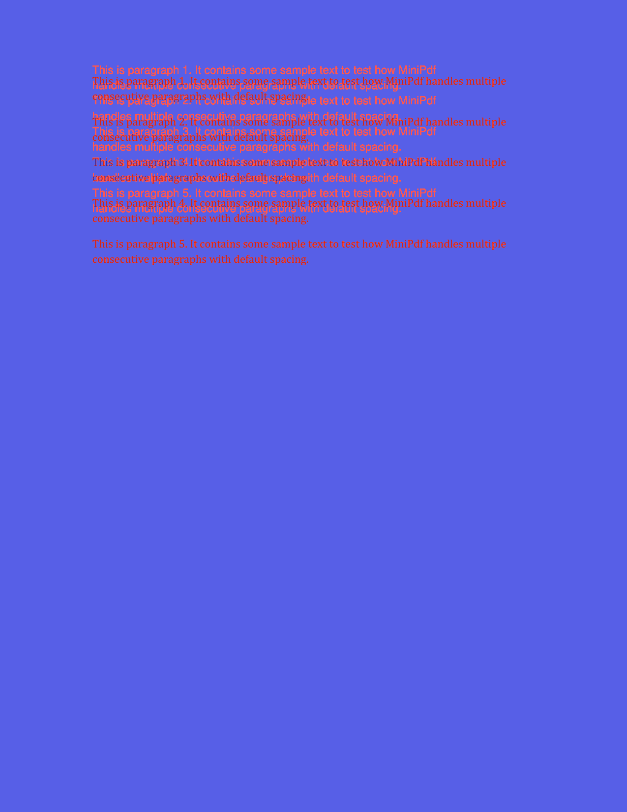</td>
  <td>changed: 79871 px (3.80%)<br>bbox: [188, 133, 1029, 539]<br>mean abs RGB: 6.2808<br>RMSE RGB: 35.8886<br>threshold: 12, gain: 5.0</td>
</tr>
<tr>
  <td><b>docx_classic03_headings</b><br>Page 1</td>
  <td>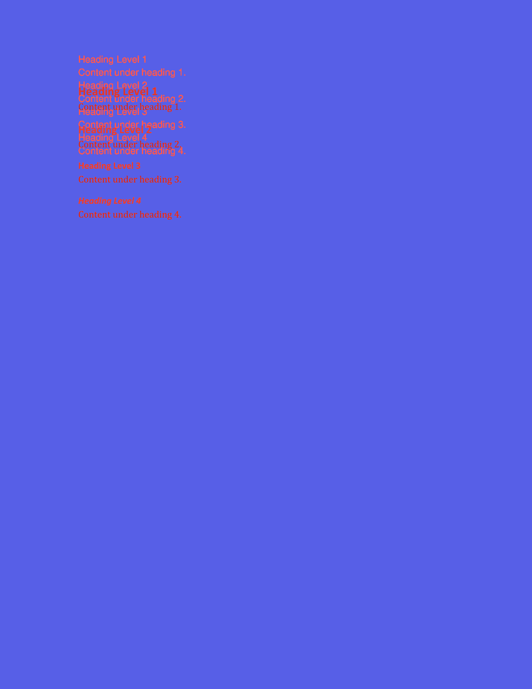</td>
  <td>changed: 23231 px (1.10%)<br>bbox: [188, 133, 445, 526]<br>mean abs RGB: 1.7013<br>RMSE RGB: 18.2333<br>threshold: 12, gain: 5.0</td>
</tr>
<tr>
  <td><b>docx_classic04_bold_italic</b><br>Page 1</td>
  <td></td>
  <td>changed: 7263 px (0.35%)<br>bbox: [188, 133, 716, 173]<br>mean abs RGB: 0.6071<br>RMSE RGB: 11.385<br>threshold: 12, gain: 5.0</td>
</tr>
<tr>
  <td><b>docx_classic05_font_sizes</b><br>Page 1</td>
  <td>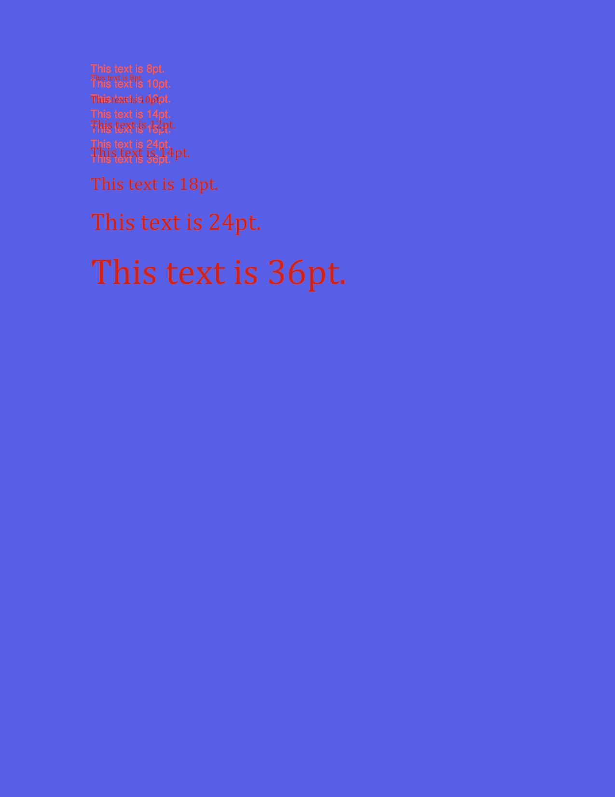</td>
  <td>changed: 24636 px (1.17%)<br>bbox: [188, 133, 715, 604]<br>mean abs RGB: 2.2184<br>RMSE RGB: 22.2921<br>threshold: 12, gain: 5.0</td>
</tr>
<tr>
  <td><b>docx_classic06_font_colors</b><br>Page 1</td>
  <td></td>
  <td>changed: 6478 px (0.31%)<br>bbox: [188, 133, 307, 384]<br>mean abs RGB: 0.432<br>RMSE RGB: 9.223<br>threshold: 12, gain: 5.0</td>
</tr>
<tr>
  <td><b>docx_classic07_alignment</b><br>Page 1</td>
  <td>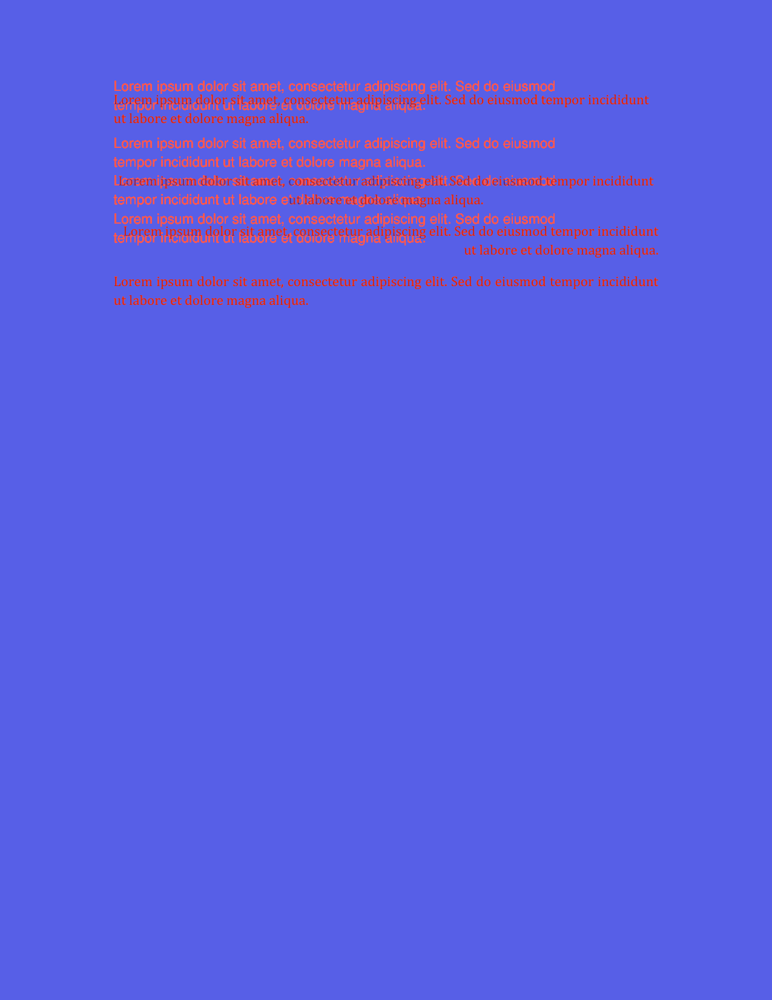</td>
  <td>changed: 59050 px (2.81%)<br>bbox: [187, 133, 1088, 508]<br>mean abs RGB: 4.6499<br>RMSE RGB: 30.933<br>threshold: 12, gain: 5.0</td>
</tr>
<tr>
  <td><b>docx_classic08_bullet_list</b><br>Page 1</td>
  <td></td>
  <td>changed: 8538 px (0.41%)<br>bbox: [188, 133, 347, 362]<br>mean abs RGB: 0.6425<br>RMSE RGB: 11.3189<br>threshold: 12, gain: 5.0</td>
</tr>
<tr>
  <td><b>docx_classic09_numbered_list</b><br>Page 1</td>
  <td></td>
  <td>changed: 13679 px (0.65%)<br>bbox: [188, 133, 406, 356]<br>mean abs RGB: 1.0384<br>RMSE RGB: 14.4504<br>threshold: 12, gain: 5.0</td>
</tr>
<tr>
  <td><b>docx_classic10_simple_table</b><br>Page 1</td>
  <td>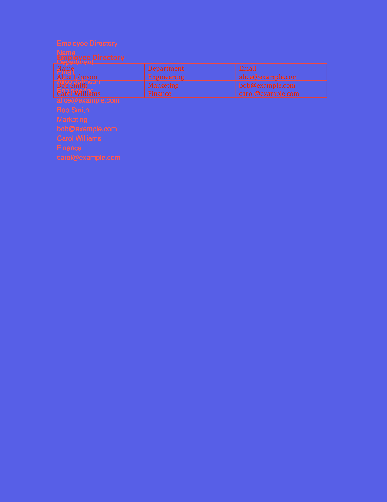</td>
  <td>changed: 33947 px (1.61%)<br>bbox: [175, 133, 1077, 530]<br>mean abs RGB: 2.4637<br>RMSE RGB: 21.655<br>threshold: 12, gain: 5.0</td>
</tr>
<tr>
  <td><b>docx_classic11_table_with_shading</b><br>Page 1</td>
  <td>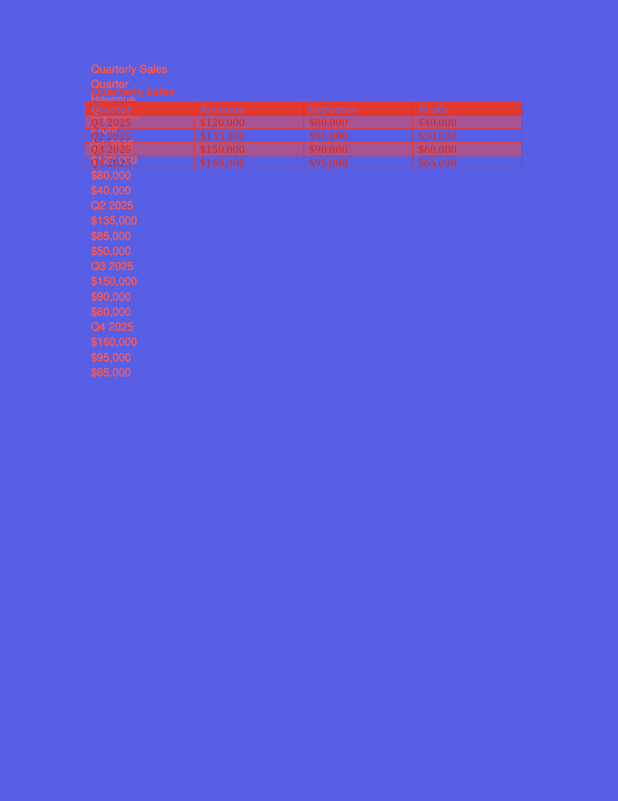</td>
  <td>changed: 100069 px (4.76%)<br>bbox: [175, 133, 1077, 779]<br>mean abs RGB: 4.5887<br>RMSE RGB: 27.135<br>threshold: 12, gain: 5.0</td>
</tr>
<tr>
  <td><b>docx_classic12_merged_cells_table</b><br>Page 1</td>
  <td>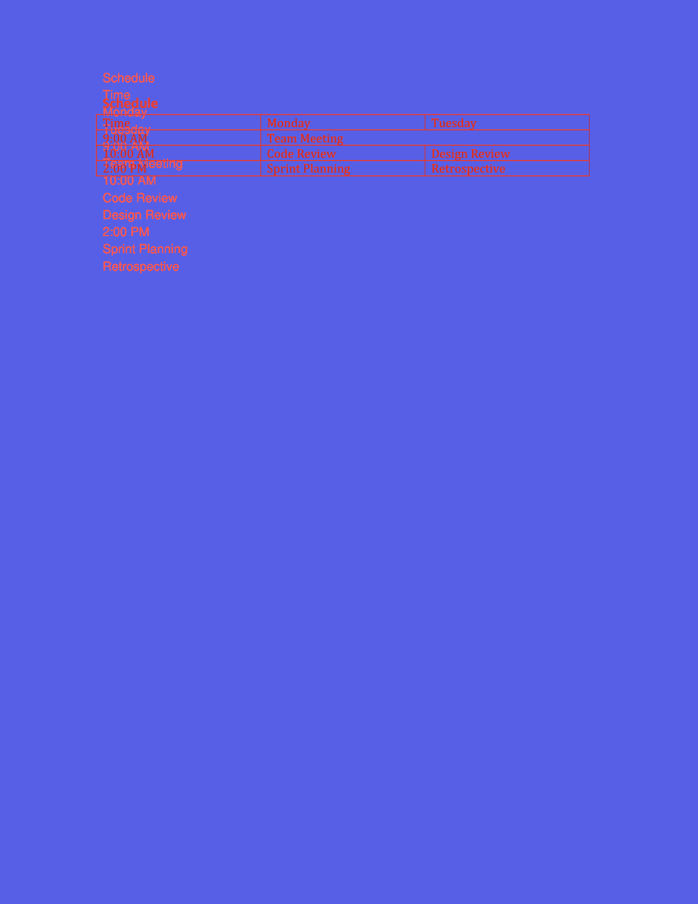</td>
  <td>changed: 27618 px (1.31%)<br>bbox: [175, 133, 1077, 499]<br>mean abs RGB: 1.9912<br>RMSE RGB: 19.3687<br>threshold: 12, gain: 5.0</td>
</tr>
<tr>
  <td><b>docx_classic13_long_document</b><br>Page 1</td>
  <td>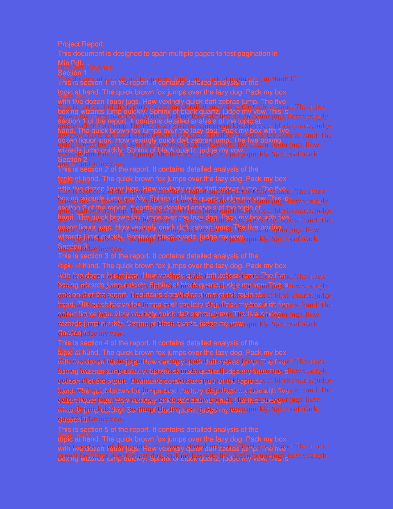</td>
  <td>changed: 300863 px (14.30%)<br>bbox: [187, 133, 1076, 1499]<br>mean abs RGB: 23.349<br>RMSE RGB: 68.953<br>threshold: 12, gain: 5.0</td>
</tr>
<tr>
  <td><b>docx_classic13_long_document</b><br>Page 2</td>
  <td>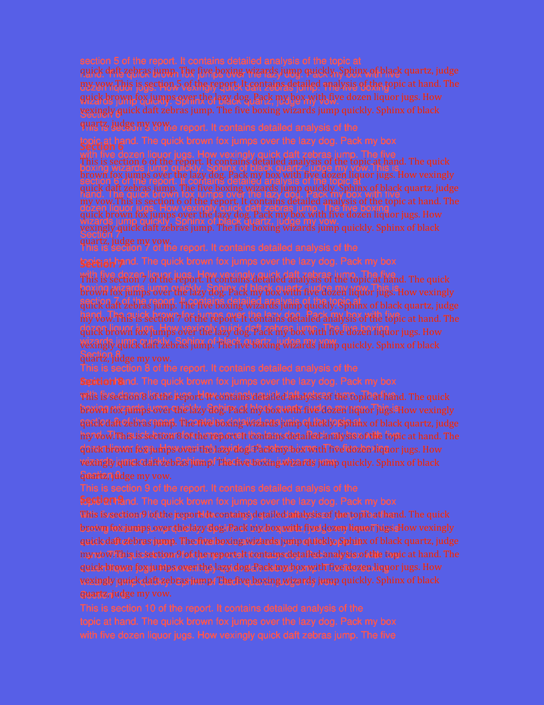</td>
  <td>changed: 312230 px (14.84%)<br>bbox: [187, 133, 1076, 1499]<br>mean abs RGB: 24.3211<br>RMSE RGB: 70.4872<br>threshold: 12, gain: 5.0</td>
</tr>
<tr>
  <td><b>docx_classic13_long_document</b><br>Page 3</td>
  <td>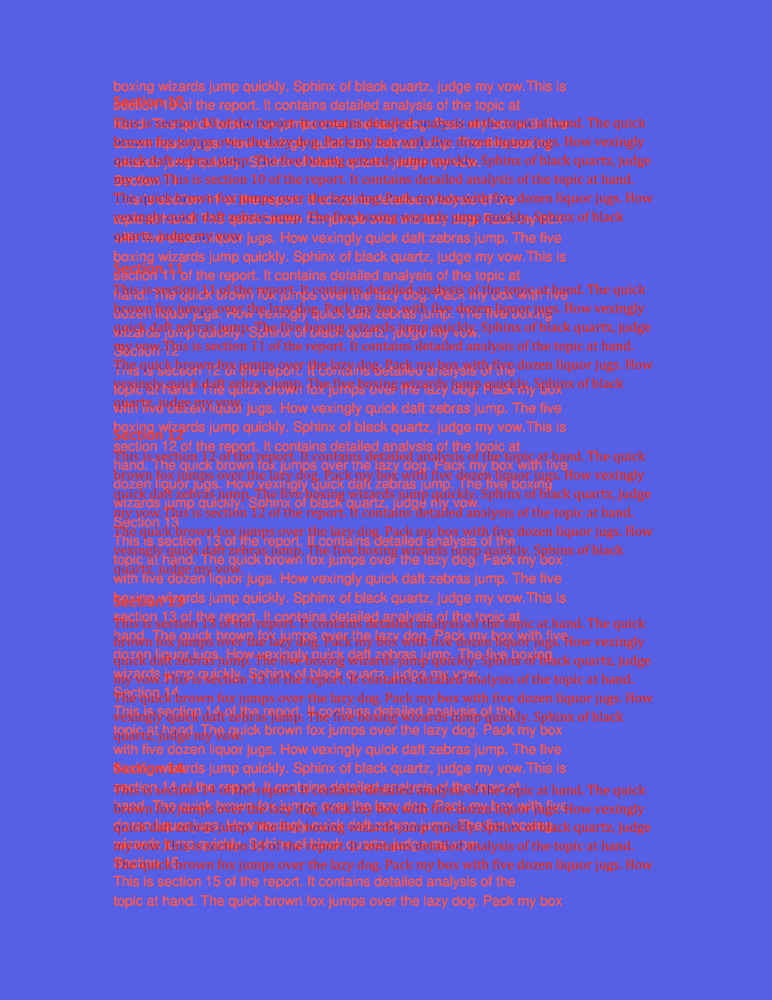</td>
  <td>changed: 324146 px (15.41%)<br>bbox: [187, 133, 1078, 1499]<br>mean abs RGB: 25.3552<br>RMSE RGB: 72.0224<br>threshold: 12, gain: 5.0</td>
</tr>
<tr>
  <td><b>docx_classic13_long_document</b><br>Page 4</td>
  <td>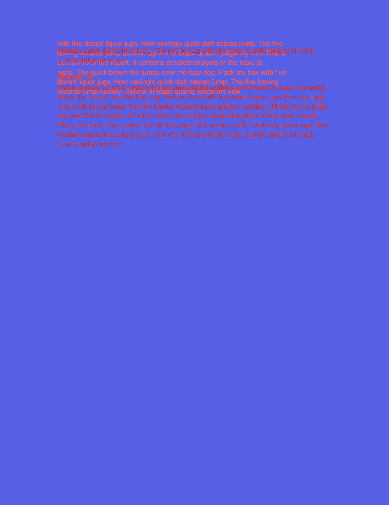</td>
  <td>changed: 67317 px (3.20%)<br>bbox: [187, 133, 1078, 483]<br>mean abs RGB: 5.3275<br>RMSE RGB: 33.111<br>threshold: 12, gain: 5.0</td>
</tr>
<tr>
  <td><b>docx_classic14_mixed_content</b><br>Page 1</td>
  <td>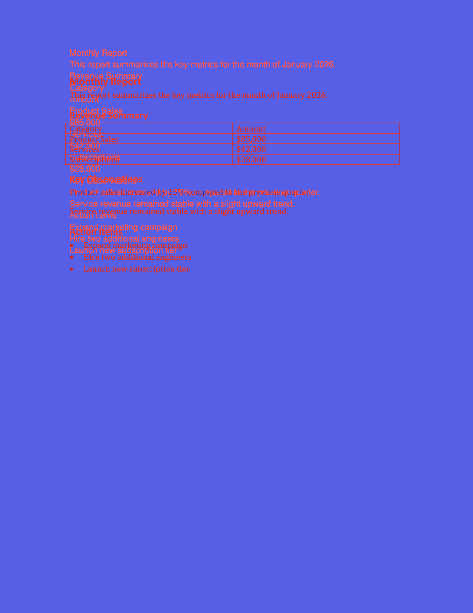</td>
  <td>changed: 65223 px (3.10%)<br>bbox: [175, 133, 1077, 736]<br>mean abs RGB: 4.7819<br>RMSE RGB: 30.4078<br>threshold: 12, gain: 5.0</td>
</tr>
<tr>
  <td><b>docx_classic15_indentation</b><br>Page 1</td>
  <td>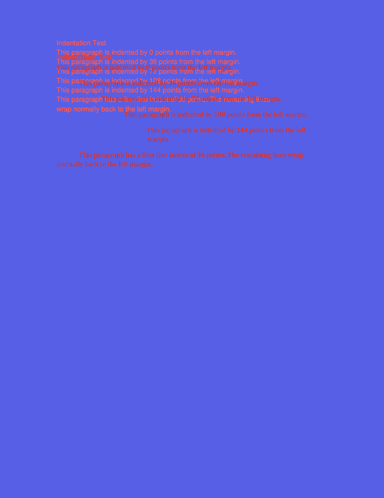</td>
  <td>changed: 53879 px (2.56%)<br>bbox: [187, 133, 1020, 556]<br>mean abs RGB: 4.2329<br>RMSE RGB: 29.3877<br>threshold: 12, gain: 5.0</td>
</tr>
<tr>
  <td><b>docx_classic16_line_spacing</b><br>Page 1</td>
  <td>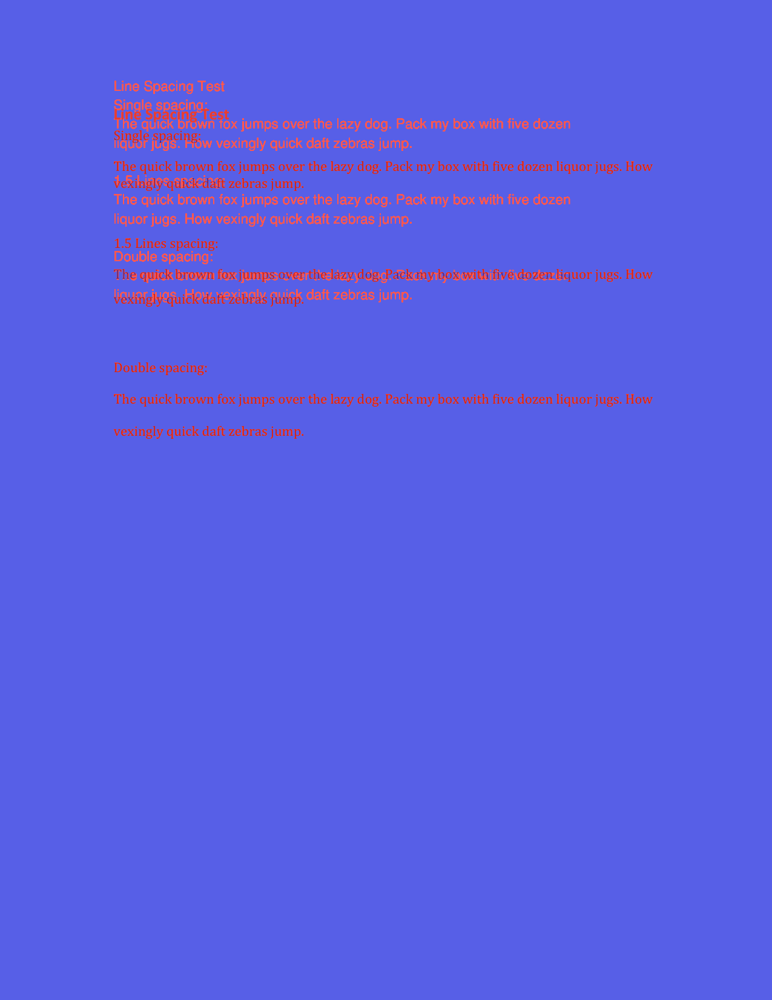</td>
  <td>changed: 52914 px (2.52%)<br>bbox: [187, 133, 1078, 724]<br>mean abs RGB: 4.1424<br>RMSE RGB: 29.0926<br>threshold: 12, gain: 5.0</td>
</tr>
<tr>
  <td><b>docx_classic17_page_break</b><br>Page 1</td>
  <td></td>
  <td>changed: 4505 px (0.21%)<br>bbox: [188, 133, 443, 268]<br>mean abs RGB: 0.3468<br>RMSE RGB: 8.3211<br>threshold: 12, gain: 5.0</td>
</tr>
<tr>
  <td><b>docx_classic17_page_break</b><br>Page 2</td>
  <td></td>
  <td>changed: 5936 px (0.28%)<br>bbox: [188, 159, 673, 218]<br>mean abs RGB: 0.4302<br>RMSE RGB: 9.1267<br>threshold: 12, gain: 5.0</td>
</tr>
<tr>
  <td><b>docx_classic17_page_break</b><br>Page 3</td>
  <td></td>
  <td>changed: 3718 px (0.18%)<br>bbox: [188, 159, 451, 218]<br>mean abs RGB: 0.2616<br>RMSE RGB: 7.0559<br>threshold: 12, gain: 5.0</td>
</tr>
<tr>
  <td><b>docx_classic18_embedded_image</b><br>Page 1</td>
  <td>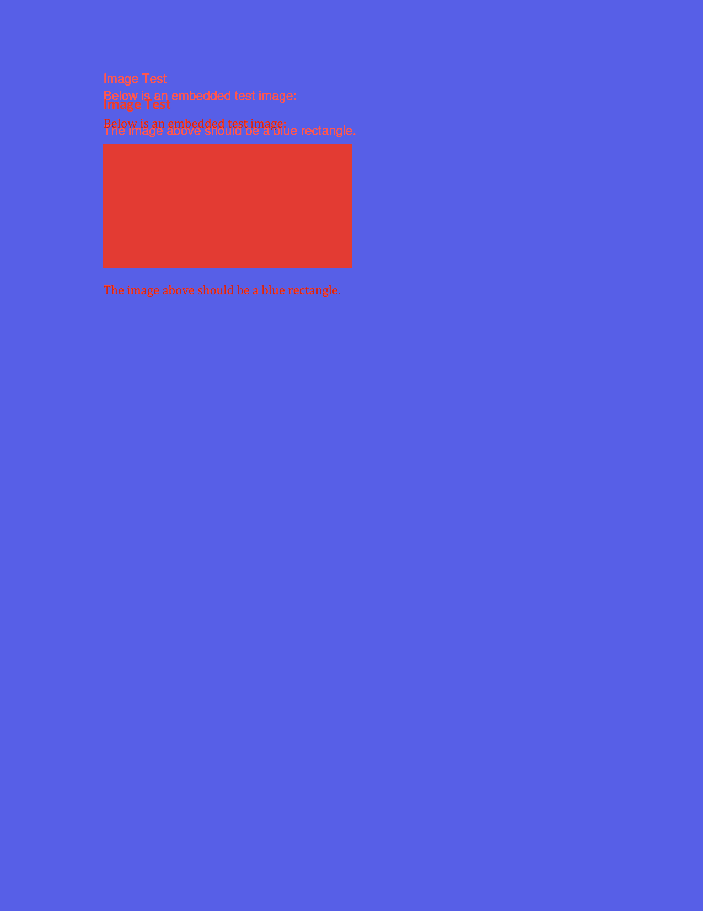</td>
  <td>changed: 114042 px (5.42%)<br>bbox: [187, 133, 645, 538]<br>mean abs RGB: 7.1571<br>RMSE RGB: 32.9639<br>threshold: 12, gain: 5.0</td>
</tr>
<tr>
  <td><b>docx_classic19_multiple_images</b><br>Page 1</td>
  <td>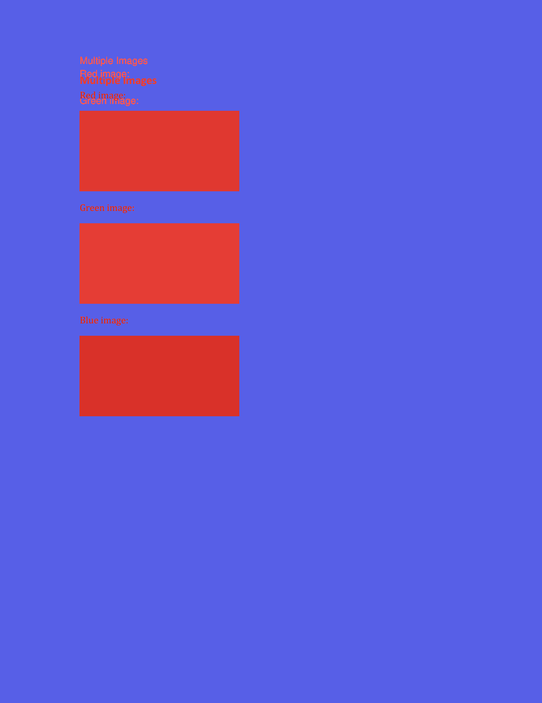</td>
  <td>changed: 220245 px (10.47%)<br>bbox: [187, 133, 563, 977]<br>mean abs RGB: 15.9634<br>RMSE RGB: 54.9697<br>threshold: 12, gain: 5.0</td>
</tr>
<tr>
  <td><b>docx_classic20_table_with_many_rows</b><br>Page 1</td>
  <td>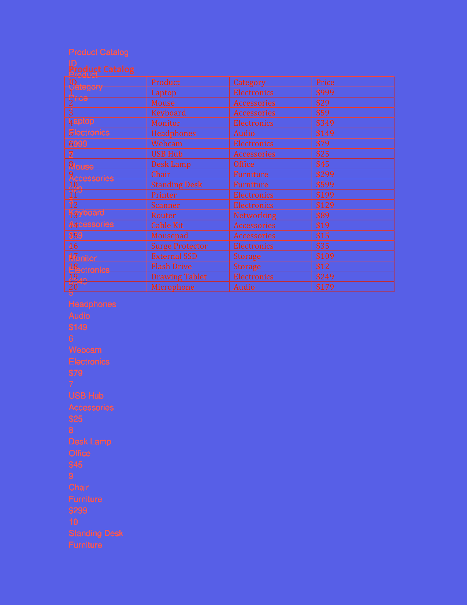</td>
  <td>changed: 100788 px (4.79%)<br>bbox: [175, 133, 1077, 1495]<br>mean abs RGB: 7.3158<br>RMSE RGB: 37.6219<br>threshold: 12, gain: 5.0</td>
</tr>
<tr>
  <td><b>docx_classic21_nested_lists</b><br>Page 1</td>
  <td>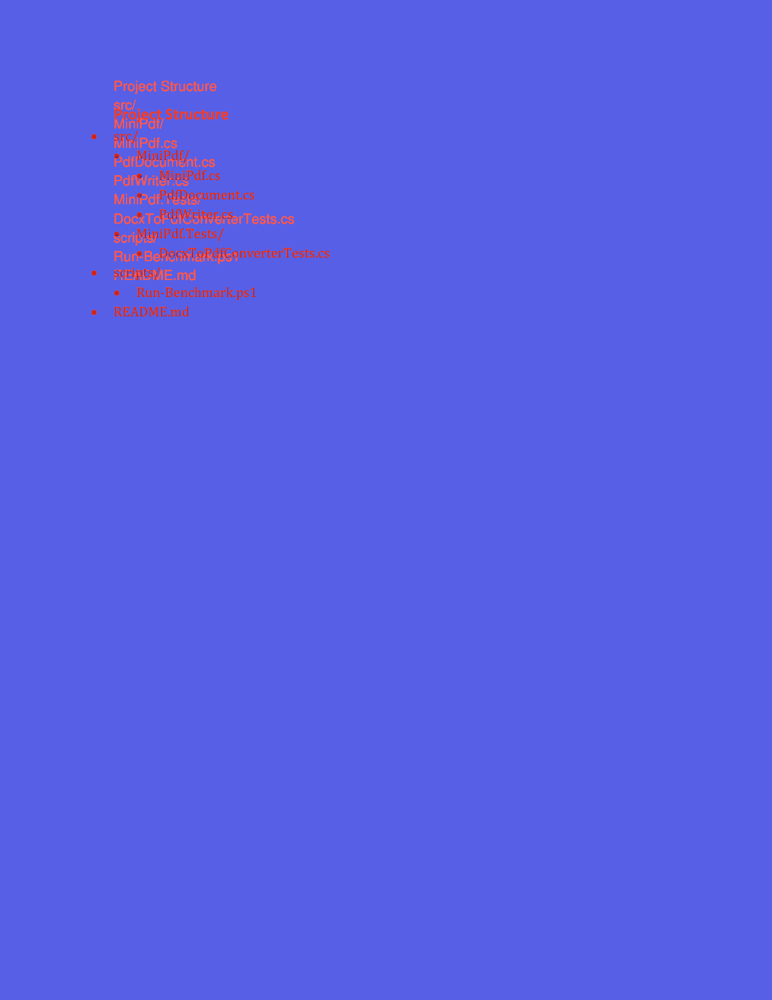</td>
  <td>changed: 21227 px (1.01%)<br>bbox: [151, 133, 544, 523]<br>mean abs RGB: 1.6424<br>RMSE RGB: 18.3041<br>threshold: 12, gain: 5.0</td>
</tr>
<tr>
  <td><b>docx_classic22_horizontal_rule</b><br>Page 1</td>
  <td>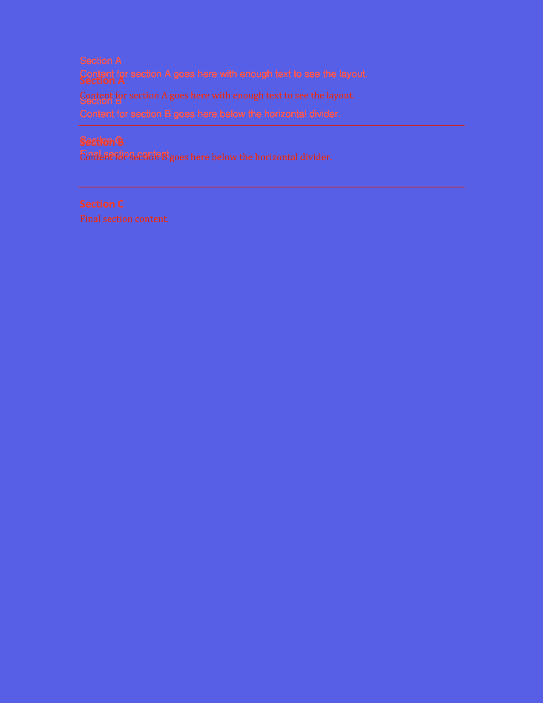</td>
  <td>changed: 26603 px (1.26%)<br>bbox: [184, 133, 1091, 522]<br>mean abs RGB: 2.0626<br>RMSE RGB: 20.4499<br>threshold: 12, gain: 5.0</td>
</tr>
<tr>
  <td><b>docx_classic23_mixed_formatting_runs</b><br>Page 1</td>
  <td></td>
  <td>changed: 10479 px (0.50%)<br>bbox: [188, 133, 711, 254]<br>mean abs RGB: 0.79<br>RMSE RGB: 12.6556<br>threshold: 12, gain: 5.0</td>
</tr>
<tr>
  <td><b>docx_classic24_two_column_table_layout</b><br>Page 1</td>
  <td></td>
  <td>changed: 32824 px (1.56%)<br>bbox: [187, 133, 1050, 329]<br>mean abs RGB: 2.5925<br>RMSE RGB: 23.0857<br>threshold: 12, gain: 5.0</td>
</tr>
<tr>
  <td><b>docx_classic25_title_and_subtitle</b><br>Page 1</td>
  <td>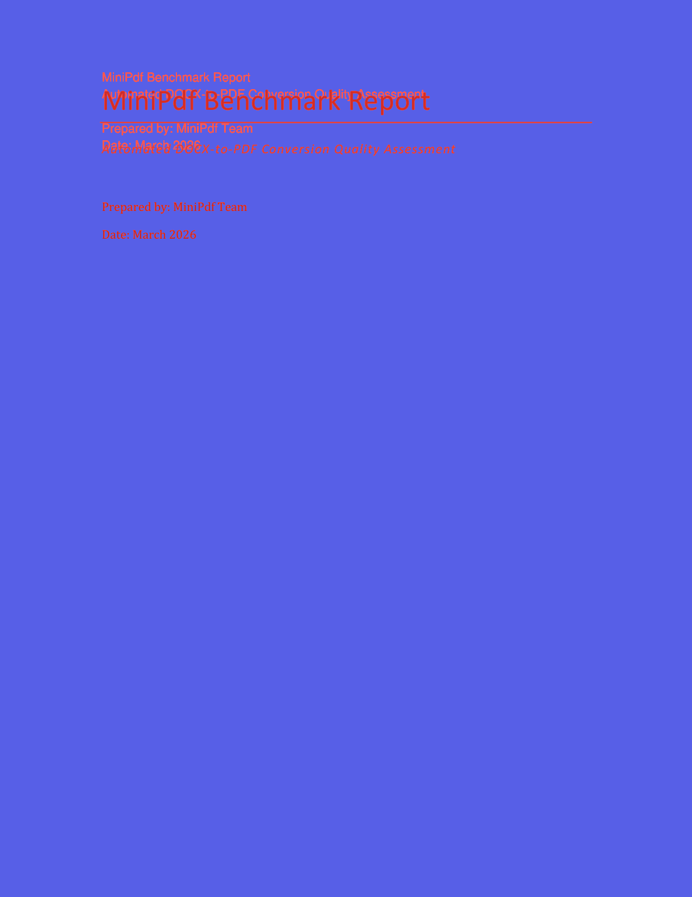</td>
  <td>changed: 24936 px (1.19%)<br>bbox: [184, 133, 1091, 440]<br>mean abs RGB: 1.6994<br>RMSE RGB: 17.7978<br>threshold: 12, gain: 5.0</td>
</tr>
<tr>
  <td><b>docx_classic25_title_and_subtitle</b><br>Page 2</td>
  <td></td>
  <td>changed: 9162 px (0.44%)<br>bbox: [188, 158, 902, 218]<br>mean abs RGB: 0.6548<br>RMSE RGB: 11.2585<br>threshold: 12, gain: 5.0</td>
</tr>
<tr>
  <td><b>docx_classic26_table_alignment</b><br>Page 1</td>
  <td>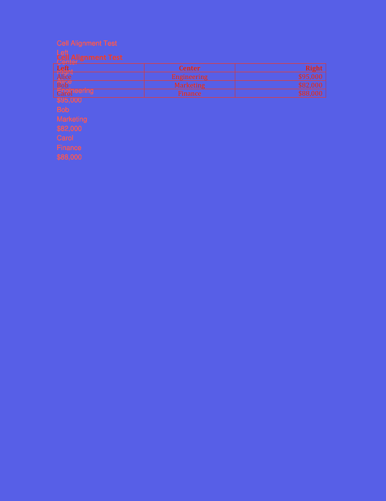</td>
  <td>changed: 25895 px (1.23%)<br>bbox: [175, 133, 1077, 529]<br>mean abs RGB: 1.8329<br>RMSE RGB: 18.4516<br>threshold: 12, gain: 5.0</td>
</tr>
<tr>
  <td><b>docx_classic27_long_paragraph_wrapping</b><br>Page 1</td>
  <td>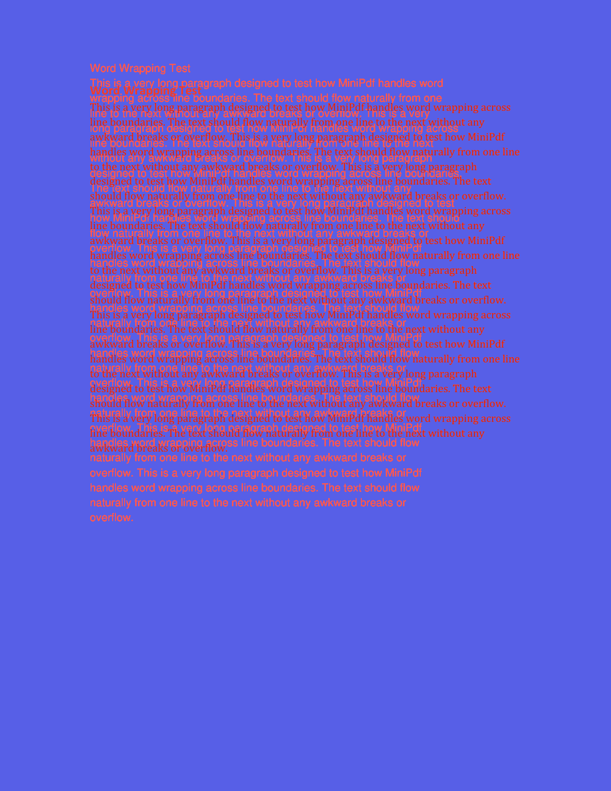</td>
  <td>changed: 259545 px (12.34%)<br>bbox: [187, 133, 1084, 1088]<br>mean abs RGB: 20.7665<br>RMSE RGB: 65.5613<br>threshold: 12, gain: 5.0</td>
</tr>
<tr>
  <td><b>docx_classic28_special_characters</b><br>Page 1</td>
  <td>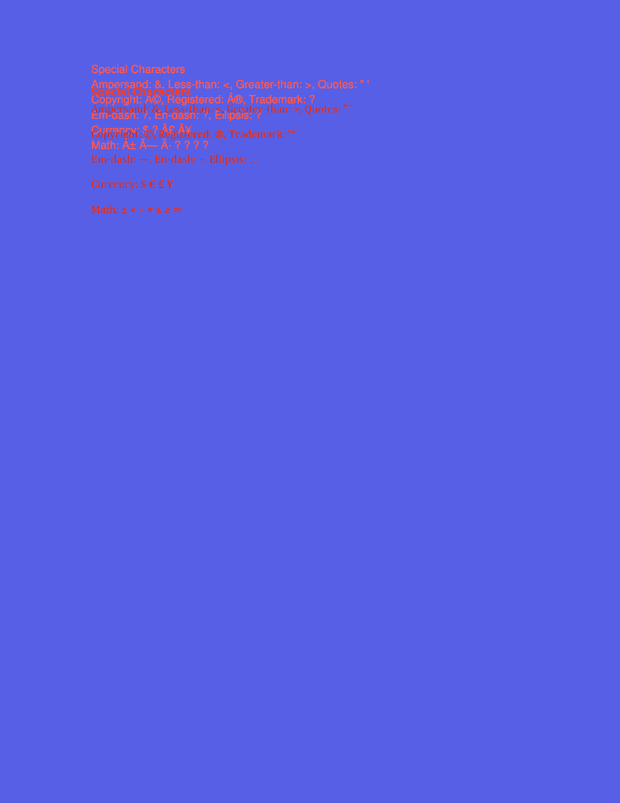</td>
  <td>changed: 23695 px (1.13%)<br>bbox: [187, 133, 758, 439]<br>mean abs RGB: 1.8158<br>RMSE RGB: 19.1992<br>threshold: 12, gain: 5.0</td>
</tr>
<tr>
  <td><b>docx_classic29_table_with_image</b><br>Page 1</td>
  <td></td>
  <td>changed: 50611 px (2.41%)<br>bbox: [175, 133, 1077, 374]<br>mean abs RGB: 3.9873<br>RMSE RGB: 27.8388<br>threshold: 12, gain: 5.0</td>
</tr>
<tr>
  <td><b>docx_classic30_comprehensive_report</b><br>Page 1</td>
  <td></td>
  <td>changed: 17083 px (0.81%)<br>bbox: [184, 133, 1091, 287]<br>mean abs RGB: 1.1622<br>RMSE RGB: 14.5219<br>threshold: 12, gain: 5.0</td>
</tr>
<tr>
  <td><b>docx_classic30_comprehensive_report</b><br>Page 2</td>
  <td>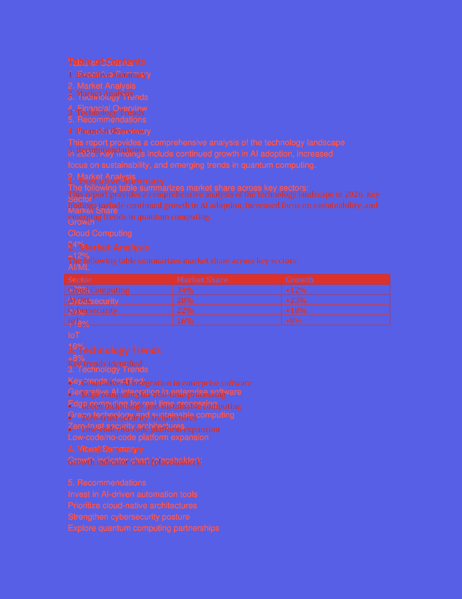</td>
  <td>changed: 154035 px (7.32%)<br>bbox: [175, 158, 1077, 1467]<br>mean abs RGB: 11.6882<br>RMSE RGB: 48.1087<br>threshold: 12, gain: 5.0</td>
</tr>
<tr>
  <td><b>docx_classic31_product_card_with_image</b><br>Page 1</td>
  <td>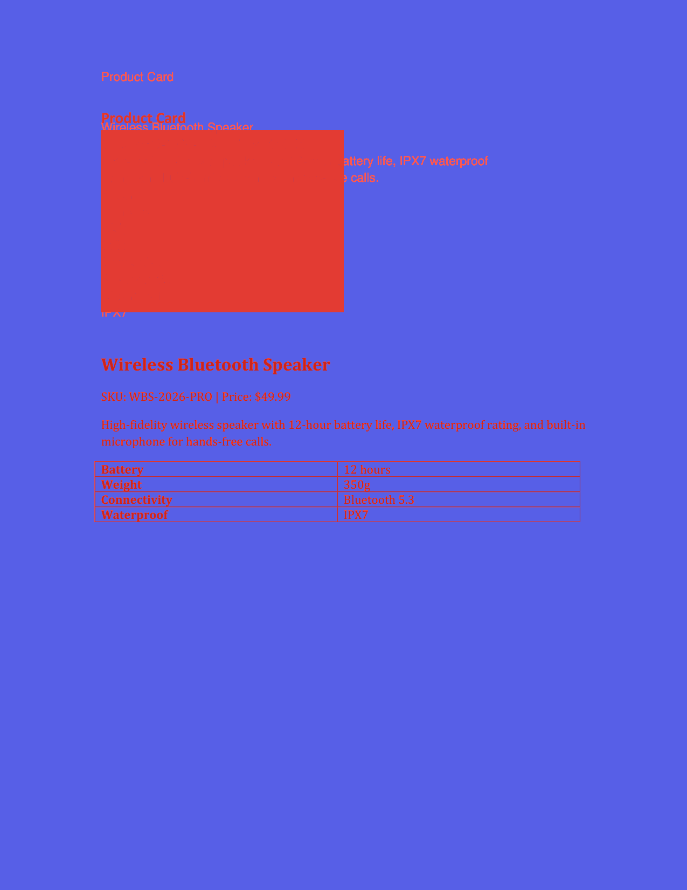</td>
  <td>changed: 188528 px (8.96%)<br>bbox: [175, 133, 1087, 968]<br>mean abs RGB: 11.7658<br>RMSE RGB: 43.0753<br>threshold: 12, gain: 5.0</td>
</tr>
<tr>
  <td><b>docx_classic31_strikethrough_text</b><br>Page 1</td>
  <td>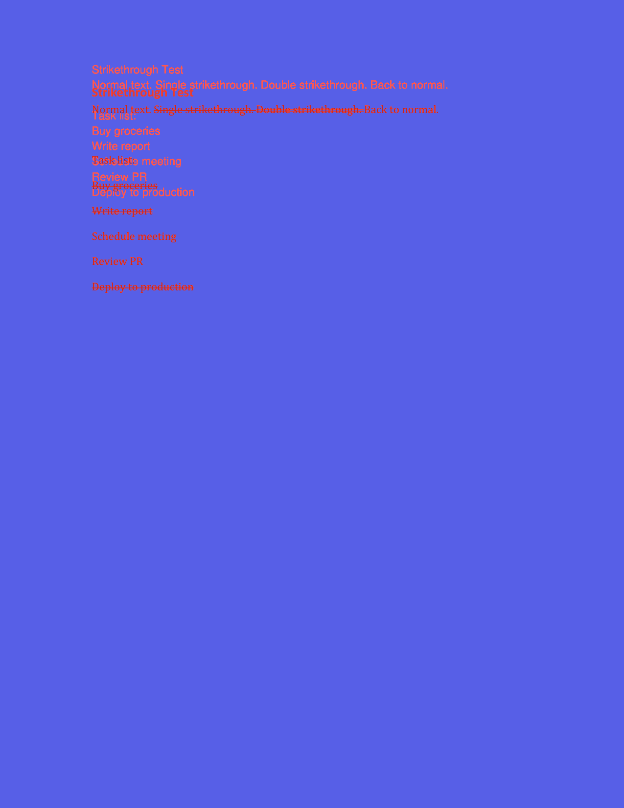</td>
  <td>changed: 25182 px (1.20%)<br>bbox: [187, 133, 915, 598]<br>mean abs RGB: 1.9793<br>RMSE RGB: 20.1124<br>threshold: 12, gain: 5.0</td>
</tr>
<tr>
  <td><b>docx_classic32_company_logo_header</b><br>Page 1</td>
  <td>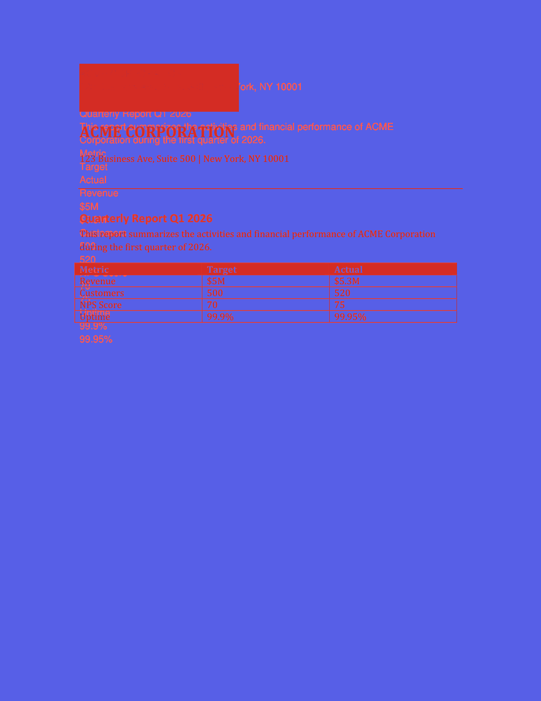</td>
  <td>changed: 117027 px (5.56%)<br>bbox: [175, 150, 1091, 807]<br>mean abs RGB: 9.8317<br>RMSE RGB: 44.5885<br>threshold: 12, gain: 5.0</td>
</tr>
<tr>
  <td><b>docx_classic32_superscript_subscript</b><br>Page 1</td>
  <td>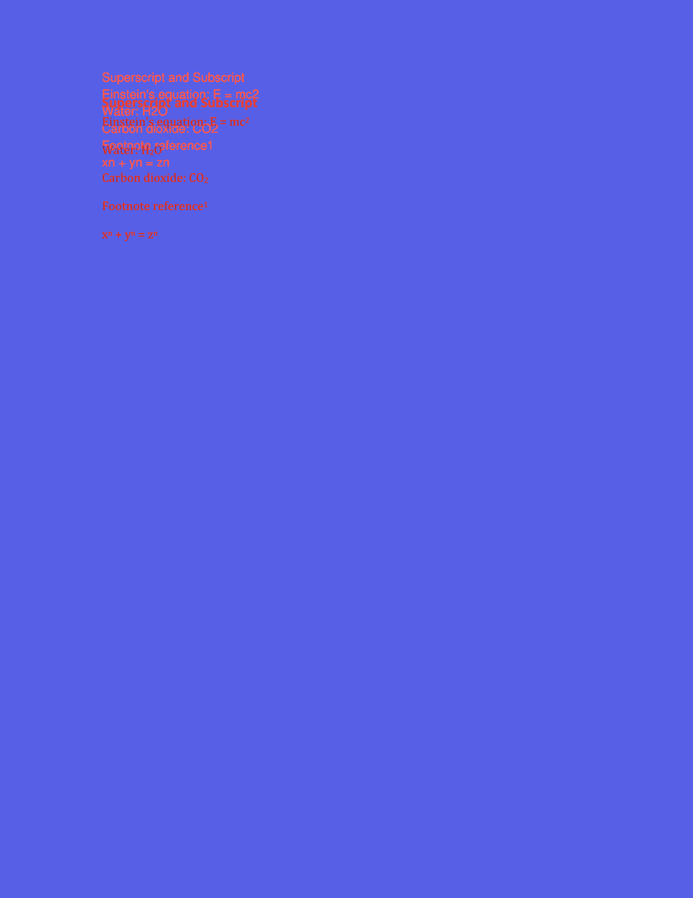</td>
  <td>changed: 15474 px (0.74%)<br>bbox: [187, 133, 476, 443]<br>mean abs RGB: 1.1424<br>RMSE RGB: 15.0725<br>threshold: 12, gain: 5.0</td>
</tr>
<tr>
  <td><b>docx_classic33_highlighted_text</b><br>Page 1</td>
  <td>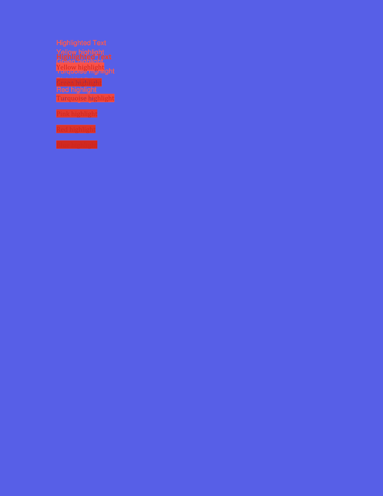</td>
  <td>changed: 32408 px (1.54%)<br>bbox: [187, 133, 381, 495]<br>mean abs RGB: 2.264<br>RMSE RGB: 22.6156<br>threshold: 12, gain: 5.0</td>
</tr>
<tr>
  <td><b>docx_classic33_two_products_side_by_side</b><br>Page 1</td>
  <td>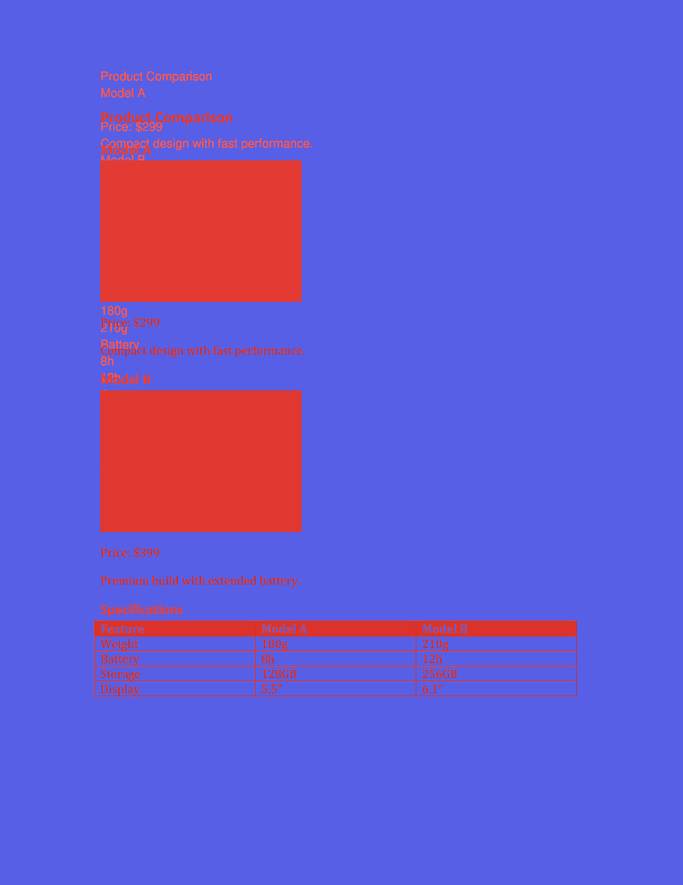</td>
  <td>changed: 256512 px (12.19%)<br>bbox: [175, 133, 1077, 1299]<br>mean abs RGB: 17.0256<br>RMSE RGB: 52.4191<br>threshold: 12, gain: 5.0</td>
</tr>
<tr>
  <td><b>docx_classic34_employee_directory_with_photo</b><br>Page 1</td>
  <td>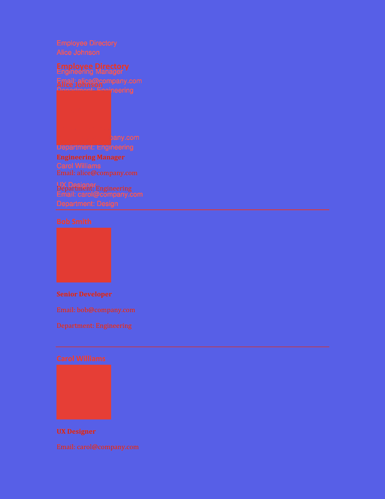</td>
  <td>changed: 137063 px (6.52%)<br>bbox: [184, 133, 1091, 1490]<br>mean abs RGB: 9.3261<br>RMSE RGB: 39.5661<br>threshold: 12, gain: 5.0</td>
</tr>
<tr>
  <td><b>docx_classic34_paragraph_borders</b><br>Page 1</td>
  <td>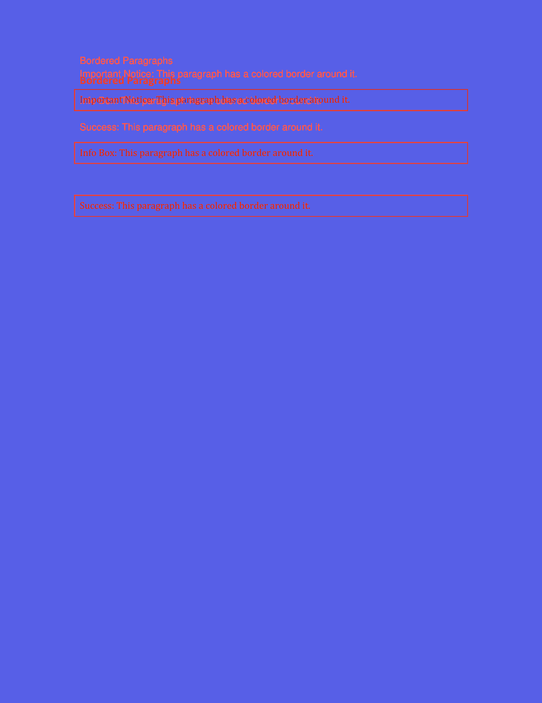</td>
  <td>changed: 40684 px (1.93%)<br>bbox: [174, 133, 1101, 509]<br>mean abs RGB: 2.7856<br>RMSE RGB: 23.2908<br>threshold: 12, gain: 5.0</td>
</tr>
<tr>
  <td><b>docx_classic35_inventory_with_product_photos</b><br>Page 1</td>
  <td>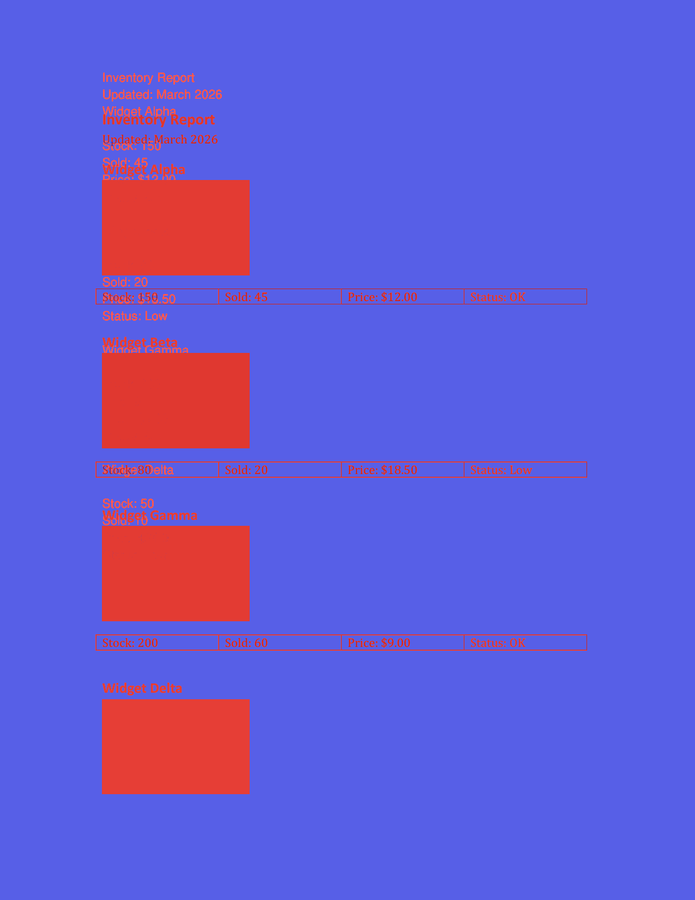</td>
  <td>changed: 228473 px (10.86%)<br>bbox: [175, 133, 1077, 1456]<br>mean abs RGB: 15.442<br>RMSE RGB: 50.4731<br>threshold: 12, gain: 5.0</td>
</tr>
<tr>
  <td><b>docx_classic35_tab_stops</b><br>Page 1</td>
  <td>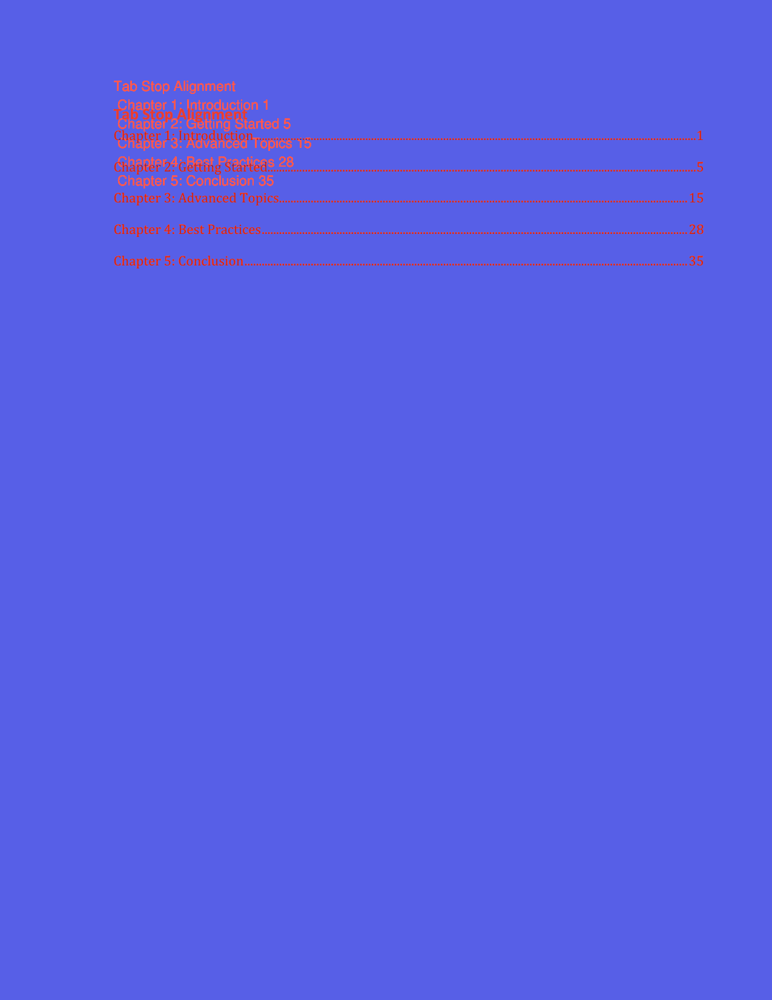</td>
  <td>changed: 27567 px (1.31%)<br>bbox: [187, 133, 1162, 443]<br>mean abs RGB: 2.1242<br>RMSE RGB: 20.6822<br>threshold: 12, gain: 5.0</td>
</tr>
<tr>
  <td><b>docx_classic36_invoice_with_logo</b><br>Page 1</td>
  <td>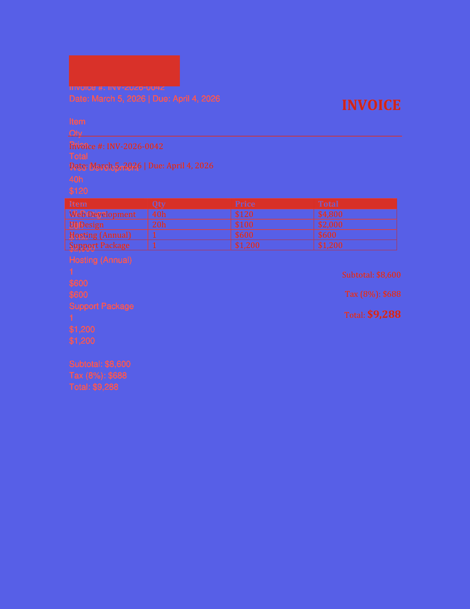</td>
  <td>changed: 96060 px (4.57%)<br>bbox: [175, 150, 1091, 1060]<br>mean abs RGB: 7.615<br>RMSE RGB: 39.0839<br>threshold: 12, gain: 5.0</td>
</tr>
<tr>
  <td><b>docx_classic36_wide_table</b><br>Page 1</td>
  <td>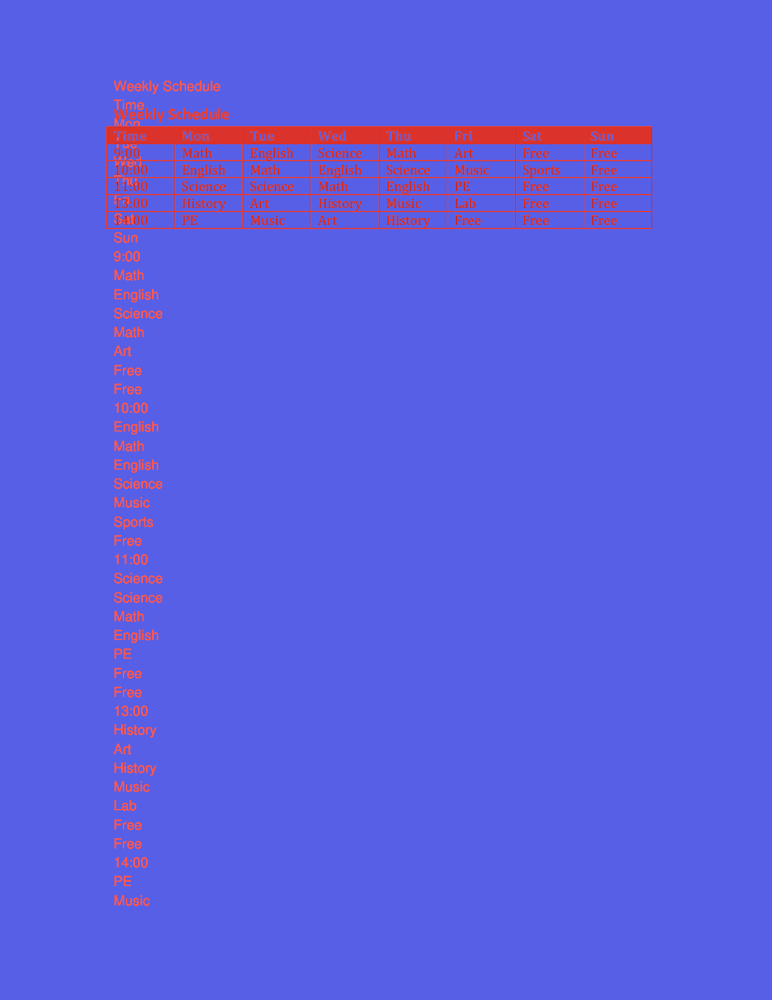</td>
  <td>changed: 71629 px (3.40%)<br>bbox: [175, 133, 1077, 1495]<br>mean abs RGB: 5.3105<br>RMSE RGB: 31.3555<br>threshold: 12, gain: 5.0</td>
</tr>
<tr>
  <td><b>docx_classic37_nested_table</b><br>Page 1</td>
  <td>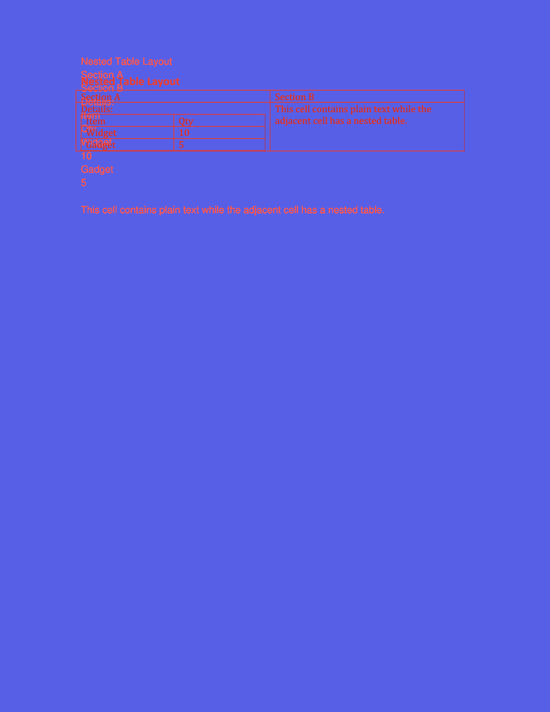</td>
  <td>changed: 29435 px (1.40%)<br>bbox: [175, 133, 1077, 499]<br>mean abs RGB: 2.095<br>RMSE RGB: 19.8058<br>threshold: 12, gain: 5.0</td>
</tr>
<tr>
  <td><b>docx_classic37_real_estate_listing</b><br>Page 1</td>
  <td>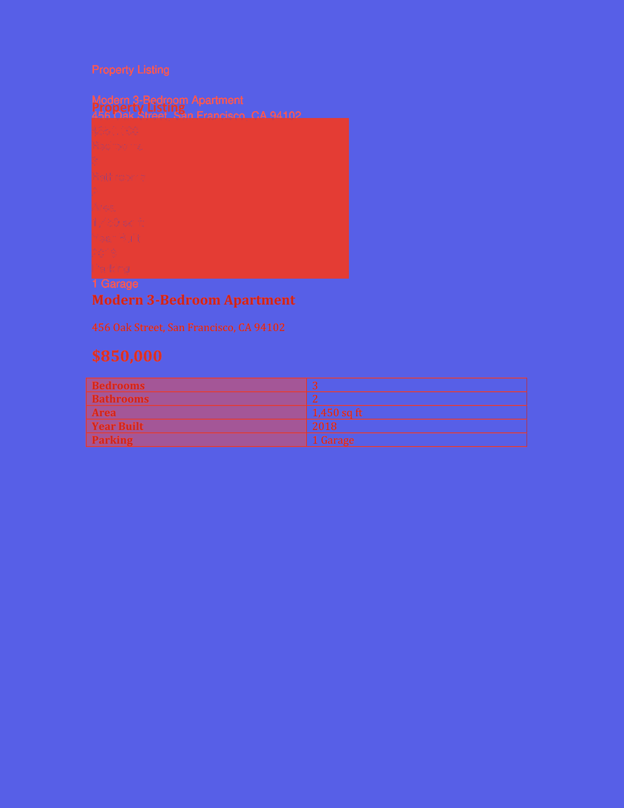</td>
  <td>changed: 260275 px (12.37%)<br>bbox: [175, 133, 1077, 913]<br>mean abs RGB: 14.2013<br>RMSE RGB: 44.749<br>threshold: 12, gain: 5.0</td>
</tr>
<tr>
  <td><b>docx_classic38_restaurant_menu_with_photos</b><br>Page 1</td>
  <td>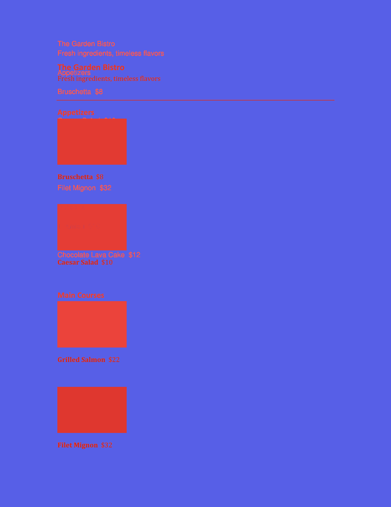</td>
  <td>changed: 159115 px (7.56%)<br>bbox: [184, 133, 1091, 1461]<br>mean abs RGB: 10.7138<br>RMSE RGB: 41.9072<br>threshold: 12, gain: 5.0</td>
</tr>
<tr>
  <td><b>docx_classic38_table_column_widths</b><br>Page 1</td>
  <td>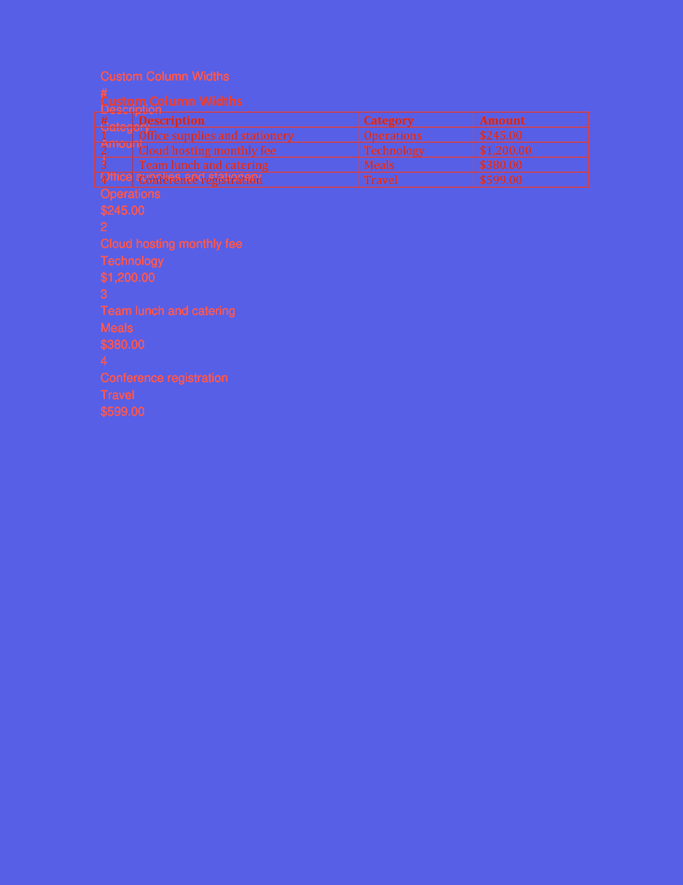</td>
  <td>changed: 45092 px (2.14%)<br>bbox: [175, 133, 1100, 778]<br>mean abs RGB: 3.3135<br>RMSE RGB: 25.2023<br>threshold: 12, gain: 5.0</td>
</tr>
<tr>
  <td><b>docx_classic39_cover_page_with_image</b><br>Page 1</td>
  <td>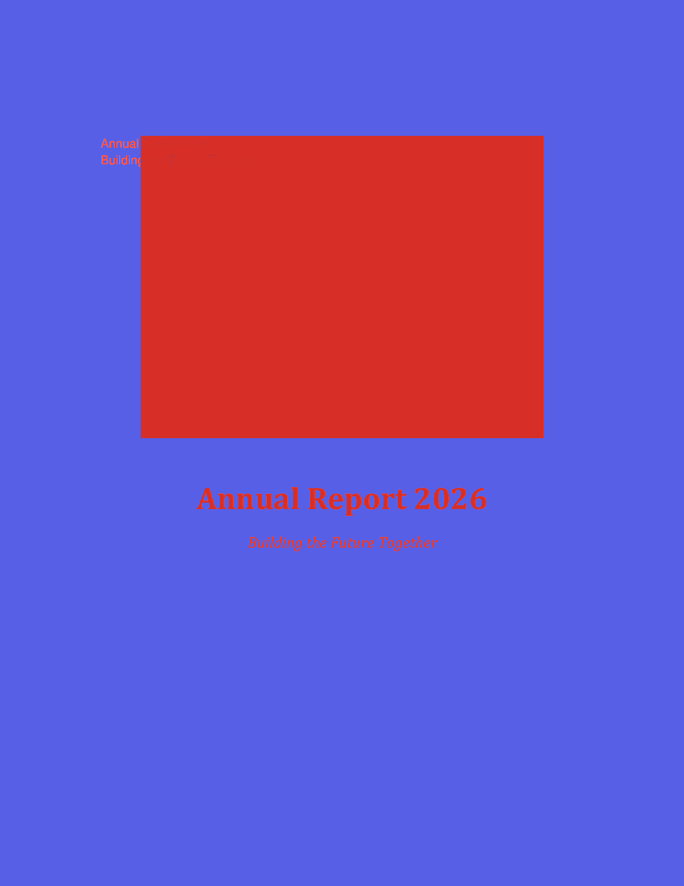</td>
  <td>changed: 435805 px (20.72%)<br>bbox: [188, 253, 1013, 1027]<br>mean abs RGB: 37.9965<br>RMSE RGB: 85.4179<br>threshold: 12, gain: 5.0</td>
</tr>
<tr>
  <td><b>docx_classic39_cover_page_with_image</b><br>Page 2</td>
  <td></td>
  <td>changed: 12559 px (0.60%)<br>bbox: [187, 158, 417, 373]<br>mean abs RGB: 0.9281<br>RMSE RGB: 13.5171<br>threshold: 12, gain: 5.0</td>
</tr>
<tr>
  <td><b>docx_classic39_financial_report</b><br>Page 1</td>
  <td>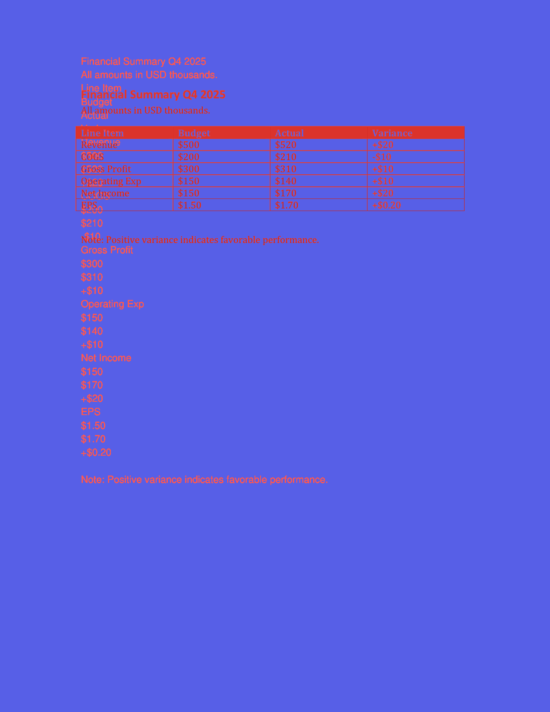</td>
  <td>changed: 75473 px (3.59%)<br>bbox: [175, 133, 1077, 1124]<br>mean abs RGB: 5.668<br>RMSE RGB: 32.7633<br>threshold: 12, gain: 5.0</td>
</tr>
<tr>
  <td><b>docx_classic40_product_catalog_with_images</b><br>Page 1</td>
  <td>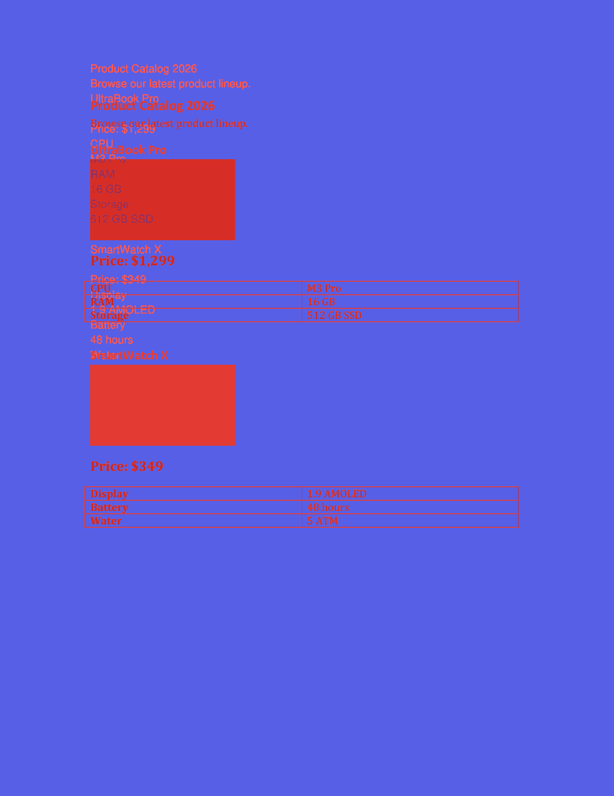</td>
  <td>changed: 144560 px (6.87%)<br>bbox: [175, 133, 1077, 1094]<br>mean abs RGB: 10.9409<br>RMSE RGB: 44.54<br>threshold: 12, gain: 5.0</td>
</tr>
<tr>
  <td><b>docx_classic40_resume</b><br>Page 1</td>
  <td>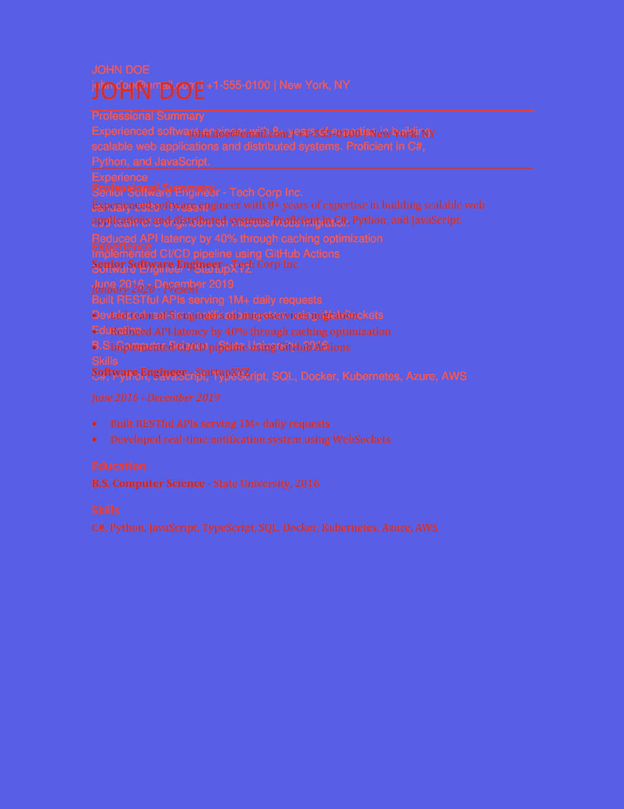</td>
  <td>changed: 105590 px (5.02%)<br>bbox: [184, 133, 1091, 1088]<br>mean abs RGB: 8.0671<br>RMSE RGB: 40.3525<br>threshold: 12, gain: 5.0</td>
</tr>
<tr>
  <td><b>docx_classic41_business_letter</b><br>Page 1</td>
  <td>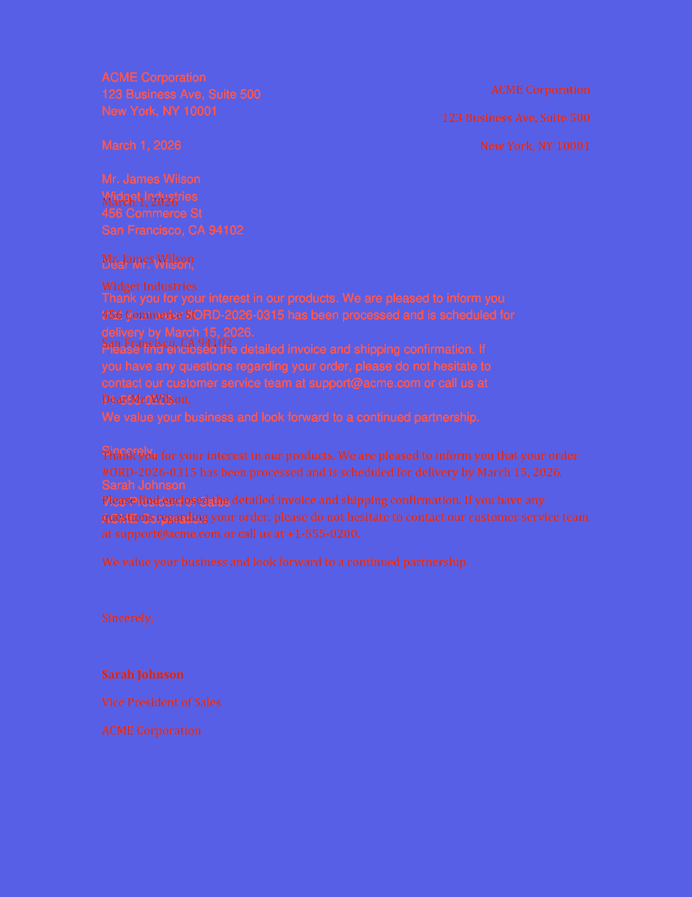</td>
  <td>changed: 89769 px (4.27%)<br>bbox: [187, 133, 1087, 1356]<br>mean abs RGB: 7.1559<br>RMSE RGB: 38.4747<br>threshold: 12, gain: 5.0</td>
</tr>
<tr>
  <td><b>docx_classic41_newsletter_with_hero_image</b><br>Page 1</td>
  <td>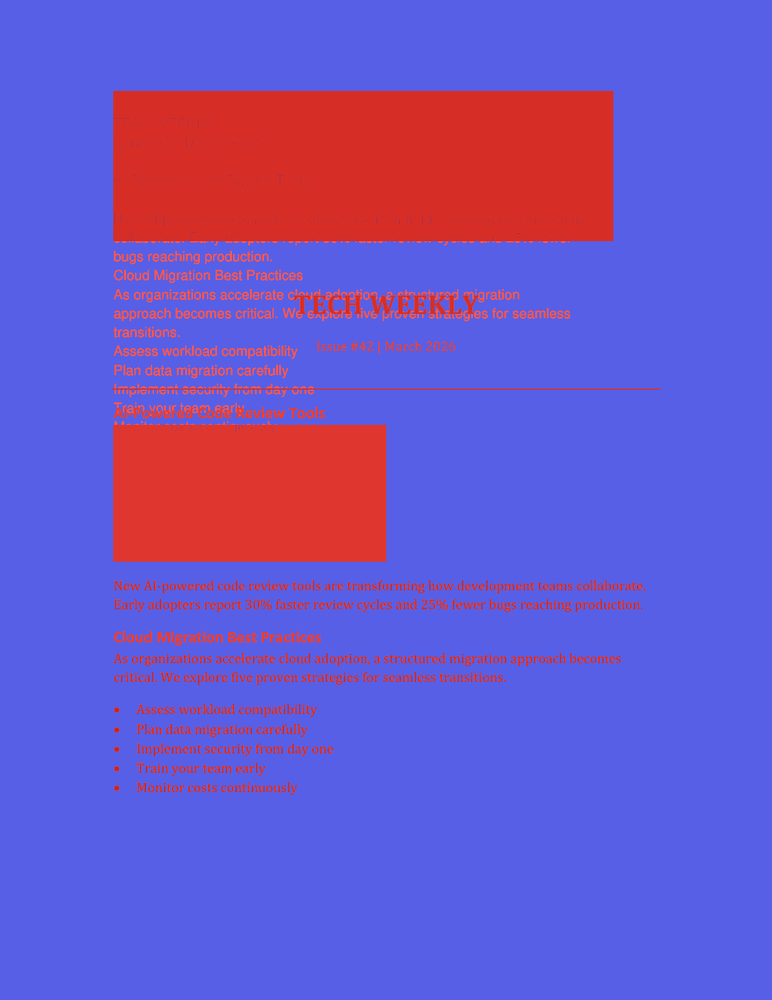</td>
  <td>changed: 371870 px (17.68%)<br>bbox: [184, 150, 1091, 1312]<br>mean abs RGB: 31.2803<br>RMSE RGB: 77.4084<br>threshold: 12, gain: 5.0</td>
</tr>
<tr>
  <td><b>docx_classic42_chart_image_with_data</b><br>Page 1</td>
  <td>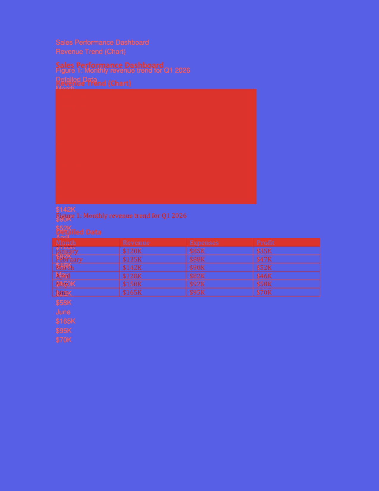</td>
  <td>changed: 333366 px (15.85%)<br>bbox: [175, 133, 1077, 1153]<br>mean abs RGB: 25.0155<br>RMSE RGB: 66.1475<br>threshold: 12, gain: 5.0</td>
</tr>
<tr>
  <td><b>docx_classic42_meeting_minutes</b><br>Page 1</td>
  <td>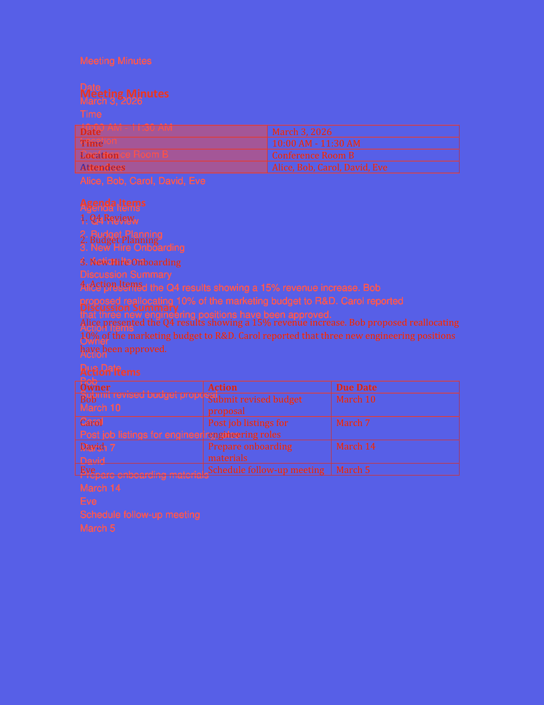</td>
  <td>changed: 150001 px (7.13%)<br>bbox: [175, 133, 1077, 1245]<br>mean abs RGB: 8.6063<br>RMSE RGB: 39.9421<br>threshold: 12, gain: 5.0</td>
</tr>
<tr>
  <td><b>docx_classic43_event_flyer_with_banner</b><br>Page 1</td>
  <td>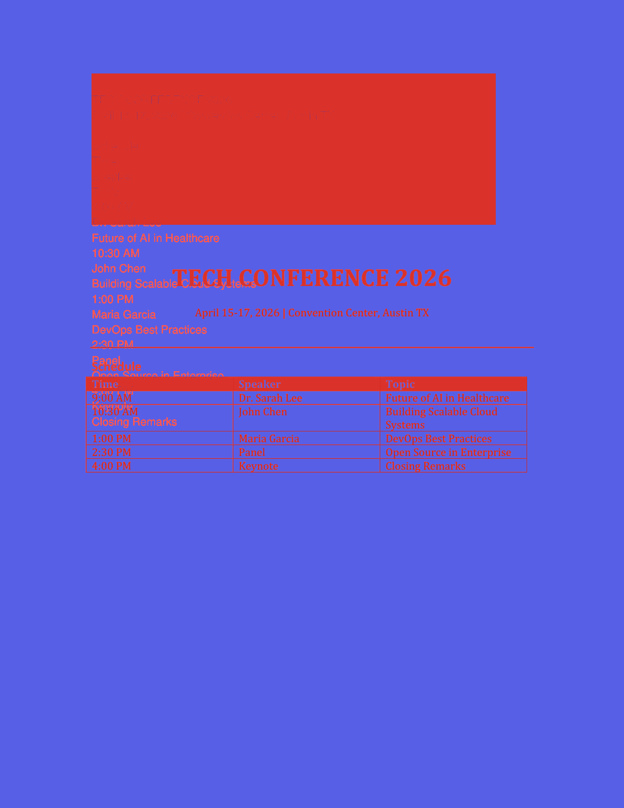</td>
  <td>changed: 333700 px (15.86%)<br>bbox: [175, 150, 1091, 965]<br>mean abs RGB: 24.9571<br>RMSE RGB: 65.7453<br>threshold: 12, gain: 5.0</td>
</tr>
<tr>
  <td><b>docx_classic43_invoice_document</b><br>Page 1</td>
  <td>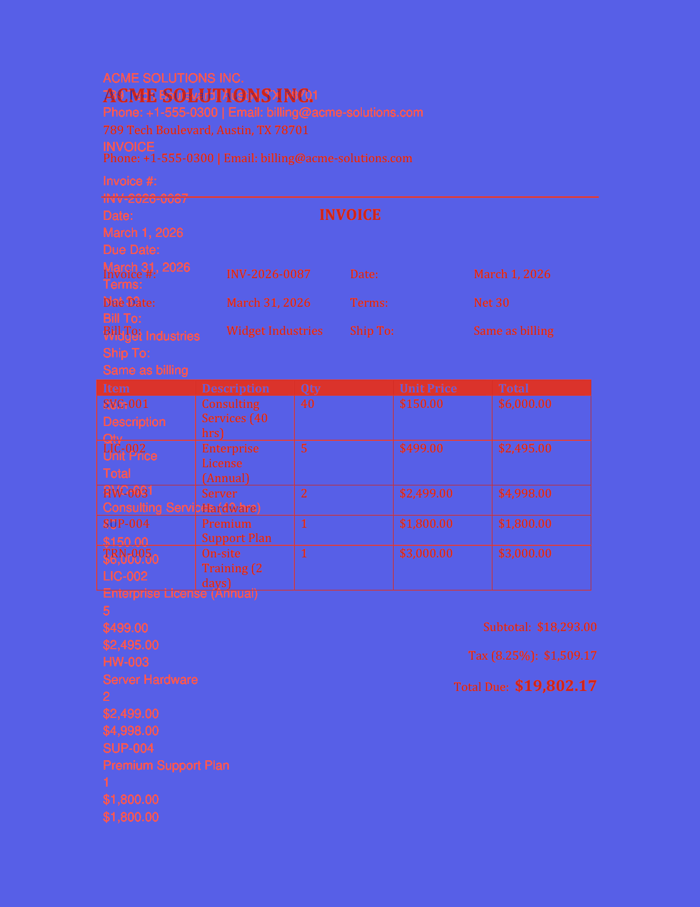</td>
  <td>changed: 118075 px (5.61%)<br>bbox: [175, 133, 1091, 1498]<br>mean abs RGB: 9.0581<br>RMSE RGB: 42.435<br>threshold: 12, gain: 5.0</td>
</tr>
<tr>
  <td><b>docx_classic44_dashboard_with_kpi_image</b><br>Page 1</td>
  <td></td>
  <td>changed: 399480 px (18.99%)<br>bbox: [175, 133, 1077, 1057]<br>mean abs RGB: 37.161<br>RMSE RGB: 87.2151<br>threshold: 12, gain: 5.0</td>
</tr>
<tr>
  <td><b>docx_classic44_memo</b><br>Page 1</td>
  <td></td>
  <td>changed: 109993 px (5.23%)<br>bbox: [184, 133, 1091, 1011]<br>mean abs RGB: 8.796<br>RMSE RGB: 42.6785<br>threshold: 12, gain: 5.0</td>
</tr>
<tr>
  <td><b>docx_classic45_certificate_with_seal</b><br>Page 1</td>
  <td></td>
  <td>changed: 85297 px (4.05%)<br>bbox: [187, 164, 978, 949]<br>mean abs RGB: 5.9768<br>RMSE RGB: 33.0536<br>threshold: 12, gain: 5.0</td>
</tr>
<tr>
  <td><b>docx_classic45_project_plan</b><br>Page 1</td>
  <td></td>
  <td>changed: 144477 px (6.87%)<br>bbox: [175, 133, 1077, 1496]<br>mean abs RGB: 10.3765<br>RMSE RGB: 44.6952<br>threshold: 12, gain: 5.0</td>
</tr>
<tr>
  <td><b>docx_classic46_comparison_table</b><br>Page 1</td>
  <td></td>
  <td>changed: 76975 px (3.66%)<br>bbox: [175, 133, 1077, 1278]<br>mean abs RGB: 5.7118<br>RMSE RGB: 32.5704<br>threshold: 12, gain: 5.0</td>
</tr>
<tr>
  <td><b>docx_classic46_product_image_grid</b><br>Page 1</td>
  <td></td>
  <td>changed: 250667 px (11.92%)<br>bbox: [187, 133, 488, 1329]<br>mean abs RGB: 19.1444<br>RMSE RGB: 58.8533<br>threshold: 12, gain: 5.0</td>
</tr>
<tr>
  <td><b>docx_classic47_data_dictionary</b><br>Page 1</td>
  <td></td>
  <td>changed: 149044 px (7.08%)<br>bbox: [175, 133, 1077, 1495]<br>mean abs RGB: 10.4607<br>RMSE RGB: 44.1444<br>threshold: 12, gain: 5.0</td>
</tr>
<tr>
  <td><b>docx_classic47_news_article_with_hero_image</b><br>Page 1</td>
  <td></td>
  <td>changed: 389192 px (18.50%)<br>bbox: [187, 150, 1078, 1054]<br>mean abs RGB: 33.6775<br>RMSE RGB: 81.9242<br>threshold: 12, gain: 5.0</td>
</tr>
<tr>
  <td><b>docx_classic48_multi_level_headings</b><br>Page 1</td>
  <td></td>
  <td>changed: 173252 px (8.24%)<br>bbox: [188, 133, 825, 1499]<br>mean abs RGB: 13.0842<br>RMSE RGB: 51.2565<br>threshold: 12, gain: 5.0</td>
</tr>
<tr>
  <td><b>docx_classic48_multi_level_headings</b><br>Page 2</td>
  <td></td>
  <td>changed: 131536 px (6.25%)<br>bbox: [187, 133, 825, 1434]<br>mean abs RGB: 9.5639<br>RMSE RGB: 43.361<br>threshold: 12, gain: 5.0</td>
</tr>
<tr>
  <td><b>docx_classic48_task_list_with_status_icons</b><br>Page 1</td>
  <td></td>
  <td>changed: 84095 px (4.00%)<br>bbox: [175, 133, 1077, 1057]<br>mean abs RGB: 6.1124<br>RMSE RGB: 33.9488<br>threshold: 12, gain: 5.0</td>
</tr>
<tr>
  <td><b>docx_classic49_cjk_document</b><br>Page 1</td>
  <td></td>
  <td>changed: 78264 px (3.72%)<br>bbox: [175, 133, 1077, 936]<br>mean abs RGB: 5.4708<br>RMSE RGB: 32.3075<br>threshold: 12, gain: 5.0</td>
</tr>
<tr>
  <td><b>docx_classic49_wide_panoramic_banner</b><br>Page 1</td>
  <td></td>
  <td>changed: 479414 px (22.79%)<br>bbox: [175, 150, 1088, 1206]<br>mean abs RGB: 32.7762<br>RMSE RGB: 76.0619<br>threshold: 12, gain: 5.0</td>
</tr>
<tr>
  <td><b>docx_classic50_long_table_with_formatting</b><br>Page 1</td>
  <td></td>
  <td>changed: 654029 px (31.09%)<br>bbox: [175, 133, 1077, 1495]<br>mean abs RGB: 19.5209<br>RMSE RGB: 52.6888<br>threshold: 12, gain: 5.0</td>
</tr>
<tr>
  <td><b>docx_classic50_long_table_with_formatting</b><br>Page 2</td>
  <td></td>
  <td>changed: 251487 px (11.95%)<br>bbox: [175, 133, 1077, 1495]<br>mean abs RGB: 8.2499<br>RMSE RGB: 35.7289<br>threshold: 12, gain: 5.0</td>
</tr>
<tr>
  <td><b>docx_classic50_portrait_tall_image</b><br>Page 1</td>
  <td></td>
  <td>changed: 115217 px (5.48%)<br>bbox: [187, 133, 1070, 1049]<br>mean abs RGB: 8.702<br>RMSE RGB: 40.0175<br>threshold: 12, gain: 5.0</td>
</tr>
<tr>
  <td><b>docx_classic51_step_by_step_with_images</b><br>Page 1</td>
  <td></td>
  <td>changed: 208874 px (9.93%)<br>bbox: [187, 133, 800, 990]<br>mean abs RGB: 13.5733<br>RMSE RGB: 46.6177<br>threshold: 12, gain: 5.0</td>
</tr>
<tr>
  <td><b>docx_classic51_underline_styles</b><br>Page 1</td>
  <td></td>
  <td>changed: 16558 px (0.79%)<br>bbox: [187, 133, 370, 495]<br>mean abs RGB: 1.2467<br>RMSE RGB: 15.6947<br>threshold: 12, gain: 5.0</td>
</tr>
<tr>
  <td><b>docx_classic52_before_after_comparison</b><br>Page 1</td>
  <td></td>
  <td>changed: 296974 px (14.12%)<br>bbox: [187, 133, 596, 1370]<br>mean abs RGB: 17.7896<br>RMSE RGB: 51.5358<br>threshold: 12, gain: 5.0</td>
</tr>
<tr>
  <td><b>docx_classic52_spacing_before_after</b><br>Page 1</td>
  <td></td>
  <td>changed: 70585 px (3.36%)<br>bbox: [188, 133, 1008, 528]<br>mean abs RGB: 5.5395<br>RMSE RGB: 33.6933<br>threshold: 12, gain: 5.0</td>
</tr>
<tr>
  <td><b>docx_classic53_color_swatch_palette</b><br>Page 1</td>
  <td></td>
  <td>changed: 158774 px (7.55%)<br>bbox: [187, 133, 664, 1375]<br>mean abs RGB: 11.4111<br>RMSE RGB: 48.0278<br>threshold: 12, gain: 5.0</td>
</tr>
<tr>
  <td><b>docx_classic53_table_merged_complex</b><br>Page 1</td>
  <td></td>
  <td>changed: 82990 px (3.94%)<br>bbox: [175, 133, 1077, 1061]<br>mean abs RGB: 4.7462<br>RMSE RGB: 28.6199<br>threshold: 12, gain: 5.0</td>
</tr>
<tr>
  <td><b>docx_classic54_multi_font_family</b><br>Page 1</td>
  <td></td>
  <td>changed: 45191 px (2.15%)<br>bbox: [187, 133, 967, 494]<br>mean abs RGB: 3.5315<br>RMSE RGB: 26.926<br>threshold: 12, gain: 5.0</td>
</tr>
<tr>
  <td><b>docx_classic54_travel_destination_cards</b><br>Page 1</td>
  <td></td>
  <td>changed: 179125 px (8.51%)<br>bbox: [175, 133, 1077, 1032]<br>mean abs RGB: 10.469<br>RMSE RGB: 42.0024<br>threshold: 12, gain: 5.0</td>
</tr>
<tr>
  <td><b>docx_classic55_background_shading_paragraph</b><br>Page 1</td>
  <td></td>
  <td>changed: 226165 px (10.75%)<br>bbox: [184, 133, 1091, 446]<br>mean abs RGB: 5.3742<br>RMSE RGB: 27.473<br>threshold: 12, gain: 5.0</td>
</tr>
<tr>
  <td><b>docx_classic55_lab_results_with_image</b><br>Page 1</td>
  <td></td>
  <td>changed: 188578 px (8.96%)<br>bbox: [175, 133, 1077, 1311]<br>mean abs RGB: 10.5333<br>RMSE RGB: 41.5698<br>threshold: 12, gain: 5.0</td>
</tr>
<tr>
  <td><b>docx_classic56_images_and_tables_mixed</b><br>Page 1</td>
  <td></td>
  <td>changed: 269726 px (12.82%)<br>bbox: [175, 133, 1077, 1371]<br>mean abs RGB: 18.5093<br>RMSE RGB: 57.5291<br>threshold: 12, gain: 5.0</td>
</tr>
<tr>
  <td><b>docx_classic56_software_screenshot_features</b><br>Page 1</td>
  <td></td>
  <td>changed: 258331 px (12.28%)<br>bbox: [175, 133, 1077, 1112]<br>mean abs RGB: 23.0536<br>RMSE RGB: 69.3286<br>threshold: 12, gain: 5.0</td>
</tr>
<tr>
  <td><b>docx_classic57_right_to_left_text</b><br>Page 1</td>
  <td></td>
  <td>changed: 31072 px (1.48%)<br>bbox: [187, 133, 1088, 752]<br>mean abs RGB: 2.3973<br>RMSE RGB: 22.0485<br>threshold: 12, gain: 5.0</td>
</tr>
<tr>
  <td><b>docx_classic57_sports_results_with_logos</b><br>Page 1</td>
  <td></td>
  <td>changed: 121378 px (5.77%)<br>bbox: [175, 133, 1077, 1495]<br>mean abs RGB: 9.1168<br>RMSE RGB: 42.1271<br>threshold: 12, gain: 5.0</td>
</tr>
<tr>
  <td><b>docx_classic58_dense_paragraph_document</b><br>Page 1</td>
  <td></td>
  <td>changed: 353882 px (16.82%)<br>bbox: [187, 133, 1081, 1499]<br>mean abs RGB: 27.5541<br>RMSE RGB: 74.9831<br>threshold: 12, gain: 5.0</td>
</tr>
<tr>
  <td><b>docx_classic58_dense_paragraph_document</b><br>Page 2</td>
  <td></td>
  <td>changed: 376681 px (17.91%)<br>bbox: [188, 133, 1081, 1499]<br>mean abs RGB: 29.4106<br>RMSE RGB: 77.5338<br>threshold: 12, gain: 5.0</td>
</tr>
<tr>
  <td><b>docx_classic58_dense_paragraph_document</b><br>Page 3</td>
  <td></td>
  <td>changed: 381811 px (18.15%)<br>bbox: [188, 133, 1081, 1499]<br>mean abs RGB: 29.7626<br>RMSE RGB: 77.943<br>threshold: 12, gain: 5.0</td>
</tr>
<tr>
  <td><b>docx_classic58_dense_paragraph_document</b><br>Page 4</td>
  <td></td>
  <td>changed: 375864 px (17.87%)<br>bbox: [188, 133, 1081, 1495]<br>mean abs RGB: 29.2705<br>RMSE RGB: 77.2853<br>threshold: 12, gain: 5.0</td>
</tr>
<tr>
  <td><b>docx_classic58_dense_paragraph_document</b><br>Page 5</td>
  <td></td>
  <td>changed: 380264 px (18.08%)<br>bbox: [188, 133, 1081, 1499]<br>mean abs RGB: 29.6498<br>RMSE RGB: 77.8333<br>threshold: 12, gain: 5.0</td>
</tr>
<tr>
  <td><b>docx_classic58_dense_paragraph_document</b><br>Page 6</td>
  <td></td>
  <td>changed: 359686 px (17.10%)<br>bbox: [188, 133, 1081, 1499]<br>mean abs RGB: 27.5054<br>RMSE RGB: 74.5445<br>threshold: 12, gain: 5.0</td>
</tr>
<tr>
  <td><b>docx_classic58_dense_paragraph_document</b><br>Page 7</td>
  <td></td>
  <td>changed: 278746 px (13.25%)<br>bbox: [188, 133, 1081, 1374]<br>mean abs RGB: 21.9725<br>RMSE RGB: 67.2186<br>threshold: 12, gain: 5.0</td>
</tr>
<tr>
  <td><b>docx_classic58_report_with_footer_image</b><br>Page 1</td>
  <td></td>
  <td>changed: 133348 px (6.34%)<br>bbox: [175, 133, 1077, 1155]<br>mean abs RGB: 9.9893<br>RMSE RGB: 42.4563<br>threshold: 12, gain: 5.0</td>
</tr>
<tr>
  <td><b>docx_classic59_numbered_and_bullet_mixed</b><br>Page 1</td>
  <td></td>
  <td>changed: 73983 px (3.52%)<br>bbox: [187, 133, 711, 945]<br>mean abs RGB: 5.6417<br>RMSE RGB: 33.7048<br>threshold: 12, gain: 5.0</td>
</tr>
<tr>
  <td><b>docx_classic59_nutrition_label_with_image</b><br>Page 1</td>
  <td></td>
  <td>changed: 247321 px (11.76%)<br>bbox: [175, 133, 1077, 1189]<br>mean abs RGB: 13.543<br>RMSE RGB: 49.3517<br>threshold: 12, gain: 5.0</td>
</tr>
<tr>
  <td><b>docx_classic60_comprehensive_styled_report</b><br>Page 1</td>
  <td></td>
  <td>changed: 20100 px (0.96%)<br>bbox: [184, 133, 1091, 389]<br>mean abs RGB: 1.4079<br>RMSE RGB: 16.2901<br>threshold: 12, gain: 5.0</td>
</tr>
<tr>
  <td><b>docx_classic60_comprehensive_styled_report</b><br>Page 2</td>
  <td></td>
  <td>changed: 328995 px (15.64%)<br>bbox: [175, 158, 1077, 1499]<br>mean abs RGB: 20.0768<br>RMSE RGB: 58.7539<br>threshold: 12, gain: 5.0</td>
</tr>
<tr>
  <td><b>docx_classic60_comprehensive_styled_report</b><br>Page 3</td>
  <td></td>
  <td>changed: 16153 px (0.77%)<br>bbox: [188, 133, 729, 311]<br>mean abs RGB: 1.2435<br>RMSE RGB: 15.8612<br>threshold: 12, gain: 5.0</td>
</tr>
<tr>
  <td><b>docx_classic60_project_status_with_milestones</b><br>Page 1</td>
  <td></td>
  <td>changed: 467167 px (22.21%)<br>bbox: [175, 133, 1077, 1459]<br>mean abs RGB: 34.2218<br>RMSE RGB: 76.508<br>threshold: 12, gain: 5.0</td>
</tr>
<tr>
  <td><b>docx_classic61_header_and_footer</b><br>Page 1</td>
  <td></td>
  <td>changed: 97453 px (4.63%)<br>bbox: [188, 79, 1013, 1575]<br>mean abs RGB: 7.559<br>RMSE RGB: 39.2068<br>threshold: 12, gain: 5.0</td>
</tr>
<tr>
  <td><b>docx_classic62_footnote_references</b><br>Page 1</td>
  <td></td>
  <td>changed: 53758 px (2.56%)<br>bbox: [184, 133, 1091, 568]<br>mean abs RGB: 4.1218<br>RMSE RGB: 28.8784<br>threshold: 12, gain: 5.0</td>
</tr>
<tr>
  <td><b>docx_classic63_toc_style_headings</b><br>Page 1</td>
  <td></td>
  <td>changed: 51396 px (2.44%)<br>bbox: [184, 133, 1091, 1120]<br>mean abs RGB: 3.9866<br>RMSE RGB: 28.5867<br>threshold: 12, gain: 5.0</td>
</tr>
<tr>
  <td><b>docx_classic64_multi_column_layout</b><br>Page 1</td>
  <td></td>
  <td>changed: 128108 px (6.09%)<br>bbox: [187, 133, 1060, 749]<br>mean abs RGB: 10.0364<br>RMSE RGB: 45.2712<br>threshold: 12, gain: 5.0</td>
</tr>
<tr>
  <td><b>docx_classic65_code_block_styling</b><br>Page 1</td>
  <td></td>
  <td>changed: 39149 px (1.86%)<br>bbox: [187, 133, 611, 827]<br>mean abs RGB: 4.3593<br>RMSE RGB: 22.7655<br>threshold: 12, gain: 5.0</td>
</tr>
<tr>
  <td><b>docx_classic66_colored_title_page</b><br>Page 1</td>
  <td></td>
  <td>changed: 316102 px (15.03%)<br>bbox: [187, 195, 1029, 1087]<br>mean abs RGB: 24.1065<br>RMSE RGB: 64.6675<br>threshold: 12, gain: 5.0</td>
</tr>
<tr>
  <td><b>docx_classic67_alternating_row_table</b><br>Page 1</td>
  <td></td>
  <td>changed: 288999 px (13.74%)<br>bbox: [175, 133, 1077, 1499]<br>mean abs RGB: 11.539<br>RMSE RGB: 43.5423<br>threshold: 12, gain: 5.0</td>
</tr>
<tr>
  <td><b>docx_classic68_sidebar_layout</b><br>Page 1</td>
  <td></td>
  <td>changed: 111015 px (5.28%)<br>bbox: [175, 133, 1100, 655]<br>mean abs RGB: 8.1078<br>RMSE RGB: 38.2748<br>threshold: 12, gain: 5.0</td>
</tr>
<tr>
  <td><b>docx_classic69_blockquote_styling</b><br>Page 1</td>
  <td></td>
  <td>changed: 50976 px (2.42%)<br>bbox: [188, 133, 1003, 951]<br>mean abs RGB: 3.7862<br>RMSE RGB: 27.306<br>threshold: 12, gain: 5.0</td>
</tr>
<tr>
  <td><b>docx_classic70_academic_paper</b><br>Page 1</td>
  <td></td>
  <td>changed: 208112 px (9.89%)<br>bbox: [175, 133, 1078, 1463]<br>mean abs RGB: 15.9689<br>RMSE RGB: 56.3541<br>threshold: 12, gain: 5.0</td>
</tr>
<tr>
  <td><b>docx_classic71_legal_document</b><br>Page 1</td>
  <td></td>
  <td>changed: 178509 px (8.49%)<br>bbox: [188, 133, 1114, 1359]<br>mean abs RGB: 14.5239<br>RMSE RGB: 55.1964<br>threshold: 12, gain: 5.0</td>
</tr>
<tr>
  <td><b>docx_classic72_technical_specification</b><br>Page 1</td>
  <td></td>
  <td>changed: 175312 px (8.33%)<br>bbox: [175, 133, 1077, 1499]<br>mean abs RGB: 12.9311<br>RMSE RGB: 49.4835<br>threshold: 12, gain: 5.0</td>
</tr>
<tr>
  <td><b>docx_classic73_calendar_layout</b><br>Page 1</td>
  <td></td>
  <td>changed: 81569 px (3.88%)<br>bbox: [175, 133, 1077, 1338]<br>mean abs RGB: 4.0627<br>RMSE RGB: 26.897<br>threshold: 12, gain: 5.0</td>
</tr>
<tr>
  <td><b>docx_classic74_org_chart</b><br>Page 1</td>
  <td></td>
  <td>changed: 187815 px (8.93%)<br>bbox: [175, 133, 1077, 901]<br>mean abs RGB: 8.1623<br>RMSE RGB: 35.4109<br>threshold: 12, gain: 5.0</td>
</tr>
<tr>
  <td><b>docx_classic75_newsletter_layout</b><br>Page 1</td>
  <td></td>
  <td>changed: 248386 px (11.81%)<br>bbox: [184, 133, 1091, 1064]<br>mean abs RGB: 17.9874<br>RMSE RGB: 57.3507<br>threshold: 12, gain: 5.0</td>
</tr>
<tr>
  <td><b>docx_classic76_recipe_card</b><br>Page 1</td>
  <td></td>
  <td>changed: 97768 px (4.65%)<br>bbox: [175, 133, 1077, 1061]<br>mean abs RGB: 7.5775<br>RMSE RGB: 39.2223<br>threshold: 12, gain: 5.0</td>
</tr>
<tr>
  <td><b>docx_classic77_timeline_layout</b><br>Page 1</td>
  <td></td>
  <td>changed: 131040 px (6.23%)<br>bbox: [175, 133, 852, 717]<br>mean abs RGB: 9.3639<br>RMSE RGB: 41.9146<br>threshold: 12, gain: 5.0</td>
</tr>
<tr>
  <td><b>docx_classic78_faq_document</b><br>Page 1</td>
  <td></td>
  <td>changed: 194865 px (9.26%)<br>bbox: [187, 133, 1083, 1499]<br>mean abs RGB: 15.1309<br>RMSE RGB: 55.5282<br>threshold: 12, gain: 5.0</td>
</tr>
<tr>
  <td><b>docx_classic78_faq_document</b><br>Page 2</td>
  <td></td>
  <td>changed: 104197 px (4.95%)<br>bbox: [187, 133, 1082, 1190]<br>mean abs RGB: 7.831<br>RMSE RGB: 39.4566<br>threshold: 12, gain: 5.0</td>
</tr>
<tr>
  <td><b>docx_classic79_glossary</b><br>Page 1</td>
  <td></td>
  <td>changed: 120816 px (5.74%)<br>bbox: [187, 133, 1063, 1409]<br>mean abs RGB: 9.5189<br>RMSE RGB: 44.1878<br>threshold: 12, gain: 5.0</td>
</tr>
<tr>
  <td><b>docx_classic80_matrix_grid</b><br>Page 1</td>
  <td></td>
  <td>changed: 421530 px (20.04%)<br>bbox: [175, 133, 1077, 1494]<br>mean abs RGB: 9.7643<br>RMSE RGB: 36.1968<br>threshold: 12, gain: 5.0</td>
</tr>
<tr>
  <td><b>docx_classic81_budget_table</b><br>Page 1</td>
  <td></td>
  <td>changed: 216957 px (10.31%)<br>bbox: [175, 133, 1077, 1499]<br>mean abs RGB: 10.9811<br>RMSE RGB: 43.4302<br>threshold: 12, gain: 5.0</td>
</tr>
<tr>
  <td><b>docx_classic82_survey_questionnaire</b><br>Page 1</td>
  <td></td>
  <td>changed: 148630 px (7.07%)<br>bbox: [175, 133, 1086, 1499]<br>mean abs RGB: 10.0301<br>RMSE RGB: 42.0784<br>threshold: 12, gain: 5.0</td>
</tr>
<tr>
  <td><b>docx_classic82_survey_questionnaire</b><br>Page 2</td>
  <td></td>
  <td>changed: 77213 px (3.67%)<br>bbox: [175, 149, 1087, 1494]<br>mean abs RGB: 5.3705<br>RMSE RGB: 31.1726<br>threshold: 12, gain: 5.0</td>
</tr>
<tr>
  <td><b>docx_classic83_medical_form</b><br>Page 1</td>
  <td></td>
  <td>changed: 153866 px (7.31%)<br>bbox: [175, 133, 1077, 1495]<br>mean abs RGB: 8.0563<br>RMSE RGB: 37.8329<br>threshold: 12, gain: 5.0</td>
</tr>
<tr>
  <td><b>docx_classic84_shipping_label</b><br>Page 1</td>
  <td></td>
  <td>changed: 159332 px (7.57%)<br>bbox: [175, 133, 1091, 1436]<br>mean abs RGB: 8.9255<br>RMSE RGB: 42.1145<br>threshold: 12, gain: 5.0</td>
</tr>
<tr>
  <td><b>docx_classic85_report_card</b><br>Page 1</td>
  <td></td>
  <td>changed: 139280 px (6.62%)<br>bbox: [175, 133, 1077, 1495]<br>mean abs RGB: 7.453<br>RMSE RGB: 36.5701<br>threshold: 12, gain: 5.0</td>
</tr>
<tr>
  <td><b>docx_classic86_checklist_document</b><br>Page 1</td>
  <td></td>
  <td>changed: 80482 px (3.83%)<br>bbox: [188, 133, 726, 1472]<br>mean abs RGB: 6.0304<br>RMSE RGB: 34.6921<br>threshold: 12, gain: 5.0</td>
</tr>
<tr>
  <td><b>docx_classic87_bibliography</b><br>Page 1</td>
  <td></td>
  <td>changed: 113766 px (5.41%)<br>bbox: [188, 133, 1081, 846]<br>mean abs RGB: 8.9977<br>RMSE RGB: 43.0332<br>threshold: 12, gain: 5.0</td>
</tr>
<tr>
  <td><b>docx_classic88_presentation_handout</b><br>Page 1</td>
  <td></td>
  <td>changed: 538771 px (25.61%)<br>bbox: [175, 133, 1080, 1495]<br>mean abs RGB: 40.9856<br>RMSE RGB: 88.5681<br>threshold: 12, gain: 5.0</td>
</tr>
<tr>
  <td><b>docx_classic88_presentation_handout</b><br>Page 2</td>
  <td></td>
  <td>changed: 257361 px (12.23%)<br>bbox: [175, 149, 1080, 678]<br>mean abs RGB: 18.1627<br>RMSE RGB: 56.9394<br>threshold: 12, gain: 5.0</td>
</tr>
<tr>
  <td><b>docx_classic89_multi_image_gallery</b><br>Page 1</td>
  <td></td>
  <td>changed: 341265 px (16.22%)<br>bbox: [175, 133, 1077, 974]<br>mean abs RGB: 19.5728<br>RMSE RGB: 58.4809<br>threshold: 12, gain: 5.0</td>
</tr>
<tr>
  <td><b>docx_classic90_comprehensive_annual_report</b><br>Page 1</td>
  <td></td>
  <td>changed: 235262 px (11.18%)<br>bbox: [187, 164, 963, 702]<br>mean abs RGB: 17.9837<br>RMSE RGB: 55.9553<br>threshold: 12, gain: 5.0</td>
</tr>
<tr>
  <td><b>docx_classic90_comprehensive_annual_report</b><br>Page 2</td>
  <td></td>
  <td>changed: 22044 px (1.05%)<br>bbox: [187, 158, 617, 477]<br>mean abs RGB: 1.6571<br>RMSE RGB: 18.1867<br>threshold: 12, gain: 5.0</td>
</tr>
<tr>
  <td><b>docx_classic90_comprehensive_annual_report</b><br>Page 3</td>
  <td></td>
  <td>changed: 377790 px (17.96%)<br>bbox: [175, 158, 1077, 1495]<br>mean abs RGB: 26.4545<br>RMSE RGB: 68.0156<br>threshold: 12, gain: 5.0</td>
</tr>
<tr>
  <td><b>docx_classic90_comprehensive_annual_report</b><br>Page 4</td>
  <td></td>
  <td>changed: 47697 px (2.27%)<br>bbox: [188, 133, 766, 717]<br>mean abs RGB: 3.5941<br>RMSE RGB: 26.8544<br>threshold: 12, gain: 5.0</td>
</tr>
<tr>
  <td><b>docx_classic91_landscape_page</b><br>Page 1</td>
  <td></td>
  <td>changed: 86733 px (4.12%)<br>bbox: [175, 133, 1452, 1122]<br>mean abs RGB: 6.5176<br>RMSE RGB: 34.9442<br>threshold: 12, gain: 5.0</td>
</tr>
<tr>
  <td><b>docx_classic92_first_line_indent</b><br>Page 1</td>
  <td></td>
  <td>changed: 95816 px (4.55%)<br>bbox: [187, 133, 1083, 640]<br>mean abs RGB: 7.4949<br>RMSE RGB: 39.1068<br>threshold: 12, gain: 5.0</td>
</tr>
<tr>
  <td><b>docx_classic93_hanging_indent</b><br>Page 1</td>
  <td></td>
  <td>changed: 120915 px (5.75%)<br>bbox: [187, 133, 1083, 826]<br>mean abs RGB: 9.5553<br>RMSE RGB: 44.3076<br>threshold: 12, gain: 5.0</td>
</tr>
<tr>
  <td><b>docx_classic94_custom_bullet_characters</b><br>Page 1</td>
  <td></td>
  <td>changed: 59404 px (2.82%)<br>bbox: [187, 133, 550, 1148]<br>mean abs RGB: 4.2405<br>RMSE RGB: 28.6865<br>threshold: 12, gain: 5.0</td>
</tr>
<tr>
  <td><b>docx_classic95_contract_template</b><br>Page 1</td>
  <td></td>
  <td>changed: 98070 px (4.66%)<br>bbox: [188, 133, 1075, 1136]<br>mean abs RGB: 7.9685<br>RMSE RGB: 40.9123<br>threshold: 12, gain: 5.0</td>
</tr>
<tr>
  <td><b>docx_classic96_dense_data_table</b><br>Page 1</td>
  <td></td>
  <td>changed: 310935 px (14.78%)<br>bbox: [175, 133, 1077, 1495]<br>mean abs RGB: 11.0811<br>RMSE RGB: 43.3456<br>threshold: 12, gain: 5.0</td>
</tr>
<tr>
  <td><b>docx_classic97_product_catalog</b><br>Page 1</td>
  <td></td>
  <td>changed: 175325 px (8.33%)<br>bbox: [175, 133, 1077, 856]<br>mean abs RGB: 12.8021<br>RMSE RGB: 48.5553<br>threshold: 12, gain: 5.0</td>
</tr>
<tr>
  <td><b>docx_classic98_training_manual</b><br>Page 1</td>
  <td></td>
  <td>changed: 136279 px (6.48%)<br>bbox: [187, 133, 1020, 1427]<br>mean abs RGB: 10.3649<br>RMSE RGB: 45.7077<br>threshold: 12, gain: 5.0</td>
</tr>
<tr>
  <td><b>docx_classic99_policy_document</b><br>Page 1</td>
  <td></td>
  <td>changed: 191446 px (9.10%)<br>bbox: [175, 133, 1079, 1499]<br>mean abs RGB: 15.0361<br>RMSE RGB: 55.1831<br>threshold: 12, gain: 5.0</td>
</tr>
<tr>
  <td><b>docx_classic100_multi_page_table</b><br>Page 1</td>
  <td></td>
  <td>changed: 655803 px (31.17%)<br>bbox: [175, 133, 1077, 1495]<br>mean abs RGB: 22.0979<br>RMSE RGB: 61.625<br>threshold: 12, gain: 5.0</td>
</tr>
<tr>
  <td><b>docx_classic100_multi_page_table</b><br>Page 2</td>
  <td></td>
  <td>changed: 202596 px (9.63%)<br>bbox: [175, 133, 1077, 1495]<br>mean abs RGB: 8.6808<br>RMSE RGB: 39.6589<br>threshold: 12, gain: 5.0</td>
</tr>
<tr>
  <td><b>docx_classic101_warranty_document</b><br>Page 1</td>
  <td></td>
  <td>changed: 151967 px (7.22%)<br>bbox: [184, 133, 1091, 1143]<br>mean abs RGB: 12.1618<br>RMSE RGB: 50.2518<br>threshold: 12, gain: 5.0</td>
</tr>
<tr>
  <td><b>docx_classic102_curriculum_syllabus</b><br>Page 1</td>
  <td></td>
  <td>changed: 177876 px (8.46%)<br>bbox: [175, 133, 1077, 1463]<br>mean abs RGB: 12.8017<br>RMSE RGB: 49.0807<br>threshold: 12, gain: 5.0</td>
</tr>
<tr>
  <td><b>docx_classic103_event_program</b><br>Page 1</td>
  <td></td>
  <td>changed: 136902 px (6.51%)<br>bbox: [189, 133, 938, 551]<br>mean abs RGB: 10.3114<br>RMSE RGB: 42.8429<br>threshold: 12, gain: 5.0</td>
</tr>
<tr>
  <td><b>docx_classic103_event_program</b><br>Page 2</td>
  <td></td>
  <td>changed: 148802 px (7.07%)<br>bbox: [175, 158, 1077, 1436]<br>mean abs RGB: 9.9156<br>RMSE RGB: 43.8055<br>threshold: 12, gain: 5.0</td>
</tr>
<tr>
  <td><b>docx_classic104_sop_document</b><br>Page 1</td>
  <td></td>
  <td>changed: 147997 px (7.03%)<br>bbox: [175, 133, 1077, 1466]<br>mean abs RGB: 11.5863<br>RMSE RGB: 48.7695<br>threshold: 12, gain: 5.0</td>
</tr>
<tr>
  <td><b>docx_classic105_certificate</b><br>Page 1</td>
  <td></td>
  <td>changed: 62491 px (2.97%)<br>bbox: [187, 195, 1043, 1302]<br>mean abs RGB: 4.8858<br>RMSE RGB: 31.4411<br>threshold: 12, gain: 5.0</td>
</tr>
<tr>
  <td><b>docx_classic106_multi_section_orientation</b><br>Page 1</td>
  <td></td>
  <td>changed: 87164 px (4.14%)<br>bbox: [187, 133, 1077, 1495]<br>mean abs RGB: 6.8511<br>RMSE RGB: 37.4453<br>threshold: 12, gain: 5.0</td>
</tr>
<tr>
  <td><b>docx_classic106_multi_section_orientation</b><br>Page 2</td>
  <td></td>
  <td>changed: 62967 px (3.87%)<br>bbox: [135, 102, 1123, 415]<br>mean abs RGB: 5.7945<br>RMSE RGB: 32.2224<br>threshold: 12, gain: 5.0</td>
</tr>
<tr>
  <td><b>docx_classic107_order_form</b><br>Page 1</td>
  <td></td>
  <td>changed: 133250 px (6.33%)<br>bbox: [175, 133, 1077, 1498]<br>mean abs RGB: 8.8105<br>RMSE RGB: 40.8462<br>threshold: 12, gain: 5.0</td>
</tr>
<tr>
  <td><b>docx_classic108_comparison_matrix</b><br>Page 1</td>
  <td></td>
  <td>changed: 267525 px (12.72%)<br>bbox: [175, 133, 1077, 1499]<br>mean abs RGB: 8.5213<br>RMSE RGB: 38.0817<br>threshold: 12, gain: 5.0</td>
</tr>
<tr>
  <td><b>docx_classic109_release_notes</b><br>Page 1</td>
  <td></td>
  <td>changed: 100408 px (4.77%)<br>bbox: [184, 133, 1091, 1441]<br>mean abs RGB: 7.4396<br>RMSE RGB: 38.4604<br>threshold: 12, gain: 5.0</td>
</tr>
<tr>
  <td><b>docx_classic110_troubleshooting_guide</b><br>Page 1</td>
  <td></td>
  <td>changed: 85939 px (4.08%)<br>bbox: [188, 133, 1031, 848]<br>mean abs RGB: 6.1797<br>RMSE RGB: 34.6707<br>threshold: 12, gain: 5.0</td>
</tr>
<tr>
  <td><b>docx_classic111_meeting_agenda</b><br>Page 1</td>
  <td></td>
  <td>changed: 134117 px (6.38%)<br>bbox: [175, 133, 1091, 1467]<br>mean abs RGB: 10.041<br>RMSE RGB: 44.1044<br>threshold: 12, gain: 5.0</td>
</tr>
<tr>
  <td><b>docx_classic112_project_status_report</b><br>Page 1</td>
  <td></td>
  <td>changed: 144831 px (6.88%)<br>bbox: [175, 133, 1077, 1436]<br>mean abs RGB: 10.7528<br>RMSE RGB: 45.295<br>threshold: 12, gain: 5.0</td>
</tr>
<tr>
  <td><b>docx_classic113_address_labels</b><br>Page 1</td>
  <td></td>
  <td>changed: 86586 px (4.12%)<br>bbox: [175, 133, 1077, 1310]<br>mean abs RGB: 6.674<br>RMSE RGB: 36.7724<br>threshold: 12, gain: 5.0</td>
</tr>
<tr>
  <td><b>docx_classic114_test_report</b><br>Page 1</td>
  <td></td>
  <td>changed: 152956 px (7.27%)<br>bbox: [175, 133, 1077, 1499]<br>mean abs RGB: 11.4922<br>RMSE RGB: 47.0733<br>threshold: 12, gain: 5.0</td>
</tr>
<tr>
  <td><b>docx_classic115_price_list</b><br>Page 1</td>
  <td></td>
  <td>changed: 264484 px (12.57%)<br>bbox: [175, 133, 1077, 1495]<br>mean abs RGB: 12.5383<br>RMSE RGB: 46.9899<br>threshold: 12, gain: 5.0</td>
</tr>
<tr>
  <td><b>docx_classic116_risk_assessment</b><br>Page 1</td>
  <td></td>
  <td>changed: 222438 px (10.57%)<br>bbox: [175, 133, 1077, 1495]<br>mean abs RGB: 17.3808<br>RMSE RGB: 58.0111<br>threshold: 12, gain: 5.0</td>
</tr>
<tr>
  <td><b>docx_classic117_employee_handbook_excerpt</b><br>Page 1</td>
  <td></td>
  <td>changed: 182774 px (8.69%)<br>bbox: [175, 133, 1077, 1458]<br>mean abs RGB: 13.2717<br>RMSE RGB: 50.8507<br>threshold: 12, gain: 5.0</td>
</tr>
<tr>
  <td><b>docx_classic118_data_report_with_summary</b><br>Page 1</td>
  <td></td>
  <td>changed: 165151 px (7.85%)<br>bbox: [175, 133, 1077, 1495]<br>mean abs RGB: 11.9675<br>RMSE RGB: 46.9167<br>threshold: 12, gain: 5.0</td>
</tr>
<tr>
  <td><b>docx_classic119_multi_language_document</b><br>Page 1</td>
  <td></td>
  <td>changed: 75438 px (3.59%)<br>bbox: [187, 133, 1054, 1116]<br>mean abs RGB: 5.6834<br>RMSE RGB: 33.6703<br>threshold: 12, gain: 5.0</td>
</tr>
<tr>
  <td><b>docx_classic120_comprehensive_business_proposal</b><br>Page 1</td>
  <td></td>
  <td>changed: 202648 px (9.63%)<br>bbox: [188, 195, 1013, 1032]<br>mean abs RGB: 15.3464<br>RMSE RGB: 51.749<br>threshold: 12, gain: 5.0</td>
</tr>
<tr>
  <td><b>docx_classic120_comprehensive_business_proposal</b><br>Page 2</td>
  <td></td>
  <td>changed: 29100 px (1.38%)<br>bbox: [187, 158, 652, 576]<br>mean abs RGB: 2.216<br>RMSE RGB: 21.1032<br>threshold: 12, gain: 5.0</td>
</tr>
<tr>
  <td><b>docx_classic120_comprehensive_business_proposal</b><br>Page 3</td>
  <td></td>
  <td>changed: 249311 px (11.85%)<br>bbox: [175, 158, 1077, 1466]<br>mean abs RGB: 17.4334<br>RMSE RGB: 57.6874<br>threshold: 12, gain: 5.0</td>
</tr>
<tr>
  <td><b>docx_classic121_thin_border_table</b><br>Page 1</td>
  <td></td>
  <td>changed: 37500 px (1.78%)<br>bbox: [175, 133, 1077, 903]<br>mean abs RGB: 2.7599<br>RMSE RGB: 22.9856<br>threshold: 12, gain: 5.0</td>
</tr>
<tr>
  <td><b>docx_classic122_thick_outer_border_table</b><br>Page 1</td>
  <td></td>
  <td>changed: 42796 px (2.03%)<br>bbox: [174, 133, 1079, 901]<br>mean abs RGB: 3.4827<br>RMSE RGB: 26.7099<br>threshold: 12, gain: 5.0</td>
</tr>
<tr>
  <td><b>docx_classic123_dashed_border_table</b><br>Page 1</td>
  <td></td>
  <td>changed: 24222 px (1.15%)<br>bbox: [187, 133, 1080, 545]<br>mean abs RGB: 1.826<br>RMSE RGB: 19.0831<br>threshold: 12, gain: 5.0</td>
</tr>
<tr>
  <td><b>docx_classic124_colored_border_table</b><br>Page 1</td>
  <td></td>
  <td>changed: 53331 px (2.54%)<br>bbox: [175, 133, 1077, 807]<br>mean abs RGB: 3.9762<br>RMSE RGB: 28.3401<br>threshold: 12, gain: 5.0</td>
</tr>
<tr>
  <td><b>docx_classic125_solid_cell_fills</b><br>Page 1</td>
  <td></td>
  <td>changed: 135095 px (6.42%)<br>bbox: [175, 133, 1077, 717]<br>mean abs RGB: 4.7033<br>RMSE RGB: 26.8464<br>threshold: 12, gain: 5.0</td>
</tr>
<tr>
  <td><b>docx_classic126_dark_header_table</b><br>Page 1</td>
  <td></td>
  <td>changed: 67831 px (3.22%)<br>bbox: [175, 133, 1077, 901]<br>mean abs RGB: 5.2421<br>RMSE RGB: 31.6377<br>threshold: 12, gain: 5.0</td>
</tr>
<tr>
  <td><b>docx_classic127_font_styles_showcase</b><br>Page 1</td>
  <td></td>
  <td>changed: 55843 px (2.65%)<br>bbox: [175, 133, 1077, 655]<br>mean abs RGB: 4.1303<br>RMSE RGB: 28.434<br>threshold: 12, gain: 5.0</td>
</tr>
<tr>
  <td><b>docx_classic128_font_sizes_showcase</b><br>Page 1</td>
  <td></td>
  <td>changed: 97897 px (4.65%)<br>bbox: [188, 133, 1080, 993]<br>mean abs RGB: 8.2342<br>RMSE RGB: 42.0358<br>threshold: 12, gain: 5.0</td>
</tr>
<tr>
  <td><b>docx_classic129_alignment_combinations</b><br>Page 1</td>
  <td></td>
  <td>changed: 36126 px (1.72%)<br>bbox: [175, 133, 1077, 655]<br>mean abs RGB: 2.748<br>RMSE RGB: 23.4443<br>threshold: 12, gain: 5.0</td>
</tr>
<tr>
  <td><b>docx_classic130_wrap_and_indent</b><br>Page 1</td>
  <td></td>
  <td>changed: 74199 px (3.53%)<br>bbox: [187, 133, 1079, 743]<br>mean abs RGB: 5.7399<br>RMSE RGB: 34.0936<br>threshold: 12, gain: 5.0</td>
</tr>
<tr>
  <td><b>docx_classic131_number_format_table</b><br>Page 1</td>
  <td></td>
  <td>changed: 63524 px (3.02%)<br>bbox: [175, 133, 1077, 1182]<br>mean abs RGB: 4.7536<br>RMSE RGB: 30.6166<br>threshold: 12, gain: 5.0</td>
</tr>
<tr>
  <td><b>docx_classic132_striped_table</b><br>Page 1</td>
  <td></td>
  <td>changed: 190056 px (9.03%)<br>bbox: [175, 133, 1077, 1497]<br>mean abs RGB: 6.7576<br>RMSE RGB: 33.8528<br>threshold: 12, gain: 5.0</td>
</tr>
<tr>
  <td><b>docx_classic133_gradient_rows_table</b><br>Page 1</td>
  <td></td>
  <td>changed: 271321 px (12.90%)<br>bbox: [175, 133, 1077, 1182]<br>mean abs RGB: 26.0118<br>RMSE RGB: 77.8979<br>threshold: 12, gain: 5.0</td>
</tr>
<tr>
  <td><b>docx_classic134_heatmap_table</b><br>Page 1</td>
  <td></td>
  <td>changed: 173044 px (8.23%)<br>bbox: [175, 133, 1077, 1495]<br>mean abs RGB: 12.9647<br>RMSE RGB: 50.1501<br>threshold: 12, gain: 5.0</td>
</tr>
<tr>
  <td><b>docx_classic135_bottom_border_paragraphs</b><br>Page 1</td>
  <td></td>
  <td>changed: 41505 px (1.97%)<br>bbox: [184, 133, 1091, 568]<br>mean abs RGB: 3.4496<br>RMSE RGB: 26.8526<br>threshold: 12, gain: 5.0</td>
</tr>
<tr>
  <td><b>docx_classic136_financial_statement</b><br>Page 1</td>
  <td></td>
  <td>changed: 106529 px (5.06%)<br>bbox: [175, 133, 1077, 1091]<br>mean abs RGB: 7.2603<br>RMSE RGB: 38.0323<br>threshold: 12, gain: 5.0</td>
</tr>
<tr>
  <td><b>docx_classic137_checkerboard_table</b><br>Page 1</td>
  <td></td>
  <td>changed: 205726 px (9.78%)<br>bbox: [175, 133, 1077, 466]<br>mean abs RGB: 11.4291<br>RMSE RGB: 46.4289<br>threshold: 12, gain: 5.0</td>
</tr>
<tr>
  <td><b>docx_classic138_color_grid_table</b><br>Page 1</td>
  <td></td>
  <td>changed: 110817 px (5.27%)<br>bbox: [175, 133, 1077, 526]<br>mean abs RGB: 4.741<br>RMSE RGB: 27.011<br>threshold: 12, gain: 5.0</td>
</tr>
<tr>
  <td><b>docx_classic139_paragraph_shading_patterns</b><br>Page 1</td>
  <td></td>
  <td>changed: 366910 px (17.44%)<br>bbox: [184, 133, 1091, 634]<br>mean abs RGB: 14.8736<br>RMSE RGB: 43.3002<br>threshold: 12, gain: 5.0</td>
</tr>
<tr>
  <td><b>docx_classic140_rotated_text_table</b><br>Page 1</td>
  <td></td>
  <td>changed: 44608 px (2.12%)<br>bbox: [175, 133, 1077, 560]<br>mean abs RGB: 3.3811<br>RMSE RGB: 26.1218<br>threshold: 12, gain: 5.0</td>
</tr>
<tr>
  <td><b>docx_classic141_mixed_border_styles</b><br>Page 1</td>
  <td></td>
  <td>changed: 33954 px (1.61%)<br>bbox: [188, 133, 1079, 667]<br>mean abs RGB: 2.5408<br>RMSE RGB: 23.0317<br>threshold: 12, gain: 5.0</td>
</tr>
<tr>
  <td><b>docx_classic142_styled_invoice_document</b><br>Page 1</td>
  <td></td>
  <td>changed: 178530 px (8.49%)<br>bbox: [175, 133, 1091, 1185]<br>mean abs RGB: 7.5522<br>RMSE RGB: 36.1387<br>threshold: 12, gain: 5.0</td>
</tr>
<tr>
  <td><b>docx_classic143_multi_section_document</b><br>Page 1</td>
  <td></td>
  <td>changed: 216864 px (10.31%)<br>bbox: [175, 133, 1091, 1088]<br>mean abs RGB: 16.3179<br>RMSE RGB: 60.6165<br>threshold: 12, gain: 5.0</td>
</tr>
<tr>
  <td><b>docx_classic144_note_style_paragraphs</b><br>Page 1</td>
  <td></td>
  <td>changed: 85320 px (4.06%)<br>bbox: [175, 133, 1077, 526]<br>mean abs RGB: 2.7248<br>RMSE RGB: 21.21<br>threshold: 12, gain: 5.0</td>
</tr>
<tr>
  <td><b>docx_classic145_status_badge_table</b><br>Page 1</td>
  <td></td>
  <td>changed: 117747 px (5.60%)<br>bbox: [175, 133, 1077, 1151]<br>mean abs RGB: 7.2427<br>RMSE RGB: 36.1201<br>threshold: 12, gain: 5.0</td>
</tr>
<tr>
  <td><b>docx_classic146_double_border_table</b><br>Page 1</td>
  <td></td>
  <td>changed: 57391 px (2.73%)<br>bbox: [174, 133, 1079, 780]<br>mean abs RGB: 3.314<br>RMSE RGB: 25.272<br>threshold: 12, gain: 5.0</td>
</tr>
<tr>
  <td><b>docx_classic147_multi_section_styled_report</b><br>Page 1</td>
  <td></td>
  <td>changed: 153534 px (7.30%)<br>bbox: [175, 133, 1077, 1495]<br>mean abs RGB: 11.0406<br>RMSE RGB: 45.0795<br>threshold: 12, gain: 5.0</td>
</tr>
<tr>
  <td><b>docx_classic148_data_grid_document</b><br>Page 1</td>
  <td></td>
  <td>changed: 342459 px (16.28%)<br>bbox: [175, 133, 1077, 1494]<br>mean abs RGB: 13.1884<br>RMSE RGB: 46.0699<br>threshold: 12, gain: 5.0</td>
</tr>
<tr>
  <td><b>docx_classic149_merged_section_report</b><br>Page 1</td>
  <td></td>
  <td>changed: 169878 px (8.08%)<br>bbox: [175, 133, 1091, 1279]<br>mean abs RGB: 11.3686<br>RMSE RGB: 47.3039<br>threshold: 12, gain: 5.0</td>
</tr>
<tr>
  <td><b>docx_classic150_kitchen_sink_styles</b><br>Page 1</td>
  <td></td>
  <td>changed: 269551 px (12.81%)<br>bbox: [175, 133, 1091, 1499]<br>mean abs RGB: 14.4259<br>RMSE RGB: 50.1896<br>threshold: 12, gain: 5.0</td>
</tr>
<tr>
  <td><b>docx_classic150_kitchen_sink_styles</b><br>Page 2</td>
  <td></td>
  <td>changed: 12061 px (0.57%)<br>bbox: [188, 133, 742, 388]<br>mean abs RGB: 0.9758<br>RMSE RGB: 14.3626<br>threshold: 12, gain: 5.0</td>
</tr>
</table>

## Visual Comparison

Scores compare go MiniPdf against Microsoft 365 Word Reference. LibreOffice is an auxiliary rendering and does not affect scores.

<table>
<tr><th>go MiniPdf</th><th>Microsoft 365 Word Reference</th><th>LibreOffice</th></tr>
<tr>
  <td><b>docx_classic01_single_paragraph<br><small>format: docx | case: docx_classic01_single_paragraph | scope: go-classic-docx</small></b></td>
  <td colspan="2">docx_classic01_single_paragraph <span style="color:#3fb950">⬤</span> 99.7%</td>
</tr>
<tr>
  <td></td>
  <td></td>
  <td></td>
</tr>
<tr>
  <td><b>docx_classic02_multiple_paragraphs<br><small>format: docx | case: docx_classic02_multiple_paragraphs | scope: go-classic-docx</small></b></td>
  <td colspan="2">docx_classic02_multiple_paragraphs <span style="color:#3fb950">⬤</span> 98.3%</td>
</tr>
<tr>
  <td></td>
  <td></td>
  <td></td>
</tr>
<tr>
  <td><b>docx_classic03_headings<br><small>format: docx | case: docx_classic03_headings | scope: go-classic-docx</small></b></td>
  <td colspan="2">docx_classic03_headings <span style="color:#3fb950">⬤</span> 99.4%</td>
</tr>
<tr>
  <td></td>
  <td></td>
  <td></td>
</tr>
<tr>
  <td><b>docx_classic04_bold_italic<br><small>format: docx | case: docx_classic04_bold_italic | scope: go-classic-docx</small></b></td>
  <td colspan="2">docx_classic04_bold_italic <span style="color:#3fb950">⬤</span> 99.9%</td>
</tr>
<tr>
  <td></td>
  <td></td>
  <td></td>
</tr>
<tr>
  <td><b>docx_classic05_font_sizes<br><small>format: docx | case: docx_classic05_font_sizes | scope: go-classic-docx</small></b></td>
  <td colspan="2">docx_classic05_font_sizes <span style="color:#3fb950">⬤</span> 97.2%</td>
</tr>
<tr>
  <td></td>
  <td></td>
  <td></td>
</tr>
<tr>
  <td><b>docx_classic06_font_colors<br><small>format: docx | case: docx_classic06_font_colors | scope: go-classic-docx</small></b></td>
  <td colspan="2">docx_classic06_font_colors <span style="color:#3fb950">⬤</span> 99.8%</td>
</tr>
<tr>
  <td></td>
  <td></td>
  <td></td>
</tr>
<tr>
  <td><b>docx_classic07_alignment<br><small>format: docx | case: docx_classic07_alignment | scope: go-classic-docx</small></b></td>
  <td colspan="2">docx_classic07_alignment <span style="color:#3fb950">⬤</span> 98.7%</td>
</tr>
<tr>
  <td></td>
  <td></td>
  <td></td>
</tr>
<tr>
  <td><b>docx_classic08_bullet_list<br><small>format: docx | case: docx_classic08_bullet_list | scope: go-classic-docx</small></b></td>
  <td colspan="2">docx_classic08_bullet_list <span style="color:#3fb950">⬤</span> 96.5%</td>
</tr>
<tr>
  <td></td>
  <td></td>
  <td></td>
</tr>
<tr>
  <td><b>docx_classic09_numbered_list<br><small>format: docx | case: docx_classic09_numbered_list | scope: go-classic-docx</small></b></td>
  <td colspan="2">docx_classic09_numbered_list <span style="color:#3fb950">⬤</span> 96.8%</td>
</tr>
<tr>
  <td></td>
  <td></td>
  <td></td>
</tr>
<tr>
  <td><b>docx_classic10_simple_table<br><small>format: docx | case: docx_classic10_simple_table | scope: go-classic-docx</small></b></td>
  <td colspan="2">docx_classic10_simple_table <span style="color:#3fb950">⬤</span> 99.1%</td>
</tr>
<tr>
  <td></td>
  <td></td>
  <td></td>
</tr>
<tr>
  <td><b>docx_classic11_table_with_shading<br><small>format: docx | case: docx_classic11_table_with_shading | scope: go-classic-docx</small></b></td>
  <td colspan="2">docx_classic11_table_with_shading <span style="color:#d29922">⬤</span> 85.4%</td>
</tr>
<tr>
  <td></td>
  <td></td>
  <td></td>
</tr>
<tr>
  <td><b>docx_classic12_merged_cells_table<br><small>format: docx | case: docx_classic12_merged_cells_table | scope: go-classic-docx</small></b></td>
  <td colspan="2">docx_classic12_merged_cells_table <span style="color:#3fb950">⬤</span> 99.2%</td>
</tr>
<tr>
  <td></td>
  <td></td>
  <td></td>
</tr>
<tr>
  <td><b>docx_classic13_long_document<br><small>format: docx | case: docx_classic13_long_document | scope: go-classic-docx</small></b></td>
  <td colspan="2">docx_classic13_long_document <span style="color:#3fb950">⬤</span> 96.6%</td>
</tr>
<tr>
  <td></td>
  <td></td>
  <td></td>
</tr>
<tr>
  <td></td>
  <td></td>
  <td></td>
</tr>
<tr>
  <td></td>
  <td></td>
  <td></td>
</tr>
<tr>
  <td></td>
  <td></td>
  <td></td>
</tr>
<tr>
  <td><b>docx_classic14_mixed_content<br><small>format: docx | case: docx_classic14_mixed_content | scope: go-classic-docx</small></b></td>
  <td colspan="2">docx_classic14_mixed_content <span style="color:#3fb950">⬤</span> 98.0%</td>
</tr>
<tr>
  <td></td>
  <td></td>
  <td></td>
</tr>
<tr>
  <td><b>docx_classic15_indentation<br><small>format: docx | case: docx_classic15_indentation | scope: go-classic-docx</small></b></td>
  <td colspan="2">docx_classic15_indentation <span style="color:#3fb950">⬤</span> 98.6%</td>
</tr>
<tr>
  <td></td>
  <td></td>
  <td></td>
</tr>
<tr>
  <td><b>docx_classic16_line_spacing<br><small>format: docx | case: docx_classic16_line_spacing | scope: go-classic-docx</small></b></td>
  <td colspan="2">docx_classic16_line_spacing <span style="color:#3fb950">⬤</span> 98.6%</td>
</tr>
<tr>
  <td></td>
  <td></td>
  <td></td>
</tr>
<tr>
  <td><b>docx_classic17_page_break<br><small>format: docx | case: docx_classic17_page_break | scope: go-classic-docx</small></b></td>
  <td colspan="2">docx_classic17_page_break <span style="color:#3fb950">⬤</span> 99.9%</td>
</tr>
<tr>
  <td></td>
  <td></td>
  <td></td>
</tr>
<tr>
  <td></td>
  <td></td>
  <td></td>
</tr>
<tr>
  <td></td>
  <td></td>
  <td></td>
</tr>
<tr>
  <td><b>docx_classic18_embedded_image<br><small>format: docx | case: docx_classic18_embedded_image | scope: go-classic-docx</small></b></td>
  <td colspan="2">docx_classic18_embedded_image <span style="color:#d29922">⬤</span> 82.6%</td>
</tr>
<tr>
  <td></td>
  <td></td>
  <td></td>
</tr>
<tr>
  <td><b>docx_classic19_multiple_images<br><small>format: docx | case: docx_classic19_multiple_images | scope: go-classic-docx</small></b></td>
  <td colspan="2">docx_classic19_multiple_images <span style="color:#d29922">⬤</span> 79.5%</td>
</tr>
<tr>
  <td></td>
  <td></td>
  <td></td>
</tr>
<tr>
  <td><b>docx_classic20_table_with_many_rows<br><small>format: docx | case: docx_classic20_table_with_many_rows | scope: go-classic-docx</small></b></td>
  <td colspan="2">docx_classic20_table_with_many_rows <span style="color:#f85149">⬤</span> 65.8%</td>
</tr>
<tr>
  <td></td>
  <td></td>
  <td></td>
</tr>
<tr>
  <td></td>
  <td><i>missing</i></td>
  <td><i>missing</i></td>
</tr>
<tr>
  <td><b>docx_classic21_nested_lists<br><small>format: docx | case: docx_classic21_nested_lists | scope: go-classic-docx</small></b></td>
  <td colspan="2">docx_classic21_nested_lists <span style="color:#3fb950">⬤</span> 97.1%</td>
</tr>
<tr>
  <td></td>
  <td></td>
  <td></td>
</tr>
<tr>
  <td><b>docx_classic22_horizontal_rule<br><small>format: docx | case: docx_classic22_horizontal_rule | scope: go-classic-docx</small></b></td>
  <td colspan="2">docx_classic22_horizontal_rule <span style="color:#3fb950">⬤</span> 99.6%</td>
</tr>
<tr>
  <td></td>
  <td></td>
  <td></td>
</tr>
<tr>
  <td><b>docx_classic23_mixed_formatting_runs<br><small>format: docx | case: docx_classic23_mixed_formatting_runs | scope: go-classic-docx</small></b></td>
  <td colspan="2">docx_classic23_mixed_formatting_runs <span style="color:#3fb950">⬤</span> 99.8%</td>
</tr>
<tr>
  <td></td>
  <td></td>
  <td></td>
</tr>
<tr>
  <td><b>docx_classic24_two_column_table_layout<br><small>format: docx | case: docx_classic24_two_column_table_layout | scope: go-classic-docx</small></b></td>
  <td colspan="2">docx_classic24_two_column_table_layout <span style="color:#d29922">⬤</span> 83.3%</td>
</tr>
<tr>
  <td></td>
  <td></td>
  <td></td>
</tr>
<tr>
  <td><b>docx_classic25_title_and_subtitle<br><small>format: docx | case: docx_classic25_title_and_subtitle | scope: go-classic-docx</small></b></td>
  <td colspan="2">docx_classic25_title_and_subtitle <span style="color:#3fb950">⬤</span> 99.7%</td>
</tr>
<tr>
  <td></td>
  <td></td>
  <td></td>
</tr>
<tr>
  <td></td>
  <td></td>
  <td></td>
</tr>
<tr>
  <td><b>docx_classic26_table_alignment<br><small>format: docx | case: docx_classic26_table_alignment | scope: go-classic-docx</small></b></td>
  <td colspan="2">docx_classic26_table_alignment <span style="color:#3fb950">⬤</span> 98.5%</td>
</tr>
<tr>
  <td></td>
  <td></td>
  <td></td>
</tr>
<tr>
  <td><b>docx_classic27_long_paragraph_wrapping<br><small>format: docx | case: docx_classic27_long_paragraph_wrapping | scope: go-classic-docx</small></b></td>
  <td colspan="2">docx_classic27_long_paragraph_wrapping <span style="color:#3fb950">⬤</span> 96.5%</td>
</tr>
<tr>
  <td></td>
  <td></td>
  <td></td>
</tr>
<tr>
  <td><b>docx_classic28_special_characters<br><small>format: docx | case: docx_classic28_special_characters | scope: go-classic-docx</small></b></td>
  <td colspan="2">docx_classic28_special_characters <span style="color:#3fb950">⬤</span> 96.2%</td>
</tr>
<tr>
  <td></td>
  <td></td>
  <td></td>
</tr>
<tr>
  <td><b>docx_classic29_table_with_image<br><small>format: docx | case: docx_classic29_table_with_image | scope: go-classic-docx</small></b></td>
  <td colspan="2">docx_classic29_table_with_image <span style="color:#d29922">⬤</span> 89.4%</td>
</tr>
<tr>
  <td></td>
  <td></td>
  <td></td>
</tr>
<tr>
  <td><b>docx_classic30_comprehensive_report<br><small>format: docx | case: docx_classic30_comprehensive_report | scope: go-classic-docx</small></b></td>
  <td colspan="2">docx_classic30_comprehensive_report <span style="color:#d29922">⬤</span> 72.9%</td>
</tr>
<tr>
  <td></td>
  <td></td>
  <td></td>
</tr>
<tr>
  <td></td>
  <td></td>
  <td></td>
</tr>
<tr>
  <td><i>missing</i></td>
  <td></td>
  <td></td>
</tr>
<tr>
  <td><b>docx_classic31_product_card_with_image<br><small>format: docx | case: docx_classic31_product_card_with_image | scope: go-classic-docx</small></b></td>
  <td colspan="2">docx_classic31_product_card_with_image <span style="color:#d29922">⬤</span> 83.2%</td>
</tr>
<tr>
  <td></td>
  <td></td>
  <td></td>
</tr>
<tr>
  <td><b>docx_classic31_strikethrough_text<br><small>format: docx | case: docx_classic31_strikethrough_text | scope: go-classic-docx</small></b></td>
  <td colspan="2">docx_classic31_strikethrough_text <span style="color:#3fb950">⬤</span> 99.7%</td>
</tr>
<tr>
  <td></td>
  <td></td>
  <td></td>
</tr>
<tr>
  <td><b>docx_classic32_company_logo_header<br><small>format: docx | case: docx_classic32_company_logo_header | scope: go-classic-docx</small></b></td>
  <td colspan="2">docx_classic32_company_logo_header <span style="color:#d29922">⬤</span> 87.2%</td>
</tr>
<tr>
  <td></td>
  <td></td>
  <td></td>
</tr>
<tr>
  <td><b>docx_classic32_superscript_subscript<br><small>format: docx | case: docx_classic32_superscript_subscript | scope: go-classic-docx</small></b></td>
  <td colspan="2">docx_classic32_superscript_subscript <span style="color:#3fb950">⬤</span> 96.7%</td>
</tr>
<tr>
  <td></td>
  <td></td>
  <td></td>
</tr>
<tr>
  <td><b>docx_classic33_highlighted_text<br><small>format: docx | case: docx_classic33_highlighted_text | scope: go-classic-docx</small></b></td>
  <td colspan="2">docx_classic33_highlighted_text <span style="color:#3fb950">⬤</span> 98.0%</td>
</tr>
<tr>
  <td></td>
  <td></td>
  <td></td>
</tr>
<tr>
  <td><b>docx_classic33_two_products_side_by_side<br><small>format: docx | case: docx_classic33_two_products_side_by_side | scope: go-classic-docx</small></b></td>
  <td colspan="2">docx_classic33_two_products_side_by_side <span style="color:#d29922">⬤</span> 81.1%</td>
</tr>
<tr>
  <td></td>
  <td></td>
  <td></td>
</tr>
<tr>
  <td><b>docx_classic34_employee_directory_with_photo<br><small>format: docx | case: docx_classic34_employee_directory_with_photo | scope: go-classic-docx</small></b></td>
  <td colspan="2">docx_classic34_employee_directory_with_photo <span style="color:#f85149">⬤</span> 63.1%</td>
</tr>
<tr>
  <td></td>
  <td></td>
  <td></td>
</tr>
<tr>
  <td><i>missing</i></td>
  <td></td>
  <td></td>
</tr>
<tr>
  <td><b>docx_classic34_paragraph_borders<br><small>format: docx | case: docx_classic34_paragraph_borders | scope: go-classic-docx</small></b></td>
  <td colspan="2">docx_classic34_paragraph_borders <span style="color:#3fb950">⬤</span> 99.3%</td>
</tr>
<tr>
  <td></td>
  <td></td>
  <td></td>
</tr>
<tr>
  <td><b>docx_classic35_inventory_with_product_photos<br><small>format: docx | case: docx_classic35_inventory_with_product_photos | scope: go-classic-docx</small></b></td>
  <td colspan="2">docx_classic35_inventory_with_product_photos <span style="color:#f85149">⬤</span> 61.1%</td>
</tr>
<tr>
  <td></td>
  <td></td>
  <td></td>
</tr>
<tr>
  <td><i>missing</i></td>
  <td></td>
  <td></td>
</tr>
<tr>
  <td><b>docx_classic35_tab_stops<br><small>format: docx | case: docx_classic35_tab_stops | scope: go-classic-docx</small></b></td>
  <td colspan="2">docx_classic35_tab_stops <span style="color:#3fb950">⬤</span> 94.3%</td>
</tr>
<tr>
  <td></td>
  <td></td>
  <td></td>
</tr>
<tr>
  <td><b>docx_classic36_invoice_with_logo<br><small>format: docx | case: docx_classic36_invoice_with_logo | scope: go-classic-docx</small></b></td>
  <td colspan="2">docx_classic36_invoice_with_logo <span style="color:#d29922">⬤</span> 89.0%</td>
</tr>
<tr>
  <td></td>
  <td></td>
  <td></td>
</tr>
<tr>
  <td><b>docx_classic36_wide_table<br><small>format: docx | case: docx_classic36_wide_table | scope: go-classic-docx</small></b></td>
  <td colspan="2">docx_classic36_wide_table <span style="color:#f85149">⬤</span> 66.2%</td>
</tr>
<tr>
  <td></td>
  <td></td>
  <td></td>
</tr>
<tr>
  <td></td>
  <td><i>missing</i></td>
  <td><i>missing</i></td>
</tr>
<tr>
  <td><b>docx_classic37_nested_table<br><small>format: docx | case: docx_classic37_nested_table | scope: go-classic-docx</small></b></td>
  <td colspan="2">docx_classic37_nested_table <span style="color:#3fb950">⬤</span> 91.2%</td>
</tr>
<tr>
  <td></td>
  <td></td>
  <td></td>
</tr>
<tr>
  <td><b>docx_classic37_real_estate_listing<br><small>format: docx | case: docx_classic37_real_estate_listing | scope: go-classic-docx</small></b></td>
  <td colspan="2">docx_classic37_real_estate_listing <span style="color:#d29922">⬤</span> 79.7%</td>
</tr>
<tr>
  <td></td>
  <td></td>
  <td></td>
</tr>
<tr>
  <td><b>docx_classic38_restaurant_menu_with_photos<br><small>format: docx | case: docx_classic38_restaurant_menu_with_photos | scope: go-classic-docx</small></b></td>
  <td colspan="2">docx_classic38_restaurant_menu_with_photos <span style="color:#f85149">⬤</span> 61.7%</td>
</tr>
<tr>
  <td></td>
  <td></td>
  <td></td>
</tr>
<tr>
  <td><i>missing</i></td>
  <td></td>
  <td></td>
</tr>
<tr>
  <td><b>docx_classic38_table_column_widths<br><small>format: docx | case: docx_classic38_table_column_widths | scope: go-classic-docx</small></b></td>
  <td colspan="2">docx_classic38_table_column_widths <span style="color:#3fb950">⬤</span> 98.8%</td>
</tr>
<tr>
  <td></td>
  <td></td>
  <td></td>
</tr>
<tr>
  <td><b>docx_classic39_cover_page_with_image<br><small>format: docx | case: docx_classic39_cover_page_with_image | scope: go-classic-docx</small></b></td>
  <td colspan="2">docx_classic39_cover_page_with_image <span style="color:#d29922">⬤</span> 87.7%</td>
</tr>
<tr>
  <td></td>
  <td></td>
  <td></td>
</tr>
<tr>
  <td></td>
  <td></td>
  <td></td>
</tr>
<tr>
  <td><b>docx_classic39_financial_report<br><small>format: docx | case: docx_classic39_financial_report | scope: go-classic-docx</small></b></td>
  <td colspan="2">docx_classic39_financial_report <span style="color:#3fb950">⬤</span> 96.3%</td>
</tr>
<tr>
  <td></td>
  <td></td>
  <td></td>
</tr>
<tr>
  <td><b>docx_classic40_product_catalog_with_images<br><small>format: docx | case: docx_classic40_product_catalog_with_images | scope: go-classic-docx</small></b></td>
  <td colspan="2">docx_classic40_product_catalog_with_images <span style="color:#d29922">⬤</span> 84.4%</td>
</tr>
<tr>
  <td></td>
  <td></td>
  <td></td>
</tr>
<tr>
  <td><b>docx_classic40_resume<br><small>format: docx | case: docx_classic40_resume | scope: go-classic-docx</small></b></td>
  <td colspan="2">docx_classic40_resume <span style="color:#3fb950">⬤</span> 98.2%</td>
</tr>
<tr>
  <td></td>
  <td></td>
  <td></td>
</tr>
<tr>
  <td><b>docx_classic41_business_letter<br><small>format: docx | case: docx_classic41_business_letter | scope: go-classic-docx</small></b></td>
  <td colspan="2">docx_classic41_business_letter <span style="color:#3fb950">⬤</span> 98.4%</td>
</tr>
<tr>
  <td></td>
  <td></td>
  <td></td>
</tr>
<tr>
  <td><b>docx_classic41_newsletter_with_hero_image<br><small>format: docx | case: docx_classic41_newsletter_with_hero_image | scope: go-classic-docx</small></b></td>
  <td colspan="2">docx_classic41_newsletter_with_hero_image <span style="color:#d29922">⬤</span> 74.2%</td>
</tr>
<tr>
  <td></td>
  <td></td>
  <td></td>
</tr>
<tr>
  <td><b>docx_classic42_chart_image_with_data<br><small>format: docx | case: docx_classic42_chart_image_with_data | scope: go-classic-docx</small></b></td>
  <td colspan="2">docx_classic42_chart_image_with_data <span style="color:#d29922">⬤</span> 79.7%</td>
</tr>
<tr>
  <td></td>
  <td></td>
  <td></td>
</tr>
<tr>
  <td><b>docx_classic42_meeting_minutes<br><small>format: docx | case: docx_classic42_meeting_minutes | scope: go-classic-docx</small></b></td>
  <td colspan="2">docx_classic42_meeting_minutes <span style="color:#3fb950">⬤</span> 93.8%</td>
</tr>
<tr>
  <td></td>
  <td></td>
  <td></td>
</tr>
<tr>
  <td><b>docx_classic43_event_flyer_with_banner<br><small>format: docx | case: docx_classic43_event_flyer_with_banner | scope: go-classic-docx</small></b></td>
  <td colspan="2">docx_classic43_event_flyer_with_banner <span style="color:#d29922">⬤</span> 74.5%</td>
</tr>
<tr>
  <td></td>
  <td></td>
  <td></td>
</tr>
<tr>
  <td><b>docx_classic43_invoice_document<br><small>format: docx | case: docx_classic43_invoice_document | scope: go-classic-docx</small></b></td>
  <td colspan="2">docx_classic43_invoice_document <span style="color:#f85149">⬤</span> 63.5%</td>
</tr>
<tr>
  <td></td>
  <td></td>
  <td></td>
</tr>
<tr>
  <td></td>
  <td><i>missing</i></td>
  <td><i>missing</i></td>
</tr>
<tr>
  <td><b>docx_classic44_dashboard_with_kpi_image<br><small>format: docx | case: docx_classic44_dashboard_with_kpi_image | scope: go-classic-docx</small></b></td>
  <td colspan="2">docx_classic44_dashboard_with_kpi_image <span style="color:#d29922">⬤</span> 78.2%</td>
</tr>
<tr>
  <td></td>
  <td></td>
  <td></td>
</tr>
<tr>
  <td><b>docx_classic44_memo<br><small>format: docx | case: docx_classic44_memo | scope: go-classic-docx</small></b></td>
  <td colspan="2">docx_classic44_memo <span style="color:#3fb950">⬤</span> 97.5%</td>
</tr>
<tr>
  <td></td>
  <td></td>
  <td></td>
</tr>
<tr>
  <td><b>docx_classic45_certificate_with_seal<br><small>format: docx | case: docx_classic45_certificate_with_seal | scope: go-classic-docx</small></b></td>
  <td colspan="2">docx_classic45_certificate_with_seal <span style="color:#d29922">⬤</span> 88.0%</td>
</tr>
<tr>
  <td></td>
  <td></td>
  <td></td>
</tr>
<tr>
  <td><b>docx_classic45_project_plan<br><small>format: docx | case: docx_classic45_project_plan | scope: go-classic-docx</small></b></td>
  <td colspan="2">docx_classic45_project_plan <span style="color:#f85149">⬤</span> 66.6%</td>
</tr>
<tr>
  <td></td>
  <td></td>
  <td></td>
</tr>
<tr>
  <td></td>
  <td><i>missing</i></td>
  <td><i>missing</i></td>
</tr>
<tr>
  <td><b>docx_classic46_comparison_table<br><small>format: docx | case: docx_classic46_comparison_table | scope: go-classic-docx</small></b></td>
  <td colspan="2">docx_classic46_comparison_table <span style="color:#3fb950">⬤</span> 94.2%</td>
</tr>
<tr>
  <td></td>
  <td></td>
  <td></td>
</tr>
<tr>
  <td><b>docx_classic46_product_image_grid<br><small>format: docx | case: docx_classic46_product_image_grid | scope: go-classic-docx</small></b></td>
  <td colspan="2">docx_classic46_product_image_grid <span style="color:#d29922">⬤</span> 79.0%</td>
</tr>
<tr>
  <td></td>
  <td></td>
  <td></td>
</tr>
<tr>
  <td><b>docx_classic47_data_dictionary<br><small>format: docx | case: docx_classic47_data_dictionary | scope: go-classic-docx</small></b></td>
  <td colspan="2">docx_classic47_data_dictionary <span style="color:#f85149">⬤</span> 66.6%</td>
</tr>
<tr>
  <td></td>
  <td></td>
  <td></td>
</tr>
<tr>
  <td></td>
  <td><i>missing</i></td>
  <td><i>missing</i></td>
</tr>
<tr>
  <td><b>docx_classic47_news_article_with_hero_image<br><small>format: docx | case: docx_classic47_news_article_with_hero_image | scope: go-classic-docx</small></b></td>
  <td colspan="2">docx_classic47_news_article_with_hero_image <span style="color:#d29922">⬤</span> 75.4%</td>
</tr>
<tr>
  <td></td>
  <td></td>
  <td></td>
</tr>
<tr>
  <td><b>docx_classic48_multi_level_headings<br><small>format: docx | case: docx_classic48_multi_level_headings | scope: go-classic-docx</small></b></td>
  <td colspan="2">docx_classic48_multi_level_headings <span style="color:#d29922">⬤</span> 75.2%</td>
</tr>
<tr>
  <td></td>
  <td></td>
  <td></td>
</tr>
<tr>
  <td></td>
  <td></td>
  <td></td>
</tr>
<tr>
  <td><i>missing</i></td>
  <td></td>
  <td></td>
</tr>
<tr>
  <td><b>docx_classic48_task_list_with_status_icons<br><small>format: docx | case: docx_classic48_task_list_with_status_icons | scope: go-classic-docx</small></b></td>
  <td colspan="2">docx_classic48_task_list_with_status_icons <span style="color:#3fb950">⬤</span> 94.0%</td>
</tr>
<tr>
  <td></td>
  <td></td>
  <td></td>
</tr>
<tr>
  <td><b>docx_classic49_cjk_document<br><small>format: docx | case: docx_classic49_cjk_document | scope: go-classic-docx</small></b></td>
  <td colspan="2">docx_classic49_cjk_document <span style="color:#d29922">⬤</span> 85.2%</td>
</tr>
<tr>
  <td></td>
  <td></td>
  <td></td>
</tr>
<tr>
  <td><b>docx_classic49_wide_panoramic_banner<br><small>format: docx | case: docx_classic49_wide_panoramic_banner | scope: go-classic-docx</small></b></td>
  <td colspan="2">docx_classic49_wide_panoramic_banner <span style="color:#d29922">⬤</span> 70.1%</td>
</tr>
<tr>
  <td></td>
  <td></td>
  <td></td>
</tr>
<tr>
  <td><b>docx_classic50_long_table_with_formatting<br><small>format: docx | case: docx_classic50_long_table_with_formatting | scope: go-classic-docx</small></b></td>
  <td colspan="2">docx_classic50_long_table_with_formatting <span style="color:#f85149">⬤</span> 46.4%</td>
</tr>
<tr>
  <td></td>
  <td></td>
  <td></td>
</tr>
<tr>
  <td></td>
  <td></td>
  <td></td>
</tr>
<tr>
  <td></td>
  <td><i>missing</i></td>
  <td><i>missing</i></td>
</tr>
<tr>
  <td></td>
  <td><i>missing</i></td>
  <td><i>missing</i></td>
</tr>
<tr>
  <td><b>docx_classic50_portrait_tall_image<br><small>format: docx | case: docx_classic50_portrait_tall_image | scope: go-classic-docx</small></b></td>
  <td colspan="2">docx_classic50_portrait_tall_image <span style="color:#3fb950">⬤</span> 91.2%</td>
</tr>
<tr>
  <td></td>
  <td></td>
  <td></td>
</tr>
<tr>
  <td><b>docx_classic51_step_by_step_with_images<br><small>format: docx | case: docx_classic51_step_by_step_with_images | scope: go-classic-docx</small></b></td>
  <td colspan="2">docx_classic51_step_by_step_with_images <span style="color:#d29922">⬤</span> 82.9%</td>
</tr>
<tr>
  <td></td>
  <td></td>
  <td></td>
</tr>
<tr>
  <td><b>docx_classic51_underline_styles<br><small>format: docx | case: docx_classic51_underline_styles | scope: go-classic-docx</small></b></td>
  <td colspan="2">docx_classic51_underline_styles <span style="color:#3fb950">⬤</span> 99.6%</td>
</tr>
<tr>
  <td></td>
  <td></td>
  <td></td>
</tr>
<tr>
  <td><b>docx_classic52_before_after_comparison<br><small>format: docx | case: docx_classic52_before_after_comparison | scope: go-classic-docx</small></b></td>
  <td colspan="2">docx_classic52_before_after_comparison <span style="color:#d29922">⬤</span> 78.7%</td>
</tr>
<tr>
  <td></td>
  <td></td>
  <td></td>
</tr>
<tr>
  <td><b>docx_classic52_spacing_before_after<br><small>format: docx | case: docx_classic52_spacing_before_after | scope: go-classic-docx</small></b></td>
  <td colspan="2">docx_classic52_spacing_before_after <span style="color:#3fb950">⬤</span> 98.7%</td>
</tr>
<tr>
  <td></td>
  <td></td>
  <td></td>
</tr>
<tr>
  <td><b>docx_classic53_color_swatch_palette<br><small>format: docx | case: docx_classic53_color_swatch_palette | scope: go-classic-docx</small></b></td>
  <td colspan="2">docx_classic53_color_swatch_palette <span style="color:#d29922">⬤</span> 86.0%</td>
</tr>
<tr>
  <td></td>
  <td></td>
  <td></td>
</tr>
<tr>
  <td><b>docx_classic53_table_merged_complex<br><small>format: docx | case: docx_classic53_table_merged_complex | scope: go-classic-docx</small></b></td>
  <td colspan="2">docx_classic53_table_merged_complex <span style="color:#3fb950">⬤</span> 90.1%</td>
</tr>
<tr>
  <td></td>
  <td></td>
  <td></td>
</tr>
<tr>
  <td><b>docx_classic54_multi_font_family<br><small>format: docx | case: docx_classic54_multi_font_family | scope: go-classic-docx</small></b></td>
  <td colspan="2">docx_classic54_multi_font_family <span style="color:#3fb950">⬤</span> 98.8%</td>
</tr>
<tr>
  <td></td>
  <td></td>
  <td></td>
</tr>
<tr>
  <td><b>docx_classic54_travel_destination_cards<br><small>format: docx | case: docx_classic54_travel_destination_cards | scope: go-classic-docx</small></b></td>
  <td colspan="2">docx_classic54_travel_destination_cards <span style="color:#d29922">⬤</span> 82.7%</td>
</tr>
<tr>
  <td></td>
  <td></td>
  <td></td>
</tr>
<tr>
  <td><b>docx_classic55_background_shading_paragraph<br><small>format: docx | case: docx_classic55_background_shading_paragraph | scope: go-classic-docx</small></b></td>
  <td colspan="2">docx_classic55_background_shading_paragraph <span style="color:#d29922">⬤</span> 81.7%</td>
</tr>
<tr>
  <td></td>
  <td></td>
  <td></td>
</tr>
<tr>
  <td><b>docx_classic55_lab_results_with_image<br><small>format: docx | case: docx_classic55_lab_results_with_image | scope: go-classic-docx</small></b></td>
  <td colspan="2">docx_classic55_lab_results_with_image <span style="color:#d29922">⬤</span> 85.7%</td>
</tr>
<tr>
  <td></td>
  <td></td>
  <td></td>
</tr>
<tr>
  <td><b>docx_classic56_images_and_tables_mixed<br><small>format: docx | case: docx_classic56_images_and_tables_mixed | scope: go-classic-docx</small></b></td>
  <td colspan="2">docx_classic56_images_and_tables_mixed <span style="color:#d29922">⬤</span> 81.7%</td>
</tr>
<tr>
  <td></td>
  <td></td>
  <td></td>
</tr>
<tr>
  <td><b>docx_classic56_software_screenshot_features<br><small>format: docx | case: docx_classic56_software_screenshot_features | scope: go-classic-docx</small></b></td>
  <td colspan="2">docx_classic56_software_screenshot_features <span style="color:#d29922">⬤</span> 84.5%</td>
</tr>
<tr>
  <td></td>
  <td></td>
  <td></td>
</tr>
<tr>
  <td><b>docx_classic57_right_to_left_text<br><small>format: docx | case: docx_classic57_right_to_left_text | scope: go-classic-docx</small></b></td>
  <td colspan="2">docx_classic57_right_to_left_text <span style="color:#3fb950">⬤</span> 95.9%</td>
</tr>
<tr>
  <td></td>
  <td></td>
  <td></td>
</tr>
<tr>
  <td><b>docx_classic57_sports_results_with_logos<br><small>format: docx | case: docx_classic57_sports_results_with_logos | scope: go-classic-docx</small></b></td>
  <td colspan="2">docx_classic57_sports_results_with_logos <span style="color:#f85149">⬤</span> 64.8%</td>
</tr>
<tr>
  <td></td>
  <td></td>
  <td></td>
</tr>
<tr>
  <td></td>
  <td><i>missing</i></td>
  <td><i>missing</i></td>
</tr>
<tr>
  <td><b>docx_classic58_dense_paragraph_document<br><small>format: docx | case: docx_classic58_dense_paragraph_document | scope: go-classic-docx</small></b></td>
  <td colspan="2">docx_classic58_dense_paragraph_document <span style="color:#3fb950">⬤</span> 96.0%</td>
</tr>
<tr>
  <td></td>
  <td></td>
  <td></td>
</tr>
<tr>
  <td></td>
  <td></td>
  <td></td>
</tr>
<tr>
  <td></td>
  <td></td>
  <td></td>
</tr>
<tr>
  <td></td>
  <td></td>
  <td></td>
</tr>
<tr>
  <td></td>
  <td></td>
  <td></td>
</tr>
<tr>
  <td></td>
  <td></td>
  <td></td>
</tr>
<tr>
  <td></td>
  <td></td>
  <td></td>
</tr>
<tr>
  <td><b>docx_classic58_report_with_footer_image<br><small>format: docx | case: docx_classic58_report_with_footer_image | scope: go-classic-docx</small></b></td>
  <td colspan="2">docx_classic58_report_with_footer_image <span style="color:#d29922">⬤</span> 87.6%</td>
</tr>
<tr>
  <td></td>
  <td></td>
  <td></td>
</tr>
<tr>
  <td><b>docx_classic59_numbered_and_bullet_mixed<br><small>format: docx | case: docx_classic59_numbered_and_bullet_mixed | scope: go-classic-docx</small></b></td>
  <td colspan="2">docx_classic59_numbered_and_bullet_mixed <span style="color:#3fb950">⬤</span> 97.4%</td>
</tr>
<tr>
  <td></td>
  <td></td>
  <td></td>
</tr>
<tr>
  <td><b>docx_classic59_nutrition_label_with_image<br><small>format: docx | case: docx_classic59_nutrition_label_with_image | scope: go-classic-docx</small></b></td>
  <td colspan="2">docx_classic59_nutrition_label_with_image <span style="color:#d29922">⬤</span> 81.8%</td>
</tr>
<tr>
  <td></td>
  <td></td>
  <td></td>
</tr>
<tr>
  <td><b>docx_classic60_comprehensive_styled_report<br><small>format: docx | case: docx_classic60_comprehensive_styled_report | scope: go-classic-docx</small></b></td>
  <td colspan="2">docx_classic60_comprehensive_styled_report <span style="color:#3fb950">⬤</span> 93.2%</td>
</tr>
<tr>
  <td></td>
  <td></td>
  <td></td>
</tr>
<tr>
  <td></td>
  <td></td>
  <td></td>
</tr>
<tr>
  <td></td>
  <td></td>
  <td></td>
</tr>
<tr>
  <td><b>docx_classic60_project_status_with_milestones<br><small>format: docx | case: docx_classic60_project_status_with_milestones | scope: go-classic-docx</small></b></td>
  <td colspan="2">docx_classic60_project_status_with_milestones <span style="color:#f85149">⬤</span> 58.7%</td>
</tr>
<tr>
  <td></td>
  <td></td>
  <td></td>
</tr>
<tr>
  <td><i>missing</i></td>
  <td></td>
  <td></td>
</tr>
<tr>
  <td><b>docx_classic61_header_and_footer<br><small>format: docx | case: docx_classic61_header_and_footer | scope: go-classic-docx</small></b></td>
  <td colspan="2">docx_classic61_header_and_footer <span style="color:#3fb950">⬤</span> 97.1%</td>
</tr>
<tr>
  <td></td>
  <td></td>
  <td></td>
</tr>
<tr>
  <td><b>docx_classic62_footnote_references<br><small>format: docx | case: docx_classic62_footnote_references | scope: go-classic-docx</small></b></td>
  <td colspan="2">docx_classic62_footnote_references <span style="color:#3fb950">⬤</span> 97.1%</td>
</tr>
<tr>
  <td></td>
  <td></td>
  <td></td>
</tr>
<tr>
  <td><b>docx_classic63_toc_style_headings<br><small>format: docx | case: docx_classic63_toc_style_headings | scope: go-classic-docx</small></b></td>
  <td colspan="2">docx_classic63_toc_style_headings <span style="color:#3fb950">⬤</span> 99.1%</td>
</tr>
<tr>
  <td></td>
  <td></td>
  <td></td>
</tr>
<tr>
  <td><b>docx_classic64_multi_column_layout<br><small>format: docx | case: docx_classic64_multi_column_layout | scope: go-classic-docx</small></b></td>
  <td colspan="2">docx_classic64_multi_column_layout <span style="color:#d29922">⬤</span> 86.7%</td>
</tr>
<tr>
  <td></td>
  <td></td>
  <td></td>
</tr>
<tr>
  <td><b>docx_classic65_code_block_styling<br><small>format: docx | case: docx_classic65_code_block_styling | scope: go-classic-docx</small></b></td>
  <td colspan="2">docx_classic65_code_block_styling <span style="color:#d29922">⬤</span> 78.9%</td>
</tr>
<tr>
  <td></td>
  <td></td>
  <td></td>
</tr>
<tr>
  <td><b>docx_classic66_colored_title_page<br><small>format: docx | case: docx_classic66_colored_title_page | scope: go-classic-docx</small></b></td>
  <td colspan="2">docx_classic66_colored_title_page <span style="color:#d29922">⬤</span> 77.8%</td>
</tr>
<tr>
  <td></td>
  <td></td>
  <td></td>
</tr>
<tr>
  <td><b>docx_classic67_alternating_row_table<br><small>format: docx | case: docx_classic67_alternating_row_table | scope: go-classic-docx</small></b></td>
  <td colspan="2">docx_classic67_alternating_row_table <span style="color:#f85149">⬤</span> 58.8%</td>
</tr>
<tr>
  <td></td>
  <td></td>
  <td></td>
</tr>
<tr>
  <td></td>
  <td><i>missing</i></td>
  <td><i>missing</i></td>
</tr>
<tr>
  <td><b>docx_classic68_sidebar_layout<br><small>format: docx | case: docx_classic68_sidebar_layout | scope: go-classic-docx</small></b></td>
  <td colspan="2">docx_classic68_sidebar_layout <span style="color:#d29922">⬤</span> 83.3%</td>
</tr>
<tr>
  <td></td>
  <td></td>
  <td></td>
</tr>
<tr>
  <td><b>docx_classic69_blockquote_styling<br><small>format: docx | case: docx_classic69_blockquote_styling | scope: go-classic-docx</small></b></td>
  <td colspan="2">docx_classic69_blockquote_styling <span style="color:#3fb950">⬤</span> 99.1%</td>
</tr>
<tr>
  <td></td>
  <td></td>
  <td></td>
</tr>
<tr>
  <td><b>docx_classic70_academic_paper<br><small>format: docx | case: docx_classic70_academic_paper | scope: go-classic-docx</small></b></td>
  <td colspan="2">docx_classic70_academic_paper <span style="color:#3fb950">⬤</span> 96.8%</td>
</tr>
<tr>
  <td></td>
  <td></td>
  <td></td>
</tr>
<tr>
  <td><b>docx_classic71_legal_document<br><small>format: docx | case: docx_classic71_legal_document | scope: go-classic-docx</small></b></td>
  <td colspan="2">docx_classic71_legal_document <span style="color:#3fb950">⬤</span> 97.0%</td>
</tr>
<tr>
  <td></td>
  <td></td>
  <td></td>
</tr>
<tr>
  <td><b>docx_classic72_technical_specification<br><small>format: docx | case: docx_classic72_technical_specification | scope: go-classic-docx</small></b></td>
  <td colspan="2">docx_classic72_technical_specification <span style="color:#f85149">⬤</span> 66.6%</td>
</tr>
<tr>
  <td></td>
  <td></td>
  <td></td>
</tr>
<tr>
  <td></td>
  <td><i>missing</i></td>
  <td><i>missing</i></td>
</tr>
<tr>
  <td><b>docx_classic73_calendar_layout<br><small>format: docx | case: docx_classic73_calendar_layout | scope: go-classic-docx</small></b></td>
  <td colspan="2">docx_classic73_calendar_layout <span style="color:#d29922">⬤</span> 85.0%</td>
</tr>
<tr>
  <td></td>
  <td></td>
  <td></td>
</tr>
<tr>
  <td><b>docx_classic74_org_chart<br><small>format: docx | case: docx_classic74_org_chart | scope: go-classic-docx</small></b></td>
  <td colspan="2">docx_classic74_org_chart <span style="color:#d29922">⬤</span> 74.1%</td>
</tr>
<tr>
  <td></td>
  <td></td>
  <td></td>
</tr>
<tr>
  <td><b>docx_classic75_newsletter_layout<br><small>format: docx | case: docx_classic75_newsletter_layout | scope: go-classic-docx</small></b></td>
  <td colspan="2">docx_classic75_newsletter_layout <span style="color:#d29922">⬤</span> 80.7%</td>
</tr>
<tr>
  <td></td>
  <td></td>
  <td></td>
</tr>
<tr>
  <td><b>docx_classic76_recipe_card<br><small>format: docx | case: docx_classic76_recipe_card | scope: go-classic-docx</small></b></td>
  <td colspan="2">docx_classic76_recipe_card <span style="color:#3fb950">⬤</span> 96.0%</td>
</tr>
<tr>
  <td></td>
  <td></td>
  <td></td>
</tr>
<tr>
  <td><b>docx_classic77_timeline_layout<br><small>format: docx | case: docx_classic77_timeline_layout | scope: go-classic-docx</small></b></td>
  <td colspan="2">docx_classic77_timeline_layout <span style="color:#3fb950">⬤</span> 92.8%</td>
</tr>
<tr>
  <td></td>
  <td></td>
  <td></td>
</tr>
<tr>
  <td><b>docx_classic78_faq_document<br><small>format: docx | case: docx_classic78_faq_document | scope: go-classic-docx</small></b></td>
  <td colspan="2">docx_classic78_faq_document <span style="color:#3fb950">⬤</span> 97.8%</td>
</tr>
<tr>
  <td></td>
  <td></td>
  <td></td>
</tr>
<tr>
  <td></td>
  <td></td>
  <td></td>
</tr>
<tr>
  <td><b>docx_classic79_glossary<br><small>format: docx | case: docx_classic79_glossary | scope: go-classic-docx</small></b></td>
  <td colspan="2">docx_classic79_glossary <span style="color:#3fb950">⬤</span> 98.0%</td>
</tr>
<tr>
  <td></td>
  <td></td>
  <td></td>
</tr>
<tr>
  <td><b>docx_classic80_matrix_grid<br><small>format: docx | case: docx_classic80_matrix_grid | scope: go-classic-docx</small></b></td>
  <td colspan="2">docx_classic80_matrix_grid <span style="color:#f85149">⬤</span> 53.9%</td>
</tr>
<tr>
  <td></td>
  <td></td>
  <td></td>
</tr>
<tr>
  <td></td>
  <td><i>missing</i></td>
  <td><i>missing</i></td>
</tr>
<tr>
  <td><b>docx_classic81_budget_table<br><small>format: docx | case: docx_classic81_budget_table | scope: go-classic-docx</small></b></td>
  <td colspan="2">docx_classic81_budget_table <span style="color:#f85149">⬤</span> 62.6%</td>
</tr>
<tr>
  <td></td>
  <td></td>
  <td></td>
</tr>
<tr>
  <td></td>
  <td><i>missing</i></td>
  <td><i>missing</i></td>
</tr>
<tr>
  <td><b>docx_classic82_survey_questionnaire<br><small>format: docx | case: docx_classic82_survey_questionnaire | scope: go-classic-docx</small></b></td>
  <td colspan="2">docx_classic82_survey_questionnaire <span style="color:#f85149">⬤</span> 70.0%</td>
</tr>
<tr>
  <td></td>
  <td></td>
  <td></td>
</tr>
<tr>
  <td></td>
  <td></td>
  <td></td>
</tr>
<tr>
  <td></td>
  <td><i>missing</i></td>
  <td><i>missing</i></td>
</tr>
<tr>
  <td><b>docx_classic83_medical_form<br><small>format: docx | case: docx_classic83_medical_form | scope: go-classic-docx</small></b></td>
  <td colspan="2">docx_classic83_medical_form <span style="color:#f85149">⬤</span> 64.3%</td>
</tr>
<tr>
  <td></td>
  <td></td>
  <td></td>
</tr>
<tr>
  <td></td>
  <td><i>missing</i></td>
  <td><i>missing</i></td>
</tr>
<tr>
  <td><b>docx_classic84_shipping_label<br><small>format: docx | case: docx_classic84_shipping_label | scope: go-classic-docx</small></b></td>
  <td colspan="2">docx_classic84_shipping_label <span style="color:#3fb950">⬤</span> 91.2%</td>
</tr>
<tr>
  <td></td>
  <td></td>
  <td></td>
</tr>
<tr>
  <td><b>docx_classic85_report_card<br><small>format: docx | case: docx_classic85_report_card | scope: go-classic-docx</small></b></td>
  <td colspan="2">docx_classic85_report_card <span style="color:#f85149">⬤</span> 62.1%</td>
</tr>
<tr>
  <td></td>
  <td></td>
  <td></td>
</tr>
<tr>
  <td></td>
  <td><i>missing</i></td>
  <td><i>missing</i></td>
</tr>
<tr>
  <td><b>docx_classic86_checklist_document<br><small>format: docx | case: docx_classic86_checklist_document | scope: go-classic-docx</small></b></td>
  <td colspan="2">docx_classic86_checklist_document <span style="color:#3fb950">⬤</span> 96.8%</td>
</tr>
<tr>
  <td></td>
  <td></td>
  <td></td>
</tr>
<tr>
  <td><b>docx_classic87_bibliography<br><small>format: docx | case: docx_classic87_bibliography | scope: go-classic-docx</small></b></td>
  <td colspan="2">docx_classic87_bibliography <span style="color:#3fb950">⬤</span> 97.9%</td>
</tr>
<tr>
  <td></td>
  <td></td>
  <td></td>
</tr>
<tr>
  <td><b>docx_classic88_presentation_handout<br><small>format: docx | case: docx_classic88_presentation_handout | scope: go-classic-docx</small></b></td>
  <td colspan="2">docx_classic88_presentation_handout <span style="color:#d29922">⬤</span> 77.6%</td>
</tr>
<tr>
  <td></td>
  <td></td>
  <td></td>
</tr>
<tr>
  <td></td>
  <td></td>
  <td></td>
</tr>
<tr>
  <td><b>docx_classic89_multi_image_gallery<br><small>format: docx | case: docx_classic89_multi_image_gallery | scope: go-classic-docx</small></b></td>
  <td colspan="2">docx_classic89_multi_image_gallery <span style="color:#d29922">⬤</span> 79.2%</td>
</tr>
<tr>
  <td></td>
  <td></td>
  <td></td>
</tr>
<tr>
  <td><b>docx_classic90_comprehensive_annual_report<br><small>format: docx | case: docx_classic90_comprehensive_annual_report | scope: go-classic-docx</small></b></td>
  <td colspan="2">docx_classic90_comprehensive_annual_report <span style="color:#d29922">⬤</span> 88.1%</td>
</tr>
<tr>
  <td></td>
  <td></td>
  <td></td>
</tr>
<tr>
  <td></td>
  <td></td>
  <td></td>
</tr>
<tr>
  <td></td>
  <td></td>
  <td></td>
</tr>
<tr>
  <td></td>
  <td></td>
  <td></td>
</tr>
<tr>
  <td><b>docx_classic91_landscape_page<br><small>format: docx | case: docx_classic91_landscape_page | scope: go-classic-docx</small></b></td>
  <td colspan="2">docx_classic91_landscape_page <span style="color:#f85149">⬤</span> 67.0%</td>
</tr>
<tr>
  <td></td>
  <td></td>
  <td></td>
</tr>
<tr>
  <td></td>
  <td><i>missing</i></td>
  <td><i>missing</i></td>
</tr>
<tr>
  <td><b>docx_classic92_first_line_indent<br><small>format: docx | case: docx_classic92_first_line_indent | scope: go-classic-docx</small></b></td>
  <td colspan="2">docx_classic92_first_line_indent <span style="color:#3fb950">⬤</span> 97.2%</td>
</tr>
<tr>
  <td></td>
  <td></td>
  <td></td>
</tr>
<tr>
  <td><b>docx_classic93_hanging_indent<br><small>format: docx | case: docx_classic93_hanging_indent | scope: go-classic-docx</small></b></td>
  <td colspan="2">docx_classic93_hanging_indent <span style="color:#3fb950">⬤</span> 97.9%</td>
</tr>
<tr>
  <td></td>
  <td></td>
  <td></td>
</tr>
<tr>
  <td><b>docx_classic94_custom_bullet_characters<br><small>format: docx | case: docx_classic94_custom_bullet_characters | scope: go-classic-docx</small></b></td>
  <td colspan="2">docx_classic94_custom_bullet_characters <span style="color:#3fb950">⬤</span> 97.6%</td>
</tr>
<tr>
  <td></td>
  <td></td>
  <td></td>
</tr>
<tr>
  <td><b>docx_classic95_contract_template<br><small>format: docx | case: docx_classic95_contract_template | scope: go-classic-docx</small></b></td>
  <td colspan="2">docx_classic95_contract_template <span style="color:#3fb950">⬤</span> 98.0%</td>
</tr>
<tr>
  <td></td>
  <td></td>
  <td></td>
</tr>
<tr>
  <td><b>docx_classic96_dense_data_table<br><small>format: docx | case: docx_classic96_dense_data_table | scope: go-classic-docx</small></b></td>
  <td colspan="2">docx_classic96_dense_data_table <span style="color:#f85149">⬤</span> 54.3%</td>
</tr>
<tr>
  <td></td>
  <td></td>
  <td></td>
</tr>
<tr>
  <td></td>
  <td><i>missing</i></td>
  <td><i>missing</i></td>
</tr>
<tr>
  <td></td>
  <td><i>missing</i></td>
  <td><i>missing</i></td>
</tr>
<tr>
  <td></td>
  <td><i>missing</i></td>
  <td><i>missing</i></td>
</tr>
<tr>
  <td></td>
  <td><i>missing</i></td>
  <td><i>missing</i></td>
</tr>
<tr>
  <td><b>docx_classic97_product_catalog<br><small>format: docx | case: docx_classic97_product_catalog | scope: go-classic-docx</small></b></td>
  <td colspan="2">docx_classic97_product_catalog <span style="color:#d29922">⬤</span> 87.4%</td>
</tr>
<tr>
  <td></td>
  <td></td>
  <td></td>
</tr>
<tr>
  <td><b>docx_classic98_training_manual<br><small>format: docx | case: docx_classic98_training_manual | scope: go-classic-docx</small></b></td>
  <td colspan="2">docx_classic98_training_manual <span style="color:#3fb950">⬤</span> 97.4%</td>
</tr>
<tr>
  <td></td>
  <td></td>
  <td></td>
</tr>
<tr>
  <td><b>docx_classic99_policy_document<br><small>format: docx | case: docx_classic99_policy_document | scope: go-classic-docx</small></b></td>
  <td colspan="2">docx_classic99_policy_document <span style="color:#f85149">⬤</span> 68.6%</td>
</tr>
<tr>
  <td></td>
  <td></td>
  <td></td>
</tr>
<tr>
  <td></td>
  <td><i>missing</i></td>
  <td><i>missing</i></td>
</tr>
<tr>
  <td><b>docx_classic100_multi_page_table<br><small>format: docx | case: docx_classic100_multi_page_table | scope: go-classic-docx</small></b></td>
  <td colspan="2">docx_classic100_multi_page_table <span style="color:#f85149">⬤</span> 56.4%</td>
</tr>
<tr>
  <td></td>
  <td></td>
  <td></td>
</tr>
<tr>
  <td></td>
  <td></td>
  <td></td>
</tr>
<tr>
  <td></td>
  <td><i>missing</i></td>
  <td><i>missing</i></td>
</tr>
<tr>
  <td></td>
  <td><i>missing</i></td>
  <td><i>missing</i></td>
</tr>
<tr>
  <td></td>
  <td><i>missing</i></td>
  <td><i>missing</i></td>
</tr>
<tr>
  <td></td>
  <td><i>missing</i></td>
  <td><i>missing</i></td>
</tr>
<tr>
  <td><b>docx_classic101_warranty_document<br><small>format: docx | case: docx_classic101_warranty_document | scope: go-classic-docx</small></b></td>
  <td colspan="2">docx_classic101_warranty_document <span style="color:#3fb950">⬤</span> 97.3%</td>
</tr>
<tr>
  <td></td>
  <td></td>
  <td></td>
</tr>
<tr>
  <td><b>docx_classic102_curriculum_syllabus<br><small>format: docx | case: docx_classic102_curriculum_syllabus | scope: go-classic-docx</small></b></td>
  <td colspan="2">docx_classic102_curriculum_syllabus <span style="color:#3fb950">⬤</span> 96.4%</td>
</tr>
<tr>
  <td></td>
  <td></td>
  <td></td>
</tr>
<tr>
  <td><b>docx_classic103_event_program<br><small>format: docx | case: docx_classic103_event_program | scope: go-classic-docx</small></b></td>
  <td colspan="2">docx_classic103_event_program <span style="color:#d29922">⬤</span> 86.8%</td>
</tr>
<tr>
  <td></td>
  <td></td>
  <td></td>
</tr>
<tr>
  <td></td>
  <td></td>
  <td></td>
</tr>
<tr>
  <td><b>docx_classic104_sop_document<br><small>format: docx | case: docx_classic104_sop_document | scope: go-classic-docx</small></b></td>
  <td colspan="2">docx_classic104_sop_document <span style="color:#f85149">⬤</span> 67.8%</td>
</tr>
<tr>
  <td></td>
  <td></td>
  <td></td>
</tr>
<tr>
  <td><i>missing</i></td>
  <td></td>
  <td></td>
</tr>
<tr>
  <td><b>docx_classic105_certificate<br><small>format: docx | case: docx_classic105_certificate | scope: go-classic-docx</small></b></td>
  <td colspan="2">docx_classic105_certificate <span style="color:#3fb950">⬤</span> 95.3%</td>
</tr>
<tr>
  <td></td>
  <td></td>
  <td></td>
</tr>
<tr>
  <td><b>docx_classic106_multi_section_orientation<br><small>format: docx | case: docx_classic106_multi_section_orientation | scope: go-classic-docx</small></b></td>
  <td colspan="2">docx_classic106_multi_section_orientation <span style="color:#d29922">⬤</span> 72.5%</td>
</tr>
<tr>
  <td></td>
  <td></td>
  <td></td>
</tr>
<tr>
  <td></td>
  <td></td>
  <td></td>
</tr>
<tr>
  <td><i>missing</i></td>
  <td></td>
  <td></td>
</tr>
<tr>
  <td><b>docx_classic107_order_form<br><small>format: docx | case: docx_classic107_order_form | scope: go-classic-docx</small></b></td>
  <td colspan="2">docx_classic107_order_form <span style="color:#f85149">⬤</span> 59.8%</td>
</tr>
<tr>
  <td></td>
  <td></td>
  <td></td>
</tr>
<tr>
  <td></td>
  <td><i>missing</i></td>
  <td><i>missing</i></td>
</tr>
<tr>
  <td><b>docx_classic108_comparison_matrix<br><small>format: docx | case: docx_classic108_comparison_matrix | scope: go-classic-docx</small></b></td>
  <td colspan="2">docx_classic108_comparison_matrix <span style="color:#f85149">⬤</span> 53.4%</td>
</tr>
<tr>
  <td></td>
  <td></td>
  <td></td>
</tr>
<tr>
  <td></td>
  <td><i>missing</i></td>
  <td><i>missing</i></td>
</tr>
<tr>
  <td><b>docx_classic109_release_notes<br><small>format: docx | case: docx_classic109_release_notes | scope: go-classic-docx</small></b></td>
  <td colspan="2">docx_classic109_release_notes <span style="color:#3fb950">⬤</span> 97.7%</td>
</tr>
<tr>
  <td></td>
  <td></td>
  <td></td>
</tr>
<tr>
  <td><b>docx_classic110_troubleshooting_guide<br><small>format: docx | case: docx_classic110_troubleshooting_guide | scope: go-classic-docx</small></b></td>
  <td colspan="2">docx_classic110_troubleshooting_guide <span style="color:#3fb950">⬤</span> 98.5%</td>
</tr>
<tr>
  <td></td>
  <td></td>
  <td></td>
</tr>
<tr>
  <td><b>docx_classic111_meeting_agenda<br><small>format: docx | case: docx_classic111_meeting_agenda | scope: go-classic-docx</small></b></td>
  <td colspan="2">docx_classic111_meeting_agenda <span style="color:#3fb950">⬤</span> 93.2%</td>
</tr>
<tr>
  <td></td>
  <td></td>
  <td></td>
</tr>
<tr>
  <td><b>docx_classic112_project_status_report<br><small>format: docx | case: docx_classic112_project_status_report | scope: go-classic-docx</small></b></td>
  <td colspan="2">docx_classic112_project_status_report <span style="color:#3fb950">⬤</span> 93.0%</td>
</tr>
<tr>
  <td></td>
  <td></td>
  <td></td>
</tr>
<tr>
  <td><b>docx_classic113_address_labels<br><small>format: docx | case: docx_classic113_address_labels | scope: go-classic-docx</small></b></td>
  <td colspan="2">docx_classic113_address_labels <span style="color:#d29922">⬤</span> 86.6%</td>
</tr>
<tr>
  <td></td>
  <td></td>
  <td></td>
</tr>
<tr>
  <td><b>docx_classic114_test_report<br><small>format: docx | case: docx_classic114_test_report | scope: go-classic-docx</small></b></td>
  <td colspan="2">docx_classic114_test_report <span style="color:#f85149">⬤</span> 66.9%</td>
</tr>
<tr>
  <td></td>
  <td></td>
  <td></td>
</tr>
<tr>
  <td></td>
  <td><i>missing</i></td>
  <td><i>missing</i></td>
</tr>
<tr>
  <td><b>docx_classic115_price_list<br><small>format: docx | case: docx_classic115_price_list | scope: go-classic-docx</small></b></td>
  <td colspan="2">docx_classic115_price_list <span style="color:#f85149">⬤</span> 61.4%</td>
</tr>
<tr>
  <td></td>
  <td></td>
  <td></td>
</tr>
<tr>
  <td></td>
  <td><i>missing</i></td>
  <td><i>missing</i></td>
</tr>
<tr>
  <td><b>docx_classic116_risk_assessment<br><small>format: docx | case: docx_classic116_risk_assessment | scope: go-classic-docx</small></b></td>
  <td colspan="2">docx_classic116_risk_assessment <span style="color:#f85149">⬤</span> 57.7%</td>
</tr>
<tr>
  <td></td>
  <td></td>
  <td></td>
</tr>
<tr>
  <td></td>
  <td><i>missing</i></td>
  <td><i>missing</i></td>
</tr>
<tr>
  <td><b>docx_classic117_employee_handbook_excerpt<br><small>format: docx | case: docx_classic117_employee_handbook_excerpt | scope: go-classic-docx</small></b></td>
  <td colspan="2">docx_classic117_employee_handbook_excerpt <span style="color:#3fb950">⬤</span> 96.7%</td>
</tr>
<tr>
  <td></td>
  <td></td>
  <td></td>
</tr>
<tr>
  <td><b>docx_classic118_data_report_with_summary<br><small>format: docx | case: docx_classic118_data_report_with_summary | scope: go-classic-docx</small></b></td>
  <td colspan="2">docx_classic118_data_report_with_summary <span style="color:#f85149">⬤</span> 61.7%</td>
</tr>
<tr>
  <td></td>
  <td></td>
  <td></td>
</tr>
<tr>
  <td></td>
  <td><i>missing</i></td>
  <td><i>missing</i></td>
</tr>
<tr>
  <td><b>docx_classic119_multi_language_document<br><small>format: docx | case: docx_classic119_multi_language_document | scope: go-classic-docx</small></b></td>
  <td colspan="2">docx_classic119_multi_language_document <span style="color:#3fb950">⬤</span> 92.8%</td>
</tr>
<tr>
  <td></td>
  <td></td>
  <td></td>
</tr>
<tr>
  <td><b>docx_classic120_comprehensive_business_proposal<br><small>format: docx | case: docx_classic120_comprehensive_business_proposal | scope: go-classic-docx</small></b></td>
  <td colspan="2">docx_classic120_comprehensive_business_proposal <span style="color:#d29922">⬤</span> 72.1%</td>
</tr>
<tr>
  <td></td>
  <td></td>
  <td></td>
</tr>
<tr>
  <td></td>
  <td></td>
  <td></td>
</tr>
<tr>
  <td></td>
  <td></td>
  <td></td>
</tr>
<tr>
  <td></td>
  <td><i>missing</i></td>
  <td><i>missing</i></td>
</tr>
<tr>
  <td><b>docx_classic121_thin_border_table<br><small>format: docx | case: docx_classic121_thin_border_table | scope: go-classic-docx</small></b></td>
  <td colspan="2">docx_classic121_thin_border_table <span style="color:#3fb950">⬤</span> 99.3%</td>
</tr>
<tr>
  <td></td>
  <td></td>
  <td></td>
</tr>
<tr>
  <td><b>docx_classic122_thick_outer_border_table<br><small>format: docx | case: docx_classic122_thick_outer_border_table | scope: go-classic-docx</small></b></td>
  <td colspan="2">docx_classic122_thick_outer_border_table <span style="color:#3fb950">⬤</span> 95.2%</td>
</tr>
<tr>
  <td></td>
  <td></td>
  <td></td>
</tr>
<tr>
  <td><b>docx_classic123_dashed_border_table<br><small>format: docx | case: docx_classic123_dashed_border_table | scope: go-classic-docx</small></b></td>
  <td colspan="2">docx_classic123_dashed_border_table <span style="color:#3fb950">⬤</span> 99.5%</td>
</tr>
<tr>
  <td></td>
  <td></td>
  <td></td>
</tr>
<tr>
  <td><b>docx_classic124_colored_border_table<br><small>format: docx | case: docx_classic124_colored_border_table | scope: go-classic-docx</small></b></td>
  <td colspan="2">docx_classic124_colored_border_table <span style="color:#3fb950">⬤</span> 99.1%</td>
</tr>
<tr>
  <td></td>
  <td></td>
  <td></td>
</tr>
<tr>
  <td><b>docx_classic125_solid_cell_fills<br><small>format: docx | case: docx_classic125_solid_cell_fills | scope: go-classic-docx</small></b></td>
  <td colspan="2">docx_classic125_solid_cell_fills <span style="color:#d29922">⬤</span> 85.5%</td>
</tr>
<tr>
  <td></td>
  <td></td>
  <td></td>
</tr>
<tr>
  <td><b>docx_classic126_dark_header_table<br><small>format: docx | case: docx_classic126_dark_header_table | scope: go-classic-docx</small></b></td>
  <td colspan="2">docx_classic126_dark_header_table <span style="color:#3fb950">⬤</span> 95.4%</td>
</tr>
<tr>
  <td></td>
  <td></td>
  <td></td>
</tr>
<tr>
  <td><b>docx_classic127_font_styles_showcase<br><small>format: docx | case: docx_classic127_font_styles_showcase | scope: go-classic-docx</small></b></td>
  <td colspan="2">docx_classic127_font_styles_showcase <span style="color:#3fb950">⬤</span> 99.0%</td>
</tr>
<tr>
  <td></td>
  <td></td>
  <td></td>
</tr>
<tr>
  <td><b>docx_classic128_font_sizes_showcase<br><small>format: docx | case: docx_classic128_font_sizes_showcase | scope: go-classic-docx</small></b></td>
  <td colspan="2">docx_classic128_font_sizes_showcase <span style="color:#3fb950">⬤</span> 94.5%</td>
</tr>
<tr>
  <td></td>
  <td></td>
  <td></td>
</tr>
<tr>
  <td><b>docx_classic129_alignment_combinations<br><small>format: docx | case: docx_classic129_alignment_combinations | scope: go-classic-docx</small></b></td>
  <td colspan="2">docx_classic129_alignment_combinations <span style="color:#3fb950">⬤</span> 99.3%</td>
</tr>
<tr>
  <td></td>
  <td></td>
  <td></td>
</tr>
<tr>
  <td><b>docx_classic130_wrap_and_indent<br><small>format: docx | case: docx_classic130_wrap_and_indent | scope: go-classic-docx</small></b></td>
  <td colspan="2">docx_classic130_wrap_and_indent <span style="color:#3fb950">⬤</span> 98.3%</td>
</tr>
<tr>
  <td></td>
  <td></td>
  <td></td>
</tr>
<tr>
  <td><b>docx_classic131_number_format_table<br><small>format: docx | case: docx_classic131_number_format_table | scope: go-classic-docx</small></b></td>
  <td colspan="2">docx_classic131_number_format_table <span style="color:#3fb950">⬤</span> 99.0%</td>
</tr>
<tr>
  <td></td>
  <td></td>
  <td></td>
</tr>
<tr>
  <td><b>docx_classic132_striped_table<br><small>format: docx | case: docx_classic132_striped_table | scope: go-classic-docx</small></b></td>
  <td colspan="2">docx_classic132_striped_table <span style="color:#f85149">⬤</span> 62.4%</td>
</tr>
<tr>
  <td></td>
  <td></td>
  <td></td>
</tr>
<tr>
  <td></td>
  <td><i>missing</i></td>
  <td><i>missing</i></td>
</tr>
<tr>
  <td><b>docx_classic133_gradient_rows_table<br><small>format: docx | case: docx_classic133_gradient_rows_table | scope: go-classic-docx</small></b></td>
  <td colspan="2">docx_classic133_gradient_rows_table <span style="color:#d29922">⬤</span> 80.2%</td>
</tr>
<tr>
  <td></td>
  <td></td>
  <td></td>
</tr>
<tr>
  <td><b>docx_classic134_heatmap_table<br><small>format: docx | case: docx_classic134_heatmap_table | scope: go-classic-docx</small></b></td>
  <td colspan="2">docx_classic134_heatmap_table <span style="color:#f85149">⬤</span> 61.2%</td>
</tr>
<tr>
  <td></td>
  <td></td>
  <td></td>
</tr>
<tr>
  <td></td>
  <td><i>missing</i></td>
  <td><i>missing</i></td>
</tr>
<tr>
  <td><b>docx_classic135_bottom_border_paragraphs<br><small>format: docx | case: docx_classic135_bottom_border_paragraphs | scope: go-classic-docx</small></b></td>
  <td colspan="2">docx_classic135_bottom_border_paragraphs <span style="color:#3fb950">⬤</span> 94.3%</td>
</tr>
<tr>
  <td></td>
  <td></td>
  <td></td>
</tr>
<tr>
  <td><b>docx_classic136_financial_statement<br><small>format: docx | case: docx_classic136_financial_statement | scope: go-classic-docx</small></b></td>
  <td colspan="2">docx_classic136_financial_statement <span style="color:#d29922">⬤</span> 89.9%</td>
</tr>
<tr>
  <td></td>
  <td></td>
  <td></td>
</tr>
<tr>
  <td><b>docx_classic137_checkerboard_table<br><small>format: docx | case: docx_classic137_checkerboard_table | scope: go-classic-docx</small></b></td>
  <td colspan="2">docx_classic137_checkerboard_table <span style="color:#f85149">⬤</span> 46.7%</td>
</tr>
<tr>
  <td></td>
  <td></td>
  <td></td>
</tr>
<tr>
  <td></td>
  <td><i>missing</i></td>
  <td><i>missing</i></td>
</tr>
<tr>
  <td><b>docx_classic138_color_grid_table<br><small>format: docx | case: docx_classic138_color_grid_table | scope: go-classic-docx</small></b></td>
  <td colspan="2">docx_classic138_color_grid_table <span style="color:#d29922">⬤</span> 85.2%</td>
</tr>
<tr>
  <td></td>
  <td></td>
  <td></td>
</tr>
<tr>
  <td><b>docx_classic139_paragraph_shading_patterns<br><small>format: docx | case: docx_classic139_paragraph_shading_patterns | scope: go-classic-docx</small></b></td>
  <td colspan="2">docx_classic139_paragraph_shading_patterns <span style="color:#d29922">⬤</span> 78.5%</td>
</tr>
<tr>
  <td></td>
  <td></td>
  <td></td>
</tr>
<tr>
  <td><b>docx_classic140_rotated_text_table<br><small>format: docx | case: docx_classic140_rotated_text_table | scope: go-classic-docx</small></b></td>
  <td colspan="2">docx_classic140_rotated_text_table <span style="color:#3fb950">⬤</span> 98.8%</td>
</tr>
<tr>
  <td></td>
  <td></td>
  <td></td>
</tr>
<tr>
  <td><b>docx_classic141_mixed_border_styles<br><small>format: docx | case: docx_classic141_mixed_border_styles | scope: go-classic-docx</small></b></td>
  <td colspan="2">docx_classic141_mixed_border_styles <span style="color:#3fb950">⬤</span> 99.4%</td>
</tr>
<tr>
  <td></td>
  <td></td>
  <td></td>
</tr>
<tr>
  <td><b>docx_classic142_styled_invoice_document<br><small>format: docx | case: docx_classic142_styled_invoice_document | scope: go-classic-docx</small></b></td>
  <td colspan="2">docx_classic142_styled_invoice_document <span style="color:#d29922">⬤</span> 80.8%</td>
</tr>
<tr>
  <td></td>
  <td></td>
  <td></td>
</tr>
<tr>
  <td><b>docx_classic143_multi_section_document<br><small>format: docx | case: docx_classic143_multi_section_document | scope: go-classic-docx</small></b></td>
  <td colspan="2">docx_classic143_multi_section_document <span style="color:#d29922">⬤</span> 80.8%</td>
</tr>
<tr>
  <td></td>
  <td></td>
  <td></td>
</tr>
<tr>
  <td><b>docx_classic144_note_style_paragraphs<br><small>format: docx | case: docx_classic144_note_style_paragraphs | scope: go-classic-docx</small></b></td>
  <td colspan="2">docx_classic144_note_style_paragraphs <span style="color:#3fb950">⬤</span> 91.5%</td>
</tr>
<tr>
  <td></td>
  <td></td>
  <td></td>
</tr>
<tr>
  <td><b>docx_classic145_status_badge_table<br><small>format: docx | case: docx_classic145_status_badge_table | scope: go-classic-docx</small></b></td>
  <td colspan="2">docx_classic145_status_badge_table <span style="color:#3fb950">⬤</span> 90.2%</td>
</tr>
<tr>
  <td></td>
  <td></td>
  <td></td>
</tr>
<tr>
  <td><b>docx_classic146_double_border_table<br><small>format: docx | case: docx_classic146_double_border_table | scope: go-classic-docx</small></b></td>
  <td colspan="2">docx_classic146_double_border_table <span style="color:#3fb950">⬤</span> 90.5%</td>
</tr>
<tr>
  <td></td>
  <td></td>
  <td></td>
</tr>
<tr>
  <td><b>docx_classic147_multi_section_styled_report<br><small>format: docx | case: docx_classic147_multi_section_styled_report | scope: go-classic-docx</small></b></td>
  <td colspan="2">docx_classic147_multi_section_styled_report <span style="color:#f85149">⬤</span> 64.6%</td>
</tr>
<tr>
  <td></td>
  <td></td>
  <td></td>
</tr>
<tr>
  <td></td>
  <td><i>missing</i></td>
  <td><i>missing</i></td>
</tr>
<tr>
  <td><b>docx_classic148_data_grid_document<br><small>format: docx | case: docx_classic148_data_grid_document | scope: go-classic-docx</small></b></td>
  <td colspan="2">docx_classic148_data_grid_document <span style="color:#f85149">⬤</span> 56.8%</td>
</tr>
<tr>
  <td></td>
  <td></td>
  <td></td>
</tr>
<tr>
  <td></td>
  <td><i>missing</i></td>
  <td><i>missing</i></td>
</tr>
<tr>
  <td></td>
  <td><i>missing</i></td>
  <td><i>missing</i></td>
</tr>
<tr>
  <td><b>docx_classic149_merged_section_report<br><small>format: docx | case: docx_classic149_merged_section_report | scope: go-classic-docx</small></b></td>
  <td colspan="2">docx_classic149_merged_section_report <span style="color:#d29922">⬤</span> 83.7%</td>
</tr>
<tr>
  <td></td>
  <td></td>
  <td></td>
</tr>
<tr>
  <td><b>docx_classic150_kitchen_sink_styles<br><small>format: docx | case: docx_classic150_kitchen_sink_styles | scope: go-classic-docx</small></b></td>
  <td colspan="2">docx_classic150_kitchen_sink_styles <span style="color:#3fb950">⬤</span> 91.0%</td>
</tr>
<tr>
  <td></td>
  <td></td>
  <td></td>
</tr>
<tr>
  <td></td>
  <td></td>
  <td></td>
</tr>
</table>

## Detailed Results

### docx_classic01_single_paragraph

- **Case Metadata:** format: docx | case: docx_classic01_single_paragraph | scope: go-classic-docx
- **Source:** tests/MiniPdf.Scripts/output_docx/docx_classic01_single_paragraph.docx
- **Text Similarity:** 1.0
- **Visual Average:** 0.9931
- **Overall Score:** 0.9972
- **Pages:** MiniPdf=1, Reference=1
- **File Size:** MiniPdf=904 bytes, Reference=48037 bytes

<details><summary>Text Diff</summary>

```diff
--- minipdf/docx_classic01_single_paragraph.pdf
+++ reference/docx_classic01_single_paragraph.pdf
@@ -1,2 +1,2 @@
-Hello, World! This is a simple single paragraph document created for

-benchmarking MiniPdf DOCX-to-PDF conversion.
+Hello, World! This is a simple single paragraph document created for benchmarking MiniPdf

+DOCX-to-PDF conversion.
```
</details>

### docx_classic02_multiple_paragraphs

- **Case Metadata:** format: docx | case: docx_classic02_multiple_paragraphs | scope: go-classic-docx
- **Source:** tests/MiniPdf.Scripts/output_docx/docx_classic02_multiple_paragraphs.docx
- **Text Similarity:** 1.0
- **Visual Average:** 0.9571
- **Overall Score:** 0.9828
- **Pages:** MiniPdf=1, Reference=1
- **File Size:** MiniPdf=1772 bytes, Reference=48946 bytes

<details><summary>Text Diff</summary>

```diff
--- minipdf/docx_classic02_multiple_paragraphs.pdf
+++ reference/docx_classic02_multiple_paragraphs.pdf
@@ -1,10 +1,10 @@
-This is paragraph 1. It contains some sample text to test how MiniPdf

-handles multiple consecutive paragraphs with default spacing.

-This is paragraph 2. It contains some sample text to test how MiniPdf

-handles multiple consecutive paragraphs with default spacing.

-This is paragraph 3. It contains some sample text to test how MiniPdf

-handles multiple consecutive paragraphs with default spacing.

-This is paragraph 4. It contains some sample text to test how MiniPdf

-handles multiple consecutive paragraphs with default spacing.

-This is paragraph 5. It contains some sample text to test how MiniPdf

-handles multiple consecutive paragraphs with default spacing.
+This is paragraph 1. It contains some sample text to test how MiniPdf handles multiple

+consecutive paragraphs with default spacing.

+This is paragraph 2. It contains some sample text to test how MiniPdf handles multiple

+consecutive paragraphs with default spacing.

+This is paragraph 3. It contains some sample text to test how MiniPdf handles multiple

+consecutive paragraphs with default spacing.

+This is paragraph 4. It contains some sample text to test how MiniPdf handles multiple

+consecutive paragraphs with default spacing.

+This is paragraph 5. It contains some sample text to test how MiniPdf handles multiple

+consecutive paragraphs with default spacing.
```
</details>

### docx_classic03_headings

- **Case Metadata:** format: docx | case: docx_classic03_headings | scope: go-classic-docx
- **Source:** tests/MiniPdf.Scripts/output_docx/docx_classic03_headings.docx
- **Text Similarity:** 1.0
- **Visual Average:** 0.9846
- **Overall Score:** 0.9938
- **Pages:** MiniPdf=1, Reference=1
- **File Size:** MiniPdf=1194 bytes, Reference=95865 bytes

Text content: ✅ Identical

### docx_classic04_bold_italic

- **Case Metadata:** format: docx | case: docx_classic04_bold_italic | scope: go-classic-docx
- **Source:** tests/MiniPdf.Scripts/output_docx/docx_classic04_bold_italic.docx
- **Text Similarity:** 1.0
- **Visual Average:** 0.9971
- **Overall Score:** 0.9988
- **Pages:** MiniPdf=1, Reference=1
- **File Size:** MiniPdf=808 bytes, Reference=94134 bytes

Text content: ✅ Identical

### docx_classic05_font_sizes

- **Case Metadata:** format: docx | case: docx_classic05_font_sizes | scope: go-classic-docx
- **Source:** tests/MiniPdf.Scripts/output_docx/docx_classic05_font_sizes.docx
- **Text Similarity:** 1.0
- **Visual Average:** 0.9302
- **Overall Score:** 0.9721
- **Pages:** MiniPdf=1, Reference=1
- **File Size:** MiniPdf=1122 bytes, Reference=43230 bytes

Text content: ✅ Identical

### docx_classic06_font_colors

- **Case Metadata:** format: docx | case: docx_classic06_font_colors | scope: go-classic-docx
- **Source:** tests/MiniPdf.Scripts/output_docx/docx_classic06_font_colors.docx
- **Text Similarity:** 1.0
- **Visual Average:** 0.9943
- **Overall Score:** 0.9977
- **Pages:** MiniPdf=1, Reference=1
- **File Size:** MiniPdf=964 bytes, Reference=41050 bytes

Text content: ✅ Identical

### docx_classic07_alignment

- **Case Metadata:** format: docx | case: docx_classic07_alignment | scope: go-classic-docx
- **Source:** tests/MiniPdf.Scripts/output_docx/docx_classic07_alignment.docx
- **Text Similarity:** 1.0
- **Visual Average:** 0.9677
- **Overall Score:** 0.9871
- **Pages:** MiniPdf=1, Reference=1
- **File Size:** MiniPdf=1568 bytes, Reference=43210 bytes

<details><summary>Text Diff</summary>

```diff
--- minipdf/docx_classic07_alignment.pdf
+++ reference/docx_classic07_alignment.pdf
@@ -1,8 +1,8 @@
-Lorem ipsum dolor sit amet, consectetur adipiscing elit. Sed do eiusmod

-tempor incididunt ut labore et dolore magna aliqua.

-Lorem ipsum dolor sit amet, consectetur adipiscing elit. Sed do eiusmod

-tempor incididunt ut labore et dolore magna aliqua.

-Lorem ipsum dolor sit amet, consectetur adipiscing elit. Sed do eiusmod

-tempor incididunt ut labore et dolore magna aliqua.

-Lorem ipsum dolor sit amet, consectetur adipiscing elit. Sed do eiusmod

-tempor incididunt ut labore et dolore magna aliqua.
+Lorem ipsum dolor sit amet, consectetur adipiscing elit. Sed do eiusmod tempor incididunt

+ut labore et dolore magna aliqua.

+Lorem ipsum dolor sit amet, consectetur adipiscing elit. Sed do eiusmod tempor incididunt

+ut labore et dolore magna aliqua.

+Lorem ipsum dolor sit amet, consectetur adipiscing elit. Sed do eiusmod tempor incididunt

+ut labore et dolore magna aliqua.

+Lorem ipsum dolor sit amet, consectetur adipiscing elit. Sed do eiusmod tempor incididunt

+ut labore et dolore magna aliqua.
```
</details>

### docx_classic08_bullet_list

- **Case Metadata:** format: docx | case: docx_classic08_bullet_list | scope: go-classic-docx
- **Source:** tests/MiniPdf.Scripts/output_docx/docx_classic08_bullet_list.docx
- **Text Similarity:** 0.918
- **Visual Average:** 0.9951
- **Overall Score:** 0.9652
- **Pages:** MiniPdf=1, Reference=1
- **File Size:** MiniPdf=1007 bytes, Reference=92213 bytes

<details><summary>Text Diff</summary>

```diff
--- minipdf/docx_classic08_bullet_list.pdf
+++ reference/docx_classic08_bullet_list.pdf
@@ -1,6 +1,6 @@
 Shopping List

-Apples

-Bananas

-Cherries

-Dates

-Elderberries
+• Apples

+• Bananas

+• Cherries

+• Dates

+• Elderberries
```
</details>

### docx_classic09_numbered_list

- **Case Metadata:** format: docx | case: docx_classic09_numbered_list | scope: go-classic-docx
- **Source:** tests/MiniPdf.Scripts/output_docx/docx_classic09_numbered_list.docx
- **Text Similarity:** 0.9282
- **Visual Average:** 0.9915
- **Overall Score:** 0.9679
- **Pages:** MiniPdf=1, Reference=1
- **File Size:** MiniPdf=1048 bytes, Reference=91983 bytes

<details><summary>Text Diff</summary>

```diff
--- minipdf/docx_classic09_numbered_list.pdf
+++ reference/docx_classic09_numbered_list.pdf
@@ -1,6 +1,6 @@
 Steps to Success

-Define the goal

-Research the topic

-Create a plan

-Execute the plan

-Review results
+1. Define the goal

+2. Research the topic

+3. Create a plan

+4. Execute the plan

+5. Review results
```
</details>

### docx_classic10_simple_table

- **Case Metadata:** format: docx | case: docx_classic10_simple_table | scope: go-classic-docx
- **Source:** tests/MiniPdf.Scripts/output_docx/docx_classic10_simple_table.docx
- **Text Similarity:** 1.0
- **Visual Average:** 0.9773
- **Overall Score:** 0.9909
- **Pages:** MiniPdf=1, Reference=1
- **File Size:** MiniPdf=1393 bytes, Reference=73744 bytes

<details><summary>Text Diff</summary>

```diff
--- minipdf/docx_classic10_simple_table.pdf
+++ reference/docx_classic10_simple_table.pdf
@@ -1,13 +1,5 @@
 Employee Directory

-Name

-Department

-Email

-Alice Johnson

-Engineering

-alice@example.com

-Bob Smith

-Marketing

-bob@example.com

-Carol Williams

-Finance

-carol@example.com
+Name Department Email

+Alice Johnson Engineering alice@example.com

+Bob Smith Marketing bob@example.com

+Carol Williams Finance carol@example.com
```
</details>

### docx_classic11_table_with_shading

- **Case Metadata:** format: docx | case: docx_classic11_table_with_shading | scope: go-classic-docx
- **Source:** tests/MiniPdf.Scripts/output_docx/docx_classic11_table_with_shading.docx
- **Text Similarity:** 1.0
- **Visual Average:** 0.6354
- **Overall Score:** 0.8542
- **Pages:** MiniPdf=1, Reference=1
- **File Size:** MiniPdf=1732 bytes, Reference=91111 bytes

<details><summary>Text Diff</summary>

```diff
--- minipdf/docx_classic11_table_with_shading.pdf
+++ reference/docx_classic11_table_with_shading.pdf
@@ -1,21 +1,6 @@
 Quarterly Sales

-Quarter

-Revenue

-Expenses

-Profit

-Q1 2025

-$120,000

-$80,000

-$40,000

-Q2 2025

-$135,000

-$85,000

-$50,000

-Q3 2025

-$150,000

-$90,000

-$60,000

-Q4 2025

-$160,000

-$95,000

-$65,000
+Quarter Revenue Expenses Profit

+Q1 2025 $120,000 $80,000 $40,000

+Q2 2025 $135,000 $85,000 $50,000

+Q3 2025 $150,000 $90,000 $60,000

+Q4 2025 $160,000 $95,000 $65,000
```
</details>

### docx_classic12_merged_cells_table

- **Case Metadata:** format: docx | case: docx_classic12_merged_cells_table | scope: go-classic-docx
- **Source:** tests/MiniPdf.Scripts/output_docx/docx_classic12_merged_cells_table.docx
- **Text Similarity:** 1.0
- **Visual Average:** 0.9809
- **Overall Score:** 0.9924
- **Pages:** MiniPdf=1, Reference=1
- **File Size:** MiniPdf=1314 bytes, Reference=71750 bytes

<details><summary>Text Diff</summary>

```diff
--- minipdf/docx_classic12_merged_cells_table.pdf
+++ reference/docx_classic12_merged_cells_table.pdf
@@ -1,12 +1,5 @@
 Schedule

-Time

-Monday

-Tuesday

-9:00 AM

-Team Meeting

-10:00 AM

-Code Review

-Design Review

-2:00 PM

-Sprint Planning

-Retrospective
+Time Monday Tuesday

+9:00 AM Team Meeting

+10:00 AM Code Review Design Review

+2:00 PM Sprint Planning Retrospective
```
</details>

### docx_classic13_long_document

- **Case Metadata:** format: docx | case: docx_classic13_long_document | scope: go-classic-docx
- **Source:** tests/MiniPdf.Scripts/output_docx/docx_classic13_long_document.docx
- **Text Similarity:** 1.0
- **Visual Average:** 0.9159
- **Overall Score:** 0.9664
- **Pages:** MiniPdf=4, Reference=4
- **File Size:** MiniPdf=15704 bytes, Reference=102517 bytes

<details><summary>Text Diff</summary>

```diff
--- minipdf/docx_classic13_long_document.pdf
+++ reference/docx_classic13_long_document.pdf
@@ -1,141 +1,125 @@
 Project Report

-This document is designed to span multiple pages to test pagination in

-MiniPdf.

+This document is designed to span multiple pages to test pagination in MiniPdf.

 Section 1

-This is section 1 of the report. It contains detailed analysis of the

-topic at hand. The quick brown fox jumps over the lazy dog. Pack my box

-with five dozen liquor jugs. How vexingly quick daft zebras jump. The five

-boxing wizards jump quickly. Sphinx of black quartz, judge my vow.This is

-section 1 of the report. It contains detailed analysis of the topic at

-hand. The quick brown fox jumps over the lazy dog. Pack my box with five

-dozen liquor jugs. How vexingly quick daft zebras jump. The five boxing

-wizards jump quickly. Sphinx of black quartz, judge my vow.

+This is section 1 of the report. It contains detailed analysis of the topic at hand. The quick

+brown fox jumps over the lazy dog. Pack my box with five dozen liquor jugs. How vexingly

+quick daft zebras jump. The five boxing wizards jump quickly. Sphinx of black quartz, judge

+my vow.This is section 1 of the report. It contains detailed analysis of the topic at hand. The

+quick brown fox jumps over the lazy dog. Pack my box with five dozen liquor jugs. How

+vexingly quick daft zebras jump. The five boxing wizards jump quickly. Sphinx of black

+quartz, judge my vow.

 Section 2

-This is section 2 of the report. It contains detailed analysis of the

-topic at hand. The quick brown fox jumps over the lazy dog. Pack my box

-with five dozen liquor jugs. How vexingly quick daft zebras jump. The five

-boxing wizards jump quickly. Sphinx of black quartz, judge my vow.This is

-section 2 of the report. It contains detailed analysis of the topic at

-hand. The quick brown fox jumps over the lazy dog. Pack my box with five

-dozen liquor jugs. How vexingly quick daft zebras jump. The five boxing

-wizards jump quickly. Sphinx of black quartz, judge my vow.

+This is section 2 of the report. It contains detailed analysis of the topic at hand. The quick

+brown fox jumps over the lazy dog. Pack my box with five dozen liquor jugs. How vexingly

+quick daft zebras jump. The five boxing wizards jump quickly. Sphinx of black quartz, judge

+my vow.This is section 2 of the report. It contains detailed analysis of the topic at hand. The

+quick brown fox jumps over the lazy dog. Pack my box with five dozen liquor jugs. How

+vexingly quick daft zebras jump. The five boxing wizards jump quickly. Sphinx of black

+quartz, judge my vow.

 Section 3

-This is section 3 of the report. It contains detailed analysis of the

-topic at hand. The quick brown fox jumps over the lazy dog. Pack my box

-with five dozen liquor jugs. How vexingly quick daft zebras jump. The five

-boxing wizards jump quickly. Sphinx of black quartz, judge my vow.This is

-section 3 of the report. It contains deta
... (15066 more characters)

```
</details>

### docx_classic14_mixed_content

- **Case Metadata:** format: docx | case: docx_classic14_mixed_content | scope: go-classic-docx
- **Source:** tests/MiniPdf.Scripts/output_docx/docx_classic14_mixed_content.docx
- **Text Similarity:** 0.9833
- **Visual Average:** 0.9657
- **Overall Score:** 0.9796
- **Pages:** MiniPdf=1, Reference=1
- **File Size:** MiniPdf=1850 bytes, Reference=115112 bytes

<details><summary>Text Diff</summary>

```diff
--- minipdf/docx_classic14_mixed_content.pdf
+++ reference/docx_classic14_mixed_content.pdf
@@ -1,18 +1,14 @@
 Monthly Report

 This report summarizes the key metrics for the month of January 2026.

 Revenue Summary

-Category

-Amount

-Product Sales

-$85,000

-Services

-$42,000

-Subscriptions

-$28,000

+Category Amount

+Product Sales $85,000

+Services $42,000

+Subscriptions $28,000

 Key Observations

 Product sales increased by 15% compared to the previous quarter.

 Service revenue remained stable with a slight upward trend.

 Action Items

-Expand marketing campaign

-Hire two additional engineers

-Launch new subscription tier
+• Expand marketing campaign

+• Hire two additional engineers

+• Launch new subscription tier
```
</details>

### docx_classic15_indentation

- **Case Metadata:** format: docx | case: docx_classic15_indentation | scope: go-classic-docx
- **Source:** tests/MiniPdf.Scripts/output_docx/docx_classic15_indentation.docx
- **Text Similarity:** 1.0
- **Visual Average:** 0.964
- **Overall Score:** 0.9856
- **Pages:** MiniPdf=1, Reference=1
- **File Size:** MiniPdf=1471 bytes, Reference=74243 bytes

<details><summary>Text Diff</summary>

```diff
--- minipdf/docx_classic15_indentation.pdf
+++ reference/docx_classic15_indentation.pdf
@@ -3,6 +3,7 @@
 This paragraph is indented by 36 points from the left margin.

 This paragraph is indented by 72 points from the left margin.

 This paragraph is indented by 108 points from the left margin.

-This paragraph is indented by 144 points from the left margin.

-This paragraph has a first-line indent of 36 points. The remaining lines

-wrap normally back to the left margin.
+This paragraph is indented by 144 points from the left

+margin.

+This paragraph has a first-line indent of 36 points. The remaining lines wrap

+normally back to the left margin.
```
</details>

### docx_classic16_line_spacing

- **Case Metadata:** format: docx | case: docx_classic16_line_spacing | scope: go-classic-docx
- **Source:** tests/MiniPdf.Scripts/output_docx/docx_classic16_line_spacing.docx
- **Text Similarity:** 1.0
- **Visual Average:** 0.9651
- **Overall Score:** 0.986
- **Pages:** MiniPdf=1, Reference=1
- **File Size:** MiniPdf=1672 bytes, Reference=78004 bytes

<details><summary>Text Diff</summary>

```diff
--- minipdf/docx_classic16_line_spacing.pdf
+++ reference/docx_classic16_line_spacing.pdf
@@ -1,10 +1,10 @@
 Line Spacing Test

 Single spacing:

-The quick brown fox jumps over the lazy dog. Pack my box with five dozen

-liquor jugs. How vexingly quick daft zebras jump.

+The quick brown fox jumps over the lazy dog. Pack my box with five dozen liquor jugs. How

+vexingly quick daft zebras jump.

 1.5 Lines spacing:

-The quick brown fox jumps over the lazy dog. Pack my box with five dozen

-liquor jugs. How vexingly quick daft zebras jump.

+The quick brown fox jumps over the lazy dog. Pack my box with five dozen liquor jugs. How

+vexingly quick daft zebras jump.

 Double spacing:

-The quick brown fox jumps over the lazy dog. Pack my box with five dozen

-liquor jugs. How vexingly quick daft zebras jump.
+The quick brown fox jumps over the lazy dog. Pack my box with five dozen liquor jugs. How

+vexingly quick daft zebras jump.
```
</details>

### docx_classic17_page_break

- **Case Metadata:** format: docx | case: docx_classic17_page_break | scope: go-classic-docx
- **Source:** tests/MiniPdf.Scripts/output_docx/docx_classic17_page_break.docx
- **Text Similarity:** 1.0
- **Visual Average:** 0.9974
- **Overall Score:** 0.999
- **Pages:** MiniPdf=3, Reference=3
- **File Size:** MiniPdf=1707 bytes, Reference=69855 bytes

Text content: ✅ Identical

### docx_classic18_embedded_image

- **Case Metadata:** format: docx | case: docx_classic18_embedded_image | scope: go-classic-docx
- **Source:** tests/MiniPdf.Scripts/output_docx/docx_classic18_embedded_image.docx
- **Text Similarity:** 1.0
- **Visual Average:** 0.5651
- **Overall Score:** 0.826
- **Pages:** MiniPdf=1, Reference=1
- **File Size:** MiniPdf=959 bytes, Reference=67381 bytes

Text content: ✅ Identical

### docx_classic19_multiple_images

- **Case Metadata:** format: docx | case: docx_classic19_multiple_images | scope: go-classic-docx
- **Source:** tests/MiniPdf.Scripts/output_docx/docx_classic19_multiple_images.docx
- **Text Similarity:** 1.0
- **Visual Average:** 0.4876
- **Overall Score:** 0.795
- **Pages:** MiniPdf=1, Reference=1
- **File Size:** MiniPdf=1045 bytes, Reference=66233 bytes

Text content: ✅ Identical

### docx_classic20_table_with_many_rows

- **Case Metadata:** format: docx | case: docx_classic20_table_with_many_rows | scope: go-classic-docx
- **Source:** tests/MiniPdf.Scripts/output_docx/docx_classic20_table_with_many_rows.docx
- **Text Similarity:** 1.0
- **Visual Average:** 0.3938
- **Overall Score:** 0.6575
- **Pages:** MiniPdf=2, Reference=1
- **File Size:** MiniPdf=4932 bytes, Reference=95029 bytes

<details><summary>Text Diff</summary>

```diff
--- minipdf/docx_classic20_table_with_many_rows.pdf
+++ reference/docx_classic20_table_with_many_rows.pdf
@@ -1,86 +1,22 @@
 Product Catalog

-ID

-Product

-Category

-Price

-1

-Laptop

-Electronics

-$999

-2

-Mouse

-Accessories

-$29

-3

-Keyboard

-Accessories

-$59

-4

-Monitor

-Electronics

-$349

-5

-Headphones

-Audio

-$149

-6

-Webcam

-Electronics

-$79

-7

-USB Hub

-Accessories

-$25

-8

-Desk Lamp

-Office

-$45

-9

-Chair

-Furniture

-$299

-10

-Standing Desk

-Furniture

----PAGE---

-$599

-11

-Printer

-Electronics

-$199

-12

-Scanner

-Electronics

-$129

-13

-Router

-Networking

-$89

-14

-Cable Kit

-Accessories

-$19

-15

-Mousepad

-Accessories

-$15

-16

-Surge Protector

-Electronics

-$35

-17

-External SSD

-Storage

-$109

-18

-Flash Drive

-Storage

-$12

-19

-Drawing Tablet

-Electronics

-$249

-20

-Microphone

-Audio

-$179
+ID Product Category Price

+1 Laptop Electronics $999

+2 Mouse Accessories $29

+3 Keyboard Accessories $59

+4 Monitor Electronics $349

+5 Headphones Audio $149

+6 Webcam Electronics $79

+7 USB Hub Accessories $25

+8 Desk Lamp Office $45

+9 Chair Furniture $299

+10 Standing Desk Furniture $599

+11 Printer Electronics $199

+12 Scanner Electronics $129

+13 Router Networking $89

+14 Cable Kit Accessories $19

+15 Mousepad Accessories $15

+16 Surge Protector Electronics $35

+17 External SSD Storage $109

+18 Flash Drive Storage $12

+19 Drawing Tablet Electronics $249

+20 Microphone Audio $179
```
</details>

### docx_classic21_nested_lists

- **Case Metadata:** format: docx | case: docx_classic21_nested_lists | scope: go-classic-docx
- **Source:** tests/MiniPdf.Scripts/output_docx/docx_classic21_nested_lists.docx
- **Text Similarity:** 0.9371
- **Visual Average:** 0.9914
- **Overall Score:** 0.9714
- **Pages:** MiniPdf=1, Reference=1
- **File Size:** MiniPdf=1301 bytes, Reference=98694 bytes

<details><summary>Text Diff</summary>

```diff
--- minipdf/docx_classic21_nested_lists.pdf
+++ reference/docx_classic21_nested_lists.pdf
@@ -1,11 +1,11 @@
 Project Structure

-src/

-MiniPdf/

-MiniPdf.cs

-PdfDocument.cs

-PdfWriter.cs

-MiniPdf.Tests/

-DocxToPdfConverterTests.cs

-scripts/

-Run-Benchmark.ps1

-README.md
+• src/

+• MiniPdf/

+• MiniPdf.cs

+• PdfDocument.cs

+• PdfWriter.cs

+• MiniPdf.Tests/

+• DocxToPdfConverterTests.cs

+• scripts/

+• Run-Benchmark.ps1

+• README.md
```
</details>

### docx_classic22_horizontal_rule

- **Case Metadata:** format: docx | case: docx_classic22_horizontal_rule | scope: go-classic-docx
- **Source:** tests/MiniPdf.Scripts/output_docx/docx_classic22_horizontal_rule.docx
- **Text Similarity:** 1.0
- **Visual Average:** 0.9895
- **Overall Score:** 0.9958
- **Pages:** MiniPdf=1, Reference=1
- **File Size:** MiniPdf=1216 bytes, Reference=70951 bytes

Text content: ✅ Identical

### docx_classic23_mixed_formatting_runs

- **Case Metadata:** format: docx | case: docx_classic23_mixed_formatting_runs | scope: go-classic-docx
- **Source:** tests/MiniPdf.Scripts/output_docx/docx_classic23_mixed_formatting_runs.docx
- **Text Similarity:** 1.0
- **Visual Average:** 0.9955
- **Overall Score:** 0.9982
- **Pages:** MiniPdf=1, Reference=1
- **File Size:** MiniPdf=860 bytes, Reference=100389 bytes

Text content: ✅ Identical

### docx_classic24_two_column_table_layout

- **Case Metadata:** format: docx | case: docx_classic24_two_column_table_layout | scope: go-classic-docx
- **Source:** tests/MiniPdf.Scripts/output_docx/docx_classic24_two_column_table_layout.docx
- **Text Similarity:** 0.6118
- **Visual Average:** 0.9711
- **Overall Score:** 0.8332
- **Pages:** MiniPdf=1, Reference=1
- **File Size:** MiniPdf=1171 bytes, Reference=72170 bytes

<details><summary>Text Diff</summary>

```diff
--- minipdf/docx_classic24_two_column_table_layout.pdf
+++ reference/docx_classic24_two_column_table_layout.pdf
@@ -1,5 +1,5 @@
 Two-Column Layout

-Left column content. This is the first column of a two-column layout. It

-demonstrates how tables can be used for text layout purposes.

-Right column content. This is the second column. Both columns should

-render side-by-side in the PDF output.
+Left column content. This is the first Right column content. This is the second

+column of a two-column layout. It column. Both columns should render side-

+demonstrates how tables can be used for by-side in the PDF output.

+text layout purposes.
```
</details>

### docx_classic25_title_and_subtitle

- **Case Metadata:** format: docx | case: docx_classic25_title_and_subtitle | scope: go-classic-docx
- **Source:** tests/MiniPdf.Scripts/output_docx/docx_classic25_title_and_subtitle.docx
- **Text Similarity:** 1.0
- **Visual Average:** 0.9931
- **Overall Score:** 0.9972
- **Pages:** MiniPdf=2, Reference=2
- **File Size:** MiniPdf=1513 bytes, Reference=134268 bytes

Text content: ✅ Identical

### docx_classic26_table_alignment

- **Case Metadata:** format: docx | case: docx_classic26_table_alignment | scope: go-classic-docx
- **Source:** tests/MiniPdf.Scripts/output_docx/docx_classic26_table_alignment.docx
- **Text Similarity:** 1.0
- **Visual Average:** 0.9632
- **Overall Score:** 0.9853
- **Pages:** MiniPdf=1, Reference=1
- **File Size:** MiniPdf=1339 bytes, Reference=94051 bytes

<details><summary>Text Diff</summary>

```diff
--- minipdf/docx_classic26_table_alignment.pdf
+++ reference/docx_classic26_table_alignment.pdf
@@ -1,13 +1,5 @@
 Cell Alignment Test

-Left

-Center

-Right

-Alice

-Engineering

-$95,000

-Bob

-Marketing

-$82,000

-Carol

-Finance

-$88,000
+Left Center Right

+Alice Engineering $95,000

+Bob Marketing $82,000

+Carol Finance $88,000
```
</details>

### docx_classic27_long_paragraph_wrapping

- **Case Metadata:** format: docx | case: docx_classic27_long_paragraph_wrapping | scope: go-classic-docx
- **Source:** tests/MiniPdf.Scripts/output_docx/docx_classic27_long_paragraph_wrapping.docx
- **Text Similarity:** 1.0
- **Visual Average:** 0.9133
- **Overall Score:** 0.9653
- **Pages:** MiniPdf=1, Reference=1
- **File Size:** MiniPdf=3992 bytes, Reference=72456 bytes

<details><summary>Text Diff</summary>

```diff
--- minipdf/docx_classic27_long_paragraph_wrapping.pdf
+++ reference/docx_classic27_long_paragraph_wrapping.pdf
@@ -1,31 +1,25 @@
 Word Wrapping Test

-This is a very long paragraph designed to test how MiniPdf handles word

-wrapping across line boundaries. The text should flow naturally from one

-line to the next without any awkward breaks or overflow. This is a very

-long paragraph designed to test how MiniPdf handles word wrapping across

-line boundaries. The text should flow naturally from one line to the next

-without any awkward breaks or overflow. This is a very long paragraph

-designed to test how MiniPdf handles word wrapping across line boundaries.

-The text should flow naturally from one line to the next without any

-awkward breaks or overflow. This is a very long paragraph designed to test

-how MiniPdf handles word wrapping across line boundaries. The text should

-flow naturally from one line to the next without any awkward breaks or

-overflow. This is a very long paragraph designed to test how MiniPdf

-handles word wrapping across line boundaries. The text should flow

-naturally from one line to the next without any awkward breaks or

-overflow. This is a very long paragraph designed to test how MiniPdf

-handles word wrapping across line boundaries. The text should flow

-naturally from one line to the next without any awkward breaks or

-overflow. This is a very long paragraph designed to test how MiniPdf

-handles word wrapping across line boundaries. The text should flow

-naturally from one line to the next without any awkward breaks or

-overflow. This is a very long paragraph designed to test how MiniPdf

-handles word wrapping across line boundaries. The text should flow

-naturally from one line to the next without any awkward breaks or

-overflow. This is a very long paragraph designed to test how MiniPdf

-handles word wrapping across line boundaries. The text should flow

-naturally from one line to the next without any awkward breaks or

-overflow. This is a very long paragraph designed to test how MiniPdf

-handles word wrapping across line boundaries. The text should flow

-naturally from one line to the next without any awkward breaks or

-overflow.
+This is a very long paragraph designed to test how MiniPdf handles word wrapping across

+line boundaries. The text should flow naturally from one line to the next without any

+awkward breaks or overflow. This is a very long paragraph designed to test how MiniPdf

+handles word wrapping across line boundaries. The text should flow naturally from one line

+to the next without any awkward breaks or overflow. This is a very long paragraph

+designed to test how MiniPdf handles word wrapping across line boundaries. The text

+should flow naturally from one line to the next without any awkward breaks or overflow.

+This is a very long paragraph designed to test how MiniPdf handles word wrapping across

+line boundaries. The text should flow naturally from one li
... (1296 more characters)

```
</details>

### docx_classic28_special_characters

- **Case Metadata:** format: docx | case: docx_classic28_special_characters | scope: go-classic-docx
- **Source:** tests/MiniPdf.Scripts/output_docx/docx_classic28_special_characters.docx
- **Text Similarity:** 0.9254
- **Visual Average:** 0.9808
- **Overall Score:** 0.9625
- **Pages:** MiniPdf=1, Reference=1
- **File Size:** MiniPdf=1149 bytes, Reference=80991 bytes

<details><summary>Text Diff</summary>

```diff
--- minipdf/docx_classic28_special_characters.pdf
+++ reference/docx_classic28_special_characters.pdf
@@ -1,6 +1,6 @@
 Special Characters

 Ampersand: &, Less-than: <, Greater-than: >, Quotes: " '

-Copyright: ©, Registered: ®, Trademark: ?

-Em-dash: ?, En-dash: ?, Ellipsis: ?

-Currency: $ ? £ ¥

-Math: ± × ÷ ? ? ? ?
+Copyright: ©, Registered: ®, Trademark: ™

+Em-dash: —, En-dash: –, Ellipsis: …

+Currency: $ € £ ¥

+Math: ± × ÷ ≠ ≤ ≥ ∞
```
</details>

### docx_classic29_table_with_image

- **Case Metadata:** format: docx | case: docx_classic29_table_with_image | scope: go-classic-docx
- **Source:** tests/MiniPdf.Scripts/output_docx/docx_classic29_table_with_image.docx
- **Text Similarity:** 1.0
- **Visual Average:** 0.7342
- **Overall Score:** 0.8937
- **Pages:** MiniPdf=1, Reference=1
- **File Size:** MiniPdf=1080 bytes, Reference=70208 bytes

<details><summary>Text Diff</summary>

```diff
--- minipdf/docx_classic29_table_with_image.pdf
+++ reference/docx_classic29_table_with_image.pdf
@@ -1,5 +1,5 @@
 Product Card

-Product

-Description

-MiniPdf Widget - A compact, efficient tool for PDF conversion. Lightweight

-and dependency-free.
+Product Description

+MiniPdf Widget - A compact, efficient tool

+for PDF conversion. Lightweight and

+dependency-free.
```
</details>

### docx_classic30_comprehensive_report

- **Case Metadata:** format: docx | case: docx_classic30_comprehensive_report | scope: go-classic-docx
- **Source:** tests/MiniPdf.Scripts/output_docx/docx_classic30_comprehensive_report.docx
- **Text Similarity:** 0.9767
- **Visual Average:** 0.5969
- **Overall Score:** 0.7294
- **Pages:** MiniPdf=2, Reference=3
- **File Size:** MiniPdf=3852 bytes, Reference=220886 bytes

<details><summary>Text Diff</summary>

```diff
--- minipdf/docx_classic30_comprehensive_report.pdf
+++ reference/docx_classic30_comprehensive_report.pdf
@@ -8,37 +8,28 @@
 4. Financial Overview

 5. Recommendations

 1. Executive Summary

-This report provides a comprehensive analysis of the technology landscape

-in 2026. Key findings include continued growth in AI adoption, increased

-focus on sustainability, and emerging trends in quantum computing.

+This report provides a comprehensive analysis of the technology landscape in 2026. Key

+findings include continued growth in AI adoption, increased focus on sustainability, and

+emerging trends in quantum computing.

 2. Market Analysis

 The following table summarizes market share across key sectors:

-Sector

-Market Share

-Growth

-Cloud Computing

-34%

-+12%

-AI/ML

-28%

-+23%

-Cybersecurity

-22%

-+18%

-IoT

-16%

-+8%

+Sector Market Share Growth

+Cloud Computing 34% +12%

+AI/ML 28% +23%

+Cybersecurity 22% +18%

+IoT 16% +8%

 3. Technology Trends

 Key trends identified:

-Generative AI integration in enterprise software

-Edge computing for real-time processing

-Green technology and sustainable computing

-Zero-trust security architectures

-Low-code/no-code platform expansion

+• Generative AI integration in enterprise software

+• Edge computing for real-time processing

+• Green technology and sustainable computing

+• Zero-trust security architectures

+• Low-code/no-code platform expansion

 4. Visual Summary

 Growth indicator chart (placeholder):

+---PAGE---

 5. Recommendations

-Invest in AI-driven automation tools

-Prioritize cloud-native architectures

-Strengthen cybersecurity posture

-Explore quantum computing partnerships
+1. Invest in AI-driven automation tools

+2. Prioritize cloud-native architectures

+3. Strengthen cybersecurity posture

+4. Explore quantum computing partnerships
```
</details>

### docx_classic31_product_card_with_image

- **Case Metadata:** format: docx | case: docx_classic31_product_card_with_image | scope: go-classic-docx
- **Source:** tests/MiniPdf.Scripts/output_docx/docx_classic31_product_card_with_image.docx
- **Text Similarity:** 1.0
- **Visual Average:** 0.5802
- **Overall Score:** 0.8321
- **Pages:** MiniPdf=1, Reference=1
- **File Size:** MiniPdf=1587 bytes, Reference=108260 bytes

<details><summary>Text Diff</summary>

```diff
--- minipdf/docx_classic31_product_card_with_image.pdf
+++ reference/docx_classic31_product_card_with_image.pdf
@@ -1,13 +1,9 @@
 Product Card

 Wireless Bluetooth Speaker

 SKU: WBS-2026-PRO | Price: $49.99

-High-fidelity wireless speaker with 12-hour battery life, IPX7 waterproof

-rating, and built-in microphone for hands-free calls.

-Battery

-12 hours

-Weight

-350g

-Connectivity

-Bluetooth 5.3

-Waterproof

-IPX7
+High-fidelity wireless speaker with 12-hour battery life, IPX7 waterproof rating, and built-in

+microphone for hands-free calls.

+Battery 12 hours

+Weight 350g

+Connectivity Bluetooth 5.3

+Waterproof IPX7
```
</details>

### docx_classic31_strikethrough_text

- **Case Metadata:** format: docx | case: docx_classic31_strikethrough_text | scope: go-classic-docx
- **Source:** tests/MiniPdf.Scripts/output_docx/docx_classic31_strikethrough_text.docx
- **Text Similarity:** 1.0
- **Visual Average:** 0.9916
- **Overall Score:** 0.9966
- **Pages:** MiniPdf=1, Reference=1
- **File Size:** MiniPdf=1250 bytes, Reference=73919 bytes

Text content: ✅ Identical

### docx_classic32_company_logo_header

- **Case Metadata:** format: docx | case: docx_classic32_company_logo_header | scope: go-classic-docx
- **Source:** tests/MiniPdf.Scripts/output_docx/docx_classic32_company_logo_header.docx
- **Text Similarity:** 1.0
- **Visual Average:** 0.6793
- **Overall Score:** 0.8717
- **Pages:** MiniPdf=1, Reference=1
- **File Size:** MiniPdf=1896 bytes, Reference=112769 bytes

<details><summary>Text Diff</summary>

```diff
--- minipdf/docx_classic32_company_logo_header.pdf
+++ reference/docx_classic32_company_logo_header.pdf
@@ -1,20 +1,10 @@
 ACME CORPORATION

 123 Business Ave, Suite 500 | New York, NY 10001

 Quarterly Report Q1 2026

-This report summarizes the activities and financial performance of ACME

-Corporation during the first quarter of 2026.

-Metric

-Target

-Actual

-Revenue

-$5M

-$5.3M

-Customers

-500

-520

-NPS Score

-70

-75

-Uptime

-99.9%

-99.95%
+This report summarizes the activities and financial performance of ACME Corporation

+during the first quarter of 2026.

+Metric Target Actual

+Revenue $5M $5.3M

+Customers 500 520

+NPS Score 70 75

+Uptime 99.9% 99.95%
```
</details>

### docx_classic32_superscript_subscript

- **Case Metadata:** format: docx | case: docx_classic32_superscript_subscript | scope: go-classic-docx
- **Source:** tests/MiniPdf.Scripts/output_docx/docx_classic32_superscript_subscript.docx
- **Text Similarity:** 0.9262
- **Visual Average:** 0.9908
- **Overall Score:** 0.9668
- **Pages:** MiniPdf=1, Reference=1
- **File Size:** MiniPdf=1069 bytes, Reference=73303 bytes

<details><summary>Text Diff</summary>

```diff
--- minipdf/docx_classic32_superscript_subscript.pdf
+++ reference/docx_classic32_superscript_subscript.pdf
@@ -1,6 +1,9 @@
 Superscript and Subscript

-Einstein's equation: E = mc2

-Water: H2O

-Carbon dioxide: CO2

-Footnote reference1

-xn + yn = zn
+2

+Einstein's equation: E = mc

+Water: H 2 O

+Carbon dioxide: CO 2

+1

+Footnote reference

+n n n

+x + y = z
```
</details>

### docx_classic33_highlighted_text

- **Case Metadata:** format: docx | case: docx_classic33_highlighted_text | scope: go-classic-docx
- **Source:** tests/MiniPdf.Scripts/output_docx/docx_classic33_highlighted_text.docx
- **Text Similarity:** 1.0
- **Visual Average:** 0.9506
- **Overall Score:** 0.9802
- **Pages:** MiniPdf=1, Reference=1
- **File Size:** MiniPdf=1104 bytes, Reference=67420 bytes

Text content: ✅ Identical

### docx_classic33_two_products_side_by_side

- **Case Metadata:** format: docx | case: docx_classic33_two_products_side_by_side | scope: go-classic-docx
- **Source:** tests/MiniPdf.Scripts/output_docx/docx_classic33_two_products_side_by_side.docx
- **Text Similarity:** 1.0
- **Visual Average:** 0.5276
- **Overall Score:** 0.811
- **Pages:** MiniPdf=1, Reference=1
- **File Size:** MiniPdf=1957 bytes, Reference=107718 bytes

<details><summary>Text Diff</summary>

```diff
--- minipdf/docx_classic33_two_products_side_by_side.pdf
+++ reference/docx_classic33_two_products_side_by_side.pdf
@@ -6,18 +6,8 @@
 Price: $399

 Premium build with extended battery.

 Specifications

-Feature

-Model A

-Model B

-Weight

-180g

-210g

-Battery

-8h

-12h

-Storage

-128GB

-256GB

-Display

-5.5"

-6.1"
+Feature Model A Model B

+Weight 180g 210g

+Battery 8h 12h

+Storage 128GB 256GB

+Display 5.5" 6.1"
```
</details>

### docx_classic34_employee_directory_with_photo

- **Case Metadata:** format: docx | case: docx_classic34_employee_directory_with_photo | scope: go-classic-docx
- **Source:** tests/MiniPdf.Scripts/output_docx/docx_classic34_employee_directory_with_photo.docx
- **Text Similarity:** 1.0
- **Visual Average:** 0.3282
- **Overall Score:** 0.6313
- **Pages:** MiniPdf=1, Reference=2
- **File Size:** MiniPdf=1725 bytes, Reference=99625 bytes

<details><summary>Text Diff</summary>

```diff
--- minipdf/docx_classic34_employee_directory_with_photo.pdf
+++ reference/docx_classic34_employee_directory_with_photo.pdf
@@ -10,4 +10,5 @@
 Carol Williams

 UX Designer

 Email: carol@company.com

+---PAGE---

 Department: Design
```
</details>

### docx_classic34_paragraph_borders

- **Case Metadata:** format: docx | case: docx_classic34_paragraph_borders | scope: go-classic-docx
- **Source:** tests/MiniPdf.Scripts/output_docx/docx_classic34_paragraph_borders.docx
- **Text Similarity:** 1.0
- **Visual Average:** 0.9814
- **Overall Score:** 0.9926
- **Pages:** MiniPdf=1, Reference=1
- **File Size:** MiniPdf=1191 bytes, Reference=69819 bytes

Text content: ✅ Identical

### docx_classic35_inventory_with_product_photos

- **Case Metadata:** format: docx | case: docx_classic35_inventory_with_product_photos | scope: go-classic-docx
- **Source:** tests/MiniPdf.Scripts/output_docx/docx_classic35_inventory_with_product_photos.docx
- **Text Similarity:** 1.0
- **Visual Average:** 0.2762
- **Overall Score:** 0.6105
- **Pages:** MiniPdf=1, Reference=2
- **File Size:** MiniPdf=2187 bytes, Reference=84431 bytes

<details><summary>Text Diff</summary>

```diff
--- minipdf/docx_classic35_inventory_with_product_photos.pdf
+++ reference/docx_classic35_inventory_with_product_photos.pdf
@@ -1,22 +1,11 @@
 Inventory Report

 Updated: March 2026

 Widget Alpha

-Stock: 150

-Sold: 45

-Price: $12.00

-Status: OK

+Stock: 150 Sold: 45 Price: $12.00 Status: OK

 Widget Beta

-Stock: 80

-Sold: 20

-Price: $18.50

-Status: Low

+Stock: 80 Sold: 20 Price: $18.50 Status: Low

 Widget Gamma

-Stock: 200

-Sold: 60

-Price: $9.00

-Status: OK

+Stock: 200 Sold: 60 Price: $9.00 Status: OK

 Widget Delta

-Stock: 50

-Sold: 10

-Price: $24.00

-Status: Low
+---PAGE---

+Stock: 50 Sold: 10 Price: $24.00 Status: Low
```
</details>

### docx_classic35_tab_stops

- **Case Metadata:** format: docx | case: docx_classic35_tab_stops | scope: go-classic-docx
- **Source:** tests/MiniPdf.Scripts/output_docx/docx_classic35_tab_stops.docx
- **Text Similarity:** 0.8727
- **Visual Average:** 0.9853
- **Overall Score:** 0.9432
- **Pages:** MiniPdf=1, Reference=1
- **File Size:** MiniPdf=1113 bytes, Reference=76285 bytes

<details><summary>Text Diff</summary>

```diff
--- minipdf/docx_classic35_tab_stops.pdf
+++ reference/docx_classic35_tab_stops.pdf
@@ -1,6 +1,6 @@
 Tab Stop Alignment

-Chapter 1: Introduction 1

-Chapter 2: Getting Started 5

-Chapter 3: Advanced Topics 15

-Chapter 4: Best Practices 28

-Chapter 5: Conclusion 35
+Chapter 1: Introduction ......................................................................................................................................................... 1

+Chapter 2: Getting Started..................................................................................................................................................... 5

+Chapter 3: Advanced Topics.............................................................................................................................................. 15

+Chapter 4: Best Practices .................................................................................................................................................... 28

+Chapter 5: Conclusion .......................................................................................................................................................... 35
```
</details>

### docx_classic36_invoice_with_logo

- **Case Metadata:** format: docx | case: docx_classic36_invoice_with_logo | scope: go-classic-docx
- **Source:** tests/MiniPdf.Scripts/output_docx/docx_classic36_invoice_with_logo.docx
- **Text Similarity:** 1.0
- **Visual Average:** 0.7241
- **Overall Score:** 0.8896
- **Pages:** MiniPdf=1, Reference=1
- **File Size:** MiniPdf=2180 bytes, Reference=86303 bytes

<details><summary>Text Diff</summary>

```diff
--- minipdf/docx_classic36_invoice_with_logo.pdf
+++ reference/docx_classic36_invoice_with_logo.pdf
@@ -1,26 +1,11 @@
 INVOICE

 Invoice #: INV-2026-0042

 Date: March 5, 2026 | Due: April 4, 2026

-Item

-Qty

-Price

-Total

-Web Development

-40h

-$120

-$4,800

-UI Design

-20h

-$100

-$2,000

-Hosting (Annual)

-1

-$600

-$600

-Support Package

-1

-$1,200

-$1,200

+Item Qty Price Total

+Web Development 40h $120 $4,800

+UI Design 20h $100 $2,000

+Hosting (Annual) 1 $600 $600

+Support Package 1 $1,200 $1,200

 Subtotal: $8,600

 Tax (8%): $688

 Total: $9,288
```
</details>

### docx_classic36_wide_table

- **Case Metadata:** format: docx | case: docx_classic36_wide_table | scope: go-classic-docx
- **Source:** tests/MiniPdf.Scripts/output_docx/docx_classic36_wide_table.docx
- **Text Similarity:** 1.0
- **Visual Average:** 0.4063
- **Overall Score:** 0.6625
- **Pages:** MiniPdf=2, Reference=1
- **File Size:** MiniPdf=3186 bytes, Reference=100125 bytes

<details><summary>Text Diff</summary>

```diff
--- minipdf/docx_classic36_wide_table.pdf
+++ reference/docx_classic36_wide_table.pdf
@@ -1,50 +1,7 @@
 Weekly Schedule

-Time

-Mon

-Tue

-Wed

-Thu

-Fri

-Sat

-Sun

-9:00

-Math

-English

-Science

-Math

-Art

-Free

-Free

-10:00

-English

-Math

-English

-Science

-Music

-Sports

-Free

-11:00

-Science

-Science

-Math

-English

-PE

-Free

-Free

-13:00

-History

-Art

-History

-Music

-Lab

-Free

-Free

-14:00

-PE

-Music

----PAGE---

-Art

-History

-Free

-Free

-Free
+Time Mon Tue Wed Thu Fri Sat Sun

+9:00 Math English Science Math Art Free Free

+10:00 English Math English Science Music Sports Free

+11:00 Science Science Math English PE Free Free

+13:00 History Art History Music Lab Free Free

+14:00 PE Music Art History Free Free Free
```
</details>

### docx_classic37_nested_table

- **Case Metadata:** format: docx | case: docx_classic37_nested_table | scope: go-classic-docx
- **Source:** tests/MiniPdf.Scripts/output_docx/docx_classic37_nested_table.docx
- **Text Similarity:** 0.8
- **Visual Average:** 0.9812
- **Overall Score:** 0.9125
- **Pages:** MiniPdf=1, Reference=1
- **File Size:** MiniPdf=1343 bytes, Reference=76696 bytes

<details><summary>Text Diff</summary>

```diff
--- minipdf/docx_classic37_nested_table.pdf
+++ reference/docx_classic37_nested_table.pdf
@@ -1,11 +1,6 @@
 Nested Table Layout

-Section A

-Section B

-Details:

-Item

-Qty

-Widget

-10

-Gadget

-5

-This cell contains plain text while the adjacent cell has a nested table.
+Section A Section B

+Details: This cell contains plain text while the

+Item Qty adjacent cell has a nested table.

+Widget 10

+Gadget 5
```
</details>

### docx_classic37_real_estate_listing

- **Case Metadata:** format: docx | case: docx_classic37_real_estate_listing | scope: go-classic-docx
- **Source:** tests/MiniPdf.Scripts/output_docx/docx_classic37_real_estate_listing.docx
- **Text Similarity:** 1.0
- **Visual Average:** 0.4936
- **Overall Score:** 0.7974
- **Pages:** MiniPdf=1, Reference=1
- **File Size:** MiniPdf=1478 bytes, Reference=106313 bytes

<details><summary>Text Diff</summary>

```diff
--- minipdf/docx_classic37_real_estate_listing.pdf
+++ reference/docx_classic37_real_estate_listing.pdf
@@ -2,13 +2,8 @@
 Modern 3-Bedroom Apartment

 456 Oak Street, San Francisco, CA 94102

 $850,000

-Bedrooms

-3

-Bathrooms

-2

-Area

-1,450 sq ft

-Year Built

-2018

-Parking

-1 Garage
+Bedrooms 3

+Bathrooms 2

+Area 1,450 sq ft

+Year Built 2018

+Parking 1 Garage
```
</details>

### docx_classic38_restaurant_menu_with_photos

- **Case Metadata:** format: docx | case: docx_classic38_restaurant_menu_with_photos | scope: go-classic-docx
- **Source:** tests/MiniPdf.Scripts/output_docx/docx_classic38_restaurant_menu_with_photos.docx
- **Text Similarity:** 1.0
- **Visual Average:** 0.2933
- **Overall Score:** 0.6173
- **Pages:** MiniPdf=1, Reference=2
- **File Size:** MiniPdf=1882 bytes, Reference=104667 bytes

<details><summary>Text Diff</summary>

```diff
--- minipdf/docx_classic38_restaurant_menu_with_photos.pdf
+++ reference/docx_classic38_restaurant_menu_with_photos.pdf
@@ -1,11 +1,12 @@
 The Garden Bistro

 Fresh ingredients, timeless flavors

 Appetizers

-Bruschetta  $8

-Caesar Salad  $10

+Bruschetta $8

+Caesar Salad $10

 Main Courses

-Grilled Salmon  $22

-Filet Mignon  $32

+Grilled Salmon $22

+Filet Mignon $32

+---PAGE---

 Desserts

-Tiramisu  $10

-Chocolate Lava Cake  $12
+Tiramisu $10

+Chocolate Lava Cake $12
```
</details>

### docx_classic38_table_column_widths

- **Case Metadata:** format: docx | case: docx_classic38_table_column_widths | scope: go-classic-docx
- **Source:** tests/MiniPdf.Scripts/output_docx/docx_classic38_table_column_widths.docx
- **Text Similarity:** 1.0
- **Visual Average:** 0.9691
- **Overall Score:** 0.9876
- **Pages:** MiniPdf=1, Reference=1
- **File Size:** MiniPdf=1785 bytes, Reference=102328 bytes

<details><summary>Text Diff</summary>

```diff
--- minipdf/docx_classic38_table_column_widths.pdf
+++ reference/docx_classic38_table_column_widths.pdf
@@ -1,21 +1,6 @@
 Custom Column Widths

-#

-Description

-Category

-Amount

-1

-Office supplies and stationery

-Operations

-$245.00

-2

-Cloud hosting monthly fee

-Technology

-$1,200.00

-3

-Team lunch and catering

-Meals

-$380.00

-4

-Conference registration

-Travel

-$599.00
+# Description Category Amount

+1 Office supplies and stationery Operations $245.00

+2 Cloud hosting monthly fee Technology $1,200.00

+3 Team lunch and catering Meals $380.00

+4 Conference registration Travel $599.00
```
</details>

### docx_classic39_cover_page_with_image

- **Case Metadata:** format: docx | case: docx_classic39_cover_page_with_image | scope: go-classic-docx
- **Source:** tests/MiniPdf.Scripts/output_docx/docx_classic39_cover_page_with_image.docx
- **Text Similarity:** 1.0
- **Visual Average:** 0.6915
- **Overall Score:** 0.8766
- **Pages:** MiniPdf=2, Reference=2
- **File Size:** MiniPdf=1623 bytes, Reference=120726 bytes

Text content: ✅ Identical

### docx_classic39_financial_report

- **Case Metadata:** format: docx | case: docx_classic39_financial_report | scope: go-classic-docx
- **Source:** tests/MiniPdf.Scripts/output_docx/docx_classic39_financial_report.docx
- **Text Similarity:** 1.0
- **Visual Average:** 0.9066
- **Overall Score:** 0.9626
- **Pages:** MiniPdf=1, Reference=1
- **File Size:** MiniPdf=2288 bytes, Reference=111342 bytes

<details><summary>Text Diff</summary>

```diff
--- minipdf/docx_classic39_financial_report.pdf
+++ reference/docx_classic39_financial_report.pdf
@@ -1,31 +1,10 @@
 Financial Summary Q4 2025

 All amounts in USD thousands.

-Line Item

-Budget

-Actual

-Variance

-Revenue

-$500

-$520

-+$20

-COGS

-$200

-$210

--$10

-Gross Profit

-$300

-$310

-+$10

-Operating Exp

-$150

-$140

-+$10

-Net Income

-$150

-$170

-+$20

-EPS

-$1.50

-$1.70

-+$0.20

+Line Item Budget Actual Variance

+Revenue $500 $520 +$20

+COGS $200 $210 -$10

+Gross Profit $300 $310 +$10

+Operating Exp $150 $140 +$10

+Net Income $150 $170 +$20

+EPS $1.50 $1.70 +$0.20

 Note: Positive variance indicates favorable performance.
```
</details>

### docx_classic40_product_catalog_with_images

- **Case Metadata:** format: docx | case: docx_classic40_product_catalog_with_images | scope: go-classic-docx
- **Source:** tests/MiniPdf.Scripts/output_docx/docx_classic40_product_catalog_with_images.docx
- **Text Similarity:** 1.0
- **Visual Average:** 0.611
- **Overall Score:** 0.8444
- **Pages:** MiniPdf=1, Reference=1
- **File Size:** MiniPdf=1792 bytes, Reference=117045 bytes

<details><summary>Text Diff</summary>

```diff
--- minipdf/docx_classic40_product_catalog_with_images.pdf
+++ reference/docx_classic40_product_catalog_with_images.pdf
@@ -2,17 +2,11 @@
 Browse our latest product lineup.

 UltraBook Pro

 Price: $1,299

-CPU

-M3 Pro

-RAM

-16 GB

-Storage

-512 GB SSD

+CPU M3 Pro

+RAM 16 GB

+Storage 512 GB SSD

 SmartWatch X

 Price: $349

-Display

-1.9 AMOLED

-Battery

-48 hours

-Water

-5 ATM
+Display 1.9 AMOLED

+Battery 48 hours

+Water 5 ATM
```
</details>

### docx_classic40_resume

- **Case Metadata:** format: docx | case: docx_classic40_resume | scope: go-classic-docx
- **Source:** tests/MiniPdf.Scripts/output_docx/docx_classic40_resume.docx
- **Text Similarity:** 0.9896
- **Visual Average:** 0.9649
- **Overall Score:** 0.9818
- **Pages:** MiniPdf=1, Reference=1
- **File Size:** MiniPdf=2320 bytes, Reference=197726 bytes

<details><summary>Text Diff</summary>

```diff
--- minipdf/docx_classic40_resume.pdf
+++ reference/docx_classic40_resume.pdf
@@ -1,19 +1,18 @@
 JOHN DOE

 john.doe@email.com | +1-555-0100 | New York, NY

 Professional Summary

-Experienced software engineer with 8+ years of expertise in building

-scalable web applications and distributed systems. Proficient in C#,

-Python, and JavaScript.

+Experienced software engineer with 8+ years of expertise in building scalable web

+applications and distributed systems. Proficient in C#, Python, and JavaScript.

 Experience

 Senior Software Engineer - Tech Corp Inc.

 January 2020 - Present

-Led team of 5 engineers on microservices migration

-Reduced API latency by 40% through caching optimization

-Implemented CI/CD pipeline using GitHub Actions

+• Led team of 5 engineers on microservices migration

+• Reduced API latency by 40% through caching optimization

+• Implemented CI/CD pipeline using GitHub Actions

 Software Engineer - StartupXYZ

 June 2016 - December 2019

-Built RESTful APIs serving 1M+ daily requests

-Developed real-time notification system using WebSockets

+• Built RESTful APIs serving 1M+ daily requests

+• Developed real-time notification system using WebSockets

 Education

 B.S. Computer Science - State University, 2016

 Skills
```
</details>

### docx_classic41_business_letter

- **Case Metadata:** format: docx | case: docx_classic41_business_letter | scope: go-classic-docx
- **Source:** tests/MiniPdf.Scripts/output_docx/docx_classic41_business_letter.docx
- **Text Similarity:** 1.0
- **Visual Average:** 0.9606
- **Overall Score:** 0.9842
- **Pages:** MiniPdf=1, Reference=1
- **File Size:** MiniPdf=2499 bytes, Reference=80009 bytes

<details><summary>Text Diff</summary>

```diff
--- minipdf/docx_classic41_business_letter.pdf
+++ reference/docx_classic41_business_letter.pdf
@@ -7,13 +7,11 @@
 456 Commerce St

 San Francisco, CA 94102

 Dear Mr. Wilson,

-Thank you for your interest in our products. We are pleased to inform you

-that your order #ORD-2026-0315 has been processed and is scheduled for

-delivery by March 15, 2026.

-Please find enclosed the detailed invoice and shipping confirmation. If

-you have any questions regarding your order, please do not hesitate to

-contact our customer service team at support@acme.com or call us at

-+1-555-0200.

+Thank you for your interest in our products. We are pleased to inform you that your order

+#ORD-2026-0315 has been processed and is scheduled for delivery by March 15, 2026.

+Please find enclosed the detailed invoice and shipping confirmation. If you have any

+questions regarding your order, please do not hesitate to contact our customer service team

+at support@acme.com or call us at +1-555-0200.

 We value your business and look forward to a continued partnership.

 Sincerely,

 Sarah Johnson
```
</details>

### docx_classic41_newsletter_with_hero_image

- **Case Metadata:** format: docx | case: docx_classic41_newsletter_with_hero_image | scope: go-classic-docx
- **Source:** tests/MiniPdf.Scripts/output_docx/docx_classic41_newsletter_with_hero_image.docx
- **Text Similarity:** 0.9806
- **Visual Average:** 0.3741
- **Overall Score:** 0.7419
- **Pages:** MiniPdf=1, Reference=1
- **File Size:** MiniPdf=2038 bytes, Reference=132792 bytes

<details><summary>Text Diff</summary>

```diff
--- minipdf/docx_classic41_newsletter_with_hero_image.pdf
+++ reference/docx_classic41_newsletter_with_hero_image.pdf
@@ -1,15 +1,13 @@
 TECH WEEKLY

 Issue #42 | March 2026

 AI-Powered Code Review Tools

-New AI-powered code review tools are transforming how development teams

-collaborate. Early adopters report 30% faster review cycles and 25% fewer

-bugs reaching production.

+New AI-powered code review tools are transforming how development teams collaborate.

+Early adopters report 30% faster review cycles and 25% fewer bugs reaching production.

 Cloud Migration Best Practices

-As organizations accelerate cloud adoption, a structured migration

-approach becomes critical. We explore five proven strategies for seamless

-transitions.

-Assess workload compatibility

-Plan data migration carefully

-Implement security from day one

-Train your team early

-Monitor costs continuously
+As organizations accelerate cloud adoption, a structured migration approach becomes

+critical. We explore five proven strategies for seamless transitions.

+• Assess workload compatibility

+• Plan data migration carefully

+• Implement security from day one

+• Train your team early

+• Monitor costs continuously
```
</details>

### docx_classic42_chart_image_with_data

- **Case Metadata:** format: docx | case: docx_classic42_chart_image_with_data | scope: go-classic-docx
- **Source:** tests/MiniPdf.Scripts/output_docx/docx_classic42_chart_image_with_data.docx
- **Text Similarity:** 1.0
- **Visual Average:** 0.4916
- **Overall Score:** 0.7966
- **Pages:** MiniPdf=1, Reference=1
- **File Size:** MiniPdf=2307 bytes, Reference=112851 bytes

<details><summary>Text Diff</summary>

```diff
--- minipdf/docx_classic42_chart_image_with_data.pdf
+++ reference/docx_classic42_chart_image_with_data.pdf
@@ -2,31 +2,10 @@
 Revenue Trend (Chart)

 Figure 1: Monthly revenue trend for Q1 2026

 Detailed Data

-Month

-Revenue

-Expenses

-Profit

-January

-$120K

-$85K

-$35K

-February

-$135K

-$88K

-$47K

-March

-$142K

-$90K

-$52K

-April

-$128K

-$82K

-$46K

-May

-$150K

-$92K

-$58K

-June

-$165K

-$95K

-$70K
+Month Revenue Expenses Profit

+January $120K $85K $35K

+February $135K $88K $47K

+March $142K $90K $52K

+April $128K $82K $46K

+May $150K $92K $58K

+June $165K $95K $70K
```
</details>

### docx_classic42_meeting_minutes

- **Case Metadata:** format: docx | case: docx_classic42_meeting_minutes | scope: go-classic-docx
- **Source:** tests/MiniPdf.Scripts/output_docx/docx_classic42_meeting_minutes.docx
- **Text Similarity:** 0.9612
- **Visual Average:** 0.8826
- **Overall Score:** 0.9375
- **Pages:** MiniPdf=1, Reference=1
- **File Size:** MiniPdf=2797 bytes, Reference=112714 bytes

<details><summary>Text Diff</summary>

```diff
--- minipdf/docx_classic42_meeting_minutes.pdf
+++ reference/docx_classic42_meeting_minutes.pdf
@@ -1,34 +1,23 @@
 Meeting Minutes

-Date

-March 3, 2026

-Time

-10:00 AM - 11:30 AM

-Location

-Conference Room B

-Attendees

-Alice, Bob, Carol, David, Eve

+Date March 3, 2026

+Time 10:00 AM - 11:30 AM

+Location Conference Room B

+Attendees Alice, Bob, Carol, David, Eve

 Agenda Items

 1. Q4 Review

 2. Budget Planning

 3. New Hire Onboarding

 4. Action Items

 Discussion Summary

-Alice presented the Q4 results showing a 15% revenue increase. Bob

-proposed reallocating 10% of the marketing budget to R&D. Carol reported

-that three new engineering positions have been approved.

+Alice presented the Q4 results showing a 15% revenue increase. Bob proposed reallocating

+10% of the marketing budget to R&D. Carol reported that three new engineering positions

+have been approved.

 Action Items

-Owner

-Action

-Due Date

-Bob

-Submit revised budget proposal

-March 10

-Carol

-Post job listings for engineering roles

-March 7

-David

-Prepare onboarding materials

-March 14

-Eve

-Schedule follow-up meeting

-March 5
+Owner Action Due Date

+Bob Submit revised budget March 10

+proposal

+Carol Post job listings for March 7

+engineering roles

+David Prepare onboarding March 14

+materials

+Eve Schedule follow-up meeting March 5
```
</details>

### docx_classic43_event_flyer_with_banner

- **Case Metadata:** format: docx | case: docx_classic43_event_flyer_with_banner | scope: go-classic-docx
- **Source:** tests/MiniPdf.Scripts/output_docx/docx_classic43_event_flyer_with_banner.docx
- **Text Similarity:** 1.0
- **Visual Average:** 0.3624
- **Overall Score:** 0.745
- **Pages:** MiniPdf=1, Reference=1
- **File Size:** MiniPdf=1988 bytes, Reference=109856 bytes

<details><summary>Text Diff</summary>

```diff
--- minipdf/docx_classic43_event_flyer_with_banner.pdf
+++ reference/docx_classic43_event_flyer_with_banner.pdf
@@ -1,21 +1,10 @@
 TECH CONFERENCE 2026

 April 15-17, 2026 | Convention Center, Austin TX

 Schedule

-Time

-Speaker

-Topic

-9:00 AM

-Dr. Sarah Lee

-Future of AI in Healthcare

-10:30 AM

-John Chen

-Building Scalable Cloud Systems

-1:00 PM

-Maria Garcia

-DevOps Best Practices

-2:30 PM

-Panel

-Open Source in Enterprise

-4:00 PM

-Keynote

-Closing Remarks
+Time Speaker Topic

+9:00 AM Dr. Sarah Lee Future of AI in Healthcare

+10:30 AM John Chen Building Scalable Cloud

+Systems

+1:00 PM Maria Garcia DevOps Best Practices

+2:30 PM Panel Open Source in Enterprise

+4:00 PM Keynote Closing Remarks
```
</details>

### docx_classic43_invoice_document

- **Case Metadata:** format: docx | case: docx_classic43_invoice_document | scope: go-classic-docx
- **Source:** tests/MiniPdf.Scripts/output_docx/docx_classic43_invoice_document.docx
- **Text Similarity:** 0.8764
- **Visual Average:** 0.4613
- **Overall Score:** 0.6351
- **Pages:** MiniPdf=2, Reference=1
- **File Size:** MiniPdf=3704 bytes, Reference=99728 bytes

<details><summary>Text Diff</summary>

```diff
--- minipdf/docx_classic43_invoice_document.pdf
+++ reference/docx_classic43_invoice_document.pdf
@@ -2,49 +2,23 @@
 789 Tech Boulevard, Austin, TX 78701

 Phone: +1-555-0300 | Email: billing@acme-solutions.com

 INVOICE

-Invoice #:

-INV-2026-0087

-Date:

-March 1, 2026

-Due Date:

-March 31, 2026

-Terms:

-Net 30

-Bill To:

-Widget Industries

-Ship To:

-Same as billing

-Item

-Description

-Qty

-Unit Price

-Total

-SVC-001

-Consulting Services (40 hrs)

-40

-$150.00

-$6,000.00

-LIC-002

-Enterprise License (Annual)

-5

-$499.00

-$2,495.00

-HW-003

-Server Hardware

-2

-$2,499.00

-$4,998.00

-SUP-004

-Premium Support Plan

-1

-$1,800.00

-$1,800.00

----PAGE---

-TRN-005

-On-site Training (2 days)

-1

-$3,000.00

-$3,000.00

+Invoice #: INV-2026-0087 Date: March 1, 2026

+Due Date: March 31, 2026 Terms: Net 30

+Bill To: Widget Industries Ship To: Same as billing

+Item Description Qty Unit Price Total

+SVC-001 Consulting 40 $150.00 $6,000.00

+Services (40

+hrs)

+LIC-002 Enterprise 5 $499.00 $2,495.00

+License

+(Annual)

+HW-003 Server 2 $2,499.00 $4,998.00

+Hardware

+SUP-004 Premium 1 $1,800.00 $1,800.00

+Support Plan

+TRN-005 On-site 1 $3,000.00 $3,000.00

+Training (2

+days)

 Subtotal:  $18,293.00

 Tax (8.25%):  $1,509.17

-Total Due:  $19,802.17
+Total Due: $19,802.17
```
</details>

### docx_classic44_dashboard_with_kpi_image

- **Case Metadata:** format: docx | case: docx_classic44_dashboard_with_kpi_image | scope: go-classic-docx
- **Source:** tests/MiniPdf.Scripts/output_docx/docx_classic44_dashboard_with_kpi_image.docx
- **Text Similarity:** 1.0
- **Visual Average:** 0.4548
- **Overall Score:** 0.7819
- **Pages:** MiniPdf=1, Reference=1
- **File Size:** MiniPdf=2220 bytes, Reference=116297 bytes

<details><summary>Text Diff</summary>

```diff
--- minipdf/docx_classic44_dashboard_with_kpi_image.pdf
+++ reference/docx_classic44_dashboard_with_kpi_image.pdf
@@ -3,27 +3,9 @@
 Dashboard Overview

 Figure: Real-time KPI dashboard snapshot

 Key Performance Indicators

-KPI

-Target

-Actual

-Status

-Revenue

-$5M

-$5.3M

-Above

-Churn Rate

-<2%

-1.8%

-On Track

-NPS

->70

-75

-Above

-Uptime

-99.9%

-99.95%

-Above

-Response Time

-<200ms

-185ms

-On Track
+KPI Target Actual Status

+Revenue $5M $5.3M Above

+Churn Rate <2% 1.8% On Track

+NPS >70 75 Above

+Uptime 99.9% 99.95% Above

+Response Time <200ms 185ms On Track
```
</details>

### docx_classic44_memo

- **Case Metadata:** format: docx | case: docx_classic44_memo | scope: go-classic-docx
- **Source:** tests/MiniPdf.Scripts/output_docx/docx_classic44_memo.docx
- **Text Similarity:** 0.9785
- **Visual Average:** 0.9578
- **Overall Score:** 0.9745
- **Pages:** MiniPdf=1, Reference=1
- **File Size:** MiniPdf=2351 bytes, Reference=129775 bytes

<details><summary>Text Diff</summary>

```diff
--- minipdf/docx_classic44_memo.pdf
+++ reference/docx_classic44_memo.pdf
@@ -1,17 +1,16 @@
 MEMORANDUM

-TO:  All Department Heads

-FROM:  Maria Garcia, CEO

-DATE:  March 3, 2026

-RE:  Quarterly Performance Review Process Changes

-Effective immediately, we are implementing several changes to our

-quarterly performance review process. These changes are designed to

-streamline evaluation procedures and provide more actionable feedback to

-team members.

+TO: All Department Heads

+FROM: Maria Garcia, CEO

+DATE: March 3, 2026

+RE: Quarterly Performance Review Process Changes

+Effective immediately, we are implementing several changes to our quarterly performance

+review process. These changes are designed to streamline evaluation procedures and

+provide more actionable feedback to team members.

 Key Changes

-Reviews will now be conducted bi-monthly instead of quarterly

-Self-assessment forms must be submitted 5 business days before the review

-360-degree feedback will be incorporated for all managerial positions

-New rating scale: 1-5 (replacing the current A-F system)

-All reviews must be completed within a 2-week window

-Please share this information with your teams and direct any questions to

-the HR department at hr@company.com.
+• Reviews will now be conducted bi-monthly instead of quarterly

+• Self-assessment forms must be submitted 5 business days before the review

+• 360-degree feedback will be incorporated for all managerial positions

+• New rating scale: 1-5 (replacing the current A-F system)

+• All reviews must be completed within a 2-week window

+Please share this information with your teams and direct any questions to the HR

+department at hr@company.com.
```
</details>

### docx_classic45_certificate_with_seal

- **Case Metadata:** format: docx | case: docx_classic45_certificate_with_seal | scope: go-classic-docx
- **Source:** tests/MiniPdf.Scripts/output_docx/docx_classic45_certificate_with_seal.docx
- **Text Similarity:** 1.0
- **Visual Average:** 0.7001
- **Overall Score:** 0.88
- **Pages:** MiniPdf=1, Reference=1
- **File Size:** MiniPdf=1339 bytes, Reference=71997 bytes

Text content: ✅ Identical

### docx_classic45_project_plan

- **Case Metadata:** format: docx | case: docx_classic45_project_plan | scope: go-classic-docx
- **Source:** tests/MiniPdf.Scripts/output_docx/docx_classic45_project_plan.docx
- **Text Similarity:** 0.9667
- **Visual Average:** 0.4496
- **Overall Score:** 0.6665
- **Pages:** MiniPdf=2, Reference=1
- **File Size:** MiniPdf=3952 bytes, Reference=128979 bytes

<details><summary>Text Diff</summary>

```diff
--- minipdf/docx_classic45_project_plan.pdf
+++ reference/docx_classic45_project_plan.pdf
@@ -1,58 +1,24 @@
 Project Plan: Website Redesign

 Project Manager: Sarah Chen | Start Date: March 2026

 Project Overview

-This project aims to redesign the company website to improve user

-experience, modernize the visual design, and optimize for mobile devices.

+This project aims to redesign the company website to improve user experience, modernize

+the visual design, and optimize for mobile devices.

 Timeline

-Phase

-Task

-Owner

-Start

-End

-Discovery

-User research & interviews

-UX Team

-Mar 1

-Mar 14

-Discovery

-Competitive analysis

-Marketing

-Mar 1

-Mar 7

-Design

-Wireframes

-Design Team

-Mar 15

-Mar 28

-Design

-Visual mockups

-Design Team

-Mar 29

-Apr 11

-Development

-Frontend build

-Dev Team

-Apr 12

-May 9

-Development

-Backend integration

-Dev Team

-Apr 19

-May 16

-Launch

-QA testing & deployment

-QA Team

----PAGE---

-May 17

-May 30

+Phase Task Owner Start End

+Discovery User research & UX Team Mar 1 Mar 14

+interviews

+Discovery Competitive Marketing Mar 1 Mar 7

+analysis

+Design Wireframes Design Team Mar 15 Mar 28

+Design Visual mockups Design Team Mar 29 Apr 11

+Development Frontend build Dev Team Apr 12 May 9

+Development Backend Dev Team Apr 19 May 16

+integration

+Launch QA testing & QA Team May 17 May 30

+deployment

 Budget

-Category

-Amount

-Design

-$15,000

-Development

-$45,000

-QA & Testing

-$8,000

-Total

-$68,000
+Category Amount

+Design $15,000

+Development $45,000

+QA & Testing $8,000

+Total $68,000
```
</details>

### docx_classic46_comparison_table

- **Case Metadata:** format: docx | case: docx_classic46_comparison_table | scope: go-classic-docx
- **Source:** tests/MiniPdf.Scripts/output_docx/docx_classic46_comparison_table.docx
- **Text Similarity:** 1.0
- **Visual Average:** 0.8554
- **Overall Score:** 0.9422
- **Pages:** MiniPdf=1, Reference=1
- **File Size:** MiniPdf=2463 bytes, Reference=107695 bytes

<details><summary>Text Diff</summary>

```diff
--- minipdf/docx_classic46_comparison_table.pdf
+++ reference/docx_classic46_comparison_table.pdf
@@ -1,37 +1,10 @@
 Product Comparison

-Feature

-Basic

-Pro

-Enterprise

-Cloud Storage

-5 GB

-50 GB

-Unlimited

-Users

-1

-10

-Unlimited

-API Access

-No

-Yes

-Yes

-Priority Support

-No

-Yes

-Yes

-Custom Branding

-No

-No

-Yes

-SLA Guarantee

-No

-99.9%

-99.99%

-Data Export

-CSV

-CSV, JSON

-All formats

-Price/month

-$9

-$29

-$99
+Feature Basic Pro Enterprise

+Cloud Storage 5 GB 50 GB Unlimited

+Users 1 10 Unlimited

+API Access No Yes Yes

+Priority Support No Yes Yes

+Custom Branding No No Yes

+SLA Guarantee No 99.9% 99.99%

+Data Export CSV CSV, JSON All formats

+Price/month $9 $29 $99
```
</details>

### docx_classic46_product_image_grid

- **Case Metadata:** format: docx | case: docx_classic46_product_image_grid | scope: go-classic-docx
- **Source:** tests/MiniPdf.Scripts/output_docx/docx_classic46_product_image_grid.docx
- **Text Similarity:** 1.0
- **Visual Average:** 0.4754
- **Overall Score:** 0.7902
- **Pages:** MiniPdf=1, Reference=1
- **File Size:** MiniPdf=1137 bytes, Reference=83076 bytes

Text content: ✅ Identical

### docx_classic47_data_dictionary

- **Case Metadata:** format: docx | case: docx_classic47_data_dictionary | scope: go-classic-docx
- **Source:** tests/MiniPdf.Scripts/output_docx/docx_classic47_data_dictionary.docx
- **Text Similarity:** 1.0
- **Visual Average:** 0.4142
- **Overall Score:** 0.6657
- **Pages:** MiniPdf=2, Reference=1
- **File Size:** MiniPdf=3764 bytes, Reference=114030 bytes

<details><summary>Text Diff</summary>

```diff
--- minipdf/docx_classic47_data_dictionary.pdf
+++ reference/docx_classic47_data_dictionary.pdf
@@ -1,53 +1,19 @@
 Data Dictionary

 Database: CustomerDB | Version: 2.1 | Last Updated: March 2026

 Table: customers

-Column

-Type

-Constraints

-Description

-id

-INT

-PRIMARY KEY

-Unique customer identifier

-name

-VARCHAR(100)

-NOT NULL

-Full name

-email

-VARCHAR(255)

-UNIQUE

-Email address

-created_at

-DATETIME

-DEFAULT NOW()

-Account creation date

-status

-ENUM

-DEFAULT 'active'

-Account status

+Column Type Constraints Description

+id INT PRIMARY KEY Unique customer

+identifier

+name VARCHAR(100) NOT NULL Full name

+email VARCHAR(255) UNIQUE Email address

+created_at DATETIME DEFAULT NOW() Account creation

+date

+status ENUM DEFAULT 'active' Account status

 Table: orders

-Column

-Type

-Constraints

-Description

-id

-INT

-PRIMARY KEY

-Order identifier

-customer_id

-INT

-FOREIGN KEY

-Reference to customers.id

-total

-DECIMAL(10,2)

-NOT NULL

----PAGE---

-Order total amount

-status

-VARCHAR(20)

-DEFAULT 'pending'

-Order status

-created_at

-DATETIME

-DEFAULT NOW()

-Order creation date
+Column Type Constraints Description

+id INT PRIMARY KEY Order identifier

+customer_id INT FOREIGN KEY Reference to

+customers.id

+total DECIMAL(10,2) NOT NULL Order total amount

+status VARCHAR(20) DEFAULT 'pending' Order status

+created_at DATETIME DEFAULT NOW() Order creation date
```
</details>

### docx_classic47_news_article_with_hero_image

- **Case Metadata:** format: docx | case: docx_classic47_news_article_with_hero_image | scope: go-classic-docx
- **Source:** tests/MiniPdf.Scripts/output_docx/docx_classic47_news_article_with_hero_image.docx
- **Text Similarity:** 1.0
- **Visual Average:** 0.3841
- **Overall Score:** 0.7536
- **Pages:** MiniPdf=1, Reference=1
- **File Size:** MiniPdf=1973 bytes, Reference=131080 bytes

<details><summary>Text Diff</summary>

```diff
--- minipdf/docx_classic47_news_article_with_hero_image.pdf
+++ reference/docx_classic47_news_article_with_hero_image.pdf
@@ -1,13 +1,10 @@
 Open Source Software Adoption Hits Record High

 By Sarah Mitchell | March 6, 2026 | Technology

-A new survey shows that 92% of enterprise organizations now use open

-source software in their technology stacks, up from 78% in 2024. The trend

-is driven by cost savings, community innovation, and increased security

-transparency.

-Key findings include a 45% increase in open source contributions from

-corporate developers, and growing adoption of open source AI frameworks

-across industries.

+A new survey shows that 92% of enterprise organizations now use open source software in

+their technology stacks, up from 78% in 2024. The trend is driven by cost savings,

+community innovation, and increased security transparency.

+Key findings include a 45% increase in open source contributions from corporate

+developers, and growing adoption of open source AI frameworks across industries.

 Industry Reactions

-"Open source has become the backbone of modern software development," said

-CTO James Walker. "Organizations that embrace it gain a competitive

-advantage."
+"Open source has become the backbone of modern software development," said CTO James

+Walker. "Organizations that embrace it gain a competitive advantage."
```
</details>

### docx_classic48_multi_level_headings

- **Case Metadata:** format: docx | case: docx_classic48_multi_level_headings | scope: go-classic-docx
- **Source:** tests/MiniPdf.Scripts/output_docx/docx_classic48_multi_level_headings.docx
- **Text Similarity:** 1.0
- **Visual Average:** 0.6304
- **Overall Score:** 0.7522
- **Pages:** MiniPdf=2, Reference=3
- **File Size:** MiniPdf=6184 bytes, Reference=118651 bytes

<details><summary>Text Diff</summary>

```diff
--- minipdf/docx_classic48_multi_level_headings.pdf
+++ reference/docx_classic48_multi_level_headings.pdf
@@ -25,6 +25,7 @@
 Module 2 provides core functionality for the system.

 2.1 Component 1

 Component 2.1 handles specific operations within Module 2.

+---PAGE---

 2.1.1 Sub-component

 Detailed description of sub-component 2.1.1.

 2.1.1.1 Implementation Notes

@@ -42,7 +43,6 @@
 2.2.2 Sub-component

 Detailed description of sub-component 2.2.2.

 2.2.2.1 Implementation Notes

----PAGE---

 Implementation uses factory pattern with dependency injection.

 3. Module 3

 Module 3 provides core functionality for the system.

@@ -56,6 +56,7 @@
 Detailed description of sub-component 3.1.2.

 3.1.2.1 Implementation Notes

 Implementation uses factory pattern with dependency injection.

+---PAGE---

 3.2 Component 2

 Component 3.2 handles specific operations within Module 3.

 3.2.1 Sub-component
```
</details>

### docx_classic48_task_list_with_status_icons

- **Case Metadata:** format: docx | case: docx_classic48_task_list_with_status_icons | scope: go-classic-docx
- **Source:** tests/MiniPdf.Scripts/output_docx/docx_classic48_task_list_with_status_icons.docx
- **Text Similarity:** 1.0
- **Visual Average:** 0.8501
- **Overall Score:** 0.94
- **Pages:** MiniPdf=1, Reference=1
- **File Size:** MiniPdf=2219 bytes, Reference=106209 bytes

<details><summary>Text Diff</summary>

```diff
--- minipdf/docx_classic48_task_list_with_status_icons.pdf
+++ reference/docx_classic48_task_list_with_status_icons.pdf
@@ -1,25 +1,11 @@
 Project Task Tracker

-Task

-Status

-Priority

-Set up CI/CD pipeline

-Complete

-High

-Design database schema

-Complete

-Medium

-Implement user auth

-In Progress

-High

-Build REST API

-In Progress

-Medium

-Write unit tests

-Not Started

-High

-Deploy to staging

-Not Started

-Low

+Task Status Priority

+Set up CI/CD pipeline Complete High

+Design database schema Complete Medium

+Implement user auth In Progress High

+Build REST API In Progress Medium

+Write unit tests Not Started High

+Deploy to staging Not Started Low

 Status Legend

 Complete

 In Progress
```
</details>

### docx_classic49_cjk_document

- **Case Metadata:** format: docx | case: docx_classic49_cjk_document | scope: go-classic-docx
- **Source:** tests/MiniPdf.Scripts/output_docx/docx_classic49_cjk_document.docx
- **Text Similarity:** 0.669
- **Visual Average:** 0.9599
- **Overall Score:** 0.8516
- **Pages:** MiniPdf=1, Reference=1
- **File Size:** MiniPdf=2180 bytes, Reference=141092 bytes

<details><summary>Text Diff</summary>

```diff
--- minipdf/docx_classic49_cjk_document.pdf
+++ reference/docx_classic49_cjk_document.pdf
@@ -1,26 +1,18 @@
 CJK Text Sample

 Chinese (Simplified)

-MiniPdf ??????? .NET ????? Office ????? PDF ???

-???? Microsoft Office????????????

+MiniPdf 是一个 轻 量 级 的 .NET 库 ，用于将 Office 文档 转换为 PDF 格式。

+它不依 赖 Microsoft Office ，可以在任何平台上运行。

 Chinese (Traditional)

-MiniPdf ??????? .NET ????? Office ????? PDF ???

+MiniPdf 是一個輕量級的 .NET 庫，用於將 Office 文檔轉換為 PDF 格式。

 Japanese

-MiniPdf ???? .NET ???????Office ??????? PDF ???????

+MiniPdf は軽量な .NET ライブラリで、 Office ドキュメントを PDF に変換します。

 Korean

-MiniPdf? Office ??? PDF? ???? ?? .NET ????????.

+MiniPdf 는 Office 문서를 PDF 로 변환하는 경량 .NET 라이브러리입니다 .

 Mixed CJK Table

-Language

-Hello

-Thank You

-Chinese

-??

-??

-Japanese

-?????

-?????

+Language Hello Thank You

+Chinese 你好

+谢谢

+Japanese こんにちは ありがとう

 Korean

-?????

-?????

-English

-Hello

-Thank you
+안녕하세요 감사합니다

+English Hello Thank you
```
</details>

### docx_classic49_wide_panoramic_banner

- **Case Metadata:** format: docx | case: docx_classic49_wide_panoramic_banner | scope: go-classic-docx
- **Source:** tests/MiniPdf.Scripts/output_docx/docx_classic49_wide_panoramic_banner.docx
- **Text Similarity:** 1.0
- **Visual Average:** 0.2516
- **Overall Score:** 0.7006
- **Pages:** MiniPdf=1, Reference=1
- **File Size:** MiniPdf=1717 bytes, Reference=108687 bytes

<details><summary>Text Diff</summary>

```diff
--- minipdf/docx_classic49_wide_panoramic_banner.pdf
+++ reference/docx_classic49_wide_panoramic_banner.pdf
@@ -1,16 +1,10 @@
 SkyView 4K Drone

 Professional aerial photography made easy.

 Specifications

-Flight Time

-45 minutes

-Range

-10 km

-Camera

-4K 60fps

-Weight

-750g

-GPS

-Dual-band

-Wind Resist

-Level 5

+Flight Time 45 minutes

+Range 10 km

+Camera 4K 60fps

+Weight 750g

+GPS Dual-band

+Wind Resist Level 5

 Figure: Drone in flight mode
```
</details>

### docx_classic50_long_table_with_formatting

- **Case Metadata:** format: docx | case: docx_classic50_long_table_with_formatting | scope: go-classic-docx
- **Source:** tests/MiniPdf.Scripts/output_docx/docx_classic50_long_table_with_formatting.docx
- **Text Similarity:** 0.6682
- **Visual Average:** 0.2423
- **Overall Score:** 0.4642
- **Pages:** MiniPdf=4, Reference=2
- **File Size:** MiniPdf=9385 bytes, Reference=122324 bytes

<details><summary>Text Diff</summary>

```diff
--- minipdf/docx_classic50_long_table_with_formatting.pdf
+++ reference/docx_classic50_long_table_with_formatting.pdf
@@ -1,159 +1,63 @@
 Server Inventory Report

-Server ID

-Hostname

-IP Address

-OS

-Status

-SRV-001

-server-001.local

-10.0.0.1

-Ubuntu 22.04

-Online

-SRV-002

-server-002.local

-10.0.0.2

-Windows Server 2022

-Online

-SRV-003

-server-003.local

-10.0.0.3

-RHEL 9

-Online

-SRV-004

-server-004.local

-10.0.0.4

-Debian 12

-Maintenance

-SRV-005

-server-005.local

-10.0.0.5

-CentOS Stream 9

-Online

-SRV-006

-server-006.local

-10.0.0.6

-Ubuntu 22.04

-Online

-SRV-007

-server-007.local

-10.0.0.7

-Windows Server 2022

-Offline

-SRV-008

-server-008.local

-10.0.0.8

+Server ID Hostname IP Address OS Status

+SRV-001 server- 10.0.0.1 Ubuntu 22.04 Online

+001.local

+SRV-002 server- 10.0.0.2 Windows Online

+002.local Server 2022

+SRV-003 server- 10.0.0.3 RHEL 9 Online

+003.local

+SRV-004 server- 10.0.0.4 Debian 12 Maintenance

+004.local

+SRV-005 server- 10.0.0.5 CentOS Stream Online

+005.local 9

+SRV-006 server- 10.0.0.6 Ubuntu 22.04 Online

+006.local

+SRV-007 server- 10.0.0.7 Windows Offline

+007.local Server 2022

+SRV-008 server- 10.0.0.8 RHEL 9 Online

+008.local

+SRV-009 server- 10.0.0.9 Debian 12 Online

+009.local

+SRV-010 server- 10.0.0.10 CentOS Stream Online

+010.local 9

+SRV-011 server- 10.0.0.11 Ubuntu 22.04 Online

+011.local

+SRV-012 server- 10.0.0.12 Windows Online

+012.local Server 2022

+SRV-013 server- 10.0.0.13 RHEL 9 Online

+013.local

+SRV-014 server- 10.0.0.14 Debian 12 Maintenance

+014.local

+SRV-015 server- 10.0.0.15 CentOS Stream Online

+015.local 9

+SRV-016 server- 10.0.0.16 Ubuntu 22.04 Online

+016.local

+SRV-017 server- 10.0.0.17 Windows Offline

+017.local Server 2022

+SRV-018 server- 10.0.0.18 RHEL 9 Online

+018.local

+SRV-019 server- 10.0.0.19 Debian 12 Online

+019.local

+SRV-020 server- 10.0.0.20 CentOS Stream Online

+020.local 9

+SRV-021 server- 10.0.0.21 Ubuntu 22.04 Online

+021.local

+SRV-022 server- 10.0.0.22 Windows Online

+022.local Server 2022

 ---PAGE---

-RHEL 9

-Online

-SRV-009

-server-009.local

-10.0.0.9

-Debian 12

-Online

-SRV-010

-server-010.local

-10.0.0.10

-CentOS Stream 9

-Online

-SRV-011

-server-011.local

-10.0.0.11

-Ubuntu 22.04

-Online

-SRV-012

-server-012.local

-10.0.0.12

-Windows Server 2022

-Online

-SRV-013

-server-013.local

-10.0.0.13

-RHEL 9

-Online

-SRV-014

-server-014.local

-10.0.0.14

-Debian 12

-Maintenance

-SRV-015

-server-015.local

-10.0.0.15

-CentOS Stream 9

-Online

-SRV-016

-server-016.local

-10.0.0.16

-Ubuntu 22.04

-Online

-SRV-017

-server-017.local

----PAGE---

-10.0.0.17

-Windows Server 2022

-Offline

-SRV-018

-server-018.local

-10.0.0.18

-RHEL 9

-Online

-SRV-019

-server-019.local

-10.0.0.19

-Debian 12

-Online

-SRV-020

-server-020.local

-10.0.0.20

-CentOS Stream 9

-Online

-SRV-021

-server-021.local

-10.0.0.21

-Ubuntu 22.04

-Online

-SRV-022

-se
... (1071 more characters)

```
</details>

### docx_classic50_portrait_tall_image

- **Case Metadata:** format: docx | case: docx_classic50_portrait_tall_image | scope: go-classic-docx
- **Source:** tests/MiniPdf.Scripts/output_docx/docx_classic50_portrait_tall_image.docx
- **Text Similarity:** 0.9792
- **Visual Average:** 0.8013
- **Overall Score:** 0.9122
- **Pages:** MiniPdf=1, Reference=1
- **File Size:** MiniPdf=1744 bytes, Reference=156207 bytes

<details><summary>Text Diff</summary>

```diff
--- minipdf/docx_classic50_portrait_tall_image.pdf
+++ reference/docx_classic50_portrait_tall_image.pdf
@@ -2,12 +2,11 @@
 Dr. Emily Zhang

 Chief Technology Officer, NovaTech Inc.

 Biography

-Dr. Zhang is a recognized leader in distributed systems with over 15 years

-of experience in building large-scale cloud platforms. She holds a Ph.D.

-in Computer Science from MIT and has published 30+ papers on scalable

-architectures.

+Dr. Zhang is a recognized leader in distributed systems with over 15 years of experience in

+building large-scale cloud platforms. She holds a Ph.D. in Computer Science from MIT and

+has published 30+ papers on scalable architectures.

 Speaking Topics

-Microservices at Scale

-AI-Driven Infrastructure

-Building Resilient Systems

-Cloud Cost Optimization
+• Microservices at Scale

+• AI-Driven Infrastructure

+• Building Resilient Systems

+• Cloud Cost Optimization
```
</details>

### docx_classic51_step_by_step_with_images

- **Case Metadata:** format: docx | case: docx_classic51_step_by_step_with_images | scope: go-classic-docx
- **Source:** tests/MiniPdf.Scripts/output_docx/docx_classic51_step_by_step_with_images.docx
- **Text Similarity:** 1.0
- **Visual Average:** 0.572
- **Overall Score:** 0.8288
- **Pages:** MiniPdf=1, Reference=1
- **File Size:** MiniPdf=1466 bytes, Reference=86405 bytes

Text content: ✅ Identical

### docx_classic51_underline_styles

- **Case Metadata:** format: docx | case: docx_classic51_underline_styles | scope: go-classic-docx
- **Source:** tests/MiniPdf.Scripts/output_docx/docx_classic51_underline_styles.docx
- **Text Similarity:** 1.0
- **Visual Average:** 0.991
- **Overall Score:** 0.9964
- **Pages:** MiniPdf=1, Reference=1
- **File Size:** MiniPdf=1104 bytes, Reference=68896 bytes

Text content: ✅ Identical

### docx_classic52_before_after_comparison

- **Case Metadata:** format: docx | case: docx_classic52_before_after_comparison | scope: go-classic-docx
- **Source:** tests/MiniPdf.Scripts/output_docx/docx_classic52_before_after_comparison.docx
- **Text Similarity:** 1.0
- **Visual Average:** 0.4666
- **Overall Score:** 0.7866
- **Pages:** MiniPdf=1, Reference=1
- **File Size:** MiniPdf=1237 bytes, Reference=71180 bytes

Text content: ✅ Identical

### docx_classic52_spacing_before_after

- **Case Metadata:** format: docx | case: docx_classic52_spacing_before_after | scope: go-classic-docx
- **Source:** tests/MiniPdf.Scripts/output_docx/docx_classic52_spacing_before_after.docx
- **Text Similarity:** 1.0
- **Visual Average:** 0.9673
- **Overall Score:** 0.9869
- **Pages:** MiniPdf=1, Reference=1
- **File Size:** MiniPdf=1741 bytes, Reference=76163 bytes

<details><summary>Text Diff</summary>

```diff
--- minipdf/docx_classic52_spacing_before_after.pdf
+++ reference/docx_classic52_spacing_before_after.pdf
@@ -1,13 +1,7 @@
 Paragraph Spacing Test

-SpaceBefore=0pt, SpaceAfter=0pt. Sample text to show paragraph spacing

-effects.

-SpaceBefore=6pt, SpaceAfter=6pt. Sample text to show paragraph spacing

-effects.

-SpaceBefore=12pt, SpaceAfter=12pt. Sample text to show paragraph spacing

-effects.

-SpaceBefore=18pt, SpaceAfter=6pt. Sample text to show paragraph spacing

-effects.

-SpaceBefore=6pt, SpaceAfter=18pt. Sample text to show paragraph spacing

-effects.

-SpaceBefore=24pt, SpaceAfter=24pt. Sample text to show paragraph spacing

-effects.
+SpaceBefore=0pt, SpaceAfter=0pt. Sample text to show paragraph spacing effects.

+SpaceBefore=6pt, SpaceAfter=6pt. Sample text to show paragraph spacing effects.

+SpaceBefore=12pt, SpaceAfter=12pt. Sample text to show paragraph spacing effects.

+SpaceBefore=18pt, SpaceAfter=6pt. Sample text to show paragraph spacing effects.

+SpaceBefore=6pt, SpaceAfter=18pt. Sample text to show paragraph spacing effects.

+SpaceBefore=24pt, SpaceAfter=24pt. Sample text to show paragraph spacing effects.
```
</details>

### docx_classic53_color_swatch_palette

- **Case Metadata:** format: docx | case: docx_classic53_color_swatch_palette | scope: go-classic-docx
- **Source:** tests/MiniPdf.Scripts/output_docx/docx_classic53_color_swatch_palette.docx
- **Text Similarity:** 1.0
- **Visual Average:** 0.6498
- **Overall Score:** 0.8599
- **Pages:** MiniPdf=1, Reference=1
- **File Size:** MiniPdf=1600 bytes, Reference=105872 bytes

Text content: ✅ Identical

### docx_classic53_table_merged_complex

- **Case Metadata:** format: docx | case: docx_classic53_table_merged_complex | scope: go-classic-docx
- **Source:** tests/MiniPdf.Scripts/output_docx/docx_classic53_table_merged_complex.docx
- **Text Similarity:** 1.0
- **Visual Average:** 0.7527
- **Overall Score:** 0.9011
- **Pages:** MiniPdf=1, Reference=1
- **File Size:** MiniPdf=2142 bytes, Reference=93385 bytes

<details><summary>Text Diff</summary>

```diff
--- minipdf/docx_classic53_table_merged_complex.pdf
+++ reference/docx_classic53_table_merged_complex.pdf
@@ -1,29 +1,7 @@
 Course Schedule

-Period 1

-Period 2

-Period 3

-Period 4

-Monday

-Math

-English

-Science

-Art

-Tuesday

-English

-Math

-History

-PE

-Wednesday

-Science Lab (Double Period)

-Math

-Music

-Thursday

-History

-Art

-English

-Lab

-Friday

-PE

-Music

-Math

-English
+Period 1 Period 2 Period 3 Period 4

+Monday Math English Science Art

+Tuesday English Math History PE

+Wednesday Science Lab (Double Period) Math Music

+Thursday History Art English Lab

+Friday PE Music Math English
```
</details>

### docx_classic54_multi_font_family

- **Case Metadata:** format: docx | case: docx_classic54_multi_font_family | scope: go-classic-docx
- **Source:** tests/MiniPdf.Scripts/output_docx/docx_classic54_multi_font_family.docx
- **Text Similarity:** 1.0
- **Visual Average:** 0.969
- **Overall Score:** 0.9876
- **Pages:** MiniPdf=1, Reference=1
- **File Size:** MiniPdf=1346 bytes, Reference=250187 bytes

Text content: ✅ Identical

### docx_classic54_travel_destination_cards

- **Case Metadata:** format: docx | case: docx_classic54_travel_destination_cards | scope: go-classic-docx
- **Source:** tests/MiniPdf.Scripts/output_docx/docx_classic54_travel_destination_cards.docx
- **Text Similarity:** 1.0
- **Visual Average:** 0.5682
- **Overall Score:** 0.8273
- **Pages:** MiniPdf=1, Reference=1
- **File Size:** MiniPdf=1592 bytes, Reference=105061 bytes

<details><summary>Text Diff</summary>

```diff
--- minipdf/docx_classic54_travel_destination_cards.pdf
+++ reference/docx_classic54_travel_destination_cards.pdf
@@ -1,13 +1,9 @@
 Top Travel Destinations 2026

 Tokyo, Japan

 Highlights: Culture, Food, Technology

-Best Time

-Mar-May

-Budget

-$150/day

+Best Time Mar-May

+Budget $150/day

 Reykjavik, Iceland

 Highlights: Nature, Adventure

-Best Time

-Jun-Aug

-Budget

-$200/day
+Best Time Jun-Aug

+Budget $200/day
```
</details>

### docx_classic55_background_shading_paragraph

- **Case Metadata:** format: docx | case: docx_classic55_background_shading_paragraph | scope: go-classic-docx
- **Source:** tests/MiniPdf.Scripts/output_docx/docx_classic55_background_shading_paragraph.docx
- **Text Similarity:** 1.0
- **Visual Average:** 0.5423
- **Overall Score:** 0.8169
- **Pages:** MiniPdf=1, Reference=1
- **File Size:** MiniPdf=1296 bytes, Reference=67663 bytes

Text content: ✅ Identical

### docx_classic55_lab_results_with_image

- **Case Metadata:** format: docx | case: docx_classic55_lab_results_with_image | scope: go-classic-docx
- **Source:** tests/MiniPdf.Scripts/output_docx/docx_classic55_lab_results_with_image.docx
- **Text Similarity:** 1.0
- **Visual Average:** 0.6425
- **Overall Score:** 0.857
- **Pages:** MiniPdf=1, Reference=1
- **File Size:** MiniPdf=2606 bytes, Reference=118015 bytes

<details><summary>Text Diff</summary>

```diff
--- minipdf/docx_classic55_lab_results_with_image.pdf
+++ reference/docx_classic55_lab_results_with_image.pdf
@@ -1,36 +1,14 @@
 Laboratory Test Report

-Patient

-John Smith

-Sample ID

-LAB-2026-0042

-Date

-March 5, 2026

-Physician

-Dr. Williams

+Patient John Smith

+Sample ID LAB-2026-0042

+Date March 5, 2026

+Physician Dr. Williams

 Specimen Image

 Figure: Microscope view of sample LAB-2026-0042

 Test Results

-Test

-Result

-Reference

-Status

-WBC

-7.2 K/uL

-4.0-11.0

-Normal

-RBC

-4.8 M/uL

-4.5-5.5

-Normal

-Hemoglobin

-13.5 g/dL

-12.0-16.0

-Normal

-Platelets

-320 K/uL

-150-400

-Normal

-Glucose

-105 mg/dL

-70-100

-High
+Test Result Reference Status

+WBC 7.2 K/uL 4.0-11.0 Normal

+RBC 4.8 M/uL 4.5-5.5 Normal

+Hemoglobin 13.5 g/dL 12.0-16.0 Normal

+Platelets 320 K/uL 150-400 Normal

+Glucose 105 mg/dL 70-100 High
```
</details>

### docx_classic56_images_and_tables_mixed

- **Case Metadata:** format: docx | case: docx_classic56_images_and_tables_mixed | scope: go-classic-docx
- **Source:** tests/MiniPdf.Scripts/output_docx/docx_classic56_images_and_tables_mixed.docx
- **Text Similarity:** 1.0
- **Visual Average:** 0.5413
- **Overall Score:** 0.8165
- **Pages:** MiniPdf=1, Reference=1
- **File Size:** MiniPdf=2142 bytes, Reference=84307 bytes

<details><summary>Text Diff</summary>

```diff
--- minipdf/docx_classic56_images_and_tables_mixed.pdf
+++ reference/docx_classic56_images_and_tables_mixed.pdf
@@ -1,22 +1,13 @@
 Product Catalog

 Widget Pro

-Product

-Widget Pro

-Price

-$49.99

-Description

-Premium widget with advanced features

+Product Widget Pro

+Price $49.99

+Description Premium widget with advanced features

 Gadget Max

-Product

-Gadget Max

-Price

-$79.99

-Description

-Industrial-grade gadget for heavy use

+Product Gadget Max

+Price $79.99

+Description Industrial-grade gadget for heavy use

 Connector Plus

-Product

-Connector Plus

-Price

-$19.99

-Description

-Universal connector with fast transfer
+Product Connector Plus

+Price $19.99

+Description Universal connector with fast transfer
```
</details>

### docx_classic56_software_screenshot_features

- **Case Metadata:** format: docx | case: docx_classic56_software_screenshot_features | scope: go-classic-docx
- **Source:** tests/MiniPdf.Scripts/output_docx/docx_classic56_software_screenshot_features.docx
- **Text Similarity:** 1.0
- **Visual Average:** 0.6114
- **Overall Score:** 0.8446
- **Pages:** MiniPdf=1, Reference=1
- **File Size:** MiniPdf=2202 bytes, Reference=118476 bytes

<details><summary>Text Diff</summary>

```diff
--- minipdf/docx_classic56_software_screenshot_features.pdf
+++ reference/docx_classic56_software_screenshot_features.pdf
@@ -1,22 +1,14 @@
 MiniPdf Feature Overview

 Figure: MiniPdf conversion interface

 Key Features

-XLSX to PDF: Convert Excel spreadsheets with charts, formatting, and

-images.

+XLSX to PDF: Convert Excel spreadsheets with charts, formatting, and images.

 DOCX to PDF: Convert Word documents with full layout fidelity.

 No Office Required: Works without Microsoft Office installation.

 Cross-Platform: Runs on Windows, Linux, and macOS.

 Lightweight: Minimal dependencies, fast conversion.

 Performance Metrics

-Metric

-Value

-Notes

-Conversion Speed

-< 2 sec

-Average for 10-page document

-Memory Usage

-< 50 MB

-Peak during conversion

-Accuracy Score

-97.8%

-Visual similarity benchmark
+Metric Value Notes

+Conversion Speed < 2 sec Average for 10-page

+document

+Memory Usage < 50 MB Peak during conversion

+Accuracy Score 97.8% Visual similarity benchmark
```
</details>

### docx_classic57_right_to_left_text

- **Case Metadata:** format: docx | case: docx_classic57_right_to_left_text | scope: go-classic-docx
- **Source:** tests/MiniPdf.Scripts/output_docx/docx_classic57_right_to_left_text.docx
- **Text Similarity:** 0.913
- **Visual Average:** 0.9845
- **Overall Score:** 0.959
- **Pages:** MiniPdf=1, Reference=1
- **File Size:** MiniPdf=1456 bytes, Reference=97228 bytes

<details><summary>Text Diff</summary>

```diff
--- minipdf/docx_classic57_right_to_left_text.pdf
+++ reference/docx_classic57_right_to_left_text.pdf
@@ -4,6 +4,6 @@
 Right-aligned text (simulating RTL):

 This text is right-aligned to simulate right-to-left layout.

 Hebrew sample (RTL):

-???? ????

+עולם שלום

 Arabic sample (RTL):

-????? ???????
+بالعالم مرحبا
```
</details>

### docx_classic57_sports_results_with_logos

- **Case Metadata:** format: docx | case: docx_classic57_sports_results_with_logos | scope: go-classic-docx
- **Source:** tests/MiniPdf.Scripts/output_docx/docx_classic57_sports_results_with_logos.docx
- **Text Similarity:** 1.0
- **Visual Average:** 0.37
- **Overall Score:** 0.648
- **Pages:** MiniPdf=2, Reference=1
- **File Size:** MiniPdf=3382 bytes, Reference=112026 bytes

<details><summary>Text Diff</summary>

```diff
--- minipdf/docx_classic57_sports_results_with_logos.pdf
+++ reference/docx_classic57_sports_results_with_logos.pdf
@@ -1,45 +1,14 @@
 Premier League Standings

 Season 2025-26 | Updated: March 2026

-Arsenal  |  Points: 72  |  W: 22  D: 6  L: 4

-Man City  |  Points: 68  |  W: 20  D: 8  L: 4

-Liverpool  |  Points: 65  |  W: 19  D: 8  L: 5

-Chelsea  |  Points: 58  |  W: 17  D: 7  L: 8

-Tottenham  |  Points: 52  |  W: 15  D: 7  L: 10

+Arsenal |  Points: 72  |  W: 22  D: 6  L: 4

+Man City |  Points: 68  |  W: 20  D: 8  L: 4

+Liverpool |  Points: 65  |  W: 19  D: 8  L: 5

+Chelsea |  Points: 58  |  W: 17  D: 7  L: 8

+Tottenham |  Points: 52  |  W: 15  D: 7  L: 10

 Detailed Table

-Pos

-Team

-Pts

-W

-D

-L

-1

-Arsenal

-72

-22

-6

-4

-2

-Man City

-68

-20

-8

-4

-3

-Liverpool

-65

-19

-8

-5

-4

-Chelsea

-58

-17

-7

-8

----PAGE---

-5

-Tottenham

-52

-15

-7

-10
+Pos Team Pts W D L

+1 Arsenal 72 22 6 4

+2 Man City 68 20 8 4

+3 Liverpool 65 19 8 5

+4 Chelsea 58 17 7 8

+5 Tottenham 52 15 7 10
```
</details>

### docx_classic58_dense_paragraph_document

- **Case Metadata:** format: docx | case: docx_classic58_dense_paragraph_document | scope: go-classic-docx
- **Source:** tests/MiniPdf.Scripts/output_docx/docx_classic58_dense_paragraph_document.docx
- **Text Similarity:** 1.0
- **Visual Average:** 0.8991
- **Overall Score:** 0.9596
- **Pages:** MiniPdf=7, Reference=7
- **File Size:** MiniPdf=34532 bytes, Reference=107116 bytes

<details><summary>Text Diff</summary>

```diff
--- minipdf/docx_classic58_dense_paragraph_document.pdf
+++ reference/docx_classic58_dense_paragraph_document.pdf
@@ -1,309 +1,267 @@
 Research Paper: Modern Software Engineering

 Author: Dr. Jane Smith | Published: March 2026

 Abstract

-Modern software engineering practices emphasize continuous integration,

-automated testing, and agile methodologies. The rapid evolution of cloud

-computing and containerization has transformed how teams build and deploy

-applications. Microservices architecture enables independent scaling and

-deployment of components. Modern software engineering practices emphasize

-continuous integration, automated testing, and agile methodologies. The

-rapid evolution of cloud computing and containerization has transformed

-how teams build and deploy applications. Microservices architecture

-enables independent scaling and deployment of components. Modern software

-engineering practices emphasize continuous integration, automated testing,

-and agile methodologies. The rapid evolution of cloud computing and

-containerization has transformed how teams build and deploy applications.

-Microservices architecture enables independent scaling and deployment of

-components.

-Modern software engineering practices emphasize continuous integration,

-automated testing, and agile methodologies. The rapid evolution of cloud

-computing and containerization has transformed how teams build and deploy

-applications. Microservices architecture enables independent scaling and

-deployment of components. Modern software engineering practices emphasize

-continuous integration, automated testing, and agile methodologies. The

-rapid evolution of cloud computing and containerization has transformed

-how teams build and deploy applications. Microservices architecture

-enables independent scaling and deployment of components. Modern software

-engineering practices emphasize continuous integration, automated testing,

-and agile methodologies. The rapid evolution of cloud computing and

-containerization has transformed how teams build and deploy applications.

-Microservices architecture enables independent scaling and deployment of

-components.

+Modern software engineering practices emphasize continuous integration, automated

+testing, and agile methodologies. The rapid evolution of cloud computing and

+containerization has transformed how teams build and deploy applications. Microservices

+architecture enables independent scaling and deployment of components. Modern software

+engineering practices emphasize continuous integration, automated testing, and agile

+methodologies. The rapid evolution of cloud computing and containerization has

+transformed how teams build and deploy applications. Microservices architecture enables

+independent scaling and deployment of components. Modern software engineering

+practices emphasize continuous integration, automated testing, and agile methodologies.

+The rapid evolution of cl
... (38656 more characters)

```
</details>

### docx_classic58_report_with_footer_image

- **Case Metadata:** format: docx | case: docx_classic58_report_with_footer_image | scope: go-classic-docx
- **Source:** tests/MiniPdf.Scripts/output_docx/docx_classic58_report_with_footer_image.docx
- **Text Similarity:** 1.0
- **Visual Average:** 0.6892
- **Overall Score:** 0.8757
- **Pages:** MiniPdf=1, Reference=1
- **File Size:** MiniPdf=2318 bytes, Reference=136402 bytes

<details><summary>Text Diff</summary>

```diff
--- minipdf/docx_classic58_report_with_footer_image.pdf
+++ reference/docx_classic58_report_with_footer_image.pdf
@@ -1,31 +1,10 @@
 Quarterly Sales Report

 Region: North America | Period: Q1 2026

-Product

-Units

-Revenue

-Growth

-Widget A

-1,200

-$48,000

-+15%

-Widget B

-800

-$56,000

-+8%

-Service X

-350

-$105,000

-+22%

-Service Y

-200

-$60,000

--5%

-Bundle Z

-150

-$75,000

-+12%

-Total

-2,700

-$344,000

-+13%

+Product Units Revenue Growth

+Widget A 1,200 $48,000 +15%

+Widget B 800 $56,000 +8%

+Service X 350 $105,000 +22%

+Service Y 200 $60,000 -5%

+Bundle Z 150 $75,000 +12%

+Total 2,700 $344,000 +13%

 Confidential - Internal Use Only
```
</details>

### docx_classic59_numbered_and_bullet_mixed

- **Case Metadata:** format: docx | case: docx_classic59_numbered_and_bullet_mixed | scope: go-classic-docx
- **Source:** tests/MiniPdf.Scripts/output_docx/docx_classic59_numbered_and_bullet_mixed.docx
- **Text Similarity:** 0.9656
- **Visual Average:** 0.9692
- **Overall Score:** 0.9739
- **Pages:** MiniPdf=1, Reference=1
- **File Size:** MiniPdf=2047 bytes, Reference=119386 bytes

<details><summary>Text Diff</summary>

```diff
--- minipdf/docx_classic59_numbered_and_bullet_mixed.pdf
+++ reference/docx_classic59_numbered_and_bullet_mixed.pdf
@@ -1,20 +1,20 @@
 Installation Guide

 Prerequisites

-.NET 8.0 SDK or later

-Visual Studio Code

-Git

-Python 3.10+

+• .NET 8.0 SDK or later

+• Visual Studio Code

+• Git

+• Python 3.10+

 Installation Steps

-Clone the repository from GitHub

-Open the project in Visual Studio Code

-Restore NuGet packages

-Build the solution

-Run the test suite

+1. Clone the repository from GitHub

+2. Open the project in Visual Studio Code

+3. Restore NuGet packages

+4. Build the solution

+5. Run the test suite

 Configuration Options

-Set output directory in appsettings.json

-Configure font embedding preferences

-Enable or disable image compression

+• Set output directory in appsettings.json

+• Configure font embedding preferences

+• Enable or disable image compression

 Troubleshooting

-Verify .NET SDK installation with dotnet --version

-Clear NuGet cache if packages fail to restore

-Check file permissions on output directory
+6. Verify .NET SDK installation with dotnet --version

+7. Clear NuGet cache if packages fail to restore

+8. Check file permissions on output directory
```
</details>

### docx_classic59_nutrition_label_with_image

- **Case Metadata:** format: docx | case: docx_classic59_nutrition_label_with_image | scope: go-classic-docx
- **Source:** tests/MiniPdf.Scripts/output_docx/docx_classic59_nutrition_label_with_image.docx
- **Text Similarity:** 1.0
- **Visual Average:** 0.5443
- **Overall Score:** 0.8177
- **Pages:** MiniPdf=1, Reference=1
- **File Size:** MiniPdf=1924 bytes, Reference=109697 bytes

<details><summary>Text Diff</summary>

```diff
--- minipdf/docx_classic59_nutrition_label_with_image.pdf
+++ reference/docx_classic59_nutrition_label_with_image.pdf
@@ -3,19 +3,11 @@
 Net Weight: 60g | Servings Per Container: 1

 Nutrition Facts

 Amount Per Serving

-Calories

-220

-Total Fat

-9g (12%)

-Sodium

-85mg (4%)

-Total Carbohydrate

-30g (11%)

-Dietary Fiber

-4g (14%)

-Sugars

-12g

-Protein

-8g

-Vitamin D

-0mcg (0%)
+Calories 220

+Total Fat 9g (12%)

+Sodium 85mg (4%)

+Total Carbohydrate 30g (11%)

+Dietary Fiber 4g (14%)

+Sugars 12g

+Protein 8g

+Vitamin D 0mcg (0%)
```
</details>

### docx_classic60_comprehensive_styled_report

- **Case Metadata:** format: docx | case: docx_classic60_comprehensive_styled_report | scope: go-classic-docx
- **Source:** tests/MiniPdf.Scripts/output_docx/docx_classic60_comprehensive_styled_report.docx
- **Text Similarity:** 0.9669
- **Visual Average:** 0.8644
- **Overall Score:** 0.9325
- **Pages:** MiniPdf=3, Reference=3
- **File Size:** MiniPdf=4345 bytes, Reference=244937 bytes

<details><summary>Text Diff</summary>

```diff
--- minipdf/docx_classic60_comprehensive_styled_report.pdf
+++ reference/docx_classic60_comprehensive_styled_report.pdf
@@ -4,49 +4,31 @@
 March 2026

 ---PAGE---

 Executive Summary

-Key Findings: The technology sector continues to show strong growth driven

-by AI adoption, cloud migration, and digital transformation initiatives.

+Key Findings: The technology sector continues to show strong growth driven by AI

+adoption, cloud migration, and digital transformation initiatives.

 Market Overview

-Sector

-Q4 2025

-Q1 2026

-Change

-Cloud Computing

-$180B

-$195B

-+8.3%

-AI/ML

-$95B

-$112B

-+17.9%

-Cybersecurity

-$72B

-$78B

-+8.3%

-IoT

-$45B

-$48B

-+6.7%

-Blockchain

-$12B

-$11B

--8.3%

+Sector Q4 2025 Q1 2026 Change

+Cloud Computing $180B $195B +8.3%

+AI/ML $95B $112B +17.9%

+Cybersecurity $72B $78B +8.3%

+IoT $45B $48B +6.7%

+Blockchain $12B $11B -8.3%

 Key Trends

 Artificial Intelligence

-Large Language Models becoming mainstream

-AI-assisted coding tools adoption growing

-Regulation frameworks being established

+• Large Language Models becoming mainstream

+• AI-assisted coding tools adoption growing

+• Regulation frameworks being established

 Cloud & Infrastructure

-Multi-cloud strategies dominating

-Serverless architecture expanding

-Edge computing gaining traction

+• Multi-cloud strategies dominating

+• Serverless architecture expanding

+• Edge computing gaining traction

 Visual Summary

 Growth indicator (placeholder):

 Recommendations

-Accelerate AI integration strategy

-Diversify cloud vendor dependencies

+1. Accelerate AI integration strategy

+2. Diversify cloud vendor dependencies

+3. Invest in employee upskilling programs

 ---PAGE---

-Invest in employee upskilling programs

-Strengthen data governance frameworks

-Evaluate emerging quantum computing capabilities

+4. Strengthen data governance frameworks

+5. Evaluate emerging quantum computing capabilities

 --- End of Report ---
```
</details>

### docx_classic60_project_status_with_milestones

- **Case Metadata:** format: docx | case: docx_classic60_project_status_with_milestones | scope: go-classic-docx
- **Source:** tests/MiniPdf.Scripts/output_docx/docx_classic60_project_status_with_milestones.docx
- **Text Similarity:** 0.9831
- **Visual Average:** 0.2352
- **Overall Score:** 0.5873
- **Pages:** MiniPdf=1, Reference=2
- **File Size:** MiniPdf=2917 bytes, Reference=141002 bytes

<details><summary>Text Diff</summary>

```diff
--- minipdf/docx_classic60_project_status_with_milestones.pdf
+++ reference/docx_classic60_project_status_with_milestones.pdf
@@ -3,36 +3,16 @@
 Team

 Cloud Migration Team - Engineering Division

 Milestone Timeline

-Milestone

-Target

-Actual

-Status

-Architecture Review

-Jan 15

-Jan 12

-Complete

-Data Migration

-Feb 1

-Feb 3

-Complete

-Service Deployment

-Feb 28

-Mar 1

-Complete

-Integration Testing

-Mar 15

--

-In Progress

-Load Testing

-Mar 28

--

-Planned

-Go Live

-Apr 15

--

-Planned

+Milestone Target Actual Status

+Architecture Review Jan 15 Jan 12 Complete

+Data Migration Feb 1 Feb 3 Complete

+Service Deployment Feb 28 Mar 1 Complete

+Integration Testing Mar 15 - In Progress

+Load Testing Mar 28 - Planned

+Go Live Apr 15 - Planned

 Key Risks

-Database migration downtime exceeding 4-hour window

-Third-party API compatibility issues

-Team capacity constraints during March

+• Database migration downtime exceeding 4-hour window

+• Third-party API compatibility issues

+• Team capacity constraints during March

+---PAGE---

 Figure: Sprint velocity chart
```
</details>

### docx_classic61_header_and_footer

- **Case Metadata:** format: docx | case: docx_classic61_header_and_footer | scope: go-classic-docx
- **Source:** tests/MiniPdf.Scripts/output_docx/docx_classic61_header_and_footer.docx
- **Text Similarity:** 0.9702
- **Visual Average:** 0.9572
- **Overall Score:** 0.971
- **Pages:** MiniPdf=1, Reference=1
- **File Size:** MiniPdf=2095 bytes, Reference=76328 bytes

<details><summary>Text Diff</summary>

```diff
--- minipdf/docx_classic61_header_and_footer.pdf
+++ reference/docx_classic61_header_and_footer.pdf
@@ -1,16 +1,13 @@
+MiniPdf Benchmark Report

 Header and Footer Test

-Section 1: This content appears between the header and footer. It

-demonstrates how MiniPdf handles page headers and footers in DOCX

-conversion.

-Section 2: This content appears between the header and footer. It

-demonstrates how MiniPdf handles page headers and footers in DOCX

-conversion.

-Section 3: This content appears between the header and footer. It

-demonstrates how MiniPdf handles page headers and footers in DOCX

-conversion.

-Section 4: This content appears between the header and footer. It

-demonstrates how MiniPdf handles page headers and footers in DOCX

-conversion.

-Section 5: This content appears between the header and footer. It

-demonstrates how MiniPdf handles page headers and footers in DOCX

-conversion.
+Section 1: This content appears between the header and footer. It demonstrates how

+MiniPdf handles page headers and footers in DOCX conversion.

+Section 2: This content appears between the header and footer. It demonstrates how

+MiniPdf handles page headers and footers in DOCX conversion.

+Section 3: This content appears between the header and footer. It demonstrates how

+MiniPdf handles page headers and footers in DOCX conversion.

+Section 4: This content appears between the header and footer. It demonstrates how

+MiniPdf handles page headers and footers in DOCX conversion.

+Section 5: This content appears between the header and footer. It demonstrates how

+MiniPdf handles page headers and footers in DOCX conversion.

+Page 1 | Confidential
```
</details>

### docx_classic62_footnote_references

- **Case Metadata:** format: docx | case: docx_classic62_footnote_references | scope: go-classic-docx
- **Source:** tests/MiniPdf.Scripts/output_docx/docx_classic62_footnote_references.docx
- **Text Similarity:** 0.9669
- **Visual Average:** 0.9603
- **Overall Score:** 0.9709
- **Pages:** MiniPdf=1, Reference=1
- **File Size:** MiniPdf=1556 bytes, Reference=83417 bytes

<details><summary>Text Diff</summary>

```diff
--- minipdf/docx_classic62_footnote_references.pdf
+++ reference/docx_classic62_footnote_references.pdf
@@ -1,8 +1,10 @@
 Research with Footnotes

-The theory of relativity1 fundamentally changed our understanding of space

-and time.

-Quantum mechanics2 describes the behavior of particles at the atomic level.

-The Standard Model3 classifies all known elementary particles.

+1

+The theory of relativity fundamentally changed our understanding of space and time.

+2

+Quantum mechanics describes the behavior of particles at the atomic level.

+3

+The Standard Model classifies all known elementary particles.

 1. Einstein, A. (1905). On the Electrodynamics of Moving Bodies.

 2. Planck, M. (1900). On the Law of Distribution of Energy.

 3. Glashow, S. (1961). Partial-symmetries of Weak Interactions.
```
</details>

### docx_classic63_toc_style_headings

- **Case Metadata:** format: docx | case: docx_classic63_toc_style_headings | scope: go-classic-docx
- **Source:** tests/MiniPdf.Scripts/output_docx/docx_classic63_toc_style_headings.docx
- **Text Similarity:** 1.0
- **Visual Average:** 0.9765
- **Overall Score:** 0.9906
- **Pages:** MiniPdf=1, Reference=1
- **File Size:** MiniPdf=2391 bytes, Reference=116889 bytes

<details><summary>Text Diff</summary>

```diff
--- minipdf/docx_classic63_toc_style_headings.pdf
+++ reference/docx_classic63_toc_style_headings.pdf
@@ -1,31 +1,23 @@
 Table of Contents

-Chapter 1: Introduction

-1

+Chapter 1: Introduction 1

 1.1 Background

 3

 1.2 Objectives

 5

-Chapter 2: Literature Review

-7

-2.1 Historical Context

-8

+Chapter 2: Literature Review 7

+2.1 Historical Context 8

 2.2 Current Research

 12

 2.2.1 Methodology

 13

 2.2.2 Findings

 15

-Chapter 3: Methodology

-18

+Chapter 3: Methodology 18

 3.1 Data Collection

 19

 3.2 Analysis Framework

 22

-Chapter 4: Results

-25

-Chapter 5: Discussion

-30

-Chapter 6: Conclusion

-35

-References

-38
+Chapter 4: Results 25

+Chapter 5: Discussion 30

+Chapter 6: Conclusion 35

+References 38
```
</details>

### docx_classic64_multi_column_layout

- **Case Metadata:** format: docx | case: docx_classic64_multi_column_layout | scope: go-classic-docx
- **Source:** tests/MiniPdf.Scripts/output_docx/docx_classic64_multi_column_layout.docx
- **Text Similarity:** 0.7364
- **Visual Average:** 0.931
- **Overall Score:** 0.867
- **Pages:** MiniPdf=1, Reference=1
- **File Size:** MiniPdf=2445 bytes, Reference=84036 bytes

<details><summary>Text Diff</summary>

```diff
--- minipdf/docx_classic64_multi_column_layout.pdf
+++ reference/docx_classic64_multi_column_layout.pdf
@@ -1,17 +1,15 @@
 Newsletter - March 2026

-Artificial intelligence continues to reshape the technology landscape. New

-advances in large language models enable more natural human-computer

-interaction. Companies worldwide are investing heavily in AI research and

-development, anticipating transformative impacts across industries from

-healthcare to manufacturing.

-Cloud computing has become the backbone of modern enterprise IT.

-Multi-cloud strategies allow organizations to leverage the best features

-of different providers while avoiding vendor lock-in. Edge computing

-supplements cloud by processing data closer to its source, reducing

-latency for critical applications.

+Artificial intelligence continues to reshape Cloud computing has become the backbone

+the technology landscape. New advances in of modern enterprise IT. Multi-cloud

+large language models enable more natural strategies allow organizations to leverage

+human-computer interaction. Companies the best features of different providers

+worldwide are investing heavily in AI while avoiding vendor lock-in. Edge

+research and development, anticipating computing supplements cloud by

+transformative impacts across industries processing data closer to its source,

+from healthcare to manufacturing. reducing latency for critical applications.

 Featured Article

-Open source software has become the foundation of modern software

-development. Projects like Linux, Kubernetes, and .NET have demonstrated

-how community-driven development can produce enterprise-grade software.

-The MiniPdf project itself is an example of this approach, providing PDF

-generation capabilities without proprietary dependencies.
+Open source software has become the foundation of modern software development.

+Projects like Linux, Kubernetes, and .NET have demonstrated how community-driven

+development can produce enterprise-grade software. The MiniPdf project itself is an

+example of this approach, providing PDF generation capabilities without proprietary

+dependencies.
```
</details>

### docx_classic65_code_block_styling

- **Case Metadata:** format: docx | case: docx_classic65_code_block_styling | scope: go-classic-docx
- **Source:** tests/MiniPdf.Scripts/output_docx/docx_classic65_code_block_styling.docx
- **Text Similarity:** 1.0
- **Visual Average:** 0.4734
- **Overall Score:** 0.7894
- **Pages:** MiniPdf=1, Reference=1
- **File Size:** MiniPdf=1940 bytes, Reference=91759 bytes

Text content: ✅ Identical

### docx_classic66_colored_title_page

- **Case Metadata:** format: docx | case: docx_classic66_colored_title_page | scope: go-classic-docx
- **Source:** tests/MiniPdf.Scripts/output_docx/docx_classic66_colored_title_page.docx
- **Text Similarity:** 1.0
- **Visual Average:** 0.4446
- **Overall Score:** 0.7778
- **Pages:** MiniPdf=1, Reference=1
- **File Size:** MiniPdf=1208 bytes, Reference=89358 bytes

Text content: ✅ Identical

### docx_classic67_alternating_row_table

- **Case Metadata:** format: docx | case: docx_classic67_alternating_row_table | scope: go-classic-docx
- **Source:** tests/MiniPdf.Scripts/output_docx/docx_classic67_alternating_row_table.docx
- **Text Similarity:** 0.9333
- **Visual Average:** 0.2863
- **Overall Score:** 0.5878
- **Pages:** MiniPdf=2, Reference=1
- **File Size:** MiniPdf=4223 bytes, Reference=115887 bytes

<details><summary>Text Diff</summary>

```diff
--- minipdf/docx_classic67_alternating_row_table.pdf
+++ reference/docx_classic67_alternating_row_table.pdf
@@ -1,67 +1,20 @@
 Employee Directory

-ID

-Name

-Department

-Title

-Salary

-E001

-Alice Johnson

-Engineering

-Senior Developer

-$120,000

-E002

-Bob Williams

-Marketing

-Marketing Manager

-$95,000

-E003

-Carol Davis

-Finance

-Financial Analyst

-$88,000

-E004

-David Brown

-Engineering

-Tech Lead

-$135,000

-E005

-Emily Chen

-Design

-UX Designer

-$92,000

-E006

-Frank Miller

-Engineering

-Junior Developer

-$75,000

-E007

-Grace Lee

-HR

-HR Specialist

-$82,000

-E008

-Henry Wilson

-Engineering

----PAGE---

-DevOps Engineer

-$110,000

-E009

-Iris Taylor

-Finance

-CFO

-$180,000

-E010

-Jack Martin

-Marketing

-Content Writer

-$68,000

-E011

-Karen White

-Engineering

-QA Engineer

-$90,000

-E012

-Leo Harris

-Design

-Graphic Designer

-$78,000
+ID Name Department Title Salary

+E001 Alice Johnson Engineering Senior $120,000

+Developer

+E002 Bob Williams Marketing Marketing $95,000

+Manager

+E003 Carol Davis Finance Financial $88,000

+Analyst

+E004 David Brown Engineering Tech Lead $135,000

+E005 Emily Chen Design UX Designer $92,000

+E006 Frank Miller Engineering Junior $75,000

+Developer

+E007 Grace Lee HR HR Specialist $82,000

+E008 Henry Wilson Engineering DevOps $110,000

+Engineer

+E009 Iris Taylor Finance CFO $180,000

+E010 Jack Martin Marketing Content Writer $68,000

+E011 Karen White Engineering QA Engineer $90,000

+E012 Leo Harris Design Graphic $78,000

+Designer
```
</details>

### docx_classic68_sidebar_layout

- **Case Metadata:** format: docx | case: docx_classic68_sidebar_layout | scope: go-classic-docx
- **Source:** tests/MiniPdf.Scripts/output_docx/docx_classic68_sidebar_layout.docx
- **Text Similarity:** 0.8283
- **Visual Average:** 0.7534
- **Overall Score:** 0.8327
- **Pages:** MiniPdf=1, Reference=1
- **File Size:** MiniPdf=1735 bytes, Reference=129996 bytes

<details><summary>Text Diff</summary>

```diff
--- minipdf/docx_classic68_sidebar_layout.pdf
+++ reference/docx_classic68_sidebar_layout.pdf
@@ -1,17 +1,18 @@
 Project Documentation

 Navigation

 Overview

+Overview

+MiniPdf is a lightweight .NET library for converting Word and

 Installation

+Excel documents to PDF format without requiring Microsoft

 Configuration

+Office.

 API Reference

+Key Features

 FAQ

+• DOCX to PDF conversion

 Changelog

-Overview

-MiniPdf is a lightweight .NET library for converting Word and Excel

-documents to PDF format without requiring Microsoft Office.

-Key Features

-DOCX to PDF conversion

-XLSX to PDF conversion

-CJK font support

-Image embedding

-Table formatting
+• XLSX to PDF conversion

+• CJK font support

+• Image embedding

+• Table formatting
```
</details>

### docx_classic69_blockquote_styling

- **Case Metadata:** format: docx | case: docx_classic69_blockquote_styling | scope: go-classic-docx
- **Source:** tests/MiniPdf.Scripts/output_docx/docx_classic69_blockquote_styling.docx
- **Text Similarity:** 1.0
- **Visual Average:** 0.9767
- **Overall Score:** 0.9907
- **Pages:** MiniPdf=1, Reference=1
- **File Size:** MiniPdf=1728 bytes, Reference=110121 bytes

Text content: ✅ Identical

### docx_classic70_academic_paper

- **Case Metadata:** format: docx | case: docx_classic70_academic_paper | scope: go-classic-docx
- **Source:** tests/MiniPdf.Scripts/output_docx/docx_classic70_academic_paper.docx
- **Text Similarity:** 0.9924
- **Visual Average:** 0.9278
- **Overall Score:** 0.9681
- **Pages:** MiniPdf=1, Reference=1
- **File Size:** MiniPdf=3821 bytes, Reference=158286 bytes

<details><summary>Text Diff</summary>

```diff
--- minipdf/docx_classic70_academic_paper.pdf
+++ reference/docx_classic70_academic_paper.pdf
@@ -7,36 +7,23 @@
 conversion tools across a benchmark suite of 90 test documents covering

 diverse formatting features.

 1. Introduction

-PDF (Portable Document Format) remains the standard for sharing documents

-with consistent visual fidelity. Converting from editable office formats

-such as DOCX and XLSX to PDF requires careful handling of fonts, layouts,

-images, and styling attributes.

+PDF (Portable Document Format) remains the standard for sharing documents with

+consistent visual fidelity. Converting from editable office formats such as DOCX and XLSX to

+PDF requires careful handling of fonts, layouts, images, and styling attributes.

 2. Methodology

-Our benchmark suite consists of 90 DOCX test files and 90 XLSX test files,

-each targeting specific formatting features. We compare output from

-MiniPdf against LibreOffice-generated reference PDFs using pixel-level

-similarity scoring.

+Our benchmark suite consists of 90 DOCX test files and 90 XLSX test files, each targeting

+specific formatting features. We compare output from MiniPdf against LibreOffice-

+generated reference PDFs using pixel-level similarity scoring.

 3. Results

-Feature Category

-Avg Score

-Sample Size

-Basic Text

-98.5%

-20

-Tables

-96.2%

-25

-Images

-94.8%

-15

-Mixed Content

-95.1%

-30

+Feature Category Avg Score Sample Size

+Basic Text 98.5% 20

+Tables 96.2% 25

+Images 94.8% 15

+Mixed Content 95.1% 30

 4. Conclusion

-Modern lightweight PDF generation libraries can achieve high fidelity

-output for the majority of common document formatting features.

+Modern lightweight PDF generation libraries can achieve high fidelity output for the

+majority of common document formatting features.

 References

 [1] ISO 32000-2:2020. Document management - Portable document format.

 [2] ECMA-376. Office Open XML File Formats.

-[3] Smith et al. (2025). Benchmark-driven development for document

-conversion.
+[3] Smith et al. (2025). Benchmark-driven development for document conversion.
```
</details>

### docx_classic71_legal_document

- **Case Metadata:** format: docx | case: docx_classic71_legal_document | scope: go-classic-docx
- **Source:** tests/MiniPdf.Scripts/output_docx/docx_classic71_legal_document.docx
- **Text Similarity:** 1.0
- **Visual Average:** 0.9261
- **Overall Score:** 0.9704
- **Pages:** MiniPdf=1, Reference=1
- **File Size:** MiniPdf=3243 bytes, Reference=91798 bytes

<details><summary>Text Diff</summary>

```diff
--- minipdf/docx_classic71_legal_document.pdf
+++ reference/docx_classic71_legal_document.pdf
@@ -1,29 +1,23 @@
 SOFTWARE LICENSE AGREEMENT

-This Software License Agreement (the "Agreement") is entered into as of

-March 1, 2026, by and between MiniPdf Corporation ("Licensor") and the End

-User ("Licensee").

+This Software License Agreement (the "Agreement") is entered into as of March 1, 2026, by

+and between MiniPdf Corporation ("Licensor") and the End User ("Licensee").

 1. GRANT OF LICENSE

-1.1 Subject to the terms of this Agreement, Licensor grants Licensee a

-non-exclusive, non-transferable license to use the Software.

-1.2 The license granted herein is limited to use on a single computer

-system.

-1.3 Licensee may make one backup copy of the Software for archival

-purposes.

+1.1 Subject to the terms of this Agreement, Licensor grants Licensee a non-exclusive,

+non-transferable license to use the Software.

+1.2 The license granted herein is limited to use on a single computer system.

+1.3 Licensee may make one backup copy of the Software for archival purposes.

 2. RESTRICTIONS

-2.1 Licensee shall not reverse engineer, decompile, or disassemble the

-Software.

-2.2 Licensee shall not sublicense, rent, or lease the Software to third

-parties.

+2.1 Licensee shall not reverse engineer, decompile, or disassemble the Software.

+2.2 Licensee shall not sublicense, rent, or lease the Software to third parties.

 2.3 Licensee shall not remove any proprietary notices from the Software.

 3. INTELLECTUAL PROPERTY

-3.1 The Software is protected by copyright and other intellectual property

-laws.

+3.1 The Software is protected by copyright and other intellectual property laws.

 3.2 Licensor retains all right, title, and interest in and to the Software.

 4. WARRANTY DISCLAIMER

 4.1 THE SOFTWARE IS PROVIDED "AS IS" WITHOUT WARRANTY OF ANY KIND.

 4.2 LICENSOR DISCLAIMS ALL WARRANTIES, EXPRESS OR IMPLIED.

 5. LIMITATION OF LIABILITY

-5.1 IN NO EVENT SHALL LICENSOR BE LIABLE FOR ANY INDIRECT, INCIDENTAL, OR

-CONSEQUENTIAL DAMAGES.

+5.1 IN NO EVENT SHALL LICENSOR BE LIABLE FOR ANY INDIRECT, INCIDENTAL,

+OR CONSEQUENTIAL DAMAGES.

 5.2 LICENSOR'S TOTAL LIABILITY SHALL NOT EXCEED THE AMOUNT PAID BY

 LICENSEE.
```
</details>

### docx_classic72_technical_specification

- **Case Metadata:** format: docx | case: docx_classic72_technical_specification | scope: go-classic-docx
- **Source:** tests/MiniPdf.Scripts/output_docx/docx_classic72_technical_specification.docx
- **Text Similarity:** 0.9848
- **Visual Average:** 0.4299
- **Overall Score:** 0.6659
- **Pages:** MiniPdf=2, Reference=1
- **File Size:** MiniPdf=3680 bytes, Reference=158590 bytes

<details><summary>Text Diff</summary>

```diff
--- minipdf/docx_classic72_technical_specification.pdf
+++ reference/docx_classic72_technical_specification.pdf
@@ -1,47 +1,24 @@
 Technical Specification: PDF Converter v2.0

 Document Version: 2.0 | Last Updated: March 2026

 1. System Requirements

-Requirement

-Specification

-Operating System

-Windows 10+, Linux, macOS 12+

-Runtime

-.NET 8.0 or later

-Memory

-Minimum 512 MB RAM

-Disk Space

-50 MB for installation

-Dependencies

-No external dependencies

+Requirement Specification

+Operating System Windows 10+, Linux, macOS 12+

+Runtime .NET 8.0 or later

+Memory Minimum 512 MB RAM

+Disk Space 50 MB for installation

+Dependencies No external dependencies

 2. Feature Matrix

-Feature

-Status

-Priority

-DOCX to PDF

-Implemented

-High

-XLSX to PDF

-Implemented

-High

-Chart rendering

-Implemented

-Medium

-CJK font support

-Implemented

-High

-Image embedding

-Implemented

-Medium

-Hyperlink support

-Planned

-Low

-SVG support

-Planned

-Low

+Feature Status Priority

+DOCX to PDF Implemented High

+XLSX to PDF Implemented High

+Chart rendering Implemented Medium

+CJK font support Implemented High

+Image embedding Implemented Medium

+Hyperlink support Planned Low

+SVG support Planned Low

 3. Performance Targets

 The converter shall meet the following performance criteria:

-Convert a 10-page DOCX in under 2 seconds

----PAGE---

-Convert a 100-row XLSX in under 3 seconds

-Memory usage shall not exceed 200 MB for standard documents

-Output PDF size shall be within 2x of reference PDF size
+• Convert a 10-page DOCX in under 2 seconds

+• Convert a 100-row XLSX in under 3 seconds

+• Memory usage shall not exceed 200 MB for standard documents

+• Output PDF size shall be within 2x of reference PDF size
```
</details>

### docx_classic73_calendar_layout

- **Case Metadata:** format: docx | case: docx_classic73_calendar_layout | scope: go-classic-docx
- **Source:** tests/MiniPdf.Scripts/output_docx/docx_classic73_calendar_layout.docx
- **Text Similarity:** 1.0
- **Visual Average:** 0.6245
- **Overall Score:** 0.8498
- **Pages:** MiniPdf=1, Reference=1
- **File Size:** MiniPdf=2558 bytes, Reference=68915 bytes

<details><summary>Text Diff</summary>

```diff
--- minipdf/docx_classic73_calendar_layout.pdf
+++ reference/docx_classic73_calendar_layout.pdf
@@ -1,39 +1,7 @@
 March 2026

-Sun

-Mon

-Tue

-Wed

-Thu

-Fri

-Sat

-1

-2

-3

-4

-5

-6

-7

-8

-9

-10

-11

-12

-13

-14

-15

-16

-17

-18

-19

-20

-21

-22

-23

-24

-25

-26

-27

-28

-29

-30

-31
+Sun Mon Tue Wed Thu Fri Sat

+1 2 3 4 5 6 7

+8 9 10 11 12 13 14

+15 16 17 18 19 20 21

+22 23 24 25 26 27 28

+29 30 31
```
</details>

### docx_classic74_org_chart

- **Case Metadata:** format: docx | case: docx_classic74_org_chart | scope: go-classic-docx
- **Source:** tests/MiniPdf.Scripts/output_docx/docx_classic74_org_chart.docx
- **Text Similarity:** 0.7714
- **Visual Average:** 0.5819
- **Overall Score:** 0.7413
- **Pages:** MiniPdf=1, Reference=1
- **File Size:** MiniPdf=1939 bytes, Reference=102171 bytes

<details><summary>Text Diff</summary>

```diff
--- minipdf/docx_classic74_org_chart.pdf
+++ reference/docx_classic74_org_chart.pdf
@@ -1,21 +1,9 @@
 Organization Chart

 CEO

 Jane Smith

-VP Engineering

-Bob Williams

-VP Marketing

-Alice Johnson

-VP Finance

-Carol Davis

-Frontend

-3 members

-Brand

-2 members

-Accounting

-4 members

-Backend

-5 members

-Content

-3 members

-Planning

-2 members
+VP Engineering VP Marketing VP Finance

+Bob Williams Alice Johnson Carol Davis

+Frontend Brand Accounting

+3 members 2 members 4 members

+Backend Content Planning

+5 members 3 members 2 members
```
</details>

### docx_classic75_newsletter_layout

- **Case Metadata:** format: docx | case: docx_classic75_newsletter_layout | scope: go-classic-docx
- **Source:** tests/MiniPdf.Scripts/output_docx/docx_classic75_newsletter_layout.docx
- **Text Similarity:** 0.9143
- **Visual Average:** 0.6041
- **Overall Score:** 0.8074
- **Pages:** MiniPdf=1, Reference=1
- **File Size:** MiniPdf=1814 bytes, Reference=112463 bytes

<details><summary>Text Diff</summary>

```diff
--- minipdf/docx_classic75_newsletter_layout.pdf
+++ reference/docx_classic75_newsletter_layout.pdf
@@ -1,12 +1,11 @@
 THE TECH WEEKLY

 Issue #42 | March 6, 2026

 AI Revolution in Software Development

-The integration of large language models into development workflows is

-transforming how teams write, review, and deploy code. Industry experts

-predict that AI-assisted development will become standard practice by 2027.

+The integration of large language models into development workflows is transforming how

+teams write, review, and deploy code. Industry experts predict that AI-assisted

+development will become standard practice by 2027.

 Quick Updates

-Cloud Infrastructure

-Major cloud providers announce new edge computing regions in Asia-Pacific.

-Open Source

-The .NET Foundation releases new guidelines for community project

+Cloud Infrastructure Open Source

+Major cloud providers announce new edge The .NET Foundation releases new

+computing regions in Asia-Pacific. guidelines for community project

 governance.
```
</details>

### docx_classic76_recipe_card

- **Case Metadata:** format: docx | case: docx_classic76_recipe_card | scope: go-classic-docx
- **Source:** tests/MiniPdf.Scripts/output_docx/docx_classic76_recipe_card.docx
- **Text Similarity:** 0.9424
- **Visual Average:** 0.9586
- **Overall Score:** 0.9604
- **Pages:** MiniPdf=1, Reference=1
- **File Size:** MiniPdf=2684 bytes, Reference=138002 bytes

<details><summary>Text Diff</summary>

```diff
--- minipdf/docx_classic76_recipe_card.pdf
+++ reference/docx_classic76_recipe_card.pdf
@@ -1,29 +1,23 @@
 Classic Chocolate Chip Cookies

-Prep Time

-15 min

-Cook Time

-12 min

-Servings

-36 cookies

+Prep Time Cook Time Servings

+15 min 12 min 36 cookies

 Ingredients

-2 1/4 cups all-purpose flour

-1 tsp baking soda

-1 tsp salt

-1 cup (2 sticks) butter, softened

-3/4 cup granulated sugar

-3/4 cup packed brown sugar

-2 large eggs

-2 tsp vanilla extract

-2 cups chocolate chips

+• 2 1/4 cups all-purpose flour

+• 1 tsp baking soda

+• 1 tsp salt

+• 1 cup (2 sticks) butter, softened

+• 3/4 cup granulated sugar

+• 3/4 cup packed brown sugar

+• 2 large eggs

+• 2 tsp vanilla extract

+• 2 cups chocolate chips

 Instructions

-Preheat oven to 375 degrees F.

-Combine flour, baking soda, and salt in a small bowl.

-Beat butter, granulated sugar, and brown sugar in a large mixer bowl until

-creamy.

-Add eggs and vanilla extract; beat well.

-Gradually blend in flour mixture.

-Stir in chocolate chips.

-Drop rounded tablespoon of dough onto ungreased baking sheets.

-Bake for 9 to 11 minutes or until golden brown.

-Cool on baking sheets for 2 minutes; remove to wire racks to cool

-completely.
+1. Preheat oven to 375 degrees F.

+2. Combine flour, baking soda, and salt in a small bowl.

+3. Beat butter, granulated sugar, and brown sugar in a large mixer bowl until creamy.

+4. Add eggs and vanilla extract; beat well.

+5. Gradually blend in flour mixture.

+6. Stir in chocolate chips.

+7. Drop rounded tablespoon of dough onto ungreased baking sheets.

+8. Bake for 9 to 11 minutes or until golden brown.

+9. Cool on baking sheets for 2 minutes; remove to wire racks to cool completely.
```
</details>

### docx_classic77_timeline_layout

- **Case Metadata:** format: docx | case: docx_classic77_timeline_layout | scope: go-classic-docx
- **Source:** tests/MiniPdf.Scripts/output_docx/docx_classic77_timeline_layout.docx
- **Text Similarity:** 1.0
- **Visual Average:** 0.8199
- **Overall Score:** 0.928
- **Pages:** MiniPdf=1, Reference=1
- **File Size:** MiniPdf=1973 bytes, Reference=120673 bytes

<details><summary>Text Diff</summary>

```diff
--- minipdf/docx_classic77_timeline_layout.pdf
+++ reference/docx_classic77_timeline_layout.pdf
@@ -1,19 +1,18 @@
 Project Timeline: MiniPdf v2.0

-Q1 2025

-Project Inception

-Initial requirements gathering and architecture design.

-Q2 2025

-XLSX Support

-Implemented Excel-to-PDF conversion with chart support.

-Q3 2025

-Benchmark Suite

-Created automated benchmark pipeline with 60 test cases.

-Q4 2025

-CJK Support

-Added Chinese, Japanese, and Korean font embedding.

-Q1 2026

-DOCX Support

-Implemented Word-to-PDF conversion achieving 97% quality.

-Q2 2026

-v2.0 Release

-Public release with full documentation and NuGet package.
+Q1 2025 Project Inception Initial requirements

+gathering and architecture

+design.

+Q2 2025 XLSX Support Implemented Excel-to-PDF

+conversion with chart

+support.

+Q3 2025 Benchmark Suite Created automated

+benchmark pipeline with 60

+test cases.

+Q4 2025 CJK Support Added Chinese, Japanese,

+and Korean font embedding.

+Q1 2026 DOCX Support Implemented Word-to-PDF

+conversion achieving 97%

+quality.

+Q2 2026 v2.0 Release Public release with full

+documentation and NuGet

+package.
```
</details>

### docx_classic78_faq_document

- **Case Metadata:** format: docx | case: docx_classic78_faq_document | scope: go-classic-docx
- **Source:** tests/MiniPdf.Scripts/output_docx/docx_classic78_faq_document.docx
- **Text Similarity:** 1.0
- **Visual Average:** 0.9453
- **Overall Score:** 0.9781
- **Pages:** MiniPdf=2, Reference=2
- **File Size:** MiniPdf=5440 bytes, Reference=128489 bytes

<details><summary>Text Diff</summary>

```diff
--- minipdf/docx_classic78_faq_document.pdf
+++ reference/docx_classic78_faq_document.pdf
@@ -1,44 +1,40 @@
 Frequently Asked Questions

 Find answers to the most common questions about MiniPdf.

 Q1: What is MiniPdf?

-A: MiniPdf is a lightweight .NET library for converting DOCX and XLSX

-files to PDF without requiring Microsoft Office installation. It supports

-both DOCX and XLSX formats.

+A: MiniPdf is a lightweight .NET library for converting DOCX and XLSX files to PDF

+without requiring Microsoft Office installation. It supports both DOCX and XLSX

+formats.

 Q2: Which .NET versions are supported?

-A: .NET 8.0 and later versions are supported. The library targets .NET

-Standard 2.0 for maximum compatibility across different .NET

-implementations.

+A: .NET 8.0 and later versions are supported. The library targets .NET Standard 2.0 for

+maximum compatibility across different .NET implementations.

 Q3: Does MiniPdf support images in documents?

-A: Yes, MiniPdf supports embedded images in both DOCX and XLSX formats.

-Images are converted and embedded in the output PDF with proper scaling.

+A: Yes, MiniPdf supports embedded images in both DOCX and XLSX formats. Images are

+converted and embedded in the output PDF with proper scaling.

 Q4: How is the conversion quality measured?

-A: Quality is measured by pixel-level comparison against

-LibreOffice-generated reference PDFs. Each test case receives a similarity

-score from 0% to 100%.

+A: Quality is measured by pixel-level comparison against LibreOffice-generated

+reference PDFs. Each test case receives a similarity score from 0% to 100%.

 Q5: Can MiniPdf handle CJK characters?

-A: Yes, MiniPdf includes CJK font embedding support for Chinese, Japanese,

-and Korean text in both DOCX and XLSX documents.

+A: Yes, MiniPdf includes CJK font embedding support for Chinese, Japanese, and Korean

+text in both DOCX and XLSX documents.

 Q6: Is MiniPdf available on NuGet?

-A: Yes, MiniPdf is published as a NuGet package and can be installed via

-dotnet add package MiniPdf.

+A: Yes, MiniPdf is published as a NuGet package and can be installed via dotnet add

+package MiniPdf.

+---PAGE---

 Q7: What table features are supported?

-A: MiniPdf supports table borders, cell shading, merged cells, column

-widths, and alternating row colors in both DOCX and XLSX formats.

+A: MiniPdf supports table borders, cell shading, merged cells, column widths, and

+alternating row colors in both DOCX and XLSX formats.

 Q8: How do I report a bug?

-A: Please open an issue on the GitHub repository with a minimal

-reproduction case and the expected vs actual output.

+A: Please open an issue on the GitHub repository with a minimal reproduction case and

+the expected vs actual output.

 Q9: Does MiniPdf support headers and footers?

-A: MiniPdf does not currently render headers and footers from DOCX files.

-The content area of each page is fully supported including text, tables,

-and images.

+A
... (1067 more characters)

```
</details>

### docx_classic79_glossary

- **Case Metadata:** format: docx | case: docx_classic79_glossary | scope: go-classic-docx
- **Source:** tests/MiniPdf.Scripts/output_docx/docx_classic79_glossary.docx
- **Text Similarity:** 1.0
- **Visual Average:** 0.9499
- **Overall Score:** 0.98
- **Pages:** MiniPdf=1, Reference=1
- **File Size:** MiniPdf=2764 bytes, Reference=112625 bytes

<details><summary>Text Diff</summary>

```diff
--- minipdf/docx_classic79_glossary.pdf
+++ reference/docx_classic79_glossary.pdf
@@ -1,29 +1,24 @@
 Glossary of Terms

 API

-Application Programming Interface. A set of protocols and tools for

-building software applications.

+Application Programming Interface. A set of protocols and tools for building

+software applications.

 CI/CD

 Continuous Integration / Continuous Deployment. Practices for automating

 software delivery.

 CJK

-Chinese, Japanese, Korean. Refers to the character sets used in these

-languages.

+Chinese, Japanese, Korean. Refers to the character sets used in these languages.

 DOCX

-The XML-based file format for Microsoft Word documents, defined by

-ECMA-376.

+The XML-based file format for Microsoft Word documents, defined by ECMA-376.

 EMU

-English Metric Unit. The base unit of measurement in OOXML documents (1

-inch = 914400 EMU).

+English Metric Unit. The base unit of measurement in OOXML documents (1 inch =

+914400 EMU).

 NuGet

-The package manager for .NET, used to distribute and consume .NET

-libraries.

+The package manager for .NET, used to distribute and consume .NET libraries.

 OOXML

 Office Open XML. The ISO-standardized format used by Microsoft Office.

 PDF

-Portable Document Format. An ISO standard for document exchange (ISO

-32000).

+Portable Document Format. An ISO standard for document exchange (ISO 32000).

 SSIM

 Structural Similarity Index Measure. A metric for predicting image quality.

 XLSX

-The XML-based file format for Microsoft Excel workbooks, defined by

-ECMA-376.
+The XML-based file format for Microsoft Excel workbooks, defined by ECMA-376.
```
</details>

### docx_classic80_matrix_grid

- **Case Metadata:** format: docx | case: docx_classic80_matrix_grid | scope: go-classic-docx
- **Source:** tests/MiniPdf.Scripts/output_docx/docx_classic80_matrix_grid.docx
- **Text Similarity:** 0.8816
- **Visual Average:** 0.2148
- **Overall Score:** 0.5386
- **Pages:** MiniPdf=2, Reference=1
- **File Size:** MiniPdf=3540 bytes, Reference=111032 bytes

<details><summary>Text Diff</summary>

```diff
--- minipdf/docx_classic80_matrix_grid.pdf
+++ reference/docx_classic80_matrix_grid.pdf
@@ -1,57 +1,20 @@
 RACI Matrix - MiniPdf Project

-Task

-Project Lead

-Dev Team

-QA

-DevOps

-Requirements gathering

-A

-R

-C

-I

-Architecture design

-R

-C

-I

-C

-DOCX parser implementation

-A

-R

-C

-I

-XLSX parser implementation

-A

-R

-C

-I

-PDF writer implementation

-A

-R

-I

-I

-Benchmark suite creation

-C

-R

-A

-I

-CJK font support

-A

-R

-C

-I

-Code review

-C

-R

----PAGE---

-A

-I

-Documentation

-A

-R

-C

-C

-Release management

-R

-I

-C

-A
+Task Project Lead Dev Team QA DevOps

+Requirements A R C I

+gathering

+Architecture R C I C

+design

+DOCX parser A R C I

+implementation

+XLSX parser A R C I

+implementation

+PDF writer A R I I

+implementation

+Benchmark C R A I

+suite creation

+CJK font A R C I

+support

+Code review C R A I

+Documentation A R C C

+Release R I C A

+management
```
</details>

### docx_classic81_budget_table

- **Case Metadata:** format: docx | case: docx_classic81_budget_table | scope: go-classic-docx
- **Source:** tests/MiniPdf.Scripts/output_docx/docx_classic81_budget_table.docx
- **Text Similarity:** 1.0
- **Visual Average:** 0.3156
- **Overall Score:** 0.6262
- **Pages:** MiniPdf=2, Reference=1
- **File Size:** MiniPdf=3659 bytes, Reference=129792 bytes

<details><summary>Text Diff</summary>

```diff
--- minipdf/docx_classic81_budget_table.pdf
+++ reference/docx_classic81_budget_table.pdf
@@ -1,56 +1,19 @@
 Annual Budget Report - FY2026

-Category / Item

-Budget ($)

-% of Total

-Personnel

-610,000

-58.4%

-Salaries

-450,000

-43.1%

-Benefits

-135,000

-12.9%

-Training

-25,000

-2.4%

-Infrastructure

-197,000

-18.9%

-Cloud Services

-120,000

-11.5%

-Hardware

-45,000

-4.3%

-Licenses

-32,000

-3.1%

-Operations

-122,000

-11.7%

-Office Rent

-96,000

-9.2%

-Utilities

-18,000

-1.7%

-Supplies

-8,000

-0.8%

-Marketing

-115,000

-11.0%

-Digital Ads

----PAGE---

-60,000

-5.7%

-Events

-35,000

-3.4%

-Content

-20,000

-1.9%

-GRAND TOTAL

-1,044,000

-100.0%
+Category / Item Budget ($) % of Total

+Personnel 610,000 58.4%

+Salaries 450,000 43.1%

+Benefits 135,000 12.9%

+Training 25,000 2.4%

+Infrastructure 197,000 18.9%

+Cloud Services 120,000 11.5%

+Hardware 45,000 4.3%

+Licenses 32,000 3.1%

+Operations 122,000 11.7%

+Office Rent 96,000 9.2%

+Utilities 18,000 1.7%

+Supplies 8,000 0.8%

+Marketing 115,000 11.0%

+Digital Ads 60,000 5.7%

+Events 35,000 3.4%

+Content 20,000 1.9%

+GRAND TOTAL 1,044,000 100.0%
```
</details>

### docx_classic82_survey_questionnaire

- **Case Metadata:** format: docx | case: docx_classic82_survey_questionnaire | scope: go-classic-docx
- **Source:** tests/MiniPdf.Scripts/output_docx/docx_classic82_survey_questionnaire.docx
- **Text Similarity:** 0.9766
- **Visual Average:** 0.5221
- **Overall Score:** 0.6995
- **Pages:** MiniPdf=3, Reference=2
- **File Size:** MiniPdf=6376 bytes, Reference=123279 bytes

<details><summary>Text Diff</summary>

```diff
--- minipdf/docx_classic82_survey_questionnaire.pdf
+++ reference/docx_classic82_survey_questionnaire.pdf
@@ -1,45 +1,65 @@
 Employee Satisfaction Survey

-Please rate each item on a scale of 1 (Strongly Disagree) to 5 (Strongly

-Agree).

+Please rate each item on a scale of 1 (Strongly Disagree) to 5 (Strongly Agree).

 Work Environment

-Statement

-1

-2

-3

-4

-5

-My workspace is comfortable and well-equipped.

-The office environment supports productivity.

-I have the tools I need to do my job effectively.

+Statement 1 2 3 4 5

+My

+workspace

+is

+comfortable

+and well-

+equipped.

+The office

+environment

+supports

+productivity.

+I have the

+tools I need

+to do my job

+effectively.

 Management

-Statement

-1

-2

-3

-4

-5

-My manager provides clear direction and expectations.

-I receive regular and constructive feedback.

+Statement 1 2 3 4 5

+My manager

+provides

+clear

+direction

+and

+expectations.

+I receive

+regular and

+constructive

+feedback.

+Management

+is

+transparent

+about

+company

+goals.

+Career Development

+Statement 1 2 3 4 5

+I have

 ---PAGE---

-Management is transparent about company goals.

-Career Development

-Statement

-1

-2

-3

-4

-5

-I have opportunities for professional growth.

-Training programs are relevant and accessible.

-There is a clear path for career advancement.

+opportunities

+for

+professional

+growth.

+Training

+programs are

+relevant and

+accessible.

+There is a

+clear path for

+career

+advancement.

 Work-Life Balance

-Statement

-1

-2

-3

-4

----PAGE---

-5

-I can maintain a healthy work-life balance.

-Flexible work arrangements are available.

-Workload is reasonable and manageable.
+Statement 1 2 3 4 5

+I can

+maintain a

+healthy work-

+life balance.

+Flexible work

+arrangements

+are available.

+Workload is

+reasonable

+and

+manageable.
```
</details>

### docx_classic83_medical_form

- **Case Metadata:** format: docx | case: docx_classic83_medical_form | scope: go-classic-docx
- **Source:** tests/MiniPdf.Scripts/output_docx/docx_classic83_medical_form.docx
- **Text Similarity:** 1.0
- **Visual Average:** 0.3565
- **Overall Score:** 0.6426
- **Pages:** MiniPdf=2, Reference=1
- **File Size:** MiniPdf=4184 bytes, Reference=116392 bytes

<details><summary>Text Diff</summary>

```diff
--- minipdf/docx_classic83_medical_form.pdf
+++ reference/docx_classic83_medical_form.pdf
@@ -1,42 +1,18 @@
 Patient Intake Form

 Please complete all sections. All information is kept confidential.

 Personal Information

-First Name:

-Last Name:

-Date of Birth:

-Gender:

-Phone:

-Email:

-Address:

-City/State/ZIP:

+First Name: Last Name:

+Date of Birth: Gender:

+Phone: Email:

+Address: City/State/ZIP:

 Medical History

-Heart Disease

-Yes / No

-Notes:

-Diabetes

-Yes / No

-Notes:

-High Blood Pressure

-Yes / No

-Notes:

-Asthma

-Yes / No

-Notes:

-Allergies

-Yes / No

-Notes:

-Cancer

-Yes / No

-Notes:

-Thyroid Disorder

-Yes / No

-Notes:

-Arthritis

----PAGE---

-Yes / No

-Notes:

+Heart Disease Yes / No Notes:

+Diabetes Yes / No Notes:

+High Blood Pressure Yes / No Notes:

+Asthma Yes / No Notes:

+Allergies Yes / No Notes:

+Cancer Yes / No Notes:

+Thyroid Disorder Yes / No Notes:

+Arthritis Yes / No Notes:

 Current Medications

-Medication Name

-Dosage

-Frequency

-Purpose
+Medication Name Dosage Frequency Purpose
```
</details>

### docx_classic84_shipping_label

- **Case Metadata:** format: docx | case: docx_classic84_shipping_label | scope: go-classic-docx
- **Source:** tests/MiniPdf.Scripts/output_docx/docx_classic84_shipping_label.docx
- **Text Similarity:** 0.9143
- **Visual Average:** 0.8657
- **Overall Score:** 0.912
- **Pages:** MiniPdf=1, Reference=1
- **File Size:** MiniPdf=3007 bytes, Reference=115136 bytes

<details><summary>Text Diff</summary>

```diff
--- minipdf/docx_classic84_shipping_label.pdf
+++ reference/docx_classic84_shipping_label.pdf
@@ -1,34 +1,31 @@
-FROM:

+FROM: TRACKING #:

+1Z999AA10123456784

 MiniPdf Corp

 123 Tech Ave

 Suite 101

 San Francisco, CA 94105

-TRACKING #:

-1Z999AA10123456784

 TO:

 Customer 1

 556 Main Street

 New York, NY 10001

 PRIORITY MAIL | Weight: 2.5 lbs | Ship Date: 03/01/2026

-FROM:

+FROM: TRACKING #:

+1Z999AA20123456784

 MiniPdf Corp

 123 Tech Ave

 Suite 102

 San Francisco, CA 94105

-TRACKING #:

-1Z999AA20123456784

 TO:

 Customer 2

 656 Main Street

 New York, NY 10002

 PRIORITY MAIL | Weight: 5.0 lbs | Ship Date: 03/02/2026

-FROM:

+FROM: TRACKING #:

+1Z999AA30123456784

 MiniPdf Corp

 123 Tech Ave

 Suite 103

 San Francisco, CA 94105

-TRACKING #:

-1Z999AA30123456784

 TO:

 Customer 3

 756 Main Street
```
</details>

### docx_classic85_report_card

- **Case Metadata:** format: docx | case: docx_classic85_report_card | scope: go-classic-docx
- **Source:** tests/MiniPdf.Scripts/output_docx/docx_classic85_report_card.docx
- **Text Similarity:** 0.9444
- **Visual Average:** 0.3589
- **Overall Score:** 0.6213
- **Pages:** MiniPdf=2, Reference=1
- **File Size:** MiniPdf=3622 bytes, Reference=95268 bytes

<details><summary>Text Diff</summary>

```diff
--- minipdf/docx_classic85_report_card.pdf
+++ reference/docx_classic85_report_card.pdf
@@ -1,54 +1,17 @@
 STUDENT REPORT CARD

 Academic Year 2025-2026 | Spring Semester

-Student:

-John Smith

-Grade:

-10th

-Student ID:

-STU-2026-001

-Advisor:

-Ms. Johnson

-Subject

-Teacher

-Grade

-Score

-Credits

-Mathematics

-Mr. Thompson

-A

-95

-4

-English

-Ms. Williams

-A-

-91

-4

-Physics

-Dr. Brown

-B+

-88

-4

-History

-Ms. Davis

-A

-94

-3

-Computer Science

-Mr. Lee

-A+

-98

-3

-Art

-Ms. Garcia

----PAGE---

-B+

-87

-2

-Physical Education

-Coach Miller

-A

-96

-1

-GPA

-3.78

-21
+Student: Grade:

+John Smith 10th

+Student ID: Advisor:

+STU-2026-001 Ms. Johnson

+Subject Teacher Grade Score Credits

+Mathematics Mr. Thompson A 95 4

+English Ms. Williams A- 91 4

+Physics Dr. Brown B+ 88 4

+History Ms. Davis A 94 3

+Computer Mr. Lee A+ 98 3

+Science

+Art Ms. Garcia B+ 87 2

+Physical Coach Miller A 96 1

+Education

+GPA 3.78 21
```
</details>

### docx_classic86_checklist_document

- **Case Metadata:** format: docx | case: docx_classic86_checklist_document | scope: go-classic-docx
- **Source:** tests/MiniPdf.Scripts/output_docx/docx_classic86_checklist_document.docx
- **Text Similarity:** 0.9548
- **Visual Average:** 0.9654
- **Overall Score:** 0.9681
- **Pages:** MiniPdf=1, Reference=1
- **File Size:** MiniPdf=2357 bytes, Reference=89619 bytes

<details><summary>Text Diff</summary>

```diff
--- minipdf/docx_classic86_checklist_document.pdf
+++ reference/docx_classic86_checklist_document.pdf
@@ -1,24 +1,24 @@
 Project Launch Checklist

 Complete all items before the scheduled launch date.

 Pre-Launch

-?  Code review completed

-?  Unit tests passing

-?  Integration tests passing

-?  Performance benchmarks met

-?  Security audit completed

+☑ Code review completed

+☑ Unit tests passing

+☑ Integration tests passing

+☐ Performance benchmarks met

+☑ Security audit completed

 Documentation

-?  API documentation updated

-?  README file updated

-?  Changelog written

-?  Migration guide prepared

+☑ API documentation updated

+☑ README file updated

+☐ Changelog written

+☐ Migration guide prepared

 Deployment

-?  Staging environment tested

-?  Production config verified

-?  Rollback plan documented

-?  Monitoring alerts configured

-?  DNS records updated

+☐ Staging environment tested

+☐ Production config verified

+☐ Rollback plan documented

+☐ Monitoring alerts configured

+☐ DNS records updated

 Post-Launch

-?  Announce on social media

-?  Send newsletter

-?  Update project website

-?  Close related GitHub issues
+☐ Announce on social media

+☐ Send newsletter

+☐ Update project website

+☐ Close related GitHub issues
```
</details>

### docx_classic87_bibliography

- **Case Metadata:** format: docx | case: docx_classic87_bibliography | scope: go-classic-docx
- **Source:** tests/MiniPdf.Scripts/output_docx/docx_classic87_bibliography.docx
- **Text Similarity:** 1.0
- **Visual Average:** 0.9467
- **Overall Score:** 0.9787
- **Pages:** MiniPdf=1, Reference=1
- **File Size:** MiniPdf=2281 bytes, Reference=141475 bytes

<details><summary>Text Diff</summary>

```diff
--- minipdf/docx_classic87_bibliography.pdf
+++ reference/docx_classic87_bibliography.pdf
@@ -1,15 +1,15 @@
 Bibliography

-[1] Smith, J., & Johnson, R. (2025). Modern Document Processing: A

-Comprehensive Survey. Journal of Software Engineering, 42(3), 125-148.

-[2] Chen, L., Wang, M., & Liu, X. (2024). Benchmarking PDF Generation

-Libraries: Quality and Performance. ACM Computing Surveys, 57(1), 1-35.

-[3] Brown, A. (2025). Office Open XML: Architecture and Implementation.

-IEEE Transactions on Document Analysis, 28(4), 890-905.

-[4] ISO (2020). ISO 32000-2:2020 Document Management - Portable Document

-Format. International Organization for Standardization.

-[5] ECMA International (2016). ECMA-376: Office Open XML File Formats.

-ECMA International, 5th Edition.

-[6] Davis, K., & Martinez, S. (2024). AI-Driven Code Review: Patterns and

-Anti-Patterns. Proceedings of ICSE 2024, pp. 445-460.

-[7] Taylor, P. (2025). CJK Font Embedding in Portable Documents.

-International Journal of Digital Typography, 15(2), 78-92.
+[1] Smith, J., & Johnson, R. (2025). Modern Document Processing: A Comprehensive Survey.

+Journal of Software Engineering, 42(3), 125-148.

+[2] Chen, L., Wang, M., & Liu, X. (2024). Benchmarking PDF Generation Libraries: Quality and

+Performance. ACM Computing Surveys, 57(1), 1-35.

+[3] Brown, A. (2025). Office Open XML: Architecture and Implementation. IEEE Transactions

+on Document Analysis, 28(4), 890-905.

+[4] ISO (2020). ISO 32000-2:2020 Document Management - Portable Document Format.

+International Organization for Standardization.

+[5] ECMA International (2016). ECMA-376: Office Open XML File Formats. ECMA

+International, 5th Edition.

+[6] Davis, K., & Martinez, S. (2024). AI-Driven Code Review: Patterns and Anti-Patterns.

+Proceedings of ICSE 2024, pp. 445-460.

+[7] Taylor, P. (2025). CJK Font Embedding in Portable Documents. International Journal of

+Digital Typography, 15(2), 78-92.
```
</details>

### docx_classic88_presentation_handout

- **Case Metadata:** format: docx | case: docx_classic88_presentation_handout | scope: go-classic-docx
- **Source:** tests/MiniPdf.Scripts/output_docx/docx_classic88_presentation_handout.docx
- **Text Similarity:** 1.0
- **Visual Average:** 0.4413
- **Overall Score:** 0.7765
- **Pages:** MiniPdf=2, Reference=2
- **File Size:** MiniPdf=5015 bytes, Reference=113749 bytes

<details><summary>Text Diff</summary>

```diff
--- minipdf/docx_classic88_presentation_handout.pdf
+++ reference/docx_classic88_presentation_handout.pdf
@@ -24,10 +24,10 @@
 ______________________________________________________________________

 ______________________________________________________________________

 ______________________________________________________________________

+---PAGE---

 Slide 5: Quality Assurance

 Benchmark pipeline and self-evolution cycle.

 Notes:

----PAGE---

 ______________________________________________________________________

 ______________________________________________________________________

 ______________________________________________________________________
```
</details>

### docx_classic89_multi_image_gallery

- **Case Metadata:** format: docx | case: docx_classic89_multi_image_gallery | scope: go-classic-docx
- **Source:** tests/MiniPdf.Scripts/output_docx/docx_classic89_multi_image_gallery.docx
- **Text Similarity:** 1.0
- **Visual Average:** 0.4812
- **Overall Score:** 0.7925
- **Pages:** MiniPdf=1, Reference=1
- **File Size:** MiniPdf=1931 bytes, Reference=103275 bytes

<details><summary>Text Diff</summary>

```diff
--- minipdf/docx_classic89_multi_image_gallery.pdf
+++ reference/docx_classic89_multi_image_gallery.pdf
@@ -1,13 +1,7 @@
 Image Gallery

 Collection of test images for benchmark validation.

-Steel Blue

-Crimson

-Lime Green

-Orange

-Purple

-Turquoise

-Gold

-Rosy Brown

-Cornflower

-Each image demonstrates a different color channel for testing image

-encoding fidelity in PDF output.
+Steel Blue Crimson Lime Green

+Orange Purple Turquoise

+Gold Rosy Brown Cornflower

+Each image demonstrates a different color channel for testing image encoding fidelity in

+PDF output.
```
</details>

### docx_classic90_comprehensive_annual_report

- **Case Metadata:** format: docx | case: docx_classic90_comprehensive_annual_report | scope: go-classic-docx
- **Source:** tests/MiniPdf.Scripts/output_docx/docx_classic90_comprehensive_annual_report.docx
- **Text Similarity:** 0.9563
- **Visual Average:** 0.7456
- **Overall Score:** 0.8808
- **Pages:** MiniPdf=4, Reference=4
- **File Size:** MiniPdf=6058 bytes, Reference=198796 bytes

<details><summary>Text Diff</summary>

```diff
--- minipdf/docx_classic90_comprehensive_annual_report.pdf
+++ reference/docx_classic90_comprehensive_annual_report.pdf
@@ -11,60 +11,33 @@
 Outlook & Strategy................................10

 ---PAGE---

 Executive Summary

-Dear Stakeholders, We are pleased to present the annual report for MiniPdf

-Corporation. This year marked significant milestones in our product

-development, including the launch of DOCX-to-PDF conversion and expansion

-of our benchmark suite to 180 test cases.

+Dear Stakeholders, We are pleased to present the annual report for MiniPdf Corporation.

+This year marked significant milestones in our product development, including the launch

+of DOCX-to-PDF conversion and expansion of our benchmark suite to 180 test cases.

 Key Metrics

-Revenue

-$2.4M

-Users

-12,500

-Test Cases

-180

-Quality Score

-97.2%

-+45%

-+120%

-+200%

-+5.1%

+Revenue Users Test Cases Quality Score

+$2.4M 12,500 180 97.2%

++45% +120% +200% +5.1%

 Financial Highlights

-FY2024

-FY2025

-FY2026

-Revenue

-$800K

-$1.6M

-$2.4M

-Expenses

-$650K

-$1.1M

-$1.5M

-Net Income

-$150K

-$500K

-$900K

-R&D Investment

-$200K

-$400K

-$600K

-Headcount

-8

-15

----PAGE---

-25

+FY2024 FY2025 FY2026

+Revenue $800K $1.6M $2.4M

+Expenses $650K $1.1M $1.5M

+Net Income $150K $500K $900K

+R&D Investment $200K $400K $600K

+Headcount 8 15 25

 Product Development

 Milestones Achieved

-XLSX-to-PDF conversion with chart support

-DOCX-to-PDF conversion achieving 97% quality score

-CJK font embedding for Chinese, Japanese, and Korean

-Automated benchmark pipeline with 180 test cases

-AI-powered code review integration

+• XLSX-to-PDF conversion with chart support

+• DOCX-to-PDF conversion achieving 97% quality score

+• CJK font embedding for Chinese, Japanese, and Korean

+• Automated benchmark pipeline with 180 test cases

+• AI-powered code review integration

 Quality Metrics

+---PAGE---

 Outlook & Strategy

-Expand format support to include PPTX

-Achieve 99% average quality score

-Release v2.0 on NuGet with full documentation

-Build enterprise partnerships

-Establish community contributor program

+1. Expand format support to include PPTX

+2. Achieve 99% average quality score

+3. Release v2.0 on NuGet with full documentation

+4. Build enterprise partnerships

+5. Establish community contributor program

 --- End of Annual Report ---
```
</details>

### docx_classic91_landscape_page

- **Case Metadata:** format: docx | case: docx_classic91_landscape_page | scope: go-classic-docx
- **Source:** tests/MiniPdf.Scripts/output_docx/docx_classic91_landscape_page.docx
- **Text Similarity:** 1.0
- **Visual Average:** 0.4237
- **Overall Score:** 0.6695
- **Pages:** MiniPdf=2, Reference=1
- **File Size:** MiniPdf=2832 bytes, Reference=109003 bytes

<details><summary>Text Diff</summary>

```diff
--- minipdf/docx_classic91_landscape_page.pdf
+++ reference/docx_classic91_landscape_page.pdf
@@ -1,37 +1,7 @@
 Landscape Page Layout

-This document uses landscape orientation, commonly used for wide tables, charts, and presentation-style

-content.

-Q1 Jan

-Q1 Feb

-Q1 Mar

-Q2 Apr

-Q2 May

-Q2 Jun

-Q3 Jul

-Q3 Aug

-$20K

-$85K

-$32K

-$97K

-$96K

-$30K

-$61K

-$68K

-$66K

-$69K

-$68K

-$42K

-$41K

-$34K

-$87K

-$57K

-$72K

-$37K

-$37K

-$59K

-$21K

----PAGE---

-$21K

-$97K

-$67K

+This document uses landscape orientation, commonly used for wide tables, charts, and presentation-style content.

+Q1 Jan Q1 Feb Q1 Mar Q2 Apr Q2 May Q2 Jun Q3 Jul Q3 Aug

+$20K $85K $32K $97K $96K $30K $61K $68K

+$66K $69K $68K $42K $41K $34K $87K $57K

+$72K $37K $37K $59K $21K $21K $97K $67K

 Wide tables benefit from landscape orientation as it provides more horizontal space for columns.
```
</details>

### docx_classic92_first_line_indent

- **Case Metadata:** format: docx | case: docx_classic92_first_line_indent | scope: go-classic-docx
- **Source:** tests/MiniPdf.Scripts/output_docx/docx_classic92_first_line_indent.docx
- **Text Similarity:** 0.9868
- **Visual Average:** 0.942
- **Overall Score:** 0.9715
- **Pages:** MiniPdf=1, Reference=1
- **File Size:** MiniPdf=2008 bytes, Reference=77578 bytes

<details><summary>Text Diff</summary>

```diff
--- minipdf/docx_classic92_first_line_indent.pdf
+++ reference/docx_classic92_first_line_indent.pdf
@@ -1,13 +1,12 @@
 First-Line Indentation Example

-The quick brown fox jumps over the lazy dog. This paragraph demonstrates

-first-line indentation, a common typographic convention in printed books

-and formal documents to indicate the start of a new paragraph.

-Lorem ipsum dolor sit amet, consectetur adipiscing elit. Sed do eiusmod

-tempor incididunt ut labore et dolore magna aliqua. Ut enim ad minim

-veniam, quis nostrud exercitation ullamco laboris.

-In traditional typography, the first paragraph after a heading is often

-not indented, while subsequent paragraphs use a first-line indent of about

-0.5 inches to visually separate them.

-This style of formatting creates a clean, professional appearance and

-helps readers distinguish between paragraph boundaries without relying on

-extra spacing.
+The quick brown fox jumps over the lazy dog. This paragraph demonstrates first-

+line indentation, a common typographic convention in printed books and formal documents

+to indicate the start of a new paragraph.

+Lorem ipsum dolor sit amet, consectetur adipiscing elit. Sed do eiusmod tempor

+incididunt ut labore et dolore magna aliqua. Ut enim ad minim veniam, quis nostrud

+exercitation ullamco laboris.

+In traditional typography, the first paragraph after a heading is often not indented,

+while subsequent paragraphs use a first-line indent of about 0.5 inches to visually separate

+them.

+This style of formatting creates a clean, professional appearance and helps readers

+distinguish between paragraph boundaries without relying on extra spacing.
```
</details>

### docx_classic93_hanging_indent

- **Case Metadata:** format: docx | case: docx_classic93_hanging_indent | scope: go-classic-docx
- **Source:** tests/MiniPdf.Scripts/output_docx/docx_classic93_hanging_indent.docx
- **Text Similarity:** 1.0
- **Visual Average:** 0.9486
- **Overall Score:** 0.9794
- **Pages:** MiniPdf=1, Reference=1
- **File Size:** MiniPdf=2364 bytes, Reference=93155 bytes

<details><summary>Text Diff</summary>

```diff
--- minipdf/docx_classic93_hanging_indent.pdf
+++ reference/docx_classic93_hanging_indent.pdf
@@ -1,16 +1,15 @@
 References (Hanging Indent)

-The following references use hanging indentation, a common format for

-bibliographies and reference lists.

-Smith, J. A., & Johnson, B. C. (2024). "Advanced PDF Generation Techniques

-for Modern Applications." Journal of Document Processing, 15(3), 234-251.

-Williams, D. R. (2023). "Cross-Platform Document Conversion: Challenges

-and Solutions." In Proceedings of the International Conference on Software

-Engineering, pp. 89-102.

-Chen, L., & Martinez, R. (2025). "Benchmarking Document Fidelity: A

-Comprehensive Framework for PDF Quality Assessment." ACM Computing

-Surveys, 58(1), Article 12.

-Anderson, K. M., Brown, T. P., & Davis, S. (2024). "Open-Source Approaches

-to Office Document Rendering Without Native Dependencies." Software:

-Practice and Experience, 54(7), 1120-1145.

-Taylor, E. F. (2025). "CJK Font Embedding Strategies in Cross-Platform PDF

-Generators." International Journal of Digital Typography, 8(2), 67-84.
+The following references use hanging indentation, a common format for bibliographies and

+reference lists.

+Smith, J. A., & Johnson, B. C. (2024). "Advanced PDF Generation Techniques for Modern

+Applications." Journal of Document Processing, 15(3), 234-251.

+Williams, D. R. (2023). "Cross-Platform Document Conversion: Challenges and Solutions." In

+Proceedings of the International Conference on Software Engineering, pp. 89-102.

+Chen, L., & Martinez, R. (2025). "Benchmarking Document Fidelity: A Comprehensive

+Framework for PDF Quality Assessment." ACM Computing Surveys, 58(1), Article

+12.

+Anderson, K. M., Brown, T. P., & Davis, S. (2024). "Open-Source Approaches to Office

+Document Rendering Without Native Dependencies." Software: Practice and

+Experience, 54(7), 1120-1145.

+Taylor, E. F. (2025). "CJK Font Embedding Strategies in Cross-Platform PDF Generators."

+International Journal of Digital Typography, 8(2), 67-84.
```
</details>

### docx_classic94_custom_bullet_characters

- **Case Metadata:** format: docx | case: docx_classic94_custom_bullet_characters | scope: go-classic-docx
- **Source:** tests/MiniPdf.Scripts/output_docx/docx_classic94_custom_bullet_characters.docx
- **Text Similarity:** 0.9658
- **Visual Average:** 0.9739
- **Overall Score:** 0.9759
- **Pages:** MiniPdf=1, Reference=1
- **File Size:** MiniPdf=1948 bytes, Reference=117189 bytes

<details><summary>Text Diff</summary>

```diff
--- minipdf/docx_classic94_custom_bullet_characters.pdf
+++ reference/docx_classic94_custom_bullet_characters.pdf
@@ -1,20 +1,20 @@
 Custom Bullet Characters

 Standard Bullets

-First item with default bullet

-Second item

-Third item

+• First item with default bullet

+• Second item

+• Third item

 Arrow-Style Items

-? Navigate to the settings page

-? Click on account preferences

-? Update your profile information

-? Save changes

+→ Navigate to the settings page

+→ Click on account preferences

+→ Update your profile information

+→ Save changes

 Checkmark Items

-? Requirements analysis completed

-? Design review passed

-? Unit tests written

-? Integration tests pending

-? Deployment not started

+✓ Requirements analysis completed

+✓ Design review passed

+✓ Unit tests written

+✗ Integration tests pending

+✗ Deployment not started

 Diamond Bullets

-? Priority One

-? Priority Two

-? Priority Three
+◆ Priority One

+◆ Priority Two

+◆ Priority Three
```
</details>

### docx_classic95_contract_template

- **Case Metadata:** format: docx | case: docx_classic95_contract_template | scope: go-classic-docx
- **Source:** tests/MiniPdf.Scripts/output_docx/docx_classic95_contract_template.docx
- **Text Similarity:** 1.0
- **Visual Average:** 0.9511
- **Overall Score:** 0.9804
- **Pages:** MiniPdf=1, Reference=1
- **File Size:** MiniPdf=2618 bytes, Reference=82650 bytes

<details><summary>Text Diff</summary>

```diff
--- minipdf/docx_classic95_contract_template.pdf
+++ reference/docx_classic95_contract_template.pdf
@@ -1,24 +1,16 @@
 SERVICE AGREEMENT

-This Service Agreement ("Agreement") is entered into as of March 1, 2026,

-by and between MiniPdf Corporation ("Provider") and the undersigned client

-("Client").

+This Service Agreement ("Agreement") is entered into as of March 1, 2026, by and between

+MiniPdf Corporation ("Provider") and the undersigned client ("Client").

 1. SCOPE OF SERVICES

-Provider shall deliver document conversion services including DOCX-to-PDF

-conversion.

+Provider shall deliver document conversion services including DOCX-to-PDF conversion.

 2. TERM

-This Agreement shall continue for twelve (12) months unless terminated

-earlier.

+This Agreement shall continue for twelve (12) months unless terminated earlier.

 3. COMPENSATION

-Client shall pay Provider a monthly fee of $5,000 USD, due on the first

-business day of each month.

+Client shall pay Provider a monthly fee of $5,000 USD, due on the first business day of each

+month.

 4. GOVERNING LAW

-This Agreement shall be governed by the laws of the State of California,

-USA.

-PROVIDER:

-CLIENT:

-Signature: ________________________

-Signature: ________________________

-Name: John Smith

-Name: ________________________

-Date: March 1, 2026

-Date: ________________________
+This Agreement shall be governed by the laws of the State of California, USA.

+PROVIDER: CLIENT:

+Signature: ________________________ Signature: ________________________

+Name: John Smith Name: ________________________

+Date: March 1, 2026 Date: ________________________
```
</details>

### docx_classic96_dense_data_table

- **Case Metadata:** format: docx | case: docx_classic96_dense_data_table | scope: go-classic-docx
- **Source:** tests/MiniPdf.Scripts/output_docx/docx_classic96_dense_data_table.docx
- **Text Similarity:** 1.0
- **Visual Average:** 0.1081
- **Overall Score:** 0.5432
- **Pages:** MiniPdf=5, Reference=1
- **File Size:** MiniPdf=9836 bytes, Reference=126875 bytes

<details><summary>Text Diff</summary>

```diff
--- minipdf/docx_classic96_dense_data_table.pdf
+++ reference/docx_classic96_dense_data_table.pdf
@@ -1,181 +1,27 @@
 Server Performance Log

 Hourly metrics for the past 24 hours.

-Hour

-CPU %

-Mem %

-Disk I/O

-Net Rx

-Net Tx

-Status

-00:00

-52

-70

-465 MB/s

-699 Mbps

-207 Mbps

-OK

-01:00

-31

-42

-419 MB/s

-359 Mbps

-393 Mbps

-OK

-02:00

-10

-32

-86 MB/s

-427 Mbps

-334 Mbps

-OK

-03:00

-45

-41

-131 MB/s

-357 Mbps

-187 Mbps

-OK

-04:00

-40

-46

-259 MB/s

-837 Mbps

-10 Mbps

-OK

----PAGE---

-05:00

-78

-91

-279 MB/s

-504 Mbps

-232 Mbps

-WARN

-06:00

-45

-61

-353 MB/s

-869 Mbps

-182 Mbps

-OK

-07:00

-72

-95

-166 MB/s

-38 Mbps

-89 Mbps

-WARN

-08:00

-12

-45

-225 MB/s

-527 Mbps

-113 Mbps

-OK

-09:00

-52

-38

-69 MB/s

-613 Mbps

-386 Mbps

-OK

-10:00

-19

-68

-426 MB/s

-587 Mbps

-340 Mbps

-OK

-11:00

-38

----PAGE---

-62

-352 MB/s

-830 Mbps

-104 Mbps

-OK

-12:00

-60

-82

-395 MB/s

-619 Mbps

-29 Mbps

-OK

-13:00

-40

-94

-183 MB/s

-860 Mbps

-337 Mbps

-WARN

-14:00

-80

-84

-209 MB/s

-105 Mbps

-383 Mbps

-OK

-15:00

-81

-55

-359 MB/s

-487 Mbps

-165 Mbps

-OK

-16:00

-33

-35

-291 MB/s

-324 Mbps

-71 Mbps

-OK

-17:00

-34

-52

-151 MB/s

----PAGE---

-446 Mbps

-14 Mbps

-OK

-18:00

-67

-47

-87 MB/s

-77 Mbps

-6 Mbps

-OK

-19:00

-63

-65

-337 MB/s

-16 Mbps

-395 Mbps

-OK

-20:00

-26

-36

-178 MB/s

-188 Mbps

-381 Mbps

-OK

-21:00

-86

-39

-261 MB/s

-285 Mbps

-364 Mbps

-OK

-22:00

-32

-47

-92 MB/s

-13 Mbps

-65 Mbps

-OK

-23:00

-31

-73

-150 MB/s

-800 Mbps

-350 Mbps

----PAGE---

-OK
+Hour CPU % Mem % Disk I/O Net Rx Net Tx Status

+00:00 52 70 465 MB/s 699 Mbps 207 Mbps OK

+01:00 31 42 419 MB/s 359 Mbps 393 Mbps OK

+02:00 10 32 86 MB/s 427 Mbps 334 Mbps OK

+03:00 45 41 131 MB/s 357 Mbps 187 Mbps OK

+04:00 40 46 259 MB/s 837 Mbps 10 Mbps OK

+05:00 78 91 279 MB/s 504 Mbps 232 Mbps WARN

+06:00 45 61 353 MB/s 869 Mbps 182 Mbps OK

+07:00 72 95 166 MB/s 38 Mbps 89 Mbps WARN

+08:00 12 45 225 MB/s 527 Mbps 113 Mbps OK

+09:00 52 38 69 MB/s 613 Mbps 386 Mbps OK

+10:00 19 68 426 MB/s 587 Mbps 340 Mbps OK

+11:00 38 62 352 MB/s 830 Mbps 104 Mbps OK

+12:00 60 82 395 MB/s 619 Mbps 29 Mbps OK

+13:00 40 94 183 MB/s 860 Mbps 337 Mbps WARN

+14:00 80 84 209 MB/s 105 Mbps 383 Mbps OK

+15:00 81 55 359 MB/s 487 Mbps 165 Mbps OK

+16:00 33 35 291 MB/s 324 Mbps 71 Mbps OK

+17:00 34 52 151 MB/s 446 Mbps 14 Mbps OK

+18:00 67 47 87 MB/s 77 Mbps 6 Mbps OK

+19:00 63 65 337 MB/s 16 Mbps 395 Mbps OK

+20:00 26 36 178 MB/s 188 Mbps 381 Mbps OK

+21:00 86 39 261 MB/s 285 Mbps 364 Mbps OK

+22:00 32 47 92 MB/s 13 Mbps 65 Mbps OK

+23:00 31 73 150 MB/s 800 Mbps 350 Mbps OK
```
</details>

### docx_classic97_product_catalog

- **Case Metadata:** format: docx | case: docx_classic97_product_catalog | scope: go-classic-docx
- **Source:** tests/MiniPdf.Scripts/output_docx/docx_classic97_product_catalog.docx
- **Text Similarity:** 1.0
- **Visual Average:** 0.6855
- **Overall Score:** 0.8742
- **Pages:** MiniPdf=1, Reference=1
- **File Size:** MiniPdf=1956 bytes, Reference=84145 bytes

<details><summary>Text Diff</summary>

```diff
--- minipdf/docx_classic97_product_catalog.pdf
+++ reference/docx_classic97_product_catalog.pdf
@@ -1,13 +1,16 @@
 PRODUCT CATALOG 2026

 MiniPdf Standard

 $29/mo

-Essential document conversion for small teams. Includes XLSX and DOCX to

-PDF conversion with basic formatting support.

+Essential document conversion for small

+teams. Includes XLSX and DOCX to PDF

+conversion with basic formatting support.

 MiniPdf Professional

 $79/mo

-Advanced conversion with full formatting fidelity. Includes CJK font

-support, chart rendering, and batch processing.

+Advanced conversion with full formatting

+fidelity. Includes CJK font support, chart

+rendering, and batch processing.

 MiniPdf Enterprise

 $199/mo

-Complete enterprise solution with API access, custom branding, SLA

-guarantee, and dedicated support.
+Complete enterprise solution with API

+access, custom branding, SLA guarantee,

+and dedicated support.
```
</details>

### docx_classic98_training_manual

- **Case Metadata:** format: docx | case: docx_classic98_training_manual | scope: go-classic-docx
- **Source:** tests/MiniPdf.Scripts/output_docx/docx_classic98_training_manual.docx
- **Text Similarity:** 0.9865
- **Visual Average:** 0.9474
- **Overall Score:** 0.9736
- **Pages:** MiniPdf=1, Reference=1
- **File Size:** MiniPdf=2901 bytes, Reference=173553 bytes

<details><summary>Text Diff</summary>

```diff
--- minipdf/docx_classic98_training_manual.pdf
+++ reference/docx_classic98_training_manual.pdf
@@ -1,10 +1,10 @@
 MiniPdf Getting Started Guide

 Version 2.0 | Last Updated: March 2026

 Chapter 1: Installation

-1. Open your terminal or command prompt.

-2. Run: dotnet add package MiniPdf

-3. Verify installation by running: dotnet list package

-4. Import the namespace in your code: using MiniPdf;

+1. 1. Open your terminal or command prompt.

+2. 2. Run: dotnet add package MiniPdf

+3. 3. Verify installation by running: dotnet list package

+4. 4. Import the namespace in your code: using MiniPdf;

 TIP: Make sure you have .NET 6.0 or later installed before proceeding.

 Chapter 2: Basic Usage

 Converting XLSX to PDF

@@ -15,11 +15,11 @@
 using MiniPdf;

 var converter = new DocxToPdfConverter();

 converter.Convert("input.docx", "output.pdf");

-WARNING: Large files may require additional memory. Set appropriate limits

-for production use.

+WARNING: Large files may require additional memory. Set appropriate limits for

+production use.

 Chapter 3: Advanced Features

-CJK Support: Enable Chinese, Japanese, and Korean font embedding for

-international documents.

+CJK Support: Enable Chinese, Japanese, and Korean font embedding for international

+documents.

 Batch Processing: Convert multiple files at once using the batch API.

 Custom Page Size: Set custom page dimensions for non-standard output.

 Quality Metrics: Use the built-in benchmark to verify conversion quality.
```
</details>

### docx_classic99_policy_document

- **Case Metadata:** format: docx | case: docx_classic99_policy_document | scope: go-classic-docx
- **Source:** tests/MiniPdf.Scripts/output_docx/docx_classic99_policy_document.docx
- **Text Similarity:** 1.0
- **Visual Average:** 0.4644
- **Overall Score:** 0.6858
- **Pages:** MiniPdf=2, Reference=1
- **File Size:** MiniPdf=4065 bytes, Reference=139982 bytes

<details><summary>Text Diff</summary>

```diff
--- minipdf/docx_classic99_policy_document.pdf
+++ reference/docx_classic99_policy_document.pdf
@@ -1,41 +1,26 @@
 INFORMATION SECURITY POLICY

 Document No: ISP-2026-001 | Version: 3.0 | Classification: Internal

 Document Approval

-Role

-Name

-Date

-Signature

-Author

-J. Smith

-2026-02-15

-Reviewer

-A. Chen

-2026-02-20

-Approver

-D. Williams

-2026-03-01

+Role Name Date Signature

+Author J. Smith 2026-02-15

+Reviewer A. Chen 2026-02-20

+Approver D. Williams 2026-03-01

 1. PURPOSE

-This policy establishes the information security requirements for all

-employees, contractors, and third-party users of MiniPdf Corporation

-systems and data.

+This policy establishes the information security requirements for all employees,

+contractors, and third-party users of MiniPdf Corporation systems and data.

 2. SCOPE

-This policy applies to all information assets, IT systems, and personnel

-who access, process, store, or transmit company data regardless of format

-or location.

+This policy applies to all information assets, IT systems, and personnel who access, process,

+store, or transmit company data regardless of format or location.

 3. PASSWORD REQUIREMENTS

-All passwords must be at least 12 characters long and include uppercase

-letters, lowercase letters, numbers, and special characters. Passwords

-must be changed every 90 days.

+All passwords must be at least 12 characters long and include uppercase letters, lowercase

+letters, numbers, and special characters. Passwords must be changed every 90 days.

 4. DATA CLASSIFICATION

-Data shall be classified as: Public, Internal, Confidential, or

-Restricted. Each classification level has specific handling requirements

-detailed in Appendix A.

+Data shall be classified as: Public, Internal, Confidential, or Restricted. Each classification

+level has specific handling requirements detailed in Appendix A.

 5. INCIDENT REPORTING

-All security incidents must be reported within 24 hours to the Information

-Security Team. Failure to report incidents may result in disciplinary

-action.

+All security incidents must be reported within 24 hours to the Information Security Team.

+Failure to report incidents may result in disciplinary action.

 6. COMPLIANCE

-Violations of this policy may result in disciplinary action up to and

-including termination of employment or contract.

----PAGE---

+Violations of this policy may result in disciplinary action up to and including termination of

+employment or contract.

 --- End of Policy ---
```
</details>

### docx_classic100_multi_page_table

- **Case Metadata:** format: docx | case: docx_classic100_multi_page_table | scope: go-classic-docx
- **Source:** tests/MiniPdf.Scripts/output_docx/docx_classic100_multi_page_table.docx
- **Text Similarity:** 0.9927
- **Visual Average:** 0.1666
- **Overall Score:** 0.5637
- **Pages:** MiniPdf=6, Reference=2
- **File Size:** MiniPdf=14709 bytes, Reference=141154 bytes

<details><summary>Text Diff</summary>

```diff
--- minipdf/docx_classic100_multi_page_table.pdf
+++ reference/docx_classic100_multi_page_table.pdf
@@ -1,262 +1,55 @@
 Employee Directory

 Complete listing of all employees across all departments.

-ID

-Name

-Department

-Title

-Location

-EMP-001

-Carol Davis

-Finance

-Senior Engineer

-Sydney

-EMP-002

-Grace Garcia

-Finance

-Coordinator

-San Francisco

-EMP-003

-Iris Johnson

-Engineering

-Specialist

-Tokyo

-EMP-004

-Eva Smith

-Operations

-Specialist

-New York

-EMP-005

-Frank Brown

-Sales

-Senior Engineer

-New York

-EMP-006

-Carol Brown

-Sales

-Analyst

-Sydney

-EMP-007

-Grace Brown

-Finance

-Director

-Berlin

-EMP-008

+ID Name Department Title Location

+EMP-001 Carol Davis Finance Senior Engineer Sydney

+EMP-002 Grace Garcia Finance Coordinator San Francisco

+EMP-003 Iris Johnson Engineering Specialist Tokyo

+EMP-004 Eva Smith Operations Specialist New York

+EMP-005 Frank Brown Sales Senior Engineer New York

+EMP-006 Carol Brown Sales Analyst Sydney

+EMP-007 Grace Brown Finance Director Berlin

+EMP-008 Eva Miller Marketing Specialist Sydney

+EMP-009 Bob Williams Engineering Coordinator Tokyo

+EMP-010 Carol Moore Marketing Senior Engineer New York

+EMP-011 Alice Brown Finance Specialist Tokyo

+EMP-012 Carol Moore HR Manager Berlin

+EMP-013 David Moore HR Specialist London

+EMP-014 Jack Garcia HR Specialist London

+EMP-015 Iris Garcia Finance Director San Francisco

+EMP-016 Bob Jones Operations Director London

+EMP-017 David Miller HR Director Berlin

+EMP-018 Eva Williams Engineering Specialist Berlin

+EMP-019 Frank Williams Engineering Analyst Sydney

+EMP-020 Bob Smith HR Senior Engineer London

+EMP-021 Iris Moore Marketing Specialist Sydney

+EMP-022 Jack Garcia Sales Director San Francisco

+EMP-023 Bob Davis Marketing Coordinator San Francisco

+EMP-024 Jack Brown Engineering Director Sydney

+EMP-025 Bob Miller Operations Specialist New York

+EMP-026 Jack Davis HR Manager Sydney

+EMP-027 Henry Williams Engineering Director San Francisco

+EMP-028 David Brown Marketing Manager San Francisco

+EMP-029 Carol Brown Operations Manager San Francisco

+EMP-030 Eva Johnson Operations Specialist Tokyo

+EMP-031 Alice Wilson Finance Director Tokyo

+EMP-032 Frank Davis HR Senior Engineer Berlin

+EMP-033 Jack Jones Finance Senior Engineer New York

+EMP-034 Grace Johnson HR Analyst Tokyo

+EMP-035 Eva Johnson Marketing Senior Engineer San Francisco

+EMP-036 Grace Jones Engineering Analyst London

+EMP-037 Alice Smith HR Analyst New York

+EMP-038 Grace Smith Operations Manager New York

+EMP-039 Eva Smith Engineering Coordinator London

+EMP-040 Frank Davis Engineering Specialist New York

 ---PAGE---

-Eva Miller

-Marketing

-Specialist

-Sydney

-EMP-009

-Bob Williams

-Engineering

-Coordinator

-Tokyo

-EMP-010

-Carol Moore

-Marketing

-Senior Engineer

-New York

-EMP-011

-Alice Brown

-Finance

-Specialist

-Tokyo

-EMP-012

-Carol Moore

-HR

-Manager

-Berlin

-EMP-013

-David M
... (2754 more characters)

```
</details>

### docx_classic101_warranty_document

- **Case Metadata:** format: docx | case: docx_classic101_warranty_document | scope: go-classic-docx
- **Source:** tests/MiniPdf.Scripts/output_docx/docx_classic101_warranty_document.docx
- **Text Similarity:** 0.9879
- **Visual Average:** 0.9451
- **Overall Score:** 0.9732
- **Pages:** MiniPdf=1, Reference=1
- **File Size:** MiniPdf=2667 bytes, Reference=134098 bytes

<details><summary>Text Diff</summary>

```diff
--- minipdf/docx_classic101_warranty_document.pdf
+++ reference/docx_classic101_warranty_document.pdf
@@ -1,19 +1,19 @@
 LIMITED WARRANTY

 MiniPdf Software Products

 WARRANTY COVERAGE

-MiniPdf Corporation ("Company") warrants that the Software will perform

-substantially in accordance with the accompanying documentation for a

-period of one (1) year from the date of purchase ("Warranty Period").

+MiniPdf Corporation ("Company") warrants that the Software will perform substantially in

+accordance with the accompanying documentation for a period of one (1) year from the

+date of purchase ("Warranty Period").

 WHAT IS COVERED

-Defects in the conversion engine that cause incorrect output

-Font rendering issues for supported font families

-Table layout errors for standard table structures

-Image embedding failures for supported image formats (PNG, JPEG)

+• Defects in the conversion engine that cause incorrect output

+• Font rendering issues for supported font families

+• Table layout errors for standard table structures

+• Image embedding failures for supported image formats (PNG, JPEG)

 WHAT IS NOT COVERED

-Issues caused by unsupported file format features

-Performance degradation due to insufficient system resources

-Third-party integration failures

-Cosmetic differences between source and output documents

+• Issues caused by unsupported file format features

+• Performance degradation due to insufficient system resources

+• Third-party integration failures

+• Cosmetic differences between source and output documents

 LIMITATION OF LIABILITY

 IN NO EVENT SHALL THE COMPANY BE LIABLE FOR ANY INDIRECT, INCIDENTAL,

 SPECIAL, CONSEQUENTIAL, OR PUNITIVE DAMAGES ARISING OUT OF OR IN
```
</details>

### docx_classic102_curriculum_syllabus

- **Case Metadata:** format: docx | case: docx_classic102_curriculum_syllabus | scope: go-classic-docx
- **Source:** tests/MiniPdf.Scripts/output_docx/docx_classic102_curriculum_syllabus.docx
- **Text Similarity:** 0.988
- **Visual Average:** 0.9209
- **Overall Score:** 0.9636
- **Pages:** MiniPdf=1, Reference=1
- **File Size:** MiniPdf=3313 bytes, Reference=150812 bytes

<details><summary>Text Diff</summary>

```diff
--- minipdf/docx_classic102_curriculum_syllabus.pdf
+++ reference/docx_classic102_curriculum_syllabus.pdf
@@ -3,40 +3,23 @@
 Instructor

 Dr. Jane Smith | jane.smith@university.edu | Office: CS Building 312

 Course Description

-This course covers modern software engineering practices including agile

-methodologies, test-driven development, continuous integration, and

-software architecture patterns. Students will work in teams on a

-semester-long project.

+This course covers modern software engineering practices including agile methodologies,

+test-driven development, continuous integration, and software architecture patterns.

+Students will work in teams on a semester-long project.

 Learning Objectives

-Apply software design patterns to real-world problems

-Implement CI/CD pipelines for automated testing

-Practice code review and collaborative development

+1. Apply software design patterns to real-world problems

+2. Implement CI/CD pipelines for automated testing

+3. Practice code review and collaborative development

 Grading

-Component

-Weight

-Assignments

-30%

-Midterm Exam

-20%

-Final Project

-25%

-Participation

-10%

-Final Exam

-15%

+Component Weight

+Assignments 30%

+Midterm Exam 20%

+Final Project 25%

+Participation 10%

+Final Exam 15%

 Schedule

-Week

-Topic

-Assignment

-1-3

-Intro & Version Control

-HW1: Git basics

-4-7

-Agile & Design Patterns

-HW2: Patterns

-8-11

-CI/CD & Architecture

-HW3: Pipeline

-12-15

-Security & Final Project

-Final due
+Week Topic Assignment

+1-3 Intro & Version Control HW1: Git basics

+4-7 Agile & Design Patterns HW2: Patterns

+8-11 CI/CD & Architecture HW3: Pipeline

+12-15 Security & Final Project Final due
```
</details>

### docx_classic103_event_program

- **Case Metadata:** format: docx | case: docx_classic103_event_program | scope: go-classic-docx
- **Source:** tests/MiniPdf.Scripts/output_docx/docx_classic103_event_program.docx
- **Text Similarity:** 0.9669
- **Visual Average:** 0.7034
- **Overall Score:** 0.8681
- **Pages:** MiniPdf=2, Reference=2
- **File Size:** MiniPdf=3634 bytes, Reference=147081 bytes

<details><summary>Text Diff</summary>

```diff
--- minipdf/docx_classic103_event_program.pdf
+++ reference/docx_classic103_event_program.pdf
@@ -2,33 +2,19 @@
 March 15-17, 2026 | San Francisco Convention Center

 ---PAGE---

 Day 1 - March 15

-Time

-Session

-Location

-09:00 - 09:30

-Registration & Coffee

-Lobby

-09:30 - 10:30

-Keynote: The Future of .NET

-Main Hall

-10:45 - 11:30

-Building PDF Libraries in C#

-Room A

-11:45 - 12:30

-AI-Powered Code Review

-Room B

-12:30 - 14:00

-Lunch Break

-Restaurant

-14:00 - 14:45

-Benchmark-Driven Development

-Room A

-15:00 - 15:45

-Cross-Platform Document Processing

-Room C

-16:00 - 17:00

-Panel: Open Source in Enterprise

-Main Hall

+Time Session Location

+09:00 - 09:30 Registration & Coffee Lobby

+09:30 - 10:30 Keynote: The Future of .NET Main Hall

+10:45 - 11:30 Building PDF Libraries in Room A

+C#

+11:45 - 12:30 AI-Powered Code Review Room B

+12:30 - 14:00 Lunch Break Restaurant

+14:00 - 14:45 Benchmark-Driven Room A

+Development

+15:00 - 15:45 Cross-Platform Document Room C

+Processing

+16:00 - 17:00 Panel: Open Source in Main Hall

+Enterprise

 Speakers

 Dr. Sarah Chen

 Principal Engineer, Microsoft
```
</details>

### docx_classic104_sop_document

- **Case Metadata:** format: docx | case: docx_classic104_sop_document | scope: go-classic-docx
- **Source:** tests/MiniPdf.Scripts/output_docx/docx_classic104_sop_document.docx
- **Text Similarity:** 0.9798
- **Visual Average:** 0.4659
- **Overall Score:** 0.6783
- **Pages:** MiniPdf=1, Reference=2
- **File Size:** MiniPdf=3467 bytes, Reference=161569 bytes

<details><summary>Text Diff</summary>

```diff
--- minipdf/docx_classic104_sop_document.pdf
+++ reference/docx_classic104_sop_document.pdf
@@ -1,19 +1,14 @@
-MiniPdf Corp

-SOP-QA-001

-Rev: 3

-Page 1 of 1

-Department: QA

-Effective: 2026-03-01

-Author: J. Smith

-Approved: D. Lee

+MiniPdf Corp SOP-QA-001 Rev: 3 Page 1 of 1

+Department: QA Effective: 2026-03- Author: J. Smith Approved: D. Lee

+01

 STANDARD OPERATING PROCEDURE

 Quality Assurance Testing Procedure

 1. Purpose

-This SOP defines the standard process for running quality assurance

-benchmarks on the MiniPdf conversion engine.

+This SOP defines the standard process for running quality assurance benchmarks on the

+MiniPdf conversion engine.

 2. Scope

-Applies to all QA engineers responsible for validating DOCX-to-PDF and

-XLSX-to-PDF conversion quality.

+Applies to all QA engineers responsible for validating DOCX-to-PDF and XLSX-to-PDF

+conversion quality.

 3. Procedure

 3.1 Prepare Test Files

 Generate test documents using the benchmark generator scripts.

@@ -29,8 +24,9 @@
 Create GitHub issues for any identified regressions.

 3.7 Verify Fixes

 Re-run the benchmark after code changes to confirm improvements.

+---PAGE---

 4. Acceptance Criteria

-Average quality score must be >= 97%

-No individual test case shall score below 80%

-All new test cases must have reference PDFs

-Regression tests must pass before release
+• Average quality score must be >= 97%

+• No individual test case shall score below 80%

+• All new test cases must have reference PDFs

+• Regression tests must pass before release
```
</details>

### docx_classic105_certificate

- **Case Metadata:** format: docx | case: docx_classic105_certificate | scope: go-classic-docx
- **Source:** tests/MiniPdf.Scripts/output_docx/docx_classic105_certificate.docx
- **Text Similarity:** 0.9324
- **Visual Average:** 0.9504
- **Overall Score:** 0.9531
- **Pages:** MiniPdf=1, Reference=1
- **File Size:** MiniPdf=1981 bytes, Reference=104606 bytes

<details><summary>Text Diff</summary>

```diff
--- minipdf/docx_classic105_certificate.pdf
+++ reference/docx_classic105_certificate.pdf
@@ -1,12 +1,10 @@
-? ? ? ? ?

+★ ★ ★ ★ ★

 CERTIFICATE OF COMPLETION

 This is to certify that

 JOHN ALEXANDER SMITH

 has successfully completed the requirements for

 the MiniPdf Developer Certification Program

 Issued: March 1, 2026

-________________________

-________________________

-Program Director

-Chief Technology Officer

-? ? ? ? ?
+________________________ ________________________

+Program Director Chief Technology Officer

+★ ★ ★ ★ ★
```
</details>

### docx_classic106_multi_section_orientation

- **Case Metadata:** format: docx | case: docx_classic106_multi_section_orientation | scope: go-classic-docx
- **Source:** tests/MiniPdf.Scripts/output_docx/docx_classic106_multi_section_orientation.docx
- **Text Similarity:** 0.9866
- **Visual Average:** 0.5761
- **Overall Score:** 0.7251
- **Pages:** MiniPdf=2, Reference=3
- **File Size:** MiniPdf=4117 bytes, Reference=121828 bytes

<details><summary>Text Diff</summary>

```diff
--- minipdf/docx_classic106_multi_section_orientation.pdf
+++ reference/docx_classic106_multi_section_orientation.pdf
@@ -1,54 +1,22 @@
 Section 1: Executive Summary (Portrait)

-This document demonstrates multiple sections with different page

-orientations. The first section uses portrait layout for narrative content.

-Key finding 1: The analysis shows significant improvement in document

-conversion quality metrics across all test categories.

-Key finding 2: The analysis shows significant improvement in document

-conversion quality metrics across all test categories.

-Key finding 3: The analysis shows significant improvement in document

-conversion quality metrics across all test categories.

+This document demonstrates multiple sections with different page orientations. The first

+section uses portrait layout for narrative content.

+Key finding 1: The analysis shows significant improvement in document conversion quality

+metrics across all test categories.

+Key finding 2: The analysis shows significant improvement in document conversion quality

+metrics across all test categories.

+Key finding 3: The analysis shows significant improvement in document conversion quality

+metrics across all test categories.

+---PAGE---

 Section 2: Data Analysis (Landscape)

-Metric

-Jan

-Feb

-Mar

-Apr

-May

-Jun

-Avg

-Quality Score

-96%

-99%

-92%

-85%

-93%

-93%

-93%

-Conversion Time

-98%

-92%

-85%

-97%

-89%

-97%

-93%

-File Size Ratio

-86%

-88%

-97%

-92%

-90%

-91%

-90%

-Error Rate

+Metric Jan Feb Mar Apr May Jun Avg

+Quality Score 96% 99% 92% 85% 93% 93% 93%

+Conversion 98% 92% 85% 97% 89% 97% 93%

+Time

+File Size 86% 88% 97% 92% 90% 91% 90%

+Ratio

+Error Rate 92% 96% 95% 89% 96% 88% 92%

 ---PAGE---

-92%

-96%

-95%

-89%

-96%

-88%

-92%

 Section 3: Conclusions (Portrait)

-Based on the data analysis presented in Section 2, we recommend continuing

-the current optimization strategy with focus on edge cases.
+Based on the data analysis presented in Section 2, we recommend continuing the current

+optimization strategy with focus on edge cases.
```
</details>

### docx_classic107_order_form

- **Case Metadata:** format: docx | case: docx_classic107_order_form | scope: go-classic-docx
- **Source:** tests/MiniPdf.Scripts/output_docx/docx_classic107_order_form.docx
- **Text Similarity:** 0.8451
- **Visual Average:** 0.3993
- **Overall Score:** 0.5978
- **Pages:** MiniPdf=2, Reference=1
- **File Size:** MiniPdf=3398 bytes, Reference=96453 bytes

<details><summary>Text Diff</summary>

```diff
--- minipdf/docx_classic107_order_form.pdf
+++ reference/docx_classic107_order_form.pdf
@@ -1,47 +1,22 @@
 PURCHASE ORDER

-PO Number:

-PO-2026-0342

-Date:

-March 5, 2026

-Vendor:

-MiniPdf Corp

-Ship To:

-Acme Inc

-Payment:

-Net 30

-Delivery:

-March 20, 2026

-Item #

-Description

-Qty

-Unit Price

-Total

-001

-MiniPdf Standard License

-5

-$29.00

-$145.00

-002

-MiniPdf Enterprise License

-2

-$199.00

-$398.00

-003

-Premium Support (Annual)

-1

-$500.00

-$500.00

-004

-Training Workshop (Per Seat)

-10

-$50.00

-$500.00

-005

-Custom Integration Service

-1

-$2,000.00

----PAGE---

-$2,000.00

-TOTAL

-$3,543.00

+PO Number: PO-2026-0342 Date: March 5, 2026

+Vendor: MiniPdf Corp Ship To: Acme Inc

+Payment: Net 30 Delivery: March 20, 2026

+Item # Description Qty Unit Price Total

+001 MiniPdf 5 $29.00 $145.00

+Standard

+License

+002 MiniPdf 2 $199.00 $398.00

+Enterprise

+License

+003 Premium 1 $500.00 $500.00

+Support

+(Annual)

+004 Training 10 $50.00 $500.00

+Workshop (Per

+Seat)

+005 Custom 1 $2,000.00 $2,000.00

+Integration

+Service

+TOTAL $3,543.00

 Authorized Signature: ________________________
```
</details>

### docx_classic108_comparison_matrix

- **Case Metadata:** format: docx | case: docx_classic108_comparison_matrix | scope: go-classic-docx
- **Source:** tests/MiniPdf.Scripts/output_docx/docx_classic108_comparison_matrix.docx
- **Text Similarity:** 0.8039
- **Visual Average:** 0.2818
- **Overall Score:** 0.5343
- **Pages:** MiniPdf=2, Reference=1
- **File Size:** MiniPdf=3553 bytes, Reference=118891 bytes

<details><summary>Text Diff</summary>

```diff
--- minipdf/docx_classic108_comparison_matrix.pdf
+++ reference/docx_classic108_comparison_matrix.pdf
@@ -1,55 +1,30 @@
 PDF Library Comparison Matrix

 Feature comparison across leading PDF generation libraries.

-Feature

-MiniPdf

-LibreOffice

+Feature MiniPdf LibreOffice Commercial

+XLSX to PDF

+✓ ✓ ✓

+DOCX to PDF

+✓ ✓ ✓

+No Office

+✓ ✗ ✓

+Dependency

+CJK Font Support

+✓ ✓ ✓

+Chart Rendering

+✓ ✓ ✓

+Cross-Platform Varies

+✓ ✓

+Open Source

+✓ ✓ ✗

+NuGet Package

+✓ ✗ ✓

+Batch Processing

+✓ ✓ ✓

+Custom Page Size

+✓ ✓ ✓

+Free for

+✓ ✓ ✗

 Commercial

-XLSX to PDF

-?

-?

-?

-DOCX to PDF

-?

-?

-?

-No Office Dependency

-?

-?

-?

-CJK Font Support

-?

-?

-?

-Chart Rendering

-?

-?

-?

-Cross-Platform

-?

-?

-Varies

-Open Source

-?

-?

-?

-NuGet Package

-?

-?

-?

-Batch Processing

-?

-?

-?

-Custom Page Size

----PAGE---

-?

-?

-?

-Free for Commercial

-?

-?

-?

-Active Benchmark Suite

-?

-N/A

-Varies
+Active Benchmark N/A Varies

+✓

+Suite
```
</details>

### docx_classic109_release_notes

- **Case Metadata:** format: docx | case: docx_classic109_release_notes | scope: go-classic-docx
- **Source:** tests/MiniPdf.Scripts/output_docx/docx_classic109_release_notes.docx
- **Text Similarity:** 0.978
- **Visual Average:** 0.9643
- **Overall Score:** 0.9769
- **Pages:** MiniPdf=1, Reference=1
- **File Size:** MiniPdf=2671 bytes, Reference=161252 bytes

<details><summary>Text Diff</summary>

```diff
--- minipdf/docx_classic109_release_notes.pdf
+++ reference/docx_classic109_release_notes.pdf
@@ -2,25 +2,25 @@
 v2.0.0 - March 2026

 Major Release

 New Features

-DOCX-to-PDF conversion engine

-CJK font auto-embedding

-Benchmark suite with 120 test cases

-AI-powered code review integration

+• DOCX-to-PDF conversion engine

+• CJK font auto-embedding

+• Benchmark suite with 120 test cases

+• AI-powered code review integration

 Improvements

-40% faster XLSX conversion

-Improved table border rendering

-Better image scaling algorithm

-Enhanced chart axis label positioning

+• 40% faster XLSX conversion

+• Improved table border rendering

+• Better image scaling algorithm

+• Enhanced chart axis label positioning

 Bug Fixes

-Fixed merged cell alignment in complex tables

-Resolved font fallback issue for special characters

-Corrected page break positioning after images

+• Fixed merged cell alignment in complex tables

+• Resolved font fallback issue for special characters

+• Corrected page break positioning after images

 v1.5.0 - January 2026

 Feature Release

 New Features

-Excel chart rendering (bar, line, pie)

-Custom page size support

-Batch conversion API

+• Excel chart rendering (bar, line, pie)

+• Custom page size support

+• Batch conversion API

 Bug Fixes

-Fixed number format handling for currency

-Resolved overflow for wide columns
+• Fixed number format handling for currency

+• Resolved overflow for wide columns
```
</details>

### docx_classic110_troubleshooting_guide

- **Case Metadata:** format: docx | case: docx_classic110_troubleshooting_guide | scope: go-classic-docx
- **Source:** tests/MiniPdf.Scripts/output_docx/docx_classic110_troubleshooting_guide.docx
- **Text Similarity:** 1.0
- **Visual Average:** 0.9628
- **Overall Score:** 0.9851
- **Pages:** MiniPdf=1, Reference=1
- **File Size:** MiniPdf=2090 bytes, Reference=111746 bytes

<details><summary>Text Diff</summary>

```diff
--- minipdf/docx_classic110_troubleshooting_guide.pdf
+++ reference/docx_classic110_troubleshooting_guide.pdf
@@ -2,13 +2,10 @@
 Common issues and their solutions.

 Issue 1: Conversion fails with OutOfMemoryException

 Cause: Large files may exceed default memory limits.

-Solution: Increase the process memory limit or split the input file into

-smaller chunks.

+Solution: Increase the process memory limit or split the input file into smaller chunks.

 Issue 2: CJK characters appear as boxes in PDF

 Cause: The required CJK fonts are not available on the system.

-Solution: Install the NotoSansCJK font family or enable auto-embedding in

-settings.

+Solution: Install the NotoSansCJK font family or enable auto-embedding in settings.

 Issue 3: Table borders are missing in output PDF

-Cause: The source document uses theme-based borders not supported by the

-parser.

+Cause: The source document uses theme-based borders not supported by the parser.

 Solution: Convert theme borders to explicit borders before processing.
```
</details>

### docx_classic111_meeting_agenda

- **Case Metadata:** format: docx | case: docx_classic111_meeting_agenda | scope: go-classic-docx
- **Source:** tests/MiniPdf.Scripts/output_docx/docx_classic111_meeting_agenda.docx
- **Text Similarity:** 0.885
- **Visual Average:** 0.9453
- **Overall Score:** 0.9321
- **Pages:** MiniPdf=1, Reference=1
- **File Size:** MiniPdf=3115 bytes, Reference=130313 bytes

<details><summary>Text Diff</summary>

```diff
--- minipdf/docx_classic111_meeting_agenda.pdf
+++ reference/docx_classic111_meeting_agenda.pdf
@@ -5,35 +5,20 @@
 Facilitator: Jane Smith

 Attendees: Engineering Team (8 members)

 Agenda Items

-Time

-Topic

-Presenter

-Duration

-10:00

-Welcome & Review Action Items

-Jane

-10 min

-10:10

-Sprint Progress Update

-Team Leads

-20 min

-10:30

-DOCX Benchmark Results Review

-Bob

-15 min

-10:45

-Code Quality Metrics Discussion

-Alice

-15 min

-11:00

-Upcoming Release Planning

-Jane

-20 min

-11:20

-Open Discussion & Next Steps

-All

-10 min

+Time Topic Presenter Duration

+10:00 Welcome & Review Jane 10 min

+Action Items

+10:10 Sprint Progress Team Leads 20 min

+Update

+10:30 DOCX Benchmark Bob 15 min

+Results Review

+10:45 Code Quality Alice 15 min

+Metrics Discussion

+11:00 Upcoming Release Jane 20 min

+Planning

+11:20 Open Discussion & All 10 min

+Next Steps

 Action Items from Previous Meeting

-? Complete benchmark expansion to 120 test cases - Bob

-? Review CJK font embedding PR - Alice

-? Update deployment documentation - Carol (carry over)
+✓ Complete benchmark expansion to 120 test cases - Bob

+✓ Review CJK font embedding PR - Alice

+✗ Update deployment documentation - Carol (carry over)
```
</details>

### docx_classic112_project_status_report

- **Case Metadata:** format: docx | case: docx_classic112_project_status_report | scope: go-classic-docx
- **Source:** tests/MiniPdf.Scripts/output_docx/docx_classic112_project_status_report.docx
- **Text Similarity:** 0.9293
- **Visual Average:** 0.8964
- **Overall Score:** 0.9303
- **Pages:** MiniPdf=1, Reference=1
- **File Size:** MiniPdf=2993 bytes, Reference=159646 bytes

<details><summary>Text Diff</summary>

```diff
--- minipdf/docx_classic112_project_status_report.pdf
+++ reference/docx_classic112_project_status_report.pdf
@@ -1,37 +1,22 @@
 Project Status Report

 MiniPdf v2.0 Release | Reporting Period: March 1-6, 2026

 Overall Status: ON TRACK

-Schedule

-Budget

-Quality

-Risks

-GREEN

-GREEN

-AMBER

-GREEN

+Schedule Budget Quality Risks

+GREEN GREEN AMBER GREEN

 Key Milestones

-Milestone

-Target Date

-Status

-Notes

-DOCX Parser Complete

-Feb 28

-? Done

-Benchmark 90 Cases

-Mar 1

-? Done

-Benchmark 120 Cases

-Mar 6

-In Progress

-On track

-Quality Score >= 97%

-Mar 10

-Pending

-Currently 95.8%

-NuGet Package Release

-Mar 15

-Pending

-Blocked on quality

+Milestone Target Date Status Notes

+DOCX Parser Feb 28

+✓ Done

+Complete

+Benchmark 90 Mar 1

+✓ Done

+Cases

+Benchmark 120 Mar 6 In Progress On track

+Cases

+Quality Score >= Mar 10 Pending Currently 95.8%

+97%

+NuGet Package Mar 15 Pending Blocked on quality

+Release

 Risks & Issues

 [Medium] CJK font licensing review pending - Legal team reviewing by Mar 8

 [High] Quality score below 97% target - Focused optimization sprint planned
```
</details>

### docx_classic113_address_labels

- **Case Metadata:** format: docx | case: docx_classic113_address_labels | scope: go-classic-docx
- **Source:** tests/MiniPdf.Scripts/output_docx/docx_classic113_address_labels.docx
- **Text Similarity:** 0.7
- **Visual Average:** 0.9656
- **Overall Score:** 0.8662
- **Pages:** MiniPdf=1, Reference=1
- **File Size:** MiniPdf=2794 bytes, Reference=116233 bytes

<details><summary>Text Diff</summary>

```diff
--- minipdf/docx_classic113_address_labels.pdf
+++ reference/docx_classic113_address_labels.pdf
@@ -1,37 +1,19 @@
 Mailing Labels

-John Smith

-123 Main Street

-San Francisco, CA 94102

-Alice Johnson

-456 Oak Avenue

-New York, NY 10001

-Bob Williams

-789 Pine Road

-Chicago, IL 60601

-Carol Brown

-321 Elm Drive

-Boston, MA 02101

-David Jones

-654 Maple Lane

-Seattle, WA 98101

-Eva Garcia

-987 Cedar Court

-Austin, TX 73301

-Frank Miller

-147 Birch Way

-Denver, CO 80201

-Grace Davis

-258 Spruce Blvd

-Portland, OR 97201

-Henry Wilson

-369 Willow Path

-Miami, FL 33101

-Iris Moore

-741 Ash Circle

-Phoenix, AZ 85001

-Jack Taylor

-852 Poplar St

-Atlanta, GA 30301

-Karen Thomas

-963 Hickory Ave

-Dallas, TX 75201
+John Smith Alice Johnson

+123 Main Street 456 Oak Avenue

+San Francisco, CA 94102 New York, NY 10001

+Bob Williams Carol Brown

+789 Pine Road 321 Elm Drive

+Chicago, IL 60601 Boston, MA 02101

+David Jones Eva Garcia

+654 Maple Lane 987 Cedar Court

+Seattle, WA 98101 Austin, TX 73301

+Frank Miller Grace Davis

+147 Birch Way 258 Spruce Blvd

+Denver, CO 80201 Portland, OR 97201

+Henry Wilson Iris Moore

+369 Willow Path 741 Ash Circle

+Miami, FL 33101 Phoenix, AZ 85001

+Jack Taylor Karen Thomas

+852 Poplar St 963 Hickory Ave

+Atlanta, GA 30301 Dallas, TX 75201
```
</details>

### docx_classic114_test_report

- **Case Metadata:** format: docx | case: docx_classic114_test_report | scope: go-classic-docx
- **Source:** tests/MiniPdf.Scripts/output_docx/docx_classic114_test_report.docx
- **Text Similarity:** 0.9836
- **Visual Average:** 0.4399
- **Overall Score:** 0.6694
- **Pages:** MiniPdf=2, Reference=1
- **File Size:** MiniPdf=3429 bytes, Reference=147821 bytes

<details><summary>Text Diff</summary>

```diff
--- minipdf/docx_classic114_test_report.pdf
+++ reference/docx_classic114_test_report.pdf
@@ -1,43 +1,21 @@
 Test Execution Report

 MiniPdf v2.0 | Test Run: 2026-03-06 | Environment: CI/CD Pipeline

 Summary

-Total

-Passed

-Failed

-Skipped

-Pass Rate

-120

-115

-3

-2

-95.8%

+Total Passed Failed Skipped Pass Rate

+120 115 3 2 95.8%

 Test Results (Failed & Skipped)

-Test Case

-Category

-Status

-Notes

-classic49_cjk

-Font

-FAILED

-CJK fallback missing glyph

-classic57_rtl

-Layout

-FAILED

-RTL alignment incorrect

-classic64_columns

-Layout

-FAILED

-Multi-column not supported

-classic61_header

-Structure

-SKIPPED

-Headers not implemented

-classic62_footnote

-Structure

-SKIPPED

-Footnotes not implemented

+Test Case Category Status Notes

+classic49_cjk Font FAILED CJK fallback missing

+glyph

+classic57_rtl Layout FAILED RTL alignment

+incorrect

+classic64_columns Layout FAILED Multi-column not

+supported

+classic61_header Structure SKIPPED Headers not

+implemented

+classic62_footnote Structure SKIPPED Footnotes not

+implemented

 Recommendations

-Implement CJK font fallback chain for missing glyphs

-Add RTL text direction support in paragraph renderer

----PAGE---

-Investigate multi-column layout approach for simple cases
+1. Implement CJK font fallback chain for missing glyphs

+2. Add RTL text direction support in paragraph renderer

+3. Investigate multi-column layout approach for simple cases
```
</details>

### docx_classic115_price_list

- **Case Metadata:** format: docx | case: docx_classic115_price_list | scope: go-classic-docx
- **Source:** tests/MiniPdf.Scripts/output_docx/docx_classic115_price_list.docx
- **Text Similarity:** 0.9709
- **Visual Average:** 0.3143
- **Overall Score:** 0.6141
- **Pages:** MiniPdf=2, Reference=1
- **File Size:** MiniPdf=4212 bytes, Reference=123194 bytes

<details><summary>Text Diff</summary>

```diff
--- minipdf/docx_classic115_price_list.pdf
+++ reference/docx_classic115_price_list.pdf
@@ -1,60 +1,23 @@
 PRICE LIST 2026

 Effective March 1, 2026 | All prices in USD

 Software Licenses

-Product

-1-9 Seats

-10-49 Seats

-50+ Seats

-MiniPdf Community

-Free

-Free

-Free

-MiniPdf Standard

-$29/mo

-$24/mo

-$19/mo

-MiniPdf Professional

-$79/mo

-$67/mo

-$55/mo

-MiniPdf Enterprise

-$199/mo

-$169/mo

-$149/mo

+Product 1-9 Seats 10-49 Seats 50+ Seats

+MiniPdf Community Free Free Free

+MiniPdf Standard $29/mo $24/mo $19/mo

+MiniPdf $79/mo $67/mo $55/mo

+Professional

+MiniPdf Enterprise $199/mo $169/mo $149/mo

 Support Plans

-Product

-1-9 Seats

-10-49 Seats

-50+ Seats

-Email Support

-$10/mo

-$8/mo

-$6/mo

-Priority Support

-$50/mo

-$42/mo

-$35/mo

-Dedicated Support

-$200/mo

-$170/mo

-$140/mo

+Product 1-9 Seats 10-49 Seats 50+ Seats

+Email Support $10/mo $8/mo $6/mo

+Priority Support $50/mo $42/mo $35/mo

+Dedicated Support $200/mo $170/mo $140/mo

 Professional Services

----PAGE---

-Product

-1-9 Seats

-10-49 Seats

-50+ Seats

-Integration Consulting

-$150/hr

-$130/hr

-$110/hr

-Custom Development

-$200/hr

-$175/hr

-$150/hr

-Training Workshop

-$500/day

-$425/day

-$350/day

-Note: Volume discounts are applied automatically. Contact sales for

-enterprise agreements over 100 seats.
+Product 1-9 Seats 10-49 Seats 50+ Seats

+Integration $150/hr $130/hr $110/hr

+Consulting

+Custom $200/hr $175/hr $150/hr

+Development

+Training Workshop $500/day $425/day $350/day

+Note: Volume discounts are applied automatically. Contact sales for enterprise agreements

+over 100 seats.
```
</details>

### docx_classic116_risk_assessment

- **Case Metadata:** format: docx | case: docx_classic116_risk_assessment | scope: go-classic-docx
- **Source:** tests/MiniPdf.Scripts/output_docx/docx_classic116_risk_assessment.docx
- **Text Similarity:** 0.9189
- **Visual Average:** 0.2733
- **Overall Score:** 0.5769
- **Pages:** MiniPdf=2, Reference=1
- **File Size:** MiniPdf=4377 bytes, Reference=120292 bytes

<details><summary>Text Diff</summary>

```diff
--- minipdf/docx_classic116_risk_assessment.pdf
+++ reference/docx_classic116_risk_assessment.pdf
@@ -1,46 +1,22 @@
 Risk Assessment Report

 Project: MiniPdf v2.0 | Assessment Date: March 6, 2026

 Risk Matrix

-Impact \ Likelihood

-Very Low

-Low

-Medium

-High

-Very High

+Impact \ Very Low Low Medium High Very High

+Likelihood

 Critical

 High

 Medium

 Low

 Negligible

 Risk Register

-Risk

-Likelihood

----PAGE---

-Impact

-Rating

-Mitigation

-Quality below target

-Medium

-High

-HIGH

-Sprint optimization

-Font licensing issue

-Low

-Medium

-MEDIUM

-Legal review

-Performance regression

-Low

-High

-MEDIUM

-Benchmark monitoring

-Team member unavailable

-Low

-Medium

-MEDIUM

-Cross-training

-Dependency vulnerability

-Very Low

-High

-LOW

-Automated scanning
+Risk Likelihood Impact Rating Mitigation

+Quality below Medium High HIGH Sprint

+target optimization

+Font licensing Low Medium MEDIUM Legal review

+issue

+Performance Low High MEDIUM Benchmark

+regression monitoring

+Team member Low Medium MEDIUM Cross-training

+unavailable

+Dependency Very Low High LOW Automated

+vulnerability scanning
```
</details>

### docx_classic117_employee_handbook_excerpt

- **Case Metadata:** format: docx | case: docx_classic117_employee_handbook_excerpt | scope: go-classic-docx
- **Source:** tests/MiniPdf.Scripts/output_docx/docx_classic117_employee_handbook_excerpt.docx
- **Text Similarity:** 0.9878
- **Visual Average:** 0.9295
- **Overall Score:** 0.9669
- **Pages:** MiniPdf=1, Reference=1
- **File Size:** MiniPdf=3637 bytes, Reference=179606 bytes

<details><summary>Text Diff</summary>

```diff
--- minipdf/docx_classic117_employee_handbook_excerpt.pdf
+++ reference/docx_classic117_employee_handbook_excerpt.pdf
@@ -2,37 +2,27 @@
 MiniPdf Corporation | Revised March 2026

 Chapter 5: Leave Policies

 5.1 Annual Leave

-Full-time employees are entitled to 20 days of paid annual leave per

-calendar year. Leave accrues at a rate of 1.67 days per month of service.

-Years of Service

-Annual Days

-Max Carry Over

-0-2 years

-20 days

-5 days

-3-5 years

-23 days

-7 days

-6-10 years

-25 days

-10 days

-10+ years

-30 days

-15 days

+Full-time employees are entitled to 20 days of paid annual leave per calendar year. Leave

+accrues at a rate of 1.67 days per month of service.

+Years of Service Annual Days Max Carry Over

+0-2 years 20 days 5 days

+3-5 years 23 days 7 days

+6-10 years 25 days 10 days

+10+ years 30 days 15 days

 5.2 Sick Leave

-Employees are entitled to 10 days of paid sick leave per year. A medical

-certificate is required for absences of three or more consecutive days.

+Employees are entitled to 10 days of paid sick leave per year. A medical certificate is

+required for absences of three or more consecutive days.

 5.3 Parental Leave

-Primary caregivers are entitled to 16 weeks of paid parental leave.

-Secondary caregivers receive 4 weeks of paid leave. Leave must be taken

-within 12 months of the child's birth or adoption date.

+Primary caregivers are entitled to 16 weeks of paid parental leave. Secondary caregivers

+receive 4 weeks of paid leave. Leave must be taken within 12 months of the child's birth or

+adoption date.

 Chapter 6: Code of Conduct

 6.1 Professional Behavior

-Treat all colleagues with respect and dignity

-Maintain confidentiality of company information

-Report conflicts of interest promptly

-Comply with all applicable laws and regulations

-Use company resources responsibly

+• Treat all colleagues with respect and dignity

+• Maintain confidentiality of company information

+• Report conflicts of interest promptly

+• Comply with all applicable laws and regulations

+• Use company resources responsibly

 6.2 Disciplinary Process

 Step 1: Verbal warning with documented discussion

 Step 2: Written warning with improvement plan
```
</details>

### docx_classic118_data_report_with_summary

- **Case Metadata:** format: docx | case: docx_classic118_data_report_with_summary | scope: go-classic-docx
- **Source:** tests/MiniPdf.Scripts/output_docx/docx_classic118_data_report_with_summary.docx
- **Text Similarity:** 0.9419
- **Visual Average:** 0.3501
- **Overall Score:** 0.6168
- **Pages:** MiniPdf=2, Reference=1
- **File Size:** MiniPdf=4104 bytes, Reference=130167 bytes

<details><summary>Text Diff</summary>

```diff
--- minipdf/docx_classic118_data_report_with_summary.pdf
+++ reference/docx_classic118_data_report_with_summary.pdf
@@ -1,64 +1,25 @@
 Benchmark Quality Analysis Report

 Generated: March 6, 2026 | Total Test Cases: 120

 Summary Statistics

-Mean

-Median

-Std Dev

-Min

-Max

-P95

-96.2%

-97.5%

-4.1%

-72.3%

-100%

-99.1%

+Mean Median Std Dev Min Max P95

+96.2% 97.5% 4.1% 72.3% 100% 99.1%

 Category Breakdown

-Category

-Count

-Avg Score

-Status

-Text & Formatting

-30

-98.1%

-PASS

-Tables

-25

-96.7%

-PASS

-Images

-15

-95.2%

-PASS

-Lists

-15

-97.8%

-PASS

-Layout & Structure

-20

-93.5%

-WARN

-Mixed Content

-15

----PAGE---

-95.0%

-PASS

+Category Count Avg Score Status

+Text & Formatting 30 98.1% PASS

+Tables 25 96.7% PASS

+Images 15 95.2% PASS

+Lists 15 97.8% PASS

+Layout & Structure 20 93.5% WARN

+Mixed Content 15 95.0% PASS

 Score Distribution

-Score Range

-Count

-Bar

-98-100%

-45

-??????????????????

-95-97%

-35

-??????????????

-90-94%

-25

-??????????

-80-89%

-10

-????

-< 80%

-5

-??
+Score Range Count Bar

+██████████████████

+98-100% 45

+██████████████

+95-97% 35

+██████████

+90-94% 25

+████

+80-89% 10

+██

+< 80% 5
```
</details>

### docx_classic119_multi_language_document

- **Case Metadata:** format: docx | case: docx_classic119_multi_language_document | scope: go-classic-docx
- **Source:** tests/MiniPdf.Scripts/output_docx/docx_classic119_multi_language_document.docx
- **Text Similarity:** 0.8549
- **Visual Average:** 0.9664
- **Overall Score:** 0.9285
- **Pages:** MiniPdf=1, Reference=1
- **File Size:** MiniPdf=2096 bytes, Reference=136786 bytes

<details><summary>Text Diff</summary>

```diff
--- minipdf/docx_classic119_multi_language_document.pdf
+++ reference/docx_classic119_multi_language_document.pdf
@@ -1,14 +1,13 @@
 Multilingual Document Sample

-This document demonstrates text rendering in multiple languages and

-scripts.

-English: The quick brown fox jumps over the lazy dog. MiniPdf converts

-documents with high fidelity.

+This document demonstrates text rendering in multiple languages and scripts.

+English: The quick brown fox jumps over the lazy dog. MiniPdf converts documents with

+high fidelity.

 French: Le renard brun rapide saute par-dessus le chien paresseux.

-German: Der schnelle braune Fuchs springt über den faulen Hund.

-Spanish: El rápido zorro marrón salta sobre el perro perezoso.

-Japanese: ????????MiniPdf??????????????????

+German: Der schnelle braune Fuchs springt über den faulen Hund.

+Spanish: El rápido zorro marrón salta sobre el perro perezoso.

+Japanese: こんにちは世界。 MiniPdf はドキュメントを高品質で変換します。

 Special Characters & Symbols

-Currency: £ ? ¥ ? ? ?

-Math: ± × ÷ ? ? ? ? ? ? ?

-Arrows: ? ? ? ? ? ? ?

-Misc: © ® ? ? ? § ¶ ?
+Currency: £ € ¥ ₩ ₹ ₽

+Math: ± × ÷ ≈ ≠ ≤ ≥ ∞ √ π

+Arrows: ← ↑ → ↓ ↔ ⇒ ⇔

+Misc: © ® ™ † ‡ § ¶ •
```
</details>

### docx_classic120_comprehensive_business_proposal

- **Case Metadata:** format: docx | case: docx_classic120_comprehensive_business_proposal | scope: go-classic-docx
- **Source:** tests/MiniPdf.Scripts/output_docx/docx_classic120_comprehensive_business_proposal.docx
- **Text Similarity:** 0.9478
- **Visual Average:** 0.6049
- **Overall Score:** 0.7211
- **Pages:** MiniPdf=4, Reference=3
- **File Size:** MiniPdf=6318 bytes, Reference=200101 bytes

<details><summary>Text Diff</summary>

```diff
--- minipdf/docx_classic120_comprehensive_business_proposal.pdf
+++ reference/docx_classic120_comprehensive_business_proposal.pdf
@@ -16,45 +16,32 @@
 8. Terms & Conditions..................................9

 ---PAGE---

 1. Executive Summary

-MiniPdf Corporation proposes an enterprise document processing solution

-that eliminates the dependency on Microsoft Office for PDF generation. Our

-solution provides high-fidelity conversion of XLSX and DOCX files to PDF

-format with an average quality score of 97%.

+MiniPdf Corporation proposes an enterprise document processing solution that eliminates

+the dependency on Microsoft Office for PDF generation. Our solution provides high-fidelity

+conversion of XLSX and DOCX files to PDF format with an average quality score of 97%.

 Key Benefits

-Cost Reduction

-Performance

-Quality

-60% lower licensing costs compared to traditional solutions

-3x faster conversion with no external dependencies

-97%+ fidelity score verified by automated benchmarks

+Cost Reduction Performance Quality

+60% lower licensing costs 3x faster conversion with 97%+ fidelity score verified

+compared to traditional no external dependencies by automated benchmarks

+solutions

 2. Problem Statement

-Heavy dependency on Microsoft Office installations for PDF generation

-Inconsistent output across different Office versions and platforms

-High licensing costs for enterprise-scale document processing

-Limited automation capabilities with traditional office suites

+• Heavy dependency on Microsoft Office installations for PDF generation

+• Inconsistent output across different Office versions and platforms

+• High licensing costs for enterprise-scale document processing

+• Limited automation capabilities with traditional office suites

 3. Proposed Solution

-MiniPdf is a lightweight .NET library that provides native document-to-PDF

-conversion without requiring Microsoft Office installation. Key features

-include:

-XLSX to PDF with chart and formula support

-DOCX to PDF with full formatting preservation

-CJK font auto-embedding for international documents

-Automated quality benchmarking suite

-Cross-platform support (.NET 6+)

+MiniPdf is a lightweight .NET library that provides native document-to-PDF conversion

+without requiring Microsoft Office installation. Key features include:

+1. XLSX to PDF with chart and formula support

+2. DOCX to PDF with full formatting preservation

+3. CJK font auto-embedding for international documents

+4. Automated quality benchmarking suite

+5. Cross-platform support (.NET 6+)

 4. Pricing

-Component

-Annual Cost

-Notes

-Enterprise License (100 seats)

-$18,000

-Unlimited conversions

-Premium Support

-$5,000

-24/7 with SLA

-Custom Integration

-$15,000

-One-time setup

-TOTAL (Year 1)

-$38,000

----PAGE---

+Component Annual Cost Notes

+Enterprise License (100 $18,000 Unlimited conversions

+seats)

+Premium Support $5,000 24/7 with SLA

+Custom Integration $15,
... (98 more characters)

```
</details>

### docx_classic121_thin_border_table

- **Case Metadata:** format: docx | case: docx_classic121_thin_border_table | scope: go-classic-docx
- **Source:** tests/MiniPdf.Scripts/output_docx/docx_classic121_thin_border_table.docx
- **Text Similarity:** 1.0
- **Visual Average:** 0.9818
- **Overall Score:** 0.9927
- **Pages:** MiniPdf=1, Reference=1
- **File Size:** MiniPdf=1877 bytes, Reference=93903 bytes

<details><summary>Text Diff</summary>

```diff
--- minipdf/docx_classic121_thin_border_table.pdf
+++ reference/docx_classic121_thin_border_table.pdf
@@ -1,25 +1,7 @@
 Thin Border Table

-Item

-Qty

-Price

-Total

-Widget A

-10

-$5.00

-$50.00

-Widget B

-25

-$3.50

-$87.50

-Widget C

-8

-$12.00

-$96.00

-Widget D

-15

-$7.25

-$108.75

-Widget E

-30

-$2.00

-$60.00
+Item Qty Price Total

+Widget A 10 $5.00 $50.00

+Widget B 25 $3.50 $87.50

+Widget C 8 $12.00 $96.00

+Widget D 15 $7.25 $108.75

+Widget E 30 $2.00 $60.00
```
</details>

### docx_classic122_thick_outer_border_table

- **Case Metadata:** format: docx | case: docx_classic122_thick_outer_border_table | scope: go-classic-docx
- **Source:** tests/MiniPdf.Scripts/output_docx/docx_classic122_thick_outer_border_table.docx
- **Text Similarity:** 1.0
- **Visual Average:** 0.8805
- **Overall Score:** 0.9522
- **Pages:** MiniPdf=1, Reference=1
- **File Size:** MiniPdf=1858 bytes, Reference=98269 bytes

<details><summary>Text Diff</summary>

```diff
--- minipdf/docx_classic122_thick_outer_border_table.pdf
+++ reference/docx_classic122_thick_outer_border_table.pdf
@@ -1,25 +1,7 @@
 Thick Outer Border Table

-Region

-Q1

-Q2

-Q3

-North

-9356

-4490

-5952

-South

-2163

-7005

-4607

-East

-8505

-3625

-2736

-West

-5970

-8375

-4959

-Central

-7517

-7200

-3328
+Region Q1 Q2 Q3

+North 9356 4490 5952

+South 2163 7005 4607

+East 8505 3625 2736

+West 5970 8375 4959

+Central 7517 7200 3328
```
</details>

### docx_classic123_dashed_border_table

- **Case Metadata:** format: docx | case: docx_classic123_dashed_border_table | scope: go-classic-docx
- **Source:** tests/MiniPdf.Scripts/output_docx/docx_classic123_dashed_border_table.docx
- **Text Similarity:** 1.0
- **Visual Average:** 0.988
- **Overall Score:** 0.9952
- **Pages:** MiniPdf=1, Reference=1
- **File Size:** MiniPdf=1377 bytes, Reference=94837 bytes

<details><summary>Text Diff</summary>

```diff
--- minipdf/docx_classic123_dashed_border_table.pdf
+++ reference/docx_classic123_dashed_border_table.pdf
@@ -1,13 +1,7 @@
 Dashed Border Styles

-Border Style

-Sample

-Dashed

-Bordered cell

-Dotted

-Bordered cell

-Dash-Dot

-Bordered cell

-Double

-Bordered cell

-Wave

-Bordered cell
+Border Style Sample

+Dashed Bordered cell

+Dotted Bordered cell

+Dash-Dot Bordered cell

+Double Bordered cell

+Wave Bordered cell
```
</details>

### docx_classic124_colored_border_table

- **Case Metadata:** format: docx | case: docx_classic124_colored_border_table | scope: go-classic-docx
- **Source:** tests/MiniPdf.Scripts/output_docx/docx_classic124_colored_border_table.docx
- **Text Similarity:** 1.0
- **Visual Average:** 0.9768
- **Overall Score:** 0.9907
- **Pages:** MiniPdf=1, Reference=1
- **File Size:** MiniPdf=1825 bytes, Reference=88322 bytes

<details><summary>Text Diff</summary>

```diff
--- minipdf/docx_classic124_colored_border_table.pdf
+++ reference/docx_classic124_colored_border_table.pdf
@@ -1,22 +1,8 @@
 Colored Borders

-Color

-Cell

-Description

-Red

-Sample

-Medium red border

-Green

-Sample

-Medium green border

-Blue

-Sample

-Medium blue border

-Orange

-Sample

-Medium orange border

-Purple

-Sample

-Medium purple border

-Teal

-Sample

-Medium teal border
+Color Cell Description

+Red Sample Medium red border

+Green Sample Medium green border

+Blue Sample Medium blue border

+Orange Sample Medium orange border

+Purple Sample Medium purple border

+Teal Sample Medium teal border
```
</details>

### docx_classic125_solid_cell_fills

- **Case Metadata:** format: docx | case: docx_classic125_solid_cell_fills | scope: go-classic-docx
- **Source:** tests/MiniPdf.Scripts/output_docx/docx_classic125_solid_cell_fills.docx
- **Text Similarity:** 1.0
- **Visual Average:** 0.6373
- **Overall Score:** 0.8549
- **Pages:** MiniPdf=1, Reference=1
- **File Size:** MiniPdf=1688 bytes, Reference=92426 bytes

<details><summary>Text Diff</summary>

```diff
--- minipdf/docx_classic125_solid_cell_fills.pdf
+++ reference/docx_classic125_solid_cell_fills.pdf
@@ -1,19 +1,10 @@
 Solid Cell Fills

-Fill Name

-Filled Cell

-Light Blue

-Background

-Light Green

-Background

-Light Yellow

-Background

-Light Red

-Background

-Light Purple

-Background

-Light Orange

-Background

-Gray 25%

-Background

-Sky Blue

-Background
+Fill Name Filled Cell

+Light Blue Background

+Light Green Background

+Light Yellow Background

+Light Red Background

+Light Purple Background

+Light Orange Background

+Gray 25% Background

+Sky Blue Background
```
</details>

### docx_classic126_dark_header_table

- **Case Metadata:** format: docx | case: docx_classic126_dark_header_table | scope: go-classic-docx
- **Source:** tests/MiniPdf.Scripts/output_docx/docx_classic126_dark_header_table.docx
- **Text Similarity:** 1.0
- **Visual Average:** 0.8854
- **Overall Score:** 0.9542
- **Pages:** MiniPdf=1, Reference=1
- **File Size:** MiniPdf=1960 bytes, Reference=101627 bytes

<details><summary>Text Diff</summary>

```diff
--- minipdf/docx_classic126_dark_header_table.pdf
+++ reference/docx_classic126_dark_header_table.pdf
@@ -1,25 +1,7 @@
 Dark Header Table

-Employee

-Department

-Salary

-Start Date

-Alice Smith

-Engineering

-$95,000

-2020-03-15

-Bob Jones

-Marketing

-$72,000

-2019-07-01

-Carol Lee

-Finance

-$88,000

-2021-01-10

-David Kim

-Engineering

-$102,000

-2018-11-20

-Eva Chen

-HR

-$68,000

-2022-05-03
+Employee Department Salary Start Date

+Alice Smith Engineering $95,000 2020-03-15

+Bob Jones Marketing $72,000 2019-07-01

+Carol Lee Finance $88,000 2021-01-10

+David Kim Engineering $102,000 2018-11-20

+Eva Chen HR $68,000 2022-05-03
```
</details>

### docx_classic127_font_styles_showcase

- **Case Metadata:** format: docx | case: docx_classic127_font_styles_showcase | scope: go-classic-docx
- **Source:** tests/MiniPdf.Scripts/output_docx/docx_classic127_font_styles_showcase.docx
- **Text Similarity:** 1.0
- **Visual Average:** 0.9756
- **Overall Score:** 0.9902
- **Pages:** MiniPdf=1, Reference=1
- **File Size:** MiniPdf=1658 bytes, Reference=138431 bytes

<details><summary>Text Diff</summary>

```diff
--- minipdf/docx_classic127_font_styles_showcase.pdf
+++ reference/docx_classic127_font_styles_showcase.pdf
@@ -1,17 +1,9 @@
 Font Styles Showcase

-Style

-Example

-Bold

-Sample Bold text

-Italic

-Sample Italic text

-Underline

-Sample Underline text

-Strikethrough

-Sample Strikethrough text

-Bold Italic

-Sample Bold Italic text

-Bold Underline

-Sample Bold Underline text

-Bold + Red

-Sample Bold + Red text
+Style Example

+Bold Sample Bold text

+Italic Sample Italic text

+Underline Sample Underline text

+Strikethrough Sample Strikethrough text

+Bold Italic Sample Bold Italic text

+Bold Underline Sample Bold Underline text

+Bold + Red Sample Bold + Red text
```
</details>

### docx_classic128_font_sizes_showcase

- **Case Metadata:** format: docx | case: docx_classic128_font_sizes_showcase | scope: go-classic-docx
- **Source:** tests/MiniPdf.Scripts/output_docx/docx_classic128_font_sizes_showcase.docx
- **Text Similarity:** 0.9242
- **Visual Average:** 0.9384
- **Overall Score:** 0.945
- **Pages:** MiniPdf=1, Reference=1
- **File Size:** MiniPdf=1781 bytes, Reference=79780 bytes

<details><summary>Text Diff</summary>

```diff
--- minipdf/docx_classic128_font_sizes_showcase.pdf
+++ reference/docx_classic128_font_sizes_showcase.pdf
@@ -1,11 +1,14 @@
 Font Sizes

-Font size 8pt ? The quick brown fox jumps over the lazy dog.

-Font size 9pt ? The quick brown fox jumps over the lazy dog.

-Font size 10pt ? The quick brown fox jumps over the lazy dog.

-Font size 11pt ? The quick brown fox jumps over the lazy dog.

-Font size 12pt ? The quick brown fox jumps over the lazy dog.

-Font size 14pt ? The quick brown fox jumps over the lazy dog.

-Font size 16pt ? The quick brown fox jumps over the lazy dog.

-Font size 18pt ? The quick brown fox jumps over the lazy dog.

-Font size 20pt ? The quick brown fox jumps over the lazy dog.

-Font size 24pt ? The quick brown fox jumps over the lazy dog.
+Font size 8pt — The quick brown fox jumps over the lazy dog.

+Font size 9pt — The quick brown fox jumps over the lazy dog.

+Font size 10pt — The quick brown fox jumps over the lazy dog.

+Font size 11pt — The quick brown fox jumps over the lazy dog.

+Font size 12pt — The quick brown fox jumps over the lazy dog.

+Font size 14pt — The quick brown fox jumps over the lazy dog.

+Font size 16pt — The quick brown fox jumps over the lazy dog.

+Font size 18pt — The quick brown fox jumps over the

+lazy dog.

+Font size 20pt — The quick brown fox jumps over

+the lazy dog.

+Font size 24pt — The quick brown fox

+jumps over the lazy dog.
```
</details>

### docx_classic129_alignment_combinations

- **Case Metadata:** format: docx | case: docx_classic129_alignment_combinations | scope: go-classic-docx
- **Source:** tests/MiniPdf.Scripts/output_docx/docx_classic129_alignment_combinations.docx
- **Text Similarity:** 1.0
- **Visual Average:** 0.9829
- **Overall Score:** 0.9932
- **Pages:** MiniPdf=1, Reference=1
- **File Size:** MiniPdf=1559 bytes, Reference=93307 bytes

<details><summary>Text Diff</summary>

```diff
--- minipdf/docx_classic129_alignment_combinations.pdf
+++ reference/docx_classic129_alignment_combinations.pdf
@@ -1,16 +1,7 @@
 Alignment Combinations

-Left

+Left Center Right

+Top Left/Top Center/Top Right/Top

 Center

-Right

-Top

-Left/Top

-Center/Top

-Right/Top

-Center

-Left/Center

-Center/Center

-Right/Center

+Left/Center Center/Center Right/Center

 Bottom

-Left/Bottom

-Center/Bottom

-Right/Bottom
+Left/Bottom Center/Bottom Right/Bottom
```
</details>

### docx_classic130_wrap_and_indent

- **Case Metadata:** format: docx | case: docx_classic130_wrap_and_indent | scope: go-classic-docx
- **Source:** tests/MiniPdf.Scripts/output_docx/docx_classic130_wrap_and_indent.docx
- **Text Similarity:** 1.0
- **Visual Average:** 0.957
- **Overall Score:** 0.9828
- **Pages:** MiniPdf=1, Reference=1
- **File Size:** MiniPdf=1832 bytes, Reference=80252 bytes

<details><summary>Text Diff</summary>

```diff
--- minipdf/docx_classic130_wrap_and_indent.pdf
+++ reference/docx_classic130_wrap_and_indent.pdf
@@ -1,11 +1,10 @@
 Text Wrapping and Indentation

 Long Wrapping Text

-This is a long text that should wrap within the page margins when rendered

-to PDF. It tests the ability of the converter to handle text that flows

-across multiple lines without explicit line breaks. The paragraph

-continues with additional sentences to ensure sufficient length for

-wrapping. Modern document processing must handle variable-width fonts,

-kerning, and proper hyphenation to produce high-quality output.

+This is a long text that should wrap within the page margins when rendered to PDF. It tests

+the ability of the converter to handle text that flows across multiple lines without explicit

+line breaks. The paragraph continues with additional sentences to ensure sufficient length

+for wrapping. Modern document processing must handle variable-width fonts, kerning, and

+proper hyphenation to produce high-quality output.

 Indented Paragraphs

 Indent level 0

 Indent level 1
```
</details>

### docx_classic131_number_format_table

- **Case Metadata:** format: docx | case: docx_classic131_number_format_table | scope: go-classic-docx
- **Source:** tests/MiniPdf.Scripts/output_docx/docx_classic131_number_format_table.docx
- **Text Similarity:** 1.0
- **Visual Average:** 0.9737
- **Overall Score:** 0.9895
- **Pages:** MiniPdf=1, Reference=1
- **File Size:** MiniPdf=2365 bytes, Reference=98702 bytes

<details><summary>Text Diff</summary>

```diff
--- minipdf/docx_classic131_number_format_table.pdf
+++ reference/docx_classic131_number_format_table.pdf
@@ -1,34 +1,12 @@
 Number Formats

-Format

-Value

-Display

-#,##0

-1234567

-1,234,567

-#,##0.00

-1234567.891

-1,234,567.89

-$#,##0.00

-9876.5

-$9,876.50

-0.00%

-0.8523

-85.23%

-0.00E+00

-123456789

-1.23E+08

-0000

-42

-0042

-#,##0;(#,##0)

--5000

-(5,000)

-yyyy-mm-dd

-45658

-2025-01-01

-dd/mm/yyyy

-45658

-01/01/2025

-hh:mm:ss

-0.75

-18:00:00
+Format Value Display

+#,##0 1234567 1,234,567

+#,##0.00 1234567.891 1,234,567.89

+$#,##0.00 9876.5 $9,876.50

+0.00% 0.8523 85.23%

+0.00E+00 123456789 1.23E+08

+0000 42 0042

+#,##0;(#,##0) -5000 (5,000)

+yyyy-mm-dd 45658 2025-01-01

+dd/mm/yyyy 45658 01/01/2025

+hh:mm:ss 0.75 18:00:00
```
</details>

### docx_classic132_striped_table

- **Case Metadata:** format: docx | case: docx_classic132_striped_table | scope: go-classic-docx
- **Source:** tests/MiniPdf.Scripts/output_docx/docx_classic132_striped_table.docx
- **Text Similarity:** 1.0
- **Visual Average:** 0.3098
- **Overall Score:** 0.6239
- **Pages:** MiniPdf=2, Reference=1
- **File Size:** MiniPdf=3077 bytes, Reference=103001 bytes

<details><summary>Text Diff</summary>

```diff
--- minipdf/docx_classic132_striped_table.pdf
+++ reference/docx_classic132_striped_table.pdf
@@ -1,46 +1,12 @@
 Striped Table

-Product

-Category

-Price

-Rating

-Product 1

-Food

-$82.11

-1.2

-Product 2

-Books

-$449.56

-2.2

-Product 3

-Sports

-$17.33

-4.9

-Product 4

-Clothing

-$105.41

-2.8

-Product 5

-Sports

-$486.22

-2.0

-Product 6

-Food

-$416.34

-4.5

-Product 7

-Sports

-$399.94

-4.5

-Product 8

-Sports

-$281.79

-2.5

-Product 9

-Sports

-$445.84

-1.8

-Product 10

-Electronics

-$276.34

----PAGE---

-3.4
+Product Category Price Rating

+Product 1 Food $82.11 1.2

+Product 2 Books $449.56 2.2

+Product 3 Sports $17.33 4.9

+Product 4 Clothing $105.41 2.8

+Product 5 Sports $486.22 2.0

+Product 6 Food $416.34 4.5

+Product 7 Sports $399.94 4.5

+Product 8 Sports $281.79 2.5

+Product 9 Sports $445.84 1.8

+Product 10 Electronics $276.34 3.4
```
</details>

### docx_classic133_gradient_rows_table

- **Case Metadata:** format: docx | case: docx_classic133_gradient_rows_table | scope: go-classic-docx
- **Source:** tests/MiniPdf.Scripts/output_docx/docx_classic133_gradient_rows_table.docx
- **Text Similarity:** 1.0
- **Visual Average:** 0.5054
- **Overall Score:** 0.8022
- **Pages:** MiniPdf=1, Reference=1
- **File Size:** MiniPdf=2295 bytes, Reference=96779 bytes

<details><summary>Text Diff</summary>

```diff
--- minipdf/docx_classic133_gradient_rows_table.pdf
+++ reference/docx_classic133_gradient_rows_table.pdf
@@ -1,34 +1,12 @@
 Gradient Rows

-Step

-Value

-Color Intensity

-1

-10

-Green 00FF00

-2

-20

-Green 00E600

-3

-30

-Green 00CD00

-4

-40

-Green 00B400

-5

-50

-Green 009B00

-6

-60

-Green 008200

-7

-70

-Green 006900

-8

-80

-Green 005000

-9

-90

-Green 003700

-10

-100

-Green 001E00
+Step Value Color Intensity

+1 10 Green 00FF00

+2 20 Green 00E600

+3 30 Green 00CD00

+4 40 Green 00B400

+5 50 Green 009B00

+6 60 Green 008200

+7 70 Green 006900

+8 80 Green 005000

+9 90 Green 003700

+10 100 Green 001E00
```
</details>

### docx_classic134_heatmap_table

- **Case Metadata:** format: docx | case: docx_classic134_heatmap_table | scope: go-classic-docx
- **Source:** tests/MiniPdf.Scripts/output_docx/docx_classic134_heatmap_table.docx
- **Text Similarity:** 1.0
- **Visual Average:** 0.2792
- **Overall Score:** 0.6117
- **Pages:** MiniPdf=2, Reference=1
- **File Size:** MiniPdf=3426 bytes, Reference=92444 bytes

<details><summary>Text Diff</summary>

```diff
--- minipdf/docx_classic134_heatmap_table.pdf
+++ reference/docx_classic134_heatmap_table.pdf
@@ -1,57 +1,9 @@
 Heatmap Table

-Col1

-Col2

-Col3

-Col4

-Col5

-Col6

-Row1

-61

-66

-25

-92

-71

-92

-Row2

-95

-81

-16

-3

-83

-97

-Row3

-62

-14

-49

-28

-62

-31

-Row4

-76

-69

-58

-3

-13

-36

-Row5

-93

-66

-98

-92

-35

-38

-Row6

----PAGE---

-8

-95

-74

-88

-81

-33

-Row7

-81

-85

-92

-48

-89

-91
+Col1 Col2 Col3 Col4 Col5 Col6

+Row1 61 66 25 92 71 92

+Row2 95 81 16 3 83 97

+Row3 62 14 49 28 62 31

+Row4 76 69 58 3 13 36

+Row5 93 66 98 92 35 38

+Row6 8 95 74 88 81 33

+Row7 81 85 92 48 89 91
```
</details>

### docx_classic135_bottom_border_paragraphs

- **Case Metadata:** format: docx | case: docx_classic135_bottom_border_paragraphs | scope: go-classic-docx
- **Source:** tests/MiniPdf.Scripts/output_docx/docx_classic135_bottom_border_paragraphs.docx
- **Text Similarity:** 1.0
- **Visual Average:** 0.8583
- **Overall Score:** 0.9433
- **Pages:** MiniPdf=1, Reference=1
- **File Size:** MiniPdf=1132 bytes, Reference=87812 bytes

Text content: ✅ Identical

### docx_classic136_financial_statement

- **Case Metadata:** format: docx | case: docx_classic136_financial_statement | scope: go-classic-docx
- **Source:** tests/MiniPdf.Scripts/output_docx/docx_classic136_financial_statement.docx
- **Text Similarity:** 1.0
- **Visual Average:** 0.7477
- **Overall Score:** 0.8991
- **Pages:** MiniPdf=1, Reference=1
- **File Size:** MiniPdf=2355 bytes, Reference=114465 bytes

<details><summary>Text Diff</summary>

```diff
--- minipdf/docx_classic136_financial_statement.pdf
+++ reference/docx_classic136_financial_statement.pdf
@@ -1,25 +1,9 @@
 Profit & Loss Statement

-Category

-2024

-2025

-Revenue

-$450,000

-$520,000

-Cost of Goods

-($180,000)

-($195,000)

-Gross Profit

-$270,000

-$325,000

-Operating Expenses

-($120,000)

-($135,000)

-R&D

-($45,000)

-($55,000)

-Marketing

-($30,000)

-($38,000)

-Net Income

-$75,000

-$97,000
+Category 2024 2025

+Revenue $450,000 $520,000

+Cost of Goods ($180,000) ($195,000)

+Gross Profit $270,000 $325,000

+Operating Expenses ($120,000) ($135,000)

+R&D ($45,000) ($55,000)

+Marketing ($30,000) ($38,000)

+Net Income $75,000 $97,000
```
</details>

### docx_classic137_checkerboard_table

- **Case Metadata:** format: docx | case: docx_classic137_checkerboard_table | scope: go-classic-docx
- **Source:** tests/MiniPdf.Scripts/output_docx/docx_classic137_checkerboard_table.docx
- **Text Similarity:** 0.6857
- **Visual Average:** 0.2323
- **Overall Score:** 0.4672
- **Pages:** MiniPdf=2, Reference=1
- **File Size:** MiniPdf=3684 bytes, Reference=63596 bytes

<details><summary>Text Diff</summary>

```diff
--- minipdf/docx_classic137_checkerboard_table.pdf
+++ reference/docx_classic137_checkerboard_table.pdf
@@ -1,2 +1 @@
-Checkerboard

----PAGE---
+Checkerboard
```
</details>

### docx_classic138_color_grid_table

- **Case Metadata:** format: docx | case: docx_classic138_color_grid_table | scope: go-classic-docx
- **Source:** tests/MiniPdf.Scripts/output_docx/docx_classic138_color_grid_table.docx
- **Text Similarity:** 1.0
- **Visual Average:** 0.6309
- **Overall Score:** 0.8524
- **Pages:** MiniPdf=1, Reference=1
- **File Size:** MiniPdf=1338 bytes, Reference=65776 bytes

<details><summary>Text Diff</summary>

```diff
--- minipdf/docx_classic138_color_grid_table.pdf
+++ reference/docx_classic138_color_grid_table.pdf
@@ -1,13 +1,5 @@
 Color Grid

-#FF6B6B

-#FFD93D

-#6BCB77

-#4D96FF

-#FF8E71

-#C780FF

-#FFB4B4

-#B5DEFF

-#E8FFC1

-#FFC0D0

-#D5AAFF

-#A0E7E5
+#FF6B6B #FFD93D #6BCB77

+#4D96FF #FF8E71 #C780FF

+#FFB4B4 #B5DEFF #E8FFC1

+#FFC0D0 #D5AAFF #A0E7E5
```
</details>

### docx_classic139_paragraph_shading_patterns

- **Case Metadata:** format: docx | case: docx_classic139_paragraph_shading_patterns | scope: go-classic-docx
- **Source:** tests/MiniPdf.Scripts/output_docx/docx_classic139_paragraph_shading_patterns.docx
- **Text Similarity:** 1.0
- **Visual Average:** 0.4636
- **Overall Score:** 0.7854
- **Pages:** MiniPdf=1, Reference=1
- **File Size:** MiniPdf=1358 bytes, Reference=72758 bytes

Text content: ✅ Identical

### docx_classic140_rotated_text_table

- **Case Metadata:** format: docx | case: docx_classic140_rotated_text_table | scope: go-classic-docx
- **Source:** tests/MiniPdf.Scripts/output_docx/docx_classic140_rotated_text_table.docx
- **Text Similarity:** 1.0
- **Visual Average:** 0.9706
- **Overall Score:** 0.9882
- **Pages:** MiniPdf=1, Reference=1
- **File Size:** MiniPdf=1497 bytes, Reference=90797 bytes

<details><summary>Text Diff</summary>

```diff
--- minipdf/docx_classic140_rotated_text_table.pdf
+++ reference/docx_classic140_rotated_text_table.pdf
@@ -1,13 +1,7 @@
 Rotated Text in Table

-Note: Text rotation in table cells uses vertical text direction via the

-textDirection element.

-Normal

-Bottom-to-Top

-Top-to-Bottom

-TB-LR-V

-TB-RL

-Rotated text sample

-Rotated text sample

-Rotated text sample

-Rotated text sample

+Note: Text rotation in table cells uses vertical text direction via the textDirection element.

+Normal Bottom-to-Top Top-to-Bottom TB-LR-V TB-RL

+Rotated text sample Rotated text sample Rotated text sample

+Rotated text

+sample

 Rotated text sample
```
</details>

### docx_classic141_mixed_border_styles

- **Case Metadata:** format: docx | case: docx_classic141_mixed_border_styles | scope: go-classic-docx
- **Source:** tests/MiniPdf.Scripts/output_docx/docx_classic141_mixed_border_styles.docx
- **Text Similarity:** 1.0
- **Visual Average:** 0.9846
- **Overall Score:** 0.9938
- **Pages:** MiniPdf=1, Reference=1
- **File Size:** MiniPdf=1393 bytes, Reference=91481 bytes

<details><summary>Text Diff</summary>

```diff
--- minipdf/docx_classic141_mixed_border_styles.pdf
+++ reference/docx_classic141_mixed_border_styles.pdf
@@ -1,13 +1,7 @@
 Mixed Border Styles

-Description

-Cell

-Thick left, thin others

-Styled

-Double bottom

-Styled

-Medium top & bottom

-Styled

-Dashed all sides

-Styled

-Thick all, red

-Styled
+Description Cell

+Thick left, thin others Styled

+Double bottom Styled

+Medium top & bottom Styled

+Dashed all sides Styled

+Thick all, red Styled
```
</details>

### docx_classic142_styled_invoice_document

- **Case Metadata:** format: docx | case: docx_classic142_styled_invoice_document | scope: go-classic-docx
- **Source:** tests/MiniPdf.Scripts/output_docx/docx_classic142_styled_invoice_document.docx
- **Text Similarity:** 0.9767
- **Visual Average:** 0.5437
- **Overall Score:** 0.8082
- **Pages:** MiniPdf=1, Reference=1
- **File Size:** MiniPdf=2393 bytes, Reference=94931 bytes

<details><summary>Text Diff</summary>

```diff
--- minipdf/docx_classic142_styled_invoice_document.pdf
+++ reference/docx_classic142_styled_invoice_document.pdf
@@ -1,31 +1,12 @@
 INVOICE

 Invoice #: INV-2025-0099

 Date: 2025-06-15

-Item

-Description

-Qty

-Price

-Total

-SVC-001

-Web Development

-40

-$125.00

-$5,000.00

-SVC-002

-UI/UX Design

-20

-$100.00

-$2,000.00

-SVC-003

-Testing & QA

-15

-$90.00

-$1,350.00

-LIC-001

-Annual License

-1

-$2,400.00

-$2,400.00

+Item Description Qty Price Total

+SVC-001 Web 40 $125.00 $5,000.00

+Development

+SVC-002 UI/UX Design 20 $100.00 $2,000.00

+SVC-003 Testing & QA 15 $90.00 $1,350.00

+LIC-001 Annual License 1 $2,400.00 $2,400.00

 Subtotal: $10,750.00

 Tax (10%): $1,075.00

 Total: $11,825.00
```
</details>

### docx_classic143_multi_section_document

- **Case Metadata:** format: docx | case: docx_classic143_multi_section_document | scope: go-classic-docx
- **Source:** tests/MiniPdf.Scripts/output_docx/docx_classic143_multi_section_document.docx
- **Text Similarity:** 1.0
- **Visual Average:** 0.5202
- **Overall Score:** 0.8081
- **Pages:** MiniPdf=1, Reference=1
- **File Size:** MiniPdf=2206 bytes, Reference=80334 bytes

<details><summary>Text Diff</summary>

```diff
--- minipdf/docx_classic143_multi_section_document.pdf
+++ reference/docx_classic143_multi_section_document.pdf
@@ -1,28 +1,16 @@
 Sales

-Label

-Value

-Product A

-100 units

-Product B

-200 units

+Label Value

+Product A 100 units

+Product B 200 units

 Inventory

-Label

-Value

-Widget

-500 in stock

-Gadget

-300 in stock

+Label Value

+Widget 500 in stock

+Gadget 300 in stock

 Finance

-Label

-Value

-Revenue

-$50,000

-Cost

-$30,000

+Label Value

+Revenue $50,000

+Cost $30,000

 HR

-Label

-Value

-Employees

-50

-Open Roles

-5
+Label Value

+Employees 50

+Open Roles 5
```
</details>

### docx_classic144_note_style_paragraphs

- **Case Metadata:** format: docx | case: docx_classic144_note_style_paragraphs | scope: go-classic-docx
- **Source:** tests/MiniPdf.Scripts/output_docx/docx_classic144_note_style_paragraphs.docx
- **Text Similarity:** 1.0
- **Visual Average:** 0.7872
- **Overall Score:** 0.9149
- **Pages:** MiniPdf=1, Reference=1
- **File Size:** MiniPdf=1386 bytes, Reference=110519 bytes

<details><summary>Text Diff</summary>

```diff
--- minipdf/docx_classic144_note_style_paragraphs.pdf
+++ reference/docx_classic144_note_style_paragraphs.pdf
@@ -1,13 +1,7 @@
 Notes

-Field

-Note

-Name

-Must be full legal name

-Email

-Use company email only

-Phone

-Include country code

-Address

-PO boxes not accepted

-DOB

-Format: YYYY-MM-DD
+Field Note

+Name Must be full legal name

+Email Use company email only

+Phone Include country code

+Address PO boxes not accepted

+DOB Format: YYYY-MM-DD
```
</details>

### docx_classic145_status_badge_table

- **Case Metadata:** format: docx | case: docx_classic145_status_badge_table | scope: go-classic-docx
- **Source:** tests/MiniPdf.Scripts/output_docx/docx_classic145_status_badge_table.docx
- **Text Similarity:** 1.0
- **Visual Average:** 0.7563
- **Overall Score:** 0.9025
- **Pages:** MiniPdf=1, Reference=1
- **File Size:** MiniPdf=2353 bytes, Reference=110142 bytes

<details><summary>Text Diff</summary>

```diff
--- minipdf/docx_classic145_status_badge_table.pdf
+++ reference/docx_classic145_status_badge_table.pdf
@@ -1,33 +1,9 @@
 Project Status

-Task

-Owner

-Status

-Due Date

-Backend API

-Alice

-Completed

-2025-02-01

-Frontend UI

-Bob

-In Progress

-2025-03-15

-Database Migration

-Carol

-Blocked

-2025-02-20

-Documentation

-David

-Not Started

-2025-04-01

-Code Review

-Eva

-In Review

-2025-03-10

-Deployment

-Frank

-Not Started

-2025-04-15

-Testing

-Grace

-In Progress

-2025-03-20
+Task Owner Status Due Date

+Backend API Alice Completed 2025-02-01

+Frontend UI Bob In Progress 2025-03-15

+Database Migration Carol Blocked 2025-02-20

+Documentation David Not Started 2025-04-01

+Code Review Eva In Review 2025-03-10

+Deployment Frank Not Started 2025-04-15

+Testing Grace In Progress 2025-03-20
```
</details>

### docx_classic146_double_border_table

- **Case Metadata:** format: docx | case: docx_classic146_double_border_table | scope: go-classic-docx
- **Source:** tests/MiniPdf.Scripts/output_docx/docx_classic146_double_border_table.docx
- **Text Similarity:** 1.0
- **Visual Average:** 0.7612
- **Overall Score:** 0.9045
- **Pages:** MiniPdf=1, Reference=1
- **File Size:** MiniPdf=1696 bytes, Reference=96549 bytes

<details><summary>Text Diff</summary>

```diff
--- minipdf/docx_classic146_double_border_table.pdf
+++ reference/docx_classic146_double_border_table.pdf
@@ -1,21 +1,6 @@
 Double Border Table

-Name

-Role

-Years

-Rating

-Alice

-Engineer

-5

-Excellent

-Bob

-Designer

-3

-Good

-Carol

-Manager

-8

-Excellent

-David

-Analyst

-2

-Satisfactory
+Name Role Years Rating

+Alice Engineer 5 Excellent

+Bob Designer 3 Good

+Carol Manager 8 Excellent

+David Analyst 2 Satisfactory
```
</details>

### docx_classic147_multi_section_styled_report

- **Case Metadata:** format: docx | case: docx_classic147_multi_section_styled_report | scope: go-classic-docx
- **Source:** tests/MiniPdf.Scripts/output_docx/docx_classic147_multi_section_styled_report.docx
- **Text Similarity:** 1.0
- **Visual Average:** 0.3642
- **Overall Score:** 0.6457
- **Pages:** MiniPdf=2, Reference=1
- **File Size:** MiniPdf=3432 bytes, Reference=115750 bytes

<details><summary>Text Diff</summary>

```diff
--- minipdf/docx_classic147_multi_section_styled_report.pdf
+++ reference/docx_classic147_multi_section_styled_report.pdf
@@ -1,50 +1,19 @@
 Multi-Section Styled Report

 Summary

-Metric

-Value

-Total Revenue

-$1,200,000

-Total Costs

-$780,000

-Net Profit

-$420,000

-Margin

-35%

+Metric Value

+Total Revenue $1,200,000

+Total Costs $780,000

+Net Profit $420,000

+Margin 35%

 Quarterly

-Quarter

-Revenue

-Costs

-Profit

-Q1

-$280,000

-$190,000

-$90,000

-Q2

-$310,000

-$200,000

-$110,000

-Q3

-$290,000

-$185,000

-$105,000

-Q4

-$320,000

-$205,000

-$115,000

+Quarter Revenue Costs Profit

+Q1 $280,000 $190,000 $90,000

+Q2 $310,000 $200,000 $110,000

+Q3 $290,000 $185,000 $105,000

+Q4 $320,000 $205,000 $115,000

 Employees

-Name

-Department

-Salary

-Alice

-Engineering

-$110,000

-Bob

-Sales

----PAGE---

-$85,000

-Carol

-Engineering

-$105,000

-David

-HR

-$75,000
+Name Department Salary

+Alice Engineering $110,000

+Bob Sales $85,000

+Carol Engineering $105,000

+David HR $75,000
```
</details>

### docx_classic148_data_grid_document

- **Case Metadata:** format: docx | case: docx_classic148_data_grid_document | scope: go-classic-docx
- **Source:** tests/MiniPdf.Scripts/output_docx/docx_classic148_data_grid_document.docx
- **Text Similarity:** 1.0
- **Visual Average:** 0.1707
- **Overall Score:** 0.5683
- **Pages:** MiniPdf=3, Reference=1
- **File Size:** MiniPdf=7165 bytes, Reference=111668 bytes

<details><summary>Text Diff</summary>

```diff
--- minipdf/docx_classic148_data_grid_document.pdf
+++ reference/docx_classic148_data_grid_document.pdf
@@ -1,129 +1,22 @@
 Data Grid

-ID

-Name

-Category

-Value

-Status

-Date

-1

-Item-001

-Beta

-705.18

-Active

-2025-11-13

-2

-Item-002

-Beta

-290.98

-Active

-2025-04-16

-3

-Item-003

-Gamma

-86.63

-Inactive

-2025-09-22

-4

-Item-004

-Gamma

-702.78

-Inactive

-2025-06-14

-5

-Item-005

-Gamma

-21.93

-Inactive

-2025-12-10

-6

-Item-006

-Alpha

-266.67

-Active

-2025-06-19

-7

----PAGE---

-Item-007

-Gamma

-567.39

-Pending

-2025-02-09

-8

-Item-008

-Alpha

-438.90

-Inactive

-2025-11-21

-9

-Item-009

-Beta

-747.10

-Inactive

-2025-09-27

-10

-Item-010

-Beta

-545.55

-Inactive

-2025-01-23

-11

-Item-011

-Beta

-566.83

-Active

-2025-01-21

-12

-Item-012

-Gamma

-689.49

-Active

-2025-08-09

-13

-Item-013

-Beta

-784.99

-Active

-2025-07-09

-14

-Item-014

-Beta

----PAGE---

-434.17

-Pending

-2025-09-10

-15

-Item-015

-Beta

-267.39

-Active

-2025-11-02

-16

-Item-016

-Beta

-226.41

-Pending

-2025-11-25

-17

-Item-017

-Gamma

-765.86

-Inactive

-2025-04-13

-18

-Item-018

-Beta

-453.29

-Inactive

-2025-08-17

-19

-Item-019

-Alpha

-38.51

-Inactive

-2025-01-26

-20

-Item-020

-Beta

-775.45

-Inactive

-2025-09-27
+ID Name Category Value Status Date

+1 Item-001 Beta 705.18 Active 2025-11-13

+2 Item-002 Beta 290.98 Active 2025-04-16

+3 Item-003 Gamma 86.63 Inactive 2025-09-22

+4 Item-004 Gamma 702.78 Inactive 2025-06-14

+5 Item-005 Gamma 21.93 Inactive 2025-12-10

+6 Item-006 Alpha 266.67 Active 2025-06-19

+7 Item-007 Gamma 567.39 Pending 2025-02-09

+8 Item-008 Alpha 438.90 Inactive 2025-11-21

+9 Item-009 Beta 747.10 Inactive 2025-09-27

+10 Item-010 Beta 545.55 Inactive 2025-01-23

+11 Item-011 Beta 566.83 Active 2025-01-21

+12 Item-012 Gamma 689.49 Active 2025-08-09

+13 Item-013 Beta 784.99 Active 2025-07-09

+14 Item-014 Beta 434.17 Pending 2025-09-10

+15 Item-015 Beta 267.39 Active 2025-11-02

+16 Item-016 Beta 226.41 Pending 2025-11-25

+17 Item-017 Gamma 765.86 Inactive 2025-04-13

+18 Item-018 Beta 453.29 Inactive 2025-08-17

+19 Item-019 Alpha 38.51 Inactive 2025-01-26

+20 Item-020 Beta 775.45 Inactive 2025-09-27
```
</details>

### docx_classic149_merged_section_report

- **Case Metadata:** format: docx | case: docx_classic149_merged_section_report | scope: go-classic-docx
- **Source:** tests/MiniPdf.Scripts/output_docx/docx_classic149_merged_section_report.docx
- **Text Similarity:** 1.0
- **Visual Average:** 0.5928
- **Overall Score:** 0.8371
- **Pages:** MiniPdf=1, Reference=1
- **File Size:** MiniPdf=2485 bytes, Reference=84151 bytes

<details><summary>Text Diff</summary>

```diff
--- minipdf/docx_classic149_merged_section_report.pdf
+++ reference/docx_classic149_merged_section_report.pdf
@@ -1,35 +1,11 @@
 Quarterly Performance Report

 Revenue Breakdown

-Source

-Q1

-Q2

-Total

-Online

-120,000

-140,000

-260,000

-Retail

-90,000

-85,000

-175,000

-Wholesale

-60,000

-70,000

-130,000

+Source Q1 Q2 Total

+Online 120,000 140,000 260,000

+Retail 90,000 85,000 175,000

+Wholesale 60,000 70,000 130,000

 Expense Summary

-Category

-Q1

-Q2

-Total

-Salaries

-200,000

-210,000

-410,000

-Marketing

-30,000

-35,000

-65,000

-Operations

-50,000

-48,000

-98,000
+Category Q1 Q2 Total

+Salaries 200,000 210,000 410,000

+Marketing 30,000 35,000 65,000

+Operations 50,000 48,000 98,000
```
</details>

### docx_classic150_kitchen_sink_styles

- **Case Metadata:** format: docx | case: docx_classic150_kitchen_sink_styles | scope: go-classic-docx
- **Source:** tests/MiniPdf.Scripts/output_docx/docx_classic150_kitchen_sink_styles.docx
- **Text Similarity:** 1.0
- **Visual Average:** 0.7751
- **Overall Score:** 0.91
- **Pages:** MiniPdf=2, Reference=2
- **File Size:** MiniPdf=3611 bytes, Reference=159873 bytes

<details><summary>Text Diff</summary>

```diff
--- minipdf/docx_classic150_kitchen_sink_styles.pdf
+++ reference/docx_classic150_kitchen_sink_styles.pdf
@@ -5,30 +5,15 @@
 Underlined text

 Bold + Italic

 Colored Data Table

-Feature

-Status

-Score

-Notes

-Font rendering

-Pass

-98%

-Excellent fidelity

-Table borders

-Pass

-95%

-Minor thick-border gap

-Cell shading

-Pass

-97%

-All fill types supported

-Image embedding

-Pass

-96%

-PNG and JPEG tested

-Page layout

-Pass

-94%

-Landscape needs work

+Feature Status Score Notes

+Font rendering Pass 98% Excellent fidelity

+Table borders Pass 95% Minor thick-border

+gap

+Cell shading Pass 97% All fill types

+supported

+Image embedding Pass 96% PNG and JPEG tested

+Page layout Pass 94% Landscape needs

+work

 Double border below this paragraph

 Indented Items

 Level 0 indented item with some descriptive text

@@ -37,8 +22,8 @@
 Level 3 indented item with some descriptive text

 Size Comparison

 10pt text sample

+14pt text sample

 ---PAGE---

-14pt text sample

 18pt text sample

 24pt text sample

 End of Style Showcase
```
</details>

## Improvement Suggestions

### ⚠ Low-Score Test Cases (below 0.8)

1. **docx_classic50_long_table_with_formatting** (score: 0.4642)
1. **docx_classic137_checkerboard_table** (score: 0.4672)
1. **docx_classic108_comparison_matrix** (score: 0.5343)
1. **docx_classic80_matrix_grid** (score: 0.5386)
1. **docx_classic96_dense_data_table** (score: 0.5432)
1. **docx_classic100_multi_page_table** (score: 0.5637)
1. **docx_classic148_data_grid_document** (score: 0.5683)
1. **docx_classic116_risk_assessment** (score: 0.5769)
1. **docx_classic60_project_status_with_milestones** (score: 0.5873)
1. **docx_classic67_alternating_row_table** (score: 0.5878)
1. **docx_classic107_order_form** (score: 0.5978)
1. **docx_classic35_inventory_with_product_photos** (score: 0.6105)
1. **docx_classic134_heatmap_table** (score: 0.6117)
1. **docx_classic115_price_list** (score: 0.6141)
1. **docx_classic118_data_report_with_summary** (score: 0.6168)
1. **docx_classic38_restaurant_menu_with_photos** (score: 0.6173)
1. **docx_classic85_report_card** (score: 0.6213)
1. **docx_classic132_striped_table** (score: 0.6239)
1. **docx_classic81_budget_table** (score: 0.6262)
1. **docx_classic34_employee_directory_with_photo** (score: 0.6313)
1. **docx_classic43_invoice_document** (score: 0.6351)
1. **docx_classic83_medical_form** (score: 0.6426)
1. **docx_classic147_multi_section_styled_report** (score: 0.6457)
1. **docx_classic57_sports_results_with_logos** (score: 0.648)
1. **docx_classic20_table_with_many_rows** (score: 0.6575)
1. **docx_classic36_wide_table** (score: 0.6625)
1. **docx_classic47_data_dictionary** (score: 0.6657)
1. **docx_classic72_technical_specification** (score: 0.6659)
1. **docx_classic45_project_plan** (score: 0.6665)
1. **docx_classic114_test_report** (score: 0.6694)
1. **docx_classic91_landscape_page** (score: 0.6695)
1. **docx_classic104_sop_document** (score: 0.6783)
1. **docx_classic99_policy_document** (score: 0.6858)
1. **docx_classic82_survey_questionnaire** (score: 0.6995)
1. **docx_classic49_wide_panoramic_banner** (score: 0.7006)
1. **docx_classic120_comprehensive_business_proposal** (score: 0.7211)
1. **docx_classic106_multi_section_orientation** (score: 0.7251)
1. **docx_classic30_comprehensive_report** (score: 0.7294)
1. **docx_classic74_org_chart** (score: 0.7413)
1. **docx_classic41_newsletter_with_hero_image** (score: 0.7419)
1. **docx_classic43_event_flyer_with_banner** (score: 0.745)
1. **docx_classic48_multi_level_headings** (score: 0.7522)
1. **docx_classic47_news_article_with_hero_image** (score: 0.7536)
1. **docx_classic88_presentation_handout** (score: 0.7765)
1. **docx_classic66_colored_title_page** (score: 0.7778)
1. **docx_classic44_dashboard_with_kpi_image** (score: 0.7819)
1. **docx_classic139_paragraph_shading_patterns** (score: 0.7854)
1. **docx_classic52_before_after_comparison** (score: 0.7866)
1. **docx_classic65_code_block_styling** (score: 0.7894)
1. **docx_classic46_product_image_grid** (score: 0.7902)
1. **docx_classic89_multi_image_gallery** (score: 0.7925)
1. **docx_classic19_multiple_images** (score: 0.795)
1. **docx_classic42_chart_image_with_data** (score: 0.7966)
1. **docx_classic37_real_estate_listing** (score: 0.7974)

Review the text diffs and visual comparisons above to identify specific rendering issues.
