# go MiniPdf vs Microsoft 365 Excel Reference PDF Comparison Report

Generated: 2026-09-19T22:53:26.087259

## Summary

| # | Test Case | Valid | Text Sim | Visual Avg | Pages (M/R) | Overall |
|---|-----------|-------|----------|------------|-------------|--------|
| 1 | 🟢 classic01_basic_table_with_headers | ✅ | 1.0 | 0.9934 | 1/1 | **0.9974** |
| 2 | 🟢 classic02_multiple_worksheets | ✅ | 0.9914 | 0.9963 | 3/3 | **0.9951** |
| 3 | 🟢 classic03_empty_workbook | ✅ | 1.0 | 1.0 | 1/1 | **1.0** |
| 4 | 🟢 classic04_single_cell | ✅ | 1.0 | 0.9997 | 1/1 | **0.9999** |
| 5 | 🟢 classic05_wide_table | ✅ | 1.0 | 0.9882 | 3/3 | **0.9953** |
| 6 | 🟢 classic06_tall_table | ✅ | 1.0 | 0.9225 | 5/5 | **0.969** |
| 7 | 🟢 classic07_numbers_only | ✅ | 1.0 | 0.9981 | 1/1 | **0.9992** |
| 8 | 🟢 classic08_mixed_text_and_numbers | ✅ | 1.0 | 0.9956 | 1/1 | **0.9982** |
| 9 | 🟡 classic09_long_text | ✅ | 0.757 | 0.9786 | 12/12 | **0.8942** |
| 10 | 🟢 classic10_special_xml_characters | ✅ | 1.0 | 0.9952 | 1/1 | **0.9981** |
| 11 | 🟢 classic11_sparse_rows | ✅ | 1.0 | 0.999 | 2/2 | **0.9996** |
| 12 | 🟢 classic12_sparse_columns | ✅ | 1.0 | 0.9988 | 2/2 | **0.9995** |
| 13 | 🟢 classic13_date_strings | ✅ | 0.9751 | 0.9926 | 1/1 | **0.9871** |
| 14 | 🟢 classic14_decimal_numbers | ✅ | 1.0 | 0.9944 | 1/1 | **0.9978** |
| 15 | 🟢 classic15_negative_numbers | ✅ | 0.9375 | 0.995 | 1/1 | **0.973** |
| 16 | 🟢 classic16_percentage_strings | ✅ | 0.9939 | 0.9947 | 1/1 | **0.9954** |
| 17 | 🟢 classic17_currency_strings | ✅ | 0.9854 | 0.9937 | 1/1 | **0.9916** |
| 18 | 🟢 classic18_large_dataset | ✅ | 1.0 | 0.9183 | 42/42 | **0.9673** |
| 19 | 🟢 classic19_single_column_list | ✅ | 1.0 | 0.9952 | 1/1 | **0.9981** |
| 20 | 🟢 classic20_all_empty_cells | ✅ | 1.0 | 1.0 | 1/1 | **1.0** |
| 21 | 🟢 classic21_header_only | ✅ | 1.0 | 0.9983 | 1/1 | **0.9993** |
| 22 | 🟢 classic22_long_sheet_name | ✅ | 1.0 | 0.998 | 1/1 | **0.9992** |
| 23 | 🟡 classic23_unicode_text | ✅ | 0.716 | 0.9928 | 1/1 | **0.8835** |
| 24 | 🟢 classic24_red_text | ✅ | 1.0 | 0.9937 | 1/1 | **0.9975** |
| 25 | 🟢 classic25_multiple_colors | ✅ | 0.9978 | 0.9899 | 1/1 | **0.9951** |
| 26 | 🟢 classic26_inline_strings | ✅ | 1.0 | 0.9967 | 1/1 | **0.9987** |
| 27 | 🟢 classic27_single_row | ✅ | 1.0 | 0.9981 | 1/1 | **0.9992** |
| 28 | 🟢 classic28_duplicate_values | ✅ | 1.0 | 0.9939 | 1/1 | **0.9976** |
| 29 | 🟢 classic29_formula_results | ✅ | 1.0 | 0.9938 | 1/1 | **0.9975** |
| 30 | 🟢 classic30_mixed_empty_and_filled_sheets | ✅ | 1.0 | 0.9983 | 2/2 | **0.9993** |
| 31 | 🟢 classic31_bold_header_row | ✅ | 1.0 | 0.991 | 1/1 | **0.9964** |
| 32 | 🟢 classic32_right_aligned_numbers | ✅ | 1.0 | 0.9961 | 1/1 | **0.9984** |
| 33 | 🟢 classic33_centered_text | ✅ | 1.0 | 0.9975 | 1/1 | **0.999** |
| 34 | 🟢 classic34_explicit_column_widths | ✅ | 1.0 | 0.9935 | 1/1 | **0.9974** |
| 35 | 🟢 classic35_explicit_row_heights | ✅ | 0.9574 | 0.9929 | 1/1 | **0.9801** |
| 36 | 🟢 classic36_merged_cells | ✅ | 0.9643 | 0.9928 | 1/1 | **0.9828** |
| 37 | 🟢 classic37_freeze_panes | ✅ | 1.0 | 0.9811 | 1/1 | **0.9924** |
| 38 | 🟢 classic38_hyperlink_cell | ✅ | 1.0 | 0.9958 | 1/1 | **0.9983** |
| 39 | 🟢 classic39_financial_table | ✅ | 1.0 | 0.9887 | 1/1 | **0.9955** |
| 40 | 🟢 classic40_scientific_notation | ✅ | 0.7848 | 0.9877 | 1/1 | **0.909** |
| 41 | 🟢 classic41_integer_vs_float | ✅ | 0.9453 | 0.9944 | 1/1 | **0.9759** |
| 42 | 🟢 classic42_boolean_values | ✅ | 0.9744 | 0.9929 | 1/1 | **0.9869** |
| 43 | 🟢 classic43_inventory_report | ✅ | 1.0 | 0.9793 | 1/1 | **0.9917** |
| 44 | 🟢 classic44_employee_roster | ✅ | 0.8067 | 0.969 | 1/1 | **0.9103** |
| 45 | 🟢 classic45_sales_by_region | ✅ | 1.0 | 0.995 | 4/4 | **0.998** |
| 46 | 🟢 classic46_grade_book | ✅ | 1.0 | 0.9851 | 1/1 | **0.994** |
| 47 | 🟢 classic47_time_series | ✅ | 0.9922 | 0.974 | 1/1 | **0.9865** |
| 48 | 🟢 classic48_survey_results | ✅ | 0.9831 | 0.9872 | 1/1 | **0.9881** |
| 49 | 🟡 classic49_contact_list | ✅ | 0.6658 | 0.97 | 1/1 | **0.8543** |
| 50 | 🟢 classic50_budget_vs_actuals | ✅ | 0.9934 | 0.9818 | 3/3 | **0.9901** |
| 51 | 🟡 classic51_product_catalog | ✅ | 0.622 | 0.9594 | 1/1 | **0.8326** |
| 52 | 🟢 classic52_pivot_summary | ✅ | 0.9978 | 0.9814 | 1/1 | **0.9917** |
| 53 | 🟢 classic53_invoice | ✅ | 0.9444 | 0.9837 | 1/1 | **0.9712** |
| 54 | 🟢 classic54_multi_level_header | ✅ | 1.0 | 0.9845 | 1/1 | **0.9938** |
| 55 | 🟢 classic55_error_values | ✅ | 1.0 | 0.9899 | 1/1 | **0.996** |
| 56 | 🟡 classic56_alternating_row_colors | ✅ | 1.0 | 0.7386 | 1/1 | **0.8954** |
| 57 | 🟡 classic57_cjk_only | ✅ | 0.663 | 0.9923 | 1/1 | **0.8621** |
| 58 | 🟢 classic58_mixed_numeric_formats | ✅ | 0.8862 | 0.9916 | 1/1 | **0.9511** |
| 59 | 🟢 classic59_multi_sheet_summary | ✅ | 1.0 | 0.9929 | 4/4 | **0.9972** |
| 60 | 🟢 classic60_large_wide_table | ✅ | 1.0 | 0.9455 | 6/6 | **0.9782** |
| 61 | 🟡 classic61_product_card_with_image | ✅ | 1.0 | 0.6695 | 1/1 | **0.8678** |
| 62 | 🟢 classic62_company_logo_header | ✅ | 0.988 | 0.803 | 1/1 | **0.9164** |
| 63 | 🟡 classic63_two_products_side_by_side | ✅ | 1.0 | 0.6222 | 1/1 | **0.8489** |
| 64 | 🟢 classic64_employee_directory_with_photo | ✅ | 0.9903 | 0.8338 | 1/1 | **0.9296** |
| 65 | 🟢 classic65_inventory_with_product_photos | ✅ | 0.9786 | 0.8614 | 1/1 | **0.936** |
| 66 | 🟢 classic66_invoice_with_logo | ✅ | 0.9358 | 0.9155 | 1/1 | **0.9405** |
| 67 | 🟡 classic67_real_estate_listing | ✅ | 1.0 | 0.6171 | 1/1 | **0.8468** |
| 68 | 🟡 classic68_restaurant_menu | ✅ | 0.875 | 0.7411 | 1/1 | **0.8464** |
| 69 | 🟡 classic69_image_only_sheet | ✅ | 1.0 | 0.4091 | 1/1 | **0.7636** |
| 70 | 🟡 classic70_product_catalog_with_images | ✅ | 0.9675 | 0.6938 | 1/1 | **0.8645** |
| 71 | 🟡 classic71_multi_sheet_with_images | ✅ | 0.9898 | 0.7138 | 3/3 | **0.8814** |
| 72 | 🟡 classic72_bar_chart_image_with_data | ✅ | 1.0 | 0.6262 | 1/1 | **0.8505** |
| 73 | 🟡 classic73_event_flyer_with_banner | ✅ | 0.9087 | 0.6253 | 1/1 | **0.8136** |
| 74 | 🟡 classic74_dashboard_with_kpi_image | ✅ | 0.96 | 0.7439 | 1/1 | **0.8816** |
| 75 | 🟢 classic75_certificate_with_seal | ✅ | 1.0 | 0.8194 | 1/1 | **0.9278** |
| 76 | 🟡 classic76_product_image_grid | ✅ | 1.0 | 0.6362 | 1/1 | **0.8545** |
| 77 | 🟡 classic77_news_article_with_hero_image | ✅ | 1.0 | 0.6035 | 1/1 | **0.8414** |
| 78 | 🟢 classic78_small_icon_per_row | ✅ | 0.9226 | 0.9864 | 1/1 | **0.9636** |
| 79 | 🟡 classic79_wide_panoramic_banner | ✅ | 1.0 | 0.4783 | 1/1 | **0.7913** |
| 80 | 🟡 classic80_portrait_tall_image | ✅ | 1.0 | 0.7426 | 1/1 | **0.897** |
| 81 | 🟢 classic81_step_by_step_with_images | ✅ | 1.0 | 0.8073 | 1/1 | **0.9229** |
| 82 | 🟡 classic82_before_after_images | ✅ | 0.9673 | 0.566 | 1/1 | **0.8133** |
| 83 | 🟢 classic83_color_swatch_palette | ✅ | 0.9708 | 0.8538 | 1/1 | **0.9298** |
| 84 | 🟡 classic84_travel_destination_cards | ✅ | 1.0 | 0.6491 | 1/1 | **0.8596** |
| 85 | 🟢 classic85_lab_results_with_image | ✅ | 0.9607 | 0.874 | 1/1 | **0.9339** |
| 86 | 🟡 classic86_software_screenshot_features | ✅ | 0.977 | 0.6175 | 1/1 | **0.8378** |
| 87 | 🟢 classic87_sports_results_with_logos | ✅ | 1.0 | 0.9486 | 1/1 | **0.9794** |
| 88 | 🟢 classic88_image_after_data | ✅ | 1.0 | 0.8651 | 1/1 | **0.946** |
| 89 | 🟢 classic89_nutrition_label_with_image | ✅ | 0.9452 | 0.8973 | 1/1 | **0.937** |
| 90 | 🟡 classic90_project_status_with_milestones | ✅ | 0.8 | 0.89 | 1/1 | **0.876** |
| 91 | 🔴 classic91_simple_bar_chart | ✅ | 0.6939 | 0.3075 | 1/2 | **0.5006** |
| 92 | 🔴 classic92_horizontal_bar_chart | ✅ | 0.6883 | 0.3022 | 1/2 | **0.4962** |
| 93 | 🔴 classic93_line_chart | ✅ | 0.7671 | 0.3978 | 1/2 | **0.566** |
| 94 | 🔴 classic94_pie_chart | ✅ | 0.652 | 0.226 | 1/2 | **0.4512** |
| 95 | 🔴 classic95_area_chart | ✅ | 0.9434 | 0.3254 | 1/2 | **0.6075** |
| 96 | 🔴 classic96_scatter_chart | ✅ | 0.7788 | 0.3608 | 1/2 | **0.5558** |
| 97 | 🔴 classic97_doughnut_chart | ✅ | 0.7163 | 0.228 | 1/2 | **0.4777** |
| 98 | 🔴 classic98_radar_chart | ✅ | 0.6667 | 0.3726 | 1/2 | **0.5157** |
| 99 | 🔴 classic99_bubble_chart | ✅ | 0.807 | 0.3247 | 1/2 | **0.5527** |
| 100 | 🟡 classic100_stacked_bar_chart | ✅ | 0.8621 | 0.6115 | 1/1 | **0.7894** |
| 101 | 🟡 classic101_percent_stacked_bar | ✅ | 0.8696 | 0.6083 | 1/1 | **0.7912** |
| 102 | 🔴 classic102_line_chart_with_markers | ✅ | 0.8364 | 0.4269 | 1/2 | **0.6053** |
| 103 | 🔴 classic103_pie_chart_with_labels | ✅ | 0.4333 | 0.246 | 1/2 | **0.3717** |
| 104 | 🔴 classic104_combo_bar_line_chart | ✅ | 0.875 | 0.3041 | 1/2 | **0.5716** |
| 105 | 🔴 classic105_3d_bar_chart | ✅ | 0.8108 | 0.2758 | 1/2 | **0.5346** |
| 106 | 🔴 classic106_3d_pie_chart | ✅ | 0.6447 | 0.2733 | 1/2 | **0.4672** |
| 107 | 🔴 classic107_multi_series_line | ✅ | 0.9498 | 0.4847 | 1/2 | **0.6738** |
| 108 | 🔴 classic108_stacked_area_chart | ✅ | 0.8861 | 0.2157 | 1/2 | **0.5407** |
| 109 | 🔴 classic109_scatter_with_trendline | ✅ | 0.7442 | 0.3484 | 1/2 | **0.537** |
| 110 | 🔴 classic110_chart_with_legend | ✅ | 0.7547 | 0.3009 | 1/2 | **0.5222** |
| 111 | 🔴 classic111_chart_with_axis_labels | ✅ | 0.6818 | 0.3232 | 1/2 | **0.502** |
| 112 | 🔴 classic112_multiple_charts | ✅ | 0.8 | 0.3181 | 1/2 | **0.5472** |
| 113 | 🔴 classic113_chart_sheet | ✅ | 0.7692 | 0.273 | 1/2 | **0.5169** |
| 114 | 🟡 classic114_chart_large_dataset | ✅ | 0.9121 | 0.7356 | 3/4 | **0.7591** |
| 115 | 🔴 classic115_chart_negative_values | ✅ | 0.72 | 0.3216 | 1/2 | **0.5166** |
| 116 | 🔴 classic116_percent_stacked_area | ✅ | 0.8974 | 0.1925 | 1/2 | **0.536** |
| 117 | 🔴 classic117_stock_ohlc_chart | ✅ | 0.9342 | 0.393 | 1/2 | **0.6309** |
| 118 | 🔴 classic118_bar_chart_custom_colors | ✅ | 0.7429 | 0.2984 | 1/2 | **0.5165** |
| 119 | 🔴 classic119_dashboard_multi_charts | ✅ | 0.7937 | 0.2508 | 1/2 | **0.5178** |
| 120 | 🔴 classic120_chart_with_date_axis | ✅ | 0.7429 | 0.4565 | 1/2 | **0.5798** |
| 121 | 🟢 classic121_thin_borders | ✅ | 1.0 | 0.9754 | 1/1 | **0.9902** |
| 122 | 🟢 classic122_thick_outer_thin_inner | ✅ | 1.0 | 0.9263 | 1/1 | **0.9705** |
| 123 | 🟢 classic123_dashed_borders | ✅ | 0.9655 | 0.9921 | 1/1 | **0.983** |
| 124 | 🟢 classic124_colored_borders | ✅ | 1.0 | 0.9897 | 1/1 | **0.9959** |
| 125 | 🟢 classic125_solid_fills | ✅ | 0.9873 | 0.9715 | 1/1 | **0.9835** |
| 126 | 🟢 classic126_dark_header | ✅ | 0.9908 | 0.9821 | 1/1 | **0.9892** |
| 127 | 🟢 classic127_font_styles | ✅ | 0.9195 | 0.9854 | 1/1 | **0.962** |
| 128 | 🟢 classic128_font_sizes | ✅ | 1.0 | 0.9883 | 1/1 | **0.9953** |
| 129 | 🟢 classic129_alignment_combos | ✅ | 0.9301 | 0.9801 | 1/1 | **0.9641** |
| 130 | 🟢 classic130_wrap_and_indent | ✅ | 1.0 | 0.985 | 1/1 | **0.994** |
| 131 | 🟡 classic131_number_formats | ✅ | 0.6667 | 0.9777 | 1/1 | **0.8578** |
| 132 | 🟡 classic132_striped_table | ✅ | 0.9984 | 0.7162 | 1/1 | **0.8858** |
| 133 | 🟡 classic133_gradient_rows | ✅ | 1.0 | 0.6477 | 1/1 | **0.8591** |
| 134 | 🟡 classic134_heatmap | ✅ | 1.0 | 0.5193 | 1/1 | **0.8077** |
| 135 | 🟢 classic135_bottom_border_only | ✅ | 1.0 | 0.9231 | 1/1 | **0.9692** |
| 136 | 🟡 classic136_financial_report_styled | ✅ | 0.6034 | 0.7488 | 1/1 | **0.7409** |
| 137 | 🟡 classic137_checkerboard | ✅ | 1.0 | 0.3846 | 1/1 | **0.7538** |
| 138 | 🟡 classic138_color_grid | ✅ | 1.0 | 0.525 | 1/1 | **0.81** |
| 139 | 🟡 classic139_pattern_fills | ✅ | 1.0 | 0.7471 | 1/1 | **0.8988** |
| 140 | 🟢 classic140_rotated_text | ✅ | 0.9583 | 0.9879 | 1/1 | **0.9785** |
| 141 | 🟢 classic141_mixed_edge_borders | ✅ | 1.0 | 0.9842 | 1/1 | **0.9937** |
| 142 | 🟡 classic142_styled_invoice | ✅ | 0.8339 | 0.5941 | 1/1 | **0.7712** |
| 143 | 🟢 classic143_colored_tabs | ✅ | 1.0 | 0.9978 | 4/4 | **0.9991** |
| 144 | 🟡 classic144_note_style_cells | ✅ | 1.0 | 0.7416 | 1/1 | **0.8966** |
| 145 | 🟡 classic145_status_badges | ✅ | 1.0 | 0.7295 | 1/1 | **0.8918** |
| 146 | 🟢 classic146_double_border_table | ✅ | 1.0 | 0.7617 | 1/1 | **0.9047** |
| 147 | 🟢 classic147_multi_sheet_styled | ✅ | 1.0 | 0.7782 | 3/3 | **0.9113** |
| 148 | 🟡 classic148_frozen_styled_grid | ✅ | 0.9928 | 0.5031 | 1/1 | **0.7984** |
| 149 | 🟡 classic149_merged_styled_sections | ✅ | 0.9324 | 0.6222 | 1/1 | **0.8218** |
| 150 | 🟡 classic150_kitchen_sink_styles | ✅ | 0.9194 | 0.7564 | 1/1 | **0.8703** |
| 151 | 🟡 classic151_multilingual_greetings | ✅ | 0.5536 | 0.985 | 1/1 | **0.8154** |
| 152 | 🟡 classic152_emoji_sampler | ✅ | 0.6333 | 0.9653 | 1/1 | **0.8394** |
| 153 | 🟢 classic153_currency_symbols | ✅ | 0.9218 | 0.9812 | 1/1 | **0.9612** |
| 154 | 🟡 classic154_math_symbols | ✅ | 0.5129 | 0.9875 | 1/1 | **0.8002** |
| 155 | 🟡 classic155_diacritical_marks | ✅ | 0.4358 | 0.9854 | 1/1 | **0.7685** |
| 156 | 🟡 classic156_rtl_bidi_text | ✅ | 0.525 | 0.9935 | 1/1 | **0.8074** |
| 157 | 🟢 classic157_cjk_extended | ✅ | 0.7898 | 0.9847 | 1/1 | **0.9098** |
| 158 | 🟡 classic158_emoji_skin_tones | ✅ | 0.6667 | 0.9918 | 1/1 | **0.8634** |
| 159 | 🟢 classic159_zwj_emoji | ✅ | 0.7877 | 0.9897 | 1/1 | **0.911** |
| 160 | 🟡 classic160_punctuation_marks | ✅ | 0.7318 | 0.9901 | 1/1 | **0.8888** |
| 161 | 🟡 classic161_box_drawing | ✅ | 0.3812 | 0.987 | 1/1 | **0.7473** |
| 162 | 🟡 classic162_cjk_emoji_styled | ✅ | 0.6237 | 0.7802 | 1/1 | **0.7616** |
| 163 | 🟡 classic163_cyrillic_alphabets | ✅ | 0.2939 | 0.9867 | 1/1 | **0.7122** |
| 164 | 🟡 classic164_indic_scripts | ✅ | 0.6344 | 0.9938 | 1/1 | **0.8513** |
| 165 | 🟡 classic165_southeast_asian | ✅ | 0.5185 | 0.9896 | 1/1 | **0.8032** |
| 166 | 🟡 classic166_emoji_progress | ✅ | 0.6024 | 0.8644 | 1/1 | **0.7867** |
| 167 | 🟡 classic167_musical_symbols | ✅ | 0.6538 | 0.9893 | 1/1 | **0.8572** |
| 168 | 🟡 classic168_mixed_ltr_rtl_styled | ✅ | 0.8376 | 0.746 | 1/1 | **0.8334** |
| 169 | 🟡 classic169_korean_invoice | ✅ | 0.4028 | 0.9842 | 1/1 | **0.7548** |
| 170 | 🟢 classic170_emoji_dashboard | ✅ | 0.9608 | 0.8025 | 1/1 | **0.9053** |
| 171 | 🟡 classic171_ipa_phonetic | ✅ | 0.5553 | 0.9871 | 1/1 | **0.817** |
| 172 | 🟢 classic172_emoji_timeline | ✅ | 0.8982 | 0.9858 | 1/1 | **0.9536** |
| 173 | 🟡 classic173_african_languages | ✅ | 0.6237 | 0.9837 | 1/1 | **0.843** |
| 174 | 🟡 classic174_technical_symbols | ✅ | 0.7057 | 0.9773 | 1/1 | **0.8732** |
| 175 | 🟡 classic175_multiscript_catalog | ✅ | 0.7865 | 0.8572 | 1/1 | **0.8575** |
| 176 | 🟡 classic176_combining_characters | ✅ | 0.6789 | 0.9874 | 1/1 | **0.8665** |
| 177 | 🟢 classic177_emoji_calendar | ✅ | 0.9091 | 0.9845 | 1/1 | **0.9574** |
| 178 | 🟡 classic178_caucasus_ethiopic | ✅ | 0.3008 | 0.9902 | 1/1 | **0.7164** |
| 179 | 🟢 classic179_emoji_inventory | ✅ | 0.8371 | 0.9142 | 1/1 | **0.9005** |
| 180 | 🟡 classic180_polyglot_paragraph | ✅ | 0.581 | 0.9876 | 1/1 | **0.8274** |
| 181 | 🔴 classic181_feedback_tracker_with_images | ✅ | 0.9682 | 0.4775 | 1/2 | **0.6783** |
| 182 | 🔴 classic182_dense_long_text_columns | ✅ | 0.5231 | 0.4719 | 1/2 | **0.498** |
| 183 | 🟢 classic183_mixed_content_grid | ✅ | 1.0 | 0.7655 | 1/1 | **0.9062** |
| 184 | 🔴 classic184_wide_narrow_columns | ✅ | 0.8905 | 0.4622 | 2/1 | **0.6411** |
| 185 | 🟢 classic185_tall_rows_vertical_align | ✅ | 1.0 | 0.9666 | 1/1 | **0.9866** |
| 186 | 🟢 classic186_multi_sheet_image_report | ✅ | 1.0 | 0.7662 | 2/2 | **0.9065** |
| 187 | 🟡 classic187_bug_report_with_screenshots | ✅ | 1.0 | 0.539 | 1/1 | **0.8156** |
| 188 | 🟡 classic188_merged_header_with_images | ✅ | 1.0 | 0.6682 | 1/1 | **0.8673** |
| 189 | 🟡 classic189_alternating_image_text_rows | ✅ | 0.8589 | 0.688 | 1/1 | **0.8188** |
| 190 | 🟡 classic190_dashboard_kpi_images | ✅ | 1.0 | 0.7406 | 1/1 | **0.8962** |
| 191 | 🔴 classic191_payroll_calculator | ✅ | 0.5056 | 0.3912 | 7/9 | **0.4587** |

**Average Overall Score: 0.8522**

## Labeled Side-by-Side Comparison

<table>
<tr><th>Case</th><th>Comparison</th></tr>
<tr>
  <td><b>classic01_basic_table_with_headers<br><small>format: xlsx | case: classic01_basic_table_with_headers | scope: go-classic-xlsx</small></b><br>Page 1</td>
  <td></td>
</tr>
<tr>
  <td><b>classic02_multiple_worksheets<br><small>format: xlsx | case: classic02_multiple_worksheets | scope: go-classic-xlsx</small></b><br>Page 1</td>
  <td></td>
</tr>
<tr>
  <td><b>classic02_multiple_worksheets<br><small>format: xlsx | case: classic02_multiple_worksheets | scope: go-classic-xlsx</small></b><br>Page 2</td>
  <td></td>
</tr>
<tr>
  <td><b>classic02_multiple_worksheets<br><small>format: xlsx | case: classic02_multiple_worksheets | scope: go-classic-xlsx</small></b><br>Page 3</td>
  <td></td>
</tr>
<tr>
  <td><b>classic03_empty_workbook<br><small>format: xlsx | case: classic03_empty_workbook | scope: go-classic-xlsx</small></b><br>Page 1</td>
  <td></td>
</tr>
<tr>
  <td><b>classic04_single_cell<br><small>format: xlsx | case: classic04_single_cell | scope: go-classic-xlsx</small></b><br>Page 1</td>
  <td></td>
</tr>
<tr>
  <td><b>classic05_wide_table<br><small>format: xlsx | case: classic05_wide_table | scope: go-classic-xlsx</small></b><br>Page 1</td>
  <td></td>
</tr>
<tr>
  <td><b>classic05_wide_table<br><small>format: xlsx | case: classic05_wide_table | scope: go-classic-xlsx</small></b><br>Page 2</td>
  <td></td>
</tr>
<tr>
  <td><b>classic05_wide_table<br><small>format: xlsx | case: classic05_wide_table | scope: go-classic-xlsx</small></b><br>Page 3</td>
  <td></td>
</tr>
<tr>
  <td><b>classic06_tall_table<br><small>format: xlsx | case: classic06_tall_table | scope: go-classic-xlsx</small></b><br>Page 1</td>
  <td></td>
</tr>
<tr>
  <td><b>classic06_tall_table<br><small>format: xlsx | case: classic06_tall_table | scope: go-classic-xlsx</small></b><br>Page 2</td>
  <td></td>
</tr>
<tr>
  <td><b>classic06_tall_table<br><small>format: xlsx | case: classic06_tall_table | scope: go-classic-xlsx</small></b><br>Page 3</td>
  <td></td>
</tr>
<tr>
  <td><b>classic06_tall_table<br><small>format: xlsx | case: classic06_tall_table | scope: go-classic-xlsx</small></b><br>Page 4</td>
  <td></td>
</tr>
<tr>
  <td><b>classic06_tall_table<br><small>format: xlsx | case: classic06_tall_table | scope: go-classic-xlsx</small></b><br>Page 5</td>
  <td></td>
</tr>
<tr>
  <td><b>classic07_numbers_only<br><small>format: xlsx | case: classic07_numbers_only | scope: go-classic-xlsx</small></b><br>Page 1</td>
  <td></td>
</tr>
<tr>
  <td><b>classic08_mixed_text_and_numbers<br><small>format: xlsx | case: classic08_mixed_text_and_numbers | scope: go-classic-xlsx</small></b><br>Page 1</td>
  <td></td>
</tr>
<tr>
  <td><b>classic09_long_text<br><small>format: xlsx | case: classic09_long_text | scope: go-classic-xlsx</small></b><br>Page 1</td>
  <td></td>
</tr>
<tr>
  <td><b>classic09_long_text<br><small>format: xlsx | case: classic09_long_text | scope: go-classic-xlsx</small></b><br>Page 2</td>
  <td></td>
</tr>
<tr>
  <td><b>classic09_long_text<br><small>format: xlsx | case: classic09_long_text | scope: go-classic-xlsx</small></b><br>Page 3</td>
  <td></td>
</tr>
<tr>
  <td><b>classic09_long_text<br><small>format: xlsx | case: classic09_long_text | scope: go-classic-xlsx</small></b><br>Page 4</td>
  <td></td>
</tr>
<tr>
  <td><b>classic09_long_text<br><small>format: xlsx | case: classic09_long_text | scope: go-classic-xlsx</small></b><br>Page 5</td>
  <td></td>
</tr>
<tr>
  <td><b>classic09_long_text<br><small>format: xlsx | case: classic09_long_text | scope: go-classic-xlsx</small></b><br>Page 6</td>
  <td></td>
</tr>
<tr>
  <td><b>classic09_long_text<br><small>format: xlsx | case: classic09_long_text | scope: go-classic-xlsx</small></b><br>Page 7</td>
  <td></td>
</tr>
<tr>
  <td><b>classic09_long_text<br><small>format: xlsx | case: classic09_long_text | scope: go-classic-xlsx</small></b><br>Page 8</td>
  <td></td>
</tr>
<tr>
  <td><b>classic09_long_text<br><small>format: xlsx | case: classic09_long_text | scope: go-classic-xlsx</small></b><br>Page 9</td>
  <td></td>
</tr>
<tr>
  <td><b>classic09_long_text<br><small>format: xlsx | case: classic09_long_text | scope: go-classic-xlsx</small></b><br>Page 10</td>
  <td></td>
</tr>
<tr>
  <td><b>classic09_long_text<br><small>format: xlsx | case: classic09_long_text | scope: go-classic-xlsx</small></b><br>Page 11</td>
  <td></td>
</tr>
<tr>
  <td><b>classic09_long_text<br><small>format: xlsx | case: classic09_long_text | scope: go-classic-xlsx</small></b><br>Page 12</td>
  <td></td>
</tr>
<tr>
  <td><b>classic10_special_xml_characters<br><small>format: xlsx | case: classic10_special_xml_characters | scope: go-classic-xlsx</small></b><br>Page 1</td>
  <td></td>
</tr>
<tr>
  <td><b>classic11_sparse_rows<br><small>format: xlsx | case: classic11_sparse_rows | scope: go-classic-xlsx</small></b><br>Page 1</td>
  <td></td>
</tr>
<tr>
  <td><b>classic11_sparse_rows<br><small>format: xlsx | case: classic11_sparse_rows | scope: go-classic-xlsx</small></b><br>Page 2</td>
  <td></td>
</tr>
<tr>
  <td><b>classic12_sparse_columns<br><small>format: xlsx | case: classic12_sparse_columns | scope: go-classic-xlsx</small></b><br>Page 1</td>
  <td></td>
</tr>
<tr>
  <td><b>classic12_sparse_columns<br><small>format: xlsx | case: classic12_sparse_columns | scope: go-classic-xlsx</small></b><br>Page 2</td>
  <td></td>
</tr>
<tr>
  <td><b>classic13_date_strings<br><small>format: xlsx | case: classic13_date_strings | scope: go-classic-xlsx</small></b><br>Page 1</td>
  <td></td>
</tr>
<tr>
  <td><b>classic14_decimal_numbers<br><small>format: xlsx | case: classic14_decimal_numbers | scope: go-classic-xlsx</small></b><br>Page 1</td>
  <td></td>
</tr>
<tr>
  <td><b>classic15_negative_numbers<br><small>format: xlsx | case: classic15_negative_numbers | scope: go-classic-xlsx</small></b><br>Page 1</td>
  <td></td>
</tr>
<tr>
  <td><b>classic16_percentage_strings<br><small>format: xlsx | case: classic16_percentage_strings | scope: go-classic-xlsx</small></b><br>Page 1</td>
  <td></td>
</tr>
<tr>
  <td><b>classic17_currency_strings<br><small>format: xlsx | case: classic17_currency_strings | scope: go-classic-xlsx</small></b><br>Page 1</td>
  <td></td>
</tr>
<tr>
  <td><b>classic18_large_dataset<br><small>format: xlsx | case: classic18_large_dataset | scope: go-classic-xlsx</small></b><br>Page 1</td>
  <td></td>
</tr>
<tr>
  <td><b>classic18_large_dataset<br><small>format: xlsx | case: classic18_large_dataset | scope: go-classic-xlsx</small></b><br>Page 2</td>
  <td></td>
</tr>
<tr>
  <td><b>classic18_large_dataset<br><small>format: xlsx | case: classic18_large_dataset | scope: go-classic-xlsx</small></b><br>Page 3</td>
  <td></td>
</tr>
<tr>
  <td><b>classic18_large_dataset<br><small>format: xlsx | case: classic18_large_dataset | scope: go-classic-xlsx</small></b><br>Page 4</td>
  <td></td>
</tr>
<tr>
  <td><b>classic18_large_dataset<br><small>format: xlsx | case: classic18_large_dataset | scope: go-classic-xlsx</small></b><br>Page 5</td>
  <td></td>
</tr>
<tr>
  <td><b>classic18_large_dataset<br><small>format: xlsx | case: classic18_large_dataset | scope: go-classic-xlsx</small></b><br>Page 6</td>
  <td></td>
</tr>
<tr>
  <td><b>classic18_large_dataset<br><small>format: xlsx | case: classic18_large_dataset | scope: go-classic-xlsx</small></b><br>Page 7</td>
  <td></td>
</tr>
<tr>
  <td><b>classic18_large_dataset<br><small>format: xlsx | case: classic18_large_dataset | scope: go-classic-xlsx</small></b><br>Page 8</td>
  <td></td>
</tr>
<tr>
  <td><b>classic18_large_dataset<br><small>format: xlsx | case: classic18_large_dataset | scope: go-classic-xlsx</small></b><br>Page 9</td>
  <td></td>
</tr>
<tr>
  <td><b>classic18_large_dataset<br><small>format: xlsx | case: classic18_large_dataset | scope: go-classic-xlsx</small></b><br>Page 10</td>
  <td></td>
</tr>
<tr>
  <td><b>classic18_large_dataset<br><small>format: xlsx | case: classic18_large_dataset | scope: go-classic-xlsx</small></b><br>Page 11</td>
  <td></td>
</tr>
<tr>
  <td><b>classic18_large_dataset<br><small>format: xlsx | case: classic18_large_dataset | scope: go-classic-xlsx</small></b><br>Page 12</td>
  <td></td>
</tr>
<tr>
  <td><b>classic18_large_dataset<br><small>format: xlsx | case: classic18_large_dataset | scope: go-classic-xlsx</small></b><br>Page 13</td>
  <td></td>
</tr>
<tr>
  <td><b>classic18_large_dataset<br><small>format: xlsx | case: classic18_large_dataset | scope: go-classic-xlsx</small></b><br>Page 14</td>
  <td></td>
</tr>
<tr>
  <td><b>classic18_large_dataset<br><small>format: xlsx | case: classic18_large_dataset | scope: go-classic-xlsx</small></b><br>Page 15</td>
  <td></td>
</tr>
<tr>
  <td><b>classic18_large_dataset<br><small>format: xlsx | case: classic18_large_dataset | scope: go-classic-xlsx</small></b><br>Page 16</td>
  <td></td>
</tr>
<tr>
  <td><b>classic18_large_dataset<br><small>format: xlsx | case: classic18_large_dataset | scope: go-classic-xlsx</small></b><br>Page 17</td>
  <td></td>
</tr>
<tr>
  <td><b>classic18_large_dataset<br><small>format: xlsx | case: classic18_large_dataset | scope: go-classic-xlsx</small></b><br>Page 18</td>
  <td></td>
</tr>
<tr>
  <td><b>classic18_large_dataset<br><small>format: xlsx | case: classic18_large_dataset | scope: go-classic-xlsx</small></b><br>Page 19</td>
  <td></td>
</tr>
<tr>
  <td><b>classic18_large_dataset<br><small>format: xlsx | case: classic18_large_dataset | scope: go-classic-xlsx</small></b><br>Page 20</td>
  <td></td>
</tr>
<tr>
  <td><b>classic18_large_dataset<br><small>format: xlsx | case: classic18_large_dataset | scope: go-classic-xlsx</small></b><br>Page 21</td>
  <td></td>
</tr>
<tr>
  <td><b>classic18_large_dataset<br><small>format: xlsx | case: classic18_large_dataset | scope: go-classic-xlsx</small></b><br>Page 22</td>
  <td></td>
</tr>
<tr>
  <td><b>classic18_large_dataset<br><small>format: xlsx | case: classic18_large_dataset | scope: go-classic-xlsx</small></b><br>Page 23</td>
  <td></td>
</tr>
<tr>
  <td><b>classic18_large_dataset<br><small>format: xlsx | case: classic18_large_dataset | scope: go-classic-xlsx</small></b><br>Page 24</td>
  <td></td>
</tr>
<tr>
  <td><b>classic18_large_dataset<br><small>format: xlsx | case: classic18_large_dataset | scope: go-classic-xlsx</small></b><br>Page 25</td>
  <td></td>
</tr>
<tr>
  <td><b>classic18_large_dataset<br><small>format: xlsx | case: classic18_large_dataset | scope: go-classic-xlsx</small></b><br>Page 26</td>
  <td></td>
</tr>
<tr>
  <td><b>classic18_large_dataset<br><small>format: xlsx | case: classic18_large_dataset | scope: go-classic-xlsx</small></b><br>Page 27</td>
  <td></td>
</tr>
<tr>
  <td><b>classic18_large_dataset<br><small>format: xlsx | case: classic18_large_dataset | scope: go-classic-xlsx</small></b><br>Page 28</td>
  <td></td>
</tr>
<tr>
  <td><b>classic18_large_dataset<br><small>format: xlsx | case: classic18_large_dataset | scope: go-classic-xlsx</small></b><br>Page 29</td>
  <td></td>
</tr>
<tr>
  <td><b>classic18_large_dataset<br><small>format: xlsx | case: classic18_large_dataset | scope: go-classic-xlsx</small></b><br>Page 30</td>
  <td></td>
</tr>
<tr>
  <td><b>classic18_large_dataset<br><small>format: xlsx | case: classic18_large_dataset | scope: go-classic-xlsx</small></b><br>Page 31</td>
  <td></td>
</tr>
<tr>
  <td><b>classic18_large_dataset<br><small>format: xlsx | case: classic18_large_dataset | scope: go-classic-xlsx</small></b><br>Page 32</td>
  <td></td>
</tr>
<tr>
  <td><b>classic18_large_dataset<br><small>format: xlsx | case: classic18_large_dataset | scope: go-classic-xlsx</small></b><br>Page 33</td>
  <td></td>
</tr>
<tr>
  <td><b>classic18_large_dataset<br><small>format: xlsx | case: classic18_large_dataset | scope: go-classic-xlsx</small></b><br>Page 34</td>
  <td></td>
</tr>
<tr>
  <td><b>classic18_large_dataset<br><small>format: xlsx | case: classic18_large_dataset | scope: go-classic-xlsx</small></b><br>Page 35</td>
  <td></td>
</tr>
<tr>
  <td><b>classic18_large_dataset<br><small>format: xlsx | case: classic18_large_dataset | scope: go-classic-xlsx</small></b><br>Page 36</td>
  <td></td>
</tr>
<tr>
  <td><b>classic18_large_dataset<br><small>format: xlsx | case: classic18_large_dataset | scope: go-classic-xlsx</small></b><br>Page 37</td>
  <td></td>
</tr>
<tr>
  <td><b>classic18_large_dataset<br><small>format: xlsx | case: classic18_large_dataset | scope: go-classic-xlsx</small></b><br>Page 38</td>
  <td></td>
</tr>
<tr>
  <td><b>classic18_large_dataset<br><small>format: xlsx | case: classic18_large_dataset | scope: go-classic-xlsx</small></b><br>Page 39</td>
  <td></td>
</tr>
<tr>
  <td><b>classic18_large_dataset<br><small>format: xlsx | case: classic18_large_dataset | scope: go-classic-xlsx</small></b><br>Page 40</td>
  <td></td>
</tr>
<tr>
  <td><b>classic18_large_dataset<br><small>format: xlsx | case: classic18_large_dataset | scope: go-classic-xlsx</small></b><br>Page 41</td>
  <td></td>
</tr>
<tr>
  <td><b>classic18_large_dataset<br><small>format: xlsx | case: classic18_large_dataset | scope: go-classic-xlsx</small></b><br>Page 42</td>
  <td></td>
</tr>
<tr>
  <td><b>classic19_single_column_list<br><small>format: xlsx | case: classic19_single_column_list | scope: go-classic-xlsx</small></b><br>Page 1</td>
  <td></td>
</tr>
<tr>
  <td><b>classic20_all_empty_cells<br><small>format: xlsx | case: classic20_all_empty_cells | scope: go-classic-xlsx</small></b><br>Page 1</td>
  <td></td>
</tr>
<tr>
  <td><b>classic21_header_only<br><small>format: xlsx | case: classic21_header_only | scope: go-classic-xlsx</small></b><br>Page 1</td>
  <td></td>
</tr>
<tr>
  <td><b>classic22_long_sheet_name<br><small>format: xlsx | case: classic22_long_sheet_name | scope: go-classic-xlsx</small></b><br>Page 1</td>
  <td></td>
</tr>
<tr>
  <td><b>classic23_unicode_text<br><small>format: xlsx | case: classic23_unicode_text | scope: go-classic-xlsx</small></b><br>Page 1</td>
  <td></td>
</tr>
<tr>
  <td><b>classic24_red_text<br><small>format: xlsx | case: classic24_red_text | scope: go-classic-xlsx</small></b><br>Page 1</td>
  <td></td>
</tr>
<tr>
  <td><b>classic25_multiple_colors<br><small>format: xlsx | case: classic25_multiple_colors | scope: go-classic-xlsx</small></b><br>Page 1</td>
  <td></td>
</tr>
<tr>
  <td><b>classic26_inline_strings<br><small>format: xlsx | case: classic26_inline_strings | scope: go-classic-xlsx</small></b><br>Page 1</td>
  <td></td>
</tr>
<tr>
  <td><b>classic27_single_row<br><small>format: xlsx | case: classic27_single_row | scope: go-classic-xlsx</small></b><br>Page 1</td>
  <td></td>
</tr>
<tr>
  <td><b>classic28_duplicate_values<br><small>format: xlsx | case: classic28_duplicate_values | scope: go-classic-xlsx</small></b><br>Page 1</td>
  <td></td>
</tr>
<tr>
  <td><b>classic29_formula_results<br><small>format: xlsx | case: classic29_formula_results | scope: go-classic-xlsx</small></b><br>Page 1</td>
  <td></td>
</tr>
<tr>
  <td><b>classic30_mixed_empty_and_filled_sheets<br><small>format: xlsx | case: classic30_mixed_empty_and_filled_sheets | scope: go-classic-xlsx</small></b><br>Page 1</td>
  <td></td>
</tr>
<tr>
  <td><b>classic30_mixed_empty_and_filled_sheets<br><small>format: xlsx | case: classic30_mixed_empty_and_filled_sheets | scope: go-classic-xlsx</small></b><br>Page 2</td>
  <td></td>
</tr>
<tr>
  <td><b>classic31_bold_header_row<br><small>format: xlsx | case: classic31_bold_header_row | scope: go-classic-xlsx</small></b><br>Page 1</td>
  <td></td>
</tr>
<tr>
  <td><b>classic32_right_aligned_numbers<br><small>format: xlsx | case: classic32_right_aligned_numbers | scope: go-classic-xlsx</small></b><br>Page 1</td>
  <td></td>
</tr>
<tr>
  <td><b>classic33_centered_text<br><small>format: xlsx | case: classic33_centered_text | scope: go-classic-xlsx</small></b><br>Page 1</td>
  <td></td>
</tr>
<tr>
  <td><b>classic34_explicit_column_widths<br><small>format: xlsx | case: classic34_explicit_column_widths | scope: go-classic-xlsx</small></b><br>Page 1</td>
  <td></td>
</tr>
<tr>
  <td><b>classic35_explicit_row_heights<br><small>format: xlsx | case: classic35_explicit_row_heights | scope: go-classic-xlsx</small></b><br>Page 1</td>
  <td></td>
</tr>
<tr>
  <td><b>classic36_merged_cells<br><small>format: xlsx | case: classic36_merged_cells | scope: go-classic-xlsx</small></b><br>Page 1</td>
  <td></td>
</tr>
<tr>
  <td><b>classic37_freeze_panes<br><small>format: xlsx | case: classic37_freeze_panes | scope: go-classic-xlsx</small></b><br>Page 1</td>
  <td></td>
</tr>
<tr>
  <td><b>classic38_hyperlink_cell<br><small>format: xlsx | case: classic38_hyperlink_cell | scope: go-classic-xlsx</small></b><br>Page 1</td>
  <td></td>
</tr>
<tr>
  <td><b>classic39_financial_table<br><small>format: xlsx | case: classic39_financial_table | scope: go-classic-xlsx</small></b><br>Page 1</td>
  <td></td>
</tr>
<tr>
  <td><b>classic40_scientific_notation<br><small>format: xlsx | case: classic40_scientific_notation | scope: go-classic-xlsx</small></b><br>Page 1</td>
  <td></td>
</tr>
<tr>
  <td><b>classic41_integer_vs_float<br><small>format: xlsx | case: classic41_integer_vs_float | scope: go-classic-xlsx</small></b><br>Page 1</td>
  <td></td>
</tr>
<tr>
  <td><b>classic42_boolean_values<br><small>format: xlsx | case: classic42_boolean_values | scope: go-classic-xlsx</small></b><br>Page 1</td>
  <td></td>
</tr>
<tr>
  <td><b>classic43_inventory_report<br><small>format: xlsx | case: classic43_inventory_report | scope: go-classic-xlsx</small></b><br>Page 1</td>
  <td></td>
</tr>
<tr>
  <td><b>classic44_employee_roster<br><small>format: xlsx | case: classic44_employee_roster | scope: go-classic-xlsx</small></b><br>Page 1</td>
  <td></td>
</tr>
<tr>
  <td><b>classic45_sales_by_region<br><small>format: xlsx | case: classic45_sales_by_region | scope: go-classic-xlsx</small></b><br>Page 1</td>
  <td></td>
</tr>
<tr>
  <td><b>classic45_sales_by_region<br><small>format: xlsx | case: classic45_sales_by_region | scope: go-classic-xlsx</small></b><br>Page 2</td>
  <td></td>
</tr>
<tr>
  <td><b>classic45_sales_by_region<br><small>format: xlsx | case: classic45_sales_by_region | scope: go-classic-xlsx</small></b><br>Page 3</td>
  <td></td>
</tr>
<tr>
  <td><b>classic45_sales_by_region<br><small>format: xlsx | case: classic45_sales_by_region | scope: go-classic-xlsx</small></b><br>Page 4</td>
  <td></td>
</tr>
<tr>
  <td><b>classic46_grade_book<br><small>format: xlsx | case: classic46_grade_book | scope: go-classic-xlsx</small></b><br>Page 1</td>
  <td></td>
</tr>
<tr>
  <td><b>classic47_time_series<br><small>format: xlsx | case: classic47_time_series | scope: go-classic-xlsx</small></b><br>Page 1</td>
  <td></td>
</tr>
<tr>
  <td><b>classic48_survey_results<br><small>format: xlsx | case: classic48_survey_results | scope: go-classic-xlsx</small></b><br>Page 1</td>
  <td></td>
</tr>
<tr>
  <td><b>classic49_contact_list<br><small>format: xlsx | case: classic49_contact_list | scope: go-classic-xlsx</small></b><br>Page 1</td>
  <td></td>
</tr>
<tr>
  <td><b>classic50_budget_vs_actuals<br><small>format: xlsx | case: classic50_budget_vs_actuals | scope: go-classic-xlsx</small></b><br>Page 1</td>
  <td></td>
</tr>
<tr>
  <td><b>classic50_budget_vs_actuals<br><small>format: xlsx | case: classic50_budget_vs_actuals | scope: go-classic-xlsx</small></b><br>Page 2</td>
  <td></td>
</tr>
<tr>
  <td><b>classic50_budget_vs_actuals<br><small>format: xlsx | case: classic50_budget_vs_actuals | scope: go-classic-xlsx</small></b><br>Page 3</td>
  <td></td>
</tr>
<tr>
  <td><b>classic51_product_catalog<br><small>format: xlsx | case: classic51_product_catalog | scope: go-classic-xlsx</small></b><br>Page 1</td>
  <td></td>
</tr>
<tr>
  <td><b>classic52_pivot_summary<br><small>format: xlsx | case: classic52_pivot_summary | scope: go-classic-xlsx</small></b><br>Page 1</td>
  <td></td>
</tr>
<tr>
  <td><b>classic53_invoice<br><small>format: xlsx | case: classic53_invoice | scope: go-classic-xlsx</small></b><br>Page 1</td>
  <td></td>
</tr>
<tr>
  <td><b>classic54_multi_level_header<br><small>format: xlsx | case: classic54_multi_level_header | scope: go-classic-xlsx</small></b><br>Page 1</td>
  <td></td>
</tr>
<tr>
  <td><b>classic55_error_values<br><small>format: xlsx | case: classic55_error_values | scope: go-classic-xlsx</small></b><br>Page 1</td>
  <td></td>
</tr>
<tr>
  <td><b>classic56_alternating_row_colors<br><small>format: xlsx | case: classic56_alternating_row_colors | scope: go-classic-xlsx</small></b><br>Page 1</td>
  <td></td>
</tr>
<tr>
  <td><b>classic57_cjk_only<br><small>format: xlsx | case: classic57_cjk_only | scope: go-classic-xlsx</small></b><br>Page 1</td>
  <td></td>
</tr>
<tr>
  <td><b>classic58_mixed_numeric_formats<br><small>format: xlsx | case: classic58_mixed_numeric_formats | scope: go-classic-xlsx</small></b><br>Page 1</td>
  <td></td>
</tr>
<tr>
  <td><b>classic59_multi_sheet_summary<br><small>format: xlsx | case: classic59_multi_sheet_summary | scope: go-classic-xlsx</small></b><br>Page 1</td>
  <td></td>
</tr>
<tr>
  <td><b>classic59_multi_sheet_summary<br><small>format: xlsx | case: classic59_multi_sheet_summary | scope: go-classic-xlsx</small></b><br>Page 2</td>
  <td></td>
</tr>
<tr>
  <td><b>classic59_multi_sheet_summary<br><small>format: xlsx | case: classic59_multi_sheet_summary | scope: go-classic-xlsx</small></b><br>Page 3</td>
  <td></td>
</tr>
<tr>
  <td><b>classic59_multi_sheet_summary<br><small>format: xlsx | case: classic59_multi_sheet_summary | scope: go-classic-xlsx</small></b><br>Page 4</td>
  <td></td>
</tr>
<tr>
  <td><b>classic60_large_wide_table<br><small>format: xlsx | case: classic60_large_wide_table | scope: go-classic-xlsx</small></b><br>Page 1</td>
  <td></td>
</tr>
<tr>
  <td><b>classic60_large_wide_table<br><small>format: xlsx | case: classic60_large_wide_table | scope: go-classic-xlsx</small></b><br>Page 2</td>
  <td></td>
</tr>
<tr>
  <td><b>classic60_large_wide_table<br><small>format: xlsx | case: classic60_large_wide_table | scope: go-classic-xlsx</small></b><br>Page 3</td>
  <td></td>
</tr>
<tr>
  <td><b>classic60_large_wide_table<br><small>format: xlsx | case: classic60_large_wide_table | scope: go-classic-xlsx</small></b><br>Page 4</td>
  <td></td>
</tr>
<tr>
  <td><b>classic60_large_wide_table<br><small>format: xlsx | case: classic60_large_wide_table | scope: go-classic-xlsx</small></b><br>Page 5</td>
  <td></td>
</tr>
<tr>
  <td><b>classic60_large_wide_table<br><small>format: xlsx | case: classic60_large_wide_table | scope: go-classic-xlsx</small></b><br>Page 6</td>
  <td></td>
</tr>
<tr>
  <td><b>classic61_product_card_with_image<br><small>format: xlsx | case: classic61_product_card_with_image | scope: go-classic-xlsx</small></b><br>Page 1</td>
  <td></td>
</tr>
<tr>
  <td><b>classic62_company_logo_header<br><small>format: xlsx | case: classic62_company_logo_header | scope: go-classic-xlsx</small></b><br>Page 1</td>
  <td></td>
</tr>
<tr>
  <td><b>classic63_two_products_side_by_side<br><small>format: xlsx | case: classic63_two_products_side_by_side | scope: go-classic-xlsx</small></b><br>Page 1</td>
  <td></td>
</tr>
<tr>
  <td><b>classic64_employee_directory_with_photo<br><small>format: xlsx | case: classic64_employee_directory_with_photo | scope: go-classic-xlsx</small></b><br>Page 1</td>
  <td></td>
</tr>
<tr>
  <td><b>classic65_inventory_with_product_photos<br><small>format: xlsx | case: classic65_inventory_with_product_photos | scope: go-classic-xlsx</small></b><br>Page 1</td>
  <td></td>
</tr>
<tr>
  <td><b>classic66_invoice_with_logo<br><small>format: xlsx | case: classic66_invoice_with_logo | scope: go-classic-xlsx</small></b><br>Page 1</td>
  <td></td>
</tr>
<tr>
  <td><b>classic67_real_estate_listing<br><small>format: xlsx | case: classic67_real_estate_listing | scope: go-classic-xlsx</small></b><br>Page 1</td>
  <td></td>
</tr>
<tr>
  <td><b>classic68_restaurant_menu<br><small>format: xlsx | case: classic68_restaurant_menu | scope: go-classic-xlsx</small></b><br>Page 1</td>
  <td></td>
</tr>
<tr>
  <td><b>classic69_image_only_sheet<br><small>format: xlsx | case: classic69_image_only_sheet | scope: go-classic-xlsx</small></b><br>Page 1</td>
  <td></td>
</tr>
<tr>
  <td><b>classic70_product_catalog_with_images<br><small>format: xlsx | case: classic70_product_catalog_with_images | scope: go-classic-xlsx</small></b><br>Page 1</td>
  <td></td>
</tr>
<tr>
  <td><b>classic71_multi_sheet_with_images<br><small>format: xlsx | case: classic71_multi_sheet_with_images | scope: go-classic-xlsx</small></b><br>Page 1</td>
  <td></td>
</tr>
<tr>
  <td><b>classic71_multi_sheet_with_images<br><small>format: xlsx | case: classic71_multi_sheet_with_images | scope: go-classic-xlsx</small></b><br>Page 2</td>
  <td></td>
</tr>
<tr>
  <td><b>classic71_multi_sheet_with_images<br><small>format: xlsx | case: classic71_multi_sheet_with_images | scope: go-classic-xlsx</small></b><br>Page 3</td>
  <td></td>
</tr>
<tr>
  <td><b>classic72_bar_chart_image_with_data<br><small>format: xlsx | case: classic72_bar_chart_image_with_data | scope: go-classic-xlsx</small></b><br>Page 1</td>
  <td></td>
</tr>
<tr>
  <td><b>classic73_event_flyer_with_banner<br><small>format: xlsx | case: classic73_event_flyer_with_banner | scope: go-classic-xlsx</small></b><br>Page 1</td>
  <td></td>
</tr>
<tr>
  <td><b>classic74_dashboard_with_kpi_image<br><small>format: xlsx | case: classic74_dashboard_with_kpi_image | scope: go-classic-xlsx</small></b><br>Page 1</td>
  <td></td>
</tr>
<tr>
  <td><b>classic75_certificate_with_seal<br><small>format: xlsx | case: classic75_certificate_with_seal | scope: go-classic-xlsx</small></b><br>Page 1</td>
  <td></td>
</tr>
<tr>
  <td><b>classic76_product_image_grid<br><small>format: xlsx | case: classic76_product_image_grid | scope: go-classic-xlsx</small></b><br>Page 1</td>
  <td></td>
</tr>
<tr>
  <td><b>classic77_news_article_with_hero_image<br><small>format: xlsx | case: classic77_news_article_with_hero_image | scope: go-classic-xlsx</small></b><br>Page 1</td>
  <td></td>
</tr>
<tr>
  <td><b>classic78_small_icon_per_row<br><small>format: xlsx | case: classic78_small_icon_per_row | scope: go-classic-xlsx</small></b><br>Page 1</td>
  <td></td>
</tr>
<tr>
  <td><b>classic79_wide_panoramic_banner<br><small>format: xlsx | case: classic79_wide_panoramic_banner | scope: go-classic-xlsx</small></b><br>Page 1</td>
  <td></td>
</tr>
<tr>
  <td><b>classic80_portrait_tall_image<br><small>format: xlsx | case: classic80_portrait_tall_image | scope: go-classic-xlsx</small></b><br>Page 1</td>
  <td></td>
</tr>
<tr>
  <td><b>classic81_step_by_step_with_images<br><small>format: xlsx | case: classic81_step_by_step_with_images | scope: go-classic-xlsx</small></b><br>Page 1</td>
  <td></td>
</tr>
<tr>
  <td><b>classic82_before_after_images<br><small>format: xlsx | case: classic82_before_after_images | scope: go-classic-xlsx</small></b><br>Page 1</td>
  <td></td>
</tr>
<tr>
  <td><b>classic83_color_swatch_palette<br><small>format: xlsx | case: classic83_color_swatch_palette | scope: go-classic-xlsx</small></b><br>Page 1</td>
  <td></td>
</tr>
<tr>
  <td><b>classic84_travel_destination_cards<br><small>format: xlsx | case: classic84_travel_destination_cards | scope: go-classic-xlsx</small></b><br>Page 1</td>
  <td></td>
</tr>
<tr>
  <td><b>classic85_lab_results_with_image<br><small>format: xlsx | case: classic85_lab_results_with_image | scope: go-classic-xlsx</small></b><br>Page 1</td>
  <td></td>
</tr>
<tr>
  <td><b>classic86_software_screenshot_features<br><small>format: xlsx | case: classic86_software_screenshot_features | scope: go-classic-xlsx</small></b><br>Page 1</td>
  <td></td>
</tr>
<tr>
  <td><b>classic87_sports_results_with_logos<br><small>format: xlsx | case: classic87_sports_results_with_logos | scope: go-classic-xlsx</small></b><br>Page 1</td>
  <td></td>
</tr>
<tr>
  <td><b>classic88_image_after_data<br><small>format: xlsx | case: classic88_image_after_data | scope: go-classic-xlsx</small></b><br>Page 1</td>
  <td></td>
</tr>
<tr>
  <td><b>classic89_nutrition_label_with_image<br><small>format: xlsx | case: classic89_nutrition_label_with_image | scope: go-classic-xlsx</small></b><br>Page 1</td>
  <td></td>
</tr>
<tr>
  <td><b>classic90_project_status_with_milestones<br><small>format: xlsx | case: classic90_project_status_with_milestones | scope: go-classic-xlsx</small></b><br>Page 1</td>
  <td></td>
</tr>
<tr>
  <td><b>classic91_simple_bar_chart<br><small>format: xlsx | case: classic91_simple_bar_chart | scope: go-classic-xlsx</small></b><br>Page 1</td>
  <td></td>
</tr>
<tr>
  <td><b>classic91_simple_bar_chart<br><small>format: xlsx | case: classic91_simple_bar_chart | scope: go-classic-xlsx</small></b><br>Page 2</td>
  <td></td>
</tr>
<tr>
  <td><b>classic92_horizontal_bar_chart<br><small>format: xlsx | case: classic92_horizontal_bar_chart | scope: go-classic-xlsx</small></b><br>Page 1</td>
  <td></td>
</tr>
<tr>
  <td><b>classic92_horizontal_bar_chart<br><small>format: xlsx | case: classic92_horizontal_bar_chart | scope: go-classic-xlsx</small></b><br>Page 2</td>
  <td></td>
</tr>
<tr>
  <td><b>classic93_line_chart<br><small>format: xlsx | case: classic93_line_chart | scope: go-classic-xlsx</small></b><br>Page 1</td>
  <td></td>
</tr>
<tr>
  <td><b>classic93_line_chart<br><small>format: xlsx | case: classic93_line_chart | scope: go-classic-xlsx</small></b><br>Page 2</td>
  <td></td>
</tr>
<tr>
  <td><b>classic94_pie_chart<br><small>format: xlsx | case: classic94_pie_chart | scope: go-classic-xlsx</small></b><br>Page 1</td>
  <td></td>
</tr>
<tr>
  <td><b>classic94_pie_chart<br><small>format: xlsx | case: classic94_pie_chart | scope: go-classic-xlsx</small></b><br>Page 2</td>
  <td></td>
</tr>
<tr>
  <td><b>classic95_area_chart<br><small>format: xlsx | case: classic95_area_chart | scope: go-classic-xlsx</small></b><br>Page 1</td>
  <td></td>
</tr>
<tr>
  <td><b>classic95_area_chart<br><small>format: xlsx | case: classic95_area_chart | scope: go-classic-xlsx</small></b><br>Page 2</td>
  <td></td>
</tr>
<tr>
  <td><b>classic96_scatter_chart<br><small>format: xlsx | case: classic96_scatter_chart | scope: go-classic-xlsx</small></b><br>Page 1</td>
  <td></td>
</tr>
<tr>
  <td><b>classic96_scatter_chart<br><small>format: xlsx | case: classic96_scatter_chart | scope: go-classic-xlsx</small></b><br>Page 2</td>
  <td></td>
</tr>
<tr>
  <td><b>classic97_doughnut_chart<br><small>format: xlsx | case: classic97_doughnut_chart | scope: go-classic-xlsx</small></b><br>Page 1</td>
  <td></td>
</tr>
<tr>
  <td><b>classic97_doughnut_chart<br><small>format: xlsx | case: classic97_doughnut_chart | scope: go-classic-xlsx</small></b><br>Page 2</td>
  <td></td>
</tr>
<tr>
  <td><b>classic98_radar_chart<br><small>format: xlsx | case: classic98_radar_chart | scope: go-classic-xlsx</small></b><br>Page 1</td>
  <td></td>
</tr>
<tr>
  <td><b>classic98_radar_chart<br><small>format: xlsx | case: classic98_radar_chart | scope: go-classic-xlsx</small></b><br>Page 2</td>
  <td></td>
</tr>
<tr>
  <td><b>classic99_bubble_chart<br><small>format: xlsx | case: classic99_bubble_chart | scope: go-classic-xlsx</small></b><br>Page 1</td>
  <td></td>
</tr>
<tr>
  <td><b>classic99_bubble_chart<br><small>format: xlsx | case: classic99_bubble_chart | scope: go-classic-xlsx</small></b><br>Page 2</td>
  <td></td>
</tr>
<tr>
  <td><b>classic100_stacked_bar_chart<br><small>format: xlsx | case: classic100_stacked_bar_chart | scope: go-classic-xlsx</small></b><br>Page 1</td>
  <td></td>
</tr>
<tr>
  <td><b>classic101_percent_stacked_bar<br><small>format: xlsx | case: classic101_percent_stacked_bar | scope: go-classic-xlsx</small></b><br>Page 1</td>
  <td></td>
</tr>
<tr>
  <td><b>classic102_line_chart_with_markers<br><small>format: xlsx | case: classic102_line_chart_with_markers | scope: go-classic-xlsx</small></b><br>Page 1</td>
  <td></td>
</tr>
<tr>
  <td><b>classic102_line_chart_with_markers<br><small>format: xlsx | case: classic102_line_chart_with_markers | scope: go-classic-xlsx</small></b><br>Page 2</td>
  <td></td>
</tr>
<tr>
  <td><b>classic103_pie_chart_with_labels<br><small>format: xlsx | case: classic103_pie_chart_with_labels | scope: go-classic-xlsx</small></b><br>Page 1</td>
  <td></td>
</tr>
<tr>
  <td><b>classic103_pie_chart_with_labels<br><small>format: xlsx | case: classic103_pie_chart_with_labels | scope: go-classic-xlsx</small></b><br>Page 2</td>
  <td></td>
</tr>
<tr>
  <td><b>classic104_combo_bar_line_chart<br><small>format: xlsx | case: classic104_combo_bar_line_chart | scope: go-classic-xlsx</small></b><br>Page 1</td>
  <td></td>
</tr>
<tr>
  <td><b>classic104_combo_bar_line_chart<br><small>format: xlsx | case: classic104_combo_bar_line_chart | scope: go-classic-xlsx</small></b><br>Page 2</td>
  <td></td>
</tr>
<tr>
  <td><b>classic105_3d_bar_chart<br><small>format: xlsx | case: classic105_3d_bar_chart | scope: go-classic-xlsx</small></b><br>Page 1</td>
  <td></td>
</tr>
<tr>
  <td><b>classic105_3d_bar_chart<br><small>format: xlsx | case: classic105_3d_bar_chart | scope: go-classic-xlsx</small></b><br>Page 2</td>
  <td></td>
</tr>
<tr>
  <td><b>classic106_3d_pie_chart<br><small>format: xlsx | case: classic106_3d_pie_chart | scope: go-classic-xlsx</small></b><br>Page 1</td>
  <td></td>
</tr>
<tr>
  <td><b>classic106_3d_pie_chart<br><small>format: xlsx | case: classic106_3d_pie_chart | scope: go-classic-xlsx</small></b><br>Page 2</td>
  <td></td>
</tr>
<tr>
  <td><b>classic107_multi_series_line<br><small>format: xlsx | case: classic107_multi_series_line | scope: go-classic-xlsx</small></b><br>Page 1</td>
  <td></td>
</tr>
<tr>
  <td><b>classic107_multi_series_line<br><small>format: xlsx | case: classic107_multi_series_line | scope: go-classic-xlsx</small></b><br>Page 2</td>
  <td></td>
</tr>
<tr>
  <td><b>classic108_stacked_area_chart<br><small>format: xlsx | case: classic108_stacked_area_chart | scope: go-classic-xlsx</small></b><br>Page 1</td>
  <td></td>
</tr>
<tr>
  <td><b>classic109_scatter_with_trendline<br><small>format: xlsx | case: classic109_scatter_with_trendline | scope: go-classic-xlsx</small></b><br>Page 1</td>
  <td></td>
</tr>
<tr>
  <td><b>classic109_scatter_with_trendline<br><small>format: xlsx | case: classic109_scatter_with_trendline | scope: go-classic-xlsx</small></b><br>Page 2</td>
  <td></td>
</tr>
<tr>
  <td><b>classic110_chart_with_legend<br><small>format: xlsx | case: classic110_chart_with_legend | scope: go-classic-xlsx</small></b><br>Page 1</td>
  <td></td>
</tr>
<tr>
  <td><b>classic110_chart_with_legend<br><small>format: xlsx | case: classic110_chart_with_legend | scope: go-classic-xlsx</small></b><br>Page 2</td>
  <td></td>
</tr>
<tr>
  <td><b>classic111_chart_with_axis_labels<br><small>format: xlsx | case: classic111_chart_with_axis_labels | scope: go-classic-xlsx</small></b><br>Page 1</td>
  <td></td>
</tr>
<tr>
  <td><b>classic111_chart_with_axis_labels<br><small>format: xlsx | case: classic111_chart_with_axis_labels | scope: go-classic-xlsx</small></b><br>Page 2</td>
  <td></td>
</tr>
<tr>
  <td><b>classic112_multiple_charts<br><small>format: xlsx | case: classic112_multiple_charts | scope: go-classic-xlsx</small></b><br>Page 1</td>
  <td></td>
</tr>
<tr>
  <td><b>classic112_multiple_charts<br><small>format: xlsx | case: classic112_multiple_charts | scope: go-classic-xlsx</small></b><br>Page 2</td>
  <td></td>
</tr>
<tr>
  <td><b>classic113_chart_sheet<br><small>format: xlsx | case: classic113_chart_sheet | scope: go-classic-xlsx</small></b><br>Page 1</td>
  <td></td>
</tr>
<tr>
  <td><b>classic113_chart_sheet<br><small>format: xlsx | case: classic113_chart_sheet | scope: go-classic-xlsx</small></b><br>Page 2</td>
  <td></td>
</tr>
<tr>
  <td><b>classic114_chart_large_dataset<br><small>format: xlsx | case: classic114_chart_large_dataset | scope: go-classic-xlsx</small></b><br>Page 1</td>
  <td></td>
</tr>
<tr>
  <td><b>classic114_chart_large_dataset<br><small>format: xlsx | case: classic114_chart_large_dataset | scope: go-classic-xlsx</small></b><br>Page 2</td>
  <td></td>
</tr>
<tr>
  <td><b>classic114_chart_large_dataset<br><small>format: xlsx | case: classic114_chart_large_dataset | scope: go-classic-xlsx</small></b><br>Page 3</td>
  <td></td>
</tr>
<tr>
  <td><b>classic114_chart_large_dataset<br><small>format: xlsx | case: classic114_chart_large_dataset | scope: go-classic-xlsx</small></b><br>Page 4</td>
  <td></td>
</tr>
<tr>
  <td><b>classic115_chart_negative_values<br><small>format: xlsx | case: classic115_chart_negative_values | scope: go-classic-xlsx</small></b><br>Page 1</td>
  <td></td>
</tr>
<tr>
  <td><b>classic115_chart_negative_values<br><small>format: xlsx | case: classic115_chart_negative_values | scope: go-classic-xlsx</small></b><br>Page 2</td>
  <td></td>
</tr>
<tr>
  <td><b>classic116_percent_stacked_area<br><small>format: xlsx | case: classic116_percent_stacked_area | scope: go-classic-xlsx</small></b><br>Page 1</td>
  <td></td>
</tr>
<tr>
  <td><b>classic117_stock_ohlc_chart<br><small>format: xlsx | case: classic117_stock_ohlc_chart | scope: go-classic-xlsx</small></b><br>Page 1</td>
  <td></td>
</tr>
<tr>
  <td><b>classic117_stock_ohlc_chart<br><small>format: xlsx | case: classic117_stock_ohlc_chart | scope: go-classic-xlsx</small></b><br>Page 2</td>
  <td></td>
</tr>
<tr>
  <td><b>classic118_bar_chart_custom_colors<br><small>format: xlsx | case: classic118_bar_chart_custom_colors | scope: go-classic-xlsx</small></b><br>Page 1</td>
  <td></td>
</tr>
<tr>
  <td><b>classic118_bar_chart_custom_colors<br><small>format: xlsx | case: classic118_bar_chart_custom_colors | scope: go-classic-xlsx</small></b><br>Page 2</td>
  <td></td>
</tr>
<tr>
  <td><b>classic119_dashboard_multi_charts<br><small>format: xlsx | case: classic119_dashboard_multi_charts | scope: go-classic-xlsx</small></b><br>Page 1</td>
  <td></td>
</tr>
<tr>
  <td><b>classic119_dashboard_multi_charts<br><small>format: xlsx | case: classic119_dashboard_multi_charts | scope: go-classic-xlsx</small></b><br>Page 2</td>
  <td></td>
</tr>
<tr>
  <td><b>classic120_chart_with_date_axis<br><small>format: xlsx | case: classic120_chart_with_date_axis | scope: go-classic-xlsx</small></b><br>Page 1</td>
  <td></td>
</tr>
<tr>
  <td><b>classic120_chart_with_date_axis<br><small>format: xlsx | case: classic120_chart_with_date_axis | scope: go-classic-xlsx</small></b><br>Page 2</td>
  <td></td>
</tr>
<tr>
  <td><b>classic121_thin_borders<br><small>format: xlsx | case: classic121_thin_borders | scope: go-classic-xlsx</small></b><br>Page 1</td>
  <td></td>
</tr>
<tr>
  <td><b>classic122_thick_outer_thin_inner<br><small>format: xlsx | case: classic122_thick_outer_thin_inner | scope: go-classic-xlsx</small></b><br>Page 1</td>
  <td></td>
</tr>
<tr>
  <td><b>classic123_dashed_borders<br><small>format: xlsx | case: classic123_dashed_borders | scope: go-classic-xlsx</small></b><br>Page 1</td>
  <td></td>
</tr>
<tr>
  <td><b>classic124_colored_borders<br><small>format: xlsx | case: classic124_colored_borders | scope: go-classic-xlsx</small></b><br>Page 1</td>
  <td></td>
</tr>
<tr>
  <td><b>classic125_solid_fills<br><small>format: xlsx | case: classic125_solid_fills | scope: go-classic-xlsx</small></b><br>Page 1</td>
  <td></td>
</tr>
<tr>
  <td><b>classic126_dark_header<br><small>format: xlsx | case: classic126_dark_header | scope: go-classic-xlsx</small></b><br>Page 1</td>
  <td></td>
</tr>
<tr>
  <td><b>classic127_font_styles<br><small>format: xlsx | case: classic127_font_styles | scope: go-classic-xlsx</small></b><br>Page 1</td>
  <td></td>
</tr>
<tr>
  <td><b>classic128_font_sizes<br><small>format: xlsx | case: classic128_font_sizes | scope: go-classic-xlsx</small></b><br>Page 1</td>
  <td></td>
</tr>
<tr>
  <td><b>classic129_alignment_combos<br><small>format: xlsx | case: classic129_alignment_combos | scope: go-classic-xlsx</small></b><br>Page 1</td>
  <td></td>
</tr>
<tr>
  <td><b>classic130_wrap_and_indent<br><small>format: xlsx | case: classic130_wrap_and_indent | scope: go-classic-xlsx</small></b><br>Page 1</td>
  <td></td>
</tr>
<tr>
  <td><b>classic131_number_formats<br><small>format: xlsx | case: classic131_number_formats | scope: go-classic-xlsx</small></b><br>Page 1</td>
  <td></td>
</tr>
<tr>
  <td><b>classic132_striped_table<br><small>format: xlsx | case: classic132_striped_table | scope: go-classic-xlsx</small></b><br>Page 1</td>
  <td></td>
</tr>
<tr>
  <td><b>classic133_gradient_rows<br><small>format: xlsx | case: classic133_gradient_rows | scope: go-classic-xlsx</small></b><br>Page 1</td>
  <td></td>
</tr>
<tr>
  <td><b>classic134_heatmap<br><small>format: xlsx | case: classic134_heatmap | scope: go-classic-xlsx</small></b><br>Page 1</td>
  <td></td>
</tr>
<tr>
  <td><b>classic135_bottom_border_only<br><small>format: xlsx | case: classic135_bottom_border_only | scope: go-classic-xlsx</small></b><br>Page 1</td>
  <td></td>
</tr>
<tr>
  <td><b>classic136_financial_report_styled<br><small>format: xlsx | case: classic136_financial_report_styled | scope: go-classic-xlsx</small></b><br>Page 1</td>
  <td></td>
</tr>
<tr>
  <td><b>classic137_checkerboard<br><small>format: xlsx | case: classic137_checkerboard | scope: go-classic-xlsx</small></b><br>Page 1</td>
  <td></td>
</tr>
<tr>
  <td><b>classic138_color_grid<br><small>format: xlsx | case: classic138_color_grid | scope: go-classic-xlsx</small></b><br>Page 1</td>
  <td></td>
</tr>
<tr>
  <td><b>classic139_pattern_fills<br><small>format: xlsx | case: classic139_pattern_fills | scope: go-classic-xlsx</small></b><br>Page 1</td>
  <td></td>
</tr>
<tr>
  <td><b>classic140_rotated_text<br><small>format: xlsx | case: classic140_rotated_text | scope: go-classic-xlsx</small></b><br>Page 1</td>
  <td></td>
</tr>
<tr>
  <td><b>classic141_mixed_edge_borders<br><small>format: xlsx | case: classic141_mixed_edge_borders | scope: go-classic-xlsx</small></b><br>Page 1</td>
  <td></td>
</tr>
<tr>
  <td><b>classic142_styled_invoice<br><small>format: xlsx | case: classic142_styled_invoice | scope: go-classic-xlsx</small></b><br>Page 1</td>
  <td></td>
</tr>
<tr>
  <td><b>classic143_colored_tabs<br><small>format: xlsx | case: classic143_colored_tabs | scope: go-classic-xlsx</small></b><br>Page 1</td>
  <td></td>
</tr>
<tr>
  <td><b>classic143_colored_tabs<br><small>format: xlsx | case: classic143_colored_tabs | scope: go-classic-xlsx</small></b><br>Page 2</td>
  <td></td>
</tr>
<tr>
  <td><b>classic143_colored_tabs<br><small>format: xlsx | case: classic143_colored_tabs | scope: go-classic-xlsx</small></b><br>Page 3</td>
  <td></td>
</tr>
<tr>
  <td><b>classic143_colored_tabs<br><small>format: xlsx | case: classic143_colored_tabs | scope: go-classic-xlsx</small></b><br>Page 4</td>
  <td></td>
</tr>
<tr>
  <td><b>classic144_note_style_cells<br><small>format: xlsx | case: classic144_note_style_cells | scope: go-classic-xlsx</small></b><br>Page 1</td>
  <td></td>
</tr>
<tr>
  <td><b>classic145_status_badges<br><small>format: xlsx | case: classic145_status_badges | scope: go-classic-xlsx</small></b><br>Page 1</td>
  <td></td>
</tr>
<tr>
  <td><b>classic146_double_border_table<br><small>format: xlsx | case: classic146_double_border_table | scope: go-classic-xlsx</small></b><br>Page 1</td>
  <td></td>
</tr>
<tr>
  <td><b>classic147_multi_sheet_styled<br><small>format: xlsx | case: classic147_multi_sheet_styled | scope: go-classic-xlsx</small></b><br>Page 1</td>
  <td></td>
</tr>
<tr>
  <td><b>classic147_multi_sheet_styled<br><small>format: xlsx | case: classic147_multi_sheet_styled | scope: go-classic-xlsx</small></b><br>Page 2</td>
  <td></td>
</tr>
<tr>
  <td><b>classic147_multi_sheet_styled<br><small>format: xlsx | case: classic147_multi_sheet_styled | scope: go-classic-xlsx</small></b><br>Page 3</td>
  <td></td>
</tr>
<tr>
  <td><b>classic148_frozen_styled_grid<br><small>format: xlsx | case: classic148_frozen_styled_grid | scope: go-classic-xlsx</small></b><br>Page 1</td>
  <td></td>
</tr>
<tr>
  <td><b>classic149_merged_styled_sections<br><small>format: xlsx | case: classic149_merged_styled_sections | scope: go-classic-xlsx</small></b><br>Page 1</td>
  <td></td>
</tr>
<tr>
  <td><b>classic150_kitchen_sink_styles<br><small>format: xlsx | case: classic150_kitchen_sink_styles | scope: go-classic-xlsx</small></b><br>Page 1</td>
  <td></td>
</tr>
<tr>
  <td><b>classic151_multilingual_greetings<br><small>format: xlsx | case: classic151_multilingual_greetings | scope: go-classic-xlsx</small></b><br>Page 1</td>
  <td></td>
</tr>
<tr>
  <td><b>classic152_emoji_sampler<br><small>format: xlsx | case: classic152_emoji_sampler | scope: go-classic-xlsx</small></b><br>Page 1</td>
  <td></td>
</tr>
<tr>
  <td><b>classic153_currency_symbols<br><small>format: xlsx | case: classic153_currency_symbols | scope: go-classic-xlsx</small></b><br>Page 1</td>
  <td></td>
</tr>
<tr>
  <td><b>classic154_math_symbols<br><small>format: xlsx | case: classic154_math_symbols | scope: go-classic-xlsx</small></b><br>Page 1</td>
  <td></td>
</tr>
<tr>
  <td><b>classic155_diacritical_marks<br><small>format: xlsx | case: classic155_diacritical_marks | scope: go-classic-xlsx</small></b><br>Page 1</td>
  <td></td>
</tr>
<tr>
  <td><b>classic156_rtl_bidi_text<br><small>format: xlsx | case: classic156_rtl_bidi_text | scope: go-classic-xlsx</small></b><br>Page 1</td>
  <td></td>
</tr>
<tr>
  <td><b>classic157_cjk_extended<br><small>format: xlsx | case: classic157_cjk_extended | scope: go-classic-xlsx</small></b><br>Page 1</td>
  <td></td>
</tr>
<tr>
  <td><b>classic158_emoji_skin_tones<br><small>format: xlsx | case: classic158_emoji_skin_tones | scope: go-classic-xlsx</small></b><br>Page 1</td>
  <td></td>
</tr>
<tr>
  <td><b>classic159_zwj_emoji<br><small>format: xlsx | case: classic159_zwj_emoji | scope: go-classic-xlsx</small></b><br>Page 1</td>
  <td></td>
</tr>
<tr>
  <td><b>classic160_punctuation_marks<br><small>format: xlsx | case: classic160_punctuation_marks | scope: go-classic-xlsx</small></b><br>Page 1</td>
  <td></td>
</tr>
<tr>
  <td><b>classic161_box_drawing<br><small>format: xlsx | case: classic161_box_drawing | scope: go-classic-xlsx</small></b><br>Page 1</td>
  <td></td>
</tr>
<tr>
  <td><b>classic162_cjk_emoji_styled<br><small>format: xlsx | case: classic162_cjk_emoji_styled | scope: go-classic-xlsx</small></b><br>Page 1</td>
  <td></td>
</tr>
<tr>
  <td><b>classic163_cyrillic_alphabets<br><small>format: xlsx | case: classic163_cyrillic_alphabets | scope: go-classic-xlsx</small></b><br>Page 1</td>
  <td></td>
</tr>
<tr>
  <td><b>classic164_indic_scripts<br><small>format: xlsx | case: classic164_indic_scripts | scope: go-classic-xlsx</small></b><br>Page 1</td>
  <td></td>
</tr>
<tr>
  <td><b>classic165_southeast_asian<br><small>format: xlsx | case: classic165_southeast_asian | scope: go-classic-xlsx</small></b><br>Page 1</td>
  <td></td>
</tr>
<tr>
  <td><b>classic166_emoji_progress<br><small>format: xlsx | case: classic166_emoji_progress | scope: go-classic-xlsx</small></b><br>Page 1</td>
  <td></td>
</tr>
<tr>
  <td><b>classic167_musical_symbols<br><small>format: xlsx | case: classic167_musical_symbols | scope: go-classic-xlsx</small></b><br>Page 1</td>
  <td></td>
</tr>
<tr>
  <td><b>classic168_mixed_ltr_rtl_styled<br><small>format: xlsx | case: classic168_mixed_ltr_rtl_styled | scope: go-classic-xlsx</small></b><br>Page 1</td>
  <td></td>
</tr>
<tr>
  <td><b>classic169_korean_invoice<br><small>format: xlsx | case: classic169_korean_invoice | scope: go-classic-xlsx</small></b><br>Page 1</td>
  <td></td>
</tr>
<tr>
  <td><b>classic170_emoji_dashboard<br><small>format: xlsx | case: classic170_emoji_dashboard | scope: go-classic-xlsx</small></b><br>Page 1</td>
  <td></td>
</tr>
<tr>
  <td><b>classic171_ipa_phonetic<br><small>format: xlsx | case: classic171_ipa_phonetic | scope: go-classic-xlsx</small></b><br>Page 1</td>
  <td></td>
</tr>
<tr>
  <td><b>classic172_emoji_timeline<br><small>format: xlsx | case: classic172_emoji_timeline | scope: go-classic-xlsx</small></b><br>Page 1</td>
  <td></td>
</tr>
<tr>
  <td><b>classic173_african_languages<br><small>format: xlsx | case: classic173_african_languages | scope: go-classic-xlsx</small></b><br>Page 1</td>
  <td></td>
</tr>
<tr>
  <td><b>classic174_technical_symbols<br><small>format: xlsx | case: classic174_technical_symbols | scope: go-classic-xlsx</small></b><br>Page 1</td>
  <td></td>
</tr>
<tr>
  <td><b>classic175_multiscript_catalog<br><small>format: xlsx | case: classic175_multiscript_catalog | scope: go-classic-xlsx</small></b><br>Page 1</td>
  <td></td>
</tr>
<tr>
  <td><b>classic176_combining_characters<br><small>format: xlsx | case: classic176_combining_characters | scope: go-classic-xlsx</small></b><br>Page 1</td>
  <td></td>
</tr>
<tr>
  <td><b>classic177_emoji_calendar<br><small>format: xlsx | case: classic177_emoji_calendar | scope: go-classic-xlsx</small></b><br>Page 1</td>
  <td></td>
</tr>
<tr>
  <td><b>classic178_caucasus_ethiopic<br><small>format: xlsx | case: classic178_caucasus_ethiopic | scope: go-classic-xlsx</small></b><br>Page 1</td>
  <td></td>
</tr>
<tr>
  <td><b>classic179_emoji_inventory<br><small>format: xlsx | case: classic179_emoji_inventory | scope: go-classic-xlsx</small></b><br>Page 1</td>
  <td></td>
</tr>
<tr>
  <td><b>classic180_polyglot_paragraph<br><small>format: xlsx | case: classic180_polyglot_paragraph | scope: go-classic-xlsx</small></b><br>Page 1</td>
  <td></td>
</tr>
<tr>
  <td><b>classic181_feedback_tracker_with_images<br><small>format: xlsx | case: classic181_feedback_tracker_with_images | scope: go-classic-xlsx</small></b><br>Page 1</td>
  <td></td>
</tr>
<tr>
  <td><b>classic181_feedback_tracker_with_images<br><small>format: xlsx | case: classic181_feedback_tracker_with_images | scope: go-classic-xlsx</small></b><br>Page 2</td>
  <td></td>
</tr>
<tr>
  <td><b>classic182_dense_long_text_columns<br><small>format: xlsx | case: classic182_dense_long_text_columns | scope: go-classic-xlsx</small></b><br>Page 1</td>
  <td></td>
</tr>
<tr>
  <td><b>classic182_dense_long_text_columns<br><small>format: xlsx | case: classic182_dense_long_text_columns | scope: go-classic-xlsx</small></b><br>Page 2</td>
  <td></td>
</tr>
<tr>
  <td><b>classic183_mixed_content_grid<br><small>format: xlsx | case: classic183_mixed_content_grid | scope: go-classic-xlsx</small></b><br>Page 1</td>
  <td></td>
</tr>
<tr>
  <td><b>classic184_wide_narrow_columns<br><small>format: xlsx | case: classic184_wide_narrow_columns | scope: go-classic-xlsx</small></b><br>Page 1</td>
  <td></td>
</tr>
<tr>
  <td><b>classic185_tall_rows_vertical_align<br><small>format: xlsx | case: classic185_tall_rows_vertical_align | scope: go-classic-xlsx</small></b><br>Page 1</td>
  <td></td>
</tr>
<tr>
  <td><b>classic186_multi_sheet_image_report<br><small>format: xlsx | case: classic186_multi_sheet_image_report | scope: go-classic-xlsx</small></b><br>Page 1</td>
  <td></td>
</tr>
<tr>
  <td><b>classic186_multi_sheet_image_report<br><small>format: xlsx | case: classic186_multi_sheet_image_report | scope: go-classic-xlsx</small></b><br>Page 2</td>
  <td></td>
</tr>
<tr>
  <td><b>classic187_bug_report_with_screenshots<br><small>format: xlsx | case: classic187_bug_report_with_screenshots | scope: go-classic-xlsx</small></b><br>Page 1</td>
  <td></td>
</tr>
<tr>
  <td><b>classic188_merged_header_with_images<br><small>format: xlsx | case: classic188_merged_header_with_images | scope: go-classic-xlsx</small></b><br>Page 1</td>
  <td></td>
</tr>
<tr>
  <td><b>classic189_alternating_image_text_rows<br><small>format: xlsx | case: classic189_alternating_image_text_rows | scope: go-classic-xlsx</small></b><br>Page 1</td>
  <td></td>
</tr>
<tr>
  <td><b>classic190_dashboard_kpi_images<br><small>format: xlsx | case: classic190_dashboard_kpi_images | scope: go-classic-xlsx</small></b><br>Page 1</td>
  <td></td>
</tr>
<tr>
  <td><b>classic191_payroll_calculator<br><small>format: xlsx | case: classic191_payroll_calculator | scope: go-classic-xlsx</small></b><br>Page 1</td>
  <td></td>
</tr>
<tr>
  <td><b>classic191_payroll_calculator<br><small>format: xlsx | case: classic191_payroll_calculator | scope: go-classic-xlsx</small></b><br>Page 2</td>
  <td></td>
</tr>
<tr>
  <td><b>classic191_payroll_calculator<br><small>format: xlsx | case: classic191_payroll_calculator | scope: go-classic-xlsx</small></b><br>Page 3</td>
  <td></td>
</tr>
<tr>
  <td><b>classic191_payroll_calculator<br><small>format: xlsx | case: classic191_payroll_calculator | scope: go-classic-xlsx</small></b><br>Page 4</td>
  <td></td>
</tr>
<tr>
  <td><b>classic191_payroll_calculator<br><small>format: xlsx | case: classic191_payroll_calculator | scope: go-classic-xlsx</small></b><br>Page 5</td>
  <td></td>
</tr>
<tr>
  <td><b>classic191_payroll_calculator<br><small>format: xlsx | case: classic191_payroll_calculator | scope: go-classic-xlsx</small></b><br>Page 6</td>
  <td></td>
</tr>
<tr>
  <td><b>classic191_payroll_calculator<br><small>format: xlsx | case: classic191_payroll_calculator | scope: go-classic-xlsx</small></b><br>Page 7</td>
  <td></td>
</tr>
<tr>
  <td><b>classic191_payroll_calculator<br><small>format: xlsx | case: classic191_payroll_calculator | scope: go-classic-xlsx</small></b><br>Page 8</td>
  <td></td>
</tr>
<tr>
  <td><b>classic191_payroll_calculator<br><small>format: xlsx | case: classic191_payroll_calculator | scope: go-classic-xlsx</small></b><br>Page 9</td>
  <td></td>
</tr>
</table>

## Difference Heatmaps

Blue areas are below the configured difference threshold; red areas have stronger pixel differences. The reference rendering is retained as faint context.

<table>
<tr><th>Case</th><th>Heatmap</th><th>Metrics</th></tr>
<tr>
  <td><b>classic01_basic_table_with_headers</b><br>Page 1</td>
  <td></td>
  <td>changed: 9794 px (0.45%)<br>bbox: [113, 127, 416, 295]<br>mean abs RGB: 0.7421<br>RMSE RGB: 12.338<br>threshold: 12, gain: 5.0</td>
</tr>
<tr>
  <td><b>classic02_multiple_worksheets</b><br>Page 1</td>
  <td></td>
  <td>changed: 6028 px (0.28%)<br>bbox: [113, 127, 318, 296]<br>mean abs RGB: 0.4674<br>RMSE RGB: 9.8583<br>threshold: 12, gain: 5.0</td>
</tr>
<tr>
  <td><b>classic02_multiple_worksheets</b><br>Page 2</td>
  <td></td>
  <td>changed: 6451 px (0.30%)<br>bbox: [113, 127, 318, 265]<br>mean abs RGB: 0.4941<br>RMSE RGB: 10.106<br>threshold: 12, gain: 5.0</td>
</tr>
<tr>
  <td><b>classic02_multiple_worksheets</b><br>Page 3</td>
  <td></td>
  <td>changed: 6700 px (0.31%)<br>bbox: [113, 127, 318, 265]<br>mean abs RGB: 0.4991<br>RMSE RGB: 10.0914<br>threshold: 12, gain: 5.0</td>
</tr>
<tr>
  <td><b>classic03_empty_workbook</b><br>Page 1</td>
  <td></td>
  <td>changed: 0 px (0.00%)<br>bbox: None<br>mean abs RGB: 0.0<br>RMSE RGB: 0.0<br>threshold: 12, gain: 5.0</td>
</tr>
<tr>
  <td><b>classic04_single_cell</b><br>Page 1</td>
  <td></td>
  <td>changed: 737 px (0.03%)<br>bbox: [114, 127, 165, 174]<br>mean abs RGB: 0.0592<br>RMSE RGB: 3.5133<br>threshold: 12, gain: 5.0</td>
</tr>
<tr>
  <td><b>classic05_wide_table</b><br>Page 1</td>
  <td></td>
  <td>changed: 18112 px (0.83%)<br>bbox: [113, 127, 971, 326]<br>mean abs RGB: 1.4085<br>RMSE RGB: 17.2255<br>threshold: 12, gain: 5.0</td>
</tr>
<tr>
  <td><b>classic05_wide_table</b><br>Page 2</td>
  <td></td>
  <td>changed: 19057 px (0.88%)<br>bbox: [112, 127, 978, 328]<br>mean abs RGB: 1.4976<br>RMSE RGB: 17.7437<br>threshold: 12, gain: 5.0</td>
</tr>
<tr>
  <td><b>classic05_wide_table</b><br>Page 3</td>
  <td></td>
  <td>changed: 15852 px (0.73%)<br>bbox: [113, 127, 871, 326]<br>mean abs RGB: 1.2294<br>RMSE RGB: 16.0334<br>threshold: 12, gain: 5.0</td>
</tr>
<tr>
  <td><b>classic06_tall_table</b><br>Page 1</td>
  <td>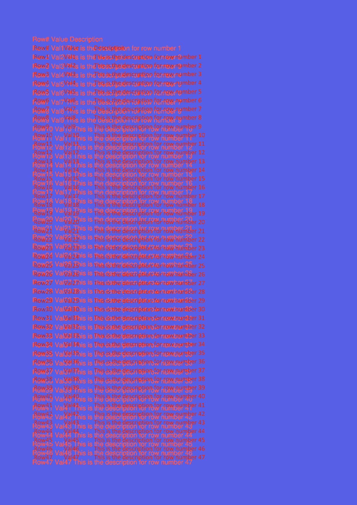</td>
  <td>changed: 290089 px (13.33%)<br>bbox: [114, 127, 712, 1618]<br>mean abs RGB: 21.969<br>RMSE RGB: 67.1134<br>threshold: 12, gain: 5.0</td>
</tr>
<tr>
  <td><b>classic06_tall_table</b><br>Page 2</td>
  <td>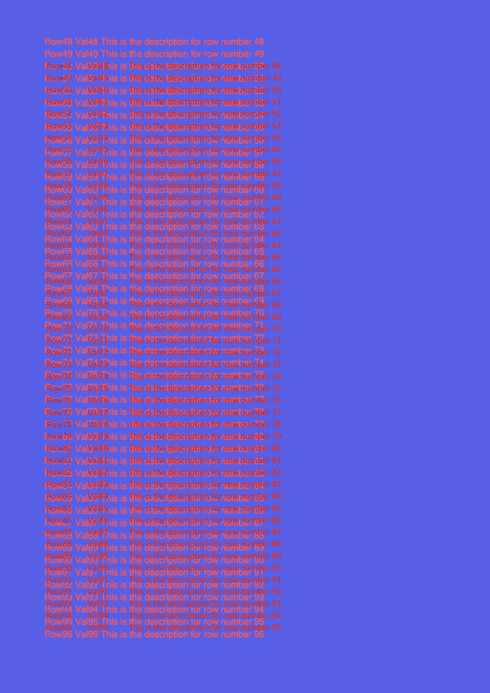</td>
  <td>changed: 305818 px (14.05%)<br>bbox: [114, 96, 712, 1618]<br>mean abs RGB: 23.0955<br>RMSE RGB: 68.7339<br>threshold: 12, gain: 5.0</td>
</tr>
<tr>
  <td><b>classic06_tall_table</b><br>Page 3</td>
  <td>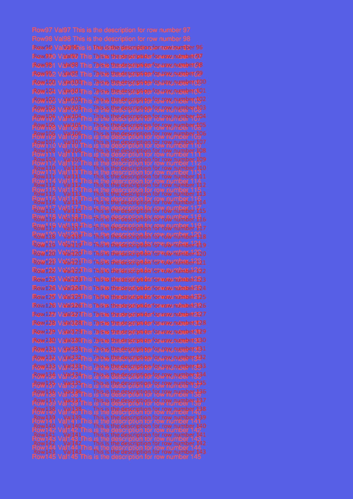</td>
  <td>changed: 313222 px (14.39%)<br>bbox: [114, 96, 724, 1618]<br>mean abs RGB: 23.9446<br>RMSE RGB: 70.3088<br>threshold: 12, gain: 5.0</td>
</tr>
<tr>
  <td><b>classic06_tall_table</b><br>Page 4</td>
  <td>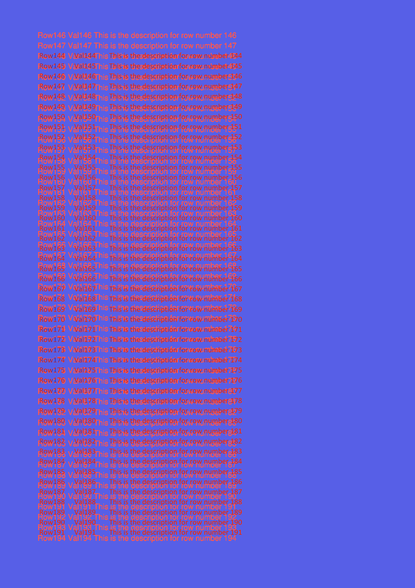</td>
  <td>changed: 316485 px (14.54%)<br>bbox: [114, 96, 724, 1618]<br>mean abs RGB: 24.1608<br>RMSE RGB: 70.596<br>threshold: 12, gain: 5.0</td>
</tr>
<tr>
  <td><b>classic06_tall_table</b><br>Page 5</td>
  <td></td>
  <td>changed: 48499 px (2.23%)<br>bbox: [114, 96, 724, 420]<br>mean abs RGB: 3.6771<br>RMSE RGB: 27.4832<br>threshold: 12, gain: 5.0</td>
</tr>
<tr>
  <td><b>classic07_numbers_only</b><br>Page 1</td>
  <td></td>
  <td>changed: 3315 px (0.15%)<br>bbox: [113, 127, 423, 265]<br>mean abs RGB: 0.2596<br>RMSE RGB: 7.384<br>threshold: 12, gain: 5.0</td>
</tr>
<tr>
  <td><b>classic08_mixed_text_and_numbers</b><br>Page 1</td>
  <td></td>
  <td>changed: 7650 px (0.35%)<br>bbox: [113, 127, 318, 326]<br>mean abs RGB: 0.5797<br>RMSE RGB: 10.8826<br>threshold: 12, gain: 5.0</td>
</tr>
<tr>
  <td><b>classic09_long_text</b><br>Page 1</td>
  <td></td>
  <td>changed: 41401 px (1.90%)<br>bbox: [113, 127, 1241, 294]<br>mean abs RGB: 3.215<br>RMSE RGB: 25.9449<br>threshold: 12, gain: 5.0</td>
</tr>
<tr>
  <td><b>classic09_long_text</b><br>Page 2</td>
  <td></td>
  <td>changed: 39328 px (1.81%)<br>bbox: [113, 158, 1241, 294]<br>mean abs RGB: 3.0638<br>RMSE RGB: 25.3698<br>threshold: 12, gain: 5.0</td>
</tr>
<tr>
  <td><b>classic09_long_text</b><br>Page 3</td>
  <td></td>
  <td>changed: 39279 px (1.80%)<br>bbox: [113, 158, 1241, 294]<br>mean abs RGB: 3.0623<br>RMSE RGB: 25.355<br>threshold: 12, gain: 5.0</td>
</tr>
<tr>
  <td><b>classic09_long_text</b><br>Page 4</td>
  <td></td>
  <td>changed: 40063 px (1.84%)<br>bbox: [113, 158, 1241, 294]<br>mean abs RGB: 3.1197<br>RMSE RGB: 25.5802<br>threshold: 12, gain: 5.0</td>
</tr>
<tr>
  <td><b>classic09_long_text</b><br>Page 5</td>
  <td></td>
  <td>changed: 42492 px (1.95%)<br>bbox: [113, 158, 1241, 294]<br>mean abs RGB: 3.3101<br>RMSE RGB: 26.3479<br>threshold: 12, gain: 5.0</td>
</tr>
<tr>
  <td><b>classic09_long_text</b><br>Page 6</td>
  <td></td>
  <td>changed: 42860 px (1.97%)<br>bbox: [113, 158, 1241, 294]<br>mean abs RGB: 3.339<br>RMSE RGB: 26.4761<br>threshold: 12, gain: 5.0</td>
</tr>
<tr>
  <td><b>classic09_long_text</b><br>Page 7</td>
  <td></td>
  <td>changed: 19941 px (0.92%)<br>bbox: [113, 219, 1241, 294]<br>mean abs RGB: 1.558<br>RMSE RGB: 18.1296<br>threshold: 12, gain: 5.0</td>
</tr>
<tr>
  <td><b>classic09_long_text</b><br>Page 8</td>
  <td></td>
  <td>changed: 12406 px (0.57%)<br>bbox: [113, 252, 1241, 294]<br>mean abs RGB: 0.9689<br>RMSE RGB: 14.2938<br>threshold: 12, gain: 5.0</td>
</tr>
<tr>
  <td><b>classic09_long_text</b><br>Page 9</td>
  <td></td>
  <td>changed: 12387 px (0.57%)<br>bbox: [113, 252, 1241, 294]<br>mean abs RGB: 0.9672<br>RMSE RGB: 14.281<br>threshold: 12, gain: 5.0</td>
</tr>
<tr>
  <td><b>classic09_long_text</b><br>Page 10</td>
  <td></td>
  <td>changed: 12406 px (0.57%)<br>bbox: [113, 252, 1241, 294]<br>mean abs RGB: 0.9688<br>RMSE RGB: 14.2926<br>threshold: 12, gain: 5.0</td>
</tr>
<tr>
  <td><b>classic09_long_text</b><br>Page 11</td>
  <td></td>
  <td>changed: 12399 px (0.57%)<br>bbox: [113, 252, 1241, 294]<br>mean abs RGB: 0.9683<br>RMSE RGB: 14.2891<br>threshold: 12, gain: 5.0</td>
</tr>
<tr>
  <td><b>classic09_long_text</b><br>Page 12</td>
  <td></td>
  <td>changed: 11381 px (0.52%)<br>bbox: [113, 252, 1106, 294]<br>mean abs RGB: 0.8873<br>RMSE RGB: 13.6716<br>threshold: 12, gain: 5.0</td>
</tr>
<tr>
  <td><b>classic10_special_xml_characters</b><br>Page 1</td>
  <td></td>
  <td>changed: 12359 px (0.57%)<br>bbox: [113, 127, 473, 360]<br>mean abs RGB: 0.9316<br>RMSE RGB: 13.8229<br>threshold: 12, gain: 5.0</td>
</tr>
<tr>
  <td><b>classic11_sparse_rows</b><br>Page 1</td>
  <td></td>
  <td>changed: 3308 px (0.15%)<br>bbox: [113, 127, 212, 749]<br>mean abs RGB: 0.2541<br>RMSE RGB: 7.2207<br>threshold: 12, gain: 5.0</td>
</tr>
<tr>
  <td><b>classic11_sparse_rows</b><br>Page 2</td>
  <td></td>
  <td>changed: 1014 px (0.05%)<br>bbox: [114, 127, 183, 205]<br>mean abs RGB: 0.0795<br>RMSE RGB: 4.0562<br>threshold: 12, gain: 5.0</td>
</tr>
<tr>
  <td><b>classic12_sparse_columns</b><br>Page 1</td>
  <td></td>
  <td>changed: 3994 px (0.18%)<br>bbox: [114, 127, 718, 235]<br>mean abs RGB: 0.3112<br>RMSE RGB: 8.0675<br>threshold: 12, gain: 5.0</td>
</tr>
<tr>
  <td><b>classic12_sparse_columns</b><br>Page 2</td>
  <td></td>
  <td>changed: 1043 px (0.05%)<br>bbox: [113, 189, 194, 238]<br>mean abs RGB: 0.0812<br>RMSE RGB: 4.1026<br>threshold: 12, gain: 5.0</td>
</tr>
<tr>
  <td><b>classic13_date_strings</b><br>Page 1</td>
  <td></td>
  <td>changed: 12160 px (0.56%)<br>bbox: [113, 127, 337, 330]<br>mean abs RGB: 0.9101<br>RMSE RGB: 13.6613<br>threshold: 12, gain: 5.0</td>
</tr>
<tr>
  <td><b>classic14_decimal_numbers</b><br>Page 1</td>
  <td></td>
  <td>changed: 9411 px (0.43%)<br>bbox: [113, 127, 318, 329]<br>mean abs RGB: 0.7268<br>RMSE RGB: 12.2951<br>threshold: 12, gain: 5.0</td>
</tr>
<tr>
  <td><b>classic15_negative_numbers</b><br>Page 1</td>
  <td></td>
  <td>changed: 10551 px (0.48%)<br>bbox: [113, 127, 420, 359]<br>mean abs RGB: 0.802<br>RMSE RGB: 12.8665<br>threshold: 12, gain: 5.0</td>
</tr>
<tr>
  <td><b>classic16_percentage_strings</b><br>Page 1</td>
  <td></td>
  <td>changed: 9921 px (0.46%)<br>bbox: [113, 127, 299, 326]<br>mean abs RGB: 0.7299<br>RMSE RGB: 12.1455<br>threshold: 12, gain: 5.0</td>
</tr>
<tr>
  <td><b>classic17_currency_strings</b><br>Page 1</td>
  <td></td>
  <td>changed: 12749 px (0.59%)<br>bbox: [113, 127, 315, 356]<br>mean abs RGB: 0.9422<br>RMSE RGB: 13.7999<br>threshold: 12, gain: 5.0</td>
</tr>
<tr>
  <td><b>classic18_large_dataset</b><br>Page 1</td>
  <td>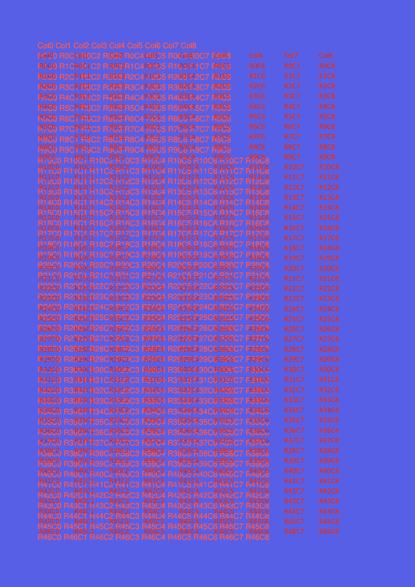</td>
  <td>changed: 372739 px (17.12%)<br>bbox: [113, 127, 1013, 1614]<br>mean abs RGB: 28.5378<br>RMSE RGB: 77.0164<br>threshold: 12, gain: 5.0</td>
</tr>
<tr>
  <td><b>classic18_large_dataset</b><br>Page 2</td>
  <td>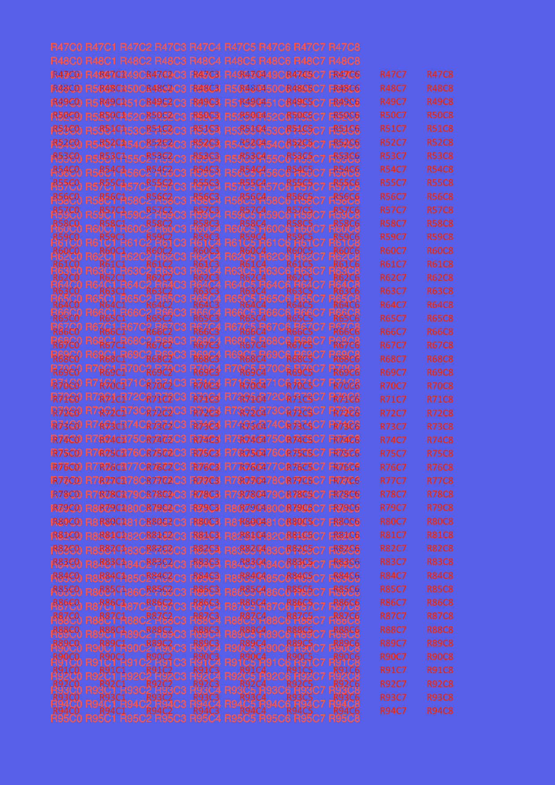</td>
  <td>changed: 403930 px (18.56%)<br>bbox: [114, 96, 1013, 1614]<br>mean abs RGB: 30.7433<br>RMSE RGB: 79.8001<br>threshold: 12, gain: 5.0</td>
</tr>
<tr>
  <td><b>classic18_large_dataset</b><br>Page 3</td>
  <td>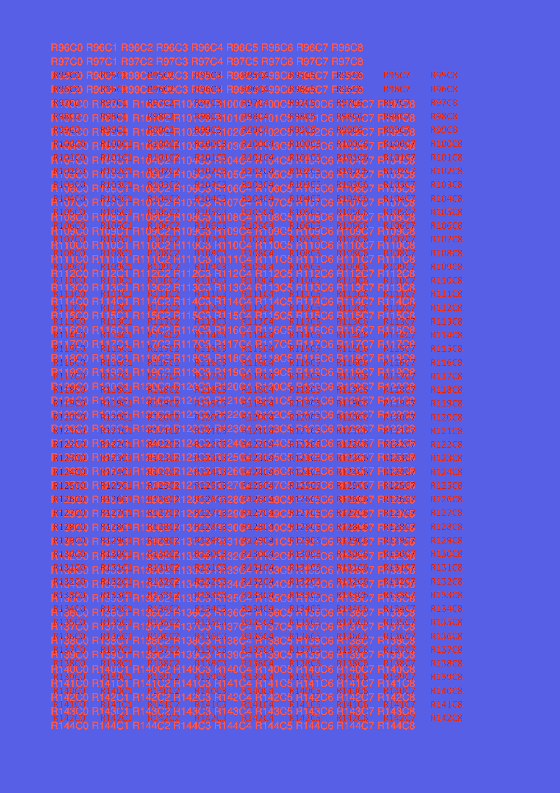</td>
  <td>changed: 439360 px (20.18%)<br>bbox: [114, 96, 1025, 1614]<br>mean abs RGB: 33.4549<br>RMSE RGB: 83.3678<br>threshold: 12, gain: 5.0</td>
</tr>
<tr>
  <td><b>classic18_large_dataset</b><br>Page 4</td>
  <td></td>
  <td>changed: 449803 px (20.66%)<br>bbox: [114, 96, 1025, 1614]<br>mean abs RGB: 34.1254<br>RMSE RGB: 84.1011<br>threshold: 12, gain: 5.0</td>
</tr>
<tr>
  <td><b>classic18_large_dataset</b><br>Page 5</td>
  <td>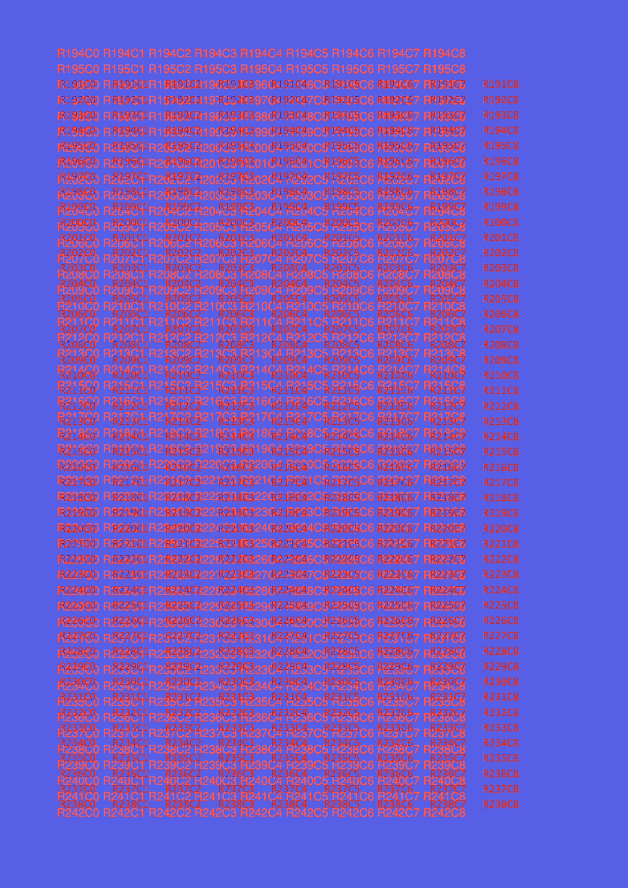</td>
  <td>changed: 461721 px (21.21%)<br>bbox: [114, 96, 1025, 1614]<br>mean abs RGB: 35.4518<br>RMSE RGB: 85.9814<br>threshold: 12, gain: 5.0</td>
</tr>
<tr>
  <td><b>classic18_large_dataset</b><br>Page 6</td>
  <td>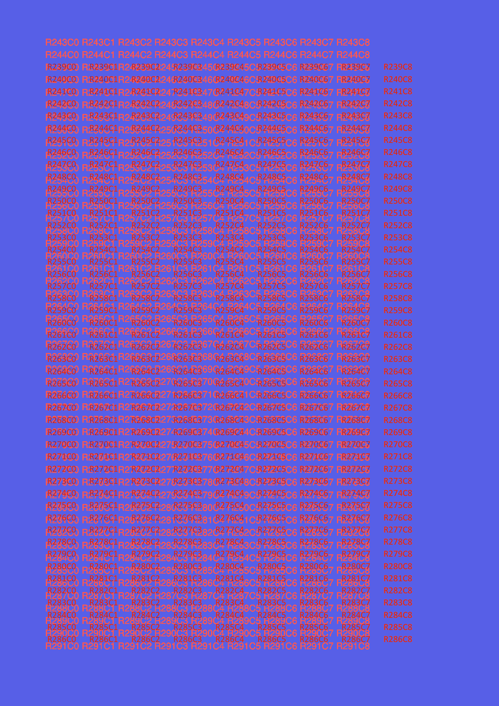</td>
  <td>changed: 468145 px (21.51%)<br>bbox: [114, 96, 1025, 1614]<br>mean abs RGB: 35.9256<br>RMSE RGB: 86.4975<br>threshold: 12, gain: 5.0</td>
</tr>
<tr>
  <td><b>classic18_large_dataset</b><br>Page 7</td>
  <td>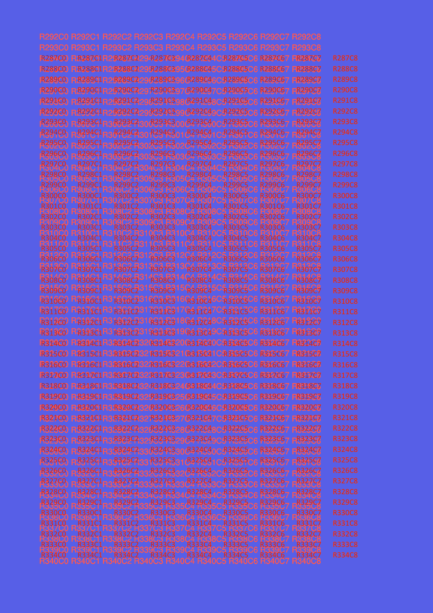</td>
  <td>changed: 470931 px (21.63%)<br>bbox: [114, 96, 1025, 1614]<br>mean abs RGB: 35.8532<br>RMSE RGB: 86.2106<br>threshold: 12, gain: 5.0</td>
</tr>
<tr>
  <td><b>classic18_large_dataset</b><br>Page 8</td>
  <td>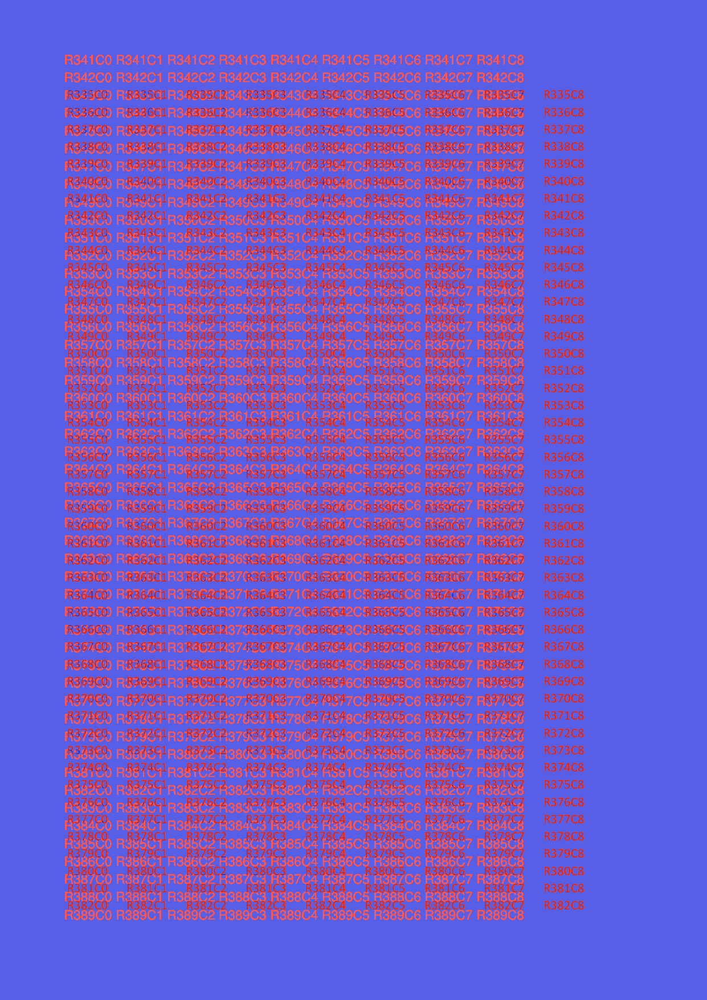</td>
  <td>changed: 473605 px (21.76%)<br>bbox: [114, 96, 1025, 1614]<br>mean abs RGB: 35.8764<br>RMSE RGB: 86.0905<br>threshold: 12, gain: 5.0</td>
</tr>
<tr>
  <td><b>classic18_large_dataset</b><br>Page 9</td>
  <td>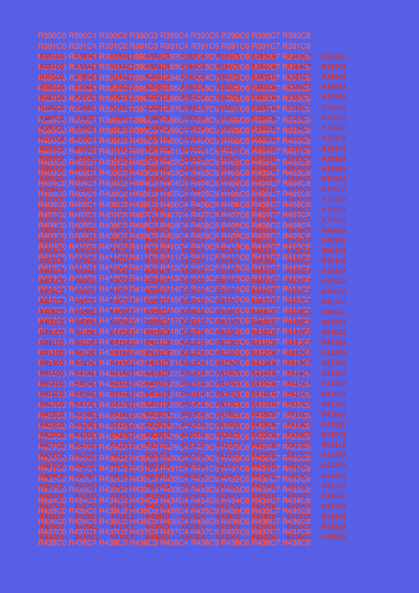</td>
  <td>changed: 465711 px (21.40%)<br>bbox: [114, 96, 1025, 1614]<br>mean abs RGB: 35.8118<br>RMSE RGB: 86.3308<br>threshold: 12, gain: 5.0</td>
</tr>
<tr>
  <td><b>classic18_large_dataset</b><br>Page 10</td>
  <td>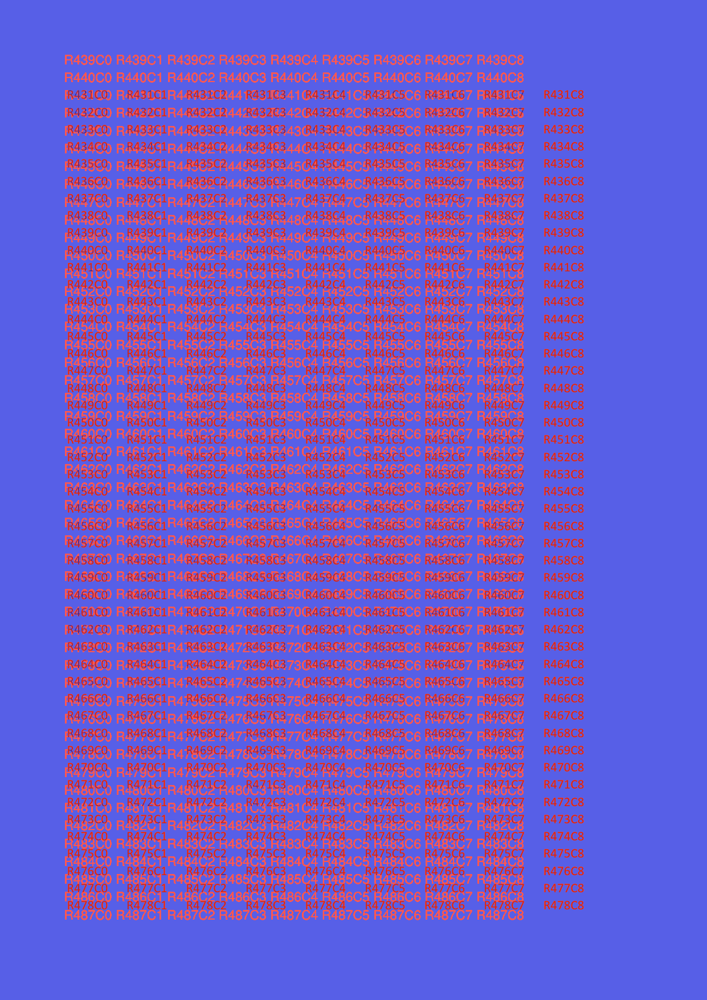</td>
  <td>changed: 462711 px (21.26%)<br>bbox: [114, 96, 1025, 1614]<br>mean abs RGB: 35.6272<br>RMSE RGB: 86.1049<br>threshold: 12, gain: 5.0</td>
</tr>
<tr>
  <td><b>classic18_large_dataset</b><br>Page 11</td>
  <td>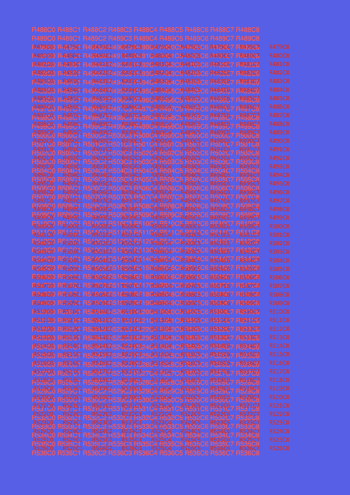</td>
  <td>changed: 472635 px (21.71%)<br>bbox: [114, 96, 1025, 1614]<br>mean abs RGB: 36.0178<br>RMSE RGB: 86.4361<br>threshold: 12, gain: 5.0</td>
</tr>
<tr>
  <td><b>classic18_large_dataset</b><br>Page 12</td>
  <td>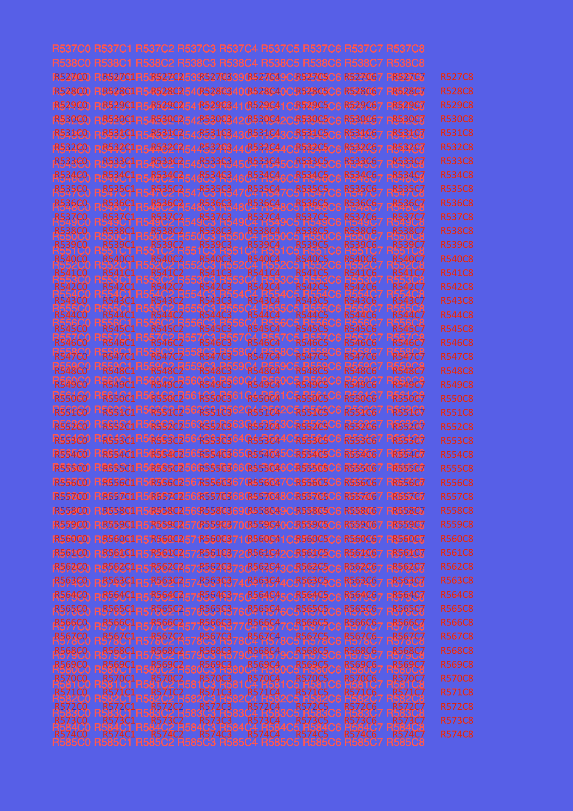</td>
  <td>changed: 474162 px (21.78%)<br>bbox: [114, 96, 1025, 1614]<br>mean abs RGB: 35.8491<br>RMSE RGB: 86.0667<br>threshold: 12, gain: 5.0</td>
</tr>
<tr>
  <td><b>classic18_large_dataset</b><br>Page 13</td>
  <td>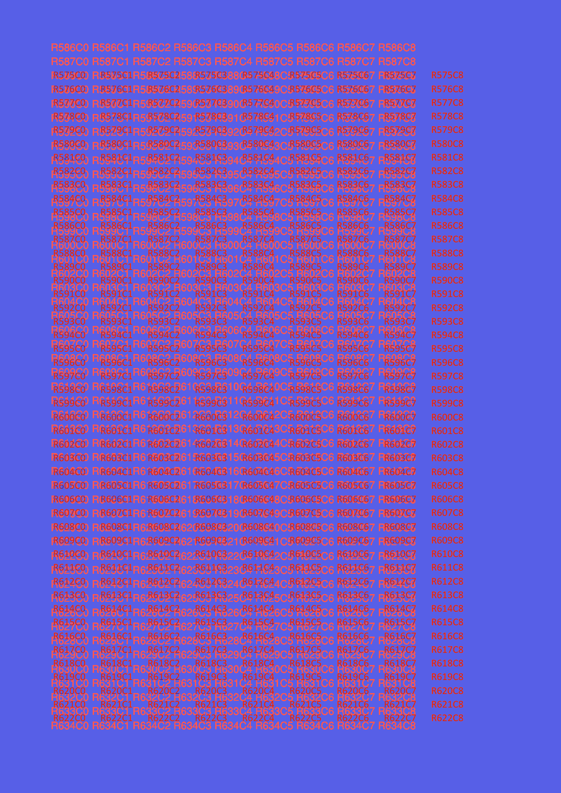</td>
  <td>changed: 478429 px (21.98%)<br>bbox: [114, 96, 1025, 1614]<br>mean abs RGB: 36.391<br>RMSE RGB: 86.8386<br>threshold: 12, gain: 5.0</td>
</tr>
<tr>
  <td><b>classic18_large_dataset</b><br>Page 14</td>
  <td>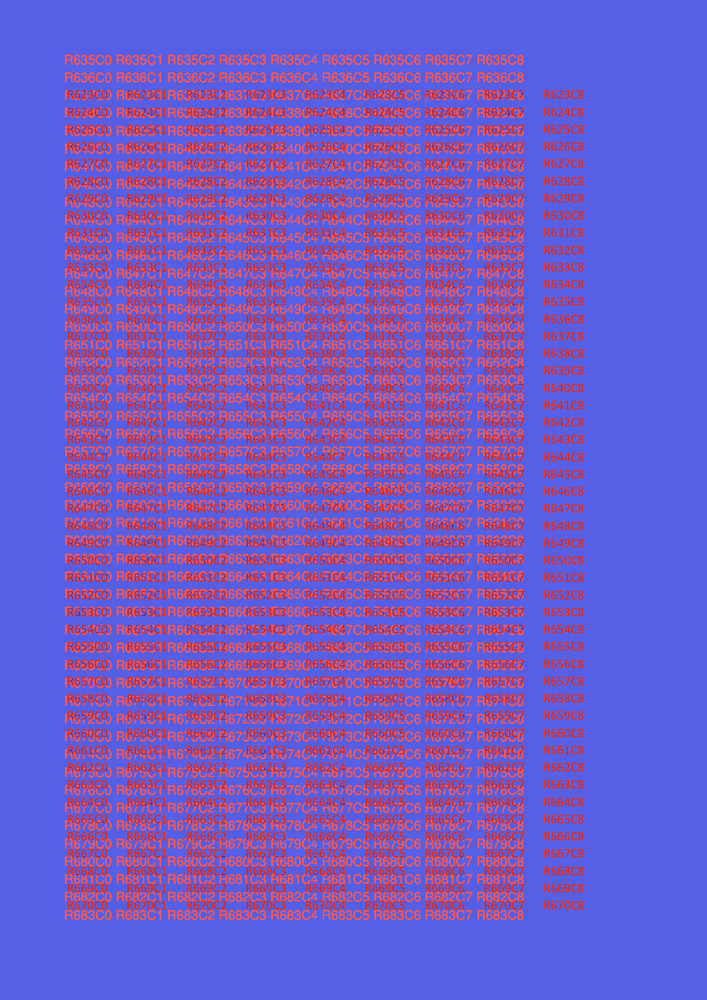</td>
  <td>changed: 479905 px (22.05%)<br>bbox: [114, 96, 1025, 1614]<br>mean abs RGB: 36.5677<br>RMSE RGB: 87.017<br>threshold: 12, gain: 5.0</td>
</tr>
<tr>
  <td><b>classic18_large_dataset</b><br>Page 15</td>
  <td>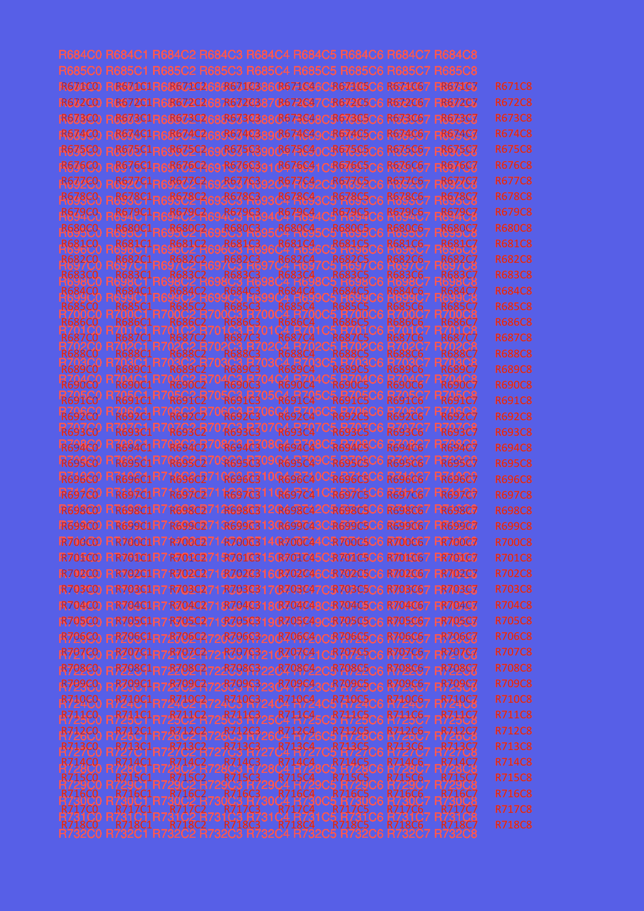</td>
  <td>changed: 466317 px (21.42%)<br>bbox: [114, 96, 1025, 1614]<br>mean abs RGB: 35.5039<br>RMSE RGB: 85.8052<br>threshold: 12, gain: 5.0</td>
</tr>
<tr>
  <td><b>classic18_large_dataset</b><br>Page 16</td>
  <td>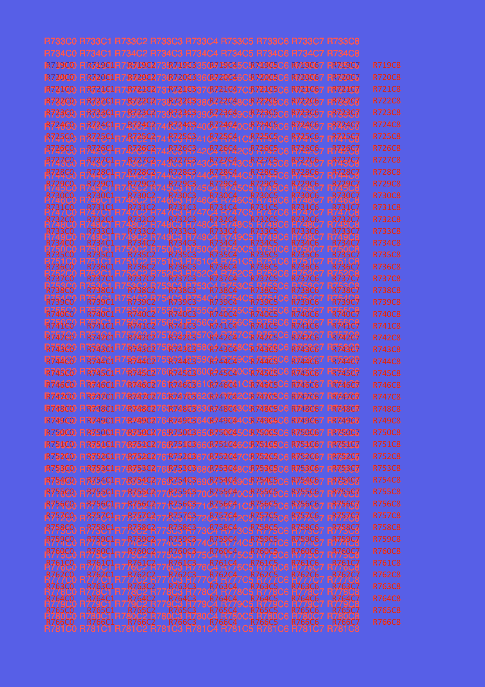</td>
  <td>changed: 451799 px (20.76%)<br>bbox: [114, 96, 1025, 1614]<br>mean abs RGB: 34.2342<br>RMSE RGB: 84.1498<br>threshold: 12, gain: 5.0</td>
</tr>
<tr>
  <td><b>classic18_large_dataset</b><br>Page 17</td>
  <td>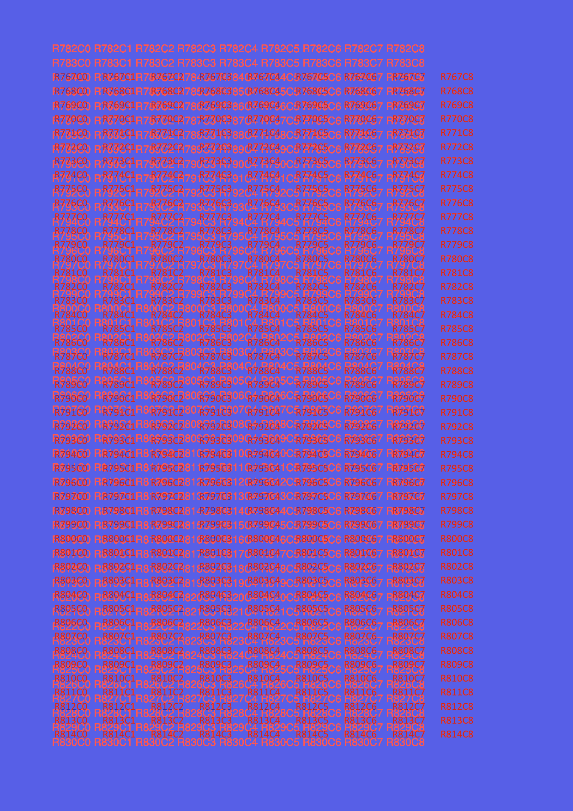</td>
  <td>changed: 470099 px (21.60%)<br>bbox: [114, 96, 1025, 1614]<br>mean abs RGB: 35.7541<br>RMSE RGB: 86.0832<br>threshold: 12, gain: 5.0</td>
</tr>
<tr>
  <td><b>classic18_large_dataset</b><br>Page 18</td>
  <td>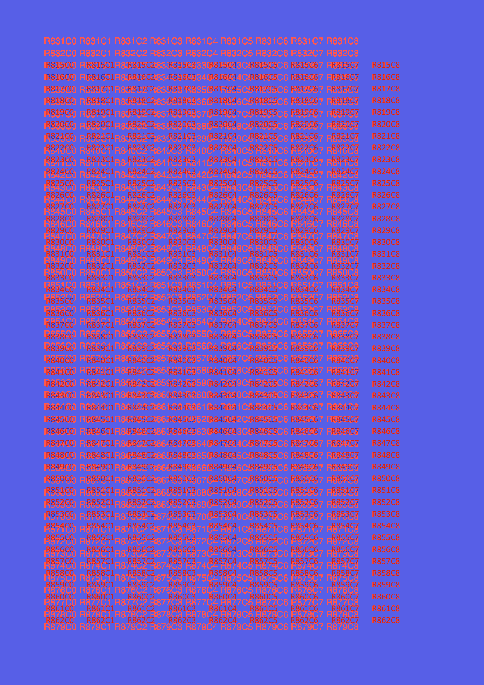</td>
  <td>changed: 483093 px (22.19%)<br>bbox: [114, 96, 1025, 1614]<br>mean abs RGB: 36.7925<br>RMSE RGB: 87.2733<br>threshold: 12, gain: 5.0</td>
</tr>
<tr>
  <td><b>classic18_large_dataset</b><br>Page 19</td>
  <td>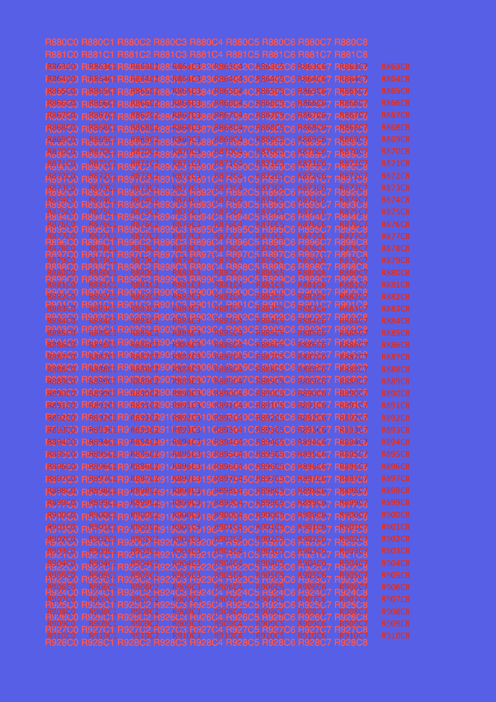</td>
  <td>changed: 485582 px (22.31%)<br>bbox: [114, 96, 1025, 1614]<br>mean abs RGB: 37.0091<br>RMSE RGB: 87.5783<br>threshold: 12, gain: 5.0</td>
</tr>
<tr>
  <td><b>classic18_large_dataset</b><br>Page 20</td>
  <td>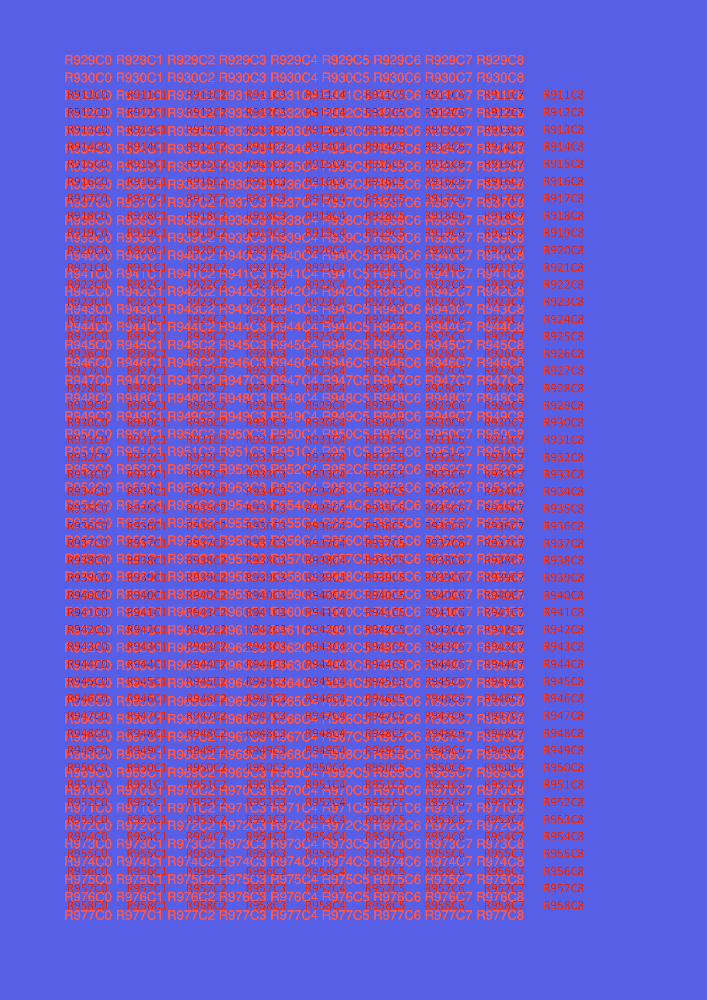</td>
  <td>changed: 477847 px (21.95%)<br>bbox: [114, 96, 1025, 1614]<br>mean abs RGB: 36.4055<br>RMSE RGB: 86.8266<br>threshold: 12, gain: 5.0</td>
</tr>
<tr>
  <td><b>classic18_large_dataset</b><br>Page 21</td>
  <td>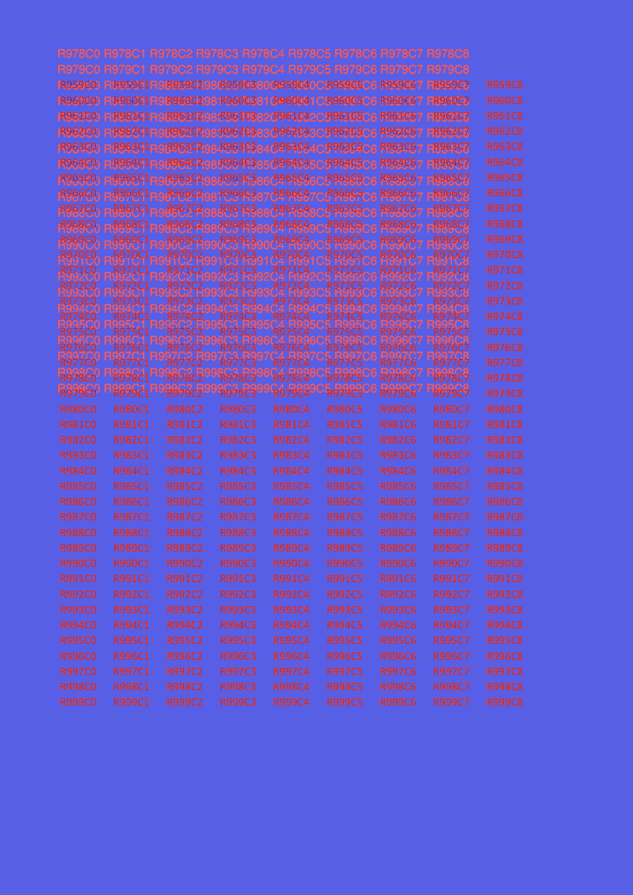</td>
  <td>changed: 317792 px (14.60%)<br>bbox: [114, 96, 1025, 1384]<br>mean abs RGB: 24.3181<br>RMSE RGB: 71.0641<br>threshold: 12, gain: 5.0</td>
</tr>
<tr>
  <td><b>classic18_large_dataset</b><br>Page 22</td>
  <td></td>
  <td>changed: 40375 px (1.85%)<br>bbox: [113, 127, 183, 1614]<br>mean abs RGB: 3.0425<br>RMSE RGB: 25.0026<br>threshold: 12, gain: 5.0</td>
</tr>
<tr>
  <td><b>classic18_large_dataset</b><br>Page 23</td>
  <td></td>
  <td>changed: 44112 px (2.03%)<br>bbox: [114, 96, 183, 1614]<br>mean abs RGB: 3.3101<br>RMSE RGB: 26.0543<br>threshold: 12, gain: 5.0</td>
</tr>
<tr>
  <td><b>classic18_large_dataset</b><br>Page 24</td>
  <td></td>
  <td>changed: 48370 px (2.22%)<br>bbox: [114, 96, 196, 1614]<br>mean abs RGB: 3.6158<br>RMSE RGB: 27.2648<br>threshold: 12, gain: 5.0</td>
</tr>
<tr>
  <td><b>classic18_large_dataset</b><br>Page 25</td>
  <td></td>
  <td>changed: 49399 px (2.27%)<br>bbox: [114, 96, 196, 1614]<br>mean abs RGB: 3.6612<br>RMSE RGB: 27.3806<br>threshold: 12, gain: 5.0</td>
</tr>
<tr>
  <td><b>classic18_large_dataset</b><br>Page 26</td>
  <td></td>
  <td>changed: 51179 px (2.35%)<br>bbox: [114, 96, 196, 1614]<br>mean abs RGB: 3.8541<br>RMSE RGB: 28.1819<br>threshold: 12, gain: 5.0</td>
</tr>
<tr>
  <td><b>classic18_large_dataset</b><br>Page 27</td>
  <td></td>
  <td>changed: 52000 px (2.39%)<br>bbox: [114, 96, 196, 1614]<br>mean abs RGB: 3.91<br>RMSE RGB: 28.3586<br>threshold: 12, gain: 5.0</td>
</tr>
<tr>
  <td><b>classic18_large_dataset</b><br>Page 28</td>
  <td></td>
  <td>changed: 51902 px (2.38%)<br>bbox: [114, 96, 196, 1614]<br>mean abs RGB: 3.8768<br>RMSE RGB: 28.1943<br>threshold: 12, gain: 5.0</td>
</tr>
<tr>
  <td><b>classic18_large_dataset</b><br>Page 29</td>
  <td></td>
  <td>changed: 52145 px (2.40%)<br>bbox: [114, 96, 196, 1614]<br>mean abs RGB: 3.8732<br>RMSE RGB: 28.1302<br>threshold: 12, gain: 5.0</td>
</tr>
<tr>
  <td><b>classic18_large_dataset</b><br>Page 30</td>
  <td></td>
  <td>changed: 51244 px (2.35%)<br>bbox: [114, 96, 196, 1614]<br>mean abs RGB: 3.8558<br>RMSE RGB: 28.1347<br>threshold: 12, gain: 5.0</td>
</tr>
<tr>
  <td><b>classic18_large_dataset</b><br>Page 31</td>
  <td>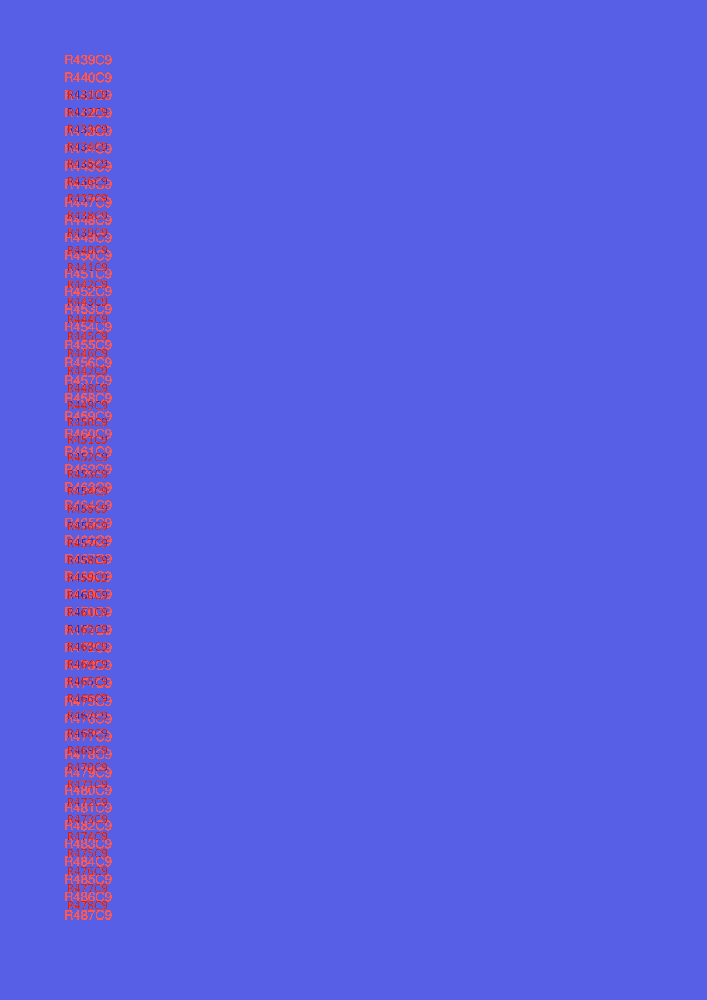</td>
  <td>changed: 50795 px (2.33%)<br>bbox: [114, 96, 196, 1614]<br>mean abs RGB: 3.8215<br>RMSE RGB: 27.9959<br>threshold: 12, gain: 5.0</td>
</tr>
<tr>
  <td><b>classic18_large_dataset</b><br>Page 32</td>
  <td></td>
  <td>changed: 52249 px (2.40%)<br>bbox: [114, 96, 196, 1614]<br>mean abs RGB: 3.9073<br>RMSE RGB: 28.3195<br>threshold: 12, gain: 5.0</td>
</tr>
<tr>
  <td><b>classic18_large_dataset</b><br>Page 33</td>
  <td></td>
  <td>changed: 52337 px (2.40%)<br>bbox: [114, 96, 196, 1614]<br>mean abs RGB: 3.8726<br>RMSE RGB: 28.1263<br>threshold: 12, gain: 5.0</td>
</tr>
<tr>
  <td><b>classic18_large_dataset</b><br>Page 34</td>
  <td></td>
  <td>changed: 53051 px (2.44%)<br>bbox: [114, 96, 196, 1614]<br>mean abs RGB: 3.9579<br>RMSE RGB: 28.4918<br>threshold: 12, gain: 5.0</td>
</tr>
<tr>
  <td><b>classic18_large_dataset</b><br>Page 35</td>
  <td></td>
  <td>changed: 52836 px (2.43%)<br>bbox: [114, 96, 196, 1614]<br>mean abs RGB: 3.9373<br>RMSE RGB: 28.3673<br>threshold: 12, gain: 5.0</td>
</tr>
<tr>
  <td><b>classic18_large_dataset</b><br>Page 36</td>
  <td></td>
  <td>changed: 51785 px (2.38%)<br>bbox: [114, 96, 196, 1614]<br>mean abs RGB: 3.8776<br>RMSE RGB: 28.2159<br>threshold: 12, gain: 5.0</td>
</tr>
<tr>
  <td><b>classic18_large_dataset</b><br>Page 37</td>
  <td></td>
  <td>changed: 50137 px (2.30%)<br>bbox: [114, 96, 196, 1614]<br>mean abs RGB: 3.7338<br>RMSE RGB: 27.6565<br>threshold: 12, gain: 5.0</td>
</tr>
<tr>
  <td><b>classic18_large_dataset</b><br>Page 38</td>
  <td></td>
  <td>changed: 52083 px (2.39%)<br>bbox: [114, 96, 196, 1614]<br>mean abs RGB: 3.8845<br>RMSE RGB: 28.2319<br>threshold: 12, gain: 5.0</td>
</tr>
<tr>
  <td><b>classic18_large_dataset</b><br>Page 39</td>
  <td></td>
  <td>changed: 53274 px (2.45%)<br>bbox: [114, 96, 196, 1614]<br>mean abs RGB: 3.9561<br>RMSE RGB: 28.449<br>threshold: 12, gain: 5.0</td>
</tr>
<tr>
  <td><b>classic18_large_dataset</b><br>Page 40</td>
  <td></td>
  <td>changed: 53478 px (2.46%)<br>bbox: [114, 96, 196, 1614]<br>mean abs RGB: 3.9893<br>RMSE RGB: 28.586<br>threshold: 12, gain: 5.0</td>
</tr>
<tr>
  <td><b>classic18_large_dataset</b><br>Page 41</td>
  <td></td>
  <td>changed: 52700 px (2.42%)<br>bbox: [114, 96, 196, 1614]<br>mean abs RGB: 3.9359<br>RMSE RGB: 28.3915<br>threshold: 12, gain: 5.0</td>
</tr>
<tr>
  <td><b>classic18_large_dataset</b><br>Page 42</td>
  <td></td>
  <td>changed: 35387 px (1.63%)<br>bbox: [114, 96, 196, 1384]<br>mean abs RGB: 2.6719<br>RMSE RGB: 23.4635<br>threshold: 12, gain: 5.0</td>
</tr>
<tr>
  <td><b>classic19_single_column_list</b><br>Page 1</td>
  <td></td>
  <td>changed: 17001 px (0.78%)<br>bbox: [114, 127, 189, 779]<br>mean abs RGB: 1.2856<br>RMSE RGB: 16.12<br>threshold: 12, gain: 5.0</td>
</tr>
<tr>
  <td><b>classic20_all_empty_cells</b><br>Page 1</td>
  <td></td>
  <td>changed: 0 px (0.00%)<br>bbox: None<br>mean abs RGB: 0.0<br>RMSE RGB: 0.0<br>threshold: 12, gain: 5.0</td>
</tr>
<tr>
  <td><b>classic21_header_only</b><br>Page 1</td>
  <td></td>
  <td>changed: 3197 px (0.15%)<br>bbox: [113, 127, 576, 174]<br>mean abs RGB: 0.2478<br>RMSE RGB: 7.2017<br>threshold: 12, gain: 5.0</td>
</tr>
<tr>
  <td><b>classic22_long_sheet_name</b><br>Page 1</td>
  <td></td>
  <td>changed: 3812 px (0.18%)<br>bbox: [114, 127, 318, 235]<br>mean abs RGB: 0.2903<br>RMSE RGB: 7.7251<br>threshold: 12, gain: 5.0</td>
</tr>
<tr>
  <td><b>classic23_unicode_text</b><br>Page 1</td>
  <td></td>
  <td>changed: 16284 px (0.75%)<br>bbox: [112, 127, 423, 360]<br>mean abs RGB: 1.2268<br>RMSE RGB: 15.8317<br>threshold: 12, gain: 5.0</td>
</tr>
<tr>
  <td><b>classic24_red_text</b><br>Page 1</td>
  <td></td>
  <td>changed: 11488 px (0.53%)<br>bbox: [113, 127, 440, 269]<br>mean abs RGB: 0.7669<br>RMSE RGB: 12.4378<br>threshold: 12, gain: 5.0</td>
</tr>
<tr>
  <td><b>classic25_multiple_colors</b><br>Page 1</td>
  <td></td>
  <td>changed: 24108 px (1.11%)<br>bbox: [113, 127, 413, 419]<br>mean abs RGB: 1.5125<br>RMSE RGB: 17.4676<br>threshold: 12, gain: 5.0</td>
</tr>
<tr>
  <td><b>classic26_inline_strings</b><br>Page 1</td>
  <td></td>
  <td>changed: 7095 px (0.33%)<br>bbox: [113, 127, 391, 235]<br>mean abs RGB: 0.5437<br>RMSE RGB: 10.61<br>threshold: 12, gain: 5.0</td>
</tr>
<tr>
  <td><b>classic27_single_row</b><br>Page 1</td>
  <td></td>
  <td>changed: 3658 px (0.17%)<br>bbox: [114, 127, 778, 174]<br>mean abs RGB: 0.2898<br>RMSE RGB: 7.8061<br>threshold: 12, gain: 5.0</td>
</tr>
<tr>
  <td><b>classic28_duplicate_values</b><br>Page 1</td>
  <td></td>
  <td>changed: 8384 px (0.39%)<br>bbox: [113, 127, 462, 295]<br>mean abs RGB: 0.6479<br>RMSE RGB: 11.6068<br>threshold: 12, gain: 5.0</td>
</tr>
<tr>
  <td><b>classic29_formula_results</b><br>Page 1</td>
  <td></td>
  <td>changed: 9062 px (0.42%)<br>bbox: [113, 127, 527, 295]<br>mean abs RGB: 0.702<br>RMSE RGB: 12.1093<br>threshold: 12, gain: 5.0</td>
</tr>
<tr>
  <td><b>classic30_mixed_empty_and_filled_sheets</b><br>Page 1</td>
  <td></td>
  <td>changed: 3483 px (0.16%)<br>bbox: [114, 127, 279, 237]<br>mean abs RGB: 0.2719<br>RMSE RGB: 7.5051<br>threshold: 12, gain: 5.0</td>
</tr>
<tr>
  <td><b>classic30_mixed_empty_and_filled_sheets</b><br>Page 2</td>
  <td></td>
  <td>changed: 3855 px (0.18%)<br>bbox: [113, 127, 422, 205]<br>mean abs RGB: 0.3027<br>RMSE RGB: 7.9588<br>threshold: 12, gain: 5.0</td>
</tr>
<tr>
  <td><b>classic31_bold_header_row</b><br>Page 1</td>
  <td></td>
  <td>changed: 15003 px (0.69%)<br>bbox: [113, 127, 527, 295]<br>mean abs RGB: 1.1462<br>RMSE RGB: 15.3945<br>threshold: 12, gain: 5.0</td>
</tr>
<tr>
  <td><b>classic32_right_aligned_numbers</b><br>Page 1</td>
  <td></td>
  <td>changed: 7121 px (0.33%)<br>bbox: [114, 127, 318, 265]<br>mean abs RGB: 0.5422<br>RMSE RGB: 10.5319<br>threshold: 12, gain: 5.0</td>
</tr>
<tr>
  <td><b>classic33_centered_text</b><br>Page 1</td>
  <td></td>
  <td>changed: 5242 px (0.24%)<br>bbox: [113, 127, 596, 235]<br>mean abs RGB: 0.4123<br>RMSE RGB: 9.2979<br>threshold: 12, gain: 5.0</td>
</tr>
<tr>
  <td><b>classic34_explicit_column_widths</b><br>Page 1</td>
  <td></td>
  <td>changed: 12350 px (0.57%)<br>bbox: [113, 127, 662, 269]<br>mean abs RGB: 0.9451<br>RMSE RGB: 13.9738<br>threshold: 12, gain: 5.0</td>
</tr>
<tr>
  <td><b>classic35_explicit_row_heights</b><br>Page 1</td>
  <td></td>
  <td>changed: 5757 px (0.26%)<br>bbox: [113, 127, 318, 342]<br>mean abs RGB: 0.4406<br>RMSE RGB: 9.5409<br>threshold: 12, gain: 5.0</td>
</tr>
<tr>
  <td><b>classic36_merged_cells</b><br>Page 1</td>
  <td></td>
  <td>changed: 11936 px (0.55%)<br>bbox: [113, 127, 537, 265]<br>mean abs RGB: 0.9231<br>RMSE RGB: 13.8698<br>threshold: 12, gain: 5.0</td>
</tr>
<tr>
  <td><b>classic37_freeze_panes</b><br>Page 1</td>
  <td>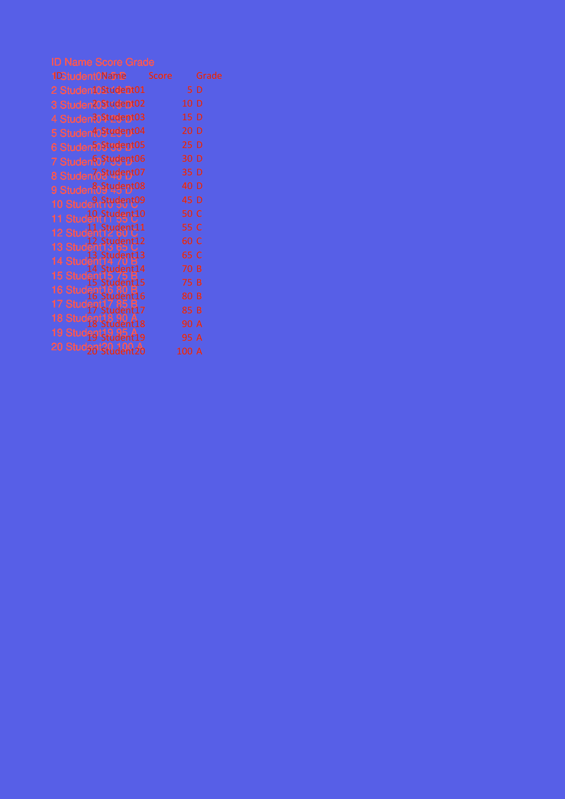</td>
  <td>changed: 47787 px (2.20%)<br>bbox: [113, 127, 487, 779]<br>mean abs RGB: 3.6894<br>RMSE RGB: 27.7004<br>threshold: 12, gain: 5.0</td>
</tr>
<tr>
  <td><b>classic38_hyperlink_cell</b><br>Page 1</td>
  <td></td>
  <td>changed: 8431 px (0.39%)<br>bbox: [113, 127, 478, 240]<br>mean abs RGB: 0.613<br>RMSE RGB: 11.167<br>threshold: 12, gain: 5.0</td>
</tr>
<tr>
  <td><b>classic39_financial_table</b><br>Page 1</td>
  <td></td>
  <td>changed: 20364 px (0.94%)<br>bbox: [112, 127, 527, 356]<br>mean abs RGB: 1.5219<br>RMSE RGB: 17.7211<br>threshold: 12, gain: 5.0</td>
</tr>
<tr>
  <td><b>classic40_scientific_notation</b><br>Page 1</td>
  <td></td>
  <td>changed: 15446 px (0.71%)<br>bbox: [113, 127, 516, 330]<br>mean abs RGB: 1.1636<br>RMSE RGB: 15.4449<br>threshold: 12, gain: 5.0</td>
</tr>
<tr>
  <td><b>classic41_integer_vs_float</b><br>Page 1</td>
  <td></td>
  <td>changed: 12127 px (0.56%)<br>bbox: [113, 127, 318, 416]<br>mean abs RGB: 0.9204<br>RMSE RGB: 13.7448<br>threshold: 12, gain: 5.0</td>
</tr>
<tr>
  <td><b>classic42_boolean_values</b><br>Page 1</td>
  <td></td>
  <td>changed: 12271 px (0.56%)<br>bbox: [113, 127, 324, 326]<br>mean abs RGB: 0.9215<br>RMSE RGB: 13.7325<br>threshold: 12, gain: 5.0</td>
</tr>
<tr>
  <td><b>classic43_inventory_report</b><br>Page 1</td>
  <td></td>
  <td>changed: 39985 px (1.84%)<br>bbox: [113, 127, 748, 388]<br>mean abs RGB: 3.0227<br>RMSE RGB: 24.959<br>threshold: 12, gain: 5.0</td>
</tr>
<tr>
  <td><b>classic44_employee_roster</b><br>Page 1</td>
  <td></td>
  <td>changed: 61812 px (2.84%)<br>bbox: [114, 127, 839, 420]<br>mean abs RGB: 4.6385<br>RMSE RGB: 30.7599<br>threshold: 12, gain: 5.0</td>
</tr>
<tr>
  <td><b>classic45_sales_by_region</b><br>Page 1</td>
  <td></td>
  <td>changed: 7071 px (0.32%)<br>bbox: [113, 127, 318, 296]<br>mean abs RGB: 0.5478<br>RMSE RGB: 10.706<br>threshold: 12, gain: 5.0</td>
</tr>
<tr>
  <td><b>classic45_sales_by_region</b><br>Page 2</td>
  <td></td>
  <td>changed: 7195 px (0.33%)<br>bbox: [113, 127, 318, 296]<br>mean abs RGB: 0.5605<br>RMSE RGB: 10.8332<br>threshold: 12, gain: 5.0</td>
</tr>
<tr>
  <td><b>classic45_sales_by_region</b><br>Page 3</td>
  <td></td>
  <td>changed: 7407 px (0.34%)<br>bbox: [113, 127, 318, 296]<br>mean abs RGB: 0.5717<br>RMSE RGB: 10.9181<br>threshold: 12, gain: 5.0</td>
</tr>
<tr>
  <td><b>classic45_sales_by_region</b><br>Page 4</td>
  <td></td>
  <td>changed: 7188 px (0.33%)<br>bbox: [113, 127, 318, 296]<br>mean abs RGB: 0.5558<br>RMSE RGB: 10.7729<br>threshold: 12, gain: 5.0</td>
</tr>
<tr>
  <td><b>classic46_grade_book</b><br>Page 1</td>
  <td></td>
  <td>changed: 26754 px (1.23%)<br>bbox: [113, 127, 801, 386]<br>mean abs RGB: 2.0749<br>RMSE RGB: 20.7724<br>threshold: 12, gain: 5.0</td>
</tr>
<tr>
  <td><b>classic47_time_series</b><br>Page 1</td>
  <td>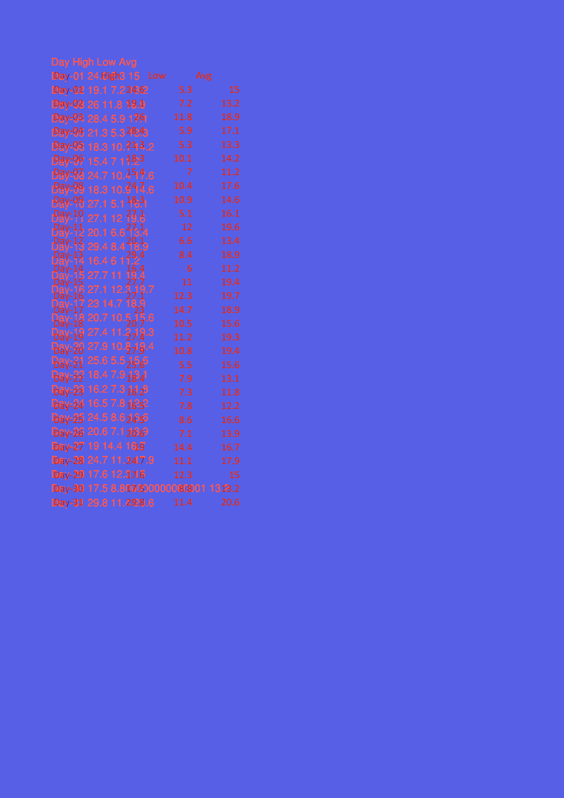</td>
  <td>changed: 73438 px (3.37%)<br>bbox: [114, 127, 527, 1118]<br>mean abs RGB: 5.6375<br>RMSE RGB: 34.2262<br>threshold: 12, gain: 5.0</td>
</tr>
<tr>
  <td><b>classic48_survey_results</b><br>Page 1</td>
  <td></td>
  <td>changed: 21634 px (0.99%)<br>bbox: [113, 127, 782, 326]<br>mean abs RGB: 1.6505<br>RMSE RGB: 18.4421<br>threshold: 12, gain: 5.0</td>
</tr>
<tr>
  <td><b>classic49_contact_list</b><br>Page 1</td>
  <td></td>
  <td>changed: 47439 px (2.18%)<br>bbox: [113, 127, 783, 390]<br>mean abs RGB: 3.5562<br>RMSE RGB: 26.929<br>threshold: 12, gain: 5.0</td>
</tr>
<tr>
  <td><b>classic50_budget_vs_actuals</b><br>Page 1</td>
  <td></td>
  <td>changed: 33218 px (1.53%)<br>bbox: [113, 127, 736, 326]<br>mean abs RGB: 2.5218<br>RMSE RGB: 22.7992<br>threshold: 12, gain: 5.0</td>
</tr>
<tr>
  <td><b>classic50_budget_vs_actuals</b><br>Page 2</td>
  <td></td>
  <td>changed: 32742 px (1.50%)<br>bbox: [113, 127, 736, 326]<br>mean abs RGB: 2.4908<br>RMSE RGB: 22.6708<br>threshold: 12, gain: 5.0</td>
</tr>
<tr>
  <td><b>classic50_budget_vs_actuals</b><br>Page 3</td>
  <td></td>
  <td>changed: 26808 px (1.23%)<br>bbox: [113, 127, 736, 326]<br>mean abs RGB: 2.0474<br>RMSE RGB: 20.5779<br>threshold: 12, gain: 5.0</td>
</tr>
<tr>
  <td><b>classic51_product_catalog</b><br>Page 1</td>
  <td></td>
  <td>changed: 63760 px (2.93%)<br>bbox: [114, 127, 903, 480]<br>mean abs RGB: 4.8259<br>RMSE RGB: 31.4478<br>threshold: 12, gain: 5.0</td>
</tr>
<tr>
  <td><b>classic52_pivot_summary</b><br>Page 1</td>
  <td></td>
  <td>changed: 32065 px (1.47%)<br>bbox: [113, 127, 736, 326]<br>mean abs RGB: 2.4653<br>RMSE RGB: 22.6278<br>threshold: 12, gain: 5.0</td>
</tr>
<tr>
  <td><b>classic53_invoice</b><br>Page 1</td>
  <td></td>
  <td>changed: 42370 px (1.95%)<br>bbox: [113, 127, 527, 763]<br>mean abs RGB: 3.3026<br>RMSE RGB: 26.2934<br>threshold: 12, gain: 5.0</td>
</tr>
<tr>
  <td><b>classic54_multi_level_header</b><br>Page 1</td>
  <td></td>
  <td>changed: 24634 px (1.13%)<br>bbox: [113, 127, 841, 295]<br>mean abs RGB: 1.9074<br>RMSE RGB: 19.9503<br>threshold: 12, gain: 5.0</td>
</tr>
<tr>
  <td><b>classic55_error_values</b><br>Page 1</td>
  <td></td>
  <td>changed: 17819 px (0.82%)<br>bbox: [113, 127, 436, 360]<br>mean abs RGB: 1.3525<br>RMSE RGB: 16.6836<br>threshold: 12, gain: 5.0</td>
</tr>
<tr>
  <td><b>classic56_alternating_row_colors</b><br>Page 1</td>
  <td></td>
  <td>changed: 58986 px (2.71%)<br>bbox: [112, 127, 427, 484]<br>mean abs RGB: 1.9184<br>RMSE RGB: 17.6583<br>threshold: 12, gain: 5.0</td>
</tr>
<tr>
  <td><b>classic57_cjk_only</b><br>Page 1</td>
  <td></td>
  <td>changed: 14293 px (0.66%)<br>bbox: [113, 127, 527, 327]<br>mean abs RGB: 1.0375<br>RMSE RGB: 14.3875<br>threshold: 12, gain: 5.0</td>
</tr>
<tr>
  <td><b>classic58_mixed_numeric_formats</b><br>Page 1</td>
  <td></td>
  <td>changed: 20116 px (0.92%)<br>bbox: [113, 127, 427, 447]<br>mean abs RGB: 1.5308<br>RMSE RGB: 17.7471<br>threshold: 12, gain: 5.0</td>
</tr>
<tr>
  <td><b>classic59_multi_sheet_summary</b><br>Page 1</td>
  <td></td>
  <td>changed: 12967 px (0.60%)<br>bbox: [114, 127, 422, 326]<br>mean abs RGB: 0.9939<br>RMSE RGB: 14.332<br>threshold: 12, gain: 5.0</td>
</tr>
<tr>
  <td><b>classic59_multi_sheet_summary</b><br>Page 2</td>
  <td></td>
  <td>changed: 12967 px (0.60%)<br>bbox: [114, 127, 422, 326]<br>mean abs RGB: 0.9939<br>RMSE RGB: 14.332<br>threshold: 12, gain: 5.0</td>
</tr>
<tr>
  <td><b>classic59_multi_sheet_summary</b><br>Page 3</td>
  <td></td>
  <td>changed: 12967 px (0.60%)<br>bbox: [114, 127, 422, 326]<br>mean abs RGB: 0.9939<br>RMSE RGB: 14.332<br>threshold: 12, gain: 5.0</td>
</tr>
<tr>
  <td><b>classic59_multi_sheet_summary</b><br>Page 4</td>
  <td></td>
  <td>changed: 7089 px (0.33%)<br>bbox: [112, 127, 356, 265]<br>mean abs RGB: 0.5422<br>RMSE RGB: 10.5976<br>threshold: 12, gain: 5.0</td>
</tr>
<tr>
  <td><b>classic60_large_wide_table</b><br>Page 1</td>
  <td>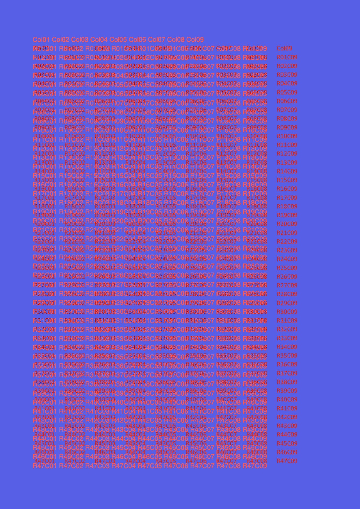</td>
  <td>changed: 463477 px (21.29%)<br>bbox: [113, 127, 1024, 1614]<br>mean abs RGB: 35.4383<br>RMSE RGB: 85.7638<br>threshold: 12, gain: 5.0</td>
</tr>
<tr>
  <td><b>classic60_large_wide_table</b><br>Page 2</td>
  <td></td>
  <td>changed: 31382 px (1.44%)<br>bbox: [114, 96, 1024, 235]<br>mean abs RGB: 2.4347<br>RMSE RGB: 22.5568<br>threshold: 12, gain: 5.0</td>
</tr>
<tr>
  <td><b>classic60_large_wide_table</b><br>Page 3</td>
  <td>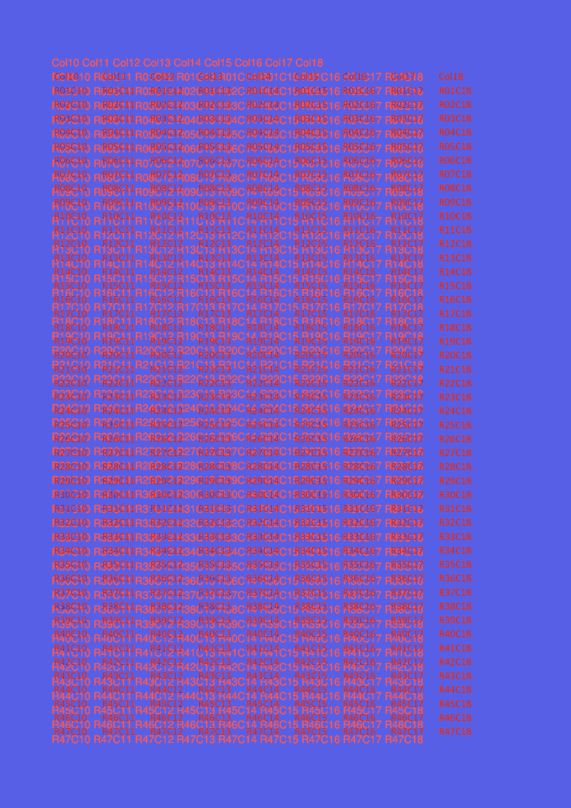</td>
  <td>changed: 432675 px (19.88%)<br>bbox: [113, 127, 1025, 1614]<br>mean abs RGB: 33.085<br>RMSE RGB: 82.9764<br>threshold: 12, gain: 5.0</td>
</tr>
<tr>
  <td><b>classic60_large_wide_table</b><br>Page 4</td>
  <td></td>
  <td>changed: 29255 px (1.34%)<br>bbox: [114, 96, 1025, 235]<br>mean abs RGB: 2.2667<br>RMSE RGB: 21.7925<br>threshold: 12, gain: 5.0</td>
</tr>
<tr>
  <td><b>classic60_large_wide_table</b><br>Page 5</td>
  <td>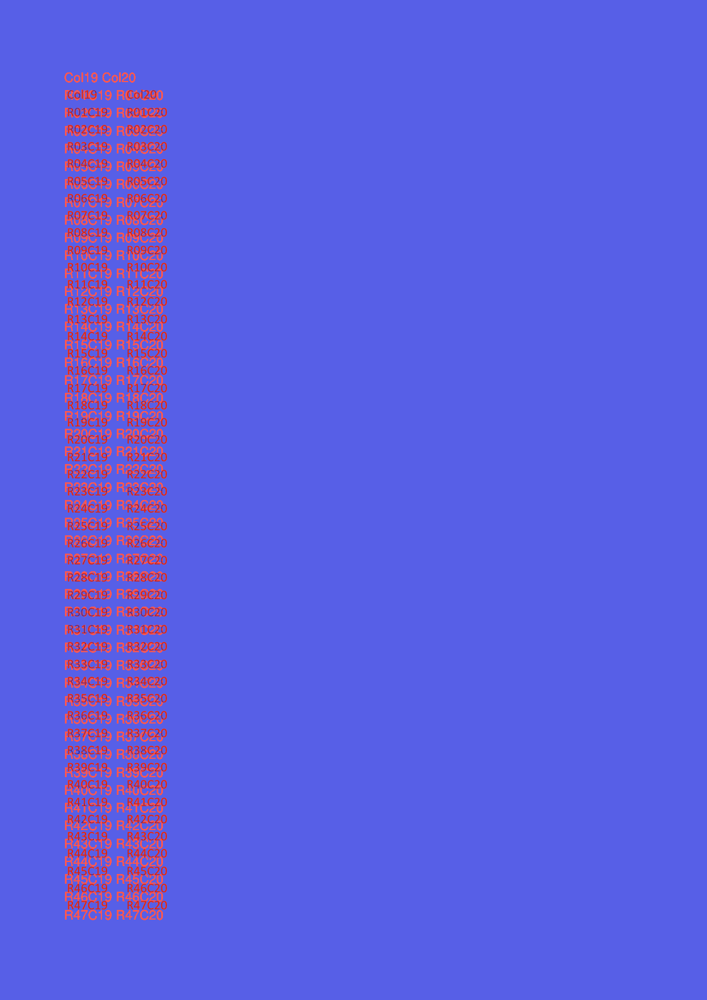</td>
  <td>changed: 99108 px (4.55%)<br>bbox: [113, 127, 293, 1614]<br>mean abs RGB: 7.5535<br>RMSE RGB: 39.671<br>threshold: 12, gain: 5.0</td>
</tr>
<tr>
  <td><b>classic60_large_wide_table</b><br>Page 6</td>
  <td></td>
  <td>changed: 6690 px (0.31%)<br>bbox: [114, 96, 293, 235]<br>mean abs RGB: 0.5167<br>RMSE RGB: 10.409<br>threshold: 12, gain: 5.0</td>
</tr>
<tr>
  <td><b>classic61_product_card_with_image</b><br>Page 1</td>
  <td></td>
  <td>changed: 31498 px (1.45%)<br>bbox: [112, 127, 588, 438]<br>mean abs RGB: 1.9187<br>RMSE RGB: 18.1381<br>threshold: 12, gain: 5.0</td>
</tr>
<tr>
  <td><b>classic62_company_logo_header</b><br>Page 1</td>
  <td></td>
  <td>changed: 38324 px (1.76%)<br>bbox: [112, 127, 632, 424]<br>mean abs RGB: 2.9253<br>RMSE RGB: 24.2378<br>threshold: 12, gain: 5.0</td>
</tr>
<tr>
  <td><b>classic63_two_products_side_by_side</b><br>Page 1</td>
  <td></td>
  <td>changed: 48782 px (2.24%)<br>bbox: [112, 150, 567, 399]<br>mean abs RGB: 3.3699<br>RMSE RGB: 26.1618<br>threshold: 12, gain: 5.0</td>
</tr>
<tr>
  <td><b>classic64_employee_directory_with_photo</b><br>Page 1</td>
  <td></td>
  <td>changed: 48704 px (2.24%)<br>bbox: [112, 127, 727, 405]<br>mean abs RGB: 3.2962<br>RMSE RGB: 24.9157<br>threshold: 12, gain: 5.0</td>
</tr>
<tr>
  <td><b>classic65_inventory_with_product_photos</b><br>Page 1</td>
  <td>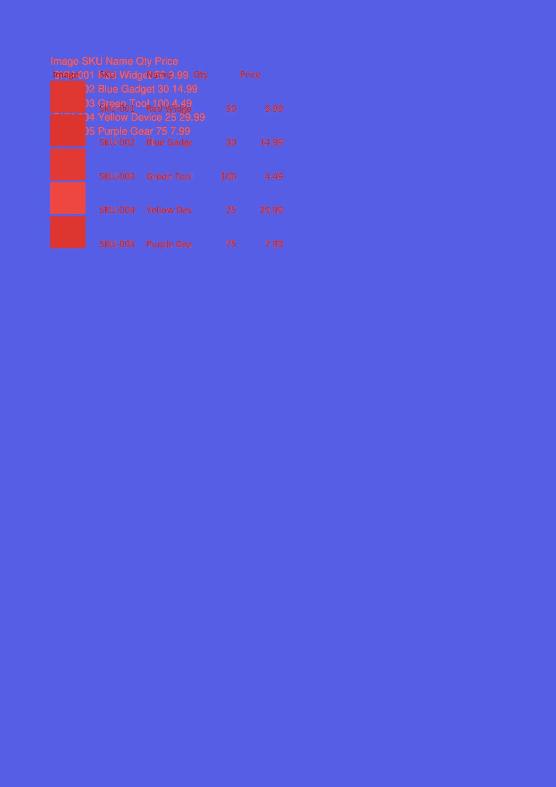</td>
  <td>changed: 49002 px (2.25%)<br>bbox: [112, 127, 631, 555]<br>mean abs RGB: 3.4077<br>RMSE RGB: 25.6121<br>threshold: 12, gain: 5.0</td>
</tr>
<tr>
  <td><b>classic66_invoice_with_logo</b><br>Page 1</td>
  <td></td>
  <td>changed: 39871 px (1.83%)<br>bbox: [112, 127, 660, 505]<br>mean abs RGB: 3.1364<br>RMSE RGB: 25.2163<br>threshold: 12, gain: 5.0</td>
</tr>
<tr>
  <td><b>classic67_real_estate_listing</b><br>Page 1</td>
  <td></td>
  <td>changed: 74642 px (3.43%)<br>bbox: [112, 127, 640, 426]<br>mean abs RGB: 3.7342<br>RMSE RGB: 22.0522<br>threshold: 12, gain: 5.0</td>
</tr>
<tr>
  <td><b>classic68_restaurant_menu</b><br>Page 1</td>
  <td>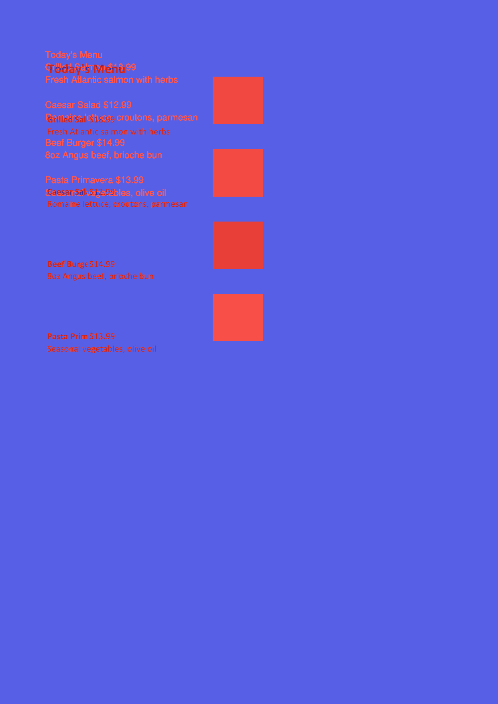</td>
  <td>changed: 89151 px (4.10%)<br>bbox: [113, 127, 656, 881]<br>mean abs RGB: 4.5755<br>RMSE RGB: 27.4107<br>threshold: 12, gain: 5.0</td>
</tr>
<tr>
  <td><b>classic69_image_only_sheet</b><br>Page 1</td>
  <td></td>
  <td>changed: 147110 px (6.76%)<br>bbox: [112, 150, 582, 463]<br>mean abs RGB: 10.0474<br>RMSE RGB: 41.4609<br>threshold: 12, gain: 5.0</td>
</tr>
<tr>
  <td><b>classic70_product_catalog_with_images</b><br>Page 1</td>
  <td>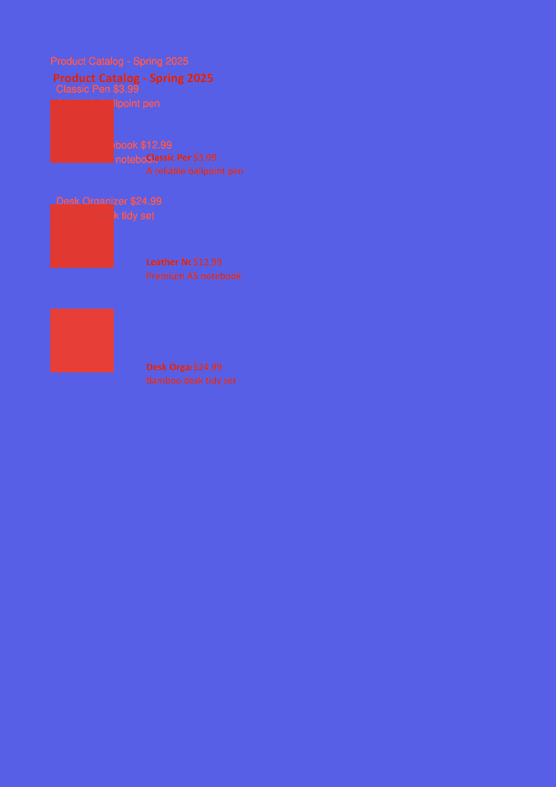</td>
  <td>changed: 79698 px (3.66%)<br>bbox: [112, 127, 542, 860]<br>mean abs RGB: 5.4727<br>RMSE RGB: 30.5825<br>threshold: 12, gain: 5.0</td>
</tr>
<tr>
  <td><b>classic71_multi_sheet_with_images</b><br>Page 1</td>
  <td></td>
  <td>changed: 20537 px (0.94%)<br>bbox: [112, 127, 318, 316]<br>mean abs RGB: 1.3962<br>RMSE RGB: 15.843<br>threshold: 12, gain: 5.0</td>
</tr>
<tr>
  <td><b>classic71_multi_sheet_with_images</b><br>Page 2</td>
  <td></td>
  <td>changed: 20361 px (0.94%)<br>bbox: [112, 127, 318, 316]<br>mean abs RGB: 1.4022<br>RMSE RGB: 15.7894<br>threshold: 12, gain: 5.0</td>
</tr>
<tr>
  <td><b>classic71_multi_sheet_with_images</b><br>Page 3</td>
  <td></td>
  <td>changed: 20735 px (0.95%)<br>bbox: [112, 127, 349, 316]<br>mean abs RGB: 1.431<br>RMSE RGB: 15.6603<br>threshold: 12, gain: 5.0</td>
</tr>
<tr>
  <td><b>classic72_bar_chart_image_with_data</b><br>Page 1</td>
  <td></td>
  <td>changed: 20217 px (0.93%)<br>bbox: [112, 127, 423, 423]<br>mean abs RGB: 1.9235<br>RMSE RGB: 18.2747<br>threshold: 12, gain: 5.0</td>
</tr>
<tr>
  <td><b>classic73_event_flyer_with_banner</b><br>Page 1</td>
  <td>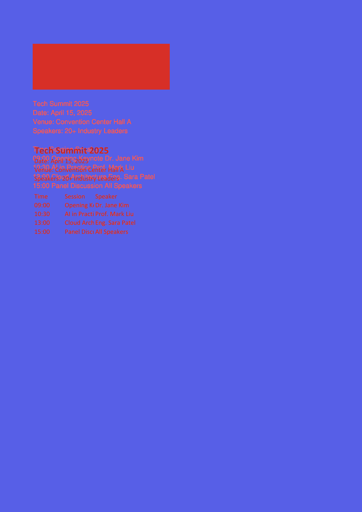</td>
  <td>changed: 107060 px (4.92%)<br>bbox: [112, 150, 582, 806]<br>mean abs RGB: 8.4378<br>RMSE RGB: 40.2525<br>threshold: 12, gain: 5.0</td>
</tr>
<tr>
  <td><b>classic74_dashboard_with_kpi_image</b><br>Page 1</td>
  <td></td>
  <td>changed: 76336 px (3.51%)<br>bbox: [113, 127, 917, 376]<br>mean abs RGB: 1.9917<br>RMSE RGB: 19.58<br>threshold: 12, gain: 5.0</td>
</tr>
<tr>
  <td><b>classic75_certificate_with_seal</b><br>Page 1</td>
  <td></td>
  <td>changed: 41545 px (1.91%)<br>bbox: [119, 158, 776, 396]<br>mean abs RGB: 3.0445<br>RMSE RGB: 25.103<br>threshold: 12, gain: 5.0</td>
</tr>
<tr>
  <td><b>classic76_product_image_grid</b><br>Page 1</td>
  <td></td>
  <td>changed: 76582 px (3.52%)<br>bbox: [112, 127, 683, 525]<br>mean abs RGB: 4.7872<br>RMSE RGB: 29.0493<br>threshold: 12, gain: 5.0</td>
</tr>
<tr>
  <td><b>classic77_news_article_with_hero_image</b><br>Page 1</td>
  <td>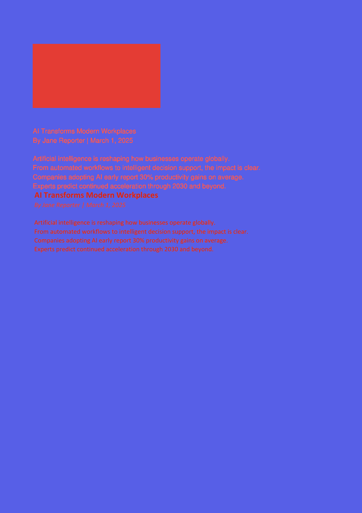</td>
  <td>changed: 143262 px (6.58%)<br>bbox: [112, 150, 892, 864]<br>mean abs RGB: 9.2295<br>RMSE RGB: 38.6349<br>threshold: 12, gain: 5.0</td>
</tr>
<tr>
  <td><b>classic78_small_icon_per_row</b><br>Page 1</td>
  <td></td>
  <td>changed: 27575 px (1.27%)<br>bbox: [112, 127, 534, 387]<br>mean abs RGB: 1.9768<br>RMSE RGB: 19.9353<br>threshold: 12, gain: 5.0</td>
</tr>
<tr>
  <td><b>classic79_wide_panoramic_banner</b><br>Page 1</td>
  <td>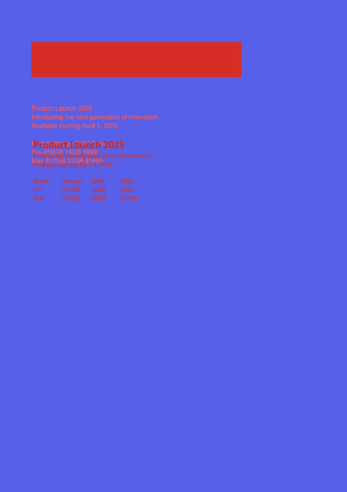</td>
  <td>changed: 118461 px (5.44%)<br>bbox: [112, 150, 863, 717]<br>mean abs RGB: 10.2473<br>RMSE RGB: 45.7471<br>threshold: 12, gain: 5.0</td>
</tr>
<tr>
  <td><b>classic80_portrait_tall_image</b><br>Page 1</td>
  <td></td>
  <td>changed: 57287 px (2.63%)<br>bbox: [112, 127, 740, 432]<br>mean abs RGB: 2.5112<br>RMSE RGB: 19.8896<br>threshold: 12, gain: 5.0</td>
</tr>
<tr>
  <td><b>classic81_step_by_step_with_images</b><br>Page 1</td>
  <td>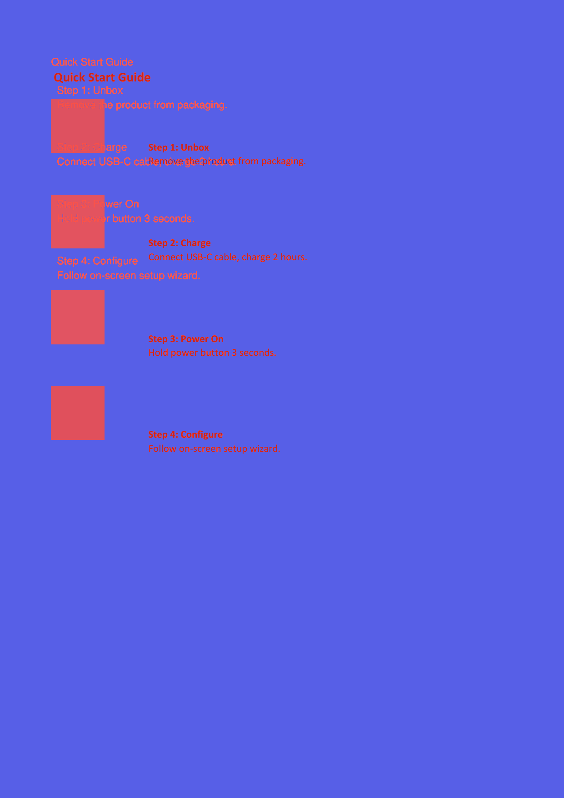</td>
  <td>changed: 82235 px (3.78%)<br>bbox: [112, 127, 675, 997]<br>mean abs RGB: 2.9733<br>RMSE RGB: 22.8056<br>threshold: 12, gain: 5.0</td>
</tr>
<tr>
  <td><b>classic82_before_after_images</b><br>Page 1</td>
  <td>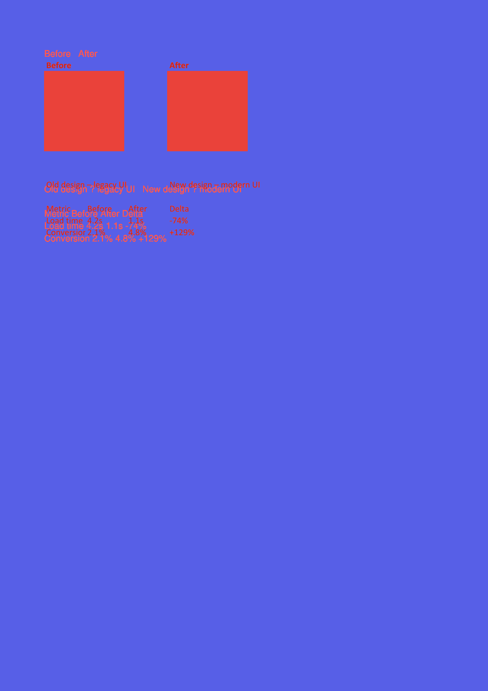</td>
  <td>changed: 100820 px (4.63%)<br>bbox: [112, 127, 660, 614]<br>mean abs RGB: 5.4475<br>RMSE RGB: 27.3995<br>threshold: 12, gain: 5.0</td>
</tr>
<tr>
  <td><b>classic83_color_swatch_palette</b><br>Page 1</td>
  <td>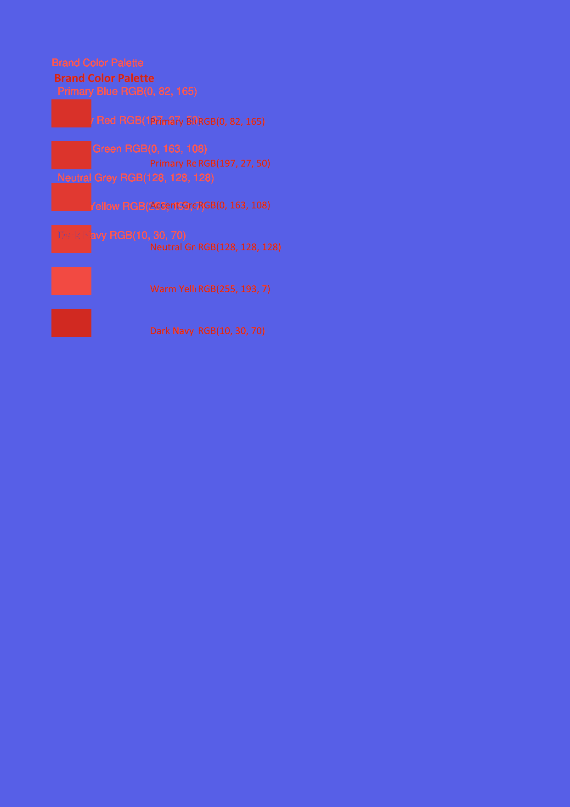</td>
  <td>changed: 56093 px (2.58%)<br>bbox: [112, 127, 611, 732]<br>mean abs RGB: 4.1641<br>RMSE RGB: 28.9511<br>threshold: 12, gain: 5.0</td>
</tr>
<tr>
  <td><b>classic84_travel_destination_cards</b><br>Page 1</td>
  <td>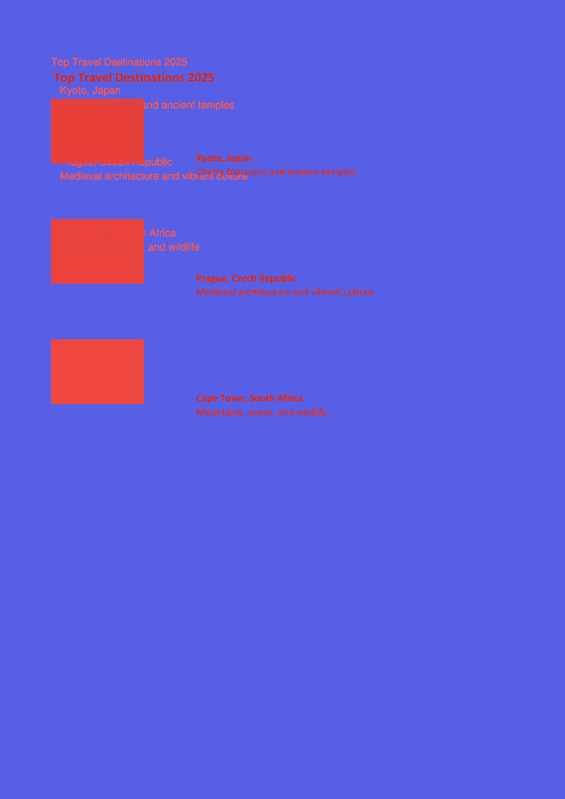</td>
  <td>changed: 110663 px (5.08%)<br>bbox: [112, 127, 820, 916]<br>mean abs RGB: 5.734<br>RMSE RGB: 28.504<br>threshold: 12, gain: 5.0</td>
</tr>
<tr>
  <td><b>classic85_lab_results_with_image</b><br>Page 1</td>
  <td></td>
  <td>changed: 55730 px (2.56%)<br>bbox: [113, 127, 718, 396]<br>mean abs RGB: 2.5213<br>RMSE RGB: 21.1046<br>threshold: 12, gain: 5.0</td>
</tr>
<tr>
  <td><b>classic86_software_screenshot_features</b><br>Page 1</td>
  <td></td>
  <td>changed: 79807 px (3.67%)<br>bbox: [112, 127, 684, 430]<br>mean abs RGB: 1.5908<br>RMSE RGB: 15.6756<br>threshold: 12, gain: 5.0</td>
</tr>
<tr>
  <td><b>classic87_sports_results_with_logos</b><br>Page 1</td>
  <td></td>
  <td>changed: 26642 px (1.22%)<br>bbox: [112, 127, 736, 461]<br>mean abs RGB: 2.0462<br>RMSE RGB: 20.5831<br>threshold: 12, gain: 5.0</td>
</tr>
<tr>
  <td><b>classic88_image_after_data</b><br>Page 1</td>
  <td></td>
  <td>changed: 61516 px (2.83%)<br>bbox: [112, 127, 678, 487]<br>mean abs RGB: 2.1709<br>RMSE RGB: 19.8659<br>threshold: 12, gain: 5.0</td>
</tr>
<tr>
  <td><b>classic89_nutrition_label_with_image</b><br>Page 1</td>
  <td></td>
  <td>changed: 49472 px (2.27%)<br>bbox: [112, 127, 627, 519]<br>mean abs RGB: 2.473<br>RMSE RGB: 20.2747<br>threshold: 12, gain: 5.0</td>
</tr>
<tr>
  <td><b>classic90_project_status_with_milestones</b><br>Page 1</td>
  <td></td>
  <td>changed: 74801 px (3.44%)<br>bbox: [113, 127, 885, 428]<br>mean abs RGB: 3.5829<br>RMSE RGB: 24.6411<br>threshold: 12, gain: 5.0</td>
</tr>
<tr>
  <td><b>classic91_simple_bar_chart</b><br>Page 1</td>
  <td>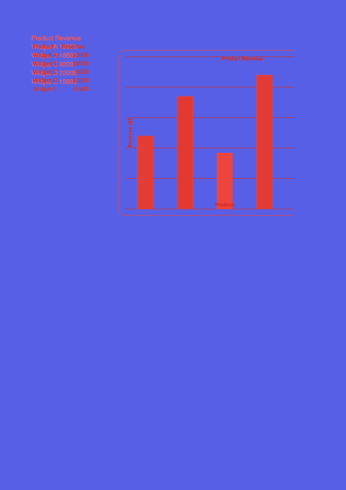</td>
  <td>changed: 101529 px (4.66%)<br>bbox: [113, 127, 1055, 772]<br>mean abs RGB: 6.2702<br>RMSE RGB: 31.316<br>threshold: 12, gain: 5.0</td>
</tr>
<tr>
  <td><b>classic92_horizontal_bar_chart</b><br>Page 1</td>
  <td>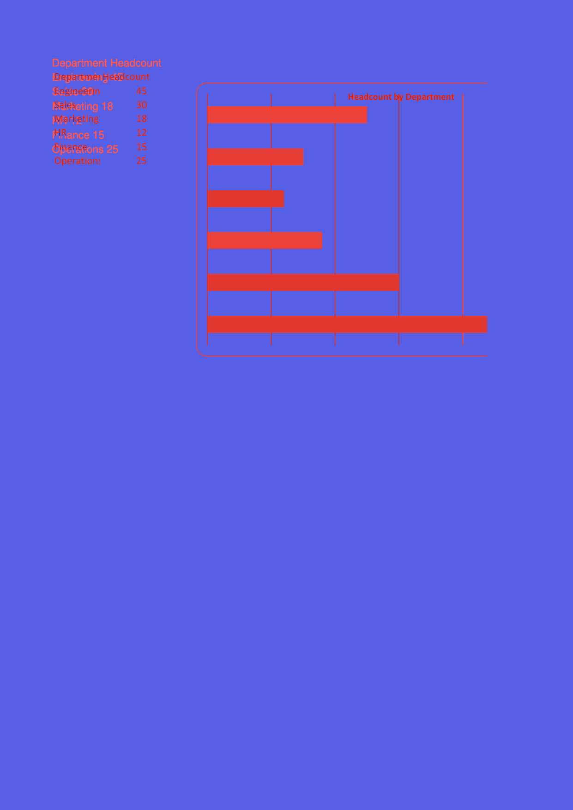</td>
  <td>changed: 95127 px (4.37%)<br>bbox: [113, 127, 1055, 772]<br>mean abs RGB: 6.0271<br>RMSE RGB: 31.2302<br>threshold: 12, gain: 5.0</td>
</tr>
<tr>
  <td><b>classic93_line_chart</b><br>Page 1</td>
  <td>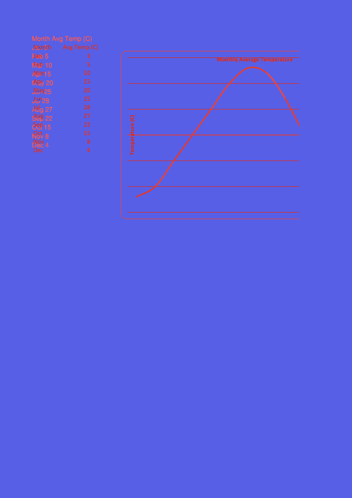</td>
  <td>changed: 33028 px (1.52%)<br>bbox: [112, 127, 1055, 772]<br>mean abs RGB: 2.3446<br>RMSE RGB: 21.2231<br>threshold: 12, gain: 5.0</td>
</tr>
<tr>
  <td><b>classic94_pie_chart</b><br>Page 1</td>
  <td></td>
  <td>changed: 247952 px (11.39%)<br>bbox: [113, 127, 1055, 772]<br>mean abs RGB: 14.356<br>RMSE RGB: 45.7632<br>threshold: 12, gain: 5.0</td>
</tr>
<tr>
  <td><b>classic95_area_chart</b><br>Page 1</td>
  <td>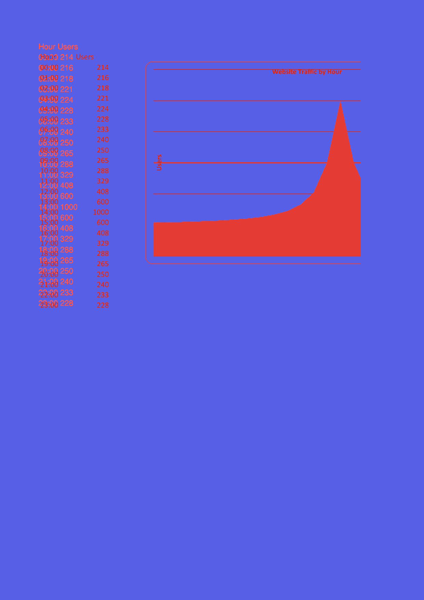</td>
  <td>changed: 142122 px (6.53%)<br>bbox: [113, 127, 1055, 900]<br>mean abs RGB: 8.8505<br>RMSE RGB: 38.0439<br>threshold: 12, gain: 5.0</td>
</tr>
<tr>
  <td><b>classic96_scatter_chart</b><br>Page 1</td>
  <td>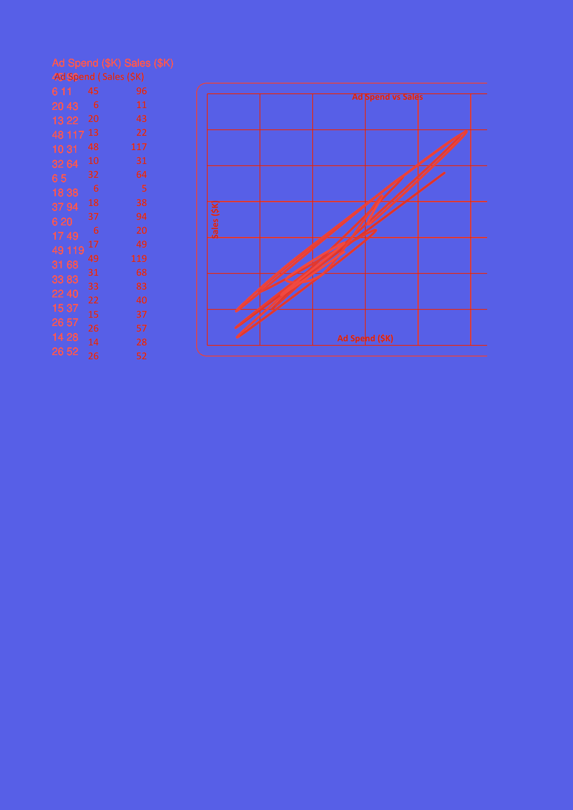</td>
  <td>changed: 63066 px (2.90%)<br>bbox: [113, 126, 1055, 779]<br>mean abs RGB: 4.2058<br>RMSE RGB: 27.852<br>threshold: 12, gain: 5.0</td>
</tr>
<tr>
  <td><b>classic97_doughnut_chart</b><br>Page 1</td>
  <td>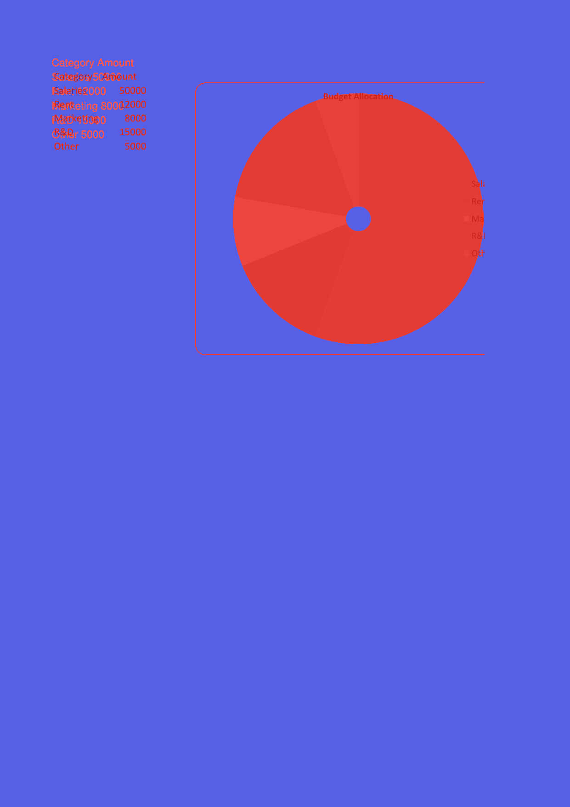</td>
  <td>changed: 246187 px (11.31%)<br>bbox: [113, 127, 1055, 772]<br>mean abs RGB: 14.1699<br>RMSE RGB: 45.129<br>threshold: 12, gain: 5.0</td>
</tr>
<tr>
  <td><b>classic98_radar_chart</b><br>Page 1</td>
  <td>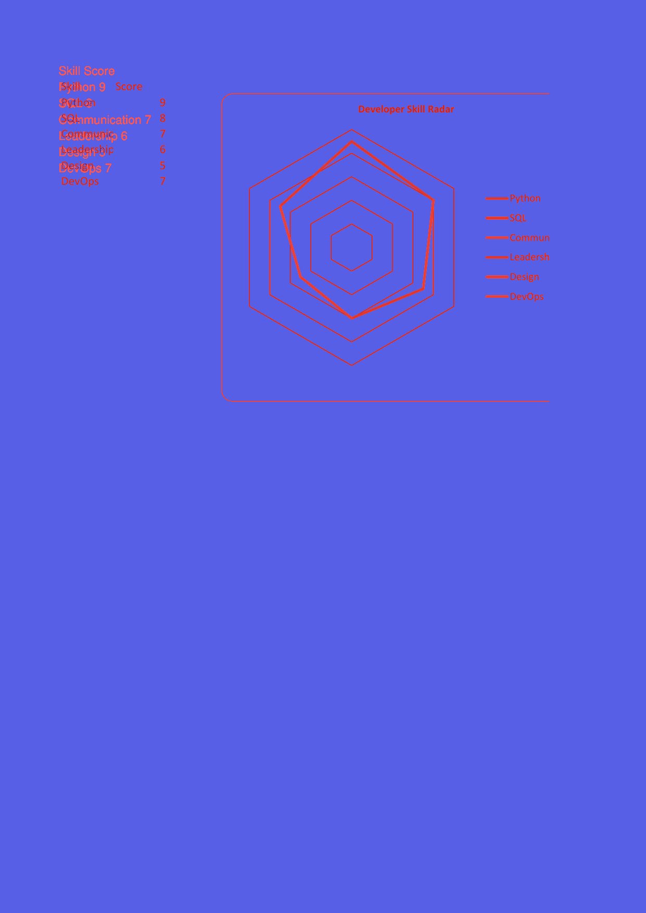</td>
  <td>changed: 32474 px (1.49%)<br>bbox: [113, 127, 1055, 772]<br>mean abs RGB: 2.1993<br>RMSE RGB: 20.3085<br>threshold: 12, gain: 5.0</td>
</tr>
<tr>
  <td><b>classic99_bubble_chart</b><br>Page 1</td>
  <td>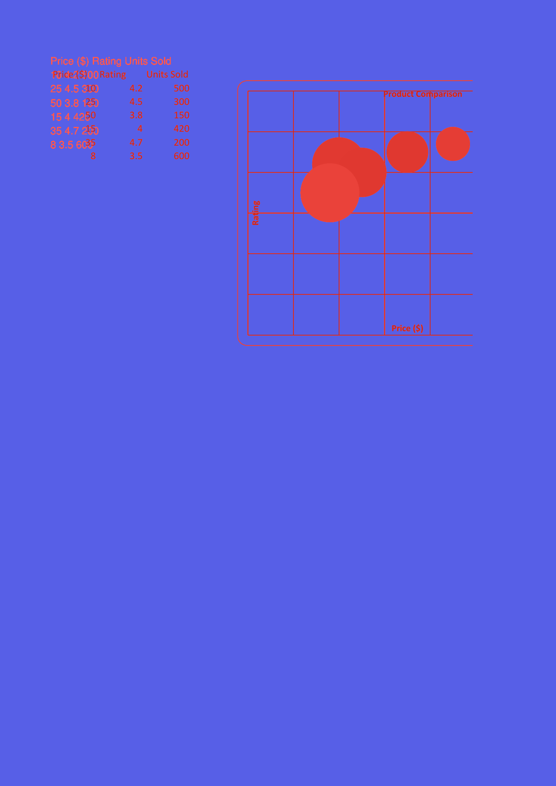</td>
  <td>changed: 66952 px (3.08%)<br>bbox: [113, 126, 1055, 772]<br>mean abs RGB: 4.401<br>RMSE RGB: 27.8109<br>threshold: 12, gain: 5.0</td>
</tr>
<tr>
  <td><b>classic100_stacked_bar_chart</b><br>Page 1</td>
  <td>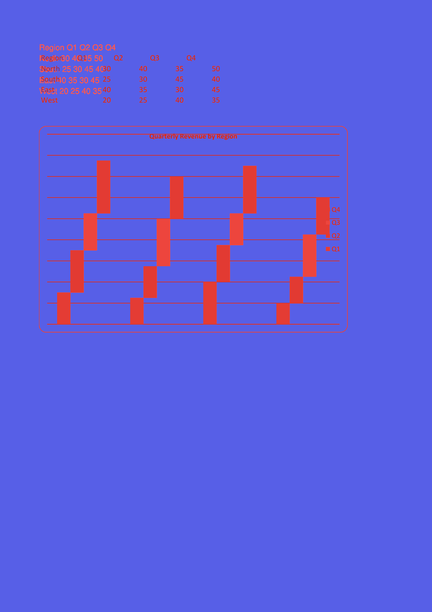</td>
  <td>changed: 105986 px (4.87%)<br>bbox: [112, 127, 999, 953]<br>mean abs RGB: 6.3901<br>RMSE RGB: 32.1633<br>threshold: 12, gain: 5.0</td>
</tr>
<tr>
  <td><b>classic101_percent_stacked_bar</b><br>Page 1</td>
  <td>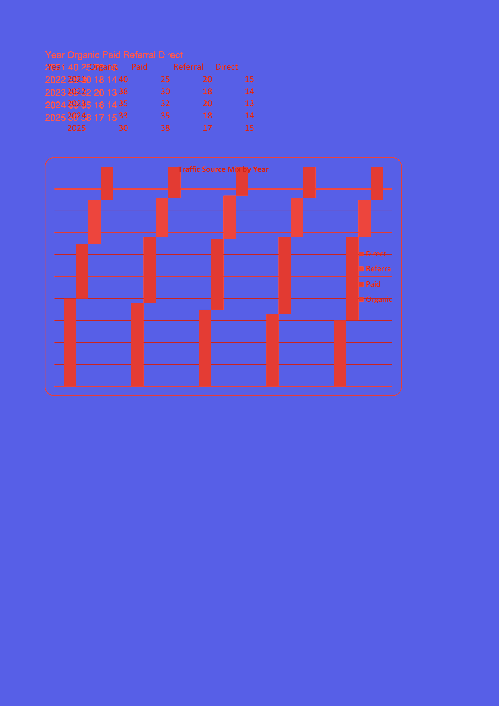</td>
  <td>changed: 129546 px (5.95%)<br>bbox: [112, 127, 999, 984]<br>mean abs RGB: 7.8597<br>RMSE RGB: 35.7606<br>threshold: 12, gain: 5.0</td>
</tr>
<tr>
  <td><b>classic102_line_chart_with_markers</b><br>Page 1</td>
  <td></td>
  <td>changed: 31100 px (1.43%)<br>bbox: [113, 127, 1055, 772]<br>mean abs RGB: 2.1724<br>RMSE RGB: 20.5025<br>threshold: 12, gain: 5.0</td>
</tr>
<tr>
  <td><b>classic103_pie_chart_with_labels</b><br>Page 1</td>
  <td></td>
  <td>changed: 190943 px (8.77%)<br>bbox: [113, 127, 1055, 772]<br>mean abs RGB: 11.2577<br>RMSE RGB: 41.0219<br>threshold: 12, gain: 5.0</td>
</tr>
<tr>
  <td><b>classic104_combo_bar_line_chart</b><br>Page 1</td>
  <td></td>
  <td>changed: 92032 px (4.23%)<br>bbox: [112, 127, 1055, 772]<br>mean abs RGB: 5.5839<br>RMSE RGB: 29.7549<br>threshold: 12, gain: 5.0</td>
</tr>
<tr>
  <td><b>classic105_3d_bar_chart</b><br>Page 1</td>
  <td></td>
  <td>changed: 137358 px (6.31%)<br>bbox: [113, 127, 1055, 772]<br>mean abs RGB: 8.6106<br>RMSE RGB: 37.2837<br>threshold: 12, gain: 5.0</td>
</tr>
<tr>
  <td><b>classic106_3d_pie_chart</b><br>Page 1</td>
  <td></td>
  <td>changed: 151673 px (6.97%)<br>bbox: [113, 127, 1055, 772]<br>mean abs RGB: 11.0534<br>RMSE RGB: 43.893<br>threshold: 12, gain: 5.0</td>
</tr>
<tr>
  <td><b>classic107_multi_series_line</b><br>Page 1</td>
  <td></td>
  <td>changed: 86721 px (3.98%)<br>bbox: [114, 127, 1055, 783]<br>mean abs RGB: 6.4166<br>RMSE RGB: 36.0222<br>threshold: 12, gain: 5.0</td>
</tr>
<tr>
  <td><b>classic108_stacked_area_chart</b><br>Page 1</td>
  <td></td>
  <td>changed: 397283 px (18.25%)<br>bbox: [112, 127, 1055, 1014]<br>mean abs RGB: 22.8422<br>RMSE RGB: 57.306<br>threshold: 12, gain: 5.0</td>
</tr>
<tr>
  <td><b>classic109_scatter_with_trendline</b><br>Page 1</td>
  <td></td>
  <td>changed: 54345 px (2.50%)<br>bbox: [113, 127, 1055, 772]<br>mean abs RGB: 3.5725<br>RMSE RGB: 25.6087<br>threshold: 12, gain: 5.0</td>
</tr>
<tr>
  <td><b>classic110_chart_with_legend</b><br>Page 1</td>
  <td></td>
  <td>changed: 92566 px (4.25%)<br>bbox: [113, 127, 1055, 772]<br>mean abs RGB: 5.7742<br>RMSE RGB: 30.6856<br>threshold: 12, gain: 5.0</td>
</tr>
<tr>
  <td><b>classic111_chart_with_axis_labels</b><br>Page 1</td>
  <td></td>
  <td>changed: 74157 px (3.41%)<br>bbox: [112, 127, 1055, 772]<br>mean abs RGB: 4.8255<br>RMSE RGB: 28.455<br>threshold: 12, gain: 5.0</td>
</tr>
<tr>
  <td><b>classic112_multiple_charts</b><br>Page 1</td>
  <td></td>
  <td>changed: 87849 px (4.04%)<br>bbox: [112, 127, 1055, 1197]<br>mean abs RGB: 5.5444<br>RMSE RGB: 30.3714<br>threshold: 12, gain: 5.0</td>
</tr>
<tr>
  <td><b>classic113_chart_sheet</b><br>Page 1</td>
  <td></td>
  <td>changed: 128292 px (5.89%)<br>bbox: [113, 127, 1055, 890]<br>mean abs RGB: 7.6507<br>RMSE RGB: 34.4189<br>threshold: 12, gain: 5.0</td>
</tr>
<tr>
  <td><b>classic114_chart_large_dataset</b><br>Page 1</td>
  <td></td>
  <td>changed: 78811 px (3.62%)<br>bbox: [113, 127, 1055, 1613]<br>mean abs RGB: 5.784<br>RMSE RGB: 34.173<br>threshold: 12, gain: 5.0</td>
</tr>
<tr>
  <td><b>classic114_chart_large_dataset</b><br>Page 2</td>
  <td></td>
  <td>changed: 55666 px (2.56%)<br>bbox: [113, 96, 354, 1614]<br>mean abs RGB: 4.3012<br>RMSE RGB: 30.0131<br>threshold: 12, gain: 5.0</td>
</tr>
<tr>
  <td><b>classic114_chart_large_dataset</b><br>Page 3</td>
  <td></td>
  <td>changed: 4946 px (0.23%)<br>bbox: [113, 96, 318, 295]<br>mean abs RGB: 0.3814<br>RMSE RGB: 8.9348<br>threshold: 12, gain: 5.0</td>
</tr>
<tr>
  <td><b>classic115_chart_negative_values</b><br>Page 1</td>
  <td></td>
  <td>changed: 60836 px (2.79%)<br>bbox: [112, 127, 1055, 772]<br>mean abs RGB: 3.8999<br>RMSE RGB: 25.7611<br>threshold: 12, gain: 5.0</td>
</tr>
<tr>
  <td><b>classic116_percent_stacked_area</b><br>Page 1</td>
  <td></td>
  <td>changed: 514163 px (23.62%)<br>bbox: [112, 127, 1055, 1014]<br>mean abs RGB: 30.0989<br>RMSE RGB: 65.8989<br>threshold: 12, gain: 5.0</td>
</tr>
<tr>
  <td><b>classic117_stock_ohlc_chart</b><br>Page 1</td>
  <td></td>
  <td>changed: 109321 px (5.02%)<br>bbox: [114, 127, 1055, 772]<br>mean abs RGB: 7.0874<br>RMSE RGB: 34.9688<br>threshold: 12, gain: 5.0</td>
</tr>
<tr>
  <td><b>classic118_bar_chart_custom_colors</b><br>Page 1</td>
  <td></td>
  <td>changed: 87384 px (4.01%)<br>bbox: [113, 127, 1055, 772]<br>mean abs RGB: 6.2508<br>RMSE RGB: 35.0757<br>threshold: 12, gain: 5.0</td>
</tr>
<tr>
  <td><b>classic119_dashboard_multi_charts</b><br>Page 1</td>
  <td></td>
  <td>changed: 242083 px (11.12%)<br>bbox: [113, 127, 1055, 1085]<br>mean abs RGB: 14.5494<br>RMSE RGB: 47.3143<br>threshold: 12, gain: 5.0</td>
</tr>
<tr>
  <td><b>classic120_chart_with_date_axis</b><br>Page 1</td>
  <td></td>
  <td>changed: 50700 px (2.33%)<br>bbox: [113, 127, 1055, 772]<br>mean abs RGB: 3.6666<br>RMSE RGB: 26.8501<br>threshold: 12, gain: 5.0</td>
</tr>
<tr>
  <td><b>classic121_thin_borders</b><br>Page 1</td>
  <td></td>
  <td>changed: 24510 px (1.13%)<br>bbox: [112, 127, 533, 334]<br>mean abs RGB: 1.9747<br>RMSE RGB: 20.4181<br>threshold: 12, gain: 5.0</td>
</tr>
<tr>
  <td><b>classic122_thick_outer_thin_inner</b><br>Page 1</td>
  <td></td>
  <td>changed: 31513 px (1.45%)<br>bbox: [110, 127, 535, 336]<br>mean abs RGB: 2.6775<br>RMSE RGB: 24.2469<br>threshold: 12, gain: 5.0</td>
</tr>
<tr>
  <td><b>classic123_dashed_borders</b><br>Page 1</td>
  <td></td>
  <td>changed: 17765 px (0.82%)<br>bbox: [113, 127, 413, 335]<br>mean abs RGB: 1.3373<br>RMSE RGB: 16.4915<br>threshold: 12, gain: 5.0</td>
</tr>
<tr>
  <td><b>classic124_colored_borders</b><br>Page 1</td>
  <td></td>
  <td>changed: 31628 px (1.45%)<br>bbox: [113, 127, 545, 365]<br>mean abs RGB: 2.314<br>RMSE RGB: 21.7166<br>threshold: 12, gain: 5.0</td>
</tr>
<tr>
  <td><b>classic125_solid_fills</b><br>Page 1</td>
  <td></td>
  <td>changed: 39648 px (1.82%)<br>bbox: [113, 127, 373, 424]<br>mean abs RGB: 1.9492<br>RMSE RGB: 18.913<br>threshold: 12, gain: 5.0</td>
</tr>
<tr>
  <td><b>classic126_dark_header</b><br>Page 1</td>
  <td></td>
  <td>changed: 34190 px (1.57%)<br>bbox: [113, 127, 551, 326]<br>mean abs RGB: 2.4899<br>RMSE RGB: 22.0193<br>threshold: 12, gain: 5.0</td>
</tr>
<tr>
  <td><b>classic127_font_styles</b><br>Page 1</td>
  <td></td>
  <td>changed: 35038 px (1.61%)<br>bbox: [113, 127, 600, 420]<br>mean abs RGB: 2.6178<br>RMSE RGB: 23.1579<br>threshold: 12, gain: 5.0</td>
</tr>
<tr>
  <td><b>classic128_font_sizes</b><br>Page 1</td>
  <td></td>
  <td>changed: 22712 px (1.04%)<br>bbox: [113, 127, 465, 568]<br>mean abs RGB: 1.8425<br>RMSE RGB: 19.8675<br>threshold: 12, gain: 5.0</td>
</tr>
<tr>
  <td><b>classic129_alignment_combos</b><br>Page 1</td>
  <td></td>
  <td>changed: 18178 px (0.84%)<br>bbox: [112, 127, 849, 430]<br>mean abs RGB: 1.4279<br>RMSE RGB: 17.2938<br>threshold: 12, gain: 5.0</td>
</tr>
<tr>
  <td><b>classic130_wrap_and_indent</b><br>Page 1</td>
  <td></td>
  <td>changed: 21759 px (1.00%)<br>bbox: [113, 127, 929, 430]<br>mean abs RGB: 1.6857<br>RMSE RGB: 18.6998<br>threshold: 12, gain: 5.0</td>
</tr>
<tr>
  <td><b>classic131_number_formats</b><br>Page 1</td>
  <td></td>
  <td>changed: 39954 px (1.84%)<br>bbox: [112, 127, 838, 477]<br>mean abs RGB: 3.0868<br>RMSE RGB: 25.3307<br>threshold: 12, gain: 5.0</td>
</tr>
<tr>
  <td><b>classic132_striped_table</b><br>Page 1</td>
  <td></td>
  <td>changed: 99447 px (4.57%)<br>bbox: [112, 127, 533, 485]<br>mean abs RGB: 3.5658<br>RMSE RGB: 24.1102<br>threshold: 12, gain: 5.0</td>
</tr>
<tr>
  <td><b>classic133_gradient_rows</b><br>Page 1</td>
  <td></td>
  <td>changed: 100296 px (4.61%)<br>bbox: [113, 127, 467, 484]<br>mean abs RGB: 8.6694<br>RMSE RGB: 44.5829<br>threshold: 12, gain: 5.0</td>
</tr>
<tr>
  <td><b>classic134_heatmap</b><br>Page 1</td>
  <td></td>
  <td>changed: 143117 px (6.57%)<br>bbox: [114, 127, 846, 394]<br>mean abs RGB: 10.0548<br>RMSE RGB: 44.0176<br>threshold: 12, gain: 5.0</td>
</tr>
<tr>
  <td><b>classic135_bottom_border_only</b><br>Page 1</td>
  <td></td>
  <td>changed: 16857 px (0.77%)<br>bbox: [113, 127, 558, 343]<br>mean abs RGB: 1.4804<br>RMSE RGB: 18.1851<br>threshold: 12, gain: 5.0</td>
</tr>
<tr>
  <td><b>classic136_financial_report_styled</b><br>Page 1</td>
  <td></td>
  <td>changed: 74699 px (3.43%)<br>bbox: [112, 127, 761, 462]<br>mean abs RGB: 5.3461<br>RMSE RGB: 32.2797<br>threshold: 12, gain: 5.0</td>
</tr>
<tr>
  <td><b>classic137_checkerboard</b><br>Page 1</td>
  <td></td>
  <td>changed: 197170 px (9.06%)<br>bbox: [114, 152, 584, 572]<br>mean abs RGB: 10.0413<br>RMSE RGB: 43.4113<br>threshold: 12, gain: 5.0</td>
</tr>
<tr>
  <td><b>classic138_color_grid</b><br>Page 1</td>
  <td></td>
  <td>changed: 126961 px (5.83%)<br>bbox: [112, 127, 608, 404]<br>mean abs RGB: 4.3317<br>RMSE RGB: 24.241<br>threshold: 12, gain: 5.0</td>
</tr>
<tr>
  <td><b>classic139_pattern_fills</b><br>Page 1</td>
  <td></td>
  <td>changed: 80193 px (3.68%)<br>bbox: [113, 127, 584, 545]<br>mean abs RGB: 4.1939<br>RMSE RGB: 27.411<br>threshold: 12, gain: 5.0</td>
</tr>
<tr>
  <td><b>classic140_rotated_text</b><br>Page 1</td>
  <td></td>
  <td>changed: 19733 px (0.91%)<br>bbox: [113, 127, 421, 1102]<br>mean abs RGB: 1.5239<br>RMSE RGB: 17.8252<br>threshold: 12, gain: 5.0</td>
</tr>
<tr>
  <td><b>classic141_mixed_edge_borders</b><br>Page 1</td>
  <td></td>
  <td>changed: 27479 px (1.26%)<br>bbox: [112, 127, 705, 500]<br>mean abs RGB: 2.0024<br>RMSE RGB: 20.6644<br>threshold: 12, gain: 5.0</td>
</tr>
<tr>
  <td><b>classic142_styled_invoice</b><br>Page 1</td>
  <td></td>
  <td>changed: 148568 px (6.83%)<br>bbox: [112, 127, 914, 608]<br>mean abs RGB: 6.1947<br>RMSE RGB: 32.6252<br>threshold: 12, gain: 5.0</td>
</tr>
<tr>
  <td><b>classic143_colored_tabs</b><br>Page 1</td>
  <td></td>
  <td>changed: 4735 px (0.22%)<br>bbox: [114, 127, 318, 235]<br>mean abs RGB: 0.3634<br>RMSE RGB: 8.6616<br>threshold: 12, gain: 5.0</td>
</tr>
<tr>
  <td><b>classic143_colored_tabs</b><br>Page 2</td>
  <td></td>
  <td>changed: 4683 px (0.22%)<br>bbox: [113, 127, 318, 239]<br>mean abs RGB: 0.3588<br>RMSE RGB: 8.6095<br>threshold: 12, gain: 5.0</td>
</tr>
<tr>
  <td><b>classic143_colored_tabs</b><br>Page 3</td>
  <td></td>
  <td>changed: 4977 px (0.23%)<br>bbox: [113, 127, 318, 235]<br>mean abs RGB: 0.386<br>RMSE RGB: 8.968<br>threshold: 12, gain: 5.0</td>
</tr>
<tr>
  <td><b>classic143_colored_tabs</b><br>Page 4</td>
  <td></td>
  <td>changed: 4779 px (0.22%)<br>bbox: [113, 127, 318, 239]<br>mean abs RGB: 0.3725<br>RMSE RGB: 8.8008<br>threshold: 12, gain: 5.0</td>
</tr>
<tr>
  <td><b>classic144_note_style_cells</b><br>Page 1</td>
  <td></td>
  <td>changed: 82275 px (3.78%)<br>bbox: [113, 127, 761, 334]<br>mean abs RGB: 2.0073<br>RMSE RGB: 17.9756<br>threshold: 12, gain: 5.0</td>
</tr>
<tr>
  <td><b>classic145_status_badges</b><br>Page 1</td>
  <td></td>
  <td>changed: 101080 px (4.64%)<br>bbox: [112, 127, 855, 394]<br>mean abs RGB: 5.1145<br>RMSE RGB: 29.495<br>threshold: 12, gain: 5.0</td>
</tr>
<tr>
  <td><b>classic146_double_border_table</b><br>Page 1</td>
  <td></td>
  <td>changed: 42718 px (1.96%)<br>bbox: [110, 127, 681, 306]<br>mean abs RGB: 2.7356<br>RMSE RGB: 23.6114<br>threshold: 12, gain: 5.0</td>
</tr>
<tr>
  <td><b>classic147_multi_sheet_styled</b><br>Page 1</td>
  <td></td>
  <td>changed: 26534 px (1.22%)<br>bbox: [112, 127, 491, 304]<br>mean abs RGB: 1.657<br>RMSE RGB: 16.7884<br>threshold: 12, gain: 5.0</td>
</tr>
<tr>
  <td><b>classic147_multi_sheet_styled</b><br>Page 2</td>
  <td></td>
  <td>changed: 50355 px (2.31%)<br>bbox: [112, 127, 867, 304]<br>mean abs RGB: 3.2655<br>RMSE RGB: 23.6947<br>threshold: 12, gain: 5.0</td>
</tr>
<tr>
  <td><b>classic147_multi_sheet_styled</b><br>Page 3</td>
  <td></td>
  <td>changed: 35866 px (1.65%)<br>bbox: [112, 127, 679, 304]<br>mean abs RGB: 2.1582<br>RMSE RGB: 19.4712<br>threshold: 12, gain: 5.0</td>
</tr>
<tr>
  <td><b>classic148_frozen_styled_grid</b><br>Page 1</td>
  <td></td>
  <td>changed: 416096 px (19.12%)<br>bbox: [112, 127, 1102, 788]<br>mean abs RGB: 14.6228<br>RMSE RGB: 46.6782<br>threshold: 12, gain: 5.0</td>
</tr>
<tr>
  <td><b>classic149_merged_styled_sections</b><br>Page 1</td>
  <td></td>
  <td>changed: 133191 px (6.12%)<br>bbox: [112, 127, 867, 565]<br>mean abs RGB: 8.3946<br>RMSE RGB: 39.6835<br>threshold: 12, gain: 5.0</td>
</tr>
<tr>
  <td><b>classic150_kitchen_sink_styles</b><br>Page 1</td>
  <td></td>
  <td>changed: 118760 px (5.46%)<br>bbox: [113, 127, 996, 623]<br>mean abs RGB: 8.2041<br>RMSE RGB: 39.5716<br>threshold: 12, gain: 5.0</td>
</tr>
<tr>
  <td><b>classic151_multilingual_greetings</b><br>Page 1</td>
  <td></td>
  <td>changed: 36393 px (1.67%)<br>bbox: [112, 127, 979, 541]<br>mean abs RGB: 2.7767<br>RMSE RGB: 23.8926<br>threshold: 12, gain: 5.0</td>
</tr>
<tr>
  <td><b>classic152_emoji_sampler</b><br>Page 1</td>
  <td></td>
  <td>changed: 25003 px (1.15%)<br>bbox: [113, 127, 484, 420]<br>mean abs RGB: 1.9147<br>RMSE RGB: 19.8938<br>threshold: 12, gain: 5.0</td>
</tr>
<tr>
  <td><b>classic153_currency_symbols</b><br>Page 1</td>
  <td></td>
  <td>changed: 38797 px (1.78%)<br>bbox: [112, 127, 569, 537]<br>mean abs RGB: 2.976<br>RMSE RGB: 24.8265<br>threshold: 12, gain: 5.0</td>
</tr>
<tr>
  <td><b>classic154_math_symbols</b><br>Page 1</td>
  <td></td>
  <td>changed: 25671 px (1.18%)<br>bbox: [113, 127, 624, 451]<br>mean abs RGB: 1.9372<br>RMSE RGB: 19.9243<br>threshold: 12, gain: 5.0</td>
</tr>
<tr>
  <td><b>classic155_diacritical_marks</b><br>Page 1</td>
  <td></td>
  <td>changed: 23030 px (1.06%)<br>bbox: [113, 127, 477, 481]<br>mean abs RGB: 1.7422<br>RMSE RGB: 18.9053<br>threshold: 12, gain: 5.0</td>
</tr>
<tr>
  <td><b>classic156_rtl_bidi_text</b><br>Page 1</td>
  <td></td>
  <td>changed: 8568 px (0.39%)<br>bbox: [113, 127, 803, 299]<br>mean abs RGB: 0.6458<br>RMSE RGB: 11.4877<br>threshold: 12, gain: 5.0</td>
</tr>
<tr>
  <td><b>classic157_cjk_extended</b><br>Page 1</td>
  <td></td>
  <td>changed: 41716 px (1.92%)<br>bbox: [112, 127, 975, 386]<br>mean abs RGB: 3.0716<br>RMSE RGB: 24.8823<br>threshold: 12, gain: 5.0</td>
</tr>
<tr>
  <td><b>classic158_emoji_skin_tones</b><br>Page 1</td>
  <td></td>
  <td>changed: 19958 px (0.92%)<br>bbox: [113, 127, 535, 330]<br>mean abs RGB: 1.5177<br>RMSE RGB: 17.6753<br>threshold: 12, gain: 5.0</td>
</tr>
<tr>
  <td><b>classic159_zwj_emoji</b><br>Page 1</td>
  <td></td>
  <td>changed: 23150 px (1.06%)<br>bbox: [113, 127, 435, 451]<br>mean abs RGB: 1.7818<br>RMSE RGB: 19.1991<br>threshold: 12, gain: 5.0</td>
</tr>
<tr>
  <td><b>classic160_punctuation_marks</b><br>Page 1</td>
  <td></td>
  <td>changed: 17700 px (0.81%)<br>bbox: [113, 127, 844, 390]<br>mean abs RGB: 1.3344<br>RMSE RGB: 16.5513<br>threshold: 12, gain: 5.0</td>
</tr>
<tr>
  <td><b>classic161_box_drawing</b><br>Page 1</td>
  <td></td>
  <td>changed: 25326 px (1.16%)<br>bbox: [113, 127, 683, 356]<br>mean abs RGB: 1.9932<br>RMSE RGB: 20.509<br>threshold: 12, gain: 5.0</td>
</tr>
<tr>
  <td><b>classic162_cjk_emoji_styled</b><br>Page 1</td>
  <td></td>
  <td>changed: 29267 px (1.34%)<br>bbox: [114, 127, 678, 301]<br>mean abs RGB: 2.128<br>RMSE RGB: 20.886<br>threshold: 12, gain: 5.0</td>
</tr>
<tr>
  <td><b>classic163_cyrillic_alphabets</b><br>Page 1</td>
  <td></td>
  <td>changed: 29712 px (1.36%)<br>bbox: [113, 127, 878, 330]<br>mean abs RGB: 2.2184<br>RMSE RGB: 21.259<br>threshold: 12, gain: 5.0</td>
</tr>
<tr>
  <td><b>classic164_indic_scripts</b><br>Page 1</td>
  <td></td>
  <td>changed: 12342 px (0.57%)<br>bbox: [113, 127, 427, 330]<br>mean abs RGB: 0.9414<br>RMSE RGB: 13.9242<br>threshold: 12, gain: 5.0</td>
</tr>
<tr>
  <td><b>classic165_southeast_asian</b><br>Page 1</td>
  <td></td>
  <td>changed: 21694 px (1.00%)<br>bbox: [113, 127, 615, 332]<br>mean abs RGB: 1.5795<br>RMSE RGB: 17.7958<br>threshold: 12, gain: 5.0</td>
</tr>
<tr>
  <td><b>classic166_emoji_progress</b><br>Page 1</td>
  <td></td>
  <td>changed: 41866 px (1.92%)<br>bbox: [113, 127, 818, 360]<br>mean abs RGB: 3.0089<br>RMSE RGB: 24.2895<br>threshold: 12, gain: 5.0</td>
</tr>
<tr>
  <td><b>classic167_musical_symbols</b><br>Page 1</td>
  <td></td>
  <td>changed: 16677 px (0.77%)<br>bbox: [113, 127, 752, 330]<br>mean abs RGB: 1.2749<br>RMSE RGB: 16.1358<br>threshold: 12, gain: 5.0</td>
</tr>
<tr>
  <td><b>classic168_mixed_ltr_rtl_styled</b><br>Page 1</td>
  <td></td>
  <td>changed: 43210 px (1.99%)<br>bbox: [112, 127, 797, 304]<br>mean abs RGB: 2.4895<br>RMSE RGB: 20.1408<br>threshold: 12, gain: 5.0</td>
</tr>
<tr>
  <td><b>classic169_korean_invoice</b><br>Page 1</td>
  <td></td>
  <td>changed: 34505 px (1.59%)<br>bbox: [113, 127, 868, 457]<br>mean abs RGB: 2.746<br>RMSE RGB: 24.1242<br>threshold: 12, gain: 5.0</td>
</tr>
<tr>
  <td><b>classic170_emoji_dashboard</b><br>Page 1</td>
  <td></td>
  <td>changed: 48071 px (2.21%)<br>bbox: [114, 127, 671, 363]<br>mean abs RGB: 3.1219<br>RMSE RGB: 24.236<br>threshold: 12, gain: 5.0</td>
</tr>
<tr>
  <td><b>classic171_ipa_phonetic</b><br>Page 1</td>
  <td></td>
  <td>changed: 24912 px (1.14%)<br>bbox: [113, 127, 721, 391]<br>mean abs RGB: 1.8775<br>RMSE RGB: 19.5815<br>threshold: 12, gain: 5.0</td>
</tr>
<tr>
  <td><b>classic172_emoji_timeline</b><br>Page 1</td>
  <td></td>
  <td>changed: 37088 px (1.70%)<br>bbox: [113, 127, 704, 420]<br>mean abs RGB: 2.8838<br>RMSE RGB: 24.5648<br>threshold: 12, gain: 5.0</td>
</tr>
<tr>
  <td><b>classic173_african_languages</b><br>Page 1</td>
  <td></td>
  <td>changed: 32317 px (1.48%)<br>bbox: [113, 127, 830, 390]<br>mean abs RGB: 2.4364<br>RMSE RGB: 22.3394<br>threshold: 12, gain: 5.0</td>
</tr>
<tr>
  <td><b>classic174_technical_symbols</b><br>Page 1</td>
  <td></td>
  <td>changed: 38899 px (1.79%)<br>bbox: [113, 127, 804, 416]<br>mean abs RGB: 2.9482<br>RMSE RGB: 24.6094<br>threshold: 12, gain: 5.0</td>
</tr>
<tr>
  <td><b>classic175_multiscript_catalog</b><br>Page 1</td>
  <td></td>
  <td>changed: 52518 px (2.41%)<br>bbox: [112, 127, 1007, 420]<br>mean abs RGB: 3.5009<br>RMSE RGB: 25.7008<br>threshold: 12, gain: 5.0</td>
</tr>
<tr>
  <td><b>classic176_combining_characters</b><br>Page 1</td>
  <td></td>
  <td>changed: 26617 px (1.22%)<br>bbox: [113, 127, 835, 360]<br>mean abs RGB: 1.9988<br>RMSE RGB: 20.1964<br>threshold: 12, gain: 5.0</td>
</tr>
<tr>
  <td><b>classic177_emoji_calendar</b><br>Page 1</td>
  <td></td>
  <td>changed: 39267 px (1.80%)<br>bbox: [112, 127, 550, 541]<br>mean abs RGB: 3.0195<br>RMSE RGB: 25.0266<br>threshold: 12, gain: 5.0</td>
</tr>
<tr>
  <td><b>classic178_caucasus_ethiopic</b><br>Page 1</td>
  <td></td>
  <td>changed: 26053 px (1.20%)<br>bbox: [113, 127, 718, 329]<br>mean abs RGB: 1.9429<br>RMSE RGB: 19.8821<br>threshold: 12, gain: 5.0</td>
</tr>
<tr>
  <td><b>classic179_emoji_inventory</b><br>Page 1</td>
  <td></td>
  <td>changed: 56067 px (2.58%)<br>bbox: [114, 127, 843, 481]<br>mean abs RGB: 3.8015<br>RMSE RGB: 26.529<br>threshold: 12, gain: 5.0</td>
</tr>
<tr>
  <td><b>classic180_polyglot_paragraph</b><br>Page 1</td>
  <td></td>
  <td>changed: 25323 px (1.16%)<br>bbox: [112, 127, 667, 420]<br>mean abs RGB: 1.934<br>RMSE RGB: 19.9356<br>threshold: 12, gain: 5.0</td>
</tr>
<tr>
  <td><b>classic181_feedback_tracker_with_images</b><br>Page 1</td>
  <td></td>
  <td>changed: 86587 px (3.98%)<br>bbox: [113, 127, 938, 1387]<br>mean abs RGB: 6.7293<br>RMSE RGB: 36.7723<br>threshold: 12, gain: 5.0</td>
</tr>
<tr>
  <td><b>classic182_dense_long_text_columns</b><br>Page 1</td>
  <td></td>
  <td>changed: 115884 px (5.32%)<br>bbox: [112, 127, 1036, 649]<br>mean abs RGB: 8.8269<br>RMSE RGB: 42.6592<br>threshold: 12, gain: 5.0</td>
</tr>
<tr>
  <td><b>classic183_mixed_content_grid</b><br>Page 1</td>
  <td></td>
  <td>changed: 87396 px (4.01%)<br>bbox: [113, 127, 990, 631]<br>mean abs RGB: 5.7599<br>RMSE RGB: 31.9699<br>threshold: 12, gain: 5.0</td>
</tr>
<tr>
  <td><b>classic184_wide_narrow_columns</b><br>Page 1</td>
  <td></td>
  <td>changed: 156758 px (7.20%)<br>bbox: [113, 127, 937, 779]<br>mean abs RGB: 11.9226<br>RMSE RGB: 49.2148<br>threshold: 12, gain: 5.0</td>
</tr>
<tr>
  <td><b>classic185_tall_rows_vertical_align</b><br>Page 1</td>
  <td></td>
  <td>changed: 38922 px (1.79%)<br>bbox: [113, 127, 1012, 622]<br>mean abs RGB: 3.067<br>RMSE RGB: 25.3397<br>threshold: 12, gain: 5.0</td>
</tr>
<tr>
  <td><b>classic186_multi_sheet_image_report</b><br>Page 1</td>
  <td></td>
  <td>changed: 16998 px (0.78%)<br>bbox: [113, 127, 620, 326]<br>mean abs RGB: 1.3013<br>RMSE RGB: 16.4121<br>threshold: 12, gain: 5.0</td>
</tr>
<tr>
  <td><b>classic186_multi_sheet_image_report</b><br>Page 2</td>
  <td></td>
  <td>changed: 163123 px (7.49%)<br>bbox: [112, 127, 802, 783]<br>mean abs RGB: 10.471<br>RMSE RGB: 43.326<br>threshold: 12, gain: 5.0</td>
</tr>
<tr>
  <td><b>classic187_bug_report_with_screenshots</b><br>Page 1</td>
  <td></td>
  <td>changed: 204210 px (9.38%)<br>bbox: [114, 127, 1101, 748]<br>mean abs RGB: 13.7978<br>RMSE RGB: 50.7185<br>threshold: 12, gain: 5.0</td>
</tr>
<tr>
  <td><b>classic188_merged_header_with_images</b><br>Page 1</td>
  <td></td>
  <td>changed: 73345 px (3.37%)<br>bbox: [112, 127, 891, 607]<br>mean abs RGB: 4.3446<br>RMSE RGB: 26.9776<br>threshold: 12, gain: 5.0</td>
</tr>
<tr>
  <td><b>classic189_alternating_image_text_rows</b><br>Page 1</td>
  <td></td>
  <td>changed: 194497 px (8.94%)<br>bbox: [113, 127, 974, 1078]<br>mean abs RGB: 12.6027<br>RMSE RGB: 47.099<br>threshold: 12, gain: 5.0</td>
</tr>
<tr>
  <td><b>classic190_dashboard_kpi_images</b><br>Page 1</td>
  <td></td>
  <td>changed: 80087 px (3.68%)<br>bbox: [112, 127, 919, 633]<br>mean abs RGB: 5.7373<br>RMSE RGB: 33.3442<br>threshold: 12, gain: 5.0</td>
</tr>
<tr>
  <td><b>classic191_payroll_calculator</b><br>Page 1</td>
  <td></td>
  <td>changed: 204244 px (9.38%)<br>bbox: [112, 127, 995, 507]<br>mean abs RGB: 7.3306<br>RMSE RGB: 33.5129<br>threshold: 12, gain: 5.0</td>
</tr>
<tr>
  <td><b>classic191_payroll_calculator</b><br>Page 2</td>
  <td></td>
  <td>changed: 248039 px (11.40%)<br>bbox: [112, 151, 1079, 507]<br>mean abs RGB: 8.024<br>RMSE RGB: 33.9687<br>threshold: 12, gain: 5.0</td>
</tr>
<tr>
  <td><b>classic191_payroll_calculator</b><br>Page 3</td>
  <td></td>
  <td>changed: 230457 px (10.59%)<br>bbox: [112, 127, 996, 507]<br>mean abs RGB: 7.919<br>RMSE RGB: 34.356<br>threshold: 12, gain: 5.0</td>
</tr>
<tr>
  <td><b>classic191_payroll_calculator</b><br>Page 4</td>
  <td></td>
  <td>changed: 250872 px (11.53%)<br>bbox: [112, 152, 992, 537]<br>mean abs RGB: 8.0043<br>RMSE RGB: 33.8211<br>threshold: 12, gain: 5.0</td>
</tr>
<tr>
  <td><b>classic191_payroll_calculator</b><br>Page 5</td>
  <td></td>
  <td>changed: 272875 px (12.54%)<br>bbox: [112, 152, 1102, 537]<br>mean abs RGB: 7.268<br>RMSE RGB: 30.1048<br>threshold: 12, gain: 5.0</td>
</tr>
<tr>
  <td><b>classic191_payroll_calculator</b><br>Page 6</td>
  <td></td>
  <td>changed: 294478 px (13.53%)<br>bbox: [112, 127, 1102, 707]<br>mean abs RGB: 10.0152<br>RMSE RGB: 38.71<br>threshold: 12, gain: 5.0</td>
</tr>
<tr>
  <td><b>classic191_payroll_calculator</b><br>Page 7</td>
  <td></td>
  <td>changed: 91390 px (4.20%)<br>bbox: [112, 152, 444, 537]<br>mean abs RGB: 2.4844<br>RMSE RGB: 17.6933<br>threshold: 12, gain: 5.0</td>
</tr>
</table>

## Visual Comparison

Scores compare go MiniPdf against Microsoft 365 Excel Reference. LibreOffice is an auxiliary rendering and does not affect scores.

<table>
<tr><th>go MiniPdf</th><th>Microsoft 365 Excel Reference</th><th>LibreOffice</th></tr>
<tr>
  <td><b>classic01_basic_table_with_headers<br><small>format: xlsx | case: classic01_basic_table_with_headers | scope: go-classic-xlsx</small></b></td>
  <td colspan="2">classic01_basic_table_with_headers <span style="color:#3fb950">⬤</span> 99.7%</td>
</tr>
<tr>
  <td></td>
  <td></td>
  <td></td>
</tr>
<tr>
  <td><b>classic02_multiple_worksheets<br><small>format: xlsx | case: classic02_multiple_worksheets | scope: go-classic-xlsx</small></b></td>
  <td colspan="2">classic02_multiple_worksheets <span style="color:#3fb950">⬤</span> 99.5%</td>
</tr>
<tr>
  <td></td>
  <td></td>
  <td></td>
</tr>
<tr>
  <td></td>
  <td></td>
  <td></td>
</tr>
<tr>
  <td></td>
  <td></td>
  <td></td>
</tr>
<tr>
  <td><b>classic03_empty_workbook<br><small>format: xlsx | case: classic03_empty_workbook | scope: go-classic-xlsx</small></b></td>
  <td colspan="2">classic03_empty_workbook <span style="color:#3fb950">⬤</span> 100.0%</td>
</tr>
<tr>
  <td></td>
  <td></td>
  <td></td>
</tr>
<tr>
  <td><b>classic04_single_cell<br><small>format: xlsx | case: classic04_single_cell | scope: go-classic-xlsx</small></b></td>
  <td colspan="2">classic04_single_cell <span style="color:#3fb950">⬤</span> 100.0%</td>
</tr>
<tr>
  <td></td>
  <td></td>
  <td></td>
</tr>
<tr>
  <td><b>classic05_wide_table<br><small>format: xlsx | case: classic05_wide_table | scope: go-classic-xlsx</small></b></td>
  <td colspan="2">classic05_wide_table <span style="color:#3fb950">⬤</span> 99.5%</td>
</tr>
<tr>
  <td></td>
  <td></td>
  <td></td>
</tr>
<tr>
  <td></td>
  <td></td>
  <td></td>
</tr>
<tr>
  <td></td>
  <td></td>
  <td></td>
</tr>
<tr>
  <td><b>classic06_tall_table<br><small>format: xlsx | case: classic06_tall_table | scope: go-classic-xlsx</small></b></td>
  <td colspan="2">classic06_tall_table <span style="color:#3fb950">⬤</span> 96.9%</td>
</tr>
<tr>
  <td></td>
  <td></td>
  <td></td>
</tr>
<tr>
  <td></td>
  <td></td>
  <td></td>
</tr>
<tr>
  <td></td>
  <td></td>
  <td></td>
</tr>
<tr>
  <td></td>
  <td></td>
  <td></td>
</tr>
<tr>
  <td></td>
  <td></td>
  <td></td>
</tr>
<tr>
  <td><b>classic07_numbers_only<br><small>format: xlsx | case: classic07_numbers_only | scope: go-classic-xlsx</small></b></td>
  <td colspan="2">classic07_numbers_only <span style="color:#3fb950">⬤</span> 99.9%</td>
</tr>
<tr>
  <td></td>
  <td></td>
  <td></td>
</tr>
<tr>
  <td><b>classic08_mixed_text_and_numbers<br><small>format: xlsx | case: classic08_mixed_text_and_numbers | scope: go-classic-xlsx</small></b></td>
  <td colspan="2">classic08_mixed_text_and_numbers <span style="color:#3fb950">⬤</span> 99.8%</td>
</tr>
<tr>
  <td></td>
  <td></td>
  <td></td>
</tr>
<tr>
  <td><b>classic09_long_text<br><small>format: xlsx | case: classic09_long_text | scope: go-classic-xlsx</small></b></td>
  <td colspan="2">classic09_long_text <span style="color:#d29922">⬤</span> 89.4%</td>
</tr>
<tr>
  <td></td>
  <td></td>
  <td></td>
</tr>
<tr>
  <td></td>
  <td></td>
  <td></td>
</tr>
<tr>
  <td></td>
  <td></td>
  <td></td>
</tr>
<tr>
  <td></td>
  <td></td>
  <td></td>
</tr>
<tr>
  <td></td>
  <td></td>
  <td></td>
</tr>
<tr>
  <td></td>
  <td></td>
  <td></td>
</tr>
<tr>
  <td></td>
  <td></td>
  <td></td>
</tr>
<tr>
  <td></td>
  <td></td>
  <td></td>
</tr>
<tr>
  <td></td>
  <td></td>
  <td></td>
</tr>
<tr>
  <td></td>
  <td></td>
  <td></td>
</tr>
<tr>
  <td></td>
  <td></td>
  <td></td>
</tr>
<tr>
  <td></td>
  <td></td>
  <td></td>
</tr>
<tr>
  <td><b>classic10_special_xml_characters<br><small>format: xlsx | case: classic10_special_xml_characters | scope: go-classic-xlsx</small></b></td>
  <td colspan="2">classic10_special_xml_characters <span style="color:#3fb950">⬤</span> 99.8%</td>
</tr>
<tr>
  <td></td>
  <td></td>
  <td></td>
</tr>
<tr>
  <td><b>classic11_sparse_rows<br><small>format: xlsx | case: classic11_sparse_rows | scope: go-classic-xlsx</small></b></td>
  <td colspan="2">classic11_sparse_rows <span style="color:#3fb950">⬤</span> 100.0%</td>
</tr>
<tr>
  <td></td>
  <td></td>
  <td></td>
</tr>
<tr>
  <td></td>
  <td></td>
  <td></td>
</tr>
<tr>
  <td><b>classic12_sparse_columns<br><small>format: xlsx | case: classic12_sparse_columns | scope: go-classic-xlsx</small></b></td>
  <td colspan="2">classic12_sparse_columns <span style="color:#3fb950">⬤</span> 100.0%</td>
</tr>
<tr>
  <td></td>
  <td></td>
  <td></td>
</tr>
<tr>
  <td></td>
  <td></td>
  <td><i>missing</i></td>
</tr>
<tr>
  <td><b>classic13_date_strings<br><small>format: xlsx | case: classic13_date_strings | scope: go-classic-xlsx</small></b></td>
  <td colspan="2">classic13_date_strings <span style="color:#3fb950">⬤</span> 98.7%</td>
</tr>
<tr>
  <td></td>
  <td></td>
  <td></td>
</tr>
<tr>
  <td><b>classic14_decimal_numbers<br><small>format: xlsx | case: classic14_decimal_numbers | scope: go-classic-xlsx</small></b></td>
  <td colspan="2">classic14_decimal_numbers <span style="color:#3fb950">⬤</span> 99.8%</td>
</tr>
<tr>
  <td></td>
  <td></td>
  <td></td>
</tr>
<tr>
  <td><b>classic15_negative_numbers<br><small>format: xlsx | case: classic15_negative_numbers | scope: go-classic-xlsx</small></b></td>
  <td colspan="2">classic15_negative_numbers <span style="color:#3fb950">⬤</span> 97.3%</td>
</tr>
<tr>
  <td></td>
  <td></td>
  <td></td>
</tr>
<tr>
  <td><b>classic16_percentage_strings<br><small>format: xlsx | case: classic16_percentage_strings | scope: go-classic-xlsx</small></b></td>
  <td colspan="2">classic16_percentage_strings <span style="color:#3fb950">⬤</span> 99.5%</td>
</tr>
<tr>
  <td></td>
  <td></td>
  <td></td>
</tr>
<tr>
  <td><b>classic17_currency_strings<br><small>format: xlsx | case: classic17_currency_strings | scope: go-classic-xlsx</small></b></td>
  <td colspan="2">classic17_currency_strings <span style="color:#3fb950">⬤</span> 99.2%</td>
</tr>
<tr>
  <td></td>
  <td></td>
  <td></td>
</tr>
<tr>
  <td><b>classic18_large_dataset<br><small>format: xlsx | case: classic18_large_dataset | scope: go-classic-xlsx</small></b></td>
  <td colspan="2">classic18_large_dataset <span style="color:#3fb950">⬤</span> 96.7%</td>
</tr>
<tr>
  <td></td>
  <td></td>
  <td></td>
</tr>
<tr>
  <td></td>
  <td></td>
  <td></td>
</tr>
<tr>
  <td></td>
  <td></td>
  <td></td>
</tr>
<tr>
  <td></td>
  <td></td>
  <td></td>
</tr>
<tr>
  <td></td>
  <td></td>
  <td></td>
</tr>
<tr>
  <td></td>
  <td></td>
  <td></td>
</tr>
<tr>
  <td></td>
  <td></td>
  <td></td>
</tr>
<tr>
  <td></td>
  <td></td>
  <td></td>
</tr>
<tr>
  <td></td>
  <td></td>
  <td></td>
</tr>
<tr>
  <td></td>
  <td></td>
  <td></td>
</tr>
<tr>
  <td></td>
  <td></td>
  <td></td>
</tr>
<tr>
  <td></td>
  <td></td>
  <td></td>
</tr>
<tr>
  <td></td>
  <td></td>
  <td></td>
</tr>
<tr>
  <td></td>
  <td></td>
  <td></td>
</tr>
<tr>
  <td></td>
  <td></td>
  <td></td>
</tr>
<tr>
  <td></td>
  <td></td>
  <td></td>
</tr>
<tr>
  <td></td>
  <td></td>
  <td></td>
</tr>
<tr>
  <td></td>
  <td></td>
  <td></td>
</tr>
<tr>
  <td></td>
  <td></td>
  <td></td>
</tr>
<tr>
  <td></td>
  <td></td>
  <td></td>
</tr>
<tr>
  <td></td>
  <td></td>
  <td></td>
</tr>
<tr>
  <td></td>
  <td></td>
  <td></td>
</tr>
<tr>
  <td></td>
  <td></td>
  <td></td>
</tr>
<tr>
  <td></td>
  <td></td>
  <td></td>
</tr>
<tr>
  <td></td>
  <td></td>
  <td><i>missing</i></td>
</tr>
<tr>
  <td></td>
  <td></td>
  <td><i>missing</i></td>
</tr>
<tr>
  <td></td>
  <td></td>
  <td><i>missing</i></td>
</tr>
<tr>
  <td></td>
  <td></td>
  <td><i>missing</i></td>
</tr>
<tr>
  <td></td>
  <td></td>
  <td><i>missing</i></td>
</tr>
<tr>
  <td></td>
  <td></td>
  <td><i>missing</i></td>
</tr>
<tr>
  <td></td>
  <td></td>
  <td><i>missing</i></td>
</tr>
<tr>
  <td></td>
  <td></td>
  <td><i>missing</i></td>
</tr>
<tr>
  <td></td>
  <td></td>
  <td><i>missing</i></td>
</tr>
<tr>
  <td></td>
  <td></td>
  <td><i>missing</i></td>
</tr>
<tr>
  <td></td>
  <td></td>
  <td><i>missing</i></td>
</tr>
<tr>
  <td></td>
  <td></td>
  <td><i>missing</i></td>
</tr>
<tr>
  <td></td>
  <td></td>
  <td><i>missing</i></td>
</tr>
<tr>
  <td></td>
  <td></td>
  <td><i>missing</i></td>
</tr>
<tr>
  <td></td>
  <td></td>
  <td><i>missing</i></td>
</tr>
<tr>
  <td></td>
  <td></td>
  <td><i>missing</i></td>
</tr>
<tr>
  <td></td>
  <td></td>
  <td><i>missing</i></td>
</tr>
<tr>
  <td></td>
  <td></td>
  <td><i>missing</i></td>
</tr>
<tr>
  <td><b>classic19_single_column_list<br><small>format: xlsx | case: classic19_single_column_list | scope: go-classic-xlsx</small></b></td>
  <td colspan="2">classic19_single_column_list <span style="color:#3fb950">⬤</span> 99.8%</td>
</tr>
<tr>
  <td></td>
  <td></td>
  <td></td>
</tr>
<tr>
  <td><b>classic20_all_empty_cells<br><small>format: xlsx | case: classic20_all_empty_cells | scope: go-classic-xlsx</small></b></td>
  <td colspan="2">classic20_all_empty_cells <span style="color:#3fb950">⬤</span> 100.0%</td>
</tr>
<tr>
  <td></td>
  <td></td>
  <td></td>
</tr>
<tr>
  <td><b>classic21_header_only<br><small>format: xlsx | case: classic21_header_only | scope: go-classic-xlsx</small></b></td>
  <td colspan="2">classic21_header_only <span style="color:#3fb950">⬤</span> 99.9%</td>
</tr>
<tr>
  <td></td>
  <td></td>
  <td></td>
</tr>
<tr>
  <td><b>classic22_long_sheet_name<br><small>format: xlsx | case: classic22_long_sheet_name | scope: go-classic-xlsx</small></b></td>
  <td colspan="2">classic22_long_sheet_name <span style="color:#3fb950">⬤</span> 99.9%</td>
</tr>
<tr>
  <td></td>
  <td></td>
  <td></td>
</tr>
<tr>
  <td><b>classic23_unicode_text<br><small>format: xlsx | case: classic23_unicode_text | scope: go-classic-xlsx</small></b></td>
  <td colspan="2">classic23_unicode_text <span style="color:#d29922">⬤</span> 88.3%</td>
</tr>
<tr>
  <td></td>
  <td></td>
  <td></td>
</tr>
<tr>
  <td><b>classic24_red_text<br><small>format: xlsx | case: classic24_red_text | scope: go-classic-xlsx</small></b></td>
  <td colspan="2">classic24_red_text <span style="color:#3fb950">⬤</span> 99.8%</td>
</tr>
<tr>
  <td></td>
  <td></td>
  <td></td>
</tr>
<tr>
  <td><b>classic25_multiple_colors<br><small>format: xlsx | case: classic25_multiple_colors | scope: go-classic-xlsx</small></b></td>
  <td colspan="2">classic25_multiple_colors <span style="color:#3fb950">⬤</span> 99.5%</td>
</tr>
<tr>
  <td></td>
  <td></td>
  <td></td>
</tr>
<tr>
  <td><b>classic26_inline_strings<br><small>format: xlsx | case: classic26_inline_strings | scope: go-classic-xlsx</small></b></td>
  <td colspan="2">classic26_inline_strings <span style="color:#3fb950">⬤</span> 99.9%</td>
</tr>
<tr>
  <td></td>
  <td></td>
  <td></td>
</tr>
<tr>
  <td><b>classic27_single_row<br><small>format: xlsx | case: classic27_single_row | scope: go-classic-xlsx</small></b></td>
  <td colspan="2">classic27_single_row <span style="color:#3fb950">⬤</span> 99.9%</td>
</tr>
<tr>
  <td></td>
  <td></td>
  <td></td>
</tr>
<tr>
  <td><b>classic28_duplicate_values<br><small>format: xlsx | case: classic28_duplicate_values | scope: go-classic-xlsx</small></b></td>
  <td colspan="2">classic28_duplicate_values <span style="color:#3fb950">⬤</span> 99.8%</td>
</tr>
<tr>
  <td></td>
  <td></td>
  <td></td>
</tr>
<tr>
  <td><b>classic29_formula_results<br><small>format: xlsx | case: classic29_formula_results | scope: go-classic-xlsx</small></b></td>
  <td colspan="2">classic29_formula_results <span style="color:#3fb950">⬤</span> 99.8%</td>
</tr>
<tr>
  <td></td>
  <td></td>
  <td></td>
</tr>
<tr>
  <td><b>classic30_mixed_empty_and_filled_sheets<br><small>format: xlsx | case: classic30_mixed_empty_and_filled_sheets | scope: go-classic-xlsx</small></b></td>
  <td colspan="2">classic30_mixed_empty_and_filled_sheets <span style="color:#3fb950">⬤</span> 99.9%</td>
</tr>
<tr>
  <td></td>
  <td></td>
  <td></td>
</tr>
<tr>
  <td></td>
  <td></td>
  <td></td>
</tr>
<tr>
  <td><b>classic31_bold_header_row<br><small>format: xlsx | case: classic31_bold_header_row | scope: go-classic-xlsx</small></b></td>
  <td colspan="2">classic31_bold_header_row <span style="color:#3fb950">⬤</span> 99.6%</td>
</tr>
<tr>
  <td></td>
  <td></td>
  <td></td>
</tr>
<tr>
  <td><b>classic32_right_aligned_numbers<br><small>format: xlsx | case: classic32_right_aligned_numbers | scope: go-classic-xlsx</small></b></td>
  <td colspan="2">classic32_right_aligned_numbers <span style="color:#3fb950">⬤</span> 99.8%</td>
</tr>
<tr>
  <td></td>
  <td></td>
  <td></td>
</tr>
<tr>
  <td><b>classic33_centered_text<br><small>format: xlsx | case: classic33_centered_text | scope: go-classic-xlsx</small></b></td>
  <td colspan="2">classic33_centered_text <span style="color:#3fb950">⬤</span> 99.9%</td>
</tr>
<tr>
  <td></td>
  <td></td>
  <td></td>
</tr>
<tr>
  <td><b>classic34_explicit_column_widths<br><small>format: xlsx | case: classic34_explicit_column_widths | scope: go-classic-xlsx</small></b></td>
  <td colspan="2">classic34_explicit_column_widths <span style="color:#3fb950">⬤</span> 99.7%</td>
</tr>
<tr>
  <td></td>
  <td></td>
  <td></td>
</tr>
<tr>
  <td><b>classic35_explicit_row_heights<br><small>format: xlsx | case: classic35_explicit_row_heights | scope: go-classic-xlsx</small></b></td>
  <td colspan="2">classic35_explicit_row_heights <span style="color:#3fb950">⬤</span> 98.0%</td>
</tr>
<tr>
  <td></td>
  <td></td>
  <td></td>
</tr>
<tr>
  <td><b>classic36_merged_cells<br><small>format: xlsx | case: classic36_merged_cells | scope: go-classic-xlsx</small></b></td>
  <td colspan="2">classic36_merged_cells <span style="color:#3fb950">⬤</span> 98.3%</td>
</tr>
<tr>
  <td></td>
  <td></td>
  <td></td>
</tr>
<tr>
  <td><b>classic37_freeze_panes<br><small>format: xlsx | case: classic37_freeze_panes | scope: go-classic-xlsx</small></b></td>
  <td colspan="2">classic37_freeze_panes <span style="color:#3fb950">⬤</span> 99.2%</td>
</tr>
<tr>
  <td></td>
  <td></td>
  <td></td>
</tr>
<tr>
  <td><b>classic38_hyperlink_cell<br><small>format: xlsx | case: classic38_hyperlink_cell | scope: go-classic-xlsx</small></b></td>
  <td colspan="2">classic38_hyperlink_cell <span style="color:#3fb950">⬤</span> 99.8%</td>
</tr>
<tr>
  <td></td>
  <td></td>
  <td></td>
</tr>
<tr>
  <td><b>classic39_financial_table<br><small>format: xlsx | case: classic39_financial_table | scope: go-classic-xlsx</small></b></td>
  <td colspan="2">classic39_financial_table <span style="color:#3fb950">⬤</span> 99.6%</td>
</tr>
<tr>
  <td></td>
  <td></td>
  <td></td>
</tr>
<tr>
  <td><b>classic40_scientific_notation<br><small>format: xlsx | case: classic40_scientific_notation | scope: go-classic-xlsx</small></b></td>
  <td colspan="2">classic40_scientific_notation <span style="color:#3fb950">⬤</span> 90.9%</td>
</tr>
<tr>
  <td></td>
  <td></td>
  <td></td>
</tr>
<tr>
  <td><b>classic41_integer_vs_float<br><small>format: xlsx | case: classic41_integer_vs_float | scope: go-classic-xlsx</small></b></td>
  <td colspan="2">classic41_integer_vs_float <span style="color:#3fb950">⬤</span> 97.6%</td>
</tr>
<tr>
  <td></td>
  <td></td>
  <td></td>
</tr>
<tr>
  <td><b>classic42_boolean_values<br><small>format: xlsx | case: classic42_boolean_values | scope: go-classic-xlsx</small></b></td>
  <td colspan="2">classic42_boolean_values <span style="color:#3fb950">⬤</span> 98.7%</td>
</tr>
<tr>
  <td></td>
  <td></td>
  <td></td>
</tr>
<tr>
  <td><b>classic43_inventory_report<br><small>format: xlsx | case: classic43_inventory_report | scope: go-classic-xlsx</small></b></td>
  <td colspan="2">classic43_inventory_report <span style="color:#3fb950">⬤</span> 99.2%</td>
</tr>
<tr>
  <td></td>
  <td></td>
  <td></td>
</tr>
<tr>
  <td><b>classic44_employee_roster<br><small>format: xlsx | case: classic44_employee_roster | scope: go-classic-xlsx</small></b></td>
  <td colspan="2">classic44_employee_roster <span style="color:#3fb950">⬤</span> 91.0%</td>
</tr>
<tr>
  <td></td>
  <td></td>
  <td></td>
</tr>
<tr>
  <td><b>classic45_sales_by_region<br><small>format: xlsx | case: classic45_sales_by_region | scope: go-classic-xlsx</small></b></td>
  <td colspan="2">classic45_sales_by_region <span style="color:#3fb950">⬤</span> 99.8%</td>
</tr>
<tr>
  <td></td>
  <td></td>
  <td></td>
</tr>
<tr>
  <td></td>
  <td></td>
  <td></td>
</tr>
<tr>
  <td></td>
  <td></td>
  <td></td>
</tr>
<tr>
  <td></td>
  <td></td>
  <td></td>
</tr>
<tr>
  <td><b>classic46_grade_book<br><small>format: xlsx | case: classic46_grade_book | scope: go-classic-xlsx</small></b></td>
  <td colspan="2">classic46_grade_book <span style="color:#3fb950">⬤</span> 99.4%</td>
</tr>
<tr>
  <td></td>
  <td></td>
  <td></td>
</tr>
<tr>
  <td><b>classic47_time_series<br><small>format: xlsx | case: classic47_time_series | scope: go-classic-xlsx</small></b></td>
  <td colspan="2">classic47_time_series <span style="color:#3fb950">⬤</span> 98.7%</td>
</tr>
<tr>
  <td></td>
  <td></td>
  <td></td>
</tr>
<tr>
  <td><b>classic48_survey_results<br><small>format: xlsx | case: classic48_survey_results | scope: go-classic-xlsx</small></b></td>
  <td colspan="2">classic48_survey_results <span style="color:#3fb950">⬤</span> 98.8%</td>
</tr>
<tr>
  <td></td>
  <td></td>
  <td></td>
</tr>
<tr>
  <td><b>classic49_contact_list<br><small>format: xlsx | case: classic49_contact_list | scope: go-classic-xlsx</small></b></td>
  <td colspan="2">classic49_contact_list <span style="color:#d29922">⬤</span> 85.4%</td>
</tr>
<tr>
  <td></td>
  <td></td>
  <td></td>
</tr>
<tr>
  <td><b>classic50_budget_vs_actuals<br><small>format: xlsx | case: classic50_budget_vs_actuals | scope: go-classic-xlsx</small></b></td>
  <td colspan="2">classic50_budget_vs_actuals <span style="color:#3fb950">⬤</span> 99.0%</td>
</tr>
<tr>
  <td></td>
  <td></td>
  <td></td>
</tr>
<tr>
  <td></td>
  <td></td>
  <td></td>
</tr>
<tr>
  <td></td>
  <td></td>
  <td></td>
</tr>
<tr>
  <td><b>classic51_product_catalog<br><small>format: xlsx | case: classic51_product_catalog | scope: go-classic-xlsx</small></b></td>
  <td colspan="2">classic51_product_catalog <span style="color:#d29922">⬤</span> 83.3%</td>
</tr>
<tr>
  <td></td>
  <td></td>
  <td></td>
</tr>
<tr>
  <td><b>classic52_pivot_summary<br><small>format: xlsx | case: classic52_pivot_summary | scope: go-classic-xlsx</small></b></td>
  <td colspan="2">classic52_pivot_summary <span style="color:#3fb950">⬤</span> 99.2%</td>
</tr>
<tr>
  <td></td>
  <td></td>
  <td></td>
</tr>
<tr>
  <td><b>classic53_invoice<br><small>format: xlsx | case: classic53_invoice | scope: go-classic-xlsx</small></b></td>
  <td colspan="2">classic53_invoice <span style="color:#3fb950">⬤</span> 97.1%</td>
</tr>
<tr>
  <td></td>
  <td></td>
  <td></td>
</tr>
<tr>
  <td><b>classic54_multi_level_header<br><small>format: xlsx | case: classic54_multi_level_header | scope: go-classic-xlsx</small></b></td>
  <td colspan="2">classic54_multi_level_header <span style="color:#3fb950">⬤</span> 99.4%</td>
</tr>
<tr>
  <td></td>
  <td></td>
  <td></td>
</tr>
<tr>
  <td><b>classic55_error_values<br><small>format: xlsx | case: classic55_error_values | scope: go-classic-xlsx</small></b></td>
  <td colspan="2">classic55_error_values <span style="color:#3fb950">⬤</span> 99.6%</td>
</tr>
<tr>
  <td></td>
  <td></td>
  <td></td>
</tr>
<tr>
  <td><b>classic56_alternating_row_colors<br><small>format: xlsx | case: classic56_alternating_row_colors | scope: go-classic-xlsx</small></b></td>
  <td colspan="2">classic56_alternating_row_colors <span style="color:#d29922">⬤</span> 89.5%</td>
</tr>
<tr>
  <td></td>
  <td></td>
  <td></td>
</tr>
<tr>
  <td><b>classic57_cjk_only<br><small>format: xlsx | case: classic57_cjk_only | scope: go-classic-xlsx</small></b></td>
  <td colspan="2">classic57_cjk_only <span style="color:#d29922">⬤</span> 86.2%</td>
</tr>
<tr>
  <td></td>
  <td></td>
  <td></td>
</tr>
<tr>
  <td><b>classic58_mixed_numeric_formats<br><small>format: xlsx | case: classic58_mixed_numeric_formats | scope: go-classic-xlsx</small></b></td>
  <td colspan="2">classic58_mixed_numeric_formats <span style="color:#3fb950">⬤</span> 95.1%</td>
</tr>
<tr>
  <td></td>
  <td></td>
  <td></td>
</tr>
<tr>
  <td><b>classic59_multi_sheet_summary<br><small>format: xlsx | case: classic59_multi_sheet_summary | scope: go-classic-xlsx</small></b></td>
  <td colspan="2">classic59_multi_sheet_summary <span style="color:#3fb950">⬤</span> 99.7%</td>
</tr>
<tr>
  <td></td>
  <td></td>
  <td></td>
</tr>
<tr>
  <td></td>
  <td></td>
  <td></td>
</tr>
<tr>
  <td></td>
  <td></td>
  <td></td>
</tr>
<tr>
  <td></td>
  <td></td>
  <td></td>
</tr>
<tr>
  <td><b>classic60_large_wide_table<br><small>format: xlsx | case: classic60_large_wide_table | scope: go-classic-xlsx</small></b></td>
  <td colspan="2">classic60_large_wide_table <span style="color:#3fb950">⬤</span> 97.8%</td>
</tr>
<tr>
  <td></td>
  <td></td>
  <td></td>
</tr>
<tr>
  <td></td>
  <td></td>
  <td></td>
</tr>
<tr>
  <td></td>
  <td></td>
  <td></td>
</tr>
<tr>
  <td></td>
  <td></td>
  <td></td>
</tr>
<tr>
  <td></td>
  <td></td>
  <td><i>missing</i></td>
</tr>
<tr>
  <td></td>
  <td></td>
  <td><i>missing</i></td>
</tr>
<tr>
  <td><b>classic61_product_card_with_image<br><small>format: xlsx | case: classic61_product_card_with_image | scope: go-classic-xlsx</small></b></td>
  <td colspan="2">classic61_product_card_with_image <span style="color:#d29922">⬤</span> 86.8%</td>
</tr>
<tr>
  <td></td>
  <td></td>
  <td></td>
</tr>
<tr>
  <td><b>classic62_company_logo_header<br><small>format: xlsx | case: classic62_company_logo_header | scope: go-classic-xlsx</small></b></td>
  <td colspan="2">classic62_company_logo_header <span style="color:#3fb950">⬤</span> 91.6%</td>
</tr>
<tr>
  <td></td>
  <td></td>
  <td></td>
</tr>
<tr>
  <td><b>classic63_two_products_side_by_side<br><small>format: xlsx | case: classic63_two_products_side_by_side | scope: go-classic-xlsx</small></b></td>
  <td colspan="2">classic63_two_products_side_by_side <span style="color:#d29922">⬤</span> 84.9%</td>
</tr>
<tr>
  <td></td>
  <td></td>
  <td></td>
</tr>
<tr>
  <td><b>classic64_employee_directory_with_photo<br><small>format: xlsx | case: classic64_employee_directory_with_photo | scope: go-classic-xlsx</small></b></td>
  <td colspan="2">classic64_employee_directory_with_photo <span style="color:#3fb950">⬤</span> 93.0%</td>
</tr>
<tr>
  <td></td>
  <td></td>
  <td></td>
</tr>
<tr>
  <td><b>classic65_inventory_with_product_photos<br><small>format: xlsx | case: classic65_inventory_with_product_photos | scope: go-classic-xlsx</small></b></td>
  <td colspan="2">classic65_inventory_with_product_photos <span style="color:#3fb950">⬤</span> 93.6%</td>
</tr>
<tr>
  <td></td>
  <td></td>
  <td></td>
</tr>
<tr>
  <td><b>classic66_invoice_with_logo<br><small>format: xlsx | case: classic66_invoice_with_logo | scope: go-classic-xlsx</small></b></td>
  <td colspan="2">classic66_invoice_with_logo <span style="color:#3fb950">⬤</span> 94.0%</td>
</tr>
<tr>
  <td></td>
  <td></td>
  <td></td>
</tr>
<tr>
  <td><b>classic67_real_estate_listing<br><small>format: xlsx | case: classic67_real_estate_listing | scope: go-classic-xlsx</small></b></td>
  <td colspan="2">classic67_real_estate_listing <span style="color:#d29922">⬤</span> 84.7%</td>
</tr>
<tr>
  <td></td>
  <td></td>
  <td></td>
</tr>
<tr>
  <td><b>classic68_restaurant_menu<br><small>format: xlsx | case: classic68_restaurant_menu | scope: go-classic-xlsx</small></b></td>
  <td colspan="2">classic68_restaurant_menu <span style="color:#d29922">⬤</span> 84.6%</td>
</tr>
<tr>
  <td></td>
  <td></td>
  <td></td>
</tr>
<tr>
  <td><b>classic69_image_only_sheet<br><small>format: xlsx | case: classic69_image_only_sheet | scope: go-classic-xlsx</small></b></td>
  <td colspan="2">classic69_image_only_sheet <span style="color:#d29922">⬤</span> 76.4%</td>
</tr>
<tr>
  <td></td>
  <td></td>
  <td></td>
</tr>
<tr>
  <td><b>classic70_product_catalog_with_images<br><small>format: xlsx | case: classic70_product_catalog_with_images | scope: go-classic-xlsx</small></b></td>
  <td colspan="2">classic70_product_catalog_with_images <span style="color:#d29922">⬤</span> 86.5%</td>
</tr>
<tr>
  <td></td>
  <td></td>
  <td></td>
</tr>
<tr>
  <td><b>classic71_multi_sheet_with_images<br><small>format: xlsx | case: classic71_multi_sheet_with_images | scope: go-classic-xlsx</small></b></td>
  <td colspan="2">classic71_multi_sheet_with_images <span style="color:#d29922">⬤</span> 88.1%</td>
</tr>
<tr>
  <td></td>
  <td></td>
  <td></td>
</tr>
<tr>
  <td></td>
  <td></td>
  <td></td>
</tr>
<tr>
  <td></td>
  <td></td>
  <td></td>
</tr>
<tr>
  <td><b>classic72_bar_chart_image_with_data<br><small>format: xlsx | case: classic72_bar_chart_image_with_data | scope: go-classic-xlsx</small></b></td>
  <td colspan="2">classic72_bar_chart_image_with_data <span style="color:#d29922">⬤</span> 85.0%</td>
</tr>
<tr>
  <td></td>
  <td></td>
  <td></td>
</tr>
<tr>
  <td><b>classic73_event_flyer_with_banner<br><small>format: xlsx | case: classic73_event_flyer_with_banner | scope: go-classic-xlsx</small></b></td>
  <td colspan="2">classic73_event_flyer_with_banner <span style="color:#d29922">⬤</span> 81.4%</td>
</tr>
<tr>
  <td></td>
  <td></td>
  <td></td>
</tr>
<tr>
  <td><b>classic74_dashboard_with_kpi_image<br><small>format: xlsx | case: classic74_dashboard_with_kpi_image | scope: go-classic-xlsx</small></b></td>
  <td colspan="2">classic74_dashboard_with_kpi_image <span style="color:#d29922">⬤</span> 88.2%</td>
</tr>
<tr>
  <td></td>
  <td></td>
  <td></td>
</tr>
<tr>
  <td><b>classic75_certificate_with_seal<br><small>format: xlsx | case: classic75_certificate_with_seal | scope: go-classic-xlsx</small></b></td>
  <td colspan="2">classic75_certificate_with_seal <span style="color:#3fb950">⬤</span> 92.8%</td>
</tr>
<tr>
  <td></td>
  <td></td>
  <td></td>
</tr>
<tr>
  <td><b>classic76_product_image_grid<br><small>format: xlsx | case: classic76_product_image_grid | scope: go-classic-xlsx</small></b></td>
  <td colspan="2">classic76_product_image_grid <span style="color:#d29922">⬤</span> 85.5%</td>
</tr>
<tr>
  <td></td>
  <td></td>
  <td></td>
</tr>
<tr>
  <td><b>classic77_news_article_with_hero_image<br><small>format: xlsx | case: classic77_news_article_with_hero_image | scope: go-classic-xlsx</small></b></td>
  <td colspan="2">classic77_news_article_with_hero_image <span style="color:#d29922">⬤</span> 84.1%</td>
</tr>
<tr>
  <td></td>
  <td></td>
  <td></td>
</tr>
<tr>
  <td><b>classic78_small_icon_per_row<br><small>format: xlsx | case: classic78_small_icon_per_row | scope: go-classic-xlsx</small></b></td>
  <td colspan="2">classic78_small_icon_per_row <span style="color:#3fb950">⬤</span> 96.4%</td>
</tr>
<tr>
  <td></td>
  <td></td>
  <td></td>
</tr>
<tr>
  <td><b>classic79_wide_panoramic_banner<br><small>format: xlsx | case: classic79_wide_panoramic_banner | scope: go-classic-xlsx</small></b></td>
  <td colspan="2">classic79_wide_panoramic_banner <span style="color:#d29922">⬤</span> 79.1%</td>
</tr>
<tr>
  <td></td>
  <td></td>
  <td></td>
</tr>
<tr>
  <td><b>classic80_portrait_tall_image<br><small>format: xlsx | case: classic80_portrait_tall_image | scope: go-classic-xlsx</small></b></td>
  <td colspan="2">classic80_portrait_tall_image <span style="color:#d29922">⬤</span> 89.7%</td>
</tr>
<tr>
  <td></td>
  <td></td>
  <td></td>
</tr>
<tr>
  <td><b>classic81_step_by_step_with_images<br><small>format: xlsx | case: classic81_step_by_step_with_images | scope: go-classic-xlsx</small></b></td>
  <td colspan="2">classic81_step_by_step_with_images <span style="color:#3fb950">⬤</span> 92.3%</td>
</tr>
<tr>
  <td></td>
  <td></td>
  <td></td>
</tr>
<tr>
  <td><b>classic82_before_after_images<br><small>format: xlsx | case: classic82_before_after_images | scope: go-classic-xlsx</small></b></td>
  <td colspan="2">classic82_before_after_images <span style="color:#d29922">⬤</span> 81.3%</td>
</tr>
<tr>
  <td></td>
  <td></td>
  <td></td>
</tr>
<tr>
  <td><b>classic83_color_swatch_palette<br><small>format: xlsx | case: classic83_color_swatch_palette | scope: go-classic-xlsx</small></b></td>
  <td colspan="2">classic83_color_swatch_palette <span style="color:#3fb950">⬤</span> 93.0%</td>
</tr>
<tr>
  <td></td>
  <td></td>
  <td></td>
</tr>
<tr>
  <td><b>classic84_travel_destination_cards<br><small>format: xlsx | case: classic84_travel_destination_cards | scope: go-classic-xlsx</small></b></td>
  <td colspan="2">classic84_travel_destination_cards <span style="color:#d29922">⬤</span> 86.0%</td>
</tr>
<tr>
  <td></td>
  <td></td>
  <td></td>
</tr>
<tr>
  <td><b>classic85_lab_results_with_image<br><small>format: xlsx | case: classic85_lab_results_with_image | scope: go-classic-xlsx</small></b></td>
  <td colspan="2">classic85_lab_results_with_image <span style="color:#3fb950">⬤</span> 93.4%</td>
</tr>
<tr>
  <td></td>
  <td></td>
  <td></td>
</tr>
<tr>
  <td><b>classic86_software_screenshot_features<br><small>format: xlsx | case: classic86_software_screenshot_features | scope: go-classic-xlsx</small></b></td>
  <td colspan="2">classic86_software_screenshot_features <span style="color:#d29922">⬤</span> 83.8%</td>
</tr>
<tr>
  <td></td>
  <td></td>
  <td></td>
</tr>
<tr>
  <td><b>classic87_sports_results_with_logos<br><small>format: xlsx | case: classic87_sports_results_with_logos | scope: go-classic-xlsx</small></b></td>
  <td colspan="2">classic87_sports_results_with_logos <span style="color:#3fb950">⬤</span> 97.9%</td>
</tr>
<tr>
  <td></td>
  <td></td>
  <td></td>
</tr>
<tr>
  <td><b>classic88_image_after_data<br><small>format: xlsx | case: classic88_image_after_data | scope: go-classic-xlsx</small></b></td>
  <td colspan="2">classic88_image_after_data <span style="color:#3fb950">⬤</span> 94.6%</td>
</tr>
<tr>
  <td></td>
  <td></td>
  <td></td>
</tr>
<tr>
  <td><b>classic89_nutrition_label_with_image<br><small>format: xlsx | case: classic89_nutrition_label_with_image | scope: go-classic-xlsx</small></b></td>
  <td colspan="2">classic89_nutrition_label_with_image <span style="color:#3fb950">⬤</span> 93.7%</td>
</tr>
<tr>
  <td></td>
  <td></td>
  <td></td>
</tr>
<tr>
  <td><b>classic90_project_status_with_milestones<br><small>format: xlsx | case: classic90_project_status_with_milestones | scope: go-classic-xlsx</small></b></td>
  <td colspan="2">classic90_project_status_with_milestones <span style="color:#d29922">⬤</span> 87.6%</td>
</tr>
<tr>
  <td></td>
  <td></td>
  <td></td>
</tr>
<tr>
  <td><b>classic91_simple_bar_chart<br><small>format: xlsx | case: classic91_simple_bar_chart | scope: go-classic-xlsx</small></b></td>
  <td colspan="2">classic91_simple_bar_chart <span style="color:#f85149">⬤</span> 50.1%</td>
</tr>
<tr>
  <td></td>
  <td></td>
  <td></td>
</tr>
<tr>
  <td><i>missing</i></td>
  <td></td>
  <td></td>
</tr>
<tr>
  <td><b>classic92_horizontal_bar_chart<br><small>format: xlsx | case: classic92_horizontal_bar_chart | scope: go-classic-xlsx</small></b></td>
  <td colspan="2">classic92_horizontal_bar_chart <span style="color:#f85149">⬤</span> 49.6%</td>
</tr>
<tr>
  <td></td>
  <td></td>
  <td></td>
</tr>
<tr>
  <td><i>missing</i></td>
  <td></td>
  <td></td>
</tr>
<tr>
  <td><b>classic93_line_chart<br><small>format: xlsx | case: classic93_line_chart | scope: go-classic-xlsx</small></b></td>
  <td colspan="2">classic93_line_chart <span style="color:#f85149">⬤</span> 56.6%</td>
</tr>
<tr>
  <td></td>
  <td></td>
  <td></td>
</tr>
<tr>
  <td><i>missing</i></td>
  <td></td>
  <td></td>
</tr>
<tr>
  <td><b>classic94_pie_chart<br><small>format: xlsx | case: classic94_pie_chart | scope: go-classic-xlsx</small></b></td>
  <td colspan="2">classic94_pie_chart <span style="color:#f85149">⬤</span> 45.1%</td>
</tr>
<tr>
  <td></td>
  <td></td>
  <td></td>
</tr>
<tr>
  <td><i>missing</i></td>
  <td></td>
  <td></td>
</tr>
<tr>
  <td><b>classic95_area_chart<br><small>format: xlsx | case: classic95_area_chart | scope: go-classic-xlsx</small></b></td>
  <td colspan="2">classic95_area_chart <span style="color:#f85149">⬤</span> 60.8%</td>
</tr>
<tr>
  <td></td>
  <td></td>
  <td></td>
</tr>
<tr>
  <td><i>missing</i></td>
  <td></td>
  <td></td>
</tr>
<tr>
  <td><b>classic96_scatter_chart<br><small>format: xlsx | case: classic96_scatter_chart | scope: go-classic-xlsx</small></b></td>
  <td colspan="2">classic96_scatter_chart <span style="color:#f85149">⬤</span> 55.6%</td>
</tr>
<tr>
  <td></td>
  <td></td>
  <td></td>
</tr>
<tr>
  <td><i>missing</i></td>
  <td></td>
  <td></td>
</tr>
<tr>
  <td><b>classic97_doughnut_chart<br><small>format: xlsx | case: classic97_doughnut_chart | scope: go-classic-xlsx</small></b></td>
  <td colspan="2">classic97_doughnut_chart <span style="color:#f85149">⬤</span> 47.8%</td>
</tr>
<tr>
  <td></td>
  <td></td>
  <td></td>
</tr>
<tr>
  <td><i>missing</i></td>
  <td></td>
  <td></td>
</tr>
<tr>
  <td><b>classic98_radar_chart<br><small>format: xlsx | case: classic98_radar_chart | scope: go-classic-xlsx</small></b></td>
  <td colspan="2">classic98_radar_chart <span style="color:#f85149">⬤</span> 51.6%</td>
</tr>
<tr>
  <td></td>
  <td></td>
  <td></td>
</tr>
<tr>
  <td><i>missing</i></td>
  <td></td>
  <td></td>
</tr>
<tr>
  <td><b>classic99_bubble_chart<br><small>format: xlsx | case: classic99_bubble_chart | scope: go-classic-xlsx</small></b></td>
  <td colspan="2">classic99_bubble_chart <span style="color:#f85149">⬤</span> 55.3%</td>
</tr>
<tr>
  <td></td>
  <td></td>
  <td></td>
</tr>
<tr>
  <td><i>missing</i></td>
  <td></td>
  <td></td>
</tr>
<tr>
  <td><b>classic100_stacked_bar_chart<br><small>format: xlsx | case: classic100_stacked_bar_chart | scope: go-classic-xlsx</small></b></td>
  <td colspan="2">classic100_stacked_bar_chart <span style="color:#d29922">⬤</span> 78.9%</td>
</tr>
<tr>
  <td></td>
  <td></td>
  <td></td>
</tr>
<tr>
  <td><b>classic101_percent_stacked_bar<br><small>format: xlsx | case: classic101_percent_stacked_bar | scope: go-classic-xlsx</small></b></td>
  <td colspan="2">classic101_percent_stacked_bar <span style="color:#d29922">⬤</span> 79.1%</td>
</tr>
<tr>
  <td></td>
  <td></td>
  <td></td>
</tr>
<tr>
  <td><b>classic102_line_chart_with_markers<br><small>format: xlsx | case: classic102_line_chart_with_markers | scope: go-classic-xlsx</small></b></td>
  <td colspan="2">classic102_line_chart_with_markers <span style="color:#f85149">⬤</span> 60.5%</td>
</tr>
<tr>
  <td></td>
  <td></td>
  <td></td>
</tr>
<tr>
  <td><i>missing</i></td>
  <td></td>
  <td></td>
</tr>
<tr>
  <td><b>classic103_pie_chart_with_labels<br><small>format: xlsx | case: classic103_pie_chart_with_labels | scope: go-classic-xlsx</small></b></td>
  <td colspan="2">classic103_pie_chart_with_labels <span style="color:#f85149">⬤</span> 37.2%</td>
</tr>
<tr>
  <td></td>
  <td></td>
  <td></td>
</tr>
<tr>
  <td><i>missing</i></td>
  <td></td>
  <td></td>
</tr>
<tr>
  <td><b>classic104_combo_bar_line_chart<br><small>format: xlsx | case: classic104_combo_bar_line_chart | scope: go-classic-xlsx</small></b></td>
  <td colspan="2">classic104_combo_bar_line_chart <span style="color:#f85149">⬤</span> 57.2%</td>
</tr>
<tr>
  <td></td>
  <td></td>
  <td></td>
</tr>
<tr>
  <td><i>missing</i></td>
  <td></td>
  <td></td>
</tr>
<tr>
  <td><b>classic105_3d_bar_chart<br><small>format: xlsx | case: classic105_3d_bar_chart | scope: go-classic-xlsx</small></b></td>
  <td colspan="2">classic105_3d_bar_chart <span style="color:#f85149">⬤</span> 53.5%</td>
</tr>
<tr>
  <td></td>
  <td></td>
  <td></td>
</tr>
<tr>
  <td><i>missing</i></td>
  <td></td>
  <td></td>
</tr>
<tr>
  <td><b>classic106_3d_pie_chart<br><small>format: xlsx | case: classic106_3d_pie_chart | scope: go-classic-xlsx</small></b></td>
  <td colspan="2">classic106_3d_pie_chart <span style="color:#f85149">⬤</span> 46.7%</td>
</tr>
<tr>
  <td></td>
  <td></td>
  <td></td>
</tr>
<tr>
  <td><i>missing</i></td>
  <td></td>
  <td></td>
</tr>
<tr>
  <td><b>classic107_multi_series_line<br><small>format: xlsx | case: classic107_multi_series_line | scope: go-classic-xlsx</small></b></td>
  <td colspan="2">classic107_multi_series_line <span style="color:#f85149">⬤</span> 67.4%</td>
</tr>
<tr>
  <td></td>
  <td></td>
  <td></td>
</tr>
<tr>
  <td><i>missing</i></td>
  <td></td>
  <td></td>
</tr>
<tr>
  <td><b>classic108_stacked_area_chart<br><small>format: xlsx | case: classic108_stacked_area_chart | scope: go-classic-xlsx</small></b></td>
  <td colspan="2">classic108_stacked_area_chart <span style="color:#f85149">⬤</span> 54.1%</td>
</tr>
<tr>
  <td></td>
  <td></td>
  <td></td>
</tr>
<tr>
  <td><i>missing</i></td>
  <td></td>
  <td><i>missing</i></td>
</tr>
<tr>
  <td><b>classic109_scatter_with_trendline<br><small>format: xlsx | case: classic109_scatter_with_trendline | scope: go-classic-xlsx</small></b></td>
  <td colspan="2">classic109_scatter_with_trendline <span style="color:#f85149">⬤</span> 53.7%</td>
</tr>
<tr>
  <td></td>
  <td></td>
  <td></td>
</tr>
<tr>
  <td><i>missing</i></td>
  <td></td>
  <td></td>
</tr>
<tr>
  <td><b>classic110_chart_with_legend<br><small>format: xlsx | case: classic110_chart_with_legend | scope: go-classic-xlsx</small></b></td>
  <td colspan="2">classic110_chart_with_legend <span style="color:#f85149">⬤</span> 52.2%</td>
</tr>
<tr>
  <td></td>
  <td></td>
  <td></td>
</tr>
<tr>
  <td><i>missing</i></td>
  <td></td>
  <td></td>
</tr>
<tr>
  <td><b>classic111_chart_with_axis_labels<br><small>format: xlsx | case: classic111_chart_with_axis_labels | scope: go-classic-xlsx</small></b></td>
  <td colspan="2">classic111_chart_with_axis_labels <span style="color:#f85149">⬤</span> 50.2%</td>
</tr>
<tr>
  <td></td>
  <td></td>
  <td></td>
</tr>
<tr>
  <td><i>missing</i></td>
  <td></td>
  <td></td>
</tr>
<tr>
  <td><b>classic112_multiple_charts<br><small>format: xlsx | case: classic112_multiple_charts | scope: go-classic-xlsx</small></b></td>
  <td colspan="2">classic112_multiple_charts <span style="color:#f85149">⬤</span> 54.7%</td>
</tr>
<tr>
  <td></td>
  <td></td>
  <td></td>
</tr>
<tr>
  <td><i>missing</i></td>
  <td></td>
  <td></td>
</tr>
<tr>
  <td><b>classic113_chart_sheet<br><small>format: xlsx | case: classic113_chart_sheet | scope: go-classic-xlsx</small></b></td>
  <td colspan="2">classic113_chart_sheet <span style="color:#f85149">⬤</span> 51.7%</td>
</tr>
<tr>
  <td></td>
  <td></td>
  <td></td>
</tr>
<tr>
  <td><i>missing</i></td>
  <td></td>
  <td></td>
</tr>
<tr>
  <td><b>classic114_chart_large_dataset<br><small>format: xlsx | case: classic114_chart_large_dataset | scope: go-classic-xlsx</small></b></td>
  <td colspan="2">classic114_chart_large_dataset <span style="color:#d29922">⬤</span> 75.9%</td>
</tr>
<tr>
  <td></td>
  <td></td>
  <td></td>
</tr>
<tr>
  <td></td>
  <td></td>
  <td></td>
</tr>
<tr>
  <td></td>
  <td></td>
  <td></td>
</tr>
<tr>
  <td><i>missing</i></td>
  <td></td>
  <td></td>
</tr>
<tr>
  <td><b>classic115_chart_negative_values<br><small>format: xlsx | case: classic115_chart_negative_values | scope: go-classic-xlsx</small></b></td>
  <td colspan="2">classic115_chart_negative_values <span style="color:#f85149">⬤</span> 51.7%</td>
</tr>
<tr>
  <td></td>
  <td></td>
  <td></td>
</tr>
<tr>
  <td><i>missing</i></td>
  <td></td>
  <td></td>
</tr>
<tr>
  <td><b>classic116_percent_stacked_area<br><small>format: xlsx | case: classic116_percent_stacked_area | scope: go-classic-xlsx</small></b></td>
  <td colspan="2">classic116_percent_stacked_area <span style="color:#f85149">⬤</span> 53.6%</td>
</tr>
<tr>
  <td></td>
  <td></td>
  <td></td>
</tr>
<tr>
  <td><i>missing</i></td>
  <td></td>
  <td><i>missing</i></td>
</tr>
<tr>
  <td><b>classic117_stock_ohlc_chart<br><small>format: xlsx | case: classic117_stock_ohlc_chart | scope: go-classic-xlsx</small></b></td>
  <td colspan="2">classic117_stock_ohlc_chart <span style="color:#f85149">⬤</span> 63.1%</td>
</tr>
<tr>
  <td></td>
  <td></td>
  <td></td>
</tr>
<tr>
  <td><i>missing</i></td>
  <td></td>
  <td></td>
</tr>
<tr>
  <td><b>classic118_bar_chart_custom_colors<br><small>format: xlsx | case: classic118_bar_chart_custom_colors | scope: go-classic-xlsx</small></b></td>
  <td colspan="2">classic118_bar_chart_custom_colors <span style="color:#f85149">⬤</span> 51.6%</td>
</tr>
<tr>
  <td></td>
  <td></td>
  <td></td>
</tr>
<tr>
  <td><i>missing</i></td>
  <td></td>
  <td></td>
</tr>
<tr>
  <td><b>classic119_dashboard_multi_charts<br><small>format: xlsx | case: classic119_dashboard_multi_charts | scope: go-classic-xlsx</small></b></td>
  <td colspan="2">classic119_dashboard_multi_charts <span style="color:#f85149">⬤</span> 51.8%</td>
</tr>
<tr>
  <td></td>
  <td></td>
  <td></td>
</tr>
<tr>
  <td><i>missing</i></td>
  <td></td>
  <td></td>
</tr>
<tr>
  <td><b>classic120_chart_with_date_axis<br><small>format: xlsx | case: classic120_chart_with_date_axis | scope: go-classic-xlsx</small></b></td>
  <td colspan="2">classic120_chart_with_date_axis <span style="color:#f85149">⬤</span> 58.0%</td>
</tr>
<tr>
  <td></td>
  <td></td>
  <td></td>
</tr>
<tr>
  <td><i>missing</i></td>
  <td></td>
  <td></td>
</tr>
<tr>
  <td><b>classic121_thin_borders<br><small>format: xlsx | case: classic121_thin_borders | scope: go-classic-xlsx</small></b></td>
  <td colspan="2">classic121_thin_borders <span style="color:#3fb950">⬤</span> 99.0%</td>
</tr>
<tr>
  <td></td>
  <td></td>
  <td></td>
</tr>
<tr>
  <td><b>classic122_thick_outer_thin_inner<br><small>format: xlsx | case: classic122_thick_outer_thin_inner | scope: go-classic-xlsx</small></b></td>
  <td colspan="2">classic122_thick_outer_thin_inner <span style="color:#3fb950">⬤</span> 97.0%</td>
</tr>
<tr>
  <td></td>
  <td></td>
  <td></td>
</tr>
<tr>
  <td><b>classic123_dashed_borders<br><small>format: xlsx | case: classic123_dashed_borders | scope: go-classic-xlsx</small></b></td>
  <td colspan="2">classic123_dashed_borders <span style="color:#3fb950">⬤</span> 98.3%</td>
</tr>
<tr>
  <td></td>
  <td></td>
  <td></td>
</tr>
<tr>
  <td><b>classic124_colored_borders<br><small>format: xlsx | case: classic124_colored_borders | scope: go-classic-xlsx</small></b></td>
  <td colspan="2">classic124_colored_borders <span style="color:#3fb950">⬤</span> 99.6%</td>
</tr>
<tr>
  <td></td>
  <td></td>
  <td></td>
</tr>
<tr>
  <td><b>classic125_solid_fills<br><small>format: xlsx | case: classic125_solid_fills | scope: go-classic-xlsx</small></b></td>
  <td colspan="2">classic125_solid_fills <span style="color:#3fb950">⬤</span> 98.4%</td>
</tr>
<tr>
  <td></td>
  <td></td>
  <td></td>
</tr>
<tr>
  <td><b>classic126_dark_header<br><small>format: xlsx | case: classic126_dark_header | scope: go-classic-xlsx</small></b></td>
  <td colspan="2">classic126_dark_header <span style="color:#3fb950">⬤</span> 98.9%</td>
</tr>
<tr>
  <td></td>
  <td></td>
  <td></td>
</tr>
<tr>
  <td><b>classic127_font_styles<br><small>format: xlsx | case: classic127_font_styles | scope: go-classic-xlsx</small></b></td>
  <td colspan="2">classic127_font_styles <span style="color:#3fb950">⬤</span> 96.2%</td>
</tr>
<tr>
  <td></td>
  <td></td>
  <td></td>
</tr>
<tr>
  <td><b>classic128_font_sizes<br><small>format: xlsx | case: classic128_font_sizes | scope: go-classic-xlsx</small></b></td>
  <td colspan="2">classic128_font_sizes <span style="color:#3fb950">⬤</span> 99.5%</td>
</tr>
<tr>
  <td></td>
  <td></td>
  <td></td>
</tr>
<tr>
  <td><b>classic129_alignment_combos<br><small>format: xlsx | case: classic129_alignment_combos | scope: go-classic-xlsx</small></b></td>
  <td colspan="2">classic129_alignment_combos <span style="color:#3fb950">⬤</span> 96.4%</td>
</tr>
<tr>
  <td></td>
  <td></td>
  <td></td>
</tr>
<tr>
  <td><b>classic130_wrap_and_indent<br><small>format: xlsx | case: classic130_wrap_and_indent | scope: go-classic-xlsx</small></b></td>
  <td colspan="2">classic130_wrap_and_indent <span style="color:#3fb950">⬤</span> 99.4%</td>
</tr>
<tr>
  <td></td>
  <td></td>
  <td></td>
</tr>
<tr>
  <td><b>classic131_number_formats<br><small>format: xlsx | case: classic131_number_formats | scope: go-classic-xlsx</small></b></td>
  <td colspan="2">classic131_number_formats <span style="color:#d29922">⬤</span> 85.8%</td>
</tr>
<tr>
  <td></td>
  <td></td>
  <td></td>
</tr>
<tr>
  <td><b>classic132_striped_table<br><small>format: xlsx | case: classic132_striped_table | scope: go-classic-xlsx</small></b></td>
  <td colspan="2">classic132_striped_table <span style="color:#d29922">⬤</span> 88.6%</td>
</tr>
<tr>
  <td></td>
  <td></td>
  <td></td>
</tr>
<tr>
  <td><b>classic133_gradient_rows<br><small>format: xlsx | case: classic133_gradient_rows | scope: go-classic-xlsx</small></b></td>
  <td colspan="2">classic133_gradient_rows <span style="color:#d29922">⬤</span> 85.9%</td>
</tr>
<tr>
  <td></td>
  <td></td>
  <td></td>
</tr>
<tr>
  <td><b>classic134_heatmap<br><small>format: xlsx | case: classic134_heatmap | scope: go-classic-xlsx</small></b></td>
  <td colspan="2">classic134_heatmap <span style="color:#d29922">⬤</span> 80.8%</td>
</tr>
<tr>
  <td></td>
  <td></td>
  <td></td>
</tr>
<tr>
  <td><b>classic135_bottom_border_only<br><small>format: xlsx | case: classic135_bottom_border_only | scope: go-classic-xlsx</small></b></td>
  <td colspan="2">classic135_bottom_border_only <span style="color:#3fb950">⬤</span> 96.9%</td>
</tr>
<tr>
  <td></td>
  <td></td>
  <td></td>
</tr>
<tr>
  <td><b>classic136_financial_report_styled<br><small>format: xlsx | case: classic136_financial_report_styled | scope: go-classic-xlsx</small></b></td>
  <td colspan="2">classic136_financial_report_styled <span style="color:#d29922">⬤</span> 74.1%</td>
</tr>
<tr>
  <td></td>
  <td></td>
  <td></td>
</tr>
<tr>
  <td><b>classic137_checkerboard<br><small>format: xlsx | case: classic137_checkerboard | scope: go-classic-xlsx</small></b></td>
  <td colspan="2">classic137_checkerboard <span style="color:#d29922">⬤</span> 75.4%</td>
</tr>
<tr>
  <td></td>
  <td></td>
  <td></td>
</tr>
<tr>
  <td><b>classic138_color_grid<br><small>format: xlsx | case: classic138_color_grid | scope: go-classic-xlsx</small></b></td>
  <td colspan="2">classic138_color_grid <span style="color:#d29922">⬤</span> 81.0%</td>
</tr>
<tr>
  <td></td>
  <td></td>
  <td></td>
</tr>
<tr>
  <td><b>classic139_pattern_fills<br><small>format: xlsx | case: classic139_pattern_fills | scope: go-classic-xlsx</small></b></td>
  <td colspan="2">classic139_pattern_fills <span style="color:#d29922">⬤</span> 89.9%</td>
</tr>
<tr>
  <td></td>
  <td></td>
  <td></td>
</tr>
<tr>
  <td><b>classic140_rotated_text<br><small>format: xlsx | case: classic140_rotated_text | scope: go-classic-xlsx</small></b></td>
  <td colspan="2">classic140_rotated_text <span style="color:#3fb950">⬤</span> 97.9%</td>
</tr>
<tr>
  <td></td>
  <td></td>
  <td></td>
</tr>
<tr>
  <td><b>classic141_mixed_edge_borders<br><small>format: xlsx | case: classic141_mixed_edge_borders | scope: go-classic-xlsx</small></b></td>
  <td colspan="2">classic141_mixed_edge_borders <span style="color:#3fb950">⬤</span> 99.4%</td>
</tr>
<tr>
  <td></td>
  <td></td>
  <td></td>
</tr>
<tr>
  <td><b>classic142_styled_invoice<br><small>format: xlsx | case: classic142_styled_invoice | scope: go-classic-xlsx</small></b></td>
  <td colspan="2">classic142_styled_invoice <span style="color:#d29922">⬤</span> 77.1%</td>
</tr>
<tr>
  <td></td>
  <td></td>
  <td></td>
</tr>
<tr>
  <td><b>classic143_colored_tabs<br><small>format: xlsx | case: classic143_colored_tabs | scope: go-classic-xlsx</small></b></td>
  <td colspan="2">classic143_colored_tabs <span style="color:#3fb950">⬤</span> 99.9%</td>
</tr>
<tr>
  <td></td>
  <td></td>
  <td></td>
</tr>
<tr>
  <td></td>
  <td></td>
  <td></td>
</tr>
<tr>
  <td></td>
  <td></td>
  <td></td>
</tr>
<tr>
  <td></td>
  <td></td>
  <td></td>
</tr>
<tr>
  <td><b>classic144_note_style_cells<br><small>format: xlsx | case: classic144_note_style_cells | scope: go-classic-xlsx</small></b></td>
  <td colspan="2">classic144_note_style_cells <span style="color:#d29922">⬤</span> 89.7%</td>
</tr>
<tr>
  <td></td>
  <td></td>
  <td></td>
</tr>
<tr>
  <td><b>classic145_status_badges<br><small>format: xlsx | case: classic145_status_badges | scope: go-classic-xlsx</small></b></td>
  <td colspan="2">classic145_status_badges <span style="color:#d29922">⬤</span> 89.2%</td>
</tr>
<tr>
  <td></td>
  <td></td>
  <td></td>
</tr>
<tr>
  <td><b>classic146_double_border_table<br><small>format: xlsx | case: classic146_double_border_table | scope: go-classic-xlsx</small></b></td>
  <td colspan="2">classic146_double_border_table <span style="color:#3fb950">⬤</span> 90.5%</td>
</tr>
<tr>
  <td></td>
  <td></td>
  <td></td>
</tr>
<tr>
  <td><b>classic147_multi_sheet_styled<br><small>format: xlsx | case: classic147_multi_sheet_styled | scope: go-classic-xlsx</small></b></td>
  <td colspan="2">classic147_multi_sheet_styled <span style="color:#3fb950">⬤</span> 91.1%</td>
</tr>
<tr>
  <td></td>
  <td></td>
  <td></td>
</tr>
<tr>
  <td></td>
  <td></td>
  <td></td>
</tr>
<tr>
  <td></td>
  <td></td>
  <td></td>
</tr>
<tr>
  <td><b>classic148_frozen_styled_grid<br><small>format: xlsx | case: classic148_frozen_styled_grid | scope: go-classic-xlsx</small></b></td>
  <td colspan="2">classic148_frozen_styled_grid <span style="color:#d29922">⬤</span> 79.8%</td>
</tr>
<tr>
  <td></td>
  <td></td>
  <td></td>
</tr>
<tr>
  <td><b>classic149_merged_styled_sections<br><small>format: xlsx | case: classic149_merged_styled_sections | scope: go-classic-xlsx</small></b></td>
  <td colspan="2">classic149_merged_styled_sections <span style="color:#d29922">⬤</span> 82.2%</td>
</tr>
<tr>
  <td></td>
  <td></td>
  <td></td>
</tr>
<tr>
  <td><b>classic150_kitchen_sink_styles<br><small>format: xlsx | case: classic150_kitchen_sink_styles | scope: go-classic-xlsx</small></b></td>
  <td colspan="2">classic150_kitchen_sink_styles <span style="color:#d29922">⬤</span> 87.0%</td>
</tr>
<tr>
  <td></td>
  <td></td>
  <td></td>
</tr>
<tr>
  <td><b>classic151_multilingual_greetings<br><small>format: xlsx | case: classic151_multilingual_greetings | scope: go-classic-xlsx</small></b></td>
  <td colspan="2">classic151_multilingual_greetings <span style="color:#d29922">⬤</span> 81.5%</td>
</tr>
<tr>
  <td></td>
  <td></td>
  <td></td>
</tr>
<tr>
  <td><b>classic152_emoji_sampler<br><small>format: xlsx | case: classic152_emoji_sampler | scope: go-classic-xlsx</small></b></td>
  <td colspan="2">classic152_emoji_sampler <span style="color:#d29922">⬤</span> 83.9%</td>
</tr>
<tr>
  <td></td>
  <td></td>
  <td></td>
</tr>
<tr>
  <td><b>classic153_currency_symbols<br><small>format: xlsx | case: classic153_currency_symbols | scope: go-classic-xlsx</small></b></td>
  <td colspan="2">classic153_currency_symbols <span style="color:#3fb950">⬤</span> 96.1%</td>
</tr>
<tr>
  <td></td>
  <td></td>
  <td></td>
</tr>
<tr>
  <td><b>classic154_math_symbols<br><small>format: xlsx | case: classic154_math_symbols | scope: go-classic-xlsx</small></b></td>
  <td colspan="2">classic154_math_symbols <span style="color:#d29922">⬤</span> 80.0%</td>
</tr>
<tr>
  <td></td>
  <td></td>
  <td></td>
</tr>
<tr>
  <td><b>classic155_diacritical_marks<br><small>format: xlsx | case: classic155_diacritical_marks | scope: go-classic-xlsx</small></b></td>
  <td colspan="2">classic155_diacritical_marks <span style="color:#d29922">⬤</span> 76.8%</td>
</tr>
<tr>
  <td></td>
  <td></td>
  <td></td>
</tr>
<tr>
  <td><b>classic156_rtl_bidi_text<br><small>format: xlsx | case: classic156_rtl_bidi_text | scope: go-classic-xlsx</small></b></td>
  <td colspan="2">classic156_rtl_bidi_text <span style="color:#d29922">⬤</span> 80.7%</td>
</tr>
<tr>
  <td></td>
  <td></td>
  <td></td>
</tr>
<tr>
  <td><b>classic157_cjk_extended<br><small>format: xlsx | case: classic157_cjk_extended | scope: go-classic-xlsx</small></b></td>
  <td colspan="2">classic157_cjk_extended <span style="color:#3fb950">⬤</span> 91.0%</td>
</tr>
<tr>
  <td></td>
  <td></td>
  <td></td>
</tr>
<tr>
  <td><b>classic158_emoji_skin_tones<br><small>format: xlsx | case: classic158_emoji_skin_tones | scope: go-classic-xlsx</small></b></td>
  <td colspan="2">classic158_emoji_skin_tones <span style="color:#d29922">⬤</span> 86.3%</td>
</tr>
<tr>
  <td></td>
  <td></td>
  <td></td>
</tr>
<tr>
  <td><b>classic159_zwj_emoji<br><small>format: xlsx | case: classic159_zwj_emoji | scope: go-classic-xlsx</small></b></td>
  <td colspan="2">classic159_zwj_emoji <span style="color:#3fb950">⬤</span> 91.1%</td>
</tr>
<tr>
  <td></td>
  <td></td>
  <td></td>
</tr>
<tr>
  <td><b>classic160_punctuation_marks<br><small>format: xlsx | case: classic160_punctuation_marks | scope: go-classic-xlsx</small></b></td>
  <td colspan="2">classic160_punctuation_marks <span style="color:#d29922">⬤</span> 88.9%</td>
</tr>
<tr>
  <td></td>
  <td></td>
  <td></td>
</tr>
<tr>
  <td><b>classic161_box_drawing<br><small>format: xlsx | case: classic161_box_drawing | scope: go-classic-xlsx</small></b></td>
  <td colspan="2">classic161_box_drawing <span style="color:#d29922">⬤</span> 74.7%</td>
</tr>
<tr>
  <td></td>
  <td></td>
  <td></td>
</tr>
<tr>
  <td><b>classic162_cjk_emoji_styled<br><small>format: xlsx | case: classic162_cjk_emoji_styled | scope: go-classic-xlsx</small></b></td>
  <td colspan="2">classic162_cjk_emoji_styled <span style="color:#d29922">⬤</span> 76.2%</td>
</tr>
<tr>
  <td></td>
  <td></td>
  <td></td>
</tr>
<tr>
  <td><b>classic163_cyrillic_alphabets<br><small>format: xlsx | case: classic163_cyrillic_alphabets | scope: go-classic-xlsx</small></b></td>
  <td colspan="2">classic163_cyrillic_alphabets <span style="color:#d29922">⬤</span> 71.2%</td>
</tr>
<tr>
  <td></td>
  <td></td>
  <td></td>
</tr>
<tr>
  <td><b>classic164_indic_scripts<br><small>format: xlsx | case: classic164_indic_scripts | scope: go-classic-xlsx</small></b></td>
  <td colspan="2">classic164_indic_scripts <span style="color:#d29922">⬤</span> 85.1%</td>
</tr>
<tr>
  <td></td>
  <td></td>
  <td></td>
</tr>
<tr>
  <td><b>classic165_southeast_asian<br><small>format: xlsx | case: classic165_southeast_asian | scope: go-classic-xlsx</small></b></td>
  <td colspan="2">classic165_southeast_asian <span style="color:#d29922">⬤</span> 80.3%</td>
</tr>
<tr>
  <td></td>
  <td></td>
  <td></td>
</tr>
<tr>
  <td><b>classic166_emoji_progress<br><small>format: xlsx | case: classic166_emoji_progress | scope: go-classic-xlsx</small></b></td>
  <td colspan="2">classic166_emoji_progress <span style="color:#d29922">⬤</span> 78.7%</td>
</tr>
<tr>
  <td></td>
  <td></td>
  <td></td>
</tr>
<tr>
  <td><b>classic167_musical_symbols<br><small>format: xlsx | case: classic167_musical_symbols | scope: go-classic-xlsx</small></b></td>
  <td colspan="2">classic167_musical_symbols <span style="color:#d29922">⬤</span> 85.7%</td>
</tr>
<tr>
  <td></td>
  <td></td>
  <td></td>
</tr>
<tr>
  <td><b>classic168_mixed_ltr_rtl_styled<br><small>format: xlsx | case: classic168_mixed_ltr_rtl_styled | scope: go-classic-xlsx</small></b></td>
  <td colspan="2">classic168_mixed_ltr_rtl_styled <span style="color:#d29922">⬤</span> 83.3%</td>
</tr>
<tr>
  <td></td>
  <td></td>
  <td></td>
</tr>
<tr>
  <td><b>classic169_korean_invoice<br><small>format: xlsx | case: classic169_korean_invoice | scope: go-classic-xlsx</small></b></td>
  <td colspan="2">classic169_korean_invoice <span style="color:#d29922">⬤</span> 75.5%</td>
</tr>
<tr>
  <td></td>
  <td></td>
  <td></td>
</tr>
<tr>
  <td><b>classic170_emoji_dashboard<br><small>format: xlsx | case: classic170_emoji_dashboard | scope: go-classic-xlsx</small></b></td>
  <td colspan="2">classic170_emoji_dashboard <span style="color:#3fb950">⬤</span> 90.5%</td>
</tr>
<tr>
  <td></td>
  <td></td>
  <td></td>
</tr>
<tr>
  <td><b>classic171_ipa_phonetic<br><small>format: xlsx | case: classic171_ipa_phonetic | scope: go-classic-xlsx</small></b></td>
  <td colspan="2">classic171_ipa_phonetic <span style="color:#d29922">⬤</span> 81.7%</td>
</tr>
<tr>
  <td></td>
  <td></td>
  <td></td>
</tr>
<tr>
  <td><b>classic172_emoji_timeline<br><small>format: xlsx | case: classic172_emoji_timeline | scope: go-classic-xlsx</small></b></td>
  <td colspan="2">classic172_emoji_timeline <span style="color:#3fb950">⬤</span> 95.4%</td>
</tr>
<tr>
  <td></td>
  <td></td>
  <td></td>
</tr>
<tr>
  <td><b>classic173_african_languages<br><small>format: xlsx | case: classic173_african_languages | scope: go-classic-xlsx</small></b></td>
  <td colspan="2">classic173_african_languages <span style="color:#d29922">⬤</span> 84.3%</td>
</tr>
<tr>
  <td></td>
  <td></td>
  <td></td>
</tr>
<tr>
  <td><b>classic174_technical_symbols<br><small>format: xlsx | case: classic174_technical_symbols | scope: go-classic-xlsx</small></b></td>
  <td colspan="2">classic174_technical_symbols <span style="color:#d29922">⬤</span> 87.3%</td>
</tr>
<tr>
  <td></td>
  <td></td>
  <td></td>
</tr>
<tr>
  <td><b>classic175_multiscript_catalog<br><small>format: xlsx | case: classic175_multiscript_catalog | scope: go-classic-xlsx</small></b></td>
  <td colspan="2">classic175_multiscript_catalog <span style="color:#d29922">⬤</span> 85.8%</td>
</tr>
<tr>
  <td></td>
  <td></td>
  <td></td>
</tr>
<tr>
  <td><b>classic176_combining_characters<br><small>format: xlsx | case: classic176_combining_characters | scope: go-classic-xlsx</small></b></td>
  <td colspan="2">classic176_combining_characters <span style="color:#d29922">⬤</span> 86.7%</td>
</tr>
<tr>
  <td></td>
  <td></td>
  <td></td>
</tr>
<tr>
  <td><b>classic177_emoji_calendar<br><small>format: xlsx | case: classic177_emoji_calendar | scope: go-classic-xlsx</small></b></td>
  <td colspan="2">classic177_emoji_calendar <span style="color:#3fb950">⬤</span> 95.7%</td>
</tr>
<tr>
  <td></td>
  <td></td>
  <td></td>
</tr>
<tr>
  <td><b>classic178_caucasus_ethiopic<br><small>format: xlsx | case: classic178_caucasus_ethiopic | scope: go-classic-xlsx</small></b></td>
  <td colspan="2">classic178_caucasus_ethiopic <span style="color:#d29922">⬤</span> 71.6%</td>
</tr>
<tr>
  <td></td>
  <td></td>
  <td></td>
</tr>
<tr>
  <td><b>classic179_emoji_inventory<br><small>format: xlsx | case: classic179_emoji_inventory | scope: go-classic-xlsx</small></b></td>
  <td colspan="2">classic179_emoji_inventory <span style="color:#3fb950">⬤</span> 90.0%</td>
</tr>
<tr>
  <td></td>
  <td></td>
  <td></td>
</tr>
<tr>
  <td><b>classic180_polyglot_paragraph<br><small>format: xlsx | case: classic180_polyglot_paragraph | scope: go-classic-xlsx</small></b></td>
  <td colspan="2">classic180_polyglot_paragraph <span style="color:#d29922">⬤</span> 82.7%</td>
</tr>
<tr>
  <td></td>
  <td></td>
  <td></td>
</tr>
<tr>
  <td><b>classic181_feedback_tracker_with_images<br><small>format: xlsx | case: classic181_feedback_tracker_with_images | scope: go-classic-xlsx</small></b></td>
  <td colspan="2">classic181_feedback_tracker_with_images <span style="color:#f85149">⬤</span> 67.8%</td>
</tr>
<tr>
  <td></td>
  <td></td>
  <td></td>
</tr>
<tr>
  <td><i>missing</i></td>
  <td></td>
  <td></td>
</tr>
<tr>
  <td><b>classic182_dense_long_text_columns<br><small>format: xlsx | case: classic182_dense_long_text_columns | scope: go-classic-xlsx</small></b></td>
  <td colspan="2">classic182_dense_long_text_columns <span style="color:#f85149">⬤</span> 49.8%</td>
</tr>
<tr>
  <td></td>
  <td></td>
  <td></td>
</tr>
<tr>
  <td><i>missing</i></td>
  <td></td>
  <td></td>
</tr>
<tr>
  <td><b>classic183_mixed_content_grid<br><small>format: xlsx | case: classic183_mixed_content_grid | scope: go-classic-xlsx</small></b></td>
  <td colspan="2">classic183_mixed_content_grid <span style="color:#3fb950">⬤</span> 90.6%</td>
</tr>
<tr>
  <td></td>
  <td></td>
  <td></td>
</tr>
<tr>
  <td><b>classic184_wide_narrow_columns<br><small>format: xlsx | case: classic184_wide_narrow_columns | scope: go-classic-xlsx</small></b></td>
  <td colspan="2">classic184_wide_narrow_columns <span style="color:#f85149">⬤</span> 64.1%</td>
</tr>
<tr>
  <td></td>
  <td></td>
  <td></td>
</tr>
<tr>
  <td></td>
  <td><i>missing</i></td>
  <td><i>missing</i></td>
</tr>
<tr>
  <td><b>classic185_tall_rows_vertical_align<br><small>format: xlsx | case: classic185_tall_rows_vertical_align | scope: go-classic-xlsx</small></b></td>
  <td colspan="2">classic185_tall_rows_vertical_align <span style="color:#3fb950">⬤</span> 98.7%</td>
</tr>
<tr>
  <td></td>
  <td></td>
  <td></td>
</tr>
<tr>
  <td><b>classic186_multi_sheet_image_report<br><small>format: xlsx | case: classic186_multi_sheet_image_report | scope: go-classic-xlsx</small></b></td>
  <td colspan="2">classic186_multi_sheet_image_report <span style="color:#3fb950">⬤</span> 90.6%</td>
</tr>
<tr>
  <td></td>
  <td></td>
  <td></td>
</tr>
<tr>
  <td></td>
  <td></td>
  <td></td>
</tr>
<tr>
  <td><b>classic187_bug_report_with_screenshots<br><small>format: xlsx | case: classic187_bug_report_with_screenshots | scope: go-classic-xlsx</small></b></td>
  <td colspan="2">classic187_bug_report_with_screenshots <span style="color:#d29922">⬤</span> 81.6%</td>
</tr>
<tr>
  <td></td>
  <td></td>
  <td></td>
</tr>
<tr>
  <td><b>classic188_merged_header_with_images<br><small>format: xlsx | case: classic188_merged_header_with_images | scope: go-classic-xlsx</small></b></td>
  <td colspan="2">classic188_merged_header_with_images <span style="color:#d29922">⬤</span> 86.7%</td>
</tr>
<tr>
  <td></td>
  <td></td>
  <td></td>
</tr>
<tr>
  <td><b>classic189_alternating_image_text_rows<br><small>format: xlsx | case: classic189_alternating_image_text_rows | scope: go-classic-xlsx</small></b></td>
  <td colspan="2">classic189_alternating_image_text_rows <span style="color:#d29922">⬤</span> 81.9%</td>
</tr>
<tr>
  <td></td>
  <td></td>
  <td></td>
</tr>
<tr>
  <td><b>classic190_dashboard_kpi_images<br><small>format: xlsx | case: classic190_dashboard_kpi_images | scope: go-classic-xlsx</small></b></td>
  <td colspan="2">classic190_dashboard_kpi_images <span style="color:#d29922">⬤</span> 89.6%</td>
</tr>
<tr>
  <td></td>
  <td></td>
  <td></td>
</tr>
<tr>
  <td><b>classic191_payroll_calculator<br><small>format: xlsx | case: classic191_payroll_calculator | scope: go-classic-xlsx</small></b></td>
  <td colspan="2">classic191_payroll_calculator <span style="color:#f85149">⬤</span> 45.9%</td>
</tr>
<tr>
  <td></td>
  <td></td>
  <td></td>
</tr>
<tr>
  <td></td>
  <td></td>
  <td></td>
</tr>
<tr>
  <td></td>
  <td></td>
  <td></td>
</tr>
<tr>
  <td></td>
  <td></td>
  <td></td>
</tr>
<tr>
  <td></td>
  <td></td>
  <td></td>
</tr>
<tr>
  <td></td>
  <td></td>
  <td></td>
</tr>
<tr>
  <td></td>
  <td></td>
  <td></td>
</tr>
<tr>
  <td><i>missing</i></td>
  <td></td>
  <td></td>
</tr>
<tr>
  <td><i>missing</i></td>
  <td></td>
  <td></td>
</tr>
</table>

## Detailed Results

### classic01_basic_table_with_headers

- **Case Metadata:** format: xlsx | case: classic01_basic_table_with_headers | scope: go-classic-xlsx
- **Source:** tests/MiniPdf.Scripts/output/classic01_basic_table_with_headers.xlsx
- **Text Similarity:** 1.0
- **Visual Average:** 0.9934
- **Overall Score:** 0.9974
- **Pages:** MiniPdf=1, Reference=1
- **File Size:** MiniPdf=1053 bytes, Reference=51282 bytes

Text content: ✅ Identical

### classic02_multiple_worksheets

- **Case Metadata:** format: xlsx | case: classic02_multiple_worksheets | scope: go-classic-xlsx
- **Source:** tests/MiniPdf.Scripts/output/classic02_multiple_worksheets.xlsx
- **Text Similarity:** 0.9914
- **Visual Average:** 0.9963
- **Overall Score:** 0.9951
- **Pages:** MiniPdf=3, Reference=3
- **File Size:** MiniPdf=2044 bytes, Reference=56518 bytes

<details><summary>Text Diff</summary>

```diff
--- minipdf/classic02_multiple_worksheets.pdf
+++ reference/classic02_multiple_worksheets.pdf
@@ -10,6 +10,6 @@
 Utilities 200

 ---PAGE---

 Metric Value

-Total Revenue 1130

+Total Reve 1130

 Total Costs 3700

 Net -2570
```
</details>

### classic03_empty_workbook

- **Case Metadata:** format: xlsx | case: classic03_empty_workbook | scope: go-classic-xlsx
- **Source:** tests/MiniPdf.Scripts/output/classic03_empty_workbook.xlsx
- **Text Similarity:** 1.0
- **Visual Average:** 1.0
- **Overall Score:** 1.0
- **Pages:** MiniPdf=1, Reference=1
- **File Size:** MiniPdf=759 bytes, Reference=25793 bytes

Text content: ✅ Identical

### classic04_single_cell

- **Case Metadata:** format: xlsx | case: classic04_single_cell | scope: go-classic-xlsx
- **Source:** tests/MiniPdf.Scripts/output/classic04_single_cell.xlsx
- **Text Similarity:** 1.0
- **Visual Average:** 0.9997
- **Overall Score:** 0.9999
- **Pages:** MiniPdf=1, Reference=1
- **File Size:** MiniPdf=808 bytes, Reference=27469 bytes

Text content: ✅ Identical

### classic05_wide_table

- **Case Metadata:** format: xlsx | case: classic05_wide_table | scope: go-classic-xlsx
- **Source:** tests/MiniPdf.Scripts/output/classic05_wide_table.xlsx
- **Text Similarity:** 1.0
- **Visual Average:** 0.9882
- **Overall Score:** 0.9953
- **Pages:** MiniPdf=3, Reference=3
- **File Size:** MiniPdf=2547 bytes, Reference=60760 bytes

Text content: ✅ Identical

### classic06_tall_table

- **Case Metadata:** format: xlsx | case: classic06_tall_table | scope: go-classic-xlsx
- **Source:** tests/MiniPdf.Scripts/output/classic06_tall_table.xlsx
- **Text Similarity:** 1.0
- **Visual Average:** 0.9225
- **Overall Score:** 0.969
- **Pages:** MiniPdf=5, Reference=5
- **File Size:** MiniPdf=21704 bytes, Reference=116996 bytes

<details><summary>Text Diff</summary>

```diff
--- minipdf/classic06_tall_table.pdf
+++ reference/classic06_tall_table.pdf
@@ -95,8 +95,8 @@
 Row93 Val93 This is the description for row number 93

 Row94 Val94 This is the description for row number 94

 Row95 Val95 This is the description for row number 95

+---PAGE---

 Row96 Val96 This is the description for row number 96

----PAGE---

 Row97 Val97 This is the description for row number 97

 Row98 Val98 This is the description for row number 98

 Row99 Val99 This is the description for row number 99

@@ -144,9 +144,9 @@
 Row141 Val141 This is the description for row number 141

 Row142 Val142 This is the description for row number 142

 Row143 Val143 This is the description for row number 143

+---PAGE---

 Row144 Val144 This is the description for row number 144

 Row145 Val145 This is the description for row number 145

----PAGE---

 Row146 Val146 This is the description for row number 146

 Row147 Val147 This is the description for row number 147

 Row148 Val148 This is the description for row number 148

@@ -193,10 +193,10 @@
 Row189 Val189 This is the description for row number 189

 Row190 Val190 This is the description for row number 190

 Row191 Val191 This is the description for row number 191

+---PAGE---

 Row192 Val192 This is the description for row number 192

 Row193 Val193 This is the description for row number 193

 Row194 Val194 This is the description for row number 194

----PAGE---

 Row195 Val195 This is the description for row number 195

 Row196 Val196 This is the description for row number 196

 Row197 Val197 This is the description for row number 197
```
</details>

### classic07_numbers_only

- **Case Metadata:** format: xlsx | case: classic07_numbers_only | scope: go-classic-xlsx
- **Source:** tests/MiniPdf.Scripts/output/classic07_numbers_only.xlsx
- **Text Similarity:** 1.0
- **Visual Average:** 0.9981
- **Overall Score:** 0.9992
- **Pages:** MiniPdf=1, Reference=1
- **File Size:** MiniPdf=962 bytes, Reference=42110 bytes

Text content: ✅ Identical

### classic08_mixed_text_and_numbers

- **Case Metadata:** format: xlsx | case: classic08_mixed_text_and_numbers | scope: go-classic-xlsx
- **Source:** tests/MiniPdf.Scripts/output/classic08_mixed_text_and_numbers.xlsx
- **Text Similarity:** 1.0
- **Visual Average:** 0.9956
- **Overall Score:** 0.9982
- **Pages:** MiniPdf=1, Reference=1
- **File Size:** MiniPdf=1086 bytes, Reference=44923 bytes

Text content: ✅ Identical

### classic09_long_text

- **Case Metadata:** format: xlsx | case: classic09_long_text | scope: go-classic-xlsx
- **Source:** tests/MiniPdf.Scripts/output/classic09_long_text.xlsx
- **Text Similarity:** 0.757
- **Visual Average:** 0.9786
- **Overall Score:** 0.8942
- **Pages:** MiniPdf=12, Reference=12
- **File Size:** MiniPdf=8577 bytes, Reference=44367 bytes

<details><summary>Text Diff</summary>

```diff
--- minipdf/classic09_long_text.pdf
+++ reference/classic09_long_text.pdf
@@ -1,37 +1,38 @@
 Long Text Column

-XXXXXXXXXXXXXXXXXXXXXXXXXXXXXXXXXXXXXXXXXXXXXXXXXXXXXXXXXXXXXXXXXXXXXXXXXX

-AAAAAAAAAAAAAAAAAAAAAAAAAAAAAAAAAAAAAAAAAAAAAAAAAAAAAAAAAAAAAAAAAAAAAAAAAA

+XXXXXXXXXXXXXXXXXXXXXXXXXXXXXXXXXXXXXXXXXXXXXXXXXXXXXXXXXXXXXXXXXXXXXXXXXXXXXXX

+AAAAAAAAAAAAAAAAAAAAAAAAAAAAAAAAAAAAAAAAAAAAAAAAAAAAAAAAAAAAAAAAAAAAAAA

 Short

-YYYYYYYYYYYYYYYYYYYYYYYYYYYYYYYYYYYYYYYYYYYYYYYYYYYYYYYYYYYYYYYYYYYYYYYYYY

+YYYYYYYYYYYYYYYYYYYYYYYYYYYYYYYYYYYYYYYYYYYYYYYYYYYYYYYYYYYYYYYYYYYYYYYYYYYYYYYYYYYY

 ---PAGE---

-XXXXXXXXXXXXXXXXXXXXXXXXXXXXXXXXXXXXXXXXXXXXXXXXXXXXXXXXXXXXXXXXXXXXXXXXXX

-AAAAAAAAAAAAAAAAAAAAAAAAAAAAAAAAAAAAAAAAAAAAAAAAAAAAAAAAAAAAAAAAAAAAAAAAAA

-YYYYYYYYYYYYYYYYYYYYYYYYYYYYYYYYYYYYYYYYYYYYYYYYYYYYYYYYYYYYYYYYYYYYYYYYYY

+XXXXXXXXXXXXXXXXXXXXXXXXXXXXXXXXXXXXXXXXXXXXXXXXXXXXXXXXXXXXXXXXXXXXXXXXXXXXXXX

+AAAAAAAAAAAAAAAAAAAAAAAAAAAAAAAAAAAAAAAAAAAAAAAAAAAAAAAAAAAAAAAAAAAAAAAA

+YYYYYYYYYYYYYYYYYYYYYYYYYYYYYYYYYYYYYYYYYYYYYYYYYYYYYYYYYYYYYYYYYYYYYYYYYYYYYYYYYYYY

 ---PAGE---

-XXXXXXXXXXXXXXXXXXXXXXXXXXXXXXXXXXXXXXXXXXXXXXXXXXXXXXXXXXXXXXXXXXXXXXXXXX

-AAAAAAAAAAAAAAAAAAAAAAAAAAAAAAAAAAAAAAAAAAAAAAAAAAAAAAAAAAAAAAAAAAAAAAAAAA

-YYYYYYYYYYYYYYYYYYYYYYYYYYYYYYYYYYYYYYYYYYYYYYYYYYYYYYYYYYYYYYYYYYYYYYYYYY

+XXXXXXXXXXXXXXXXXXXXXXXXXXXXXXXXXXXXXXXXXXXXXXXXXXXXXXXXXXXXXXXXXXXXXXXXXXXXXXX

+AAAAAAAAAAAAAAAAAAAAAAAAAAAAAAAAAAAAAAAAAAAAAAAAAAAAAAAAAAAAAAAAAAAAAAAA

+YYYYYYYYYYYYYYYYYYYYYYYYYYYYYYYYYYYYYYYYYYYYYYYYYYYYYYYYYYYYYYYYYYYYYYYYYYYYYYYYYYYY

 ---PAGE---

-XXXXXXXXXXXXXXXXXXXXXXXXXXXXXXXXXXXXXXXXXXXXXXXXXXXXXXXXXXXXXXXXXXXXXXXXXX

-AAAAAAAAAAAAAAAAAAAAAAAAAAAAAAAAAAAAAAAAAAAAA BBBBBBBBBBBBBBBBBBBBBBBBBBBBB

-YYYYYYYYYYYYYYYYYYYYYYYYYYYYYYYYYYYYYYYYYYYYYYYYYYYYYYYYYYYYYYYYYYYYYYYYYY

+XXXXXXXXXXXXXXXXXXXXXXXXXXXXXXXXXXXXXXXXXXXXXXXXXXXXXXXXXXXXXXXXXXXXXXXXXXXXXXXX

+AAAAAAAAAAAAAAAAAAAAAAAAAAAAAAAAAAAAAAAAAAAAAAAAAAAAAAAAAAAAAAAAAAAAAAAA

+YYYYYYYYYYYYYYYYYYYYYYYYYYYYYYYYYYYYYYYYYYYYYYYYYYYYYYYYYYYYYYYYYYYYYYYYYYYYYYYYYYYYY

 ---PAGE---

-XXXXXXXXXXXXXXXXXXXXXXXXXXXXXXXXXXXXXXXXXXXXXXXXXXXXXXXXXXXXXXXXXXXXXXXXXX

-BBBBBBBBBBBBBBBBBBBBBBBBBBBBBBBBBBBBBBBBBBBBBBBBBBBBBBBBBBBBBBBBBBBBBBBBBB

-YYYYYYYYYYYYYYYYYYYYYYYYYYYYYYYYYYYYYYYYYYYYYYYYYYYYYYYYYYYYYYYYYYYYYYYYYY

+XXXXXXXXXXXXXXXXXXXXXXXXXXXXXXXXXXXXXXXXXXXXXXXXXXXXXXXXXXXXXXXXXXXXXXXXXXXXXXX

+AAAAAAAAAAAAAAAAA BBBBBBBBBBBBBBBBBBBBBBBBBBBBBBBBBBBBBBBBBBBBBBBBBBBBBBBBBB

+YYYYYYYYYYYYYYYYYYYYYYYYYYYYYYYYYYYYYYYYYYYYYYYYYYYYYYYYYYYYYYYYYYYYYYYYYYYYYYYYYYYY

 ---PAGE---

-XXXXXXXXXXXXXXXXXXXXXXXXXXXXXXXXXXXXXXXXXXXXXXXXXXXXXXXXXXXXXXXXXXXXXXXXXX

-BBBBBBBBBBBBBBBBBBBBBBBBBBBBBBBBBBBBBBBBBBBBBBBBBBBBBBBBBBBBBBBBBBBBBBBBBB

-YYYYYYYYYYYYYYYYYYYYYYYYYYYYYYYYYYYYYYYYYYYYYYYYYYYYYYYYYYYYYYYYYYYYYYYYYY

+XXXXXXXXXXXXXXXXXXXXXXXXXXXXXXXXXXXXXXXXXXXXXXXXXXXXXXXXXXXXXXXXXXXXXXXXXXXXXXXX

+BBBBBBBBBBBBBBBBBBBBBBBBBBBBBBBBBBBBBBBBBBBBBBBBBBBBBBBBBBBBBBBBBBBBBBBBBBBB

+YYYYYYYYYYYYYYYYYYYYYYYYYYYYYYYYYYYYYYYYY
... (1166 more characters)

```
</details>

### classic10_special_xml_characters

- **Case Metadata:** format: xlsx | case: classic10_special_xml_characters | scope: go-classic-xlsx
- **Source:** tests/MiniPdf.Scripts/output/classic10_special_xml_characters.xlsx
- **Text Similarity:** 1.0
- **Visual Average:** 0.9952
- **Overall Score:** 0.9981
- **Pages:** MiniPdf=1, Reference=1
- **File Size:** MiniPdf=1171 bytes, Reference=43022 bytes

Text content: ✅ Identical

### classic11_sparse_rows

- **Case Metadata:** format: xlsx | case: classic11_sparse_rows | scope: go-classic-xlsx
- **Source:** tests/MiniPdf.Scripts/output/classic11_sparse_rows.xlsx
- **Text Similarity:** 1.0
- **Visual Average:** 0.999
- **Overall Score:** 0.9996
- **Pages:** MiniPdf=2, Reference=2
- **File Size:** MiniPdf=3289 bytes, Reference=34964 bytes

Text content: ✅ Identical

### classic12_sparse_columns

- **Case Metadata:** format: xlsx | case: classic12_sparse_columns | scope: go-classic-xlsx
- **Source:** tests/MiniPdf.Scripts/output/classic12_sparse_columns.xlsx
- **Text Similarity:** 1.0
- **Visual Average:** 0.9988
- **Overall Score:** 0.9995
- **Pages:** MiniPdf=2, Reference=2
- **File Size:** MiniPdf=1357 bytes, Reference=41546 bytes

<details><summary>Text Diff</summary>

```diff
--- minipdf/classic12_sparse_columns.pdf
+++ reference/classic12_sparse_columns.pdf
@@ -1,5 +1,5 @@
-Left   Right

-Data1     FarRight

+Left Right

+Data1 FarRight

 Row3

 ---PAGE---

 VeryFar
```
</details>

### classic13_date_strings

- **Case Metadata:** format: xlsx | case: classic13_date_strings | scope: go-classic-xlsx
- **Source:** tests/MiniPdf.Scripts/output/classic13_date_strings.xlsx
- **Text Similarity:** 0.9751
- **Visual Average:** 0.9926
- **Overall Score:** 0.9871
- **Pages:** MiniPdf=1, Reference=1
- **File Size:** MiniPdf=1122 bytes, Reference=49430 bytes

<details><summary>Text Diff</summary>

```diff
--- minipdf/classic13_date_strings.pdf
+++ reference/classic13_date_strings.pdf
@@ -1,6 +1,6 @@
 Date Event

-2025-01-15 Launch

-2025-06-30 Release

-2025-12-25 Holiday

-2026-01-01 New Year

-2026-02-23 Today
+2025-01-15Launch

+2025-06-30Release

+2025-12-25Holiday

+2026-01-01New Year

+2026-02-23Today
```
</details>

### classic14_decimal_numbers

- **Case Metadata:** format: xlsx | case: classic14_decimal_numbers | scope: go-classic-xlsx
- **Source:** tests/MiniPdf.Scripts/output/classic14_decimal_numbers.xlsx
- **Text Similarity:** 1.0
- **Visual Average:** 0.9944
- **Overall Score:** 0.9978
- **Pages:** MiniPdf=1, Reference=1
- **File Size:** MiniPdf=1100 bytes, Reference=52898 bytes

Text content: ✅ Identical

### classic15_negative_numbers

- **Case Metadata:** format: xlsx | case: classic15_negative_numbers | scope: go-classic-xlsx
- **Source:** tests/MiniPdf.Scripts/output/classic15_negative_numbers.xlsx
- **Text Similarity:** 0.9375
- **Visual Average:** 0.995
- **Overall Score:** 0.973
- **Pages:** MiniPdf=1, Reference=1
- **File Size:** MiniPdf=1154 bytes, Reference=42915 bytes

<details><summary>Text Diff</summary>

```diff
--- minipdf/classic15_negative_numbers.pdf
+++ reference/classic15_negative_numbers.pdf
@@ -3,5 +3,5 @@
 Small Loss -0.5

 Zero 0

 Gain 50

-Big Loss -99999.99000000001

+Big Loss -100000

 Tiny -0.001
```
</details>

### classic16_percentage_strings

- **Case Metadata:** format: xlsx | case: classic16_percentage_strings | scope: go-classic-xlsx
- **Source:** tests/MiniPdf.Scripts/output/classic16_percentage_strings.xlsx
- **Text Similarity:** 0.9939
- **Visual Average:** 0.9947
- **Overall Score:** 0.9954
- **Pages:** MiniPdf=1, Reference=1
- **File Size:** MiniPdf=1101 bytes, Reference=52564 bytes

<details><summary>Text Diff</summary>

```diff
--- minipdf/classic16_percentage_strings.pdf
+++ reference/classic16_percentage_strings.pdf
@@ -1,5 +1,5 @@
 Metric Rate

-Conversion 12.5%

+Conversion12.5%

 Bounce 45.3%

 Retention 88.7%

 Churn 3.2%
```
</details>

### classic17_currency_strings

- **Case Metadata:** format: xlsx | case: classic17_currency_strings | scope: go-classic-xlsx
- **Source:** tests/MiniPdf.Scripts/output/classic17_currency_strings.xlsx
- **Text Similarity:** 0.9854
- **Visual Average:** 0.9937
- **Overall Score:** 0.9916
- **Pages:** MiniPdf=1, Reference=1
- **File Size:** MiniPdf=1165 bytes, Reference=52509 bytes

<details><summary>Text Diff</summary>

```diff
--- minipdf/classic17_currency_strings.pdf
+++ reference/classic17_currency_strings.pdf
@@ -3,5 +3,5 @@
 Gadget $149.00

 Premium $1,299.99

 Budget $4.50

-Euro Item ?49.99

-Yen Item ¥5000
+Euro Item €49.99

+Yen Item ¥5000
```
</details>

### classic18_large_dataset

- **Case Metadata:** format: xlsx | case: classic18_large_dataset | scope: go-classic-xlsx
- **Source:** tests/MiniPdf.Scripts/output/classic18_large_dataset.xlsx
- **Text Similarity:** 1.0
- **Visual Average:** 0.9183
- **Overall Score:** 0.9673
- **Pages:** MiniPdf=42, Reference=42
- **File Size:** MiniPdf=168125 bytes, Reference=920992 bytes

<details><summary>Text Diff</summary>

```diff
--- minipdf/classic18_large_dataset.pdf
+++ reference/classic18_large_dataset.pdf
@@ -95,8 +95,8 @@
 R92C0 R92C1 R92C2 R92C3 R92C4 R92C5 R92C6 R92C7 R92C8

 R93C0 R93C1 R93C2 R93C3 R93C4 R93C5 R93C6 R93C7 R93C8

 R94C0 R94C1 R94C2 R94C3 R94C4 R94C5 R94C6 R94C7 R94C8

+---PAGE---

 R95C0 R95C1 R95C2 R95C3 R95C4 R95C5 R95C6 R95C7 R95C8

----PAGE---

 R96C0 R96C1 R96C2 R96C3 R96C4 R96C5 R96C6 R96C7 R96C8

 R97C0 R97C1 R97C2 R97C3 R97C4 R97C5 R97C6 R97C7 R97C8

 R98C0 R98C1 R98C2 R98C3 R98C4 R98C5 R98C6 R98C7 R98C8

@@ -144,9 +144,9 @@
 R140C0 R140C1 R140C2 R140C3 R140C4 R140C5 R140C6 R140C7 R140C8

 R141C0 R141C1 R141C2 R141C3 R141C4 R141C5 R141C6 R141C7 R141C8

 R142C0 R142C1 R142C2 R142C3 R142C4 R142C5 R142C6 R142C7 R142C8

+---PAGE---

 R143C0 R143C1 R143C2 R143C3 R143C4 R143C5 R143C6 R143C7 R143C8

 R144C0 R144C1 R144C2 R144C3 R144C4 R144C5 R144C6 R144C7 R144C8

----PAGE---

 R145C0 R145C1 R145C2 R145C3 R145C4 R145C5 R145C6 R145C7 R145C8

 R146C0 R146C1 R146C2 R146C3 R146C4 R146C5 R146C6 R146C7 R146C8

 R147C0 R147C1 R147C2 R147C3 R147C4 R147C5 R147C6 R147C7 R147C8

@@ -193,10 +193,10 @@
 R188C0 R188C1 R188C2 R188C3 R188C4 R188C5 R188C6 R188C7 R188C8

 R189C0 R189C1 R189C2 R189C3 R189C4 R189C5 R189C6 R189C7 R189C8

 R190C0 R190C1 R190C2 R190C3 R190C4 R190C5 R190C6 R190C7 R190C8

+---PAGE---

 R191C0 R191C1 R191C2 R191C3 R191C4 R191C5 R191C6 R191C7 R191C8

 R192C0 R192C1 R192C2 R192C3 R192C4 R192C5 R192C6 R192C7 R192C8

 R193C0 R193C1 R193C2 R193C3 R193C4 R193C5 R193C6 R193C7 R193C8

----PAGE---

 R194C0 R194C1 R194C2 R194C3 R194C4 R194C5 R194C6 R194C7 R194C8

 R195C0 R195C1 R195C2 R195C3 R195C4 R195C5 R195C6 R195C7 R195C8

 R196C0 R196C1 R196C2 R196C3 R196C4 R196C5 R196C6 R196C7 R196C8

@@ -242,11 +242,11 @@
 R236C0 R236C1 R236C2 R236C3 R236C4 R236C5 R236C6 R236C7 R236C8

 R237C0 R237C1 R237C2 R237C3 R237C4 R237C5 R237C6 R237C7 R237C8

 R238C0 R238C1 R238C2 R238C3 R238C4 R238C5 R238C6 R238C7 R238C8

+---PAGE---

 R239C0 R239C1 R239C2 R239C3 R239C4 R239C5 R239C6 R239C7 R239C8

 R240C0 R240C1 R240C2 R240C3 R240C4 R240C5 R240C6 R240C7 R240C8

 R241C0 R241C1 R241C2 R241C3 R241C4 R241C5 R241C6 R241C7 R241C8

 R242C0 R242C1 R242C2 R242C3 R242C4 R242C5 R242C6 R242C7 R242C8

----PAGE---

 R243C0 R243C1 R243C2 R243C3 R243C4 R243C5 R243C6 R243C7 R243C8

 R244C0 R244C1 R244C2 R244C3 R244C4 R244C5 R244C6 R244C7 R244C8

 R245C0 R245C1 R245C2 R245C3 R245C4 R245C5 R245C6 R245C7 R245C8

@@ -291,12 +291,12 @@
 R284C0 R284C1 R284C2 R284C3 R284C4 R284C5 R284C6 R284C7 R284C8

 R285C0 R285C1 R285C2 R285C3 R285C4 R285C5 R285C6 R285C7 R285C8

 R286C0 R286C1 R286C2 R286C3 R286C4 R286C5 R286C6 R286C7 R286C8

+---PAGE---

 R287C0 R287C1 R287C2 R287C3 R287C4 R287C5 R287C6 R287C7 R287C8

 R288C0 R288C1 R288C2 R288C3 R288C4 R288C5 R288C6 R288C7 R288C8

 R289C0 R289C1 R289C2 R289C3 R289C4 R289C5 R289C6 R289C7 R289C8

 R290C0 R290C1 R290C2 R290C3 R290C4 R290C5 R290C6 R290C7 R290C8

 R291C0 R291C1 R291C2 R291C3 R291C4 R291C5 R291C6 R291C7 R291C8

----PAGE---

 R292C0 R292C1 R2
... (15119 more characters)

```
</details>

### classic19_single_column_list

- **Case Metadata:** format: xlsx | case: classic19_single_column_list | scope: go-classic-xlsx
- **Source:** tests/MiniPdf.Scripts/output/classic19_single_column_list.xlsx
- **Text Similarity:** 1.0
- **Visual Average:** 0.9952
- **Overall Score:** 0.9981
- **Pages:** MiniPdf=1, Reference=1
- **File Size:** MiniPdf=1822 bytes, Reference=47524 bytes

Text content: ✅ Identical

### classic20_all_empty_cells

- **Case Metadata:** format: xlsx | case: classic20_all_empty_cells | scope: go-classic-xlsx
- **Source:** tests/MiniPdf.Scripts/output/classic20_all_empty_cells.xlsx
- **Text Similarity:** 1.0
- **Visual Average:** 1.0
- **Overall Score:** 1.0
- **Pages:** MiniPdf=1, Reference=1
- **File Size:** MiniPdf=898 bytes, Reference=25793 bytes

Text content: ✅ Identical

### classic21_header_only

- **Case Metadata:** format: xlsx | case: classic21_header_only | scope: go-classic-xlsx
- **Source:** tests/MiniPdf.Scripts/output/classic21_header_only.xlsx
- **Text Similarity:** 1.0
- **Visual Average:** 0.9983
- **Overall Score:** 0.9993
- **Pages:** MiniPdf=1, Reference=1
- **File Size:** MiniPdf=828 bytes, Reference=35519 bytes

Text content: ✅ Identical

### classic22_long_sheet_name

- **Case Metadata:** format: xlsx | case: classic22_long_sheet_name | scope: go-classic-xlsx
- **Source:** tests/MiniPdf.Scripts/output/classic22_long_sheet_name.xlsx
- **Text Similarity:** 1.0
- **Visual Average:** 0.998
- **Overall Score:** 0.9992
- **Pages:** MiniPdf=1, Reference=1
- **File Size:** MiniPdf=918 bytes, Reference=36175 bytes

Text content: ✅ Identical

### classic23_unicode_text

- **Case Metadata:** format: xlsx | case: classic23_unicode_text | scope: go-classic-xlsx
- **Source:** tests/MiniPdf.Scripts/output/classic23_unicode_text.xlsx
- **Text Similarity:** 0.716
- **Visual Average:** 0.9928
- **Overall Score:** 0.8835
- **Pages:** MiniPdf=1, Reference=1
- **File Size:** MiniPdf=1185 bytes, Reference=121984 bytes

<details><summary>Text Diff</summary>

```diff
--- minipdf/classic23_unicode_text.pdf
+++ reference/classic23_unicode_text.pdf
@@ -1,7 +1,7 @@
 Language Greeting Extra

 English Hello World

-Chinese ?? ??

-Japanese ????? ??

-Korean ????? ??

-Arabic ????? ??????

-Emoji ?? ??
+Chinese 你好 世界

+Japanese こんにちは世界

+Korean 안녕하세요세계

+Arabicمرحبا العالم

+Emoji 😀🎉 ✅❌
```
</details>

### classic24_red_text

- **Case Metadata:** format: xlsx | case: classic24_red_text | scope: go-classic-xlsx
- **Source:** tests/MiniPdf.Scripts/output/classic24_red_text.xlsx
- **Text Similarity:** 1.0
- **Visual Average:** 0.9937
- **Overall Score:** 0.9975
- **Pages:** MiniPdf=1, Reference=1
- **File Size:** MiniPdf=1026 bytes, Reference=41978 bytes

Text content: ✅ Identical

### classic25_multiple_colors

- **Case Metadata:** format: xlsx | case: classic25_multiple_colors | scope: go-classic-xlsx
- **Source:** tests/MiniPdf.Scripts/output/classic25_multiple_colors.xlsx
- **Text Similarity:** 0.9978
- **Visual Average:** 0.9899
- **Overall Score:** 0.9951
- **Pages:** MiniPdf=1, Reference=1
- **File Size:** MiniPdf=1373 bytes, Reference=44930 bytes

<details><summary>Text Diff</summary>

```diff
--- minipdf/classic25_multiple_colors.pdf
+++ reference/classic25_multiple_colors.pdf
@@ -1,4 +1,4 @@
-Color Name Sample Text

+Color Nam Sample Text

 Red This is red text

 Green This is green text

 Blue This is blue text
```
</details>

### classic26_inline_strings

- **Case Metadata:** format: xlsx | case: classic26_inline_strings | scope: go-classic-xlsx
- **Source:** tests/MiniPdf.Scripts/output/classic26_inline_strings.xlsx
- **Text Similarity:** 1.0
- **Visual Average:** 0.9967
- **Overall Score:** 0.9987
- **Pages:** MiniPdf=1, Reference=1
- **File Size:** MiniPdf=952 bytes, Reference=39664 bytes

Text content: ✅ Identical

### classic27_single_row

- **Case Metadata:** format: xlsx | case: classic27_single_row | scope: go-classic-xlsx
- **Source:** tests/MiniPdf.Scripts/output/classic27_single_row.xlsx
- **Text Similarity:** 1.0
- **Visual Average:** 0.9981
- **Overall Score:** 0.9992
- **Pages:** MiniPdf=1, Reference=1
- **File Size:** MiniPdf=831 bytes, Reference=33233 bytes

Text content: ✅ Identical

### classic28_duplicate_values

- **Case Metadata:** format: xlsx | case: classic28_duplicate_values | scope: go-classic-xlsx
- **Source:** tests/MiniPdf.Scripts/output/classic28_duplicate_values.xlsx
- **Text Similarity:** 1.0
- **Visual Average:** 0.9939
- **Overall Score:** 0.9976
- **Pages:** MiniPdf=1, Reference=1
- **File Size:** MiniPdf=1045 bytes, Reference=30315 bytes

Text content: ✅ Identical

### classic29_formula_results

- **Case Metadata:** format: xlsx | case: classic29_formula_results | scope: go-classic-xlsx
- **Source:** tests/MiniPdf.Scripts/output/classic29_formula_results.xlsx
- **Text Similarity:** 1.0
- **Visual Average:** 0.9938
- **Overall Score:** 0.9975
- **Pages:** MiniPdf=1, Reference=1
- **File Size:** MiniPdf=1045 bytes, Reference=42240 bytes

Text content: ✅ Identical

### classic30_mixed_empty_and_filled_sheets

- **Case Metadata:** format: xlsx | case: classic30_mixed_empty_and_filled_sheets | scope: go-classic-xlsx
- **Source:** tests/MiniPdf.Scripts/output/classic30_mixed_empty_and_filled_sheets.xlsx
- **Text Similarity:** 1.0
- **Visual Average:** 0.9983
- **Overall Score:** 0.9993
- **Pages:** MiniPdf=2, Reference=2
- **File Size:** MiniPdf=1317 bytes, Reference=40960 bytes

Text content: ✅ Identical

### classic31_bold_header_row

- **Case Metadata:** format: xlsx | case: classic31_bold_header_row | scope: go-classic-xlsx
- **Source:** tests/MiniPdf.Scripts/output/classic31_bold_header_row.xlsx
- **Text Similarity:** 1.0
- **Visual Average:** 0.991
- **Overall Score:** 0.9964
- **Pages:** MiniPdf=1, Reference=1
- **File Size:** MiniPdf=1102 bytes, Reference=77301 bytes

Text content: ✅ Identical

### classic32_right_aligned_numbers

- **Case Metadata:** format: xlsx | case: classic32_right_aligned_numbers | scope: go-classic-xlsx
- **Source:** tests/MiniPdf.Scripts/output/classic32_right_aligned_numbers.xlsx
- **Text Similarity:** 1.0
- **Visual Average:** 0.9961
- **Overall Score:** 0.9984
- **Pages:** MiniPdf=1, Reference=1
- **File Size:** MiniPdf=988 bytes, Reference=50644 bytes

Text content: ✅ Identical

### classic33_centered_text

- **Case Metadata:** format: xlsx | case: classic33_centered_text | scope: go-classic-xlsx
- **Source:** tests/MiniPdf.Scripts/output/classic33_centered_text.xlsx
- **Text Similarity:** 1.0
- **Visual Average:** 0.9975
- **Overall Score:** 0.999
- **Pages:** MiniPdf=1, Reference=1
- **File Size:** MiniPdf=936 bytes, Reference=41368 bytes

Text content: ✅ Identical

### classic34_explicit_column_widths

- **Case Metadata:** format: xlsx | case: classic34_explicit_column_widths | scope: go-classic-xlsx
- **Source:** tests/MiniPdf.Scripts/output/classic34_explicit_column_widths.xlsx
- **Text Similarity:** 1.0
- **Visual Average:** 0.9935
- **Overall Score:** 0.9974
- **Pages:** MiniPdf=1, Reference=1
- **File Size:** MiniPdf=1037 bytes, Reference=47831 bytes

Text content: ✅ Identical

### classic35_explicit_row_heights

- **Case Metadata:** format: xlsx | case: classic35_explicit_row_heights | scope: go-classic-xlsx
- **Source:** tests/MiniPdf.Scripts/output/classic35_explicit_row_heights.xlsx
- **Text Similarity:** 0.9574
- **Visual Average:** 0.9929
- **Overall Score:** 0.9801
- **Pages:** MiniPdf=1, Reference=1
- **File Size:** MiniPdf=939 bytes, Reference=40677 bytes

<details><summary>Text Diff</summary>

```diff
--- minipdf/classic35_explicit_row_heights.pdf
+++ reference/classic35_explicit_row_heights.pdf
@@ -1,3 +1,3 @@
-Tall Header Value

-Extra Tall Row 42

-Normal Row 10
+Tall Heade Value

+Extra Tall R 42

+Normal Ro 10
```
</details>

### classic36_merged_cells

- **Case Metadata:** format: xlsx | case: classic36_merged_cells | scope: go-classic-xlsx
- **Source:** tests/MiniPdf.Scripts/output/classic36_merged_cells.xlsx
- **Text Similarity:** 0.9643
- **Visual Average:** 0.9928
- **Overall Score:** 0.9828
- **Pages:** MiniPdf=1, Reference=1
- **File Size:** MiniPdf=1020 bytes, Reference=43920 bytes

<details><summary>Text Diff</summary>

```diff
--- minipdf/classic36_merged_cells.pdf
+++ reference/classic36_merged_cells.pdf
@@ -1,4 +1,4 @@
-Merged Header Spanning Three Columns

+Merged Header Spanning Three C

 Col1 Col2 Col3

 Row2A Row2B Row2C

 Row3A Row3B Row3C
```
</details>

### classic37_freeze_panes

- **Case Metadata:** format: xlsx | case: classic37_freeze_panes | scope: go-classic-xlsx
- **Source:** tests/MiniPdf.Scripts/output/classic37_freeze_panes.xlsx
- **Text Similarity:** 1.0
- **Visual Average:** 0.9811
- **Overall Score:** 0.9924
- **Pages:** MiniPdf=1, Reference=1
- **File Size:** MiniPdf=2036 bytes, Reference=58159 bytes

Text content: ✅ Identical

### classic38_hyperlink_cell

- **Case Metadata:** format: xlsx | case: classic38_hyperlink_cell | scope: go-classic-xlsx
- **Source:** tests/MiniPdf.Scripts/output/classic38_hyperlink_cell.xlsx
- **Text Similarity:** 1.0
- **Visual Average:** 0.9958
- **Overall Score:** 0.9983
- **Pages:** MiniPdf=1, Reference=1
- **File Size:** MiniPdf=960 bytes, Reference=41405 bytes

Text content: ✅ Identical

### classic39_financial_table

- **Case Metadata:** format: xlsx | case: classic39_financial_table | scope: go-classic-xlsx
- **Source:** tests/MiniPdf.Scripts/output/classic39_financial_table.xlsx
- **Text Similarity:** 1.0
- **Visual Average:** 0.9887
- **Overall Score:** 0.9955
- **Pages:** MiniPdf=1, Reference=1
- **File Size:** MiniPdf=1211 bytes, Reference=52570 bytes

Text content: ✅ Identical

### classic40_scientific_notation

- **Case Metadata:** format: xlsx | case: classic40_scientific_notation | scope: go-classic-xlsx
- **Source:** tests/MiniPdf.Scripts/output/classic40_scientific_notation.xlsx
- **Text Similarity:** 0.7848
- **Visual Average:** 0.9877
- **Overall Score:** 0.909
- **Pages:** MiniPdf=1, Reference=1
- **File Size:** MiniPdf=1154 bytes, Reference=60659 bytes

<details><summary>Text Diff</summary>

```diff
--- minipdf/classic40_scientific_notation.pdf
+++ reference/classic40_scientific_notation.pdf
@@ -1,6 +1,6 @@
 Label Value

-Avogadro 6.022e+23

-Planck 6.626e-34

-Speed of Light 299800000

-Electron mass 9.108999999999999e-31

-Pi approx 3.14159265358979
+Avogadro 6.02E+23

+Planck 6.63E-34

+Speed of Li 3E+08

+Electron m 9.11E-31

+Pi approx 3.141593
```
</details>

### classic41_integer_vs_float

- **Case Metadata:** format: xlsx | case: classic41_integer_vs_float | scope: go-classic-xlsx
- **Source:** tests/MiniPdf.Scripts/output/classic41_integer_vs_float.xlsx
- **Text Similarity:** 0.9453
- **Visual Average:** 0.9944
- **Overall Score:** 0.9759
- **Pages:** MiniPdf=1, Reference=1
- **File Size:** MiniPdf=1248 bytes, Reference=46475 bytes

<details><summary>Text Diff</summary>

```diff
--- minipdf/classic41_integer_vs_float.pdf
+++ reference/classic41_integer_vs_float.pdf
@@ -6,4 +6,4 @@
 Zero 0

 ZeroFloat 0

 Large 1000000

-Small 1e-06
+Small 0.000001
```
</details>

### classic42_boolean_values

- **Case Metadata:** format: xlsx | case: classic42_boolean_values | scope: go-classic-xlsx
- **Source:** tests/MiniPdf.Scripts/output/classic42_boolean_values.xlsx
- **Text Similarity:** 0.9744
- **Visual Average:** 0.9929
- **Overall Score:** 0.9869
- **Pages:** MiniPdf=1, Reference=1
- **File Size:** MiniPdf=1119 bytes, Reference=44451 bytes

<details><summary>Text Diff</summary>

```diff
--- minipdf/classic42_boolean_values.pdf
+++ reference/classic42_boolean_values.pdf
@@ -1,6 +1,6 @@
 Feature Enabled

 Dark Mode TRUE

-Notifications FALSE

+Notificatio FALSE

 Auto-save TRUE

 Analytics FALSE

-Beta Features TRUE
+Beta Featu TRUE
```
</details>

### classic43_inventory_report

- **Case Metadata:** format: xlsx | case: classic43_inventory_report | scope: go-classic-xlsx
- **Source:** tests/MiniPdf.Scripts/output/classic43_inventory_report.xlsx
- **Text Similarity:** 1.0
- **Visual Average:** 0.9793
- **Overall Score:** 0.9917
- **Pages:** MiniPdf=1, Reference=1
- **File Size:** MiniPdf=1410 bytes, Reference=89289 bytes

Text content: ✅ Identical

### classic44_employee_roster

- **Case Metadata:** format: xlsx | case: classic44_employee_roster | scope: go-classic-xlsx
- **Source:** tests/MiniPdf.Scripts/output/classic44_employee_roster.xlsx
- **Text Similarity:** 0.8067
- **Visual Average:** 0.969
- **Overall Score:** 0.9103
- **Pages:** MiniPdf=1, Reference=1
- **File Size:** MiniPdf=1662 bytes, Reference=69090 bytes

<details><summary>Text Diff</summary>

```diff
--- minipdf/classic44_employee_roster.pdf
+++ reference/classic44_employee_roster.pdf
@@ -1,9 +1,9 @@
 EmpID First Last Dept Title Email

-1001 Alice Smith Engineering Senior Engineer alice@example.com

-1002 Bob Jones Marketing Marketing Manager bob@example.com

-1003 Carol Williams HR HR Specialist carol@example.com

-1004 David Brown Engineering Junior Engineer david@example.com

-1005 Eve Davis Finance Financial Analyst eve@example.com

-1006 Frank Miller Sales Sales Representative frank@example.com

-1007 Grace Wilson Engineering Tech Lead grace@example.com

-1008 Henry Moore Support Support Specialist henry@example.com
+1001 Alice Smith Engineerin Senior Eng alice@example.com

+1002 Bob Jones Marketing Marketing bob@example.com

+1003 Carol Williams HR HR Specialicarol@example.com

+1004 David Brown Engineerin Junior Engidavid@example.com

+1005 Eve Davis Finance Financial A eve@example.com

+1006 Frank Miller Sales Sales Reprefrank@example.com

+1007 Grace Wilson Engineerin Tech Lead grace@example.com

+1008 Henry Moore Support Support Sphenry@example.com
```
</details>

### classic45_sales_by_region

- **Case Metadata:** format: xlsx | case: classic45_sales_by_region | scope: go-classic-xlsx
- **Source:** tests/MiniPdf.Scripts/output/classic45_sales_by_region.xlsx
- **Text Similarity:** 1.0
- **Visual Average:** 0.995
- **Overall Score:** 0.998
- **Pages:** MiniPdf=4, Reference=4
- **File Size:** MiniPdf=2678 bytes, Reference=52603 bytes

Text content: ✅ Identical

### classic46_grade_book

- **Case Metadata:** format: xlsx | case: classic46_grade_book | scope: go-classic-xlsx
- **Source:** tests/MiniPdf.Scripts/output/classic46_grade_book.xlsx
- **Text Similarity:** 1.0
- **Visual Average:** 0.9851
- **Overall Score:** 0.994
- **Pages:** MiniPdf=1, Reference=1
- **File Size:** MiniPdf=1314 bytes, Reference=60464 bytes

Text content: ✅ Identical

### classic47_time_series

- **Case Metadata:** format: xlsx | case: classic47_time_series | scope: go-classic-xlsx
- **Source:** tests/MiniPdf.Scripts/output/classic47_time_series.xlsx
- **Text Similarity:** 0.9922
- **Visual Average:** 0.974
- **Overall Score:** 0.9865
- **Pages:** MiniPdf=1, Reference=1
- **File Size:** MiniPdf=2817 bytes, Reference=60034 bytes

<details><summary>Text Diff</summary>

```diff
--- minipdf/classic47_time_series.pdf
+++ reference/classic47_time_series.pdf
@@ -28,5 +28,5 @@
 Day-27 19 14.4 16.7

 Day-28 24.7 11.1 17.9

 Day-29 17.6 12.3 15

-Day-30 17.5 8.800000000000001 13.2

+Day-30 17.5 8.8 13.2

 Day-31 29.8 11.4 20.6
```
</details>

### classic48_survey_results

- **Case Metadata:** format: xlsx | case: classic48_survey_results | scope: go-classic-xlsx
- **Source:** tests/MiniPdf.Scripts/output/classic48_survey_results.xlsx
- **Text Similarity:** 0.9831
- **Visual Average:** 0.9872
- **Overall Score:** 0.9881
- **Pages:** MiniPdf=1, Reference=1
- **File Size:** MiniPdf=1200 bytes, Reference=57959 bytes

<details><summary>Text Diff</summary>

```diff
--- minipdf/classic48_survey_results.pdf
+++ reference/classic48_survey_results.pdf
@@ -1,6 +1,6 @@
-Question StrongAgree Agree Neutral Disagree StrongDisagree

+Question StrongAgreAgree Neutral Disagree StrongDisagree

 Easy to use 30 45 15 7 3

-Recommend 25 40 20 10 5

+Recommen 25 40 20 10 5

 Fair price 20 35 25 15 5

-Good support 35 40 15 7 3

+Good supp 35 40 15 7 3

 Satisfied 28 42 18 8 4
```
</details>

### classic49_contact_list

- **Case Metadata:** format: xlsx | case: classic49_contact_list | scope: go-classic-xlsx
- **Source:** tests/MiniPdf.Scripts/output/classic49_contact_list.xlsx
- **Text Similarity:** 0.6658
- **Visual Average:** 0.97
- **Overall Score:** 0.8543
- **Pages:** MiniPdf=1, Reference=1
- **File Size:** MiniPdf=1534 bytes, Reference=72007 bytes

<details><summary>Text Diff</summary>

```diff
--- minipdf/classic49_contact_list.pdf
+++ reference/classic49_contact_list.pdf
@@ -1,8 +1,8 @@
 Name Phone Email City Country

-Alice Smith +1-555-0101 alice@example.com New York USA

-Bob Jones +44-20-7946-0958 bob@example.co.uk London UK

-Carol Wang +86-10-1234-5678 carol@example.cn Beijing China

-David Muller +49-30-1234567 david@example.de Berlin Germany

-Eve Martin +33-1-23-45-67-89 eve@example.fr Paris France

-Frank Tanaka +81-3-1234-5678 frank@example.jp Tokyo Japan

-Grace Kim +82-2-1234-5678 grace@example.kr Seoul Korea
+Alice Smith+1-555-010alice@examNew York USA

+Bob Jones +44-20-794bob@examLondon UK

+Carol Wang+86-10-123carol@exa Beijing China

+David Mull +49-30-123david@exaBerlin Germany

+Eve Martin+33-1-23-4eve@examParis France

+Frank Tana+81-3-1234frank@exaTokyo Japan

+Grace Kim +82-2-1234grace@exaSeoul Korea
```
</details>

### classic50_budget_vs_actuals

- **Case Metadata:** format: xlsx | case: classic50_budget_vs_actuals | scope: go-classic-xlsx
- **Source:** tests/MiniPdf.Scripts/output/classic50_budget_vs_actuals.xlsx
- **Text Similarity:** 0.9934
- **Visual Average:** 0.9818
- **Overall Score:** 0.9901
- **Pages:** MiniPdf=3, Reference=3
- **File Size:** MiniPdf=2768 bytes, Reference=65935 bytes

<details><summary>Text Diff</summary>

```diff
--- minipdf/classic50_budget_vs_actuals.pdf
+++ reference/classic50_budget_vs_actuals.pdf
@@ -1,19 +1,19 @@
-Department Q1 Q2 Q3 Q4 Annual

-Engineering 200000 200000 210000 220000 830000

+DepartmenQ1 Q2 Q3 Q4 Annual

+Engineerin 200000 200000 210000 220000 830000

 Marketing 80000 90000 85000 95000 350000

 Sales 120000 130000 140000 150000 540000

 HR 40000 40000 42000 43000 165000

 Finance 35000 35000 37000 38000 145000

 ---PAGE---

-Department Q1 Q2 Q3 Q4 Annual

-Engineering 195000 205000 215000 225000 840000

+DepartmenQ1 Q2 Q3 Q4 Annual

+Engineerin 195000 205000 215000 225000 840000

 Marketing 82000 88000 91000 97000 358000

 Sales 118000 135000 142000 148000 543000

 HR 39000 41000 41500 44000 165500

 Finance 34000 36000 37500 39000 146500

 ---PAGE---

-Department Q1 Q2 Q3 Q4 Annual

-Engineering -5000 5000 5000 5000 10000

+DepartmenQ1 Q2 Q3 Q4 Annual

+Engineerin -5000 5000 5000 5000 10000

 Marketing 2000 -2000 6000 2000 8000

 Sales -2000 5000 2000 -2000 3000

 HR -1000 1000 -500 1000 500
```
</details>

### classic51_product_catalog

- **Case Metadata:** format: xlsx | case: classic51_product_catalog | scope: go-classic-xlsx
- **Source:** tests/MiniPdf.Scripts/output/classic51_product_catalog.xlsx
- **Text Similarity:** 0.622
- **Visual Average:** 0.9594
- **Overall Score:** 0.8326
- **Pages:** MiniPdf=1, Reference=1
- **File Size:** MiniPdf=1850 bytes, Reference=72763 bytes

<details><summary>Text Diff</summary>

```diff
--- minipdf/classic51_product_catalog.pdf
+++ reference/classic51_product_catalog.pdf
@@ -1,11 +1,11 @@
-Part# Name Description Weight(g) Price

-P-001 Basic Widget Standard widget for everyday use 150 4.99

-P-002 Pro Widget Enhanced widget with premium features 180 12.99

-P-003 Mini Gadget Compact gadget for mobile use 90 19.99

-P-004 Max Gadget Full-size gadget, industrial grade 450 89.98999999999999

-P-005 Connector A Type-A connector cable, 1m 80 7.49

-P-006 Connector B Type-B connector cable, 2m 110 9.99

-P-007 Adapter X Universal power adapter 200 15.99

-P-008 Adapter Y Travel power adapter 120 11.99

-P-009 Mount Bracket Wall mount bracket, steel 600 24.99

-P-010 Carry Case Padded carry case, waterproof 350 34.99
+Part# Name DescriptionWeight(g) Price

+P-001 Basic WidgStandard w 150 4.99

+P-002 Pro WidgetEnhanced w 180 12.99

+P-003 Mini GadgeCompact g 90 19.99

+P-004 Max GadgeFull-size ga 450 89.99

+P-005 Connector Type-A con 80 7.49

+P-006 Connector Type-B con 110 9.99

+P-007 Adapter X Universal p 200 15.99

+P-008 Adapter Y Travel pow 120 11.99

+P-009 Mount Bra Wall moun 600 24.99

+P-010 Carry Case Padded car 350 34.99
```
</details>

### classic52_pivot_summary

- **Case Metadata:** format: xlsx | case: classic52_pivot_summary | scope: go-classic-xlsx
- **Source:** tests/MiniPdf.Scripts/output/classic52_pivot_summary.xlsx
- **Text Similarity:** 0.9978
- **Visual Average:** 0.9814
- **Overall Score:** 0.9917
- **Pages:** MiniPdf=1, Reference=1
- **File Size:** MiniPdf=1246 bytes, Reference=88958 bytes

<details><summary>Text Diff</summary>

```diff
--- minipdf/classic52_pivot_summary.pdf
+++ reference/classic52_pivot_summary.pdf
@@ -1,4 +1,4 @@
-Region Electronics Furniture Clothing Food Total

+Region ElectronicsFurniture Clothing Food Total

 North 45000 12000 8000 22000 87000

 South 38000 15000 11000 25000 89000

 East 52000 9000 14000 18000 93000
```
</details>

### classic53_invoice

- **Case Metadata:** format: xlsx | case: classic53_invoice | scope: go-classic-xlsx
- **Source:** tests/MiniPdf.Scripts/output/classic53_invoice.xlsx
- **Text Similarity:** 0.9444
- **Visual Average:** 0.9837
- **Overall Score:** 0.9712
- **Pages:** MiniPdf=1, Reference=1
- **File Size:** MiniPdf=1972 bytes, Reference=105898 bytes

<details><summary>Text Diff</summary>

```diff
--- minipdf/classic53_invoice.pdf
+++ reference/classic53_invoice.pdf
@@ -7,10 +7,10 @@
 123 Business Rd, Suite 400

 New York, NY 10001

 Item Qty Unit Price Total

-Consulting Services 10 150 1500

-Software License 5 99 495

+Consulting 10 150 1500

+Software L 5 99 495

 Hardware 2 249.99 499.98

-Support Plan (annual) 1 1200 1200

+Support Pla 1 1200 1200

 Subtotal 3694.98

 Tax (8%) 295.6

 Total Due 3990.58
```
</details>

### classic54_multi_level_header

- **Case Metadata:** format: xlsx | case: classic54_multi_level_header | scope: go-classic-xlsx
- **Source:** tests/MiniPdf.Scripts/output/classic54_multi_level_header.xlsx
- **Text Similarity:** 1.0
- **Visual Average:** 0.9845
- **Overall Score:** 0.9938
- **Pages:** MiniPdf=1, Reference=1
- **File Size:** MiniPdf=1143 bytes, Reference=73000 bytes

<details><summary>Text Diff</summary>

```diff
--- minipdf/classic54_multi_level_header.pdf
+++ reference/classic54_multi_level_header.pdf
@@ -1,4 +1,4 @@
-Q1  Q2  Q3

+Q1 Q2 Q3

 ID Revenue Cost Revenue Cost Revenue Cost

 1 50000 30000 55000 32000 60000 35000

 2 45000 28000 48000 29000 52000 31000
```
</details>

### classic55_error_values

- **Case Metadata:** format: xlsx | case: classic55_error_values | scope: go-classic-xlsx
- **Source:** tests/MiniPdf.Scripts/output/classic55_error_values.xlsx
- **Text Similarity:** 1.0
- **Visual Average:** 0.9899
- **Overall Score:** 0.996
- **Pages:** MiniPdf=1, Reference=1
- **File Size:** MiniPdf=1208 bytes, Reference=60359 bytes

Text content: ✅ Identical

### classic56_alternating_row_colors

- **Case Metadata:** format: xlsx | case: classic56_alternating_row_colors | scope: go-classic-xlsx
- **Source:** tests/MiniPdf.Scripts/output/classic56_alternating_row_colors.xlsx
- **Text Similarity:** 1.0
- **Visual Average:** 0.7386
- **Overall Score:** 0.8954
- **Pages:** MiniPdf=1, Reference=1
- **File Size:** MiniPdf=1403 bytes, Reference=50296 bytes

Text content: ✅ Identical

### classic57_cjk_only

- **Case Metadata:** format: xlsx | case: classic57_cjk_only | scope: go-classic-xlsx
- **Source:** tests/MiniPdf.Scripts/output/classic57_cjk_only.xlsx
- **Text Similarity:** 0.663
- **Visual Average:** 0.9923
- **Overall Score:** 0.8621
- **Pages:** MiniPdf=1, Reference=1
- **File Size:** MiniPdf=1110 bytes, Reference=54240 bytes

<details><summary>Text Diff</summary>

```diff
--- minipdf/classic57_cjk_only.pdf
+++ reference/classic57_cjk_only.pdf
@@ -1,6 +1,6 @@
-?? ???? ?? ??

-1 ????? 5999 100

-2 ???? 2999 250

-3 ???? 1999 150

-4 ???? 299 500

-5 ??? 99 1000
+序号 产品名称价格 库存

+1 笔记本电脑 5999 100

+2 智能手机 2999 250

+3 平板电脑 1999 150

+4 蓝牙耳机 299 500

+5 充电器 99 1000
```
</details>

### classic58_mixed_numeric_formats

- **Case Metadata:** format: xlsx | case: classic58_mixed_numeric_formats | scope: go-classic-xlsx
- **Source:** tests/MiniPdf.Scripts/output/classic58_mixed_numeric_formats.xlsx
- **Text Similarity:** 0.8862
- **Visual Average:** 0.9916
- **Overall Score:** 0.9511
- **Pages:** MiniPdf=1, Reference=1
- **File Size:** MiniPdf=1366 bytes, Reference=56245 bytes

<details><summary>Text Diff</summary>

```diff
--- minipdf/classic58_mixed_numeric_formats.pdf
+++ reference/classic58_mixed_numeric_formats.pdf
@@ -2,9 +2,9 @@
 Integer 1000000

 Float 2dp 3.14

 Float 5dp 3.14159

-Negative int -42

-Negative float -3.14

+Negative in -42

+Negative fl -3.14

 Very small 0.0001

-Very large 9999999.99

+Very large 10000000

 Zero 0

-Scientific approx 12300000000
+Scientific a 1.23E+10
```
</details>

### classic59_multi_sheet_summary

- **Case Metadata:** format: xlsx | case: classic59_multi_sheet_summary | scope: go-classic-xlsx
- **Source:** tests/MiniPdf.Scripts/output/classic59_multi_sheet_summary.xlsx
- **Text Similarity:** 1.0
- **Visual Average:** 0.9929
- **Overall Score:** 0.9972
- **Pages:** MiniPdf=4, Reference=4
- **File Size:** MiniPdf=2926 bytes, Reference=61161 bytes

Text content: ✅ Identical

### classic60_large_wide_table

- **Case Metadata:** format: xlsx | case: classic60_large_wide_table | scope: go-classic-xlsx
- **Source:** tests/MiniPdf.Scripts/output/classic60_large_wide_table.xlsx
- **Text Similarity:** 1.0
- **Visual Average:** 0.9455
- **Overall Score:** 0.9782
- **Pages:** MiniPdf=6, Reference=6
- **File Size:** MiniPdf=15934 bytes, Reference=130804 bytes

Text content: ✅ Identical

### classic61_product_card_with_image

- **Case Metadata:** format: xlsx | case: classic61_product_card_with_image | scope: go-classic-xlsx
- **Source:** tests/MiniPdf.Scripts/output/classic61_product_card_with_image.xlsx
- **Text Similarity:** 1.0
- **Visual Average:** 0.6695
- **Overall Score:** 0.8678
- **Pages:** MiniPdf=1, Reference=1
- **File Size:** MiniPdf=1091 bytes, Reference=71701 bytes

Text content: ✅ Identical

### classic62_company_logo_header

- **Case Metadata:** format: xlsx | case: classic62_company_logo_header | scope: go-classic-xlsx
- **Source:** tests/MiniPdf.Scripts/output/classic62_company_logo_header.xlsx
- **Text Similarity:** 0.988
- **Visual Average:** 0.803
- **Overall Score:** 0.9164
- **Pages:** MiniPdf=1, Reference=1
- **File Size:** MiniPdf=1194 bytes, Reference=79788 bytes

<details><summary>Text Diff</summary>

```diff
--- minipdf/classic62_company_logo_header.pdf
+++ reference/classic62_company_logo_header.pdf
@@ -1,6 +1,6 @@
 ACME Corporation

 Annual Report 2025

-Department Q1 Q2 Q3 Q4

+DepartmenQ1 Q2 Q3 Q4

 Sales 120 135 142 160

-Engineering 85 90 95 100

+Engineerin 85 90 95 100

 Marketing 60 65 70 75
```
</details>

### classic63_two_products_side_by_side

- **Case Metadata:** format: xlsx | case: classic63_two_products_side_by_side | scope: go-classic-xlsx
- **Source:** tests/MiniPdf.Scripts/output/classic63_two_products_side_by_side.xlsx
- **Text Similarity:** 1.0
- **Visual Average:** 0.6222
- **Overall Score:** 0.8489
- **Pages:** MiniPdf=1, Reference=1
- **File Size:** MiniPdf=1232 bytes, Reference=46024 bytes

<details><summary>Text Diff</summary>

```diff
--- minipdf/classic63_two_products_side_by_side.pdf
+++ reference/classic63_two_products_side_by_side.pdf
@@ -1,3 +1,3 @@
-Product A   Product B

-Price: $19.99   Price: $24.99

-Rating: 4.2   Rating: 4.7
+Product A Product B

+Price: $19.99 Price: $24.99

+Rating: 4.2 Rating: 4.7
```
</details>

### classic64_employee_directory_with_photo

- **Case Metadata:** format: xlsx | case: classic64_employee_directory_with_photo | scope: go-classic-xlsx
- **Source:** tests/MiniPdf.Scripts/output/classic64_employee_directory_with_photo.xlsx
- **Text Similarity:** 0.9903
- **Visual Average:** 0.8338
- **Overall Score:** 0.9296
- **Pages:** MiniPdf=1, Reference=1
- **File Size:** MiniPdf=1092 bytes, Reference=71738 bytes

<details><summary>Text Diff</summary>

```diff
--- minipdf/classic64_employee_directory_with_photo.pdf
+++ reference/classic64_employee_directory_with_photo.pdf
@@ -1,4 +1,4 @@
-Photo Name Title Department Email

+Photo Name Title DepartmenEmail

 Alice Chen Engineer R&D alice@example.com

 Bob Smith Manager Sales bob@example.com

-Carol Wang Designer UX carol@example.com
+Carol WangDesigner UX carol@example.com
```
</details>

### classic65_inventory_with_product_photos

- **Case Metadata:** format: xlsx | case: classic65_inventory_with_product_photos | scope: go-classic-xlsx
- **Source:** tests/MiniPdf.Scripts/output/classic65_inventory_with_product_photos.xlsx
- **Text Similarity:** 0.9786
- **Visual Average:** 0.8614
- **Overall Score:** 0.936
- **Pages:** MiniPdf=1, Reference=1
- **File Size:** MiniPdf=1191 bytes, Reference=81216 bytes

<details><summary>Text Diff</summary>

```diff
--- minipdf/classic65_inventory_with_product_photos.pdf
+++ reference/classic65_inventory_with_product_photos.pdf
@@ -1,6 +1,6 @@
 Image SKU Name Qty Price

-SKU-001 Red Widget 50 9.99

-SKU-002 Blue Gadget 30 14.99

-SKU-003 Green Tool 100 4.49

-SKU-004 Yellow Device 25 29.99

-SKU-005 Purple Gear 75 7.99
+SKU-001 Red Widge 50 9.99

+SKU-002 Blue Gadge 30 14.99

+SKU-003 Green Too 100 4.49

+SKU-004 Yellow Dev 25 29.99

+SKU-005 Purple Gea 75 7.99
```
</details>

### classic66_invoice_with_logo

- **Case Metadata:** format: xlsx | case: classic66_invoice_with_logo | scope: go-classic-xlsx
- **Source:** tests/MiniPdf.Scripts/output/classic66_invoice_with_logo.xlsx
- **Text Similarity:** 0.9358
- **Visual Average:** 0.9155
- **Overall Score:** 0.9405
- **Pages:** MiniPdf=1, Reference=1
- **File Size:** MiniPdf=1379 bytes, Reference=87535 bytes

<details><summary>Text Diff</summary>

```diff
--- minipdf/classic66_invoice_with_logo.pdf
+++ reference/classic66_invoice_with_logo.pdf
@@ -1,8 +1,8 @@
 INVOICE

 Invoice #: INV-20250301

 Date: 2025-03-01

-Description Qty Unit Price Total

-Consulting Services 8 150 1200

-Software License 1 299 299

-Support Package 1 99 99

+DescriptionQty Unit Price Total

+Consulting 8 150 1200

+Software L 1 299 299

+Support Pa 1 99 99

 Total 1598
```
</details>

### classic67_real_estate_listing

- **Case Metadata:** format: xlsx | case: classic67_real_estate_listing | scope: go-classic-xlsx
- **Source:** tests/MiniPdf.Scripts/output/classic67_real_estate_listing.xlsx
- **Text Similarity:** 1.0
- **Visual Average:** 0.6171
- **Overall Score:** 0.8468
- **Pages:** MiniPdf=1, Reference=1
- **File Size:** MiniPdf=1348 bytes, Reference=95016 bytes

Text content: ✅ Identical

### classic68_restaurant_menu

- **Case Metadata:** format: xlsx | case: classic68_restaurant_menu | scope: go-classic-xlsx
- **Source:** tests/MiniPdf.Scripts/output/classic68_restaurant_menu.xlsx
- **Text Similarity:** 0.875
- **Visual Average:** 0.7411
- **Overall Score:** 0.8464
- **Pages:** MiniPdf=1, Reference=1
- **File Size:** MiniPdf=1505 bytes, Reference=89964 bytes

<details><summary>Text Diff</summary>

```diff
--- minipdf/classic68_restaurant_menu.pdf
+++ reference/classic68_restaurant_menu.pdf
@@ -1,9 +1,9 @@
 Today's Menu

-Grilled Salmon $18.99

+Grilled Salm $18.99

 Fresh Atlantic salmon with herbs

-Caesar Salad $12.99

+Caesar Sala $12.99

 Romaine lettuce, croutons, parmesan

-Beef Burger $14.99

+Beef Burge $14.99

 8oz Angus beef, brioche bun

-Pasta Primavera $13.99

+Pasta Prim $13.99

 Seasonal vegetables, olive oil
```
</details>

### classic69_image_only_sheet

- **Case Metadata:** format: xlsx | case: classic69_image_only_sheet | scope: go-classic-xlsx
- **Source:** tests/MiniPdf.Scripts/output/classic69_image_only_sheet.xlsx
- **Text Similarity:** 1.0
- **Visual Average:** 0.4091
- **Overall Score:** 0.7636
- **Pages:** MiniPdf=1, Reference=1
- **File Size:** MiniPdf=1421 bytes, Reference=6125 bytes

Text content: ✅ Identical

### classic70_product_catalog_with_images

- **Case Metadata:** format: xlsx | case: classic70_product_catalog_with_images | scope: go-classic-xlsx
- **Source:** tests/MiniPdf.Scripts/output/classic70_product_catalog_with_images.xlsx
- **Text Similarity:** 0.9675
- **Visual Average:** 0.6938
- **Overall Score:** 0.8645
- **Pages:** MiniPdf=1, Reference=1
- **File Size:** MiniPdf=1454 bytes, Reference=85583 bytes

<details><summary>Text Diff</summary>

```diff
--- minipdf/classic70_product_catalog_with_images.pdf
+++ reference/classic70_product_catalog_with_images.pdf
@@ -1,7 +1,7 @@
 Product Catalog - Spring 2025

 Classic Pen $3.99

 A reliable ballpoint pen

-Leather Notebook $12.99

+Leather No $12.99

 Premium A5 notebook

-Desk Organizer $24.99

+Desk Organ $24.99

 Bamboo desk tidy set
```
</details>

### classic71_multi_sheet_with_images

- **Case Metadata:** format: xlsx | case: classic71_multi_sheet_with_images | scope: go-classic-xlsx
- **Source:** tests/MiniPdf.Scripts/output/classic71_multi_sheet_with_images.xlsx
- **Text Similarity:** 0.9898
- **Visual Average:** 0.7138
- **Overall Score:** 0.8814
- **Pages:** MiniPdf=3, Reference=3
- **File Size:** MiniPdf=1845 bytes, Reference=56101 bytes

<details><summary>Text Diff</summary>

```diff
--- minipdf/classic71_multi_sheet_with_images.pdf
+++ reference/classic71_multi_sheet_with_images.pdf
@@ -6,6 +6,6 @@
 Digital 50000

 Print 20000

 ---PAGE---

-Department Headcount

-Engineering 45

+DepartmenHeadcount

+Engineerin 45

 Sales 30
```
</details>

### classic72_bar_chart_image_with_data

- **Case Metadata:** format: xlsx | case: classic72_bar_chart_image_with_data | scope: go-classic-xlsx
- **Source:** tests/MiniPdf.Scripts/output/classic72_bar_chart_image_with_data.xlsx
- **Text Similarity:** 1.0
- **Visual Average:** 0.6262
- **Overall Score:** 0.8505
- **Pages:** MiniPdf=1, Reference=1
- **File Size:** MiniPdf=1285 bytes, Reference=74026 bytes

Text content: ✅ Identical

### classic73_event_flyer_with_banner

- **Case Metadata:** format: xlsx | case: classic73_event_flyer_with_banner | scope: go-classic-xlsx
- **Source:** tests/MiniPdf.Scripts/output/classic73_event_flyer_with_banner.xlsx
- **Text Similarity:** 0.9087
- **Visual Average:** 0.6253
- **Overall Score:** 0.8136
- **Pages:** MiniPdf=1, Reference=1
- **File Size:** MiniPdf=1771 bytes, Reference=87466 bytes

<details><summary>Text Diff</summary>

```diff
--- minipdf/classic73_event_flyer_with_banner.pdf
+++ reference/classic73_event_flyer_with_banner.pdf
@@ -3,7 +3,7 @@
 Venue: Convention Center Hall A

 Speakers: 20+ Industry Leaders

 Time Session Speaker

-09:00 Opening Keynote Dr. Jane Kim

-10:30 AI in Practice Prof. Mark Liu

-13:00 Cloud Architecture Eng. Sara Patel

-15:00 Panel Discussion All Speakers
+09:00 Opening KeDr. Jane Kim

+10:30 AI in Practi Prof. Mark Liu

+13:00 Cloud ArchEng. Sara Patel

+15:00 Panel DiscuAll Speakers
```
</details>

### classic74_dashboard_with_kpi_image

- **Case Metadata:** format: xlsx | case: classic74_dashboard_with_kpi_image | scope: go-classic-xlsx
- **Source:** tests/MiniPdf.Scripts/output/classic74_dashboard_with_kpi_image.xlsx
- **Text Similarity:** 0.96
- **Visual Average:** 0.7439
- **Overall Score:** 0.8816
- **Pages:** MiniPdf=1, Reference=1
- **File Size:** MiniPdf=1229 bytes, Reference=99265 bytes

<details><summary>Text Diff</summary>

```diff
--- minipdf/classic74_dashboard_with_kpi_image.pdf
+++ reference/classic74_dashboard_with_kpi_image.pdf
@@ -1,6 +1,6 @@
 Executive Dashboard Q1 2025

 KPI Target Actual Status

-Revenue 500000 523000 ? Above

-New Customers 200 187 ? Below

-NPS Score 70 74 ? Above

-Churn Rate < 3% 2.8% ? Above
+Revenue 500000 523000 ✓ Above

+New Custo 200 187 ✗ Below

+NPS Score 70 74 ✓ Above

+Churn Rate< 3% 2.8% ✓ Above
```
</details>

### classic75_certificate_with_seal

- **Case Metadata:** format: xlsx | case: classic75_certificate_with_seal | scope: go-classic-xlsx
- **Source:** tests/MiniPdf.Scripts/output/classic75_certificate_with_seal.xlsx
- **Text Similarity:** 1.0
- **Visual Average:** 0.8194
- **Overall Score:** 0.9278
- **Pages:** MiniPdf=1, Reference=1
- **File Size:** MiniPdf=1208 bytes, Reference=77570 bytes

Text content: ✅ Identical

### classic76_product_image_grid

- **Case Metadata:** format: xlsx | case: classic76_product_image_grid | scope: go-classic-xlsx
- **Source:** tests/MiniPdf.Scripts/output/classic76_product_image_grid.xlsx
- **Text Similarity:** 1.0
- **Visual Average:** 0.6362
- **Overall Score:** 0.8545
- **Pages:** MiniPdf=1, Reference=1
- **File Size:** MiniPdf=1307 bytes, Reference=67180 bytes

<details><summary>Text Diff</summary>

```diff
--- minipdf/classic76_product_image_grid.pdf
+++ reference/classic76_product_image_grid.pdf
@@ -1,5 +1,5 @@
 Best Sellers

-Red Phone Case   Blue Speakers

-$9.99   $49.99

-Green Backpack   Yellow Headset

-$34.99   $29.99
+Red Phone Case Blue Speakers

+$9.99 $49.99

+Green Backpack Yellow Headset

+$34.99 $29.99
```
</details>

### classic77_news_article_with_hero_image

- **Case Metadata:** format: xlsx | case: classic77_news_article_with_hero_image | scope: go-classic-xlsx
- **Source:** tests/MiniPdf.Scripts/output/classic77_news_article_with_hero_image.xlsx
- **Text Similarity:** 1.0
- **Visual Average:** 0.6035
- **Overall Score:** 0.8414
- **Pages:** MiniPdf=1, Reference=1
- **File Size:** MiniPdf=1852 bytes, Reference=112553 bytes

Text content: ✅ Identical

### classic78_small_icon_per_row

- **Case Metadata:** format: xlsx | case: classic78_small_icon_per_row | scope: go-classic-xlsx
- **Source:** tests/MiniPdf.Scripts/output/classic78_small_icon_per_row.xlsx
- **Text Similarity:** 0.9226
- **Visual Average:** 0.9864
- **Overall Score:** 0.9636
- **Pages:** MiniPdf=1, Reference=1
- **File Size:** MiniPdf=1198 bytes, Reference=76703 bytes

<details><summary>Text Diff</summary>

```diff
--- minipdf/classic78_small_icon_per_row.pdf
+++ reference/classic78_small_icon_per_row.pdf
@@ -1,6 +1,6 @@
 Icon Task Assignee Status

-Fix login bug Alice Done

-Write unit tests Bob In Progress

-Deploy to staging Carol Pending

-Code review PR #42 Alice Done

-Update docs Dave In Progress
+Fix login buAlice Done

+Write unit Bob In Progress

+Deploy to sCarol Pending

+Code revie Alice Done

+Update docDave In Progress
```
</details>

### classic79_wide_panoramic_banner

- **Case Metadata:** format: xlsx | case: classic79_wide_panoramic_banner | scope: go-classic-xlsx
- **Source:** tests/MiniPdf.Scripts/output/classic79_wide_panoramic_banner.xlsx
- **Text Similarity:** 1.0
- **Visual Average:** 0.4783
- **Overall Score:** 0.7913
- **Pages:** MiniPdf=1, Reference=1
- **File Size:** MiniPdf=1580 bytes, Reference=87926 bytes

Text content: ✅ Identical

### classic80_portrait_tall_image

- **Case Metadata:** format: xlsx | case: classic80_portrait_tall_image | scope: go-classic-xlsx
- **Source:** tests/MiniPdf.Scripts/output/classic80_portrait_tall_image.xlsx
- **Text Similarity:** 1.0
- **Visual Average:** 0.7426
- **Overall Score:** 0.897
- **Pages:** MiniPdf=1, Reference=1
- **File Size:** MiniPdf=1252 bytes, Reference=71550 bytes

Text content: ✅ Identical

### classic81_step_by_step_with_images

- **Case Metadata:** format: xlsx | case: classic81_step_by_step_with_images | scope: go-classic-xlsx
- **Source:** tests/MiniPdf.Scripts/output/classic81_step_by_step_with_images.xlsx
- **Text Similarity:** 1.0
- **Visual Average:** 0.8073
- **Overall Score:** 0.9229
- **Pages:** MiniPdf=1, Reference=1
- **File Size:** MiniPdf=1686 bytes, Reference=93150 bytes

Text content: ✅ Identical

### classic82_before_after_images

- **Case Metadata:** format: xlsx | case: classic82_before_after_images | scope: go-classic-xlsx
- **Source:** tests/MiniPdf.Scripts/output/classic82_before_after_images.xlsx
- **Text Similarity:** 0.9673
- **Visual Average:** 0.566
- **Overall Score:** 0.8133
- **Pages:** MiniPdf=1, Reference=1
- **File Size:** MiniPdf=1601 bytes, Reference=79534 bytes

<details><summary>Text Diff</summary>

```diff
--- minipdf/classic82_before_after_images.pdf
+++ reference/classic82_before_after_images.pdf
@@ -1,5 +1,5 @@
-Before   After

-Old design ? legacy UI   New design ? modern UI

+Before After

+Old design – legacy UI New design – modern UI

 Metric Before After Delta

 Load time 4.2s 1.1s -74%

-Conversion 2.1% 4.8% +129%
+Conversion2.1% 4.8% +129%
```
</details>

### classic83_color_swatch_palette

- **Case Metadata:** format: xlsx | case: classic83_color_swatch_palette | scope: go-classic-xlsx
- **Source:** tests/MiniPdf.Scripts/output/classic83_color_swatch_palette.xlsx
- **Text Similarity:** 0.9708
- **Visual Average:** 0.8538
- **Overall Score:** 0.9298
- **Pages:** MiniPdf=1, Reference=1
- **File Size:** MiniPdf=1545 bytes, Reference=82749 bytes

<details><summary>Text Diff</summary>

```diff
--- minipdf/classic83_color_swatch_palette.pdf
+++ reference/classic83_color_swatch_palette.pdf
@@ -1,7 +1,7 @@
 Brand Color Palette

-Primary Blue RGB(0, 82, 165)

-Primary Red RGB(197, 27, 50)

-Accent Green RGB(0, 163, 108)

-Neutral Grey RGB(128, 128, 128)

-Warm Yellow RGB(255, 193, 7)

+Primary BluRGB(0, 82, 165)

+Primary ReRGB(197, 27, 50)

+Accent GreRGB(0, 163, 108)

+Neutral GreRGB(128, 128, 128)

+Warm YelloRGB(255, 193, 7)

 Dark Navy RGB(10, 30, 70)
```
</details>

### classic84_travel_destination_cards

- **Case Metadata:** format: xlsx | case: classic84_travel_destination_cards | scope: go-classic-xlsx
- **Source:** tests/MiniPdf.Scripts/output/classic84_travel_destination_cards.xlsx
- **Text Similarity:** 1.0
- **Visual Average:** 0.6491
- **Overall Score:** 0.8596
- **Pages:** MiniPdf=1, Reference=1
- **File Size:** MiniPdf=1586 bytes, Reference=83209 bytes

Text content: ✅ Identical

### classic85_lab_results_with_image

- **Case Metadata:** format: xlsx | case: classic85_lab_results_with_image | scope: go-classic-xlsx
- **Source:** tests/MiniPdf.Scripts/output/classic85_lab_results_with_image.xlsx
- **Text Similarity:** 0.9607
- **Visual Average:** 0.874
- **Overall Score:** 0.9339
- **Pages:** MiniPdf=1, Reference=1
- **File Size:** MiniPdf=1340 bytes, Reference=91041 bytes

<details><summary>Text Diff</summary>

```diff
--- minipdf/classic85_lab_results_with_image.pdf
+++ reference/classic85_lab_results_with_image.pdf
@@ -1,7 +1,7 @@
 Sample Analysis Report

-Parameter Value Unit Reference Range Flag

-pH 7.35  7.35 ? 7.45 Normal

-Glucose 5.2 mmol/L 3.9 ? 5.5 Normal

-Sodium 142 mEq/L 136 ? 145 Normal

-Potassium 5 mEq/L 3.5 ? 5.0 Normal

-Creatinine 1.4 mg/dL 0.6 ? 1.2 High
+Parameter Value Unit Reference Flag

+pH 7.35 7.35 – 7.45Normal

+Glucose 5.2 mmol/L 3.9 – 5.5 Normal

+Sodium 142 mEq/L 136 – 145 Normal

+Potassium 5 mEq/L 3.5 – 5.0 Normal

+Creatinine 1.4 mg/dL 0.6 – 1.2 High
```
</details>

### classic86_software_screenshot_features

- **Case Metadata:** format: xlsx | case: classic86_software_screenshot_features | scope: go-classic-xlsx
- **Source:** tests/MiniPdf.Scripts/output/classic86_software_screenshot_features.xlsx
- **Text Similarity:** 0.977
- **Visual Average:** 0.6175
- **Overall Score:** 0.8378
- **Pages:** MiniPdf=1, Reference=1
- **File Size:** MiniPdf=1443 bytes, Reference=75924 bytes

<details><summary>Text Diff</summary>

```diff
--- minipdf/classic86_software_screenshot_features.pdf
+++ reference/classic86_software_screenshot_features.pdf
@@ -1,9 +1,9 @@
 MiniApp v2.0

 The fastest lightweight app

 Feature Available

-Dark Mode Yes

+Dark ModeYes

 Auto Save Yes

-Cloud Sync Yes

-Offline Mode Yes

+Cloud SyncYes

+Offline Mo Yes

 API Access Pro only

-Export to PDF Yes
+Export to PYes
```
</details>

### classic87_sports_results_with_logos

- **Case Metadata:** format: xlsx | case: classic87_sports_results_with_logos | scope: go-classic-xlsx
- **Source:** tests/MiniPdf.Scripts/output/classic87_sports_results_with_logos.xlsx
- **Text Similarity:** 1.0
- **Visual Average:** 0.9486
- **Overall Score:** 0.9794
- **Pages:** MiniPdf=1, Reference=1
- **File Size:** MiniPdf=1186 bytes, Reference=84228 bytes

Text content: ✅ Identical

### classic88_image_after_data

- **Case Metadata:** format: xlsx | case: classic88_image_after_data | scope: go-classic-xlsx
- **Source:** tests/MiniPdf.Scripts/output/classic88_image_after_data.xlsx
- **Text Similarity:** 1.0
- **Visual Average:** 0.8651
- **Overall Score:** 0.946
- **Pages:** MiniPdf=1, Reference=1
- **File Size:** MiniPdf=1324 bytes, Reference=84797 bytes

Text content: ✅ Identical

### classic89_nutrition_label_with_image

- **Case Metadata:** format: xlsx | case: classic89_nutrition_label_with_image | scope: go-classic-xlsx
- **Source:** tests/MiniPdf.Scripts/output/classic89_nutrition_label_with_image.xlsx
- **Text Similarity:** 0.9452
- **Visual Average:** 0.8973
- **Overall Score:** 0.937
- **Pages:** MiniPdf=1, Reference=1
- **File Size:** MiniPdf=1519 bytes, Reference=90810 bytes

<details><summary>Text Diff</summary>

```diff
--- minipdf/classic89_nutrition_label_with_image.pdf
+++ reference/classic89_nutrition_label_with_image.pdf
@@ -1,11 +1,11 @@
 Nutrition Facts

 Serving Size: 30g (approx. 1 cup)

-Nutrient Amount per serving % Daily Value

+Nutrient Amount pe% Daily Value

 Calories 120 kcal

 Total Fat 3g 4%

-Saturated Fat 0.5g 3%

+Saturated F0.5g 3%

 Sodium 160mg 7%

-Total Carbohydrate 22g 8%

-Dietary Fiber 3g 11%

+Total Carbo22g 8%

+Dietary Fib3g 11%

 Sugars 4g

 Protein 3g
```
</details>

### classic90_project_status_with_milestones

- **Case Metadata:** format: xlsx | case: classic90_project_status_with_milestones | scope: go-classic-xlsx
- **Source:** tests/MiniPdf.Scripts/output/classic90_project_status_with_milestones.xlsx
- **Text Similarity:** 0.8
- **Visual Average:** 0.89
- **Overall Score:** 0.876
- **Pages:** MiniPdf=1, Reference=1
- **File Size:** MiniPdf=1452 bytes, Reference=88752 bytes

<details><summary>Text Diff</summary>

```diff
--- minipdf/classic90_project_status_with_milestones.pdf
+++ reference/classic90_project_status_with_milestones.pdf
@@ -1,8 +1,8 @@
-Project Orion ? Status Report

+Project Orion – Status Report

 Reporting Period: Q1 2025

 Milestone Due Date Owner Status

-Requirements Freeze Jan 15 PM Team Complete

-Architecture Review Feb 1 Tech Lead Complete

-Alpha Release Feb 28 Dev Team In Progress

-Beta Testing Mar 31 QA Team Not Started

-Production Deploy Apr 15 DevOps Not Started
+RequiremeJan 15 PM Team Complete

+ArchitecturFeb 1 Tech Lead Complete

+Alpha Rele Feb 28 Dev Team In Progress

+Beta TestinMar 31 QA Team Not Started

+ProductionApr 15 DevOps Not Started
```
</details>

### classic91_simple_bar_chart

- **Case Metadata:** format: xlsx | case: classic91_simple_bar_chart | scope: go-classic-xlsx
- **Source:** tests/MiniPdf.Scripts/output/classic91_simple_bar_chart.xlsx
- **Text Similarity:** 0.6939
- **Visual Average:** 0.3075
- **Overall Score:** 0.5006
- **Pages:** MiniPdf=1, Reference=2
- **File Size:** MiniPdf=1108 bytes, Reference=76902 bytes

<details><summary>Text Diff</summary>

```diff
--- minipdf/classic91_simple_bar_chart.pdf
+++ reference/classic91_simple_bar_chart.pdf
@@ -1,6 +1,15 @@
 Product Revenue

 Widget A 12000

+Product Revenue

 Widget B 18500

 Widget C 9200

 Widget D 22000

-Widget E 15600
+Widget E 15600

+Revenue ($)

+Product

+---PAGE---

+Widget A

+Widget B

+Widget C

+Widget D

+Widget E
```
</details>

### classic92_horizontal_bar_chart

- **Case Metadata:** format: xlsx | case: classic92_horizontal_bar_chart | scope: go-classic-xlsx
- **Source:** tests/MiniPdf.Scripts/output/classic92_horizontal_bar_chart.xlsx
- **Text Similarity:** 0.6883
- **Visual Average:** 0.3022
- **Overall Score:** 0.4962
- **Pages:** MiniPdf=1, Reference=2
- **File Size:** MiniPdf=1150 bytes, Reference=78581 bytes

<details><summary>Text Diff</summary>

```diff
--- minipdf/classic92_horizontal_bar_chart.pdf
+++ reference/classic92_horizontal_bar_chart.pdf
@@ -1,7 +1,15 @@
-Department Headcount

-Engineering 45

+DepartmenHeadcount

+Engineerin 45

+Headcount by Department

 Sales 30

 Marketing 18

 HR 12

 Finance 15

-Operations 25
+Operations 25

+---PAGE---

+Engineering

+Sales

+Marketing

+HR

+Finance

+Operations
```
</details>

### classic93_line_chart

- **Case Metadata:** format: xlsx | case: classic93_line_chart | scope: go-classic-xlsx
- **Source:** tests/MiniPdf.Scripts/output/classic93_line_chart.xlsx
- **Text Similarity:** 0.7671
- **Visual Average:** 0.3978
- **Overall Score:** 0.566
- **Pages:** MiniPdf=1, Reference=2
- **File Size:** MiniPdf=1421 bytes, Reference=85633 bytes

<details><summary>Text Diff</summary>

```diff
--- minipdf/classic93_line_chart.pdf
+++ reference/classic93_line_chart.pdf
@@ -1,5 +1,6 @@
 Month Avg Temp (C)

 Jan 3

+Monthly Average Temperature

 Feb 5

 Mar 10

 Apr 15

@@ -10,4 +11,18 @@
 Sep 22

 Oct 15

 Nov 8

-Dec 4
+Dec 4

+Temperature (C)

+---PAGE---

+Jan

+Feb

+Mar

+Apr

+May

+Jun

+Jul

+Aug

+Sep

+Oct

+Nov

+Dec
```
</details>

### classic94_pie_chart

- **Case Metadata:** format: xlsx | case: classic94_pie_chart | scope: go-classic-xlsx
- **Source:** tests/MiniPdf.Scripts/output/classic94_pie_chart.xlsx
- **Text Similarity:** 0.652
- **Visual Average:** 0.226
- **Overall Score:** 0.4512
- **Pages:** MiniPdf=1, Reference=2
- **File Size:** MiniPdf=1097 bytes, Reference=78532 bytes

<details><summary>Text Diff</summary>

```diff
--- minipdf/classic94_pie_chart.pdf
+++ reference/classic94_pie_chart.pdf
@@ -1,6 +1,17 @@
 Segment Share (%)

 Enterprise 35

+Market Share by Segment

 SMB 28

 Consumer 22

-Government 10

-Education 5
+Governme 10

+Education 5

+Enterp

+SMB

+Consu

+Gover

+Educa

+---PAGE---

+prise

+umer

+rnment

+ation
```
</details>

### classic95_area_chart

- **Case Metadata:** format: xlsx | case: classic95_area_chart | scope: go-classic-xlsx
- **Source:** tests/MiniPdf.Scripts/output/classic95_area_chart.xlsx
- **Text Similarity:** 0.9434
- **Visual Average:** 0.3254
- **Overall Score:** 0.6075
- **Pages:** MiniPdf=1, Reference=2
- **File Size:** MiniPdf=2089 bytes, Reference=80677 bytes

<details><summary>Text Diff</summary>

```diff
--- minipdf/classic95_area_chart.pdf
+++ reference/classic95_area_chart.pdf
@@ -1,5 +1,6 @@
 Hour Users

 00:00 214

+Website Traffic by Hour

 01:00 216

 02:00 218

 03:00 221

@@ -9,6 +10,7 @@
 07:00 240

 08:00 250

 09:00 265

+Users

 10:00 288

 11:00 329

 12:00 408

@@ -22,4 +24,6 @@
 20:00 250

 21:00 240

 22:00 233

-23:00 228
+23:00 228

+---PAGE---

+Users
```
</details>

### classic96_scatter_chart

- **Case Metadata:** format: xlsx | case: classic96_scatter_chart | scope: go-classic-xlsx
- **Source:** tests/MiniPdf.Scripts/output/classic96_scatter_chart.xlsx
- **Text Similarity:** 0.7788
- **Visual Average:** 0.3608
- **Overall Score:** 0.5558
- **Pages:** MiniPdf=1, Reference=2
- **File Size:** MiniPdf=1812 bytes, Reference=82367 bytes

<details><summary>Text Diff</summary>

```diff
--- minipdf/classic96_scatter_chart.pdf
+++ reference/classic96_scatter_chart.pdf
@@ -1,5 +1,6 @@
-Ad Spend ($K) Sales ($K)

+Ad Spend ( Sales ($K)

 45 96

+Ad Spend vs Sales

 6 11

 20 43

 13 22

@@ -10,6 +11,7 @@
 18 38

 37 94

 6 20

+Sales ($K)

 17 49

 49 119

 31 68

@@ -17,5 +19,21 @@
 22 40

 15 37

 26 57

+Ad Spend ($K)

 14 28

-26 52
+26 52

+---PAGE---

+45

+6

+20

+13

+48

+10

+32

+6

+18

+37

+6

+17

+49

+31
```
</details>

### classic97_doughnut_chart

- **Case Metadata:** format: xlsx | case: classic97_doughnut_chart | scope: go-classic-xlsx
- **Source:** tests/MiniPdf.Scripts/output/classic97_doughnut_chart.xlsx
- **Text Similarity:** 0.7163
- **Visual Average:** 0.228
- **Overall Score:** 0.4777
- **Pages:** MiniPdf=1, Reference=2
- **File Size:** MiniPdf=1096 bytes, Reference=76024 bytes

<details><summary>Text Diff</summary>

```diff
--- minipdf/classic97_doughnut_chart.pdf
+++ reference/classic97_doughnut_chart.pdf
@@ -1,6 +1,18 @@
 Category Amount

 Salaries 50000

+Budget Allocation

 Rent 12000

 Marketing 8000

 R&D 15000

-Other 5000
+Other 5000

+Sala

+Ren

+Ma

+R&D

+Oth

+---PAGE---

+aries

+nt

+rketing

+D

+her
```
</details>

### classic98_radar_chart

- **Case Metadata:** format: xlsx | case: classic98_radar_chart | scope: go-classic-xlsx
- **Source:** tests/MiniPdf.Scripts/output/classic98_radar_chart.xlsx
- **Text Similarity:** 0.6667
- **Visual Average:** 0.3726
- **Overall Score:** 0.5157
- **Pages:** MiniPdf=1, Reference=2
- **File Size:** MiniPdf=1135 bytes, Reference=75968 bytes

<details><summary>Text Diff</summary>

```diff
--- minipdf/classic98_radar_chart.pdf
+++ reference/classic98_radar_chart.pdf
@@ -1,7 +1,17 @@
 Skill Score

 Python 9

+Developer Skill Radar

 SQL 8

-Communication 7

+Communic 7

 Leadership 6

 Design 5

-DevOps 7
+DevOps 7

+Python

+SQL

+Commun

+Leadersh

+Design

+DevOps

+---PAGE---

+nication

+hip
```
</details>

### classic99_bubble_chart

- **Case Metadata:** format: xlsx | case: classic99_bubble_chart | scope: go-classic-xlsx
- **Source:** tests/MiniPdf.Scripts/output/classic99_bubble_chart.xlsx
- **Text Similarity:** 0.807
- **Visual Average:** 0.3247
- **Overall Score:** 0.5527
- **Pages:** MiniPdf=1, Reference=2
- **File Size:** MiniPdf=1154 bytes, Reference=86738 bytes

<details><summary>Text Diff</summary>

```diff
--- minipdf/classic99_bubble_chart.pdf
+++ reference/classic99_bubble_chart.pdf
@@ -1,7 +1,17 @@
 Price ($) Rating Units Sold

 10 4.2 500

+Product Comparison

 25 4.5 300

 50 3.8 150

 15 4 420

 35 4.7 200

-8 3.5 600
+8 3.5 600

+Rating

+Price ($)

+---PAGE---

+10

+25

+50

+15

+35

+8
```
</details>

### classic100_stacked_bar_chart

- **Case Metadata:** format: xlsx | case: classic100_stacked_bar_chart | scope: go-classic-xlsx
- **Source:** tests/MiniPdf.Scripts/output/classic100_stacked_bar_chart.xlsx
- **Text Similarity:** 0.8621
- **Visual Average:** 0.6115
- **Overall Score:** 0.7894
- **Pages:** MiniPdf=1, Reference=1
- **File Size:** MiniPdf=1064 bytes, Reference=75642 bytes

<details><summary>Text Diff</summary>

```diff
--- minipdf/classic100_stacked_bar_chart.pdf
+++ reference/classic100_stacked_bar_chart.pdf
@@ -2,4 +2,9 @@
 North 30 40 35 50

 South 25 30 45 40

 East 40 35 30 45

-West 20 25 40 35
+West 20 25 40 35

+Quarterly Revenue by Region

+Q4

+Q3

+Q2

+Q1
```
</details>

### classic101_percent_stacked_bar

- **Case Metadata:** format: xlsx | case: classic101_percent_stacked_bar | scope: go-classic-xlsx
- **Source:** tests/MiniPdf.Scripts/output/classic101_percent_stacked_bar.xlsx
- **Text Similarity:** 0.8696
- **Visual Average:** 0.6083
- **Overall Score:** 0.7912
- **Pages:** MiniPdf=1, Reference=1
- **File Size:** MiniPdf=1137 bytes, Reference=78650 bytes

<details><summary>Text Diff</summary>

```diff
--- minipdf/classic101_percent_stacked_bar.pdf
+++ reference/classic101_percent_stacked_bar.pdf
@@ -3,4 +3,9 @@
 2022 38 30 18 14

 2023 35 32 20 13

 2024 33 35 18 14

-2025 30 38 17 15
+2025 30 38 17 15

+Traffic Source Mix by Year

+Direct

+Referral

+Paid

+Organic
```
</details>

### classic102_line_chart_with_markers

- **Case Metadata:** format: xlsx | case: classic102_line_chart_with_markers | scope: go-classic-xlsx
- **Source:** tests/MiniPdf.Scripts/output/classic102_line_chart_with_markers.xlsx
- **Text Similarity:** 0.8364
- **Visual Average:** 0.4269
- **Overall Score:** 0.6053
- **Pages:** MiniPdf=1, Reference=2
- **File Size:** MiniPdf=1166 bytes, Reference=78986 bytes

<details><summary>Text Diff</summary>

```diff
--- minipdf/classic102_line_chart_with_markers.pdf
+++ reference/classic102_line_chart_with_markers.pdf
@@ -1,7 +1,13 @@
 Year Users (K) Revenue (K)

 2020 10 50

+Company Grow

 2021 25 120

 2022 55 280

 2023 90 500

 2024 140 780

-2025 200 1100
+2025 200 1100

+Value (K)

+---PAGE---

+wth

+Users (K)

+Revenue (K)
```
</details>

### classic103_pie_chart_with_labels

- **Case Metadata:** format: xlsx | case: classic103_pie_chart_with_labels | scope: go-classic-xlsx
- **Source:** tests/MiniPdf.Scripts/output/classic103_pie_chart_with_labels.xlsx
- **Text Similarity:** 0.4333
- **Visual Average:** 0.246
- **Overall Score:** 0.3717
- **Pages:** MiniPdf=1, Reference=2
- **File Size:** MiniPdf=1082 bytes, Reference=76626 bytes

<details><summary>Text Diff</summary>

```diff
--- minipdf/classic103_pie_chart_with_labels.pdf
+++ reference/classic103_pie_chart_with_labels.pdf
@@ -1,6 +1,23 @@
 OS Share (%)

 Windows 42

-macOS 28

-Linux 15

+Share (%),

+Desktop OS Market Share

+macOS 28 Other, 5, 5%

+Share (%),

+Linux 15 ChromeOS, 10,

+10%

 ChromeOS 10

-Other 5
+Other 5

+Share (%),

+Share (%), Linux,

+Windows, 42,

+15, 15%

+42%

+Share (%),

+macOS, 28, 28%

+---PAGE---

+Windows

+macOS

+Linux

+ChromeOS

+Other
```
</details>

### classic104_combo_bar_line_chart

- **Case Metadata:** format: xlsx | case: classic104_combo_bar_line_chart | scope: go-classic-xlsx
- **Source:** tests/MiniPdf.Scripts/output/classic104_combo_bar_line_chart.xlsx
- **Text Similarity:** 0.875
- **Visual Average:** 0.3041
- **Overall Score:** 0.5716
- **Pages:** MiniPdf=1, Reference=2
- **File Size:** MiniPdf=1140 bytes, Reference=76509 bytes

<details><summary>Text Diff</summary>

```diff
--- minipdf/classic104_combo_bar_line_chart.pdf
+++ reference/classic104_combo_bar_line_chart.pdf
@@ -1,7 +1,12 @@
 Month Sales Target

 Jan 42 45

+Sales vs Targe

 Feb 48 47

 Mar 51 50

 Apr 45 50

 May 56 54

-Jun 62 60
+Jun 62 60

+---PAGE---

+et

+Sales

+Target
```
</details>

### classic105_3d_bar_chart

- **Case Metadata:** format: xlsx | case: classic105_3d_bar_chart | scope: go-classic-xlsx
- **Source:** tests/MiniPdf.Scripts/output/classic105_3d_bar_chart.xlsx
- **Text Similarity:** 0.8108
- **Visual Average:** 0.2758
- **Overall Score:** 0.5346
- **Pages:** MiniPdf=1, Reference=2
- **File Size:** MiniPdf=1046 bytes, Reference=103065 bytes

<details><summary>Text Diff</summary>

```diff
--- minipdf/classic105_3d_bar_chart.pdf
+++ reference/classic105_3d_bar_chart.pdf
@@ -1,5 +1,10 @@
 Region 2024 2025

 APAC 120 145

+Revenue by Region (3

 EMEA 95 110

 Americas 150 175

-LATAM 40 55
+LATAM 40 55

+---PAGE---

+3D)

+2024

+2025
```
</details>

### classic106_3d_pie_chart

- **Case Metadata:** format: xlsx | case: classic106_3d_pie_chart | scope: go-classic-xlsx
- **Source:** tests/MiniPdf.Scripts/output/classic106_3d_pie_chart.xlsx
- **Text Similarity:** 0.6447
- **Visual Average:** 0.2733
- **Overall Score:** 0.4672
- **Pages:** MiniPdf=1, Reference=2
- **File Size:** MiniPdf=1153 bytes, Reference=113696 bytes

<details><summary>Text Diff</summary>

```diff
--- minipdf/classic106_3d_pie_chart.pdf
+++ reference/classic106_3d_pie_chart.pdf
@@ -1,7 +1,21 @@
 Category Amount

 Food 800

+Monthly Expense Breakdown (3D)

 Housing 1500

 Transport 400

-Entertainment 300

+Entertainm 300

 Savings 700

-Other 200
+Other 200

+F

+H

+T

+E

+S

+O

+---PAGE---

+Food

+Housing

+Transport

+Entertainment

+Savings

+Other
```
</details>

### classic107_multi_series_line

- **Case Metadata:** format: xlsx | case: classic107_multi_series_line | scope: go-classic-xlsx
- **Source:** tests/MiniPdf.Scripts/output/classic107_multi_series_line.xlsx
- **Text Similarity:** 0.9498
- **Visual Average:** 0.4847
- **Overall Score:** 0.6738
- **Pages:** MiniPdf=1, Reference=2
- **File Size:** MiniPdf=2224 bytes, Reference=91236 bytes

<details><summary>Text Diff</summary>

```diff
--- minipdf/classic107_multi_series_line.pdf
+++ reference/classic107_multi_series_line.pdf
@@ -1,5 +1,6 @@
 Day AAPL GOOG MSFT

 Day 1 178.48 140.49 402.83

+S

 Day 2 179.43 140.38 401.69

 Day 3 177.25 143.38 403.21

 Day 4 175.75 143.94 404.47

@@ -10,6 +11,7 @@
 Day 9 173.1 137.59 403.53

 Day 10 172.64 139.72 401.94

 Day 11 173.32 139.12 400.69

+Price ($)

 Day 12 172.11 140.8 402.75

 Day 13 173.5 143.13 404.12

 Day 14 172.29 141.53 404.52

@@ -18,4 +20,9 @@
 Day 17 175.83 147.89 407.98

 Day 18 177.62 150.15 408.05

 Day 19 176.68 149.43 408.73

-Day 20 177.07 149.4 408.07
+Day 20 177.07 149.4 408.07

+---PAGE---

+Stock Price Trend (20 Days)

+AAPL

+GOOG

+MSFT
```
</details>

### classic108_stacked_area_chart

- **Case Metadata:** format: xlsx | case: classic108_stacked_area_chart | scope: go-classic-xlsx
- **Source:** tests/MiniPdf.Scripts/output/classic108_stacked_area_chart.xlsx
- **Text Similarity:** 0.8861
- **Visual Average:** 0.2157
- **Overall Score:** 0.5407
- **Pages:** MiniPdf=1, Reference=2
- **File Size:** MiniPdf=1213 bytes, Reference=86751 bytes

<details><summary>Text Diff</summary>

```diff
--- minipdf/classic108_stacked_area_chart.pdf
+++ reference/classic108_stacked_area_chart.pdf
@@ -4,4 +4,10 @@
 Mar 125 110 230 115

 Apr 140 120 250 120

 May 150 130 240 125

-Jun 160 140 260 130
+Jun 160 140 260 130

+Traffic by Channel (Stacked)

+Direct

+Search

+Social

+Email

+---PAGE---
```
</details>

### classic109_scatter_with_trendline

- **Case Metadata:** format: xlsx | case: classic109_scatter_with_trendline | scope: go-classic-xlsx
- **Source:** tests/MiniPdf.Scripts/output/classic109_scatter_with_trendline.xlsx
- **Text Similarity:** 0.7442
- **Visual Average:** 0.3484
- **Overall Score:** 0.537
- **Pages:** MiniPdf=1, Reference=2
- **File Size:** MiniPdf=1549 bytes, Reference=86322 bytes

<details><summary>Text Diff</summary>

```diff
--- minipdf/classic109_scatter_with_trendline.pdf
+++ reference/classic109_scatter_with_trendline.pdf
@@ -1,16 +1,25 @@
-Study Hours Exam Score

+Study HourExam Score

 5 59

+Study Hours vs Exam Score

 8 90

 9 85

+y = 8.1272x + 20.8

 2 35

+R² = 0.9586

 9 99

 5 68

 2 35

 8 92

 5 65

 3 45

+Score

 9 100

 6 62

 9 89

 1 30

-10 98
+10 98

+Hours

+---PAGE---

+828

+Students

+Linear (Students)
```
</details>

### classic110_chart_with_legend

- **Case Metadata:** format: xlsx | case: classic110_chart_with_legend | scope: go-classic-xlsx
- **Source:** tests/MiniPdf.Scripts/output/classic110_chart_with_legend.xlsx
- **Text Similarity:** 0.7547
- **Visual Average:** 0.3009
- **Overall Score:** 0.5222
- **Pages:** MiniPdf=1, Reference=2
- **File Size:** MiniPdf=1105 bytes, Reference=88129 bytes

<details><summary>Text Diff</summary>

```diff
--- minipdf/classic110_chart_with_legend.pdf
+++ reference/classic110_chart_with_legend.pdf
@@ -1,6 +1,12 @@
 Browser 2024 (%) 2025 (%)

 Chrome 65 62

+Browser Market Share Com

 Safari 18 20

 Firefox 8 7

 Edge 6 8

-Other 3 3
+Other 3 3

+Market Share (%)

+2024 (%) 2025 (

+---PAGE---

+mparison

+(%)
```
</details>

### classic111_chart_with_axis_labels

- **Case Metadata:** format: xlsx | case: classic111_chart_with_axis_labels | scope: go-classic-xlsx
- **Source:** tests/MiniPdf.Scripts/output/classic111_chart_with_axis_labels.xlsx
- **Text Similarity:** 0.6818
- **Visual Average:** 0.3232
- **Overall Score:** 0.502
- **Pages:** MiniPdf=1, Reference=2
- **File Size:** MiniPdf=1147 bytes, Reference=79609 bytes

<details><summary>Text Diff</summary>

```diff
--- minipdf/classic111_chart_with_axis_labels.pdf
+++ reference/classic111_chart_with_axis_labels.pdf
@@ -1,7 +1,17 @@
 Country CO2 (Mt)

 China 10500

+CO2 Emissions by Country

 USA 5000

 India 2700

 Russia 1700

 Japan 1100

-Germany 700
+Germany 700

+Country

+CO2 Emissions (Megatons)

+---PAGE---

+China

+USA

+India

+Russia

+Japan

+Germany
```
</details>

### classic112_multiple_charts

- **Case Metadata:** format: xlsx | case: classic112_multiple_charts | scope: go-classic-xlsx
- **Source:** tests/MiniPdf.Scripts/output/classic112_multiple_charts.xlsx
- **Text Similarity:** 0.8
- **Visual Average:** 0.3181
- **Overall Score:** 0.5472
- **Pages:** MiniPdf=1, Reference=2
- **File Size:** MiniPdf=1166 bytes, Reference=86399 bytes

<details><summary>Text Diff</summary>

```diff
--- minipdf/classic112_multiple_charts.pdf
+++ reference/classic112_multiple_charts.pdf
@@ -1,7 +1,20 @@
 Month Revenue Costs Profit

 Jan 50 30 20

+Revenue

 Feb 55 32 23

 Mar 60 35 25

 Apr 52 28 24

 May 70 40 30

-Jun 75 42 33
+Jun 75 42 33

+Profit T

+---PAGE---

+& Costs

+Revenue

+Costs

+Trend

+Jan

+Feb

+Mar

+Apr

+May

+Jun
```
</details>

### classic113_chart_sheet

- **Case Metadata:** format: xlsx | case: classic113_chart_sheet | scope: go-classic-xlsx
- **Source:** tests/MiniPdf.Scripts/output/classic113_chart_sheet.xlsx
- **Text Similarity:** 0.7692
- **Visual Average:** 0.273
- **Overall Score:** 0.5169
- **Pages:** MiniPdf=1, Reference=2
- **File Size:** MiniPdf=1019 bytes, Reference=68612 bytes

<details><summary>Text Diff</summary>

```diff
--- minipdf/classic113_chart_sheet.pdf
+++ reference/classic113_chart_sheet.pdf
@@ -1,5 +1,11 @@
 Quarter Revenue

 Q1 250

+Quarterly Revenue

 Q2 310

 Q3 285

-Q4 400
+Q4 400

+---PAGE---

+Q1

+Q2

+Q3

+Q4
```
</details>

### classic114_chart_large_dataset

- **Case Metadata:** format: xlsx | case: classic114_chart_large_dataset | scope: go-classic-xlsx
- **Source:** tests/MiniPdf.Scripts/output/classic114_chart_large_dataset.xlsx
- **Text Similarity:** 0.9121
- **Visual Average:** 0.7356
- **Overall Score:** 0.7591
- **Pages:** MiniPdf=3, Reference=4
- **File Size:** MiniPdf=6688 bytes, Reference=97214 bytes

<details><summary>Text Diff</summary>

```diff
--- minipdf/classic114_chart_large_dataset.pdf
+++ reference/classic114_chart_large_dataset.pdf
@@ -1,18 +1,19 @@
 Day Value

 1 97.7

+100-Day Value

 2 93.7

-3 96.09999999999999

+3 96.1

 4 93.7

-5 95.59999999999999

+5 95.6

 6 92.3

-7 98.09999999999999

+7 98.1

 8 100.5

 9 98.7

-10 94.40000000000001

-11 98.59999999999999

+10 94.4

+11 98.6

 12 103.5

 13 102.2

-14 98.40000000000001

+14 98.4

 15 104.2

 16 109

 17 109.1

@@ -62,9 +63,9 @@
 60 101.1

 61 99

 62 103.9

-63 99.59999999999999

-64 99.90000000000001

-65 95.09999999999999

+63 99.6

+64 99.9

+65 95.1

 66 94

 67 99.8

 68 104

@@ -74,7 +75,7 @@
 72 101

 73 100.8

 74 98.7

-75 94.09999999999999

+75 94.1

 76 97.7

 77 103.7

 78 109.2

@@ -95,9 +96,25 @@
 93 129.2

 94 126.2

 95 131.7

+---PAGE---

 96 133.1

----PAGE---

 97 129.3

 98 133.6

 99 138

-100 142.1
+100 142.1

+---PAGE---

+Trend

+1

+2

+3

+4

+5

+6

+7

+8

+9

+10

+11

+12

+13

+14
```
</details>

### classic115_chart_negative_values

- **Case Metadata:** format: xlsx | case: classic115_chart_negative_values | scope: go-classic-xlsx
- **Source:** tests/MiniPdf.Scripts/output/classic115_chart_negative_values.xlsx
- **Text Similarity:** 0.72
- **Visual Average:** 0.3216
- **Overall Score:** 0.5166
- **Pages:** MiniPdf=1, Reference=2
- **File Size:** MiniPdf=1222 bytes, Reference=85182 bytes

<details><summary>Text Diff</summary>

```diff
--- minipdf/classic115_chart_negative_values.pdf
+++ reference/classic115_chart_negative_values.pdf
@@ -1,9 +1,20 @@
 Month Profit/Loss

 Jan 15

+Monthly Profit & Loss

 Feb -8

 Mar 22

 Apr -3

 May 30

 Jun -12

 Jul 18

-Aug 5
+Aug 5

+Amount ($K)

+---PAGE---

+Jan

+Feb

+Mar

+Apr

+May

+Jun

+Jul

+Aug
```
</details>

### classic116_percent_stacked_area

- **Case Metadata:** format: xlsx | case: classic116_percent_stacked_area | scope: go-classic-xlsx
- **Source:** tests/MiniPdf.Scripts/output/classic116_percent_stacked_area.xlsx
- **Text Similarity:** 0.8974
- **Visual Average:** 0.1925
- **Overall Score:** 0.536
- **Pages:** MiniPdf=1, Reference=2
- **File Size:** MiniPdf=1195 bytes, Reference=80966 bytes

<details><summary>Text Diff</summary>

```diff
--- minipdf/classic116_percent_stacked_area.pdf
+++ reference/classic116_percent_stacked_area.pdf
@@ -4,4 +4,10 @@
 2019 30 28 19 23

 2021 25 28 18 29

 2023 20 26 17 37

-2025 15 24 16 45
+2025 15 24 16 45

+Energy Mix Transition

+Renewable

+Nuclear

+Gas

+Coal

+---PAGE---
```
</details>

### classic117_stock_ohlc_chart

- **Case Metadata:** format: xlsx | case: classic117_stock_ohlc_chart | scope: go-classic-xlsx
- **Source:** tests/MiniPdf.Scripts/output/classic117_stock_ohlc_chart.xlsx
- **Text Similarity:** 0.9342
- **Visual Average:** 0.393
- **Overall Score:** 0.6309
- **Pages:** MiniPdf=1, Reference=2
- **File Size:** MiniPdf=1597 bytes, Reference=91947 bytes

<details><summary>Text Diff</summary>

```diff
--- minipdf/classic117_stock_ohlc_chart.pdf
+++ reference/classic117_stock_ohlc_chart.pdf
@@ -8,4 +8,11 @@
 Day 7 151.08 155.51 150.22 150.81

 Day 8 152.42 155.53 152.31 152.99

 Day 9 152.32 154.36 151.02 152.05

-Day 10 152.27 156.85 148.76 156.35
+Day 10 152.27 156.85 148.76 156.35

+Price ($)

+---PAGE---

+Stock OHLC (10 Days)

+Open

+High

+Low

+Close
```
</details>

### classic118_bar_chart_custom_colors

- **Case Metadata:** format: xlsx | case: classic118_bar_chart_custom_colors | scope: go-classic-xlsx
- **Source:** tests/MiniPdf.Scripts/output/classic118_bar_chart_custom_colors.xlsx
- **Text Similarity:** 0.7429
- **Visual Average:** 0.2984
- **Overall Score:** 0.5165
- **Pages:** MiniPdf=1, Reference=2
- **File Size:** MiniPdf=1082 bytes, Reference=78458 bytes

<details><summary>Text Diff</summary>

```diff
--- minipdf/classic118_bar_chart_custom_colors.pdf
+++ reference/classic118_bar_chart_custom_colors.pdf
@@ -1,6 +1,13 @@
 Rating Count

 Excellent 45

+Customer Satisfaction Survey

 Good 30

 Average 15

 Poor 7

-Very Poor 3
+Very Poor 3

+---PAGE---

+Excellent

+Good

+Average

+Poor

+Very Poor
```
</details>

### classic119_dashboard_multi_charts

- **Case Metadata:** format: xlsx | case: classic119_dashboard_multi_charts | scope: go-classic-xlsx
- **Source:** tests/MiniPdf.Scripts/output/classic119_dashboard_multi_charts.xlsx
- **Text Similarity:** 0.7937
- **Visual Average:** 0.2508
- **Overall Score:** 0.5178
- **Pages:** MiniPdf=1, Reference=2
- **File Size:** MiniPdf=1449 bytes, Reference=94742 bytes

<details><summary>Text Diff</summary>

```diff
--- minipdf/classic119_dashboard_multi_charts.pdf
+++ reference/classic119_dashboard_multi_charts.pdf
@@ -1,4 +1,5 @@
 KPI Dashboard - Q4 2025

+Revenue vs Expenses

 Month Revenue Expenses

 Oct 85 60

 Nov 92 65

@@ -6,4 +7,13 @@
 Segment Share

 Enterprise 45

 SMB 30

-Consumer 25
+Consumer 25

+Revenue by Segment

+Enter

+SMB

+Cons

+---PAGE---

+Revenue

+Expenses

+rprise

+sumer
```
</details>

### classic120_chart_with_date_axis

- **Case Metadata:** format: xlsx | case: classic120_chart_with_date_axis | scope: go-classic-xlsx
- **Source:** tests/MiniPdf.Scripts/output/classic120_chart_with_date_axis.xlsx
- **Text Similarity:** 0.7429
- **Visual Average:** 0.4565
- **Overall Score:** 0.5798
- **Pages:** MiniPdf=1, Reference=2
- **File Size:** MiniPdf=1515 bytes, Reference=82299 bytes

<details><summary>Text Diff</summary>

```diff
--- minipdf/classic120_chart_with_date_axis.pdf
+++ reference/classic120_chart_with_date_axis.pdf
@@ -1,5 +1,6 @@
 Date Downloads

 2025-01-01 581

+Monthly Downloads (202

 2025-01-31 594

 2025-03-02 592

 2025-04-01 692

@@ -10,4 +11,20 @@
 2025-08-29 774

 2025-09-28 788

 2025-10-28 820

-2025-11-27 865
+Downloads

+2025-11-27 865

+Date

+---PAGE---

+25)

+2025-01-01

+2025-01-31

+2025-03-02

+2025-04-01

+2025-05-01

+2025-05-31

+2025-06-30

+2025-07-30

+2025-08-29

+2025-09-28

+2025-10-28

+2025-11-27
```
</details>

### classic121_thin_borders

- **Case Metadata:** format: xlsx | case: classic121_thin_borders | scope: go-classic-xlsx
- **Source:** tests/MiniPdf.Scripts/output/classic121_thin_borders.xlsx
- **Text Similarity:** 1.0
- **Visual Average:** 0.9754
- **Overall Score:** 0.9902
- **Pages:** MiniPdf=1, Reference=1
- **File Size:** MiniPdf=1135 bytes, Reference=74465 bytes

Text content: ✅ Identical

### classic122_thick_outer_thin_inner

- **Case Metadata:** format: xlsx | case: classic122_thick_outer_thin_inner | scope: go-classic-xlsx
- **Source:** tests/MiniPdf.Scripts/output/classic122_thick_outer_thin_inner.xlsx
- **Text Similarity:** 1.0
- **Visual Average:** 0.9263
- **Overall Score:** 0.9705
- **Pages:** MiniPdf=1, Reference=1
- **File Size:** MiniPdf=1139 bytes, Reference=78822 bytes

Text content: ✅ Identical

### classic123_dashed_borders

- **Case Metadata:** format: xlsx | case: classic123_dashed_borders | scope: go-classic-xlsx
- **Source:** tests/MiniPdf.Scripts/output/classic123_dashed_borders.xlsx
- **Text Similarity:** 0.9655
- **Visual Average:** 0.9921
- **Overall Score:** 0.983
- **Pages:** MiniPdf=1, Reference=1
- **File Size:** MiniPdf=1154 bytes, Reference=61720 bytes

<details><summary>Text Diff</summary>

```diff
--- minipdf/classic123_dashed_borders.pdf
+++ reference/classic123_dashed_borders.pdf
@@ -1,6 +1,6 @@
-Border Style Sample

+Border Sty Sample

 dashed Bordered cell

 dotted Bordered cell

 dashDot Bordered cell

-dashDotDot Bordered cell

-mediumDashed Bordered cell
+dashDotDoBordered cell

+mediumDaBordered cell
```
</details>

### classic124_colored_borders

- **Case Metadata:** format: xlsx | case: classic124_colored_borders | scope: go-classic-xlsx
- **Source:** tests/MiniPdf.Scripts/output/classic124_colored_borders.xlsx
- **Text Similarity:** 1.0
- **Visual Average:** 0.9897
- **Overall Score:** 0.9959
- **Pages:** MiniPdf=1, Reference=1
- **File Size:** MiniPdf=1279 bytes, Reference=63553 bytes

Text content: ✅ Identical

### classic125_solid_fills

- **Case Metadata:** format: xlsx | case: classic125_solid_fills | scope: go-classic-xlsx
- **Source:** tests/MiniPdf.Scripts/output/classic125_solid_fills.xlsx
- **Text Similarity:** 0.9873
- **Visual Average:** 0.9715
- **Overall Score:** 0.9835
- **Pages:** MiniPdf=1, Reference=1
- **File Size:** MiniPdf=1348 bytes, Reference=69321 bytes

<details><summary>Text Diff</summary>

```diff
--- minipdf/classic125_solid_fills.pdf
+++ reference/classic125_solid_fills.pdf
@@ -1,9 +1,9 @@
 Fill Name Filled Cell

 Light Blue Background

-Light Green Background

-Light Yellow Background

+Light GreenBackground

+Light YellowBackground

 Light Red Background

-Light Purple Background

-Light Orange Background

+Light Purpl Background

+Light OrangBackground

 Gray 25% Background

 Sky Blue Background
```
</details>

### classic126_dark_header

- **Case Metadata:** format: xlsx | case: classic126_dark_header | scope: go-classic-xlsx
- **Source:** tests/MiniPdf.Scripts/output/classic126_dark_header.xlsx
- **Text Similarity:** 0.9908
- **Visual Average:** 0.9821
- **Overall Score:** 0.9892
- **Pages:** MiniPdf=1, Reference=1
- **File Size:** MiniPdf=1239 bytes, Reference=83023 bytes

<details><summary>Text Diff</summary>

```diff
--- minipdf/classic126_dark_header.pdf
+++ reference/classic126_dark_header.pdf
@@ -1,6 +1,6 @@
-Employee Department Salary Start Date

-Alice Smith Engineering 95000 2020-03-15

+EmployeeDepartment Salary Start Date

+Alice SmithEngineerin 95000 2020-03-15

 Bob Jones Marketing 72000 2019-07-01

 Carol Lee Finance 88000 2021-01-10

-David Kim Engineering 102000 2018-11-20

+David Kim Engineerin 102000 2018-11-20

 Eva Chen HR 68000 2022-05-03
```
</details>

### classic127_font_styles

- **Case Metadata:** format: xlsx | case: classic127_font_styles | scope: go-classic-xlsx
- **Source:** tests/MiniPdf.Scripts/output/classic127_font_styles.xlsx
- **Text Similarity:** 0.9195
- **Visual Average:** 0.9854
- **Overall Score:** 0.962
- **Pages:** MiniPdf=1, Reference=1
- **File Size:** MiniPdf=1440 bytes, Reference=121281 bytes

<details><summary>Text Diff</summary>

```diff
--- minipdf/classic127_font_styles.pdf
+++ reference/classic127_font_styles.pdf
@@ -2,8 +2,8 @@
 Bold Sample Bold text

 Italic Sample Italic text

 Underline Sample Underline text

-Strikethrough Sample Strikethrough text

+StrikethrouSample Strikethrough text

 Bold Italic Sample Bold Italic text

-Bold Underline Sample Bold Underline text

-Double Underline Sample Double Underline text

+Bold Under Sample Bold Underline text

+Double Un Sample Double Underline text

 Bold + Red Sample Bold + Red text
```
</details>

### classic128_font_sizes

- **Case Metadata:** format: xlsx | case: classic128_font_sizes | scope: go-classic-xlsx
- **Source:** tests/MiniPdf.Scripts/output/classic128_font_sizes.xlsx
- **Text Similarity:** 1.0
- **Visual Average:** 0.9883
- **Overall Score:** 0.9953
- **Pages:** MiniPdf=1, Reference=1
- **File Size:** MiniPdf=1402 bytes, Reference=66894 bytes

Text content: ✅ Identical

### classic129_alignment_combos

- **Case Metadata:** format: xlsx | case: classic129_alignment_combos | scope: go-classic-xlsx
- **Source:** tests/MiniPdf.Scripts/output/classic129_alignment_combos.xlsx
- **Text Similarity:** 0.9301
- **Visual Average:** 0.9801
- **Overall Score:** 0.9641
- **Pages:** MiniPdf=1, Reference=1
- **File Size:** MiniPdf=1077 bytes, Reference=65763 bytes

<details><summary>Text Diff</summary>

```diff
--- minipdf/classic129_alignment_combos.pdf
+++ reference/classic129_alignment_combos.pdf
@@ -1,4 +1,6 @@
 left center right

-top left/top center/top right/top

-center left/center center/center right/center

+left/top center/top right/top

+top

+left/center center/center right/center

+center

 bottom left/bottom center/bottom right/bottom
```
</details>

### classic130_wrap_and_indent

- **Case Metadata:** format: xlsx | case: classic130_wrap_and_indent | scope: go-classic-xlsx
- **Source:** tests/MiniPdf.Scripts/output/classic130_wrap_and_indent.xlsx
- **Text Similarity:** 1.0
- **Visual Average:** 0.985
- **Overall Score:** 0.994
- **Pages:** MiniPdf=1, Reference=1
- **File Size:** MiniPdf=1253 bytes, Reference=70816 bytes

<details><summary>Text Diff</summary>

```diff
--- minipdf/classic130_wrap_and_indent.pdf
+++ reference/classic130_wrap_and_indent.pdf
@@ -1,5 +1,7 @@
 Wrapped Text Indented Text

-This is a long text that should wrap within the cell when text wrapping is enabled.

+This is a long text that should wrap

+within the cell when text wrapping is

+enabled.

 Indent level 0

 Indent level 1

 Indent level 2
```
</details>

### classic131_number_formats

- **Case Metadata:** format: xlsx | case: classic131_number_formats | scope: go-classic-xlsx
- **Source:** tests/MiniPdf.Scripts/output/classic131_number_formats.xlsx
- **Text Similarity:** 0.6667
- **Visual Average:** 0.9777
- **Overall Score:** 0.8578
- **Pages:** MiniPdf=1, Reference=1
- **File Size:** MiniPdf=1511 bytes, Reference=77127 bytes

<details><summary>Text Diff</summary>

```diff
--- minipdf/classic131_number_formats.pdf
+++ reference/classic131_number_formats.pdf
@@ -1,11 +1,11 @@
 Format Value Display

-#,##0 1234567 1234567

-#,##0.00 1234567.891 1234567.891

-$#,##0.00 9876.5 9876.5

-0.00% 0.8522999999999999 0.8522999999999999

-0.00E+00 123456789 123456789

-0000 42 42

-#,##0;(#,##0) -5000 -5000

-yyyy-mm-dd 45658 45658

-dd/mm/yyyy 45658 45658

-hh:mm:ss 0.75 0.75
+#,##0 1,234,567 1234567

+#,##0.00 1,234,567.89 1234567.891

+$#,##0.00 $9,876.50 9876.5

+0.00% 85.23% 0.8523

+0.00E+00 1.23E+08 123456789

+0000 0042 42

+#,##0;(#,##0) (5,000) -5000

+yyyy-mm-dd 2025-01-01 45658

+dd/mm/yyyy 01/01/2025 45658

+hh:mm:ss 18:00:00 0.75
```
</details>

### classic132_striped_table

- **Case Metadata:** format: xlsx | case: classic132_striped_table | scope: go-classic-xlsx
- **Source:** tests/MiniPdf.Scripts/output/classic132_striped_table.xlsx
- **Text Similarity:** 0.9984
- **Visual Average:** 0.7162
- **Overall Score:** 0.8858
- **Pages:** MiniPdf=1, Reference=1
- **File Size:** MiniPdf=1543 bytes, Reference=84504 bytes

<details><summary>Text Diff</summary>

```diff
--- minipdf/classic132_striped_table.pdf
+++ reference/classic132_striped_table.pdf
@@ -8,4 +8,4 @@
 Product 7 Sports 399.94 4.5

 Product 8 Sports 281.79 2.5

 Product 9 Sports 445.84 1.8

-Product 10 Electronics 276.34 3.4
+Product 10Electronics 276.34 3.4
```
</details>

### classic133_gradient_rows

- **Case Metadata:** format: xlsx | case: classic133_gradient_rows | scope: go-classic-xlsx
- **Source:** tests/MiniPdf.Scripts/output/classic133_gradient_rows.xlsx
- **Text Similarity:** 1.0
- **Visual Average:** 0.6477
- **Overall Score:** 0.8591
- **Pages:** MiniPdf=1, Reference=1
- **File Size:** MiniPdf=1443 bytes, Reference=75810 bytes

Text content: ✅ Identical

### classic134_heatmap

- **Case Metadata:** format: xlsx | case: classic134_heatmap | scope: go-classic-xlsx
- **Source:** tests/MiniPdf.Scripts/output/classic134_heatmap.xlsx
- **Text Similarity:** 1.0
- **Visual Average:** 0.5193
- **Overall Score:** 0.8077
- **Pages:** MiniPdf=1, Reference=1
- **File Size:** MiniPdf=1294 bytes, Reference=78105 bytes

Text content: ✅ Identical

### classic135_bottom_border_only

- **Case Metadata:** format: xlsx | case: classic135_bottom_border_only | scope: go-classic-xlsx
- **Source:** tests/MiniPdf.Scripts/output/classic135_bottom_border_only.xlsx
- **Text Similarity:** 1.0
- **Visual Average:** 0.9231
- **Overall Score:** 0.9692
- **Pages:** MiniPdf=1, Reference=1
- **File Size:** MiniPdf=1089 bytes, Reference=58955 bytes

Text content: ✅ Identical

### classic136_financial_report_styled

- **Case Metadata:** format: xlsx | case: classic136_financial_report_styled | scope: go-classic-xlsx
- **Source:** tests/MiniPdf.Scripts/output/classic136_financial_report_styled.xlsx
- **Text Similarity:** 0.6034
- **Visual Average:** 0.7488
- **Overall Score:** 0.7409
- **Pages:** MiniPdf=1, Reference=1
- **File Size:** MiniPdf=1391 bytes, Reference=100226 bytes

<details><summary>Text Diff</summary>

```diff
--- minipdf/classic136_financial_report_styled.pdf
+++ reference/classic136_financial_report_styled.pdf
@@ -1,8 +1,8 @@
 Category 2024 2025

-Revenue 450000 520000

-Cost of Goods -180000 -195000

-Gross Profit 270000 325000

-Operating Expenses -120000 -135000

-R&D -45000 -55000

-Marketing -30000 -38000

-Net Income 75000 97000
+Revenue $450,000.00 $520,000.00

+Cost of Goods -$180,000.00 -$195,000.00

+Gross Profit $270,000.00 $325,000.00

+Operating Expenses -$120,000.00 -$135,000.00

+R&D -$45,000.00 -$55,000.00

+Marketing -$30,000.00 -$38,000.00

+Net Income $75,000.00 $97,000.00
```
</details>

### classic137_checkerboard

- **Case Metadata:** format: xlsx | case: classic137_checkerboard | scope: go-classic-xlsx
- **Source:** tests/MiniPdf.Scripts/output/classic137_checkerboard.xlsx
- **Text Similarity:** 1.0
- **Visual Average:** 0.3846
- **Overall Score:** 0.7538
- **Pages:** MiniPdf=1, Reference=1
- **File Size:** MiniPdf=1233 bytes, Reference=31191 bytes

Text content: ✅ Identical

### classic138_color_grid

- **Case Metadata:** format: xlsx | case: classic138_color_grid | scope: go-classic-xlsx
- **Source:** tests/MiniPdf.Scripts/output/classic138_color_grid.xlsx
- **Text Similarity:** 1.0
- **Visual Average:** 0.525
- **Overall Score:** 0.81
- **Pages:** MiniPdf=1, Reference=1
- **File Size:** MiniPdf=1028 bytes, Reference=45006 bytes

Text content: ✅ Identical

### classic139_pattern_fills

- **Case Metadata:** format: xlsx | case: classic139_pattern_fills | scope: go-classic-xlsx
- **Source:** tests/MiniPdf.Scripts/output/classic139_pattern_fills.xlsx
- **Text Similarity:** 1.0
- **Visual Average:** 0.7471
- **Overall Score:** 0.8988
- **Pages:** MiniPdf=1, Reference=1
- **File Size:** MiniPdf=1563 bytes, Reference=80842 bytes

Text content: ✅ Identical

### classic140_rotated_text

- **Case Metadata:** format: xlsx | case: classic140_rotated_text | scope: go-classic-xlsx
- **Source:** tests/MiniPdf.Scripts/output/classic140_rotated_text.xlsx
- **Text Similarity:** 0.9583
- **Visual Average:** 0.9879
- **Overall Score:** 0.9785
- **Pages:** MiniPdf=1, Reference=1
- **File Size:** MiniPdf=1416 bytes, Reference=68994 bytes

<details><summary>Text Diff</summary>

```diff
--- minipdf/classic140_rotated_text.pdf
+++ reference/classic140_rotated_text.pdf
@@ -1,12 +1,22 @@
 Rotation Text

 0 Rotated

-15 Rotated

-30 Rotated

-45 Rotated

-60 Rotated

-90 Rotated

-105 Rotated

-120 Rotated

-135 Rotated

-150 Rotated

-180 Rotated
+15

+Rotated

+30

+Rotated

+45

+Rotated

+60

+Rotated

+90

+Rotated

+Rotated

+105

+Rotated

+120

+Rotated

+135

+Rotated

+150

+Rotated

+180
```
</details>

### classic141_mixed_edge_borders

- **Case Metadata:** format: xlsx | case: classic141_mixed_edge_borders | scope: go-classic-xlsx
- **Source:** tests/MiniPdf.Scripts/output/classic141_mixed_edge_borders.xlsx
- **Text Similarity:** 1.0
- **Visual Average:** 0.9842
- **Overall Score:** 0.9937
- **Pages:** MiniPdf=1, Reference=1
- **File Size:** MiniPdf=1160 bytes, Reference=66621 bytes

Text content: ✅ Identical

### classic142_styled_invoice

- **Case Metadata:** format: xlsx | case: classic142_styled_invoice | scope: go-classic-xlsx
- **Source:** tests/MiniPdf.Scripts/output/classic142_styled_invoice.xlsx
- **Text Similarity:** 0.8339
- **Visual Average:** 0.5941
- **Overall Score:** 0.7712
- **Pages:** MiniPdf=1, Reference=1
- **File Size:** MiniPdf=1641 bytes, Reference=105680 bytes

<details><summary>Text Diff</summary>

```diff
--- minipdf/classic142_styled_invoice.pdf
+++ reference/classic142_styled_invoice.pdf
@@ -2,10 +2,10 @@
 Invoice #: INV-2025-0099

 Date: 2025-06-15

 Item Description Qty Price Total

-SVC-001 Web Development 40 125 5000

-SVC-002 UI/UX Design 20 100 2000

-SVC-003 Testing & QA 15 90 1350

-LIC-001 Annual License 1 2400 2400

-Subtotal: 10750

-Tax (10%): 1075

-Total: 11825
+SVC-001 Web Development 40 $125.00 $5,000.00

+SVC-002 UI/UX Design 20 $100.00 $2,000.00

+SVC-003 Testing & QA 15 $90.00 $1,350.00

+LIC-001 Annual License 1 $2,400.00 $2,400.00

+Subtotal: $10,750.00

+Tax (10%): $1,075.00

+Total: $11,825.00
```
</details>

### classic143_colored_tabs

- **Case Metadata:** format: xlsx | case: classic143_colored_tabs | scope: go-classic-xlsx
- **Source:** tests/MiniPdf.Scripts/output/classic143_colored_tabs.xlsx
- **Text Similarity:** 1.0
- **Visual Average:** 0.9978
- **Overall Score:** 0.9991
- **Pages:** MiniPdf=4, Reference=4
- **File Size:** MiniPdf=2283 bytes, Reference=74632 bytes

Text content: ✅ Identical

### classic144_note_style_cells

- **Case Metadata:** format: xlsx | case: classic144_note_style_cells | scope: go-classic-xlsx
- **Source:** tests/MiniPdf.Scripts/output/classic144_note_style_cells.xlsx
- **Text Similarity:** 1.0
- **Visual Average:** 0.7416
- **Overall Score:** 0.8966
- **Pages:** MiniPdf=1, Reference=1
- **File Size:** MiniPdf=1167 bytes, Reference=94925 bytes

Text content: ✅ Identical

### classic145_status_badges

- **Case Metadata:** format: xlsx | case: classic145_status_badges | scope: go-classic-xlsx
- **Source:** tests/MiniPdf.Scripts/output/classic145_status_badges.xlsx
- **Text Similarity:** 1.0
- **Visual Average:** 0.7295
- **Overall Score:** 0.8918
- **Pages:** MiniPdf=1, Reference=1
- **File Size:** MiniPdf=1411 bytes, Reference=89140 bytes

Text content: ✅ Identical

### classic146_double_border_table

- **Case Metadata:** format: xlsx | case: classic146_double_border_table | scope: go-classic-xlsx
- **Source:** tests/MiniPdf.Scripts/output/classic146_double_border_table.xlsx
- **Text Similarity:** 1.0
- **Visual Average:** 0.7617
- **Overall Score:** 0.9047
- **Pages:** MiniPdf=1, Reference=1
- **File Size:** MiniPdf=1100 bytes, Reference=77024 bytes

Text content: ✅ Identical

### classic147_multi_sheet_styled

- **Case Metadata:** format: xlsx | case: classic147_multi_sheet_styled | scope: go-classic-xlsx
- **Source:** tests/MiniPdf.Scripts/output/classic147_multi_sheet_styled.xlsx
- **Text Similarity:** 1.0
- **Visual Average:** 0.7782
- **Overall Score:** 0.9113
- **Pages:** MiniPdf=3, Reference=3
- **File Size:** MiniPdf=2278 bytes, Reference=97561 bytes

Text content: ✅ Identical

### classic148_frozen_styled_grid

- **Case Metadata:** format: xlsx | case: classic148_frozen_styled_grid | scope: go-classic-xlsx
- **Source:** tests/MiniPdf.Scripts/output/classic148_frozen_styled_grid.xlsx
- **Text Similarity:** 0.9928
- **Visual Average:** 0.5031
- **Overall Score:** 0.7984
- **Pages:** MiniPdf=1, Reference=1
- **File Size:** MiniPdf=2569 bytes, Reference=90882 bytes

<details><summary>Text Diff</summary>

```diff
--- minipdf/classic148_frozen_styled_grid.pdf
+++ reference/classic148_frozen_styled_grid.pdf
@@ -1,5 +1,5 @@
 ID Name Category Value Status Date

-1 Item-001 Beta 705.1799999999999 Active 2025-11-13

+1 Item-001 Beta 705.18 Active 2025-11-13

 2 Item-002 Beta 290.98 Active 2025-04-16

 3 Item-003 Gamma 86.63 Inactive 2025-09-22

 4 Item-004 Gamma 702.78 Inactive 2025-06-14
```
</details>

### classic149_merged_styled_sections

- **Case Metadata:** format: xlsx | case: classic149_merged_styled_sections | scope: go-classic-xlsx
- **Source:** tests/MiniPdf.Scripts/output/classic149_merged_styled_sections.xlsx
- **Text Similarity:** 0.9324
- **Visual Average:** 0.6222
- **Overall Score:** 0.8218
- **Pages:** MiniPdf=1, Reference=1
- **File Size:** MiniPdf=1595 bytes, Reference=93062 bytes

<details><summary>Text Diff</summary>

```diff
--- minipdf/classic149_merged_styled_sections.pdf
+++ reference/classic149_merged_styled_sections.pdf
@@ -1,11 +1,11 @@
 Quarterly Performance Report

 Revenue Breakdown

 Source Q1 Q2 Total

-Online 120000 140000 260000

-Retail 90000 85000 175000

-Wholesale 60000 70000 130000

+Online 120,000 140,000 260,000

+Retail 90,000 85,000 175,000

+Wholesale 60,000 70,000 130,000

 Expense Summary

 Category Q1 Q2 Total

-Salaries 200000 210000 410000

-Marketing 30000 35000 65000

-Operations 50000 48000 98000
+Salaries 200,000 210,000 410,000

+Marketing 30,000 35,000 65,000

+Operations 50,000 48,000 98,000
```
</details>

### classic150_kitchen_sink_styles

- **Case Metadata:** format: xlsx | case: classic150_kitchen_sink_styles | scope: go-classic-xlsx
- **Source:** tests/MiniPdf.Scripts/output/classic150_kitchen_sink_styles.xlsx
- **Text Similarity:** 0.9194
- **Visual Average:** 0.7564
- **Overall Score:** 0.8703
- **Pages:** MiniPdf=1, Reference=1
- **File Size:** MiniPdf=1694 bytes, Reference=121318 bytes

<details><summary>Text Diff</summary>

```diff
--- minipdf/classic150_kitchen_sink_styles.pdf
+++ reference/classic150_kitchen_sink_styles.pdf
@@ -5,8 +5,9 @@
 Strikethrough Deprecated Item Removed

 Dark Fill White on Dark Inverted

 Red Border Attention! Alert style

-Currency Format 12345.678 Formatted number

-Percentage 0.8756 Percent display

-Wrap + Center This text wraps in the cell nicely Multi-line

+Currency Format $12,345.68 Formatted number

+Percentage 87.56% Percent display

+This text wraps in the cell nicely

+Wrap + Center Multi-line

 Pattern Fill Gray pattern Hatched

 Large Font BIG Size 24
```
</details>

### classic151_multilingual_greetings

- **Case Metadata:** format: xlsx | case: classic151_multilingual_greetings | scope: go-classic-xlsx
- **Source:** tests/MiniPdf.Scripts/output/classic151_multilingual_greetings.xlsx
- **Text Similarity:** 0.5536
- **Visual Average:** 0.985
- **Overall Score:** 0.8154
- **Pages:** MiniPdf=1, Reference=1
- **File Size:** MiniPdf=1603 bytes, Reference=108265 bytes

<details><summary>Text Diff</summary>

```diff
--- minipdf/classic151_multilingual_greetings.pdf
+++ reference/classic151_multilingual_greetings.pdf
@@ -1,13 +1,13 @@
 Language Hello Thank you

 English Hello Thank you

-Chinese ?? ??

-Japanese ????? ?????

-Korean ????? ?????

-Thai ?????? ??????

-Hindi ?????? ???????

-Arabic ????? ????

-Hebrew ???? ????

-Greek ???? ??? ?????????

-Russian ?????? ???????

-Vietnamese Xin chà o C?m ?n

-Turkish Merhaba Te?ekkürler
+Chinese 你好 谢谢

+Japanese こんにちは ありがとう

+Korean 안녕하세요 감사합니다

+Thai สวัสดี ขอบคุณ

+Hindi नमस्ते धन्यवाद

+Arabicمرحبا شكرا

+Hebrewשלום תודה

+Greek Γεια σου Ευχαριστώ

+Russian Привет Спасибо

+Vietnamese Xin chào Cảm ơn

+Turkish Merhaba Teşekkürler
```
</details>

### classic152_emoji_sampler

- **Case Metadata:** format: xlsx | case: classic152_emoji_sampler | scope: go-classic-xlsx
- **Source:** tests/MiniPdf.Scripts/output/classic152_emoji_sampler.xlsx
- **Text Similarity:** 0.6333
- **Visual Average:** 0.9653
- **Overall Score:** 0.8394
- **Pages:** MiniPdf=1, Reference=1
- **File Size:** MiniPdf=1269 bytes, Reference=105280 bytes

<details><summary>Text Diff</summary>

```diff
--- minipdf/classic152_emoji_sampler.pdf
+++ reference/classic152_emoji_sampler.pdf
@@ -1,9 +1,9 @@
 Category Emoji

-Faces ?????

-Hearts ??????

-Animals ?????

-Food ?????

-Travel ??????

-Sports ?????

-Symbols ??????

-Hands ??????
+Faces 😀😃😄😁😆

+Hearts ❤️🧡💛💚💙

+Animals 🐶🐱🐭🐹🐰

+Food 🍎🍐🍊🍋🍌

+Travel ✈️🚗🚌🚂🚀

+Sports ⚽🏀🏈⚾🎾

+Symbols ✅❌⚠️🔴🟢

+Hands 👍👎👏🤝✌️
```
</details>

### classic153_currency_symbols

- **Case Metadata:** format: xlsx | case: classic153_currency_symbols | scope: go-classic-xlsx
- **Source:** tests/MiniPdf.Scripts/output/classic153_currency_symbols.xlsx
- **Text Similarity:** 0.9218
- **Visual Average:** 0.9812
- **Overall Score:** 0.9612
- **Pages:** MiniPdf=1, Reference=1
- **File Size:** MiniPdf=1631 bytes, Reference=66698 bytes

<details><summary>Text Diff</summary>

```diff
--- minipdf/classic153_currency_symbols.pdf
+++ reference/classic153_currency_symbols.pdf
@@ -1,13 +1,13 @@
 Currency Symbol Example

 US Dollar $ $1,234.56

-Euro ? ?1.234,56

-British Pound £ £1,234.56

-Japanese Yen ¥ ¥123,456

-Chinese Yuan ¥ ¥1,234.56

-Korean Won ? ?1,234,560

-Indian Rupee ? ?1,23,456

-Thai Baht ? ?1,234.56

-Russian Ruble ? ?1 234,56

-Turkish Lira ? ?1.234,56

-Bitcoin ? ?0.05

+Euro € €1.234,56

+British Pound £ £1,234.56

+Japanese Yen ¥ ¥123,456

+Chinese Yuan ¥ ¥1,234.56

+Korean Won ₩ ₩1,234,560

+Indian Rupee ₹ ₹1,23,456

+Thai Baht ฿ ฿1,234.56

+Russian Ruble ₽ ₽1 234,56

+Turkish Lira ₺ ₺1.234,56

+Bitcoin ₿ ₿0.05

 Swiss Franc CHF CHF 1'234.56
```
</details>

### classic154_math_symbols

- **Case Metadata:** format: xlsx | case: classic154_math_symbols | scope: go-classic-xlsx
- **Source:** tests/MiniPdf.Scripts/output/classic154_math_symbols.xlsx
- **Text Similarity:** 0.5129
- **Visual Average:** 0.9875
- **Overall Score:** 0.8002
- **Pages:** MiniPdf=1, Reference=1
- **File Size:** MiniPdf=1446 bytes, Reference=85712 bytes

<details><summary>Text Diff</summary>

```diff
--- minipdf/classic154_math_symbols.pdf
+++ reference/classic154_math_symbols.pdf
@@ -1,10 +1,10 @@
 Category Symbols

-Operators ± × ÷ ? ? ? ? ? ?

-Greek Letters ? ? ? ? ? ? ? ? ? ? ? ?

-Set Theory ? ? ? ? ? ? ? ?

-Logic ? ? ¬ ? ? ? ? ?

-Calculus ? ? ? ? ? ? ? ?

-Arrows ? ? ? ? ? ? ? ?

-Misc ? ? ? ? ? ? ?

-Superscripts x² y³ a? e?

-Subscripts H?O CO? x? a?
+Operators ± × ÷ ≠ ≤ ≥ ≈ ∝ ∓

+Greek Letters α β γ δ ε ζ η θ ι κ λ μ

+Set Theory ∈ ∉ ⊂ ⊃ ∪ ∩ ∅ ℵ

+Logic ∀ ∃ ¬ ∧ ∨ ⊕ ⟹ ⟺

+Calculus ∫ ∬ ∮ ∂ ∇ ∑ ∏ √

+Arrows → ← ↑ ↓ ↔ ⇒ ⇐ ⇔

+Misc ∞ ℏ ℝ ℤ ℚ ℕ ℂ

+Superscripts x² y³ aⁿ eⁱ

+Subscripts H₂O CO₂ x ₙ aᵢ
```
</details>

### classic155_diacritical_marks

- **Case Metadata:** format: xlsx | case: classic155_diacritical_marks | scope: go-classic-xlsx
- **Source:** tests/MiniPdf.Scripts/output/classic155_diacritical_marks.xlsx
- **Text Similarity:** 0.4358
- **Visual Average:** 0.9854
- **Overall Score:** 0.7685
- **Pages:** MiniPdf=1, Reference=1
- **File Size:** MiniPdf=1468 bytes, Reference=63383 bytes

<details><summary>Text Diff</summary>

```diff
--- minipdf/classic155_diacritical_marks.pdf
+++ reference/classic155_diacritical_marks.pdf
@@ -1,11 +1,11 @@
 Type Examples

-Acute á é Ã- ó ú ý ? ? ? ?

-Grave à è ì ò ù ?

-Circumflex â ê î ô û ? ? ?

-Umlaut ä ë ï ö ü ÿ

-Tilde ã ñ õ ? ?

-Cedilla ç ? ? ? ?

-Ring å ?

-Caron ? ? ? ? ? ? ? ?

-Stroke ø ? ? ? ?

-Ligatures æ ? ß ?
+Acute á é í ó ú ý ś ź ć ń

+Grave à è ì ò ù ỳ

+Circumflex â ê î ô û ŵ ŷ ĉ

+Umlaut ä ë ï ö ü ÿ

+Tilde ã ñ õ ũ ĩ

+Cedilla ç ş ţ ḑ ȩ

+Ring å ů

+Caron č š ž ř ň ě ď ť

+Stroke ø đ ħ ł ŧ

+Ligatures æ œ ß ij
```
</details>

### classic156_rtl_bidi_text

- **Case Metadata:** format: xlsx | case: classic156_rtl_bidi_text | scope: go-classic-xlsx
- **Source:** tests/MiniPdf.Scripts/output/classic156_rtl_bidi_text.xlsx
- **Text Similarity:** 0.525
- **Visual Average:** 0.9935
- **Overall Score:** 0.8074
- **Pages:** MiniPdf=1, Reference=1
- **File Size:** MiniPdf=1058 bytes, Reference=47337 bytes

<details><summary>Text Diff</summary>

```diff
--- minipdf/classic156_rtl_bidi_text.pdf
+++ reference/classic156_rtl_bidi_text.pdf
@@ -1,5 +1,5 @@
 Script Text

-Arabic ????? ???????

-Hebrew ???? ????

-Persian ???? ????

-Urdu ???? ????
+Arabicمرحبا بالعالم

+Hebrewשלום עולם

+Persianسالم دنیا

+Urduہیلو دنیا
```
</details>

### classic157_cjk_extended

- **Case Metadata:** format: xlsx | case: classic157_cjk_extended | scope: go-classic-xlsx
- **Source:** tests/MiniPdf.Scripts/output/classic157_cjk_extended.xlsx
- **Text Similarity:** 0.7898
- **Visual Average:** 0.9847
- **Overall Score:** 0.9098
- **Pages:** MiniPdf=1, Reference=1
- **File Size:** MiniPdf=1422 bytes, Reference=118156 bytes

<details><summary>Text Diff</summary>

```diff
--- minipdf/classic157_cjk_extended.pdf
+++ reference/classic157_cjk_extended.pdf
@@ -1,8 +1,8 @@
 Variant Text Notes

-Simplified CN ????????? Mainland China

-Traditional CN ???????? Taiwan / HK

-Japanese mixed ???????????? Kanji + Hiragana + Katakana

-Korean mixed ??? ?? ?? ??? Hangul + Hanja

-Rare CJK ????? CJK Ext-B (SMP)

-Full-width ???????? Full-width alphanumeric

-Half-width kana ????? ????? Half-width katakana
+Simplified CN 简体中文测试字符串 Mainland China

+Traditional CN 繁體中文測試字串 Taiwan / HK

+Japanese mixed 漢字とひらがなとカタカナ Kanji + Hiragana + Katakana

+Korean mixed 한글과 漢字 혼용 텍스트 Hangul + Hanja

+Rare CJK 𠀀𠀁𠀂𠀃𠀄 CJK Ext-B (SMP)

+Full-width ＡＢＣＤ１２３４ Full-width alphanumeric

+Half-width kana ｱｲｳｴｵ ｶｷｸｹｺ Half-width katakana
```
</details>

### classic158_emoji_skin_tones

- **Case Metadata:** format: xlsx | case: classic158_emoji_skin_tones | scope: go-classic-xlsx
- **Source:** tests/MiniPdf.Scripts/output/classic158_emoji_skin_tones.xlsx
- **Text Similarity:** 0.6667
- **Visual Average:** 0.9918
- **Overall Score:** 0.8634
- **Pages:** MiniPdf=1, Reference=1
- **File Size:** MiniPdf=1154 bytes, Reference=99585 bytes

<details><summary>Text Diff</summary>

```diff
--- minipdf/classic158_emoji_skin_tones.pdf
+++ reference/classic158_emoji_skin_tones.pdf
@@ -1,6 +1,6 @@
-Gesture Skin Tones (light ? dark)

-Thumbs up ??????????

-Waving ??????????

-Clapping ??????????

-Raised fist ??????????

-Person ??????????
+Gesture Skin Tones (light → dark)

+Thumbs up 👍🏻👍🏼👍🏽👍🏾👍🏿

+Waving 👋🏻👋🏼👋🏽👋🏾👋🏿

+Clapping 👏🏻👏🏼👏🏽👏🏾👏🏿

+Raised fist ✊🏻✊🏼✊🏽✊🏾✊🏿

+Person 🧑🏻🧑🏼🧑🏽🧑🏾🧑🏿
```
</details>

### classic159_zwj_emoji

- **Case Metadata:** format: xlsx | case: classic159_zwj_emoji | scope: go-classic-xlsx
- **Source:** tests/MiniPdf.Scripts/output/classic159_zwj_emoji.xlsx
- **Text Similarity:** 0.7877
- **Visual Average:** 0.9897
- **Overall Score:** 0.911
- **Pages:** MiniPdf=1, Reference=1
- **File Size:** MiniPdf=1371 bytes, Reference=106035 bytes

<details><summary>Text Diff</summary>

```diff
--- minipdf/classic159_zwj_emoji.pdf
+++ reference/classic159_zwj_emoji.pdf
@@ -1,10 +1,10 @@
 Description Emoji

-Family ???????

-Couple with heart ??????

-Woman technologist ???

-Man cook ???

-Rainbow flag ????

-Trans flag ?????

-Firefighter ???

-Health worker ????

-Service dog ???
+Family 👨‍👩‍👧‍👦

+Couple with heart 👩‍❤️‍👨

+Woman technologist 👩‍💻

+Man cook 👨‍🍳

+Rainbow flag 🏳️‍🌈

+Trans flag 🏳️‍⚧️

+Firefighter 🧑‍🚒

+Health worker 🧑‍⚕️

+Service dog 🐕‍🦺
```
</details>

### classic160_punctuation_marks

- **Case Metadata:** format: xlsx | case: classic160_punctuation_marks | scope: go-classic-xlsx
- **Source:** tests/MiniPdf.Scripts/output/classic160_punctuation_marks.xlsx
- **Text Similarity:** 0.7318
- **Visual Average:** 0.9901
- **Overall Score:** 0.8888
- **Pages:** MiniPdf=1, Reference=1
- **File Size:** MiniPdf=1288 bytes, Reference=110515 bytes

<details><summary>Text Diff</summary>

```diff
--- minipdf/classic160_punctuation_marks.pdf
+++ reference/classic160_punctuation_marks.pdf
@@ -1,8 +1,8 @@
 Type Characters

-Latin . , ; : ! ? ? ? ? ' '  « »

-CJK ??????????????

-Arabic ? ? ? ? ?

-Devanagari ? ? ? ? ?

-Thai ? ? ? ? ?

-Misc brackets ?? ?? ?? ?? ?

-Typographic ? ? § ¶ © ® ? ?
+Latin . , ; : ! ? … — – ' '  « »

+CJK 。、；：！？「」『』【】（）

+Arabic ، ؛ ؟ ٪ ﷽

+Devanagari । ॥ ꣸ ꣹ ꣺

+Thai ฯ ๆ ๏ ๚ ๛

+Misc brackets ⟨⟩ ⟪⟫ ⌈⌉ ⌊⌋ ‖

+Typographic † ‡ § ¶ © ® ™ ℠
```
</details>

### classic161_box_drawing

- **Case Metadata:** format: xlsx | case: classic161_box_drawing | scope: go-classic-xlsx
- **Source:** tests/MiniPdf.Scripts/output/classic161_box_drawing.xlsx
- **Text Similarity:** 0.3812
- **Visual Average:** 0.987
- **Overall Score:** 0.7473
- **Pages:** MiniPdf=1, Reference=1
- **File Size:** MiniPdf=1260 bytes, Reference=94886 bytes

<details><summary>Text Diff</summary>

```diff
--- minipdf/classic161_box_drawing.pdf
+++ reference/classic161_box_drawing.pdf
@@ -1,7 +1,7 @@
 Type Characters

-Light box ????????  ?  ???????????????

-Heavy box ????????  ?  ???????????????

-Double box ????????  ?  ???????????????

-Blocks ????????? ???

-Geometric ?????????????

-Braille ??????????
+Light box ┌──┬──┐│  │  │├──┼──┤└──┴──┘

+Heavy box ┏━━┳━━┓┃  ┃  ┃┣━━╋━━┫┗━━┻━━┛

+Double box ╔══╦══╗║  ║  ║╠══╬══╣╚══╩══╝

+Blocks ▀ ▁ ▂▃ ▄ ▅▆▇ █ ░▒▓

+Geometric ■□▪▫▲ △ ▼ ▽◆◇ ○● ◎

+Braille ⠁⠂⠃⠄⠅⠆⠇⠈⠉⠊
```
</details>

### classic162_cjk_emoji_styled

- **Case Metadata:** format: xlsx | case: classic162_cjk_emoji_styled | scope: go-classic-xlsx
- **Source:** tests/MiniPdf.Scripts/output/classic162_cjk_emoji_styled.xlsx
- **Text Similarity:** 0.6237
- **Visual Average:** 0.7802
- **Overall Score:** 0.7616
- **Pages:** MiniPdf=1, Reference=1
- **File Size:** MiniPdf=1071 bytes, Reference=133693 bytes

<details><summary>Text Diff</summary>

```diff
--- minipdf/classic162_cjk_emoji_styled.pdf
+++ reference/classic162_cjk_emoji_styled.pdf
@@ -1,5 +1,5 @@
 Icon Dish Price Rating

-? ?? ¥1,200 ?????

-? ???? ¥850 ????

-? ?? ¥1,500 ?????

-? ???? ¥400 ???
+🍣 寿司 ¥1,200 ★★★★★

+🍜 ラーメン ¥850 ★★★★

+🍱 弁当 ¥1,500 ★★★★★

+🍙 おにぎり ¥400 ★★★
```
</details>

### classic163_cyrillic_alphabets

- **Case Metadata:** format: xlsx | case: classic163_cyrillic_alphabets | scope: go-classic-xlsx
- **Source:** tests/MiniPdf.Scripts/output/classic163_cyrillic_alphabets.xlsx
- **Text Similarity:** 0.2939
- **Visual Average:** 0.9867
- **Overall Score:** 0.7122
- **Pages:** MiniPdf=1, Reference=1
- **File Size:** MiniPdf=1282 bytes, Reference=56100 bytes

<details><summary>Text Diff</summary>

```diff
--- minipdf/classic163_cyrillic_alphabets.pdf
+++ reference/classic163_cyrillic_alphabets.pdf
@@ -1,6 +1,6 @@
 Language Sample Text

-Russian ????? ??? ???? ?????? ??????????? ?????, ?? ????? ???.

-Ukrainian ?????????? ???????? ??? ????? ?????? ? ??????.

-Serbian ????? ????????? ?? ??? ?????? ??????.

-Bulgarian ?????? ??? ?????? ????.

-Mongolian ?? ?????? ??? ???? ????? ?????.
+Russian Съешь ещё этих мягких французских булок, да выпей чаю.

+Ukrainian Жебракують філософи при ґанку церкви в Гадячі.

+Serbian Ђурађ Бранковић је био владар Србије.

+Bulgarian Щъркел яде бялата жаба.

+Mongolian Би монгол хэл дээр бичиж байна.
```
</details>

### classic164_indic_scripts

- **Case Metadata:** format: xlsx | case: classic164_indic_scripts | scope: go-classic-xlsx
- **Source:** tests/MiniPdf.Scripts/output/classic164_indic_scripts.xlsx
- **Text Similarity:** 0.6344
- **Visual Average:** 0.9938
- **Overall Score:** 0.8513
- **Pages:** MiniPdf=1, Reference=1
- **File Size:** MiniPdf=1112 bytes, Reference=53352 bytes

<details><summary>Text Diff</summary>

```diff
--- minipdf/classic164_indic_scripts.pdf
+++ reference/classic164_indic_scripts.pdf
@@ -1,6 +1,6 @@
 Script Sample

-Devanagari ??????

-Tamil ???????

-Bengali ???????

-Telugu ????????

-Gujarati ??????
+Devanagari नमस्ते

+Tamil வணக்கம்

+Bengali নমস্কার

+Telugu నమస్కారం

+Gujarati નમસ્તે
```
</details>

### classic165_southeast_asian

- **Case Metadata:** format: xlsx | case: classic165_southeast_asian | scope: go-classic-xlsx
- **Source:** tests/MiniPdf.Scripts/output/classic165_southeast_asian.xlsx
- **Text Similarity:** 0.5185
- **Visual Average:** 0.9896
- **Overall Score:** 0.8032
- **Pages:** MiniPdf=1, Reference=1
- **File Size:** MiniPdf=1199 bytes, Reference=94767 bytes

<details><summary>Text Diff</summary>

```diff
--- minipdf/classic165_southeast_asian.pdf
+++ reference/classic165_southeast_asian.pdf
@@ -1,6 +1,6 @@
 Script Sample

-Thai ?????????????????????????????

-Lao ????????????????????????

-Myanmar ????????????????? ??????

-Khmer ?????????????????????

-Tibetan ?????????????????????????????????
+Thai ภาษาไทยเป็นภาษาที่มีวรรณยุกต์

+Lao ພາສາລາວເປັນພາສາທ ີ່ສວຍງາມ

+Myanmar မြန်ြာဘာသာစကာားသည် လှပသည်

+Khmer ភាសាខ្មែរជាភាសាចំណាស់

+Tibetan བོད་ཀྱི་སྐད་ཡྱིག་ནྱི་གལ་ཆེན་པོ་ཡྱིན།
```
</details>

### classic166_emoji_progress

- **Case Metadata:** format: xlsx | case: classic166_emoji_progress | scope: go-classic-xlsx
- **Source:** tests/MiniPdf.Scripts/output/classic166_emoji_progress.xlsx
- **Text Similarity:** 0.6024
- **Visual Average:** 0.8644
- **Overall Score:** 0.7867
- **Pages:** MiniPdf=1, Reference=1
- **File Size:** MiniPdf=1229 bytes, Reference=101519 bytes

<details><summary>Text Diff</summary>

```diff
--- minipdf/classic166_emoji_progress.pdf
+++ reference/classic166_emoji_progress.pdf
@@ -1,7 +1,7 @@
 Task Status Progress

-Design ? ?????????? 100%

-Frontend ? ?????????? 70%

-Backend ? ?????????? 50%

-Testing ? ?????????? 20%

-Deploy ? ?????????? 0%

-Docs ? ?????????? 80%
+Design ✅ 🟩🟩🟩🟩🟩🟩🟩🟩🟩🟩 100%

+Frontend 🔄 🟩🟩🟩🟩🟩🟩🟩⬜⬜⬜ 70%

+Backend 🔄 🟩🟩🟩🟩🟩⬜⬜⬜⬜⬜ 50%

+Testing ⏳ 🟩🟩⬜⬜⬜⬜⬜⬜⬜⬜ 20%

+Deploy ❌ ⬜⬜⬜⬜⬜⬜⬜⬜⬜⬜ 0%

+Docs 🔄 🟩🟩🟩🟩🟩🟩🟩🟩⬜⬜ 80%
```
</details>

### classic167_musical_symbols

- **Case Metadata:** format: xlsx | case: classic167_musical_symbols | scope: go-classic-xlsx
- **Source:** tests/MiniPdf.Scripts/output/classic167_musical_symbols.xlsx
- **Text Similarity:** 0.6538
- **Visual Average:** 0.9893
- **Overall Score:** 0.8572
- **Pages:** MiniPdf=1, Reference=1
- **File Size:** MiniPdf=1123 bytes, Reference=107225 bytes

<details><summary>Text Diff</summary>

```diff
--- minipdf/classic167_musical_symbols.pdf
+++ reference/classic167_musical_symbols.pdf
@@ -1,6 +1,6 @@
 Category Symbols

-Music ? ? ? ? ? ?

-Chess ??????

-Zodiac ????????????

-Dice ? ? ? ? ? ?

-Weather ? ? ? ? ? ?
+Music ♩ ♪ ♫ ♬ 🎵 🎶

+Chess ♔♕♖♗♘♙

+Zodiac ♈♉♊♋♌♍♎♏♐♑♒♓

+Dice ⚀ ⚁ ⚂ ⚃ ⚄ ⚅

+Weather ☀ ☁ ☂ ☃ ❄ ☔
```
</details>

### classic168_mixed_ltr_rtl_styled

- **Case Metadata:** format: xlsx | case: classic168_mixed_ltr_rtl_styled | scope: go-classic-xlsx
- **Source:** tests/MiniPdf.Scripts/output/classic168_mixed_ltr_rtl_styled.xlsx
- **Text Similarity:** 0.8376
- **Visual Average:** 0.746
- **Overall Score:** 0.8334
- **Pages:** MiniPdf=1, Reference=1
- **File Size:** MiniPdf=1095 bytes, Reference=83592 bytes

<details><summary>Text Diff</summary>

```diff
--- minipdf/classic168_mixed_ltr_rtl_styled.pdf
+++ reference/classic168_mixed_ltr_rtl_styled.pdf
@@ -1,5 +1,5 @@
 Code Name Price

 EN-001 Programming Book $29.99

-FR-002 Livre de code ?25.00

-AR-003 ???? ????? 50 SAR

-HE-004 ??? ??? ?120
+FR-002 Livre de code €25.00

+AR-003كتاب برمجة50 SAR

+HE-004ספר קוד₪120
```
</details>

### classic169_korean_invoice

- **Case Metadata:** format: xlsx | case: classic169_korean_invoice | scope: go-classic-xlsx
- **Source:** tests/MiniPdf.Scripts/output/classic169_korean_invoice.xlsx
- **Text Similarity:** 0.4028
- **Visual Average:** 0.9842
- **Overall Score:** 0.7548
- **Pages:** MiniPdf=1, Reference=1
- **File Size:** MiniPdf=1413 bytes, Reference=118888 bytes

<details><summary>Text Diff</summary>

```diff
--- minipdf/classic169_korean_invoice.pdf
+++ reference/classic169_korean_invoice.pdf
@@ -1,8 +1,8 @@
-????? (Transaction Statement)

-?? ??? ?? ?? ??

-1 ??? ??? 2 ?1,200,000 ?2,400,000

-2 ?? ??? 5 ?25,000 ?125,000

-3 ??? 27?? 2 ?350,000 ?700,000

-4 ??? (???) 3 ?89,000 ?267,000

-5 USB ?? 10 ?15,000 ?150,000

-?? ?3,642,000
+거래명세서 (Transaction Statement)

+번호 상품명 수량 단가 금액

+1 노트북 컴퓨터 2 ₩1,200,000 ₩2,400,000

+2 무선 마우스 5 ₩25,000 ₩125,000

+3 모니터 27 인치 2 ₩350,000 ₩700,000

+4 키보드 ( 기계식 ) 3 ₩89,000 ₩267,000

+5 USB 허브 10 ₩15,000 ₩150,000

+합계 ₩3,642,000
```
</details>

### classic170_emoji_dashboard

- **Case Metadata:** format: xlsx | case: classic170_emoji_dashboard | scope: go-classic-xlsx
- **Source:** tests/MiniPdf.Scripts/output/classic170_emoji_dashboard.xlsx
- **Text Similarity:** 0.9608
- **Visual Average:** 0.8025
- **Overall Score:** 0.9053
- **Pages:** MiniPdf=1, Reference=1
- **File Size:** MiniPdf=1217 bytes, Reference=137376 bytes

<details><summary>Text Diff</summary>

```diff
--- minipdf/classic170_emoji_dashboard.pdf
+++ reference/classic170_emoji_dashboard.pdf
@@ -1,7 +1,7 @@
 Metric Value Target

-? Revenue $1.2M $1.0M

-? Pipeline $800K $900K

-? Churn Rate 5.2% 3.0%

-? NPS Score 72 65

-? Response Time 2.1s 1.5s

-? Uptime 99.95% 99.9%
+🟢 Revenue $1.2M $1.0M

+🟡 Pipeline $800K $900K

+🔴 Churn Rate 5.2% 3.0%

+🟢 NPS Score 72 65

+🟡 Response Time 2.1s 1.5s

+🟢 Uptime 99.95% 99.9%
```
</details>

### classic171_ipa_phonetic

- **Case Metadata:** format: xlsx | case: classic171_ipa_phonetic | scope: go-classic-xlsx
- **Source:** tests/MiniPdf.Scripts/output/classic171_ipa_phonetic.xlsx
- **Text Similarity:** 0.5553
- **Visual Average:** 0.9871
- **Overall Score:** 0.817
- **Pages:** MiniPdf=1, Reference=1
- **File Size:** MiniPdf=1377 bytes, Reference=76615 bytes

<details><summary>Text Diff</summary>

```diff
--- minipdf/classic171_ipa_phonetic.pdf
+++ reference/classic171_ipa_phonetic.pdf
@@ -1,8 +1,8 @@
 Category IPA Symbols

-Plosives p b t d ? ? c ? k ? q ? ?

-Nasals m ? n ? ? ? ?

-Fricatives ? ? f v ? ð s z ? ? ? ? ç ? x ?

-Vowels i y ? ? ? u e ø ? ? ? o ? ? ? ? ? ? æ a ? ? ?

-Tones ? ? ? ? ? ?? ??

-Diacritics ? ? ? ? ? ? ?

-Example word /??nt??næ??n?l/ (international)
+Plosives p b t d ʈ ɖ c ɟ k ɡ q ɢ ʔ

+Nasals m ɱ n ɳ ɲ ŋ ɴ

+Fricatives ɸ β f v θ ð s z ʃ ʒ ʂ ʐ ç ʝ x ɣ

+Vowels i y ɨ ʉ ɯ u e ø ɘ ɵ ɤ o ɛ œ ɜ ɞ ʌ ɔ æ a ɶ ɑ ɒ

+Tones ˥ ˦ ˧ ˨ ˩ ˥˩ ˩˥

+Diacritics ʰ ʷ ʲ ˠ ˤ ⁿ ˡ

+Example word /ˌɪntəˈnæʃənəl/ (international)
```
</details>

### classic172_emoji_timeline

- **Case Metadata:** format: xlsx | case: classic172_emoji_timeline | scope: go-classic-xlsx
- **Source:** tests/MiniPdf.Scripts/output/classic172_emoji_timeline.xlsx
- **Text Similarity:** 0.8982
- **Visual Average:** 0.9858
- **Overall Score:** 0.9536
- **Pages:** MiniPdf=1, Reference=1
- **File Size:** MiniPdf=1424 bytes, Reference=117160 bytes

<details><summary>Text Diff</summary>

```diff
--- minipdf/classic172_emoji_timeline.pdf
+++ reference/classic172_emoji_timeline.pdf
@@ -1,9 +1,9 @@
 Date Icon Milestone Status

-2025-01-15 ? Idea conceived ?

-2025-02-01 ? Requirements gathered ?

-2025-03-10 ? Design completed ?

-2025-04-20 ? Development started ?

-2025-06-15 ? Testing phase ?

-2025-07-01 ? Bug fixing ?

-2025-08-01 ? Launch day ?

-2025-09-01 ? Post-launch review ?
+2025-01-15 💡 Idea conceived ✅

+2025-02-01 📋 Requirements gathered ✅

+2025-03-10 🎨 Design completed ✅

+2025-04-20 🔨 Development started ✅

+2025-06-15 🧪 Testing phase 🔄

+2025-07-01 🐛 Bug fixing 🔄

+2025-08-01 🚀 Launch day ⏳

+2025-09-01 📊 Post-launch review ⏳
```
</details>

### classic173_african_languages

- **Case Metadata:** format: xlsx | case: classic173_african_languages | scope: go-classic-xlsx
- **Source:** tests/MiniPdf.Scripts/output/classic173_african_languages.xlsx
- **Text Similarity:** 0.6237
- **Visual Average:** 0.9837
- **Overall Score:** 0.843
- **Pages:** MiniPdf=1, Reference=1
- **File Size:** MiniPdf=1381 bytes, Reference=64361 bytes

<details><summary>Text Diff</summary>

```diff
--- minipdf/classic173_african_languages.pdf
+++ reference/classic173_african_languages.pdf
@@ -1,8 +1,8 @@
 Language Greeting Region

 Swahili Habari! Karibu sana. East Africa

-Amharic ???! ???? ??? ???. Ethiopia

-Yoruba ? kú à ár??! ? kú al??! Nigeria

+Amharic ሰላም ! እንኳን ደህና መጣህ . Ethiopia

+Yoruba Ẹ kú àárọ̀! Ẹ kú alẹ́! Nigeria

 Zulu Sawubona! Unjani? South Africa

 Hausa Sannu! Barka da zuwa. West Africa

-Igbo Nn??! Ked?? Nigeria

-Tigrinya ???! ??? ???? Eritrea
+Igbo Nnọọ! Kedụ? Nigeria

+Tigrinya ሰላም ! ከመይ ኣለኻ ? Eritrea
```
</details>

### classic174_technical_symbols

- **Case Metadata:** format: xlsx | case: classic174_technical_symbols | scope: go-classic-xlsx
- **Source:** tests/MiniPdf.Scripts/output/classic174_technical_symbols.xlsx
- **Text Similarity:** 0.7057
- **Visual Average:** 0.9773
- **Overall Score:** 0.8732
- **Pages:** MiniPdf=1, Reference=1
- **File Size:** MiniPdf=1530 bytes, Reference=81967 bytes

<details><summary>Text Diff</summary>

```diff
--- minipdf/classic174_technical_symbols.pdf
+++ reference/classic174_technical_symbols.pdf
@@ -1,9 +1,9 @@
 Category Symbols / Examples

-SI Units kg · m · s · A · K · mol · cd

-Derived N · Pa · J · W · V · ? · Hz

-Prefixes ? (micro) · m (milli) · k (kilo) · M (mega) · G (giga)

-Electrical ? k? M? · ?F nF pF · mH ?H

-Temp 100°C = 212°F = 373.15 K

-Copyright © 2025 Company? ? All Rights Reserved®

-Fractions ½ ? ¼ ? ? ? ? ¾ ?

-Roman nums ? ? ? ? ? ? ? ? ? ? ? ?
+SI Units kg · m · s · A · K · mol · cd

+Derived N · Pa · J · W · V · Ω · Hz

+Prefixes μ (micro) · m (milli) · k (kilo) · M (mega) · G (giga)

+Electrical Ω kΩ MΩ · μF nF pF · mH μH

+Temp 100°C = 212°F = 373.15 K

+Copyright © 2025 Company™ — All Rights Reserved®

+Fractions ½ ⅓ ¼ ⅕ ⅙ ⅛ ⅔ ¾ ⅘

+Roman nums Ⅰ Ⅱ Ⅲ Ⅳ Ⅴ Ⅵ Ⅶ Ⅷ Ⅸ Ⅹ Ⅺ Ⅺ
```
</details>

### classic175_multiscript_catalog

- **Case Metadata:** format: xlsx | case: classic175_multiscript_catalog | scope: go-classic-xlsx
- **Source:** tests/MiniPdf.Scripts/output/classic175_multiscript_catalog.xlsx
- **Text Similarity:** 0.7865
- **Visual Average:** 0.8572
- **Overall Score:** 0.8575
- **Pages:** MiniPdf=1, Reference=1
- **File Size:** MiniPdf=1377 bytes, Reference=191190 bytes

<details><summary>Text Diff</summary>

```diff
--- minipdf/classic175_multiscript_catalog.pdf
+++ reference/classic175_multiscript_catalog.pdf
@@ -1,9 +1,9 @@
 # Product (EN) Product (Local) Price Icon

-1 Green Tea ?? ¥500 ?

-2 Kimchi ?? ?3,000 ?

-3 Samosa ????? ?50 ?

-4 Croissant Croissant ?2.50 ?

-5 Taco Taco $3.99 ?

-6 Borscht ???? ?250 ?

-7 Falafel ????? ?15 ?

-8 Pad Thai ?????? ?80 ?
+1 Green Tea 緑茶 ¥500 🍵

+2 Kimchi 김치 ₩3,000 🥬

+3 Samosa समोसा ₹50 🥟

+4 Croissant Croissant €2.50 🥐

+5 Taco Taco $3.99 🌮

+6 Borscht Борщ ₽250 🍲

+7 Falafelفالفل₪15 🧆

+8 Pad Thai ผัดไทย ฿80 🍜
```
</details>

### classic176_combining_characters

- **Case Metadata:** format: xlsx | case: classic176_combining_characters | scope: go-classic-xlsx
- **Source:** tests/MiniPdf.Scripts/output/classic176_combining_characters.xlsx
- **Text Similarity:** 0.6789
- **Visual Average:** 0.9874
- **Overall Score:** 0.8665
- **Pages:** MiniPdf=1, Reference=1
- **File Size:** MiniPdf=1313 bytes, Reference=68236 bytes

<details><summary>Text Diff</summary>

```diff
--- minipdf/classic176_combining_characters.pdf
+++ reference/classic176_combining_characters.pdf
@@ -1,7 +1,7 @@
 Type Examples

-Single combining é = e + ?   ñ = n + ?

-Double combining ? = e + ? + ?

-Vietnamese ? ? ? ? ? ? ? ? ? ? ? ? ? ? ?

-Zalgo-like H???e???l??l??o??

-Precomposed vs decomposed ü (precomposed) vs u? (decomposed)

-Hangul Jamo ? ? ? ? ? ? ? ??
+Single combining é = e + ́   ñ = n + ̃

+Double combining ệ = e + ̣ + ̂

+Vietnamese ắ ằ ẵ ẳ ặ ố ồ ỗ ổ ộ ứ ừ ữ ử ự

+Zalgo-like H ̵̖̘e ̣l ̶̤l ̴̥o ̸̮

+Precomposed vs decomposed ü (precomposed) vs ü (decomposed)

+Hangul Jamo ㅎ ㅏ ㄴ ㄱ ㅡ ㄹ → 한글
```
</details>

### classic177_emoji_calendar

- **Case Metadata:** format: xlsx | case: classic177_emoji_calendar | scope: go-classic-xlsx
- **Source:** tests/MiniPdf.Scripts/output/classic177_emoji_calendar.xlsx
- **Text Similarity:** 0.9091
- **Visual Average:** 0.9845
- **Overall Score:** 0.9574
- **Pages:** MiniPdf=1, Reference=1
- **File Size:** MiniPdf=1607 bytes, Reference=107156 bytes

<details><summary>Text Diff</summary>

```diff
--- minipdf/classic177_emoji_calendar.pdf
+++ reference/classic177_emoji_calendar.pdf
@@ -1,13 +1,13 @@
 Month Emoji Event

-January ? New Year

-February ? Valentine's Day

-March ? Spring Equinox

-April ? Easter

-May ? Mother's Day

-June ?? Summer Solstice

-July ? Independence Day

-August ?? Vacation Season

-September ? Back to School

-October ? Halloween

-November ? Thanksgiving

-December ? Christmas
+January 🎆 New Year

+February 💝 Valentine's Day

+March 🌸 Spring Equinox

+April 🐣 Easter

+May 👩 Mother's Day

+June ☀️ Summer Solstice

+July 🎆 Independence Day

+August 🏖️ Vacation Season

+September 📚 Back to School

+October 🎃 Halloween

+November 🦃 Thanksgiving

+December 🎄 Christmas
```
</details>

### classic178_caucasus_ethiopic

- **Case Metadata:** format: xlsx | case: classic178_caucasus_ethiopic | scope: go-classic-xlsx
- **Source:** tests/MiniPdf.Scripts/output/classic178_caucasus_ethiopic.xlsx
- **Text Similarity:** 0.3008
- **Visual Average:** 0.9902
- **Overall Score:** 0.7164
- **Pages:** MiniPdf=1, Reference=1
- **File Size:** MiniPdf=1259 bytes, Reference=58144 bytes

<details><summary>Text Diff</summary>

```diff
--- minipdf/classic178_caucasus_ethiopic.pdf
+++ reference/classic178_caucasus_ethiopic.pdf
@@ -1,6 +1,6 @@
 Script Sample Text

-Georgian ?????????? ???? ????? ???????????.

-Armenian ????????? ??? ???????????????? ????.

-Ethiopic ????? ????? ???? ??? ???

-Georgian mkhedruli ? ? ? ? ? ? ? ? ? ? ? ? ? ? ?

-Armenian alphabet ? ? ? ? ? ? ? ? ? ? ? ? ? ? ?
+Georgian საქართველო არის ძველი ცივილიზაცია.

+Armenian Հայաստանը հին քաղաքակրթություն ունի.

+Ethiopic ኢትዮጵያ የጥንታዊ ሥልጣኔ ምድር ናት።

+Georgian mkhedrა ბ გ დ ე ვ ზ თ ი კ ლ მ ნ ო პ

+Armenian alphab Ա Բ Գ Դ Ե Զ Է Ը Թ Ժ Ի Լ Խ Ծ Կ
```
</details>

### classic179_emoji_inventory

- **Case Metadata:** format: xlsx | case: classic179_emoji_inventory | scope: go-classic-xlsx
- **Source:** tests/MiniPdf.Scripts/output/classic179_emoji_inventory.xlsx
- **Text Similarity:** 0.8371
- **Visual Average:** 0.9142
- **Overall Score:** 0.9005
- **Pages:** MiniPdf=1, Reference=1
- **File Size:** MiniPdf=1499 bytes, Reference=138581 bytes

<details><summary>Text Diff</summary>

```diff
--- minipdf/classic179_emoji_inventory.pdf
+++ reference/classic179_emoji_inventory.pdf
@@ -1,11 +1,11 @@
 Icon Item Stock Min Status

-? Smartphone 150 50 ? OK

-? Laptop 42 30 ? Low

-?? Printer 8 10 ? Reorder

-? Headphones 200 40 ? OK

-?? Keyboard 75 25 ? OK

-?? Mouse 18 20 ? Reorder

-? Camera 12 10 ? Low

-? Charger 300 100 ? OK

-? USB Drive 5 15 ? Reorder

-?? Monitor 35 20 ? OK
+📱 Smartphone 150 50 🟢 OK

+💻 Laptop 42 30 🟡 Low

+🖨️ Printer 8 10 🔴 Reorder

+🎧 Headphones 200 40 🟢 OK

+⌨️ Keyboard 75 25 🟢 OK

+🖱️ Mouse 18 20 🔴 Reorder

+📷 Camera 12 10 🟡 Low

+🔌 Charger 300 100 🟢 OK

+💾 USB Drive 5 15 🔴 Reorder

+🖥️ Monitor 35 20 🟢 OK
```
</details>

### classic180_polyglot_paragraph

- **Case Metadata:** format: xlsx | case: classic180_polyglot_paragraph | scope: go-classic-xlsx
- **Source:** tests/MiniPdf.Scripts/output/classic180_polyglot_paragraph.xlsx
- **Text Similarity:** 0.581
- **Visual Average:** 0.9876
- **Overall Score:** 0.8274
- **Pages:** MiniPdf=1, Reference=1
- **File Size:** MiniPdf=1343 bytes, Reference=153951 bytes

<details><summary>Text Diff</summary>

```diff
--- minipdf/classic180_polyglot_paragraph.pdf
+++ reference/classic180_polyglot_paragraph.pdf
@@ -1,9 +1,9 @@
 Language Greeting

 English The quick brown fox.

-Japanese ???????

-Korean ?? ?? ??.

-Russian ??????? ????? ????.

-Greek ? ??????? ??????.

-Thai ????????????????????

-Hindi ???? ???? ??????

-Emoji ? ?? ?
+Japanese 速い茶色の狐。

+Korean 빠른 갈색 여우 .

+Russian Быстрая бурая лиса.

+Greek Η γρήγορη αλεπού.

+Thai สุนัขจิ้งจอกสีน ้ำตำล

+Hindi तेज़ भूरी लोमडी

+Emoji 🦊 ➡️ 🐕
```
</details>

### classic181_feedback_tracker_with_images

- **Case Metadata:** format: xlsx | case: classic181_feedback_tracker_with_images | scope: go-classic-xlsx
- **Source:** tests/MiniPdf.Scripts/output/classic181_feedback_tracker_with_images.xlsx
- **Text Similarity:** 0.9682
- **Visual Average:** 0.4775
- **Overall Score:** 0.6783
- **Pages:** MiniPdf=1, Reference=2
- **File Size:** MiniPdf=1656 bytes, Reference=93919 bytes

<details><summary>Text Diff</summary>

```diff
--- minipdf/classic181_feedback_tracker_with_images.pdf
+++ reference/classic181_feedback_tracker_with_images.pdf
@@ -1,4 +1,4 @@
-Date Reviewer Description Screenshot

+Date Reviewer Description

 2026-03-01 Alice Cover letter spacing is off

 2026-03-01 Bob Place of Birth not pulling through

 2026-03-02 Carol Privacy policy text is cut off at the bottom

@@ -6,4 +6,7 @@
 2026-03-03 Eve Wrong checklist used for application

 2026-03-03 Frank Name and contact details missing on cover letter

 2026-03-04 Grace Unable to scroll and read the privacy policy

-2026-03-04 Hank Applicant has three children, only one birth cert uploaded
+2026-03-04 Hank Applicant has three children, only one birth cert up

+---PAGE---

+Screenshot

+ploaded
```
</details>

### classic182_dense_long_text_columns

- **Case Metadata:** format: xlsx | case: classic182_dense_long_text_columns | scope: go-classic-xlsx
- **Source:** tests/MiniPdf.Scripts/output/classic182_dense_long_text_columns.xlsx
- **Text Similarity:** 0.5231
- **Visual Average:** 0.4719
- **Overall Score:** 0.498
- **Pages:** MiniPdf=1, Reference=2
- **File Size:** MiniPdf=2696 bytes, Reference=105199 bytes

<details><summary>Text Diff</summary>

```diff
--- minipdf/classic182_dense_long_text_columns.pdf
+++ reference/classic182_dense_long_text_columns.pdf
@@ -1,17 +1,19 @@
-ID First Name Last Name Department Position Title Email Address Phone Notes

+ID First Name Last Name Department Position Title

 1001 Alexander Papadopoulos Engineering Senior Software Engineer

-alexander.papadopoulos@example.com +1-555-0101 Transferred from Athens office in Q2

-1002 Magdalena Kowalczyk Human Resources HR Business Partner Lead

-magdalena.kowalczyk@example.com +1-555-0102 Fluent in Polish, German, and English

+1002 Magdalena Kowalczyk Human Resource HR Business Partner Lead

 1003 Christopher O'Sullivan Finance Chief Financial Analyst

-christopher.osullivan@example.com +1-555-0103 CPA certified, MBA from Wharton

-1004 Priyanka Ramasubramanian Marketing Digital Marketing Strategist

+1004 Priyanka Ramasubrama Marketing Digital Marketing Strategist

+1005 Jean-Pierre Beaumont Sales Regional Sales Director (EM

+1006 Anastasia Volkov Engineering Principal Data Scientist

+1007 Mohammed Al-Rashidi Operations Supply Chain Optimization

+1008 Guadalupe Hernandez Legal Senior Corporate Counsel

+---PAGE---

+Email Address Phone Notes

+alexander.papadopoulos@example+1-555-0101 Transferred from Athens office in Q2

+magdalena.kowalczyk@example.co+1-555-0102 Fluent in Polish, German, and English

+christopher.osullivan@example.co +1-555-0103 CPA certified, MBA from Wharton

 priyanka.r@example.com +1-555-0104 Led rebranding campaign for APAC region

-1005 Jean-Pierre Beaumont Sales Regional Sales Director (EMEA)

-jean-pierre.beaumont@example.com +1-555-0105 15+ years experience in B2B SaaS

-1006 Anastasia Volkov Engineering Principal Data Scientist

+jean-pierre.beaumont@example.co+1-555-0105 15+ years experience in B2B SaaS

 anastasia.volkov@example.com +1-555-0106 PhD in Machine Learning, Stanford

-1007 Mohammed Al-Rashidi Operations Supply Chain Optimization Manager

-mohammed.alrashidi@example.com +1-555-0107 Six Sigma Black Belt certified

-1008 Guadalupe Hernandez Legal Senior Corporate Counsel

-guadalupe.hernandez@example.com +1-555-0108 Bar admitted in CA, NY, TX
+mohammed.alrashidi@example.co+1-555-0107 Six Sigma Black Belt certified

+guadalupe.hernandez@example.co+1-555-0108 Bar admitted in CA, NY, TX
```
</details>

### classic183_mixed_content_grid

- **Case Metadata:** format: xlsx | case: classic183_mixed_content_grid | scope: go-classic-xlsx
- **Source:** tests/MiniPdf.Scripts/output/classic183_mixed_content_grid.xlsx
- **Text Similarity:** 1.0
- **Visual Average:** 0.7655
- **Overall Score:** 0.9062
- **Pages:** MiniPdf=1, Reference=1
- **File Size:** MiniPdf=1217 bytes, Reference=79725 bytes

Text content: ✅ Identical

### classic184_wide_narrow_columns

- **Case Metadata:** format: xlsx | case: classic184_wide_narrow_columns | scope: go-classic-xlsx
- **Source:** tests/MiniPdf.Scripts/output/classic184_wide_narrow_columns.xlsx
- **Text Similarity:** 0.8905
- **Visual Average:** 0.4622
- **Overall Score:** 0.6411
- **Pages:** MiniPdf=2, Reference=1
- **File Size:** MiniPdf=4028 bytes, Reference=102871 bytes

<details><summary>Text Diff</summary>

```diff
--- minipdf/classic184_wide_narrow_columns.pdf
+++ reference/classic184_wide_narrow_columns.pdf
@@ -1,43 +1,21 @@
-ID Date Src Dst Type Qty Price Tax Total

-1 2026-03-23 W6 D6 Return 36 8.859999999999999 0.89 9.75

-2 2026-03-28 W8 D1 Sale 69 463.93 46.39 510.32

-3 2026-03-12 W4 D2 Transfer 36 170.83 17.08 187.91

-4 2026-03-04 W9 D2 Transfer 20 325.16 32.52 357.68

-5 2026-03-26 W7 D2 Transfer 2 486.72 48.67 535.39

-6 2026-03-25 W6 D9 Return 69 19.84 1.98 21.82

-7 2026-03-22 W6 D4 Transfer 13 346.48 34.65 381.13

-8 2026-03-05 W2 D4 Return 15 393.73 39.37 433.1

-9 2026-03-19 W5 D4 Sale 39 489.68 48.97 538.65

-10 2026-03-13 W7 D7 Transfer 17 361.77 36.18 397.95

-11 2026-03-11 W6 D7 Sale 85 445.67 44.57 490.24

-12 2026-03-11 W9 D1 Transfer 57 132.95 13.29 146.24

-13 2026-03-01 W8 D8 Sale 32 13.27 1.33 14.6

-14 2026-03-14 W3 D1 Sale 21 236.06 23.61 259.67

-15 2026-03-04 W2 D5 Sale 85 398.54 39.85 438.39

-16 2026-03-28 W4 D6 Return 24 335.86 33.59 369.45

-17 2026-03-15 W9 D2 Transfer 41 209.21 20.92 230.13

-18 2026-03-14 W1 D5 Return 57 8.949999999999999 0.9 9.85

-19 2026-03-12 W8 D6 Transfer 51 404.15 40.41 444.56

-20 2026-03-03 W8 D4 Return 79 320.74 32.07 352.81

----PAGE---

-Status

-Return

-Return

-Shipped

-Shipped

-Shipped

-Return

-Pending

-Cancel

-Cancel

-Cancel

-OK

-Shipped

-OK

-Shipped

-Cancel

-Cancel

-OK

-OK

-Pending

-OK
+ID Date Src Dst Type Qty Price Tax Total Status

+1 2026-03-23 W6 D6 Return 36 8.86 0.89 9.75 Return

+2 2026-03-28 W8 D1 Sale 69 463.93 46.39 510.32 Return

+3 2026-03-12 W4 D2 Transfer 36 170.83 17.08 187.91 Shipped

+4 2026-03-04 W9 D2 Transfer 20 325.16 32.52 357.68 Shipped

+5 2026-03-26 W7 D2 Transfer 2 486.72 48.67 535.39 Shipped

+6 2026-03-25 W6 D9 Return 69 19.84 1.98 21.82 Return

+7 2026-03-22 W6 D4 Transfer 13 346.48 34.65 381.13 Pending

+8 2026-03-05 W2 D4 Return 15 393.73 39.37 433.1 Cancel

+9 2026-03-19 W5 D4 Sale 39 489.68 48.97 538.65 Cancel

+10 2026-03-13 W7 D7 Transfer 17 361.77 36.18 397.95 Cancel

+11 2026-03-11 W6 D7 Sale 85 445.67 44.57 490.24 OK

+12 2026-03-11 W9 D1 Transfer 57 132.95 13.29 146.24 Shipped

+13 2026-03-01 W8 D8 Sale 32 13.27 1.33 14.6 OK

+14 2026-03-14 W3 D1 Sale 21 236.06 23.61 259.67 Shipped

+15 2026-03-04 W2 D5 Sale 85 398.54 39.85 438.39 Cancel

+16 2026-03-28 W4 D6 Return 24 335.86 33.59 369.45 Cancel

+17 2026-03-15 W9 D2 Transfer 41 209.21 20.92 230.13 OK

+18 2026-03-14 W1 D5 Return 57 8.95 0.9 9.85 OK

+19 2026-03-12 W8 D6 Transfer 51 404.15 40.41 444.56 Pending

+20 2026-03-03 W8 D4 Return 79 320.74 32.07 352.81 OK
```
</details>

### classic185_tall_rows_vertical_align

- **Case Metadata:** format: xlsx | case: classic185_tall_rows_vertical_align | scope: go-classic-xlsx
- **Source:** tests/MiniPdf.Scripts/output/classic185_tall_rows_vertical_align.xlsx
- **Text Similarity:** 1.0
- **Visual Average:** 0.9666
- **Overall Score:** 0.9866
- **Pages:** MiniPdf=1, Reference=1
- **File Size:** MiniPdf=1337 bytes, Reference=72408 bytes

Text content: ✅ Identical

### classic186_multi_sheet_image_report

- **Case Metadata:** format: xlsx | case: classic186_multi_sheet_image_report | scope: go-classic-xlsx
- **Source:** tests/MiniPdf.Scripts/output/classic186_multi_sheet_image_report.xlsx
- **Text Similarity:** 1.0
- **Visual Average:** 0.7662
- **Overall Score:** 0.9065
- **Pages:** MiniPdf=2, Reference=2
- **File Size:** MiniPdf=1811 bytes, Reference=92322 bytes

Text content: ✅ Identical

### classic187_bug_report_with_screenshots

- **Case Metadata:** format: xlsx | case: classic187_bug_report_with_screenshots | scope: go-classic-xlsx
- **Source:** tests/MiniPdf.Scripts/output/classic187_bug_report_with_screenshots.xlsx
- **Text Similarity:** 1.0
- **Visual Average:** 0.539
- **Overall Score:** 0.8156
- **Pages:** MiniPdf=1, Reference=1
- **File Size:** MiniPdf=1317 bytes, Reference=94413 bytes

Text content: ✅ Identical

### classic188_merged_header_with_images

- **Case Metadata:** format: xlsx | case: classic188_merged_header_with_images | scope: go-classic-xlsx
- **Source:** tests/MiniPdf.Scripts/output/classic188_merged_header_with_images.xlsx
- **Text Similarity:** 1.0
- **Visual Average:** 0.6682
- **Overall Score:** 0.8673
- **Pages:** MiniPdf=1, Reference=1
- **File Size:** MiniPdf=1137 bytes, Reference=81139 bytes

<details><summary>Text Diff</summary>

```diff
--- minipdf/classic188_merged_header_with_images.pdf
+++ reference/classic188_merged_header_with_images.pdf
@@ -1,6 +1,6 @@
 Product Catalog 2026

-Category A  Category B

+Category A Category B

 # Photo Name Photo Name

-1  Alpha  Echo

-2  Bravo  Foxtrot

-3  Charlie  Golf
+1 Alpha Echo

+2 Bravo Foxtrot

+3 Charlie Golf
```
</details>

### classic189_alternating_image_text_rows

- **Case Metadata:** format: xlsx | case: classic189_alternating_image_text_rows | scope: go-classic-xlsx
- **Source:** tests/MiniPdf.Scripts/output/classic189_alternating_image_text_rows.xlsx
- **Text Similarity:** 0.8589
- **Visual Average:** 0.688
- **Overall Score:** 0.8188
- **Pages:** MiniPdf=1, Reference=1
- **File Size:** MiniPdf=1883 bytes, Reference=93481 bytes

<details><summary>Text Diff</summary>

```diff
--- minipdf/classic189_alternating_image_text_rows.pdf
+++ reference/classic189_alternating_image_text_rows.pdf
@@ -1,8 +1,7 @@
 Step Action Expected Result Evidence

-Step 1 Open login page Login form is displayed with email and password fields See

-below

-Step 2 Enter valid credentials Dashboard loads within 3 seconds See below

-Step 3 Click export button CSV file downloads with all visible data See below

-Step 4 Apply date filter Table updates to show only matching records See below

-Step 5 Resize browser window Layout remains responsive at 768px width See below

-Step 6 Toggle dark mode All components switch to dark theme colors See below
+Step 1 Open login page Login form is displayed with e See below

+Step 2 Enter valid credentials Dashboard loads within 3 secoSee below

+Step 3 Click export button CSV file downloads with all visSee below

+Step 4 Apply date filter Table updates to show only mSee below

+Step 5 Resize browser window Layout remains responsive at See below

+Step 6 Toggle dark mode All components switch to darkSee below
```
</details>

### classic190_dashboard_kpi_images

- **Case Metadata:** format: xlsx | case: classic190_dashboard_kpi_images | scope: go-classic-xlsx
- **Source:** tests/MiniPdf.Scripts/output/classic190_dashboard_kpi_images.xlsx
- **Text Similarity:** 1.0
- **Visual Average:** 0.7406
- **Overall Score:** 0.8962
- **Pages:** MiniPdf=1, Reference=1
- **File Size:** MiniPdf=1380 bytes, Reference=96601 bytes

Text content: ✅ Identical

### classic191_payroll_calculator

- **Case Metadata:** format: xlsx | case: classic191_payroll_calculator | scope: go-classic-xlsx
- **Source:** tests/MiniPdf.Scripts/output/classic191_payroll_calculator.xlsx
- **Text Similarity:** 0.5056
- **Visual Average:** 0.3912
- **Overall Score:** 0.4587
- **Pages:** MiniPdf=7, Reference=9
- **File Size:** MiniPdf=8475 bytes, Reference=189742 bytes

<details><summary>Text Diff</summary>

```diff
--- minipdf/classic191_payroll_calculator.pdf
+++ reference/classic191_payroll_calculator.pdf
@@ -1,60 +1,88 @@
 Employee Register

 Information contained in this employee register is highly confidential

-ID Employee's Name M/F Hire Date Occupation Annual Salary ($) Regular Hourly Rate

-($) Overtime Hourly Rate ($) Exempt from Overtime

-1 Adam Jones M 2013-02-15 Senior Accountant 42000 20.19 30.29 Yes

-2 Nichola Brown F 2011-09-28 CR Manager 54481 26.19 39.29 Yes

-3 Benny Erwin M 2011-05-11 Applications PM 48785 23.45 35.18 No

-4 Rachel Kim F 2016-08-03 HR Specialist 39500 19 28.5 Yes

-5 Carlos Ruiz M 2019-11-20 Sales Rep 51200 24.62 36.92 No

+ID Employee's Name M/F Hire Date

+1 Adam Jones M 2013-02-15

+2 Nichola Brown F 2011-09-28

+3 Benny Erwin M 2011-05-11

+4 Rachel Kim F 2016-08-03

+5 Carlos Ruiz M 2019-11-20

 ---PAGE---

-Pay Frequency W-4 Form Filing Status Federal Allowance Additional Withhold ($)

-Monthly W-4 (2020+) Exempt 2 50

-Monthly W-4 (2020+) Married 4 0

-Monthly W-4 (pre-2020) Married 4 0

-Bi-Weekly W-4 (2020+) Single 1 25

-Monthly W-4 (2020+) Single 0 0

+Regular Hourly Overtime Hourly Exempt from

+Occupation Annual Salary ($)

+Rate ($) Rate ($) Overtime

+Senior Accountant 42,000.00 20.19 30.29 Yes

+CR Manager 54,481.00 26.19 39.29 Yes

+Applications PM 48,785.00 23.45 35.18 No

+HR Specialist 39,500.00 19.00 28.50 Yes

+Sales Rep 51,200.00 24.62 36.92 No

+---PAGE---

+Additional

+Pay Frequency W-4 Form Filing Status Federal Allowance

+Withhold ($)

+Monthly W-4 (2020+) Exempt 2 50.00

+Monthly W-4 (2020+) Married 4 0.00

+Monthly W-4 (pre-2020) Married 4 0.00

+Bi-Weekly W-4 (2020+) Single 1 25.00

+Monthly W-4 (2020+) Single 0 0.00

 ---PAGE---

 Payroll Calculator

-Pay Period  Hours

-ID Employee Name From To Regular Hours Holiday Hours Vacation Hours Sick Hours

-Overtime Hours

-1 Adam Jones 2020-12-01 2020-12-31 173.33 0 0 0 0

-2 Nichola Brown 2020-12-01 2020-12-31 173.33 0 0 0 0

-3 Benny Erwin 2020-12-01 2020-12-31 173.33 0 0 0 8

-4 Rachel Kim 2020-12-01 2020-12-31 80 8 0 0 0

-5 Carlos Ruiz 2020-12-01 2020-12-31 173.33 0 16 0 4

+Pay Period

+ID Employee Name From To Regular Hours

+1 Adam Jones 2020-12-01 2020-12-31 173.33

+2 Nichola Brown 2020-12-01 2020-12-31 173.33

+3 Benny Erwin 2020-12-01 2020-12-31 173.33

+4 Rachel Kim 2020-12-01 2020-12-31 80.00

+5 Carlos Ruiz 2020-12-01 2020-12-31 173.33

 ---PAGE---

-Pre-Tax Adjustments   Withholdings

-Taxable Compensation Pre-Tax Deductions Post-Tax Reimbursements Gross Pay Tax

-Deferral Plan (401k) Health Insurance Other Federal Tax State Tax

-500 0 500 3999.6 139.98 0 0 319.49 178.7

-0 0 0 4539.6 136.19 0 0 346.74 203.88

-0 0 0 4346.11 195.57 0 0 110.89 192.17

-0 0 0 1685.58 50.57 120 0 142.3 78.5

-200 0 200 4613 138.39 0 0 360.2 210.45

+Hours

+Taxable Pre-Tax

+Holiday Hours Vacation Hours Sick Hours Overtime Hours

+Compensation Deductions

+0.00 0.00 0.00 0.00 500.00 0.00

+0.00 0.00 0.00 0.00 0.00 0.00

+0.00 0.00 0.00 8.00 0.00
... (1700 more characters)

```
</details>

## Improvement Suggestions

### ⚠ Low-Score Test Cases (below 0.8)

1. **classic103_pie_chart_with_labels** (score: 0.3717)
1. **classic94_pie_chart** (score: 0.4512)
1. **classic191_payroll_calculator** (score: 0.4587)
1. **classic106_3d_pie_chart** (score: 0.4672)
1. **classic97_doughnut_chart** (score: 0.4777)
1. **classic92_horizontal_bar_chart** (score: 0.4962)
1. **classic182_dense_long_text_columns** (score: 0.498)
1. **classic91_simple_bar_chart** (score: 0.5006)
1. **classic111_chart_with_axis_labels** (score: 0.502)
1. **classic98_radar_chart** (score: 0.5157)
1. **classic118_bar_chart_custom_colors** (score: 0.5165)
1. **classic115_chart_negative_values** (score: 0.5166)
1. **classic113_chart_sheet** (score: 0.5169)
1. **classic119_dashboard_multi_charts** (score: 0.5178)
1. **classic110_chart_with_legend** (score: 0.5222)
1. **classic105_3d_bar_chart** (score: 0.5346)
1. **classic116_percent_stacked_area** (score: 0.536)
1. **classic109_scatter_with_trendline** (score: 0.537)
1. **classic108_stacked_area_chart** (score: 0.5407)
1. **classic112_multiple_charts** (score: 0.5472)
1. **classic99_bubble_chart** (score: 0.5527)
1. **classic96_scatter_chart** (score: 0.5558)
1. **classic93_line_chart** (score: 0.566)
1. **classic104_combo_bar_line_chart** (score: 0.5716)
1. **classic120_chart_with_date_axis** (score: 0.5798)
1. **classic102_line_chart_with_markers** (score: 0.6053)
1. **classic95_area_chart** (score: 0.6075)
1. **classic117_stock_ohlc_chart** (score: 0.6309)
1. **classic184_wide_narrow_columns** (score: 0.6411)
1. **classic107_multi_series_line** (score: 0.6738)
1. **classic181_feedback_tracker_with_images** (score: 0.6783)
1. **classic163_cyrillic_alphabets** (score: 0.7122)
1. **classic178_caucasus_ethiopic** (score: 0.7164)
1. **classic136_financial_report_styled** (score: 0.7409)
1. **classic161_box_drawing** (score: 0.7473)
1. **classic137_checkerboard** (score: 0.7538)
1. **classic169_korean_invoice** (score: 0.7548)
1. **classic114_chart_large_dataset** (score: 0.7591)
1. **classic162_cjk_emoji_styled** (score: 0.7616)
1. **classic69_image_only_sheet** (score: 0.7636)
1. **classic155_diacritical_marks** (score: 0.7685)
1. **classic142_styled_invoice** (score: 0.7712)
1. **classic166_emoji_progress** (score: 0.7867)
1. **classic100_stacked_bar_chart** (score: 0.7894)
1. **classic101_percent_stacked_bar** (score: 0.7912)
1. **classic79_wide_panoramic_banner** (score: 0.7913)
1. **classic148_frozen_styled_grid** (score: 0.7984)

Review the text diffs and visual comparisons above to identify specific rendering issues.
