# go MiniPdf vs Microsoft 365 Word Reference PDF Comparison Report

Generated: 2026-09-19T23:06:58.388168

## Summary

| # | Test Case | Valid | Text Sim | Visual Avg | Pages (M/R) | Overall |
|---|-----------|-------|----------|------------|-------------|--------|
| 1 | 🟢 13_IEEE_Style_Paper | ✅ | 1.0 | 0.9545 | 2/2 | **0.9818** |
| 2 | 🟢 14_Thesis_Chapter | ✅ | 0.9914 | 0.955 | 2/2 | **0.9786** |
| 3 | 🔴 20260317_sample_CN | ✅ | 0.5475 | 0.672 | 2/2 | **0.6878** |
| 4 | 🔴 20260318_issue | ✅ | 0.907 | 0.5164 | 6/7 | **0.6694** |
| 5 | 🔴 CCU_article | ✅ | 0.3814 | 0.3825 | 10/21 | **0.4056** |
| 6 | 🔴 Class News | ✅ | 0.7657 | 0.1706 | 4/4 | **0.5745** |
| 7 | 🔴 Confirmatory_Affidavit | ✅ | 0.9676 | 0.4716 | 1/2 | **0.6757** |
| 8 | 🔴 Cooperation Agreement Template | ✅ | 0.1395 | 0.4168 | 3/7 | **0.3225** |
| 9 | 🔴 Fabrikam | ✅ | 0.4826 | 0.0234 | 2/1 | **0.3024** |
| 10 | 🔴 Invoice | ✅ | 0.5376 | 0.3362 | 2/1 | **0.4495** |
| 11 | 🔴 Issue79_FilledContract | ✅ | 0.1065 | 0.9756 | 1/1 | **0.6328** |
| 12 | 🟡 Issue79_TemplateContract | ✅ | 0.3952 | 0.9702 | 1/1 | **0.7462** |
| 13 | 🟡 Issue83_Output | ✅ | 1.0 | 0.5602 | 1/1 | **0.8241** |
| 14 | 🟢 Issue159_PageLayoutOptions | ✅ | 1.0 | 0.981 | 1/1 | **0.9924** |
| 15 | 🔴 issue202605 | ✅ | 0.1778 | 0.3873 | 3/2 | **0.326** |
| 16 | 🔴 issue26050501 | ✅ | 0.3296 | 0.4585 | 1/2 | **0.4152** |
| 17 | 🔴 issues66 | ✅ | 0.1692 | 0.8705 | 3/3 | **0.6159** |
| 18 | 🔴 MODERN LIVING | ✅ | 0.5596 | 0.1335 | 2/2 | **0.4772** |
| 19 | 🔴 nthu_article | ✅ | 0.3229 | 0.5824 | 12/18 | **0.4621** |
| 20 | 🟡 OSCAR WARD | ✅ | 0.9645 | 0.3276 | 1/1 | **0.7168** |
| 21 | 🔴 SA8000 ch sample | ✅ | 0.1799 | 0.9182 | 2/2 | **0.6392** |
| 22 | 🟢 Support_Letter | ✅ | 0.9814 | 0.9424 | 1/1 | **0.9695** |
| 23 | 🔴 Template for MSc Thesis | ✅ | 0.9717 | 0.4582 | 9/17 | **0.672** |
| 24 | 🔴 TestIssue61 | ✅ | 0.1956 | 0.8978 | 8/8 | **0.6374** |
| 25 | 🔴 TestIssue78 | ✅ | 0.2076 | 0.9274 | 1/1 | **0.654** |
| 26 | 🟡 TestIssue90 | ✅ | 0.4874 | 0.9253 | 1/1 | **0.7651** |
| 27 | 🔴 TestIssue91 | ✅ | 0.4713 | 0.6006 | 2/3 | **0.5288** |
| 28 | 🔴 TestIssue93 | ✅ | 0.1297 | 0.4297 | 2/1 | **0.3238** |

**Average Overall Score: 0.6231**

## Labeled Side-by-Side Comparison

<table>
<tr><th>Case</th><th>Comparison</th></tr>
<tr>
  <td><b>13_IEEE_Style_Paper<br><small>format: docx | case: 13_IEEE_Style_Paper | scope: go-issue-docx</small></b><br>Page 1</td>
  <td></td>
</tr>
<tr>
  <td><b>13_IEEE_Style_Paper<br><small>format: docx | case: 13_IEEE_Style_Paper | scope: go-issue-docx</small></b><br>Page 2</td>
  <td></td>
</tr>
<tr>
  <td><b>14_Thesis_Chapter<br><small>format: docx | case: 14_Thesis_Chapter | scope: go-issue-docx</small></b><br>Page 1</td>
  <td></td>
</tr>
<tr>
  <td><b>14_Thesis_Chapter<br><small>format: docx | case: 14_Thesis_Chapter | scope: go-issue-docx</small></b><br>Page 2</td>
  <td></td>
</tr>
<tr>
  <td><b>20260317_sample_CN<br><small>format: docx | case: 20260317_sample_CN | scope: go-issue-docx</small></b><br>Page 1</td>
  <td></td>
</tr>
<tr>
  <td><b>20260317_sample_CN<br><small>format: docx | case: 20260317_sample_CN | scope: go-issue-docx</small></b><br>Page 2</td>
  <td></td>
</tr>
<tr>
  <td><b>20260318_issue<br><small>format: docx | case: 20260318_issue | scope: go-issue-docx</small></b><br>Page 1</td>
  <td></td>
</tr>
<tr>
  <td><b>20260318_issue<br><small>format: docx | case: 20260318_issue | scope: go-issue-docx</small></b><br>Page 2</td>
  <td></td>
</tr>
<tr>
  <td><b>20260318_issue<br><small>format: docx | case: 20260318_issue | scope: go-issue-docx</small></b><br>Page 3</td>
  <td></td>
</tr>
<tr>
  <td><b>20260318_issue<br><small>format: docx | case: 20260318_issue | scope: go-issue-docx</small></b><br>Page 4</td>
  <td></td>
</tr>
<tr>
  <td><b>20260318_issue<br><small>format: docx | case: 20260318_issue | scope: go-issue-docx</small></b><br>Page 5</td>
  <td></td>
</tr>
<tr>
  <td><b>20260318_issue<br><small>format: docx | case: 20260318_issue | scope: go-issue-docx</small></b><br>Page 6</td>
  <td></td>
</tr>
<tr>
  <td><b>20260318_issue<br><small>format: docx | case: 20260318_issue | scope: go-issue-docx</small></b><br>Page 7</td>
  <td></td>
</tr>
<tr>
  <td><b>CCU_article<br><small>format: docx | case: CCU_article | scope: go-issue-docx</small></b><br>Page 1</td>
  <td></td>
</tr>
<tr>
  <td><b>CCU_article<br><small>format: docx | case: CCU_article | scope: go-issue-docx</small></b><br>Page 2</td>
  <td></td>
</tr>
<tr>
  <td><b>CCU_article<br><small>format: docx | case: CCU_article | scope: go-issue-docx</small></b><br>Page 3</td>
  <td></td>
</tr>
<tr>
  <td><b>CCU_article<br><small>format: docx | case: CCU_article | scope: go-issue-docx</small></b><br>Page 4</td>
  <td></td>
</tr>
<tr>
  <td><b>CCU_article<br><small>format: docx | case: CCU_article | scope: go-issue-docx</small></b><br>Page 5</td>
  <td></td>
</tr>
<tr>
  <td><b>CCU_article<br><small>format: docx | case: CCU_article | scope: go-issue-docx</small></b><br>Page 6</td>
  <td></td>
</tr>
<tr>
  <td><b>CCU_article<br><small>format: docx | case: CCU_article | scope: go-issue-docx</small></b><br>Page 7</td>
  <td></td>
</tr>
<tr>
  <td><b>CCU_article<br><small>format: docx | case: CCU_article | scope: go-issue-docx</small></b><br>Page 8</td>
  <td></td>
</tr>
<tr>
  <td><b>CCU_article<br><small>format: docx | case: CCU_article | scope: go-issue-docx</small></b><br>Page 9</td>
  <td></td>
</tr>
<tr>
  <td><b>CCU_article<br><small>format: docx | case: CCU_article | scope: go-issue-docx</small></b><br>Page 10</td>
  <td></td>
</tr>
<tr>
  <td><b>CCU_article<br><small>format: docx | case: CCU_article | scope: go-issue-docx</small></b><br>Page 11</td>
  <td></td>
</tr>
<tr>
  <td><b>CCU_article<br><small>format: docx | case: CCU_article | scope: go-issue-docx</small></b><br>Page 12</td>
  <td></td>
</tr>
<tr>
  <td><b>CCU_article<br><small>format: docx | case: CCU_article | scope: go-issue-docx</small></b><br>Page 13</td>
  <td></td>
</tr>
<tr>
  <td><b>CCU_article<br><small>format: docx | case: CCU_article | scope: go-issue-docx</small></b><br>Page 14</td>
  <td></td>
</tr>
<tr>
  <td><b>CCU_article<br><small>format: docx | case: CCU_article | scope: go-issue-docx</small></b><br>Page 15</td>
  <td></td>
</tr>
<tr>
  <td><b>CCU_article<br><small>format: docx | case: CCU_article | scope: go-issue-docx</small></b><br>Page 16</td>
  <td></td>
</tr>
<tr>
  <td><b>CCU_article<br><small>format: docx | case: CCU_article | scope: go-issue-docx</small></b><br>Page 17</td>
  <td></td>
</tr>
<tr>
  <td><b>CCU_article<br><small>format: docx | case: CCU_article | scope: go-issue-docx</small></b><br>Page 18</td>
  <td></td>
</tr>
<tr>
  <td><b>CCU_article<br><small>format: docx | case: CCU_article | scope: go-issue-docx</small></b><br>Page 19</td>
  <td></td>
</tr>
<tr>
  <td><b>CCU_article<br><small>format: docx | case: CCU_article | scope: go-issue-docx</small></b><br>Page 20</td>
  <td></td>
</tr>
<tr>
  <td><b>CCU_article<br><small>format: docx | case: CCU_article | scope: go-issue-docx</small></b><br>Page 21</td>
  <td></td>
</tr>
<tr>
  <td><b>Class News<br><small>format: docx | case: Class News | scope: go-issue-docx</small></b><br>Page 1</td>
  <td></td>
</tr>
<tr>
  <td><b>Class News<br><small>format: docx | case: Class News | scope: go-issue-docx</small></b><br>Page 2</td>
  <td></td>
</tr>
<tr>
  <td><b>Class News<br><small>format: docx | case: Class News | scope: go-issue-docx</small></b><br>Page 3</td>
  <td></td>
</tr>
<tr>
  <td><b>Class News<br><small>format: docx | case: Class News | scope: go-issue-docx</small></b><br>Page 4</td>
  <td></td>
</tr>
<tr>
  <td><b>Confirmatory_Affidavit<br><small>format: docx | case: Confirmatory_Affidavit | scope: go-issue-docx</small></b><br>Page 1</td>
  <td></td>
</tr>
<tr>
  <td><b>Confirmatory_Affidavit<br><small>format: docx | case: Confirmatory_Affidavit | scope: go-issue-docx</small></b><br>Page 2</td>
  <td></td>
</tr>
<tr>
  <td><b>Cooperation Agreement Template<br><small>format: docx | case: Cooperation Agreement Template | scope: go-issue-docx</small></b><br>Page 1</td>
  <td></td>
</tr>
<tr>
  <td><b>Cooperation Agreement Template<br><small>format: docx | case: Cooperation Agreement Template | scope: go-issue-docx</small></b><br>Page 2</td>
  <td></td>
</tr>
<tr>
  <td><b>Cooperation Agreement Template<br><small>format: docx | case: Cooperation Agreement Template | scope: go-issue-docx</small></b><br>Page 3</td>
  <td></td>
</tr>
<tr>
  <td><b>Cooperation Agreement Template<br><small>format: docx | case: Cooperation Agreement Template | scope: go-issue-docx</small></b><br>Page 4</td>
  <td></td>
</tr>
<tr>
  <td><b>Cooperation Agreement Template<br><small>format: docx | case: Cooperation Agreement Template | scope: go-issue-docx</small></b><br>Page 5</td>
  <td></td>
</tr>
<tr>
  <td><b>Cooperation Agreement Template<br><small>format: docx | case: Cooperation Agreement Template | scope: go-issue-docx</small></b><br>Page 6</td>
  <td></td>
</tr>
<tr>
  <td><b>Cooperation Agreement Template<br><small>format: docx | case: Cooperation Agreement Template | scope: go-issue-docx</small></b><br>Page 7</td>
  <td></td>
</tr>
<tr>
  <td><b>Fabrikam<br><small>format: docx | case: Fabrikam | scope: go-issue-docx</small></b><br>Page 1</td>
  <td></td>
</tr>
<tr>
  <td><b>Invoice<br><small>format: docx | case: Invoice | scope: go-issue-docx</small></b><br>Page 1</td>
  <td></td>
</tr>
<tr>
  <td><b>Issue79_FilledContract<br><small>format: docx | case: Issue79_FilledContract | scope: go-issue-docx</small></b><br>Page 1</td>
  <td></td>
</tr>
<tr>
  <td><b>Issue79_TemplateContract<br><small>format: docx | case: Issue79_TemplateContract | scope: go-issue-docx</small></b><br>Page 1</td>
  <td></td>
</tr>
<tr>
  <td><b>Issue83_Output<br><small>format: docx | case: Issue83_Output | scope: go-issue-docx</small></b><br>Page 1</td>
  <td></td>
</tr>
<tr>
  <td><b>Issue159_PageLayoutOptions<br><small>format: docx | case: Issue159_PageLayoutOptions | scope: go-issue-docx</small></b><br>Page 1</td>
  <td></td>
</tr>
<tr>
  <td><b>issue202605<br><small>format: docx | case: issue202605 | scope: go-issue-docx</small></b><br>Page 1</td>
  <td></td>
</tr>
<tr>
  <td><b>issue202605<br><small>format: docx | case: issue202605 | scope: go-issue-docx</small></b><br>Page 2</td>
  <td></td>
</tr>
<tr>
  <td><b>issue26050501<br><small>format: docx | case: issue26050501 | scope: go-issue-docx</small></b><br>Page 1</td>
  <td></td>
</tr>
<tr>
  <td><b>issue26050501<br><small>format: docx | case: issue26050501 | scope: go-issue-docx</small></b><br>Page 2</td>
  <td></td>
</tr>
<tr>
  <td><b>issues66<br><small>format: docx | case: issues66 | scope: go-issue-docx</small></b><br>Page 1</td>
  <td></td>
</tr>
<tr>
  <td><b>issues66<br><small>format: docx | case: issues66 | scope: go-issue-docx</small></b><br>Page 2</td>
  <td></td>
</tr>
<tr>
  <td><b>issues66<br><small>format: docx | case: issues66 | scope: go-issue-docx</small></b><br>Page 3</td>
  <td></td>
</tr>
<tr>
  <td><b>MODERN LIVING<br><small>format: docx | case: MODERN LIVING | scope: go-issue-docx</small></b><br>Page 1</td>
  <td></td>
</tr>
<tr>
  <td><b>MODERN LIVING<br><small>format: docx | case: MODERN LIVING | scope: go-issue-docx</small></b><br>Page 2</td>
  <td></td>
</tr>
<tr>
  <td><b>nthu_article<br><small>format: docx | case: nthu_article | scope: go-issue-docx</small></b><br>Page 1</td>
  <td></td>
</tr>
<tr>
  <td><b>nthu_article<br><small>format: docx | case: nthu_article | scope: go-issue-docx</small></b><br>Page 2</td>
  <td></td>
</tr>
<tr>
  <td><b>nthu_article<br><small>format: docx | case: nthu_article | scope: go-issue-docx</small></b><br>Page 3</td>
  <td></td>
</tr>
<tr>
  <td><b>nthu_article<br><small>format: docx | case: nthu_article | scope: go-issue-docx</small></b><br>Page 4</td>
  <td></td>
</tr>
<tr>
  <td><b>nthu_article<br><small>format: docx | case: nthu_article | scope: go-issue-docx</small></b><br>Page 5</td>
  <td></td>
</tr>
<tr>
  <td><b>nthu_article<br><small>format: docx | case: nthu_article | scope: go-issue-docx</small></b><br>Page 6</td>
  <td></td>
</tr>
<tr>
  <td><b>nthu_article<br><small>format: docx | case: nthu_article | scope: go-issue-docx</small></b><br>Page 7</td>
  <td></td>
</tr>
<tr>
  <td><b>nthu_article<br><small>format: docx | case: nthu_article | scope: go-issue-docx</small></b><br>Page 8</td>
  <td></td>
</tr>
<tr>
  <td><b>nthu_article<br><small>format: docx | case: nthu_article | scope: go-issue-docx</small></b><br>Page 9</td>
  <td></td>
</tr>
<tr>
  <td><b>nthu_article<br><small>format: docx | case: nthu_article | scope: go-issue-docx</small></b><br>Page 10</td>
  <td></td>
</tr>
<tr>
  <td><b>nthu_article<br><small>format: docx | case: nthu_article | scope: go-issue-docx</small></b><br>Page 11</td>
  <td></td>
</tr>
<tr>
  <td><b>nthu_article<br><small>format: docx | case: nthu_article | scope: go-issue-docx</small></b><br>Page 12</td>
  <td></td>
</tr>
<tr>
  <td><b>nthu_article<br><small>format: docx | case: nthu_article | scope: go-issue-docx</small></b><br>Page 13</td>
  <td></td>
</tr>
<tr>
  <td><b>nthu_article<br><small>format: docx | case: nthu_article | scope: go-issue-docx</small></b><br>Page 14</td>
  <td></td>
</tr>
<tr>
  <td><b>nthu_article<br><small>format: docx | case: nthu_article | scope: go-issue-docx</small></b><br>Page 15</td>
  <td></td>
</tr>
<tr>
  <td><b>nthu_article<br><small>format: docx | case: nthu_article | scope: go-issue-docx</small></b><br>Page 16</td>
  <td></td>
</tr>
<tr>
  <td><b>nthu_article<br><small>format: docx | case: nthu_article | scope: go-issue-docx</small></b><br>Page 17</td>
  <td></td>
</tr>
<tr>
  <td><b>nthu_article<br><small>format: docx | case: nthu_article | scope: go-issue-docx</small></b><br>Page 18</td>
  <td></td>
</tr>
<tr>
  <td><b>OSCAR WARD<br><small>format: docx | case: OSCAR WARD | scope: go-issue-docx</small></b><br>Page 1</td>
  <td></td>
</tr>
<tr>
  <td><b>SA8000 ch sample<br><small>format: docx | case: SA8000 ch sample | scope: go-issue-docx</small></b><br>Page 1</td>
  <td></td>
</tr>
<tr>
  <td><b>SA8000 ch sample<br><small>format: docx | case: SA8000 ch sample | scope: go-issue-docx</small></b><br>Page 2</td>
  <td></td>
</tr>
<tr>
  <td><b>Support_Letter<br><small>format: docx | case: Support_Letter | scope: go-issue-docx</small></b><br>Page 1</td>
  <td></td>
</tr>
<tr>
  <td><b>Template for MSc Thesis<br><small>format: docx | case: Template for MSc Thesis | scope: go-issue-docx</small></b><br>Page 1</td>
  <td></td>
</tr>
<tr>
  <td><b>Template for MSc Thesis<br><small>format: docx | case: Template for MSc Thesis | scope: go-issue-docx</small></b><br>Page 2</td>
  <td></td>
</tr>
<tr>
  <td><b>Template for MSc Thesis<br><small>format: docx | case: Template for MSc Thesis | scope: go-issue-docx</small></b><br>Page 3</td>
  <td></td>
</tr>
<tr>
  <td><b>Template for MSc Thesis<br><small>format: docx | case: Template for MSc Thesis | scope: go-issue-docx</small></b><br>Page 4</td>
  <td></td>
</tr>
<tr>
  <td><b>Template for MSc Thesis<br><small>format: docx | case: Template for MSc Thesis | scope: go-issue-docx</small></b><br>Page 5</td>
  <td></td>
</tr>
<tr>
  <td><b>Template for MSc Thesis<br><small>format: docx | case: Template for MSc Thesis | scope: go-issue-docx</small></b><br>Page 6</td>
  <td></td>
</tr>
<tr>
  <td><b>Template for MSc Thesis<br><small>format: docx | case: Template for MSc Thesis | scope: go-issue-docx</small></b><br>Page 7</td>
  <td></td>
</tr>
<tr>
  <td><b>Template for MSc Thesis<br><small>format: docx | case: Template for MSc Thesis | scope: go-issue-docx</small></b><br>Page 8</td>
  <td></td>
</tr>
<tr>
  <td><b>Template for MSc Thesis<br><small>format: docx | case: Template for MSc Thesis | scope: go-issue-docx</small></b><br>Page 9</td>
  <td></td>
</tr>
<tr>
  <td><b>Template for MSc Thesis<br><small>format: docx | case: Template for MSc Thesis | scope: go-issue-docx</small></b><br>Page 10</td>
  <td></td>
</tr>
<tr>
  <td><b>Template for MSc Thesis<br><small>format: docx | case: Template for MSc Thesis | scope: go-issue-docx</small></b><br>Page 11</td>
  <td></td>
</tr>
<tr>
  <td><b>Template for MSc Thesis<br><small>format: docx | case: Template for MSc Thesis | scope: go-issue-docx</small></b><br>Page 12</td>
  <td></td>
</tr>
<tr>
  <td><b>Template for MSc Thesis<br><small>format: docx | case: Template for MSc Thesis | scope: go-issue-docx</small></b><br>Page 13</td>
  <td></td>
</tr>
<tr>
  <td><b>Template for MSc Thesis<br><small>format: docx | case: Template for MSc Thesis | scope: go-issue-docx</small></b><br>Page 14</td>
  <td></td>
</tr>
<tr>
  <td><b>Template for MSc Thesis<br><small>format: docx | case: Template for MSc Thesis | scope: go-issue-docx</small></b><br>Page 15</td>
  <td></td>
</tr>
<tr>
  <td><b>Template for MSc Thesis<br><small>format: docx | case: Template for MSc Thesis | scope: go-issue-docx</small></b><br>Page 16</td>
  <td></td>
</tr>
<tr>
  <td><b>Template for MSc Thesis<br><small>format: docx | case: Template for MSc Thesis | scope: go-issue-docx</small></b><br>Page 17</td>
  <td></td>
</tr>
<tr>
  <td><b>TestIssue61<br><small>format: docx | case: TestIssue61 | scope: go-issue-docx</small></b><br>Page 1</td>
  <td></td>
</tr>
<tr>
  <td><b>TestIssue61<br><small>format: docx | case: TestIssue61 | scope: go-issue-docx</small></b><br>Page 2</td>
  <td></td>
</tr>
<tr>
  <td><b>TestIssue61<br><small>format: docx | case: TestIssue61 | scope: go-issue-docx</small></b><br>Page 3</td>
  <td></td>
</tr>
<tr>
  <td><b>TestIssue61<br><small>format: docx | case: TestIssue61 | scope: go-issue-docx</small></b><br>Page 4</td>
  <td></td>
</tr>
<tr>
  <td><b>TestIssue61<br><small>format: docx | case: TestIssue61 | scope: go-issue-docx</small></b><br>Page 5</td>
  <td></td>
</tr>
<tr>
  <td><b>TestIssue61<br><small>format: docx | case: TestIssue61 | scope: go-issue-docx</small></b><br>Page 6</td>
  <td></td>
</tr>
<tr>
  <td><b>TestIssue61<br><small>format: docx | case: TestIssue61 | scope: go-issue-docx</small></b><br>Page 7</td>
  <td></td>
</tr>
<tr>
  <td><b>TestIssue61<br><small>format: docx | case: TestIssue61 | scope: go-issue-docx</small></b><br>Page 8</td>
  <td></td>
</tr>
<tr>
  <td><b>TestIssue78<br><small>format: docx | case: TestIssue78 | scope: go-issue-docx</small></b><br>Page 1</td>
  <td></td>
</tr>
<tr>
  <td><b>TestIssue90<br><small>format: docx | case: TestIssue90 | scope: go-issue-docx</small></b><br>Page 1</td>
  <td></td>
</tr>
<tr>
  <td><b>TestIssue91<br><small>format: docx | case: TestIssue91 | scope: go-issue-docx</small></b><br>Page 1</td>
  <td></td>
</tr>
<tr>
  <td><b>TestIssue91<br><small>format: docx | case: TestIssue91 | scope: go-issue-docx</small></b><br>Page 2</td>
  <td></td>
</tr>
<tr>
  <td><b>TestIssue91<br><small>format: docx | case: TestIssue91 | scope: go-issue-docx</small></b><br>Page 3</td>
  <td></td>
</tr>
<tr>
  <td><b>TestIssue93<br><small>format: docx | case: TestIssue93 | scope: go-issue-docx</small></b><br>Page 1</td>
  <td></td>
</tr>
</table>

## Difference Heatmaps

Blue areas are below the configured difference threshold; red areas have stronger pixel differences. The reference rendering is retained as faint context.

<table>
<tr><th>Case</th><th>Heatmap</th><th>Metrics</th></tr>
<tr>
  <td><b>13_IEEE_Style_Paper</b><br>Page 1</td>
  <td>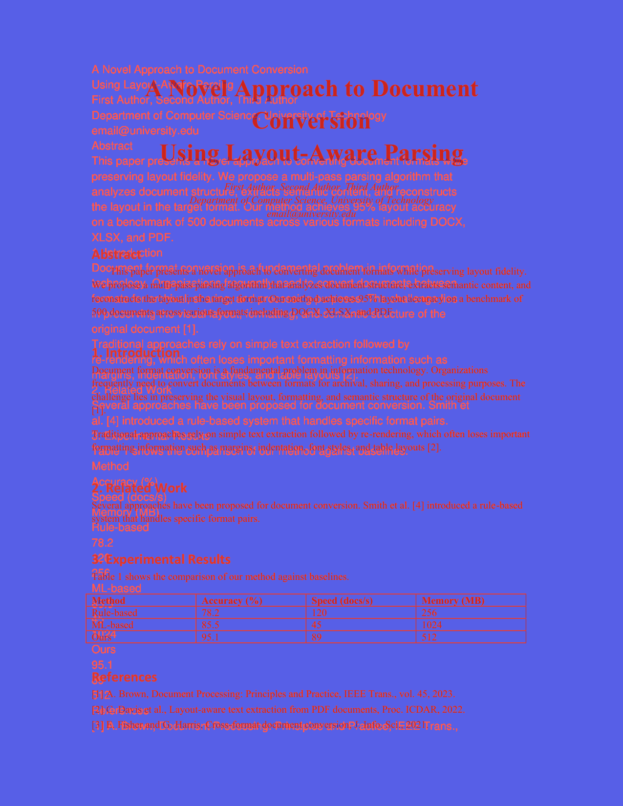</td>
  <td>changed: 212641 px (10.11%)<br>bbox: [175, 133, 1087, 1499]<br>mean abs RGB: 16.2129<br>RMSE RGB: 57.1815<br>threshold: 12, gain: 5.0</td>
</tr>
<tr>
  <td><b>13_IEEE_Style_Paper</b><br>Page 2</td>
  <td></td>
  <td>changed: 29365 px (1.40%)<br>bbox: [187, 133, 961, 374]<br>mean abs RGB: 2.3095<br>RMSE RGB: 21.8027<br>threshold: 12, gain: 5.0</td>
</tr>
<tr>
  <td><b>14_Thesis_Chapter</b><br>Page 1</td>
  <td>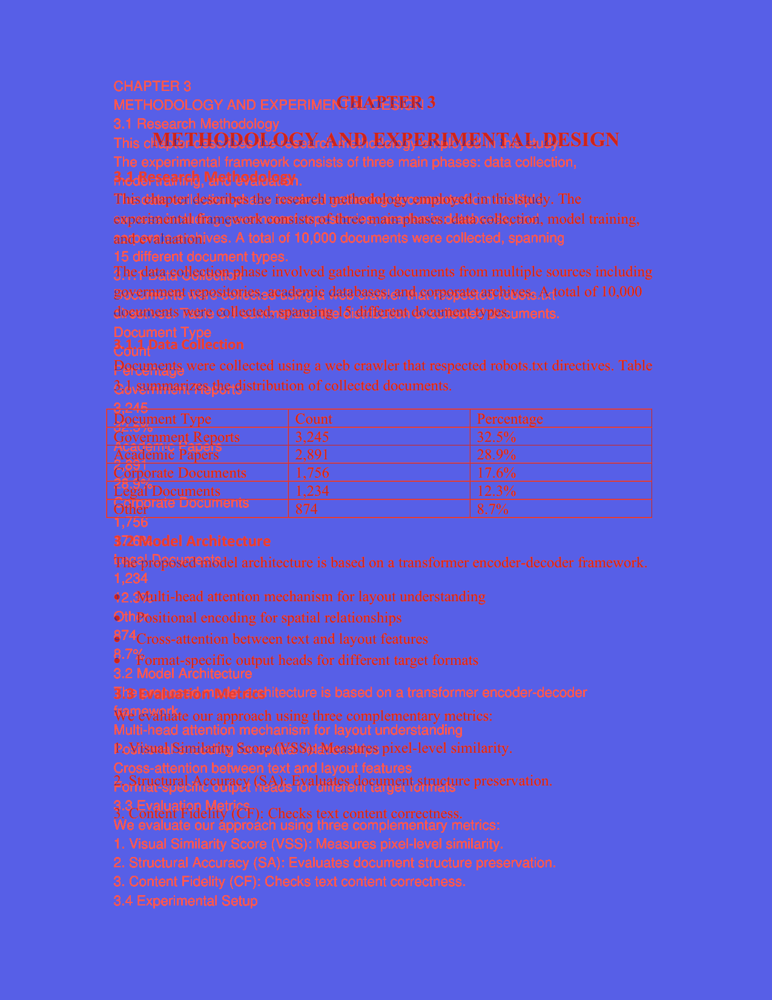</td>
  <td>changed: 203691 px (9.68%)<br>bbox: [175, 133, 1077, 1499]<br>mean abs RGB: 15.3025<br>RMSE RGB: 55.3526<br>threshold: 12, gain: 5.0</td>
</tr>
<tr>
  <td><b>14_Thesis_Chapter</b><br>Page 2</td>
  <td></td>
  <td>changed: 33177 px (1.58%)<br>bbox: [187, 133, 1085, 284]<br>mean abs RGB: 2.4867<br>RMSE RGB: 22.3122<br>threshold: 12, gain: 5.0</td>
</tr>
<tr>
  <td><b>20260317_sample_CN</b><br>Page 1</td>
  <td>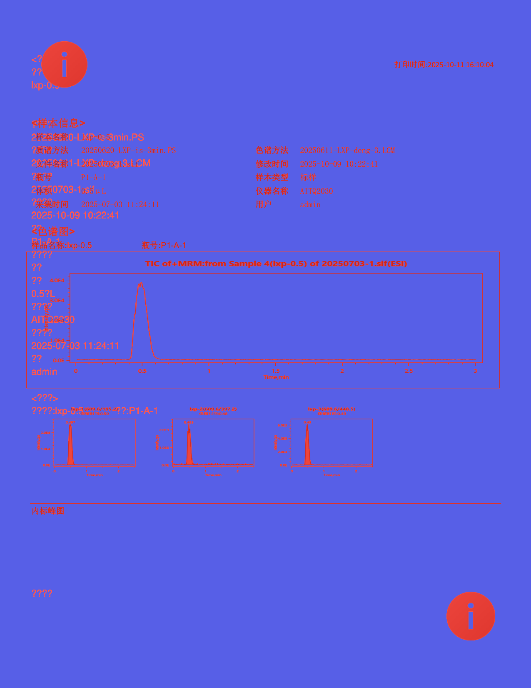</td>
  <td>changed: 91382 px (4.34%)<br>bbox: [63, 98, 1204, 1536]<br>mean abs RGB: 5.5376<br>RMSE RGB: 31.4925<br>threshold: 12, gain: 5.0</td>
</tr>
<tr>
  <td><b>20260317_sample_CN</b><br>Page 2</td>
  <td>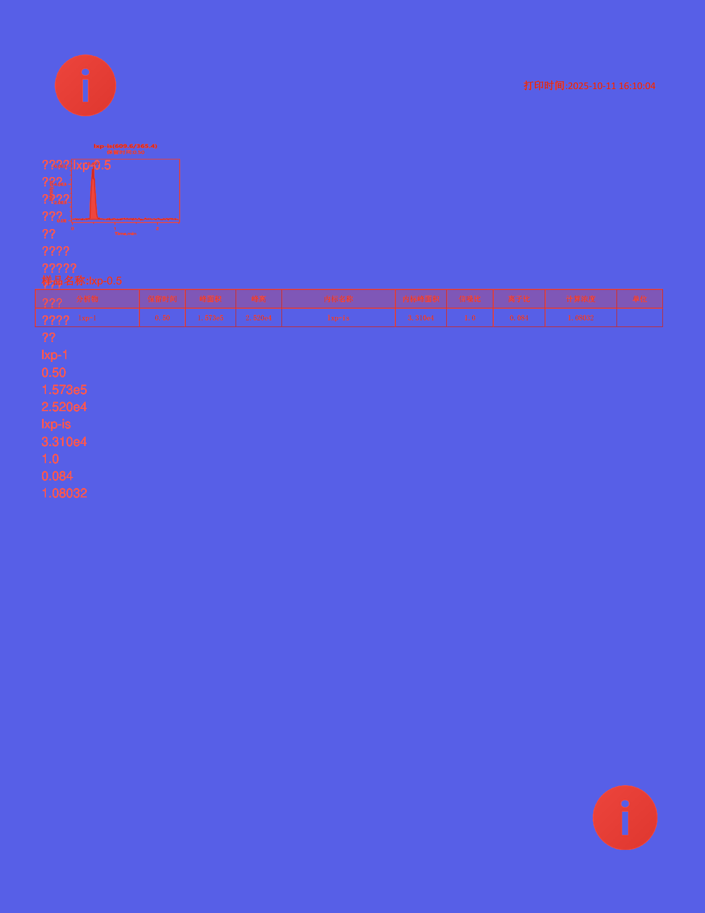</td>
  <td>changed: 79477 px (3.78%)<br>bbox: [63, 98, 1199, 1536]<br>mean abs RGB: 3.0695<br>RMSE RGB: 21.8986<br>threshold: 12, gain: 5.0</td>
</tr>
<tr>
  <td><b>20260318_issue</b><br>Page 1</td>
  <td>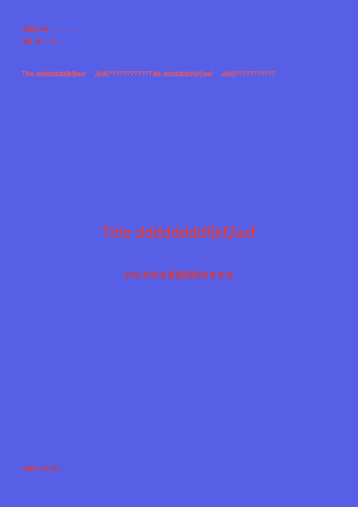</td>
  <td>changed: 21090 px (0.97%)<br>bbox: [75, 92, 953, 1630]<br>mean abs RGB: 1.3488<br>RMSE RGB: 15.792<br>threshold: 12, gain: 5.0</td>
</tr>
<tr>
  <td><b>20260318_issue</b><br>Page 2</td>
  <td>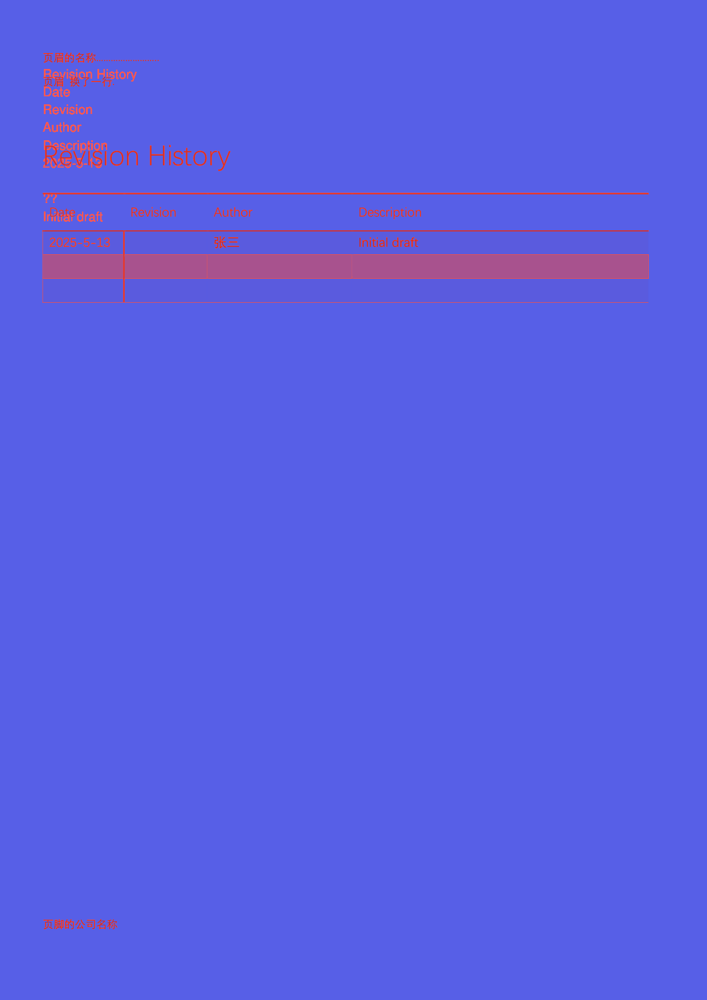</td>
  <td>changed: 150399 px (6.91%)<br>bbox: [74, 92, 1139, 1630]<br>mean abs RGB: 2.6281<br>RMSE RGB: 16.4996<br>threshold: 12, gain: 5.0</td>
</tr>
<tr>
  <td><b>20260318_issue</b><br>Page 3</td>
  <td>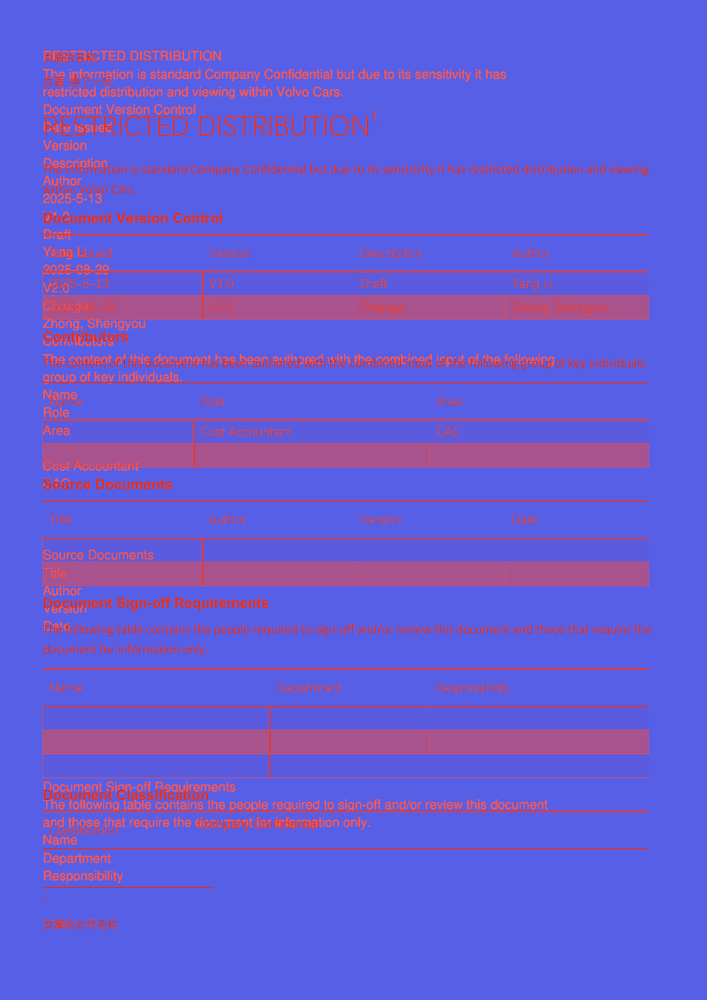</td>
  <td>changed: 519079 px (23.85%)<br>bbox: [73, 89, 1142, 1630]<br>mean abs RGB: 13.1057<br>RMSE RGB: 41.6528<br>threshold: 12, gain: 5.0</td>
</tr>
<tr>
  <td><b>20260318_issue</b><br>Page 4</td>
  <td>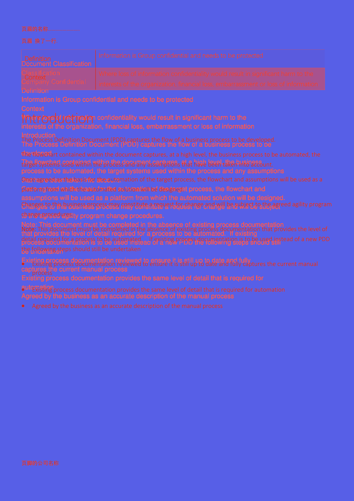</td>
  <td>changed: 308938 px (14.19%)<br>bbox: [74, 92, 1162, 1630]<br>mean abs RGB: 14.0533<br>RMSE RGB: 49.9729<br>threshold: 12, gain: 5.0</td>
</tr>
<tr>
  <td><b>20260318_issue</b><br>Page 5</td>
  <td>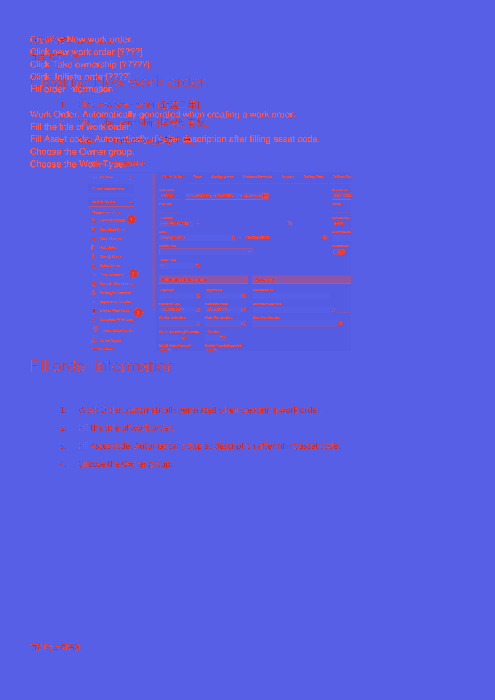</td>
  <td>changed: 89391 px (4.11%)<br>bbox: [75, 89, 879, 1630]<br>mean abs RGB: 5.2199<br>RMSE RGB: 27.6012<br>threshold: 12, gain: 5.0</td>
</tr>
<tr>
  <td><b>20260318_issue</b><br>Page 6</td>
  <td>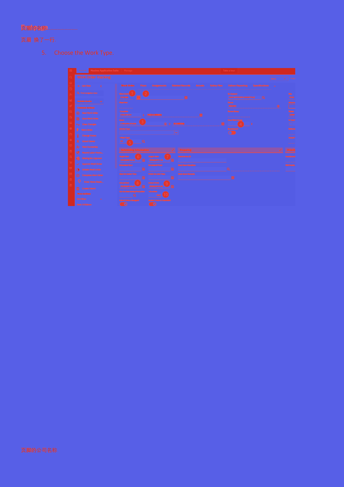</td>
  <td>changed: 85219 px (3.91%)<br>bbox: [76, 89, 1065, 1630]<br>mean abs RGB: 5.8691<br>RMSE RGB: 30.4375<br>threshold: 12, gain: 5.0</td>
</tr>
<tr>
  <td><b>CCU_article</b><br>Page 1</td>
  <td>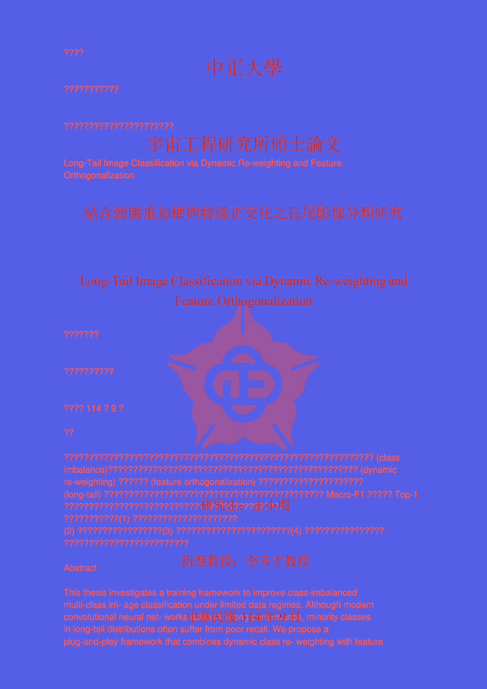</td>
  <td>changed: 167245 px (7.68%)<br>bbox: [163, 125, 1061, 1647]<br>mean abs RGB: 8.6323<br>RMSE RGB: 40.7912<br>threshold: 12, gain: 5.0</td>
</tr>
<tr>
  <td><b>CCU_article</b><br>Page 2</td>
  <td>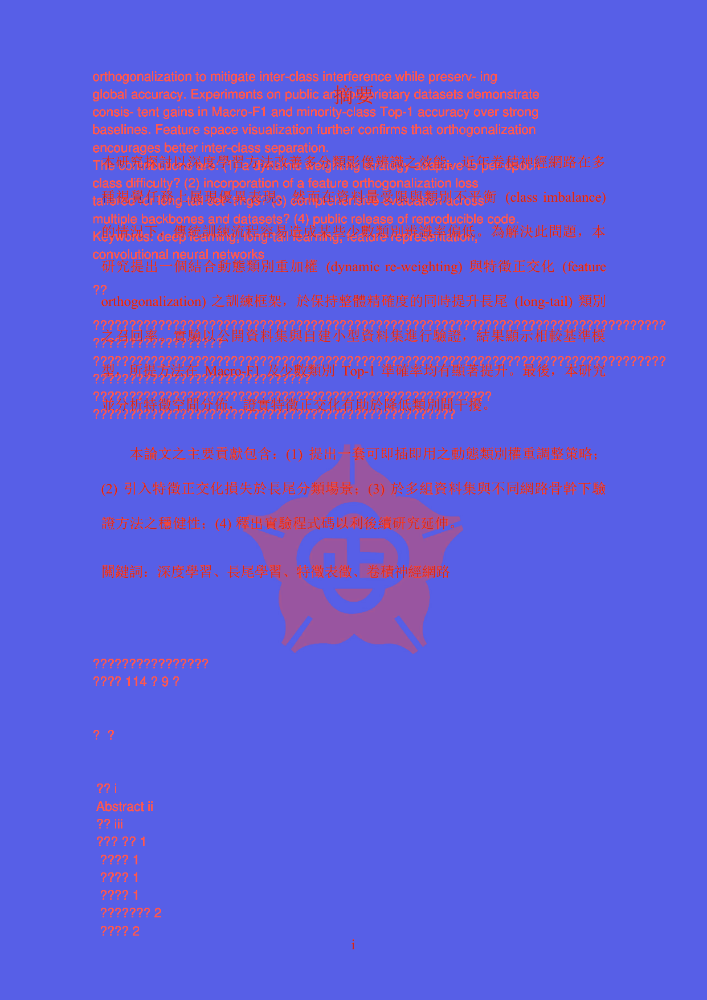</td>
  <td>changed: 212921 px (9.78%)<br>bbox: [162, 125, 1168, 1666]<br>mean abs RGB: 11.3941<br>RMSE RGB: 45.8706<br>threshold: 12, gain: 5.0</td>
</tr>
<tr>
  <td><b>CCU_article</b><br>Page 3</td>
  <td>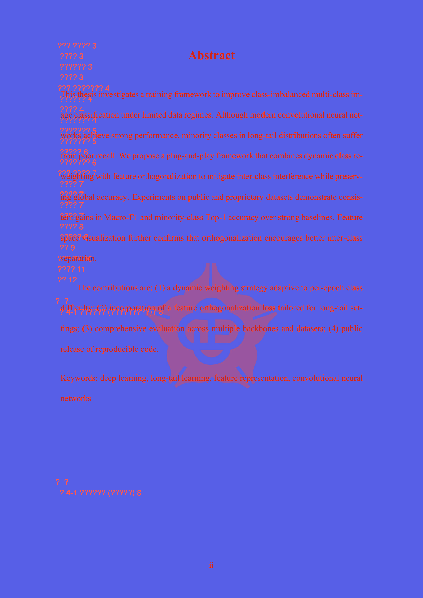</td>
  <td>changed: 145480 px (6.68%)<br>bbox: [164, 125, 1064, 1666]<br>mean abs RGB: 7.1336<br>RMSE RGB: 36.5777<br>threshold: 12, gain: 5.0</td>
</tr>
<tr>
  <td><b>CCU_article</b><br>Page 4</td>
  <td>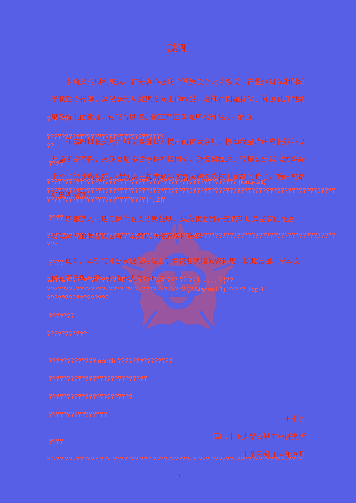</td>
  <td>changed: 169258 px (7.77%)<br>bbox: [164, 149, 1168, 1666]<br>mean abs RGB: 8.07<br>RMSE RGB: 37.6464<br>threshold: 12, gain: 5.0</td>
</tr>
<tr>
  <td><b>CCU_article</b><br>Page 5</td>
  <td>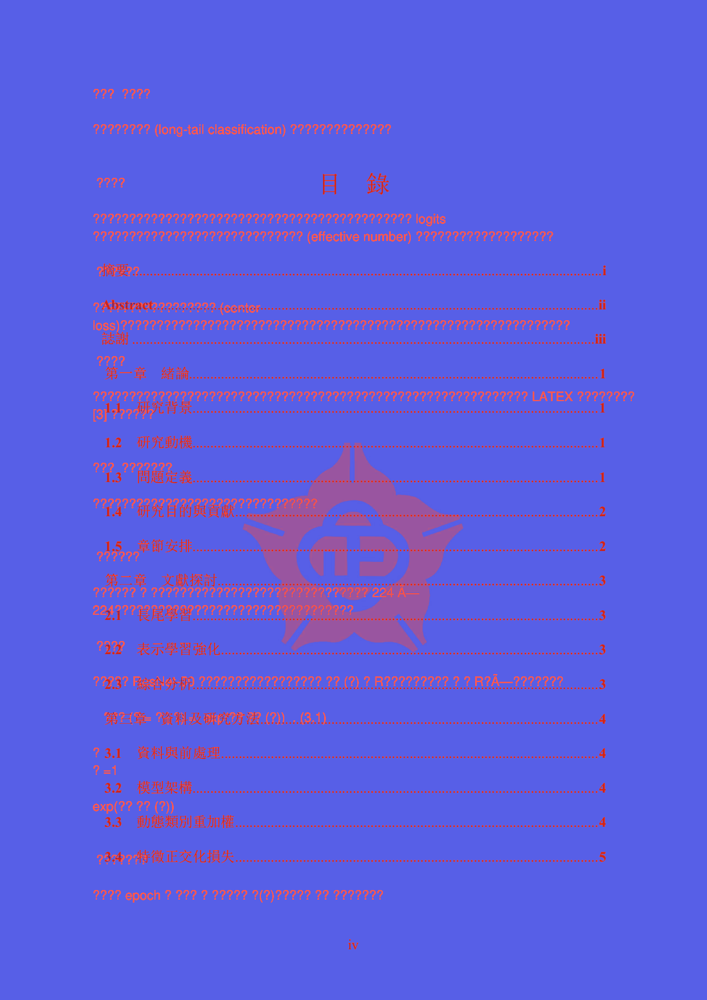</td>
  <td>changed: 152274 px (6.99%)<br>bbox: [163, 156, 1114, 1667]<br>mean abs RGB: 7.088<br>RMSE RGB: 36.0002<br>threshold: 12, gain: 5.0</td>
</tr>
<tr>
  <td><b>CCU_article</b><br>Page 6</td>
  <td>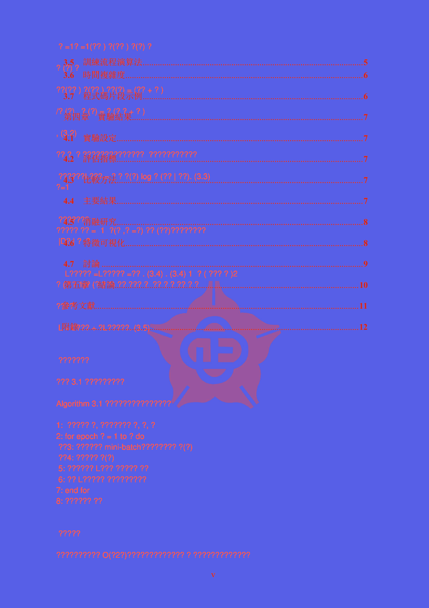</td>
  <td>changed: 133678 px (6.14%)<br>bbox: [162, 125, 1064, 1667]<br>mean abs RGB: 5.5923<br>RMSE RGB: 31.5317<br>threshold: 12, gain: 5.0</td>
</tr>
<tr>
  <td><b>CCU_article</b><br>Page 7</td>
  <td>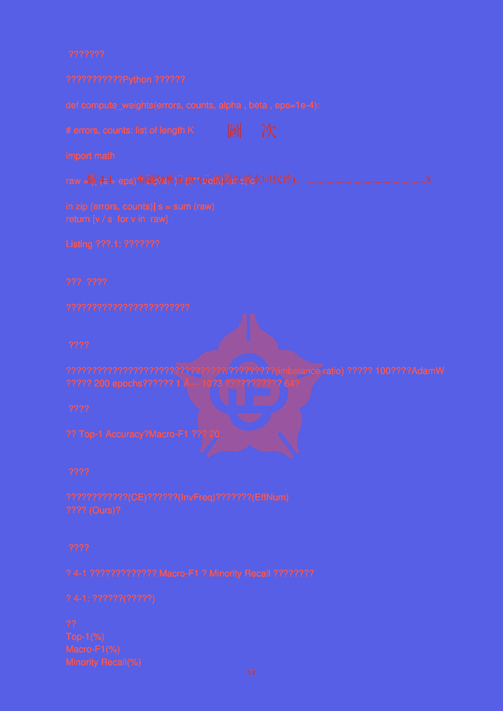</td>
  <td>changed: 106319 px (4.88%)<br>bbox: [162, 125, 1096, 1667]<br>mean abs RGB: 4.3302<br>RMSE RGB: 27.8796<br>threshold: 12, gain: 5.0</td>
</tr>
<tr>
  <td><b>CCU_article</b><br>Page 8</td>
  <td>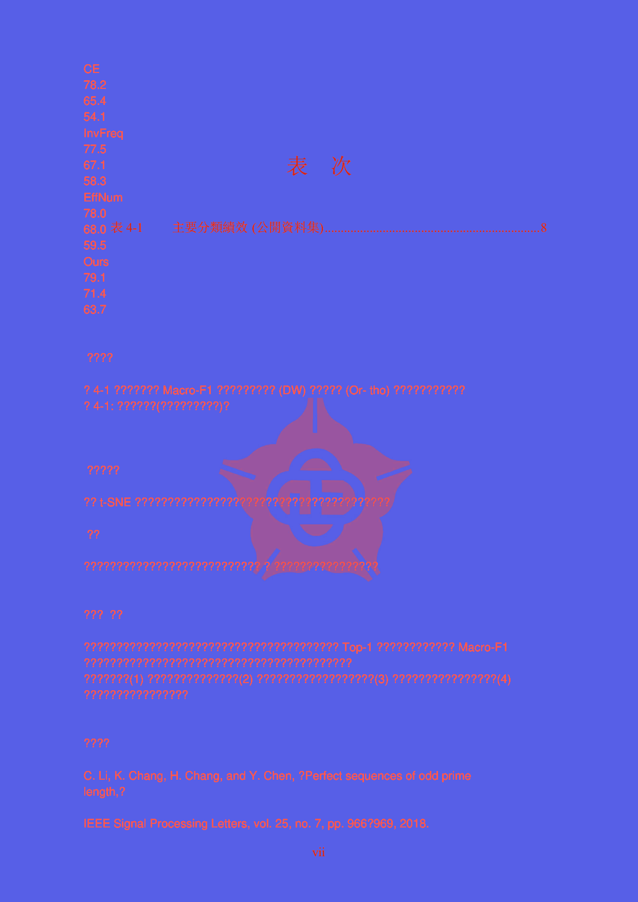</td>
  <td>changed: 106046 px (4.87%)<br>bbox: [163, 125, 1063, 1667]<br>mean abs RGB: 4.2583<br>RMSE RGB: 27.6347<br>threshold: 12, gain: 5.0</td>
</tr>
<tr>
  <td><b>CCU_article</b><br>Page 9</td>
  <td>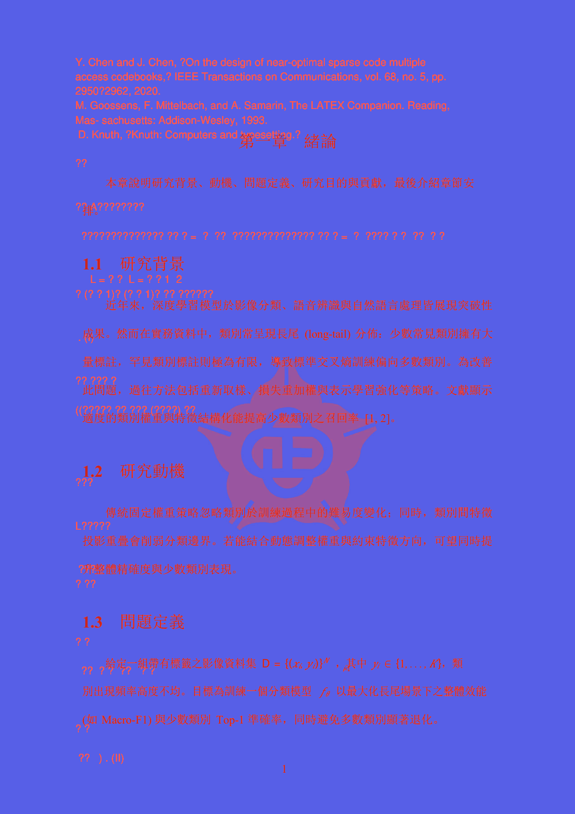</td>
  <td>changed: 178017 px (8.17%)<br>bbox: [163, 125, 1063, 1666]<br>mean abs RGB: 8.6463<br>RMSE RGB: 39.0545<br>threshold: 12, gain: 5.0</td>
</tr>
<tr>
  <td><b>CCU_article</b><br>Page 10</td>
  <td>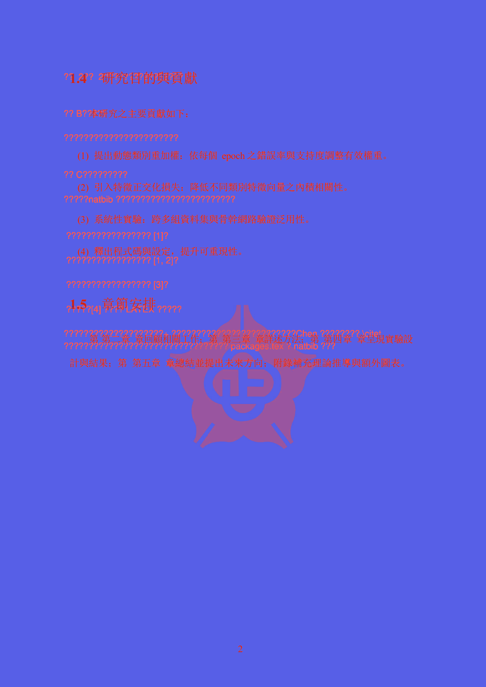</td>
  <td>changed: 121588 px (5.58%)<br>bbox: [164, 183, 1054, 1666]<br>mean abs RGB: 4.8643<br>RMSE RGB: 28.5553<br>threshold: 12, gain: 5.0</td>
</tr>
<tr>
  <td><b>Class News</b><br>Page 1</td>
  <td></td>
  <td>changed: 1190634 px (56.60%)<br>bbox: [0, 0, 1275, 1650]<br>mean abs RGB: 64.6208<br>RMSE RGB: 101.1418<br>threshold: 12, gain: 5.0</td>
</tr>
<tr>
  <td><b>Class News</b><br>Page 2</td>
  <td></td>
  <td>changed: 1117536 px (53.12%)<br>bbox: [0, 0, 1275, 1650]<br>mean abs RGB: 60.7639<br>RMSE RGB: 98.7086<br>threshold: 12, gain: 5.0</td>
</tr>
<tr>
  <td><b>Class News</b><br>Page 3</td>
  <td></td>
  <td>changed: 1186684 px (56.41%)<br>bbox: [0, 0, 1275, 1650]<br>mean abs RGB: 49.4656<br>RMSE RGB: 87.6606<br>threshold: 12, gain: 5.0</td>
</tr>
<tr>
  <td><b>Class News</b><br>Page 4</td>
  <td></td>
  <td>changed: 1112305 px (52.87%)<br>bbox: [0, 0, 1275, 1650]<br>mean abs RGB: 45.728<br>RMSE RGB: 85.1522<br>threshold: 12, gain: 5.0</td>
</tr>
<tr>
  <td><b>Confirmatory_Affidavit</b><br>Page 1</td>
  <td>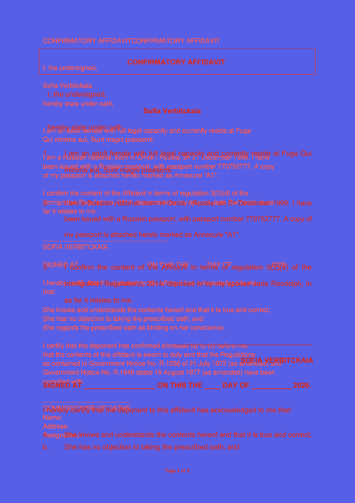</td>
  <td>changed: 167906 px (7.71%)<br>bbox: [136, 133, 1103, 1651]<br>mean abs RGB: 13.2616<br>RMSE RGB: 52.9251<br>threshold: 12, gain: 5.0</td>
</tr>
<tr>
  <td><b>Cooperation Agreement Template</b><br>Page 1</td>
  <td></td>
  <td>changed: 48733 px (2.24%)<br>bbox: [168, 133, 1117, 1638]<br>mean abs RGB: 3.954<br>RMSE RGB: 29.1888<br>threshold: 12, gain: 5.0</td>
</tr>
<tr>
  <td><b>Cooperation Agreement Template</b><br>Page 2</td>
  <td></td>
  <td>changed: 95578 px (4.39%)<br>bbox: [166, 147, 1104, 1642]<br>mean abs RGB: 6.4401<br>RMSE RGB: 34.9506<br>threshold: 12, gain: 5.0</td>
</tr>
<tr>
  <td><b>Cooperation Agreement Template</b><br>Page 3</td>
  <td></td>
  <td>changed: 24167 px (1.11%)<br>bbox: [165, 133, 1070, 1643]<br>mean abs RGB: 1.6986<br>RMSE RGB: 18.2592<br>threshold: 12, gain: 5.0</td>
</tr>
<tr>
  <td><b>Fabrikam</b><br>Page 1</td>
  <td>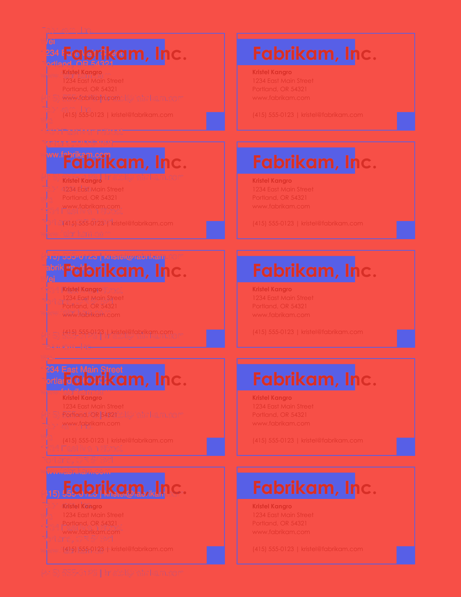</td>
  <td>changed: 1874553 px (89.11%)<br>bbox: [0, 0, 1275, 1650]<br>mean abs RGB: 41.2245<br>RMSE RGB: 57.7964<br>threshold: 12, gain: 5.0</td>
</tr>
<tr>
  <td><b>Invoice</b><br>Page 1</td>
  <td>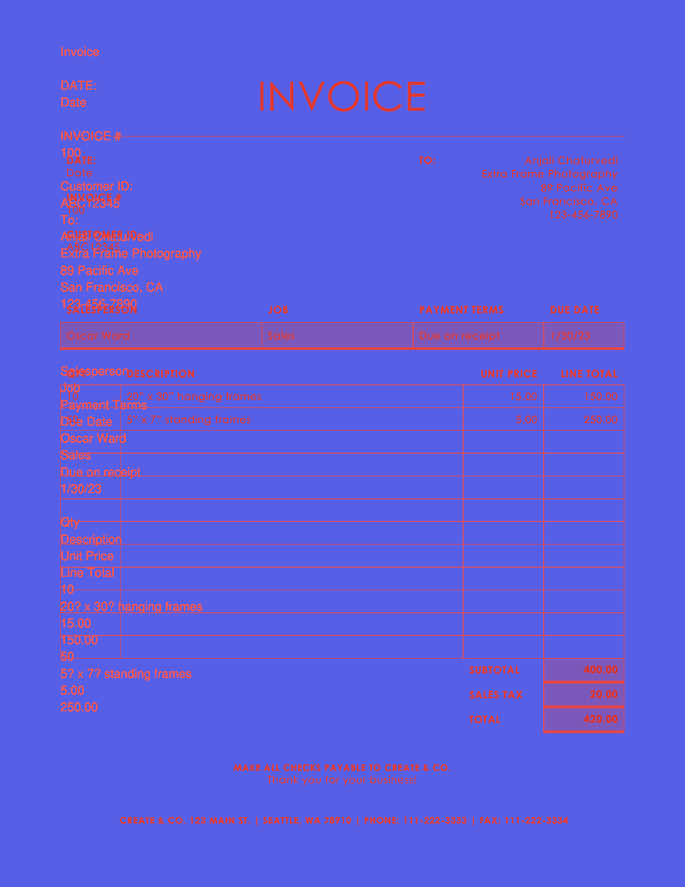</td>
  <td>changed: 162769 px (7.74%)<br>bbox: [111, 87, 1163, 1536]<br>mean abs RGB: 5.7483<br>RMSE RGB: 28.2247<br>threshold: 12, gain: 5.0</td>
</tr>
<tr>
  <td><b>Issue79_FilledContract</b><br>Page 1</td>
  <td>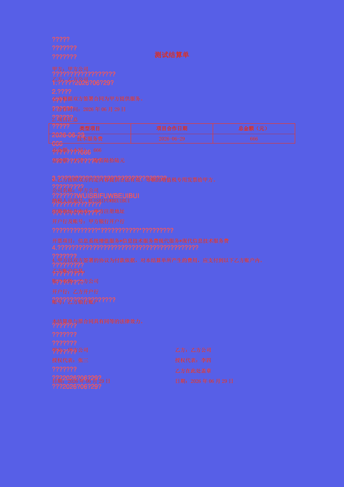</td>
  <td>changed: 75296 px (3.46%)<br>bbox: [175, 133, 1065, 1401]<br>mean abs RGB: 4.9203<br>RMSE RGB: 30.1848<br>threshold: 12, gain: 5.0</td>
</tr>
<tr>
  <td><b>Issue79_TemplateContract</b><br>Page 1</td>
  <td>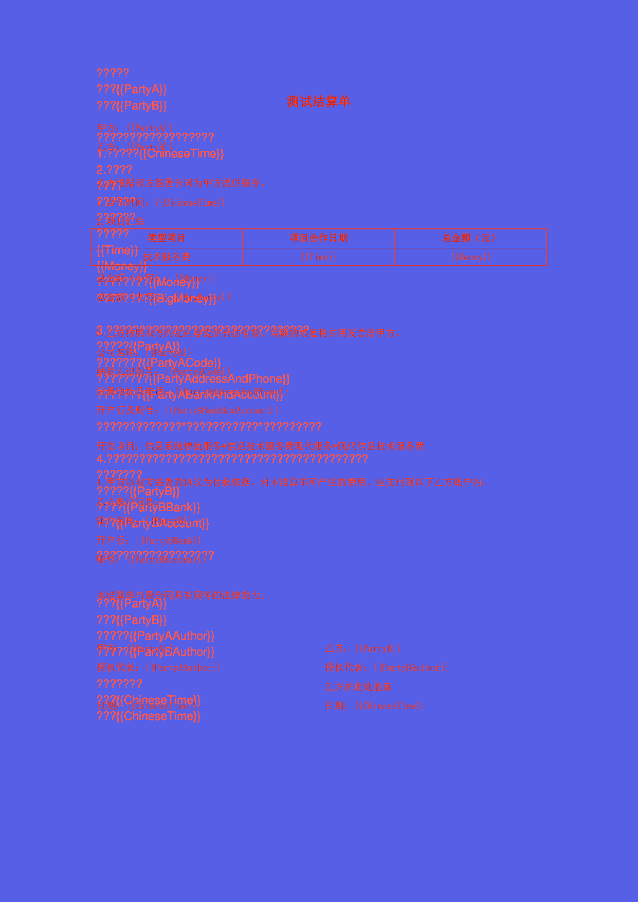</td>
  <td>changed: 86672 px (3.98%)<br>bbox: [175, 133, 1065, 1405]<br>mean abs RGB: 5.8008<br>RMSE RGB: 33.0102<br>threshold: 12, gain: 5.0</td>
</tr>
<tr>
  <td><b>Issue83_Output</b><br>Page 1</td>
  <td></td>
  <td>changed: 21330 px (0.98%)<br>bbox: [147, 199, 384, 289]<br>mean abs RGB: 1.507<br>RMSE RGB: 17.9338<br>threshold: 12, gain: 5.0</td>
</tr>
<tr>
  <td><b>Issue159_PageLayoutOptions</b><br>Page 1</td>
  <td>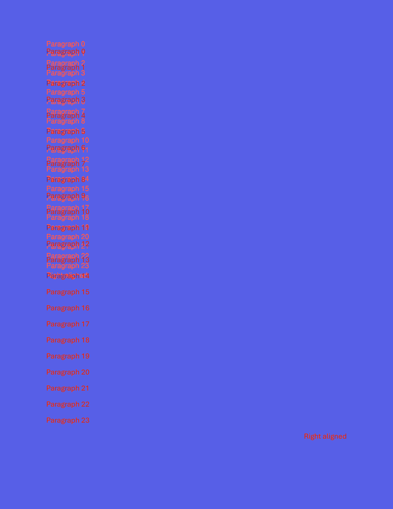</td>
  <td>changed: 44423 px (2.11%)<br>bbox: [152, 133, 1124, 1427]<br>mean abs RGB: 3.5352<br>RMSE RGB: 27.0594<br>threshold: 12, gain: 5.0</td>
</tr>
<tr>
  <td><b>issue202605</b><br>Page 1</td>
  <td>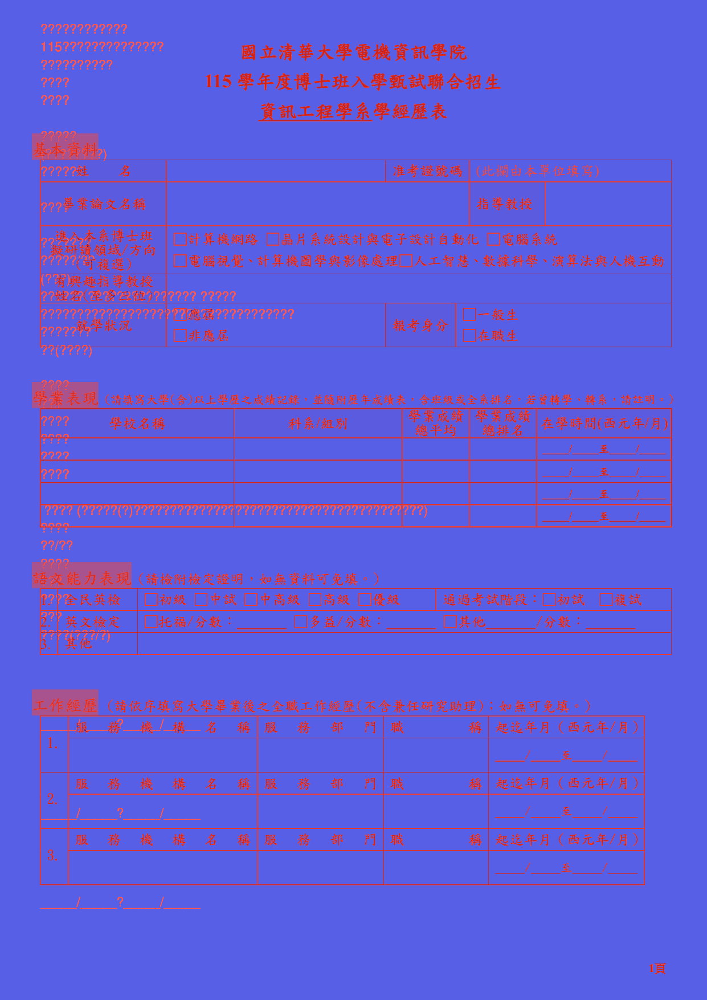</td>
  <td>changed: 322067 px (14.80%)<br>bbox: [56, 42, 1181, 1709]<br>mean abs RGB: 12.9387<br>RMSE RGB: 48.012<br>threshold: 12, gain: 5.0</td>
</tr>
<tr>
  <td><b>issue202605</b><br>Page 2</td>
  <td>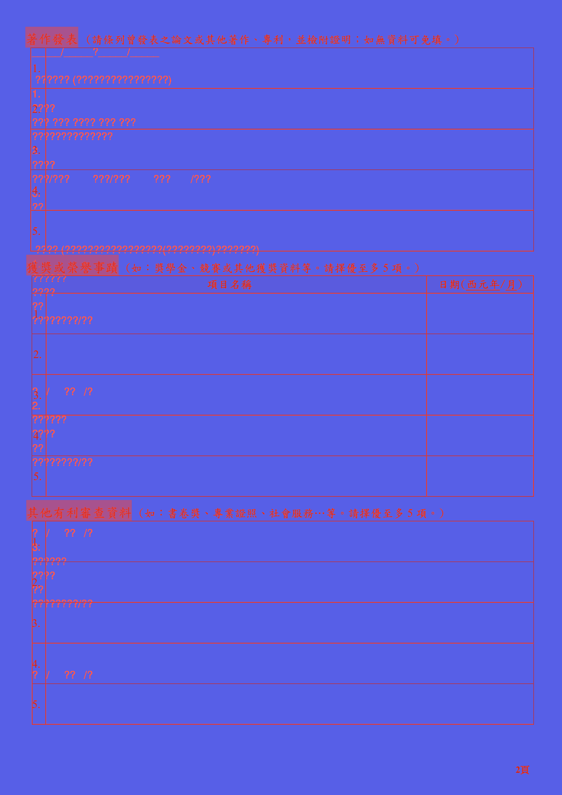</td>
  <td>changed: 145488 px (6.68%)<br>bbox: [56, 59, 1179, 1709]<br>mean abs RGB: 5.9347<br>RMSE RGB: 31.7391<br>threshold: 12, gain: 5.0</td>
</tr>
<tr>
  <td><b>issue26050501</b><br>Page 1</td>
  <td>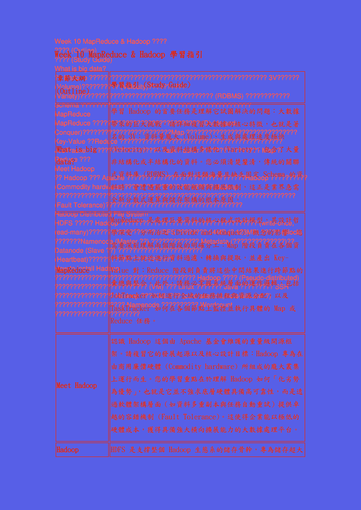</td>
  <td>changed: 251699 px (11.56%)<br>bbox: [187, 133, 1056, 1572]<br>mean abs RGB: 18.3907<br>RMSE RGB: 60.7146<br>threshold: 12, gain: 5.0</td>
</tr>
<tr>
  <td><b>issues66</b><br>Page 1</td>
  <td>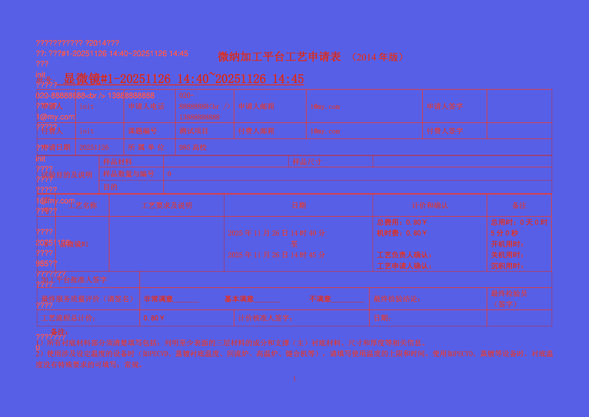</td>
  <td>changed: 146616 px (6.74%)<br>bbox: [106, 119, 1648, 1133]<br>mean abs RGB: 9.5319<br>RMSE RGB: 42.1404<br>threshold: 12, gain: 5.0</td>
</tr>
<tr>
  <td><b>issues66</b><br>Page 2</td>
  <td>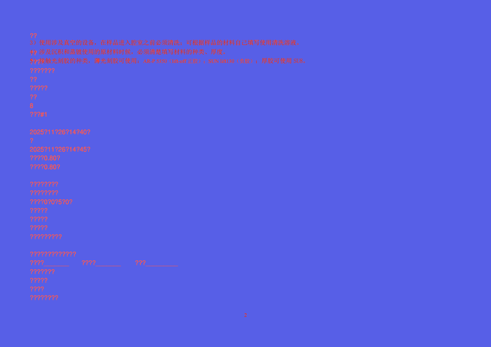</td>
  <td>changed: 32912 px (1.51%)<br>bbox: [107, 119, 1089, 1133]<br>mean abs RGB: 2.1445<br>RMSE RGB: 20.1923<br>threshold: 12, gain: 5.0</td>
</tr>
<tr>
  <td><b>issues66</b><br>Page 3</td>
  <td>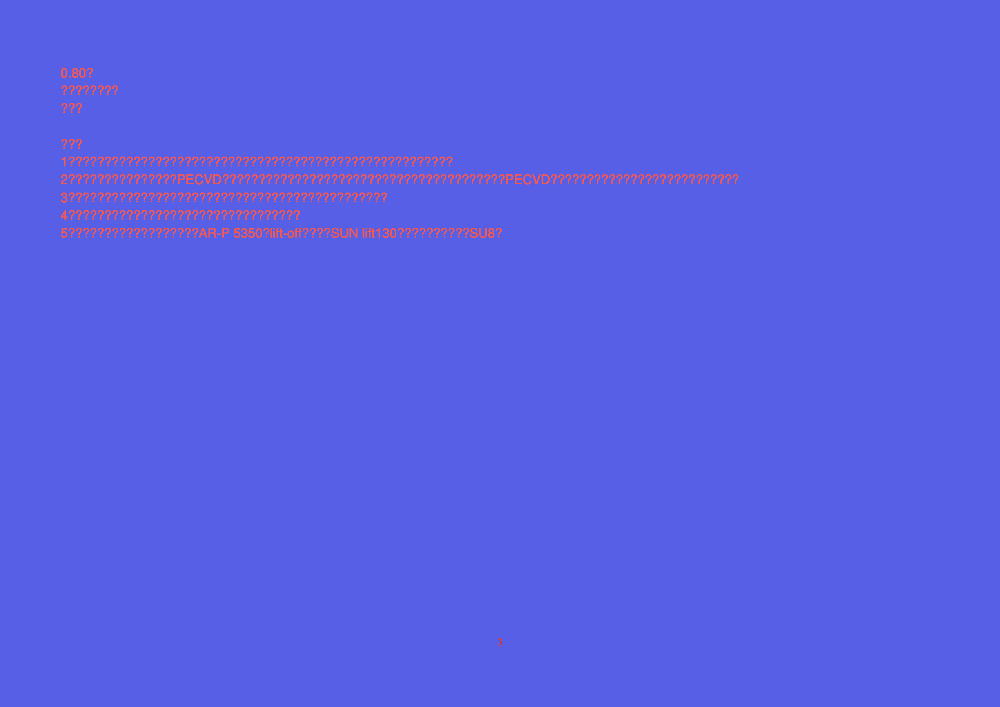</td>
  <td>changed: 23496 px (1.08%)<br>bbox: [106, 119, 1296, 1134]<br>mean abs RGB: 1.8027<br>RMSE RGB: 19.3578<br>threshold: 12, gain: 5.0</td>
</tr>
<tr>
  <td><b>MODERN LIVING</b><br>Page 1</td>
  <td></td>
  <td>changed: 1112822 px (52.90%)<br>bbox: [75, 0, 1275, 1650]<br>mean abs RGB: 29.5897<br>RMSE RGB: 63.2723<br>threshold: 12, gain: 5.0</td>
</tr>
<tr>
  <td><b>MODERN LIVING</b><br>Page 2</td>
  <td></td>
  <td>changed: 1236369 px (58.77%)<br>bbox: [0, 0, 1200, 1499]<br>mean abs RGB: 35.068<br>RMSE RGB: 68.8054<br>threshold: 12, gain: 5.0</td>
</tr>
<tr>
  <td><b>nthu_article</b><br>Page 1</td>
  <td>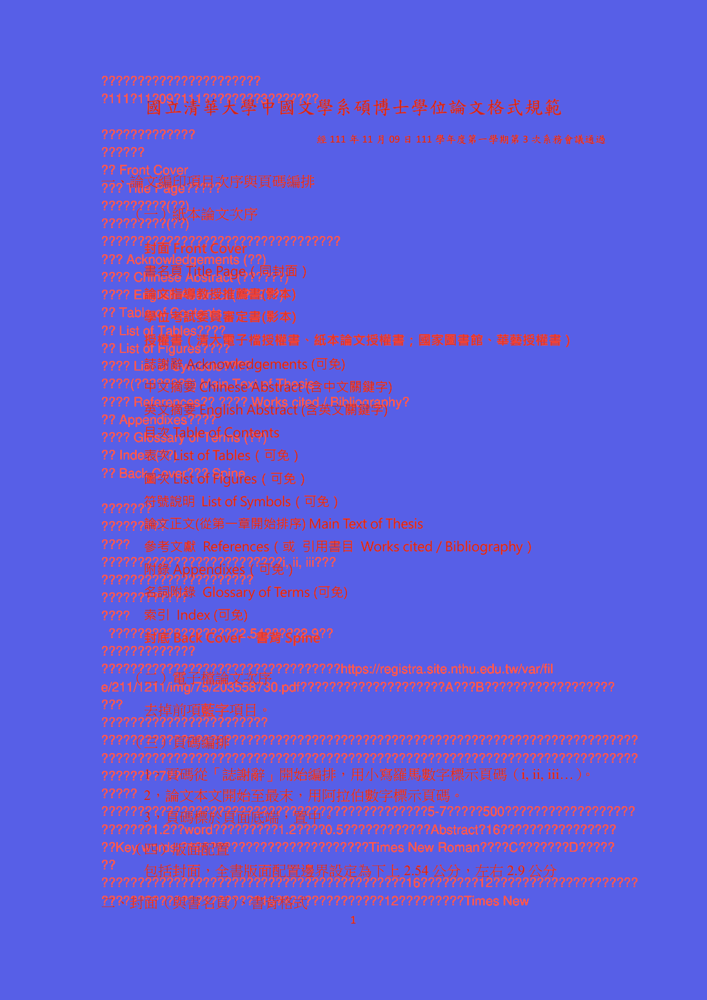</td>
  <td>changed: 183074 px (8.41%)<br>bbox: [178, 133, 1119, 1620]<br>mean abs RGB: 12.6872<br>RMSE RGB: 49.8366<br>threshold: 12, gain: 5.0</td>
</tr>
<tr>
  <td><b>nthu_article</b><br>Page 2</td>
  <td>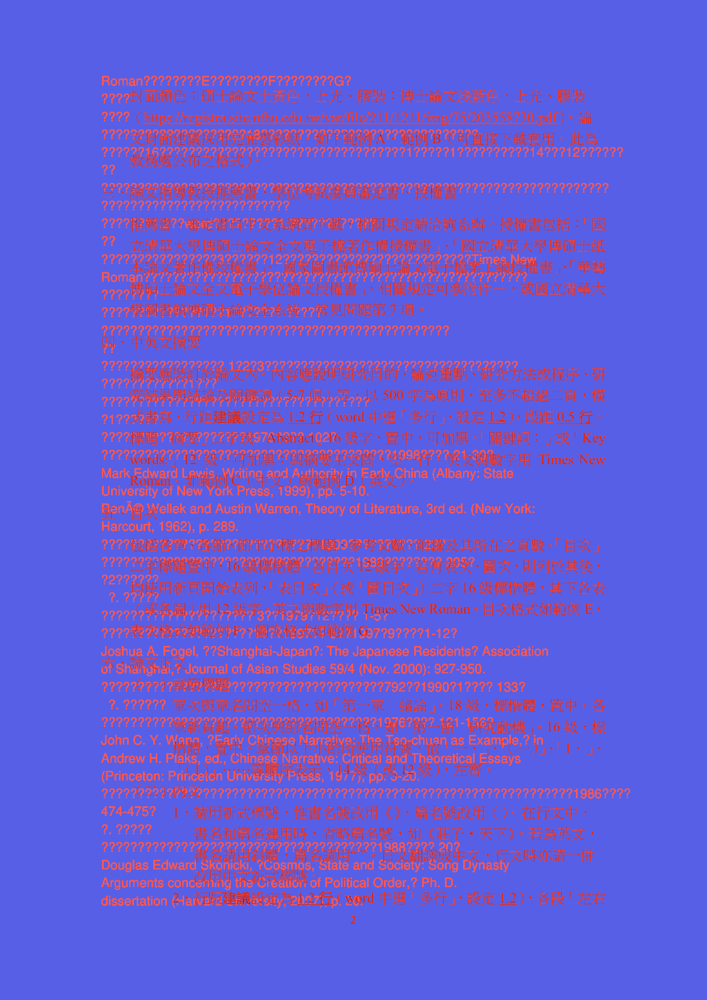</td>
  <td>changed: 286242 px (13.15%)<br>bbox: [177, 133, 1107, 1620]<br>mean abs RGB: 19.1877<br>RMSE RGB: 60.2449<br>threshold: 12, gain: 5.0</td>
</tr>
<tr>
  <td><b>nthu_article</b><br>Page 3</td>
  <td>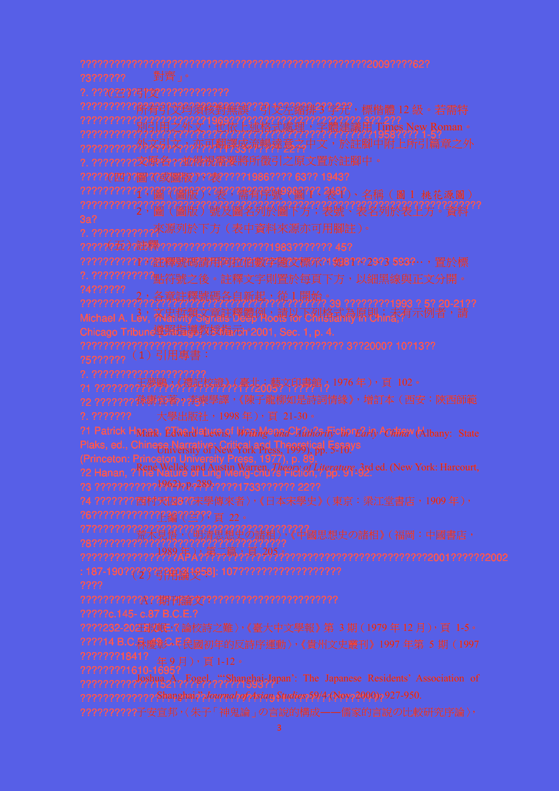</td>
  <td>changed: 240418 px (11.04%)<br>bbox: [178, 133, 1127, 1621]<br>mean abs RGB: 16.4571<br>RMSE RGB: 56.2399<br>threshold: 12, gain: 5.0</td>
</tr>
<tr>
  <td><b>nthu_article</b><br>Page 4</td>
  <td>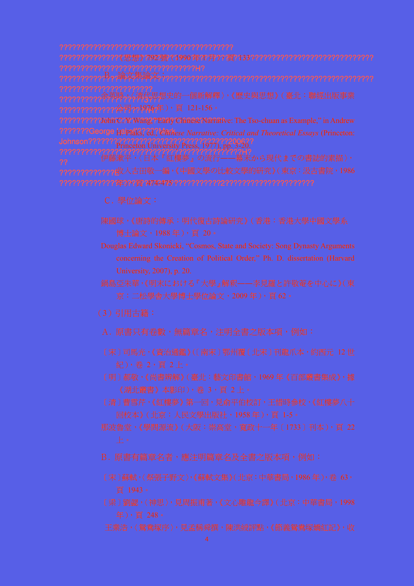</td>
  <td>changed: 149493 px (6.87%)<br>bbox: [177, 133, 1119, 1620]<br>mean abs RGB: 9.551<br>RMSE RGB: 41.6816<br>threshold: 12, gain: 5.0</td>
</tr>
<tr>
  <td><b>nthu_article</b><br>Page 5</td>
  <td>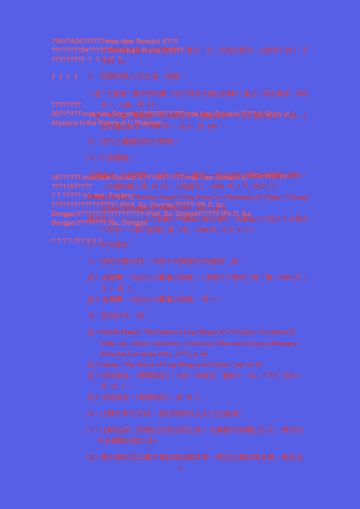</td>
  <td>changed: 131585 px (6.05%)<br>bbox: [177, 133, 1063, 1621]<br>mean abs RGB: 8.4963<br>RMSE RGB: 39.4833<br>threshold: 12, gain: 5.0</td>
</tr>
<tr>
  <td><b>nthu_article</b><br>Page 6</td>
  <td>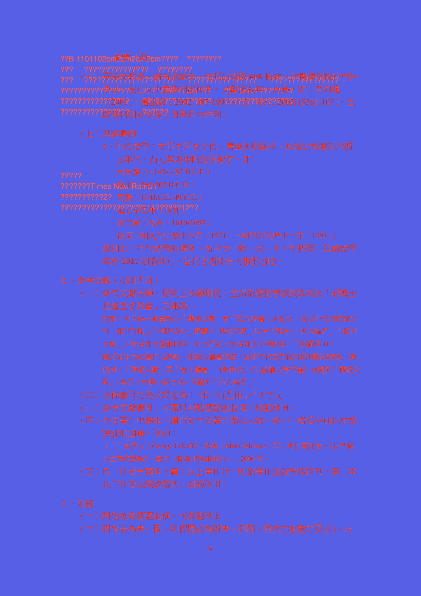</td>
  <td>changed: 147347 px (6.77%)<br>bbox: [178, 157, 1062, 1621]<br>mean abs RGB: 9.0218<br>RMSE RGB: 39.6081<br>threshold: 12, gain: 5.0</td>
</tr>
<tr>
  <td><b>nthu_article</b><br>Page 7</td>
  <td></td>
  <td>changed: 48582 px (2.23%)<br>bbox: [179, 156, 1119, 1620]<br>mean abs RGB: 3.6158<br>RMSE RGB: 27.1881<br>threshold: 12, gain: 5.0</td>
</tr>
<tr>
  <td><b>nthu_article</b><br>Page 8</td>
  <td>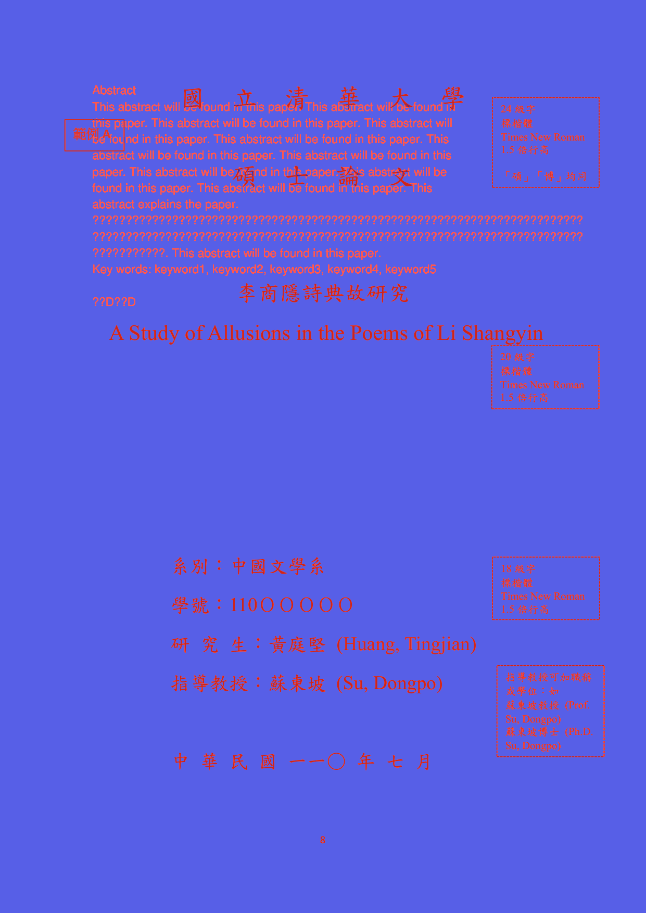</td>
  <td>changed: 104994 px (4.82%)<br>bbox: [123, 164, 1162, 1621]<br>mean abs RGB: 7.7415<br>RMSE RGB: 40.1851<br>threshold: 12, gain: 5.0</td>
</tr>
<tr>
  <td><b>nthu_article</b><br>Page 9</td>
  <td>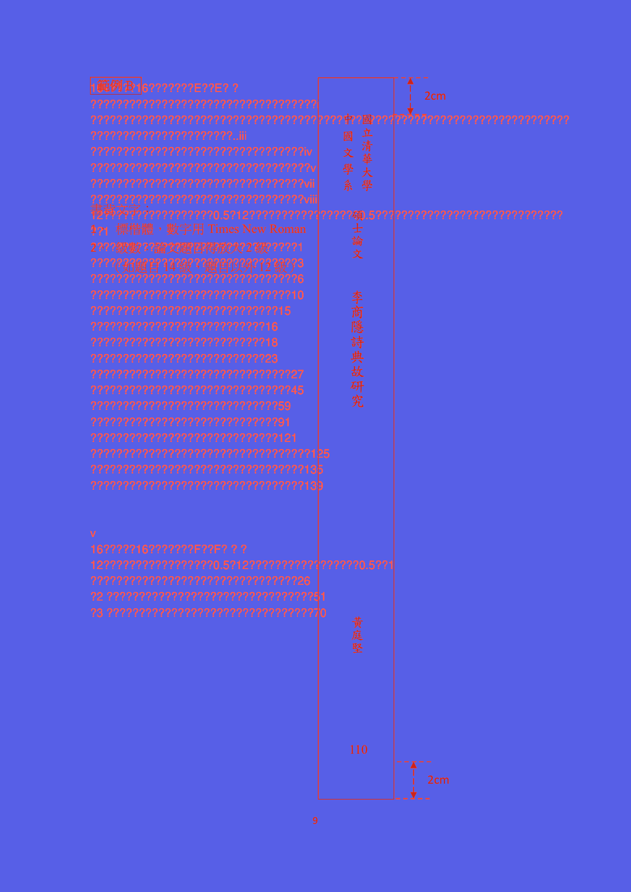</td>
  <td>changed: 101302 px (4.65%)<br>bbox: [177, 151, 1119, 1621]<br>mean abs RGB: 7.2723<br>RMSE RGB: 38.3881<br>threshold: 12, gain: 5.0</td>
</tr>
<tr>
  <td><b>nthu_article</b><br>Page 10</td>
  <td>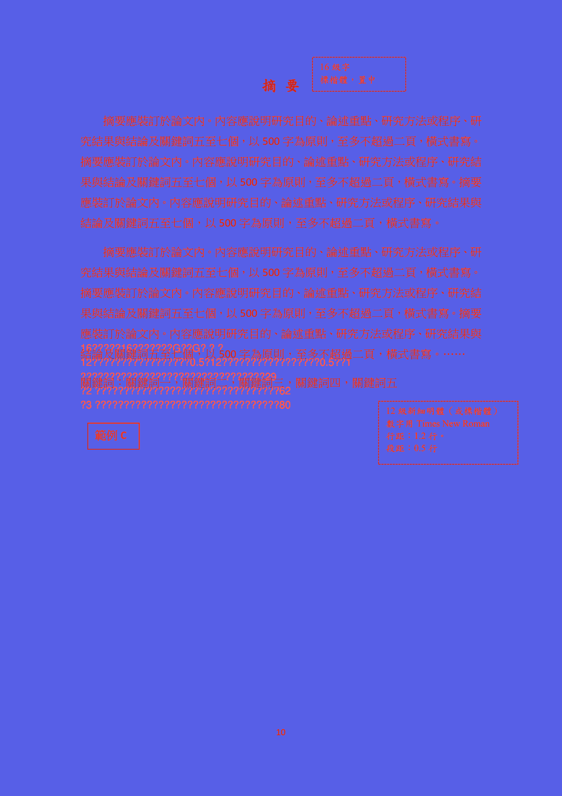</td>
  <td>changed: 110841 px (5.09%)<br>bbox: [178, 125, 1145, 1621]<br>mean abs RGB: 6.7865<br>RMSE RGB: 34.6626<br>threshold: 12, gain: 5.0</td>
</tr>
<tr>
  <td><b>nthu_article</b><br>Page 11</td>
  <td>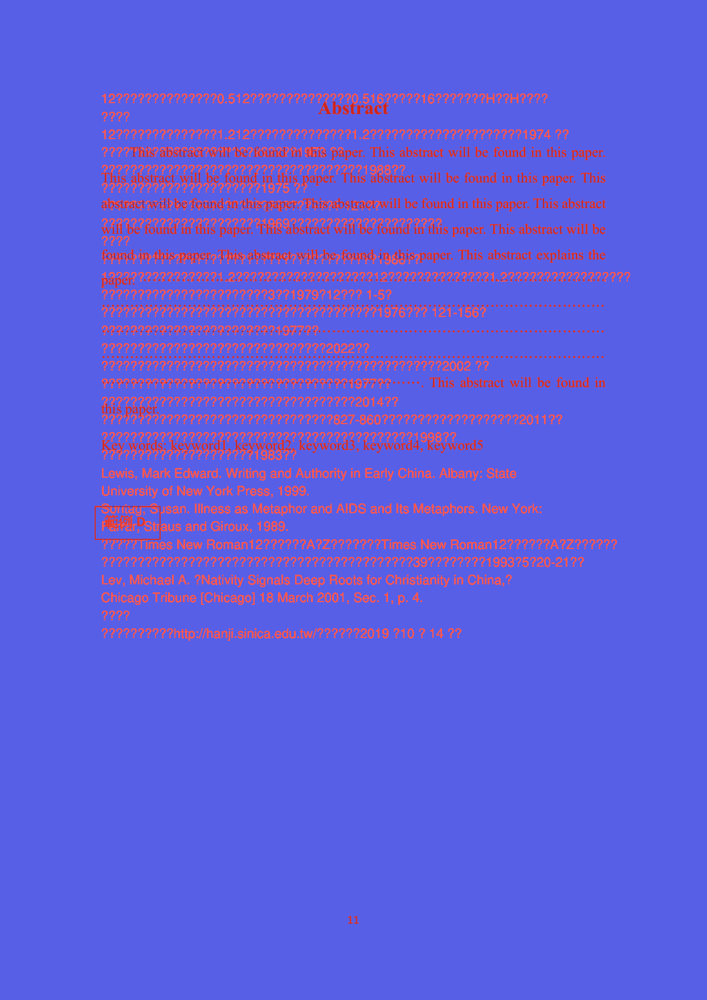</td>
  <td>changed: 144552 px (6.64%)<br>bbox: [166, 164, 1107, 1620]<br>mean abs RGB: 10.8984<br>RMSE RGB: 47.3894<br>threshold: 12, gain: 5.0</td>
</tr>
<tr>
  <td><b>nthu_article</b><br>Page 12</td>
  <td>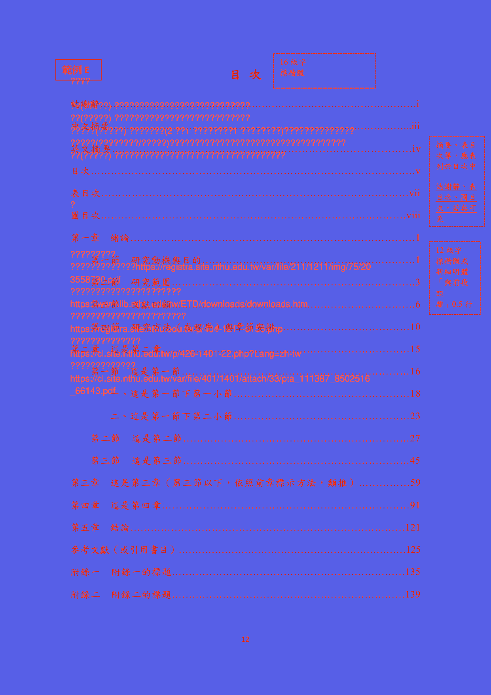</td>
  <td>changed: 111764 px (5.13%)<br>bbox: [140, 134, 1226, 1620]<br>mean abs RGB: 7.6818<br>RMSE RGB: 39.1138<br>threshold: 12, gain: 5.0</td>
</tr>
<tr>
  <td><b>OSCAR WARD</b><br>Page 1</td>
  <td></td>
  <td>changed: 533704 px (25.37%)<br>bbox: [0, 0, 1275, 1650]<br>mean abs RGB: 13.486<br>RMSE RGB: 45.0298<br>threshold: 12, gain: 5.0</td>
</tr>
<tr>
  <td><b>SA8000 ch sample</b><br>Page 1</td>
  <td></td>
  <td>changed: 239310 px (10.99%)<br>bbox: [59, 0, 1178, 1703]<br>mean abs RGB: 16.8423<br>RMSE RGB: 57.5146<br>threshold: 12, gain: 5.0</td>
</tr>
<tr>
  <td><b>SA8000 ch sample</b><br>Page 2</td>
  <td></td>
  <td>changed: 216911 px (9.97%)<br>bbox: [59, 0, 1181, 1717]<br>mean abs RGB: 14.7767<br>RMSE RGB: 53.1535<br>threshold: 12, gain: 5.0</td>
</tr>
<tr>
  <td><b>Support_Letter</b><br>Page 1</td>
  <td>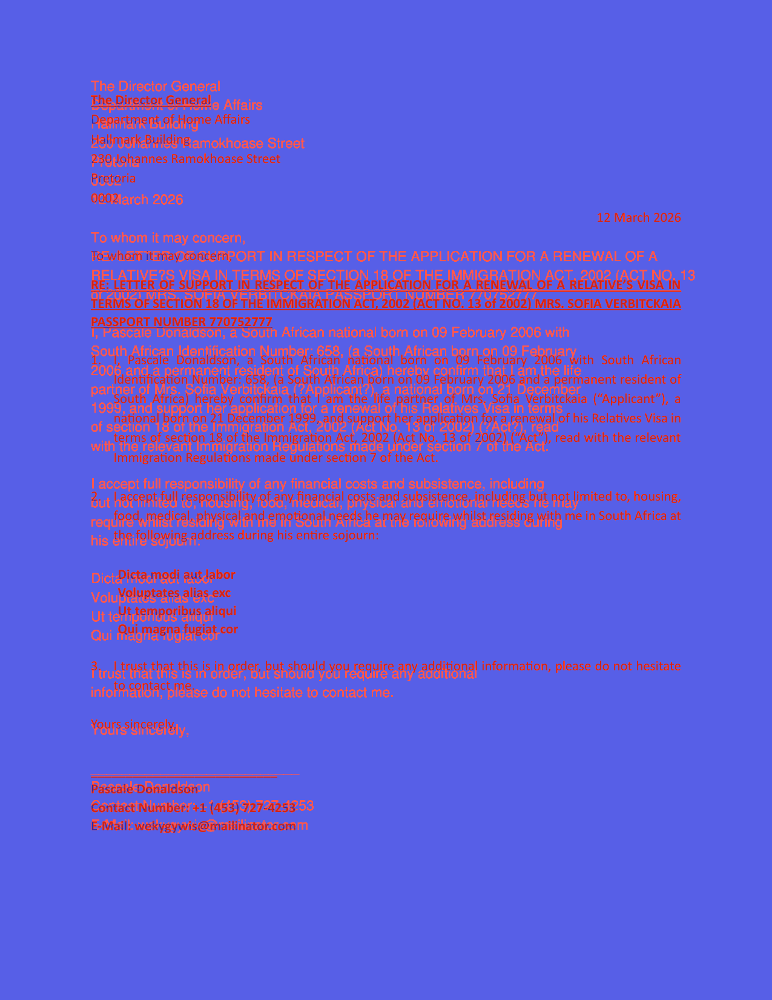</td>
  <td>changed: 195906 px (9.31%)<br>bbox: [149, 133, 1148, 1375]<br>mean abs RGB: 15.979<br>RMSE RGB: 57.9635<br>threshold: 12, gain: 5.0</td>
</tr>
<tr>
  <td><b>Template for MSc Thesis</b><br>Page 1</td>
  <td></td>
  <td>changed: 368901 px (17.54%)<br>bbox: [105, 58, 1201, 1580]<br>mean abs RGB: 29.6263<br>RMSE RGB: 78.7295<br>threshold: 12, gain: 5.0</td>
</tr>
<tr>
  <td><b>Template for MSc Thesis</b><br>Page 2</td>
  <td></td>
  <td>changed: 224362 px (10.66%)<br>bbox: [105, 58, 1203, 1513]<br>mean abs RGB: 17.8217<br>RMSE RGB: 60.8019<br>threshold: 12, gain: 5.0</td>
</tr>
<tr>
  <td><b>Template for MSc Thesis</b><br>Page 3</td>
  <td></td>
  <td>changed: 174422 px (8.29%)<br>bbox: [105, 58, 1228, 1517]<br>mean abs RGB: 14.2556<br>RMSE RGB: 54.8009<br>threshold: 12, gain: 5.0</td>
</tr>
<tr>
  <td><b>Template for MSc Thesis</b><br>Page 4</td>
  <td></td>
  <td>changed: 132703 px (6.31%)<br>bbox: [105, 58, 1172, 1438]<br>mean abs RGB: 10.9265<br>RMSE RGB: 48.158<br>threshold: 12, gain: 5.0</td>
</tr>
<tr>
  <td><b>Template for MSc Thesis</b><br>Page 5</td>
  <td></td>
  <td>changed: 133958 px (6.37%)<br>bbox: [105, 75, 1203, 1483]<br>mean abs RGB: 10.5283<br>RMSE RGB: 46.6422<br>threshold: 12, gain: 5.0</td>
</tr>
<tr>
  <td><b>Template for MSc Thesis</b><br>Page 6</td>
  <td></td>
  <td>changed: 34537 px (1.64%)<br>bbox: [106, 83, 848, 1545]<br>mean abs RGB: 2.8926<br>RMSE RGB: 24.8777<br>threshold: 12, gain: 5.0</td>
</tr>
<tr>
  <td><b>Template for MSc Thesis</b><br>Page 7</td>
  <td></td>
  <td>changed: 7588 px (0.36%)<br>bbox: [111, 83, 816, 205]<br>mean abs RGB: 0.6775<br>RMSE RGB: 12.2668<br>threshold: 12, gain: 5.0</td>
</tr>
<tr>
  <td><b>Template for MSc Thesis</b><br>Page 8</td>
  <td></td>
  <td>changed: 18504 px (0.88%)<br>bbox: [106, 83, 1199, 256]<br>mean abs RGB: 1.6232<br>RMSE RGB: 18.932<br>threshold: 12, gain: 5.0</td>
</tr>
<tr>
  <td><b>Template for MSc Thesis</b><br>Page 9</td>
  <td></td>
  <td>changed: 6148 px (0.29%)<br>bbox: [105, 83, 848, 170]<br>mean abs RGB: 0.5656<br>RMSE RGB: 11.3076<br>threshold: 12, gain: 5.0</td>
</tr>
<tr>
  <td><b>TestIssue61</b><br>Page 1</td>
  <td>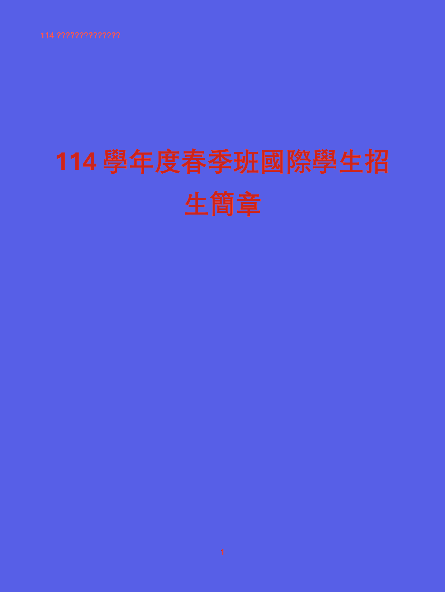</td>
  <td>changed: 36688 px (1.79%)<br>bbox: [114, 90, 1083, 1547]<br>mean abs RGB: 3.8531<br>RMSE RGB: 30.2836<br>threshold: 12, gain: 5.0</td>
</tr>
<tr>
  <td><b>TestIssue61</b><br>Page 2</td>
  <td>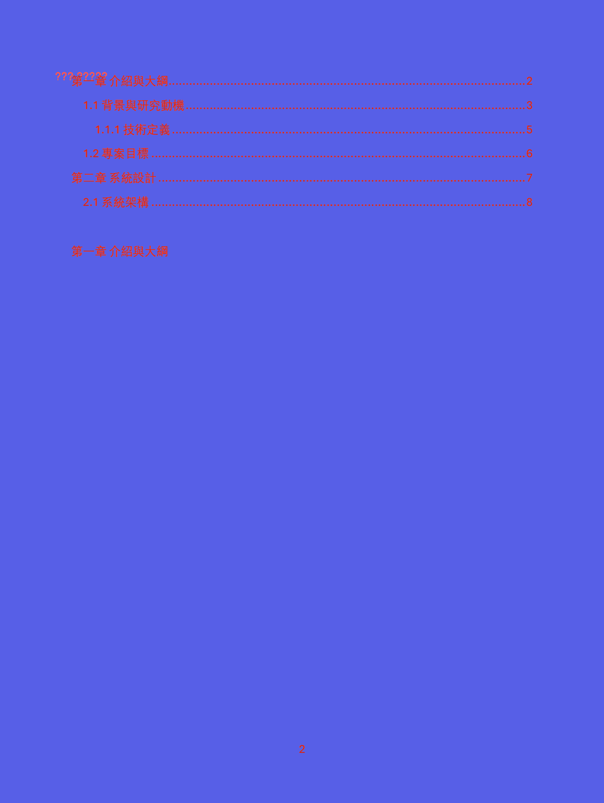</td>
  <td>changed: 20633 px (1.01%)<br>bbox: [114, 148, 1094, 1547]<br>mean abs RGB: 1.5211<br>RMSE RGB: 17.1747<br>threshold: 12, gain: 5.0</td>
</tr>
<tr>
  <td><b>TestIssue61</b><br>Page 3</td>
  <td></td>
  <td>changed: 2860 px (0.14%)<br>bbox: [114, 119, 627, 1548]<br>mean abs RGB: 0.2131<br>RMSE RGB: 6.3567<br>threshold: 12, gain: 5.0</td>
</tr>
<tr>
  <td><b>TestIssue61</b><br>Page 4</td>
  <td></td>
  <td>changed: 7060 px (0.34%)<br>bbox: [114, 119, 691, 1547]<br>mean abs RGB: 0.5145<br>RMSE RGB: 9.8635<br>threshold: 12, gain: 5.0</td>
</tr>
<tr>
  <td><b>TestIssue61</b><br>Page 5</td>
  <td></td>
  <td>changed: 1909 px (0.09%)<br>bbox: [114, 119, 627, 1548]<br>mean abs RGB: 0.1425<br>RMSE RGB: 5.2597<br>threshold: 12, gain: 5.0</td>
</tr>
<tr>
  <td><b>TestIssue61</b><br>Page 6</td>
  <td></td>
  <td>changed: 1886 px (0.09%)<br>bbox: [114, 119, 627, 1548]<br>mean abs RGB: 0.1405<br>RMSE RGB: 5.2102<br>threshold: 12, gain: 5.0</td>
</tr>
<tr>
  <td><b>TestIssue61</b><br>Page 7</td>
  <td></td>
  <td>changed: 2286 px (0.11%)<br>bbox: [114, 119, 627, 1547]<br>mean abs RGB: 0.1659<br>RMSE RGB: 5.6178<br>threshold: 12, gain: 5.0</td>
</tr>
<tr>
  <td><b>TestIssue61</b><br>Page 8</td>
  <td></td>
  <td>changed: 1904 px (0.09%)<br>bbox: [113, 119, 626, 1548]<br>mean abs RGB: 0.1426<br>RMSE RGB: 5.2528<br>threshold: 12, gain: 5.0</td>
</tr>
<tr>
  <td><b>TestIssue78</b><br>Page 1</td>
  <td>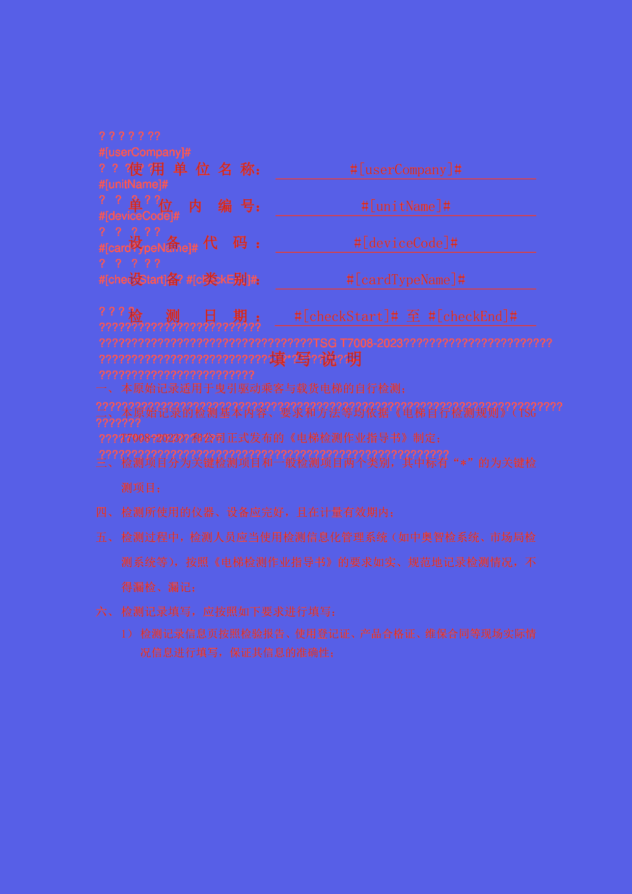</td>
  <td>changed: 104516 px (4.80%)<br>bbox: [188, 258, 1104, 1291]<br>mean abs RGB: 7.0506<br>RMSE RGB: 36.485<br>threshold: 12, gain: 5.0</td>
</tr>
<tr>
  <td><b>TestIssue90</b><br>Page 1</td>
  <td>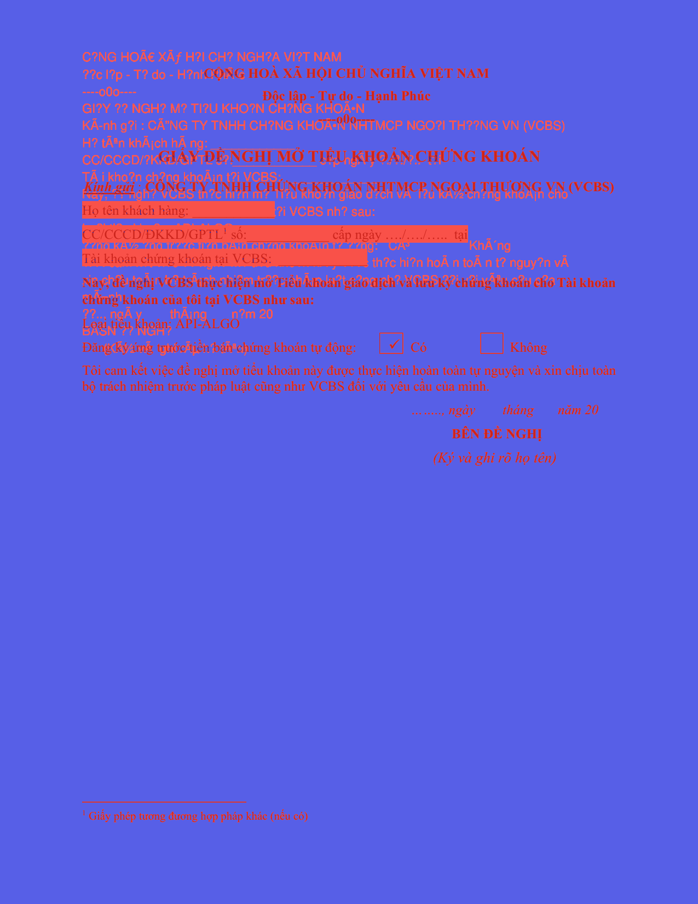</td>
  <td>changed: 149801 px (7.12%)<br>bbox: [150, 91, 1125, 1501]<br>mean abs RGB: 10.5589<br>RMSE RGB: 47.7789<br>threshold: 12, gain: 5.0</td>
</tr>
<tr>
  <td><b>TestIssue91</b><br>Page 1</td>
  <td>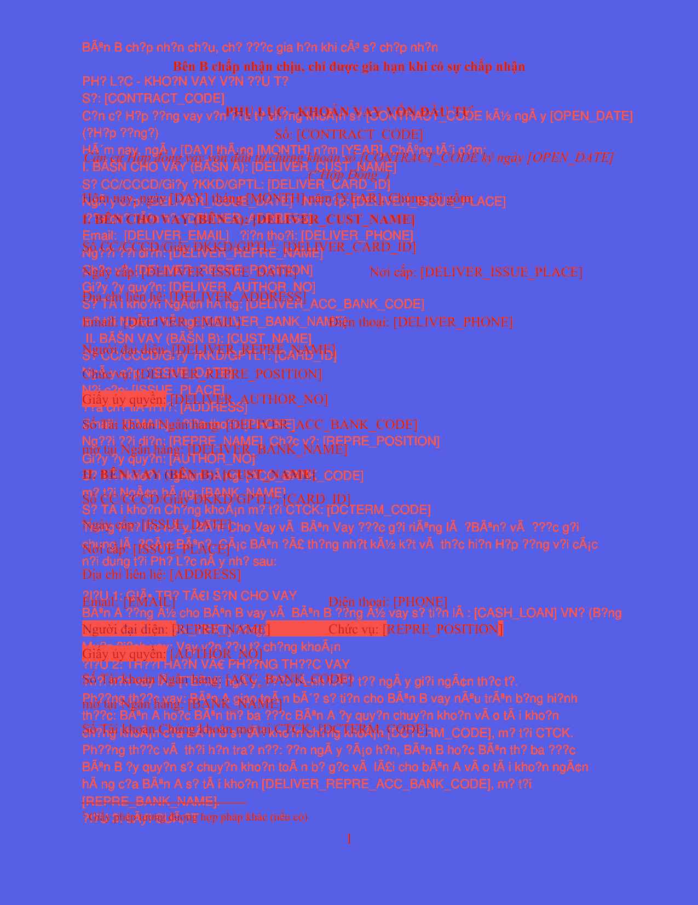</td>
  <td>changed: 255532 px (12.15%)<br>bbox: [149, 73, 1155, 1538]<br>mean abs RGB: 19.8564<br>RMSE RGB: 64.4732<br>threshold: 12, gain: 5.0</td>
</tr>
<tr>
  <td><b>TestIssue91</b><br>Page 2</td>
  <td>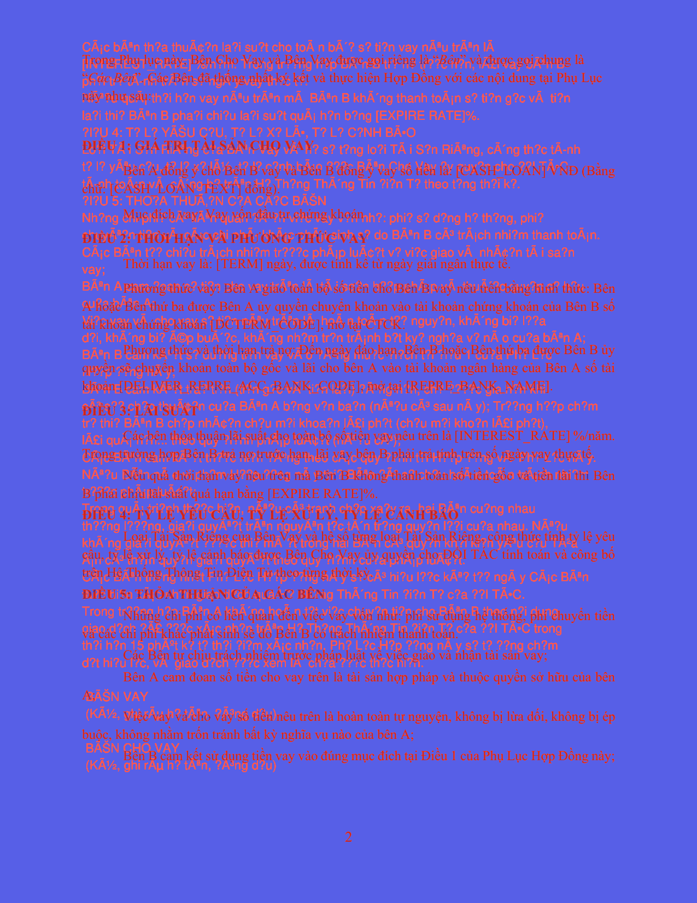</td>
  <td>changed: 310755 px (14.77%)<br>bbox: [150, 73, 1126, 1538]<br>mean abs RGB: 24.1697<br>RMSE RGB: 70.4421<br>threshold: 12, gain: 5.0</td>
</tr>
<tr>
  <td><b>TestIssue93</b><br>Page 1</td>
  <td></td>
  <td>changed: 81055 px (3.72%)<br>bbox: [89, 72, 1147, 1620]<br>mean abs RGB: 5.1727<br>RMSE RGB: 30.8893<br>threshold: 12, gain: 5.0</td>
</tr>
</table>

## Visual Comparison

Scores compare go MiniPdf against Microsoft 365 Word Reference. LibreOffice is an auxiliary rendering and does not affect scores.

<table>
<tr><th>go MiniPdf</th><th>Microsoft 365 Word Reference</th><th>LibreOffice</th></tr>
<tr>
  <td><b>13_IEEE_Style_Paper<br><small>format: docx | case: 13_IEEE_Style_Paper | scope: go-issue-docx</small></b></td>
  <td colspan="2">13_IEEE_Style_Paper <span style="color:#3fb950">⬤</span> 98.2%</td>
</tr>
<tr>
  <td></td>
  <td></td>
  <td></td>
</tr>
<tr>
  <td></td>
  <td></td>
  <td></td>
</tr>
<tr>
  <td><b>14_Thesis_Chapter<br><small>format: docx | case: 14_Thesis_Chapter | scope: go-issue-docx</small></b></td>
  <td colspan="2">14_Thesis_Chapter <span style="color:#3fb950">⬤</span> 97.9%</td>
</tr>
<tr>
  <td></td>
  <td></td>
  <td></td>
</tr>
<tr>
  <td></td>
  <td></td>
  <td></td>
</tr>
<tr>
  <td><b>20260317_sample_CN<br><small>format: docx | case: 20260317_sample_CN | scope: go-issue-docx</small></b></td>
  <td colspan="2">20260317_sample_CN <span style="color:#f85149">⬤</span> 68.8%</td>
</tr>
<tr>
  <td></td>
  <td></td>
  <td></td>
</tr>
<tr>
  <td></td>
  <td></td>
  <td></td>
</tr>
<tr>
  <td><b>20260318_issue<br><small>format: docx | case: 20260318_issue | scope: go-issue-docx</small></b></td>
  <td colspan="2">20260318_issue <span style="color:#f85149">⬤</span> 66.9%</td>
</tr>
<tr>
  <td></td>
  <td></td>
  <td></td>
</tr>
<tr>
  <td></td>
  <td></td>
  <td></td>
</tr>
<tr>
  <td></td>
  <td></td>
  <td></td>
</tr>
<tr>
  <td></td>
  <td></td>
  <td></td>
</tr>
<tr>
  <td></td>
  <td></td>
  <td></td>
</tr>
<tr>
  <td></td>
  <td></td>
  <td></td>
</tr>
<tr>
  <td><i>missing</i></td>
  <td></td>
  <td></td>
</tr>
<tr>
  <td><b>CCU_article<br><small>format: docx | case: CCU_article | scope: go-issue-docx</small></b></td>
  <td colspan="2">CCU_article <span style="color:#f85149">⬤</span> 40.6%</td>
</tr>
<tr>
  <td></td>
  <td></td>
  <td></td>
</tr>
<tr>
  <td></td>
  <td></td>
  <td></td>
</tr>
<tr>
  <td></td>
  <td></td>
  <td></td>
</tr>
<tr>
  <td></td>
  <td></td>
  <td></td>
</tr>
<tr>
  <td></td>
  <td></td>
  <td></td>
</tr>
<tr>
  <td></td>
  <td></td>
  <td></td>
</tr>
<tr>
  <td></td>
  <td></td>
  <td></td>
</tr>
<tr>
  <td></td>
  <td></td>
  <td></td>
</tr>
<tr>
  <td></td>
  <td></td>
  <td></td>
</tr>
<tr>
  <td></td>
  <td></td>
  <td></td>
</tr>
<tr>
  <td><i>missing</i></td>
  <td></td>
  <td></td>
</tr>
<tr>
  <td><i>missing</i></td>
  <td></td>
  <td></td>
</tr>
<tr>
  <td><i>missing</i></td>
  <td></td>
  <td></td>
</tr>
<tr>
  <td><i>missing</i></td>
  <td></td>
  <td></td>
</tr>
<tr>
  <td><i>missing</i></td>
  <td></td>
  <td></td>
</tr>
<tr>
  <td><i>missing</i></td>
  <td></td>
  <td></td>
</tr>
<tr>
  <td><i>missing</i></td>
  <td></td>
  <td></td>
</tr>
<tr>
  <td><i>missing</i></td>
  <td></td>
  <td></td>
</tr>
<tr>
  <td><i>missing</i></td>
  <td></td>
  <td></td>
</tr>
<tr>
  <td><i>missing</i></td>
  <td></td>
  <td></td>
</tr>
<tr>
  <td><i>missing</i></td>
  <td></td>
  <td></td>
</tr>
<tr>
  <td><b>Class News<br><small>format: docx | case: Class News | scope: go-issue-docx</small></b></td>
  <td colspan="2">Class News <span style="color:#f85149">⬤</span> 57.5%</td>
</tr>
<tr>
  <td></td>
  <td></td>
  <td></td>
</tr>
<tr>
  <td></td>
  <td></td>
  <td></td>
</tr>
<tr>
  <td></td>
  <td></td>
  <td></td>
</tr>
<tr>
  <td></td>
  <td></td>
  <td></td>
</tr>
<tr>
  <td><b>Confirmatory_Affidavit<br><small>format: docx | case: Confirmatory_Affidavit | scope: go-issue-docx</small></b></td>
  <td colspan="2">Confirmatory_Affidavit <span style="color:#f85149">⬤</span> 67.6%</td>
</tr>
<tr>
  <td></td>
  <td></td>
  <td></td>
</tr>
<tr>
  <td><i>missing</i></td>
  <td></td>
  <td></td>
</tr>
<tr>
  <td><b>Cooperation Agreement Template<br><small>format: docx | case: Cooperation Agreement Template | scope: go-issue-docx</small></b></td>
  <td colspan="2">Cooperation Agreement Template <span style="color:#f85149">⬤</span> 32.2%</td>
</tr>
<tr>
  <td></td>
  <td></td>
  <td></td>
</tr>
<tr>
  <td></td>
  <td></td>
  <td></td>
</tr>
<tr>
  <td></td>
  <td></td>
  <td></td>
</tr>
<tr>
  <td><i>missing</i></td>
  <td></td>
  <td></td>
</tr>
<tr>
  <td><i>missing</i></td>
  <td></td>
  <td></td>
</tr>
<tr>
  <td><i>missing</i></td>
  <td></td>
  <td></td>
</tr>
<tr>
  <td><i>missing</i></td>
  <td></td>
  <td></td>
</tr>
<tr>
  <td><b>Fabrikam<br><small>format: docx | case: Fabrikam | scope: go-issue-docx</small></b></td>
  <td colspan="2">Fabrikam <span style="color:#f85149">⬤</span> 30.2%</td>
</tr>
<tr>
  <td></td>
  <td></td>
  <td></td>
</tr>
<tr>
  <td></td>
  <td><i>missing</i></td>
  <td><i>missing</i></td>
</tr>
<tr>
  <td><b>Invoice<br><small>format: docx | case: Invoice | scope: go-issue-docx</small></b></td>
  <td colspan="2">Invoice <span style="color:#f85149">⬤</span> 45.0%</td>
</tr>
<tr>
  <td></td>
  <td></td>
  <td></td>
</tr>
<tr>
  <td></td>
  <td><i>missing</i></td>
  <td><i>missing</i></td>
</tr>
<tr>
  <td><b>Issue79_FilledContract<br><small>format: docx | case: Issue79_FilledContract | scope: go-issue-docx</small></b></td>
  <td colspan="2">Issue79_FilledContract <span style="color:#f85149">⬤</span> 63.3%</td>
</tr>
<tr>
  <td></td>
  <td></td>
  <td></td>
</tr>
<tr>
  <td><b>Issue79_TemplateContract<br><small>format: docx | case: Issue79_TemplateContract | scope: go-issue-docx</small></b></td>
  <td colspan="2">Issue79_TemplateContract <span style="color:#d29922">⬤</span> 74.6%</td>
</tr>
<tr>
  <td></td>
  <td></td>
  <td></td>
</tr>
<tr>
  <td><b>Issue83_Output<br><small>format: docx | case: Issue83_Output | scope: go-issue-docx</small></b></td>
  <td colspan="2">Issue83_Output <span style="color:#d29922">⬤</span> 82.4%</td>
</tr>
<tr>
  <td></td>
  <td></td>
  <td></td>
</tr>
<tr>
  <td><b>Issue159_PageLayoutOptions<br><small>format: docx | case: Issue159_PageLayoutOptions | scope: go-issue-docx</small></b></td>
  <td colspan="2">Issue159_PageLayoutOptions <span style="color:#3fb950">⬤</span> 99.2%</td>
</tr>
<tr>
  <td></td>
  <td></td>
  <td></td>
</tr>
<tr>
  <td><b>issue202605<br><small>format: docx | case: issue202605 | scope: go-issue-docx</small></b></td>
  <td colspan="2">issue202605 <span style="color:#f85149">⬤</span> 32.6%</td>
</tr>
<tr>
  <td></td>
  <td></td>
  <td></td>
</tr>
<tr>
  <td></td>
  <td></td>
  <td></td>
</tr>
<tr>
  <td></td>
  <td><i>missing</i></td>
  <td><i>missing</i></td>
</tr>
<tr>
  <td><b>issue26050501<br><small>format: docx | case: issue26050501 | scope: go-issue-docx</small></b></td>
  <td colspan="2">issue26050501 <span style="color:#f85149">⬤</span> 41.5%</td>
</tr>
<tr>
  <td></td>
  <td></td>
  <td></td>
</tr>
<tr>
  <td><i>missing</i></td>
  <td></td>
  <td></td>
</tr>
<tr>
  <td><b>issues66<br><small>format: docx | case: issues66 | scope: go-issue-docx</small></b></td>
  <td colspan="2">issues66 <span style="color:#f85149">⬤</span> 61.6%</td>
</tr>
<tr>
  <td></td>
  <td></td>
  <td></td>
</tr>
<tr>
  <td></td>
  <td></td>
  <td></td>
</tr>
<tr>
  <td></td>
  <td></td>
  <td></td>
</tr>
<tr>
  <td><b>MODERN LIVING<br><small>format: docx | case: MODERN LIVING | scope: go-issue-docx</small></b></td>
  <td colspan="2">MODERN LIVING <span style="color:#f85149">⬤</span> 47.7%</td>
</tr>
<tr>
  <td></td>
  <td></td>
  <td></td>
</tr>
<tr>
  <td></td>
  <td></td>
  <td></td>
</tr>
<tr>
  <td><b>nthu_article<br><small>format: docx | case: nthu_article | scope: go-issue-docx</small></b></td>
  <td colspan="2">nthu_article <span style="color:#f85149">⬤</span> 46.2%</td>
</tr>
<tr>
  <td></td>
  <td></td>
  <td></td>
</tr>
<tr>
  <td></td>
  <td></td>
  <td></td>
</tr>
<tr>
  <td></td>
  <td></td>
  <td></td>
</tr>
<tr>
  <td></td>
  <td></td>
  <td></td>
</tr>
<tr>
  <td></td>
  <td></td>
  <td></td>
</tr>
<tr>
  <td></td>
  <td></td>
  <td></td>
</tr>
<tr>
  <td></td>
  <td></td>
  <td></td>
</tr>
<tr>
  <td></td>
  <td></td>
  <td></td>
</tr>
<tr>
  <td></td>
  <td></td>
  <td></td>
</tr>
<tr>
  <td></td>
  <td></td>
  <td></td>
</tr>
<tr>
  <td></td>
  <td></td>
  <td></td>
</tr>
<tr>
  <td></td>
  <td></td>
  <td></td>
</tr>
<tr>
  <td><i>missing</i></td>
  <td></td>
  <td></td>
</tr>
<tr>
  <td><i>missing</i></td>
  <td></td>
  <td></td>
</tr>
<tr>
  <td><i>missing</i></td>
  <td></td>
  <td></td>
</tr>
<tr>
  <td><i>missing</i></td>
  <td></td>
  <td></td>
</tr>
<tr>
  <td><i>missing</i></td>
  <td></td>
  <td></td>
</tr>
<tr>
  <td><i>missing</i></td>
  <td></td>
  <td></td>
</tr>
<tr>
  <td><i>missing</i></td>
  <td><i>missing</i></td>
  <td></td>
</tr>
<tr>
  <td><i>missing</i></td>
  <td><i>missing</i></td>
  <td></td>
</tr>
<tr>
  <td><b>OSCAR WARD<br><small>format: docx | case: OSCAR WARD | scope: go-issue-docx</small></b></td>
  <td colspan="2">OSCAR WARD <span style="color:#d29922">⬤</span> 71.7%</td>
</tr>
<tr>
  <td></td>
  <td></td>
  <td></td>
</tr>
<tr>
  <td><b>SA8000 ch sample<br><small>format: docx | case: SA8000 ch sample | scope: go-issue-docx</small></b></td>
  <td colspan="2">SA8000 ch sample <span style="color:#f85149">⬤</span> 63.9%</td>
</tr>
<tr>
  <td></td>
  <td></td>
  <td></td>
</tr>
<tr>
  <td></td>
  <td></td>
  <td></td>
</tr>
<tr>
  <td><b>Support_Letter<br><small>format: docx | case: Support_Letter | scope: go-issue-docx</small></b></td>
  <td colspan="2">Support_Letter <span style="color:#3fb950">⬤</span> 97.0%</td>
</tr>
<tr>
  <td></td>
  <td></td>
  <td></td>
</tr>
<tr>
  <td><b>Template for MSc Thesis<br><small>format: docx | case: Template for MSc Thesis | scope: go-issue-docx</small></b></td>
  <td colspan="2">Template for MSc Thesis <span style="color:#f85149">⬤</span> 67.2%</td>
</tr>
<tr>
  <td></td>
  <td></td>
  <td></td>
</tr>
<tr>
  <td></td>
  <td></td>
  <td></td>
</tr>
<tr>
  <td></td>
  <td></td>
  <td></td>
</tr>
<tr>
  <td></td>
  <td></td>
  <td></td>
</tr>
<tr>
  <td></td>
  <td></td>
  <td></td>
</tr>
<tr>
  <td></td>
  <td></td>
  <td></td>
</tr>
<tr>
  <td></td>
  <td></td>
  <td></td>
</tr>
<tr>
  <td></td>
  <td></td>
  <td></td>
</tr>
<tr>
  <td></td>
  <td></td>
  <td></td>
</tr>
<tr>
  <td><i>missing</i></td>
  <td></td>
  <td></td>
</tr>
<tr>
  <td><i>missing</i></td>
  <td></td>
  <td></td>
</tr>
<tr>
  <td><i>missing</i></td>
  <td></td>
  <td></td>
</tr>
<tr>
  <td><i>missing</i></td>
  <td></td>
  <td></td>
</tr>
<tr>
  <td><i>missing</i></td>
  <td></td>
  <td></td>
</tr>
<tr>
  <td><i>missing</i></td>
  <td></td>
  <td></td>
</tr>
<tr>
  <td><i>missing</i></td>
  <td></td>
  <td></td>
</tr>
<tr>
  <td><i>missing</i></td>
  <td></td>
  <td></td>
</tr>
<tr>
  <td><b>TestIssue61<br><small>format: docx | case: TestIssue61 | scope: go-issue-docx</small></b></td>
  <td colspan="2">TestIssue61 <span style="color:#f85149">⬤</span> 63.7%</td>
</tr>
<tr>
  <td></td>
  <td></td>
  <td></td>
</tr>
<tr>
  <td></td>
  <td></td>
  <td></td>
</tr>
<tr>
  <td></td>
  <td></td>
  <td></td>
</tr>
<tr>
  <td></td>
  <td></td>
  <td></td>
</tr>
<tr>
  <td></td>
  <td></td>
  <td></td>
</tr>
<tr>
  <td></td>
  <td></td>
  <td></td>
</tr>
<tr>
  <td></td>
  <td></td>
  <td></td>
</tr>
<tr>
  <td></td>
  <td></td>
  <td></td>
</tr>
<tr>
  <td><b>TestIssue78<br><small>format: docx | case: TestIssue78 | scope: go-issue-docx</small></b></td>
  <td colspan="2">TestIssue78 <span style="color:#f85149">⬤</span> 65.4%</td>
</tr>
<tr>
  <td></td>
  <td></td>
  <td></td>
</tr>
<tr>
  <td><b>TestIssue90<br><small>format: docx | case: TestIssue90 | scope: go-issue-docx</small></b></td>
  <td colspan="2">TestIssue90 <span style="color:#d29922">⬤</span> 76.5%</td>
</tr>
<tr>
  <td></td>
  <td></td>
  <td></td>
</tr>
<tr>
  <td><b>TestIssue91<br><small>format: docx | case: TestIssue91 | scope: go-issue-docx</small></b></td>
  <td colspan="2">TestIssue91 <span style="color:#f85149">⬤</span> 52.9%</td>
</tr>
<tr>
  <td></td>
  <td></td>
  <td></td>
</tr>
<tr>
  <td></td>
  <td></td>
  <td></td>
</tr>
<tr>
  <td><i>missing</i></td>
  <td></td>
  <td></td>
</tr>
<tr>
  <td><b>TestIssue93<br><small>format: docx | case: TestIssue93 | scope: go-issue-docx</small></b></td>
  <td colspan="2">TestIssue93 <span style="color:#f85149">⬤</span> 32.4%</td>
</tr>
<tr>
  <td></td>
  <td></td>
  <td></td>
</tr>
<tr>
  <td></td>
  <td><i>missing</i></td>
  <td><i>missing</i></td>
</tr>
</table>

## Detailed Results

### 13_IEEE_Style_Paper

- **Case Metadata:** format: docx | case: 13_IEEE_Style_Paper | scope: go-issue-docx
- **Source:** tests/Issue_Files/docx/13_IEEE_Style_Paper.docx
- **Text Similarity:** 1.0
- **Visual Average:** 0.9545
- **Overall Score:** 0.9818
- **Pages:** MiniPdf=2, Reference=2
- **File Size:** MiniPdf=4920 bytes, Reference=175037 bytes

<details><summary>Text Diff</summary>

```diff
--- minipdf/13_IEEE_Style_Paper.pdf
+++ reference/13_IEEE_Style_Paper.pdf
@@ -1,53 +1,34 @@
-A Novel Approach to Document Conversion

+A Novel Approach to Document

+Conversion

 Using Layout-Aware Parsing

 First Author, Second Author, Third Author

 Department of Computer Science, University of Technology

 email@university.edu

 Abstract

-This paper presents a novel approach to converting document formats while

-preserving layout fidelity. We propose a multi-pass parsing algorithm that

-analyzes document structure, extracts semantic content, and reconstructs

-the layout in the target format. Our method achieves 95% layout accuracy

-on a benchmark of 500 documents across various formats including DOCX,

-XLSX, and PDF.

+This paper presents a novel approach to converting document formats while preserving layout fidelity.

+We propose a multi-pass parsing algorithm that analyzes document structure, extracts semantic content, and

+reconstructs the layout in the target format. Our method achieves 95% layout accuracy on a benchmark of

+500 documents across various formats including DOCX, XLSX, and PDF.

 1. Introduction

-Document format conversion is a fundamental problem in information

-technology. Organizations frequently need to convert documents between

-formats for archival, sharing, and processing purposes. The challenge lies

-in preserving the visual layout, formatting, and semantic structure of the

-original document [1].

-Traditional approaches rely on simple text extraction followed by

-re-rendering, which often loses important formatting information such as

-margins, indentation, font styles, and table layouts [2].

+Document format conversion is a fundamental problem in information technology. Organizations

+frequently need to convert documents between formats for archival, sharing, and processing purposes. The

+challenge lies in preserving the visual layout, formatting, and semantic structure of the original document

+[1].

+Traditional approaches rely on simple text extraction followed by re-rendering, which often loses important

+formatting information such as margins, indentation, font styles, and table layouts [2].

 2. Related Work

-Several approaches have been proposed for document conversion. Smith et

-al. [4] introduced a rule-based system that handles specific format pairs.

+Several approaches have been proposed for document conversion. Smith et al. [4] introduced a rule-based

+system that handles specific format pairs.

 3. Experimental Results

 Table 1 shows the comparison of our method against baselines.

-Method

-Accuracy (%)

-Speed (docs/s)

-Memory (MB)

-Rule-based

-78.2

-120

-256

-ML-based

-85.5

-45

-1024

-Ours

-95.1

-89

-512

+Method Accuracy (%) Speed (docs/s) Memory (MB)

+Rule-based 78.2 120 256

+ML-based 85.5 45 1024

+Ours 95.1 89 512

 References

-[1] A. Brown, Document Processing: Principles and Practice, IEEE Trans.,

+[1] A. Brown, Document Processing: Principles and Pra
... (674 more characters)

```
</details>

### 14_Thesis_Chapter

- **Case Metadata:** format: docx | case: 14_Thesis_Chapter | scope: go-issue-docx
- **Source:** tests/Issue_Files/docx/14_Thesis_Chapter.docx
- **Text Similarity:** 0.9914
- **Visual Average:** 0.955
- **Overall Score:** 0.9786
- **Pages:** MiniPdf=2, Reference=2
- **File Size:** MiniPdf=4563 bytes, Reference=159980 bytes

<details><summary>Text Diff</summary>

```diff
--- minipdf/14_Thesis_Chapter.pdf
+++ reference/14_Thesis_Chapter.pdf
@@ -1,49 +1,34 @@
 CHAPTER 3

 METHODOLOGY AND EXPERIMENTAL DESIGN

 3.1 Research Methodology

-This chapter describes the research methodology employed in this study.

-The experimental framework consists of three main phases: data collection,

-model training, and evaluation.

-The data collection phase involved gathering documents from multiple

-sources including government repositories, academic databases, and

-corporate archives. A total of 10,000 documents were collected, spanning

-15 different document types.

+This chapter describes the research methodology employed in this study. The

+experimental framework consists of three main phases: data collection, model training,

+and evaluation.

+The data collection phase involved gathering documents from multiple sources including

+government repositories, academic databases, and corporate archives. A total of 10,000

+documents were collected, spanning 15 different document types.

 3.1.1 Data Collection

-Documents were collected using a web crawler that respected robots.txt

-directives. Table 3.1 summarizes the distribution of collected documents.

-Document Type

-Count

-Percentage

-Government Reports

-3,245

-32.5%

-Academic Papers

-2,891

-28.9%

-Corporate Documents

-1,756

-17.6%

-Legal Documents

-1,234

-12.3%

-Other

-874

-8.7%

+Documents were collected using a web crawler that respected robots.txt directives. Table

+3.1 summarizes the distribution of collected documents.

+Document Type Count Percentage

+Government Reports 3,245 32.5%

+Academic Papers 2,891 28.9%

+Corporate Documents 1,756 17.6%

+Legal Documents 1,234 12.3%

+Other 874 8.7%

 3.2 Model Architecture

-The proposed model architecture is based on a transformer encoder-decoder

-framework.

-Multi-head attention mechanism for layout understanding

-Positional encoding for spatial relationships

-Cross-attention between text and layout features

-Format-specific output heads for different target formats

+The proposed model architecture is based on a transformer encoder-decoder framework.

+• Multi-head attention mechanism for layout understanding

+• Positional encoding for spatial relationships

+• Cross-attention between text and layout features

+• Format-specific output heads for different target formats

 3.3 Evaluation Metrics

 We evaluate our approach using three complementary metrics:

 1. Visual Similarity Score (VSS): Measures pixel-level similarity.

 2. Structural Accuracy (SA): Evaluates document structure preservation.

 3. Content Fidelity (CF): Checks text content correctness.

+---PAGE---

 3.4 Experimental Setup

----PAGE---

-All experiments were conducted on a workstation equipped with an NVIDIA

-RTX 4090 GPU, 64 GB of RAM, and an Intel Core i9-13900K processor. The

-model was trained for 100 epochs using the AdamW optimizer with a learning

-rate of 1e-4 and batch size of 32.
+All experiments were conducte
... (227 more characters)

```
</details>

### 20260317_sample_CN

- **Case Metadata:** format: docx | case: 20260317_sample_CN | scope: go-issue-docx
- **Source:** tests/Issue_Files/docx/20260317_sample_CN.docx
- **Text Similarity:** 0.5475
- **Visual Average:** 0.672
- **Overall Score:** 0.6878
- **Pages:** MiniPdf=2, Reference=2
- **File Size:** MiniPdf=4518 bytes, Reference=201411 bytes

<details><summary>Text Diff</summary>

```diff
--- minipdf/20260317_sample_CN.pdf
+++ reference/20260317_sample_CN.pdf
@@ -1,47 +1,16 @@
-<????>

-????

-lxp-0.5

-????

-20250620-LXP-is-3min.PS

-????

-20250611-LXP-deng-3.LCM

-????

-20250703-1.sif

-????

-2025-10-09 10:22:41

-??

-P1-A-1

-????

-??

-??

-0.5?L

-????

-AITQ2030

-????

-2025-07-03 11:24:11

-??

-admin

-<???>

-????:lxp-0.5            ??:P1-A-1

-????

+打印时间 :2025-10-11 16:10:04

+< 样本信息 >

+样本名称 lxp-0.5

+质谱方法 20250620-LXP-is-3min.PS 色谱方法 20250611-LXP-deng-3.LCM

+文件名称 20250703-1.sif 修改时间 2025-10-09 10:22:41

+瓶号 P1-A-1 样本类型 标样

+体积 0.5μL 仪器名称 AITQ2030

+采集时间 2025-07-03 11:24:11 用户 admin

+< 色谱图 >

+样品名称 : lxp-0.5 瓶号 : P1-A-1

+内标峰图

 ---PAGE---

-????:lxp-0.5

-???

-????

-???

-??

-????

-?????

-???

-???

-????

-??

-lxp-1

-0.50

-1.573e5

-2.520e4

-lxp-is

-3.310e4

-1.0

-0.084

-1.08032
+打印时间 :2025-10-11 16:10:04

+样品名称 : lxp-0.5

+分析物 保留时间 峰面积 峰高 内标名称 内标峰面积 信噪比 离子比 计算浓度 单位

+lxp-1 0.50 1.573e5 2.520e4 lxp-is 3.310e4 1.0 0.084 1.08032
```
</details>

### 20260318_issue

- **Case Metadata:** format: docx | case: 20260318_issue | scope: go-issue-docx
- **Source:** tests/Issue_Files/docx/20260318_issue.docx
- **Text Similarity:** 0.907
- **Visual Average:** 0.5164
- **Overall Score:** 0.6694
- **Pages:** MiniPdf=6, Reference=7
- **File Size:** MiniPdf=10922 bytes, Reference=344825 bytes

<details><summary>Text Diff</summary>

```diff
--- minipdf/20260318_issue.pdf
+++ reference/20260318_issue.pdf
@@ -1,87 +1,85 @@
-Title ddddddddfjkfjlasf     Jjfdlj???????????Title ddddddddfjkfjlasf     Jjfdlj???????????

+页眉的名称 ……………………..

+页眉 换了一行 .

+Title ddddddddfjkfjlasf

+Jjfdlj 水水水顶顶顶顶水水水水

+页脚的公司名称

 ---PAGE---

+页眉的名称 ……………………..

+页眉 换了一行 .

 Revision History

-Date

-Revision

-Author

-Description

-2025-5-13

-??

-Initial draft

+Date Revision Author Description

+2025-5-13 张三 Initial draft

+页脚的公司名称

 ---PAGE---

+页眉的名称 ……………………..

+页眉 换了一行 .

+1

 RESTRICTED DISTRIBUTION

-The information is standard Company Confidential but due to its sensitivity it has

-restricted distribution and viewing within Volvo Cars.

+The information is standard Company Confidential but due to its sensitivity it has restricted distribution and viewing

+within Volvo Cars.

 Document Version Control

-Date Issued

-Version

-Description

-Author

-2025-5-13

-V1.0

-Draft

-Yang Li

-2025-08-29

-V2.0

-Change

-Zhong, Shengyou

+Date Issued Version Description Author

+2025-5-13 V1.0 Draft Yang Li

+2025-08-29 V2.0 Change Zhong, Shengyou

 Contributors

-The content of this document has been authored with the combined input of the following

-group of key individuals.

-Name

-Role

-Area

-Cost Accountant

-CAC

+The content of this document has been authored with the combined input of the following group of key individuals.

+Name Role Area

+Cost Accountant CAC

 Source Documents

-Title

-Author

-Version

-Date

+Title Author Version Date

 Document Sign-off Requirements

-The following table contains the people required to sign-off and/or review this document

-and those that require the document for information only.

-Name

-Department

-Responsibility

+The following table contains the people required to sign-off and/or review this document and those that require the

+document for information only.

+Name Department Responsibility

+Document Classification

+Company Confidential

+Classification

+1

+页脚的公司名称

 ---PAGE---

-Document Classification

-Classification

-Company Confidential

+页眉的名称 ……………………..

+页眉 换了一行 .

+Information is Group confidential and needs to be protected

 Definition

-Information is Group confidential and needs to be protected

+Where loss of information confidentiality would result in significant harm to the

 Context

-Where loss of information confidentiality would result in significant harm to the

 interests of the organization, financial loss, embarrassment or loss of information

 Introduction

-The Process Definition Document (PDD) captures the flow of a business process to be

-developed.

-The flowchart contained within the document captures, at a high level, the business

-process to be automated, the target systems used within the process and any assumptions

-that have been taken into account.

-Once agreed as the basis for the automation of the target process, the flowchart and

-assumptions will be used as a platform from which the automated solution
... (2871 more characters)

```
</details>

### CCU_article

- **Case Metadata:** format: docx | case: CCU_article | scope: go-issue-docx
- **Source:** tests/Issue_Files/docx/CCU_article.docx
- **Text Similarity:** 0.3814
- **Visual Average:** 0.3825
- **Overall Score:** 0.4056
- **Pages:** MiniPdf=10, Reference=21
- **File Size:** MiniPdf=30819 bytes, Reference=625190 bytes

<details><summary>Text Diff</summary>

```diff
--- minipdf/CCU_article.pdf
+++ reference/CCU_article.pdf
@@ -1,254 +1,355 @@
-????

-???????????

-??????????????????????

-Long-Tail Image Classification via Dynamic Re-weighting and Feature

-Orthogonalization

-???????

-??????????

-???? 114 ? 9 ?

-??

-?????????????????????????????????????????????????????????????? (class

-imbalance)?????????????????????????????????????????????????? (dynamic

-re-weighting) ?????? (feature orthogonalization) ?????????????????????

-(long-tail) ???????????????????????????????????????????? Macro-F1 ????? Top-1

-????????????????????????????????????????????

-???????????(1) ?????????????????????

-(2) ?????????????????(3) ???????????????????????(4) ????????????????

-?????????????????????????

+中正大學

+宇宙工程研究所碩士論文

+結合動態重加權與特徵正交化之長尾影像分類研究

+Long-Tail Image Classification via Dynamic Re-weighting and

+Feature Orthogonalization

+研究生：王小明

+指導教授：李天才教授

+中華民國 114 年 9 月

+---PAGE---

+摘要

+本研究探討以深度學習方法改善多分類影像辨識之效能。近年卷積神經網路在多

+種視覺任務上展現優異表現，然而在資料量受限與類別不平衡 (class imbalance)

+的情況下，傳統訓練流程容易造成某些少數類別辨識率偏低。為解決此問題，本

+研究提出一個結合動態類別重加權 (dynamic re-weighting) 與特徵正交化 (feature

+orthogonalization) 之訓練框架，於保持整體精確度的同時提升長尾 (long-tail) 類別

+之召回率。實驗以公開資料集與自建小型資料集進行驗證，結果顯示相較基準模

+型，所提方法在 Macro-F1 及少數類別 Top-1 準確率均有顯著提升。最後，本研究

+並分析特徵空間分佈，證實特徵正交化有助於降低類別間干擾。

+本論文之主要貢獻包含： (1) 提出一套可即插即用之動態類別權重調整策略；

+(2) 引入特徵正交化損失於長尾分類場景； (3) 於多組資料集與不同網路骨幹下驗

+證方法之穩健性； (4) 釋出實驗程式碼以利後續研究延伸。

+關鍵詞：深度學習、長尾學習、特徵表徵、卷積神經網路

+i

+---PAGE---

 Abstract

-This thesis investigates a training framework to improve class-imbalanced

-multi-class im- age classification under limited data regimes. Although modern

-convolutional neural net- works achieve strong performance, minority classes

-in long-tail distributions often suffer from poor recall. We propose a

-plug-and-play framework that combines dynamic class re- weighting with feature

----PAGE---

-orthogonalization to mitigate inter-class interference while preserv- ing

-global accuracy. Experiments on public and proprietary datasets demonstrate

-consis- tent gains in Macro-F1 and minority-class Top-1 accuracy over strong

-baselines. Feature space visualization further confirms that orthogonalization

-encourages better inter-class separation.

-The contributions are: (1) a dynamic weighting strategy adaptive to per-epoch

-class difficulty? (2) incorporation of a feature orthogonalization loss

-tailored for long-tail set- tings? (3) comprehensive evaluation across

-multiple backbones and datasets? (4) public release of reproducible code.

-Keywords: deep learning, long-tail learning, feature representation,

-convolutional neural networks

-??

-???????????????????????????????????????????????????????????????????????????????

-??????????????????

-???????????????????????????????????????????????????????????????????????????????

-??????????????????????????????

-???????????????????????????????????????????????????????

-??????????????????????????????????????????????????

-????????????????

-???? 114 ? 9 ?

... (16061 more characters)

```
</details>

### Class News

- **Case Metadata:** format: docx | case: Class News | scope: go-issue-docx
- **Source:** tests/Issue_Files/docx/Class News.docx
- **Text Similarity:** 0.7657
- **Visual Average:** 0.1706
- **Overall Score:** 0.5745
- **Pages:** MiniPdf=4, Reference=4
- **File Size:** MiniPdf=14494 bytes, Reference=124498 bytes

<details><summary>Text Diff</summary>

```diff
--- minipdf/Class News.pdf
+++ reference/Class News.pdf
@@ -1,109 +1,136 @@
 Class News

 Ms. Tanaka

-(718) 555?0100

+(718) 555–0100

 sycamoremiddle.org

 ytanaka@sycamoremiddle.edu

+Welcome back to school!

+Lorem ipsum dolor sit amet, consectetur adipiscing elit. Aliquam non varius

+ipsum. Fusce venenatis quam vel libero scelerisque, a mattis diam

+sollicitudin. Lorem ipsum dolor sit amet, consectetur adipiscing elit. Aliquam

+non varius ipsum. Fusce venenatis quam vel libero sce lerisque, a mattis

+diam sollicitudin.

 Upcoming Events

-School Dance

+School Dance Maecenas massa velit, consectetur sit amet da pibus et, dapibus sit amet

 9.9 | 5-7pm

+odio. Vestibulum ultric ies erat sit amet massa ullamcorper ferm entum.

+Quisque a suscipit nulla, non posuere tellus. Vivamus justo erat, suscipit sit

 Book Fair

+amet ultr icie. Ma ecenas massa velit, consectetur sit amet dapibus et,

 10.1 - 11.1

+dapibus sit amet odio. Vestibulum ultricies erat sit amet massa ullamcorper.

 Picture Day

+Lorem ipsum dolor sit amet, consectetur adipi scing elit. Aliquam non varius

 10.15

-Welcome back to school!

-Lorem ipsum dolor sit amet, consectetur adipiscing elit. Aliquam non varius ipsum. Fusce

-venenatis quam vel libero scelerisque, a mattis diam sollicitudin. Lorem ipsum dolor sit

-amet, consectetur adipiscing elit. Aliquam non varius ipsum. Fusce venenatis quam vel libero

-sce lerisque, a mattis diam sollicitudin.

-Maecenas massa velit, consectetur sit amet da pibus et, dapibus sit amet odio. Vestibulum

-ultric ies erat sit amet massa ullamcorper ferm entum. Quisque a suscipit nulla, non posuere

-tellus. Vivamus justo erat, suscipit sit amet ultr icie. Ma ecenas massa velit, consectetur

-sit amet dapibus et, dapibus sit amet odio. Vestibulum ultricies erat sit amet massa

-ullamcorper.

-Lorem ipsum dolor sit amet, consectetur adipi scing elit. Aliquam non varius ipsum. Fusce ven

-enatis quam vel libero scelerisque, a mattis diam sollicitudin. Lorem ipsum dolor sit amet,

-cons ectetur adipiscing elit. Aliquam non varius ipsum. Fusce venenatis quam vel libero sce

-lerisque, a mattis diam sollicitudin. Quisque a suscipit nulla, non posuere tellus.

+ipsum. Fusce ven enatis quam vel libero scelerisque, a mattis diam

+sollicitudin. Lorem ipsum dolor sit amet, cons ectetur adipiscing elit.

+Aliquam non varius ipsum. Fusce venenatis quam vel libero sce lerisque, a

+mattis diam sollicitudin. Quisque a suscipit nulla, non posuere tellus.

+---PAGE---

 Recent highlights

-Lorem ipsum dolor sit amet, consectetur adipiscing elit. Aliquam non varius ipsum. Fusce

-venenatis quam vel libero scelerisque, a mattis diam sollicitudin. Lorem ipsum dolor sit

-amet, consectetur adipiscing elit. Aliquam non varius ipsum. Fusce venenatis quam vel libero

+Lorem ipsum dolor sit amet, consectetur adipiscing elit. Aliquam non varius

+ipsum. Fusce venenatis quam vel libero scelerisque, a mattis diam

+sollicitudin. Lorem ipsum dolor sit amet, con
... (10254 more characters)

```
</details>

### Confirmatory_Affidavit

- **Case Metadata:** format: docx | case: Confirmatory_Affidavit | scope: go-issue-docx
- **Source:** tests/Issue_Files/docx/Confirmatory_Affidavit.docx
- **Text Similarity:** 0.9676
- **Visual Average:** 0.4716
- **Overall Score:** 0.6757
- **Pages:** MiniPdf=1, Reference=2
- **File Size:** MiniPdf=4221 bytes, Reference=143270 bytes

<details><summary>Text Diff</summary>

```diff
--- minipdf/Confirmatory_Affidavit.pdf
+++ reference/Confirmatory_Affidavit.pdf
@@ -1,30 +1,31 @@
-CONFIRMATORY AFFIDAVITCONFIRMATORY AFFIDAVIT

+CONFIRMATORY AFFIDAVIT

 I, the undersigned,

 Sofia Verbitckaia

 hereby state under oath,

-I am an adult female with full legal capacity and currently reside at Fuga

-Qui minima aut, Sunt magni praesenti.

-I am a Russian national, born in Omck / Russia, on 21 December 1999. I have

-been issued with a Russian passport, with passport number 770752777. A copy

-of my passport is attached hereto marked as Annexure "A1".

-I confirm the content of the Affidavit in terms of regulation 3(2)(d) of the

-Immigration Regulations, 2014, deposed to by my spouse Jada Randolph, in as

-far it relates to me.

+1. I am an adult female with full legal capacity and currently reside at Fuga Qui

+minima aut, Sunt magni praesenti.

+2. I am a Russian national, born in Omck / Russia, on 21 December 1999. I have

+been issued with a Russian passport, with passport number 770752777. A copy of

+my passport is attached hereto marked as Annexure "A1".

+3. I confirm the content of the Affidavit in terms of regulation 3(2)(d) of the

+Immigration Regulations, 2014, deposed to by my spouse Jada Randolph, in

+as far it relates to me.

 __________________________________

 SOFIA VERBITCKAIA

 SIGNED AT __________________ ON THIS THE ____ DAY OF __________ 2026.

-I hereby certify that the deponent to this affidavit has acknowledged to me

-that:

-She knows and understands the contents hereof and that it is true and correct;

-She has no objection to taking the prescribed oath; and

-She regards the prescribed oath as binding on her conscience.

-I certify that the deponent has confirmed aforesaid (a) to (c) before me,

-that the contents of this affidavit is sworn to duly and that the Regulations

-as contained in Government Notice No. R.1258 of 21 July 1972 (as amended) and

-Government Notice No. R.1648 dated 19 August 1977 (as amended) have been

-complied with.

+I hereby certify that the deponent to this affidavit has acknowledged to me that:

+a. She knows and understands the contents hereof and that it is true and correct;

+b. She has no objection to taking the prescribed oath; and

+Page 1 of 2

+---PAGE---

+c. She regards the prescribed oath as binding on her conscience.

+I certify that the deponent has confirmed aforesaid (a) to (c) before me, that the

+contents of this affidavit is sworn to duly and that the Regulations as contained in

+Government Notice No. R.1258 of 21 July 1972 (as amended) and Government Notice

+No. R.1648 dated 19 August 1977 (as amended) have been complied with.

 ________________________

 COMMISSIONER OF OATHS

 Name:

 Address:

-Designation:
+Designation:

+Page 2 of 2
```
</details>

### Cooperation Agreement Template

- **Case Metadata:** format: docx | case: Cooperation Agreement Template | scope: go-issue-docx
- **Source:** tests/Issue_Files/docx/Cooperation Agreement Template.docx
- **Text Similarity:** 0.1395
- **Visual Average:** 0.4168
- **Overall Score:** 0.3225
- **Pages:** MiniPdf=3, Reference=7
- **File Size:** MiniPdf=8064 bytes, Reference=259866 bytes

<details><summary>Text Diff</summary>

```diff
--- minipdf/Cooperation Agreement Template.pdf
+++ reference/Cooperation Agreement Template.pdf
@@ -1,92 +1,110 @@
-??1

-XXXXXXX??

-????

-????

-?    ??

-?    ??

-?    ??

-?????

-?????       ?    ?     ?

-?    ??

-?    ??                  ?  ??

-?    ??

-?    ??                  ?  ??

-?    ??

-?    ??                  ?  ??

-????????????????????????????????????XXXXX???????????????????????????????

-????

-??????

-?   ????      ???????     ???????

-????????????????????????????????????????????????????????????????????????

-????????????????????????????????????????????????????????????????????????

-??????????????????????????????????????????????????????????????????????

-??????

-?????????????????

-????????

+附件 1

+XXXXXXX 项目

+合作协议

+（模板）

+甲 方：

+乙 方：

+丙 方：

+签约地点：

+签订日期： 年 月 日

+— 1 —

+---PAGE---

+甲 方：

+电 话： 地 址：

+乙 方：

+电 话： 地 址：

+丙 方：

+电 话： 地 址：

+经各主体单位友好协商，各主体单位本着互相合作的精神，自愿组成联合体，就《 XXXXX

+项目》（以下简称本项目）申报和执行中涉及的内容一致同意签订本协议如下：

+一、合作模式

+由 （甲方） 作为承担单位， （乙方、丙方） 作为合作单位，组成联合体进行联

+合申报本项目。承担单位负责本项目的一切组织、协调、申报工作，合作单位授权承担单位牵头

+申报本项目并协助提供申报所需的相关材料。承担单位在申报和执行本项目过程中，与本项目主

+办单位签署的一切文件和处理本项目有关的一切事务，联合体各方均予以承认并承担法律责任。

+承担单位成功申报本项目后，由联合体各方按照本协议各主体单位职责执行，项目经费由承担单

+位向本项目主办单位申请，再由联合体各方按照本协议约定进行分配。

+二、任务分工

+联合体各方同意本项目按照如下分工：

+（一）甲方负责：

+1.

+2.

+— 2 —

+---PAGE---

+3.

+......

+（二）乙方负责

 1.

 2.

 3.

 ......

-????

-1.

-2.

-3.

----PAGE---

-......

-????

+（三）丙方负责

 1.

 2.

 3.

 ......

-??????????

-???????????????????

-??........???........???.......?

-???????

-???????????

+三、项目经费分配方式

+联合体各方同意本项目经费按照如下分配：

+甲方 ........ ；乙方 ........ ；丙方 ....... 。

+四、权利和义务

+（一）甲方的权利和义务

 1.

 2.

 3.

 ......

-???????????

+（二）乙方的权利和义务

+— 3 —

+---PAGE---

 1.

 2.

 3.

 ......

-???????????

+（三）丙方的权利和义务

 1.

 2.

 3.

 ......

-??????

-????????

+五、付款方式

+（一）款项支付：

 1.......

-2.??????????????????????

-???????????????????

-?    ??

-?    ??

-?????

-???????????????????

-?    ??

-?    ??

-?????

-????????????????????????????????????????????????????????????????????????

-??????????????????

-??????

-????????????????????????????????????????????????????????????????????????

-??????????????????????????????????????????????????????????????

-???????????

-????????????????????????????????????????????????????????????????????????

-??????????????????????

-??????

-???????????????????????????????1????????????????????????????????????????

+2. 付款方式：采用支票、银行汇票、电汇三种形式。

+（二）乙方指定以下账号为唯一收款账号：

+户 名：

+账 号：

+开户银行：

+（三）丙方指定以下账号为唯一收款账号：

+户 名：

+账 号：

+开户银行：

+甲方向上述账号汇出款项即视为甲方已履行付款义务，在协议履行过程中，因乙方、丙方账

+— 4 —

 ---PAGE---

-?????????????????????????????????

-??????

-1?????????????????????????????

-2????? ? ?????? ? ???? ? ???? ? ??

-???????                          ???????

-????/?????????             ????/?????????

-???                                  ???

-???????

-????/?????????

-???
+户的原因（包括但不限于账号被注销、被冻结等）导致乙方、丙方无法收取款项的，由乙方、丙

+方承担相应后果。

+六、保密约定

+联合体各方均应对因协商、签订及执行本协议而了解的其他方的商业秘密承担保密责任。未

+经披露其他方事先书面许可，不得向任何第三人或公众泄露也不得从中牟利
... (539 more characters)

```
</details>

### Fabrikam

- **Case Metadata:** format: docx | case: Fabrikam | scope: go-issue-docx
- **Source:** tests/Issue_Files/docx/Fabrikam.docx
- **Text Similarity:** 0.4826
- **Visual Average:** 0.0234
- **Overall Score:** 0.3024
- **Pages:** MiniPdf=2, Reference=1
- **File Size:** MiniPdf=5694 bytes, Reference=55486 bytes

<details><summary>Text Diff</summary>

```diff
--- minipdf/Fabrikam.pdf
+++ reference/Fabrikam.pdf
@@ -1,61 +1,30 @@
-Fabrikam, Inc.

-Wei

-1234 East Main Street

-Portland, OR 54321

-www.fabrikam.com

-(415) 555-0123 | kristel@fabrikam.com

-Fabrikam, Inc.

-Wei

-1234 East Main Street

-Portland, OR 54321

-www.fabrikam.com

-(415) 555-0123 | kristel@fabrikam.com

-Fabrikam, Inc.

-Wei

-1234 East Main Street

-Portland, OR 54321

-www.fabrikam.com

-(415) 555-0123 | kristel@fabrikam.com

-Fabrikam, Inc.

-Wei

-1234 East Main Street

-Portland, OR 54321

-www.fabrikam.com

-(415) 555-0123 | kristel@fabrikam.com

-Fabrikam, Inc.

-Wei

-1234 East Main Street

-Portland, OR 54321

-www.fabrikam.com

-(415) 555-0123 | kristel@fabrikam.com

-Fabrikam, Inc.

-Wei

-1234 East Main Street

-Portland, OR 54321

-www.fabrikam.com

-(415) 555-0123 | kristel@fabrikam.com

-Fabrikam, Inc.

-Wei

-1234 East Main Street

-Portland, OR 54321

-www.fabrikam.com

-(415) 555-0123 | kristel@fabrikam.com

----PAGE---

-Fabrikam, Inc.

-Wei

-1234 East Main Street

-Portland, OR 54321

-www.fabrikam.com

-(415) 555-0123 | kristel@fabrikam.com

-Fabrikam, Inc.

-Wei

-1234 East Main Street

-Portland, OR 54321

-www.fabrikam.com

-(415) 555-0123 | kristel@fabrikam.com

-Fabrikam, Inc.

-Wei

-1234 East Main Street

-Portland, OR 54321

-www.fabrikam.com

-(415) 555-0123 | kristel@fabrikam.com
+Fabrikam, Inc. Fabrikam, Inc.

+Kristel Kangro Kristel Kangro

+1234 East Main Street 1234 East Main Street

+Portland, OR 54321 Portland, OR 54321

+www.fabrikam.com www.fabrikam.com

+(415) 555-0123 | kristel@fabrikam.com (415) 555-0123 | kristel@fabrikam.com

+Fabrikam, Inc. Fabrikam, Inc.

+Kristel Kangro Kristel Kangro

+1234 East Main Street 1234 East Main Street

+Portland, OR 54321 Portland, OR 54321

+www.fabrikam.com www.fabrikam.com

+(415) 555-0123 | kristel@fabrikam.com (415) 555-0123 | kristel@fabrikam.com

+Fabrikam, Inc. Fabrikam, Inc.

+Kristel Kangro Kristel Kangro

+1234 East Main Street 1234 East Main Street

+Portland, OR 54321 Portland, OR 54321

+www.fabrikam.com www.fabrikam.com

+(415) 555-0123 | kristel@fabrikam.com (415) 555-0123 | kristel@fabrikam.com

+Fabrikam, Inc. Fabrikam, Inc.

+Kristel Kangro Kristel Kangro

+1234 East Main Street 1234 East Main Street

+Portland, OR 54321 Portland, OR 54321

+www.fabrikam.com www.fabrikam.com

+(415) 555-0123 | kristel@fabrikam.com (415) 555-0123 | kristel@fabrikam.com

+Fabrikam, Inc. Fabrikam, Inc.

+Kristel Kangro Kristel Kangro

+1234 East Main Street 1234 East Main Street

+Portland, OR 54321 Portland, OR 54321

+www.fabrikam.com www.fabrikam.com

+(415) 555-0123 | kristel@fabrikam.com (415) 555-0123 | kristel@fabrikam.com
```
</details>

### Invoice

- **Case Metadata:** format: docx | case: Invoice | scope: go-issue-docx
- **Source:** tests/Issue_Files/docx/Invoice.docx
- **Text Similarity:** 0.5376
- **Visual Average:** 0.3362
- **Overall Score:** 0.4495
- **Pages:** MiniPdf=2, Reference=1
- **File Size:** MiniPdf=6076 bytes, Reference=54735 bytes

<details><summary>Text Diff</summary>

```diff
--- minipdf/Invoice.pdf
+++ reference/Invoice.pdf
@@ -1,43 +1,22 @@
-Invoice

-DATE:

+INVOICE

+DATE: TO: Anjali Chaturvedi

 Date

-INVOICE #

-100

-Customer ID:

-ABC12345

-To:

-Anjali Chaturvedi

 Extra Frame Photography

 89 Pacific Ave

+INVOICE #

 San Francisco, CA

+100

 123-456-7890

-Salesperson

-Job

-Payment Terms

-Due Date

-Oscar Ward

-Sales

-Due on receipt

-1/30/23

-Qty

-Description

-Unit Price

-Line Total

-10

-20? x 30? hanging frames

-15.00

-150.00

-50

-5? x 7? standing frames

-5.00

-250.00

----PAGE---

-Subtotal

-400.00

-Sales Tax

-20.00

-Total

-420.00

-Make all checks payable to Create & Co.

+CUSTOMER ID:

+ABC12345

+SALESPERSON JOB PAYMENT TERMS DUE DATE

+Oscar Ward Sales Due on receipt 1/30/23

+QTY DESCRIPTION UNIT PRICE LINE TOTAL

+10 20” x 30” hanging frames 15.00 150.00

+50 5” x 7” standing frames 5.00 250.00

+SUBTOTAL 400.00

+SALES TAX 20.00

+TOTAL 420.00

+MAKE ALL CHECKS PAYABLE TO CREATE & CO.

 Thank you for your business!

-Create & Co. 123 Main St. | Seattle, WA 78910 | Phone: 111-222-3333 | Fax: 111-222-3334
+CREATE & CO. 123 MAIN ST. | SEATTLE, WA 78910 | PHONE: 111-222-3333 | FAX: 111-222-3334
```
</details>

### Issue79_FilledContract

- **Case Metadata:** format: docx | case: Issue79_FilledContract | scope: go-issue-docx
- **Source:** tests/Issue_Files/docx/Issue79_FilledContract.docx
- **Text Similarity:** 0.1065
- **Visual Average:** 0.9756
- **Overall Score:** 0.6328
- **Pages:** MiniPdf=1, Reference=1
- **File Size:** MiniPdf=3018 bytes, Reference=75476 bytes

<details><summary>Text Diff</summary>

```diff
--- minipdf/Issue79_FilledContract.pdf
+++ reference/Issue79_FilledContract.pdf
@@ -1,33 +1,26 @@
-?????

-???????

-???????

-??????????????????

-1.?????2026?06?29?

-2.????

-????

-??????

-??????

-?????

-2026-06-29

-666

-????????666

-??????????????

-3.???????????????????????????????

-?????????

-???????WUISBIFUWBEUIBUI

-??????????????

-??????????????

-?????????????*???????????*?????????

-4.????????????????????????????????????????

-???????

-?????????

-?????????

-?????????

-??????????????????

-???????

-???????

-???????

-???????

-???????

-???2026?06?29?

-???2026?06?29?
+测试结算单

+甲方：甲方公司

+乙方：乙方公司

+乙方根据双方签署合同为甲方提供服务。

+1.合作时间：2026 年06 月29 日

+2.项目汇总

+类型项目 项目合作日期 总金额（元）

+技术服务费 2026-06-29 666

+总金额（小写）：666

+总金额（大写）：陆佰陆拾陆元

+3.乙方按照双方约定内容提供合法有效、等额的增值税专用发票给甲方。

+公司名称：甲方公司

+纳税人识别号：WUISBIFUWBEUIBUI

+注册地址及电话：甲方注册地址

+开户行及账号：甲方银行开户行

+开票项目：信息系统增值服务*信息技术服务费现代服务*现代信息技术服务费

+4.甲方以双方签署的协议为付款依据，对本结算单所产生的费用，应支付到以下乙方账户内。

+乙方账户信息：

+账户名称：乙方公司

+开户行：乙方开户行

+账号：乙方银行账户

+本结算单与原合同具有同等的法律效力。

+甲方：甲方公司 乙方：乙方公司

+授权代表：张三 授权代表：李四

+乙方在此处盖章

+日期：2026 年06 月29 日 日期：2026 年06 月29 日
```
</details>

### Issue79_TemplateContract

- **Case Metadata:** format: docx | case: Issue79_TemplateContract | scope: go-issue-docx
- **Source:** tests/Issue_Files/docx/Issue79_TemplateContract.docx
- **Text Similarity:** 0.3952
- **Visual Average:** 0.9702
- **Overall Score:** 0.7462
- **Pages:** MiniPdf=1, Reference=1
- **File Size:** MiniPdf=3163 bytes, Reference=74748 bytes

<details><summary>Text Diff</summary>

```diff
--- minipdf/Issue79_TemplateContract.pdf
+++ reference/Issue79_TemplateContract.pdf
@@ -1,33 +1,26 @@
-?????

-???{{PartyA}}

-???{{PartyB}}

-??????????????????

-1.?????{{ChineseTime}}

-2.????

-????

-??????

-??????

-?????

-{{Time}}

-{{Money}}

-????????{{Money}}

-????????{{BigMoney}}

-3.???????????????????????????????

-?????{{PartyA}}

-???????{{PartyACode}}

-????????{{PartyAddressAndPhone}}

-???????{{PartyABankAndAccount}}

-?????????????*???????????*?????????

-4.????????????????????????????????????????

-???????

-?????{{PartyB}}

-????{{PartyBBank}}

-???{{PartyBAccount}}

-??????????????????

-???{{PartyA}}

-???{{PartyB}}

-?????{{PartyAAuthor}}

-?????{{PartyBAuthor}}

-???????

-???{{ChineseTime}}

-???{{ChineseTime}}
+测试结算单

+甲方：{{PartyA}}

+乙方：{{PartyB}}

+乙方根据双方签署合同为甲方提供服务。

+1.合作时间：{{ChineseTime}}

+2.项目汇总

+类型项目 项目合作日期 总金额（元）

+技术服务费 {{Time}} {{Money}}

+总金额（小写）：{{Money}}

+总金额（大写）：{{BigMoney}}

+3.乙方按照双方约定内容提供合法有效、等额的增值税专用发票给甲方。

+公司名称：{{PartyA}}

+纳税人识别号：{{PartyACode}}

+注册地址及电话：{{PartyAddressAndPhone}}

+开户行及账号：{{PartyABankAndAccount}}

+开票项目：信息系统增值服务*信息技术服务费现代服务*现代信息技术服务费

+4.甲方以双方签署的协议为付款依据，对本结算单所产生的费用，应支付到以下乙方账户内。

+乙方账户信息：

+账户名称：{{PartyB}}

+开户行：{{PartyBBank}}

+账号：{{PartyBAccount}}

+本结算单与原合同具有同等的法律效力。

+甲方：{{PartyA}} 乙方：{{PartyB}}

+授权代表：{{PartyAAuthor}} 授权代表：{{PartyBAuthor}}

+乙方在此处盖章

+日期：{{ChineseTime}} 日期：{{ChineseTime}}
```
</details>

### Issue83_Output

- **Case Metadata:** format: docx | case: Issue83_Output | scope: go-issue-docx
- **Source:** tests/Issue_Files/docx/Issue83_Output.docx
- **Text Similarity:** 1.0
- **Visual Average:** 0.5602
- **Overall Score:** 0.8241
- **Pages:** MiniPdf=1, Reference=1
- **File Size:** MiniPdf=855 bytes, Reference=14968 bytes

Text content: ✅ Identical

### Issue159_PageLayoutOptions

- **Case Metadata:** format: docx | case: Issue159_PageLayoutOptions | scope: go-issue-docx
- **Source:** tests/Issue_Files/docx/Issue159_PageLayoutOptions.docx
- **Text Similarity:** 1.0
- **Visual Average:** 0.981
- **Overall Score:** 0.9924
- **Pages:** MiniPdf=1, Reference=1
- **File Size:** MiniPdf=2028 bytes, Reference=19277 bytes

Text content: ✅ Identical

### issue202605

- **Case Metadata:** format: docx | case: issue202605 | scope: go-issue-docx
- **Source:** tests/Issue_Files/docx/issue202605.docx
- **Text Similarity:** 0.1778
- **Visual Average:** 0.3873
- **Overall Score:** 0.326
- **Pages:** MiniPdf=3, Reference=2
- **File Size:** MiniPdf=9312 bytes, Reference=154739 bytes

<details><summary>Text Diff</summary>

```diff
--- minipdf/issue202605.pdf
+++ reference/issue202605.pdf
@@ -1,85 +1,60 @@
-????????????

-115??????????????

-??????????

-????

-????

-?????

-(????????)

-??????

-????

-???????

-?????/??

-(???)

-?????? ??????????????? ?????

-???????????????????????????????????

-???????

-??(????)

-????

-???

-????

-????

-????

-????

-???? (?????(?)????????????????????????????????????????)

-????

-??/??

-????

-???

-????

-???

-????(???/?)

-_____/_____?_____/_____

-_____/_____?_____/_____

-_____/_____?_____/_____

+國立清華大學電機資訊學院

+115 學年度博士班入學甄試聯合招生

+資訊工程學系學經歷表

+基本資料

+姓  名 准考證號碼 ( 此欄由本單位填寫 )

+畢業論文名稱 指導教授

+進入本系博士班

+□計算機網路 □晶片系統設計與電子設計自動化 □電腦系統

+擬研讀領域/方向

+□電腦視覺、計算機圖學與影像處理□人工智慧、數據科學、演算法與人機互動

+(可複選)

+有興趣指導教授

+姓名(至多三位)

+□應屆 □一般生

+就學狀況 報考身分

+□非應屆 □在職生

+學業表現 (請填寫大學(含)以上學歷之成績記錄，並隨附歷年成績表，含班級或全系排名，若曾轉學、轉系，請註明。)

+學業成績 學業成績

+學校名稱 科系 / 組別 在學時間 ( 西元年 / 月 )

+總平均 總排名

+_____/_____ 至 _____/_____

+_____/_____ 至 _____/_____

+_____/_____ 至 _____/_____

+_____/_____ 至 _____/_____

+語文能力表現 (請檢附檢定證明，如無資料可免填。)

+1. 全民英檢 □初級 □中試 □中高級 □高級 □優級 通過考試階段：□初試 □複試

+2. 英文檢定 □托福/分數：        □多益/分數：        □其他       /分數：

+3. 其他

+工作經歷 (請依序填寫大學畢業後之全職工作經歷(不含兼任研究助理)；如無可免填。)

+服 務 機 構 名 稱 服 務 部 門 職 稱 起迄年月（西元年/月）

+1.

+/     至    /

+服 務 機 構 名 稱 服 務 部 門 職 稱 起迄年月（西元年/月）

+2.

+/     至    /

+服 務 機 構 名 稱 服 務 部 門 職 稱 起迄年月（西元年/月）

+3.

+/     至    /

+1 頁

 ---PAGE---

-_____/_____?_____/_____

-?????? (????????????????)

-1.

-????

-??? ??? ???? ??? ???

-??????????????

-2.

-????

-???/???        ???/???        ???       /???

-3.

-??

-???? (?????????????????(????????)???????)

-1.

-??????

-????

-??

-????????/??

-?   /     ??   /?

-2.

-??????

-????

-??

-????????/??

-?   /     ??   /?

-3.

-??????

-????

-??

-????????/??

-?   /     ??   /?

----PAGE---

-???? (????????????????????????????????)

+著作發表 (請條列曾發表之論文或其他著作 、 專利，並檢附證明；如無資料可免填。)

 1.

 2.

 3.

 4.

 5.

-??????? (??????????????????????5??)

-????

-??(???/?)

+獲獎或榮譽事蹟 (如：獎學金 、 競賽或其他獲獎資料等。請擇優至多 5 項。)

+項目名稱 日期(西元年/月)

 1.

 2.

 3.

 4.

 5.

-???????? (???????????????????????5??)

+其他有利審查資料 (如：書卷獎、專業證照、社會服務…等。請擇優至多 5 項。)

 1.

 2.

 3.

 4.

-5.
+5.

+2 頁
```
</details>

### issue26050501

- **Case Metadata:** format: docx | case: issue26050501 | scope: go-issue-docx
- **Source:** tests/Issue_Files/docx/issue26050501.docx
- **Text Similarity:** 0.3296
- **Visual Average:** 0.4585
- **Overall Score:** 0.4152
- **Pages:** MiniPdf=1, Reference=2
- **File Size:** MiniPdf=3565 bytes, Reference=111155 bytes

<details><summary>Text Diff</summary>

```diff
--- minipdf/issue26050501.pdf
+++ reference/issue26050501.pdf
@@ -1,31 +1,54 @@
-Week 10 MapReduce & Hadoop ????

-???? (Outline)

-???? (Study Guide)

-What is big data?

-?? Hadoop ???????????????????????????????????????????????? 3V??????

-(Volume)?????????? (Velocity)??????????

-(Variety)???????????????????????????????????? (RDBMS) ????????????

-Schema ??????????????????????????????????????????????

-MapReduce

-MapReduce ????????????????????????????? (Divide and

-Conquer)????????????????????????Map ??????????????????????????????

-Key-Value ??Reduce ????????????????????????????????????????????

-JobTracker ??????????????????? TaskTracker ???????????????? Map ?

-Reduce ???

+Week 10 MapReduce & Hadoop 學習指引

+章節大綱

+學習指引 (Study Guide)

+(Outline)

+學習 Hadoop 的首要任務是理解它試圖解決的問題：大數據

+帶來的巨大挑戰。請詳細複習大數據的核心特徵，也就是著

+名的 3V：資料量龐大 (Volume)、生成與處理速度極快

+What is big (Velocity)，以及資料結構多樣化 (Variety)，包含了大量

+data? 非結構化或半結構化的資料。您必須清楚釐清，傳統的關聯

+式資料庫 (RDBMS) 在面對這類海量且缺乏固定 Schema 的資

+料時，會遭遇嚴重的效能瓶頸與擴展限制，這正是業界急需

+全新分散式運算與儲存架構的根本原因。

+MapReduce 是處理巨量資料的核心程式設計模型，其設計哲

+學深受「分而治之 (Divide and Conquer)」概念的影響。您

+需要深刻理解兩個階段的明確分工：Map 階段負責在各個資

+料節點上就近進行資料過濾、轉換與提取，並產出 Key-

+MapReduce Value 對；Reduce 階段則負責將這些中間結果進行跨節點的

+彙總與整合。此外，請務必掌握系統層面的運作邏輯，包括

+JobTracker 如何進行全域的任務排程與資源分配，以及

+TaskTracker 如何在各個節點上監控並執行具體的 Map 或

+Reduce 任務。

+認識 Hadoop 這個由 Apache 基金會維護的重量級開源框

+架。請複習它的發展起源以及核心設計目標：Hadoop 專為在

+由商用廉價硬體 (Commodity hardware) 所組成的龐大叢集

+上運行而生。您的學習重點在於理解 Hadoop 如何「化劣勢

 Meet Hadoop

-?? Hadoop ??? Apache ????????????????????????????????Hadoop ??????????

-(Commodity hardware) ???????????????????????? Hadoop

-?????????????????????????????????????????????????????????????????

-(Fault Tolerance)?????????????????????????????????????

-Hadoop Distributed File System

-HDFS ????? Hadoop ????????????????????????????????????? (write-once,

-read-many)?????????????????? HDFS ???????? 64MB (? 128MB) ????? (Block)

-???????Namenode (Master ??) ????????????? Metadata (??????????????)??

-Datanode (Slave ??) ???????????????????????

-(Heartbeat)???????????????????????

-How to install Hadoop

-?????????????????????????????????????? Hadoop ???? (Pseudo-distributed)

-????????????????????????? (VM) ??? Linux ??????? Java ????????? SSH

-???????????????? Hadoop ??? XML ??? (core-site.xml, hdfs-site.xml ?)

-??????????????????? Namenode ?????????? Wordcount

-???????????????????????
+為優勢」，也就是它並不強求底層硬體具備高可靠性，而是透

+過軟體架構層面（如資料多重副本與任務自動重試）提供卓

+越的容錯機制 (Fault Tolerance)。這使得企業能以極低的

+硬體成本，獲得具備強大橫向擴展能力的大數據處理平台。

+Hadoop HDFS 是支撐整個 Hadoop 生態系的儲存骨幹，專為儲存超大

+---PAGE---

+章節大綱

+學習指引 (Study Guide)

+(Outline)

+Distributed 檔案而設計。請深入探討其「一次寫入，多次讀取 (write-

+File System once, read-many)」的串流存取設計理念。您需要熟練掌握

+HDFS 的核心架構：預設 64MB (或 128MB) 的資料區塊

+(Block) 設計有何優勢？Namenode (Master 節點) 如何負責

+管理整個檔案系統的 Metadata (如檔案名稱、權限與區塊映

+射表)？而 Datanode (Slave 節點) 又是如何負責實際儲存

+資料區塊並定期發送心跳訊號 (Heartbeat)？理解這些節點

+間的互動是掌握分散式儲存的關鍵。

+任何雲端與大數據的理論都必須透過實際動手做來驗證。本

+節要求您具備從零開始建置 Hadoop 偽分散式 (Pseudo-

+distributed) 叢集的能力。請複習所有關
... (240 more characters)

```
</details>

### issues66

- **Case Metadata:** format: docx | case: issues66 | scope: go-issue-docx
- **Source:** tests/Issue_Files/docx/issues66.docx
- **Text Similarity:** 0.1692
- **Visual Average:** 0.8705
- **Overall Score:** 0.6159
- **Pages:** MiniPdf=3, Reference=3
- **File Size:** MiniPdf=6177 bytes, Reference=229713 bytes

<details><summary>Text Diff</summary>

```diff
--- minipdf/issues66.pdf
+++ reference/issues66.pdf
@@ -1,63 +1,36 @@
-??????????? ?2014???

-??: ???#1-20251126 14:40~20251126 14:45

-???

-init

-?????

-020-88888888<br /> 13888888888

-?????

-1@my.com

-?????

-???

-init

-????

-????

-?????

-1@my.com

-?????

-????

-20251126

-????

-985??

-???????

-????

-????

-???????

-0

+微纳加工平台工艺申请表 （ 2014 年版）

+批号 : 显微镜#1-20251126 14:40~20251126 14:45

+020-

+申请人 init 申请人电话 88888888<br /> 申请人邮箱 1@my.com 申请人签字

+13888888888

+付费人 init 课题编号 测试项目 付费人邮箱 1@my.com 付费人签字

+申请日期 20251126 所属单位 985 高校

+样品材料 样品尺寸

+样品数量与编号 0

+试验目的及说明

+目的

+序

+工艺名称 工艺要求及说明 日期 计价和确认 备注

+号

+总费用：0.80￥ 总用时：0 天0 时

+2025 年11 月26 日14 时40 分 机时费：0.80￥ 5 分0 秒

+8 显微镜#1 至 开机用时：

+2025 年11 月26 日14 时45 分 工艺负责人确认： 关机用时：

+工艺申请人确认： 沉积用时：

+加工平台批准人签字

+最终检验员

+最终服务质量评价（请签名） 非常满意_______       基本满意_______        不满意_________ 最终检验结论：

+（签字）

+工艺流程总计价： 0.80￥ 计价核准人签字： 日期：

+备注：

+1 ）所有衬底材料部分须清楚填写包括：列明至少表面的三层材料的成分和支撑（主）衬底材料、尺寸和厚度等相关信息。

+2 ）使用涉及设定温度的设备时（如PECVD、蒸镀衬底温度、回流炉、高温炉、键合机等），请填写使用温度的上限和时间。使用如PECVD、蒸镀等设备时，衬底温

+度没有特殊要求的可填写：常规。

+1

 ---PAGE---

-??

-??

-????

-???????

-??

-?????

-??

-8

-???#1

-2025?11?26?14?40?

-?

-2025?11?26?14?45?

-????0.80?

-????0.80?

-????????

-????????

-????0?0?5?0?

-?????

-?????

-?????

-?????????

-?????????????

-????_______       ????_______        ???_________

-???????

-?????

-????

-????????

+3）使用涉及真空的设备，在样品进入腔室之前必须清洗；可根据样品的材料自己填写使用清洗溶液。

+4）涉及沉积和蒸镀使用的原材料时候，必须清楚填写材料的种类、厚度。

+5 ）接触光刻胶的种类，薄光刻胶可使用： AR-P 5350 （ lift-off 正胶）； SUN lift130 （负胶） ；厚胶可使用SU8。

+2

 ---PAGE---

-0.80?

-????????

-???

-???

-1?????????????????????????????????????????????????????

-2???????????????PECVD???????????????????????????????????????PECVD??????????????????????????

-3????????????????????????????????????????????

-4????????????????????????????????

-5??????????????????AR-P 5350?lift-off????SUN lift130??????????SU8?
+3
```
</details>

### MODERN LIVING

- **Case Metadata:** format: docx | case: MODERN LIVING | scope: go-issue-docx
- **Source:** tests/Issue_Files/docx/MODERN LIVING.docx
- **Text Similarity:** 0.5596
- **Visual Average:** 0.1335
- **Overall Score:** 0.4772
- **Pages:** MiniPdf=2, Reference=2
- **File Size:** MiniPdf=6716 bytes, Reference=212025 bytes

<details><summary>Text Diff</summary>

```diff
--- minipdf/MODERN LIVING.pdf
+++ reference/MODERN LIVING.pdf
@@ -1,53 +1,67 @@
-MODERN LIVING

+OCTOBER / 20XX / ISSUE #10

+M O D E R N L I V I N G

 Your guide to buy or rent

-OCTOBER / 20XX / ISSUE #10

+WHAT’S NEW

 Ready to settle?

 By Peyton Davis

-Newsletters are periodicals used to advertise or update your subscribers with information

-about your product or blog. They can be printed or emailed and are an excellent way to

-maintain regular contact with your subscribers and drive traffic to your site. Type the

-content of your newsletter here.

-Newsletters are periodicals used to advertise or update your subscribers with information

-about your product or blog. They are an excellent way to maintain regular contact with your

-subscribers. Type the content of your newsletter here.

-Newsletters are periodicals used to advertise or update your subscribers with information

-about your product or blog. Type the content of your newsletter here.

-What?s New

 TAKE A LOOK INSIDE

-Add description text here to get your subscribers interested in your topic

+Newsletters are periodicals used to advertise or update your subscribers

+with information about your product or blog. They can be printed or

+Add description text here to get your

+emailed and are an excellent way to maintain regular contact with your subscribers interested in your topic

+subscribers and drive traffic to your site. Type the content of your

+newsletter here.

 PROPERTY TRENDS

-Add description text here to get your subscribers interested in your topic

+Add description text here to get your

+Newsletters are periodicals used to advertise or update your subscribers

+subscribers interested in your topic

+with information about your product or blog. They are an excellent way to

+maintain regular contact with your subscribers. Type the content of your

 ARE YOU READY TO LIST?

-Add description text here to get your subscribers interested in your topic

+newsletter here.

+Add description text here to get your

+Newsletters are periodicals used to advertise or update your subscribers subscribers interested in your topic

+with information about your product or blog. Type the content of your

+newsletter here.

+---PAGE---

+Property trends

 Take a look inside

+By Vanja Jovanovic

 By Kemen Ikaztegieta

-Newsletters are periodicals used to advertise or update your subscribers with information

-about your product or blog. They can be printed or emailed and are an excellent way to

-maintain regular contact with your subscribers and drive traffic to your site. Type the

-content of your newsletter here.

-Newsletters are periodicals use to advertise or update your subscribers with information

-about your product or blog. They can be printed or emailed and are an excellent way to

-maintain regular contact with your subscribers and drive traffic to your site. Type your

-content here.

-Newsletters are periodicals use to advertise or update your subscribers with in
... (3177 more characters)

```
</details>

### nthu_article

- **Case Metadata:** format: docx | case: nthu_article | scope: go-issue-docx
- **Source:** tests/Issue_Files/docx/nthu_article.docx
- **Text Similarity:** 0.3229
- **Visual Average:** 0.5824
- **Overall Score:** 0.4621
- **Pages:** MiniPdf=12, Reference=18
- **File Size:** MiniPdf=33625 bytes, Reference=910075 bytes

<details><summary>Text Diff</summary>

```diff
--- minipdf/nthu_article.pdf
+++ reference/nthu_article.pdf
@@ -1,299 +1,486 @@
-??????????????????????

-?111?11?09?111????????3???????

-?????????????

-??????

-?? Front Cover

-??? Title Page?????

-?????????(??)

-?????????(??)

-?????????????????????????????????

-??? Acknowledgements (??)

-???? Chinese Abstract (??????)

-???? English Abstract (??????)

-?? Table of Contents

-?? List of Tables????

-?? List of Figures????

-???? List of Symbols????

-????(????????) Main Text of Thesis

-???? References?? ???? Works cited / Bibliography?

-?? Appendixes????

-???? Glossary of Terms (??)

-?? Index (??)

-?? Back Cover??? Spine

-???????

-?????????

-????

-?????????????????????????i, ii, iii???

-?????????????????????

-????????????

-????

-??????????????????2.54?????2.9??

-?????????????

-?????????????????????????????????https://registra.site.nthu.edu.tw/var/fil

-e/211/1211/img/75/203558730.pdf????????????????????A???B??????????????????

-???

-???????????????????????

-??????????????????????????????????????????????????????????????????????????

-??????????????????????????????????????????????????????????????????????????

-????????7??

-?????

-?????????????????????????????????????????????5-7?????500??????????????????

-???????1.2??word?????????1.2????0.5????????????Abstract?16????????????????

-??Key words:?12???????????????????????Times New Roman????C???????D?????

-??

-??????????????????????????????????????????16????????12????????????????????

-??????????????????????16???????????????12?????????Times New

----PAGE---

-Roman????????E????????F????????G?

-????

-????

-????????????????????18??????????????????????????????

-??????16??????????????????????????????????1?????1??????????14???12??????

-??

-??????????????????????????????????????????????????????????????????????

-??????????????????????????

-???????1.2??word?????????1.2???????????

-??

-????????????????3??????12??????????????????????????Times New

-Roman?????????????????????????????????????????????????????

-????????

-??????????????1??1??????1 ?????

-????????????????????????????????????????????????

-??

-????????????????? 1?2?3???????????????????????????????????

-????????????1???

-?????????????????????????????????????

-?1??????

-????????????????????1976???? 102?

-????????????????????????????????????????1998???? 21-30?

+國立清華大學中國文學系碩博士學位論文格式規範

+經 111 年 11 月 09 日 111 學年度第一學期第 3 次系務會議通過

+一、論文編印項目次序與頁碼編排

+（一）紙本論文次序

+封面 Front Cover

+書名頁 Title Page（同封面）

+論文指導教授推薦書(影本)

+學位考試委員審定書(影本)

+授權書（清大電子檔授權書、紙本論文授權書；國家圖書館、華藝授權書）

+誌謝辭 Acknowledgements (可免)

+中文摘要 Chinese Abstract (含中文關鍵字)

+英文摘要 English Abstract (含英文關鍵字)

+目次 Table of Contents

+表次 List of Tables（可免）

+圖次 List of Figures（可免）

+符號說明 List of Symbols（可免）

+論文正文(從第一章開始排序) Main Text of Thesis

+參考文獻 References（或 引用書目 Works cited / Bibliography）

+附錄 Appendixes（可免）

+名詞附錄 Glossary of Terms (可免)

+索引 Index (可免)

+封底 Back Cover、書背 Spine

+（二）電子檔論文次序

+去掉前項 藍字 項目。

+（三）頁碼編排

+1 ，頁碼從「誌謝辭」開始編排，用小寫羅馬數字標示頁碼（ i, ii, iii…
... (21225 more characters)

```
</details>

### OSCAR WARD

- **Case Metadata:** format: docx | case: OSCAR WARD | scope: go-issue-docx
- **Source:** tests/Issue_Files/docx/OSCAR WARD.docx
- **Text Similarity:** 0.9645
- **Visual Average:** 0.3276
- **Overall Score:** 0.7168
- **Pages:** MiniPdf=1, Reference=1
- **File Size:** MiniPdf=3084 bytes, Reference=62719 bytes

<details><summary>Text Diff</summary>

```diff
--- minipdf/OSCAR WARD.pdf
+++ reference/OSCAR WARD.pdf
@@ -1,22 +1,21 @@
+SALES REPRESENTATIVE

 OSCAR WARD

-SALES REPRESENTATIVE

 Lamna Healthcare

 123 South St. Manhattan, NY 43210

 (324) 555-0132

 Chanchal Sharma

 123 45th Ave Chicago, IL

 Dear Chanchal,

-I sincerely appreciate the opportunity to interview and learn more about the

-role. Our conversation reinforced my enthusiasm for contributing to the team and

-bringing my expertise to the company?s ongoing initiatives. I found our

-discussion about future goals particularly inspiring, and it further solidified

-my excitement about this opportunity.

-The role?s focus on impactful work aligns with my professional background, and I

-look forward to the possibility of applying my skills to support the company?s

-growth. I am eager to bring my experience in driving efficiency and innovation

-to the team while continuing to develop and refine my abilities in a fast-paced

-environment.

-Thank you again for your time and thoughtful discussion. I appreciate the chance

-to be considered and look forward to next steps. Please let me know if I can

-provide any additional details to assist in the decision-making process.

-Warm regards,
+I sincerely appreciate the opportunity to interview and learn more about the role. Our

+conversation reinforced my enthusiasm for contributing to the team and bringing my

+expertise to the company’s ongoing initiatives. I found our discussion about future goals

+particularly inspiring, and it further solidified my excitement about this opportunity.

+The role’s focus on impactful work aligns with my professional background, and I look

+forward to the possibility of applying my skills to support the company’s growth. I am eager to

+bring my experience in driving efficiency and innovation to the team while continuing to

+develop and refine my abilities in a fast-paced environment.

+Thank you again for your time and thoughtful discussion. I appreciate the chance to be

+considered and look forward to next steps. Please let me know if I can provide any additional

+details to assist in the decision-making process.

+Warm regards,

+Oscar Ward
```
</details>

### SA8000 ch sample

- **Case Metadata:** format: docx | case: SA8000 ch sample | scope: go-issue-docx
- **Source:** tests/Issue_Files/docx/SA8000 ch sample.docx
- **Text Similarity:** 0.1799
- **Visual Average:** 0.9182
- **Overall Score:** 0.6392
- **Pages:** MiniPdf=2, Reference=2
- **File Size:** MiniPdf=9160 bytes, Reference=186097 bytes

<details><summary>Text Diff</summary>

```diff
--- minipdf/SA8000 ch sample.pdf
+++ reference/SA8000 ch sample.pdf
@@ -1,88 +1,91 @@
-SA8000?????????

-???                ???           ???            ???

-???????20????2??

-????????????????????????  ?  ?

-??????????????????????????????  × ?

-???????????????????????????????  ?   ?

-????????????????  ?   ?

-???????16??????????????????  ?   ?

-?????????????????????????  ?   ?

-???????????????????????????  ×   ?

-??????????SA8000?????????????????????  ?    ?

-?????????????????????36????  ?    ?

-??????????????????????  ×   ?

-??????????20????2??

-1?????????????? ABD  ?

-A?????????????????       B?????????

-C?????1.2?????                 D??????????????????????

-2???????????????????????????? ABCD  ?

-A?????      B???    C???      D???     E?????

-3?????????????  ABC  ?

-A?????????              B?????????

-C???????                  D???????

-4???????? ABCDE  ?

-A???????????           B????????????????

-C??????????      D?????      E???????????

-5?????SA8000??????? ABCD ?

-A???     B??????        C???          D?????

-6????????????????     ?????    ?????? B ??

-A?14 , 16       B?16 , 18        C?16 ? 17      D?17 ? 18

-7?SA8000???????????????  B  ?

-A?????                 B??????????????

-C???????             D?????

-8?????????????????  ABCD  ?

-A?SA8000?????????    B????????????????

-C?????????????????????????

-D??????????????????????????????

-9?SA8000???????  ABCDE  ?

-A??????    B???????? C?????????????????

-D????????  E????????

-10??????????? (  A  )?????????

-A?1??   B????  C?3??   D?6??

-?????????10????5??

-???????????????????????????????SA8000??????

-?????SA8000???????????????????2?????????????2????????

-STP?????????

-ISO45001?????????

-?????20????2??

-1???????????????????????????????????????????????????? × ?

-2?????????????????????????????????? ?   ?

-3?????????????????????????? ?   ?

+SA8000 基础知识培训考试题

+部门：                工号：           姓名：            得分：

+一、判断题（共20 分，每题2 分）

+1、公司应在新员工入厂后一个月内与之签定劳动合同。（ √  ）

+2、劳动合同签订后如果员工需要则发给其一份，否公司可代为保管。（  × ）

+3、一般地说，公司的招聘广告不可有性别限制，法规允许的情形除外。（  √   ）

+4、公司员工每周至少要有一天休息。（  √   ）

+5、童工是指年龄在16 周岁以下的人（按照我国法律规定）。（  √   ）

+6、公司在员工辞职或解雇时应一次性把工资结算并支付。（  √   ）

+7、公司法定节假日安排上班的话，可以在其他时间安排调休。（  ×   ）

+8、当不同的法规、规章与SA8000 标准同一议题时，公司应遵守最严格的要求。（  √    ）

+9、根据劳动法规定，员工每月加班时间最多不超过36 小时。（  √    ）

+10、 某公司将职工食堂的饭票作为工资支付给职工。（  ×   ）

+二、不定项选择题（共20 分，每题2 分）

+1、以下哪些形式属于强迫劳工（ ABD  ）

+A、工厂对新员工要求扣押身份证一星期       B、工厂使用监狱劳工

+C、工厂只给1.2 倍的加班费                 D、工厂要求员工晚上都加班，如果不加班就要罚款

+2、以下哪些属于特种作业，需要操作人员具有特种设备作业证（ ABCD  ）

+A、电工作业      B、叉车    C、锅炉      D、电梯     E、冲床操作

+3、公司推行社会责任的好处（  ABC  ）

+A、保护公司品牌形象              B、改善公司守法表现

+C、提高生产效率                  D、避免股价上涨

+4、劳工标准包括（ ABCDE  ）

+A、结社自由与集体谈判权           B、就业的自由选择权、禁止强迫劳动

+C、男女同工同酬的权利      D、禁止童工      E、合理的工作条件的权利

+5、以下属于SA8000 标准要素的是（ ABCD ）

+A、童工     B、强迫性劳动        C、歧视          D、工作时间

+6、中国规定，未成年工是指任何年满     周岁但不满    周岁的工人（ B ）。

+A、14 , 16       B、16 , 18        C、16 ， 17      D、17 ， 18

+7、SA8000 标准中，强迫劳动说法正确
... (3412 more characters)

```
</details>

### Support_Letter

- **Case Metadata:** format: docx | case: Support_Letter | scope: go-issue-docx
- **Source:** tests/Issue_Files/docx/Support_Letter.docx
- **Text Similarity:** 0.9814
- **Visual Average:** 0.9424
- **Overall Score:** 0.9695
- **Pages:** MiniPdf=1, Reference=1
- **File Size:** MiniPdf=3873 bytes, Reference=147353 bytes

<details><summary>Text Diff</summary>

```diff
--- minipdf/Support_Letter.pdf
+++ reference/Support_Letter.pdf
@@ -6,26 +6,24 @@
 0002

 12 March 2026

 To whom it may concern,

-RE: LETTER OF SUPPORT IN RESPECT OF THE APPLICATION FOR A RENEWAL OF A

-RELATIVE?S VISA IN TERMS OF SECTION 18 OF THE IMMIGRATION ACT, 2002 (ACT NO. 13

-of 2002) MRS. SOFIA VERBITCKAIA PASSPORT NUMBER 770752777

-I, Pascale Donaldson, a South African national born on 09 February 2006 with

-South African Identification Number: 658, (a South African born on 09 February

-2006 and a permanent resident of South Africa) hereby confirm that I am the life

-partner of Mrs. Sofia Verbitckaia (?Applicant?), a national born on 21 December

-1999, and support her application for a renewal of his Relatives Visa in terms

-of section 18 of the Immigration Act, 2002 (Act No. 13 of 2002) (?Act?), read

-with the relevant Immigration Regulations made under section 7 of the Act.

-I accept full responsibility of any financial costs and subsistence, including

-but not limited to, housing, food, medical, physical and emotional needs he may

-require whilst residing with me in South Africa at the following address during

-his entire sojourn:

+RE: LETTER OF SUPPORT IN RESPECT OF THE APPLICATION FOR A RENEWAL OF A RELATIVE’S VISA IN

+TERMS OF SECTION 18 OF THE IMMIGRATION ACT, 2002 (ACT NO. 13 of 2002) MRS. SOFIA VERBITCKAIA

+PASSPORT NUMBER 770752777

+1. I, Pascale Donaldson, a South African national born on 09 February 2006 with South African

+Identification Number: 658, (a South African born on 09 February 2006 and a permanent resident of

+South Africa) hereby confirm that I am the life partner of Mrs. Sofia Verbitckaia (“Applicant”), a

+national born on 21 December 1999, and support her application for a renewal of his Relatives Visa in

+terms of section 18 of the Immigration Act, 2002 (Act No. 13 of 2002) (“Act”), read with the relevant

+Immigration Regulations made under section 7 of the Act.

+2. I accept full responsibility of any financial costs and subsistence, including but not limited to, housing,

+food, medical, physical and emotional needs he may require whilst residing with me in South Africa at

+the following address during his entire sojourn:

 Dicta modi aut labor

 Voluptates alias exc

 Ut temporibus aliqui

 Qui magna fugiat cor

-I trust that this is in order, but should you require any additional

-information, please do not hesitate to contact me.

+3. I trust that this is in order, but should you require any additional information, please do not hesitate

+to contact me.

 Yours sincerely,

 ___________________________

 Pascale Donaldson
```
</details>

### Template for MSc Thesis

- **Case Metadata:** format: docx | case: Template for MSc Thesis | scope: go-issue-docx
- **Source:** tests/Issue_Files/docx/Template for MSc Thesis.docx
- **Text Similarity:** 0.9717
- **Visual Average:** 0.4582
- **Overall Score:** 0.672
- **Pages:** MiniPdf=9, Reference=17
- **File Size:** MiniPdf=20394 bytes, Reference=403479 bytes

<details><summary>Text Diff</summary>

```diff
--- minipdf/Template for MSc Thesis.pdf
+++ reference/Template for MSc Thesis.pdf
@@ -1,69 +1,67 @@
 INDIAN INSTITUTE OF TECHNOLOGY INDORE

 Template for the M.Sc. Thesis

 SOME IMPORTANT POINTS

-COLOR COMBINATION for the Cover page of final thesis (i.e. Hard bound copies):

-Color of the Front Page: Sky Blue; Color of Font on the Cover Page: Black.

-M.Sc. ThesisM.Sc. Thesis

-FONT SIZE on the cover page should be same as provided in this template

-Font and Font size for the general text of the report: Times New Roman 12

-LINE SPACING: 1.5

-MARGINS: At least 2.5 inch on the binding side; 1 inch at top and bottom

-PAGE NUMBERING: Roman numerals till the first page of first chapter. The chapters to be

-numbered in the Arabic numerals. The Page number should be bottom centered

-PAPER TYPE AND SIZE: A4 size Executive Bond Paper

-PRINTING: BOTH SIDE PRINTING

-Number of copies of M.Sc. thesis to be submitted: 5 + number of thesis supervisor(s)

-REFERENCES: List of References should include only those published or accepted for

-publication works that are cited in the text. Use of footnotes or endnotes should be

-avoided as a substitute for a reference list. Ideally, the names of all authors should be

-provided, but for the long author lists ?et al? can be used.

+➢ COLOR COMBINATION for the Cover page of final thesis (i.e. Hard bound copies) :

+Color of the Front Page: Sky Blue; Color of Font on the Cover Page : Black.

+M.Sc. Thesis

+➢ FONT SIZE on the cover page should be same as provided in this template

+➢ Font and Font size for the general text of the report: Times New Roman 12

+➢ LINE SPACING: 1.5

+➢ MARGINS: At least 2.5 inch on the binding side; 1 inch at top and bottom

+➢ PAGE NUMBERING: Roman numerals till the first page of first chapter. The

+chapters to be numbered in the Arabic numerals. The Page number should be

+bottom centered

+➢ PAPER TYPE AND SIZE: A4 size Executive Bond Paper

+➢ PRINTING: BOTH SIDE PRINTING

+➢ Number of copies of M.Sc. thesis to be submitted: 5 + number of thesis supervisor(s)

+➢ REFERENCES: List of References should include only those published or accepted for

+publication works that are cited in the text. Use of footnotes or endnotes should be avoided

+as a substitute for a reference list. Ideally, the names of all authors should be provided, but

+for the long author lists “ et al ” can be used.

 Following are two ways of citing the references and preparing the list of references

 [A] Citations of the reference in the text by its number in a square bracket i.e. 1.

 Negotiation research spans many departments [3]; 2. This result was later contradicted by

 Becker and Seligman [5]. 3. This effect has been widely studied [1-3, 7].

 [A.1] Reference list: The references for such style should be listed and numbered

 consecutively in the order of citation.

-[B] Citation of the reference by surname(s) of the author(s) directly (or

-parenthetically) and year of publications i.e. as demonst
... (9376 more characters)

```
</details>

### TestIssue61

- **Case Metadata:** format: docx | case: TestIssue61 | scope: go-issue-docx
- **Source:** tests/Issue_Files/docx/TestIssue61.docx
- **Text Similarity:** 0.1956
- **Visual Average:** 0.8978
- **Overall Score:** 0.6374
- **Pages:** MiniPdf=8, Reference=8
- **File Size:** MiniPdf=3520 bytes, Reference=100753 bytes

<details><summary>Text Diff</summary>

```diff
--- minipdf/TestIssue61.pdf
+++ reference/TestIssue61.pdf
@@ -1,15 +1,30 @@
-114 ??????????????

+114 學年度春季班國際學生招

+生簡章

+1

 ---PAGE---

-??? ?????

+第一章 介紹與大綱 ........................................................................................................ 2

+1.1 背景與研究動機 ................................................................................................... 3

+1.1.1 技術定義 ....................................................................................................... 5

+1.2 專案目標 ............................................................................................................. 6

+第二章 系統設計 ........................................................................................................... 7

+2.1 系統架構 ............................................................................................................. 8

+第一章 介紹與大綱

+2

 ---PAGE---

-1.1 ???????

+1.1 背景與研究動機

+3

 ---PAGE---

-???????????????????????

+這是一個普通段落的內容，不會出現在導覽窗格中。

+4

 ---PAGE---

-1.1.1 ????

+1.1.1 技術定義

+5

 ---PAGE---

-1.2 ????

+1.2 專案目標

+6

 ---PAGE---

-??? ????

+第二章 系統設計

+7

 ---PAGE---

-2.1 ????
+2.1 系統架構

+8
```
</details>

### TestIssue78

- **Case Metadata:** format: docx | case: TestIssue78 | scope: go-issue-docx
- **Source:** tests/Issue_Files/docx/TestIssue78.docx
- **Text Similarity:** 0.2076
- **Visual Average:** 0.9274
- **Overall Score:** 0.654
- **Pages:** MiniPdf=1, Reference=1
- **File Size:** MiniPdf=2283 bytes, Reference=117949 bytes

<details><summary>Text Diff</summary>

```diff
--- minipdf/TestIssue78.pdf
+++ reference/TestIssue78.pdf
@@ -1,19 +1,18 @@
-? ? ? ? ? ??

-#[userCompany]#

-?  ?  ?  ? ??

-#[unitName]#

-?   ?   ?  ? ?

-#[deviceCode]#

-?   ?   ?  ? ?

-#[cardTypeName]#

-?   ?   ?  ? ?

-#[checkStart]# ? #[checkEnd]#

-? ? ? ?

-?????????????????????????

-?????????????????????????????????TSG T7008-2023???????????????????????

-?????????????????????????????*??????????

-????????????????????????

-????????????????????????????????????????????????????????????????????????

-???????

-???????????????????

-??????????????????????????????????????????????????????
+使 用 单 位 名 称： #[userCompany]#

+单  位  内  编 号： #[unitName]#

+设   备   代  码 ： #[deviceCode]#

+设   备   类  别 ： #[cardTypeName]#

+检   测   日  期 ： #[checkStart]# 至 #[checkEnd]#

+填 写 说 明

+一、 本原始记录适用于曳引驱动乘客与载货电梯的自行检测；

+二、 本原始记录的检测基本内容、要求和方法等均依据《电梯自行检测规则》（TSG

+T7008-2023）和公司正式发布的《电梯检测作业指导书》制定；

+三、 检测项目分为关键检测项目和一般检测项目两个类别，其中标有“*”的为关键检

+测项目；

+四、 检测所使用的仪器、设备应完好，且在计量有效期内；

+五、 检测过程中，检测人员应当使用检测信息化管理系统（如中奥智检系统、市场局检

+测系统等），按照《电梯检测作业指导书》的要求如实、规范地记录检测情况，不

+得漏检、漏记；

+六、 检测记录填写，应按照如下要求进行填写：

+1） 检测记录信息页按照检验报告、使用登记证、产品合格证、维保合同等现场实际情

+况信息进行填写，保证其信息的准确性；
```
</details>

### TestIssue90

- **Case Metadata:** format: docx | case: TestIssue90 | scope: go-issue-docx
- **Source:** tests/Issue_Files/docx/TestIssue90.docx
- **Text Similarity:** 0.4874
- **Visual Average:** 0.9253
- **Overall Score:** 0.7651
- **Pages:** MiniPdf=1, Reference=1
- **File Size:** MiniPdf=2511 bytes, Reference=169801 bytes

<details><summary>Text Diff</summary>

```diff
--- minipdf/TestIssue90.pdf
+++ reference/TestIssue90.pdf
@@ -1,18 +1,21 @@
-C?NG HOÀ XÃ H?I CH? NGH?A VI?T NAM

-??c l?p - T? do - H?nh Phúc

+CỘNG HOÀ XÃ HỘI CHỦ NGHĨA VIỆT NAM

+Độc lập - Tự do - Hạnh Phúc

 ----o0o----

-GI?Y ?? NGH? M? TI?U KHO?N CH?NG KHOÕN

-KÃ-nh g?i : CÔNG TY TNHH CH?NG KHOÕN NHTMCP NGO?I TH??NG VN (VCBS)

-H? tên khách hà ng: ____________

-CC/CCCD/?KKD/GPTL s?:____________ c?p ngà y ?./?./?..  t?i

-Tà i kho?n ch?ng khoán t?i VCBS:  _____________

-Nay, ?? ngh? VCBS th?c hi?n m? Ti?u kho?n giao d?ch và l?u ký ch?ng khoán cho

-Tà i kho?n ch?ng khoán c?a tôi t?i VCBS nh? sau:

-Lo?i ti?u kho?n: API-ALGO

-??ng ký ?ng tr??c ti?n bán ch?ng khoán t? ??ng:   Có                 Không

-Tôi cam k?t vi?c ?? ngh? m? ti?u kho?n nà y ???c th?c hi?n hoà n toà n t? nguy?n vÃ

-xin ch?u toà n b? trách nhi?m tr??c pháp lu?t c?ng nh? VCBS ??i v?i yêu c?u c?a

-mình.

-??.., ngà y        tháng       n?m 20

-BÊN ?? NGH?

-(Ký và ghi rõ h? tên)
+GIẤY ĐỀ NGHỊ MỞ TIỂU KHOẢN CHỨNG KHOÁN

+Kính gửi : CÔNG TY TNHH CHỨNG KHOÁN NHTMCP NGOẠI THƯƠNG VN (VCBS)

+Họ tên khách hàng: ____________

+1

+CC/CCCD/ĐKKD/GPTL số:____________ cấp ngày …./…./…..  tại

+Tài khoản chứng khoán tại VCBS:  _____________

+Nay, đề nghị VCBS thực hiện mở Tiểu khoản giao dịch và lưu ký chứng khoán cho Tài khoản

+chứng khoán của tôi tại VCBS như sau:

+Loại tiểu khoản: API-ALGO

+✓

+Đăng ký ứng trước tiền bán chứng khoán tự động: Có Không

+Tôi cam kết việc đề nghị mở tiểu khoản này được thực hiện hoàn toàn tự nguyện và xin chịu toàn

+bộ trách nhiệm trước pháp luật cũng như VCBS đối với yêu cầu của mình.

+…….., ngày        tháng       năm 20

+BÊN ĐỀ NGHỊ

+(Ký và ghi rõ họ tên)

+1

+Giấy phép tương đương hợp pháp khác (nếu có)
```
</details>

### TestIssue91

- **Case Metadata:** format: docx | case: TestIssue91 | scope: go-issue-docx
- **Source:** tests/Issue_Files/docx/TestIssue91.docx
- **Text Similarity:** 0.4713
- **Visual Average:** 0.6006
- **Overall Score:** 0.5288
- **Pages:** MiniPdf=2, Reference=3
- **File Size:** MiniPdf=9518 bytes, Reference=175213 bytes

<details><summary>Text Diff</summary>

```diff
--- minipdf/TestIssue91.pdf
+++ reference/TestIssue91.pdf
@@ -1,86 +1,85 @@
-Bên B ch?p nh?n ch?u, ch? ???c gia h?n khi có s? ch?p nh?n

-PH? L?C - KHO?N VAY V?N ??U T?

-S?: [CONTRACT_CODE]

-C?n c? H?p ??ng vay v?n ??u t? ch?ng khoán s? [CONTRACT_CODE ký ngà y [OPEN_DATE]

-(?H?p ??ng?)

-Hôm nay, ngà y [DAY] tháng [MONTH] n?m [YEAR], Chúng tôi g?m:

-I. BÊN CHO VAY (BÊN A): [DELIVER_CUST_NAME]

-S? CC/CCCD/Gi?y ?KKD/GPTL: [DELIVER_CARD_ID]

-Ngà y c?p: [DELIVER_ISSUE_DATE]   N?i c?p: [DELIVER_ISSUE_PLACE]

-??a ch? liên h?: [DELIVER_ADDRESS]

-Email:  [DELIVER_EMAIL]   ?i?n tho?i: [DELIVER_PHONE]

-Ng??i ??i di?n: [DELIVER_REPRE_NAME]

-Ch?c v?: [DELIVER_REPRE_POSITION]

-Gi?y ?y quy?n: [DELIVER_AUTHOR_NO]

-S? Tà i kho?n Ngân hà ng: [DELIVER_ACC_BANK_CODE]

-m? t?i Ngân hà ng: [DELIVER_BANK_NAME]

-II. BÊN VAY (BÊN B): [CUST_NAME]

-S? CC/CCCD/Gi?y ?KKD/GPTL1: [CARD_ID]

-Ngà y c?p: [ISSUE_DATE]

-N?i c?p: [ISSUE_PLACE]

-??a ch? liên h?: [ADDRESS]

-Email:  [EMAIL]    ?i?n tho?i: [PHONE]

-Ng??i ??i di?n: [REPRE_NAME]  Ch?c v?: [REPRE_POSITION]

-Gi?y ?y quy?n: [AUTHOR_NO]

-S? Tà i kho?n Ngân hà ng: [ACC_BANK_CODE]

-m? t?i Ngân hà ng: [BANK_NAME]

-S? Tà i kho?n Ch?ng khoán m? t?i CTCK: [DCTERM_CODE]

-Trong Ph? l?c nà y, Bên Cho Vay và Bên Vay ???c g?i riêng là ?Bên? và ???c g?i

-chung là ?Các Bên?. Các Bên ?ã th?ng nh?t ký k?t và th?c hi?n H?p ??ng v?i các

-n?i dung t?i Ph? L?c nà y nh? sau:

-?I?U 1: GIÕ TR? TÀI S?N CHO VAY

-Bên A ??ng ý cho Bên B vay và Bên B ??ng ý vay s? ti?n là : [CASH_LOAN] VN? (B?ng

-ch?: [CASH_LOAN_TEXT] ??ng).

-Mu?c ?i?ch vay: Vay v?n ??u t? ch?ng khoán

-?I?U 2: TH??I HA?N VÀ PH??NG TH??C VAY

-Th?i h?n vay là : [TERM] ngà y, ???c tÃ-nh kê? t?? ngà y gi?i ngân th?c t?.

-Ph??ng th??c vay: Bên A giao toà n bô? s? ti?n cho Bên B vay nêu trên b?ng hi?nh

-th??c: Bên A ho?c Bên th? ba ???c Bên A ?y quy?n chuy?n kho?n và o tà i kho?n

-ch?ng khoán c?a Bên B s? tà i kho?n ch?ng khoán [DCTERM_CODE], m? t?i CTCK.

-Ph??ng th??c và th?i h?n tra? n??: ??n ngà y ?áo h?n, Bên B ho?c Bên th? ba ???c

-Bên B ?y quy?n s? chuy?n kho?n toà n b? g?c và lãi cho bên A và o tà i kho?n ngân

-hà ng c?a Bên A s? tà i kho?n [DELIVER_REPRE_ACC_BANK_CODE], m? t?i

-[REPRE_BANK_NAME].

-?I?U 3: LÃI SUÂ?T

+Bên B chấp nhận chịu, chỉ được gia hạn khi có sự chấp nhận

+PHỤ LỤC - KHOẢN VAY VỐN ĐẦU TƯ

+Số: [CONTRACT_CODE]

+Căn cứ Hợp đồng vay vốn đầu tư chứng khoán số [CONTRACT_CODE ký ngày [OPEN_DATE]

+(“Hợp Đồng”)

+Hôm nay, ngày [DAY] tháng [MONTH] năm [YEAR], Chúng tôi gồm:

+I. BÊN CHO VAY (BÊN A): [DELIVER_CUST_NAME]

+1

+Số CC/CCCD/Giấy ĐKKD/GPTL : [DELIVER_CARD_ID]

+Ngày cấp: [DELIVER_ISSUE_DATE] Nơi cấp: [DELIVER_ISSUE_PLACE]

+Địa chỉ liên hệ: [DELIVER_ADDRESS]

+Email:  [DELIVER_EMAIL] Điện thoại: [DELIVER_PHONE]

+Người đại diện: [DELIVER_REPRE_NAME]

+Chức vụ: [DELIVER_REPRE_POSITION]

+Giấy ủy quyền: [DELIVER_AUTHOR_NO]

+Số Tài khoản Ngân hàng: [DEL
... (6908 more characters)

```
</details>

### TestIssue93

- **Case Metadata:** format: docx | case: TestIssue93 | scope: go-issue-docx
- **Source:** tests/Issue_Files/docx/TestIssue93.docx
- **Text Similarity:** 0.1297
- **Visual Average:** 0.4297
- **Overall Score:** 0.3238
- **Pages:** MiniPdf=2, Reference=1
- **File Size:** MiniPdf=6374 bytes, Reference=127582 bytes

<details><summary>Text Diff</summary>

```diff
--- minipdf/TestIssue93.pdf
+++ reference/TestIssue93.pdf
@@ -1,58 +1,35 @@
-???

-????

-???????

-???????

-????

-?????????

-?????????

-?1????

-?4?????

-?2????

-?5?/??

-?3????

-?6??/???

-???????????

-?????????

-?1????

-?4?????

-?2????

-?5?/??

-?3????

-?6??/???

-?????????

-?????????

-?1????

-?4?????

-?2????

-?5?/??

-?3????

-?6??/???

-??

-??

-??

-??

-??

-??

-??

-???

-A-1_1

-??????

----PAGE---

-???

-A-1_27

-??

-A-1_5

-???

-A-1_31

-????

-A-1_6

-?????

-???

-A-2_2

-??

-A-1_7

-??

-A-1_8

-???

-A-2_9

-???????????????
+十二月

+基本信息

+使用单位名称： 产品整机编号：

+工作危险

+机房 可能出现下列危险 ：

+（扶梯 □1 挤压、 夹 □4 绊、滑、 落

+上机 □2 危险能 量 □5 扭 / 扭 伤

+舱 ）

+□3 打、撞 击 □6 快口 / 化学 品

+轿顶井 可能出现下列危险 ：

+道（扶 □1 挤压、 夹 □4 绊、滑、 落

+梯倾斜 □2 危险能 量 □5 扭 / 扭 伤

+段 ）

+□3 打、撞 击 □6 快口 / 化学 品

+底坑 可能出现下列危险 ：

+（扶梯 □1 挤压、 夹 □4 绊、滑、 落

+下机

+□2 危险能 量 □5 扭 / 扭 伤

+舱 ）

+□3 打、撞 击 □6 快口 / 化学 品

+项目

+代码 项目 结果 代码 项目 结果

+A-1_1 机房、滑间境 半 A-1_27 底境

+月

+A-1_5 制器隙 A-1_31 底止装置

+项

+半

+月 A-1_6 制动停子系

+季 A-2_2 制衬

+项 A-1_7 编器

+度

+层中传动钢丝绳、链号条、传动

+项

+A-1_8 各部位 A-2_9

+带
```
</details>

## Improvement Suggestions

### ⚠ Low-Score Test Cases (below 0.8)

1. **Fabrikam** (score: 0.3024)
1. **Cooperation Agreement Template** (score: 0.3225)
1. **TestIssue93** (score: 0.3238)
1. **issue202605** (score: 0.326)
1. **CCU_article** (score: 0.4056)
1. **issue26050501** (score: 0.4152)
1. **Invoice** (score: 0.4495)
1. **nthu_article** (score: 0.4621)
1. **MODERN LIVING** (score: 0.4772)
1. **TestIssue91** (score: 0.5288)
1. **Class News** (score: 0.5745)
1. **issues66** (score: 0.6159)
1. **Issue79_FilledContract** (score: 0.6328)
1. **TestIssue61** (score: 0.6374)
1. **SA8000 ch sample** (score: 0.6392)
1. **TestIssue78** (score: 0.654)
1. **20260318_issue** (score: 0.6694)
1. **Template for MSc Thesis** (score: 0.672)
1. **Confirmatory_Affidavit** (score: 0.6757)
1. **20260317_sample_CN** (score: 0.6878)
1. **OSCAR WARD** (score: 0.7168)
1. **Issue79_TemplateContract** (score: 0.7462)
1. **TestIssue90** (score: 0.7651)

Review the text diffs and visual comparisons above to identify specific rendering issues.
