# java MiniPdf vs Microsoft 365 Word Reference PDF Comparison Report

Generated: 2026-09-17T13:26:54.248730

## Summary

| # | Test Case | Valid | Text Sim | Visual Avg | Pages (M/R) | Overall |
|---|-----------|-------|----------|------------|-------------|--------|
| 1 | 🟢 docx_classic01_single_paragraph | ✅ | 1.0 | 0.9916 | 1/1 | **0.9966** |
| 2 | 🟢 docx_classic02_multiple_paragraphs | ✅ | 1.0 | 0.9432 | 1/1 | **0.9773** |
| 3 | 🟢 docx_classic03_headings | ✅ | 1.0 | 0.9811 | 1/1 | **0.9924** |
| 4 | 🟢 docx_classic04_bold_italic | ✅ | 1.0 | 0.997 | 1/1 | **0.9988** |
| 5 | 🟢 docx_classic05_font_sizes | ✅ | 1.0 | 0.9271 | 1/1 | **0.9708** |
| 6 | 🟢 docx_classic06_font_colors | ✅ | 1.0 | 0.9921 | 1/1 | **0.9968** |
| 7 | 🟢 docx_classic07_alignment | ✅ | 1.0 | 0.9589 | 1/1 | **0.9836** |
| 8 | 🟢 docx_classic08_bullet_list | ✅ | 0.918 | 0.9931 | 1/1 | **0.9644** |
| 9 | 🟢 docx_classic09_numbered_list | ✅ | 0.9282 | 0.9876 | 1/1 | **0.9663** |
| 10 | 🟢 docx_classic10_simple_table | ❌ | 1.0 | 0.9736 | 1/1 | **0.9894** |
| 11 | 🟡 docx_classic11_table_with_shading | ❌ | 1.0 | 0.7122 | 1/1 | **0.8849** |
| 12 | 🟢 docx_classic12_merged_cells_table | ❌ | 1.0 | 0.9764 | 1/1 | **0.9906** |
| 13 | 🟡 docx_classic13_long_document | ✅ | 1.0 | 0.658 | 3/4 | **0.7632** |
| 14 | 🟢 docx_classic14_mixed_content | ❌ | 0.9929 | 0.9799 | 1/1 | **0.9891** |
| 15 | 🟢 docx_classic15_indentation | ✅ | 1.0 | 0.9539 | 1/1 | **0.9816** |
| 16 | 🟢 docx_classic16_line_spacing | ✅ | 1.0 | 0.9659 | 1/1 | **0.9864** |
| 17 | 🟢 docx_classic17_page_break | ✅ | 1.0 | 0.9968 | 3/3 | **0.9987** |
| 18 | 🟡 docx_classic18_embedded_image | ✅ | 1.0 | 0.5648 | 1/1 | **0.8259** |
| 19 | 🟡 docx_classic19_multiple_images | ✅ | 1.0 | 0.4867 | 1/1 | **0.7947** |
| 20 | 🟢 docx_classic20_table_with_many_rows | ❌ | 1.0 | 0.9438 | 1/1 | **0.9775** |
| 21 | 🟢 docx_classic21_nested_lists | ✅ | 0.9371 | 0.9872 | 1/1 | **0.9697** |
| 22 | 🟢 docx_classic22_horizontal_rule | ✅ | 1.0 | 0.9794 | 1/1 | **0.9918** |
| 23 | 🟢 docx_classic23_mixed_formatting_runs | ✅ | 1.0 | 0.9938 | 1/1 | **0.9975** |
| 24 | 🟢 docx_classic24_two_column_table_layout | ❌ | 1.0 | 0.9788 | 1/1 | **0.9915** |
| 25 | 🟢 docx_classic25_title_and_subtitle | ✅ | 1.0 | 0.9925 | 2/2 | **0.997** |
| 26 | 🟢 docx_classic26_table_alignment | ❌ | 1.0 | 0.9762 | 1/1 | **0.9905** |
| 27 | 🟢 docx_classic27_long_paragraph_wrapping | ✅ | 1.0 | 0.9001 | 1/1 | **0.96** |
| 28 | 🟢 docx_classic28_special_characters | ❌ | 1.0 | 0.9862 | 1/1 | **0.9945** |
| 29 | 🟢 docx_classic29_table_with_image | ❌ | 1.0 | 0.8003 | 1/1 | **0.9201** |
| 30 | 🟡 docx_classic30_comprehensive_report | ❌ | 0.986 | 0.5229 | 2/3 | **0.7036** |
| 31 | 🟡 docx_classic31_product_card_with_image | ❌ | 1.0 | 0.6337 | 1/1 | **0.8535** |
| 32 | 🟢 docx_classic31_strikethrough_text | ✅ | 1.0 | 0.9872 | 1/1 | **0.9949** |
| 33 | 🟢 docx_classic32_company_logo_header | ❌ | 1.0 | 0.8 | 1/1 | **0.92** |
| 34 | 🟢 docx_classic32_superscript_subscript | ✅ | 0.9262 | 0.9866 | 1/1 | **0.9651** |
| 35 | 🟢 docx_classic33_highlighted_text | ✅ | 1.0 | 0.949 | 1/1 | **0.9796** |
| 36 | 🟡 docx_classic33_two_products_side_by_side | ❌ | 1.0 | 0.5855 | 1/1 | **0.8342** |
| 37 | 🔴 docx_classic34_employee_directory_with_photo | ✅ | 1.0 | 0.3247 | 1/2 | **0.6299** |
| 38 | 🟢 docx_classic34_paragraph_borders | ✅ | 1.0 | 0.9798 | 1/1 | **0.9919** |
| 39 | 🔴 docx_classic35_inventory_with_product_photos | ❌ | 1.0 | 0.3383 | 1/2 | **0.6353** |
| 40 | 🟢 docx_classic35_tab_stops | ✅ | 0.8727 | 0.9806 | 1/1 | **0.9413** |
| 41 | 🟢 docx_classic36_invoice_with_logo | ❌ | 1.0 | 0.8979 | 1/1 | **0.9592** |
| 42 | 🟢 docx_classic36_wide_table | ❌ | 1.0 | 0.9158 | 1/1 | **0.9663** |
| 43 | 🟢 docx_classic37_nested_table | ❌ | 0.8971 | 0.9788 | 1/1 | **0.9504** |
| 44 | 🟡 docx_classic37_real_estate_listing | ❌ | 1.0 | 0.5458 | 1/1 | **0.8183** |
| 45 | 🔴 docx_classic38_restaurant_menu_with_photos | ✅ | 1.0 | 0.2923 | 1/2 | **0.6169** |
| 46 | 🟢 docx_classic38_table_column_widths | ❌ | 1.0 | 0.9668 | 1/1 | **0.9867** |
| 47 | 🟡 docx_classic39_cover_page_with_image | ✅ | 1.0 | 0.6871 | 2/2 | **0.8748** |
| 48 | 🟢 docx_classic39_financial_report | ❌ | 1.0 | 0.9666 | 1/1 | **0.9866** |
| 49 | 🟢 docx_classic40_product_catalog_with_images | ❌ | 1.0 | 0.7604 | 1/1 | **0.9042** |
| 50 | 🟢 docx_classic40_resume | ✅ | 0.9935 | 0.9517 | 1/1 | **0.9781** |
| 51 | 🟢 docx_classic41_business_letter | ✅ | 1.0 | 0.9564 | 1/1 | **0.9826** |
| 52 | 🟡 docx_classic41_newsletter_with_hero_image | ✅ | 0.9912 | 0.3725 | 1/1 | **0.7455** |
| 53 | 🟡 docx_classic42_chart_image_with_data | ❌ | 1.0 | 0.5441 | 1/1 | **0.8176** |
| 54 | 🟢 docx_classic42_meeting_minutes | ❌ | 1.0 | 0.9269 | 1/1 | **0.9708** |
| 55 | 🟡 docx_classic43_event_flyer_with_banner | ❌ | 1.0 | 0.41 | 1/1 | **0.764** |
| 56 | 🟢 docx_classic43_invoice_document | ❌ | 0.9775 | 0.9451 | 1/1 | **0.969** |
| 57 | 🟡 docx_classic44_dashboard_with_kpi_image | ❌ | 1.0 | 0.4964 | 1/1 | **0.7986** |
| 58 | 🟢 docx_classic44_memo | ✅ | 0.9912 | 0.9542 | 1/1 | **0.9782** |
| 59 | 🟡 docx_classic45_certificate_with_seal | ✅ | 1.0 | 0.7002 | 1/1 | **0.8801** |
| 60 | 🟢 docx_classic45_project_plan | ❌ | 1.0 | 0.9434 | 1/1 | **0.9774** |
| 61 | 🟢 docx_classic46_comparison_table | ❌ | 1.0 | 0.9544 | 1/1 | **0.9818** |
| 62 | 🟡 docx_classic46_product_image_grid | ✅ | 1.0 | 0.4756 | 1/1 | **0.7902** |
| 63 | 🟢 docx_classic47_data_dictionary | ❌ | 1.0 | 0.9375 | 1/1 | **0.975** |
| 64 | 🟡 docx_classic47_news_article_with_hero_image | ✅ | 1.0 | 0.3938 | 1/1 | **0.7575** |
| 65 | 🟡 docx_classic48_multi_level_headings | ✅ | 1.0 | 0.6234 | 2/3 | **0.7494** |
| 66 | 🟢 docx_classic48_task_list_with_status_icons | ❌ | 1.0 | 0.9429 | 1/1 | **0.9772** |
| 67 | 🟡 docx_classic49_cjk_document | ✅ | 0.669 | 0.9524 | 1/1 | **0.8486** |
| 68 | 🟡 docx_classic49_wide_panoramic_banner | ❌ | 1.0 | 0.2904 | 1/1 | **0.7162** |
| 69 | 🟡 docx_classic50_long_table_with_formatting | ❌ | 0.7253 | 0.5786 | 2/2 | **0.7216** |
| 70 | 🟢 docx_classic50_portrait_tall_image | ✅ | 0.97 | 0.7942 | 1/1 | **0.9057** |
| 71 | 🟡 docx_classic51_step_by_step_with_images | ✅ | 1.0 | 0.5596 | 1/1 | **0.8238** |
| 72 | 🟢 docx_classic51_underline_styles | ✅ | 1.0 | 0.9869 | 1/1 | **0.9948** |
| 73 | 🟡 docx_classic52_before_after_comparison | ✅ | 1.0 | 0.4644 | 1/1 | **0.7858** |
| 74 | 🟢 docx_classic52_spacing_before_after | ✅ | 1.0 | 0.9364 | 1/1 | **0.9746** |
| 75 | 🟡 docx_classic53_color_swatch_palette | ✅ | 1.0 | 0.6495 | 1/1 | **0.8598** |
| 76 | 🟢 docx_classic53_table_merged_complex | ❌ | 1.0 | 0.8768 | 1/1 | **0.9507** |
| 77 | 🟢 docx_classic54_multi_font_family | ✅ | 1.0 | 0.9607 | 1/1 | **0.9843** |
| 78 | 🟡 docx_classic54_travel_destination_cards | ❌ | 1.0 | 0.6638 | 1/1 | **0.8655** |
| 79 | 🟡 docx_classic55_background_shading_paragraph | ✅ | 1.0 | 0.5458 | 1/1 | **0.8183** |
| 80 | 🟡 docx_classic55_lab_results_with_image | ❌ | 1.0 | 0.747 | 1/1 | **0.8988** |
| 81 | 🟡 docx_classic56_images_and_tables_mixed | ❌ | 1.0 | 0.639 | 1/1 | **0.8556** |
| 82 | 🟡 docx_classic56_software_screenshot_features | ❌ | 1.0 | 0.6289 | 1/1 | **0.8516** |
| 83 | 🟢 docx_classic57_right_to_left_text | ✅ | 0.913 | 0.9787 | 1/1 | **0.9567** |
| 84 | 🟢 docx_classic57_sports_results_with_logos | ❌ | 1.0 | 0.9156 | 1/1 | **0.9662** |
| 85 | 🟡 docx_classic58_dense_paragraph_document | ✅ | 1.0 | 0.7411 | 6/7 | **0.7964** |
| 86 | 🟢 docx_classic58_report_with_footer_image | ❌ | 1.0 | 0.8214 | 1/1 | **0.9286** |
| 87 | 🟢 docx_classic59_numbered_and_bullet_mixed | ✅ | 0.9656 | 0.9686 | 1/1 | **0.9737** |
| 88 | 🟡 docx_classic59_nutrition_label_with_image | ❌ | 1.0 | 0.6064 | 1/1 | **0.8426** |
| 89 | 🔴 docx_classic60_comprehensive_styled_report | ❌ | 0.9847 | 0.4692 | 2/3 | **0.6816** |
| 90 | 🔴 docx_classic60_project_status_with_milestones | ❌ | 0.9947 | 0.2518 | 1/2 | **0.5986** |
| 91 | 🟢 docx_classic61_header_and_footer | ✅ | 0.9702 | 0.9289 | 1/1 | **0.9596** |
| 92 | 🟢 docx_classic62_footnote_references | ✅ | 0.9897 | 0.9512 | 1/1 | **0.9764** |
| 93 | 🟢 docx_classic63_toc_style_headings | ❌ | 1.0 | 0.9628 | 1/1 | **0.9851** |
| 94 | 🟢 docx_classic64_multi_column_layout | ❌ | 0.8649 | 0.9613 | 1/1 | **0.9305** |
| 95 | 🟡 docx_classic65_code_block_styling | ✅ | 1.0 | 0.4641 | 1/1 | **0.7856** |
| 96 | 🟡 docx_classic66_colored_title_page | ✅ | 1.0 | 0.4445 | 1/1 | **0.7778** |
| 97 | 🟡 docx_classic67_alternating_row_table | ❌ | 0.9889 | 0.6818 | 1/1 | **0.8683** |
| 98 | 🟡 docx_classic68_sidebar_layout | ❌ | 0.8283 | 0.8066 | 1/1 | **0.854** |
| 99 | 🟢 docx_classic69_blockquote_styling | ✅ | 1.0 | 0.9665 | 1/1 | **0.9866** |
| 100 | 🔴 docx_classic70_academic_paper | ❌ | 0.9924 | 0.4608 | 2/1 | **0.6813** |
| 101 | 🟢 docx_classic71_legal_document | ✅ | 1.0 | 0.9238 | 1/1 | **0.9695** |
| 102 | 🟢 docx_classic72_technical_specification | ❌ | 0.9953 | 0.9298 | 1/1 | **0.97** |
| 103 | 🟢 docx_classic73_calendar_layout | ❌ | 1.0 | 0.7947 | 1/1 | **0.9179** |
| 104 | 🟡 docx_classic74_org_chart | ❌ | 0.7714 | 0.6286 | 1/1 | **0.76** |
| 105 | 🟡 docx_classic75_newsletter_layout | ❌ | 1.0 | 0.6193 | 1/1 | **0.8477** |
| 106 | 🟢 docx_classic76_recipe_card | ❌ | 0.9462 | 0.9491 | 1/1 | **0.9581** |
| 107 | 🟢 docx_classic77_timeline_layout | ❌ | 1.0 | 0.839 | 1/1 | **0.9356** |
| 108 | 🟢 docx_classic78_faq_document | ✅ | 1.0 | 0.814 | 2/2 | **0.9256** |
| 109 | 🟢 docx_classic79_glossary | ✅ | 1.0 | 0.9468 | 1/1 | **0.9787** |
| 110 | 🟡 docx_classic80_matrix_grid | ❌ | 0.9868 | 0.4779 | 1/1 | **0.7859** |
| 111 | 🟢 docx_classic81_budget_table | ❌ | 1.0 | 0.7705 | 1/1 | **0.9082** |
| 112 | 🟡 docx_classic82_survey_questionnaire | ❌ | 0.9765 | 0.5756 | 3/2 | **0.7208** |
| 113 | 🟢 docx_classic83_medical_form | ❌ | 1.0 | 0.9209 | 1/1 | **0.9684** |
| 114 | 🟢 docx_classic84_shipping_label | ❌ | 0.9714 | 0.9294 | 1/1 | **0.9603** |
| 115 | 🟢 docx_classic85_report_card | ❌ | 1.0 | 0.8864 | 1/1 | **0.9546** |
| 116 | 🟢 docx_classic86_checklist_document | ✅ | 0.9548 | 0.9606 | 1/1 | **0.9662** |
| 117 | 🟢 docx_classic87_bibliography | ✅ | 1.0 | 0.931 | 1/1 | **0.9724** |
| 118 | 🟡 docx_classic88_presentation_handout | ❌ | 1.0 | 0.4627 | 2/2 | **0.7851** |
| 119 | 🟡 docx_classic89_multi_image_gallery | ❌ | 1.0 | 0.502 | 1/1 | **0.8008** |
| 120 | 🔴 docx_classic90_comprehensive_annual_report | ❌ | 0.9672 | 0.3985 | 2/4 | **0.6463** |
| 121 | 🟢 docx_classic91_landscape_page | ❌ | 1.0 | 0.9622 | 1/1 | **0.9849** |
| 122 | 🟢 docx_classic92_first_line_indent | ✅ | 0.9868 | 0.9295 | 1/1 | **0.9665** |
| 123 | 🟢 docx_classic93_hanging_indent | ✅ | 1.0 | 0.935 | 1/1 | **0.974** |
| 124 | 🟢 docx_classic94_custom_bullet_characters | ✅ | 0.9658 | 0.9711 | 1/1 | **0.9748** |
| 125 | 🟢 docx_classic95_contract_template | ❌ | 1.0 | 0.9613 | 1/1 | **0.9845** |
| 126 | 🟡 docx_classic96_dense_data_table | ❌ | 1.0 | 0.7442 | 1/1 | **0.8977** |
| 127 | 🔴 docx_classic97_product_catalog | ❌ | 1.0 | 0.3246 | 2/1 | **0.6298** |
| 128 | 🟢 docx_classic98_training_manual | ✅ | 0.9944 | 0.9375 | 1/1 | **0.9728** |
| 129 | 🔴 docx_classic99_policy_document | ❌ | 1.0 | 0.4607 | 2/1 | **0.6843** |
| 130 | 🟡 docx_classic100_multi_page_table | ❌ | 0.8116 | 0.5848 | 2/2 | **0.7586** |
| 131 | 🟢 docx_classic101_warranty_document | ✅ | 0.9884 | 0.9447 | 1/1 | **0.9732** |
| 132 | 🟢 docx_classic102_curriculum_syllabus | ❌ | 0.9904 | 0.9325 | 1/1 | **0.9692** |
| 133 | 🟡 docx_classic103_event_program | ❌ | 0.9917 | 0.7012 | 2/2 | **0.8772** |
| 134 | 🟢 docx_classic104_sop_document | ❌ | 0.9883 | 0.9655 | 2/2 | **0.9815** |
| 135 | 🟢 docx_classic105_certificate | ❌ | 1.0 | 0.9741 | 1/1 | **0.9896** |
| 136 | 🟢 docx_classic106_multi_section_orientation | ❌ | 0.9829 | 0.9677 | 3/3 | **0.9802** |
| 137 | 🟢 docx_classic107_order_form | ❌ | 0.9859 | 0.937 | 1/1 | **0.9692** |
| 138 | 🔴 docx_classic108_comparison_matrix | ✅ | 0.8039 | 0.2801 | 2/1 | **0.5336** |
| 139 | 🟢 docx_classic109_release_notes | ✅ | 0.978 | 0.9572 | 1/1 | **0.9741** |
| 140 | 🟢 docx_classic110_troubleshooting_guide | ✅ | 1.0 | 0.9527 | 1/1 | **0.9811** |
| 141 | 🟢 docx_classic111_meeting_agenda | ✅ | 0.885 | 0.9372 | 1/1 | **0.9289** |
| 142 | 🟢 docx_classic112_project_status_report | ✅ | 0.9293 | 0.8906 | 1/1 | **0.928** |
| 143 | 🟢 docx_classic113_address_labels | ❌ | 1.0 | 0.9704 | 1/1 | **0.9882** |
| 144 | 🟢 docx_classic114_test_report | ❌ | 0.9836 | 0.9394 | 1/1 | **0.9692** |
| 145 | 🟡 docx_classic115_price_list | ❌ | 0.9903 | 0.752 | 1/1 | **0.8969** |
| 146 | 🟡 docx_classic116_risk_assessment | ❌ | 1.0 | 0.7186 | 1/1 | **0.8874** |
| 147 | 🟢 docx_classic117_employee_handbook_excerpt | ❌ | 0.9878 | 0.9457 | 1/1 | **0.9734** |
| 148 | 🟢 docx_classic118_data_report_with_summary | ❌ | 0.9971 | 0.915 | 1/1 | **0.9648** |
| 149 | 🟢 docx_classic119_multi_language_document | ✅ | 0.8975 | 0.9503 | 1/1 | **0.9391** |
| 150 | 🟡 docx_classic120_comprehensive_business_proposal | ❌ | 0.9754 | 0.5474 | 2/3 | **0.7091** |
| 151 | 🟢 docx_classic121_thin_border_table | ❌ | 1.0 | 0.9814 | 1/1 | **0.9926** |
| 152 | 🟢 docx_classic122_thick_outer_border_table | ❌ | 1.0 | 0.9733 | 1/1 | **0.9893** |
| 153 | 🟢 docx_classic123_dashed_border_table | ❌ | 1.0 | 0.9881 | 1/1 | **0.9952** |
| 154 | 🟢 docx_classic124_colored_border_table | ❌ | 1.0 | 0.9786 | 1/1 | **0.9914** |
| 155 | 🟡 docx_classic125_solid_cell_fills | ❌ | 1.0 | 0.7467 | 1/1 | **0.8987** |
| 156 | 🟢 docx_classic126_dark_header_table | ❌ | 1.0 | 0.9582 | 1/1 | **0.9833** |
| 157 | 🟢 docx_classic127_font_styles_showcase | ❌ | 1.0 | 0.9754 | 1/1 | **0.9902** |
| 158 | 🟢 docx_classic128_font_sizes_showcase | ❌ | 1.0 | 0.9361 | 1/1 | **0.9744** |
| 159 | 🟢 docx_classic129_alignment_combinations | ❌ | 1.0 | 0.9831 | 1/1 | **0.9932** |
| 160 | 🟢 docx_classic130_wrap_and_indent | ✅ | 1.0 | 0.9369 | 1/1 | **0.9748** |
| 161 | 🟢 docx_classic131_number_format_table | ❌ | 1.0 | 0.9732 | 1/1 | **0.9893** |
| 162 | 🟡 docx_classic132_striped_table | ❌ | 1.0 | 0.7122 | 1/1 | **0.8849** |
| 163 | 🟡 docx_classic133_gradient_rows_table | ❌ | 1.0 | 0.5716 | 1/1 | **0.8286** |
| 164 | 🟡 docx_classic134_heatmap_table | ❌ | 1.0 | 0.6553 | 1/1 | **0.8621** |
| 165 | 🟢 docx_classic135_bottom_border_paragraphs | ✅ | 1.0 | 0.8545 | 1/1 | **0.9418** |
| 166 | 🟢 docx_classic136_financial_statement | ❌ | 1.0 | 0.9229 | 1/1 | **0.9692** |
| 167 | 🟡 docx_classic137_checkerboard_table | ❌ | 1.0 | 0.549 | 1/1 | **0.8196** |
| 168 | 🟡 docx_classic138_color_grid_table | ❌ | 1.0 | 0.7084 | 1/1 | **0.8834** |
| 169 | 🟡 docx_classic139_paragraph_shading_patterns | ✅ | 1.0 | 0.4546 | 1/1 | **0.7818** |
| 170 | 🟢 docx_classic140_rotated_text_table | ❌ | 0.8158 | 0.9824 | 1/1 | **0.9193** |
| 171 | 🟢 docx_classic141_mixed_border_styles | ❌ | 1.0 | 0.9867 | 1/1 | **0.9947** |
| 172 | 🟡 docx_classic142_styled_invoice_document | ❌ | 0.9767 | 0.5924 | 1/1 | **0.8276** |
| 173 | 🟡 docx_classic143_multi_section_document | ❌ | 1.0 | 0.6488 | 1/1 | **0.8595** |
| 174 | 🟢 docx_classic144_note_style_paragraphs | ❌ | 1.0 | 0.9405 | 1/1 | **0.9762** |
| 175 | 🟢 docx_classic145_status_badge_table | ❌ | 1.0 | 0.8663 | 1/1 | **0.9465** |
| 176 | 🟢 docx_classic146_double_border_table | ❌ | 1.0 | 0.9137 | 1/1 | **0.9655** |
| 177 | 🟢 docx_classic147_multi_section_styled_report | ❌ | 1.0 | 0.9147 | 1/1 | **0.9659** |
| 178 | 🟡 docx_classic148_data_grid_document | ❌ | 1.0 | 0.6935 | 1/1 | **0.8774** |
| 179 | 🟡 docx_classic149_merged_section_report | ❌ | 1.0 | 0.6837 | 1/1 | **0.8735** |
| 180 | 🟢 docx_classic150_kitchen_sink_styles | ❌ | 1.0 | 0.7907 | 2/2 | **0.9163** |

**Average Overall Score: 0.9038**

## Labeled Side-by-Side Comparison

<table>
<tr><th>Case</th><th>Comparison</th></tr>
<tr>
  <td><b>docx_classic01_single_paragraph<br><small>format: docx | case: docx_classic01_single_paragraph | scope: java-classic-docx</small></b><br>Page 1</td>
  <td></td>
</tr>
<tr>
  <td><b>docx_classic02_multiple_paragraphs<br><small>format: docx | case: docx_classic02_multiple_paragraphs | scope: java-classic-docx</small></b><br>Page 1</td>
  <td></td>
</tr>
<tr>
  <td><b>docx_classic03_headings<br><small>format: docx | case: docx_classic03_headings | scope: java-classic-docx</small></b><br>Page 1</td>
  <td></td>
</tr>
<tr>
  <td><b>docx_classic04_bold_italic<br><small>format: docx | case: docx_classic04_bold_italic | scope: java-classic-docx</small></b><br>Page 1</td>
  <td></td>
</tr>
<tr>
  <td><b>docx_classic05_font_sizes<br><small>format: docx | case: docx_classic05_font_sizes | scope: java-classic-docx</small></b><br>Page 1</td>
  <td></td>
</tr>
<tr>
  <td><b>docx_classic06_font_colors<br><small>format: docx | case: docx_classic06_font_colors | scope: java-classic-docx</small></b><br>Page 1</td>
  <td></td>
</tr>
<tr>
  <td><b>docx_classic07_alignment<br><small>format: docx | case: docx_classic07_alignment | scope: java-classic-docx</small></b><br>Page 1</td>
  <td></td>
</tr>
<tr>
  <td><b>docx_classic08_bullet_list<br><small>format: docx | case: docx_classic08_bullet_list | scope: java-classic-docx</small></b><br>Page 1</td>
  <td></td>
</tr>
<tr>
  <td><b>docx_classic09_numbered_list<br><small>format: docx | case: docx_classic09_numbered_list | scope: java-classic-docx</small></b><br>Page 1</td>
  <td></td>
</tr>
<tr>
  <td><b>docx_classic10_simple_table<br><small>format: docx | case: docx_classic10_simple_table | scope: java-classic-docx</small></b><br>Page 1</td>
  <td></td>
</tr>
<tr>
  <td><b>docx_classic11_table_with_shading<br><small>format: docx | case: docx_classic11_table_with_shading | scope: java-classic-docx</small></b><br>Page 1</td>
  <td></td>
</tr>
<tr>
  <td><b>docx_classic12_merged_cells_table<br><small>format: docx | case: docx_classic12_merged_cells_table | scope: java-classic-docx</small></b><br>Page 1</td>
  <td></td>
</tr>
<tr>
  <td><b>docx_classic13_long_document<br><small>format: docx | case: docx_classic13_long_document | scope: java-classic-docx</small></b><br>Page 1</td>
  <td></td>
</tr>
<tr>
  <td><b>docx_classic13_long_document<br><small>format: docx | case: docx_classic13_long_document | scope: java-classic-docx</small></b><br>Page 2</td>
  <td></td>
</tr>
<tr>
  <td><b>docx_classic13_long_document<br><small>format: docx | case: docx_classic13_long_document | scope: java-classic-docx</small></b><br>Page 3</td>
  <td></td>
</tr>
<tr>
  <td><b>docx_classic13_long_document<br><small>format: docx | case: docx_classic13_long_document | scope: java-classic-docx</small></b><br>Page 4</td>
  <td></td>
</tr>
<tr>
  <td><b>docx_classic14_mixed_content<br><small>format: docx | case: docx_classic14_mixed_content | scope: java-classic-docx</small></b><br>Page 1</td>
  <td></td>
</tr>
<tr>
  <td><b>docx_classic15_indentation<br><small>format: docx | case: docx_classic15_indentation | scope: java-classic-docx</small></b><br>Page 1</td>
  <td></td>
</tr>
<tr>
  <td><b>docx_classic16_line_spacing<br><small>format: docx | case: docx_classic16_line_spacing | scope: java-classic-docx</small></b><br>Page 1</td>
  <td></td>
</tr>
<tr>
  <td><b>docx_classic17_page_break<br><small>format: docx | case: docx_classic17_page_break | scope: java-classic-docx</small></b><br>Page 1</td>
  <td></td>
</tr>
<tr>
  <td><b>docx_classic17_page_break<br><small>format: docx | case: docx_classic17_page_break | scope: java-classic-docx</small></b><br>Page 2</td>
  <td></td>
</tr>
<tr>
  <td><b>docx_classic17_page_break<br><small>format: docx | case: docx_classic17_page_break | scope: java-classic-docx</small></b><br>Page 3</td>
  <td></td>
</tr>
<tr>
  <td><b>docx_classic18_embedded_image<br><small>format: docx | case: docx_classic18_embedded_image | scope: java-classic-docx</small></b><br>Page 1</td>
  <td></td>
</tr>
<tr>
  <td><b>docx_classic19_multiple_images<br><small>format: docx | case: docx_classic19_multiple_images | scope: java-classic-docx</small></b><br>Page 1</td>
  <td></td>
</tr>
<tr>
  <td><b>docx_classic20_table_with_many_rows<br><small>format: docx | case: docx_classic20_table_with_many_rows | scope: java-classic-docx</small></b><br>Page 1</td>
  <td></td>
</tr>
<tr>
  <td><b>docx_classic21_nested_lists<br><small>format: docx | case: docx_classic21_nested_lists | scope: java-classic-docx</small></b><br>Page 1</td>
  <td></td>
</tr>
<tr>
  <td><b>docx_classic22_horizontal_rule<br><small>format: docx | case: docx_classic22_horizontal_rule | scope: java-classic-docx</small></b><br>Page 1</td>
  <td></td>
</tr>
<tr>
  <td><b>docx_classic23_mixed_formatting_runs<br><small>format: docx | case: docx_classic23_mixed_formatting_runs | scope: java-classic-docx</small></b><br>Page 1</td>
  <td></td>
</tr>
<tr>
  <td><b>docx_classic24_two_column_table_layout<br><small>format: docx | case: docx_classic24_two_column_table_layout | scope: java-classic-docx</small></b><br>Page 1</td>
  <td></td>
</tr>
<tr>
  <td><b>docx_classic25_title_and_subtitle<br><small>format: docx | case: docx_classic25_title_and_subtitle | scope: java-classic-docx</small></b><br>Page 1</td>
  <td></td>
</tr>
<tr>
  <td><b>docx_classic25_title_and_subtitle<br><small>format: docx | case: docx_classic25_title_and_subtitle | scope: java-classic-docx</small></b><br>Page 2</td>
  <td></td>
</tr>
<tr>
  <td><b>docx_classic26_table_alignment<br><small>format: docx | case: docx_classic26_table_alignment | scope: java-classic-docx</small></b><br>Page 1</td>
  <td></td>
</tr>
<tr>
  <td><b>docx_classic27_long_paragraph_wrapping<br><small>format: docx | case: docx_classic27_long_paragraph_wrapping | scope: java-classic-docx</small></b><br>Page 1</td>
  <td></td>
</tr>
<tr>
  <td><b>docx_classic28_special_characters<br><small>format: docx | case: docx_classic28_special_characters | scope: java-classic-docx</small></b><br>Page 1</td>
  <td></td>
</tr>
<tr>
  <td><b>docx_classic29_table_with_image<br><small>format: docx | case: docx_classic29_table_with_image | scope: java-classic-docx</small></b><br>Page 1</td>
  <td></td>
</tr>
<tr>
  <td><b>docx_classic30_comprehensive_report<br><small>format: docx | case: docx_classic30_comprehensive_report | scope: java-classic-docx</small></b><br>Page 1</td>
  <td></td>
</tr>
<tr>
  <td><b>docx_classic30_comprehensive_report<br><small>format: docx | case: docx_classic30_comprehensive_report | scope: java-classic-docx</small></b><br>Page 2</td>
  <td></td>
</tr>
<tr>
  <td><b>docx_classic30_comprehensive_report<br><small>format: docx | case: docx_classic30_comprehensive_report | scope: java-classic-docx</small></b><br>Page 3</td>
  <td></td>
</tr>
<tr>
  <td><b>docx_classic31_product_card_with_image<br><small>format: docx | case: docx_classic31_product_card_with_image | scope: java-classic-docx</small></b><br>Page 1</td>
  <td></td>
</tr>
<tr>
  <td><b>docx_classic31_strikethrough_text<br><small>format: docx | case: docx_classic31_strikethrough_text | scope: java-classic-docx</small></b><br>Page 1</td>
  <td></td>
</tr>
<tr>
  <td><b>docx_classic32_company_logo_header<br><small>format: docx | case: docx_classic32_company_logo_header | scope: java-classic-docx</small></b><br>Page 1</td>
  <td></td>
</tr>
<tr>
  <td><b>docx_classic32_superscript_subscript<br><small>format: docx | case: docx_classic32_superscript_subscript | scope: java-classic-docx</small></b><br>Page 1</td>
  <td></td>
</tr>
<tr>
  <td><b>docx_classic33_highlighted_text<br><small>format: docx | case: docx_classic33_highlighted_text | scope: java-classic-docx</small></b><br>Page 1</td>
  <td></td>
</tr>
<tr>
  <td><b>docx_classic33_two_products_side_by_side<br><small>format: docx | case: docx_classic33_two_products_side_by_side | scope: java-classic-docx</small></b><br>Page 1</td>
  <td></td>
</tr>
<tr>
  <td><b>docx_classic34_employee_directory_with_photo<br><small>format: docx | case: docx_classic34_employee_directory_with_photo | scope: java-classic-docx</small></b><br>Page 1</td>
  <td></td>
</tr>
<tr>
  <td><b>docx_classic34_employee_directory_with_photo<br><small>format: docx | case: docx_classic34_employee_directory_with_photo | scope: java-classic-docx</small></b><br>Page 2</td>
  <td></td>
</tr>
<tr>
  <td><b>docx_classic34_paragraph_borders<br><small>format: docx | case: docx_classic34_paragraph_borders | scope: java-classic-docx</small></b><br>Page 1</td>
  <td></td>
</tr>
<tr>
  <td><b>docx_classic35_inventory_with_product_photos<br><small>format: docx | case: docx_classic35_inventory_with_product_photos | scope: java-classic-docx</small></b><br>Page 1</td>
  <td></td>
</tr>
<tr>
  <td><b>docx_classic35_inventory_with_product_photos<br><small>format: docx | case: docx_classic35_inventory_with_product_photos | scope: java-classic-docx</small></b><br>Page 2</td>
  <td></td>
</tr>
<tr>
  <td><b>docx_classic35_tab_stops<br><small>format: docx | case: docx_classic35_tab_stops | scope: java-classic-docx</small></b><br>Page 1</td>
  <td></td>
</tr>
<tr>
  <td><b>docx_classic36_invoice_with_logo<br><small>format: docx | case: docx_classic36_invoice_with_logo | scope: java-classic-docx</small></b><br>Page 1</td>
  <td></td>
</tr>
<tr>
  <td><b>docx_classic36_wide_table<br><small>format: docx | case: docx_classic36_wide_table | scope: java-classic-docx</small></b><br>Page 1</td>
  <td></td>
</tr>
<tr>
  <td><b>docx_classic37_nested_table<br><small>format: docx | case: docx_classic37_nested_table | scope: java-classic-docx</small></b><br>Page 1</td>
  <td></td>
</tr>
<tr>
  <td><b>docx_classic37_real_estate_listing<br><small>format: docx | case: docx_classic37_real_estate_listing | scope: java-classic-docx</small></b><br>Page 1</td>
  <td></td>
</tr>
<tr>
  <td><b>docx_classic38_restaurant_menu_with_photos<br><small>format: docx | case: docx_classic38_restaurant_menu_with_photos | scope: java-classic-docx</small></b><br>Page 1</td>
  <td></td>
</tr>
<tr>
  <td><b>docx_classic38_restaurant_menu_with_photos<br><small>format: docx | case: docx_classic38_restaurant_menu_with_photos | scope: java-classic-docx</small></b><br>Page 2</td>
  <td></td>
</tr>
<tr>
  <td><b>docx_classic38_table_column_widths<br><small>format: docx | case: docx_classic38_table_column_widths | scope: java-classic-docx</small></b><br>Page 1</td>
  <td></td>
</tr>
<tr>
  <td><b>docx_classic39_cover_page_with_image<br><small>format: docx | case: docx_classic39_cover_page_with_image | scope: java-classic-docx</small></b><br>Page 1</td>
  <td></td>
</tr>
<tr>
  <td><b>docx_classic39_cover_page_with_image<br><small>format: docx | case: docx_classic39_cover_page_with_image | scope: java-classic-docx</small></b><br>Page 2</td>
  <td></td>
</tr>
<tr>
  <td><b>docx_classic39_financial_report<br><small>format: docx | case: docx_classic39_financial_report | scope: java-classic-docx</small></b><br>Page 1</td>
  <td></td>
</tr>
<tr>
  <td><b>docx_classic40_product_catalog_with_images<br><small>format: docx | case: docx_classic40_product_catalog_with_images | scope: java-classic-docx</small></b><br>Page 1</td>
  <td></td>
</tr>
<tr>
  <td><b>docx_classic40_resume<br><small>format: docx | case: docx_classic40_resume | scope: java-classic-docx</small></b><br>Page 1</td>
  <td></td>
</tr>
<tr>
  <td><b>docx_classic41_business_letter<br><small>format: docx | case: docx_classic41_business_letter | scope: java-classic-docx</small></b><br>Page 1</td>
  <td></td>
</tr>
<tr>
  <td><b>docx_classic41_newsletter_with_hero_image<br><small>format: docx | case: docx_classic41_newsletter_with_hero_image | scope: java-classic-docx</small></b><br>Page 1</td>
  <td></td>
</tr>
<tr>
  <td><b>docx_classic42_chart_image_with_data<br><small>format: docx | case: docx_classic42_chart_image_with_data | scope: java-classic-docx</small></b><br>Page 1</td>
  <td></td>
</tr>
<tr>
  <td><b>docx_classic42_meeting_minutes<br><small>format: docx | case: docx_classic42_meeting_minutes | scope: java-classic-docx</small></b><br>Page 1</td>
  <td></td>
</tr>
<tr>
  <td><b>docx_classic43_event_flyer_with_banner<br><small>format: docx | case: docx_classic43_event_flyer_with_banner | scope: java-classic-docx</small></b><br>Page 1</td>
  <td></td>
</tr>
<tr>
  <td><b>docx_classic43_invoice_document<br><small>format: docx | case: docx_classic43_invoice_document | scope: java-classic-docx</small></b><br>Page 1</td>
  <td></td>
</tr>
<tr>
  <td><b>docx_classic44_dashboard_with_kpi_image<br><small>format: docx | case: docx_classic44_dashboard_with_kpi_image | scope: java-classic-docx</small></b><br>Page 1</td>
  <td></td>
</tr>
<tr>
  <td><b>docx_classic44_memo<br><small>format: docx | case: docx_classic44_memo | scope: java-classic-docx</small></b><br>Page 1</td>
  <td></td>
</tr>
<tr>
  <td><b>docx_classic45_certificate_with_seal<br><small>format: docx | case: docx_classic45_certificate_with_seal | scope: java-classic-docx</small></b><br>Page 1</td>
  <td></td>
</tr>
<tr>
  <td><b>docx_classic45_project_plan<br><small>format: docx | case: docx_classic45_project_plan | scope: java-classic-docx</small></b><br>Page 1</td>
  <td></td>
</tr>
<tr>
  <td><b>docx_classic46_comparison_table<br><small>format: docx | case: docx_classic46_comparison_table | scope: java-classic-docx</small></b><br>Page 1</td>
  <td></td>
</tr>
<tr>
  <td><b>docx_classic46_product_image_grid<br><small>format: docx | case: docx_classic46_product_image_grid | scope: java-classic-docx</small></b><br>Page 1</td>
  <td></td>
</tr>
<tr>
  <td><b>docx_classic47_data_dictionary<br><small>format: docx | case: docx_classic47_data_dictionary | scope: java-classic-docx</small></b><br>Page 1</td>
  <td></td>
</tr>
<tr>
  <td><b>docx_classic47_news_article_with_hero_image<br><small>format: docx | case: docx_classic47_news_article_with_hero_image | scope: java-classic-docx</small></b><br>Page 1</td>
  <td></td>
</tr>
<tr>
  <td><b>docx_classic48_multi_level_headings<br><small>format: docx | case: docx_classic48_multi_level_headings | scope: java-classic-docx</small></b><br>Page 1</td>
  <td></td>
</tr>
<tr>
  <td><b>docx_classic48_multi_level_headings<br><small>format: docx | case: docx_classic48_multi_level_headings | scope: java-classic-docx</small></b><br>Page 2</td>
  <td></td>
</tr>
<tr>
  <td><b>docx_classic48_multi_level_headings<br><small>format: docx | case: docx_classic48_multi_level_headings | scope: java-classic-docx</small></b><br>Page 3</td>
  <td></td>
</tr>
<tr>
  <td><b>docx_classic48_task_list_with_status_icons<br><small>format: docx | case: docx_classic48_task_list_with_status_icons | scope: java-classic-docx</small></b><br>Page 1</td>
  <td></td>
</tr>
<tr>
  <td><b>docx_classic49_cjk_document<br><small>format: docx | case: docx_classic49_cjk_document | scope: java-classic-docx</small></b><br>Page 1</td>
  <td></td>
</tr>
<tr>
  <td><b>docx_classic49_wide_panoramic_banner<br><small>format: docx | case: docx_classic49_wide_panoramic_banner | scope: java-classic-docx</small></b><br>Page 1</td>
  <td></td>
</tr>
<tr>
  <td><b>docx_classic50_long_table_with_formatting<br><small>format: docx | case: docx_classic50_long_table_with_formatting | scope: java-classic-docx</small></b><br>Page 1</td>
  <td></td>
</tr>
<tr>
  <td><b>docx_classic50_long_table_with_formatting<br><small>format: docx | case: docx_classic50_long_table_with_formatting | scope: java-classic-docx</small></b><br>Page 2</td>
  <td></td>
</tr>
<tr>
  <td><b>docx_classic50_portrait_tall_image<br><small>format: docx | case: docx_classic50_portrait_tall_image | scope: java-classic-docx</small></b><br>Page 1</td>
  <td></td>
</tr>
<tr>
  <td><b>docx_classic51_step_by_step_with_images<br><small>format: docx | case: docx_classic51_step_by_step_with_images | scope: java-classic-docx</small></b><br>Page 1</td>
  <td></td>
</tr>
<tr>
  <td><b>docx_classic51_underline_styles<br><small>format: docx | case: docx_classic51_underline_styles | scope: java-classic-docx</small></b><br>Page 1</td>
  <td></td>
</tr>
<tr>
  <td><b>docx_classic52_before_after_comparison<br><small>format: docx | case: docx_classic52_before_after_comparison | scope: java-classic-docx</small></b><br>Page 1</td>
  <td></td>
</tr>
<tr>
  <td><b>docx_classic52_spacing_before_after<br><small>format: docx | case: docx_classic52_spacing_before_after | scope: java-classic-docx</small></b><br>Page 1</td>
  <td></td>
</tr>
<tr>
  <td><b>docx_classic53_color_swatch_palette<br><small>format: docx | case: docx_classic53_color_swatch_palette | scope: java-classic-docx</small></b><br>Page 1</td>
  <td></td>
</tr>
<tr>
  <td><b>docx_classic53_table_merged_complex<br><small>format: docx | case: docx_classic53_table_merged_complex | scope: java-classic-docx</small></b><br>Page 1</td>
  <td></td>
</tr>
<tr>
  <td><b>docx_classic54_multi_font_family<br><small>format: docx | case: docx_classic54_multi_font_family | scope: java-classic-docx</small></b><br>Page 1</td>
  <td></td>
</tr>
<tr>
  <td><b>docx_classic54_travel_destination_cards<br><small>format: docx | case: docx_classic54_travel_destination_cards | scope: java-classic-docx</small></b><br>Page 1</td>
  <td></td>
</tr>
<tr>
  <td><b>docx_classic55_background_shading_paragraph<br><small>format: docx | case: docx_classic55_background_shading_paragraph | scope: java-classic-docx</small></b><br>Page 1</td>
  <td></td>
</tr>
<tr>
  <td><b>docx_classic55_lab_results_with_image<br><small>format: docx | case: docx_classic55_lab_results_with_image | scope: java-classic-docx</small></b><br>Page 1</td>
  <td></td>
</tr>
<tr>
  <td><b>docx_classic56_images_and_tables_mixed<br><small>format: docx | case: docx_classic56_images_and_tables_mixed | scope: java-classic-docx</small></b><br>Page 1</td>
  <td></td>
</tr>
<tr>
  <td><b>docx_classic56_software_screenshot_features<br><small>format: docx | case: docx_classic56_software_screenshot_features | scope: java-classic-docx</small></b><br>Page 1</td>
  <td></td>
</tr>
<tr>
  <td><b>docx_classic57_right_to_left_text<br><small>format: docx | case: docx_classic57_right_to_left_text | scope: java-classic-docx</small></b><br>Page 1</td>
  <td></td>
</tr>
<tr>
  <td><b>docx_classic57_sports_results_with_logos<br><small>format: docx | case: docx_classic57_sports_results_with_logos | scope: java-classic-docx</small></b><br>Page 1</td>
  <td></td>
</tr>
<tr>
  <td><b>docx_classic58_dense_paragraph_document<br><small>format: docx | case: docx_classic58_dense_paragraph_document | scope: java-classic-docx</small></b><br>Page 1</td>
  <td></td>
</tr>
<tr>
  <td><b>docx_classic58_dense_paragraph_document<br><small>format: docx | case: docx_classic58_dense_paragraph_document | scope: java-classic-docx</small></b><br>Page 2</td>
  <td></td>
</tr>
<tr>
  <td><b>docx_classic58_dense_paragraph_document<br><small>format: docx | case: docx_classic58_dense_paragraph_document | scope: java-classic-docx</small></b><br>Page 3</td>
  <td></td>
</tr>
<tr>
  <td><b>docx_classic58_dense_paragraph_document<br><small>format: docx | case: docx_classic58_dense_paragraph_document | scope: java-classic-docx</small></b><br>Page 4</td>
  <td></td>
</tr>
<tr>
  <td><b>docx_classic58_dense_paragraph_document<br><small>format: docx | case: docx_classic58_dense_paragraph_document | scope: java-classic-docx</small></b><br>Page 5</td>
  <td></td>
</tr>
<tr>
  <td><b>docx_classic58_dense_paragraph_document<br><small>format: docx | case: docx_classic58_dense_paragraph_document | scope: java-classic-docx</small></b><br>Page 6</td>
  <td></td>
</tr>
<tr>
  <td><b>docx_classic58_dense_paragraph_document<br><small>format: docx | case: docx_classic58_dense_paragraph_document | scope: java-classic-docx</small></b><br>Page 7</td>
  <td></td>
</tr>
<tr>
  <td><b>docx_classic58_report_with_footer_image<br><small>format: docx | case: docx_classic58_report_with_footer_image | scope: java-classic-docx</small></b><br>Page 1</td>
  <td></td>
</tr>
<tr>
  <td><b>docx_classic59_numbered_and_bullet_mixed<br><small>format: docx | case: docx_classic59_numbered_and_bullet_mixed | scope: java-classic-docx</small></b><br>Page 1</td>
  <td></td>
</tr>
<tr>
  <td><b>docx_classic59_nutrition_label_with_image<br><small>format: docx | case: docx_classic59_nutrition_label_with_image | scope: java-classic-docx</small></b><br>Page 1</td>
  <td></td>
</tr>
<tr>
  <td><b>docx_classic60_comprehensive_styled_report<br><small>format: docx | case: docx_classic60_comprehensive_styled_report | scope: java-classic-docx</small></b><br>Page 1</td>
  <td></td>
</tr>
<tr>
  <td><b>docx_classic60_comprehensive_styled_report<br><small>format: docx | case: docx_classic60_comprehensive_styled_report | scope: java-classic-docx</small></b><br>Page 2</td>
  <td></td>
</tr>
<tr>
  <td><b>docx_classic60_comprehensive_styled_report<br><small>format: docx | case: docx_classic60_comprehensive_styled_report | scope: java-classic-docx</small></b><br>Page 3</td>
  <td></td>
</tr>
<tr>
  <td><b>docx_classic60_project_status_with_milestones<br><small>format: docx | case: docx_classic60_project_status_with_milestones | scope: java-classic-docx</small></b><br>Page 1</td>
  <td></td>
</tr>
<tr>
  <td><b>docx_classic60_project_status_with_milestones<br><small>format: docx | case: docx_classic60_project_status_with_milestones | scope: java-classic-docx</small></b><br>Page 2</td>
  <td></td>
</tr>
<tr>
  <td><b>docx_classic61_header_and_footer<br><small>format: docx | case: docx_classic61_header_and_footer | scope: java-classic-docx</small></b><br>Page 1</td>
  <td></td>
</tr>
<tr>
  <td><b>docx_classic62_footnote_references<br><small>format: docx | case: docx_classic62_footnote_references | scope: java-classic-docx</small></b><br>Page 1</td>
  <td></td>
</tr>
<tr>
  <td><b>docx_classic63_toc_style_headings<br><small>format: docx | case: docx_classic63_toc_style_headings | scope: java-classic-docx</small></b><br>Page 1</td>
  <td></td>
</tr>
<tr>
  <td><b>docx_classic64_multi_column_layout<br><small>format: docx | case: docx_classic64_multi_column_layout | scope: java-classic-docx</small></b><br>Page 1</td>
  <td></td>
</tr>
<tr>
  <td><b>docx_classic65_code_block_styling<br><small>format: docx | case: docx_classic65_code_block_styling | scope: java-classic-docx</small></b><br>Page 1</td>
  <td></td>
</tr>
<tr>
  <td><b>docx_classic66_colored_title_page<br><small>format: docx | case: docx_classic66_colored_title_page | scope: java-classic-docx</small></b><br>Page 1</td>
  <td></td>
</tr>
<tr>
  <td><b>docx_classic67_alternating_row_table<br><small>format: docx | case: docx_classic67_alternating_row_table | scope: java-classic-docx</small></b><br>Page 1</td>
  <td></td>
</tr>
<tr>
  <td><b>docx_classic68_sidebar_layout<br><small>format: docx | case: docx_classic68_sidebar_layout | scope: java-classic-docx</small></b><br>Page 1</td>
  <td></td>
</tr>
<tr>
  <td><b>docx_classic69_blockquote_styling<br><small>format: docx | case: docx_classic69_blockquote_styling | scope: java-classic-docx</small></b><br>Page 1</td>
  <td></td>
</tr>
<tr>
  <td><b>docx_classic70_academic_paper<br><small>format: docx | case: docx_classic70_academic_paper | scope: java-classic-docx</small></b><br>Page 1</td>
  <td></td>
</tr>
<tr>
  <td><b>docx_classic71_legal_document<br><small>format: docx | case: docx_classic71_legal_document | scope: java-classic-docx</small></b><br>Page 1</td>
  <td></td>
</tr>
<tr>
  <td><b>docx_classic72_technical_specification<br><small>format: docx | case: docx_classic72_technical_specification | scope: java-classic-docx</small></b><br>Page 1</td>
  <td></td>
</tr>
<tr>
  <td><b>docx_classic73_calendar_layout<br><small>format: docx | case: docx_classic73_calendar_layout | scope: java-classic-docx</small></b><br>Page 1</td>
  <td></td>
</tr>
<tr>
  <td><b>docx_classic74_org_chart<br><small>format: docx | case: docx_classic74_org_chart | scope: java-classic-docx</small></b><br>Page 1</td>
  <td></td>
</tr>
<tr>
  <td><b>docx_classic75_newsletter_layout<br><small>format: docx | case: docx_classic75_newsletter_layout | scope: java-classic-docx</small></b><br>Page 1</td>
  <td></td>
</tr>
<tr>
  <td><b>docx_classic76_recipe_card<br><small>format: docx | case: docx_classic76_recipe_card | scope: java-classic-docx</small></b><br>Page 1</td>
  <td></td>
</tr>
<tr>
  <td><b>docx_classic77_timeline_layout<br><small>format: docx | case: docx_classic77_timeline_layout | scope: java-classic-docx</small></b><br>Page 1</td>
  <td></td>
</tr>
<tr>
  <td><b>docx_classic78_faq_document<br><small>format: docx | case: docx_classic78_faq_document | scope: java-classic-docx</small></b><br>Page 1</td>
  <td></td>
</tr>
<tr>
  <td><b>docx_classic78_faq_document<br><small>format: docx | case: docx_classic78_faq_document | scope: java-classic-docx</small></b><br>Page 2</td>
  <td></td>
</tr>
<tr>
  <td><b>docx_classic79_glossary<br><small>format: docx | case: docx_classic79_glossary | scope: java-classic-docx</small></b><br>Page 1</td>
  <td></td>
</tr>
<tr>
  <td><b>docx_classic80_matrix_grid<br><small>format: docx | case: docx_classic80_matrix_grid | scope: java-classic-docx</small></b><br>Page 1</td>
  <td></td>
</tr>
<tr>
  <td><b>docx_classic81_budget_table<br><small>format: docx | case: docx_classic81_budget_table | scope: java-classic-docx</small></b><br>Page 1</td>
  <td></td>
</tr>
<tr>
  <td><b>docx_classic82_survey_questionnaire<br><small>format: docx | case: docx_classic82_survey_questionnaire | scope: java-classic-docx</small></b><br>Page 1</td>
  <td></td>
</tr>
<tr>
  <td><b>docx_classic82_survey_questionnaire<br><small>format: docx | case: docx_classic82_survey_questionnaire | scope: java-classic-docx</small></b><br>Page 2</td>
  <td></td>
</tr>
<tr>
  <td><b>docx_classic83_medical_form<br><small>format: docx | case: docx_classic83_medical_form | scope: java-classic-docx</small></b><br>Page 1</td>
  <td></td>
</tr>
<tr>
  <td><b>docx_classic84_shipping_label<br><small>format: docx | case: docx_classic84_shipping_label | scope: java-classic-docx</small></b><br>Page 1</td>
  <td></td>
</tr>
<tr>
  <td><b>docx_classic85_report_card<br><small>format: docx | case: docx_classic85_report_card | scope: java-classic-docx</small></b><br>Page 1</td>
  <td></td>
</tr>
<tr>
  <td><b>docx_classic86_checklist_document<br><small>format: docx | case: docx_classic86_checklist_document | scope: java-classic-docx</small></b><br>Page 1</td>
  <td></td>
</tr>
<tr>
  <td><b>docx_classic87_bibliography<br><small>format: docx | case: docx_classic87_bibliography | scope: java-classic-docx</small></b><br>Page 1</td>
  <td></td>
</tr>
<tr>
  <td><b>docx_classic88_presentation_handout<br><small>format: docx | case: docx_classic88_presentation_handout | scope: java-classic-docx</small></b><br>Page 1</td>
  <td></td>
</tr>
<tr>
  <td><b>docx_classic88_presentation_handout<br><small>format: docx | case: docx_classic88_presentation_handout | scope: java-classic-docx</small></b><br>Page 2</td>
  <td></td>
</tr>
<tr>
  <td><b>docx_classic89_multi_image_gallery<br><small>format: docx | case: docx_classic89_multi_image_gallery | scope: java-classic-docx</small></b><br>Page 1</td>
  <td></td>
</tr>
<tr>
  <td><b>docx_classic90_comprehensive_annual_report<br><small>format: docx | case: docx_classic90_comprehensive_annual_report | scope: java-classic-docx</small></b><br>Page 1</td>
  <td></td>
</tr>
<tr>
  <td><b>docx_classic90_comprehensive_annual_report<br><small>format: docx | case: docx_classic90_comprehensive_annual_report | scope: java-classic-docx</small></b><br>Page 2</td>
  <td></td>
</tr>
<tr>
  <td><b>docx_classic90_comprehensive_annual_report<br><small>format: docx | case: docx_classic90_comprehensive_annual_report | scope: java-classic-docx</small></b><br>Page 3</td>
  <td></td>
</tr>
<tr>
  <td><b>docx_classic90_comprehensive_annual_report<br><small>format: docx | case: docx_classic90_comprehensive_annual_report | scope: java-classic-docx</small></b><br>Page 4</td>
  <td></td>
</tr>
<tr>
  <td><b>docx_classic91_landscape_page<br><small>format: docx | case: docx_classic91_landscape_page | scope: java-classic-docx</small></b><br>Page 1</td>
  <td></td>
</tr>
<tr>
  <td><b>docx_classic92_first_line_indent<br><small>format: docx | case: docx_classic92_first_line_indent | scope: java-classic-docx</small></b><br>Page 1</td>
  <td></td>
</tr>
<tr>
  <td><b>docx_classic93_hanging_indent<br><small>format: docx | case: docx_classic93_hanging_indent | scope: java-classic-docx</small></b><br>Page 1</td>
  <td></td>
</tr>
<tr>
  <td><b>docx_classic94_custom_bullet_characters<br><small>format: docx | case: docx_classic94_custom_bullet_characters | scope: java-classic-docx</small></b><br>Page 1</td>
  <td></td>
</tr>
<tr>
  <td><b>docx_classic95_contract_template<br><small>format: docx | case: docx_classic95_contract_template | scope: java-classic-docx</small></b><br>Page 1</td>
  <td></td>
</tr>
<tr>
  <td><b>docx_classic96_dense_data_table<br><small>format: docx | case: docx_classic96_dense_data_table | scope: java-classic-docx</small></b><br>Page 1</td>
  <td></td>
</tr>
<tr>
  <td><b>docx_classic97_product_catalog<br><small>format: docx | case: docx_classic97_product_catalog | scope: java-classic-docx</small></b><br>Page 1</td>
  <td></td>
</tr>
<tr>
  <td><b>docx_classic98_training_manual<br><small>format: docx | case: docx_classic98_training_manual | scope: java-classic-docx</small></b><br>Page 1</td>
  <td></td>
</tr>
<tr>
  <td><b>docx_classic99_policy_document<br><small>format: docx | case: docx_classic99_policy_document | scope: java-classic-docx</small></b><br>Page 1</td>
  <td></td>
</tr>
<tr>
  <td><b>docx_classic100_multi_page_table<br><small>format: docx | case: docx_classic100_multi_page_table | scope: java-classic-docx</small></b><br>Page 1</td>
  <td></td>
</tr>
<tr>
  <td><b>docx_classic100_multi_page_table<br><small>format: docx | case: docx_classic100_multi_page_table | scope: java-classic-docx</small></b><br>Page 2</td>
  <td></td>
</tr>
<tr>
  <td><b>docx_classic101_warranty_document<br><small>format: docx | case: docx_classic101_warranty_document | scope: java-classic-docx</small></b><br>Page 1</td>
  <td></td>
</tr>
<tr>
  <td><b>docx_classic102_curriculum_syllabus<br><small>format: docx | case: docx_classic102_curriculum_syllabus | scope: java-classic-docx</small></b><br>Page 1</td>
  <td></td>
</tr>
<tr>
  <td><b>docx_classic103_event_program<br><small>format: docx | case: docx_classic103_event_program | scope: java-classic-docx</small></b><br>Page 1</td>
  <td></td>
</tr>
<tr>
  <td><b>docx_classic103_event_program<br><small>format: docx | case: docx_classic103_event_program | scope: java-classic-docx</small></b><br>Page 2</td>
  <td></td>
</tr>
<tr>
  <td><b>docx_classic104_sop_document<br><small>format: docx | case: docx_classic104_sop_document | scope: java-classic-docx</small></b><br>Page 1</td>
  <td></td>
</tr>
<tr>
  <td><b>docx_classic104_sop_document<br><small>format: docx | case: docx_classic104_sop_document | scope: java-classic-docx</small></b><br>Page 2</td>
  <td></td>
</tr>
<tr>
  <td><b>docx_classic105_certificate<br><small>format: docx | case: docx_classic105_certificate | scope: java-classic-docx</small></b><br>Page 1</td>
  <td></td>
</tr>
<tr>
  <td><b>docx_classic106_multi_section_orientation<br><small>format: docx | case: docx_classic106_multi_section_orientation | scope: java-classic-docx</small></b><br>Page 1</td>
  <td></td>
</tr>
<tr>
  <td><b>docx_classic106_multi_section_orientation<br><small>format: docx | case: docx_classic106_multi_section_orientation | scope: java-classic-docx</small></b><br>Page 2</td>
  <td></td>
</tr>
<tr>
  <td><b>docx_classic106_multi_section_orientation<br><small>format: docx | case: docx_classic106_multi_section_orientation | scope: java-classic-docx</small></b><br>Page 3</td>
  <td></td>
</tr>
<tr>
  <td><b>docx_classic107_order_form<br><small>format: docx | case: docx_classic107_order_form | scope: java-classic-docx</small></b><br>Page 1</td>
  <td></td>
</tr>
<tr>
  <td><b>docx_classic108_comparison_matrix<br><small>format: docx | case: docx_classic108_comparison_matrix | scope: java-classic-docx</small></b><br>Page 1</td>
  <td></td>
</tr>
<tr>
  <td><b>docx_classic109_release_notes<br><small>format: docx | case: docx_classic109_release_notes | scope: java-classic-docx</small></b><br>Page 1</td>
  <td></td>
</tr>
<tr>
  <td><b>docx_classic110_troubleshooting_guide<br><small>format: docx | case: docx_classic110_troubleshooting_guide | scope: java-classic-docx</small></b><br>Page 1</td>
  <td></td>
</tr>
<tr>
  <td><b>docx_classic111_meeting_agenda<br><small>format: docx | case: docx_classic111_meeting_agenda | scope: java-classic-docx</small></b><br>Page 1</td>
  <td></td>
</tr>
<tr>
  <td><b>docx_classic112_project_status_report<br><small>format: docx | case: docx_classic112_project_status_report | scope: java-classic-docx</small></b><br>Page 1</td>
  <td></td>
</tr>
<tr>
  <td><b>docx_classic113_address_labels<br><small>format: docx | case: docx_classic113_address_labels | scope: java-classic-docx</small></b><br>Page 1</td>
  <td></td>
</tr>
<tr>
  <td><b>docx_classic114_test_report<br><small>format: docx | case: docx_classic114_test_report | scope: java-classic-docx</small></b><br>Page 1</td>
  <td></td>
</tr>
<tr>
  <td><b>docx_classic115_price_list<br><small>format: docx | case: docx_classic115_price_list | scope: java-classic-docx</small></b><br>Page 1</td>
  <td></td>
</tr>
<tr>
  <td><b>docx_classic116_risk_assessment<br><small>format: docx | case: docx_classic116_risk_assessment | scope: java-classic-docx</small></b><br>Page 1</td>
  <td></td>
</tr>
<tr>
  <td><b>docx_classic117_employee_handbook_excerpt<br><small>format: docx | case: docx_classic117_employee_handbook_excerpt | scope: java-classic-docx</small></b><br>Page 1</td>
  <td></td>
</tr>
<tr>
  <td><b>docx_classic118_data_report_with_summary<br><small>format: docx | case: docx_classic118_data_report_with_summary | scope: java-classic-docx</small></b><br>Page 1</td>
  <td></td>
</tr>
<tr>
  <td><b>docx_classic119_multi_language_document<br><small>format: docx | case: docx_classic119_multi_language_document | scope: java-classic-docx</small></b><br>Page 1</td>
  <td></td>
</tr>
<tr>
  <td><b>docx_classic120_comprehensive_business_proposal<br><small>format: docx | case: docx_classic120_comprehensive_business_proposal | scope: java-classic-docx</small></b><br>Page 1</td>
  <td></td>
</tr>
<tr>
  <td><b>docx_classic120_comprehensive_business_proposal<br><small>format: docx | case: docx_classic120_comprehensive_business_proposal | scope: java-classic-docx</small></b><br>Page 2</td>
  <td></td>
</tr>
<tr>
  <td><b>docx_classic120_comprehensive_business_proposal<br><small>format: docx | case: docx_classic120_comprehensive_business_proposal | scope: java-classic-docx</small></b><br>Page 3</td>
  <td></td>
</tr>
<tr>
  <td><b>docx_classic121_thin_border_table<br><small>format: docx | case: docx_classic121_thin_border_table | scope: java-classic-docx</small></b><br>Page 1</td>
  <td></td>
</tr>
<tr>
  <td><b>docx_classic122_thick_outer_border_table<br><small>format: docx | case: docx_classic122_thick_outer_border_table | scope: java-classic-docx</small></b><br>Page 1</td>
  <td></td>
</tr>
<tr>
  <td><b>docx_classic123_dashed_border_table<br><small>format: docx | case: docx_classic123_dashed_border_table | scope: java-classic-docx</small></b><br>Page 1</td>
  <td></td>
</tr>
<tr>
  <td><b>docx_classic124_colored_border_table<br><small>format: docx | case: docx_classic124_colored_border_table | scope: java-classic-docx</small></b><br>Page 1</td>
  <td></td>
</tr>
<tr>
  <td><b>docx_classic125_solid_cell_fills<br><small>format: docx | case: docx_classic125_solid_cell_fills | scope: java-classic-docx</small></b><br>Page 1</td>
  <td></td>
</tr>
<tr>
  <td><b>docx_classic126_dark_header_table<br><small>format: docx | case: docx_classic126_dark_header_table | scope: java-classic-docx</small></b><br>Page 1</td>
  <td></td>
</tr>
<tr>
  <td><b>docx_classic127_font_styles_showcase<br><small>format: docx | case: docx_classic127_font_styles_showcase | scope: java-classic-docx</small></b><br>Page 1</td>
  <td></td>
</tr>
<tr>
  <td><b>docx_classic128_font_sizes_showcase<br><small>format: docx | case: docx_classic128_font_sizes_showcase | scope: java-classic-docx</small></b><br>Page 1</td>
  <td></td>
</tr>
<tr>
  <td><b>docx_classic129_alignment_combinations<br><small>format: docx | case: docx_classic129_alignment_combinations | scope: java-classic-docx</small></b><br>Page 1</td>
  <td></td>
</tr>
<tr>
  <td><b>docx_classic130_wrap_and_indent<br><small>format: docx | case: docx_classic130_wrap_and_indent | scope: java-classic-docx</small></b><br>Page 1</td>
  <td></td>
</tr>
<tr>
  <td><b>docx_classic131_number_format_table<br><small>format: docx | case: docx_classic131_number_format_table | scope: java-classic-docx</small></b><br>Page 1</td>
  <td></td>
</tr>
<tr>
  <td><b>docx_classic132_striped_table<br><small>format: docx | case: docx_classic132_striped_table | scope: java-classic-docx</small></b><br>Page 1</td>
  <td></td>
</tr>
<tr>
  <td><b>docx_classic133_gradient_rows_table<br><small>format: docx | case: docx_classic133_gradient_rows_table | scope: java-classic-docx</small></b><br>Page 1</td>
  <td></td>
</tr>
<tr>
  <td><b>docx_classic134_heatmap_table<br><small>format: docx | case: docx_classic134_heatmap_table | scope: java-classic-docx</small></b><br>Page 1</td>
  <td></td>
</tr>
<tr>
  <td><b>docx_classic135_bottom_border_paragraphs<br><small>format: docx | case: docx_classic135_bottom_border_paragraphs | scope: java-classic-docx</small></b><br>Page 1</td>
  <td></td>
</tr>
<tr>
  <td><b>docx_classic136_financial_statement<br><small>format: docx | case: docx_classic136_financial_statement | scope: java-classic-docx</small></b><br>Page 1</td>
  <td></td>
</tr>
<tr>
  <td><b>docx_classic137_checkerboard_table<br><small>format: docx | case: docx_classic137_checkerboard_table | scope: java-classic-docx</small></b><br>Page 1</td>
  <td></td>
</tr>
<tr>
  <td><b>docx_classic138_color_grid_table<br><small>format: docx | case: docx_classic138_color_grid_table | scope: java-classic-docx</small></b><br>Page 1</td>
  <td></td>
</tr>
<tr>
  <td><b>docx_classic139_paragraph_shading_patterns<br><small>format: docx | case: docx_classic139_paragraph_shading_patterns | scope: java-classic-docx</small></b><br>Page 1</td>
  <td></td>
</tr>
<tr>
  <td><b>docx_classic140_rotated_text_table<br><small>format: docx | case: docx_classic140_rotated_text_table | scope: java-classic-docx</small></b><br>Page 1</td>
  <td></td>
</tr>
<tr>
  <td><b>docx_classic141_mixed_border_styles<br><small>format: docx | case: docx_classic141_mixed_border_styles | scope: java-classic-docx</small></b><br>Page 1</td>
  <td></td>
</tr>
<tr>
  <td><b>docx_classic142_styled_invoice_document<br><small>format: docx | case: docx_classic142_styled_invoice_document | scope: java-classic-docx</small></b><br>Page 1</td>
  <td></td>
</tr>
<tr>
  <td><b>docx_classic143_multi_section_document<br><small>format: docx | case: docx_classic143_multi_section_document | scope: java-classic-docx</small></b><br>Page 1</td>
  <td></td>
</tr>
<tr>
  <td><b>docx_classic144_note_style_paragraphs<br><small>format: docx | case: docx_classic144_note_style_paragraphs | scope: java-classic-docx</small></b><br>Page 1</td>
  <td></td>
</tr>
<tr>
  <td><b>docx_classic145_status_badge_table<br><small>format: docx | case: docx_classic145_status_badge_table | scope: java-classic-docx</small></b><br>Page 1</td>
  <td></td>
</tr>
<tr>
  <td><b>docx_classic146_double_border_table<br><small>format: docx | case: docx_classic146_double_border_table | scope: java-classic-docx</small></b><br>Page 1</td>
  <td></td>
</tr>
<tr>
  <td><b>docx_classic147_multi_section_styled_report<br><small>format: docx | case: docx_classic147_multi_section_styled_report | scope: java-classic-docx</small></b><br>Page 1</td>
  <td></td>
</tr>
<tr>
  <td><b>docx_classic148_data_grid_document<br><small>format: docx | case: docx_classic148_data_grid_document | scope: java-classic-docx</small></b><br>Page 1</td>
  <td></td>
</tr>
<tr>
  <td><b>docx_classic149_merged_section_report<br><small>format: docx | case: docx_classic149_merged_section_report | scope: java-classic-docx</small></b><br>Page 1</td>
  <td></td>
</tr>
<tr>
  <td><b>docx_classic150_kitchen_sink_styles<br><small>format: docx | case: docx_classic150_kitchen_sink_styles | scope: java-classic-docx</small></b><br>Page 1</td>
  <td></td>
</tr>
<tr>
  <td><b>docx_classic150_kitchen_sink_styles<br><small>format: docx | case: docx_classic150_kitchen_sink_styles | scope: java-classic-docx</small></b><br>Page 2</td>
  <td></td>
</tr>
</table>

## Difference Heatmaps

Blue areas are below the configured difference threshold; red areas have stronger pixel differences. The reference rendering is retained as faint context.

<table>
<tr><th>Case</th><th>Heatmap</th><th>Metrics</th></tr>
<tr>
  <td><b>docx_classic01_single_paragraph</b><br>Page 1</td>
  <td></td>
  <td>changed: 15633 px (0.74%)<br>bbox: [114, 95, 1088, 204]<br>mean abs RGB: 1.2564<br>RMSE RGB: 16.1642<br>threshold: 12, gain: 5.0</td>
</tr>
<tr>
  <td><b>docx_classic02_multiple_paragraphs</b><br>Page 1</td>
  <td></td>
  <td>changed: 82016 px (3.90%)<br>bbox: [113, 95, 1029, 539]<br>mean abs RGB: 6.4893<br>RMSE RGB: 36.5426<br>threshold: 12, gain: 5.0</td>
</tr>
<tr>
  <td><b>docx_classic03_headings</b><br>Page 1</td>
  <td>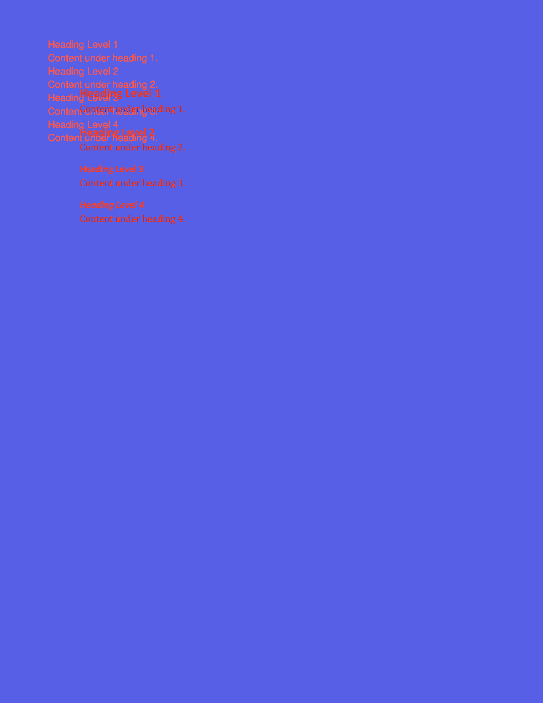</td>
  <td>changed: 22860 px (1.09%)<br>bbox: [113, 95, 434, 526]<br>mean abs RGB: 1.6591<br>RMSE RGB: 17.9591<br>threshold: 12, gain: 5.0</td>
</tr>
<tr>
  <td><b>docx_classic04_bold_italic</b><br>Page 1</td>
  <td></td>
  <td>changed: 7263 px (0.35%)<br>bbox: [114, 95, 716, 173]<br>mean abs RGB: 0.6071<br>RMSE RGB: 11.385<br>threshold: 12, gain: 5.0</td>
</tr>
<tr>
  <td><b>docx_classic05_font_sizes</b><br>Page 1</td>
  <td>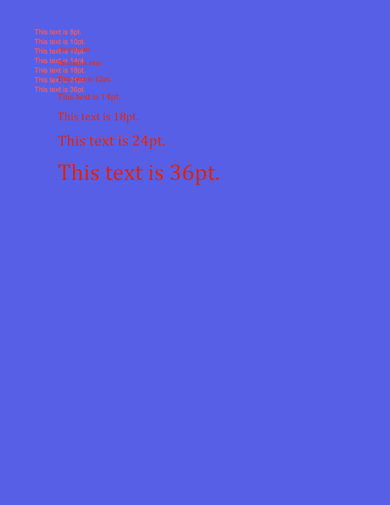</td>
  <td>changed: 24956 px (1.19%)<br>bbox: [113, 95, 715, 604]<br>mean abs RGB: 2.2503<br>RMSE RGB: 22.4593<br>threshold: 12, gain: 5.0</td>
</tr>
<tr>
  <td><b>docx_classic06_font_colors</b><br>Page 1</td>
  <td></td>
  <td>changed: 6821 px (0.32%)<br>bbox: [113, 95, 302, 384]<br>mean abs RGB: 0.4607<br>RMSE RGB: 9.5803<br>threshold: 12, gain: 5.0</td>
</tr>
<tr>
  <td><b>docx_classic07_alignment</b><br>Page 1</td>
  <td>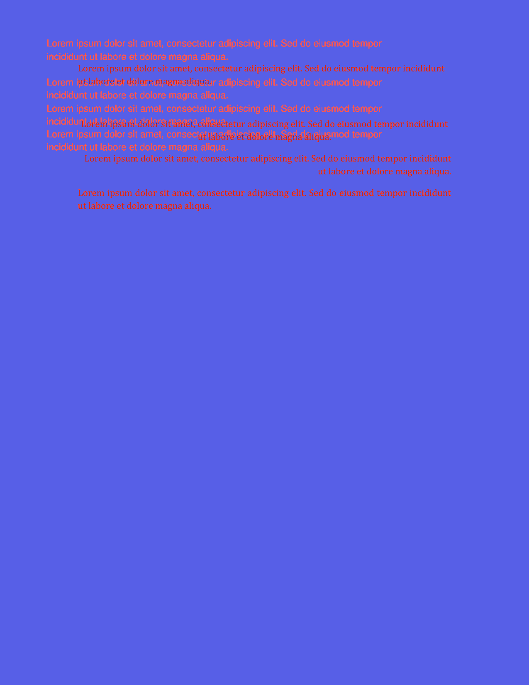</td>
  <td>changed: 61643 px (2.93%)<br>bbox: [114, 95, 1088, 508]<br>mean abs RGB: 4.8912<br>RMSE RGB: 31.7952<br>threshold: 12, gain: 5.0</td>
</tr>
<tr>
  <td><b>docx_classic08_bullet_list</b><br>Page 1</td>
  <td></td>
  <td>changed: 8804 px (0.42%)<br>bbox: [113, 95, 347, 362]<br>mean abs RGB: 0.6676<br>RMSE RGB: 11.5717<br>threshold: 12, gain: 5.0</td>
</tr>
<tr>
  <td><b>docx_classic09_numbered_list</b><br>Page 1</td>
  <td></td>
  <td>changed: 13494 px (0.64%)<br>bbox: [113, 95, 406, 356]<br>mean abs RGB: 1.0168<br>RMSE RGB: 14.2715<br>threshold: 12, gain: 5.0</td>
</tr>
<tr>
  <td><b>docx_classic10_simple_table</b><br>Page 1</td>
  <td>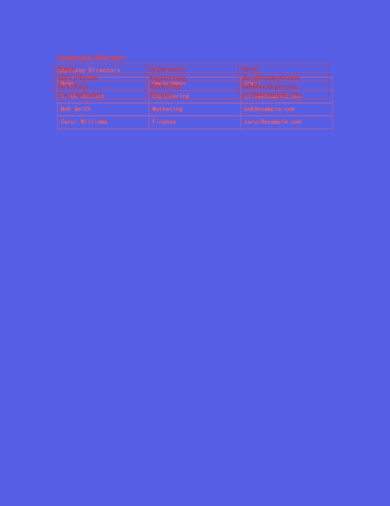</td>
  <td>changed: 38963 px (1.85%)<br>bbox: [175, 178, 1088, 421]<br>mean abs RGB: 2.7245<br>RMSE RGB: 22.659<br>threshold: 12, gain: 5.0</td>
</tr>
<tr>
  <td><b>docx_classic11_table_with_shading</b><br>Page 1</td>
  <td>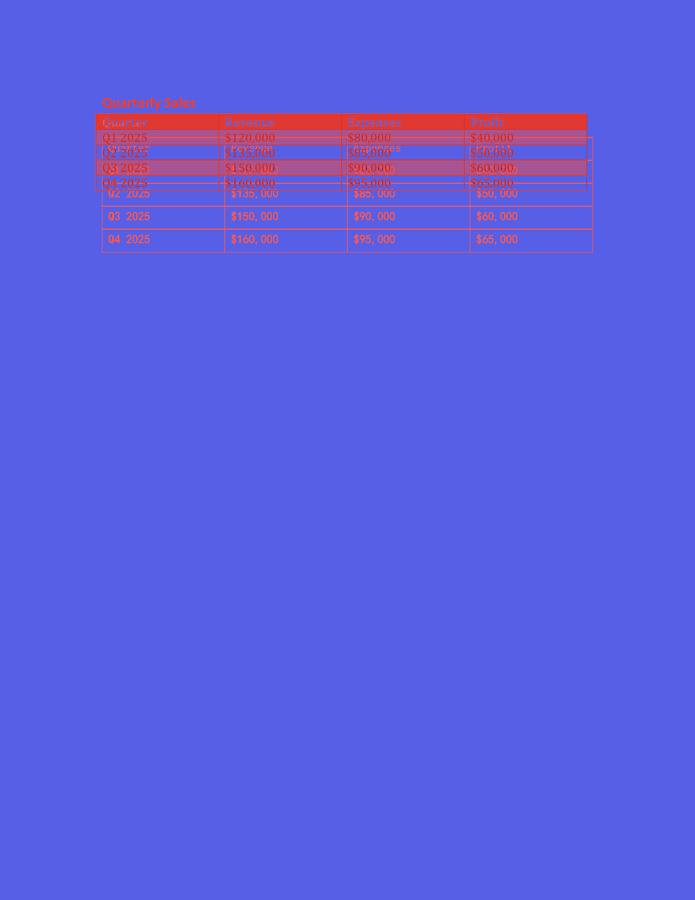</td>
  <td>changed: 102725 px (4.88%)<br>bbox: [175, 178, 1088, 463]<br>mean abs RGB: 4.8086<br>RMSE RGB: 27.9326<br>threshold: 12, gain: 5.0</td>
</tr>
<tr>
  <td><b>docx_classic12_merged_cells_table</b><br>Page 1</td>
  <td>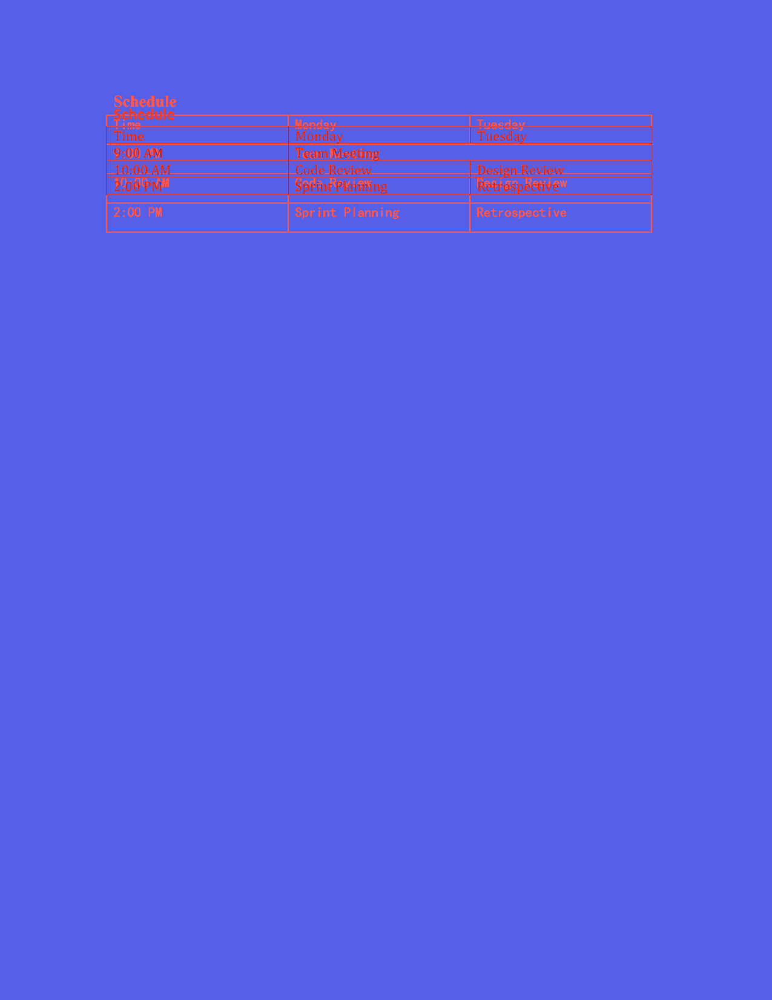</td>
  <td>changed: 34108 px (1.62%)<br>bbox: [175, 178, 1088, 421]<br>mean abs RGB: 2.3983<br>RMSE RGB: 21.2653<br>threshold: 12, gain: 5.0</td>
</tr>
<tr>
  <td><b>docx_classic13_long_document</b><br>Page 1</td>
  <td>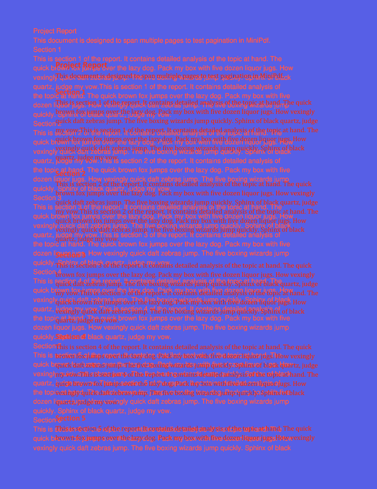</td>
  <td>changed: 344681 px (16.38%)<br>bbox: [112, 95, 1076, 1524]<br>mean abs RGB: 26.9724<br>RMSE RGB: 74.2666<br>threshold: 12, gain: 5.0</td>
</tr>
<tr>
  <td><b>docx_classic13_long_document</b><br>Page 2</td>
  <td>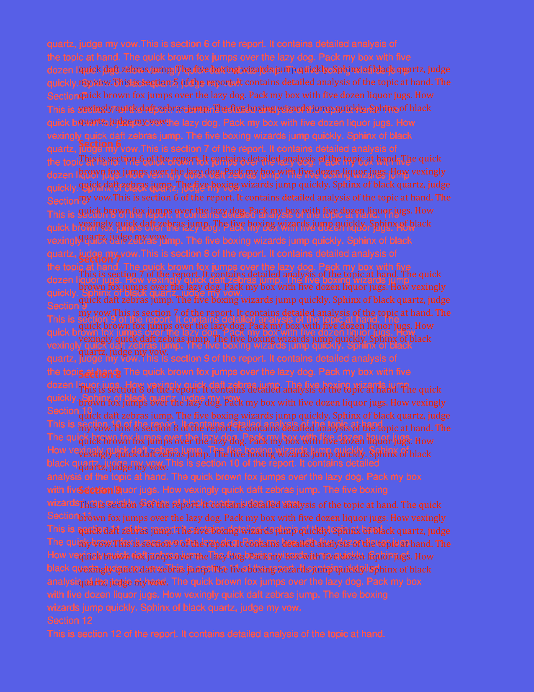</td>
  <td>changed: 352587 px (16.76%)<br>bbox: [112, 95, 1076, 1524]<br>mean abs RGB: 27.7081<br>RMSE RGB: 75.4033<br>threshold: 12, gain: 5.0</td>
</tr>
<tr>
  <td><b>docx_classic13_long_document</b><br>Page 3</td>
  <td>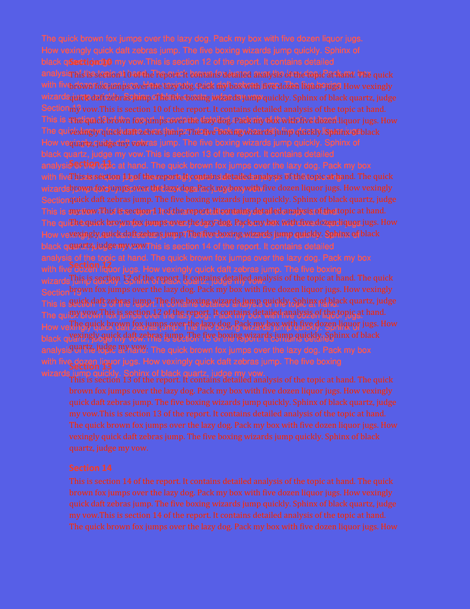</td>
  <td>changed: 286892 px (13.64%)<br>bbox: [112, 95, 1078, 1439]<br>mean abs RGB: 22.346<br>RMSE RGB: 67.5191<br>threshold: 12, gain: 5.0</td>
</tr>
<tr>
  <td><b>docx_classic14_mixed_content</b><br>Page 1</td>
  <td>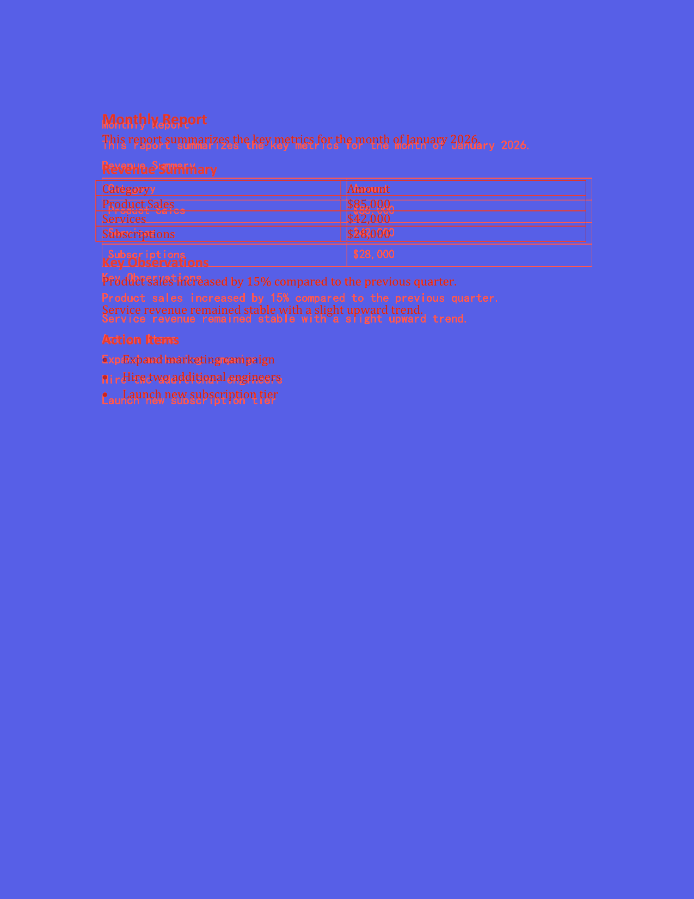</td>
  <td>changed: 68555 px (3.26%)<br>bbox: [175, 208, 1088, 745]<br>mean abs RGB: 4.8974<br>RMSE RGB: 30.4537<br>threshold: 12, gain: 5.0</td>
</tr>
<tr>
  <td><b>docx_classic15_indentation</b><br>Page 1</td>
  <td>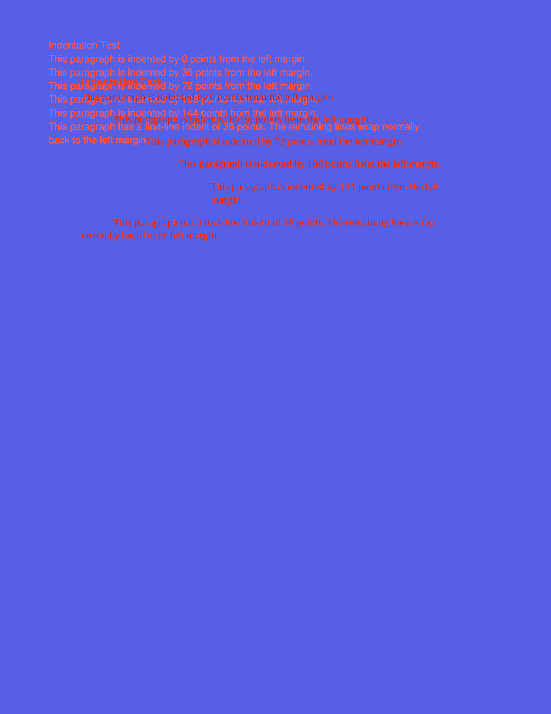</td>
  <td>changed: 54689 px (2.60%)<br>bbox: [113, 95, 1020, 556]<br>mean abs RGB: 4.3133<br>RMSE RGB: 29.7017<br>threshold: 12, gain: 5.0</td>
</tr>
<tr>
  <td><b>docx_classic16_line_spacing</b><br>Page 1</td>
  <td>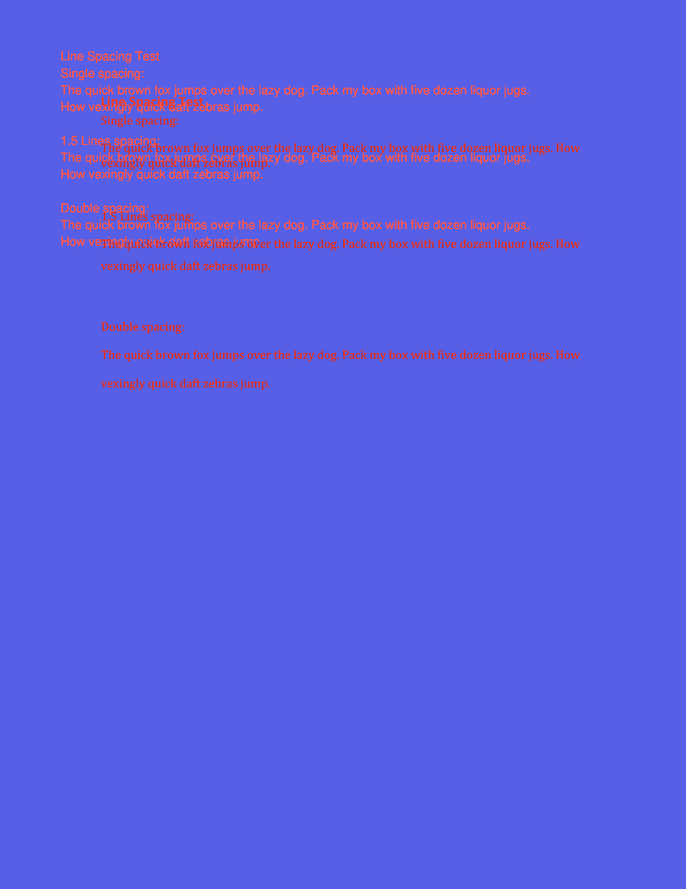</td>
  <td>changed: 55084 px (2.62%)<br>bbox: [113, 95, 1078, 724]<br>mean abs RGB: 4.3561<br>RMSE RGB: 29.9225<br>threshold: 12, gain: 5.0</td>
</tr>
<tr>
  <td><b>docx_classic17_page_break</b><br>Page 1</td>
  <td></td>
  <td>changed: 4505 px (0.21%)<br>bbox: [113, 95, 432, 268]<br>mean abs RGB: 0.3468<br>RMSE RGB: 8.3211<br>threshold: 12, gain: 5.0</td>
</tr>
<tr>
  <td><b>docx_classic17_page_break</b><br>Page 2</td>
  <td></td>
  <td>changed: 7269 px (0.35%)<br>bbox: [113, 127, 642, 218]<br>mean abs RGB: 0.5616<br>RMSE RGB: 10.6464<br>threshold: 12, gain: 5.0</td>
</tr>
<tr>
  <td><b>docx_classic17_page_break</b><br>Page 3</td>
  <td></td>
  <td>changed: 4494 px (0.21%)<br>bbox: [113, 127, 441, 218]<br>mean abs RGB: 0.3409<br>RMSE RGB: 8.2401<br>threshold: 12, gain: 5.0</td>
</tr>
<tr>
  <td><b>docx_classic18_embedded_image</b><br>Page 1</td>
  <td>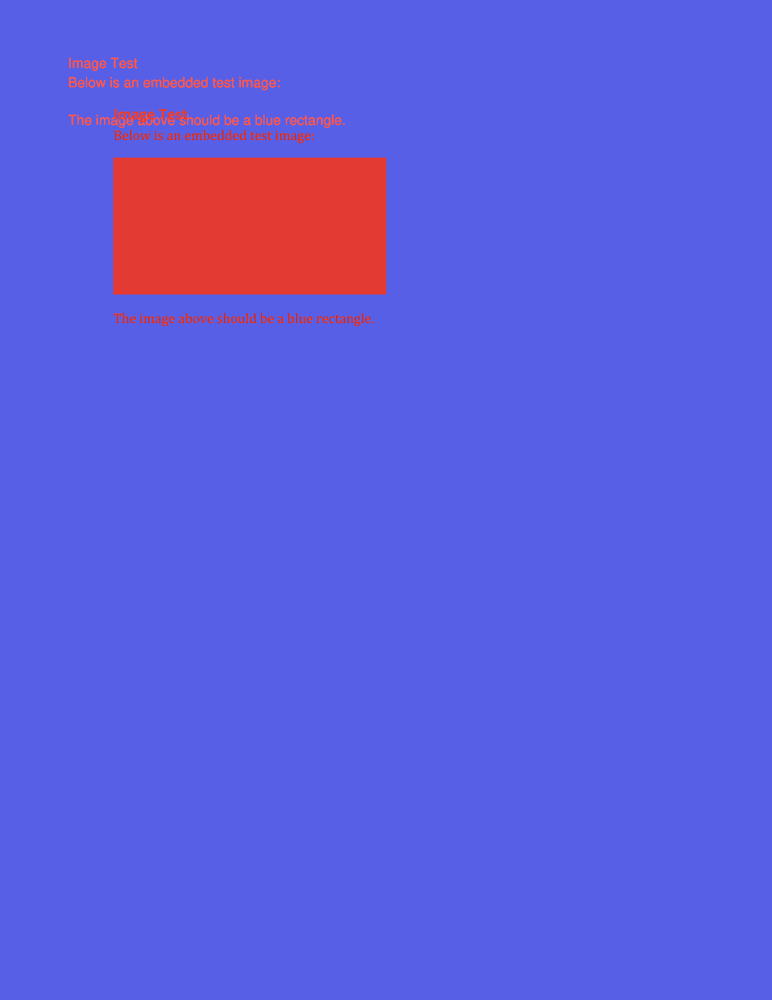</td>
  <td>changed: 114023 px (5.42%)<br>bbox: [113, 95, 638, 538]<br>mean abs RGB: 7.1576<br>RMSE RGB: 32.9704<br>threshold: 12, gain: 5.0</td>
</tr>
<tr>
  <td><b>docx_classic19_multiple_images</b><br>Page 1</td>
  <td>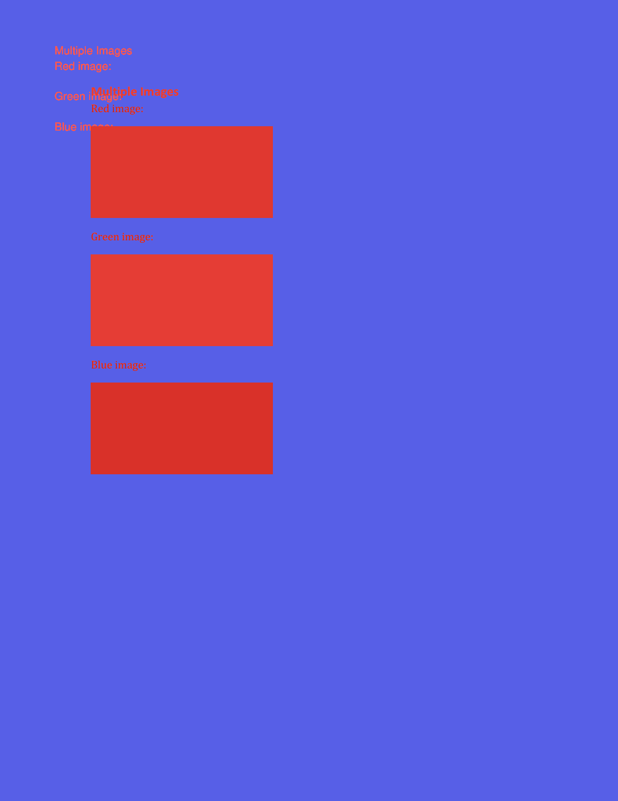</td>
  <td>changed: 220906 px (10.50%)<br>bbox: [113, 95, 563, 977]<br>mean abs RGB: 16.0353<br>RMSE RGB: 55.117<br>threshold: 12, gain: 5.0</td>
</tr>
<tr>
  <td><b>docx_classic20_table_with_many_rows</b><br>Page 1</td>
  <td>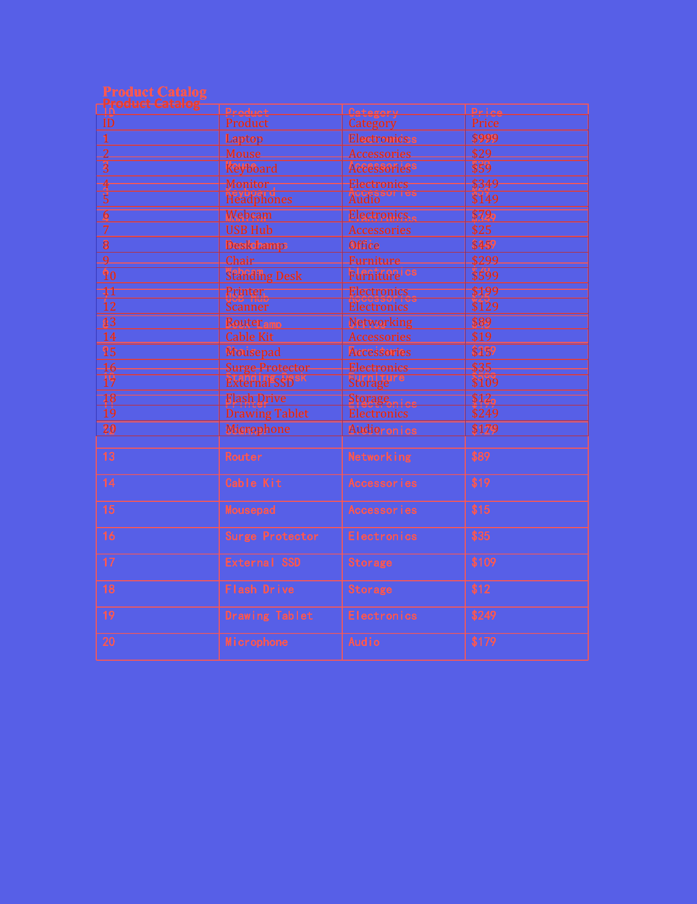</td>
  <td>changed: 152273 px (7.24%)<br>bbox: [175, 178, 1088, 1137]<br>mean abs RGB: 11.1125<br>RMSE RGB: 46.8647<br>threshold: 12, gain: 5.0</td>
</tr>
<tr>
  <td><b>docx_classic21_nested_lists</b><br>Page 1</td>
  <td>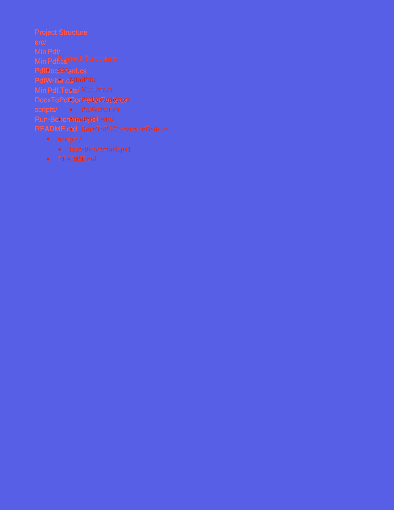</td>
  <td>changed: 21403 px (1.02%)<br>bbox: [113, 95, 544, 523]<br>mean abs RGB: 1.6627<br>RMSE RGB: 18.433<br>threshold: 12, gain: 5.0</td>
</tr>
<tr>
  <td><b>docx_classic22_horizontal_rule</b><br>Page 1</td>
  <td>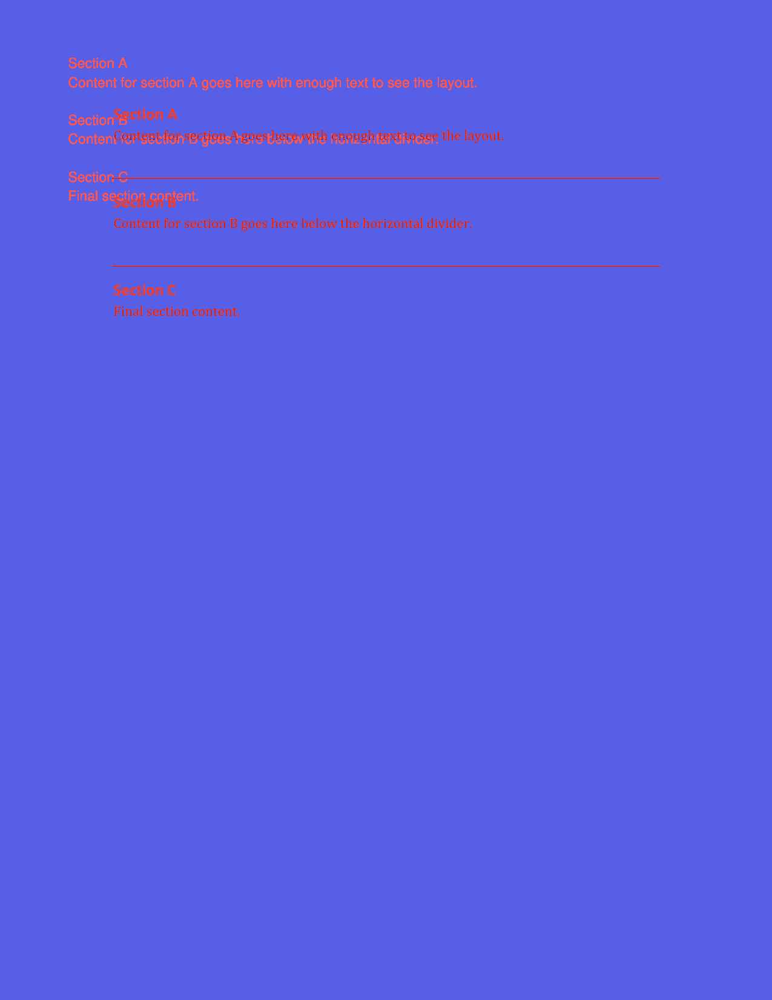</td>
  <td>changed: 25939 px (1.23%)<br>bbox: [113, 95, 1091, 522]<br>mean abs RGB: 1.9929<br>RMSE RGB: 20.045<br>threshold: 12, gain: 5.0</td>
</tr>
<tr>
  <td><b>docx_classic23_mixed_formatting_runs</b><br>Page 1</td>
  <td></td>
  <td>changed: 10529 px (0.50%)<br>bbox: [114, 95, 707, 254]<br>mean abs RGB: 0.7934<br>RMSE RGB: 12.6807<br>threshold: 12, gain: 5.0</td>
</tr>
<tr>
  <td><b>docx_classic24_two_column_table_layout</b><br>Page 1</td>
  <td></td>
  <td>changed: 31868 px (1.51%)<br>bbox: [186, 178, 1088, 412]<br>mean abs RGB: 2.3488<br>RMSE RGB: 21.5472<br>threshold: 12, gain: 5.0</td>
</tr>
<tr>
  <td><b>docx_classic25_title_and_subtitle</b><br>Page 1</td>
  <td>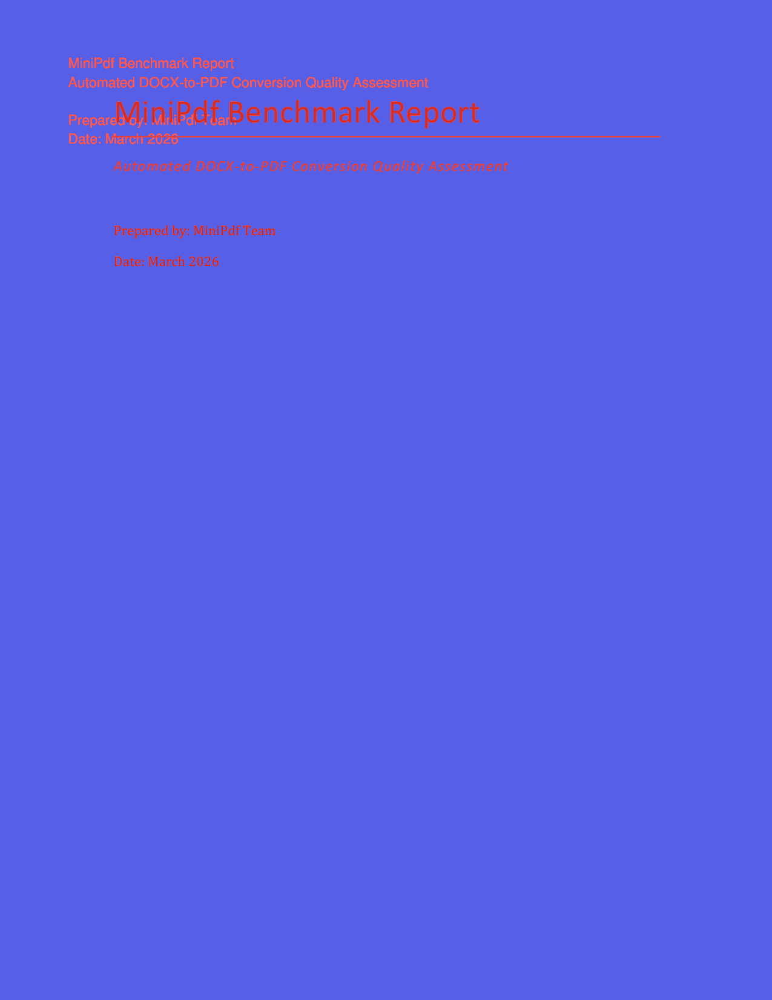</td>
  <td>changed: 25798 px (1.23%)<br>bbox: [113, 95, 1091, 440]<br>mean abs RGB: 1.7976<br>RMSE RGB: 18.4045<br>threshold: 12, gain: 5.0</td>
</tr>
<tr>
  <td><b>docx_classic25_title_and_subtitle</b><br>Page 2</td>
  <td></td>
  <td>changed: 10925 px (0.52%)<br>bbox: [113, 127, 879, 218]<br>mean abs RGB: 0.8402<br>RMSE RGB: 13.0426<br>threshold: 12, gain: 5.0</td>
</tr>
<tr>
  <td><b>docx_classic26_table_alignment</b><br>Page 1</td>
  <td>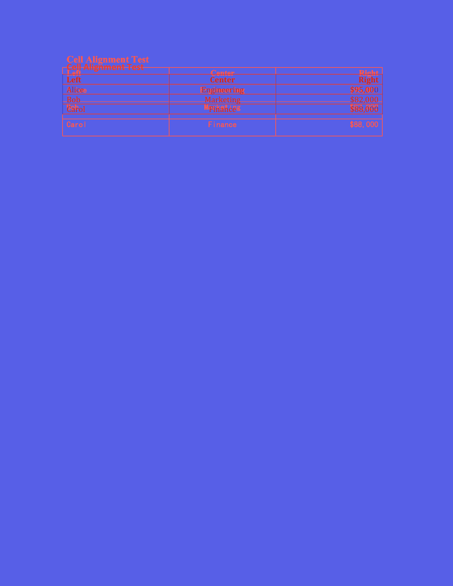</td>
  <td>changed: 32503 px (1.54%)<br>bbox: [175, 178, 1088, 421]<br>mean abs RGB: 2.2428<br>RMSE RGB: 20.443<br>threshold: 12, gain: 5.0</td>
</tr>
<tr>
  <td><b>docx_classic27_long_paragraph_wrapping</b><br>Page 1</td>
  <td>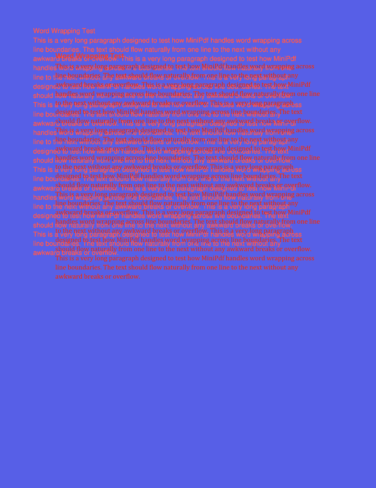</td>
  <td>changed: 244504 px (11.62%)<br>bbox: [113, 95, 1084, 943]<br>mean abs RGB: 19.2588<br>RMSE RGB: 62.8011<br>threshold: 12, gain: 5.0</td>
</tr>
<tr>
  <td><b>docx_classic28_special_characters</b><br>Page 1</td>
  <td>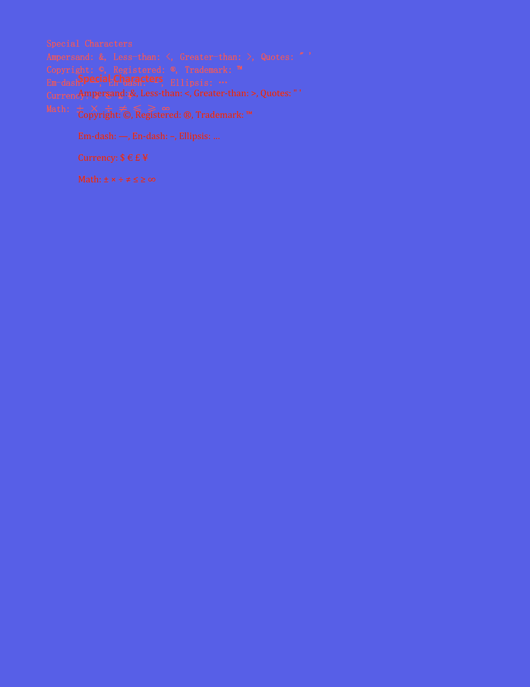</td>
  <td>changed: 19419 px (0.92%)<br>bbox: [112, 95, 748, 439]<br>mean abs RGB: 1.3256<br>RMSE RGB: 15.6829<br>threshold: 12, gain: 5.0</td>
</tr>
<tr>
  <td><b>docx_classic29_table_with_image</b><br>Page 1</td>
  <td>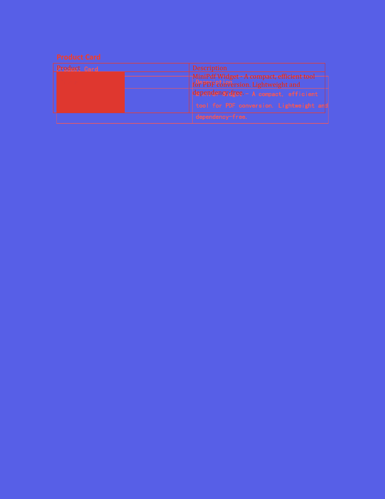</td>
  <td>changed: 55884 px (2.66%)<br>bbox: [175, 178, 1088, 409]<br>mean abs RGB: 4.3767<br>RMSE RGB: 29.0859<br>threshold: 12, gain: 5.0</td>
</tr>
<tr>
  <td><b>docx_classic30_comprehensive_report</b><br>Page 1</td>
  <td>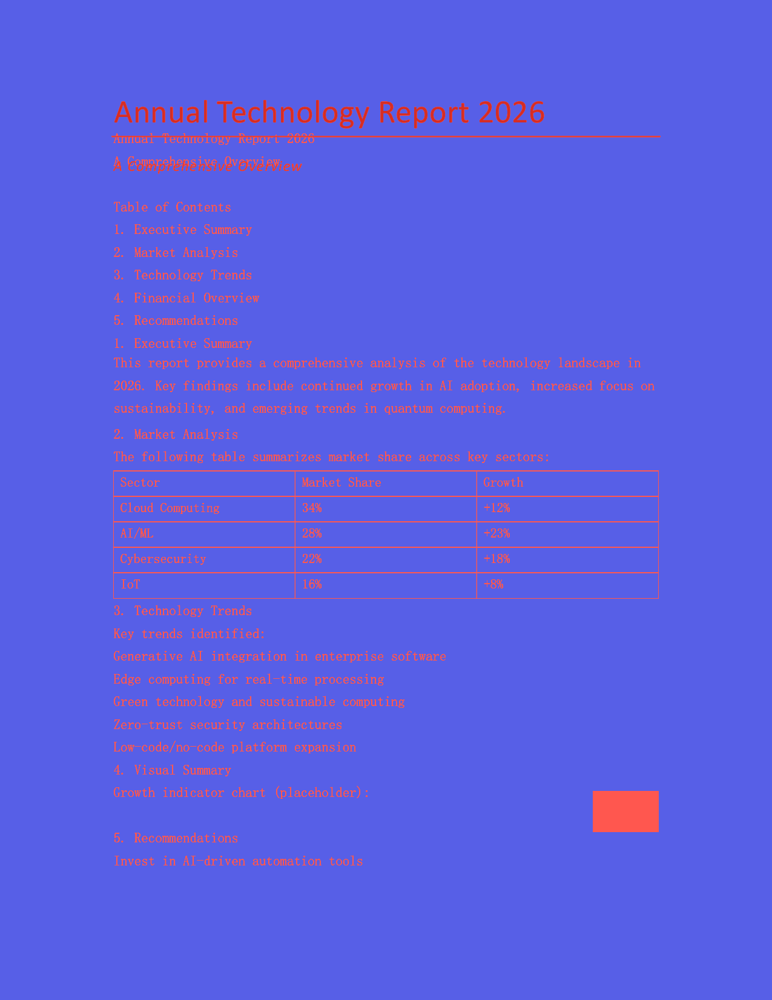</td>
  <td>changed: 79553 px (3.78%)<br>bbox: [184, 165, 1091, 1428]<br>mean abs RGB: 5.2882<br>RMSE RGB: 30.666<br>threshold: 12, gain: 5.0</td>
</tr>
<tr>
  <td><b>docx_classic30_comprehensive_report</b><br>Page 2</td>
  <td>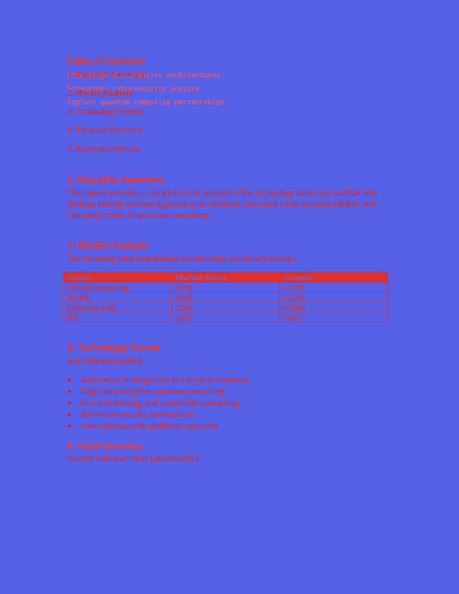</td>
  <td>changed: 94203 px (4.48%)<br>bbox: [175, 158, 1077, 1285]<br>mean abs RGB: 6.8663<br>RMSE RGB: 36.0888<br>threshold: 12, gain: 5.0</td>
</tr>
<tr>
  <td><b>docx_classic31_product_card_with_image</b><br>Page 1</td>
  <td>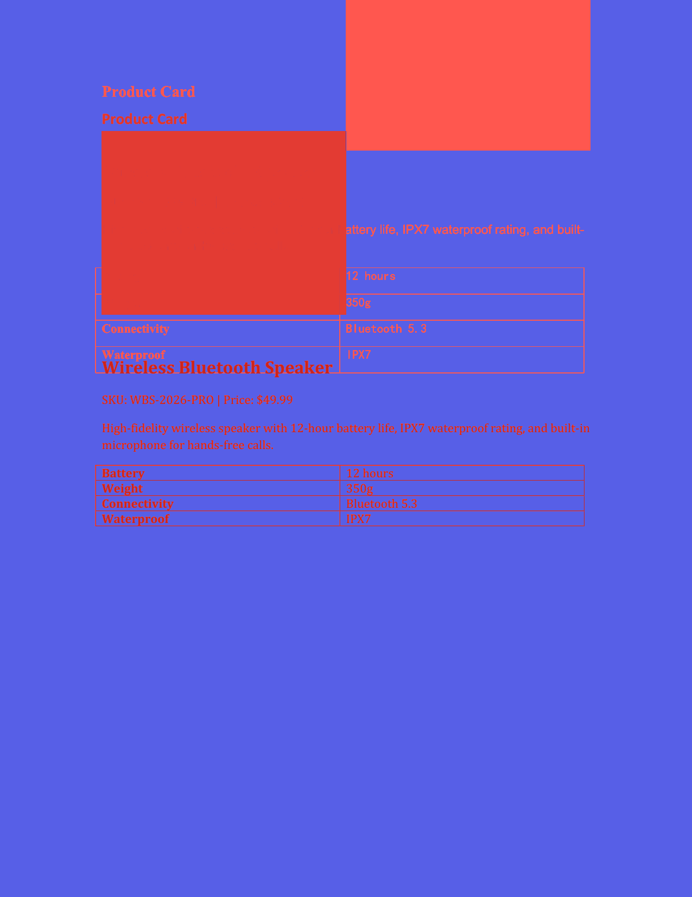</td>
  <td>changed: 204713 px (9.73%)<br>bbox: [175, 208, 1088, 968]<br>mean abs RGB: 12.8706<br>RMSE RGB: 45.2146<br>threshold: 12, gain: 5.0</td>
</tr>
<tr>
  <td><b>docx_classic31_strikethrough_text</b><br>Page 1</td>
  <td>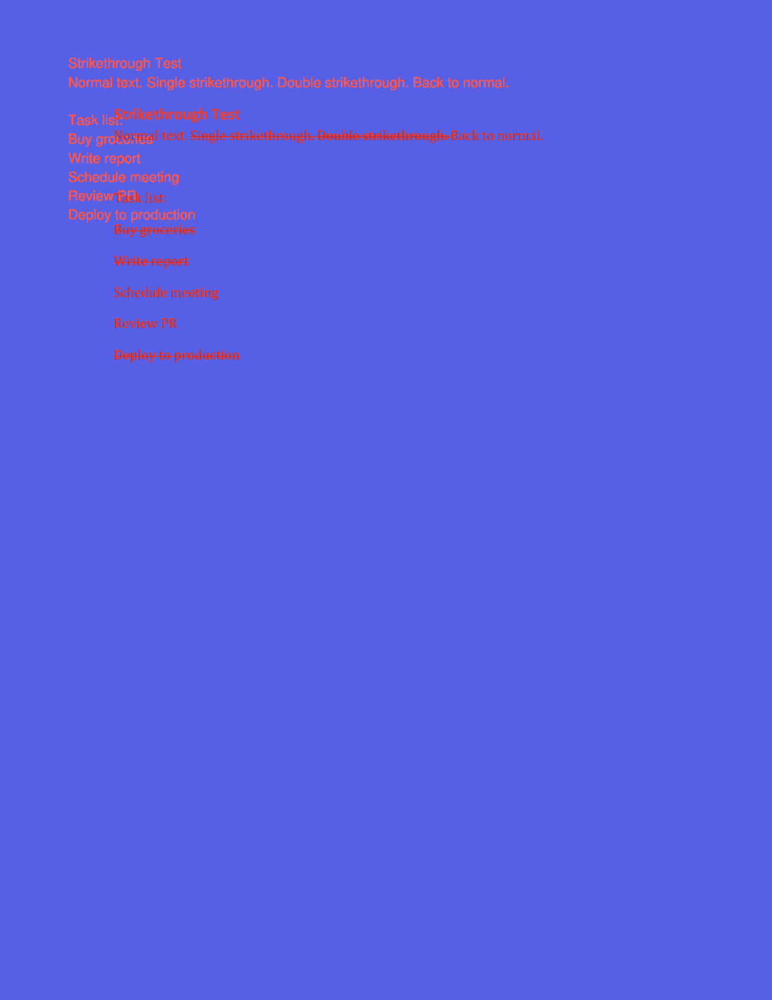</td>
  <td>changed: 25416 px (1.21%)<br>bbox: [113, 95, 895, 598]<br>mean abs RGB: 2.0019<br>RMSE RGB: 20.2386<br>threshold: 12, gain: 5.0</td>
</tr>
<tr>
  <td><b>docx_classic32_company_logo_header</b><br>Page 1</td>
  <td>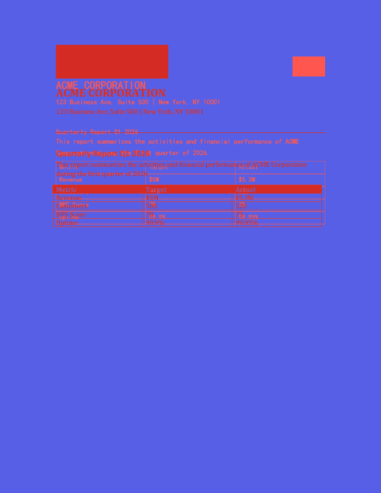</td>
  <td>changed: 135928 px (6.46%)<br>bbox: [175, 150, 1091, 760]<br>mean abs RGB: 11.5877<br>RMSE RGB: 48.5998<br>threshold: 12, gain: 5.0</td>
</tr>
<tr>
  <td><b>docx_classic32_superscript_subscript</b><br>Page 1</td>
  <td>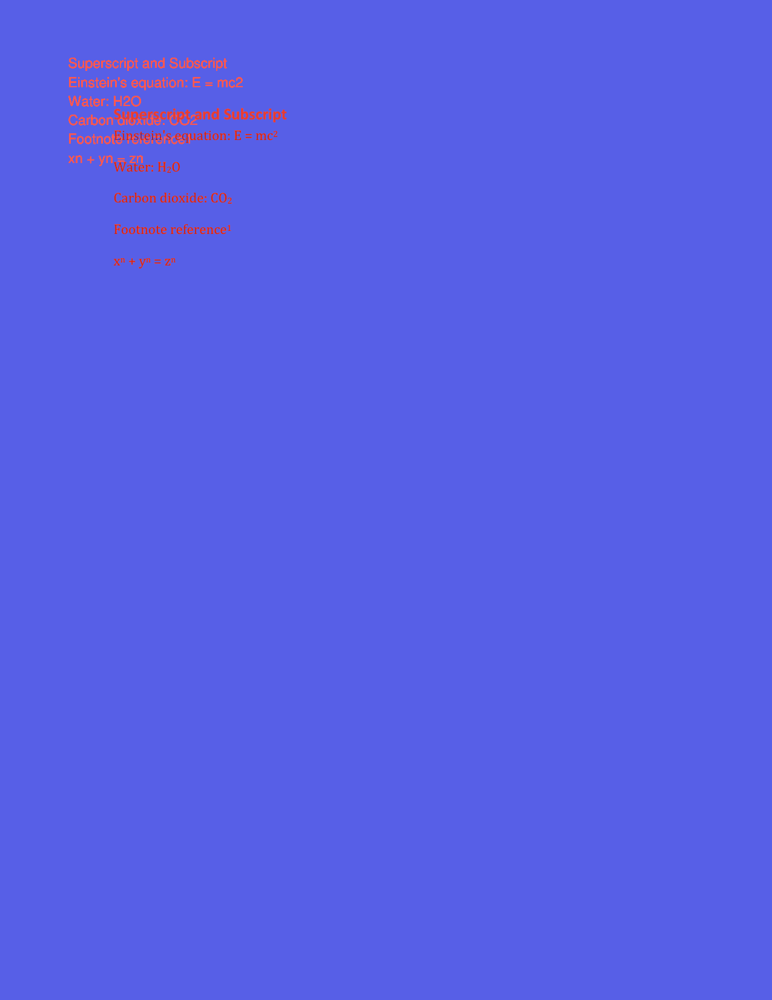</td>
  <td>changed: 15380 px (0.73%)<br>bbox: [113, 95, 474, 443]<br>mean abs RGB: 1.1337<br>RMSE RGB: 15.0124<br>threshold: 12, gain: 5.0</td>
</tr>
<tr>
  <td><b>docx_classic33_highlighted_text</b><br>Page 1</td>
  <td>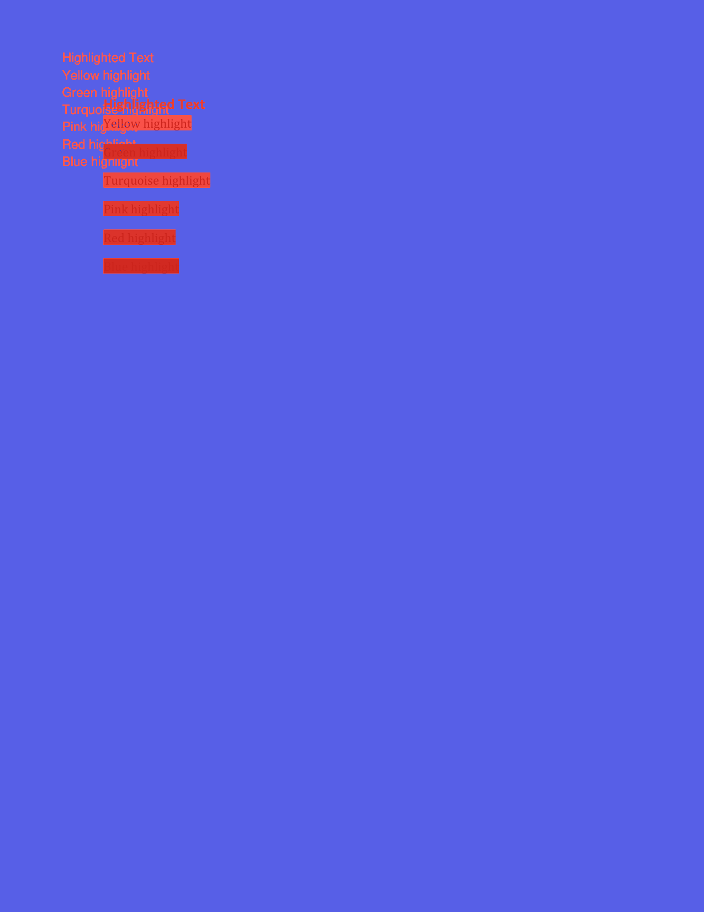</td>
  <td>changed: 34427 px (1.64%)<br>bbox: [113, 95, 381, 495]<br>mean abs RGB: 2.4517<br>RMSE RGB: 23.6311<br>threshold: 12, gain: 5.0</td>
</tr>
<tr>
  <td><b>docx_classic33_two_products_side_by_side</b><br>Page 1</td>
  <td>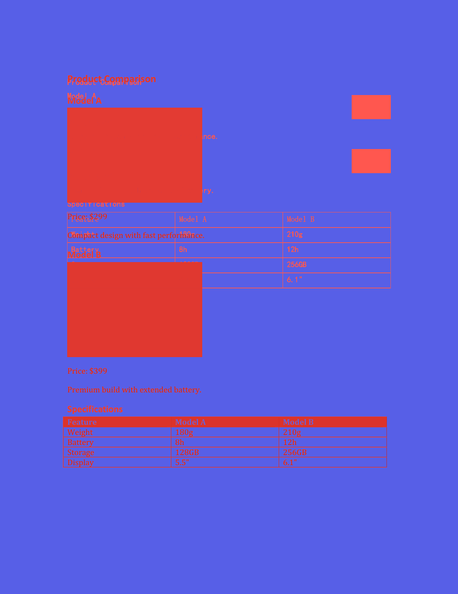</td>
  <td>changed: 280008 px (13.31%)<br>bbox: [175, 208, 1088, 1299]<br>mean abs RGB: 18.6048<br>RMSE RGB: 54.9476<br>threshold: 12, gain: 5.0</td>
</tr>
<tr>
  <td><b>docx_classic34_employee_directory_with_photo</b><br>Page 1</td>
  <td>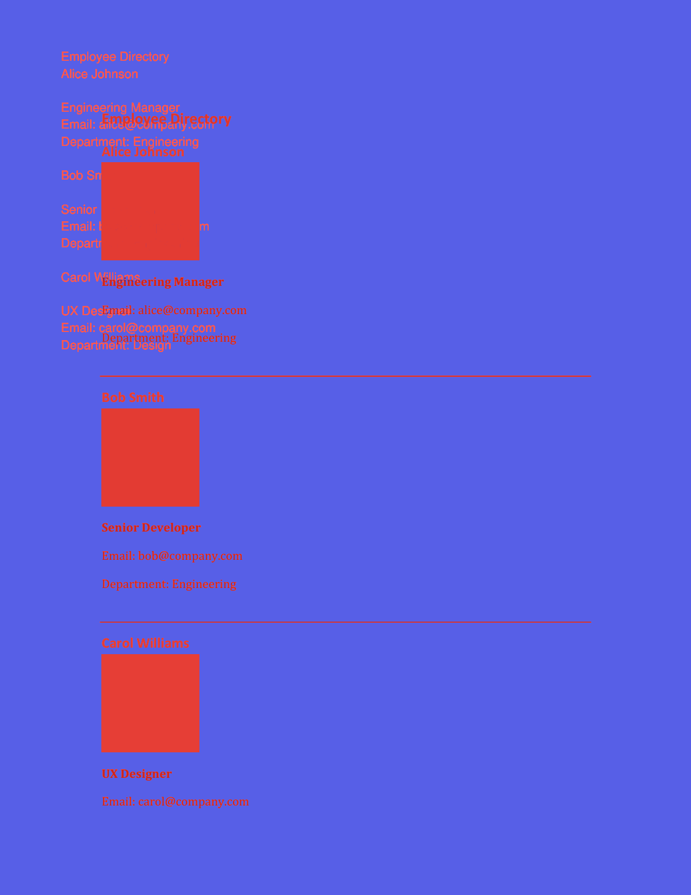</td>
  <td>changed: 137072 px (6.52%)<br>bbox: [113, 95, 1091, 1490]<br>mean abs RGB: 9.3294<br>RMSE RGB: 39.5599<br>threshold: 12, gain: 5.0</td>
</tr>
<tr>
  <td><b>docx_classic34_paragraph_borders</b><br>Page 1</td>
  <td></td>
  <td>changed: 40935 px (1.95%)<br>bbox: [113, 95, 1101, 509]<br>mean abs RGB: 2.8317<br>RMSE RGB: 23.5499<br>threshold: 12, gain: 5.0</td>
</tr>
<tr>
  <td><b>docx_classic35_inventory_with_product_photos</b><br>Page 1</td>
  <td>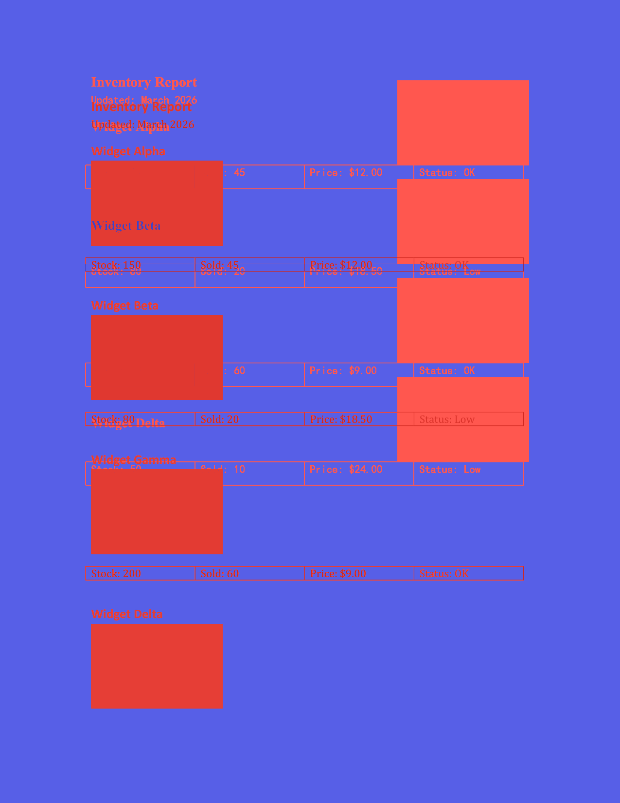</td>
  <td>changed: 270815 px (12.87%)<br>bbox: [175, 209, 1088, 1456]<br>mean abs RGB: 18.3245<br>RMSE RGB: 55.0659<br>threshold: 12, gain: 5.0</td>
</tr>
<tr>
  <td><b>docx_classic35_tab_stops</b><br>Page 1</td>
  <td>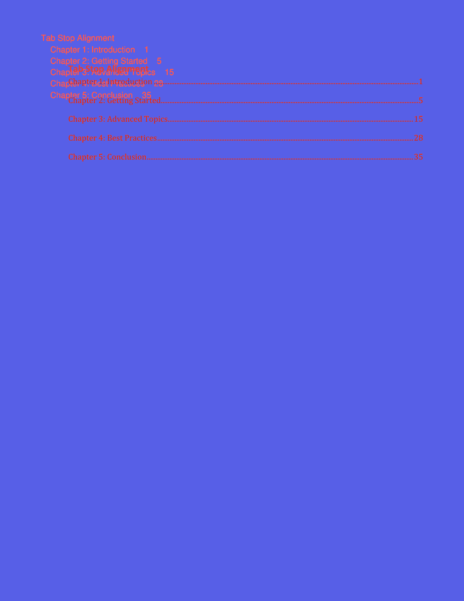</td>
  <td>changed: 27239 px (1.29%)<br>bbox: [113, 95, 1162, 443]<br>mean abs RGB: 2.0942<br>RMSE RGB: 20.5137<br>threshold: 12, gain: 5.0</td>
</tr>
<tr>
  <td><b>docx_classic36_invoice_with_logo</b><br>Page 1</td>
  <td>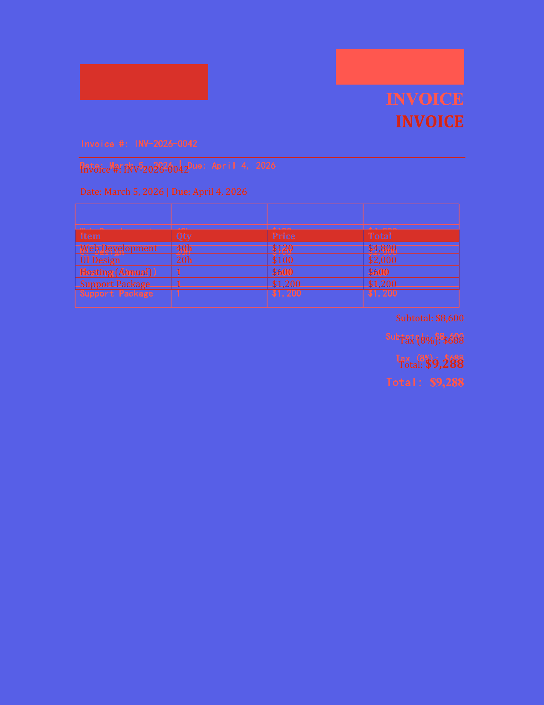</td>
  <td>changed: 108774 px (5.17%)<br>bbox: [175, 150, 1091, 865]<br>mean abs RGB: 8.3967<br>RMSE RGB: 40.8016<br>threshold: 12, gain: 5.0</td>
</tr>
<tr>
  <td><b>docx_classic36_wide_table</b><br>Page 1</td>
  <td>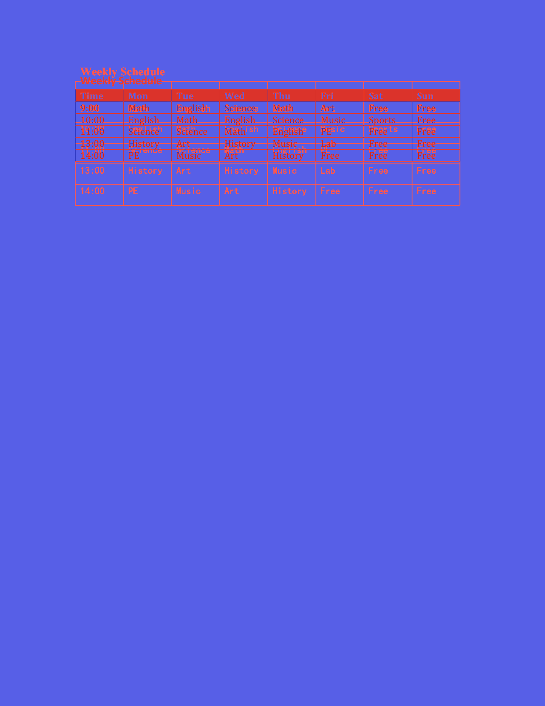</td>
  <td>changed: 80041 px (3.80%)<br>bbox: [175, 178, 1088, 506]<br>mean abs RGB: 5.7615<br>RMSE RGB: 32.803<br>threshold: 12, gain: 5.0</td>
</tr>
<tr>
  <td><b>docx_classic37_nested_table</b><br>Page 1</td>
  <td></td>
  <td>changed: 30139 px (1.43%)<br>bbox: [175, 178, 1088, 371]<br>mean abs RGB: 2.0123<br>RMSE RGB: 19.1397<br>threshold: 12, gain: 5.0</td>
</tr>
<tr>
  <td><b>docx_classic37_real_estate_listing</b><br>Page 1</td>
  <td>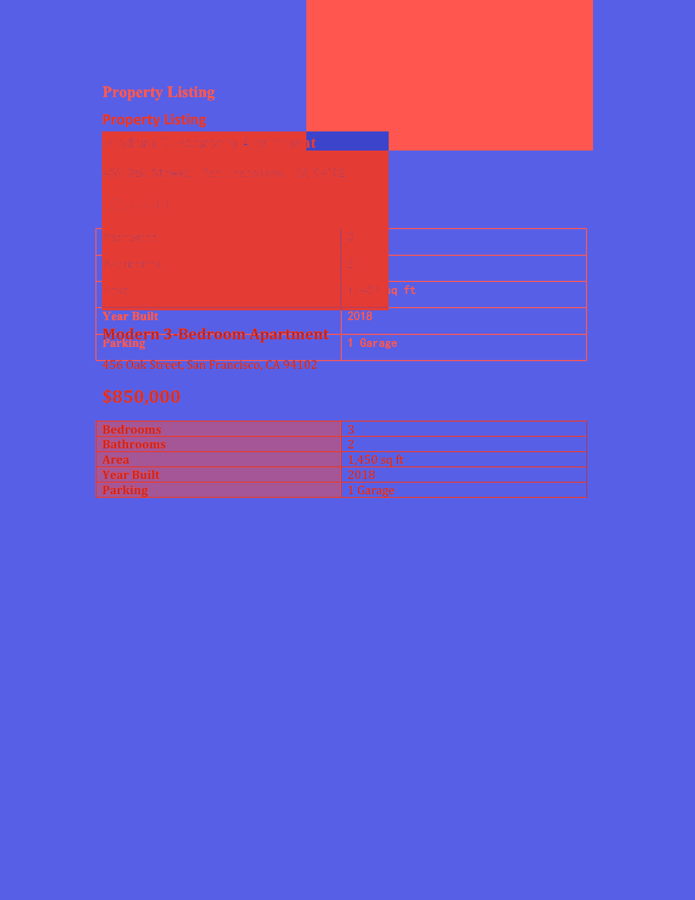</td>
  <td>changed: 271398 px (12.90%)<br>bbox: [175, 208, 1088, 913]<br>mean abs RGB: 14.7396<br>RMSE RGB: 45.596<br>threshold: 12, gain: 5.0</td>
</tr>
<tr>
  <td><b>docx_classic38_restaurant_menu_with_photos</b><br>Page 1</td>
  <td>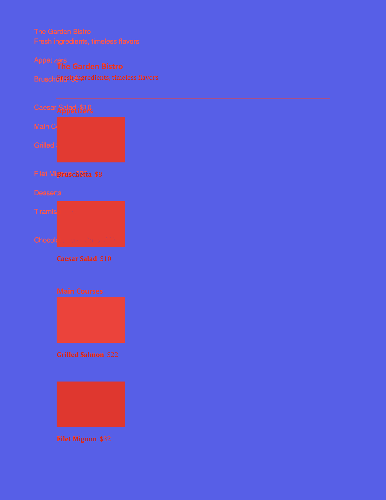</td>
  <td>changed: 160752 px (7.64%)<br>bbox: [113, 95, 1091, 1461]<br>mean abs RGB: 10.9092<br>RMSE RGB: 42.3878<br>threshold: 12, gain: 5.0</td>
</tr>
<tr>
  <td><b>docx_classic38_table_column_widths</b><br>Page 1</td>
  <td>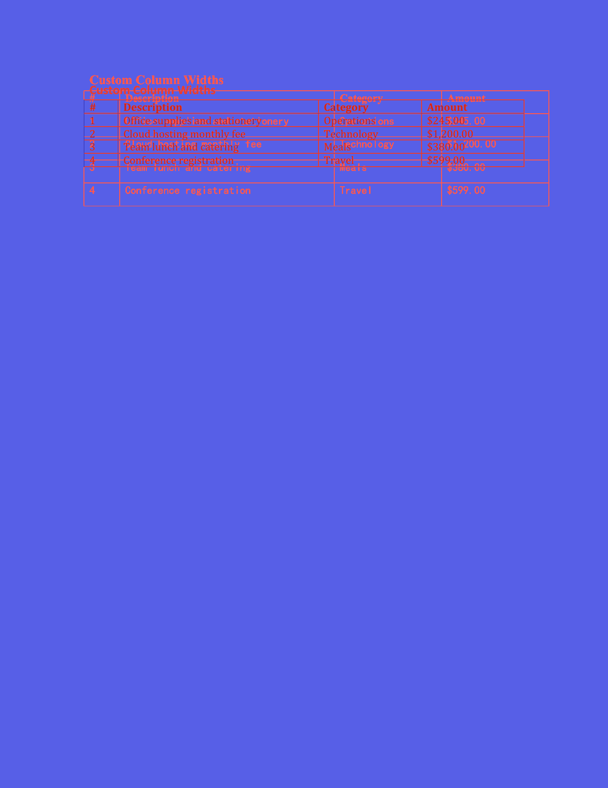</td>
  <td>changed: 51745 px (2.46%)<br>bbox: [175, 178, 1163, 463]<br>mean abs RGB: 3.6557<br>RMSE RGB: 26.4267<br>threshold: 12, gain: 5.0</td>
</tr>
<tr>
  <td><b>docx_classic39_cover_page_with_image</b><br>Page 1</td>
  <td>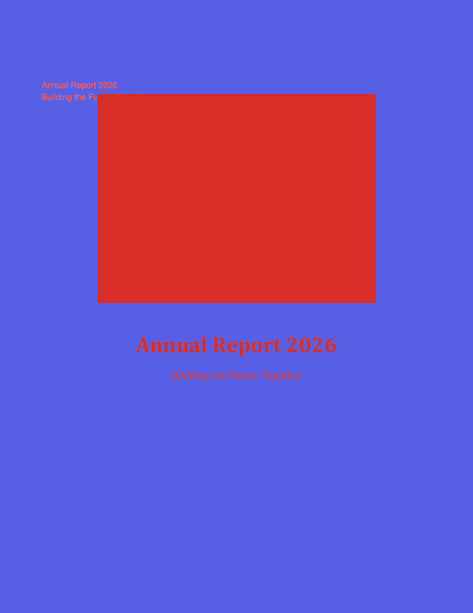</td>
  <td>changed: 437316 px (20.79%)<br>bbox: [113, 220, 1013, 1027]<br>mean abs RGB: 38.1981<br>RMSE RGB: 85.6833<br>threshold: 12, gain: 5.0</td>
</tr>
<tr>
  <td><b>docx_classic39_cover_page_with_image</b><br>Page 2</td>
  <td></td>
  <td>changed: 13287 px (0.63%)<br>bbox: [113, 127, 405, 373]<br>mean abs RGB: 1.0078<br>RMSE RGB: 14.181<br>threshold: 12, gain: 5.0</td>
</tr>
<tr>
  <td><b>docx_classic39_financial_report</b><br>Page 1</td>
  <td>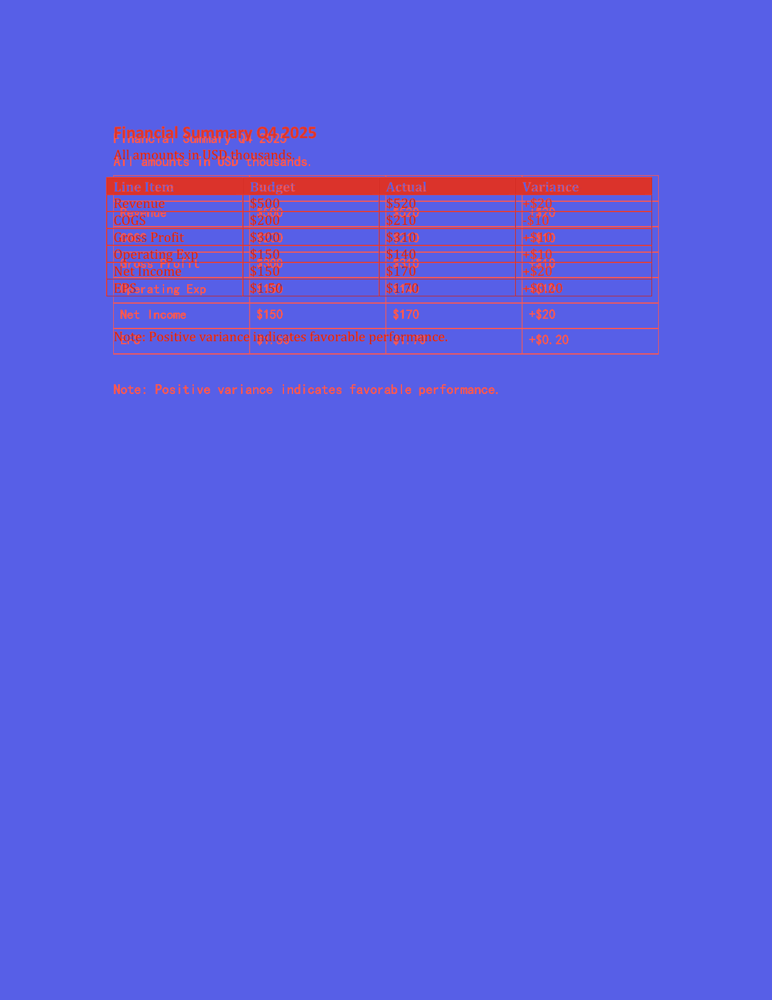</td>
  <td>changed: 84473 px (4.02%)<br>bbox: [175, 208, 1088, 653]<br>mean abs RGB: 6.2936<br>RMSE RGB: 34.4621<br>threshold: 12, gain: 5.0</td>
</tr>
<tr>
  <td><b>docx_classic40_product_catalog_with_images</b><br>Page 1</td>
  <td>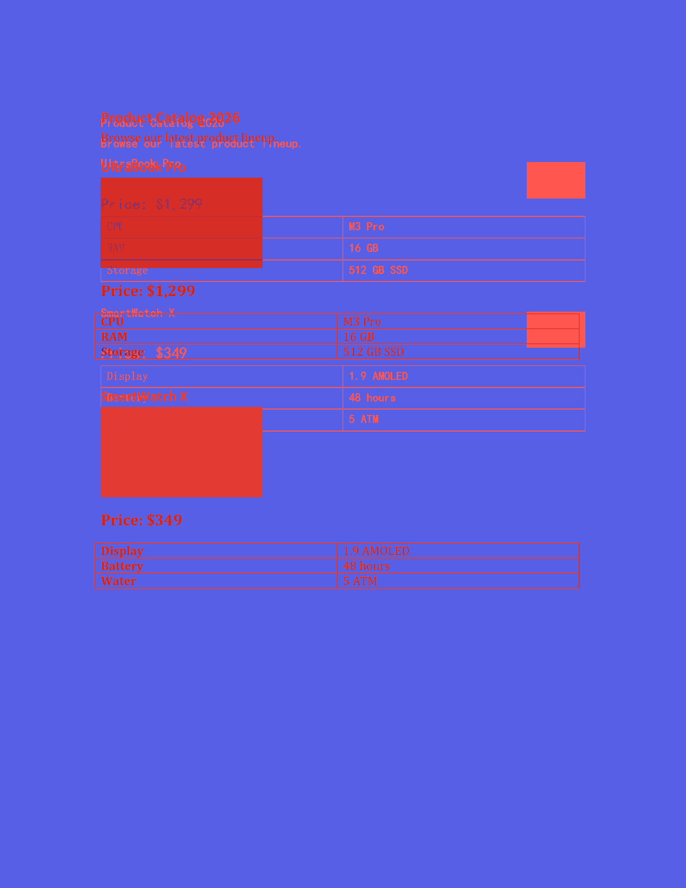</td>
  <td>changed: 169308 px (8.05%)<br>bbox: [175, 208, 1088, 1094]<br>mean abs RGB: 12.6611<br>RMSE RGB: 47.9301<br>threshold: 12, gain: 5.0</td>
</tr>
<tr>
  <td><b>docx_classic40_resume</b><br>Page 1</td>
  <td>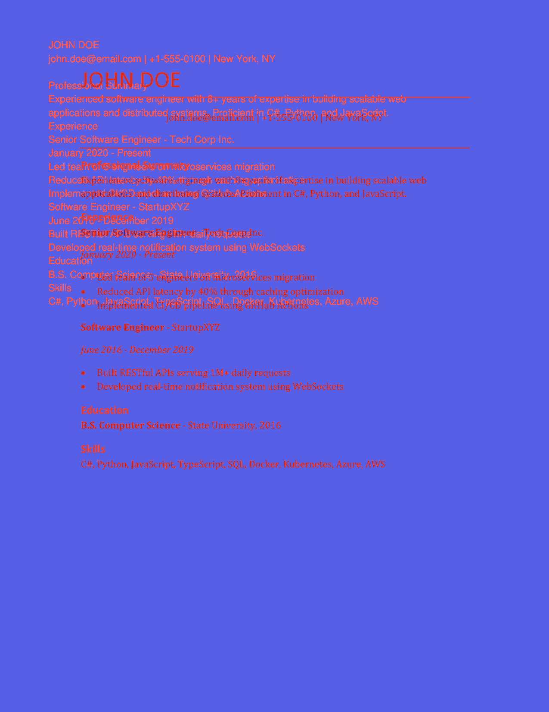</td>
  <td>changed: 105457 px (5.01%)<br>bbox: [112, 95, 1091, 1088]<br>mean abs RGB: 8.113<br>RMSE RGB: 40.5332<br>threshold: 12, gain: 5.0</td>
</tr>
<tr>
  <td><b>docx_classic41_business_letter</b><br>Page 1</td>
  <td>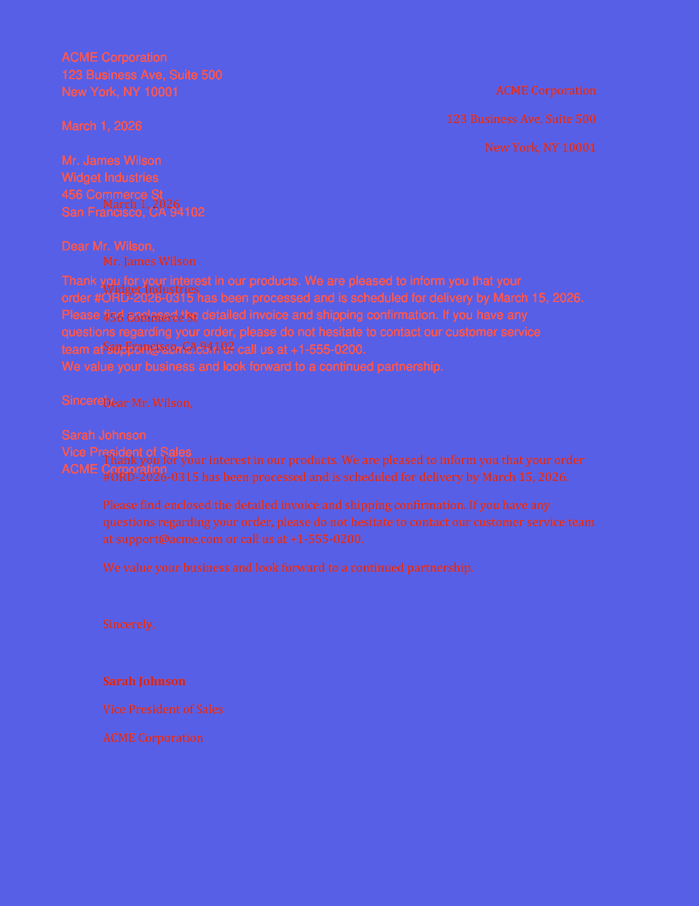</td>
  <td>changed: 91577 px (4.35%)<br>bbox: [112, 95, 1087, 1356]<br>mean abs RGB: 7.3405<br>RMSE RGB: 39.022<br>threshold: 12, gain: 5.0</td>
</tr>
<tr>
  <td><b>docx_classic41_newsletter_with_hero_image</b><br>Page 1</td>
  <td>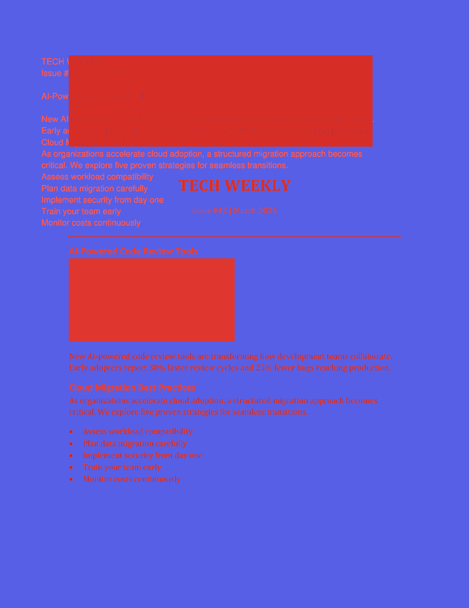</td>
  <td>changed: 373084 px (17.73%)<br>bbox: [113, 150, 1091, 1312]<br>mean abs RGB: 31.3992<br>RMSE RGB: 77.5679<br>threshold: 12, gain: 5.0</td>
</tr>
<tr>
  <td><b>docx_classic42_chart_image_with_data</b><br>Page 1</td>
  <td>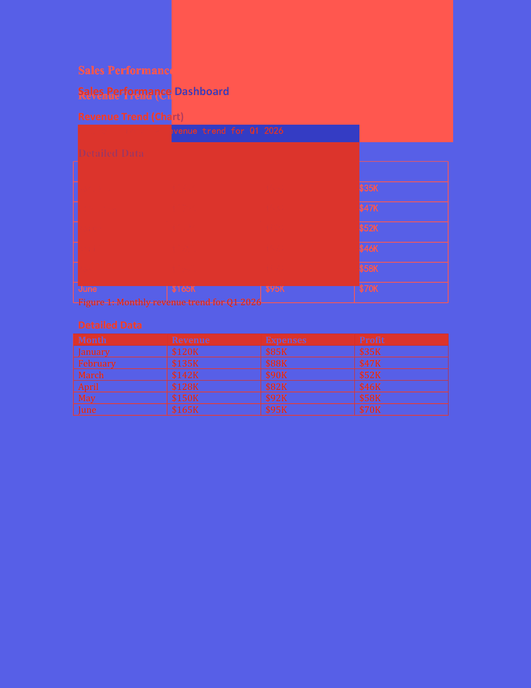</td>
  <td>changed: 337719 px (16.05%)<br>bbox: [175, 208, 1088, 997]<br>mean abs RGB: 24.6441<br>RMSE RGB: 65.2552<br>threshold: 12, gain: 5.0</td>
</tr>
<tr>
  <td><b>docx_classic42_meeting_minutes</b><br>Page 1</td>
  <td>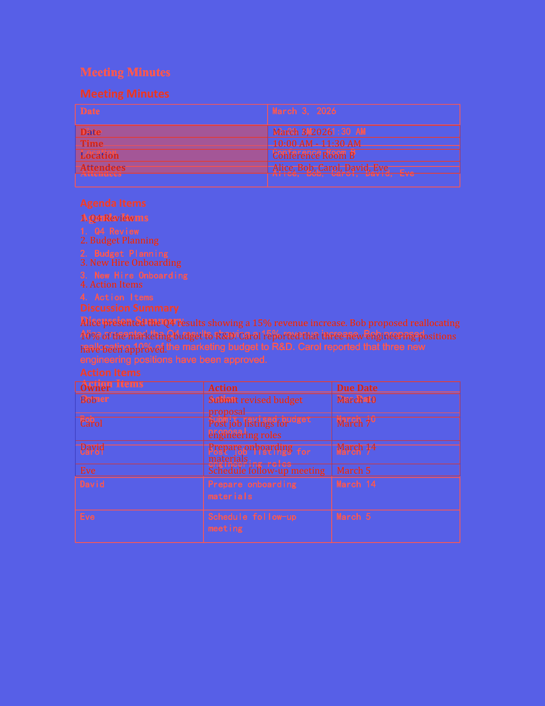</td>
  <td>changed: 160688 px (7.64%)<br>bbox: [175, 208, 1088, 1194]<br>mean abs RGB: 9.1311<br>RMSE RGB: 40.7527<br>threshold: 12, gain: 5.0</td>
</tr>
<tr>
  <td><b>docx_classic43_event_flyer_with_banner</b><br>Page 1</td>
  <td>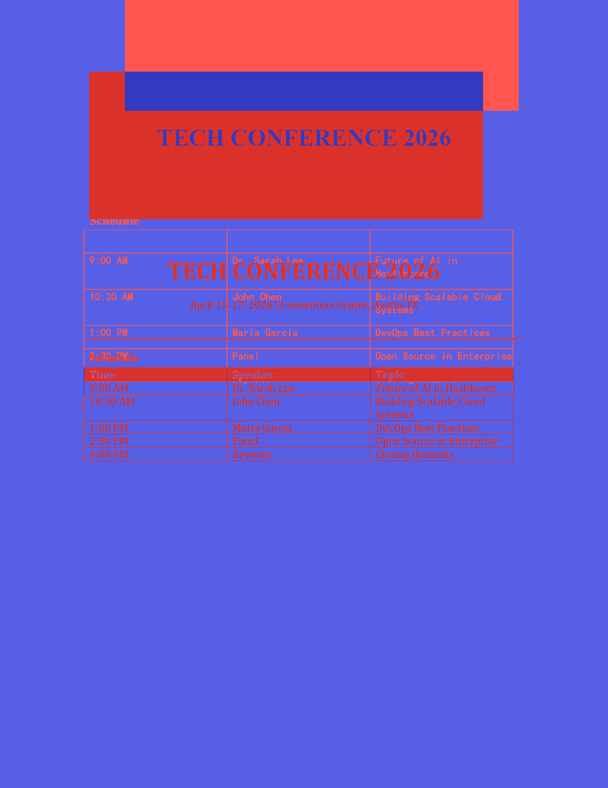</td>
  <td>changed: 347297 px (16.51%)<br>bbox: [175, 150, 1091, 965]<br>mean abs RGB: 25.9516<br>RMSE RGB: 67.0963<br>threshold: 12, gain: 5.0</td>
</tr>
<tr>
  <td><b>docx_classic43_invoice_document</b><br>Page 1</td>
  <td>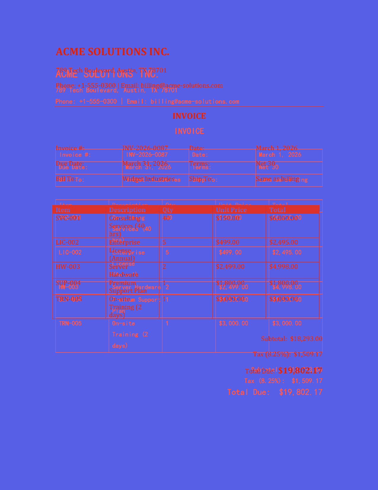</td>
  <td>changed: 139949 px (6.65%)<br>bbox: [175, 160, 1091, 1333]<br>mean abs RGB: 10.4657<br>RMSE RGB: 45.4003<br>threshold: 12, gain: 5.0</td>
</tr>
<tr>
  <td><b>docx_classic44_dashboard_with_kpi_image</b><br>Page 1</td>
  <td>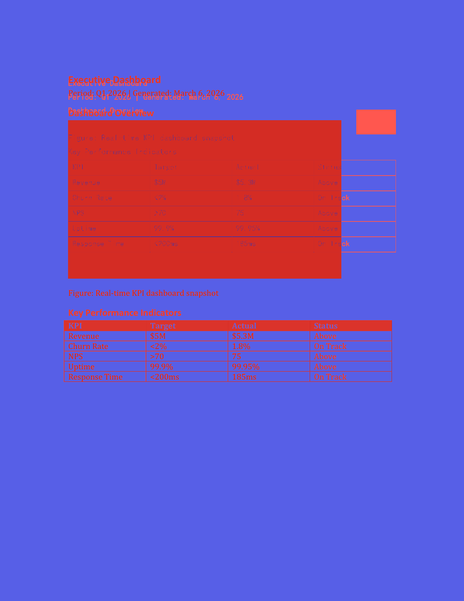</td>
  <td>changed: 399175 px (18.97%)<br>bbox: [175, 208, 1088, 1049]<br>mean abs RGB: 36.0525<br>RMSE RGB: 85.5166<br>threshold: 12, gain: 5.0</td>
</tr>
<tr>
  <td><b>docx_classic44_memo</b><br>Page 1</td>
  <td>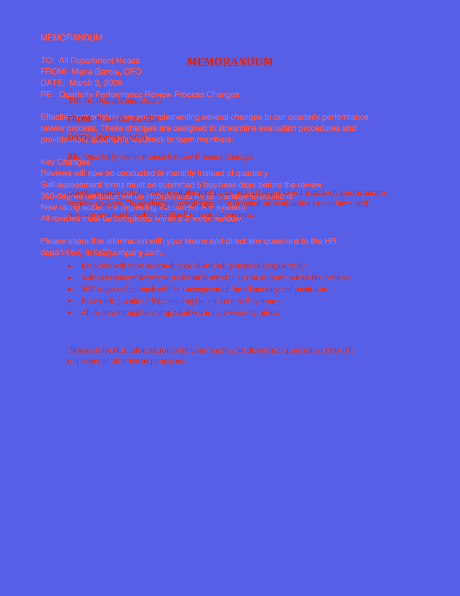</td>
  <td>changed: 111245 px (5.29%)<br>bbox: [113, 95, 1091, 1011]<br>mean abs RGB: 8.9541<br>RMSE RGB: 43.1154<br>threshold: 12, gain: 5.0</td>
</tr>
<tr>
  <td><b>docx_classic45_certificate_with_seal</b><br>Page 1</td>
  <td></td>
  <td>changed: 85577 px (4.07%)<br>bbox: [112, 127, 978, 949]<br>mean abs RGB: 6.0075<br>RMSE RGB: 33.1551<br>threshold: 12, gain: 5.0</td>
</tr>
<tr>
  <td><b>docx_classic45_project_plan</b><br>Page 1</td>
  <td></td>
  <td>changed: 166030 px (7.89%)<br>bbox: [175, 208, 1088, 1173]<br>mean abs RGB: 11.7272<br>RMSE RGB: 47.2888<br>threshold: 12, gain: 5.0</td>
</tr>
<tr>
  <td><b>docx_classic46_comparison_table</b><br>Page 1</td>
  <td></td>
  <td>changed: 89127 px (4.24%)<br>bbox: [175, 208, 1088, 632]<br>mean abs RGB: 6.4141<br>RMSE RGB: 34.65<br>threshold: 12, gain: 5.0</td>
</tr>
<tr>
  <td><b>docx_classic46_product_image_grid</b><br>Page 1</td>
  <td></td>
  <td>changed: 252873 px (12.02%)<br>bbox: [113, 95, 488, 1329]<br>mean abs RGB: 19.4468<br>RMSE RGB: 59.4447<br>threshold: 12, gain: 5.0</td>
</tr>
<tr>
  <td><b>docx_classic47_data_dictionary</b><br>Page 1</td>
  <td></td>
  <td>changed: 171029 px (8.13%)<br>bbox: [175, 208, 1088, 1027]<br>mean abs RGB: 11.9034<br>RMSE RGB: 46.9687<br>threshold: 12, gain: 5.0</td>
</tr>
<tr>
  <td><b>docx_classic47_news_article_with_hero_image</b><br>Page 1</td>
  <td></td>
  <td>changed: 394163 px (18.74%)<br>bbox: [112, 150, 1078, 1054]<br>mean abs RGB: 34.3872<br>RMSE RGB: 82.9159<br>threshold: 12, gain: 5.0</td>
</tr>
<tr>
  <td><b>docx_classic48_multi_level_headings</b><br>Page 1</td>
  <td></td>
  <td>changed: 179592 px (8.54%)<br>bbox: [113, 95, 814, 1520]<br>mean abs RGB: 13.6102<br>RMSE RGB: 52.3341<br>threshold: 12, gain: 5.0</td>
</tr>
<tr>
  <td><b>docx_classic48_multi_level_headings</b><br>Page 2</td>
  <td></td>
  <td>changed: 128875 px (6.13%)<br>bbox: [113, 95, 814, 1434]<br>mean abs RGB: 9.4149<br>RMSE RGB: 43.0762<br>threshold: 12, gain: 5.0</td>
</tr>
<tr>
  <td><b>docx_classic48_task_list_with_status_icons</b><br>Page 1</td>
  <td></td>
  <td>changed: 114243 px (5.43%)<br>bbox: [175, 208, 1088, 848]<br>mean abs RGB: 8.2942<br>RMSE RGB: 40.4471<br>threshold: 12, gain: 5.0</td>
</tr>
<tr>
  <td><b>docx_classic49_cjk_document</b><br>Page 1</td>
  <td></td>
  <td>changed: 79153 px (3.76%)<br>bbox: [112, 95, 1077, 931]<br>mean abs RGB: 5.5412<br>RMSE RGB: 32.54<br>threshold: 12, gain: 5.0</td>
</tr>
<tr>
  <td><b>docx_classic49_wide_panoramic_banner</b><br>Page 1</td>
  <td></td>
  <td>changed: 494570 px (23.51%)<br>bbox: [175, 150, 1088, 1206]<br>mean abs RGB: 34.0227<br>RMSE RGB: 77.6607<br>threshold: 12, gain: 5.0</td>
</tr>
<tr>
  <td><b>docx_classic50_long_table_with_formatting</b><br>Page 1</td>
  <td></td>
  <td>changed: 636837 px (30.27%)<br>bbox: [175, 209, 1077, 1476]<br>mean abs RGB: 17.4541<br>RMSE RGB: 48.3161<br>threshold: 12, gain: 5.0</td>
</tr>
<tr>
  <td><b>docx_classic50_long_table_with_formatting</b><br>Page 2</td>
  <td></td>
  <td>changed: 314240 px (14.94%)<br>bbox: [175, 149, 1088, 1650]<br>mean abs RGB: 13.2963<br>RMSE RGB: 48.2811<br>threshold: 12, gain: 5.0</td>
</tr>
<tr>
  <td><b>docx_classic50_portrait_tall_image</b><br>Page 1</td>
  <td></td>
  <td>changed: 117063 px (5.56%)<br>bbox: [113, 95, 1070, 1049]<br>mean abs RGB: 8.9812<br>RMSE RGB: 40.8024<br>threshold: 12, gain: 5.0</td>
</tr>
<tr>
  <td><b>docx_classic51_step_by_step_with_images</b><br>Page 1</td>
  <td></td>
  <td>changed: 211204 px (10.04%)<br>bbox: [113, 95, 778, 990]<br>mean abs RGB: 13.809<br>RMSE RGB: 47.1393<br>threshold: 12, gain: 5.0</td>
</tr>
<tr>
  <td><b>docx_classic51_underline_styles</b><br>Page 1</td>
  <td></td>
  <td>changed: 17433 px (0.83%)<br>bbox: [113, 95, 370, 495]<br>mean abs RGB: 1.3399<br>RMSE RGB: 16.3825<br>threshold: 12, gain: 5.0</td>
</tr>
<tr>
  <td><b>docx_classic52_before_after_comparison</b><br>Page 1</td>
  <td></td>
  <td>changed: 298092 px (14.17%)<br>bbox: [113, 95, 596, 1370]<br>mean abs RGB: 17.8627<br>RMSE RGB: 51.6697<br>threshold: 12, gain: 5.0</td>
</tr>
<tr>
  <td><b>docx_classic52_spacing_before_after</b><br>Page 1</td>
  <td></td>
  <td>changed: 68389 px (3.25%)<br>bbox: [113, 95, 1008, 528]<br>mean abs RGB: 5.3098<br>RMSE RGB: 32.899<br>threshold: 12, gain: 5.0</td>
</tr>
<tr>
  <td><b>docx_classic53_color_swatch_palette</b><br>Page 1</td>
  <td></td>
  <td>changed: 158411 px (7.53%)<br>bbox: [113, 95, 655, 1375]<br>mean abs RGB: 11.4105<br>RMSE RGB: 48.0122<br>threshold: 12, gain: 5.0</td>
</tr>
<tr>
  <td><b>docx_classic53_table_merged_complex</b><br>Page 1</td>
  <td></td>
  <td>changed: 89199 px (4.24%)<br>bbox: [175, 208, 1088, 506]<br>mean abs RGB: 5.0762<br>RMSE RGB: 29.8088<br>threshold: 12, gain: 5.0</td>
</tr>
<tr>
  <td><b>docx_classic54_multi_font_family</b><br>Page 1</td>
  <td></td>
  <td>changed: 45340 px (2.16%)<br>bbox: [113, 95, 967, 494]<br>mean abs RGB: 3.54<br>RMSE RGB: 26.9431<br>threshold: 12, gain: 5.0</td>
</tr>
<tr>
  <td><b>docx_classic54_travel_destination_cards</b><br>Page 1</td>
  <td></td>
  <td>changed: 200915 px (9.55%)<br>bbox: [175, 208, 1088, 1032]<br>mean abs RGB: 11.736<br>RMSE RGB: 44.6082<br>threshold: 12, gain: 5.0</td>
</tr>
<tr>
  <td><b>docx_classic55_background_shading_paragraph</b><br>Page 1</td>
  <td></td>
  <td>changed: 233419 px (11.10%)<br>bbox: [114, 95, 1091, 446]<br>mean abs RGB: 5.5459<br>RMSE RGB: 27.9778<br>threshold: 12, gain: 5.0</td>
</tr>
<tr>
  <td><b>docx_classic55_lab_results_with_image</b><br>Page 1</td>
  <td></td>
  <td>changed: 210115 px (9.99%)<br>bbox: [175, 208, 1088, 915]<br>mean abs RGB: 11.87<br>RMSE RGB: 44.1523<br>threshold: 12, gain: 5.0</td>
</tr>
<tr>
  <td><b>docx_classic56_images_and_tables_mixed</b><br>Page 1</td>
  <td></td>
  <td>changed: 307032 px (14.59%)<br>bbox: [175, 208, 1088, 1371]<br>mean abs RGB: 21.136<br>RMSE RGB: 61.51<br>threshold: 12, gain: 5.0</td>
</tr>
<tr>
  <td><b>docx_classic56_software_screenshot_features</b><br>Page 1</td>
  <td></td>
  <td>changed: 273637 px (13.01%)<br>bbox: [175, 208, 1088, 1112]<br>mean abs RGB: 24.6773<br>RMSE RGB: 71.8384<br>threshold: 12, gain: 5.0</td>
</tr>
<tr>
  <td><b>docx_classic57_right_to_left_text</b><br>Page 1</td>
  <td></td>
  <td>changed: 31330 px (1.49%)<br>bbox: [113, 95, 1088, 752]<br>mean abs RGB: 2.4191<br>RMSE RGB: 22.1527<br>threshold: 12, gain: 5.0</td>
</tr>
<tr>
  <td><b>docx_classic57_sports_results_with_logos</b><br>Page 1</td>
  <td></td>
  <td>changed: 174005 px (8.27%)<br>bbox: [175, 208, 1088, 1399]<br>mean abs RGB: 13.2879<br>RMSE RGB: 51.3678<br>threshold: 12, gain: 5.0</td>
</tr>
<tr>
  <td><b>docx_classic58_dense_paragraph_document</b><br>Page 1</td>
  <td></td>
  <td>changed: 395261 px (18.79%)<br>bbox: [112, 95, 1081, 1524]<br>mean abs RGB: 30.9436<br>RMSE RGB: 79.5803<br>threshold: 12, gain: 5.0</td>
</tr>
<tr>
  <td><b>docx_classic58_dense_paragraph_document</b><br>Page 2</td>
  <td></td>
  <td>changed: 406443 px (19.32%)<br>bbox: [112, 95, 1081, 1524]<br>mean abs RGB: 31.4742<br>RMSE RGB: 80.0347<br>threshold: 12, gain: 5.0</td>
</tr>
<tr>
  <td><b>docx_classic58_dense_paragraph_document</b><br>Page 3</td>
  <td></td>
  <td>changed: 415557 px (19.75%)<br>bbox: [112, 95, 1081, 1524]<br>mean abs RGB: 32.1008<br>RMSE RGB: 80.7566<br>threshold: 12, gain: 5.0</td>
</tr>
<tr>
  <td><b>docx_classic58_dense_paragraph_document</b><br>Page 4</td>
  <td></td>
  <td>changed: 410059 px (19.49%)<br>bbox: [112, 95, 1081, 1524]<br>mean abs RGB: 31.7497<br>RMSE RGB: 80.3545<br>threshold: 12, gain: 5.0</td>
</tr>
<tr>
  <td><b>docx_classic58_dense_paragraph_document</b><br>Page 5</td>
  <td></td>
  <td>changed: 424558 px (20.18%)<br>bbox: [112, 95, 1081, 1524]<br>mean abs RGB: 33.3376<br>RMSE RGB: 82.7016<br>threshold: 12, gain: 5.0</td>
</tr>
<tr>
  <td><b>docx_classic58_dense_paragraph_document</b><br>Page 6</td>
  <td></td>
  <td>changed: 345819 px (16.44%)<br>bbox: [112, 95, 1081, 1490]<br>mean abs RGB: 26.9574<br>RMSE RGB: 74.1987<br>threshold: 12, gain: 5.0</td>
</tr>
<tr>
  <td><b>docx_classic58_report_with_footer_image</b><br>Page 1</td>
  <td></td>
  <td>changed: 147389 px (7.01%)<br>bbox: [175, 208, 1088, 693]<br>mean abs RGB: 10.8958<br>RMSE RGB: 44.2951<br>threshold: 12, gain: 5.0</td>
</tr>
<tr>
  <td><b>docx_classic59_numbered_and_bullet_mixed</b><br>Page 1</td>
  <td></td>
  <td>changed: 72686 px (3.46%)<br>bbox: [113, 95, 711, 945]<br>mean abs RGB: 5.501<br>RMSE RGB: 33.2039<br>threshold: 12, gain: 5.0</td>
</tr>
<tr>
  <td><b>docx_classic59_nutrition_label_with_image</b><br>Page 1</td>
  <td></td>
  <td>changed: 269514 px (12.81%)<br>bbox: [175, 208, 1088, 1189]<br>mean abs RGB: 14.9302<br>RMSE RGB: 51.9809<br>threshold: 12, gain: 5.0</td>
</tr>
<tr>
  <td><b>docx_classic60_comprehensive_styled_report</b><br>Page 1</td>
  <td></td>
  <td>changed: 83633 px (3.98%)<br>bbox: [184, 165, 1091, 1435]<br>mean abs RGB: 5.6153<br>RMSE RGB: 31.8544<br>threshold: 12, gain: 5.0</td>
</tr>
<tr>
  <td><b>docx_classic60_comprehensive_styled_report</b><br>Page 2</td>
  <td></td>
  <td>changed: 302858 px (14.40%)<br>bbox: [175, 158, 1077, 1480]<br>mean abs RGB: 18.7433<br>RMSE RGB: 56.519<br>threshold: 12, gain: 5.0</td>
</tr>
<tr>
  <td><b>docx_classic60_project_status_with_milestones</b><br>Page 1</td>
  <td></td>
  <td>changed: 490038 px (23.29%)<br>bbox: [175, 208, 1088, 1459]<br>mean abs RGB: 35.9617<br>RMSE RGB: 78.4856<br>threshold: 12, gain: 5.0</td>
</tr>
<tr>
  <td><b>docx_classic61_header_and_footer</b><br>Page 1</td>
  <td></td>
  <td>changed: 97663 px (4.64%)<br>bbox: [113, 79, 1013, 1575]<br>mean abs RGB: 7.5855<br>RMSE RGB: 39.3168<br>threshold: 12, gain: 5.0</td>
</tr>
<tr>
  <td><b>docx_classic62_footnote_references</b><br>Page 1</td>
  <td></td>
  <td>changed: 54549 px (2.59%)<br>bbox: [113, 95, 1091, 568]<br>mean abs RGB: 4.1927<br>RMSE RGB: 29.1576<br>threshold: 12, gain: 5.0</td>
</tr>
<tr>
  <td><b>docx_classic63_toc_style_headings</b><br>Page 1</td>
  <td></td>
  <td>changed: 76046 px (3.61%)<br>bbox: [184, 165, 1091, 1057]<br>mean abs RGB: 5.7888<br>RMSE RGB: 34.2272<br>threshold: 12, gain: 5.0</td>
</tr>
<tr>
  <td><b>docx_classic64_multi_column_layout</b><br>Page 1</td>
  <td></td>
  <td>changed: 118836 px (5.65%)<br>bbox: [186, 208, 1088, 854]<br>mean abs RGB: 9.0382<br>RMSE RGB: 42.6326<br>threshold: 12, gain: 5.0</td>
</tr>
<tr>
  <td><b>docx_classic65_code_block_styling</b><br>Page 1</td>
  <td></td>
  <td>changed: 40061 px (1.90%)<br>bbox: [112, 95, 611, 827]<br>mean abs RGB: 4.4915<br>RMSE RGB: 23.311<br>threshold: 12, gain: 5.0</td>
</tr>
<tr>
  <td><b>docx_classic66_colored_title_page</b><br>Page 1</td>
  <td></td>
  <td>changed: 316102 px (15.03%)<br>bbox: [113, 158, 1029, 1087]<br>mean abs RGB: 24.1065<br>RMSE RGB: 64.6675<br>threshold: 12, gain: 5.0</td>
</tr>
<tr>
  <td><b>docx_classic67_alternating_row_table</b><br>Page 1</td>
  <td></td>
  <td>changed: 306114 px (14.55%)<br>bbox: [175, 208, 1088, 988]<br>mean abs RGB: 13.3318<br>RMSE RGB: 47.4804<br>threshold: 12, gain: 5.0</td>
</tr>
<tr>
  <td><b>docx_classic68_sidebar_layout</b><br>Page 1</td>
  <td></td>
  <td>changed: 122989 px (5.85%)<br>bbox: [175, 208, 1163, 1012]<br>mean abs RGB: 8.8807<br>RMSE RGB: 39.9664<br>threshold: 12, gain: 5.0</td>
</tr>
<tr>
  <td><b>docx_classic69_blockquote_styling</b><br>Page 1</td>
  <td></td>
  <td>changed: 49650 px (2.36%)<br>bbox: [113, 95, 1003, 951]<br>mean abs RGB: 3.6522<br>RMSE RGB: 26.754<br>threshold: 12, gain: 5.0</td>
</tr>
<tr>
  <td><b>docx_classic70_academic_paper</b><br>Page 1</td>
  <td></td>
  <td>changed: 196177 px (9.33%)<br>bbox: [175, 158, 1088, 1430]<br>mean abs RGB: 14.6181<br>RMSE RGB: 53.4891<br>threshold: 12, gain: 5.0</td>
</tr>
<tr>
  <td><b>docx_classic71_legal_document</b><br>Page 1</td>
  <td></td>
  <td>changed: 176139 px (8.37%)<br>bbox: [113, 95, 1242, 1359]<br>mean abs RGB: 14.2963<br>RMSE RGB: 54.7134<br>threshold: 12, gain: 5.0</td>
</tr>
<tr>
  <td><b>docx_classic72_technical_specification</b><br>Page 1</td>
  <td></td>
  <td>changed: 198095 px (9.42%)<br>bbox: [175, 208, 1088, 1206]<br>mean abs RGB: 14.3502<br>RMSE RGB: 52.105<br>threshold: 12, gain: 5.0</td>
</tr>
<tr>
  <td><b>docx_classic73_calendar_layout</b><br>Page 1</td>
  <td></td>
  <td>changed: 93358 px (4.44%)<br>bbox: [175, 163, 1088, 543]<br>mean abs RGB: 5.0282<br>RMSE RGB: 30.1334<br>threshold: 12, gain: 5.0</td>
</tr>
<tr>
  <td><b>docx_classic74_org_chart</b><br>Page 1</td>
  <td></td>
  <td>changed: 184904 px (8.79%)<br>bbox: [175, 208, 1088, 594]<br>mean abs RGB: 7.9686<br>RMSE RGB: 34.5203<br>threshold: 12, gain: 5.0</td>
</tr>
<tr>
  <td><b>docx_classic75_newsletter_layout</b><br>Page 1</td>
  <td></td>
  <td>changed: 254731 px (12.11%)<br>bbox: [184, 166, 1091, 1064]<br>mean abs RGB: 18.3359<br>RMSE RGB: 57.7127<br>threshold: 12, gain: 5.0</td>
</tr>
<tr>
  <td><b>docx_classic76_recipe_card</b><br>Page 1</td>
  <td></td>
  <td>changed: 101292 px (4.81%)<br>bbox: [175, 160, 1088, 1160]<br>mean abs RGB: 7.8385<br>RMSE RGB: 39.7509<br>threshold: 12, gain: 5.0</td>
</tr>
<tr>
  <td><b>docx_classic77_timeline_layout</b><br>Page 1</td>
  <td></td>
  <td>changed: 141645 px (6.73%)<br>bbox: [175, 208, 863, 918]<br>mean abs RGB: 10.2455<br>RMSE RGB: 43.9095<br>threshold: 12, gain: 5.0</td>
</tr>
<tr>
  <td><b>docx_classic78_faq_document</b><br>Page 1</td>
  <td></td>
  <td>changed: 213344 px (10.14%)<br>bbox: [112, 95, 1083, 1523]<br>mean abs RGB: 16.5428<br>RMSE RGB: 58.056<br>threshold: 12, gain: 5.0</td>
</tr>
<tr>
  <td><b>docx_classic78_faq_document</b><br>Page 2</td>
  <td></td>
  <td>changed: 81237 px (3.86%)<br>bbox: [113, 127, 1082, 1190]<br>mean abs RGB: 5.9516<br>RMSE RGB: 34.1052<br>threshold: 12, gain: 5.0</td>
</tr>
<tr>
  <td><b>docx_classic79_glossary</b><br>Page 1</td>
  <td></td>
  <td>changed: 119649 px (5.69%)<br>bbox: [113, 95, 1063, 1409]<br>mean abs RGB: 9.4005<br>RMSE RGB: 43.8562<br>threshold: 12, gain: 5.0</td>
</tr>
<tr>
  <td><b>docx_classic80_matrix_grid</b><br>Page 1</td>
  <td></td>
  <td>changed: 431321 px (20.50%)<br>bbox: [175, 208, 1088, 1016]<br>mean abs RGB: 10.9644<br>RMSE RGB: 39.4112<br>threshold: 12, gain: 5.0</td>
</tr>
<tr>
  <td><b>docx_classic81_budget_table</b><br>Page 1</td>
  <td></td>
  <td>changed: 240333 px (11.42%)<br>bbox: [175, 208, 1088, 1011]<br>mean abs RGB: 12.858<br>RMSE RGB: 47.6527<br>threshold: 12, gain: 5.0</td>
</tr>
<tr>
  <td><b>docx_classic82_survey_questionnaire</b><br>Page 1</td>
  <td></td>
  <td>changed: 148216 px (7.05%)<br>bbox: [175, 208, 1088, 1475]<br>mean abs RGB: 9.7156<br>RMSE RGB: 41.1807<br>threshold: 12, gain: 5.0</td>
</tr>
<tr>
  <td><b>docx_classic82_survey_questionnaire</b><br>Page 2</td>
  <td></td>
  <td>changed: 83632 px (3.98%)<br>bbox: [175, 149, 1088, 949]<br>mean abs RGB: 5.7114<br>RMSE RGB: 32.4517<br>threshold: 12, gain: 5.0</td>
</tr>
<tr>
  <td><b>docx_classic83_medical_form</b><br>Page 1</td>
  <td></td>
  <td>changed: 180196 px (8.57%)<br>bbox: [175, 208, 1088, 1243]<br>mean abs RGB: 9.8608<br>RMSE RGB: 42.2195<br>threshold: 12, gain: 5.0</td>
</tr>
<tr>
  <td><b>docx_classic84_shipping_label</b><br>Page 1</td>
  <td></td>
  <td>changed: 174286 px (8.28%)<br>bbox: [175, 149, 1091, 1429]<br>mean abs RGB: 9.484<br>RMSE RGB: 42.8059<br>threshold: 12, gain: 5.0</td>
</tr>
<tr>
  <td><b>docx_classic85_report_card</b><br>Page 1</td>
  <td></td>
  <td>changed: 162984 px (7.75%)<br>bbox: [175, 160, 1088, 947]<br>mean abs RGB: 9.1762<br>RMSE RGB: 41.1971<br>threshold: 12, gain: 5.0</td>
</tr>
<tr>
  <td><b>docx_classic86_checklist_document</b><br>Page 1</td>
  <td></td>
  <td>changed: 81509 px (3.87%)<br>bbox: [113, 95, 701, 1472]<br>mean abs RGB: 6.1325<br>RMSE RGB: 35.0233<br>threshold: 12, gain: 5.0</td>
</tr>
<tr>
  <td><b>docx_classic87_bibliography</b><br>Page 1</td>
  <td></td>
  <td>changed: 115523 px (5.49%)<br>bbox: [112, 95, 1081, 846]<br>mean abs RGB: 9.2014<br>RMSE RGB: 43.6268<br>threshold: 12, gain: 5.0</td>
</tr>
<tr>
  <td><b>docx_classic88_presentation_handout</b><br>Page 1</td>
  <td></td>
  <td>changed: 536604 px (25.51%)<br>bbox: [175, 208, 1088, 1451]<br>mean abs RGB: 40.4929<br>RMSE RGB: 87.7096<br>threshold: 12, gain: 5.0</td>
</tr>
<tr>
  <td><b>docx_classic88_presentation_handout</b><br>Page 2</td>
  <td></td>
  <td>changed: 284819 px (13.54%)<br>bbox: [175, 149, 1088, 1193]<br>mean abs RGB: 19.8523<br>RMSE RGB: 59.5337<br>threshold: 12, gain: 5.0</td>
</tr>
<tr>
  <td><b>docx_classic89_multi_image_gallery</b><br>Page 1</td>
  <td></td>
  <td>changed: 340140 px (16.17%)<br>bbox: [175, 208, 1088, 974]<br>mean abs RGB: 19.2047<br>RMSE RGB: 57.637<br>threshold: 12, gain: 5.0</td>
</tr>
<tr>
  <td><b>docx_classic90_comprehensive_annual_report</b><br>Page 1</td>
  <td></td>
  <td>changed: 280201 px (13.32%)<br>bbox: [186, 217, 1088, 1342]<br>mean abs RGB: 20.8925<br>RMSE RGB: 60.4564<br>threshold: 12, gain: 5.0</td>
</tr>
<tr>
  <td><b>docx_classic90_comprehensive_annual_report</b><br>Page 2</td>
  <td></td>
  <td>changed: 67834 px (3.22%)<br>bbox: [186, 158, 1088, 1108]<br>mean abs RGB: 4.7041<br>RMSE RGB: 29.5242<br>threshold: 12, gain: 5.0</td>
</tr>
<tr>
  <td><b>docx_classic91_landscape_page</b><br>Page 1</td>
  <td></td>
  <td>changed: 93360 px (4.44%)<br>bbox: [175, 162, 1463, 493]<br>mean abs RGB: 6.6391<br>RMSE RGB: 34.9668<br>threshold: 12, gain: 5.0</td>
</tr>
<tr>
  <td><b>docx_classic92_first_line_indent</b><br>Page 1</td>
  <td></td>
  <td>changed: 98182 px (4.67%)<br>bbox: [112, 95, 1083, 640]<br>mean abs RGB: 7.7465<br>RMSE RGB: 39.8435<br>threshold: 12, gain: 5.0</td>
</tr>
<tr>
  <td><b>docx_classic93_hanging_indent</b><br>Page 1</td>
  <td></td>
  <td>changed: 118596 px (5.64%)<br>bbox: [113, 95, 1083, 826]<br>mean abs RGB: 9.3242<br>RMSE RGB: 43.7057<br>threshold: 12, gain: 5.0</td>
</tr>
<tr>
  <td><b>docx_classic94_custom_bullet_characters</b><br>Page 1</td>
  <td></td>
  <td>changed: 59617 px (2.83%)<br>bbox: [113, 95, 540, 1148]<br>mean abs RGB: 4.2563<br>RMSE RGB: 28.7334<br>threshold: 12, gain: 5.0</td>
</tr>
<tr>
  <td><b>docx_classic95_contract_template</b><br>Page 1</td>
  <td></td>
  <td>changed: 99466 px (4.73%)<br>bbox: [186, 160, 1088, 1136]<br>mean abs RGB: 7.9804<br>RMSE RGB: 40.7186<br>threshold: 12, gain: 5.0</td>
</tr>
<tr>
  <td><b>docx_classic96_dense_data_table</b><br>Page 1</td>
  <td></td>
  <td>changed: 359034 px (17.07%)<br>bbox: [175, 208, 1088, 1343]<br>mean abs RGB: 15.8109<br>RMSE RGB: 52.9523<br>threshold: 12, gain: 5.0</td>
</tr>
<tr>
  <td><b>docx_classic97_product_catalog</b><br>Page 1</td>
  <td></td>
  <td>changed: 177069 px (8.42%)<br>bbox: [175, 163, 1088, 937]<br>mean abs RGB: 13.0395<br>RMSE RGB: 49.0498<br>threshold: 12, gain: 5.0</td>
</tr>
<tr>
  <td><b>docx_classic98_training_manual</b><br>Page 1</td>
  <td></td>
  <td>changed: 137232 px (6.52%)<br>bbox: [112, 95, 1020, 1427]<br>mean abs RGB: 10.4605<br>RMSE RGB: 45.9491<br>threshold: 12, gain: 5.0</td>
</tr>
<tr>
  <td><b>docx_classic99_policy_document</b><br>Page 1</td>
  <td></td>
  <td>changed: 187609 px (8.92%)<br>bbox: [175, 160, 1088, 1421]<br>mean abs RGB: 14.5446<br>RMSE RGB: 54.0781<br>threshold: 12, gain: 5.0</td>
</tr>
<tr>
  <td><b>docx_classic100_multi_page_table</b><br>Page 1</td>
  <td></td>
  <td>changed: 643890 px (30.61%)<br>bbox: [175, 208, 1077, 1490]<br>mean abs RGB: 20.6257<br>RMSE RGB: 59.1547<br>threshold: 12, gain: 5.0</td>
</tr>
<tr>
  <td><b>docx_classic100_multi_page_table</b><br>Page 2</td>
  <td></td>
  <td>changed: 331108 px (15.74%)<br>bbox: [175, 149, 1088, 1650]<br>mean abs RGB: 19.5144<br>RMSE RGB: 61.7916<br>threshold: 12, gain: 5.0</td>
</tr>
<tr>
  <td><b>docx_classic101_warranty_document</b><br>Page 1</td>
  <td></td>
  <td>changed: 151266 px (7.19%)<br>bbox: [113, 95, 1274, 1143]<br>mean abs RGB: 12.0794<br>RMSE RGB: 50.0268<br>threshold: 12, gain: 5.0</td>
</tr>
<tr>
  <td><b>docx_classic102_curriculum_syllabus</b><br>Page 1</td>
  <td></td>
  <td>changed: 185079 px (8.80%)<br>bbox: [175, 208, 1088, 1237]<br>mean abs RGB: 13.1542<br>RMSE RGB: 49.5183<br>threshold: 12, gain: 5.0</td>
</tr>
<tr>
  <td><b>docx_classic103_event_program</b><br>Page 1</td>
  <td></td>
  <td>changed: 192727 px (9.16%)<br>bbox: [186, 165, 1088, 1447]<br>mean abs RGB: 14.0618<br>RMSE RGB: 50.3758<br>threshold: 12, gain: 5.0</td>
</tr>
<tr>
  <td><b>docx_classic103_event_program</b><br>Page 2</td>
  <td></td>
  <td>changed: 107563 px (5.11%)<br>bbox: [175, 158, 1077, 1225]<br>mean abs RGB: 6.5029<br>RMSE RGB: 34.6606<br>threshold: 12, gain: 5.0</td>
</tr>
<tr>
  <td><b>docx_classic104_sop_document</b><br>Page 1</td>
  <td></td>
  <td>changed: 134837 px (6.41%)<br>bbox: [175, 149, 1088, 1466]<br>mean abs RGB: 10.3201<br>RMSE RGB: 45.7224<br>threshold: 12, gain: 5.0</td>
</tr>
<tr>
  <td><b>docx_classic104_sop_document</b><br>Page 2</td>
  <td></td>
  <td>changed: 18909 px (0.90%)<br>bbox: [187, 158, 703, 313]<br>mean abs RGB: 1.3961<br>RMSE RGB: 16.5782<br>threshold: 12, gain: 5.0</td>
</tr>
<tr>
  <td><b>docx_classic105_certificate</b><br>Page 1</td>
  <td></td>
  <td>changed: 77711 px (3.69%)<br>bbox: [186, 270, 1088, 1302]<br>mean abs RGB: 6.0476<br>RMSE RGB: 34.9189<br>threshold: 12, gain: 5.0</td>
</tr>
<tr>
  <td><b>docx_classic106_multi_section_orientation</b><br>Page 1</td>
  <td></td>
  <td>changed: 60107 px (2.86%)<br>bbox: [188, 207, 1077, 547]<br>mean abs RGB: 4.5482<br>RMSE RGB: 30.0693<br>threshold: 12, gain: 5.0</td>
</tr>
<tr>
  <td><b>docx_classic106_multi_section_orientation</b><br>Page 2</td>
  <td></td>
  <td>changed: 73630 px (4.53%)<br>bbox: [135, 152, 1275, 415]<br>mean abs RGB: 6.4468<br>RMSE RGB: 33.3316<br>threshold: 12, gain: 5.0</td>
</tr>
<tr>
  <td><b>docx_classic106_multi_section_orientation</b><br>Page 3</td>
  <td></td>
  <td>changed: 19432 px (0.92%)<br>bbox: [188, 186, 1080, 288]<br>mean abs RGB: 1.4156<br>RMSE RGB: 16.5454<br>threshold: 12, gain: 5.0</td>
</tr>
<tr>
  <td><b>docx_classic107_order_form</b><br>Page 1</td>
  <td></td>
  <td>changed: 154243 px (7.33%)<br>bbox: [175, 161, 1088, 1198]<br>mean abs RGB: 10.3804<br>RMSE RGB: 44.2687<br>threshold: 12, gain: 5.0</td>
</tr>
<tr>
  <td><b>docx_classic108_comparison_matrix</b><br>Page 1</td>
  <td></td>
  <td>changed: 268223 px (12.75%)<br>bbox: [113, 95, 1077, 1519]<br>mean abs RGB: 8.6371<br>RMSE RGB: 38.4108<br>threshold: 12, gain: 5.0</td>
</tr>
<tr>
  <td><b>docx_classic109_release_notes</b><br>Page 1</td>
  <td></td>
  <td>changed: 102892 px (4.89%)<br>bbox: [112, 95, 1091, 1441]<br>mean abs RGB: 7.7113<br>RMSE RGB: 39.2822<br>threshold: 12, gain: 5.0</td>
</tr>
<tr>
  <td><b>docx_classic110_troubleshooting_guide</b><br>Page 1</td>
  <td></td>
  <td>changed: 88966 px (4.23%)<br>bbox: [113, 95, 1031, 848]<br>mean abs RGB: 6.4844<br>RMSE RGB: 35.69<br>threshold: 12, gain: 5.0</td>
</tr>
<tr>
  <td><b>docx_classic111_meeting_agenda</b><br>Page 1</td>
  <td></td>
  <td>changed: 134792 px (6.41%)<br>bbox: [112, 95, 1091, 1430]<br>mean abs RGB: 10.0824<br>RMSE RGB: 44.2101<br>threshold: 12, gain: 5.0</td>
</tr>
<tr>
  <td><b>docx_classic112_project_status_report</b><br>Page 1</td>
  <td></td>
  <td>changed: 147037 px (6.99%)<br>bbox: [113, 95, 1077, 1399]<br>mean abs RGB: 11.0082<br>RMSE RGB: 45.9233<br>threshold: 12, gain: 5.0</td>
</tr>
<tr>
  <td><b>docx_classic113_address_labels</b><br>Page 1</td>
  <td></td>
  <td>changed: 89311 px (4.25%)<br>bbox: [175, 208, 1088, 983]<br>mean abs RGB: 6.3562<br>RMSE RGB: 34.9418<br>threshold: 12, gain: 5.0</td>
</tr>
<tr>
  <td><b>docx_classic114_test_report</b><br>Page 1</td>
  <td></td>
  <td>changed: 160588 px (7.63%)<br>bbox: [175, 208, 1088, 1188]<br>mean abs RGB: 11.5474<br>RMSE RGB: 46.871<br>threshold: 12, gain: 5.0</td>
</tr>
<tr>
  <td><b>docx_classic115_price_list</b><br>Page 1</td>
  <td></td>
  <td>changed: 293394 px (13.95%)<br>bbox: [175, 161, 1088, 1288]<br>mean abs RGB: 14.573<br>RMSE RGB: 50.9397<br>threshold: 12, gain: 5.0</td>
</tr>
<tr>
  <td><b>docx_classic116_risk_assessment</b><br>Page 1</td>
  <td></td>
  <td>changed: 257177 px (12.22%)<br>bbox: [175, 208, 1088, 1177]<br>mean abs RGB: 19.4868<br>RMSE RGB: 61.329<br>threshold: 12, gain: 5.0</td>
</tr>
<tr>
  <td><b>docx_classic117_employee_handbook_excerpt</b><br>Page 1</td>
  <td></td>
  <td>changed: 179224 px (8.52%)<br>bbox: [175, 208, 1088, 1458]<br>mean abs RGB: 12.6934<br>RMSE RGB: 49.2855<br>threshold: 12, gain: 5.0</td>
</tr>
<tr>
  <td><b>docx_classic118_data_report_with_summary</b><br>Page 1</td>
  <td></td>
  <td>changed: 213941 px (10.17%)<br>bbox: [175, 208, 1088, 1234]<br>mean abs RGB: 15.9846<br>RMSE RGB: 55.4777<br>threshold: 12, gain: 5.0</td>
</tr>
<tr>
  <td><b>docx_classic119_multi_language_document</b><br>Page 1</td>
  <td></td>
  <td>changed: 76634 px (3.64%)<br>bbox: [112, 95, 1054, 1116]<br>mean abs RGB: 5.8068<br>RMSE RGB: 34.0876<br>threshold: 12, gain: 5.0</td>
</tr>
<tr>
  <td><b>docx_classic120_comprehensive_business_proposal</b><br>Page 1</td>
  <td></td>
  <td>changed: 231532 px (11.01%)<br>bbox: [187, 261, 1088, 1364]<br>mean abs RGB: 16.9824<br>RMSE RGB: 54.2218<br>threshold: 12, gain: 5.0</td>
</tr>
<tr>
  <td><b>docx_classic120_comprehensive_business_proposal</b><br>Page 2</td>
  <td></td>
  <td>changed: 87546 px (4.16%)<br>bbox: [186, 158, 1088, 1269]<br>mean abs RGB: 5.8407<br>RMSE RGB: 32.7896<br>threshold: 12, gain: 5.0</td>
</tr>
<tr>
  <td><b>docx_classic121_thin_border_table</b><br>Page 1</td>
  <td></td>
  <td>changed: 47342 px (2.25%)<br>bbox: [175, 208, 1088, 506]<br>mean abs RGB: 3.4038<br>RMSE RGB: 25.6246<br>threshold: 12, gain: 5.0</td>
</tr>
<tr>
  <td><b>docx_classic122_thick_outer_border_table</b><br>Page 1</td>
  <td></td>
  <td>changed: 53006 px (2.52%)<br>bbox: [174, 208, 1088, 506]<br>mean abs RGB: 4.1477<br>RMSE RGB: 29.0749<br>threshold: 12, gain: 5.0</td>
</tr>
<tr>
  <td><b>docx_classic123_dashed_border_table</b><br>Page 1</td>
  <td></td>
  <td>changed: 33325 px (1.58%)<br>bbox: [186, 208, 1088, 545]<br>mean abs RGB: 2.4306<br>RMSE RGB: 21.8283<br>threshold: 12, gain: 5.0</td>
</tr>
<tr>
  <td><b>docx_classic124_colored_border_table</b><br>Page 1</td>
  <td></td>
  <td>changed: 60624 px (2.88%)<br>bbox: [175, 208, 1088, 548]<br>mean abs RGB: 4.3691<br>RMSE RGB: 29.5294<br>threshold: 12, gain: 5.0</td>
</tr>
<tr>
  <td><b>docx_classic125_solid_cell_fills</b><br>Page 1</td>
  <td></td>
  <td>changed: 142535 px (6.78%)<br>bbox: [175, 208, 1088, 617]<br>mean abs RGB: 5.5954<br>RMSE RGB: 29.9437<br>threshold: 12, gain: 5.0</td>
</tr>
<tr>
  <td><b>docx_classic126_dark_header_table</b><br>Page 1</td>
  <td></td>
  <td>changed: 73664 px (3.50%)<br>bbox: [175, 208, 1088, 506]<br>mean abs RGB: 5.4666<br>RMSE RGB: 32.2825<br>threshold: 12, gain: 5.0</td>
</tr>
<tr>
  <td><b>docx_classic127_font_styles_showcase</b><br>Page 1</td>
  <td></td>
  <td>changed: 65256 px (3.10%)<br>bbox: [175, 208, 1088, 576]<br>mean abs RGB: 4.7186<br>RMSE RGB: 30.1079<br>threshold: 12, gain: 5.0</td>
</tr>
<tr>
  <td><b>docx_classic128_font_sizes_showcase</b><br>Page 1</td>
  <td></td>
  <td>changed: 87787 px (4.17%)<br>bbox: [113, 96, 1080, 993]<br>mean abs RGB: 6.9363<br>RMSE RGB: 37.8524<br>threshold: 12, gain: 5.0</td>
</tr>
<tr>
  <td><b>docx_classic129_alignment_combinations</b><br>Page 1</td>
  <td></td>
  <td>changed: 44625 px (2.12%)<br>bbox: [175, 208, 1088, 649]<br>mean abs RGB: 3.3576<br>RMSE RGB: 25.9486<br>threshold: 12, gain: 5.0</td>
</tr>
<tr>
  <td><b>docx_classic130_wrap_and_indent</b><br>Page 1</td>
  <td></td>
  <td>changed: 74083 px (3.52%)<br>bbox: [112, 95, 1079, 743]<br>mean abs RGB: 5.7268<br>RMSE RGB: 34.0352<br>threshold: 12, gain: 5.0</td>
</tr>
<tr>
  <td><b>docx_classic131_number_format_table</b><br>Page 1</td>
  <td></td>
  <td>changed: 80808 px (3.84%)<br>bbox: [175, 208, 1088, 716]<br>mean abs RGB: 5.9641<br>RMSE RGB: 34.1875<br>threshold: 12, gain: 5.0</td>
</tr>
<tr>
  <td><b>docx_classic132_striped_table</b><br>Page 1</td>
  <td></td>
  <td>changed: 197435 px (9.38%)<br>bbox: [175, 208, 1088, 716]<br>mean abs RGB: 7.6986<br>RMSE RGB: 36.5493<br>threshold: 12, gain: 5.0</td>
</tr>
<tr>
  <td><b>docx_classic133_gradient_rows_table</b><br>Page 1</td>
  <td></td>
  <td>changed: 274210 px (13.03%)<br>bbox: [175, 208, 1088, 716]<br>mean abs RGB: 25.3349<br>RMSE RGB: 76.3292<br>threshold: 12, gain: 5.0</td>
</tr>
<tr>
  <td><b>docx_classic134_heatmap_table</b><br>Page 1</td>
  <td></td>
  <td>changed: 178004 px (8.46%)<br>bbox: [175, 208, 1088, 590]<br>mean abs RGB: 12.7411<br>RMSE RGB: 49.2498<br>threshold: 12, gain: 5.0</td>
</tr>
<tr>
  <td><b>docx_classic135_bottom_border_paragraphs</b><br>Page 1</td>
  <td></td>
  <td>changed: 41796 px (1.99%)<br>bbox: [113, 95, 1091, 568]<br>mean abs RGB: 3.4754<br>RMSE RGB: 26.962<br>threshold: 12, gain: 5.0</td>
</tr>
<tr>
  <td><b>docx_classic136_financial_statement</b><br>Page 1</td>
  <td></td>
  <td>changed: 120442 px (5.73%)<br>bbox: [175, 208, 1088, 716]<br>mean abs RGB: 8.2362<br>RMSE RGB: 40.3636<br>threshold: 12, gain: 5.0</td>
</tr>
<tr>
  <td><b>docx_classic137_checkerboard_table</b><br>Page 1</td>
  <td></td>
  <td>changed: 212514 px (10.10%)<br>bbox: [175, 208, 1088, 590]<br>mean abs RGB: 11.9331<br>RMSE RGB: 47.3521<br>threshold: 12, gain: 5.0</td>
</tr>
<tr>
  <td><b>docx_classic138_color_grid_table</b><br>Page 1</td>
  <td></td>
  <td>changed: 110422 px (5.25%)<br>bbox: [175, 208, 1088, 421]<br>mean abs RGB: 4.7233<br>RMSE RGB: 26.8774<br>threshold: 12, gain: 5.0</td>
</tr>
<tr>
  <td><b>docx_classic139_paragraph_shading_patterns</b><br>Page 1</td>
  <td></td>
  <td>changed: 372549 px (17.71%)<br>bbox: [113, 95, 1091, 634]<br>mean abs RGB: 15.3412<br>RMSE RGB: 44.3886<br>threshold: 12, gain: 5.0</td>
</tr>
<tr>
  <td><b>docx_classic140_rotated_text_table</b><br>Page 1</td>
  <td></td>
  <td>changed: 47522 px (2.26%)<br>bbox: [175, 208, 1088, 606]<br>mean abs RGB: 3.4524<br>RMSE RGB: 26.1105<br>threshold: 12, gain: 5.0</td>
</tr>
<tr>
  <td><b>docx_classic141_mixed_border_styles</b><br>Page 1</td>
  <td></td>
  <td>changed: 43038 px (2.05%)<br>bbox: [186, 208, 1088, 667]<br>mean abs RGB: 3.0973<br>RMSE RGB: 24.9284<br>threshold: 12, gain: 5.0</td>
</tr>
<tr>
  <td><b>docx_classic142_styled_invoice_document</b><br>Page 1</td>
  <td></td>
  <td>changed: 182829 px (8.69%)<br>bbox: [175, 150, 1091, 806]<br>mean abs RGB: 7.9674<br>RMSE RGB: 37.186<br>threshold: 12, gain: 5.0</td>
</tr>
<tr>
  <td><b>docx_classic143_multi_section_document</b><br>Page 1</td>
  <td></td>
  <td>changed: 239017 px (11.36%)<br>bbox: [175, 149, 1091, 1132]<br>mean abs RGB: 17.6468<br>RMSE RGB: 62.4827<br>threshold: 12, gain: 5.0</td>
</tr>
<tr>
  <td><b>docx_classic144_note_style_paragraphs</b><br>Page 1</td>
  <td></td>
  <td>changed: 89719 px (4.26%)<br>bbox: [175, 209, 1088, 496]<br>mean abs RGB: 3.3662<br>RMSE RGB: 24.0722<br>threshold: 12, gain: 5.0</td>
</tr>
<tr>
  <td><b>docx_classic145_status_badge_table</b><br>Page 1</td>
  <td></td>
  <td>changed: 121531 px (5.78%)<br>bbox: [175, 208, 1088, 590]<br>mean abs RGB: 7.3647<br>RMSE RGB: 36.296<br>threshold: 12, gain: 5.0</td>
</tr>
<tr>
  <td><b>docx_classic146_double_border_table</b><br>Page 1</td>
  <td></td>
  <td>changed: 63337 px (3.01%)<br>bbox: [174, 208, 1088, 463]<br>mean abs RGB: 3.7782<br>RMSE RGB: 27.0194<br>threshold: 12, gain: 5.0</td>
</tr>
<tr>
  <td><b>docx_classic147_multi_section_styled_report</b><br>Page 1</td>
  <td></td>
  <td>changed: 179188 px (8.52%)<br>bbox: [175, 208, 1088, 1076]<br>mean abs RGB: 12.8261<br>RMSE RGB: 48.7464<br>threshold: 12, gain: 5.0</td>
</tr>
<tr>
  <td><b>docx_classic148_data_grid_document</b><br>Page 1</td>
  <td></td>
  <td>changed: 386254 px (18.36%)<br>bbox: [175, 208, 1088, 1137]<br>mean abs RGB: 17.2031<br>RMSE RGB: 54.3491<br>threshold: 12, gain: 5.0</td>
</tr>
<tr>
  <td><b>docx_classic149_merged_section_report</b><br>Page 1</td>
  <td></td>
  <td>changed: 183174 px (8.71%)<br>bbox: [175, 149, 1091, 783]<br>mean abs RGB: 12.0922<br>RMSE RGB: 48.7147<br>threshold: 12, gain: 5.0</td>
</tr>
<tr>
  <td><b>docx_classic150_kitchen_sink_styles</b><br>Page 1</td>
  <td></td>
  <td>changed: 271411 px (12.90%)<br>bbox: [175, 149, 1091, 1451]<br>mean abs RGB: 14.744<br>RMSE RGB: 50.8998<br>threshold: 12, gain: 5.0</td>
</tr>
<tr>
  <td><b>docx_classic150_kitchen_sink_styles</b><br>Page 2</td>
  <td></td>
  <td>changed: 15497 px (0.74%)<br>bbox: [189, 159, 757, 406]<br>mean abs RGB: 1.358<br>RMSE RGB: 17.367<br>threshold: 12, gain: 5.0</td>
</tr>
</table>

## Visual Comparison

Scores compare java MiniPdf against Microsoft 365 Word Reference. LibreOffice is an auxiliary rendering and does not affect scores.

<table>
<tr><th>java MiniPdf</th><th>Microsoft 365 Word Reference</th><th>LibreOffice</th></tr>
<tr>
  <td><b>docx_classic01_single_paragraph<br><small>format: docx | case: docx_classic01_single_paragraph | scope: java-classic-docx</small></b></td>
  <td colspan="2">docx_classic01_single_paragraph <span style="color:#3fb950">⬤</span> 99.7%</td>
</tr>
<tr>
  <td></td>
  <td></td>
  <td></td>
</tr>
<tr>
  <td><b>docx_classic02_multiple_paragraphs<br><small>format: docx | case: docx_classic02_multiple_paragraphs | scope: java-classic-docx</small></b></td>
  <td colspan="2">docx_classic02_multiple_paragraphs <span style="color:#3fb950">⬤</span> 97.7%</td>
</tr>
<tr>
  <td></td>
  <td></td>
  <td></td>
</tr>
<tr>
  <td><b>docx_classic03_headings<br><small>format: docx | case: docx_classic03_headings | scope: java-classic-docx</small></b></td>
  <td colspan="2">docx_classic03_headings <span style="color:#3fb950">⬤</span> 99.2%</td>
</tr>
<tr>
  <td></td>
  <td></td>
  <td></td>
</tr>
<tr>
  <td><b>docx_classic04_bold_italic<br><small>format: docx | case: docx_classic04_bold_italic | scope: java-classic-docx</small></b></td>
  <td colspan="2">docx_classic04_bold_italic <span style="color:#3fb950">⬤</span> 99.9%</td>
</tr>
<tr>
  <td></td>
  <td></td>
  <td></td>
</tr>
<tr>
  <td><b>docx_classic05_font_sizes<br><small>format: docx | case: docx_classic05_font_sizes | scope: java-classic-docx</small></b></td>
  <td colspan="2">docx_classic05_font_sizes <span style="color:#3fb950">⬤</span> 97.1%</td>
</tr>
<tr>
  <td></td>
  <td></td>
  <td></td>
</tr>
<tr>
  <td><b>docx_classic06_font_colors<br><small>format: docx | case: docx_classic06_font_colors | scope: java-classic-docx</small></b></td>
  <td colspan="2">docx_classic06_font_colors <span style="color:#3fb950">⬤</span> 99.7%</td>
</tr>
<tr>
  <td></td>
  <td></td>
  <td></td>
</tr>
<tr>
  <td><b>docx_classic07_alignment<br><small>format: docx | case: docx_classic07_alignment | scope: java-classic-docx</small></b></td>
  <td colspan="2">docx_classic07_alignment <span style="color:#3fb950">⬤</span> 98.4%</td>
</tr>
<tr>
  <td></td>
  <td></td>
  <td></td>
</tr>
<tr>
  <td><b>docx_classic08_bullet_list<br><small>format: docx | case: docx_classic08_bullet_list | scope: java-classic-docx</small></b></td>
  <td colspan="2">docx_classic08_bullet_list <span style="color:#3fb950">⬤</span> 96.4%</td>
</tr>
<tr>
  <td></td>
  <td></td>
  <td></td>
</tr>
<tr>
  <td><b>docx_classic09_numbered_list<br><small>format: docx | case: docx_classic09_numbered_list | scope: java-classic-docx</small></b></td>
  <td colspan="2">docx_classic09_numbered_list <span style="color:#3fb950">⬤</span> 96.6%</td>
</tr>
<tr>
  <td></td>
  <td></td>
  <td></td>
</tr>
<tr>
  <td><b>docx_classic10_simple_table<br><small>format: docx | case: docx_classic10_simple_table | scope: java-classic-docx</small></b></td>
  <td colspan="2">docx_classic10_simple_table <span style="color:#3fb950">⬤</span> 98.9%</td>
</tr>
<tr>
  <td></td>
  <td></td>
  <td></td>
</tr>
<tr>
  <td><b>docx_classic11_table_with_shading<br><small>format: docx | case: docx_classic11_table_with_shading | scope: java-classic-docx</small></b></td>
  <td colspan="2">docx_classic11_table_with_shading <span style="color:#d29922">⬤</span> 88.5%</td>
</tr>
<tr>
  <td></td>
  <td></td>
  <td></td>
</tr>
<tr>
  <td><b>docx_classic12_merged_cells_table<br><small>format: docx | case: docx_classic12_merged_cells_table | scope: java-classic-docx</small></b></td>
  <td colspan="2">docx_classic12_merged_cells_table <span style="color:#3fb950">⬤</span> 99.1%</td>
</tr>
<tr>
  <td></td>
  <td></td>
  <td></td>
</tr>
<tr>
  <td><b>docx_classic13_long_document<br><small>format: docx | case: docx_classic13_long_document | scope: java-classic-docx</small></b></td>
  <td colspan="2">docx_classic13_long_document <span style="color:#d29922">⬤</span> 76.3%</td>
</tr>
<tr>
  <td></td>
  <td></td>
  <td></td>
</tr>
<tr>
  <td></td>
  <td></td>
  <td></td>
</tr>
<tr>
  <td></td>
  <td></td>
  <td></td>
</tr>
<tr>
  <td><i>missing</i></td>
  <td></td>
  <td></td>
</tr>
<tr>
  <td><b>docx_classic14_mixed_content<br><small>format: docx | case: docx_classic14_mixed_content | scope: java-classic-docx</small></b></td>
  <td colspan="2">docx_classic14_mixed_content <span style="color:#3fb950">⬤</span> 98.9%</td>
</tr>
<tr>
  <td></td>
  <td></td>
  <td></td>
</tr>
<tr>
  <td><b>docx_classic15_indentation<br><small>format: docx | case: docx_classic15_indentation | scope: java-classic-docx</small></b></td>
  <td colspan="2">docx_classic15_indentation <span style="color:#3fb950">⬤</span> 98.2%</td>
</tr>
<tr>
  <td></td>
  <td></td>
  <td></td>
</tr>
<tr>
  <td><b>docx_classic16_line_spacing<br><small>format: docx | case: docx_classic16_line_spacing | scope: java-classic-docx</small></b></td>
  <td colspan="2">docx_classic16_line_spacing <span style="color:#3fb950">⬤</span> 98.6%</td>
</tr>
<tr>
  <td></td>
  <td></td>
  <td></td>
</tr>
<tr>
  <td><b>docx_classic17_page_break<br><small>format: docx | case: docx_classic17_page_break | scope: java-classic-docx</small></b></td>
  <td colspan="2">docx_classic17_page_break <span style="color:#3fb950">⬤</span> 99.9%</td>
</tr>
<tr>
  <td></td>
  <td></td>
  <td></td>
</tr>
<tr>
  <td></td>
  <td></td>
  <td></td>
</tr>
<tr>
  <td></td>
  <td></td>
  <td></td>
</tr>
<tr>
  <td><b>docx_classic18_embedded_image<br><small>format: docx | case: docx_classic18_embedded_image | scope: java-classic-docx</small></b></td>
  <td colspan="2">docx_classic18_embedded_image <span style="color:#d29922">⬤</span> 82.6%</td>
</tr>
<tr>
  <td></td>
  <td></td>
  <td></td>
</tr>
<tr>
  <td><b>docx_classic19_multiple_images<br><small>format: docx | case: docx_classic19_multiple_images | scope: java-classic-docx</small></b></td>
  <td colspan="2">docx_classic19_multiple_images <span style="color:#d29922">⬤</span> 79.5%</td>
</tr>
<tr>
  <td></td>
  <td></td>
  <td></td>
</tr>
<tr>
  <td><b>docx_classic20_table_with_many_rows<br><small>format: docx | case: docx_classic20_table_with_many_rows | scope: java-classic-docx</small></b></td>
  <td colspan="2">docx_classic20_table_with_many_rows <span style="color:#3fb950">⬤</span> 97.8%</td>
</tr>
<tr>
  <td></td>
  <td></td>
  <td></td>
</tr>
<tr>
  <td><b>docx_classic21_nested_lists<br><small>format: docx | case: docx_classic21_nested_lists | scope: java-classic-docx</small></b></td>
  <td colspan="2">docx_classic21_nested_lists <span style="color:#3fb950">⬤</span> 97.0%</td>
</tr>
<tr>
  <td></td>
  <td></td>
  <td></td>
</tr>
<tr>
  <td><b>docx_classic22_horizontal_rule<br><small>format: docx | case: docx_classic22_horizontal_rule | scope: java-classic-docx</small></b></td>
  <td colspan="2">docx_classic22_horizontal_rule <span style="color:#3fb950">⬤</span> 99.2%</td>
</tr>
<tr>
  <td></td>
  <td></td>
  <td></td>
</tr>
<tr>
  <td><b>docx_classic23_mixed_formatting_runs<br><small>format: docx | case: docx_classic23_mixed_formatting_runs | scope: java-classic-docx</small></b></td>
  <td colspan="2">docx_classic23_mixed_formatting_runs <span style="color:#3fb950">⬤</span> 99.8%</td>
</tr>
<tr>
  <td></td>
  <td></td>
  <td></td>
</tr>
<tr>
  <td><b>docx_classic24_two_column_table_layout<br><small>format: docx | case: docx_classic24_two_column_table_layout | scope: java-classic-docx</small></b></td>
  <td colspan="2">docx_classic24_two_column_table_layout <span style="color:#3fb950">⬤</span> 99.2%</td>
</tr>
<tr>
  <td></td>
  <td></td>
  <td></td>
</tr>
<tr>
  <td><b>docx_classic25_title_and_subtitle<br><small>format: docx | case: docx_classic25_title_and_subtitle | scope: java-classic-docx</small></b></td>
  <td colspan="2">docx_classic25_title_and_subtitle <span style="color:#3fb950">⬤</span> 99.7%</td>
</tr>
<tr>
  <td></td>
  <td></td>
  <td></td>
</tr>
<tr>
  <td></td>
  <td></td>
  <td></td>
</tr>
<tr>
  <td><b>docx_classic26_table_alignment<br><small>format: docx | case: docx_classic26_table_alignment | scope: java-classic-docx</small></b></td>
  <td colspan="2">docx_classic26_table_alignment <span style="color:#3fb950">⬤</span> 99.1%</td>
</tr>
<tr>
  <td></td>
  <td></td>
  <td></td>
</tr>
<tr>
  <td><b>docx_classic27_long_paragraph_wrapping<br><small>format: docx | case: docx_classic27_long_paragraph_wrapping | scope: java-classic-docx</small></b></td>
  <td colspan="2">docx_classic27_long_paragraph_wrapping <span style="color:#3fb950">⬤</span> 96.0%</td>
</tr>
<tr>
  <td></td>
  <td></td>
  <td></td>
</tr>
<tr>
  <td><b>docx_classic28_special_characters<br><small>format: docx | case: docx_classic28_special_characters | scope: java-classic-docx</small></b></td>
  <td colspan="2">docx_classic28_special_characters <span style="color:#3fb950">⬤</span> 99.5%</td>
</tr>
<tr>
  <td></td>
  <td></td>
  <td></td>
</tr>
<tr>
  <td><b>docx_classic29_table_with_image<br><small>format: docx | case: docx_classic29_table_with_image | scope: java-classic-docx</small></b></td>
  <td colspan="2">docx_classic29_table_with_image <span style="color:#3fb950">⬤</span> 92.0%</td>
</tr>
<tr>
  <td></td>
  <td></td>
  <td></td>
</tr>
<tr>
  <td><b>docx_classic30_comprehensive_report<br><small>format: docx | case: docx_classic30_comprehensive_report | scope: java-classic-docx</small></b></td>
  <td colspan="2">docx_classic30_comprehensive_report <span style="color:#d29922">⬤</span> 70.4%</td>
</tr>
<tr>
  <td></td>
  <td></td>
  <td></td>
</tr>
<tr>
  <td></td>
  <td></td>
  <td></td>
</tr>
<tr>
  <td><i>missing</i></td>
  <td></td>
  <td></td>
</tr>
<tr>
  <td><b>docx_classic31_product_card_with_image<br><small>format: docx | case: docx_classic31_product_card_with_image | scope: java-classic-docx</small></b></td>
  <td colspan="2">docx_classic31_product_card_with_image <span style="color:#d29922">⬤</span> 85.4%</td>
</tr>
<tr>
  <td></td>
  <td></td>
  <td></td>
</tr>
<tr>
  <td><b>docx_classic31_strikethrough_text<br><small>format: docx | case: docx_classic31_strikethrough_text | scope: java-classic-docx</small></b></td>
  <td colspan="2">docx_classic31_strikethrough_text <span style="color:#3fb950">⬤</span> 99.5%</td>
</tr>
<tr>
  <td></td>
  <td></td>
  <td></td>
</tr>
<tr>
  <td><b>docx_classic32_company_logo_header<br><small>format: docx | case: docx_classic32_company_logo_header | scope: java-classic-docx</small></b></td>
  <td colspan="2">docx_classic32_company_logo_header <span style="color:#3fb950">⬤</span> 92.0%</td>
</tr>
<tr>
  <td></td>
  <td></td>
  <td></td>
</tr>
<tr>
  <td><b>docx_classic32_superscript_subscript<br><small>format: docx | case: docx_classic32_superscript_subscript | scope: java-classic-docx</small></b></td>
  <td colspan="2">docx_classic32_superscript_subscript <span style="color:#3fb950">⬤</span> 96.5%</td>
</tr>
<tr>
  <td></td>
  <td></td>
  <td></td>
</tr>
<tr>
  <td><b>docx_classic33_highlighted_text<br><small>format: docx | case: docx_classic33_highlighted_text | scope: java-classic-docx</small></b></td>
  <td colspan="2">docx_classic33_highlighted_text <span style="color:#3fb950">⬤</span> 98.0%</td>
</tr>
<tr>
  <td></td>
  <td></td>
  <td></td>
</tr>
<tr>
  <td><b>docx_classic33_two_products_side_by_side<br><small>format: docx | case: docx_classic33_two_products_side_by_side | scope: java-classic-docx</small></b></td>
  <td colspan="2">docx_classic33_two_products_side_by_side <span style="color:#d29922">⬤</span> 83.4%</td>
</tr>
<tr>
  <td></td>
  <td></td>
  <td></td>
</tr>
<tr>
  <td><b>docx_classic34_employee_directory_with_photo<br><small>format: docx | case: docx_classic34_employee_directory_with_photo | scope: java-classic-docx</small></b></td>
  <td colspan="2">docx_classic34_employee_directory_with_photo <span style="color:#f85149">⬤</span> 63.0%</td>
</tr>
<tr>
  <td></td>
  <td></td>
  <td></td>
</tr>
<tr>
  <td><i>missing</i></td>
  <td></td>
  <td></td>
</tr>
<tr>
  <td><b>docx_classic34_paragraph_borders<br><small>format: docx | case: docx_classic34_paragraph_borders | scope: java-classic-docx</small></b></td>
  <td colspan="2">docx_classic34_paragraph_borders <span style="color:#3fb950">⬤</span> 99.2%</td>
</tr>
<tr>
  <td></td>
  <td></td>
  <td></td>
</tr>
<tr>
  <td><b>docx_classic35_inventory_with_product_photos<br><small>format: docx | case: docx_classic35_inventory_with_product_photos | scope: java-classic-docx</small></b></td>
  <td colspan="2">docx_classic35_inventory_with_product_photos <span style="color:#f85149">⬤</span> 63.5%</td>
</tr>
<tr>
  <td></td>
  <td></td>
  <td></td>
</tr>
<tr>
  <td><i>missing</i></td>
  <td></td>
  <td></td>
</tr>
<tr>
  <td><b>docx_classic35_tab_stops<br><small>format: docx | case: docx_classic35_tab_stops | scope: java-classic-docx</small></b></td>
  <td colspan="2">docx_classic35_tab_stops <span style="color:#3fb950">⬤</span> 94.1%</td>
</tr>
<tr>
  <td></td>
  <td></td>
  <td></td>
</tr>
<tr>
  <td><b>docx_classic36_invoice_with_logo<br><small>format: docx | case: docx_classic36_invoice_with_logo | scope: java-classic-docx</small></b></td>
  <td colspan="2">docx_classic36_invoice_with_logo <span style="color:#3fb950">⬤</span> 95.9%</td>
</tr>
<tr>
  <td></td>
  <td></td>
  <td></td>
</tr>
<tr>
  <td><b>docx_classic36_wide_table<br><small>format: docx | case: docx_classic36_wide_table | scope: java-classic-docx</small></b></td>
  <td colspan="2">docx_classic36_wide_table <span style="color:#3fb950">⬤</span> 96.6%</td>
</tr>
<tr>
  <td></td>
  <td></td>
  <td></td>
</tr>
<tr>
  <td><b>docx_classic37_nested_table<br><small>format: docx | case: docx_classic37_nested_table | scope: java-classic-docx</small></b></td>
  <td colspan="2">docx_classic37_nested_table <span style="color:#3fb950">⬤</span> 95.0%</td>
</tr>
<tr>
  <td></td>
  <td></td>
  <td></td>
</tr>
<tr>
  <td><b>docx_classic37_real_estate_listing<br><small>format: docx | case: docx_classic37_real_estate_listing | scope: java-classic-docx</small></b></td>
  <td colspan="2">docx_classic37_real_estate_listing <span style="color:#d29922">⬤</span> 81.8%</td>
</tr>
<tr>
  <td></td>
  <td></td>
  <td></td>
</tr>
<tr>
  <td><b>docx_classic38_restaurant_menu_with_photos<br><small>format: docx | case: docx_classic38_restaurant_menu_with_photos | scope: java-classic-docx</small></b></td>
  <td colspan="2">docx_classic38_restaurant_menu_with_photos <span style="color:#f85149">⬤</span> 61.7%</td>
</tr>
<tr>
  <td></td>
  <td></td>
  <td></td>
</tr>
<tr>
  <td><i>missing</i></td>
  <td></td>
  <td></td>
</tr>
<tr>
  <td><b>docx_classic38_table_column_widths<br><small>format: docx | case: docx_classic38_table_column_widths | scope: java-classic-docx</small></b></td>
  <td colspan="2">docx_classic38_table_column_widths <span style="color:#3fb950">⬤</span> 98.7%</td>
</tr>
<tr>
  <td></td>
  <td></td>
  <td></td>
</tr>
<tr>
  <td><b>docx_classic39_cover_page_with_image<br><small>format: docx | case: docx_classic39_cover_page_with_image | scope: java-classic-docx</small></b></td>
  <td colspan="2">docx_classic39_cover_page_with_image <span style="color:#d29922">⬤</span> 87.5%</td>
</tr>
<tr>
  <td></td>
  <td></td>
  <td></td>
</tr>
<tr>
  <td></td>
  <td></td>
  <td></td>
</tr>
<tr>
  <td><b>docx_classic39_financial_report<br><small>format: docx | case: docx_classic39_financial_report | scope: java-classic-docx</small></b></td>
  <td colspan="2">docx_classic39_financial_report <span style="color:#3fb950">⬤</span> 98.7%</td>
</tr>
<tr>
  <td></td>
  <td></td>
  <td></td>
</tr>
<tr>
  <td><b>docx_classic40_product_catalog_with_images<br><small>format: docx | case: docx_classic40_product_catalog_with_images | scope: java-classic-docx</small></b></td>
  <td colspan="2">docx_classic40_product_catalog_with_images <span style="color:#3fb950">⬤</span> 90.4%</td>
</tr>
<tr>
  <td></td>
  <td></td>
  <td></td>
</tr>
<tr>
  <td><b>docx_classic40_resume<br><small>format: docx | case: docx_classic40_resume | scope: java-classic-docx</small></b></td>
  <td colspan="2">docx_classic40_resume <span style="color:#3fb950">⬤</span> 97.8%</td>
</tr>
<tr>
  <td></td>
  <td></td>
  <td></td>
</tr>
<tr>
  <td><b>docx_classic41_business_letter<br><small>format: docx | case: docx_classic41_business_letter | scope: java-classic-docx</small></b></td>
  <td colspan="2">docx_classic41_business_letter <span style="color:#3fb950">⬤</span> 98.3%</td>
</tr>
<tr>
  <td></td>
  <td></td>
  <td></td>
</tr>
<tr>
  <td><b>docx_classic41_newsletter_with_hero_image<br><small>format: docx | case: docx_classic41_newsletter_with_hero_image | scope: java-classic-docx</small></b></td>
  <td colspan="2">docx_classic41_newsletter_with_hero_image <span style="color:#d29922">⬤</span> 74.6%</td>
</tr>
<tr>
  <td></td>
  <td></td>
  <td></td>
</tr>
<tr>
  <td><b>docx_classic42_chart_image_with_data<br><small>format: docx | case: docx_classic42_chart_image_with_data | scope: java-classic-docx</small></b></td>
  <td colspan="2">docx_classic42_chart_image_with_data <span style="color:#d29922">⬤</span> 81.8%</td>
</tr>
<tr>
  <td></td>
  <td></td>
  <td></td>
</tr>
<tr>
  <td><b>docx_classic42_meeting_minutes<br><small>format: docx | case: docx_classic42_meeting_minutes | scope: java-classic-docx</small></b></td>
  <td colspan="2">docx_classic42_meeting_minutes <span style="color:#3fb950">⬤</span> 97.1%</td>
</tr>
<tr>
  <td></td>
  <td></td>
  <td></td>
</tr>
<tr>
  <td><b>docx_classic43_event_flyer_with_banner<br><small>format: docx | case: docx_classic43_event_flyer_with_banner | scope: java-classic-docx</small></b></td>
  <td colspan="2">docx_classic43_event_flyer_with_banner <span style="color:#d29922">⬤</span> 76.4%</td>
</tr>
<tr>
  <td></td>
  <td></td>
  <td></td>
</tr>
<tr>
  <td><b>docx_classic43_invoice_document<br><small>format: docx | case: docx_classic43_invoice_document | scope: java-classic-docx</small></b></td>
  <td colspan="2">docx_classic43_invoice_document <span style="color:#3fb950">⬤</span> 96.9%</td>
</tr>
<tr>
  <td></td>
  <td></td>
  <td></td>
</tr>
<tr>
  <td><b>docx_classic44_dashboard_with_kpi_image<br><small>format: docx | case: docx_classic44_dashboard_with_kpi_image | scope: java-classic-docx</small></b></td>
  <td colspan="2">docx_classic44_dashboard_with_kpi_image <span style="color:#d29922">⬤</span> 79.9%</td>
</tr>
<tr>
  <td></td>
  <td></td>
  <td></td>
</tr>
<tr>
  <td><b>docx_classic44_memo<br><small>format: docx | case: docx_classic44_memo | scope: java-classic-docx</small></b></td>
  <td colspan="2">docx_classic44_memo <span style="color:#3fb950">⬤</span> 97.8%</td>
</tr>
<tr>
  <td></td>
  <td></td>
  <td></td>
</tr>
<tr>
  <td><b>docx_classic45_certificate_with_seal<br><small>format: docx | case: docx_classic45_certificate_with_seal | scope: java-classic-docx</small></b></td>
  <td colspan="2">docx_classic45_certificate_with_seal <span style="color:#d29922">⬤</span> 88.0%</td>
</tr>
<tr>
  <td></td>
  <td></td>
  <td></td>
</tr>
<tr>
  <td><b>docx_classic45_project_plan<br><small>format: docx | case: docx_classic45_project_plan | scope: java-classic-docx</small></b></td>
  <td colspan="2">docx_classic45_project_plan <span style="color:#3fb950">⬤</span> 97.7%</td>
</tr>
<tr>
  <td></td>
  <td></td>
  <td></td>
</tr>
<tr>
  <td><b>docx_classic46_comparison_table<br><small>format: docx | case: docx_classic46_comparison_table | scope: java-classic-docx</small></b></td>
  <td colspan="2">docx_classic46_comparison_table <span style="color:#3fb950">⬤</span> 98.2%</td>
</tr>
<tr>
  <td></td>
  <td></td>
  <td></td>
</tr>
<tr>
  <td><b>docx_classic46_product_image_grid<br><small>format: docx | case: docx_classic46_product_image_grid | scope: java-classic-docx</small></b></td>
  <td colspan="2">docx_classic46_product_image_grid <span style="color:#d29922">⬤</span> 79.0%</td>
</tr>
<tr>
  <td></td>
  <td></td>
  <td></td>
</tr>
<tr>
  <td><b>docx_classic47_data_dictionary<br><small>format: docx | case: docx_classic47_data_dictionary | scope: java-classic-docx</small></b></td>
  <td colspan="2">docx_classic47_data_dictionary <span style="color:#3fb950">⬤</span> 97.5%</td>
</tr>
<tr>
  <td></td>
  <td></td>
  <td></td>
</tr>
<tr>
  <td><b>docx_classic47_news_article_with_hero_image<br><small>format: docx | case: docx_classic47_news_article_with_hero_image | scope: java-classic-docx</small></b></td>
  <td colspan="2">docx_classic47_news_article_with_hero_image <span style="color:#d29922">⬤</span> 75.8%</td>
</tr>
<tr>
  <td></td>
  <td></td>
  <td></td>
</tr>
<tr>
  <td><b>docx_classic48_multi_level_headings<br><small>format: docx | case: docx_classic48_multi_level_headings | scope: java-classic-docx</small></b></td>
  <td colspan="2">docx_classic48_multi_level_headings <span style="color:#d29922">⬤</span> 74.9%</td>
</tr>
<tr>
  <td></td>
  <td></td>
  <td></td>
</tr>
<tr>
  <td></td>
  <td></td>
  <td></td>
</tr>
<tr>
  <td><i>missing</i></td>
  <td></td>
  <td></td>
</tr>
<tr>
  <td><b>docx_classic48_task_list_with_status_icons<br><small>format: docx | case: docx_classic48_task_list_with_status_icons | scope: java-classic-docx</small></b></td>
  <td colspan="2">docx_classic48_task_list_with_status_icons <span style="color:#3fb950">⬤</span> 97.7%</td>
</tr>
<tr>
  <td></td>
  <td></td>
  <td></td>
</tr>
<tr>
  <td><b>docx_classic49_cjk_document<br><small>format: docx | case: docx_classic49_cjk_document | scope: java-classic-docx</small></b></td>
  <td colspan="2">docx_classic49_cjk_document <span style="color:#d29922">⬤</span> 84.9%</td>
</tr>
<tr>
  <td></td>
  <td></td>
  <td></td>
</tr>
<tr>
  <td><b>docx_classic49_wide_panoramic_banner<br><small>format: docx | case: docx_classic49_wide_panoramic_banner | scope: java-classic-docx</small></b></td>
  <td colspan="2">docx_classic49_wide_panoramic_banner <span style="color:#d29922">⬤</span> 71.6%</td>
</tr>
<tr>
  <td></td>
  <td></td>
  <td></td>
</tr>
<tr>
  <td><b>docx_classic50_long_table_with_formatting<br><small>format: docx | case: docx_classic50_long_table_with_formatting | scope: java-classic-docx</small></b></td>
  <td colspan="2">docx_classic50_long_table_with_formatting <span style="color:#d29922">⬤</span> 72.2%</td>
</tr>
<tr>
  <td></td>
  <td></td>
  <td></td>
</tr>
<tr>
  <td></td>
  <td></td>
  <td></td>
</tr>
<tr>
  <td><b>docx_classic50_portrait_tall_image<br><small>format: docx | case: docx_classic50_portrait_tall_image | scope: java-classic-docx</small></b></td>
  <td colspan="2">docx_classic50_portrait_tall_image <span style="color:#3fb950">⬤</span> 90.6%</td>
</tr>
<tr>
  <td></td>
  <td></td>
  <td></td>
</tr>
<tr>
  <td><b>docx_classic51_step_by_step_with_images<br><small>format: docx | case: docx_classic51_step_by_step_with_images | scope: java-classic-docx</small></b></td>
  <td colspan="2">docx_classic51_step_by_step_with_images <span style="color:#d29922">⬤</span> 82.4%</td>
</tr>
<tr>
  <td></td>
  <td></td>
  <td></td>
</tr>
<tr>
  <td><b>docx_classic51_underline_styles<br><small>format: docx | case: docx_classic51_underline_styles | scope: java-classic-docx</small></b></td>
  <td colspan="2">docx_classic51_underline_styles <span style="color:#3fb950">⬤</span> 99.5%</td>
</tr>
<tr>
  <td></td>
  <td></td>
  <td></td>
</tr>
<tr>
  <td><b>docx_classic52_before_after_comparison<br><small>format: docx | case: docx_classic52_before_after_comparison | scope: java-classic-docx</small></b></td>
  <td colspan="2">docx_classic52_before_after_comparison <span style="color:#d29922">⬤</span> 78.6%</td>
</tr>
<tr>
  <td></td>
  <td></td>
  <td></td>
</tr>
<tr>
  <td><b>docx_classic52_spacing_before_after<br><small>format: docx | case: docx_classic52_spacing_before_after | scope: java-classic-docx</small></b></td>
  <td colspan="2">docx_classic52_spacing_before_after <span style="color:#3fb950">⬤</span> 97.5%</td>
</tr>
<tr>
  <td></td>
  <td></td>
  <td></td>
</tr>
<tr>
  <td><b>docx_classic53_color_swatch_palette<br><small>format: docx | case: docx_classic53_color_swatch_palette | scope: java-classic-docx</small></b></td>
  <td colspan="2">docx_classic53_color_swatch_palette <span style="color:#d29922">⬤</span> 86.0%</td>
</tr>
<tr>
  <td></td>
  <td></td>
  <td></td>
</tr>
<tr>
  <td><b>docx_classic53_table_merged_complex<br><small>format: docx | case: docx_classic53_table_merged_complex | scope: java-classic-docx</small></b></td>
  <td colspan="2">docx_classic53_table_merged_complex <span style="color:#3fb950">⬤</span> 95.1%</td>
</tr>
<tr>
  <td></td>
  <td></td>
  <td></td>
</tr>
<tr>
  <td><b>docx_classic54_multi_font_family<br><small>format: docx | case: docx_classic54_multi_font_family | scope: java-classic-docx</small></b></td>
  <td colspan="2">docx_classic54_multi_font_family <span style="color:#3fb950">⬤</span> 98.4%</td>
</tr>
<tr>
  <td></td>
  <td></td>
  <td></td>
</tr>
<tr>
  <td><b>docx_classic54_travel_destination_cards<br><small>format: docx | case: docx_classic54_travel_destination_cards | scope: java-classic-docx</small></b></td>
  <td colspan="2">docx_classic54_travel_destination_cards <span style="color:#d29922">⬤</span> 86.6%</td>
</tr>
<tr>
  <td></td>
  <td></td>
  <td></td>
</tr>
<tr>
  <td><b>docx_classic55_background_shading_paragraph<br><small>format: docx | case: docx_classic55_background_shading_paragraph | scope: java-classic-docx</small></b></td>
  <td colspan="2">docx_classic55_background_shading_paragraph <span style="color:#d29922">⬤</span> 81.8%</td>
</tr>
<tr>
  <td></td>
  <td></td>
  <td></td>
</tr>
<tr>
  <td><b>docx_classic55_lab_results_with_image<br><small>format: docx | case: docx_classic55_lab_results_with_image | scope: java-classic-docx</small></b></td>
  <td colspan="2">docx_classic55_lab_results_with_image <span style="color:#d29922">⬤</span> 89.9%</td>
</tr>
<tr>
  <td></td>
  <td></td>
  <td></td>
</tr>
<tr>
  <td><b>docx_classic56_images_and_tables_mixed<br><small>format: docx | case: docx_classic56_images_and_tables_mixed | scope: java-classic-docx</small></b></td>
  <td colspan="2">docx_classic56_images_and_tables_mixed <span style="color:#d29922">⬤</span> 85.6%</td>
</tr>
<tr>
  <td></td>
  <td></td>
  <td></td>
</tr>
<tr>
  <td><b>docx_classic56_software_screenshot_features<br><small>format: docx | case: docx_classic56_software_screenshot_features | scope: java-classic-docx</small></b></td>
  <td colspan="2">docx_classic56_software_screenshot_features <span style="color:#d29922">⬤</span> 85.2%</td>
</tr>
<tr>
  <td></td>
  <td></td>
  <td></td>
</tr>
<tr>
  <td><b>docx_classic57_right_to_left_text<br><small>format: docx | case: docx_classic57_right_to_left_text | scope: java-classic-docx</small></b></td>
  <td colspan="2">docx_classic57_right_to_left_text <span style="color:#3fb950">⬤</span> 95.7%</td>
</tr>
<tr>
  <td></td>
  <td></td>
  <td></td>
</tr>
<tr>
  <td><b>docx_classic57_sports_results_with_logos<br><small>format: docx | case: docx_classic57_sports_results_with_logos | scope: java-classic-docx</small></b></td>
  <td colspan="2">docx_classic57_sports_results_with_logos <span style="color:#3fb950">⬤</span> 96.6%</td>
</tr>
<tr>
  <td></td>
  <td></td>
  <td></td>
</tr>
<tr>
  <td><b>docx_classic58_dense_paragraph_document<br><small>format: docx | case: docx_classic58_dense_paragraph_document | scope: java-classic-docx</small></b></td>
  <td colspan="2">docx_classic58_dense_paragraph_document <span style="color:#d29922">⬤</span> 79.6%</td>
</tr>
<tr>
  <td></td>
  <td></td>
  <td></td>
</tr>
<tr>
  <td></td>
  <td></td>
  <td></td>
</tr>
<tr>
  <td></td>
  <td></td>
  <td></td>
</tr>
<tr>
  <td></td>
  <td></td>
  <td></td>
</tr>
<tr>
  <td></td>
  <td></td>
  <td></td>
</tr>
<tr>
  <td></td>
  <td></td>
  <td></td>
</tr>
<tr>
  <td><i>missing</i></td>
  <td></td>
  <td></td>
</tr>
<tr>
  <td><b>docx_classic58_report_with_footer_image<br><small>format: docx | case: docx_classic58_report_with_footer_image | scope: java-classic-docx</small></b></td>
  <td colspan="2">docx_classic58_report_with_footer_image <span style="color:#3fb950">⬤</span> 92.9%</td>
</tr>
<tr>
  <td></td>
  <td></td>
  <td></td>
</tr>
<tr>
  <td><b>docx_classic59_numbered_and_bullet_mixed<br><small>format: docx | case: docx_classic59_numbered_and_bullet_mixed | scope: java-classic-docx</small></b></td>
  <td colspan="2">docx_classic59_numbered_and_bullet_mixed <span style="color:#3fb950">⬤</span> 97.4%</td>
</tr>
<tr>
  <td></td>
  <td></td>
  <td></td>
</tr>
<tr>
  <td><b>docx_classic59_nutrition_label_with_image<br><small>format: docx | case: docx_classic59_nutrition_label_with_image | scope: java-classic-docx</small></b></td>
  <td colspan="2">docx_classic59_nutrition_label_with_image <span style="color:#d29922">⬤</span> 84.3%</td>
</tr>
<tr>
  <td></td>
  <td></td>
  <td></td>
</tr>
<tr>
  <td><b>docx_classic60_comprehensive_styled_report<br><small>format: docx | case: docx_classic60_comprehensive_styled_report | scope: java-classic-docx</small></b></td>
  <td colspan="2">docx_classic60_comprehensive_styled_report <span style="color:#f85149">⬤</span> 68.2%</td>
</tr>
<tr>
  <td></td>
  <td></td>
  <td></td>
</tr>
<tr>
  <td></td>
  <td></td>
  <td></td>
</tr>
<tr>
  <td><i>missing</i></td>
  <td></td>
  <td></td>
</tr>
<tr>
  <td><b>docx_classic60_project_status_with_milestones<br><small>format: docx | case: docx_classic60_project_status_with_milestones | scope: java-classic-docx</small></b></td>
  <td colspan="2">docx_classic60_project_status_with_milestones <span style="color:#f85149">⬤</span> 59.9%</td>
</tr>
<tr>
  <td></td>
  <td></td>
  <td></td>
</tr>
<tr>
  <td><i>missing</i></td>
  <td></td>
  <td></td>
</tr>
<tr>
  <td><b>docx_classic61_header_and_footer<br><small>format: docx | case: docx_classic61_header_and_footer | scope: java-classic-docx</small></b></td>
  <td colspan="2">docx_classic61_header_and_footer <span style="color:#3fb950">⬤</span> 96.0%</td>
</tr>
<tr>
  <td></td>
  <td></td>
  <td></td>
</tr>
<tr>
  <td><b>docx_classic62_footnote_references<br><small>format: docx | case: docx_classic62_footnote_references | scope: java-classic-docx</small></b></td>
  <td colspan="2">docx_classic62_footnote_references <span style="color:#3fb950">⬤</span> 97.6%</td>
</tr>
<tr>
  <td></td>
  <td></td>
  <td></td>
</tr>
<tr>
  <td><b>docx_classic63_toc_style_headings<br><small>format: docx | case: docx_classic63_toc_style_headings | scope: java-classic-docx</small></b></td>
  <td colspan="2">docx_classic63_toc_style_headings <span style="color:#3fb950">⬤</span> 98.5%</td>
</tr>
<tr>
  <td></td>
  <td></td>
  <td></td>
</tr>
<tr>
  <td><b>docx_classic64_multi_column_layout<br><small>format: docx | case: docx_classic64_multi_column_layout | scope: java-classic-docx</small></b></td>
  <td colspan="2">docx_classic64_multi_column_layout <span style="color:#3fb950">⬤</span> 93.0%</td>
</tr>
<tr>
  <td></td>
  <td></td>
  <td></td>
</tr>
<tr>
  <td><b>docx_classic65_code_block_styling<br><small>format: docx | case: docx_classic65_code_block_styling | scope: java-classic-docx</small></b></td>
  <td colspan="2">docx_classic65_code_block_styling <span style="color:#d29922">⬤</span> 78.6%</td>
</tr>
<tr>
  <td></td>
  <td></td>
  <td></td>
</tr>
<tr>
  <td><b>docx_classic66_colored_title_page<br><small>format: docx | case: docx_classic66_colored_title_page | scope: java-classic-docx</small></b></td>
  <td colspan="2">docx_classic66_colored_title_page <span style="color:#d29922">⬤</span> 77.8%</td>
</tr>
<tr>
  <td></td>
  <td></td>
  <td></td>
</tr>
<tr>
  <td><b>docx_classic67_alternating_row_table<br><small>format: docx | case: docx_classic67_alternating_row_table | scope: java-classic-docx</small></b></td>
  <td colspan="2">docx_classic67_alternating_row_table <span style="color:#d29922">⬤</span> 86.8%</td>
</tr>
<tr>
  <td></td>
  <td></td>
  <td></td>
</tr>
<tr>
  <td><b>docx_classic68_sidebar_layout<br><small>format: docx | case: docx_classic68_sidebar_layout | scope: java-classic-docx</small></b></td>
  <td colspan="2">docx_classic68_sidebar_layout <span style="color:#d29922">⬤</span> 85.4%</td>
</tr>
<tr>
  <td></td>
  <td></td>
  <td></td>
</tr>
<tr>
  <td><b>docx_classic69_blockquote_styling<br><small>format: docx | case: docx_classic69_blockquote_styling | scope: java-classic-docx</small></b></td>
  <td colspan="2">docx_classic69_blockquote_styling <span style="color:#3fb950">⬤</span> 98.7%</td>
</tr>
<tr>
  <td></td>
  <td></td>
  <td></td>
</tr>
<tr>
  <td><b>docx_classic70_academic_paper<br><small>format: docx | case: docx_classic70_academic_paper | scope: java-classic-docx</small></b></td>
  <td colspan="2">docx_classic70_academic_paper <span style="color:#f85149">⬤</span> 68.1%</td>
</tr>
<tr>
  <td></td>
  <td></td>
  <td></td>
</tr>
<tr>
  <td></td>
  <td><i>missing</i></td>
  <td><i>missing</i></td>
</tr>
<tr>
  <td><b>docx_classic71_legal_document<br><small>format: docx | case: docx_classic71_legal_document | scope: java-classic-docx</small></b></td>
  <td colspan="2">docx_classic71_legal_document <span style="color:#3fb950">⬤</span> 97.0%</td>
</tr>
<tr>
  <td></td>
  <td></td>
  <td></td>
</tr>
<tr>
  <td><b>docx_classic72_technical_specification<br><small>format: docx | case: docx_classic72_technical_specification | scope: java-classic-docx</small></b></td>
  <td colspan="2">docx_classic72_technical_specification <span style="color:#3fb950">⬤</span> 97.0%</td>
</tr>
<tr>
  <td></td>
  <td></td>
  <td></td>
</tr>
<tr>
  <td><b>docx_classic73_calendar_layout<br><small>format: docx | case: docx_classic73_calendar_layout | scope: java-classic-docx</small></b></td>
  <td colspan="2">docx_classic73_calendar_layout <span style="color:#3fb950">⬤</span> 91.8%</td>
</tr>
<tr>
  <td></td>
  <td></td>
  <td></td>
</tr>
<tr>
  <td><b>docx_classic74_org_chart<br><small>format: docx | case: docx_classic74_org_chart | scope: java-classic-docx</small></b></td>
  <td colspan="2">docx_classic74_org_chart <span style="color:#d29922">⬤</span> 76.0%</td>
</tr>
<tr>
  <td></td>
  <td></td>
  <td></td>
</tr>
<tr>
  <td><b>docx_classic75_newsletter_layout<br><small>format: docx | case: docx_classic75_newsletter_layout | scope: java-classic-docx</small></b></td>
  <td colspan="2">docx_classic75_newsletter_layout <span style="color:#d29922">⬤</span> 84.8%</td>
</tr>
<tr>
  <td></td>
  <td></td>
  <td></td>
</tr>
<tr>
  <td><b>docx_classic76_recipe_card<br><small>format: docx | case: docx_classic76_recipe_card | scope: java-classic-docx</small></b></td>
  <td colspan="2">docx_classic76_recipe_card <span style="color:#3fb950">⬤</span> 95.8%</td>
</tr>
<tr>
  <td></td>
  <td></td>
  <td></td>
</tr>
<tr>
  <td><b>docx_classic77_timeline_layout<br><small>format: docx | case: docx_classic77_timeline_layout | scope: java-classic-docx</small></b></td>
  <td colspan="2">docx_classic77_timeline_layout <span style="color:#3fb950">⬤</span> 93.6%</td>
</tr>
<tr>
  <td></td>
  <td></td>
  <td></td>
</tr>
<tr>
  <td><b>docx_classic78_faq_document<br><small>format: docx | case: docx_classic78_faq_document | scope: java-classic-docx</small></b></td>
  <td colspan="2">docx_classic78_faq_document <span style="color:#3fb950">⬤</span> 92.6%</td>
</tr>
<tr>
  <td></td>
  <td></td>
  <td></td>
</tr>
<tr>
  <td></td>
  <td></td>
  <td></td>
</tr>
<tr>
  <td><b>docx_classic79_glossary<br><small>format: docx | case: docx_classic79_glossary | scope: java-classic-docx</small></b></td>
  <td colspan="2">docx_classic79_glossary <span style="color:#3fb950">⬤</span> 97.9%</td>
</tr>
<tr>
  <td></td>
  <td></td>
  <td></td>
</tr>
<tr>
  <td><b>docx_classic80_matrix_grid<br><small>format: docx | case: docx_classic80_matrix_grid | scope: java-classic-docx</small></b></td>
  <td colspan="2">docx_classic80_matrix_grid <span style="color:#d29922">⬤</span> 78.6%</td>
</tr>
<tr>
  <td></td>
  <td></td>
  <td></td>
</tr>
<tr>
  <td><b>docx_classic81_budget_table<br><small>format: docx | case: docx_classic81_budget_table | scope: java-classic-docx</small></b></td>
  <td colspan="2">docx_classic81_budget_table <span style="color:#3fb950">⬤</span> 90.8%</td>
</tr>
<tr>
  <td></td>
  <td></td>
  <td></td>
</tr>
<tr>
  <td><b>docx_classic82_survey_questionnaire<br><small>format: docx | case: docx_classic82_survey_questionnaire | scope: java-classic-docx</small></b></td>
  <td colspan="2">docx_classic82_survey_questionnaire <span style="color:#d29922">⬤</span> 72.1%</td>
</tr>
<tr>
  <td></td>
  <td></td>
  <td></td>
</tr>
<tr>
  <td></td>
  <td></td>
  <td></td>
</tr>
<tr>
  <td></td>
  <td><i>missing</i></td>
  <td><i>missing</i></td>
</tr>
<tr>
  <td><b>docx_classic83_medical_form<br><small>format: docx | case: docx_classic83_medical_form | scope: java-classic-docx</small></b></td>
  <td colspan="2">docx_classic83_medical_form <span style="color:#3fb950">⬤</span> 96.8%</td>
</tr>
<tr>
  <td></td>
  <td></td>
  <td></td>
</tr>
<tr>
  <td><b>docx_classic84_shipping_label<br><small>format: docx | case: docx_classic84_shipping_label | scope: java-classic-docx</small></b></td>
  <td colspan="2">docx_classic84_shipping_label <span style="color:#3fb950">⬤</span> 96.0%</td>
</tr>
<tr>
  <td></td>
  <td></td>
  <td></td>
</tr>
<tr>
  <td><b>docx_classic85_report_card<br><small>format: docx | case: docx_classic85_report_card | scope: java-classic-docx</small></b></td>
  <td colspan="2">docx_classic85_report_card <span style="color:#3fb950">⬤</span> 95.5%</td>
</tr>
<tr>
  <td></td>
  <td></td>
  <td></td>
</tr>
<tr>
  <td><b>docx_classic86_checklist_document<br><small>format: docx | case: docx_classic86_checklist_document | scope: java-classic-docx</small></b></td>
  <td colspan="2">docx_classic86_checklist_document <span style="color:#3fb950">⬤</span> 96.6%</td>
</tr>
<tr>
  <td></td>
  <td></td>
  <td></td>
</tr>
<tr>
  <td><b>docx_classic87_bibliography<br><small>format: docx | case: docx_classic87_bibliography | scope: java-classic-docx</small></b></td>
  <td colspan="2">docx_classic87_bibliography <span style="color:#3fb950">⬤</span> 97.2%</td>
</tr>
<tr>
  <td></td>
  <td></td>
  <td></td>
</tr>
<tr>
  <td><b>docx_classic88_presentation_handout<br><small>format: docx | case: docx_classic88_presentation_handout | scope: java-classic-docx</small></b></td>
  <td colspan="2">docx_classic88_presentation_handout <span style="color:#d29922">⬤</span> 78.5%</td>
</tr>
<tr>
  <td></td>
  <td></td>
  <td></td>
</tr>
<tr>
  <td></td>
  <td></td>
  <td></td>
</tr>
<tr>
  <td><b>docx_classic89_multi_image_gallery<br><small>format: docx | case: docx_classic89_multi_image_gallery | scope: java-classic-docx</small></b></td>
  <td colspan="2">docx_classic89_multi_image_gallery <span style="color:#d29922">⬤</span> 80.1%</td>
</tr>
<tr>
  <td></td>
  <td></td>
  <td></td>
</tr>
<tr>
  <td><b>docx_classic90_comprehensive_annual_report<br><small>format: docx | case: docx_classic90_comprehensive_annual_report | scope: java-classic-docx</small></b></td>
  <td colspan="2">docx_classic90_comprehensive_annual_report <span style="color:#f85149">⬤</span> 64.6%</td>
</tr>
<tr>
  <td></td>
  <td></td>
  <td></td>
</tr>
<tr>
  <td></td>
  <td></td>
  <td></td>
</tr>
<tr>
  <td><i>missing</i></td>
  <td></td>
  <td></td>
</tr>
<tr>
  <td><i>missing</i></td>
  <td></td>
  <td></td>
</tr>
<tr>
  <td><b>docx_classic91_landscape_page<br><small>format: docx | case: docx_classic91_landscape_page | scope: java-classic-docx</small></b></td>
  <td colspan="2">docx_classic91_landscape_page <span style="color:#3fb950">⬤</span> 98.5%</td>
</tr>
<tr>
  <td></td>
  <td></td>
  <td></td>
</tr>
<tr>
  <td><b>docx_classic92_first_line_indent<br><small>format: docx | case: docx_classic92_first_line_indent | scope: java-classic-docx</small></b></td>
  <td colspan="2">docx_classic92_first_line_indent <span style="color:#3fb950">⬤</span> 96.7%</td>
</tr>
<tr>
  <td></td>
  <td></td>
  <td></td>
</tr>
<tr>
  <td><b>docx_classic93_hanging_indent<br><small>format: docx | case: docx_classic93_hanging_indent | scope: java-classic-docx</small></b></td>
  <td colspan="2">docx_classic93_hanging_indent <span style="color:#3fb950">⬤</span> 97.4%</td>
</tr>
<tr>
  <td></td>
  <td></td>
  <td></td>
</tr>
<tr>
  <td><b>docx_classic94_custom_bullet_characters<br><small>format: docx | case: docx_classic94_custom_bullet_characters | scope: java-classic-docx</small></b></td>
  <td colspan="2">docx_classic94_custom_bullet_characters <span style="color:#3fb950">⬤</span> 97.5%</td>
</tr>
<tr>
  <td></td>
  <td></td>
  <td></td>
</tr>
<tr>
  <td><b>docx_classic95_contract_template<br><small>format: docx | case: docx_classic95_contract_template | scope: java-classic-docx</small></b></td>
  <td colspan="2">docx_classic95_contract_template <span style="color:#3fb950">⬤</span> 98.5%</td>
</tr>
<tr>
  <td></td>
  <td></td>
  <td></td>
</tr>
<tr>
  <td><b>docx_classic96_dense_data_table<br><small>format: docx | case: docx_classic96_dense_data_table | scope: java-classic-docx</small></b></td>
  <td colspan="2">docx_classic96_dense_data_table <span style="color:#d29922">⬤</span> 89.8%</td>
</tr>
<tr>
  <td></td>
  <td></td>
  <td></td>
</tr>
<tr>
  <td><b>docx_classic97_product_catalog<br><small>format: docx | case: docx_classic97_product_catalog | scope: java-classic-docx</small></b></td>
  <td colspan="2">docx_classic97_product_catalog <span style="color:#f85149">⬤</span> 63.0%</td>
</tr>
<tr>
  <td></td>
  <td></td>
  <td></td>
</tr>
<tr>
  <td></td>
  <td><i>missing</i></td>
  <td><i>missing</i></td>
</tr>
<tr>
  <td><b>docx_classic98_training_manual<br><small>format: docx | case: docx_classic98_training_manual | scope: java-classic-docx</small></b></td>
  <td colspan="2">docx_classic98_training_manual <span style="color:#3fb950">⬤</span> 97.3%</td>
</tr>
<tr>
  <td></td>
  <td></td>
  <td></td>
</tr>
<tr>
  <td><b>docx_classic99_policy_document<br><small>format: docx | case: docx_classic99_policy_document | scope: java-classic-docx</small></b></td>
  <td colspan="2">docx_classic99_policy_document <span style="color:#f85149">⬤</span> 68.4%</td>
</tr>
<tr>
  <td></td>
  <td></td>
  <td></td>
</tr>
<tr>
  <td></td>
  <td><i>missing</i></td>
  <td><i>missing</i></td>
</tr>
<tr>
  <td><b>docx_classic100_multi_page_table<br><small>format: docx | case: docx_classic100_multi_page_table | scope: java-classic-docx</small></b></td>
  <td colspan="2">docx_classic100_multi_page_table <span style="color:#d29922">⬤</span> 75.9%</td>
</tr>
<tr>
  <td></td>
  <td></td>
  <td></td>
</tr>
<tr>
  <td></td>
  <td></td>
  <td></td>
</tr>
<tr>
  <td><b>docx_classic101_warranty_document<br><small>format: docx | case: docx_classic101_warranty_document | scope: java-classic-docx</small></b></td>
  <td colspan="2">docx_classic101_warranty_document <span style="color:#3fb950">⬤</span> 97.3%</td>
</tr>
<tr>
  <td></td>
  <td></td>
  <td></td>
</tr>
<tr>
  <td><b>docx_classic102_curriculum_syllabus<br><small>format: docx | case: docx_classic102_curriculum_syllabus | scope: java-classic-docx</small></b></td>
  <td colspan="2">docx_classic102_curriculum_syllabus <span style="color:#3fb950">⬤</span> 96.9%</td>
</tr>
<tr>
  <td></td>
  <td></td>
  <td></td>
</tr>
<tr>
  <td><b>docx_classic103_event_program<br><small>format: docx | case: docx_classic103_event_program | scope: java-classic-docx</small></b></td>
  <td colspan="2">docx_classic103_event_program <span style="color:#d29922">⬤</span> 87.7%</td>
</tr>
<tr>
  <td></td>
  <td></td>
  <td></td>
</tr>
<tr>
  <td></td>
  <td></td>
  <td></td>
</tr>
<tr>
  <td><b>docx_classic104_sop_document<br><small>format: docx | case: docx_classic104_sop_document | scope: java-classic-docx</small></b></td>
  <td colspan="2">docx_classic104_sop_document <span style="color:#3fb950">⬤</span> 98.2%</td>
</tr>
<tr>
  <td></td>
  <td></td>
  <td></td>
</tr>
<tr>
  <td></td>
  <td></td>
  <td></td>
</tr>
<tr>
  <td><b>docx_classic105_certificate<br><small>format: docx | case: docx_classic105_certificate | scope: java-classic-docx</small></b></td>
  <td colspan="2">docx_classic105_certificate <span style="color:#3fb950">⬤</span> 99.0%</td>
</tr>
<tr>
  <td></td>
  <td></td>
  <td></td>
</tr>
<tr>
  <td><b>docx_classic106_multi_section_orientation<br><small>format: docx | case: docx_classic106_multi_section_orientation | scope: java-classic-docx</small></b></td>
  <td colspan="2">docx_classic106_multi_section_orientation <span style="color:#3fb950">⬤</span> 98.0%</td>
</tr>
<tr>
  <td></td>
  <td></td>
  <td></td>
</tr>
<tr>
  <td></td>
  <td></td>
  <td></td>
</tr>
<tr>
  <td></td>
  <td></td>
  <td></td>
</tr>
<tr>
  <td><b>docx_classic107_order_form<br><small>format: docx | case: docx_classic107_order_form | scope: java-classic-docx</small></b></td>
  <td colspan="2">docx_classic107_order_form <span style="color:#3fb950">⬤</span> 96.9%</td>
</tr>
<tr>
  <td></td>
  <td></td>
  <td></td>
</tr>
<tr>
  <td><b>docx_classic108_comparison_matrix<br><small>format: docx | case: docx_classic108_comparison_matrix | scope: java-classic-docx</small></b></td>
  <td colspan="2">docx_classic108_comparison_matrix <span style="color:#f85149">⬤</span> 53.4%</td>
</tr>
<tr>
  <td></td>
  <td></td>
  <td></td>
</tr>
<tr>
  <td></td>
  <td><i>missing</i></td>
  <td><i>missing</i></td>
</tr>
<tr>
  <td><b>docx_classic109_release_notes<br><small>format: docx | case: docx_classic109_release_notes | scope: java-classic-docx</small></b></td>
  <td colspan="2">docx_classic109_release_notes <span style="color:#3fb950">⬤</span> 97.4%</td>
</tr>
<tr>
  <td></td>
  <td></td>
  <td></td>
</tr>
<tr>
  <td><b>docx_classic110_troubleshooting_guide<br><small>format: docx | case: docx_classic110_troubleshooting_guide | scope: java-classic-docx</small></b></td>
  <td colspan="2">docx_classic110_troubleshooting_guide <span style="color:#3fb950">⬤</span> 98.1%</td>
</tr>
<tr>
  <td></td>
  <td></td>
  <td></td>
</tr>
<tr>
  <td><b>docx_classic111_meeting_agenda<br><small>format: docx | case: docx_classic111_meeting_agenda | scope: java-classic-docx</small></b></td>
  <td colspan="2">docx_classic111_meeting_agenda <span style="color:#3fb950">⬤</span> 92.9%</td>
</tr>
<tr>
  <td></td>
  <td></td>
  <td></td>
</tr>
<tr>
  <td><b>docx_classic112_project_status_report<br><small>format: docx | case: docx_classic112_project_status_report | scope: java-classic-docx</small></b></td>
  <td colspan="2">docx_classic112_project_status_report <span style="color:#3fb950">⬤</span> 92.8%</td>
</tr>
<tr>
  <td></td>
  <td></td>
  <td></td>
</tr>
<tr>
  <td><b>docx_classic113_address_labels<br><small>format: docx | case: docx_classic113_address_labels | scope: java-classic-docx</small></b></td>
  <td colspan="2">docx_classic113_address_labels <span style="color:#3fb950">⬤</span> 98.8%</td>
</tr>
<tr>
  <td></td>
  <td></td>
  <td></td>
</tr>
<tr>
  <td><b>docx_classic114_test_report<br><small>format: docx | case: docx_classic114_test_report | scope: java-classic-docx</small></b></td>
  <td colspan="2">docx_classic114_test_report <span style="color:#3fb950">⬤</span> 96.9%</td>
</tr>
<tr>
  <td></td>
  <td></td>
  <td></td>
</tr>
<tr>
  <td><b>docx_classic115_price_list<br><small>format: docx | case: docx_classic115_price_list | scope: java-classic-docx</small></b></td>
  <td colspan="2">docx_classic115_price_list <span style="color:#d29922">⬤</span> 89.7%</td>
</tr>
<tr>
  <td></td>
  <td></td>
  <td></td>
</tr>
<tr>
  <td><b>docx_classic116_risk_assessment<br><small>format: docx | case: docx_classic116_risk_assessment | scope: java-classic-docx</small></b></td>
  <td colspan="2">docx_classic116_risk_assessment <span style="color:#d29922">⬤</span> 88.7%</td>
</tr>
<tr>
  <td></td>
  <td></td>
  <td></td>
</tr>
<tr>
  <td><b>docx_classic117_employee_handbook_excerpt<br><small>format: docx | case: docx_classic117_employee_handbook_excerpt | scope: java-classic-docx</small></b></td>
  <td colspan="2">docx_classic117_employee_handbook_excerpt <span style="color:#3fb950">⬤</span> 97.3%</td>
</tr>
<tr>
  <td></td>
  <td></td>
  <td></td>
</tr>
<tr>
  <td><b>docx_classic118_data_report_with_summary<br><small>format: docx | case: docx_classic118_data_report_with_summary | scope: java-classic-docx</small></b></td>
  <td colspan="2">docx_classic118_data_report_with_summary <span style="color:#3fb950">⬤</span> 96.5%</td>
</tr>
<tr>
  <td></td>
  <td></td>
  <td></td>
</tr>
<tr>
  <td><b>docx_classic119_multi_language_document<br><small>format: docx | case: docx_classic119_multi_language_document | scope: java-classic-docx</small></b></td>
  <td colspan="2">docx_classic119_multi_language_document <span style="color:#3fb950">⬤</span> 93.9%</td>
</tr>
<tr>
  <td></td>
  <td></td>
  <td></td>
</tr>
<tr>
  <td><b>docx_classic120_comprehensive_business_proposal<br><small>format: docx | case: docx_classic120_comprehensive_business_proposal | scope: java-classic-docx</small></b></td>
  <td colspan="2">docx_classic120_comprehensive_business_proposal <span style="color:#d29922">⬤</span> 70.9%</td>
</tr>
<tr>
  <td></td>
  <td></td>
  <td></td>
</tr>
<tr>
  <td></td>
  <td></td>
  <td></td>
</tr>
<tr>
  <td><i>missing</i></td>
  <td></td>
  <td></td>
</tr>
<tr>
  <td><b>docx_classic121_thin_border_table<br><small>format: docx | case: docx_classic121_thin_border_table | scope: java-classic-docx</small></b></td>
  <td colspan="2">docx_classic121_thin_border_table <span style="color:#3fb950">⬤</span> 99.3%</td>
</tr>
<tr>
  <td></td>
  <td></td>
  <td></td>
</tr>
<tr>
  <td><b>docx_classic122_thick_outer_border_table<br><small>format: docx | case: docx_classic122_thick_outer_border_table | scope: java-classic-docx</small></b></td>
  <td colspan="2">docx_classic122_thick_outer_border_table <span style="color:#3fb950">⬤</span> 98.9%</td>
</tr>
<tr>
  <td></td>
  <td></td>
  <td></td>
</tr>
<tr>
  <td><b>docx_classic123_dashed_border_table<br><small>format: docx | case: docx_classic123_dashed_border_table | scope: java-classic-docx</small></b></td>
  <td colspan="2">docx_classic123_dashed_border_table <span style="color:#3fb950">⬤</span> 99.5%</td>
</tr>
<tr>
  <td></td>
  <td></td>
  <td></td>
</tr>
<tr>
  <td><b>docx_classic124_colored_border_table<br><small>format: docx | case: docx_classic124_colored_border_table | scope: java-classic-docx</small></b></td>
  <td colspan="2">docx_classic124_colored_border_table <span style="color:#3fb950">⬤</span> 99.1%</td>
</tr>
<tr>
  <td></td>
  <td></td>
  <td></td>
</tr>
<tr>
  <td><b>docx_classic125_solid_cell_fills<br><small>format: docx | case: docx_classic125_solid_cell_fills | scope: java-classic-docx</small></b></td>
  <td colspan="2">docx_classic125_solid_cell_fills <span style="color:#d29922">⬤</span> 89.9%</td>
</tr>
<tr>
  <td></td>
  <td></td>
  <td></td>
</tr>
<tr>
  <td><b>docx_classic126_dark_header_table<br><small>format: docx | case: docx_classic126_dark_header_table | scope: java-classic-docx</small></b></td>
  <td colspan="2">docx_classic126_dark_header_table <span style="color:#3fb950">⬤</span> 98.3%</td>
</tr>
<tr>
  <td></td>
  <td></td>
  <td></td>
</tr>
<tr>
  <td><b>docx_classic127_font_styles_showcase<br><small>format: docx | case: docx_classic127_font_styles_showcase | scope: java-classic-docx</small></b></td>
  <td colspan="2">docx_classic127_font_styles_showcase <span style="color:#3fb950">⬤</span> 99.0%</td>
</tr>
<tr>
  <td></td>
  <td></td>
  <td></td>
</tr>
<tr>
  <td><b>docx_classic128_font_sizes_showcase<br><small>format: docx | case: docx_classic128_font_sizes_showcase | scope: java-classic-docx</small></b></td>
  <td colspan="2">docx_classic128_font_sizes_showcase <span style="color:#3fb950">⬤</span> 97.4%</td>
</tr>
<tr>
  <td></td>
  <td></td>
  <td></td>
</tr>
<tr>
  <td><b>docx_classic129_alignment_combinations<br><small>format: docx | case: docx_classic129_alignment_combinations | scope: java-classic-docx</small></b></td>
  <td colspan="2">docx_classic129_alignment_combinations <span style="color:#3fb950">⬤</span> 99.3%</td>
</tr>
<tr>
  <td></td>
  <td></td>
  <td></td>
</tr>
<tr>
  <td><b>docx_classic130_wrap_and_indent<br><small>format: docx | case: docx_classic130_wrap_and_indent | scope: java-classic-docx</small></b></td>
  <td colspan="2">docx_classic130_wrap_and_indent <span style="color:#3fb950">⬤</span> 97.5%</td>
</tr>
<tr>
  <td></td>
  <td></td>
  <td></td>
</tr>
<tr>
  <td><b>docx_classic131_number_format_table<br><small>format: docx | case: docx_classic131_number_format_table | scope: java-classic-docx</small></b></td>
  <td colspan="2">docx_classic131_number_format_table <span style="color:#3fb950">⬤</span> 98.9%</td>
</tr>
<tr>
  <td></td>
  <td></td>
  <td></td>
</tr>
<tr>
  <td><b>docx_classic132_striped_table<br><small>format: docx | case: docx_classic132_striped_table | scope: java-classic-docx</small></b></td>
  <td colspan="2">docx_classic132_striped_table <span style="color:#d29922">⬤</span> 88.5%</td>
</tr>
<tr>
  <td></td>
  <td></td>
  <td></td>
</tr>
<tr>
  <td><b>docx_classic133_gradient_rows_table<br><small>format: docx | case: docx_classic133_gradient_rows_table | scope: java-classic-docx</small></b></td>
  <td colspan="2">docx_classic133_gradient_rows_table <span style="color:#d29922">⬤</span> 82.9%</td>
</tr>
<tr>
  <td></td>
  <td></td>
  <td></td>
</tr>
<tr>
  <td><b>docx_classic134_heatmap_table<br><small>format: docx | case: docx_classic134_heatmap_table | scope: java-classic-docx</small></b></td>
  <td colspan="2">docx_classic134_heatmap_table <span style="color:#d29922">⬤</span> 86.2%</td>
</tr>
<tr>
  <td></td>
  <td></td>
  <td></td>
</tr>
<tr>
  <td><b>docx_classic135_bottom_border_paragraphs<br><small>format: docx | case: docx_classic135_bottom_border_paragraphs | scope: java-classic-docx</small></b></td>
  <td colspan="2">docx_classic135_bottom_border_paragraphs <span style="color:#3fb950">⬤</span> 94.2%</td>
</tr>
<tr>
  <td></td>
  <td></td>
  <td></td>
</tr>
<tr>
  <td><b>docx_classic136_financial_statement<br><small>format: docx | case: docx_classic136_financial_statement | scope: java-classic-docx</small></b></td>
  <td colspan="2">docx_classic136_financial_statement <span style="color:#3fb950">⬤</span> 96.9%</td>
</tr>
<tr>
  <td></td>
  <td></td>
  <td></td>
</tr>
<tr>
  <td><b>docx_classic137_checkerboard_table<br><small>format: docx | case: docx_classic137_checkerboard_table | scope: java-classic-docx</small></b></td>
  <td colspan="2">docx_classic137_checkerboard_table <span style="color:#d29922">⬤</span> 82.0%</td>
</tr>
<tr>
  <td></td>
  <td></td>
  <td></td>
</tr>
<tr>
  <td><b>docx_classic138_color_grid_table<br><small>format: docx | case: docx_classic138_color_grid_table | scope: java-classic-docx</small></b></td>
  <td colspan="2">docx_classic138_color_grid_table <span style="color:#d29922">⬤</span> 88.3%</td>
</tr>
<tr>
  <td></td>
  <td></td>
  <td></td>
</tr>
<tr>
  <td><b>docx_classic139_paragraph_shading_patterns<br><small>format: docx | case: docx_classic139_paragraph_shading_patterns | scope: java-classic-docx</small></b></td>
  <td colspan="2">docx_classic139_paragraph_shading_patterns <span style="color:#d29922">⬤</span> 78.2%</td>
</tr>
<tr>
  <td></td>
  <td></td>
  <td></td>
</tr>
<tr>
  <td><b>docx_classic140_rotated_text_table<br><small>format: docx | case: docx_classic140_rotated_text_table | scope: java-classic-docx</small></b></td>
  <td colspan="2">docx_classic140_rotated_text_table <span style="color:#3fb950">⬤</span> 91.9%</td>
</tr>
<tr>
  <td></td>
  <td></td>
  <td></td>
</tr>
<tr>
  <td><b>docx_classic141_mixed_border_styles<br><small>format: docx | case: docx_classic141_mixed_border_styles | scope: java-classic-docx</small></b></td>
  <td colspan="2">docx_classic141_mixed_border_styles <span style="color:#3fb950">⬤</span> 99.5%</td>
</tr>
<tr>
  <td></td>
  <td></td>
  <td></td>
</tr>
<tr>
  <td><b>docx_classic142_styled_invoice_document<br><small>format: docx | case: docx_classic142_styled_invoice_document | scope: java-classic-docx</small></b></td>
  <td colspan="2">docx_classic142_styled_invoice_document <span style="color:#d29922">⬤</span> 82.8%</td>
</tr>
<tr>
  <td></td>
  <td></td>
  <td></td>
</tr>
<tr>
  <td><b>docx_classic143_multi_section_document<br><small>format: docx | case: docx_classic143_multi_section_document | scope: java-classic-docx</small></b></td>
  <td colspan="2">docx_classic143_multi_section_document <span style="color:#d29922">⬤</span> 86.0%</td>
</tr>
<tr>
  <td></td>
  <td></td>
  <td></td>
</tr>
<tr>
  <td><b>docx_classic144_note_style_paragraphs<br><small>format: docx | case: docx_classic144_note_style_paragraphs | scope: java-classic-docx</small></b></td>
  <td colspan="2">docx_classic144_note_style_paragraphs <span style="color:#3fb950">⬤</span> 97.6%</td>
</tr>
<tr>
  <td></td>
  <td></td>
  <td></td>
</tr>
<tr>
  <td><b>docx_classic145_status_badge_table<br><small>format: docx | case: docx_classic145_status_badge_table | scope: java-classic-docx</small></b></td>
  <td colspan="2">docx_classic145_status_badge_table <span style="color:#3fb950">⬤</span> 94.7%</td>
</tr>
<tr>
  <td></td>
  <td></td>
  <td></td>
</tr>
<tr>
  <td><b>docx_classic146_double_border_table<br><small>format: docx | case: docx_classic146_double_border_table | scope: java-classic-docx</small></b></td>
  <td colspan="2">docx_classic146_double_border_table <span style="color:#3fb950">⬤</span> 96.5%</td>
</tr>
<tr>
  <td></td>
  <td></td>
  <td></td>
</tr>
<tr>
  <td><b>docx_classic147_multi_section_styled_report<br><small>format: docx | case: docx_classic147_multi_section_styled_report | scope: java-classic-docx</small></b></td>
  <td colspan="2">docx_classic147_multi_section_styled_report <span style="color:#3fb950">⬤</span> 96.6%</td>
</tr>
<tr>
  <td></td>
  <td></td>
  <td></td>
</tr>
<tr>
  <td><b>docx_classic148_data_grid_document<br><small>format: docx | case: docx_classic148_data_grid_document | scope: java-classic-docx</small></b></td>
  <td colspan="2">docx_classic148_data_grid_document <span style="color:#d29922">⬤</span> 87.7%</td>
</tr>
<tr>
  <td></td>
  <td></td>
  <td></td>
</tr>
<tr>
  <td><b>docx_classic149_merged_section_report<br><small>format: docx | case: docx_classic149_merged_section_report | scope: java-classic-docx</small></b></td>
  <td colspan="2">docx_classic149_merged_section_report <span style="color:#d29922">⬤</span> 87.4%</td>
</tr>
<tr>
  <td></td>
  <td></td>
  <td></td>
</tr>
<tr>
  <td><b>docx_classic150_kitchen_sink_styles<br><small>format: docx | case: docx_classic150_kitchen_sink_styles | scope: java-classic-docx</small></b></td>
  <td colspan="2">docx_classic150_kitchen_sink_styles <span style="color:#3fb950">⬤</span> 91.6%</td>
</tr>
<tr>
  <td></td>
  <td></td>
  <td></td>
</tr>
<tr>
  <td></td>
  <td></td>
  <td></td>
</tr>
</table>

## Detailed Results

### docx_classic01_single_paragraph

- **Case Metadata:** format: docx | case: docx_classic01_single_paragraph | scope: java-classic-docx
- **Source:** tests/MiniPdf.Scripts/output_docx/docx_classic01_single_paragraph.docx
- **Text Similarity:** 1.0
- **Visual Average:** 0.9916
- **Overall Score:** 0.9966
- **Pages:** MiniPdf=1, Reference=1
- **File Size:** MiniPdf=922 bytes, Reference=48037 bytes

<details><summary>Text Diff</summary>

```diff
--- minipdf/docx_classic01_single_paragraph.pdf
+++ reference/docx_classic01_single_paragraph.pdf
@@ -1,2 +1,2 @@
-Hello, World! This is a simple single paragraph document created for benchmarking

-MiniPdf DOCX-to-PDF conversion.
+Hello, World! This is a simple single paragraph document created for benchmarking MiniPdf

+DOCX-to-PDF conversion.
```
</details>

### docx_classic02_multiple_paragraphs

- **Case Metadata:** format: docx | case: docx_classic02_multiple_paragraphs | scope: java-classic-docx
- **Source:** tests/MiniPdf.Scripts/output_docx/docx_classic02_multiple_paragraphs.docx
- **Text Similarity:** 1.0
- **Visual Average:** 0.9432
- **Overall Score:** 0.9773
- **Pages:** MiniPdf=1, Reference=1
- **File Size:** MiniPdf=1854 bytes, Reference=48946 bytes

Text content: ✅ Identical

### docx_classic03_headings

- **Case Metadata:** format: docx | case: docx_classic03_headings | scope: java-classic-docx
- **Source:** tests/MiniPdf.Scripts/output_docx/docx_classic03_headings.docx
- **Text Similarity:** 1.0
- **Visual Average:** 0.9811
- **Overall Score:** 0.9924
- **Pages:** MiniPdf=1, Reference=1
- **File Size:** MiniPdf=1261 bytes, Reference=95865 bytes

Text content: ✅ Identical

### docx_classic04_bold_italic

- **Case Metadata:** format: docx | case: docx_classic04_bold_italic | scope: java-classic-docx
- **Source:** tests/MiniPdf.Scripts/output_docx/docx_classic04_bold_italic.docx
- **Text Similarity:** 1.0
- **Visual Average:** 0.997
- **Overall Score:** 0.9988
- **Pages:** MiniPdf=1, Reference=1
- **File Size:** MiniPdf=819 bytes, Reference=94134 bytes

Text content: ✅ Identical

### docx_classic05_font_sizes

- **Case Metadata:** format: docx | case: docx_classic05_font_sizes | scope: java-classic-docx
- **Source:** tests/MiniPdf.Scripts/output_docx/docx_classic05_font_sizes.docx
- **Text Similarity:** 1.0
- **Visual Average:** 0.9271
- **Overall Score:** 0.9708
- **Pages:** MiniPdf=1, Reference=1
- **File Size:** MiniPdf=1180 bytes, Reference=43230 bytes

Text content: ✅ Identical

### docx_classic06_font_colors

- **Case Metadata:** format: docx | case: docx_classic06_font_colors | scope: java-classic-docx
- **Source:** tests/MiniPdf.Scripts/output_docx/docx_classic06_font_colors.docx
- **Text Similarity:** 1.0
- **Visual Average:** 0.9921
- **Overall Score:** 0.9968
- **Pages:** MiniPdf=1, Reference=1
- **File Size:** MiniPdf=1006 bytes, Reference=41050 bytes

Text content: ✅ Identical

### docx_classic07_alignment

- **Case Metadata:** format: docx | case: docx_classic07_alignment | scope: java-classic-docx
- **Source:** tests/MiniPdf.Scripts/output_docx/docx_classic07_alignment.docx
- **Text Similarity:** 1.0
- **Visual Average:** 0.9589
- **Overall Score:** 0.9836
- **Pages:** MiniPdf=1, Reference=1
- **File Size:** MiniPdf=1642 bytes, Reference=43210 bytes

<details><summary>Text Diff</summary>

```diff
--- minipdf/docx_classic07_alignment.pdf
+++ reference/docx_classic07_alignment.pdf
@@ -1,8 +1,8 @@
-Lorem ipsum dolor sit amet, consectetur adipiscing elit. Sed do eiusmod tempor

-incididunt ut labore et dolore magna aliqua.

-Lorem ipsum dolor sit amet, consectetur adipiscing elit. Sed do eiusmod tempor

-incididunt ut labore et dolore magna aliqua.

-Lorem ipsum dolor sit amet, consectetur adipiscing elit. Sed do eiusmod tempor

-incididunt ut labore et dolore magna aliqua.

-Lorem ipsum dolor sit amet, consectetur adipiscing elit. Sed do eiusmod tempor

-incididunt ut labore et dolore magna aliqua.
+Lorem ipsum dolor sit amet, consectetur adipiscing elit. Sed do eiusmod tempor incididunt

+ut labore et dolore magna aliqua.

+Lorem ipsum dolor sit amet, consectetur adipiscing elit. Sed do eiusmod tempor incididunt

+ut labore et dolore magna aliqua.

+Lorem ipsum dolor sit amet, consectetur adipiscing elit. Sed do eiusmod tempor incididunt

+ut labore et dolore magna aliqua.

+Lorem ipsum dolor sit amet, consectetur adipiscing elit. Sed do eiusmod tempor incididunt

+ut labore et dolore magna aliqua.
```
</details>

### docx_classic08_bullet_list

- **Case Metadata:** format: docx | case: docx_classic08_bullet_list | scope: java-classic-docx
- **Source:** tests/MiniPdf.Scripts/output_docx/docx_classic08_bullet_list.docx
- **Text Similarity:** 0.918
- **Visual Average:** 0.9931
- **Overall Score:** 0.9644
- **Pages:** MiniPdf=1, Reference=1
- **File Size:** MiniPdf=1057 bytes, Reference=92213 bytes

<details><summary>Text Diff</summary>

```diff
--- minipdf/docx_classic08_bullet_list.pdf
+++ reference/docx_classic08_bullet_list.pdf
@@ -1,6 +1,6 @@
 Shopping List

-Apples

-Bananas

-Cherries

-Dates

-Elderberries
+• Apples

+• Bananas

+• Cherries

+• Dates

+• Elderberries
```
</details>

### docx_classic09_numbered_list

- **Case Metadata:** format: docx | case: docx_classic09_numbered_list | scope: java-classic-docx
- **Source:** tests/MiniPdf.Scripts/output_docx/docx_classic09_numbered_list.docx
- **Text Similarity:** 0.9282
- **Visual Average:** 0.9876
- **Overall Score:** 0.9663
- **Pages:** MiniPdf=1, Reference=1
- **File Size:** MiniPdf=1098 bytes, Reference=91983 bytes

<details><summary>Text Diff</summary>

```diff
--- minipdf/docx_classic09_numbered_list.pdf
+++ reference/docx_classic09_numbered_list.pdf
@@ -1,6 +1,6 @@
 Steps to Success

-Define the goal

-Research the topic

-Create a plan

-Execute the plan

-Review results
+1. Define the goal

+2. Research the topic

+3. Create a plan

+4. Execute the plan

+5. Review results
```
</details>

### docx_classic10_simple_table

- **Case Metadata:** format: docx | case: docx_classic10_simple_table | scope: java-classic-docx
- **Source:** tests/MiniPdf.Scripts/output_docx/docx_classic10_simple_table.docx
- **Text Similarity:** 1.0
- **Visual Average:** 0.9736
- **Overall Score:** 0.9894
- **Pages:** MiniPdf=1, Reference=1
- **File Size:** MiniPdf=4255 bytes, Reference=73744 bytes

Text content: ✅ Identical

### docx_classic11_table_with_shading

- **Case Metadata:** format: docx | case: docx_classic11_table_with_shading | scope: java-classic-docx
- **Source:** tests/MiniPdf.Scripts/output_docx/docx_classic11_table_with_shading.docx
- **Text Similarity:** 1.0
- **Visual Average:** 0.7122
- **Overall Score:** 0.8849
- **Pages:** MiniPdf=1, Reference=1
- **File Size:** MiniPdf=6709 bytes, Reference=91111 bytes

Text content: ✅ Identical

### docx_classic12_merged_cells_table

- **Case Metadata:** format: docx | case: docx_classic12_merged_cells_table | scope: java-classic-docx
- **Source:** tests/MiniPdf.Scripts/output_docx/docx_classic12_merged_cells_table.docx
- **Text Similarity:** 1.0
- **Visual Average:** 0.9764
- **Overall Score:** 0.9906
- **Pages:** MiniPdf=1, Reference=1
- **File Size:** MiniPdf=4272 bytes, Reference=71750 bytes

Text content: ✅ Identical

### docx_classic13_long_document

- **Case Metadata:** format: docx | case: docx_classic13_long_document | scope: java-classic-docx
- **Source:** tests/MiniPdf.Scripts/output_docx/docx_classic13_long_document.docx
- **Text Similarity:** 1.0
- **Visual Average:** 0.658
- **Overall Score:** 0.7632
- **Pages:** MiniPdf=3, Reference=4
- **File Size:** MiniPdf=15805 bytes, Reference=102517 bytes

<details><summary>Text Diff</summary>

```diff
--- minipdf/docx_classic13_long_document.pdf
+++ reference/docx_classic13_long_document.pdf
@@ -1,124 +1,125 @@
 Project Report

 This document is designed to span multiple pages to test pagination in MiniPdf.

 Section 1

-This is section 1 of the report. It contains detailed analysis of the topic at hand. The

+This is section 1 of the report. It contains detailed analysis of the topic at hand. The quick

+brown fox jumps over the lazy dog. Pack my box with five dozen liquor jugs. How vexingly

+quick daft zebras jump. The five boxing wizards jump quickly. Sphinx of black quartz, judge

+my vow.This is section 1 of the report. It contains detailed analysis of the topic at hand. The

 quick brown fox jumps over the lazy dog. Pack my box with five dozen liquor jugs. How

 vexingly quick daft zebras jump. The five boxing wizards jump quickly. Sphinx of black

-quartz, judge my vow.This is section 1 of the report. It contains detailed analysis of

-the topic at hand. The quick brown fox jumps over the lazy dog. Pack my box with five

-dozen liquor jugs. How vexingly quick daft zebras jump. The five boxing wizards jump

-quickly. Sphinx of black quartz, judge my vow.

+quartz, judge my vow.

 Section 2

-This is section 2 of the report. It contains detailed analysis of the topic at hand. The

+This is section 2 of the report. It contains detailed analysis of the topic at hand. The quick

+brown fox jumps over the lazy dog. Pack my box with five dozen liquor jugs. How vexingly

+quick daft zebras jump. The five boxing wizards jump quickly. Sphinx of black quartz, judge

+my vow.This is section 2 of the report. It contains detailed analysis of the topic at hand. The

 quick brown fox jumps over the lazy dog. Pack my box with five dozen liquor jugs. How

 vexingly quick daft zebras jump. The five boxing wizards jump quickly. Sphinx of black

-quartz, judge my vow.This is section 2 of the report. It contains detailed analysis of

-the topic at hand. The quick brown fox jumps over the lazy dog. Pack my box with five

-dozen liquor jugs. How vexingly quick daft zebras jump. The five boxing wizards jump

-quickly. Sphinx of black quartz, judge my vow.

+quartz, judge my vow.

 Section 3

-This is section 3 of the report. It contains detailed analysis of the topic at hand. The

+This is section 3 of the report. It contains detailed analysis of the topic at hand. The quick

+brown fox jumps over the lazy dog. Pack my box with five dozen liquor jugs. How vexingly

+quick daft zebras jump. The five boxing wizards jump quickly. Sphinx of black quartz, judge

+my vow.This is section 3 of the report. It contains detailed analysis of the topic at hand. The

 quick brown fox jumps over the lazy dog. Pack my box with five dozen liquor jugs. How

 vexingly quick daft zebras jump. The five boxing wizards jump quickly. Sphinx of black

-quartz, judge my vow.This is section 3 of the report. It contains detailed analysis of

-the topic at hand. The quick brown fox jumps
... (13333 more characters)

```
</details>

### docx_classic14_mixed_content

- **Case Metadata:** format: docx | case: docx_classic14_mixed_content | scope: java-classic-docx
- **Source:** tests/MiniPdf.Scripts/output_docx/docx_classic14_mixed_content.docx
- **Text Similarity:** 0.9929
- **Visual Average:** 0.9799
- **Overall Score:** 0.9891
- **Pages:** MiniPdf=1, Reference=1
- **File Size:** MiniPdf=5318 bytes, Reference=115112 bytes

<details><summary>Text Diff</summary>

```diff
--- minipdf/docx_classic14_mixed_content.pdf
+++ reference/docx_classic14_mixed_content.pdf
@@ -9,6 +9,6 @@
 Product sales increased by 15% compared to the previous quarter.

 Service revenue remained stable with a slight upward trend.

 Action Items

-Expand marketing campaign

-Hire two additional engineers

-Launch new subscription tier
+• Expand marketing campaign

+• Hire two additional engineers

+• Launch new subscription tier
```
</details>

### docx_classic15_indentation

- **Case Metadata:** format: docx | case: docx_classic15_indentation | scope: java-classic-docx
- **Source:** tests/MiniPdf.Scripts/output_docx/docx_classic15_indentation.docx
- **Text Similarity:** 1.0
- **Visual Average:** 0.9539
- **Overall Score:** 0.9816
- **Pages:** MiniPdf=1, Reference=1
- **File Size:** MiniPdf=1537 bytes, Reference=74243 bytes

<details><summary>Text Diff</summary>

```diff
--- minipdf/docx_classic15_indentation.pdf
+++ reference/docx_classic15_indentation.pdf
@@ -3,6 +3,7 @@
 This paragraph is indented by 36 points from the left margin.

 This paragraph is indented by 72 points from the left margin.

 This paragraph is indented by 108 points from the left margin.

-This paragraph is indented by 144 points from the left margin.

-This paragraph has a first-line indent of 36 points. The remaining lines wrap normally

-back to the left margin.
+This paragraph is indented by 144 points from the left

+margin.

+This paragraph has a first-line indent of 36 points. The remaining lines wrap

+normally back to the left margin.
```
</details>

### docx_classic16_line_spacing

- **Case Metadata:** format: docx | case: docx_classic16_line_spacing | scope: java-classic-docx
- **Source:** tests/MiniPdf.Scripts/output_docx/docx_classic16_line_spacing.docx
- **Text Similarity:** 1.0
- **Visual Average:** 0.9659
- **Overall Score:** 0.9864
- **Pages:** MiniPdf=1, Reference=1
- **File Size:** MiniPdf=1779 bytes, Reference=78004 bytes

<details><summary>Text Diff</summary>

```diff
--- minipdf/docx_classic16_line_spacing.pdf
+++ reference/docx_classic16_line_spacing.pdf
@@ -1,10 +1,10 @@
 Line Spacing Test

 Single spacing:

-The quick brown fox jumps over the lazy dog. Pack my box with five dozen liquor jugs.

-How vexingly quick daft zebras jump.

+The quick brown fox jumps over the lazy dog. Pack my box with five dozen liquor jugs. How

+vexingly quick daft zebras jump.

 1.5 Lines spacing:

-The quick brown fox jumps over the lazy dog. Pack my box with five dozen liquor jugs.

-How vexingly quick daft zebras jump.

+The quick brown fox jumps over the lazy dog. Pack my box with five dozen liquor jugs. How

+vexingly quick daft zebras jump.

 Double spacing:

-The quick brown fox jumps over the lazy dog. Pack my box with five dozen liquor jugs.

-How vexingly quick daft zebras jump.
+The quick brown fox jumps over the lazy dog. Pack my box with five dozen liquor jugs. How

+vexingly quick daft zebras jump.
```
</details>

### docx_classic17_page_break

- **Case Metadata:** format: docx | case: docx_classic17_page_break | scope: java-classic-docx
- **Source:** tests/MiniPdf.Scripts/output_docx/docx_classic17_page_break.docx
- **Text Similarity:** 1.0
- **Visual Average:** 0.9968
- **Overall Score:** 0.9987
- **Pages:** MiniPdf=3, Reference=3
- **File Size:** MiniPdf=1789 bytes, Reference=69855 bytes

Text content: ✅ Identical

### docx_classic18_embedded_image

- **Case Metadata:** format: docx | case: docx_classic18_embedded_image | scope: java-classic-docx
- **Source:** tests/MiniPdf.Scripts/output_docx/docx_classic18_embedded_image.docx
- **Text Similarity:** 1.0
- **Visual Average:** 0.5648
- **Overall Score:** 0.8259
- **Pages:** MiniPdf=1, Reference=1
- **File Size:** MiniPdf=993 bytes, Reference=67381 bytes

Text content: ✅ Identical

### docx_classic19_multiple_images

- **Case Metadata:** format: docx | case: docx_classic19_multiple_images | scope: java-classic-docx
- **Source:** tests/MiniPdf.Scripts/output_docx/docx_classic19_multiple_images.docx
- **Text Similarity:** 1.0
- **Visual Average:** 0.4867
- **Overall Score:** 0.7947
- **Pages:** MiniPdf=1, Reference=1
- **File Size:** MiniPdf=1103 bytes, Reference=66233 bytes

Text content: ✅ Identical

### docx_classic20_table_with_many_rows

- **Case Metadata:** format: docx | case: docx_classic20_table_with_many_rows | scope: java-classic-docx
- **Source:** tests/MiniPdf.Scripts/output_docx/docx_classic20_table_with_many_rows.docx
- **Text Similarity:** 1.0
- **Visual Average:** 0.9438
- **Overall Score:** 0.9775
- **Pages:** MiniPdf=1, Reference=1
- **File Size:** MiniPdf=6132 bytes, Reference=95029 bytes

Text content: ✅ Identical

### docx_classic21_nested_lists

- **Case Metadata:** format: docx | case: docx_classic21_nested_lists | scope: java-classic-docx
- **Source:** tests/MiniPdf.Scripts/output_docx/docx_classic21_nested_lists.docx
- **Text Similarity:** 0.9371
- **Visual Average:** 0.9872
- **Overall Score:** 0.9697
- **Pages:** MiniPdf=1, Reference=1
- **File Size:** MiniPdf=1391 bytes, Reference=98694 bytes

<details><summary>Text Diff</summary>

```diff
--- minipdf/docx_classic21_nested_lists.pdf
+++ reference/docx_classic21_nested_lists.pdf
@@ -1,11 +1,11 @@
 Project Structure

-src/

-MiniPdf/

-MiniPdf.cs

-PdfDocument.cs

-PdfWriter.cs

-MiniPdf.Tests/

-DocxToPdfConverterTests.cs

-scripts/

-Run-Benchmark.ps1

-README.md
+• src/

+• MiniPdf/

+• MiniPdf.cs

+• PdfDocument.cs

+• PdfWriter.cs

+• MiniPdf.Tests/

+• DocxToPdfConverterTests.cs

+• scripts/

+• Run-Benchmark.ps1

+• README.md
```
</details>

### docx_classic22_horizontal_rule

- **Case Metadata:** format: docx | case: docx_classic22_horizontal_rule | scope: java-classic-docx
- **Source:** tests/MiniPdf.Scripts/output_docx/docx_classic22_horizontal_rule.docx
- **Text Similarity:** 1.0
- **Visual Average:** 0.9794
- **Overall Score:** 0.9918
- **Pages:** MiniPdf=1, Reference=1
- **File Size:** MiniPdf=1282 bytes, Reference=70951 bytes

Text content: ✅ Identical

### docx_classic23_mixed_formatting_runs

- **Case Metadata:** format: docx | case: docx_classic23_mixed_formatting_runs | scope: java-classic-docx
- **Source:** tests/MiniPdf.Scripts/output_docx/docx_classic23_mixed_formatting_runs.docx
- **Text Similarity:** 1.0
- **Visual Average:** 0.9938
- **Overall Score:** 0.9975
- **Pages:** MiniPdf=1, Reference=1
- **File Size:** MiniPdf=878 bytes, Reference=100389 bytes

Text content: ✅ Identical

### docx_classic24_two_column_table_layout

- **Case Metadata:** format: docx | case: docx_classic24_two_column_table_layout | scope: java-classic-docx
- **Source:** tests/MiniPdf.Scripts/output_docx/docx_classic24_two_column_table_layout.docx
- **Text Similarity:** 1.0
- **Visual Average:** 0.9788
- **Overall Score:** 0.9915
- **Pages:** MiniPdf=1, Reference=1
- **File Size:** MiniPdf=4136 bytes, Reference=72170 bytes

Text content: ✅ Identical

### docx_classic25_title_and_subtitle

- **Case Metadata:** format: docx | case: docx_classic25_title_and_subtitle | scope: java-classic-docx
- **Source:** tests/MiniPdf.Scripts/output_docx/docx_classic25_title_and_subtitle.docx
- **Text Similarity:** 1.0
- **Visual Average:** 0.9925
- **Overall Score:** 0.997
- **Pages:** MiniPdf=2, Reference=2
- **File Size:** MiniPdf=1587 bytes, Reference=134268 bytes

Text content: ✅ Identical

### docx_classic26_table_alignment

- **Case Metadata:** format: docx | case: docx_classic26_table_alignment | scope: java-classic-docx
- **Source:** tests/MiniPdf.Scripts/output_docx/docx_classic26_table_alignment.docx
- **Text Similarity:** 1.0
- **Visual Average:** 0.9762
- **Overall Score:** 0.9905
- **Pages:** MiniPdf=1, Reference=1
- **File Size:** MiniPdf=6418 bytes, Reference=94051 bytes

Text content: ✅ Identical

### docx_classic27_long_paragraph_wrapping

- **Case Metadata:** format: docx | case: docx_classic27_long_paragraph_wrapping | scope: java-classic-docx
- **Source:** tests/MiniPdf.Scripts/output_docx/docx_classic27_long_paragraph_wrapping.docx
- **Text Similarity:** 1.0
- **Visual Average:** 0.9001
- **Overall Score:** 0.96
- **Pages:** MiniPdf=1, Reference=1
- **File Size:** MiniPdf=3954 bytes, Reference=72456 bytes

<details><summary>Text Diff</summary>

```diff
--- minipdf/docx_classic27_long_paragraph_wrapping.pdf
+++ reference/docx_classic27_long_paragraph_wrapping.pdf
@@ -2,22 +2,22 @@
 This is a very long paragraph designed to test how MiniPdf handles word wrapping across

 line boundaries. The text should flow naturally from one line to the next without any

 awkward breaks or overflow. This is a very long paragraph designed to test how MiniPdf

-handles word wrapping across line boundaries. The text should flow naturally from one

-line to the next without any awkward breaks or overflow. This is a very long paragraph

+handles word wrapping across line boundaries. The text should flow naturally from one line

+to the next without any awkward breaks or overflow. This is a very long paragraph

 designed to test how MiniPdf handles word wrapping across line boundaries. The text

 should flow naturally from one line to the next without any awkward breaks or overflow.

 This is a very long paragraph designed to test how MiniPdf handles word wrapping across

 line boundaries. The text should flow naturally from one line to the next without any

 awkward breaks or overflow. This is a very long paragraph designed to test how MiniPdf

-handles word wrapping across line boundaries. The text should flow naturally from one

-line to the next without any awkward breaks or overflow. This is a very long paragraph

+handles word wrapping across line boundaries. The text should flow naturally from one line

+to the next without any awkward breaks or overflow. This is a very long paragraph

 designed to test how MiniPdf handles word wrapping across line boundaries. The text

 should flow naturally from one line to the next without any awkward breaks or overflow.

 This is a very long paragraph designed to test how MiniPdf handles word wrapping across

 line boundaries. The text should flow naturally from one line to the next without any

 awkward breaks or overflow. This is a very long paragraph designed to test how MiniPdf

-handles word wrapping across line boundaries. The text should flow naturally from one

-line to the next without any awkward breaks or overflow. This is a very long paragraph

+handles word wrapping across line boundaries. The text should flow naturally from one line

+to the next without any awkward breaks or overflow. This is a very long paragraph

 designed to test how MiniPdf handles word wrapping across line boundaries. The text

 should flow naturally from one line to the next without any awkward breaks or overflow.

 This is a very long paragraph designed to test how MiniPdf handles word wrapping across
```
</details>

### docx_classic28_special_characters

- **Case Metadata:** format: docx | case: docx_classic28_special_characters | scope: java-classic-docx
- **Source:** tests/MiniPdf.Scripts/output_docx/docx_classic28_special_characters.docx
- **Text Similarity:** 1.0
- **Visual Average:** 0.9862
- **Overall Score:** 0.9945
- **Pages:** MiniPdf=1, Reference=1
- **File Size:** MiniPdf=13303 bytes, Reference=80991 bytes

Text content: ✅ Identical

### docx_classic29_table_with_image

- **Case Metadata:** format: docx | case: docx_classic29_table_with_image | scope: java-classic-docx
- **Source:** tests/MiniPdf.Scripts/output_docx/docx_classic29_table_with_image.docx
- **Text Similarity:** 1.0
- **Visual Average:** 0.8003
- **Overall Score:** 0.9201
- **Pages:** MiniPdf=1, Reference=1
- **File Size:** MiniPdf=4008 bytes, Reference=70208 bytes

<details><summary>Text Diff</summary>

```diff
--- minipdf/docx_classic29_table_with_image.pdf
+++ reference/docx_classic29_table_with_image.pdf
@@ -1,5 +1,5 @@
 Product Card

 Product Description

-MiniPdf Widget - A compact, efficient

-tool for PDF conversion. Lightweight and

+MiniPdf Widget - A compact, efficient tool

+for PDF conversion. Lightweight and

 dependency-free.
```
</details>

### docx_classic30_comprehensive_report

- **Case Metadata:** format: docx | case: docx_classic30_comprehensive_report | scope: java-classic-docx
- **Source:** tests/MiniPdf.Scripts/output_docx/docx_classic30_comprehensive_report.docx
- **Text Similarity:** 0.986
- **Visual Average:** 0.5229
- **Overall Score:** 0.7036
- **Pages:** MiniPdf=2, Reference=3
- **File Size:** MiniPdf=19603 bytes, Reference=220886 bytes

<details><summary>Text Diff</summary>

```diff
--- minipdf/docx_classic30_comprehensive_report.pdf
+++ reference/docx_classic30_comprehensive_report.pdf
@@ -1,5 +1,6 @@
 Annual Technology Report 2026

 A Comprehensive Overview

+---PAGE---

 Table of Contents

 1. Executive Summary

 2. Market Analysis

@@ -7,9 +8,9 @@
 4. Financial Overview

 5. Recommendations

 1. Executive Summary

-This report provides a comprehensive analysis of the technology landscape in

-2026. Key findings include continued growth in AI adoption, increased focus on

-sustainability, and emerging trends in quantum computing.

+This report provides a comprehensive analysis of the technology landscape in 2026. Key

+findings include continued growth in AI adoption, increased focus on sustainability, and

+emerging trends in quantum computing.

 2. Market Analysis

 The following table summarizes market share across key sectors:

 Sector Market Share Growth

@@ -19,16 +20,16 @@
 IoT 16% +8%

 3. Technology Trends

 Key trends identified:

-Generative AI integration in enterprise software

-Edge computing for real-time processing

-Green technology and sustainable computing

-Zero-trust security architectures

-Low-code/no-code platform expansion

+• Generative AI integration in enterprise software

+• Edge computing for real-time processing

+• Green technology and sustainable computing

+• Zero-trust security architectures

+• Low-code/no-code platform expansion

 4. Visual Summary

 Growth indicator chart (placeholder):

+---PAGE---

 5. Recommendations

-Invest in AI-driven automation tools

----PAGE---

-Prioritize cloud-native architectures

-Strengthen cybersecurity posture

-Explore quantum computing partnerships
+1. Invest in AI-driven automation tools

+2. Prioritize cloud-native architectures

+3. Strengthen cybersecurity posture

+4. Explore quantum computing partnerships
```
</details>

### docx_classic31_product_card_with_image

- **Case Metadata:** format: docx | case: docx_classic31_product_card_with_image | scope: java-classic-docx
- **Source:** tests/MiniPdf.Scripts/output_docx/docx_classic31_product_card_with_image.docx
- **Text Similarity:** 1.0
- **Visual Average:** 0.6337
- **Overall Score:** 0.8535
- **Pages:** MiniPdf=1, Reference=1
- **File Size:** MiniPdf=8607 bytes, Reference=108260 bytes

<details><summary>Text Diff</summary>

```diff
--- minipdf/docx_classic31_product_card_with_image.pdf
+++ reference/docx_classic31_product_card_with_image.pdf
@@ -1,8 +1,8 @@
 Product Card

 Wireless Bluetooth Speaker

 SKU: WBS-2026-PRO | Price: $49.99

-High-fidelity wireless speaker with 12-hour battery life, IPX7 waterproof

-rating, and built-in microphone for hands-free calls.

+High-fidelity wireless speaker with 12-hour battery life, IPX7 waterproof rating, and built-in

+microphone for hands-free calls.

 Battery 12 hours

 Weight 350g

 Connectivity Bluetooth 5.3
```
</details>

### docx_classic31_strikethrough_text

- **Case Metadata:** format: docx | case: docx_classic31_strikethrough_text | scope: java-classic-docx
- **Source:** tests/MiniPdf.Scripts/output_docx/docx_classic31_strikethrough_text.docx
- **Text Similarity:** 1.0
- **Visual Average:** 0.9872
- **Overall Score:** 0.9949
- **Pages:** MiniPdf=1, Reference=1
- **File Size:** MiniPdf=1324 bytes, Reference=73919 bytes

Text content: ✅ Identical

### docx_classic32_company_logo_header

- **Case Metadata:** format: docx | case: docx_classic32_company_logo_header | scope: java-classic-docx
- **Source:** tests/MiniPdf.Scripts/output_docx/docx_classic32_company_logo_header.docx
- **Text Similarity:** 1.0
- **Visual Average:** 0.8
- **Overall Score:** 0.92
- **Pages:** MiniPdf=1, Reference=1
- **File Size:** MiniPdf=8148 bytes, Reference=112769 bytes

<details><summary>Text Diff</summary>

```diff
--- minipdf/docx_classic32_company_logo_header.pdf
+++ reference/docx_classic32_company_logo_header.pdf
@@ -1,8 +1,8 @@
 ACME CORPORATION

 123 Business Ave, Suite 500 | New York, NY 10001

 Quarterly Report Q1 2026

-This report summarizes the activities and financial performance of ACME

-Corporation during the first quarter of 2026.

+This report summarizes the activities and financial performance of ACME Corporation

+during the first quarter of 2026.

 Metric Target Actual

 Revenue $5M $5.3M

 Customers 500 520
```
</details>

### docx_classic32_superscript_subscript

- **Case Metadata:** format: docx | case: docx_classic32_superscript_subscript | scope: java-classic-docx
- **Source:** tests/MiniPdf.Scripts/output_docx/docx_classic32_superscript_subscript.docx
- **Text Similarity:** 0.9262
- **Visual Average:** 0.9866
- **Overall Score:** 0.9651
- **Pages:** MiniPdf=1, Reference=1
- **File Size:** MiniPdf=1119 bytes, Reference=73303 bytes

<details><summary>Text Diff</summary>

```diff
--- minipdf/docx_classic32_superscript_subscript.pdf
+++ reference/docx_classic32_superscript_subscript.pdf
@@ -1,6 +1,9 @@
 Superscript and Subscript

-Einstein's equation: E = mc2

-Water: H2O

-Carbon dioxide: CO2

-Footnote reference1

-xn + yn = zn
+2

+Einstein's equation: E = mc

+Water: H 2 O

+Carbon dioxide: CO 2

+1

+Footnote reference

+n n n

+x + y = z
```
</details>

### docx_classic33_highlighted_text

- **Case Metadata:** format: docx | case: docx_classic33_highlighted_text | scope: java-classic-docx
- **Source:** tests/MiniPdf.Scripts/output_docx/docx_classic33_highlighted_text.docx
- **Text Similarity:** 1.0
- **Visual Average:** 0.949
- **Overall Score:** 0.9796
- **Pages:** MiniPdf=1, Reference=1
- **File Size:** MiniPdf=1162 bytes, Reference=67420 bytes

Text content: ✅ Identical

### docx_classic33_two_products_side_by_side

- **Case Metadata:** format: docx | case: docx_classic33_two_products_side_by_side | scope: java-classic-docx
- **Source:** tests/MiniPdf.Scripts/output_docx/docx_classic33_two_products_side_by_side.docx
- **Text Similarity:** 1.0
- **Visual Average:** 0.5855
- **Overall Score:** 0.8342
- **Pages:** MiniPdf=1, Reference=1
- **File Size:** MiniPdf=8631 bytes, Reference=107718 bytes

Text content: ✅ Identical

### docx_classic34_employee_directory_with_photo

- **Case Metadata:** format: docx | case: docx_classic34_employee_directory_with_photo | scope: java-classic-docx
- **Source:** tests/MiniPdf.Scripts/output_docx/docx_classic34_employee_directory_with_photo.docx
- **Text Similarity:** 1.0
- **Visual Average:** 0.3247
- **Overall Score:** 0.6299
- **Pages:** MiniPdf=1, Reference=2
- **File Size:** MiniPdf=1879 bytes, Reference=99625 bytes

<details><summary>Text Diff</summary>

```diff
--- minipdf/docx_classic34_employee_directory_with_photo.pdf
+++ reference/docx_classic34_employee_directory_with_photo.pdf
@@ -10,4 +10,5 @@
 Carol Williams

 UX Designer

 Email: carol@company.com

+---PAGE---

 Department: Design
```
</details>

### docx_classic34_paragraph_borders

- **Case Metadata:** format: docx | case: docx_classic34_paragraph_borders | scope: java-classic-docx
- **Source:** tests/MiniPdf.Scripts/output_docx/docx_classic34_paragraph_borders.docx
- **Text Similarity:** 1.0
- **Visual Average:** 0.9798
- **Overall Score:** 0.9919
- **Pages:** MiniPdf=1, Reference=1
- **File Size:** MiniPdf=1250 bytes, Reference=69819 bytes

Text content: ✅ Identical

### docx_classic35_inventory_with_product_photos

- **Case Metadata:** format: docx | case: docx_classic35_inventory_with_product_photos | scope: java-classic-docx
- **Source:** tests/MiniPdf.Scripts/output_docx/docx_classic35_inventory_with_product_photos.docx
- **Text Similarity:** 1.0
- **Visual Average:** 0.3383
- **Overall Score:** 0.6353
- **Pages:** MiniPdf=1, Reference=2
- **File Size:** MiniPdf=7035 bytes, Reference=84431 bytes

<details><summary>Text Diff</summary>

```diff
--- minipdf/docx_classic35_inventory_with_product_photos.pdf
+++ reference/docx_classic35_inventory_with_product_photos.pdf
@@ -7,4 +7,5 @@
 Widget Gamma

 Stock: 200 Sold: 60 Price: $9.00 Status: OK

 Widget Delta

+---PAGE---

 Stock: 50 Sold: 10 Price: $24.00 Status: Low
```
</details>

### docx_classic35_tab_stops

- **Case Metadata:** format: docx | case: docx_classic35_tab_stops | scope: java-classic-docx
- **Source:** tests/MiniPdf.Scripts/output_docx/docx_classic35_tab_stops.docx
- **Text Similarity:** 0.8727
- **Visual Average:** 0.9806
- **Overall Score:** 0.9413
- **Pages:** MiniPdf=1, Reference=1
- **File Size:** MiniPdf=1193 bytes, Reference=76285 bytes

<details><summary>Text Diff</summary>

```diff
--- minipdf/docx_classic35_tab_stops.pdf
+++ reference/docx_classic35_tab_stops.pdf
@@ -1,6 +1,6 @@
 Tab Stop Alignment

-Chapter 1: Introduction    1

-Chapter 2: Getting Started    5

-Chapter 3: Advanced Topics    15

-Chapter 4: Best Practices    28

-Chapter 5: Conclusion    35
+Chapter 1: Introduction ......................................................................................................................................................... 1

+Chapter 2: Getting Started..................................................................................................................................................... 5

+Chapter 3: Advanced Topics.............................................................................................................................................. 15

+Chapter 4: Best Practices .................................................................................................................................................... 28

+Chapter 5: Conclusion .......................................................................................................................................................... 35
```
</details>

### docx_classic36_invoice_with_logo

- **Case Metadata:** format: docx | case: docx_classic36_invoice_with_logo | scope: java-classic-docx
- **Source:** tests/MiniPdf.Scripts/output_docx/docx_classic36_invoice_with_logo.docx
- **Text Similarity:** 1.0
- **Visual Average:** 0.8979
- **Overall Score:** 0.9592
- **Pages:** MiniPdf=1, Reference=1
- **File Size:** MiniPdf=8227 bytes, Reference=86303 bytes

Text content: ✅ Identical

### docx_classic36_wide_table

- **Case Metadata:** format: docx | case: docx_classic36_wide_table | scope: java-classic-docx
- **Source:** tests/MiniPdf.Scripts/output_docx/docx_classic36_wide_table.docx
- **Text Similarity:** 1.0
- **Visual Average:** 0.9158
- **Overall Score:** 0.9663
- **Pages:** MiniPdf=1, Reference=1
- **File Size:** MiniPdf=7115 bytes, Reference=100125 bytes

Text content: ✅ Identical

### docx_classic37_nested_table

- **Case Metadata:** format: docx | case: docx_classic37_nested_table | scope: java-classic-docx
- **Source:** tests/MiniPdf.Scripts/output_docx/docx_classic37_nested_table.docx
- **Text Similarity:** 0.8971
- **Visual Average:** 0.9788
- **Overall Score:** 0.9504
- **Pages:** MiniPdf=1, Reference=1
- **File Size:** MiniPdf=3793 bytes, Reference=76696 bytes

<details><summary>Text Diff</summary>

```diff
--- minipdf/docx_classic37_nested_table.pdf
+++ reference/docx_classic37_nested_table.pdf
@@ -1,4 +1,6 @@
 Nested Table Layout

 Section A Section B

 Details: This cell contains plain text while the

-adjacent cell has a nested table.
+Item Qty adjacent cell has a nested table.

+Widget 10

+Gadget 5
```
</details>

### docx_classic37_real_estate_listing

- **Case Metadata:** format: docx | case: docx_classic37_real_estate_listing | scope: java-classic-docx
- **Source:** tests/MiniPdf.Scripts/output_docx/docx_classic37_real_estate_listing.docx
- **Text Similarity:** 1.0
- **Visual Average:** 0.5458
- **Overall Score:** 0.8183
- **Pages:** MiniPdf=1, Reference=1
- **File Size:** MiniPdf=8602 bytes, Reference=106313 bytes

Text content: ✅ Identical

### docx_classic38_restaurant_menu_with_photos

- **Case Metadata:** format: docx | case: docx_classic38_restaurant_menu_with_photos | scope: java-classic-docx
- **Source:** tests/MiniPdf.Scripts/output_docx/docx_classic38_restaurant_menu_with_photos.docx
- **Text Similarity:** 1.0
- **Visual Average:** 0.2923
- **Overall Score:** 0.6169
- **Pages:** MiniPdf=1, Reference=2
- **File Size:** MiniPdf=2076 bytes, Reference=104667 bytes

<details><summary>Text Diff</summary>

```diff
--- minipdf/docx_classic38_restaurant_menu_with_photos.pdf
+++ reference/docx_classic38_restaurant_menu_with_photos.pdf
@@ -1,11 +1,12 @@
 The Garden Bistro

 Fresh ingredients, timeless flavors

 Appetizers

-Bruschetta  $8

-Caesar Salad  $10

+Bruschetta $8

+Caesar Salad $10

 Main Courses

-Grilled Salmon  $22

-Filet Mignon  $32

+Grilled Salmon $22

+Filet Mignon $32

+---PAGE---

 Desserts

-Tiramisu  $10

-Chocolate Lava Cake  $12
+Tiramisu $10

+Chocolate Lava Cake $12
```
</details>

### docx_classic38_table_column_widths

- **Case Metadata:** format: docx | case: docx_classic38_table_column_widths | scope: java-classic-docx
- **Source:** tests/MiniPdf.Scripts/output_docx/docx_classic38_table_column_widths.docx
- **Text Similarity:** 1.0
- **Visual Average:** 0.9668
- **Overall Score:** 0.9867
- **Pages:** MiniPdf=1, Reference=1
- **File Size:** MiniPdf=7502 bytes, Reference=102328 bytes

Text content: ✅ Identical

### docx_classic39_cover_page_with_image

- **Case Metadata:** format: docx | case: docx_classic39_cover_page_with_image | scope: java-classic-docx
- **Source:** tests/MiniPdf.Scripts/output_docx/docx_classic39_cover_page_with_image.docx
- **Text Similarity:** 1.0
- **Visual Average:** 0.6871
- **Overall Score:** 0.8748
- **Pages:** MiniPdf=2, Reference=2
- **File Size:** MiniPdf=1729 bytes, Reference=120726 bytes

Text content: ✅ Identical

### docx_classic39_financial_report

- **Case Metadata:** format: docx | case: docx_classic39_financial_report | scope: java-classic-docx
- **Source:** tests/MiniPdf.Scripts/output_docx/docx_classic39_financial_report.docx
- **Text Similarity:** 1.0
- **Visual Average:** 0.9666
- **Overall Score:** 0.9866
- **Pages:** MiniPdf=1, Reference=1
- **File Size:** MiniPdf=7857 bytes, Reference=111342 bytes

Text content: ✅ Identical

### docx_classic40_product_catalog_with_images

- **Case Metadata:** format: docx | case: docx_classic40_product_catalog_with_images | scope: java-classic-docx
- **Source:** tests/MiniPdf.Scripts/output_docx/docx_classic40_product_catalog_with_images.docx
- **Text Similarity:** 1.0
- **Visual Average:** 0.7604
- **Overall Score:** 0.9042
- **Pages:** MiniPdf=1, Reference=1
- **File Size:** MiniPdf=9158 bytes, Reference=117045 bytes

Text content: ✅ Identical

### docx_classic40_resume

- **Case Metadata:** format: docx | case: docx_classic40_resume | scope: java-classic-docx
- **Source:** tests/MiniPdf.Scripts/output_docx/docx_classic40_resume.docx
- **Text Similarity:** 0.9935
- **Visual Average:** 0.9517
- **Overall Score:** 0.9781
- **Pages:** MiniPdf=1, Reference=1
- **File Size:** MiniPdf=2442 bytes, Reference=197726 bytes

<details><summary>Text Diff</summary>

```diff
--- minipdf/docx_classic40_resume.pdf
+++ reference/docx_classic40_resume.pdf
@@ -6,13 +6,13 @@
 Experience

 Senior Software Engineer - Tech Corp Inc.

 January 2020 - Present

-Led team of 5 engineers on microservices migration

-Reduced API latency by 40% through caching optimization

-Implemented CI/CD pipeline using GitHub Actions

+• Led team of 5 engineers on microservices migration

+• Reduced API latency by 40% through caching optimization

+• Implemented CI/CD pipeline using GitHub Actions

 Software Engineer - StartupXYZ

 June 2016 - December 2019

-Built RESTful APIs serving 1M+ daily requests

-Developed real-time notification system using WebSockets

+• Built RESTful APIs serving 1M+ daily requests

+• Developed real-time notification system using WebSockets

 Education

 B.S. Computer Science - State University, 2016

 Skills
```
</details>

### docx_classic41_business_letter

- **Case Metadata:** format: docx | case: docx_classic41_business_letter | scope: java-classic-docx
- **Source:** tests/MiniPdf.Scripts/output_docx/docx_classic41_business_letter.docx
- **Text Similarity:** 1.0
- **Visual Average:** 0.9564
- **Overall Score:** 0.9826
- **Pages:** MiniPdf=1, Reference=1
- **File Size:** MiniPdf=2621 bytes, Reference=80009 bytes

<details><summary>Text Diff</summary>

```diff
--- minipdf/docx_classic41_business_letter.pdf
+++ reference/docx_classic41_business_letter.pdf
@@ -7,11 +7,11 @@
 456 Commerce St

 San Francisco, CA 94102

 Dear Mr. Wilson,

-Thank you for your interest in our products. We are pleased to inform you that your

-order #ORD-2026-0315 has been processed and is scheduled for delivery by March 15, 2026.

+Thank you for your interest in our products. We are pleased to inform you that your order

+#ORD-2026-0315 has been processed and is scheduled for delivery by March 15, 2026.

 Please find enclosed the detailed invoice and shipping confirmation. If you have any

-questions regarding your order, please do not hesitate to contact our customer service

-team at support@acme.com or call us at +1-555-0200.

+questions regarding your order, please do not hesitate to contact our customer service team

+at support@acme.com or call us at +1-555-0200.

 We value your business and look forward to a continued partnership.

 Sincerely,

 Sarah Johnson
```
</details>

### docx_classic41_newsletter_with_hero_image

- **Case Metadata:** format: docx | case: docx_classic41_newsletter_with_hero_image | scope: java-classic-docx
- **Source:** tests/MiniPdf.Scripts/output_docx/docx_classic41_newsletter_with_hero_image.docx
- **Text Similarity:** 0.9912
- **Visual Average:** 0.3725
- **Overall Score:** 0.7455
- **Pages:** MiniPdf=1, Reference=1
- **File Size:** MiniPdf=2096 bytes, Reference=132792 bytes

<details><summary>Text Diff</summary>

```diff
--- minipdf/docx_classic41_newsletter_with_hero_image.pdf
+++ reference/docx_classic41_newsletter_with_hero_image.pdf
@@ -6,8 +6,8 @@
 Cloud Migration Best Practices

 As organizations accelerate cloud adoption, a structured migration approach becomes

 critical. We explore five proven strategies for seamless transitions.

-Assess workload compatibility

-Plan data migration carefully

-Implement security from day one

-Train your team early

-Monitor costs continuously
+• Assess workload compatibility

+• Plan data migration carefully

+• Implement security from day one

+• Train your team early

+• Monitor costs continuously
```
</details>

### docx_classic42_chart_image_with_data

- **Case Metadata:** format: docx | case: docx_classic42_chart_image_with_data | scope: java-classic-docx
- **Source:** tests/MiniPdf.Scripts/output_docx/docx_classic42_chart_image_with_data.docx
- **Text Similarity:** 1.0
- **Visual Average:** 0.5441
- **Overall Score:** 0.8176
- **Pages:** MiniPdf=1, Reference=1
- **File Size:** MiniPdf=8793 bytes, Reference=112851 bytes

Text content: ✅ Identical

### docx_classic42_meeting_minutes

- **Case Metadata:** format: docx | case: docx_classic42_meeting_minutes | scope: java-classic-docx
- **Source:** tests/MiniPdf.Scripts/output_docx/docx_classic42_meeting_minutes.docx
- **Text Similarity:** 1.0
- **Visual Average:** 0.9269
- **Overall Score:** 0.9708
- **Pages:** MiniPdf=1, Reference=1
- **File Size:** MiniPdf=8391 bytes, Reference=112714 bytes

<details><summary>Text Diff</summary>

```diff
--- minipdf/docx_classic42_meeting_minutes.pdf
+++ reference/docx_classic42_meeting_minutes.pdf
@@ -9,9 +9,9 @@
 3. New Hire Onboarding

 4. Action Items

 Discussion Summary

-Alice presented the Q4 results showing a 15% revenue increase. Bob proposed

-reallocating 10% of the marketing budget to R&D. Carol reported that three new

-engineering positions have been approved.

+Alice presented the Q4 results showing a 15% revenue increase. Bob proposed reallocating

+10% of the marketing budget to R&D. Carol reported that three new engineering positions

+have been approved.

 Action Items

 Owner Action Due Date

 Bob Submit revised budget March 10
```
</details>

### docx_classic43_event_flyer_with_banner

- **Case Metadata:** format: docx | case: docx_classic43_event_flyer_with_banner | scope: java-classic-docx
- **Source:** tests/MiniPdf.Scripts/output_docx/docx_classic43_event_flyer_with_banner.docx
- **Text Similarity:** 1.0
- **Visual Average:** 0.41
- **Overall Score:** 0.764
- **Pages:** MiniPdf=1, Reference=1
- **File Size:** MiniPdf=8401 bytes, Reference=109856 bytes

Text content: ✅ Identical

### docx_classic43_invoice_document

- **Case Metadata:** format: docx | case: docx_classic43_invoice_document | scope: java-classic-docx
- **Source:** tests/MiniPdf.Scripts/output_docx/docx_classic43_invoice_document.docx
- **Text Similarity:** 0.9775
- **Visual Average:** 0.9451
- **Overall Score:** 0.969
- **Pages:** MiniPdf=1, Reference=1
- **File Size:** MiniPdf=9263 bytes, Reference=99728 bytes

<details><summary>Text Diff</summary>

```diff
--- minipdf/docx_classic43_invoice_document.pdf
+++ reference/docx_classic43_invoice_document.pdf
@@ -12,12 +12,13 @@
 LIC-002 Enterprise 5 $499.00 $2,495.00

 License

 (Annual)

-HW-003 Server Hardware 2 $2,499.00 $4,998.00

-SUP-004 Premium Support 1 $1,800.00 $1,800.00

-Plan

+HW-003 Server 2 $2,499.00 $4,998.00

+Hardware

+SUP-004 Premium 1 $1,800.00 $1,800.00

+Support Plan

 TRN-005 On-site 1 $3,000.00 $3,000.00

 Training (2

 days)

 Subtotal:  $18,293.00

 Tax (8.25%):  $1,509.17

-Total Due:  $19,802.17
+Total Due: $19,802.17
```
</details>

### docx_classic44_dashboard_with_kpi_image

- **Case Metadata:** format: docx | case: docx_classic44_dashboard_with_kpi_image | scope: java-classic-docx
- **Source:** tests/MiniPdf.Scripts/output_docx/docx_classic44_dashboard_with_kpi_image.docx
- **Text Similarity:** 1.0
- **Visual Average:** 0.4964
- **Overall Score:** 0.7986
- **Pages:** MiniPdf=1, Reference=1
- **File Size:** MiniPdf=9231 bytes, Reference=116297 bytes

Text content: ✅ Identical

### docx_classic44_memo

- **Case Metadata:** format: docx | case: docx_classic44_memo | scope: java-classic-docx
- **Source:** tests/MiniPdf.Scripts/output_docx/docx_classic44_memo.docx
- **Text Similarity:** 0.9912
- **Visual Average:** 0.9542
- **Overall Score:** 0.9782
- **Pages:** MiniPdf=1, Reference=1
- **File Size:** MiniPdf=2473 bytes, Reference=129775 bytes

<details><summary>Text Diff</summary>

```diff
--- minipdf/docx_classic44_memo.pdf
+++ reference/docx_classic44_memo.pdf
@@ -1,16 +1,16 @@
 MEMORANDUM

-TO:  All Department Heads

-FROM:  Maria Garcia, CEO

-DATE:  March 3, 2026

-RE:  Quarterly Performance Review Process Changes

+TO: All Department Heads

+FROM: Maria Garcia, CEO

+DATE: March 3, 2026

+RE: Quarterly Performance Review Process Changes

 Effective immediately, we are implementing several changes to our quarterly performance

 review process. These changes are designed to streamline evaluation procedures and

 provide more actionable feedback to team members.

 Key Changes

-Reviews will now be conducted bi-monthly instead of quarterly

-Self-assessment forms must be submitted 5 business days before the review

-360-degree feedback will be incorporated for all managerial positions

-New rating scale: 1-5 (replacing the current A-F system)

-All reviews must be completed within a 2-week window

+• Reviews will now be conducted bi-monthly instead of quarterly

+• Self-assessment forms must be submitted 5 business days before the review

+• 360-degree feedback will be incorporated for all managerial positions

+• New rating scale: 1-5 (replacing the current A-F system)

+• All reviews must be completed within a 2-week window

 Please share this information with your teams and direct any questions to the HR

 department at hr@company.com.
```
</details>

### docx_classic45_certificate_with_seal

- **Case Metadata:** format: docx | case: docx_classic45_certificate_with_seal | scope: java-classic-docx
- **Source:** tests/MiniPdf.Scripts/output_docx/docx_classic45_certificate_with_seal.docx
- **Text Similarity:** 1.0
- **Visual Average:** 0.7002
- **Overall Score:** 0.8801
- **Pages:** MiniPdf=1, Reference=1
- **File Size:** MiniPdf=1429 bytes, Reference=71997 bytes

Text content: ✅ Identical

### docx_classic45_project_plan

- **Case Metadata:** format: docx | case: docx_classic45_project_plan | scope: java-classic-docx
- **Source:** tests/MiniPdf.Scripts/output_docx/docx_classic45_project_plan.docx
- **Text Similarity:** 1.0
- **Visual Average:** 0.9434
- **Overall Score:** 0.9774
- **Pages:** MiniPdf=1, Reference=1
- **File Size:** MiniPdf=9879 bytes, Reference=128979 bytes

<details><summary>Text Diff</summary>

```diff
--- minipdf/docx_classic45_project_plan.pdf
+++ reference/docx_classic45_project_plan.pdf
@@ -1,8 +1,8 @@
 Project Plan: Website Redesign

 Project Manager: Sarah Chen | Start Date: March 2026

 Project Overview

-This project aims to redesign the company website to improve user experience,

-modernize the visual design, and optimize for mobile devices.

+This project aims to redesign the company website to improve user experience, modernize

+the visual design, and optimize for mobile devices.

 Timeline

 Phase Task Owner Start End

 Discovery User research & UX Team Mar 1 Mar 14
```
</details>

### docx_classic46_comparison_table

- **Case Metadata:** format: docx | case: docx_classic46_comparison_table | scope: java-classic-docx
- **Source:** tests/MiniPdf.Scripts/output_docx/docx_classic46_comparison_table.docx
- **Text Similarity:** 1.0
- **Visual Average:** 0.9544
- **Overall Score:** 0.9818
- **Pages:** MiniPdf=1, Reference=1
- **File Size:** MiniPdf=7749 bytes, Reference=107695 bytes

Text content: ✅ Identical

### docx_classic46_product_image_grid

- **Case Metadata:** format: docx | case: docx_classic46_product_image_grid | scope: java-classic-docx
- **Source:** tests/MiniPdf.Scripts/output_docx/docx_classic46_product_image_grid.docx
- **Text Similarity:** 1.0
- **Visual Average:** 0.4756
- **Overall Score:** 0.7902
- **Pages:** MiniPdf=1, Reference=1
- **File Size:** MiniPdf=1212 bytes, Reference=83076 bytes

Text content: ✅ Identical

### docx_classic47_data_dictionary

- **Case Metadata:** format: docx | case: docx_classic47_data_dictionary | scope: java-classic-docx
- **Source:** tests/MiniPdf.Scripts/output_docx/docx_classic47_data_dictionary.docx
- **Text Similarity:** 1.0
- **Visual Average:** 0.9375
- **Overall Score:** 0.975
- **Pages:** MiniPdf=1, Reference=1
- **File Size:** MiniPdf=8347 bytes, Reference=114030 bytes

Text content: ✅ Identical

### docx_classic47_news_article_with_hero_image

- **Case Metadata:** format: docx | case: docx_classic47_news_article_with_hero_image | scope: java-classic-docx
- **Source:** tests/MiniPdf.Scripts/output_docx/docx_classic47_news_article_with_hero_image.docx
- **Text Similarity:** 1.0
- **Visual Average:** 0.3938
- **Overall Score:** 0.7575
- **Pages:** MiniPdf=1, Reference=1
- **File Size:** MiniPdf=1951 bytes, Reference=131080 bytes

Text content: ✅ Identical

### docx_classic48_multi_level_headings

- **Case Metadata:** format: docx | case: docx_classic48_multi_level_headings | scope: java-classic-docx
- **Source:** tests/MiniPdf.Scripts/output_docx/docx_classic48_multi_level_headings.docx
- **Text Similarity:** 1.0
- **Visual Average:** 0.6234
- **Overall Score:** 0.7494
- **Pages:** MiniPdf=2, Reference=3
- **File Size:** MiniPdf=6721 bytes, Reference=118651 bytes

<details><summary>Text Diff</summary>

```diff
--- minipdf/docx_classic48_multi_level_headings.pdf
+++ reference/docx_classic48_multi_level_headings.pdf
@@ -25,6 +25,7 @@
 Module 2 provides core functionality for the system.

 2.1 Component 1

 Component 2.1 handles specific operations within Module 2.

+---PAGE---

 2.1.1 Sub-component

 Detailed description of sub-component 2.1.1.

 2.1.1.1 Implementation Notes

@@ -44,7 +45,6 @@
 2.2.2.1 Implementation Notes

 Implementation uses factory pattern with dependency injection.

 3. Module 3

----PAGE---

 Module 3 provides core functionality for the system.

 3.1 Component 1

 Component 3.1 handles specific operations within Module 3.

@@ -56,6 +56,7 @@
 Detailed description of sub-component 3.1.2.

 3.1.2.1 Implementation Notes

 Implementation uses factory pattern with dependency injection.

+---PAGE---

 3.2 Component 2

 Component 3.2 handles specific operations within Module 3.

 3.2.1 Sub-component
```
</details>

### docx_classic48_task_list_with_status_icons

- **Case Metadata:** format: docx | case: docx_classic48_task_list_with_status_icons | scope: java-classic-docx
- **Source:** tests/MiniPdf.Scripts/output_docx/docx_classic48_task_list_with_status_icons.docx
- **Text Similarity:** 1.0
- **Visual Average:** 0.9429
- **Overall Score:** 0.9772
- **Pages:** MiniPdf=1, Reference=1
- **File Size:** MiniPdf=8419 bytes, Reference=106209 bytes

Text content: ✅ Identical

### docx_classic49_cjk_document

- **Case Metadata:** format: docx | case: docx_classic49_cjk_document | scope: java-classic-docx
- **Source:** tests/MiniPdf.Scripts/output_docx/docx_classic49_cjk_document.docx
- **Text Similarity:** 0.669
- **Visual Average:** 0.9524
- **Overall Score:** 0.8486
- **Pages:** MiniPdf=1, Reference=1
- **File Size:** MiniPdf=2390 bytes, Reference=141092 bytes

<details><summary>Text Diff</summary>

```diff
--- minipdf/docx_classic49_cjk_document.pdf
+++ reference/docx_classic49_cjk_document.pdf
@@ -1,26 +1,18 @@
 CJK Text Sample

 Chinese (Simplified)

-MiniPdf ??????? .NET ????? Office ????? PDF ???

-???? Microsoft Office????????????

+MiniPdf 是一个 轻 量 级 的 .NET 库 ，用于将 Office 文档 转换为 PDF 格式。

+它不依 赖 Microsoft Office ，可以在任何平台上运行。

 Chinese (Traditional)

-MiniPdf ??????? .NET ????? Office ????? PDF ???

+MiniPdf 是一個輕量級的 .NET 庫，用於將 Office 文檔轉換為 PDF 格式。

 Japanese

-MiniPdf ???? .NET ???????Office ??????? PDF ???????

+MiniPdf は軽量な .NET ライブラリで、 Office ドキュメントを PDF に変換します。

 Korean

-MiniPdf? Office ??? PDF? ???? ?? .NET ????????.

+MiniPdf 는 Office 문서를 PDF 로 변환하는 경량 .NET 라이브러리입니다 .

 Mixed CJK Table

-Language

-Hello

-Thank You

-Chinese

-??

-??

-Japanese

-?????

-?????

+Language Hello Thank You

+Chinese 你好

+谢谢

+Japanese こんにちは ありがとう

 Korean

-?????

-?????

-English

-Hello

-Thank you
+안녕하세요 감사합니다

+English Hello Thank you
```
</details>

### docx_classic49_wide_panoramic_banner

- **Case Metadata:** format: docx | case: docx_classic49_wide_panoramic_banner | scope: java-classic-docx
- **Source:** tests/MiniPdf.Scripts/output_docx/docx_classic49_wide_panoramic_banner.docx
- **Text Similarity:** 1.0
- **Visual Average:** 0.2904
- **Overall Score:** 0.7162
- **Pages:** MiniPdf=1, Reference=1
- **File Size:** MiniPdf=8837 bytes, Reference=108687 bytes

Text content: ✅ Identical

### docx_classic50_long_table_with_formatting

- **Case Metadata:** format: docx | case: docx_classic50_long_table_with_formatting | scope: java-classic-docx
- **Source:** tests/MiniPdf.Scripts/output_docx/docx_classic50_long_table_with_formatting.docx
- **Text Similarity:** 0.7253
- **Visual Average:** 0.5786
- **Overall Score:** 0.7216
- **Pages:** MiniPdf=2, Reference=2
- **File Size:** MiniPdf=9281 bytes, Reference=122324 bytes

<details><summary>Text Diff</summary>

```diff
--- minipdf/docx_classic50_long_table_with_formatting.pdf
+++ reference/docx_classic50_long_table_with_formatting.pdf
@@ -1,39 +1,63 @@
 Server Inventory Report

----PAGE---

 Server ID Hostname IP Address OS Status

 SRV-001 server- 10.0.0.1 Ubuntu 22.04 Online

 001.local

-SRV-002 server- 10.0.0.2 Windows Server Online

-002.local 2022

+SRV-002 server- 10.0.0.2 Windows Online

+002.local Server 2022

 SRV-003 server- 10.0.0.3 RHEL 9 Online

 003.local

 SRV-004 server- 10.0.0.4 Debian 12 Maintenance

 004.local

-SRV-005 server- 10.0.0.5 CentOS Stream 9 Online

-005.local

+SRV-005 server- 10.0.0.5 CentOS Stream Online

+005.local 9

 SRV-006 server- 10.0.0.6 Ubuntu 22.04 Online

 006.local

-SRV-007 server- 10.0.0.7 Windows Server Offline

-007.local 2022

+SRV-007 server- 10.0.0.7 Windows Offline

+007.local Server 2022

 SRV-008 server- 10.0.0.8 RHEL 9 Online

 008.local

 SRV-009 server- 10.0.0.9 Debian 12 Online

 009.local

-SRV-010 server- 10.0.0.10 CentOS Stream 9 Online

-010.local

+SRV-010 server- 10.0.0.10 CentOS Stream Online

+010.local 9

 SRV-011 server- 10.0.0.11 Ubuntu 22.04 Online

 011.local

-SRV-012 server- 10.0.0.12 Windows Server Online

-012.local 2022

+SRV-012 server- 10.0.0.12 Windows Online

+012.local Server 2022

 SRV-013 server- 10.0.0.13 RHEL 9 Online

 013.local

 SRV-014 server- 10.0.0.14 Debian 12 Maintenance

 014.local

-SRV-015 server- 10.0.0.15 CentOS Stream 9 Online

-015.local

+SRV-015 server- 10.0.0.15 CentOS Stream Online

+015.local 9

 SRV-016 server- 10.0.0.16 Ubuntu 22.04 Online

 016.local

-SRV-017 server- 10.0.0.17 Windows Server Offline

-017.local 2022

+SRV-017 server- 10.0.0.17 Windows Offline

+017.local Server 2022

 SRV-018 server- 10.0.0.18 RHEL 9 Online

-018.local
+018.local

+SRV-019 server- 10.0.0.19 Debian 12 Online

+019.local

+SRV-020 server- 10.0.0.20 CentOS Stream Online

+020.local 9

+SRV-021 server- 10.0.0.21 Ubuntu 22.04 Online

+021.local

+SRV-022 server- 10.0.0.22 Windows Online

+022.local Server 2022

+---PAGE---

+SRV-023 server- 10.0.0.23 RHEL 9 Online

+023.local

+SRV-024 server- 10.0.0.24 Debian 12 Maintenance

+024.local

+SRV-025 server- 10.0.0.25 CentOS Stream Online

+025.local 9

+SRV-026 server- 10.0.0.26 Ubuntu 22.04 Online

+026.local

+SRV-027 server- 10.0.0.27 Windows Offline

+027.local Server 2022

+SRV-028 server- 10.0.0.28 RHEL 9 Online

+028.local

+SRV-029 server- 10.0.0.29 Debian 12 Online

+029.local

+SRV-030 server- 10.0.0.30 CentOS Stream Online

+030.local 9
```
</details>

### docx_classic50_portrait_tall_image

- **Case Metadata:** format: docx | case: docx_classic50_portrait_tall_image | scope: java-classic-docx
- **Source:** tests/MiniPdf.Scripts/output_docx/docx_classic50_portrait_tall_image.docx
- **Text Similarity:** 0.97
- **Visual Average:** 0.7942
- **Overall Score:** 0.9057
- **Pages:** MiniPdf=1, Reference=1
- **File Size:** MiniPdf=1818 bytes, Reference=156207 bytes

<details><summary>Text Diff</summary>

```diff
--- minipdf/docx_classic50_portrait_tall_image.pdf
+++ reference/docx_classic50_portrait_tall_image.pdf
@@ -2,11 +2,11 @@
 Dr. Emily Zhang

 Chief Technology Officer, NovaTech Inc.

 Biography

-Dr. Zhang is a recognized leader in distributed systems with over 15 years of experience

-in building large-scale cloud platforms. She holds a Ph.D. in Computer Science from MIT

-and has published 30+ papers on scalable architectures.

+Dr. Zhang is a recognized leader in distributed systems with over 15 years of experience in

+building large-scale cloud platforms. She holds a Ph.D. in Computer Science from MIT and

+has published 30+ papers on scalable architectures.

 Speaking Topics

-Microservices at Scale

-AI-Driven Infrastructure

-Building Resilient Systems

-Cloud Cost Optimization
+• Microservices at Scale

+• AI-Driven Infrastructure

+• Building Resilient Systems

+• Cloud Cost Optimization
```
</details>

### docx_classic51_step_by_step_with_images

- **Case Metadata:** format: docx | case: docx_classic51_step_by_step_with_images | scope: java-classic-docx
- **Source:** tests/MiniPdf.Scripts/output_docx/docx_classic51_step_by_step_with_images.docx
- **Text Similarity:** 1.0
- **Visual Average:** 0.5596
- **Overall Score:** 0.8238
- **Pages:** MiniPdf=1, Reference=1
- **File Size:** MiniPdf=1556 bytes, Reference=86405 bytes

Text content: ✅ Identical

### docx_classic51_underline_styles

- **Case Metadata:** format: docx | case: docx_classic51_underline_styles | scope: java-classic-docx
- **Source:** tests/MiniPdf.Scripts/output_docx/docx_classic51_underline_styles.docx
- **Text Similarity:** 1.0
- **Visual Average:** 0.9869
- **Overall Score:** 0.9948
- **Pages:** MiniPdf=1, Reference=1
- **File Size:** MiniPdf=1162 bytes, Reference=68896 bytes

Text content: ✅ Identical

### docx_classic52_before_after_comparison

- **Case Metadata:** format: docx | case: docx_classic52_before_after_comparison | scope: java-classic-docx
- **Source:** tests/MiniPdf.Scripts/output_docx/docx_classic52_before_after_comparison.docx
- **Text Similarity:** 1.0
- **Visual Average:** 0.4644
- **Overall Score:** 0.7858
- **Pages:** MiniPdf=1, Reference=1
- **File Size:** MiniPdf=1327 bytes, Reference=71180 bytes

Text content: ✅ Identical

### docx_classic52_spacing_before_after

- **Case Metadata:** format: docx | case: docx_classic52_spacing_before_after | scope: java-classic-docx
- **Source:** tests/MiniPdf.Scripts/output_docx/docx_classic52_spacing_before_after.docx
- **Text Similarity:** 1.0
- **Visual Average:** 0.9364
- **Overall Score:** 0.9746
- **Pages:** MiniPdf=1, Reference=1
- **File Size:** MiniPdf=1558 bytes, Reference=76163 bytes

Text content: ✅ Identical

### docx_classic53_color_swatch_palette

- **Case Metadata:** format: docx | case: docx_classic53_color_swatch_palette | scope: java-classic-docx
- **Source:** tests/MiniPdf.Scripts/output_docx/docx_classic53_color_swatch_palette.docx
- **Text Similarity:** 1.0
- **Visual Average:** 0.6495
- **Overall Score:** 0.8598
- **Pages:** MiniPdf=1, Reference=1
- **File Size:** MiniPdf=1715 bytes, Reference=105872 bytes

Text content: ✅ Identical

### docx_classic53_table_merged_complex

- **Case Metadata:** format: docx | case: docx_classic53_table_merged_complex | scope: java-classic-docx
- **Source:** tests/MiniPdf.Scripts/output_docx/docx_classic53_table_merged_complex.docx
- **Text Similarity:** 1.0
- **Visual Average:** 0.8768
- **Overall Score:** 0.9507
- **Pages:** MiniPdf=1, Reference=1
- **File Size:** MiniPdf=6320 bytes, Reference=93385 bytes

Text content: ✅ Identical

### docx_classic54_multi_font_family

- **Case Metadata:** format: docx | case: docx_classic54_multi_font_family | scope: java-classic-docx
- **Source:** tests/MiniPdf.Scripts/output_docx/docx_classic54_multi_font_family.docx
- **Text Similarity:** 1.0
- **Visual Average:** 0.9607
- **Overall Score:** 0.9843
- **Pages:** MiniPdf=1, Reference=1
- **File Size:** MiniPdf=1404 bytes, Reference=250187 bytes

Text content: ✅ Identical

### docx_classic54_travel_destination_cards

- **Case Metadata:** format: docx | case: docx_classic54_travel_destination_cards | scope: java-classic-docx
- **Source:** tests/MiniPdf.Scripts/output_docx/docx_classic54_travel_destination_cards.docx
- **Text Similarity:** 1.0
- **Visual Average:** 0.6638
- **Overall Score:** 0.8655
- **Pages:** MiniPdf=1, Reference=1
- **File Size:** MiniPdf=7936 bytes, Reference=105061 bytes

Text content: ✅ Identical

### docx_classic55_background_shading_paragraph

- **Case Metadata:** format: docx | case: docx_classic55_background_shading_paragraph | scope: java-classic-docx
- **Source:** tests/MiniPdf.Scripts/output_docx/docx_classic55_background_shading_paragraph.docx
- **Text Similarity:** 1.0
- **Visual Average:** 0.5458
- **Overall Score:** 0.8183
- **Pages:** MiniPdf=1, Reference=1
- **File Size:** MiniPdf=1346 bytes, Reference=67663 bytes

Text content: ✅ Identical

### docx_classic55_lab_results_with_image

- **Case Metadata:** format: docx | case: docx_classic55_lab_results_with_image | scope: java-classic-docx
- **Source:** tests/MiniPdf.Scripts/output_docx/docx_classic55_lab_results_with_image.docx
- **Text Similarity:** 1.0
- **Visual Average:** 0.747
- **Overall Score:** 0.8988
- **Pages:** MiniPdf=1, Reference=1
- **File Size:** MiniPdf=8908 bytes, Reference=118015 bytes

Text content: ✅ Identical

### docx_classic56_images_and_tables_mixed

- **Case Metadata:** format: docx | case: docx_classic56_images_and_tables_mixed | scope: java-classic-docx
- **Source:** tests/MiniPdf.Scripts/output_docx/docx_classic56_images_and_tables_mixed.docx
- **Text Similarity:** 1.0
- **Visual Average:** 0.639
- **Overall Score:** 0.8556
- **Pages:** MiniPdf=1, Reference=1
- **File Size:** MiniPdf=6046 bytes, Reference=84307 bytes

Text content: ✅ Identical

### docx_classic56_software_screenshot_features

- **Case Metadata:** format: docx | case: docx_classic56_software_screenshot_features | scope: java-classic-docx
- **Source:** tests/MiniPdf.Scripts/output_docx/docx_classic56_software_screenshot_features.docx
- **Text Similarity:** 1.0
- **Visual Average:** 0.6289
- **Overall Score:** 0.8516
- **Pages:** MiniPdf=1, Reference=1
- **File Size:** MiniPdf=8588 bytes, Reference=118476 bytes

<details><summary>Text Diff</summary>

```diff
--- minipdf/docx_classic56_software_screenshot_features.pdf
+++ reference/docx_classic56_software_screenshot_features.pdf
@@ -11,5 +11,4 @@
 Conversion Speed < 2 sec Average for 10-page

 document

 Memory Usage < 50 MB Peak during conversion

-Accuracy Score 97.8% Visual similarity

-benchmark
+Accuracy Score 97.8% Visual similarity benchmark
```
</details>

### docx_classic57_right_to_left_text

- **Case Metadata:** format: docx | case: docx_classic57_right_to_left_text | scope: java-classic-docx
- **Source:** tests/MiniPdf.Scripts/output_docx/docx_classic57_right_to_left_text.docx
- **Text Similarity:** 0.913
- **Visual Average:** 0.9787
- **Overall Score:** 0.9567
- **Pages:** MiniPdf=1, Reference=1
- **File Size:** MiniPdf=1554 bytes, Reference=97228 bytes

<details><summary>Text Diff</summary>

```diff
--- minipdf/docx_classic57_right_to_left_text.pdf
+++ reference/docx_classic57_right_to_left_text.pdf
@@ -4,6 +4,6 @@
 Right-aligned text (simulating RTL):

 This text is right-aligned to simulate right-to-left layout.

 Hebrew sample (RTL):

-???? ????

+עולם שלום

 Arabic sample (RTL):

-????? ???????
+بالعالم مرحبا
```
</details>

### docx_classic57_sports_results_with_logos

- **Case Metadata:** format: docx | case: docx_classic57_sports_results_with_logos | scope: java-classic-docx
- **Source:** tests/MiniPdf.Scripts/output_docx/docx_classic57_sports_results_with_logos.docx
- **Text Similarity:** 1.0
- **Visual Average:** 0.9156
- **Overall Score:** 0.9662
- **Pages:** MiniPdf=1, Reference=1
- **File Size:** MiniPdf=9030 bytes, Reference=112026 bytes

<details><summary>Text Diff</summary>

```diff
--- minipdf/docx_classic57_sports_results_with_logos.pdf
+++ reference/docx_classic57_sports_results_with_logos.pdf
@@ -1,10 +1,10 @@
 Premier League Standings

 Season 2025-26 | Updated: March 2026

-Arsenal  |  Points: 72  |  W: 22  D: 6  L: 4

-Man City  |  Points: 68  |  W: 20  D: 8  L: 4

-Liverpool  |  Points: 65  |  W: 19  D: 8  L: 5

-Chelsea  |  Points: 58  |  W: 17  D: 7  L: 8

-Tottenham  |  Points: 52  |  W: 15  D: 7  L: 10

+Arsenal |  Points: 72  |  W: 22  D: 6  L: 4

+Man City |  Points: 68  |  W: 20  D: 8  L: 4

+Liverpool |  Points: 65  |  W: 19  D: 8  L: 5

+Chelsea |  Points: 58  |  W: 17  D: 7  L: 8

+Tottenham |  Points: 52  |  W: 15  D: 7  L: 10

 Detailed Table

 Pos Team Pts W D L

 1 Arsenal 72 22 6 4
```
</details>

### docx_classic58_dense_paragraph_document

- **Case Metadata:** format: docx | case: docx_classic58_dense_paragraph_document | scope: java-classic-docx
- **Source:** tests/MiniPdf.Scripts/output_docx/docx_classic58_dense_paragraph_document.docx
- **Text Similarity:** 1.0
- **Visual Average:** 0.7411
- **Overall Score:** 0.7964
- **Pages:** MiniPdf=6, Reference=7
- **File Size:** MiniPdf=34709 bytes, Reference=107116 bytes

<details><summary>Text Diff</summary>

```diff
--- minipdf/docx_classic58_dense_paragraph_document.pdf
+++ reference/docx_classic58_dense_paragraph_document.pdf
@@ -8,22 +8,22 @@
 engineering practices emphasize continuous integration, automated testing, and agile

 methodologies. The rapid evolution of cloud computing and containerization has

 transformed how teams build and deploy applications. Microservices architecture enables

-independent scaling and deployment of components. Modern software engineering practices

-emphasize continuous integration, automated testing, and agile methodologies. The rapid

-evolution of cloud computing and containerization has transformed how teams build and

-deploy applications. Microservices architecture enables independent scaling and

-deployment of components.

-Modern software engineering practices emphasize continuous integration, automated

-testing, and agile methodologies. The rapid evolution of cloud computing and

-containerization has transformed how teams build and deploy applications. Microservices

-architecture enables independent scaling and deployment of components. Modern software

-engineering practices emphasize continuous integration, automated testing, and agile

-methodologies. The rapid evolution of cloud computing and containerization has

-transformed how teams build and deploy applications. Microservices architecture enables

-independent scaling and deployment of components. Modern software engineering practices

-emphasize continuous integration, automated testing, and agile methodologies. The rapid

-evolution of cloud computing and containerization has transformed how teams build and

-deploy applications. Microservices architecture enables independent scaling and

+independent scaling and deployment of components. Modern software engineering

+practices emphasize continuous integration, automated testing, and agile methodologies.

+The rapid evolution of cloud computing and containerization has transformed how teams

+build and deploy applications. Microservices architecture enables independent scaling and

+deployment of components.

+Modern software engineering practices emphasize continuous integration, automated

+testing, and agile methodologies. The rapid evolution of cloud computing and

+containerization has transformed how teams build and deploy applications. Microservices

+architecture enables independent scaling and deployment of components. Modern software

+engineering practices emphasize continuous integration, automated testing, and agile

+methodologies. The rapid evolution of cloud computing and containerization has

+transformed how teams build and deploy applications. Microservices architecture enables

+independent scaling and deployment of components. Modern software engineering

+practices emphasize continuous integration, automated testing, and agile methodologies.

+The rapid evolution of cloud computing and containerization has transformed how teams

+build and deploy applications. Microservices
... (33478 more characters)

```
</details>

### docx_classic58_report_with_footer_image

- **Case Metadata:** format: docx | case: docx_classic58_report_with_footer_image | scope: java-classic-docx
- **Source:** tests/MiniPdf.Scripts/output_docx/docx_classic58_report_with_footer_image.docx
- **Text Similarity:** 1.0
- **Visual Average:** 0.8214
- **Overall Score:** 0.9286
- **Pages:** MiniPdf=1, Reference=1
- **File Size:** MiniPdf=9385 bytes, Reference=136402 bytes

Text content: ✅ Identical

### docx_classic59_numbered_and_bullet_mixed

- **Case Metadata:** format: docx | case: docx_classic59_numbered_and_bullet_mixed | scope: java-classic-docx
- **Source:** tests/MiniPdf.Scripts/output_docx/docx_classic59_numbered_and_bullet_mixed.docx
- **Text Similarity:** 0.9656
- **Visual Average:** 0.9686
- **Overall Score:** 0.9737
- **Pages:** MiniPdf=1, Reference=1
- **File Size:** MiniPdf=2209 bytes, Reference=119386 bytes

<details><summary>Text Diff</summary>

```diff
--- minipdf/docx_classic59_numbered_and_bullet_mixed.pdf
+++ reference/docx_classic59_numbered_and_bullet_mixed.pdf
@@ -1,20 +1,20 @@
 Installation Guide

 Prerequisites

-.NET 8.0 SDK or later

-Visual Studio Code

-Git

-Python 3.10+

+• .NET 8.0 SDK or later

+• Visual Studio Code

+• Git

+• Python 3.10+

 Installation Steps

-Clone the repository from GitHub

-Open the project in Visual Studio Code

-Restore NuGet packages

-Build the solution

-Run the test suite

+1. Clone the repository from GitHub

+2. Open the project in Visual Studio Code

+3. Restore NuGet packages

+4. Build the solution

+5. Run the test suite

 Configuration Options

-Set output directory in appsettings.json

-Configure font embedding preferences

-Enable or disable image compression

+• Set output directory in appsettings.json

+• Configure font embedding preferences

+• Enable or disable image compression

 Troubleshooting

-Verify .NET SDK installation with dotnet --version

-Clear NuGet cache if packages fail to restore

-Check file permissions on output directory
+6. Verify .NET SDK installation with dotnet --version

+7. Clear NuGet cache if packages fail to restore

+8. Check file permissions on output directory
```
</details>

### docx_classic59_nutrition_label_with_image

- **Case Metadata:** format: docx | case: docx_classic59_nutrition_label_with_image | scope: java-classic-docx
- **Source:** tests/MiniPdf.Scripts/output_docx/docx_classic59_nutrition_label_with_image.docx
- **Text Similarity:** 1.0
- **Visual Average:** 0.6064
- **Overall Score:** 0.8426
- **Pages:** MiniPdf=1, Reference=1
- **File Size:** MiniPdf=9308 bytes, Reference=109697 bytes

Text content: ✅ Identical

### docx_classic60_comprehensive_styled_report

- **Case Metadata:** format: docx | case: docx_classic60_comprehensive_styled_report | scope: java-classic-docx
- **Source:** tests/MiniPdf.Scripts/output_docx/docx_classic60_comprehensive_styled_report.docx
- **Text Similarity:** 0.9847
- **Visual Average:** 0.4692
- **Overall Score:** 0.6816
- **Pages:** MiniPdf=2, Reference=3
- **File Size:** MiniPdf=21338 bytes, Reference=244937 bytes

<details><summary>Text Diff</summary>

```diff
--- minipdf/docx_classic60_comprehensive_styled_report.pdf
+++ reference/docx_classic60_comprehensive_styled_report.pdf
@@ -2,9 +2,10 @@
 Q1 2026 Analysis

 Prepared by MiniPdf Analytics Team

 March 2026

+---PAGE---

 Executive Summary

-Key Findings: The technology sector continues to show strong growth driven by

-AI adoption, cloud migration, and digital transformation initiatives.

+Key Findings: The technology sector continues to show strong growth driven by AI

+adoption, cloud migration, and digital transformation initiatives.

 Market Overview

 Sector Q4 2025 Q1 2026 Change

 Cloud Computing $180B $195B +8.3%

@@ -14,20 +15,20 @@
 Blockchain $12B $11B -8.3%

 Key Trends

 Artificial Intelligence

-Large Language Models becoming mainstream

-AI-assisted coding tools adoption growing

-Regulation frameworks being established

+• Large Language Models becoming mainstream

+• AI-assisted coding tools adoption growing

+• Regulation frameworks being established

 Cloud & Infrastructure

-Multi-cloud strategies dominating

-Serverless architecture expanding

-Edge computing gaining traction

+• Multi-cloud strategies dominating

+• Serverless architecture expanding

+• Edge computing gaining traction

 Visual Summary

 Growth indicator (placeholder):

 Recommendations

-Accelerate AI integration strategy

-Diversify cloud vendor dependencies

-Invest in employee upskilling programs

-Strengthen data governance frameworks

+1. Accelerate AI integration strategy

+2. Diversify cloud vendor dependencies

+3. Invest in employee upskilling programs

 ---PAGE---

-Evaluate emerging quantum computing capabilities

+4. Strengthen data governance frameworks

+5. Evaluate emerging quantum computing capabilities

 --- End of Report ---
```
</details>

### docx_classic60_project_status_with_milestones

- **Case Metadata:** format: docx | case: docx_classic60_project_status_with_milestones | scope: java-classic-docx
- **Source:** tests/MiniPdf.Scripts/output_docx/docx_classic60_project_status_with_milestones.docx
- **Text Similarity:** 0.9947
- **Visual Average:** 0.2518
- **Overall Score:** 0.5986
- **Pages:** MiniPdf=1, Reference=2
- **File Size:** MiniPdf=9474 bytes, Reference=141002 bytes

<details><summary>Text Diff</summary>

```diff
--- minipdf/docx_classic60_project_status_with_milestones.pdf
+++ reference/docx_classic60_project_status_with_milestones.pdf
@@ -11,7 +11,8 @@
 Load Testing Mar 28 - Planned

 Go Live Apr 15 - Planned

 Key Risks

-Database migration downtime exceeding 4-hour window

-Third-party API compatibility issues

-Team capacity constraints during March

+• Database migration downtime exceeding 4-hour window

+• Third-party API compatibility issues

+• Team capacity constraints during March

+---PAGE---

 Figure: Sprint velocity chart
```
</details>

### docx_classic61_header_and_footer

- **Case Metadata:** format: docx | case: docx_classic61_header_and_footer | scope: java-classic-docx
- **Source:** tests/MiniPdf.Scripts/output_docx/docx_classic61_header_and_footer.docx
- **Text Similarity:** 0.9702
- **Visual Average:** 0.9289
- **Overall Score:** 0.9596
- **Pages:** MiniPdf=1, Reference=1
- **File Size:** MiniPdf=1985 bytes, Reference=76328 bytes

<details><summary>Text Diff</summary>

```diff
--- minipdf/docx_classic61_header_and_footer.pdf
+++ reference/docx_classic61_header_and_footer.pdf
@@ -1,3 +1,4 @@
+MiniPdf Benchmark Report

 Header and Footer Test

 Section 1: This content appears between the header and footer. It demonstrates how

 MiniPdf handles page headers and footers in DOCX conversion.

@@ -8,4 +9,5 @@
 Section 4: This content appears between the header and footer. It demonstrates how

 MiniPdf handles page headers and footers in DOCX conversion.

 Section 5: This content appears between the header and footer. It demonstrates how

-MiniPdf handles page headers and footers in DOCX conversion.
+MiniPdf handles page headers and footers in DOCX conversion.

+Page 1 | Confidential
```
</details>

### docx_classic62_footnote_references

- **Case Metadata:** format: docx | case: docx_classic62_footnote_references | scope: java-classic-docx
- **Source:** tests/MiniPdf.Scripts/output_docx/docx_classic62_footnote_references.docx
- **Text Similarity:** 0.9897
- **Visual Average:** 0.9512
- **Overall Score:** 0.9764
- **Pages:** MiniPdf=1, Reference=1
- **File Size:** MiniPdf=1590 bytes, Reference=83417 bytes

<details><summary>Text Diff</summary>

```diff
--- minipdf/docx_classic62_footnote_references.pdf
+++ reference/docx_classic62_footnote_references.pdf
@@ -1,7 +1,10 @@
 Research with Footnotes

-The theory of relativity1 fundamentally changed our understanding of space and time.

-Quantum mechanics2 describes the behavior of particles at the atomic level.

-The Standard Model3 classifies all known elementary particles.

+1

+The theory of relativity fundamentally changed our understanding of space and time.

+2

+Quantum mechanics describes the behavior of particles at the atomic level.

+3

+The Standard Model classifies all known elementary particles.

 1. Einstein, A. (1905). On the Electrodynamics of Moving Bodies.

 2. Planck, M. (1900). On the Law of Distribution of Energy.

 3. Glashow, S. (1961). Partial-symmetries of Weak Interactions.
```
</details>

### docx_classic63_toc_style_headings

- **Case Metadata:** format: docx | case: docx_classic63_toc_style_headings | scope: java-classic-docx
- **Source:** tests/MiniPdf.Scripts/output_docx/docx_classic63_toc_style_headings.docx
- **Text Similarity:** 1.0
- **Visual Average:** 0.9628
- **Overall Score:** 0.9851
- **Pages:** MiniPdf=1, Reference=1
- **File Size:** MiniPdf=8753 bytes, Reference=116889 bytes

<details><summary>Text Diff</summary>

```diff
--- minipdf/docx_classic63_toc_style_headings.pdf
+++ reference/docx_classic63_toc_style_headings.pdf
@@ -1,17 +1,22 @@
 Table of Contents

 Chapter 1: Introduction 1

-1.1 Background 3

-1.2 Objectives 5

+1.1 Background

+3

+1.2 Objectives

+5

 Chapter 2: Literature Review 7

 2.1 Historical Context 8

-2.2 Current Research 12

+2.2 Current Research

+12

 2.2.1 Methodology

 13

 2.2.2 Findings

 15

 Chapter 3: Methodology 18

-3.1 Data Collection 19

-3.2 Analysis Framework 22

+3.1 Data Collection

+19

+3.2 Analysis Framework

+22

 Chapter 4: Results 25

 Chapter 5: Discussion 30

 Chapter 6: Conclusion 35
```
</details>

### docx_classic64_multi_column_layout

- **Case Metadata:** format: docx | case: docx_classic64_multi_column_layout | scope: java-classic-docx
- **Source:** tests/MiniPdf.Scripts/output_docx/docx_classic64_multi_column_layout.docx
- **Text Similarity:** 0.8649
- **Visual Average:** 0.9613
- **Overall Score:** 0.9305
- **Pages:** MiniPdf=1, Reference=1
- **File Size:** MiniPdf=5245 bytes, Reference=84036 bytes

<details><summary>Text Diff</summary>

```diff
--- minipdf/docx_classic64_multi_column_layout.pdf
+++ reference/docx_classic64_multi_column_layout.pdf
@@ -1,16 +1,15 @@
 Newsletter - March 2026

-Artificial intelligence continues to Cloud computing has become the backbone

-reshape the technology landscape. New of modern enterprise IT. Multi-cloud

-advances in large language models enable strategies allow organizations to

-more natural human-computer interaction. leverage the best features of different

-Companies worldwide are investing providers while avoiding vendor lock-in.

-heavily in AI research and development, Edge computing supplements cloud by

-anticipating transformative impacts processing data closer to its source,

-across industries from healthcare to reducing latency for critical

-manufacturing. applications.

+Artificial intelligence continues to reshape Cloud computing has become the backbone

+the technology landscape. New advances in of modern enterprise IT. Multi-cloud

+large language models enable more natural strategies allow organizations to leverage

+human-computer interaction. Companies the best features of different providers

+worldwide are investing heavily in AI while avoiding vendor lock-in. Edge

+research and development, anticipating computing supplements cloud by

+transformative impacts across industries processing data closer to its source,

+from healthcare to manufacturing. reducing latency for critical applications.

 Featured Article

 Open source software has become the foundation of modern software development.

-Projects like Linux, Kubernetes, and .NET have demonstrated how community-

-driven development can produce enterprise-grade software. The MiniPdf project

-itself is an example of this approach, providing PDF generation capabilities

-without proprietary dependencies.
+Projects like Linux, Kubernetes, and .NET have demonstrated how community-driven

+development can produce enterprise-grade software. The MiniPdf project itself is an

+example of this approach, providing PDF generation capabilities without proprietary

+dependencies.
```
</details>

### docx_classic65_code_block_styling

- **Case Metadata:** format: docx | case: docx_classic65_code_block_styling | scope: java-classic-docx
- **Source:** tests/MiniPdf.Scripts/output_docx/docx_classic65_code_block_styling.docx
- **Text Similarity:** 1.0
- **Visual Average:** 0.4641
- **Overall Score:** 0.7856
- **Pages:** MiniPdf=1, Reference=1
- **File Size:** MiniPdf=2110 bytes, Reference=91759 bytes

Text content: ✅ Identical

### docx_classic66_colored_title_page

- **Case Metadata:** format: docx | case: docx_classic66_colored_title_page | scope: java-classic-docx
- **Source:** tests/MiniPdf.Scripts/output_docx/docx_classic66_colored_title_page.docx
- **Text Similarity:** 1.0
- **Visual Average:** 0.4445
- **Overall Score:** 0.7778
- **Pages:** MiniPdf=1, Reference=1
- **File Size:** MiniPdf=1290 bytes, Reference=89358 bytes

Text content: ✅ Identical

### docx_classic67_alternating_row_table

- **Case Metadata:** format: docx | case: docx_classic67_alternating_row_table | scope: java-classic-docx
- **Source:** tests/MiniPdf.Scripts/output_docx/docx_classic67_alternating_row_table.docx
- **Text Similarity:** 0.9889
- **Visual Average:** 0.6818
- **Overall Score:** 0.8683
- **Pages:** MiniPdf=1, Reference=1
- **File Size:** MiniPdf=8526 bytes, Reference=115887 bytes

<details><summary>Text Diff</summary>

```diff
--- minipdf/docx_classic67_alternating_row_table.pdf
+++ reference/docx_classic67_alternating_row_table.pdf
@@ -11,7 +11,8 @@
 E006 Frank Miller Engineering Junior $75,000

 Developer

 E007 Grace Lee HR HR Specialist $82,000

-E008 Henry Wilson Engineering DevOps Engineer $110,000

+E008 Henry Wilson Engineering DevOps $110,000

+Engineer

 E009 Iris Taylor Finance CFO $180,000

 E010 Jack Martin Marketing Content Writer $68,000

 E011 Karen White Engineering QA Engineer $90,000
```
</details>

### docx_classic68_sidebar_layout

- **Case Metadata:** format: docx | case: docx_classic68_sidebar_layout | scope: java-classic-docx
- **Source:** tests/MiniPdf.Scripts/output_docx/docx_classic68_sidebar_layout.docx
- **Text Similarity:** 0.8283
- **Visual Average:** 0.8066
- **Overall Score:** 0.854
- **Pages:** MiniPdf=1, Reference=1
- **File Size:** MiniPdf=7692 bytes, Reference=129996 bytes

<details><summary>Text Diff</summary>

```diff
--- minipdf/docx_classic68_sidebar_layout.pdf
+++ reference/docx_classic68_sidebar_layout.pdf
@@ -2,17 +2,17 @@
 Navigation

 Overview

 Overview

+MiniPdf is a lightweight .NET library for converting Word and

 Installation

-MiniPdf is a lightweight .NET library for

+Excel documents to PDF format without requiring Microsoft

 Configuration

+Office.

 API Reference

-converting Word and Excel documents to PDF

+Key Features

 FAQ

+• DOCX to PDF conversion

 Changelog

-format without requiring Microsoft Office.

-Key Features

-DOCX to PDF conversion

-XLSX to PDF conversion

-CJK font support

-Image embedding

-Table formatting
+• XLSX to PDF conversion

+• CJK font support

+• Image embedding

+• Table formatting
```
</details>

### docx_classic69_blockquote_styling

- **Case Metadata:** format: docx | case: docx_classic69_blockquote_styling | scope: java-classic-docx
- **Source:** tests/MiniPdf.Scripts/output_docx/docx_classic69_blockquote_styling.docx
- **Text Similarity:** 1.0
- **Visual Average:** 0.9665
- **Overall Score:** 0.9866
- **Pages:** MiniPdf=1, Reference=1
- **File Size:** MiniPdf=1858 bytes, Reference=110121 bytes

Text content: ✅ Identical

### docx_classic70_academic_paper

- **Case Metadata:** format: docx | case: docx_classic70_academic_paper | scope: java-classic-docx
- **Source:** tests/MiniPdf.Scripts/output_docx/docx_classic70_academic_paper.docx
- **Text Similarity:** 0.9924
- **Visual Average:** 0.4608
- **Overall Score:** 0.6813
- **Pages:** MiniPdf=2, Reference=1
- **File Size:** MiniPdf=9594 bytes, Reference=158286 bytes

<details><summary>Text Diff</summary>

```diff
--- minipdf/docx_classic70_academic_paper.pdf
+++ reference/docx_classic70_academic_paper.pdf
@@ -2,20 +2,18 @@
 John Smith, Jane Doe, Robert Johnson

 Department of Computer Science, University of Technology

 Abstract

-This paper surveys modern techniques for generating PDF documents

-from structured office formats. We evaluate the quality and

-performance of conversion tools across a benchmark suite of 90

-test documents covering diverse formatting features.

+This paper surveys modern techniques for generating PDF documents from

+structured office formats. We evaluate the quality and performance of

+conversion tools across a benchmark suite of 90 test documents covering

+diverse formatting features.

 1. Introduction

 PDF (Portable Document Format) remains the standard for sharing documents with

-consistent visual fidelity. Converting from editable office formats such as

-DOCX and XLSX to PDF requires careful handling of fonts, layouts, images, and

-styling attributes.

+consistent visual fidelity. Converting from editable office formats such as DOCX and XLSX to

+PDF requires careful handling of fonts, layouts, images, and styling attributes.

 2. Methodology

-Our benchmark suite consists of 90 DOCX test files and 90 XLSX test files,

-each targeting specific formatting features. We compare output from MiniPdf

-against LibreOffice-generated reference PDFs using pixel-level similarity

-scoring.

+Our benchmark suite consists of 90 DOCX test files and 90 XLSX test files, each targeting

+specific formatting features. We compare output from MiniPdf against LibreOffice-

+generated reference PDFs using pixel-level similarity scoring.

 3. Results

 Feature Category Avg Score Sample Size

 Basic Text 98.5% 20

@@ -23,10 +21,9 @@
 Images 94.8% 15

 Mixed Content 95.1% 30

 4. Conclusion

-Modern lightweight PDF generation libraries can achieve high fidelity output

-for the majority of common document formatting features.

+Modern lightweight PDF generation libraries can achieve high fidelity output for the

+majority of common document formatting features.

 References

 [1] ISO 32000-2:2020. Document management - Portable document format.

 [2] ECMA-376. Office Open XML File Formats.

----PAGE---

 [3] Smith et al. (2025). Benchmark-driven development for document conversion.
```
</details>

### docx_classic71_legal_document

- **Case Metadata:** format: docx | case: docx_classic71_legal_document | scope: java-classic-docx
- **Source:** tests/MiniPdf.Scripts/output_docx/docx_classic71_legal_document.docx
- **Text Similarity:** 1.0
- **Visual Average:** 0.9238
- **Overall Score:** 0.9695
- **Pages:** MiniPdf=1, Reference=1
- **File Size:** MiniPdf=3157 bytes, Reference=91798 bytes

<details><summary>Text Diff</summary>

```diff
--- minipdf/docx_classic71_legal_document.pdf
+++ reference/docx_classic71_legal_document.pdf
@@ -1,6 +1,6 @@
 SOFTWARE LICENSE AGREEMENT

-This Software License Agreement (the "Agreement") is entered into as of March 1, 2026,

-by and between MiniPdf Corporation ("Licensor") and the End User ("Licensee").

+This Software License Agreement (the "Agreement") is entered into as of March 1, 2026, by

+and between MiniPdf Corporation ("Licensor") and the End User ("Licensee").

 1. GRANT OF LICENSE

 1.1 Subject to the terms of this Agreement, Licensor grants Licensee a non-exclusive,

 non-transferable license to use the Software.

@@ -17,6 +17,7 @@
 4.1 THE SOFTWARE IS PROVIDED "AS IS" WITHOUT WARRANTY OF ANY KIND.

 4.2 LICENSOR DISCLAIMS ALL WARRANTIES, EXPRESS OR IMPLIED.

 5. LIMITATION OF LIABILITY

-5.1 IN NO EVENT SHALL LICENSOR BE LIABLE FOR ANY INDIRECT, INCIDENTAL, OR CONSEQUENTIAL

-DAMAGES.

-5.2 LICENSOR'S TOTAL LIABILITY SHALL NOT EXCEED THE AMOUNT PAID BY LICENSEE.
+5.1 IN NO EVENT SHALL LICENSOR BE LIABLE FOR ANY INDIRECT, INCIDENTAL,

+OR CONSEQUENTIAL DAMAGES.

+5.2 LICENSOR'S TOTAL LIABILITY SHALL NOT EXCEED THE AMOUNT PAID BY

+LICENSEE.
```
</details>

### docx_classic72_technical_specification

- **Case Metadata:** format: docx | case: docx_classic72_technical_specification | scope: java-classic-docx
- **Source:** tests/MiniPdf.Scripts/output_docx/docx_classic72_technical_specification.docx
- **Text Similarity:** 0.9953
- **Visual Average:** 0.9298
- **Overall Score:** 0.97
- **Pages:** MiniPdf=1, Reference=1
- **File Size:** MiniPdf=8891 bytes, Reference=158590 bytes

<details><summary>Text Diff</summary>

```diff
--- minipdf/docx_classic72_technical_specification.pdf
+++ reference/docx_classic72_technical_specification.pdf
@@ -18,7 +18,7 @@
 SVG support Planned Low

 3. Performance Targets

 The converter shall meet the following performance criteria:

-Convert a 10-page DOCX in under 2 seconds

-Convert a 100-row XLSX in under 3 seconds

-Memory usage shall not exceed 200 MB for standard documents

-Output PDF size shall be within 2x of reference PDF size
+• Convert a 10-page DOCX in under 2 seconds

+• Convert a 100-row XLSX in under 3 seconds

+• Memory usage shall not exceed 200 MB for standard documents

+• Output PDF size shall be within 2x of reference PDF size
```
</details>

### docx_classic73_calendar_layout

- **Case Metadata:** format: docx | case: docx_classic73_calendar_layout | scope: java-classic-docx
- **Source:** tests/MiniPdf.Scripts/output_docx/docx_classic73_calendar_layout.docx
- **Text Similarity:** 1.0
- **Visual Average:** 0.7947
- **Overall Score:** 0.9179
- **Pages:** MiniPdf=1, Reference=1
- **File Size:** MiniPdf=6230 bytes, Reference=68915 bytes

Text content: ✅ Identical

### docx_classic74_org_chart

- **Case Metadata:** format: docx | case: docx_classic74_org_chart | scope: java-classic-docx
- **Source:** tests/MiniPdf.Scripts/output_docx/docx_classic74_org_chart.docx
- **Text Similarity:** 0.7714
- **Visual Average:** 0.6286
- **Overall Score:** 0.76
- **Pages:** MiniPdf=1, Reference=1
- **File Size:** MiniPdf=7599 bytes, Reference=102171 bytes

<details><summary>Text Diff</summary>

```diff
--- minipdf/docx_classic74_org_chart.pdf
+++ reference/docx_classic74_org_chart.pdf
@@ -1,6 +1,9 @@
 Organization Chart

-CEO Jane Smith

-VP Engineering Bob VP Marketing Alice Johnson VP Finance Carol Davis

-Williams

-Frontend 3 members Brand 2 members Accounting 4 members

-Backend 5 members Content 3 members Planning 2 members
+CEO

+Jane Smith

+VP Engineering VP Marketing VP Finance

+Bob Williams Alice Johnson Carol Davis

+Frontend Brand Accounting

+3 members 2 members 4 members

+Backend Content Planning

+5 members 3 members 2 members
```
</details>

### docx_classic75_newsletter_layout

- **Case Metadata:** format: docx | case: docx_classic75_newsletter_layout | scope: java-classic-docx
- **Source:** tests/MiniPdf.Scripts/output_docx/docx_classic75_newsletter_layout.docx
- **Text Similarity:** 1.0
- **Visual Average:** 0.6193
- **Overall Score:** 0.8477
- **Pages:** MiniPdf=1, Reference=1
- **File Size:** MiniPdf=9528 bytes, Reference=112463 bytes

<details><summary>Text Diff</summary>

```diff
--- minipdf/docx_classic75_newsletter_layout.pdf
+++ reference/docx_classic75_newsletter_layout.pdf
@@ -1,9 +1,9 @@
 THE TECH WEEKLY

 Issue #42 | March 6, 2026

 AI Revolution in Software Development

-The integration of large language models into development workflows is

-transforming how teams write, review, and deploy code. Industry experts

-predict that AI-assisted development will become standard practice by 2027.

+The integration of large language models into development workflows is transforming how

+teams write, review, and deploy code. Industry experts predict that AI-assisted

+development will become standard practice by 2027.

 Quick Updates

 Cloud Infrastructure Open Source

 Major cloud providers announce new edge The .NET Foundation releases new
```
</details>

### docx_classic76_recipe_card

- **Case Metadata:** format: docx | case: docx_classic76_recipe_card | scope: java-classic-docx
- **Source:** tests/MiniPdf.Scripts/output_docx/docx_classic76_recipe_card.docx
- **Text Similarity:** 0.9462
- **Visual Average:** 0.9491
- **Overall Score:** 0.9581
- **Pages:** MiniPdf=1, Reference=1
- **File Size:** MiniPdf=8207 bytes, Reference=138002 bytes

<details><summary>Text Diff</summary>

```diff
--- minipdf/docx_classic76_recipe_card.pdf
+++ reference/docx_classic76_recipe_card.pdf
@@ -1,23 +1,23 @@
 Classic Chocolate Chip Cookies

-Prep Time 15 min Cook Time 12 min Servings 36 cookies

+Prep Time Cook Time Servings

+15 min 12 min 36 cookies

 Ingredients

-2 1/4 cups all-purpose flour

-1 tsp baking soda

-1 tsp salt

-1 cup (2 sticks) butter, softened

-3/4 cup granulated sugar

-3/4 cup packed brown sugar

-2 large eggs

-2 tsp vanilla extract

-2 cups chocolate chips

+• 2 1/4 cups all-purpose flour

+• 1 tsp baking soda

+• 1 tsp salt

+• 1 cup (2 sticks) butter, softened

+• 3/4 cup granulated sugar

+• 3/4 cup packed brown sugar

+• 2 large eggs

+• 2 tsp vanilla extract

+• 2 cups chocolate chips

 Instructions

-Preheat oven to 375 degrees F.

-Combine flour, baking soda, and salt in a small bowl.

-Beat butter, granulated sugar, and brown sugar in a large mixer bowl until

-creamy.

-Add eggs and vanilla extract; beat well.

-Gradually blend in flour mixture.

-Stir in chocolate chips.

-Drop rounded tablespoon of dough onto ungreased baking sheets.

-Bake for 9 to 11 minutes or until golden brown.

-Cool on baking sheets for 2 minutes; remove to wire racks to cool completely.
+1. Preheat oven to 375 degrees F.

+2. Combine flour, baking soda, and salt in a small bowl.

+3. Beat butter, granulated sugar, and brown sugar in a large mixer bowl until creamy.

+4. Add eggs and vanilla extract; beat well.

+5. Gradually blend in flour mixture.

+6. Stir in chocolate chips.

+7. Drop rounded tablespoon of dough onto ungreased baking sheets.

+8. Bake for 9 to 11 minutes or until golden brown.

+9. Cool on baking sheets for 2 minutes; remove to wire racks to cool completely.
```
</details>

### docx_classic77_timeline_layout

- **Case Metadata:** format: docx | case: docx_classic77_timeline_layout | scope: java-classic-docx
- **Source:** tests/MiniPdf.Scripts/output_docx/docx_classic77_timeline_layout.docx
- **Text Similarity:** 1.0
- **Visual Average:** 0.839
- **Overall Score:** 0.9356
- **Pages:** MiniPdf=1, Reference=1
- **File Size:** MiniPdf=9129 bytes, Reference=120673 bytes

Text content: ✅ Identical

### docx_classic78_faq_document

- **Case Metadata:** format: docx | case: docx_classic78_faq_document | scope: java-classic-docx
- **Source:** tests/MiniPdf.Scripts/output_docx/docx_classic78_faq_document.docx
- **Text Similarity:** 1.0
- **Visual Average:** 0.814
- **Overall Score:** 0.9256
- **Pages:** MiniPdf=2, Reference=2
- **File Size:** MiniPdf=5648 bytes, Reference=128489 bytes

<details><summary>Text Diff</summary>

```diff
--- minipdf/docx_classic78_faq_document.pdf
+++ reference/docx_classic78_faq_document.pdf
@@ -2,7 +2,8 @@
 Find answers to the most common questions about MiniPdf.

 Q1: What is MiniPdf?

 A: MiniPdf is a lightweight .NET library for converting DOCX and XLSX files to PDF

-without requiring Microsoft Office installation. It supports both DOCX and XLSX formats.

+without requiring Microsoft Office installation. It supports both DOCX and XLSX

+formats.

 Q2: Which .NET versions are supported?

 A: .NET 8.0 and later versions are supported. The library targets .NET Standard 2.0 for

 maximum compatibility across different .NET implementations.

@@ -10,14 +11,15 @@
 A: Yes, MiniPdf supports embedded images in both DOCX and XLSX formats. Images are

 converted and embedded in the output PDF with proper scaling.

 Q4: How is the conversion quality measured?

-A: Quality is measured by pixel-level comparison against LibreOffice-generated reference

-PDFs. Each test case receives a similarity score from 0% to 100%.

+A: Quality is measured by pixel-level comparison against LibreOffice-generated

+reference PDFs. Each test case receives a similarity score from 0% to 100%.

 Q5: Can MiniPdf handle CJK characters?

 A: Yes, MiniPdf includes CJK font embedding support for Chinese, Japanese, and Korean

 text in both DOCX and XLSX documents.

 Q6: Is MiniPdf available on NuGet?

 A: Yes, MiniPdf is published as a NuGet package and can be installed via dotnet add

 package MiniPdf.

+---PAGE---

 Q7: What table features are supported?

 A: MiniPdf supports table borders, cell shading, merged cells, column widths, and

 alternating row colors in both DOCX and XLSX formats.

@@ -28,12 +30,11 @@
 A: MiniPdf does not currently render headers and footers from DOCX files. The content

 area of each page is fully supported including text, tables, and images.

 Q10: What is the maximum file size supported?

-A: There is no hard limit on file size. MiniPdf processes files in a streaming fashion

-and memory usage scales with document complexity rather than file size.

+A: There is no hard limit on file size. MiniPdf processes files in a streaming fashion and

+memory usage scales with document complexity rather than file size.

 Q11: Can I use MiniPdf in a web application?

-A: Yes, MiniPdf works in any .NET environment including ASP.NET Core web applications,

-Azure Functions, and containerized services.

----PAGE---

+A: Yes, MiniPdf works in any .NET environment including ASP.NET Core web

+applications, Azure Functions, and containerized services.

 Q12: Does MiniPdf preserve hyperlinks?

 A: Hyperlink text is preserved in the output PDF, but clickable URLs are not currently

 supported. The link text appears as regular styled text.
```
</details>

### docx_classic79_glossary

- **Case Metadata:** format: docx | case: docx_classic79_glossary | scope: java-classic-docx
- **Source:** tests/MiniPdf.Scripts/output_docx/docx_classic79_glossary.docx
- **Text Similarity:** 1.0
- **Visual Average:** 0.9468
- **Overall Score:** 0.9787
- **Pages:** MiniPdf=1, Reference=1
- **File Size:** MiniPdf=2758 bytes, Reference=112625 bytes

<details><summary>Text Diff</summary>

```diff
--- minipdf/docx_classic79_glossary.pdf
+++ reference/docx_classic79_glossary.pdf
@@ -1,17 +1,17 @@
 Glossary of Terms

 API

-Application Programming Interface. A set of protocols and tools for building software

-applications.

+Application Programming Interface. A set of protocols and tools for building

+software applications.

 CI/CD

-Continuous Integration / Continuous Deployment. Practices for automating software

-delivery.

+Continuous Integration / Continuous Deployment. Practices for automating

+software delivery.

 CJK

 Chinese, Japanese, Korean. Refers to the character sets used in these languages.

 DOCX

 The XML-based file format for Microsoft Word documents, defined by ECMA-376.

 EMU

-English Metric Unit. The base unit of measurement in OOXML documents (1 inch = 914400

-EMU).

+English Metric Unit. The base unit of measurement in OOXML documents (1 inch =

+914400 EMU).

 NuGet

 The package manager for .NET, used to distribute and consume .NET libraries.

 OOXML
```
</details>

### docx_classic80_matrix_grid

- **Case Metadata:** format: docx | case: docx_classic80_matrix_grid | scope: java-classic-docx
- **Source:** tests/MiniPdf.Scripts/output_docx/docx_classic80_matrix_grid.docx
- **Text Similarity:** 0.9868
- **Visual Average:** 0.4779
- **Overall Score:** 0.7859
- **Pages:** MiniPdf=1, Reference=1
- **File Size:** MiniPdf=7997 bytes, Reference=111032 bytes

<details><summary>Text Diff</summary>

```diff
--- minipdf/docx_classic80_matrix_grid.pdf
+++ reference/docx_classic80_matrix_grid.pdf
@@ -10,8 +10,8 @@
 implementation

 PDF writer A R I I

 implementation

-Benchmark suite C R A I

-creation

+Benchmark C R A I

+suite creation

 CJK font A R C I

 support

 Code review C R A I
```
</details>

### docx_classic81_budget_table

- **Case Metadata:** format: docx | case: docx_classic81_budget_table | scope: java-classic-docx
- **Source:** tests/MiniPdf.Scripts/output_docx/docx_classic81_budget_table.docx
- **Text Similarity:** 1.0
- **Visual Average:** 0.7705
- **Overall Score:** 0.9082
- **Pages:** MiniPdf=1, Reference=1
- **File Size:** MiniPdf=10153 bytes, Reference=129792 bytes

Text content: ✅ Identical

### docx_classic82_survey_questionnaire

- **Case Metadata:** format: docx | case: docx_classic82_survey_questionnaire | scope: java-classic-docx
- **Source:** tests/MiniPdf.Scripts/output_docx/docx_classic82_survey_questionnaire.docx
- **Text Similarity:** 0.9765
- **Visual Average:** 0.5756
- **Overall Score:** 0.7208
- **Pages:** MiniPdf=3, Reference=2
- **File Size:** MiniPdf=8571 bytes, Reference=123279 bytes

<details><summary>Text Diff</summary>

```diff
--- minipdf/docx_classic82_survey_questionnaire.pdf
+++ reference/docx_classic82_survey_questionnaire.pdf
@@ -1,9 +1,9 @@
 Employee Satisfaction Survey

-Please rate each item on a scale of 1 (Strongly Disagree) to 5 (Strongly

-Agree).

+Please rate each item on a scale of 1 (Strongly Disagree) to 5 (Strongly Agree).

 Work Environment

 Statement 1 2 3 4 5

-My workspace

+My

+workspace

 is

 comfortable

 and well-

@@ -11,22 +11,19 @@
 The office

 environment

 supports

-productivity

-.

+productivity.

 I have the

 tools I need

 to do my job

 effectively.

 Management

----PAGE---

 Statement 1 2 3 4 5

 My manager

 provides

 clear

 direction

 and

-expectations

-.

+expectations.

 I receive

 regular and

 constructive

@@ -38,11 +35,11 @@
 company

 goals.

 Career Development

----PAGE---

 Statement 1 2 3 4 5

 I have

-opportunitie

-s for

+---PAGE---

+opportunities

+for

 professional

 growth.

 Training

@@ -50,21 +47,18 @@
 relevant and

 accessible.

 There is a

-clear path

-for career

+clear path for

+career

 advancement.

 Work-Life Balance

 Statement 1 2 3 4 5

 I can

 maintain a

-healthy

-work-life

-balance.

-Flexible

-work

+healthy work-

+life balance.

+Flexible work

 arrangements

-are

-available.

+are available.

 Workload is

 reasonable

 and
```
</details>

### docx_classic83_medical_form

- **Case Metadata:** format: docx | case: docx_classic83_medical_form | scope: java-classic-docx
- **Source:** tests/MiniPdf.Scripts/output_docx/docx_classic83_medical_form.docx
- **Text Similarity:** 1.0
- **Visual Average:** 0.9209
- **Overall Score:** 0.9684
- **Pages:** MiniPdf=1, Reference=1
- **File Size:** MiniPdf=8541 bytes, Reference=116392 bytes

Text content: ✅ Identical

### docx_classic84_shipping_label

- **Case Metadata:** format: docx | case: docx_classic84_shipping_label | scope: java-classic-docx
- **Source:** tests/MiniPdf.Scripts/output_docx/docx_classic84_shipping_label.docx
- **Text Similarity:** 0.9714
- **Visual Average:** 0.9294
- **Overall Score:** 0.9603
- **Pages:** MiniPdf=1, Reference=1
- **File Size:** MiniPdf=9084 bytes, Reference=115136 bytes

<details><summary>Text Diff</summary>

```diff
--- minipdf/docx_classic84_shipping_label.pdf
+++ reference/docx_classic84_shipping_label.pdf
@@ -1,21 +1,33 @@
-TRACKING #: 1Z999AA10123456784

-FROM:

-MiniPdf Corp 123 Tech Ave Suite 101 San

-Francisco, CA 94105

+FROM: TRACKING #:

+1Z999AA10123456784

+MiniPdf Corp

+123 Tech Ave

+Suite 101

+San Francisco, CA 94105

 TO:

-Customer 1 556 Main Street New York, NY 10001

+Customer 1

+556 Main Street

+New York, NY 10001

 PRIORITY MAIL | Weight: 2.5 lbs | Ship Date: 03/01/2026

-TRACKING #: 1Z999AA20123456784

-FROM:

-MiniPdf Corp 123 Tech Ave Suite 102 San

-Francisco, CA 94105

+FROM: TRACKING #:

+1Z999AA20123456784

+MiniPdf Corp

+123 Tech Ave

+Suite 102

+San Francisco, CA 94105

 TO:

-Customer 2 656 Main Street New York, NY 10002

+Customer 2

+656 Main Street

+New York, NY 10002

 PRIORITY MAIL | Weight: 5.0 lbs | Ship Date: 03/02/2026

-TRACKING #: 1Z999AA30123456784

-FROM:

-MiniPdf Corp 123 Tech Ave Suite 103 San

-Francisco, CA 94105

+FROM: TRACKING #:

+1Z999AA30123456784

+MiniPdf Corp

+123 Tech Ave

+Suite 103

+San Francisco, CA 94105

 TO:

-Customer 3 756 Main Street New York, NY 10003

+Customer 3

+756 Main Street

+New York, NY 10003

 PRIORITY MAIL | Weight: 7.5 lbs | Ship Date: 03/03/2026
```
</details>

### docx_classic85_report_card

- **Case Metadata:** format: docx | case: docx_classic85_report_card | scope: java-classic-docx
- **Source:** tests/MiniPdf.Scripts/output_docx/docx_classic85_report_card.docx
- **Text Similarity:** 1.0
- **Visual Average:** 0.8864
- **Overall Score:** 0.9546
- **Pages:** MiniPdf=1, Reference=1
- **File Size:** MiniPdf=9223 bytes, Reference=95268 bytes

Text content: ✅ Identical

### docx_classic86_checklist_document

- **Case Metadata:** format: docx | case: docx_classic86_checklist_document | scope: java-classic-docx
- **Source:** tests/MiniPdf.Scripts/output_docx/docx_classic86_checklist_document.docx
- **Text Similarity:** 0.9548
- **Visual Average:** 0.9606
- **Overall Score:** 0.9662
- **Pages:** MiniPdf=1, Reference=1
- **File Size:** MiniPdf=2559 bytes, Reference=89619 bytes

<details><summary>Text Diff</summary>

```diff
--- minipdf/docx_classic86_checklist_document.pdf
+++ reference/docx_classic86_checklist_document.pdf
@@ -1,24 +1,24 @@
 Project Launch Checklist

 Complete all items before the scheduled launch date.

 Pre-Launch

-?  Code review completed

-?  Unit tests passing

-?  Integration tests passing

-?  Performance benchmarks met

-?  Security audit completed

+☑ Code review completed

+☑ Unit tests passing

+☑ Integration tests passing

+☐ Performance benchmarks met

+☑ Security audit completed

 Documentation

-?  API documentation updated

-?  README file updated

-?  Changelog written

-?  Migration guide prepared

+☑ API documentation updated

+☑ README file updated

+☐ Changelog written

+☐ Migration guide prepared

 Deployment

-?  Staging environment tested

-?  Production config verified

-?  Rollback plan documented

-?  Monitoring alerts configured

-?  DNS records updated

+☐ Staging environment tested

+☐ Production config verified

+☐ Rollback plan documented

+☐ Monitoring alerts configured

+☐ DNS records updated

 Post-Launch

-?  Announce on social media

-?  Send newsletter

-?  Update project website

-?  Close related GitHub issues
+☐ Announce on social media

+☐ Send newsletter

+☐ Update project website

+☐ Close related GitHub issues
```
</details>

### docx_classic87_bibliography

- **Case Metadata:** format: docx | case: docx_classic87_bibliography | scope: java-classic-docx
- **Source:** tests/MiniPdf.Scripts/output_docx/docx_classic87_bibliography.docx
- **Text Similarity:** 1.0
- **Visual Average:** 0.931
- **Overall Score:** 0.9724
- **Pages:** MiniPdf=1, Reference=1
- **File Size:** MiniPdf=2411 bytes, Reference=141475 bytes

<details><summary>Text Diff</summary>

```diff
--- minipdf/docx_classic87_bibliography.pdf
+++ reference/docx_classic87_bibliography.pdf
@@ -1,15 +1,15 @@
 Bibliography

 [1] Smith, J., & Johnson, R. (2025). Modern Document Processing: A Comprehensive Survey.

 Journal of Software Engineering, 42(3), 125-148.

-[2] Chen, L., Wang, M., & Liu, X. (2024). Benchmarking PDF Generation Libraries: Quality

-and Performance. ACM Computing Surveys, 57(1), 1-35.

-[3] Brown, A. (2025). Office Open XML: Architecture and Implementation. IEEE

-Transactions on Document Analysis, 28(4), 890-905.

+[2] Chen, L., Wang, M., & Liu, X. (2024). Benchmarking PDF Generation Libraries: Quality and

+Performance. ACM Computing Surveys, 57(1), 1-35.

+[3] Brown, A. (2025). Office Open XML: Architecture and Implementation. IEEE Transactions

+on Document Analysis, 28(4), 890-905.

 [4] ISO (2020). ISO 32000-2:2020 Document Management - Portable Document Format.

 International Organization for Standardization.

 [5] ECMA International (2016). ECMA-376: Office Open XML File Formats. ECMA

 International, 5th Edition.

 [6] Davis, K., & Martinez, S. (2024). AI-Driven Code Review: Patterns and Anti-Patterns.

 Proceedings of ICSE 2024, pp. 445-460.

-[7] Taylor, P. (2025). CJK Font Embedding in Portable Documents. International Journal

-of Digital Typography, 15(2), 78-92.
+[7] Taylor, P. (2025). CJK Font Embedding in Portable Documents. International Journal of

+Digital Typography, 15(2), 78-92.
```
</details>

### docx_classic88_presentation_handout

- **Case Metadata:** format: docx | case: docx_classic88_presentation_handout | scope: java-classic-docx
- **Source:** tests/MiniPdf.Scripts/output_docx/docx_classic88_presentation_handout.docx
- **Text Similarity:** 1.0
- **Visual Average:** 0.4627
- **Overall Score:** 0.7851
- **Pages:** MiniPdf=2, Reference=2
- **File Size:** MiniPdf=9534 bytes, Reference=113749 bytes

<details><summary>Text Diff</summary>

```diff
--- minipdf/docx_classic88_presentation_handout.pdf
+++ reference/docx_classic88_presentation_handout.pdf
@@ -18,13 +18,13 @@
 ______________________________________________________________________

 ______________________________________________________________________

 ______________________________________________________________________

----PAGE---

 Slide 4: XLSX Support

 Excel workbook processing and chart rendering.

 Notes:

 ______________________________________________________________________

 ______________________________________________________________________

 ______________________________________________________________________

+---PAGE---

 Slide 5: Quality Assurance

 Benchmark pipeline and self-evolution cycle.

 Notes:
```
</details>

### docx_classic89_multi_image_gallery

- **Case Metadata:** format: docx | case: docx_classic89_multi_image_gallery | scope: java-classic-docx
- **Source:** tests/MiniPdf.Scripts/output_docx/docx_classic89_multi_image_gallery.docx
- **Text Similarity:** 1.0
- **Visual Average:** 0.502
- **Overall Score:** 0.8008
- **Pages:** MiniPdf=1, Reference=1
- **File Size:** MiniPdf=4427 bytes, Reference=103275 bytes

<details><summary>Text Diff</summary>

```diff
--- minipdf/docx_classic89_multi_image_gallery.pdf
+++ reference/docx_classic89_multi_image_gallery.pdf
@@ -3,5 +3,5 @@
 Steel Blue Crimson Lime Green

 Orange Purple Turquoise

 Gold Rosy Brown Cornflower

-Each image demonstrates a different color channel for testing image encoding

-fidelity in PDF output.
+Each image demonstrates a different color channel for testing image encoding fidelity in

+PDF output.
```
</details>

### docx_classic90_comprehensive_annual_report

- **Case Metadata:** format: docx | case: docx_classic90_comprehensive_annual_report | scope: java-classic-docx
- **Source:** tests/MiniPdf.Scripts/output_docx/docx_classic90_comprehensive_annual_report.docx
- **Text Similarity:** 0.9672
- **Visual Average:** 0.3985
- **Overall Score:** 0.6463
- **Pages:** MiniPdf=2, Reference=4
- **File Size:** MiniPdf=24861 bytes, Reference=198796 bytes

<details><summary>Text Diff</summary>

```diff
--- minipdf/docx_classic90_comprehensive_annual_report.pdf
+++ reference/docx_classic90_comprehensive_annual_report.pdf
@@ -1,6 +1,7 @@
 MINIPDF CORPORATION

 Annual Report 2025-2026

 Published: March 2026

+---PAGE---

 Table of Contents

 Executive Summary.................................2

 Financial Highlights..............................3

@@ -8,17 +9,16 @@
 Market Analysis...................................7

 Team & Organization...............................9

 Outlook & Strategy................................10

+---PAGE---

 Executive Summary

-Dear Stakeholders, We are pleased to present the annual report for MiniPdf

-Corporation. This year marked significant milestones in our product

-development, including the launch of DOCX-to-PDF conversion and expansion of

-our benchmark suite to 180 test cases.

+Dear Stakeholders, We are pleased to present the annual report for MiniPdf Corporation.

+This year marked significant milestones in our product development, including the launch

+of DOCX-to-PDF conversion and expansion of our benchmark suite to 180 test cases.

 Key Metrics

-Revenue $2.4M Users 12,500 Test Cases 180 Quality Score

-97.2%

+Revenue Users Test Cases Quality Score

+$2.4M 12,500 180 97.2%

 +45% +120% +200% +5.1%

 Financial Highlights

----PAGE---

 FY2024 FY2025 FY2026

 Revenue $800K $1.6M $2.4M

 Expenses $650K $1.1M $1.5M

@@ -27,16 +27,17 @@
 Headcount 8 15 25

 Product Development

 Milestones Achieved

-XLSX-to-PDF conversion with chart support

-DOCX-to-PDF conversion achieving 97% quality score

-CJK font embedding for Chinese, Japanese, and Korean

-Automated benchmark pipeline with 180 test cases

-AI-powered code review integration

+• XLSX-to-PDF conversion with chart support

+• DOCX-to-PDF conversion achieving 97% quality score

+• CJK font embedding for Chinese, Japanese, and Korean

+• Automated benchmark pipeline with 180 test cases

+• AI-powered code review integration

 Quality Metrics

+---PAGE---

 Outlook & Strategy

-Expand format support to include PPTX

-Achieve 99% average quality score

-Release v2.0 on NuGet with full documentation

-Build enterprise partnerships

-Establish community contributor program

+1. Expand format support to include PPTX

+2. Achieve 99% average quality score

+3. Release v2.0 on NuGet with full documentation

+4. Build enterprise partnerships

+5. Establish community contributor program

 --- End of Annual Report ---
```
</details>

### docx_classic91_landscape_page

- **Case Metadata:** format: docx | case: docx_classic91_landscape_page | scope: java-classic-docx
- **Source:** tests/MiniPdf.Scripts/output_docx/docx_classic91_landscape_page.docx
- **Text Similarity:** 1.0
- **Visual Average:** 0.9622
- **Overall Score:** 0.9849
- **Pages:** MiniPdf=1, Reference=1
- **File Size:** MiniPdf=7921 bytes, Reference=109003 bytes

<details><summary>Text Diff</summary>

```diff
--- minipdf/docx_classic91_landscape_page.pdf
+++ reference/docx_classic91_landscape_page.pdf
@@ -1,6 +1,5 @@
 Landscape Page Layout

-This document uses landscape orientation, commonly used for wide tables, charts, and presentation-style

-content.

+This document uses landscape orientation, commonly used for wide tables, charts, and presentation-style content.

 Q1 Jan Q1 Feb Q1 Mar Q2 Apr Q2 May Q2 Jun Q3 Jul Q3 Aug

 $20K $85K $32K $97K $96K $30K $61K $68K

 $66K $69K $68K $42K $41K $34K $87K $57K
```
</details>

### docx_classic92_first_line_indent

- **Case Metadata:** format: docx | case: docx_classic92_first_line_indent | scope: java-classic-docx
- **Source:** tests/MiniPdf.Scripts/output_docx/docx_classic92_first_line_indent.docx
- **Text Similarity:** 0.9868
- **Visual Average:** 0.9295
- **Overall Score:** 0.9665
- **Pages:** MiniPdf=1, Reference=1
- **File Size:** MiniPdf=2066 bytes, Reference=77578 bytes

<details><summary>Text Diff</summary>

```diff
--- minipdf/docx_classic92_first_line_indent.pdf
+++ reference/docx_classic92_first_line_indent.pdf
@@ -1,12 +1,12 @@
 First-Line Indentation Example

-The quick brown fox jumps over the lazy dog. This paragraph demonstrates first-line

-indentation, a common typographic convention in printed books and formal documents to

-indicate the start of a new paragraph.

+The quick brown fox jumps over the lazy dog. This paragraph demonstrates first-

+line indentation, a common typographic convention in printed books and formal documents

+to indicate the start of a new paragraph.

 Lorem ipsum dolor sit amet, consectetur adipiscing elit. Sed do eiusmod tempor

 incididunt ut labore et dolore magna aliqua. Ut enim ad minim veniam, quis nostrud

 exercitation ullamco laboris.

 In traditional typography, the first paragraph after a heading is often not indented,

-while subsequent paragraphs use a first-line indent of about 0.5 inches to visually

-separate them.

+while subsequent paragraphs use a first-line indent of about 0.5 inches to visually separate

+them.

 This style of formatting creates a clean, professional appearance and helps readers

 distinguish between paragraph boundaries without relying on extra spacing.
```
</details>

### docx_classic93_hanging_indent

- **Case Metadata:** format: docx | case: docx_classic93_hanging_indent | scope: java-classic-docx
- **Source:** tests/MiniPdf.Scripts/output_docx/docx_classic93_hanging_indent.docx
- **Text Similarity:** 1.0
- **Visual Average:** 0.935
- **Overall Score:** 0.974
- **Pages:** MiniPdf=1, Reference=1
- **File Size:** MiniPdf=2406 bytes, Reference=93155 bytes

<details><summary>Text Diff</summary>

```diff
--- minipdf/docx_classic93_hanging_indent.pdf
+++ reference/docx_classic93_hanging_indent.pdf
@@ -3,12 +3,13 @@
 reference lists.

 Smith, J. A., & Johnson, B. C. (2024). "Advanced PDF Generation Techniques for Modern

 Applications." Journal of Document Processing, 15(3), 234-251.

-Williams, D. R. (2023). "Cross-Platform Document Conversion: Challenges and Solutions."

-In Proceedings of the International Conference on Software Engineering, pp. 89-102.

+Williams, D. R. (2023). "Cross-Platform Document Conversion: Challenges and Solutions." In

+Proceedings of the International Conference on Software Engineering, pp. 89-102.

 Chen, L., & Martinez, R. (2025). "Benchmarking Document Fidelity: A Comprehensive

-Framework for PDF Quality Assessment." ACM Computing Surveys, 58(1), Article 12.

+Framework for PDF Quality Assessment." ACM Computing Surveys, 58(1), Article

+12.

 Anderson, K. M., Brown, T. P., & Davis, S. (2024). "Open-Source Approaches to Office

-Document Rendering Without Native Dependencies." Software: Practice and Experience,

-54(7), 1120-1145.

+Document Rendering Without Native Dependencies." Software: Practice and

+Experience, 54(7), 1120-1145.

 Taylor, E. F. (2025). "CJK Font Embedding Strategies in Cross-Platform PDF Generators."

 International Journal of Digital Typography, 8(2), 67-84.
```
</details>

### docx_classic94_custom_bullet_characters

- **Case Metadata:** format: docx | case: docx_classic94_custom_bullet_characters | scope: java-classic-docx
- **Source:** tests/MiniPdf.Scripts/output_docx/docx_classic94_custom_bullet_characters.docx
- **Text Similarity:** 0.9658
- **Visual Average:** 0.9711
- **Overall Score:** 0.9748
- **Pages:** MiniPdf=1, Reference=1
- **File Size:** MiniPdf=2110 bytes, Reference=117189 bytes

<details><summary>Text Diff</summary>

```diff
--- minipdf/docx_classic94_custom_bullet_characters.pdf
+++ reference/docx_classic94_custom_bullet_characters.pdf
@@ -1,20 +1,20 @@
 Custom Bullet Characters

 Standard Bullets

-First item with default bullet

-Second item

-Third item

+• First item with default bullet

+• Second item

+• Third item

 Arrow-Style Items

-? Navigate to the settings page

-? Click on account preferences

-? Update your profile information

-? Save changes

+→ Navigate to the settings page

+→ Click on account preferences

+→ Update your profile information

+→ Save changes

 Checkmark Items

-? Requirements analysis completed

-? Design review passed

-? Unit tests written

-? Integration tests pending

-? Deployment not started

+✓ Requirements analysis completed

+✓ Design review passed

+✓ Unit tests written

+✗ Integration tests pending

+✗ Deployment not started

 Diamond Bullets

-? Priority One

-? Priority Two

-? Priority Three
+◆ Priority One

+◆ Priority Two

+◆ Priority Three
```
</details>

### docx_classic95_contract_template

- **Case Metadata:** format: docx | case: docx_classic95_contract_template | scope: java-classic-docx
- **Source:** tests/MiniPdf.Scripts/output_docx/docx_classic95_contract_template.docx
- **Text Similarity:** 1.0
- **Visual Average:** 0.9613
- **Overall Score:** 0.9845
- **Pages:** MiniPdf=1, Reference=1
- **File Size:** MiniPdf=7772 bytes, Reference=82650 bytes

<details><summary>Text Diff</summary>

```diff
--- minipdf/docx_classic95_contract_template.pdf
+++ reference/docx_classic95_contract_template.pdf
@@ -1,16 +1,13 @@
 SERVICE AGREEMENT

-This Service Agreement ("Agreement") is entered into as of March 1, 2026, by

-and between MiniPdf Corporation ("Provider") and the undersigned client

-("Client").

+This Service Agreement ("Agreement") is entered into as of March 1, 2026, by and between

+MiniPdf Corporation ("Provider") and the undersigned client ("Client").

 1. SCOPE OF SERVICES

-Provider shall deliver document conversion services including DOCX-to-PDF

-conversion.

+Provider shall deliver document conversion services including DOCX-to-PDF conversion.

 2. TERM

-This Agreement shall continue for twelve (12) months unless terminated

-earlier.

+This Agreement shall continue for twelve (12) months unless terminated earlier.

 3. COMPENSATION

-Client shall pay Provider a monthly fee of $5,000 USD, due on the first

-business day of each month.

+Client shall pay Provider a monthly fee of $5,000 USD, due on the first business day of each

+month.

 4. GOVERNING LAW

 This Agreement shall be governed by the laws of the State of California, USA.

 PROVIDER: CLIENT:
```
</details>

### docx_classic96_dense_data_table

- **Case Metadata:** format: docx | case: docx_classic96_dense_data_table | scope: java-classic-docx
- **Source:** tests/MiniPdf.Scripts/output_docx/docx_classic96_dense_data_table.docx
- **Text Similarity:** 1.0
- **Visual Average:** 0.7442
- **Overall Score:** 0.8977
- **Pages:** MiniPdf=1, Reference=1
- **File Size:** MiniPdf=9653 bytes, Reference=126875 bytes

Text content: ✅ Identical

### docx_classic97_product_catalog

- **Case Metadata:** format: docx | case: docx_classic97_product_catalog | scope: java-classic-docx
- **Source:** tests/MiniPdf.Scripts/output_docx/docx_classic97_product_catalog.docx
- **Text Similarity:** 1.0
- **Visual Average:** 0.3246
- **Overall Score:** 0.6298
- **Pages:** MiniPdf=2, Reference=1
- **File Size:** MiniPdf=8096 bytes, Reference=84145 bytes

<details><summary>Text Diff</summary>

```diff
--- minipdf/docx_classic97_product_catalog.pdf
+++ reference/docx_classic97_product_catalog.pdf
@@ -1,24 +1,16 @@
 PRODUCT CATALOG 2026

 MiniPdf Standard

 $29/mo

-Essential document

-conversion for small

-teams. Includes XLSX and

-DOCX to PDF conversion

-with basic formatting

-support.

----PAGE---

+Essential document conversion for small

+teams. Includes XLSX and DOCX to PDF

+conversion with basic formatting support.

 MiniPdf Professional

 $79/mo

-Advanced conversion with

-full formatting fidelity.

-Includes CJK font support,

-chart rendering, and batch

-processing.

+Advanced conversion with full formatting

+fidelity. Includes CJK font support, chart

+rendering, and batch processing.

 MiniPdf Enterprise

 $199/mo

-Complete enterprise

-solution with API access,

-custom branding, SLA

-guarantee, and dedicated

-support.
+Complete enterprise solution with API

+access, custom branding, SLA guarantee,

+and dedicated support.
```
</details>

### docx_classic98_training_manual

- **Case Metadata:** format: docx | case: docx_classic98_training_manual | scope: java-classic-docx
- **Source:** tests/MiniPdf.Scripts/output_docx/docx_classic98_training_manual.docx
- **Text Similarity:** 0.9944
- **Visual Average:** 0.9375
- **Overall Score:** 0.9728
- **Pages:** MiniPdf=1, Reference=1
- **File Size:** MiniPdf=3127 bytes, Reference=173553 bytes

<details><summary>Text Diff</summary>

```diff
--- minipdf/docx_classic98_training_manual.pdf
+++ reference/docx_classic98_training_manual.pdf
@@ -1,10 +1,10 @@
 MiniPdf Getting Started Guide

 Version 2.0 | Last Updated: March 2026

 Chapter 1: Installation

-1. Open your terminal or command prompt.

-2. Run: dotnet add package MiniPdf

-3. Verify installation by running: dotnet list package

-4. Import the namespace in your code: using MiniPdf;

+1. 1. Open your terminal or command prompt.

+2. 2. Run: dotnet add package MiniPdf

+3. 3. Verify installation by running: dotnet list package

+4. 4. Import the namespace in your code: using MiniPdf;

 TIP: Make sure you have .NET 6.0 or later installed before proceeding.

 Chapter 2: Basic Usage

 Converting XLSX to PDF
```
</details>

### docx_classic99_policy_document

- **Case Metadata:** format: docx | case: docx_classic99_policy_document | scope: java-classic-docx
- **Source:** tests/MiniPdf.Scripts/output_docx/docx_classic99_policy_document.docx
- **Text Similarity:** 1.0
- **Visual Average:** 0.4607
- **Overall Score:** 0.6843
- **Pages:** MiniPdf=2, Reference=1
- **File Size:** MiniPdf=8826 bytes, Reference=139982 bytes

<details><summary>Text Diff</summary>

```diff
--- minipdf/docx_classic99_policy_document.pdf
+++ reference/docx_classic99_policy_document.pdf
@@ -6,26 +6,21 @@
 Reviewer A. Chen 2026-02-20

 Approver D. Williams 2026-03-01

 1. PURPOSE

-This policy establishes the information security requirements for all

-employees, contractors, and third-party users of MiniPdf Corporation systems

-and data.

+This policy establishes the information security requirements for all employees,

+contractors, and third-party users of MiniPdf Corporation systems and data.

 2. SCOPE

-This policy applies to all information assets, IT systems, and personnel who

-access, process, store, or transmit company data regardless of format or

-location.

+This policy applies to all information assets, IT systems, and personnel who access, process,

+store, or transmit company data regardless of format or location.

 3. PASSWORD REQUIREMENTS

-All passwords must be at least 12 characters long and include uppercase

-letters, lowercase letters, numbers, and special characters. Passwords must be

-changed every 90 days.

+All passwords must be at least 12 characters long and include uppercase letters, lowercase

+letters, numbers, and special characters. Passwords must be changed every 90 days.

 4. DATA CLASSIFICATION

-Data shall be classified as: Public, Internal, Confidential, or Restricted.

-Each classification level has specific handling requirements detailed in

-Appendix A.

+Data shall be classified as: Public, Internal, Confidential, or Restricted. Each classification

+level has specific handling requirements detailed in Appendix A.

 5. INCIDENT REPORTING

-All security incidents must be reported within 24 hours to the Information

-Security Team. Failure to report incidents may result in disciplinary action.

+All security incidents must be reported within 24 hours to the Information Security Team.

+Failure to report incidents may result in disciplinary action.

 6. COMPLIANCE

-Violations of this policy may result in disciplinary action up to and

-including termination of employment or contract.

----PAGE---

+Violations of this policy may result in disciplinary action up to and including termination of

+employment or contract.

 --- End of Policy ---
```
</details>

### docx_classic100_multi_page_table

- **Case Metadata:** format: docx | case: docx_classic100_multi_page_table | scope: java-classic-docx
- **Source:** tests/MiniPdf.Scripts/output_docx/docx_classic100_multi_page_table.docx
- **Text Similarity:** 0.8116
- **Visual Average:** 0.5848
- **Overall Score:** 0.7586
- **Pages:** MiniPdf=2, Reference=2
- **File Size:** MiniPdf=10321 bytes, Reference=141154 bytes

<details><summary>Text Diff</summary>

```diff
--- minipdf/docx_classic100_multi_page_table.pdf
+++ reference/docx_classic100_multi_page_table.pdf
@@ -1,6 +1,5 @@
 Employee Directory

 Complete listing of all employees across all departments.

----PAGE---

 ID Name Department Title Location

 EMP-001 Carol Davis Finance Senior Engineer Sydney

 EMP-002 Grace Garcia Finance Coordinator San Francisco

@@ -35,4 +34,22 @@
 EMP-031 Alice Wilson Finance Director Tokyo

 EMP-032 Frank Davis HR Senior Engineer Berlin

 EMP-033 Jack Jones Finance Senior Engineer New York

-EMP-034 Grace Johnson HR Analyst Tokyo
+EMP-034 Grace Johnson HR Analyst Tokyo

+EMP-035 Eva Johnson Marketing Senior Engineer San Francisco

+EMP-036 Grace Jones Engineering Analyst London

+EMP-037 Alice Smith HR Analyst New York

+EMP-038 Grace Smith Operations Manager New York

+EMP-039 Eva Smith Engineering Coordinator London

+EMP-040 Frank Davis Engineering Specialist New York

+---PAGE---

+ID Name Department Title Location

+EMP-041 Bob Smith Operations Coordinator London

+EMP-042 Iris Williams Marketing Specialist San Francisco

+EMP-043 Alice Garcia HR Director New York

+EMP-044 Grace Miller Operations Director New York

+EMP-045 David Williams HR Coordinator Berlin

+EMP-046 Eva Johnson Operations Director Sydney

+EMP-047 Carol Miller HR Coordinator Berlin

+EMP-048 Bob Jones Marketing Manager Berlin

+EMP-049 Jack Brown Engineering Director Tokyo

+EMP-050 Grace Garcia Engineering Manager San Francisco
```
</details>

### docx_classic101_warranty_document

- **Case Metadata:** format: docx | case: docx_classic101_warranty_document | scope: java-classic-docx
- **Source:** tests/MiniPdf.Scripts/output_docx/docx_classic101_warranty_document.docx
- **Text Similarity:** 0.9884
- **Visual Average:** 0.9447
- **Overall Score:** 0.9732
- **Pages:** MiniPdf=1, Reference=1
- **File Size:** MiniPdf=2813 bytes, Reference=134098 bytes

<details><summary>Text Diff</summary>

```diff
--- minipdf/docx_classic101_warranty_document.pdf
+++ reference/docx_classic101_warranty_document.pdf
@@ -5,16 +5,17 @@
 accordance with the accompanying documentation for a period of one (1) year from the

 date of purchase ("Warranty Period").

 WHAT IS COVERED

-Defects in the conversion engine that cause incorrect output

-Font rendering issues for supported font families

-Table layout errors for standard table structures

-Image embedding failures for supported image formats (PNG, JPEG)

+• Defects in the conversion engine that cause incorrect output

+• Font rendering issues for supported font families

+• Table layout errors for standard table structures

+• Image embedding failures for supported image formats (PNG, JPEG)

 WHAT IS NOT COVERED

-Issues caused by unsupported file format features

-Performance degradation due to insufficient system resources

-Third-party integration failures

-Cosmetic differences between source and output documents

+• Issues caused by unsupported file format features

+• Performance degradation due to insufficient system resources

+• Third-party integration failures

+• Cosmetic differences between source and output documents

 LIMITATION OF LIABILITY

-IN NO EVENT SHALL THE COMPANY BE LIABLE FOR ANY INDIRECT, INCIDENTAL, SPECIAL,

-CONSEQUENTIAL, OR PUNITIVE DAMAGES ARISING OUT OF OR IN CONNECTION WITH THIS WARRANTY

+IN NO EVENT SHALL THE COMPANY BE LIABLE FOR ANY INDIRECT, INCIDENTAL,

+SPECIAL, CONSEQUENTIAL, OR PUNITIVE DAMAGES ARISING OUT OF OR IN

+CONNECTION WITH THIS WARRANTY.

 For warranty claims, contact: support@minipdf.example.com
```
</details>

### docx_classic102_curriculum_syllabus

- **Case Metadata:** format: docx | case: docx_classic102_curriculum_syllabus | scope: java-classic-docx
- **Source:** tests/MiniPdf.Scripts/output_docx/docx_classic102_curriculum_syllabus.docx
- **Text Similarity:** 0.9904
- **Visual Average:** 0.9325
- **Overall Score:** 0.9692
- **Pages:** MiniPdf=1, Reference=1
- **File Size:** MiniPdf=8935 bytes, Reference=150812 bytes

<details><summary>Text Diff</summary>

```diff
--- minipdf/docx_classic102_curriculum_syllabus.pdf
+++ reference/docx_classic102_curriculum_syllabus.pdf
@@ -3,13 +3,13 @@
 Instructor

 Dr. Jane Smith | jane.smith@university.edu | Office: CS Building 312

 Course Description

-This course covers modern software engineering practices including agile

-methodologies, test-driven development, continuous integration, and software

-architecture patterns. Students will work in teams on a semester-long project.

+This course covers modern software engineering practices including agile methodologies,

+test-driven development, continuous integration, and software architecture patterns.

+Students will work in teams on a semester-long project.

 Learning Objectives

-Apply software design patterns to real-world problems

-Implement CI/CD pipelines for automated testing

-Practice code review and collaborative development

+1. Apply software design patterns to real-world problems

+2. Implement CI/CD pipelines for automated testing

+3. Practice code review and collaborative development

 Grading

 Component Weight

 Assignments 30%
```
</details>

### docx_classic103_event_program

- **Case Metadata:** format: docx | case: docx_classic103_event_program | scope: java-classic-docx
- **Source:** tests/MiniPdf.Scripts/output_docx/docx_classic103_event_program.docx
- **Text Similarity:** 0.9917
- **Visual Average:** 0.7012
- **Overall Score:** 0.8772
- **Pages:** MiniPdf=2, Reference=2
- **File Size:** MiniPdf=19657 bytes, Reference=147081 bytes

<details><summary>Text Diff</summary>

```diff
--- minipdf/docx_classic103_event_program.pdf
+++ reference/docx_classic103_event_program.pdf
@@ -1,10 +1,10 @@
 DOTNET CONF 2026

 March 15-17, 2026 | San Francisco Convention Center

+---PAGE---

 Day 1 - March 15

 Time Session Location

 09:00 - 09:30 Registration & Coffee Lobby

-09:30 - 10:30 Keynote: The Future of Main Hall

-.NET

+09:30 - 10:30 Keynote: The Future of .NET Main Hall

 10:45 - 11:30 Building PDF Libraries in Room A

 C#

 11:45 - 12:30 AI-Powered Code Review Room B

@@ -23,6 +23,5 @@
 CTO, MiniPdf Corp

 Creator of the MiniPdf open-source PDF library.

 Lisa Park

----PAGE---

 Staff Engineer, Google

 Specializing in document format interoperability.
```
</details>

### docx_classic104_sop_document

- **Case Metadata:** format: docx | case: docx_classic104_sop_document | scope: java-classic-docx
- **Source:** tests/MiniPdf.Scripts/output_docx/docx_classic104_sop_document.docx
- **Text Similarity:** 0.9883
- **Visual Average:** 0.9655
- **Overall Score:** 0.9815
- **Pages:** MiniPdf=2, Reference=2
- **File Size:** MiniPdf=8638 bytes, Reference=161569 bytes

<details><summary>Text Diff</summary>

```diff
--- minipdf/docx_classic104_sop_document.pdf
+++ reference/docx_classic104_sop_document.pdf
@@ -4,11 +4,11 @@
 STANDARD OPERATING PROCEDURE

 Quality Assurance Testing Procedure

 1. Purpose

-This SOP defines the standard process for running quality assurance benchmarks

-on the MiniPdf conversion engine.

+This SOP defines the standard process for running quality assurance benchmarks on the

+MiniPdf conversion engine.

 2. Scope

-Applies to all QA engineers responsible for validating DOCX-to-PDF and XLSX-

-to-PDF conversion quality.

+Applies to all QA engineers responsible for validating DOCX-to-PDF and XLSX-to-PDF

+conversion quality.

 3. Procedure

 3.1 Prepare Test Files

 Generate test documents using the benchmark generator scripts.

@@ -24,9 +24,9 @@
 Create GitHub issues for any identified regressions.

 3.7 Verify Fixes

 Re-run the benchmark after code changes to confirm improvements.

+---PAGE---

 4. Acceptance Criteria

-Average quality score must be >= 97%

----PAGE---

-No individual test case shall score below 80%

-All new test cases must have reference PDFs

-Regression tests must pass before release
+• Average quality score must be >= 97%

+• No individual test case shall score below 80%

+• All new test cases must have reference PDFs

+• Regression tests must pass before release
```
</details>

### docx_classic105_certificate

- **Case Metadata:** format: docx | case: docx_classic105_certificate | scope: java-classic-docx
- **Source:** tests/MiniPdf.Scripts/output_docx/docx_classic105_certificate.docx
- **Text Similarity:** 1.0
- **Visual Average:** 0.9741
- **Overall Score:** 0.9896
- **Pages:** MiniPdf=1, Reference=1
- **File Size:** MiniPdf=13052 bytes, Reference=104606 bytes

<details><summary>Text Diff</summary>

```diff
--- minipdf/docx_classic105_certificate.pdf
+++ reference/docx_classic105_certificate.pdf
@@ -2,8 +2,8 @@
 CERTIFICATE OF COMPLETION

 This is to certify that

 JOHN ALEXANDER SMITH

-has successfully completed the requirements for the MiniPdf

-Developer Certification Program

+has successfully completed the requirements for

+the MiniPdf Developer Certification Program

 Issued: March 1, 2026

 ________________________ ________________________

 Program Director Chief Technology Officer
```
</details>

### docx_classic106_multi_section_orientation

- **Case Metadata:** format: docx | case: docx_classic106_multi_section_orientation | scope: java-classic-docx
- **Source:** tests/MiniPdf.Scripts/output_docx/docx_classic106_multi_section_orientation.docx
- **Text Similarity:** 0.9829
- **Visual Average:** 0.9677
- **Overall Score:** 0.9802
- **Pages:** MiniPdf=3, Reference=3
- **File Size:** MiniPdf=9008 bytes, Reference=121828 bytes

<details><summary>Text Diff</summary>

```diff
--- minipdf/docx_classic106_multi_section_orientation.pdf
+++ reference/docx_classic106_multi_section_orientation.pdf
@@ -1,22 +1,22 @@
 Section 1: Executive Summary (Portrait)

-This document demonstrates multiple sections with different page orientations.

-The first section uses portrait layout for narrative content.

-Key finding 1: The analysis shows significant improvement in document

-conversion quality metrics across all test categories.

-Key finding 2: The analysis shows significant improvement in document

-conversion quality metrics across all test categories.

-Key finding 3: The analysis shows significant improvement in document

-conversion quality metrics across all test categories.

+This document demonstrates multiple sections with different page orientations. The first

+section uses portrait layout for narrative content.

+Key finding 1: The analysis shows significant improvement in document conversion quality

+metrics across all test categories.

+Key finding 2: The analysis shows significant improvement in document conversion quality

+metrics across all test categories.

+Key finding 3: The analysis shows significant improvement in document conversion quality

+metrics across all test categories.

 ---PAGE---

 Section 2: Data Analysis (Landscape)

-Metric Jan Feb Mar Apr May Jun

-Quality Score 96% 99% 92% 85% 93% 93%

-Conversion 98% 92% 85% 97% 89% 97%

+Metric Jan Feb Mar Apr May Jun Avg

+Quality Score 96% 99% 92% 85% 93% 93% 93%

+Conversion 98% 92% 85% 97% 89% 97% 93%

 Time

-File Size 86% 88% 97% 92% 90% 91%

+File Size 86% 88% 97% 92% 90% 91% 90%

 Ratio

-Error Rate 92% 96% 95% 89% 96% 88%

+Error Rate 92% 96% 95% 89% 96% 88% 92%

 ---PAGE---

 Section 3: Conclusions (Portrait)

-Based on the data analysis presented in Section 2, we recommend continuing the

-current optimization strategy with focus on edge cases.
+Based on the data analysis presented in Section 2, we recommend continuing the current

+optimization strategy with focus on edge cases.
```
</details>

### docx_classic107_order_form

- **Case Metadata:** format: docx | case: docx_classic107_order_form | scope: java-classic-docx
- **Source:** tests/MiniPdf.Scripts/output_docx/docx_classic107_order_form.docx
- **Text Similarity:** 0.9859
- **Visual Average:** 0.937
- **Overall Score:** 0.9692
- **Pages:** MiniPdf=1, Reference=1
- **File Size:** MiniPdf=9924 bytes, Reference=96453 bytes

<details><summary>Text Diff</summary>

```diff
--- minipdf/docx_classic107_order_form.pdf
+++ reference/docx_classic107_order_form.pdf
@@ -9,7 +9,8 @@
 002 MiniPdf 2 $199.00 $398.00

 Enterprise

 License

-003 Premium Support 1 $500.00 $500.00

+003 Premium 1 $500.00 $500.00

+Support

 (Annual)

 004 Training 10 $50.00 $500.00

 Workshop (Per
```
</details>

### docx_classic108_comparison_matrix

- **Case Metadata:** format: docx | case: docx_classic108_comparison_matrix | scope: java-classic-docx
- **Source:** tests/MiniPdf.Scripts/output_docx/docx_classic108_comparison_matrix.docx
- **Text Similarity:** 0.8039
- **Visual Average:** 0.2801
- **Overall Score:** 0.5336
- **Pages:** MiniPdf=2, Reference=1
- **File Size:** MiniPdf=3994 bytes, Reference=118891 bytes

<details><summary>Text Diff</summary>

```diff
--- minipdf/docx_classic108_comparison_matrix.pdf
+++ reference/docx_classic108_comparison_matrix.pdf
@@ -1,55 +1,30 @@
 PDF Library Comparison Matrix

 Feature comparison across leading PDF generation libraries.

-Feature

-MiniPdf

-LibreOffice

+Feature MiniPdf LibreOffice Commercial

+XLSX to PDF

+✓ ✓ ✓

+DOCX to PDF

+✓ ✓ ✓

+No Office

+✓ ✗ ✓

+Dependency

+CJK Font Support

+✓ ✓ ✓

+Chart Rendering

+✓ ✓ ✓

+Cross-Platform Varies

+✓ ✓

+Open Source

+✓ ✓ ✗

+NuGet Package

+✓ ✗ ✓

+Batch Processing

+✓ ✓ ✓

+Custom Page Size

+✓ ✓ ✓

+Free for

+✓ ✓ ✗

 Commercial

-XLSX to PDF

-?

-?

-?

-DOCX to PDF

-?

-?

-?

-No Office Dependency

-?

-?

-?

-CJK Font Support

-?

-?

-?

-Chart Rendering

-?

-?

-?

-Cross-Platform

-?

-?

-Varies

-Open Source

-?

-?

-?

-NuGet Package

-?

-?

-?

-Batch Processing

-?

-?

-?

-Custom Page Size

-?

-?

----PAGE---

-?

-Free for Commercial

-?

-?

-?

-Active Benchmark Suite

-?

-N/A

-Varies
+Active Benchmark N/A Varies

+✓

+Suite
```
</details>

### docx_classic109_release_notes

- **Case Metadata:** format: docx | case: docx_classic109_release_notes | scope: java-classic-docx
- **Source:** tests/MiniPdf.Scripts/output_docx/docx_classic109_release_notes.docx
- **Text Similarity:** 0.978
- **Visual Average:** 0.9572
- **Overall Score:** 0.9741
- **Pages:** MiniPdf=1, Reference=1
- **File Size:** MiniPdf=2921 bytes, Reference=161252 bytes

<details><summary>Text Diff</summary>

```diff
--- minipdf/docx_classic109_release_notes.pdf
+++ reference/docx_classic109_release_notes.pdf
@@ -2,25 +2,25 @@
 v2.0.0 - March 2026

 Major Release

 New Features

-DOCX-to-PDF conversion engine

-CJK font auto-embedding

-Benchmark suite with 120 test cases

-AI-powered code review integration

+• DOCX-to-PDF conversion engine

+• CJK font auto-embedding

+• Benchmark suite with 120 test cases

+• AI-powered code review integration

 Improvements

-40% faster XLSX conversion

-Improved table border rendering

-Better image scaling algorithm

-Enhanced chart axis label positioning

+• 40% faster XLSX conversion

+• Improved table border rendering

+• Better image scaling algorithm

+• Enhanced chart axis label positioning

 Bug Fixes

-Fixed merged cell alignment in complex tables

-Resolved font fallback issue for special characters

-Corrected page break positioning after images

+• Fixed merged cell alignment in complex tables

+• Resolved font fallback issue for special characters

+• Corrected page break positioning after images

 v1.5.0 - January 2026

 Feature Release

 New Features

-Excel chart rendering (bar, line, pie)

-Custom page size support

-Batch conversion API

+• Excel chart rendering (bar, line, pie)

+• Custom page size support

+• Batch conversion API

 Bug Fixes

-Fixed number format handling for currency

-Resolved overflow for wide columns
+• Fixed number format handling for currency

+• Resolved overflow for wide columns
```
</details>

### docx_classic110_troubleshooting_guide

- **Case Metadata:** format: docx | case: docx_classic110_troubleshooting_guide | scope: java-classic-docx
- **Source:** tests/MiniPdf.Scripts/output_docx/docx_classic110_troubleshooting_guide.docx
- **Text Similarity:** 1.0
- **Visual Average:** 0.9527
- **Overall Score:** 0.9811
- **Pages:** MiniPdf=1, Reference=1
- **File Size:** MiniPdf=2092 bytes, Reference=111746 bytes

Text content: ✅ Identical

### docx_classic111_meeting_agenda

- **Case Metadata:** format: docx | case: docx_classic111_meeting_agenda | scope: java-classic-docx
- **Source:** tests/MiniPdf.Scripts/output_docx/docx_classic111_meeting_agenda.docx
- **Text Similarity:** 0.885
- **Visual Average:** 0.9372
- **Overall Score:** 0.9289
- **Pages:** MiniPdf=1, Reference=1
- **File Size:** MiniPdf=3462 bytes, Reference=130313 bytes

<details><summary>Text Diff</summary>

```diff
--- minipdf/docx_classic111_meeting_agenda.pdf
+++ reference/docx_classic111_meeting_agenda.pdf
@@ -5,35 +5,20 @@
 Facilitator: Jane Smith

 Attendees: Engineering Team (8 members)

 Agenda Items

-Time

-Topic

-Presenter

-Duration

-10:00

-Welcome & Review Action Items

-Jane

-10 min

-10:10

-Sprint Progress Update

-Team Leads

-20 min

-10:30

-DOCX Benchmark Results Review

-Bob

-15 min

-10:45

-Code Quality Metrics Discussion

-Alice

-15 min

-11:00

-Upcoming Release Planning

-Jane

-20 min

-11:20

-Open Discussion & Next Steps

-All

-10 min

+Time Topic Presenter Duration

+10:00 Welcome & Review Jane 10 min

+Action Items

+10:10 Sprint Progress Team Leads 20 min

+Update

+10:30 DOCX Benchmark Bob 15 min

+Results Review

+10:45 Code Quality Alice 15 min

+Metrics Discussion

+11:00 Upcoming Release Jane 20 min

+Planning

+11:20 Open Discussion & All 10 min

+Next Steps

 Action Items from Previous Meeting

-? Complete benchmark expansion to 120 test cases - Bob

-? Review CJK font embedding PR - Alice

-? Update deployment documentation - Carol (carry over)
+✓ Complete benchmark expansion to 120 test cases - Bob

+✓ Review CJK font embedding PR - Alice

+✗ Update deployment documentation - Carol (carry over)
```
</details>

### docx_classic112_project_status_report

- **Case Metadata:** format: docx | case: docx_classic112_project_status_report | scope: java-classic-docx
- **Source:** tests/MiniPdf.Scripts/output_docx/docx_classic112_project_status_report.docx
- **Text Similarity:** 0.9293
- **Visual Average:** 0.8906
- **Overall Score:** 0.928
- **Pages:** MiniPdf=1, Reference=1
- **File Size:** MiniPdf=3331 bytes, Reference=159646 bytes

<details><summary>Text Diff</summary>

```diff
--- minipdf/docx_classic112_project_status_report.pdf
+++ reference/docx_classic112_project_status_report.pdf
@@ -1,37 +1,22 @@
 Project Status Report

 MiniPdf v2.0 Release | Reporting Period: March 1-6, 2026

 Overall Status: ON TRACK

-Schedule

-Budget

-Quality

-Risks

-GREEN

-GREEN

-AMBER

-GREEN

+Schedule Budget Quality Risks

+GREEN GREEN AMBER GREEN

 Key Milestones

-Milestone

-Target Date

-Status

-Notes

-DOCX Parser Complete

-Feb 28

-? Done

-Benchmark 90 Cases

-Mar 1

-? Done

-Benchmark 120 Cases

-Mar 6

-In Progress

-On track

-Quality Score >= 97%

-Mar 10

-Pending

-Currently 95.8%

-NuGet Package Release

-Mar 15

-Pending

-Blocked on quality

+Milestone Target Date Status Notes

+DOCX Parser Feb 28

+✓ Done

+Complete

+Benchmark 90 Mar 1

+✓ Done

+Cases

+Benchmark 120 Mar 6 In Progress On track

+Cases

+Quality Score >= Mar 10 Pending Currently 95.8%

+97%

+NuGet Package Mar 15 Pending Blocked on quality

+Release

 Risks & Issues

 [Medium] CJK font licensing review pending - Legal team reviewing by Mar 8

 [High] Quality score below 97% target - Focused optimization sprint planned
```
</details>

### docx_classic113_address_labels

- **Case Metadata:** format: docx | case: docx_classic113_address_labels | scope: java-classic-docx
- **Source:** tests/MiniPdf.Scripts/output_docx/docx_classic113_address_labels.docx
- **Text Similarity:** 1.0
- **Visual Average:** 0.9704
- **Overall Score:** 0.9882
- **Pages:** MiniPdf=1, Reference=1
- **File Size:** MiniPdf=8799 bytes, Reference=116233 bytes

Text content: ✅ Identical

### docx_classic114_test_report

- **Case Metadata:** format: docx | case: docx_classic114_test_report | scope: java-classic-docx
- **Source:** tests/MiniPdf.Scripts/output_docx/docx_classic114_test_report.docx
- **Text Similarity:** 0.9836
- **Visual Average:** 0.9394
- **Overall Score:** 0.9692
- **Pages:** MiniPdf=1, Reference=1
- **File Size:** MiniPdf=9926 bytes, Reference=147821 bytes

<details><summary>Text Diff</summary>

```diff
--- minipdf/docx_classic114_test_report.pdf
+++ reference/docx_classic114_test_report.pdf
@@ -5,8 +5,8 @@
 120 115 3 2 95.8%

 Test Results (Failed & Skipped)

 Test Case Category Status Notes

-classic49_cjk Font FAILED CJK fallback

-missing glyph

+classic49_cjk Font FAILED CJK fallback missing

+glyph

 classic57_rtl Layout FAILED RTL alignment

 incorrect

 classic64_columns Layout FAILED Multi-column not

@@ -16,6 +16,6 @@
 classic62_footnote Structure SKIPPED Footnotes not

 implemented

 Recommendations

-Implement CJK font fallback chain for missing glyphs

-Add RTL text direction support in paragraph renderer

-Investigate multi-column layout approach for simple cases
+1. Implement CJK font fallback chain for missing glyphs

+2. Add RTL text direction support in paragraph renderer

+3. Investigate multi-column layout approach for simple cases
```
</details>

### docx_classic115_price_list

- **Case Metadata:** format: docx | case: docx_classic115_price_list | scope: java-classic-docx
- **Source:** tests/MiniPdf.Scripts/output_docx/docx_classic115_price_list.docx
- **Text Similarity:** 0.9903
- **Visual Average:** 0.752
- **Overall Score:** 0.8969
- **Pages:** MiniPdf=1, Reference=1
- **File Size:** MiniPdf=8650 bytes, Reference=123194 bytes

<details><summary>Text Diff</summary>

```diff
--- minipdf/docx_classic115_price_list.pdf
+++ reference/docx_classic115_price_list.pdf
@@ -16,7 +16,8 @@
 Product 1-9 Seats 10-49 Seats 50+ Seats

 Integration $150/hr $130/hr $110/hr

 Consulting

-Custom Development $200/hr $175/hr $150/hr

+Custom $200/hr $175/hr $150/hr

+Development

 Training Workshop $500/day $425/day $350/day

-Note: Volume discounts are applied automatically. Contact sales for enterprise

-agreements over 100 seats.
+Note: Volume discounts are applied automatically. Contact sales for enterprise agreements

+over 100 seats.
```
</details>

### docx_classic116_risk_assessment

- **Case Metadata:** format: docx | case: docx_classic116_risk_assessment | scope: java-classic-docx
- **Source:** tests/MiniPdf.Scripts/output_docx/docx_classic116_risk_assessment.docx
- **Text Similarity:** 1.0
- **Visual Average:** 0.7186
- **Overall Score:** 0.8874
- **Pages:** MiniPdf=1, Reference=1
- **File Size:** MiniPdf=9317 bytes, Reference=120292 bytes

Text content: ✅ Identical

### docx_classic117_employee_handbook_excerpt

- **Case Metadata:** format: docx | case: docx_classic117_employee_handbook_excerpt | scope: java-classic-docx
- **Source:** tests/MiniPdf.Scripts/output_docx/docx_classic117_employee_handbook_excerpt.docx
- **Text Similarity:** 0.9878
- **Visual Average:** 0.9457
- **Overall Score:** 0.9734
- **Pages:** MiniPdf=1, Reference=1
- **File Size:** MiniPdf=8845 bytes, Reference=179606 bytes

<details><summary>Text Diff</summary>

```diff
--- minipdf/docx_classic117_employee_handbook_excerpt.pdf
+++ reference/docx_classic117_employee_handbook_excerpt.pdf
@@ -2,27 +2,27 @@
 MiniPdf Corporation | Revised March 2026

 Chapter 5: Leave Policies

 5.1 Annual Leave

-Full-time employees are entitled to 20 days of paid annual leave per calendar

-year. Leave accrues at a rate of 1.67 days per month of service.

+Full-time employees are entitled to 20 days of paid annual leave per calendar year. Leave

+accrues at a rate of 1.67 days per month of service.

 Years of Service Annual Days Max Carry Over

 0-2 years 20 days 5 days

 3-5 years 23 days 7 days

 6-10 years 25 days 10 days

 10+ years 30 days 15 days

 5.2 Sick Leave

-Employees are entitled to 10 days of paid sick leave per year. A medical

-certificate is required for absences of three or more consecutive days.

+Employees are entitled to 10 days of paid sick leave per year. A medical certificate is

+required for absences of three or more consecutive days.

 5.3 Parental Leave

-Primary caregivers are entitled to 16 weeks of paid parental leave. Secondary

-caregivers receive 4 weeks of paid leave. Leave must be taken within 12 months

-of the child's birth or adoption date.

+Primary caregivers are entitled to 16 weeks of paid parental leave. Secondary caregivers

+receive 4 weeks of paid leave. Leave must be taken within 12 months of the child's birth or

+adoption date.

 Chapter 6: Code of Conduct

 6.1 Professional Behavior

-Treat all colleagues with respect and dignity

-Maintain confidentiality of company information

-Report conflicts of interest promptly

-Comply with all applicable laws and regulations

-Use company resources responsibly

+• Treat all colleagues with respect and dignity

+• Maintain confidentiality of company information

+• Report conflicts of interest promptly

+• Comply with all applicable laws and regulations

+• Use company resources responsibly

 6.2 Disciplinary Process

 Step 1: Verbal warning with documented discussion

 Step 2: Written warning with improvement plan
```
</details>

### docx_classic118_data_report_with_summary

- **Case Metadata:** format: docx | case: docx_classic118_data_report_with_summary | scope: java-classic-docx
- **Source:** tests/MiniPdf.Scripts/output_docx/docx_classic118_data_report_with_summary.docx
- **Text Similarity:** 0.9971
- **Visual Average:** 0.915
- **Overall Score:** 0.9648
- **Pages:** MiniPdf=1, Reference=1
- **File Size:** MiniPdf=14321 bytes, Reference=130167 bytes

<details><summary>Text Diff</summary>

```diff
--- minipdf/docx_classic118_data_report_with_summary.pdf
+++ reference/docx_classic118_data_report_with_summary.pdf
@@ -13,9 +13,8 @@
 Mixed Content 15 95.0% PASS

 Score Distribution

 Score Range Count Bar

-█████████████████

+██████████████████

 98-100% 45

-█

 ██████████████

 95-97% 35

 ██████████
```
</details>

### docx_classic119_multi_language_document

- **Case Metadata:** format: docx | case: docx_classic119_multi_language_document | scope: java-classic-docx
- **Source:** tests/MiniPdf.Scripts/output_docx/docx_classic119_multi_language_document.docx
- **Text Similarity:** 0.8975
- **Visual Average:** 0.9503
- **Overall Score:** 0.9391
- **Pages:** MiniPdf=1, Reference=1
- **File Size:** MiniPdf=2198 bytes, Reference=136786 bytes

<details><summary>Text Diff</summary>

```diff
--- minipdf/docx_classic119_multi_language_document.pdf
+++ reference/docx_classic119_multi_language_document.pdf
@@ -5,9 +5,9 @@
 French: Le renard brun rapide saute par-dessus le chien paresseux.

 German: Der schnelle braune Fuchs springt über den faulen Hund.

 Spanish: El rápido zorro marrón salta sobre el perro perezoso.

-Japanese: ????????MiniPdf??????????????????

+Japanese: こんにちは世界。 MiniPdf はドキュメントを高品質で変換します。

 Special Characters & Symbols

-Currency: £ € ¥ ? ? ?

-Math: ± × ÷ ? ? ? ? ? ? ?

-Arrows: ? ? ? ? ? ? ?

+Currency: £ € ¥ ₩ ₹ ₽

+Math: ± × ÷ ≈ ≠ ≤ ≥ ∞ √ π

+Arrows: ← ↑ → ↓ ↔ ⇒ ⇔

 Misc: © ® ™ † ‡ § ¶ •
```
</details>

### docx_classic120_comprehensive_business_proposal

- **Case Metadata:** format: docx | case: docx_classic120_comprehensive_business_proposal | scope: java-classic-docx
- **Source:** tests/MiniPdf.Scripts/output_docx/docx_classic120_comprehensive_business_proposal.docx
- **Text Similarity:** 0.9754
- **Visual Average:** 0.5474
- **Overall Score:** 0.7091
- **Pages:** MiniPdf=2, Reference=3
- **File Size:** MiniPdf=23964 bytes, Reference=200101 bytes

<details><summary>Text Diff</summary>

```diff
--- minipdf/docx_classic120_comprehensive_business_proposal.pdf
+++ reference/docx_classic120_comprehensive_business_proposal.pdf
@@ -1,7 +1,10 @@
 MINIPDF CORPORATION

 Business Proposal

 Enterprise Document Processing Solution

-Prepared for: Acme Corporation Date: March 6, 2026 Confidential

+Prepared for: Acme Corporation

+Date: March 6, 2026

+Confidential

+---PAGE---

 Table of Contents

 1. Executive Summary...................................2

 2. Problem Statement...................................3

@@ -11,31 +14,29 @@
 6. Pricing.............................................7

 7. Team & Qualifications...............................8

 8. Terms & Conditions..................................9

+---PAGE---

 1. Executive Summary

-MiniPdf Corporation proposes an enterprise document processing solution that

-eliminates the dependency on Microsoft Office for PDF generation. Our solution

-provides high-fidelity conversion of XLSX and DOCX files to PDF format with an

-average quality score of 97%.

+MiniPdf Corporation proposes an enterprise document processing solution that eliminates

+the dependency on Microsoft Office for PDF generation. Our solution provides high-fidelity

+conversion of XLSX and DOCX files to PDF format with an average quality score of 97%.

 Key Benefits

----PAGE---

 Cost Reduction Performance Quality

-60% lower licensing costs 3x faster conversion with 97%+ fidelity score

-compared to traditional no external dependencies verified by automated

-solutions benchmarks

+60% lower licensing costs 3x faster conversion with 97%+ fidelity score verified

+compared to traditional no external dependencies by automated benchmarks

+solutions

 2. Problem Statement

-Heavy dependency on Microsoft Office installations for PDF generation

-Inconsistent output across different Office versions and platforms

-High licensing costs for enterprise-scale document processing

-Limited automation capabilities with traditional office suites

+• Heavy dependency on Microsoft Office installations for PDF generation

+• Inconsistent output across different Office versions and platforms

+• High licensing costs for enterprise-scale document processing

+• Limited automation capabilities with traditional office suites

 3. Proposed Solution

-MiniPdf is a lightweight .NET library that provides native document-to-PDF

-conversion without requiring Microsoft Office installation. Key features

-include:

-XLSX to PDF with chart and formula support

-DOCX to PDF with full formatting preservation

-CJK font auto-embedding for international documents

-Automated quality benchmarking suite

-Cross-platform support (.NET 6+)

+MiniPdf is a lightweight .NET library that provides native document-to-PDF conversion

+without requiring Microsoft Office installation. Key features include:

+1. XLSX to PDF with chart and formula support

+2. DOCX to PDF with full formatting preservation

+3. CJK font auto-embedding for international documents

+4. A
... (173 more characters)

```
</details>

### docx_classic121_thin_border_table

- **Case Metadata:** format: docx | case: docx_classic121_thin_border_table | scope: java-classic-docx
- **Source:** tests/MiniPdf.Scripts/output_docx/docx_classic121_thin_border_table.docx
- **Text Similarity:** 1.0
- **Visual Average:** 0.9814
- **Overall Score:** 0.9926
- **Pages:** MiniPdf=1, Reference=1
- **File Size:** MiniPdf=6846 bytes, Reference=93903 bytes

Text content: ✅ Identical

### docx_classic122_thick_outer_border_table

- **Case Metadata:** format: docx | case: docx_classic122_thick_outer_border_table | scope: java-classic-docx
- **Source:** tests/MiniPdf.Scripts/output_docx/docx_classic122_thick_outer_border_table.docx
- **Text Similarity:** 1.0
- **Visual Average:** 0.9733
- **Overall Score:** 0.9893
- **Pages:** MiniPdf=1, Reference=1
- **File Size:** MiniPdf=6648 bytes, Reference=98269 bytes

Text content: ✅ Identical

### docx_classic123_dashed_border_table

- **Case Metadata:** format: docx | case: docx_classic123_dashed_border_table | scope: java-classic-docx
- **Source:** tests/MiniPdf.Scripts/output_docx/docx_classic123_dashed_border_table.docx
- **Text Similarity:** 1.0
- **Visual Average:** 0.9881
- **Overall Score:** 0.9952
- **Pages:** MiniPdf=1, Reference=1
- **File Size:** MiniPdf=5984 bytes, Reference=94837 bytes

Text content: ✅ Identical

### docx_classic124_colored_border_table

- **Case Metadata:** format: docx | case: docx_classic124_colored_border_table | scope: java-classic-docx
- **Source:** tests/MiniPdf.Scripts/output_docx/docx_classic124_colored_border_table.docx
- **Text Similarity:** 1.0
- **Visual Average:** 0.9786
- **Overall Score:** 0.9914
- **Pages:** MiniPdf=1, Reference=1
- **File Size:** MiniPdf=6268 bytes, Reference=88322 bytes

Text content: ✅ Identical

### docx_classic125_solid_cell_fills

- **Case Metadata:** format: docx | case: docx_classic125_solid_cell_fills | scope: java-classic-docx
- **Source:** tests/MiniPdf.Scripts/output_docx/docx_classic125_solid_cell_fills.docx
- **Text Similarity:** 1.0
- **Visual Average:** 0.7467
- **Overall Score:** 0.8987
- **Pages:** MiniPdf=1, Reference=1
- **File Size:** MiniPdf=6397 bytes, Reference=92426 bytes

Text content: ✅ Identical

### docx_classic126_dark_header_table

- **Case Metadata:** format: docx | case: docx_classic126_dark_header_table | scope: java-classic-docx
- **Source:** tests/MiniPdf.Scripts/output_docx/docx_classic126_dark_header_table.docx
- **Text Similarity:** 1.0
- **Visual Average:** 0.9582
- **Overall Score:** 0.9833
- **Pages:** MiniPdf=1, Reference=1
- **File Size:** MiniPdf=7435 bytes, Reference=101627 bytes

Text content: ✅ Identical

### docx_classic127_font_styles_showcase

- **Case Metadata:** format: docx | case: docx_classic127_font_styles_showcase | scope: java-classic-docx
- **Source:** tests/MiniPdf.Scripts/output_docx/docx_classic127_font_styles_showcase.docx
- **Text Similarity:** 1.0
- **Visual Average:** 0.9754
- **Overall Score:** 0.9902
- **Pages:** MiniPdf=1, Reference=1
- **File Size:** MiniPdf=7003 bytes, Reference=138431 bytes

Text content: ✅ Identical

### docx_classic128_font_sizes_showcase

- **Case Metadata:** format: docx | case: docx_classic128_font_sizes_showcase | scope: java-classic-docx
- **Source:** tests/MiniPdf.Scripts/output_docx/docx_classic128_font_sizes_showcase.docx
- **Text Similarity:** 1.0
- **Visual Average:** 0.9361
- **Overall Score:** 0.9744
- **Pages:** MiniPdf=1, Reference=1
- **File Size:** MiniPdf=11923 bytes, Reference=79780 bytes

<details><summary>Text Diff</summary>

```diff
--- minipdf/docx_classic128_font_sizes_showcase.pdf
+++ reference/docx_classic128_font_sizes_showcase.pdf
@@ -6,6 +6,9 @@
 Font size 12pt — The quick brown fox jumps over the lazy dog.

 Font size 14pt — The quick brown fox jumps over the lazy dog.

 Font size 16pt — The quick brown fox jumps over the lazy dog.

-Font size 18pt — The quick brown fox jumps over the lazy dog.

-Font size 20pt — The quick brown fox jumps over the lazy dog.

-Font size 24pt — The quick brown fox jumps over the lazy dog.
+Font size 18pt — The quick brown fox jumps over the

+lazy dog.

+Font size 20pt — The quick brown fox jumps over

+the lazy dog.

+Font size 24pt — The quick brown fox

+jumps over the lazy dog.
```
</details>

### docx_classic129_alignment_combinations

- **Case Metadata:** format: docx | case: docx_classic129_alignment_combinations | scope: java-classic-docx
- **Source:** tests/MiniPdf.Scripts/output_docx/docx_classic129_alignment_combinations.docx
- **Text Similarity:** 1.0
- **Visual Average:** 0.9831
- **Overall Score:** 0.9932
- **Pages:** MiniPdf=1, Reference=1
- **File Size:** MiniPdf=6260 bytes, Reference=93307 bytes

<details><summary>Text Diff</summary>

```diff
--- minipdf/docx_classic129_alignment_combinations.pdf
+++ reference/docx_classic129_alignment_combinations.pdf
@@ -3,4 +3,5 @@
 Top Left/Top Center/Top Right/Top

 Center

 Left/Center Center/Center Right/Center

-Bottom Left/Bottom Center/Bottom Right/Bottom
+Bottom

+Left/Bottom Center/Bottom Right/Bottom
```
</details>

### docx_classic130_wrap_and_indent

- **Case Metadata:** format: docx | case: docx_classic130_wrap_and_indent | scope: java-classic-docx
- **Source:** tests/MiniPdf.Scripts/output_docx/docx_classic130_wrap_and_indent.docx
- **Text Similarity:** 1.0
- **Visual Average:** 0.9369
- **Overall Score:** 0.9748
- **Pages:** MiniPdf=1, Reference=1
- **File Size:** MiniPdf=1898 bytes, Reference=80252 bytes

<details><summary>Text Diff</summary>

```diff
--- minipdf/docx_classic130_wrap_and_indent.pdf
+++ reference/docx_classic130_wrap_and_indent.pdf
@@ -1,10 +1,10 @@
 Text Wrapping and Indentation

 Long Wrapping Text

-This is a long text that should wrap within the page margins when rendered to PDF. It

-tests the ability of the converter to handle text that flows across multiple lines

-without explicit line breaks. The paragraph continues with additional sentences to

-ensure sufficient length for wrapping. Modern document processing must handle

-variable-width fonts, kerning, and proper hyphenation to produce high-quality output.

+This is a long text that should wrap within the page margins when rendered to PDF. It tests

+the ability of the converter to handle text that flows across multiple lines without explicit

+line breaks. The paragraph continues with additional sentences to ensure sufficient length

+for wrapping. Modern document processing must handle variable-width fonts, kerning, and

+proper hyphenation to produce high-quality output.

 Indented Paragraphs

 Indent level 0

 Indent level 1
```
</details>

### docx_classic131_number_format_table

- **Case Metadata:** format: docx | case: docx_classic131_number_format_table | scope: java-classic-docx
- **Source:** tests/MiniPdf.Scripts/output_docx/docx_classic131_number_format_table.docx
- **Text Similarity:** 1.0
- **Visual Average:** 0.9732
- **Overall Score:** 0.9893
- **Pages:** MiniPdf=1, Reference=1
- **File Size:** MiniPdf=7320 bytes, Reference=98702 bytes

Text content: ✅ Identical

### docx_classic132_striped_table

- **Case Metadata:** format: docx | case: docx_classic132_striped_table | scope: java-classic-docx
- **Source:** tests/MiniPdf.Scripts/output_docx/docx_classic132_striped_table.docx
- **Text Similarity:** 1.0
- **Visual Average:** 0.7122
- **Overall Score:** 0.8849
- **Pages:** MiniPdf=1, Reference=1
- **File Size:** MiniPdf=7551 bytes, Reference=103001 bytes

Text content: ✅ Identical

### docx_classic133_gradient_rows_table

- **Case Metadata:** format: docx | case: docx_classic133_gradient_rows_table | scope: java-classic-docx
- **Source:** tests/MiniPdf.Scripts/output_docx/docx_classic133_gradient_rows_table.docx
- **Text Similarity:** 1.0
- **Visual Average:** 0.5716
- **Overall Score:** 0.8286
- **Pages:** MiniPdf=1, Reference=1
- **File Size:** MiniPdf=6841 bytes, Reference=96779 bytes

Text content: ✅ Identical

### docx_classic134_heatmap_table

- **Case Metadata:** format: docx | case: docx_classic134_heatmap_table | scope: java-classic-docx
- **Source:** tests/MiniPdf.Scripts/output_docx/docx_classic134_heatmap_table.docx
- **Text Similarity:** 1.0
- **Visual Average:** 0.6553
- **Overall Score:** 0.8621
- **Pages:** MiniPdf=1, Reference=1
- **File Size:** MiniPdf=6369 bytes, Reference=92444 bytes

Text content: ✅ Identical

### docx_classic135_bottom_border_paragraphs

- **Case Metadata:** format: docx | case: docx_classic135_bottom_border_paragraphs | scope: java-classic-docx
- **Source:** tests/MiniPdf.Scripts/output_docx/docx_classic135_bottom_border_paragraphs.docx
- **Text Similarity:** 1.0
- **Visual Average:** 0.8545
- **Overall Score:** 0.9418
- **Pages:** MiniPdf=1, Reference=1
- **File Size:** MiniPdf=1190 bytes, Reference=87812 bytes

Text content: ✅ Identical

### docx_classic136_financial_statement

- **Case Metadata:** format: docx | case: docx_classic136_financial_statement | scope: java-classic-docx
- **Source:** tests/MiniPdf.Scripts/output_docx/docx_classic136_financial_statement.docx
- **Text Similarity:** 1.0
- **Visual Average:** 0.9229
- **Overall Score:** 0.9692
- **Pages:** MiniPdf=1, Reference=1
- **File Size:** MiniPdf=8622 bytes, Reference=114465 bytes

Text content: ✅ Identical

### docx_classic137_checkerboard_table

- **Case Metadata:** format: docx | case: docx_classic137_checkerboard_table | scope: java-classic-docx
- **Source:** tests/MiniPdf.Scripts/output_docx/docx_classic137_checkerboard_table.docx
- **Text Similarity:** 1.0
- **Visual Average:** 0.549
- **Overall Score:** 0.8196
- **Pages:** MiniPdf=1, Reference=1
- **File Size:** MiniPdf=3087 bytes, Reference=63596 bytes

Text content: ✅ Identical

### docx_classic138_color_grid_table

- **Case Metadata:** format: docx | case: docx_classic138_color_grid_table | scope: java-classic-docx
- **Source:** tests/MiniPdf.Scripts/output_docx/docx_classic138_color_grid_table.docx
- **Text Similarity:** 1.0
- **Visual Average:** 0.7084
- **Overall Score:** 0.8834
- **Pages:** MiniPdf=1, Reference=1
- **File Size:** MiniPdf=3792 bytes, Reference=65776 bytes

Text content: ✅ Identical

### docx_classic139_paragraph_shading_patterns

- **Case Metadata:** format: docx | case: docx_classic139_paragraph_shading_patterns | scope: java-classic-docx
- **Source:** tests/MiniPdf.Scripts/output_docx/docx_classic139_paragraph_shading_patterns.docx
- **Text Similarity:** 1.0
- **Visual Average:** 0.4546
- **Overall Score:** 0.7818
- **Pages:** MiniPdf=1, Reference=1
- **File Size:** MiniPdf=1432 bytes, Reference=72758 bytes

Text content: ✅ Identical

### docx_classic140_rotated_text_table

- **Case Metadata:** format: docx | case: docx_classic140_rotated_text_table | scope: java-classic-docx
- **Source:** tests/MiniPdf.Scripts/output_docx/docx_classic140_rotated_text_table.docx
- **Text Similarity:** 0.8158
- **Visual Average:** 0.9824
- **Overall Score:** 0.9193
- **Pages:** MiniPdf=1, Reference=1
- **File Size:** MiniPdf=6028 bytes, Reference=90797 bytes

<details><summary>Text Diff</summary>

```diff
--- minipdf/docx_classic140_rotated_text_table.pdf
+++ reference/docx_classic140_rotated_text_table.pdf
@@ -1,6 +1,7 @@
 Rotated Text in Table

-Note: Text rotation in table cells uses vertical text direction via the

-textDirection element.

+Note: Text rotation in table cells uses vertical text direction via the textDirection element.

 Normal Bottom-to-Top Top-to-Bottom TB-LR-V TB-RL

-Rotated text Rotated text Rotated text Rotated text Rotated text

-sample sample sample sample sample
+Rotated text sample Rotated text sample Rotated text sample

+Rotated text

+sample

+Rotated text sample
```
</details>

### docx_classic141_mixed_border_styles

- **Case Metadata:** format: docx | case: docx_classic141_mixed_border_styles | scope: java-classic-docx
- **Source:** tests/MiniPdf.Scripts/output_docx/docx_classic141_mixed_border_styles.docx
- **Text Similarity:** 1.0
- **Visual Average:** 0.9867
- **Overall Score:** 0.9947
- **Pages:** MiniPdf=1, Reference=1
- **File Size:** MiniPdf=6178 bytes, Reference=91481 bytes

Text content: ✅ Identical

### docx_classic142_styled_invoice_document

- **Case Metadata:** format: docx | case: docx_classic142_styled_invoice_document | scope: java-classic-docx
- **Source:** tests/MiniPdf.Scripts/output_docx/docx_classic142_styled_invoice_document.docx
- **Text Similarity:** 0.9767
- **Visual Average:** 0.5924
- **Overall Score:** 0.8276
- **Pages:** MiniPdf=1, Reference=1
- **File Size:** MiniPdf=8332 bytes, Reference=94931 bytes

<details><summary>Text Diff</summary>

```diff
--- minipdf/docx_classic142_styled_invoice_document.pdf
+++ reference/docx_classic142_styled_invoice_document.pdf
@@ -2,7 +2,8 @@
 Invoice #: INV-2025-0099

 Date: 2025-06-15

 Item Description Qty Price Total

-SVC-001 Web Development 40 $125.00 $5,000.00

+SVC-001 Web 40 $125.00 $5,000.00

+Development

 SVC-002 UI/UX Design 20 $100.00 $2,000.00

 SVC-003 Testing & QA 15 $90.00 $1,350.00

 LIC-001 Annual License 1 $2,400.00 $2,400.00
```
</details>

### docx_classic143_multi_section_document

- **Case Metadata:** format: docx | case: docx_classic143_multi_section_document | scope: java-classic-docx
- **Source:** tests/MiniPdf.Scripts/output_docx/docx_classic143_multi_section_document.docx
- **Text Similarity:** 1.0
- **Visual Average:** 0.6488
- **Overall Score:** 0.8595
- **Pages:** MiniPdf=1, Reference=1
- **File Size:** MiniPdf=6692 bytes, Reference=80334 bytes

Text content: ✅ Identical

### docx_classic144_note_style_paragraphs

- **Case Metadata:** format: docx | case: docx_classic144_note_style_paragraphs | scope: java-classic-docx
- **Source:** tests/MiniPdf.Scripts/output_docx/docx_classic144_note_style_paragraphs.docx
- **Text Similarity:** 1.0
- **Visual Average:** 0.9405
- **Overall Score:** 0.9762
- **Pages:** MiniPdf=1, Reference=1
- **File Size:** MiniPdf=6075 bytes, Reference=110519 bytes

Text content: ✅ Identical

### docx_classic145_status_badge_table

- **Case Metadata:** format: docx | case: docx_classic145_status_badge_table | scope: java-classic-docx
- **Source:** tests/MiniPdf.Scripts/output_docx/docx_classic145_status_badge_table.docx
- **Text Similarity:** 1.0
- **Visual Average:** 0.8663
- **Overall Score:** 0.9465
- **Pages:** MiniPdf=1, Reference=1
- **File Size:** MiniPdf=8362 bytes, Reference=110142 bytes

Text content: ✅ Identical

### docx_classic146_double_border_table

- **Case Metadata:** format: docx | case: docx_classic146_double_border_table | scope: java-classic-docx
- **Source:** tests/MiniPdf.Scripts/output_docx/docx_classic146_double_border_table.docx
- **Text Similarity:** 1.0
- **Visual Average:** 0.9137
- **Overall Score:** 0.9655
- **Pages:** MiniPdf=1, Reference=1
- **File Size:** MiniPdf=6981 bytes, Reference=96549 bytes

Text content: ✅ Identical

### docx_classic147_multi_section_styled_report

- **Case Metadata:** format: docx | case: docx_classic147_multi_section_styled_report | scope: java-classic-docx
- **Source:** tests/MiniPdf.Scripts/output_docx/docx_classic147_multi_section_styled_report.docx
- **Text Similarity:** 1.0
- **Visual Average:** 0.9147
- **Overall Score:** 0.9659
- **Pages:** MiniPdf=1, Reference=1
- **File Size:** MiniPdf=8728 bytes, Reference=115750 bytes

Text content: ✅ Identical

### docx_classic148_data_grid_document

- **Case Metadata:** format: docx | case: docx_classic148_data_grid_document | scope: java-classic-docx
- **Source:** tests/MiniPdf.Scripts/output_docx/docx_classic148_data_grid_document.docx
- **Text Similarity:** 1.0
- **Visual Average:** 0.6935
- **Overall Score:** 0.8774
- **Pages:** MiniPdf=1, Reference=1
- **File Size:** MiniPdf=8301 bytes, Reference=111668 bytes

Text content: ✅ Identical

### docx_classic149_merged_section_report

- **Case Metadata:** format: docx | case: docx_classic149_merged_section_report | scope: java-classic-docx
- **Source:** tests/MiniPdf.Scripts/output_docx/docx_classic149_merged_section_report.docx
- **Text Similarity:** 1.0
- **Visual Average:** 0.6837
- **Overall Score:** 0.8735
- **Pages:** MiniPdf=1, Reference=1
- **File Size:** MiniPdf=7733 bytes, Reference=84151 bytes

Text content: ✅ Identical

### docx_classic150_kitchen_sink_styles

- **Case Metadata:** format: docx | case: docx_classic150_kitchen_sink_styles | scope: java-classic-docx
- **Source:** tests/MiniPdf.Scripts/output_docx/docx_classic150_kitchen_sink_styles.docx
- **Text Similarity:** 1.0
- **Visual Average:** 0.7907
- **Overall Score:** 0.9163
- **Pages:** MiniPdf=2, Reference=2
- **File Size:** MiniPdf=8199 bytes, Reference=159873 bytes

Text content: ✅ Identical

## Improvement Suggestions

### ⚠ Low-Score Test Cases (below 0.8)

1. **docx_classic108_comparison_matrix** (score: 0.5336)
1. **docx_classic60_project_status_with_milestones** (score: 0.5986)
1. **docx_classic38_restaurant_menu_with_photos** (score: 0.6169)
1. **docx_classic97_product_catalog** (score: 0.6298)
1. **docx_classic34_employee_directory_with_photo** (score: 0.6299)
1. **docx_classic35_inventory_with_product_photos** (score: 0.6353)
1. **docx_classic90_comprehensive_annual_report** (score: 0.6463)
1. **docx_classic70_academic_paper** (score: 0.6813)
1. **docx_classic60_comprehensive_styled_report** (score: 0.6816)
1. **docx_classic99_policy_document** (score: 0.6843)
1. **docx_classic30_comprehensive_report** (score: 0.7036)
1. **docx_classic120_comprehensive_business_proposal** (score: 0.7091)
1. **docx_classic49_wide_panoramic_banner** (score: 0.7162)
1. **docx_classic82_survey_questionnaire** (score: 0.7208)
1. **docx_classic50_long_table_with_formatting** (score: 0.7216)
1. **docx_classic41_newsletter_with_hero_image** (score: 0.7455)
1. **docx_classic48_multi_level_headings** (score: 0.7494)
1. **docx_classic47_news_article_with_hero_image** (score: 0.7575)
1. **docx_classic100_multi_page_table** (score: 0.7586)
1. **docx_classic74_org_chart** (score: 0.76)
1. **docx_classic13_long_document** (score: 0.7632)
1. **docx_classic43_event_flyer_with_banner** (score: 0.764)
1. **docx_classic66_colored_title_page** (score: 0.7778)
1. **docx_classic139_paragraph_shading_patterns** (score: 0.7818)
1. **docx_classic88_presentation_handout** (score: 0.7851)
1. **docx_classic65_code_block_styling** (score: 0.7856)
1. **docx_classic52_before_after_comparison** (score: 0.7858)
1. **docx_classic80_matrix_grid** (score: 0.7859)
1. **docx_classic46_product_image_grid** (score: 0.7902)
1. **docx_classic19_multiple_images** (score: 0.7947)
1. **docx_classic58_dense_paragraph_document** (score: 0.7964)
1. **docx_classic44_dashboard_with_kpi_image** (score: 0.7986)

Review the text diffs and visual comparisons above to identify specific rendering issues.
