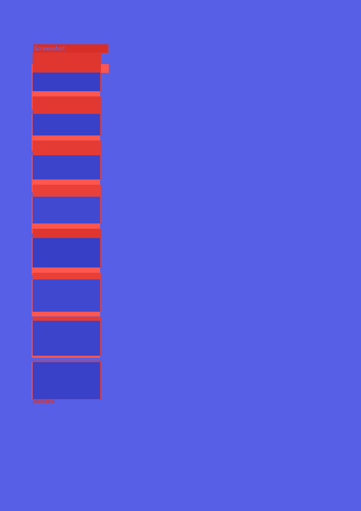
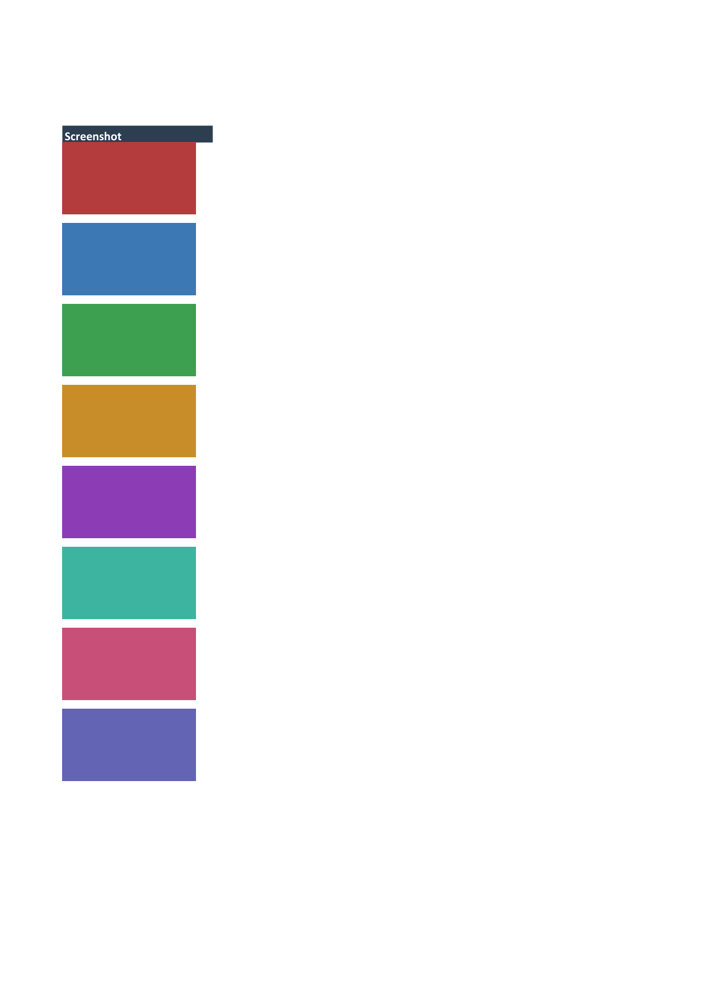

# java MiniPdf vs Microsoft 365 Excel Reference PDF Comparison Report

Generated: 2026-09-19T23:18:24.068228

## Summary

| # | Test Case | Valid | Text Sim | Visual Avg | Pages (M/R) | Overall |
|---|-----------|-------|----------|------------|-------------|--------|
| 1 | 🟢 classic01_basic_table_with_headers | ✅ | 1.0 | 0.9912 | 1/1 | **0.9965** |
| 2 | 🟢 classic02_multiple_worksheets | ✅ | 0.9766 | 0.994 | 3/3 | **0.9882** |
| 3 | 🟢 classic03_empty_workbook | ✅ | 1.0 | 1.0 | 1/1 | **1.0** |
| 4 | 🟢 classic04_single_cell | ✅ | 1.0 | 0.9997 | 1/1 | **0.9999** |
| 5 | 🟢 classic05_wide_table | ✅ | 0.8846 | 0.9865 | 3/3 | **0.9484** |
| 6 | 🟡 classic06_tall_table | ✅ | 0.6664 | 0.8404 | 5/5 | **0.8027** |
| 7 | 🟢 classic07_numbers_only | ✅ | 1.0 | 0.9965 | 1/1 | **0.9986** |
| 8 | 🟢 classic08_mixed_text_and_numbers | ✅ | 1.0 | 0.9942 | 1/1 | **0.9977** |
| 9 | 🔴 classic09_long_text | ✅ | 0.1622 | 0.0556 | 1/12 | **0.1871** |
| 10 | 🟡 classic10_special_xml_characters | ✅ | 0.6946 | 0.9936 | 1/1 | **0.8753** |
| 11 | 🟢 classic11_sparse_rows | ✅ | 0.8723 | 0.9988 | 2/2 | **0.9484** |
| 12 | 🔴 classic12_sparse_columns | ✅ | 0.9211 | 0.4979 | 1/2 | **0.6676** |
| 13 | 🟢 classic13_date_strings | ✅ | 1.0 | 0.9897 | 1/1 | **0.9959** |
| 14 | 🟢 classic14_decimal_numbers | ✅ | 1.0 | 0.9932 | 1/1 | **0.9973** |
| 15 | 🟢 classic15_negative_numbers | ✅ | 0.9375 | 0.9937 | 1/1 | **0.9725** |
| 16 | 🟢 classic16_percentage_strings | ✅ | 0.9753 | 0.9912 | 1/1 | **0.9866** |
| 17 | 🟢 classic17_currency_strings | ✅ | 1.0 | 0.99 | 1/1 | **0.996** |
| 18 | 🔴 classic18_large_dataset | ✅ | 0.9001 | 0.5052 | 24/42 | **0.6621** |
| 19 | 🟢 classic19_single_column_list | ✅ | 1.0 | 0.9941 | 1/1 | **0.9976** |
| 20 | 🟢 classic20_all_empty_cells | ✅ | 1.0 | 1.0 | 1/1 | **1.0** |
| 21 | 🟢 classic21_header_only | ✅ | 1.0 | 0.9987 | 1/1 | **0.9995** |
| 22 | 🟢 classic22_long_sheet_name | ✅ | 1.0 | 0.9962 | 1/1 | **0.9985** |
| 23 | 🟢 classic23_unicode_text | ✅ | 0.7934 | 0.9878 | 1/1 | **0.9125** |
| 24 | 🟢 classic24_red_text | ✅ | 0.8333 | 0.9871 | 1/1 | **0.9282** |
| 25 | 🟢 classic25_multiple_colors | ✅ | 0.8709 | 0.9871 | 1/1 | **0.9432** |
| 26 | 🟢 classic26_inline_strings | ✅ | 1.0 | 0.9928 | 1/1 | **0.9971** |
| 27 | 🟢 classic27_single_row | ✅ | 1.0 | 0.9984 | 1/1 | **0.9994** |
| 28 | 🟢 classic28_duplicate_values | ✅ | 1.0 | 0.9927 | 1/1 | **0.9971** |
| 29 | 🟢 classic29_formula_results | ✅ | 1.0 | 0.9924 | 1/1 | **0.997** |
| 30 | 🔴 classic30_mixed_empty_and_filled_sheets | ✅ | 0.96 | 0.4981 | 4/2 | **0.6832** |
| 31 | 🟢 classic31_bold_header_row | ✅ | 0.9801 | 0.9862 | 1/1 | **0.9865** |
| 32 | 🟢 classic32_right_aligned_numbers | ✅ | 0.9725 | 0.9918 | 1/1 | **0.9857** |
| 33 | 🟢 classic33_centered_text | ✅ | 1.0 | 0.9956 | 1/1 | **0.9982** |
| 34 | 🟢 classic34_explicit_column_widths | ✅ | 0.9423 | 0.9862 | 1/1 | **0.9714** |
| 35 | 🟢 classic35_explicit_row_heights | ✅ | 0.9773 | 0.9964 | 1/1 | **0.9895** |
| 36 | 🟢 classic36_merged_cells | ✅ | 0.9875 | 0.9891 | 1/1 | **0.9906** |
| 37 | 🟢 classic37_freeze_panes | ✅ | 1.0 | 0.9835 | 1/1 | **0.9934** |
| 38 | 🟡 classic38_hyperlink_cell | ✅ | 0.7563 | 0.9902 | 1/1 | **0.8986** |
| 39 | 🟢 classic39_financial_table | ✅ | 1.0 | 0.9854 | 1/1 | **0.9942** |
| 40 | 🟢 classic40_scientific_notation | ✅ | 0.8857 | 0.9898 | 1/1 | **0.9502** |
| 41 | 🟢 classic41_integer_vs_float | ✅ | 1.0 | 0.9929 | 1/1 | **0.9972** |
| 42 | 🟢 classic42_boolean_values | ✅ | 0.914 | 0.9903 | 1/1 | **0.9617** |
| 43 | 🟢 classic43_inventory_report | ✅ | 1.0 | 0.9729 | 1/1 | **0.9892** |
| 44 | 🟢 classic44_employee_roster | ✅ | 0.8459 | 0.9619 | 1/1 | **0.9231** |
| 45 | 🟢 classic45_sales_by_region | ✅ | 1.0 | 0.994 | 4/4 | **0.9976** |
| 46 | 🟢 classic46_grade_book | ✅ | 1.0 | 0.9846 | 1/1 | **0.9938** |
| 47 | 🟢 classic47_time_series | ✅ | 1.0 | 0.9748 | 1/1 | **0.9899** |
| 48 | 🟢 classic48_survey_results | ✅ | 0.9474 | 0.9854 | 1/1 | **0.9731** |
| 49 | 🟢 classic49_contact_list | ✅ | 0.9845 | 0.9724 | 1/1 | **0.9828** |
| 50 | 🟢 classic50_budget_vs_actuals | ✅ | 0.9889 | 0.9726 | 3/3 | **0.9846** |
| 51 | 🟢 classic51_product_catalog | ✅ | 0.9762 | 0.9736 | 1/1 | **0.9799** |
| 52 | 🟢 classic52_pivot_summary | ✅ | 1.0 | 0.9744 | 1/1 | **0.9898** |
| 53 | 🟢 classic53_invoice | ✅ | 0.979 | 0.9859 | 1/1 | **0.986** |
| 54 | 🟢 classic54_multi_level_header | ✅ | 1.0 | 0.9741 | 1/1 | **0.9896** |
| 55 | 🟢 classic55_error_values | ✅ | 0.9861 | 0.9872 | 1/1 | **0.9893** |
| 56 | 🟢 classic56_alternating_row_colors | ✅ | 0.997 | 0.9559 | 1/1 | **0.9812** |
| 57 | 🟢 classic57_cjk_only | ✅ | 1.0 | 0.9852 | 1/1 | **0.9941** |
| 58 | 🟢 classic58_mixed_numeric_formats | ✅ | 0.8625 | 0.9887 | 1/1 | **0.9405** |
| 59 | 🟢 classic59_multi_sheet_summary | ✅ | 0.9962 | 0.9909 | 4/4 | **0.9948** |
| 60 | 🔴 classic60_large_wide_table | ✅ | 0.852 | 0.6132 | 4/6 | **0.6861** |
| 61 | 🟢 classic61_product_card_with_image | ✅ | 0.9307 | 0.9567 | 1/1 | **0.955** |
| 62 | 🟢 classic62_company_logo_header | ✅ | 0.9636 | 0.9518 | 1/1 | **0.9662** |
| 63 | 🟢 classic63_two_products_side_by_side | ✅ | 0.9286 | 0.9374 | 1/1 | **0.9464** |
| 64 | 🟢 classic64_employee_directory_with_photo | ✅ | 0.9155 | 0.9607 | 1/1 | **0.9505** |
| 65 | 🟢 classic65_inventory_with_product_photos | ✅ | 0.9873 | 0.9711 | 1/1 | **0.9834** |
| 66 | 🟢 classic66_invoice_with_logo | ✅ | 0.885 | 0.9594 | 1/1 | **0.9378** |
| 67 | 🟢 classic67_real_estate_listing | ✅ | 0.8864 | 0.9233 | 1/1 | **0.9239** |
| 68 | 🟡 classic68_restaurant_menu | ✅ | 0.7897 | 0.8408 | 1/1 | **0.8522** |
| 69 | 🟡 classic69_image_only_sheet | ✅ | 1.0 | 0.6333 | 1/1 | **0.8533** |
| 70 | 🟢 classic70_product_catalog_with_images | ✅ | 0.9796 | 0.952 | 1/1 | **0.9726** |
| 71 | 🟢 classic71_multi_sheet_with_images | ✅ | 0.9965 | 0.9674 | 3/3 | **0.9856** |
| 72 | 🟡 classic72_bar_chart_image_with_data | ✅ | 1.0 | 0.7445 | 1/1 | **0.8978** |
| 73 | 🟢 classic73_event_flyer_with_banner | ✅ | 0.9627 | 0.8732 | 1/1 | **0.9344** |
| 74 | 🟡 classic74_dashboard_with_kpi_image | ✅ | 0.9781 | 0.7393 | 1/1 | **0.887** |
| 75 | 🟡 classic75_certificate_with_seal | ✅ | 0.4787 | 0.8371 | 1/1 | **0.7263** |
| 76 | 🟢 classic76_product_image_grid | ✅ | 0.963 | 0.9422 | 1/1 | **0.9621** |
| 77 | 🔴 classic77_news_article_with_hero_image | ✅ | 0.2628 | 0.7395 | 1/1 | **0.6009** |
| 78 | 🟢 classic78_small_icon_per_row | ✅ | 0.9899 | 0.9802 | 1/1 | **0.988** |
| 79 | 🟢 classic79_wide_panoramic_banner | ✅ | 0.96 | 0.8047 | 1/1 | **0.9059** |
| 80 | 🟡 classic80_portrait_tall_image | ✅ | 0.5984 | 0.9592 | 1/1 | **0.823** |
| 81 | 🟡 classic81_step_by_step_with_images | ✅ | 0.6604 | 0.9617 | 1/1 | **0.8488** |
| 82 | 🟢 classic82_before_after_images | ✅ | 0.9062 | 0.8943 | 1/1 | **0.9202** |
| 83 | 🟢 classic83_color_swatch_palette | ✅ | 0.8727 | 0.9746 | 1/1 | **0.9389** |
| 84 | 🟡 classic84_travel_destination_cards | ✅ | 0.6159 | 0.9416 | 1/1 | **0.823** |
| 85 | 🟢 classic85_lab_results_with_image | ✅ | 0.9867 | 0.9407 | 1/1 | **0.971** |
| 86 | 🟢 classic86_software_screenshot_features | ✅ | 0.9051 | 0.9252 | 1/1 | **0.9321** |
| 87 | 🟢 classic87_sports_results_with_logos | ✅ | 1.0 | 0.9856 | 1/1 | **0.9942** |
| 88 | 🟢 classic88_image_after_data | ✅ | 0.8889 | 0.9566 | 1/1 | **0.9382** |
| 89 | 🟢 classic89_nutrition_label_with_image | ✅ | 0.8953 | 0.9583 | 1/1 | **0.9414** |
| 90 | 🟢 classic90_project_status_with_milestones | ✅ | 0.9573 | 0.9289 | 1/1 | **0.9545** |
| 91 | 🔴 classic91_simple_bar_chart | ✅ | 0.6939 | 0.2945 | 1/2 | **0.4954** |
| 92 | 🔴 classic92_horizontal_bar_chart | ✅ | 0.6584 | 0.2898 | 1/2 | **0.4793** |
| 93 | 🔴 classic93_line_chart | ✅ | 0.75 | 0.3668 | 1/2 | **0.5467** |
| 94 | 🔴 classic94_pie_chart | ✅ | 0.64 | 0.2198 | 1/2 | **0.4439** |
| 95 | 🔴 classic95_area_chart | ✅ | 0.9434 | 0.3083 | 1/2 | **0.6007** |
| 96 | 🔴 classic96_scatter_chart | ✅ | 0.7679 | 0.3391 | 1/2 | **0.5428** |
| 97 | 🔴 classic97_doughnut_chart | ✅ | 0.6977 | 0.2215 | 1/2 | **0.4677** |
| 98 | 🔴 classic98_radar_chart | ✅ | 0.6286 | 0.3458 | 1/2 | **0.4898** |
| 99 | 🔴 classic99_bubble_chart | ✅ | 0.7586 | 0.311 | 1/2 | **0.5278** |
| 100 | 🟡 classic100_stacked_bar_chart | ✅ | 0.8621 | 0.5956 | 1/1 | **0.7831** |
| 101 | 🟡 classic101_percent_stacked_bar | ✅ | 0.8696 | 0.5929 | 1/1 | **0.785** |
| 102 | 🔴 classic102_line_chart_with_markers | ✅ | 0.8 | 0.3862 | 1/2 | **0.5745** |
| 103 | 🔴 classic103_pie_chart_with_labels | ✅ | 0.3729 | 0.2403 | 1/2 | **0.3453** |
| 104 | 🔴 classic104_combo_bar_line_chart | ✅ | 0.875 | 0.2949 | 1/2 | **0.568** |
| 105 | 🔴 classic105_3d_bar_chart | ✅ | 0.8108 | 0.2675 | 1/2 | **0.5313** |
| 106 | 🔴 classic106_3d_pie_chart | ✅ | 0.6468 | 0.2644 | 1/2 | **0.4645** |
| 107 | 🔴 classic107_multi_series_line | ✅ | 0.9498 | 0.4786 | 1/2 | **0.6714** |
| 108 | 🔴 classic108_stacked_area_chart | ✅ | 0.8861 | 0.2123 | 1/2 | **0.5394** |
| 109 | 🔴 classic109_scatter_with_trendline | ✅ | 0.7442 | 0.3287 | 1/2 | **0.5292** |
| 110 | 🔴 classic110_chart_with_legend | ✅ | 0.7547 | 0.2905 | 1/2 | **0.5181** |
| 111 | 🔴 classic111_chart_with_axis_labels | ✅ | 0.6818 | 0.3101 | 1/2 | **0.4968** |
| 112 | 🔴 classic112_multiple_charts | ✅ | 0.7714 | 0.3045 | 1/2 | **0.5304** |
| 113 | 🔴 classic113_chart_sheet | ✅ | 0.7692 | 0.2677 | 1/2 | **0.5148** |
| 114 | 🟡 classic114_chart_large_dataset | ✅ | 0.9596 | 0.7173 | 3/4 | **0.7708** |
| 115 | 🔴 classic115_chart_negative_values | ✅ | 0.68 | 0.3115 | 1/2 | **0.4966** |
| 116 | 🔴 classic116_percent_stacked_area | ✅ | 0.8974 | 0.1903 | 1/2 | **0.5351** |
| 117 | 🔴 classic117_stock_ohlc_chart | ✅ | 0.9342 | 0.3602 | 1/2 | **0.6178** |
| 118 | 🔴 classic118_bar_chart_custom_colors | ✅ | 0.6667 | 0.2898 | 1/2 | **0.4826** |
| 119 | 🔴 classic119_dashboard_multi_charts | ✅ | 0.7937 | 0.2472 | 1/2 | **0.5164** |
| 120 | 🔴 classic120_chart_with_date_axis | ✅ | 0.2436 | 0.4015 | 1/2 | **0.358** |
| 121 | 🟢 classic121_thin_borders | ✅ | 1.0 | 0.8809 | 1/1 | **0.9524** |
| 122 | 🟢 classic122_thick_outer_thin_inner | ✅ | 1.0 | 0.8282 | 1/1 | **0.9313** |
| 123 | 🟢 classic123_dashed_borders | ✅ | 0.9153 | 0.9847 | 1/1 | **0.96** |
| 124 | 🟢 classic124_colored_borders | ✅ | 0.8257 | 0.9733 | 1/1 | **0.9196** |
| 125 | 🟢 classic125_solid_fills | ✅ | 0.9763 | 0.9645 | 1/1 | **0.9763** |
| 126 | 🟢 classic126_dark_header | ✅ | 0.9813 | 0.9718 | 1/1 | **0.9812** |
| 127 | 🟡 classic127_font_styles | ✅ | 0.5753 | 0.9795 | 1/1 | **0.8219** |
| 128 | 🟢 classic128_font_sizes | ✅ | 0.9085 | 0.9901 | 1/1 | **0.9594** |
| 129 | 🟢 classic129_alignment_combos | ✅ | 0.8912 | 0.9905 | 1/1 | **0.9527** |
| 130 | 🟢 classic130_wrap_and_indent | ✅ | 0.9839 | 0.9837 | 1/1 | **0.987** |
| 131 | 🟢 classic131_number_formats | ✅ | 1.0 | 0.9759 | 1/1 | **0.9904** |
| 132 | 🟢 classic132_striped_table | ✅ | 0.9918 | 0.928 | 1/1 | **0.9679** |
| 133 | 🟡 classic133_gradient_rows | ✅ | 0.822 | 0.9187 | 1/1 | **0.8963** |
| 134 | 🟢 classic134_heatmap | ✅ | 1.0 | 0.8423 | 1/1 | **0.9369** |
| 135 | 🟢 classic135_bottom_border_only | ✅ | 0.8507 | 0.9011 | 1/1 | **0.9007** |
| 136 | 🟢 classic136_financial_report_styled | ✅ | 0.9794 | 0.9453 | 1/1 | **0.9699** |
| 137 | 🟢 classic137_checkerboard | ✅ | 1.0 | 0.8791 | 1/1 | **0.9516** |
| 138 | 🟢 classic138_color_grid | ✅ | 1.0 | 0.8852 | 1/1 | **0.9541** |
| 139 | 🟡 classic139_pattern_fills | ✅ | 0.8636 | 0.7904 | 1/1 | **0.8616** |
| 140 | 🟢 classic140_rotated_text | ✅ | 0.898 | 0.9928 | 1/1 | **0.9563** |
| 141 | 🟢 classic141_mixed_edge_borders | ✅ | 0.9433 | 0.9585 | 1/1 | **0.9607** |
| 142 | 🟢 classic142_styled_invoice | ✅ | 0.9873 | 0.9 | 1/1 | **0.9549** |
| 143 | 🟢 classic143_colored_tabs | ✅ | 0.9944 | 0.9949 | 4/4 | **0.9957** |
| 144 | 🟢 classic144_note_style_cells | ✅ | 1.0 | 0.8968 | 1/1 | **0.9587** |
| 145 | 🟢 classic145_status_badges | ✅ | 0.9803 | 0.914 | 1/1 | **0.9577** |
| 146 | 🟢 classic146_double_border_table | ✅ | 0.9677 | 0.9579 | 1/1 | **0.9702** |
| 147 | 🟢 classic147_multi_sheet_styled | ✅ | 0.9907 | 0.9635 | 3/3 | **0.9817** |
| 148 | 🟡 classic148_frozen_styled_grid | ✅ | 0.8104 | 0.8201 | 1/1 | **0.8522** |
| 149 | 🟢 classic149_merged_styled_sections | ✅ | 0.9862 | 0.8724 | 1/1 | **0.9434** |
| 150 | 🟢 classic150_kitchen_sink_styles | ✅ | 0.9676 | 0.9086 | 1/1 | **0.9505** |
| 151 | 🟡 classic151_multilingual_greetings | ✅ | 0.7634 | 0.9819 | 1/1 | **0.8981** |
| 152 | 🟡 classic152_emoji_sampler | ✅ | 0.6583 | 0.8504 | 1/1 | **0.8035** |
| 153 | 🟢 classic153_currency_symbols | ✅ | 0.9441 | 0.9844 | 1/1 | **0.9714** |
| 154 | 🟢 classic154_math_symbols | ✅ | 0.9014 | 0.9845 | 1/1 | **0.9544** |
| 155 | 🟢 classic155_diacritical_marks | ✅ | 0.8247 | 0.9891 | 1/1 | **0.9255** |
| 156 | 🟡 classic156_rtl_bidi_text | ✅ | 0.525 | 0.9919 | 1/1 | **0.8068** |
| 157 | 🟢 classic157_cjk_extended | ✅ | 0.9442 | 0.9679 | 1/1 | **0.9648** |
| 158 | 🟡 classic158_emoji_skin_tones | ✅ | 0.6667 | 0.9809 | 1/1 | **0.859** |
| 159 | 🟡 classic159_zwj_emoji | ✅ | 0.7493 | 0.9853 | 1/1 | **0.8938** |
| 160 | 🟢 classic160_punctuation_marks | ✅ | 0.8523 | 0.9907 | 1/1 | **0.9372** |
| 161 | 🟢 classic161_box_drawing | ✅ | 0.9095 | 0.9764 | 1/1 | **0.9544** |
| 162 | 🟢 classic162_cjk_emoji_styled | ✅ | 0.9341 | 0.9732 | 1/1 | **0.9629** |
| 163 | 🟢 classic163_cyrillic_alphabets | ✅ | 0.9441 | 0.9692 | 1/1 | **0.9653** |
| 164 | 🟡 classic164_indic_scripts | ✅ | 0.6129 | 0.9895 | 1/1 | **0.841** |
| 165 | 🟡 classic165_southeast_asian | ✅ | 0.5185 | 0.981 | 1/1 | **0.7998** |
| 166 | 🟡 classic166_emoji_progress | ✅ | 0.5904 | 0.7495 | 1/1 | **0.736** |
| 167 | 🟡 classic167_musical_symbols | ✅ | 0.7308 | 0.9649 | 1/1 | **0.8783** |
| 168 | 🟢 classic168_mixed_ltr_rtl_styled | ✅ | 0.8462 | 0.9568 | 1/1 | **0.9212** |
| 169 | 🟡 classic169_korean_invoice | ✅ | 0.5783 | 0.9785 | 1/1 | **0.8227** |
| 170 | 🟢 classic170_emoji_dashboard | ✅ | 0.9477 | 0.9483 | 1/1 | **0.9584** |
| 171 | 🟡 classic171_ipa_phonetic | ✅ | 0.625 | 0.9854 | 1/1 | **0.8442** |
| 172 | 🟢 classic172_emoji_timeline | ✅ | 0.8852 | 0.9725 | 1/1 | **0.9431** |
| 173 | 🟢 classic173_african_languages | ✅ | 0.8791 | 0.9778 | 1/1 | **0.9428** |
| 174 | 🟢 classic174_technical_symbols | ✅ | 0.9549 | 0.9799 | 1/1 | **0.9739** |
| 175 | 🟢 classic175_multiscript_catalog | ✅ | 0.8378 | 0.9648 | 1/1 | **0.921** |
| 176 | 🟢 classic176_combining_characters | ✅ | 0.8916 | 0.9817 | 1/1 | **0.9493** |
| 177 | 🟢 classic177_emoji_calendar | ✅ | 0.7797 | 0.9799 | 1/1 | **0.9038** |
| 178 | 🟡 classic178_caucasus_ethiopic | ✅ | 0.3489 | 0.9743 | 1/1 | **0.7293** |
| 179 | 🟢 classic179_emoji_inventory | ✅ | 0.8371 | 0.9654 | 1/1 | **0.921** |
| 180 | 🟡 classic180_polyglot_paragraph | ✅ | 0.7558 | 0.9836 | 1/1 | **0.8958** |
| 181 | 🟢 classic181_feedback_tracker_with_images | ✅ | 0.9603 | 0.903 | 2/2 | **0.9453** |
| 182 | 🟢 classic182_dense_long_text_columns | ✅ | 0.9078 | 0.9536 | 2/2 | **0.9446** |
| 183 | 🟢 classic183_mixed_content_grid | ✅ | 0.977 | 0.9425 | 1/1 | **0.9678** |
| 184 | 🟢 classic184_wide_narrow_columns | ✅ | 1.0 | 0.9395 | 1/1 | **0.9758** |
| 185 | 🟢 classic185_tall_rows_vertical_align | ✅ | 0.9054 | 0.9836 | 1/1 | **0.9556** |
| 186 | 🟢 classic186_multi_sheet_image_report | ✅ | 0.9408 | 0.9515 | 2/2 | **0.9569** |
| 187 | 🟢 classic187_bug_report_with_screenshots | ✅ | 0.9815 | 0.8911 | 1/1 | **0.949** |
| 188 | 🟢 classic188_merged_header_with_images | ✅ | 1.0 | 0.9562 | 1/1 | **0.9825** |
| 189 | 🟡 classic189_alternating_image_text_rows | ✅ | 0.8312 | 0.8808 | 1/1 | **0.8848** |
| 190 | 🟢 classic190_dashboard_kpi_images | ✅ | 1.0 | 0.9558 | 1/1 | **0.9823** |
| 191 | 🟡 classic191_payroll_calculator | ✅ | 0.8789 | 0.8517 | 9/9 | **0.8922** |

**Average Overall Score: 0.8679**

## Labeled Side-by-Side Comparison

<table>
<tr><th>Case</th><th>Comparison</th></tr>
<tr>
  <td><b>classic01_basic_table_with_headers<br><small>format: xlsx | case: classic01_basic_table_with_headers | scope: java-classic-xlsx</small></b><br>Page 1</td>
  <td></td>
</tr>
<tr>
  <td><b>classic02_multiple_worksheets<br><small>format: xlsx | case: classic02_multiple_worksheets | scope: java-classic-xlsx</small></b><br>Page 1</td>
  <td></td>
</tr>
<tr>
  <td><b>classic02_multiple_worksheets<br><small>format: xlsx | case: classic02_multiple_worksheets | scope: java-classic-xlsx</small></b><br>Page 2</td>
  <td></td>
</tr>
<tr>
  <td><b>classic02_multiple_worksheets<br><small>format: xlsx | case: classic02_multiple_worksheets | scope: java-classic-xlsx</small></b><br>Page 3</td>
  <td></td>
</tr>
<tr>
  <td><b>classic03_empty_workbook<br><small>format: xlsx | case: classic03_empty_workbook | scope: java-classic-xlsx</small></b><br>Page 1</td>
  <td></td>
</tr>
<tr>
  <td><b>classic04_single_cell<br><small>format: xlsx | case: classic04_single_cell | scope: java-classic-xlsx</small></b><br>Page 1</td>
  <td></td>
</tr>
<tr>
  <td><b>classic05_wide_table<br><small>format: xlsx | case: classic05_wide_table | scope: java-classic-xlsx</small></b><br>Page 1</td>
  <td></td>
</tr>
<tr>
  <td><b>classic05_wide_table<br><small>format: xlsx | case: classic05_wide_table | scope: java-classic-xlsx</small></b><br>Page 2</td>
  <td></td>
</tr>
<tr>
  <td><b>classic05_wide_table<br><small>format: xlsx | case: classic05_wide_table | scope: java-classic-xlsx</small></b><br>Page 3</td>
  <td></td>
</tr>
<tr>
  <td><b>classic06_tall_table<br><small>format: xlsx | case: classic06_tall_table | scope: java-classic-xlsx</small></b><br>Page 1</td>
  <td></td>
</tr>
<tr>
  <td><b>classic06_tall_table<br><small>format: xlsx | case: classic06_tall_table | scope: java-classic-xlsx</small></b><br>Page 2</td>
  <td></td>
</tr>
<tr>
  <td><b>classic06_tall_table<br><small>format: xlsx | case: classic06_tall_table | scope: java-classic-xlsx</small></b><br>Page 3</td>
  <td></td>
</tr>
<tr>
  <td><b>classic06_tall_table<br><small>format: xlsx | case: classic06_tall_table | scope: java-classic-xlsx</small></b><br>Page 4</td>
  <td></td>
</tr>
<tr>
  <td><b>classic06_tall_table<br><small>format: xlsx | case: classic06_tall_table | scope: java-classic-xlsx</small></b><br>Page 5</td>
  <td></td>
</tr>
<tr>
  <td><b>classic07_numbers_only<br><small>format: xlsx | case: classic07_numbers_only | scope: java-classic-xlsx</small></b><br>Page 1</td>
  <td></td>
</tr>
<tr>
  <td><b>classic08_mixed_text_and_numbers<br><small>format: xlsx | case: classic08_mixed_text_and_numbers | scope: java-classic-xlsx</small></b><br>Page 1</td>
  <td></td>
</tr>
<tr>
  <td><b>classic09_long_text<br><small>format: xlsx | case: classic09_long_text | scope: java-classic-xlsx</small></b><br>Page 1</td>
  <td></td>
</tr>
<tr>
  <td><b>classic09_long_text<br><small>format: xlsx | case: classic09_long_text | scope: java-classic-xlsx</small></b><br>Page 2</td>
  <td></td>
</tr>
<tr>
  <td><b>classic09_long_text<br><small>format: xlsx | case: classic09_long_text | scope: java-classic-xlsx</small></b><br>Page 3</td>
  <td></td>
</tr>
<tr>
  <td><b>classic09_long_text<br><small>format: xlsx | case: classic09_long_text | scope: java-classic-xlsx</small></b><br>Page 4</td>
  <td></td>
</tr>
<tr>
  <td><b>classic09_long_text<br><small>format: xlsx | case: classic09_long_text | scope: java-classic-xlsx</small></b><br>Page 5</td>
  <td></td>
</tr>
<tr>
  <td><b>classic09_long_text<br><small>format: xlsx | case: classic09_long_text | scope: java-classic-xlsx</small></b><br>Page 6</td>
  <td></td>
</tr>
<tr>
  <td><b>classic09_long_text<br><small>format: xlsx | case: classic09_long_text | scope: java-classic-xlsx</small></b><br>Page 7</td>
  <td></td>
</tr>
<tr>
  <td><b>classic09_long_text<br><small>format: xlsx | case: classic09_long_text | scope: java-classic-xlsx</small></b><br>Page 8</td>
  <td></td>
</tr>
<tr>
  <td><b>classic09_long_text<br><small>format: xlsx | case: classic09_long_text | scope: java-classic-xlsx</small></b><br>Page 9</td>
  <td></td>
</tr>
<tr>
  <td><b>classic09_long_text<br><small>format: xlsx | case: classic09_long_text | scope: java-classic-xlsx</small></b><br>Page 10</td>
  <td></td>
</tr>
<tr>
  <td><b>classic09_long_text<br><small>format: xlsx | case: classic09_long_text | scope: java-classic-xlsx</small></b><br>Page 11</td>
  <td></td>
</tr>
<tr>
  <td><b>classic09_long_text<br><small>format: xlsx | case: classic09_long_text | scope: java-classic-xlsx</small></b><br>Page 12</td>
  <td></td>
</tr>
<tr>
  <td><b>classic10_special_xml_characters<br><small>format: xlsx | case: classic10_special_xml_characters | scope: java-classic-xlsx</small></b><br>Page 1</td>
  <td></td>
</tr>
<tr>
  <td><b>classic11_sparse_rows<br><small>format: xlsx | case: classic11_sparse_rows | scope: java-classic-xlsx</small></b><br>Page 1</td>
  <td></td>
</tr>
<tr>
  <td><b>classic11_sparse_rows<br><small>format: xlsx | case: classic11_sparse_rows | scope: java-classic-xlsx</small></b><br>Page 2</td>
  <td></td>
</tr>
<tr>
  <td><b>classic12_sparse_columns<br><small>format: xlsx | case: classic12_sparse_columns | scope: java-classic-xlsx</small></b><br>Page 1</td>
  <td></td>
</tr>
<tr>
  <td><b>classic13_date_strings<br><small>format: xlsx | case: classic13_date_strings | scope: java-classic-xlsx</small></b><br>Page 1</td>
  <td></td>
</tr>
<tr>
  <td><b>classic14_decimal_numbers<br><small>format: xlsx | case: classic14_decimal_numbers | scope: java-classic-xlsx</small></b><br>Page 1</td>
  <td></td>
</tr>
<tr>
  <td><b>classic15_negative_numbers<br><small>format: xlsx | case: classic15_negative_numbers | scope: java-classic-xlsx</small></b><br>Page 1</td>
  <td></td>
</tr>
<tr>
  <td><b>classic16_percentage_strings<br><small>format: xlsx | case: classic16_percentage_strings | scope: java-classic-xlsx</small></b><br>Page 1</td>
  <td></td>
</tr>
<tr>
  <td><b>classic17_currency_strings<br><small>format: xlsx | case: classic17_currency_strings | scope: java-classic-xlsx</small></b><br>Page 1</td>
  <td></td>
</tr>
<tr>
  <td><b>classic18_large_dataset<br><small>format: xlsx | case: classic18_large_dataset | scope: java-classic-xlsx</small></b><br>Page 1</td>
  <td></td>
</tr>
<tr>
  <td><b>classic18_large_dataset<br><small>format: xlsx | case: classic18_large_dataset | scope: java-classic-xlsx</small></b><br>Page 2</td>
  <td></td>
</tr>
<tr>
  <td><b>classic18_large_dataset<br><small>format: xlsx | case: classic18_large_dataset | scope: java-classic-xlsx</small></b><br>Page 3</td>
  <td></td>
</tr>
<tr>
  <td><b>classic18_large_dataset<br><small>format: xlsx | case: classic18_large_dataset | scope: java-classic-xlsx</small></b><br>Page 4</td>
  <td></td>
</tr>
<tr>
  <td><b>classic18_large_dataset<br><small>format: xlsx | case: classic18_large_dataset | scope: java-classic-xlsx</small></b><br>Page 5</td>
  <td></td>
</tr>
<tr>
  <td><b>classic18_large_dataset<br><small>format: xlsx | case: classic18_large_dataset | scope: java-classic-xlsx</small></b><br>Page 6</td>
  <td></td>
</tr>
<tr>
  <td><b>classic18_large_dataset<br><small>format: xlsx | case: classic18_large_dataset | scope: java-classic-xlsx</small></b><br>Page 7</td>
  <td></td>
</tr>
<tr>
  <td><b>classic18_large_dataset<br><small>format: xlsx | case: classic18_large_dataset | scope: java-classic-xlsx</small></b><br>Page 8</td>
  <td></td>
</tr>
<tr>
  <td><b>classic18_large_dataset<br><small>format: xlsx | case: classic18_large_dataset | scope: java-classic-xlsx</small></b><br>Page 9</td>
  <td></td>
</tr>
<tr>
  <td><b>classic18_large_dataset<br><small>format: xlsx | case: classic18_large_dataset | scope: java-classic-xlsx</small></b><br>Page 10</td>
  <td></td>
</tr>
<tr>
  <td><b>classic18_large_dataset<br><small>format: xlsx | case: classic18_large_dataset | scope: java-classic-xlsx</small></b><br>Page 11</td>
  <td></td>
</tr>
<tr>
  <td><b>classic18_large_dataset<br><small>format: xlsx | case: classic18_large_dataset | scope: java-classic-xlsx</small></b><br>Page 12</td>
  <td></td>
</tr>
<tr>
  <td><b>classic18_large_dataset<br><small>format: xlsx | case: classic18_large_dataset | scope: java-classic-xlsx</small></b><br>Page 13</td>
  <td></td>
</tr>
<tr>
  <td><b>classic18_large_dataset<br><small>format: xlsx | case: classic18_large_dataset | scope: java-classic-xlsx</small></b><br>Page 14</td>
  <td></td>
</tr>
<tr>
  <td><b>classic18_large_dataset<br><small>format: xlsx | case: classic18_large_dataset | scope: java-classic-xlsx</small></b><br>Page 15</td>
  <td></td>
</tr>
<tr>
  <td><b>classic18_large_dataset<br><small>format: xlsx | case: classic18_large_dataset | scope: java-classic-xlsx</small></b><br>Page 16</td>
  <td></td>
</tr>
<tr>
  <td><b>classic18_large_dataset<br><small>format: xlsx | case: classic18_large_dataset | scope: java-classic-xlsx</small></b><br>Page 17</td>
  <td></td>
</tr>
<tr>
  <td><b>classic18_large_dataset<br><small>format: xlsx | case: classic18_large_dataset | scope: java-classic-xlsx</small></b><br>Page 18</td>
  <td></td>
</tr>
<tr>
  <td><b>classic18_large_dataset<br><small>format: xlsx | case: classic18_large_dataset | scope: java-classic-xlsx</small></b><br>Page 19</td>
  <td></td>
</tr>
<tr>
  <td><b>classic18_large_dataset<br><small>format: xlsx | case: classic18_large_dataset | scope: java-classic-xlsx</small></b><br>Page 20</td>
  <td></td>
</tr>
<tr>
  <td><b>classic18_large_dataset<br><small>format: xlsx | case: classic18_large_dataset | scope: java-classic-xlsx</small></b><br>Page 21</td>
  <td></td>
</tr>
<tr>
  <td><b>classic18_large_dataset<br><small>format: xlsx | case: classic18_large_dataset | scope: java-classic-xlsx</small></b><br>Page 22</td>
  <td></td>
</tr>
<tr>
  <td><b>classic18_large_dataset<br><small>format: xlsx | case: classic18_large_dataset | scope: java-classic-xlsx</small></b><br>Page 23</td>
  <td></td>
</tr>
<tr>
  <td><b>classic18_large_dataset<br><small>format: xlsx | case: classic18_large_dataset | scope: java-classic-xlsx</small></b><br>Page 24</td>
  <td></td>
</tr>
<tr>
  <td><b>classic19_single_column_list<br><small>format: xlsx | case: classic19_single_column_list | scope: java-classic-xlsx</small></b><br>Page 1</td>
  <td></td>
</tr>
<tr>
  <td><b>classic20_all_empty_cells<br><small>format: xlsx | case: classic20_all_empty_cells | scope: java-classic-xlsx</small></b><br>Page 1</td>
  <td></td>
</tr>
<tr>
  <td><b>classic21_header_only<br><small>format: xlsx | case: classic21_header_only | scope: java-classic-xlsx</small></b><br>Page 1</td>
  <td></td>
</tr>
<tr>
  <td><b>classic22_long_sheet_name<br><small>format: xlsx | case: classic22_long_sheet_name | scope: java-classic-xlsx</small></b><br>Page 1</td>
  <td></td>
</tr>
<tr>
  <td><b>classic23_unicode_text<br><small>format: xlsx | case: classic23_unicode_text | scope: java-classic-xlsx</small></b><br>Page 1</td>
  <td></td>
</tr>
<tr>
  <td><b>classic24_red_text<br><small>format: xlsx | case: classic24_red_text | scope: java-classic-xlsx</small></b><br>Page 1</td>
  <td></td>
</tr>
<tr>
  <td><b>classic25_multiple_colors<br><small>format: xlsx | case: classic25_multiple_colors | scope: java-classic-xlsx</small></b><br>Page 1</td>
  <td></td>
</tr>
<tr>
  <td><b>classic26_inline_strings<br><small>format: xlsx | case: classic26_inline_strings | scope: java-classic-xlsx</small></b><br>Page 1</td>
  <td></td>
</tr>
<tr>
  <td><b>classic27_single_row<br><small>format: xlsx | case: classic27_single_row | scope: java-classic-xlsx</small></b><br>Page 1</td>
  <td></td>
</tr>
<tr>
  <td><b>classic28_duplicate_values<br><small>format: xlsx | case: classic28_duplicate_values | scope: java-classic-xlsx</small></b><br>Page 1</td>
  <td></td>
</tr>
<tr>
  <td><b>classic29_formula_results<br><small>format: xlsx | case: classic29_formula_results | scope: java-classic-xlsx</small></b><br>Page 1</td>
  <td></td>
</tr>
<tr>
  <td><b>classic30_mixed_empty_and_filled_sheets<br><small>format: xlsx | case: classic30_mixed_empty_and_filled_sheets | scope: java-classic-xlsx</small></b><br>Page 1</td>
  <td></td>
</tr>
<tr>
  <td><b>classic30_mixed_empty_and_filled_sheets<br><small>format: xlsx | case: classic30_mixed_empty_and_filled_sheets | scope: java-classic-xlsx</small></b><br>Page 2</td>
  <td></td>
</tr>
<tr>
  <td><b>classic31_bold_header_row<br><small>format: xlsx | case: classic31_bold_header_row | scope: java-classic-xlsx</small></b><br>Page 1</td>
  <td></td>
</tr>
<tr>
  <td><b>classic32_right_aligned_numbers<br><small>format: xlsx | case: classic32_right_aligned_numbers | scope: java-classic-xlsx</small></b><br>Page 1</td>
  <td></td>
</tr>
<tr>
  <td><b>classic33_centered_text<br><small>format: xlsx | case: classic33_centered_text | scope: java-classic-xlsx</small></b><br>Page 1</td>
  <td></td>
</tr>
<tr>
  <td><b>classic34_explicit_column_widths<br><small>format: xlsx | case: classic34_explicit_column_widths | scope: java-classic-xlsx</small></b><br>Page 1</td>
  <td></td>
</tr>
<tr>
  <td><b>classic35_explicit_row_heights<br><small>format: xlsx | case: classic35_explicit_row_heights | scope: java-classic-xlsx</small></b><br>Page 1</td>
  <td></td>
</tr>
<tr>
  <td><b>classic36_merged_cells<br><small>format: xlsx | case: classic36_merged_cells | scope: java-classic-xlsx</small></b><br>Page 1</td>
  <td></td>
</tr>
<tr>
  <td><b>classic37_freeze_panes<br><small>format: xlsx | case: classic37_freeze_panes | scope: java-classic-xlsx</small></b><br>Page 1</td>
  <td></td>
</tr>
<tr>
  <td><b>classic38_hyperlink_cell<br><small>format: xlsx | case: classic38_hyperlink_cell | scope: java-classic-xlsx</small></b><br>Page 1</td>
  <td></td>
</tr>
<tr>
  <td><b>classic39_financial_table<br><small>format: xlsx | case: classic39_financial_table | scope: java-classic-xlsx</small></b><br>Page 1</td>
  <td></td>
</tr>
<tr>
  <td><b>classic40_scientific_notation<br><small>format: xlsx | case: classic40_scientific_notation | scope: java-classic-xlsx</small></b><br>Page 1</td>
  <td></td>
</tr>
<tr>
  <td><b>classic41_integer_vs_float<br><small>format: xlsx | case: classic41_integer_vs_float | scope: java-classic-xlsx</small></b><br>Page 1</td>
  <td></td>
</tr>
<tr>
  <td><b>classic42_boolean_values<br><small>format: xlsx | case: classic42_boolean_values | scope: java-classic-xlsx</small></b><br>Page 1</td>
  <td></td>
</tr>
<tr>
  <td><b>classic43_inventory_report<br><small>format: xlsx | case: classic43_inventory_report | scope: java-classic-xlsx</small></b><br>Page 1</td>
  <td></td>
</tr>
<tr>
  <td><b>classic44_employee_roster<br><small>format: xlsx | case: classic44_employee_roster | scope: java-classic-xlsx</small></b><br>Page 1</td>
  <td></td>
</tr>
<tr>
  <td><b>classic45_sales_by_region<br><small>format: xlsx | case: classic45_sales_by_region | scope: java-classic-xlsx</small></b><br>Page 1</td>
  <td></td>
</tr>
<tr>
  <td><b>classic45_sales_by_region<br><small>format: xlsx | case: classic45_sales_by_region | scope: java-classic-xlsx</small></b><br>Page 2</td>
  <td></td>
</tr>
<tr>
  <td><b>classic45_sales_by_region<br><small>format: xlsx | case: classic45_sales_by_region | scope: java-classic-xlsx</small></b><br>Page 3</td>
  <td></td>
</tr>
<tr>
  <td><b>classic45_sales_by_region<br><small>format: xlsx | case: classic45_sales_by_region | scope: java-classic-xlsx</small></b><br>Page 4</td>
  <td></td>
</tr>
<tr>
  <td><b>classic46_grade_book<br><small>format: xlsx | case: classic46_grade_book | scope: java-classic-xlsx</small></b><br>Page 1</td>
  <td></td>
</tr>
<tr>
  <td><b>classic47_time_series<br><small>format: xlsx | case: classic47_time_series | scope: java-classic-xlsx</small></b><br>Page 1</td>
  <td></td>
</tr>
<tr>
  <td><b>classic48_survey_results<br><small>format: xlsx | case: classic48_survey_results | scope: java-classic-xlsx</small></b><br>Page 1</td>
  <td></td>
</tr>
<tr>
  <td><b>classic49_contact_list<br><small>format: xlsx | case: classic49_contact_list | scope: java-classic-xlsx</small></b><br>Page 1</td>
  <td></td>
</tr>
<tr>
  <td><b>classic50_budget_vs_actuals<br><small>format: xlsx | case: classic50_budget_vs_actuals | scope: java-classic-xlsx</small></b><br>Page 1</td>
  <td></td>
</tr>
<tr>
  <td><b>classic50_budget_vs_actuals<br><small>format: xlsx | case: classic50_budget_vs_actuals | scope: java-classic-xlsx</small></b><br>Page 2</td>
  <td></td>
</tr>
<tr>
  <td><b>classic50_budget_vs_actuals<br><small>format: xlsx | case: classic50_budget_vs_actuals | scope: java-classic-xlsx</small></b><br>Page 3</td>
  <td></td>
</tr>
<tr>
  <td><b>classic51_product_catalog<br><small>format: xlsx | case: classic51_product_catalog | scope: java-classic-xlsx</small></b><br>Page 1</td>
  <td></td>
</tr>
<tr>
  <td><b>classic52_pivot_summary<br><small>format: xlsx | case: classic52_pivot_summary | scope: java-classic-xlsx</small></b><br>Page 1</td>
  <td></td>
</tr>
<tr>
  <td><b>classic53_invoice<br><small>format: xlsx | case: classic53_invoice | scope: java-classic-xlsx</small></b><br>Page 1</td>
  <td></td>
</tr>
<tr>
  <td><b>classic54_multi_level_header<br><small>format: xlsx | case: classic54_multi_level_header | scope: java-classic-xlsx</small></b><br>Page 1</td>
  <td></td>
</tr>
<tr>
  <td><b>classic55_error_values<br><small>format: xlsx | case: classic55_error_values | scope: java-classic-xlsx</small></b><br>Page 1</td>
  <td></td>
</tr>
<tr>
  <td><b>classic56_alternating_row_colors<br><small>format: xlsx | case: classic56_alternating_row_colors | scope: java-classic-xlsx</small></b><br>Page 1</td>
  <td></td>
</tr>
<tr>
  <td><b>classic57_cjk_only<br><small>format: xlsx | case: classic57_cjk_only | scope: java-classic-xlsx</small></b><br>Page 1</td>
  <td></td>
</tr>
<tr>
  <td><b>classic58_mixed_numeric_formats<br><small>format: xlsx | case: classic58_mixed_numeric_formats | scope: java-classic-xlsx</small></b><br>Page 1</td>
  <td></td>
</tr>
<tr>
  <td><b>classic59_multi_sheet_summary<br><small>format: xlsx | case: classic59_multi_sheet_summary | scope: java-classic-xlsx</small></b><br>Page 1</td>
  <td></td>
</tr>
<tr>
  <td><b>classic59_multi_sheet_summary<br><small>format: xlsx | case: classic59_multi_sheet_summary | scope: java-classic-xlsx</small></b><br>Page 2</td>
  <td></td>
</tr>
<tr>
  <td><b>classic59_multi_sheet_summary<br><small>format: xlsx | case: classic59_multi_sheet_summary | scope: java-classic-xlsx</small></b><br>Page 3</td>
  <td></td>
</tr>
<tr>
  <td><b>classic59_multi_sheet_summary<br><small>format: xlsx | case: classic59_multi_sheet_summary | scope: java-classic-xlsx</small></b><br>Page 4</td>
  <td></td>
</tr>
<tr>
  <td><b>classic60_large_wide_table<br><small>format: xlsx | case: classic60_large_wide_table | scope: java-classic-xlsx</small></b><br>Page 1</td>
  <td></td>
</tr>
<tr>
  <td><b>classic60_large_wide_table<br><small>format: xlsx | case: classic60_large_wide_table | scope: java-classic-xlsx</small></b><br>Page 2</td>
  <td></td>
</tr>
<tr>
  <td><b>classic60_large_wide_table<br><small>format: xlsx | case: classic60_large_wide_table | scope: java-classic-xlsx</small></b><br>Page 3</td>
  <td></td>
</tr>
<tr>
  <td><b>classic60_large_wide_table<br><small>format: xlsx | case: classic60_large_wide_table | scope: java-classic-xlsx</small></b><br>Page 4</td>
  <td></td>
</tr>
<tr>
  <td><b>classic61_product_card_with_image<br><small>format: xlsx | case: classic61_product_card_with_image | scope: java-classic-xlsx</small></b><br>Page 1</td>
  <td></td>
</tr>
<tr>
  <td><b>classic62_company_logo_header<br><small>format: xlsx | case: classic62_company_logo_header | scope: java-classic-xlsx</small></b><br>Page 1</td>
  <td></td>
</tr>
<tr>
  <td><b>classic63_two_products_side_by_side<br><small>format: xlsx | case: classic63_two_products_side_by_side | scope: java-classic-xlsx</small></b><br>Page 1</td>
  <td></td>
</tr>
<tr>
  <td><b>classic64_employee_directory_with_photo<br><small>format: xlsx | case: classic64_employee_directory_with_photo | scope: java-classic-xlsx</small></b><br>Page 1</td>
  <td></td>
</tr>
<tr>
  <td><b>classic65_inventory_with_product_photos<br><small>format: xlsx | case: classic65_inventory_with_product_photos | scope: java-classic-xlsx</small></b><br>Page 1</td>
  <td></td>
</tr>
<tr>
  <td><b>classic66_invoice_with_logo<br><small>format: xlsx | case: classic66_invoice_with_logo | scope: java-classic-xlsx</small></b><br>Page 1</td>
  <td></td>
</tr>
<tr>
  <td><b>classic67_real_estate_listing<br><small>format: xlsx | case: classic67_real_estate_listing | scope: java-classic-xlsx</small></b><br>Page 1</td>
  <td></td>
</tr>
<tr>
  <td><b>classic68_restaurant_menu<br><small>format: xlsx | case: classic68_restaurant_menu | scope: java-classic-xlsx</small></b><br>Page 1</td>
  <td></td>
</tr>
<tr>
  <td><b>classic69_image_only_sheet<br><small>format: xlsx | case: classic69_image_only_sheet | scope: java-classic-xlsx</small></b><br>Page 1</td>
  <td></td>
</tr>
<tr>
  <td><b>classic70_product_catalog_with_images<br><small>format: xlsx | case: classic70_product_catalog_with_images | scope: java-classic-xlsx</small></b><br>Page 1</td>
  <td></td>
</tr>
<tr>
  <td><b>classic71_multi_sheet_with_images<br><small>format: xlsx | case: classic71_multi_sheet_with_images | scope: java-classic-xlsx</small></b><br>Page 1</td>
  <td></td>
</tr>
<tr>
  <td><b>classic71_multi_sheet_with_images<br><small>format: xlsx | case: classic71_multi_sheet_with_images | scope: java-classic-xlsx</small></b><br>Page 2</td>
  <td></td>
</tr>
<tr>
  <td><b>classic71_multi_sheet_with_images<br><small>format: xlsx | case: classic71_multi_sheet_with_images | scope: java-classic-xlsx</small></b><br>Page 3</td>
  <td></td>
</tr>
<tr>
  <td><b>classic72_bar_chart_image_with_data<br><small>format: xlsx | case: classic72_bar_chart_image_with_data | scope: java-classic-xlsx</small></b><br>Page 1</td>
  <td></td>
</tr>
<tr>
  <td><b>classic73_event_flyer_with_banner<br><small>format: xlsx | case: classic73_event_flyer_with_banner | scope: java-classic-xlsx</small></b><br>Page 1</td>
  <td></td>
</tr>
<tr>
  <td><b>classic74_dashboard_with_kpi_image<br><small>format: xlsx | case: classic74_dashboard_with_kpi_image | scope: java-classic-xlsx</small></b><br>Page 1</td>
  <td></td>
</tr>
<tr>
  <td><b>classic75_certificate_with_seal<br><small>format: xlsx | case: classic75_certificate_with_seal | scope: java-classic-xlsx</small></b><br>Page 1</td>
  <td></td>
</tr>
<tr>
  <td><b>classic76_product_image_grid<br><small>format: xlsx | case: classic76_product_image_grid | scope: java-classic-xlsx</small></b><br>Page 1</td>
  <td></td>
</tr>
<tr>
  <td><b>classic77_news_article_with_hero_image<br><small>format: xlsx | case: classic77_news_article_with_hero_image | scope: java-classic-xlsx</small></b><br>Page 1</td>
  <td></td>
</tr>
<tr>
  <td><b>classic78_small_icon_per_row<br><small>format: xlsx | case: classic78_small_icon_per_row | scope: java-classic-xlsx</small></b><br>Page 1</td>
  <td></td>
</tr>
<tr>
  <td><b>classic79_wide_panoramic_banner<br><small>format: xlsx | case: classic79_wide_panoramic_banner | scope: java-classic-xlsx</small></b><br>Page 1</td>
  <td></td>
</tr>
<tr>
  <td><b>classic80_portrait_tall_image<br><small>format: xlsx | case: classic80_portrait_tall_image | scope: java-classic-xlsx</small></b><br>Page 1</td>
  <td></td>
</tr>
<tr>
  <td><b>classic81_step_by_step_with_images<br><small>format: xlsx | case: classic81_step_by_step_with_images | scope: java-classic-xlsx</small></b><br>Page 1</td>
  <td></td>
</tr>
<tr>
  <td><b>classic82_before_after_images<br><small>format: xlsx | case: classic82_before_after_images | scope: java-classic-xlsx</small></b><br>Page 1</td>
  <td></td>
</tr>
<tr>
  <td><b>classic83_color_swatch_palette<br><small>format: xlsx | case: classic83_color_swatch_palette | scope: java-classic-xlsx</small></b><br>Page 1</td>
  <td></td>
</tr>
<tr>
  <td><b>classic84_travel_destination_cards<br><small>format: xlsx | case: classic84_travel_destination_cards | scope: java-classic-xlsx</small></b><br>Page 1</td>
  <td></td>
</tr>
<tr>
  <td><b>classic85_lab_results_with_image<br><small>format: xlsx | case: classic85_lab_results_with_image | scope: java-classic-xlsx</small></b><br>Page 1</td>
  <td></td>
</tr>
<tr>
  <td><b>classic86_software_screenshot_features<br><small>format: xlsx | case: classic86_software_screenshot_features | scope: java-classic-xlsx</small></b><br>Page 1</td>
  <td></td>
</tr>
<tr>
  <td><b>classic87_sports_results_with_logos<br><small>format: xlsx | case: classic87_sports_results_with_logos | scope: java-classic-xlsx</small></b><br>Page 1</td>
  <td></td>
</tr>
<tr>
  <td><b>classic88_image_after_data<br><small>format: xlsx | case: classic88_image_after_data | scope: java-classic-xlsx</small></b><br>Page 1</td>
  <td></td>
</tr>
<tr>
  <td><b>classic89_nutrition_label_with_image<br><small>format: xlsx | case: classic89_nutrition_label_with_image | scope: java-classic-xlsx</small></b><br>Page 1</td>
  <td></td>
</tr>
<tr>
  <td><b>classic90_project_status_with_milestones<br><small>format: xlsx | case: classic90_project_status_with_milestones | scope: java-classic-xlsx</small></b><br>Page 1</td>
  <td></td>
</tr>
<tr>
  <td><b>classic91_simple_bar_chart<br><small>format: xlsx | case: classic91_simple_bar_chart | scope: java-classic-xlsx</small></b><br>Page 1</td>
  <td></td>
</tr>
<tr>
  <td><b>classic91_simple_bar_chart<br><small>format: xlsx | case: classic91_simple_bar_chart | scope: java-classic-xlsx</small></b><br>Page 2</td>
  <td></td>
</tr>
<tr>
  <td><b>classic92_horizontal_bar_chart<br><small>format: xlsx | case: classic92_horizontal_bar_chart | scope: java-classic-xlsx</small></b><br>Page 1</td>
  <td></td>
</tr>
<tr>
  <td><b>classic92_horizontal_bar_chart<br><small>format: xlsx | case: classic92_horizontal_bar_chart | scope: java-classic-xlsx</small></b><br>Page 2</td>
  <td></td>
</tr>
<tr>
  <td><b>classic93_line_chart<br><small>format: xlsx | case: classic93_line_chart | scope: java-classic-xlsx</small></b><br>Page 1</td>
  <td></td>
</tr>
<tr>
  <td><b>classic93_line_chart<br><small>format: xlsx | case: classic93_line_chart | scope: java-classic-xlsx</small></b><br>Page 2</td>
  <td></td>
</tr>
<tr>
  <td><b>classic94_pie_chart<br><small>format: xlsx | case: classic94_pie_chart | scope: java-classic-xlsx</small></b><br>Page 1</td>
  <td></td>
</tr>
<tr>
  <td><b>classic94_pie_chart<br><small>format: xlsx | case: classic94_pie_chart | scope: java-classic-xlsx</small></b><br>Page 2</td>
  <td></td>
</tr>
<tr>
  <td><b>classic95_area_chart<br><small>format: xlsx | case: classic95_area_chart | scope: java-classic-xlsx</small></b><br>Page 1</td>
  <td></td>
</tr>
<tr>
  <td><b>classic95_area_chart<br><small>format: xlsx | case: classic95_area_chart | scope: java-classic-xlsx</small></b><br>Page 2</td>
  <td></td>
</tr>
<tr>
  <td><b>classic96_scatter_chart<br><small>format: xlsx | case: classic96_scatter_chart | scope: java-classic-xlsx</small></b><br>Page 1</td>
  <td></td>
</tr>
<tr>
  <td><b>classic96_scatter_chart<br><small>format: xlsx | case: classic96_scatter_chart | scope: java-classic-xlsx</small></b><br>Page 2</td>
  <td></td>
</tr>
<tr>
  <td><b>classic97_doughnut_chart<br><small>format: xlsx | case: classic97_doughnut_chart | scope: java-classic-xlsx</small></b><br>Page 1</td>
  <td></td>
</tr>
<tr>
  <td><b>classic97_doughnut_chart<br><small>format: xlsx | case: classic97_doughnut_chart | scope: java-classic-xlsx</small></b><br>Page 2</td>
  <td></td>
</tr>
<tr>
  <td><b>classic98_radar_chart<br><small>format: xlsx | case: classic98_radar_chart | scope: java-classic-xlsx</small></b><br>Page 1</td>
  <td></td>
</tr>
<tr>
  <td><b>classic98_radar_chart<br><small>format: xlsx | case: classic98_radar_chart | scope: java-classic-xlsx</small></b><br>Page 2</td>
  <td></td>
</tr>
<tr>
  <td><b>classic99_bubble_chart<br><small>format: xlsx | case: classic99_bubble_chart | scope: java-classic-xlsx</small></b><br>Page 1</td>
  <td></td>
</tr>
<tr>
  <td><b>classic99_bubble_chart<br><small>format: xlsx | case: classic99_bubble_chart | scope: java-classic-xlsx</small></b><br>Page 2</td>
  <td></td>
</tr>
<tr>
  <td><b>classic100_stacked_bar_chart<br><small>format: xlsx | case: classic100_stacked_bar_chart | scope: java-classic-xlsx</small></b><br>Page 1</td>
  <td></td>
</tr>
<tr>
  <td><b>classic101_percent_stacked_bar<br><small>format: xlsx | case: classic101_percent_stacked_bar | scope: java-classic-xlsx</small></b><br>Page 1</td>
  <td></td>
</tr>
<tr>
  <td><b>classic102_line_chart_with_markers<br><small>format: xlsx | case: classic102_line_chart_with_markers | scope: java-classic-xlsx</small></b><br>Page 1</td>
  <td></td>
</tr>
<tr>
  <td><b>classic102_line_chart_with_markers<br><small>format: xlsx | case: classic102_line_chart_with_markers | scope: java-classic-xlsx</small></b><br>Page 2</td>
  <td></td>
</tr>
<tr>
  <td><b>classic103_pie_chart_with_labels<br><small>format: xlsx | case: classic103_pie_chart_with_labels | scope: java-classic-xlsx</small></b><br>Page 1</td>
  <td></td>
</tr>
<tr>
  <td><b>classic103_pie_chart_with_labels<br><small>format: xlsx | case: classic103_pie_chart_with_labels | scope: java-classic-xlsx</small></b><br>Page 2</td>
  <td></td>
</tr>
<tr>
  <td><b>classic104_combo_bar_line_chart<br><small>format: xlsx | case: classic104_combo_bar_line_chart | scope: java-classic-xlsx</small></b><br>Page 1</td>
  <td></td>
</tr>
<tr>
  <td><b>classic104_combo_bar_line_chart<br><small>format: xlsx | case: classic104_combo_bar_line_chart | scope: java-classic-xlsx</small></b><br>Page 2</td>
  <td></td>
</tr>
<tr>
  <td><b>classic105_3d_bar_chart<br><small>format: xlsx | case: classic105_3d_bar_chart | scope: java-classic-xlsx</small></b><br>Page 1</td>
  <td></td>
</tr>
<tr>
  <td><b>classic105_3d_bar_chart<br><small>format: xlsx | case: classic105_3d_bar_chart | scope: java-classic-xlsx</small></b><br>Page 2</td>
  <td></td>
</tr>
<tr>
  <td><b>classic106_3d_pie_chart<br><small>format: xlsx | case: classic106_3d_pie_chart | scope: java-classic-xlsx</small></b><br>Page 1</td>
  <td></td>
</tr>
<tr>
  <td><b>classic106_3d_pie_chart<br><small>format: xlsx | case: classic106_3d_pie_chart | scope: java-classic-xlsx</small></b><br>Page 2</td>
  <td></td>
</tr>
<tr>
  <td><b>classic107_multi_series_line<br><small>format: xlsx | case: classic107_multi_series_line | scope: java-classic-xlsx</small></b><br>Page 1</td>
  <td></td>
</tr>
<tr>
  <td><b>classic107_multi_series_line<br><small>format: xlsx | case: classic107_multi_series_line | scope: java-classic-xlsx</small></b><br>Page 2</td>
  <td></td>
</tr>
<tr>
  <td><b>classic108_stacked_area_chart<br><small>format: xlsx | case: classic108_stacked_area_chart | scope: java-classic-xlsx</small></b><br>Page 1</td>
  <td></td>
</tr>
<tr>
  <td><b>classic109_scatter_with_trendline<br><small>format: xlsx | case: classic109_scatter_with_trendline | scope: java-classic-xlsx</small></b><br>Page 1</td>
  <td></td>
</tr>
<tr>
  <td><b>classic109_scatter_with_trendline<br><small>format: xlsx | case: classic109_scatter_with_trendline | scope: java-classic-xlsx</small></b><br>Page 2</td>
  <td></td>
</tr>
<tr>
  <td><b>classic110_chart_with_legend<br><small>format: xlsx | case: classic110_chart_with_legend | scope: java-classic-xlsx</small></b><br>Page 1</td>
  <td></td>
</tr>
<tr>
  <td><b>classic110_chart_with_legend<br><small>format: xlsx | case: classic110_chart_with_legend | scope: java-classic-xlsx</small></b><br>Page 2</td>
  <td></td>
</tr>
<tr>
  <td><b>classic111_chart_with_axis_labels<br><small>format: xlsx | case: classic111_chart_with_axis_labels | scope: java-classic-xlsx</small></b><br>Page 1</td>
  <td></td>
</tr>
<tr>
  <td><b>classic111_chart_with_axis_labels<br><small>format: xlsx | case: classic111_chart_with_axis_labels | scope: java-classic-xlsx</small></b><br>Page 2</td>
  <td></td>
</tr>
<tr>
  <td><b>classic112_multiple_charts<br><small>format: xlsx | case: classic112_multiple_charts | scope: java-classic-xlsx</small></b><br>Page 1</td>
  <td></td>
</tr>
<tr>
  <td><b>classic112_multiple_charts<br><small>format: xlsx | case: classic112_multiple_charts | scope: java-classic-xlsx</small></b><br>Page 2</td>
  <td></td>
</tr>
<tr>
  <td><b>classic113_chart_sheet<br><small>format: xlsx | case: classic113_chart_sheet | scope: java-classic-xlsx</small></b><br>Page 1</td>
  <td></td>
</tr>
<tr>
  <td><b>classic113_chart_sheet<br><small>format: xlsx | case: classic113_chart_sheet | scope: java-classic-xlsx</small></b><br>Page 2</td>
  <td></td>
</tr>
<tr>
  <td><b>classic114_chart_large_dataset<br><small>format: xlsx | case: classic114_chart_large_dataset | scope: java-classic-xlsx</small></b><br>Page 1</td>
  <td></td>
</tr>
<tr>
  <td><b>classic114_chart_large_dataset<br><small>format: xlsx | case: classic114_chart_large_dataset | scope: java-classic-xlsx</small></b><br>Page 2</td>
  <td></td>
</tr>
<tr>
  <td><b>classic114_chart_large_dataset<br><small>format: xlsx | case: classic114_chart_large_dataset | scope: java-classic-xlsx</small></b><br>Page 3</td>
  <td></td>
</tr>
<tr>
  <td><b>classic114_chart_large_dataset<br><small>format: xlsx | case: classic114_chart_large_dataset | scope: java-classic-xlsx</small></b><br>Page 4</td>
  <td></td>
</tr>
<tr>
  <td><b>classic115_chart_negative_values<br><small>format: xlsx | case: classic115_chart_negative_values | scope: java-classic-xlsx</small></b><br>Page 1</td>
  <td></td>
</tr>
<tr>
  <td><b>classic115_chart_negative_values<br><small>format: xlsx | case: classic115_chart_negative_values | scope: java-classic-xlsx</small></b><br>Page 2</td>
  <td></td>
</tr>
<tr>
  <td><b>classic116_percent_stacked_area<br><small>format: xlsx | case: classic116_percent_stacked_area | scope: java-classic-xlsx</small></b><br>Page 1</td>
  <td></td>
</tr>
<tr>
  <td><b>classic117_stock_ohlc_chart<br><small>format: xlsx | case: classic117_stock_ohlc_chart | scope: java-classic-xlsx</small></b><br>Page 1</td>
  <td></td>
</tr>
<tr>
  <td><b>classic117_stock_ohlc_chart<br><small>format: xlsx | case: classic117_stock_ohlc_chart | scope: java-classic-xlsx</small></b><br>Page 2</td>
  <td></td>
</tr>
<tr>
  <td><b>classic118_bar_chart_custom_colors<br><small>format: xlsx | case: classic118_bar_chart_custom_colors | scope: java-classic-xlsx</small></b><br>Page 1</td>
  <td></td>
</tr>
<tr>
  <td><b>classic118_bar_chart_custom_colors<br><small>format: xlsx | case: classic118_bar_chart_custom_colors | scope: java-classic-xlsx</small></b><br>Page 2</td>
  <td></td>
</tr>
<tr>
  <td><b>classic119_dashboard_multi_charts<br><small>format: xlsx | case: classic119_dashboard_multi_charts | scope: java-classic-xlsx</small></b><br>Page 1</td>
  <td></td>
</tr>
<tr>
  <td><b>classic119_dashboard_multi_charts<br><small>format: xlsx | case: classic119_dashboard_multi_charts | scope: java-classic-xlsx</small></b><br>Page 2</td>
  <td></td>
</tr>
<tr>
  <td><b>classic120_chart_with_date_axis<br><small>format: xlsx | case: classic120_chart_with_date_axis | scope: java-classic-xlsx</small></b><br>Page 1</td>
  <td></td>
</tr>
<tr>
  <td><b>classic120_chart_with_date_axis<br><small>format: xlsx | case: classic120_chart_with_date_axis | scope: java-classic-xlsx</small></b><br>Page 2</td>
  <td></td>
</tr>
<tr>
  <td><b>classic121_thin_borders<br><small>format: xlsx | case: classic121_thin_borders | scope: java-classic-xlsx</small></b><br>Page 1</td>
  <td></td>
</tr>
<tr>
  <td><b>classic122_thick_outer_thin_inner<br><small>format: xlsx | case: classic122_thick_outer_thin_inner | scope: java-classic-xlsx</small></b><br>Page 1</td>
  <td></td>
</tr>
<tr>
  <td><b>classic123_dashed_borders<br><small>format: xlsx | case: classic123_dashed_borders | scope: java-classic-xlsx</small></b><br>Page 1</td>
  <td></td>
</tr>
<tr>
  <td><b>classic124_colored_borders<br><small>format: xlsx | case: classic124_colored_borders | scope: java-classic-xlsx</small></b><br>Page 1</td>
  <td></td>
</tr>
<tr>
  <td><b>classic125_solid_fills<br><small>format: xlsx | case: classic125_solid_fills | scope: java-classic-xlsx</small></b><br>Page 1</td>
  <td></td>
</tr>
<tr>
  <td><b>classic126_dark_header<br><small>format: xlsx | case: classic126_dark_header | scope: java-classic-xlsx</small></b><br>Page 1</td>
  <td></td>
</tr>
<tr>
  <td><b>classic127_font_styles<br><small>format: xlsx | case: classic127_font_styles | scope: java-classic-xlsx</small></b><br>Page 1</td>
  <td></td>
</tr>
<tr>
  <td><b>classic128_font_sizes<br><small>format: xlsx | case: classic128_font_sizes | scope: java-classic-xlsx</small></b><br>Page 1</td>
  <td></td>
</tr>
<tr>
  <td><b>classic129_alignment_combos<br><small>format: xlsx | case: classic129_alignment_combos | scope: java-classic-xlsx</small></b><br>Page 1</td>
  <td></td>
</tr>
<tr>
  <td><b>classic130_wrap_and_indent<br><small>format: xlsx | case: classic130_wrap_and_indent | scope: java-classic-xlsx</small></b><br>Page 1</td>
  <td></td>
</tr>
<tr>
  <td><b>classic131_number_formats<br><small>format: xlsx | case: classic131_number_formats | scope: java-classic-xlsx</small></b><br>Page 1</td>
  <td></td>
</tr>
<tr>
  <td><b>classic132_striped_table<br><small>format: xlsx | case: classic132_striped_table | scope: java-classic-xlsx</small></b><br>Page 1</td>
  <td></td>
</tr>
<tr>
  <td><b>classic133_gradient_rows<br><small>format: xlsx | case: classic133_gradient_rows | scope: java-classic-xlsx</small></b><br>Page 1</td>
  <td></td>
</tr>
<tr>
  <td><b>classic134_heatmap<br><small>format: xlsx | case: classic134_heatmap | scope: java-classic-xlsx</small></b><br>Page 1</td>
  <td></td>
</tr>
<tr>
  <td><b>classic135_bottom_border_only<br><small>format: xlsx | case: classic135_bottom_border_only | scope: java-classic-xlsx</small></b><br>Page 1</td>
  <td></td>
</tr>
<tr>
  <td><b>classic136_financial_report_styled<br><small>format: xlsx | case: classic136_financial_report_styled | scope: java-classic-xlsx</small></b><br>Page 1</td>
  <td></td>
</tr>
<tr>
  <td><b>classic137_checkerboard<br><small>format: xlsx | case: classic137_checkerboard | scope: java-classic-xlsx</small></b><br>Page 1</td>
  <td></td>
</tr>
<tr>
  <td><b>classic138_color_grid<br><small>format: xlsx | case: classic138_color_grid | scope: java-classic-xlsx</small></b><br>Page 1</td>
  <td></td>
</tr>
<tr>
  <td><b>classic139_pattern_fills<br><small>format: xlsx | case: classic139_pattern_fills | scope: java-classic-xlsx</small></b><br>Page 1</td>
  <td></td>
</tr>
<tr>
  <td><b>classic140_rotated_text<br><small>format: xlsx | case: classic140_rotated_text | scope: java-classic-xlsx</small></b><br>Page 1</td>
  <td></td>
</tr>
<tr>
  <td><b>classic141_mixed_edge_borders<br><small>format: xlsx | case: classic141_mixed_edge_borders | scope: java-classic-xlsx</small></b><br>Page 1</td>
  <td></td>
</tr>
<tr>
  <td><b>classic142_styled_invoice<br><small>format: xlsx | case: classic142_styled_invoice | scope: java-classic-xlsx</small></b><br>Page 1</td>
  <td></td>
</tr>
<tr>
  <td><b>classic143_colored_tabs<br><small>format: xlsx | case: classic143_colored_tabs | scope: java-classic-xlsx</small></b><br>Page 1</td>
  <td></td>
</tr>
<tr>
  <td><b>classic143_colored_tabs<br><small>format: xlsx | case: classic143_colored_tabs | scope: java-classic-xlsx</small></b><br>Page 2</td>
  <td></td>
</tr>
<tr>
  <td><b>classic143_colored_tabs<br><small>format: xlsx | case: classic143_colored_tabs | scope: java-classic-xlsx</small></b><br>Page 3</td>
  <td></td>
</tr>
<tr>
  <td><b>classic143_colored_tabs<br><small>format: xlsx | case: classic143_colored_tabs | scope: java-classic-xlsx</small></b><br>Page 4</td>
  <td></td>
</tr>
<tr>
  <td><b>classic144_note_style_cells<br><small>format: xlsx | case: classic144_note_style_cells | scope: java-classic-xlsx</small></b><br>Page 1</td>
  <td></td>
</tr>
<tr>
  <td><b>classic145_status_badges<br><small>format: xlsx | case: classic145_status_badges | scope: java-classic-xlsx</small></b><br>Page 1</td>
  <td></td>
</tr>
<tr>
  <td><b>classic146_double_border_table<br><small>format: xlsx | case: classic146_double_border_table | scope: java-classic-xlsx</small></b><br>Page 1</td>
  <td></td>
</tr>
<tr>
  <td><b>classic147_multi_sheet_styled<br><small>format: xlsx | case: classic147_multi_sheet_styled | scope: java-classic-xlsx</small></b><br>Page 1</td>
  <td></td>
</tr>
<tr>
  <td><b>classic147_multi_sheet_styled<br><small>format: xlsx | case: classic147_multi_sheet_styled | scope: java-classic-xlsx</small></b><br>Page 2</td>
  <td></td>
</tr>
<tr>
  <td><b>classic147_multi_sheet_styled<br><small>format: xlsx | case: classic147_multi_sheet_styled | scope: java-classic-xlsx</small></b><br>Page 3</td>
  <td></td>
</tr>
<tr>
  <td><b>classic148_frozen_styled_grid<br><small>format: xlsx | case: classic148_frozen_styled_grid | scope: java-classic-xlsx</small></b><br>Page 1</td>
  <td></td>
</tr>
<tr>
  <td><b>classic149_merged_styled_sections<br><small>format: xlsx | case: classic149_merged_styled_sections | scope: java-classic-xlsx</small></b><br>Page 1</td>
  <td></td>
</tr>
<tr>
  <td><b>classic150_kitchen_sink_styles<br><small>format: xlsx | case: classic150_kitchen_sink_styles | scope: java-classic-xlsx</small></b><br>Page 1</td>
  <td></td>
</tr>
<tr>
  <td><b>classic151_multilingual_greetings<br><small>format: xlsx | case: classic151_multilingual_greetings | scope: java-classic-xlsx</small></b><br>Page 1</td>
  <td></td>
</tr>
<tr>
  <td><b>classic152_emoji_sampler<br><small>format: xlsx | case: classic152_emoji_sampler | scope: java-classic-xlsx</small></b><br>Page 1</td>
  <td></td>
</tr>
<tr>
  <td><b>classic153_currency_symbols<br><small>format: xlsx | case: classic153_currency_symbols | scope: java-classic-xlsx</small></b><br>Page 1</td>
  <td></td>
</tr>
<tr>
  <td><b>classic154_math_symbols<br><small>format: xlsx | case: classic154_math_symbols | scope: java-classic-xlsx</small></b><br>Page 1</td>
  <td></td>
</tr>
<tr>
  <td><b>classic155_diacritical_marks<br><small>format: xlsx | case: classic155_diacritical_marks | scope: java-classic-xlsx</small></b><br>Page 1</td>
  <td></td>
</tr>
<tr>
  <td><b>classic156_rtl_bidi_text<br><small>format: xlsx | case: classic156_rtl_bidi_text | scope: java-classic-xlsx</small></b><br>Page 1</td>
  <td></td>
</tr>
<tr>
  <td><b>classic157_cjk_extended<br><small>format: xlsx | case: classic157_cjk_extended | scope: java-classic-xlsx</small></b><br>Page 1</td>
  <td></td>
</tr>
<tr>
  <td><b>classic158_emoji_skin_tones<br><small>format: xlsx | case: classic158_emoji_skin_tones | scope: java-classic-xlsx</small></b><br>Page 1</td>
  <td></td>
</tr>
<tr>
  <td><b>classic159_zwj_emoji<br><small>format: xlsx | case: classic159_zwj_emoji | scope: java-classic-xlsx</small></b><br>Page 1</td>
  <td></td>
</tr>
<tr>
  <td><b>classic160_punctuation_marks<br><small>format: xlsx | case: classic160_punctuation_marks | scope: java-classic-xlsx</small></b><br>Page 1</td>
  <td></td>
</tr>
<tr>
  <td><b>classic161_box_drawing<br><small>format: xlsx | case: classic161_box_drawing | scope: java-classic-xlsx</small></b><br>Page 1</td>
  <td></td>
</tr>
<tr>
  <td><b>classic162_cjk_emoji_styled<br><small>format: xlsx | case: classic162_cjk_emoji_styled | scope: java-classic-xlsx</small></b><br>Page 1</td>
  <td></td>
</tr>
<tr>
  <td><b>classic163_cyrillic_alphabets<br><small>format: xlsx | case: classic163_cyrillic_alphabets | scope: java-classic-xlsx</small></b><br>Page 1</td>
  <td></td>
</tr>
<tr>
  <td><b>classic164_indic_scripts<br><small>format: xlsx | case: classic164_indic_scripts | scope: java-classic-xlsx</small></b><br>Page 1</td>
  <td></td>
</tr>
<tr>
  <td><b>classic165_southeast_asian<br><small>format: xlsx | case: classic165_southeast_asian | scope: java-classic-xlsx</small></b><br>Page 1</td>
  <td></td>
</tr>
<tr>
  <td><b>classic166_emoji_progress<br><small>format: xlsx | case: classic166_emoji_progress | scope: java-classic-xlsx</small></b><br>Page 1</td>
  <td></td>
</tr>
<tr>
  <td><b>classic167_musical_symbols<br><small>format: xlsx | case: classic167_musical_symbols | scope: java-classic-xlsx</small></b><br>Page 1</td>
  <td></td>
</tr>
<tr>
  <td><b>classic168_mixed_ltr_rtl_styled<br><small>format: xlsx | case: classic168_mixed_ltr_rtl_styled | scope: java-classic-xlsx</small></b><br>Page 1</td>
  <td></td>
</tr>
<tr>
  <td><b>classic169_korean_invoice<br><small>format: xlsx | case: classic169_korean_invoice | scope: java-classic-xlsx</small></b><br>Page 1</td>
  <td></td>
</tr>
<tr>
  <td><b>classic170_emoji_dashboard<br><small>format: xlsx | case: classic170_emoji_dashboard | scope: java-classic-xlsx</small></b><br>Page 1</td>
  <td></td>
</tr>
<tr>
  <td><b>classic171_ipa_phonetic<br><small>format: xlsx | case: classic171_ipa_phonetic | scope: java-classic-xlsx</small></b><br>Page 1</td>
  <td></td>
</tr>
<tr>
  <td><b>classic172_emoji_timeline<br><small>format: xlsx | case: classic172_emoji_timeline | scope: java-classic-xlsx</small></b><br>Page 1</td>
  <td></td>
</tr>
<tr>
  <td><b>classic173_african_languages<br><small>format: xlsx | case: classic173_african_languages | scope: java-classic-xlsx</small></b><br>Page 1</td>
  <td></td>
</tr>
<tr>
  <td><b>classic174_technical_symbols<br><small>format: xlsx | case: classic174_technical_symbols | scope: java-classic-xlsx</small></b><br>Page 1</td>
  <td></td>
</tr>
<tr>
  <td><b>classic175_multiscript_catalog<br><small>format: xlsx | case: classic175_multiscript_catalog | scope: java-classic-xlsx</small></b><br>Page 1</td>
  <td></td>
</tr>
<tr>
  <td><b>classic176_combining_characters<br><small>format: xlsx | case: classic176_combining_characters | scope: java-classic-xlsx</small></b><br>Page 1</td>
  <td></td>
</tr>
<tr>
  <td><b>classic177_emoji_calendar<br><small>format: xlsx | case: classic177_emoji_calendar | scope: java-classic-xlsx</small></b><br>Page 1</td>
  <td></td>
</tr>
<tr>
  <td><b>classic178_caucasus_ethiopic<br><small>format: xlsx | case: classic178_caucasus_ethiopic | scope: java-classic-xlsx</small></b><br>Page 1</td>
  <td></td>
</tr>
<tr>
  <td><b>classic179_emoji_inventory<br><small>format: xlsx | case: classic179_emoji_inventory | scope: java-classic-xlsx</small></b><br>Page 1</td>
  <td></td>
</tr>
<tr>
  <td><b>classic180_polyglot_paragraph<br><small>format: xlsx | case: classic180_polyglot_paragraph | scope: java-classic-xlsx</small></b><br>Page 1</td>
  <td></td>
</tr>
<tr>
  <td><b>classic181_feedback_tracker_with_images<br><small>format: xlsx | case: classic181_feedback_tracker_with_images | scope: java-classic-xlsx</small></b><br>Page 1</td>
  <td></td>
</tr>
<tr>
  <td><b>classic181_feedback_tracker_with_images<br><small>format: xlsx | case: classic181_feedback_tracker_with_images | scope: java-classic-xlsx</small></b><br>Page 2</td>
  <td></td>
</tr>
<tr>
  <td><b>classic182_dense_long_text_columns<br><small>format: xlsx | case: classic182_dense_long_text_columns | scope: java-classic-xlsx</small></b><br>Page 1</td>
  <td></td>
</tr>
<tr>
  <td><b>classic182_dense_long_text_columns<br><small>format: xlsx | case: classic182_dense_long_text_columns | scope: java-classic-xlsx</small></b><br>Page 2</td>
  <td></td>
</tr>
<tr>
  <td><b>classic183_mixed_content_grid<br><small>format: xlsx | case: classic183_mixed_content_grid | scope: java-classic-xlsx</small></b><br>Page 1</td>
  <td></td>
</tr>
<tr>
  <td><b>classic184_wide_narrow_columns<br><small>format: xlsx | case: classic184_wide_narrow_columns | scope: java-classic-xlsx</small></b><br>Page 1</td>
  <td></td>
</tr>
<tr>
  <td><b>classic185_tall_rows_vertical_align<br><small>format: xlsx | case: classic185_tall_rows_vertical_align | scope: java-classic-xlsx</small></b><br>Page 1</td>
  <td></td>
</tr>
<tr>
  <td><b>classic186_multi_sheet_image_report<br><small>format: xlsx | case: classic186_multi_sheet_image_report | scope: java-classic-xlsx</small></b><br>Page 1</td>
  <td></td>
</tr>
<tr>
  <td><b>classic186_multi_sheet_image_report<br><small>format: xlsx | case: classic186_multi_sheet_image_report | scope: java-classic-xlsx</small></b><br>Page 2</td>
  <td></td>
</tr>
<tr>
  <td><b>classic187_bug_report_with_screenshots<br><small>format: xlsx | case: classic187_bug_report_with_screenshots | scope: java-classic-xlsx</small></b><br>Page 1</td>
  <td></td>
</tr>
<tr>
  <td><b>classic188_merged_header_with_images<br><small>format: xlsx | case: classic188_merged_header_with_images | scope: java-classic-xlsx</small></b><br>Page 1</td>
  <td></td>
</tr>
<tr>
  <td><b>classic189_alternating_image_text_rows<br><small>format: xlsx | case: classic189_alternating_image_text_rows | scope: java-classic-xlsx</small></b><br>Page 1</td>
  <td></td>
</tr>
<tr>
  <td><b>classic190_dashboard_kpi_images<br><small>format: xlsx | case: classic190_dashboard_kpi_images | scope: java-classic-xlsx</small></b><br>Page 1</td>
  <td></td>
</tr>
<tr>
  <td><b>classic191_payroll_calculator<br><small>format: xlsx | case: classic191_payroll_calculator | scope: java-classic-xlsx</small></b><br>Page 1</td>
  <td></td>
</tr>
<tr>
  <td><b>classic191_payroll_calculator<br><small>format: xlsx | case: classic191_payroll_calculator | scope: java-classic-xlsx</small></b><br>Page 2</td>
  <td></td>
</tr>
<tr>
  <td><b>classic191_payroll_calculator<br><small>format: xlsx | case: classic191_payroll_calculator | scope: java-classic-xlsx</small></b><br>Page 3</td>
  <td></td>
</tr>
<tr>
  <td><b>classic191_payroll_calculator<br><small>format: xlsx | case: classic191_payroll_calculator | scope: java-classic-xlsx</small></b><br>Page 4</td>
  <td></td>
</tr>
<tr>
  <td><b>classic191_payroll_calculator<br><small>format: xlsx | case: classic191_payroll_calculator | scope: java-classic-xlsx</small></b><br>Page 5</td>
  <td></td>
</tr>
<tr>
  <td><b>classic191_payroll_calculator<br><small>format: xlsx | case: classic191_payroll_calculator | scope: java-classic-xlsx</small></b><br>Page 6</td>
  <td></td>
</tr>
<tr>
  <td><b>classic191_payroll_calculator<br><small>format: xlsx | case: classic191_payroll_calculator | scope: java-classic-xlsx</small></b><br>Page 7</td>
  <td></td>
</tr>
<tr>
  <td><b>classic191_payroll_calculator<br><small>format: xlsx | case: classic191_payroll_calculator | scope: java-classic-xlsx</small></b><br>Page 8</td>
  <td></td>
</tr>
<tr>
  <td><b>classic191_payroll_calculator<br><small>format: xlsx | case: classic191_payroll_calculator | scope: java-classic-xlsx</small></b><br>Page 9</td>
  <td></td>
</tr>
</table>

## Difference Heatmaps

Blue areas are below the configured difference threshold; red areas have stronger pixel differences. The reference rendering is retained as faint context.

<table>
<tr><th>Case</th><th>Heatmap</th><th>Metrics</th></tr>
<tr>
  <td><b>classic01_basic_table_with_headers</b><br>Page 1</td>
  <td></td>
  <td>changed: 8844 px (0.41%)<br>bbox: [114, 158, 416, 365]<br>mean abs RGB: 0.6694<br>RMSE RGB: 11.7204<br>threshold: 12, gain: 5.0</td>
</tr>
<tr>
  <td><b>classic02_multiple_worksheets</b><br>Page 1</td>
  <td></td>
  <td>changed: 5454 px (0.25%)<br>bbox: [114, 158, 318, 366]<br>mean abs RGB: 0.4199<br>RMSE RGB: 9.3121<br>threshold: 12, gain: 5.0</td>
</tr>
<tr>
  <td><b>classic02_multiple_worksheets</b><br>Page 2</td>
  <td></td>
  <td>changed: 6031 px (0.28%)<br>bbox: [114, 158, 318, 336]<br>mean abs RGB: 0.4581<br>RMSE RGB: 9.7196<br>threshold: 12, gain: 5.0</td>
</tr>
<tr>
  <td><b>classic02_multiple_worksheets</b><br>Page 3</td>
  <td></td>
  <td>changed: 6263 px (0.29%)<br>bbox: [113, 157, 318, 336]<br>mean abs RGB: 0.4719<br>RMSE RGB: 9.8519<br>threshold: 12, gain: 5.0</td>
</tr>
<tr>
  <td><b>classic03_empty_workbook</b><br>Page 1</td>
  <td></td>
  <td>changed: 0 px (0.00%)<br>bbox: None<br>mean abs RGB: 0.0<br>RMSE RGB: 0.0<br>threshold: 12, gain: 5.0</td>
</tr>
<tr>
  <td><b>classic04_single_cell</b><br>Page 1</td>
  <td></td>
  <td>changed: 652 px (0.03%)<br>bbox: [115, 157, 165, 247]<br>mean abs RGB: 0.0499<br>RMSE RGB: 3.2384<br>threshold: 12, gain: 5.0</td>
</tr>
<tr>
  <td><b>classic05_wide_table</b><br>Page 1</td>
  <td></td>
  <td>changed: 16360 px (0.75%)<br>bbox: [114, 158, 1003, 395]<br>mean abs RGB: 1.2573<br>RMSE RGB: 16.1332<br>threshold: 12, gain: 5.0</td>
</tr>
<tr>
  <td><b>classic05_wide_table</b><br>Page 2</td>
  <td></td>
  <td>changed: 17566 px (0.81%)<br>bbox: [115, 158, 1007, 396]<br>mean abs RGB: 1.3654<br>RMSE RGB: 16.8364<br>threshold: 12, gain: 5.0</td>
</tr>
<tr>
  <td><b>classic05_wide_table</b><br>Page 3</td>
  <td></td>
  <td>changed: 12551 px (0.58%)<br>bbox: [115, 158, 871, 395]<br>mean abs RGB: 0.9626<br>RMSE RGB: 14.0745<br>threshold: 12, gain: 5.0</td>
</tr>
<tr>
  <td><b>classic06_tall_table</b><br>Page 1</td>
  <td></td>
  <td>changed: 186972 px (8.59%)<br>bbox: [115, 157, 712, 1600]<br>mean abs RGB: 14.0683<br>RMSE RGB: 53.6317<br>threshold: 12, gain: 5.0</td>
</tr>
<tr>
  <td><b>classic06_tall_table</b><br>Page 2</td>
  <td></td>
  <td>changed: 194092 px (8.92%)<br>bbox: [115, 157, 712, 1600]<br>mean abs RGB: 14.5902<br>RMSE RGB: 54.6064<br>threshold: 12, gain: 5.0</td>
</tr>
<tr>
  <td><b>classic06_tall_table</b><br>Page 3</td>
  <td></td>
  <td>changed: 204271 px (9.38%)<br>bbox: [115, 157, 724, 1600]<br>mean abs RGB: 15.3832<br>RMSE RGB: 56.102<br>threshold: 12, gain: 5.0</td>
</tr>
<tr>
  <td><b>classic06_tall_table</b><br>Page 4</td>
  <td></td>
  <td>changed: 207249 px (9.52%)<br>bbox: [115, 157, 724, 1600]<br>mean abs RGB: 15.5954<br>RMSE RGB: 56.4542<br>threshold: 12, gain: 5.0</td>
</tr>
<tr>
  <td><b>classic06_tall_table</b><br>Page 5</td>
  <td></td>
  <td>changed: 69759 px (3.20%)<br>bbox: [115, 157, 724, 1075]<br>mean abs RGB: 5.2668<br>RMSE RGB: 32.8533<br>threshold: 12, gain: 5.0</td>
</tr>
<tr>
  <td><b>classic07_numbers_only</b><br>Page 1</td>
  <td></td>
  <td>changed: 2891 px (0.13%)<br>bbox: [114, 158, 423, 336]<br>mean abs RGB: 0.2227<br>RMSE RGB: 6.7787<br>threshold: 12, gain: 5.0</td>
</tr>
<tr>
  <td><b>classic08_mixed_text_and_numbers</b><br>Page 1</td>
  <td></td>
  <td>changed: 7266 px (0.33%)<br>bbox: [113, 158, 318, 395]<br>mean abs RGB: 0.5488<br>RMSE RGB: 10.6345<br>threshold: 12, gain: 5.0</td>
</tr>
<tr>
  <td><b>classic09_long_text</b><br>Page 1</td>
  <td></td>
  <td>changed: 23559 px (1.08%)<br>bbox: [113, 157, 1056, 364]<br>mean abs RGB: 1.8121<br>RMSE RGB: 19.4536<br>threshold: 12, gain: 5.0</td>
</tr>
<tr>
  <td><b>classic10_special_xml_characters</b><br>Page 1</td>
  <td></td>
  <td>changed: 8850 px (0.41%)<br>bbox: [113, 157, 442, 424]<br>mean abs RGB: 0.6759<br>RMSE RGB: 11.8189<br>threshold: 12, gain: 5.0</td>
</tr>
<tr>
  <td><b>classic11_sparse_rows</b><br>Page 1</td>
  <td></td>
  <td>changed: 2999 px (0.14%)<br>bbox: [113, 158, 212, 809]<br>mean abs RGB: 0.2229<br>RMSE RGB: 6.7431<br>threshold: 12, gain: 5.0</td>
</tr>
<tr>
  <td><b>classic11_sparse_rows</b><br>Page 2</td>
  <td></td>
  <td>changed: 929 px (0.04%)<br>bbox: [115, 188, 183, 424]<br>mean abs RGB: 0.0684<br>RMSE RGB: 3.7231<br>threshold: 12, gain: 5.0</td>
</tr>
<tr>
  <td><b>classic12_sparse_columns</b><br>Page 1</td>
  <td></td>
  <td>changed: 4151 px (0.19%)<br>bbox: [115, 157, 1054, 309]<br>mean abs RGB: 0.3142<br>RMSE RGB: 8.0432<br>threshold: 12, gain: 5.0</td>
</tr>
<tr>
  <td><b>classic13_date_strings</b><br>Page 1</td>
  <td></td>
  <td>changed: 11450 px (0.53%)<br>bbox: [114, 158, 312, 398]<br>mean abs RGB: 0.8709<br>RMSE RGB: 13.4134<br>threshold: 12, gain: 5.0</td>
</tr>
<tr>
  <td><b>classic14_decimal_numbers</b><br>Page 1</td>
  <td></td>
  <td>changed: 8552 px (0.39%)<br>bbox: [114, 157, 318, 398]<br>mean abs RGB: 0.6461<br>RMSE RGB: 11.5252<br>threshold: 12, gain: 5.0</td>
</tr>
<tr>
  <td><b>classic15_negative_numbers</b><br>Page 1</td>
  <td></td>
  <td>changed: 8799 px (0.40%)<br>bbox: [113, 157, 318, 427]<br>mean abs RGB: 0.6626<br>RMSE RGB: 11.6566<br>threshold: 12, gain: 5.0</td>
</tr>
<tr>
  <td><b>classic16_percentage_strings</b><br>Page 1</td>
  <td></td>
  <td>changed: 9774 px (0.45%)<br>bbox: [114, 158, 291, 395]<br>mean abs RGB: 0.7286<br>RMSE RGB: 12.1991<br>threshold: 12, gain: 5.0</td>
</tr>
<tr>
  <td><b>classic17_currency_strings</b><br>Page 1</td>
  <td></td>
  <td>changed: 12373 px (0.57%)<br>bbox: [113, 158, 315, 424]<br>mean abs RGB: 0.9216<br>RMSE RGB: 13.7069<br>threshold: 12, gain: 5.0</td>
</tr>
<tr>
  <td><b>classic18_large_dataset</b><br>Page 1</td>
  <td></td>
  <td>changed: 313170 px (14.39%)<br>bbox: [114, 157, 1041, 1596]<br>mean abs RGB: 23.8212<br>RMSE RGB: 70.0062<br>threshold: 12, gain: 5.0</td>
</tr>
<tr>
  <td><b>classic18_large_dataset</b><br>Page 2</td>
  <td></td>
  <td>changed: 335070 px (15.39%)<br>bbox: [115, 158, 1041, 1596]<br>mean abs RGB: 25.3744<br>RMSE RGB: 72.1511<br>threshold: 12, gain: 5.0</td>
</tr>
<tr>
  <td><b>classic18_large_dataset</b><br>Page 3</td>
  <td></td>
  <td>changed: 369011 px (16.95%)<br>bbox: [115, 158, 1052, 1596]<br>mean abs RGB: 27.8881<br>RMSE RGB: 75.6644<br>threshold: 12, gain: 5.0</td>
</tr>
<tr>
  <td><b>classic18_large_dataset</b><br>Page 4</td>
  <td></td>
  <td>changed: 381048 px (17.51%)<br>bbox: [115, 158, 1052, 1596]<br>mean abs RGB: 28.7235<br>RMSE RGB: 76.6851<br>threshold: 12, gain: 5.0</td>
</tr>
<tr>
  <td><b>classic18_large_dataset</b><br>Page 5</td>
  <td></td>
  <td>changed: 383233 px (17.61%)<br>bbox: [115, 158, 1052, 1596]<br>mean abs RGB: 29.0267<br>RMSE RGB: 77.2032<br>threshold: 12, gain: 5.0</td>
</tr>
<tr>
  <td><b>classic18_large_dataset</b><br>Page 6</td>
  <td></td>
  <td>changed: 383462 px (17.62%)<br>bbox: [115, 158, 1052, 1596]<br>mean abs RGB: 29.0723<br>RMSE RGB: 77.2282<br>threshold: 12, gain: 5.0</td>
</tr>
<tr>
  <td><b>classic18_large_dataset</b><br>Page 7</td>
  <td></td>
  <td>changed: 389931 px (17.91%)<br>bbox: [115, 158, 1052, 1596]<br>mean abs RGB: 29.46<br>RMSE RGB: 77.7116<br>threshold: 12, gain: 5.0</td>
</tr>
<tr>
  <td><b>classic18_large_dataset</b><br>Page 8</td>
  <td></td>
  <td>changed: 390583 px (17.94%)<br>bbox: [115, 158, 1052, 1596]<br>mean abs RGB: 29.2837<br>RMSE RGB: 77.3399<br>threshold: 12, gain: 5.0</td>
</tr>
<tr>
  <td><b>classic18_large_dataset</b><br>Page 9</td>
  <td></td>
  <td>changed: 392654 px (18.04%)<br>bbox: [115, 158, 1052, 1596]<br>mean abs RGB: 29.5827<br>RMSE RGB: 77.7899<br>threshold: 12, gain: 5.0</td>
</tr>
<tr>
  <td><b>classic18_large_dataset</b><br>Page 10</td>
  <td></td>
  <td>changed: 390094 px (17.92%)<br>bbox: [115, 158, 1052, 1596]<br>mean abs RGB: 29.4328<br>RMSE RGB: 77.5896<br>threshold: 12, gain: 5.0</td>
</tr>
<tr>
  <td><b>classic18_large_dataset</b><br>Page 11</td>
  <td></td>
  <td>changed: 392134 px (18.02%)<br>bbox: [115, 158, 1052, 1596]<br>mean abs RGB: 29.4971<br>RMSE RGB: 77.6364<br>threshold: 12, gain: 5.0</td>
</tr>
<tr>
  <td><b>classic18_large_dataset</b><br>Page 12</td>
  <td></td>
  <td>changed: 392571 px (18.04%)<br>bbox: [115, 158, 1052, 1596]<br>mean abs RGB: 29.3876<br>RMSE RGB: 77.4415<br>threshold: 12, gain: 5.0</td>
</tr>
<tr>
  <td><b>classic18_large_dataset</b><br>Page 13</td>
  <td></td>
  <td>changed: 392271 px (18.02%)<br>bbox: [115, 158, 1052, 1596]<br>mean abs RGB: 29.4017<br>RMSE RGB: 77.4961<br>threshold: 12, gain: 5.0</td>
</tr>
<tr>
  <td><b>classic18_large_dataset</b><br>Page 14</td>
  <td></td>
  <td>changed: 397448 px (18.26%)<br>bbox: [115, 158, 1052, 1596]<br>mean abs RGB: 29.8769<br>RMSE RGB: 78.1327<br>threshold: 12, gain: 5.0</td>
</tr>
<tr>
  <td><b>classic18_large_dataset</b><br>Page 15</td>
  <td></td>
  <td>changed: 392393 px (18.03%)<br>bbox: [115, 158, 1052, 1596]<br>mean abs RGB: 29.4559<br>RMSE RGB: 77.5789<br>threshold: 12, gain: 5.0</td>
</tr>
<tr>
  <td><b>classic18_large_dataset</b><br>Page 16</td>
  <td></td>
  <td>changed: 389375 px (17.89%)<br>bbox: [115, 158, 1052, 1596]<br>mean abs RGB: 29.2132<br>RMSE RGB: 77.2532<br>threshold: 12, gain: 5.0</td>
</tr>
<tr>
  <td><b>classic18_large_dataset</b><br>Page 17</td>
  <td></td>
  <td>changed: 389313 px (17.89%)<br>bbox: [115, 158, 1052, 1596]<br>mean abs RGB: 29.3511<br>RMSE RGB: 77.5448<br>threshold: 12, gain: 5.0</td>
</tr>
<tr>
  <td><b>classic18_large_dataset</b><br>Page 18</td>
  <td></td>
  <td>changed: 390499 px (17.94%)<br>bbox: [115, 158, 1052, 1596]<br>mean abs RGB: 29.4932<br>RMSE RGB: 77.6986<br>threshold: 12, gain: 5.0</td>
</tr>
<tr>
  <td><b>classic18_large_dataset</b><br>Page 19</td>
  <td></td>
  <td>changed: 400494 px (18.40%)<br>bbox: [115, 158, 1052, 1596]<br>mean abs RGB: 30.1532<br>RMSE RGB: 78.5567<br>threshold: 12, gain: 5.0</td>
</tr>
<tr>
  <td><b>classic18_large_dataset</b><br>Page 20</td>
  <td></td>
  <td>changed: 399364 px (18.35%)<br>bbox: [115, 158, 1052, 1596]<br>mean abs RGB: 29.9834<br>RMSE RGB: 78.2796<br>threshold: 12, gain: 5.0</td>
</tr>
<tr>
  <td><b>classic18_large_dataset</b><br>Page 21</td>
  <td></td>
  <td>changed: 373849 px (17.17%)<br>bbox: [115, 158, 1052, 1489]<br>mean abs RGB: 27.9975<br>RMSE RGB: 75.5798<br>threshold: 12, gain: 5.0</td>
</tr>
<tr>
  <td><b>classic18_large_dataset</b><br>Page 22</td>
  <td></td>
  <td>changed: 218665 px (10.05%)<br>bbox: [115, 157, 1052, 1596]<br>mean abs RGB: 16.8323<br>RMSE RGB: 58.8655<br>threshold: 12, gain: 5.0</td>
</tr>
<tr>
  <td><b>classic18_large_dataset</b><br>Page 23</td>
  <td></td>
  <td>changed: 221963 px (10.20%)<br>bbox: [115, 158, 1052, 1596]<br>mean abs RGB: 17.0111<br>RMSE RGB: 59.1186<br>threshold: 12, gain: 5.0</td>
</tr>
<tr>
  <td><b>classic18_large_dataset</b><br>Page 24</td>
  <td></td>
  <td>changed: 82176 px (3.78%)<br>bbox: [115, 158, 1052, 1596]<br>mean abs RGB: 6.2781<br>RMSE RGB: 35.9337<br>threshold: 12, gain: 5.0</td>
</tr>
<tr>
  <td><b>classic19_single_column_list</b><br>Page 1</td>
  <td></td>
  <td>changed: 14517 px (0.67%)<br>bbox: [115, 158, 189, 838]<br>mean abs RGB: 1.0631<br>RMSE RGB: 14.6205<br>threshold: 12, gain: 5.0</td>
</tr>
<tr>
  <td><b>classic20_all_empty_cells</b><br>Page 1</td>
  <td></td>
  <td>changed: 0 px (0.00%)<br>bbox: None<br>mean abs RGB: 0.0<br>RMSE RGB: 0.0<br>threshold: 12, gain: 5.0</td>
</tr>
<tr>
  <td><b>classic21_header_only</b><br>Page 1</td>
  <td></td>
  <td>changed: 2697 px (0.12%)<br>bbox: [114, 157, 576, 247]<br>mean abs RGB: 0.2034<br>RMSE RGB: 6.4618<br>threshold: 12, gain: 5.0</td>
</tr>
<tr>
  <td><b>classic22_long_sheet_name</b><br>Page 1</td>
  <td></td>
  <td>changed: 3645 px (0.17%)<br>bbox: [115, 157, 318, 306]<br>mean abs RGB: 0.2796<br>RMSE RGB: 7.6048<br>threshold: 12, gain: 5.0</td>
</tr>
<tr>
  <td><b>classic23_unicode_text</b><br>Page 1</td>
  <td></td>
  <td>changed: 15784 px (0.73%)<br>bbox: [113, 158, 423, 427]<br>mean abs RGB: 1.1518<br>RMSE RGB: 15.187<br>threshold: 12, gain: 5.0</td>
</tr>
<tr>
  <td><b>classic24_red_text</b><br>Page 1</td>
  <td></td>
  <td>changed: 9419 px (0.43%)<br>bbox: [114, 158, 440, 339]<br>mean abs RGB: 0.5418<br>RMSE RGB: 10.4103<br>threshold: 12, gain: 5.0</td>
</tr>
<tr>
  <td><b>classic25_multiple_colors</b><br>Page 1</td>
  <td></td>
  <td>changed: 19912 px (0.91%)<br>bbox: [113, 157, 409, 486]<br>mean abs RGB: 0.8683<br>RMSE RGB: 13.0107<br>threshold: 12, gain: 5.0</td>
</tr>
<tr>
  <td><b>classic26_inline_strings</b><br>Page 1</td>
  <td></td>
  <td>changed: 6811 px (0.31%)<br>bbox: [113, 157, 391, 306]<br>mean abs RGB: 0.5111<br>RMSE RGB: 10.2442<br>threshold: 12, gain: 5.0</td>
</tr>
<tr>
  <td><b>classic27_single_row</b><br>Page 1</td>
  <td></td>
  <td>changed: 3087 px (0.14%)<br>bbox: [115, 157, 778, 247]<br>mean abs RGB: 0.239<br>RMSE RGB: 7.0316<br>threshold: 12, gain: 5.0</td>
</tr>
<tr>
  <td><b>classic28_duplicate_values</b><br>Page 1</td>
  <td></td>
  <td>changed: 7695 px (0.35%)<br>bbox: [113, 158, 462, 365]<br>mean abs RGB: 0.5778<br>RMSE RGB: 10.9329<br>threshold: 12, gain: 5.0</td>
</tr>
<tr>
  <td><b>classic29_formula_results</b><br>Page 1</td>
  <td></td>
  <td>changed: 7952 px (0.37%)<br>bbox: [114, 157, 527, 365]<br>mean abs RGB: 0.6113<br>RMSE RGB: 11.2747<br>threshold: 12, gain: 5.0</td>
</tr>
<tr>
  <td><b>classic30_mixed_empty_and_filled_sheets</b><br>Page 1</td>
  <td></td>
  <td>changed: 1669 px (0.08%)<br>bbox: [119, 157, 279, 237]<br>mean abs RGB: 0.1322<br>RMSE RGB: 5.2613<br>threshold: 12, gain: 5.0</td>
</tr>
<tr>
  <td><b>classic30_mixed_empty_and_filled_sheets</b><br>Page 2</td>
  <td></td>
  <td>changed: 3357 px (0.15%)<br>bbox: [115, 157, 422, 307]<br>mean abs RGB: 0.2572<br>RMSE RGB: 7.3032<br>threshold: 12, gain: 5.0</td>
</tr>
<tr>
  <td><b>classic31_bold_header_row</b><br>Page 1</td>
  <td></td>
  <td>changed: 15012 px (0.69%)<br>bbox: [114, 157, 527, 365]<br>mean abs RGB: 1.1757<br>RMSE RGB: 15.7549<br>threshold: 12, gain: 5.0</td>
</tr>
<tr>
  <td><b>classic32_right_aligned_numbers</b><br>Page 1</td>
  <td></td>
  <td>changed: 6933 px (0.32%)<br>bbox: [115, 157, 318, 336]<br>mean abs RGB: 0.5311<br>RMSE RGB: 10.4601<br>threshold: 12, gain: 5.0</td>
</tr>
<tr>
  <td><b>classic33_centered_text</b><br>Page 1</td>
  <td></td>
  <td>changed: 4781 px (0.22%)<br>bbox: [115, 157, 596, 306]<br>mean abs RGB: 0.3711<br>RMSE RGB: 8.7615<br>threshold: 12, gain: 5.0</td>
</tr>
<tr>
  <td><b>classic34_explicit_column_widths</b><br>Page 1</td>
  <td></td>
  <td>changed: 11635 px (0.53%)<br>bbox: [114, 157, 662, 339]<br>mean abs RGB: 0.8857<br>RMSE RGB: 13.5198<br>threshold: 12, gain: 5.0</td>
</tr>
<tr>
  <td><b>classic35_explicit_row_heights</b><br>Page 1</td>
  <td></td>
  <td>changed: 4866 px (0.22%)<br>bbox: [113, 190, 318, 405]<br>mean abs RGB: 0.3766<br>RMSE RGB: 8.8198<br>threshold: 12, gain: 5.0</td>
</tr>
<tr>
  <td><b>classic36_merged_cells</b><br>Page 1</td>
  <td></td>
  <td>changed: 10498 px (0.48%)<br>bbox: [114, 157, 428, 336]<br>mean abs RGB: 0.8067<br>RMSE RGB: 12.9333<br>threshold: 12, gain: 5.0</td>
</tr>
<tr>
  <td><b>classic37_freeze_panes</b><br>Page 1</td>
  <td></td>
  <td>changed: 38791 px (1.78%)<br>bbox: [114, 157, 487, 838]<br>mean abs RGB: 2.9004<br>RMSE RGB: 24.3118<br>threshold: 12, gain: 5.0</td>
</tr>
<tr>
  <td><b>classic38_hyperlink_cell</b><br>Page 1</td>
  <td></td>
  <td>changed: 7110 px (0.33%)<br>bbox: [114, 158, 478, 309]<br>mean abs RGB: 0.5147<br>RMSE RGB: 10.3229<br>threshold: 12, gain: 5.0</td>
</tr>
<tr>
  <td><b>classic39_financial_table</b><br>Page 1</td>
  <td></td>
  <td>changed: 19040 px (0.87%)<br>bbox: [113, 157, 527, 424]<br>mean abs RGB: 1.401<br>RMSE RGB: 16.9834<br>threshold: 12, gain: 5.0</td>
</tr>
<tr>
  <td><b>classic40_scientific_notation</b><br>Page 1</td>
  <td></td>
  <td>changed: 12138 px (0.56%)<br>bbox: [114, 157, 318, 398]<br>mean abs RGB: 0.9126<br>RMSE RGB: 13.6685<br>threshold: 12, gain: 5.0</td>
</tr>
<tr>
  <td><b>classic41_integer_vs_float</b><br>Page 1</td>
  <td></td>
  <td>changed: 11513 px (0.53%)<br>bbox: [113, 157, 318, 483]<br>mean abs RGB: 0.8756<br>RMSE RGB: 13.4053<br>threshold: 12, gain: 5.0</td>
</tr>
<tr>
  <td><b>classic42_boolean_values</b><br>Page 1</td>
  <td></td>
  <td>changed: 11209 px (0.52%)<br>bbox: [114, 157, 298, 395]<br>mean abs RGB: 0.8533<br>RMSE RGB: 13.2474<br>threshold: 12, gain: 5.0</td>
</tr>
<tr>
  <td><b>classic43_inventory_report</b><br>Page 1</td>
  <td></td>
  <td>changed: 37827 px (1.74%)<br>bbox: [114, 157, 748, 455]<br>mean abs RGB: 2.9128<br>RMSE RGB: 24.6317<br>threshold: 12, gain: 5.0</td>
</tr>
<tr>
  <td><b>classic44_employee_roster</b><br>Page 1</td>
  <td></td>
  <td>changed: 51883 px (2.38%)<br>bbox: [115, 157, 839, 486]<br>mean abs RGB: 3.9363<br>RMSE RGB: 28.4449<br>threshold: 12, gain: 5.0</td>
</tr>
<tr>
  <td><b>classic45_sales_by_region</b><br>Page 1</td>
  <td></td>
  <td>changed: 6395 px (0.29%)<br>bbox: [114, 157, 318, 366]<br>mean abs RGB: 0.4928<br>RMSE RGB: 10.1142<br>threshold: 12, gain: 5.0</td>
</tr>
<tr>
  <td><b>classic45_sales_by_region</b><br>Page 2</td>
  <td></td>
  <td>changed: 6546 px (0.30%)<br>bbox: [114, 157, 318, 366]<br>mean abs RGB: 0.5032<br>RMSE RGB: 10.2116<br>threshold: 12, gain: 5.0</td>
</tr>
<tr>
  <td><b>classic45_sales_by_region</b><br>Page 3</td>
  <td></td>
  <td>changed: 6598 px (0.30%)<br>bbox: [114, 157, 318, 366]<br>mean abs RGB: 0.5071<br>RMSE RGB: 10.2505<br>threshold: 12, gain: 5.0</td>
</tr>
<tr>
  <td><b>classic45_sales_by_region</b><br>Page 4</td>
  <td></td>
  <td>changed: 6463 px (0.30%)<br>bbox: [114, 157, 318, 366]<br>mean abs RGB: 0.4971<br>RMSE RGB: 10.1514<br>threshold: 12, gain: 5.0</td>
</tr>
<tr>
  <td><b>classic46_grade_book</b><br>Page 1</td>
  <td></td>
  <td>changed: 23156 px (1.06%)<br>bbox: [114, 157, 801, 454]<br>mean abs RGB: 1.7673<br>RMSE RGB: 19.0815<br>threshold: 12, gain: 5.0</td>
</tr>
<tr>
  <td><b>classic47_time_series</b><br>Page 1</td>
  <td></td>
  <td>changed: 62676 px (2.88%)<br>bbox: [115, 157, 527, 1166]<br>mean abs RGB: 4.7158<br>RMSE RGB: 31.1005<br>threshold: 12, gain: 5.0</td>
</tr>
<tr>
  <td><b>classic48_survey_results</b><br>Page 1</td>
  <td></td>
  <td>changed: 18993 px (0.87%)<br>bbox: [114, 157, 782, 395]<br>mean abs RGB: 1.4387<br>RMSE RGB: 17.1967<br>threshold: 12, gain: 5.0</td>
</tr>
<tr>
  <td><b>classic49_contact_list</b><br>Page 1</td>
  <td></td>
  <td>changed: 38275 px (1.76%)<br>bbox: [114, 157, 621, 457]<br>mean abs RGB: 2.8692<br>RMSE RGB: 24.234<br>threshold: 12, gain: 5.0</td>
</tr>
<tr>
  <td><b>classic50_budget_vs_actuals</b><br>Page 1</td>
  <td></td>
  <td>changed: 31612 px (1.45%)<br>bbox: [114, 157, 736, 395]<br>mean abs RGB: 2.434<br>RMSE RGB: 22.4681<br>threshold: 12, gain: 5.0</td>
</tr>
<tr>
  <td><b>classic50_budget_vs_actuals</b><br>Page 2</td>
  <td></td>
  <td>changed: 31131 px (1.43%)<br>bbox: [114, 157, 736, 395]<br>mean abs RGB: 2.3955<br>RMSE RGB: 22.2829<br>threshold: 12, gain: 5.0</td>
</tr>
<tr>
  <td><b>classic50_budget_vs_actuals</b><br>Page 3</td>
  <td></td>
  <td>changed: 24931 px (1.15%)<br>bbox: [114, 157, 736, 395]<br>mean abs RGB: 1.9154<br>RMSE RGB: 19.9374<br>threshold: 12, gain: 5.0</td>
</tr>
<tr>
  <td><b>classic51_product_catalog</b><br>Page 1</td>
  <td></td>
  <td>changed: 44814 px (2.06%)<br>bbox: [115, 157, 631, 546]<br>mean abs RGB: 3.3808<br>RMSE RGB: 26.3227<br>threshold: 12, gain: 5.0</td>
</tr>
<tr>
  <td><b>classic52_pivot_summary</b><br>Page 1</td>
  <td></td>
  <td>changed: 31199 px (1.43%)<br>bbox: [113, 157, 736, 395]<br>mean abs RGB: 2.4588<br>RMSE RGB: 22.7718<br>threshold: 12, gain: 5.0</td>
</tr>
<tr>
  <td><b>classic53_invoice</b><br>Page 1</td>
  <td></td>
  <td>changed: 37124 px (1.71%)<br>bbox: [114, 162, 527, 809]<br>mean abs RGB: 2.9154<br>RMSE RGB: 24.7849<br>threshold: 12, gain: 5.0</td>
</tr>
<tr>
  <td><b>classic54_multi_level_header</b><br>Page 1</td>
  <td></td>
  <td>changed: 23609 px (1.08%)<br>bbox: [114, 158, 841, 365]<br>mean abs RGB: 1.8845<br>RMSE RGB: 20.0046<br>threshold: 12, gain: 5.0</td>
</tr>
<tr>
  <td><b>classic55_error_values</b><br>Page 1</td>
  <td></td>
  <td>changed: 16736 px (0.77%)<br>bbox: [113, 157, 436, 427]<br>mean abs RGB: 1.2695<br>RMSE RGB: 16.1609<br>threshold: 12, gain: 5.0</td>
</tr>
<tr>
  <td><b>classic56_alternating_row_colors</b><br>Page 1</td>
  <td></td>
  <td>changed: 47608 px (2.19%)<br>bbox: [109, 157, 427, 546]<br>mean abs RGB: 1.614<br>RMSE RGB: 16.1955<br>threshold: 12, gain: 5.0</td>
</tr>
<tr>
  <td><b>classic57_cjk_only</b><br>Page 1</td>
  <td></td>
  <td>changed: 15578 px (0.72%)<br>bbox: [114, 154, 527, 396]<br>mean abs RGB: 1.0328<br>RMSE RGB: 13.8659<br>threshold: 12, gain: 5.0</td>
</tr>
<tr>
  <td><b>classic58_mixed_numeric_formats</b><br>Page 1</td>
  <td></td>
  <td>changed: 17596 px (0.81%)<br>bbox: [113, 157, 318, 513]<br>mean abs RGB: 1.3292<br>RMSE RGB: 16.503<br>threshold: 12, gain: 5.0</td>
</tr>
<tr>
  <td><b>classic59_multi_sheet_summary</b><br>Page 1</td>
  <td></td>
  <td>changed: 11941 px (0.55%)<br>bbox: [115, 157, 422, 395]<br>mean abs RGB: 0.9027<br>RMSE RGB: 13.6398<br>threshold: 12, gain: 5.0</td>
</tr>
<tr>
  <td><b>classic59_multi_sheet_summary</b><br>Page 2</td>
  <td></td>
  <td>changed: 11941 px (0.55%)<br>bbox: [115, 157, 422, 395]<br>mean abs RGB: 0.9027<br>RMSE RGB: 13.6398<br>threshold: 12, gain: 5.0</td>
</tr>
<tr>
  <td><b>classic59_multi_sheet_summary</b><br>Page 3</td>
  <td></td>
  <td>changed: 11941 px (0.55%)<br>bbox: [115, 157, 422, 395]<br>mean abs RGB: 0.9027<br>RMSE RGB: 13.6398<br>threshold: 12, gain: 5.0</td>
</tr>
<tr>
  <td><b>classic59_multi_sheet_summary</b><br>Page 4</td>
  <td></td>
  <td>changed: 6256 px (0.29%)<br>bbox: [113, 157, 356, 336]<br>mean abs RGB: 0.4768<br>RMSE RGB: 9.9108<br>threshold: 12, gain: 5.0</td>
</tr>
<tr>
  <td><b>classic60_large_wide_table</b><br>Page 1</td>
  <td></td>
  <td>changed: 391610 px (17.99%)<br>bbox: [114, 157, 1052, 1596]<br>mean abs RGB: 29.715<br>RMSE RGB: 78.108<br>threshold: 12, gain: 5.0</td>
</tr>
<tr>
  <td><b>classic60_large_wide_table</b><br>Page 2</td>
  <td></td>
  <td>changed: 52473 px (2.41%)<br>bbox: [115, 158, 1052, 454]<br>mean abs RGB: 4.0757<br>RMSE RGB: 29.0416<br>threshold: 12, gain: 5.0</td>
</tr>
<tr>
  <td><b>classic60_large_wide_table</b><br>Page 3</td>
  <td></td>
  <td>changed: 373411 px (17.15%)<br>bbox: [114, 157, 1052, 1596]<br>mean abs RGB: 28.3591<br>RMSE RGB: 76.3273<br>threshold: 12, gain: 5.0</td>
</tr>
<tr>
  <td><b>classic60_large_wide_table</b><br>Page 4</td>
  <td></td>
  <td>changed: 49670 px (2.28%)<br>bbox: [115, 158, 1052, 454]<br>mean abs RGB: 3.8577<br>RMSE RGB: 28.2505<br>threshold: 12, gain: 5.0</td>
</tr>
<tr>
  <td><b>classic61_product_card_with_image</b><br>Page 1</td>
  <td></td>
  <td>changed: 33675 px (1.55%)<br>bbox: [109, 150, 588, 499]<br>mean abs RGB: 2.1125<br>RMSE RGB: 19.1705<br>threshold: 12, gain: 5.0</td>
</tr>
<tr>
  <td><b>classic62_company_logo_header</b><br>Page 1</td>
  <td></td>
  <td>changed: 50812 px (2.33%)<br>bbox: [109, 150, 632, 486]<br>mean abs RGB: 4.0519<br>RMSE RGB: 28.6502<br>threshold: 12, gain: 5.0</td>
</tr>
<tr>
  <td><b>classic63_two_products_side_by_side</b><br>Page 1</td>
  <td></td>
  <td>changed: 46790 px (2.15%)<br>bbox: [109, 150, 567, 439]<br>mean abs RGB: 3.1308<br>RMSE RGB: 24.9781<br>threshold: 12, gain: 5.0</td>
</tr>
<tr>
  <td><b>classic64_employee_directory_with_photo</b><br>Page 1</td>
  <td></td>
  <td>changed: 59004 px (2.71%)<br>bbox: [109, 151, 727, 463]<br>mean abs RGB: 3.9553<br>RMSE RGB: 27.0825<br>threshold: 12, gain: 5.0</td>
</tr>
<tr>
  <td><b>classic65_inventory_with_product_photos</b><br>Page 1</td>
  <td></td>
  <td>changed: 48367 px (2.22%)<br>bbox: [109, 158, 631, 605]<br>mean abs RGB: 3.0324<br>RMSE RGB: 23.3904<br>threshold: 12, gain: 5.0</td>
</tr>
<tr>
  <td><b>classic66_invoice_with_logo</b><br>Page 1</td>
  <td></td>
  <td>changed: 49478 px (2.27%)<br>bbox: [109, 150, 660, 566]<br>mean abs RGB: 4.0807<br>RMSE RGB: 28.7434<br>threshold: 12, gain: 5.0</td>
</tr>
<tr>
  <td><b>classic67_real_estate_listing</b><br>Page 1</td>
  <td></td>
  <td>changed: 54149 px (2.49%)<br>bbox: [109, 150, 640, 474]<br>mean abs RGB: 2.7343<br>RMSE RGB: 18.9641<br>threshold: 12, gain: 5.0</td>
</tr>
<tr>
  <td><b>classic68_restaurant_menu</b><br>Page 1</td>
  <td></td>
  <td>changed: 100896 px (4.64%)<br>bbox: [113, 159, 656, 916]<br>mean abs RGB: 4.8648<br>RMSE RGB: 27.5998<br>threshold: 12, gain: 5.0</td>
</tr>
<tr>
  <td><b>classic69_image_only_sheet</b><br>Page 1</td>
  <td></td>
  <td>changed: 124187 px (5.71%)<br>bbox: [109, 150, 582, 517]<br>mean abs RGB: 8.4818<br>RMSE RGB: 38.094<br>threshold: 12, gain: 5.0</td>
</tr>
<tr>
  <td><b>classic70_product_catalog_with_images</b><br>Page 1</td>
  <td></td>
  <td>changed: 68324 px (3.14%)<br>bbox: [109, 163, 542, 898]<br>mean abs RGB: 4.8277<br>RMSE RGB: 29.1508<br>threshold: 12, gain: 5.0</td>
</tr>
<tr>
  <td><b>classic71_multi_sheet_with_images</b><br>Page 1</td>
  <td></td>
  <td>changed: 24617 px (1.13%)<br>bbox: [109, 150, 318, 381]<br>mean abs RGB: 1.6947<br>RMSE RGB: 17.4122<br>threshold: 12, gain: 5.0</td>
</tr>
<tr>
  <td><b>classic71_multi_sheet_with_images</b><br>Page 2</td>
  <td></td>
  <td>changed: 24399 px (1.12%)<br>bbox: [109, 150, 318, 381]<br>mean abs RGB: 1.7116<br>RMSE RGB: 17.4176<br>threshold: 12, gain: 5.0</td>
</tr>
<tr>
  <td><b>classic71_multi_sheet_with_images</b><br>Page 3</td>
  <td></td>
  <td>changed: 24094 px (1.11%)<br>bbox: [109, 150, 324, 381]<br>mean abs RGB: 1.6831<br>RMSE RGB: 16.8483<br>threshold: 12, gain: 5.0</td>
</tr>
<tr>
  <td><b>classic72_bar_chart_image_with_data</b><br>Page 1</td>
  <td></td>
  <td>changed: 18601 px (0.85%)<br>bbox: [113, 159, 423, 483]<br>mean abs RGB: 1.8685<br>RMSE RGB: 17.5176<br>threshold: 12, gain: 5.0</td>
</tr>
<tr>
  <td><b>classic73_event_flyer_with_banner</b><br>Page 1</td>
  <td></td>
  <td>changed: 95145 px (4.37%)<br>bbox: [109, 150, 582, 843]<br>mean abs RGB: 7.5127<br>RMSE RGB: 38.0119<br>threshold: 12, gain: 5.0</td>
</tr>
<tr>
  <td><b>classic74_dashboard_with_kpi_image</b><br>Page 1</td>
  <td></td>
  <td>changed: 77606 px (3.57%)<br>bbox: [114, 159, 917, 428]<br>mean abs RGB: 1.8539<br>RMSE RGB: 18.7692<br>threshold: 12, gain: 5.0</td>
</tr>
<tr>
  <td><b>classic75_certificate_with_seal</b><br>Page 1</td>
  <td></td>
  <td>changed: 41720 px (1.92%)<br>bbox: [210, 193, 776, 396]<br>mean abs RGB: 2.9332<br>RMSE RGB: 24.4691<br>threshold: 12, gain: 5.0</td>
</tr>
<tr>
  <td><b>classic76_product_image_grid</b><br>Page 1</td>
  <td></td>
  <td>changed: 75098 px (3.45%)<br>bbox: [109, 159, 683, 576]<br>mean abs RGB: 4.6414<br>RMSE RGB: 28.4882<br>threshold: 12, gain: 5.0</td>
</tr>
<tr>
  <td><b>classic77_news_article_with_hero_image</b><br>Page 1</td>
  <td></td>
  <td>changed: 105967 px (4.87%)<br>bbox: [109, 150, 850, 904]<br>mean abs RGB: 6.5938<br>RMSE RGB: 31.78<br>threshold: 12, gain: 5.0</td>
</tr>
<tr>
  <td><b>classic78_small_icon_per_row</b><br>Page 1</td>
  <td></td>
  <td>changed: 27806 px (1.28%)<br>bbox: [109, 157, 534, 447]<br>mean abs RGB: 1.8526<br>RMSE RGB: 19.0102<br>threshold: 12, gain: 5.0</td>
</tr>
<tr>
  <td><b>classic79_wide_panoramic_banner</b><br>Page 1</td>
  <td></td>
  <td>changed: 121135 px (5.56%)<br>bbox: [109, 150, 863, 754]<br>mean abs RGB: 10.5179<br>RMSE RGB: 46.3724<br>threshold: 12, gain: 5.0</td>
</tr>
<tr>
  <td><b>classic80_portrait_tall_image</b><br>Page 1</td>
  <td></td>
  <td>changed: 33759 px (1.55%)<br>bbox: [109, 150, 740, 487]<br>mean abs RGB: 1.5545<br>RMSE RGB: 16.0162<br>threshold: 12, gain: 5.0</td>
</tr>
<tr>
  <td><b>classic81_step_by_step_with_images</b><br>Page 1</td>
  <td></td>
  <td>changed: 65363 px (3.00%)<br>bbox: [109, 159, 675, 1022]<br>mean abs RGB: 2.2705<br>RMSE RGB: 19.8687<br>threshold: 12, gain: 5.0</td>
</tr>
<tr>
  <td><b>classic82_before_after_images</b><br>Page 1</td>
  <td></td>
  <td>changed: 82017 px (3.77%)<br>bbox: [109, 157, 660, 651]<br>mean abs RGB: 4.3503<br>RMSE RGB: 24.1853<br>threshold: 12, gain: 5.0</td>
</tr>
<tr>
  <td><b>classic83_color_swatch_palette</b><br>Page 1</td>
  <td></td>
  <td>changed: 64213 px (2.95%)<br>bbox: [109, 159, 611, 770]<br>mean abs RGB: 4.6159<br>RMSE RGB: 30.0633<br>threshold: 12, gain: 5.0</td>
</tr>
<tr>
  <td><b>classic84_travel_destination_cards</b><br>Page 1</td>
  <td></td>
  <td>changed: 83539 px (3.84%)<br>bbox: [109, 159, 820, 945]<br>mean abs RGB: 4.4354<br>RMSE RGB: 25.3707<br>threshold: 12, gain: 5.0</td>
</tr>
<tr>
  <td><b>classic85_lab_results_with_image</b><br>Page 1</td>
  <td></td>
  <td>changed: 51884 px (2.38%)<br>bbox: [114, 159, 718, 457]<br>mean abs RGB: 2.1442<br>RMSE RGB: 19.0219<br>threshold: 12, gain: 5.0</td>
</tr>
<tr>
  <td><b>classic86_software_screenshot_features</b><br>Page 1</td>
  <td></td>
  <td>changed: 50810 px (2.33%)<br>bbox: [109, 150, 684, 457]<br>mean abs RGB: 0.7319<br>RMSE RGB: 9.8512<br>threshold: 12, gain: 5.0</td>
</tr>
<tr>
  <td><b>classic87_sports_results_with_logos</b><br>Page 1</td>
  <td></td>
  <td>changed: 29393 px (1.35%)<br>bbox: [109, 159, 736, 511]<br>mean abs RGB: 2.2747<br>RMSE RGB: 21.4768<br>threshold: 12, gain: 5.0</td>
</tr>
<tr>
  <td><b>classic88_image_after_data</b><br>Page 1</td>
  <td></td>
  <td>changed: 62814 px (2.89%)<br>bbox: [109, 157, 678, 546]<br>mean abs RGB: 1.9853<br>RMSE RGB: 18.8204<br>threshold: 12, gain: 5.0</td>
</tr>
<tr>
  <td><b>classic89_nutrition_label_with_image</b><br>Page 1</td>
  <td></td>
  <td>changed: 36991 px (1.70%)<br>bbox: [109, 150, 627, 575]<br>mean abs RGB: 1.8327<br>RMSE RGB: 17.4995<br>threshold: 12, gain: 5.0</td>
</tr>
<tr>
  <td><b>classic90_project_status_with_milestones</b><br>Page 1</td>
  <td></td>
  <td>changed: 80434 px (3.70%)<br>bbox: [114, 159, 885, 486]<br>mean abs RGB: 3.4331<br>RMSE RGB: 23.19<br>threshold: 12, gain: 5.0</td>
</tr>
<tr>
  <td><b>classic91_simple_bar_chart</b><br>Page 1</td>
  <td></td>
  <td>changed: 101136 px (4.65%)<br>bbox: [114, 157, 1055, 772]<br>mean abs RGB: 6.2452<br>RMSE RGB: 31.2386<br>threshold: 12, gain: 5.0</td>
</tr>
<tr>
  <td><b>classic92_horizontal_bar_chart</b><br>Page 1</td>
  <td></td>
  <td>changed: 94275 px (4.33%)<br>bbox: [114, 157, 1055, 772]<br>mean abs RGB: 5.9696<br>RMSE RGB: 31.0575<br>threshold: 12, gain: 5.0</td>
</tr>
<tr>
  <td><b>classic93_line_chart</b><br>Page 1</td>
  <td></td>
  <td>changed: 31632 px (1.45%)<br>bbox: [113, 157, 1055, 772]<br>mean abs RGB: 2.2327<br>RMSE RGB: 20.6427<br>threshold: 12, gain: 5.0</td>
</tr>
<tr>
  <td><b>classic94_pie_chart</b><br>Page 1</td>
  <td></td>
  <td>changed: 247349 px (11.36%)<br>bbox: [114, 157, 1055, 772]<br>mean abs RGB: 14.3212<br>RMSE RGB: 45.6985<br>threshold: 12, gain: 5.0</td>
</tr>
<tr>
  <td><b>classic95_area_chart</b><br>Page 1</td>
  <td></td>
  <td>changed: 137153 px (6.30%)<br>bbox: [114, 158, 1055, 957]<br>mean abs RGB: 8.3946<br>RMSE RGB: 36.6554<br>threshold: 12, gain: 5.0</td>
</tr>
<tr>
  <td><b>classic96_scatter_chart</b><br>Page 1</td>
  <td></td>
  <td>changed: 60356 px (2.77%)<br>bbox: [114, 156, 1055, 838]<br>mean abs RGB: 3.9735<br>RMSE RGB: 26.8996<br>threshold: 12, gain: 5.0</td>
</tr>
<tr>
  <td><b>classic97_doughnut_chart</b><br>Page 1</td>
  <td></td>
  <td>changed: 245904 px (11.30%)<br>bbox: [114, 158, 1055, 772]<br>mean abs RGB: 14.151<br>RMSE RGB: 45.0911<br>threshold: 12, gain: 5.0</td>
</tr>
<tr>
  <td><b>classic98_radar_chart</b><br>Page 1</td>
  <td></td>
  <td>changed: 31381 px (1.44%)<br>bbox: [114, 157, 1055, 772]<br>mean abs RGB: 2.1082<br>RMSE RGB: 19.8271<br>threshold: 12, gain: 5.0</td>
</tr>
<tr>
  <td><b>classic99_bubble_chart</b><br>Page 1</td>
  <td></td>
  <td>changed: 65712 px (3.02%)<br>bbox: [114, 155, 1055, 772]<br>mean abs RGB: 4.3038<br>RMSE RGB: 27.4375<br>threshold: 12, gain: 5.0</td>
</tr>
<tr>
  <td><b>classic100_stacked_bar_chart</b><br>Page 1</td>
  <td></td>
  <td>changed: 104640 px (4.81%)<br>bbox: [112, 158, 999, 953]<br>mean abs RGB: 6.2863<br>RMSE RGB: 31.8189<br>threshold: 12, gain: 5.0</td>
</tr>
<tr>
  <td><b>classic101_percent_stacked_bar</b><br>Page 1</td>
  <td></td>
  <td>changed: 127609 px (5.86%)<br>bbox: [112, 157, 999, 984]<br>mean abs RGB: 7.6958<br>RMSE RGB: 35.2634<br>threshold: 12, gain: 5.0</td>
</tr>
<tr>
  <td><b>classic102_line_chart_with_markers</b><br>Page 1</td>
  <td></td>
  <td>changed: 29551 px (1.36%)<br>bbox: [113, 157, 1055, 772]<br>mean abs RGB: 2.046<br>RMSE RGB: 19.8147<br>threshold: 12, gain: 5.0</td>
</tr>
<tr>
  <td><b>classic103_pie_chart_with_labels</b><br>Page 1</td>
  <td></td>
  <td>changed: 190472 px (8.75%)<br>bbox: [114, 157, 1055, 772]<br>mean abs RGB: 11.2269<br>RMSE RGB: 40.9523<br>threshold: 12, gain: 5.0</td>
</tr>
<tr>
  <td><b>classic104_combo_bar_line_chart</b><br>Page 1</td>
  <td></td>
  <td>changed: 91136 px (4.19%)<br>bbox: [113, 157, 1055, 772]<br>mean abs RGB: 5.5068<br>RMSE RGB: 29.4605<br>threshold: 12, gain: 5.0</td>
</tr>
<tr>
  <td><b>classic105_3d_bar_chart</b><br>Page 1</td>
  <td></td>
  <td>changed: 136598 px (6.28%)<br>bbox: [114, 158, 1055, 772]<br>mean abs RGB: 8.5489<br>RMSE RGB: 37.1016<br>threshold: 12, gain: 5.0</td>
</tr>
<tr>
  <td><b>classic106_3d_pie_chart</b><br>Page 1</td>
  <td></td>
  <td>changed: 150996 px (6.94%)<br>bbox: [113, 158, 1055, 772]<br>mean abs RGB: 11.0087<br>RMSE RGB: 43.8025<br>threshold: 12, gain: 5.0</td>
</tr>
<tr>
  <td><b>classic107_multi_series_line</b><br>Page 1</td>
  <td></td>
  <td>changed: 79037 px (3.63%)<br>bbox: [115, 158, 1055, 841]<br>mean abs RGB: 5.7442<br>RMSE RGB: 33.885<br>threshold: 12, gain: 5.0</td>
</tr>
<tr>
  <td><b>classic108_stacked_area_chart</b><br>Page 1</td>
  <td></td>
  <td>changed: 395235 px (18.16%)<br>bbox: [112, 157, 1055, 1014]<br>mean abs RGB: 22.6724<br>RMSE RGB: 56.9841<br>threshold: 12, gain: 5.0</td>
</tr>
<tr>
  <td><b>classic109_scatter_with_trendline</b><br>Page 1</td>
  <td></td>
  <td>changed: 52179 px (2.40%)<br>bbox: [114, 157, 1055, 772]<br>mean abs RGB: 3.3925<br>RMSE RGB: 24.8245<br>threshold: 12, gain: 5.0</td>
</tr>
<tr>
  <td><b>classic110_chart_with_legend</b><br>Page 1</td>
  <td></td>
  <td>changed: 91961 px (4.22%)<br>bbox: [114, 157, 1055, 772]<br>mean abs RGB: 5.7307<br>RMSE RGB: 30.548<br>threshold: 12, gain: 5.0</td>
</tr>
<tr>
  <td><b>classic111_chart_with_axis_labels</b><br>Page 1</td>
  <td></td>
  <td>changed: 73330 px (3.37%)<br>bbox: [113, 157, 1055, 772]<br>mean abs RGB: 4.7704<br>RMSE RGB: 28.2541<br>threshold: 12, gain: 5.0</td>
</tr>
<tr>
  <td><b>classic112_multiple_charts</b><br>Page 1</td>
  <td></td>
  <td>changed: 86309 px (3.97%)<br>bbox: [113, 157, 1055, 1197]<br>mean abs RGB: 5.4182<br>RMSE RGB: 29.9154<br>threshold: 12, gain: 5.0</td>
</tr>
<tr>
  <td><b>classic113_chart_sheet</b><br>Page 1</td>
  <td></td>
  <td>changed: 127724 px (5.87%)<br>bbox: [114, 158, 1055, 890]<br>mean abs RGB: 7.6054<br>RMSE RGB: 34.274<br>threshold: 12, gain: 5.0</td>
</tr>
<tr>
  <td><b>classic114_chart_large_dataset</b><br>Page 1</td>
  <td></td>
  <td>changed: 63132 px (2.90%)<br>bbox: [114, 157, 1055, 1595]<br>mean abs RGB: 4.5367<br>RMSE RGB: 30.0155<br>threshold: 12, gain: 5.0</td>
</tr>
<tr>
  <td><b>classic114_chart_large_dataset</b><br>Page 2</td>
  <td></td>
  <td>changed: 41302 px (1.90%)<br>bbox: [114, 158, 318, 1596]<br>mean abs RGB: 3.1648<br>RMSE RGB: 25.6159<br>threshold: 12, gain: 5.0</td>
</tr>
<tr>
  <td><b>classic114_chart_large_dataset</b><br>Page 3</td>
  <td></td>
  <td>changed: 9448 px (0.43%)<br>bbox: [114, 158, 318, 661]<br>mean abs RGB: 0.7156<br>RMSE RGB: 12.1292<br>threshold: 12, gain: 5.0</td>
</tr>
<tr>
  <td><b>classic115_chart_negative_values</b><br>Page 1</td>
  <td></td>
  <td>changed: 60300 px (2.77%)<br>bbox: [113, 156, 1055, 772]<br>mean abs RGB: 3.8603<br>RMSE RGB: 25.6007<br>threshold: 12, gain: 5.0</td>
</tr>
<tr>
  <td><b>classic116_percent_stacked_area</b><br>Page 1</td>
  <td></td>
  <td>changed: 511752 px (23.51%)<br>bbox: [112, 157, 1055, 1014]<br>mean abs RGB: 29.8933<br>RMSE RGB: 65.5501<br>threshold: 12, gain: 5.0</td>
</tr>
<tr>
  <td><b>classic117_stock_ohlc_chart</b><br>Page 1</td>
  <td></td>
  <td>changed: 105928 px (4.87%)<br>bbox: [115, 157, 1055, 772]<br>mean abs RGB: 6.8206<br>RMSE RGB: 34.1233<br>threshold: 12, gain: 5.0</td>
</tr>
<tr>
  <td><b>classic118_bar_chart_custom_colors</b><br>Page 1</td>
  <td></td>
  <td>changed: 87074 px (4.00%)<br>bbox: [113, 158, 1055, 772]<br>mean abs RGB: 6.231<br>RMSE RGB: 35.024<br>threshold: 12, gain: 5.0</td>
</tr>
<tr>
  <td><b>classic119_dashboard_multi_charts</b><br>Page 1</td>
  <td></td>
  <td>changed: 240657 px (11.06%)<br>bbox: [114, 159, 1055, 1085]<br>mean abs RGB: 14.4452<br>RMSE RGB: 47.1104<br>threshold: 12, gain: 5.0</td>
</tr>
<tr>
  <td><b>classic120_chart_with_date_axis</b><br>Page 1</td>
  <td></td>
  <td>changed: 47084 px (2.16%)<br>bbox: [114, 157, 1055, 772]<br>mean abs RGB: 3.3815<br>RMSE RGB: 25.6714<br>threshold: 12, gain: 5.0</td>
</tr>
<tr>
  <td><b>classic121_thin_borders</b><br>Page 1</td>
  <td></td>
  <td>changed: 23135 px (1.06%)<br>bbox: [112, 149, 533, 398]<br>mean abs RGB: 1.8648<br>RMSE RGB: 19.8545<br>threshold: 12, gain: 5.0</td>
</tr>
<tr>
  <td><b>classic122_thick_outer_thin_inner</b><br>Page 1</td>
  <td></td>
  <td>changed: 29130 px (1.34%)<br>bbox: [110, 147, 535, 395]<br>mean abs RGB: 2.4779<br>RMSE RGB: 23.3265<br>threshold: 12, gain: 5.0</td>
</tr>
<tr>
  <td><b>classic123_dashed_borders</b><br>Page 1</td>
  <td></td>
  <td>changed: 16208 px (0.74%)<br>bbox: [114, 157, 346, 395]<br>mean abs RGB: 1.2504<br>RMSE RGB: 16.122<br>threshold: 12, gain: 5.0</td>
</tr>
<tr>
  <td><b>classic124_colored_borders</b><br>Page 1</td>
  <td></td>
  <td>changed: 27610 px (1.27%)<br>bbox: [113, 157, 545, 427]<br>mean abs RGB: 2.0433<br>RMSE RGB: 20.5545<br>threshold: 12, gain: 5.0</td>
</tr>
<tr>
  <td><b>classic125_solid_fills</b><br>Page 1</td>
  <td></td>
  <td>changed: 45176 px (2.08%)<br>bbox: [114, 157, 332, 487]<br>mean abs RGB: 1.971<br>RMSE RGB: 18.8479<br>threshold: 12, gain: 5.0</td>
</tr>
<tr>
  <td><b>classic126_dark_header</b><br>Page 1</td>
  <td></td>
  <td>changed: 40802 px (1.87%)<br>bbox: [109, 151, 539, 395]<br>mean abs RGB: 2.9989<br>RMSE RGB: 23.9016<br>threshold: 12, gain: 5.0</td>
</tr>
<tr>
  <td><b>classic127_font_styles</b><br>Page 1</td>
  <td></td>
  <td>changed: 29759 px (1.37%)<br>bbox: [114, 157, 504, 486]<br>mean abs RGB: 2.3234<br>RMSE RGB: 22.1709<br>threshold: 12, gain: 5.0</td>
</tr>
<tr>
  <td><b>classic128_font_sizes</b><br>Page 1</td>
  <td></td>
  <td>changed: 20439 px (0.94%)<br>bbox: [114, 157, 465, 572]<br>mean abs RGB: 1.6801<br>RMSE RGB: 19.1036<br>threshold: 12, gain: 5.0</td>
</tr>
<tr>
  <td><b>classic129_alignment_combos</b><br>Page 1</td>
  <td></td>
  <td>changed: 17455 px (0.80%)<br>bbox: [113, 157, 854, 486]<br>mean abs RGB: 1.3598<br>RMSE RGB: 16.934<br>threshold: 12, gain: 5.0</td>
</tr>
<tr>
  <td><b>classic130_wrap_and_indent</b><br>Page 1</td>
  <td></td>
  <td>changed: 19718 px (0.91%)<br>bbox: [113, 157, 660, 493]<br>mean abs RGB: 1.5107<br>RMSE RGB: 17.6949<br>threshold: 12, gain: 5.0</td>
</tr>
<tr>
  <td><b>classic131_number_formats</b><br>Page 1</td>
  <td></td>
  <td>changed: 34628 px (1.59%)<br>bbox: [113, 157, 838, 543]<br>mean abs RGB: 2.6613<br>RMSE RGB: 23.4689<br>threshold: 12, gain: 5.0</td>
</tr>
<tr>
  <td><b>classic132_striped_table</b><br>Page 1</td>
  <td></td>
  <td>changed: 87835 px (4.04%)<br>bbox: [109, 150, 533, 545]<br>mean abs RGB: 3.5626<br>RMSE RGB: 23.7769<br>threshold: 12, gain: 5.0</td>
</tr>
<tr>
  <td><b>classic133_gradient_rows</b><br>Page 1</td>
  <td></td>
  <td>changed: 116458 px (5.35%)<br>bbox: [109, 157, 467, 546]<br>mean abs RGB: 5.4599<br>RMSE RGB: 34.3309<br>threshold: 12, gain: 5.0</td>
</tr>
<tr>
  <td><b>classic134_heatmap</b><br>Page 1</td>
  <td></td>
  <td>changed: 170916 px (7.85%)<br>bbox: [115, 157, 846, 457]<br>mean abs RGB: 9.556<br>RMSE RGB: 41.6028<br>threshold: 12, gain: 5.0</td>
</tr>
<tr>
  <td><b>classic135_bottom_border_only</b><br>Page 1</td>
  <td></td>
  <td>changed: 16654 px (0.77%)<br>bbox: [113, 159, 558, 395]<br>mean abs RGB: 1.4635<br>RMSE RGB: 18.1134<br>threshold: 12, gain: 5.0</td>
</tr>
<tr>
  <td><b>classic136_financial_report_styled</b><br>Page 1</td>
  <td></td>
  <td>changed: 89133 px (4.09%)<br>bbox: [109, 150, 769, 516]<br>mean abs RGB: 6.7725<br>RMSE RGB: 36.7473<br>threshold: 12, gain: 5.0</td>
</tr>
<tr>
  <td><b>classic137_checkerboard</b><br>Page 1</td>
  <td></td>
  <td>changed: 199255 px (9.15%)<br>bbox: [109, 152, 585, 615]<br>mean abs RGB: 14.8334<br>RMSE RGB: 52.3145<br>threshold: 12, gain: 5.0</td>
</tr>
<tr>
  <td><b>classic138_color_grid</b><br>Page 1</td>
  <td></td>
  <td>changed: 150395 px (6.91%)<br>bbox: [109, 152, 616, 457]<br>mean abs RGB: 5.1944<br>RMSE RGB: 25.4821<br>threshold: 12, gain: 5.0</td>
</tr>
<tr>
  <td><b>classic139_pattern_fills</b><br>Page 1</td>
  <td></td>
  <td>changed: 75905 px (3.49%)<br>bbox: [114, 157, 591, 605]<br>mean abs RGB: 4.0089<br>RMSE RGB: 26.4158<br>threshold: 12, gain: 5.0</td>
</tr>
<tr>
  <td><b>classic140_rotated_text</b><br>Page 1</td>
  <td></td>
  <td>changed: 17084 px (0.78%)<br>bbox: [114, 157, 421, 1114]<br>mean abs RGB: 1.322<br>RMSE RGB: 16.6137<br>threshold: 12, gain: 5.0</td>
</tr>
<tr>
  <td><b>classic141_mixed_edge_borders</b><br>Page 1</td>
  <td></td>
  <td>changed: 24570 px (1.13%)<br>bbox: [113, 157, 705, 546]<br>mean abs RGB: 1.7564<br>RMSE RGB: 19.3499<br>threshold: 12, gain: 5.0</td>
</tr>
<tr>
  <td><b>classic142_styled_invoice</b><br>Page 1</td>
  <td></td>
  <td>changed: 208839 px (9.59%)<br>bbox: [109, 152, 927, 634]<br>mean abs RGB: 7.7712<br>RMSE RGB: 35.4739<br>threshold: 12, gain: 5.0</td>
</tr>
<tr>
  <td><b>classic143_colored_tabs</b><br>Page 1</td>
  <td></td>
  <td>changed: 4955 px (0.23%)<br>bbox: [115, 157, 318, 306]<br>mean abs RGB: 0.3932<br>RMSE RGB: 9.1287<br>threshold: 12, gain: 5.0</td>
</tr>
<tr>
  <td><b>classic143_colored_tabs</b><br>Page 2</td>
  <td></td>
  <td>changed: 4718 px (0.22%)<br>bbox: [114, 157, 318, 309]<br>mean abs RGB: 0.3747<br>RMSE RGB: 8.9067<br>threshold: 12, gain: 5.0</td>
</tr>
<tr>
  <td><b>classic143_colored_tabs</b><br>Page 3</td>
  <td></td>
  <td>changed: 4971 px (0.23%)<br>bbox: [114, 157, 318, 306]<br>mean abs RGB: 0.3992<br>RMSE RGB: 9.2282<br>threshold: 12, gain: 5.0</td>
</tr>
<tr>
  <td><b>classic143_colored_tabs</b><br>Page 4</td>
  <td></td>
  <td>changed: 4616 px (0.21%)<br>bbox: [114, 157, 318, 309]<br>mean abs RGB: 0.3722<br>RMSE RGB: 8.9095<br>threshold: 12, gain: 5.0</td>
</tr>
<tr>
  <td><b>classic144_note_style_cells</b><br>Page 1</td>
  <td></td>
  <td>changed: 80236 px (3.69%)<br>bbox: [114, 157, 771, 398]<br>mean abs RGB: 1.7441<br>RMSE RGB: 15.8025<br>threshold: 12, gain: 5.0</td>
</tr>
<tr>
  <td><b>classic145_status_badges</b><br>Page 1</td>
  <td></td>
  <td>changed: 116572 px (5.36%)<br>bbox: [109, 150, 866, 457]<br>mean abs RGB: 6.2592<br>RMSE RGB: 32.5123<br>threshold: 12, gain: 5.0</td>
</tr>
<tr>
  <td><b>classic146_double_border_table</b><br>Page 1</td>
  <td></td>
  <td>changed: 55089 px (2.53%)<br>bbox: [109, 147, 686, 368]<br>mean abs RGB: 2.7314<br>RMSE RGB: 22.7978<br>threshold: 12, gain: 5.0</td>
</tr>
<tr>
  <td><b>classic147_multi_sheet_styled</b><br>Page 1</td>
  <td></td>
  <td>changed: 34944 px (1.61%)<br>bbox: [109, 149, 494, 368]<br>mean abs RGB: 2.2628<br>RMSE RGB: 19.5915<br>threshold: 12, gain: 5.0</td>
</tr>
<tr>
  <td><b>classic147_multi_sheet_styled</b><br>Page 2</td>
  <td></td>
  <td>changed: 65554 px (3.01%)<br>bbox: [109, 149, 879, 366]<br>mean abs RGB: 4.3489<br>RMSE RGB: 27.036<br>threshold: 12, gain: 5.0</td>
</tr>
<tr>
  <td><b>classic147_multi_sheet_styled</b><br>Page 3</td>
  <td></td>
  <td>changed: 47246 px (2.17%)<br>bbox: [109, 149, 686, 365]<br>mean abs RGB: 2.8162<br>RMSE RGB: 22.3183<br>threshold: 12, gain: 5.0</td>
</tr>
<tr>
  <td><b>classic148_frozen_styled_grid</b><br>Page 1</td>
  <td></td>
  <td>changed: 286756 px (13.17%)<br>bbox: [109, 150, 1122, 841]<br>mean abs RGB: 12.4339<br>RMSE RGB: 43.5078<br>threshold: 12, gain: 5.0</td>
</tr>
<tr>
  <td><b>classic149_merged_styled_sections</b><br>Page 1</td>
  <td></td>
  <td>changed: 168651 px (7.75%)<br>bbox: [109, 151, 879, 605]<br>mean abs RGB: 10.6185<br>RMSE RGB: 44.633<br>threshold: 12, gain: 5.0</td>
</tr>
<tr>
  <td><b>classic150_kitchen_sink_styles</b><br>Page 1</td>
  <td></td>
  <td>changed: 139927 px (6.43%)<br>bbox: [109, 151, 1011, 664]<br>mean abs RGB: 9.7624<br>RMSE RGB: 42.5553<br>threshold: 12, gain: 5.0</td>
</tr>
<tr>
  <td><b>classic151_multilingual_greetings</b><br>Page 1</td>
  <td></td>
  <td>changed: 31444 px (1.44%)<br>bbox: [113, 157, 979, 602]<br>mean abs RGB: 2.2208<br>RMSE RGB: 20.8601<br>threshold: 12, gain: 5.0</td>
</tr>
<tr>
  <td><b>classic152_emoji_sampler</b><br>Page 1</td>
  <td></td>
  <td>changed: 22662 px (1.04%)<br>bbox: [113, 158, 484, 483]<br>mean abs RGB: 1.6823<br>RMSE RGB: 18.4979<br>threshold: 12, gain: 5.0</td>
</tr>
<tr>
  <td><b>classic153_currency_symbols</b><br>Page 1</td>
  <td></td>
  <td>changed: 31551 px (1.45%)<br>bbox: [113, 157, 569, 602]<br>mean abs RGB: 2.3042<br>RMSE RGB: 21.5264<br>threshold: 12, gain: 5.0</td>
</tr>
<tr>
  <td><b>classic154_math_symbols</b><br>Page 1</td>
  <td></td>
  <td>changed: 22731 px (1.04%)<br>bbox: [114, 157, 644, 516]<br>mean abs RGB: 1.5939<br>RMSE RGB: 17.6237<br>threshold: 12, gain: 5.0</td>
</tr>
<tr>
  <td><b>classic155_diacritical_marks</b><br>Page 1</td>
  <td></td>
  <td>changed: 17266 px (0.79%)<br>bbox: [113, 157, 477, 546]<br>mean abs RGB: 1.2157<br>RMSE RGB: 15.4109<br>threshold: 12, gain: 5.0</td>
</tr>
<tr>
  <td><b>classic156_rtl_bidi_text</b><br>Page 1</td>
  <td></td>
  <td>changed: 7451 px (0.34%)<br>bbox: [114, 158, 803, 365]<br>mean abs RGB: 0.5279<br>RMSE RGB: 10.2071<br>threshold: 12, gain: 5.0</td>
</tr>
<tr>
  <td><b>classic157_cjk_extended</b><br>Page 1</td>
  <td></td>
  <td>changed: 40475 px (1.86%)<br>bbox: [113, 158, 975, 454]<br>mean abs RGB: 2.8398<br>RMSE RGB: 23.5417<br>threshold: 12, gain: 5.0</td>
</tr>
<tr>
  <td><b>classic158_emoji_skin_tones</b><br>Page 1</td>
  <td></td>
  <td>changed: 17611 px (0.81%)<br>bbox: [113, 157, 542, 395]<br>mean abs RGB: 1.277<br>RMSE RGB: 15.9967<br>threshold: 12, gain: 5.0</td>
</tr>
<tr>
  <td><b>classic159_zwj_emoji</b><br>Page 1</td>
  <td></td>
  <td>changed: 20668 px (0.95%)<br>bbox: [113, 158, 443, 516]<br>mean abs RGB: 1.5465<br>RMSE RGB: 17.762<br>threshold: 12, gain: 5.0</td>
</tr>
<tr>
  <td><b>classic160_punctuation_marks</b><br>Page 1</td>
  <td></td>
  <td>changed: 14457 px (0.66%)<br>bbox: [113, 157, 844, 457]<br>mean abs RGB: 1.0256<br>RMSE RGB: 14.273<br>threshold: 12, gain: 5.0</td>
</tr>
<tr>
  <td><b>classic161_box_drawing</b><br>Page 1</td>
  <td></td>
  <td>changed: 27825 px (1.28%)<br>bbox: [113, 157, 808, 424]<br>mean abs RGB: 2.2002<br>RMSE RGB: 21.6561<br>threshold: 12, gain: 5.0</td>
</tr>
<tr>
  <td><b>classic162_cjk_emoji_styled</b><br>Page 1</td>
  <td></td>
  <td>changed: 44598 px (2.05%)<br>bbox: [109, 151, 688, 366]<br>mean abs RGB: 3.1635<br>RMSE RGB: 25.3292<br>threshold: 12, gain: 5.0</td>
</tr>
<tr>
  <td><b>classic163_cyrillic_alphabets</b><br>Page 1</td>
  <td></td>
  <td>changed: 28977 px (1.33%)<br>bbox: [114, 157, 878, 398]<br>mean abs RGB: 2.0151<br>RMSE RGB: 19.696<br>threshold: 12, gain: 5.0</td>
</tr>
<tr>
  <td><b>classic164_indic_scripts</b><br>Page 1</td>
  <td></td>
  <td>changed: 10743 px (0.49%)<br>bbox: [113, 157, 427, 398]<br>mean abs RGB: 0.782<br>RMSE RGB: 12.5602<br>threshold: 12, gain: 5.0</td>
</tr>
<tr>
  <td><b>classic165_southeast_asian</b><br>Page 1</td>
  <td></td>
  <td>changed: 18469 px (0.85%)<br>bbox: [113, 157, 601, 395]<br>mean abs RGB: 1.2433<br>RMSE RGB: 15.4072<br>threshold: 12, gain: 5.0</td>
</tr>
<tr>
  <td><b>classic166_emoji_progress</b><br>Page 1</td>
  <td></td>
  <td>changed: 37354 px (1.72%)<br>bbox: [113, 157, 818, 424]<br>mean abs RGB: 2.571<br>RMSE RGB: 22.1452<br>threshold: 12, gain: 5.0</td>
</tr>
<tr>
  <td><b>classic167_musical_symbols</b><br>Page 1</td>
  <td></td>
  <td>changed: 15525 px (0.71%)<br>bbox: [114, 157, 752, 397]<br>mean abs RGB: 1.151<br>RMSE RGB: 15.2078<br>threshold: 12, gain: 5.0</td>
</tr>
<tr>
  <td><b>classic168_mixed_ltr_rtl_styled</b><br>Page 1</td>
  <td></td>
  <td>changed: 59167 px (2.72%)<br>bbox: [109, 149, 808, 365]<br>mean abs RGB: 3.3498<br>RMSE RGB: 23.0508<br>threshold: 12, gain: 5.0</td>
</tr>
<tr>
  <td><b>classic169_korean_invoice</b><br>Page 1</td>
  <td></td>
  <td>changed: 29755 px (1.37%)<br>bbox: [114, 154, 868, 516]<br>mean abs RGB: 2.2429<br>RMSE RGB: 21.3864<br>threshold: 12, gain: 5.0</td>
</tr>
<tr>
  <td><b>classic170_emoji_dashboard</b><br>Page 1</td>
  <td></td>
  <td>changed: 51501 px (2.37%)<br>bbox: [114, 157, 676, 428]<br>mean abs RGB: 2.9871<br>RMSE RGB: 23.1656<br>threshold: 12, gain: 5.0</td>
</tr>
<tr>
  <td><b>classic171_ipa_phonetic</b><br>Page 1</td>
  <td></td>
  <td>changed: 21250 px (0.98%)<br>bbox: [113, 157, 721, 457]<br>mean abs RGB: 1.4916<br>RMSE RGB: 17.0669<br>threshold: 12, gain: 5.0</td>
</tr>
<tr>
  <td><b>classic172_emoji_timeline</b><br>Page 1</td>
  <td></td>
  <td>changed: 34684 px (1.59%)<br>bbox: [114, 157, 708, 483]<br>mean abs RGB: 2.6967<br>RMSE RGB: 23.7633<br>threshold: 12, gain: 5.0</td>
</tr>
<tr>
  <td><b>classic173_african_languages</b><br>Page 1</td>
  <td></td>
  <td>changed: 29077 px (1.34%)<br>bbox: [113, 158, 832, 457]<br>mean abs RGB: 2.1346<br>RMSE RGB: 20.7548<br>threshold: 12, gain: 5.0</td>
</tr>
<tr>
  <td><b>classic174_technical_symbols</b><br>Page 1</td>
  <td></td>
  <td>changed: 32033 px (1.47%)<br>bbox: [113, 156, 831, 483]<br>mean abs RGB: 2.2573<br>RMSE RGB: 21.0414<br>threshold: 12, gain: 5.0</td>
</tr>
<tr>
  <td><b>classic175_multiscript_catalog</b><br>Page 1</td>
  <td></td>
  <td>changed: 71848 px (3.30%)<br>bbox: [109, 151, 1022, 483]<br>mean abs RGB: 4.4166<br>RMSE RGB: 27.8805<br>threshold: 12, gain: 5.0</td>
</tr>
<tr>
  <td><b>classic176_combining_characters</b><br>Page 1</td>
  <td></td>
  <td>changed: 23423 px (1.08%)<br>bbox: [113, 157, 771, 427]<br>mean abs RGB: 1.6494<br>RMSE RGB: 17.9721<br>threshold: 12, gain: 5.0</td>
</tr>
<tr>
  <td><b>classic177_emoji_calendar</b><br>Page 1</td>
  <td></td>
  <td>changed: 34240 px (1.57%)<br>bbox: [113, 157, 550, 602]<br>mean abs RGB: 2.5664<br>RMSE RGB: 22.9185<br>threshold: 12, gain: 5.0</td>
</tr>
<tr>
  <td><b>classic178_caucasus_ethiopic</b><br>Page 1</td>
  <td></td>
  <td>changed: 23627 px (1.09%)<br>bbox: [114, 157, 718, 398]<br>mean abs RGB: 1.6903<br>RMSE RGB: 18.318<br>threshold: 12, gain: 5.0</td>
</tr>
<tr>
  <td><b>classic179_emoji_inventory</b><br>Page 1</td>
  <td></td>
  <td>changed: 71226 px (3.27%)<br>bbox: [109, 152, 855, 543]<br>mean abs RGB: 4.4594<br>RMSE RGB: 27.3486<br>threshold: 12, gain: 5.0</td>
</tr>
<tr>
  <td><b>classic180_polyglot_paragraph</b><br>Page 1</td>
  <td></td>
  <td>changed: 22488 px (1.03%)<br>bbox: [113, 158, 680, 486]<br>mean abs RGB: 1.6059<br>RMSE RGB: 17.7829<br>threshold: 12, gain: 5.0</td>
</tr>
<tr>
  <td><b>classic181_feedback_tracker_with_images</b><br>Page 1</td>
  <td></td>
  <td>changed: 339160 px (15.58%)<br>bbox: [109, 152, 1186, 1387]<br>mean abs RGB: 22.6644<br>RMSE RGB: 61.9506<br>threshold: 12, gain: 5.0</td>
</tr>
<tr>
  <td><b>classic181_feedback_tracker_with_images</b><br>Page 2</td>
  <td></td>
  <td>changed: 109430 px (5.03%)<br>bbox: [109, 152, 374, 1387]<br>mean abs RGB: 5.9745<br>RMSE RGB: 30.0812<br>threshold: 12, gain: 5.0</td>
</tr>
<tr>
  <td><b>classic182_dense_long_text_columns</b><br>Page 1</td>
  <td></td>
  <td>changed: 64006 px (2.94%)<br>bbox: [115, 157, 889, 486]<br>mean abs RGB: 4.8968<br>RMSE RGB: 31.8382<br>threshold: 12, gain: 5.0</td>
</tr>
<tr>
  <td><b>classic182_dense_long_text_columns</b><br>Page 2</td>
  <td></td>
  <td>changed: 74602 px (3.43%)<br>bbox: [113, 157, 1000, 486]<br>mean abs RGB: 5.6385<br>RMSE RGB: 34.0605<br>threshold: 12, gain: 5.0</td>
</tr>
<tr>
  <td><b>classic183_mixed_content_grid</b><br>Page 1</td>
  <td></td>
  <td>changed: 98669 px (4.53%)<br>bbox: [114, 157, 1004, 676]<br>mean abs RGB: 6.0349<br>RMSE RGB: 32.0469<br>threshold: 12, gain: 5.0</td>
</tr>
<tr>
  <td><b>classic184_wide_narrow_columns</b><br>Page 1</td>
  <td></td>
  <td>changed: 158555 px (7.28%)<br>bbox: [109, 152, 952, 838]<br>mean abs RGB: 11.8279<br>RMSE RGB: 48.0242<br>threshold: 12, gain: 5.0</td>
</tr>
<tr>
  <td><b>classic185_tall_rows_vertical_align</b><br>Page 1</td>
  <td></td>
  <td>changed: 36354 px (1.67%)<br>bbox: [113, 159, 1012, 664]<br>mean abs RGB: 2.8664<br>RMSE RGB: 24.5747<br>threshold: 12, gain: 5.0</td>
</tr>
<tr>
  <td><b>classic186_multi_sheet_image_report</b><br>Page 1</td>
  <td></td>
  <td>changed: 16184 px (0.74%)<br>bbox: [114, 158, 620, 395]<br>mean abs RGB: 1.2539<br>RMSE RGB: 16.1956<br>threshold: 12, gain: 5.0</td>
</tr>
<tr>
  <td><b>classic186_multi_sheet_image_report</b><br>Page 2</td>
  <td></td>
  <td>changed: 118653 px (5.45%)<br>bbox: [113, 157, 835, 818]<br>mean abs RGB: 7.0117<br>RMSE RGB: 35.2778<br>threshold: 12, gain: 5.0</td>
</tr>
<tr>
  <td><b>classic187_bug_report_with_screenshots</b><br>Page 1</td>
  <td></td>
  <td>changed: 207337 px (9.53%)<br>bbox: [109, 152, 1121, 783]<br>mean abs RGB: 14.4414<br>RMSE RGB: 52.2134<br>threshold: 12, gain: 5.0</td>
</tr>
<tr>
  <td><b>classic188_merged_header_with_images</b><br>Page 1</td>
  <td></td>
  <td>changed: 99186 px (4.56%)<br>bbox: [113, 172, 901, 655]<br>mean abs RGB: 5.7037<br>RMSE RGB: 30.3793<br>threshold: 12, gain: 5.0</td>
</tr>
<tr>
  <td><b>classic189_alternating_image_text_rows</b><br>Page 1</td>
  <td></td>
  <td>changed: 201744 px (9.27%)<br>bbox: [114, 157, 879, 1100]<br>mean abs RGB: 12.9808<br>RMSE RGB: 47.5444<br>threshold: 12, gain: 5.0</td>
</tr>
<tr>
  <td><b>classic190_dashboard_kpi_images</b><br>Page 1</td>
  <td></td>
  <td>changed: 112509 px (5.17%)<br>bbox: [109, 189, 933, 684]<br>mean abs RGB: 7.7988<br>RMSE RGB: 38.3147<br>threshold: 12, gain: 5.0</td>
</tr>
<tr>
  <td><b>classic191_payroll_calculator</b><br>Page 1</td>
  <td></td>
  <td>changed: 281752 px (12.94%)<br>bbox: [109, 151, 1154, 561]<br>mean abs RGB: 9.2476<br>RMSE RGB: 35.4385<br>threshold: 12, gain: 5.0</td>
</tr>
<tr>
  <td><b>classic191_payroll_calculator</b><br>Page 2</td>
  <td></td>
  <td>changed: 233493 px (10.73%)<br>bbox: [109, 151, 1079, 561]<br>mean abs RGB: 7.4247<br>RMSE RGB: 32.0419<br>threshold: 12, gain: 5.0</td>
</tr>
<tr>
  <td><b>classic191_payroll_calculator</b><br>Page 3</td>
  <td></td>
  <td>changed: 214342 px (9.85%)<br>bbox: [109, 151, 996, 561]<br>mean abs RGB: 6.625<br>RMSE RGB: 29.9911<br>threshold: 12, gain: 5.0</td>
</tr>
<tr>
  <td><b>classic191_payroll_calculator</b><br>Page 4</td>
  <td></td>
  <td>changed: 262993 px (12.08%)<br>bbox: [109, 152, 1002, 591]<br>mean abs RGB: 9.241<br>RMSE RGB: 35.5722<br>threshold: 12, gain: 5.0</td>
</tr>
<tr>
  <td><b>classic191_payroll_calculator</b><br>Page 5</td>
  <td></td>
  <td>changed: 263469 px (12.10%)<br>bbox: [109, 152, 1122, 591]<br>mean abs RGB: 7.8035<br>RMSE RGB: 32.1373<br>threshold: 12, gain: 5.0</td>
</tr>
<tr>
  <td><b>classic191_payroll_calculator</b><br>Page 6</td>
  <td></td>
  <td>changed: 251935 px (11.57%)<br>bbox: [109, 152, 1122, 591]<br>mean abs RGB: 8.0424<br>RMSE RGB: 33.3185<br>threshold: 12, gain: 5.0</td>
</tr>
<tr>
  <td><b>classic191_payroll_calculator</b><br>Page 7</td>
  <td></td>
  <td>changed: 90579 px (4.16%)<br>bbox: [109, 152, 447, 591]<br>mean abs RGB: 2.6287<br>RMSE RGB: 18.5418<br>threshold: 12, gain: 5.0</td>
</tr>
<tr>
  <td><b>classic191_payroll_calculator</b><br>Page 8</td>
  <td></td>
  <td>changed: 227703 px (10.46%)<br>bbox: [109, 257, 1146, 782]<br>mean abs RGB: 5.9611<br>RMSE RGB: 27.5353<br>threshold: 12, gain: 5.0</td>
</tr>
<tr>
  <td><b>classic191_payroll_calculator</b><br>Page 9</td>
  <td></td>
  <td>changed: 120167 px (5.52%)<br>bbox: [109, 159, 760, 782]<br>mean abs RGB: 3.6219<br>RMSE RGB: 22.9537<br>threshold: 12, gain: 5.0</td>
</tr>
</table>

## Visual Comparison

Scores compare java MiniPdf against Microsoft 365 Excel Reference. LibreOffice is an auxiliary rendering and does not affect scores.

<table>
<tr><th>java MiniPdf</th><th>Microsoft 365 Excel Reference</th><th>LibreOffice</th></tr>
<tr>
  <td><b>classic01_basic_table_with_headers<br><small>format: xlsx | case: classic01_basic_table_with_headers | scope: java-classic-xlsx</small></b></td>
  <td colspan="2">classic01_basic_table_with_headers <span style="color:#3fb950">⬤</span> 99.7%</td>
</tr>
<tr>
  <td></td>
  <td></td>
  <td></td>
</tr>
<tr>
  <td><b>classic02_multiple_worksheets<br><small>format: xlsx | case: classic02_multiple_worksheets | scope: java-classic-xlsx</small></b></td>
  <td colspan="2">classic02_multiple_worksheets <span style="color:#3fb950">⬤</span> 98.8%</td>
</tr>
<tr>
  <td></td>
  <td></td>
  <td></td>
</tr>
<tr>
  <td></td>
  <td></td>
  <td></td>
</tr>
<tr>
  <td></td>
  <td></td>
  <td></td>
</tr>
<tr>
  <td><b>classic03_empty_workbook<br><small>format: xlsx | case: classic03_empty_workbook | scope: java-classic-xlsx</small></b></td>
  <td colspan="2">classic03_empty_workbook <span style="color:#3fb950">⬤</span> 100.0%</td>
</tr>
<tr>
  <td></td>
  <td></td>
  <td></td>
</tr>
<tr>
  <td><b>classic04_single_cell<br><small>format: xlsx | case: classic04_single_cell | scope: java-classic-xlsx</small></b></td>
  <td colspan="2">classic04_single_cell <span style="color:#3fb950">⬤</span> 100.0%</td>
</tr>
<tr>
  <td></td>
  <td></td>
  <td></td>
</tr>
<tr>
  <td><b>classic05_wide_table<br><small>format: xlsx | case: classic05_wide_table | scope: java-classic-xlsx</small></b></td>
  <td colspan="2">classic05_wide_table <span style="color:#3fb950">⬤</span> 94.8%</td>
</tr>
<tr>
  <td></td>
  <td></td>
  <td></td>
</tr>
<tr>
  <td></td>
  <td></td>
  <td></td>
</tr>
<tr>
  <td></td>
  <td></td>
  <td></td>
</tr>
<tr>
  <td><b>classic06_tall_table<br><small>format: xlsx | case: classic06_tall_table | scope: java-classic-xlsx</small></b></td>
  <td colspan="2">classic06_tall_table <span style="color:#d29922">⬤</span> 80.3%</td>
</tr>
<tr>
  <td></td>
  <td></td>
  <td></td>
</tr>
<tr>
  <td></td>
  <td></td>
  <td></td>
</tr>
<tr>
  <td></td>
  <td></td>
  <td></td>
</tr>
<tr>
  <td></td>
  <td></td>
  <td></td>
</tr>
<tr>
  <td></td>
  <td></td>
  <td></td>
</tr>
<tr>
  <td><b>classic07_numbers_only<br><small>format: xlsx | case: classic07_numbers_only | scope: java-classic-xlsx</small></b></td>
  <td colspan="2">classic07_numbers_only <span style="color:#3fb950">⬤</span> 99.9%</td>
</tr>
<tr>
  <td></td>
  <td></td>
  <td></td>
</tr>
<tr>
  <td><b>classic08_mixed_text_and_numbers<br><small>format: xlsx | case: classic08_mixed_text_and_numbers | scope: java-classic-xlsx</small></b></td>
  <td colspan="2">classic08_mixed_text_and_numbers <span style="color:#3fb950">⬤</span> 99.8%</td>
</tr>
<tr>
  <td></td>
  <td></td>
  <td></td>
</tr>
<tr>
  <td><b>classic09_long_text<br><small>format: xlsx | case: classic09_long_text | scope: java-classic-xlsx</small></b></td>
  <td colspan="2">classic09_long_text <span style="color:#f85149">⬤</span> 18.7%</td>
</tr>
<tr>
  <td></td>
  <td></td>
  <td></td>
</tr>
<tr>
  <td><i>missing</i></td>
  <td></td>
  <td></td>
</tr>
<tr>
  <td><i>missing</i></td>
  <td></td>
  <td></td>
</tr>
<tr>
  <td><i>missing</i></td>
  <td></td>
  <td></td>
</tr>
<tr>
  <td><i>missing</i></td>
  <td></td>
  <td></td>
</tr>
<tr>
  <td><i>missing</i></td>
  <td></td>
  <td></td>
</tr>
<tr>
  <td><i>missing</i></td>
  <td></td>
  <td></td>
</tr>
<tr>
  <td><i>missing</i></td>
  <td></td>
  <td></td>
</tr>
<tr>
  <td><i>missing</i></td>
  <td></td>
  <td></td>
</tr>
<tr>
  <td><i>missing</i></td>
  <td></td>
  <td></td>
</tr>
<tr>
  <td><i>missing</i></td>
  <td></td>
  <td></td>
</tr>
<tr>
  <td><i>missing</i></td>
  <td></td>
  <td></td>
</tr>
<tr>
  <td><b>classic10_special_xml_characters<br><small>format: xlsx | case: classic10_special_xml_characters | scope: java-classic-xlsx</small></b></td>
  <td colspan="2">classic10_special_xml_characters <span style="color:#d29922">⬤</span> 87.5%</td>
</tr>
<tr>
  <td></td>
  <td></td>
  <td></td>
</tr>
<tr>
  <td><b>classic11_sparse_rows<br><small>format: xlsx | case: classic11_sparse_rows | scope: java-classic-xlsx</small></b></td>
  <td colspan="2">classic11_sparse_rows <span style="color:#3fb950">⬤</span> 94.8%</td>
</tr>
<tr>
  <td></td>
  <td></td>
  <td></td>
</tr>
<tr>
  <td></td>
  <td></td>
  <td></td>
</tr>
<tr>
  <td><b>classic12_sparse_columns<br><small>format: xlsx | case: classic12_sparse_columns | scope: java-classic-xlsx</small></b></td>
  <td colspan="2">classic12_sparse_columns <span style="color:#f85149">⬤</span> 66.8%</td>
</tr>
<tr>
  <td></td>
  <td></td>
  <td></td>
</tr>
<tr>
  <td><i>missing</i></td>
  <td></td>
  <td><i>missing</i></td>
</tr>
<tr>
  <td><b>classic13_date_strings<br><small>format: xlsx | case: classic13_date_strings | scope: java-classic-xlsx</small></b></td>
  <td colspan="2">classic13_date_strings <span style="color:#3fb950">⬤</span> 99.6%</td>
</tr>
<tr>
  <td></td>
  <td></td>
  <td></td>
</tr>
<tr>
  <td><b>classic14_decimal_numbers<br><small>format: xlsx | case: classic14_decimal_numbers | scope: java-classic-xlsx</small></b></td>
  <td colspan="2">classic14_decimal_numbers <span style="color:#3fb950">⬤</span> 99.7%</td>
</tr>
<tr>
  <td></td>
  <td></td>
  <td></td>
</tr>
<tr>
  <td><b>classic15_negative_numbers<br><small>format: xlsx | case: classic15_negative_numbers | scope: java-classic-xlsx</small></b></td>
  <td colspan="2">classic15_negative_numbers <span style="color:#3fb950">⬤</span> 97.2%</td>
</tr>
<tr>
  <td></td>
  <td></td>
  <td></td>
</tr>
<tr>
  <td><b>classic16_percentage_strings<br><small>format: xlsx | case: classic16_percentage_strings | scope: java-classic-xlsx</small></b></td>
  <td colspan="2">classic16_percentage_strings <span style="color:#3fb950">⬤</span> 98.7%</td>
</tr>
<tr>
  <td></td>
  <td></td>
  <td></td>
</tr>
<tr>
  <td><b>classic17_currency_strings<br><small>format: xlsx | case: classic17_currency_strings | scope: java-classic-xlsx</small></b></td>
  <td colspan="2">classic17_currency_strings <span style="color:#3fb950">⬤</span> 99.6%</td>
</tr>
<tr>
  <td></td>
  <td></td>
  <td></td>
</tr>
<tr>
  <td><b>classic18_large_dataset<br><small>format: xlsx | case: classic18_large_dataset | scope: java-classic-xlsx</small></b></td>
  <td colspan="2">classic18_large_dataset <span style="color:#f85149">⬤</span> 66.2%</td>
</tr>
<tr>
  <td></td>
  <td></td>
  <td></td>
</tr>
<tr>
  <td></td>
  <td></td>
  <td></td>
</tr>
<tr>
  <td></td>
  <td></td>
  <td></td>
</tr>
<tr>
  <td></td>
  <td></td>
  <td></td>
</tr>
<tr>
  <td></td>
  <td></td>
  <td></td>
</tr>
<tr>
  <td></td>
  <td></td>
  <td></td>
</tr>
<tr>
  <td></td>
  <td></td>
  <td></td>
</tr>
<tr>
  <td></td>
  <td></td>
  <td></td>
</tr>
<tr>
  <td></td>
  <td></td>
  <td></td>
</tr>
<tr>
  <td></td>
  <td></td>
  <td></td>
</tr>
<tr>
  <td></td>
  <td></td>
  <td></td>
</tr>
<tr>
  <td></td>
  <td></td>
  <td></td>
</tr>
<tr>
  <td></td>
  <td></td>
  <td></td>
</tr>
<tr>
  <td></td>
  <td></td>
  <td></td>
</tr>
<tr>
  <td></td>
  <td></td>
  <td></td>
</tr>
<tr>
  <td></td>
  <td></td>
  <td></td>
</tr>
<tr>
  <td></td>
  <td></td>
  <td></td>
</tr>
<tr>
  <td></td>
  <td></td>
  <td></td>
</tr>
<tr>
  <td></td>
  <td></td>
  <td></td>
</tr>
<tr>
  <td></td>
  <td></td>
  <td></td>
</tr>
<tr>
  <td></td>
  <td></td>
  <td></td>
</tr>
<tr>
  <td></td>
  <td></td>
  <td></td>
</tr>
<tr>
  <td></td>
  <td></td>
  <td></td>
</tr>
<tr>
  <td></td>
  <td></td>
  <td></td>
</tr>
<tr>
  <td><i>missing</i></td>
  <td></td>
  <td><i>missing</i></td>
</tr>
<tr>
  <td><i>missing</i></td>
  <td></td>
  <td><i>missing</i></td>
</tr>
<tr>
  <td><i>missing</i></td>
  <td></td>
  <td><i>missing</i></td>
</tr>
<tr>
  <td><i>missing</i></td>
  <td></td>
  <td><i>missing</i></td>
</tr>
<tr>
  <td><i>missing</i></td>
  <td></td>
  <td><i>missing</i></td>
</tr>
<tr>
  <td><i>missing</i></td>
  <td></td>
  <td><i>missing</i></td>
</tr>
<tr>
  <td><i>missing</i></td>
  <td></td>
  <td><i>missing</i></td>
</tr>
<tr>
  <td><i>missing</i></td>
  <td></td>
  <td><i>missing</i></td>
</tr>
<tr>
  <td><i>missing</i></td>
  <td></td>
  <td><i>missing</i></td>
</tr>
<tr>
  <td><i>missing</i></td>
  <td></td>
  <td><i>missing</i></td>
</tr>
<tr>
  <td><i>missing</i></td>
  <td></td>
  <td><i>missing</i></td>
</tr>
<tr>
  <td><i>missing</i></td>
  <td></td>
  <td><i>missing</i></td>
</tr>
<tr>
  <td><i>missing</i></td>
  <td></td>
  <td><i>missing</i></td>
</tr>
<tr>
  <td><i>missing</i></td>
  <td></td>
  <td><i>missing</i></td>
</tr>
<tr>
  <td><i>missing</i></td>
  <td></td>
  <td><i>missing</i></td>
</tr>
<tr>
  <td><i>missing</i></td>
  <td></td>
  <td><i>missing</i></td>
</tr>
<tr>
  <td><i>missing</i></td>
  <td></td>
  <td><i>missing</i></td>
</tr>
<tr>
  <td><i>missing</i></td>
  <td></td>
  <td><i>missing</i></td>
</tr>
<tr>
  <td><b>classic19_single_column_list<br><small>format: xlsx | case: classic19_single_column_list | scope: java-classic-xlsx</small></b></td>
  <td colspan="2">classic19_single_column_list <span style="color:#3fb950">⬤</span> 99.8%</td>
</tr>
<tr>
  <td></td>
  <td></td>
  <td></td>
</tr>
<tr>
  <td><b>classic20_all_empty_cells<br><small>format: xlsx | case: classic20_all_empty_cells | scope: java-classic-xlsx</small></b></td>
  <td colspan="2">classic20_all_empty_cells <span style="color:#3fb950">⬤</span> 100.0%</td>
</tr>
<tr>
  <td></td>
  <td></td>
  <td></td>
</tr>
<tr>
  <td><b>classic21_header_only<br><small>format: xlsx | case: classic21_header_only | scope: java-classic-xlsx</small></b></td>
  <td colspan="2">classic21_header_only <span style="color:#3fb950">⬤</span> 100.0%</td>
</tr>
<tr>
  <td></td>
  <td></td>
  <td></td>
</tr>
<tr>
  <td><b>classic22_long_sheet_name<br><small>format: xlsx | case: classic22_long_sheet_name | scope: java-classic-xlsx</small></b></td>
  <td colspan="2">classic22_long_sheet_name <span style="color:#3fb950">⬤</span> 99.9%</td>
</tr>
<tr>
  <td></td>
  <td></td>
  <td></td>
</tr>
<tr>
  <td><b>classic23_unicode_text<br><small>format: xlsx | case: classic23_unicode_text | scope: java-classic-xlsx</small></b></td>
  <td colspan="2">classic23_unicode_text <span style="color:#3fb950">⬤</span> 91.2%</td>
</tr>
<tr>
  <td></td>
  <td></td>
  <td></td>
</tr>
<tr>
  <td><b>classic24_red_text<br><small>format: xlsx | case: classic24_red_text | scope: java-classic-xlsx</small></b></td>
  <td colspan="2">classic24_red_text <span style="color:#3fb950">⬤</span> 92.8%</td>
</tr>
<tr>
  <td></td>
  <td></td>
  <td></td>
</tr>
<tr>
  <td><b>classic25_multiple_colors<br><small>format: xlsx | case: classic25_multiple_colors | scope: java-classic-xlsx</small></b></td>
  <td colspan="2">classic25_multiple_colors <span style="color:#3fb950">⬤</span> 94.3%</td>
</tr>
<tr>
  <td></td>
  <td></td>
  <td></td>
</tr>
<tr>
  <td><b>classic26_inline_strings<br><small>format: xlsx | case: classic26_inline_strings | scope: java-classic-xlsx</small></b></td>
  <td colspan="2">classic26_inline_strings <span style="color:#3fb950">⬤</span> 99.7%</td>
</tr>
<tr>
  <td></td>
  <td></td>
  <td></td>
</tr>
<tr>
  <td><b>classic27_single_row<br><small>format: xlsx | case: classic27_single_row | scope: java-classic-xlsx</small></b></td>
  <td colspan="2">classic27_single_row <span style="color:#3fb950">⬤</span> 99.9%</td>
</tr>
<tr>
  <td></td>
  <td></td>
  <td></td>
</tr>
<tr>
  <td><b>classic28_duplicate_values<br><small>format: xlsx | case: classic28_duplicate_values | scope: java-classic-xlsx</small></b></td>
  <td colspan="2">classic28_duplicate_values <span style="color:#3fb950">⬤</span> 99.7%</td>
</tr>
<tr>
  <td></td>
  <td></td>
  <td></td>
</tr>
<tr>
  <td><b>classic29_formula_results<br><small>format: xlsx | case: classic29_formula_results | scope: java-classic-xlsx</small></b></td>
  <td colspan="2">classic29_formula_results <span style="color:#3fb950">⬤</span> 99.7%</td>
</tr>
<tr>
  <td></td>
  <td></td>
  <td></td>
</tr>
<tr>
  <td><b>classic30_mixed_empty_and_filled_sheets<br><small>format: xlsx | case: classic30_mixed_empty_and_filled_sheets | scope: java-classic-xlsx</small></b></td>
  <td colspan="2">classic30_mixed_empty_and_filled_sheets <span style="color:#f85149">⬤</span> 68.3%</td>
</tr>
<tr>
  <td></td>
  <td></td>
  <td></td>
</tr>
<tr>
  <td></td>
  <td></td>
  <td></td>
</tr>
<tr>
  <td></td>
  <td><i>missing</i></td>
  <td><i>missing</i></td>
</tr>
<tr>
  <td></td>
  <td><i>missing</i></td>
  <td><i>missing</i></td>
</tr>
<tr>
  <td><b>classic31_bold_header_row<br><small>format: xlsx | case: classic31_bold_header_row | scope: java-classic-xlsx</small></b></td>
  <td colspan="2">classic31_bold_header_row <span style="color:#3fb950">⬤</span> 98.7%</td>
</tr>
<tr>
  <td></td>
  <td></td>
  <td></td>
</tr>
<tr>
  <td><b>classic32_right_aligned_numbers<br><small>format: xlsx | case: classic32_right_aligned_numbers | scope: java-classic-xlsx</small></b></td>
  <td colspan="2">classic32_right_aligned_numbers <span style="color:#3fb950">⬤</span> 98.6%</td>
</tr>
<tr>
  <td></td>
  <td></td>
  <td></td>
</tr>
<tr>
  <td><b>classic33_centered_text<br><small>format: xlsx | case: classic33_centered_text | scope: java-classic-xlsx</small></b></td>
  <td colspan="2">classic33_centered_text <span style="color:#3fb950">⬤</span> 99.8%</td>
</tr>
<tr>
  <td></td>
  <td></td>
  <td></td>
</tr>
<tr>
  <td><b>classic34_explicit_column_widths<br><small>format: xlsx | case: classic34_explicit_column_widths | scope: java-classic-xlsx</small></b></td>
  <td colspan="2">classic34_explicit_column_widths <span style="color:#3fb950">⬤</span> 97.1%</td>
</tr>
<tr>
  <td></td>
  <td></td>
  <td></td>
</tr>
<tr>
  <td><b>classic35_explicit_row_heights<br><small>format: xlsx | case: classic35_explicit_row_heights | scope: java-classic-xlsx</small></b></td>
  <td colspan="2">classic35_explicit_row_heights <span style="color:#3fb950">⬤</span> 99.0%</td>
</tr>
<tr>
  <td></td>
  <td></td>
  <td></td>
</tr>
<tr>
  <td><b>classic36_merged_cells<br><small>format: xlsx | case: classic36_merged_cells | scope: java-classic-xlsx</small></b></td>
  <td colspan="2">classic36_merged_cells <span style="color:#3fb950">⬤</span> 99.1%</td>
</tr>
<tr>
  <td></td>
  <td></td>
  <td></td>
</tr>
<tr>
  <td><b>classic37_freeze_panes<br><small>format: xlsx | case: classic37_freeze_panes | scope: java-classic-xlsx</small></b></td>
  <td colspan="2">classic37_freeze_panes <span style="color:#3fb950">⬤</span> 99.3%</td>
</tr>
<tr>
  <td></td>
  <td></td>
  <td></td>
</tr>
<tr>
  <td><b>classic38_hyperlink_cell<br><small>format: xlsx | case: classic38_hyperlink_cell | scope: java-classic-xlsx</small></b></td>
  <td colspan="2">classic38_hyperlink_cell <span style="color:#d29922">⬤</span> 89.9%</td>
</tr>
<tr>
  <td></td>
  <td></td>
  <td></td>
</tr>
<tr>
  <td><b>classic39_financial_table<br><small>format: xlsx | case: classic39_financial_table | scope: java-classic-xlsx</small></b></td>
  <td colspan="2">classic39_financial_table <span style="color:#3fb950">⬤</span> 99.4%</td>
</tr>
<tr>
  <td></td>
  <td></td>
  <td></td>
</tr>
<tr>
  <td><b>classic40_scientific_notation<br><small>format: xlsx | case: classic40_scientific_notation | scope: java-classic-xlsx</small></b></td>
  <td colspan="2">classic40_scientific_notation <span style="color:#3fb950">⬤</span> 95.0%</td>
</tr>
<tr>
  <td></td>
  <td></td>
  <td></td>
</tr>
<tr>
  <td><b>classic41_integer_vs_float<br><small>format: xlsx | case: classic41_integer_vs_float | scope: java-classic-xlsx</small></b></td>
  <td colspan="2">classic41_integer_vs_float <span style="color:#3fb950">⬤</span> 99.7%</td>
</tr>
<tr>
  <td></td>
  <td></td>
  <td></td>
</tr>
<tr>
  <td><b>classic42_boolean_values<br><small>format: xlsx | case: classic42_boolean_values | scope: java-classic-xlsx</small></b></td>
  <td colspan="2">classic42_boolean_values <span style="color:#3fb950">⬤</span> 96.2%</td>
</tr>
<tr>
  <td></td>
  <td></td>
  <td></td>
</tr>
<tr>
  <td><b>classic43_inventory_report<br><small>format: xlsx | case: classic43_inventory_report | scope: java-classic-xlsx</small></b></td>
  <td colspan="2">classic43_inventory_report <span style="color:#3fb950">⬤</span> 98.9%</td>
</tr>
<tr>
  <td></td>
  <td></td>
  <td></td>
</tr>
<tr>
  <td><b>classic44_employee_roster<br><small>format: xlsx | case: classic44_employee_roster | scope: java-classic-xlsx</small></b></td>
  <td colspan="2">classic44_employee_roster <span style="color:#3fb950">⬤</span> 92.3%</td>
</tr>
<tr>
  <td></td>
  <td></td>
  <td></td>
</tr>
<tr>
  <td><b>classic45_sales_by_region<br><small>format: xlsx | case: classic45_sales_by_region | scope: java-classic-xlsx</small></b></td>
  <td colspan="2">classic45_sales_by_region <span style="color:#3fb950">⬤</span> 99.8%</td>
</tr>
<tr>
  <td></td>
  <td></td>
  <td></td>
</tr>
<tr>
  <td></td>
  <td></td>
  <td></td>
</tr>
<tr>
  <td></td>
  <td></td>
  <td></td>
</tr>
<tr>
  <td></td>
  <td></td>
  <td></td>
</tr>
<tr>
  <td><b>classic46_grade_book<br><small>format: xlsx | case: classic46_grade_book | scope: java-classic-xlsx</small></b></td>
  <td colspan="2">classic46_grade_book <span style="color:#3fb950">⬤</span> 99.4%</td>
</tr>
<tr>
  <td></td>
  <td></td>
  <td></td>
</tr>
<tr>
  <td><b>classic47_time_series<br><small>format: xlsx | case: classic47_time_series | scope: java-classic-xlsx</small></b></td>
  <td colspan="2">classic47_time_series <span style="color:#3fb950">⬤</span> 99.0%</td>
</tr>
<tr>
  <td></td>
  <td></td>
  <td></td>
</tr>
<tr>
  <td><b>classic48_survey_results<br><small>format: xlsx | case: classic48_survey_results | scope: java-classic-xlsx</small></b></td>
  <td colspan="2">classic48_survey_results <span style="color:#3fb950">⬤</span> 97.3%</td>
</tr>
<tr>
  <td></td>
  <td></td>
  <td></td>
</tr>
<tr>
  <td><b>classic49_contact_list<br><small>format: xlsx | case: classic49_contact_list | scope: java-classic-xlsx</small></b></td>
  <td colspan="2">classic49_contact_list <span style="color:#3fb950">⬤</span> 98.3%</td>
</tr>
<tr>
  <td></td>
  <td></td>
  <td></td>
</tr>
<tr>
  <td><b>classic50_budget_vs_actuals<br><small>format: xlsx | case: classic50_budget_vs_actuals | scope: java-classic-xlsx</small></b></td>
  <td colspan="2">classic50_budget_vs_actuals <span style="color:#3fb950">⬤</span> 98.5%</td>
</tr>
<tr>
  <td></td>
  <td></td>
  <td></td>
</tr>
<tr>
  <td></td>
  <td></td>
  <td></td>
</tr>
<tr>
  <td></td>
  <td></td>
  <td></td>
</tr>
<tr>
  <td><b>classic51_product_catalog<br><small>format: xlsx | case: classic51_product_catalog | scope: java-classic-xlsx</small></b></td>
  <td colspan="2">classic51_product_catalog <span style="color:#3fb950">⬤</span> 98.0%</td>
</tr>
<tr>
  <td></td>
  <td></td>
  <td></td>
</tr>
<tr>
  <td><b>classic52_pivot_summary<br><small>format: xlsx | case: classic52_pivot_summary | scope: java-classic-xlsx</small></b></td>
  <td colspan="2">classic52_pivot_summary <span style="color:#3fb950">⬤</span> 99.0%</td>
</tr>
<tr>
  <td></td>
  <td></td>
  <td></td>
</tr>
<tr>
  <td><b>classic53_invoice<br><small>format: xlsx | case: classic53_invoice | scope: java-classic-xlsx</small></b></td>
  <td colspan="2">classic53_invoice <span style="color:#3fb950">⬤</span> 98.6%</td>
</tr>
<tr>
  <td></td>
  <td></td>
  <td></td>
</tr>
<tr>
  <td><b>classic54_multi_level_header<br><small>format: xlsx | case: classic54_multi_level_header | scope: java-classic-xlsx</small></b></td>
  <td colspan="2">classic54_multi_level_header <span style="color:#3fb950">⬤</span> 99.0%</td>
</tr>
<tr>
  <td></td>
  <td></td>
  <td></td>
</tr>
<tr>
  <td><b>classic55_error_values<br><small>format: xlsx | case: classic55_error_values | scope: java-classic-xlsx</small></b></td>
  <td colspan="2">classic55_error_values <span style="color:#3fb950">⬤</span> 98.9%</td>
</tr>
<tr>
  <td></td>
  <td></td>
  <td></td>
</tr>
<tr>
  <td><b>classic56_alternating_row_colors<br><small>format: xlsx | case: classic56_alternating_row_colors | scope: java-classic-xlsx</small></b></td>
  <td colspan="2">classic56_alternating_row_colors <span style="color:#3fb950">⬤</span> 98.1%</td>
</tr>
<tr>
  <td></td>
  <td></td>
  <td></td>
</tr>
<tr>
  <td><b>classic57_cjk_only<br><small>format: xlsx | case: classic57_cjk_only | scope: java-classic-xlsx</small></b></td>
  <td colspan="2">classic57_cjk_only <span style="color:#3fb950">⬤</span> 99.4%</td>
</tr>
<tr>
  <td></td>
  <td></td>
  <td></td>
</tr>
<tr>
  <td><b>classic58_mixed_numeric_formats<br><small>format: xlsx | case: classic58_mixed_numeric_formats | scope: java-classic-xlsx</small></b></td>
  <td colspan="2">classic58_mixed_numeric_formats <span style="color:#3fb950">⬤</span> 94.0%</td>
</tr>
<tr>
  <td></td>
  <td></td>
  <td></td>
</tr>
<tr>
  <td><b>classic59_multi_sheet_summary<br><small>format: xlsx | case: classic59_multi_sheet_summary | scope: java-classic-xlsx</small></b></td>
  <td colspan="2">classic59_multi_sheet_summary <span style="color:#3fb950">⬤</span> 99.5%</td>
</tr>
<tr>
  <td></td>
  <td></td>
  <td></td>
</tr>
<tr>
  <td></td>
  <td></td>
  <td></td>
</tr>
<tr>
  <td></td>
  <td></td>
  <td></td>
</tr>
<tr>
  <td></td>
  <td></td>
  <td></td>
</tr>
<tr>
  <td><b>classic60_large_wide_table<br><small>format: xlsx | case: classic60_large_wide_table | scope: java-classic-xlsx</small></b></td>
  <td colspan="2">classic60_large_wide_table <span style="color:#f85149">⬤</span> 68.6%</td>
</tr>
<tr>
  <td></td>
  <td></td>
  <td></td>
</tr>
<tr>
  <td></td>
  <td></td>
  <td></td>
</tr>
<tr>
  <td></td>
  <td></td>
  <td></td>
</tr>
<tr>
  <td></td>
  <td></td>
  <td></td>
</tr>
<tr>
  <td><i>missing</i></td>
  <td></td>
  <td><i>missing</i></td>
</tr>
<tr>
  <td><i>missing</i></td>
  <td></td>
  <td><i>missing</i></td>
</tr>
<tr>
  <td><b>classic61_product_card_with_image<br><small>format: xlsx | case: classic61_product_card_with_image | scope: java-classic-xlsx</small></b></td>
  <td colspan="2">classic61_product_card_with_image <span style="color:#3fb950">⬤</span> 95.5%</td>
</tr>
<tr>
  <td></td>
  <td></td>
  <td></td>
</tr>
<tr>
  <td><b>classic62_company_logo_header<br><small>format: xlsx | case: classic62_company_logo_header | scope: java-classic-xlsx</small></b></td>
  <td colspan="2">classic62_company_logo_header <span style="color:#3fb950">⬤</span> 96.6%</td>
</tr>
<tr>
  <td></td>
  <td></td>
  <td></td>
</tr>
<tr>
  <td><b>classic63_two_products_side_by_side<br><small>format: xlsx | case: classic63_two_products_side_by_side | scope: java-classic-xlsx</small></b></td>
  <td colspan="2">classic63_two_products_side_by_side <span style="color:#3fb950">⬤</span> 94.6%</td>
</tr>
<tr>
  <td></td>
  <td></td>
  <td></td>
</tr>
<tr>
  <td><b>classic64_employee_directory_with_photo<br><small>format: xlsx | case: classic64_employee_directory_with_photo | scope: java-classic-xlsx</small></b></td>
  <td colspan="2">classic64_employee_directory_with_photo <span style="color:#3fb950">⬤</span> 95.0%</td>
</tr>
<tr>
  <td></td>
  <td></td>
  <td></td>
</tr>
<tr>
  <td><b>classic65_inventory_with_product_photos<br><small>format: xlsx | case: classic65_inventory_with_product_photos | scope: java-classic-xlsx</small></b></td>
  <td colspan="2">classic65_inventory_with_product_photos <span style="color:#3fb950">⬤</span> 98.3%</td>
</tr>
<tr>
  <td></td>
  <td></td>
  <td></td>
</tr>
<tr>
  <td><b>classic66_invoice_with_logo<br><small>format: xlsx | case: classic66_invoice_with_logo | scope: java-classic-xlsx</small></b></td>
  <td colspan="2">classic66_invoice_with_logo <span style="color:#3fb950">⬤</span> 93.8%</td>
</tr>
<tr>
  <td></td>
  <td></td>
  <td></td>
</tr>
<tr>
  <td><b>classic67_real_estate_listing<br><small>format: xlsx | case: classic67_real_estate_listing | scope: java-classic-xlsx</small></b></td>
  <td colspan="2">classic67_real_estate_listing <span style="color:#3fb950">⬤</span> 92.4%</td>
</tr>
<tr>
  <td></td>
  <td></td>
  <td></td>
</tr>
<tr>
  <td><b>classic68_restaurant_menu<br><small>format: xlsx | case: classic68_restaurant_menu | scope: java-classic-xlsx</small></b></td>
  <td colspan="2">classic68_restaurant_menu <span style="color:#d29922">⬤</span> 85.2%</td>
</tr>
<tr>
  <td></td>
  <td></td>
  <td></td>
</tr>
<tr>
  <td><b>classic69_image_only_sheet<br><small>format: xlsx | case: classic69_image_only_sheet | scope: java-classic-xlsx</small></b></td>
  <td colspan="2">classic69_image_only_sheet <span style="color:#d29922">⬤</span> 85.3%</td>
</tr>
<tr>
  <td></td>
  <td></td>
  <td></td>
</tr>
<tr>
  <td><b>classic70_product_catalog_with_images<br><small>format: xlsx | case: classic70_product_catalog_with_images | scope: java-classic-xlsx</small></b></td>
  <td colspan="2">classic70_product_catalog_with_images <span style="color:#3fb950">⬤</span> 97.3%</td>
</tr>
<tr>
  <td></td>
  <td></td>
  <td></td>
</tr>
<tr>
  <td><b>classic71_multi_sheet_with_images<br><small>format: xlsx | case: classic71_multi_sheet_with_images | scope: java-classic-xlsx</small></b></td>
  <td colspan="2">classic71_multi_sheet_with_images <span style="color:#3fb950">⬤</span> 98.6%</td>
</tr>
<tr>
  <td></td>
  <td></td>
  <td></td>
</tr>
<tr>
  <td></td>
  <td></td>
  <td></td>
</tr>
<tr>
  <td></td>
  <td></td>
  <td></td>
</tr>
<tr>
  <td><b>classic72_bar_chart_image_with_data<br><small>format: xlsx | case: classic72_bar_chart_image_with_data | scope: java-classic-xlsx</small></b></td>
  <td colspan="2">classic72_bar_chart_image_with_data <span style="color:#d29922">⬤</span> 89.8%</td>
</tr>
<tr>
  <td></td>
  <td></td>
  <td></td>
</tr>
<tr>
  <td><b>classic73_event_flyer_with_banner<br><small>format: xlsx | case: classic73_event_flyer_with_banner | scope: java-classic-xlsx</small></b></td>
  <td colspan="2">classic73_event_flyer_with_banner <span style="color:#3fb950">⬤</span> 93.4%</td>
</tr>
<tr>
  <td></td>
  <td></td>
  <td></td>
</tr>
<tr>
  <td><b>classic74_dashboard_with_kpi_image<br><small>format: xlsx | case: classic74_dashboard_with_kpi_image | scope: java-classic-xlsx</small></b></td>
  <td colspan="2">classic74_dashboard_with_kpi_image <span style="color:#d29922">⬤</span> 88.7%</td>
</tr>
<tr>
  <td></td>
  <td></td>
  <td></td>
</tr>
<tr>
  <td><b>classic75_certificate_with_seal<br><small>format: xlsx | case: classic75_certificate_with_seal | scope: java-classic-xlsx</small></b></td>
  <td colspan="2">classic75_certificate_with_seal <span style="color:#d29922">⬤</span> 72.6%</td>
</tr>
<tr>
  <td></td>
  <td></td>
  <td></td>
</tr>
<tr>
  <td><b>classic76_product_image_grid<br><small>format: xlsx | case: classic76_product_image_grid | scope: java-classic-xlsx</small></b></td>
  <td colspan="2">classic76_product_image_grid <span style="color:#3fb950">⬤</span> 96.2%</td>
</tr>
<tr>
  <td></td>
  <td></td>
  <td></td>
</tr>
<tr>
  <td><b>classic77_news_article_with_hero_image<br><small>format: xlsx | case: classic77_news_article_with_hero_image | scope: java-classic-xlsx</small></b></td>
  <td colspan="2">classic77_news_article_with_hero_image <span style="color:#f85149">⬤</span> 60.1%</td>
</tr>
<tr>
  <td></td>
  <td></td>
  <td></td>
</tr>
<tr>
  <td><b>classic78_small_icon_per_row<br><small>format: xlsx | case: classic78_small_icon_per_row | scope: java-classic-xlsx</small></b></td>
  <td colspan="2">classic78_small_icon_per_row <span style="color:#3fb950">⬤</span> 98.8%</td>
</tr>
<tr>
  <td></td>
  <td></td>
  <td></td>
</tr>
<tr>
  <td><b>classic79_wide_panoramic_banner<br><small>format: xlsx | case: classic79_wide_panoramic_banner | scope: java-classic-xlsx</small></b></td>
  <td colspan="2">classic79_wide_panoramic_banner <span style="color:#3fb950">⬤</span> 90.6%</td>
</tr>
<tr>
  <td></td>
  <td></td>
  <td></td>
</tr>
<tr>
  <td><b>classic80_portrait_tall_image<br><small>format: xlsx | case: classic80_portrait_tall_image | scope: java-classic-xlsx</small></b></td>
  <td colspan="2">classic80_portrait_tall_image <span style="color:#d29922">⬤</span> 82.3%</td>
</tr>
<tr>
  <td></td>
  <td></td>
  <td></td>
</tr>
<tr>
  <td><b>classic81_step_by_step_with_images<br><small>format: xlsx | case: classic81_step_by_step_with_images | scope: java-classic-xlsx</small></b></td>
  <td colspan="2">classic81_step_by_step_with_images <span style="color:#d29922">⬤</span> 84.9%</td>
</tr>
<tr>
  <td></td>
  <td></td>
  <td></td>
</tr>
<tr>
  <td><b>classic82_before_after_images<br><small>format: xlsx | case: classic82_before_after_images | scope: java-classic-xlsx</small></b></td>
  <td colspan="2">classic82_before_after_images <span style="color:#3fb950">⬤</span> 92.0%</td>
</tr>
<tr>
  <td></td>
  <td></td>
  <td></td>
</tr>
<tr>
  <td><b>classic83_color_swatch_palette<br><small>format: xlsx | case: classic83_color_swatch_palette | scope: java-classic-xlsx</small></b></td>
  <td colspan="2">classic83_color_swatch_palette <span style="color:#3fb950">⬤</span> 93.9%</td>
</tr>
<tr>
  <td></td>
  <td></td>
  <td></td>
</tr>
<tr>
  <td><b>classic84_travel_destination_cards<br><small>format: xlsx | case: classic84_travel_destination_cards | scope: java-classic-xlsx</small></b></td>
  <td colspan="2">classic84_travel_destination_cards <span style="color:#d29922">⬤</span> 82.3%</td>
</tr>
<tr>
  <td></td>
  <td></td>
  <td></td>
</tr>
<tr>
  <td><b>classic85_lab_results_with_image<br><small>format: xlsx | case: classic85_lab_results_with_image | scope: java-classic-xlsx</small></b></td>
  <td colspan="2">classic85_lab_results_with_image <span style="color:#3fb950">⬤</span> 97.1%</td>
</tr>
<tr>
  <td></td>
  <td></td>
  <td></td>
</tr>
<tr>
  <td><b>classic86_software_screenshot_features<br><small>format: xlsx | case: classic86_software_screenshot_features | scope: java-classic-xlsx</small></b></td>
  <td colspan="2">classic86_software_screenshot_features <span style="color:#3fb950">⬤</span> 93.2%</td>
</tr>
<tr>
  <td></td>
  <td></td>
  <td></td>
</tr>
<tr>
  <td><b>classic87_sports_results_with_logos<br><small>format: xlsx | case: classic87_sports_results_with_logos | scope: java-classic-xlsx</small></b></td>
  <td colspan="2">classic87_sports_results_with_logos <span style="color:#3fb950">⬤</span> 99.4%</td>
</tr>
<tr>
  <td></td>
  <td></td>
  <td></td>
</tr>
<tr>
  <td><b>classic88_image_after_data<br><small>format: xlsx | case: classic88_image_after_data | scope: java-classic-xlsx</small></b></td>
  <td colspan="2">classic88_image_after_data <span style="color:#3fb950">⬤</span> 93.8%</td>
</tr>
<tr>
  <td></td>
  <td></td>
  <td></td>
</tr>
<tr>
  <td><b>classic89_nutrition_label_with_image<br><small>format: xlsx | case: classic89_nutrition_label_with_image | scope: java-classic-xlsx</small></b></td>
  <td colspan="2">classic89_nutrition_label_with_image <span style="color:#3fb950">⬤</span> 94.1%</td>
</tr>
<tr>
  <td></td>
  <td></td>
  <td></td>
</tr>
<tr>
  <td><b>classic90_project_status_with_milestones<br><small>format: xlsx | case: classic90_project_status_with_milestones | scope: java-classic-xlsx</small></b></td>
  <td colspan="2">classic90_project_status_with_milestones <span style="color:#3fb950">⬤</span> 95.5%</td>
</tr>
<tr>
  <td></td>
  <td></td>
  <td></td>
</tr>
<tr>
  <td><b>classic91_simple_bar_chart<br><small>format: xlsx | case: classic91_simple_bar_chart | scope: java-classic-xlsx</small></b></td>
  <td colspan="2">classic91_simple_bar_chart <span style="color:#f85149">⬤</span> 49.5%</td>
</tr>
<tr>
  <td></td>
  <td></td>
  <td></td>
</tr>
<tr>
  <td><i>missing</i></td>
  <td></td>
  <td></td>
</tr>
<tr>
  <td><b>classic92_horizontal_bar_chart<br><small>format: xlsx | case: classic92_horizontal_bar_chart | scope: java-classic-xlsx</small></b></td>
  <td colspan="2">classic92_horizontal_bar_chart <span style="color:#f85149">⬤</span> 47.9%</td>
</tr>
<tr>
  <td></td>
  <td></td>
  <td></td>
</tr>
<tr>
  <td><i>missing</i></td>
  <td></td>
  <td></td>
</tr>
<tr>
  <td><b>classic93_line_chart<br><small>format: xlsx | case: classic93_line_chart | scope: java-classic-xlsx</small></b></td>
  <td colspan="2">classic93_line_chart <span style="color:#f85149">⬤</span> 54.7%</td>
</tr>
<tr>
  <td></td>
  <td></td>
  <td></td>
</tr>
<tr>
  <td><i>missing</i></td>
  <td></td>
  <td></td>
</tr>
<tr>
  <td><b>classic94_pie_chart<br><small>format: xlsx | case: classic94_pie_chart | scope: java-classic-xlsx</small></b></td>
  <td colspan="2">classic94_pie_chart <span style="color:#f85149">⬤</span> 44.4%</td>
</tr>
<tr>
  <td></td>
  <td></td>
  <td></td>
</tr>
<tr>
  <td><i>missing</i></td>
  <td></td>
  <td></td>
</tr>
<tr>
  <td><b>classic95_area_chart<br><small>format: xlsx | case: classic95_area_chart | scope: java-classic-xlsx</small></b></td>
  <td colspan="2">classic95_area_chart <span style="color:#f85149">⬤</span> 60.1%</td>
</tr>
<tr>
  <td></td>
  <td></td>
  <td></td>
</tr>
<tr>
  <td><i>missing</i></td>
  <td></td>
  <td></td>
</tr>
<tr>
  <td><b>classic96_scatter_chart<br><small>format: xlsx | case: classic96_scatter_chart | scope: java-classic-xlsx</small></b></td>
  <td colspan="2">classic96_scatter_chart <span style="color:#f85149">⬤</span> 54.3%</td>
</tr>
<tr>
  <td></td>
  <td></td>
  <td></td>
</tr>
<tr>
  <td><i>missing</i></td>
  <td></td>
  <td></td>
</tr>
<tr>
  <td><b>classic97_doughnut_chart<br><small>format: xlsx | case: classic97_doughnut_chart | scope: java-classic-xlsx</small></b></td>
  <td colspan="2">classic97_doughnut_chart <span style="color:#f85149">⬤</span> 46.8%</td>
</tr>
<tr>
  <td></td>
  <td></td>
  <td></td>
</tr>
<tr>
  <td><i>missing</i></td>
  <td></td>
  <td></td>
</tr>
<tr>
  <td><b>classic98_radar_chart<br><small>format: xlsx | case: classic98_radar_chart | scope: java-classic-xlsx</small></b></td>
  <td colspan="2">classic98_radar_chart <span style="color:#f85149">⬤</span> 49.0%</td>
</tr>
<tr>
  <td></td>
  <td></td>
  <td></td>
</tr>
<tr>
  <td><i>missing</i></td>
  <td></td>
  <td></td>
</tr>
<tr>
  <td><b>classic99_bubble_chart<br><small>format: xlsx | case: classic99_bubble_chart | scope: java-classic-xlsx</small></b></td>
  <td colspan="2">classic99_bubble_chart <span style="color:#f85149">⬤</span> 52.8%</td>
</tr>
<tr>
  <td></td>
  <td></td>
  <td></td>
</tr>
<tr>
  <td><i>missing</i></td>
  <td></td>
  <td></td>
</tr>
<tr>
  <td><b>classic100_stacked_bar_chart<br><small>format: xlsx | case: classic100_stacked_bar_chart | scope: java-classic-xlsx</small></b></td>
  <td colspan="2">classic100_stacked_bar_chart <span style="color:#d29922">⬤</span> 78.3%</td>
</tr>
<tr>
  <td></td>
  <td></td>
  <td></td>
</tr>
<tr>
  <td><b>classic101_percent_stacked_bar<br><small>format: xlsx | case: classic101_percent_stacked_bar | scope: java-classic-xlsx</small></b></td>
  <td colspan="2">classic101_percent_stacked_bar <span style="color:#d29922">⬤</span> 78.5%</td>
</tr>
<tr>
  <td></td>
  <td></td>
  <td></td>
</tr>
<tr>
  <td><b>classic102_line_chart_with_markers<br><small>format: xlsx | case: classic102_line_chart_with_markers | scope: java-classic-xlsx</small></b></td>
  <td colspan="2">classic102_line_chart_with_markers <span style="color:#f85149">⬤</span> 57.5%</td>
</tr>
<tr>
  <td></td>
  <td></td>
  <td></td>
</tr>
<tr>
  <td><i>missing</i></td>
  <td></td>
  <td></td>
</tr>
<tr>
  <td><b>classic103_pie_chart_with_labels<br><small>format: xlsx | case: classic103_pie_chart_with_labels | scope: java-classic-xlsx</small></b></td>
  <td colspan="2">classic103_pie_chart_with_labels <span style="color:#f85149">⬤</span> 34.5%</td>
</tr>
<tr>
  <td></td>
  <td></td>
  <td></td>
</tr>
<tr>
  <td><i>missing</i></td>
  <td></td>
  <td></td>
</tr>
<tr>
  <td><b>classic104_combo_bar_line_chart<br><small>format: xlsx | case: classic104_combo_bar_line_chart | scope: java-classic-xlsx</small></b></td>
  <td colspan="2">classic104_combo_bar_line_chart <span style="color:#f85149">⬤</span> 56.8%</td>
</tr>
<tr>
  <td></td>
  <td></td>
  <td></td>
</tr>
<tr>
  <td><i>missing</i></td>
  <td></td>
  <td></td>
</tr>
<tr>
  <td><b>classic105_3d_bar_chart<br><small>format: xlsx | case: classic105_3d_bar_chart | scope: java-classic-xlsx</small></b></td>
  <td colspan="2">classic105_3d_bar_chart <span style="color:#f85149">⬤</span> 53.1%</td>
</tr>
<tr>
  <td></td>
  <td></td>
  <td></td>
</tr>
<tr>
  <td><i>missing</i></td>
  <td></td>
  <td></td>
</tr>
<tr>
  <td><b>classic106_3d_pie_chart<br><small>format: xlsx | case: classic106_3d_pie_chart | scope: java-classic-xlsx</small></b></td>
  <td colspan="2">classic106_3d_pie_chart <span style="color:#f85149">⬤</span> 46.5%</td>
</tr>
<tr>
  <td></td>
  <td></td>
  <td></td>
</tr>
<tr>
  <td><i>missing</i></td>
  <td></td>
  <td></td>
</tr>
<tr>
  <td><b>classic107_multi_series_line<br><small>format: xlsx | case: classic107_multi_series_line | scope: java-classic-xlsx</small></b></td>
  <td colspan="2">classic107_multi_series_line <span style="color:#f85149">⬤</span> 67.1%</td>
</tr>
<tr>
  <td></td>
  <td></td>
  <td></td>
</tr>
<tr>
  <td><i>missing</i></td>
  <td></td>
  <td></td>
</tr>
<tr>
  <td><b>classic108_stacked_area_chart<br><small>format: xlsx | case: classic108_stacked_area_chart | scope: java-classic-xlsx</small></b></td>
  <td colspan="2">classic108_stacked_area_chart <span style="color:#f85149">⬤</span> 53.9%</td>
</tr>
<tr>
  <td></td>
  <td></td>
  <td></td>
</tr>
<tr>
  <td><i>missing</i></td>
  <td></td>
  <td><i>missing</i></td>
</tr>
<tr>
  <td><b>classic109_scatter_with_trendline<br><small>format: xlsx | case: classic109_scatter_with_trendline | scope: java-classic-xlsx</small></b></td>
  <td colspan="2">classic109_scatter_with_trendline <span style="color:#f85149">⬤</span> 52.9%</td>
</tr>
<tr>
  <td></td>
  <td></td>
  <td></td>
</tr>
<tr>
  <td><i>missing</i></td>
  <td></td>
  <td></td>
</tr>
<tr>
  <td><b>classic110_chart_with_legend<br><small>format: xlsx | case: classic110_chart_with_legend | scope: java-classic-xlsx</small></b></td>
  <td colspan="2">classic110_chart_with_legend <span style="color:#f85149">⬤</span> 51.8%</td>
</tr>
<tr>
  <td></td>
  <td></td>
  <td></td>
</tr>
<tr>
  <td><i>missing</i></td>
  <td></td>
  <td></td>
</tr>
<tr>
  <td><b>classic111_chart_with_axis_labels<br><small>format: xlsx | case: classic111_chart_with_axis_labels | scope: java-classic-xlsx</small></b></td>
  <td colspan="2">classic111_chart_with_axis_labels <span style="color:#f85149">⬤</span> 49.7%</td>
</tr>
<tr>
  <td></td>
  <td></td>
  <td></td>
</tr>
<tr>
  <td><i>missing</i></td>
  <td></td>
  <td></td>
</tr>
<tr>
  <td><b>classic112_multiple_charts<br><small>format: xlsx | case: classic112_multiple_charts | scope: java-classic-xlsx</small></b></td>
  <td colspan="2">classic112_multiple_charts <span style="color:#f85149">⬤</span> 53.0%</td>
</tr>
<tr>
  <td></td>
  <td></td>
  <td></td>
</tr>
<tr>
  <td><i>missing</i></td>
  <td></td>
  <td></td>
</tr>
<tr>
  <td><b>classic113_chart_sheet<br><small>format: xlsx | case: classic113_chart_sheet | scope: java-classic-xlsx</small></b></td>
  <td colspan="2">classic113_chart_sheet <span style="color:#f85149">⬤</span> 51.5%</td>
</tr>
<tr>
  <td></td>
  <td></td>
  <td></td>
</tr>
<tr>
  <td><i>missing</i></td>
  <td></td>
  <td></td>
</tr>
<tr>
  <td><b>classic114_chart_large_dataset<br><small>format: xlsx | case: classic114_chart_large_dataset | scope: java-classic-xlsx</small></b></td>
  <td colspan="2">classic114_chart_large_dataset <span style="color:#d29922">⬤</span> 77.1%</td>
</tr>
<tr>
  <td></td>
  <td></td>
  <td></td>
</tr>
<tr>
  <td></td>
  <td></td>
  <td></td>
</tr>
<tr>
  <td></td>
  <td></td>
  <td></td>
</tr>
<tr>
  <td><i>missing</i></td>
  <td></td>
  <td></td>
</tr>
<tr>
  <td><b>classic115_chart_negative_values<br><small>format: xlsx | case: classic115_chart_negative_values | scope: java-classic-xlsx</small></b></td>
  <td colspan="2">classic115_chart_negative_values <span style="color:#f85149">⬤</span> 49.7%</td>
</tr>
<tr>
  <td></td>
  <td></td>
  <td></td>
</tr>
<tr>
  <td><i>missing</i></td>
  <td></td>
  <td></td>
</tr>
<tr>
  <td><b>classic116_percent_stacked_area<br><small>format: xlsx | case: classic116_percent_stacked_area | scope: java-classic-xlsx</small></b></td>
  <td colspan="2">classic116_percent_stacked_area <span style="color:#f85149">⬤</span> 53.5%</td>
</tr>
<tr>
  <td></td>
  <td></td>
  <td></td>
</tr>
<tr>
  <td><i>missing</i></td>
  <td></td>
  <td><i>missing</i></td>
</tr>
<tr>
  <td><b>classic117_stock_ohlc_chart<br><small>format: xlsx | case: classic117_stock_ohlc_chart | scope: java-classic-xlsx</small></b></td>
  <td colspan="2">classic117_stock_ohlc_chart <span style="color:#f85149">⬤</span> 61.8%</td>
</tr>
<tr>
  <td></td>
  <td></td>
  <td></td>
</tr>
<tr>
  <td><i>missing</i></td>
  <td></td>
  <td></td>
</tr>
<tr>
  <td><b>classic118_bar_chart_custom_colors<br><small>format: xlsx | case: classic118_bar_chart_custom_colors | scope: java-classic-xlsx</small></b></td>
  <td colspan="2">classic118_bar_chart_custom_colors <span style="color:#f85149">⬤</span> 48.3%</td>
</tr>
<tr>
  <td></td>
  <td></td>
  <td></td>
</tr>
<tr>
  <td><i>missing</i></td>
  <td></td>
  <td></td>
</tr>
<tr>
  <td><b>classic119_dashboard_multi_charts<br><small>format: xlsx | case: classic119_dashboard_multi_charts | scope: java-classic-xlsx</small></b></td>
  <td colspan="2">classic119_dashboard_multi_charts <span style="color:#f85149">⬤</span> 51.6%</td>
</tr>
<tr>
  <td></td>
  <td></td>
  <td></td>
</tr>
<tr>
  <td><i>missing</i></td>
  <td></td>
  <td></td>
</tr>
<tr>
  <td><b>classic120_chart_with_date_axis<br><small>format: xlsx | case: classic120_chart_with_date_axis | scope: java-classic-xlsx</small></b></td>
  <td colspan="2">classic120_chart_with_date_axis <span style="color:#f85149">⬤</span> 35.8%</td>
</tr>
<tr>
  <td></td>
  <td></td>
  <td></td>
</tr>
<tr>
  <td><i>missing</i></td>
  <td></td>
  <td></td>
</tr>
<tr>
  <td><b>classic121_thin_borders<br><small>format: xlsx | case: classic121_thin_borders | scope: java-classic-xlsx</small></b></td>
  <td colspan="2">classic121_thin_borders <span style="color:#3fb950">⬤</span> 95.2%</td>
</tr>
<tr>
  <td></td>
  <td></td>
  <td></td>
</tr>
<tr>
  <td><b>classic122_thick_outer_thin_inner<br><small>format: xlsx | case: classic122_thick_outer_thin_inner | scope: java-classic-xlsx</small></b></td>
  <td colspan="2">classic122_thick_outer_thin_inner <span style="color:#3fb950">⬤</span> 93.1%</td>
</tr>
<tr>
  <td></td>
  <td></td>
  <td></td>
</tr>
<tr>
  <td><b>classic123_dashed_borders<br><small>format: xlsx | case: classic123_dashed_borders | scope: java-classic-xlsx</small></b></td>
  <td colspan="2">classic123_dashed_borders <span style="color:#3fb950">⬤</span> 96.0%</td>
</tr>
<tr>
  <td></td>
  <td></td>
  <td></td>
</tr>
<tr>
  <td><b>classic124_colored_borders<br><small>format: xlsx | case: classic124_colored_borders | scope: java-classic-xlsx</small></b></td>
  <td colspan="2">classic124_colored_borders <span style="color:#3fb950">⬤</span> 92.0%</td>
</tr>
<tr>
  <td></td>
  <td></td>
  <td></td>
</tr>
<tr>
  <td><b>classic125_solid_fills<br><small>format: xlsx | case: classic125_solid_fills | scope: java-classic-xlsx</small></b></td>
  <td colspan="2">classic125_solid_fills <span style="color:#3fb950">⬤</span> 97.6%</td>
</tr>
<tr>
  <td></td>
  <td></td>
  <td></td>
</tr>
<tr>
  <td><b>classic126_dark_header<br><small>format: xlsx | case: classic126_dark_header | scope: java-classic-xlsx</small></b></td>
  <td colspan="2">classic126_dark_header <span style="color:#3fb950">⬤</span> 98.1%</td>
</tr>
<tr>
  <td></td>
  <td></td>
  <td></td>
</tr>
<tr>
  <td><b>classic127_font_styles<br><small>format: xlsx | case: classic127_font_styles | scope: java-classic-xlsx</small></b></td>
  <td colspan="2">classic127_font_styles <span style="color:#d29922">⬤</span> 82.2%</td>
</tr>
<tr>
  <td></td>
  <td></td>
  <td></td>
</tr>
<tr>
  <td><b>classic128_font_sizes<br><small>format: xlsx | case: classic128_font_sizes | scope: java-classic-xlsx</small></b></td>
  <td colspan="2">classic128_font_sizes <span style="color:#3fb950">⬤</span> 95.9%</td>
</tr>
<tr>
  <td></td>
  <td></td>
  <td></td>
</tr>
<tr>
  <td><b>classic129_alignment_combos<br><small>format: xlsx | case: classic129_alignment_combos | scope: java-classic-xlsx</small></b></td>
  <td colspan="2">classic129_alignment_combos <span style="color:#3fb950">⬤</span> 95.3%</td>
</tr>
<tr>
  <td></td>
  <td></td>
  <td></td>
</tr>
<tr>
  <td><b>classic130_wrap_and_indent<br><small>format: xlsx | case: classic130_wrap_and_indent | scope: java-classic-xlsx</small></b></td>
  <td colspan="2">classic130_wrap_and_indent <span style="color:#3fb950">⬤</span> 98.7%</td>
</tr>
<tr>
  <td></td>
  <td></td>
  <td></td>
</tr>
<tr>
  <td><b>classic131_number_formats<br><small>format: xlsx | case: classic131_number_formats | scope: java-classic-xlsx</small></b></td>
  <td colspan="2">classic131_number_formats <span style="color:#3fb950">⬤</span> 99.0%</td>
</tr>
<tr>
  <td></td>
  <td></td>
  <td></td>
</tr>
<tr>
  <td><b>classic132_striped_table<br><small>format: xlsx | case: classic132_striped_table | scope: java-classic-xlsx</small></b></td>
  <td colspan="2">classic132_striped_table <span style="color:#3fb950">⬤</span> 96.8%</td>
</tr>
<tr>
  <td></td>
  <td></td>
  <td></td>
</tr>
<tr>
  <td><b>classic133_gradient_rows<br><small>format: xlsx | case: classic133_gradient_rows | scope: java-classic-xlsx</small></b></td>
  <td colspan="2">classic133_gradient_rows <span style="color:#d29922">⬤</span> 89.6%</td>
</tr>
<tr>
  <td></td>
  <td></td>
  <td></td>
</tr>
<tr>
  <td><b>classic134_heatmap<br><small>format: xlsx | case: classic134_heatmap | scope: java-classic-xlsx</small></b></td>
  <td colspan="2">classic134_heatmap <span style="color:#3fb950">⬤</span> 93.7%</td>
</tr>
<tr>
  <td></td>
  <td></td>
  <td></td>
</tr>
<tr>
  <td><b>classic135_bottom_border_only<br><small>format: xlsx | case: classic135_bottom_border_only | scope: java-classic-xlsx</small></b></td>
  <td colspan="2">classic135_bottom_border_only <span style="color:#3fb950">⬤</span> 90.1%</td>
</tr>
<tr>
  <td></td>
  <td></td>
  <td></td>
</tr>
<tr>
  <td><b>classic136_financial_report_styled<br><small>format: xlsx | case: classic136_financial_report_styled | scope: java-classic-xlsx</small></b></td>
  <td colspan="2">classic136_financial_report_styled <span style="color:#3fb950">⬤</span> 97.0%</td>
</tr>
<tr>
  <td></td>
  <td></td>
  <td></td>
</tr>
<tr>
  <td><b>classic137_checkerboard<br><small>format: xlsx | case: classic137_checkerboard | scope: java-classic-xlsx</small></b></td>
  <td colspan="2">classic137_checkerboard <span style="color:#3fb950">⬤</span> 95.2%</td>
</tr>
<tr>
  <td></td>
  <td></td>
  <td></td>
</tr>
<tr>
  <td><b>classic138_color_grid<br><small>format: xlsx | case: classic138_color_grid | scope: java-classic-xlsx</small></b></td>
  <td colspan="2">classic138_color_grid <span style="color:#3fb950">⬤</span> 95.4%</td>
</tr>
<tr>
  <td></td>
  <td></td>
  <td></td>
</tr>
<tr>
  <td><b>classic139_pattern_fills<br><small>format: xlsx | case: classic139_pattern_fills | scope: java-classic-xlsx</small></b></td>
  <td colspan="2">classic139_pattern_fills <span style="color:#d29922">⬤</span> 86.2%</td>
</tr>
<tr>
  <td></td>
  <td></td>
  <td></td>
</tr>
<tr>
  <td><b>classic140_rotated_text<br><small>format: xlsx | case: classic140_rotated_text | scope: java-classic-xlsx</small></b></td>
  <td colspan="2">classic140_rotated_text <span style="color:#3fb950">⬤</span> 95.6%</td>
</tr>
<tr>
  <td></td>
  <td></td>
  <td></td>
</tr>
<tr>
  <td><b>classic141_mixed_edge_borders<br><small>format: xlsx | case: classic141_mixed_edge_borders | scope: java-classic-xlsx</small></b></td>
  <td colspan="2">classic141_mixed_edge_borders <span style="color:#3fb950">⬤</span> 96.1%</td>
</tr>
<tr>
  <td></td>
  <td></td>
  <td></td>
</tr>
<tr>
  <td><b>classic142_styled_invoice<br><small>format: xlsx | case: classic142_styled_invoice | scope: java-classic-xlsx</small></b></td>
  <td colspan="2">classic142_styled_invoice <span style="color:#3fb950">⬤</span> 95.5%</td>
</tr>
<tr>
  <td></td>
  <td></td>
  <td></td>
</tr>
<tr>
  <td><b>classic143_colored_tabs<br><small>format: xlsx | case: classic143_colored_tabs | scope: java-classic-xlsx</small></b></td>
  <td colspan="2">classic143_colored_tabs <span style="color:#3fb950">⬤</span> 99.6%</td>
</tr>
<tr>
  <td></td>
  <td></td>
  <td></td>
</tr>
<tr>
  <td></td>
  <td></td>
  <td></td>
</tr>
<tr>
  <td></td>
  <td></td>
  <td></td>
</tr>
<tr>
  <td></td>
  <td></td>
  <td></td>
</tr>
<tr>
  <td><b>classic144_note_style_cells<br><small>format: xlsx | case: classic144_note_style_cells | scope: java-classic-xlsx</small></b></td>
  <td colspan="2">classic144_note_style_cells <span style="color:#3fb950">⬤</span> 95.9%</td>
</tr>
<tr>
  <td></td>
  <td></td>
  <td></td>
</tr>
<tr>
  <td><b>classic145_status_badges<br><small>format: xlsx | case: classic145_status_badges | scope: java-classic-xlsx</small></b></td>
  <td colspan="2">classic145_status_badges <span style="color:#3fb950">⬤</span> 95.8%</td>
</tr>
<tr>
  <td></td>
  <td></td>
  <td></td>
</tr>
<tr>
  <td><b>classic146_double_border_table<br><small>format: xlsx | case: classic146_double_border_table | scope: java-classic-xlsx</small></b></td>
  <td colspan="2">classic146_double_border_table <span style="color:#3fb950">⬤</span> 97.0%</td>
</tr>
<tr>
  <td></td>
  <td></td>
  <td></td>
</tr>
<tr>
  <td><b>classic147_multi_sheet_styled<br><small>format: xlsx | case: classic147_multi_sheet_styled | scope: java-classic-xlsx</small></b></td>
  <td colspan="2">classic147_multi_sheet_styled <span style="color:#3fb950">⬤</span> 98.2%</td>
</tr>
<tr>
  <td></td>
  <td></td>
  <td></td>
</tr>
<tr>
  <td></td>
  <td></td>
  <td></td>
</tr>
<tr>
  <td></td>
  <td></td>
  <td></td>
</tr>
<tr>
  <td><b>classic148_frozen_styled_grid<br><small>format: xlsx | case: classic148_frozen_styled_grid | scope: java-classic-xlsx</small></b></td>
  <td colspan="2">classic148_frozen_styled_grid <span style="color:#d29922">⬤</span> 85.2%</td>
</tr>
<tr>
  <td></td>
  <td></td>
  <td></td>
</tr>
<tr>
  <td><b>classic149_merged_styled_sections<br><small>format: xlsx | case: classic149_merged_styled_sections | scope: java-classic-xlsx</small></b></td>
  <td colspan="2">classic149_merged_styled_sections <span style="color:#3fb950">⬤</span> 94.3%</td>
</tr>
<tr>
  <td></td>
  <td></td>
  <td></td>
</tr>
<tr>
  <td><b>classic150_kitchen_sink_styles<br><small>format: xlsx | case: classic150_kitchen_sink_styles | scope: java-classic-xlsx</small></b></td>
  <td colspan="2">classic150_kitchen_sink_styles <span style="color:#3fb950">⬤</span> 95.0%</td>
</tr>
<tr>
  <td></td>
  <td></td>
  <td></td>
</tr>
<tr>
  <td><b>classic151_multilingual_greetings<br><small>format: xlsx | case: classic151_multilingual_greetings | scope: java-classic-xlsx</small></b></td>
  <td colspan="2">classic151_multilingual_greetings <span style="color:#d29922">⬤</span> 89.8%</td>
</tr>
<tr>
  <td></td>
  <td></td>
  <td></td>
</tr>
<tr>
  <td><b>classic152_emoji_sampler<br><small>format: xlsx | case: classic152_emoji_sampler | scope: java-classic-xlsx</small></b></td>
  <td colspan="2">classic152_emoji_sampler <span style="color:#d29922">⬤</span> 80.3%</td>
</tr>
<tr>
  <td></td>
  <td></td>
  <td></td>
</tr>
<tr>
  <td><b>classic153_currency_symbols<br><small>format: xlsx | case: classic153_currency_symbols | scope: java-classic-xlsx</small></b></td>
  <td colspan="2">classic153_currency_symbols <span style="color:#3fb950">⬤</span> 97.1%</td>
</tr>
<tr>
  <td></td>
  <td></td>
  <td></td>
</tr>
<tr>
  <td><b>classic154_math_symbols<br><small>format: xlsx | case: classic154_math_symbols | scope: java-classic-xlsx</small></b></td>
  <td colspan="2">classic154_math_symbols <span style="color:#3fb950">⬤</span> 95.4%</td>
</tr>
<tr>
  <td></td>
  <td></td>
  <td></td>
</tr>
<tr>
  <td><b>classic155_diacritical_marks<br><small>format: xlsx | case: classic155_diacritical_marks | scope: java-classic-xlsx</small></b></td>
  <td colspan="2">classic155_diacritical_marks <span style="color:#3fb950">⬤</span> 92.5%</td>
</tr>
<tr>
  <td></td>
  <td></td>
  <td></td>
</tr>
<tr>
  <td><b>classic156_rtl_bidi_text<br><small>format: xlsx | case: classic156_rtl_bidi_text | scope: java-classic-xlsx</small></b></td>
  <td colspan="2">classic156_rtl_bidi_text <span style="color:#d29922">⬤</span> 80.7%</td>
</tr>
<tr>
  <td></td>
  <td></td>
  <td></td>
</tr>
<tr>
  <td><b>classic157_cjk_extended<br><small>format: xlsx | case: classic157_cjk_extended | scope: java-classic-xlsx</small></b></td>
  <td colspan="2">classic157_cjk_extended <span style="color:#3fb950">⬤</span> 96.5%</td>
</tr>
<tr>
  <td></td>
  <td></td>
  <td></td>
</tr>
<tr>
  <td><b>classic158_emoji_skin_tones<br><small>format: xlsx | case: classic158_emoji_skin_tones | scope: java-classic-xlsx</small></b></td>
  <td colspan="2">classic158_emoji_skin_tones <span style="color:#d29922">⬤</span> 85.9%</td>
</tr>
<tr>
  <td></td>
  <td></td>
  <td></td>
</tr>
<tr>
  <td><b>classic159_zwj_emoji<br><small>format: xlsx | case: classic159_zwj_emoji | scope: java-classic-xlsx</small></b></td>
  <td colspan="2">classic159_zwj_emoji <span style="color:#d29922">⬤</span> 89.4%</td>
</tr>
<tr>
  <td></td>
  <td></td>
  <td></td>
</tr>
<tr>
  <td><b>classic160_punctuation_marks<br><small>format: xlsx | case: classic160_punctuation_marks | scope: java-classic-xlsx</small></b></td>
  <td colspan="2">classic160_punctuation_marks <span style="color:#3fb950">⬤</span> 93.7%</td>
</tr>
<tr>
  <td></td>
  <td></td>
  <td></td>
</tr>
<tr>
  <td><b>classic161_box_drawing<br><small>format: xlsx | case: classic161_box_drawing | scope: java-classic-xlsx</small></b></td>
  <td colspan="2">classic161_box_drawing <span style="color:#3fb950">⬤</span> 95.4%</td>
</tr>
<tr>
  <td></td>
  <td></td>
  <td></td>
</tr>
<tr>
  <td><b>classic162_cjk_emoji_styled<br><small>format: xlsx | case: classic162_cjk_emoji_styled | scope: java-classic-xlsx</small></b></td>
  <td colspan="2">classic162_cjk_emoji_styled <span style="color:#3fb950">⬤</span> 96.3%</td>
</tr>
<tr>
  <td></td>
  <td></td>
  <td></td>
</tr>
<tr>
  <td><b>classic163_cyrillic_alphabets<br><small>format: xlsx | case: classic163_cyrillic_alphabets | scope: java-classic-xlsx</small></b></td>
  <td colspan="2">classic163_cyrillic_alphabets <span style="color:#3fb950">⬤</span> 96.5%</td>
</tr>
<tr>
  <td></td>
  <td></td>
  <td></td>
</tr>
<tr>
  <td><b>classic164_indic_scripts<br><small>format: xlsx | case: classic164_indic_scripts | scope: java-classic-xlsx</small></b></td>
  <td colspan="2">classic164_indic_scripts <span style="color:#d29922">⬤</span> 84.1%</td>
</tr>
<tr>
  <td></td>
  <td></td>
  <td></td>
</tr>
<tr>
  <td><b>classic165_southeast_asian<br><small>format: xlsx | case: classic165_southeast_asian | scope: java-classic-xlsx</small></b></td>
  <td colspan="2">classic165_southeast_asian <span style="color:#d29922">⬤</span> 80.0%</td>
</tr>
<tr>
  <td></td>
  <td></td>
  <td></td>
</tr>
<tr>
  <td><b>classic166_emoji_progress<br><small>format: xlsx | case: classic166_emoji_progress | scope: java-classic-xlsx</small></b></td>
  <td colspan="2">classic166_emoji_progress <span style="color:#d29922">⬤</span> 73.6%</td>
</tr>
<tr>
  <td></td>
  <td></td>
  <td></td>
</tr>
<tr>
  <td><b>classic167_musical_symbols<br><small>format: xlsx | case: classic167_musical_symbols | scope: java-classic-xlsx</small></b></td>
  <td colspan="2">classic167_musical_symbols <span style="color:#d29922">⬤</span> 87.8%</td>
</tr>
<tr>
  <td></td>
  <td></td>
  <td></td>
</tr>
<tr>
  <td><b>classic168_mixed_ltr_rtl_styled<br><small>format: xlsx | case: classic168_mixed_ltr_rtl_styled | scope: java-classic-xlsx</small></b></td>
  <td colspan="2">classic168_mixed_ltr_rtl_styled <span style="color:#3fb950">⬤</span> 92.1%</td>
</tr>
<tr>
  <td></td>
  <td></td>
  <td></td>
</tr>
<tr>
  <td><b>classic169_korean_invoice<br><small>format: xlsx | case: classic169_korean_invoice | scope: java-classic-xlsx</small></b></td>
  <td colspan="2">classic169_korean_invoice <span style="color:#d29922">⬤</span> 82.3%</td>
</tr>
<tr>
  <td></td>
  <td></td>
  <td></td>
</tr>
<tr>
  <td><b>classic170_emoji_dashboard<br><small>format: xlsx | case: classic170_emoji_dashboard | scope: java-classic-xlsx</small></b></td>
  <td colspan="2">classic170_emoji_dashboard <span style="color:#3fb950">⬤</span> 95.8%</td>
</tr>
<tr>
  <td></td>
  <td></td>
  <td></td>
</tr>
<tr>
  <td><b>classic171_ipa_phonetic<br><small>format: xlsx | case: classic171_ipa_phonetic | scope: java-classic-xlsx</small></b></td>
  <td colspan="2">classic171_ipa_phonetic <span style="color:#d29922">⬤</span> 84.4%</td>
</tr>
<tr>
  <td></td>
  <td></td>
  <td></td>
</tr>
<tr>
  <td><b>classic172_emoji_timeline<br><small>format: xlsx | case: classic172_emoji_timeline | scope: java-classic-xlsx</small></b></td>
  <td colspan="2">classic172_emoji_timeline <span style="color:#3fb950">⬤</span> 94.3%</td>
</tr>
<tr>
  <td></td>
  <td></td>
  <td></td>
</tr>
<tr>
  <td><b>classic173_african_languages<br><small>format: xlsx | case: classic173_african_languages | scope: java-classic-xlsx</small></b></td>
  <td colspan="2">classic173_african_languages <span style="color:#3fb950">⬤</span> 94.3%</td>
</tr>
<tr>
  <td></td>
  <td></td>
  <td></td>
</tr>
<tr>
  <td><b>classic174_technical_symbols<br><small>format: xlsx | case: classic174_technical_symbols | scope: java-classic-xlsx</small></b></td>
  <td colspan="2">classic174_technical_symbols <span style="color:#3fb950">⬤</span> 97.4%</td>
</tr>
<tr>
  <td></td>
  <td></td>
  <td></td>
</tr>
<tr>
  <td><b>classic175_multiscript_catalog<br><small>format: xlsx | case: classic175_multiscript_catalog | scope: java-classic-xlsx</small></b></td>
  <td colspan="2">classic175_multiscript_catalog <span style="color:#3fb950">⬤</span> 92.1%</td>
</tr>
<tr>
  <td></td>
  <td></td>
  <td></td>
</tr>
<tr>
  <td><b>classic176_combining_characters<br><small>format: xlsx | case: classic176_combining_characters | scope: java-classic-xlsx</small></b></td>
  <td colspan="2">classic176_combining_characters <span style="color:#3fb950">⬤</span> 94.9%</td>
</tr>
<tr>
  <td></td>
  <td></td>
  <td></td>
</tr>
<tr>
  <td><b>classic177_emoji_calendar<br><small>format: xlsx | case: classic177_emoji_calendar | scope: java-classic-xlsx</small></b></td>
  <td colspan="2">classic177_emoji_calendar <span style="color:#3fb950">⬤</span> 90.4%</td>
</tr>
<tr>
  <td></td>
  <td></td>
  <td></td>
</tr>
<tr>
  <td><b>classic178_caucasus_ethiopic<br><small>format: xlsx | case: classic178_caucasus_ethiopic | scope: java-classic-xlsx</small></b></td>
  <td colspan="2">classic178_caucasus_ethiopic <span style="color:#d29922">⬤</span> 72.9%</td>
</tr>
<tr>
  <td></td>
  <td></td>
  <td></td>
</tr>
<tr>
  <td><b>classic179_emoji_inventory<br><small>format: xlsx | case: classic179_emoji_inventory | scope: java-classic-xlsx</small></b></td>
  <td colspan="2">classic179_emoji_inventory <span style="color:#3fb950">⬤</span> 92.1%</td>
</tr>
<tr>
  <td></td>
  <td></td>
  <td></td>
</tr>
<tr>
  <td><b>classic180_polyglot_paragraph<br><small>format: xlsx | case: classic180_polyglot_paragraph | scope: java-classic-xlsx</small></b></td>
  <td colspan="2">classic180_polyglot_paragraph <span style="color:#d29922">⬤</span> 89.6%</td>
</tr>
<tr>
  <td></td>
  <td></td>
  <td></td>
</tr>
<tr>
  <td><b>classic181_feedback_tracker_with_images<br><small>format: xlsx | case: classic181_feedback_tracker_with_images | scope: java-classic-xlsx</small></b></td>
  <td colspan="2">classic181_feedback_tracker_with_images <span style="color:#3fb950">⬤</span> 94.5%</td>
</tr>
<tr>
  <td></td>
  <td></td>
  <td></td>
</tr>
<tr>
  <td></td>
  <td></td>
  <td></td>
</tr>
<tr>
  <td><b>classic182_dense_long_text_columns<br><small>format: xlsx | case: classic182_dense_long_text_columns | scope: java-classic-xlsx</small></b></td>
  <td colspan="2">classic182_dense_long_text_columns <span style="color:#3fb950">⬤</span> 94.5%</td>
</tr>
<tr>
  <td></td>
  <td></td>
  <td></td>
</tr>
<tr>
  <td></td>
  <td></td>
  <td></td>
</tr>
<tr>
  <td><b>classic183_mixed_content_grid<br><small>format: xlsx | case: classic183_mixed_content_grid | scope: java-classic-xlsx</small></b></td>
  <td colspan="2">classic183_mixed_content_grid <span style="color:#3fb950">⬤</span> 96.8%</td>
</tr>
<tr>
  <td></td>
  <td></td>
  <td></td>
</tr>
<tr>
  <td><b>classic184_wide_narrow_columns<br><small>format: xlsx | case: classic184_wide_narrow_columns | scope: java-classic-xlsx</small></b></td>
  <td colspan="2">classic184_wide_narrow_columns <span style="color:#3fb950">⬤</span> 97.6%</td>
</tr>
<tr>
  <td></td>
  <td></td>
  <td></td>
</tr>
<tr>
  <td><b>classic185_tall_rows_vertical_align<br><small>format: xlsx | case: classic185_tall_rows_vertical_align | scope: java-classic-xlsx</small></b></td>
  <td colspan="2">classic185_tall_rows_vertical_align <span style="color:#3fb950">⬤</span> 95.6%</td>
</tr>
<tr>
  <td></td>
  <td></td>
  <td></td>
</tr>
<tr>
  <td><b>classic186_multi_sheet_image_report<br><small>format: xlsx | case: classic186_multi_sheet_image_report | scope: java-classic-xlsx</small></b></td>
  <td colspan="2">classic186_multi_sheet_image_report <span style="color:#3fb950">⬤</span> 95.7%</td>
</tr>
<tr>
  <td></td>
  <td></td>
  <td></td>
</tr>
<tr>
  <td></td>
  <td></td>
  <td></td>
</tr>
<tr>
  <td><b>classic187_bug_report_with_screenshots<br><small>format: xlsx | case: classic187_bug_report_with_screenshots | scope: java-classic-xlsx</small></b></td>
  <td colspan="2">classic187_bug_report_with_screenshots <span style="color:#3fb950">⬤</span> 94.9%</td>
</tr>
<tr>
  <td></td>
  <td></td>
  <td></td>
</tr>
<tr>
  <td><b>classic188_merged_header_with_images<br><small>format: xlsx | case: classic188_merged_header_with_images | scope: java-classic-xlsx</small></b></td>
  <td colspan="2">classic188_merged_header_with_images <span style="color:#3fb950">⬤</span> 98.2%</td>
</tr>
<tr>
  <td></td>
  <td></td>
  <td></td>
</tr>
<tr>
  <td><b>classic189_alternating_image_text_rows<br><small>format: xlsx | case: classic189_alternating_image_text_rows | scope: java-classic-xlsx</small></b></td>
  <td colspan="2">classic189_alternating_image_text_rows <span style="color:#d29922">⬤</span> 88.5%</td>
</tr>
<tr>
  <td></td>
  <td></td>
  <td></td>
</tr>
<tr>
  <td><b>classic190_dashboard_kpi_images<br><small>format: xlsx | case: classic190_dashboard_kpi_images | scope: java-classic-xlsx</small></b></td>
  <td colspan="2">classic190_dashboard_kpi_images <span style="color:#3fb950">⬤</span> 98.2%</td>
</tr>
<tr>
  <td></td>
  <td></td>
  <td></td>
</tr>
<tr>
  <td><b>classic191_payroll_calculator<br><small>format: xlsx | case: classic191_payroll_calculator | scope: java-classic-xlsx</small></b></td>
  <td colspan="2">classic191_payroll_calculator <span style="color:#d29922">⬤</span> 89.2%</td>
</tr>
<tr>
  <td></td>
  <td></td>
  <td></td>
</tr>
<tr>
  <td></td>
  <td></td>
  <td></td>
</tr>
<tr>
  <td></td>
  <td></td>
  <td></td>
</tr>
<tr>
  <td></td>
  <td></td>
  <td></td>
</tr>
<tr>
  <td></td>
  <td></td>
  <td></td>
</tr>
<tr>
  <td></td>
  <td></td>
  <td></td>
</tr>
<tr>
  <td></td>
  <td></td>
  <td></td>
</tr>
<tr>
  <td></td>
  <td></td>
  <td></td>
</tr>
<tr>
  <td></td>
  <td></td>
  <td></td>
</tr>
</table>

## Detailed Results

### classic01_basic_table_with_headers

- **Case Metadata:** format: xlsx | case: classic01_basic_table_with_headers | scope: java-classic-xlsx
- **Source:** tests/MiniPdf.Scripts/output/classic01_basic_table_with_headers.xlsx
- **Text Similarity:** 1.0
- **Visual Average:** 0.9912
- **Overall Score:** 0.9965
- **Pages:** MiniPdf=1, Reference=1
- **File Size:** MiniPdf=17520 bytes, Reference=51282 bytes

Text content: ✅ Identical

### classic02_multiple_worksheets

- **Case Metadata:** format: xlsx | case: classic02_multiple_worksheets | scope: java-classic-xlsx
- **Source:** tests/MiniPdf.Scripts/output/classic02_multiple_worksheets.xlsx
- **Text Similarity:** 0.9766
- **Visual Average:** 0.994
- **Overall Score:** 0.9882
- **Pages:** MiniPdf=3, Reference=3
- **File Size:** MiniPdf=19633 bytes, Reference=56518 bytes

<details><summary>Text Diff</summary>

```diff
--- minipdf/classic02_multiple_worksheets.pdf
+++ reference/classic02_multiple_worksheets.pdf
@@ -7,9 +7,9 @@
 Category Amount

 Rent 500

 Salary 3000

-U ƟliƟes 200

+Utilities 200

 ---PAGE---

 Metric Value

 Total Reve 1130

-Total Costs3700

+Total Costs 3700

 Net -2570
```
</details>

### classic03_empty_workbook

- **Case Metadata:** format: xlsx | case: classic03_empty_workbook | scope: java-classic-xlsx
- **Source:** tests/MiniPdf.Scripts/output/classic03_empty_workbook.xlsx
- **Text Similarity:** 1.0
- **Visual Average:** 1.0
- **Overall Score:** 1.0
- **Pages:** MiniPdf=1, Reference=1
- **File Size:** MiniPdf=698 bytes, Reference=25793 bytes

Text content: ✅ Identical

### classic04_single_cell

- **Case Metadata:** format: xlsx | case: classic04_single_cell | scope: java-classic-xlsx
- **Source:** tests/MiniPdf.Scripts/output/classic04_single_cell.xlsx
- **Text Similarity:** 1.0
- **Visual Average:** 0.9997
- **Overall Score:** 0.9999
- **Pages:** MiniPdf=1, Reference=1
- **File Size:** MiniPdf=9979 bytes, Reference=27469 bytes

Text content: ✅ Identical

### classic05_wide_table

- **Case Metadata:** format: xlsx | case: classic05_wide_table | scope: java-classic-xlsx
- **Source:** tests/MiniPdf.Scripts/output/classic05_wide_table.xlsx
- **Text Similarity:** 0.8846
- **Visual Average:** 0.9865
- **Overall Score:** 0.9484
- **Pages:** MiniPdf=3, Reference=3
- **File Size:** MiniPdf=18908 bytes, Reference=60760 bytes

<details><summary>Text Diff</summary>

```diff
--- minipdf/classic05_wide_table.pdf
+++ reference/classic05_wide_table.pdf
@@ -1,20 +1,20 @@
-A B C D E F G H I J

-A1 B1 C1 D1 E1 F1 G1 H1 I1 J1

-A2 B2 C2 D2 E2 F2 G2 H2 I2 J2

-A3 B3 C3 D3 E3 F3 G3 H3 I3 J3

-A4 B4 C4 D4 E4 F4 G4 H4 I4 J4

-A5 B5 C5 D5 E5 F5 G5 H5 I5 J5

+A B C D E F G H I

+A1 B1 C1 D1 E1 F1 G1 H1 I1

+A2 B2 C2 D2 E2 F2 G2 H2 I2

+A3 B3 C3 D3 E3 F3 G3 H3 I3

+A4 B4 C4 D4 E4 F4 G4 H4 I4

+A5 B5 C5 D5 E5 F5 G5 H5 I5

 ---PAGE---

-K L M N O P Q R S T

-K1 L1 M1 N1 O1 P1 Q1 R1 S1 T1

-K2 L2 M2 N2 O2 P2 Q2 R2 S2 T2

-K3 L3 M3 N3 O3 P3 Q3 R3 S3 T3

-K4 L4 M4 N4 O4 P4 Q4 R4 S4 T4

-K5 L5 M5 N5 O5 P5 Q5 R5 S5 T5

+J K L M N O P Q R

+J1 K1 L1 M1 N1 O1 P1 Q1 R1

+J2 K2 L2 M2 N2 O2 P2 Q2 R2

+J3 K3 L3 M3 N3 O3 P3 Q3 R3

+J4 K4 L4 M4 N4 O4 P4 Q4 R4

+J5 K5 L5 M5 N5 O5 P5 Q5 R5

 ---PAGE---

-U V W X Y Z

-U1 V1 W1 X1 Y1 Z1

-U2 V2 W2 X2 Y2 Z2

-U3 V3 W3 X3 Y3 Z3

-U4 V4 W4 X4 Y4 Z4

-U5 V5 W5 X5 Y5 Z5
+S T U V W X Y Z

+S1 T1 U1 V1 W1 X1 Y1 Z1

+S2 T2 U2 V2 W2 X2 Y2 Z2

+S3 T3 U3 V3 W3 X3 Y3 Z3

+S4 T4 U4 V4 W4 X4 Y4 Z4

+S5 T5 U5 V5 W5 X5 Y5 Z5
```
</details>

### classic06_tall_table

- **Case Metadata:** format: xlsx | case: classic06_tall_table | scope: java-classic-xlsx
- **Source:** tests/MiniPdf.Scripts/output/classic06_tall_table.xlsx
- **Text Similarity:** 0.6664
- **Visual Average:** 0.8404
- **Overall Score:** 0.8027
- **Pages:** MiniPdf=5, Reference=5
- **File Size:** MiniPdf=28196 bytes, Reference=116996 bytes

<details><summary>Text Diff</summary>

```diff
--- minipdf/classic06_tall_table.pdf
+++ reference/classic06_tall_table.pdf
@@ -1,205 +1,205 @@
-Row# Value Descrip Ɵon

-Row1 Val1 This is the

-Row2 Val2 This is the

-Row3 Val3 This is the

-Row4 Val4 This is the

-Row5 Val5 This is the

-Row6 Val6 This is the

-Row7 Val7 This is the

-Row8 Val8 This is the

-Row9 Val9 This is the

-Row10 Val10 This is the

-Row11 Val11 This is the

-Row12 Val12 This is the

-Row13 Val13 This is the

-Row14 Val14 This is the

-Row15 Val15 This is the

-Row16 Val16 This is the

-Row17 Val17 This is the

-Row18 Val18 This is the

-Row19 Val19 This is the

-Row20 Val20 This is the

-Row21 Val21 This is the

-Row22 Val22 This is the

-Row23 Val23 This is the

-Row24 Val24 This is the

-Row25 Val25 This is the

-Row26 Val26 This is the

-Row27 Val27 This is the

-Row28 Val28 This is the

-Row29 Val29 This is the

-Row30 Val30 This is the

-Row31 Val31 This is the

-Row32 Val32 This is the

-Row33 Val33 This is the

-Row34 Val34 This is the

-Row35 Val35 This is the

-Row36 Val36 This is the

-Row37 Val37 This is the

-Row38 Val38 This is the

-Row39 Val39 This is the

-Row40 Val40 This is the

-Row41 Val41 This is the

-Row42 Val42 This is the

----PAGE---

-Row43 Val43 This is the

-Row44 Val44 This is the

-Row45 Val45 This is the

-Row46 Val46 This is the

-Row47 Val47 This is the

-Row48 Val48 This is the

-Row49 Val49 This is the

-Row50 Val50 This is the

-Row51 Val51 This is the

-Row52 Val52 This is the

-Row53 Val53 This is the

-Row54 Val54 This is the

-Row55 Val55 This is the

-Row56 Val56 This is the

-Row57 Val57 This is the

-Row58 Val58 This is the

-Row59 Val59 This is the

-Row60 Val60 This is the

-Row61 Val61 This is the

-Row62 Val62 This is the

-Row63 Val63 This is the

-Row64 Val64 This is the

-Row65 Val65 This is the

-Row66 Val66 This is the

-Row67 Val67 This is the

-Row68 Val68 This is the

-Row69 Val69 This is the

-Row70 Val70 This is the

-Row71 Val71 This is the

-Row72 Val72 This is the

-Row73 Val73 This is the

-Row74 Val74 This is the

-Row75 Val75 This is the

-Row76 Val76 This is the

-Row77 Val77 This is the

-Row78 Val78 This is the

-Row79 Val79 This is the

-Row80 Val80 This is the

-Row81 Val81 This is the

-Row82 Val82 This is the

-Row83 Val83 This is the

-Row84 Val84 This is the

-Row85 Val85 This is the

----PAGE---

-Row86 Val86 This is the

-Row87 Val87 This is the

-Row88 Val88 This is the

-Row89 Val89 This is the

-Row90 Val90 This is the

-Row91 Val91 This is the

-Row92 Val92 This is the

-Row93 Val93 This is the

-Row94 Val94 This is the

-Row95 Val95 This is the

-Row96 Val96 This is the

-Row97 Val97 This is the

-Row98 Val98 This is the

-Row99 Val99 This is the

-Row100 Val100 This is the

-Row101 Val101 This is the

-Row102 Val102 This is the

-Row103 Val103 This is the

-Row104 Val104 This is the

-Row105 Val105 This is the

-Row106 Val106 This is the

-Row107 Val107 This is the

-Row108 Val108 This is the

-Row109 Val109 This is the

-Row110 Val110 Th
... (14107 more characters)

```
</details>

### classic07_numbers_only

- **Case Metadata:** format: xlsx | case: classic07_numbers_only | scope: java-classic-xlsx
- **Source:** tests/MiniPdf.Scripts/output/classic07_numbers_only.xlsx
- **Text Similarity:** 1.0
- **Visual Average:** 0.9965
- **Overall Score:** 0.9986
- **Pages:** MiniPdf=1, Reference=1
- **File Size:** MiniPdf=12386 bytes, Reference=42110 bytes

Text content: ✅ Identical

### classic08_mixed_text_and_numbers

- **Case Metadata:** format: xlsx | case: classic08_mixed_text_and_numbers | scope: java-classic-xlsx
- **Source:** tests/MiniPdf.Scripts/output/classic08_mixed_text_and_numbers.xlsx
- **Text Similarity:** 1.0
- **Visual Average:** 0.9942
- **Overall Score:** 0.9977
- **Pages:** MiniPdf=1, Reference=1
- **File Size:** MiniPdf=14997 bytes, Reference=44923 bytes

Text content: ✅ Identical

### classic09_long_text

- **Case Metadata:** format: xlsx | case: classic09_long_text | scope: java-classic-xlsx
- **Source:** tests/MiniPdf.Scripts/output/classic09_long_text.xlsx
- **Text Similarity:** 0.1622
- **Visual Average:** 0.0556
- **Overall Score:** 0.1871
- **Pages:** MiniPdf=1, Reference=12
- **File Size:** MiniPdf=13709 bytes, Reference=44367 bytes

<details><summary>Text Diff</summary>

```diff
--- minipdf/classic09_long_text.pdf
+++ reference/classic09_long_text.pdf
@@ -1,5 +1,38 @@
-Long Text C

-XXXXXXXXX

-AAAAAAAA

+Long Text Column

+XXXXXXXXXXXXXXXXXXXXXXXXXXXXXXXXXXXXXXXXXXXXXXXXXXXXXXXXXXXXXXXXXXXXXXXXXXXXXXX

+AAAAAAAAAAAAAAAAAAAAAAAAAAAAAAAAAAAAAAAAAAAAAAAAAAAAAAAAAAAAAAAAAAAAAAA

 Short

-YYYYYYYYY
+YYYYYYYYYYYYYYYYYYYYYYYYYYYYYYYYYYYYYYYYYYYYYYYYYYYYYYYYYYYYYYYYYYYYYYYYYYYYYYYYYYYY

+---PAGE---

+XXXXXXXXXXXXXXXXXXXXXXXXXXXXXXXXXXXXXXXXXXXXXXXXXXXXXXXXXXXXXXXXXXXXXXXXXXXXXXX

+AAAAAAAAAAAAAAAAAAAAAAAAAAAAAAAAAAAAAAAAAAAAAAAAAAAAAAAAAAAAAAAAAAAAAAAA

+YYYYYYYYYYYYYYYYYYYYYYYYYYYYYYYYYYYYYYYYYYYYYYYYYYYYYYYYYYYYYYYYYYYYYYYYYYYYYYYYYYYY

+---PAGE---

+XXXXXXXXXXXXXXXXXXXXXXXXXXXXXXXXXXXXXXXXXXXXXXXXXXXXXXXXXXXXXXXXXXXXXXXXXXXXXXX

+AAAAAAAAAAAAAAAAAAAAAAAAAAAAAAAAAAAAAAAAAAAAAAAAAAAAAAAAAAAAAAAAAAAAAAAA

+YYYYYYYYYYYYYYYYYYYYYYYYYYYYYYYYYYYYYYYYYYYYYYYYYYYYYYYYYYYYYYYYYYYYYYYYYYYYYYYYYYYY

+---PAGE---

+XXXXXXXXXXXXXXXXXXXXXXXXXXXXXXXXXXXXXXXXXXXXXXXXXXXXXXXXXXXXXXXXXXXXXXXXXXXXXXXX

+AAAAAAAAAAAAAAAAAAAAAAAAAAAAAAAAAAAAAAAAAAAAAAAAAAAAAAAAAAAAAAAAAAAAAAAA

+YYYYYYYYYYYYYYYYYYYYYYYYYYYYYYYYYYYYYYYYYYYYYYYYYYYYYYYYYYYYYYYYYYYYYYYYYYYYYYYYYYYYY

+---PAGE---

+XXXXXXXXXXXXXXXXXXXXXXXXXXXXXXXXXXXXXXXXXXXXXXXXXXXXXXXXXXXXXXXXXXXXXXXXXXXXXXX

+AAAAAAAAAAAAAAAAA BBBBBBBBBBBBBBBBBBBBBBBBBBBBBBBBBBBBBBBBBBBBBBBBBBBBBBBBBB

+YYYYYYYYYYYYYYYYYYYYYYYYYYYYYYYYYYYYYYYYYYYYYYYYYYYYYYYYYYYYYYYYYYYYYYYYYYYYYYYYYYYY

+---PAGE---

+XXXXXXXXXXXXXXXXXXXXXXXXXXXXXXXXXXXXXXXXXXXXXXXXXXXXXXXXXXXXXXXXXXXXXXXXXXXXXXXX

+BBBBBBBBBBBBBBBBBBBBBBBBBBBBBBBBBBBBBBBBBBBBBBBBBBBBBBBBBBBBBBBBBBBBBBBBBBBB

+YYYYYYYYYYYYYYYYYYYYYYYYYYYYYYYYYYYYYYYYYYYYYYYYYYYYYYYYYYYYYYYYYYYYYYYYYYYYYYYYYYYYY

+---PAGE---

+BBBBBBBBBBBBBBBBBBBBBBBBBBBBBBBBBBBBBBBBBBBBBBBBBBBBBBBBBBBBBBBBBBB

+YYYYYYYYYYYYYYYYYYYYYYYYYYYYYYYYYYYYYYYYYYYYYYYYYYYYYYYYYYYYYYYYYYYYYYYYYYYYYYYYYYYYY

+---PAGE---

+YYYYYYYYYYYYYYYYYYYYYYYYYYYYYYYYYYYYYYYYYYYYYYYYYYYYYYYYYYYYYYYYYYYYYYYYYYYYYYYYYYYY

+---PAGE---

+YYYYYYYYYYYYYYYYYYYYYYYYYYYYYYYYYYYYYYYYYYYYYYYYYYYYYYYYYYYYYYYYYYYYYYYYYYYYYYYYYYYYY

+---PAGE---

+YYYYYYYYYYYYYYYYYYYYYYYYYYYYYYYYYYYYYYYYYYYYYYYYYYYYYYYYYYYYYYYYYYYYYYYYYYYYYYYYYYYY

+---PAGE---

+YYYYYYYYYYYYYYYYYYYYYYYYYYYYYYYYYYYYYYYYYYYYYYYYYYYYYYYYYYYYYYYYYYYYYYYYYYYYYYYYYYYYY

+---PAGE---

+YYYYYYYYYYYYYYYYYYYYYYYYYYYYYYYYYYYYYYYYYYYYYYYYYYYYYYYYYYYYYYYYYYYYYYYYYYYYYYYYY
```
</details>

### classic10_special_xml_characters

- **Case Metadata:** format: xlsx | case: classic10_special_xml_characters | scope: java-classic-xlsx
- **Source:** tests/MiniPdf.Scripts/output/classic10_special_xml_characters.xlsx
- **Text Similarity:** 0.6946
- **Visual Average:** 0.9936
- **Overall Score:** 0.8753
- **Pages:** MiniPdf=1, Reference=1
- **File Size:** MiniPdf=16237 bytes, Reference=43022 bytes

<details><summary>Text Diff</summary>

```diff
--- minipdf/classic10_special_xml_characters.pdf
+++ reference/classic10_special_xml_characters.pdf
@@ -1,7 +1,7 @@
-Special Cha

+Special Characters

 A&B

 <tag>

 "quoted"

 it's

-Tom & Jerr

-He said "he
+Tom & Jerry < Batman > Superman

+He said "hello" & she replied 'hi'
```
</details>

### classic11_sparse_rows

- **Case Metadata:** format: xlsx | case: classic11_sparse_rows | scope: java-classic-xlsx
- **Source:** tests/MiniPdf.Scripts/output/classic11_sparse_rows.xlsx
- **Text Similarity:** 0.8723
- **Visual Average:** 0.9988
- **Overall Score:** 0.9484
- **Pages:** MiniPdf=2, Reference=2
- **File Size:** MiniPdf=12734 bytes, Reference=34964 bytes

<details><summary>Text Diff</summary>

```diff
--- minipdf/classic11_sparse_rows.pdf
+++ reference/classic11_sparse_rows.pdf
@@ -1,6 +1,6 @@
 First

-Fi Ōh

+Fifth

 Tenth

-Twen Ɵeth

+Twentieth

 ---PAGE---

-Fi Ōieth
+Fiftieth
```
</details>

### classic12_sparse_columns

- **Case Metadata:** format: xlsx | case: classic12_sparse_columns | scope: java-classic-xlsx
- **Source:** tests/MiniPdf.Scripts/output/classic12_sparse_columns.xlsx
- **Text Similarity:** 0.9211
- **Visual Average:** 0.4979
- **Overall Score:** 0.6676
- **Pages:** MiniPdf=1, Reference=2
- **File Size:** MiniPdf=14208 bytes, Reference=41546 bytes

<details><summary>Text Diff</summary>

```diff
--- minipdf/classic12_sparse_columns.pdf
+++ reference/classic12_sparse_columns.pdf
@@ -1,3 +1,5 @@
-Le Ō Right

+Left Right

 Data1 FarRight

-Row3 VeryFar
+Row3

+---PAGE---

+VeryFar
```
</details>

### classic13_date_strings

- **Case Metadata:** format: xlsx | case: classic13_date_strings | scope: java-classic-xlsx
- **Source:** tests/MiniPdf.Scripts/output/classic13_date_strings.xlsx
- **Text Similarity:** 1.0
- **Visual Average:** 0.9897
- **Overall Score:** 0.9959
- **Pages:** MiniPdf=1, Reference=1
- **File Size:** MiniPdf=16772 bytes, Reference=49430 bytes

Text content: ✅ Identical

### classic14_decimal_numbers

- **Case Metadata:** format: xlsx | case: classic14_decimal_numbers | scope: java-classic-xlsx
- **Source:** tests/MiniPdf.Scripts/output/classic14_decimal_numbers.xlsx
- **Text Similarity:** 1.0
- **Visual Average:** 0.9932
- **Overall Score:** 0.9973
- **Pages:** MiniPdf=1, Reference=1
- **File Size:** MiniPdf=16705 bytes, Reference=52898 bytes

Text content: ✅ Identical

### classic15_negative_numbers

- **Case Metadata:** format: xlsx | case: classic15_negative_numbers | scope: java-classic-xlsx
- **Source:** tests/MiniPdf.Scripts/output/classic15_negative_numbers.xlsx
- **Text Similarity:** 0.9375
- **Visual Average:** 0.9937
- **Overall Score:** 0.9725
- **Pages:** MiniPdf=1, Reference=1
- **File Size:** MiniPdf=15736 bytes, Reference=42915 bytes

<details><summary>Text Diff</summary>

```diff
--- minipdf/classic15_negative_numbers.pdf
+++ reference/classic15_negative_numbers.pdf
@@ -3,5 +3,5 @@
 Small Loss -0.5

 Zero 0

 Gain 50

-Big Loss -99999.99

+Big Loss -100000

 Tiny -0.001
```
</details>

### classic16_percentage_strings

- **Case Metadata:** format: xlsx | case: classic16_percentage_strings | scope: java-classic-xlsx
- **Source:** tests/MiniPdf.Scripts/output/classic16_percentage_strings.xlsx
- **Text Similarity:** 0.9753
- **Visual Average:** 0.9912
- **Overall Score:** 0.9866
- **Pages:** MiniPdf=1, Reference=1
- **File Size:** MiniPdf=17536 bytes, Reference=52564 bytes

<details><summary>Text Diff</summary>

```diff
--- minipdf/classic16_percentage_strings.pdf
+++ reference/classic16_percentage_strings.pdf
@@ -1,6 +1,6 @@
 Metric Rate

 Conversion12.5%

 Bounce 45.3%

-Reten Ɵon 88.7%

+Retention 88.7%

 Churn 3.2%

 Growth 156.0%
```
</details>

### classic17_currency_strings

- **Case Metadata:** format: xlsx | case: classic17_currency_strings | scope: java-classic-xlsx
- **Source:** tests/MiniPdf.Scripts/output/classic17_currency_strings.xlsx
- **Text Similarity:** 1.0
- **Visual Average:** 0.99
- **Overall Score:** 0.996
- **Pages:** MiniPdf=1, Reference=1
- **File Size:** MiniPdf=18841 bytes, Reference=52509 bytes

Text content: ✅ Identical

### classic18_large_dataset

- **Case Metadata:** format: xlsx | case: classic18_large_dataset | scope: java-classic-xlsx
- **Source:** tests/MiniPdf.Scripts/output/classic18_large_dataset.xlsx
- **Text Similarity:** 0.9001
- **Visual Average:** 0.5052
- **Overall Score:** 0.6621
- **Pages:** MiniPdf=24, Reference=42
- **File Size:** MiniPdf=112627 bytes, Reference=920992 bytes

<details><summary>Text Diff</summary>

```diff
--- minipdf/classic18_large_dataset.pdf
+++ reference/classic18_large_dataset.pdf
@@ -1,1024 +1,2043 @@
-Col0 Col1 Col2 Col3 Col4 Col5 Col6 Col7 Col8 Col9

-R0C0 R0C1 R0C2 R0C3 R0C4 R0C5 R0C6 R0C7 R0C8 R0C9

-R1C0 R1C1 R1C2 R1C3 R1C4 R1C5 R1C6 R1C7 R1C8 R1C9

-R2C0 R2C1 R2C2 R2C3 R2C4 R2C5 R2C6 R2C7 R2C8 R2C9

-R3C0 R3C1 R3C2 R3C3 R3C4 R3C5 R3C6 R3C7 R3C8 R3C9

-R4C0 R4C1 R4C2 R4C3 R4C4 R4C5 R4C6 R4C7 R4C8 R4C9

-R5C0 R5C1 R5C2 R5C3 R5C4 R5C5 R5C6 R5C7 R5C8 R5C9

-R6C0 R6C1 R6C2 R6C3 R6C4 R6C5 R6C6 R6C7 R6C8 R6C9

-R7C0 R7C1 R7C2 R7C3 R7C4 R7C5 R7C6 R7C7 R7C8 R7C9

-R8C0 R8C1 R8C2 R8C3 R8C4 R8C5 R8C6 R8C7 R8C8 R8C9

-R9C0 R9C1 R9C2 R9C3 R9C4 R9C5 R9C6 R9C7 R9C8 R9C9

-R10C0 R10C1 R10C2 R10C3 R10C4 R10C5 R10C6 R10C7 R10C8 R10C9

-R11C0 R11C1 R11C2 R11C3 R11C4 R11C5 R11C6 R11C7 R11C8 R11C9

-R12C0 R12C1 R12C2 R12C3 R12C4 R12C5 R12C6 R12C7 R12C8 R12C9

-R13C0 R13C1 R13C2 R13C3 R13C4 R13C5 R13C6 R13C7 R13C8 R13C9

-R14C0 R14C1 R14C2 R14C3 R14C4 R14C5 R14C6 R14C7 R14C8 R14C9

-R15C0 R15C1 R15C2 R15C3 R15C4 R15C5 R15C6 R15C7 R15C8 R15C9

-R16C0 R16C1 R16C2 R16C3 R16C4 R16C5 R16C6 R16C7 R16C8 R16C9

-R17C0 R17C1 R17C2 R17C3 R17C4 R17C5 R17C6 R17C7 R17C8 R17C9

-R18C0 R18C1 R18C2 R18C3 R18C4 R18C5 R18C6 R18C7 R18C8 R18C9

-R19C0 R19C1 R19C2 R19C3 R19C4 R19C5 R19C6 R19C7 R19C8 R19C9

-R20C0 R20C1 R20C2 R20C3 R20C4 R20C5 R20C6 R20C7 R20C8 R20C9

-R21C0 R21C1 R21C2 R21C3 R21C4 R21C5 R21C6 R21C7 R21C8 R21C9

-R22C0 R22C1 R22C2 R22C3 R22C4 R22C5 R22C6 R22C7 R22C8 R22C9

-R23C0 R23C1 R23C2 R23C3 R23C4 R23C5 R23C6 R23C7 R23C8 R23C9

-R24C0 R24C1 R24C2 R24C3 R24C4 R24C5 R24C6 R24C7 R24C8 R24C9

-R25C0 R25C1 R25C2 R25C3 R25C4 R25C5 R25C6 R25C7 R25C8 R25C9

-R26C0 R26C1 R26C2 R26C3 R26C4 R26C5 R26C6 R26C7 R26C8 R26C9

-R27C0 R27C1 R27C2 R27C3 R27C4 R27C5 R27C6 R27C7 R27C8 R27C9

-R28C0 R28C1 R28C2 R28C3 R28C4 R28C5 R28C6 R28C7 R28C8 R28C9

-R29C0 R29C1 R29C2 R29C3 R29C4 R29C5 R29C6 R29C7 R29C8 R29C9

-R30C0 R30C1 R30C2 R30C3 R30C4 R30C5 R30C6 R30C7 R30C8 R30C9

-R31C0 R31C1 R31C2 R31C3 R31C4 R31C5 R31C6 R31C7 R31C8 R31C9

-R32C0 R32C1 R32C2 R32C3 R32C4 R32C5 R32C6 R32C7 R32C8 R32C9

-R33C0 R33C1 R33C2 R33C3 R33C4 R33C5 R33C6 R33C7 R33C8 R33C9

-R34C0 R34C1 R34C2 R34C3 R34C4 R34C5 R34C6 R34C7 R34C8 R34C9

-R35C0 R35C1 R35C2 R35C3 R35C4 R35C5 R35C6 R35C7 R35C8 R35C9

-R36C0 R36C1 R36C2 R36C3 R36C4 R36C5 R36C6 R36C7 R36C8 R36C9

-R37C0 R37C1 R37C2 R37C3 R37C4 R37C5 R37C6 R37C7 R37C8 R37C9

-R38C0 R38C1 R38C2 R38C3 R38C4 R38C5 R38C6 R38C7 R38C8 R38C9

-R39C0 R39C1 R39C2 R39C3 R39C4 R39C5 R39C6 R39C7 R39C8 R39C9

-R40C0 R40C1 R40C2 R40C3 R40C4 R40C5 R40C6 R40C7 R40C8 R40C9

-R41C0 R41C1 R41C2 R41C3 R41C4 R41C5 R41C6 R41C7 R41C8 R41C9

----PAGE---

-R42C0 R42C1 R42C2 R42C3 R42C4 R42C5 R42C6 R42C7 R42C8 R42C9

-R43C0 R43C1 R43C2 R43C3 R43C4 R43C5 R43C6 R43C7 R43C8 R43C9

-R44C0 R44C1 R44C2 R44C3 R44C4 R44C5 R44C6 R44C7 R44C8 R44C9

-R45C0 R45C1 R45C2 R45C3 R45C4 R45C5 R45C6 R45C7 R45C8 R45C9

-R46C0 R46C1 R46C2 R46C3 R46C4 R46C5 R46C6 R46C7 R46C8 R46C9

-R47C0 R47C1 R47C
... (141839 more characters)

```
</details>

### classic19_single_column_list

- **Case Metadata:** format: xlsx | case: classic19_single_column_list | scope: java-classic-xlsx
- **Source:** tests/MiniPdf.Scripts/output/classic19_single_column_list.xlsx
- **Text Similarity:** 1.0
- **Visual Average:** 0.9941
- **Overall Score:** 0.9976
- **Pages:** MiniPdf=1, Reference=1
- **File Size:** MiniPdf=13994 bytes, Reference=47524 bytes

Text content: ✅ Identical

### classic20_all_empty_cells

- **Case Metadata:** format: xlsx | case: classic20_all_empty_cells | scope: java-classic-xlsx
- **Source:** tests/MiniPdf.Scripts/output/classic20_all_empty_cells.xlsx
- **Text Similarity:** 1.0
- **Visual Average:** 1.0
- **Overall Score:** 1.0
- **Pages:** MiniPdf=1, Reference=1
- **File Size:** MiniPdf=698 bytes, Reference=25793 bytes

Text content: ✅ Identical

### classic21_header_only

- **Case Metadata:** format: xlsx | case: classic21_header_only | scope: java-classic-xlsx
- **Source:** tests/MiniPdf.Scripts/output/classic21_header_only.xlsx
- **Text Similarity:** 1.0
- **Visual Average:** 0.9987
- **Overall Score:** 0.9995
- **Pages:** MiniPdf=1, Reference=1
- **File Size:** MiniPdf=11376 bytes, Reference=35519 bytes

Text content: ✅ Identical

### classic22_long_sheet_name

- **Case Metadata:** format: xlsx | case: classic22_long_sheet_name | scope: java-classic-xlsx
- **Source:** tests/MiniPdf.Scripts/output/classic22_long_sheet_name.xlsx
- **Text Similarity:** 1.0
- **Visual Average:** 0.9962
- **Overall Score:** 0.9985
- **Pages:** MiniPdf=1, Reference=1
- **File Size:** MiniPdf=12618 bytes, Reference=36175 bytes

Text content: ✅ Identical

### classic23_unicode_text

- **Case Metadata:** format: xlsx | case: classic23_unicode_text | scope: java-classic-xlsx
- **Source:** tests/MiniPdf.Scripts/output/classic23_unicode_text.xlsx
- **Text Similarity:** 0.7934
- **Visual Average:** 0.9878
- **Overall Score:** 0.9125
- **Pages:** MiniPdf=1, Reference=1
- **File Size:** MiniPdf=19809 bytes, Reference=121984 bytes

<details><summary>Text Diff</summary>

```diff
--- minipdf/classic23_unicode_text.pdf
+++ reference/classic23_unicode_text.pdf
@@ -1,7 +1,7 @@
-Language Gree Ɵng Extra

+Language Greeting Extra

 English Hello World

 Chinese 你好 世界

 Japanese こんにちは世界

-Korean ????? ??

-Arabic ????? ??????

-Emoji ?? ??
+Korean 안녕하세요세계

+Arabicمرحبا العالم

+Emoji 😀🎉 ✅❌
```
</details>

### classic24_red_text

- **Case Metadata:** format: xlsx | case: classic24_red_text | scope: java-classic-xlsx
- **Source:** tests/MiniPdf.Scripts/output/classic24_red_text.xlsx
- **Text Similarity:** 0.8333
- **Visual Average:** 0.9871
- **Overall Score:** 0.9282
- **Pages:** MiniPdf=1, Reference=1
- **File Size:** MiniPdf=16274 bytes, Reference=41978 bytes

<details><summary>Text Diff</summary>

```diff
--- minipdf/classic24_red_text.pdf
+++ reference/classic24_red_text.pdf
@@ -1,4 +1,4 @@
 Status Message

-Error Something

-OK All systems

-Warning Check disk
+Error Something went wrong

+OK All systems operational

+Warning Check disk space
```
</details>

### classic25_multiple_colors

- **Case Metadata:** format: xlsx | case: classic25_multiple_colors | scope: java-classic-xlsx
- **Source:** tests/MiniPdf.Scripts/output/classic25_multiple_colors.xlsx
- **Text Similarity:** 0.8709
- **Visual Average:** 0.9871
- **Overall Score:** 0.9432
- **Pages:** MiniPdf=1, Reference=1
- **File Size:** MiniPdf=17126 bytes, Reference=44930 bytes

<details><summary>Text Diff</summary>

```diff
--- minipdf/classic25_multiple_colors.pdf
+++ reference/classic25_multiple_colors.pdf
@@ -1,9 +1,9 @@
-Color Nam Sample Tex

-Red This is red

-Green This is gree

-Blue This is blue

-Yellow This is yello

-Magenta This is mag

-Cyan This is cyan

-Orange This is oran

-Purple This is purp
+Color Nam Sample Text

+Red This is red text

+Green This is green text

+Blue This is blue text

+Yellow This is yellow text

+Magenta This is magenta text

+Cyan This is cyan text

+Orange This is orange text

+Purple This is purple text
```
</details>

### classic26_inline_strings

- **Case Metadata:** format: xlsx | case: classic26_inline_strings | scope: java-classic-xlsx
- **Source:** tests/MiniPdf.Scripts/output/classic26_inline_strings.xlsx
- **Text Similarity:** 1.0
- **Visual Average:** 0.9928
- **Overall Score:** 0.9971
- **Pages:** MiniPdf=1, Reference=1
- **File Size:** MiniPdf=13480 bytes, Reference=39664 bytes

Text content: ✅ Identical

### classic27_single_row

- **Case Metadata:** format: xlsx | case: classic27_single_row | scope: java-classic-xlsx
- **Source:** tests/MiniPdf.Scripts/output/classic27_single_row.xlsx
- **Text Similarity:** 1.0
- **Visual Average:** 0.9984
- **Overall Score:** 0.9994
- **Pages:** MiniPdf=1, Reference=1
- **File Size:** MiniPdf=12771 bytes, Reference=33233 bytes

Text content: ✅ Identical

### classic28_duplicate_values

- **Case Metadata:** format: xlsx | case: classic28_duplicate_values | scope: java-classic-xlsx
- **Source:** tests/MiniPdf.Scripts/output/classic28_duplicate_values.xlsx
- **Text Similarity:** 1.0
- **Visual Average:** 0.9927
- **Overall Score:** 0.9971
- **Pages:** MiniPdf=1, Reference=1
- **File Size:** MiniPdf=10690 bytes, Reference=30315 bytes

Text content: ✅ Identical

### classic29_formula_results

- **Case Metadata:** format: xlsx | case: classic29_formula_results | scope: java-classic-xlsx
- **Source:** tests/MiniPdf.Scripts/output/classic29_formula_results.xlsx
- **Text Similarity:** 1.0
- **Visual Average:** 0.9924
- **Overall Score:** 0.997
- **Pages:** MiniPdf=1, Reference=1
- **File Size:** MiniPdf=14014 bytes, Reference=42240 bytes

Text content: ✅ Identical

### classic30_mixed_empty_and_filled_sheets

- **Case Metadata:** format: xlsx | case: classic30_mixed_empty_and_filled_sheets | scope: java-classic-xlsx
- **Source:** tests/MiniPdf.Scripts/output/classic30_mixed_empty_and_filled_sheets.xlsx
- **Text Similarity:** 0.96
- **Visual Average:** 0.4981
- **Overall Score:** 0.6832
- **Pages:** MiniPdf=4, Reference=2
- **File Size:** MiniPdf=15428 bytes, Reference=40960 bytes

<details><summary>Text Diff</summary>

```diff
--- minipdf/classic30_mixed_empty_and_filled_sheets.pdf
+++ reference/classic30_mixed_empty_and_filled_sheets.pdf
@@ -1,9 +1,6 @@
----PAGE---

 Hello World

 Foo Bar

 Baz Qux

 ---PAGE---

-

----PAGE---

 Column1 Column2 Column3

 1 2 3
```
</details>

### classic31_bold_header_row

- **Case Metadata:** format: xlsx | case: classic31_bold_header_row | scope: java-classic-xlsx
- **Source:** tests/MiniPdf.Scripts/output/classic31_bold_header_row.xlsx
- **Text Similarity:** 0.9801
- **Visual Average:** 0.9862
- **Overall Score:** 0.9865
- **Pages:** MiniPdf=1, Reference=1
- **File Size:** MiniPdf=26690 bytes, Reference=77301 bytes

<details><summary>Text Diff</summary>

```diff
--- minipdf/classic31_bold_header_row.pdf
+++ reference/classic31_bold_header_row.pdf
@@ -1,5 +1,5 @@
 Product Category Price Stock

-Laptop Electronics999.99 50

+Laptop Electronics 999.99 50

 Desk Furniture 349 20

-Pen Sta Ɵonery 1.99 500

+Pen Stationery 1.99 500

 Chair Furniture 199 30
```
</details>

### classic32_right_aligned_numbers

- **Case Metadata:** format: xlsx | case: classic32_right_aligned_numbers | scope: java-classic-xlsx
- **Source:** tests/MiniPdf.Scripts/output/classic32_right_aligned_numbers.xlsx
- **Text Similarity:** 0.9725
- **Visual Average:** 0.9918
- **Overall Score:** 0.9857
- **Pages:** MiniPdf=1, Reference=1
- **File Size:** MiniPdf=16584 bytes, Reference=50644 bytes

<details><summary>Text Diff</summary>

```diff
--- minipdf/classic32_right_aligned_numbers.pdf
+++ reference/classic32_right_aligned_numbers.pdf
@@ -1,4 +1,4 @@
 Label Amount

 Revenue 125000

 Expenses 87500

-Profit 37500
+Profit 37500
```
</details>

### classic33_centered_text

- **Case Metadata:** format: xlsx | case: classic33_centered_text | scope: java-classic-xlsx
- **Source:** tests/MiniPdf.Scripts/output/classic33_centered_text.xlsx
- **Text Similarity:** 1.0
- **Visual Average:** 0.9956
- **Overall Score:** 0.9982
- **Pages:** MiniPdf=1, Reference=1
- **File Size:** MiniPdf=13918 bytes, Reference=41368 bytes

Text content: ✅ Identical

### classic34_explicit_column_widths

- **Case Metadata:** format: xlsx | case: classic34_explicit_column_widths | scope: java-classic-xlsx
- **Source:** tests/MiniPdf.Scripts/output/classic34_explicit_column_widths.xlsx
- **Text Similarity:** 0.9423
- **Visual Average:** 0.9862
- **Overall Score:** 0.9714
- **Pages:** MiniPdf=1, Reference=1
- **File Size:** MiniPdf=16743 bytes, Reference=47831 bytes

<details><summary>Text Diff</summary>

```diff
--- minipdf/classic34_explicit_column_widths.pdf
+++ reference/classic34_explicit_column_widths.pdf
@@ -1,4 +1,4 @@
-ID Descrip Ɵon Value

+ID Description Value

 1 Short 10

-2 A much longer descrip Ɵon text here 200

-3 Medium length descrip Ɵon 55
+2 A much longer description text here 200

+3 Medium length description 55
```
</details>

### classic35_explicit_row_heights

- **Case Metadata:** format: xlsx | case: classic35_explicit_row_heights | scope: java-classic-xlsx
- **Source:** tests/MiniPdf.Scripts/output/classic35_explicit_row_heights.xlsx
- **Text Similarity:** 0.9773
- **Visual Average:** 0.9964
- **Overall Score:** 0.9895
- **Pages:** MiniPdf=1, Reference=1
- **File Size:** MiniPdf=14584 bytes, Reference=40677 bytes

<details><summary>Text Diff</summary>

```diff
--- minipdf/classic35_explicit_row_heights.pdf
+++ reference/classic35_explicit_row_heights.pdf
@@ -1,3 +1,3 @@
 Tall Heade Value

-Extra Tall R42

-Normal Ro10
+Extra Tall R 42

+Normal Ro 10
```
</details>

### classic36_merged_cells

- **Case Metadata:** format: xlsx | case: classic36_merged_cells | scope: java-classic-xlsx
- **Source:** tests/MiniPdf.Scripts/output/classic36_merged_cells.xlsx
- **Text Similarity:** 0.9875
- **Visual Average:** 0.9891
- **Overall Score:** 0.9906
- **Pages:** MiniPdf=1, Reference=1
- **File Size:** MiniPdf=16224 bytes, Reference=43920 bytes

<details><summary>Text Diff</summary>

```diff
--- minipdf/classic36_merged_cells.pdf
+++ reference/classic36_merged_cells.pdf
@@ -1,4 +1,4 @@
-Merged Header Spanning Three

+Merged Header Spanning Three C

 Col1 Col2 Col3

 Row2A Row2B Row2C

 Row3A Row3B Row3C
```
</details>

### classic37_freeze_panes

- **Case Metadata:** format: xlsx | case: classic37_freeze_panes | scope: java-classic-xlsx
- **Source:** tests/MiniPdf.Scripts/output/classic37_freeze_panes.xlsx
- **Text Similarity:** 1.0
- **Visual Average:** 0.9835
- **Overall Score:** 0.9934
- **Pages:** MiniPdf=1, Reference=1
- **File Size:** MiniPdf=17773 bytes, Reference=58159 bytes

Text content: ✅ Identical

### classic38_hyperlink_cell

- **Case Metadata:** format: xlsx | case: classic38_hyperlink_cell | scope: java-classic-xlsx
- **Source:** tests/MiniPdf.Scripts/output/classic38_hyperlink_cell.xlsx
- **Text Similarity:** 0.7563
- **Visual Average:** 0.9902
- **Overall Score:** 0.8986
- **Pages:** MiniPdf=1, Reference=1
- **File Size:** MiniPdf=15192 bytes, Reference=41405 bytes

<details><summary>Text Diff</summary>

```diff
--- minipdf/classic38_hyperlink_cell.pdf
+++ reference/classic38_hyperlink_cell.pdf
@@ -1,3 +1,3 @@
 Resource URL

-GitHub h Ʃps://gith

-Docs h Ʃps://doc
+GitHub https://github.com

+Docs https://docs.microsoft.com
```
</details>

### classic39_financial_table

- **Case Metadata:** format: xlsx | case: classic39_financial_table | scope: java-classic-xlsx
- **Source:** tests/MiniPdf.Scripts/output/classic39_financial_table.xlsx
- **Text Similarity:** 1.0
- **Visual Average:** 0.9854
- **Overall Score:** 0.9942
- **Pages:** MiniPdf=1, Reference=1
- **File Size:** MiniPdf=17233 bytes, Reference=52570 bytes

Text content: ✅ Identical

### classic40_scientific_notation

- **Case Metadata:** format: xlsx | case: classic40_scientific_notation | scope: java-classic-xlsx
- **Source:** tests/MiniPdf.Scripts/output/classic40_scientific_notation.xlsx
- **Text Similarity:** 0.8857
- **Visual Average:** 0.9898
- **Overall Score:** 0.9502
- **Pages:** MiniPdf=1, Reference=1
- **File Size:** MiniPdf=19013 bytes, Reference=60659 bytes

<details><summary>Text Diff</summary>

```diff
--- minipdf/classic40_scientific_notation.pdf
+++ reference/classic40_scientific_notation.pdf
@@ -1,6 +1,6 @@
 Label Value

-Avogadro 6.022E+23

-Planck 6.626E-34

-Speed of L 299800000

-Electron m9.109E-31

-Pi approx 3.1415926
+Avogadro 6.02E+23

+Planck 6.63E-34

+Speed of Li 3E+08

+Electron m 9.11E-31

+Pi approx 3.141593
```
</details>

### classic41_integer_vs_float

- **Case Metadata:** format: xlsx | case: classic41_integer_vs_float | scope: java-classic-xlsx
- **Source:** tests/MiniPdf.Scripts/output/classic41_integer_vs_float.xlsx
- **Text Similarity:** 1.0
- **Visual Average:** 0.9929
- **Overall Score:** 0.9972
- **Pages:** MiniPdf=1, Reference=1
- **File Size:** MiniPdf=15815 bytes, Reference=46475 bytes

Text content: ✅ Identical

### classic42_boolean_values

- **Case Metadata:** format: xlsx | case: classic42_boolean_values | scope: java-classic-xlsx
- **Source:** tests/MiniPdf.Scripts/output/classic42_boolean_values.xlsx
- **Text Similarity:** 0.914
- **Visual Average:** 0.9903
- **Overall Score:** 0.9617
- **Pages:** MiniPdf=1, Reference=1
- **File Size:** MiniPdf=16677 bytes, Reference=44451 bytes

<details><summary>Text Diff</summary>

```diff
--- minipdf/classic42_boolean_values.pdf
+++ reference/classic42_boolean_values.pdf
@@ -1,6 +1,6 @@
 Feature Enabled

-Dark ModeTRUE

-No ƟficaƟo FALSE

+Dark Mode TRUE

+Notificatio FALSE

 Auto-save TRUE

-Analy Ɵcs FALSE

-Beta FeatuTRUE
+Analytics FALSE

+Beta Featu TRUE
```
</details>

### classic43_inventory_report

- **Case Metadata:** format: xlsx | case: classic43_inventory_report | scope: java-classic-xlsx
- **Source:** tests/MiniPdf.Scripts/output/classic43_inventory_report.xlsx
- **Text Similarity:** 1.0
- **Visual Average:** 0.9729
- **Overall Score:** 0.9892
- **Pages:** MiniPdf=1, Reference=1
- **File Size:** MiniPdf=29670 bytes, Reference=89289 bytes

Text content: ✅ Identical

### classic44_employee_roster

- **Case Metadata:** format: xlsx | case: classic44_employee_roster | scope: java-classic-xlsx
- **Source:** tests/MiniPdf.Scripts/output/classic44_employee_roster.xlsx
- **Text Similarity:** 0.8459
- **Visual Average:** 0.9619
- **Overall Score:** 0.9231
- **Pages:** MiniPdf=1, Reference=1
- **File Size:** MiniPdf=22652 bytes, Reference=69090 bytes

<details><summary>Text Diff</summary>

```diff
--- minipdf/classic44_employee_roster.pdf
+++ reference/classic44_employee_roster.pdf
@@ -1,9 +1,9 @@
 EmpID First Last Dept Title Email

-1001 Alice Smith EngineerinSenior Eng alice@exam

-1002 Bob Jones Marke Ɵng Marke Ɵng bob@exam

-1003 Carol Williams HR HR Special carol@exa

-1004 David Brown EngineerinJunior Engidavid@exa

-1005 Eve Davis Finance Financial Aeve@exam

-1006 Frank Miller Sales Sales Reprefrank@exa

-1007 Grace Wilson EngineerinTech Lead grace@exa

-1008 Henry Moore Support Support Sphenry@exa
+1001 Alice Smith Engineerin Senior Eng alice@example.com

+1002 Bob Jones Marketing Marketing bob@example.com

+1003 Carol Williams HR HR Specialicarol@example.com

+1004 David Brown Engineerin Junior Engidavid@example.com

+1005 Eve Davis Finance Financial A eve@example.com

+1006 Frank Miller Sales Sales Reprefrank@example.com

+1007 Grace Wilson Engineerin Tech Lead grace@example.com

+1008 Henry Moore Support Support Sphenry@example.com
```
</details>

### classic45_sales_by_region

- **Case Metadata:** format: xlsx | case: classic45_sales_by_region | scope: java-classic-xlsx
- **Source:** tests/MiniPdf.Scripts/output/classic45_sales_by_region.xlsx
- **Text Similarity:** 1.0
- **Visual Average:** 0.994
- **Overall Score:** 0.9976
- **Pages:** MiniPdf=4, Reference=4
- **File Size:** MiniPdf=16734 bytes, Reference=52603 bytes

Text content: ✅ Identical

### classic46_grade_book

- **Case Metadata:** format: xlsx | case: classic46_grade_book | scope: java-classic-xlsx
- **Source:** tests/MiniPdf.Scripts/output/classic46_grade_book.xlsx
- **Text Similarity:** 1.0
- **Visual Average:** 0.9846
- **Overall Score:** 0.9938
- **Pages:** MiniPdf=1, Reference=1
- **File Size:** MiniPdf=19515 bytes, Reference=60464 bytes

Text content: ✅ Identical

### classic47_time_series

- **Case Metadata:** format: xlsx | case: classic47_time_series | scope: java-classic-xlsx
- **Source:** tests/MiniPdf.Scripts/output/classic47_time_series.xlsx
- **Text Similarity:** 1.0
- **Visual Average:** 0.9748
- **Overall Score:** 0.9899
- **Pages:** MiniPdf=1, Reference=1
- **File Size:** MiniPdf=17150 bytes, Reference=60034 bytes

Text content: ✅ Identical

### classic48_survey_results

- **Case Metadata:** format: xlsx | case: classic48_survey_results | scope: java-classic-xlsx
- **Source:** tests/MiniPdf.Scripts/output/classic48_survey_results.xlsx
- **Text Similarity:** 0.9474
- **Visual Average:** 0.9854
- **Overall Score:** 0.9731
- **Pages:** MiniPdf=1, Reference=1
- **File Size:** MiniPdf=19094 bytes, Reference=57959 bytes

<details><summary>Text Diff</summary>

```diff
--- minipdf/classic48_survey_results.pdf
+++ reference/classic48_survey_results.pdf
@@ -1,6 +1,6 @@
-Ques Ɵon StrongAgreAgree Neutral Disagree StrongDisa

-Easy to use30 45 15 7 3

-Recommen25 40 20 10 5

+Question StrongAgreAgree Neutral Disagree StrongDisagree

+Easy to use 30 45 15 7 3

+Recommen 25 40 20 10 5

 Fair price 20 35 25 15 5

-Good supp35 40 15 7 3

-Sa Ɵsfied 28 42 18 8 4
+Good supp 35 40 15 7 3

+Satisfied 28 42 18 8 4
```
</details>

### classic49_contact_list

- **Case Metadata:** format: xlsx | case: classic49_contact_list | scope: java-classic-xlsx
- **Source:** tests/MiniPdf.Scripts/output/classic49_contact_list.xlsx
- **Text Similarity:** 0.9845
- **Visual Average:** 0.9724
- **Overall Score:** 0.9828
- **Pages:** MiniPdf=1, Reference=1
- **File Size:** MiniPdf=23624 bytes, Reference=72007 bytes

<details><summary>Text Diff</summary>

```diff
--- minipdf/classic49_contact_list.pdf
+++ reference/classic49_contact_list.pdf
@@ -1,8 +1,8 @@
 Name Phone Email City Country

 Alice Smith+1-555-010alice@examNew York USA

 Bob Jones +44-20-794bob@examLondon UK

-Carol Wan +86-10-123carol@exa Beijing China

-David Mull+49-30-123david@exaBerlin Germany

-Eve Mar Ɵn +33-1-23-4eve@examParis France

+Carol Wang+86-10-123carol@exa Beijing China

+David Mull +49-30-123david@exaBerlin Germany

+Eve Martin+33-1-23-4eve@examParis France

 Frank Tana+81-3-1234frank@exaTokyo Japan

 Grace Kim +82-2-1234grace@exaSeoul Korea
```
</details>

### classic50_budget_vs_actuals

- **Case Metadata:** format: xlsx | case: classic50_budget_vs_actuals | scope: java-classic-xlsx
- **Source:** tests/MiniPdf.Scripts/output/classic50_budget_vs_actuals.xlsx
- **Text Similarity:** 0.9889
- **Visual Average:** 0.9726
- **Overall Score:** 0.9846
- **Pages:** MiniPdf=3, Reference=3
- **File Size:** MiniPdf=20832 bytes, Reference=65935 bytes

<details><summary>Text Diff</summary>

```diff
--- minipdf/classic50_budget_vs_actuals.pdf
+++ reference/classic50_budget_vs_actuals.pdf
@@ -1,20 +1,20 @@
 DepartmenQ1 Q2 Q3 Q4 Annual

-Engineerin200000 200000 210000 220000 830000

-Marke Ɵng 80000 90000 85000 95000 350000

+Engineerin 200000 200000 210000 220000 830000

+Marketing 80000 90000 85000 95000 350000

 Sales 120000 130000 140000 150000 540000

 HR 40000 40000 42000 43000 165000

 Finance 35000 35000 37000 38000 145000

 ---PAGE---

 DepartmenQ1 Q2 Q3 Q4 Annual

-Engineerin195000 205000 215000 225000 840000

-Marke Ɵng 82000 88000 91000 97000 358000

+Engineerin 195000 205000 215000 225000 840000

+Marketing 82000 88000 91000 97000 358000

 Sales 118000 135000 142000 148000 543000

 HR 39000 41000 41500 44000 165500

 Finance 34000 36000 37500 39000 146500

 ---PAGE---

 DepartmenQ1 Q2 Q3 Q4 Annual

-Engineerin-5000 5000 5000 5000 10000

-Marke Ɵng 2000 -2000 6000 2000 8000

+Engineerin -5000 5000 5000 5000 10000

+Marketing 2000 -2000 6000 2000 8000

 Sales -2000 5000 2000 -2000 3000

 HR -1000 1000 -500 1000 500

 Finance -1000 1000 500 1000 1500
```
</details>

### classic51_product_catalog

- **Case Metadata:** format: xlsx | case: classic51_product_catalog | scope: java-classic-xlsx
- **Source:** tests/MiniPdf.Scripts/output/classic51_product_catalog.xlsx
- **Text Similarity:** 0.9762
- **Visual Average:** 0.9736
- **Overall Score:** 0.9799
- **Pages:** MiniPdf=1, Reference=1
- **File Size:** MiniPdf=23607 bytes, Reference=72763 bytes

<details><summary>Text Diff</summary>

```diff
--- minipdf/classic51_product_catalog.pdf
+++ reference/classic51_product_catalog.pdf
@@ -1,11 +1,11 @@
-Part# Name Descrip Ɵon Weight(g) Price

-P-001 Basic WidgStandard w150 4.99

-P-002 Pro WidgetEnhanced w180 12.99

+Part# Name DescriptionWeight(g) Price

+P-001 Basic WidgStandard w 150 4.99

+P-002 Pro WidgetEnhanced w 180 12.99

 P-003 Mini GadgeCompact g 90 19.99

-P-004 Max GadgeFull-size ga450 89.99

-P-005 Connector Type-A con80 7.49

-P-006 Connector Type-B con110 9.99

-P-007 Adapter X Universal p200 15.99

-P-008 Adapter Y Travel pow120 11.99

-P-009 Mount BraWall moun600 24.99

-P-010 Carry Case Padded ca 350 34.99
+P-004 Max GadgeFull-size ga 450 89.99

+P-005 Connector Type-A con 80 7.49

+P-006 Connector Type-B con 110 9.99

+P-007 Adapter X Universal p 200 15.99

+P-008 Adapter Y Travel pow 120 11.99

+P-009 Mount Bra Wall moun 600 24.99

+P-010 Carry Case Padded car 350 34.99
```
</details>

### classic52_pivot_summary

- **Case Metadata:** format: xlsx | case: classic52_pivot_summary | scope: java-classic-xlsx
- **Source:** tests/MiniPdf.Scripts/output/classic52_pivot_summary.xlsx
- **Text Similarity:** 1.0
- **Visual Average:** 0.9744
- **Overall Score:** 0.9898
- **Pages:** MiniPdf=1, Reference=1
- **File Size:** MiniPdf=27737 bytes, Reference=88958 bytes

Text content: ✅ Identical

### classic53_invoice

- **Case Metadata:** format: xlsx | case: classic53_invoice | scope: java-classic-xlsx
- **Source:** tests/MiniPdf.Scripts/output/classic53_invoice.xlsx
- **Text Similarity:** 0.979
- **Visual Average:** 0.9859
- **Overall Score:** 0.986
- **Pages:** MiniPdf=1, Reference=1
- **File Size:** MiniPdf=35503 bytes, Reference=105898 bytes

<details><summary>Text Diff</summary>

```diff
--- minipdf/classic53_invoice.pdf
+++ reference/classic53_invoice.pdf
@@ -3,14 +3,14 @@
 Date: 2025-03-01

 Due Date: 2025-03-31

 Bill To:

-ACME Corpora Ɵon

+ACME Corporation

 123 Business Rd, Suite 400

 New York, NY 10001

 Item Qty Unit Price Total

-Consul Ɵng 10 150 1500

-So Ōware L 5 99 495

+Consulting 10 150 1500

+Software L 5 99 495

 Hardware 2 249.99 499.98

-Support Pla1 1200 1200

+Support Pla 1 1200 1200

 Subtotal 3694.98

 Tax (8%) 295.6

 Total Due 3990.58
```
</details>

### classic54_multi_level_header

- **Case Metadata:** format: xlsx | case: classic54_multi_level_header | scope: java-classic-xlsx
- **Source:** tests/MiniPdf.Scripts/output/classic54_multi_level_header.xlsx
- **Text Similarity:** 1.0
- **Visual Average:** 0.9741
- **Overall Score:** 0.9896
- **Pages:** MiniPdf=1, Reference=1
- **File Size:** MiniPdf=22573 bytes, Reference=73000 bytes

Text content: ✅ Identical

### classic55_error_values

- **Case Metadata:** format: xlsx | case: classic55_error_values | scope: java-classic-xlsx
- **Source:** tests/MiniPdf.Scripts/output/classic55_error_values.xlsx
- **Text Similarity:** 0.9861
- **Visual Average:** 0.9872
- **Overall Score:** 0.9893
- **Pages:** MiniPdf=1, Reference=1
- **File Size:** MiniPdf=20544 bytes, Reference=60359 bytes

<details><summary>Text Diff</summary>

```diff
--- minipdf/classic55_error_values.pdf
+++ reference/classic55_error_values.pdf
@@ -2,6 +2,6 @@
 Sales 12345 OK

 Revenue #N/A Missing

 Cost #REF! Broken ref

-Profit #DIV/0! Div by zero

-Units #VALUE! Wrong typ

+Profit #DIV/0! Div by zero

+Units #VALUE! Wrong type

 Target 15000 OK
```
</details>

### classic56_alternating_row_colors

- **Case Metadata:** format: xlsx | case: classic56_alternating_row_colors | scope: java-classic-xlsx
- **Source:** tests/MiniPdf.Scripts/output/classic56_alternating_row_colors.xlsx
- **Text Similarity:** 0.997
- **Visual Average:** 0.9559
- **Overall Score:** 0.9812
- **Pages:** MiniPdf=1, Reference=1
- **File Size:** MiniPdf=15278 bytes, Reference=50296 bytes

<details><summary>Text Diff</summary>

```diff
--- minipdf/classic56_alternating_row_colors.pdf
+++ reference/classic56_alternating_row_colors.pdf
@@ -8,4 +8,4 @@
 7 Product 7 70

 8 Product 8 80

 9 Product 9 90

-10 Product 10100
+10 Product 10 100
```
</details>

### classic57_cjk_only

- **Case Metadata:** format: xlsx | case: classic57_cjk_only | scope: java-classic-xlsx
- **Source:** tests/MiniPdf.Scripts/output/classic57_cjk_only.xlsx
- **Text Similarity:** 1.0
- **Visual Average:** 0.9852
- **Overall Score:** 0.9941
- **Pages:** MiniPdf=1, Reference=1
- **File Size:** MiniPdf=18313 bytes, Reference=54240 bytes

Text content: ✅ Identical

### classic58_mixed_numeric_formats

- **Case Metadata:** format: xlsx | case: classic58_mixed_numeric_formats | scope: java-classic-xlsx
- **Source:** tests/MiniPdf.Scripts/output/classic58_mixed_numeric_formats.xlsx
- **Text Similarity:** 0.8625
- **Visual Average:** 0.9887
- **Overall Score:** 0.9405
- **Pages:** MiniPdf=1, Reference=1
- **File Size:** MiniPdf=18650 bytes, Reference=56245 bytes

<details><summary>Text Diff</summary>

```diff
--- minipdf/classic58_mixed_numeric_formats.pdf
+++ reference/classic58_mixed_numeric_formats.pdf
@@ -2,9 +2,9 @@
 Integer 1000000

 Float 2dp 3.14

 Float 5dp 3.14159

-Nega Ɵve in -42

-Nega Ɵve fl -3.14

+Negative in -42

+Negative fl -3.14

 Very small 0.0001

-Very large 9999999.9

+Very large 10000000

 Zero 0

-Scien Ɵfic a 123000000
+Scientific a 1.23E+10
```
</details>

### classic59_multi_sheet_summary

- **Case Metadata:** format: xlsx | case: classic59_multi_sheet_summary | scope: java-classic-xlsx
- **Source:** tests/MiniPdf.Scripts/output/classic59_multi_sheet_summary.xlsx
- **Text Similarity:** 0.9962
- **Visual Average:** 0.9909
- **Overall Score:** 0.9948
- **Pages:** MiniPdf=4, Reference=4
- **File Size:** MiniPdf=19714 bytes, Reference=61161 bytes

<details><summary>Text Diff</summary>

```diff
--- minipdf/classic59_multi_sheet_summary.pdf
+++ reference/classic59_multi_sheet_summary.pdf
@@ -19,7 +19,7 @@
 Prod4 41 1229.59

 Prod5 48 1679.52

 ---PAGE---

-Month Total Reve

+Month Total Revenue

 Jan 4598.3

 Feb 4598.3

 Mar 4598.3
```
</details>

### classic60_large_wide_table

- **Case Metadata:** format: xlsx | case: classic60_large_wide_table | scope: java-classic-xlsx
- **Source:** tests/MiniPdf.Scripts/output/classic60_large_wide_table.xlsx
- **Text Similarity:** 0.852
- **Visual Average:** 0.6132
- **Overall Score:** 0.6861
- **Pages:** MiniPdf=4, Reference=6
- **File Size:** MiniPdf=23683 bytes, Reference=130804 bytes

<details><summary>Text Diff</summary>

```diff
--- minipdf/classic60_large_wide_table.pdf
+++ reference/classic60_large_wide_table.pdf
@@ -1,105 +1,158 @@
-Col01 Col02 Col03 Col04 Col05 Col06 Col07 Col08 Col09 Col10

-R01C01 R01C02 R01C03 R01C04 R01C05 R01C06 R01C07 R01C08 R01C09 R01C10

-R02C01 R02C02 R02C03 R02C04 R02C05 R02C06 R02C07 R02C08 R02C09 R02C10

-R03C01 R03C02 R03C03 R03C04 R03C05 R03C06 R03C07 R03C08 R03C09 R03C10

-R04C01 R04C02 R04C03 R04C04 R04C05 R04C06 R04C07 R04C08 R04C09 R04C10

-R05C01 R05C02 R05C03 R05C04 R05C05 R05C06 R05C07 R05C08 R05C09 R05C10

-R06C01 R06C02 R06C03 R06C04 R06C05 R06C06 R06C07 R06C08 R06C09 R06C10

-R07C01 R07C02 R07C03 R07C04 R07C05 R07C06 R07C07 R07C08 R07C09 R07C10

-R08C01 R08C02 R08C03 R08C04 R08C05 R08C06 R08C07 R08C08 R08C09 R08C10

-R09C01 R09C02 R09C03 R09C04 R09C05 R09C06 R09C07 R09C08 R09C09 R09C10

-R10C01 R10C02 R10C03 R10C04 R10C05 R10C06 R10C07 R10C08 R10C09 R10C10

-R11C01 R11C02 R11C03 R11C04 R11C05 R11C06 R11C07 R11C08 R11C09 R11C10

-R12C01 R12C02 R12C03 R12C04 R12C05 R12C06 R12C07 R12C08 R12C09 R12C10

-R13C01 R13C02 R13C03 R13C04 R13C05 R13C06 R13C07 R13C08 R13C09 R13C10

-R14C01 R14C02 R14C03 R14C04 R14C05 R14C06 R14C07 R14C08 R14C09 R14C10

-R15C01 R15C02 R15C03 R15C04 R15C05 R15C06 R15C07 R15C08 R15C09 R15C10

-R16C01 R16C02 R16C03 R16C04 R16C05 R16C06 R16C07 R16C08 R16C09 R16C10

-R17C01 R17C02 R17C03 R17C04 R17C05 R17C06 R17C07 R17C08 R17C09 R17C10

-R18C01 R18C02 R18C03 R18C04 R18C05 R18C06 R18C07 R18C08 R18C09 R18C10

-R19C01 R19C02 R19C03 R19C04 R19C05 R19C06 R19C07 R19C08 R19C09 R19C10

-R20C01 R20C02 R20C03 R20C04 R20C05 R20C06 R20C07 R20C08 R20C09 R20C10

-R21C01 R21C02 R21C03 R21C04 R21C05 R21C06 R21C07 R21C08 R21C09 R21C10

-R22C01 R22C02 R22C03 R22C04 R22C05 R22C06 R22C07 R22C08 R22C09 R22C10

-R23C01 R23C02 R23C03 R23C04 R23C05 R23C06 R23C07 R23C08 R23C09 R23C10

-R24C01 R24C02 R24C03 R24C04 R24C05 R24C06 R24C07 R24C08 R24C09 R24C10

-R25C01 R25C02 R25C03 R25C04 R25C05 R25C06 R25C07 R25C08 R25C09 R25C10

-R26C01 R26C02 R26C03 R26C04 R26C05 R26C06 R26C07 R26C08 R26C09 R26C10

-R27C01 R27C02 R27C03 R27C04 R27C05 R27C06 R27C07 R27C08 R27C09 R27C10

-R28C01 R28C02 R28C03 R28C04 R28C05 R28C06 R28C07 R28C08 R28C09 R28C10

-R29C01 R29C02 R29C03 R29C04 R29C05 R29C06 R29C07 R29C08 R29C09 R29C10

-R30C01 R30C02 R30C03 R30C04 R30C05 R30C06 R30C07 R30C08 R30C09 R30C10

-R31C01 R31C02 R31C03 R31C04 R31C05 R31C06 R31C07 R31C08 R31C09 R31C10

-R32C01 R32C02 R32C03 R32C04 R32C05 R32C06 R32C07 R32C08 R32C09 R32C10

-R33C01 R33C02 R33C03 R33C04 R33C05 R33C06 R33C07 R33C08 R33C09 R33C10

-R34C01 R34C02 R34C03 R34C04 R34C05 R34C06 R34C07 R34C08 R34C09 R34C10

-R35C01 R35C02 R35C03 R35C04 R35C05 R35C06 R35C07 R35C08 R35C09 R35C10

-R36C01 R36C02 R36C03 R36C04 R36C05 R36C06 R36C07 R36C08 R36C09 R36C10

-R37C01 R37C02 R37C03 R37C04 R37C05 R37C06 R37C07 R37C08 R37C09 R37C10

-R38C01 R38C02 R38C03 R38C04 R38C05 R38C06 R38C07 R38C08 R38C09 R38C10

-R39C01 R39C02 R39C03 R39C04 R39C05 R39C06 R39C07 R39C08 R39C09 R39C10

-R40C01 R40C02 R40C03
... (11920 more characters)

```
</details>

### classic61_product_card_with_image

- **Case Metadata:** format: xlsx | case: classic61_product_card_with_image | scope: java-classic-xlsx
- **Source:** tests/MiniPdf.Scripts/output/classic61_product_card_with_image.xlsx
- **Text Similarity:** 0.9307
- **Visual Average:** 0.9567
- **Overall Score:** 0.955
- **Pages:** MiniPdf=1, Reference=1
- **File Size:** MiniPdf=25419 bytes, Reference=71701 bytes

<details><summary>Text Diff</summary>

```diff
--- minipdf/classic61_product_card_with_image.pdf
+++ reference/classic61_product_card_with_image.pdf
@@ -1,5 +1,5 @@
-Product Na

-Widget Pro

+Product Name

+Widget Pro 3000

 Price

 $29.99

 In Stock
```
</details>

### classic62_company_logo_header

- **Case Metadata:** format: xlsx | case: classic62_company_logo_header | scope: java-classic-xlsx
- **Source:** tests/MiniPdf.Scripts/output/classic62_company_logo_header.xlsx
- **Text Similarity:** 0.9636
- **Visual Average:** 0.9518
- **Overall Score:** 0.9662
- **Pages:** MiniPdf=1, Reference=1
- **File Size:** MiniPdf=28430 bytes, Reference=79788 bytes

<details><summary>Text Diff</summary>

```diff
--- minipdf/classic62_company_logo_header.pdf
+++ reference/classic62_company_logo_header.pdf
@@ -1,6 +1,6 @@
-ACME Corpora Ɵon

+ACME Corporation

 Annual Report 2025

 DepartmenQ1 Q2 Q3 Q4

 Sales 120 135 142 160

-Engineerin85 90 95 100

-Marke Ɵng 60 65 70 75
+Engineerin 85 90 95 100

+Marketing 60 65 70 75
```
</details>

### classic63_two_products_side_by_side

- **Case Metadata:** format: xlsx | case: classic63_two_products_side_by_side | scope: java-classic-xlsx
- **Source:** tests/MiniPdf.Scripts/output/classic63_two_products_side_by_side.xlsx
- **Text Similarity:** 0.9286
- **Visual Average:** 0.9374
- **Overall Score:** 0.9464
- **Pages:** MiniPdf=1, Reference=1
- **File Size:** MiniPdf=17635 bytes, Reference=46024 bytes

<details><summary>Text Diff</summary>

```diff
--- minipdf/classic63_two_products_side_by_side.pdf
+++ reference/classic63_two_products_side_by_side.pdf
@@ -1,3 +1,3 @@
 Product A Product B

-Price: $19.99 Price: $24.

-Ra Ɵng: 4.2 Ra Ɵng: 4.7
+Price: $19.99 Price: $24.99

+Rating: 4.2 Rating: 4.7
```
</details>

### classic64_employee_directory_with_photo

- **Case Metadata:** format: xlsx | case: classic64_employee_directory_with_photo | scope: java-classic-xlsx
- **Source:** tests/MiniPdf.Scripts/output/classic64_employee_directory_with_photo.xlsx
- **Text Similarity:** 0.9155
- **Visual Average:** 0.9607
- **Overall Score:** 0.9505
- **Pages:** MiniPdf=1, Reference=1
- **File Size:** MiniPdf=29331 bytes, Reference=71738 bytes

<details><summary>Text Diff</summary>

```diff
--- minipdf/classic64_employee_directory_with_photo.pdf
+++ reference/classic64_employee_directory_with_photo.pdf
@@ -1,4 +1,4 @@
 Photo Name Title DepartmenEmail

-Alice Chen Engineer R&D alice@exam

-Bob Smith Manager Sales bob@exam

-Carol Wan Designer UX carol@exa
+Alice Chen Engineer R&D alice@example.com

+Bob Smith Manager Sales bob@example.com

+Carol WangDesigner UX carol@example.com
```
</details>

### classic65_inventory_with_product_photos

- **Case Metadata:** format: xlsx | case: classic65_inventory_with_product_photos | scope: java-classic-xlsx
- **Source:** tests/MiniPdf.Scripts/output/classic65_inventory_with_product_photos.xlsx
- **Text Similarity:** 0.9873
- **Visual Average:** 0.9711
- **Overall Score:** 0.9834
- **Pages:** MiniPdf=1, Reference=1
- **File Size:** MiniPdf=32011 bytes, Reference=81216 bytes

<details><summary>Text Diff</summary>

```diff
--- minipdf/classic65_inventory_with_product_photos.pdf
+++ reference/classic65_inventory_with_product_photos.pdf
@@ -1,6 +1,6 @@
 Image SKU Name Qty Price

-SKU-001 Red Widge50 9.99

-SKU-002 Blue Gadge30 14.99

+SKU-001 Red Widge 50 9.99

+SKU-002 Blue Gadge 30 14.99

 SKU-003 Green Too 100 4.49

-SKU-004 Yellow Dev25 29.99

-SKU-005 Purple Gea75 7.99
+SKU-004 Yellow Dev 25 29.99

+SKU-005 Purple Gea 75 7.99
```
</details>

### classic66_invoice_with_logo

- **Case Metadata:** format: xlsx | case: classic66_invoice_with_logo | scope: java-classic-xlsx
- **Source:** tests/MiniPdf.Scripts/output/classic66_invoice_with_logo.xlsx
- **Text Similarity:** 0.885
- **Visual Average:** 0.9594
- **Overall Score:** 0.9378
- **Pages:** MiniPdf=1, Reference=1
- **File Size:** MiniPdf=31175 bytes, Reference=87535 bytes

<details><summary>Text Diff</summary>

```diff
--- minipdf/classic66_invoice_with_logo.pdf
+++ reference/classic66_invoice_with_logo.pdf
@@ -1,8 +1,8 @@
-INVOIC

-Invoice #: I

-Date: 2025

-Descrip Ɵo Qty Unit Price Total

-Consul Ɵng 8 150 1200

-So Ōware L 1 299 299

-Support Pa1 99 99

+INVOICE

+Invoice #: INV-20250301

+Date: 2025-03-01

+DescriptionQty Unit Price Total

+Consulting 8 150 1200

+Software L 1 299 299

+Support Pa 1 99 99

 Total 1598
```
</details>

### classic67_real_estate_listing

- **Case Metadata:** format: xlsx | case: classic67_real_estate_listing | scope: java-classic-xlsx
- **Source:** tests/MiniPdf.Scripts/output/classic67_real_estate_listing.xlsx
- **Text Similarity:** 0.8864
- **Visual Average:** 0.9233
- **Overall Score:** 0.9239
- **Pages:** MiniPdf=1, Reference=1
- **File Size:** MiniPdf=31711 bytes, Reference=95016 bytes

<details><summary>Text Diff</summary>

```diff
--- minipdf/classic67_real_estate_listing.pdf
+++ reference/classic67_real_estate_listing.pdf
@@ -1,9 +1,9 @@
-123 Map

-Springfield

-List Price: $

+123 Maple Street

+Springfield, ST 12345

+List Price: $485,000

 Feature Detail

 Bedrooms 4

-Bathrooms2.5

+Bathrooms 2.5

 Sq Ft 2100

 Lot Size 0.25 acres

 Year Built 1998
```
</details>

### classic68_restaurant_menu

- **Case Metadata:** format: xlsx | case: classic68_restaurant_menu | scope: java-classic-xlsx
- **Source:** tests/MiniPdf.Scripts/output/classic68_restaurant_menu.xlsx
- **Text Similarity:** 0.7897
- **Visual Average:** 0.8408
- **Overall Score:** 0.8522
- **Pages:** MiniPdf=1, Reference=1
- **File Size:** MiniPdf=33928 bytes, Reference=89964 bytes

<details><summary>Text Diff</summary>

```diff
--- minipdf/classic68_restaurant_menu.pdf
+++ reference/classic68_restaurant_menu.pdf
@@ -1,9 +1,9 @@
 Today's Menu

-Grilled Sal $18.99

-Fresh Atlan Ɵc salmon

+Grilled Salm $18.99

+Fresh Atlantic salmon with herbs

 Caesar Sala $12.99

-Romaine le Ʃuce, crou

+Romaine lettuce, croutons, parmesan

 Beef Burge $14.99

-8oz Angus beef, brioc

+8oz Angus beef, brioche bun

 Pasta Prim $13.99

-Seasonal vegetables, o
+Seasonal vegetables, olive oil
```
</details>

### classic69_image_only_sheet

- **Case Metadata:** format: xlsx | case: classic69_image_only_sheet | scope: java-classic-xlsx
- **Source:** tests/MiniPdf.Scripts/output/classic69_image_only_sheet.xlsx
- **Text Similarity:** 1.0
- **Visual Average:** 0.6333
- **Overall Score:** 0.8533
- **Pages:** MiniPdf=1, Reference=1
- **File Size:** MiniPdf=2577 bytes, Reference=6125 bytes

Text content: ✅ Identical

### classic70_product_catalog_with_images

- **Case Metadata:** format: xlsx | case: classic70_product_catalog_with_images | scope: java-classic-xlsx
- **Source:** tests/MiniPdf.Scripts/output/classic70_product_catalog_with_images.xlsx
- **Text Similarity:** 0.9796
- **Visual Average:** 0.952
- **Overall Score:** 0.9726
- **Pages:** MiniPdf=1, Reference=1
- **File Size:** MiniPdf=32066 bytes, Reference=85583 bytes

<details><summary>Text Diff</summary>

```diff
--- minipdf/classic70_product_catalog_with_images.pdf
+++ reference/classic70_product_catalog_with_images.pdf
@@ -1,7 +1,7 @@
 Product Catalog - Spring 2025

 Classic Pen $3.99

-A reliable ballpoint pe

+A reliable ballpoint pen

 Leather No $12.99

-Premium A5 noteboo

-Desk Orga $24.99

-Bamboo desk Ɵdy set
+Premium A5 notebook

+Desk Organ $24.99

+Bamboo desk tidy set
```
</details>

### classic71_multi_sheet_with_images

- **Case Metadata:** format: xlsx | case: classic71_multi_sheet_with_images | scope: java-classic-xlsx
- **Source:** tests/MiniPdf.Scripts/output/classic71_multi_sheet_with_images.xlsx
- **Text Similarity:** 0.9965
- **Visual Average:** 0.9674
- **Overall Score:** 0.9856
- **Pages:** MiniPdf=3, Reference=3
- **File Size:** MiniPdf=22345 bytes, Reference=56101 bytes

<details><summary>Text Diff</summary>

```diff
--- minipdf/classic71_multi_sheet_with_images.pdf
+++ reference/classic71_multi_sheet_with_images.pdf
@@ -7,5 +7,5 @@
 Print 20000

 ---PAGE---

 DepartmenHeadcount

-Engineerin45

+Engineerin 45

 Sales 30
```
</details>

### classic72_bar_chart_image_with_data

- **Case Metadata:** format: xlsx | case: classic72_bar_chart_image_with_data | scope: java-classic-xlsx
- **Source:** tests/MiniPdf.Scripts/output/classic72_bar_chart_image_with_data.xlsx
- **Text Similarity:** 1.0
- **Visual Average:** 0.7445
- **Overall Score:** 0.8978
- **Pages:** MiniPdf=1, Reference=1
- **File Size:** MiniPdf=27023 bytes, Reference=74026 bytes

Text content: ✅ Identical

### classic73_event_flyer_with_banner

- **Case Metadata:** format: xlsx | case: classic73_event_flyer_with_banner | scope: java-classic-xlsx
- **Source:** tests/MiniPdf.Scripts/output/classic73_event_flyer_with_banner.xlsx
- **Text Similarity:** 0.9627
- **Visual Average:** 0.8732
- **Overall Score:** 0.9344
- **Pages:** MiniPdf=1, Reference=1
- **File Size:** MiniPdf=30622 bytes, Reference=87466 bytes

<details><summary>Text Diff</summary>

```diff
--- minipdf/classic73_event_flyer_with_banner.pdf
+++ reference/classic73_event_flyer_with_banner.pdf
@@ -1,9 +1,9 @@
 Tech Summit 2025

 Date: April 15, 2025

-Venue: Conven Ɵon Center Hall A

+Venue: Convention Center Hall A

 Speakers: 20+ Industry Leaders

 Time Session Speaker

-09:00 Opening KeDr. Jane Ki

-10:30 AI in Prac Ɵ Prof. Mark

-13:00 Cloud ArchEng. Sara P

-15:00 Panel DiscuAll Speaker
+09:00 Opening KeDr. Jane Kim

+10:30 AI in Practi Prof. Mark Liu

+13:00 Cloud ArchEng. Sara Patel

+15:00 Panel DiscuAll Speakers
```
</details>

### classic74_dashboard_with_kpi_image

- **Case Metadata:** format: xlsx | case: classic74_dashboard_with_kpi_image | scope: java-classic-xlsx
- **Source:** tests/MiniPdf.Scripts/output/classic74_dashboard_with_kpi_image.xlsx
- **Text Similarity:** 0.9781
- **Visual Average:** 0.7393
- **Overall Score:** 0.887
- **Pages:** MiniPdf=1, Reference=1
- **File Size:** MiniPdf=34050 bytes, Reference=99265 bytes

<details><summary>Text Diff</summary>

```diff
--- minipdf/classic74_dashboard_with_kpi_image.pdf
+++ reference/classic74_dashboard_with_kpi_image.pdf
@@ -1,6 +1,6 @@
-Execu Ɵve Dashboard Q1 2025

+Executive Dashboard Q1 2025

 KPI Target Actual Status

 Revenue 500000 523000 ✓ Above

-New Custo200 187 ? Below

+New Custo 200 187 ✗ Below

 NPS Score 70 74 ✓ Above

 Churn Rate< 3% 2.8% ✓ Above
```
</details>

### classic75_certificate_with_seal

- **Case Metadata:** format: xlsx | case: classic75_certificate_with_seal | scope: java-classic-xlsx
- **Source:** tests/MiniPdf.Scripts/output/classic75_certificate_with_seal.xlsx
- **Text Similarity:** 0.4787
- **Visual Average:** 0.8371
- **Overall Score:** 0.7263
- **Pages:** MiniPdf=1, Reference=1
- **File Size:** MiniPdf=28293 bytes, Reference=77570 bytes

<details><summary>Text Diff</summary>

```diff
--- minipdf/classic75_certificate_with_seal.pdf
+++ reference/classic75_certificate_with_seal.pdf
@@ -1,5 +1,5 @@
-Cer Ɵfi

-This cer Ɵfie

-Alice Jo

-has succes

-Issued: Ma
+Certificate of Achievement

+This certifies that

+Alice Johnson

+has successfully completed the Advanced Python Training

+Issued: March 1, 2025
```
</details>

### classic76_product_image_grid

- **Case Metadata:** format: xlsx | case: classic76_product_image_grid | scope: java-classic-xlsx
- **Source:** tests/MiniPdf.Scripts/output/classic76_product_image_grid.xlsx
- **Text Similarity:** 0.963
- **Visual Average:** 0.9422
- **Overall Score:** 0.9621
- **Pages:** MiniPdf=1, Reference=1
- **File Size:** MiniPdf=26276 bytes, Reference=67180 bytes

<details><summary>Text Diff</summary>

```diff
--- minipdf/classic76_product_image_grid.pdf
+++ reference/classic76_product_image_grid.pdf
@@ -1,5 +1,5 @@
 Best Sellers

-Red Phone Case Blue Speak

+Red Phone Case Blue Speakers

 $9.99 $49.99

-Green Backpack Yellow Hea

+Green Backpack Yellow Headset

 $34.99 $29.99
```
</details>

### classic77_news_article_with_hero_image

- **Case Metadata:** format: xlsx | case: classic77_news_article_with_hero_image | scope: java-classic-xlsx
- **Source:** tests/MiniPdf.Scripts/output/classic77_news_article_with_hero_image.xlsx
- **Text Similarity:** 0.2628
- **Visual Average:** 0.7395
- **Overall Score:** 0.6009
- **Pages:** MiniPdf=1, Reference=1
- **File Size:** MiniPdf=31751 bytes, Reference=112553 bytes

<details><summary>Text Diff</summary>

```diff
--- minipdf/classic77_news_article_with_hero_image.pdf
+++ reference/classic77_news_article_with_hero_image.pdf
@@ -1,6 +1,6 @@
-AI Trans

-By Jane Re

-Ar Ɵficial in

-From auto

-Companies

-Experts pre
+AI Transforms Modern Workplaces

+By Jane Reporter | March 1, 2025

+Artificial intelligence is reshaping how businesses operate globally.

+From automated workflows to intelligent decision support, the impact is clear.

+Companies adopting AI early report 30% productivity gains on average.

+Experts predict continued acceleration through 2030 and beyond.
```
</details>

### classic78_small_icon_per_row

- **Case Metadata:** format: xlsx | case: classic78_small_icon_per_row | scope: java-classic-xlsx
- **Source:** tests/MiniPdf.Scripts/output/classic78_small_icon_per_row.xlsx
- **Text Similarity:** 0.9899
- **Visual Average:** 0.9802
- **Overall Score:** 0.988
- **Pages:** MiniPdf=1, Reference=1
- **File Size:** MiniPdf=31579 bytes, Reference=76703 bytes

<details><summary>Text Diff</summary>

```diff
--- minipdf/classic78_small_icon_per_row.pdf
+++ reference/classic78_small_icon_per_row.pdf
@@ -2,5 +2,5 @@
 Fix login buAlice Done

 Write unit Bob In Progress

 Deploy to sCarol Pending

-Code revieAlice Done

-Update do Dave In Progress
+Code revie Alice Done

+Update docDave In Progress
```
</details>

### classic79_wide_panoramic_banner

- **Case Metadata:** format: xlsx | case: classic79_wide_panoramic_banner | scope: java-classic-xlsx
- **Source:** tests/MiniPdf.Scripts/output/classic79_wide_panoramic_banner.xlsx
- **Text Similarity:** 0.96
- **Visual Average:** 0.8047
- **Overall Score:** 0.9059
- **Pages:** MiniPdf=1, Reference=1
- **File Size:** MiniPdf=30356 bytes, Reference=87926 bytes

<details><summary>Text Diff</summary>

```diff
--- minipdf/classic79_wide_panoramic_banner.pdf
+++ reference/classic79_wide_panoramic_banner.pdf
@@ -1,6 +1,6 @@
 Product Launch 2025

-Introducing the next genera Ɵon of innovaƟo

-Available star Ɵng April 1, 2025

+Introducing the next generation of innovation.

+Available starting April 1, 2025

 Model Storage RAM Price

 Pro 256GB 16GB $999

 Max 512GB 32GB $1499
```
</details>

### classic80_portrait_tall_image

- **Case Metadata:** format: xlsx | case: classic80_portrait_tall_image | scope: java-classic-xlsx
- **Source:** tests/MiniPdf.Scripts/output/classic80_portrait_tall_image.xlsx
- **Text Similarity:** 0.5984
- **Visual Average:** 0.9592
- **Overall Score:** 0.823
- **Pages:** MiniPdf=1, Reference=1
- **File Size:** MiniPdf=27813 bytes, Reference=71550 bytes

<details><summary>Text Diff</summary>

```diff
--- minipdf/classic80_portrait_tall_image.pdf
+++ reference/classic80_portrait_tall_image.pdf
@@ -1,7 +1,7 @@
-Profile

-Name: Dr.

-Title: Chief

-Dept: Rese

-Loca Ɵon: S

-Email: emi

-LinkedIn: li
+Profile

+Name: Dr. Emily Zhao

+Title: Chief Scientist

+Dept: Research & Innovation

+Location: Singapore Office

+Email: emily.zhao@example.com

+LinkedIn: linkedin.com/in/ezhao
```
</details>

### classic81_step_by_step_with_images

- **Case Metadata:** format: xlsx | case: classic81_step_by_step_with_images | scope: java-classic-xlsx
- **Source:** tests/MiniPdf.Scripts/output/classic81_step_by_step_with_images.xlsx
- **Text Similarity:** 0.6604
- **Visual Average:** 0.9617
- **Overall Score:** 0.8488
- **Pages:** MiniPdf=1, Reference=1
- **File Size:** MiniPdf=34754 bytes, Reference=93150 bytes

<details><summary>Text Diff</summary>

```diff
--- minipdf/classic81_step_by_step_with_images.pdf
+++ reference/classic81_step_by_step_with_images.pdf
@@ -1,9 +1,9 @@
 Quick Start Guide

-Step 1: Un

-Remove th

-Step 2: Cha

-Connect U

-Step 3: Pow

-Hold powe

-Step 4: Con

-Follow on-
+Step 1: Unbox

+Remove the product from packaging.

+Step 2: Charge

+Connect USB-C cable, charge 2 hours.

+Step 3: Power On

+Hold power button 3 seconds.

+Step 4: Configure

+Follow on-screen setup wizard.
```
</details>

### classic82_before_after_images

- **Case Metadata:** format: xlsx | case: classic82_before_after_images | scope: java-classic-xlsx
- **Source:** tests/MiniPdf.Scripts/output/classic82_before_after_images.xlsx
- **Text Similarity:** 0.9062
- **Visual Average:** 0.8943
- **Overall Score:** 0.9202
- **Pages:** MiniPdf=1, Reference=1
- **File Size:** MiniPdf=31441 bytes, Reference=79534 bytes

<details><summary>Text Diff</summary>

```diff
--- minipdf/classic82_before_after_images.pdf
+++ reference/classic82_before_after_images.pdf
@@ -1,5 +1,5 @@
-Before A Ōer

-Old design – legacy UI New desig

-Metric Before A Ōer Delta

-Load Ɵme 4.2s 1.1s -74%

+Before After

+Old design – legacy UI New design – modern UI

+Metric Before After Delta

+Load time 4.2s 1.1s -74%

 Conversion2.1% 4.8% +129%
```
</details>

### classic83_color_swatch_palette

- **Case Metadata:** format: xlsx | case: classic83_color_swatch_palette | scope: java-classic-xlsx
- **Source:** tests/MiniPdf.Scripts/output/classic83_color_swatch_palette.xlsx
- **Text Similarity:** 0.8727
- **Visual Average:** 0.9746
- **Overall Score:** 0.9389
- **Pages:** MiniPdf=1, Reference=1
- **File Size:** MiniPdf=33183 bytes, Reference=82749 bytes

<details><summary>Text Diff</summary>

```diff
--- minipdf/classic83_color_swatch_palette.pdf
+++ reference/classic83_color_swatch_palette.pdf
@@ -1,7 +1,7 @@
-Brand Color Pale Ʃe

-Primary BluRGB(0, 82,

-Primary ReRGB(197, 2

-Accent GreRGB(0, 163

-Neutral Gr RGB(128, 1

-Warm YelloRGB(255, 1

-Dark Navy RGB(10, 30
+Brand Color Palette

+Primary BluRGB(0, 82, 165)

+Primary ReRGB(197, 27, 50)

+Accent GreRGB(0, 163, 108)

+Neutral GreRGB(128, 128, 128)

+Warm YelloRGB(255, 193, 7)

+Dark Navy RGB(10, 30, 70)
```
</details>

### classic84_travel_destination_cards

- **Case Metadata:** format: xlsx | case: classic84_travel_destination_cards | scope: java-classic-xlsx
- **Source:** tests/MiniPdf.Scripts/output/classic84_travel_destination_cards.xlsx
- **Text Similarity:** 0.6159
- **Visual Average:** 0.9416
- **Overall Score:** 0.823
- **Pages:** MiniPdf=1, Reference=1
- **File Size:** MiniPdf=31504 bytes, Reference=83209 bytes

<details><summary>Text Diff</summary>

```diff
--- minipdf/classic84_travel_destination_cards.pdf
+++ reference/classic84_travel_destination_cards.pdf
@@ -1,7 +1,7 @@
-Top Travel Des ƟnaƟons 2025

-Kyoto, Jap

-Cherry blos

-Prague, Cz

-Medieval a

-Cape Town

-Mountains
+Top Travel Destinations 2025

+Kyoto, Japan

+Cherry blossoms and ancient temples

+Prague, Czech Republic

+Medieval architecture and vibrant culture

+Cape Town, South Africa

+Mountains, ocean, and wildlife
```
</details>

### classic85_lab_results_with_image

- **Case Metadata:** format: xlsx | case: classic85_lab_results_with_image | scope: java-classic-xlsx
- **Source:** tests/MiniPdf.Scripts/output/classic85_lab_results_with_image.xlsx
- **Text Similarity:** 0.9867
- **Visual Average:** 0.9407
- **Overall Score:** 0.971
- **Pages:** MiniPdf=1, Reference=1
- **File Size:** MiniPdf=33045 bytes, Reference=91041 bytes

<details><summary>Text Diff</summary>

```diff
--- minipdf/classic85_lab_results_with_image.pdf
+++ reference/classic85_lab_results_with_image.pdf
@@ -1,7 +1,7 @@
 Sample Analysis Report

-ParameterValue Unit Reference Flag

-pH 7.35 7.35 – 7.45 Normal

+Parameter Value Unit Reference Flag

+pH 7.35 7.35 – 7.45Normal

 Glucose 5.2 mmol/L 3.9 – 5.5 Normal

 Sodium 142 mEq/L 136 – 145 Normal

 Potassium 5 mEq/L 3.5 – 5.0 Normal

-Crea Ɵnine 1.4 mg/dL 0.6 – 1.2 High
+Creatinine 1.4 mg/dL 0.6 – 1.2 High
```
</details>

### classic86_software_screenshot_features

- **Case Metadata:** format: xlsx | case: classic86_software_screenshot_features | scope: java-classic-xlsx
- **Source:** tests/MiniPdf.Scripts/output/classic86_software_screenshot_features.xlsx
- **Text Similarity:** 0.9051
- **Visual Average:** 0.9252
- **Overall Score:** 0.9321
- **Pages:** MiniPdf=1, Reference=1
- **File Size:** MiniPdf=28813 bytes, Reference=75924 bytes

<details><summary>Text Diff</summary>

```diff
--- minipdf/classic86_software_screenshot_features.pdf
+++ reference/classic86_software_screenshot_features.pdf
@@ -1,9 +1,9 @@
-MiniApp

-The fastest

+MiniApp v2.0

+The fastest lightweight app

 Feature Available

 Dark ModeYes

 Auto Save Yes

 Cloud SyncYes

-Offline MoYes

+Offline Mo Yes

 API Access Pro only

 Export to PYes
```
</details>

### classic87_sports_results_with_logos

- **Case Metadata:** format: xlsx | case: classic87_sports_results_with_logos | scope: java-classic-xlsx
- **Source:** tests/MiniPdf.Scripts/output/classic87_sports_results_with_logos.xlsx
- **Text Similarity:** 1.0
- **Visual Average:** 0.9856
- **Overall Score:** 0.9942
- **Pages:** MiniPdf=1, Reference=1
- **File Size:** MiniPdf=30789 bytes, Reference=84228 bytes

Text content: ✅ Identical

### classic88_image_after_data

- **Case Metadata:** format: xlsx | case: classic88_image_after_data | scope: java-classic-xlsx
- **Source:** tests/MiniPdf.Scripts/output/classic88_image_after_data.xlsx
- **Text Similarity:** 0.8889
- **Visual Average:** 0.9566
- **Overall Score:** 0.9382
- **Pages:** MiniPdf=1, Reference=1
- **File Size:** MiniPdf=29169 bytes, Reference=84797 bytes

<details><summary>Text Diff</summary>

```diff
--- minipdf/classic88_image_after_data.pdf
+++ reference/classic88_image_after_data.pdf
@@ -1,7 +1,7 @@
-Quarter Revenue Expenses Profit

+Quarter Revenue Expenses Profit

 Q1 120000 80000 40000

 Q2 135000 88000 47000

 Q3 142000 91000 51000

 Q4 160000 95000 65000

-Prepared b

-Confiden Ɵ
+Prepared by Finance Team

+Confidential - Q4 2025
```
</details>

### classic89_nutrition_label_with_image

- **Case Metadata:** format: xlsx | case: classic89_nutrition_label_with_image | scope: java-classic-xlsx
- **Source:** tests/MiniPdf.Scripts/output/classic89_nutrition_label_with_image.xlsx
- **Text Similarity:** 0.8953
- **Visual Average:** 0.9583
- **Overall Score:** 0.9414
- **Pages:** MiniPdf=1, Reference=1
- **File Size:** MiniPdf=32403 bytes, Reference=90810 bytes

<details><summary>Text Diff</summary>

```diff
--- minipdf/classic89_nutrition_label_with_image.pdf
+++ reference/classic89_nutrition_label_with_image.pdf
@@ -1,9 +1,9 @@
-Nutri Ɵon

-Serving Siz

-Nutrient Amount pe% Daily Va

+Nutrition Facts

+Serving Size: 30g (approx. 1 cup)

+Nutrient Amount pe% Daily Value

 Calories 120 kcal

 Total Fat 3g 4%

-Saturated 0.5g 3%

+Saturated F0.5g 3%

 Sodium 160mg 7%

 Total Carbo22g 8%

 Dietary Fib3g 11%
```
</details>

### classic90_project_status_with_milestones

- **Case Metadata:** format: xlsx | case: classic90_project_status_with_milestones | scope: java-classic-xlsx
- **Source:** tests/MiniPdf.Scripts/output/classic90_project_status_with_milestones.xlsx
- **Text Similarity:** 0.9573
- **Visual Average:** 0.9289
- **Overall Score:** 0.9545
- **Pages:** MiniPdf=1, Reference=1
- **File Size:** MiniPdf=34831 bytes, Reference=88752 bytes

<details><summary>Text Diff</summary>

```diff
--- minipdf/classic90_project_status_with_milestones.pdf
+++ reference/classic90_project_status_with_milestones.pdf
@@ -1,8 +1,8 @@
 Project Orion – Status Report

-Repor Ɵng Period: Q1 2025

+Reporting Period: Q1 2025

 Milestone Due Date Owner Status

 RequiremeJan 15 PM Team Complete

-Architectu Feb 1 Tech Lead Complete

-Alpha ReleFeb 28 Dev Team In Progress

-Beta Tes Ɵn Mar 31 QA Team Not Started

-Produc Ɵon Apr 15 DevOps Not Started
+ArchitecturFeb 1 Tech Lead Complete

+Alpha Rele Feb 28 Dev Team In Progress

+Beta TestinMar 31 QA Team Not Started

+ProductionApr 15 DevOps Not Started
```
</details>

### classic91_simple_bar_chart

- **Case Metadata:** format: xlsx | case: classic91_simple_bar_chart | scope: java-classic-xlsx
- **Source:** tests/MiniPdf.Scripts/output/classic91_simple_bar_chart.xlsx
- **Text Similarity:** 0.6939
- **Visual Average:** 0.2945
- **Overall Score:** 0.4954
- **Pages:** MiniPdf=1, Reference=2
- **File Size:** MiniPdf=16318 bytes, Reference=76902 bytes

<details><summary>Text Diff</summary>

```diff
--- minipdf/classic91_simple_bar_chart.pdf
+++ reference/classic91_simple_bar_chart.pdf
@@ -1,6 +1,15 @@
 Product Revenue

 Widget A 12000

+Product Revenue

 Widget B 18500

 Widget C 9200

 Widget D 22000

-Widget E 15600
+Widget E 15600

+Revenue ($)

+Product

+---PAGE---

+Widget A

+Widget B

+Widget C

+Widget D

+Widget E
```
</details>

### classic92_horizontal_bar_chart

- **Case Metadata:** format: xlsx | case: classic92_horizontal_bar_chart | scope: java-classic-xlsx
- **Source:** tests/MiniPdf.Scripts/output/classic92_horizontal_bar_chart.xlsx
- **Text Similarity:** 0.6584
- **Visual Average:** 0.2898
- **Overall Score:** 0.4793
- **Pages:** MiniPdf=1, Reference=2
- **File Size:** MiniPdf=17737 bytes, Reference=78581 bytes

<details><summary>Text Diff</summary>

```diff
--- minipdf/classic92_horizontal_bar_chart.pdf
+++ reference/classic92_horizontal_bar_chart.pdf
@@ -1,7 +1,15 @@
 DepartmenHeadcount

-Engineerin45

+Engineerin 45

+Headcount by Department

 Sales 30

-Marke Ɵng 18

+Marketing 18

 HR 12

 Finance 15

-Opera Ɵons 25
+Operations 25

+---PAGE---

+Engineering

+Sales

+Marketing

+HR

+Finance

+Operations
```
</details>

### classic93_line_chart

- **Case Metadata:** format: xlsx | case: classic93_line_chart | scope: java-classic-xlsx
- **Source:** tests/MiniPdf.Scripts/output/classic93_line_chart.xlsx
- **Text Similarity:** 0.75
- **Visual Average:** 0.3668
- **Overall Score:** 0.5467
- **Pages:** MiniPdf=1, Reference=2
- **File Size:** MiniPdf=18335 bytes, Reference=85633 bytes

<details><summary>Text Diff</summary>

```diff
--- minipdf/classic93_line_chart.pdf
+++ reference/classic93_line_chart.pdf
@@ -1,5 +1,6 @@
-Month Avg Temp

+Month Avg Temp (C)

 Jan 3

+Monthly Average Temperature

 Feb 5

 Mar 10

 Apr 15

@@ -10,4 +11,18 @@
 Sep 22

 Oct 15

 Nov 8

-Dec 4
+Dec 4

+Temperature (C)

+---PAGE---

+Jan

+Feb

+Mar

+Apr

+May

+Jun

+Jul

+Aug

+Sep

+Oct

+Nov

+Dec
```
</details>

### classic94_pie_chart

- **Case Metadata:** format: xlsx | case: classic94_pie_chart | scope: java-classic-xlsx
- **Source:** tests/MiniPdf.Scripts/output/classic94_pie_chart.xlsx
- **Text Similarity:** 0.64
- **Visual Average:** 0.2198
- **Overall Score:** 0.4439
- **Pages:** MiniPdf=1, Reference=2
- **File Size:** MiniPdf=18028 bytes, Reference=78532 bytes

<details><summary>Text Diff</summary>

```diff
--- minipdf/classic94_pie_chart.pdf
+++ reference/classic94_pie_chart.pdf
@@ -1,6 +1,17 @@
 Segment Share (%)

 Enterprise 35

+Market Share by Segment

 SMB 28

 Consumer 22

 Governme 10

-Educa Ɵon 5
+Education 5

+Enterp

+SMB

+Consu

+Gover

+Educa

+---PAGE---

+prise

+umer

+rnment

+ation
```
</details>

### classic95_area_chart

- **Case Metadata:** format: xlsx | case: classic95_area_chart | scope: java-classic-xlsx
- **Source:** tests/MiniPdf.Scripts/output/classic95_area_chart.xlsx
- **Text Similarity:** 0.9434
- **Visual Average:** 0.3083
- **Overall Score:** 0.6007
- **Pages:** MiniPdf=1, Reference=2
- **File Size:** MiniPdf=14828 bytes, Reference=80677 bytes

<details><summary>Text Diff</summary>

```diff
--- minipdf/classic95_area_chart.pdf
+++ reference/classic95_area_chart.pdf
@@ -1,5 +1,6 @@
 Hour Users

 00:00 214

+Website Traffic by Hour

 01:00 216

 02:00 218

 03:00 221

@@ -9,6 +10,7 @@
 07:00 240

 08:00 250

 09:00 265

+Users

 10:00 288

 11:00 329

 12:00 408

@@ -22,4 +24,6 @@
 20:00 250

 21:00 240

 22:00 233

-23:00 228
+23:00 228

+---PAGE---

+Users
```
</details>

### classic96_scatter_chart

- **Case Metadata:** format: xlsx | case: classic96_scatter_chart | scope: java-classic-xlsx
- **Source:** tests/MiniPdf.Scripts/output/classic96_scatter_chart.xlsx
- **Text Similarity:** 0.7679
- **Visual Average:** 0.3391
- **Overall Score:** 0.5428
- **Pages:** MiniPdf=1, Reference=2
- **File Size:** MiniPdf=16148 bytes, Reference=82367 bytes

<details><summary>Text Diff</summary>

```diff
--- minipdf/classic96_scatter_chart.pdf
+++ reference/classic96_scatter_chart.pdf
@@ -1,5 +1,6 @@
-Ad Spend (Sales ($K)

+Ad Spend ( Sales ($K)

 45 96

+Ad Spend vs Sales

 6 11

 20 43

 13 22

@@ -10,6 +11,7 @@
 18 38

 37 94

 6 20

+Sales ($K)

 17 49

 49 119

 31 68

@@ -17,5 +19,21 @@
 22 40

 15 37

 26 57

+Ad Spend ($K)

 14 28

-26 52
+26 52

+---PAGE---

+45

+6

+20

+13

+48

+10

+32

+6

+18

+37

+6

+17

+49

+31
```
</details>

### classic97_doughnut_chart

- **Case Metadata:** format: xlsx | case: classic97_doughnut_chart | scope: java-classic-xlsx
- **Source:** tests/MiniPdf.Scripts/output/classic97_doughnut_chart.xlsx
- **Text Similarity:** 0.6977
- **Visual Average:** 0.2215
- **Overall Score:** 0.4677
- **Pages:** MiniPdf=1, Reference=2
- **File Size:** MiniPdf=16969 bytes, Reference=76024 bytes

<details><summary>Text Diff</summary>

```diff
--- minipdf/classic97_doughnut_chart.pdf
+++ reference/classic97_doughnut_chart.pdf
@@ -1,6 +1,18 @@
 Category Amount

 Salaries 50000

+Budget Allocation

 Rent 12000

-Marke Ɵng 8000

+Marketing 8000

 R&D 15000

-Other 5000
+Other 5000

+Sala

+Ren

+Ma

+R&D

+Oth

+---PAGE---

+aries

+nt

+rketing

+D

+her
```
</details>

### classic98_radar_chart

- **Case Metadata:** format: xlsx | case: classic98_radar_chart | scope: java-classic-xlsx
- **Source:** tests/MiniPdf.Scripts/output/classic98_radar_chart.xlsx
- **Text Similarity:** 0.6286
- **Visual Average:** 0.3458
- **Overall Score:** 0.4898
- **Pages:** MiniPdf=1, Reference=2
- **File Size:** MiniPdf=17432 bytes, Reference=75968 bytes

<details><summary>Text Diff</summary>

```diff
--- minipdf/classic98_radar_chart.pdf
+++ reference/classic98_radar_chart.pdf
@@ -1,7 +1,17 @@
 Skill Score

 Python 9

+Developer Skill Radar

 SQL 8

-Communic7

-Leadership6

+Communic 7

+Leadership 6

 Design 5

-DevOps 7
+DevOps 7

+Python

+SQL

+Commun

+Leadersh

+Design

+DevOps

+---PAGE---

+nication

+hip
```
</details>

### classic99_bubble_chart

- **Case Metadata:** format: xlsx | case: classic99_bubble_chart | scope: java-classic-xlsx
- **Source:** tests/MiniPdf.Scripts/output/classic99_bubble_chart.xlsx
- **Text Similarity:** 0.7586
- **Visual Average:** 0.311
- **Overall Score:** 0.5278
- **Pages:** MiniPdf=1, Reference=2
- **File Size:** MiniPdf=17388 bytes, Reference=86738 bytes

<details><summary>Text Diff</summary>

```diff
--- minipdf/classic99_bubble_chart.pdf
+++ reference/classic99_bubble_chart.pdf
@@ -1,7 +1,17 @@
-Price ($) Ra Ɵng Units Sold

+Price ($) Rating Units Sold

 10 4.2 500

+Product Comparison

 25 4.5 300

 50 3.8 150

 15 4 420

 35 4.7 200

-8 3.5 600
+8 3.5 600

+Rating

+Price ($)

+---PAGE---

+10

+25

+50

+15

+35

+8
```
</details>

### classic100_stacked_bar_chart

- **Case Metadata:** format: xlsx | case: classic100_stacked_bar_chart | scope: java-classic-xlsx
- **Source:** tests/MiniPdf.Scripts/output/classic100_stacked_bar_chart.xlsx
- **Text Similarity:** 0.8621
- **Visual Average:** 0.5956
- **Overall Score:** 0.7831
- **Pages:** MiniPdf=1, Reference=1
- **File Size:** MiniPdf=15773 bytes, Reference=75642 bytes

<details><summary>Text Diff</summary>

```diff
--- minipdf/classic100_stacked_bar_chart.pdf
+++ reference/classic100_stacked_bar_chart.pdf
@@ -2,4 +2,9 @@
 North 30 40 35 50

 South 25 30 45 40

 East 40 35 30 45

-West 20 25 40 35
+West 20 25 40 35

+Quarterly Revenue by Region

+Q4

+Q3

+Q2

+Q1
```
</details>

### classic101_percent_stacked_bar

- **Case Metadata:** format: xlsx | case: classic101_percent_stacked_bar | scope: java-classic-xlsx
- **Source:** tests/MiniPdf.Scripts/output/classic101_percent_stacked_bar.xlsx
- **Text Similarity:** 0.8696
- **Visual Average:** 0.5929
- **Overall Score:** 0.785
- **Pages:** MiniPdf=1, Reference=1
- **File Size:** MiniPdf=15871 bytes, Reference=78650 bytes

<details><summary>Text Diff</summary>

```diff
--- minipdf/classic101_percent_stacked_bar.pdf
+++ reference/classic101_percent_stacked_bar.pdf
@@ -3,4 +3,9 @@
 2022 38 30 18 14

 2023 35 32 20 13

 2024 33 35 18 14

-2025 30 38 17 15
+2025 30 38 17 15

+Traffic Source Mix by Year

+Direct

+Referral

+Paid

+Organic
```
</details>

### classic102_line_chart_with_markers

- **Case Metadata:** format: xlsx | case: classic102_line_chart_with_markers | scope: java-classic-xlsx
- **Source:** tests/MiniPdf.Scripts/output/classic102_line_chart_with_markers.xlsx
- **Text Similarity:** 0.8
- **Visual Average:** 0.3862
- **Overall Score:** 0.5745
- **Pages:** MiniPdf=1, Reference=2
- **File Size:** MiniPdf=15398 bytes, Reference=78986 bytes

<details><summary>Text Diff</summary>

```diff
--- minipdf/classic102_line_chart_with_markers.pdf
+++ reference/classic102_line_chart_with_markers.pdf
@@ -1,7 +1,13 @@
-Year Users (K) Revenue (K

+Year Users (K) Revenue (K)

 2020 10 50

+Company Grow

 2021 25 120

 2022 55 280

 2023 90 500

 2024 140 780

-2025 200 1100
+2025 200 1100

+Value (K)

+---PAGE---

+wth

+Users (K)

+Revenue (K)
```
</details>

### classic103_pie_chart_with_labels

- **Case Metadata:** format: xlsx | case: classic103_pie_chart_with_labels | scope: java-classic-xlsx
- **Source:** tests/MiniPdf.Scripts/output/classic103_pie_chart_with_labels.xlsx
- **Text Similarity:** 0.3729
- **Visual Average:** 0.2403
- **Overall Score:** 0.3453
- **Pages:** MiniPdf=1, Reference=2
- **File Size:** MiniPdf=16823 bytes, Reference=76626 bytes

<details><summary>Text Diff</summary>

```diff
--- minipdf/classic103_pie_chart_with_labels.pdf
+++ reference/classic103_pie_chart_with_labels.pdf
@@ -1,6 +1,23 @@
 OS Share (%)

 Windows 42

-macOS 28

-Linux 15

-ChromeOS10

-Other 5
+Share (%),

+Desktop OS Market Share

+macOS 28 Other, 5, 5%

+Share (%),

+Linux 15 ChromeOS, 10,

+10%

+ChromeOS 10

+Other 5

+Share (%),

+Share (%), Linux,

+Windows, 42,

+15, 15%

+42%

+Share (%),

+macOS, 28, 28%

+---PAGE---

+Windows

+macOS

+Linux

+ChromeOS

+Other
```
</details>

### classic104_combo_bar_line_chart

- **Case Metadata:** format: xlsx | case: classic104_combo_bar_line_chart | scope: java-classic-xlsx
- **Source:** tests/MiniPdf.Scripts/output/classic104_combo_bar_line_chart.xlsx
- **Text Similarity:** 0.875
- **Visual Average:** 0.2949
- **Overall Score:** 0.568
- **Pages:** MiniPdf=1, Reference=2
- **File Size:** MiniPdf=16627 bytes, Reference=76509 bytes

<details><summary>Text Diff</summary>

```diff
--- minipdf/classic104_combo_bar_line_chart.pdf
+++ reference/classic104_combo_bar_line_chart.pdf
@@ -1,7 +1,12 @@
 Month Sales Target

 Jan 42 45

+Sales vs Targe

 Feb 48 47

 Mar 51 50

 Apr 45 50

 May 56 54

-Jun 62 60
+Jun 62 60

+---PAGE---

+et

+Sales

+Target
```
</details>

### classic105_3d_bar_chart

- **Case Metadata:** format: xlsx | case: classic105_3d_bar_chart | scope: java-classic-xlsx
- **Source:** tests/MiniPdf.Scripts/output/classic105_3d_bar_chart.xlsx
- **Text Similarity:** 0.8108
- **Visual Average:** 0.2675
- **Overall Score:** 0.5313
- **Pages:** MiniPdf=1, Reference=2
- **File Size:** MiniPdf=15894 bytes, Reference=103065 bytes

<details><summary>Text Diff</summary>

```diff
--- minipdf/classic105_3d_bar_chart.pdf
+++ reference/classic105_3d_bar_chart.pdf
@@ -1,5 +1,10 @@
 Region 2024 2025

 APAC 120 145

+Revenue by Region (3

 EMEA 95 110

 Americas 150 175

-LATAM 40 55
+LATAM 40 55

+---PAGE---

+3D)

+2024

+2025
```
</details>

### classic106_3d_pie_chart

- **Case Metadata:** format: xlsx | case: classic106_3d_pie_chart | scope: java-classic-xlsx
- **Source:** tests/MiniPdf.Scripts/output/classic106_3d_pie_chart.xlsx
- **Text Similarity:** 0.6468
- **Visual Average:** 0.2644
- **Overall Score:** 0.4645
- **Pages:** MiniPdf=1, Reference=2
- **File Size:** MiniPdf=17665 bytes, Reference=113696 bytes

<details><summary>Text Diff</summary>

```diff
--- minipdf/classic106_3d_pie_chart.pdf
+++ reference/classic106_3d_pie_chart.pdf
@@ -1,7 +1,21 @@
 Category Amount

 Food 800

+Monthly Expense Breakdown (3D)

 Housing 1500

 Transport 400

-Entertainm300

+Entertainm 300

 Savings 700

-Other 200
+Other 200

+F

+H

+T

+E

+S

+O

+---PAGE---

+Food

+Housing

+Transport

+Entertainment

+Savings

+Other
```
</details>

### classic107_multi_series_line

- **Case Metadata:** format: xlsx | case: classic107_multi_series_line | scope: java-classic-xlsx
- **Source:** tests/MiniPdf.Scripts/output/classic107_multi_series_line.xlsx
- **Text Similarity:** 0.9498
- **Visual Average:** 0.4786
- **Overall Score:** 0.6714
- **Pages:** MiniPdf=1, Reference=2
- **File Size:** MiniPdf=16339 bytes, Reference=91236 bytes

<details><summary>Text Diff</summary>

```diff
--- minipdf/classic107_multi_series_line.pdf
+++ reference/classic107_multi_series_line.pdf
@@ -1,5 +1,6 @@
 Day AAPL GOOG MSFT

 Day 1 178.48 140.49 402.83

+S

 Day 2 179.43 140.38 401.69

 Day 3 177.25 143.38 403.21

 Day 4 175.75 143.94 404.47

@@ -10,6 +11,7 @@
 Day 9 173.1 137.59 403.53

 Day 10 172.64 139.72 401.94

 Day 11 173.32 139.12 400.69

+Price ($)

 Day 12 172.11 140.8 402.75

 Day 13 173.5 143.13 404.12

 Day 14 172.29 141.53 404.52

@@ -18,4 +20,9 @@
 Day 17 175.83 147.89 407.98

 Day 18 177.62 150.15 408.05

 Day 19 176.68 149.43 408.73

-Day 20 177.07 149.4 408.07
+Day 20 177.07 149.4 408.07

+---PAGE---

+Stock Price Trend (20 Days)

+AAPL

+GOOG

+MSFT
```
</details>

### classic108_stacked_area_chart

- **Case Metadata:** format: xlsx | case: classic108_stacked_area_chart | scope: java-classic-xlsx
- **Source:** tests/MiniPdf.Scripts/output/classic108_stacked_area_chart.xlsx
- **Text Similarity:** 0.8861
- **Visual Average:** 0.2123
- **Overall Score:** 0.5394
- **Pages:** MiniPdf=1, Reference=2
- **File Size:** MiniPdf=17359 bytes, Reference=86751 bytes

<details><summary>Text Diff</summary>

```diff
--- minipdf/classic108_stacked_area_chart.pdf
+++ reference/classic108_stacked_area_chart.pdf
@@ -4,4 +4,10 @@
 Mar 125 110 230 115

 Apr 140 120 250 120

 May 150 130 240 125

-Jun 160 140 260 130
+Jun 160 140 260 130

+Traffic by Channel (Stacked)

+Direct

+Search

+Social

+Email

+---PAGE---
```
</details>

### classic109_scatter_with_trendline

- **Case Metadata:** format: xlsx | case: classic109_scatter_with_trendline | scope: java-classic-xlsx
- **Source:** tests/MiniPdf.Scripts/output/classic109_scatter_with_trendline.xlsx
- **Text Similarity:** 0.7442
- **Visual Average:** 0.3287
- **Overall Score:** 0.5292
- **Pages:** MiniPdf=1, Reference=2
- **File Size:** MiniPdf=16362 bytes, Reference=86322 bytes

<details><summary>Text Diff</summary>

```diff
--- minipdf/classic109_scatter_with_trendline.pdf
+++ reference/classic109_scatter_with_trendline.pdf
@@ -1,16 +1,25 @@
-Study Hou Exam Score

+Study HourExam Score

 5 59

+Study Hours vs Exam Score

 8 90

 9 85

+y = 8.1272x + 20.8

 2 35

+R² = 0.9586

 9 99

 5 68

 2 35

 8 92

 5 65

 3 45

+Score

 9 100

 6 62

 9 89

 1 30

-10 98
+10 98

+Hours

+---PAGE---

+828

+Students

+Linear (Students)
```
</details>

### classic110_chart_with_legend

- **Case Metadata:** format: xlsx | case: classic110_chart_with_legend | scope: java-classic-xlsx
- **Source:** tests/MiniPdf.Scripts/output/classic110_chart_with_legend.xlsx
- **Text Similarity:** 0.7547
- **Visual Average:** 0.2905
- **Overall Score:** 0.5181
- **Pages:** MiniPdf=1, Reference=2
- **File Size:** MiniPdf=18132 bytes, Reference=88129 bytes

<details><summary>Text Diff</summary>

```diff
--- minipdf/classic110_chart_with_legend.pdf
+++ reference/classic110_chart_with_legend.pdf
@@ -1,6 +1,12 @@
 Browser 2024 (%) 2025 (%)

 Chrome 65 62

+Browser Market Share Com

 Safari 18 20

 Firefox 8 7

 Edge 6 8

-Other 3 3
+Other 3 3

+Market Share (%)

+2024 (%) 2025 (

+---PAGE---

+mparison

+(%)
```
</details>

### classic111_chart_with_axis_labels

- **Case Metadata:** format: xlsx | case: classic111_chart_with_axis_labels | scope: java-classic-xlsx
- **Source:** tests/MiniPdf.Scripts/output/classic111_chart_with_axis_labels.xlsx
- **Text Similarity:** 0.6818
- **Visual Average:** 0.3101
- **Overall Score:** 0.4968
- **Pages:** MiniPdf=1, Reference=2
- **File Size:** MiniPdf=16764 bytes, Reference=79609 bytes

<details><summary>Text Diff</summary>

```diff
--- minipdf/classic111_chart_with_axis_labels.pdf
+++ reference/classic111_chart_with_axis_labels.pdf
@@ -1,7 +1,17 @@
 Country CO2 (Mt)

 China 10500

+CO2 Emissions by Country

 USA 5000

 India 2700

 Russia 1700

 Japan 1100

-Germany 700
+Germany 700

+Country

+CO2 Emissions (Megatons)

+---PAGE---

+China

+USA

+India

+Russia

+Japan

+Germany
```
</details>

### classic112_multiple_charts

- **Case Metadata:** format: xlsx | case: classic112_multiple_charts | scope: java-classic-xlsx
- **Source:** tests/MiniPdf.Scripts/output/classic112_multiple_charts.xlsx
- **Text Similarity:** 0.7714
- **Visual Average:** 0.3045
- **Overall Score:** 0.5304
- **Pages:** MiniPdf=1, Reference=2
- **File Size:** MiniPdf=17423 bytes, Reference=86399 bytes

<details><summary>Text Diff</summary>

```diff
--- minipdf/classic112_multiple_charts.pdf
+++ reference/classic112_multiple_charts.pdf
@@ -1,7 +1,20 @@
-Month Revenue Costs Profit

+Month Revenue Costs Profit

 Jan 50 30 20

+Revenue

 Feb 55 32 23

 Mar 60 35 25

 Apr 52 28 24

 May 70 40 30

-Jun 75 42 33
+Jun 75 42 33

+Profit T

+---PAGE---

+& Costs

+Revenue

+Costs

+Trend

+Jan

+Feb

+Mar

+Apr

+May

+Jun
```
</details>

### classic113_chart_sheet

- **Case Metadata:** format: xlsx | case: classic113_chart_sheet | scope: java-classic-xlsx
- **Source:** tests/MiniPdf.Scripts/output/classic113_chart_sheet.xlsx
- **Text Similarity:** 0.7692
- **Visual Average:** 0.2677
- **Overall Score:** 0.5148
- **Pages:** MiniPdf=1, Reference=2
- **File Size:** MiniPdf=13948 bytes, Reference=68612 bytes

<details><summary>Text Diff</summary>

```diff
--- minipdf/classic113_chart_sheet.pdf
+++ reference/classic113_chart_sheet.pdf
@@ -1,5 +1,11 @@
 Quarter Revenue

 Q1 250

+Quarterly Revenue

 Q2 310

 Q3 285

-Q4 400
+Q4 400

+---PAGE---

+Q1

+Q2

+Q3

+Q4
```
</details>

### classic114_chart_large_dataset

- **Case Metadata:** format: xlsx | case: classic114_chart_large_dataset | scope: java-classic-xlsx
- **Source:** tests/MiniPdf.Scripts/output/classic114_chart_large_dataset.xlsx
- **Text Similarity:** 0.9596
- **Visual Average:** 0.7173
- **Overall Score:** 0.7708
- **Pages:** MiniPdf=3, Reference=4
- **File Size:** MiniPdf=17863 bytes, Reference=97214 bytes

<details><summary>Text Diff</summary>

```diff
--- minipdf/classic114_chart_large_dataset.pdf
+++ reference/classic114_chart_large_dataset.pdf
@@ -1,5 +1,6 @@
 Day Value

 1 97.7

+100-Day Value

 2 93.7

 3 96.1

 4 93.7

@@ -41,12 +42,12 @@
 40 131

 41 131.7

 42 137.3

----PAGE---

 43 137.6

 44 133.5

 45 130

 46 128.3

 47 127

+---PAGE---

 48 124.3

 49 120.2

 50 118.9

@@ -85,7 +86,6 @@
 83 111.2

 84 107

 85 112.6

----PAGE---

 86 114.8

 87 118

 88 118.9

@@ -96,8 +96,25 @@
 93 129.2

 94 126.2

 95 131.7

+---PAGE---

 96 133.1

 97 129.3

 98 133.6

 99 138

-100 142.1
+100 142.1

+---PAGE---

+Trend

+1

+2

+3

+4

+5

+6

+7

+8

+9

+10

+11

+12

+13

+14
```
</details>

### classic115_chart_negative_values

- **Case Metadata:** format: xlsx | case: classic115_chart_negative_values | scope: java-classic-xlsx
- **Source:** tests/MiniPdf.Scripts/output/classic115_chart_negative_values.xlsx
- **Text Similarity:** 0.68
- **Visual Average:** 0.3115
- **Overall Score:** 0.4966
- **Pages:** MiniPdf=1, Reference=2
- **File Size:** MiniPdf=16816 bytes, Reference=85182 bytes

<details><summary>Text Diff</summary>

```diff
--- minipdf/classic115_chart_negative_values.pdf
+++ reference/classic115_chart_negative_values.pdf
@@ -1,9 +1,20 @@
-Month Profit/Loss

+Month Profit/Loss

 Jan 15

+Monthly Profit & Loss

 Feb -8

 Mar 22

 Apr -3

 May 30

 Jun -12

 Jul 18

-Aug 5
+Aug 5

+Amount ($K)

+---PAGE---

+Jan

+Feb

+Mar

+Apr

+May

+Jun

+Jul

+Aug
```
</details>

### classic116_percent_stacked_area

- **Case Metadata:** format: xlsx | case: classic116_percent_stacked_area | scope: java-classic-xlsx
- **Source:** tests/MiniPdf.Scripts/output/classic116_percent_stacked_area.xlsx
- **Text Similarity:** 0.8974
- **Visual Average:** 0.1903
- **Overall Score:** 0.5351
- **Pages:** MiniPdf=1, Reference=2
- **File Size:** MiniPdf=16798 bytes, Reference=80966 bytes

<details><summary>Text Diff</summary>

```diff
--- minipdf/classic116_percent_stacked_area.pdf
+++ reference/classic116_percent_stacked_area.pdf
@@ -4,4 +4,10 @@
 2019 30 28 19 23

 2021 25 28 18 29

 2023 20 26 17 37

-2025 15 24 16 45
+2025 15 24 16 45

+Energy Mix Transition

+Renewable

+Nuclear

+Gas

+Coal

+---PAGE---
```
</details>

### classic117_stock_ohlc_chart

- **Case Metadata:** format: xlsx | case: classic117_stock_ohlc_chart | scope: java-classic-xlsx
- **Source:** tests/MiniPdf.Scripts/output/classic117_stock_ohlc_chart.xlsx
- **Text Similarity:** 0.9342
- **Visual Average:** 0.3602
- **Overall Score:** 0.6178
- **Pages:** MiniPdf=1, Reference=2
- **File Size:** MiniPdf=17239 bytes, Reference=91947 bytes

<details><summary>Text Diff</summary>

```diff
--- minipdf/classic117_stock_ohlc_chart.pdf
+++ reference/classic117_stock_ohlc_chart.pdf
@@ -8,4 +8,11 @@
 Day 7 151.08 155.51 150.22 150.81

 Day 8 152.42 155.53 152.31 152.99

 Day 9 152.32 154.36 151.02 152.05

-Day 10 152.27 156.85 148.76 156.35
+Day 10 152.27 156.85 148.76 156.35

+Price ($)

+---PAGE---

+Stock OHLC (10 Days)

+Open

+High

+Low

+Close
```
</details>

### classic118_bar_chart_custom_colors

- **Case Metadata:** format: xlsx | case: classic118_bar_chart_custom_colors | scope: java-classic-xlsx
- **Source:** tests/MiniPdf.Scripts/output/classic118_bar_chart_custom_colors.xlsx
- **Text Similarity:** 0.6667
- **Visual Average:** 0.2898
- **Overall Score:** 0.4826
- **Pages:** MiniPdf=1, Reference=2
- **File Size:** MiniPdf=16806 bytes, Reference=78458 bytes

<details><summary>Text Diff</summary>

```diff
--- minipdf/classic118_bar_chart_custom_colors.pdf
+++ reference/classic118_bar_chart_custom_colors.pdf
@@ -1,6 +1,13 @@
-Ra Ɵng Count

+Rating Count

 Excellent 45

+Customer Satisfaction Survey

 Good 30

 Average 15

 Poor 7

-Very Poor 3
+Very Poor 3

+---PAGE---

+Excellent

+Good

+Average

+Poor

+Very Poor
```
</details>

### classic119_dashboard_multi_charts

- **Case Metadata:** format: xlsx | case: classic119_dashboard_multi_charts | scope: java-classic-xlsx
- **Source:** tests/MiniPdf.Scripts/output/classic119_dashboard_multi_charts.xlsx
- **Text Similarity:** 0.7937
- **Visual Average:** 0.2472
- **Overall Score:** 0.5164
- **Pages:** MiniPdf=1, Reference=2
- **File Size:** MiniPdf=30293 bytes, Reference=94742 bytes

<details><summary>Text Diff</summary>

```diff
--- minipdf/classic119_dashboard_multi_charts.pdf
+++ reference/classic119_dashboard_multi_charts.pdf
@@ -1,4 +1,5 @@
 KPI Dashboard - Q4 2025

+Revenue vs Expenses

 Month Revenue Expenses

 Oct 85 60

 Nov 92 65

@@ -6,4 +7,13 @@
 Segment Share

 Enterprise 45

 SMB 30

-Consumer 25
+Consumer 25

+Revenue by Segment

+Enter

+SMB

+Cons

+---PAGE---

+Revenue

+Expenses

+rprise

+sumer
```
</details>

### classic120_chart_with_date_axis

- **Case Metadata:** format: xlsx | case: classic120_chart_with_date_axis | scope: java-classic-xlsx
- **Source:** tests/MiniPdf.Scripts/output/classic120_chart_with_date_axis.xlsx
- **Text Similarity:** 0.2436
- **Visual Average:** 0.4015
- **Overall Score:** 0.358
- **Pages:** MiniPdf=1, Reference=2
- **File Size:** MiniPdf=15406 bytes, Reference=82299 bytes

<details><summary>Text Diff</summary>

```diff
--- minipdf/classic120_chart_with_date_axis.pdf
+++ reference/classic120_chart_with_date_axis.pdf
@@ -1,13 +1,30 @@
 Date Downloads

-2025-01-01581

-2025-01-31594

-2025-03-02592

-2025-04-01692

-2025-05-01760

-2025-05-31733

-2025-06-30763

-2025-07-30767

-2025-08-29774

-2025-09-28788

-2025-10-28820

-2025-11-27865
+2025-01-01 581

+Monthly Downloads (202

+2025-01-31 594

+2025-03-02 592

+2025-04-01 692

+2025-05-01 760

+2025-05-31 733

+2025-06-30 763

+2025-07-30 767

+2025-08-29 774

+2025-09-28 788

+2025-10-28 820

+Downloads

+2025-11-27 865

+Date

+---PAGE---

+25)

+2025-01-01

+2025-01-31

+2025-03-02

+2025-04-01

+2025-05-01

+2025-05-31

+2025-06-30

+2025-07-30

+2025-08-29

+2025-09-28

+2025-10-28

+2025-11-27
```
</details>

### classic121_thin_borders

- **Case Metadata:** format: xlsx | case: classic121_thin_borders | scope: java-classic-xlsx
- **Source:** tests/MiniPdf.Scripts/output/classic121_thin_borders.xlsx
- **Text Similarity:** 1.0
- **Visual Average:** 0.8809
- **Overall Score:** 0.9524
- **Pages:** MiniPdf=1, Reference=1
- **File Size:** MiniPdf=24575 bytes, Reference=74465 bytes

Text content: ✅ Identical

### classic122_thick_outer_thin_inner

- **Case Metadata:** format: xlsx | case: classic122_thick_outer_thin_inner | scope: java-classic-xlsx
- **Source:** tests/MiniPdf.Scripts/output/classic122_thick_outer_thin_inner.xlsx
- **Text Similarity:** 1.0
- **Visual Average:** 0.8282
- **Overall Score:** 0.9313
- **Pages:** MiniPdf=1, Reference=1
- **File Size:** MiniPdf=25360 bytes, Reference=78822 bytes

Text content: ✅ Identical

### classic123_dashed_borders

- **Case Metadata:** format: xlsx | case: classic123_dashed_borders | scope: java-classic-xlsx
- **Source:** tests/MiniPdf.Scripts/output/classic123_dashed_borders.xlsx
- **Text Similarity:** 0.9153
- **Visual Average:** 0.9847
- **Overall Score:** 0.96
- **Pages:** MiniPdf=1, Reference=1
- **File Size:** MiniPdf=22456 bytes, Reference=61720 bytes

<details><summary>Text Diff</summary>

```diff
--- minipdf/classic123_dashed_borders.pdf
+++ reference/classic123_dashed_borders.pdf
@@ -1,6 +1,6 @@
-Border StySample

-dashed Bordered c

-do Ʃed Bordered c

-dashDot Bordered c

-dashDotDoBordered c

-mediumDaBordered c
+Border Sty Sample

+dashed Bordered cell

+dotted Bordered cell

+dashDot Bordered cell

+dashDotDoBordered cell

+mediumDaBordered cell
```
</details>

### classic124_colored_borders

- **Case Metadata:** format: xlsx | case: classic124_colored_borders | scope: java-classic-xlsx
- **Source:** tests/MiniPdf.Scripts/output/classic124_colored_borders.xlsx
- **Text Similarity:** 0.8257
- **Visual Average:** 0.9733
- **Overall Score:** 0.9196
- **Pages:** MiniPdf=1, Reference=1
- **File Size:** MiniPdf=24130 bytes, Reference=63553 bytes

<details><summary>Text Diff</summary>

```diff
--- minipdf/classic124_colored_borders.pdf
+++ reference/classic124_colored_borders.pdf
@@ -1,7 +1,7 @@
-Color Cell Descrip Ɵo

-Red Sample Medium re

-Green Sample Medium gr

-Blue Sample Medium bl

-Orange Sample Medium or

-Purple Sample Medium pu

-Teal Sample Medium te
+Color Cell Description

+Red Sample Medium red border

+Green Sample Medium green border

+Blue Sample Medium blue border

+Orange Sample Medium orange border

+Purple Sample Medium purple border

+Teal Sample Medium teal border
```
</details>

### classic125_solid_fills

- **Case Metadata:** format: xlsx | case: classic125_solid_fills | scope: java-classic-xlsx
- **Source:** tests/MiniPdf.Scripts/output/classic125_solid_fills.xlsx
- **Text Similarity:** 0.9763
- **Visual Average:** 0.9645
- **Overall Score:** 0.9763
- **Pages:** MiniPdf=1, Reference=1
- **File Size:** MiniPdf=25251 bytes, Reference=69321 bytes

<details><summary>Text Diff</summary>

```diff
--- minipdf/classic125_solid_fills.pdf
+++ reference/classic125_solid_fills.pdf
@@ -1,9 +1,9 @@
 Fill Name Filled Cell

-Light Blue Backgroun

-Light GreenBackgroun

-Light YellowBackgroun

-Light Red Backgroun

-Light PurplBackgroun

-Light OrangBackgroun

-Gray 25% Backgroun

-Sky Blue Backgroun
+Light Blue Background

+Light GreenBackground

+Light YellowBackground

+Light Red Background

+Light Purpl Background

+Light OrangBackground

+Gray 25% Background

+Sky Blue Background
```
</details>

### classic126_dark_header

- **Case Metadata:** format: xlsx | case: classic126_dark_header | scope: java-classic-xlsx
- **Source:** tests/MiniPdf.Scripts/output/classic126_dark_header.xlsx
- **Text Similarity:** 0.9813
- **Visual Average:** 0.9718
- **Overall Score:** 0.9812
- **Pages:** MiniPdf=1, Reference=1
- **File Size:** MiniPdf=29107 bytes, Reference=83023 bytes

<details><summary>Text Diff</summary>

```diff
--- minipdf/classic126_dark_header.pdf
+++ reference/classic126_dark_header.pdf
@@ -1,6 +1,6 @@
-Employee Departmen Salary Start Date

-Alice SmithEngineerin95000 2020-03-15

-Bob Jones Marke Ɵng 72000 2019-07-01

+EmployeeDepartment Salary Start Date

+Alice SmithEngineerin 95000 2020-03-15

+Bob Jones Marketing 72000 2019-07-01

 Carol Lee Finance 88000 2021-01-10

-David Kim Engineerin102000 2018-11-20

+David Kim Engineerin 102000 2018-11-20

 Eva Chen HR 68000 2022-05-03
```
</details>

### classic127_font_styles

- **Case Metadata:** format: xlsx | case: classic127_font_styles | scope: java-classic-xlsx
- **Source:** tests/MiniPdf.Scripts/output/classic127_font_styles.xlsx
- **Text Similarity:** 0.5753
- **Visual Average:** 0.9795
- **Overall Score:** 0.8219
- **Pages:** MiniPdf=1, Reference=1
- **File Size:** MiniPdf=26040 bytes, Reference=121281 bytes

<details><summary>Text Diff</summary>

```diff
--- minipdf/classic127_font_styles.pdf
+++ reference/classic127_font_styles.pdf
@@ -1,9 +1,9 @@
 Style Example

-Bold Sample Bo

-Italic Sample Ita

-Underline Sample Un

-StrikethrouSample Str

-Bold Italic Sample Bo

-Bold Unde Sample Bo

-Double Un Sample Do

-Bold + Red Sample Bo
+Bold Sample Bold text

+Italic Sample Italic text

+Underline Sample Underline text

+StrikethrouSample Strikethrough text

+Bold Italic Sample Bold Italic text

+Bold Under Sample Bold Underline text

+Double Un Sample Double Underline text

+Bold + Red Sample Bold + Red text
```
</details>

### classic128_font_sizes

- **Case Metadata:** format: xlsx | case: classic128_font_sizes | scope: java-classic-xlsx
- **Source:** tests/MiniPdf.Scripts/output/classic128_font_sizes.xlsx
- **Text Similarity:** 0.9085
- **Visual Average:** 0.9901
- **Overall Score:** 0.9594
- **Pages:** MiniPdf=1, Reference=1
- **File Size:** MiniPdf=22056 bytes, Reference=66894 bytes

<details><summary>Text Diff</summary>

```diff
--- minipdf/classic128_font_sizes.pdf
+++ reference/classic128_font_sizes.pdf
@@ -2,10 +2,10 @@
 8 Font size 8

 9 Font size 9

 10 Font size 10

-11 Font size 1

-12 Font size 1

-14 Font size

-16 Font siz

-18 Font si

-20 Font s

-24 Font
+11 Font size 11

+12 Font size 12

+14 Font size 14

+16 Font size 16

+18 Font size 18

+20 Font size 20

+24 Font size 24
```
</details>

### classic129_alignment_combos

- **Case Metadata:** format: xlsx | case: classic129_alignment_combos | scope: java-classic-xlsx
- **Source:** tests/MiniPdf.Scripts/output/classic129_alignment_combos.xlsx
- **Text Similarity:** 0.8912
- **Visual Average:** 0.9905
- **Overall Score:** 0.9527
- **Pages:** MiniPdf=1, Reference=1
- **File Size:** MiniPdf=22812 bytes, Reference=65763 bytes

<details><summary>Text Diff</summary>

```diff
--- minipdf/classic129_alignment_combos.pdf
+++ reference/classic129_alignment_combos.pdf
@@ -1,6 +1,6 @@
-le Ō center right

-le Ō/top center/top right/top

+left center right

+left/top center/top right/top

 top

-le Ō/center center/center right/center

+left/center center/center right/center

 center

-bo Ʃom le Ō/boƩom center/bo Ʃom right/bo Ʃom
+bottom left/bottom center/bottom right/bottom
```
</details>

### classic130_wrap_and_indent

- **Case Metadata:** format: xlsx | case: classic130_wrap_and_indent | scope: java-classic-xlsx
- **Source:** tests/MiniPdf.Scripts/output/classic130_wrap_and_indent.xlsx
- **Text Similarity:** 0.9839
- **Visual Average:** 0.9837
- **Overall Score:** 0.987
- **Pages:** MiniPdf=1, Reference=1
- **File Size:** MiniPdf=25009 bytes, Reference=70816 bytes

<details><summary>Text Diff</summary>

```diff
--- minipdf/classic130_wrap_and_indent.pdf
+++ reference/classic130_wrap_and_indent.pdf
@@ -1,7 +1,7 @@
 Wrapped Text Indented Text

-This is a long text that should wrap with

-in the cell when text wrapping is enable

-d.

+This is a long text that should wrap

+within the cell when text wrapping is

+enabled.

 Indent level 0

 Indent level 1

 Indent level 2
```
</details>

### classic131_number_formats

- **Case Metadata:** format: xlsx | case: classic131_number_formats | scope: java-classic-xlsx
- **Source:** tests/MiniPdf.Scripts/output/classic131_number_formats.xlsx
- **Text Similarity:** 1.0
- **Visual Average:** 0.9759
- **Overall Score:** 0.9904
- **Pages:** MiniPdf=1, Reference=1
- **File Size:** MiniPdf=25952 bytes, Reference=77127 bytes

Text content: ✅ Identical

### classic132_striped_table

- **Case Metadata:** format: xlsx | case: classic132_striped_table | scope: java-classic-xlsx
- **Source:** tests/MiniPdf.Scripts/output/classic132_striped_table.xlsx
- **Text Similarity:** 0.9918
- **Visual Average:** 0.928
- **Overall Score:** 0.9679
- **Pages:** MiniPdf=1, Reference=1
- **File Size:** MiniPdf=28336 bytes, Reference=84504 bytes

<details><summary>Text Diff</summary>

```diff
--- minipdf/classic132_striped_table.pdf
+++ reference/classic132_striped_table.pdf
@@ -1,4 +1,4 @@
-Product Category Price Ra Ɵng

+Product Category Price Rating

 Product 1 Food 82.11 1.2

 Product 2 Books 449.56 2.2

 Product 3 Sports 17.33 4.9

@@ -8,4 +8,4 @@
 Product 7 Sports 399.94 4.5

 Product 8 Sports 281.79 2.5

 Product 9 Sports 445.84 1.8

-Product 10Electronics276.34 3.4
+Product 10Electronics 276.34 3.4
```
</details>

### classic133_gradient_rows

- **Case Metadata:** format: xlsx | case: classic133_gradient_rows | scope: java-classic-xlsx
- **Source:** tests/MiniPdf.Scripts/output/classic133_gradient_rows.xlsx
- **Text Similarity:** 0.822
- **Visual Average:** 0.9187
- **Overall Score:** 0.8963
- **Pages:** MiniPdf=1, Reference=1
- **File Size:** MiniPdf=24857 bytes, Reference=75810 bytes

<details><summary>Text Diff</summary>

```diff
--- minipdf/classic133_gradient_rows.pdf
+++ reference/classic133_gradient_rows.pdf
@@ -1,11 +1,11 @@
-Step Value Color Inten

-1 10 Green 00F

-2 20 Green 00E

-3 30 Green 00C

-4 40 Green 00B

-5 50 Green 009

-6 60 Green 008

-7 70 Green 006

-8 80 Green 005

-9 90 Green 003

-10 100 Green 001
+Step Value Color Intensity

+1 10 Green 00FF00

+2 20 Green 00E600

+3 30 Green 00CD00

+4 40 Green 00B400

+5 50 Green 009B00

+6 60 Green 008200

+7 70 Green 006900

+8 80 Green 005000

+9 90 Green 003700

+10 100 Green 001E00
```
</details>

### classic134_heatmap

- **Case Metadata:** format: xlsx | case: classic134_heatmap | scope: java-classic-xlsx
- **Source:** tests/MiniPdf.Scripts/output/classic134_heatmap.xlsx
- **Text Similarity:** 1.0
- **Visual Average:** 0.8423
- **Overall Score:** 0.9369
- **Pages:** MiniPdf=1, Reference=1
- **File Size:** MiniPdf=23078 bytes, Reference=78105 bytes

Text content: ✅ Identical

### classic135_bottom_border_only

- **Case Metadata:** format: xlsx | case: classic135_bottom_border_only | scope: java-classic-xlsx
- **Source:** tests/MiniPdf.Scripts/output/classic135_bottom_border_only.xlsx
- **Text Similarity:** 0.8507
- **Visual Average:** 0.9011
- **Overall Score:** 0.9007
- **Pages:** MiniPdf=1, Reference=1
- **File Size:** MiniPdf=22160 bytes, Reference=58955 bytes

<details><summary>Text Diff</summary>

```diff
--- minipdf/classic135_bottom_border_only.pdf
+++ reference/classic135_bottom_border_only.pdf
@@ -1,5 +1,5 @@
-Sec Ɵon Header

-Thin bo Ʃom

-Medium bo Ʃom

-Thick bo Ʃom

-Double bo Ʃom
+Section Header

+Thin bottom

+Medium bottom

+Thick bottom

+Double bottom
```
</details>

### classic136_financial_report_styled

- **Case Metadata:** format: xlsx | case: classic136_financial_report_styled | scope: java-classic-xlsx
- **Source:** tests/MiniPdf.Scripts/output/classic136_financial_report_styled.xlsx
- **Text Similarity:** 0.9794
- **Visual Average:** 0.9453
- **Overall Score:** 0.9699
- **Pages:** MiniPdf=1, Reference=1
- **File Size:** MiniPdf=32287 bytes, Reference=100226 bytes

<details><summary>Text Diff</summary>

```diff
--- minipdf/classic136_financial_report_styled.pdf
+++ reference/classic136_financial_report_styled.pdf
@@ -1,8 +1,8 @@
 Category 2024 2025

 Revenue $450,000.00 $520,000.00

 Cost of Goods -$180,000.00 -$195,000.00

-Gross Profit $270,000.00 $325,000.00

-Opera Ɵng Expenses -$120,000.00 -$135,000.00

+Gross Profit $270,000.00 $325,000.00

+Operating Expenses -$120,000.00 -$135,000.00

 R&D -$45,000.00 -$55,000.00

-Marke Ɵng -$30,000.00 -$38,000.00

+Marketing -$30,000.00 -$38,000.00

 Net Income $75,000.00 $97,000.00
```
</details>

### classic137_checkerboard

- **Case Metadata:** format: xlsx | case: classic137_checkerboard | scope: java-classic-xlsx
- **Source:** tests/MiniPdf.Scripts/output/classic137_checkerboard.xlsx
- **Text Similarity:** 1.0
- **Visual Average:** 0.8791
- **Overall Score:** 0.9516
- **Pages:** MiniPdf=1, Reference=1
- **File Size:** MiniPdf=9994 bytes, Reference=31191 bytes

Text content: ✅ Identical

### classic138_color_grid

- **Case Metadata:** format: xlsx | case: classic138_color_grid | scope: java-classic-xlsx
- **Source:** tests/MiniPdf.Scripts/output/classic138_color_grid.xlsx
- **Text Similarity:** 1.0
- **Visual Average:** 0.8852
- **Overall Score:** 0.9541
- **Pages:** MiniPdf=1, Reference=1
- **File Size:** MiniPdf=14096 bytes, Reference=45006 bytes

Text content: ✅ Identical

### classic139_pattern_fills

- **Case Metadata:** format: xlsx | case: classic139_pattern_fills | scope: java-classic-xlsx
- **Source:** tests/MiniPdf.Scripts/output/classic139_pattern_fills.xlsx
- **Text Similarity:** 0.8636
- **Visual Average:** 0.7904
- **Overall Score:** 0.8616
- **Pages:** MiniPdf=1, Reference=1
- **File Size:** MiniPdf=27044 bytes, Reference=80842 bytes

<details><summary>Text Diff</summary>

```diff
--- minipdf/classic139_pattern_fills.pdf
+++ reference/classic139_pattern_fills.pdf
@@ -1,13 +1,13 @@
-Pa Ʃern Type Sample

-solid Pa Ʃern

-darkGray Pa Ʃern

-mediumGray Pa Ʃern

-lightGray Pa Ʃern

-gray125 Pa Ʃern

-gray0625 Pa Ʃern

-darkHorizontal Pa Ʃern

-darkVer Ɵcal Pa Ʃern

-darkDown Pa Ʃern

-darkUp Pa Ʃern

-lightHorizontal Pa Ʃern

-lightVer Ɵcal Pa Ʃern
+Pattern Type Sample

+solid Pattern

+darkGray Pattern

+mediumGray Pattern

+lightGray Pattern

+gray125 Pattern

+gray0625 Pattern

+darkHorizontal Pattern

+darkVertical Pattern

+darkDown Pattern

+darkUp Pattern

+lightHorizontal Pattern

+lightVertical Pattern
```
</details>

### classic140_rotated_text

- **Case Metadata:** format: xlsx | case: classic140_rotated_text | scope: java-classic-xlsx
- **Source:** tests/MiniPdf.Scripts/output/classic140_rotated_text.xlsx
- **Text Similarity:** 0.898
- **Visual Average:** 0.9928
- **Overall Score:** 0.9563
- **Pages:** MiniPdf=1, Reference=1
- **File Size:** MiniPdf=22878 bytes, Reference=68994 bytes

<details><summary>Text Diff</summary>

```diff
--- minipdf/classic140_rotated_text.pdf
+++ reference/classic140_rotated_text.pdf
@@ -1,12 +1,22 @@
-Rota Ɵon Text

+Rotation Text

 0 Rotated

-15 Rotated

-30 Rotated

-45 Rotated

-60 Rotated

-90 Rotated

-105 Rotated

-120 Rotated

-135 Rotated

-150 Rotated

-180 Rotated
+15

+Rotated

+30

+Rotated

+45

+Rotated

+60

+Rotated

+90

+Rotated

+Rotated

+105

+Rotated

+120

+Rotated

+135

+Rotated

+150

+Rotated

+180
```
</details>

### classic141_mixed_edge_borders

- **Case Metadata:** format: xlsx | case: classic141_mixed_edge_borders | scope: java-classic-xlsx
- **Source:** tests/MiniPdf.Scripts/output/classic141_mixed_edge_borders.xlsx
- **Text Similarity:** 0.9433
- **Visual Average:** 0.9585
- **Overall Score:** 0.9607
- **Pages:** MiniPdf=1, Reference=1
- **File Size:** MiniPdf=23961 bytes, Reference=66621 bytes

<details><summary>Text Diff</summary>

```diff
--- minipdf/classic141_mixed_edge_borders.pdf
+++ reference/classic141_mixed_edge_borders.pdf
@@ -1,6 +1,6 @@
-Descrip Ɵon Cell

-thick le Ō, thin others Styled

-double bo Ʃom Styled

-medium top + bo Ʃom Styled

+Description Cell

+thick left, thin others Styled

+double bottom Styled

+medium top + bottom Styled

 dashed all sides Styled

 thick all, red Styled
```
</details>

### classic142_styled_invoice

- **Case Metadata:** format: xlsx | case: classic142_styled_invoice | scope: java-classic-xlsx
- **Source:** tests/MiniPdf.Scripts/output/classic142_styled_invoice.xlsx
- **Text Similarity:** 0.9873
- **Visual Average:** 0.9
- **Overall Score:** 0.9549
- **Pages:** MiniPdf=1, Reference=1
- **File Size:** MiniPdf=35668 bytes, Reference=105680 bytes

<details><summary>Text Diff</summary>

```diff
--- minipdf/classic142_styled_invoice.pdf
+++ reference/classic142_styled_invoice.pdf
@@ -1,10 +1,10 @@
 INVOICE

 Invoice #: INV-2025-0099

 Date: 2025-06-15

-Item Descrip Ɵon Qty Price Total

+Item Description Qty Price Total

 SVC-001 Web Development 40 $125.00 $5,000.00

 SVC-002 UI/UX Design 20 $100.00 $2,000.00

-SVC-003 Tes Ɵng & QA 15 $90.00 $1,350.00

+SVC-003 Testing & QA 15 $90.00 $1,350.00

 LIC-001 Annual License 1 $2,400.00 $2,400.00

 Subtotal: $10,750.00

 Tax (10%): $1,075.00
```
</details>

### classic143_colored_tabs

- **Case Metadata:** format: xlsx | case: classic143_colored_tabs | scope: java-classic-xlsx
- **Source:** tests/MiniPdf.Scripts/output/classic143_colored_tabs.xlsx
- **Text Similarity:** 0.9944
- **Visual Average:** 0.9949
- **Overall Score:** 0.9957
- **Pages:** MiniPdf=4, Reference=4
- **File Size:** MiniPdf=27176 bytes, Reference=74632 bytes

<details><summary>Text Diff</summary>

```diff
--- minipdf/classic143_colored_tabs.pdf
+++ reference/classic143_colored_tabs.pdf
@@ -11,5 +11,5 @@
 Cost 30000

 ---PAGE---

 Label Value

-Employees50

-Open Role 5
+Employees 50

+Open Roles 5
```
</details>

### classic144_note_style_cells

- **Case Metadata:** format: xlsx | case: classic144_note_style_cells | scope: java-classic-xlsx
- **Source:** tests/MiniPdf.Scripts/output/classic144_note_style_cells.xlsx
- **Text Similarity:** 1.0
- **Visual Average:** 0.8968
- **Overall Score:** 0.9587
- **Pages:** MiniPdf=1, Reference=1
- **File Size:** MiniPdf=25111 bytes, Reference=94925 bytes

Text content: ✅ Identical

### classic145_status_badges

- **Case Metadata:** format: xlsx | case: classic145_status_badges | scope: java-classic-xlsx
- **Source:** tests/MiniPdf.Scripts/output/classic145_status_badges.xlsx
- **Text Similarity:** 0.9803
- **Visual Average:** 0.914
- **Overall Score:** 0.9577
- **Pages:** MiniPdf=1, Reference=1
- **File Size:** MiniPdf=32414 bytes, Reference=89140 bytes

<details><summary>Text Diff</summary>

```diff
--- minipdf/classic145_status_badges.pdf
+++ reference/classic145_status_badges.pdf
@@ -1,8 +1,8 @@
 Task Owner Status Due Date

 Backend API Alice Completed 2025-02-01

 Frontend UI Bob In Progress 2025-03-15

-Database Migra Ɵon Carol Blocked 2025-02-20

-Documenta Ɵon David Not Started 2025-04-01

+Database Migration Carol Blocked 2025-02-20

+Documentation David Not Started 2025-04-01

 Code Review Eva In Review 2025-03-10

 Deployment Frank Not Started 2025-04-15

-Tes Ɵng Grace In Progress 2025-03-20
+Testing Grace In Progress 2025-03-20
```
</details>

### classic146_double_border_table

- **Case Metadata:** format: xlsx | case: classic146_double_border_table | scope: java-classic-xlsx
- **Source:** tests/MiniPdf.Scripts/output/classic146_double_border_table.xlsx
- **Text Similarity:** 0.9677
- **Visual Average:** 0.9579
- **Overall Score:** 0.9702
- **Pages:** MiniPdf=1, Reference=1
- **File Size:** MiniPdf=27595 bytes, Reference=77024 bytes

<details><summary>Text Diff</summary>

```diff
--- minipdf/classic146_double_border_table.pdf
+++ reference/classic146_double_border_table.pdf
@@ -1,5 +1,5 @@
-Name Role Years Ra Ɵng

+Name Role Years Rating

 Alice Engineer 5 Excellent

 Bob Designer 3 Good

 Carol Manager 8 Excellent

-David Analyst 2 Sa Ɵsfactory
+David Analyst 2 Satisfactory
```
</details>

### classic147_multi_sheet_styled

- **Case Metadata:** format: xlsx | case: classic147_multi_sheet_styled | scope: java-classic-xlsx
- **Source:** tests/MiniPdf.Scripts/output/classic147_multi_sheet_styled.xlsx
- **Text Similarity:** 0.9907
- **Visual Average:** 0.9635
- **Overall Score:** 0.9817
- **Pages:** MiniPdf=3, Reference=3
- **File Size:** MiniPdf=33744 bytes, Reference=97561 bytes

<details><summary>Text Diff</summary>

```diff
--- minipdf/classic147_multi_sheet_styled.pdf
+++ reference/classic147_multi_sheet_styled.pdf
@@ -1,10 +1,10 @@
 Metric Value

 Total Revenue $1,200,000

 Total Costs $780,000

-Net Profit $420,000

+Net Profit $420,000

 Margin 35%

 ---PAGE---

-Quarter Revenue Costs Profit

+Quarter Revenue Costs Profit

 Q1 280000 190000 90000

 Q2 310000 200000 110000

 Q3 290000 185000 105000
```
</details>

### classic148_frozen_styled_grid

- **Case Metadata:** format: xlsx | case: classic148_frozen_styled_grid | scope: java-classic-xlsx
- **Source:** tests/MiniPdf.Scripts/output/classic148_frozen_styled_grid.xlsx
- **Text Similarity:** 0.8104
- **Visual Average:** 0.8201
- **Overall Score:** 0.8522
- **Pages:** MiniPdf=1, Reference=1
- **File Size:** MiniPdf=29544 bytes, Reference=90882 bytes

<details><summary>Text Diff</summary>

```diff
--- minipdf/classic148_frozen_styled_grid.pdf
+++ reference/classic148_frozen_styled_grid.pdf
@@ -1,21 +1,21 @@
 ID Name Category Value Status Date

-1 Item-001 Beta 705.18 Ac Ɵve 2025-11-13

-2 Item-002 Beta 290.98 Ac Ɵve 2025-04-16

-3 Item-003 Gamma 86.63 Inac Ɵve 2025-09-22

-4 Item-004 Gamma 702.78 Inac Ɵve 2025-06-14

-5 Item-005 Gamma 21.93 Inac Ɵve 2025-12-10

-6 Item-006 Alpha 266.67 Ac Ɵve 2025-06-19

+1 Item-001 Beta 705.18 Active 2025-11-13

+2 Item-002 Beta 290.98 Active 2025-04-16

+3 Item-003 Gamma 86.63 Inactive 2025-09-22

+4 Item-004 Gamma 702.78 Inactive 2025-06-14

+5 Item-005 Gamma 21.93 Inactive 2025-12-10

+6 Item-006 Alpha 266.67 Active 2025-06-19

 7 Item-007 Gamma 567.39 Pending 2025-02-09

-8 Item-008 Alpha 438.9 Inac Ɵve 2025-11-21

-9 Item-009 Beta 747.1 Inac Ɵve 2025-09-27

-10 Item-010 Beta 545.55 Inac Ɵve 2025-01-23

-11 Item-011 Beta 566.83 Ac Ɵve 2025-01-21

-12 Item-012 Gamma 689.49 Ac Ɵve 2025-08-09

-13 Item-013 Beta 784.99 Ac Ɵve 2025-07-09

+8 Item-008 Alpha 438.9 Inactive 2025-11-21

+9 Item-009 Beta 747.1 Inactive 2025-09-27

+10 Item-010 Beta 545.55 Inactive 2025-01-23

+11 Item-011 Beta 566.83 Active 2025-01-21

+12 Item-012 Gamma 689.49 Active 2025-08-09

+13 Item-013 Beta 784.99 Active 2025-07-09

 14 Item-014 Beta 434.17 Pending 2025-09-10

-15 Item-015 Beta 267.39 Ac Ɵve 2025-11-02

+15 Item-015 Beta 267.39 Active 2025-11-02

 16 Item-016 Beta 226.41 Pending 2025-11-25

-17 Item-017 Gamma 765.86 Inac Ɵve 2025-04-13

-18 Item-018 Beta 453.29 Inac Ɵve 2025-08-17

-19 Item-019 Alpha 38.51 Inac Ɵve 2025-01-26

-20 Item-020 Beta 775.45 Inac Ɵve 2025-09-27
+17 Item-017 Gamma 765.86 Inactive 2025-04-13

+18 Item-018 Beta 453.29 Inactive 2025-08-17

+19 Item-019 Alpha 38.51 Inactive 2025-01-26

+20 Item-020 Beta 775.45 Inactive 2025-09-27
```
</details>

### classic149_merged_styled_sections

- **Case Metadata:** format: xlsx | case: classic149_merged_styled_sections | scope: java-classic-xlsx
- **Source:** tests/MiniPdf.Scripts/output/classic149_merged_styled_sections.xlsx
- **Text Similarity:** 0.9862
- **Visual Average:** 0.8724
- **Overall Score:** 0.9434
- **Pages:** MiniPdf=1, Reference=1
- **File Size:** MiniPdf=30760 bytes, Reference=93062 bytes

<details><summary>Text Diff</summary>

```diff
--- minipdf/classic149_merged_styled_sections.pdf
+++ reference/classic149_merged_styled_sections.pdf
@@ -7,5 +7,5 @@
 Expense Summary

 Category Q1 Q2 Total

 Salaries 200,000 210,000 410,000

-Marke Ɵng 30,000 35,000 65,000

-Opera Ɵons 50,000 48,000 98,000
+Marketing 30,000 35,000 65,000

+Operations 50,000 48,000 98,000
```
</details>

### classic150_kitchen_sink_styles

- **Case Metadata:** format: xlsx | case: classic150_kitchen_sink_styles | scope: java-classic-xlsx
- **Source:** tests/MiniPdf.Scripts/output/classic150_kitchen_sink_styles.xlsx
- **Text Similarity:** 0.9676
- **Visual Average:** 0.9086
- **Overall Score:** 0.9505
- **Pages:** MiniPdf=1, Reference=1
- **File Size:** MiniPdf=35870 bytes, Reference=121318 bytes

<details><summary>Text Diff</summary>

```diff
--- minipdf/classic150_kitchen_sink_styles.pdf
+++ reference/classic150_kitchen_sink_styles.pdf
@@ -4,10 +4,10 @@
 Double Underline Important Value Emphasis

 Strikethrough Deprecated Item Removed

 Dark Fill White on Dark Inverted

-Red Border A ƩenƟon! Alert style

-Currency Format $12,345.68 Forma Ʃed number

+Red Border Attention! Alert style

+Currency Format $12,345.68 Formatted number

 Percentage 87.56% Percent display

 This text wraps in the cell nicely

-Wrap + Center Mul Ɵ-line

-Pa Ʃern Fill Gray pa Ʃern Hatched

+Wrap + Center Multi-line

+Pattern Fill Gray pattern Hatched

 Large Font BIG Size 24
```
</details>

### classic151_multilingual_greetings

- **Case Metadata:** format: xlsx | case: classic151_multilingual_greetings | scope: java-classic-xlsx
- **Source:** tests/MiniPdf.Scripts/output/classic151_multilingual_greetings.xlsx
- **Text Similarity:** 0.7634
- **Visual Average:** 0.9819
- **Overall Score:** 0.8981
- **Pages:** MiniPdf=1, Reference=1
- **File Size:** MiniPdf=24894 bytes, Reference=108265 bytes

<details><summary>Text Diff</summary>

```diff
--- minipdf/classic151_multilingual_greetings.pdf
+++ reference/classic151_multilingual_greetings.pdf
@@ -2,12 +2,12 @@
 English Hello Thank you

 Chinese 你好 谢谢

 Japanese こんにちは ありがとう

-Korean ????? ?????

-Thai ?????? ??????

-Hindi ?????? ???????

-Arabic ????? ????

-Hebrew ???? ????

-Greek Γεια σου Ευχαριστ?

+Korean 안녕하세요 감사합니다

+Thai สวัสดี ขอบคุณ

+Hindi नमस्ते धन्यवाद

+Arabicمرحبا شكرا

+Hebrewשלום תודה

+Greek Γεια σου Ευχαριστώ

 Russian Привет Спасибо

 Vietnamese Xin chào Cảm ơn

-Turkish Merhaba Te?ekkürler
+Turkish Merhaba Teşekkürler
```
</details>

### classic152_emoji_sampler

- **Case Metadata:** format: xlsx | case: classic152_emoji_sampler | scope: java-classic-xlsx
- **Source:** tests/MiniPdf.Scripts/output/classic152_emoji_sampler.xlsx
- **Text Similarity:** 0.6583
- **Visual Average:** 0.8504
- **Overall Score:** 0.8035
- **Pages:** MiniPdf=1, Reference=1
- **File Size:** MiniPdf=18090 bytes, Reference=105280 bytes

<details><summary>Text Diff</summary>

```diff
--- minipdf/classic152_emoji_sampler.pdf
+++ reference/classic152_emoji_sampler.pdf
@@ -1,9 +1,9 @@
 Category Emoji

-Faces ?????

-Hearts ??????

-Animals ?????

-Food ?????

-Travel ??????

-Sports ⚽??⚾?

-Symbols ??⚠???

-Hands ??????
+Faces 😀😃😄😁😆

+Hearts ❤️🧡💛💚💙

+Animals 🐶🐱🐭🐹🐰

+Food 🍎🍐🍊🍋🍌

+Travel ✈️🚗🚌🚂🚀

+Sports ⚽🏀🏈⚾🎾

+Symbols ✅❌⚠️🔴🟢

+Hands 👍👎👏🤝✌️
```
</details>

### classic153_currency_symbols

- **Case Metadata:** format: xlsx | case: classic153_currency_symbols | scope: java-classic-xlsx
- **Source:** tests/MiniPdf.Scripts/output/classic153_currency_symbols.xlsx
- **Text Similarity:** 0.9441
- **Visual Average:** 0.9844
- **Overall Score:** 0.9714
- **Pages:** MiniPdf=1, Reference=1
- **File Size:** MiniPdf=24015 bytes, Reference=66698 bytes

<details><summary>Text Diff</summary>

```diff
--- minipdf/classic153_currency_symbols.pdf
+++ reference/classic153_currency_symbols.pdf
@@ -1,13 +1,13 @@
 Currency Symbol Example

 US Dollar $ $1,234.56

 Euro € €1.234,56

-Bri Ɵsh Pound £ £1,234.56

+British Pound £ £1,234.56

 Japanese Yen ¥ ¥123,456

 Chinese Yuan ¥ ¥1,234.56

 Korean Won ₩ ₩1,234,560

-Indian Rupee ? ?1,23,456

-Thai Baht ? ?1,234.56

-Russian Ruble ? ?1 234,56

-Turkish Lira ? ?1.234,56

-Bitcoin ? ?0.05

+Indian Rupee ₹ ₹1,23,456

+Thai Baht ฿ ฿1,234.56

+Russian Ruble ₽ ₽1 234,56

+Turkish Lira ₺ ₺1.234,56

+Bitcoin ₿ ₿0.05

 Swiss Franc CHF CHF 1'234.56
```
</details>

### classic154_math_symbols

- **Case Metadata:** format: xlsx | case: classic154_math_symbols | scope: java-classic-xlsx
- **Source:** tests/MiniPdf.Scripts/output/classic154_math_symbols.xlsx
- **Text Similarity:** 0.9014
- **Visual Average:** 0.9845
- **Overall Score:** 0.9544
- **Pages:** MiniPdf=1, Reference=1
- **File Size:** MiniPdf=23352 bytes, Reference=85712 bytes

<details><summary>Text Diff</summary>

```diff
--- minipdf/classic154_math_symbols.pdf
+++ reference/classic154_math_symbols.pdf
@@ -1,10 +1,10 @@
 Category Symbols

 Operators ± × ÷ ≠ ≤ ≥ ≈ ∝ ∓

-Greek Le Ʃers α β γ δ ε ζ η θ ι κ λ μ

+Greek Letters α β γ δ ε ζ η θ ι κ λ μ

 Set Theory ∈ ∉ ⊂ ⊃ ∪ ∩ ∅ ℵ

-Logic ∀ ∃ ¬ ∧ ∨ ⊕ ? ?

+Logic ∀ ∃ ¬ ∧ ∨ ⊕ ⟹ ⟺

 Calculus ∫ ∬ ∮ ∂ ∇ ∑ ∏ √

 Arrows → ← ↑ ↓ ↔ ⇒ ⇐ ⇔

-Misc ∞ ℏ ? ? ? ? ?

-Superscripts x² y³ a? e?

-Subscripts H?O CO? x? a?
+Misc ∞ ℏ ℝ ℤ ℚ ℕ ℂ

+Superscripts x² y³ aⁿ eⁱ

+Subscripts H₂O CO₂ x ₙ aᵢ
```
</details>

### classic155_diacritical_marks

- **Case Metadata:** format: xlsx | case: classic155_diacritical_marks | scope: java-classic-xlsx
- **Source:** tests/MiniPdf.Scripts/output/classic155_diacritical_marks.xlsx
- **Text Similarity:** 0.8247
- **Visual Average:** 0.9891
- **Overall Score:** 0.9255
- **Pages:** MiniPdf=1, Reference=1
- **File Size:** MiniPdf=21466 bytes, Reference=63383 bytes

<details><summary>Text Diff</summary>

```diff
--- minipdf/classic155_diacritical_marks.pdf
+++ reference/classic155_diacritical_marks.pdf
@@ -1,11 +1,11 @@
 Type Examples

-Acute á é í ó ú ý ? ? ? ń

+Acute á é í ó ú ý ś ź ć ń

 Grave à è ì ò ù ỳ

-Circumflex â ê î ô û ? ? ?

+Circumflex â ê î ô û ŵ ŷ ĉ

 Umlaut ä ë ï ö ü ÿ

 Tilde ã ñ õ ũ ĩ

-Cedilla ç ? ? ? ?

-Ring å ?

-Caron ? ? ? ? ň ě ? ?

-Stroke ø đ ? ? ?

-Ligatures æ œ ß ?
+Cedilla ç ş ţ ḑ ȩ

+Ring å ů

+Caron č š ž ř ň ě ď ť

+Stroke ø đ ħ ł ŧ

+Ligatures æ œ ß ij
```
</details>

### classic156_rtl_bidi_text

- **Case Metadata:** format: xlsx | case: classic156_rtl_bidi_text | scope: java-classic-xlsx
- **Source:** tests/MiniPdf.Scripts/output/classic156_rtl_bidi_text.xlsx
- **Text Similarity:** 0.525
- **Visual Average:** 0.9919
- **Overall Score:** 0.8068
- **Pages:** MiniPdf=1, Reference=1
- **File Size:** MiniPdf=16111 bytes, Reference=47337 bytes

<details><summary>Text Diff</summary>

```diff
--- minipdf/classic156_rtl_bidi_text.pdf
+++ reference/classic156_rtl_bidi_text.pdf
@@ -1,5 +1,5 @@
 Script Text

-Arabic ????? ???????

-Hebrew ???? ????

-Persian ???? ????

-Urdu ???? ????
+Arabicمرحبا بالعالم

+Hebrewשלום עולם

+Persianسالم دنیا

+Urduہیلو دنیا
```
</details>

### classic157_cjk_extended

- **Case Metadata:** format: xlsx | case: classic157_cjk_extended | scope: java-classic-xlsx
- **Source:** tests/MiniPdf.Scripts/output/classic157_cjk_extended.xlsx
- **Text Similarity:** 0.9442
- **Visual Average:** 0.9679
- **Overall Score:** 0.9648
- **Pages:** MiniPdf=1, Reference=1
- **File Size:** MiniPdf=27556 bytes, Reference=118156 bytes

<details><summary>Text Diff</summary>

```diff
--- minipdf/classic157_cjk_extended.pdf
+++ reference/classic157_cjk_extended.pdf
@@ -1,8 +1,8 @@
 Variant Text Notes

-Simplified CN 简体中文测试字符串 Mainland China

-Tradi Ɵonal CN 繁體中文測試字串 Taiwan / HK

+Simplified CN 简体中文测试字符串 Mainland China

+Traditional CN 繁體中文測試字串 Taiwan / HK

 Japanese mixed 漢字とひらがなとカタカナ Kanji + Hiragana + Katakana

-Korean mixed ??? 漢字 ?? ??? Hangul + Hanja

-Rare CJK ????? CJK Ext-B (SMP)

+Korean mixed 한글과 漢字 혼용 텍스트 Hangul + Hanja

+Rare CJK 𠀀𠀁𠀂𠀃𠀄 CJK Ext-B (SMP)

 Full-width ＡＢＣＤ１２３４ Full-width alphanumeric

 Half-width kana ｱｲｳｴｵ ｶｷｸｹｺ Half-width katakana
```
</details>

### classic158_emoji_skin_tones

- **Case Metadata:** format: xlsx | case: classic158_emoji_skin_tones | scope: java-classic-xlsx
- **Source:** tests/MiniPdf.Scripts/output/classic158_emoji_skin_tones.xlsx
- **Text Similarity:** 0.6667
- **Visual Average:** 0.9809
- **Overall Score:** 0.859
- **Pages:** MiniPdf=1, Reference=1
- **File Size:** MiniPdf=18854 bytes, Reference=99585 bytes

<details><summary>Text Diff</summary>

```diff
--- minipdf/classic158_emoji_skin_tones.pdf
+++ reference/classic158_emoji_skin_tones.pdf
@@ -1,6 +1,6 @@
 Gesture Skin Tones (light → dark)

-Thumbs up ??????????

-Waving ??????????

-Clapping ??????????

-Raised fist ??????????

-Person ??????????
+Thumbs up 👍🏻👍🏼👍🏽👍🏾👍🏿

+Waving 👋🏻👋🏼👋🏽👋🏾👋🏿

+Clapping 👏🏻👏🏼👏🏽👏🏾👏🏿

+Raised fist ✊🏻✊🏼✊🏽✊🏾✊🏿

+Person 🧑🏻🧑🏼🧑🏽🧑🏾🧑🏿
```
</details>

### classic159_zwj_emoji

- **Case Metadata:** format: xlsx | case: classic159_zwj_emoji | scope: java-classic-xlsx
- **Source:** tests/MiniPdf.Scripts/output/classic159_zwj_emoji.xlsx
- **Text Similarity:** 0.7493
- **Visual Average:** 0.9853
- **Overall Score:** 0.8938
- **Pages:** MiniPdf=1, Reference=1
- **File Size:** MiniPdf=19921 bytes, Reference=106035 bytes

<details><summary>Text Diff</summary>

```diff
--- minipdf/classic159_zwj_emoji.pdf
+++ reference/classic159_zwj_emoji.pdf
@@ -1,10 +1,10 @@
-Descrip Ɵon Emoji

-Family ???????

-Couple with heart ??????

-Woman technologist ???

-Man cook ???

-Rainbow flag ????

-Trans flag ?????

-Firefighter ???

-Health worker ????

-Service dog ???
+Description Emoji

+Family 👨‍👩‍👧‍👦

+Couple with heart 👩‍❤️‍👨

+Woman technologist 👩‍💻

+Man cook 👨‍🍳

+Rainbow flag 🏳️‍🌈

+Trans flag 🏳️‍⚧️

+Firefighter 🧑‍🚒

+Health worker 🧑‍⚕️

+Service dog 🐕‍🦺
```
</details>

### classic160_punctuation_marks

- **Case Metadata:** format: xlsx | case: classic160_punctuation_marks | scope: java-classic-xlsx
- **Source:** tests/MiniPdf.Scripts/output/classic160_punctuation_marks.xlsx
- **Text Similarity:** 0.8523
- **Visual Average:** 0.9907
- **Overall Score:** 0.9372
- **Pages:** MiniPdf=1, Reference=1
- **File Size:** MiniPdf=19573 bytes, Reference=110515 bytes

<details><summary>Text Diff</summary>

```diff
--- minipdf/classic160_punctuation_marks.pdf
+++ reference/classic160_punctuation_marks.pdf
@@ -1,8 +1,8 @@
 Type Characters

-La Ɵn . , ; : ! ? … — – ' '  « »

+Latin . , ; : ! ? … — – ' '  « »

 CJK 。、；：！？「」『』【】（）

-Arabic ? ? ? ? ?

-Devanagari ? ? ? ? ?

-Thai ? ? ? ? ?

-Misc brackets ?? ?? ?? ?? ‖

-Typographic † ‡ § ¶ © ® ™ ?
+Arabic ، ؛ ؟ ٪ ﷽

+Devanagari । ॥ ꣸ ꣹ ꣺

+Thai ฯ ๆ ๏ ๚ ๛

+Misc brackets ⟨⟩ ⟪⟫ ⌈⌉ ⌊⌋ ‖

+Typographic † ‡ § ¶ © ® ™ ℠
```
</details>

### classic161_box_drawing

- **Case Metadata:** format: xlsx | case: classic161_box_drawing | scope: java-classic-xlsx
- **Source:** tests/MiniPdf.Scripts/output/classic161_box_drawing.xlsx
- **Text Similarity:** 0.9095
- **Visual Average:** 0.9764
- **Overall Score:** 0.9544
- **Pages:** MiniPdf=1, Reference=1
- **File Size:** MiniPdf=19476 bytes, Reference=94886 bytes

<details><summary>Text Diff</summary>

```diff
--- minipdf/classic161_box_drawing.pdf
+++ reference/classic161_box_drawing.pdf
@@ -1,7 +1,7 @@
 Type Characters

-Light box ┌──┬──┐│  │  │├──┼──┤└──┴─

-Heavy box ┏━━┳━━┓┃  ┃  ┃┣━━╋━━┫┗━━┻━

-Double box ╔══╦══╗║  ║  ║╠══╬══╣╚══╩═

-Blocks ▀▁▂▃▄▅▆▇█ ░▒▓

-Geometric ■□▪▫▲△▼▽◆◇○●◎

-Braille ??????????
+Light box ┌──┬──┐│  │  │├──┼──┤└──┴──┘

+Heavy box ┏━━┳━━┓┃  ┃  ┃┣━━╋━━┫┗━━┻━━┛

+Double box ╔══╦══╗║  ║  ║╠══╬══╣╚══╩══╝

+Blocks ▀ ▁ ▂▃ ▄ ▅▆▇ █ ░▒▓

+Geometric ■□▪▫▲ △ ▼ ▽◆◇ ○● ◎

+Braille ⠁⠂⠃⠄⠅⠆⠇⠈⠉⠊
```
</details>

### classic162_cjk_emoji_styled

- **Case Metadata:** format: xlsx | case: classic162_cjk_emoji_styled | scope: java-classic-xlsx
- **Source:** tests/MiniPdf.Scripts/output/classic162_cjk_emoji_styled.xlsx
- **Text Similarity:** 0.9341
- **Visual Average:** 0.9732
- **Overall Score:** 0.9629
- **Pages:** MiniPdf=1, Reference=1
- **File Size:** MiniPdf=25737 bytes, Reference=133693 bytes

<details><summary>Text Diff</summary>

```diff
--- minipdf/classic162_cjk_emoji_styled.pdf
+++ reference/classic162_cjk_emoji_styled.pdf
@@ -1,5 +1,5 @@
-Icon Dish Price Ra Ɵng

-? 寿司 ¥1,200 ★★★★★

-? ラーメン ¥850 ★★★★

-? 弁当 ¥1,500 ★★★★★

-? おにぎり ¥400 ★★★
+Icon Dish Price Rating

+🍣 寿司 ¥1,200 ★★★★★

+🍜 ラーメン ¥850 ★★★★

+🍱 弁当 ¥1,500 ★★★★★

+🍙 おにぎり ¥400 ★★★
```
</details>

### classic163_cyrillic_alphabets

- **Case Metadata:** format: xlsx | case: classic163_cyrillic_alphabets | scope: java-classic-xlsx
- **Source:** tests/MiniPdf.Scripts/output/classic163_cyrillic_alphabets.xlsx
- **Text Similarity:** 0.9441
- **Visual Average:** 0.9692
- **Overall Score:** 0.9653
- **Pages:** MiniPdf=1, Reference=1
- **File Size:** MiniPdf=20193 bytes, Reference=56100 bytes

<details><summary>Text Diff</summary>

```diff
--- minipdf/classic163_cyrillic_alphabets.pdf
+++ reference/classic163_cyrillic_alphabets.pdf
@@ -1,6 +1,6 @@
 Language Sample Text

-Russian Съешь ещё этих мягких французских булок, да выпей

-Ukrainian Жебракують ф?лософи при ?анку церкви в Гадяч?.

-Serbian ?ура? Бранкови? ?е био владар Срби?е.

+Russian Съешь ещё этих мягких французских булок, да выпей чаю.

+Ukrainian Жебракують філософи при ґанку церкви в Гадячі.

+Serbian Ђурађ Бранковић је био владар Србије.

 Bulgarian Щъркел яде бялата жаба.

 Mongolian Би монгол хэл дээр бичиж байна.
```
</details>

### classic164_indic_scripts

- **Case Metadata:** format: xlsx | case: classic164_indic_scripts | scope: java-classic-xlsx
- **Source:** tests/MiniPdf.Scripts/output/classic164_indic_scripts.xlsx
- **Text Similarity:** 0.6129
- **Visual Average:** 0.9895
- **Overall Score:** 0.841
- **Pages:** MiniPdf=1, Reference=1
- **File Size:** MiniPdf=16272 bytes, Reference=53352 bytes

<details><summary>Text Diff</summary>

```diff
--- minipdf/classic164_indic_scripts.pdf
+++ reference/classic164_indic_scripts.pdf
@@ -1,6 +1,6 @@
 Script Sample

-Devanagari ??????

-Tamil ???????

-Bengali ???????

-Telugu ????????

-Gujara Ɵ ??????
+Devanagari नमस्ते

+Tamil வணக்கம்

+Bengali নমস্কার

+Telugu నమస్కారం

+Gujarati નમસ્તે
```
</details>

### classic165_southeast_asian

- **Case Metadata:** format: xlsx | case: classic165_southeast_asian | scope: java-classic-xlsx
- **Source:** tests/MiniPdf.Scripts/output/classic165_southeast_asian.xlsx
- **Text Similarity:** 0.5185
- **Visual Average:** 0.981
- **Overall Score:** 0.7998
- **Pages:** MiniPdf=1, Reference=1
- **File Size:** MiniPdf=15357 bytes, Reference=94767 bytes

<details><summary>Text Diff</summary>

```diff
--- minipdf/classic165_southeast_asian.pdf
+++ reference/classic165_southeast_asian.pdf
@@ -1,6 +1,6 @@
 Script Sample

-Thai ?????????????????????????????

-Lao ????????????????????????

-Myanmar ????????????????? ??????

-Khmer ?????????????????????

-Tibetan ?????????????????????????????????
+Thai ภาษาไทยเป็นภาษาที่มีวรรณยุกต์

+Lao ພາສາລາວເປັນພາສາທ ີ່ສວຍງາມ

+Myanmar မြန်ြာဘာသာစကာားသည် လှပသည်

+Khmer ភាសាខ្មែរជាភាសាចំណាស់

+Tibetan བོད་ཀྱི་སྐད་ཡྱིག་ནྱི་གལ་ཆེན་པོ་ཡྱིན།
```
</details>

### classic166_emoji_progress

- **Case Metadata:** format: xlsx | case: classic166_emoji_progress | scope: java-classic-xlsx
- **Source:** tests/MiniPdf.Scripts/output/classic166_emoji_progress.xlsx
- **Text Similarity:** 0.5904
- **Visual Average:** 0.7495
- **Overall Score:** 0.736
- **Pages:** MiniPdf=1, Reference=1
- **File Size:** MiniPdf=17651 bytes, Reference=101519 bytes

<details><summary>Text Diff</summary>

```diff
--- minipdf/classic166_emoji_progress.pdf
+++ reference/classic166_emoji_progress.pdf
@@ -1,7 +1,7 @@
 Task Status Progress

-Design ? ?????????? 100%

-Frontend ? ?????????? 70%

-Backend ? ?????????? 50%

-Tes Ɵng ? ?????????? 20%

-Deploy ? ?????????? 0%

-Docs ? ?????????? 80%
+Design ✅ 🟩🟩🟩🟩🟩🟩🟩🟩🟩🟩 100%

+Frontend 🔄 🟩🟩🟩🟩🟩🟩🟩⬜⬜⬜ 70%

+Backend 🔄 🟩🟩🟩🟩🟩⬜⬜⬜⬜⬜ 50%

+Testing ⏳ 🟩🟩⬜⬜⬜⬜⬜⬜⬜⬜ 20%

+Deploy ❌ ⬜⬜⬜⬜⬜⬜⬜⬜⬜⬜ 0%

+Docs 🔄 🟩🟩🟩🟩🟩🟩🟩🟩⬜⬜ 80%
```
</details>

### classic167_musical_symbols

- **Case Metadata:** format: xlsx | case: classic167_musical_symbols | scope: java-classic-xlsx
- **Source:** tests/MiniPdf.Scripts/output/classic167_musical_symbols.xlsx
- **Text Similarity:** 0.7308
- **Visual Average:** 0.9649
- **Overall Score:** 0.8783
- **Pages:** MiniPdf=1, Reference=1
- **File Size:** MiniPdf=18593 bytes, Reference=107225 bytes

<details><summary>Text Diff</summary>

```diff
--- minipdf/classic167_musical_symbols.pdf
+++ reference/classic167_musical_symbols.pdf
@@ -1,6 +1,6 @@
 Category Symbols

-Music ♩ ♪ ♫ ♬ ? ?

-Chess ??????

-Zodiac ????????????

-Dice ? ? ? ? ? ?

-Weather ☀ ☁ ☂ ☃ ? ?
+Music ♩ ♪ ♫ ♬ 🎵 🎶

+Chess ♔♕♖♗♘♙

+Zodiac ♈♉♊♋♌♍♎♏♐♑♒♓

+Dice ⚀ ⚁ ⚂ ⚃ ⚄ ⚅

+Weather ☀ ☁ ☂ ☃ ❄ ☔
```
</details>

### classic168_mixed_ltr_rtl_styled

- **Case Metadata:** format: xlsx | case: classic168_mixed_ltr_rtl_styled | scope: java-classic-xlsx
- **Source:** tests/MiniPdf.Scripts/output/classic168_mixed_ltr_rtl_styled.xlsx
- **Text Similarity:** 0.8462
- **Visual Average:** 0.9568
- **Overall Score:** 0.9212
- **Pages:** MiniPdf=1, Reference=1
- **File Size:** MiniPdf=29071 bytes, Reference=83592 bytes

<details><summary>Text Diff</summary>

```diff
--- minipdf/classic168_mixed_ltr_rtl_styled.pdf
+++ reference/classic168_mixed_ltr_rtl_styled.pdf
@@ -1,5 +1,5 @@
 Code Name Price

 EN-001 Programming Book $29.99

 FR-002 Livre de code €25.00

-AR-003 ???? ????? 50 SAR

-HE-004 ??? ??? ?120
+AR-003كتاب برمجة50 SAR

+HE-004ספר קוד₪120
```
</details>

### classic169_korean_invoice

- **Case Metadata:** format: xlsx | case: classic169_korean_invoice | scope: java-classic-xlsx
- **Source:** tests/MiniPdf.Scripts/output/classic169_korean_invoice.xlsx
- **Text Similarity:** 0.5783
- **Visual Average:** 0.9785
- **Overall Score:** 0.8227
- **Pages:** MiniPdf=1, Reference=1
- **File Size:** MiniPdf=15798 bytes, Reference=118888 bytes

<details><summary>Text Diff</summary>

```diff
--- minipdf/classic169_korean_invoice.pdf
+++ reference/classic169_korean_invoice.pdf
@@ -1,8 +1,8 @@
-????? (Transaction Statement)

-?? ??? ?? ?? ??

-1 ??? ??? 2 ₩1,200,000 ₩2,400,000

-2 ?? ??? 5 ₩25,000 ₩125,000

-3 ??? 27?? 2 ₩350,000 ₩700,000

-4 ??? (???) 3 ₩89,000 ₩267,000

-5 USB ?? 10 ₩15,000 ₩150,000

-?? ₩3,642,000
+거래명세서 (Transaction Statement)

+번호 상품명 수량 단가 금액

+1 노트북 컴퓨터 2 ₩1,200,000 ₩2,400,000

+2 무선 마우스 5 ₩25,000 ₩125,000

+3 모니터 27 인치 2 ₩350,000 ₩700,000

+4 키보드 ( 기계식 ) 3 ₩89,000 ₩267,000

+5 USB 허브 10 ₩15,000 ₩150,000

+합계 ₩3,642,000
```
</details>

### classic170_emoji_dashboard

- **Case Metadata:** format: xlsx | case: classic170_emoji_dashboard | scope: java-classic-xlsx
- **Source:** tests/MiniPdf.Scripts/output/classic170_emoji_dashboard.xlsx
- **Text Similarity:** 0.9477
- **Visual Average:** 0.9483
- **Overall Score:** 0.9584
- **Pages:** MiniPdf=1, Reference=1
- **File Size:** MiniPdf=30705 bytes, Reference=137376 bytes

<details><summary>Text Diff</summary>

```diff
--- minipdf/classic170_emoji_dashboard.pdf
+++ reference/classic170_emoji_dashboard.pdf
@@ -1,7 +1,7 @@
 Metric Value Target

-? Revenue $1.2M $1.0M

-? Pipeline $800K $900K

-? Churn Rate 5.2% 3.0%

-? NPS Score 72 65

-? Response Time 2.1s 1.5s

-? Up Ɵme 99.95% 99.9%
+🟢 Revenue $1.2M $1.0M

+🟡 Pipeline $800K $900K

+🔴 Churn Rate 5.2% 3.0%

+🟢 NPS Score 72 65

+🟡 Response Time 2.1s 1.5s

+🟢 Uptime 99.95% 99.9%
```
</details>

### classic171_ipa_phonetic

- **Case Metadata:** format: xlsx | case: classic171_ipa_phonetic | scope: java-classic-xlsx
- **Source:** tests/MiniPdf.Scripts/output/classic171_ipa_phonetic.xlsx
- **Text Similarity:** 0.625
- **Visual Average:** 0.9854
- **Overall Score:** 0.8442
- **Pages:** MiniPdf=1, Reference=1
- **File Size:** MiniPdf=21588 bytes, Reference=76615 bytes

<details><summary>Text Diff</summary>

```diff
--- minipdf/classic171_ipa_phonetic.pdf
+++ reference/classic171_ipa_phonetic.pdf
@@ -1,8 +1,8 @@
 Category IPA Symbols

-Plosives p b t d ? ? c ? k ɡ q ? ?

-Nasals m ? n ? ? ? ?

-Frica Ɵves ? β f v θ ð s z ? ? ? ? ç ? x ?

-Vowels i y ? ? ? u e ø ? ? ? o ? œ ? ? ? ? æ a ? ɑ ?

-Tones ? ? ? ? ? ?? ??

-Diacri Ɵcs ? ? ? ? ? ? ?

-Example word /??nt??næ??n?l/ (international)
+Plosives p b t d ʈ ɖ c ɟ k ɡ q ɢ ʔ

+Nasals m ɱ n ɳ ɲ ŋ ɴ

+Fricatives ɸ β f v θ ð s z ʃ ʒ ʂ ʐ ç ʝ x ɣ

+Vowels i y ɨ ʉ ɯ u e ø ɘ ɵ ɤ o ɛ œ ɜ ɞ ʌ ɔ æ a ɶ ɑ ɒ

+Tones ˥ ˦ ˧ ˨ ˩ ˥˩ ˩˥

+Diacritics ʰ ʷ ʲ ˠ ˤ ⁿ ˡ

+Example word /ˌɪntəˈnæʃənəl/ (international)
```
</details>

### classic172_emoji_timeline

- **Case Metadata:** format: xlsx | case: classic172_emoji_timeline | scope: java-classic-xlsx
- **Source:** tests/MiniPdf.Scripts/output/classic172_emoji_timeline.xlsx
- **Text Similarity:** 0.8852
- **Visual Average:** 0.9725
- **Overall Score:** 0.9431
- **Pages:** MiniPdf=1, Reference=1
- **File Size:** MiniPdf=22580 bytes, Reference=117160 bytes

<details><summary>Text Diff</summary>

```diff
--- minipdf/classic172_emoji_timeline.pdf
+++ reference/classic172_emoji_timeline.pdf
@@ -1,9 +1,9 @@
 Date Icon Milestone Status

-2025-01-15 ? Idea conceived ?

-2025-02-01 ? Requirements gathered ?

-2025-03-10 ? Design completed ?

-2025-04-20 ? Development started ?

-2025-06-15 ? Tes Ɵng phase ?

-2025-07-01 ? Bug fixing ?

-2025-08-01 ? Launch day ?

-2025-09-01 ? Post-launch review ?
+2025-01-15 💡 Idea conceived ✅

+2025-02-01 📋 Requirements gathered ✅

+2025-03-10 🎨 Design completed ✅

+2025-04-20 🔨 Development started ✅

+2025-06-15 🧪 Testing phase 🔄

+2025-07-01 🐛 Bug fixing 🔄

+2025-08-01 🚀 Launch day ⏳

+2025-09-01 📊 Post-launch review ⏳
```
</details>

### classic173_african_languages

- **Case Metadata:** format: xlsx | case: classic173_african_languages | scope: java-classic-xlsx
- **Source:** tests/MiniPdf.Scripts/output/classic173_african_languages.xlsx
- **Text Similarity:** 0.8791
- **Visual Average:** 0.9778
- **Overall Score:** 0.9428
- **Pages:** MiniPdf=1, Reference=1
- **File Size:** MiniPdf=22647 bytes, Reference=64361 bytes

<details><summary>Text Diff</summary>

```diff
--- minipdf/classic173_african_languages.pdf
+++ reference/classic173_african_languages.pdf
@@ -1,8 +1,8 @@
-Language Gree Ɵng Region

+Language Greeting Region

 Swahili Habari! Karibu sana. East Africa

-Amharic ???! ???? ??? ???. Ethiopia

+Amharic ሰላም ! እንኳን ደህና መጣህ . Ethiopia

 Yoruba Ẹ kú àárọ̀! Ẹ kú alẹ́! Nigeria

 Zulu Sawubona! Unjani? South Africa

 Hausa Sannu! Barka da zuwa. West Africa

 Igbo Nnọọ! Kedụ? Nigeria

-Tigrinya ???! ??? ???? Eritrea
+Tigrinya ሰላም ! ከመይ ኣለኻ ? Eritrea
```
</details>

### classic174_technical_symbols

- **Case Metadata:** format: xlsx | case: classic174_technical_symbols | scope: java-classic-xlsx
- **Source:** tests/MiniPdf.Scripts/output/classic174_technical_symbols.xlsx
- **Text Similarity:** 0.9549
- **Visual Average:** 0.9799
- **Overall Score:** 0.9739
- **Pages:** MiniPdf=1, Reference=1
- **File Size:** MiniPdf=26497 bytes, Reference=81967 bytes

<details><summary>Text Diff</summary>

```diff
--- minipdf/classic174_technical_symbols.pdf
+++ reference/classic174_technical_symbols.pdf
@@ -1,9 +1,9 @@
 Category Symbols / Examples

 SI Units kg · m · s · A · K · mol · cd

 Derived N · Pa · J · W · V · Ω · Hz

-Prefixes μ (micro) · m (milli) · k (kilo) · M (mega) · G (g

+Prefixes μ (micro) · m (milli) · k (kilo) · M (mega) · G (giga)

 Electrical Ω kΩ MΩ · μF nF pF · mH μH

 Temp 100°C = 212°F = 373.15 K

 Copyright © 2025 Company™ — All Rights Reserved®

-Frac Ɵons ½ ? ¼ ? ? ? ? ¾ ?

-Roman nums Ⅰ Ⅱ Ⅲ Ⅳ Ⅴ Ⅵ Ⅶ Ⅷ Ⅸ Ⅹ Ⅺ Ⅻ
+Fractions ½ ⅓ ¼ ⅕ ⅙ ⅛ ⅔ ¾ ⅘

+Roman nums Ⅰ Ⅱ Ⅲ Ⅳ Ⅴ Ⅵ Ⅶ Ⅷ Ⅸ Ⅹ Ⅺ Ⅺ
```
</details>

### classic175_multiscript_catalog

- **Case Metadata:** format: xlsx | case: classic175_multiscript_catalog | scope: java-classic-xlsx
- **Source:** tests/MiniPdf.Scripts/output/classic175_multiscript_catalog.xlsx
- **Text Similarity:** 0.8378
- **Visual Average:** 0.9648
- **Overall Score:** 0.921
- **Pages:** MiniPdf=1, Reference=1
- **File Size:** MiniPdf=32969 bytes, Reference=191190 bytes

<details><summary>Text Diff</summary>

```diff
--- minipdf/classic175_multiscript_catalog.pdf
+++ reference/classic175_multiscript_catalog.pdf
@@ -1,9 +1,9 @@
 # Product (EN) Product (Local) Price Icon

-1 Green Tea 緑茶 ¥500 ?

-2 Kimchi ?? ₩3,000 ?

-3 Samosa ????? ?50 ?

-4 Croissant Croissant €2.50 ?

-5 Taco Taco $3.99 ?

-6 Borscht Борщ ?250 ?

-7 Falafel ????? ?15 ?

-8 Pad Thai ?????? ?80 ?
+1 Green Tea 緑茶 ¥500 🍵

+2 Kimchi 김치 ₩3,000 🥬

+3 Samosa समोसा ₹50 🥟

+4 Croissant Croissant €2.50 🥐

+5 Taco Taco $3.99 🌮

+6 Borscht Борщ ₽250 🍲

+7 Falafelفالفل₪15 🧆

+8 Pad Thai ผัดไทย ฿80 🍜
```
</details>

### classic176_combining_characters

- **Case Metadata:** format: xlsx | case: classic176_combining_characters | scope: java-classic-xlsx
- **Source:** tests/MiniPdf.Scripts/output/classic176_combining_characters.xlsx
- **Text Similarity:** 0.8916
- **Visual Average:** 0.9817
- **Overall Score:** 0.9493
- **Pages:** MiniPdf=1, Reference=1
- **File Size:** MiniPdf=21458 bytes, Reference=68236 bytes

<details><summary>Text Diff</summary>

```diff
--- minipdf/classic176_combining_characters.pdf
+++ reference/classic176_combining_characters.pdf
@@ -1,7 +1,7 @@
 Type Examples

-Single combining é = e + ́   ñ = n + ?

-Double combining ệ = e + ? + ?

+Single combining é = e + ́   ñ = n + ̃

+Double combining ệ = e + ̣ + ̂

 Vietnamese ắ ằ ẵ ẳ ặ ố ồ ỗ ổ ộ ứ ừ ữ ử ự

-Zalgo-like H???e???l??l??o??

-Precomposed vs decomposed ü (precomposed) vs u? (decomposed)

-Hangul Jamo ㅎ ㅏ ㄴ ㄱ ㅡ ㄹ → ??
+Zalgo-like H ̵̖̘e ̣l ̶̤l ̴̥o ̸̮

+Precomposed vs decomposed ü (precomposed) vs ü (decomposed)

+Hangul Jamo ㅎ ㅏ ㄴ ㄱ ㅡ ㄹ → 한글
```
</details>

### classic177_emoji_calendar

- **Case Metadata:** format: xlsx | case: classic177_emoji_calendar | scope: java-classic-xlsx
- **Source:** tests/MiniPdf.Scripts/output/classic177_emoji_calendar.xlsx
- **Text Similarity:** 0.7797
- **Visual Average:** 0.9799
- **Overall Score:** 0.9038
- **Pages:** MiniPdf=1, Reference=1
- **File Size:** MiniPdf=21508 bytes, Reference=107156 bytes

<details><summary>Text Diff</summary>

```diff
--- minipdf/classic177_emoji_calendar.pdf
+++ reference/classic177_emoji_calendar.pdf
@@ -1,13 +1,13 @@
 Month Emoji Event

-January ? New Year

-February ? Valen Ɵne's Day

-March ? Spring Equinox

-April ? Easter

-May ? Mother's Day

-June ☀? Summer Sols Ɵce

-July ? Independence Day

-August ?? Vaca Ɵon Season

-September ? Back to School

-October ? Halloween

-November ? Thanksgiving

-December ? Christmas
+January 🎆 New Year

+February 💝 Valentine's Day

+March 🌸 Spring Equinox

+April 🐣 Easter

+May 👩 Mother's Day

+June ☀️ Summer Solstice

+July 🎆 Independence Day

+August 🏖️ Vacation Season

+September 📚 Back to School

+October 🎃 Halloween

+November 🦃 Thanksgiving

+December 🎄 Christmas
```
</details>

### classic178_caucasus_ethiopic

- **Case Metadata:** format: xlsx | case: classic178_caucasus_ethiopic | scope: java-classic-xlsx
- **Source:** tests/MiniPdf.Scripts/output/classic178_caucasus_ethiopic.xlsx
- **Text Similarity:** 0.3489
- **Visual Average:** 0.9743
- **Overall Score:** 0.7293
- **Pages:** MiniPdf=1, Reference=1
- **File Size:** MiniPdf=16842 bytes, Reference=58144 bytes

<details><summary>Text Diff</summary>

```diff
--- minipdf/classic178_caucasus_ethiopic.pdf
+++ reference/classic178_caucasus_ethiopic.pdf
@@ -1,6 +1,6 @@
 Script Sample Text

-Georgian ?????????? ???? ????? ???????????.

-Armenian ????????? ??? ???????????????? ????.

-Ethiopic ????? ????? ???? ??? ???

-Georgian mkhedru ? ? ? ? ? ? ? ? ? ? ? ? ? ? ?

-Armenian alphabet ? ? ? ? ? ? ? ? ? ? ? ? ? ? ?
+Georgian საქართველო არის ძველი ცივილიზაცია.

+Armenian Հայաստանը հին քաղաքակրթություն ունի.

+Ethiopic ኢትዮጵያ የጥንታዊ ሥልጣኔ ምድር ናት።

+Georgian mkhedrა ბ გ დ ე ვ ზ თ ი კ ლ მ ნ ო პ

+Armenian alphab Ա Բ Գ Դ Ե Զ Է Ը Թ Ժ Ի Լ Խ Ծ Կ
```
</details>

### classic179_emoji_inventory

- **Case Metadata:** format: xlsx | case: classic179_emoji_inventory | scope: java-classic-xlsx
- **Source:** tests/MiniPdf.Scripts/output/classic179_emoji_inventory.xlsx
- **Text Similarity:** 0.8371
- **Visual Average:** 0.9654
- **Overall Score:** 0.921
- **Pages:** MiniPdf=1, Reference=1
- **File Size:** MiniPdf=31067 bytes, Reference=138581 bytes

<details><summary>Text Diff</summary>

```diff
--- minipdf/classic179_emoji_inventory.pdf
+++ reference/classic179_emoji_inventory.pdf
@@ -1,11 +1,11 @@
 Icon Item Stock Min Status

-? Smartphone 150 50 ? OK

-? Laptop 42 30 ? Low

-?? Printer 8 10 ? Reorder

-? Headphones 200 40 ? OK

-?? Keyboard 75 25 ? OK

-?? Mouse 18 20 ? Reorder

-? Camera 12 10 ? Low

-? Charger 300 100 ? OK

-? USB Drive 5 15 ? Reorder

-?? Monitor 35 20 ? OK
+📱 Smartphone 150 50 🟢 OK

+💻 Laptop 42 30 🟡 Low

+🖨️ Printer 8 10 🔴 Reorder

+🎧 Headphones 200 40 🟢 OK

+⌨️ Keyboard 75 25 🟢 OK

+🖱️ Mouse 18 20 🔴 Reorder

+📷 Camera 12 10 🟡 Low

+🔌 Charger 300 100 🟢 OK

+💾 USB Drive 5 15 🔴 Reorder

+🖥️ Monitor 35 20 🟢 OK
```
</details>

### classic180_polyglot_paragraph

- **Case Metadata:** format: xlsx | case: classic180_polyglot_paragraph | scope: java-classic-xlsx
- **Source:** tests/MiniPdf.Scripts/output/classic180_polyglot_paragraph.xlsx
- **Text Similarity:** 0.7558
- **Visual Average:** 0.9836
- **Overall Score:** 0.8958
- **Pages:** MiniPdf=1, Reference=1
- **File Size:** MiniPdf=22526 bytes, Reference=153951 bytes

<details><summary>Text Diff</summary>

```diff
--- minipdf/classic180_polyglot_paragraph.pdf
+++ reference/classic180_polyglot_paragraph.pdf
@@ -1,9 +1,9 @@
-Language Gree Ɵng

+Language Greeting

 English The quick brown fox.

 Japanese 速い茶色の狐。

-Korean ?? ?? ??.

+Korean 빠른 갈색 여우 .

 Russian Быстрая бурая лиса.

-Greek Η γρ?γορη αλεπο?.

-Thai ????????????????????

-Hindi ???? ???? ??????

-Emoji ? ➡? ?
+Greek Η γρήγορη αλεπού.

+Thai สุนัขจิ้งจอกสีน ้ำตำล

+Hindi तेज़ भूरी लोमडी

+Emoji 🦊 ➡️ 🐕
```
</details>

### classic181_feedback_tracker_with_images

- **Case Metadata:** format: xlsx | case: classic181_feedback_tracker_with_images | scope: java-classic-xlsx
- **Source:** tests/MiniPdf.Scripts/output/classic181_feedback_tracker_with_images.xlsx
- **Text Similarity:** 0.9603
- **Visual Average:** 0.903
- **Overall Score:** 0.9453
- **Pages:** MiniPdf=2, Reference=2
- **File Size:** MiniPdf=48741 bytes, Reference=93919 bytes

<details><summary>Text Diff</summary>

```diff
--- minipdf/classic181_feedback_tracker_with_images.pdf
+++ reference/classic181_feedback_tracker_with_images.pdf
@@ -1,11 +1,12 @@
-Date Reviewer Descrip Ɵon

-2026-03-01 Alice Cover le Ʃer spacing is off

+Date Reviewer Description

+2026-03-01 Alice Cover letter spacing is off

 2026-03-01 Bob Place of Birth not pulling through

-2026-03-02 Carol Privacy policy text is cut off at the bo Ʃom

-2026-03-02 Dave Paragraph does not make sense in sec Ɵon 3

-2026-03-03 Eve Wrong checklist used for applica Ɵon

-2026-03-03 Frank Name and contact details missing on cover le Ʃer

+2026-03-02 Carol Privacy policy text is cut off at the bottom

+2026-03-02 Dave Paragraph does not make sense in section 3

+2026-03-03 Eve Wrong checklist used for application

+2026-03-03 Frank Name and contact details missing on cover letter

 2026-03-04 Grace Unable to scroll and read the privacy policy

-2026-03-04 Hank Applicant has three children, only one birth cert uploa

+2026-03-04 Hank Applicant has three children, only one birth cert up

 ---PAGE---

-Screenshot
+Screenshot

+ploaded
```
</details>

### classic182_dense_long_text_columns

- **Case Metadata:** format: xlsx | case: classic182_dense_long_text_columns | scope: java-classic-xlsx
- **Source:** tests/MiniPdf.Scripts/output/classic182_dense_long_text_columns.xlsx
- **Text Similarity:** 0.9078
- **Visual Average:** 0.9536
- **Overall Score:** 0.9446
- **Pages:** MiniPdf=2, Reference=2
- **File Size:** MiniPdf=38193 bytes, Reference=105199 bytes

<details><summary>Text Diff</summary>

```diff
--- minipdf/classic182_dense_long_text_columns.pdf
+++ reference/classic182_dense_long_text_columns.pdf
@@ -1,19 +1,19 @@
-ID First Name Last Name Department Posi Ɵon Title

-1001 Alexander Papadopoulos Engineering Senior So Ōware Engineer

-1002 Magdalena Kowalczyk Human Resources HR Business Partner Lead

+ID First Name Last Name Department Position Title

+1001 Alexander Papadopoulos Engineering Senior Software Engineer

+1002 Magdalena Kowalczyk Human Resource HR Business Partner Lead

 1003 Christopher O'Sullivan Finance Chief Financial Analyst

-1004 Priyanka Ramasubraman Marke Ɵng Digital Marke Ɵng Strategist

-1005 Jean-Pierre Beaumont Sales Regional Sales Director (EMEA

-1006 Anastasia Volkov Engineering Principal Data Scien Ɵst

-1007 Mohammed Al-Rashidi Opera Ɵons Supply Chain Op ƟmizaƟon Ma

+1004 Priyanka Ramasubrama Marketing Digital Marketing Strategist

+1005 Jean-Pierre Beaumont Sales Regional Sales Director (EM

+1006 Anastasia Volkov Engineering Principal Data Scientist

+1007 Mohammed Al-Rashidi Operations Supply Chain Optimization

 1008 Guadalupe Hernandez Legal Senior Corporate Counsel

 ---PAGE---

 Email Address Phone Notes

-alexander.papadopoulos@example.co+1-555-0101 Transferred from Athens office in Q2

-magdalena.kowalczyk@example.com +1-555-0102 Fluent in Polish, German, and English

-christopher.osullivan@example.com +1-555-0103 CPA cer Ɵfied, MBA from Wharton

-priyanka.r@example.com +1-555-0104 Led rebranding campaign for APAC regio

-jean-pierre.beaumont@example.com +1-555-0105 15+ years experience in B2B SaaS

+alexander.papadopoulos@example+1-555-0101 Transferred from Athens office in Q2

+magdalena.kowalczyk@example.co+1-555-0102 Fluent in Polish, German, and English

+christopher.osullivan@example.co +1-555-0103 CPA certified, MBA from Wharton

+priyanka.r@example.com +1-555-0104 Led rebranding campaign for APAC region

+jean-pierre.beaumont@example.co+1-555-0105 15+ years experience in B2B SaaS

 anastasia.volkov@example.com +1-555-0106 PhD in Machine Learning, Stanford

-mohammed.alrashidi@example.com +1-555-0107 Six Sigma Black Belt cer Ɵfied

-guadalupe.hernandez@example.com +1-555-0108 Bar admi Ʃed in CA, NY, TX
+mohammed.alrashidi@example.co+1-555-0107 Six Sigma Black Belt certified

+guadalupe.hernandez@example.co+1-555-0108 Bar admitted in CA, NY, TX
```
</details>

### classic183_mixed_content_grid

- **Case Metadata:** format: xlsx | case: classic183_mixed_content_grid | scope: java-classic-xlsx
- **Source:** tests/MiniPdf.Scripts/output/classic183_mixed_content_grid.xlsx
- **Text Similarity:** 0.977
- **Visual Average:** 0.9425
- **Overall Score:** 0.9678
- **Pages:** MiniPdf=1, Reference=1
- **File Size:** MiniPdf=32252 bytes, Reference=79725 bytes

<details><summary>Text Diff</summary>

```diff
--- minipdf/classic183_mixed_content_grid.pdf
+++ reference/classic183_mixed_content_grid.pdf
@@ -1,5 +1,5 @@
-Product Descrip Ɵon Photo

+Product Description Photo

 Widget Alpha Stainless steel widget, rated for 500+ cycles.

-Widget Beta Compact plas Ɵc widget, IP67 waterproof.

-Widget Gamma Titanium alloy, aerospace-grade finish.

+Widget Beta Compact plastic widget, IP67 waterproof.

+Widget Gamma Titanium alloy, aerospace-grade finish.

 Widget Delta Biodegradable, plant-based polymer.
```
</details>

### classic184_wide_narrow_columns

- **Case Metadata:** format: xlsx | case: classic184_wide_narrow_columns | scope: java-classic-xlsx
- **Source:** tests/MiniPdf.Scripts/output/classic184_wide_narrow_columns.xlsx
- **Text Similarity:** 1.0
- **Visual Average:** 0.9395
- **Overall Score:** 0.9758
- **Pages:** MiniPdf=1, Reference=1
- **File Size:** MiniPdf=31189 bytes, Reference=102871 bytes

Text content: ✅ Identical

### classic185_tall_rows_vertical_align

- **Case Metadata:** format: xlsx | case: classic185_tall_rows_vertical_align | scope: java-classic-xlsx
- **Source:** tests/MiniPdf.Scripts/output/classic185_tall_rows_vertical_align.xlsx
- **Text Similarity:** 0.9054
- **Visual Average:** 0.9836
- **Overall Score:** 0.9556
- **Pages:** MiniPdf=1, Reference=1
- **File Size:** MiniPdf=26622 bytes, Reference=72408 bytes

<details><summary>Text Diff</summary>

```diff
--- minipdf/classic185_tall_rows_vertical_align.pdf
+++ reference/classic185_tall_rows_vertical_align.pdf
@@ -1,6 +1,6 @@
-Alignment Short Text Longer Descrip Ɵon

-Top Hello World A longer descrip Ɵon for this row.

-Center Hello World A longer descrip Ɵon for this row.

-Bo Ʃom Hello World A longer descrip Ɵon for this row.

-Top + Wrap Hello World A longer descrip Ɵon for this row.

-Center + Wrap Hello World A longer descrip Ɵon for this row.
+Alignment Short Text Longer Description

+Top Hello World A longer description for this row.

+Center Hello World A longer description for this row.

+Bottom Hello World A longer description for this row.

+Top + Wrap Hello World A longer description for this row.

+Center + Wrap Hello World A longer description for this row.
```
</details>

### classic186_multi_sheet_image_report

- **Case Metadata:** format: xlsx | case: classic186_multi_sheet_image_report | scope: java-classic-xlsx
- **Source:** tests/MiniPdf.Scripts/output/classic186_multi_sheet_image_report.xlsx
- **Text Similarity:** 0.9408
- **Visual Average:** 0.9515
- **Overall Score:** 0.9569
- **Pages:** MiniPdf=2, Reference=2
- **File Size:** MiniPdf=36036 bytes, Reference=92322 bytes

<details><summary>Text Diff</summary>

```diff
--- minipdf/classic186_multi_sheet_image_report.pdf
+++ reference/classic186_multi_sheet_image_report.pdf
@@ -1,12 +1,12 @@
 Category Count Status

-Cri Ɵcal Bugs 3 Open

+Critical Bugs 3 Open

 Major Bugs 7 In Progress

 Minor Bugs 12 Triaged

 Enhancements 5 Planned

-Documenta Ɵon 8 Done

+Documentation 8 Done

 ---PAGE---

-# Descrip Ɵon Screenshot

+# Description Screenshot

 1 Login page layout broken on mobile

 2 Dashboard chart not rendering

-3 Export bu Ʃon overlaps footer

-4 Search results pagina Ɵon error
+3 Export button overlaps footer

+4 Search results pagination error
```
</details>

### classic187_bug_report_with_screenshots

- **Case Metadata:** format: xlsx | case: classic187_bug_report_with_screenshots | scope: java-classic-xlsx
- **Source:** tests/MiniPdf.Scripts/output/classic187_bug_report_with_screenshots.xlsx
- **Text Similarity:** 0.9815
- **Visual Average:** 0.8911
- **Overall Score:** 0.949
- **Pages:** MiniPdf=1, Reference=1
- **File Size:** MiniPdf=37479 bytes, Reference=94413 bytes

<details><summary>Text Diff</summary>

```diff
--- minipdf/classic187_bug_report_with_screenshots.pdf
+++ reference/classic187_bug_report_with_screenshots.pdf
@@ -1,6 +1,6 @@
-Bug ID Priority Status Descrip Ɵon Evidence

+Bug ID Priority Status Description Evidence

 BUG-001 P1 Open App crashes on SSO token expired

 BUG-002 P2 Fixed Date picker shows wrong month

 BUG-003 P1 Open File upload fails for >25MB

-BUG-004 P3 Verified Tool Ɵp text truncated on narrow screen

+BUG-004 P3 Verified Tooltip text truncated on narrow screen

 BUG-005 P2 Deferred Chart legend overlaps data labels
```
</details>

### classic188_merged_header_with_images

- **Case Metadata:** format: xlsx | case: classic188_merged_header_with_images | scope: java-classic-xlsx
- **Source:** tests/MiniPdf.Scripts/output/classic188_merged_header_with_images.xlsx
- **Text Similarity:** 1.0
- **Visual Average:** 0.9562
- **Overall Score:** 0.9825
- **Pages:** MiniPdf=1, Reference=1
- **File Size:** MiniPdf=32305 bytes, Reference=81139 bytes

Text content: ✅ Identical

### classic189_alternating_image_text_rows

- **Case Metadata:** format: xlsx | case: classic189_alternating_image_text_rows | scope: java-classic-xlsx
- **Source:** tests/MiniPdf.Scripts/output/classic189_alternating_image_text_rows.xlsx
- **Text Similarity:** 0.8312
- **Visual Average:** 0.8808
- **Overall Score:** 0.8848
- **Pages:** MiniPdf=1, Reference=1
- **File Size:** MiniPdf=37934 bytes, Reference=93481 bytes

<details><summary>Text Diff</summary>

```diff
--- minipdf/classic189_alternating_image_text_rows.pdf
+++ reference/classic189_alternating_image_text_rows.pdf
@@ -1,7 +1,7 @@
-Step Ac Ɵon Expected Result Evidence

-Step 1 Open login page Login form is displayed with emaSee below

-Step 2 Enter valid creden Ɵals Dashboard loads within 3 secondSee below

-Step 3 Click export bu Ʃon CSV file downloads with all visiblSee below

-Step 4 Apply date filter Table updates to show only matcSee below

-Step 5 Resize browser window Layout remains responsive at 76 See below

-Step 6 Toggle dark mode All components switch to dark thSee below
+Step Action Expected Result Evidence

+Step 1 Open login page Login form is displayed with e See below

+Step 2 Enter valid credentials Dashboard loads within 3 secoSee below

+Step 3 Click export button CSV file downloads with all visSee below

+Step 4 Apply date filter Table updates to show only mSee below

+Step 5 Resize browser window Layout remains responsive at See below

+Step 6 Toggle dark mode All components switch to darkSee below
```
</details>

### classic190_dashboard_kpi_images

- **Case Metadata:** format: xlsx | case: classic190_dashboard_kpi_images | scope: java-classic-xlsx
- **Source:** tests/MiniPdf.Scripts/output/classic190_dashboard_kpi_images.xlsx
- **Text Similarity:** 1.0
- **Visual Average:** 0.9558
- **Overall Score:** 0.9823
- **Pages:** MiniPdf=1, Reference=1
- **File Size:** MiniPdf=35074 bytes, Reference=96601 bytes

Text content: ✅ Identical

### classic191_payroll_calculator

- **Case Metadata:** format: xlsx | case: classic191_payroll_calculator | scope: java-classic-xlsx
- **Source:** tests/MiniPdf.Scripts/output/classic191_payroll_calculator.xlsx
- **Text Similarity:** 0.8789
- **Visual Average:** 0.8517
- **Overall Score:** 0.8922
- **Pages:** MiniPdf=9, Reference=9
- **File Size:** MiniPdf=52625 bytes, Reference=189742 bytes

<details><summary>Text Diff</summary>

```diff
--- minipdf/classic191_payroll_calculator.pdf
+++ reference/classic191_payroll_calculator.pdf
@@ -1,32 +1,32 @@
 Employee Register

-Informa Ɵon contained in this employee register is highly confidenƟal

-ID Employee's Name M/F Hire Date Occupa Ɵon

-1 Adam Jones M 2013-02-15 Senior Accountant

-2 Nichola Brown F 2011-09-28 CR Manager

-3 Benny Erwin M 2011-05-11 Applica Ɵons PM

-4 Rachel Kim F 2016-08-03 HR Specialist

-5 Carlos Ruiz M 2019-11-20 Sales Rep

+Information contained in this employee register is highly confidential

+ID Employee's Name M/F Hire Date

+1 Adam Jones M 2013-02-15

+2 Nichola Brown F 2011-09-28

+3 Benny Erwin M 2011-05-11

+4 Rachel Kim F 2016-08-03

+5 Carlos Ruiz M 2019-11-20

 ---PAGE---

-Regular Hourly Rate Over Ɵme Hourly Rat Exempt from Over Ɵ

-Annual Salary ($) Pay Frequency

-($) e ($) me

-42,000.00 20.19 30.29 Yes Monthly

-54,481.00 26.19 39.29 Yes Monthly

-48,785.00 23.45 35.18 No Monthly

-39,500.00 19.00 28.50 Yes Bi-Weekly

-51,200.00 24.62 36.92 No Monthly

+Regular Hourly Overtime Hourly Exempt from

+Occupation Annual Salary ($)

+Rate ($) Rate ($) Overtime

+Senior Accountant 42,000.00 20.19 30.29 Yes

+CR Manager 54,481.00 26.19 39.29 Yes

+Applications PM 48,785.00 23.45 35.18 No

+HR Specialist 39,500.00 19.00 28.50 Yes

+Sales Rep 51,200.00 24.62 36.92 No

 ---PAGE---

-Addi Ɵonal Withhold

-W-4 Form Filing Status Federal Allowance

-($)

-W-4 (2020+) Exempt 2 50.00

-W-4 (2020+) Married 4 0.00

-W-4 (pre-2020) Married 4 0.00

-W-4 (2020+) Single 1 25.00

-W-4 (2020+) Single 0 0.00

+Additional

+Pay Frequency W-4 Form Filing Status Federal Allowance

+Withhold ($)

+Monthly W-4 (2020+) Exempt 2 50.00

+Monthly W-4 (2020+) Married 4 0.00

+Monthly W-4 (pre-2020) Married 4 0.00

+Bi-Weekly W-4 (2020+) Single 1 25.00

+Monthly W-4 (2020+) Single 0 0.00

 ---PAGE---

 Payroll Calculator

-Pay Period Hours

+Pay Period

 ID Employee Name From To Regular Hours

 1 Adam Jones 2020-12-01 2020-12-31 173.33

 2 Nichola Brown 2020-12-01 2020-12-31 173.33

@@ -34,25 +34,27 @@
 4 Rachel Kim 2020-12-01 2020-12-31 80.00

 5 Carlos Ruiz 2020-12-01 2020-12-31 173.33

 ---PAGE---

-Taxable Compensa

-Holiday Hours Vaca Ɵon Hours Sick Hours Over Ɵme Hours Pre-Tax Deduc Ɵons

-Ɵon

+Hours

+Taxable Pre-Tax

+Holiday Hours Vacation Hours Sick Hours Overtime Hours

+Compensation Deductions

 0.00 0.00 0.00 0.00 500.00 0.00

 0.00 0.00 0.00 0.00 0.00 0.00

 0.00 0.00 0.00 8.00 0.00 0.00

 8.00 0.00 0.00 0.00 0.00 0.00

 0.00 16.00 0.00 4.00 200.00 0.00

 ---PAGE---

-Pre-Tax Adjustments Withholdings

-Post-Tax Reimburs Tax Deferral Plan (

+Pre-Tax Adjustments

+Post-Tax Tax Deferral Plan

 Gross Pay Health Insurance Other Federal Tax

-ements 401k)

+Reimbursements (401k)

 500.00 3,999.60 139.98 0.00 0.00 319.49

 0.00 4,539.60 136.19 0.00 0.00 346.74

 0.00 4,346.11 195.57 0.00 0.00 110.89

 0.00 1,685.58 50.57 120.00 0.00 142.30

 200.00 4,613.00 138.39 0.00 0.00 360.20

 ---PAGE---

+Withholdings

 State Tax L
... (324 more characters)

```
</details>

## Improvement Suggestions

### ⚠ Low-Score Test Cases (below 0.8)

1. **classic09_long_text** (score: 0.1871)
1. **classic103_pie_chart_with_labels** (score: 0.3453)
1. **classic120_chart_with_date_axis** (score: 0.358)
1. **classic94_pie_chart** (score: 0.4439)
1. **classic106_3d_pie_chart** (score: 0.4645)
1. **classic97_doughnut_chart** (score: 0.4677)
1. **classic92_horizontal_bar_chart** (score: 0.4793)
1. **classic118_bar_chart_custom_colors** (score: 0.4826)
1. **classic98_radar_chart** (score: 0.4898)
1. **classic91_simple_bar_chart** (score: 0.4954)
1. **classic115_chart_negative_values** (score: 0.4966)
1. **classic111_chart_with_axis_labels** (score: 0.4968)
1. **classic113_chart_sheet** (score: 0.5148)
1. **classic119_dashboard_multi_charts** (score: 0.5164)
1. **classic110_chart_with_legend** (score: 0.5181)
1. **classic99_bubble_chart** (score: 0.5278)
1. **classic109_scatter_with_trendline** (score: 0.5292)
1. **classic112_multiple_charts** (score: 0.5304)
1. **classic105_3d_bar_chart** (score: 0.5313)
1. **classic116_percent_stacked_area** (score: 0.5351)
1. **classic108_stacked_area_chart** (score: 0.5394)
1. **classic96_scatter_chart** (score: 0.5428)
1. **classic93_line_chart** (score: 0.5467)
1. **classic104_combo_bar_line_chart** (score: 0.568)
1. **classic102_line_chart_with_markers** (score: 0.5745)
1. **classic95_area_chart** (score: 0.6007)
1. **classic77_news_article_with_hero_image** (score: 0.6009)
1. **classic117_stock_ohlc_chart** (score: 0.6178)
1. **classic18_large_dataset** (score: 0.6621)
1. **classic12_sparse_columns** (score: 0.6676)
1. **classic107_multi_series_line** (score: 0.6714)
1. **classic30_mixed_empty_and_filled_sheets** (score: 0.6832)
1. **classic60_large_wide_table** (score: 0.6861)
1. **classic75_certificate_with_seal** (score: 0.7263)
1. **classic178_caucasus_ethiopic** (score: 0.7293)
1. **classic166_emoji_progress** (score: 0.736)
1. **classic114_chart_large_dataset** (score: 0.7708)
1. **classic100_stacked_bar_chart** (score: 0.7831)
1. **classic101_percent_stacked_bar** (score: 0.785)
1. **classic165_southeast_asian** (score: 0.7998)

Review the text diffs and visual comparisons above to identify specific rendering issues.
