# java MiniPdf vs Microsoft 365 Word Reference PDF Comparison Report

Generated: 2026-09-19T23:41:10.938813

## Summary

| # | Test Case | Valid | Text Sim | Visual Avg | Pages (M/R) | Overall |
|---|-----------|-------|----------|------------|-------------|--------|
| 1 | 🟢 13_IEEE_Style_Paper | ❌ | 1.0 | 0.9645 | 2/2 | **0.9858** |
| 2 | 🟢 14_Thesis_Chapter | ❌ | 1.0 | 0.9658 | 2/2 | **0.9863** |
| 3 | 🔴 20260317_sample_CN | ❌ | 0.9279 | 0.4692 | 1/2 | **0.6588** |
| 4 | 🔴 20260318_issue | ❌ | 0.8639 | 0.3386 | 3/7 | **0.581** |
| 5 | 🔴 CCU_article | ✅ | 0.3881 | 0.7186 | 21/21 | **0.6427** |
| 6 | 🟢 Class News | ❌ | 0.9473 | 0.8168 | 4/4 | **0.9056** |
| 7 | 🔴 Confirmatory_Affidavit | ✅ | 0.9655 | 0.4696 | 1/2 | **0.674** |
| 8 | 🔴 Cooperation Agreement Template | ❌ | 0.8013 | 0.4986 | 4/7 | **0.62** |
| 9 | 🟡 Fabrikam | ❌ | 0.9199 | 0.5976 | 1/1 | **0.807** |
| 10 | 🟡 Invoice | ❌ | 0.6868 | 0.8867 | 1/1 | **0.8294** |
| 11 | 🟢 Issue79_FilledContract | ❌ | 0.9856 | 0.9781 | 1/1 | **0.9855** |
| 12 | 🟢 Issue79_TemplateContract | ❌ | 0.9595 | 0.9774 | 1/1 | **0.9748** |
| 13 | 🟡 Issue83_Output | ✅ | 1.0 | 0.5602 | 1/1 | **0.8241** |
| 14 | 🟢 Issue159_PageLayoutOptions | ✅ | 1.0 | 0.9778 | 1/1 | **0.9911** |
| 15 | 🔴 issue202605 | ❌ | 0.8372 | 0.5713 | 3/2 | **0.6634** |
| 16 | 🔴 issue26050501 | ❌ | 0.8701 | 0.4939 | 3/2 | **0.6456** |
| 17 | 🟢 issues66 | ❌ | 0.9835 | 0.9837 | 3/3 | **0.9869** |
| 18 | 🔴 MODERN LIVING | ❌ | 0.6139 | 0.0845 | 4/2 | **0.3794** |
| 19 | 🔴 nthu_article | ❌ | 0.4102 | 0.7508 | 16/18 | **0.5644** |
| 20 | 🟡 OSCAR WARD | ❌ | 0.9941 | 0.3423 | 1/1 | **0.7346** |
| 21 | 🟡 SA8000 ch sample | ❌ | 0.98 | 0.6133 | 3/2 | **0.7373** |
| 22 | 🟢 Support_Letter | ❌ | 0.9938 | 0.9464 | 1/1 | **0.9761** |
| 23 | 🟡 Template for MSc Thesis | ❌ | 0.9556 | 0.7137 | 13/17 | **0.7677** |
| 24 | 🟡 TestIssue61 | ❌ | 0.4127 | 0.9093 | 8/8 | **0.7288** |
| 25 | 🟢 TestIssue78 | ❌ | 0.9692 | 0.9568 | 1/1 | **0.9704** |
| 26 | 🟢 TestIssue90 | ❌ | 0.992 | 0.9542 | 1/1 | **0.9785** |
| 27 | 🟢 TestIssue91 | ❌ | 0.9585 | 0.9428 | 3/3 | **0.9605** |
| 28 | 🟢 TestIssue93 | ❌ | 0.8489 | 0.9481 | 1/1 | **0.9188** |

**Average Overall Score: 0.8028**

## Labeled Side-by-Side Comparison

<table>
<tr><th>Case</th><th>Comparison</th></tr>
<tr>
  <td><b>13_IEEE_Style_Paper<br><small>format: docx | case: 13_IEEE_Style_Paper | scope: java-issue-docx</small></b><br>Page 1</td>
  <td></td>
</tr>
<tr>
  <td><b>13_IEEE_Style_Paper<br><small>format: docx | case: 13_IEEE_Style_Paper | scope: java-issue-docx</small></b><br>Page 2</td>
  <td></td>
</tr>
<tr>
  <td><b>14_Thesis_Chapter<br><small>format: docx | case: 14_Thesis_Chapter | scope: java-issue-docx</small></b><br>Page 1</td>
  <td></td>
</tr>
<tr>
  <td><b>14_Thesis_Chapter<br><small>format: docx | case: 14_Thesis_Chapter | scope: java-issue-docx</small></b><br>Page 2</td>
  <td></td>
</tr>
<tr>
  <td><b>20260317_sample_CN<br><small>format: docx | case: 20260317_sample_CN | scope: java-issue-docx</small></b><br>Page 1</td>
  <td></td>
</tr>
<tr>
  <td><b>20260317_sample_CN<br><small>format: docx | case: 20260317_sample_CN | scope: java-issue-docx</small></b><br>Page 2</td>
  <td></td>
</tr>
<tr>
  <td><b>20260318_issue<br><small>format: docx | case: 20260318_issue | scope: java-issue-docx</small></b><br>Page 1</td>
  <td></td>
</tr>
<tr>
  <td><b>20260318_issue<br><small>format: docx | case: 20260318_issue | scope: java-issue-docx</small></b><br>Page 2</td>
  <td></td>
</tr>
<tr>
  <td><b>20260318_issue<br><small>format: docx | case: 20260318_issue | scope: java-issue-docx</small></b><br>Page 3</td>
  <td></td>
</tr>
<tr>
  <td><b>20260318_issue<br><small>format: docx | case: 20260318_issue | scope: java-issue-docx</small></b><br>Page 4</td>
  <td></td>
</tr>
<tr>
  <td><b>20260318_issue<br><small>format: docx | case: 20260318_issue | scope: java-issue-docx</small></b><br>Page 5</td>
  <td></td>
</tr>
<tr>
  <td><b>20260318_issue<br><small>format: docx | case: 20260318_issue | scope: java-issue-docx</small></b><br>Page 6</td>
  <td></td>
</tr>
<tr>
  <td><b>20260318_issue<br><small>format: docx | case: 20260318_issue | scope: java-issue-docx</small></b><br>Page 7</td>
  <td></td>
</tr>
<tr>
  <td><b>CCU_article<br><small>format: docx | case: CCU_article | scope: java-issue-docx</small></b><br>Page 1</td>
  <td></td>
</tr>
<tr>
  <td><b>CCU_article<br><small>format: docx | case: CCU_article | scope: java-issue-docx</small></b><br>Page 2</td>
  <td></td>
</tr>
<tr>
  <td><b>CCU_article<br><small>format: docx | case: CCU_article | scope: java-issue-docx</small></b><br>Page 3</td>
  <td></td>
</tr>
<tr>
  <td><b>CCU_article<br><small>format: docx | case: CCU_article | scope: java-issue-docx</small></b><br>Page 4</td>
  <td></td>
</tr>
<tr>
  <td><b>CCU_article<br><small>format: docx | case: CCU_article | scope: java-issue-docx</small></b><br>Page 5</td>
  <td></td>
</tr>
<tr>
  <td><b>CCU_article<br><small>format: docx | case: CCU_article | scope: java-issue-docx</small></b><br>Page 6</td>
  <td></td>
</tr>
<tr>
  <td><b>CCU_article<br><small>format: docx | case: CCU_article | scope: java-issue-docx</small></b><br>Page 7</td>
  <td></td>
</tr>
<tr>
  <td><b>CCU_article<br><small>format: docx | case: CCU_article | scope: java-issue-docx</small></b><br>Page 8</td>
  <td></td>
</tr>
<tr>
  <td><b>CCU_article<br><small>format: docx | case: CCU_article | scope: java-issue-docx</small></b><br>Page 9</td>
  <td></td>
</tr>
<tr>
  <td><b>CCU_article<br><small>format: docx | case: CCU_article | scope: java-issue-docx</small></b><br>Page 10</td>
  <td></td>
</tr>
<tr>
  <td><b>CCU_article<br><small>format: docx | case: CCU_article | scope: java-issue-docx</small></b><br>Page 11</td>
  <td></td>
</tr>
<tr>
  <td><b>CCU_article<br><small>format: docx | case: CCU_article | scope: java-issue-docx</small></b><br>Page 12</td>
  <td></td>
</tr>
<tr>
  <td><b>CCU_article<br><small>format: docx | case: CCU_article | scope: java-issue-docx</small></b><br>Page 13</td>
  <td></td>
</tr>
<tr>
  <td><b>CCU_article<br><small>format: docx | case: CCU_article | scope: java-issue-docx</small></b><br>Page 14</td>
  <td></td>
</tr>
<tr>
  <td><b>CCU_article<br><small>format: docx | case: CCU_article | scope: java-issue-docx</small></b><br>Page 15</td>
  <td></td>
</tr>
<tr>
  <td><b>CCU_article<br><small>format: docx | case: CCU_article | scope: java-issue-docx</small></b><br>Page 16</td>
  <td></td>
</tr>
<tr>
  <td><b>CCU_article<br><small>format: docx | case: CCU_article | scope: java-issue-docx</small></b><br>Page 17</td>
  <td></td>
</tr>
<tr>
  <td><b>CCU_article<br><small>format: docx | case: CCU_article | scope: java-issue-docx</small></b><br>Page 18</td>
  <td></td>
</tr>
<tr>
  <td><b>CCU_article<br><small>format: docx | case: CCU_article | scope: java-issue-docx</small></b><br>Page 19</td>
  <td></td>
</tr>
<tr>
  <td><b>CCU_article<br><small>format: docx | case: CCU_article | scope: java-issue-docx</small></b><br>Page 20</td>
  <td></td>
</tr>
<tr>
  <td><b>CCU_article<br><small>format: docx | case: CCU_article | scope: java-issue-docx</small></b><br>Page 21</td>
  <td></td>
</tr>
<tr>
  <td><b>Class News<br><small>format: docx | case: Class News | scope: java-issue-docx</small></b><br>Page 1</td>
  <td></td>
</tr>
<tr>
  <td><b>Class News<br><small>format: docx | case: Class News | scope: java-issue-docx</small></b><br>Page 2</td>
  <td></td>
</tr>
<tr>
  <td><b>Class News<br><small>format: docx | case: Class News | scope: java-issue-docx</small></b><br>Page 3</td>
  <td></td>
</tr>
<tr>
  <td><b>Class News<br><small>format: docx | case: Class News | scope: java-issue-docx</small></b><br>Page 4</td>
  <td></td>
</tr>
<tr>
  <td><b>Confirmatory_Affidavit<br><small>format: docx | case: Confirmatory_Affidavit | scope: java-issue-docx</small></b><br>Page 1</td>
  <td></td>
</tr>
<tr>
  <td><b>Confirmatory_Affidavit<br><small>format: docx | case: Confirmatory_Affidavit | scope: java-issue-docx</small></b><br>Page 2</td>
  <td></td>
</tr>
<tr>
  <td><b>Cooperation Agreement Template<br><small>format: docx | case: Cooperation Agreement Template | scope: java-issue-docx</small></b><br>Page 1</td>
  <td></td>
</tr>
<tr>
  <td><b>Cooperation Agreement Template<br><small>format: docx | case: Cooperation Agreement Template | scope: java-issue-docx</small></b><br>Page 2</td>
  <td></td>
</tr>
<tr>
  <td><b>Cooperation Agreement Template<br><small>format: docx | case: Cooperation Agreement Template | scope: java-issue-docx</small></b><br>Page 3</td>
  <td></td>
</tr>
<tr>
  <td><b>Cooperation Agreement Template<br><small>format: docx | case: Cooperation Agreement Template | scope: java-issue-docx</small></b><br>Page 4</td>
  <td></td>
</tr>
<tr>
  <td><b>Cooperation Agreement Template<br><small>format: docx | case: Cooperation Agreement Template | scope: java-issue-docx</small></b><br>Page 5</td>
  <td></td>
</tr>
<tr>
  <td><b>Cooperation Agreement Template<br><small>format: docx | case: Cooperation Agreement Template | scope: java-issue-docx</small></b><br>Page 6</td>
  <td></td>
</tr>
<tr>
  <td><b>Cooperation Agreement Template<br><small>format: docx | case: Cooperation Agreement Template | scope: java-issue-docx</small></b><br>Page 7</td>
  <td></td>
</tr>
<tr>
  <td><b>Fabrikam<br><small>format: docx | case: Fabrikam | scope: java-issue-docx</small></b><br>Page 1</td>
  <td></td>
</tr>
<tr>
  <td><b>Invoice<br><small>format: docx | case: Invoice | scope: java-issue-docx</small></b><br>Page 1</td>
  <td></td>
</tr>
<tr>
  <td><b>Issue79_FilledContract<br><small>format: docx | case: Issue79_FilledContract | scope: java-issue-docx</small></b><br>Page 1</td>
  <td></td>
</tr>
<tr>
  <td><b>Issue79_TemplateContract<br><small>format: docx | case: Issue79_TemplateContract | scope: java-issue-docx</small></b><br>Page 1</td>
  <td></td>
</tr>
<tr>
  <td><b>Issue83_Output<br><small>format: docx | case: Issue83_Output | scope: java-issue-docx</small></b><br>Page 1</td>
  <td></td>
</tr>
<tr>
  <td><b>Issue159_PageLayoutOptions<br><small>format: docx | case: Issue159_PageLayoutOptions | scope: java-issue-docx</small></b><br>Page 1</td>
  <td></td>
</tr>
<tr>
  <td><b>issue202605<br><small>format: docx | case: issue202605 | scope: java-issue-docx</small></b><br>Page 1</td>
  <td></td>
</tr>
<tr>
  <td><b>issue202605<br><small>format: docx | case: issue202605 | scope: java-issue-docx</small></b><br>Page 2</td>
  <td></td>
</tr>
<tr>
  <td><b>issue26050501<br><small>format: docx | case: issue26050501 | scope: java-issue-docx</small></b><br>Page 1</td>
  <td></td>
</tr>
<tr>
  <td><b>issue26050501<br><small>format: docx | case: issue26050501 | scope: java-issue-docx</small></b><br>Page 2</td>
  <td></td>
</tr>
<tr>
  <td><b>issues66<br><small>format: docx | case: issues66 | scope: java-issue-docx</small></b><br>Page 1</td>
  <td></td>
</tr>
<tr>
  <td><b>issues66<br><small>format: docx | case: issues66 | scope: java-issue-docx</small></b><br>Page 2</td>
  <td></td>
</tr>
<tr>
  <td><b>issues66<br><small>format: docx | case: issues66 | scope: java-issue-docx</small></b><br>Page 3</td>
  <td></td>
</tr>
<tr>
  <td><b>MODERN LIVING<br><small>format: docx | case: MODERN LIVING | scope: java-issue-docx</small></b><br>Page 1</td>
  <td></td>
</tr>
<tr>
  <td><b>MODERN LIVING<br><small>format: docx | case: MODERN LIVING | scope: java-issue-docx</small></b><br>Page 2</td>
  <td></td>
</tr>
<tr>
  <td><b>nthu_article<br><small>format: docx | case: nthu_article | scope: java-issue-docx</small></b><br>Page 1</td>
  <td></td>
</tr>
<tr>
  <td><b>nthu_article<br><small>format: docx | case: nthu_article | scope: java-issue-docx</small></b><br>Page 2</td>
  <td></td>
</tr>
<tr>
  <td><b>nthu_article<br><small>format: docx | case: nthu_article | scope: java-issue-docx</small></b><br>Page 3</td>
  <td></td>
</tr>
<tr>
  <td><b>nthu_article<br><small>format: docx | case: nthu_article | scope: java-issue-docx</small></b><br>Page 4</td>
  <td></td>
</tr>
<tr>
  <td><b>nthu_article<br><small>format: docx | case: nthu_article | scope: java-issue-docx</small></b><br>Page 5</td>
  <td></td>
</tr>
<tr>
  <td><b>nthu_article<br><small>format: docx | case: nthu_article | scope: java-issue-docx</small></b><br>Page 6</td>
  <td></td>
</tr>
<tr>
  <td><b>nthu_article<br><small>format: docx | case: nthu_article | scope: java-issue-docx</small></b><br>Page 7</td>
  <td></td>
</tr>
<tr>
  <td><b>nthu_article<br><small>format: docx | case: nthu_article | scope: java-issue-docx</small></b><br>Page 8</td>
  <td></td>
</tr>
<tr>
  <td><b>nthu_article<br><small>format: docx | case: nthu_article | scope: java-issue-docx</small></b><br>Page 9</td>
  <td></td>
</tr>
<tr>
  <td><b>nthu_article<br><small>format: docx | case: nthu_article | scope: java-issue-docx</small></b><br>Page 10</td>
  <td></td>
</tr>
<tr>
  <td><b>nthu_article<br><small>format: docx | case: nthu_article | scope: java-issue-docx</small></b><br>Page 11</td>
  <td></td>
</tr>
<tr>
  <td><b>nthu_article<br><small>format: docx | case: nthu_article | scope: java-issue-docx</small></b><br>Page 12</td>
  <td></td>
</tr>
<tr>
  <td><b>nthu_article<br><small>format: docx | case: nthu_article | scope: java-issue-docx</small></b><br>Page 13</td>
  <td></td>
</tr>
<tr>
  <td><b>nthu_article<br><small>format: docx | case: nthu_article | scope: java-issue-docx</small></b><br>Page 14</td>
  <td></td>
</tr>
<tr>
  <td><b>nthu_article<br><small>format: docx | case: nthu_article | scope: java-issue-docx</small></b><br>Page 15</td>
  <td></td>
</tr>
<tr>
  <td><b>nthu_article<br><small>format: docx | case: nthu_article | scope: java-issue-docx</small></b><br>Page 16</td>
  <td></td>
</tr>
<tr>
  <td><b>nthu_article<br><small>format: docx | case: nthu_article | scope: java-issue-docx</small></b><br>Page 17</td>
  <td></td>
</tr>
<tr>
  <td><b>nthu_article<br><small>format: docx | case: nthu_article | scope: java-issue-docx</small></b><br>Page 18</td>
  <td></td>
</tr>
<tr>
  <td><b>OSCAR WARD<br><small>format: docx | case: OSCAR WARD | scope: java-issue-docx</small></b><br>Page 1</td>
  <td></td>
</tr>
<tr>
  <td><b>SA8000 ch sample<br><small>format: docx | case: SA8000 ch sample | scope: java-issue-docx</small></b><br>Page 1</td>
  <td></td>
</tr>
<tr>
  <td><b>SA8000 ch sample<br><small>format: docx | case: SA8000 ch sample | scope: java-issue-docx</small></b><br>Page 2</td>
  <td></td>
</tr>
<tr>
  <td><b>Support_Letter<br><small>format: docx | case: Support_Letter | scope: java-issue-docx</small></b><br>Page 1</td>
  <td></td>
</tr>
<tr>
  <td><b>Template for MSc Thesis<br><small>format: docx | case: Template for MSc Thesis | scope: java-issue-docx</small></b><br>Page 1</td>
  <td></td>
</tr>
<tr>
  <td><b>Template for MSc Thesis<br><small>format: docx | case: Template for MSc Thesis | scope: java-issue-docx</small></b><br>Page 2</td>
  <td></td>
</tr>
<tr>
  <td><b>Template for MSc Thesis<br><small>format: docx | case: Template for MSc Thesis | scope: java-issue-docx</small></b><br>Page 3</td>
  <td></td>
</tr>
<tr>
  <td><b>Template for MSc Thesis<br><small>format: docx | case: Template for MSc Thesis | scope: java-issue-docx</small></b><br>Page 4</td>
  <td></td>
</tr>
<tr>
  <td><b>Template for MSc Thesis<br><small>format: docx | case: Template for MSc Thesis | scope: java-issue-docx</small></b><br>Page 5</td>
  <td></td>
</tr>
<tr>
  <td><b>Template for MSc Thesis<br><small>format: docx | case: Template for MSc Thesis | scope: java-issue-docx</small></b><br>Page 6</td>
  <td></td>
</tr>
<tr>
  <td><b>Template for MSc Thesis<br><small>format: docx | case: Template for MSc Thesis | scope: java-issue-docx</small></b><br>Page 7</td>
  <td></td>
</tr>
<tr>
  <td><b>Template for MSc Thesis<br><small>format: docx | case: Template for MSc Thesis | scope: java-issue-docx</small></b><br>Page 8</td>
  <td></td>
</tr>
<tr>
  <td><b>Template for MSc Thesis<br><small>format: docx | case: Template for MSc Thesis | scope: java-issue-docx</small></b><br>Page 9</td>
  <td></td>
</tr>
<tr>
  <td><b>Template for MSc Thesis<br><small>format: docx | case: Template for MSc Thesis | scope: java-issue-docx</small></b><br>Page 10</td>
  <td></td>
</tr>
<tr>
  <td><b>Template for MSc Thesis<br><small>format: docx | case: Template for MSc Thesis | scope: java-issue-docx</small></b><br>Page 11</td>
  <td></td>
</tr>
<tr>
  <td><b>Template for MSc Thesis<br><small>format: docx | case: Template for MSc Thesis | scope: java-issue-docx</small></b><br>Page 12</td>
  <td></td>
</tr>
<tr>
  <td><b>Template for MSc Thesis<br><small>format: docx | case: Template for MSc Thesis | scope: java-issue-docx</small></b><br>Page 13</td>
  <td></td>
</tr>
<tr>
  <td><b>Template for MSc Thesis<br><small>format: docx | case: Template for MSc Thesis | scope: java-issue-docx</small></b><br>Page 14</td>
  <td></td>
</tr>
<tr>
  <td><b>Template for MSc Thesis<br><small>format: docx | case: Template for MSc Thesis | scope: java-issue-docx</small></b><br>Page 15</td>
  <td></td>
</tr>
<tr>
  <td><b>Template for MSc Thesis<br><small>format: docx | case: Template for MSc Thesis | scope: java-issue-docx</small></b><br>Page 16</td>
  <td></td>
</tr>
<tr>
  <td><b>Template for MSc Thesis<br><small>format: docx | case: Template for MSc Thesis | scope: java-issue-docx</small></b><br>Page 17</td>
  <td></td>
</tr>
<tr>
  <td><b>TestIssue61<br><small>format: docx | case: TestIssue61 | scope: java-issue-docx</small></b><br>Page 1</td>
  <td></td>
</tr>
<tr>
  <td><b>TestIssue61<br><small>format: docx | case: TestIssue61 | scope: java-issue-docx</small></b><br>Page 2</td>
  <td></td>
</tr>
<tr>
  <td><b>TestIssue61<br><small>format: docx | case: TestIssue61 | scope: java-issue-docx</small></b><br>Page 3</td>
  <td></td>
</tr>
<tr>
  <td><b>TestIssue61<br><small>format: docx | case: TestIssue61 | scope: java-issue-docx</small></b><br>Page 4</td>
  <td></td>
</tr>
<tr>
  <td><b>TestIssue61<br><small>format: docx | case: TestIssue61 | scope: java-issue-docx</small></b><br>Page 5</td>
  <td></td>
</tr>
<tr>
  <td><b>TestIssue61<br><small>format: docx | case: TestIssue61 | scope: java-issue-docx</small></b><br>Page 6</td>
  <td></td>
</tr>
<tr>
  <td><b>TestIssue61<br><small>format: docx | case: TestIssue61 | scope: java-issue-docx</small></b><br>Page 7</td>
  <td></td>
</tr>
<tr>
  <td><b>TestIssue61<br><small>format: docx | case: TestIssue61 | scope: java-issue-docx</small></b><br>Page 8</td>
  <td></td>
</tr>
<tr>
  <td><b>TestIssue78<br><small>format: docx | case: TestIssue78 | scope: java-issue-docx</small></b><br>Page 1</td>
  <td></td>
</tr>
<tr>
  <td><b>TestIssue90<br><small>format: docx | case: TestIssue90 | scope: java-issue-docx</small></b><br>Page 1</td>
  <td></td>
</tr>
<tr>
  <td><b>TestIssue91<br><small>format: docx | case: TestIssue91 | scope: java-issue-docx</small></b><br>Page 1</td>
  <td></td>
</tr>
<tr>
  <td><b>TestIssue91<br><small>format: docx | case: TestIssue91 | scope: java-issue-docx</small></b><br>Page 2</td>
  <td></td>
</tr>
<tr>
  <td><b>TestIssue91<br><small>format: docx | case: TestIssue91 | scope: java-issue-docx</small></b><br>Page 3</td>
  <td></td>
</tr>
<tr>
  <td><b>TestIssue93<br><small>format: docx | case: TestIssue93 | scope: java-issue-docx</small></b><br>Page 1</td>
  <td></td>
</tr>
</table>

## Difference Heatmaps

Blue areas are below the configured difference threshold; red areas have stronger pixel differences. The reference rendering is retained as faint context.

<table>
<tr><th>Case</th><th>Heatmap</th><th>Metrics</th></tr>
<tr>
  <td><b>13_IEEE_Style_Paper</b><br>Page 1</td>
  <td>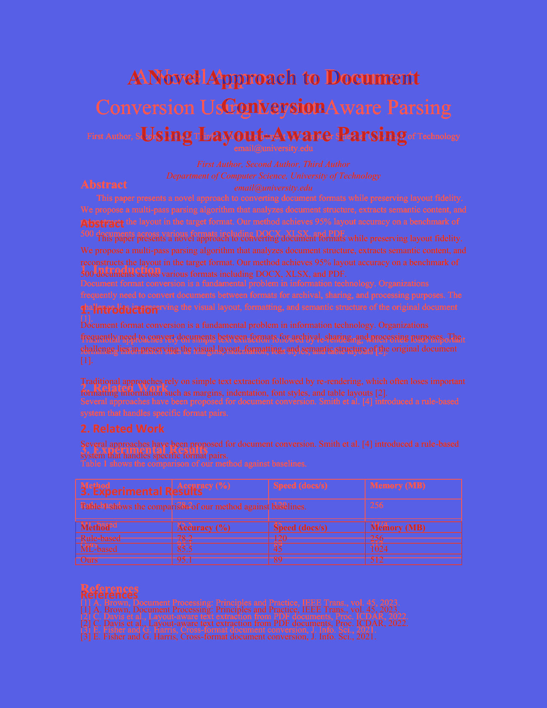</td>
  <td>changed: 217154 px (10.32%)<br>bbox: [175, 160, 1087, 1495]<br>mean abs RGB: 15.526<br>RMSE RGB: 54.8841<br>threshold: 12, gain: 5.0</td>
</tr>
<tr>
  <td><b>13_IEEE_Style_Paper</b><br>Page 2</td>
  <td>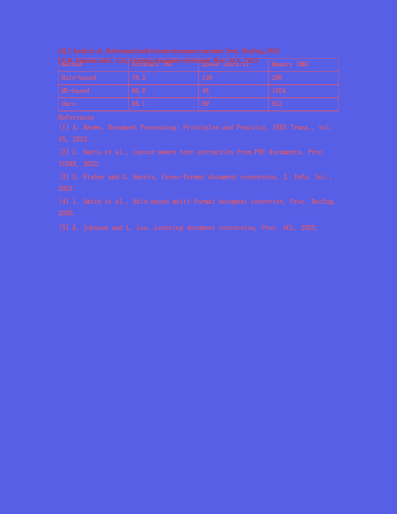</td>
  <td>changed: 10012 px (0.48%)<br>bbox: [189, 155, 900, 209]<br>mean abs RGB: 0.5828<br>RMSE RGB: 9.9503<br>threshold: 12, gain: 5.0</td>
</tr>
<tr>
  <td><b>14_Thesis_Chapter</b><br>Page 1</td>
  <td>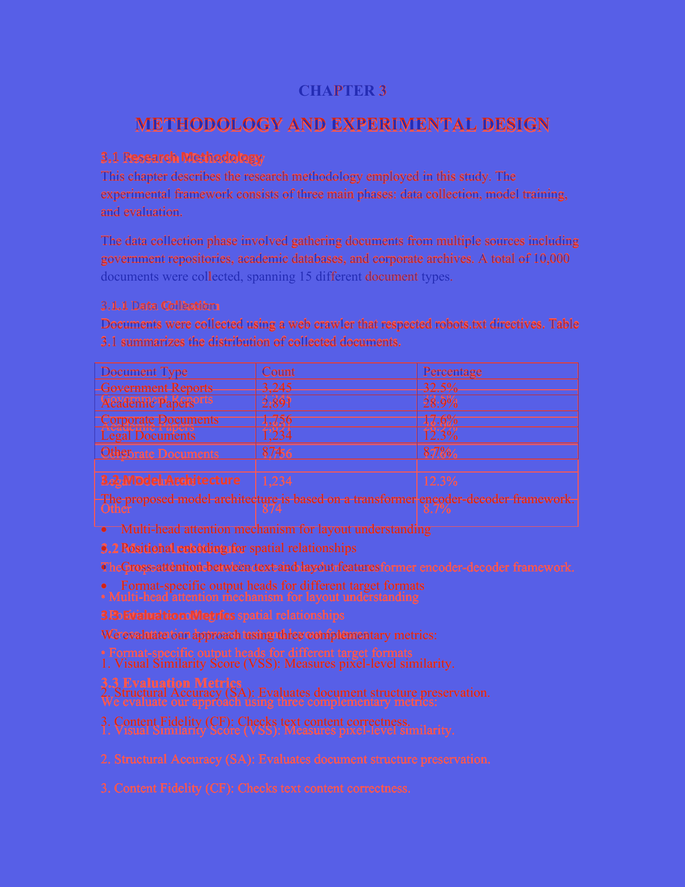</td>
  <td>changed: 167529 px (7.96%)<br>bbox: [175, 158, 1078, 1480]<br>mean abs RGB: 11.227<br>RMSE RGB: 45.6578<br>threshold: 12, gain: 5.0</td>
</tr>
<tr>
  <td><b>14_Thesis_Chapter</b><br>Page 2</td>
  <td></td>
  <td>changed: 37526 px (1.78%)<br>bbox: [187, 157, 1085, 304]<br>mean abs RGB: 2.735<br>RMSE RGB: 23.2198<br>threshold: 12, gain: 5.0</td>
</tr>
<tr>
  <td><b>20260317_sample_CN</b><br>Page 1</td>
  <td></td>
  <td>changed: 146236 px (6.95%)<br>bbox: [63, 98, 1204, 1536]<br>mean abs RGB: 8.4759<br>RMSE RGB: 38.4014<br>threshold: 12, gain: 5.0</td>
</tr>
<tr>
  <td><b>20260318_issue</b><br>Page 1</td>
  <td>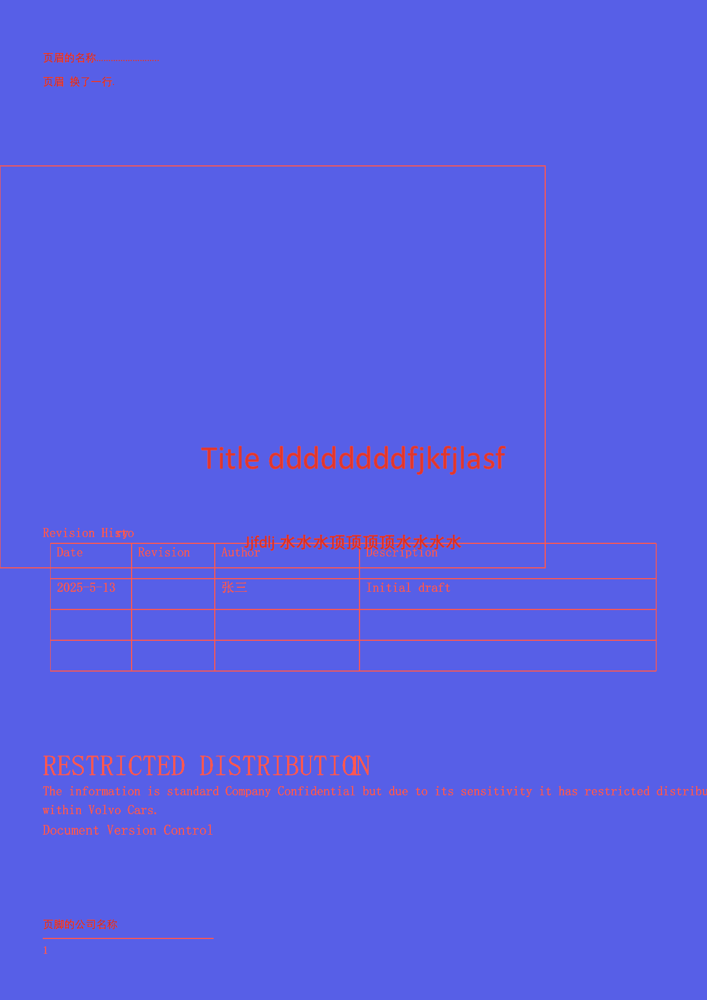</td>
  <td>changed: 51795 px (2.38%)<br>bbox: [0, 92, 1241, 1673]<br>mean abs RGB: 3.3444<br>RMSE RGB: 24.6656<br>threshold: 12, gain: 5.0</td>
</tr>
<tr>
  <td><b>20260318_issue</b><br>Page 2</td>
  <td>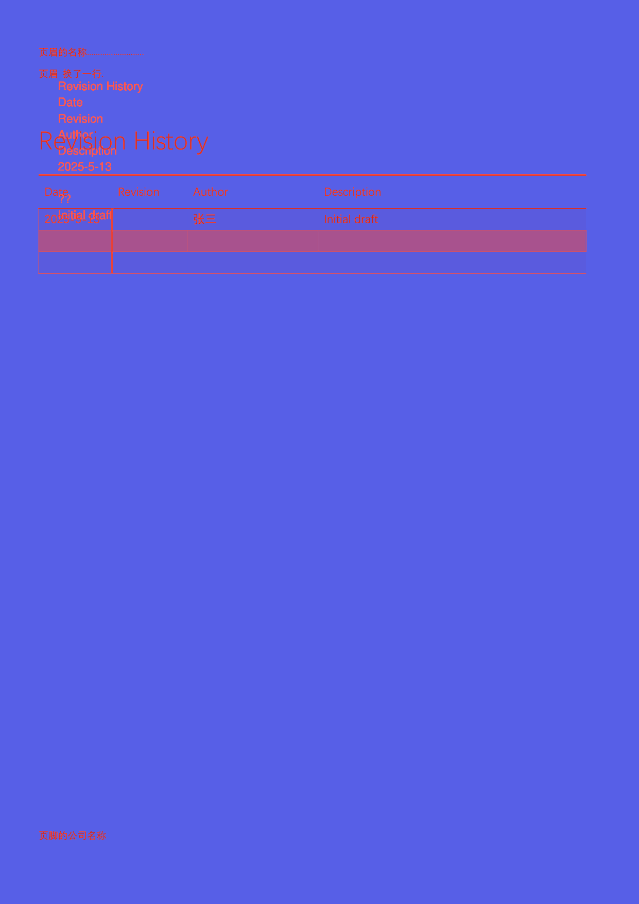</td>
  <td>changed: 270316 px (12.42%)<br>bbox: [74, 74, 1241, 1643]<br>mean abs RGB: 10.2344<br>RMSE RGB: 39.6958<br>threshold: 12, gain: 5.0</td>
</tr>
<tr>
  <td><b>20260318_issue</b><br>Page 3</td>
  <td></td>
  <td>changed: 529509 px (24.33%)<br>bbox: [73, 81, 1241, 1630]<br>mean abs RGB: 15.6742<br>RMSE RGB: 44.492<br>threshold: 12, gain: 5.0</td>
</tr>
<tr>
  <td><b>CCU_article</b><br>Page 1</td>
  <td>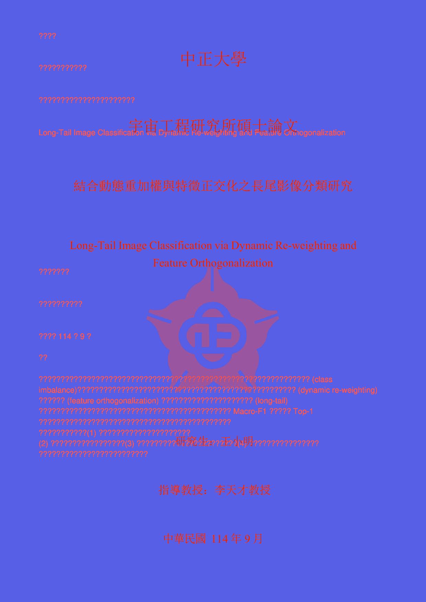</td>
  <td>changed: 138549 px (6.36%)<br>bbox: [114, 96, 1099, 1586]<br>mean abs RGB: 6.4875<br>RMSE RGB: 34.898<br>threshold: 12, gain: 5.0</td>
</tr>
<tr>
  <td><b>CCU_article</b><br>Page 2</td>
  <td>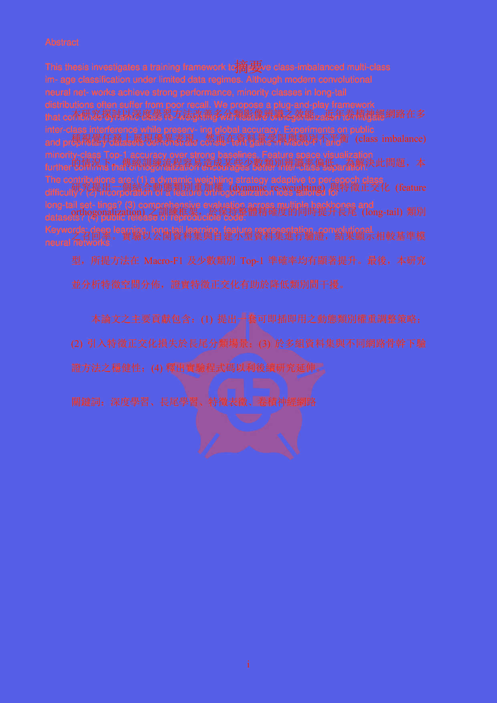</td>
  <td>changed: 212098 px (9.74%)<br>bbox: [112, 96, 1064, 1666]<br>mean abs RGB: 11.4131<br>RMSE RGB: 45.9688<br>threshold: 12, gain: 5.0</td>
</tr>
<tr>
  <td><b>CCU_article</b><br>Page 3</td>
  <td></td>
  <td>changed: 155609 px (7.14%)<br>bbox: [114, 96, 1195, 1666]<br>mean abs RGB: 7.8635<br>RMSE RGB: 38.5525<br>threshold: 12, gain: 5.0</td>
</tr>
<tr>
  <td><b>CCU_article</b><br>Page 4</td>
  <td>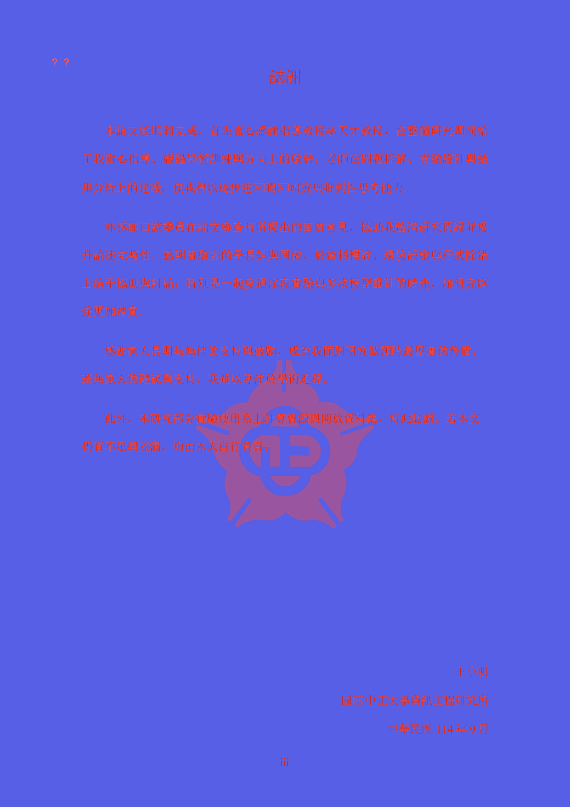</td>
  <td>changed: 129290 px (5.94%)<br>bbox: [114, 127, 1064, 1666]<br>mean abs RGB: 4.9331<br>RMSE RGB: 27.687<br>threshold: 12, gain: 5.0</td>
</tr>
<tr>
  <td><b>CCU_article</b><br>Page 5</td>
  <td></td>
  <td>changed: 125171 px (5.75%)<br>bbox: [114, 96, 1065, 1667]<br>mean abs RGB: 4.9081<br>RMSE RGB: 29.0165<br>threshold: 12, gain: 5.0</td>
</tr>
<tr>
  <td><b>CCU_article</b><br>Page 6</td>
  <td>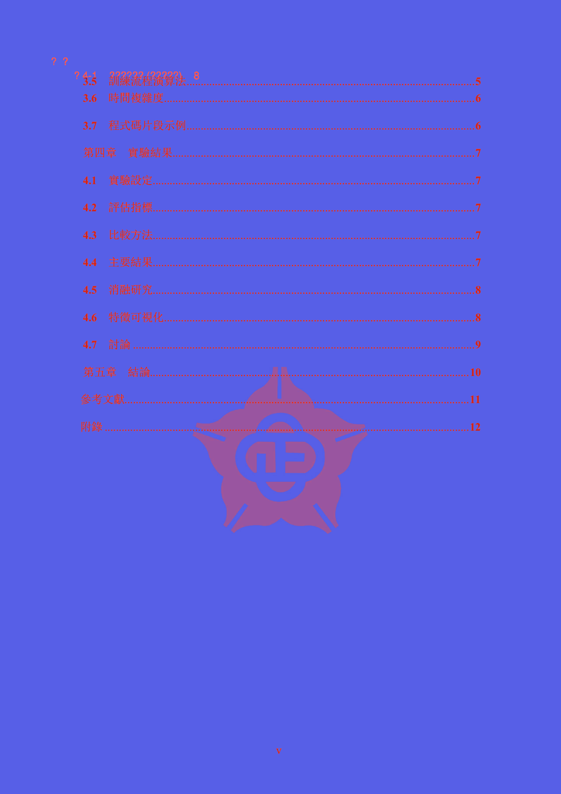</td>
  <td>changed: 100473 px (4.61%)<br>bbox: [114, 127, 1064, 1667]<br>mean abs RGB: 3.0741<br>RMSE RGB: 21.7521<br>threshold: 12, gain: 5.0</td>
</tr>
<tr>
  <td><b>CCU_article</b><br>Page 7</td>
  <td>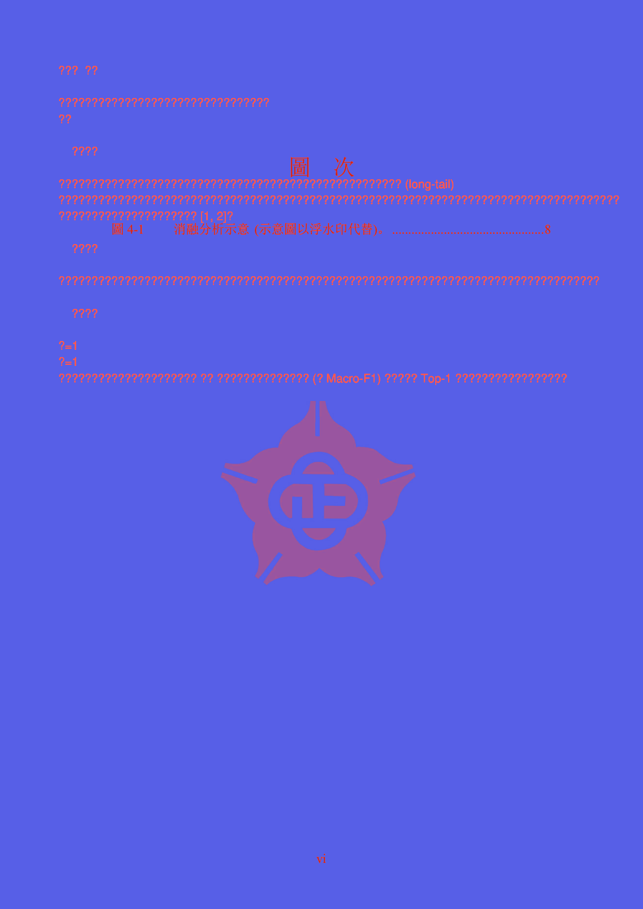</td>
  <td>changed: 94192 px (4.32%)<br>bbox: [114, 127, 1195, 1667]<br>mean abs RGB: 3.1818<br>RMSE RGB: 23.0892<br>threshold: 12, gain: 5.0</td>
</tr>
<tr>
  <td><b>CCU_article</b><br>Page 8</td>
  <td>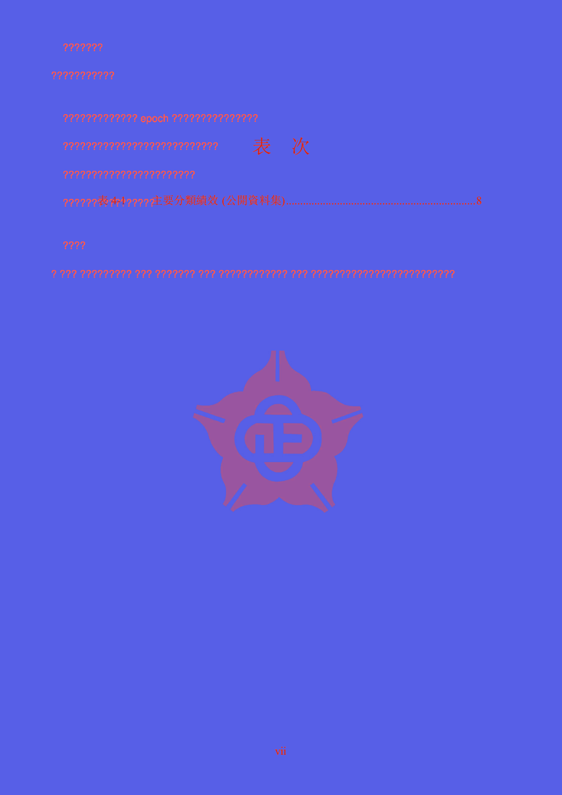</td>
  <td>changed: 78754 px (3.62%)<br>bbox: [114, 96, 1063, 1667]<br>mean abs RGB: 2.0121<br>RMSE RGB: 17.061<br>threshold: 12, gain: 5.0</td>
</tr>
<tr>
  <td><b>CCU_article</b><br>Page 9</td>
  <td>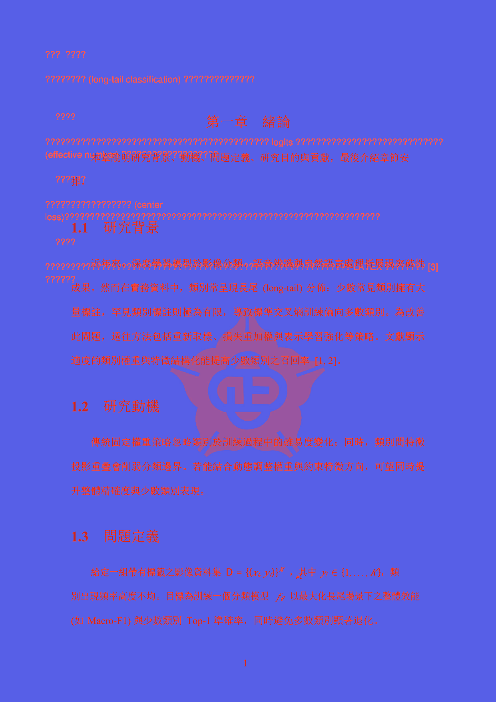</td>
  <td>changed: 167709 px (7.70%)<br>bbox: [114, 127, 1108, 1666]<br>mean abs RGB: 7.8134<br>RMSE RGB: 36.7118<br>threshold: 12, gain: 5.0</td>
</tr>
<tr>
  <td><b>CCU_article</b><br>Page 10</td>
  <td>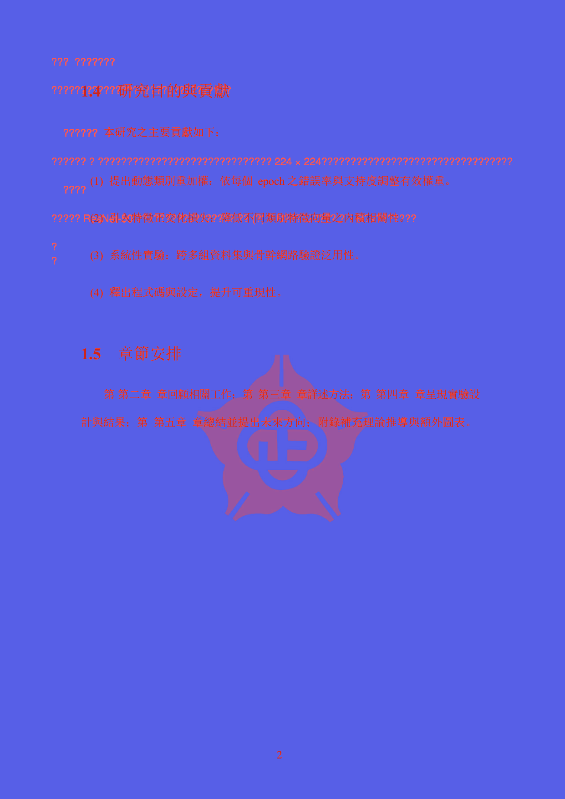</td>
  <td>changed: 113935 px (5.23%)<br>bbox: [114, 127, 1125, 1666]<br>mean abs RGB: 4.1576<br>RMSE RGB: 25.7932<br>threshold: 12, gain: 5.0</td>
</tr>
<tr>
  <td><b>CCU_article</b><br>Page 11</td>
  <td></td>
  <td>changed: 141822 px (6.51%)<br>bbox: [114, 96, 1063, 1667]<br>mean abs RGB: 6.0565<br>RMSE RGB: 31.9335<br>threshold: 12, gain: 5.0</td>
</tr>
<tr>
  <td><b>CCU_article</b><br>Page 12</td>
  <td></td>
  <td>changed: 67203 px (3.09%)<br>bbox: [113, 96, 1064, 1666]<br>mean abs RGB: 4.5033<br>RMSE RGB: 29.1535<br>threshold: 12, gain: 5.0</td>
</tr>
<tr>
  <td><b>CCU_article</b><br>Page 13</td>
  <td>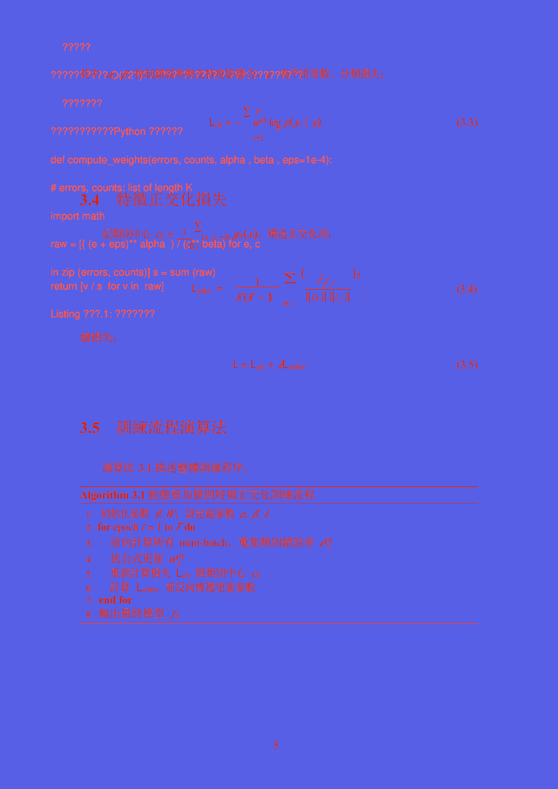</td>
  <td>changed: 71155 px (3.27%)<br>bbox: [112, 96, 1065, 1667]<br>mean abs RGB: 4.8437<br>RMSE RGB: 30.5443<br>threshold: 12, gain: 5.0</td>
</tr>
<tr>
  <td><b>CCU_article</b><br>Page 14</td>
  <td>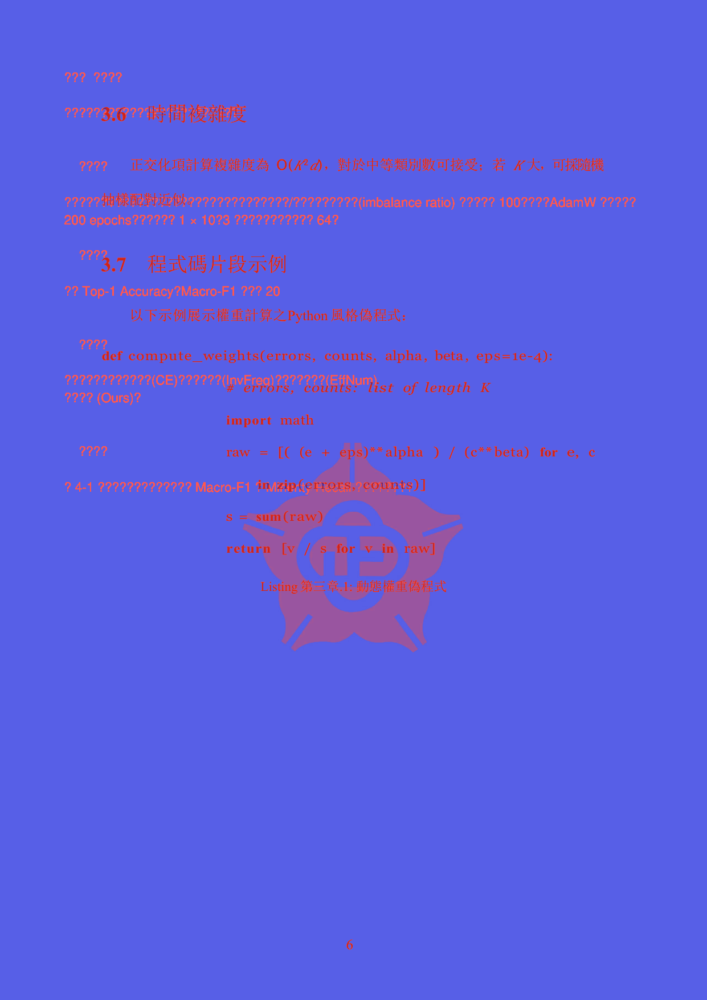</td>
  <td>changed: 114778 px (5.27%)<br>bbox: [113, 127, 1116, 1667]<br>mean abs RGB: 4.7073<br>RMSE RGB: 28.886<br>threshold: 12, gain: 5.0</td>
</tr>
<tr>
  <td><b>CCU_article</b><br>Page 15</td>
  <td></td>
  <td>changed: 68156 px (3.13%)<br>bbox: [113, 96, 1096, 1667]<br>mean abs RGB: 4.7208<br>RMSE RGB: 30.219<br>threshold: 12, gain: 5.0</td>
</tr>
<tr>
  <td><b>CCU_article</b><br>Page 16</td>
  <td></td>
  <td>changed: 163964 px (7.53%)<br>bbox: [114, 96, 1057, 1667]<br>mean abs RGB: 4.6648<br>RMSE RGB: 25.044<br>threshold: 12, gain: 5.0</td>
</tr>
<tr>
  <td><b>CCU_article</b><br>Page 17</td>
  <td></td>
  <td>changed: 23942 px (1.10%)<br>bbox: [114, 127, 1046, 1667]<br>mean abs RGB: 1.6765<br>RMSE RGB: 18.1291<br>threshold: 12, gain: 5.0</td>
</tr>
<tr>
  <td><b>CCU_article</b><br>Page 18</td>
  <td>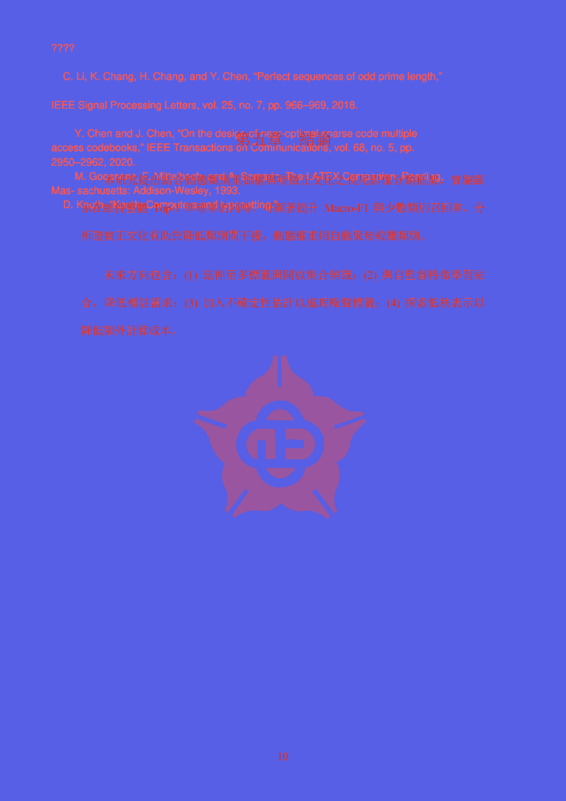</td>
  <td>changed: 128553 px (5.90%)<br>bbox: [113, 96, 1063, 1667]<br>mean abs RGB: 5.3657<br>RMSE RGB: 30.4197<br>threshold: 12, gain: 5.0</td>
</tr>
<tr>
  <td><b>CCU_article</b><br>Page 19</td>
  <td>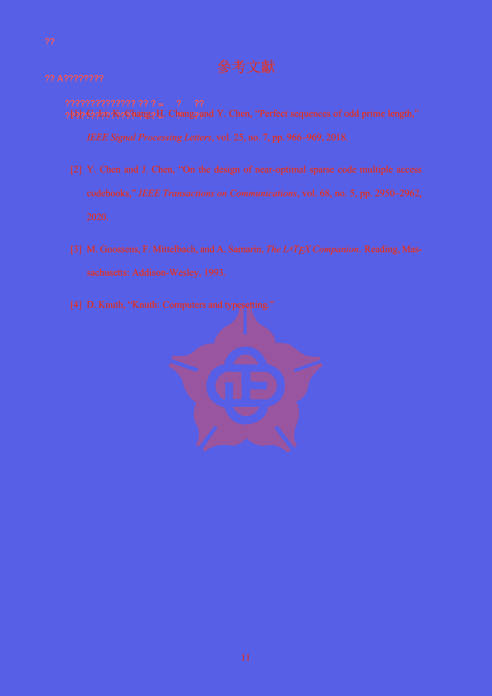</td>
  <td>changed: 100306 px (4.61%)<br>bbox: [114, 96, 1064, 1666]<br>mean abs RGB: 3.3656<br>RMSE RGB: 23.5775<br>threshold: 12, gain: 5.0</td>
</tr>
<tr>
  <td><b>CCU_article</b><br>Page 20</td>
  <td>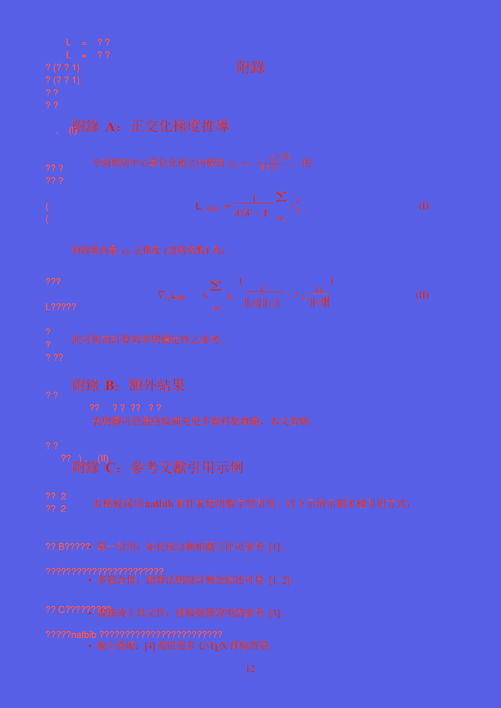</td>
  <td>changed: 62107 px (2.85%)<br>bbox: [114, 96, 1061, 1666]<br>mean abs RGB: 4.1895<br>RMSE RGB: 28.1907<br>threshold: 12, gain: 5.0</td>
</tr>
<tr>
  <td><b>CCU_article</b><br>Page 21</td>
  <td></td>
  <td>changed: 94802 px (4.35%)<br>bbox: [114, 127, 1060, 1667]<br>mean abs RGB: 3.055<br>RMSE RGB: 21.9699<br>threshold: 12, gain: 5.0</td>
</tr>
<tr>
  <td><b>Class News</b><br>Page 1</td>
  <td></td>
  <td>changed: 278967 px (13.26%)<br>bbox: [2, 21, 1223, 1650]<br>mean abs RGB: 13.3688<br>RMSE RGB: 45.0573<br>threshold: 12, gain: 5.0</td>
</tr>
<tr>
  <td><b>Class News</b><br>Page 2</td>
  <td></td>
  <td>changed: 434258 px (20.64%)<br>bbox: [0, 95, 1223, 1650]<br>mean abs RGB: 20.98<br>RMSE RGB: 57.484<br>threshold: 12, gain: 5.0</td>
</tr>
<tr>
  <td><b>Class News</b><br>Page 3</td>
  <td></td>
  <td>changed: 375770 px (17.86%)<br>bbox: [2, 104, 1223, 1413]<br>mean abs RGB: 18.9329<br>RMSE RGB: 53.6964<br>threshold: 12, gain: 5.0</td>
</tr>
<tr>
  <td><b>Class News</b><br>Page 4</td>
  <td></td>
  <td>changed: 432317 px (20.55%)<br>bbox: [2, 1, 1223, 1447]<br>mean abs RGB: 21.3629<br>RMSE RGB: 58.2449<br>threshold: 12, gain: 5.0</td>
</tr>
<tr>
  <td><b>Confirmatory_Affidavit</b><br>Page 1</td>
  <td>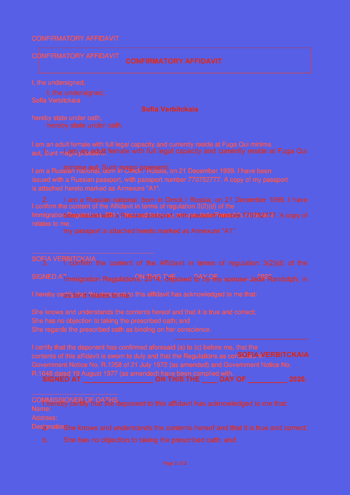</td>
  <td>changed: 170287 px (7.82%)<br>bbox: [112, 127, 1103, 1651]<br>mean abs RGB: 13.5247<br>RMSE RGB: 53.515<br>threshold: 12, gain: 5.0</td>
</tr>
<tr>
  <td><b>Cooperation Agreement Template</b><br>Page 1</td>
  <td></td>
  <td>changed: 62243 px (2.86%)<br>bbox: [113, 94, 1241, 1638]<br>mean abs RGB: 4.2872<br>RMSE RGB: 28.6961<br>threshold: 12, gain: 5.0</td>
</tr>
<tr>
  <td><b>Cooperation Agreement Template</b><br>Page 2</td>
  <td></td>
  <td>changed: 128887 px (5.92%)<br>bbox: [113, 97, 1241, 1642]<br>mean abs RGB: 7.757<br>RMSE RGB: 36.4205<br>threshold: 12, gain: 5.0</td>
</tr>
<tr>
  <td><b>Cooperation Agreement Template</b><br>Page 3</td>
  <td></td>
  <td>changed: 21093 px (0.97%)<br>bbox: [113, 94, 1070, 1643]<br>mean abs RGB: 1.3136<br>RMSE RGB: 15.2846<br>threshold: 12, gain: 5.0</td>
</tr>
<tr>
  <td><b>Cooperation Agreement Template</b><br>Page 4</td>
  <td></td>
  <td>changed: 19554 px (0.90%)<br>bbox: [166, 250, 1086, 1642]<br>mean abs RGB: 1.1753<br>RMSE RGB: 14.2465<br>threshold: 12, gain: 5.0</td>
</tr>
<tr>
  <td><b>Fabrikam</b><br>Page 1</td>
  <td>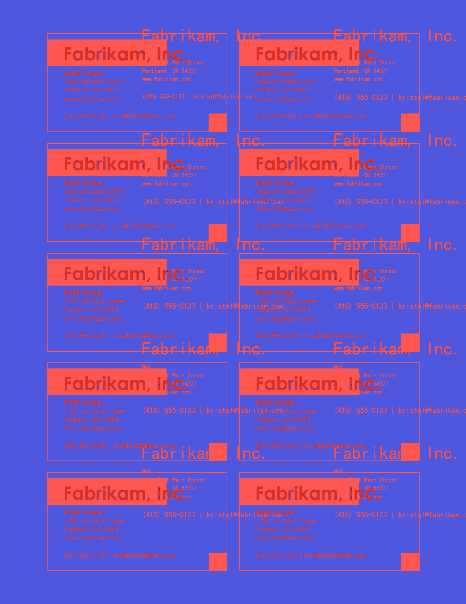</td>
  <td>changed: 407289 px (19.36%)<br>bbox: [128, 79, 1275, 1560]<br>mean abs RGB: 13.818<br>RMSE RGB: 38.074<br>threshold: 12, gain: 5.0</td>
</tr>
<tr>
  <td><b>Invoice</b><br>Page 1</td>
  <td>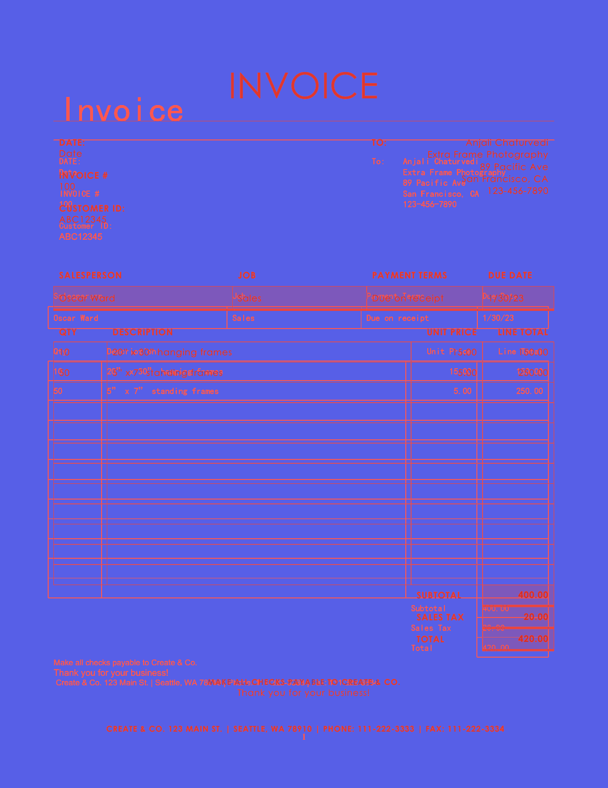</td>
  <td>changed: 195619 px (9.30%)<br>bbox: [100, 150, 1163, 1549]<br>mean abs RGB: 8.023<br>RMSE RGB: 34.1928<br>threshold: 12, gain: 5.0</td>
</tr>
<tr>
  <td><b>Issue79_FilledContract</b><br>Page 1</td>
  <td>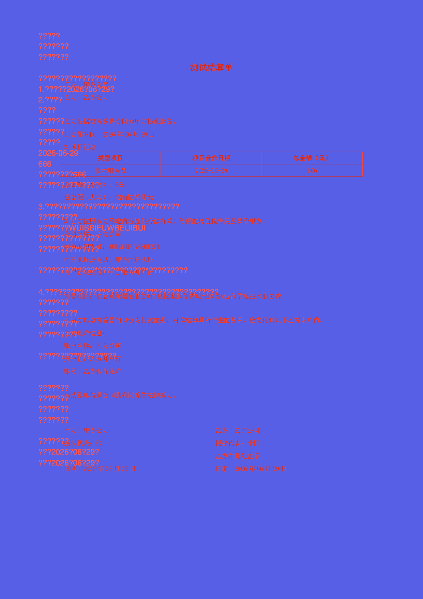</td>
  <td>changed: 83504 px (3.84%)<br>bbox: [175, 185, 1065, 1381]<br>mean abs RGB: 4.8533<br>RMSE RGB: 28.4645<br>threshold: 12, gain: 5.0</td>
</tr>
<tr>
  <td><b>Issue79_TemplateContract</b><br>Page 1</td>
  <td>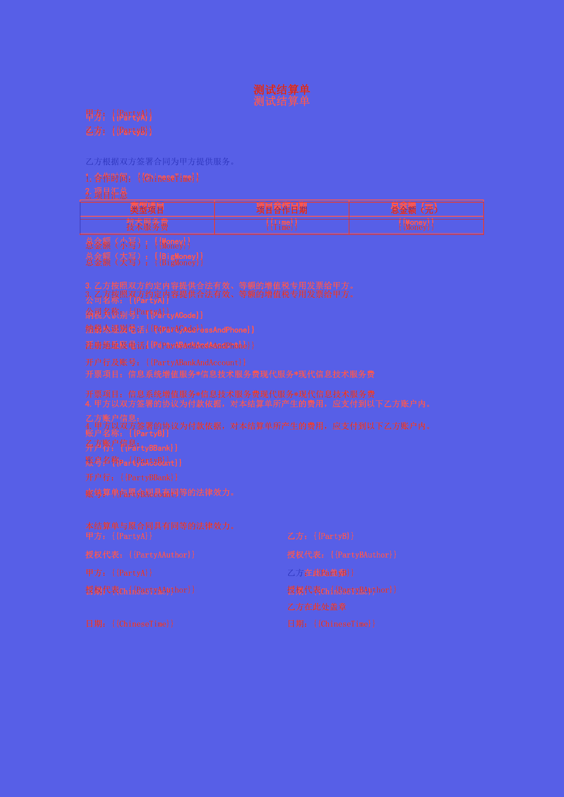</td>
  <td>changed: 86910 px (3.99%)<br>bbox: [175, 185, 1065, 1381]<br>mean abs RGB: 5.0989<br>RMSE RGB: 29.2728<br>threshold: 12, gain: 5.0</td>
</tr>
<tr>
  <td><b>Issue83_Output</b><br>Page 1</td>
  <td></td>
  <td>changed: 21330 px (0.98%)<br>bbox: [147, 199, 384, 289]<br>mean abs RGB: 1.507<br>RMSE RGB: 17.9338<br>threshold: 12, gain: 5.0</td>
</tr>
<tr>
  <td><b>Issue159_PageLayoutOptions</b><br>Page 1</td>
  <td>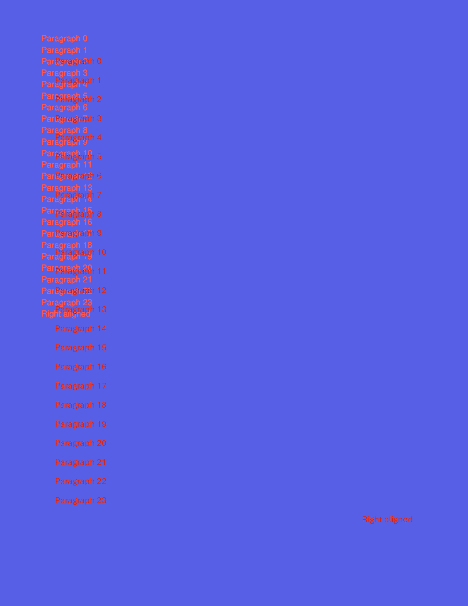</td>
  <td>changed: 45846 px (2.18%)<br>bbox: [114, 95, 1124, 1427]<br>mean abs RGB: 3.7856<br>RMSE RGB: 28.2366<br>threshold: 12, gain: 5.0</td>
</tr>
<tr>
  <td><b>issue202605</b><br>Page 1</td>
  <td>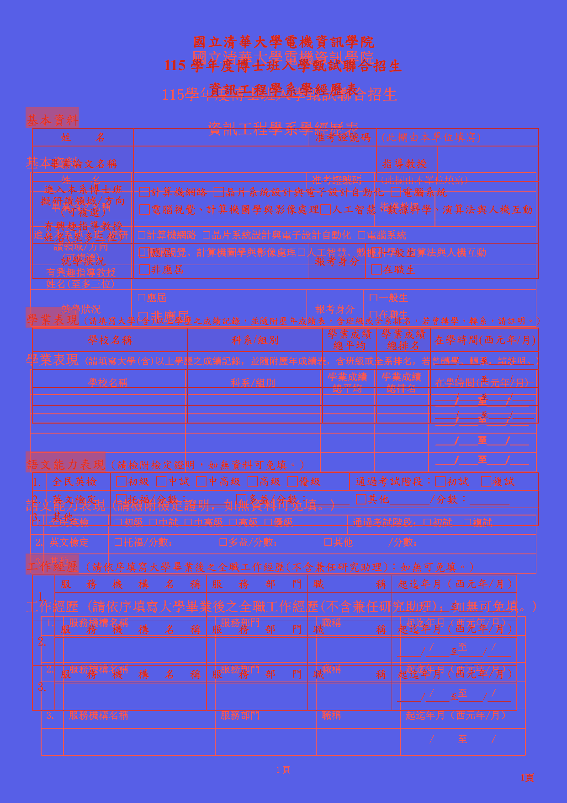</td>
  <td>changed: 430236 px (19.77%)<br>bbox: [56, 75, 1181, 1709]<br>mean abs RGB: 19.4838<br>RMSE RGB: 58.5746<br>threshold: 12, gain: 5.0</td>
</tr>
<tr>
  <td><b>issue202605</b><br>Page 2</td>
  <td>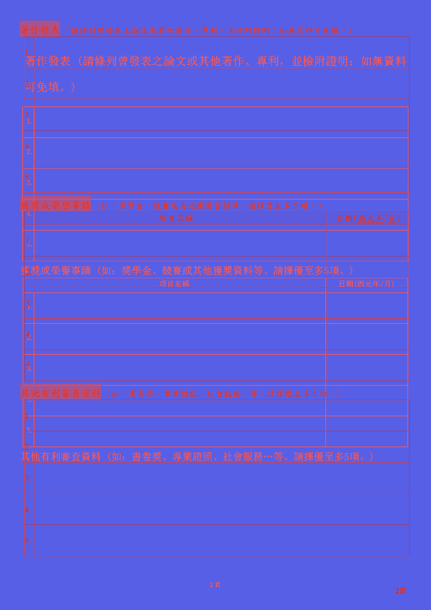</td>
  <td>changed: 194813 px (8.95%)<br>bbox: [56, 59, 1179, 1709]<br>mean abs RGB: 8.7114<br>RMSE RGB: 38.7213<br>threshold: 12, gain: 5.0</td>
</tr>
<tr>
  <td><b>issue26050501</b><br>Page 1</td>
  <td>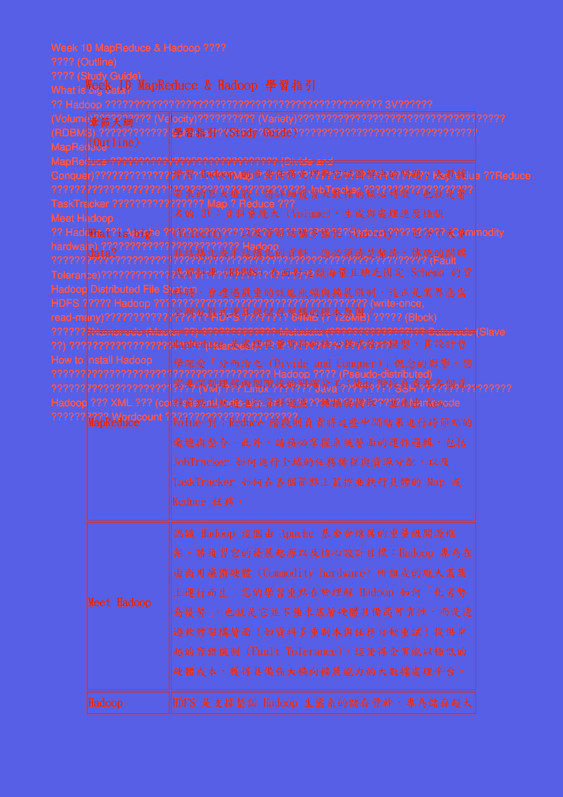</td>
  <td>changed: 163169 px (7.50%)<br>bbox: [187, 174, 1049, 1572]<br>mean abs RGB: 11.8431<br>RMSE RGB: 48.5021<br>threshold: 12, gain: 5.0</td>
</tr>
<tr>
  <td><b>issue26050501</b><br>Page 2</td>
  <td>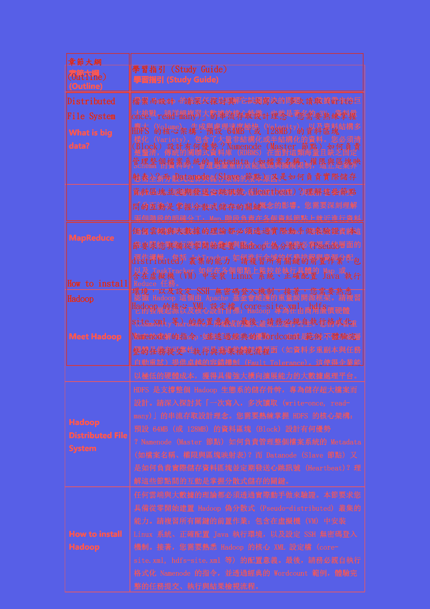</td>
  <td>changed: 312422 px (14.35%)<br>bbox: [175, 153, 1049, 1754]<br>mean abs RGB: 22.0099<br>RMSE RGB: 65.6291<br>threshold: 12, gain: 5.0</td>
</tr>
<tr>
  <td><b>issues66</b><br>Page 1</td>
  <td>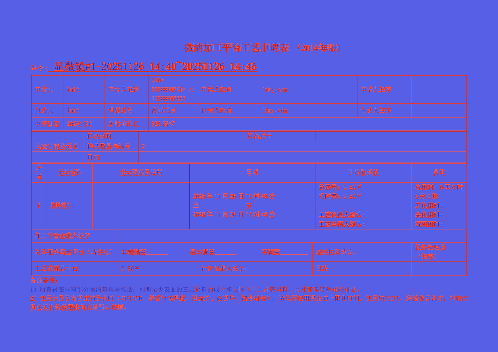</td>
  <td>changed: 173704 px (7.98%)<br>bbox: [106, 149, 1648, 1133]<br>mean abs RGB: 9.3797<br>RMSE RGB: 39.5685<br>threshold: 12, gain: 5.0</td>
</tr>
<tr>
  <td><b>issues66</b><br>Page 2</td>
  <td>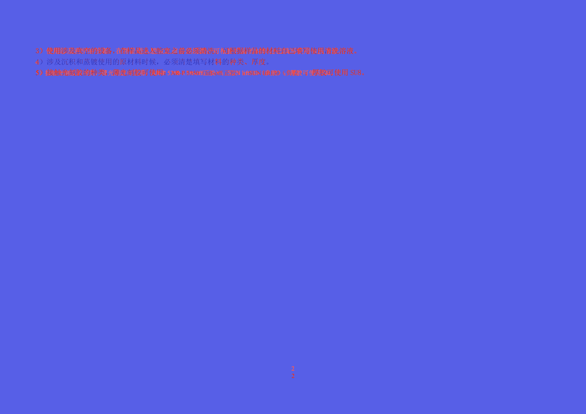</td>
  <td>changed: 22422 px (1.03%)<br>bbox: [106, 142, 1089, 1133]<br>mean abs RGB: 1.0623<br>RMSE RGB: 12.8582<br>threshold: 12, gain: 5.0</td>
</tr>
<tr>
  <td><b>issues66</b><br>Page 3</td>
  <td></td>
  <td>changed: 105 px (0.00%)<br>bbox: [873, 1098, 881, 1134]<br>mean abs RGB: 0.0064<br>RMSE RGB: 1.088<br>threshold: 12, gain: 5.0</td>
</tr>
<tr>
  <td><b>MODERN LIVING</b><br>Page 1</td>
  <td></td>
  <td>changed: 1137893 px (54.09%)<br>bbox: [86, 0, 1275, 1650]<br>mean abs RGB: 24.0918<br>RMSE RGB: 48.2437<br>threshold: 12, gain: 5.0</td>
</tr>
<tr>
  <td><b>MODERN LIVING</b><br>Page 2</td>
  <td></td>
  <td>changed: 1246177 px (59.24%)<br>bbox: [0, 0, 1200, 1650]<br>mean abs RGB: 33.5382<br>RMSE RGB: 66.309<br>threshold: 12, gain: 5.0</td>
</tr>
<tr>
  <td><b>nthu_article</b><br>Page 1</td>
  <td>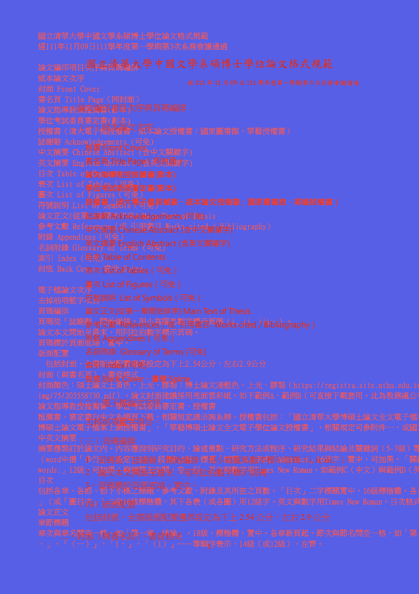</td>
  <td>changed: 244962 px (11.25%)<br>bbox: [112, 95, 1241, 1620]<br>mean abs RGB: 14.3678<br>RMSE RGB: 49.3604<br>threshold: 12, gain: 5.0</td>
</tr>
<tr>
  <td><b>nthu_article</b><br>Page 2</td>
  <td>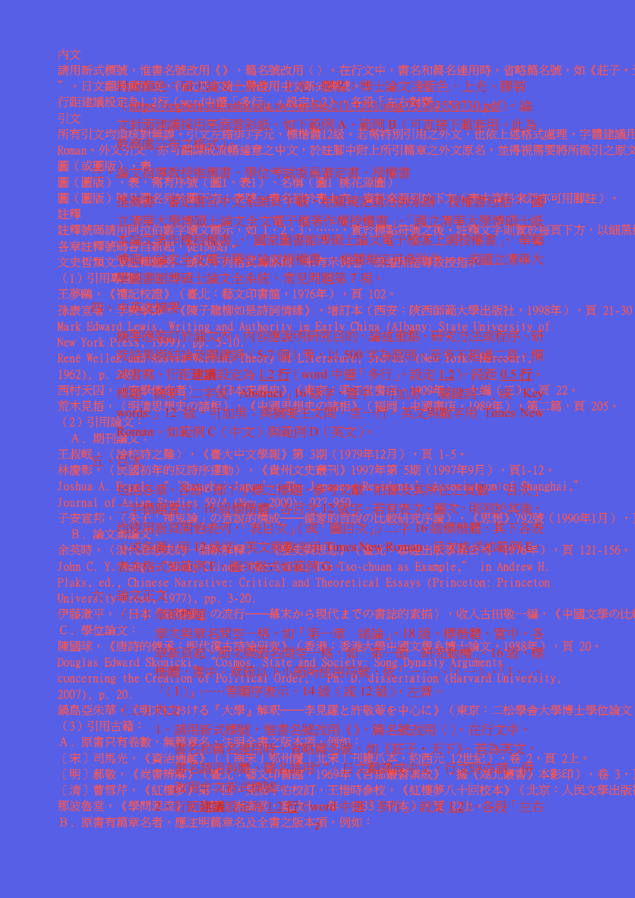</td>
  <td>changed: 352334 px (16.19%)<br>bbox: [112, 95, 1241, 1620]<br>mean abs RGB: 20.3647<br>RMSE RGB: 58.14<br>threshold: 12, gain: 5.0</td>
</tr>
<tr>
  <td><b>nthu_article</b><br>Page 3</td>
  <td>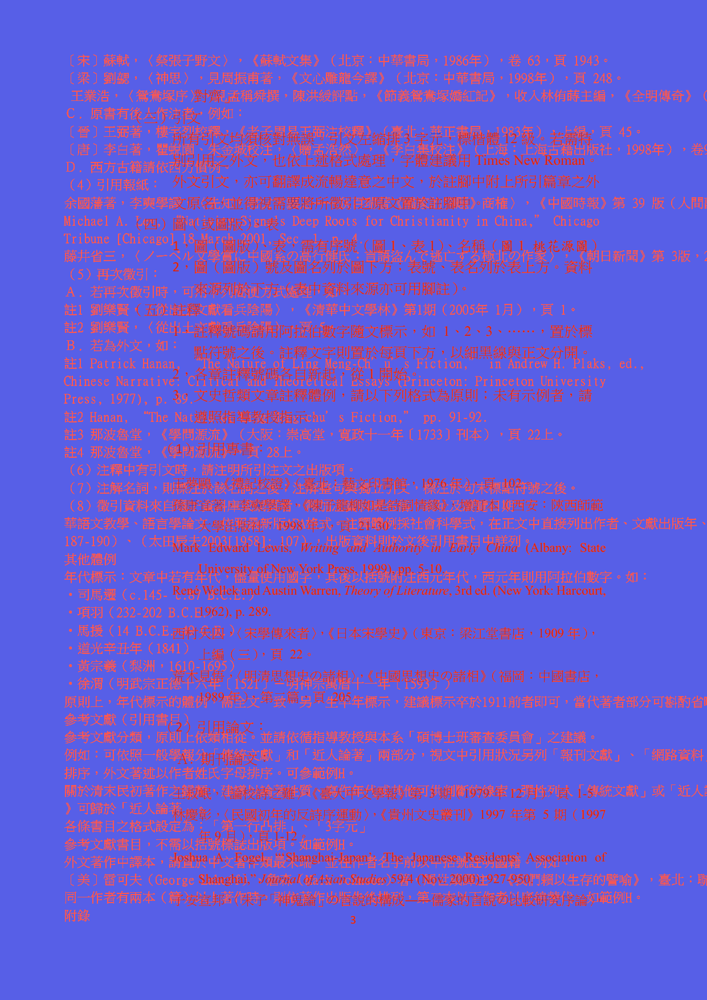</td>
  <td>changed: 311122 px (14.29%)<br>bbox: [112, 95, 1241, 1621]<br>mean abs RGB: 18.0359<br>RMSE RGB: 54.7903<br>threshold: 12, gain: 5.0</td>
</tr>
<tr>
  <td><b>nthu_article</b><br>Page 4</td>
  <td>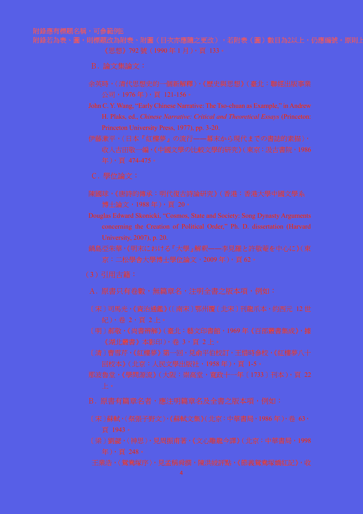</td>
  <td>changed: 124130 px (5.70%)<br>bbox: [114, 95, 1241, 1620]<br>mean abs RGB: 7.427<br>RMSE RGB: 35.6487<br>threshold: 12, gain: 5.0</td>
</tr>
<tr>
  <td><b>nthu_article</b><br>Page 5</td>
  <td>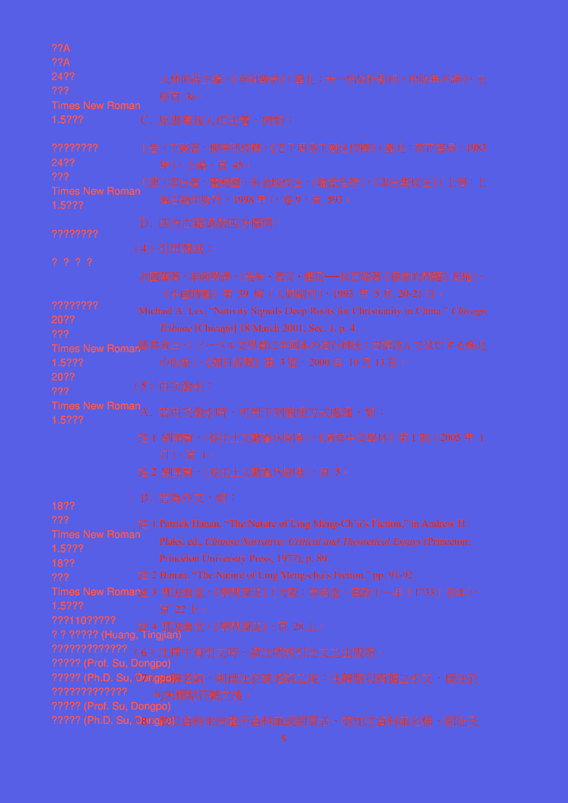</td>
  <td>changed: 139766 px (6.42%)<br>bbox: [112, 95, 1063, 1621]<br>mean abs RGB: 8.427<br>RMSE RGB: 38.1207<br>threshold: 12, gain: 5.0</td>
</tr>
<tr>
  <td><b>nthu_article</b><br>Page 6</td>
  <td>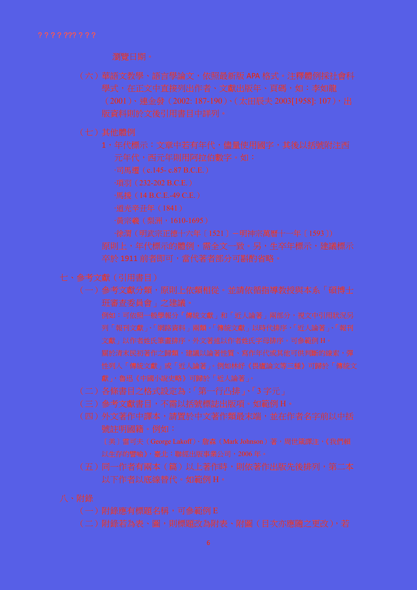</td>
  <td>changed: 129485 px (5.95%)<br>bbox: [115, 95, 1062, 1621]<br>mean abs RGB: 7.6541<br>RMSE RGB: 35.8131<br>threshold: 12, gain: 5.0</td>
</tr>
<tr>
  <td><b>nthu_article</b><br>Page 7</td>
  <td>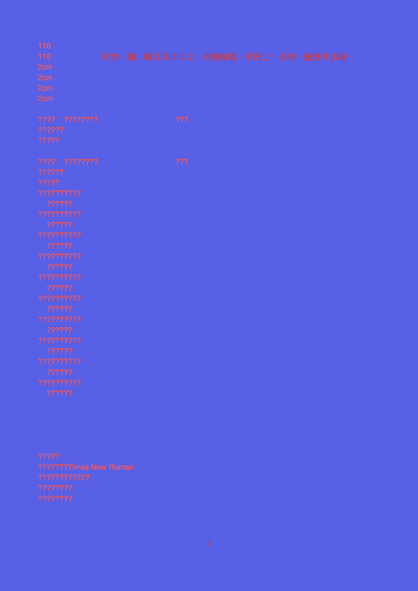</td>
  <td>changed: 55795 px (2.56%)<br>bbox: [113, 128, 1043, 1620]<br>mean abs RGB: 3.2143<br>RMSE RGB: 22.9235<br>threshold: 12, gain: 5.0</td>
</tr>
<tr>
  <td><b>nthu_article</b><br>Page 8</td>
  <td>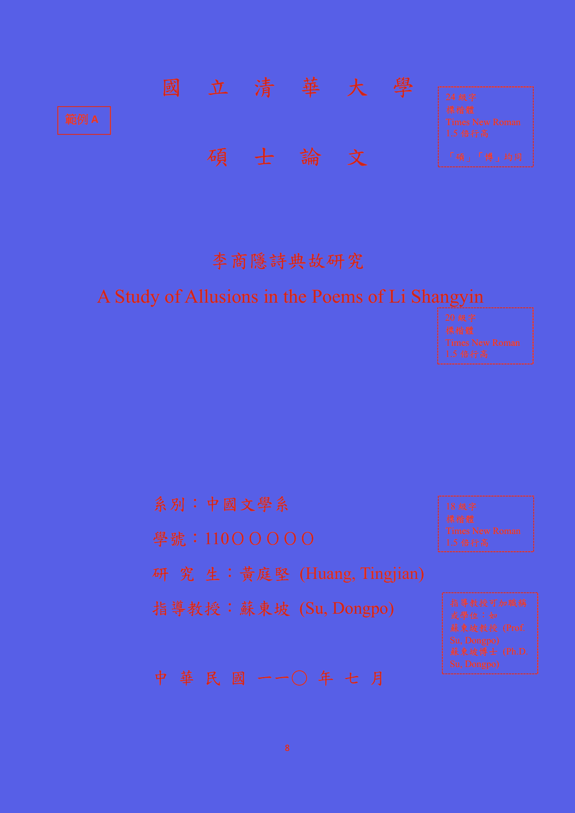</td>
  <td>changed: 56006 px (2.57%)<br>bbox: [123, 165, 1162, 1621]<br>mean abs RGB: 3.9313<br>RMSE RGB: 28.6256<br>threshold: 12, gain: 5.0</td>
</tr>
<tr>
  <td><b>nthu_article</b><br>Page 9</td>
  <td>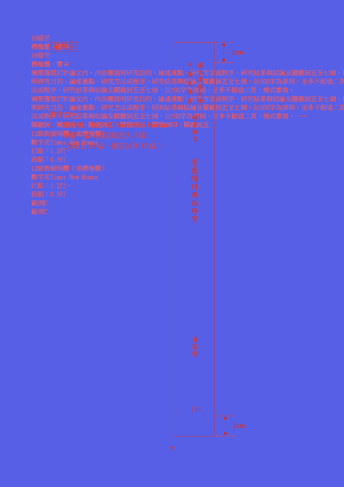</td>
  <td>changed: 87748 px (4.03%)<br>bbox: [113, 126, 1241, 1621]<br>mean abs RGB: 5.0683<br>RMSE RGB: 29.1886<br>threshold: 12, gain: 5.0</td>
</tr>
<tr>
  <td><b>nthu_article</b><br>Page 10</td>
  <td>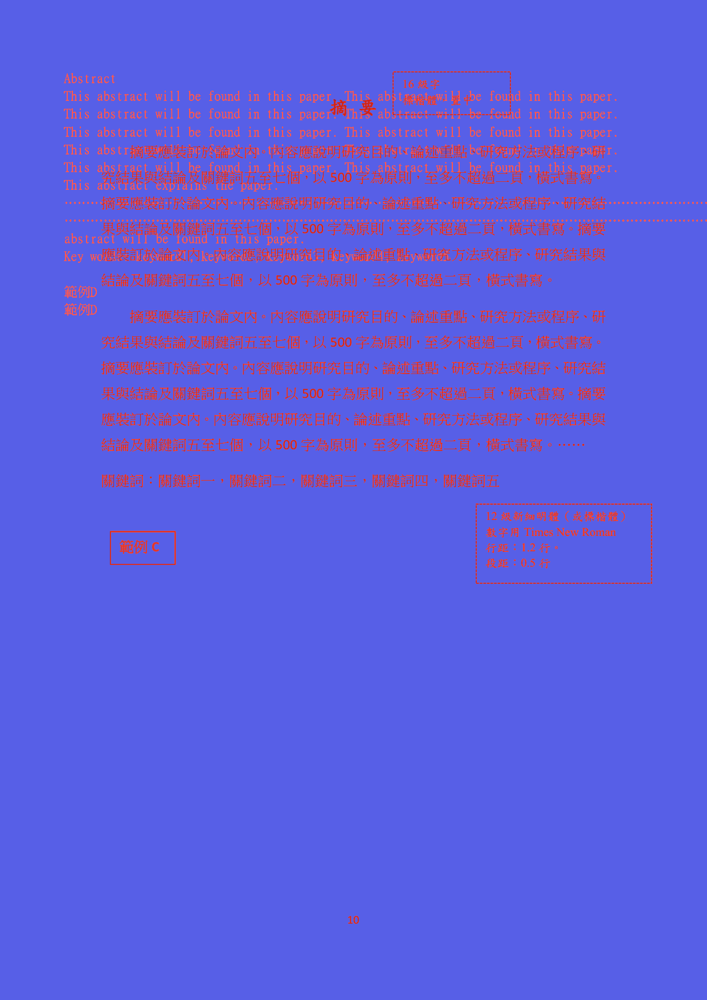</td>
  <td>changed: 126378 px (5.81%)<br>bbox: [112, 125, 1241, 1621]<br>mean abs RGB: 7.5484<br>RMSE RGB: 36.1332<br>threshold: 12, gain: 5.0</td>
</tr>
<tr>
  <td><b>nthu_article</b><br>Page 11</td>
  <td></td>
  <td>changed: 113367 px (5.21%)<br>bbox: [113, 126, 1064, 1620]<br>mean abs RGB: 7.1916<br>RMSE RGB: 36.3797<br>threshold: 12, gain: 5.0</td>
</tr>
<tr>
  <td><b>nthu_article</b><br>Page 12</td>
  <td></td>
  <td>changed: 85079 px (3.91%)<br>bbox: [113, 134, 1226, 1620]<br>mean abs RGB: 5.3161<br>RMSE RGB: 31.5764<br>threshold: 12, gain: 5.0</td>
</tr>
<tr>
  <td><b>nthu_article</b><br>Page 13</td>
  <td>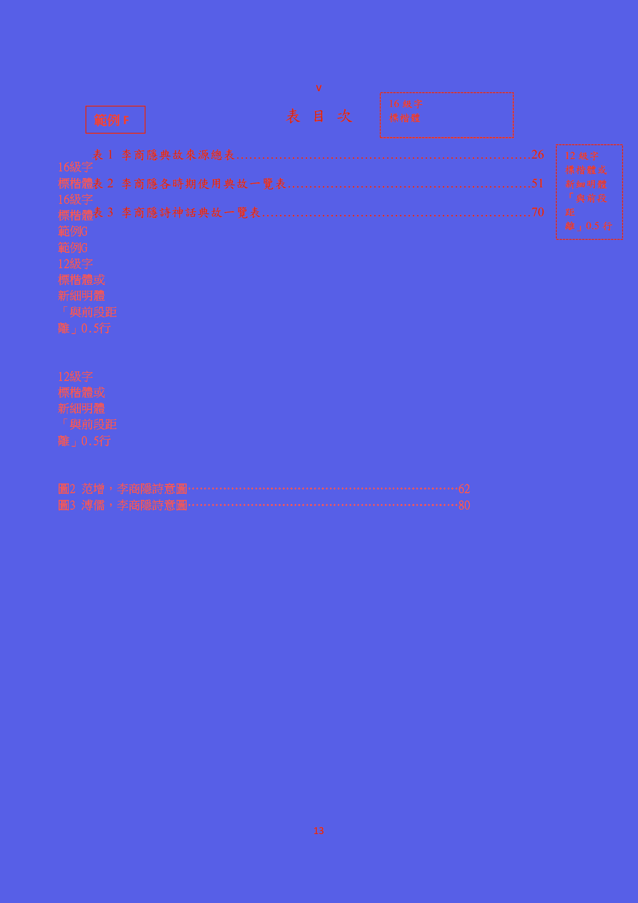</td>
  <td>changed: 36581 px (1.68%)<br>bbox: [113, 165, 1212, 1621]<br>mean abs RGB: 2.1997<br>RMSE RGB: 19.8871<br>threshold: 12, gain: 5.0</td>
</tr>
<tr>
  <td><b>nthu_article</b><br>Page 14</td>
  <td>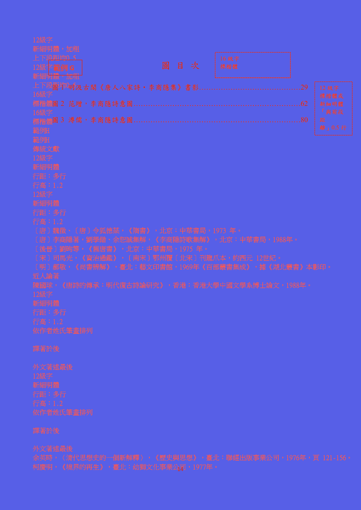</td>
  <td>changed: 91644 px (4.21%)<br>bbox: [113, 126, 1212, 1620]<br>mean abs RGB: 5.3131<br>RMSE RGB: 29.9552<br>threshold: 12, gain: 5.0</td>
</tr>
<tr>
  <td><b>nthu_article</b><br>Page 15</td>
  <td>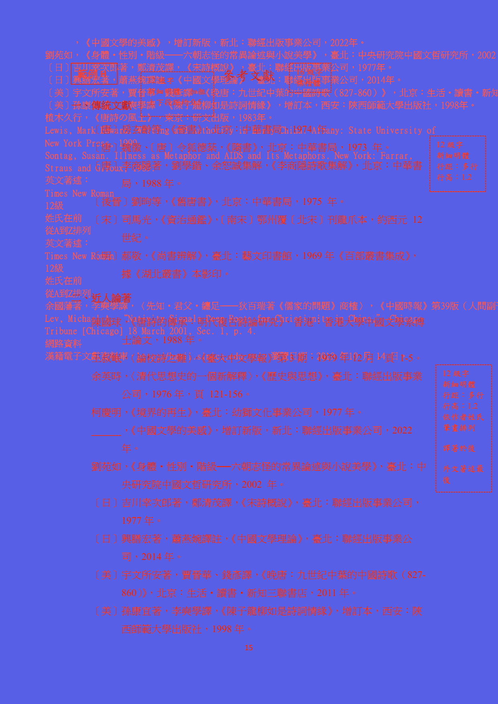</td>
  <td>changed: 199737 px (9.18%)<br>bbox: [112, 95, 1241, 1621]<br>mean abs RGB: 11.7268<br>RMSE RGB: 44.6731<br>threshold: 12, gain: 5.0</td>
</tr>
<tr>
  <td><b>nthu_article</b><br>Page 16</td>
  <td>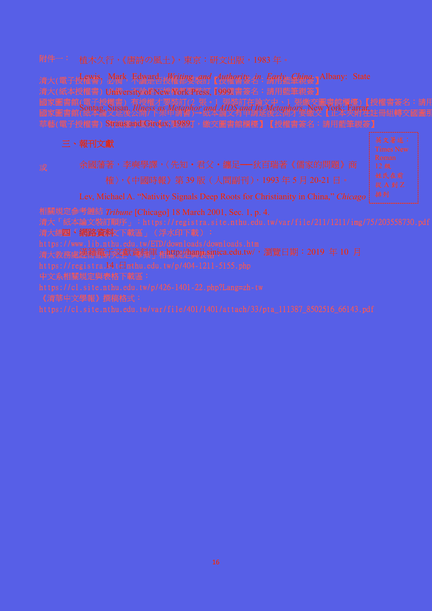</td>
  <td>changed: 118621 px (5.45%)<br>bbox: [113, 157, 1241, 1621]<br>mean abs RGB: 7.2762<br>RMSE RGB: 35.8045<br>threshold: 12, gain: 5.0</td>
</tr>
<tr>
  <td><b>OSCAR WARD</b><br>Page 1</td>
  <td></td>
  <td>changed: 546690 px (25.99%)<br>bbox: [0, 0, 1275, 1650]<br>mean abs RGB: 13.2706<br>RMSE RGB: 41.9133<br>threshold: 12, gain: 5.0</td>
</tr>
<tr>
  <td><b>SA8000 ch sample</b><br>Page 1</td>
  <td></td>
  <td>changed: 275173 px (12.64%)<br>bbox: [59, 30, 1221, 1579]<br>mean abs RGB: 17.286<br>RMSE RGB: 55.8112<br>threshold: 12, gain: 5.0</td>
</tr>
<tr>
  <td><b>SA8000 ch sample</b><br>Page 2</td>
  <td></td>
  <td>changed: 288666 px (13.26%)<br>bbox: [59, 30, 1241, 1717]<br>mean abs RGB: 17.6048<br>RMSE RGB: 55.5034<br>threshold: 12, gain: 5.0</td>
</tr>
<tr>
  <td><b>Support_Letter</b><br>Page 1</td>
  <td>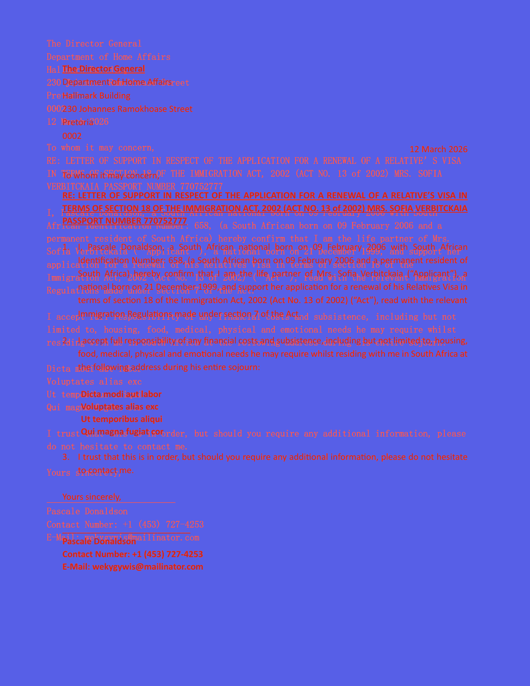</td>
  <td>changed: 166336 px (7.91%)<br>bbox: [112, 95, 1126, 1375]<br>mean abs RGB: 12.3241<br>RMSE RGB: 49.2843<br>threshold: 12, gain: 5.0</td>
</tr>
<tr>
  <td><b>Template for MSc Thesis</b><br>Page 1</td>
  <td></td>
  <td>changed: 329685 px (15.67%)<br>bbox: [105, 82, 1275, 1530]<br>mean abs RGB: 24.4233<br>RMSE RGB: 69.7976<br>threshold: 12, gain: 5.0</td>
</tr>
<tr>
  <td><b>Template for MSc Thesis</b><br>Page 2</td>
  <td></td>
  <td>changed: 214796 px (10.21%)<br>bbox: [105, 81, 1275, 1513]<br>mean abs RGB: 15.9365<br>RMSE RGB: 56.271<br>threshold: 12, gain: 5.0</td>
</tr>
<tr>
  <td><b>Template for MSc Thesis</b><br>Page 3</td>
  <td></td>
  <td>changed: 138596 px (6.59%)<br>bbox: [131, 88, 1172, 1387]<br>mean abs RGB: 10.6575<br>RMSE RGB: 46.46<br>threshold: 12, gain: 5.0</td>
</tr>
<tr>
  <td><b>Template for MSc Thesis</b><br>Page 4</td>
  <td></td>
  <td>changed: 133139 px (6.33%)<br>bbox: [131, 88, 1172, 1438]<br>mean abs RGB: 10.3645<br>RMSE RGB: 46.0963<br>threshold: 12, gain: 5.0</td>
</tr>
<tr>
  <td><b>Template for MSc Thesis</b><br>Page 5</td>
  <td></td>
  <td>changed: 234757 px (11.16%)<br>bbox: [105, 75, 1275, 1483]<br>mean abs RGB: 17.2785<br>RMSE RGB: 58.5145<br>threshold: 12, gain: 5.0</td>
</tr>
<tr>
  <td><b>Template for MSc Thesis</b><br>Page 6</td>
  <td></td>
  <td>changed: 6387 px (0.30%)<br>bbox: [456, 83, 848, 134]<br>mean abs RGB: 0.5624<br>RMSE RGB: 11.1244<br>threshold: 12, gain: 5.0</td>
</tr>
<tr>
  <td><b>Template for MSc Thesis</b><br>Page 7</td>
  <td></td>
  <td>changed: 5321 px (0.25%)<br>bbox: [479, 83, 816, 139]<br>mean abs RGB: 0.4658<br>RMSE RGB: 10.1181<br>threshold: 12, gain: 5.0</td>
</tr>
<tr>
  <td><b>Template for MSc Thesis</b><br>Page 8</td>
  <td></td>
  <td>changed: 29269 px (1.39%)<br>bbox: [105, 83, 1275, 378]<br>mean abs RGB: 2.2751<br>RMSE RGB: 21.5838<br>threshold: 12, gain: 5.0</td>
</tr>
<tr>
  <td><b>Template for MSc Thesis</b><br>Page 9</td>
  <td></td>
  <td>changed: 54592 px (2.60%)<br>bbox: [182, 83, 1224, 1536]<br>mean abs RGB: 5.2947<br>RMSE RGB: 35.0853<br>threshold: 12, gain: 5.0</td>
</tr>
<tr>
  <td><b>Template for MSc Thesis</b><br>Page 10</td>
  <td></td>
  <td>changed: 49274 px (2.34%)<br>bbox: [192, 83, 1070, 1435]<br>mean abs RGB: 4.3781<br>RMSE RGB: 31.1753<br>threshold: 12, gain: 5.0</td>
</tr>
<tr>
  <td><b>Template for MSc Thesis</b><br>Page 11</td>
  <td></td>
  <td>changed: 5060 px (0.24%)<br>bbox: [509, 83, 795, 137]<br>mean abs RGB: 0.4374<br>RMSE RGB: 9.8214<br>threshold: 12, gain: 5.0</td>
</tr>
<tr>
  <td><b>Template for MSc Thesis</b><br>Page 12</td>
  <td></td>
  <td>changed: 8960 px (0.43%)<br>bbox: [106, 84, 803, 338]<br>mean abs RGB: 0.7581<br>RMSE RGB: 12.7636<br>threshold: 12, gain: 5.0</td>
</tr>
<tr>
  <td><b>Template for MSc Thesis</b><br>Page 13</td>
  <td></td>
  <td>changed: 5037 px (0.24%)<br>bbox: [489, 84, 815, 134]<br>mean abs RGB: 0.4645<br>RMSE RGB: 10.2075<br>threshold: 12, gain: 5.0</td>
</tr>
<tr>
  <td><b>TestIssue61</b><br>Page 1</td>
  <td>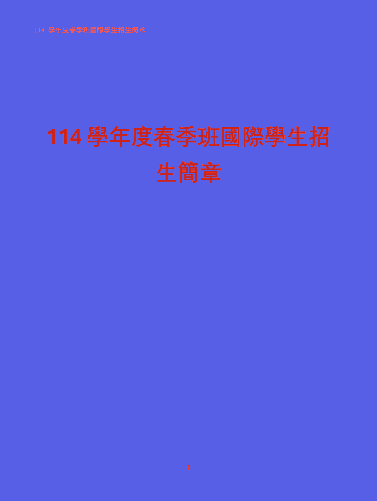</td>
  <td>changed: 38564 px (1.88%)<br>bbox: [115, 88, 1083, 1547]<br>mean abs RGB: 3.9302<br>RMSE RGB: 30.3998<br>threshold: 12, gain: 5.0</td>
</tr>
<tr>
  <td><b>TestIssue61</b><br>Page 2</td>
  <td></td>
  <td>changed: 21275 px (1.04%)<br>bbox: [113, 146, 1094, 1547]<br>mean abs RGB: 1.5429<br>RMSE RGB: 17.2125<br>threshold: 12, gain: 5.0</td>
</tr>
<tr>
  <td><b>TestIssue61</b><br>Page 3</td>
  <td></td>
  <td>changed: 3900 px (0.19%)<br>bbox: [115, 117, 627, 1548]<br>mean abs RGB: 0.26<br>RMSE RGB: 6.7916<br>threshold: 12, gain: 5.0</td>
</tr>
<tr>
  <td><b>TestIssue61</b><br>Page 4</td>
  <td></td>
  <td>changed: 9490 px (0.46%)<br>bbox: [113, 117, 691, 1547]<br>mean abs RGB: 0.6208<br>RMSE RGB: 10.4082<br>threshold: 12, gain: 5.0</td>
</tr>
<tr>
  <td><b>TestIssue61</b><br>Page 5</td>
  <td></td>
  <td>changed: 2427 px (0.12%)<br>bbox: [115, 117, 627, 1548]<br>mean abs RGB: 0.164<br>RMSE RGB: 5.4465<br>threshold: 12, gain: 5.0</td>
</tr>
<tr>
  <td><b>TestIssue61</b><br>Page 6</td>
  <td></td>
  <td>changed: 2420 px (0.12%)<br>bbox: [115, 117, 627, 1548]<br>mean abs RGB: 0.1609<br>RMSE RGB: 5.3635<br>threshold: 12, gain: 5.0</td>
</tr>
<tr>
  <td><b>TestIssue61</b><br>Page 7</td>
  <td></td>
  <td>changed: 3095 px (0.15%)<br>bbox: [113, 117, 627, 1547]<br>mean abs RGB: 0.1988<br>RMSE RGB: 5.8863<br>threshold: 12, gain: 5.0</td>
</tr>
<tr>
  <td><b>TestIssue61</b><br>Page 8</td>
  <td></td>
  <td>changed: 2470 px (0.12%)<br>bbox: [113, 117, 626, 1548]<br>mean abs RGB: 0.1665<br>RMSE RGB: 5.4794<br>threshold: 12, gain: 5.0</td>
</tr>
<tr>
  <td><b>TestIssue78</b><br>Page 1</td>
  <td></td>
  <td>changed: 145977 px (6.71%)<br>bbox: [188, 317, 1191, 1291]<br>mean abs RGB: 9.7368<br>RMSE RGB: 42.778<br>threshold: 12, gain: 5.0</td>
</tr>
<tr>
  <td><b>TestIssue90</b><br>Page 1</td>
  <td>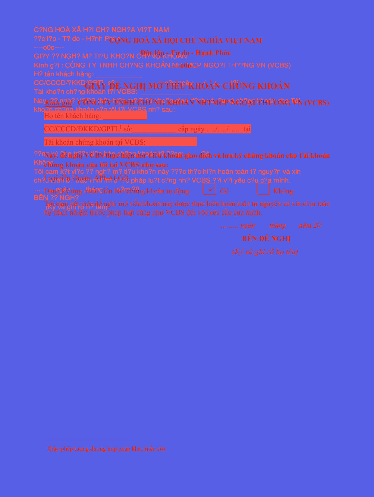</td>
  <td>changed: 164101 px (7.80%)<br>bbox: [148, 119, 1125, 1501]<br>mean abs RGB: 10.7823<br>RMSE RGB: 48.0197<br>threshold: 12, gain: 5.0</td>
</tr>
<tr>
  <td><b>TestIssue91</b><br>Page 1</td>
  <td>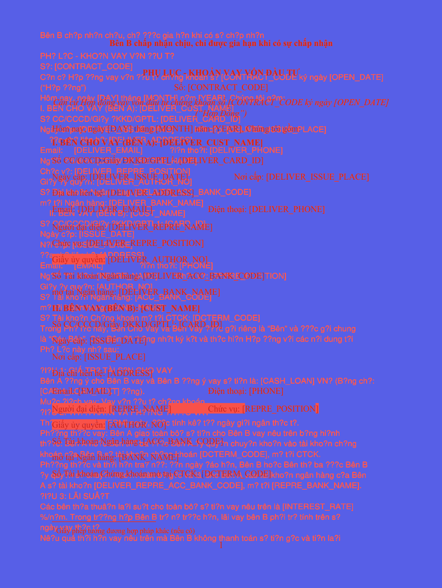</td>
  <td>changed: 184491 px (8.77%)<br>bbox: [148, 93, 1122, 1538]<br>mean abs RGB: 13.2175<br>RMSE RGB: 51.648<br>threshold: 12, gain: 5.0</td>
</tr>
<tr>
  <td><b>TestIssue91</b><br>Page 2</td>
  <td></td>
  <td>changed: 276662 px (13.15%)<br>bbox: [150, 99, 1126, 1538]<br>mean abs RGB: 20.785<br>RMSE RGB: 64.709<br>threshold: 12, gain: 5.0</td>
</tr>
<tr>
  <td><b>TestIssue91</b><br>Page 3</td>
  <td>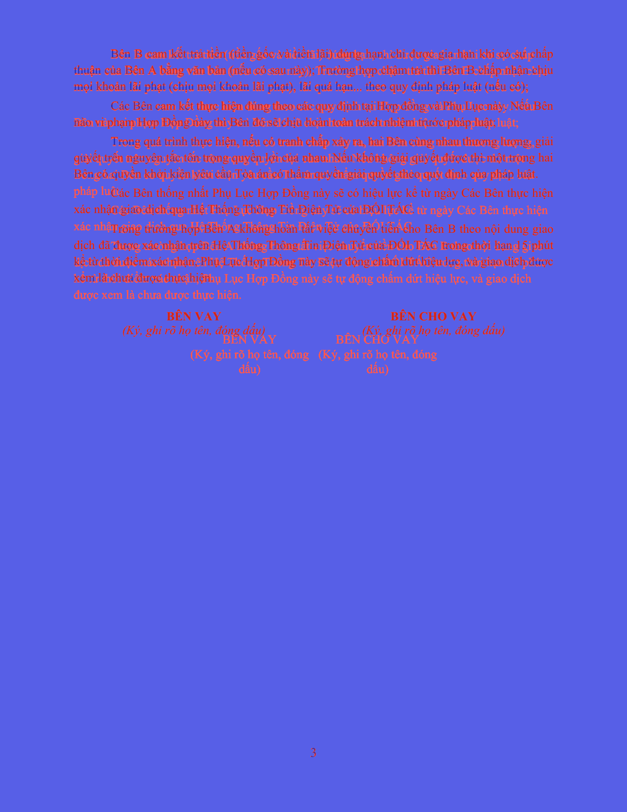</td>
  <td>changed: 143053 px (6.80%)<br>bbox: [150, 94, 1126, 1539]<br>mean abs RGB: 10.2515<br>RMSE RGB: 44.8255<br>threshold: 12, gain: 5.0</td>
</tr>
<tr>
  <td><b>TestIssue93</b><br>Page 1</td>
  <td>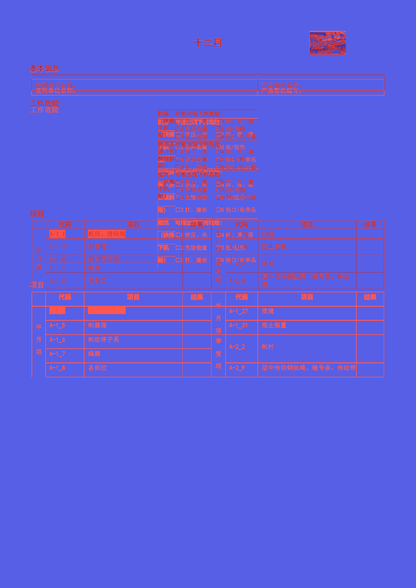</td>
  <td>changed: 125745 px (5.78%)<br>bbox: [89, 92, 1147, 1126]<br>mean abs RGB: 7.2454<br>RMSE RGB: 35.4697<br>threshold: 12, gain: 5.0</td>
</tr>
</table>

## Visual Comparison

Scores compare java MiniPdf against Microsoft 365 Word Reference. LibreOffice is an auxiliary rendering and does not affect scores.

<table>
<tr><th>java MiniPdf</th><th>Microsoft 365 Word Reference</th><th>LibreOffice</th></tr>
<tr>
  <td><b>13_IEEE_Style_Paper<br><small>format: docx | case: 13_IEEE_Style_Paper | scope: java-issue-docx</small></b></td>
  <td colspan="2">13_IEEE_Style_Paper <span style="color:#3fb950">⬤</span> 98.6%</td>
</tr>
<tr>
  <td></td>
  <td></td>
  <td></td>
</tr>
<tr>
  <td></td>
  <td></td>
  <td></td>
</tr>
<tr>
  <td><b>14_Thesis_Chapter<br><small>format: docx | case: 14_Thesis_Chapter | scope: java-issue-docx</small></b></td>
  <td colspan="2">14_Thesis_Chapter <span style="color:#3fb950">⬤</span> 98.6%</td>
</tr>
<tr>
  <td></td>
  <td></td>
  <td></td>
</tr>
<tr>
  <td></td>
  <td></td>
  <td></td>
</tr>
<tr>
  <td><b>20260317_sample_CN<br><small>format: docx | case: 20260317_sample_CN | scope: java-issue-docx</small></b></td>
  <td colspan="2">20260317_sample_CN <span style="color:#f85149">⬤</span> 65.9%</td>
</tr>
<tr>
  <td></td>
  <td></td>
  <td></td>
</tr>
<tr>
  <td><i>missing</i></td>
  <td></td>
  <td></td>
</tr>
<tr>
  <td><b>20260318_issue<br><small>format: docx | case: 20260318_issue | scope: java-issue-docx</small></b></td>
  <td colspan="2">20260318_issue <span style="color:#f85149">⬤</span> 58.1%</td>
</tr>
<tr>
  <td></td>
  <td></td>
  <td></td>
</tr>
<tr>
  <td></td>
  <td></td>
  <td></td>
</tr>
<tr>
  <td></td>
  <td></td>
  <td></td>
</tr>
<tr>
  <td><i>missing</i></td>
  <td></td>
  <td></td>
</tr>
<tr>
  <td><i>missing</i></td>
  <td></td>
  <td></td>
</tr>
<tr>
  <td><i>missing</i></td>
  <td></td>
  <td></td>
</tr>
<tr>
  <td><i>missing</i></td>
  <td></td>
  <td></td>
</tr>
<tr>
  <td><b>CCU_article<br><small>format: docx | case: CCU_article | scope: java-issue-docx</small></b></td>
  <td colspan="2">CCU_article <span style="color:#f85149">⬤</span> 64.3%</td>
</tr>
<tr>
  <td></td>
  <td></td>
  <td></td>
</tr>
<tr>
  <td></td>
  <td></td>
  <td></td>
</tr>
<tr>
  <td></td>
  <td></td>
  <td></td>
</tr>
<tr>
  <td></td>
  <td></td>
  <td></td>
</tr>
<tr>
  <td></td>
  <td></td>
  <td></td>
</tr>
<tr>
  <td></td>
  <td></td>
  <td></td>
</tr>
<tr>
  <td></td>
  <td></td>
  <td></td>
</tr>
<tr>
  <td></td>
  <td></td>
  <td></td>
</tr>
<tr>
  <td></td>
  <td></td>
  <td></td>
</tr>
<tr>
  <td></td>
  <td></td>
  <td></td>
</tr>
<tr>
  <td></td>
  <td></td>
  <td></td>
</tr>
<tr>
  <td></td>
  <td></td>
  <td></td>
</tr>
<tr>
  <td></td>
  <td></td>
  <td></td>
</tr>
<tr>
  <td></td>
  <td></td>
  <td></td>
</tr>
<tr>
  <td></td>
  <td></td>
  <td></td>
</tr>
<tr>
  <td></td>
  <td></td>
  <td></td>
</tr>
<tr>
  <td></td>
  <td></td>
  <td></td>
</tr>
<tr>
  <td></td>
  <td></td>
  <td></td>
</tr>
<tr>
  <td></td>
  <td></td>
  <td></td>
</tr>
<tr>
  <td></td>
  <td></td>
  <td></td>
</tr>
<tr>
  <td></td>
  <td></td>
  <td></td>
</tr>
<tr>
  <td><b>Class News<br><small>format: docx | case: Class News | scope: java-issue-docx</small></b></td>
  <td colspan="2">Class News <span style="color:#3fb950">⬤</span> 90.6%</td>
</tr>
<tr>
  <td></td>
  <td></td>
  <td></td>
</tr>
<tr>
  <td></td>
  <td></td>
  <td></td>
</tr>
<tr>
  <td></td>
  <td></td>
  <td></td>
</tr>
<tr>
  <td></td>
  <td></td>
  <td></td>
</tr>
<tr>
  <td><b>Confirmatory_Affidavit<br><small>format: docx | case: Confirmatory_Affidavit | scope: java-issue-docx</small></b></td>
  <td colspan="2">Confirmatory_Affidavit <span style="color:#f85149">⬤</span> 67.4%</td>
</tr>
<tr>
  <td></td>
  <td></td>
  <td></td>
</tr>
<tr>
  <td><i>missing</i></td>
  <td></td>
  <td></td>
</tr>
<tr>
  <td><b>Cooperation Agreement Template<br><small>format: docx | case: Cooperation Agreement Template | scope: java-issue-docx</small></b></td>
  <td colspan="2">Cooperation Agreement Template <span style="color:#f85149">⬤</span> 62.0%</td>
</tr>
<tr>
  <td></td>
  <td></td>
  <td></td>
</tr>
<tr>
  <td></td>
  <td></td>
  <td></td>
</tr>
<tr>
  <td></td>
  <td></td>
  <td></td>
</tr>
<tr>
  <td></td>
  <td></td>
  <td></td>
</tr>
<tr>
  <td><i>missing</i></td>
  <td></td>
  <td></td>
</tr>
<tr>
  <td><i>missing</i></td>
  <td></td>
  <td></td>
</tr>
<tr>
  <td><i>missing</i></td>
  <td></td>
  <td></td>
</tr>
<tr>
  <td><b>Fabrikam<br><small>format: docx | case: Fabrikam | scope: java-issue-docx</small></b></td>
  <td colspan="2">Fabrikam <span style="color:#d29922">⬤</span> 80.7%</td>
</tr>
<tr>
  <td></td>
  <td></td>
  <td></td>
</tr>
<tr>
  <td><b>Invoice<br><small>format: docx | case: Invoice | scope: java-issue-docx</small></b></td>
  <td colspan="2">Invoice <span style="color:#d29922">⬤</span> 82.9%</td>
</tr>
<tr>
  <td></td>
  <td></td>
  <td></td>
</tr>
<tr>
  <td><b>Issue79_FilledContract<br><small>format: docx | case: Issue79_FilledContract | scope: java-issue-docx</small></b></td>
  <td colspan="2">Issue79_FilledContract <span style="color:#3fb950">⬤</span> 98.6%</td>
</tr>
<tr>
  <td></td>
  <td></td>
  <td></td>
</tr>
<tr>
  <td><b>Issue79_TemplateContract<br><small>format: docx | case: Issue79_TemplateContract | scope: java-issue-docx</small></b></td>
  <td colspan="2">Issue79_TemplateContract <span style="color:#3fb950">⬤</span> 97.5%</td>
</tr>
<tr>
  <td></td>
  <td></td>
  <td></td>
</tr>
<tr>
  <td><b>Issue83_Output<br><small>format: docx | case: Issue83_Output | scope: java-issue-docx</small></b></td>
  <td colspan="2">Issue83_Output <span style="color:#d29922">⬤</span> 82.4%</td>
</tr>
<tr>
  <td></td>
  <td></td>
  <td></td>
</tr>
<tr>
  <td><b>Issue159_PageLayoutOptions<br><small>format: docx | case: Issue159_PageLayoutOptions | scope: java-issue-docx</small></b></td>
  <td colspan="2">Issue159_PageLayoutOptions <span style="color:#3fb950">⬤</span> 99.1%</td>
</tr>
<tr>
  <td></td>
  <td></td>
  <td></td>
</tr>
<tr>
  <td><b>issue202605<br><small>format: docx | case: issue202605 | scope: java-issue-docx</small></b></td>
  <td colspan="2">issue202605 <span style="color:#f85149">⬤</span> 66.3%</td>
</tr>
<tr>
  <td></td>
  <td></td>
  <td></td>
</tr>
<tr>
  <td></td>
  <td></td>
  <td></td>
</tr>
<tr>
  <td></td>
  <td><i>missing</i></td>
  <td><i>missing</i></td>
</tr>
<tr>
  <td><b>issue26050501<br><small>format: docx | case: issue26050501 | scope: java-issue-docx</small></b></td>
  <td colspan="2">issue26050501 <span style="color:#f85149">⬤</span> 64.6%</td>
</tr>
<tr>
  <td></td>
  <td></td>
  <td></td>
</tr>
<tr>
  <td></td>
  <td></td>
  <td></td>
</tr>
<tr>
  <td></td>
  <td><i>missing</i></td>
  <td><i>missing</i></td>
</tr>
<tr>
  <td><b>issues66<br><small>format: docx | case: issues66 | scope: java-issue-docx</small></b></td>
  <td colspan="2">issues66 <span style="color:#3fb950">⬤</span> 98.7%</td>
</tr>
<tr>
  <td></td>
  <td></td>
  <td></td>
</tr>
<tr>
  <td></td>
  <td></td>
  <td></td>
</tr>
<tr>
  <td></td>
  <td></td>
  <td></td>
</tr>
<tr>
  <td><b>MODERN LIVING<br><small>format: docx | case: MODERN LIVING | scope: java-issue-docx</small></b></td>
  <td colspan="2">MODERN LIVING <span style="color:#f85149">⬤</span> 37.9%</td>
</tr>
<tr>
  <td></td>
  <td></td>
  <td></td>
</tr>
<tr>
  <td></td>
  <td></td>
  <td></td>
</tr>
<tr>
  <td></td>
  <td><i>missing</i></td>
  <td><i>missing</i></td>
</tr>
<tr>
  <td></td>
  <td><i>missing</i></td>
  <td><i>missing</i></td>
</tr>
<tr>
  <td><b>nthu_article<br><small>format: docx | case: nthu_article | scope: java-issue-docx</small></b></td>
  <td colspan="2">nthu_article <span style="color:#f85149">⬤</span> 56.4%</td>
</tr>
<tr>
  <td></td>
  <td></td>
  <td></td>
</tr>
<tr>
  <td></td>
  <td></td>
  <td></td>
</tr>
<tr>
  <td></td>
  <td></td>
  <td></td>
</tr>
<tr>
  <td></td>
  <td></td>
  <td></td>
</tr>
<tr>
  <td></td>
  <td></td>
  <td></td>
</tr>
<tr>
  <td></td>
  <td></td>
  <td></td>
</tr>
<tr>
  <td></td>
  <td></td>
  <td></td>
</tr>
<tr>
  <td></td>
  <td></td>
  <td></td>
</tr>
<tr>
  <td></td>
  <td></td>
  <td></td>
</tr>
<tr>
  <td></td>
  <td></td>
  <td></td>
</tr>
<tr>
  <td></td>
  <td></td>
  <td></td>
</tr>
<tr>
  <td></td>
  <td></td>
  <td></td>
</tr>
<tr>
  <td></td>
  <td></td>
  <td></td>
</tr>
<tr>
  <td></td>
  <td></td>
  <td></td>
</tr>
<tr>
  <td></td>
  <td></td>
  <td></td>
</tr>
<tr>
  <td></td>
  <td></td>
  <td></td>
</tr>
<tr>
  <td><i>missing</i></td>
  <td></td>
  <td></td>
</tr>
<tr>
  <td><i>missing</i></td>
  <td></td>
  <td></td>
</tr>
<tr>
  <td><i>missing</i></td>
  <td><i>missing</i></td>
  <td></td>
</tr>
<tr>
  <td><i>missing</i></td>
  <td><i>missing</i></td>
  <td></td>
</tr>
<tr>
  <td><b>OSCAR WARD<br><small>format: docx | case: OSCAR WARD | scope: java-issue-docx</small></b></td>
  <td colspan="2">OSCAR WARD <span style="color:#d29922">⬤</span> 73.5%</td>
</tr>
<tr>
  <td></td>
  <td></td>
  <td></td>
</tr>
<tr>
  <td><b>SA8000 ch sample<br><small>format: docx | case: SA8000 ch sample | scope: java-issue-docx</small></b></td>
  <td colspan="2">SA8000 ch sample <span style="color:#d29922">⬤</span> 73.7%</td>
</tr>
<tr>
  <td></td>
  <td></td>
  <td></td>
</tr>
<tr>
  <td></td>
  <td></td>
  <td></td>
</tr>
<tr>
  <td></td>
  <td><i>missing</i></td>
  <td><i>missing</i></td>
</tr>
<tr>
  <td><b>Support_Letter<br><small>format: docx | case: Support_Letter | scope: java-issue-docx</small></b></td>
  <td colspan="2">Support_Letter <span style="color:#3fb950">⬤</span> 97.6%</td>
</tr>
<tr>
  <td></td>
  <td></td>
  <td></td>
</tr>
<tr>
  <td><b>Template for MSc Thesis<br><small>format: docx | case: Template for MSc Thesis | scope: java-issue-docx</small></b></td>
  <td colspan="2">Template for MSc Thesis <span style="color:#d29922">⬤</span> 76.8%</td>
</tr>
<tr>
  <td></td>
  <td></td>
  <td></td>
</tr>
<tr>
  <td></td>
  <td></td>
  <td></td>
</tr>
<tr>
  <td></td>
  <td></td>
  <td></td>
</tr>
<tr>
  <td></td>
  <td></td>
  <td></td>
</tr>
<tr>
  <td></td>
  <td></td>
  <td></td>
</tr>
<tr>
  <td></td>
  <td></td>
  <td></td>
</tr>
<tr>
  <td></td>
  <td></td>
  <td></td>
</tr>
<tr>
  <td></td>
  <td></td>
  <td></td>
</tr>
<tr>
  <td></td>
  <td></td>
  <td></td>
</tr>
<tr>
  <td></td>
  <td></td>
  <td></td>
</tr>
<tr>
  <td></td>
  <td></td>
  <td></td>
</tr>
<tr>
  <td></td>
  <td></td>
  <td></td>
</tr>
<tr>
  <td></td>
  <td></td>
  <td></td>
</tr>
<tr>
  <td><i>missing</i></td>
  <td></td>
  <td></td>
</tr>
<tr>
  <td><i>missing</i></td>
  <td></td>
  <td></td>
</tr>
<tr>
  <td><i>missing</i></td>
  <td></td>
  <td></td>
</tr>
<tr>
  <td><i>missing</i></td>
  <td></td>
  <td></td>
</tr>
<tr>
  <td><b>TestIssue61<br><small>format: docx | case: TestIssue61 | scope: java-issue-docx</small></b></td>
  <td colspan="2">TestIssue61 <span style="color:#d29922">⬤</span> 72.9%</td>
</tr>
<tr>
  <td></td>
  <td></td>
  <td></td>
</tr>
<tr>
  <td></td>
  <td></td>
  <td></td>
</tr>
<tr>
  <td></td>
  <td></td>
  <td></td>
</tr>
<tr>
  <td></td>
  <td></td>
  <td></td>
</tr>
<tr>
  <td></td>
  <td></td>
  <td></td>
</tr>
<tr>
  <td></td>
  <td></td>
  <td></td>
</tr>
<tr>
  <td></td>
  <td></td>
  <td></td>
</tr>
<tr>
  <td></td>
  <td></td>
  <td></td>
</tr>
<tr>
  <td><b>TestIssue78<br><small>format: docx | case: TestIssue78 | scope: java-issue-docx</small></b></td>
  <td colspan="2">TestIssue78 <span style="color:#3fb950">⬤</span> 97.0%</td>
</tr>
<tr>
  <td></td>
  <td></td>
  <td></td>
</tr>
<tr>
  <td><b>TestIssue90<br><small>format: docx | case: TestIssue90 | scope: java-issue-docx</small></b></td>
  <td colspan="2">TestIssue90 <span style="color:#3fb950">⬤</span> 97.9%</td>
</tr>
<tr>
  <td></td>
  <td></td>
  <td></td>
</tr>
<tr>
  <td><b>TestIssue91<br><small>format: docx | case: TestIssue91 | scope: java-issue-docx</small></b></td>
  <td colspan="2">TestIssue91 <span style="color:#3fb950">⬤</span> 96.0%</td>
</tr>
<tr>
  <td></td>
  <td></td>
  <td></td>
</tr>
<tr>
  <td></td>
  <td></td>
  <td></td>
</tr>
<tr>
  <td></td>
  <td></td>
  <td></td>
</tr>
<tr>
  <td><b>TestIssue93<br><small>format: docx | case: TestIssue93 | scope: java-issue-docx</small></b></td>
  <td colspan="2">TestIssue93 <span style="color:#3fb950">⬤</span> 91.9%</td>
</tr>
<tr>
  <td></td>
  <td></td>
  <td></td>
</tr>
</table>

## Detailed Results

### 13_IEEE_Style_Paper

- **Case Metadata:** format: docx | case: 13_IEEE_Style_Paper | scope: java-issue-docx
- **Source:** tests/Issue_Files/docx/13_IEEE_Style_Paper.docx
- **Text Similarity:** 1.0
- **Visual Average:** 0.9645
- **Overall Score:** 0.9858
- **Pages:** MiniPdf=2, Reference=2
- **File Size:** MiniPdf=60479 bytes, Reference=175037 bytes

<details><summary>Text Diff</summary>

```diff
--- minipdf/13_IEEE_Style_Paper.pdf
+++ reference/13_IEEE_Style_Paper.pdf
@@ -1,6 +1,8 @@
 A Novel Approach to Document

-Conversion Using Layout-Aware Parsing

-First Author, Second Author, Third Author Department of Computer Science, University of Technology

+Conversion

+Using Layout-Aware Parsing

+First Author, Second Author, Third Author

+Department of Computer Science, University of Technology

 email@university.edu

 Abstract

 This paper presents a novel approach to converting document formats while preserving layout fidelity.
```
</details>

### 14_Thesis_Chapter

- **Case Metadata:** format: docx | case: 14_Thesis_Chapter | scope: java-issue-docx
- **Source:** tests/Issue_Files/docx/14_Thesis_Chapter.docx
- **Text Similarity:** 1.0
- **Visual Average:** 0.9658
- **Overall Score:** 0.9863
- **Pages:** MiniPdf=2, Reference=2
- **File Size:** MiniPdf=61518 bytes, Reference=159980 bytes

Text content: ✅ Identical

### 20260317_sample_CN

- **Case Metadata:** format: docx | case: 20260317_sample_CN | scope: java-issue-docx
- **Source:** tests/Issue_Files/docx/20260317_sample_CN.docx
- **Text Similarity:** 0.9279
- **Visual Average:** 0.4692
- **Overall Score:** 0.6588
- **Pages:** MiniPdf=1, Reference=2
- **File Size:** MiniPdf=124530 bytes, Reference=201411 bytes

<details><summary>Text Diff</summary>

```diff
--- minipdf/20260317_sample_CN.pdf
+++ reference/20260317_sample_CN.pdf
@@ -1,3 +1,4 @@
+打印时间 :2025-10-11 16:10:04

 < 样本信息 >

 样本名称 lxp-0.5

 质谱方法 20250620-LXP-is-3min.PS 色谱方法 20250611-LXP-deng-3.LCM

@@ -6,8 +7,10 @@
 体积 0.5μL 仪器名称 AITQ2030

 采集时间 2025-07-03 11:24:11 用户 admin

 < 色谱图 >

-样品名称 :lxp-0.5 瓶号 :P1-A-1

+样品名称 : lxp-0.5 瓶号 : P1-A-1

 内标峰图

-样品名称 :lxp-0.5

+---PAGE---

+打印时间 :2025-10-11 16:10:04

+样品名称 : lxp-0.5

 分析物 保留时间 峰面积 峰高 内标名称 内标峰面积 信噪比 离子比 计算浓度 单位

 lxp-1 0.50 1.573e5 2.520e4 lxp-is 3.310e4 1.0 0.084 1.08032
```
</details>

### 20260318_issue

- **Case Metadata:** format: docx | case: 20260318_issue | scope: java-issue-docx
- **Source:** tests/Issue_Files/docx/20260318_issue.docx
- **Text Similarity:** 0.8639
- **Visual Average:** 0.3386
- **Overall Score:** 0.581
- **Pages:** MiniPdf=3, Reference=7
- **File Size:** MiniPdf=233827 bytes, Reference=344825 bytes

<details><summary>Text Diff</summary>

```diff
--- minipdf/20260318_issue.pdf
+++ reference/20260318_issue.pdf
@@ -1,54 +1,85 @@
-Revision Histo ry

+页眉的名称 ……………………..

+页眉 换了一行 .

+Title ddddddddfjkfjlasf

+Jjfdlj 水水水顶顶顶顶水水水水

+页脚的公司名称

+---PAGE---

+页眉的名称 ……………………..

+页眉 换了一行 .

+Revision History

 Date Revision Author Description

 2025-5-13 张三 Initial draft

-RESTRICTED DISTRIBUTION1

-The information is standard Company Confidential but due to its sensitivity it has restricted distribu

+页脚的公司名称

+---PAGE---

+页眉的名称 ……………………..

+页眉 换了一行 .

+1

+RESTRICTED DISTRIBUTION

+The information is standard Company Confidential but due to its sensitivity it has restricted distribution and viewing

 within Volvo Cars.

 Document Version Control

-1

----PAGE---

 Date Issued Version Description Author

 2025-5-13 V1.0 Draft Yang Li

 2025-08-29 V2.0 Change Zhong, Shengyou

 Contributors

-The content of this document has been authored with the combined input of the following group of key i

+The content of this document has been authored with the combined input of the following group of key individuals.

 Name Role Area

 Cost Accountant CAC

 Source Documents

 Title Author Version Date

 Document Sign-off Requirements

-The following table contains the people required to sign-off and/or review this document and those tha

+The following table contains the people required to sign-off and/or review this document and those that require the

 document for information only.

 Name Department Responsibility

 Document Classification

-Classification Company Confidential

-Definition Information is Group confidential and needs to be protected

-Context Where loss of information confidentiality would result in significant harm to

-interests of the organization, financial loss, embarrassment or loss of infor

+Company Confidential

+Classification

+1

+页脚的公司名称

+---PAGE---

+页眉的名称 ……………………..

+页眉 换了一行 .

+Information is Group confidential and needs to be protected

+Definition

+Where loss of information confidentiality would result in significant harm to the

+Context

+interests of the organization, financial loss, embarrassment or loss of information

 Introduction

 The Process Definition Document (PDD) captures the flow of a business process to be developed.

-The flowchart contained within the document captures, at a high level, the business process to be auto

+The flowchart contained within the document captures, at a high level, the business process to be automated, the

 target systems used within the process and any assumptions that have been taken into account.

-Once agreed as the basis for the automation of the target process, the flowchart and assumptions will

+Once agreed as the basis for the automation of the target process, the flowchart and assumptions will be used as a

 platform from which the automated solution will be designed.

-Changes to this business process may constitute a request for change and will be subject to the agreed

+Changes to this business process may constitute
... (1968 more characters)

```
</details>

### CCU_article

- **Case Metadata:** format: docx | case: CCU_article | scope: java-issue-docx
- **Source:** tests/Issue_Files/docx/CCU_article.docx
- **Text Similarity:** 0.3881
- **Visual Average:** 0.7186
- **Overall Score:** 0.6427
- **Pages:** MiniPdf=21, Reference=21
- **File Size:** MiniPdf=36855 bytes, Reference=625190 bytes

<details><summary>Text Diff</summary>

```diff
--- minipdf/CCU_article.pdf
+++ reference/CCU_article.pdf
@@ -1,292 +1,355 @@
-????

-???????????

-??????????????????????

-Long-Tail Image Classification via Dynamic Re-weighting and Feature Orthogonalization

-???????

-??????????

-???? 114 ? 9 ?

-??

-?????????????????????????????????????????????????????????????? (class

-imbalance)?????????????????????????????????????????????????? (dynamic re-weighting)

-?????? (feature orthogonalization) ????????????????????? (long-tail)

-???????????????????????????????????????????? Macro-F1 ????? Top-1

-????????????????????????????????????????????

-???????????(1) ?????????????????????

-(2) ?????????????????(3) ???????????????????????(4) ????????????????

-?????????????????????????

+中正大學

+宇宙工程研究所碩士論文

+結合動態重加權與特徵正交化之長尾影像分類研究

+Long-Tail Image Classification via Dynamic Re-weighting and

+Feature Orthogonalization

+研究生：王小明

+指導教授：李天才教授

+中華民國 114 年 9 月

+---PAGE---

+摘要

+本研究探討以深度學習方法改善多分類影像辨識之效能。近年卷積神經網路在多

+種視覺任務上展現優異表現，然而在資料量受限與類別不平衡 (class imbalance)

+的情況下，傳統訓練流程容易造成某些少數類別辨識率偏低。為解決此問題，本

+研究提出一個結合動態類別重加權 (dynamic re-weighting) 與特徵正交化 (feature

+orthogonalization) 之訓練框架，於保持整體精確度的同時提升長尾 (long-tail) 類別

+之召回率。實驗以公開資料集與自建小型資料集進行驗證，結果顯示相較基準模

+型，所提方法在 Macro-F1 及少數類別 Top-1 準確率均有顯著提升。最後，本研究

+並分析特徵空間分佈，證實特徵正交化有助於降低類別間干擾。

+本論文之主要貢獻包含： (1) 提出一套可即插即用之動態類別權重調整策略；

+(2) 引入特徵正交化損失於長尾分類場景； (3) 於多組資料集與不同網路骨幹下驗

+證方法之穩健性； (4) 釋出實驗程式碼以利後續研究延伸。

+關鍵詞：深度學習、長尾學習、特徵表徵、卷積神經網路

+i

 ---PAGE---

 Abstract

-This thesis investigates a training framework to improve class-imbalanced multi-class

-im- age classification under limited data regimes. Although modern convolutional

-neural net- works achieve strong performance, minority classes in long-tail

-distributions often suffer from poor recall. We propose a plug-and-play framework

-that combines dynamic class re- weighting with feature orthogonalization to mitigate

-inter-class interference while preserv- ing global accuracy. Experiments on public

-and proprietary datasets demonstrate consis- tent gains in Macro-F1 and

-minority-class Top-1 accuracy over strong baselines. Feature space visualization

-further confirms that orthogonalization encourages better inter-class separation.

+This thesis investigates a training framework to improve class-imbalanced multi-class im-

+age classification under limited data regimes. Although modern convolutional neural net-

+works achieve strong performance, minority classes in long-tail distributions often suffer

+from poor recall. We propose a plug-and-play framework that combines dynamic class re-

+weighting with feature orthogonalization to mitigate inter-class interference while preserv-

+ing global accuracy. Experiments on public and proprietary datasets demonstrate consis-

+tent gains in Macro-F1 and minority-class Top-1 accuracy over strong baselines. Feature

+space visualization further confirms that orthogonalization encourages better inter-class

+separation.

 The contributions are: (1) a dynamic weighting
... (16028 more characters)

```
</details>

### Class News

- **Case Metadata:** format: docx | case: Class News | scope: java-issue-docx
- **Source:** tests/Issue_Files/docx/Class News.docx
- **Text Similarity:** 0.9473
- **Visual Average:** 0.8168
- **Overall Score:** 0.9056
- **Pages:** MiniPdf=4, Reference=4
- **File Size:** MiniPdf=236477 bytes, Reference=124498 bytes

<details><summary>Text Diff</summary>

```diff
--- minipdf/Class News.pdf
+++ reference/Class News.pdf
@@ -7,31 +7,31 @@
 Lorem ipsum dolor sit amet, consectetur adipiscing elit. Aliquam non varius

 ipsum. Fusce venenatis quam vel libero scelerisque, a mattis diam

 sollicitudin. Lorem ipsum dolor sit amet, consectetur adipiscing elit. Aliquam

-non varius ipsum. Fusce venenatis quam vel libero sce lerisque, a mattis diam

-sollicitudin.

+non varius ipsum. Fusce venenatis quam vel libero sce lerisque, a mattis

+diam sollicitudin.

 Upcoming Events

-Maecenas massa velit, consectetur sit amet da pibus et, dapibus sit amet

-School Dance odio. Vestibulum ultric ies erat sit amet massa ullamcorper ferm entum.

+School Dance Maecenas massa velit, consectetur sit amet da pibus et, dapibus sit amet

 9.9 | 5-7pm

+odio. Vestibulum ultric ies erat sit amet massa ullamcorper ferm entum.

 Quisque a suscipit nulla, non posuere tellus. Vivamus justo erat, suscipit sit

+Book Fair

 amet ultr icie. Ma ecenas massa velit, consectetur sit amet dapibus et,

-Book Fair

+10.1 - 11.1

 dapibus sit amet odio. Vestibulum ultricies erat sit amet massa ullamcorper.

-10.1 - 11.1

+Picture Day

 Lorem ipsum dolor sit amet, consectetur adipi scing elit. Aliquam non varius

-Picture Day

+10.15

 ipsum. Fusce ven enatis quam vel libero scelerisque, a mattis diam

-10.15

-sollicitudin. Lorem ipsum dolor sit amet, cons ectetur adipiscing elit. Aliquam

-non varius ipsum. Fusce venenatis quam vel libero sce lerisque, a mattis diam

-sollicitudin. Quisque a suscipit nulla, non posuere tellus.

+sollicitudin. Lorem ipsum dolor sit amet, cons ectetur adipiscing elit.

+Aliquam non varius ipsum. Fusce venenatis quam vel libero sce lerisque, a

+mattis diam sollicitudin. Quisque a suscipit nulla, non posuere tellus.

 ---PAGE---

 Recent highlights

 Lorem ipsum dolor sit amet, consectetur adipiscing elit. Aliquam non varius

 ipsum. Fusce venenatis quam vel libero scelerisque, a mattis diam

 sollicitudin. Lorem ipsum dolor sit amet, consectetur adipiscing elit. Aliquam

-non varius ipsum. Fusce venenatis quam vel libero scelerisque, a mattis diam

-sollicitudin.

+non varius ipsum. Fusce venenatis quam vel libero scelerisque, a mattis

+diam sollicitudin.

 Maecenas massa velit, consectetur sit amet dapibus et, dapibus sit amet

 odio. Vestibulum ultricies erat sit amet massa ullamco rper ferme ntum.

 Quisque a suscipit nulla, non posuere tellus. Viva mus justo erat, suscipit sit

@@ -44,14 +44,15 @@
 consec tetur adi piscing elit.

 Aliquam non varius ipsum.

 Fusce venenatis quam vel

-Our next area of focus

-libero scelerisque. Quam vel

+libero scelerisque. Quam vel Our next area of focus

 libero sce lerisque, a matm.

 Lorem ipsum dolor sit amet, consectetur adipiscing elit. Ma ecenas massa

+Lorem ipsum dolor sit amet,

 velit, consectetur sit amet dapibus et, dapibus sit amet odio. Aliquam non

-Lorem ipsum dolor sit amet,

-consec tetur adi piscing elit. varius ipsum. Fusce venenatis quam vel libero sceler
... (3199 more characters)

```
</details>

### Confirmatory_Affidavit

- **Case Metadata:** format: docx | case: Confirmatory_Affidavit | scope: java-issue-docx
- **Source:** tests/Issue_Files/docx/Confirmatory_Affidavit.docx
- **Text Similarity:** 0.9655
- **Visual Average:** 0.4696
- **Overall Score:** 0.674
- **Pages:** MiniPdf=1, Reference=2
- **File Size:** MiniPdf=4501 bytes, Reference=143270 bytes

<details><summary>Text Diff</summary>

```diff
--- minipdf/Confirmatory_Affidavit.pdf
+++ reference/Confirmatory_Affidavit.pdf
@@ -1,29 +1,31 @@
-CONFIRMATORY AFFIDAVIT

 CONFIRMATORY AFFIDAVIT

 I, the undersigned,

 Sofia Verbitckaia

 hereby state under oath,

-I am an adult female with full legal capacity and currently reside at Fuga Qui minima

-aut, Sunt magni praesenti.

-I am a Russian national, born in Omck / Russia, on 21 December 1999. I have been

-issued with a Russian passport, with passport number 770752777. A copy of my passport

-is attached hereto marked as Annexure "A1".

-I confirm the content of the Affidavit in terms of regulation 3(2)(d) of the

-Immigration Regulations, 2014, deposed to by my spouse Jada Randolph, in as far it

-relates to me.

+1. I am an adult female with full legal capacity and currently reside at Fuga Qui

+minima aut, Sunt magni praesenti.

+2. I am a Russian national, born in Omck / Russia, on 21 December 1999. I have

+been issued with a Russian passport, with passport number 770752777. A copy of

+my passport is attached hereto marked as Annexure "A1".

+3. I confirm the content of the Affidavit in terms of regulation 3(2)(d) of the

+Immigration Regulations, 2014, deposed to by my spouse Jada Randolph, in

+as far it relates to me.

 __________________________________

 SOFIA VERBITCKAIA

 SIGNED AT __________________ ON THIS THE ____ DAY OF __________ 2026.

 I hereby certify that the deponent to this affidavit has acknowledged to me that:

-She knows and understands the contents hereof and that it is true and correct;

-She has no objection to taking the prescribed oath; and

-She regards the prescribed oath as binding on her conscience.

+a. She knows and understands the contents hereof and that it is true and correct;

+b. She has no objection to taking the prescribed oath; and

+Page 1 of 2

+---PAGE---

+c. She regards the prescribed oath as binding on her conscience.

 I certify that the deponent has confirmed aforesaid (a) to (c) before me, that the

 contents of this affidavit is sworn to duly and that the Regulations as contained in

-Government Notice No. R.1258 of 21 July 1972 (as amended) and Government Notice No.

-R.1648 dated 19 August 1977 (as amended) have been complied with.

+Government Notice No. R.1258 of 21 July 1972 (as amended) and Government Notice

+No. R.1648 dated 19 August 1977 (as amended) have been complied with.

 ________________________

 COMMISSIONER OF OATHS

 Name:

 Address:

-Designation:
+Designation:

+Page 2 of 2
```
</details>

### Cooperation Agreement Template

- **Case Metadata:** format: docx | case: Cooperation Agreement Template | scope: java-issue-docx
- **Source:** tests/Issue_Files/docx/Cooperation Agreement Template.docx
- **Text Similarity:** 0.8013
- **Visual Average:** 0.4986
- **Overall Score:** 0.62
- **Pages:** MiniPdf=4, Reference=7
- **File Size:** MiniPdf=53401 bytes, Reference=259866 bytes

<details><summary>Text Diff</summary>

```diff
--- minipdf/Cooperation Agreement Template.pdf
+++ reference/Cooperation Agreement Template.pdf
@@ -1,45 +1,51 @@
-附件1

-XXXXXXX项目

+附件 1

+XXXXXXX 项目

 合作协议

 （模板）

-甲    方：

-乙    方：

-丙    方：

+甲 方：

+乙 方：

+丙 方：

 签约地点：

-签订日期：       年    月     日

-甲    方：

-电    话：                  地  址：

-乙    方：

-电    话：                  地  址：

-丙    方：

-电    话：                  地  址：

-经各主体单位友好协商，各主体单位本着互相合作的精神，自愿组成联合体，就《XXXXX项目》（以下简称本项目

+签订日期： 年 月 日

+— 1 —

+---PAGE---

+甲 方：

+电 话： 地 址：

+乙 方：

+电 话： 地 址：

+丙 方：

+电 话： 地 址：

+经各主体单位友好协商，各主体单位本着互相合作的精神，自愿组成联合体，就《 XXXXX

+项目》（以下简称本项目）申报和执行中涉及的内容一致同意签订本协议如下：

 一、合作模式

-由   （甲方）      作为承担单位，     （乙方、丙方）

-作为合作单位，组成联合体进行联合申报本项目。承担单位负责本项目的一切组织、协调、申报工作，合作单位授

-执行本项目过程中，与本项目主办单位签署的一切文件和处理本项目有关的一切事务，联合体各方均予以承认并承

-职责执行，项目经费由承担单位向本项目主办单位申请，再由联合体各方按照本协议约定进行分配。

+由 （甲方） 作为承担单位， （乙方、丙方） 作为合作单位，组成联合体进行联

+合申报本项目。承担单位负责本项目的一切组织、协调、申报工作，合作单位授权承担单位牵头

+申报本项目并协助提供申报所需的相关材料。承担单位在申报和执行本项目过程中，与本项目主

+办单位签署的一切文件和处理本项目有关的一切事务，联合体各方均予以承认并承担法律责任。

+承担单位成功申报本项目后，由联合体各方按照本协议各主体单位职责执行，项目经费由承担单

+位向本项目主办单位申请，再由联合体各方按照本协议约定进行分配。

 二、任务分工

 联合体各方同意本项目按照如下分工：

 （一）甲方负责：

 1.

 2.

+— 2 —

+---PAGE---

 3.

 ......

-乙方负责

+（二）乙方负责

 1.

 2.

 3.

 ......

-丙方负责

+（三）丙方负责

 1.

----PAGE---

 2.

 3.

 ......

 三、项目经费分配方式

 联合体各方同意本项目经费按照如下分配：

-甲方........；乙方........；丙方.......。

+甲方 ........ ；乙方 ........ ；丙方 ....... 。

 四、权利和义务

 （一）甲方的权利和义务

 1.

@@ -47,6 +53,8 @@
 3.

 ......

 （二）乙方的权利和义务

+— 3 —

+---PAGE---

 1.

 2.

 3.

@@ -59,34 +67,44 @@
 五、付款方式

 （一）款项支付：

 1.......

-2.付款方式：采用支票、银行汇票、电汇三种形式。

+2. 付款方式：采用支票、银行汇票、电汇三种形式。

 （二）乙方指定以下账号为唯一收款账号：

-户    名：

-账    号：

+户 名：

+账 号：

 开户银行：

 （三）丙方指定以下账号为唯一收款账号：

-户    名：

-账    号：

+户 名：

+账 号：

 开户银行：

-甲方向上述账号汇出款项即视为甲方已履行付款义务，在协议履行过程中，因乙方、丙方账户的原因（包括但不限

-相应后果。

+甲方向上述账号汇出款项即视为甲方已履行付款义务，在协议履行过程中，因乙方、丙方账

+— 4 —

+---PAGE---

+户的原因（包括但不限于账号被注销、被冻结等）导致乙方、丙方无法收取款项的，由乙方、丙

+方承担相应后果。

 六、保密约定

-联合体各方均应对因协商、签订及执行本协议而了解的其他方的商业秘密承担保密责任。未经披露其他方事先书面

-秘密，则泄露方因承担相应责任，包括但不限于由此造成的损失以及律师费、保全费、诉讼费等合理维权费用。

+联合体各方均应对因协商、签订及执行本协议而了解的其他方的商业秘密承担保密责任。未

+经披露其他方事先书面许可，不得向任何第三人或公众泄露也不得从中牟利。如因一方泄露其他

+方商业秘密，则泄露方因承担相应责任，包括但不限于由此造成的损失以及律师费、保全费、诉

+讼费等合理维权费用。

 七、争议解决和适用法律

-（一）本协议适用于中华人民共和国法律。联合体各方同意，在本协议履行过程中如发生争议，应本着平等友好、

-裁委员会申请仲裁。

+（一）本协议适用于中华人民共和国法律。联合体各方同意，在本协议履行过程中如发生争

+议，应本着平等友好、相互理解的精神协商解决。如不能通过友好协商解决，任何一方应提交至

+广州仲裁委员会申请仲裁。

 八、不可抗力

-任何一方由于不可抗力原因不能履行协议时，应在不可抗力事件发生后1日内向联合体各方通报，以减轻可能给联

-，根据情况可部分或全部免于承担违约责任。

+任何一方由于不可抗力原因不能履行协议时，应在不可抗力事件发生后 1 日内向联合体各方

+通报，以减轻可能给联合体各方造成的损失，在取得有关机构的不可抗力证明或联合体各方谅解

+确认后，根据情况可部分或全部免于承担违约责任。

 九、合同生效

-1）本合同在甲、乙、丙方法人代表或其授权代表签字盖章后生效。

-2）合同一式 陆 份，其中甲方 贰 份，乙方 贰 份，丙方 贰 份。

+1 ）本合同在甲、乙、丙方法人代表或其授权代表签字盖章后生效。

+2 ）合同一式 陆 份，其中甲方 贰 份，乙方 贰 份，丙方 贰 份。

+甲方（盖章）： 乙方（盖章）：

+法定代表 / 授权代表（签字）： 法定代表 / 授权代表（签字）：

+日期： 日期：

+— 5 —

 ---PAGE---

-甲方（盖章）：                          乙方（盖章）：

-法定代表/授权代表（签字）：             法定代表/授权代表（签字）：

-日期：                                  日期：

 丙方（盖章）：

-法定代表/授权代表（签字）：

+法定代表 / 授权代表（签字）：

 日期：

----PAGE---
+— 6 —

+---PAGE---

+— 7 —
```
</details>

### Fabrikam

- **Case Metadata:** format: docx | case: Fabrikam | scope: java-issue-docx
- **Source:** tests/Issue_Files/docx/Fabrikam.docx
- **Text Similarity:** 0.9199
- **Visual Average:** 0.5976
- **Overall Score:** 0.807
- **Pages:** MiniPdf=1, Reference=1
- **File Size:** MiniPdf=4796 bytes, Reference=55486 bytes

<details><summary>Text Diff</summary>

```diff
--- minipdf/Fabrikam.pdf
+++ reference/Fabrikam.pdf
@@ -1,31 +1,30 @@
 Fabrikam, Inc. Fabrikam, Inc.

-Wei Wei

+Kristel Kangro Kristel Kangro

 1234 East Main Street 1234 East Main Street

 Portland, OR 54321 Portland, OR 54321

 www.fabrikam.com www.fabrikam.com

-(415) 555-0123 | kristel@fabrikam.com

-(415) 555-0123 | kristel@fabrikam.c

+(415) 555-0123 | kristel@fabrikam.com (415) 555-0123 | kristel@fabrikam.com

 Fabrikam, Inc. Fabrikam, Inc.

-Wei Wei

+Kristel Kangro Kristel Kangro

 1234 East Main Street 1234 East Main Street

 Portland, OR 54321 Portland, OR 54321

 www.fabrikam.com www.fabrikam.com

-(415) 555-0123 | kristel@fabrikam.com (415) 555-0123 | kristel@fabrikam.c

+(415) 555-0123 | kristel@fabrikam.com (415) 555-0123 | kristel@fabrikam.com

 Fabrikam, Inc. Fabrikam, Inc.

-Wei Wei

+Kristel Kangro Kristel Kangro

 1234 East Main Street 1234 East Main Street

 Portland, OR 54321 Portland, OR 54321

 www.fabrikam.com www.fabrikam.com

-(415) 555-0123 | kristel@fabrikam.com (415) 555-0123 | kristel@fabrikam.c

+(415) 555-0123 | kristel@fabrikam.com (415) 555-0123 | kristel@fabrikam.com

 Fabrikam, Inc. Fabrikam, Inc.

-Wei Wei

+Kristel Kangro Kristel Kangro

 1234 East Main Street 1234 East Main Street

 Portland, OR 54321 Portland, OR 54321

 www.fabrikam.com www.fabrikam.com

-(415) 555-0123 | kristel@fabrikam.com (415) 555-0123 | kristel@fabrikam.c

+(415) 555-0123 | kristel@fabrikam.com (415) 555-0123 | kristel@fabrikam.com

 Fabrikam, Inc. Fabrikam, Inc.

-Wei Wei

+Kristel Kangro Kristel Kangro

 1234 East Main Street 1234 East Main Street

 Portland, OR 54321 Portland, OR 54321

 www.fabrikam.com www.fabrikam.com

-(415) 555-0123 | kristel@fabrikam.com (415) 555-0123 | kristel@fabrikam.c
+(415) 555-0123 | kristel@fabrikam.com (415) 555-0123 | kristel@fabrikam.com
```
</details>

### Invoice

- **Case Metadata:** format: docx | case: Invoice | scope: java-issue-docx
- **Source:** tests/Issue_Files/docx/Invoice.docx
- **Text Similarity:** 0.6868
- **Visual Average:** 0.8867
- **Overall Score:** 0.8294
- **Pages:** MiniPdf=1, Reference=1
- **File Size:** MiniPdf=35901 bytes, Reference=54735 bytes

<details><summary>Text Diff</summary>

```diff
--- minipdf/Invoice.pdf
+++ reference/Invoice.pdf
@@ -1,20 +1,22 @@
-Invoice

-DATE: To: Anjali Chaturvedi

-Date Extra Frame Photography

+INVOICE

+DATE: TO: Anjali Chaturvedi

+Date

+Extra Frame Photography

 89 Pacific Ave

-INVOICE # San Francisco, CA

-100 123-456-7890

-Customer ID:

+INVOICE #

+San Francisco, CA

+100

+123-456-7890

+CUSTOMER ID:

 ABC12345

-Salesperson Job Payment Terms Due Date

+SALESPERSON JOB PAYMENT TERMS DUE DATE

 Oscar Ward Sales Due on receipt 1/30/23

-Qty Description Unit Price Line Total

+QTY DESCRIPTION UNIT PRICE LINE TOTAL

 10 20” x 30” hanging frames 15.00 150.00

 50 5” x 7” standing frames 5.00 250.00

-Subtotal 400.00

-Sales Tax 20.00

-Total 420.00

-Make all checks payable to Create & Co.

+SUBTOTAL 400.00

+SALES TAX 20.00

+TOTAL 420.00

+MAKE ALL CHECKS PAYABLE TO CREATE & CO.

 Thank you for your business!

-Create & Co. 123 Main St. | Seattle, WA 78910 | Phone: 111-222-3333 | Fax: 111-222-3334

-1
+CREATE & CO. 123 MAIN ST. | SEATTLE, WA 78910 | PHONE: 111-222-3333 | FAX: 111-222-3334
```
</details>

### Issue79_FilledContract

- **Case Metadata:** format: docx | case: Issue79_FilledContract | scope: java-issue-docx
- **Source:** tests/Issue_Files/docx/Issue79_FilledContract.docx
- **Text Similarity:** 0.9856
- **Visual Average:** 0.9781
- **Overall Score:** 0.9855
- **Pages:** MiniPdf=1, Reference=1
- **File Size:** MiniPdf=38695 bytes, Reference=75476 bytes

<details><summary>Text Diff</summary>

```diff
--- minipdf/Issue79_FilledContract.pdf
+++ reference/Issue79_FilledContract.pdf
@@ -2,19 +2,19 @@
 甲方：甲方公司

 乙方：乙方公司

 乙方根据双方签署合同为甲方提供服务。

-1. 合作时间： 2026 年 06 月 29 日

-2. 项目汇总

+1.合作时间：2026 年06 月29 日

+2.项目汇总

 类型项目 项目合作日期 总金额（元）

 技术服务费 2026-06-29 666

-总金额（小写）： 666

+总金额（小写）：666

 总金额（大写）：陆佰陆拾陆元

-3. 乙方按照双方约定内容提供合法有效、等额的增值税专用发票给甲方。

+3.乙方按照双方约定内容提供合法有效、等额的增值税专用发票给甲方。

 公司名称：甲方公司

-纳税人识别号： WUISBIFUWBEUIBUI

+纳税人识别号：WUISBIFUWBEUIBUI

 注册地址及电话：甲方注册地址

 开户行及账号：甲方银行开户行

-开票项目：信息系统增值服务 * 信息技术服务费现代服务 * 现代信息技术服务费

-4. 甲方以双方签署的协议为付款依据，对本结算单所产生的费用，应支付到以下乙方账户内。

+开票项目：信息系统增值服务*信息技术服务费现代服务*现代信息技术服务费

+4.甲方以双方签署的协议为付款依据，对本结算单所产生的费用，应支付到以下乙方账户内。

 乙方账户信息：

 账户名称：乙方公司

 开户行：乙方开户行
```
</details>

### Issue79_TemplateContract

- **Case Metadata:** format: docx | case: Issue79_TemplateContract | scope: java-issue-docx
- **Source:** tests/Issue_Files/docx/Issue79_TemplateContract.docx
- **Text Similarity:** 0.9595
- **Visual Average:** 0.9774
- **Overall Score:** 0.9748
- **Pages:** MiniPdf=1, Reference=1
- **File Size:** MiniPdf=40734 bytes, Reference=74748 bytes

<details><summary>Text Diff</summary>

```diff
--- minipdf/Issue79_TemplateContract.pdf
+++ reference/Issue79_TemplateContract.pdf
@@ -1,24 +1,24 @@
 测试结算单

-甲方： {{PartyA}}

-乙方： {{PartyB}}

+甲方：{{PartyA}}

+乙方：{{PartyB}}

 乙方根据双方签署合同为甲方提供服务。

-1. 合作时间： {{ChineseTime}}

-2. 项目汇总

+1.合作时间：{{ChineseTime}}

+2.项目汇总

 类型项目 项目合作日期 总金额（元）

 技术服务费 {{Time}} {{Money}}

-总金额（小写）： {{Money}}

-总金额（大写）： {{BigMoney}}

-3. 乙方按照双方约定内容提供合法有效、等额的增值税专用发票给甲方。

-公司名称： {{PartyA}}

-纳税人识别号： {{PartyACode}}

-注册地址及电话： {{PartyAddressAndPhone}}

-开户行及账号： {{PartyABankAndAccount}}

-开票项目：信息系统增值服务 * 信息技术服务费现代服务 * 现代信息技术服务费

-4. 甲方以双方签署的协议为付款依据，对本结算单所产生的费用，应支付到以下乙方账户内。

+总金额（小写）：{{Money}}

+总金额（大写）：{{BigMoney}}

+3.乙方按照双方约定内容提供合法有效、等额的增值税专用发票给甲方。

+公司名称：{{PartyA}}

+纳税人识别号：{{PartyACode}}

+注册地址及电话：{{PartyAddressAndPhone}}

+开户行及账号：{{PartyABankAndAccount}}

+开票项目：信息系统增值服务*信息技术服务费现代服务*现代信息技术服务费

+4.甲方以双方签署的协议为付款依据，对本结算单所产生的费用，应支付到以下乙方账户内。

 乙方账户信息：

-账户名称： {{PartyB}}

-开户行： {{PartyBBank}}

-账号： {{PartyBAccount}}

+账户名称：{{PartyB}}

+开户行：{{PartyBBank}}

+账号：{{PartyBAccount}}

 本结算单与原合同具有同等的法律效力。

 甲方：{{PartyA}} 乙方：{{PartyB}}

 授权代表：{{PartyAAuthor}} 授权代表：{{PartyBAuthor}}
```
</details>

### Issue83_Output

- **Case Metadata:** format: docx | case: Issue83_Output | scope: java-issue-docx
- **Source:** tests/Issue_Files/docx/Issue83_Output.docx
- **Text Similarity:** 1.0
- **Visual Average:** 0.5602
- **Overall Score:** 0.8241
- **Pages:** MiniPdf=1, Reference=1
- **File Size:** MiniPdf=869 bytes, Reference=14968 bytes

Text content: ✅ Identical

### Issue159_PageLayoutOptions

- **Case Metadata:** format: docx | case: Issue159_PageLayoutOptions | scope: java-issue-docx
- **Source:** tests/Issue_Files/docx/Issue159_PageLayoutOptions.docx
- **Text Similarity:** 1.0
- **Visual Average:** 0.9778
- **Overall Score:** 0.9911
- **Pages:** MiniPdf=1, Reference=1
- **File Size:** MiniPdf=2230 bytes, Reference=19277 bytes

Text content: ✅ Identical

### issue202605

- **Case Metadata:** format: docx | case: issue202605 | scope: java-issue-docx
- **Source:** tests/Issue_Files/docx/issue202605.docx
- **Text Similarity:** 0.8372
- **Visual Average:** 0.5713
- **Overall Score:** 0.6634
- **Pages:** MiniPdf=3, Reference=2
- **File Size:** MiniPdf=62046 bytes, Reference=154739 bytes

<details><summary>Text Diff</summary>

```diff
--- minipdf/issue202605.pdf
+++ reference/issue202605.pdf
@@ -1,60 +1,60 @@
 國立清華大學電機資訊學院

-115學年度博士班入學甄試聯合招生

+115 學年度博士班入學甄試聯合招生

 資訊工程學系學經歷表

 基本資料

-姓　　名 准考證號碼 (此欄由本單位填寫)

+姓  名 准考證號碼 ( 此欄由本單位填寫 )

 畢業論文名稱 指導教授

-進入本系博士班 擬研 □計算機網路 □晶片系統設計與電子設計自動化 □電腦系統

-讀領域/方向

+進入本系博士班

+□計算機網路 □晶片系統設計與電子設計自動化 □電腦系統

+擬研讀領域/方向

 □電腦視覺、計算機圖學與影像處理□人工智慧、數據科學、演算法與人機互動

 (可複選)

 有興趣指導教授

 姓名(至多三位)

 □應屆 □一般生

 就學狀況 報考身分

-□在職生

-□非應屆

+□非應屆 □在職生

 學業表現 (請填寫大學(含)以上學歷之成績記錄，並隨附歷年成績表，含班級或全系排名，若曾轉學、轉系，請註明。)

 學業成績 學業成績

-學校名稱 科系/組別 在學時間(西元年/月)

+學校名稱 科系 / 組別 在學時間 ( 西元年 / 月 )

 總平均 總排名

-_____/_____至_____/_____

-_____/_____至_____/_____

-_____/_____至_____/_____

-_____/_____至_____/_____

+_____/_____ 至 _____/_____

+_____/_____ 至 _____/_____

+_____/_____ 至 _____/_____

+_____/_____ 至 _____/_____

 語文能力表現 (請檢附檢定證明，如無資料可免填。)

-1. 全民英檢 □初級 □中試 □中高級 □高級 □優級 通過考試階段：□初試　□複試

+1. 全民英檢 □初級 □中試 □中高級 □高級 □優級 通過考試階段：□初試 □複試

 2. 英文檢定 □托福/分數：        □多益/分數：        □其他       /分數：

 3. 其他

 工作經歷 (請依序填寫大學畢業後之全職工作經歷(不含兼任研究助理)；如無可免填。)

-1. 服務機構名稱 服務部門 職稱 起迄年月（西元年/月）

-/     至　   /

-2. 服務機構名稱 服務部門 職稱 起迄年月（西元年/月）

-/     至　   /

-3. 服務機構名稱 服務部門 職稱 起迄年月（西元年/月）

-/     至　   /

+服 務 機 構 名 稱 服 務 部 門 職 稱 起迄年月（西元年/月）

+1.

+/     至    /

+服 務 機 構 名 稱 服 務 部 門 職 稱 起迄年月（西元年/月）

+2.

+/     至    /

+服 務 機 構 名 稱 服 務 部 門 職 稱 起迄年月（西元年/月）

+3.

+/     至    /

 1 頁

 ---PAGE---

-著作發表 (請條列曾發表之論文或其他著作、專利，並檢附證明；如無資料

-可免填。)

+著作發表 (請條列曾發表之論文或其他著作 、 專利，並檢附證明；如無資料可免填。)

 1.

 2.

 3.

 4.

 5.

-獲獎或榮譽事蹟 (如：獎學金、競賽或其他獲獎資料等。請擇優至多5項。)

+獲獎或榮譽事蹟 (如：獎學金 、 競賽或其他獲獎資料等。請擇優至多 5 項。)

 項目名稱 日期(西元年/月)

 1.

 2.

 3.

 4.

 5.

-其他有利審查資料 (如：書卷獎、專業證照、社會服務…等。請擇優至多5項。)

-2 頁

----PAGE---

+其他有利審查資料 (如：書卷獎、專業證照、社會服務…等。請擇優至多 5 項。)

 1.

 2.

 3.

 4.

 5.

-3 頁
+2 頁
```
</details>

### issue26050501

- **Case Metadata:** format: docx | case: issue26050501 | scope: java-issue-docx
- **Source:** tests/Issue_Files/docx/issue26050501.docx
- **Text Similarity:** 0.8701
- **Visual Average:** 0.4939
- **Overall Score:** 0.6456
- **Pages:** MiniPdf=3, Reference=2
- **File Size:** MiniPdf=117767 bytes, Reference=111155 bytes

<details><summary>Text Diff</summary>

```diff
--- minipdf/issue26050501.pdf
+++ reference/issue26050501.pdf
@@ -1,5 +1,4 @@
 Week 10 MapReduce & Hadoop 學習指引

----PAGE---

 章節大綱

 學習指引 (Study Guide)

 (Outline)

@@ -24,20 +23,32 @@
 架。請複習它的發展起源以及核心設計目標：Hadoop 專為在

 由商用廉價硬體 (Commodity hardware) 所組成的龐大叢集

 上運行而生。您的學習重點在於理解 Hadoop 如何「化劣勢

-Meet Hadoop 為優勢」，也就是它並不強求底層硬體具備高可靠性，而是

-透過軟體架構層面（如資料多重副本與任務自動重試）提供

-卓越的容錯機制 (Fault Tolerance)。這使得企業能以極低

-的硬體成本，獲得具備強大橫向擴展能力的大數據處理平

-台。

-HDFS 是支撐整個 Hadoop 生態系的儲存骨幹，專為儲存超大

-檔案而設計。請深入探討其「一次寫入，多次讀取 (write-

-once, read-many)」的串流存取設計理念。您需要熟練掌握

-Hadoop HDFS 的核心架構：預設 64MB (或 128MB) 的資料區塊

-Distributed (Block) 設計有何優勢？Namenode (Master 節點) 如何負責

-File System 管理整個檔案系統的 Metadata (如檔案名稱、權限與區塊映

+Meet Hadoop

+為優勢」，也就是它並不強求底層硬體具備高可靠性，而是透

+過軟體架構層面（如資料多重副本與任務自動重試）提供卓

+越的容錯機制 (Fault Tolerance)。這使得企業能以極低的

+硬體成本，獲得具備強大橫向擴展能力的大數據處理平台。

+Hadoop HDFS 是支撐整個 Hadoop 生態系的儲存骨幹，專為儲存超大

+---PAGE---

+章節大綱

+學習指引 (Study Guide)

+(Outline)

+Distributed 檔案而設計。請深入探討其「一次寫入，多次讀取 (write-

+File System once, read-many)」的串流存取設計理念。您需要熟練掌握

+HDFS 的核心架構：預設 64MB (或 128MB) 的資料區塊

+(Block) 設計有何優勢？Namenode (Master 節點) 如何負責

+管理整個檔案系統的 Metadata (如檔案名稱、權限與區塊映

 射表)？而 Datanode (Slave 節點) 又是如何負責實際儲存

 資料區塊並定期發送心跳訊號 (Heartbeat)？理解這些節點

 間的互動是掌握分散式儲存的關鍵。

 任何雲端與大數據的理論都必須透過實際動手做來驗證。本

 節要求您具備從零開始建置 Hadoop 偽分散式 (Pseudo-

----PAGE---
+distributed) 叢集的能力。請複習所有關鍵的前置作業：包

+含在虛擬機 (VM) 中安裝 Linux 系統、正確配置 Java 執行

+How to install

+環境，以及設定 SSH 無密碼登入機制。接著，您需要熟悉

+Hadoop

+Hadoop 的核心 XML 設定檔 (core-site.xml, hdfs-

+site.xml 等) 的配置意義。最後，請務必親自執行格式化

+Namenode 的指令，並透過經典的 Wordcount 範例，體驗完

+整的任務提交、執行與結果檢視流程。
```
</details>

### issues66

- **Case Metadata:** format: docx | case: issues66 | scope: java-issue-docx
- **Source:** tests/Issue_Files/docx/issues66.docx
- **Text Similarity:** 0.9835
- **Visual Average:** 0.9837
- **Overall Score:** 0.9869
- **Pages:** MiniPdf=3, Reference=3
- **File Size:** MiniPdf=65464 bytes, Reference=229713 bytes

<details><summary>Text Diff</summary>

```diff
--- minipdf/issues66.pdf
+++ reference/issues66.pdf
@@ -1,20 +1,20 @@
 微纳加工平台工艺申请表 （ 2014 年版）

-批号 : 显微镜 #1-20251126 14:40~20251126 14:45

+批号 : 显微镜#1-20251126 14:40~20251126 14:45

 020-

 申请人 init 申请人电话 88888888<br /> 申请人邮箱 1@my.com 申请人签字

 13888888888

 付费人 init 课题编号 测试项目 付费人邮箱 1@my.com 付费人签字

 申请日期 20251126 所属单位 985 高校

 样品材料 样品尺寸

-试验目的及说明 样品数量与编号 0

+样品数量与编号 0

+试验目的及说明

 目的

 序

 工艺名称 工艺要求及说明 日期 计价和确认 备注

 号

 总费用：0.80￥ 总用时：0 天0 时

 2025 年11 月26 日14 时40 分 机时费：0.80￥ 5 分0 秒

-显微镜#1

-8 至 开机用时：

+8 显微镜#1 至 开机用时：

 2025 年11 月26 日14 时45 分 工艺负责人确认： 关机用时：

 工艺申请人确认： 沉积用时：

 加工平台批准人签字

@@ -24,13 +24,13 @@
 工艺流程总计价： 0.80￥ 计价核准人签字： 日期：

 备注：

 1 ）所有衬底材料部分须清楚填写包括：列明至少表面的三层材料的成分和支撑（主）衬底材料、尺寸和厚度等相关信息。

-2）使用涉及设定温度的设备时（如PECVD、蒸镀衬底温度、回流炉、高温炉、键合机等），请填写使用温度的上限和时间。使用如PECVD、蒸镀等设备时，衬底

-温度没有特殊要求的可填写：常规。

+2 ）使用涉及设定温度的设备时（如PECVD、蒸镀衬底温度、回流炉、高温炉、键合机等），请填写使用温度的上限和时间。使用如PECVD、蒸镀等设备时，衬底温

+度没有特殊要求的可填写：常规。

 1

 ---PAGE---

-3 ）使用涉及真空的设备，在样品进入腔室之前必须清洗；可根据样品的材料自己填写使用清洗溶液。

-4 ）涉及沉积和蒸镀使用的原材料时候，必须清楚填写材料的种类、厚度。

-5 ）接触光刻胶的种类，薄光刻胶可使用： AR-P 5350 （ lift-off 正胶）； SUN lift130 （负胶） ；厚胶可使用 SU8 。

+3）使用涉及真空的设备，在样品进入腔室之前必须清洗；可根据样品的材料自己填写使用清洗溶液。

+4）涉及沉积和蒸镀使用的原材料时候，必须清楚填写材料的种类、厚度。

+5 ）接触光刻胶的种类，薄光刻胶可使用： AR-P 5350 （ lift-off 正胶）； SUN lift130 （负胶） ；厚胶可使用SU8。

 2

 ---PAGE---

 3
```
</details>

### MODERN LIVING

- **Case Metadata:** format: docx | case: MODERN LIVING | scope: java-issue-docx
- **Source:** tests/Issue_Files/docx/MODERN LIVING.docx
- **Text Similarity:** 0.6139
- **Visual Average:** 0.0845
- **Overall Score:** 0.3794
- **Pages:** MiniPdf=4, Reference=2
- **File Size:** MiniPdf=302716 bytes, Reference=212025 bytes

<details><summary>Text Diff</summary>

```diff
--- minipdf/MODERN LIVING.pdf
+++ reference/MODERN LIVING.pdf
@@ -1,92 +1,67 @@
----PAGE---

-OCTOBER / 20XX

-/ ISSUE #10

-MODERN

-LIVING

+OCTOBER / 20XX / ISSUE #10

+M O D E R N L I V I N G

 Your guide to buy or rent

-Ready to What’s New

-settle?

-TAKE A LOOK

+WHAT’S NEW

+Ready to settle?

 By Peyton Davis

-INSIDE

-Add

-Newsletters are periodicals

-description

-used to advertise or update

-text here to

-your subscribers with get your

-subscribers

-information about your

-interested in

-product or blog. They can be

-your topic

-printed or emailed and are

-an excellent way to maintain

-PROPERTY

-regular contact with your

-TRENDS

-subscribers and drive

-traffic to your site. Type

-Add description

-the content of your text here to get

-your

+TAKE A LOOK INSIDE

+Newsletters are periodicals used to advertise or update your subscribers

+with information about your product or blog. They can be printed or

+Add description text here to get your

+emailed and are an excellent way to maintain regular contact with your subscribers interested in your topic

+subscribers and drive traffic to your site. Type the content of your

 newsletter here.

-subscribers

-interested in

-Newsletters are periodicals

-your topic

-used to advertise or update

-your subscribers with

-ARE YOU

-information about your

-READY TO

----PAGE---

-

+PROPERTY TRENDS

+Add description text here to get your

+Newsletters are periodicals used to advertise or update your subscribers

+subscribers interested in your topic

+with information about your product or blog. They are an excellent way to

+maintain regular contact with your subscribers. Type the content of your

+ARE YOU READY TO LIST?

+newsletter here.

+Add description text here to get your

+Newsletters are periodicals used to advertise or update your subscribers subscribers interested in your topic

+with information about your product or blog. Type the content of your

+newsletter here.

 ---PAGE---

 Property trends

 Take a look inside

 By Vanja Jovanovic

 By Kemen Ikaztegieta

-Newsletters are periodicals used to advertise or

-update your subscribers with information about your

-product or blog. They can be printed or emailed and

-are an excellent way to maintain regular contact with

-your subscribers and drive traffic to your site. Type

+Newsletters are periodicals used to advertise or update your

+subscribers with information about your product or blog. They

+can be printed or emailed and are an excellent way to maintain

+regular contact with your subscribers and drive traffic to your

+site. Type the content of your newsletter here.

+Newsletters are periodicals use to advertise or update your

+subscribers with information about your product or blog. They

+can be printed or emailed and are an excellent way to maintain

+Newsletters are periodicals used to

+regular contact with your subscribers and drive traffic to your

+advertise or update your subscribers with
... (2809 more characters)

```
</details>

### nthu_article

- **Case Metadata:** format: docx | case: nthu_article | scope: java-issue-docx
- **Source:** tests/Issue_Files/docx/nthu_article.docx
- **Text Similarity:** 0.4102
- **Visual Average:** 0.7508
- **Overall Score:** 0.5644
- **Pages:** MiniPdf=16, Reference=18
- **File Size:** MiniPdf=235628 bytes, Reference=910075 bytes

<details><summary>Text Diff</summary>

```diff
--- minipdf/nthu_article.pdf
+++ reference/nthu_article.pdf
@@ -1,7 +1,7 @@
 國立清華大學中國文學系碩博士學位論文格式規範

-經111年11月09日111學年度第一學期第3次系務會議通過

-論文編印項目次序與頁碼編排

-紙本論文次序

+經 111 年 11 月 09 日 111 學年度第一學期第 3 次系務會議通過

+一、論文編印項目次序與頁碼編排

+（一）紙本論文次序

 封面 Front Cover

 書名頁 Title Page（同封面）

 論文指導教授推薦書(影本)

@@ -20,419 +20,467 @@
 名詞附錄 Glossary of Terms (可免)

 索引 Index (可免)

 封底 Back Cover、書背 Spine

-電子檔論文次序

-去掉前項藍字項目。

-頁碼編排

-頁碼從「誌謝辭」開始編排，用小寫羅馬數字標示頁碼（i, ii, iii…）。

-論文本文開始至最末，用阿拉伯數字標示頁碼。

-頁碼標於頁面底端，置中。

-版面配置

-包括封面，全書版面配置邊界設定為下上2.54公分，左右2.9公分

-封面（與書名頁）、書背格式

-封面顏色：碩士論文土黃色，上光、膠裝；博士論文淺藍色，上光、膠裝（https://registra.site.nthu.edu.tw

-img/75/203558730.pdf）。論文封面建議採用亮面雲彩紙。如下範例A、範例B（可直接下載套用。此為教務處公布

-論文指導教授推薦書、學位考試委員審定書、授權書

-推薦書、審定書自中文系網頁下載，相關規定請洽詢系辦。授權書包括：「國立清華大學博碩士論文全文電子檔著

-博碩士論文電子檔案上網授權書」、「華藝博碩士論文全文電子學位論文授權書」，相關規定可參附件一，或國立

-中英文摘要

-摘要應裝訂於論文內。內容應說明研究目的、論述重點、研究方法或程序、研究結果與結論及關鍵詞（5-7個）等

-（word中選「多行」，設定1.2），段距0.5行。標題「摘要」二字或「Abstract」16級字，置中，可加黑。「關鍵

-words:」12級，可加黑；與摘要主文間，空一行。英文與數字用Times New Roman。如範例C（中文）與範例D（英

-目次

-包括各章、各節、節下小標之標題、參考文獻、附錄及其所在之頁數。「目次」二字標題置中，16級標楷體。各目

-」（或「圖目次」）二字16級標楷體，其下各表（或各圖）用12級字。英文與數字用Times New Roman。目次格式

-論文正文

-章節標題

-章次與章名間空一格，如「第一章　緒論」。18級，標楷體，置中。各章新頁起。節次與節名間空一格，如「第一

-、」、「（一）」、「1、」、「（1）」……等順序表示，14級（或12級），左齊。

----PAGE---

-內文

-請用新式標號，惟書名號改用《》，篇名號改用〈〉。在行文中，書名和篇名連用時，省略篇名號，如《莊子‧天

-”。日文翻譯成中文，行文時亦請一併改用中文新式標號。

-行距建議設定為1.2行（word中選「多行」，設定1.2），各段「左右對齊」。

-引文

-所有引文均須核對無誤。引文左縮排3字元，標楷體12級。若需特別引用之外文，也依上述格式處理，字體建議用

-Roman。外文引文，亦可翻譯成流暢達意之中文，於註腳中附上所引篇章之外文原名，並得視需要將所徵引之原文

-圖（或圖版）、表

-圖（圖版）、表，需有序號（圖1、表1）、名稱（圖1 桃花源圖）

-圖（圖版）號及圖名列於圖下方；表號、表名列於表上方。資料來源列於下方（表中資料來源亦可用腳註）。

-註釋

-註釋號碼請用阿拉伯數字隨文標示，如 1、2、3、……，置於標點符號之後。註釋文字則置於每頁下方，以細黑線

-各章註釋號碼各自新起，從1開始。

-文史哲類文章註釋體例，請以下列格式為原則；未有示例者，請遵照指導教授指示。

-（1）引用專書：

-王夢鷗，《禮記校證》（臺北：藝文印書館，1976年），頁 102。

-孫康宜著，李奭學譯，《陳子龍柳如是詩詞情緣》，增訂本（西安：陝西師範大學出版社，1998年），頁 21-30

-Mark Edward Lewis, Writing and Authority in Early China (Albany: State University of

-New York Press, 1999), pp. 5-10.

-René Wellek and Austin Warren, Theory of Literature, 3rd ed. (New York: Harcourt,

+（二）電子檔論文次序

+去掉前項 藍字 項目。

+（三）頁碼編排

+1 ，頁碼從「誌謝辭」開始編排，用小寫羅馬數字標示頁碼（ i, ii, iii… ）。

+2 ，論文本文開始至最末，用阿拉伯數字標示頁碼。

+3 ，頁碼標於頁面底端，置中。

+（四）版面配置

+包括封面，全書版面配置邊界設定為下上 2.54 公分，左右 2.9 公分

+二、 封面（與書名頁）、書背格式

+1

+---PAGE---

+封面顏色：碩士論文 土黃色 ，上光、膠裝；博士論文 淺藍色 ，上光、膠裝

+（ https://registra.site.nthu.edu.tw/var/file/211/1211/img/75/203558730.pdf ）。論

+文封面建議採用亮面雲彩紙。如下範例 A 、範例 B （可直接下載套用。此為

+教務處公布之格式）。

+三、 論文指導教授推薦書、學位考試委員審定書、授權書

+推薦書、審定書自中文系網頁下載，相關規定請洽詢系辦。授權書包括：「國

+立清華大學博碩士論文全文電子檔著作權授權書」、「國立清華大學博碩士紙

+本論文著作權授權書」、「國家圖書館博碩士論文電子檔案上網授權書」、「華藝

+博碩士論文全文電子學位論文授權書」，相關規定可參 附件一 ，或國立清華大

+學圖書館博碩士論文全系統，常見問題第 7 項。

+四、 中英文摘要

+摘要應裝訂於論文內。內容應說明研究目的、論述重點、研究方法或程序、研

+究結果與結論及關鍵詞（ 5-7 個）等，以 500 字為原則，至多不超過二頁，橫

+式書寫，行距建議設定為 1.2 行（ word 中選「多行」，設定 1.2 ），段距 0.5 行。

+標題「摘要」二字或「 Abstract 」 16 級字，置中，可加黑。「關鍵詞：」或「 Key

+words: 」 12 級，可加黑；與摘要主文間，空一行。英文與數字用 Times New

+Roman 。如範例 C （中文）與範例 D （英文）。

+五、目次

+包括各章、各節、節下小標之標題、參考文獻、附錄及其所在之頁數。「目次」

+二字標題置中， 16 級標楷體。各目次 12 級字。若有表次、圖次，則列於其後，

+均使用新頁開始表列，「表目次」（或「圖目次」）二字 16 級標
... (19328 more characters)

```
</details>

### OSCAR WARD

- **Case Metadata:** format: docx | case: OSCAR WARD | scope: java-issue-docx
- **Source:** tests/Issue_Files/docx/OSCAR WARD.docx
- **Text Similarity:** 0.9941
- **Visual Average:** 0.3423
- **Overall Score:** 0.7346
- **Pages:** MiniPdf=1, Reference=1
- **File Size:** MiniPdf=23347 bytes, Reference=62719 bytes

<details><summary>Text Diff</summary>

```diff
--- minipdf/OSCAR WARD.pdf
+++ reference/OSCAR WARD.pdf
@@ -11,10 +11,11 @@
 expertise to the company’s ongoing initiatives. I found our discussion about future goals

 particularly inspiring, and it further solidified my excitement about this opportunity.

 The role’s focus on impactful work aligns with my professional background, and I look

-forward to the possibility of applying my skills to support the company’s growth. I am

-eager to bring my experience in driving efficiency and innovation to the team while

-continuing to develop and refine my abilities in a fast-paced environment.

+forward to the possibility of applying my skills to support the company’s growth. I am eager to

+bring my experience in driving efficiency and innovation to the team while continuing to

+develop and refine my abilities in a fast-paced environment.

 Thank you again for your time and thoughtful discussion. I appreciate the chance to be

-considered and look forward to next steps. Please let me know if I can provide any

-additional details to assist in the decision-making process.

-Warm regards,
+considered and look forward to next steps. Please let me know if I can provide any additional

+details to assist in the decision-making process.

+Warm regards,

+Oscar Ward
```
</details>

### SA8000 ch sample

- **Case Metadata:** format: docx | case: SA8000 ch sample | scope: java-issue-docx
- **Source:** tests/Issue_Files/docx/SA8000 ch sample.docx
- **Text Similarity:** 0.98
- **Visual Average:** 0.6133
- **Overall Score:** 0.7373
- **Pages:** MiniPdf=3, Reference=2
- **File Size:** MiniPdf=89293 bytes, Reference=186097 bytes

<details><summary>Text Diff</summary>

```diff
--- minipdf/SA8000 ch sample.pdf
+++ reference/SA8000 ch sample.pdf
@@ -1,20 +1,20 @@
-SA8000基础知识培训考试题

+SA8000 基础知识培训考试题

 部门：                工号：           姓名：            得分：

-一、判断题（共20分，每题2分）

-公司应在新员工入厂后一个月内与之签定劳动合同。（  √  ）

-劳动合同签订后如果员工需要则发给其一份，否公司可代为保管。（  × ）

-一般地说，公司的招聘广告不可有性别限制，法规允许的情形除外。（  √   ）

-公司员工每周至少要有一天休息。（  √   ）

-童工是指年龄在16周岁以下的人（按照我国法律规定）。（  √   ）

-公司在员工辞职或解雇时应一次性把工资结算并支付。（  √   ）

-公司法定节假日安排上班的话，可以在其他时间安排调休。（  ×   ）

-当不同的法规、规章与SA8000标准同一议题时，公司应遵守最严格的要求。（  √    ）

-根据劳动法规定，员工每月加班时间最多不超过36小时。（  √    ）

-某公司将职工食堂的饭票作为工资支付给职工。（  ×   ）

-二、不定项选择题（共20分，每题2分）

+一、判断题（共20 分，每题2 分）

+1、公司应在新员工入厂后一个月内与之签定劳动合同。（ √  ）

+2、劳动合同签订后如果员工需要则发给其一份，否公司可代为保管。（  × ）

+3、一般地说，公司的招聘广告不可有性别限制，法规允许的情形除外。（  √   ）

+4、公司员工每周至少要有一天休息。（  √   ）

+5、童工是指年龄在16 周岁以下的人（按照我国法律规定）。（  √   ）

+6、公司在员工辞职或解雇时应一次性把工资结算并支付。（  √   ）

+7、公司法定节假日安排上班的话，可以在其他时间安排调休。（  ×   ）

+8、当不同的法规、规章与SA8000 标准同一议题时，公司应遵守最严格的要求。（  √    ）

+9、根据劳动法规定，员工每月加班时间最多不超过36 小时。（  √    ）

+10、 某公司将职工食堂的饭票作为工资支付给职工。（  ×   ）

+二、不定项选择题（共20 分，每题2 分）

 1、以下哪些形式属于强迫劳工（ ABD  ）

 A、工厂对新员工要求扣押身份证一星期       B、工厂使用监狱劳工

-C、工厂只给1.2倍的加班费                 D、工厂要求员工晚上都加班，如果不加班就要罚款

+C、工厂只给1.2 倍的加班费                 D、工厂要求员工晚上都加班，如果不加班就要罚款

 2、以下哪些属于特种作业，需要操作人员具有特种设备作业证（ ABCD  ）

 A、电工作业      B、叉车    C、锅炉      D、电梯     E、冲床操作

 3、公司推行社会责任的好处（  ABC  ）

@@ -23,67 +23,69 @@
 4、劳工标准包括（ ABCDE  ）

 A、结社自由与集体谈判权           B、就业的自由选择权、禁止强迫劳动

 C、男女同工同酬的权利      D、禁止童工      E、合理的工作条件的权利

-5、以下属于SA8000标准要素的是（ ABCD ）

+5、以下属于SA8000 标准要素的是（ ABCD ）

 A、童工     B、强迫性劳动        C、歧视          D、工作时间

 6、中国规定，未成年工是指任何年满     周岁但不满    周岁的工人（ B ）。

 A、14 , 16       B、16 , 18        C、16 ， 17      D、17 ， 18

-7、SA8000标准中，强迫劳动说法正确的是（  B  ）

+7、SA8000 标准中，强迫劳动说法正确的是（  B  ）

 A、监狱劳动                 B、标准禁止一切形式的强迫劳动

 C、契约劳动合法             D、抵债劳动

 8、社会责任管理体系审核的准则包括（  ABCD  ）

-A、SA8000社会责任国际标准；    B、客户提供的供应商社会责任守则；

+A、SA8000 社会责任国际标准；    B、客户提供的供应商社会责任守则；

 C、适用的劳动保护及职业安全卫生法律法规和其他要求；

 D、公司社会责任管理手册，程序文件及其他社会责任管理体系文件。

-9、SA8000现场审核包括（  ABCDE  ）

+9、SA8000 现场审核包括（  ABCDE  ）

 A、首次会议；    B、收集审核证据； C、确定不符合项并编写不符合项报告；

 D、召开末次会议；  E、宣布审核结果。

 10、公司应在新员工入厂后 (  A  )个月内与之签定合同

-A、1个月   B、二个月  C、3个月   D、6个月

-三、案例分析题（共10分，每题5分）

-针对以下事实描述分析是否违反社会责任要求，如果违反的话，请写出SA8000的哪一条款。

-公司在运行SA8000社会责任管理体系过程中，内审发现使用了2名童工，公司的纠正措施是将2名童工立即开除。

-STP小组的含义是什么？

+A、1 个月   B、二个月  C、3 个月   D、6 个月

+三、案例分析题（共10 分，每题5 分）

+针对以下事实描述分析是否违反社会责任要求，如果违反的话，请写出SA8000 的哪一条款。

+1、公司在运行SA8000 社会责任管理体系过程中，内审发现使用了2 名童工，公司的纠正措施是将2 名

+童工立即开除。

+STP 小组的含义是什么？

 ---PAGE---

-ISO45001基础知识培训考试题

-判断题（共20分，每题2分）

-1、一个管理十分严谨、设备精良并经消防主管部门审批合格的油库，在加强日常管理的情况下，可以不列入危险

-2、对危险源进行风险评价时，应考虑事故发生的可能性和事故可能的后果。（ √   ）

-3、组织制定的职业健康管理方案应严格执行，不得更改。（ √   ）

-4、最高管理者对组织的职业健康安全工作负最终责任。（  √  ）

-5、用于职业健康安全绩效的监视和测量设备可由组织自行决定是否校准。（ ×  ）

-6、职业健康安全应一视同仁，不管是谁都应经过相同的安全培训。（ √  ）

-7、组织建立职业健康安全管理体系可确保组织的产品安全。（ ×  ）

-8、只有取得特种作业资格，才能进行特种作业。（ √  ）

-9、安全管理是管理者的事，员工关系不大。（  ×  ）

-10、我国《劳动法》规定，任何组织不得招收未成年工进行生产和服务作业。（ ×  ）

-二、单项选择题（共20分，每题2分）

+ISO45001 基础知识培训考试题

+一、 判断题（共20 分，每题2 分）

+1、一个管理十分严谨、设备精良并经消防主管部门审批合格的
... (2058 more characters)

```
</details>

### Support_Letter

- **Case Metadata:** format: docx | case: Support_Letter | scope: java-issue-docx
- **Source:** tests/Issue_Files/docx/Support_Letter.docx
- **Text Similarity:** 0.9938
- **Visual Average:** 0.9464
- **Overall Score:** 0.9761
- **Pages:** MiniPdf=1, Reference=1
- **File Size:** MiniPdf=18862 bytes, Reference=147353 bytes

<details><summary>Text Diff</summary>

```diff
--- minipdf/Support_Letter.pdf
+++ reference/Support_Letter.pdf
@@ -6,25 +6,24 @@
 0002

 12 March 2026

 To whom it may concern,

-RE: LETTER OF SUPPORT IN RESPECT OF THE APPLICATION FOR A RENEWAL OF A RELATIVE’S VISA

-IN TERMS OF SECTION 18 OF THE IMMIGRATION ACT, 2002 (ACT NO. 13 of 2002) MRS. SOFIA

-VERBITCKAIA PASSPORT NUMBER 770752777

-I, Pascale Donaldson, a South African national born on 09 February 2006 with South

-African Identification Number: 658, (a South African born on 09 February 2006 and a

-permanent resident of South Africa) hereby confirm that I am the life partner of Mrs.

-Sofia Verbitckaia (“Applicant”), a national born on 21 December 1999, and support her

-application for a renewal of his Relatives Visa in terms of section 18 of the

-Immigration Act, 2002 (Act No. 13 of 2002) (“Act”), read with the relevant Immigration

-Regulations made under section 7 of the Act.

-I accept full responsibility of any financial costs and subsistence, including but not

-limited to, housing, food, medical, physical and emotional needs he may require whilst

-residing with me in South Africa at the following address during his entire sojourn:

+RE: LETTER OF SUPPORT IN RESPECT OF THE APPLICATION FOR A RENEWAL OF A RELATIVE’S VISA IN

+TERMS OF SECTION 18 OF THE IMMIGRATION ACT, 2002 (ACT NO. 13 of 2002) MRS. SOFIA VERBITCKAIA

+PASSPORT NUMBER 770752777

+1. I, Pascale Donaldson, a South African national born on 09 February 2006 with South African

+Identification Number: 658, (a South African born on 09 February 2006 and a permanent resident of

+South Africa) hereby confirm that I am the life partner of Mrs. Sofia Verbitckaia (“Applicant”), a

+national born on 21 December 1999, and support her application for a renewal of his Relatives Visa in

+terms of section 18 of the Immigration Act, 2002 (Act No. 13 of 2002) (“Act”), read with the relevant

+Immigration Regulations made under section 7 of the Act.

+2. I accept full responsibility of any financial costs and subsistence, including but not limited to, housing,

+food, medical, physical and emotional needs he may require whilst residing with me in South Africa at

+the following address during his entire sojourn:

 Dicta modi aut labor

 Voluptates alias exc

 Ut temporibus aliqui

 Qui magna fugiat cor

-I trust that this is in order, but should you require any additional information, please

-do not hesitate to contact me.

+3. I trust that this is in order, but should you require any additional information, please do not hesitate

+to contact me.

 Yours sincerely,

 ___________________________

 Pascale Donaldson
```
</details>

### Template for MSc Thesis

- **Case Metadata:** format: docx | case: Template for MSc Thesis | scope: java-issue-docx
- **Source:** tests/Issue_Files/docx/Template for MSc Thesis.docx
- **Text Similarity:** 0.9556
- **Visual Average:** 0.7137
- **Overall Score:** 0.7677
- **Pages:** MiniPdf=13, Reference=17
- **File Size:** MiniPdf=195507 bytes, Reference=403479 bytes

<details><summary>Text Diff</summary>

```diff
--- minipdf/Template for MSc Thesis.pdf
+++ reference/Template for MSc Thesis.pdf
@@ -1,66 +1,66 @@
 INDIAN INSTITUTE OF TECHNOLOGY INDORE

-Template for the M .Sc. Thesis

-SOME IMPORTANT POINT S

-• COLOR COMBINATION for the Cover page of final thesis (i.e. Hard bound copies ):

+Template for the M.Sc. Thesis

+SOME IMPORTANT POINTS

+➢ COLOR COMBINATION for the Cover page of final thesis (i.e. Hard bound copies) :

 Color of the Front Page: Sky Blue; Color of Font on the Cover Page : Black.

-• FONT SIZE on the cover page should be same as provided in th is template

-• Font and Font size for the general text of the report : Times New Roman 12

-• LINE SPACING: 1.5

-• MARGINS: At least 2.5 inch on the binding side; 1 inch at top and bottom

-• PAGE NUMBERING: Roman numerals till the first page of first chapter. The cha

-to be numbered in the Arabic numerals. The Page number should be bottom center

-• PAPER TYPE AND SIZE : A4 size Executive Bond Paper

-• PRINTING: BOTH SIDE PRINTING

-• Number of copies of M.Sc. thesis to be submitted: 5 + number of thesis supervisor(s)

-• REFERENCES: List of References should include only those published or accept

-publication works that are cited in the text. Use of footnotes or endnotes sho

-avoided as a substitute for a reference list. Ideally, the names of all author

-provided, but for the long author lists “et al” can be used.

-Following are two ways of citing the references and preparing the list of reference

-[A] Citations of the reference in the text by its number in a square bracket i

-Negotiation research spans many departments [3]; 2. This result was later

-contradicted by Becker and Seligman [5]. 3. This effect has been widely studie

-7].

-[A.1] Reference list: The references for such style should be listed and numbe

+M.Sc. Thesis

+➢ FONT SIZE on the cover page should be same as provided in this template

+➢ Font and Font size for the general text of the report: Times New Roman 12

+➢ LINE SPACING: 1.5

+➢ MARGINS: At least 2.5 inch on the binding side; 1 inch at top and bottom

+➢ PAGE NUMBERING: Roman numerals till the first page of first chapter. The

+chapters to be numbered in the Arabic numerals. The Page number should be

+bottom centered

+➢ PAPER TYPE AND SIZE: A4 size Executive Bond Paper

+➢ PRINTING: BOTH SIDE PRINTING

+➢ Number of copies of M.Sc. thesis to be submitted: 5 + number of thesis supervisor(s)

+➢ REFERENCES: List of References should include only those published or accepted for

+publication works that are cited in the text. Use of footnotes or endnotes should be avoided

+as a substitute for a reference list. Ideally, the names of all authors should be provided, but

+for the long author lists “ et al ” can be used.

+Following are two ways of citing the references and preparing the list of references

+[A] Citations of the reference in the text by its number in a square bracket i.e. 1.

+Negotiation research spans many departments [3]; 2. This result was
... (8668 more characters)

```
</details>

### TestIssue61

- **Case Metadata:** format: docx | case: TestIssue61 | scope: java-issue-docx
- **Source:** tests/Issue_Files/docx/TestIssue61.docx
- **Text Similarity:** 0.4127
- **Visual Average:** 0.9093
- **Overall Score:** 0.7288
- **Pages:** MiniPdf=8, Reference=8
- **File Size:** MiniPdf=19990 bytes, Reference=100753 bytes

<details><summary>Text Diff</summary>

```diff
--- minipdf/TestIssue61.pdf
+++ reference/TestIssue61.pdf
@@ -1,15 +1,30 @@
-114 學年度春季班國際學生招生簡章

+114 學年度春季班國際學生招

+生簡章

+1

 ---PAGE---

+第一章 介紹與大綱 ........................................................................................................ 2

+1.1 背景與研究動機 ................................................................................................... 3

+1.1.1 技術定義 ....................................................................................................... 5

+1.2 專案目標 ............................................................................................................. 6

+第二章 系統設計 ........................................................................................................... 7

+2.1 系統架構 ............................................................................................................. 8

 第一章 介紹與大綱

+2

 ---PAGE---

 1.1 背景與研究動機

+3

 ---PAGE---

 這是一個普通段落的內容，不會出現在導覽窗格中。

+4

 ---PAGE---

 1.1.1 技術定義

+5

 ---PAGE---

 1.2 專案目標

+6

 ---PAGE---

 第二章 系統設計

+7

 ---PAGE---

-2.1 系統架構
+2.1 系統架構

+8
```
</details>

### TestIssue78

- **Case Metadata:** format: docx | case: TestIssue78 | scope: java-issue-docx
- **Source:** tests/Issue_Files/docx/TestIssue78.docx
- **Text Similarity:** 0.9692
- **Visual Average:** 0.9568
- **Overall Score:** 0.9704
- **Pages:** MiniPdf=1, Reference=1
- **File Size:** MiniPdf=47673 bytes, Reference=117949 bytes

<details><summary>Text Diff</summary>

```diff
--- minipdf/TestIssue78.pdf
+++ reference/TestIssue78.pdf
@@ -4,15 +4,15 @@
 设   备   类  别 ： #[cardTypeName]#

 检   测   日  期 ： #[checkStart]# 至 #[checkEnd]#

 填 写 说 明

-本原始记录适用于曳引驱动乘客与载货电梯的自行检测；

-本原始记录的检测基本内容、要求和方法等均依据《电梯自行检测规则》（TSG

+一、 本原始记录适用于曳引驱动乘客与载货电梯的自行检测；

+二、 本原始记录的检测基本内容、要求和方法等均依据《电梯自行检测规则》（TSG

 T7008-2023）和公司正式发布的《电梯检测作业指导书》制定；

-检测项目分为关键检测项目和一般检测项目两个类别，其中标有“*”的为关键检测项

-目；

-检测所使用的仪器、设备应完好，且在计量有效期内；

-检测过程中，检测人员应当使用检测信息化管理系统（如中奥智检系统、市场局检测

-系统等），按照《电梯检测作业指导书》的要求如实、规范地记录检测情况，不得漏

-检、漏记；

-检测记录填写，应按照如下要求进行填写：

-检测记录信息页按照检验报告、使用登记证、产品合格证、维保合同等现场实际情况信息

-进行填写，保证其信息的准确性；
+三、 检测项目分为关键检测项目和一般检测项目两个类别，其中标有“*”的为关键检

+测项目；

+四、 检测所使用的仪器、设备应完好，且在计量有效期内；

+五、 检测过程中，检测人员应当使用检测信息化管理系统（如中奥智检系统、市场局检

+测系统等），按照《电梯检测作业指导书》的要求如实、规范地记录检测情况，不

+得漏检、漏记；

+六、 检测记录填写，应按照如下要求进行填写：

+1） 检测记录信息页按照检验报告、使用登记证、产品合格证、维保合同等现场实际情

+况信息进行填写，保证其信息的准确性；
```
</details>

### TestIssue90

- **Case Metadata:** format: docx | case: TestIssue90 | scope: java-issue-docx
- **Source:** tests/Issue_Files/docx/TestIssue90.docx
- **Text Similarity:** 0.992
- **Visual Average:** 0.9542
- **Overall Score:** 0.9785
- **Pages:** MiniPdf=1, Reference=1
- **File Size:** MiniPdf=40105 bytes, Reference=169801 bytes

<details><summary>Text Diff</summary>

```diff
--- minipdf/TestIssue90.pdf
+++ reference/TestIssue90.pdf
@@ -2,18 +2,20 @@
 Độc lập - Tự do - Hạnh Phúc

 ----o0o----

 GIẤY ĐỀ NGHỊ MỞ TIỂU KHOẢN CHỨNG KHOÁN

-Kính gửi : CÔNG TY TNHH CHỨNG KHOÁN NHTMCP NGOẠI THƯƠNG VN

-(VCBS)

+Kính gửi : CÔNG TY TNHH CHỨNG KHOÁN NHTMCP NGOẠI THƯƠNG VN (VCBS)

 Họ tên khách hàng: ____________

-CC/CCCD/ĐKKD/GPTL1 số:____________ cấp ngày …./…./…..  tại

+1

+CC/CCCD/ĐKKD/GPTL số:____________ cấp ngày …./…./…..  tại

 Tài khoản chứng khoán tại VCBS:  _____________

-Nay, đề nghị VCBS thực hiện mở Tiểu khoản giao dịch và lưu ký chứng khoán cho Tài

-khoản chứng khoán của tôi tại VCBS như sau:

+Nay, đề nghị VCBS thực hiện mở Tiểu khoản giao dịch và lưu ký chứng khoán cho Tài khoản

+chứng khoán của tôi tại VCBS như sau:

 Loại tiểu khoản: API-ALGO

+✓

 Đăng ký ứng trước tiền bán chứng khoán tự động: Có Không

 Tôi cam kết việc đề nghị mở tiểu khoản này được thực hiện hoàn toàn tự nguyện và xin chịu toàn

 bộ trách nhiệm trước pháp luật cũng như VCBS đối với yêu cầu của mình.

 …….., ngày        tháng       năm 20

 BÊN ĐỀ NGHỊ

 (Ký và ghi rõ họ tên)

-1 Giấy phép tương đương hợp pháp khác (nếu có)
+1

+Giấy phép tương đương hợp pháp khác (nếu có)
```
</details>

### TestIssue91

- **Case Metadata:** format: docx | case: TestIssue91 | scope: java-issue-docx
- **Source:** tests/Issue_Files/docx/TestIssue91.docx
- **Text Similarity:** 0.9585
- **Visual Average:** 0.9428
- **Overall Score:** 0.9605
- **Pages:** MiniPdf=3, Reference=3
- **File Size:** MiniPdf=47920 bytes, Reference=175213 bytes

<details><summary>Text Diff</summary>

```diff
--- minipdf/TestIssue91.pdf
+++ reference/TestIssue91.pdf
@@ -1,86 +1,85 @@
 Bên B chấp nhận chịu, chỉ được gia hạn khi có sự chấp nhận

 PHỤ LỤC - KHOẢN VAY VỐN ĐẦU TƯ

 Số: [CONTRACT_CODE]

-Căn cứ Hợp đồng vay vốn đầu tư chứng khoán số [CONTRACT_CODE ký ngày

-[OPEN_DATE] (“Hợp Đồng”)

+Căn cứ Hợp đồng vay vốn đầu tư chứng khoán số [CONTRACT_CODE ký ngày [OPEN_DATE]

+(“Hợp Đồng”)

 Hôm nay, ngày [DAY] tháng [MONTH] năm [YEAR], Chúng tôi gồm:

 I. BÊN CHO VAY (BÊN A): [DELIVER_CUST_NAME]

-Số CC/CCCD/Giấy ĐKKD/GPTL1: [DELIVER_CARD_ID]

-Ngày cấp: [DELIVER_ISSUE_DATE]   Nơi cấp: [DELIVER_ISSUE_PLACE]

+1

+Số CC/CCCD/Giấy ĐKKD/GPTL : [DELIVER_CARD_ID]

+Ngày cấp: [DELIVER_ISSUE_DATE] Nơi cấp: [DELIVER_ISSUE_PLACE]

 Địa chỉ liên hệ: [DELIVER_ADDRESS]

-Email:  [DELIVER_EMAIL]   Điện thoại: [DELIVER_PHONE]

+Email:  [DELIVER_EMAIL] Điện thoại: [DELIVER_PHONE]

 Người đại diện: [DELIVER_REPRE_NAME]

 Chức vụ: [DELIVER_REPRE_POSITION]

 Giấy ủy quyền: [DELIVER_AUTHOR_NO]

 Số Tài khoản Ngân hàng: [DELIVER_ACC_BANK_CODE]

 mở tại Ngân hàng: [DELIVER_BANK_NAME]

 II. BÊN VAY (BÊN B): [CUST_NAME]

-Số CC/CCCD/Giấy ĐKKD/GPTL1: [CARD_ID]

+1

+Số CC/CCCD/Giấy ĐKKD/GPTL : [CARD_ID]

 Ngày cấp: [ISSUE_DATE]

 Nơi cấp: [ISSUE_PLACE]

 Địa chỉ liên hệ: [ADDRESS]

-Email:  [EMAIL]    Điện thoại: [PHONE]

-Người đại diện: [REPRE_NAME]  Chức vụ: [REPRE_POSITION]

+Email:  [EMAIL] Điện thoại: [PHONE]

+Người đại diện: [REPRE_NAME] Chức vụ: [REPRE_POSITION]

 Giấy ủy quyền: [AUTHOR_NO]

 Số Tài khoản Ngân hàng: [ACC_BANK_CODE]

 mở tại Ngân hàng: [BANK_NAME]

 Số Tài khoản Chứng khoán mở tại CTCK: [DCTERM_CODE]

-Trong Phụ lục này, Bên Cho Vay và Bên Vay được gọi riêng là “Bên” và được gọi chung là

-“Các Bên”. Các Bên đã thống nhất ký kết và thực hiện Hợp Đồng với các nội dung tại Phụ Lục

-1 Giấy phép tương đương hợp pháp khác (nếu có)

+1

+Giấy phép tương đương hợp pháp khác (nếu có)

 1

 ---PAGE---

+Trong Phụ lục này, Bên Cho Vay và Bên Vay được gọi riêng là “ Bên ” và được gọi chung là

+“ Các Bên ”. Các Bên đã thống nhất ký kết và thực hiện Hợp Đồng với các nội dung tại Phụ Lục

 này như sau:

 ĐIỀU 1: GIÁ TRỊ TÀI SẢN CHO VAY

-Bên A đồng ý cho Bên B vay và Bên B đồng ý vay số tiền là: [CASH_LOAN] VNĐ

-(Bằng chữ: [CASH_LOAN_TEXT] đồng).

-Mục đích vay: Vay vốn đầu tư chứng khoán

-ĐIỀU 2: THỜI HẠN VÀ PHƯƠNG THỨC VAY

-Thời hạn vay là: [TERM] ngày, được tính kể từ ngày giải ngân thực tế.

-Phương thức vay: Bên A giao toàn bộ số tiền cho Bên B vay nêu trên bằng hình thức:

-Bên A hoặc Bên thứ ba được Bên A ủy quyền chuyển khoản vào tài khoản chứng khoán của Bên

-B số tài khoản chứng khoán [DCTERM_CODE], mở tại CTCK.

-Phương thức và thời hạn trả nợ: Đến ngày đáo hạn, Bên B hoặc Bên thứ ba được Bên B

-ủy quyền sẽ chuyển khoản toàn bộ gốc và lãi cho bên A vào tài khoản ngân hàng của Bên A số

-tài khoản [DELIVER_REPRE_ACC_BANK_CODE], mở tại [REPRE_BANK_NAME].

-ĐIỀU 3: LÃI SUẤT

-Các bên thỏa thuận lãi suất cho toàn bộ số tiền vay nêu trên là [INTEREST_
... (5392 more characters)

```
</details>

### TestIssue93

- **Case Metadata:** format: docx | case: TestIssue93 | scope: java-issue-docx
- **Source:** tests/Issue_Files/docx/TestIssue93.docx
- **Text Similarity:** 0.8489
- **Visual Average:** 0.9481
- **Overall Score:** 0.9188
- **Pages:** MiniPdf=1, Reference=1
- **File Size:** MiniPdf=59094 bytes, Reference=127582 bytes

<details><summary>Text Diff</summary>

```diff
--- minipdf/TestIssue93.pdf
+++ reference/TestIssue93.pdf
@@ -2,30 +2,34 @@
 基本信息

 使用单位名称： 产品整机编号：

 工作危险

-机房 可能出现下列危险：

-（扶梯 □1 挤压、夹 □4 绊、滑、落

-上机 □2 危险能量 □5 扭/扭伤

-舱） □3 打、撞击 □6 快口/化学品

-轿顶井可能出现下列危险：

-道（扶 □1 挤压、夹 □4 绊、滑、落

-梯倾斜 □2 危险能量 □5 扭/扭伤

-段） □3 打、撞击 □6 快口/化学品

-底坑 可能出现下列危险：

-（扶梯 □1 挤压、夹 □4 绊、滑、落

-下机 □2 危险能量 □5 扭/扭伤

-舱） □3 打、撞击 □6 快口/化学品

+机房 可能出现下列危险 ：

+（扶梯 □1 挤压、 夹 □4 绊、滑、 落

+上机 □2 危险能 量 □5 扭 / 扭 伤

+舱 ）

+□3 打、撞 击 □6 快口 / 化学 品

+轿顶井 可能出现下列危险 ：

+道（扶 □1 挤压、 夹 □4 绊、滑、 落

+梯倾斜 □2 危险能 量 □5 扭 / 扭 伤

+段 ）

+□3 打、撞 击 □6 快口 / 化学 品

+底坑 可能出现下列危险 ：

+（扶梯 □1 挤压、 夹 □4 绊、滑、 落

+下机

+□2 危险能 量 □5 扭 / 扭 伤

+舱 ）

+□3 打、撞 击 □6 快口 / 化学 品

 项目

 代码 项目 结果 代码 项目 结果

-半

-A-1_1 机房、滑间境 A-1_27 底境

+A-1_1 机房、滑间境 半 A-1_27 底境

 月

 A-1_5 制器隙 A-1_31 底止装置

+项

 半

+月 A-1_6 制动停子系

+季 A-2_2 制衬

+项 A-1_7 编器

+度

+层中传动钢丝绳、链号条、传动

 项

-月 A-1_6 制动停子系

-季

-A-2_2 制衬

-项

-A-1_7 编器 度

-项

-A-1_8 各部位 A-2_9 层中传动钢丝绳、链号条、传动带
+A-1_8 各部位 A-2_9

+带
```
</details>

## Improvement Suggestions

### ⚠ Low-Score Test Cases (below 0.8)

1. **MODERN LIVING** (score: 0.3794)
1. **nthu_article** (score: 0.5644)
1. **20260318_issue** (score: 0.581)
1. **Cooperation Agreement Template** (score: 0.62)
1. **CCU_article** (score: 0.6427)
1. **issue26050501** (score: 0.6456)
1. **20260317_sample_CN** (score: 0.6588)
1. **issue202605** (score: 0.6634)
1. **Confirmatory_Affidavit** (score: 0.674)
1. **TestIssue61** (score: 0.7288)
1. **OSCAR WARD** (score: 0.7346)
1. **SA8000 ch sample** (score: 0.7373)
1. **Template for MSc Thesis** (score: 0.7677)

Review the text diffs and visual comparisons above to identify specific rendering issues.
