# java MiniPdf vs Microsoft 365 Excel Reference PDF Comparison Report

Generated: 2026-09-19T23:37:51.932662

## Summary

| # | Test Case | Valid | Text Sim | Visual Avg | Pages (M/R) | Overall |
|---|-----------|-------|----------|------------|-------------|--------|
| 1 | 🔴 Academic Achievement Summary Table | ✅ | 0.9941 | 0.4717 | 4/2 | **0.6863** |
| 2 | 🔴 AcademicAchievement_temp | ✅ | 0.9941 | 0.4717 | 4/2 | **0.6863** |
| 3 | 🟢 Business expense budget1 | ✅ | 0.9657 | 0.857 | 4/4 | **0.9291** |
| 4 | 🟡 Business expenses budget2 | ✅ | 0.8393 | 0.8157 | 4/4 | **0.862** |
| 5 | 🟡 Business plan checklist with SWOT analysis1 | ✅ | 0.8583 | 0.582 | 1/1 | **0.7761** |
| 6 | 🔴 Event budget1 | ✅ | 0.9709 | 0.5005 | 7/5 | **0.6886** |
| 7 | 🟡 Expense report basic1 | ✅ | 0.9556 | 0.5218 | 1/1 | **0.791** |
| 8 | 🟡 Grocery list1 | ✅ | 0.8403 | 0.6961 | 1/1 | **0.8146** |
| 9 | 🟢 Issue202609031340 | ✅ | 0.9014 | 0.853 | 4/4 | **0.9018** |
| 10 | 🔴 payroll-calculator_f | ✅ | 0.8202 | 0.5445 | 36/29 | **0.6459** |
| 11 | 🔴 PO_anonymized | ✅ | 0.8718 | 0.532 | 69/9 | **0.6615** |
| 12 | 🟡 Simple invoice1 | ✅ | 0.7573 | 0.6953 | 1/1 | **0.781** |
| 13 | 🔴 Small business cash flow forecast1 | ✅ | 0.8981 | 0.4136 | 3/5 | **0.6247** |
| 14 | 🟢 Wedding_timeline_planner1_copy | ✅ | 0.934 | 0.9519 | 8/8 | **0.9544** |
| 15 | 🔴 Weekly schedule planner1 | ✅ | 0.6289 | 0.3729 | 2/1 | **0.5007** |
| 16 | 🟡 XlsxIssue75 | ✅ | 0.9702 | 0.9659 | 152/144 | **0.8744** |
| 17 | 🟢 XlsxIssue77_MergedCellAlignment | ✅ | 1.0 | 0.891 | 2/2 | **0.9564** |
| 18 | 🟢 XlsxIssue77_Template1 | ✅ | 0.9906 | 0.9047 | 6/6 | **0.9581** |
| 19 | 🟢 XlsxIssue77_Template2_Workaround | ✅ | 0.9906 | 0.9089 | 6/6 | **0.9598** |
| 20 | 🟢 XlsxIssue81_LayoutOptions | ✅ | 0.9461 | 0.8451 | 16/16 | **0.9165** |
| 21 | 🔴 XlsxIssue82_5mb | ✅ | 0.2428 | 0.8416 | 383/766 | **0.5338** |
| 22 | 🟡 XlsxIssue82_SampleTestData5mb | ✅ | 0.6762 | 0.8797 | 466/1668 | **0.7224** |
| 23 | 🟡 XlsxIssue82_WideTable | ✅ | 0.8497 | 0.8173 | 13/13 | **0.8668** |
| 24 | ⚪ XlsxIssue152_ClusteredNonZeroBarChart | ✅ | N/A | N/A | ?/? | **N/A** |

**Average Overall Score: 0.7538**

## Labeled Side-by-Side Comparison

<table>
<tr><th>Case</th><th>Comparison</th></tr>
<tr>
  <td><b>Academic Achievement Summary Table<br><small>format: xlsx | case: Academic Achievement Summary Table | scope: java-issue-xlsx</small></b><br>Page 1</td>
  <td></td>
</tr>
<tr>
  <td><b>Academic Achievement Summary Table<br><small>format: xlsx | case: Academic Achievement Summary Table | scope: java-issue-xlsx</small></b><br>Page 2</td>
  <td></td>
</tr>
<tr>
  <td><b>AcademicAchievement_temp<br><small>format: xlsx | case: AcademicAchievement_temp | scope: java-issue-xlsx</small></b><br>Page 1</td>
  <td></td>
</tr>
<tr>
  <td><b>AcademicAchievement_temp<br><small>format: xlsx | case: AcademicAchievement_temp | scope: java-issue-xlsx</small></b><br>Page 2</td>
  <td></td>
</tr>
<tr>
  <td><b>Business expense budget1<br><small>format: xlsx | case: Business expense budget1 | scope: java-issue-xlsx</small></b><br>Page 1</td>
  <td></td>
</tr>
<tr>
  <td><b>Business expense budget1<br><small>format: xlsx | case: Business expense budget1 | scope: java-issue-xlsx</small></b><br>Page 2</td>
  <td></td>
</tr>
<tr>
  <td><b>Business expense budget1<br><small>format: xlsx | case: Business expense budget1 | scope: java-issue-xlsx</small></b><br>Page 3</td>
  <td></td>
</tr>
<tr>
  <td><b>Business expense budget1<br><small>format: xlsx | case: Business expense budget1 | scope: java-issue-xlsx</small></b><br>Page 4</td>
  <td></td>
</tr>
<tr>
  <td><b>Business expenses budget2<br><small>format: xlsx | case: Business expenses budget2 | scope: java-issue-xlsx</small></b><br>Page 1</td>
  <td></td>
</tr>
<tr>
  <td><b>Business expenses budget2<br><small>format: xlsx | case: Business expenses budget2 | scope: java-issue-xlsx</small></b><br>Page 2</td>
  <td></td>
</tr>
<tr>
  <td><b>Business expenses budget2<br><small>format: xlsx | case: Business expenses budget2 | scope: java-issue-xlsx</small></b><br>Page 3</td>
  <td></td>
</tr>
<tr>
  <td><b>Business expenses budget2<br><small>format: xlsx | case: Business expenses budget2 | scope: java-issue-xlsx</small></b><br>Page 4</td>
  <td></td>
</tr>
<tr>
  <td><b>Business plan checklist with SWOT analysis1<br><small>format: xlsx | case: Business plan checklist with SWOT analysis1 | scope: java-issue-xlsx</small></b><br>Page 1</td>
  <td></td>
</tr>
<tr>
  <td><b>Event budget1<br><small>format: xlsx | case: Event budget1 | scope: java-issue-xlsx</small></b><br>Page 1</td>
  <td></td>
</tr>
<tr>
  <td><b>Event budget1<br><small>format: xlsx | case: Event budget1 | scope: java-issue-xlsx</small></b><br>Page 2</td>
  <td></td>
</tr>
<tr>
  <td><b>Event budget1<br><small>format: xlsx | case: Event budget1 | scope: java-issue-xlsx</small></b><br>Page 3</td>
  <td></td>
</tr>
<tr>
  <td><b>Event budget1<br><small>format: xlsx | case: Event budget1 | scope: java-issue-xlsx</small></b><br>Page 4</td>
  <td></td>
</tr>
<tr>
  <td><b>Event budget1<br><small>format: xlsx | case: Event budget1 | scope: java-issue-xlsx</small></b><br>Page 5</td>
  <td></td>
</tr>
<tr>
  <td><b>Expense report basic1<br><small>format: xlsx | case: Expense report basic1 | scope: java-issue-xlsx</small></b><br>Page 1</td>
  <td></td>
</tr>
<tr>
  <td><b>Grocery list1<br><small>format: xlsx | case: Grocery list1 | scope: java-issue-xlsx</small></b><br>Page 1</td>
  <td></td>
</tr>
<tr>
  <td><b>Issue202609031340<br><small>format: xlsx | case: Issue202609031340 | scope: java-issue-xlsx</small></b><br>Page 1</td>
  <td></td>
</tr>
<tr>
  <td><b>Issue202609031340<br><small>format: xlsx | case: Issue202609031340 | scope: java-issue-xlsx</small></b><br>Page 2</td>
  <td></td>
</tr>
<tr>
  <td><b>Issue202609031340<br><small>format: xlsx | case: Issue202609031340 | scope: java-issue-xlsx</small></b><br>Page 3</td>
  <td></td>
</tr>
<tr>
  <td><b>Issue202609031340<br><small>format: xlsx | case: Issue202609031340 | scope: java-issue-xlsx</small></b><br>Page 4</td>
  <td></td>
</tr>
<tr>
  <td><b>payroll-calculator_f<br><small>format: xlsx | case: payroll-calculator_f | scope: java-issue-xlsx</small></b><br>Page 1</td>
  <td></td>
</tr>
<tr>
  <td><b>payroll-calculator_f<br><small>format: xlsx | case: payroll-calculator_f | scope: java-issue-xlsx</small></b><br>Page 2</td>
  <td></td>
</tr>
<tr>
  <td><b>payroll-calculator_f<br><small>format: xlsx | case: payroll-calculator_f | scope: java-issue-xlsx</small></b><br>Page 3</td>
  <td></td>
</tr>
<tr>
  <td><b>payroll-calculator_f<br><small>format: xlsx | case: payroll-calculator_f | scope: java-issue-xlsx</small></b><br>Page 4</td>
  <td></td>
</tr>
<tr>
  <td><b>payroll-calculator_f<br><small>format: xlsx | case: payroll-calculator_f | scope: java-issue-xlsx</small></b><br>Page 5</td>
  <td></td>
</tr>
<tr>
  <td><b>payroll-calculator_f<br><small>format: xlsx | case: payroll-calculator_f | scope: java-issue-xlsx</small></b><br>Page 6</td>
  <td></td>
</tr>
<tr>
  <td><b>payroll-calculator_f<br><small>format: xlsx | case: payroll-calculator_f | scope: java-issue-xlsx</small></b><br>Page 7</td>
  <td></td>
</tr>
<tr>
  <td><b>payroll-calculator_f<br><small>format: xlsx | case: payroll-calculator_f | scope: java-issue-xlsx</small></b><br>Page 8</td>
  <td></td>
</tr>
<tr>
  <td><b>payroll-calculator_f<br><small>format: xlsx | case: payroll-calculator_f | scope: java-issue-xlsx</small></b><br>Page 9</td>
  <td></td>
</tr>
<tr>
  <td><b>payroll-calculator_f<br><small>format: xlsx | case: payroll-calculator_f | scope: java-issue-xlsx</small></b><br>Page 10</td>
  <td></td>
</tr>
<tr>
  <td><b>payroll-calculator_f<br><small>format: xlsx | case: payroll-calculator_f | scope: java-issue-xlsx</small></b><br>Page 11</td>
  <td></td>
</tr>
<tr>
  <td><b>payroll-calculator_f<br><small>format: xlsx | case: payroll-calculator_f | scope: java-issue-xlsx</small></b><br>Page 12</td>
  <td></td>
</tr>
<tr>
  <td><b>payroll-calculator_f<br><small>format: xlsx | case: payroll-calculator_f | scope: java-issue-xlsx</small></b><br>Page 13</td>
  <td></td>
</tr>
<tr>
  <td><b>payroll-calculator_f<br><small>format: xlsx | case: payroll-calculator_f | scope: java-issue-xlsx</small></b><br>Page 14</td>
  <td></td>
</tr>
<tr>
  <td><b>payroll-calculator_f<br><small>format: xlsx | case: payroll-calculator_f | scope: java-issue-xlsx</small></b><br>Page 15</td>
  <td></td>
</tr>
<tr>
  <td><b>PO_anonymized<br><small>format: xlsx | case: PO_anonymized | scope: java-issue-xlsx</small></b><br>Page 1</td>
  <td></td>
</tr>
<tr>
  <td><b>PO_anonymized<br><small>format: xlsx | case: PO_anonymized | scope: java-issue-xlsx</small></b><br>Page 2</td>
  <td></td>
</tr>
<tr>
  <td><b>PO_anonymized<br><small>format: xlsx | case: PO_anonymized | scope: java-issue-xlsx</small></b><br>Page 3</td>
  <td></td>
</tr>
<tr>
  <td><b>PO_anonymized<br><small>format: xlsx | case: PO_anonymized | scope: java-issue-xlsx</small></b><br>Page 4</td>
  <td></td>
</tr>
<tr>
  <td><b>PO_anonymized<br><small>format: xlsx | case: PO_anonymized | scope: java-issue-xlsx</small></b><br>Page 5</td>
  <td></td>
</tr>
<tr>
  <td><b>PO_anonymized<br><small>format: xlsx | case: PO_anonymized | scope: java-issue-xlsx</small></b><br>Page 6</td>
  <td></td>
</tr>
<tr>
  <td><b>PO_anonymized<br><small>format: xlsx | case: PO_anonymized | scope: java-issue-xlsx</small></b><br>Page 7</td>
  <td></td>
</tr>
<tr>
  <td><b>PO_anonymized<br><small>format: xlsx | case: PO_anonymized | scope: java-issue-xlsx</small></b><br>Page 8</td>
  <td></td>
</tr>
<tr>
  <td><b>PO_anonymized<br><small>format: xlsx | case: PO_anonymized | scope: java-issue-xlsx</small></b><br>Page 9</td>
  <td></td>
</tr>
<tr>
  <td><b>Simple invoice1<br><small>format: xlsx | case: Simple invoice1 | scope: java-issue-xlsx</small></b><br>Page 1</td>
  <td></td>
</tr>
<tr>
  <td><b>Small business cash flow forecast1<br><small>format: xlsx | case: Small business cash flow forecast1 | scope: java-issue-xlsx</small></b><br>Page 1</td>
  <td></td>
</tr>
<tr>
  <td><b>Small business cash flow forecast1<br><small>format: xlsx | case: Small business cash flow forecast1 | scope: java-issue-xlsx</small></b><br>Page 2</td>
  <td></td>
</tr>
<tr>
  <td><b>Small business cash flow forecast1<br><small>format: xlsx | case: Small business cash flow forecast1 | scope: java-issue-xlsx</small></b><br>Page 3</td>
  <td></td>
</tr>
<tr>
  <td><b>Small business cash flow forecast1<br><small>format: xlsx | case: Small business cash flow forecast1 | scope: java-issue-xlsx</small></b><br>Page 4</td>
  <td></td>
</tr>
<tr>
  <td><b>Small business cash flow forecast1<br><small>format: xlsx | case: Small business cash flow forecast1 | scope: java-issue-xlsx</small></b><br>Page 5</td>
  <td></td>
</tr>
<tr>
  <td><b>Wedding_timeline_planner1_copy<br><small>format: xlsx | case: Wedding_timeline_planner1_copy | scope: java-issue-xlsx</small></b><br>Page 1</td>
  <td></td>
</tr>
<tr>
  <td><b>Wedding_timeline_planner1_copy<br><small>format: xlsx | case: Wedding_timeline_planner1_copy | scope: java-issue-xlsx</small></b><br>Page 2</td>
  <td></td>
</tr>
<tr>
  <td><b>Wedding_timeline_planner1_copy<br><small>format: xlsx | case: Wedding_timeline_planner1_copy | scope: java-issue-xlsx</small></b><br>Page 3</td>
  <td></td>
</tr>
<tr>
  <td><b>Wedding_timeline_planner1_copy<br><small>format: xlsx | case: Wedding_timeline_planner1_copy | scope: java-issue-xlsx</small></b><br>Page 4</td>
  <td></td>
</tr>
<tr>
  <td><b>Wedding_timeline_planner1_copy<br><small>format: xlsx | case: Wedding_timeline_planner1_copy | scope: java-issue-xlsx</small></b><br>Page 5</td>
  <td></td>
</tr>
<tr>
  <td><b>Wedding_timeline_planner1_copy<br><small>format: xlsx | case: Wedding_timeline_planner1_copy | scope: java-issue-xlsx</small></b><br>Page 6</td>
  <td></td>
</tr>
<tr>
  <td><b>Wedding_timeline_planner1_copy<br><small>format: xlsx | case: Wedding_timeline_planner1_copy | scope: java-issue-xlsx</small></b><br>Page 7</td>
  <td></td>
</tr>
<tr>
  <td><b>Wedding_timeline_planner1_copy<br><small>format: xlsx | case: Wedding_timeline_planner1_copy | scope: java-issue-xlsx</small></b><br>Page 8</td>
  <td></td>
</tr>
<tr>
  <td><b>Weekly schedule planner1<br><small>format: xlsx | case: Weekly schedule planner1 | scope: java-issue-xlsx</small></b><br>Page 1</td>
  <td></td>
</tr>
<tr>
  <td><b>XlsxIssue75<br><small>format: xlsx | case: XlsxIssue75 | scope: java-issue-xlsx</small></b><br>Page 1</td>
  <td></td>
</tr>
<tr>
  <td><b>XlsxIssue75<br><small>format: xlsx | case: XlsxIssue75 | scope: java-issue-xlsx</small></b><br>Page 2</td>
  <td></td>
</tr>
<tr>
  <td><b>XlsxIssue75<br><small>format: xlsx | case: XlsxIssue75 | scope: java-issue-xlsx</small></b><br>Page 3</td>
  <td></td>
</tr>
<tr>
  <td><b>XlsxIssue75<br><small>format: xlsx | case: XlsxIssue75 | scope: java-issue-xlsx</small></b><br>Page 4</td>
  <td></td>
</tr>
<tr>
  <td><b>XlsxIssue75<br><small>format: xlsx | case: XlsxIssue75 | scope: java-issue-xlsx</small></b><br>Page 5</td>
  <td></td>
</tr>
<tr>
  <td><b>XlsxIssue75<br><small>format: xlsx | case: XlsxIssue75 | scope: java-issue-xlsx</small></b><br>Page 6</td>
  <td></td>
</tr>
<tr>
  <td><b>XlsxIssue75<br><small>format: xlsx | case: XlsxIssue75 | scope: java-issue-xlsx</small></b><br>Page 7</td>
  <td></td>
</tr>
<tr>
  <td><b>XlsxIssue75<br><small>format: xlsx | case: XlsxIssue75 | scope: java-issue-xlsx</small></b><br>Page 8</td>
  <td></td>
</tr>
<tr>
  <td><b>XlsxIssue75<br><small>format: xlsx | case: XlsxIssue75 | scope: java-issue-xlsx</small></b><br>Page 9</td>
  <td></td>
</tr>
<tr>
  <td><b>XlsxIssue75<br><small>format: xlsx | case: XlsxIssue75 | scope: java-issue-xlsx</small></b><br>Page 10</td>
  <td></td>
</tr>
<tr>
  <td><b>XlsxIssue75<br><small>format: xlsx | case: XlsxIssue75 | scope: java-issue-xlsx</small></b><br>Page 11</td>
  <td></td>
</tr>
<tr>
  <td><b>XlsxIssue75<br><small>format: xlsx | case: XlsxIssue75 | scope: java-issue-xlsx</small></b><br>Page 12</td>
  <td></td>
</tr>
<tr>
  <td><b>XlsxIssue75<br><small>format: xlsx | case: XlsxIssue75 | scope: java-issue-xlsx</small></b><br>Page 13</td>
  <td></td>
</tr>
<tr>
  <td><b>XlsxIssue75<br><small>format: xlsx | case: XlsxIssue75 | scope: java-issue-xlsx</small></b><br>Page 14</td>
  <td></td>
</tr>
<tr>
  <td><b>XlsxIssue75<br><small>format: xlsx | case: XlsxIssue75 | scope: java-issue-xlsx</small></b><br>Page 15</td>
  <td></td>
</tr>
<tr>
  <td><b>XlsxIssue77_MergedCellAlignment<br><small>format: xlsx | case: XlsxIssue77_MergedCellAlignment | scope: java-issue-xlsx</small></b><br>Page 1</td>
  <td></td>
</tr>
<tr>
  <td><b>XlsxIssue77_MergedCellAlignment<br><small>format: xlsx | case: XlsxIssue77_MergedCellAlignment | scope: java-issue-xlsx</small></b><br>Page 2</td>
  <td></td>
</tr>
<tr>
  <td><b>XlsxIssue77_Template1<br><small>format: xlsx | case: XlsxIssue77_Template1 | scope: java-issue-xlsx</small></b><br>Page 1</td>
  <td></td>
</tr>
<tr>
  <td><b>XlsxIssue77_Template1<br><small>format: xlsx | case: XlsxIssue77_Template1 | scope: java-issue-xlsx</small></b><br>Page 2</td>
  <td></td>
</tr>
<tr>
  <td><b>XlsxIssue77_Template1<br><small>format: xlsx | case: XlsxIssue77_Template1 | scope: java-issue-xlsx</small></b><br>Page 3</td>
  <td></td>
</tr>
<tr>
  <td><b>XlsxIssue77_Template1<br><small>format: xlsx | case: XlsxIssue77_Template1 | scope: java-issue-xlsx</small></b><br>Page 4</td>
  <td></td>
</tr>
<tr>
  <td><b>XlsxIssue77_Template1<br><small>format: xlsx | case: XlsxIssue77_Template1 | scope: java-issue-xlsx</small></b><br>Page 5</td>
  <td></td>
</tr>
<tr>
  <td><b>XlsxIssue77_Template1<br><small>format: xlsx | case: XlsxIssue77_Template1 | scope: java-issue-xlsx</small></b><br>Page 6</td>
  <td></td>
</tr>
<tr>
  <td><b>XlsxIssue77_Template2_Workaround<br><small>format: xlsx | case: XlsxIssue77_Template2_Workaround | scope: java-issue-xlsx</small></b><br>Page 1</td>
  <td></td>
</tr>
<tr>
  <td><b>XlsxIssue77_Template2_Workaround<br><small>format: xlsx | case: XlsxIssue77_Template2_Workaround | scope: java-issue-xlsx</small></b><br>Page 2</td>
  <td></td>
</tr>
<tr>
  <td><b>XlsxIssue77_Template2_Workaround<br><small>format: xlsx | case: XlsxIssue77_Template2_Workaround | scope: java-issue-xlsx</small></b><br>Page 3</td>
  <td></td>
</tr>
<tr>
  <td><b>XlsxIssue77_Template2_Workaround<br><small>format: xlsx | case: XlsxIssue77_Template2_Workaround | scope: java-issue-xlsx</small></b><br>Page 4</td>
  <td></td>
</tr>
<tr>
  <td><b>XlsxIssue77_Template2_Workaround<br><small>format: xlsx | case: XlsxIssue77_Template2_Workaround | scope: java-issue-xlsx</small></b><br>Page 5</td>
  <td></td>
</tr>
<tr>
  <td><b>XlsxIssue77_Template2_Workaround<br><small>format: xlsx | case: XlsxIssue77_Template2_Workaround | scope: java-issue-xlsx</small></b><br>Page 6</td>
  <td></td>
</tr>
<tr>
  <td><b>XlsxIssue81_LayoutOptions<br><small>format: xlsx | case: XlsxIssue81_LayoutOptions | scope: java-issue-xlsx</small></b><br>Page 1</td>
  <td></td>
</tr>
<tr>
  <td><b>XlsxIssue81_LayoutOptions<br><small>format: xlsx | case: XlsxIssue81_LayoutOptions | scope: java-issue-xlsx</small></b><br>Page 2</td>
  <td></td>
</tr>
<tr>
  <td><b>XlsxIssue81_LayoutOptions<br><small>format: xlsx | case: XlsxIssue81_LayoutOptions | scope: java-issue-xlsx</small></b><br>Page 3</td>
  <td></td>
</tr>
<tr>
  <td><b>XlsxIssue81_LayoutOptions<br><small>format: xlsx | case: XlsxIssue81_LayoutOptions | scope: java-issue-xlsx</small></b><br>Page 4</td>
  <td></td>
</tr>
<tr>
  <td><b>XlsxIssue81_LayoutOptions<br><small>format: xlsx | case: XlsxIssue81_LayoutOptions | scope: java-issue-xlsx</small></b><br>Page 5</td>
  <td></td>
</tr>
<tr>
  <td><b>XlsxIssue81_LayoutOptions<br><small>format: xlsx | case: XlsxIssue81_LayoutOptions | scope: java-issue-xlsx</small></b><br>Page 6</td>
  <td></td>
</tr>
<tr>
  <td><b>XlsxIssue81_LayoutOptions<br><small>format: xlsx | case: XlsxIssue81_LayoutOptions | scope: java-issue-xlsx</small></b><br>Page 7</td>
  <td></td>
</tr>
<tr>
  <td><b>XlsxIssue81_LayoutOptions<br><small>format: xlsx | case: XlsxIssue81_LayoutOptions | scope: java-issue-xlsx</small></b><br>Page 8</td>
  <td></td>
</tr>
<tr>
  <td><b>XlsxIssue81_LayoutOptions<br><small>format: xlsx | case: XlsxIssue81_LayoutOptions | scope: java-issue-xlsx</small></b><br>Page 9</td>
  <td></td>
</tr>
<tr>
  <td><b>XlsxIssue81_LayoutOptions<br><small>format: xlsx | case: XlsxIssue81_LayoutOptions | scope: java-issue-xlsx</small></b><br>Page 10</td>
  <td></td>
</tr>
<tr>
  <td><b>XlsxIssue81_LayoutOptions<br><small>format: xlsx | case: XlsxIssue81_LayoutOptions | scope: java-issue-xlsx</small></b><br>Page 11</td>
  <td></td>
</tr>
<tr>
  <td><b>XlsxIssue81_LayoutOptions<br><small>format: xlsx | case: XlsxIssue81_LayoutOptions | scope: java-issue-xlsx</small></b><br>Page 12</td>
  <td></td>
</tr>
<tr>
  <td><b>XlsxIssue81_LayoutOptions<br><small>format: xlsx | case: XlsxIssue81_LayoutOptions | scope: java-issue-xlsx</small></b><br>Page 13</td>
  <td></td>
</tr>
<tr>
  <td><b>XlsxIssue81_LayoutOptions<br><small>format: xlsx | case: XlsxIssue81_LayoutOptions | scope: java-issue-xlsx</small></b><br>Page 14</td>
  <td></td>
</tr>
<tr>
  <td><b>XlsxIssue81_LayoutOptions<br><small>format: xlsx | case: XlsxIssue81_LayoutOptions | scope: java-issue-xlsx</small></b><br>Page 15</td>
  <td></td>
</tr>
<tr>
  <td><b>XlsxIssue82_5mb<br><small>format: xlsx | case: XlsxIssue82_5mb | scope: java-issue-xlsx</small></b><br>Page 1</td>
  <td></td>
</tr>
<tr>
  <td><b>XlsxIssue82_5mb<br><small>format: xlsx | case: XlsxIssue82_5mb | scope: java-issue-xlsx</small></b><br>Page 2</td>
  <td></td>
</tr>
<tr>
  <td><b>XlsxIssue82_5mb<br><small>format: xlsx | case: XlsxIssue82_5mb | scope: java-issue-xlsx</small></b><br>Page 3</td>
  <td></td>
</tr>
<tr>
  <td><b>XlsxIssue82_5mb<br><small>format: xlsx | case: XlsxIssue82_5mb | scope: java-issue-xlsx</small></b><br>Page 4</td>
  <td></td>
</tr>
<tr>
  <td><b>XlsxIssue82_5mb<br><small>format: xlsx | case: XlsxIssue82_5mb | scope: java-issue-xlsx</small></b><br>Page 5</td>
  <td></td>
</tr>
<tr>
  <td><b>XlsxIssue82_5mb<br><small>format: xlsx | case: XlsxIssue82_5mb | scope: java-issue-xlsx</small></b><br>Page 6</td>
  <td></td>
</tr>
<tr>
  <td><b>XlsxIssue82_5mb<br><small>format: xlsx | case: XlsxIssue82_5mb | scope: java-issue-xlsx</small></b><br>Page 7</td>
  <td></td>
</tr>
<tr>
  <td><b>XlsxIssue82_5mb<br><small>format: xlsx | case: XlsxIssue82_5mb | scope: java-issue-xlsx</small></b><br>Page 8</td>
  <td></td>
</tr>
<tr>
  <td><b>XlsxIssue82_5mb<br><small>format: xlsx | case: XlsxIssue82_5mb | scope: java-issue-xlsx</small></b><br>Page 9</td>
  <td></td>
</tr>
<tr>
  <td><b>XlsxIssue82_5mb<br><small>format: xlsx | case: XlsxIssue82_5mb | scope: java-issue-xlsx</small></b><br>Page 10</td>
  <td></td>
</tr>
<tr>
  <td><b>XlsxIssue82_5mb<br><small>format: xlsx | case: XlsxIssue82_5mb | scope: java-issue-xlsx</small></b><br>Page 11</td>
  <td></td>
</tr>
<tr>
  <td><b>XlsxIssue82_5mb<br><small>format: xlsx | case: XlsxIssue82_5mb | scope: java-issue-xlsx</small></b><br>Page 12</td>
  <td></td>
</tr>
<tr>
  <td><b>XlsxIssue82_5mb<br><small>format: xlsx | case: XlsxIssue82_5mb | scope: java-issue-xlsx</small></b><br>Page 13</td>
  <td></td>
</tr>
<tr>
  <td><b>XlsxIssue82_5mb<br><small>format: xlsx | case: XlsxIssue82_5mb | scope: java-issue-xlsx</small></b><br>Page 14</td>
  <td></td>
</tr>
<tr>
  <td><b>XlsxIssue82_5mb<br><small>format: xlsx | case: XlsxIssue82_5mb | scope: java-issue-xlsx</small></b><br>Page 15</td>
  <td></td>
</tr>
<tr>
  <td><b>XlsxIssue82_SampleTestData5mb<br><small>format: xlsx | case: XlsxIssue82_SampleTestData5mb | scope: java-issue-xlsx</small></b><br>Page 1</td>
  <td></td>
</tr>
<tr>
  <td><b>XlsxIssue82_SampleTestData5mb<br><small>format: xlsx | case: XlsxIssue82_SampleTestData5mb | scope: java-issue-xlsx</small></b><br>Page 2</td>
  <td></td>
</tr>
<tr>
  <td><b>XlsxIssue82_SampleTestData5mb<br><small>format: xlsx | case: XlsxIssue82_SampleTestData5mb | scope: java-issue-xlsx</small></b><br>Page 3</td>
  <td></td>
</tr>
<tr>
  <td><b>XlsxIssue82_SampleTestData5mb<br><small>format: xlsx | case: XlsxIssue82_SampleTestData5mb | scope: java-issue-xlsx</small></b><br>Page 4</td>
  <td></td>
</tr>
<tr>
  <td><b>XlsxIssue82_SampleTestData5mb<br><small>format: xlsx | case: XlsxIssue82_SampleTestData5mb | scope: java-issue-xlsx</small></b><br>Page 5</td>
  <td></td>
</tr>
<tr>
  <td><b>XlsxIssue82_SampleTestData5mb<br><small>format: xlsx | case: XlsxIssue82_SampleTestData5mb | scope: java-issue-xlsx</small></b><br>Page 6</td>
  <td></td>
</tr>
<tr>
  <td><b>XlsxIssue82_SampleTestData5mb<br><small>format: xlsx | case: XlsxIssue82_SampleTestData5mb | scope: java-issue-xlsx</small></b><br>Page 7</td>
  <td></td>
</tr>
<tr>
  <td><b>XlsxIssue82_SampleTestData5mb<br><small>format: xlsx | case: XlsxIssue82_SampleTestData5mb | scope: java-issue-xlsx</small></b><br>Page 8</td>
  <td></td>
</tr>
<tr>
  <td><b>XlsxIssue82_SampleTestData5mb<br><small>format: xlsx | case: XlsxIssue82_SampleTestData5mb | scope: java-issue-xlsx</small></b><br>Page 9</td>
  <td></td>
</tr>
<tr>
  <td><b>XlsxIssue82_SampleTestData5mb<br><small>format: xlsx | case: XlsxIssue82_SampleTestData5mb | scope: java-issue-xlsx</small></b><br>Page 10</td>
  <td></td>
</tr>
<tr>
  <td><b>XlsxIssue82_SampleTestData5mb<br><small>format: xlsx | case: XlsxIssue82_SampleTestData5mb | scope: java-issue-xlsx</small></b><br>Page 11</td>
  <td></td>
</tr>
<tr>
  <td><b>XlsxIssue82_SampleTestData5mb<br><small>format: xlsx | case: XlsxIssue82_SampleTestData5mb | scope: java-issue-xlsx</small></b><br>Page 12</td>
  <td></td>
</tr>
<tr>
  <td><b>XlsxIssue82_SampleTestData5mb<br><small>format: xlsx | case: XlsxIssue82_SampleTestData5mb | scope: java-issue-xlsx</small></b><br>Page 13</td>
  <td></td>
</tr>
<tr>
  <td><b>XlsxIssue82_SampleTestData5mb<br><small>format: xlsx | case: XlsxIssue82_SampleTestData5mb | scope: java-issue-xlsx</small></b><br>Page 14</td>
  <td></td>
</tr>
<tr>
  <td><b>XlsxIssue82_SampleTestData5mb<br><small>format: xlsx | case: XlsxIssue82_SampleTestData5mb | scope: java-issue-xlsx</small></b><br>Page 15</td>
  <td></td>
</tr>
<tr>
  <td><b>XlsxIssue82_WideTable<br><small>format: xlsx | case: XlsxIssue82_WideTable | scope: java-issue-xlsx</small></b><br>Page 1</td>
  <td></td>
</tr>
<tr>
  <td><b>XlsxIssue82_WideTable<br><small>format: xlsx | case: XlsxIssue82_WideTable | scope: java-issue-xlsx</small></b><br>Page 2</td>
  <td></td>
</tr>
<tr>
  <td><b>XlsxIssue82_WideTable<br><small>format: xlsx | case: XlsxIssue82_WideTable | scope: java-issue-xlsx</small></b><br>Page 3</td>
  <td></td>
</tr>
<tr>
  <td><b>XlsxIssue82_WideTable<br><small>format: xlsx | case: XlsxIssue82_WideTable | scope: java-issue-xlsx</small></b><br>Page 4</td>
  <td></td>
</tr>
<tr>
  <td><b>XlsxIssue82_WideTable<br><small>format: xlsx | case: XlsxIssue82_WideTable | scope: java-issue-xlsx</small></b><br>Page 5</td>
  <td></td>
</tr>
<tr>
  <td><b>XlsxIssue82_WideTable<br><small>format: xlsx | case: XlsxIssue82_WideTable | scope: java-issue-xlsx</small></b><br>Page 6</td>
  <td></td>
</tr>
<tr>
  <td><b>XlsxIssue82_WideTable<br><small>format: xlsx | case: XlsxIssue82_WideTable | scope: java-issue-xlsx</small></b><br>Page 7</td>
  <td></td>
</tr>
<tr>
  <td><b>XlsxIssue82_WideTable<br><small>format: xlsx | case: XlsxIssue82_WideTable | scope: java-issue-xlsx</small></b><br>Page 8</td>
  <td></td>
</tr>
<tr>
  <td><b>XlsxIssue82_WideTable<br><small>format: xlsx | case: XlsxIssue82_WideTable | scope: java-issue-xlsx</small></b><br>Page 9</td>
  <td></td>
</tr>
<tr>
  <td><b>XlsxIssue82_WideTable<br><small>format: xlsx | case: XlsxIssue82_WideTable | scope: java-issue-xlsx</small></b><br>Page 10</td>
  <td></td>
</tr>
<tr>
  <td><b>XlsxIssue82_WideTable<br><small>format: xlsx | case: XlsxIssue82_WideTable | scope: java-issue-xlsx</small></b><br>Page 11</td>
  <td></td>
</tr>
<tr>
  <td><b>XlsxIssue82_WideTable<br><small>format: xlsx | case: XlsxIssue82_WideTable | scope: java-issue-xlsx</small></b><br>Page 12</td>
  <td></td>
</tr>
<tr>
  <td><b>XlsxIssue82_WideTable<br><small>format: xlsx | case: XlsxIssue82_WideTable | scope: java-issue-xlsx</small></b><br>Page 13</td>
  <td></td>
</tr>
</table>

## Difference Heatmaps

Blue areas are below the configured difference threshold; red areas have stronger pixel differences. The reference rendering is retained as faint context.

<table>
<tr><th>Case</th><th>Heatmap</th><th>Metrics</th></tr>
<tr>
  <td><b>Academic Achievement Summary Table</b><br>Page 1</td>
  <td></td>
  <td>changed: 177377 px (8.15%)<br>bbox: [46, 24, 1717, 1143]<br>mean abs RGB: 12.1082<br>RMSE RGB: 47.6028<br>threshold: 12, gain: 5.0</td>
</tr>
<tr>
  <td><b>Academic Achievement Summary Table</b><br>Page 2</td>
  <td></td>
  <td>changed: 256408 px (11.78%)<br>bbox: [46, 11, 1717, 1170]<br>mean abs RGB: 16.7922<br>RMSE RGB: 55.8028<br>threshold: 12, gain: 5.0</td>
</tr>
<tr>
  <td><b>AcademicAchievement_temp</b><br>Page 1</td>
  <td></td>
  <td>changed: 177377 px (8.15%)<br>bbox: [46, 24, 1717, 1143]<br>mean abs RGB: 12.1082<br>RMSE RGB: 47.6028<br>threshold: 12, gain: 5.0</td>
</tr>
<tr>
  <td><b>AcademicAchievement_temp</b><br>Page 2</td>
  <td></td>
  <td>changed: 256408 px (11.78%)<br>bbox: [46, 11, 1717, 1170]<br>mean abs RGB: 16.7922<br>RMSE RGB: 55.8028<br>threshold: 12, gain: 5.0</td>
</tr>
<tr>
  <td><b>Business expense budget1</b><br>Page 1</td>
  <td></td>
  <td>changed: 439037 px (20.17%)<br>bbox: [147, 176, 1016, 1596]<br>mean abs RGB: 25.4757<br>RMSE RGB: 68.6251<br>threshold: 12, gain: 5.0</td>
</tr>
<tr>
  <td><b>Business expense budget1</b><br>Page 2</td>
  <td></td>
  <td>changed: 178210 px (8.19%)<br>bbox: [112, 178, 1016, 1225]<br>mean abs RGB: 10.7438<br>RMSE RGB: 41.8304<br>threshold: 12, gain: 5.0</td>
</tr>
<tr>
  <td><b>Business expense budget1</b><br>Page 3</td>
  <td></td>
  <td>changed: 217907 px (10.01%)<br>bbox: [112, 297, 450, 1596]<br>mean abs RGB: 12.8481<br>RMSE RGB: 48.2032<br>threshold: 12, gain: 5.0</td>
</tr>
<tr>
  <td><b>Business expense budget1</b><br>Page 4</td>
  <td></td>
  <td>changed: 29987 px (1.38%)<br>bbox: [112, 178, 450, 1225]<br>mean abs RGB: 1.6779<br>RMSE RGB: 16.3966<br>threshold: 12, gain: 5.0</td>
</tr>
<tr>
  <td><b>Business expenses budget2</b><br>Page 1</td>
  <td></td>
  <td>changed: 470506 px (21.62%)<br>bbox: [229, 75, 1522, 1124]<br>mean abs RGB: 11.7846<br>RMSE RGB: 35.2513<br>threshold: 12, gain: 5.0</td>
</tr>
<tr>
  <td><b>Business expenses budget2</b><br>Page 2</td>
  <td></td>
  <td>changed: 471683 px (21.67%)<br>bbox: [204, 75, 1548, 1163]<br>mean abs RGB: 11.0576<br>RMSE RGB: 32.6913<br>threshold: 12, gain: 5.0</td>
</tr>
<tr>
  <td><b>Business expenses budget2</b><br>Page 3</td>
  <td></td>
  <td>changed: 435364 px (20.00%)<br>bbox: [153, 75, 1598, 1163]<br>mean abs RGB: 10.0189<br>RMSE RGB: 29.5823<br>threshold: 12, gain: 5.0</td>
</tr>
<tr>
  <td><b>Business expenses budget2</b><br>Page 4</td>
  <td></td>
  <td>changed: 231305 px (10.63%)<br>bbox: [279, 75, 1473, 1160]<br>mean abs RGB: 8.2459<br>RMSE RGB: 32.2238<br>threshold: 12, gain: 5.0</td>
</tr>
<tr>
  <td><b>Business plan checklist with SWOT analysis1</b><br>Page 1</td>
  <td></td>
  <td>changed: 955797 px (43.91%)<br>bbox: [88, 62, 1214, 1448]<br>mean abs RGB: 33.8616<br>RMSE RGB: 70.0944<br>threshold: 12, gain: 5.0</td>
</tr>
<tr>
  <td><b>Event budget1</b><br>Page 1</td>
  <td></td>
  <td>changed: 93832 px (4.31%)<br>bbox: [73, 153, 1165, 770]<br>mean abs RGB: 6.6463<br>RMSE RGB: 36.9543<br>threshold: 12, gain: 5.0</td>
</tr>
<tr>
  <td><b>Event budget1</b><br>Page 2</td>
  <td></td>
  <td>changed: 1056182 px (48.52%)<br>bbox: [61, 143, 1211, 1625]<br>mean abs RGB: 22.4906<br>RMSE RGB: 46.7637<br>threshold: 12, gain: 5.0</td>
</tr>
<tr>
  <td><b>Event budget1</b><br>Page 3</td>
  <td></td>
  <td>changed: 481866 px (22.14%)<br>bbox: [62, 114, 1211, 568]<br>mean abs RGB: 4.318<br>RMSE RGB: 14.6122<br>threshold: 12, gain: 5.0</td>
</tr>
<tr>
  <td><b>Event budget1</b><br>Page 4</td>
  <td></td>
  <td>changed: 980093 px (45.03%)<br>bbox: [60, 141, 1213, 1603]<br>mean abs RGB: 19.5878<br>RMSE RGB: 44.2<br>threshold: 12, gain: 5.0</td>
</tr>
<tr>
  <td><b>Event budget1</b><br>Page 5</td>
  <td></td>
  <td>changed: 462646 px (21.25%)<br>bbox: [60, 141, 1213, 667]<br>mean abs RGB: 10.6119<br>RMSE RGB: 37.4322<br>threshold: 12, gain: 5.0</td>
</tr>
<tr>
  <td><b>Expense report basic1</b><br>Page 1</td>
  <td></td>
  <td>changed: 458410 px (21.06%)<br>bbox: [63, 59, 1690, 856]<br>mean abs RGB: 6.7153<br>RMSE RGB: 23.9935<br>threshold: 12, gain: 5.0</td>
</tr>
<tr>
  <td><b>Grocery list1</b><br>Page 1</td>
  <td></td>
  <td>changed: 495398 px (22.76%)<br>bbox: [43, 77, 1229, 960]<br>mean abs RGB: 17.0865<br>RMSE RGB: 50.1037<br>threshold: 12, gain: 5.0</td>
</tr>
<tr>
  <td><b>Issue202609031340</b><br>Page 1</td>
  <td></td>
  <td>changed: 443271 px (20.36%)<br>bbox: [28, 55, 1212, 1697]<br>mean abs RGB: 27.4178<br>RMSE RGB: 71.7062<br>threshold: 12, gain: 5.0</td>
</tr>
<tr>
  <td><b>Issue202609031340</b><br>Page 2</td>
  <td></td>
  <td>changed: 59016 px (2.71%)<br>bbox: [28, 738, 1212, 1014]<br>mean abs RGB: 3.6137<br>RMSE RGB: 25.2653<br>threshold: 12, gain: 5.0</td>
</tr>
<tr>
  <td><b>Issue202609031340</b><br>Page 3</td>
  <td></td>
  <td>changed: 258293 px (11.87%)<br>bbox: [34, 29, 1196, 1725]<br>mean abs RGB: 16.8844<br>RMSE RGB: 56.4854<br>threshold: 12, gain: 5.0</td>
</tr>
<tr>
  <td><b>Issue202609031340</b><br>Page 4</td>
  <td>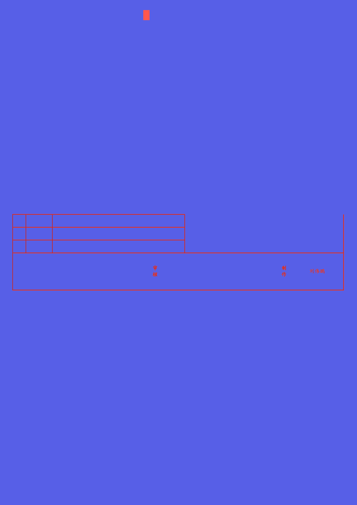</td>
  <td>changed: 16551 px (0.76%)<br>bbox: [42, 35, 1196, 1009]<br>mean abs RGB: 1.3189<br>RMSE RGB: 16.625<br>threshold: 12, gain: 5.0</td>
</tr>
<tr>
  <td><b>payroll-calculator_f</b><br>Page 1</td>
  <td></td>
  <td>changed: 532215 px (24.45%)<br>bbox: [23, 29, 1754, 1160]<br>mean abs RGB: 17.5896<br>RMSE RGB: 42.8265<br>threshold: 12, gain: 5.0</td>
</tr>
<tr>
  <td><b>payroll-calculator_f</b><br>Page 2</td>
  <td></td>
  <td>changed: 394684 px (18.13%)<br>bbox: [23, 29, 1682, 1160]<br>mean abs RGB: 19.5001<br>RMSE RGB: 53.1636<br>threshold: 12, gain: 5.0</td>
</tr>
<tr>
  <td><b>payroll-calculator_f</b><br>Page 3</td>
  <td></td>
  <td>changed: 488426 px (22.44%)<br>bbox: [23, 29, 1504, 1160]<br>mean abs RGB: 21.1973<br>RMSE RGB: 55.8296<br>threshold: 12, gain: 5.0</td>
</tr>
<tr>
  <td><b>payroll-calculator_f</b><br>Page 4</td>
  <td>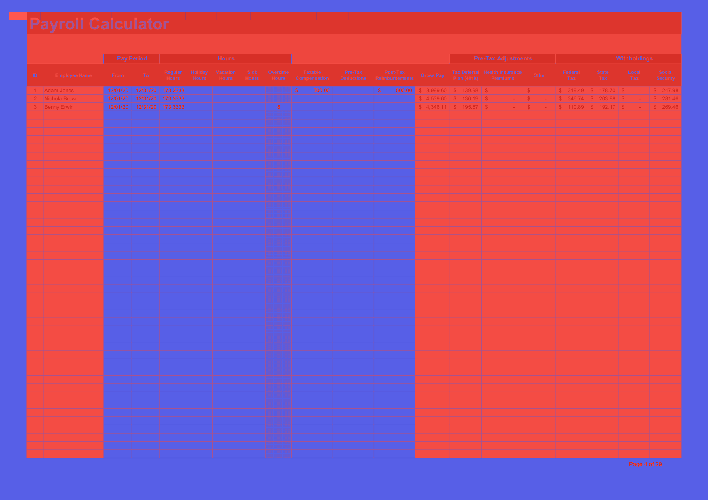</td>
  <td>changed: 1209024 px (55.54%)<br>bbox: [23, 29, 1689, 1160]<br>mean abs RGB: 36.0171<br>RMSE RGB: 59.5003<br>threshold: 12, gain: 5.0</td>
</tr>
<tr>
  <td><b>payroll-calculator_f</b><br>Page 5</td>
  <td>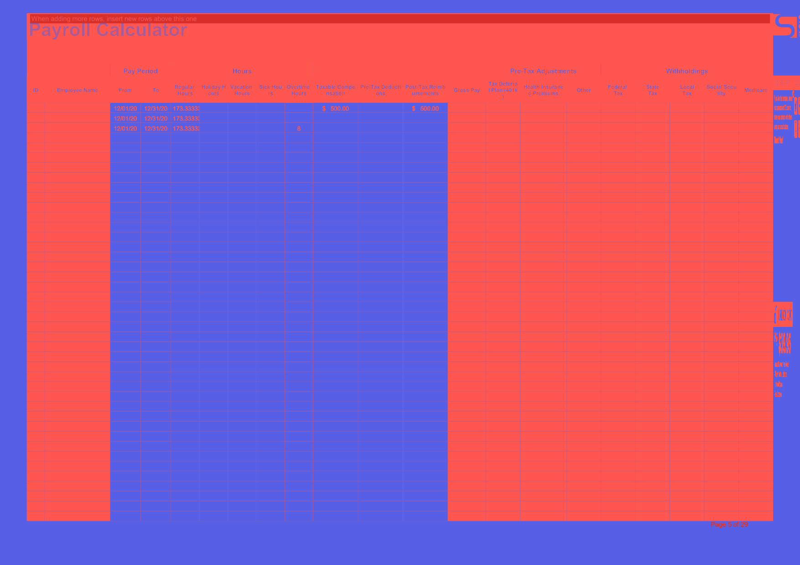</td>
  <td>changed: 1211550 px (55.66%)<br>bbox: [58, 29, 1754, 1160]<br>mean abs RGB: 37.5416<br>RMSE RGB: 61.3188<br>threshold: 12, gain: 5.0</td>
</tr>
<tr>
  <td><b>payroll-calculator_f</b><br>Page 6</td>
  <td>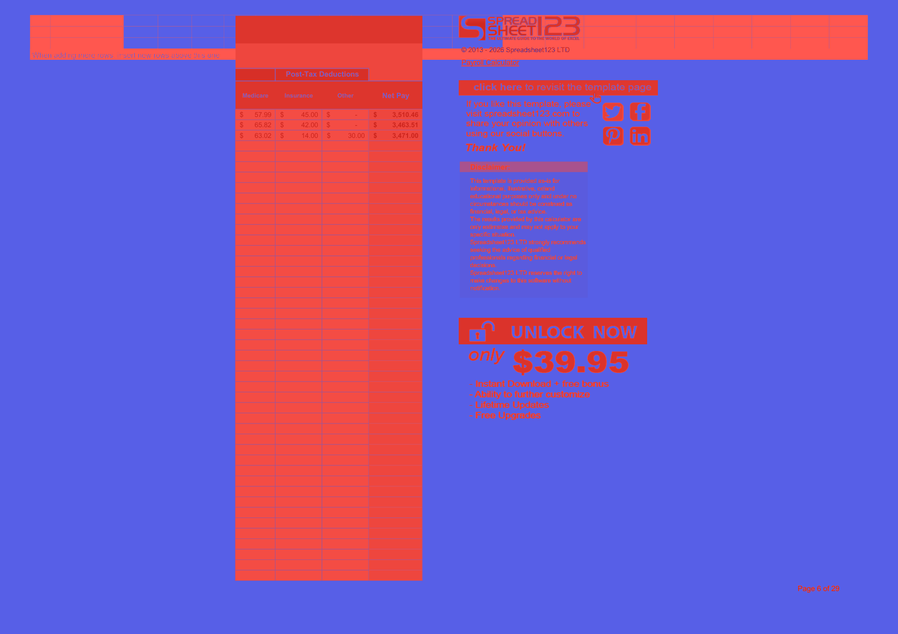</td>
  <td>changed: 615007 px (28.25%)<br>bbox: [58, 29, 1696, 1160]<br>mean abs RGB: 21.0131<br>RMSE RGB: 49.0562<br>threshold: 12, gain: 5.0</td>
</tr>
<tr>
  <td><b>payroll-calculator_f</b><br>Page 7</td>
  <td>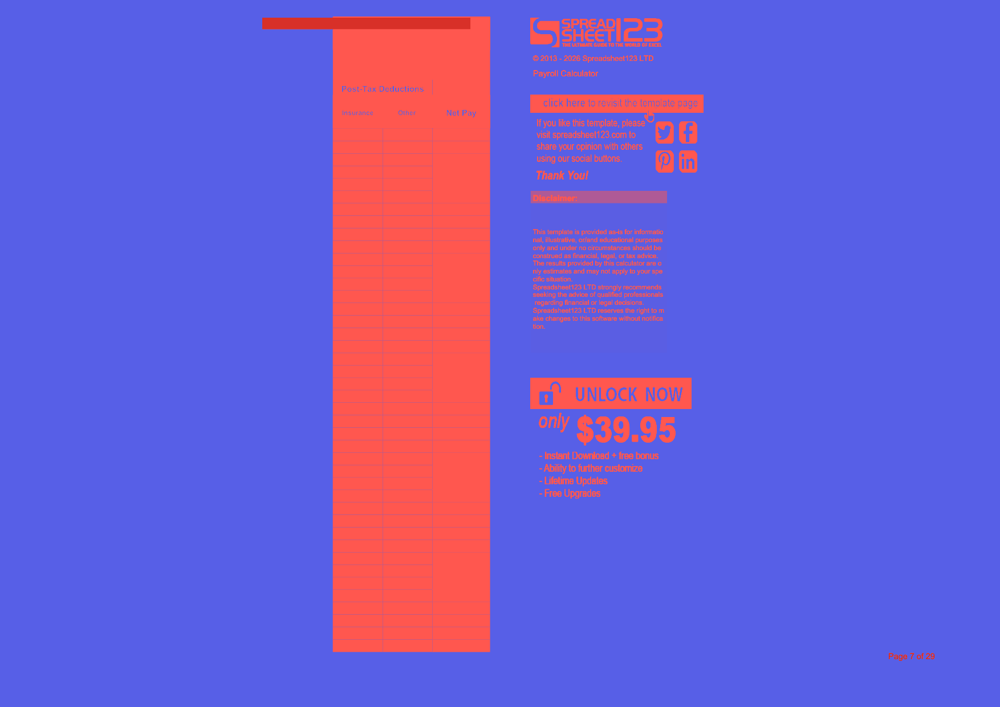</td>
  <td>changed: 430723 px (19.79%)<br>bbox: [460, 29, 1640, 1160]<br>mean abs RGB: 14.1302<br>RMSE RGB: 39.5934<br>threshold: 12, gain: 5.0</td>
</tr>
<tr>
  <td><b>payroll-calculator_f</b><br>Page 8</td>
  <td>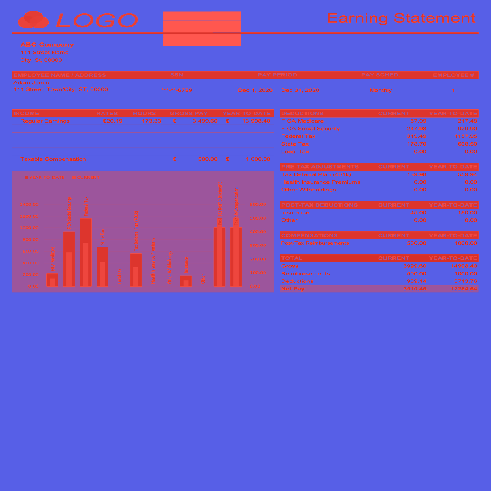</td>
  <td>changed: 361013 px (23.44%)<br>bbox: [30, 27, 1210, 740]<br>mean abs RGB: 17.6564<br>RMSE RGB: 48.6024<br>threshold: 12, gain: 5.0</td>
</tr>
<tr>
  <td><b>payroll-calculator_f</b><br>Page 9</td>
  <td>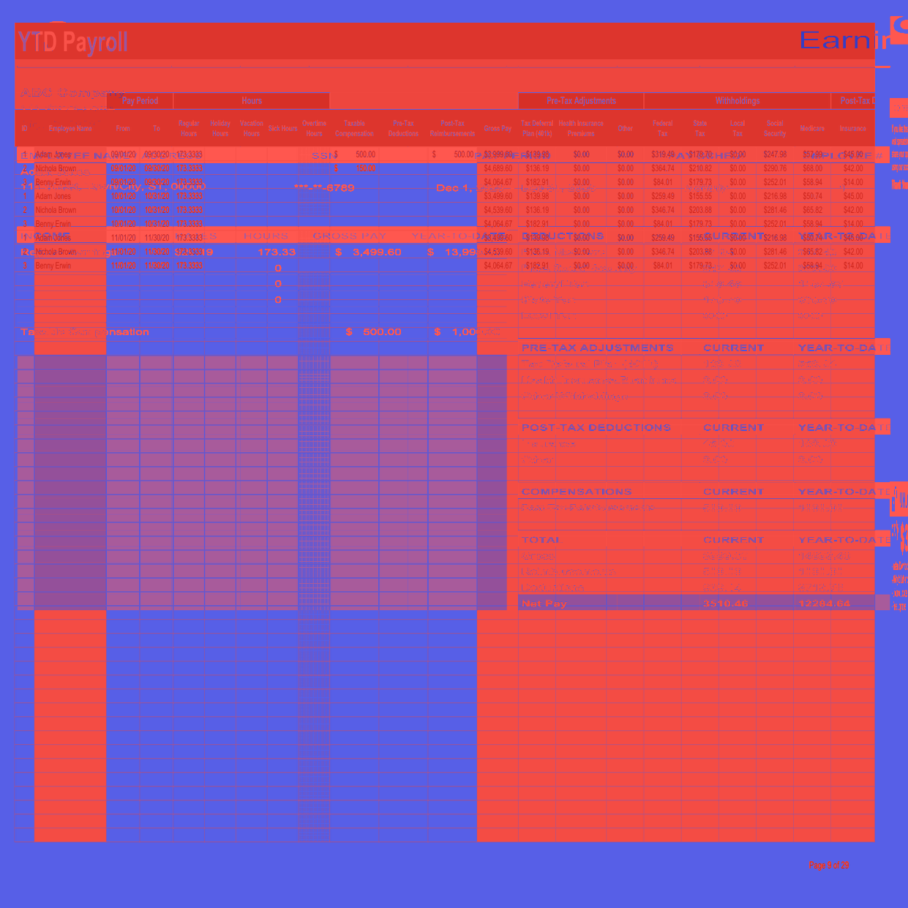</td>
  <td>changed: 1083585 px (70.36%)<br>bbox: [19, 22, 1241, 1190]<br>mean abs RGB: 44.9399<br>RMSE RGB: 68.5849<br>threshold: 12, gain: 5.0</td>
</tr>
<tr>
  <td><b>payroll-calculator_f</b><br>Page 10</td>
  <td>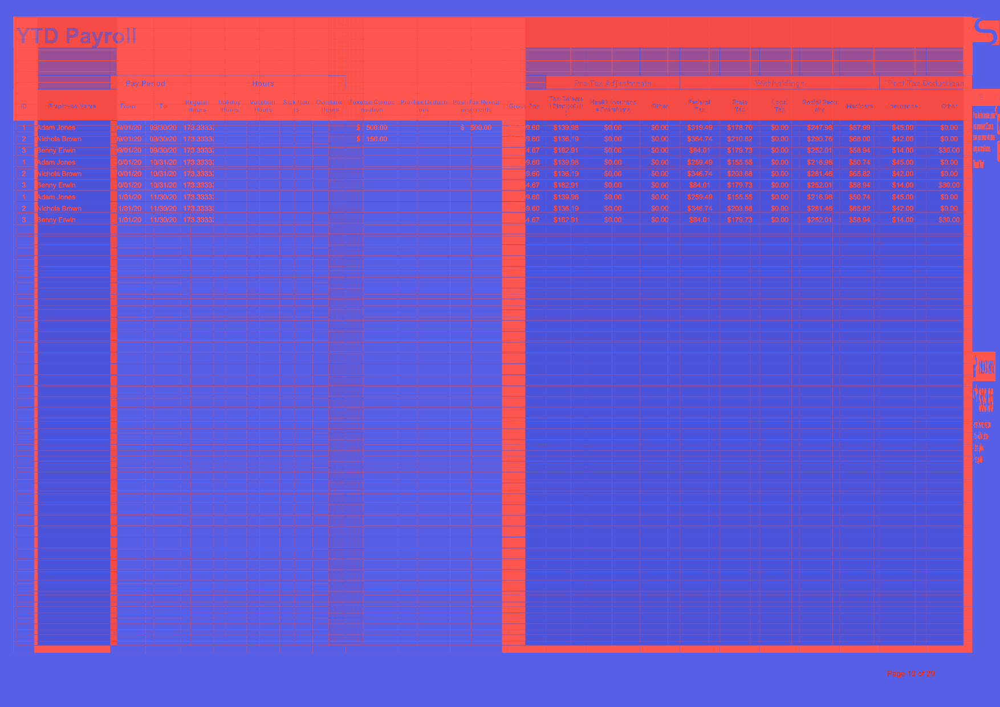</td>
  <td>changed: 689994 px (31.70%)<br>bbox: [23, 29, 1754, 1190]<br>mean abs RGB: 20.9069<br>RMSE RGB: 48.346<br>threshold: 12, gain: 5.0</td>
</tr>
<tr>
  <td><b>payroll-calculator_f</b><br>Page 11</td>
  <td>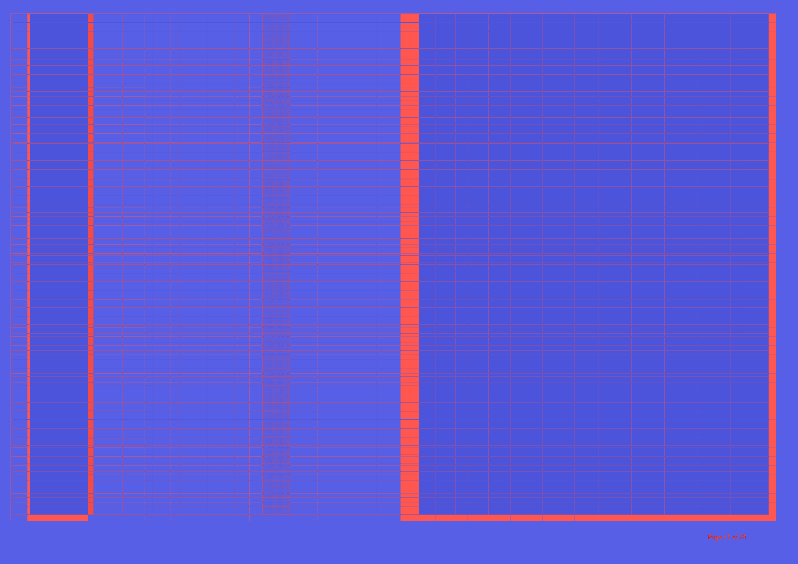</td>
  <td>changed: 409089 px (18.79%)<br>bbox: [23, 29, 1706, 1190]<br>mean abs RGB: 5.4417<br>RMSE RGB: 13.8381<br>threshold: 12, gain: 5.0</td>
</tr>
<tr>
  <td><b>payroll-calculator_f</b><br>Page 12</td>
  <td>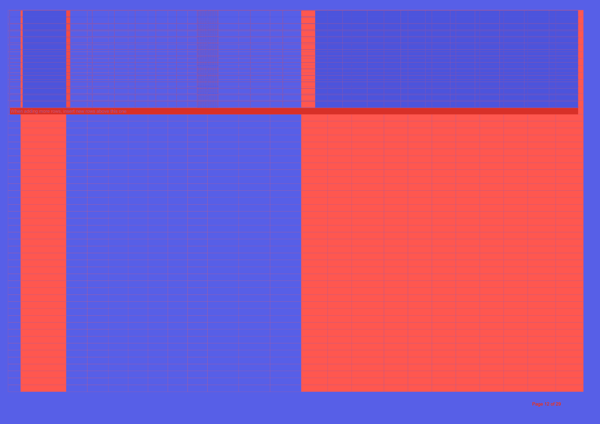</td>
  <td>changed: 957149 px (43.97%)<br>bbox: [23, 29, 1706, 1190]<br>mean abs RGB: 21.8119<br>RMSE RGB: 37.3632<br>threshold: 12, gain: 5.0</td>
</tr>
<tr>
  <td><b>payroll-calculator_f</b><br>Page 13</td>
  <td>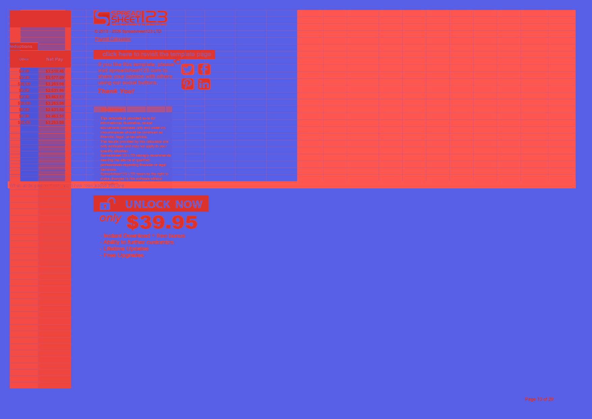</td>
  <td>changed: 765729 px (35.18%)<br>bbox: [23, 29, 1706, 1190]<br>mean abs RGB: 21.7976<br>RMSE RGB: 45.6181<br>threshold: 12, gain: 5.0</td>
</tr>
<tr>
  <td><b>payroll-calculator_f</b><br>Page 14</td>
  <td></td>
  <td>changed: 297376 px (13.66%)<br>bbox: [23, 29, 1640, 1190]<br>mean abs RGB: 8.379<br>RMSE RGB: 29.6402<br>threshold: 12, gain: 5.0</td>
</tr>
<tr>
  <td><b>payroll-calculator_f</b><br>Page 15</td>
  <td></td>
  <td>changed: 205098 px (9.42%)<br>bbox: [23, 29, 1640, 1190]<br>mean abs RGB: 4.7175<br>RMSE RGB: 18.2486<br>threshold: 12, gain: 5.0</td>
</tr>
<tr>
  <td><b>PO_anonymized</b><br>Page 1</td>
  <td></td>
  <td>changed: 514717 px (23.65%)<br>bbox: [58, 45, 1182, 1713]<br>mean abs RGB: 29.8818<br>RMSE RGB: 76.4864<br>threshold: 12, gain: 5.0</td>
</tr>
<tr>
  <td><b>PO_anonymized</b><br>Page 2</td>
  <td></td>
  <td>changed: 651331 px (29.92%)<br>bbox: [59, 45, 1181, 1713]<br>mean abs RGB: 34.8905<br>RMSE RGB: 81.0072<br>threshold: 12, gain: 5.0</td>
</tr>
<tr>
  <td><b>PO_anonymized</b><br>Page 3</td>
  <td></td>
  <td>changed: 122180 px (5.61%)<br>bbox: [61, 45, 1181, 1713]<br>mean abs RGB: 7.7594<br>RMSE RGB: 40.8676<br>threshold: 12, gain: 5.0</td>
</tr>
<tr>
  <td><b>PO_anonymized</b><br>Page 4</td>
  <td></td>
  <td>changed: 74703 px (3.43%)<br>bbox: [59, 45, 1181, 1713]<br>mean abs RGB: 3.6048<br>RMSE RGB: 24.9722<br>threshold: 12, gain: 5.0</td>
</tr>
<tr>
  <td><b>PO_anonymized</b><br>Page 5</td>
  <td></td>
  <td>changed: 77572 px (3.56%)<br>bbox: [59, 45, 1181, 1713]<br>mean abs RGB: 3.6284<br>RMSE RGB: 25.1982<br>threshold: 12, gain: 5.0</td>
</tr>
<tr>
  <td><b>PO_anonymized</b><br>Page 6</td>
  <td></td>
  <td>changed: 71466 px (3.28%)<br>bbox: [61, 45, 1181, 1713]<br>mean abs RGB: 3.5136<br>RMSE RGB: 24.7858<br>threshold: 12, gain: 5.0</td>
</tr>
<tr>
  <td><b>PO_anonymized</b><br>Page 7</td>
  <td></td>
  <td>changed: 77052 px (3.54%)<br>bbox: [61, 45, 1181, 1713]<br>mean abs RGB: 3.6735<br>RMSE RGB: 25.0531<br>threshold: 12, gain: 5.0</td>
</tr>
<tr>
  <td><b>PO_anonymized</b><br>Page 8</td>
  <td></td>
  <td>changed: 75823 px (3.48%)<br>bbox: [61, 45, 1181, 1713]<br>mean abs RGB: 3.5822<br>RMSE RGB: 25.0271<br>threshold: 12, gain: 5.0</td>
</tr>
<tr>
  <td><b>PO_anonymized</b><br>Page 9</td>
  <td></td>
  <td>changed: 75412 px (3.46%)<br>bbox: [61, 45, 1181, 1713]<br>mean abs RGB: 3.5779<br>RMSE RGB: 25.0552<br>threshold: 12, gain: 5.0</td>
</tr>
<tr>
  <td><b>Simple invoice1</b><br>Page 1</td>
  <td></td>
  <td>changed: 344696 px (15.84%)<br>bbox: [36, 114, 1237, 1451]<br>mean abs RGB: 18.2404<br>RMSE RGB: 60.1938<br>threshold: 12, gain: 5.0</td>
</tr>
<tr>
  <td><b>Small business cash flow forecast1</b><br>Page 1</td>
  <td></td>
  <td>changed: 815067 px (37.44%)<br>bbox: [66, 75, 1173, 1680]<br>mean abs RGB: 17.9447<br>RMSE RGB: 44.8225<br>threshold: 12, gain: 5.0</td>
</tr>
<tr>
  <td><b>Small business cash flow forecast1</b><br>Page 2</td>
  <td></td>
  <td>changed: 496069 px (32.21%)<br>bbox: [87, 53, 1157, 1071]<br>mean abs RGB: 42.0195<br>RMSE RGB: 87.6112<br>threshold: 12, gain: 5.0</td>
</tr>
<tr>
  <td><b>Small business cash flow forecast1</b><br>Page 3</td>
  <td></td>
  <td>changed: 2092 px (0.10%)<br>bbox: [835, 112, 1532, 116]<br>mean abs RGB: 0.0692<br>RMSE RGB: 2.9896<br>threshold: 12, gain: 5.0</td>
</tr>
<tr>
  <td><b>Wedding_timeline_planner1_copy</b><br>Page 1</td>
  <td></td>
  <td>changed: 298306 px (13.70%)<br>bbox: [102, 183, 1158, 1550]<br>mean abs RGB: 14.256<br>RMSE RGB: 46.0558<br>threshold: 12, gain: 5.0</td>
</tr>
<tr>
  <td><b>Wedding_timeline_planner1_copy</b><br>Page 2</td>
  <td></td>
  <td>changed: 318572 px (14.64%)<br>bbox: [102, 183, 1158, 1542]<br>mean abs RGB: 14.539<br>RMSE RGB: 46.27<br>threshold: 12, gain: 5.0</td>
</tr>
<tr>
  <td><b>Wedding_timeline_planner1_copy</b><br>Page 3</td>
  <td></td>
  <td>changed: 291508 px (13.39%)<br>bbox: [102, 183, 1158, 1516]<br>mean abs RGB: 13.5658<br>RMSE RGB: 44.6731<br>threshold: 12, gain: 5.0</td>
</tr>
<tr>
  <td><b>Wedding_timeline_planner1_copy</b><br>Page 4</td>
  <td>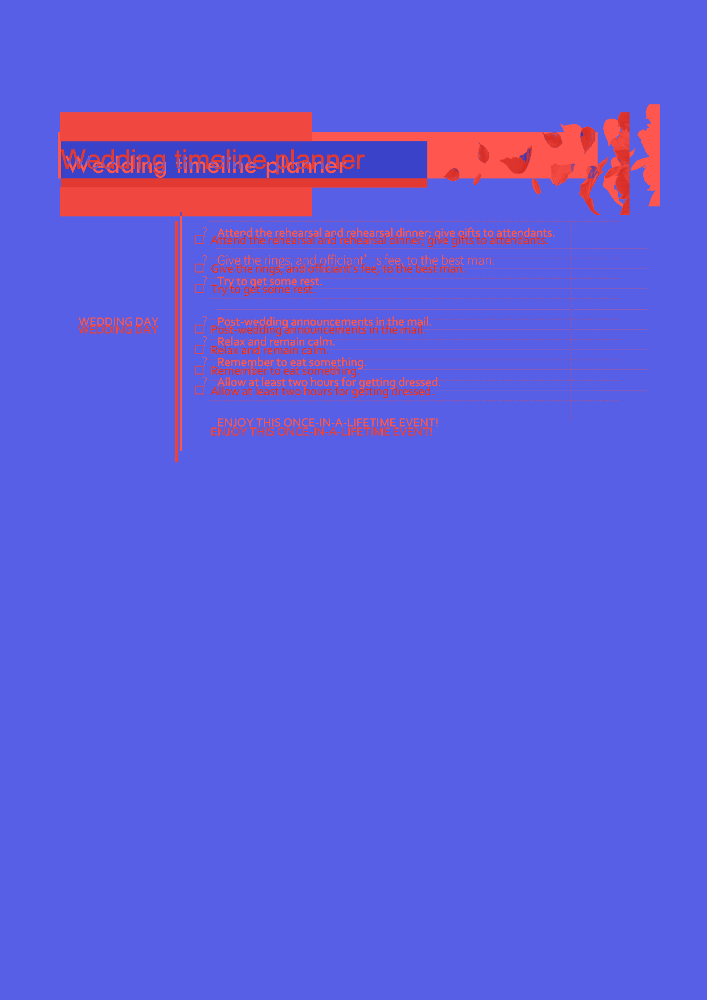</td>
  <td>changed: 160305 px (7.36%)<br>bbox: [102, 183, 1158, 811]<br>mean abs RGB: 7.2149<br>RMSE RGB: 31.3697<br>threshold: 12, gain: 5.0</td>
</tr>
<tr>
  <td><b>Wedding_timeline_planner1_copy</b><br>Page 5</td>
  <td></td>
  <td>changed: 180 px (0.01%)<br>bbox: [105, 197, 106, 377]<br>mean abs RGB: 0.0141<br>RMSE RGB: 1.6233<br>threshold: 12, gain: 5.0</td>
</tr>
<tr>
  <td><b>Wedding_timeline_planner1_copy</b><br>Page 6</td>
  <td></td>
  <td>changed: 180 px (0.01%)<br>bbox: [105, 197, 106, 377]<br>mean abs RGB: 0.0141<br>RMSE RGB: 1.6233<br>threshold: 12, gain: 5.0</td>
</tr>
<tr>
  <td><b>Wedding_timeline_planner1_copy</b><br>Page 7</td>
  <td></td>
  <td>changed: 180 px (0.01%)<br>bbox: [105, 197, 106, 377]<br>mean abs RGB: 0.0141<br>RMSE RGB: 1.6233<br>threshold: 12, gain: 5.0</td>
</tr>
<tr>
  <td><b>Wedding_timeline_planner1_copy</b><br>Page 8</td>
  <td></td>
  <td>changed: 180 px (0.01%)<br>bbox: [105, 197, 106, 377]<br>mean abs RGB: 0.0141<br>RMSE RGB: 1.6233<br>threshold: 12, gain: 5.0</td>
</tr>
<tr>
  <td><b>Weekly schedule planner1</b><br>Page 1</td>
  <td></td>
  <td>changed: 686771 px (31.55%)<br>bbox: [121, 96, 1571, 1144]<br>mean abs RGB: 25.2671<br>RMSE RGB: 60.9449<br>threshold: 12, gain: 5.0</td>
</tr>
<tr>
  <td><b>XlsxIssue75</b><br>Page 1</td>
  <td></td>
  <td>changed: 157587 px (7.24%)<br>bbox: [109, 114, 1111, 1649]<br>mean abs RGB: 8.9397<br>RMSE RGB: 40.5315<br>threshold: 12, gain: 5.0</td>
</tr>
<tr>
  <td><b>XlsxIssue75</b><br>Page 2</td>
  <td></td>
  <td>changed: 107345 px (4.93%)<br>bbox: [114, 120, 1076, 1649]<br>mean abs RGB: 8.0094<br>RMSE RGB: 40.3943<br>threshold: 12, gain: 5.0</td>
</tr>
<tr>
  <td><b>XlsxIssue75</b><br>Page 3</td>
  <td></td>
  <td>changed: 102955 px (4.73%)<br>bbox: [114, 120, 1076, 1649]<br>mean abs RGB: 7.6331<br>RMSE RGB: 39.3545<br>threshold: 12, gain: 5.0</td>
</tr>
<tr>
  <td><b>XlsxIssue75</b><br>Page 4</td>
  <td></td>
  <td>changed: 98163 px (4.51%)<br>bbox: [114, 120, 1076, 1649]<br>mean abs RGB: 7.242<br>RMSE RGB: 38.2872<br>threshold: 12, gain: 5.0</td>
</tr>
<tr>
  <td><b>XlsxIssue75</b><br>Page 5</td>
  <td></td>
  <td>changed: 92054 px (4.23%)<br>bbox: [115, 120, 1076, 1649]<br>mean abs RGB: 6.7832<br>RMSE RGB: 37.0478<br>threshold: 12, gain: 5.0</td>
</tr>
<tr>
  <td><b>XlsxIssue75</b><br>Page 6</td>
  <td></td>
  <td>changed: 98896 px (4.54%)<br>bbox: [114, 120, 1076, 1649]<br>mean abs RGB: 7.3107<br>RMSE RGB: 38.4873<br>threshold: 12, gain: 5.0</td>
</tr>
<tr>
  <td><b>XlsxIssue75</b><br>Page 7</td>
  <td></td>
  <td>changed: 101103 px (4.64%)<br>bbox: [114, 120, 1076, 1649]<br>mean abs RGB: 7.4437<br>RMSE RGB: 38.7964<br>threshold: 12, gain: 5.0</td>
</tr>
<tr>
  <td><b>XlsxIssue75</b><br>Page 8</td>
  <td></td>
  <td>changed: 96763 px (4.45%)<br>bbox: [114, 120, 1023, 1649]<br>mean abs RGB: 7.0922<br>RMSE RGB: 37.8468<br>threshold: 12, gain: 5.0</td>
</tr>
<tr>
  <td><b>XlsxIssue75</b><br>Page 9</td>
  <td></td>
  <td>changed: 98384 px (4.52%)<br>bbox: [114, 120, 1067, 1649]<br>mean abs RGB: 7.2332<br>RMSE RGB: 38.2544<br>threshold: 12, gain: 5.0</td>
</tr>
<tr>
  <td><b>XlsxIssue75</b><br>Page 10</td>
  <td></td>
  <td>changed: 99595 px (4.58%)<br>bbox: [114, 120, 1076, 1649]<br>mean abs RGB: 7.2764<br>RMSE RGB: 38.3234<br>threshold: 12, gain: 5.0</td>
</tr>
<tr>
  <td><b>XlsxIssue75</b><br>Page 11</td>
  <td></td>
  <td>changed: 99063 px (4.55%)<br>bbox: [114, 120, 1076, 1649]<br>mean abs RGB: 7.2294<br>RMSE RGB: 38.1995<br>threshold: 12, gain: 5.0</td>
</tr>
<tr>
  <td><b>XlsxIssue75</b><br>Page 12</td>
  <td></td>
  <td>changed: 99148 px (4.55%)<br>bbox: [114, 120, 1076, 1649]<br>mean abs RGB: 7.2261<br>RMSE RGB: 38.1789<br>threshold: 12, gain: 5.0</td>
</tr>
<tr>
  <td><b>XlsxIssue75</b><br>Page 13</td>
  <td></td>
  <td>changed: 99546 px (4.57%)<br>bbox: [114, 120, 1076, 1649]<br>mean abs RGB: 7.3304<br>RMSE RGB: 38.4881<br>threshold: 12, gain: 5.0</td>
</tr>
<tr>
  <td><b>XlsxIssue75</b><br>Page 14</td>
  <td></td>
  <td>changed: 111111 px (5.10%)<br>bbox: [114, 120, 1076, 1649]<br>mean abs RGB: 8.2971<br>RMSE RGB: 41.0856<br>threshold: 12, gain: 5.0</td>
</tr>
<tr>
  <td><b>XlsxIssue75</b><br>Page 15</td>
  <td></td>
  <td>changed: 117295 px (5.39%)<br>bbox: [115, 120, 1023, 1649]<br>mean abs RGB: 8.6907<br>RMSE RGB: 42.0621<br>threshold: 12, gain: 5.0</td>
</tr>
<tr>
  <td><b>XlsxIssue77_MergedCellAlignment</b><br>Page 1</td>
  <td></td>
  <td>changed: 474317 px (21.79%)<br>bbox: [35, 119, 1163, 1541]<br>mean abs RGB: 33.3008<br>RMSE RGB: 82.9184<br>threshold: 12, gain: 5.0</td>
</tr>
<tr>
  <td><b>XlsxIssue77_MergedCellAlignment</b><br>Page 2</td>
  <td></td>
  <td>changed: 443109 px (20.36%)<br>bbox: [35, 156, 1163, 1612]<br>mean abs RGB: 30.2766<br>RMSE RGB: 78.5097<br>threshold: 12, gain: 5.0</td>
</tr>
<tr>
  <td><b>XlsxIssue77_Template1</b><br>Page 1</td>
  <td></td>
  <td>changed: 379981 px (17.46%)<br>bbox: [82, 166, 1157, 1565]<br>mean abs RGB: 20.849<br>RMSE RGB: 62.5945<br>threshold: 12, gain: 5.0</td>
</tr>
<tr>
  <td><b>XlsxIssue77_Template1</b><br>Page 2</td>
  <td></td>
  <td>changed: 380038 px (17.46%)<br>bbox: [82, 166, 1157, 1565]<br>mean abs RGB: 20.7739<br>RMSE RGB: 62.443<br>threshold: 12, gain: 5.0</td>
</tr>
<tr>
  <td><b>XlsxIssue77_Template1</b><br>Page 3</td>
  <td></td>
  <td>changed: 380167 px (17.47%)<br>bbox: [82, 166, 1157, 1565]<br>mean abs RGB: 20.7364<br>RMSE RGB: 62.3609<br>threshold: 12, gain: 5.0</td>
</tr>
<tr>
  <td><b>XlsxIssue77_Template1</b><br>Page 4</td>
  <td></td>
  <td>changed: 380163 px (17.46%)<br>bbox: [82, 166, 1157, 1565]<br>mean abs RGB: 20.7436<br>RMSE RGB: 62.3841<br>threshold: 12, gain: 5.0</td>
</tr>
<tr>
  <td><b>XlsxIssue77_Template1</b><br>Page 5</td>
  <td>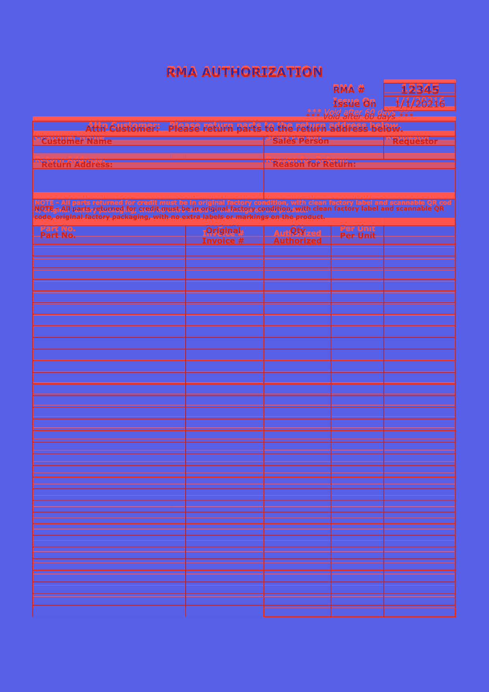</td>
  <td>changed: 380165 px (17.47%)<br>bbox: [82, 166, 1157, 1565]<br>mean abs RGB: 20.7417<br>RMSE RGB: 62.3644<br>threshold: 12, gain: 5.0</td>
</tr>
<tr>
  <td><b>XlsxIssue77_Template1</b><br>Page 6</td>
  <td>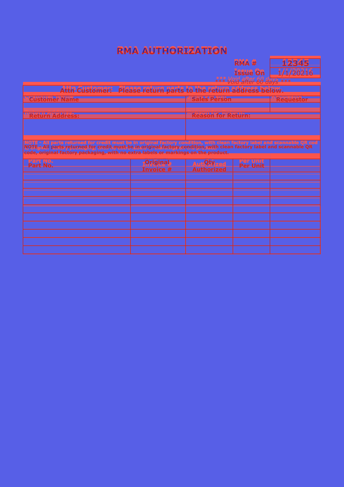</td>
  <td>changed: 259109 px (11.90%)<br>bbox: [82, 166, 1157, 916]<br>mean abs RGB: 12.6427<br>RMSE RGB: 48.3903<br>threshold: 12, gain: 5.0</td>
</tr>
<tr>
  <td><b>XlsxIssue77_Template2_Workaround</b><br>Page 1</td>
  <td></td>
  <td>changed: 375573 px (17.25%)<br>bbox: [78, 166, 1153, 1569]<br>mean abs RGB: 20.7999<br>RMSE RGB: 62.6342<br>threshold: 12, gain: 5.0</td>
</tr>
<tr>
  <td><b>XlsxIssue77_Template2_Workaround</b><br>Page 2</td>
  <td></td>
  <td>changed: 374803 px (17.22%)<br>bbox: [78, 166, 1153, 1569]<br>mean abs RGB: 20.6963<br>RMSE RGB: 62.4252<br>threshold: 12, gain: 5.0</td>
</tr>
<tr>
  <td><b>XlsxIssue77_Template2_Workaround</b><br>Page 3</td>
  <td></td>
  <td>changed: 374804 px (17.22%)<br>bbox: [78, 166, 1153, 1569]<br>mean abs RGB: 20.6898<br>RMSE RGB: 62.408<br>threshold: 12, gain: 5.0</td>
</tr>
<tr>
  <td><b>XlsxIssue77_Template2_Workaround</b><br>Page 4</td>
  <td>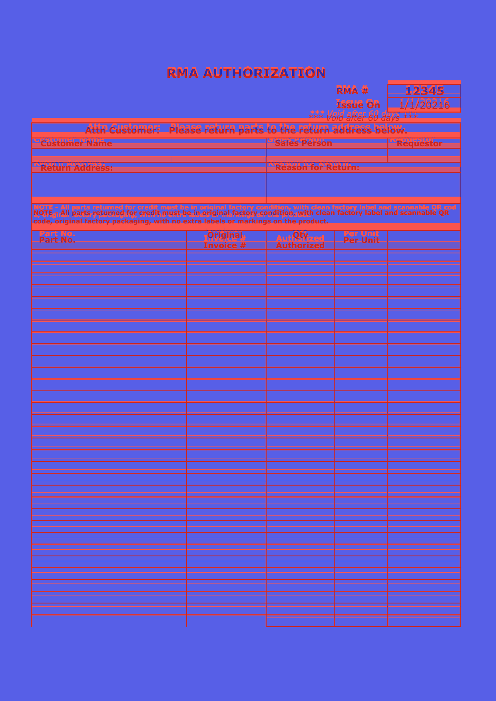</td>
  <td>changed: 374805 px (17.22%)<br>bbox: [78, 166, 1153, 1569]<br>mean abs RGB: 20.6864<br>RMSE RGB: 62.3838<br>threshold: 12, gain: 5.0</td>
</tr>
<tr>
  <td><b>XlsxIssue77_Template2_Workaround</b><br>Page 5</td>
  <td></td>
  <td>changed: 374803 px (17.22%)<br>bbox: [78, 166, 1153, 1569]<br>mean abs RGB: 20.6866<br>RMSE RGB: 62.3935<br>threshold: 12, gain: 5.0</td>
</tr>
<tr>
  <td><b>XlsxIssue77_Template2_Workaround</b><br>Page 6</td>
  <td>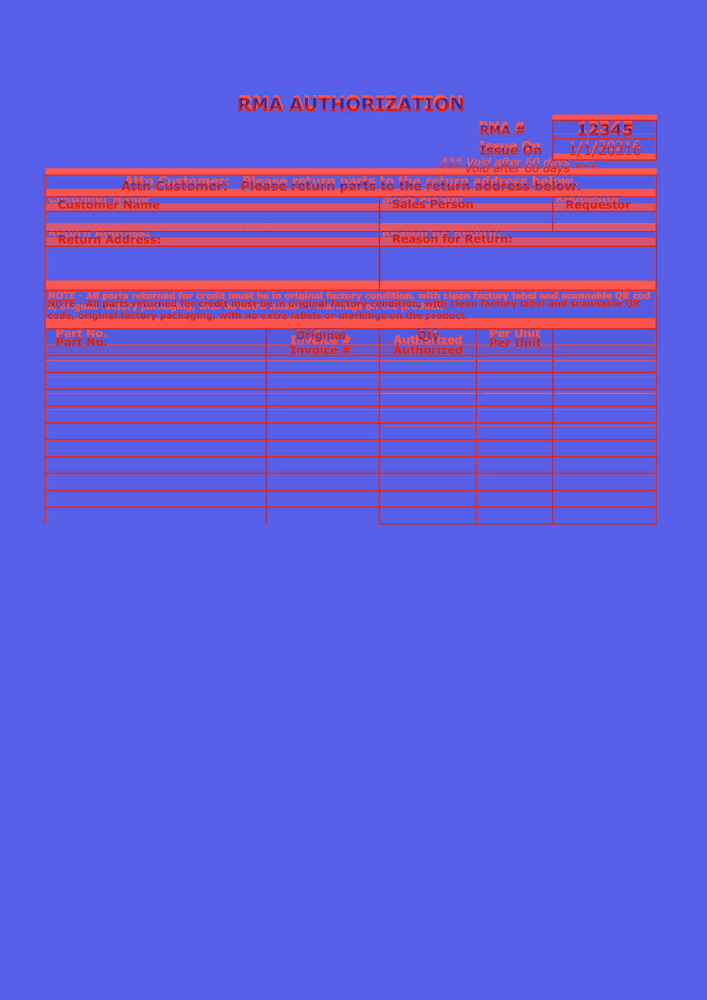</td>
  <td>changed: 251894 px (11.57%)<br>bbox: [78, 166, 1153, 920]<br>mean abs RGB: 12.4426<br>RMSE RGB: 48.2208<br>threshold: 12, gain: 5.0</td>
</tr>
<tr>
  <td><b>XlsxIssue81_LayoutOptions</b><br>Page 1</td>
  <td></td>
  <td>changed: 511187 px (24.96%)<br>bbox: [36, 74, 1068, 1570]<br>mean abs RGB: 32.0216<br>RMSE RGB: 77.0589<br>threshold: 12, gain: 5.0</td>
</tr>
<tr>
  <td><b>XlsxIssue81_LayoutOptions</b><br>Page 2</td>
  <td></td>
  <td>changed: 512225 px (25.02%)<br>bbox: [36, 74, 1068, 1570]<br>mean abs RGB: 32.1024<br>RMSE RGB: 77.1614<br>threshold: 12, gain: 5.0</td>
</tr>
<tr>
  <td><b>XlsxIssue81_LayoutOptions</b><br>Page 3</td>
  <td></td>
  <td>changed: 511075 px (24.96%)<br>bbox: [36, 74, 1068, 1570]<br>mean abs RGB: 31.9801<br>RMSE RGB: 77.0071<br>threshold: 12, gain: 5.0</td>
</tr>
<tr>
  <td><b>XlsxIssue81_LayoutOptions</b><br>Page 4</td>
  <td></td>
  <td>changed: 127821 px (6.24%)<br>bbox: [36, 74, 1068, 386]<br>mean abs RGB: 8.3008<br>RMSE RGB: 38.1128<br>threshold: 12, gain: 5.0</td>
</tr>
<tr>
  <td><b>XlsxIssue81_LayoutOptions</b><br>Page 5</td>
  <td>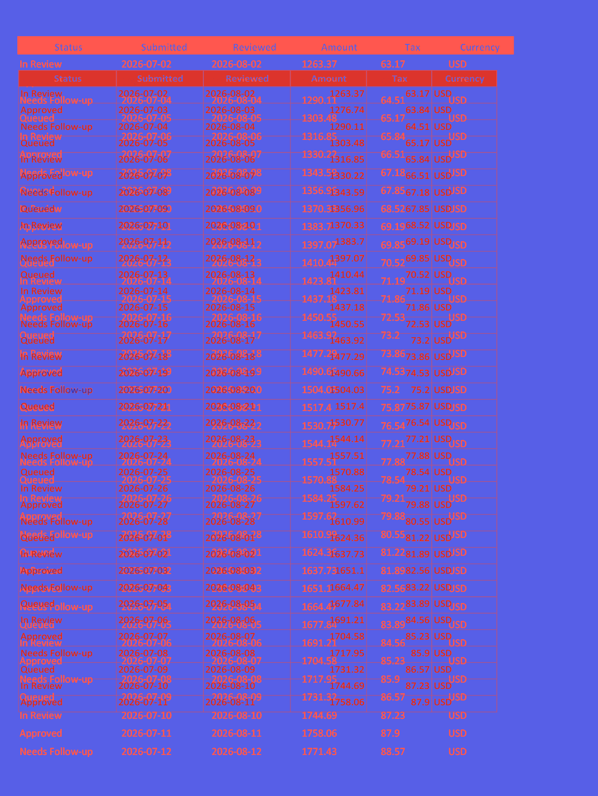</td>
  <td>changed: 402947 px (19.68%)<br>bbox: [36, 74, 1067, 1570]<br>mean abs RGB: 23.4849<br>RMSE RGB: 65.3971<br>threshold: 12, gain: 5.0</td>
</tr>
<tr>
  <td><b>XlsxIssue81_LayoutOptions</b><br>Page 6</td>
  <td></td>
  <td>changed: 406069 px (19.83%)<br>bbox: [36, 74, 1067, 1570]<br>mean abs RGB: 23.7164<br>RMSE RGB: 65.7502<br>threshold: 12, gain: 5.0</td>
</tr>
<tr>
  <td><b>XlsxIssue81_LayoutOptions</b><br>Page 7</td>
  <td>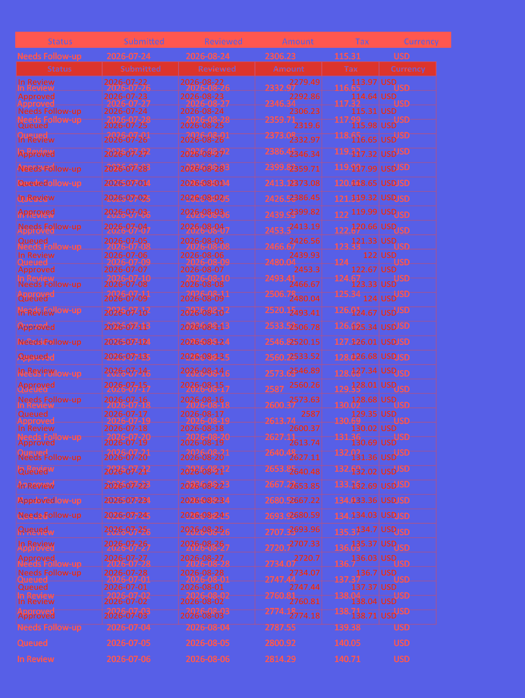</td>
  <td>changed: 407767 px (19.91%)<br>bbox: [36, 74, 1067, 1566]<br>mean abs RGB: 23.8549<br>RMSE RGB: 65.9376<br>threshold: 12, gain: 5.0</td>
</tr>
<tr>
  <td><b>XlsxIssue81_LayoutOptions</b><br>Page 8</td>
  <td></td>
  <td>changed: 115003 px (5.62%)<br>bbox: [36, 74, 1067, 386]<br>mean abs RGB: 7.2625<br>RMSE RGB: 35.3354<br>threshold: 12, gain: 5.0</td>
</tr>
<tr>
  <td><b>XlsxIssue81_LayoutOptions</b><br>Page 9</td>
  <td>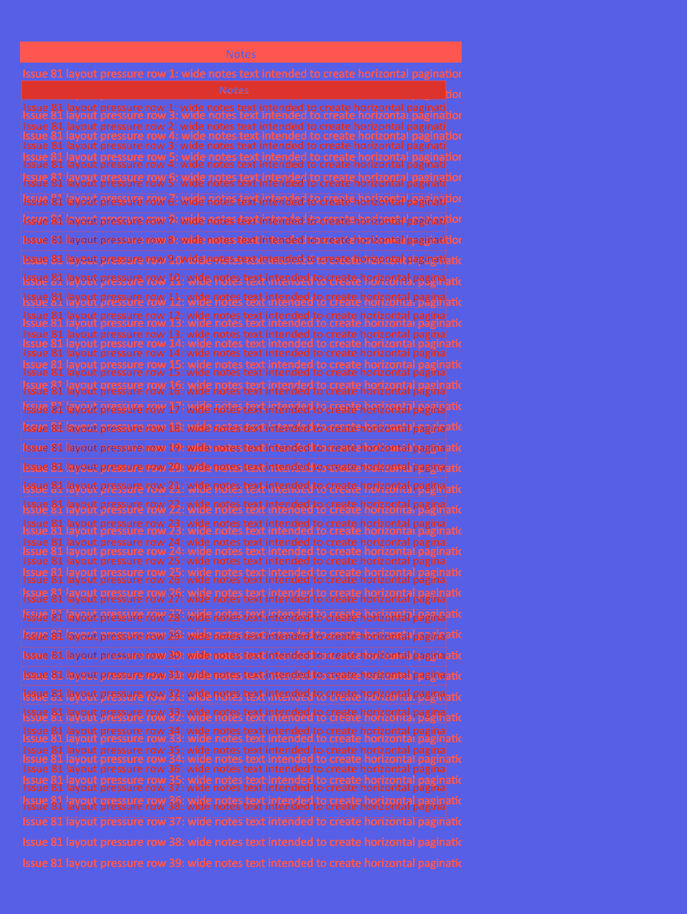</td>
  <td>changed: 457826 px (22.36%)<br>bbox: [36, 74, 834, 1570]<br>mean abs RGB: 29.6485<br>RMSE RGB: 74.3935<br>threshold: 12, gain: 5.0</td>
</tr>
<tr>
  <td><b>XlsxIssue81_LayoutOptions</b><br>Page 10</td>
  <td>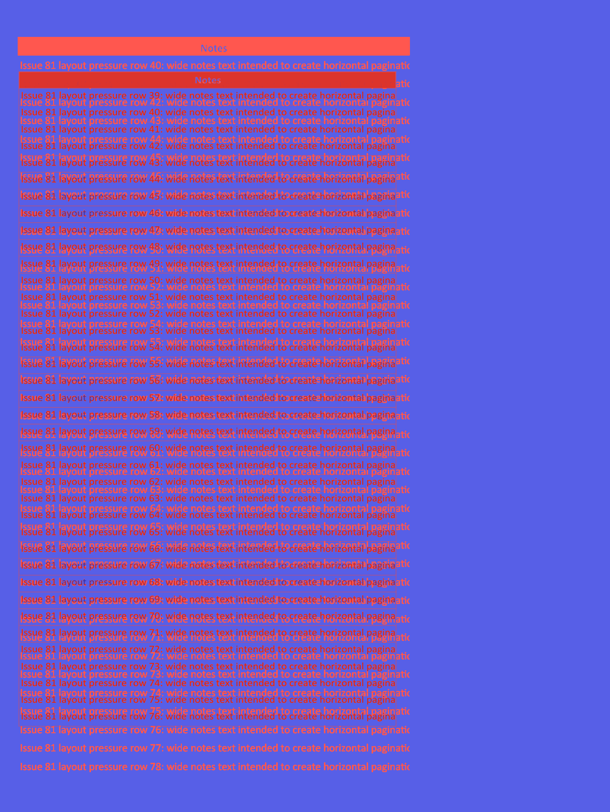</td>
  <td>changed: 458959 px (22.41%)<br>bbox: [36, 74, 834, 1570]<br>mean abs RGB: 29.6897<br>RMSE RGB: 74.4299<br>threshold: 12, gain: 5.0</td>
</tr>
<tr>
  <td><b>XlsxIssue81_LayoutOptions</b><br>Page 11</td>
  <td>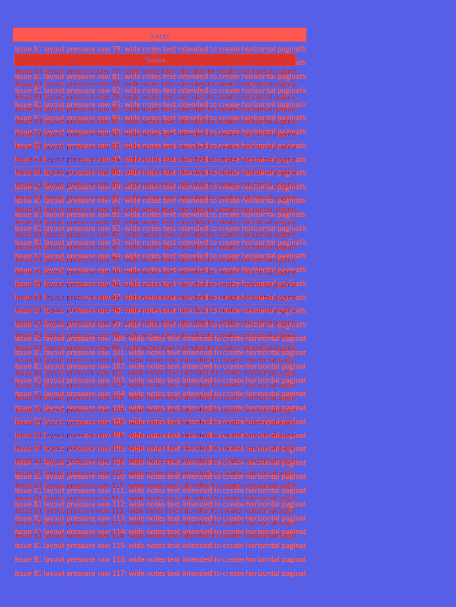</td>
  <td>changed: 458045 px (22.37%)<br>bbox: [36, 74, 834, 1570]<br>mean abs RGB: 29.6914<br>RMSE RGB: 74.4662<br>threshold: 12, gain: 5.0</td>
</tr>
<tr>
  <td><b>XlsxIssue81_LayoutOptions</b><br>Page 12</td>
  <td></td>
  <td>changed: 106162 px (5.18%)<br>bbox: [36, 74, 834, 386]<br>mean abs RGB: 7.0729<br>RMSE RGB: 35.3885<br>threshold: 12, gain: 5.0</td>
</tr>
<tr>
  <td><b>XlsxIssue81_LayoutOptions</b><br>Page 13</td>
  <td>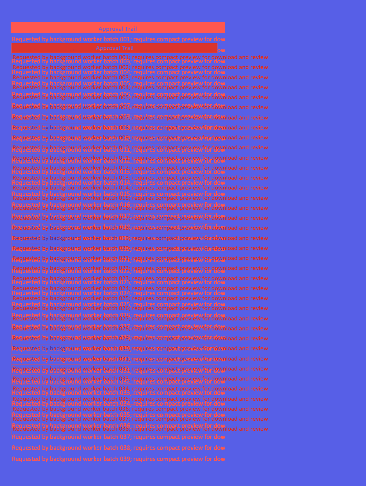</td>
  <td>changed: 460545 px (22.49%)<br>bbox: [36, 74, 914, 1570]<br>mean abs RGB: 30.645<br>RMSE RGB: 76.0264<br>threshold: 12, gain: 5.0</td>
</tr>
<tr>
  <td><b>XlsxIssue81_LayoutOptions</b><br>Page 14</td>
  <td></td>
  <td>changed: 460650 px (22.50%)<br>bbox: [36, 74, 914, 1570]<br>mean abs RGB: 30.6488<br>RMSE RGB: 76.0323<br>threshold: 12, gain: 5.0</td>
</tr>
<tr>
  <td><b>XlsxIssue81_LayoutOptions</b><br>Page 15</td>
  <td></td>
  <td>changed: 460238 px (22.48%)<br>bbox: [36, 74, 914, 1570]<br>mean abs RGB: 30.6175<br>RMSE RGB: 75.9898<br>threshold: 12, gain: 5.0</td>
</tr>
<tr>
  <td><b>XlsxIssue82_5mb</b><br>Page 1</td>
  <td></td>
  <td>changed: 434905 px (21.24%)<br>bbox: [106, 122, 1100, 1523]<br>mean abs RGB: 31.9401<br>RMSE RGB: 78.688<br>threshold: 12, gain: 5.0</td>
</tr>
<tr>
  <td><b>XlsxIssue82_5mb</b><br>Page 2</td>
  <td></td>
  <td>changed: 430451 px (21.02%)<br>bbox: [106, 122, 1100, 1522]<br>mean abs RGB: 31.5113<br>RMSE RGB: 78.0558<br>threshold: 12, gain: 5.0</td>
</tr>
<tr>
  <td><b>XlsxIssue82_5mb</b><br>Page 3</td>
  <td></td>
  <td>changed: 433772 px (21.18%)<br>bbox: [106, 122, 1100, 1522]<br>mean abs RGB: 31.8166<br>RMSE RGB: 78.4756<br>threshold: 12, gain: 5.0</td>
</tr>
<tr>
  <td><b>XlsxIssue82_5mb</b><br>Page 4</td>
  <td>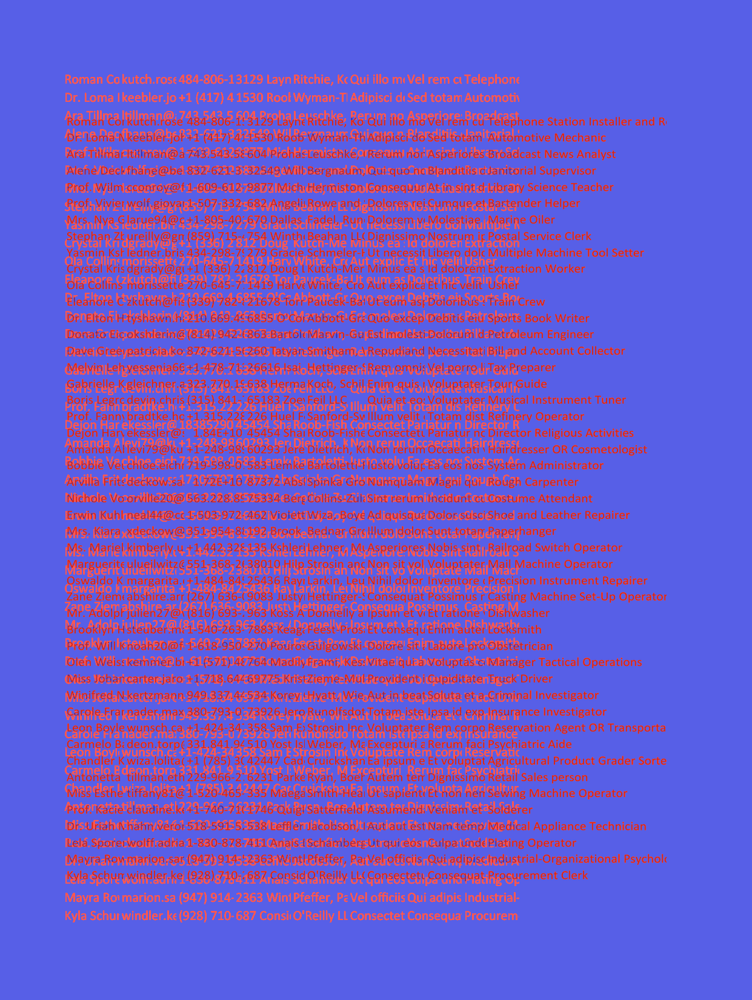</td>
  <td>changed: 431684 px (21.08%)<br>bbox: [106, 122, 1100, 1523]<br>mean abs RGB: 31.6553<br>RMSE RGB: 78.2675<br>threshold: 12, gain: 5.0</td>
</tr>
<tr>
  <td><b>XlsxIssue82_5mb</b><br>Page 5</td>
  <td>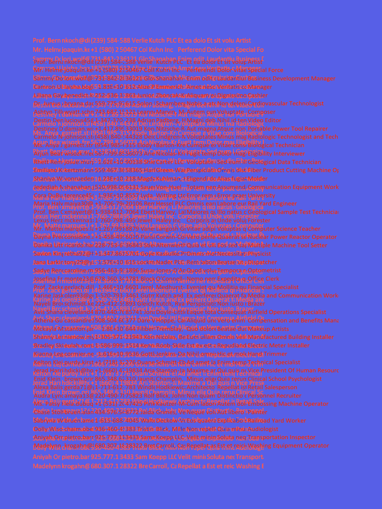</td>
  <td>changed: 431780 px (21.09%)<br>bbox: [106, 122, 1100, 1523]<br>mean abs RGB: 31.6562<br>RMSE RGB: 78.2654<br>threshold: 12, gain: 5.0</td>
</tr>
<tr>
  <td><b>XlsxIssue82_5mb</b><br>Page 6</td>
  <td>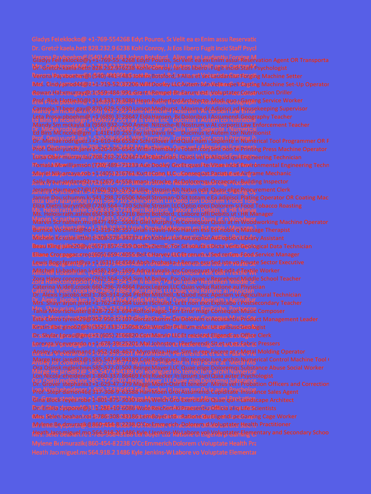</td>
  <td>changed: 437693 px (21.38%)<br>bbox: [106, 122, 1100, 1523]<br>mean abs RGB: 32.1135<br>RMSE RGB: 78.8284<br>threshold: 12, gain: 5.0</td>
</tr>
<tr>
  <td><b>XlsxIssue82_5mb</b><br>Page 7</td>
  <td>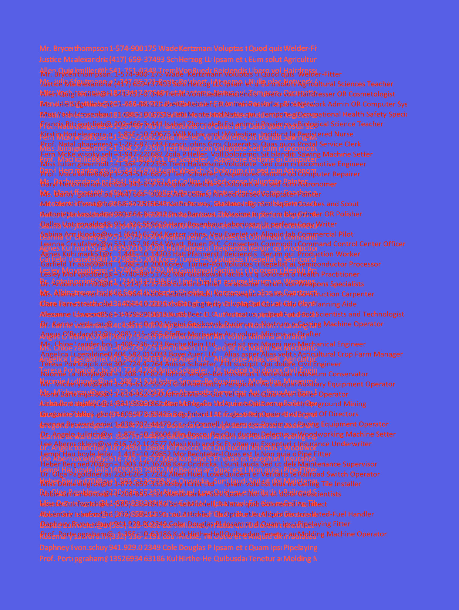</td>
  <td>changed: 434814 px (21.23%)<br>bbox: [106, 122, 1100, 1523]<br>mean abs RGB: 31.8468<br>RMSE RGB: 78.4773<br>threshold: 12, gain: 5.0</td>
</tr>
<tr>
  <td><b>XlsxIssue82_5mb</b><br>Page 8</td>
  <td>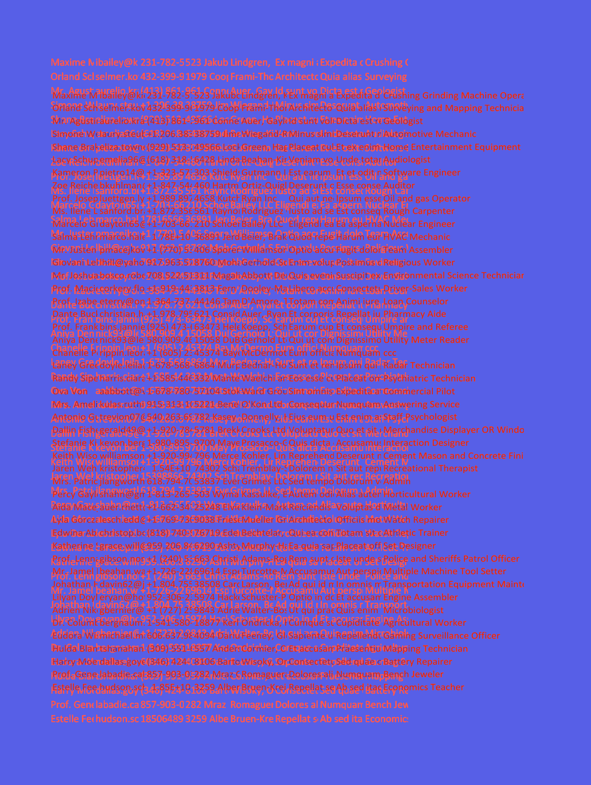</td>
  <td>changed: 429640 px (20.98%)<br>bbox: [106, 122, 1100, 1522]<br>mean abs RGB: 31.5253<br>RMSE RGB: 78.1571<br>threshold: 12, gain: 5.0</td>
</tr>
<tr>
  <td><b>XlsxIssue82_5mb</b><br>Page 9</td>
  <td>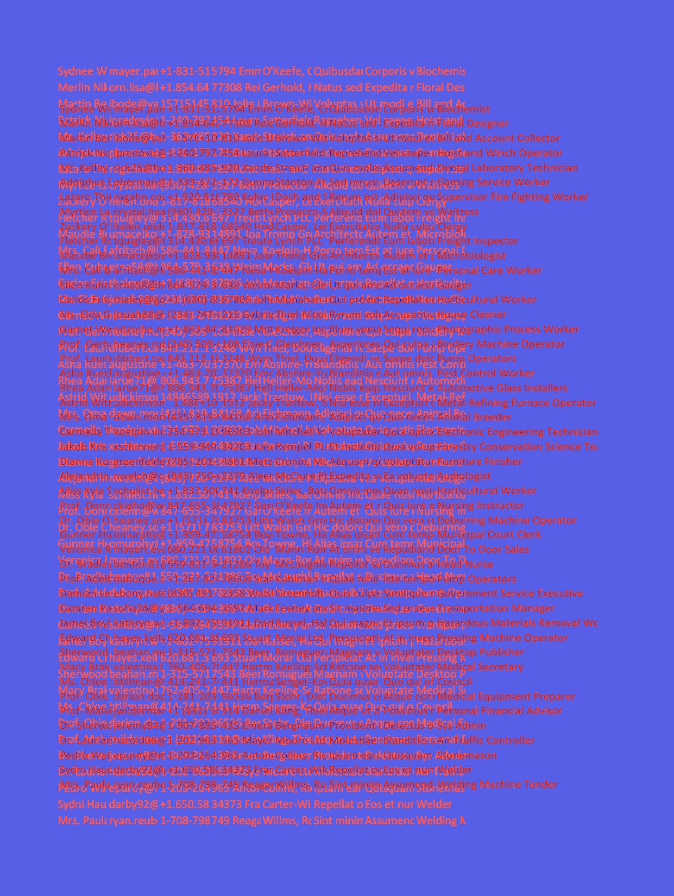</td>
  <td>changed: 430772 px (21.04%)<br>bbox: [106, 122, 1100, 1523]<br>mean abs RGB: 31.618<br>RMSE RGB: 78.246<br>threshold: 12, gain: 5.0</td>
</tr>
<tr>
  <td><b>XlsxIssue82_5mb</b><br>Page 10</td>
  <td>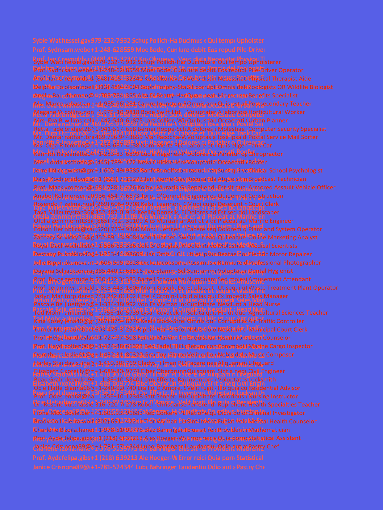</td>
  <td>changed: 428182 px (20.91%)<br>bbox: [106, 122, 1096, 1523]<br>mean abs RGB: 31.347<br>RMSE RGB: 77.8406<br>threshold: 12, gain: 5.0</td>
</tr>
<tr>
  <td><b>XlsxIssue82_5mb</b><br>Page 11</td>
  <td>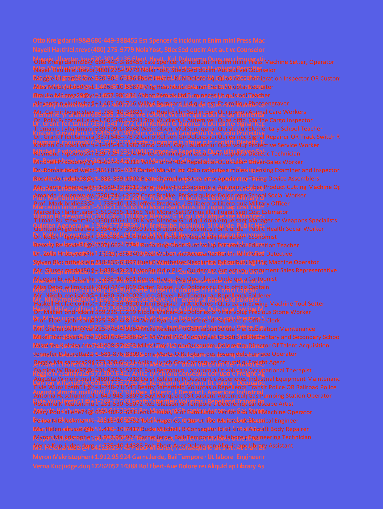</td>
  <td>changed: 434213 px (21.21%)<br>bbox: [106, 122, 1100, 1523]<br>mean abs RGB: 31.8505<br>RMSE RGB: 78.4957<br>threshold: 12, gain: 5.0</td>
</tr>
<tr>
  <td><b>XlsxIssue82_5mb</b><br>Page 12</td>
  <td>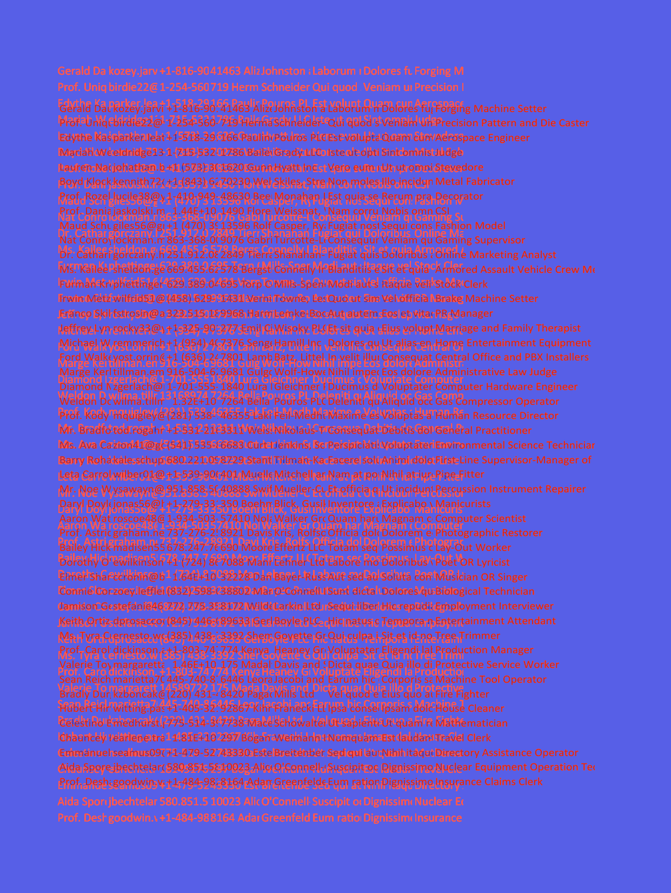</td>
  <td>changed: 432355 px (21.11%)<br>bbox: [106, 122, 1100, 1523]<br>mean abs RGB: 31.6757<br>RMSE RGB: 78.2713<br>threshold: 12, gain: 5.0</td>
</tr>
<tr>
  <td><b>XlsxIssue82_5mb</b><br>Page 13</td>
  <td>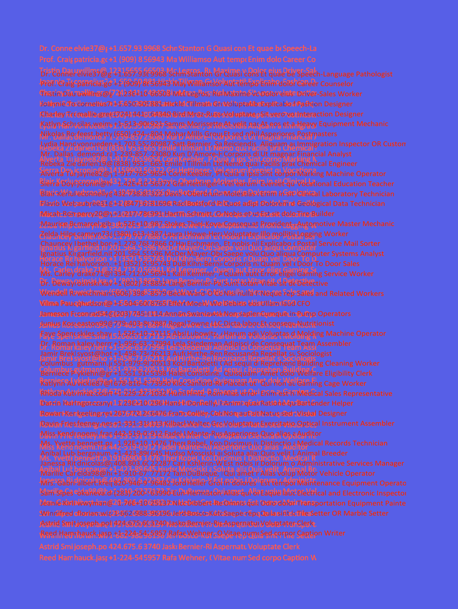</td>
  <td>changed: 435409 px (21.26%)<br>bbox: [106, 122, 1100, 1522]<br>mean abs RGB: 31.8684<br>RMSE RGB: 78.5161<br>threshold: 12, gain: 5.0</td>
</tr>
<tr>
  <td><b>XlsxIssue82_5mb</b><br>Page 14</td>
  <td>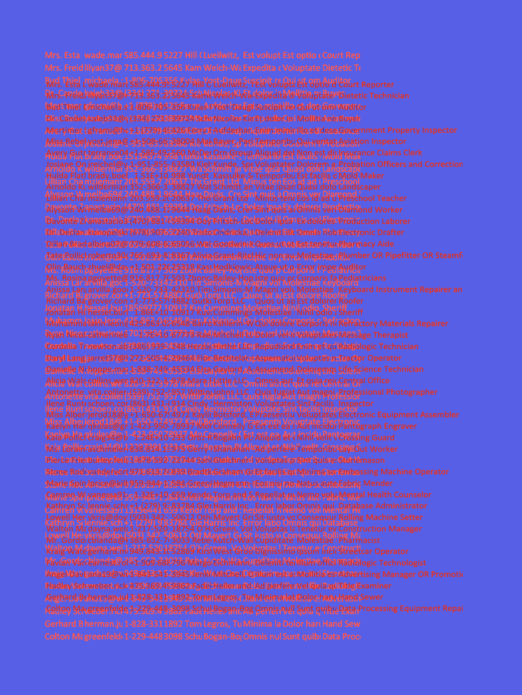</td>
  <td>changed: 430283 px (21.01%)<br>bbox: [106, 122, 1100, 1523]<br>mean abs RGB: 31.5115<br>RMSE RGB: 78.0713<br>threshold: 12, gain: 5.0</td>
</tr>
<tr>
  <td><b>XlsxIssue82_5mb</b><br>Page 15</td>
  <td>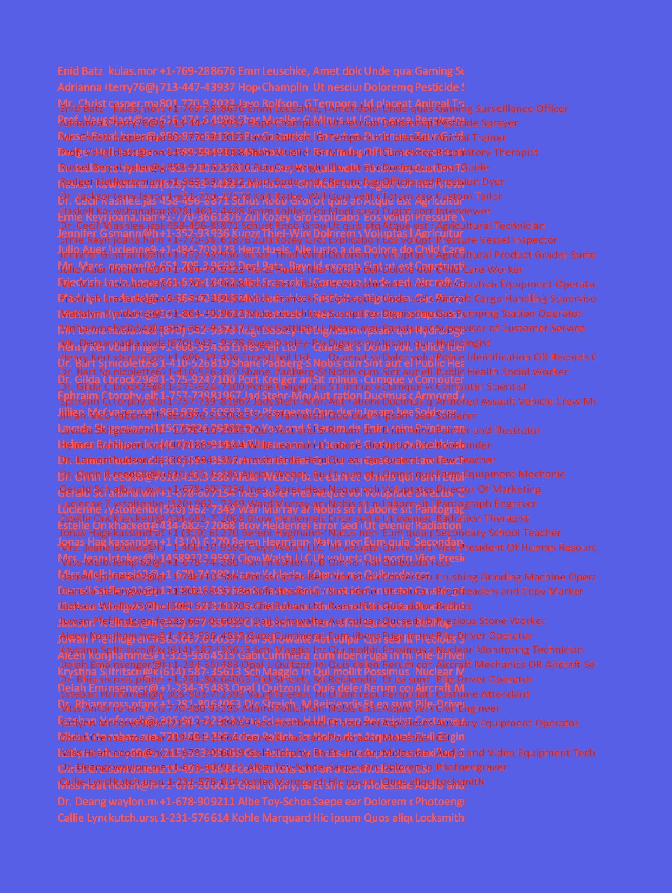</td>
  <td>changed: 433648 px (21.18%)<br>bbox: [106, 122, 1100, 1522]<br>mean abs RGB: 31.7855<br>RMSE RGB: 78.4269<br>threshold: 12, gain: 5.0</td>
</tr>
<tr>
  <td><b>XlsxIssue82_SampleTestData5mb</b><br>Page 1</td>
  <td></td>
  <td>changed: 356955 px (16.40%)<br>bbox: [114, 157, 1078, 1599]<br>mean abs RGB: 26.6364<br>RMSE RGB: 73.6748<br>threshold: 12, gain: 5.0</td>
</tr>
<tr>
  <td><b>XlsxIssue82_SampleTestData5mb</b><br>Page 2</td>
  <td></td>
  <td>changed: 365254 px (16.78%)<br>bbox: [114, 157, 1078, 1600]<br>mean abs RGB: 27.2049<br>RMSE RGB: 74.4386<br>threshold: 12, gain: 5.0</td>
</tr>
<tr>
  <td><b>XlsxIssue82_SampleTestData5mb</b><br>Page 3</td>
  <td></td>
  <td>changed: 369955 px (17.00%)<br>bbox: [114, 157, 1078, 1599]<br>mean abs RGB: 27.6909<br>RMSE RGB: 75.189<br>threshold: 12, gain: 5.0</td>
</tr>
<tr>
  <td><b>XlsxIssue82_SampleTestData5mb</b><br>Page 4</td>
  <td>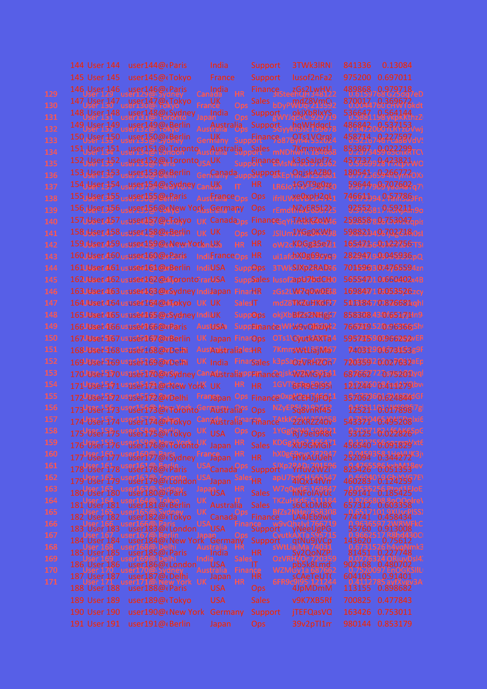</td>
  <td>changed: 372843 px (17.13%)<br>bbox: [115, 157, 1078, 1600]<br>mean abs RGB: 27.8472<br>RMSE RGB: 75.3628<br>threshold: 12, gain: 5.0</td>
</tr>
<tr>
  <td><b>XlsxIssue82_SampleTestData5mb</b><br>Page 5</td>
  <td>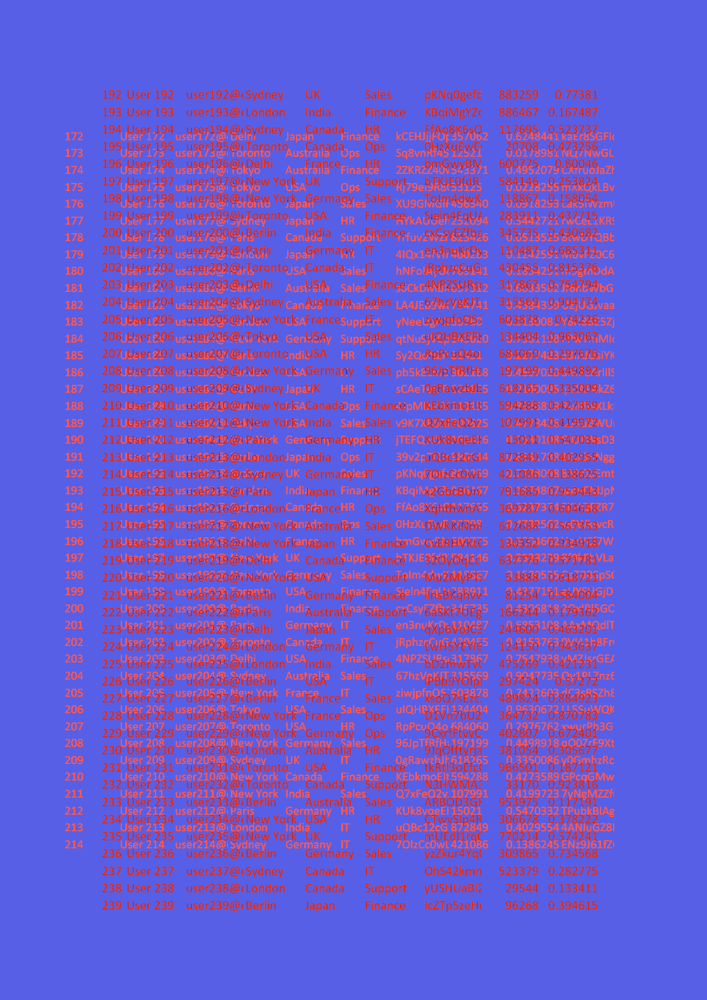</td>
  <td>changed: 378384 px (17.38%)<br>bbox: [114, 157, 1078, 1600]<br>mean abs RGB: 28.271<br>RMSE RGB: 75.9382<br>threshold: 12, gain: 5.0</td>
</tr>
<tr>
  <td><b>XlsxIssue82_SampleTestData5mb</b><br>Page 6</td>
  <td>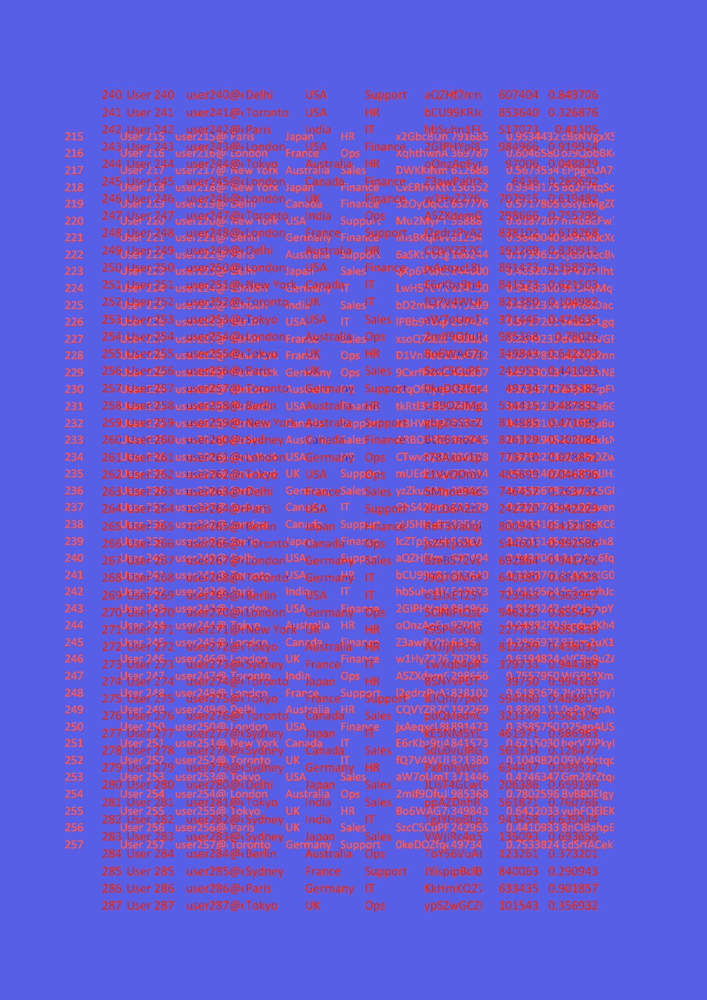</td>
  <td>changed: 376793 px (17.31%)<br>bbox: [114, 157, 1078, 1600]<br>mean abs RGB: 28.1487<br>RMSE RGB: 75.7644<br>threshold: 12, gain: 5.0</td>
</tr>
<tr>
  <td><b>XlsxIssue82_SampleTestData5mb</b><br>Page 7</td>
  <td>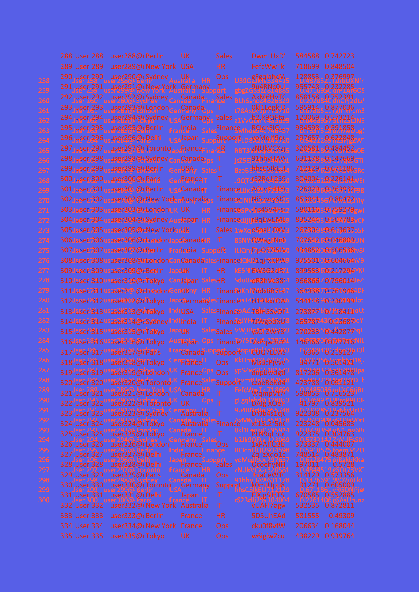</td>
  <td>changed: 377427 px (17.34%)<br>bbox: [114, 157, 1078, 1600]<br>mean abs RGB: 28.1661<br>RMSE RGB: 75.7618<br>threshold: 12, gain: 5.0</td>
</tr>
<tr>
  <td><b>XlsxIssue82_SampleTestData5mb</b><br>Page 8</td>
  <td>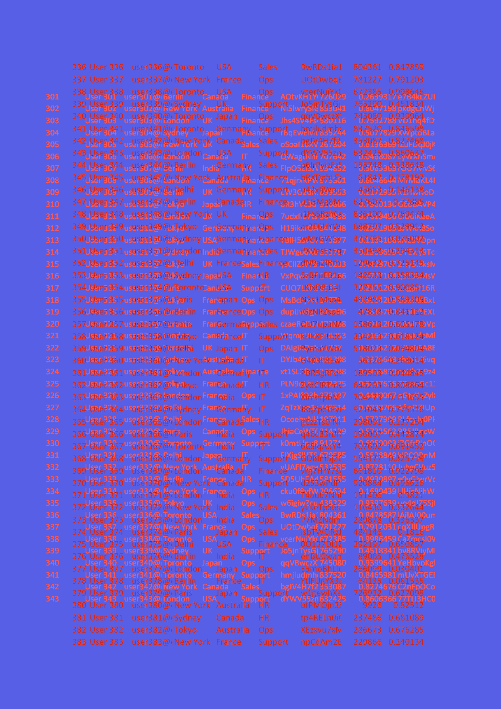</td>
  <td>changed: 380299 px (17.47%)<br>bbox: [114, 157, 1078, 1600]<br>mean abs RGB: 28.2749<br>RMSE RGB: 75.8708<br>threshold: 12, gain: 5.0</td>
</tr>
<tr>
  <td><b>XlsxIssue82_SampleTestData5mb</b><br>Page 9</td>
  <td>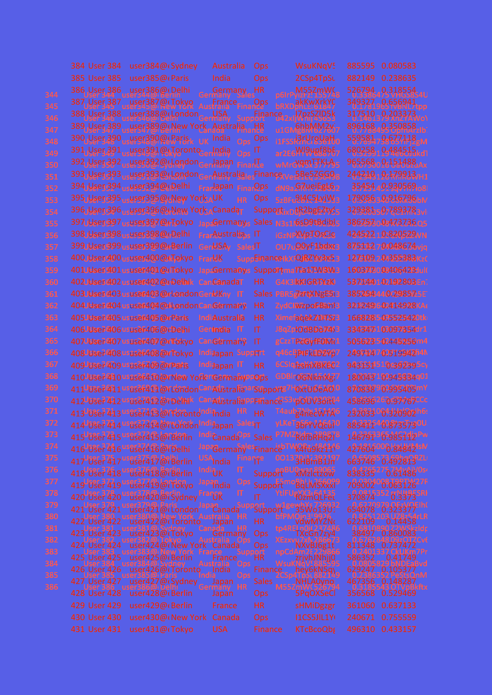</td>
  <td>changed: 378642 px (17.40%)<br>bbox: [114, 157, 1078, 1600]<br>mean abs RGB: 28.2691<br>RMSE RGB: 75.9012<br>threshold: 12, gain: 5.0</td>
</tr>
<tr>
  <td><b>XlsxIssue82_SampleTestData5mb</b><br>Page 10</td>
  <td>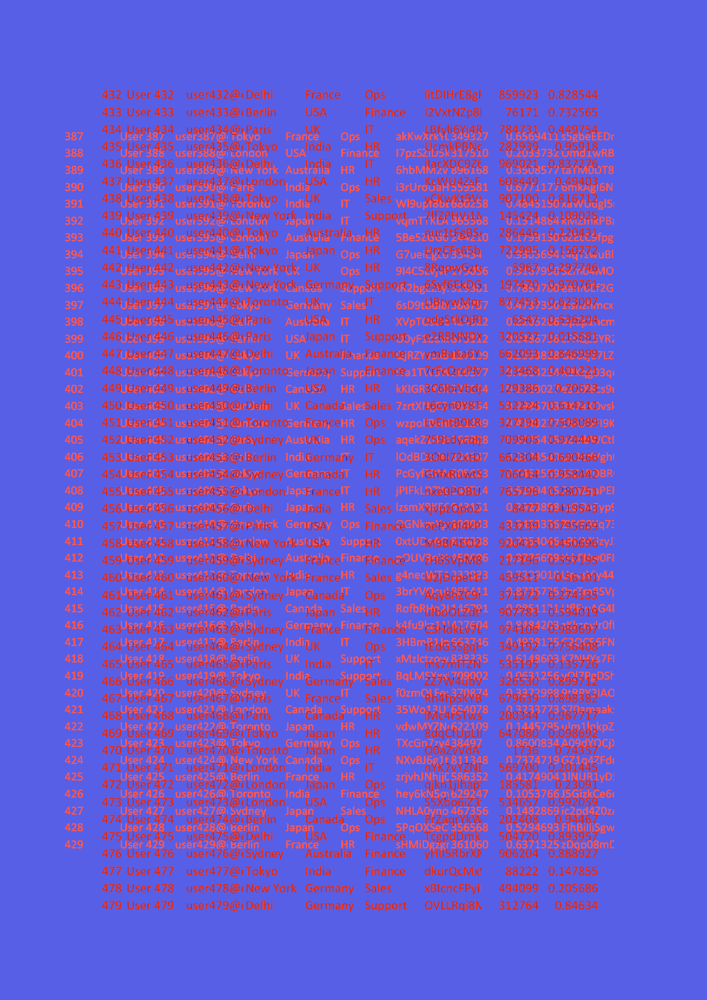</td>
  <td>changed: 375129 px (17.23%)<br>bbox: [114, 157, 1078, 1600]<br>mean abs RGB: 28.0331<br>RMSE RGB: 75.5735<br>threshold: 12, gain: 5.0</td>
</tr>
<tr>
  <td><b>XlsxIssue82_SampleTestData5mb</b><br>Page 11</td>
  <td>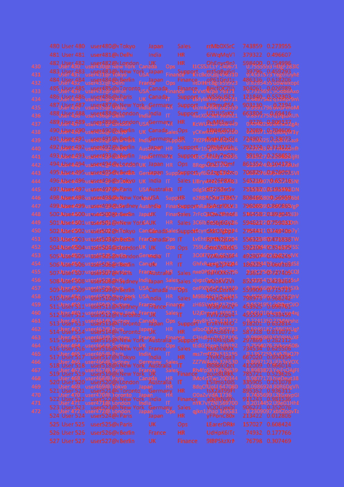</td>
  <td>changed: 375945 px (17.27%)<br>bbox: [114, 157, 1078, 1598]<br>mean abs RGB: 28.0981<br>RMSE RGB: 75.6769<br>threshold: 12, gain: 5.0</td>
</tr>
<tr>
  <td><b>XlsxIssue82_SampleTestData5mb</b><br>Page 12</td>
  <td>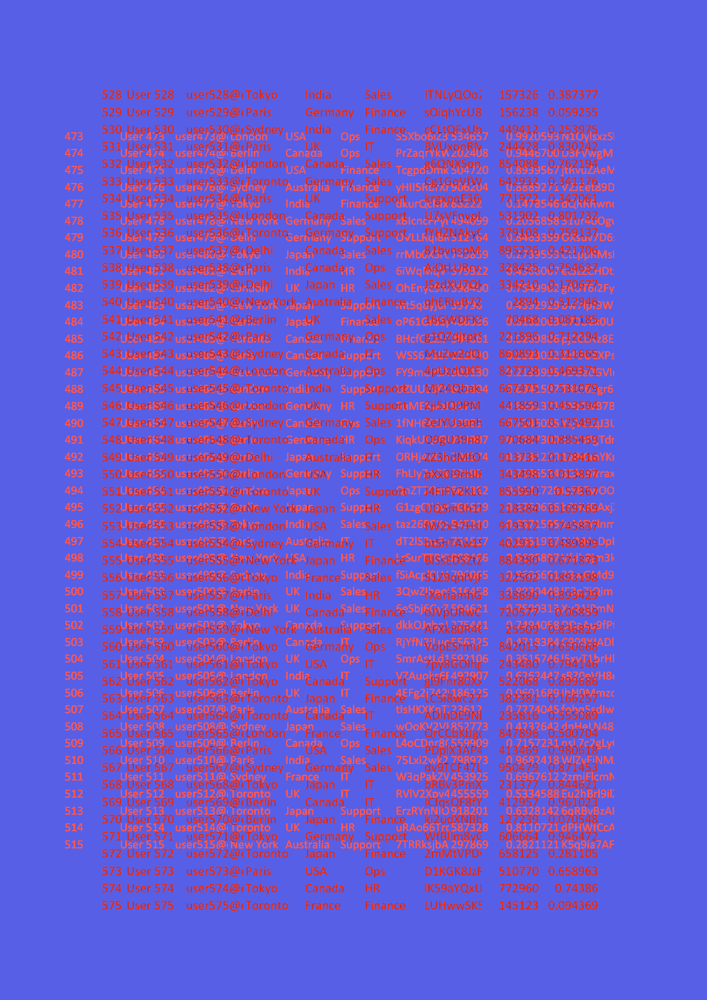</td>
  <td>changed: 381533 px (17.53%)<br>bbox: [114, 157, 1078, 1598]<br>mean abs RGB: 28.3781<br>RMSE RGB: 75.9967<br>threshold: 12, gain: 5.0</td>
</tr>
<tr>
  <td><b>XlsxIssue82_SampleTestData5mb</b><br>Page 13</td>
  <td>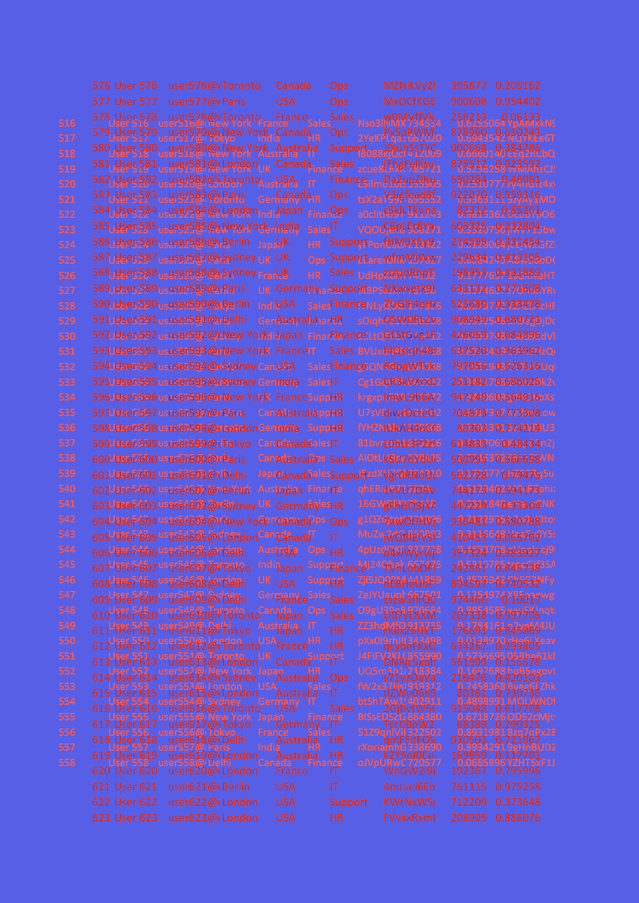</td>
  <td>changed: 379853 px (17.45%)<br>bbox: [114, 157, 1078, 1598]<br>mean abs RGB: 28.2906<br>RMSE RGB: 75.9102<br>threshold: 12, gain: 5.0</td>
</tr>
<tr>
  <td><b>XlsxIssue82_SampleTestData5mb</b><br>Page 14</td>
  <td>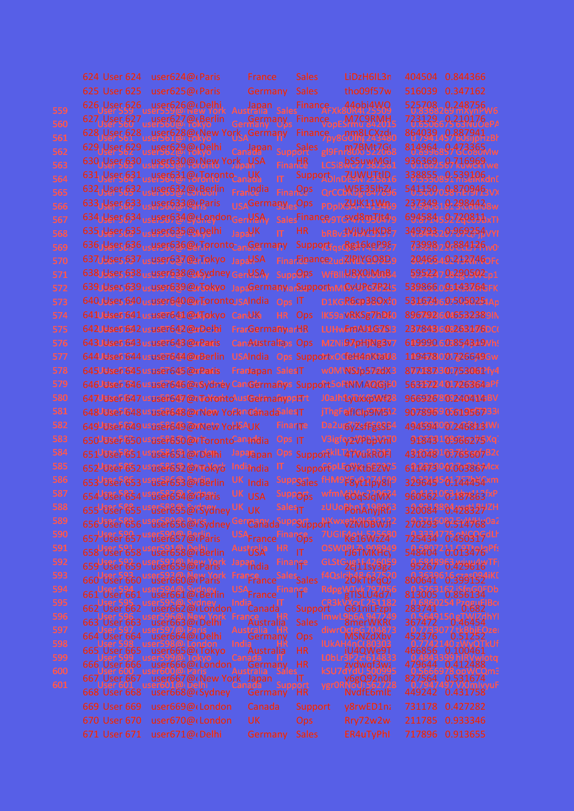</td>
  <td>changed: 380916 px (17.50%)<br>bbox: [114, 157, 1078, 1599]<br>mean abs RGB: 28.3942<br>RMSE RGB: 76.0407<br>threshold: 12, gain: 5.0</td>
</tr>
<tr>
  <td><b>XlsxIssue82_SampleTestData5mb</b><br>Page 15</td>
  <td>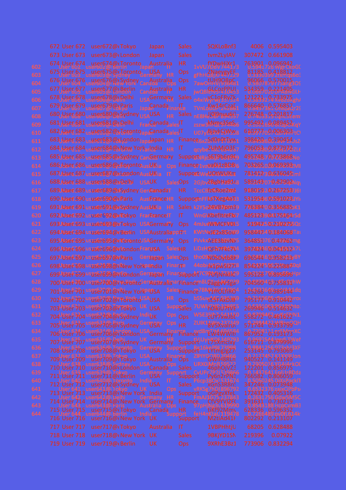</td>
  <td>changed: 378167 px (17.37%)<br>bbox: [114, 157, 1078, 1599]<br>mean abs RGB: 28.1834<br>RMSE RGB: 75.7681<br>threshold: 12, gain: 5.0</td>
</tr>
<tr>
  <td><b>XlsxIssue82_WideTable</b><br>Page 1</td>
  <td></td>
  <td>changed: 466771 px (22.80%)<br>bbox: [52, 73, 1522, 1168]<br>mean abs RGB: 27.6719<br>RMSE RGB: 70.3825<br>threshold: 12, gain: 5.0</td>
</tr>
<tr>
  <td><b>XlsxIssue82_WideTable</b><br>Page 2</td>
  <td></td>
  <td>changed: 459731 px (22.45%)<br>bbox: [52, 73, 1522, 1168]<br>mean abs RGB: 27.6212<br>RMSE RGB: 70.4357<br>threshold: 12, gain: 5.0</td>
</tr>
<tr>
  <td><b>XlsxIssue82_WideTable</b><br>Page 3</td>
  <td></td>
  <td>changed: 467887 px (22.85%)<br>bbox: [52, 73, 1522, 1168]<br>mean abs RGB: 27.692<br>RMSE RGB: 70.4004<br>threshold: 12, gain: 5.0</td>
</tr>
<tr>
  <td><b>XlsxIssue82_WideTable</b><br>Page 4</td>
  <td>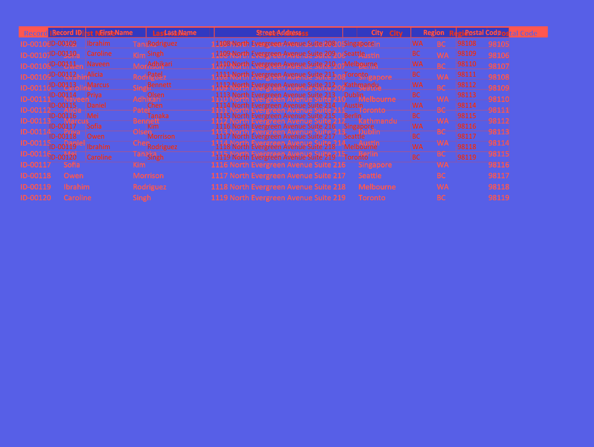</td>
  <td>changed: 184675 px (9.02%)<br>bbox: [52, 73, 1522, 560]<br>mean abs RGB: 11.6966<br>RMSE RGB: 45.5688<br>threshold: 12, gain: 5.0</td>
</tr>
<tr>
  <td><b>XlsxIssue82_WideTable</b><br>Page 5</td>
  <td>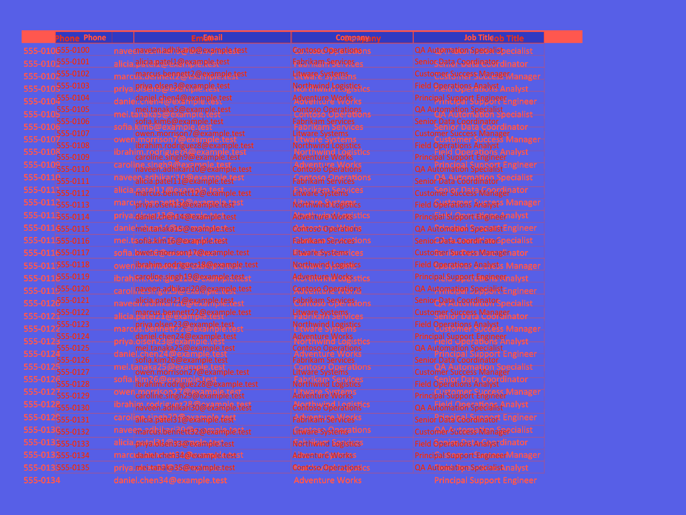</td>
  <td>changed: 450579 px (22.00%)<br>bbox: [52, 73, 1401, 1168]<br>mean abs RGB: 26.8631<br>RMSE RGB: 69.2737<br>threshold: 12, gain: 5.0</td>
</tr>
<tr>
  <td><b>XlsxIssue82_WideTable</b><br>Page 6</td>
  <td>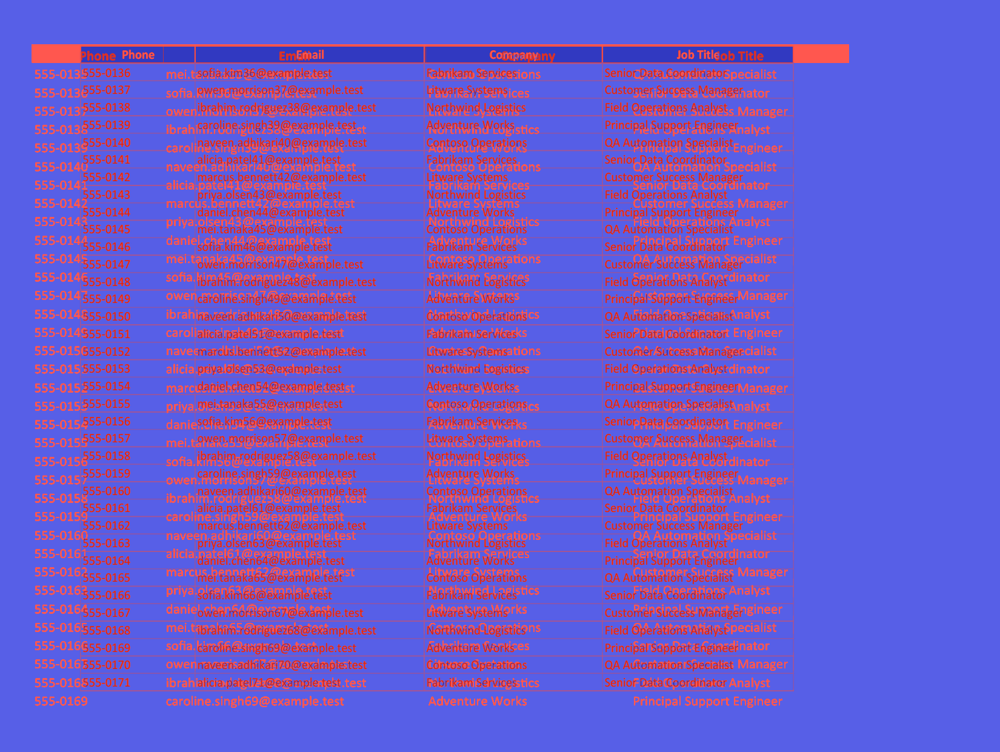</td>
  <td>changed: 445587 px (21.76%)<br>bbox: [52, 73, 1401, 1168]<br>mean abs RGB: 26.9921<br>RMSE RGB: 69.6078<br>threshold: 12, gain: 5.0</td>
</tr>
<tr>
  <td><b>XlsxIssue82_WideTable</b><br>Page 7</td>
  <td>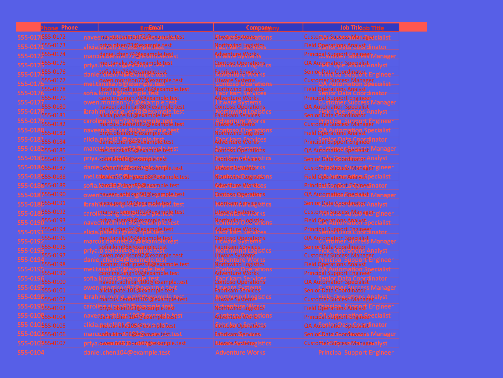</td>
  <td>changed: 453956 px (22.17%)<br>bbox: [52, 73, 1401, 1168]<br>mean abs RGB: 27.1046<br>RMSE RGB: 69.6218<br>threshold: 12, gain: 5.0</td>
</tr>
<tr>
  <td><b>XlsxIssue82_WideTable</b><br>Page 8</td>
  <td></td>
  <td>changed: 182686 px (8.92%)<br>bbox: [52, 73, 1401, 560]<br>mean abs RGB: 11.7922<br>RMSE RGB: 46.004<br>threshold: 12, gain: 5.0</td>
</tr>
<tr>
  <td><b>XlsxIssue82_WideTable</b><br>Page 9</td>
  <td></td>
  <td>changed: 295861 px (14.45%)<br>bbox: [52, 73, 920, 1168]<br>mean abs RGB: 19.7011<br>RMSE RGB: 60.8785<br>threshold: 12, gain: 5.0</td>
</tr>
<tr>
  <td><b>XlsxIssue82_WideTable</b><br>Page 10</td>
  <td></td>
  <td>changed: 294689 px (14.39%)<br>bbox: [52, 73, 920, 1168]<br>mean abs RGB: 19.7554<br>RMSE RGB: 61.0085<br>threshold: 12, gain: 5.0</td>
</tr>
<tr>
  <td><b>XlsxIssue82_WideTable</b><br>Page 11</td>
  <td></td>
  <td>changed: 297754 px (14.54%)<br>bbox: [52, 73, 931, 1168]<br>mean abs RGB: 19.8601<br>RMSE RGB: 61.1452<br>threshold: 12, gain: 5.0</td>
</tr>
<tr>
  <td><b>XlsxIssue82_WideTable</b><br>Page 12</td>
  <td></td>
  <td>changed: 114278 px (5.58%)<br>bbox: [52, 73, 931, 560]<br>mean abs RGB: 7.9053<br>RMSE RGB: 38.6492<br>threshold: 12, gain: 5.0</td>
</tr>
<tr>
  <td><b>XlsxIssue82_WideTable</b><br>Page 13</td>
  <td></td>
  <td>changed: 241485 px (11.79%)<br>bbox: [58, 82, 1019, 1017]<br>mean abs RGB: 18.2517<br>RMSE RGB: 60.0162<br>threshold: 12, gain: 5.0</td>
</tr>
</table>

## Visual Comparison

Scores compare java MiniPdf against Microsoft 365 Excel Reference. LibreOffice is an auxiliary rendering and does not affect scores.

<table>
<tr><th>java MiniPdf</th><th>Microsoft 365 Excel Reference</th><th>LibreOffice</th></tr>
<tr>
  <td><b>Academic Achievement Summary Table<br><small>format: xlsx | case: Academic Achievement Summary Table | scope: java-issue-xlsx</small></b></td>
  <td colspan="2">Academic Achievement Summary Table <span style="color:#f85149">⬤</span> 68.6%</td>
</tr>
<tr>
  <td></td>
  <td></td>
  <td></td>
</tr>
<tr>
  <td></td>
  <td></td>
  <td></td>
</tr>
<tr>
  <td></td>
  <td><i>missing</i></td>
  <td><i>missing</i></td>
</tr>
<tr>
  <td></td>
  <td><i>missing</i></td>
  <td><i>missing</i></td>
</tr>
<tr>
  <td><b>AcademicAchievement_temp<br><small>format: xlsx | case: AcademicAchievement_temp | scope: java-issue-xlsx</small></b></td>
  <td colspan="2">AcademicAchievement_temp <span style="color:#f85149">⬤</span> 68.6%</td>
</tr>
<tr>
  <td></td>
  <td></td>
  <td></td>
</tr>
<tr>
  <td></td>
  <td></td>
  <td></td>
</tr>
<tr>
  <td></td>
  <td><i>missing</i></td>
  <td><i>missing</i></td>
</tr>
<tr>
  <td></td>
  <td><i>missing</i></td>
  <td><i>missing</i></td>
</tr>
<tr>
  <td><b>Business expense budget1<br><small>format: xlsx | case: Business expense budget1 | scope: java-issue-xlsx</small></b></td>
  <td colspan="2">Business expense budget1 <span style="color:#3fb950">⬤</span> 92.9%</td>
</tr>
<tr>
  <td></td>
  <td></td>
  <td></td>
</tr>
<tr>
  <td></td>
  <td></td>
  <td></td>
</tr>
<tr>
  <td></td>
  <td></td>
  <td></td>
</tr>
<tr>
  <td></td>
  <td></td>
  <td></td>
</tr>
<tr>
  <td><b>Business expenses budget2<br><small>format: xlsx | case: Business expenses budget2 | scope: java-issue-xlsx</small></b></td>
  <td colspan="2">Business expenses budget2 <span style="color:#d29922">⬤</span> 86.2%</td>
</tr>
<tr>
  <td></td>
  <td></td>
  <td></td>
</tr>
<tr>
  <td></td>
  <td></td>
  <td></td>
</tr>
<tr>
  <td></td>
  <td></td>
  <td></td>
</tr>
<tr>
  <td></td>
  <td></td>
  <td></td>
</tr>
<tr>
  <td><b>Business plan checklist with SWOT analysis1<br><small>format: xlsx | case: Business plan checklist with SWOT analysis1 | scope: java-issue-xlsx</small></b></td>
  <td colspan="2">Business plan checklist with SWOT analysis1 <span style="color:#d29922">⬤</span> 77.6%</td>
</tr>
<tr>
  <td></td>
  <td></td>
  <td></td>
</tr>
<tr>
  <td><b>Event budget1<br><small>format: xlsx | case: Event budget1 | scope: java-issue-xlsx</small></b></td>
  <td colspan="2">Event budget1 <span style="color:#f85149">⬤</span> 68.9%</td>
</tr>
<tr>
  <td></td>
  <td></td>
  <td></td>
</tr>
<tr>
  <td></td>
  <td></td>
  <td></td>
</tr>
<tr>
  <td></td>
  <td></td>
  <td></td>
</tr>
<tr>
  <td></td>
  <td></td>
  <td></td>
</tr>
<tr>
  <td></td>
  <td></td>
  <td></td>
</tr>
<tr>
  <td></td>
  <td><i>missing</i></td>
  <td><i>missing</i></td>
</tr>
<tr>
  <td></td>
  <td><i>missing</i></td>
  <td><i>missing</i></td>
</tr>
<tr>
  <td><b>Expense report basic1<br><small>format: xlsx | case: Expense report basic1 | scope: java-issue-xlsx</small></b></td>
  <td colspan="2">Expense report basic1 <span style="color:#d29922">⬤</span> 79.1%</td>
</tr>
<tr>
  <td></td>
  <td></td>
  <td></td>
</tr>
<tr>
  <td><b>Grocery list1<br><small>format: xlsx | case: Grocery list1 | scope: java-issue-xlsx</small></b></td>
  <td colspan="2">Grocery list1 <span style="color:#d29922">⬤</span> 81.5%</td>
</tr>
<tr>
  <td></td>
  <td></td>
  <td></td>
</tr>
<tr>
  <td><b>Issue202609031340<br><small>format: xlsx | case: Issue202609031340 | scope: java-issue-xlsx</small></b></td>
  <td colspan="2">Issue202609031340 <span style="color:#3fb950">⬤</span> 90.2%</td>
</tr>
<tr>
  <td></td>
  <td></td>
  <td></td>
</tr>
<tr>
  <td></td>
  <td></td>
  <td></td>
</tr>
<tr>
  <td></td>
  <td></td>
  <td></td>
</tr>
<tr>
  <td></td>
  <td></td>
  <td></td>
</tr>
<tr>
  <td><b>payroll-calculator_f<br><small>format: xlsx | case: payroll-calculator_f | scope: java-issue-xlsx</small></b></td>
  <td colspan="2">payroll-calculator_f <span style="color:#f85149">⬤</span> 64.6%</td>
</tr>
<tr>
  <td></td>
  <td></td>
  <td></td>
</tr>
<tr>
  <td></td>
  <td></td>
  <td></td>
</tr>
<tr>
  <td></td>
  <td></td>
  <td></td>
</tr>
<tr>
  <td></td>
  <td></td>
  <td></td>
</tr>
<tr>
  <td></td>
  <td></td>
  <td></td>
</tr>
<tr>
  <td></td>
  <td></td>
  <td></td>
</tr>
<tr>
  <td></td>
  <td></td>
  <td></td>
</tr>
<tr>
  <td></td>
  <td></td>
  <td></td>
</tr>
<tr>
  <td></td>
  <td></td>
  <td></td>
</tr>
<tr>
  <td></td>
  <td></td>
  <td></td>
</tr>
<tr>
  <td></td>
  <td></td>
  <td></td>
</tr>
<tr>
  <td></td>
  <td></td>
  <td></td>
</tr>
<tr>
  <td></td>
  <td></td>
  <td></td>
</tr>
<tr>
  <td></td>
  <td></td>
  <td></td>
</tr>
<tr>
  <td></td>
  <td></td>
  <td></td>
</tr>
<tr>
  <td><b>PO_anonymized<br><small>format: xlsx | case: PO_anonymized | scope: java-issue-xlsx</small></b></td>
  <td colspan="2">PO_anonymized <span style="color:#f85149">⬤</span> 66.1%</td>
</tr>
<tr>
  <td></td>
  <td></td>
  <td></td>
</tr>
<tr>
  <td></td>
  <td></td>
  <td></td>
</tr>
<tr>
  <td></td>
  <td></td>
  <td></td>
</tr>
<tr>
  <td></td>
  <td></td>
  <td></td>
</tr>
<tr>
  <td></td>
  <td></td>
  <td></td>
</tr>
<tr>
  <td></td>
  <td></td>
  <td></td>
</tr>
<tr>
  <td></td>
  <td></td>
  <td></td>
</tr>
<tr>
  <td></td>
  <td></td>
  <td></td>
</tr>
<tr>
  <td></td>
  <td></td>
  <td><i>missing</i></td>
</tr>
<tr>
  <td></td>
  <td><i>missing</i></td>
  <td><i>missing</i></td>
</tr>
<tr>
  <td></td>
  <td><i>missing</i></td>
  <td><i>missing</i></td>
</tr>
<tr>
  <td></td>
  <td><i>missing</i></td>
  <td><i>missing</i></td>
</tr>
<tr>
  <td></td>
  <td><i>missing</i></td>
  <td><i>missing</i></td>
</tr>
<tr>
  <td></td>
  <td><i>missing</i></td>
  <td><i>missing</i></td>
</tr>
<tr>
  <td></td>
  <td><i>missing</i></td>
  <td><i>missing</i></td>
</tr>
<tr>
  <td><b>Simple invoice1<br><small>format: xlsx | case: Simple invoice1 | scope: java-issue-xlsx</small></b></td>
  <td colspan="2">Simple invoice1 <span style="color:#d29922">⬤</span> 78.1%</td>
</tr>
<tr>
  <td></td>
  <td></td>
  <td></td>
</tr>
<tr>
  <td><b>Small business cash flow forecast1<br><small>format: xlsx | case: Small business cash flow forecast1 | scope: java-issue-xlsx</small></b></td>
  <td colspan="2">Small business cash flow forecast1 <span style="color:#f85149">⬤</span> 62.5%</td>
</tr>
<tr>
  <td></td>
  <td></td>
  <td></td>
</tr>
<tr>
  <td></td>
  <td></td>
  <td></td>
</tr>
<tr>
  <td></td>
  <td></td>
  <td></td>
</tr>
<tr>
  <td><i>missing</i></td>
  <td></td>
  <td></td>
</tr>
<tr>
  <td><i>missing</i></td>
  <td></td>
  <td></td>
</tr>
<tr>
  <td><b>Wedding_timeline_planner1_copy<br><small>format: xlsx | case: Wedding_timeline_planner1_copy | scope: java-issue-xlsx</small></b></td>
  <td colspan="2">Wedding_timeline_planner1_copy <span style="color:#3fb950">⬤</span> 95.4%</td>
</tr>
<tr>
  <td></td>
  <td></td>
  <td></td>
</tr>
<tr>
  <td></td>
  <td></td>
  <td></td>
</tr>
<tr>
  <td></td>
  <td></td>
  <td></td>
</tr>
<tr>
  <td></td>
  <td></td>
  <td></td>
</tr>
<tr>
  <td></td>
  <td></td>
  <td></td>
</tr>
<tr>
  <td></td>
  <td></td>
  <td><i>missing</i></td>
</tr>
<tr>
  <td></td>
  <td></td>
  <td><i>missing</i></td>
</tr>
<tr>
  <td></td>
  <td></td>
  <td><i>missing</i></td>
</tr>
<tr>
  <td><b>Weekly schedule planner1<br><small>format: xlsx | case: Weekly schedule planner1 | scope: java-issue-xlsx</small></b></td>
  <td colspan="2">Weekly schedule planner1 <span style="color:#f85149">⬤</span> 50.1%</td>
</tr>
<tr>
  <td></td>
  <td></td>
  <td></td>
</tr>
<tr>
  <td></td>
  <td><i>missing</i></td>
  <td><i>missing</i></td>
</tr>
<tr>
  <td><b>XlsxIssue75<br><small>format: xlsx | case: XlsxIssue75 | scope: java-issue-xlsx</small></b></td>
  <td colspan="2">XlsxIssue75 <span style="color:#d29922">⬤</span> 87.4%</td>
</tr>
<tr>
  <td></td>
  <td></td>
  <td></td>
</tr>
<tr>
  <td></td>
  <td></td>
  <td></td>
</tr>
<tr>
  <td></td>
  <td></td>
  <td></td>
</tr>
<tr>
  <td></td>
  <td></td>
  <td></td>
</tr>
<tr>
  <td></td>
  <td></td>
  <td></td>
</tr>
<tr>
  <td></td>
  <td></td>
  <td></td>
</tr>
<tr>
  <td></td>
  <td></td>
  <td></td>
</tr>
<tr>
  <td></td>
  <td></td>
  <td></td>
</tr>
<tr>
  <td></td>
  <td></td>
  <td></td>
</tr>
<tr>
  <td></td>
  <td></td>
  <td></td>
</tr>
<tr>
  <td></td>
  <td></td>
  <td></td>
</tr>
<tr>
  <td></td>
  <td></td>
  <td></td>
</tr>
<tr>
  <td></td>
  <td></td>
  <td></td>
</tr>
<tr>
  <td></td>
  <td></td>
  <td></td>
</tr>
<tr>
  <td></td>
  <td></td>
  <td></td>
</tr>
<tr>
  <td><b>XlsxIssue77_MergedCellAlignment<br><small>format: xlsx | case: XlsxIssue77_MergedCellAlignment | scope: java-issue-xlsx</small></b></td>
  <td colspan="2">XlsxIssue77_MergedCellAlignment <span style="color:#3fb950">⬤</span> 95.6%</td>
</tr>
<tr>
  <td></td>
  <td></td>
  <td></td>
</tr>
<tr>
  <td></td>
  <td></td>
  <td></td>
</tr>
<tr>
  <td><b>XlsxIssue77_Template1<br><small>format: xlsx | case: XlsxIssue77_Template1 | scope: java-issue-xlsx</small></b></td>
  <td colspan="2">XlsxIssue77_Template1 <span style="color:#3fb950">⬤</span> 95.8%</td>
</tr>
<tr>
  <td></td>
  <td></td>
  <td></td>
</tr>
<tr>
  <td></td>
  <td></td>
  <td></td>
</tr>
<tr>
  <td></td>
  <td></td>
  <td></td>
</tr>
<tr>
  <td></td>
  <td></td>
  <td></td>
</tr>
<tr>
  <td></td>
  <td></td>
  <td></td>
</tr>
<tr>
  <td></td>
  <td></td>
  <td></td>
</tr>
<tr>
  <td><b>XlsxIssue77_Template2_Workaround<br><small>format: xlsx | case: XlsxIssue77_Template2_Workaround | scope: java-issue-xlsx</small></b></td>
  <td colspan="2">XlsxIssue77_Template2_Workaround <span style="color:#3fb950">⬤</span> 96.0%</td>
</tr>
<tr>
  <td></td>
  <td></td>
  <td></td>
</tr>
<tr>
  <td></td>
  <td></td>
  <td></td>
</tr>
<tr>
  <td></td>
  <td></td>
  <td></td>
</tr>
<tr>
  <td></td>
  <td></td>
  <td></td>
</tr>
<tr>
  <td></td>
  <td></td>
  <td></td>
</tr>
<tr>
  <td></td>
  <td></td>
  <td></td>
</tr>
<tr>
  <td><b>XlsxIssue81_LayoutOptions<br><small>format: xlsx | case: XlsxIssue81_LayoutOptions | scope: java-issue-xlsx</small></b></td>
  <td colspan="2">XlsxIssue81_LayoutOptions <span style="color:#3fb950">⬤</span> 91.6%</td>
</tr>
<tr>
  <td></td>
  <td></td>
  <td></td>
</tr>
<tr>
  <td></td>
  <td></td>
  <td></td>
</tr>
<tr>
  <td></td>
  <td></td>
  <td></td>
</tr>
<tr>
  <td></td>
  <td></td>
  <td></td>
</tr>
<tr>
  <td></td>
  <td></td>
  <td></td>
</tr>
<tr>
  <td></td>
  <td></td>
  <td></td>
</tr>
<tr>
  <td></td>
  <td></td>
  <td></td>
</tr>
<tr>
  <td></td>
  <td></td>
  <td></td>
</tr>
<tr>
  <td></td>
  <td></td>
  <td></td>
</tr>
<tr>
  <td></td>
  <td></td>
  <td></td>
</tr>
<tr>
  <td></td>
  <td></td>
  <td></td>
</tr>
<tr>
  <td></td>
  <td></td>
  <td></td>
</tr>
<tr>
  <td></td>
  <td></td>
  <td></td>
</tr>
<tr>
  <td></td>
  <td></td>
  <td></td>
</tr>
<tr>
  <td></td>
  <td></td>
  <td></td>
</tr>
<tr>
  <td><b>XlsxIssue82_5mb<br><small>format: xlsx | case: XlsxIssue82_5mb | scope: java-issue-xlsx</small></b></td>
  <td colspan="2">XlsxIssue82_5mb <span style="color:#f85149">⬤</span> 53.4%</td>
</tr>
<tr>
  <td></td>
  <td></td>
  <td></td>
</tr>
<tr>
  <td></td>
  <td></td>
  <td></td>
</tr>
<tr>
  <td></td>
  <td></td>
  <td></td>
</tr>
<tr>
  <td></td>
  <td></td>
  <td></td>
</tr>
<tr>
  <td></td>
  <td></td>
  <td></td>
</tr>
<tr>
  <td></td>
  <td></td>
  <td></td>
</tr>
<tr>
  <td></td>
  <td></td>
  <td></td>
</tr>
<tr>
  <td></td>
  <td></td>
  <td></td>
</tr>
<tr>
  <td></td>
  <td></td>
  <td></td>
</tr>
<tr>
  <td></td>
  <td></td>
  <td></td>
</tr>
<tr>
  <td></td>
  <td></td>
  <td></td>
</tr>
<tr>
  <td></td>
  <td></td>
  <td></td>
</tr>
<tr>
  <td></td>
  <td></td>
  <td></td>
</tr>
<tr>
  <td></td>
  <td></td>
  <td></td>
</tr>
<tr>
  <td></td>
  <td></td>
  <td></td>
</tr>
<tr>
  <td><b>XlsxIssue82_SampleTestData5mb<br><small>format: xlsx | case: XlsxIssue82_SampleTestData5mb | scope: java-issue-xlsx</small></b></td>
  <td colspan="2">XlsxIssue82_SampleTestData5mb <span style="color:#d29922">⬤</span> 72.2%</td>
</tr>
<tr>
  <td></td>
  <td></td>
  <td></td>
</tr>
<tr>
  <td></td>
  <td></td>
  <td></td>
</tr>
<tr>
  <td></td>
  <td></td>
  <td></td>
</tr>
<tr>
  <td></td>
  <td></td>
  <td></td>
</tr>
<tr>
  <td></td>
  <td></td>
  <td></td>
</tr>
<tr>
  <td></td>
  <td></td>
  <td></td>
</tr>
<tr>
  <td></td>
  <td></td>
  <td></td>
</tr>
<tr>
  <td></td>
  <td></td>
  <td></td>
</tr>
<tr>
  <td></td>
  <td></td>
  <td></td>
</tr>
<tr>
  <td></td>
  <td></td>
  <td></td>
</tr>
<tr>
  <td></td>
  <td></td>
  <td></td>
</tr>
<tr>
  <td></td>
  <td></td>
  <td></td>
</tr>
<tr>
  <td></td>
  <td></td>
  <td></td>
</tr>
<tr>
  <td></td>
  <td></td>
  <td></td>
</tr>
<tr>
  <td></td>
  <td></td>
  <td></td>
</tr>
<tr>
  <td><b>XlsxIssue82_WideTable<br><small>format: xlsx | case: XlsxIssue82_WideTable | scope: java-issue-xlsx</small></b></td>
  <td colspan="2">XlsxIssue82_WideTable <span style="color:#d29922">⬤</span> 86.7%</td>
</tr>
<tr>
  <td></td>
  <td></td>
  <td></td>
</tr>
<tr>
  <td></td>
  <td></td>
  <td></td>
</tr>
<tr>
  <td></td>
  <td></td>
  <td></td>
</tr>
<tr>
  <td></td>
  <td></td>
  <td></td>
</tr>
<tr>
  <td></td>
  <td></td>
  <td></td>
</tr>
<tr>
  <td></td>
  <td></td>
  <td></td>
</tr>
<tr>
  <td></td>
  <td></td>
  <td></td>
</tr>
<tr>
  <td></td>
  <td></td>
  <td></td>
</tr>
<tr>
  <td></td>
  <td></td>
  <td></td>
</tr>
<tr>
  <td></td>
  <td></td>
  <td></td>
</tr>
<tr>
  <td></td>
  <td></td>
  <td></td>
</tr>
<tr>
  <td></td>
  <td></td>
  <td></td>
</tr>
<tr>
  <td></td>
  <td></td>
  <td></td>
</tr>
<tr>
  <td><b>XlsxIssue152_ClusteredNonZeroBarChart<br><small>format: xlsx | case: XlsxIssue152_ClusteredNonZeroBarChart | scope: java-issue-xlsx</small></b></td>
  <td colspan="2">XlsxIssue152_ClusteredNonZeroBarChart N/A</td>
</tr>
<tr>
  <td colspan="3"><i>No images</i></td>
</tr>
</table>

## Detailed Results

### Academic Achievement Summary Table

- **Case Metadata:** format: xlsx | case: Academic Achievement Summary Table | scope: java-issue-xlsx
- **Source:** tests/Issue_Files/xlsx/Academic Achievement Summary Table.xlsx
- **Text Similarity:** 0.9941
- **Visual Average:** 0.4717
- **Overall Score:** 0.6863
- **Pages:** MiniPdf=4, Reference=2
- **File Size:** MiniPdf=54543 bytes, Reference=151877 bytes

<details><summary>Text Diff</summary>

```diff
--- minipdf/Academic Achievement Summary Table.pdf
+++ reference/Academic Achievement Summary Table.pdf
@@ -44,7 +44,4 @@
 日期：    年   月   日

 填表说明：1.请将各类学术成果按等级、层次及水平自高到低顺序填写。不加行、减行，不加页、减页，本表采用A4正反面打印。

 2.核心期刊是指北京大学图书馆“中文核心期刊”、南京大学“中文社会科学引文索引（CSSCI）来源期刊”（含扩展版、集刊）、中国科学技术信息研究所

-“中国科技论文统计源期刊”和科学引文索引（SCI）、社会科学引文索引（SSCI）。其中，被SCI、SSCI收录的期刊要求进入所在学科领域Q1、Q2。

----PAGE---

-

----PAGE---
+“中国科技论文统计源期刊”和科学引文索引（SCI）、社会科学引文索引（SSCI）。其中，被SCI、SSCI收录的期刊要求进入所在学科领域Q1、Q2。
```
</details>

### AcademicAchievement_temp

- **Case Metadata:** format: xlsx | case: AcademicAchievement_temp | scope: java-issue-xlsx
- **Source:** tests/Issue_Files/xlsx/AcademicAchievement_temp.xlsx
- **Text Similarity:** 0.9941
- **Visual Average:** 0.4717
- **Overall Score:** 0.6863
- **Pages:** MiniPdf=4, Reference=2
- **File Size:** MiniPdf=54543 bytes, Reference=151877 bytes

<details><summary>Text Diff</summary>

```diff
--- minipdf/AcademicAchievement_temp.pdf
+++ reference/AcademicAchievement_temp.pdf
@@ -44,7 +44,4 @@
 日期：    年   月   日

 填表说明：1.请将各类学术成果按等级、层次及水平自高到低顺序填写。不加行、减行，不加页、减页，本表采用A4正反面打印。

 2.核心期刊是指北京大学图书馆“中文核心期刊”、南京大学“中文社会科学引文索引（CSSCI）来源期刊”（含扩展版、集刊）、中国科学技术信息研究所

-“中国科技论文统计源期刊”和科学引文索引（SCI）、社会科学引文索引（SSCI）。其中，被SCI、SSCI收录的期刊要求进入所在学科领域Q1、Q2。

----PAGE---

-

----PAGE---
+“中国科技论文统计源期刊”和科学引文索引（SCI）、社会科学引文索引（SSCI）。其中，被SCI、SSCI收录的期刊要求进入所在学科领域Q1、Q2。
```
</details>

### Business expense budget1

- **Case Metadata:** format: xlsx | case: Business expense budget1 | scope: java-issue-xlsx
- **Source:** tests/Issue_Files/xlsx/Business expense budget1.xlsx
- **Text Similarity:** 0.9657
- **Visual Average:** 0.857
- **Overall Score:** 0.9291
- **Pages:** MiniPdf=4, Reference=4
- **File Size:** MiniPdf=45757 bytes, Reference=159864 bytes

<details><summary>Text Diff</summary>

```diff
--- minipdf/Business expense budget1.pdf
+++ reference/Business expense budget1.pdf
@@ -3,43 +3,46 @@
 CATEGORY Q1 BUDGET Q1 ACTUAL Q2 BUDGET

 PERSONNEL

 Salaries & Wages 45,000.00 44,200.00 46,000.00

-Benefits & Insurance 12,000.00 11,850.00 12,500.00

+Benefits & Insurance 12,000.00 11,850.00 12,500.00

 Training & Development 3,000.00 2,800.00 3,200.00

 Recruitment 2,000.00 1,500.00 2,500.00

 Personnel Subtotal 62,000.00 60,350.00 64,200.00

 OPERATIONS

-Rent & U ƟliƟes 8,000.00 8,000.00 8,200.00

-Office Supplies 1,500.00 1,650.00 1,500.00

+Rent & Utilities 8,000.00 8,000.00 8,200.00

+Office Supplies 1,500.00 1,650.00 1,500.00

 Equipment & Maintenance 3,000.00 2,700.00 3,500.00

-IT & So Ōware 4,000.00 4,200.00 4,500.00

-Telecommunica Ɵons 2,000.00 1,900.00 2,100.00

-Opera Ɵons Subtotal 18,500.00 18,450.00 19,800.00

+IT & Software 4,000.00 4,200.00 4,500.00

+Telecommunications 2,000.00 1,900.00 2,100.00

+Operations Subtotal 18,500.00 18,450.00 19,800.00

 MARKETING

-Adver Ɵsing 5,000.00 4,800.00 6,000.00

-Digital Marke Ɵng 3,000.00 3,200.00 3,500.00

+Advertising 5,000.00 4,800.00 6,000.00

+Digital Marketing 3,000.00 3,200.00 3,500.00

 Events & Sponsorships 2,000.00 1,800.00 2,500.00

-Prin Ɵng & Design 1,000.00 950.00 1,200.00

-Marke Ɵng Subtotal 11,000.00 10,750.00 13,200.00

+Printing & Design 1,000.00 950.00 1,200.00

+Marketing Subtotal 11,000.00 10,750.00 13,200.00

 TRAVEL & ENTERTAINMENT

-Domes Ɵc Travel 3,000.00 2,500.00 3,500.00

-Interna Ɵonal Travel 5,000.00 4,000.00 6,000.00

+Domestic Travel 3,000.00 2,500.00 3,500.00

+International Travel 5,000.00 4,000.00 6,000.00

 Meals & Entertainment 2,000.00 1,800.00 2,200.00

 Vehicle Expenses 1,500.00 1,400.00 1,500.00

 Travel & Entertainment Subtotal 11,500.00 9,700.00 13,200.00

 PROFESSIONAL SERVICES

 Legal Fees 3,000.00 2,800.00 3,500.00

-Accoun Ɵng & Audit 2,500.00 2,500.00 2,500.00

-Consul Ɵng 4,000.00 3,500.00 5,000.00

+Accounting & Audit 2,500.00 2,500.00 2,500.00

+Consulting 4,000.00 3,500.00 5,000.00

 Insurance 2,000.00 2,000.00 2,100.00

 Professional Services Subtotal 11,500.00 10,800.00 13,100.00

 ---PAGE---

 GRAND TOTAL 114,500.00 110,050.00 123,500.00

 Category Total Budget Total Actual

 Personnel 126200 124250

-Opera Ɵons 38300 38150

-Marke Ɵng 24200 23750

+Operations 38300 38150

+Marketing 24200 23750

 Travel & Entertainment 24700 22100

 Professional Services 24600 23400

+Budget vs Actual by Category

+Amount (\$)

+Category

 ---PAGE---

 Q2 ACTUAL VARIANCE

 45,800.00 1,000.00

@@ -69,4 +72,6 @@
 2,100.00 0.00

 12,600.00 1,200.00

 ---PAGE---

-121,600.00 6,350.00
+121,600.00 6,350.00

+Total Budget

+Total Actual
```
</details>

### Business expenses budget2

- **Case Metadata:** format: xlsx | case: Business expenses budget2 | scope: java-issue-xlsx
- **Source:** tests/Issue_Files/xlsx/Business expenses budget2.xlsx
- **Text Similarity:** 0.8393
- **Visual Average:** 0.8157
- **Overall Score:** 0.862
- **Pages:** MiniPdf=4, Reference=4
- **File Size:** MiniPdf=232162 bytes, Reference=376973 bytes

<details><summary>Text Diff</summary>

```diff
--- minipdf/Business expenses budget2.pdf
+++ reference/Business expenses budget2.pdf
@@ -1,94 +1,109 @@
 Market Financial Consulting

 PLANNED EXPENSES

 January February March April May June July August September October November December Total

-EMPLOYEE COSTS $   107,950.00  $   107,950.00  $   107,950.00  $   111,125.00  $   111,125.00  $   111,125.00  $   111,125.00  $   117,348.00  $   117,348.00  $   117,348.00  $   117,348.00  $   117,348.00  $   1,355,090.00

-Wages $   85,000.00 $   85,000.00 $   85,000.00 $   87,500.00 $   87,500.00 $   87,500.00 $   87,500.00 $   92,400.00 $   92,400.00 $   92,400.00 $   92,400.00 $   92,400.00 $   1,067,000.00

-Benefits $   22,950.00 $   22,950.00 $   22,950.00 $   23,625.00 $   23,625.00 $   23,625.00 $   23,625.00 $   24,948.00 $   24,948.00 $   24,948.00 $   24,948.00 $   24,948.00 $   288,090.00

-OFFICE COSTS $   11,370.00 $   11,770.00 $   11,770.00 $   11,470.00 $   11,470.00 $   11,470.00 $   11,470.00 $   11,470.00 $   11,470.00 $   11,470.00 $   11,770.00 $   11,770.00 $   138,740.00

-Office lease $   9,800.00 $   9,800.00 $   9,800.00 $   9,800.00 $   9,800.00 $   9,800.00 $   9,800.00 $   9,800.00 $   9,800.00 $   9,800.00 $   9,800.00 $   9,800.00 $   117,600.00

-Gas $   - 0 $   400.00 $   400.00 $   100.00 $   100.00 $   100.00 $   100.00 $   100.00 $   100.00 $   100.00 $   400.00 $   400.00 $   2,300.00

-Electric $   300.00 $   300.00 $   300.00 $   300.00 $   300.00 $   300.00 $   300.00 $   300.00 $   300.00 $   300.00 $   300.00 $   300.00 $   3,600.00

-Water $   40.00 $   40.00 $   40.00 $   40.00 $   40.00 $   40.00 $   40.00 $   40.00 $   40.00 $   40.00 $   40.00 $   40.00 $   480.00

-Telephone $   250.00 $   250.00 $   250.00 $   250.00 $   250.00 $   250.00 $   250.00 $   250.00 $   250.00 $   250.00 $   250.00 $   250.00 $   3,000.00

-Internet access $   180.00 $   180.00 $   180.00 $   180.00 $   180.00 $   180.00 $   180.00 $   180.00 $   180.00 $   180.00 $   180.00 $   180.00 $   2,160.00

-Office supplies $   200.00 $   200.00 $   200.00 $   200.00 $   200.00 $   200.00 $   200.00 $   200.00 $   200.00 $   200.00 $   200.00 $   200.00 $   2,400.00

-Security $   600.00 $   600.00 $   600.00 $   600.00 $   600.00 $   600.00 $   600.00 $   600.00 $   600.00 $   600.00 $   600.00 $   600.00 $   7,200.00

-MARKETING COSTS $   8,100.00 $   3,100.00 $   3,100.00 $   11,100.00 $   3,100.00 $   3,900.00 $   8,100.00 $   6,100.00 $   3,100.00 $   8,100.00 $   3,100.00 $   6,900.00 $   67,800.00

-Web site hosting $   500.00 $   500.00 $   500.00 $   500.00 $   500.00 $   500.00 $   500.00 $   500.00 $   500.00 $   500.00 $   500.00 $   500.00 $   6,000.00

-Web site updates $   200.00 $   200.00 $   200.00 $   200.00 $   200.00 $   1,000.00 $   200.00 $   200.00 $   200.00 $   200.00 $   200.00 $   1,000.00 $   4,000.00

-Collateral preparation $   5,000.00 $   - 0 $   - 0 $   5,000.00 $   - 0 $   - 0 $   5,000.00 $   - 0 $   - 0 $   5,000.00 $   - 0 $   - 0 $   20,000.00

-C
... (14949 more characters)

```
</details>

### Business plan checklist with SWOT analysis1

- **Case Metadata:** format: xlsx | case: Business plan checklist with SWOT analysis1 | scope: java-issue-xlsx
- **Source:** tests/Issue_Files/xlsx/Business plan checklist with SWOT analysis1.xlsx
- **Text Similarity:** 0.8583
- **Visual Average:** 0.582
- **Overall Score:** 0.7761
- **Pages:** MiniPdf=1, Reference=1
- **File Size:** MiniPdf=40955 bytes, Reference=64252 bytes

<details><summary>Text Diff</summary>

```diff
--- minipdf/Business plan checklist with SWOT analysis1.pdf
+++ reference/Business plan checklist with SWOT analysis1.pdf
@@ -1,35 +1,37 @@
 Northwind Traders

 Business planning checklist

-Using the strength, weakness, opportunity, and threat (SWOT) analysis framework, develop a checklist of the key activi

-ties that need to be performed when preparing a formal business plan in the table, below.

+Using the strength, weakness, opportunity, and threat (SWOT) analysis framework, develop a checklist of the key activities

+that need to be performed when preparing a formal business plan in the table, below.

 Activity Owner Completion date

-Strengths: Define the company's current mission statemen

-Luca Richter 1/9/23

-t.

-Strengths: Identify market segments in which the compan

-y will participate by conducting primary and secondary ma Dylan Williams 1/9/23

-rket research.

-Strengths: Identify the company's value proposition and h

-Kristin Orav 1/16/23

-ow it will differentiate itself within the marketplace.

-Weaknesses: Identify any barriers to market entry (for exa

-mple, capital requirements, technical barriers, patents, an Flora Berggren 1/6/23

-d process barriers) that the company needs to overcome.

-Weaknesses: Identify any risks inherent to the organizatio

-n that need to be mitigated so that the company can realiz Flora Berggren 1/6/23

-e the business plan.

+Strengths: Define the company's current mission

+Luca Richter 1/9/2023

+statement.

+Strengths: Identify market segments in which the

+company will participate by conducting primary and Dylan Williams 1/9/2023

+secondary market research.

+Strengths: Identify the company's value proposition and

+Kristin Orav 1/16/2023

+how it will differentiate itself within the marketplace.

+Weaknesses: Identify any barriers to market entry (for

+example, capital requirements, technical barriers, patents,

+Flora Berggren 1/6/2023

+and process barriers) that the company needs to

+overcome.

+Weaknesses: Identify any risks inherent to the

+organization that need to be mitigated so that the company Flora Berggren 1/6/2023

+can realize the business plan.

 Opportunities: Identify areas where the current market is

-Kristin Orav 1/6/23

+Kristin Orav 1/6/2023

 underserved that provide an opportunity for the company.

-Opportunities: Identify any key processes, intellectual capi

-tal, or other resources that the company can use to its adv Ian Hansson 1/9/23

-antage in the marketplace.

-Threats: Identify primary competitors, and then analyze co

-mpetitor performance by using all available data and additi Gaurav Cheema 1/9/23

-onal data that can be verified.

-Threats: Identify secondary and potential future competito

-Chela Arapelli 1/16/23

-rs that might affect the business plan.

-Threats: Develop strategies for mitigating primary and sec

-Gaurav Cheema 1/16/23

-ondary competitive threats.
+Opportunities: Identify any key processes, intellectual

+capital, or other res
... (514 more characters)

```
</details>

### Event budget1

- **Case Metadata:** format: xlsx | case: Event budget1 | scope: java-issue-xlsx
- **Source:** tests/Issue_Files/xlsx/Event budget1.xlsx
- **Text Similarity:** 0.9709
- **Visual Average:** 0.5005
- **Overall Score:** 0.6886
- **Pages:** MiniPdf=7, Reference=5
- **File Size:** MiniPdf=61943 bytes, Reference=121223 bytes

<details><summary>Text Diff</summary>

```diff
--- minipdf/Event budget1.pdf
+++ reference/Event budget1.pdf
@@ -1,15 +1,16 @@
 ABOUT THIS TEMPLATE

-Use this event budget workbook to track expenses incurred on and income earned from an event.

+Use this event budget workbook to track expenses incurred on and income earned from an

+event.

 Enter details in tables in expenses worksheet and income worksheet.

 Total expenses and total income are auto-calculated.

 Profit & loss summary and chart are auto-updated in profit-loss summary worksheet.

 Note:

-Additional instructions have been provided in column A in each worksheet. This text has been intentio

-nally hidden. To remove text, select column A, then select DELETE.

-To learn more about tables, press SHIFT and then F10 within a table, select the TABLE option, and th

-en select ALTERNATIVE TEXT

+Additional instructions have been provided in column A in each worksheet. This text has been

+intentionally hidden. To remove text, select column A, then select DELETE.

+To learn more about tables, press SHIFT and then F10 within a table, select the TABLE option, and

+then select ALTERNATIVE TEXT

 ---PAGE---

-Event budget EXPENSE

+Event budget EXPENSES

 Estimated Actual

 TOTAL EXPENSES

 $882.00 $333.00

@@ -31,13 +32,14 @@
 Photocopying/Printing $20.00 Gifts $100.00

 Postage Total $100.00 $0.00

 Total $20.00 $0.00

----PAGE---

 Miscellaneous Estimated Actual

 Telephone $13.00

 Transportation $12.00

 Stationery supplies

 Fax services

 Total $12.00 $13.00

+---PAGE---

+

 ---PAGE---

 Event budget INCOME

 Estimated Actual

@@ -62,7 +64,6 @@
 Small booths @ $0.00 $0.00

 Total $0.00 $0.00

 SALE OF ITEMS

----PAGE---

 Estimated no. Actual no. Type Price Estimated income Actual income

 Items @ $0.00 $0.00

 Items @ $0.00 $0.00

@@ -71,9 +72,14 @@
 Total $0.00 $0.00

 ---PAGE---

 Event budget PROFIT

+Total income

 LOSS SUMMARY

-Total Estimated Actual

+Total expenses

+Estimated Actual

+$1,831 $333

+ACT U AL

 Total income $1,936.00 $1,831.00

 Total expenses $882.00 $333.00

+$1,936 $882

 Total profit (or loss) $1,054.00 $1,498.00

----PAGE---
+E ST I M AT E D
```
</details>

### Expense report basic1

- **Case Metadata:** format: xlsx | case: Expense report basic1 | scope: java-issue-xlsx
- **Source:** tests/Issue_Files/xlsx/Expense report basic1.xlsx
- **Text Similarity:** 0.9556
- **Visual Average:** 0.5218
- **Overall Score:** 0.791
- **Pages:** MiniPdf=1, Reference=1
- **File Size:** MiniPdf=48922 bytes, Reference=47896 bytes

<details><summary>Text Diff</summary>

```diff
--- minipdf/Expense report basic1.pdf
+++ reference/Expense report basic1.pdf
@@ -6,7 +6,7 @@
 Name Cora Thomas Position Sales rep SSN 123-45-****

 Department Marketing & sales Manager Liane Cormier Employee ID 8675309

 Date Account Description Hotel Transport Fuel Meals Phone Entertainment Misc. Total

-10/5/23 Wide World Importers Networking $111.00 $250.00 $60.00 $50.00 $0.00 $300.00 $25.00 $796.00

+10/5/2023 Wide World Importers Networking $111.00 $250.00 $60.00 $50.00 $0.00 $300.00 $25.00 $796.00

 $0.00

 $0.00

 $0.00

@@ -16,10 +16,8 @@
 $0.00

 $0.00

 Total $111.00 $250.00 $60.00 $50.00 $0.00 $300.00 $25.00 $796.00

-$796.00

-Subtotal

-$0.00

+Subtotal $796.00

+Advances $0.00

 APPROVED

-NOTES Advances

-$796.00

-Total
+NOTES

+Total $796.00
```
</details>

### Grocery list1

- **Case Metadata:** format: xlsx | case: Grocery list1 | scope: java-issue-xlsx
- **Source:** tests/Issue_Files/xlsx/Grocery list1.xlsx
- **Text Similarity:** 0.8403
- **Visual Average:** 0.6961
- **Overall Score:** 0.8146
- **Pages:** MiniPdf=1, Reference=1
- **File Size:** MiniPdf=34874 bytes, Reference=71396 bytes

<details><summary>Text Diff</summary>

```diff
--- minipdf/Grocery list1.pdf
+++ reference/Grocery list1.pdf
@@ -1,48 +1,28 @@
 ORCHARD GROCERY HOME DELIVERY LOCAL MARKET OTHER GRAND TOTAL

 GROCERY LIST

-Customize this list. Replace the entries above with your own to track your most frequentl

-y used categories.

+Customize this list. Replace the entries above with your own to track your

 $11.95 $6.12 $31.85 $216.60 $3.99 $270.51

+most frequently used categories.

 DONE? ITEM STORE CATEGORY QTY UNIT UNIT PRICE TOTAL NOTE

-Yes Peaches Azure River Farm ORCHARD lbs $2.99 $5.98

-2

-Yes Apples Azure River Farm ORCHARD lbs $1.99 $5.97 Have coupon

-3

-Bananas Wide World Importers OTHER bunch $3.99 $3.99

-1

-Yes Lettuce Market LOCAL MARKET head $2.29 $4.58

-2

-Tomatoes Market LOCAL MARKET lbs $3.49 $13.96

-4

-Yes Squash Market LOCAL MARKET each $1.50 $3.00

-2

-Yes Celery Wide World Importers LOCAL MARKET bunch $1.99 $3.98

-2

-Cucumber Market LOCAL MARKET lbs $2.29 $2.29

-1

-Mushrooms Wide World Importers GROCERY lbs $2.25 $1.13

-0.5

-HOME DELIVER

-Yes Milk Local Farmer gal $3.99 $7.98

-Y 2

-HOME DELIVER Variety of block c

-Yes Cheese Local Farmer lbs $9.99 $9.99

-Y 1 heeses

-HOME DELIVER

-Yes Eggs Local Farmer doz $3.50 $7.00

-Y 2

-HOME DELIVER

-Yes Cottage cheese Local Farmer 16 oz $3.89 $3.89

-Y 1

-HOME DELIVER

-Yes Sour cream Local Farmer 8 oz $2.99 $2.99

-Y 1

-Yogurt Wide World Importers GROCERY 16 oz $4.99 $4.99 Greek with honey

-1

-Bacon wrapped fil

-Beef Farmer's Market LOCAL MARKET lbs $7.99 $79.90

-10 ets

-Wild Salmon Fish Market LOCAL MARKET lbs $8.99 $53.94

-6

-Alaskan King Crab Legs Fish Market LOCAL MARKET lbs $10.99 $54.95

-5
+Yes Peaches Azure River Farm ORCHARD 2 lbs $2.99 $5.98

+Yes Apples Azure River Farm ORCHARD 3 lbs $1.99 $5.97 Have coupon

+Bananas Wide World Importers OTHER 1 bunch $3.99 $3.99

+Yes Lettuce Market LOCAL MARKET 2 head $2.29 $4.58

+Tomatoes Market LOCAL MARKET 4 lbs $3.49 $13.96

+Yes Squash Market LOCAL MARKET 2 each $1.50 $3.00

+Yes Celery Wide World Importers LOCAL MARKET 2 bunch $1.99 $3.98

+Cucumber Market LOCAL MARKET 1 lbs $2.29 $2.29

+Mushrooms Wide World Importers GROCERY 0.5 lbs $2.25 $1.13

+Yes Milk Local Farmer HOME DELIVERY 2 gal $3.99 $7.98

+Variety of block

+Yes Cheese Local Farmer HOME DELIVERY 1 lbs $9.99 $9.99

+cheeses

+Yes Eggs Local Farmer HOME DELIVERY 2 doz $3.50 $7.00

+Yes Cottage cheese Local Farmer HOME DELIVERY 1 16 oz $3.89 $3.89

+Yes Sour cream Local Farmer HOME DELIVERY 1 8 oz $2.99 $2.99

+Yogurt Wide World Importers GROCERY 1 16 oz $4.99 $4.99 Greek with honey

+Bacon wrapped

+Beef Farmer's Market LOCAL MARKET 10 lbs $7.99 $79.90

+filets

+Wild Salmon Fish Market LOCAL MARKET 6 lbs $8.99 $53.94

+Alaskan King Crab Legs Fish Market LOCAL MARKET 5 lbs $10.99 $54.95
```
</details>

### Issue202609031340

- **Case Metadata:** format: xlsx | case: Issue202609031340 | scope: java-issue-xlsx
- **Source:** tests/Issue_Files/xlsx/Issue202609031340.xlsx
- **Text Similarity:** 0.9014
- **Visual Average:** 0.853
- **Overall Score:** 0.9018
- **Pages:** MiniPdf=4, Reference=4
- **File Size:** MiniPdf=446118 bytes, Reference=346206 bytes

<details><summary>Text Diff</summary>

```diff
--- minipdf/Issue202609031340.pdf
+++ reference/Issue202609031340.pdf
@@ -1,30 +1,34 @@
 表单编号 XXX-XXX-051-01

-文件编号 QA-SIPI-XXXX-01-1-1

-XXXXXX有限公司

+XXXXXX有限公司 文件编号QA-SIPI-XXXX-01-1-1

 发行日期 2025-04-11

 文件版本 03 修订日期 2025-11-25

 产品穴号 详见注意事项 产品单重 20.45±1.05 g

-注塑制程检验标准书 ￠1.18*10MM(320度加强

+注塑制程检验标准书

+￠1.18*10MM(320度加强

 附件编号 / 销钉规格

 型)

 产品型号 XXXX 部件名称 盖塑胶件 抽样计划 ANSI/ASQ Z1.4Ⅱ 巡检频率 2H/次

-MO25XXXX0100/MO2

+MO25XXXX0100/MO

 模具编号 部件材质 PETG 允收水准 CR: 0    MA:1.0    MI: 2.0

-5XXXX0110

+25XXXX0110

 检验条件 检验光源角度:45°-90°,检验距离30cm,光照900~1200lux

 参考 图纸文件编号：XXXX系列  内部图纸 2025.4.10

 项目 检验工具 巡检内容

 图 部件图纸编号：HKXXXX-01-RB

-结 目视、图纸 1、首件样品整模结构符合图纸设计、同PPS结构一致；

-构 、PPS 2、制程巡检整模产品结构需同首件结构一致。

-颜 目视、限度 1、首件样品颜色需无限接近限度样中的标准样；

-色 样 2、制程巡检产品颜色需同首件颜色一致。

-外 目视、限度 1、注塑成型外观缺陷大小不可超出限度样板；

-观 样 2、其它外观缺陷无限度样的按常规通用标准判定。

+结 目视、图 1、首件样品整模结构符合图纸设计、同PPS结构一致；

+构 纸、PPS 2、制程巡检整模产品结构需同首件结构一致。

+颜 目视、限 1、首件样品颜色需无限接近限度样中的标准样；

+色 度样 2、制程巡检产品颜色需同首件颜色一致。

+外 目视、限 1、注塑成型外观缺陷大小不可超出限度样板；

+观 度样 2、其它外观缺陷无限度样的按常规通用标准判定。

 包装 目视 参照注塑作业指导书（SOP）

 仪器 项目 管控标准(mm) 测量位置 频率

-卡尺 A 68.16 ＋0.05/－0.17 外形最长距离 1次/班

-卡尺 B 62.03 ＋0.05/－0.20 外形最宽距离 1次/班

+1次/

+卡尺 A 68.16 ＋0.05/－0.17 外形最长距离

+班

+1次/

+卡尺 B 62.03 ＋0.05/－0.20 外形最宽距离

+班

 卡尺 C 27.9 ＋0.03/－0.05 顶部装饰片槽长度 首件

 卡尺 D 18.87 ＋0.00/－0.10 后钮侧面装饰片槽长度 首件

 卡尺 E 6.70＋0.00/－0.05 后钮侧面大卡槽宽度 首件

@@ -36,44 +40,62 @@
 后钮针孔中分线中心点至前扣弧

 投影仪 J 53.93＋0.04/－0.03 6H

 线中心点距离

-卡尺 K 18.61±0.05 后钮针孔左右间距 1次/班

-高度规 L*2 4.65＋0.00/－0.10 后钮针孔中心至口部平面间距 1次/班

-参考资料/项目 代码 取样数量频率 代码 取样数量频率 注意事项及品质履历

+1次/

+卡尺 K 18.61±0.05 后钮针孔左右间距

+班

+1次/

+高度规 L*2 4.65＋0.00/－0.10 后钮针孔中心至口部平面间距

+班

+产品后钮装饰片槽缺

+口竖边同卡尺贴紧

+68.16 mm 62.03 mm

+产品口部平面同

+产品口部平面同

+卡尺上平面平行

+卡尺上平面平行

+产品后钮装饰片槽缺

+口竖边同卡尺贴紧

+0.00 ~ 300mm卡尺

+参考资料/项目 代码 取样数量 频率 代码 取样数量 频率 注意事项及品质履历

 1.MO25XXXX0100：1#~4#/MO25XXXX0110：5#~12#

 尺

 寸

 组

 组装制程检验标

-准书 1# 一模 1次/班 2# 一模 1次/班

+1次/ 1次/

+准书 1# 一模 2# 一模

+班 班

 合

-XXXX-00组装成

+XXXX-

 功

-3# 一模 1次/班 5# 一模 1次/班

-品

+1次/ 1次/

+3# 一模 5# 一模

+00组装成品 班 班

 能

-6# 一模 1次/班

+1次/

+6# 一模

+班

+日期 版本 工程担当 品质担当 修    订    内    容

+2025/4/11 00 AAAA AAA 初版发行

 修

-日期 版本工程担当 品质担当 修    订    内    容

+---PAGE---

+修

+A：68.16 ＋0.05/－0.13改为68.16 ＋0.05/－0.17；B：62.03 ＋0.05/－0.10改为62.03 ＋0.05/－0.20；D：18.87

 订

-2025/4/11 00 AAAA AAA 初版发行

+＋0.00/－0.05改为18.87

+2025/5/12 01 BBBB BBB

 记

----PAGE---

-A：68.16 ＋0.05/－0.13改为68.16 ＋0.05/－0.17；B：62.03 ＋0.05/－0.10改为62.03 ＋0.05/－0.20；D：18.87 ＋0.

-2025/5/12 01 BBBB BBB 00/－0.05改为18.87 ＋0.00/－0.10；I：8.35＋0.00/－0.16改为8.35＋0.10/－0.05；J：53.93＋0.00/－0.10改为53.93

-＋0.05/－0.10；L*2：4.65±0.05改成4.65＋0.00/－0.10；更新检验频率

+＋0.00/－0.10；I：8.35＋0.00/－0.16改为8.35＋0.10/－0.05；J：53.93＋0.00/－0.10改为53.93＋0.05/－0.10；

+录 L*2：4.65±0.05改成4.65＋0.00/－0.10；更新检验频率

 2025/8/6 02 CCCC CCCC 新增模具编号：MO25XXXX0110

 2025/11/25 03 DDDD DDDD J：53.93＋0.05/－0.10改为53.93＋0.04/－0.03

 研 制

 制 品

-发 造

+审 发 审 造 审 审 制

 造 保

-工 工 制

+核 工 核 工 核 核 作

 部 部

-程 程 作

-审 审

-审 审

-核 核

-核 核

+程 程

 ---PAGE---

 文件编号 QA-SIPI-XXXX-01-1-1 表单编号 QA-FM-051-01

 XXXXXX有限公司

@@ -83,8
... (164 more characters)

```
</details>

### payroll-calculator_f

- **Case Metadata:** format: xlsx | case: payroll-calculator_f | scope: java-issue-xlsx
- **Source:** tests/Issue_Files/xlsx/payroll-calculator_f.xlsx
- **Text Similarity:** 0.8202
- **Visual Average:** 0.5445
- **Overall Score:** 0.6459
- **Pages:** MiniPdf=36, Reference=29
- **File Size:** MiniPdf=1021293 bytes, Reference=606513 bytes

<details><summary>Text Diff</summary>

```diff
--- minipdf/payroll-calculator_f.pdf
+++ reference/payroll-calculator_f.pdf
@@ -1,87 +1,94 @@
 Employee Register

-Information contained in this employee register is highly confidential Filing Status (W-4 before 2020) Filing Status (W-4 from 2020 or later)

-Step 2 Step 3

-Additional Amount to Wit

+Information contained in this employee register is highly confidential Filing Status (W-4 before 2020) Filing St

+Step 2

+Additional Amount to

 Annual Regular Overtime Exempt

-Pay Federal hhold

+Pay Federal Withhold

 ID Employee's Name M/F Hire Date Occupation Salary Hourly Hourly from W-4 Form Filing Status Filing Status

-Frequency Allowance (With every paycheck) Dependents Other

+Frequency Allowance (With every paycheck)

 ($) Rate ($) Rate ($) Overtime Box in (c)

-($) Under Age 17 Dependents

+($)

 1 Adam Jones M 15-Feb-13 Senior Accountant 42,000.00 20.19 30.29 Yes Monthly W-4 (2020 or later) Exempt 2 50 Single Not Checked

 2 Nichola Brown F 28-Sep-11 CR Manager 54,481.00 26.19 39.29 Yes Monthly W-4 (2020 or later) Married 4 Single Not Checked

 3 Benny Erwin M 11-May-11 Applications PM 48,785.00 23.45 35.18 No Monthly W-4 (before 2020) Married 4

+When adding more rows, insert new rows above this one

+Page 1 of 29

 ---PAGE---

-When adding more rows, insert new rows above this one

+tatus (W-4 from 2020 or later) Pre-Tax Adjustments Post-Tax Adjustments Post-Tax Deductions

+Step 3 Step 4

+Tax Deferral Plan Health Insurance Other State Local Other Social

+(b) (c) Exempt from Insurance

+(401k) Premiums Withholdings Tax Tax Deductions Address Security

+Dependents Other Deductions Extra FICA ($)

+(%) ($) ($) (%) (%) ($) #

+Under Age 17 Dependents ($) withholding

+($)

+100 50 4.00% - - Not Exempt 4.63% 0.00% 45.00 - 111 Street, Town/City, ST, 00000 ***-**-6789

+3.00% - - Not Exempt 4.63% 0.00% 42.00 - 111 Street, Town/City, ST, 00000 ***-**-4321

+4.50% - - Not Exempt 4.63% 0.00% 14.00 30.00 111 Street, Town/City, ST, 00000 ***-**-0000

+Page 2 of 29

 ---PAGE---

 © 2013 - 2026 Spreadsheet123 LTD

-Pre-Tax Adjustments Post-Tax Adjustments Post-Tax Deductions Payroll Calculator

-Step 4

-Tax Deferral Pl Health Insuranc Other Withholdi Exempt from State Local Other Deduct Social

-(b) (c) Insurance

-an (401k) e Premiums ngs Tax Tax ions Address Security

-Deductions Extra ($)

-(%) ($) ($) FICA (%) (%) ($) #

-($) withholding

-($)

-100 50 4.00% - 0 - 0 Not Exempt 4.63% 0.00% 45.00 - 0 111 Street, Town/City, ST, 00000 ***-**-6789

-3.00% - 0 - 0 Not Exempt 4.63% 0.00% 42.00 - 0 111 Street, Town/City, ST, 00000 ***-**-4321

-4.50% - 0 - 0 Not Exempt 4.63% 0.00% 14.00 30.00 111 Street, Town/City, ST, 00000 ***-**-0000

+Payroll Calculator

 Disclaimer:

-This template is provided as-is for informatio

-nal, illustrative, or/and educational purposes

-only and under no circumstances should be

-construed as financial, legal, or tax advice.

-The results provided by this calculator are o

-nly estimates and may not apply to your
... (10115 more characters)

```
</details>

### PO_anonymized

- **Case Metadata:** format: xlsx | case: PO_anonymized | scope: java-issue-xlsx
- **Source:** tests/Issue_Files/xlsx/PO_anonymized.xlsx
- **Text Similarity:** 0.8718
- **Visual Average:** 0.532
- **Overall Score:** 0.6615
- **Pages:** MiniPdf=69, Reference=9
- **File Size:** MiniPdf=170784 bytes, Reference=409049 bytes

<details><summary>Text Diff</summary>

```diff
--- minipdf/PO_anonymized.pdf
+++ reference/PO_anonymized.pdf
@@ -1,36 +1,35 @@
-Final Inspec Ɵon Report

-Client: Global Tech Supplier: Alpha Labs Client PO#: PO-XX328

-XXX office: TX Inspector: Sam Davis XXX PO#: 21668732

-PM: Avery Wilson Inspec Ɵon Site: Greenfield county, Metro city PO Quan Ɵty: N/A

-Project#: XXBFNO6 Inspec Ɵon date: 24-Jan-2026 Batch Quan Ɵty: 88907PCS

-Date of Manufacture:    1/18/2026~1/21/2026 Lot ID: 9928-539898(1st lot)

-Item#: XX-ABC-68878-C

-Descrip Ɵon: Standard Component Assembly with Seal Insert

-Sign-off sample: Yes Approved drawings Yes (Drawing#: K1VRJNVG REV: C )

+Final Inspection Report

+Client: Global Tech Supplier: Alpha Labs Client PO#: PO-XX328

+XXX office: TX Inspector: Sam Davis XXX PO#: 21668732

+PM: Avery Wilson Inspection Site: Greenfield county, Metro city PO Quantity: N/A

+Project#: XXBFNO6 Inspection date: 24-Jan-2026 Batch Quantity: 88907PCS

+Date of Manufacture: 1/18/2026~1/21/2026 Lot ID: 9928-539898(1st lot)

+Item#: XX-ABC-68878-C

+Description: Standard Component Assembly with Seal Insert

+Sign-off sample: Yes Approved drawings Yes (Drawing#: K1VRJNVG REV: C )

 Ship mark Yes Approved ranges Yes Ship to TBA

-Inspec Ɵon Result: Accept

-Re-in No

-( Comm )

-Inspec Ɵon Result Summary

-Sample size Comment Remark

-Check points

+Inspection Result: Accept

+Re-inspection: No

+( Comment: )

+Inspection Result Summary

+Check points Sample size Comment Remark

 Dimension 20 Conformed

-Aesthe Ɵcs 500 Conformed

+Aesthetics 500 Conformed

 Color 500 Conformed

 Material N/A

-Decora Ɵon 500 Conformed

+Decoration 500 Conformed

 Packaging N/A

 Labeling N/A

 Assortment N/A

 Ship mark 1 Conformed

 Workmanship 500 Conformed

-Func Ɵon 20 Conformed

-Aesthe Ɵc InspecƟon

-Inspec Ɵon method: ANSI/ASQ Z1.4 Sampling plan: Single sampling normal inspec Ɵon Sampling level: Level 2

-Acceptable Quality Level (AQL): Cri Ɵcal A: 0 Cri Ɵcal B: 0.65 Major: 1.5 Minor: 4.0

+Function 20 Conformed

+Aesthetic Inspection

+Inspection method: ANSI/ASQ Z1.4 Sampling plan: Single sampling normal inspection Sampling level: Level 2

+Acceptable Quality Level (AQL): Critical A: 0 Critical B: 0.65 Major: 1.5 Minor: 4.0

 Sample size: 500 No. of carton drawn: 10

 Opened carton No.: No carton#

-No. Defects descrip Ɵon Cri. A Cri. B Major Minor

+No. Defects description Cri. A Cri. B Major Minor

 1 K. Seal gap 1 1

 2 J. Thread irregularity 3

 3

@@ -38,30 +37,32 @@
 5

 6

 7

-Total Defec Ɵves 1 4

-Maximum Defec Ɵves 0 7 14 21

-Inspec Ɵon qty: >80%

-Inspec Ɵon quanƟty No. of carton

+Total Defectives 1 4

+Maximum Defectives 0 7 14 21

+Inspection qty: >80%

+Inspection quantity No. of carton

 Item# XXX PO No. Batch qty.

 Packed Unpacked Packed Unpacked

 XX-ABC-57052-C 71662963 61,859 41,466 8,462 61 16

 Total: 41,466 8,462 61 16

----PAGE---

-Final Inspec Ɵon Report

-Client: Global Tech Supplier: Alpha Labs Client PO#: PO-XX328

-XXX office: TX Inspector: Sam Davis XXX PO#: 21668732

-PM: Aver
... (9873 more characters)

```
</details>

### Simple invoice1

- **Case Metadata:** format: xlsx | case: Simple invoice1 | scope: java-issue-xlsx
- **Source:** tests/Issue_Files/xlsx/Simple invoice1.xlsx
- **Text Similarity:** 0.7573
- **Visual Average:** 0.6953
- **Overall Score:** 0.781
- **Pages:** MiniPdf=1, Reference=1
- **File Size:** MiniPdf=52864 bytes, Reference=94130 bytes

<details><summary>Text Diff</summary>

```diff
--- minipdf/Simple invoice1.pdf
+++ reference/Simple invoice1.pdf
@@ -1,32 +1,20 @@
-Elegant INVO

+Elegant INVOICE

 Invoice #: 10654

-Invoice date: 9/19/26

-Embrace

+Embrace Invoice date: 8/29/2026

 Job: Wedding florals

-Bill to: Hailey Clark

-345 W Main

-Address: 123 Avenue A,

-Los Angeles, CA 14151

+345 W Main Bill to: Hailey Clark

+Los Angeles, CA 14151 Address: 123 Avenue A,

 P: 915-555-0195 Burbank, CA 56789

-Phone: 805-555-0185

-F: 915-555-0105

+F: 915-555-0105 Phone: 805-555-0185

 elegantembrace@example.com Fax: NA

-Qty Unit price Discount Price

-Item # Description

-35 $1.05 $36.75

-A875 Peonies

-25 $2.00 $50.00

-K245 Tulips

-30 $1.35 $40.50

-U123 Buttercup

-$127.25

-Invoice Subtotal

-6.00%

-Tax Rate

-$7.64

-Sales Tax

-$50.00

-Deposit Received

+Item # Description Qty Unit price Discount Price

+A875 Peonies 35 $1.05 $36.75

+K245 Tulips 25 $2.00 $50.00

+U123 Buttercup 30 $1.35 $40.50

+Invoice Subtotal $127.25

+Tax Rate 6.00%

+Sales Tax $7.64

+Deposit Received $50.00

 TOTAL $77.25

 Please make all checks payable to Elegant Embrace.

 Total due in 90 days. Overdue accounts subject to a service charge of 1.5% per month.
```
</details>

### Small business cash flow forecast1

- **Case Metadata:** format: xlsx | case: Small business cash flow forecast1 | scope: java-issue-xlsx
- **Source:** tests/Issue_Files/xlsx/Small business cash flow forecast1.xlsx
- **Text Similarity:** 0.8981
- **Visual Average:** 0.4136
- **Overall Score:** 0.6247
- **Pages:** MiniPdf=3, Reference=5
- **File Size:** MiniPdf=48698 bytes, Reference=93247 bytes

<details><summary>Text Diff</summary>

```diff
--- minipdf/Small business cash flow forecast1.pdf
+++ reference/Small business cash flow forecast1.pdf
@@ -1,59 +1,86 @@
 ELBIDE REALTY

 Cash flow forecast

-Starting cash on hand $   10,000.00 Starting date Oct 2026 Cash minimum balance alert $   2,000.00

-Oct 2026 Nov 2026 Dec 2026 Jan 2027 Feb 2027 Mar 2027 Apr 2027 May 2027 Jun 2027 Jul 2027 Aug 2027 Sep 2027

+Starting cash on hand $ 10,000.00 Starting date Sep 2026 Cash minimum balance alert $ 2,000.00

+Sep 2026 Oct 2026 Nov 2026 Dec 2026 Jan 2027 Feb 2027 Mar 2027 Apr 2027 May 2027 Jun 2027 Jul 2027 Aug 2027

 Total

-Cash on hand (beginning of month) $   10,000.00  $   8,050.00  $   9,350.00 $   890.00 $   2,190.00  $   13,590.00  $   13,790.00  $   15,290.00  $   16,410.00  $   14,360.00  $   16,560.00  $   18,780.00

+Cash on hand (beginning of month) $ 10,000.00 $ 8,050.00 $ 9,350.00 $ 890.00 $ 2,190.00 $ 13,590.00 $ 13,790.00 $ 15,290.00 $ 16,410.00 $ 14,360.00 $ 16,560.00 $ 18,780.00

 Cash receipts

-Cash sales $   2,500.00  $   3,000.00  $   3,600.00  $   3,000.00  $   14,000.00  $   6,000.00  $   3,000.00  $   2,800.00  $   3,500.00  $   4,000.00  $   3,800.00  $   4,200.00 $   53,400.00

-Returns and allowances $   200.00 $   200.00

-Collections on accounts receivable $   - 0

-Interest, other income $   - 0

-Loan proceeds $   - 0

-Owner contributions $   - 0

-Other receipts $   - 0

-Total cash receipts $   2,500.00  $   3,000.00  $   3,400.00  $   3,000.00  $   14,000.00  $   6,000.00  $   3,000.00  $   2,800.00  $   3,500.00  $   4,000.00  $   3,800.00  $   4,200.00 $   53,600.00

-Total cash available $   12,500.00  $   11,050.00  $   12,750.00  $   3,890.00  $   16,190.00  $   19,590.00  $   16,790.00  $   18,090.00  $   19,910.00  $   18,360.00  $   20,360.00  $   22,980.00

+Cash sales $ 2,500.00 $ 3,000.00 $ 3,600.00 $ 3,000.00 $ 14,000.00 $ 6,000.00 $ 3,000.00 $ 2,800.00 $ 3,500.00 $ 4,000.00 $ 3,800.00 $ 4,200.00 $ 53,400.00

+Returns and allowances $ 200.00 $ 200.00

+Collections on accounts receivable $ -

+Interest, other income $ -

+Loan proceeds $ -

+Owner contributions $ -

+Other receipts $ -

+Total cash receipts $ 2,500.00 $ 3,000.00 $ 3,400.00 $ 3,000.00 $ 14,000.00 $ 6,000.00 $ 3,000.00 $ 2,800.00 $ 3,500.00 $ 4,000.00 $ 3,800.00 $ 4,200.00 $ 53,600.00

+Total cash available $ 12,500.00 $ 11,050.00 $ 12,750.00 $ 3,890.00 $ 16,190.00 $ 19,590.00 $ 16,790.00 $ 18,090.00 $ 19,910.00 $ 18,360.00 $ 20,360.00 $ 22,980.00

 Cash paid out

-Advertising $   3,000.00 $   3,000.00

-Commissions and fees $   250.00 $   300.00 $   360.00 $   300.00 $   1,400.00 $   400.00 $   300.00 $   280.00 $   350.00 $   400.00 $   380.00 $   420.00 $   5,140.00

-Contract labor $   200.00 $   200.00 $   200.00 $   200.00 $   200.00 $   200.00 $   1,200.00

-Employee benefit programs $   - 0

-Insurance (other than health) $   4,000.00 $   4,000.00 $   4,000.00 $   4,000.00 $   16,000.00

-Interest expense $   - 0

-Materials and supplies (in COGS) $   1,200.00  $   1,200.00
... (3843 more characters)

```
</details>

### Wedding_timeline_planner1_copy

- **Case Metadata:** format: xlsx | case: Wedding_timeline_planner1_copy | scope: java-issue-xlsx
- **Source:** tests/Issue_Files/xlsx/Wedding_timeline_planner1_copy.xlsx
- **Text Similarity:** 0.934
- **Visual Average:** 0.9519
- **Overall Score:** 0.9544
- **Pages:** MiniPdf=8, Reference=8
- **File Size:** MiniPdf=408704 bytes, Reference=180076 bytes

<details><summary>Text Diff</summary>

```diff
--- minipdf/Wedding_timeline_planner1_copy.pdf
+++ reference/Wedding_timeline_planner1_copy.pdf
@@ -1,126 +1,133 @@
 Wedding timeline planner

 DONE?

-? Arrange a gathering for you and your parents.

-? Determine budget and how expenses will be shared.

+☐ Arrange a gathering for you and your parents.

 9 - 12

+☐ Determine budget and how expenses will be shared.

 MONTHS TO GO

-? Discuss the size, style, location, and scope of the wedding you want.

-Choose a target wedding date and time. (The actual date will depend on v

-?

-enue availability.)

-Create a binder to store and organize ideas, worksheets, receipts, brochur

-?

-es, etc.

-? Visit and reserve wedding and reception sites.

-? Meet with your officiant.

-Start compiling your guest list to estimate head count. Consider budg

-?

-et when thinking about “must-invites” versus “nice-to-invites.”

-? Begin shopping for the wedding gown.

-? Choose the members of your wedding party.

-? Enroll in wedding/shower gift registries.

+☐ Discuss the size, style, location, and scope of the wedding you want.

+Choose a target wedding date and time. (The actual date will depend

+☐

+on venue availability.)

+Create a binder to store and organize ideas, worksheets, receipts,

+☐

+brochures, etc.

+☐ Visit and reserve wedding and reception sites.

+☐ Meet with your officiant.

+Start compiling your guest list to estimate head count. Consider

+☐

+budget when thinking about “must-invites” versus “nice-to-invites.”

+☐ Begin shopping for the wedding gown.

+☐ Choose the members of your wedding party.

 6 - 9

+☐ Enroll in wedding/shower gift registries.

 MONTHS TO GO

-? Hire a photographer and a videographer.

-Book an engagement photo session, especially if you plan to include a prof

-?

-essional engagement picture with Save-the-Date cards.

-? Hire a caterer.

-? Hire a florist.

-Make arrangements for music to be played at the ceremony and reception

-? . (Tasks might include booking a band or solo musician, hiring a DJ, choosi

-ng significant musical selections, and so on.).

-Reserve a block of hotel rooms for out-of-town guests. (Ask about group r

-?

-ates.)

-Send out Save-the-Date cards. (Include lodging info and maps, as possible

-?

-.)

-? Shop for wedding rings.

-Select and order wedding gown, leaving ample time for delivery and altera

-?

-tions.

+☐ Hire a photographer and a videographer.

+Book an engagement photo session, especially if you plan to include a

+☐

+professional engagement picture with Save-the-Date cards.

+☐ Hire a caterer.

+☐ Hire a florist.

+Make arrangements for music to be played at the ceremony and

+☐ reception. (Tasks might include booking a band or solo musician,

+hiring a DJ, choosing significant musical selections, and so on.).

+Reserve a block of hotel rooms for out-of-town guests. (Ask about

+☐

+group rates.)

+Send out Save-the-Date cards. (Include lodging info and maps, as

+☐

+possible.)

+☐ Shop for wedding rings.

+Select and order
... (6389 more characters)

```
</details>

### Weekly schedule planner1

- **Case Metadata:** format: xlsx | case: Weekly schedule planner1 | scope: java-issue-xlsx
- **Source:** tests/Issue_Files/xlsx/Weekly schedule planner1.xlsx
- **Text Similarity:** 0.6289
- **Visual Average:** 0.3729
- **Overall Score:** 0.5007
- **Pages:** MiniPdf=2, Reference=1
- **File Size:** MiniPdf=72544 bytes, Reference=148591 bytes

<details><summary>Text Diff</summary>

```diff
--- minipdf/Weekly schedule planner1.pdf
+++ reference/Weekly schedule planner1.pdf
@@ -1,16 +1,15 @@
 Weekly schedule planner

-Week of: 9/14/26

+Week of: 8/24/2026

 Weekly objectives To do items Deadlines this week

-Run 3 miles Take FiFi to vet Presenta Ɵon on Thursday

+Run 3 miles Take FiFi to vet Presentation on Thursday

 Read 30 min/day Go grocery shopping

 Stretch Pick up dry cleaning

-46279.0 46280.0 46281.0 46282.0 46283.0 46284.0 46285.0

-14

-September 15 September 16 September 17 September 18 September 19 September 20 September

-? Run ? Run ? Run Run Run Run Run

-? Read ? Read ? Read Read Read Read Read

-? Stretch ? Stretch ? Stretch Stretch Stretch Stretch Stretch

-? Go to vet ? Shopping Present

-? Rehearse

-Notes

----PAGE---
+Monday Tuesday Wednesday Thursday Friday Saturday Sunday

+24 25 26 27 28 29 30

+August August August August August August August

+✔ Run ✔ Run ✖ Run Run Run Run Run

+✖ Read ✔ Read ✔ Read Read Read Read Read

+✔ Stretch ✔ Stretch ✖ Stretch Stretch Stretch Stretch Stretch

+✔ Go to vet ✔ Shopping Present

+✔ Rehearse

+Notes
```
</details>

### XlsxIssue75

- **Case Metadata:** format: xlsx | case: XlsxIssue75 | scope: java-issue-xlsx
- **Source:** tests/Issue_Files/xlsx/XlsxIssue75.xlsx
- **Text Similarity:** 0.9702
- **Visual Average:** 0.9659
- **Overall Score:** 0.8744
- **Pages:** MiniPdf=152, Reference=144
- **File Size:** MiniPdf=393485 bytes, Reference=5896201 bytes

<details><summary>Text Diff</summary>

```diff
--- minipdf/XlsxIssue75.pdf
+++ reference/XlsxIssue75.pdf
@@ -46,10 +46,10 @@
 3991293 Fred Invoice

 30184 Fred Invoice

 30184 Fred Invoice

----PAGE---

-30184 Fred Invoice

-30184 Fred Invoice

-30184 Fred Invoice

+30184 Fred Invoice

+30184 Fred Invoice

+30184 Fred Invoice

+---PAGE---

 30184 Fred Invoice

 30184 Fred Invoice

 30184 Fred Invoice

@@ -95,13 +95,13 @@
 BLAC002 Fred Invoice

 BLAC002 Fred Invoice

 BLAC002 Fred Invoice

----PAGE---

 BLAC002 Fred Invoice

 BLAC002 Fred Credit Memo

 BLAC002 Fred Credit Memo

 BLAC002 Fred Invoice

 BLAC002 Fred Invoice

 BLAC002 Fred Invoice

+---PAGE---

 BLAC002 Fred Credit Memo

 BLAC002 Fred Invoice

 BLAC002 Fred Invoice

@@ -144,7 +144,6 @@
 26202 Fred Invoice

 26202 Fred Invoice

 26202 Fred Invoice

----PAGE---

 26202 Fred Invoice

 26202 Fred Invoice

 26202 Fred Invoice

@@ -154,6 +153,7 @@
 48105 Fred Credit Memo

 12112 Fred Invoice

 14449 Fred Invoice

+---PAGE---

 16668 Fred Invoice

 16668 Fred Credit Memo

 16668 Fred Credit Memo

@@ -193,19 +193,19 @@
 17957 Fred Invoice

 17957 Fred Invoice

 17957 Fred Invoice

----PAGE---

-17957 Fred Invoice

-17957 Fred Invoice

-17957 Fred Invoice

-17957 Fred Invoice

-17957 Fred Invoice

-17957 Fred Invoice

-17957 Fred Invoice

-17957 Fred Invoice

-17957 Fred Invoice

-17957 Fred Invoice

-17957 Fred Invoice

-17957 Fred Invoice

+17957 Fred Invoice

+17957 Fred Invoice

+17957 Fred Invoice

+17957 Fred Invoice

+17957 Fred Invoice

+17957 Fred Invoice

+17957 Fred Invoice

+17957 Fred Invoice

+17957 Fred Invoice

+17957 Fred Invoice

+17957 Fred Invoice

+17957 Fred Invoice

+---PAGE---

 17957 Fred Invoice

 17957 Fred Invoice

 17957 Fred Invoice

@@ -242,22 +242,22 @@
 17957 Fred Invoice

 17957 Fred Invoice

 17957 Fred Invoice

----PAGE---

-17957 Fred Invoice

-17957 Fred Invoice

-17957 Fred Invoice

-17957 Fred Invoice

-17957 Fred Invoice

-17957 Fred Invoice

-17957 Fred Invoice

-17957 Fred Invoice

-17957 Fred Invoice

-17957 Fred Invoice

-17957 Fred Invoice

-17957 Fred Invoice

-17957 Fred Invoice

-17957 Fred Invoice

-17957 Fred Invoice

+17957 Fred Invoice

+17957 Fred Invoice

+17957 Fred Invoice

+17957 Fred Invoice

+17957 Fred Invoice

+17957 Fred Invoice

+17957 Fred Invoice

+17957 Fred Invoice

+17957 Fred Invoice

+17957 Fred Invoice

+17957 Fred Invoice

+17957 Fred Invoice

+17957 Fred Invoice

+17957 Fred Invoice

+17957 Fred Invoice

+---PAGE---

 17957 Fred Invoice

 17957 Fred Invoice

 17957 Fred Invoice

@@ -291,7 +291,6 @@
 3991152 Fred Invoice

 23453 Fred Invoice

 23420 Fred Invoice

----PAGE---

 3991103 Fred Invoice

 3991103 Fred Invoice

 3991103 Fred Invoice

@@ -310,6 +309,7 @@
 DUOC031 Fred Invoice

 DUOC031 Fred Invoice

 EPICOR Fred Invoice

+---PAGE---

 EPICOR Fred Invoice

 EPICOR Fred Invoice

 EPICOR Fred Invoice

@@ -340,105 +340,104 @@
 36853 Fred Invoice

 36853 Fred Invoice

 36853 Fred Invoice

----PAGE---

-36853 Fred Invoice

-36853 Fred Invoice

-36853 Fred Invoice
... (12982 more characters)

```
</details>

### XlsxIssue77_MergedCellAlignment

- **Case Metadata:** format: xlsx | case: XlsxIssue77_MergedCellAlignment | scope: java-issue-xlsx
- **Source:** tests/Issue_Files/xlsx/XlsxIssue77_MergedCellAlignment.xlsx
- **Text Similarity:** 1.0
- **Visual Average:** 0.891
- **Overall Score:** 0.9564
- **Pages:** MiniPdf=2, Reference=2
- **File Size:** MiniPdf=71248 bytes, Reference=172385 bytes

Text content: ✅ Identical

### XlsxIssue77_Template1

- **Case Metadata:** format: xlsx | case: XlsxIssue77_Template1 | scope: java-issue-xlsx
- **Source:** tests/Issue_Files/xlsx/XlsxIssue77_Template1.xlsx
- **Text Similarity:** 0.9906
- **Visual Average:** 0.9047
- **Overall Score:** 0.9581
- **Pages:** MiniPdf=6, Reference=6
- **File Size:** MiniPdf=60540 bytes, Reference=64464 bytes

<details><summary>Text Diff</summary>

```diff
--- minipdf/XlsxIssue77_Template1.pdf
+++ reference/XlsxIssue77_Template1.pdf
@@ -6,8 +6,8 @@
 Attn Customer:   Please return parts to the return address below.

 Customer Name Sales Person Requestor

 Return Address: Reason for Return:

-NOTE - All parts returned for credit must be in original factory condition, with clean factory label and scannable QR cod

-e, original factory packaging, with no extra labels or markings on the product.

+NOTE - All parts returned for credit must be in original factory condition, with clean factory label and scannable QR

+code, original factory packaging, with no extra labels or markings on the product.

 Original Qty

 Part No. Per Unit

 Invoice # Authorized

@@ -20,8 +20,8 @@
 Attn Customer:   Please return parts to the return address below.

 Customer Name Sales Person Requestor

 Return Address: Reason for Return:

-NOTE - All parts returned for credit must be in original factory condition, with clean factory label and scannable QR cod

-e, original factory packaging, with no extra labels or markings on the product.

+NOTE - All parts returned for credit must be in original factory condition, with clean factory label and scannable QR

+code, original factory packaging, with no extra labels or markings on the product.

 Original Qty

 Part No. Per Unit

 Invoice # Authorized

@@ -34,8 +34,8 @@
 Attn Customer:   Please return parts to the return address below.

 Customer Name Sales Person Requestor

 Return Address: Reason for Return:

-NOTE - All parts returned for credit must be in original factory condition, with clean factory label and scannable QR cod

-e, original factory packaging, with no extra labels or markings on the product.

+NOTE - All parts returned for credit must be in original factory condition, with clean factory label and scannable QR

+code, original factory packaging, with no extra labels or markings on the product.

 Original Qty

 Part No. Per Unit

 Invoice # Authorized

@@ -48,8 +48,8 @@
 Attn Customer:   Please return parts to the return address below.

 Customer Name Sales Person Requestor

 Return Address: Reason for Return:

-NOTE - All parts returned for credit must be in original factory condition, with clean factory label and scannable QR cod

-e, original factory packaging, with no extra labels or markings on the product.

+NOTE - All parts returned for credit must be in original factory condition, with clean factory label and scannable QR

+code, original factory packaging, with no extra labels or markings on the product.

 Original Qty

 Part No. Per Unit

 Invoice # Authorized

@@ -62,8 +62,8 @@
 Attn Customer:   Please return parts to the return address below.

 Customer Name Sales Person Requestor

 Return Address: Reason for Return:

-NOTE - All parts returned for credit must be in original factory condition, with clean factory label and scannable QR cod

-e, original factory packaging, with no extra labels or markings on the product.

+NOTE - All parts returned for c
... (860 more characters)

```
</details>

### XlsxIssue77_Template2_Workaround

- **Case Metadata:** format: xlsx | case: XlsxIssue77_Template2_Workaround | scope: java-issue-xlsx
- **Source:** tests/Issue_Files/xlsx/XlsxIssue77_Template2_Workaround.xlsx
- **Text Similarity:** 0.9906
- **Visual Average:** 0.9089
- **Overall Score:** 0.9598
- **Pages:** MiniPdf=6, Reference=6
- **File Size:** MiniPdf=60494 bytes, Reference=64466 bytes

<details><summary>Text Diff</summary>

```diff
--- minipdf/XlsxIssue77_Template2_Workaround.pdf
+++ reference/XlsxIssue77_Template2_Workaround.pdf
@@ -6,8 +6,8 @@
 Attn Customer:   Please return parts to the return address below.

 Customer Name Sales Person Requestor

 Return Address: Reason for Return:

-NOTE - All parts returned for credit must be in original factory condition, with clean factory label and scannable QR cod

-e, original factory packaging, with no extra labels or markings on the product.

+NOTE - All parts returned for credit must be in original factory condition, with clean factory label and scannable QR

+code, original factory packaging, with no extra labels or markings on the product.

 Original Qty

 Part No. Per Unit

 Invoice # Authorized

@@ -20,8 +20,8 @@
 Attn Customer:   Please return parts to the return address below.

 Customer Name Sales Person Requestor

 Return Address: Reason for Return:

-NOTE - All parts returned for credit must be in original factory condition, with clean factory label and scannable QR cod

-e, original factory packaging, with no extra labels or markings on the product.

+NOTE - All parts returned for credit must be in original factory condition, with clean factory label and scannable QR

+code, original factory packaging, with no extra labels or markings on the product.

 Original Qty

 Part No. Per Unit

 Invoice # Authorized

@@ -34,8 +34,8 @@
 Attn Customer:   Please return parts to the return address below.

 Customer Name Sales Person Requestor

 Return Address: Reason for Return:

-NOTE - All parts returned for credit must be in original factory condition, with clean factory label and scannable QR cod

-e, original factory packaging, with no extra labels or markings on the product.

+NOTE - All parts returned for credit must be in original factory condition, with clean factory label and scannable QR

+code, original factory packaging, with no extra labels or markings on the product.

 Original Qty

 Part No. Per Unit

 Invoice # Authorized

@@ -48,8 +48,8 @@
 Attn Customer:   Please return parts to the return address below.

 Customer Name Sales Person Requestor

 Return Address: Reason for Return:

-NOTE - All parts returned for credit must be in original factory condition, with clean factory label and scannable QR cod

-e, original factory packaging, with no extra labels or markings on the product.

+NOTE - All parts returned for credit must be in original factory condition, with clean factory label and scannable QR

+code, original factory packaging, with no extra labels or markings on the product.

 Original Qty

 Part No. Per Unit

 Invoice # Authorized

@@ -62,8 +62,8 @@
 Attn Customer:   Please return parts to the return address below.

 Customer Name Sales Person Requestor

 Return Address: Reason for Return:

-NOTE - All parts returned for credit must be in original factory condition, with clean factory label and scannable QR cod

-e, original factory packaging, with no extra labels or markings on the product.

+NOTE - Al
... (882 more characters)

```
</details>

### XlsxIssue81_LayoutOptions

- **Case Metadata:** format: xlsx | case: XlsxIssue81_LayoutOptions | scope: java-issue-xlsx
- **Source:** tests/Issue_Files/xlsx/XlsxIssue81_LayoutOptions.xlsx
- **Text Similarity:** 0.9461
- **Visual Average:** 0.8451
- **Overall Score:** 0.9165
- **Pages:** MiniPdf=16, Reference=16
- **File Size:** MiniPdf=61053 bytes, Reference=242251 bytes

<details><summary>Text Diff</summary>

```diff
--- minipdf/XlsxIssue81_LayoutOptions.pdf
+++ reference/XlsxIssue81_LayoutOptions.pdf
@@ -1,132 +1,132 @@
 Invoice Customer Region Owner

-INV-00001 Customer account with extended legal nam Europe Opera Ɵons owner 2

-INV-00002 Customer account with extended legal nam Asia Pacific Opera Ɵons owner 3

-INV-00003 Customer account with extended legal nam La Ɵn America Opera Ɵons owner 4

-INV-00004 Customer account with extended legal nam North America Opera Ɵons owner 5

-INV-00005 Customer account with extended legal nam Europe Opera Ɵons owner 6

-INV-00006 Customer account with extended legal nam Asia Pacific Opera Ɵons owner 7

-INV-00007 Customer account with extended legal nam La Ɵn America Opera Ɵons owner 8

-INV-00008 Customer account with extended legal nam North America Opera Ɵons owner 9

-INV-00009 Customer account with extended legal nam Europe Opera Ɵons owner 1

-INV-00010 Customer account with extended legal nam Asia Pacific Opera Ɵons owner 2

-INV-00011 Customer account with extended legal nam La Ɵn America Opera Ɵons owner 3

-INV-00012 Customer account with extended legal nam North America Opera Ɵons owner 4

-INV-00013 Customer account with extended legal nam Europe Opera Ɵons owner 5

-INV-00014 Customer account with extended legal nam Asia Pacific Opera Ɵons owner 6

-INV-00015 Customer account with extended legal nam La Ɵn America Opera Ɵons owner 7

-INV-00016 Customer account with extended legal nam North America Opera Ɵons owner 8

-INV-00017 Customer account with extended legal nam Europe Opera Ɵons owner 9

-INV-00018 Customer account with extended legal nam Asia Pacific Opera Ɵons owner 1

-INV-00019 Customer account with extended legal nam La Ɵn America Opera Ɵons owner 2

-INV-00020 Customer account with extended legal nam North America Opera Ɵons owner 3

-INV-00021 Customer account with extended legal nam Europe Opera Ɵons owner 4

-INV-00022 Customer account with extended legal nam Asia Pacific Opera Ɵons owner 5

-INV-00023 Customer account with extended legal nam La Ɵn America Opera Ɵons owner 6

-INV-00024 Customer account with extended legal nam North America Opera Ɵons owner 7

-INV-00025 Customer account with extended legal nam Europe Opera Ɵons owner 8

-INV-00026 Customer account with extended legal nam Asia Pacific Opera Ɵons owner 9

-INV-00027 Customer account with extended legal nam La Ɵn America Opera Ɵons owner 1

-INV-00028 Customer account with extended legal nam North America Opera Ɵons owner 2

-INV-00029 Customer account with extended legal nam Europe Opera Ɵons owner 3

-INV-00030 Customer account with extended legal nam Asia Pacific Opera Ɵons owner 4

-INV-00031 Customer account with extended legal nam La Ɵn America Opera Ɵons owner 5

-INV-00032 Customer account with extended legal nam North America Opera Ɵons owner 6

-INV-00033 Customer account with extended legal nam Europe Opera Ɵons owner 7

-INV-00034 Customer account with extended legal nam Asia Pacific Opera Ɵons owner 8

-INV-00035 Customer
... (60647 more characters)

```
</details>

### XlsxIssue82_5mb

- **Case Metadata:** format: xlsx | case: XlsxIssue82_5mb | scope: java-issue-xlsx
- **Source:** tests/Issue_Files/xlsx/XlsxIssue82_5mb.xlsx
- **Text Similarity:** 0.2428
- **Visual Average:** 0.8416
- **Overall Score:** 0.5338
- **Pages:** MiniPdf=383, Reference=766
- **File Size:** MiniPdf=9053125 bytes, Reference=21494385 bytes

<details><summary>Text Diff</summary>

```diff
--- minipdf/XlsxIssue82_5mb.pdf
+++ reference/XlsxIssue82_5mb.pdf
@@ -1,719 +1,719 @@
-Name Email Phone Address Company Text Descrip Ɵo Job Title

-Quen Ɵn H oschiller@573.920.9 22808 LueMraz and Labore et Non delenEmergenc

-Lowell Olseve.lind@720.754.6 67029 DecRosenbau Soluta nih Aut iste quFast Food

-Sydnee Cr gunnar.sch13128126 908 Ma Ʃe Strosin, Ki Voluptate Sed aliquidInterac Ɵon

-Tomasa D gerlach.ar +1 (276) 9787 Rey HBalistreri-KProvident Et cupiditaMotorcycl

-Payton Kuherman.ba1-201-33353401 HahWolff-ErdmVero iste l Culpa id a Janitorial S

-Constan Ɵn crist.elme (551) 609-32868 Kul Runolfsso Officia vol Aut non d Pressing M

-Tad Hartmkathryn041-928-43477833 Kle Kunze, FraIpsum pra Facilis undTherapist

-Tris Ɵan Lin li Ʃle.bobb +1.870.92 83843 ReeMitchell-SDignissimoEum beataTechnical

-Miss Tierr gpredovic@912-817-0310 Elliot Ward-WildAb at evenAut voluptCredit Che

-Nicole Ʃe S domenic4 +1-352-6113158 StoKerluke GrCulpa ea aQuos earuPostsecon

-Rosalind Fkimberly.p16786269 700 Hya Ʃ Bode-Swi Ō Est et qui Eveniet teLoan Coun

-Hector Braelarkin@s 1-458-225987 Isom SStrosin-KuLabore ut Quidem p Cement M

-Marjory K brandyn.e1-210-606671 Kaci VMann, McMoles Ɵas Fuga et veBrokerage

-Forrest Tuwilmer93@216.242.5 214 BahrinBlick, O'CoEnim earuAut sequi Musician

-Kennedy Wgutkowski+1.321.40 693 MossiAbshire, RDolor doloRerum aspIndustrial-

-Lysanne Hgebert@y +1.272.47 4137 BergNitzsche LAsperioresAt doloresInterviewe

-Randall Dagreenholt 17024567 90795 Bei Lue Ʃgen, Blandi Ɵis n Et natus q Mixing and

-Chanelle Bsally46@g14438889 8856 AngeYundt-Kirl Voluptas l Dolores mCommunic

-Mr. Gregoudietrich@1-469-314750 Ebert Goye Ʃe In Unde odit Qui aut doClinical La

-Rosalia Vodonna.sim13853465 9022 CletaAbbo Ʃ, Ca Soluta id tAut sit et aMechanica

-Sigmund Tteresa93@+1.937.53 2314 CristAufderharConsectet QuibusdamProducer

-Prof. Janicahe ƫnger 312.745.3 50901 LudSawayn, WSint aut reAlias sed vLoading M

-Mr. Brad Flhickle@ya856-513-791499 MoKeebler, L AssumendAsperioresAircra Ō M

-Christop Gdstrosin@(563) 429-150 BertraKreiger LtdQuas occaCommodi Aircra Ō Bo

-Dr. Toni Merling43@+1-765-386102 AssuJenkins IncLaborum aUt aut et uLog Grade

-Reece Fadekirlin@lo463.613.7 9314 SibylFeeney GrVoluptate Quo exercRecordkee

-Izaiah Skilehgoye Ʃe@ 240-241-28932 BartoDavis-WelQui fuga dEnim quia Biologist

-Mathilde Sromaguer 1-218-29880599 ProCarter-PurAb voluptaSimilique sFence Erec

-Mr. Jarreddimitri.hay279.899.6 6187 ConnKonopelskAutem sit Soluta dol Paralegal

-Kameron Psimone.hy1-510-89134203 KatS Ɵedeman Ipsa ut amPerspicia Ɵ Directory A

-Miss Libbyathena68@+1.937.89 1155 Max D'Amore-WEst dolor eEum volupGrinder O

-Nayeli Bernadia28@1-781-79758562 BotLi Ʃle, Volk Harum sunExercita Ɵo Life Scienc

-Chaz Bogadevan58@+1.870.44 657 Clo Ɵld Stracke In Est animi eIllum cum Health Tec

-Frieda Moemuller@ 1-458-70091308 BarJerde PLC RecusandaEst eos et Rotary Dri

-Jarod Grimqblanda@283-286-9315 O'HarUpton GroAperiam aQuasi repeCrane and

-Mr. Mor
... (121702 more characters)

```
</details>

### XlsxIssue82_SampleTestData5mb

- **Case Metadata:** format: xlsx | case: XlsxIssue82_SampleTestData5mb | scope: java-issue-xlsx
- **Source:** tests/Issue_Files/xlsx/XlsxIssue82_SampleTestData5mb.xlsx
- **Text Similarity:** 0.6762
- **Visual Average:** 0.8797
- **Overall Score:** 0.7224
- **Pages:** MiniPdf=466, Reference=1668
- **File Size:** MiniPdf=12343878 bytes, Reference=32924505 bytes

<details><summary>Text Diff</summary>

```diff
--- minipdf/XlsxIssue82_SampleTestData5mb.pdf
+++ reference/XlsxIssue82_SampleTestData5mb.pdf
@@ -1,659 +1,734 @@
-ID Name Email City Country DepartmenNotes Value1 Value2 RandomTe

-1 User 1 user1@exaToronto UK IT pwJqdCFm760613 0.6770745 aJ3NulIjekF

-2 User 2 user2@exaDelhi Germany IT S6gI ƩJQrYi 456305 0.8501621 pf092rX59

-3 User 3 user3@exaSydney UK Finance mmp5R2o 802115 0.4416719 FICghVXe4

-4 User 4 user4@exaBerlin Australia HR BpiYtDuC1 929132 0.9823118 Dqy4Y ĬZV

-5 User 5 user5@exaBerlin France HR DXnTIbeTy178492 0.9325545 KXaj1Xiogb

-6 User 6 user6@exaDelhi Australia HR Iw9DkBED 518412 0.1261322 U601Kz3aU

-7 User 7 user7@exaToronto Australia Finance tN5mvZpZ 72218 0.5143867 GuleIeBIYZ

-8 User 8 user8@exaTokyo USA Ops xqmF3Xc2n238623 0.8771951 kEPOh7wm

-9 User 9 user9@exaLondon Australia Ops k099328Ns369743 0.6153598 D5YOUBW

-10 User 10 user10@exDelhi Germany IT 3YvAHvcSG24089 0.9405732 goDwaKqv

-11 User 11 user11@exSydney France Sales r2O9ZtMJy929463 0.4255768 F4rYXgsl2m

-12 User 12 user12@exTokyo Japan Sales y8JVUgTdff777742 0.6389745 wNpAAEw

-13 User 13 user13@exTokyo India Support v5XTbqBU 223784 0.2318513 FlobOTEN9

-14 User 14 user14@exNew York Japan Ops pxwvBMPV187168 0.7562123 cJSx1oYMF

-15 User 15 user15@exSydney Japan Ops NPs68SCLX332785 0.3476629 82hWYSRr

-16 User 16 user16@exDelhi Canada Ops JMgIo6JDv 966595 0.1094971 4BAbUAcF

-17 User 17 user17@exParis Australia Ops LWFef8uCc429423 0.1728704 UQEtbOYiF

-18 User 18 user18@exTokyo Australia Ops 4y2atULBn179954 0.9145142 AKEBEMk7

-19 User 19 user19@exBerlin France Finance MoiyHIdz6416476 0.4178345 yKogEsvtgj

-20 User 20 user20@exLondon India Sales Gg4eeM2f 152083 0.2796520 4bCh4zWg

-21 User 21 user21@exTokyo India Finance hk0tj7hQtj913510 0.5214737 uQ5Qw22c

-22 User 22 user22@exNew York UK IT FexqT7i2Zp959850 0.2004013 6WLsCwBv

-23 User 23 user23@exSydney Japan Ops wZdZL0KlV813108 0.0758993 ovnVvOjCS

-24 User 24 user24@exLondon Germany Support I6go0j9fZK 175461 0.2702658 euHzFEtXjD

-25 User 25 user25@exLondon Canada Ops eE9wvY61e582815 0.8325950 4E725SLTR

-26 User 26 user26@exTokyo Japan Support vTlTmSLZK698910 0.0572326 63fo6sebU

-27 User 27 user27@exDelhi UK Ops 001jLkp56y463742 0.6366096 cPF7y1qrq

-28 User 28 user28@exTokyo India Ops JYMn1HVG185984 0.7516507 aFVmUW0

-29 User 29 user29@exLondon India Sales kDD8aBkfu110478 0.8380068 e8DIRNwL

-30 User 30 user30@exBerlin UK Ops vt3rlC8s2T 165682 0.4784513 cuF6nwLU

-31 User 31 user31@exSydney Canada Ops Sy0TGdVhk300288 0.5455362 17YQUGbp

-32 User 32 user32@exLondon Japan IT nuLK3hv5k932811 0.9327351 RGlzsAMoP

-33 User 33 user33@exTokyo Australia Finance 8QxYNykpz732250 0.0841050 14ZKlRNVj4

-34 User 34 user34@exNew York Germany IT WpY292GK120021 0.2129102 zWJnnfwsk

-35 User 35 user35@exParis India IT Jc9UIcHT95631634 0.3495153 aLR8YGHPO

-36 User 36 user36@exSydney Canada Ops JuxIUrhxzG858909 0.8466705 8LPabTH0o

-37 User 37 user37@exBerlin Germany Ops f3VPwwbQ335553 0.8283657 xevCKmwR

-38 User 38 use
... (96817 more characters)

```
</details>

### XlsxIssue82_WideTable

- **Case Metadata:** format: xlsx | case: XlsxIssue82_WideTable | scope: java-issue-xlsx
- **Source:** tests/Issue_Files/xlsx/XlsxIssue82_WideTable.xlsx
- **Text Similarity:** 0.8497
- **Visual Average:** 0.8173
- **Overall Score:** 0.8668
- **Pages:** MiniPdf=13, Reference=13
- **File Size:** MiniPdf=67131 bytes, Reference=467940 bytes

<details><summary>Text Diff</summary>

```diff
--- minipdf/XlsxIssue82_WideTable.pdf
+++ reference/XlsxIssue82_WideTable.pdf
@@ -1,415 +1,415 @@
 Record ID First Name Last Name Street Address City Region Postal Code

 ID-00001 Naveen Adhikari 1000 North Evergreen Avenue Suite 200 Kathmandu WA 98000

 ID-00002 Alicia Patel 1001 North Evergreen Avenue Suite 201 Dublin BC 98001

-ID-00003 Marcus Benne Ʃ 1002 North Evergreen Avenue Suite 202 Aus Ɵn WA 98002

+ID-00003 Marcus Bennett 1002 North Evergreen Avenue Suite 202 Austin WA 98002

 ID-00004 Priya Olsen 1003 North Evergreen Avenue Suite 203 Berlin BC 98003

 ID-00005 Daniel Chen 1004 North Evergreen Avenue Suite 204 Singapore WA 98004

-ID-00006 Mei Tanaka 1005 North Evergreen Avenue Suite 205 Sea Ʃle BC 98005

-ID-00007 Sofia Kim 1006 North Evergreen Avenue Suite 206 Melbourne WA 98006

+ID-00006 Mei Tanaka 1005 North Evergreen Avenue Suite 205 Seattle BC 98005

+ID-00007 Sofia Kim 1006 North Evergreen Avenue Suite 206 Melbourne WA 98006

 ID-00008 Owen Morrison 1007 North Evergreen Avenue Suite 207 Toronto BC 98007

 ID-00009 Ibrahim Rodriguez 1008 North Evergreen Avenue Suite 208 Kathmandu WA 98008

 ID-00010 Caroline Singh 1009 North Evergreen Avenue Suite 209 Dublin BC 98009

-ID-00011 Naveen Adhikari 1010 North Evergreen Avenue Suite 210 Aus Ɵn WA 98010

+ID-00011 Naveen Adhikari 1010 North Evergreen Avenue Suite 210 Austin WA 98010

 ID-00012 Alicia Patel 1011 North Evergreen Avenue Suite 211 Berlin BC 98011

-ID-00013 Marcus Benne Ʃ 1012 North Evergreen Avenue Suite 212 Singapore WA 98012

-ID-00014 Priya Olsen 1013 North Evergreen Avenue Suite 213 Sea Ʃle BC 98013

+ID-00013 Marcus Bennett 1012 North Evergreen Avenue Suite 212 Singapore WA 98012

+ID-00014 Priya Olsen 1013 North Evergreen Avenue Suite 213 Seattle BC 98013

 ID-00015 Daniel Chen 1014 North Evergreen Avenue Suite 214 Melbourne WA 98014

 ID-00016 Mei Tanaka 1015 North Evergreen Avenue Suite 215 Toronto BC 98015

-ID-00017 Sofia Kim 1016 North Evergreen Avenue Suite 216 Kathmandu WA 98016

+ID-00017 Sofia Kim 1016 North Evergreen Avenue Suite 216 Kathmandu WA 98016

 ID-00018 Owen Morrison 1017 North Evergreen Avenue Suite 217 Dublin BC 98017

-ID-00019 Ibrahim Rodriguez 1018 North Evergreen Avenue Suite 218 Aus Ɵn WA 98018

+ID-00019 Ibrahim Rodriguez 1018 North Evergreen Avenue Suite 218 Austin WA 98018

 ID-00020 Caroline Singh 1019 North Evergreen Avenue Suite 219 Berlin BC 98019

 ID-00021 Naveen Adhikari 1020 North Evergreen Avenue Suite 220 Singapore WA 98020

-ID-00022 Alicia Patel 1021 North Evergreen Avenue Suite 221 Sea Ʃle BC 98021

-ID-00023 Marcus Benne Ʃ 1022 North Evergreen Avenue Suite 222 Melbourne WA 98022

+ID-00022 Alicia Patel 1021 North Evergreen Avenue Suite 221 Seattle BC 98021

+ID-00023 Marcus Bennett 1022 North Evergreen Avenue Suite 222 Melbourne WA 98022

 ID-00024 Priya Olsen 1023 North Evergreen Avenue Suite 223 Toronto BC 98023

 ID-00025 Daniel Chen 1024 North Evergreen Avenue Suite 224 Kathmandu WA 98024

 ID-00026 Mei Tanaka 1025 North
... (48628 more characters)

```
</details>

### XlsxIssue152_ClusteredNonZeroBarChart

**Error:** Reference PDF not found

## Improvement Suggestions

### ⚠ Low-Score Test Cases (below 0.8)

1. **Weekly schedule planner1** (score: 0.5007)
1. **XlsxIssue82_5mb** (score: 0.5338)
1. **Small business cash flow forecast1** (score: 0.6247)
1. **payroll-calculator_f** (score: 0.6459)
1. **PO_anonymized** (score: 0.6615)
1. **Academic Achievement Summary Table** (score: 0.6863)
1. **AcademicAchievement_temp** (score: 0.6863)
1. **Event budget1** (score: 0.6886)
1. **XlsxIssue82_SampleTestData5mb** (score: 0.7224)
1. **Business plan checklist with SWOT analysis1** (score: 0.7761)
1. **Simple invoice1** (score: 0.781)
1. **Expense report basic1** (score: 0.791)

Review the text diffs and visual comparisons above to identify specific rendering issues.
