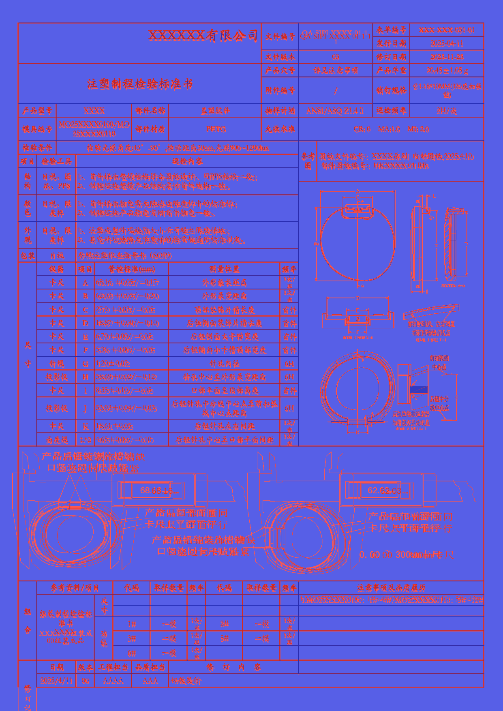
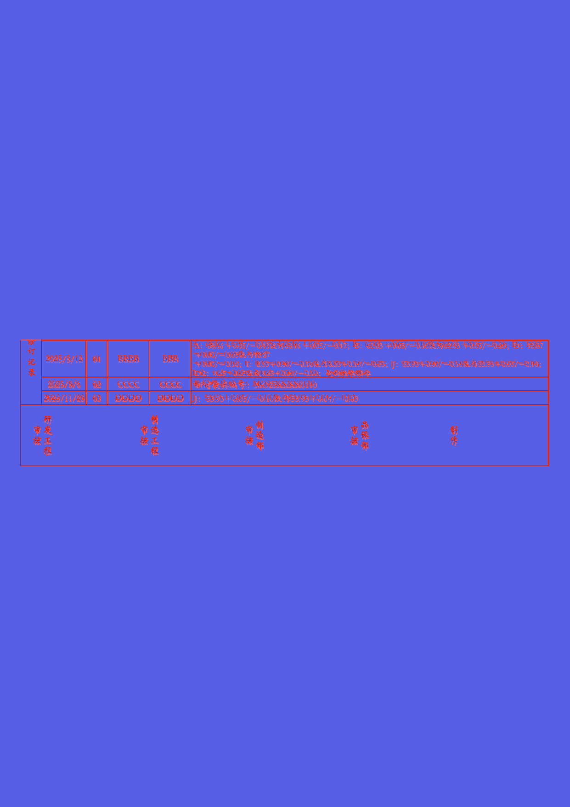
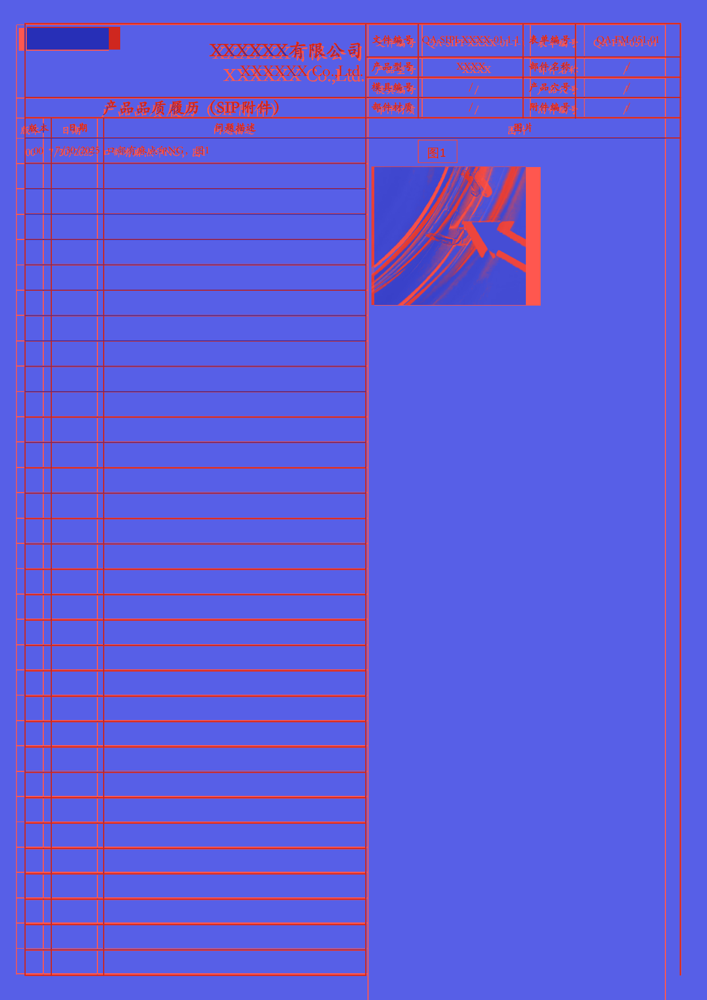
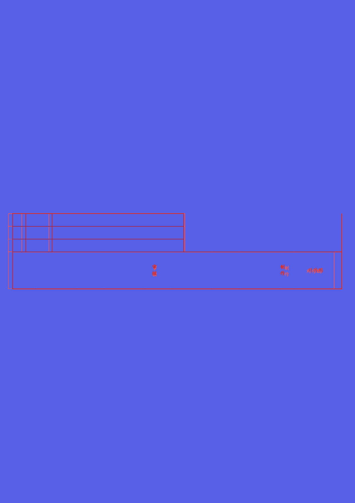
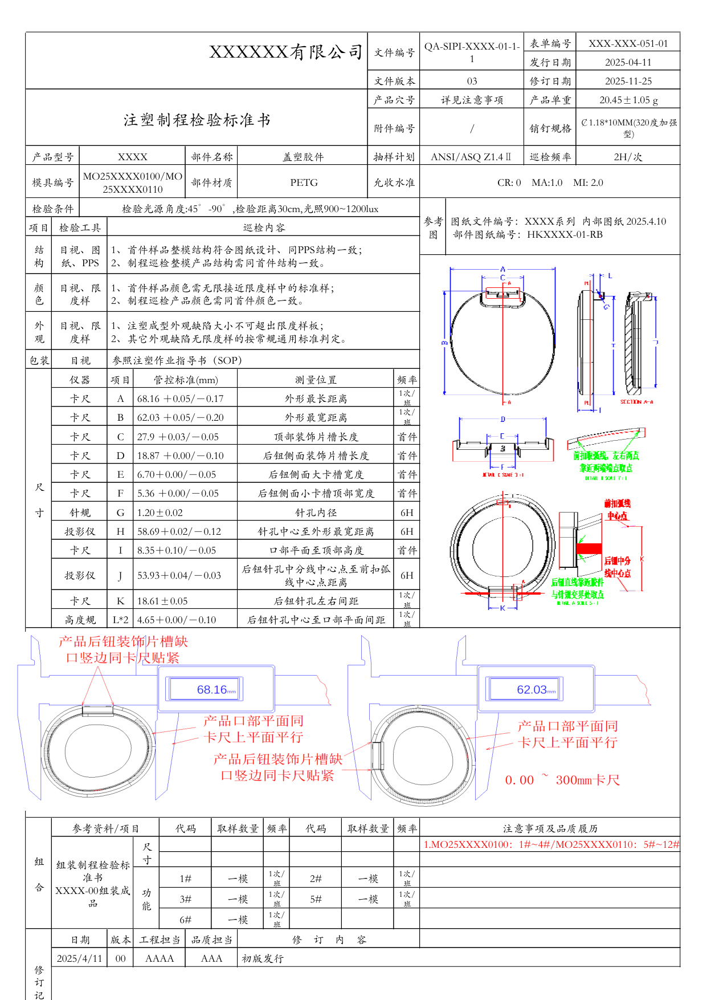
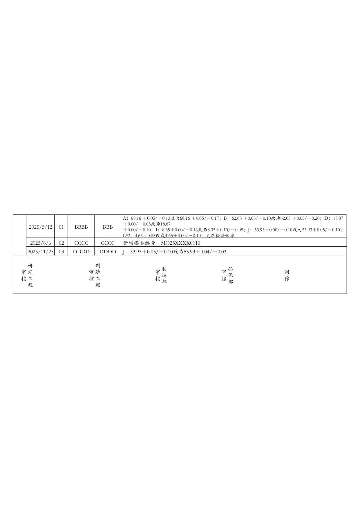
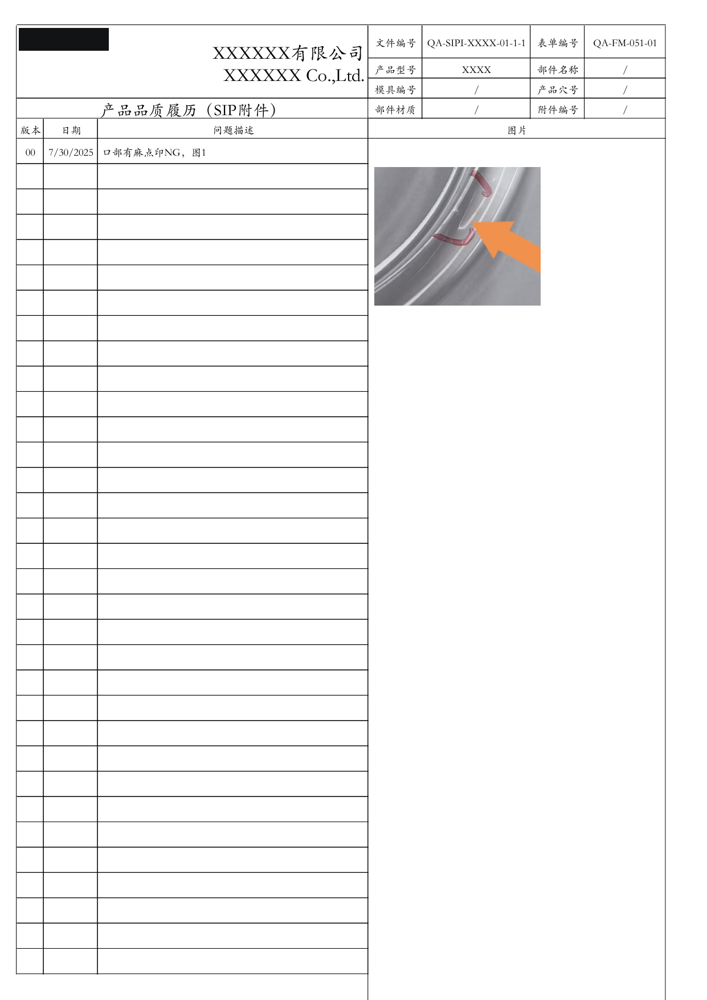
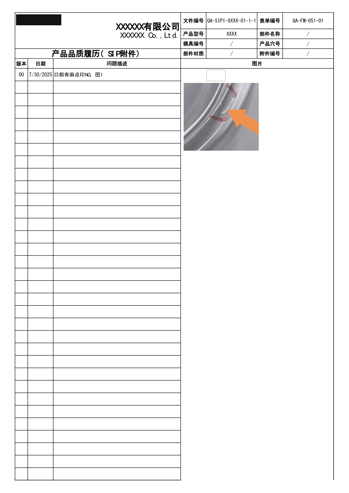

# node MiniPdf vs Microsoft 365 Excel Reference PDF Comparison Report

Generated: 2026-09-05T15:54:21.314141

## Summary

| # | Test Case | Valid | Text Sim | Visual Avg | Pages (M/R) | Overall |
|---|-----------|-------|----------|------------|-------------|--------|
| 1 | 🟢 Issue202609031340 | ✅ | 0.9437 | 0.9543 | 4/4 | **0.9592** |

**Average Overall Score: 0.9592**

## Labeled Side-by-Side Comparison

<table>
<tr><th>Case</th><th>Comparison</th></tr>
<tr>
  <td><b>Issue202609031340<br><small>format: xlsx | case: Issue202609031340 | scope: node-issue-xlsx</small></b><br>Page 1</td>
  <td></td>
</tr>
<tr>
  <td><b>Issue202609031340<br><small>format: xlsx | case: Issue202609031340 | scope: node-issue-xlsx</small></b><br>Page 2</td>
  <td></td>
</tr>
<tr>
  <td><b>Issue202609031340<br><small>format: xlsx | case: Issue202609031340 | scope: node-issue-xlsx</small></b><br>Page 3</td>
  <td></td>
</tr>
<tr>
  <td><b>Issue202609031340<br><small>format: xlsx | case: Issue202609031340 | scope: node-issue-xlsx</small></b><br>Page 4</td>
  <td></td>
</tr>
</table>

## Difference Heatmaps

Blue areas are below the configured difference threshold; red areas have stronger pixel differences. The reference rendering is retained as faint context.

<table>
<tr><th>Case</th><th>Heatmap</th><th>Metrics</th></tr>
<tr>
  <td><b>Issue202609031340</b><br>Page 1</td>
  <td></td>
  <td>changed: 337055 px (15.48%)<br>bbox: [30, 55, 1195, 1754]<br>mean abs RGB: 15.6991<br>RMSE RGB: 48.7136<br>threshold: 12, gain: 5.0</td>
</tr>
<tr>
  <td><b>Issue202609031340</b><br>Page 2</td>
  <td></td>
  <td>changed: 45503 px (2.09%)<br>bbox: [43, 738, 1195, 1014]<br>mean abs RGB: 2.3791<br>RMSE RGB: 18.9014<br>threshold: 12, gain: 5.0</td>
</tr>
<tr>
  <td><b>Issue202609031340</b><br>Page 3</td>
  <td></td>
  <td>changed: 195838 px (9.00%)<br>bbox: [28, 40, 1196, 1754]<br>mean abs RGB: 12.2294<br>RMSE RGB: 48.2933<br>threshold: 12, gain: 5.0</td>
</tr>
<tr>
  <td><b>Issue202609031340</b><br>Page 4</td>
  <td></td>
  <td>changed: 17387 px (0.80%)<br>bbox: [28, 743, 1196, 1009]<br>mean abs RGB: 0.9005<br>RMSE RGB: 12.1593<br>threshold: 12, gain: 5.0</td>
</tr>
</table>

## Visual Comparison

Scores compare node MiniPdf against Microsoft 365 Excel Reference. LibreOffice is an auxiliary rendering and does not affect scores.

<table>
<tr><th>node MiniPdf</th><th>Microsoft 365 Excel Reference</th><th>LibreOffice</th></tr>
<tr>
  <td><b>Issue202609031340<br><small>format: xlsx | case: Issue202609031340 | scope: node-issue-xlsx</small></b></td>
  <td colspan="2">Issue202609031340 <span style="color:#3fb950">⬤</span> 95.9%</td>
</tr>
<tr>
  <td></td>
  <td></td>
  <td></td>
</tr>
<tr>
  <td></td>
  <td></td>
  <td></td>
</tr>
<tr>
  <td></td>
  <td></td>
  <td></td>
</tr>
<tr>
  <td></td>
  <td></td>
  <td></td>
</tr>
</table>

## Detailed Results

### Issue202609031340

- **Case Metadata:** format: xlsx | case: Issue202609031340 | scope: node-issue-xlsx
- **Source:** tests/Issue_Files/xlsx/Issue202609031340.xlsx
- **Text Similarity:** 0.9437
- **Visual Average:** 0.9543
- **Overall Score:** 0.9592
- **Pages:** MiniPdf=4, Reference=4
- **File Size:** MiniPdf=533862 bytes, Reference=346206 bytes

<details><summary>Text Diff</summary>

```diff
--- minipdf/Issue202609031340.pdf
+++ reference/Issue202609031340.pdf
@@ -1,12 +1,10 @@
 表单编号 XXX-XXX-051-01

-QA-SIPI-XXXX-01-1-

-文件编号

-XXXXXX有限公司

-1

+XXXXXX有限公司 文件编号QA-SIPI-XXXX-01-1-1

 发行日期 2025-04-11

 文件版本 03 修订日期 2025-11-25

 产品穴号 详见注意事项 产品单重 20.45±1.05 g

-注塑制程检验标准书 ￠1.18*10MM(320度加强

+注塑制程检验标准书

+￠1.18*10MM(320度加强

 附件编号 / 销钉规格

 型)

 产品型号 XXXX 部件名称 盖塑胶件 抽样计划 ANSI/ASQ Z1.4Ⅱ 巡检频率 2H/次

@@ -48,7 +46,17 @@
 1次/

 高度规 L*2 4.65＋0.00/－0.10 后钮针孔中心至口部平面间距

 班

-参考资料/项目 代码 取样数量频率 代码 取样数量频率 注意事项及品质履历

+产品后钮装饰片槽缺

+口竖边同卡尺贴紧

+68.16 mm 62.03 mm

+产品口部平面同

+产品口部平面同

+卡尺上平面平行

+卡尺上平面平行

+产品后钮装饰片槽缺

+口竖边同卡尺贴紧

+0.00 ~ 300mm卡尺

+参考资料/项目 代码 取样数量 频率 代码 取样数量 频率 注意事项及品质履历

 1.MO25XXXX0100：1#~4#/MO25XXXX0110：5#~12#

 尺

 寸

@@ -58,25 +66,27 @@
 准书 1# 一模 2# 一模

 班 班

 合

-XXXX-00组装成

-功 1次/ 1次/

+XXXX-

+功

+1次/ 1次/

 3# 一模 5# 一模

-品 班 班

+00组装成品 班 班

 能

 1次/

 6# 一模

 班

-日期 版本工程担当 品质担当 修    订    内    容

+日期 版本 工程担当 品质担当 修    订    内    容

 2025/4/11 00 AAAA AAA 初版发行

 修

+---PAGE---

+修

+A：68.16 ＋0.05/－0.13改为68.16 ＋0.05/－0.17；B：62.03 ＋0.05/－0.10改为62.03 ＋0.05/－0.20；D：18.87

 订

-记

----PAGE---

-A：68.16 ＋0.05/－0.13改为68.16 ＋0.05/－0.17；B：62.03 ＋0.05/－0.10改为62.03 ＋0.05/－0.20；D：18.87

 ＋0.00/－0.05改为18.87

 2025/5/12 01 BBBB BBB

+记

 ＋0.00/－0.10；I：8.35＋0.00/－0.16改为8.35＋0.10/－0.05；J：53.93＋0.00/－0.10改为53.93＋0.05/－0.10；

-L*2：4.65±0.05改成4.65＋0.00/－0.10；更新检验频率

+录 L*2：4.65±0.05改成4.65＋0.00/－0.10；更新检验频率

 2025/8/6 02 CCCC CCCC 新增模具编号：MO25XXXX0110

 2025/11/25 03 DDDD DDDD J：53.93＋0.05/－0.10改为53.93＋0.04/－0.03

 研 制

@@ -96,6 +106,7 @@
 产品品质履历（SIP附件）

 版本 日期 问题描述 图片

 00 7/30/2025 口部有麻点印NG，图1

+图 1

 ---PAGE---

 审 制

 刘伟鹏
```
</details>

## Improvement Suggestions

All test cases scored 0.8 or above. 🎉
