# python MiniPdf vs Microsoft 365 Word Reference PDF Comparison Report

Generated: 2026-09-19T21:35:11.305115

## Summary

| # | Test Case | Valid | Text Sim | Visual Avg | Pages (M/R) | Overall |
|---|-----------|-------|----------|------------|-------------|--------|
| 1 | 🟢 docx_classic01_single_paragraph | ✅ | 0.9868 | 0.9946 | 1/1 | **0.9926** |
| 2 | 🟢 docx_classic02_multiple_paragraphs | ✅ | 1.0 | 0.9797 | 1/1 | **0.9919** |
| 3 | 🟢 docx_classic03_headings | ✅ | 1.0 | 0.9942 | 1/1 | **0.9977** |
| 4 | 🟢 docx_classic04_bold_italic | ✅ | 1.0 | 0.9963 | 1/1 | **0.9985** |
| 5 | 🟢 docx_classic05_font_sizes | ✅ | 1.0 | 0.9907 | 1/1 | **0.9963** |
| 6 | 🟢 docx_classic06_font_colors | ✅ | 1.0 | 0.9986 | 1/1 | **0.9994** |
| 7 | 🟢 docx_classic07_alignment | ✅ | 1.0 | 0.9837 | 1/1 | **0.9935** |
| 8 | 🟢 docx_classic08_bullet_list | ✅ | 0.918 | 0.9969 | 1/1 | **0.966** |
| 9 | 🟢 docx_classic09_numbered_list | ✅ | 0.9282 | 0.9957 | 1/1 | **0.9696** |
| 10 | 🟢 docx_classic10_simple_table | ✅ | 1.0 | 0.9374 | 1/1 | **0.975** |
| 11 | 🟢 docx_classic11_table_with_shading | ✅ | 1.0 | 0.9828 | 1/1 | **0.9931** |
| 12 | 🟢 docx_classic12_merged_cells_table | ✅ | 1.0 | 0.895 | 1/1 | **0.958** |
| 13 | 🟢 docx_classic13_long_document | ✅ | 0.8242 | 0.9285 | 4/4 | **0.9011** |
| 14 | 🟢 docx_classic14_mixed_content | ✅ | 0.9929 | 0.9822 | 1/1 | **0.99** |
| 15 | 🟢 docx_classic15_indentation | ✅ | 0.9909 | 0.9863 | 1/1 | **0.9909** |
| 16 | 🟢 docx_classic16_line_spacing | ✅ | 0.9441 | 0.9861 | 1/1 | **0.9721** |
| 17 | 🟢 docx_classic17_page_break | ✅ | 1.0 | 0.9948 | 3/3 | **0.9979** |
| 18 | 🟢 docx_classic18_embedded_image | ✅ | 1.0 | 0.9953 | 1/1 | **0.9981** |
| 19 | 🟢 docx_classic19_multiple_images | ✅ | 1.0 | 0.9584 | 1/1 | **0.9834** |
| 20 | 🟢 docx_classic20_table_with_many_rows | ✅ | 1.0 | 0.885 | 1/1 | **0.954** |
| 21 | 🟢 docx_classic21_nested_lists | ✅ | 0.9371 | 0.9943 | 1/1 | **0.9726** |
| 22 | 🟢 docx_classic22_horizontal_rule | ✅ | 1.0 | 0.9913 | 1/1 | **0.9965** |
| 23 | 🟢 docx_classic23_mixed_formatting_runs | ✅ | 1.0 | 0.9947 | 1/1 | **0.9979** |
| 24 | 🟡 docx_classic24_two_column_table_layout | ✅ | 0.7375 | 0.9898 | 1/1 | **0.8909** |
| 25 | 🟢 docx_classic25_title_and_subtitle | ✅ | 1.0 | 0.9884 | 2/2 | **0.9954** |
| 26 | 🟢 docx_classic26_table_alignment | ✅ | 1.0 | 0.8731 | 1/1 | **0.9492** |
| 27 | 🟢 docx_classic27_long_paragraph_wrapping | ✅ | 0.9726 | 0.945 | 1/1 | **0.967** |
| 28 | 🟢 docx_classic28_special_characters | ✅ | 1.0 | 0.9934 | 1/1 | **0.9974** |
| 29 | 🟢 docx_classic29_table_with_image | ✅ | 0.9647 | 0.9849 | 1/1 | **0.9798** |
| 30 | 🟢 docx_classic30_comprehensive_report | ✅ | 0.9868 | 0.9795 | 3/3 | **0.9865** |
| 31 | 🟢 docx_classic31_product_card_with_image | ✅ | 0.9945 | 0.9852 | 1/1 | **0.9919** |
| 32 | 🟢 docx_classic31_strikethrough_text | ✅ | 1.0 | 0.9899 | 1/1 | **0.996** |
| 33 | 🟢 docx_classic32_company_logo_header | ✅ | 0.9784 | 0.9742 | 1/1 | **0.981** |
| 34 | 🟢 docx_classic32_superscript_subscript | ✅ | 0.9262 | 0.9951 | 1/1 | **0.9685** |
| 35 | 🟢 docx_classic33_highlighted_text | ✅ | 1.0 | 0.8702 | 1/1 | **0.9481** |
| 36 | 🟢 docx_classic33_two_products_side_by_side | ✅ | 1.0 | 0.9552 | 1/1 | **0.9821** |
| 37 | 🟢 docx_classic34_employee_directory_with_photo | ✅ | 0.9811 | 0.982 | 2/2 | **0.9852** |
| 38 | 🟢 docx_classic34_paragraph_borders | ✅ | 1.0 | 0.9846 | 1/1 | **0.9938** |
| 39 | 🔴 docx_classic35_inventory_with_product_photos | ✅ | 1.0 | 0.4658 | 1/2 | **0.6863** |
| 40 | 🟢 docx_classic35_tab_stops | ✅ | 0.8727 | 0.973 | 1/1 | **0.9383** |
| 41 | 🟢 docx_classic36_invoice_with_logo | ✅ | 1.0 | 0.9699 | 1/1 | **0.988** |
| 42 | 🟢 docx_classic36_wide_table | ✅ | 1.0 | 0.9826 | 1/1 | **0.993** |
| 43 | 🟡 docx_classic37_nested_table | ✅ | 0.8856 | 0.8473 | 1/1 | **0.8932** |
| 44 | 🟢 docx_classic37_real_estate_listing | ✅ | 1.0 | 0.9729 | 1/1 | **0.9892** |
| 45 | 🟢 docx_classic38_restaurant_menu_with_photos | ✅ | 1.0 | 0.9204 | 2/2 | **0.9682** |
| 46 | 🟢 docx_classic38_table_column_widths | ✅ | 0.8182 | 0.9339 | 1/1 | **0.9008** |
| 47 | 🟢 docx_classic39_cover_page_with_image | ✅ | 1.0 | 0.9522 | 2/2 | **0.9809** |
| 48 | 🟢 docx_classic39_financial_report | ✅ | 1.0 | 0.983 | 1/1 | **0.9932** |
| 49 | 🟢 docx_classic40_product_catalog_with_images | ✅ | 1.0 | 0.973 | 1/1 | **0.9892** |
| 50 | 🟢 docx_classic40_resume | ✅ | 0.9903 | 0.9723 | 1/1 | **0.985** |
| 51 | 🟢 docx_classic41_business_letter | ✅ | 0.9772 | 0.9761 | 1/1 | **0.9813** |
| 52 | 🟢 docx_classic41_newsletter_with_hero_image | ✅ | 0.9762 | 0.9575 | 1/1 | **0.9735** |
| 53 | 🟢 docx_classic42_chart_image_with_data | ✅ | 1.0 | 0.9704 | 1/1 | **0.9882** |
| 54 | 🟢 docx_classic42_meeting_minutes | ✅ | 0.9345 | 0.9529 | 1/1 | **0.955** |
| 55 | 🟢 docx_classic43_event_flyer_with_banner | ✅ | 0.9597 | 0.9669 | 1/1 | **0.9706** |
| 56 | 🟢 docx_classic43_invoice_document | ✅ | 0.9816 | 0.9465 | 1/1 | **0.9712** |
| 57 | 🟢 docx_classic44_dashboard_with_kpi_image | ✅ | 1.0 | 0.9727 | 1/1 | **0.9891** |
| 58 | 🟢 docx_classic44_memo | ✅ | 0.9658 | 0.9732 | 1/1 | **0.9756** |
| 59 | 🟢 docx_classic45_certificate_with_seal | ✅ | 1.0 | 0.9661 | 1/1 | **0.9864** |
| 60 | 🟢 docx_classic45_project_plan | ✅ | 0.9503 | 0.962 | 1/1 | **0.9649** |
| 61 | 🟢 docx_classic46_comparison_table | ✅ | 1.0 | 0.9806 | 1/1 | **0.9922** |
| 62 | 🟢 docx_classic46_product_image_grid | ✅ | 1.0 | 0.9465 | 1/1 | **0.9786** |
| 63 | 🟢 docx_classic47_data_dictionary | ✅ | 0.9806 | 0.9612 | 1/1 | **0.9767** |
| 64 | 🟢 docx_classic47_news_article_with_hero_image | ✅ | 0.9735 | 0.9793 | 1/1 | **0.9811** |
| 65 | 🟢 docx_classic48_multi_level_headings | ✅ | 1.0 | 0.9734 | 3/3 | **0.9894** |
| 66 | 🟢 docx_classic48_task_list_with_status_icons | ✅ | 1.0 | 0.9769 | 1/1 | **0.9908** |
| 67 | 🟢 docx_classic49_cjk_document | ✅ | 0.9826 | 0.9746 | 1/1 | **0.9829** |
| 68 | 🟢 docx_classic49_wide_panoramic_banner | ✅ | 1.0 | 0.9303 | 1/1 | **0.9721** |
| 69 | 🟡 docx_classic50_long_table_with_formatting | ✅ | 0.6725 | 0.9356 | 2/2 | **0.8432** |
| 70 | 🟢 docx_classic50_portrait_tall_image | ✅ | 0.9827 | 0.9854 | 1/1 | **0.9872** |
| 71 | 🟢 docx_classic51_step_by_step_with_images | ✅ | 1.0 | 0.9506 | 1/1 | **0.9802** |
| 72 | 🟢 docx_classic51_underline_styles | ✅ | 1.0 | 0.995 | 1/1 | **0.998** |
| 73 | 🟢 docx_classic52_before_after_comparison | ✅ | 1.0 | 0.9485 | 1/1 | **0.9794** |
| 74 | 🟢 docx_classic52_spacing_before_after | ✅ | 0.9863 | 0.9806 | 1/1 | **0.9868** |
| 75 | 🟢 docx_classic53_color_swatch_palette | ✅ | 1.0 | 0.9458 | 1/1 | **0.9783** |
| 76 | 🟢 docx_classic53_table_merged_complex | ✅ | 1.0 | 0.9826 | 1/1 | **0.993** |
| 77 | 🟢 docx_classic54_multi_font_family | ✅ | 1.0 | 0.9914 | 1/1 | **0.9966** |
| 78 | 🟢 docx_classic54_travel_destination_cards | ✅ | 1.0 | 0.9701 | 1/1 | **0.988** |
| 79 | 🟢 docx_classic55_background_shading_paragraph | ✅ | 1.0 | 0.9177 | 1/1 | **0.9671** |
| 80 | 🟢 docx_classic55_lab_results_with_image | ✅ | 1.0 | 0.9567 | 1/1 | **0.9827** |
| 81 | 🟢 docx_classic56_images_and_tables_mixed | ✅ | 0.995 | 0.9407 | 1/1 | **0.9743** |
| 82 | 🟢 docx_classic56_software_screenshot_features | ✅ | 0.9965 | 0.9774 | 1/1 | **0.9896** |
| 83 | 🟢 docx_classic57_right_to_left_text | ✅ | 0.9478 | 0.9902 | 1/1 | **0.9752** |
| 84 | 🟢 docx_classic57_sports_results_with_logos | ✅ | 1.0 | 0.9347 | 1/1 | **0.9739** |
| 85 | 🟡 docx_classic58_dense_paragraph_document | ✅ | 0.9757 | 0.7998 | 8/7 | **0.8102** |
| 86 | 🟢 docx_classic58_report_with_footer_image | ✅ | 1.0 | 0.9594 | 1/1 | **0.9838** |
| 87 | 🟢 docx_classic59_numbered_and_bullet_mixed | ✅ | 0.9656 | 0.9826 | 1/1 | **0.9793** |
| 88 | 🟢 docx_classic59_nutrition_label_with_image | ✅ | 1.0 | 0.9682 | 1/1 | **0.9873** |
| 89 | 🟢 docx_classic60_comprehensive_styled_report | ✅ | 0.9847 | 0.9576 | 3/3 | **0.9769** |
| 90 | 🟢 docx_classic60_project_status_with_milestones | ✅ | 0.9492 | 0.9723 | 2/2 | **0.9686** |
| 91 | 🟢 docx_classic61_header_and_footer | ✅ | 0.9702 | 0.9767 | 1/1 | **0.9788** |
| 92 | 🟢 docx_classic62_footnote_references | ✅ | 0.9727 | 0.9846 | 1/1 | **0.9829** |
| 93 | 🟢 docx_classic63_toc_style_headings | ✅ | 1.0 | 0.9825 | 1/1 | **0.993** |
| 94 | 🟡 docx_classic64_multi_column_layout | ✅ | 0.7279 | 0.9718 | 1/1 | **0.8799** |
| 95 | 🟢 docx_classic65_code_block_styling | ✅ | 1.0 | 0.8649 | 1/1 | **0.946** |
| 96 | 🟢 docx_classic66_colored_title_page | ✅ | 1.0 | 0.917 | 1/1 | **0.9668** |
| 97 | 🟢 docx_classic67_alternating_row_table | ✅ | 0.985 | 0.9523 | 1/1 | **0.9749** |
| 98 | 🟡 docx_classic68_sidebar_layout | ✅ | 0.6043 | 0.94 | 1/1 | **0.8177** |
| 99 | 🟢 docx_classic69_blockquote_styling | ✅ | 0.9986 | 0.9839 | 1/1 | **0.993** |
| 100 | 🟢 docx_classic70_academic_paper | ✅ | 0.9575 | 0.9412 | 1/1 | **0.9595** |
| 101 | 🔴 docx_classic71_legal_document | ✅ | 0.9841 | 0.4763 | 2/1 | **0.6842** |
| 102 | 🟢 docx_classic72_technical_specification | ✅ | 0.9953 | 0.9561 | 1/1 | **0.9806** |
| 103 | 🟢 docx_classic73_calendar_layout | ✅ | 1.0 | 0.9816 | 1/1 | **0.9926** |
| 104 | 🟢 docx_classic74_org_chart | ✅ | 1.0 | 0.8872 | 1/1 | **0.9549** |
| 105 | 🟢 docx_classic75_newsletter_layout | ✅ | 0.8951 | 0.9712 | 1/1 | **0.9465** |
| 106 | 🟢 docx_classic76_recipe_card | ✅ | 0.9709 | 0.9657 | 1/1 | **0.9746** |
| 107 | 🟢 docx_classic77_timeline_layout | ✅ | 0.9095 | 0.9384 | 1/1 | **0.9392** |
| 108 | 🟢 docx_classic78_faq_document | ✅ | 0.9677 | 0.957 | 2/2 | **0.9699** |
| 109 | 🔴 docx_classic79_glossary | ✅ | 0.9882 | 0.4864 | 2/1 | **0.6898** |
| 110 | 🟢 docx_classic80_matrix_grid | ✅ | 0.9505 | 0.9288 | 1/1 | **0.9517** |
| 111 | 🟢 docx_classic81_budget_table | ✅ | 1.0 | 0.952 | 1/1 | **0.9808** |
| 112 | 🟡 docx_classic82_survey_questionnaire | ✅ | 0.665 | 0.9378 | 2/2 | **0.8411** |
| 113 | 🟢 docx_classic83_medical_form | ✅ | 1.0 | 0.9443 | 1/1 | **0.9777** |
| 114 | 🟢 docx_classic84_shipping_label | ✅ | 0.9714 | 0.946 | 1/1 | **0.967** |
| 115 | 🟢 docx_classic85_report_card | ✅ | 0.9975 | 0.9419 | 1/1 | **0.9758** |
| 116 | 🟢 docx_classic86_checklist_document | ✅ | 1.0 | 0.9794 | 1/1 | **0.9918** |
| 117 | 🟢 docx_classic87_bibliography | ✅ | 0.9873 | 0.9721 | 1/1 | **0.9838** |
| 118 | 🟢 docx_classic88_presentation_handout | ✅ | 1.0 | 0.8954 | 2/2 | **0.9582** |
| 119 | 🟢 docx_classic89_multi_image_gallery | ✅ | 0.9939 | 0.9725 | 1/1 | **0.9866** |
| 120 | 🟢 docx_classic90_comprehensive_annual_report | ✅ | 0.9828 | 0.9438 | 4/4 | **0.9706** |
| 121 | 🟢 docx_classic91_landscape_page | ✅ | 0.9988 | 0.9598 | 1/1 | **0.9834** |
| 122 | 🟢 docx_classic92_first_line_indent | ✅ | 0.9634 | 0.9793 | 1/1 | **0.9771** |
| 123 | 🟢 docx_classic93_hanging_indent | ✅ | 0.9727 | 0.9676 | 1/1 | **0.9761** |
| 124 | 🟢 docx_classic94_custom_bullet_characters | ✅ | 0.9932 | 0.9844 | 1/1 | **0.991** |
| 125 | 🟢 docx_classic95_contract_template | ✅ | 0.9942 | 0.9729 | 1/1 | **0.9868** |
| 126 | 🟢 docx_classic96_dense_data_table | ✅ | 1.0 | 0.9186 | 1/1 | **0.9674** |
| 127 | 🟡 docx_classic97_product_catalog | ✅ | 0.8216 | 0.9104 | 1/1 | **0.8928** |
| 128 | 🟢 docx_classic98_training_manual | ✅ | 0.9892 | 0.9674 | 1/1 | **0.9826** |
| 129 | 🟢 docx_classic99_policy_document | ✅ | 0.9785 | 0.9501 | 1/1 | **0.9714** |
| 130 | 🟢 docx_classic100_multi_page_table | ✅ | 0.957 | 0.8482 | 2/2 | **0.9221** |
| 131 | 🟢 docx_classic101_warranty_document | ✅ | 0.9844 | 0.9597 | 1/1 | **0.9776** |
| 132 | 🟢 docx_classic102_curriculum_syllabus | ✅ | 0.9915 | 0.9588 | 1/1 | **0.9801** |
| 133 | 🟢 docx_classic103_event_program | ✅ | 0.9504 | 0.928 | 2/2 | **0.9514** |
| 134 | 🟢 docx_classic104_sop_document | ✅ | 0.9713 | 0.9722 | 2/2 | **0.9774** |
| 135 | 🟢 docx_classic105_certificate | ✅ | 1.0 | 0.9709 | 1/1 | **0.9884** |
| 136 | 🔴 docx_classic106_multi_section_orientation | ✅ | 0.9627 | 0.3219 | 1/3 | **0.6138** |
| 137 | 🟢 docx_classic107_order_form | ✅ | 0.8813 | 0.9344 | 1/1 | **0.9263** |
| 138 | 🟢 docx_classic108_comparison_matrix | ✅ | 0.9383 | 0.9015 | 1/1 | **0.9359** |
| 139 | 🟢 docx_classic109_release_notes | ✅ | 0.978 | 0.9702 | 1/1 | **0.9793** |
| 140 | 🟢 docx_classic110_troubleshooting_guide | ✅ | 0.9977 | 0.9742 | 1/1 | **0.9888** |
| 141 | 🟢 docx_classic111_meeting_agenda | ✅ | 0.994 | 0.9526 | 1/1 | **0.9786** |
| 142 | 🟢 docx_classic112_project_status_report | ✅ | 0.9797 | 0.9685 | 1/1 | **0.9793** |
| 143 | 🟢 docx_classic113_address_labels | ✅ | 1.0 | 0.9771 | 1/1 | **0.9908** |
| 144 | 🟢 docx_classic114_test_report | ✅ | 0.9598 | 0.9668 | 1/1 | **0.9706** |
| 145 | 🟢 docx_classic115_price_list | ✅ | 0.9811 | 0.9274 | 1/1 | **0.9634** |
| 146 | 🟢 docx_classic116_risk_assessment | ✅ | 0.9269 | 0.9368 | 1/1 | **0.9455** |
| 147 | 🟢 docx_classic117_employee_handbook_excerpt | ✅ | 0.9828 | 0.9596 | 1/1 | **0.977** |
| 148 | 🟢 docx_classic118_data_report_with_summary | ✅ | 0.9767 | 0.9567 | 1/1 | **0.9734** |
| 149 | 🟢 docx_classic119_multi_language_document | ✅ | 0.9956 | 0.9782 | 1/1 | **0.9895** |
| 150 | 🟢 docx_classic120_comprehensive_business_proposal | ✅ | 0.9539 | 0.9195 | 3/3 | **0.9494** |
| 151 | 🟢 docx_classic121_thin_border_table | ✅ | 1.0 | 0.8939 | 1/1 | **0.9576** |
| 152 | 🟢 docx_classic122_thick_outer_border_table | ✅ | 1.0 | 0.8096 | 1/1 | **0.9238** |
| 153 | 🟢 docx_classic123_dashed_border_table | ✅ | 1.0 | 0.9899 | 1/1 | **0.996** |
| 154 | 🟢 docx_classic124_colored_border_table | ✅ | 1.0 | 0.9823 | 1/1 | **0.9929** |
| 155 | 🟢 docx_classic125_solid_cell_fills | ✅ | 1.0 | 0.9746 | 1/1 | **0.9898** |
| 156 | 🟢 docx_classic126_dark_header_table | ✅ | 1.0 | 0.9831 | 1/1 | **0.9932** |
| 157 | 🟢 docx_classic127_font_styles_showcase | ✅ | 1.0 | 0.8883 | 1/1 | **0.9553** |
| 158 | 🟢 docx_classic128_font_sizes_showcase | ✅ | 0.9663 | 0.9673 | 1/1 | **0.9734** |
| 159 | 🟢 docx_classic129_alignment_combinations | ✅ | 1.0 | 0.9175 | 1/1 | **0.967** |
| 160 | 🟢 docx_classic130_wrap_and_indent | ✅ | 0.9875 | 0.9822 | 1/1 | **0.9879** |
| 161 | 🟢 docx_classic131_number_format_table | ✅ | 1.0 | 0.9093 | 1/1 | **0.9637** |
| 162 | 🟢 docx_classic132_striped_table | ✅ | 1.0 | 0.9588 | 1/1 | **0.9835** |
| 163 | 🟢 docx_classic133_gradient_rows_table | ✅ | 1.0 | 0.9742 | 1/1 | **0.9897** |
| 164 | 🟢 docx_classic134_heatmap_table | ✅ | 1.0 | 0.9742 | 1/1 | **0.9897** |
| 165 | 🟢 docx_classic135_bottom_border_paragraphs | ✅ | 1.0 | 0.9831 | 1/1 | **0.9932** |
| 166 | 🟢 docx_classic136_financial_statement | ✅ | 1.0 | 0.9691 | 1/1 | **0.9876** |
| 167 | 🟢 docx_classic137_checkerboard_table | ✅ | 1.0 | 0.9457 | 1/1 | **0.9783** |
| 168 | 🟢 docx_classic138_color_grid_table | ✅ | 1.0 | 0.987 | 1/1 | **0.9948** |
| 169 | 🟢 docx_classic139_paragraph_shading_patterns | ✅ | 1.0 | 0.8941 | 1/1 | **0.9576** |
| 170 | 🟢 docx_classic140_rotated_text_table | ✅ | 0.8312 | 0.9846 | 1/1 | **0.9263** |
| 171 | 🟢 docx_classic141_mixed_border_styles | ✅ | 1.0 | 0.9878 | 1/1 | **0.9951** |
| 172 | 🟢 docx_classic142_styled_invoice_document | ✅ | 0.9745 | 0.9522 | 1/1 | **0.9707** |
| 173 | 🟢 docx_classic143_multi_section_document | ✅ | 1.0 | 0.9105 | 1/1 | **0.9642** |
| 174 | 🟢 docx_classic144_note_style_paragraphs | ✅ | 1.0 | 0.9849 | 1/1 | **0.994** |
| 175 | 🟢 docx_classic145_status_badge_table | ✅ | 0.9773 | 0.9739 | 1/1 | **0.9805** |
| 176 | 🟢 docx_classic146_double_border_table | ✅ | 1.0 | 0.9796 | 1/1 | **0.9918** |
| 177 | 🟢 docx_classic147_multi_section_styled_report | ✅ | 1.0 | 0.9621 | 1/1 | **0.9848** |
| 178 | 🟢 docx_classic148_data_grid_document | ✅ | 1.0 | 0.918 | 1/1 | **0.9672** |
| 179 | 🟢 docx_classic149_merged_section_report | ✅ | 1.0 | 0.9353 | 1/1 | **0.9741** |
| 180 | 🟢 docx_classic150_kitchen_sink_styles | ✅ | 0.9838 | 0.9649 | 2/2 | **0.9795** |

**Average Overall Score: 0.9646**

## Labeled Side-by-Side Comparison

<table>
<tr><th>Case</th><th>Comparison</th></tr>
<tr>
  <td><b>docx_classic01_single_paragraph<br><small>format: docx | case: docx_classic01_single_paragraph | scope: python-classic-docx</small></b><br>Page 1</td>
  <td></td>
</tr>
<tr>
  <td><b>docx_classic02_multiple_paragraphs<br><small>format: docx | case: docx_classic02_multiple_paragraphs | scope: python-classic-docx</small></b><br>Page 1</td>
  <td></td>
</tr>
<tr>
  <td><b>docx_classic03_headings<br><small>format: docx | case: docx_classic03_headings | scope: python-classic-docx</small></b><br>Page 1</td>
  <td></td>
</tr>
<tr>
  <td><b>docx_classic04_bold_italic<br><small>format: docx | case: docx_classic04_bold_italic | scope: python-classic-docx</small></b><br>Page 1</td>
  <td></td>
</tr>
<tr>
  <td><b>docx_classic05_font_sizes<br><small>format: docx | case: docx_classic05_font_sizes | scope: python-classic-docx</small></b><br>Page 1</td>
  <td></td>
</tr>
<tr>
  <td><b>docx_classic06_font_colors<br><small>format: docx | case: docx_classic06_font_colors | scope: python-classic-docx</small></b><br>Page 1</td>
  <td></td>
</tr>
<tr>
  <td><b>docx_classic07_alignment<br><small>format: docx | case: docx_classic07_alignment | scope: python-classic-docx</small></b><br>Page 1</td>
  <td></td>
</tr>
<tr>
  <td><b>docx_classic08_bullet_list<br><small>format: docx | case: docx_classic08_bullet_list | scope: python-classic-docx</small></b><br>Page 1</td>
  <td></td>
</tr>
<tr>
  <td><b>docx_classic09_numbered_list<br><small>format: docx | case: docx_classic09_numbered_list | scope: python-classic-docx</small></b><br>Page 1</td>
  <td></td>
</tr>
<tr>
  <td><b>docx_classic10_simple_table<br><small>format: docx | case: docx_classic10_simple_table | scope: python-classic-docx</small></b><br>Page 1</td>
  <td></td>
</tr>
<tr>
  <td><b>docx_classic11_table_with_shading<br><small>format: docx | case: docx_classic11_table_with_shading | scope: python-classic-docx</small></b><br>Page 1</td>
  <td></td>
</tr>
<tr>
  <td><b>docx_classic12_merged_cells_table<br><small>format: docx | case: docx_classic12_merged_cells_table | scope: python-classic-docx</small></b><br>Page 1</td>
  <td></td>
</tr>
<tr>
  <td><b>docx_classic13_long_document<br><small>format: docx | case: docx_classic13_long_document | scope: python-classic-docx</small></b><br>Page 1</td>
  <td></td>
</tr>
<tr>
  <td><b>docx_classic13_long_document<br><small>format: docx | case: docx_classic13_long_document | scope: python-classic-docx</small></b><br>Page 2</td>
  <td></td>
</tr>
<tr>
  <td><b>docx_classic13_long_document<br><small>format: docx | case: docx_classic13_long_document | scope: python-classic-docx</small></b><br>Page 3</td>
  <td></td>
</tr>
<tr>
  <td><b>docx_classic13_long_document<br><small>format: docx | case: docx_classic13_long_document | scope: python-classic-docx</small></b><br>Page 4</td>
  <td></td>
</tr>
<tr>
  <td><b>docx_classic14_mixed_content<br><small>format: docx | case: docx_classic14_mixed_content | scope: python-classic-docx</small></b><br>Page 1</td>
  <td></td>
</tr>
<tr>
  <td><b>docx_classic15_indentation<br><small>format: docx | case: docx_classic15_indentation | scope: python-classic-docx</small></b><br>Page 1</td>
  <td></td>
</tr>
<tr>
  <td><b>docx_classic16_line_spacing<br><small>format: docx | case: docx_classic16_line_spacing | scope: python-classic-docx</small></b><br>Page 1</td>
  <td></td>
</tr>
<tr>
  <td><b>docx_classic17_page_break<br><small>format: docx | case: docx_classic17_page_break | scope: python-classic-docx</small></b><br>Page 1</td>
  <td></td>
</tr>
<tr>
  <td><b>docx_classic17_page_break<br><small>format: docx | case: docx_classic17_page_break | scope: python-classic-docx</small></b><br>Page 2</td>
  <td></td>
</tr>
<tr>
  <td><b>docx_classic17_page_break<br><small>format: docx | case: docx_classic17_page_break | scope: python-classic-docx</small></b><br>Page 3</td>
  <td></td>
</tr>
<tr>
  <td><b>docx_classic18_embedded_image<br><small>format: docx | case: docx_classic18_embedded_image | scope: python-classic-docx</small></b><br>Page 1</td>
  <td></td>
</tr>
<tr>
  <td><b>docx_classic19_multiple_images<br><small>format: docx | case: docx_classic19_multiple_images | scope: python-classic-docx</small></b><br>Page 1</td>
  <td></td>
</tr>
<tr>
  <td><b>docx_classic20_table_with_many_rows<br><small>format: docx | case: docx_classic20_table_with_many_rows | scope: python-classic-docx</small></b><br>Page 1</td>
  <td></td>
</tr>
<tr>
  <td><b>docx_classic21_nested_lists<br><small>format: docx | case: docx_classic21_nested_lists | scope: python-classic-docx</small></b><br>Page 1</td>
  <td></td>
</tr>
<tr>
  <td><b>docx_classic22_horizontal_rule<br><small>format: docx | case: docx_classic22_horizontal_rule | scope: python-classic-docx</small></b><br>Page 1</td>
  <td></td>
</tr>
<tr>
  <td><b>docx_classic23_mixed_formatting_runs<br><small>format: docx | case: docx_classic23_mixed_formatting_runs | scope: python-classic-docx</small></b><br>Page 1</td>
  <td></td>
</tr>
<tr>
  <td><b>docx_classic24_two_column_table_layout<br><small>format: docx | case: docx_classic24_two_column_table_layout | scope: python-classic-docx</small></b><br>Page 1</td>
  <td></td>
</tr>
<tr>
  <td><b>docx_classic25_title_and_subtitle<br><small>format: docx | case: docx_classic25_title_and_subtitle | scope: python-classic-docx</small></b><br>Page 1</td>
  <td></td>
</tr>
<tr>
  <td><b>docx_classic25_title_and_subtitle<br><small>format: docx | case: docx_classic25_title_and_subtitle | scope: python-classic-docx</small></b><br>Page 2</td>
  <td></td>
</tr>
<tr>
  <td><b>docx_classic26_table_alignment<br><small>format: docx | case: docx_classic26_table_alignment | scope: python-classic-docx</small></b><br>Page 1</td>
  <td></td>
</tr>
<tr>
  <td><b>docx_classic27_long_paragraph_wrapping<br><small>format: docx | case: docx_classic27_long_paragraph_wrapping | scope: python-classic-docx</small></b><br>Page 1</td>
  <td></td>
</tr>
<tr>
  <td><b>docx_classic28_special_characters<br><small>format: docx | case: docx_classic28_special_characters | scope: python-classic-docx</small></b><br>Page 1</td>
  <td></td>
</tr>
<tr>
  <td><b>docx_classic29_table_with_image<br><small>format: docx | case: docx_classic29_table_with_image | scope: python-classic-docx</small></b><br>Page 1</td>
  <td></td>
</tr>
<tr>
  <td><b>docx_classic30_comprehensive_report<br><small>format: docx | case: docx_classic30_comprehensive_report | scope: python-classic-docx</small></b><br>Page 1</td>
  <td></td>
</tr>
<tr>
  <td><b>docx_classic30_comprehensive_report<br><small>format: docx | case: docx_classic30_comprehensive_report | scope: python-classic-docx</small></b><br>Page 2</td>
  <td></td>
</tr>
<tr>
  <td><b>docx_classic30_comprehensive_report<br><small>format: docx | case: docx_classic30_comprehensive_report | scope: python-classic-docx</small></b><br>Page 3</td>
  <td></td>
</tr>
<tr>
  <td><b>docx_classic31_product_card_with_image<br><small>format: docx | case: docx_classic31_product_card_with_image | scope: python-classic-docx</small></b><br>Page 1</td>
  <td></td>
</tr>
<tr>
  <td><b>docx_classic31_strikethrough_text<br><small>format: docx | case: docx_classic31_strikethrough_text | scope: python-classic-docx</small></b><br>Page 1</td>
  <td></td>
</tr>
<tr>
  <td><b>docx_classic32_company_logo_header<br><small>format: docx | case: docx_classic32_company_logo_header | scope: python-classic-docx</small></b><br>Page 1</td>
  <td></td>
</tr>
<tr>
  <td><b>docx_classic32_superscript_subscript<br><small>format: docx | case: docx_classic32_superscript_subscript | scope: python-classic-docx</small></b><br>Page 1</td>
  <td></td>
</tr>
<tr>
  <td><b>docx_classic33_highlighted_text<br><small>format: docx | case: docx_classic33_highlighted_text | scope: python-classic-docx</small></b><br>Page 1</td>
  <td></td>
</tr>
<tr>
  <td><b>docx_classic33_two_products_side_by_side<br><small>format: docx | case: docx_classic33_two_products_side_by_side | scope: python-classic-docx</small></b><br>Page 1</td>
  <td></td>
</tr>
<tr>
  <td><b>docx_classic34_employee_directory_with_photo<br><small>format: docx | case: docx_classic34_employee_directory_with_photo | scope: python-classic-docx</small></b><br>Page 1</td>
  <td></td>
</tr>
<tr>
  <td><b>docx_classic34_employee_directory_with_photo<br><small>format: docx | case: docx_classic34_employee_directory_with_photo | scope: python-classic-docx</small></b><br>Page 2</td>
  <td></td>
</tr>
<tr>
  <td><b>docx_classic34_paragraph_borders<br><small>format: docx | case: docx_classic34_paragraph_borders | scope: python-classic-docx</small></b><br>Page 1</td>
  <td></td>
</tr>
<tr>
  <td><b>docx_classic35_inventory_with_product_photos<br><small>format: docx | case: docx_classic35_inventory_with_product_photos | scope: python-classic-docx</small></b><br>Page 1</td>
  <td></td>
</tr>
<tr>
  <td><b>docx_classic35_inventory_with_product_photos<br><small>format: docx | case: docx_classic35_inventory_with_product_photos | scope: python-classic-docx</small></b><br>Page 2</td>
  <td></td>
</tr>
<tr>
  <td><b>docx_classic35_tab_stops<br><small>format: docx | case: docx_classic35_tab_stops | scope: python-classic-docx</small></b><br>Page 1</td>
  <td></td>
</tr>
<tr>
  <td><b>docx_classic36_invoice_with_logo<br><small>format: docx | case: docx_classic36_invoice_with_logo | scope: python-classic-docx</small></b><br>Page 1</td>
  <td></td>
</tr>
<tr>
  <td><b>docx_classic36_wide_table<br><small>format: docx | case: docx_classic36_wide_table | scope: python-classic-docx</small></b><br>Page 1</td>
  <td></td>
</tr>
<tr>
  <td><b>docx_classic37_nested_table<br><small>format: docx | case: docx_classic37_nested_table | scope: python-classic-docx</small></b><br>Page 1</td>
  <td></td>
</tr>
<tr>
  <td><b>docx_classic37_real_estate_listing<br><small>format: docx | case: docx_classic37_real_estate_listing | scope: python-classic-docx</small></b><br>Page 1</td>
  <td></td>
</tr>
<tr>
  <td><b>docx_classic38_restaurant_menu_with_photos<br><small>format: docx | case: docx_classic38_restaurant_menu_with_photos | scope: python-classic-docx</small></b><br>Page 1</td>
  <td></td>
</tr>
<tr>
  <td><b>docx_classic38_restaurant_menu_with_photos<br><small>format: docx | case: docx_classic38_restaurant_menu_with_photos | scope: python-classic-docx</small></b><br>Page 2</td>
  <td></td>
</tr>
<tr>
  <td><b>docx_classic38_table_column_widths<br><small>format: docx | case: docx_classic38_table_column_widths | scope: python-classic-docx</small></b><br>Page 1</td>
  <td></td>
</tr>
<tr>
  <td><b>docx_classic39_cover_page_with_image<br><small>format: docx | case: docx_classic39_cover_page_with_image | scope: python-classic-docx</small></b><br>Page 1</td>
  <td></td>
</tr>
<tr>
  <td><b>docx_classic39_cover_page_with_image<br><small>format: docx | case: docx_classic39_cover_page_with_image | scope: python-classic-docx</small></b><br>Page 2</td>
  <td></td>
</tr>
<tr>
  <td><b>docx_classic39_financial_report<br><small>format: docx | case: docx_classic39_financial_report | scope: python-classic-docx</small></b><br>Page 1</td>
  <td></td>
</tr>
<tr>
  <td><b>docx_classic40_product_catalog_with_images<br><small>format: docx | case: docx_classic40_product_catalog_with_images | scope: python-classic-docx</small></b><br>Page 1</td>
  <td></td>
</tr>
<tr>
  <td><b>docx_classic40_resume<br><small>format: docx | case: docx_classic40_resume | scope: python-classic-docx</small></b><br>Page 1</td>
  <td></td>
</tr>
<tr>
  <td><b>docx_classic41_business_letter<br><small>format: docx | case: docx_classic41_business_letter | scope: python-classic-docx</small></b><br>Page 1</td>
  <td></td>
</tr>
<tr>
  <td><b>docx_classic41_newsletter_with_hero_image<br><small>format: docx | case: docx_classic41_newsletter_with_hero_image | scope: python-classic-docx</small></b><br>Page 1</td>
  <td></td>
</tr>
<tr>
  <td><b>docx_classic42_chart_image_with_data<br><small>format: docx | case: docx_classic42_chart_image_with_data | scope: python-classic-docx</small></b><br>Page 1</td>
  <td></td>
</tr>
<tr>
  <td><b>docx_classic42_meeting_minutes<br><small>format: docx | case: docx_classic42_meeting_minutes | scope: python-classic-docx</small></b><br>Page 1</td>
  <td></td>
</tr>
<tr>
  <td><b>docx_classic43_event_flyer_with_banner<br><small>format: docx | case: docx_classic43_event_flyer_with_banner | scope: python-classic-docx</small></b><br>Page 1</td>
  <td></td>
</tr>
<tr>
  <td><b>docx_classic43_invoice_document<br><small>format: docx | case: docx_classic43_invoice_document | scope: python-classic-docx</small></b><br>Page 1</td>
  <td></td>
</tr>
<tr>
  <td><b>docx_classic44_dashboard_with_kpi_image<br><small>format: docx | case: docx_classic44_dashboard_with_kpi_image | scope: python-classic-docx</small></b><br>Page 1</td>
  <td></td>
</tr>
<tr>
  <td><b>docx_classic44_memo<br><small>format: docx | case: docx_classic44_memo | scope: python-classic-docx</small></b><br>Page 1</td>
  <td></td>
</tr>
<tr>
  <td><b>docx_classic45_certificate_with_seal<br><small>format: docx | case: docx_classic45_certificate_with_seal | scope: python-classic-docx</small></b><br>Page 1</td>
  <td></td>
</tr>
<tr>
  <td><b>docx_classic45_project_plan<br><small>format: docx | case: docx_classic45_project_plan | scope: python-classic-docx</small></b><br>Page 1</td>
  <td></td>
</tr>
<tr>
  <td><b>docx_classic46_comparison_table<br><small>format: docx | case: docx_classic46_comparison_table | scope: python-classic-docx</small></b><br>Page 1</td>
  <td></td>
</tr>
<tr>
  <td><b>docx_classic46_product_image_grid<br><small>format: docx | case: docx_classic46_product_image_grid | scope: python-classic-docx</small></b><br>Page 1</td>
  <td></td>
</tr>
<tr>
  <td><b>docx_classic47_data_dictionary<br><small>format: docx | case: docx_classic47_data_dictionary | scope: python-classic-docx</small></b><br>Page 1</td>
  <td></td>
</tr>
<tr>
  <td><b>docx_classic47_news_article_with_hero_image<br><small>format: docx | case: docx_classic47_news_article_with_hero_image | scope: python-classic-docx</small></b><br>Page 1</td>
  <td></td>
</tr>
<tr>
  <td><b>docx_classic48_multi_level_headings<br><small>format: docx | case: docx_classic48_multi_level_headings | scope: python-classic-docx</small></b><br>Page 1</td>
  <td></td>
</tr>
<tr>
  <td><b>docx_classic48_multi_level_headings<br><small>format: docx | case: docx_classic48_multi_level_headings | scope: python-classic-docx</small></b><br>Page 2</td>
  <td></td>
</tr>
<tr>
  <td><b>docx_classic48_multi_level_headings<br><small>format: docx | case: docx_classic48_multi_level_headings | scope: python-classic-docx</small></b><br>Page 3</td>
  <td></td>
</tr>
<tr>
  <td><b>docx_classic48_task_list_with_status_icons<br><small>format: docx | case: docx_classic48_task_list_with_status_icons | scope: python-classic-docx</small></b><br>Page 1</td>
  <td></td>
</tr>
<tr>
  <td><b>docx_classic49_cjk_document<br><small>format: docx | case: docx_classic49_cjk_document | scope: python-classic-docx</small></b><br>Page 1</td>
  <td></td>
</tr>
<tr>
  <td><b>docx_classic49_wide_panoramic_banner<br><small>format: docx | case: docx_classic49_wide_panoramic_banner | scope: python-classic-docx</small></b><br>Page 1</td>
  <td></td>
</tr>
<tr>
  <td><b>docx_classic50_long_table_with_formatting<br><small>format: docx | case: docx_classic50_long_table_with_formatting | scope: python-classic-docx</small></b><br>Page 1</td>
  <td></td>
</tr>
<tr>
  <td><b>docx_classic50_long_table_with_formatting<br><small>format: docx | case: docx_classic50_long_table_with_formatting | scope: python-classic-docx</small></b><br>Page 2</td>
  <td></td>
</tr>
<tr>
  <td><b>docx_classic50_portrait_tall_image<br><small>format: docx | case: docx_classic50_portrait_tall_image | scope: python-classic-docx</small></b><br>Page 1</td>
  <td></td>
</tr>
<tr>
  <td><b>docx_classic51_step_by_step_with_images<br><small>format: docx | case: docx_classic51_step_by_step_with_images | scope: python-classic-docx</small></b><br>Page 1</td>
  <td></td>
</tr>
<tr>
  <td><b>docx_classic51_underline_styles<br><small>format: docx | case: docx_classic51_underline_styles | scope: python-classic-docx</small></b><br>Page 1</td>
  <td></td>
</tr>
<tr>
  <td><b>docx_classic52_before_after_comparison<br><small>format: docx | case: docx_classic52_before_after_comparison | scope: python-classic-docx</small></b><br>Page 1</td>
  <td></td>
</tr>
<tr>
  <td><b>docx_classic52_spacing_before_after<br><small>format: docx | case: docx_classic52_spacing_before_after | scope: python-classic-docx</small></b><br>Page 1</td>
  <td></td>
</tr>
<tr>
  <td><b>docx_classic53_color_swatch_palette<br><small>format: docx | case: docx_classic53_color_swatch_palette | scope: python-classic-docx</small></b><br>Page 1</td>
  <td></td>
</tr>
<tr>
  <td><b>docx_classic53_table_merged_complex<br><small>format: docx | case: docx_classic53_table_merged_complex | scope: python-classic-docx</small></b><br>Page 1</td>
  <td></td>
</tr>
<tr>
  <td><b>docx_classic54_multi_font_family<br><small>format: docx | case: docx_classic54_multi_font_family | scope: python-classic-docx</small></b><br>Page 1</td>
  <td></td>
</tr>
<tr>
  <td><b>docx_classic54_travel_destination_cards<br><small>format: docx | case: docx_classic54_travel_destination_cards | scope: python-classic-docx</small></b><br>Page 1</td>
  <td></td>
</tr>
<tr>
  <td><b>docx_classic55_background_shading_paragraph<br><small>format: docx | case: docx_classic55_background_shading_paragraph | scope: python-classic-docx</small></b><br>Page 1</td>
  <td></td>
</tr>
<tr>
  <td><b>docx_classic55_lab_results_with_image<br><small>format: docx | case: docx_classic55_lab_results_with_image | scope: python-classic-docx</small></b><br>Page 1</td>
  <td></td>
</tr>
<tr>
  <td><b>docx_classic56_images_and_tables_mixed<br><small>format: docx | case: docx_classic56_images_and_tables_mixed | scope: python-classic-docx</small></b><br>Page 1</td>
  <td></td>
</tr>
<tr>
  <td><b>docx_classic56_software_screenshot_features<br><small>format: docx | case: docx_classic56_software_screenshot_features | scope: python-classic-docx</small></b><br>Page 1</td>
  <td></td>
</tr>
<tr>
  <td><b>docx_classic57_right_to_left_text<br><small>format: docx | case: docx_classic57_right_to_left_text | scope: python-classic-docx</small></b><br>Page 1</td>
  <td></td>
</tr>
<tr>
  <td><b>docx_classic57_sports_results_with_logos<br><small>format: docx | case: docx_classic57_sports_results_with_logos | scope: python-classic-docx</small></b><br>Page 1</td>
  <td></td>
</tr>
<tr>
  <td><b>docx_classic58_dense_paragraph_document<br><small>format: docx | case: docx_classic58_dense_paragraph_document | scope: python-classic-docx</small></b><br>Page 1</td>
  <td></td>
</tr>
<tr>
  <td><b>docx_classic58_dense_paragraph_document<br><small>format: docx | case: docx_classic58_dense_paragraph_document | scope: python-classic-docx</small></b><br>Page 2</td>
  <td></td>
</tr>
<tr>
  <td><b>docx_classic58_dense_paragraph_document<br><small>format: docx | case: docx_classic58_dense_paragraph_document | scope: python-classic-docx</small></b><br>Page 3</td>
  <td></td>
</tr>
<tr>
  <td><b>docx_classic58_dense_paragraph_document<br><small>format: docx | case: docx_classic58_dense_paragraph_document | scope: python-classic-docx</small></b><br>Page 4</td>
  <td></td>
</tr>
<tr>
  <td><b>docx_classic58_dense_paragraph_document<br><small>format: docx | case: docx_classic58_dense_paragraph_document | scope: python-classic-docx</small></b><br>Page 5</td>
  <td></td>
</tr>
<tr>
  <td><b>docx_classic58_dense_paragraph_document<br><small>format: docx | case: docx_classic58_dense_paragraph_document | scope: python-classic-docx</small></b><br>Page 6</td>
  <td></td>
</tr>
<tr>
  <td><b>docx_classic58_dense_paragraph_document<br><small>format: docx | case: docx_classic58_dense_paragraph_document | scope: python-classic-docx</small></b><br>Page 7</td>
  <td></td>
</tr>
<tr>
  <td><b>docx_classic58_report_with_footer_image<br><small>format: docx | case: docx_classic58_report_with_footer_image | scope: python-classic-docx</small></b><br>Page 1</td>
  <td></td>
</tr>
<tr>
  <td><b>docx_classic59_numbered_and_bullet_mixed<br><small>format: docx | case: docx_classic59_numbered_and_bullet_mixed | scope: python-classic-docx</small></b><br>Page 1</td>
  <td></td>
</tr>
<tr>
  <td><b>docx_classic59_nutrition_label_with_image<br><small>format: docx | case: docx_classic59_nutrition_label_with_image | scope: python-classic-docx</small></b><br>Page 1</td>
  <td></td>
</tr>
<tr>
  <td><b>docx_classic60_comprehensive_styled_report<br><small>format: docx | case: docx_classic60_comprehensive_styled_report | scope: python-classic-docx</small></b><br>Page 1</td>
  <td></td>
</tr>
<tr>
  <td><b>docx_classic60_comprehensive_styled_report<br><small>format: docx | case: docx_classic60_comprehensive_styled_report | scope: python-classic-docx</small></b><br>Page 2</td>
  <td></td>
</tr>
<tr>
  <td><b>docx_classic60_comprehensive_styled_report<br><small>format: docx | case: docx_classic60_comprehensive_styled_report | scope: python-classic-docx</small></b><br>Page 3</td>
  <td></td>
</tr>
<tr>
  <td><b>docx_classic60_project_status_with_milestones<br><small>format: docx | case: docx_classic60_project_status_with_milestones | scope: python-classic-docx</small></b><br>Page 1</td>
  <td></td>
</tr>
<tr>
  <td><b>docx_classic60_project_status_with_milestones<br><small>format: docx | case: docx_classic60_project_status_with_milestones | scope: python-classic-docx</small></b><br>Page 2</td>
  <td></td>
</tr>
<tr>
  <td><b>docx_classic61_header_and_footer<br><small>format: docx | case: docx_classic61_header_and_footer | scope: python-classic-docx</small></b><br>Page 1</td>
  <td></td>
</tr>
<tr>
  <td><b>docx_classic62_footnote_references<br><small>format: docx | case: docx_classic62_footnote_references | scope: python-classic-docx</small></b><br>Page 1</td>
  <td></td>
</tr>
<tr>
  <td><b>docx_classic63_toc_style_headings<br><small>format: docx | case: docx_classic63_toc_style_headings | scope: python-classic-docx</small></b><br>Page 1</td>
  <td></td>
</tr>
<tr>
  <td><b>docx_classic64_multi_column_layout<br><small>format: docx | case: docx_classic64_multi_column_layout | scope: python-classic-docx</small></b><br>Page 1</td>
  <td></td>
</tr>
<tr>
  <td><b>docx_classic65_code_block_styling<br><small>format: docx | case: docx_classic65_code_block_styling | scope: python-classic-docx</small></b><br>Page 1</td>
  <td></td>
</tr>
<tr>
  <td><b>docx_classic66_colored_title_page<br><small>format: docx | case: docx_classic66_colored_title_page | scope: python-classic-docx</small></b><br>Page 1</td>
  <td></td>
</tr>
<tr>
  <td><b>docx_classic67_alternating_row_table<br><small>format: docx | case: docx_classic67_alternating_row_table | scope: python-classic-docx</small></b><br>Page 1</td>
  <td></td>
</tr>
<tr>
  <td><b>docx_classic68_sidebar_layout<br><small>format: docx | case: docx_classic68_sidebar_layout | scope: python-classic-docx</small></b><br>Page 1</td>
  <td></td>
</tr>
<tr>
  <td><b>docx_classic69_blockquote_styling<br><small>format: docx | case: docx_classic69_blockquote_styling | scope: python-classic-docx</small></b><br>Page 1</td>
  <td></td>
</tr>
<tr>
  <td><b>docx_classic70_academic_paper<br><small>format: docx | case: docx_classic70_academic_paper | scope: python-classic-docx</small></b><br>Page 1</td>
  <td></td>
</tr>
<tr>
  <td><b>docx_classic71_legal_document<br><small>format: docx | case: docx_classic71_legal_document | scope: python-classic-docx</small></b><br>Page 1</td>
  <td></td>
</tr>
<tr>
  <td><b>docx_classic72_technical_specification<br><small>format: docx | case: docx_classic72_technical_specification | scope: python-classic-docx</small></b><br>Page 1</td>
  <td></td>
</tr>
<tr>
  <td><b>docx_classic73_calendar_layout<br><small>format: docx | case: docx_classic73_calendar_layout | scope: python-classic-docx</small></b><br>Page 1</td>
  <td></td>
</tr>
<tr>
  <td><b>docx_classic74_org_chart<br><small>format: docx | case: docx_classic74_org_chart | scope: python-classic-docx</small></b><br>Page 1</td>
  <td></td>
</tr>
<tr>
  <td><b>docx_classic75_newsletter_layout<br><small>format: docx | case: docx_classic75_newsletter_layout | scope: python-classic-docx</small></b><br>Page 1</td>
  <td></td>
</tr>
<tr>
  <td><b>docx_classic76_recipe_card<br><small>format: docx | case: docx_classic76_recipe_card | scope: python-classic-docx</small></b><br>Page 1</td>
  <td></td>
</tr>
<tr>
  <td><b>docx_classic77_timeline_layout<br><small>format: docx | case: docx_classic77_timeline_layout | scope: python-classic-docx</small></b><br>Page 1</td>
  <td></td>
</tr>
<tr>
  <td><b>docx_classic78_faq_document<br><small>format: docx | case: docx_classic78_faq_document | scope: python-classic-docx</small></b><br>Page 1</td>
  <td></td>
</tr>
<tr>
  <td><b>docx_classic78_faq_document<br><small>format: docx | case: docx_classic78_faq_document | scope: python-classic-docx</small></b><br>Page 2</td>
  <td></td>
</tr>
<tr>
  <td><b>docx_classic79_glossary<br><small>format: docx | case: docx_classic79_glossary | scope: python-classic-docx</small></b><br>Page 1</td>
  <td></td>
</tr>
<tr>
  <td><b>docx_classic80_matrix_grid<br><small>format: docx | case: docx_classic80_matrix_grid | scope: python-classic-docx</small></b><br>Page 1</td>
  <td></td>
</tr>
<tr>
  <td><b>docx_classic81_budget_table<br><small>format: docx | case: docx_classic81_budget_table | scope: python-classic-docx</small></b><br>Page 1</td>
  <td></td>
</tr>
<tr>
  <td><b>docx_classic82_survey_questionnaire<br><small>format: docx | case: docx_classic82_survey_questionnaire | scope: python-classic-docx</small></b><br>Page 1</td>
  <td></td>
</tr>
<tr>
  <td><b>docx_classic82_survey_questionnaire<br><small>format: docx | case: docx_classic82_survey_questionnaire | scope: python-classic-docx</small></b><br>Page 2</td>
  <td></td>
</tr>
<tr>
  <td><b>docx_classic83_medical_form<br><small>format: docx | case: docx_classic83_medical_form | scope: python-classic-docx</small></b><br>Page 1</td>
  <td></td>
</tr>
<tr>
  <td><b>docx_classic84_shipping_label<br><small>format: docx | case: docx_classic84_shipping_label | scope: python-classic-docx</small></b><br>Page 1</td>
  <td></td>
</tr>
<tr>
  <td><b>docx_classic85_report_card<br><small>format: docx | case: docx_classic85_report_card | scope: python-classic-docx</small></b><br>Page 1</td>
  <td></td>
</tr>
<tr>
  <td><b>docx_classic86_checklist_document<br><small>format: docx | case: docx_classic86_checklist_document | scope: python-classic-docx</small></b><br>Page 1</td>
  <td></td>
</tr>
<tr>
  <td><b>docx_classic87_bibliography<br><small>format: docx | case: docx_classic87_bibliography | scope: python-classic-docx</small></b><br>Page 1</td>
  <td></td>
</tr>
<tr>
  <td><b>docx_classic88_presentation_handout<br><small>format: docx | case: docx_classic88_presentation_handout | scope: python-classic-docx</small></b><br>Page 1</td>
  <td></td>
</tr>
<tr>
  <td><b>docx_classic88_presentation_handout<br><small>format: docx | case: docx_classic88_presentation_handout | scope: python-classic-docx</small></b><br>Page 2</td>
  <td></td>
</tr>
<tr>
  <td><b>docx_classic89_multi_image_gallery<br><small>format: docx | case: docx_classic89_multi_image_gallery | scope: python-classic-docx</small></b><br>Page 1</td>
  <td></td>
</tr>
<tr>
  <td><b>docx_classic90_comprehensive_annual_report<br><small>format: docx | case: docx_classic90_comprehensive_annual_report | scope: python-classic-docx</small></b><br>Page 1</td>
  <td></td>
</tr>
<tr>
  <td><b>docx_classic90_comprehensive_annual_report<br><small>format: docx | case: docx_classic90_comprehensive_annual_report | scope: python-classic-docx</small></b><br>Page 2</td>
  <td></td>
</tr>
<tr>
  <td><b>docx_classic90_comprehensive_annual_report<br><small>format: docx | case: docx_classic90_comprehensive_annual_report | scope: python-classic-docx</small></b><br>Page 3</td>
  <td></td>
</tr>
<tr>
  <td><b>docx_classic90_comprehensive_annual_report<br><small>format: docx | case: docx_classic90_comprehensive_annual_report | scope: python-classic-docx</small></b><br>Page 4</td>
  <td></td>
</tr>
<tr>
  <td><b>docx_classic91_landscape_page<br><small>format: docx | case: docx_classic91_landscape_page | scope: python-classic-docx</small></b><br>Page 1</td>
  <td></td>
</tr>
<tr>
  <td><b>docx_classic92_first_line_indent<br><small>format: docx | case: docx_classic92_first_line_indent | scope: python-classic-docx</small></b><br>Page 1</td>
  <td></td>
</tr>
<tr>
  <td><b>docx_classic93_hanging_indent<br><small>format: docx | case: docx_classic93_hanging_indent | scope: python-classic-docx</small></b><br>Page 1</td>
  <td></td>
</tr>
<tr>
  <td><b>docx_classic94_custom_bullet_characters<br><small>format: docx | case: docx_classic94_custom_bullet_characters | scope: python-classic-docx</small></b><br>Page 1</td>
  <td></td>
</tr>
<tr>
  <td><b>docx_classic95_contract_template<br><small>format: docx | case: docx_classic95_contract_template | scope: python-classic-docx</small></b><br>Page 1</td>
  <td></td>
</tr>
<tr>
  <td><b>docx_classic96_dense_data_table<br><small>format: docx | case: docx_classic96_dense_data_table | scope: python-classic-docx</small></b><br>Page 1</td>
  <td></td>
</tr>
<tr>
  <td><b>docx_classic97_product_catalog<br><small>format: docx | case: docx_classic97_product_catalog | scope: python-classic-docx</small></b><br>Page 1</td>
  <td></td>
</tr>
<tr>
  <td><b>docx_classic98_training_manual<br><small>format: docx | case: docx_classic98_training_manual | scope: python-classic-docx</small></b><br>Page 1</td>
  <td></td>
</tr>
<tr>
  <td><b>docx_classic99_policy_document<br><small>format: docx | case: docx_classic99_policy_document | scope: python-classic-docx</small></b><br>Page 1</td>
  <td></td>
</tr>
<tr>
  <td><b>docx_classic100_multi_page_table<br><small>format: docx | case: docx_classic100_multi_page_table | scope: python-classic-docx</small></b><br>Page 1</td>
  <td></td>
</tr>
<tr>
  <td><b>docx_classic100_multi_page_table<br><small>format: docx | case: docx_classic100_multi_page_table | scope: python-classic-docx</small></b><br>Page 2</td>
  <td></td>
</tr>
<tr>
  <td><b>docx_classic101_warranty_document<br><small>format: docx | case: docx_classic101_warranty_document | scope: python-classic-docx</small></b><br>Page 1</td>
  <td></td>
</tr>
<tr>
  <td><b>docx_classic102_curriculum_syllabus<br><small>format: docx | case: docx_classic102_curriculum_syllabus | scope: python-classic-docx</small></b><br>Page 1</td>
  <td></td>
</tr>
<tr>
  <td><b>docx_classic103_event_program<br><small>format: docx | case: docx_classic103_event_program | scope: python-classic-docx</small></b><br>Page 1</td>
  <td></td>
</tr>
<tr>
  <td><b>docx_classic103_event_program<br><small>format: docx | case: docx_classic103_event_program | scope: python-classic-docx</small></b><br>Page 2</td>
  <td></td>
</tr>
<tr>
  <td><b>docx_classic104_sop_document<br><small>format: docx | case: docx_classic104_sop_document | scope: python-classic-docx</small></b><br>Page 1</td>
  <td></td>
</tr>
<tr>
  <td><b>docx_classic104_sop_document<br><small>format: docx | case: docx_classic104_sop_document | scope: python-classic-docx</small></b><br>Page 2</td>
  <td></td>
</tr>
<tr>
  <td><b>docx_classic105_certificate<br><small>format: docx | case: docx_classic105_certificate | scope: python-classic-docx</small></b><br>Page 1</td>
  <td></td>
</tr>
<tr>
  <td><b>docx_classic106_multi_section_orientation<br><small>format: docx | case: docx_classic106_multi_section_orientation | scope: python-classic-docx</small></b><br>Page 1</td>
  <td></td>
</tr>
<tr>
  <td><b>docx_classic106_multi_section_orientation<br><small>format: docx | case: docx_classic106_multi_section_orientation | scope: python-classic-docx</small></b><br>Page 2</td>
  <td></td>
</tr>
<tr>
  <td><b>docx_classic106_multi_section_orientation<br><small>format: docx | case: docx_classic106_multi_section_orientation | scope: python-classic-docx</small></b><br>Page 3</td>
  <td></td>
</tr>
<tr>
  <td><b>docx_classic107_order_form<br><small>format: docx | case: docx_classic107_order_form | scope: python-classic-docx</small></b><br>Page 1</td>
  <td></td>
</tr>
<tr>
  <td><b>docx_classic108_comparison_matrix<br><small>format: docx | case: docx_classic108_comparison_matrix | scope: python-classic-docx</small></b><br>Page 1</td>
  <td></td>
</tr>
<tr>
  <td><b>docx_classic109_release_notes<br><small>format: docx | case: docx_classic109_release_notes | scope: python-classic-docx</small></b><br>Page 1</td>
  <td></td>
</tr>
<tr>
  <td><b>docx_classic110_troubleshooting_guide<br><small>format: docx | case: docx_classic110_troubleshooting_guide | scope: python-classic-docx</small></b><br>Page 1</td>
  <td></td>
</tr>
<tr>
  <td><b>docx_classic111_meeting_agenda<br><small>format: docx | case: docx_classic111_meeting_agenda | scope: python-classic-docx</small></b><br>Page 1</td>
  <td></td>
</tr>
<tr>
  <td><b>docx_classic112_project_status_report<br><small>format: docx | case: docx_classic112_project_status_report | scope: python-classic-docx</small></b><br>Page 1</td>
  <td></td>
</tr>
<tr>
  <td><b>docx_classic113_address_labels<br><small>format: docx | case: docx_classic113_address_labels | scope: python-classic-docx</small></b><br>Page 1</td>
  <td></td>
</tr>
<tr>
  <td><b>docx_classic114_test_report<br><small>format: docx | case: docx_classic114_test_report | scope: python-classic-docx</small></b><br>Page 1</td>
  <td></td>
</tr>
<tr>
  <td><b>docx_classic115_price_list<br><small>format: docx | case: docx_classic115_price_list | scope: python-classic-docx</small></b><br>Page 1</td>
  <td></td>
</tr>
<tr>
  <td><b>docx_classic116_risk_assessment<br><small>format: docx | case: docx_classic116_risk_assessment | scope: python-classic-docx</small></b><br>Page 1</td>
  <td></td>
</tr>
<tr>
  <td><b>docx_classic117_employee_handbook_excerpt<br><small>format: docx | case: docx_classic117_employee_handbook_excerpt | scope: python-classic-docx</small></b><br>Page 1</td>
  <td></td>
</tr>
<tr>
  <td><b>docx_classic118_data_report_with_summary<br><small>format: docx | case: docx_classic118_data_report_with_summary | scope: python-classic-docx</small></b><br>Page 1</td>
  <td></td>
</tr>
<tr>
  <td><b>docx_classic119_multi_language_document<br><small>format: docx | case: docx_classic119_multi_language_document | scope: python-classic-docx</small></b><br>Page 1</td>
  <td></td>
</tr>
<tr>
  <td><b>docx_classic120_comprehensive_business_proposal<br><small>format: docx | case: docx_classic120_comprehensive_business_proposal | scope: python-classic-docx</small></b><br>Page 1</td>
  <td></td>
</tr>
<tr>
  <td><b>docx_classic120_comprehensive_business_proposal<br><small>format: docx | case: docx_classic120_comprehensive_business_proposal | scope: python-classic-docx</small></b><br>Page 2</td>
  <td></td>
</tr>
<tr>
  <td><b>docx_classic120_comprehensive_business_proposal<br><small>format: docx | case: docx_classic120_comprehensive_business_proposal | scope: python-classic-docx</small></b><br>Page 3</td>
  <td></td>
</tr>
<tr>
  <td><b>docx_classic121_thin_border_table<br><small>format: docx | case: docx_classic121_thin_border_table | scope: python-classic-docx</small></b><br>Page 1</td>
  <td></td>
</tr>
<tr>
  <td><b>docx_classic122_thick_outer_border_table<br><small>format: docx | case: docx_classic122_thick_outer_border_table | scope: python-classic-docx</small></b><br>Page 1</td>
  <td></td>
</tr>
<tr>
  <td><b>docx_classic123_dashed_border_table<br><small>format: docx | case: docx_classic123_dashed_border_table | scope: python-classic-docx</small></b><br>Page 1</td>
  <td></td>
</tr>
<tr>
  <td><b>docx_classic124_colored_border_table<br><small>format: docx | case: docx_classic124_colored_border_table | scope: python-classic-docx</small></b><br>Page 1</td>
  <td></td>
</tr>
<tr>
  <td><b>docx_classic125_solid_cell_fills<br><small>format: docx | case: docx_classic125_solid_cell_fills | scope: python-classic-docx</small></b><br>Page 1</td>
  <td></td>
</tr>
<tr>
  <td><b>docx_classic126_dark_header_table<br><small>format: docx | case: docx_classic126_dark_header_table | scope: python-classic-docx</small></b><br>Page 1</td>
  <td></td>
</tr>
<tr>
  <td><b>docx_classic127_font_styles_showcase<br><small>format: docx | case: docx_classic127_font_styles_showcase | scope: python-classic-docx</small></b><br>Page 1</td>
  <td></td>
</tr>
<tr>
  <td><b>docx_classic128_font_sizes_showcase<br><small>format: docx | case: docx_classic128_font_sizes_showcase | scope: python-classic-docx</small></b><br>Page 1</td>
  <td></td>
</tr>
<tr>
  <td><b>docx_classic129_alignment_combinations<br><small>format: docx | case: docx_classic129_alignment_combinations | scope: python-classic-docx</small></b><br>Page 1</td>
  <td></td>
</tr>
<tr>
  <td><b>docx_classic130_wrap_and_indent<br><small>format: docx | case: docx_classic130_wrap_and_indent | scope: python-classic-docx</small></b><br>Page 1</td>
  <td></td>
</tr>
<tr>
  <td><b>docx_classic131_number_format_table<br><small>format: docx | case: docx_classic131_number_format_table | scope: python-classic-docx</small></b><br>Page 1</td>
  <td></td>
</tr>
<tr>
  <td><b>docx_classic132_striped_table<br><small>format: docx | case: docx_classic132_striped_table | scope: python-classic-docx</small></b><br>Page 1</td>
  <td></td>
</tr>
<tr>
  <td><b>docx_classic133_gradient_rows_table<br><small>format: docx | case: docx_classic133_gradient_rows_table | scope: python-classic-docx</small></b><br>Page 1</td>
  <td></td>
</tr>
<tr>
  <td><b>docx_classic134_heatmap_table<br><small>format: docx | case: docx_classic134_heatmap_table | scope: python-classic-docx</small></b><br>Page 1</td>
  <td></td>
</tr>
<tr>
  <td><b>docx_classic135_bottom_border_paragraphs<br><small>format: docx | case: docx_classic135_bottom_border_paragraphs | scope: python-classic-docx</small></b><br>Page 1</td>
  <td></td>
</tr>
<tr>
  <td><b>docx_classic136_financial_statement<br><small>format: docx | case: docx_classic136_financial_statement | scope: python-classic-docx</small></b><br>Page 1</td>
  <td></td>
</tr>
<tr>
  <td><b>docx_classic137_checkerboard_table<br><small>format: docx | case: docx_classic137_checkerboard_table | scope: python-classic-docx</small></b><br>Page 1</td>
  <td></td>
</tr>
<tr>
  <td><b>docx_classic138_color_grid_table<br><small>format: docx | case: docx_classic138_color_grid_table | scope: python-classic-docx</small></b><br>Page 1</td>
  <td></td>
</tr>
<tr>
  <td><b>docx_classic139_paragraph_shading_patterns<br><small>format: docx | case: docx_classic139_paragraph_shading_patterns | scope: python-classic-docx</small></b><br>Page 1</td>
  <td></td>
</tr>
<tr>
  <td><b>docx_classic140_rotated_text_table<br><small>format: docx | case: docx_classic140_rotated_text_table | scope: python-classic-docx</small></b><br>Page 1</td>
  <td></td>
</tr>
<tr>
  <td><b>docx_classic141_mixed_border_styles<br><small>format: docx | case: docx_classic141_mixed_border_styles | scope: python-classic-docx</small></b><br>Page 1</td>
  <td></td>
</tr>
<tr>
  <td><b>docx_classic142_styled_invoice_document<br><small>format: docx | case: docx_classic142_styled_invoice_document | scope: python-classic-docx</small></b><br>Page 1</td>
  <td></td>
</tr>
<tr>
  <td><b>docx_classic143_multi_section_document<br><small>format: docx | case: docx_classic143_multi_section_document | scope: python-classic-docx</small></b><br>Page 1</td>
  <td></td>
</tr>
<tr>
  <td><b>docx_classic144_note_style_paragraphs<br><small>format: docx | case: docx_classic144_note_style_paragraphs | scope: python-classic-docx</small></b><br>Page 1</td>
  <td></td>
</tr>
<tr>
  <td><b>docx_classic145_status_badge_table<br><small>format: docx | case: docx_classic145_status_badge_table | scope: python-classic-docx</small></b><br>Page 1</td>
  <td></td>
</tr>
<tr>
  <td><b>docx_classic146_double_border_table<br><small>format: docx | case: docx_classic146_double_border_table | scope: python-classic-docx</small></b><br>Page 1</td>
  <td></td>
</tr>
<tr>
  <td><b>docx_classic147_multi_section_styled_report<br><small>format: docx | case: docx_classic147_multi_section_styled_report | scope: python-classic-docx</small></b><br>Page 1</td>
  <td></td>
</tr>
<tr>
  <td><b>docx_classic148_data_grid_document<br><small>format: docx | case: docx_classic148_data_grid_document | scope: python-classic-docx</small></b><br>Page 1</td>
  <td></td>
</tr>
<tr>
  <td><b>docx_classic149_merged_section_report<br><small>format: docx | case: docx_classic149_merged_section_report | scope: python-classic-docx</small></b><br>Page 1</td>
  <td></td>
</tr>
<tr>
  <td><b>docx_classic150_kitchen_sink_styles<br><small>format: docx | case: docx_classic150_kitchen_sink_styles | scope: python-classic-docx</small></b><br>Page 1</td>
  <td></td>
</tr>
<tr>
  <td><b>docx_classic150_kitchen_sink_styles<br><small>format: docx | case: docx_classic150_kitchen_sink_styles | scope: python-classic-docx</small></b><br>Page 2</td>
  <td></td>
</tr>
</table>

## Difference Heatmaps

Blue areas are below the configured difference threshold; red areas have stronger pixel differences. The reference rendering is retained as faint context.

<table>
<tr><th>Case</th><th>Heatmap</th><th>Metrics</th></tr>
<tr>
  <td><b>docx_classic01_single_paragraph</b><br>Page 1</td>
  <td></td>
  <td>changed: 10734 px (0.51%)<br>bbox: [187, 155, 1088, 207]<br>mean abs RGB: 0.7375<br>RMSE RGB: 11.7626<br>threshold: 12, gain: 5.0</td>
</tr>
<tr>
  <td><b>docx_classic02_multiple_paragraphs</b><br>Page 1</td>
  <td></td>
  <td>changed: 60135 px (2.86%)<br>bbox: [187, 155, 1068, 539]<br>mean abs RGB: 4.0909<br>RMSE RGB: 27.5196<br>threshold: 12, gain: 5.0</td>
</tr>
<tr>
  <td><b>docx_classic03_headings</b><br>Page 1</td>
  <td></td>
  <td>changed: 16228 px (0.77%)<br>bbox: [187, 208, 456, 526]<br>mean abs RGB: 0.9014<br>RMSE RGB: 12.0981<br>threshold: 12, gain: 5.0</td>
</tr>
<tr>
  <td><b>docx_classic04_bold_italic</b><br>Page 1</td>
  <td></td>
  <td>changed: 5265 px (0.25%)<br>bbox: [187, 155, 845, 173]<br>mean abs RGB: 0.3751<br>RMSE RGB: 8.5448<br>threshold: 12, gain: 5.0</td>
</tr>
<tr>
  <td><b>docx_classic05_font_sizes</b><br>Page 1</td>
  <td></td>
  <td>changed: 29331 px (1.39%)<br>bbox: [188, 154, 839, 614]<br>mean abs RGB: 2.5843<br>RMSE RGB: 23.9096<br>threshold: 12, gain: 5.0</td>
</tr>
<tr>
  <td><b>docx_classic06_font_colors</b><br>Page 1</td>
  <td></td>
  <td>changed: 4562 px (0.22%)<br>bbox: [187, 156, 312, 384]<br>mean abs RGB: 0.1953<br>RMSE RGB: 5.6121<br>threshold: 12, gain: 5.0</td>
</tr>
<tr>
  <td><b>docx_classic07_alignment</b><br>Page 1</td>
  <td>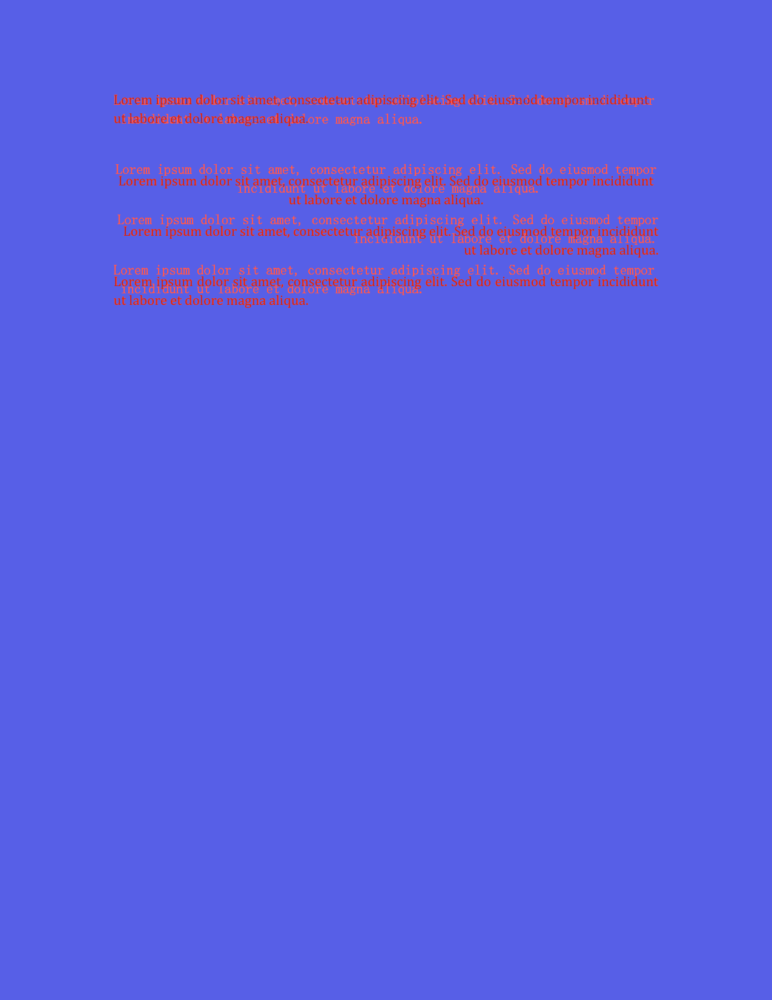</td>
  <td>changed: 50243 px (2.39%)<br>bbox: [188, 155, 1088, 508]<br>mean abs RGB: 3.5546<br>RMSE RGB: 26.0164<br>threshold: 12, gain: 5.0</td>
</tr>
<tr>
  <td><b>docx_classic08_bullet_list</b><br>Page 1</td>
  <td></td>
  <td>changed: 6382 px (0.30%)<br>bbox: [187, 178, 362, 362]<br>mean abs RGB: 0.3895<br>RMSE RGB: 8.3061<br>threshold: 12, gain: 5.0</td>
</tr>
<tr>
  <td><b>docx_classic09_numbered_list</b><br>Page 1</td>
  <td></td>
  <td>changed: 9431 px (0.45%)<br>bbox: [188, 179, 406, 356]<br>mean abs RGB: 0.5809<br>RMSE RGB: 10.1225<br>threshold: 12, gain: 5.0</td>
</tr>
<tr>
  <td><b>docx_classic10_simple_table</b><br>Page 1</td>
  <td></td>
  <td>changed: 27037 px (1.29%)<br>bbox: [175, 178, 1077, 322]<br>mean abs RGB: 1.7077<br>RMSE RGB: 17.0117<br>threshold: 12, gain: 5.0</td>
</tr>
<tr>
  <td><b>docx_classic11_table_with_shading</b><br>Page 1</td>
  <td></td>
  <td>changed: 46868 px (2.23%)<br>bbox: [175, 178, 1088, 350]<br>mean abs RGB: 2.177<br>RMSE RGB: 18.0354<br>threshold: 12, gain: 5.0</td>
</tr>
<tr>
  <td><b>docx_classic12_merged_cells_table</b><br>Page 1</td>
  <td></td>
  <td>changed: 22805 px (1.08%)<br>bbox: [175, 178, 1077, 322]<br>mean abs RGB: 1.4636<br>RMSE RGB: 15.7859<br>threshold: 12, gain: 5.0</td>
</tr>
<tr>
  <td><b>docx_classic13_long_document</b><br>Page 1</td>
  <td>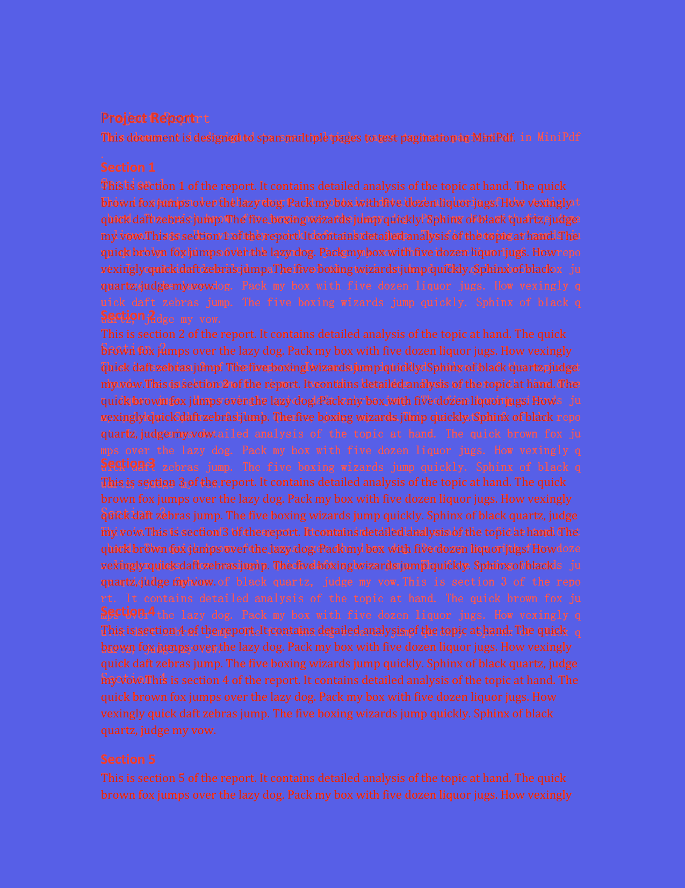</td>
  <td>changed: 213977 px (10.17%)<br>bbox: [187, 208, 1081, 1489]<br>mean abs RGB: 14.9729<br>RMSE RGB: 53.3297<br>threshold: 12, gain: 5.0</td>
</tr>
<tr>
  <td><b>docx_classic13_long_document</b><br>Page 2</td>
  <td>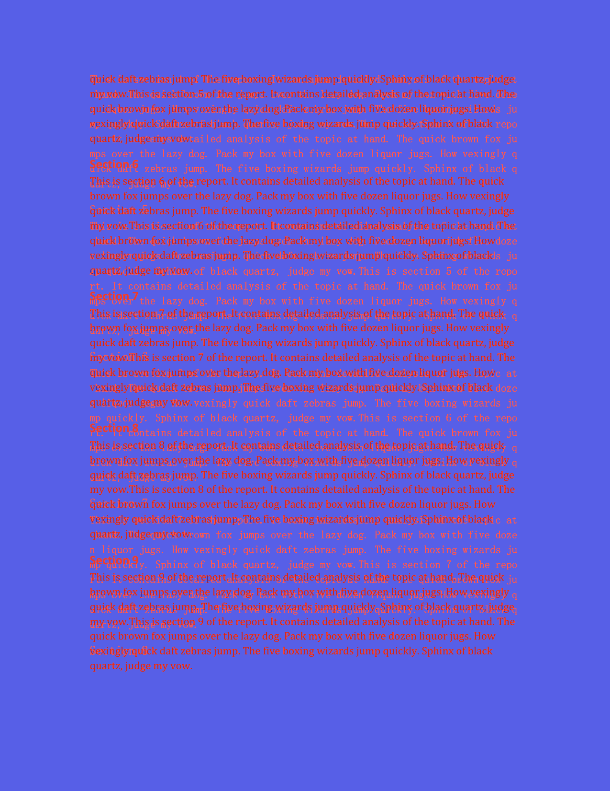</td>
  <td>changed: 239615 px (11.39%)<br>bbox: [187, 155, 1081, 1401]<br>mean abs RGB: 16.7544<br>RMSE RGB: 56.304<br>threshold: 12, gain: 5.0</td>
</tr>
<tr>
  <td><b>docx_classic13_long_document</b><br>Page 3</td>
  <td></td>
  <td>changed: 247406 px (11.76%)<br>bbox: [187, 156, 1081, 1439]<br>mean abs RGB: 17.2372<br>RMSE RGB: 57.1519<br>threshold: 12, gain: 5.0</td>
</tr>
<tr>
  <td><b>docx_classic13_long_document</b><br>Page 4</td>
  <td>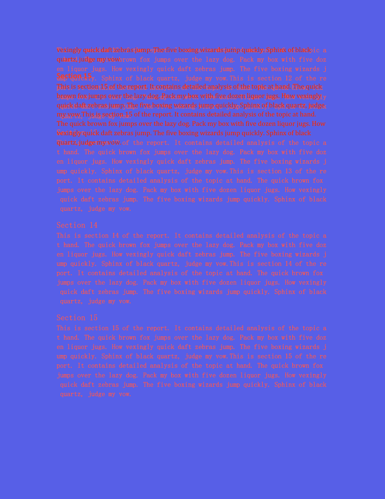</td>
  <td>changed: 142332 px (6.77%)<br>bbox: [187, 155, 1081, 1313]<br>mean abs RGB: 9.3022<br>RMSE RGB: 40.8148<br>threshold: 12, gain: 5.0</td>
</tr>
<tr>
  <td><b>docx_classic14_mixed_content</b><br>Page 1</td>
  <td></td>
  <td>changed: 54746 px (2.60%)<br>bbox: [175, 208, 1077, 736]<br>mean abs RGB: 3.4753<br>RMSE RGB: 24.5848<br>threshold: 12, gain: 5.0</td>
</tr>
<tr>
  <td><b>docx_classic15_indentation</b><br>Page 1</td>
  <td>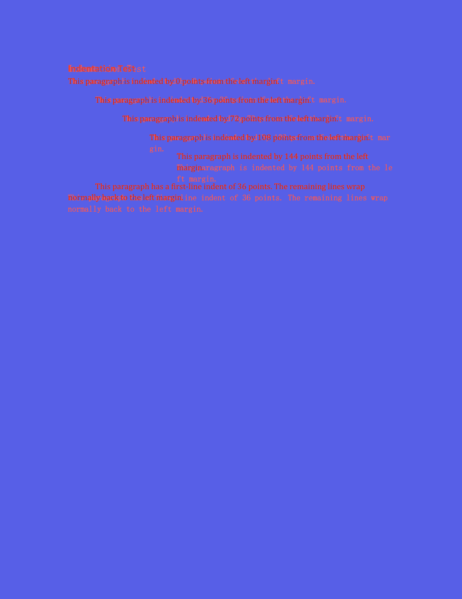</td>
  <td>changed: 41197 px (1.96%)<br>bbox: [188, 178, 1083, 586]<br>mean abs RGB: 2.7758<br>RMSE RGB: 22.6088<br>threshold: 12, gain: 5.0</td>
</tr>
<tr>
  <td><b>docx_classic16_line_spacing</b><br>Page 1</td>
  <td>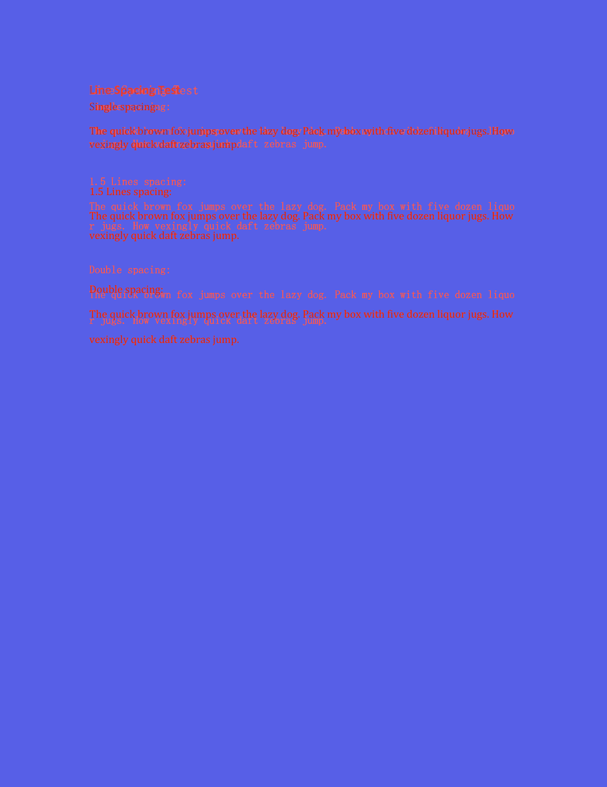</td>
  <td>changed: 44284 px (2.10%)<br>bbox: [187, 179, 1081, 724]<br>mean abs RGB: 3.0536<br>RMSE RGB: 23.9375<br>threshold: 12, gain: 5.0</td>
</tr>
<tr>
  <td><b>docx_classic17_page_break</b><br>Page 1</td>
  <td></td>
  <td>changed: 2989 px (0.14%)<br>bbox: [188, 208, 479, 268]<br>mean abs RGB: 0.1837<br>RMSE RGB: 5.6423<br>threshold: 12, gain: 5.0</td>
</tr>
<tr>
  <td><b>docx_classic17_page_break</b><br>Page 2</td>
  <td></td>
  <td>changed: 6277 px (0.30%)<br>bbox: [188, 159, 708, 265]<br>mean abs RGB: 0.4225<br>RMSE RGB: 8.7882<br>threshold: 12, gain: 5.0</td>
</tr>
<tr>
  <td><b>docx_classic17_page_break</b><br>Page 3</td>
  <td></td>
  <td>changed: 4061 px (0.19%)<br>bbox: [188, 159, 479, 265]<br>mean abs RGB: 0.2681<br>RMSE RGB: 6.9365<br>threshold: 12, gain: 5.0</td>
</tr>
<tr>
  <td><b>docx_classic18_embedded_image</b><br>Page 1</td>
  <td></td>
  <td>changed: 9919 px (0.47%)<br>bbox: [187, 179, 673, 538]<br>mean abs RGB: 0.6398<br>RMSE RGB: 10.6859<br>threshold: 12, gain: 5.0</td>
</tr>
<tr>
  <td><b>docx_classic19_multiple_images</b><br>Page 1</td>
  <td>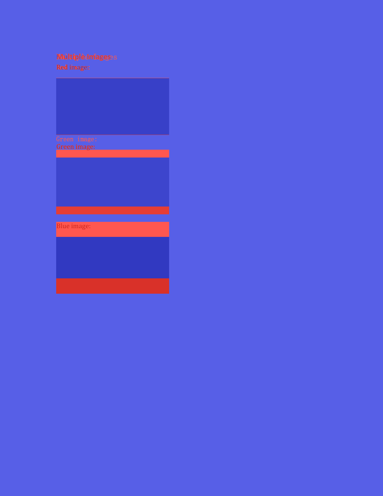</td>
  <td>changed: 62817 px (2.99%)<br>bbox: [187, 178, 563, 977]<br>mean abs RGB: 4.4319<br>RMSE RGB: 28.7849<br>threshold: 12, gain: 5.0</td>
</tr>
<tr>
  <td><b>docx_classic20_table_with_many_rows</b><br>Page 1</td>
  <td></td>
  <td>changed: 102691 px (4.88%)<br>bbox: [175, 178, 1077, 797]<br>mean abs RGB: 6.9241<br>RMSE RGB: 35.6192<br>threshold: 12, gain: 5.0</td>
</tr>
<tr>
  <td><b>docx_classic21_nested_lists</b><br>Page 1</td>
  <td></td>
  <td>changed: 16913 px (0.80%)<br>bbox: [151, 179, 559, 523]<br>mean abs RGB: 1.1254<br>RMSE RGB: 14.4768<br>threshold: 12, gain: 5.0</td>
</tr>
<tr>
  <td><b>docx_classic22_horizontal_rule</b><br>Page 1</td>
  <td>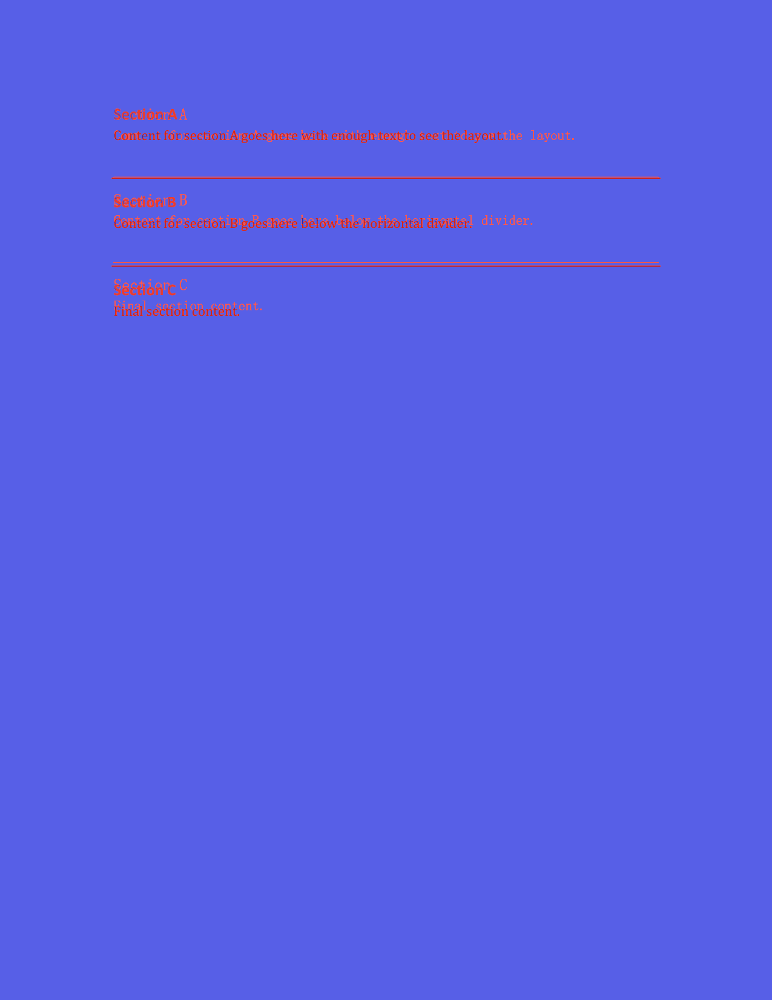</td>
  <td>changed: 24129 px (1.15%)<br>bbox: [184, 179, 1091, 522]<br>mean abs RGB: 1.6029<br>RMSE RGB: 17.543<br>threshold: 12, gain: 5.0</td>
</tr>
<tr>
  <td><b>docx_classic23_mixed_formatting_runs</b><br>Page 1</td>
  <td></td>
  <td>changed: 8145 px (0.39%)<br>bbox: [187, 178, 813, 254]<br>mean abs RGB: 0.4971<br>RMSE RGB: 9.4686<br>threshold: 12, gain: 5.0</td>
</tr>
<tr>
  <td><b>docx_classic24_two_column_table_layout</b><br>Page 1</td>
  <td></td>
  <td>changed: 24232 px (1.15%)<br>bbox: [187, 178, 1050, 329]<br>mean abs RGB: 1.6206<br>RMSE RGB: 17.3158<br>threshold: 12, gain: 5.0</td>
</tr>
<tr>
  <td><b>docx_classic25_title_and_subtitle</b><br>Page 1</td>
  <td></td>
  <td>changed: 27899 px (1.33%)<br>bbox: [184, 165, 1091, 440]<br>mean abs RGB: 1.5684<br>RMSE RGB: 15.9071<br>threshold: 12, gain: 5.0</td>
</tr>
<tr>
  <td><b>docx_classic25_title_and_subtitle</b><br>Page 2</td>
  <td></td>
  <td>changed: 10062 px (0.48%)<br>bbox: [188, 158, 1006, 265]<br>mean abs RGB: 0.6745<br>RMSE RGB: 11.1102<br>threshold: 12, gain: 5.0</td>
</tr>
<tr>
  <td><b>docx_classic26_table_alignment</b><br>Page 1</td>
  <td></td>
  <td>changed: 21812 px (1.04%)<br>bbox: [175, 178, 1077, 322]<br>mean abs RGB: 1.3631<br>RMSE RGB: 15.0993<br>threshold: 12, gain: 5.0</td>
</tr>
<tr>
  <td><b>docx_classic27_long_paragraph_wrapping</b><br>Page 1</td>
  <td>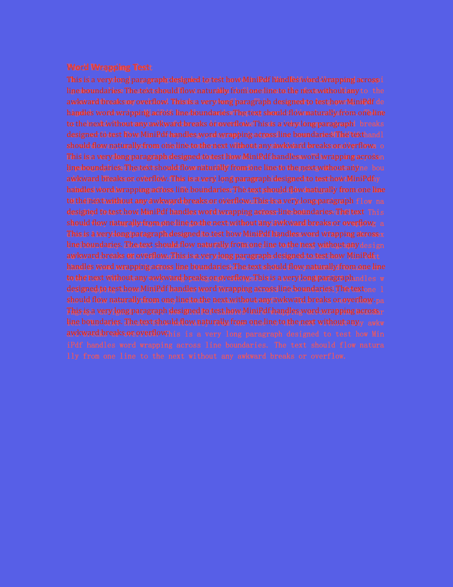</td>
  <td>changed: 185212 px (8.80%)<br>bbox: [187, 178, 1084, 1011]<br>mean abs RGB: 12.5222<br>RMSE RGB: 48.0378<br>threshold: 12, gain: 5.0</td>
</tr>
<tr>
  <td><b>docx_classic28_special_characters</b><br>Page 1</td>
  <td>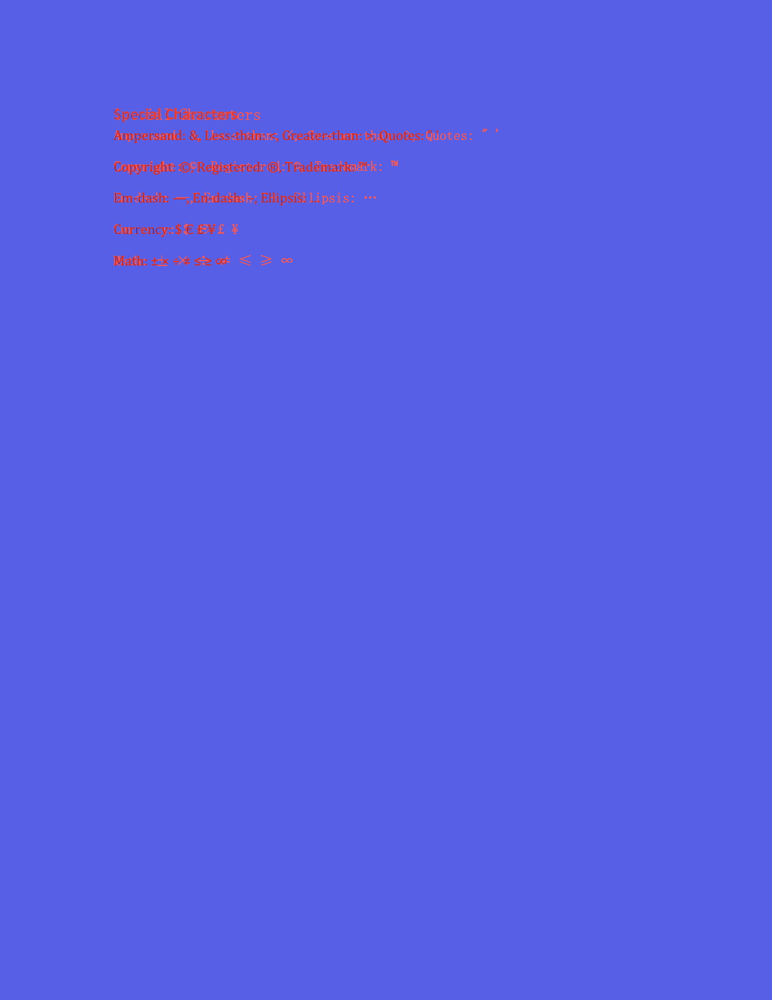</td>
  <td>changed: 16163 px (0.77%)<br>bbox: [187, 178, 823, 439]<br>mean abs RGB: 1.0122<br>RMSE RGB: 13.4232<br>threshold: 12, gain: 5.0</td>
</tr>
<tr>
  <td><b>docx_classic29_table_with_image</b><br>Page 1</td>
  <td></td>
  <td>changed: 22369 px (1.06%)<br>bbox: [175, 178, 1077, 374]<br>mean abs RGB: 1.533<br>RMSE RGB: 16.7015<br>threshold: 12, gain: 5.0</td>
</tr>
<tr>
  <td><b>docx_classic30_comprehensive_report</b><br>Page 1</td>
  <td></td>
  <td>changed: 21442 px (1.02%)<br>bbox: [184, 165, 1091, 287]<br>mean abs RGB: 1.2425<br>RMSE RGB: 14.15<br>threshold: 12, gain: 5.0</td>
</tr>
<tr>
  <td><b>docx_classic30_comprehensive_report</b><br>Page 2</td>
  <td></td>
  <td>changed: 146031 px (6.94%)<br>bbox: [175, 158, 1088, 1318]<br>mean abs RGB: 9.9276<br>RMSE RGB: 42.1357<br>threshold: 12, gain: 5.0</td>
</tr>
<tr>
  <td><b>docx_classic30_comprehensive_report</b><br>Page 3</td>
  <td>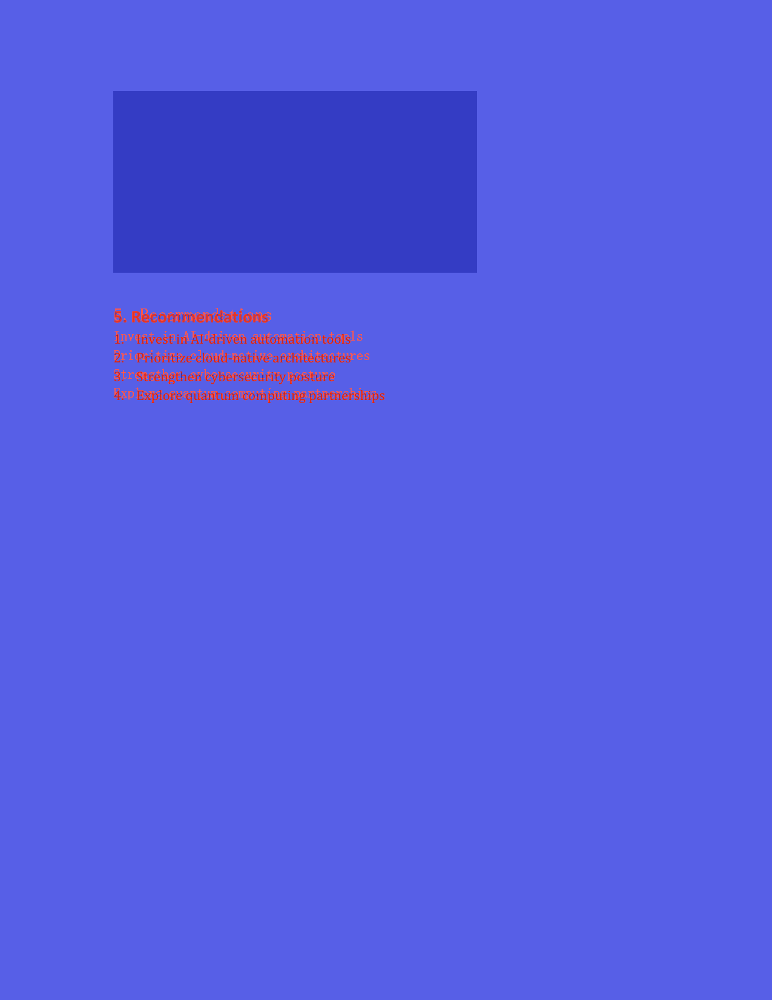</td>
  <td>changed: 17471 px (0.83%)<br>bbox: [188, 508, 635, 665]<br>mean abs RGB: 1.138<br>RMSE RGB: 14.3127<br>threshold: 12, gain: 5.0</td>
</tr>
<tr>
  <td><b>docx_classic31_product_card_with_image</b><br>Page 1</td>
  <td>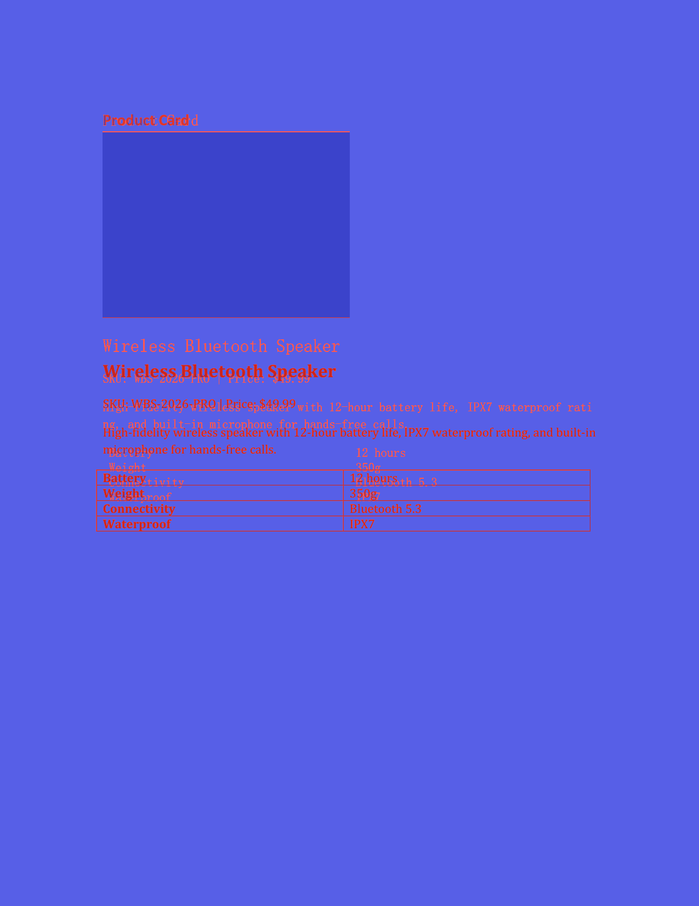</td>
  <td>changed: 45083 px (2.14%)<br>bbox: [175, 208, 1087, 968]<br>mean abs RGB: 3.1985<br>RMSE RGB: 25.0392<br>threshold: 12, gain: 5.0</td>
</tr>
<tr>
  <td><b>docx_classic31_strikethrough_text</b><br>Page 1</td>
  <td></td>
  <td>changed: 19754 px (0.94%)<br>bbox: [187, 178, 1006, 598]<br>mean abs RGB: 1.3265<br>RMSE RGB: 15.6797<br>threshold: 12, gain: 5.0</td>
</tr>
<tr>
  <td><b>docx_classic32_company_logo_header</b><br>Page 1</td>
  <td></td>
  <td>changed: 100388 px (4.77%)<br>bbox: [175, 273, 1091, 760]<br>mean abs RGB: 8.0319<br>RMSE RGB: 39.6841<br>threshold: 12, gain: 5.0</td>
</tr>
<tr>
  <td><b>docx_classic32_superscript_subscript</b><br>Page 1</td>
  <td></td>
  <td>changed: 10353 px (0.49%)<br>bbox: [187, 178, 524, 443]<br>mean abs RGB: 0.5795<br>RMSE RGB: 9.8199<br>threshold: 12, gain: 5.0</td>
</tr>
<tr>
  <td><b>docx_classic33_highlighted_text</b><br>Page 1</td>
  <td></td>
  <td>changed: 28344 px (1.35%)<br>bbox: [187, 178, 404, 495]<br>mean abs RGB: 1.7955<br>RMSE RGB: 19.921<br>threshold: 12, gain: 5.0</td>
</tr>
<tr>
  <td><b>docx_classic33_two_products_side_by_side</b><br>Page 1</td>
  <td></td>
  <td>changed: 105968 px (5.04%)<br>bbox: [175, 208, 1088, 1299]<br>mean abs RGB: 7.3428<br>RMSE RGB: 35.3098<br>threshold: 12, gain: 5.0</td>
</tr>
<tr>
  <td><b>docx_classic34_employee_directory_with_photo</b><br>Page 1</td>
  <td>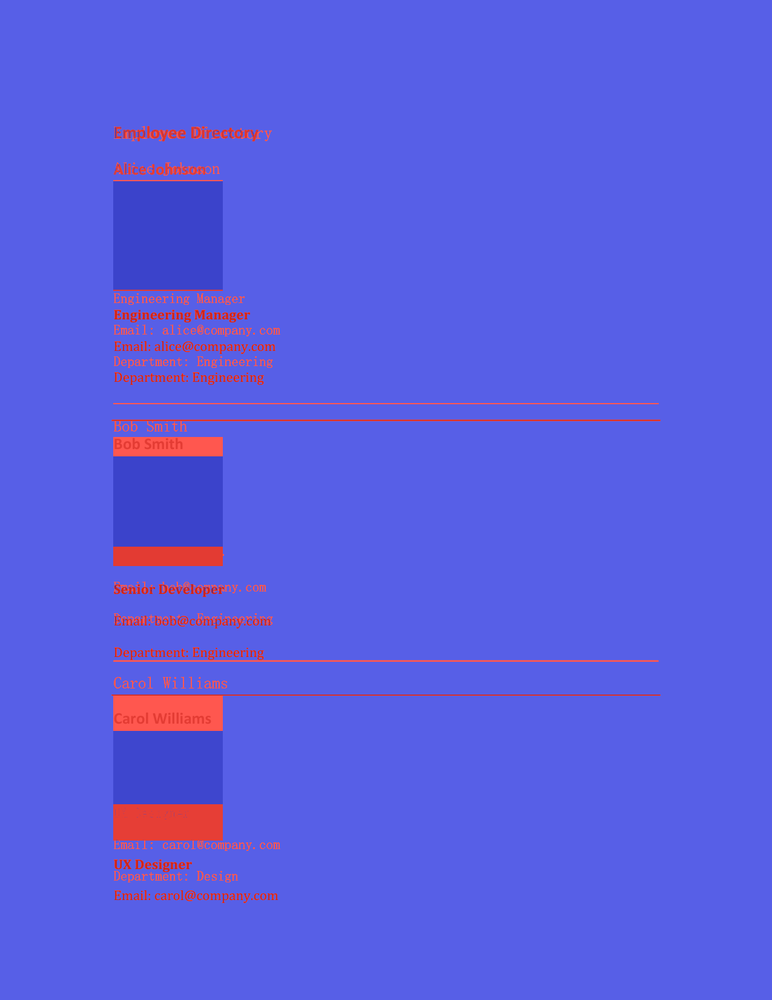</td>
  <td>changed: 69420 px (3.30%)<br>bbox: [184, 208, 1091, 1490]<br>mean abs RGB: 4.5748<br>RMSE RGB: 27.9185<br>threshold: 12, gain: 5.0</td>
</tr>
<tr>
  <td><b>docx_classic34_employee_directory_with_photo</b><br>Page 2</td>
  <td></td>
  <td>changed: 4903 px (0.23%)<br>bbox: [184, 156, 1091, 236]<br>mean abs RGB: 0.4294<br>RMSE RGB: 9.4354<br>threshold: 12, gain: 5.0</td>
</tr>
<tr>
  <td><b>docx_classic34_paragraph_borders</b><br>Page 1</td>
  <td></td>
  <td>changed: 45731 px (2.17%)<br>bbox: [174, 178, 1101, 509]<br>mean abs RGB: 2.7135<br>RMSE RGB: 22.4455<br>threshold: 12, gain: 5.0</td>
</tr>
<tr>
  <td><b>docx_classic35_inventory_with_product_photos</b><br>Page 1</td>
  <td></td>
  <td>changed: 130569 px (6.21%)<br>bbox: [175, 209, 1077, 1456]<br>mean abs RGB: 8.6647<br>RMSE RGB: 37.9208<br>threshold: 12, gain: 5.0</td>
</tr>
<tr>
  <td><b>docx_classic35_tab_stops</b><br>Page 1</td>
  <td>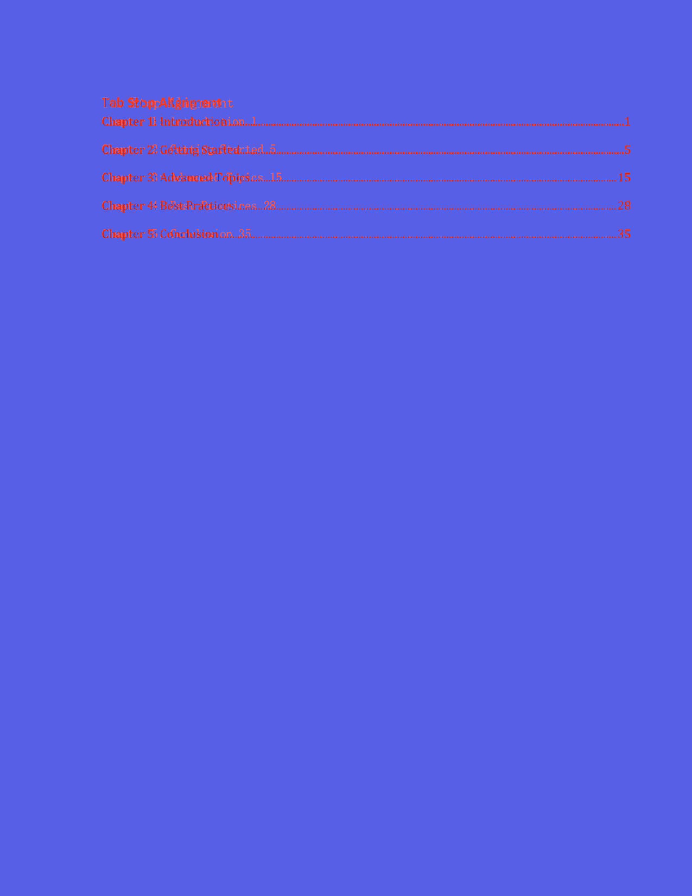</td>
  <td>changed: 20758 px (0.99%)<br>bbox: [187, 178, 1162, 443]<br>mean abs RGB: 1.4019<br>RMSE RGB: 16.1159<br>threshold: 12, gain: 5.0</td>
</tr>
<tr>
  <td><b>docx_classic36_invoice_with_logo</b><br>Page 1</td>
  <td>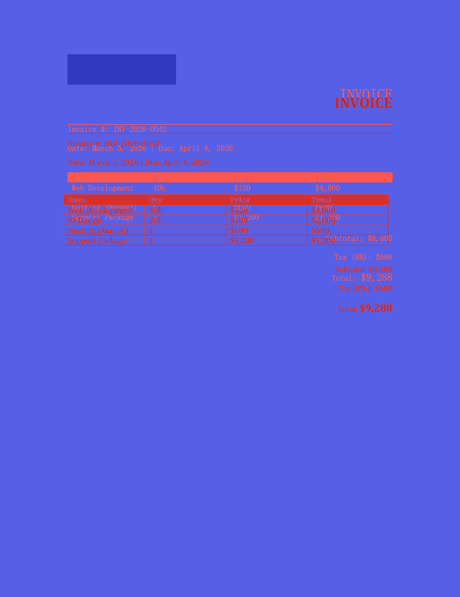</td>
  <td>changed: 92189 px (4.38%)<br>bbox: [175, 246, 1091, 865]<br>mean abs RGB: 7.13<br>RMSE RGB: 37.4191<br>threshold: 12, gain: 5.0</td>
</tr>
<tr>
  <td><b>docx_classic36_wide_table</b><br>Page 1</td>
  <td></td>
  <td>changed: 47221 px (2.24%)<br>bbox: [175, 178, 1088, 378]<br>mean abs RGB: 2.914<br>RMSE RGB: 22.1195<br>threshold: 12, gain: 5.0</td>
</tr>
<tr>
  <td><b>docx_classic37_nested_table</b><br>Page 1</td>
  <td></td>
  <td>changed: 23069 px (1.10%)<br>bbox: [175, 178, 1077, 351]<br>mean abs RGB: 1.4505<br>RMSE RGB: 15.6451<br>threshold: 12, gain: 5.0</td>
</tr>
<tr>
  <td><b>docx_classic37_real_estate_listing</b><br>Page 1</td>
  <td>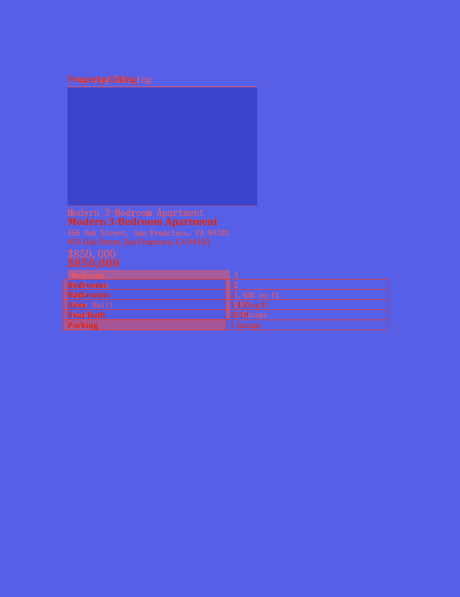</td>
  <td>changed: 62116 px (2.95%)<br>bbox: [175, 208, 1077, 913]<br>mean abs RGB: 2.8827<br>RMSE RGB: 21.5832<br>threshold: 12, gain: 5.0</td>
</tr>
<tr>
  <td><b>docx_classic38_restaurant_menu_with_photos</b><br>Page 1</td>
  <td>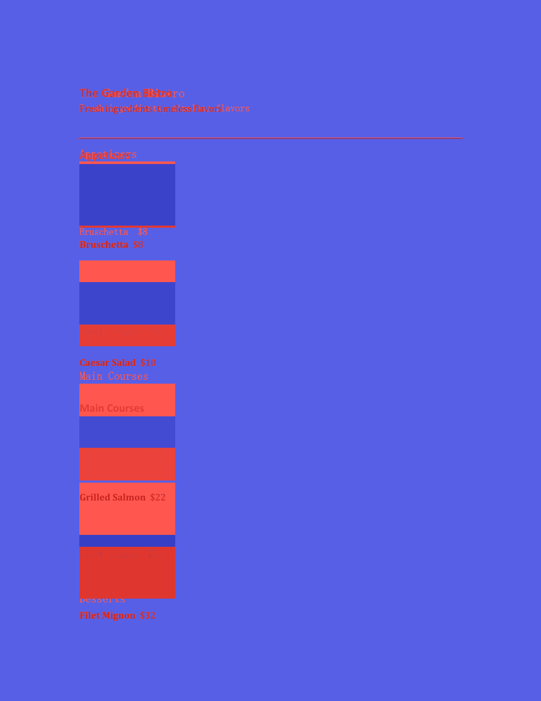</td>
  <td>changed: 131725 px (6.26%)<br>bbox: [184, 208, 1091, 1461]<br>mean abs RGB: 8.6859<br>RMSE RGB: 37.2915<br>threshold: 12, gain: 5.0</td>
</tr>
<tr>
  <td><b>docx_classic38_restaurant_menu_with_photos</b><br>Page 2</td>
  <td>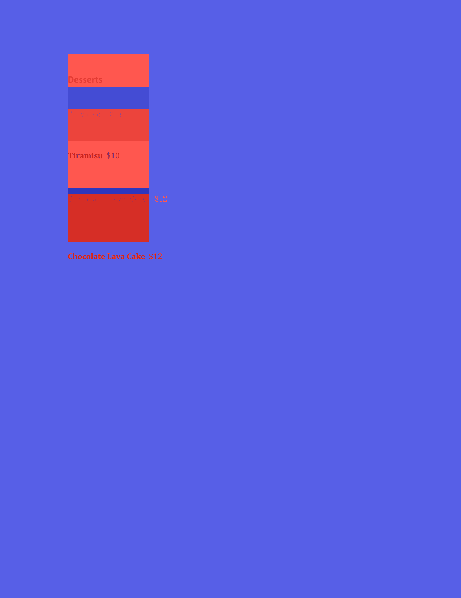</td>
  <td>changed: 101779 px (4.84%)<br>bbox: [187, 150, 461, 717]<br>mean abs RGB: 7.8506<br>RMSE RGB: 38.1067<br>threshold: 12, gain: 5.0</td>
</tr>
<tr>
  <td><b>docx_classic38_table_column_widths</b><br>Page 1</td>
  <td>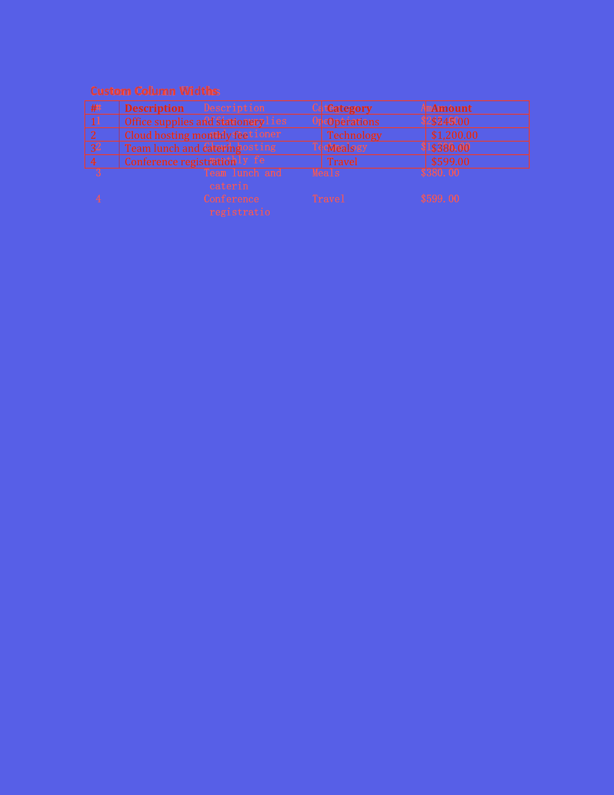</td>
  <td>changed: 38048 px (1.81%)<br>bbox: [175, 178, 1100, 450]<br>mean abs RGB: 2.5209<br>RMSE RGB: 21.0864<br>threshold: 12, gain: 5.0</td>
</tr>
<tr>
  <td><b>docx_classic39_cover_page_with_image</b><br>Page 1</td>
  <td>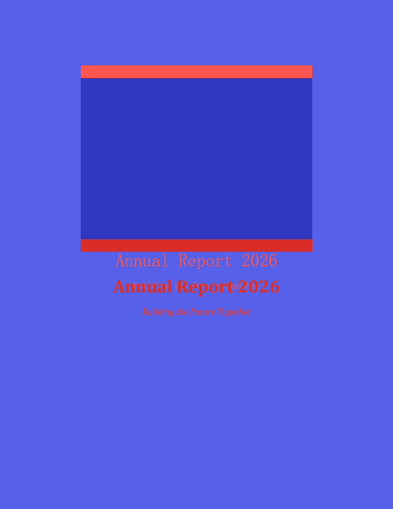</td>
  <td>changed: 79582 px (3.78%)<br>bbox: [262, 212, 1013, 1027]<br>mean abs RGB: 6.6006<br>RMSE RGB: 35.2508<br>threshold: 12, gain: 5.0</td>
</tr>
<tr>
  <td><b>docx_classic39_cover_page_with_image</b><br>Page 2</td>
  <td>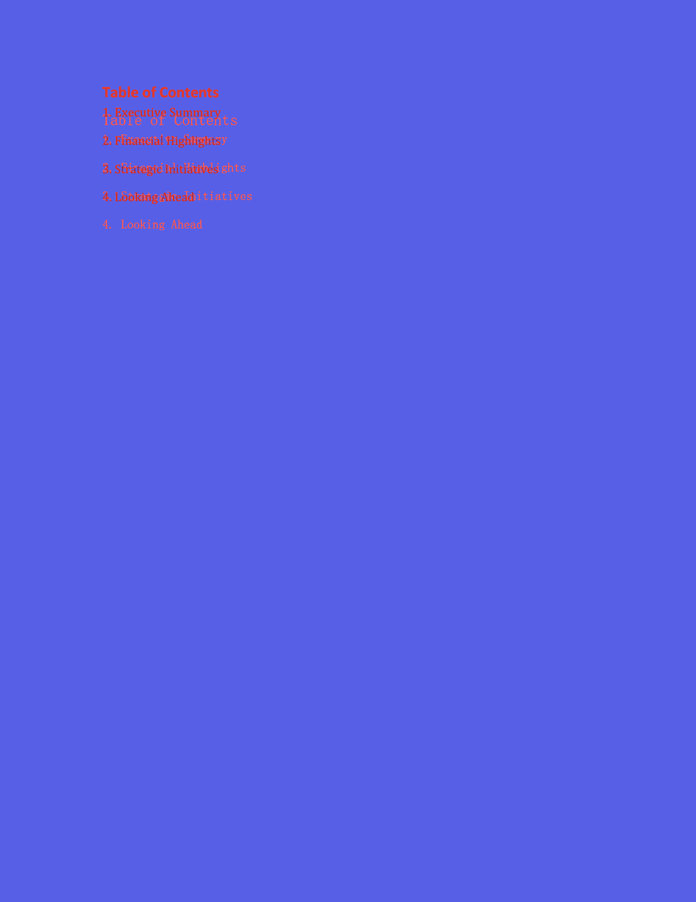</td>
  <td>changed: 11511 px (0.55%)<br>bbox: [187, 158, 461, 421]<br>mean abs RGB: 0.7408<br>RMSE RGB: 11.4509<br>threshold: 12, gain: 5.0</td>
</tr>
<tr>
  <td><b>docx_classic39_financial_report</b><br>Page 1</td>
  <td>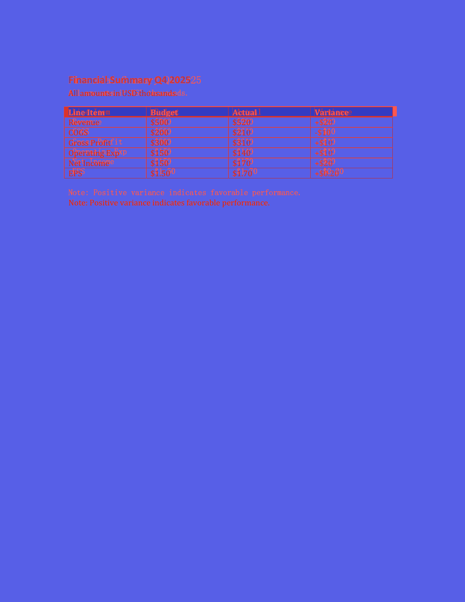</td>
  <td>changed: 49727 px (2.36%)<br>bbox: [175, 208, 1088, 568]<br>mean abs RGB: 3.1792<br>RMSE RGB: 23.619<br>threshold: 12, gain: 5.0</td>
</tr>
<tr>
  <td><b>docx_classic40_product_catalog_with_images</b><br>Page 1</td>
  <td>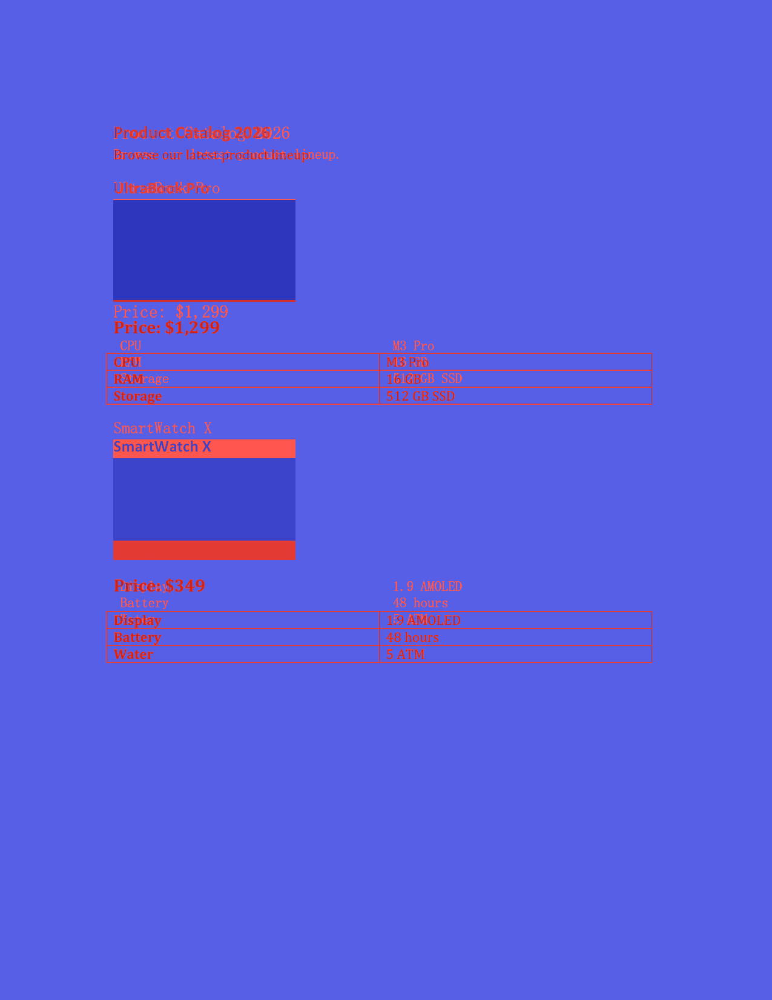</td>
  <td>changed: 58573 px (2.78%)<br>bbox: [175, 208, 1077, 1094]<br>mean abs RGB: 3.7455<br>RMSE RGB: 24.8306<br>threshold: 12, gain: 5.0</td>
</tr>
<tr>
  <td><b>docx_classic40_resume</b><br>Page 1</td>
  <td>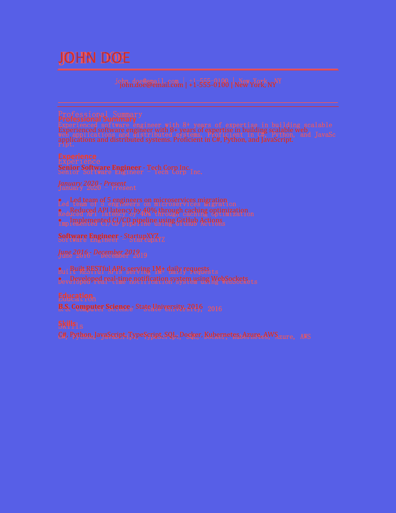</td>
  <td>changed: 98304 px (4.67%)<br>bbox: [184, 166, 1091, 1093]<br>mean abs RGB: 6.7069<br>RMSE RGB: 35.3528<br>threshold: 12, gain: 5.0</td>
</tr>
<tr>
  <td><b>docx_classic41_business_letter</b><br>Page 1</td>
  <td>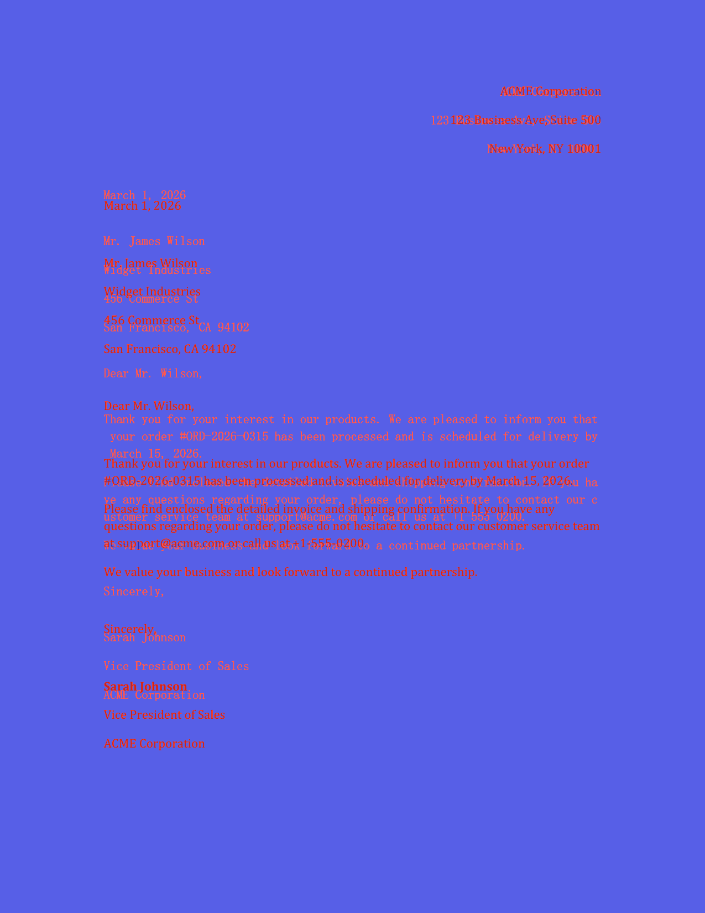</td>
  <td>changed: 73041 px (3.47%)<br>bbox: [187, 156, 1087, 1356]<br>mean abs RGB: 5.2106<br>RMSE RGB: 31.5465<br>threshold: 12, gain: 5.0</td>
</tr>
<tr>
  <td><b>docx_classic41_newsletter_with_hero_image</b><br>Page 1</td>
  <td>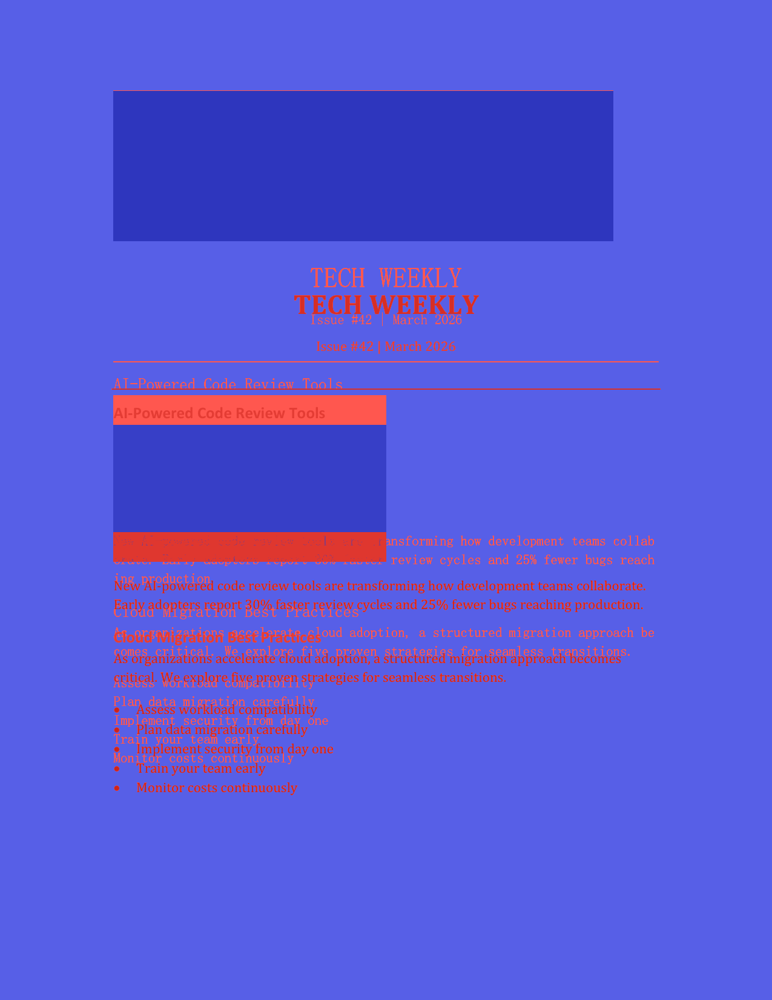</td>
  <td>changed: 112678 px (5.36%)<br>bbox: [184, 149, 1091, 1312]<br>mean abs RGB: 8.0366<br>RMSE RGB: 38.1295<br>threshold: 12, gain: 5.0</td>
</tr>
<tr>
  <td><b>docx_classic42_chart_image_with_data</b><br>Page 1</td>
  <td></td>
  <td>changed: 94142 px (4.47%)<br>bbox: [175, 208, 1088, 997]<br>mean abs RGB: 6.4469<br>RMSE RGB: 33.4383<br>threshold: 12, gain: 5.0</td>
</tr>
<tr>
  <td><b>docx_classic42_meeting_minutes</b><br>Page 1</td>
  <td>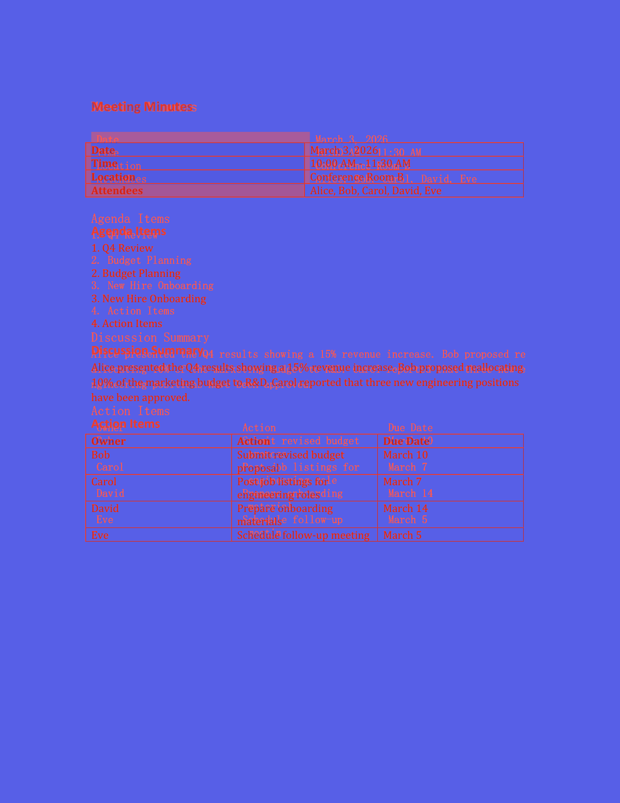</td>
  <td>changed: 114115 px (5.42%)<br>bbox: [175, 208, 1080, 1113]<br>mean abs RGB: 6.2904<br>RMSE RGB: 32.851<br>threshold: 12, gain: 5.0</td>
</tr>
<tr>
  <td><b>docx_classic43_event_flyer_with_banner</b><br>Page 1</td>
  <td></td>
  <td>changed: 108450 px (5.16%)<br>bbox: [175, 459, 1091, 965]<br>mean abs RGB: 7.5693<br>RMSE RGB: 36.4131<br>threshold: 12, gain: 5.0</td>
</tr>
<tr>
  <td><b>docx_classic43_invoice_document</b><br>Page 1</td>
  <td>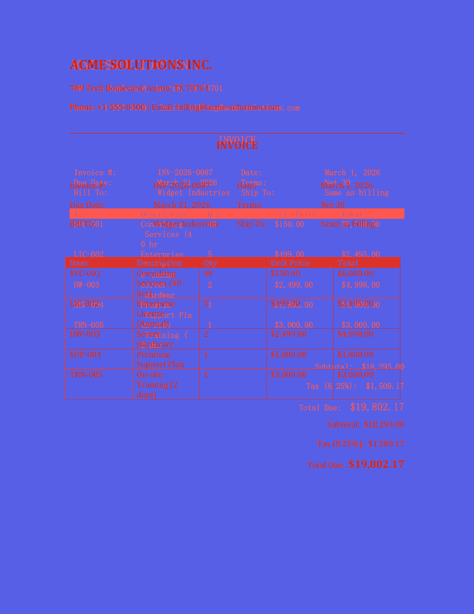</td>
  <td>changed: 133347 px (6.34%)<br>bbox: [175, 160, 1091, 1261]<br>mean abs RGB: 9.5839<br>RMSE RGB: 42.1103<br>threshold: 12, gain: 5.0</td>
</tr>
<tr>
  <td><b>docx_classic44_dashboard_with_kpi_image</b><br>Page 1</td>
  <td>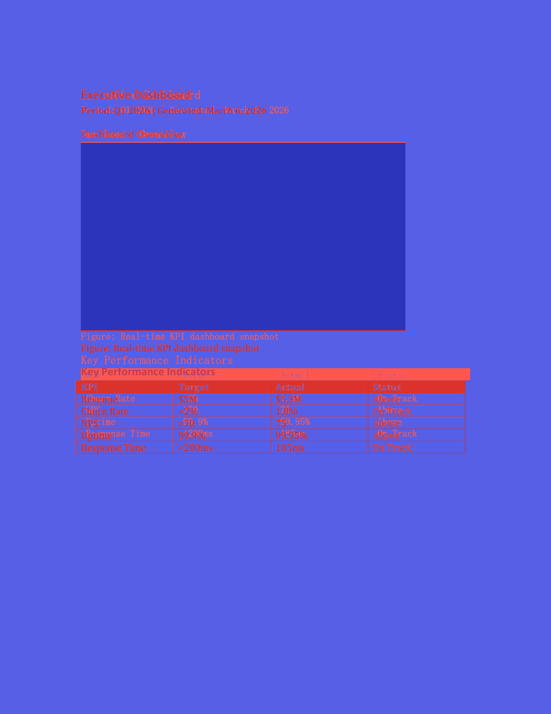</td>
  <td>changed: 94321 px (4.48%)<br>bbox: [175, 208, 1088, 1049]<br>mean abs RGB: 6.4238<br>RMSE RGB: 33.437<br>threshold: 12, gain: 5.0</td>
</tr>
<tr>
  <td><b>docx_classic44_memo</b><br>Page 1</td>
  <td>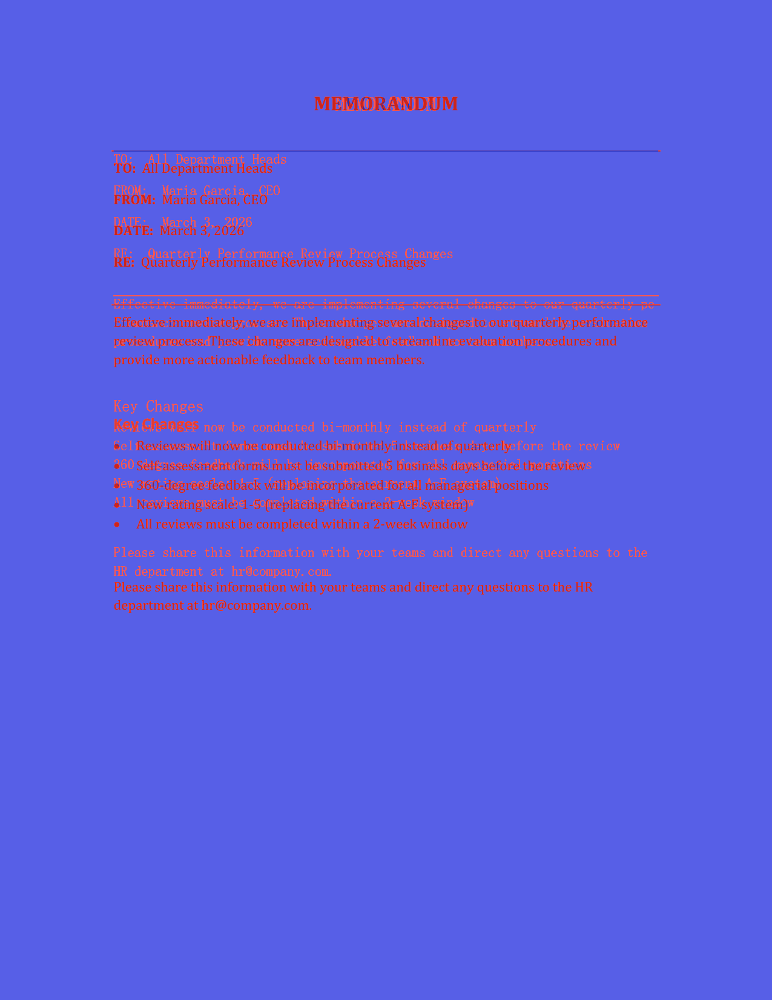</td>
  <td>changed: 86913 px (4.13%)<br>bbox: [184, 159, 1091, 1011]<br>mean abs RGB: 6.0612<br>RMSE RGB: 33.8847<br>threshold: 12, gain: 5.0</td>
</tr>
<tr>
  <td><b>docx_classic45_certificate_with_seal</b><br>Page 1</td>
  <td></td>
  <td>changed: 59984 px (2.85%)<br>bbox: [260, 195, 1016, 949]<br>mean abs RGB: 4.0377<br>RMSE RGB: 26.8549<br>threshold: 12, gain: 5.0</td>
</tr>
<tr>
  <td><b>docx_classic45_project_plan</b><br>Page 1</td>
  <td></td>
  <td>changed: 116300 px (5.53%)<br>bbox: [175, 208, 1088, 1018]<br>mean abs RGB: 7.4431<br>RMSE RGB: 36.6905<br>threshold: 12, gain: 5.0</td>
</tr>
<tr>
  <td><b>docx_classic46_comparison_table</b><br>Page 1</td>
  <td>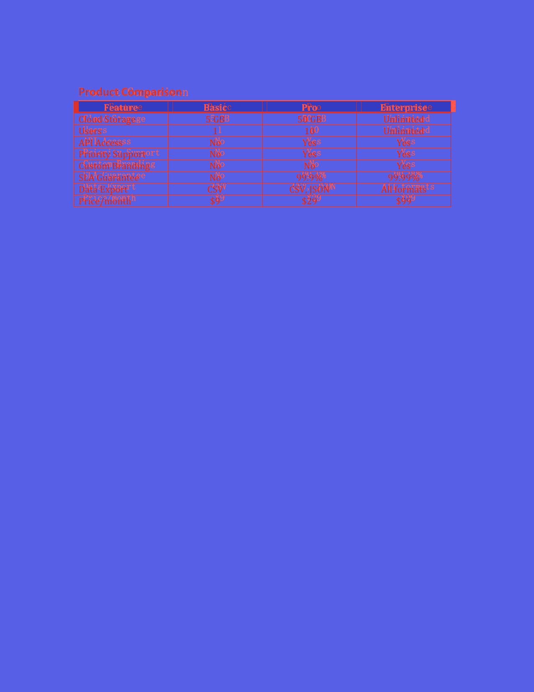</td>
  <td>changed: 51572 px (2.45%)<br>bbox: [175, 208, 1088, 494]<br>mean abs RGB: 3.2601<br>RMSE RGB: 23.451<br>threshold: 12, gain: 5.0</td>
</tr>
<tr>
  <td><b>docx_classic46_product_image_grid</b><br>Page 1</td>
  <td>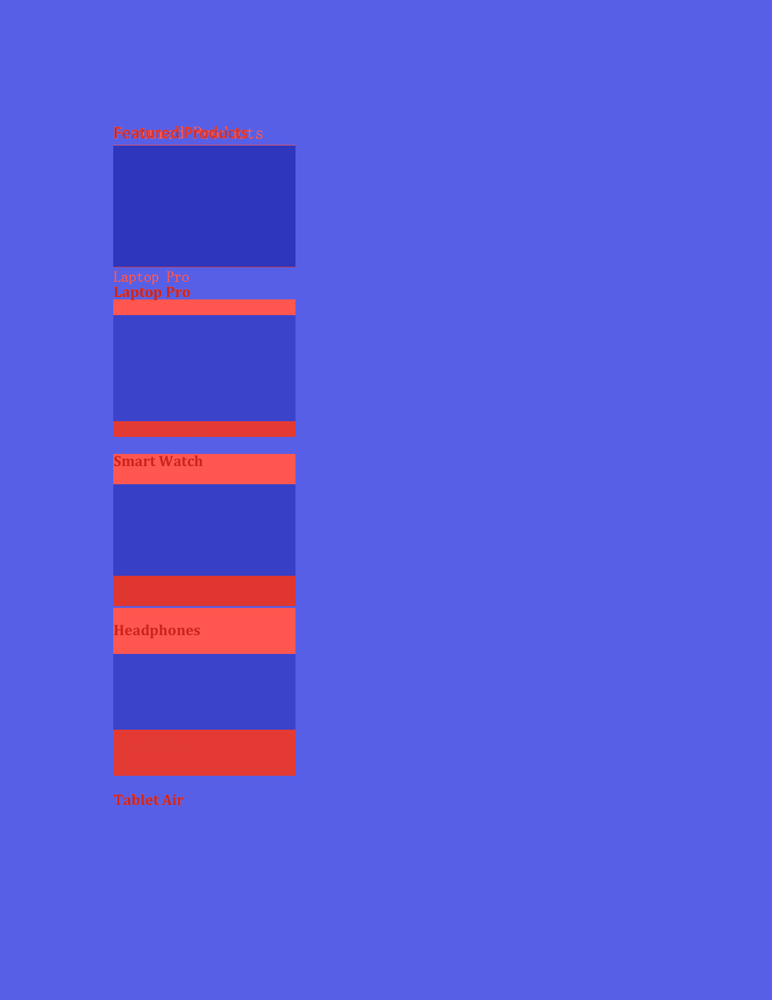</td>
  <td>changed: 97325 px (4.63%)<br>bbox: [187, 208, 488, 1329]<br>mean abs RGB: 6.8766<br>RMSE RGB: 34.451<br>threshold: 12, gain: 5.0</td>
</tr>
<tr>
  <td><b>docx_classic47_data_dictionary</b><br>Page 1</td>
  <td>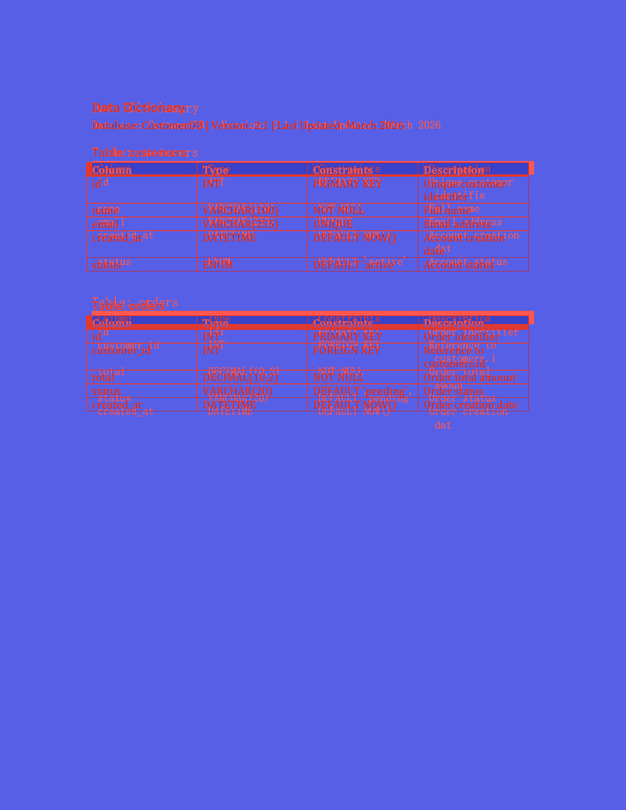</td>
  <td>changed: 118739 px (5.64%)<br>bbox: [175, 208, 1088, 873]<br>mean abs RGB: 7.3805<br>RMSE RGB: 35.738<br>threshold: 12, gain: 5.0</td>
</tr>
<tr>
  <td><b>docx_classic47_news_article_with_hero_image</b><br>Page 1</td>
  <td></td>
  <td>changed: 80133 px (3.81%)<br>bbox: [187, 604, 1081, 1054]<br>mean abs RGB: 5.763<br>RMSE RGB: 33.5025<br>threshold: 12, gain: 5.0</td>
</tr>
<tr>
  <td><b>docx_classic48_multi_level_headings</b><br>Page 1</td>
  <td></td>
  <td>changed: 106313 px (5.05%)<br>bbox: [187, 208, 891, 1458]<br>mean abs RGB: 6.408<br>RMSE RGB: 33.342<br>threshold: 12, gain: 5.0</td>
</tr>
<tr>
  <td><b>docx_classic48_multi_level_headings</b><br>Page 2</td>
  <td></td>
  <td>changed: 125126 px (5.95%)<br>bbox: [187, 156, 891, 1444]<br>mean abs RGB: 7.6746<br>RMSE RGB: 36.7842<br>threshold: 12, gain: 5.0</td>
</tr>
<tr>
  <td><b>docx_classic48_multi_level_headings</b><br>Page 3</td>
  <td></td>
  <td>changed: 41704 px (1.98%)<br>bbox: [187, 156, 891, 551]<br>mean abs RGB: 2.5763<br>RMSE RGB: 21.3613<br>threshold: 12, gain: 5.0</td>
</tr>
<tr>
  <td><b>docx_classic48_task_list_with_status_icons</b><br>Page 1</td>
  <td></td>
  <td>changed: 62158 px (2.95%)<br>bbox: [175, 208, 1088, 848]<br>mean abs RGB: 3.8842<br>RMSE RGB: 26.3395<br>threshold: 12, gain: 5.0</td>
</tr>
<tr>
  <td><b>docx_classic49_cjk_document</b><br>Page 1</td>
  <td></td>
  <td>changed: 80047 px (3.81%)<br>bbox: [175, 208, 1077, 931]<br>mean abs RGB: 4.9332<br>RMSE RGB: 29.2752<br>threshold: 12, gain: 5.0</td>
</tr>
<tr>
  <td><b>docx_classic49_wide_panoramic_banner</b><br>Page 1</td>
  <td>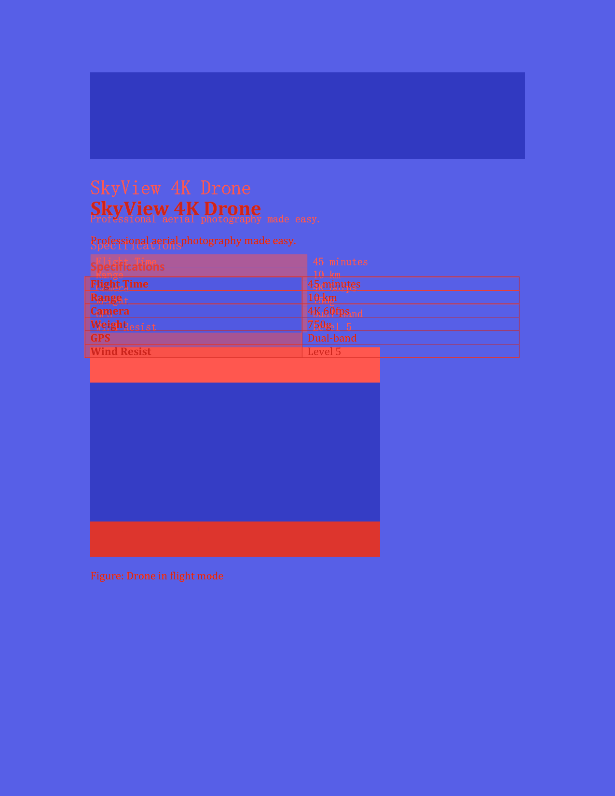</td>
  <td>changed: 159158 px (7.57%)<br>bbox: [175, 373, 1077, 1206]<br>mean abs RGB: 9.2411<br>RMSE RGB: 39.3946<br>threshold: 12, gain: 5.0</td>
</tr>
<tr>
  <td><b>docx_classic50_long_table_with_formatting</b><br>Page 1</td>
  <td></td>
  <td>changed: 365701 px (17.38%)<br>bbox: [175, 208, 1088, 1476]<br>mean abs RGB: 14.2029<br>RMSE RGB: 46.573<br>threshold: 12, gain: 5.0</td>
</tr>
<tr>
  <td><b>docx_classic50_long_table_with_formatting</b><br>Page 2</td>
  <td>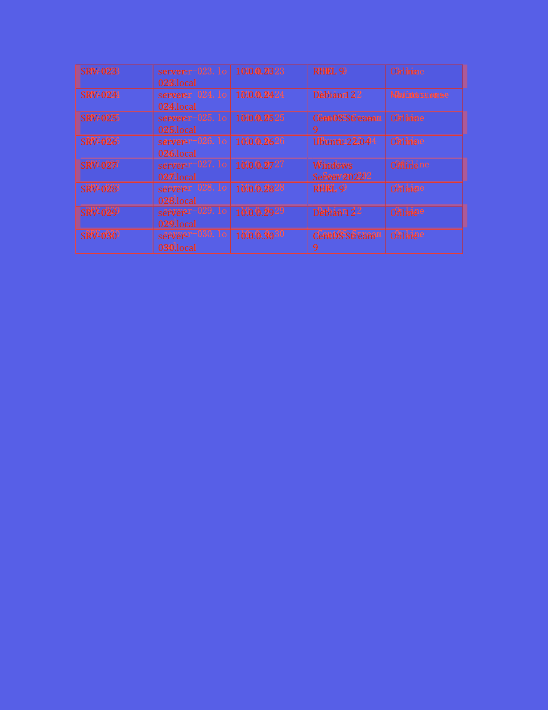</td>
  <td>changed: 84380 px (4.01%)<br>bbox: [175, 149, 1088, 590]<br>mean abs RGB: 4.2837<br>RMSE RGB: 26.7677<br>threshold: 12, gain: 5.0</td>
</tr>
<tr>
  <td><b>docx_classic50_portrait_tall_image</b><br>Page 1</td>
  <td>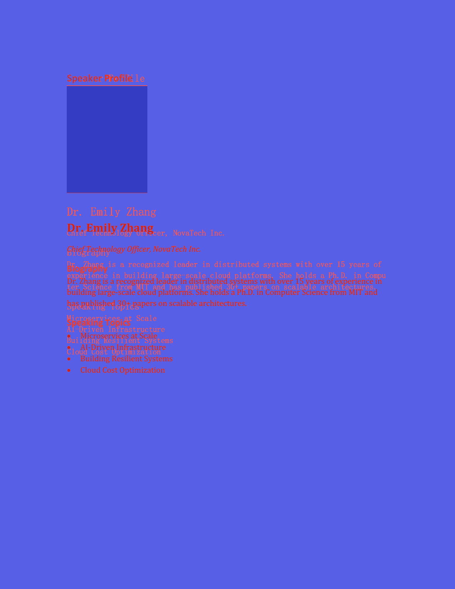</td>
  <td>changed: 50981 px (2.42%)<br>bbox: [187, 208, 1081, 1049]<br>mean abs RGB: 3.5396<br>RMSE RGB: 25.8853<br>threshold: 12, gain: 5.0</td>
</tr>
<tr>
  <td><b>docx_classic51_step_by_step_with_images</b><br>Page 1</td>
  <td></td>
  <td>changed: 103902 px (4.94%)<br>bbox: [187, 208, 868, 990]<br>mean abs RGB: 6.5336<br>RMSE RGB: 32.4752<br>threshold: 12, gain: 5.0</td>
</tr>
<tr>
  <td><b>docx_classic51_underline_styles</b><br>Page 1</td>
  <td>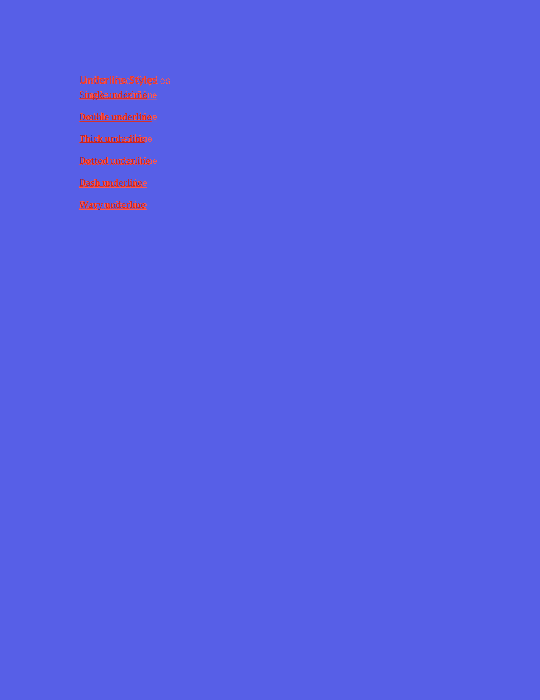</td>
  <td>changed: 13613 px (0.65%)<br>bbox: [187, 178, 402, 495]<br>mean abs RGB: 0.8709<br>RMSE RGB: 12.5163<br>threshold: 12, gain: 5.0</td>
</tr>
<tr>
  <td><b>docx_classic52_before_after_comparison</b><br>Page 1</td>
  <td>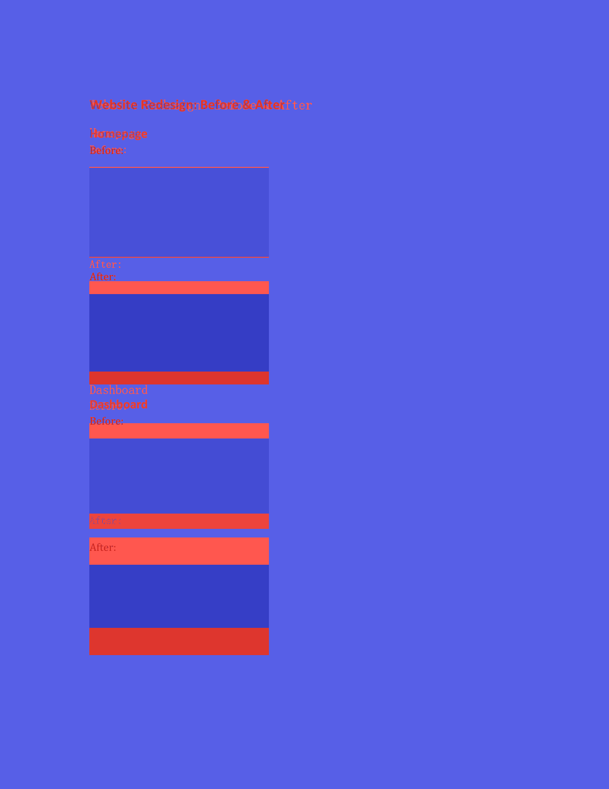</td>
  <td>changed: 98888 px (4.70%)<br>bbox: [187, 208, 653, 1370]<br>mean abs RGB: 6.6899<br>RMSE RGB: 32.9448<br>threshold: 12, gain: 5.0</td>
</tr>
<tr>
  <td><b>docx_classic52_spacing_before_after</b><br>Page 1</td>
  <td></td>
  <td>changed: 55399 px (2.63%)<br>bbox: [188, 178, 1080, 710]<br>mean abs RGB: 3.7843<br>RMSE RGB: 26.5867<br>threshold: 12, gain: 5.0</td>
</tr>
<tr>
  <td><b>docx_classic53_color_swatch_palette</b><br>Page 1</td>
  <td></td>
  <td>changed: 144212 px (6.86%)<br>bbox: [187, 208, 754, 1375]<br>mean abs RGB: 9.977<br>RMSE RGB: 44.573<br>threshold: 12, gain: 5.0</td>
</tr>
<tr>
  <td><b>docx_classic53_table_merged_complex</b><br>Page 1</td>
  <td></td>
  <td>changed: 45669 px (2.17%)<br>bbox: [175, 208, 1088, 410]<br>mean abs RGB: 2.5639<br>RMSE RGB: 20.2119<br>threshold: 12, gain: 5.0</td>
</tr>
<tr>
  <td><b>docx_classic54_multi_font_family</b><br>Page 1</td>
  <td>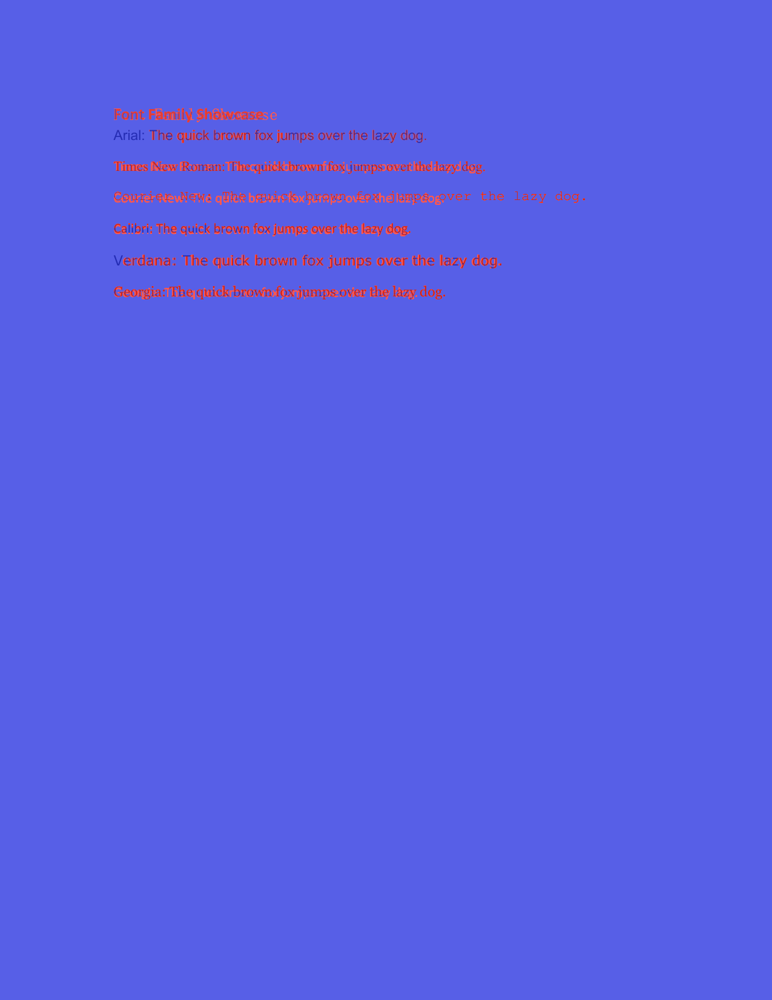</td>
  <td>changed: 29697 px (1.41%)<br>bbox: [187, 178, 967, 495]<br>mean abs RGB: 1.8936<br>RMSE RGB: 18.5439<br>threshold: 12, gain: 5.0</td>
</tr>
<tr>
  <td><b>docx_classic54_travel_destination_cards</b><br>Page 1</td>
  <td>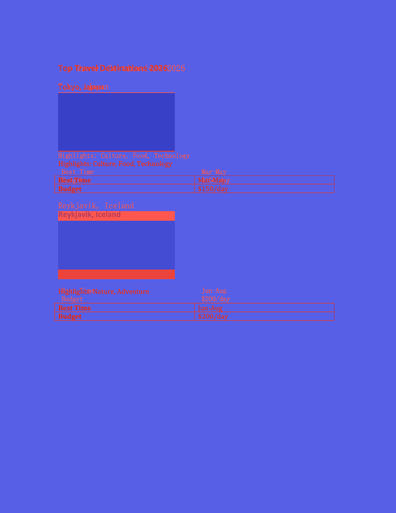</td>
  <td>changed: 58897 px (2.80%)<br>bbox: [175, 208, 1077, 1032]<br>mean abs RGB: 3.1896<br>RMSE RGB: 22.5345<br>threshold: 12, gain: 5.0</td>
</tr>
<tr>
  <td><b>docx_classic55_background_shading_paragraph</b><br>Page 1</td>
  <td></td>
  <td>changed: 113800 px (5.41%)<br>bbox: [184, 178, 1091, 446]<br>mean abs RGB: 2.7877<br>RMSE RGB: 18.572<br>threshold: 12, gain: 5.0</td>
</tr>
<tr>
  <td><b>docx_classic55_lab_results_with_image</b><br>Page 1</td>
  <td></td>
  <td>changed: 115470 px (5.49%)<br>bbox: [175, 208, 1088, 915]<br>mean abs RGB: 7.5488<br>RMSE RGB: 36.0226<br>threshold: 12, gain: 5.0</td>
</tr>
<tr>
  <td><b>docx_classic56_images_and_tables_mixed</b><br>Page 1</td>
  <td></td>
  <td>changed: 127213 px (6.05%)<br>bbox: [175, 208, 1077, 1371]<br>mean abs RGB: 8.7219<br>RMSE RGB: 40.1009<br>threshold: 12, gain: 5.0</td>
</tr>
<tr>
  <td><b>docx_classic56_software_screenshot_features</b><br>Page 1</td>
  <td>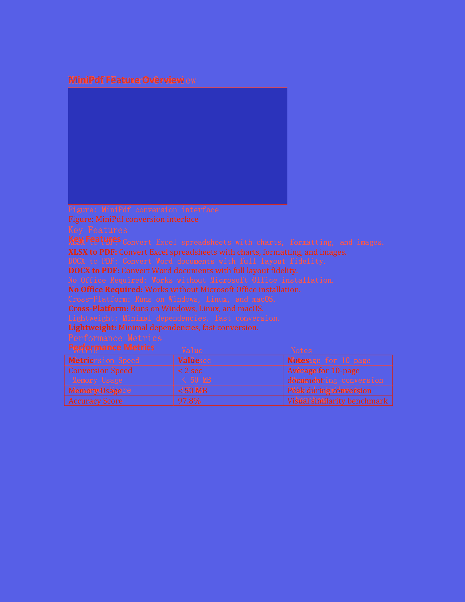</td>
  <td>changed: 77160 px (3.67%)<br>bbox: [175, 208, 1077, 1112]<br>mean abs RGB: 5.2675<br>RMSE RGB: 31.4907<br>threshold: 12, gain: 5.0</td>
</tr>
<tr>
  <td><b>docx_classic57_right_to_left_text</b><br>Page 1</td>
  <td></td>
  <td>changed: 25439 px (1.21%)<br>bbox: [187, 179, 1088, 752]<br>mean abs RGB: 1.7291<br>RMSE RGB: 17.9621<br>threshold: 12, gain: 5.0</td>
</tr>
<tr>
  <td><b>docx_classic57_sports_results_with_logos</b><br>Page 1</td>
  <td>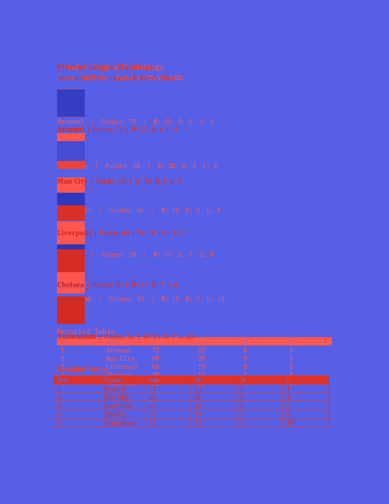</td>
  <td>changed: 138694 px (6.59%)<br>bbox: [175, 208, 1088, 1399]<br>mean abs RGB: 10.1784<br>RMSE RGB: 43.6202<br>threshold: 12, gain: 5.0</td>
</tr>
<tr>
  <td><b>docx_classic58_dense_paragraph_document</b><br>Page 1</td>
  <td></td>
  <td>changed: 238385 px (11.33%)<br>bbox: [187, 208, 1081, 1478]<br>mean abs RGB: 16.4763<br>RMSE RGB: 55.6617<br>threshold: 12, gain: 5.0</td>
</tr>
<tr>
  <td><b>docx_classic58_dense_paragraph_document</b><br>Page 2</td>
  <td>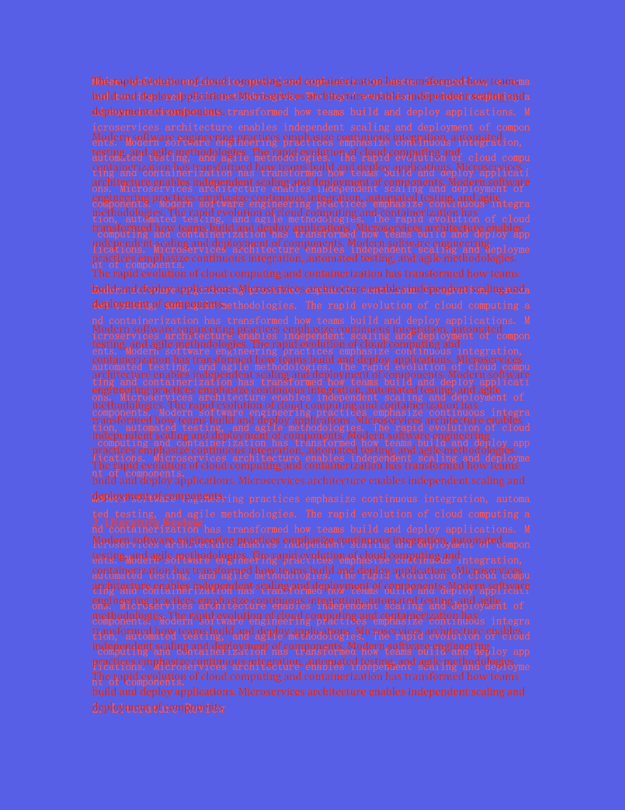</td>
  <td>changed: 325862 px (15.49%)<br>bbox: [187, 155, 1081, 1452]<br>mean abs RGB: 23.192<br>RMSE RGB: 66.5185<br>threshold: 12, gain: 5.0</td>
</tr>
<tr>
  <td><b>docx_classic58_dense_paragraph_document</b><br>Page 3</td>
  <td>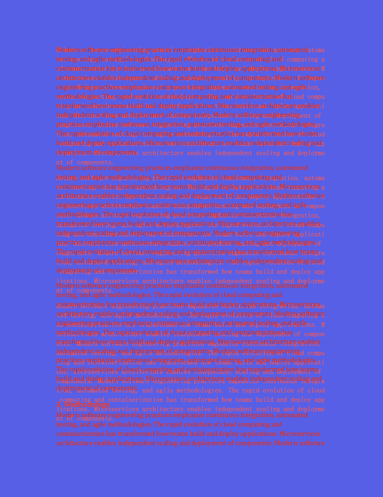</td>
  <td>changed: 303854 px (14.44%)<br>bbox: [187, 155, 1081, 1483]<br>mean abs RGB: 21.1793<br>RMSE RGB: 63.1309<br>threshold: 12, gain: 5.0</td>
</tr>
<tr>
  <td><b>docx_classic58_dense_paragraph_document</b><br>Page 4</td>
  <td>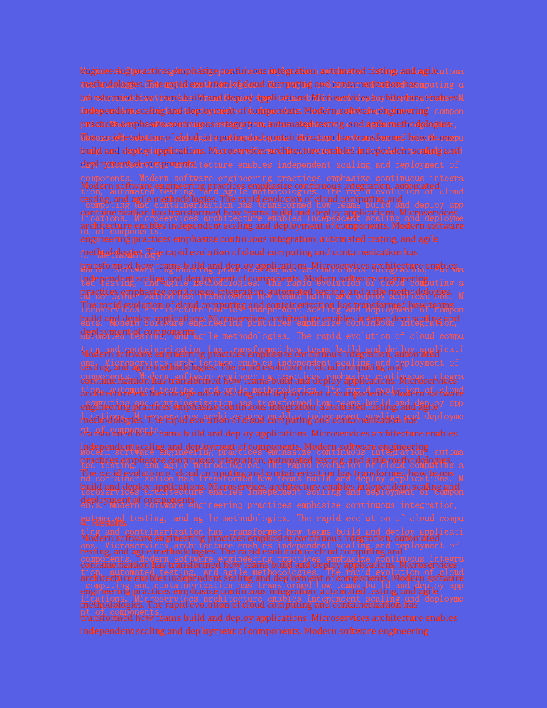</td>
  <td>changed: 324544 px (15.43%)<br>bbox: [187, 155, 1081, 1483]<br>mean abs RGB: 23.0411<br>RMSE RGB: 66.2888<br>threshold: 12, gain: 5.0</td>
</tr>
<tr>
  <td><b>docx_classic58_dense_paragraph_document</b><br>Page 5</td>
  <td>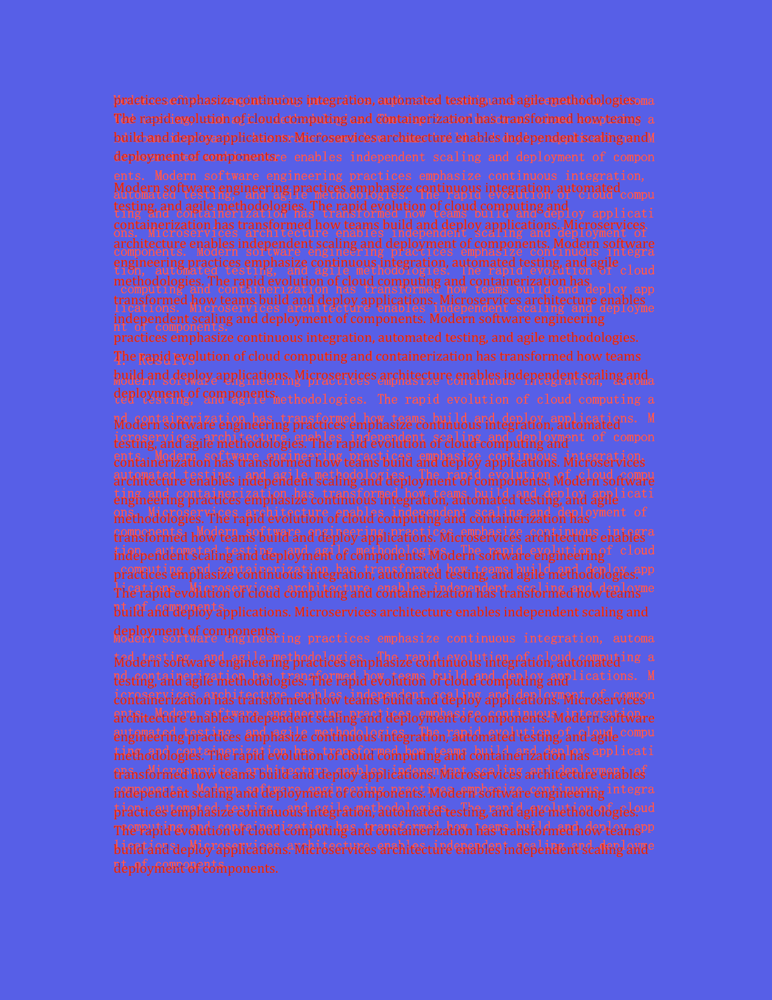</td>
  <td>changed: 319947 px (15.21%)<br>bbox: [187, 156, 1081, 1445]<br>mean abs RGB: 22.6627<br>RMSE RGB: 65.7287<br>threshold: 12, gain: 5.0</td>
</tr>
<tr>
  <td><b>docx_classic58_dense_paragraph_document</b><br>Page 6</td>
  <td></td>
  <td>changed: 301557 px (14.33%)<br>bbox: [187, 156, 1081, 1490]<br>mean abs RGB: 20.8577<br>RMSE RGB: 62.6056<br>threshold: 12, gain: 5.0</td>
</tr>
<tr>
  <td><b>docx_classic58_dense_paragraph_document</b><br>Page 7</td>
  <td></td>
  <td>changed: 224483 px (10.67%)<br>bbox: [187, 155, 1081, 1436]<br>mean abs RGB: 15.1209<br>RMSE RGB: 52.601<br>threshold: 12, gain: 5.0</td>
</tr>
<tr>
  <td><b>docx_classic58_report_with_footer_image</b><br>Page 1</td>
  <td></td>
  <td>changed: 82117 px (3.90%)<br>bbox: [175, 208, 1088, 693]<br>mean abs RGB: 5.6267<br>RMSE RGB: 31.2009<br>threshold: 12, gain: 5.0</td>
</tr>
<tr>
  <td><b>docx_classic59_numbered_and_bullet_mixed</b><br>Page 1</td>
  <td>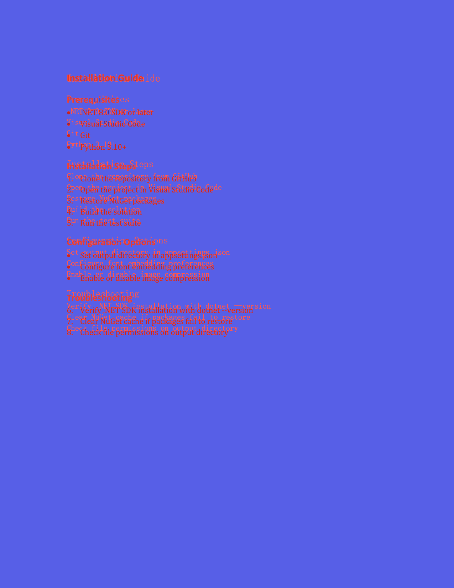</td>
  <td>changed: 59432 px (2.83%)<br>bbox: [187, 208, 760, 945]<br>mean abs RGB: 3.8162<br>RMSE RGB: 26.2487<br>threshold: 12, gain: 5.0</td>
</tr>
<tr>
  <td><b>docx_classic59_nutrition_label_with_image</b><br>Page 1</td>
  <td>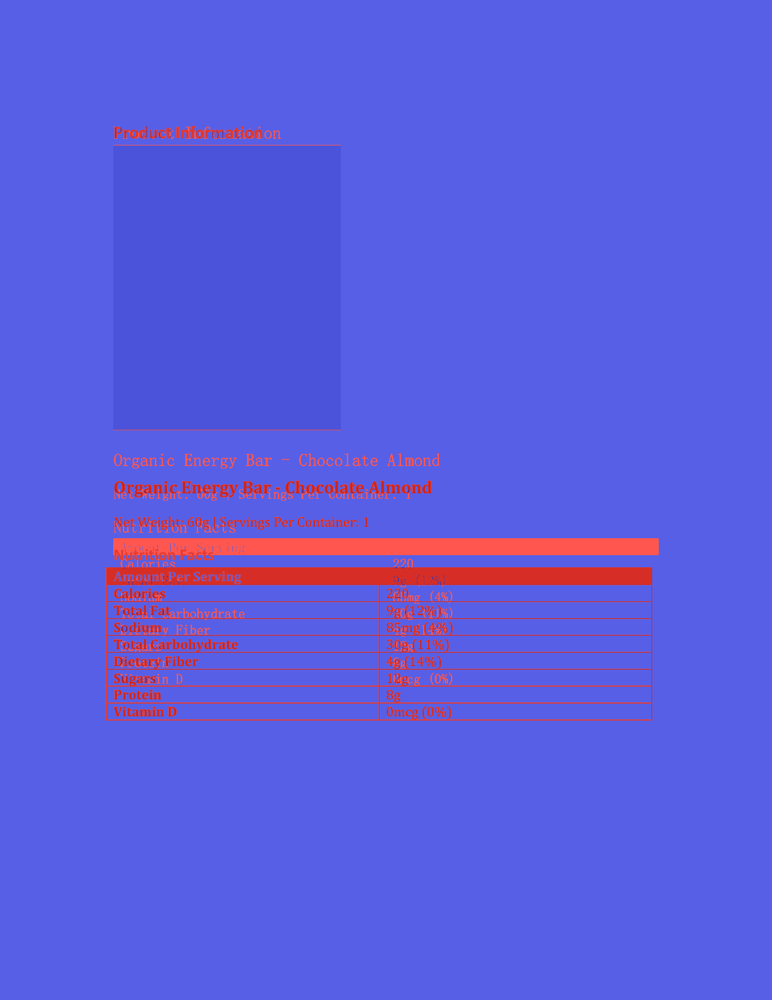</td>
  <td>changed: 100158 px (4.76%)<br>bbox: [175, 208, 1088, 1189]<br>mean abs RGB: 7.9876<br>RMSE RGB: 39.5204<br>threshold: 12, gain: 5.0</td>
</tr>
<tr>
  <td><b>docx_classic60_comprehensive_styled_report</b><br>Page 1</td>
  <td></td>
  <td>changed: 23031 px (1.09%)<br>bbox: [184, 165, 1091, 389]<br>mean abs RGB: 1.3787<br>RMSE RGB: 15.1876<br>threshold: 12, gain: 5.0</td>
</tr>
<tr>
  <td><b>docx_classic60_comprehensive_styled_report</b><br>Page 2</td>
  <td></td>
  <td>changed: 253547 px (12.05%)<br>bbox: [175, 158, 1088, 1480]<br>mean abs RGB: 13.2273<br>RMSE RGB: 46.4118<br>threshold: 12, gain: 5.0</td>
</tr>
<tr>
  <td><b>docx_classic60_comprehensive_styled_report</b><br>Page 3</td>
  <td></td>
  <td>changed: 12174 px (0.58%)<br>bbox: [188, 155, 757, 321]<br>mean abs RGB: 0.7806<br>RMSE RGB: 11.738<br>threshold: 12, gain: 5.0</td>
</tr>
<tr>
  <td><b>docx_classic60_project_status_with_milestones</b><br>Page 1</td>
  <td></td>
  <td>changed: 144970 px (6.89%)<br>bbox: [175, 208, 1088, 1480]<br>mean abs RGB: 10.0478<br>RMSE RGB: 42.165<br>threshold: 12, gain: 5.0</td>
</tr>
<tr>
  <td><b>docx_classic60_project_status_with_milestones</b><br>Page 2</td>
  <td></td>
  <td>changed: 2528 px (0.12%)<br>bbox: [188, 155, 518, 177]<br>mean abs RGB: 0.1717<br>RMSE RGB: 5.6332<br>threshold: 12, gain: 5.0</td>
</tr>
<tr>
  <td><b>docx_classic61_header_and_footer</b><br>Page 1</td>
  <td>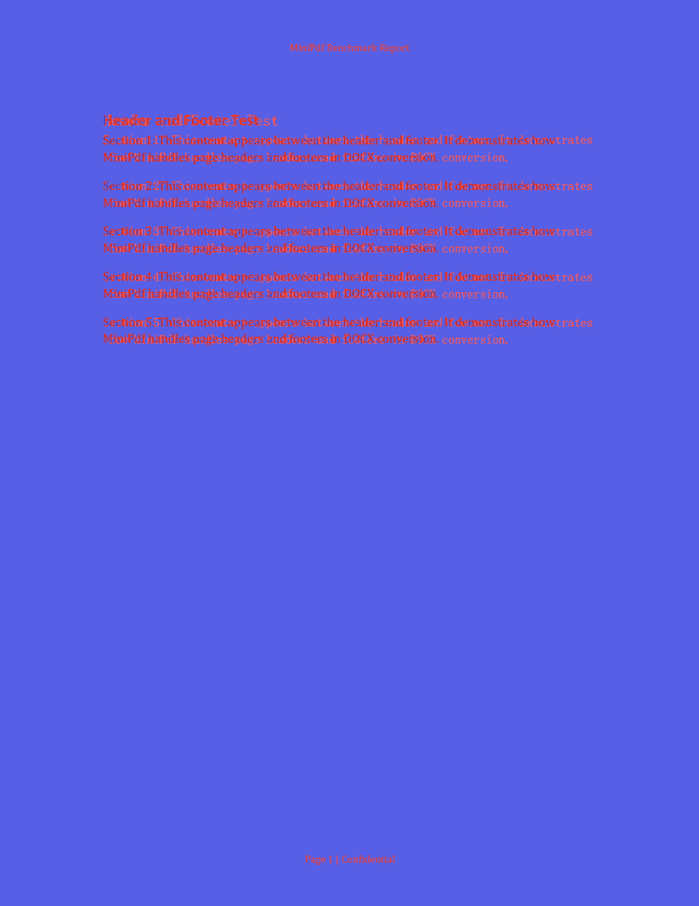</td>
  <td>changed: 70114 px (3.33%)<br>bbox: [188, 79, 1080, 1575]<br>mean abs RGB: 4.6417<br>RMSE RGB: 29.04<br>threshold: 12, gain: 5.0</td>
</tr>
<tr>
  <td><b>docx_classic62_footnote_references</b><br>Page 1</td>
  <td>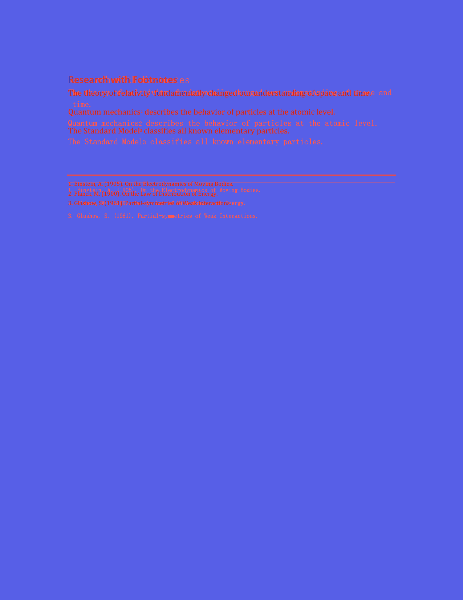</td>
  <td>changed: 41362 px (1.97%)<br>bbox: [184, 208, 1091, 601]<br>mean abs RGB: 2.7246<br>RMSE RGB: 22.2672<br>threshold: 12, gain: 5.0</td>
</tr>
<tr>
  <td><b>docx_classic63_toc_style_headings</b><br>Page 1</td>
  <td></td>
  <td>changed: 47532 px (2.26%)<br>bbox: [184, 165, 1091, 1057]<br>mean abs RGB: 3.2833<br>RMSE RGB: 24.9312<br>threshold: 12, gain: 5.0</td>
</tr>
<tr>
  <td><b>docx_classic64_multi_column_layout</b><br>Page 1</td>
  <td>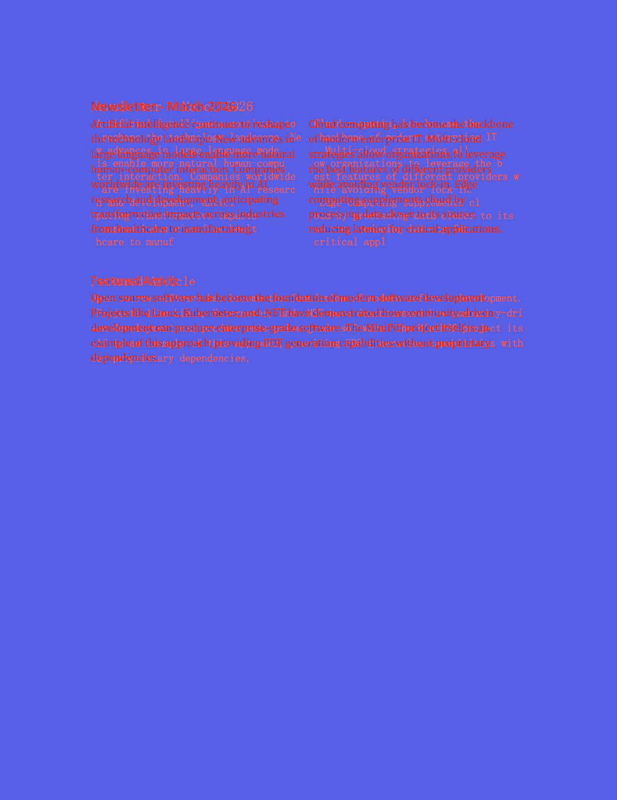</td>
  <td>changed: 98041 px (4.66%)<br>bbox: [187, 208, 1081, 749]<br>mean abs RGB: 6.6456<br>RMSE RGB: 35.0695<br>threshold: 12, gain: 5.0</td>
</tr>
<tr>
  <td><b>docx_classic65_code_block_styling</b><br>Page 1</td>
  <td></td>
  <td>changed: 29618 px (1.41%)<br>bbox: [187, 208, 611, 936]<br>mean abs RGB: 2.943<br>RMSE RGB: 17.0007<br>threshold: 12, gain: 5.0</td>
</tr>
<tr>
  <td><b>docx_classic66_colored_title_page</b><br>Page 1</td>
  <td></td>
  <td>changed: 161720 px (7.69%)<br>bbox: [187, 234, 1029, 1087]<br>mean abs RGB: 11.8853<br>RMSE RGB: 45.0008<br>threshold: 12, gain: 5.0</td>
</tr>
<tr>
  <td><b>docx_classic67_alternating_row_table</b><br>Page 1</td>
  <td>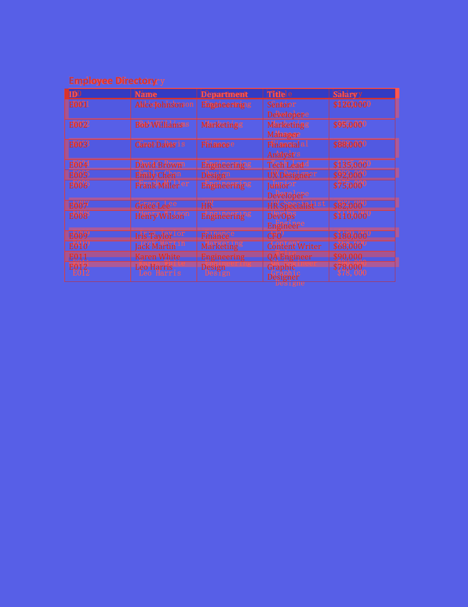</td>
  <td>changed: 169390 px (8.05%)<br>bbox: [175, 208, 1088, 779]<br>mean abs RGB: 7.525<br>RMSE RGB: 34.6395<br>threshold: 12, gain: 5.0</td>
</tr>
<tr>
  <td><b>docx_classic68_sidebar_layout</b><br>Page 1</td>
  <td></td>
  <td>changed: 150230 px (7.14%)<br>bbox: [175, 208, 1100, 653]<br>mean abs RGB: 10.4527<br>RMSE RGB: 42.0623<br>threshold: 12, gain: 5.0</td>
</tr>
<tr>
  <td><b>docx_classic69_blockquote_styling</b><br>Page 1</td>
  <td>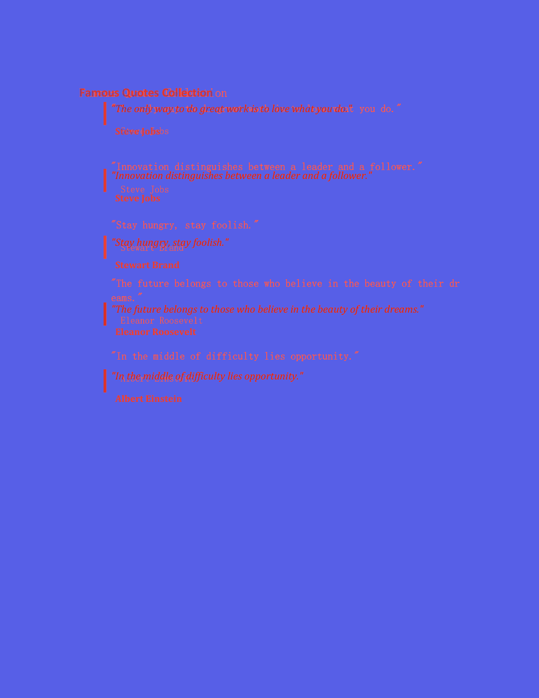</td>
  <td>changed: 43528 px (2.07%)<br>bbox: [188, 208, 1087, 951]<br>mean abs RGB: 2.7583<br>RMSE RGB: 22.0507<br>threshold: 12, gain: 5.0</td>
</tr>
<tr>
  <td><b>docx_classic70_academic_paper</b><br>Page 1</td>
  <td>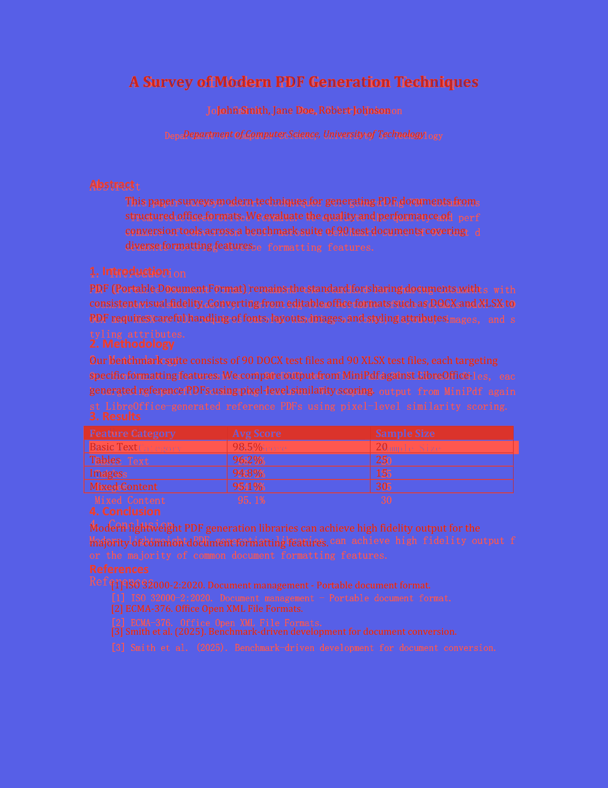</td>
  <td>changed: 194063 px (9.22%)<br>bbox: [175, 158, 1088, 1366]<br>mean abs RGB: 13.198<br>RMSE RGB: 48.7051<br>threshold: 12, gain: 5.0</td>
</tr>
<tr>
  <td><b>docx_classic71_legal_document</b><br>Page 1</td>
  <td></td>
  <td>changed: 144256 px (6.86%)<br>bbox: [188, 159, 1087, 1459]<br>mean abs RGB: 10.6225<br>RMSE RGB: 45.657<br>threshold: 12, gain: 5.0</td>
</tr>
<tr>
  <td><b>docx_classic72_technical_specification</b><br>Page 1</td>
  <td></td>
  <td>changed: 146177 px (6.95%)<br>bbox: [175, 208, 1088, 1070]<br>mean abs RGB: 9.5237<br>RMSE RGB: 41.04<br>threshold: 12, gain: 5.0</td>
</tr>
<tr>
  <td><b>docx_classic73_calendar_layout</b><br>Page 1</td>
  <td></td>
  <td>changed: 35551 px (1.69%)<br>bbox: [175, 163, 1088, 407]<br>mean abs RGB: 1.9503<br>RMSE RGB: 18.4839<br>threshold: 12, gain: 5.0</td>
</tr>
<tr>
  <td><b>docx_classic74_org_chart</b><br>Page 1</td>
  <td></td>
  <td>changed: 229967 px (10.93%)<br>bbox: [175, 208, 1088, 594]<br>mean abs RGB: 8.7311<br>RMSE RGB: 34.2182<br>threshold: 12, gain: 5.0</td>
</tr>
<tr>
  <td><b>docx_classic75_newsletter_layout</b><br>Page 1</td>
  <td></td>
  <td>changed: 70714 px (3.36%)<br>bbox: [184, 166, 1091, 1064]<br>mean abs RGB: 4.7712<br>RMSE RGB: 29.4153<br>threshold: 12, gain: 5.0</td>
</tr>
<tr>
  <td><b>docx_classic76_recipe_card</b><br>Page 1</td>
  <td>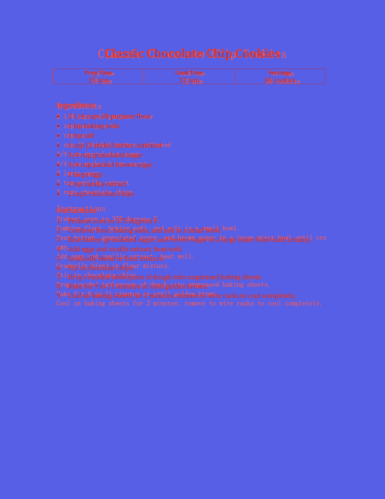</td>
  <td>changed: 82837 px (3.94%)<br>bbox: [175, 160, 1080, 1013]<br>mean abs RGB: 5.6943<br>RMSE RGB: 32.6737<br>threshold: 12, gain: 5.0</td>
</tr>
<tr>
  <td><b>docx_classic77_timeline_layout</b><br>Page 1</td>
  <td></td>
  <td>changed: 153497 px (7.30%)<br>bbox: [175, 208, 1074, 727]<br>mean abs RGB: 10.1943<br>RMSE RGB: 42.5613<br>threshold: 12, gain: 5.0</td>
</tr>
<tr>
  <td><b>docx_classic78_faq_document</b><br>Page 1</td>
  <td></td>
  <td>changed: 131117 px (6.23%)<br>bbox: [188, 208, 1083, 1415]<br>mean abs RGB: 8.5593<br>RMSE RGB: 39.3573<br>threshold: 12, gain: 5.0</td>
</tr>
<tr>
  <td><b>docx_classic78_faq_document</b><br>Page 2</td>
  <td>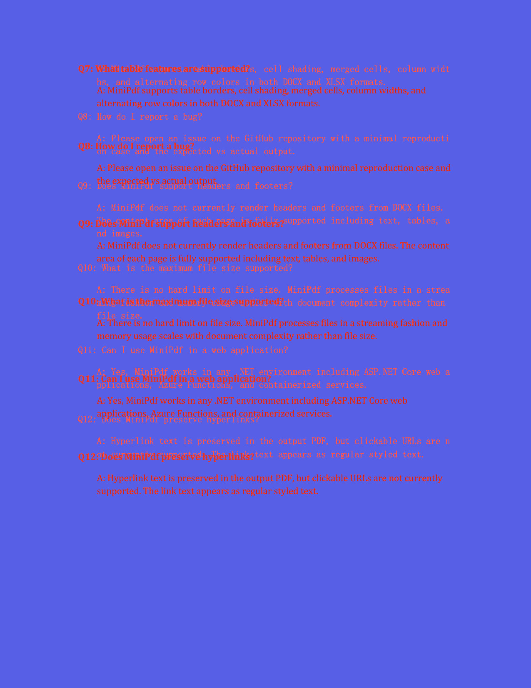</td>
  <td>changed: 116999 px (5.56%)<br>bbox: [188, 155, 1082, 1190]<br>mean abs RGB: 7.7362<br>RMSE RGB: 37.53<br>threshold: 12, gain: 5.0</td>
</tr>
<tr>
  <td><b>docx_classic79_glossary</b><br>Page 1</td>
  <td>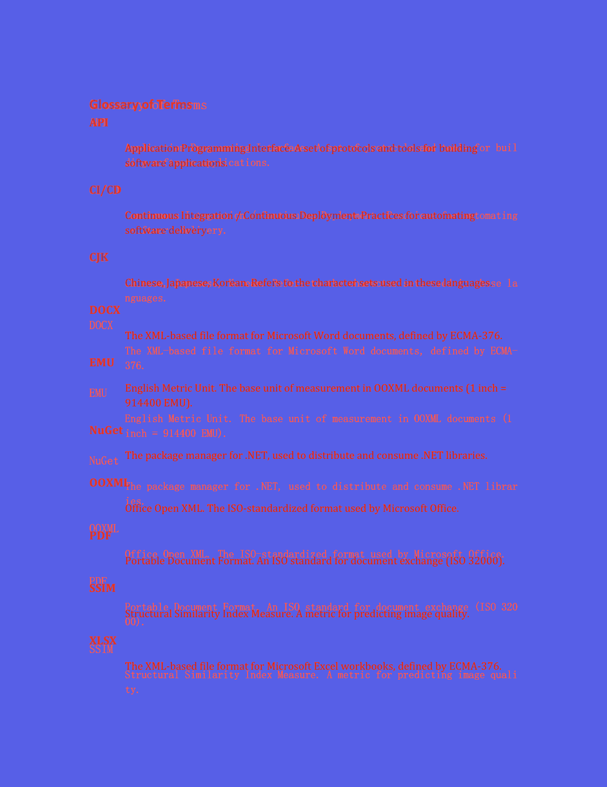</td>
  <td>changed: 91756 px (4.36%)<br>bbox: [187, 208, 1087, 1456]<br>mean abs RGB: 6.3297<br>RMSE RGB: 34.431<br>threshold: 12, gain: 5.0</td>
</tr>
<tr>
  <td><b>docx_classic80_matrix_grid</b><br>Page 1</td>
  <td></td>
  <td>changed: 241598 px (11.48%)<br>bbox: [175, 208, 1088, 862]<br>mean abs RGB: 5.5037<br>RMSE RGB: 26.7732<br>threshold: 12, gain: 5.0</td>
</tr>
<tr>
  <td><b>docx_classic81_budget_table</b><br>Page 1</td>
  <td></td>
  <td>changed: 166006 px (7.89%)<br>bbox: [175, 208, 1088, 745]<br>mean abs RGB: 8.3104<br>RMSE RGB: 36.6186<br>threshold: 12, gain: 5.0</td>
</tr>
<tr>
  <td><b>docx_classic82_survey_questionnaire</b><br>Page 1</td>
  <td></td>
  <td>changed: 176424 px (8.39%)<br>bbox: [175, 208, 1088, 1491]<br>mean abs RGB: 10.8131<br>RMSE RGB: 41.6433<br>threshold: 12, gain: 5.0</td>
</tr>
<tr>
  <td><b>docx_classic82_survey_questionnaire</b><br>Page 2</td>
  <td>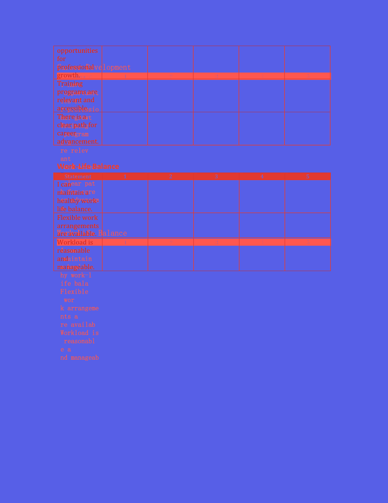</td>
  <td>changed: 111101 px (5.28%)<br>bbox: [175, 149, 1088, 1183]<br>mean abs RGB: 6.7326<br>RMSE RGB: 32.8671<br>threshold: 12, gain: 5.0</td>
</tr>
<tr>
  <td><b>docx_classic83_medical_form</b><br>Page 1</td>
  <td>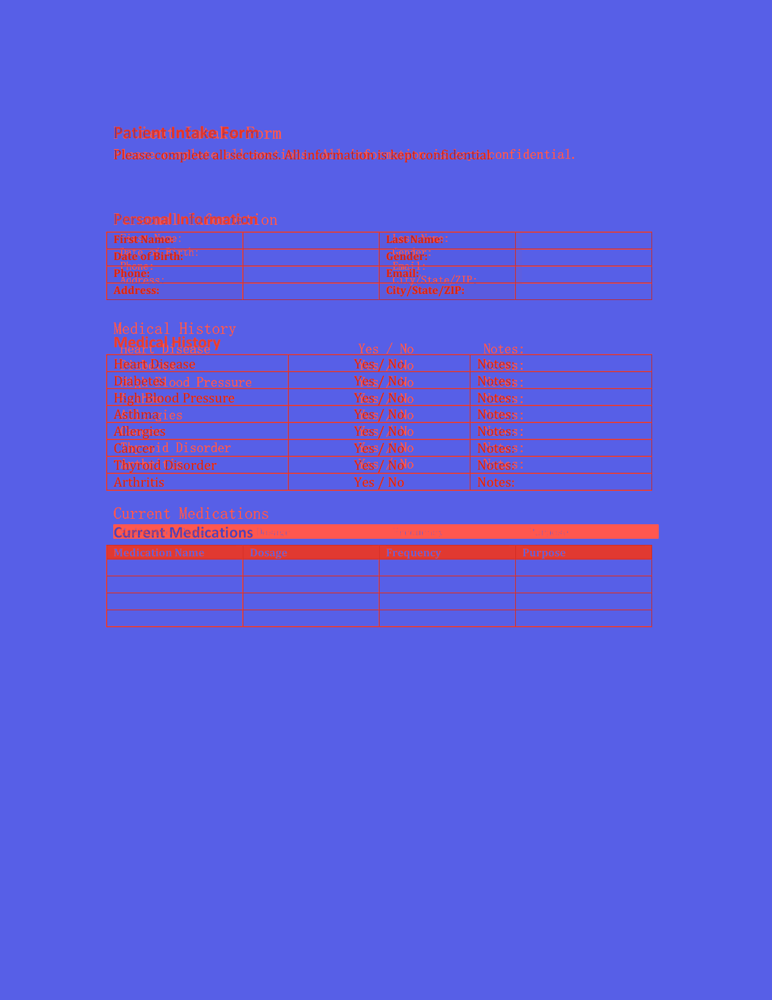</td>
  <td>changed: 133433 px (6.34%)<br>bbox: [175, 208, 1088, 1035]<br>mean abs RGB: 7.3732<br>RMSE RGB: 34.6309<br>threshold: 12, gain: 5.0</td>
</tr>
<tr>
  <td><b>docx_classic84_shipping_label</b><br>Page 1</td>
  <td>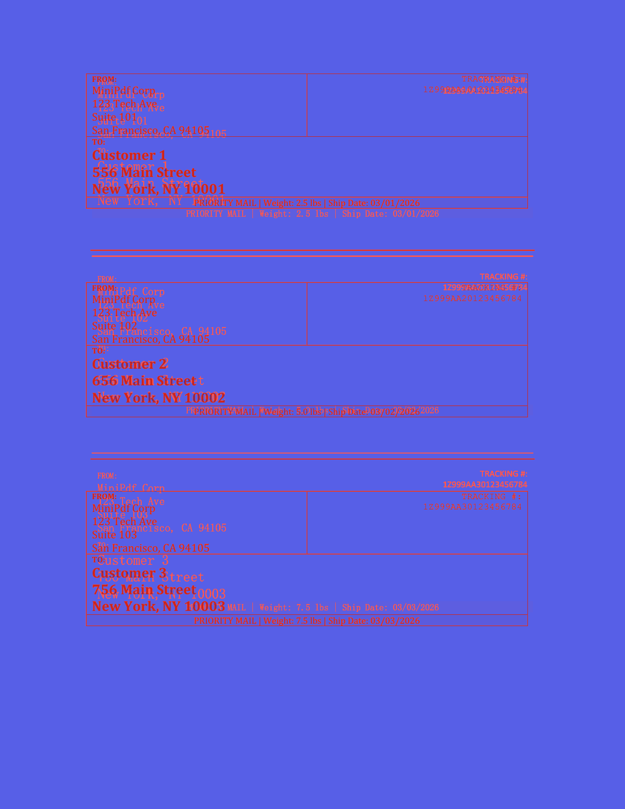</td>
  <td>changed: 166178 px (7.90%)<br>bbox: [175, 149, 1091, 1277]<br>mean abs RGB: 7.6082<br>RMSE RGB: 37.4525<br>threshold: 12, gain: 5.0</td>
</tr>
<tr>
  <td><b>docx_classic85_report_card</b><br>Page 1</td>
  <td></td>
  <td>changed: 174113 px (8.28%)<br>bbox: [175, 160, 1088, 740]<br>mean abs RGB: 8.337<br>RMSE RGB: 36.9232<br>threshold: 12, gain: 5.0</td>
</tr>
<tr>
  <td><b>docx_classic86_checklist_document</b><br>Page 1</td>
  <td></td>
  <td>changed: 68542 px (3.26%)<br>bbox: [188, 208, 777, 1472]<br>mean abs RGB: 4.3578<br>RMSE RGB: 27.906<br>threshold: 12, gain: 5.0</td>
</tr>
<tr>
  <td><b>docx_classic87_bibliography</b><br>Page 1</td>
  <td>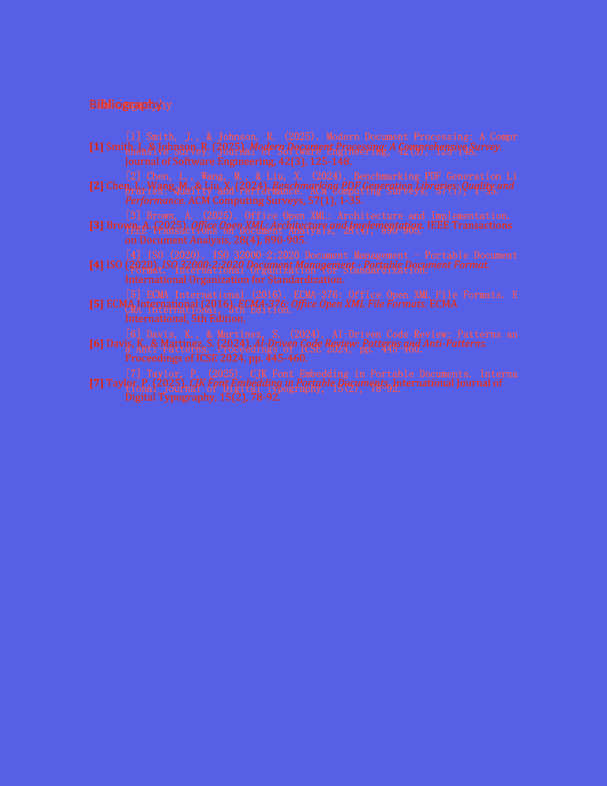</td>
  <td>changed: 98504 px (4.68%)<br>bbox: [188, 208, 1087, 846]<br>mean abs RGB: 7.0579<br>RMSE RGB: 36.8083<br>threshold: 12, gain: 5.0</td>
</tr>
<tr>
  <td><b>docx_classic88_presentation_handout</b><br>Page 1</td>
  <td>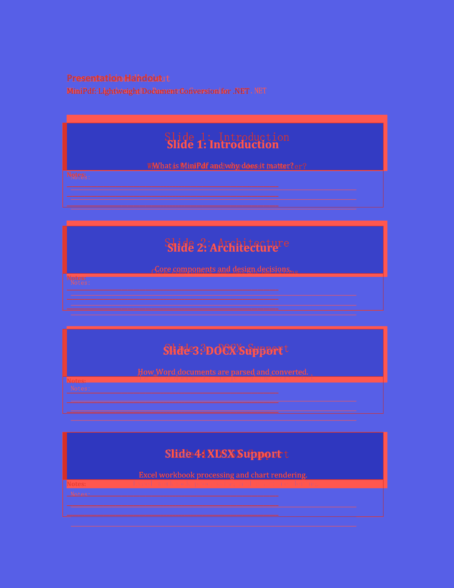</td>
  <td>changed: 193295 px (9.19%)<br>bbox: [175, 208, 1088, 1478]<br>mean abs RGB: 11.8268<br>RMSE RGB: 45.0571<br>threshold: 12, gain: 5.0</td>
</tr>
<tr>
  <td><b>docx_classic88_presentation_handout</b><br>Page 2</td>
  <td></td>
  <td>changed: 210714 px (10.02%)<br>bbox: [175, 149, 1088, 743]<br>mean abs RGB: 13.9479<br>RMSE RGB: 49.2622<br>threshold: 12, gain: 5.0</td>
</tr>
<tr>
  <td><b>docx_classic89_multi_image_gallery</b><br>Page 1</td>
  <td>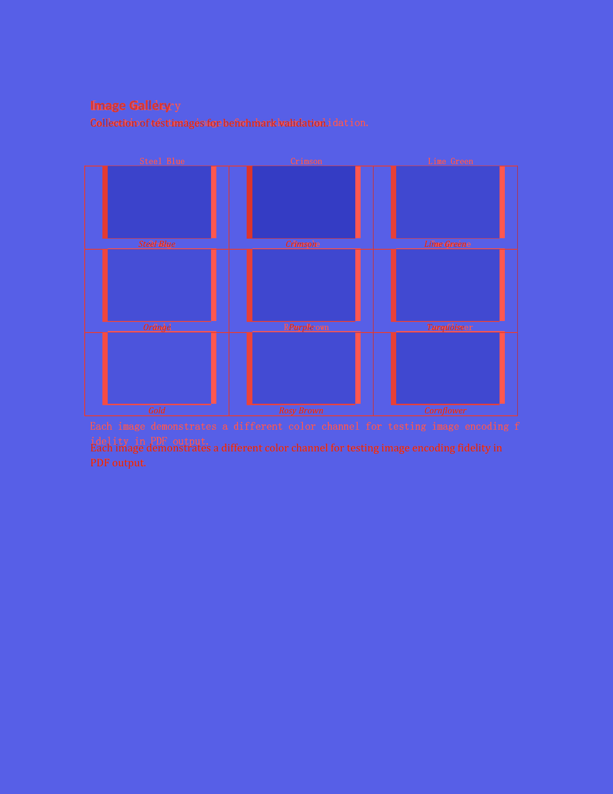</td>
  <td>changed: 68486 px (3.26%)<br>bbox: [175, 208, 1081, 974]<br>mean abs RGB: 4.0327<br>RMSE RGB: 26.4944<br>threshold: 12, gain: 5.0</td>
</tr>
<tr>
  <td><b>docx_classic90_comprehensive_annual_report</b><br>Page 1</td>
  <td>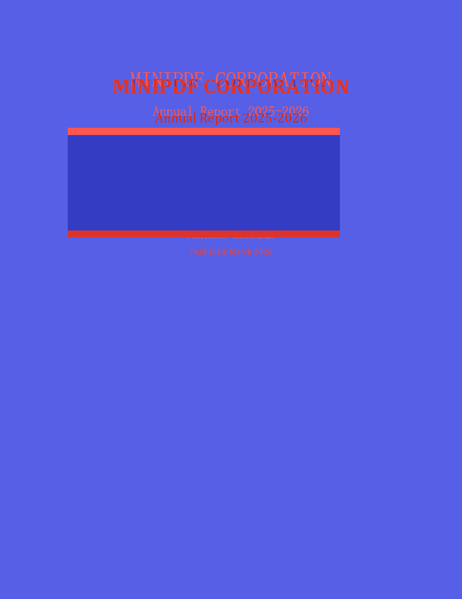</td>
  <td>changed: 53880 px (2.56%)<br>bbox: [187, 198, 963, 702]<br>mean abs RGB: 3.8813<br>RMSE RGB: 25.9447<br>threshold: 12, gain: 5.0</td>
</tr>
<tr>
  <td><b>docx_classic90_comprehensive_annual_report</b><br>Page 2</td>
  <td></td>
  <td>changed: 19442 px (0.92%)<br>bbox: [187, 158, 783, 525]<br>mean abs RGB: 1.3074<br>RMSE RGB: 15.4774<br>threshold: 12, gain: 5.0</td>
</tr>
<tr>
  <td><b>docx_classic90_comprehensive_annual_report</b><br>Page 3</td>
  <td></td>
  <td>changed: 363753 px (17.29%)<br>bbox: [175, 158, 1088, 1461]<br>mean abs RGB: 23.4344<br>RMSE RGB: 62.9352<br>threshold: 12, gain: 5.0</td>
</tr>
<tr>
  <td><b>docx_classic90_comprehensive_annual_report</b><br>Page 4</td>
  <td></td>
  <td>changed: 27466 px (1.31%)<br>bbox: [187, 158, 798, 473]<br>mean abs RGB: 1.8259<br>RMSE RGB: 18.1998<br>threshold: 12, gain: 5.0</td>
</tr>
<tr>
  <td><b>docx_classic91_landscape_page</b><br>Page 1</td>
  <td>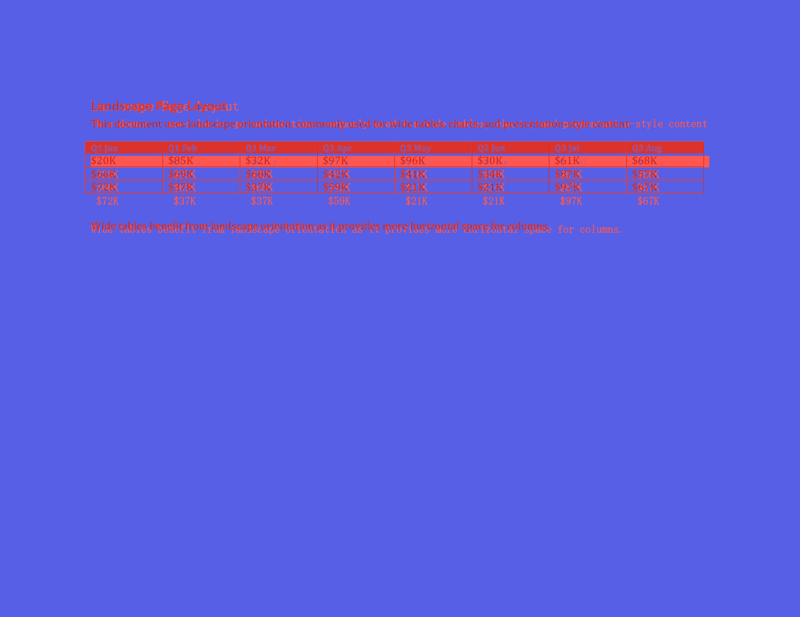</td>
  <td>changed: 101181 px (4.81%)<br>bbox: [175, 208, 1463, 484]<br>mean abs RGB: 6.828<br>RMSE RGB: 34.0874<br>threshold: 12, gain: 5.0</td>
</tr>
<tr>
  <td><b>docx_classic92_first_line_indent</b><br>Page 1</td>
  <td>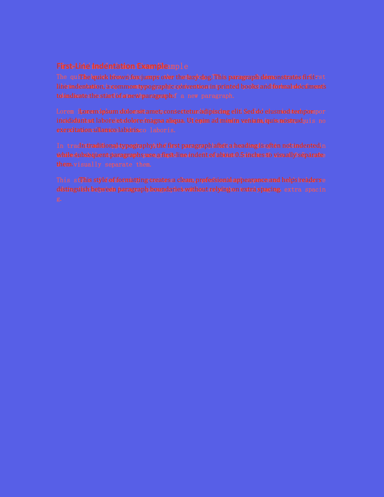</td>
  <td>changed: 69994 px (3.33%)<br>bbox: [187, 208, 1083, 670]<br>mean abs RGB: 4.6737<br>RMSE RGB: 29.216<br>threshold: 12, gain: 5.0</td>
</tr>
<tr>
  <td><b>docx_classic93_hanging_indent</b><br>Page 1</td>
  <td>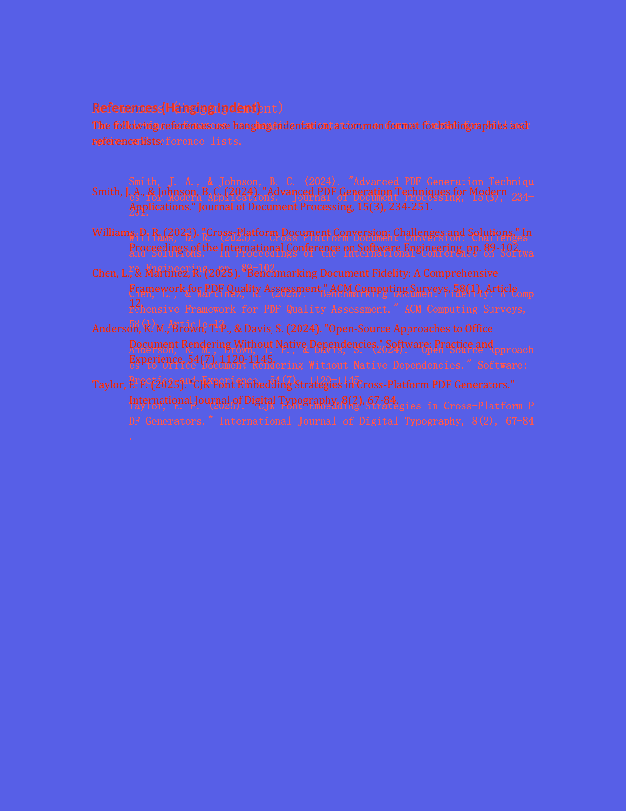</td>
  <td>changed: 99537 px (4.73%)<br>bbox: [187, 205, 1087, 895]<br>mean abs RGB: 7.0003<br>RMSE RGB: 36.4263<br>threshold: 12, gain: 5.0</td>
</tr>
<tr>
  <td><b>docx_classic94_custom_bullet_characters</b><br>Page 1</td>
  <td>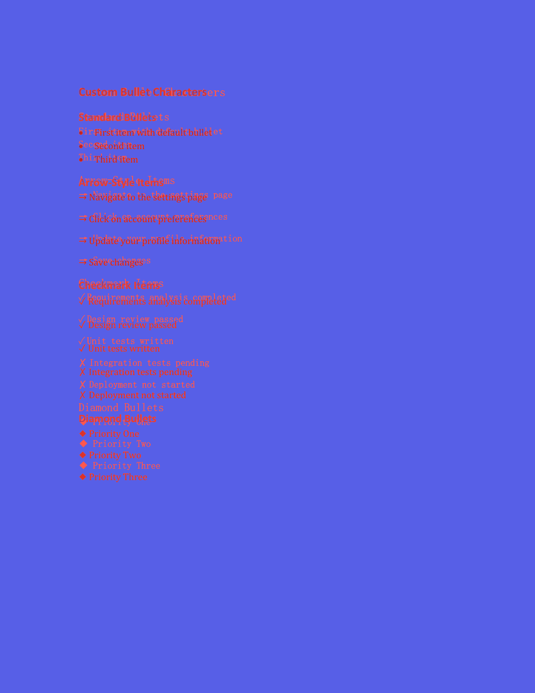</td>
  <td>changed: 48749 px (2.32%)<br>bbox: [187, 208, 577, 1148]<br>mean abs RGB: 2.7073<br>RMSE RGB: 21.125<br>threshold: 12, gain: 5.0</td>
</tr>
<tr>
  <td><b>docx_classic95_contract_template</b><br>Page 1</td>
  <td>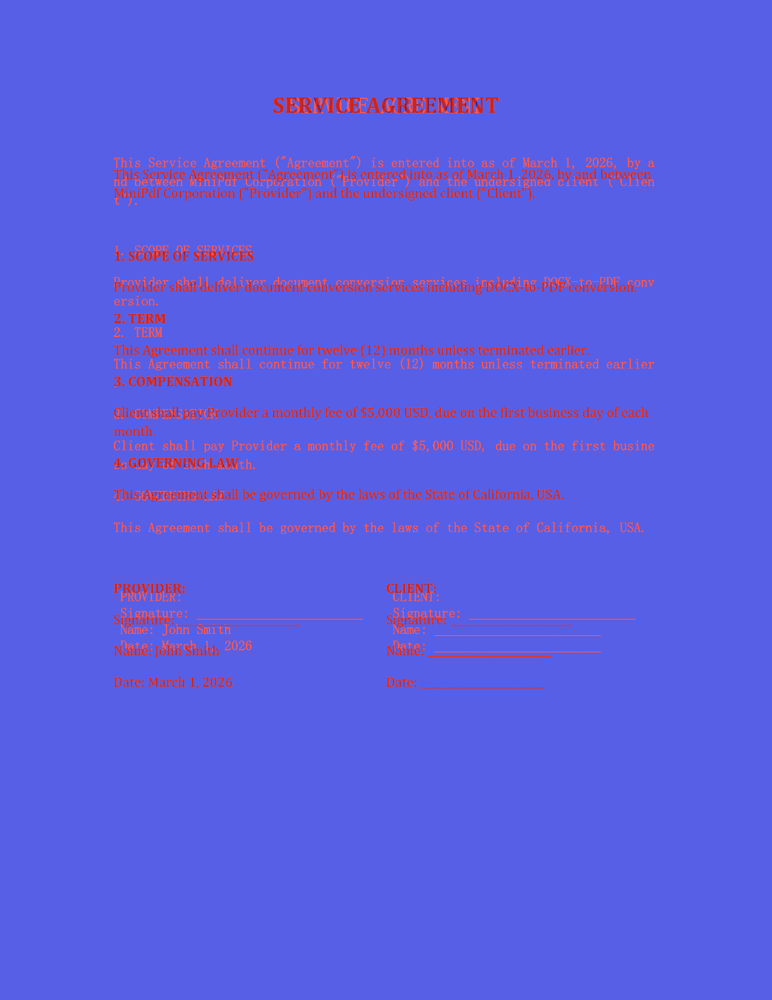</td>
  <td>changed: 81310 px (3.86%)<br>bbox: [188, 160, 1081, 1136]<br>mean abs RGB: 5.886<br>RMSE RGB: 33.8136<br>threshold: 12, gain: 5.0</td>
</tr>
<tr>
  <td><b>docx_classic96_dense_data_table</b><br>Page 1</td>
  <td></td>
  <td>changed: 294390 px (13.99%)<br>bbox: [175, 208, 1088, 864]<br>mean abs RGB: 8.7934<br>RMSE RGB: 35.6522<br>threshold: 12, gain: 5.0</td>
</tr>
<tr>
  <td><b>docx_classic97_product_catalog</b><br>Page 1</td>
  <td>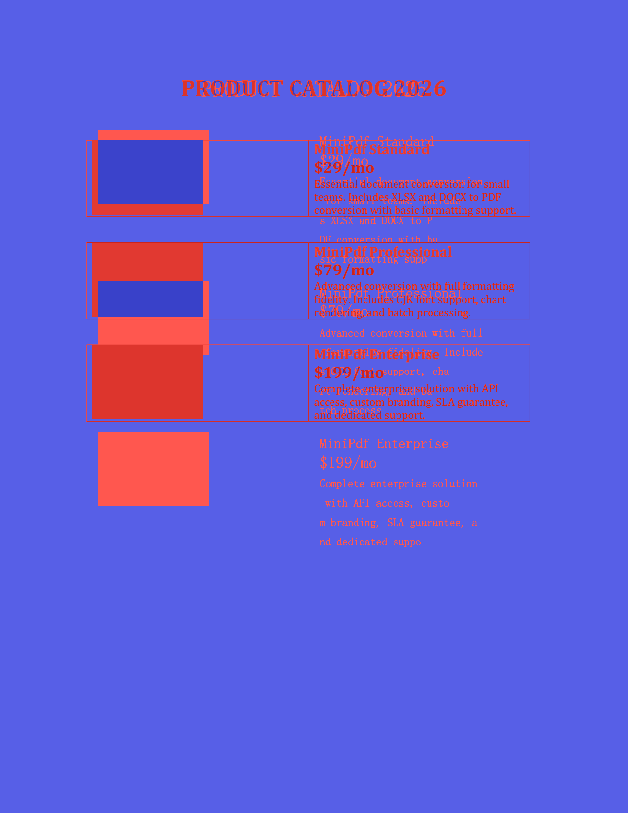</td>
  <td>changed: 185125 px (8.80%)<br>bbox: [175, 163, 1077, 1110]<br>mean abs RGB: 13.7025<br>RMSE RGB: 50.4047<br>threshold: 12, gain: 5.0</td>
</tr>
<tr>
  <td><b>docx_classic98_training_manual</b><br>Page 1</td>
  <td>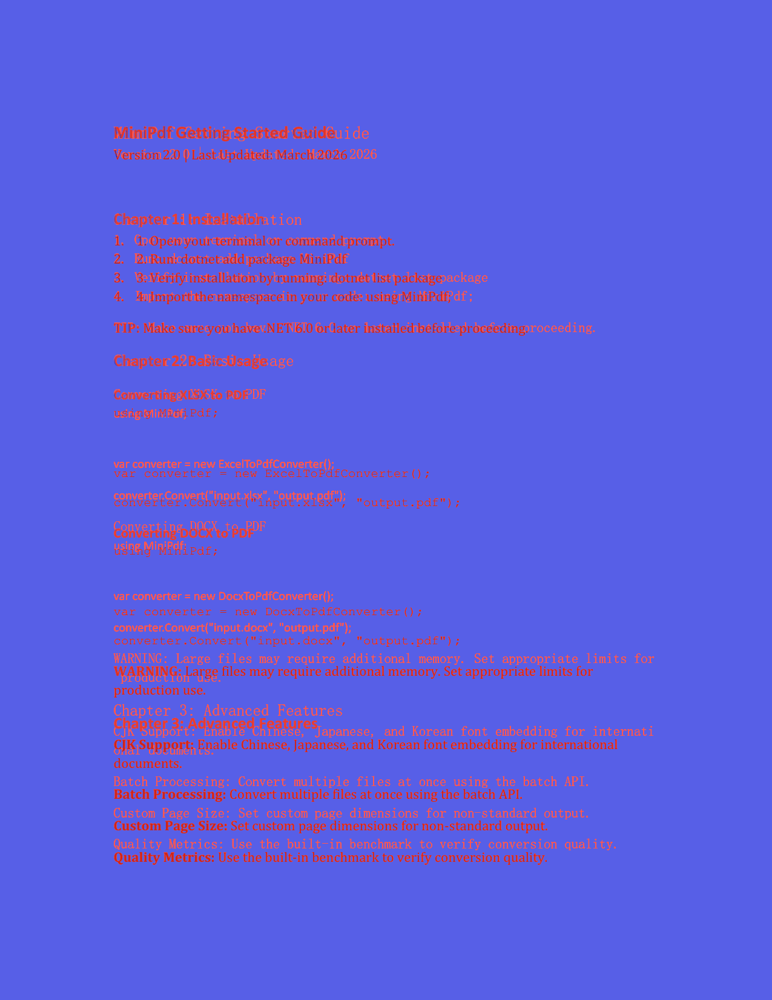</td>
  <td>changed: 110491 px (5.25%)<br>bbox: [187, 208, 1081, 1427]<br>mean abs RGB: 7.2263<br>RMSE RGB: 36.3528<br>threshold: 12, gain: 5.0</td>
</tr>
<tr>
  <td><b>docx_classic99_policy_document</b><br>Page 1</td>
  <td></td>
  <td>changed: 149729 px (7.12%)<br>bbox: [175, 160, 1088, 1462]<br>mean abs RGB: 10.4615<br>RMSE RGB: 44.6528<br>threshold: 12, gain: 5.0</td>
</tr>
<tr>
  <td><b>docx_classic100_multi_page_table</b><br>Page 1</td>
  <td></td>
  <td>changed: 646890 px (30.75%)<br>bbox: [175, 208, 1088, 1490]<br>mean abs RGB: 23.421<br>RMSE RGB: 62.0645<br>threshold: 12, gain: 5.0</td>
</tr>
<tr>
  <td><b>docx_classic100_multi_page_table</b><br>Page 2</td>
  <td></td>
  <td>changed: 218068 px (10.37%)<br>bbox: [175, 149, 1087, 637]<br>mean abs RGB: 8.1448<br>RMSE RGB: 36.5702<br>threshold: 12, gain: 5.0</td>
</tr>
<tr>
  <td><b>docx_classic101_warranty_document</b><br>Page 1</td>
  <td></td>
  <td>changed: 129747 px (6.17%)<br>bbox: [184, 162, 1091, 1143]<br>mean abs RGB: 9.0836<br>RMSE RGB: 41.5573<br>threshold: 12, gain: 5.0</td>
</tr>
<tr>
  <td><b>docx_classic102_curriculum_syllabus</b><br>Page 1</td>
  <td></td>
  <td>changed: 145446 px (6.91%)<br>bbox: [175, 208, 1088, 1144]<br>mean abs RGB: 9.0266<br>RMSE RGB: 39.5012<br>threshold: 12, gain: 5.0</td>
</tr>
<tr>
  <td><b>docx_classic103_event_program</b><br>Page 1</td>
  <td>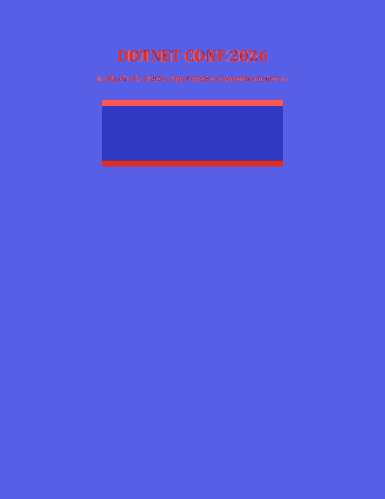</td>
  <td>changed: 39535 px (1.88%)<br>bbox: [319, 165, 955, 551]<br>mean abs RGB: 2.811<br>RMSE RGB: 22.1792<br>threshold: 12, gain: 5.0</td>
</tr>
<tr>
  <td><b>docx_classic103_event_program</b><br>Page 2</td>
  <td></td>
  <td>changed: 174284 px (8.28%)<br>bbox: [175, 158, 1088, 1251]<br>mean abs RGB: 9.6354<br>RMSE RGB: 41.1189<br>threshold: 12, gain: 5.0</td>
</tr>
<tr>
  <td><b>docx_classic104_sop_document</b><br>Page 1</td>
  <td>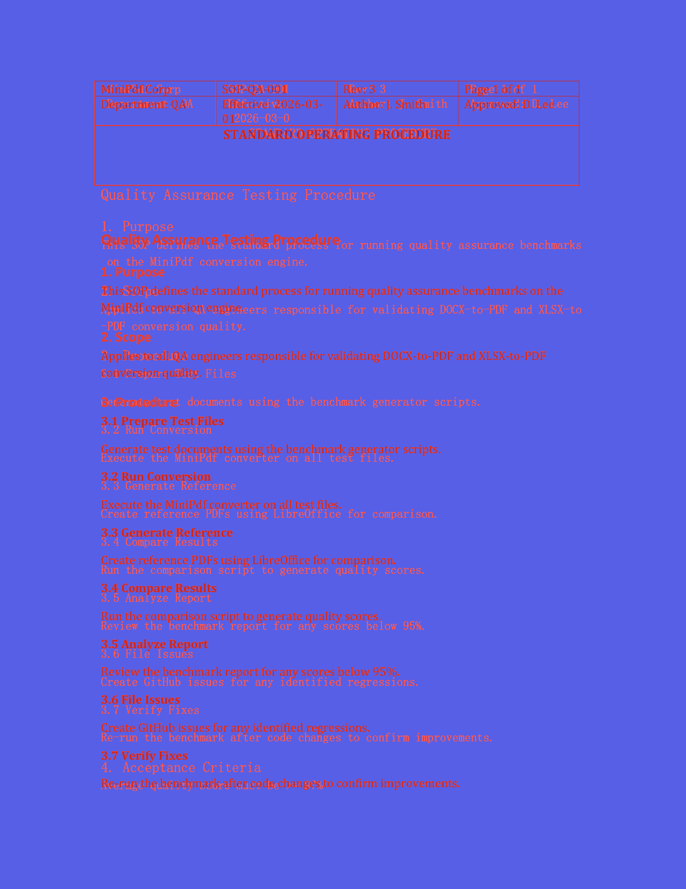</td>
  <td>changed: 118954 px (5.65%)<br>bbox: [175, 149, 1081, 1468]<br>mean abs RGB: 8.2378<br>RMSE RGB: 39.5224<br>threshold: 12, gain: 5.0</td>
</tr>
<tr>
  <td><b>docx_classic104_sop_document</b><br>Page 2</td>
  <td></td>
  <td>changed: 17501 px (0.83%)<br>bbox: [187, 156, 703, 313]<br>mean abs RGB: 1.1922<br>RMSE RGB: 14.9558<br>threshold: 12, gain: 5.0</td>
</tr>
<tr>
  <td><b>docx_classic105_certificate</b><br>Page 1</td>
  <td>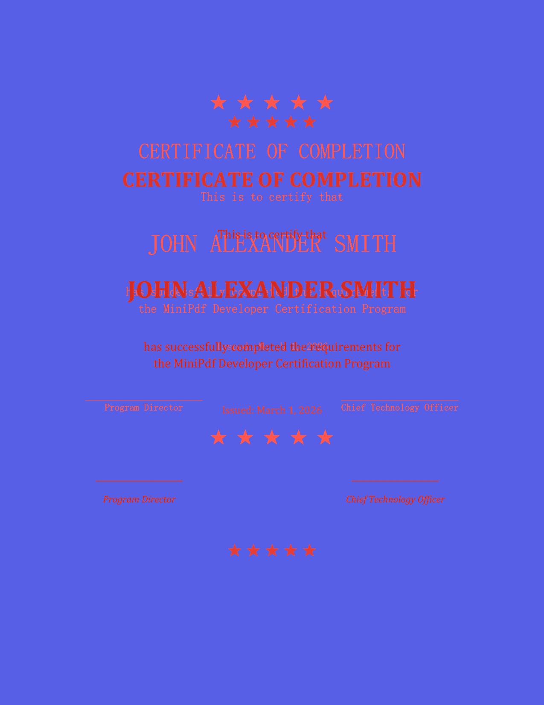</td>
  <td>changed: 71646 px (3.41%)<br>bbox: [200, 221, 1075, 1302]<br>mean abs RGB: 4.9859<br>RMSE RGB: 30.6402<br>threshold: 12, gain: 5.0</td>
</tr>
<tr>
  <td><b>docx_classic106_multi_section_orientation</b><br>Page 1</td>
  <td></td>
  <td>changed: 96051 px (4.57%)<br>bbox: [187, 205, 1088, 1168]<br>mean abs RGB: 6.311<br>RMSE RGB: 33.1031<br>threshold: 12, gain: 5.0</td>
</tr>
<tr>
  <td><b>docx_classic107_order_form</b><br>Page 1</td>
  <td></td>
  <td>changed: 170928 px (8.12%)<br>bbox: [175, 161, 1088, 959]<br>mean abs RGB: 9.6327<br>RMSE RGB: 40.7712<br>threshold: 12, gain: 5.0</td>
</tr>
<tr>
  <td><b>docx_classic108_comparison_matrix</b><br>Page 1</td>
  <td>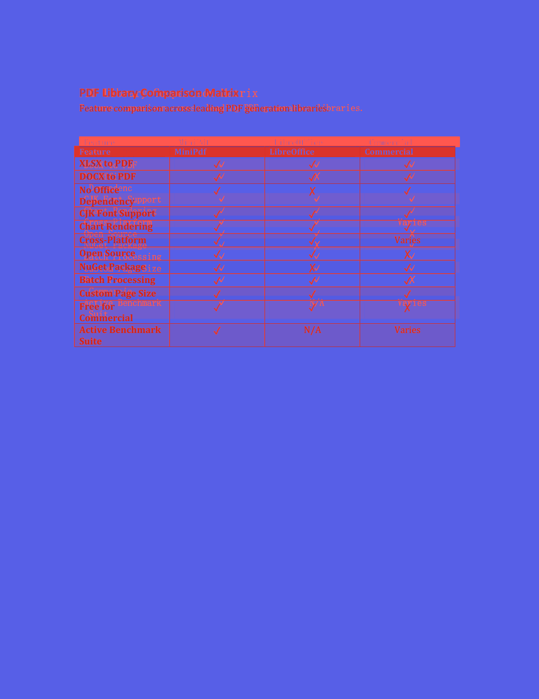</td>
  <td>changed: 317930 px (15.11%)<br>bbox: [175, 208, 1088, 820]<br>mean abs RGB: 8.7829<br>RMSE RGB: 36.6349<br>threshold: 12, gain: 5.0</td>
</tr>
<tr>
  <td><b>docx_classic109_release_notes</b><br>Page 1</td>
  <td>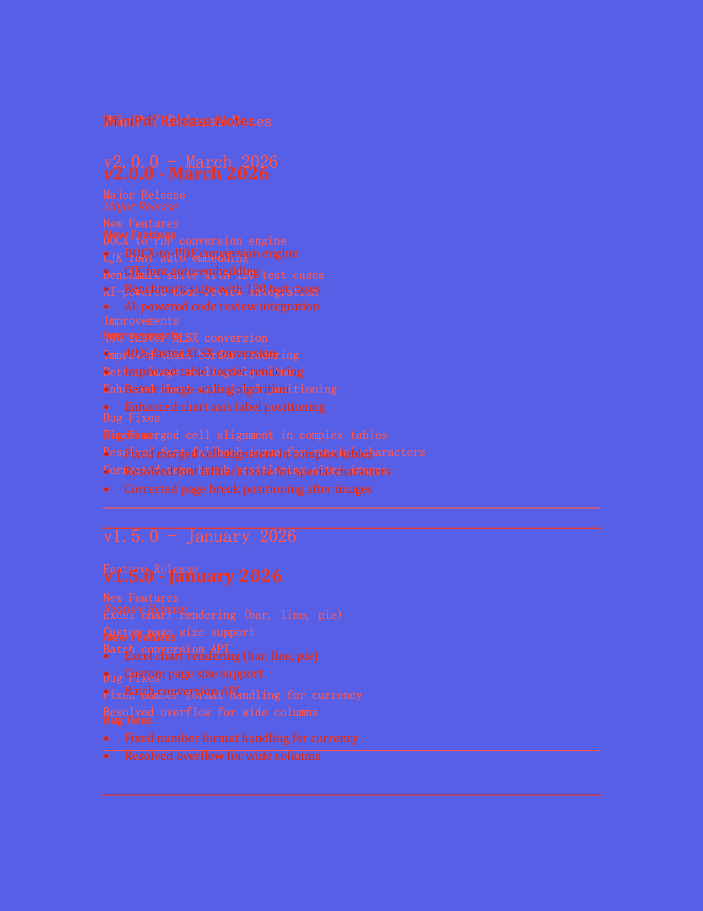</td>
  <td>changed: 91128 px (4.33%)<br>bbox: [184, 208, 1091, 1441]<br>mean abs RGB: 5.8366<br>RMSE RGB: 32.4922<br>threshold: 12, gain: 5.0</td>
</tr>
<tr>
  <td><b>docx_classic110_troubleshooting_guide</b><br>Page 1</td>
  <td></td>
  <td>changed: 73453 px (3.49%)<br>bbox: [187, 208, 1080, 936]<br>mean abs RGB: 4.3268<br>RMSE RGB: 27.1452<br>threshold: 12, gain: 5.0</td>
</tr>
<tr>
  <td><b>docx_classic111_meeting_agenda</b><br>Page 1</td>
  <td>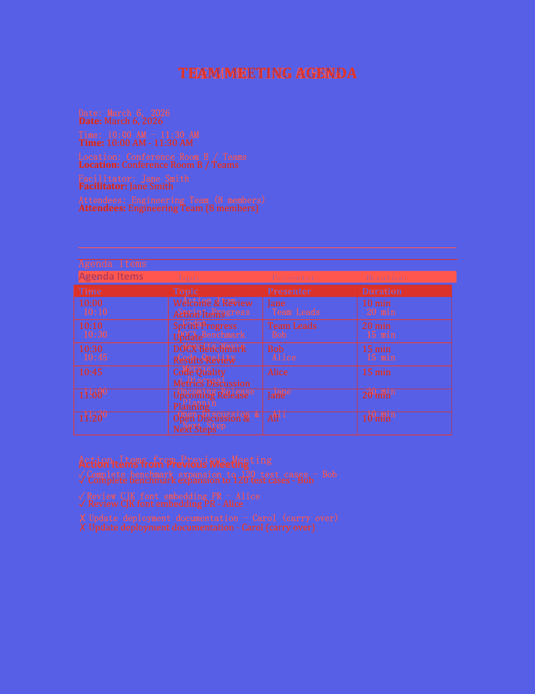</td>
  <td>changed: 141864 px (6.74%)<br>bbox: [175, 160, 1091, 1266]<br>mean abs RGB: 9.6555<br>RMSE RGB: 41.4766<br>threshold: 12, gain: 5.0</td>
</tr>
<tr>
  <td><b>docx_classic112_project_status_report</b><br>Page 1</td>
  <td></td>
  <td>changed: 107599 px (5.11%)<br>bbox: [175, 208, 1088, 1000]<br>mean abs RGB: 6.7307<br>RMSE RGB: 34.2679<br>threshold: 12, gain: 5.0</td>
</tr>
<tr>
  <td><b>docx_classic113_address_labels</b><br>Page 1</td>
  <td>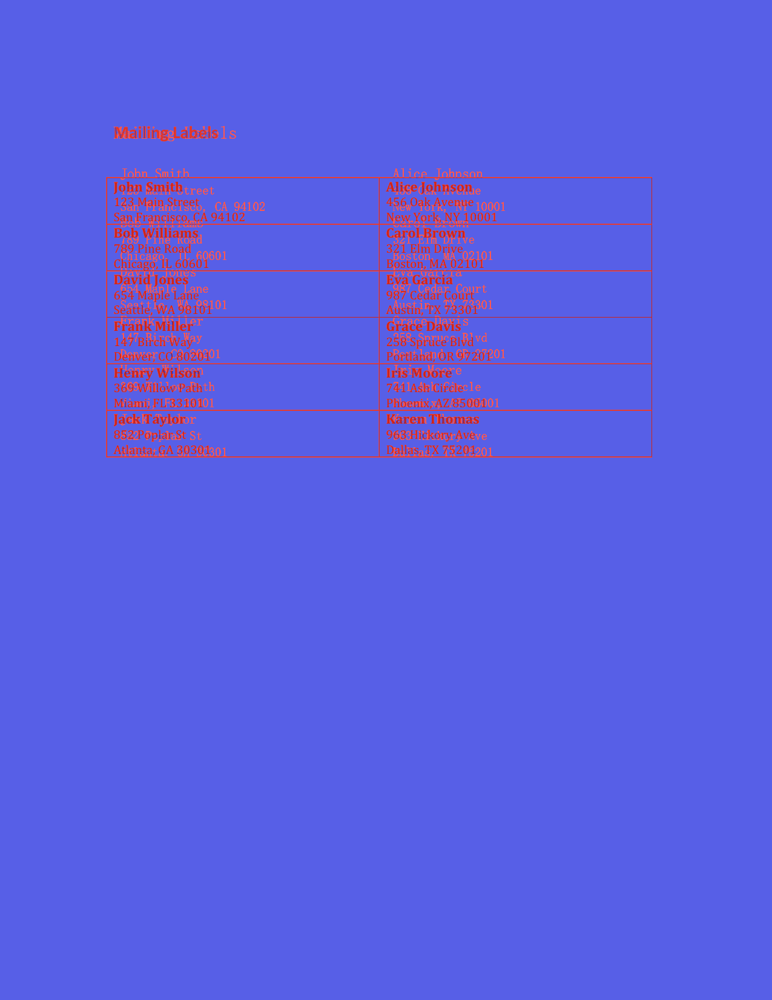</td>
  <td>changed: 69253 px (3.29%)<br>bbox: [175, 208, 1077, 756]<br>mean abs RGB: 4.7847<br>RMSE RGB: 29.9282<br>threshold: 12, gain: 5.0</td>
</tr>
<tr>
  <td><b>docx_classic114_test_report</b><br>Page 1</td>
  <td></td>
  <td>changed: 115748 px (5.50%)<br>bbox: [175, 208, 1088, 1018]<br>mean abs RGB: 7.2845<br>RMSE RGB: 35.7248<br>threshold: 12, gain: 5.0</td>
</tr>
<tr>
  <td><b>docx_classic115_price_list</b><br>Page 1</td>
  <td></td>
  <td>changed: 249590 px (11.86%)<br>bbox: [175, 161, 1088, 1083]<br>mean abs RGB: 11.7563<br>RMSE RGB: 43.7651<br>threshold: 12, gain: 5.0</td>
</tr>
<tr>
  <td><b>docx_classic116_risk_assessment</b><br>Page 1</td>
  <td>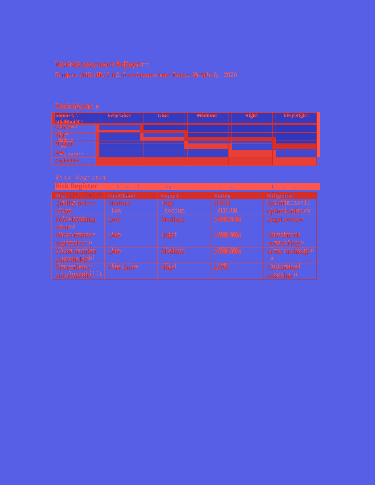</td>
  <td>changed: 164699 px (7.83%)<br>bbox: [175, 208, 1088, 951]<br>mean abs RGB: 10.5713<br>RMSE RGB: 43.3665<br>threshold: 12, gain: 5.0</td>
</tr>
<tr>
  <td><b>docx_classic117_employee_handbook_excerpt</b><br>Page 1</td>
  <td></td>
  <td>changed: 145476 px (6.92%)<br>bbox: [175, 208, 1088, 1458]<br>mean abs RGB: 9.1481<br>RMSE RGB: 40.3503<br>threshold: 12, gain: 5.0</td>
</tr>
<tr>
  <td><b>docx_classic118_data_report_with_summary</b><br>Page 1</td>
  <td>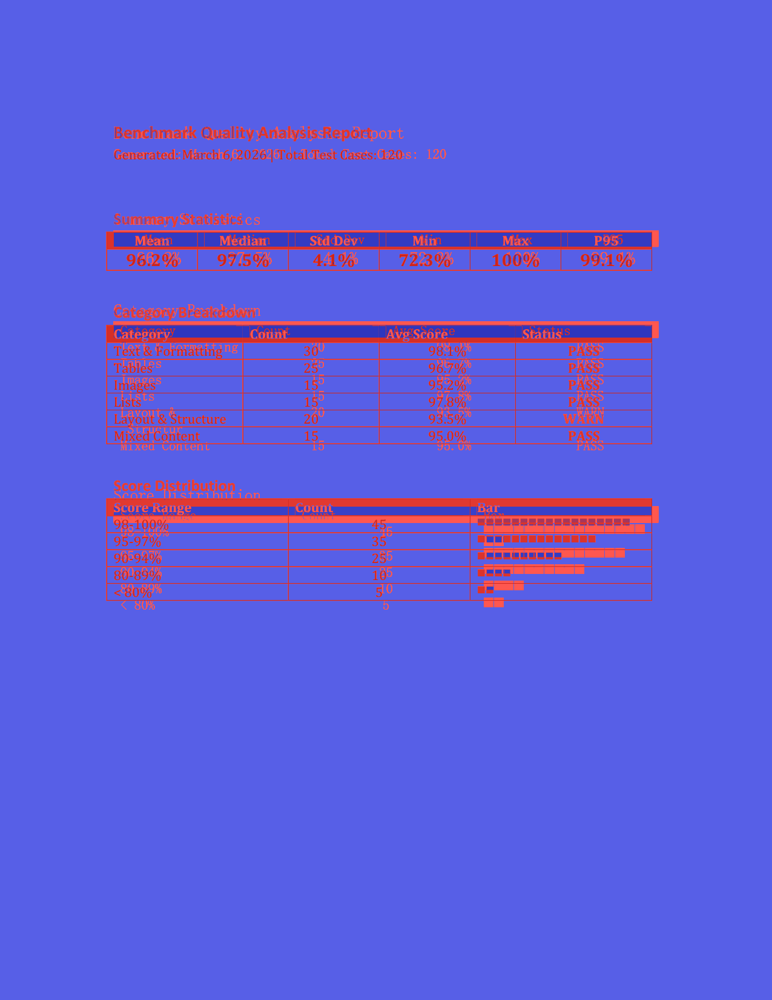</td>
  <td>changed: 141865 px (6.74%)<br>bbox: [175, 208, 1088, 1006]<br>mean abs RGB: 8.7571<br>RMSE RGB: 38.6362<br>threshold: 12, gain: 5.0</td>
</tr>
<tr>
  <td><b>docx_classic119_multi_language_document</b><br>Page 1</td>
  <td></td>
  <td>changed: 63913 px (3.04%)<br>bbox: [187, 208, 1081, 1116]<br>mean abs RGB: 4.1142<br>RMSE RGB: 27.1394<br>threshold: 12, gain: 5.0</td>
</tr>
<tr>
  <td><b>docx_classic120_comprehensive_business_proposal</b><br>Page 1</td>
  <td></td>
  <td>changed: 156308 px (7.43%)<br>bbox: [262, 220, 1013, 1032]<br>mean abs RGB: 11.4171<br>RMSE RGB: 44.1631<br>threshold: 12, gain: 5.0</td>
</tr>
<tr>
  <td><b>docx_classic120_comprehensive_business_proposal</b><br>Page 2</td>
  <td></td>
  <td>changed: 25127 px (1.19%)<br>bbox: [187, 158, 829, 626]<br>mean abs RGB: 1.7065<br>RMSE RGB: 17.7308<br>threshold: 12, gain: 5.0</td>
</tr>
<tr>
  <td><b>docx_classic120_comprehensive_business_proposal</b><br>Page 3</td>
  <td></td>
  <td>changed: 301623 px (14.34%)<br>bbox: [175, 158, 1088, 1412]<br>mean abs RGB: 18.5533<br>RMSE RGB: 56.826<br>threshold: 12, gain: 5.0</td>
</tr>
<tr>
  <td><b>docx_classic121_thin_border_table</b><br>Page 1</td>
  <td>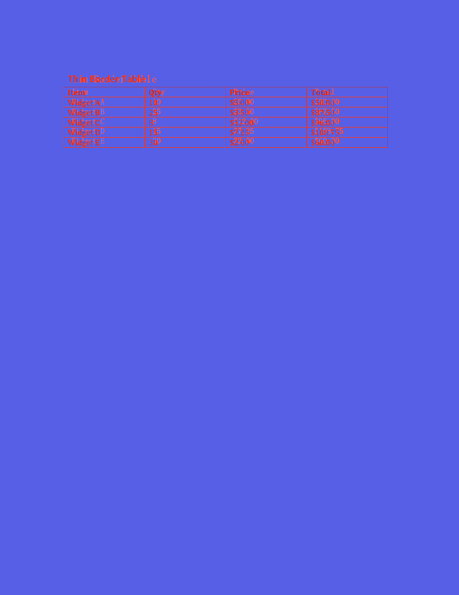</td>
  <td>changed: 31674 px (1.51%)<br>bbox: [175, 208, 1077, 410]<br>mean abs RGB: 2.1271<br>RMSE RGB: 19.4491<br>threshold: 12, gain: 5.0</td>
</tr>
<tr>
  <td><b>docx_classic122_thick_outer_border_table</b><br>Page 1</td>
  <td></td>
  <td>changed: 37538 px (1.78%)<br>bbox: [174, 208, 1079, 417]<br>mean abs RGB: 2.9053<br>RMSE RGB: 24.0147<br>threshold: 12, gain: 5.0</td>
</tr>
<tr>
  <td><b>docx_classic123_dashed_border_table</b><br>Page 1</td>
  <td></td>
  <td>changed: 24290 px (1.15%)<br>bbox: [187, 208, 1089, 545]<br>mean abs RGB: 1.565<br>RMSE RGB: 16.6138<br>threshold: 12, gain: 5.0</td>
</tr>
<tr>
  <td><b>docx_classic124_colored_border_table</b><br>Page 1</td>
  <td></td>
  <td>changed: 53742 px (2.55%)<br>bbox: [175, 208, 1077, 452]<br>mean abs RGB: 3.6144<br>RMSE RGB: 26.3281<br>threshold: 12, gain: 5.0</td>
</tr>
<tr>
  <td><b>docx_classic125_solid_cell_fills</b><br>Page 1</td>
  <td></td>
  <td>changed: 67482 px (3.21%)<br>bbox: [175, 208, 1088, 494]<br>mean abs RGB: 3.0048<br>RMSE RGB: 21.8196<br>threshold: 12, gain: 5.0</td>
</tr>
<tr>
  <td><b>docx_classic126_dark_header_table</b><br>Page 1</td>
  <td></td>
  <td>changed: 44796 px (2.13%)<br>bbox: [175, 208, 1088, 410]<br>mean abs RGB: 2.8915<br>RMSE RGB: 22.2433<br>threshold: 12, gain: 5.0</td>
</tr>
<tr>
  <td><b>docx_classic127_font_styles_showcase</b><br>Page 1</td>
  <td>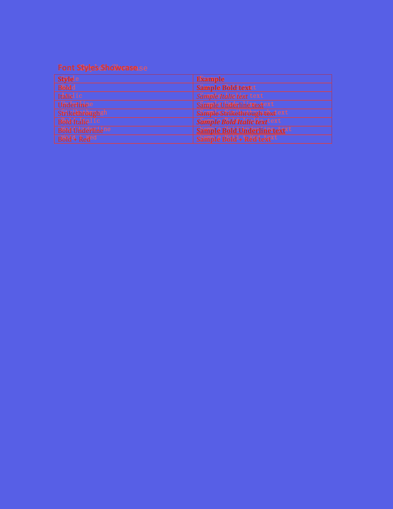</td>
  <td>changed: 47120 px (2.24%)<br>bbox: [175, 208, 1077, 466]<br>mean abs RGB: 3.1305<br>RMSE RGB: 23.8267<br>threshold: 12, gain: 5.0</td>
</tr>
<tr>
  <td><b>docx_classic128_font_sizes_showcase</b><br>Page 1</td>
  <td></td>
  <td>changed: 103742 px (4.93%)<br>bbox: [188, 208, 1087, 1095]<br>mean abs RGB: 8.3628<br>RMSE RGB: 41.8715<br>threshold: 12, gain: 5.0</td>
</tr>
<tr>
  <td><b>docx_classic129_alignment_combinations</b><br>Page 1</td>
  <td></td>
  <td>changed: 29784 px (1.42%)<br>bbox: [175, 208, 1077, 628]<br>mean abs RGB: 2.0175<br>RMSE RGB: 19.3702<br>threshold: 12, gain: 5.0</td>
</tr>
<tr>
  <td><b>docx_classic130_wrap_and_indent</b><br>Page 1</td>
  <td></td>
  <td>changed: 56097 px (2.67%)<br>bbox: [187, 208, 1081, 772]<br>mean abs RGB: 3.5748<br>RMSE RGB: 25.2449<br>threshold: 12, gain: 5.0</td>
</tr>
<tr>
  <td><b>docx_classic131_number_format_table</b><br>Page 1</td>
  <td></td>
  <td>changed: 54007 px (2.57%)<br>bbox: [175, 208, 1077, 550]<br>mean abs RGB: 3.7566<br>RMSE RGB: 26.4839<br>threshold: 12, gain: 5.0</td>
</tr>
<tr>
  <td><b>docx_classic132_striped_table</b><br>Page 1</td>
  <td></td>
  <td>changed: 115478 px (5.49%)<br>bbox: [175, 208, 1088, 550]<br>mean abs RGB: 4.1874<br>RMSE RGB: 25.8329<br>threshold: 12, gain: 5.0</td>
</tr>
<tr>
  <td><b>docx_classic133_gradient_rows_table</b><br>Page 1</td>
  <td></td>
  <td>changed: 116602 px (5.54%)<br>bbox: [175, 208, 1088, 550]<br>mean abs RGB: 3.7604<br>RMSE RGB: 26.5898<br>threshold: 12, gain: 5.0</td>
</tr>
<tr>
  <td><b>docx_classic134_heatmap_table</b><br>Page 1</td>
  <td>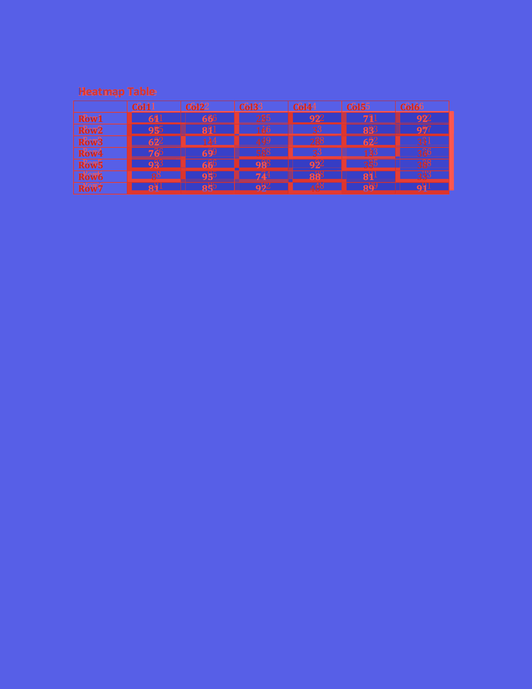</td>
  <td>changed: 80834 px (3.84%)<br>bbox: [175, 208, 1088, 466]<br>mean abs RGB: 3.5512<br>RMSE RGB: 23.9743<br>threshold: 12, gain: 5.0</td>
</tr>
<tr>
  <td><b>docx_classic135_bottom_border_paragraphs</b><br>Page 1</td>
  <td></td>
  <td>changed: 54017 px (2.57%)<br>bbox: [184, 208, 1091, 568]<br>mean abs RGB: 4.324<br>RMSE RGB: 29.7656<br>threshold: 12, gain: 5.0</td>
</tr>
<tr>
  <td><b>docx_classic136_financial_statement</b><br>Page 1</td>
  <td></td>
  <td>changed: 86455 px (4.11%)<br>bbox: [175, 208, 1088, 557]<br>mean abs RGB: 4.389<br>RMSE RGB: 27.6407<br>threshold: 12, gain: 5.0</td>
</tr>
<tr>
  <td><b>docx_classic137_checkerboard_table</b><br>Page 1</td>
  <td></td>
  <td>changed: 150393 px (7.15%)<br>bbox: [175, 208, 1088, 466]<br>mean abs RGB: 11.2469<br>RMSE RGB: 45.3052<br>threshold: 12, gain: 5.0</td>
</tr>
<tr>
  <td><b>docx_classic138_color_grid_table</b><br>Page 1</td>
  <td></td>
  <td>changed: 40873 px (1.94%)<br>bbox: [175, 208, 1088, 354]<br>mean abs RGB: 1.6797<br>RMSE RGB: 15.0861<br>threshold: 12, gain: 5.0</td>
</tr>
<tr>
  <td><b>docx_classic139_paragraph_shading_patterns</b><br>Page 1</td>
  <td>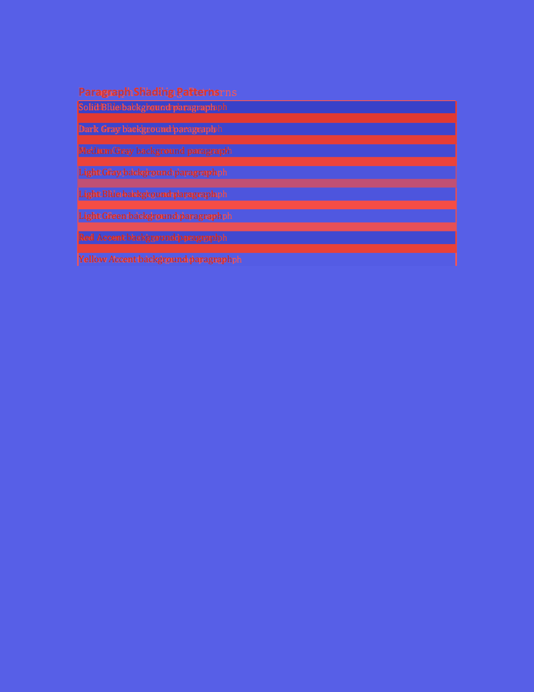</td>
  <td>changed: 172317 px (8.19%)<br>bbox: [184, 208, 1091, 634]<br>mean abs RGB: 6.818<br>RMSE RGB: 28.2724<br>threshold: 12, gain: 5.0</td>
</tr>
<tr>
  <td><b>docx_classic140_rotated_text_table</b><br>Page 1</td>
  <td>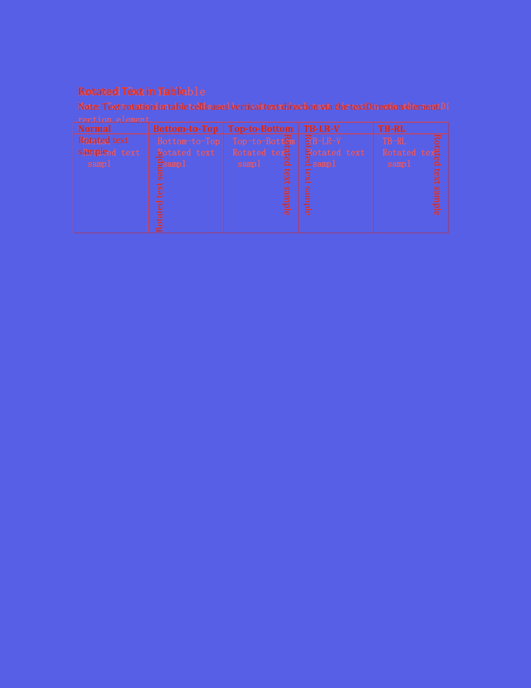</td>
  <td>changed: 36846 px (1.75%)<br>bbox: [175, 208, 1079, 560]<br>mean abs RGB: 2.4886<br>RMSE RGB: 21.597<br>threshold: 12, gain: 5.0</td>
</tr>
<tr>
  <td><b>docx_classic141_mixed_border_styles</b><br>Page 1</td>
  <td></td>
  <td>changed: 42354 px (2.01%)<br>bbox: [187, 208, 1090, 667]<br>mean abs RGB: 2.8927<br>RMSE RGB: 24.3519<br>threshold: 12, gain: 5.0</td>
</tr>
<tr>
  <td><b>docx_classic142_styled_invoice_document</b><br>Page 1</td>
  <td>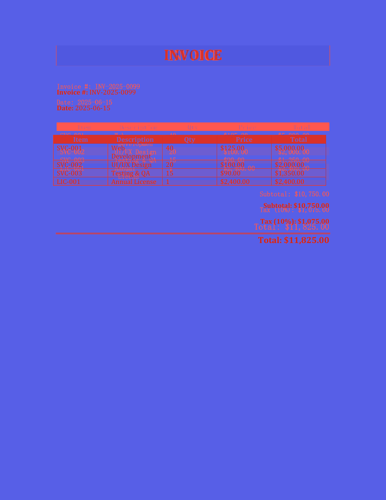</td>
  <td>changed: 160915 px (7.65%)<br>bbox: [175, 150, 1091, 806]<br>mean abs RGB: 7.8636<br>RMSE RGB: 37.227<br>threshold: 12, gain: 5.0</td>
</tr>
<tr>
  <td><b>docx_classic143_multi_section_document</b><br>Page 1</td>
  <td></td>
  <td>changed: 258031 px (12.27%)<br>bbox: [175, 149, 1091, 908]<br>mean abs RGB: 18.3942<br>RMSE RGB: 63.8669<br>threshold: 12, gain: 5.0</td>
</tr>
<tr>
  <td><b>docx_classic144_note_style_paragraphs</b><br>Page 1</td>
  <td></td>
  <td>changed: 34571 px (1.64%)<br>bbox: [175, 209, 1088, 410]<br>mean abs RGB: 1.6864<br>RMSE RGB: 16.0588<br>threshold: 12, gain: 5.0</td>
</tr>
<tr>
  <td><b>docx_classic145_status_badge_table</b><br>Page 1</td>
  <td>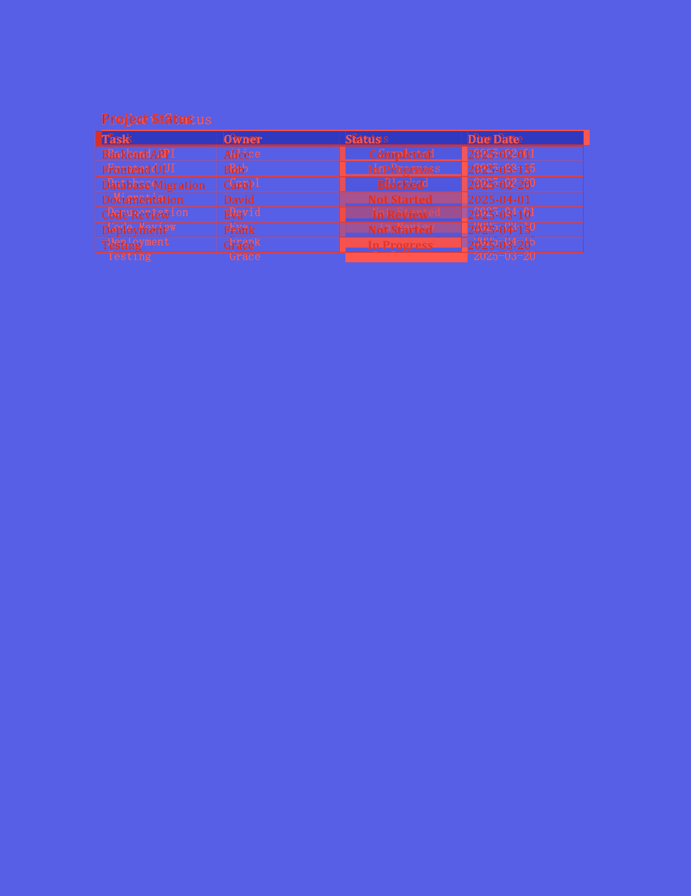</td>
  <td>changed: 77745 px (3.70%)<br>bbox: [175, 208, 1088, 483]<br>mean abs RGB: 3.828<br>RMSE RGB: 24.5306<br>threshold: 12, gain: 5.0</td>
</tr>
<tr>
  <td><b>docx_classic146_double_border_table</b><br>Page 1</td>
  <td></td>
  <td>changed: 44102 px (2.10%)<br>bbox: [174, 208, 1089, 393]<br>mean abs RGB: 2.9769<br>RMSE RGB: 23.8578<br>threshold: 12, gain: 5.0</td>
</tr>
<tr>
  <td><b>docx_classic147_multi_section_styled_report</b><br>Page 1</td>
  <td></td>
  <td>changed: 130821 px (6.22%)<br>bbox: [175, 208, 1088, 902]<br>mean abs RGB: 8.3543<br>RMSE RGB: 38.3567<br>threshold: 12, gain: 5.0</td>
</tr>
<tr>
  <td><b>docx_classic148_data_grid_document</b><br>Page 1</td>
  <td>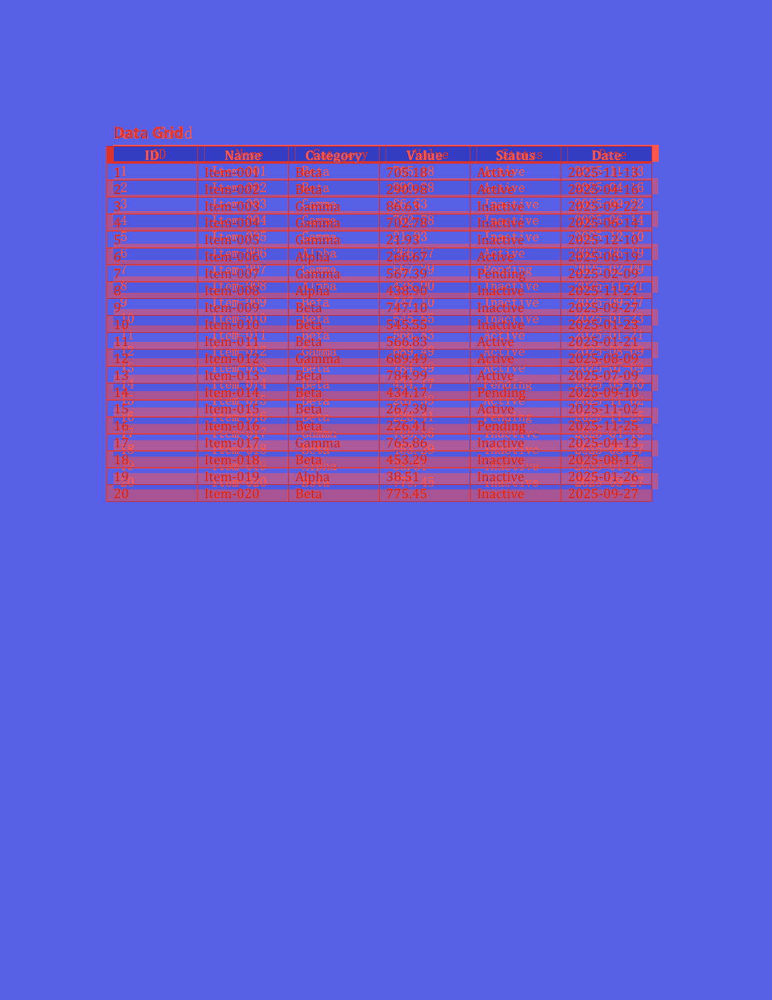</td>
  <td>changed: 308303 px (14.65%)<br>bbox: [175, 208, 1088, 829]<br>mean abs RGB: 11.2547<br>RMSE RGB: 41.0503<br>threshold: 12, gain: 5.0</td>
</tr>
<tr>
  <td><b>docx_classic149_merged_section_report</b><br>Page 1</td>
  <td></td>
  <td>changed: 162595 px (7.73%)<br>bbox: [175, 149, 1091, 671]<br>mean abs RGB: 10.4294<br>RMSE RGB: 46.2391<br>threshold: 12, gain: 5.0</td>
</tr>
<tr>
  <td><b>docx_classic150_kitchen_sink_styles</b><br>Page 1</td>
  <td></td>
  <td>changed: 184336 px (8.76%)<br>bbox: [175, 149, 1091, 1472]<br>mean abs RGB: 7.2375<br>RMSE RGB: 34.0714<br>threshold: 12, gain: 5.0</td>
</tr>
<tr>
  <td><b>docx_classic150_kitchen_sink_styles</b><br>Page 2</td>
  <td></td>
  <td>changed: 11694 px (0.56%)<br>bbox: [190, 159, 757, 388]<br>mean abs RGB: 0.8861<br>RMSE RGB: 13.4893<br>threshold: 12, gain: 5.0</td>
</tr>
</table>

## Visual Comparison

Scores compare python MiniPdf against Microsoft 365 Word Reference. LibreOffice is an auxiliary rendering and does not affect scores.

<table>
<tr><th>python MiniPdf</th><th>Microsoft 365 Word Reference</th><th>LibreOffice</th></tr>
<tr>
  <td><b>docx_classic01_single_paragraph<br><small>format: docx | case: docx_classic01_single_paragraph | scope: python-classic-docx</small></b></td>
  <td colspan="2">docx_classic01_single_paragraph <span style="color:#3fb950">⬤</span> 99.3%</td>
</tr>
<tr>
  <td></td>
  <td></td>
  <td></td>
</tr>
<tr>
  <td><b>docx_classic02_multiple_paragraphs<br><small>format: docx | case: docx_classic02_multiple_paragraphs | scope: python-classic-docx</small></b></td>
  <td colspan="2">docx_classic02_multiple_paragraphs <span style="color:#3fb950">⬤</span> 99.2%</td>
</tr>
<tr>
  <td>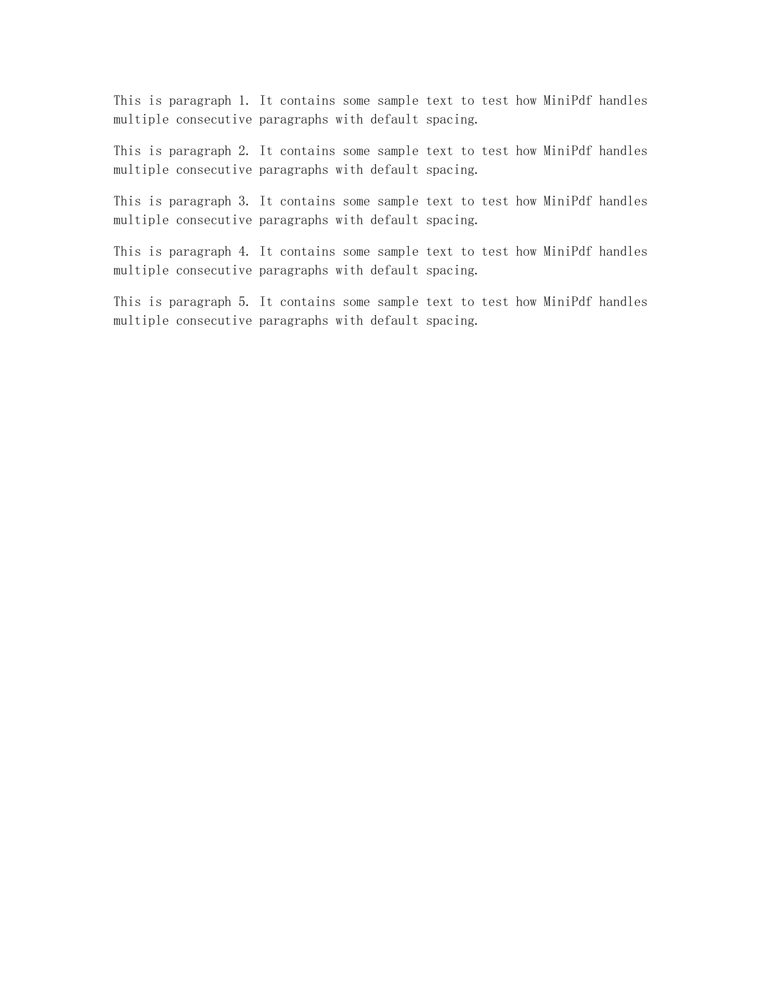</td>
  <td></td>
  <td></td>
</tr>
<tr>
  <td><b>docx_classic03_headings<br><small>format: docx | case: docx_classic03_headings | scope: python-classic-docx</small></b></td>
  <td colspan="2">docx_classic03_headings <span style="color:#3fb950">⬤</span> 99.8%</td>
</tr>
<tr>
  <td></td>
  <td></td>
  <td></td>
</tr>
<tr>
  <td><b>docx_classic04_bold_italic<br><small>format: docx | case: docx_classic04_bold_italic | scope: python-classic-docx</small></b></td>
  <td colspan="2">docx_classic04_bold_italic <span style="color:#3fb950">⬤</span> 99.9%</td>
</tr>
<tr>
  <td></td>
  <td></td>
  <td></td>
</tr>
<tr>
  <td><b>docx_classic05_font_sizes<br><small>format: docx | case: docx_classic05_font_sizes | scope: python-classic-docx</small></b></td>
  <td colspan="2">docx_classic05_font_sizes <span style="color:#3fb950">⬤</span> 99.6%</td>
</tr>
<tr>
  <td></td>
  <td></td>
  <td></td>
</tr>
<tr>
  <td><b>docx_classic06_font_colors<br><small>format: docx | case: docx_classic06_font_colors | scope: python-classic-docx</small></b></td>
  <td colspan="2">docx_classic06_font_colors <span style="color:#3fb950">⬤</span> 99.9%</td>
</tr>
<tr>
  <td></td>
  <td></td>
  <td></td>
</tr>
<tr>
  <td><b>docx_classic07_alignment<br><small>format: docx | case: docx_classic07_alignment | scope: python-classic-docx</small></b></td>
  <td colspan="2">docx_classic07_alignment <span style="color:#3fb950">⬤</span> 99.4%</td>
</tr>
<tr>
  <td></td>
  <td>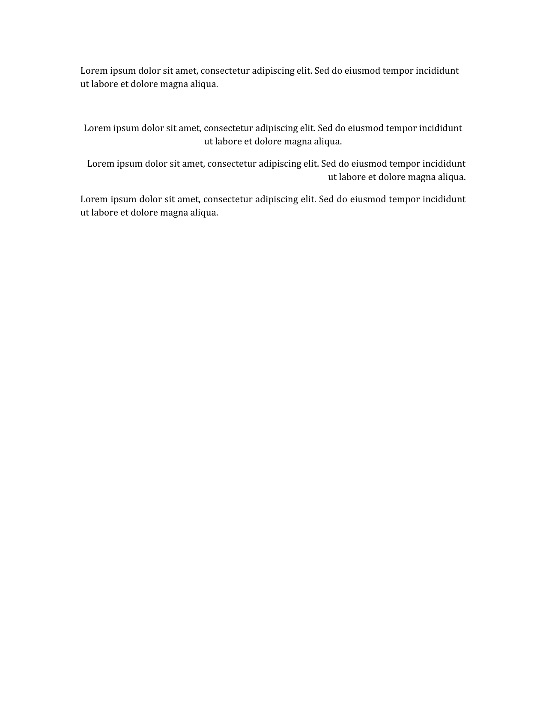</td>
  <td></td>
</tr>
<tr>
  <td><b>docx_classic08_bullet_list<br><small>format: docx | case: docx_classic08_bullet_list | scope: python-classic-docx</small></b></td>
  <td colspan="2">docx_classic08_bullet_list <span style="color:#3fb950">⬤</span> 96.6%</td>
</tr>
<tr>
  <td></td>
  <td></td>
  <td></td>
</tr>
<tr>
  <td><b>docx_classic09_numbered_list<br><small>format: docx | case: docx_classic09_numbered_list | scope: python-classic-docx</small></b></td>
  <td colspan="2">docx_classic09_numbered_list <span style="color:#3fb950">⬤</span> 97.0%</td>
</tr>
<tr>
  <td></td>
  <td></td>
  <td></td>
</tr>
<tr>
  <td><b>docx_classic10_simple_table<br><small>format: docx | case: docx_classic10_simple_table | scope: python-classic-docx</small></b></td>
  <td colspan="2">docx_classic10_simple_table <span style="color:#3fb950">⬤</span> 97.5%</td>
</tr>
<tr>
  <td></td>
  <td></td>
  <td></td>
</tr>
<tr>
  <td><b>docx_classic11_table_with_shading<br><small>format: docx | case: docx_classic11_table_with_shading | scope: python-classic-docx</small></b></td>
  <td colspan="2">docx_classic11_table_with_shading <span style="color:#3fb950">⬤</span> 99.3%</td>
</tr>
<tr>
  <td></td>
  <td></td>
  <td></td>
</tr>
<tr>
  <td><b>docx_classic12_merged_cells_table<br><small>format: docx | case: docx_classic12_merged_cells_table | scope: python-classic-docx</small></b></td>
  <td colspan="2">docx_classic12_merged_cells_table <span style="color:#3fb950">⬤</span> 95.8%</td>
</tr>
<tr>
  <td></td>
  <td></td>
  <td></td>
</tr>
<tr>
  <td><b>docx_classic13_long_document<br><small>format: docx | case: docx_classic13_long_document | scope: python-classic-docx</small></b></td>
  <td colspan="2">docx_classic13_long_document <span style="color:#3fb950">⬤</span> 90.1%</td>
</tr>
<tr>
  <td></td>
  <td></td>
  <td>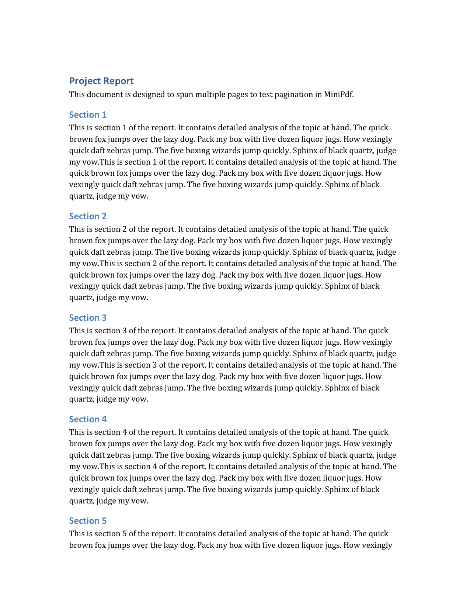</td>
</tr>
<tr>
  <td>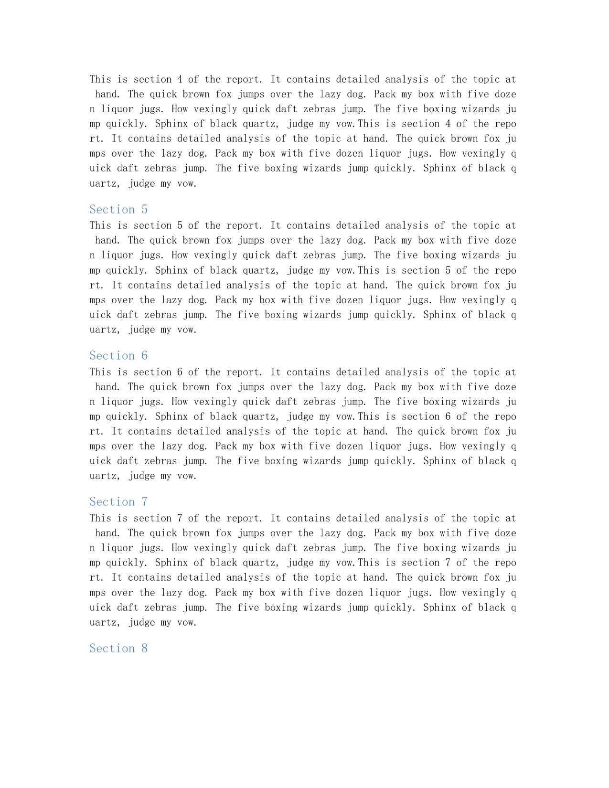</td>
  <td></td>
  <td></td>
</tr>
<tr>
  <td>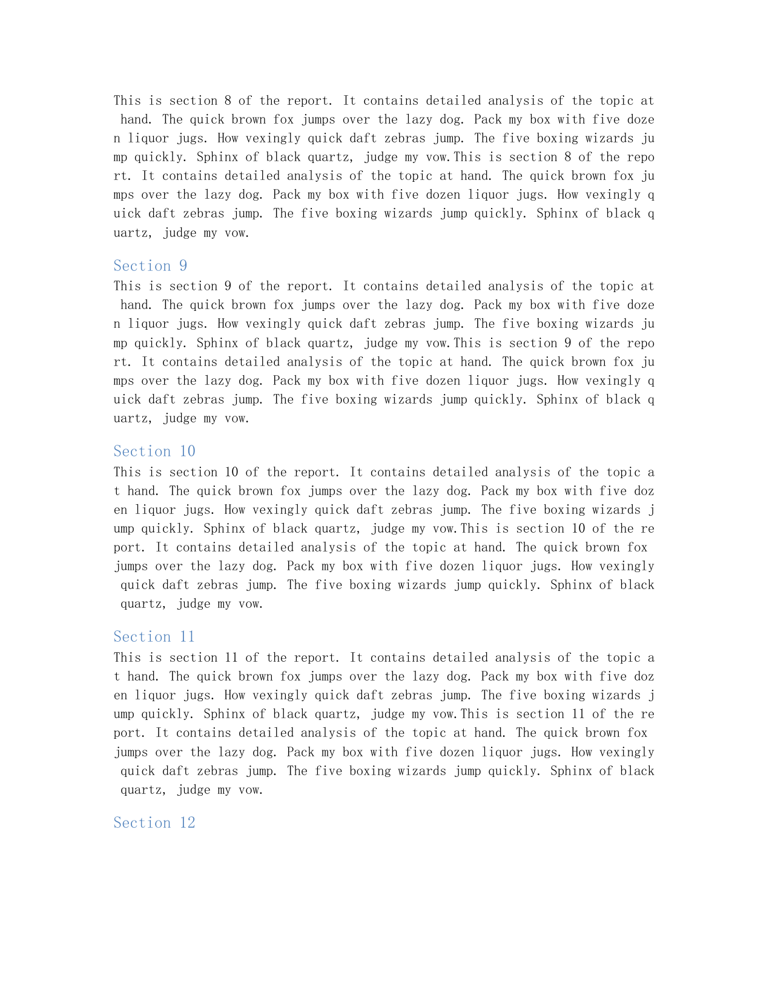</td>
  <td></td>
  <td></td>
</tr>
<tr>
  <td>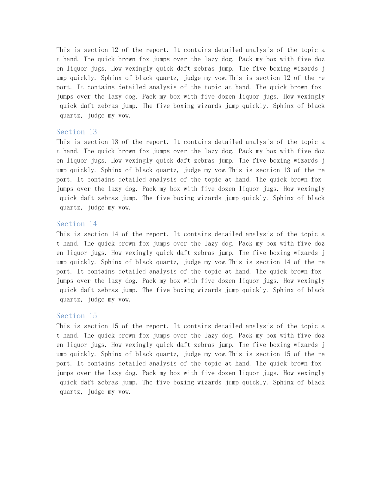</td>
  <td></td>
  <td></td>
</tr>
<tr>
  <td><b>docx_classic14_mixed_content<br><small>format: docx | case: docx_classic14_mixed_content | scope: python-classic-docx</small></b></td>
  <td colspan="2">docx_classic14_mixed_content <span style="color:#3fb950">⬤</span> 99.0%</td>
</tr>
<tr>
  <td></td>
  <td></td>
  <td></td>
</tr>
<tr>
  <td><b>docx_classic15_indentation<br><small>format: docx | case: docx_classic15_indentation | scope: python-classic-docx</small></b></td>
  <td colspan="2">docx_classic15_indentation <span style="color:#3fb950">⬤</span> 99.1%</td>
</tr>
<tr>
  <td>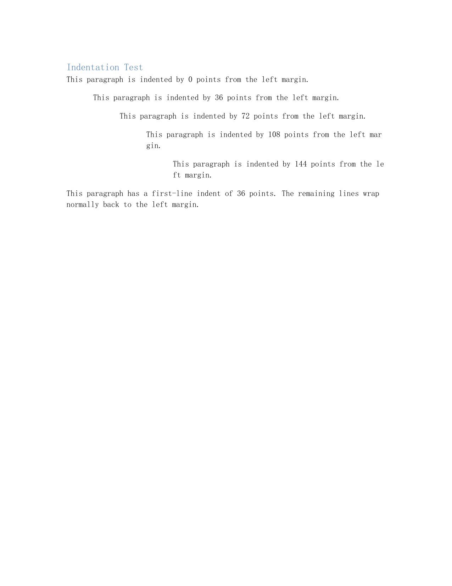</td>
  <td></td>
  <td></td>
</tr>
<tr>
  <td><b>docx_classic16_line_spacing<br><small>format: docx | case: docx_classic16_line_spacing | scope: python-classic-docx</small></b></td>
  <td colspan="2">docx_classic16_line_spacing <span style="color:#3fb950">⬤</span> 97.2%</td>
</tr>
<tr>
  <td>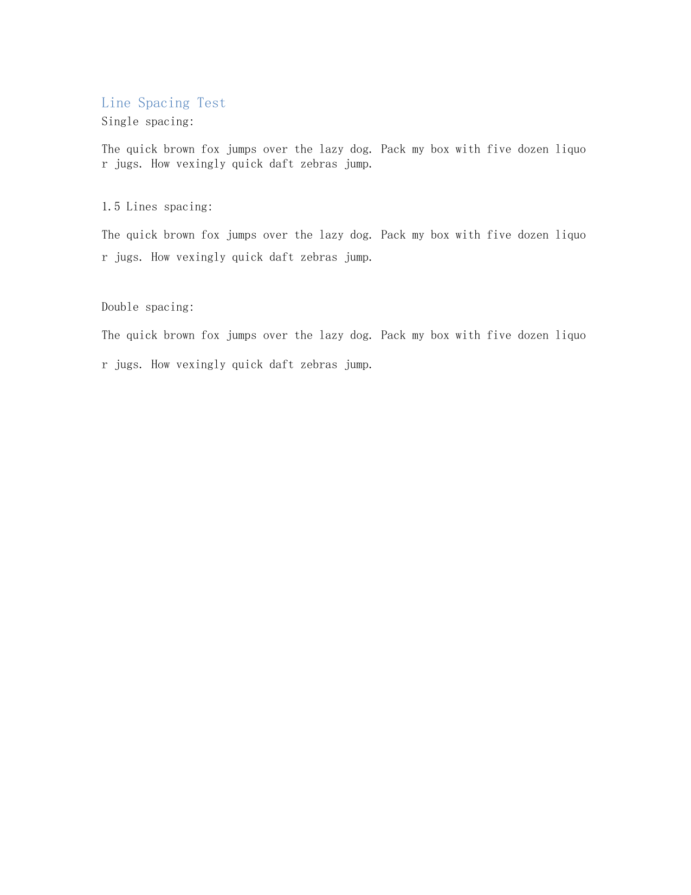</td>
  <td></td>
  <td></td>
</tr>
<tr>
  <td><b>docx_classic17_page_break<br><small>format: docx | case: docx_classic17_page_break | scope: python-classic-docx</small></b></td>
  <td colspan="2">docx_classic17_page_break <span style="color:#3fb950">⬤</span> 99.8%</td>
</tr>
<tr>
  <td></td>
  <td></td>
  <td></td>
</tr>
<tr>
  <td></td>
  <td></td>
  <td></td>
</tr>
<tr>
  <td></td>
  <td></td>
  <td></td>
</tr>
<tr>
  <td><b>docx_classic18_embedded_image<br><small>format: docx | case: docx_classic18_embedded_image | scope: python-classic-docx</small></b></td>
  <td colspan="2">docx_classic18_embedded_image <span style="color:#3fb950">⬤</span> 99.8%</td>
</tr>
<tr>
  <td></td>
  <td></td>
  <td></td>
</tr>
<tr>
  <td><b>docx_classic19_multiple_images<br><small>format: docx | case: docx_classic19_multiple_images | scope: python-classic-docx</small></b></td>
  <td colspan="2">docx_classic19_multiple_images <span style="color:#3fb950">⬤</span> 98.3%</td>
</tr>
<tr>
  <td></td>
  <td></td>
  <td></td>
</tr>
<tr>
  <td><b>docx_classic20_table_with_many_rows<br><small>format: docx | case: docx_classic20_table_with_many_rows | scope: python-classic-docx</small></b></td>
  <td colspan="2">docx_classic20_table_with_many_rows <span style="color:#3fb950">⬤</span> 95.4%</td>
</tr>
<tr>
  <td></td>
  <td></td>
  <td></td>
</tr>
<tr>
  <td><b>docx_classic21_nested_lists<br><small>format: docx | case: docx_classic21_nested_lists | scope: python-classic-docx</small></b></td>
  <td colspan="2">docx_classic21_nested_lists <span style="color:#3fb950">⬤</span> 97.3%</td>
</tr>
<tr>
  <td></td>
  <td></td>
  <td></td>
</tr>
<tr>
  <td><b>docx_classic22_horizontal_rule<br><small>format: docx | case: docx_classic22_horizontal_rule | scope: python-classic-docx</small></b></td>
  <td colspan="2">docx_classic22_horizontal_rule <span style="color:#3fb950">⬤</span> 99.7%</td>
</tr>
<tr>
  <td></td>
  <td></td>
  <td></td>
</tr>
<tr>
  <td><b>docx_classic23_mixed_formatting_runs<br><small>format: docx | case: docx_classic23_mixed_formatting_runs | scope: python-classic-docx</small></b></td>
  <td colspan="2">docx_classic23_mixed_formatting_runs <span style="color:#3fb950">⬤</span> 99.8%</td>
</tr>
<tr>
  <td></td>
  <td></td>
  <td></td>
</tr>
<tr>
  <td><b>docx_classic24_two_column_table_layout<br><small>format: docx | case: docx_classic24_two_column_table_layout | scope: python-classic-docx</small></b></td>
  <td colspan="2">docx_classic24_two_column_table_layout <span style="color:#d29922">⬤</span> 89.1%</td>
</tr>
<tr>
  <td></td>
  <td></td>
  <td></td>
</tr>
<tr>
  <td><b>docx_classic25_title_and_subtitle<br><small>format: docx | case: docx_classic25_title_and_subtitle | scope: python-classic-docx</small></b></td>
  <td colspan="2">docx_classic25_title_and_subtitle <span style="color:#3fb950">⬤</span> 99.5%</td>
</tr>
<tr>
  <td>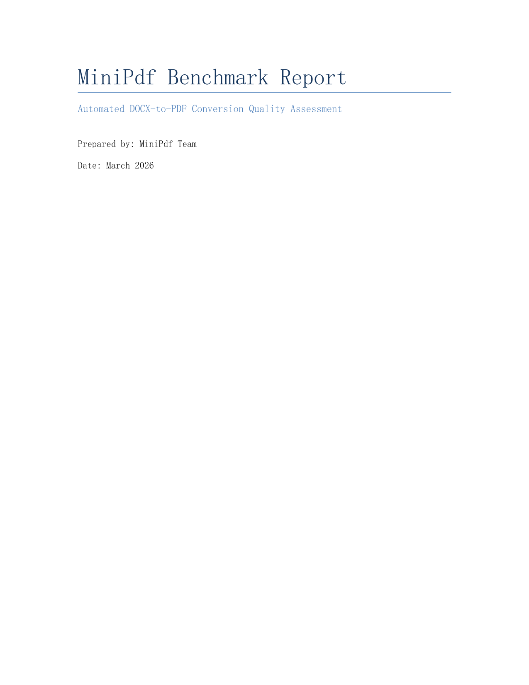</td>
  <td></td>
  <td></td>
</tr>
<tr>
  <td></td>
  <td></td>
  <td></td>
</tr>
<tr>
  <td><b>docx_classic26_table_alignment<br><small>format: docx | case: docx_classic26_table_alignment | scope: python-classic-docx</small></b></td>
  <td colspan="2">docx_classic26_table_alignment <span style="color:#3fb950">⬤</span> 94.9%</td>
</tr>
<tr>
  <td></td>
  <td></td>
  <td></td>
</tr>
<tr>
  <td><b>docx_classic27_long_paragraph_wrapping<br><small>format: docx | case: docx_classic27_long_paragraph_wrapping | scope: python-classic-docx</small></b></td>
  <td colspan="2">docx_classic27_long_paragraph_wrapping <span style="color:#3fb950">⬤</span> 96.7%</td>
</tr>
<tr>
  <td></td>
  <td></td>
  <td></td>
</tr>
<tr>
  <td><b>docx_classic28_special_characters<br><small>format: docx | case: docx_classic28_special_characters | scope: python-classic-docx</small></b></td>
  <td colspan="2">docx_classic28_special_characters <span style="color:#3fb950">⬤</span> 99.7%</td>
</tr>
<tr>
  <td>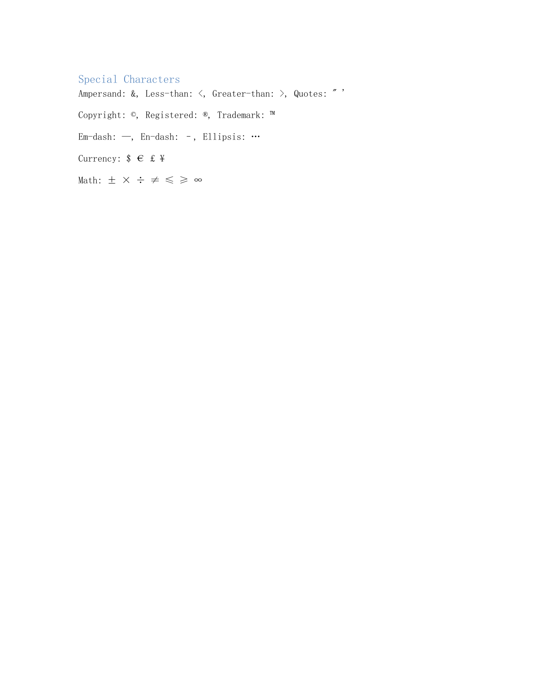</td>
  <td></td>
  <td></td>
</tr>
<tr>
  <td><b>docx_classic29_table_with_image<br><small>format: docx | case: docx_classic29_table_with_image | scope: python-classic-docx</small></b></td>
  <td colspan="2">docx_classic29_table_with_image <span style="color:#3fb950">⬤</span> 98.0%</td>
</tr>
<tr>
  <td></td>
  <td></td>
  <td></td>
</tr>
<tr>
  <td><b>docx_classic30_comprehensive_report<br><small>format: docx | case: docx_classic30_comprehensive_report | scope: python-classic-docx</small></b></td>
  <td colspan="2">docx_classic30_comprehensive_report <span style="color:#3fb950">⬤</span> 98.7%</td>
</tr>
<tr>
  <td></td>
  <td></td>
  <td></td>
</tr>
<tr>
  <td>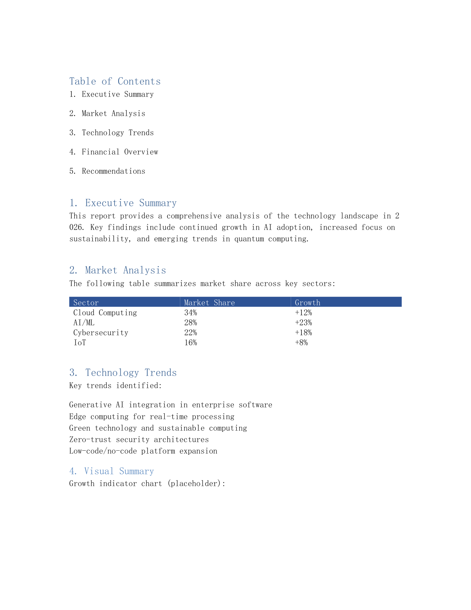</td>
  <td></td>
  <td></td>
</tr>
<tr>
  <td></td>
  <td></td>
  <td></td>
</tr>
<tr>
  <td><b>docx_classic31_product_card_with_image<br><small>format: docx | case: docx_classic31_product_card_with_image | scope: python-classic-docx</small></b></td>
  <td colspan="2">docx_classic31_product_card_with_image <span style="color:#3fb950">⬤</span> 99.2%</td>
</tr>
<tr>
  <td></td>
  <td></td>
  <td></td>
</tr>
<tr>
  <td><b>docx_classic31_strikethrough_text<br><small>format: docx | case: docx_classic31_strikethrough_text | scope: python-classic-docx</small></b></td>
  <td colspan="2">docx_classic31_strikethrough_text <span style="color:#3fb950">⬤</span> 99.6%</td>
</tr>
<tr>
  <td></td>
  <td></td>
  <td></td>
</tr>
<tr>
  <td><b>docx_classic32_company_logo_header<br><small>format: docx | case: docx_classic32_company_logo_header | scope: python-classic-docx</small></b></td>
  <td colspan="2">docx_classic32_company_logo_header <span style="color:#3fb950">⬤</span> 98.1%</td>
</tr>
<tr>
  <td>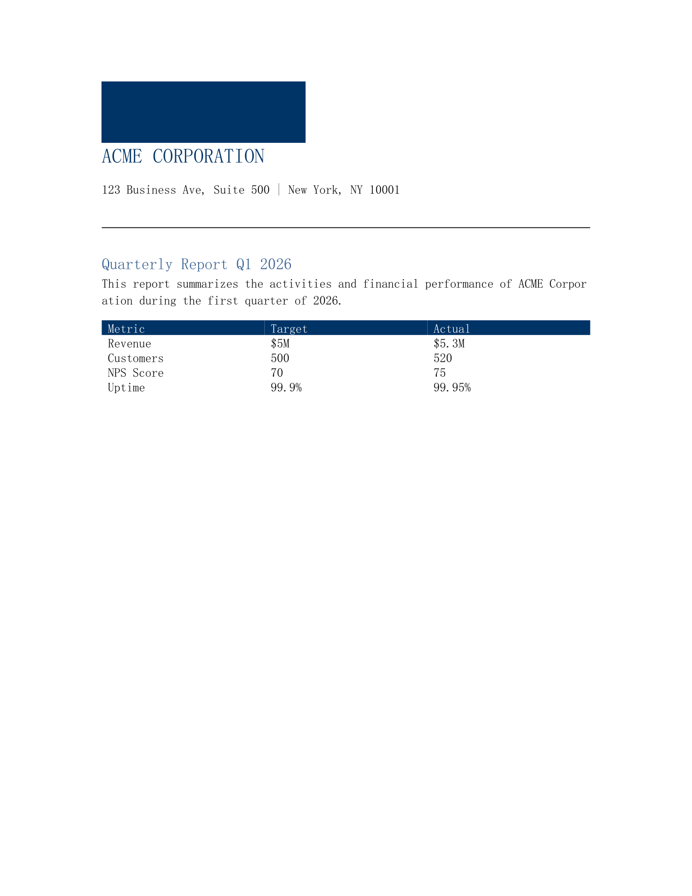</td>
  <td></td>
  <td></td>
</tr>
<tr>
  <td><b>docx_classic32_superscript_subscript<br><small>format: docx | case: docx_classic32_superscript_subscript | scope: python-classic-docx</small></b></td>
  <td colspan="2">docx_classic32_superscript_subscript <span style="color:#3fb950">⬤</span> 96.9%</td>
</tr>
<tr>
  <td>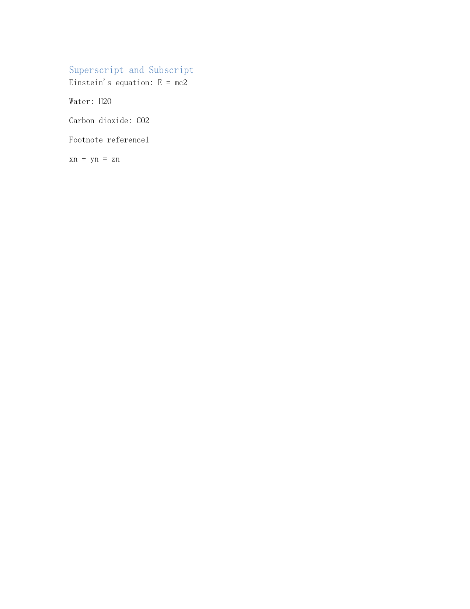</td>
  <td></td>
  <td></td>
</tr>
<tr>
  <td><b>docx_classic33_highlighted_text<br><small>format: docx | case: docx_classic33_highlighted_text | scope: python-classic-docx</small></b></td>
  <td colspan="2">docx_classic33_highlighted_text <span style="color:#3fb950">⬤</span> 94.8%</td>
</tr>
<tr>
  <td>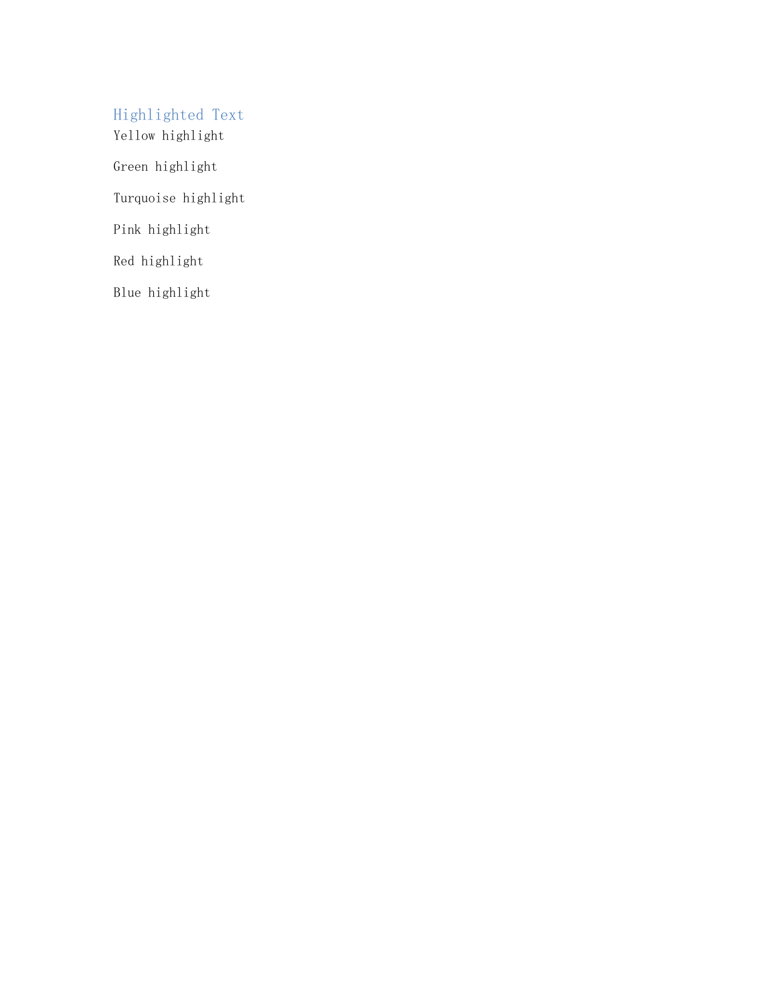</td>
  <td></td>
  <td></td>
</tr>
<tr>
  <td><b>docx_classic33_two_products_side_by_side<br><small>format: docx | case: docx_classic33_two_products_side_by_side | scope: python-classic-docx</small></b></td>
  <td colspan="2">docx_classic33_two_products_side_by_side <span style="color:#3fb950">⬤</span> 98.2%</td>
</tr>
<tr>
  <td></td>
  <td></td>
  <td></td>
</tr>
<tr>
  <td><b>docx_classic34_employee_directory_with_photo<br><small>format: docx | case: docx_classic34_employee_directory_with_photo | scope: python-classic-docx</small></b></td>
  <td colspan="2">docx_classic34_employee_directory_with_photo <span style="color:#3fb950">⬤</span> 98.5%</td>
</tr>
<tr>
  <td></td>
  <td></td>
  <td></td>
</tr>
<tr>
  <td></td>
  <td></td>
  <td></td>
</tr>
<tr>
  <td><b>docx_classic34_paragraph_borders<br><small>format: docx | case: docx_classic34_paragraph_borders | scope: python-classic-docx</small></b></td>
  <td colspan="2">docx_classic34_paragraph_borders <span style="color:#3fb950">⬤</span> 99.4%</td>
</tr>
<tr>
  <td></td>
  <td></td>
  <td></td>
</tr>
<tr>
  <td><b>docx_classic35_inventory_with_product_photos<br><small>format: docx | case: docx_classic35_inventory_with_product_photos | scope: python-classic-docx</small></b></td>
  <td colspan="2">docx_classic35_inventory_with_product_photos <span style="color:#f85149">⬤</span> 68.6%</td>
</tr>
<tr>
  <td>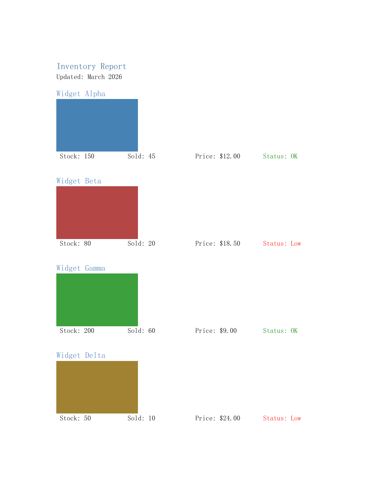</td>
  <td></td>
  <td></td>
</tr>
<tr>
  <td><i>missing</i></td>
  <td></td>
  <td></td>
</tr>
<tr>
  <td><b>docx_classic35_tab_stops<br><small>format: docx | case: docx_classic35_tab_stops | scope: python-classic-docx</small></b></td>
  <td colspan="2">docx_classic35_tab_stops <span style="color:#3fb950">⬤</span> 93.8%</td>
</tr>
<tr>
  <td></td>
  <td></td>
  <td></td>
</tr>
<tr>
  <td><b>docx_classic36_invoice_with_logo<br><small>format: docx | case: docx_classic36_invoice_with_logo | scope: python-classic-docx</small></b></td>
  <td colspan="2">docx_classic36_invoice_with_logo <span style="color:#3fb950">⬤</span> 98.8%</td>
</tr>
<tr>
  <td>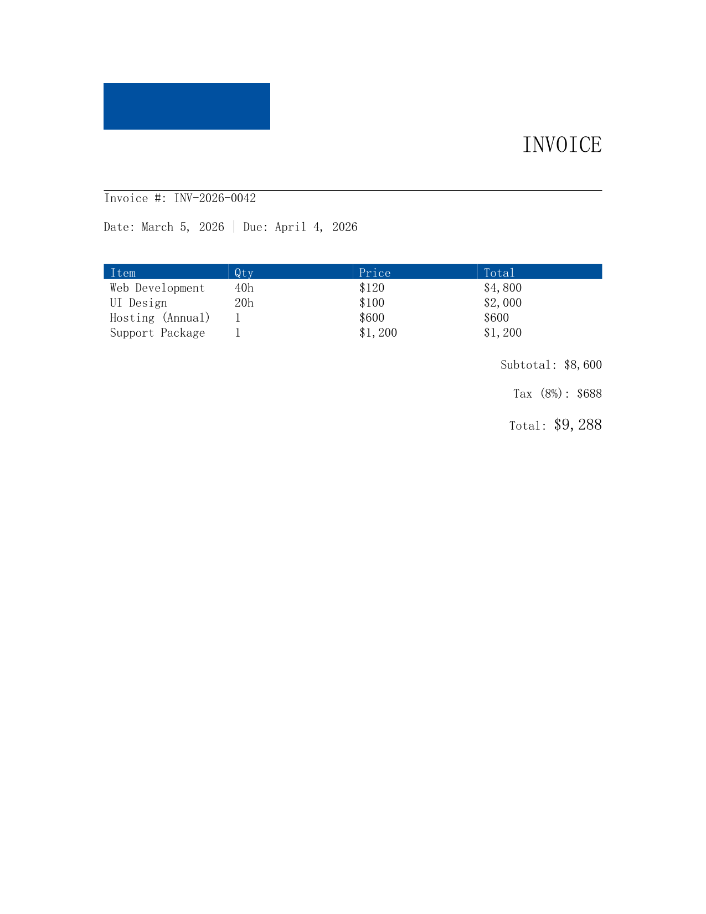</td>
  <td></td>
  <td></td>
</tr>
<tr>
  <td><b>docx_classic36_wide_table<br><small>format: docx | case: docx_classic36_wide_table | scope: python-classic-docx</small></b></td>
  <td colspan="2">docx_classic36_wide_table <span style="color:#3fb950">⬤</span> 99.3%</td>
</tr>
<tr>
  <td></td>
  <td></td>
  <td></td>
</tr>
<tr>
  <td><b>docx_classic37_nested_table<br><small>format: docx | case: docx_classic37_nested_table | scope: python-classic-docx</small></b></td>
  <td colspan="2">docx_classic37_nested_table <span style="color:#d29922">⬤</span> 89.3%</td>
</tr>
<tr>
  <td></td>
  <td></td>
  <td></td>
</tr>
<tr>
  <td><b>docx_classic37_real_estate_listing<br><small>format: docx | case: docx_classic37_real_estate_listing | scope: python-classic-docx</small></b></td>
  <td colspan="2">docx_classic37_real_estate_listing <span style="color:#3fb950">⬤</span> 98.9%</td>
</tr>
<tr>
  <td></td>
  <td></td>
  <td></td>
</tr>
<tr>
  <td><b>docx_classic38_restaurant_menu_with_photos<br><small>format: docx | case: docx_classic38_restaurant_menu_with_photos | scope: python-classic-docx</small></b></td>
  <td colspan="2">docx_classic38_restaurant_menu_with_photos <span style="color:#3fb950">⬤</span> 96.8%</td>
</tr>
<tr>
  <td>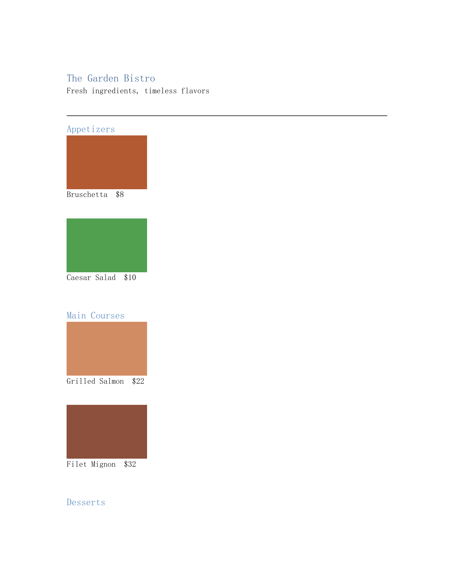</td>
  <td></td>
  <td></td>
</tr>
<tr>
  <td>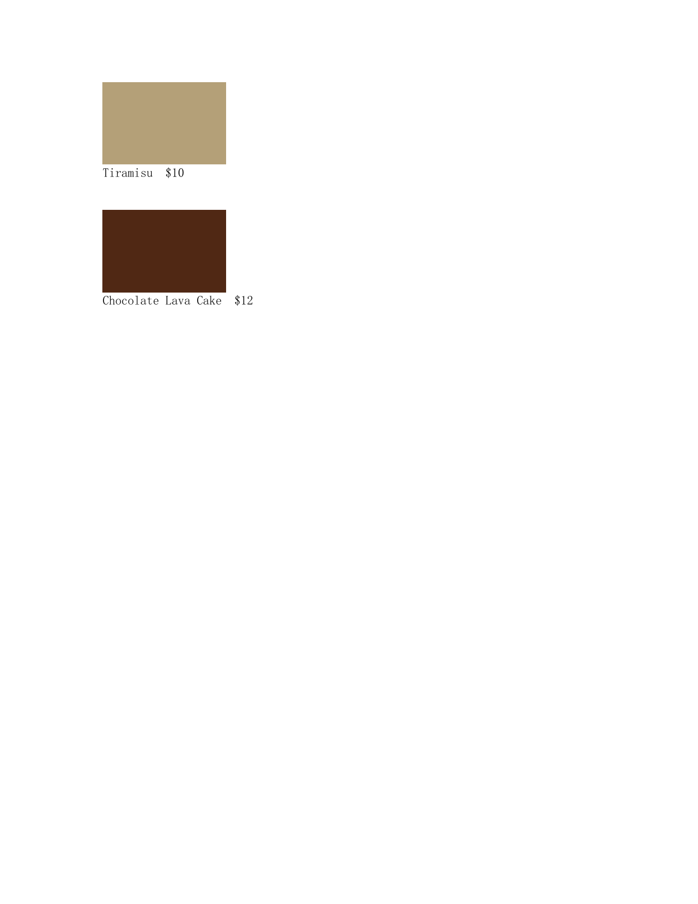</td>
  <td></td>
  <td></td>
</tr>
<tr>
  <td><b>docx_classic38_table_column_widths<br><small>format: docx | case: docx_classic38_table_column_widths | scope: python-classic-docx</small></b></td>
  <td colspan="2">docx_classic38_table_column_widths <span style="color:#3fb950">⬤</span> 90.1%</td>
</tr>
<tr>
  <td></td>
  <td></td>
  <td></td>
</tr>
<tr>
  <td><b>docx_classic39_cover_page_with_image<br><small>format: docx | case: docx_classic39_cover_page_with_image | scope: python-classic-docx</small></b></td>
  <td colspan="2">docx_classic39_cover_page_with_image <span style="color:#3fb950">⬤</span> 98.1%</td>
</tr>
<tr>
  <td>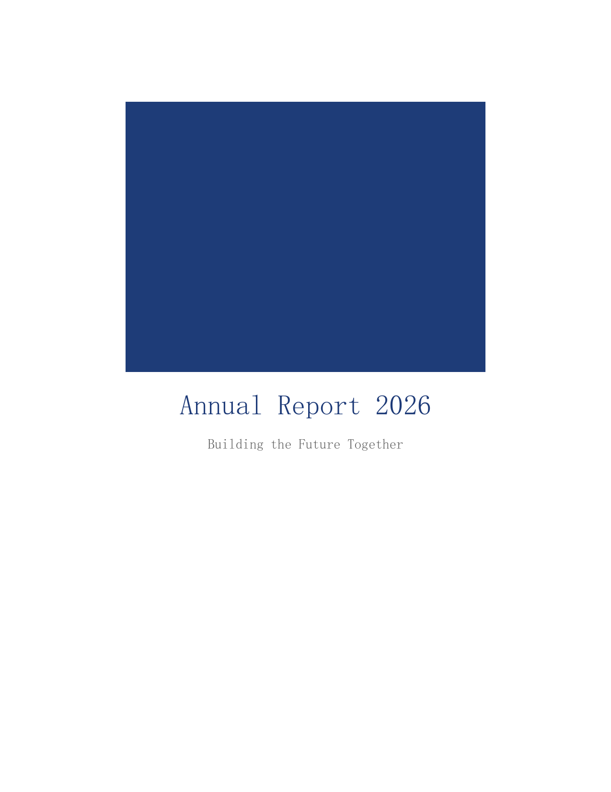</td>
  <td></td>
  <td>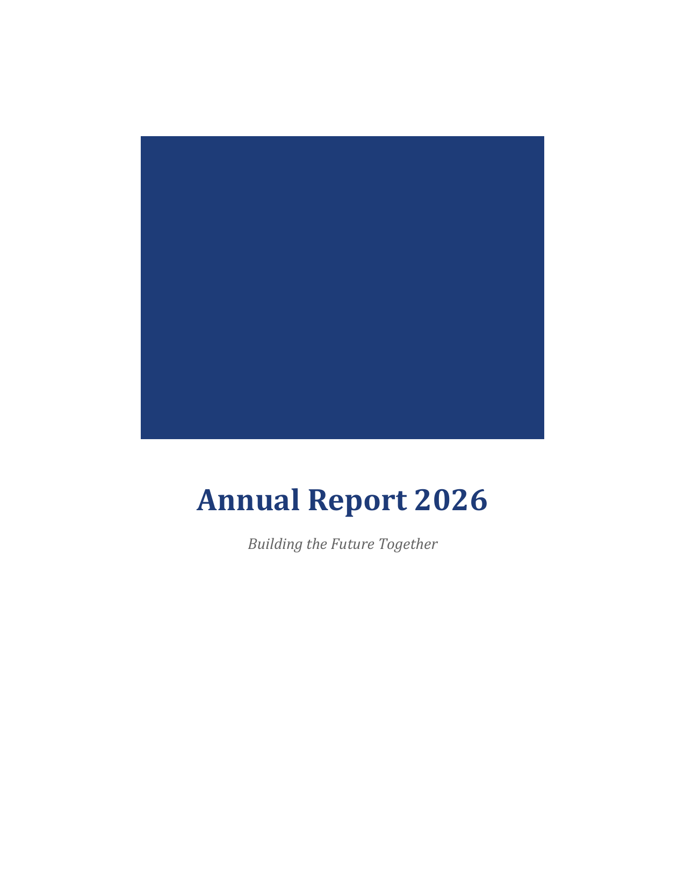</td>
</tr>
<tr>
  <td>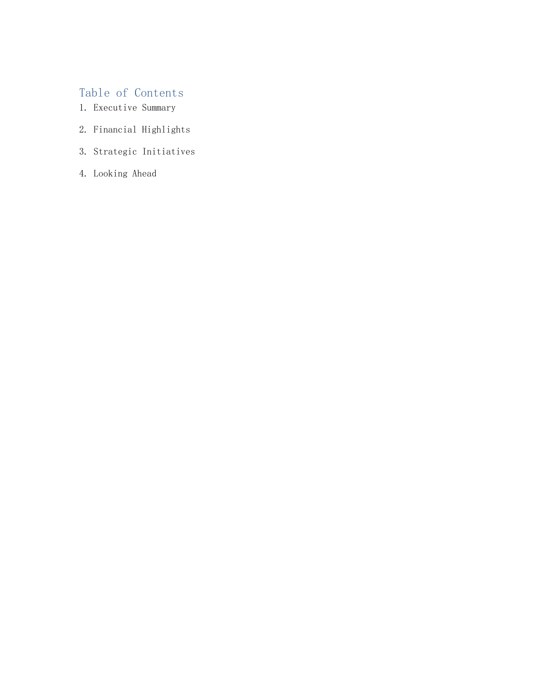</td>
  <td></td>
  <td></td>
</tr>
<tr>
  <td><b>docx_classic39_financial_report<br><small>format: docx | case: docx_classic39_financial_report | scope: python-classic-docx</small></b></td>
  <td colspan="2">docx_classic39_financial_report <span style="color:#3fb950">⬤</span> 99.3%</td>
</tr>
<tr>
  <td></td>
  <td></td>
  <td></td>
</tr>
<tr>
  <td><b>docx_classic40_product_catalog_with_images<br><small>format: docx | case: docx_classic40_product_catalog_with_images | scope: python-classic-docx</small></b></td>
  <td colspan="2">docx_classic40_product_catalog_with_images <span style="color:#3fb950">⬤</span> 98.9%</td>
</tr>
<tr>
  <td>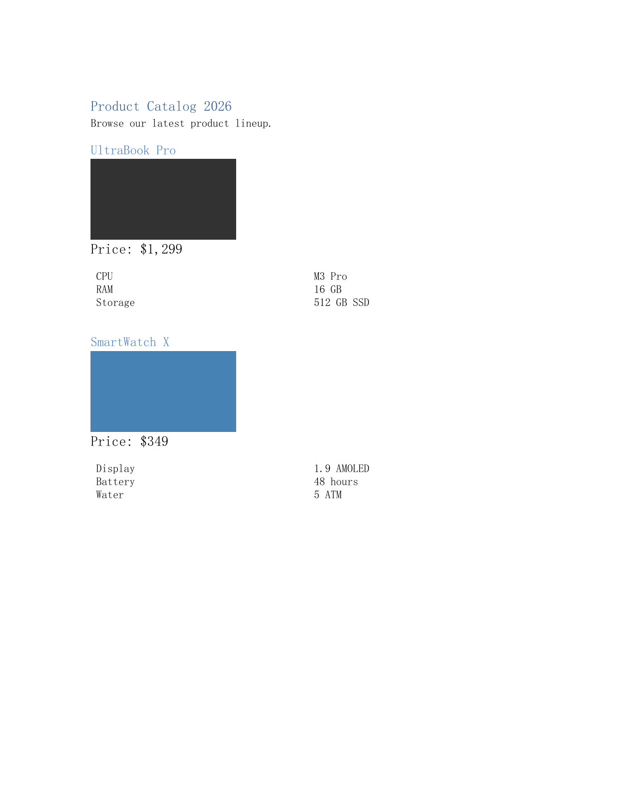</td>
  <td></td>
  <td></td>
</tr>
<tr>
  <td><b>docx_classic40_resume<br><small>format: docx | case: docx_classic40_resume | scope: python-classic-docx</small></b></td>
  <td colspan="2">docx_classic40_resume <span style="color:#3fb950">⬤</span> 98.5%</td>
</tr>
<tr>
  <td></td>
  <td></td>
  <td></td>
</tr>
<tr>
  <td><b>docx_classic41_business_letter<br><small>format: docx | case: docx_classic41_business_letter | scope: python-classic-docx</small></b></td>
  <td colspan="2">docx_classic41_business_letter <span style="color:#3fb950">⬤</span> 98.1%</td>
</tr>
<tr>
  <td></td>
  <td></td>
  <td></td>
</tr>
<tr>
  <td><b>docx_classic41_newsletter_with_hero_image<br><small>format: docx | case: docx_classic41_newsletter_with_hero_image | scope: python-classic-docx</small></b></td>
  <td colspan="2">docx_classic41_newsletter_with_hero_image <span style="color:#3fb950">⬤</span> 97.4%</td>
</tr>
<tr>
  <td>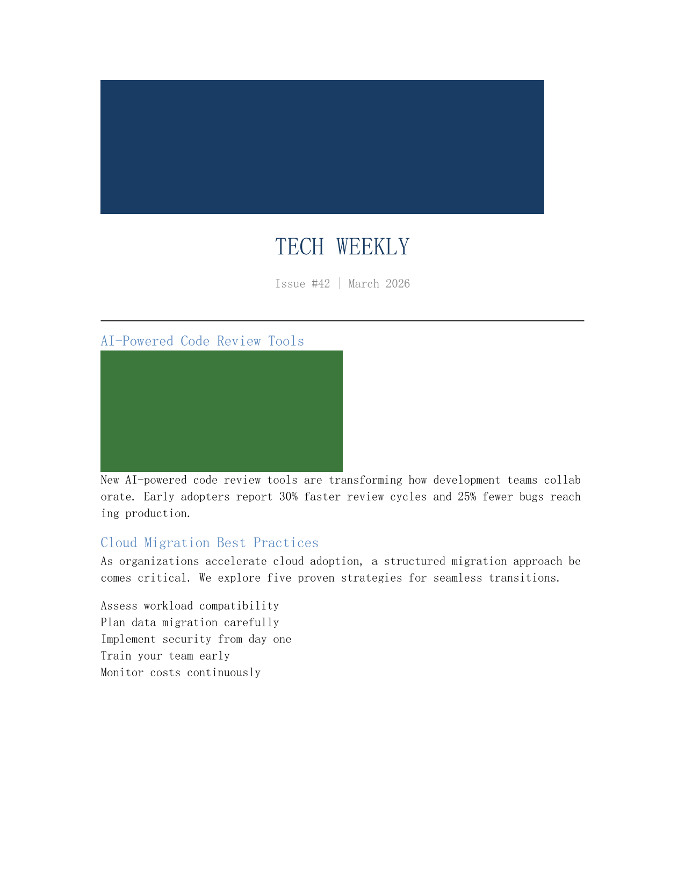</td>
  <td></td>
  <td></td>
</tr>
<tr>
  <td><b>docx_classic42_chart_image_with_data<br><small>format: docx | case: docx_classic42_chart_image_with_data | scope: python-classic-docx</small></b></td>
  <td colspan="2">docx_classic42_chart_image_with_data <span style="color:#3fb950">⬤</span> 98.8%</td>
</tr>
<tr>
  <td>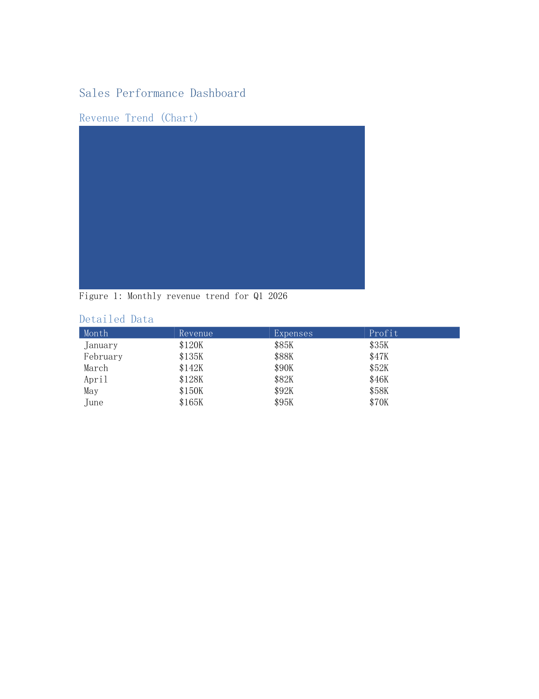</td>
  <td></td>
  <td></td>
</tr>
<tr>
  <td><b>docx_classic42_meeting_minutes<br><small>format: docx | case: docx_classic42_meeting_minutes | scope: python-classic-docx</small></b></td>
  <td colspan="2">docx_classic42_meeting_minutes <span style="color:#3fb950">⬤</span> 95.5%</td>
</tr>
<tr>
  <td></td>
  <td></td>
  <td></td>
</tr>
<tr>
  <td><b>docx_classic43_event_flyer_with_banner<br><small>format: docx | case: docx_classic43_event_flyer_with_banner | scope: python-classic-docx</small></b></td>
  <td colspan="2">docx_classic43_event_flyer_with_banner <span style="color:#3fb950">⬤</span> 97.1%</td>
</tr>
<tr>
  <td>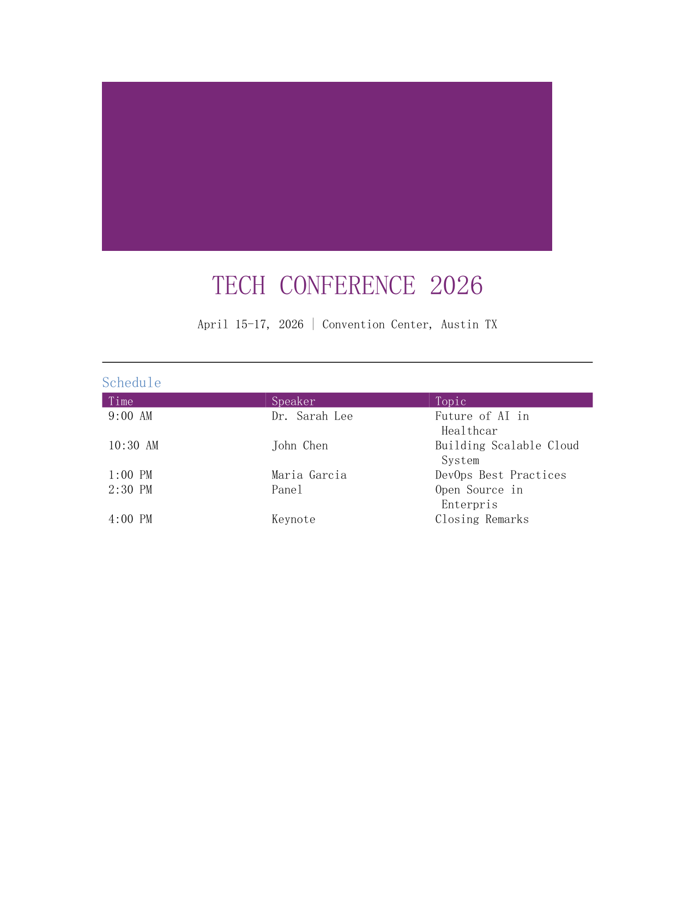</td>
  <td></td>
  <td></td>
</tr>
<tr>
  <td><b>docx_classic43_invoice_document<br><small>format: docx | case: docx_classic43_invoice_document | scope: python-classic-docx</small></b></td>
  <td colspan="2">docx_classic43_invoice_document <span style="color:#3fb950">⬤</span> 97.1%</td>
</tr>
<tr>
  <td>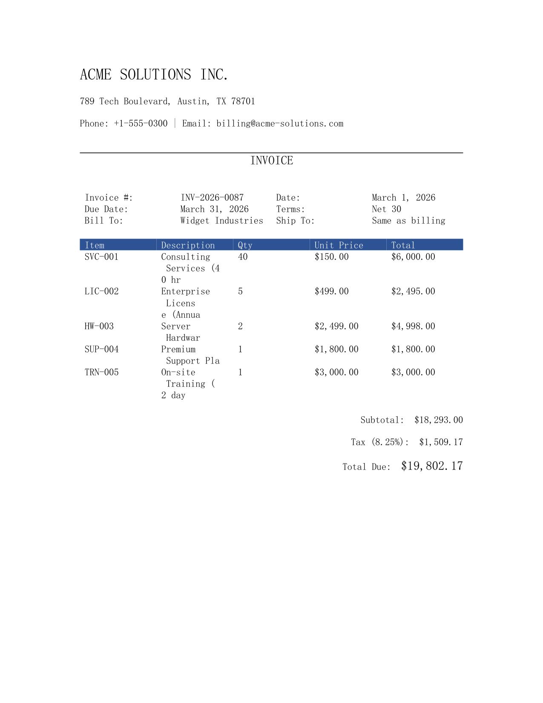</td>
  <td></td>
  <td></td>
</tr>
<tr>
  <td><b>docx_classic44_dashboard_with_kpi_image<br><small>format: docx | case: docx_classic44_dashboard_with_kpi_image | scope: python-classic-docx</small></b></td>
  <td colspan="2">docx_classic44_dashboard_with_kpi_image <span style="color:#3fb950">⬤</span> 98.9%</td>
</tr>
<tr>
  <td></td>
  <td></td>
  <td></td>
</tr>
<tr>
  <td><b>docx_classic44_memo<br><small>format: docx | case: docx_classic44_memo | scope: python-classic-docx</small></b></td>
  <td colspan="2">docx_classic44_memo <span style="color:#3fb950">⬤</span> 97.6%</td>
</tr>
<tr>
  <td>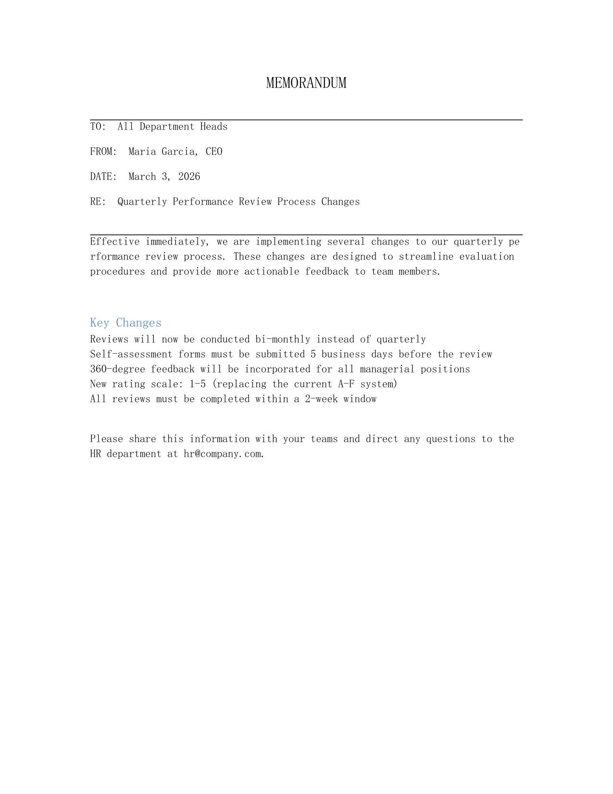</td>
  <td></td>
  <td>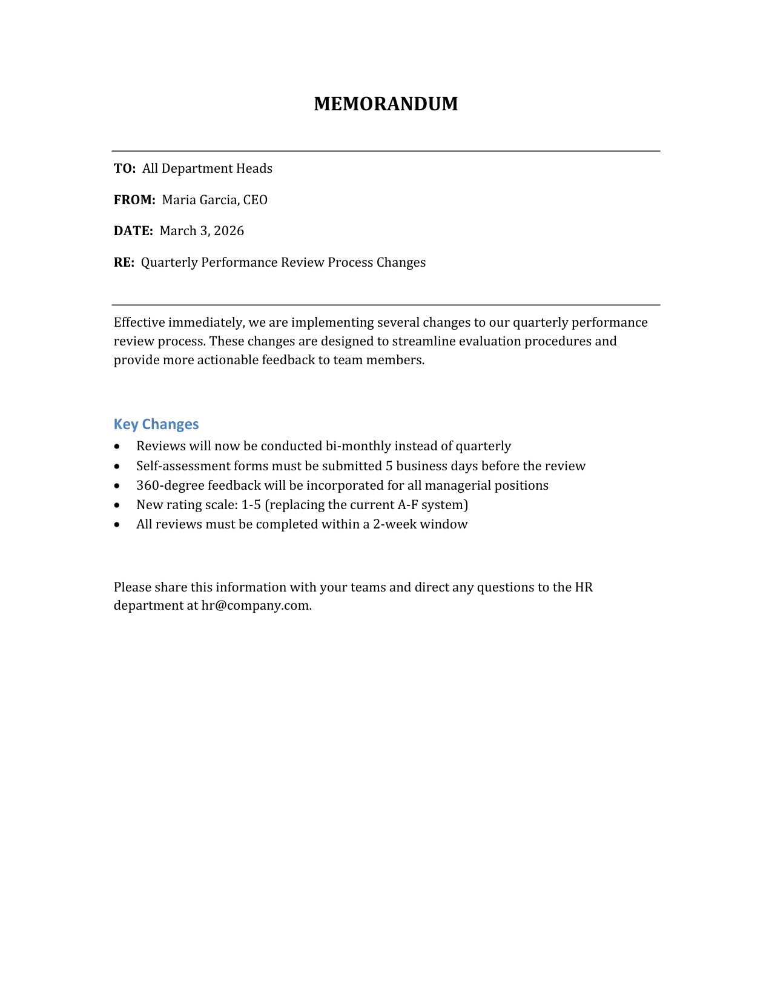</td>
</tr>
<tr>
  <td><b>docx_classic45_certificate_with_seal<br><small>format: docx | case: docx_classic45_certificate_with_seal | scope: python-classic-docx</small></b></td>
  <td colspan="2">docx_classic45_certificate_with_seal <span style="color:#3fb950">⬤</span> 98.6%</td>
</tr>
<tr>
  <td>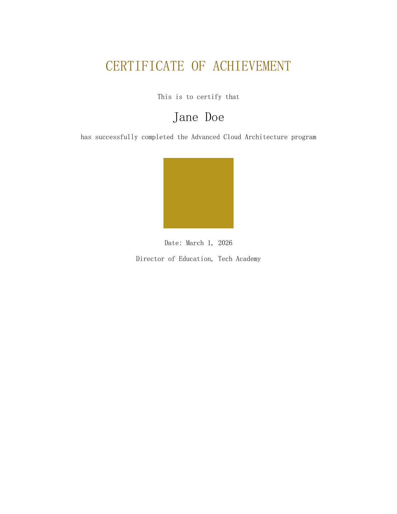</td>
  <td></td>
  <td></td>
</tr>
<tr>
  <td><b>docx_classic45_project_plan<br><small>format: docx | case: docx_classic45_project_plan | scope: python-classic-docx</small></b></td>
  <td colspan="2">docx_classic45_project_plan <span style="color:#3fb950">⬤</span> 96.5%</td>
</tr>
<tr>
  <td></td>
  <td></td>
  <td></td>
</tr>
<tr>
  <td><b>docx_classic46_comparison_table<br><small>format: docx | case: docx_classic46_comparison_table | scope: python-classic-docx</small></b></td>
  <td colspan="2">docx_classic46_comparison_table <span style="color:#3fb950">⬤</span> 99.2%</td>
</tr>
<tr>
  <td>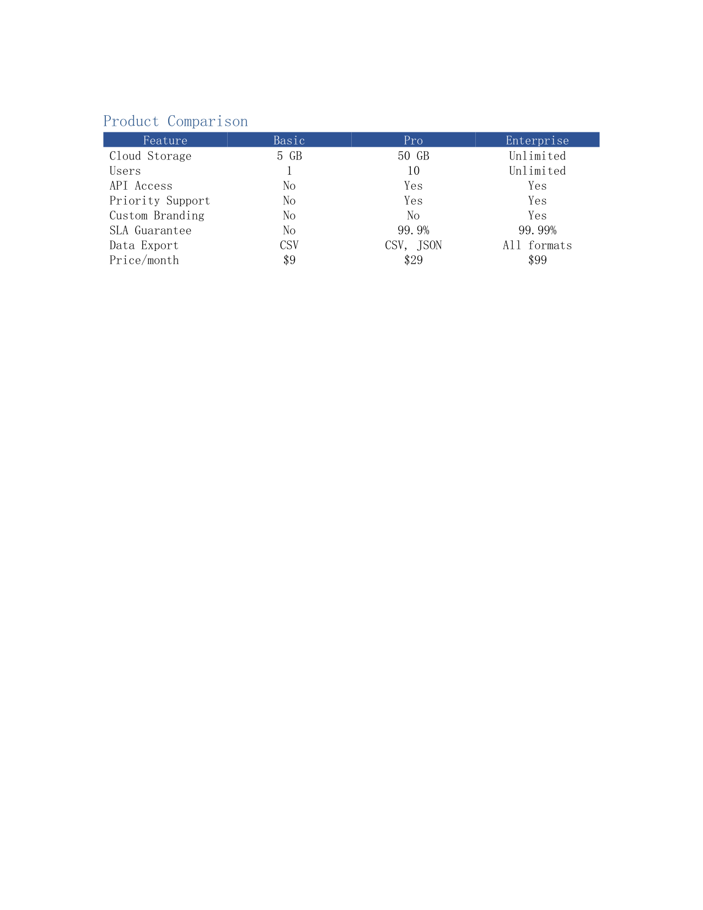</td>
  <td></td>
  <td></td>
</tr>
<tr>
  <td><b>docx_classic46_product_image_grid<br><small>format: docx | case: docx_classic46_product_image_grid | scope: python-classic-docx</small></b></td>
  <td colspan="2">docx_classic46_product_image_grid <span style="color:#3fb950">⬤</span> 97.9%</td>
</tr>
<tr>
  <td>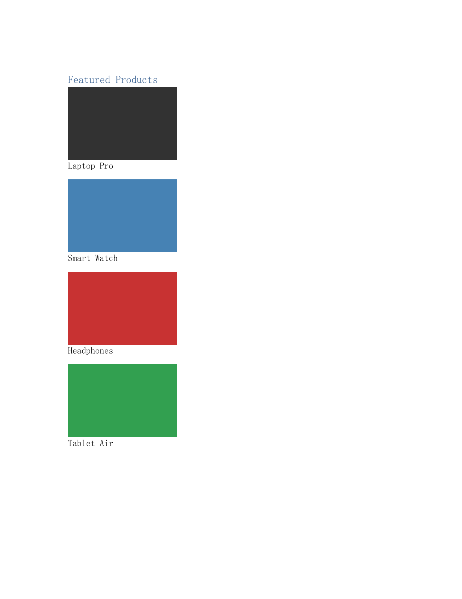</td>
  <td></td>
  <td></td>
</tr>
<tr>
  <td><b>docx_classic47_data_dictionary<br><small>format: docx | case: docx_classic47_data_dictionary | scope: python-classic-docx</small></b></td>
  <td colspan="2">docx_classic47_data_dictionary <span style="color:#3fb950">⬤</span> 97.7%</td>
</tr>
<tr>
  <td></td>
  <td></td>
  <td></td>
</tr>
<tr>
  <td><b>docx_classic47_news_article_with_hero_image<br><small>format: docx | case: docx_classic47_news_article_with_hero_image | scope: python-classic-docx</small></b></td>
  <td colspan="2">docx_classic47_news_article_with_hero_image <span style="color:#3fb950">⬤</span> 98.1%</td>
</tr>
<tr>
  <td>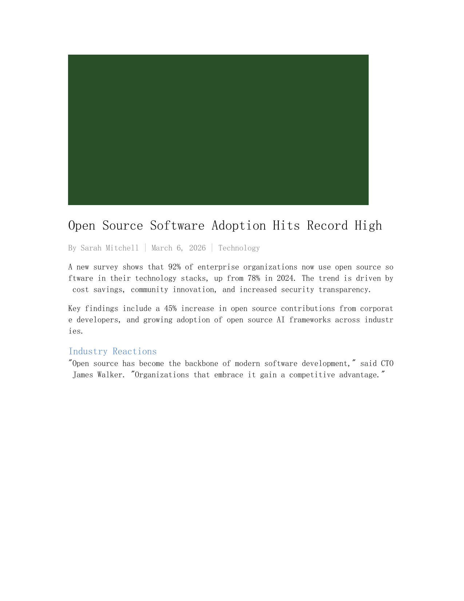</td>
  <td></td>
  <td></td>
</tr>
<tr>
  <td><b>docx_classic48_multi_level_headings<br><small>format: docx | case: docx_classic48_multi_level_headings | scope: python-classic-docx</small></b></td>
  <td colspan="2">docx_classic48_multi_level_headings <span style="color:#3fb950">⬤</span> 98.9%</td>
</tr>
<tr>
  <td>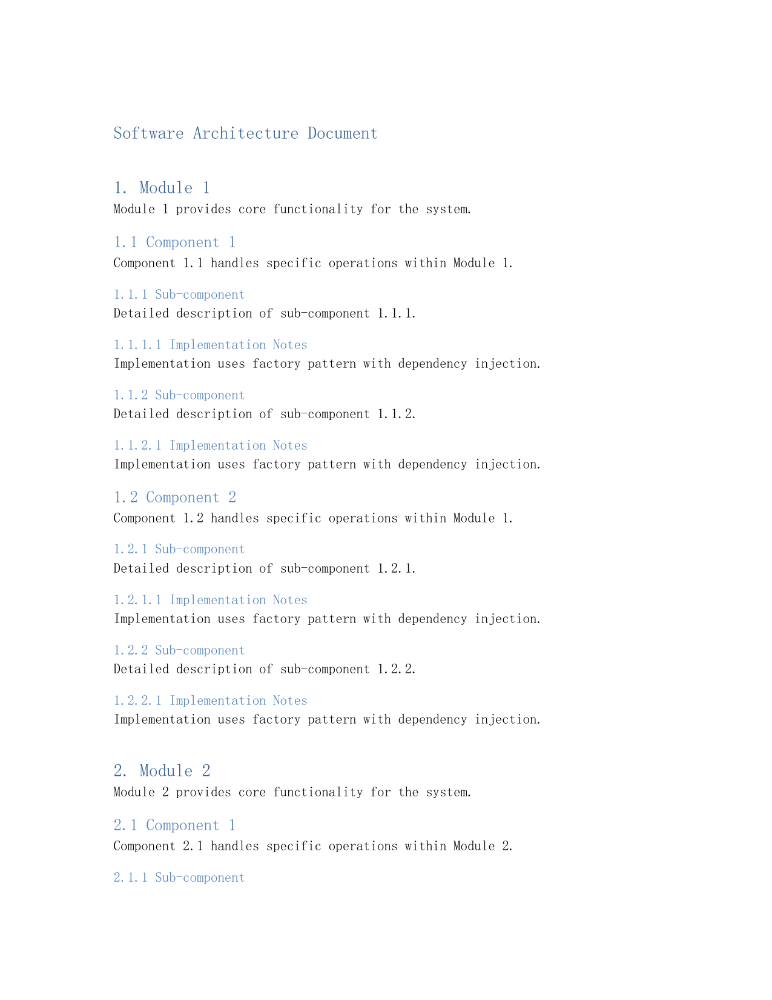</td>
  <td></td>
  <td></td>
</tr>
<tr>
  <td></td>
  <td></td>
  <td></td>
</tr>
<tr>
  <td>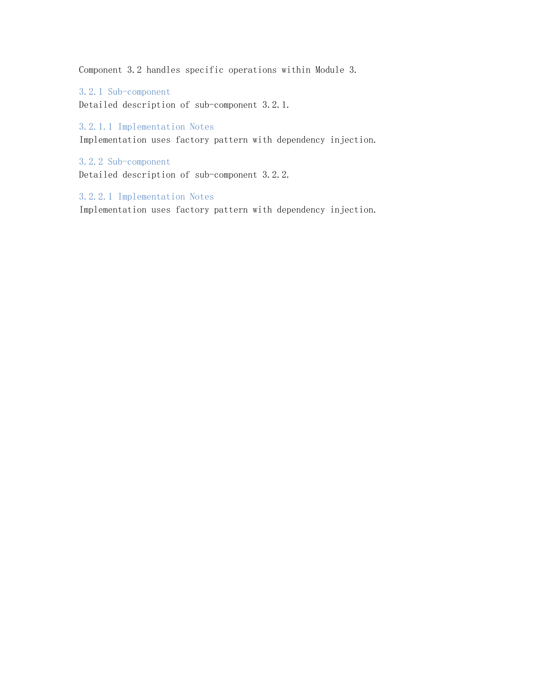</td>
  <td></td>
  <td></td>
</tr>
<tr>
  <td><b>docx_classic48_task_list_with_status_icons<br><small>format: docx | case: docx_classic48_task_list_with_status_icons | scope: python-classic-docx</small></b></td>
  <td colspan="2">docx_classic48_task_list_with_status_icons <span style="color:#3fb950">⬤</span> 99.1%</td>
</tr>
<tr>
  <td></td>
  <td></td>
  <td></td>
</tr>
<tr>
  <td><b>docx_classic49_cjk_document<br><small>format: docx | case: docx_classic49_cjk_document | scope: python-classic-docx</small></b></td>
  <td colspan="2">docx_classic49_cjk_document <span style="color:#3fb950">⬤</span> 98.3%</td>
</tr>
<tr>
  <td></td>
  <td></td>
  <td></td>
</tr>
<tr>
  <td><b>docx_classic49_wide_panoramic_banner<br><small>format: docx | case: docx_classic49_wide_panoramic_banner | scope: python-classic-docx</small></b></td>
  <td colspan="2">docx_classic49_wide_panoramic_banner <span style="color:#3fb950">⬤</span> 97.2%</td>
</tr>
<tr>
  <td></td>
  <td></td>
  <td></td>
</tr>
<tr>
  <td><b>docx_classic50_long_table_with_formatting<br><small>format: docx | case: docx_classic50_long_table_with_formatting | scope: python-classic-docx</small></b></td>
  <td colspan="2">docx_classic50_long_table_with_formatting <span style="color:#d29922">⬤</span> 84.3%</td>
</tr>
<tr>
  <td>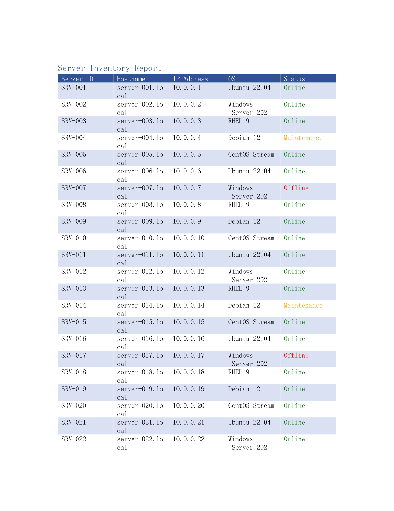</td>
  <td></td>
  <td></td>
</tr>
<tr>
  <td>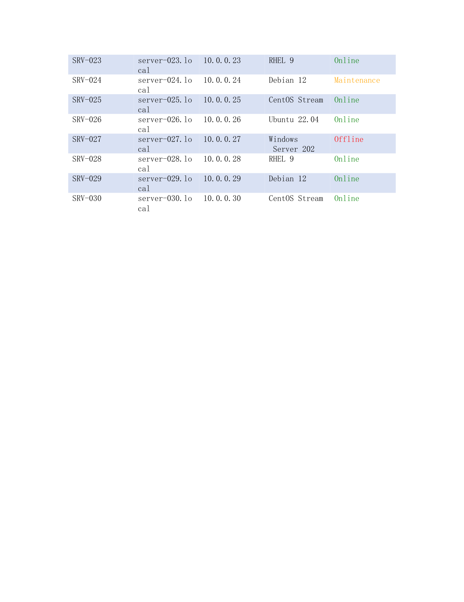</td>
  <td></td>
  <td></td>
</tr>
<tr>
  <td><b>docx_classic50_portrait_tall_image<br><small>format: docx | case: docx_classic50_portrait_tall_image | scope: python-classic-docx</small></b></td>
  <td colspan="2">docx_classic50_portrait_tall_image <span style="color:#3fb950">⬤</span> 98.7%</td>
</tr>
<tr>
  <td></td>
  <td></td>
  <td>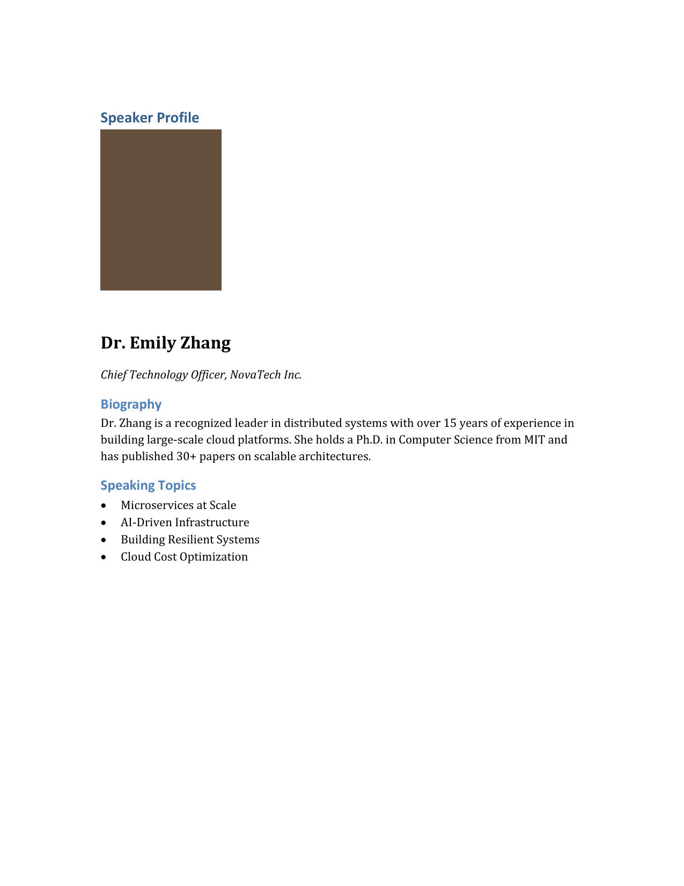</td>
</tr>
<tr>
  <td><b>docx_classic51_step_by_step_with_images<br><small>format: docx | case: docx_classic51_step_by_step_with_images | scope: python-classic-docx</small></b></td>
  <td colspan="2">docx_classic51_step_by_step_with_images <span style="color:#3fb950">⬤</span> 98.0%</td>
</tr>
<tr>
  <td></td>
  <td></td>
  <td></td>
</tr>
<tr>
  <td><b>docx_classic51_underline_styles<br><small>format: docx | case: docx_classic51_underline_styles | scope: python-classic-docx</small></b></td>
  <td colspan="2">docx_classic51_underline_styles <span style="color:#3fb950">⬤</span> 99.8%</td>
</tr>
<tr>
  <td>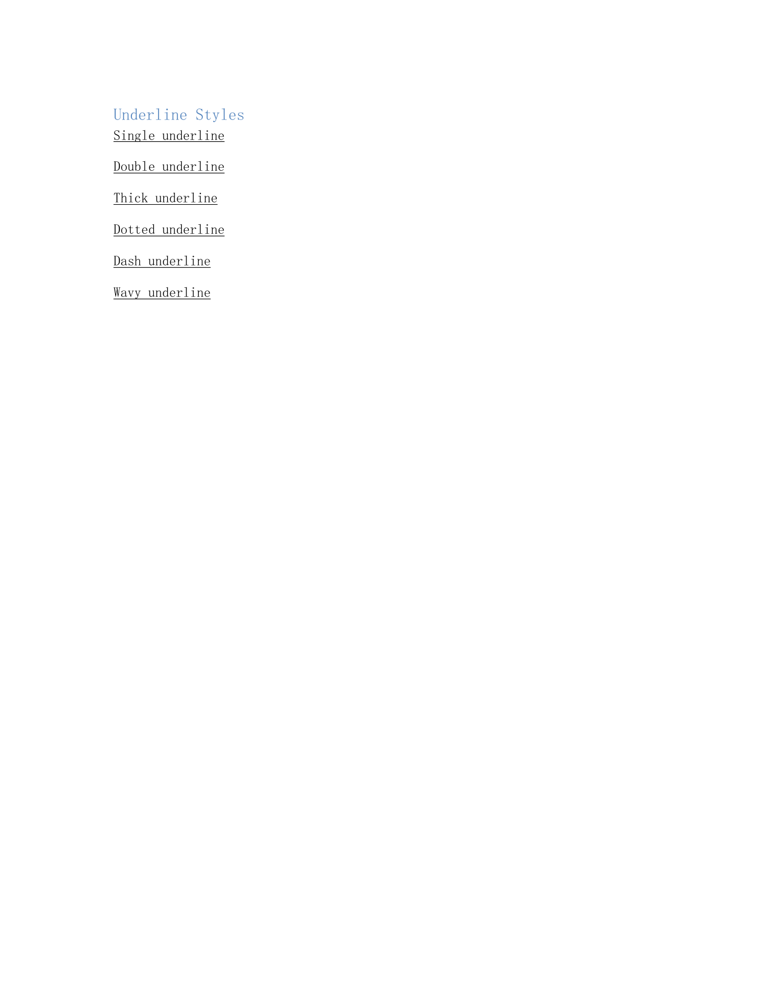</td>
  <td></td>
  <td></td>
</tr>
<tr>
  <td><b>docx_classic52_before_after_comparison<br><small>format: docx | case: docx_classic52_before_after_comparison | scope: python-classic-docx</small></b></td>
  <td colspan="2">docx_classic52_before_after_comparison <span style="color:#3fb950">⬤</span> 97.9%</td>
</tr>
<tr>
  <td>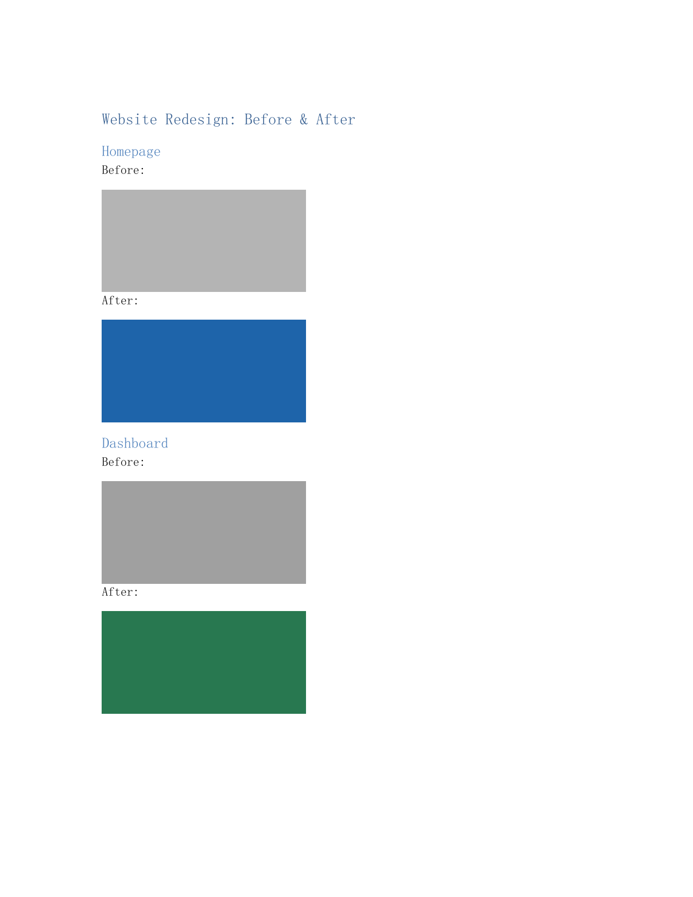</td>
  <td></td>
  <td></td>
</tr>
<tr>
  <td><b>docx_classic52_spacing_before_after<br><small>format: docx | case: docx_classic52_spacing_before_after | scope: python-classic-docx</small></b></td>
  <td colspan="2">docx_classic52_spacing_before_after <span style="color:#3fb950">⬤</span> 98.7%</td>
</tr>
<tr>
  <td></td>
  <td></td>
  <td></td>
</tr>
<tr>
  <td><b>docx_classic53_color_swatch_palette<br><small>format: docx | case: docx_classic53_color_swatch_palette | scope: python-classic-docx</small></b></td>
  <td colspan="2">docx_classic53_color_swatch_palette <span style="color:#3fb950">⬤</span> 97.8%</td>
</tr>
<tr>
  <td>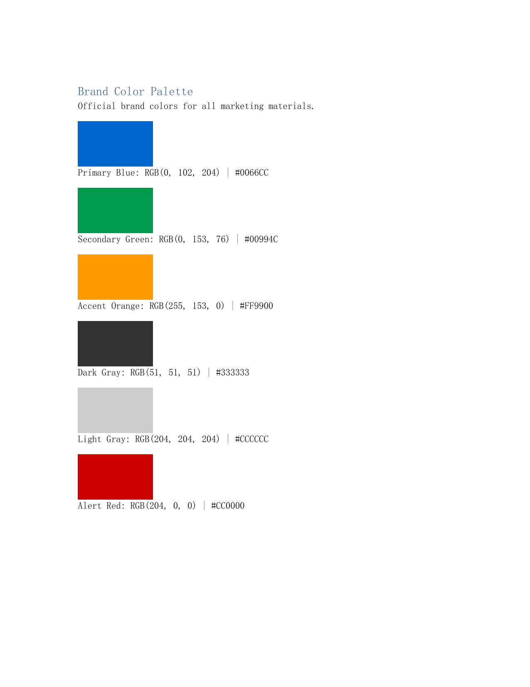</td>
  <td></td>
  <td></td>
</tr>
<tr>
  <td><b>docx_classic53_table_merged_complex<br><small>format: docx | case: docx_classic53_table_merged_complex | scope: python-classic-docx</small></b></td>
  <td colspan="2">docx_classic53_table_merged_complex <span style="color:#3fb950">⬤</span> 99.3%</td>
</tr>
<tr>
  <td>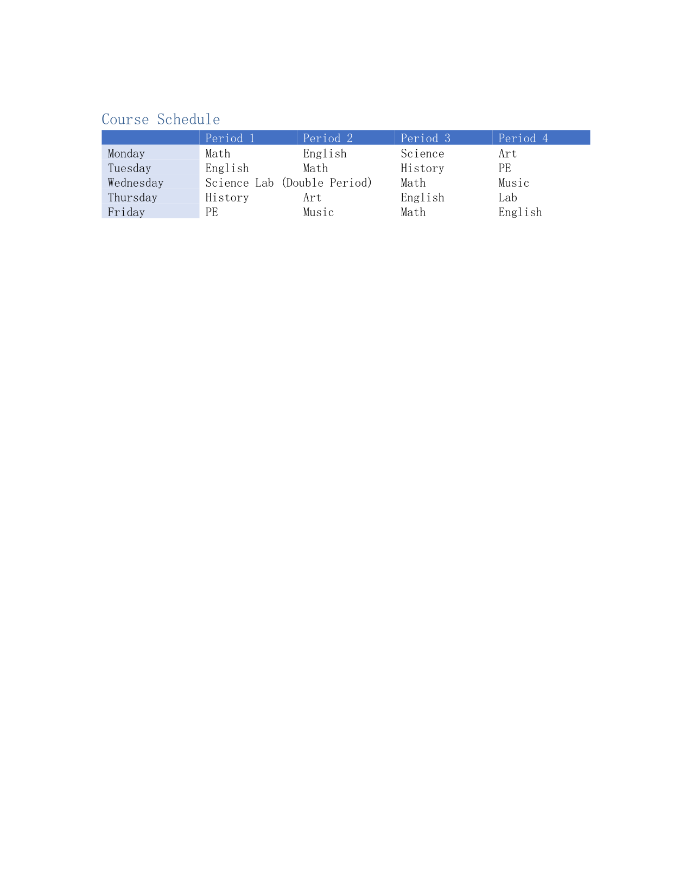</td>
  <td></td>
  <td></td>
</tr>
<tr>
  <td><b>docx_classic54_multi_font_family<br><small>format: docx | case: docx_classic54_multi_font_family | scope: python-classic-docx</small></b></td>
  <td colspan="2">docx_classic54_multi_font_family <span style="color:#3fb950">⬤</span> 99.7%</td>
</tr>
<tr>
  <td></td>
  <td></td>
  <td></td>
</tr>
<tr>
  <td><b>docx_classic54_travel_destination_cards<br><small>format: docx | case: docx_classic54_travel_destination_cards | scope: python-classic-docx</small></b></td>
  <td colspan="2">docx_classic54_travel_destination_cards <span style="color:#3fb950">⬤</span> 98.8%</td>
</tr>
<tr>
  <td>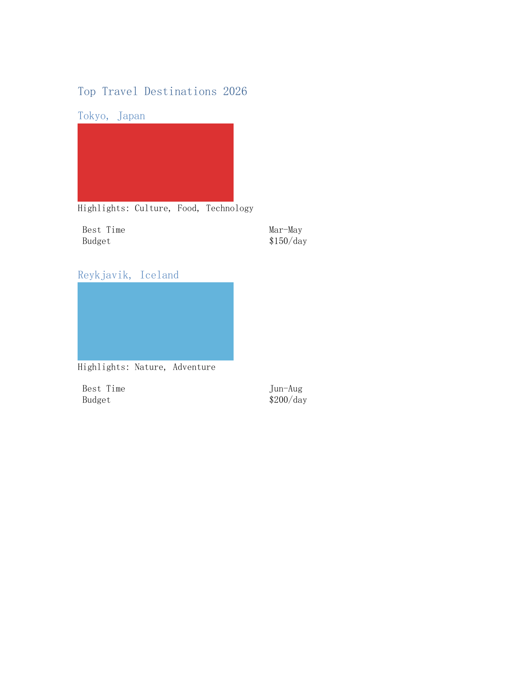</td>
  <td></td>
  <td></td>
</tr>
<tr>
  <td><b>docx_classic55_background_shading_paragraph<br><small>format: docx | case: docx_classic55_background_shading_paragraph | scope: python-classic-docx</small></b></td>
  <td colspan="2">docx_classic55_background_shading_paragraph <span style="color:#3fb950">⬤</span> 96.7%</td>
</tr>
<tr>
  <td>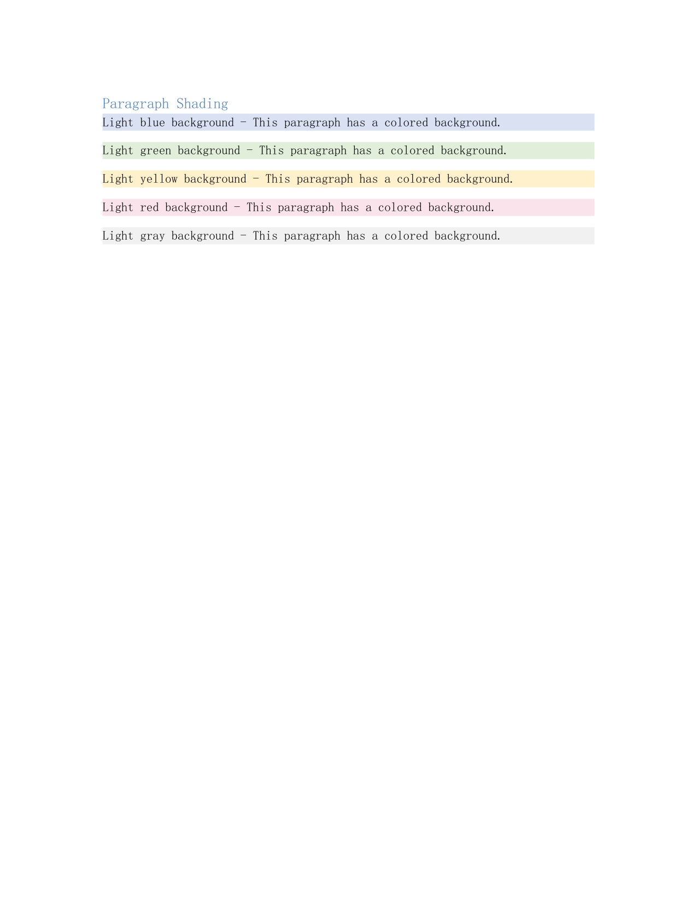</td>
  <td></td>
  <td></td>
</tr>
<tr>
  <td><b>docx_classic55_lab_results_with_image<br><small>format: docx | case: docx_classic55_lab_results_with_image | scope: python-classic-docx</small></b></td>
  <td colspan="2">docx_classic55_lab_results_with_image <span style="color:#3fb950">⬤</span> 98.3%</td>
</tr>
<tr>
  <td>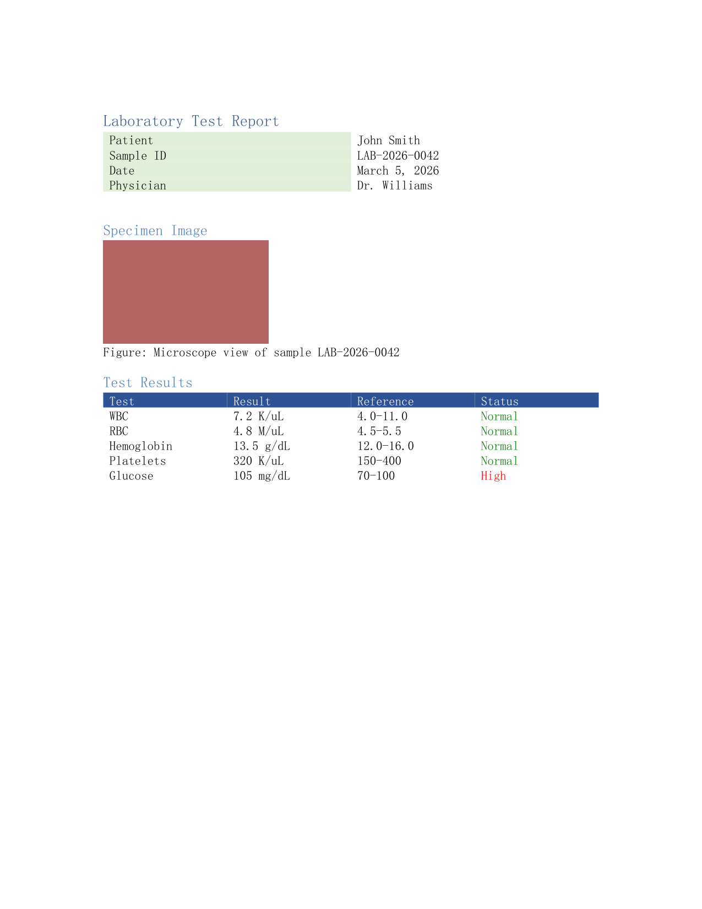</td>
  <td></td>
  <td></td>
</tr>
<tr>
  <td><b>docx_classic56_images_and_tables_mixed<br><small>format: docx | case: docx_classic56_images_and_tables_mixed | scope: python-classic-docx</small></b></td>
  <td colspan="2">docx_classic56_images_and_tables_mixed <span style="color:#3fb950">⬤</span> 97.4%</td>
</tr>
<tr>
  <td></td>
  <td></td>
  <td></td>
</tr>
<tr>
  <td><b>docx_classic56_software_screenshot_features<br><small>format: docx | case: docx_classic56_software_screenshot_features | scope: python-classic-docx</small></b></td>
  <td colspan="2">docx_classic56_software_screenshot_features <span style="color:#3fb950">⬤</span> 99.0%</td>
</tr>
<tr>
  <td></td>
  <td></td>
  <td>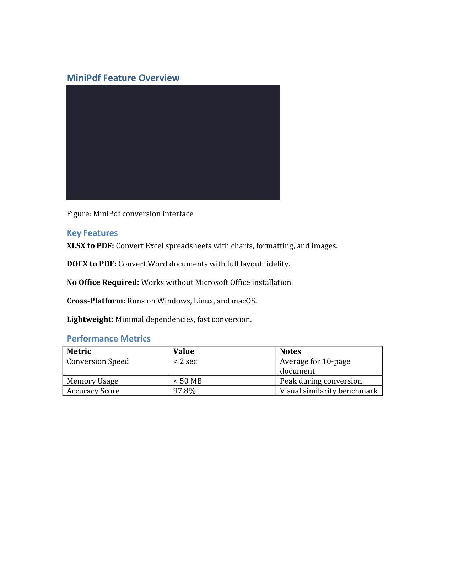</td>
</tr>
<tr>
  <td><b>docx_classic57_right_to_left_text<br><small>format: docx | case: docx_classic57_right_to_left_text | scope: python-classic-docx</small></b></td>
  <td colspan="2">docx_classic57_right_to_left_text <span style="color:#3fb950">⬤</span> 97.5%</td>
</tr>
<tr>
  <td></td>
  <td></td>
  <td></td>
</tr>
<tr>
  <td><b>docx_classic57_sports_results_with_logos<br><small>format: docx | case: docx_classic57_sports_results_with_logos | scope: python-classic-docx</small></b></td>
  <td colspan="2">docx_classic57_sports_results_with_logos <span style="color:#3fb950">⬤</span> 97.4%</td>
</tr>
<tr>
  <td></td>
  <td></td>
  <td>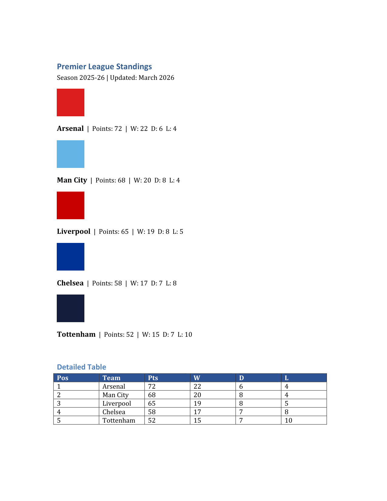</td>
</tr>
<tr>
  <td><b>docx_classic58_dense_paragraph_document<br><small>format: docx | case: docx_classic58_dense_paragraph_document | scope: python-classic-docx</small></b></td>
  <td colspan="2">docx_classic58_dense_paragraph_document <span style="color:#d29922">⬤</span> 81.0%</td>
</tr>
<tr>
  <td></td>
  <td>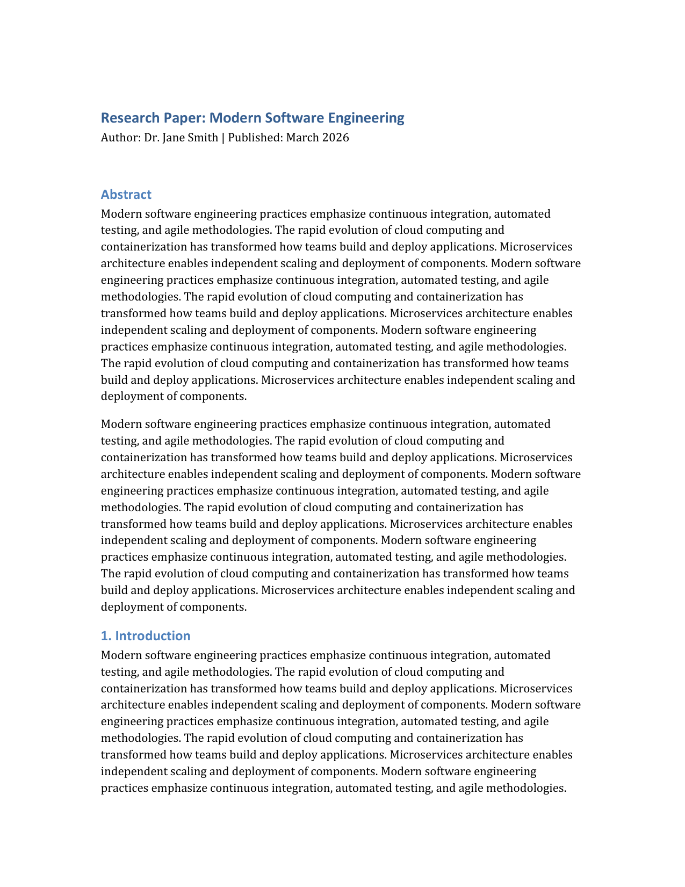</td>
  <td></td>
</tr>
<tr>
  <td></td>
  <td>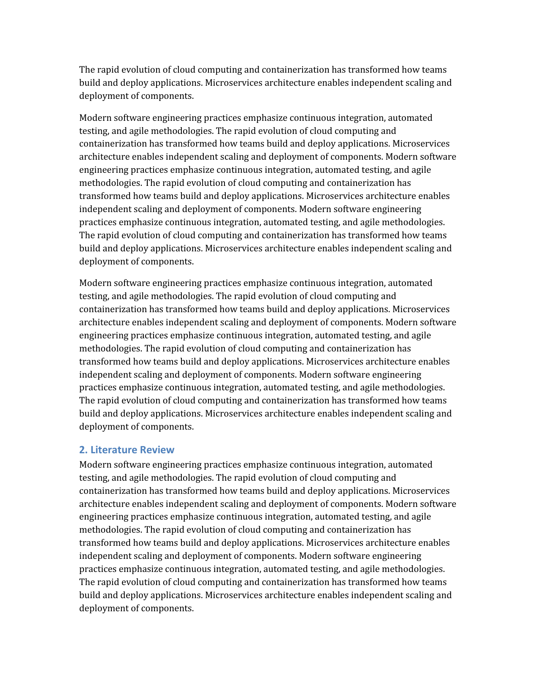</td>
  <td></td>
</tr>
<tr>
  <td>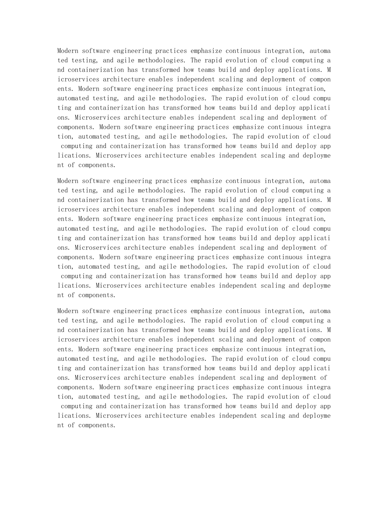</td>
  <td></td>
  <td></td>
</tr>
<tr>
  <td></td>
  <td></td>
  <td></td>
</tr>
<tr>
  <td>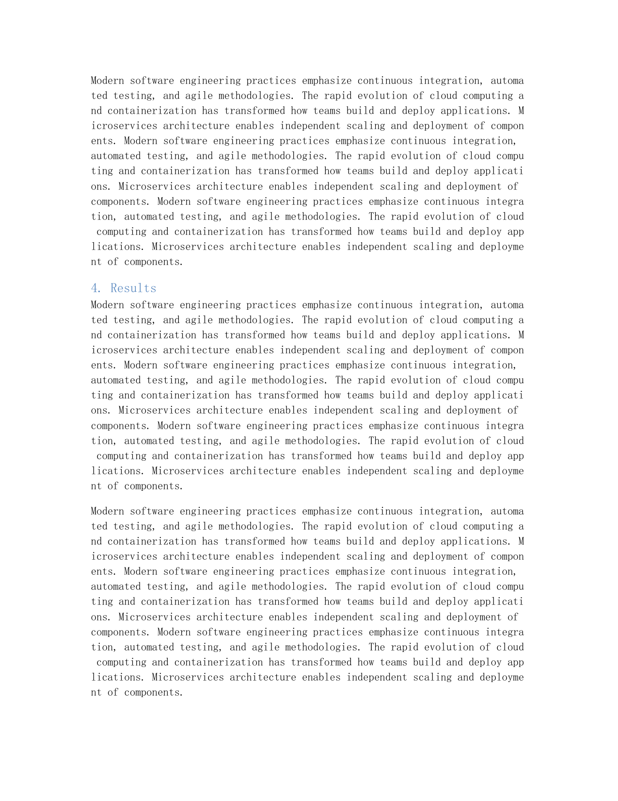</td>
  <td></td>
  <td></td>
</tr>
<tr>
  <td></td>
  <td></td>
  <td></td>
</tr>
<tr>
  <td>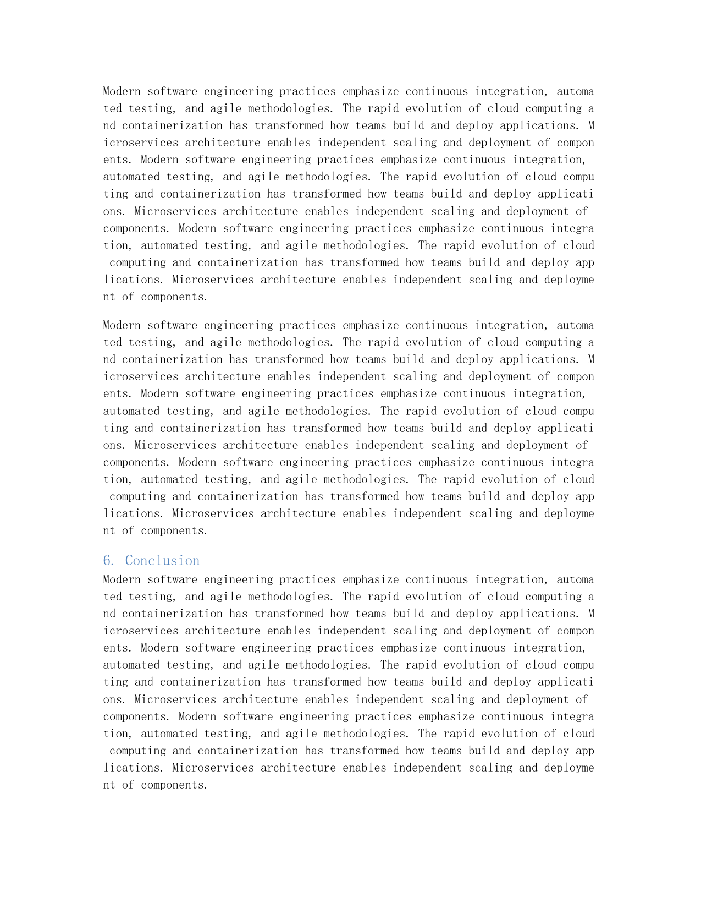</td>
  <td></td>
  <td></td>
</tr>
<tr>
  <td>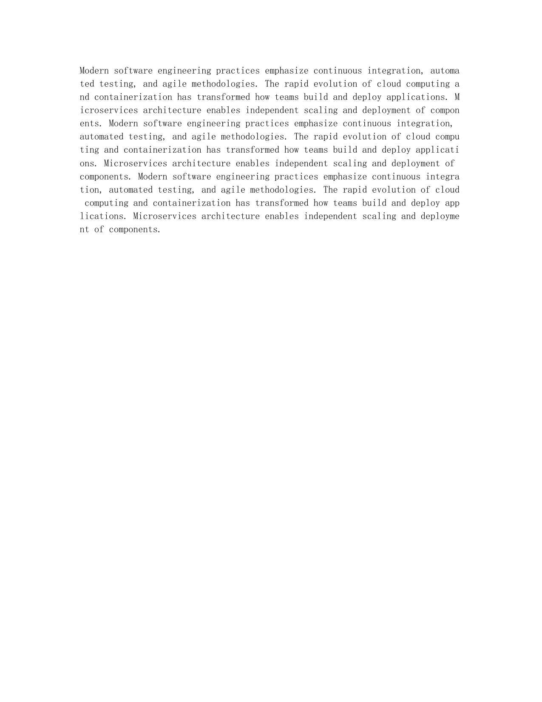</td>
  <td><i>missing</i></td>
  <td><i>missing</i></td>
</tr>
<tr>
  <td><b>docx_classic58_report_with_footer_image<br><small>format: docx | case: docx_classic58_report_with_footer_image | scope: python-classic-docx</small></b></td>
  <td colspan="2">docx_classic58_report_with_footer_image <span style="color:#3fb950">⬤</span> 98.4%</td>
</tr>
<tr>
  <td>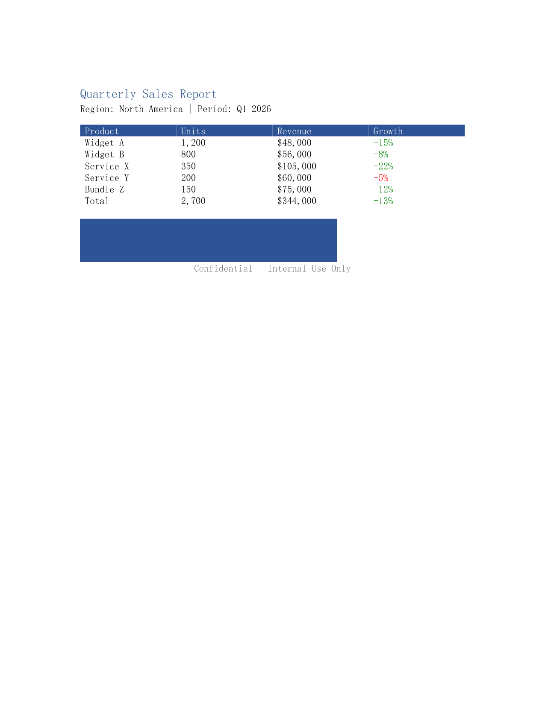</td>
  <td></td>
  <td></td>
</tr>
<tr>
  <td><b>docx_classic59_numbered_and_bullet_mixed<br><small>format: docx | case: docx_classic59_numbered_and_bullet_mixed | scope: python-classic-docx</small></b></td>
  <td colspan="2">docx_classic59_numbered_and_bullet_mixed <span style="color:#3fb950">⬤</span> 97.9%</td>
</tr>
<tr>
  <td></td>
  <td></td>
  <td>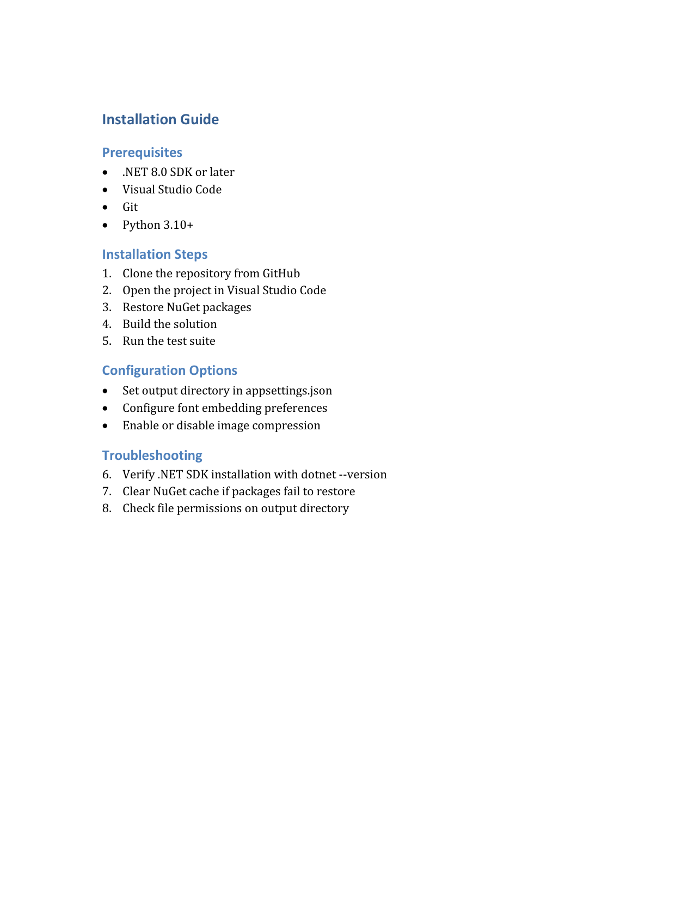</td>
</tr>
<tr>
  <td><b>docx_classic59_nutrition_label_with_image<br><small>format: docx | case: docx_classic59_nutrition_label_with_image | scope: python-classic-docx</small></b></td>
  <td colspan="2">docx_classic59_nutrition_label_with_image <span style="color:#3fb950">⬤</span> 98.7%</td>
</tr>
<tr>
  <td></td>
  <td></td>
  <td>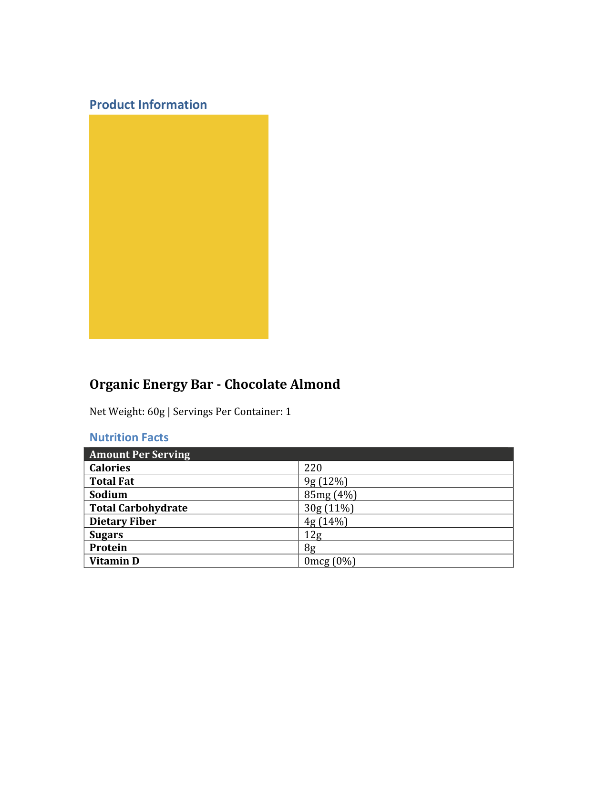</td>
</tr>
<tr>
  <td><b>docx_classic60_comprehensive_styled_report<br><small>format: docx | case: docx_classic60_comprehensive_styled_report | scope: python-classic-docx</small></b></td>
  <td colspan="2">docx_classic60_comprehensive_styled_report <span style="color:#3fb950">⬤</span> 97.7%</td>
</tr>
<tr>
  <td></td>
  <td></td>
  <td></td>
</tr>
<tr>
  <td>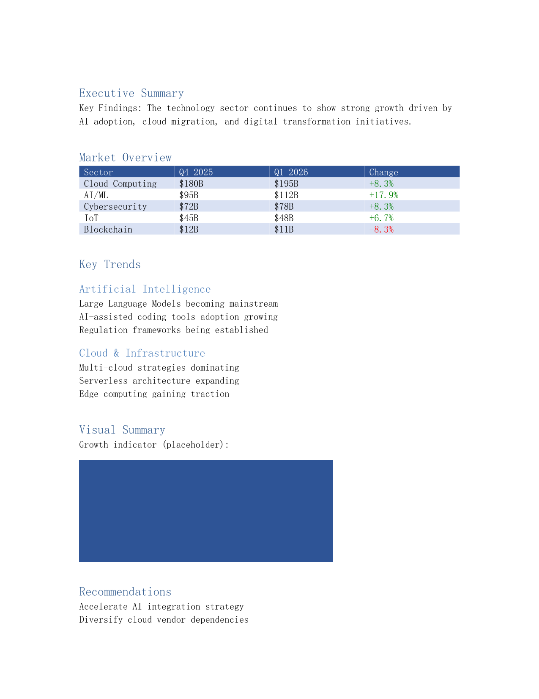</td>
  <td></td>
  <td></td>
</tr>
<tr>
  <td></td>
  <td></td>
  <td></td>
</tr>
<tr>
  <td><b>docx_classic60_project_status_with_milestones<br><small>format: docx | case: docx_classic60_project_status_with_milestones | scope: python-classic-docx</small></b></td>
  <td colspan="2">docx_classic60_project_status_with_milestones <span style="color:#3fb950">⬤</span> 96.9%</td>
</tr>
<tr>
  <td></td>
  <td></td>
  <td></td>
</tr>
<tr>
  <td></td>
  <td></td>
  <td></td>
</tr>
<tr>
  <td><b>docx_classic61_header_and_footer<br><small>format: docx | case: docx_classic61_header_and_footer | scope: python-classic-docx</small></b></td>
  <td colspan="2">docx_classic61_header_and_footer <span style="color:#3fb950">⬤</span> 97.9%</td>
</tr>
<tr>
  <td></td>
  <td>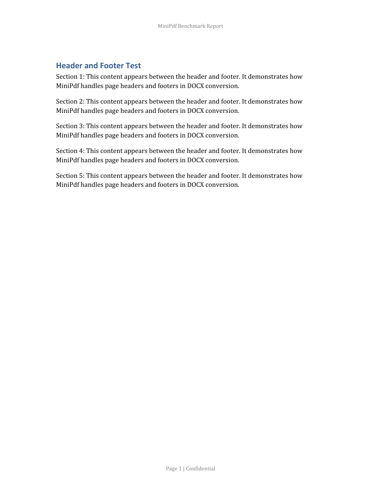</td>
  <td></td>
</tr>
<tr>
  <td><b>docx_classic62_footnote_references<br><small>format: docx | case: docx_classic62_footnote_references | scope: python-classic-docx</small></b></td>
  <td colspan="2">docx_classic62_footnote_references <span style="color:#3fb950">⬤</span> 98.3%</td>
</tr>
<tr>
  <td>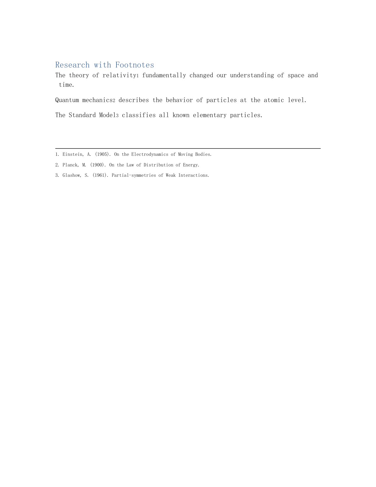</td>
  <td></td>
  <td></td>
</tr>
<tr>
  <td><b>docx_classic63_toc_style_headings<br><small>format: docx | case: docx_classic63_toc_style_headings | scope: python-classic-docx</small></b></td>
  <td colspan="2">docx_classic63_toc_style_headings <span style="color:#3fb950">⬤</span> 99.3%</td>
</tr>
<tr>
  <td>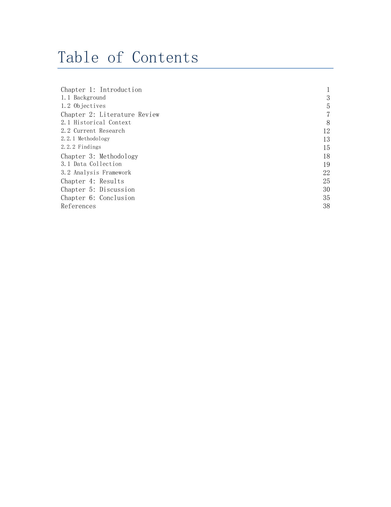</td>
  <td>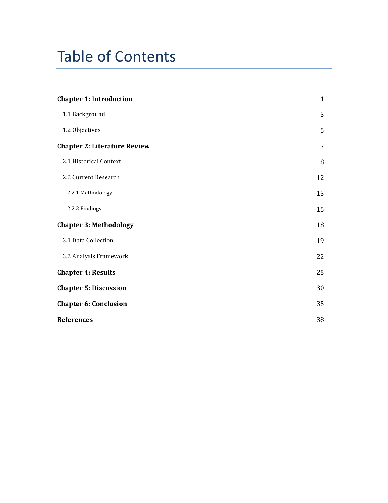</td>
  <td></td>
</tr>
<tr>
  <td><b>docx_classic64_multi_column_layout<br><small>format: docx | case: docx_classic64_multi_column_layout | scope: python-classic-docx</small></b></td>
  <td colspan="2">docx_classic64_multi_column_layout <span style="color:#d29922">⬤</span> 88.0%</td>
</tr>
<tr>
  <td>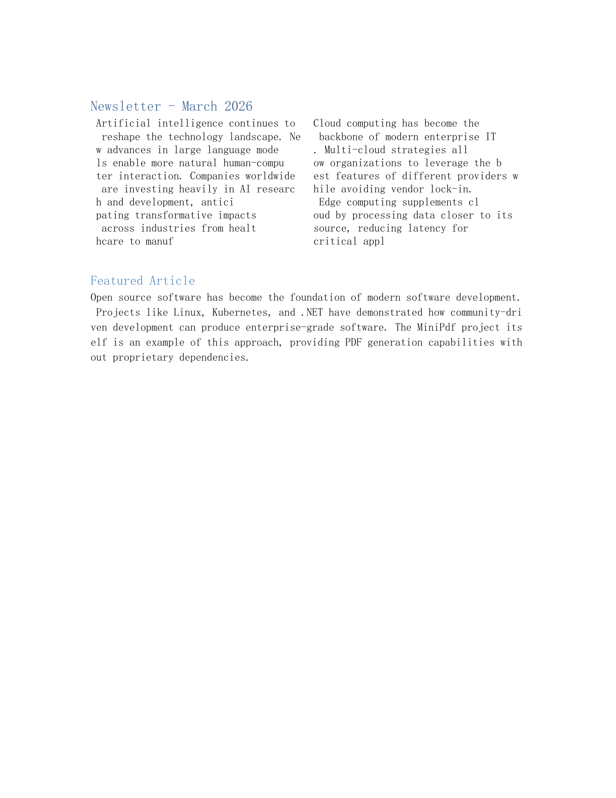</td>
  <td>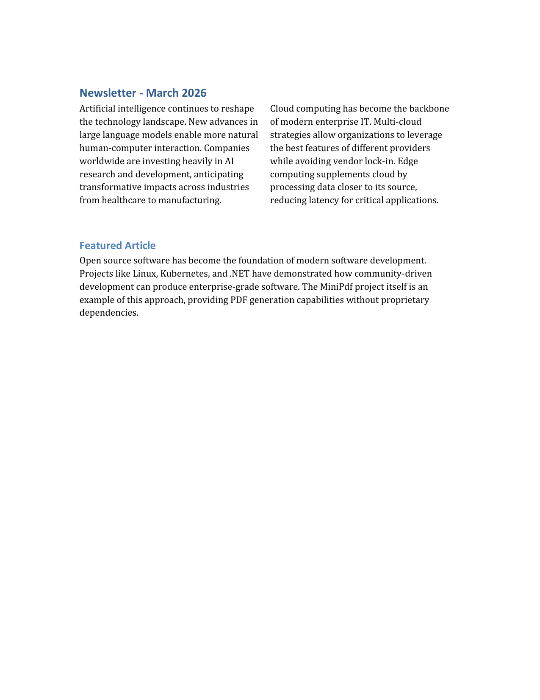</td>
  <td></td>
</tr>
<tr>
  <td><b>docx_classic65_code_block_styling<br><small>format: docx | case: docx_classic65_code_block_styling | scope: python-classic-docx</small></b></td>
  <td colspan="2">docx_classic65_code_block_styling <span style="color:#3fb950">⬤</span> 94.6%</td>
</tr>
<tr>
  <td></td>
  <td></td>
  <td></td>
</tr>
<tr>
  <td><b>docx_classic66_colored_title_page<br><small>format: docx | case: docx_classic66_colored_title_page | scope: python-classic-docx</small></b></td>
  <td colspan="2">docx_classic66_colored_title_page <span style="color:#3fb950">⬤</span> 96.7%</td>
</tr>
<tr>
  <td>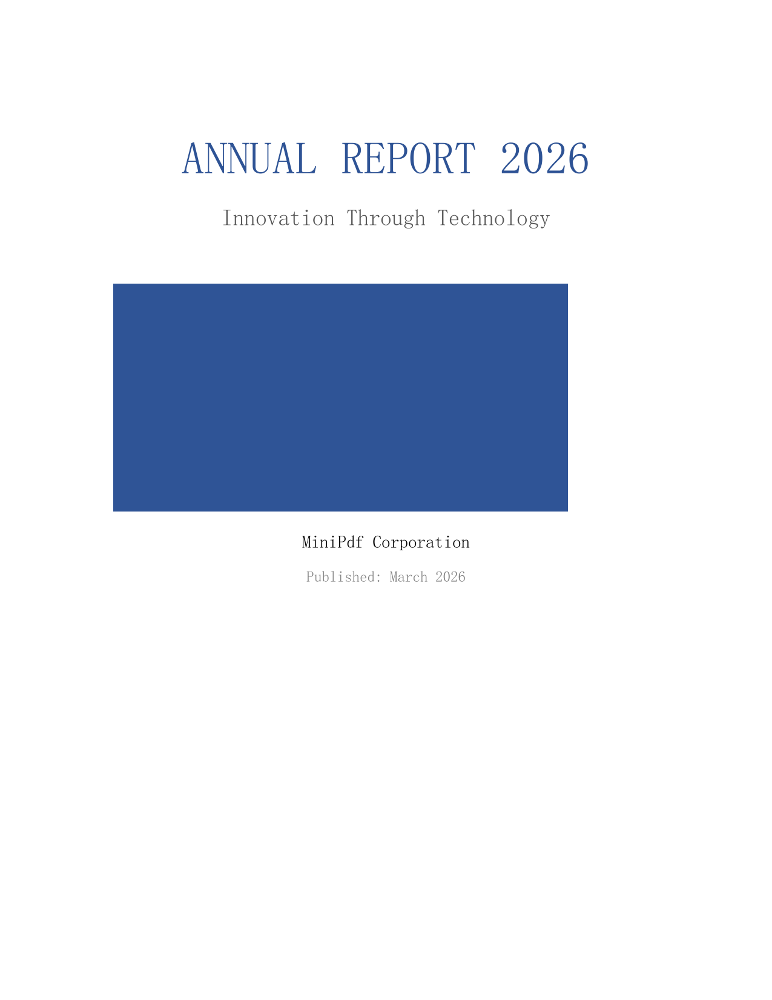</td>
  <td></td>
  <td></td>
</tr>
<tr>
  <td><b>docx_classic67_alternating_row_table<br><small>format: docx | case: docx_classic67_alternating_row_table | scope: python-classic-docx</small></b></td>
  <td colspan="2">docx_classic67_alternating_row_table <span style="color:#3fb950">⬤</span> 97.5%</td>
</tr>
<tr>
  <td></td>
  <td></td>
  <td></td>
</tr>
<tr>
  <td><b>docx_classic68_sidebar_layout<br><small>format: docx | case: docx_classic68_sidebar_layout | scope: python-classic-docx</small></b></td>
  <td colspan="2">docx_classic68_sidebar_layout <span style="color:#d29922">⬤</span> 81.8%</td>
</tr>
<tr>
  <td></td>
  <td></td>
  <td></td>
</tr>
<tr>
  <td><b>docx_classic69_blockquote_styling<br><small>format: docx | case: docx_classic69_blockquote_styling | scope: python-classic-docx</small></b></td>
  <td colspan="2">docx_classic69_blockquote_styling <span style="color:#3fb950">⬤</span> 99.3%</td>
</tr>
<tr>
  <td></td>
  <td>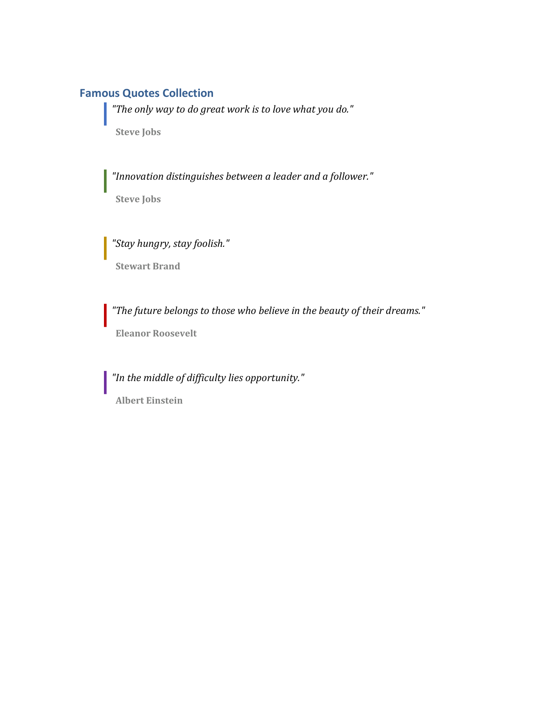</td>
  <td></td>
</tr>
<tr>
  <td><b>docx_classic70_academic_paper<br><small>format: docx | case: docx_classic70_academic_paper | scope: python-classic-docx</small></b></td>
  <td colspan="2">docx_classic70_academic_paper <span style="color:#3fb950">⬤</span> 96.0%</td>
</tr>
<tr>
  <td></td>
  <td></td>
  <td></td>
</tr>
<tr>
  <td><b>docx_classic71_legal_document<br><small>format: docx | case: docx_classic71_legal_document | scope: python-classic-docx</small></b></td>
  <td colspan="2">docx_classic71_legal_document <span style="color:#f85149">⬤</span> 68.4%</td>
</tr>
<tr>
  <td></td>
  <td></td>
  <td></td>
</tr>
<tr>
  <td></td>
  <td><i>missing</i></td>
  <td><i>missing</i></td>
</tr>
<tr>
  <td><b>docx_classic72_technical_specification<br><small>format: docx | case: docx_classic72_technical_specification | scope: python-classic-docx</small></b></td>
  <td colspan="2">docx_classic72_technical_specification <span style="color:#3fb950">⬤</span> 98.1%</td>
</tr>
<tr>
  <td>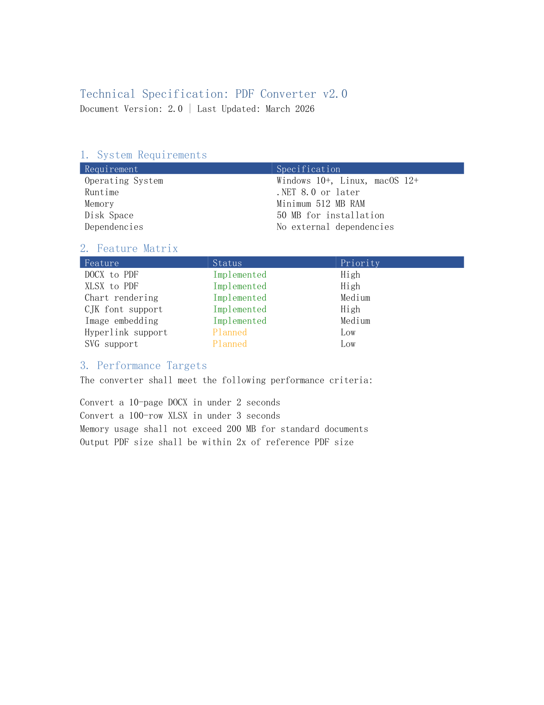</td>
  <td></td>
  <td></td>
</tr>
<tr>
  <td><b>docx_classic73_calendar_layout<br><small>format: docx | case: docx_classic73_calendar_layout | scope: python-classic-docx</small></b></td>
  <td colspan="2">docx_classic73_calendar_layout <span style="color:#3fb950">⬤</span> 99.3%</td>
</tr>
<tr>
  <td></td>
  <td></td>
  <td></td>
</tr>
<tr>
  <td><b>docx_classic74_org_chart<br><small>format: docx | case: docx_classic74_org_chart | scope: python-classic-docx</small></b></td>
  <td colspan="2">docx_classic74_org_chart <span style="color:#3fb950">⬤</span> 95.5%</td>
</tr>
<tr>
  <td>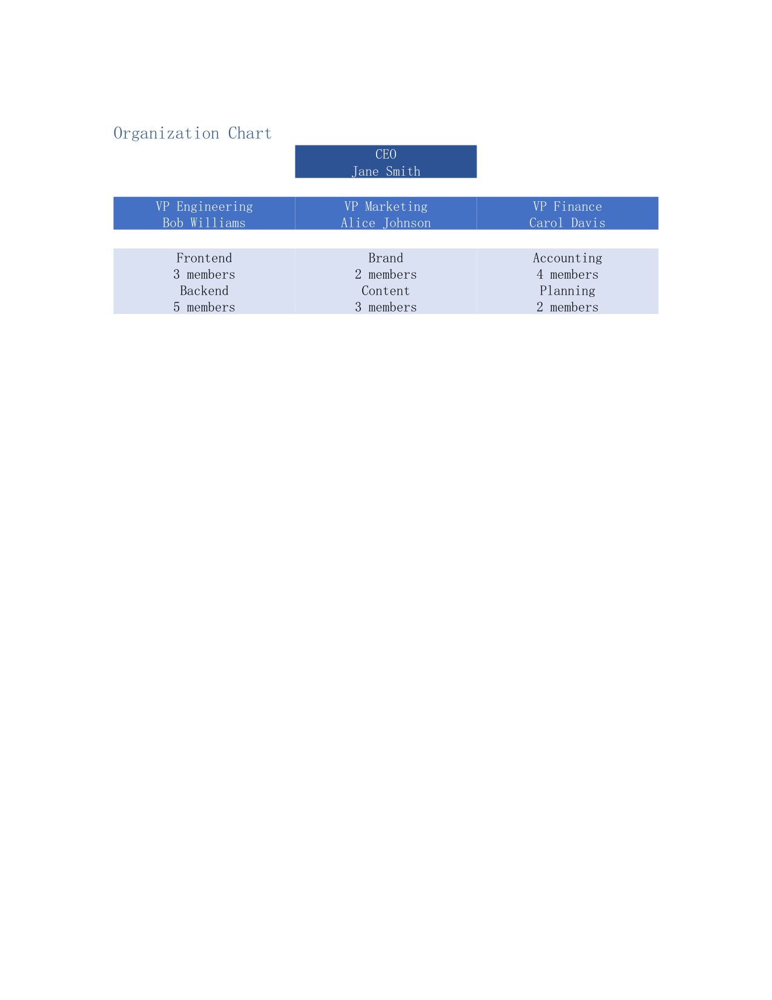</td>
  <td></td>
  <td></td>
</tr>
<tr>
  <td><b>docx_classic75_newsletter_layout<br><small>format: docx | case: docx_classic75_newsletter_layout | scope: python-classic-docx</small></b></td>
  <td colspan="2">docx_classic75_newsletter_layout <span style="color:#3fb950">⬤</span> 94.7%</td>
</tr>
<tr>
  <td></td>
  <td></td>
  <td>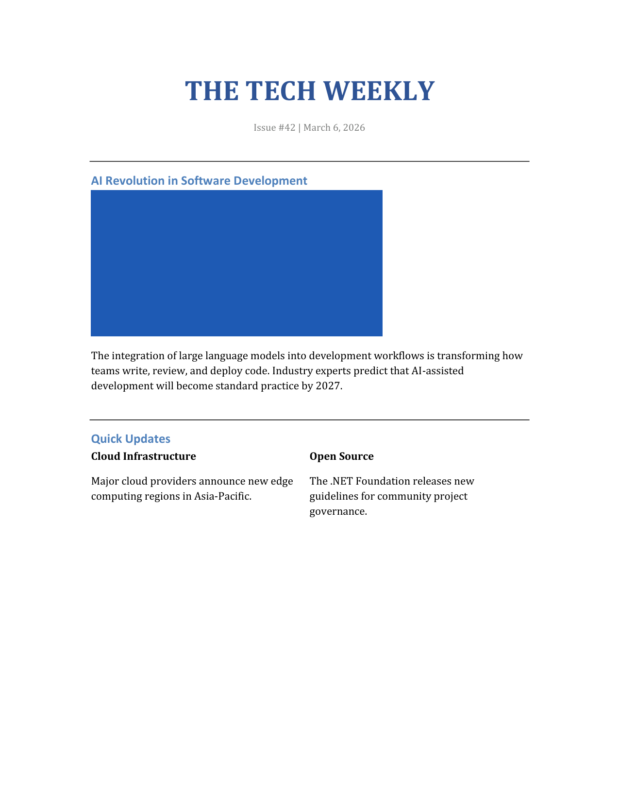</td>
</tr>
<tr>
  <td><b>docx_classic76_recipe_card<br><small>format: docx | case: docx_classic76_recipe_card | scope: python-classic-docx</small></b></td>
  <td colspan="2">docx_classic76_recipe_card <span style="color:#3fb950">⬤</span> 97.5%</td>
</tr>
<tr>
  <td></td>
  <td></td>
  <td>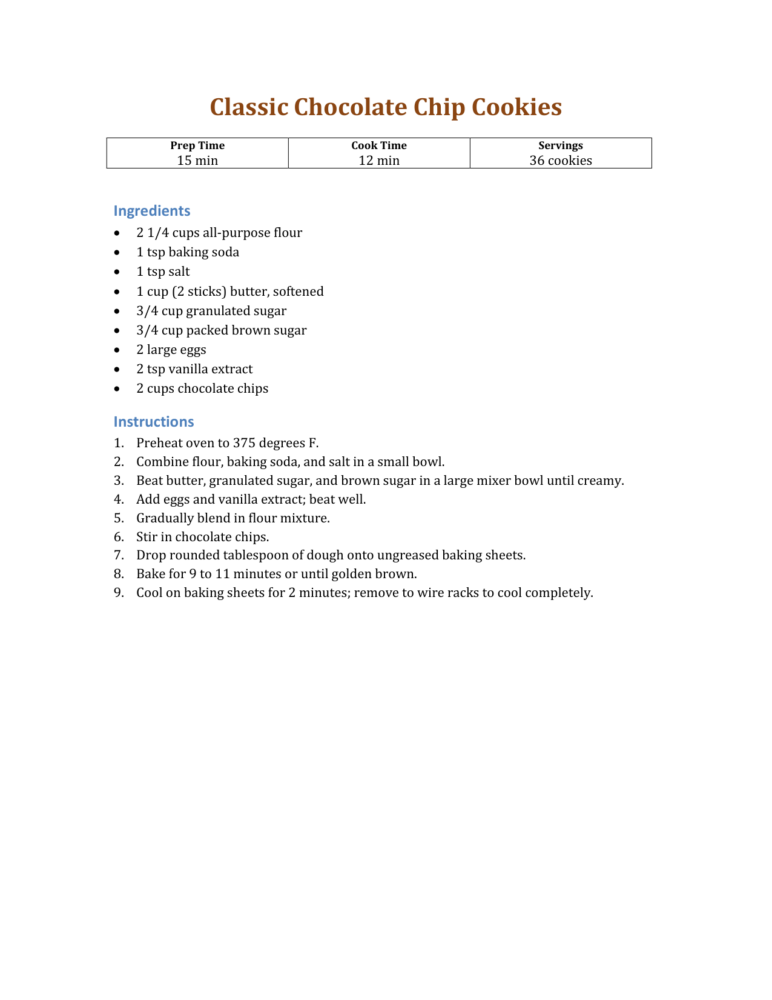</td>
</tr>
<tr>
  <td><b>docx_classic77_timeline_layout<br><small>format: docx | case: docx_classic77_timeline_layout | scope: python-classic-docx</small></b></td>
  <td colspan="2">docx_classic77_timeline_layout <span style="color:#3fb950">⬤</span> 93.9%</td>
</tr>
<tr>
  <td></td>
  <td></td>
  <td></td>
</tr>
<tr>
  <td><b>docx_classic78_faq_document<br><small>format: docx | case: docx_classic78_faq_document | scope: python-classic-docx</small></b></td>
  <td colspan="2">docx_classic78_faq_document <span style="color:#3fb950">⬤</span> 97.0%</td>
</tr>
<tr>
  <td>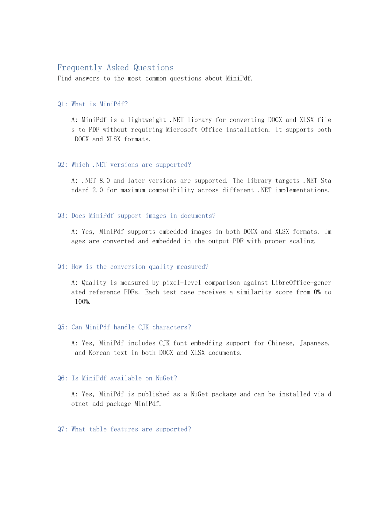</td>
  <td></td>
  <td></td>
</tr>
<tr>
  <td>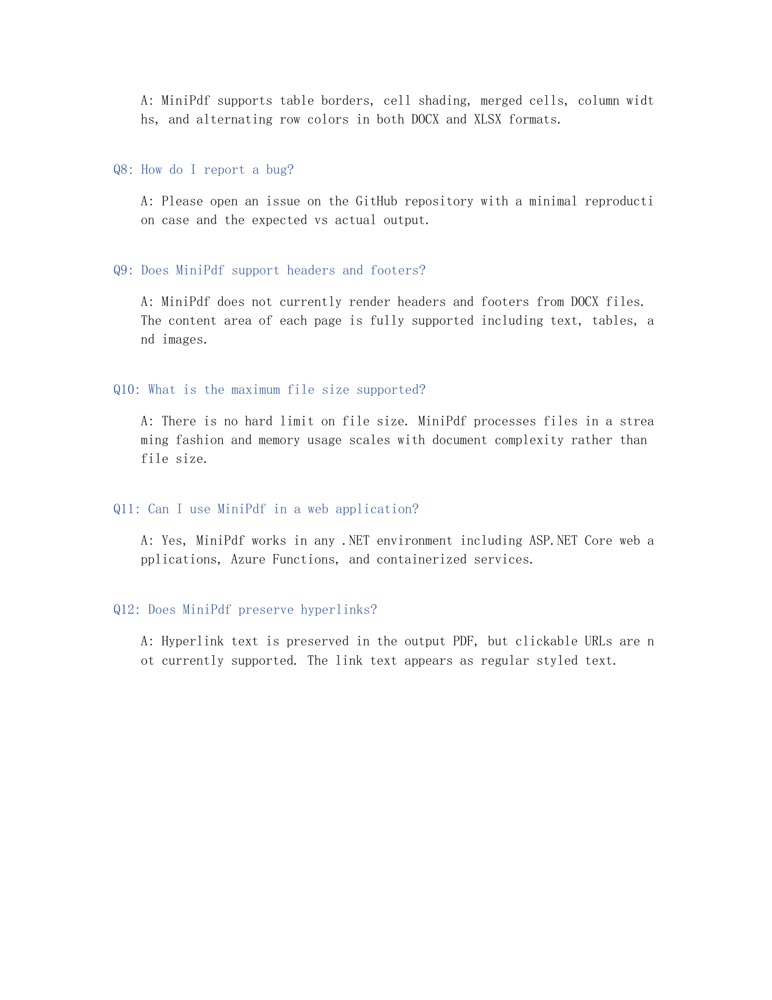</td>
  <td>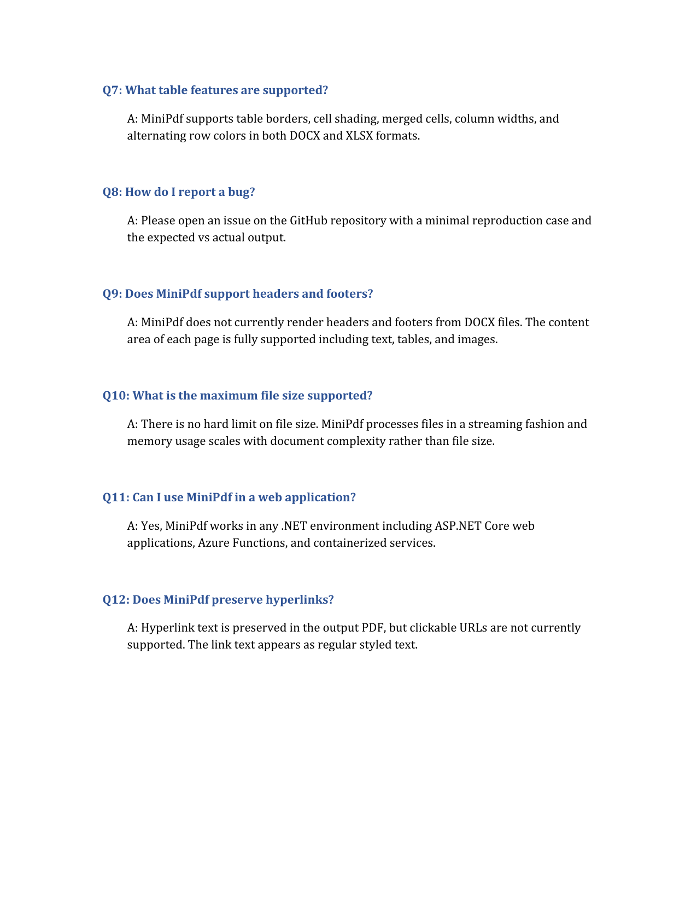</td>
  <td></td>
</tr>
<tr>
  <td><b>docx_classic79_glossary<br><small>format: docx | case: docx_classic79_glossary | scope: python-classic-docx</small></b></td>
  <td colspan="2">docx_classic79_glossary <span style="color:#f85149">⬤</span> 69.0%</td>
</tr>
<tr>
  <td></td>
  <td></td>
  <td></td>
</tr>
<tr>
  <td></td>
  <td><i>missing</i></td>
  <td><i>missing</i></td>
</tr>
<tr>
  <td><b>docx_classic80_matrix_grid<br><small>format: docx | case: docx_classic80_matrix_grid | scope: python-classic-docx</small></b></td>
  <td colspan="2">docx_classic80_matrix_grid <span style="color:#3fb950">⬤</span> 95.2%</td>
</tr>
<tr>
  <td>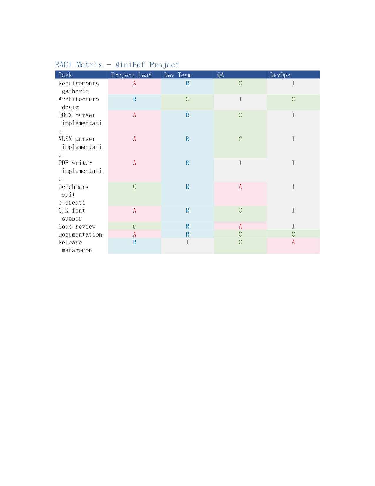</td>
  <td></td>
  <td></td>
</tr>
<tr>
  <td><b>docx_classic81_budget_table<br><small>format: docx | case: docx_classic81_budget_table | scope: python-classic-docx</small></b></td>
  <td colspan="2">docx_classic81_budget_table <span style="color:#3fb950">⬤</span> 98.1%</td>
</tr>
<tr>
  <td>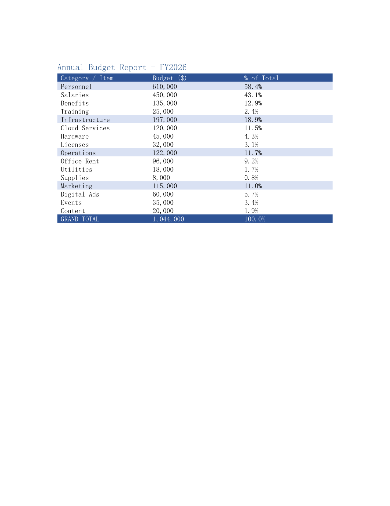</td>
  <td>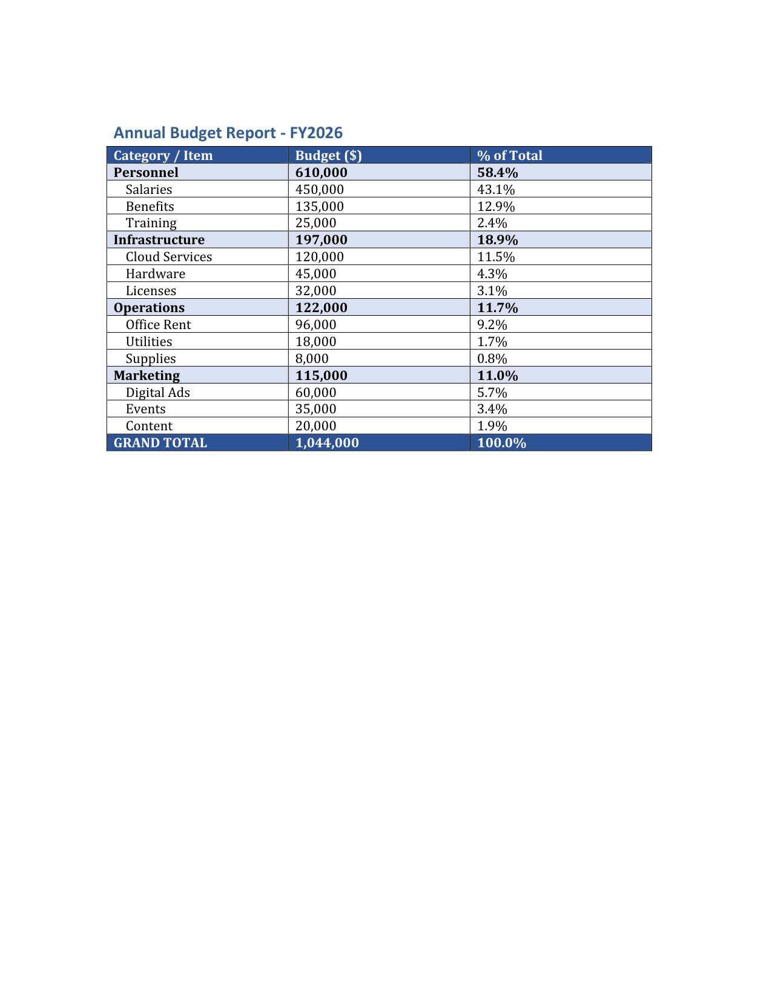</td>
  <td></td>
</tr>
<tr>
  <td><b>docx_classic82_survey_questionnaire<br><small>format: docx | case: docx_classic82_survey_questionnaire | scope: python-classic-docx</small></b></td>
  <td colspan="2">docx_classic82_survey_questionnaire <span style="color:#d29922">⬤</span> 84.1%</td>
</tr>
<tr>
  <td></td>
  <td></td>
  <td></td>
</tr>
<tr>
  <td></td>
  <td></td>
  <td></td>
</tr>
<tr>
  <td><b>docx_classic83_medical_form<br><small>format: docx | case: docx_classic83_medical_form | scope: python-classic-docx</small></b></td>
  <td colspan="2">docx_classic83_medical_form <span style="color:#3fb950">⬤</span> 97.8%</td>
</tr>
<tr>
  <td>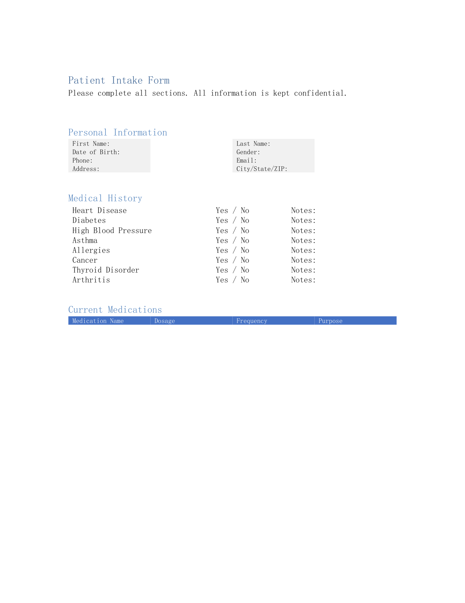</td>
  <td></td>
  <td></td>
</tr>
<tr>
  <td><b>docx_classic84_shipping_label<br><small>format: docx | case: docx_classic84_shipping_label | scope: python-classic-docx</small></b></td>
  <td colspan="2">docx_classic84_shipping_label <span style="color:#3fb950">⬤</span> 96.7%</td>
</tr>
<tr>
  <td></td>
  <td></td>
  <td></td>
</tr>
<tr>
  <td><b>docx_classic85_report_card<br><small>format: docx | case: docx_classic85_report_card | scope: python-classic-docx</small></b></td>
  <td colspan="2">docx_classic85_report_card <span style="color:#3fb950">⬤</span> 97.6%</td>
</tr>
<tr>
  <td></td>
  <td></td>
  <td></td>
</tr>
<tr>
  <td><b>docx_classic86_checklist_document<br><small>format: docx | case: docx_classic86_checklist_document | scope: python-classic-docx</small></b></td>
  <td colspan="2">docx_classic86_checklist_document <span style="color:#3fb950">⬤</span> 99.2%</td>
</tr>
<tr>
  <td></td>
  <td></td>
  <td></td>
</tr>
<tr>
  <td><b>docx_classic87_bibliography<br><small>format: docx | case: docx_classic87_bibliography | scope: python-classic-docx</small></b></td>
  <td colspan="2">docx_classic87_bibliography <span style="color:#3fb950">⬤</span> 98.4%</td>
</tr>
<tr>
  <td></td>
  <td></td>
  <td>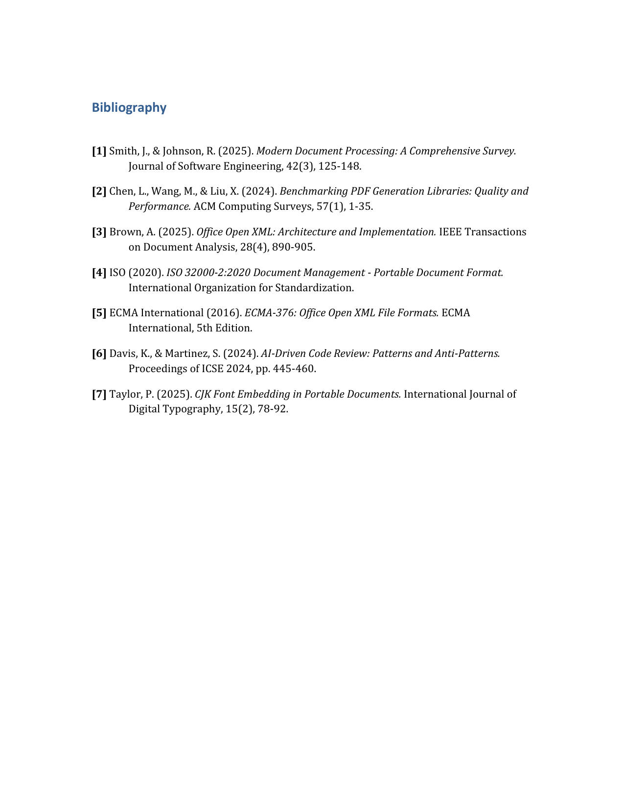</td>
</tr>
<tr>
  <td><b>docx_classic88_presentation_handout<br><small>format: docx | case: docx_classic88_presentation_handout | scope: python-classic-docx</small></b></td>
  <td colspan="2">docx_classic88_presentation_handout <span style="color:#3fb950">⬤</span> 95.8%</td>
</tr>
<tr>
  <td>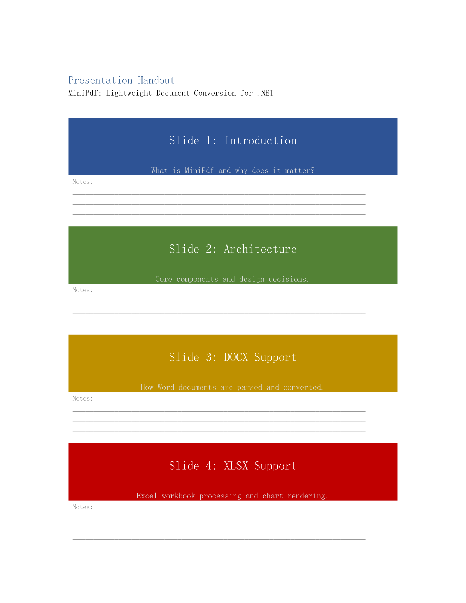</td>
  <td></td>
  <td></td>
</tr>
<tr>
  <td>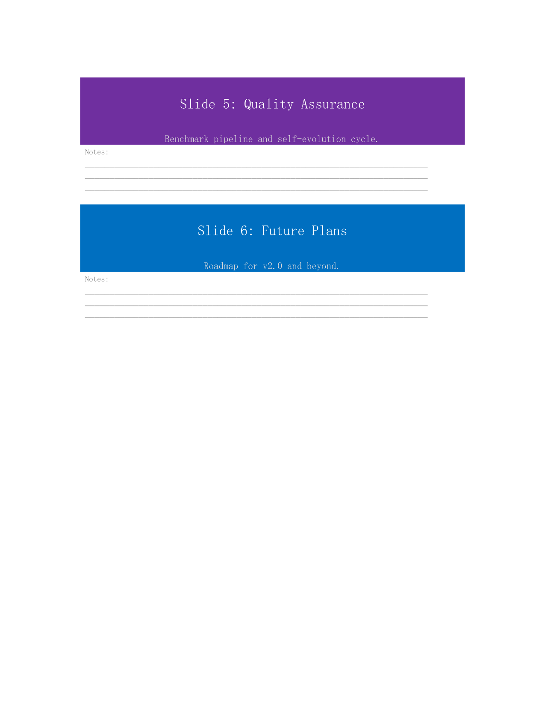</td>
  <td></td>
  <td></td>
</tr>
<tr>
  <td><b>docx_classic89_multi_image_gallery<br><small>format: docx | case: docx_classic89_multi_image_gallery | scope: python-classic-docx</small></b></td>
  <td colspan="2">docx_classic89_multi_image_gallery <span style="color:#3fb950">⬤</span> 98.7%</td>
</tr>
<tr>
  <td></td>
  <td></td>
  <td></td>
</tr>
<tr>
  <td><b>docx_classic90_comprehensive_annual_report<br><small>format: docx | case: docx_classic90_comprehensive_annual_report | scope: python-classic-docx</small></b></td>
  <td colspan="2">docx_classic90_comprehensive_annual_report <span style="color:#3fb950">⬤</span> 97.1%</td>
</tr>
<tr>
  <td></td>
  <td></td>
  <td></td>
</tr>
<tr>
  <td>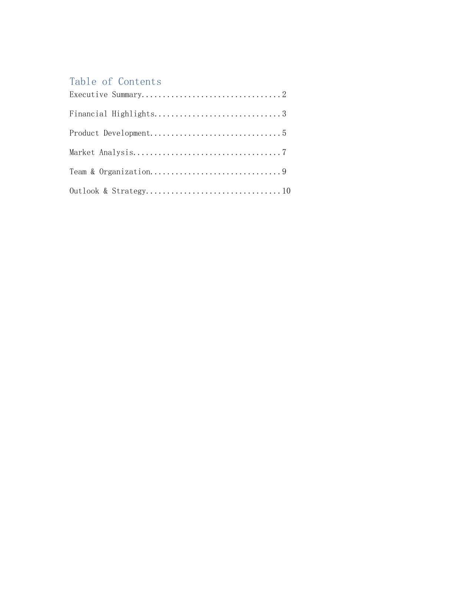</td>
  <td></td>
  <td></td>
</tr>
<tr>
  <td></td>
  <td>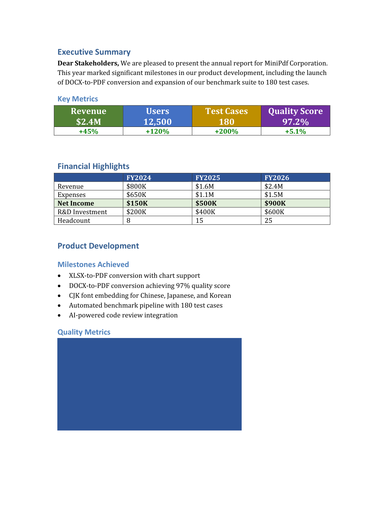</td>
  <td></td>
</tr>
<tr>
  <td>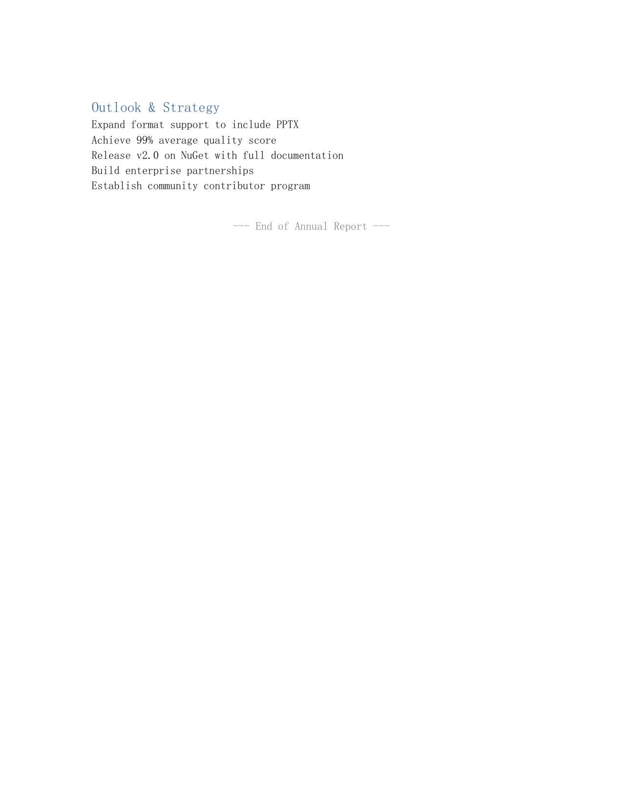</td>
  <td></td>
  <td></td>
</tr>
<tr>
  <td><b>docx_classic91_landscape_page<br><small>format: docx | case: docx_classic91_landscape_page | scope: python-classic-docx</small></b></td>
  <td colspan="2">docx_classic91_landscape_page <span style="color:#3fb950">⬤</span> 98.3%</td>
</tr>
<tr>
  <td>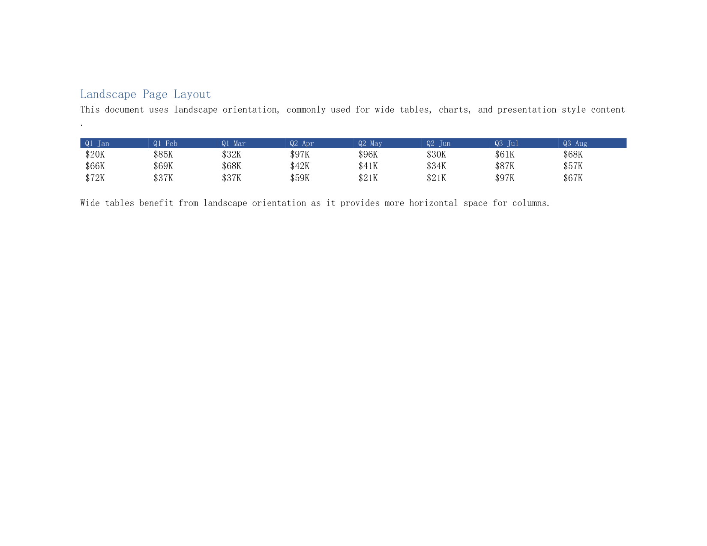</td>
  <td></td>
  <td></td>
</tr>
<tr>
  <td><b>docx_classic92_first_line_indent<br><small>format: docx | case: docx_classic92_first_line_indent | scope: python-classic-docx</small></b></td>
  <td colspan="2">docx_classic92_first_line_indent <span style="color:#3fb950">⬤</span> 97.7%</td>
</tr>
<tr>
  <td>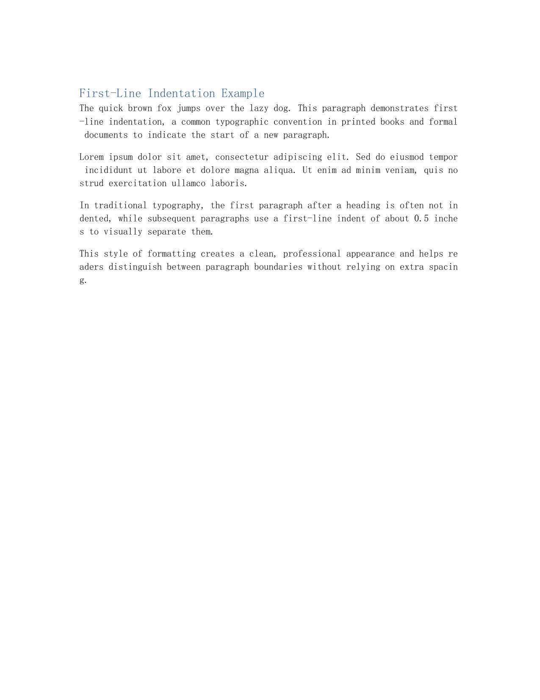</td>
  <td></td>
  <td></td>
</tr>
<tr>
  <td><b>docx_classic93_hanging_indent<br><small>format: docx | case: docx_classic93_hanging_indent | scope: python-classic-docx</small></b></td>
  <td colspan="2">docx_classic93_hanging_indent <span style="color:#3fb950">⬤</span> 97.6%</td>
</tr>
<tr>
  <td>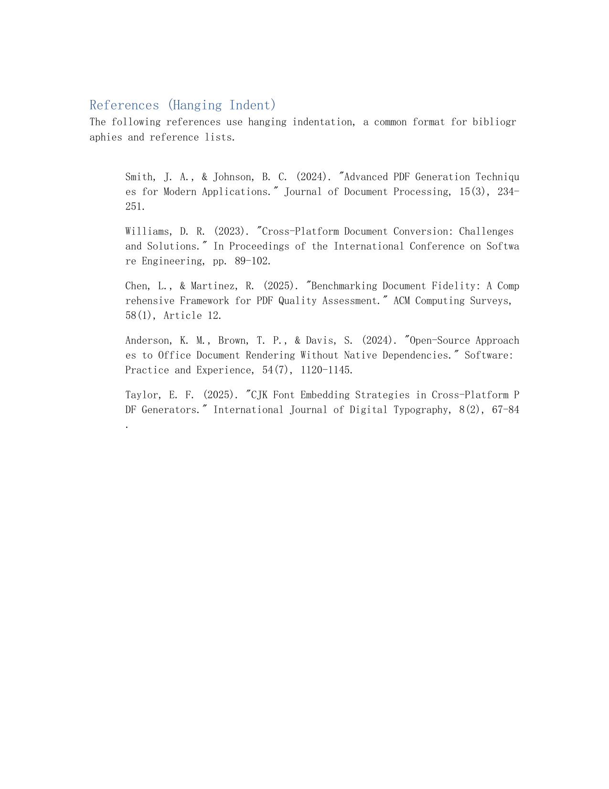</td>
  <td></td>
  <td></td>
</tr>
<tr>
  <td><b>docx_classic94_custom_bullet_characters<br><small>format: docx | case: docx_classic94_custom_bullet_characters | scope: python-classic-docx</small></b></td>
  <td colspan="2">docx_classic94_custom_bullet_characters <span style="color:#3fb950">⬤</span> 99.1%</td>
</tr>
<tr>
  <td>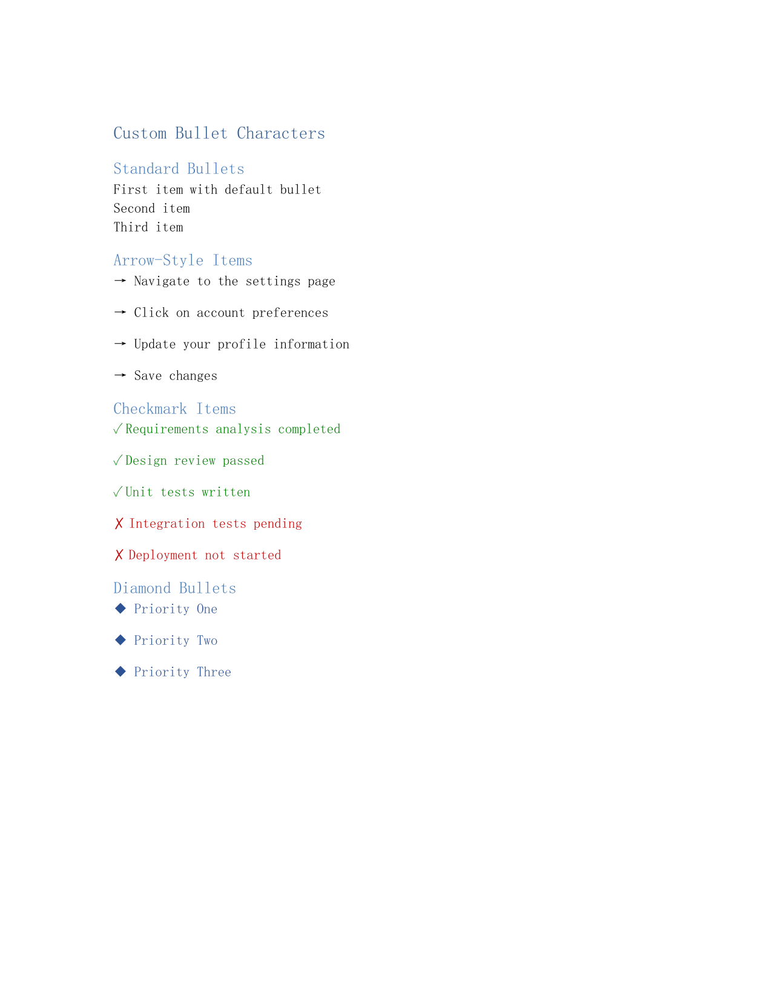</td>
  <td></td>
  <td></td>
</tr>
<tr>
  <td><b>docx_classic95_contract_template<br><small>format: docx | case: docx_classic95_contract_template | scope: python-classic-docx</small></b></td>
  <td colspan="2">docx_classic95_contract_template <span style="color:#3fb950">⬤</span> 98.7%</td>
</tr>
<tr>
  <td></td>
  <td></td>
  <td>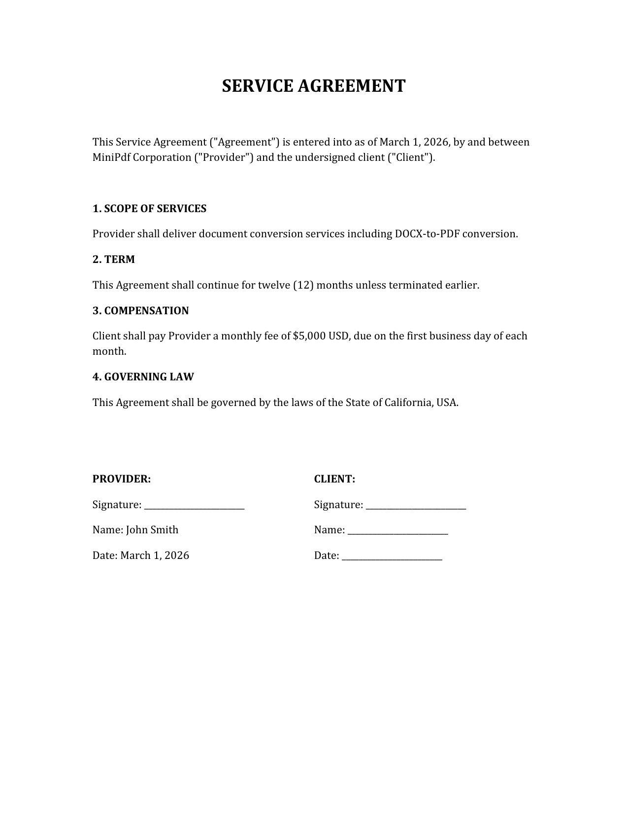</td>
</tr>
<tr>
  <td><b>docx_classic96_dense_data_table<br><small>format: docx | case: docx_classic96_dense_data_table | scope: python-classic-docx</small></b></td>
  <td colspan="2">docx_classic96_dense_data_table <span style="color:#3fb950">⬤</span> 96.7%</td>
</tr>
<tr>
  <td></td>
  <td></td>
  <td></td>
</tr>
<tr>
  <td><b>docx_classic97_product_catalog<br><small>format: docx | case: docx_classic97_product_catalog | scope: python-classic-docx</small></b></td>
  <td colspan="2">docx_classic97_product_catalog <span style="color:#d29922">⬤</span> 89.3%</td>
</tr>
<tr>
  <td>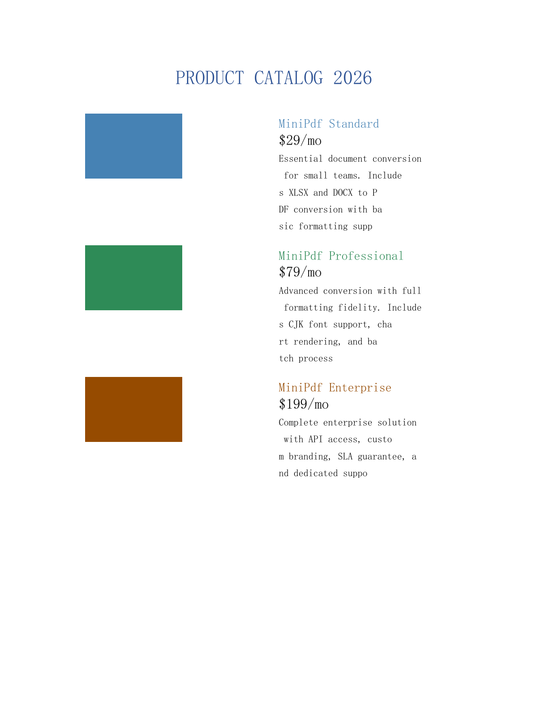</td>
  <td></td>
  <td></td>
</tr>
<tr>
  <td><b>docx_classic98_training_manual<br><small>format: docx | case: docx_classic98_training_manual | scope: python-classic-docx</small></b></td>
  <td colspan="2">docx_classic98_training_manual <span style="color:#3fb950">⬤</span> 98.3%</td>
</tr>
<tr>
  <td></td>
  <td></td>
  <td></td>
</tr>
<tr>
  <td><b>docx_classic99_policy_document<br><small>format: docx | case: docx_classic99_policy_document | scope: python-classic-docx</small></b></td>
  <td colspan="2">docx_classic99_policy_document <span style="color:#3fb950">⬤</span> 97.1%</td>
</tr>
<tr>
  <td>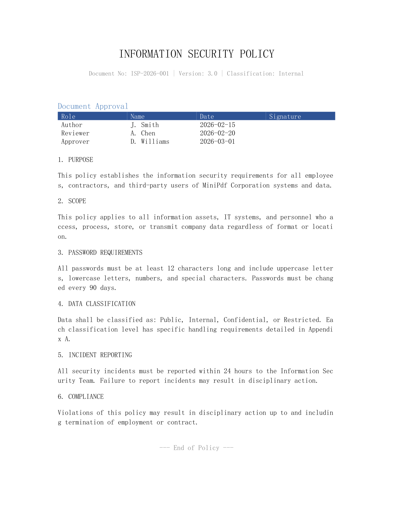</td>
  <td></td>
  <td>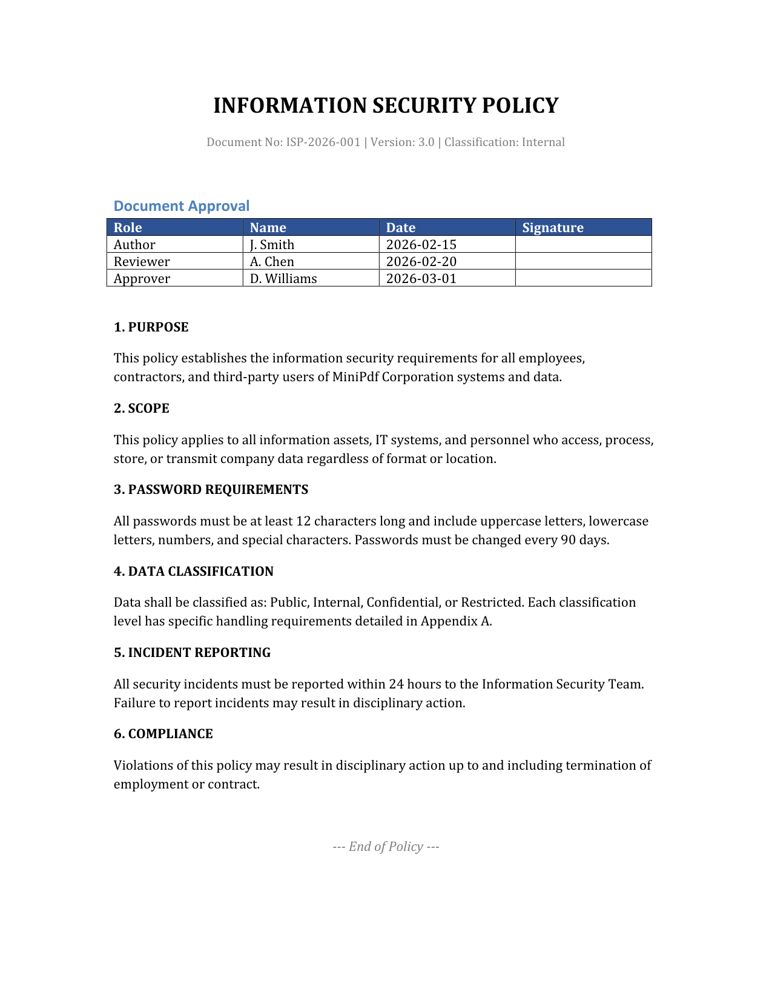</td>
</tr>
<tr>
  <td><b>docx_classic100_multi_page_table<br><small>format: docx | case: docx_classic100_multi_page_table | scope: python-classic-docx</small></b></td>
  <td colspan="2">docx_classic100_multi_page_table <span style="color:#3fb950">⬤</span> 92.2%</td>
</tr>
<tr>
  <td>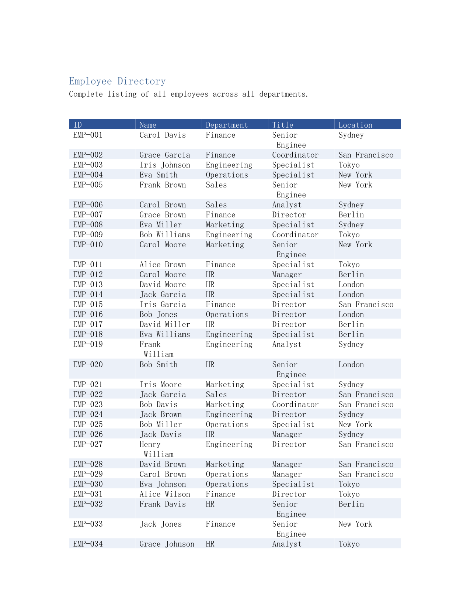</td>
  <td></td>
  <td></td>
</tr>
<tr>
  <td></td>
  <td></td>
  <td></td>
</tr>
<tr>
  <td><b>docx_classic101_warranty_document<br><small>format: docx | case: docx_classic101_warranty_document | scope: python-classic-docx</small></b></td>
  <td colspan="2">docx_classic101_warranty_document <span style="color:#3fb950">⬤</span> 97.8%</td>
</tr>
<tr>
  <td>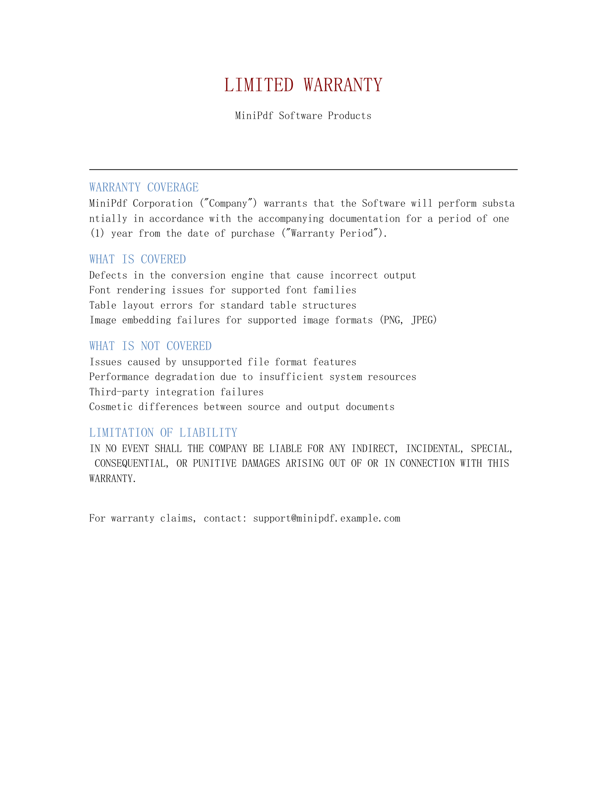</td>
  <td></td>
  <td>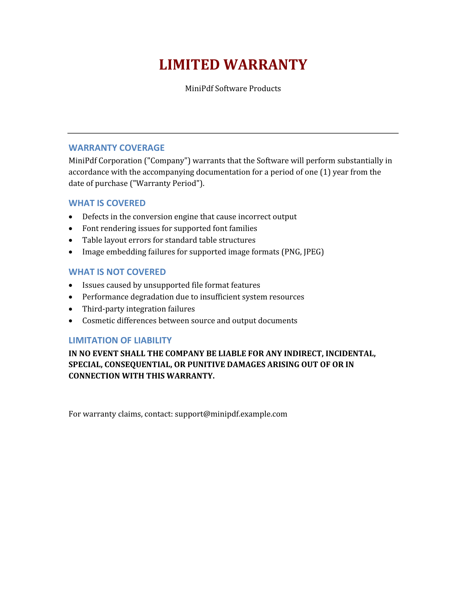</td>
</tr>
<tr>
  <td><b>docx_classic102_curriculum_syllabus<br><small>format: docx | case: docx_classic102_curriculum_syllabus | scope: python-classic-docx</small></b></td>
  <td colspan="2">docx_classic102_curriculum_syllabus <span style="color:#3fb950">⬤</span> 98.0%</td>
</tr>
<tr>
  <td>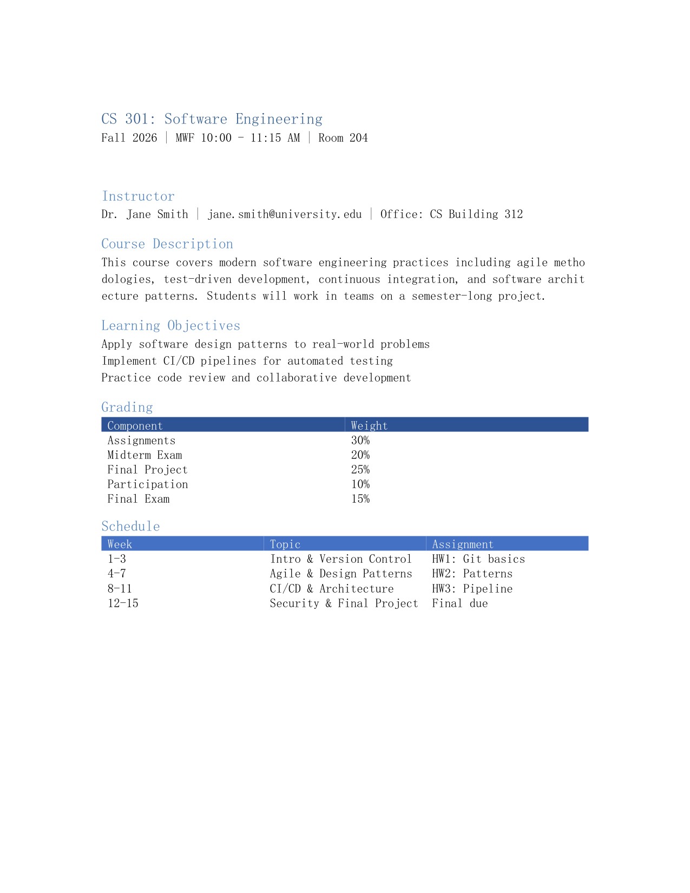</td>
  <td></td>
  <td></td>
</tr>
<tr>
  <td><b>docx_classic103_event_program<br><small>format: docx | case: docx_classic103_event_program | scope: python-classic-docx</small></b></td>
  <td colspan="2">docx_classic103_event_program <span style="color:#3fb950">⬤</span> 95.1%</td>
</tr>
<tr>
  <td>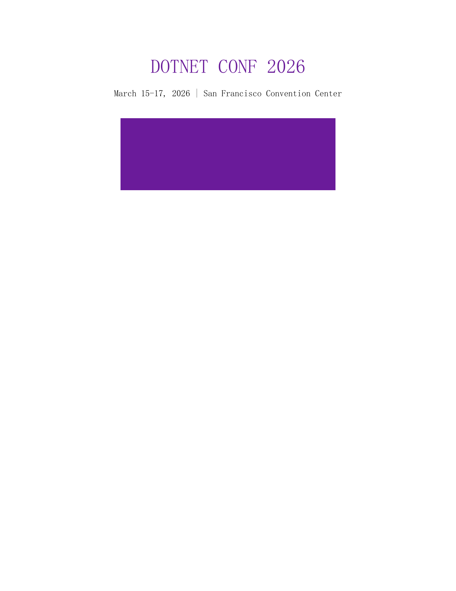</td>
  <td></td>
  <td></td>
</tr>
<tr>
  <td></td>
  <td></td>
  <td></td>
</tr>
<tr>
  <td><b>docx_classic104_sop_document<br><small>format: docx | case: docx_classic104_sop_document | scope: python-classic-docx</small></b></td>
  <td colspan="2">docx_classic104_sop_document <span style="color:#3fb950">⬤</span> 97.7%</td>
</tr>
<tr>
  <td></td>
  <td>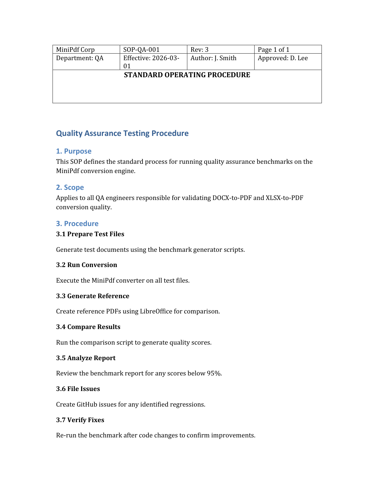</td>
  <td></td>
</tr>
<tr>
  <td></td>
  <td></td>
  <td></td>
</tr>
<tr>
  <td><b>docx_classic105_certificate<br><small>format: docx | case: docx_classic105_certificate | scope: python-classic-docx</small></b></td>
  <td colspan="2">docx_classic105_certificate <span style="color:#3fb950">⬤</span> 98.8%</td>
</tr>
<tr>
  <td>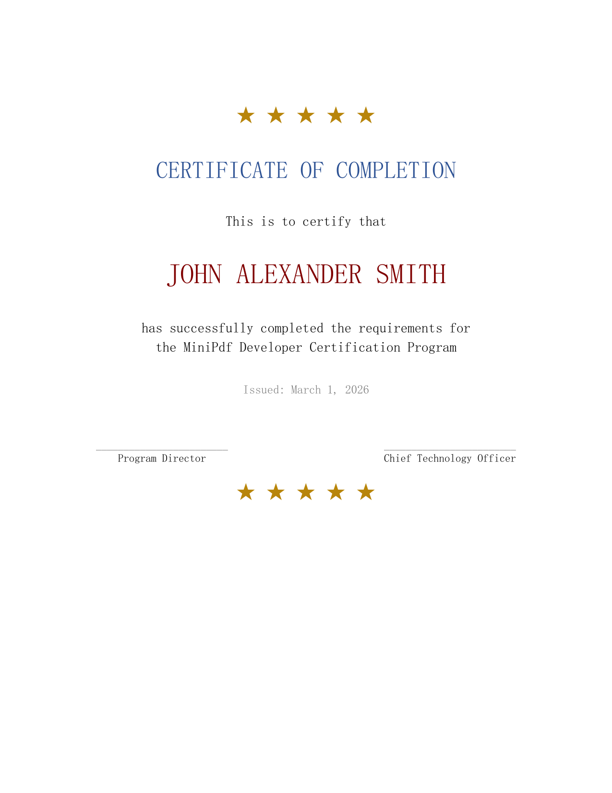</td>
  <td></td>
  <td></td>
</tr>
<tr>
  <td><b>docx_classic106_multi_section_orientation<br><small>format: docx | case: docx_classic106_multi_section_orientation | scope: python-classic-docx</small></b></td>
  <td colspan="2">docx_classic106_multi_section_orientation <span style="color:#f85149">⬤</span> 61.4%</td>
</tr>
<tr>
  <td></td>
  <td></td>
  <td></td>
</tr>
<tr>
  <td><i>missing</i></td>
  <td></td>
  <td></td>
</tr>
<tr>
  <td><i>missing</i></td>
  <td></td>
  <td></td>
</tr>
<tr>
  <td><b>docx_classic107_order_form<br><small>format: docx | case: docx_classic107_order_form | scope: python-classic-docx</small></b></td>
  <td colspan="2">docx_classic107_order_form <span style="color:#3fb950">⬤</span> 92.6%</td>
</tr>
<tr>
  <td></td>
  <td></td>
  <td></td>
</tr>
<tr>
  <td><b>docx_classic108_comparison_matrix<br><small>format: docx | case: docx_classic108_comparison_matrix | scope: python-classic-docx</small></b></td>
  <td colspan="2">docx_classic108_comparison_matrix <span style="color:#3fb950">⬤</span> 93.6%</td>
</tr>
<tr>
  <td></td>
  <td></td>
  <td></td>
</tr>
<tr>
  <td><b>docx_classic109_release_notes<br><small>format: docx | case: docx_classic109_release_notes | scope: python-classic-docx</small></b></td>
  <td colspan="2">docx_classic109_release_notes <span style="color:#3fb950">⬤</span> 97.9%</td>
</tr>
<tr>
  <td></td>
  <td></td>
  <td></td>
</tr>
<tr>
  <td><b>docx_classic110_troubleshooting_guide<br><small>format: docx | case: docx_classic110_troubleshooting_guide | scope: python-classic-docx</small></b></td>
  <td colspan="2">docx_classic110_troubleshooting_guide <span style="color:#3fb950">⬤</span> 98.9%</td>
</tr>
<tr>
  <td>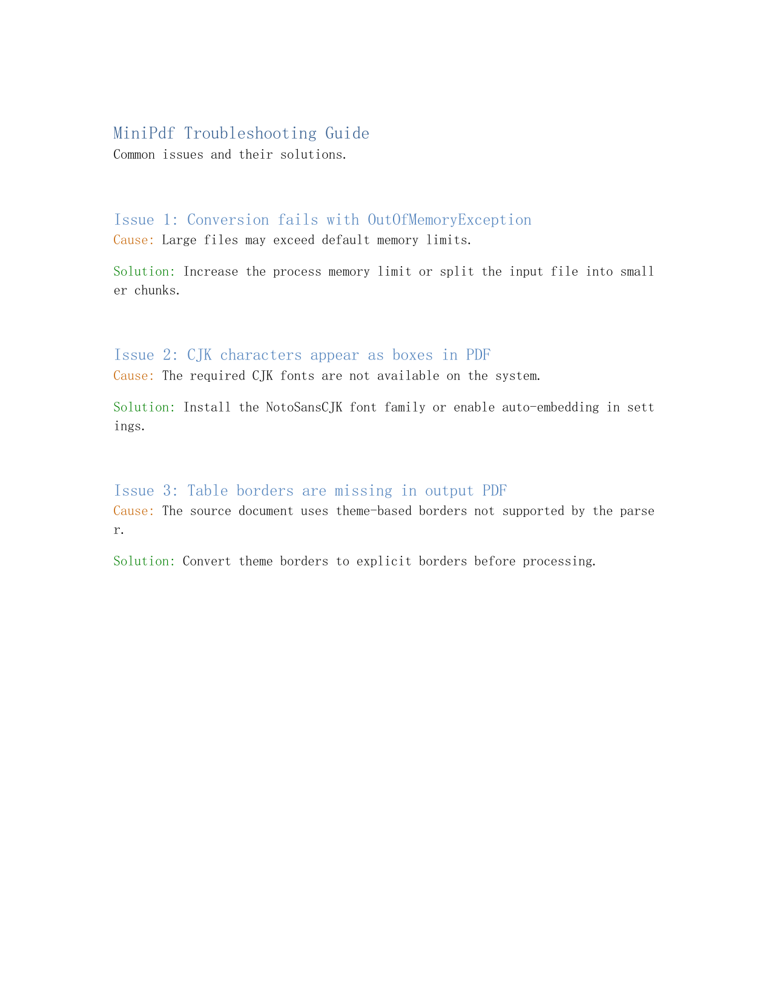</td>
  <td></td>
  <td></td>
</tr>
<tr>
  <td><b>docx_classic111_meeting_agenda<br><small>format: docx | case: docx_classic111_meeting_agenda | scope: python-classic-docx</small></b></td>
  <td colspan="2">docx_classic111_meeting_agenda <span style="color:#3fb950">⬤</span> 97.9%</td>
</tr>
<tr>
  <td></td>
  <td></td>
  <td></td>
</tr>
<tr>
  <td><b>docx_classic112_project_status_report<br><small>format: docx | case: docx_classic112_project_status_report | scope: python-classic-docx</small></b></td>
  <td colspan="2">docx_classic112_project_status_report <span style="color:#3fb950">⬤</span> 97.9%</td>
</tr>
<tr>
  <td>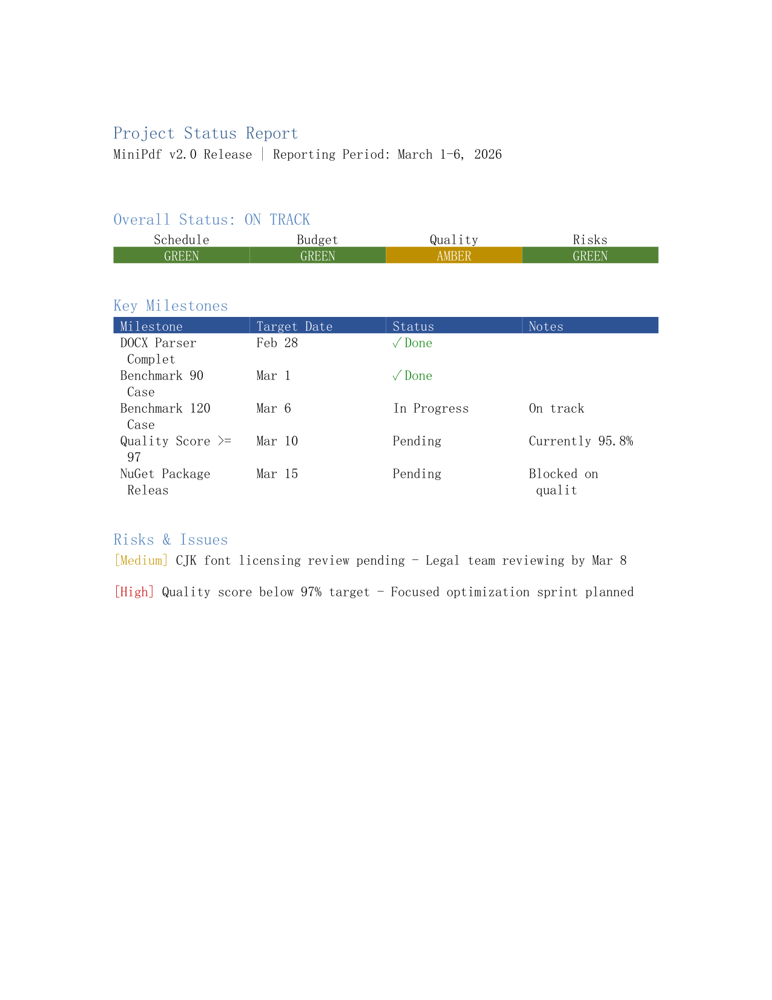</td>
  <td></td>
  <td></td>
</tr>
<tr>
  <td><b>docx_classic113_address_labels<br><small>format: docx | case: docx_classic113_address_labels | scope: python-classic-docx</small></b></td>
  <td colspan="2">docx_classic113_address_labels <span style="color:#3fb950">⬤</span> 99.1%</td>
</tr>
<tr>
  <td>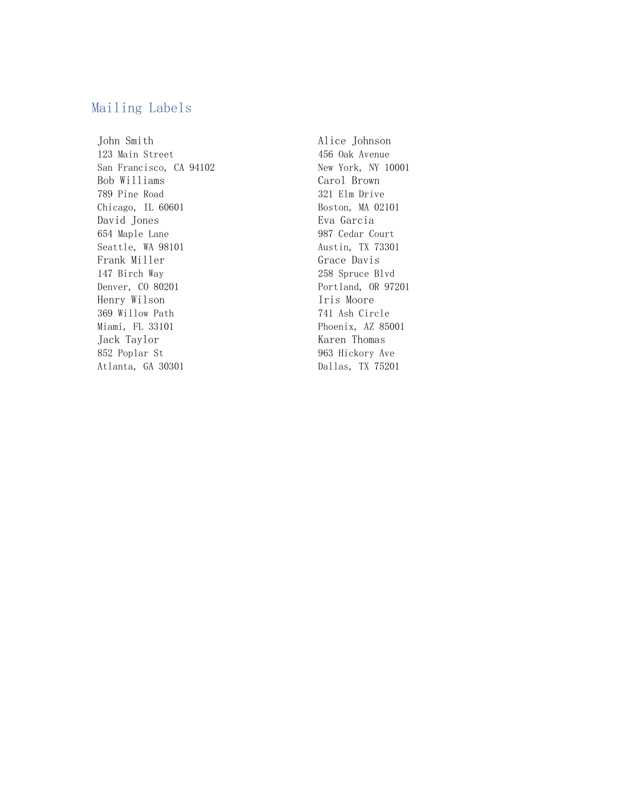</td>
  <td>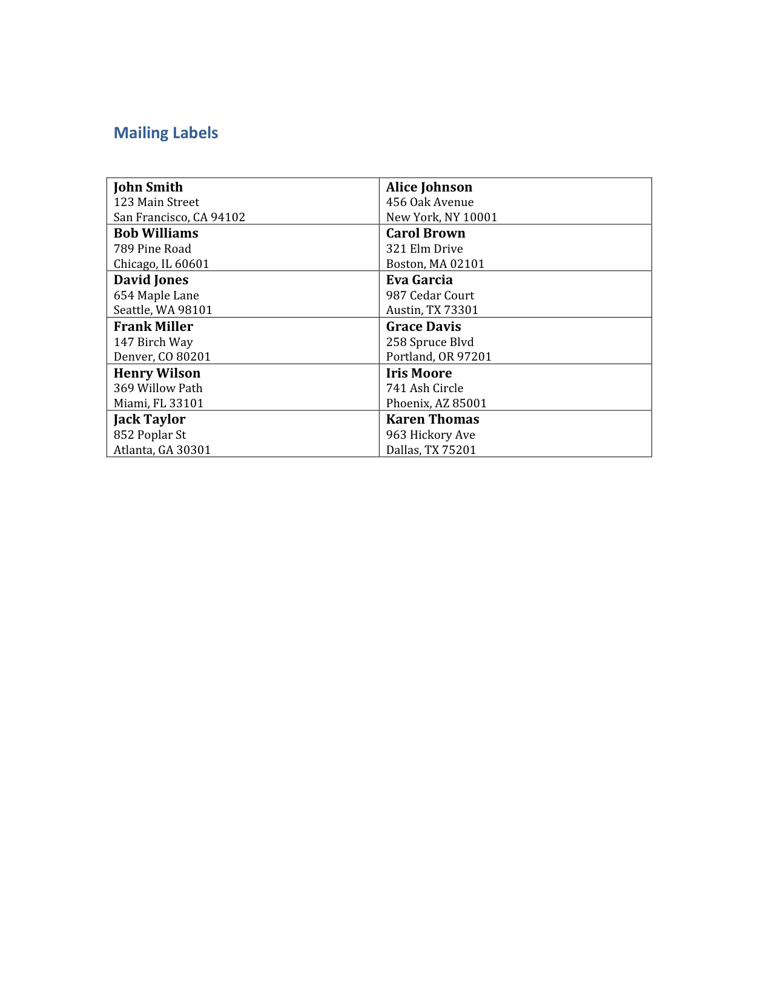</td>
  <td></td>
</tr>
<tr>
  <td><b>docx_classic114_test_report<br><small>format: docx | case: docx_classic114_test_report | scope: python-classic-docx</small></b></td>
  <td colspan="2">docx_classic114_test_report <span style="color:#3fb950">⬤</span> 97.1%</td>
</tr>
<tr>
  <td>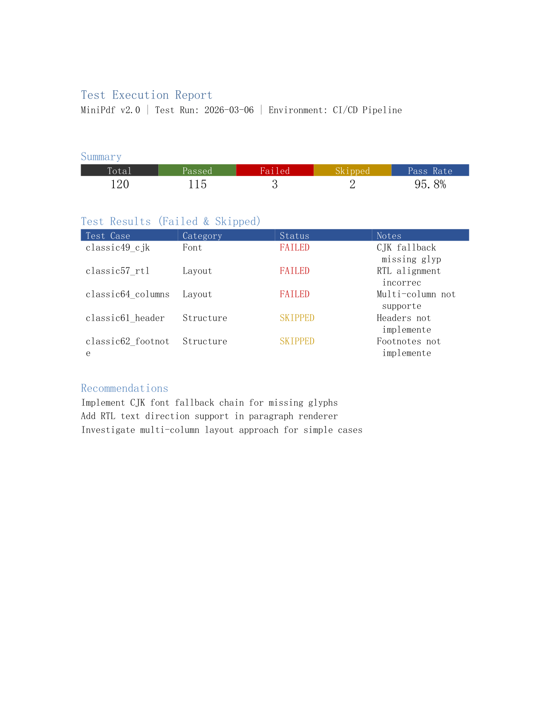</td>
  <td></td>
  <td></td>
</tr>
<tr>
  <td><b>docx_classic115_price_list<br><small>format: docx | case: docx_classic115_price_list | scope: python-classic-docx</small></b></td>
  <td colspan="2">docx_classic115_price_list <span style="color:#3fb950">⬤</span> 96.3%</td>
</tr>
<tr>
  <td></td>
  <td></td>
  <td></td>
</tr>
<tr>
  <td><b>docx_classic116_risk_assessment<br><small>format: docx | case: docx_classic116_risk_assessment | scope: python-classic-docx</small></b></td>
  <td colspan="2">docx_classic116_risk_assessment <span style="color:#3fb950">⬤</span> 94.5%</td>
</tr>
<tr>
  <td>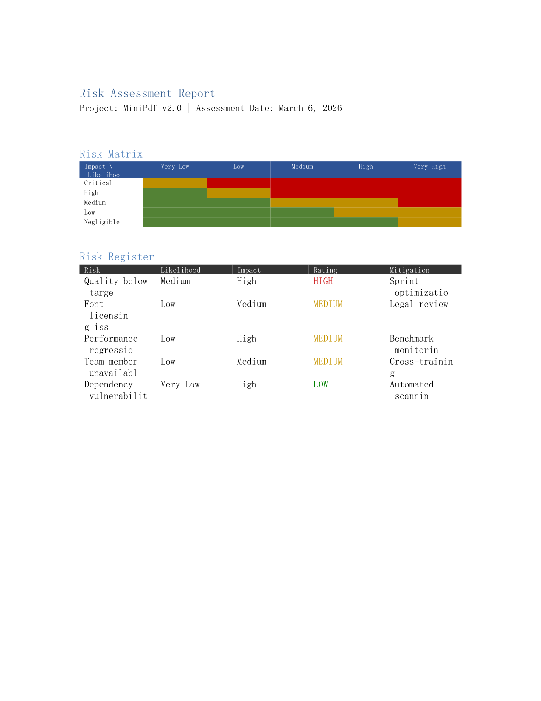</td>
  <td>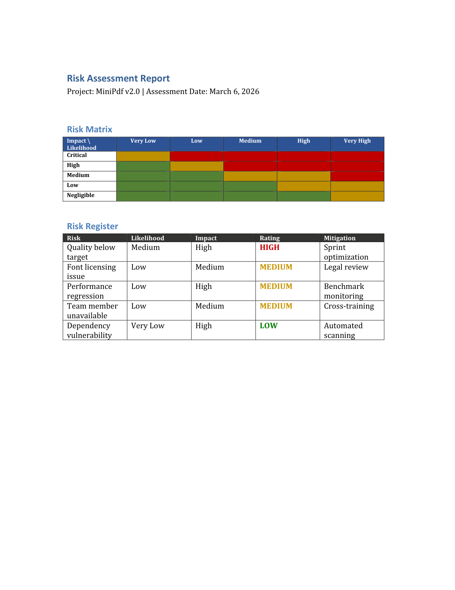</td>
  <td></td>
</tr>
<tr>
  <td><b>docx_classic117_employee_handbook_excerpt<br><small>format: docx | case: docx_classic117_employee_handbook_excerpt | scope: python-classic-docx</small></b></td>
  <td colspan="2">docx_classic117_employee_handbook_excerpt <span style="color:#3fb950">⬤</span> 97.7%</td>
</tr>
<tr>
  <td></td>
  <td></td>
  <td></td>
</tr>
<tr>
  <td><b>docx_classic118_data_report_with_summary<br><small>format: docx | case: docx_classic118_data_report_with_summary | scope: python-classic-docx</small></b></td>
  <td colspan="2">docx_classic118_data_report_with_summary <span style="color:#3fb950">⬤</span> 97.3%</td>
</tr>
<tr>
  <td>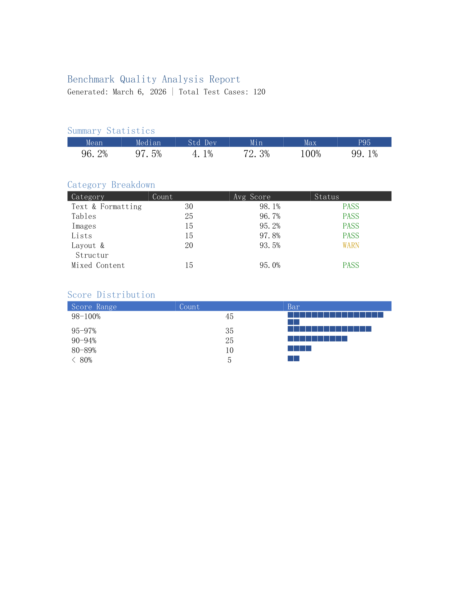</td>
  <td></td>
  <td></td>
</tr>
<tr>
  <td><b>docx_classic119_multi_language_document<br><small>format: docx | case: docx_classic119_multi_language_document | scope: python-classic-docx</small></b></td>
  <td colspan="2">docx_classic119_multi_language_document <span style="color:#3fb950">⬤</span> 99.0%</td>
</tr>
<tr>
  <td></td>
  <td>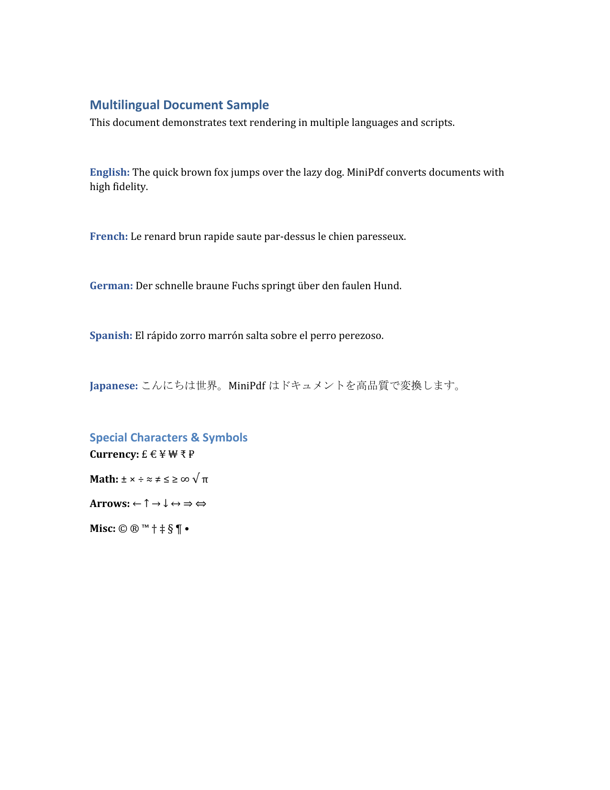</td>
  <td></td>
</tr>
<tr>
  <td><b>docx_classic120_comprehensive_business_proposal<br><small>format: docx | case: docx_classic120_comprehensive_business_proposal | scope: python-classic-docx</small></b></td>
  <td colspan="2">docx_classic120_comprehensive_business_proposal <span style="color:#3fb950">⬤</span> 94.9%</td>
</tr>
<tr>
  <td>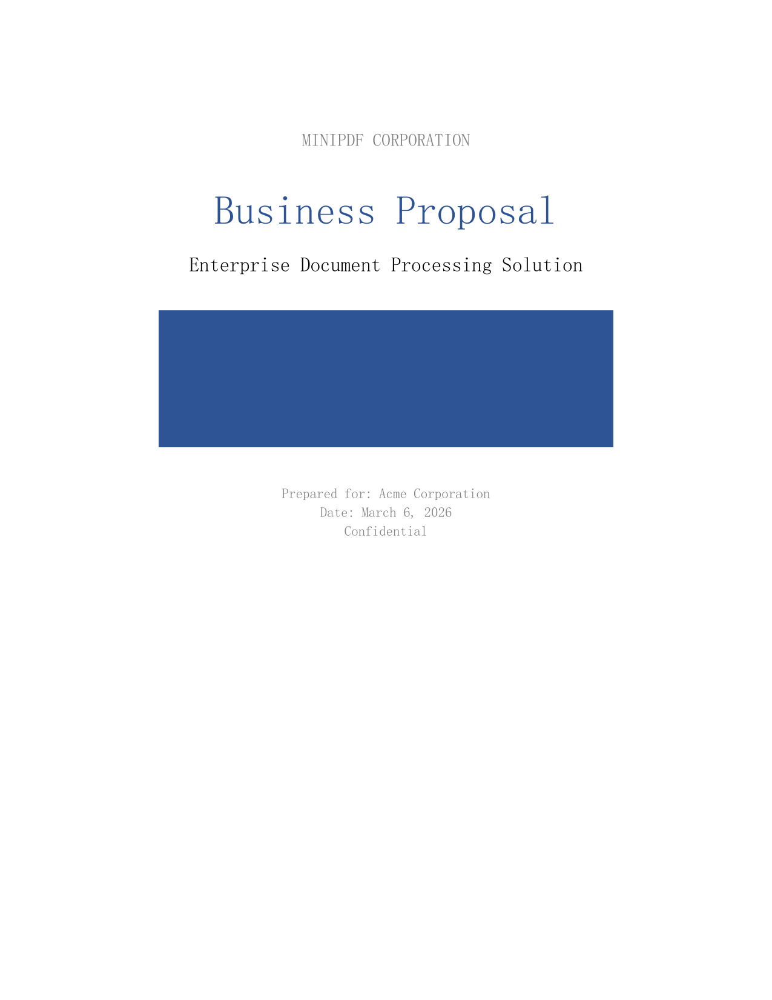</td>
  <td></td>
  <td>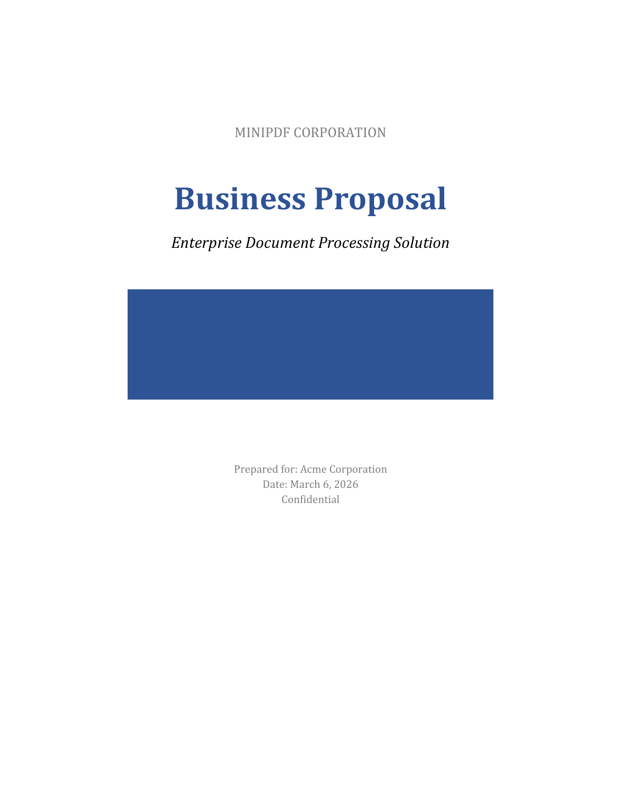</td>
</tr>
<tr>
  <td></td>
  <td>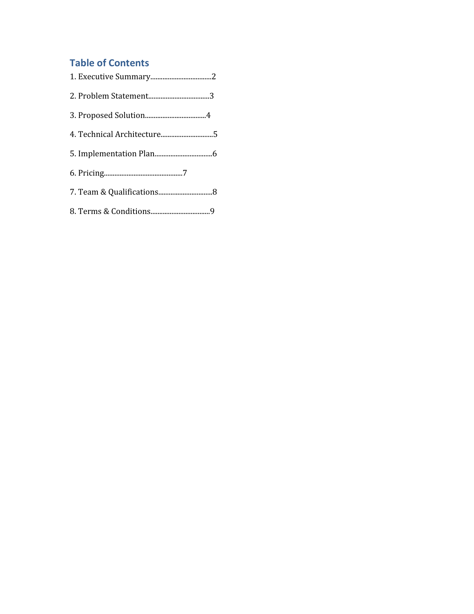</td>
  <td></td>
</tr>
<tr>
  <td>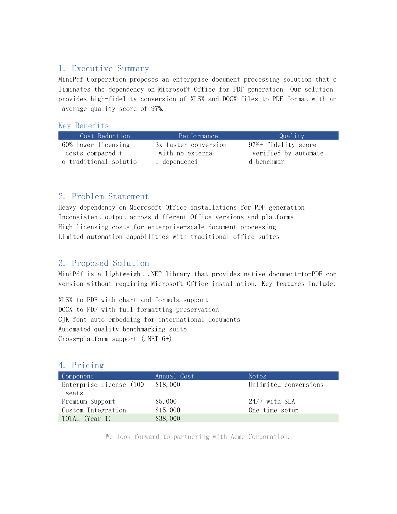</td>
  <td></td>
  <td></td>
</tr>
<tr>
  <td><b>docx_classic121_thin_border_table<br><small>format: docx | case: docx_classic121_thin_border_table | scope: python-classic-docx</small></b></td>
  <td colspan="2">docx_classic121_thin_border_table <span style="color:#3fb950">⬤</span> 95.8%</td>
</tr>
<tr>
  <td></td>
  <td></td>
  <td></td>
</tr>
<tr>
  <td><b>docx_classic122_thick_outer_border_table<br><small>format: docx | case: docx_classic122_thick_outer_border_table | scope: python-classic-docx</small></b></td>
  <td colspan="2">docx_classic122_thick_outer_border_table <span style="color:#3fb950">⬤</span> 92.4%</td>
</tr>
<tr>
  <td></td>
  <td></td>
  <td></td>
</tr>
<tr>
  <td><b>docx_classic123_dashed_border_table<br><small>format: docx | case: docx_classic123_dashed_border_table | scope: python-classic-docx</small></b></td>
  <td colspan="2">docx_classic123_dashed_border_table <span style="color:#3fb950">⬤</span> 99.6%</td>
</tr>
<tr>
  <td></td>
  <td>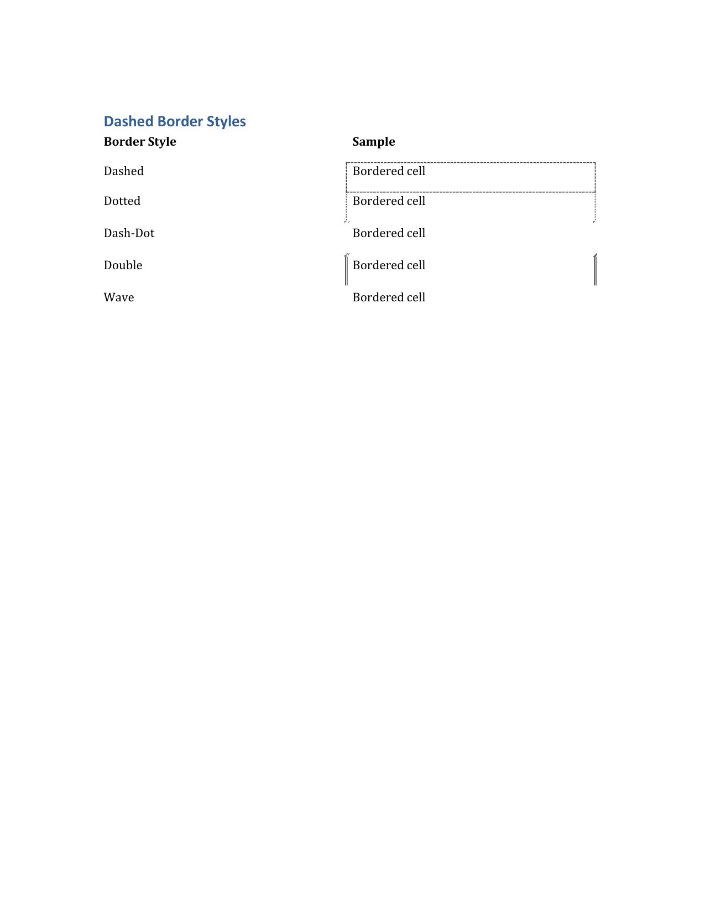</td>
  <td></td>
</tr>
<tr>
  <td><b>docx_classic124_colored_border_table<br><small>format: docx | case: docx_classic124_colored_border_table | scope: python-classic-docx</small></b></td>
  <td colspan="2">docx_classic124_colored_border_table <span style="color:#3fb950">⬤</span> 99.3%</td>
</tr>
<tr>
  <td>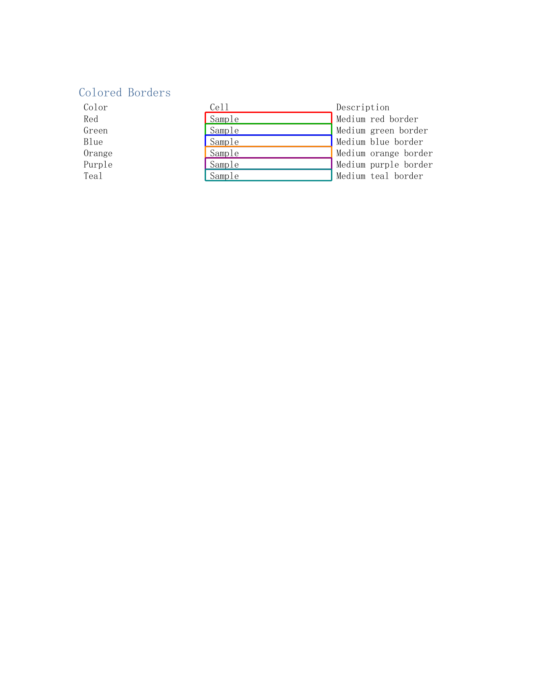</td>
  <td></td>
  <td></td>
</tr>
<tr>
  <td><b>docx_classic125_solid_cell_fills<br><small>format: docx | case: docx_classic125_solid_cell_fills | scope: python-classic-docx</small></b></td>
  <td colspan="2">docx_classic125_solid_cell_fills <span style="color:#3fb950">⬤</span> 99.0%</td>
</tr>
<tr>
  <td>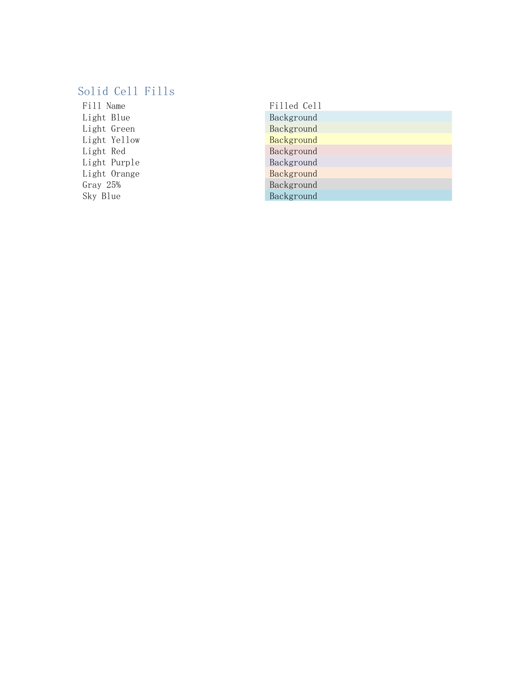</td>
  <td></td>
  <td></td>
</tr>
<tr>
  <td><b>docx_classic126_dark_header_table<br><small>format: docx | case: docx_classic126_dark_header_table | scope: python-classic-docx</small></b></td>
  <td colspan="2">docx_classic126_dark_header_table <span style="color:#3fb950">⬤</span> 99.3%</td>
</tr>
<tr>
  <td></td>
  <td></td>
  <td></td>
</tr>
<tr>
  <td><b>docx_classic127_font_styles_showcase<br><small>format: docx | case: docx_classic127_font_styles_showcase | scope: python-classic-docx</small></b></td>
  <td colspan="2">docx_classic127_font_styles_showcase <span style="color:#3fb950">⬤</span> 95.5%</td>
</tr>
<tr>
  <td></td>
  <td></td>
  <td></td>
</tr>
<tr>
  <td><b>docx_classic128_font_sizes_showcase<br><small>format: docx | case: docx_classic128_font_sizes_showcase | scope: python-classic-docx</small></b></td>
  <td colspan="2">docx_classic128_font_sizes_showcase <span style="color:#3fb950">⬤</span> 97.3%</td>
</tr>
<tr>
  <td>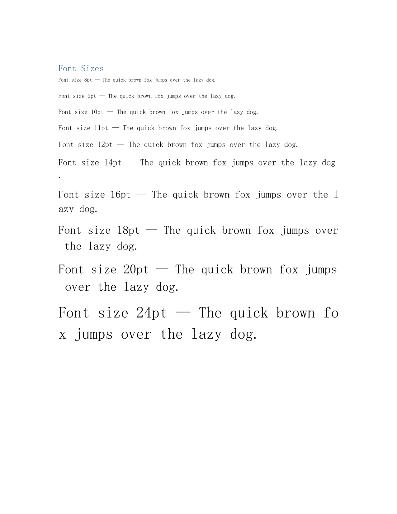</td>
  <td></td>
  <td>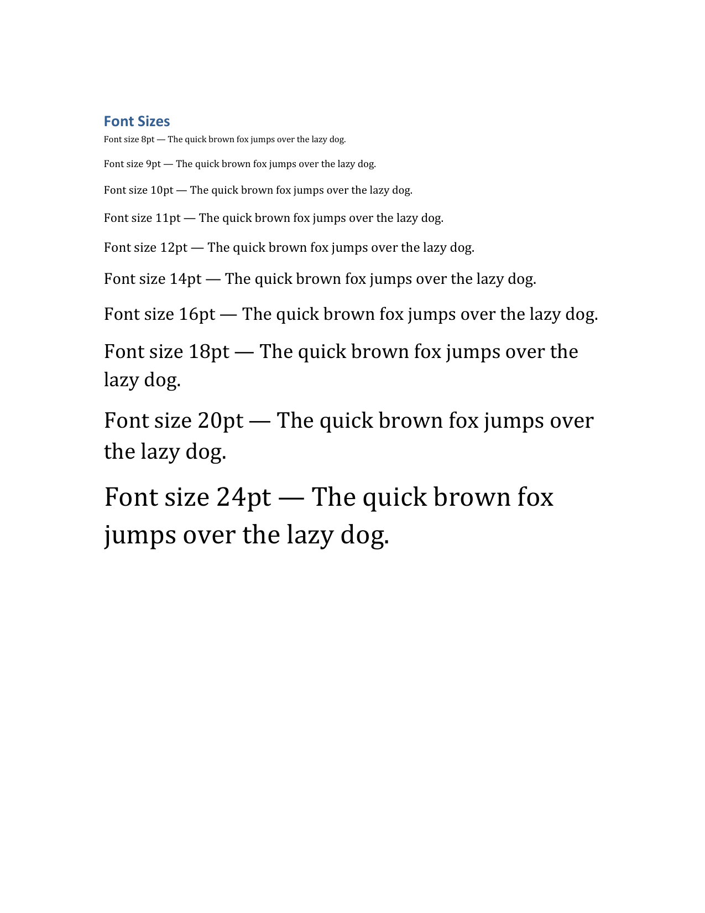</td>
</tr>
<tr>
  <td><b>docx_classic129_alignment_combinations<br><small>format: docx | case: docx_classic129_alignment_combinations | scope: python-classic-docx</small></b></td>
  <td colspan="2">docx_classic129_alignment_combinations <span style="color:#3fb950">⬤</span> 96.7%</td>
</tr>
<tr>
  <td></td>
  <td>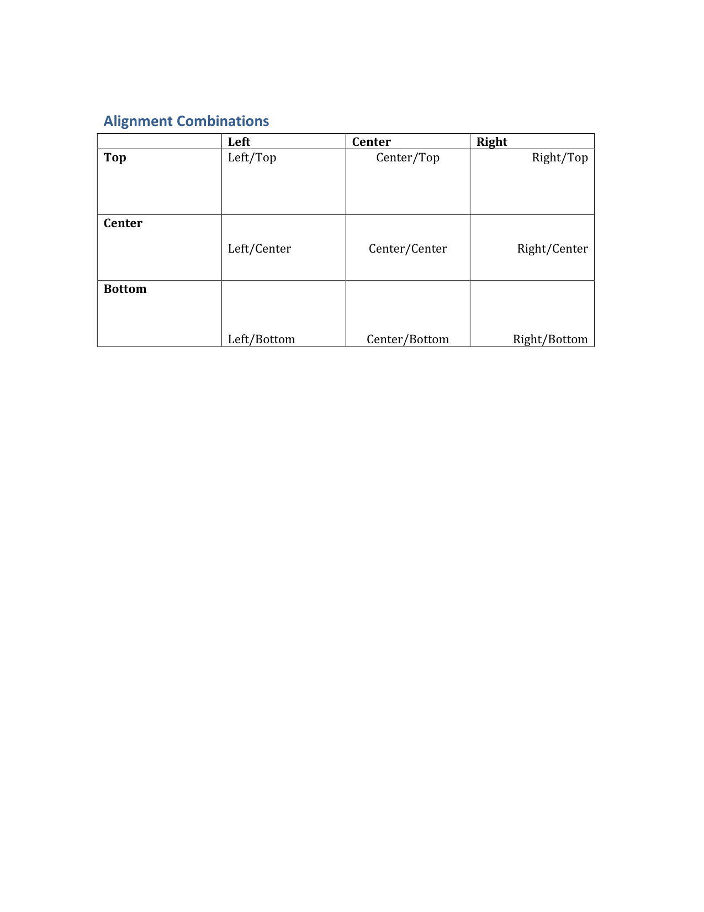</td>
  <td></td>
</tr>
<tr>
  <td><b>docx_classic130_wrap_and_indent<br><small>format: docx | case: docx_classic130_wrap_and_indent | scope: python-classic-docx</small></b></td>
  <td colspan="2">docx_classic130_wrap_and_indent <span style="color:#3fb950">⬤</span> 98.8%</td>
</tr>
<tr>
  <td></td>
  <td>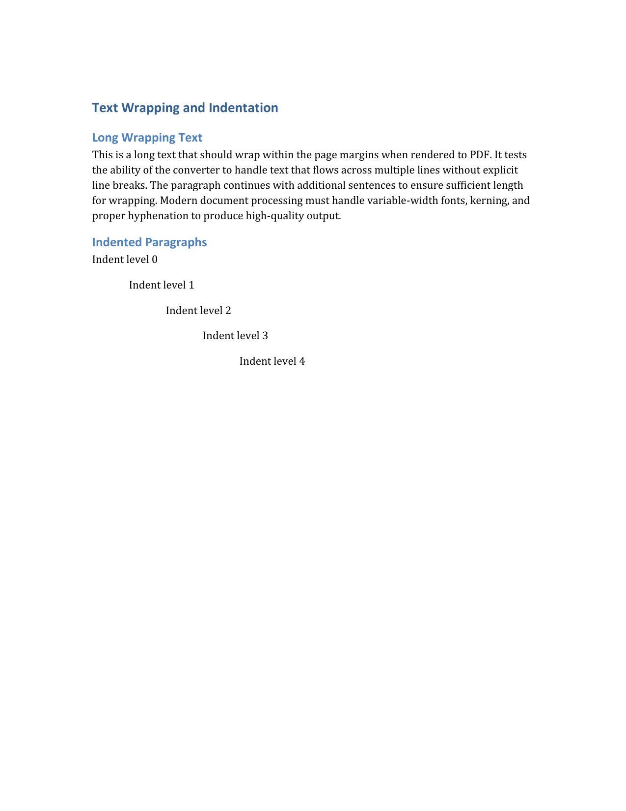</td>
  <td></td>
</tr>
<tr>
  <td><b>docx_classic131_number_format_table<br><small>format: docx | case: docx_classic131_number_format_table | scope: python-classic-docx</small></b></td>
  <td colspan="2">docx_classic131_number_format_table <span style="color:#3fb950">⬤</span> 96.4%</td>
</tr>
<tr>
  <td>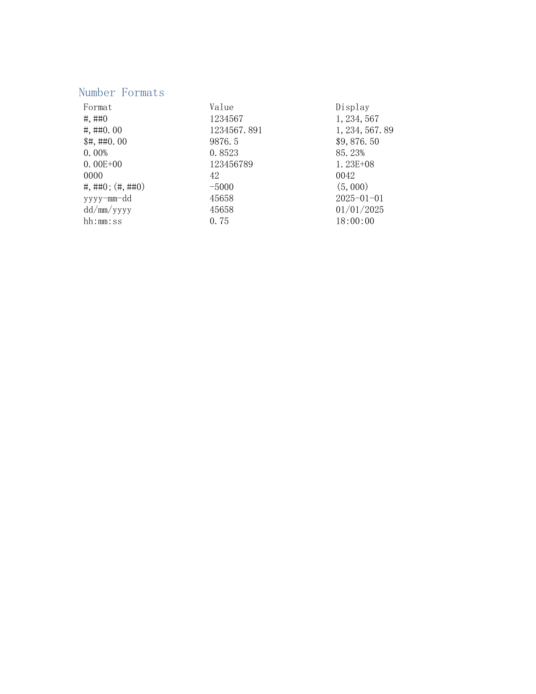</td>
  <td></td>
  <td></td>
</tr>
<tr>
  <td><b>docx_classic132_striped_table<br><small>format: docx | case: docx_classic132_striped_table | scope: python-classic-docx</small></b></td>
  <td colspan="2">docx_classic132_striped_table <span style="color:#3fb950">⬤</span> 98.4%</td>
</tr>
<tr>
  <td>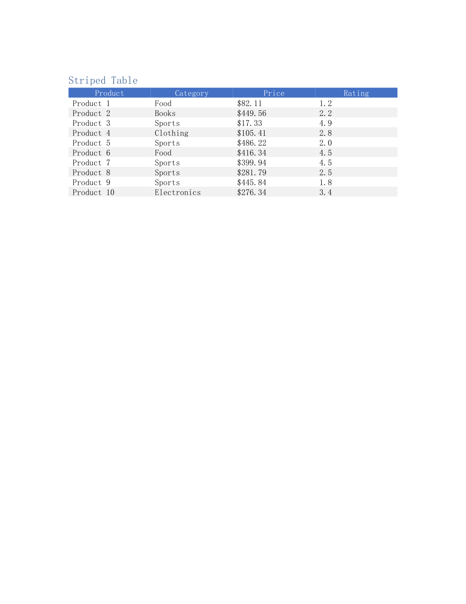</td>
  <td></td>
  <td>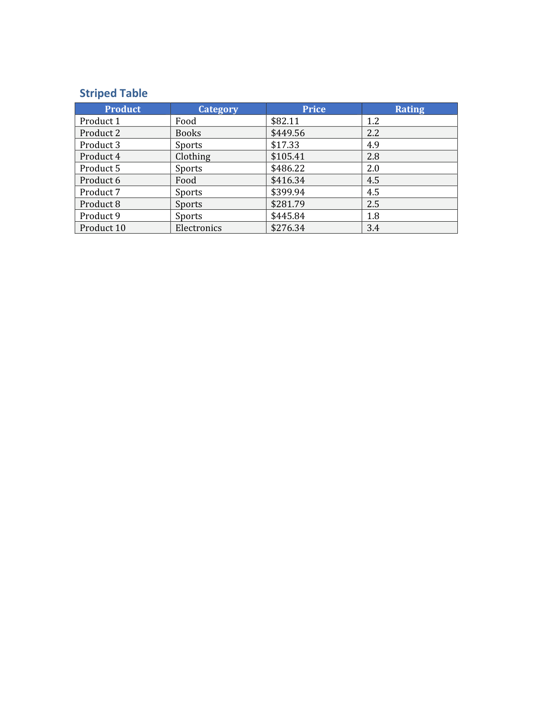</td>
</tr>
<tr>
  <td><b>docx_classic133_gradient_rows_table<br><small>format: docx | case: docx_classic133_gradient_rows_table | scope: python-classic-docx</small></b></td>
  <td colspan="2">docx_classic133_gradient_rows_table <span style="color:#3fb950">⬤</span> 99.0%</td>
</tr>
<tr>
  <td></td>
  <td></td>
  <td></td>
</tr>
<tr>
  <td><b>docx_classic134_heatmap_table<br><small>format: docx | case: docx_classic134_heatmap_table | scope: python-classic-docx</small></b></td>
  <td colspan="2">docx_classic134_heatmap_table <span style="color:#3fb950">⬤</span> 99.0%</td>
</tr>
<tr>
  <td></td>
  <td></td>
  <td></td>
</tr>
<tr>
  <td><b>docx_classic135_bottom_border_paragraphs<br><small>format: docx | case: docx_classic135_bottom_border_paragraphs | scope: python-classic-docx</small></b></td>
  <td colspan="2">docx_classic135_bottom_border_paragraphs <span style="color:#3fb950">⬤</span> 99.3%</td>
</tr>
<tr>
  <td></td>
  <td>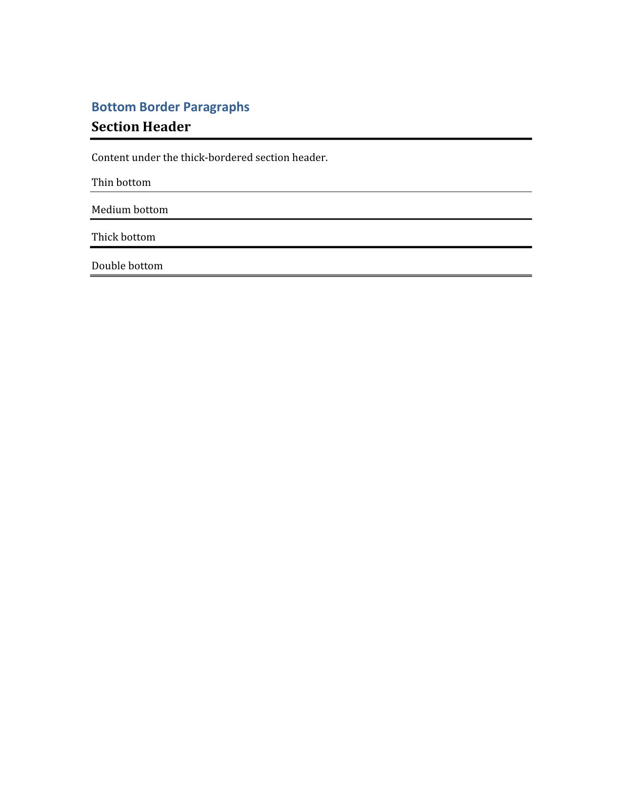</td>
  <td></td>
</tr>
<tr>
  <td><b>docx_classic136_financial_statement<br><small>format: docx | case: docx_classic136_financial_statement | scope: python-classic-docx</small></b></td>
  <td colspan="2">docx_classic136_financial_statement <span style="color:#3fb950">⬤</span> 98.8%</td>
</tr>
<tr>
  <td>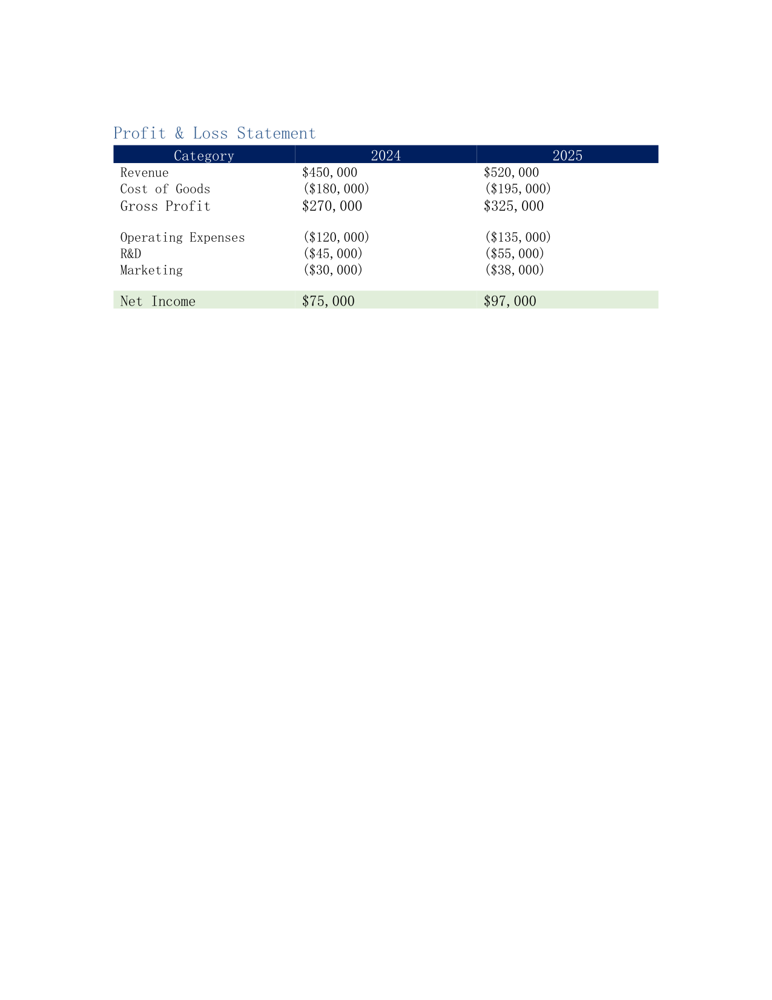</td>
  <td></td>
  <td></td>
</tr>
<tr>
  <td><b>docx_classic137_checkerboard_table<br><small>format: docx | case: docx_classic137_checkerboard_table | scope: python-classic-docx</small></b></td>
  <td colspan="2">docx_classic137_checkerboard_table <span style="color:#3fb950">⬤</span> 97.8%</td>
</tr>
<tr>
  <td></td>
  <td></td>
  <td></td>
</tr>
<tr>
  <td><b>docx_classic138_color_grid_table<br><small>format: docx | case: docx_classic138_color_grid_table | scope: python-classic-docx</small></b></td>
  <td colspan="2">docx_classic138_color_grid_table <span style="color:#3fb950">⬤</span> 99.5%</td>
</tr>
<tr>
  <td></td>
  <td></td>
  <td></td>
</tr>
<tr>
  <td><b>docx_classic139_paragraph_shading_patterns<br><small>format: docx | case: docx_classic139_paragraph_shading_patterns | scope: python-classic-docx</small></b></td>
  <td colspan="2">docx_classic139_paragraph_shading_patterns <span style="color:#3fb950">⬤</span> 95.8%</td>
</tr>
<tr>
  <td>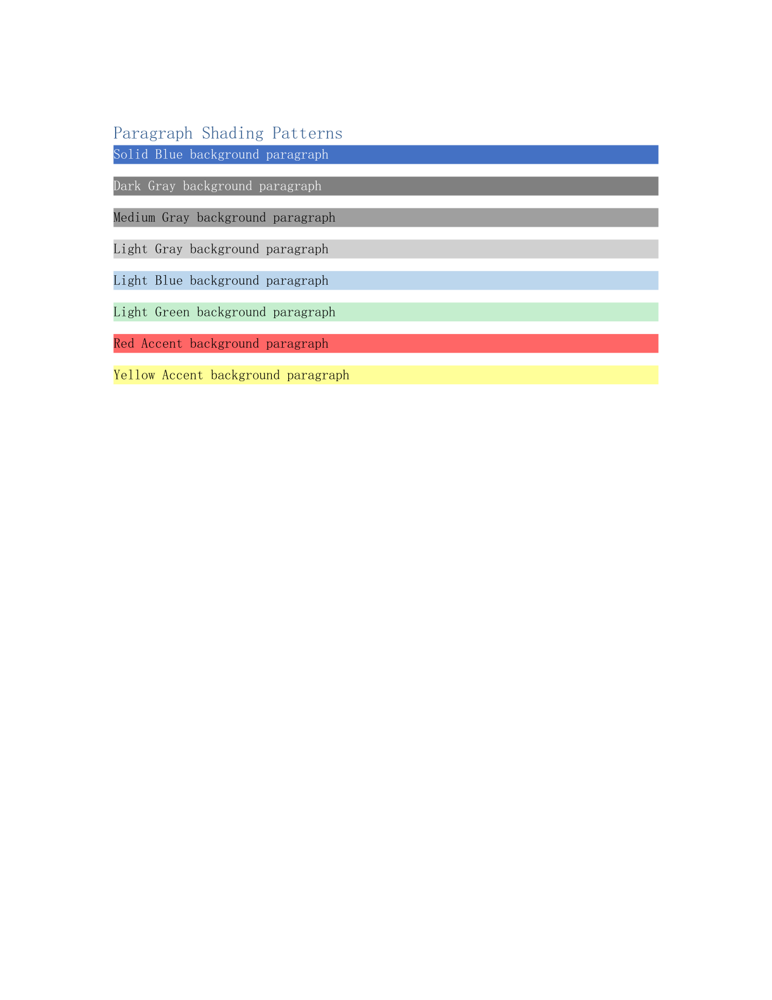</td>
  <td></td>
  <td>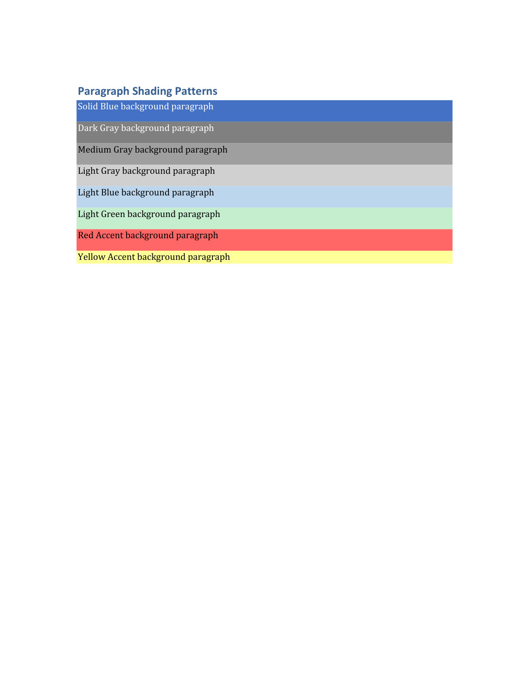</td>
</tr>
<tr>
  <td><b>docx_classic140_rotated_text_table<br><small>format: docx | case: docx_classic140_rotated_text_table | scope: python-classic-docx</small></b></td>
  <td colspan="2">docx_classic140_rotated_text_table <span style="color:#3fb950">⬤</span> 92.6%</td>
</tr>
<tr>
  <td></td>
  <td></td>
  <td></td>
</tr>
<tr>
  <td><b>docx_classic141_mixed_border_styles<br><small>format: docx | case: docx_classic141_mixed_border_styles | scope: python-classic-docx</small></b></td>
  <td colspan="2">docx_classic141_mixed_border_styles <span style="color:#3fb950">⬤</span> 99.5%</td>
</tr>
<tr>
  <td></td>
  <td></td>
  <td></td>
</tr>
<tr>
  <td><b>docx_classic142_styled_invoice_document<br><small>format: docx | case: docx_classic142_styled_invoice_document | scope: python-classic-docx</small></b></td>
  <td colspan="2">docx_classic142_styled_invoice_document <span style="color:#3fb950">⬤</span> 97.1%</td>
</tr>
<tr>
  <td>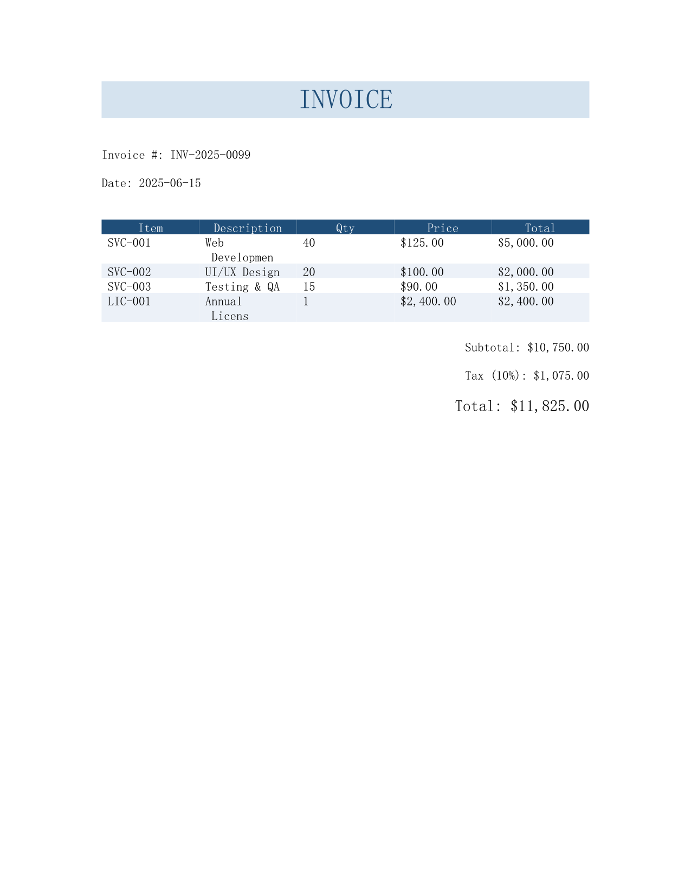</td>
  <td></td>
  <td></td>
</tr>
<tr>
  <td><b>docx_classic143_multi_section_document<br><small>format: docx | case: docx_classic143_multi_section_document | scope: python-classic-docx</small></b></td>
  <td colspan="2">docx_classic143_multi_section_document <span style="color:#3fb950">⬤</span> 96.4%</td>
</tr>
<tr>
  <td>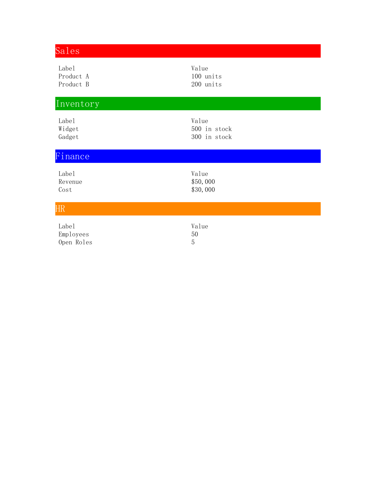</td>
  <td></td>
  <td></td>
</tr>
<tr>
  <td><b>docx_classic144_note_style_paragraphs<br><small>format: docx | case: docx_classic144_note_style_paragraphs | scope: python-classic-docx</small></b></td>
  <td colspan="2">docx_classic144_note_style_paragraphs <span style="color:#3fb950">⬤</span> 99.4%</td>
</tr>
<tr>
  <td>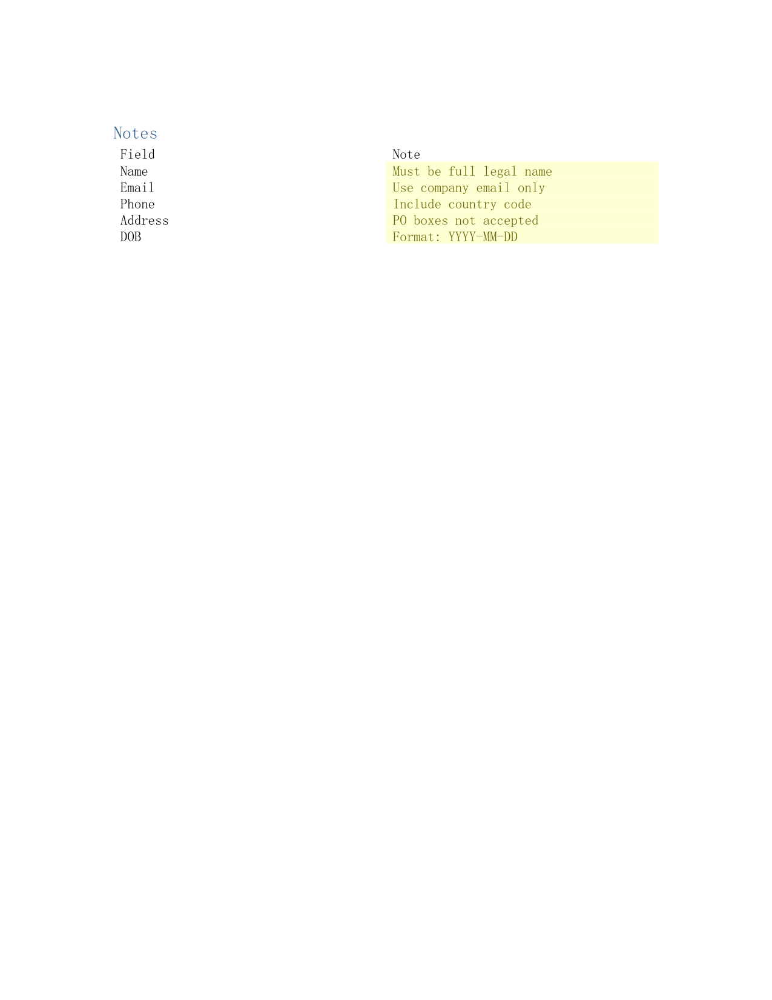</td>
  <td></td>
  <td></td>
</tr>
<tr>
  <td><b>docx_classic145_status_badge_table<br><small>format: docx | case: docx_classic145_status_badge_table | scope: python-classic-docx</small></b></td>
  <td colspan="2">docx_classic145_status_badge_table <span style="color:#3fb950">⬤</span> 98.0%</td>
</tr>
<tr>
  <td>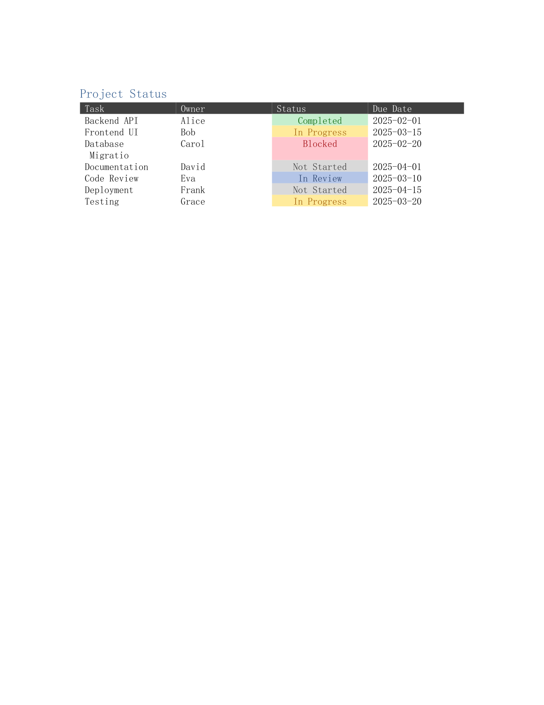</td>
  <td>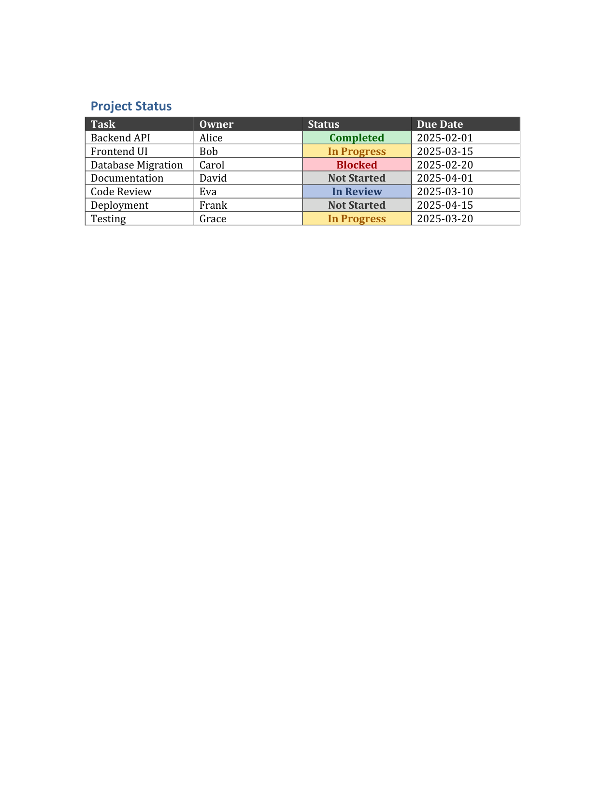</td>
  <td></td>
</tr>
<tr>
  <td><b>docx_classic146_double_border_table<br><small>format: docx | case: docx_classic146_double_border_table | scope: python-classic-docx</small></b></td>
  <td colspan="2">docx_classic146_double_border_table <span style="color:#3fb950">⬤</span> 99.2%</td>
</tr>
<tr>
  <td></td>
  <td></td>
  <td></td>
</tr>
<tr>
  <td><b>docx_classic147_multi_section_styled_report<br><small>format: docx | case: docx_classic147_multi_section_styled_report | scope: python-classic-docx</small></b></td>
  <td colspan="2">docx_classic147_multi_section_styled_report <span style="color:#3fb950">⬤</span> 98.5%</td>
</tr>
<tr>
  <td>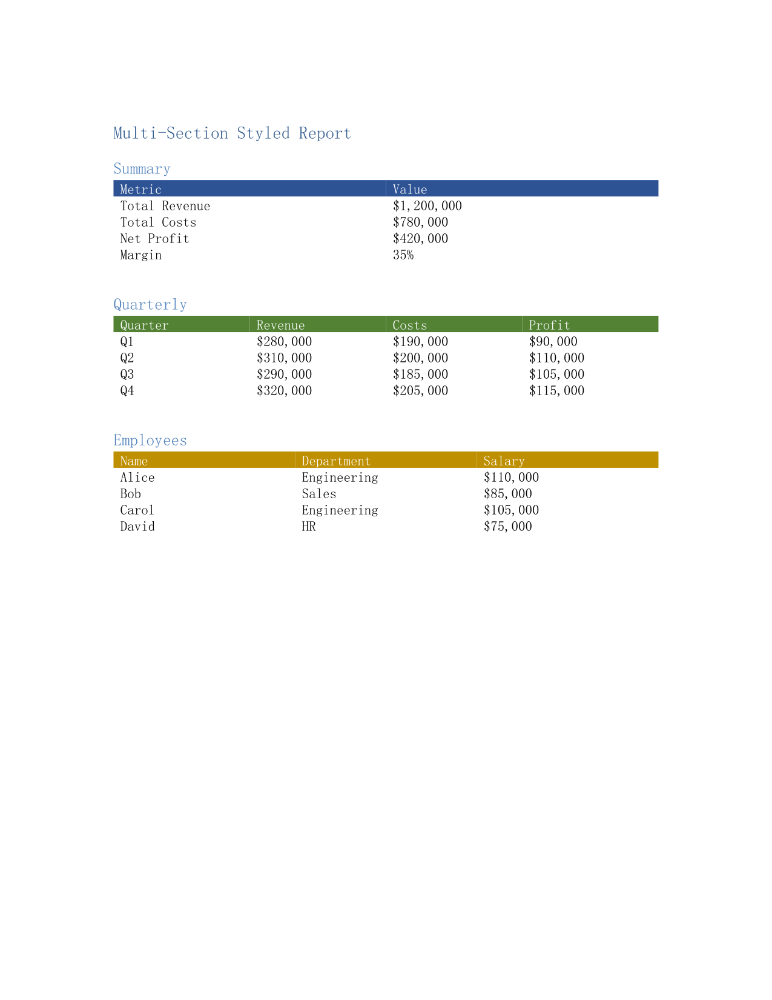</td>
  <td></td>
  <td></td>
</tr>
<tr>
  <td><b>docx_classic148_data_grid_document<br><small>format: docx | case: docx_classic148_data_grid_document | scope: python-classic-docx</small></b></td>
  <td colspan="2">docx_classic148_data_grid_document <span style="color:#3fb950">⬤</span> 96.7%</td>
</tr>
<tr>
  <td>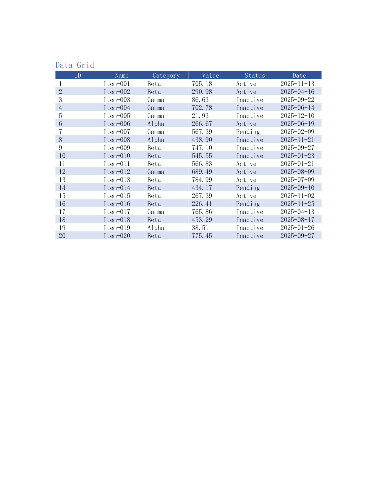</td>
  <td></td>
  <td></td>
</tr>
<tr>
  <td><b>docx_classic149_merged_section_report<br><small>format: docx | case: docx_classic149_merged_section_report | scope: python-classic-docx</small></b></td>
  <td colspan="2">docx_classic149_merged_section_report <span style="color:#3fb950">⬤</span> 97.4%</td>
</tr>
<tr>
  <td></td>
  <td></td>
  <td></td>
</tr>
<tr>
  <td><b>docx_classic150_kitchen_sink_styles<br><small>format: docx | case: docx_classic150_kitchen_sink_styles | scope: python-classic-docx</small></b></td>
  <td colspan="2">docx_classic150_kitchen_sink_styles <span style="color:#3fb950">⬤</span> 98.0%</td>
</tr>
<tr>
  <td>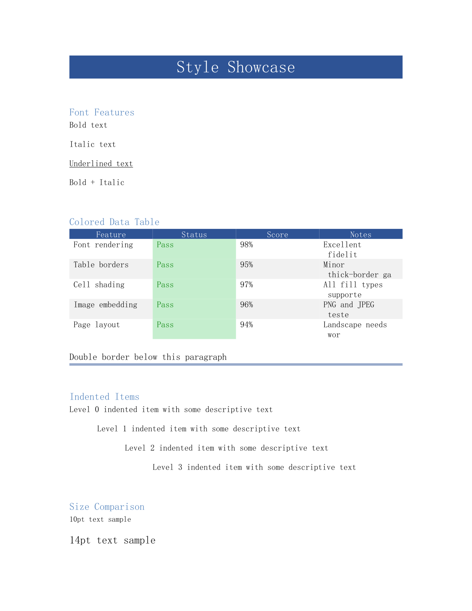</td>
  <td></td>
  <td></td>
</tr>
<tr>
  <td></td>
  <td></td>
  <td></td>
</tr>
</table>

## Detailed Results

### docx_classic01_single_paragraph

- **Case Metadata:** format: docx | case: docx_classic01_single_paragraph | scope: python-classic-docx
- **Source:** tests/MiniPdf.Scripts/output_docx/docx_classic01_single_paragraph.docx
- **Text Similarity:** 0.9868
- **Visual Average:** 0.9946
- **Overall Score:** 0.9926
- **Pages:** MiniPdf=1, Reference=1
- **File Size:** MiniPdf=28574 bytes, Reference=48037 bytes

<details><summary>Text Diff</summary>

```diff
--- minipdf/docx_classic01_single_paragraph.pdf
+++ reference/docx_classic01_single_paragraph.pdf
@@ -1,2 +1,2 @@
-Hello, World! This is a simple single paragraph document created for benchmark

-ing MiniPdf DOCX-to-PDF conversion.
+Hello, World! This is a simple single paragraph document created for benchmarking MiniPdf

+DOCX-to-PDF conversion.
```
</details>

### docx_classic02_multiple_paragraphs

- **Case Metadata:** format: docx | case: docx_classic02_multiple_paragraphs | scope: python-classic-docx
- **Source:** tests/MiniPdf.Scripts/output_docx/docx_classic02_multiple_paragraphs.docx
- **Text Similarity:** 1.0
- **Visual Average:** 0.9797
- **Overall Score:** 0.9919
- **Pages:** MiniPdf=1, Reference=1
- **File Size:** MiniPdf=71107 bytes, Reference=48946 bytes

<details><summary>Text Diff</summary>

```diff
--- minipdf/docx_classic02_multiple_paragraphs.pdf
+++ reference/docx_classic02_multiple_paragraphs.pdf
@@ -1,10 +1,10 @@
-This is paragraph 1. It contains some sample text to test how MiniPdf handles

-multiple consecutive paragraphs with default spacing.

-This is paragraph 2. It contains some sample text to test how MiniPdf handles

-multiple consecutive paragraphs with default spacing.

-This is paragraph 3. It contains some sample text to test how MiniPdf handles

-multiple consecutive paragraphs with default spacing.

-This is paragraph 4. It contains some sample text to test how MiniPdf handles

-multiple consecutive paragraphs with default spacing.

-This is paragraph 5. It contains some sample text to test how MiniPdf handles

-multiple consecutive paragraphs with default spacing.
+This is paragraph 1. It contains some sample text to test how MiniPdf handles multiple

+consecutive paragraphs with default spacing.

+This is paragraph 2. It contains some sample text to test how MiniPdf handles multiple

+consecutive paragraphs with default spacing.

+This is paragraph 3. It contains some sample text to test how MiniPdf handles multiple

+consecutive paragraphs with default spacing.

+This is paragraph 4. It contains some sample text to test how MiniPdf handles multiple

+consecutive paragraphs with default spacing.

+This is paragraph 5. It contains some sample text to test how MiniPdf handles multiple

+consecutive paragraphs with default spacing.
```
</details>

### docx_classic03_headings

- **Case Metadata:** format: docx | case: docx_classic03_headings | scope: python-classic-docx
- **Source:** tests/MiniPdf.Scripts/output_docx/docx_classic03_headings.docx
- **Text Similarity:** 1.0
- **Visual Average:** 0.9942
- **Overall Score:** 0.9977
- **Pages:** MiniPdf=1, Reference=1
- **File Size:** MiniPdf=27398 bytes, Reference=95865 bytes

Text content: ✅ Identical

### docx_classic04_bold_italic

- **Case Metadata:** format: docx | case: docx_classic04_bold_italic | scope: python-classic-docx
- **Source:** tests/MiniPdf.Scripts/output_docx/docx_classic04_bold_italic.docx
- **Text Similarity:** 1.0
- **Visual Average:** 0.9963
- **Overall Score:** 0.9985
- **Pages:** MiniPdf=1, Reference=1
- **File Size:** MiniPdf=17796 bytes, Reference=94134 bytes

Text content: ✅ Identical

### docx_classic05_font_sizes

- **Case Metadata:** format: docx | case: docx_classic05_font_sizes | scope: python-classic-docx
- **Source:** tests/MiniPdf.Scripts/output_docx/docx_classic05_font_sizes.docx
- **Text Similarity:** 1.0
- **Visual Average:** 0.9907
- **Overall Score:** 0.9963
- **Pages:** MiniPdf=1, Reference=1
- **File Size:** MiniPdf=23478 bytes, Reference=43230 bytes

Text content: ✅ Identical

### docx_classic06_font_colors

- **Case Metadata:** format: docx | case: docx_classic06_font_colors | scope: python-classic-docx
- **Source:** tests/MiniPdf.Scripts/output_docx/docx_classic06_font_colors.docx
- **Text Similarity:** 1.0
- **Visual Average:** 0.9986
- **Overall Score:** 0.9994
- **Pages:** MiniPdf=1, Reference=1
- **File Size:** MiniPdf=18123 bytes, Reference=41050 bytes

Text content: ✅ Identical

### docx_classic07_alignment

- **Case Metadata:** format: docx | case: docx_classic07_alignment | scope: python-classic-docx
- **Source:** tests/MiniPdf.Scripts/output_docx/docx_classic07_alignment.docx
- **Text Similarity:** 1.0
- **Visual Average:** 0.9837
- **Overall Score:** 0.9935
- **Pages:** MiniPdf=1, Reference=1
- **File Size:** MiniPdf=54382 bytes, Reference=43210 bytes

<details><summary>Text Diff</summary>

```diff
--- minipdf/docx_classic07_alignment.pdf
+++ reference/docx_classic07_alignment.pdf
@@ -1,8 +1,8 @@
-Lorem ipsum dolor sit amet, consectetur adipiscing elit. Sed do eiusmod tempor

-incididunt ut labore et dolore magna aliqua.

-Lorem ipsum dolor sit amet, consectetur adipiscing elit. Sed do eiusmod tempor

-incididunt ut labore et dolore magna aliqua.

-Lorem ipsum dolor sit amet, consectetur adipiscing elit. Sed do eiusmod tempor

-incididunt ut labore et dolore magna aliqua.

-Lorem ipsum dolor sit amet, consectetur adipiscing elit. Sed do eiusmod tempor

-incididunt ut labore et dolore magna aliqua.
+Lorem ipsum dolor sit amet, consectetur adipiscing elit. Sed do eiusmod tempor incididunt

+ut labore et dolore magna aliqua.

+Lorem ipsum dolor sit amet, consectetur adipiscing elit. Sed do eiusmod tempor incididunt

+ut labore et dolore magna aliqua.

+Lorem ipsum dolor sit amet, consectetur adipiscing elit. Sed do eiusmod tempor incididunt

+ut labore et dolore magna aliqua.

+Lorem ipsum dolor sit amet, consectetur adipiscing elit. Sed do eiusmod tempor incididunt

+ut labore et dolore magna aliqua.
```
</details>

### docx_classic08_bullet_list

- **Case Metadata:** format: docx | case: docx_classic08_bullet_list | scope: python-classic-docx
- **Source:** tests/MiniPdf.Scripts/output_docx/docx_classic08_bullet_list.docx
- **Text Similarity:** 0.918
- **Visual Average:** 0.9969
- **Overall Score:** 0.966
- **Pages:** MiniPdf=1, Reference=1
- **File Size:** MiniPdf=20231 bytes, Reference=92213 bytes

<details><summary>Text Diff</summary>

```diff
--- minipdf/docx_classic08_bullet_list.pdf
+++ reference/docx_classic08_bullet_list.pdf
@@ -1,6 +1,6 @@
 Shopping List

-Apples

-Bananas

-Cherries

-Dates

-Elderberries
+• Apples

+• Bananas

+• Cherries

+• Dates

+• Elderberries
```
</details>

### docx_classic09_numbered_list

- **Case Metadata:** format: docx | case: docx_classic09_numbered_list | scope: python-classic-docx
- **Source:** tests/MiniPdf.Scripts/output_docx/docx_classic09_numbered_list.docx
- **Text Similarity:** 0.9282
- **Visual Average:** 0.9957
- **Overall Score:** 0.9696
- **Pages:** MiniPdf=1, Reference=1
- **File Size:** MiniPdf=24725 bytes, Reference=91983 bytes

<details><summary>Text Diff</summary>

```diff
--- minipdf/docx_classic09_numbered_list.pdf
+++ reference/docx_classic09_numbered_list.pdf
@@ -1,6 +1,6 @@
 Steps to Success

-Define the goal

-Research the topic

-Create a plan

-Execute the plan

-Review results
+1. Define the goal

+2. Research the topic

+3. Create a plan

+4. Execute the plan

+5. Review results
```
</details>

### docx_classic10_simple_table

- **Case Metadata:** format: docx | case: docx_classic10_simple_table | scope: python-classic-docx
- **Source:** tests/MiniPdf.Scripts/output_docx/docx_classic10_simple_table.docx
- **Text Similarity:** 1.0
- **Visual Average:** 0.9374
- **Overall Score:** 0.975
- **Pages:** MiniPdf=1, Reference=1
- **File Size:** MiniPdf=32665 bytes, Reference=73744 bytes

Text content: ✅ Identical

### docx_classic11_table_with_shading

- **Case Metadata:** format: docx | case: docx_classic11_table_with_shading | scope: python-classic-docx
- **Source:** tests/MiniPdf.Scripts/output_docx/docx_classic11_table_with_shading.docx
- **Text Similarity:** 1.0
- **Visual Average:** 0.9828
- **Overall Score:** 0.9931
- **Pages:** MiniPdf=1, Reference=1
- **File Size:** MiniPdf=33305 bytes, Reference=91111 bytes

Text content: ✅ Identical

### docx_classic12_merged_cells_table

- **Case Metadata:** format: docx | case: docx_classic12_merged_cells_table | scope: python-classic-docx
- **Source:** tests/MiniPdf.Scripts/output_docx/docx_classic12_merged_cells_table.docx
- **Text Similarity:** 1.0
- **Visual Average:** 0.895
- **Overall Score:** 0.958
- **Pages:** MiniPdf=1, Reference=1
- **File Size:** MiniPdf=29428 bytes, Reference=71750 bytes

Text content: ✅ Identical

### docx_classic13_long_document

- **Case Metadata:** format: docx | case: docx_classic13_long_document | scope: python-classic-docx
- **Source:** tests/MiniPdf.Scripts/output_docx/docx_classic13_long_document.docx
- **Text Similarity:** 0.8242
- **Visual Average:** 0.9285
- **Overall Score:** 0.9011
- **Pages:** MiniPdf=4, Reference=4
- **File Size:** MiniPdf=728598 bytes, Reference=102517 bytes

<details><summary>Text Diff</summary>

```diff
--- minipdf/docx_classic13_long_document.pdf
+++ reference/docx_classic13_long_document.pdf
@@ -1,141 +1,125 @@
 Project Report

-This document is designed to span multiple pages to test pagination in MiniPdf

-.

+This document is designed to span multiple pages to test pagination in MiniPdf.

 Section 1

-This is section 1 of the report. It contains detailed analysis of the topic at

-hand. The quick brown fox jumps over the lazy dog. Pack my box with five doze

-n liquor jugs. How vexingly quick daft zebras jump. The five boxing wizards ju

-mp quickly. Sphinx of black quartz, judge my vow.This is section 1 of the repo

-rt. It contains detailed analysis of the topic at hand. The quick brown fox ju

-mps over the lazy dog. Pack my box with five dozen liquor jugs. How vexingly q

-uick daft zebras jump. The five boxing wizards jump quickly. Sphinx of black q

-uartz, judge my vow.

+This is section 1 of the report. It contains detailed analysis of the topic at hand. The quick

+brown fox jumps over the lazy dog. Pack my box with five dozen liquor jugs. How vexingly

+quick daft zebras jump. The five boxing wizards jump quickly. Sphinx of black quartz, judge

+my vow.This is section 1 of the report. It contains detailed analysis of the topic at hand. The

+quick brown fox jumps over the lazy dog. Pack my box with five dozen liquor jugs. How

+vexingly quick daft zebras jump. The five boxing wizards jump quickly. Sphinx of black

+quartz, judge my vow.

 Section 2

-This is section 2 of the report. It contains detailed analysis of the topic at

-hand. The quick brown fox jumps over the lazy dog. Pack my box with five doze

-n liquor jugs. How vexingly quick daft zebras jump. The five boxing wizards ju

-mp quickly. Sphinx of black quartz, judge my vow.This is section 2 of the repo

-rt. It contains detailed analysis of the topic at hand. The quick brown fox ju

-mps over the lazy dog. Pack my box with five dozen liquor jugs. How vexingly q

-uick daft zebras jump. The five boxing wizards jump quickly. Sphinx of black q

-uartz, judge my vow.

+This is section 2 of the report. It contains detailed analysis of the topic at hand. The quick

+brown fox jumps over the lazy dog. Pack my box with five dozen liquor jugs. How vexingly

+quick daft zebras jump. The five boxing wizards jump quickly. Sphinx of black quartz, judge

+my vow.This is section 2 of the report. It contains detailed analysis of the topic at hand. The

+quick brown fox jumps over the lazy dog. Pack my box with five dozen liquor jugs. How

+vexingly quick daft zebras jump. The five boxing wizards jump quickly. Sphinx of black

+quartz, judge my vow.

 Section 3

-This is section 3 of the report. It contains detailed analysis of the topic at

-hand. The quick brown fox jumps over the lazy dog. Pack my box with five doze

-n liquor jugs. How vexingly quick daft zebras jump. The five boxing wizards ju

-mp quickly. Sphinx of black quartz, judge my vow.This is section 3 of the repo

-rt.
... (14974 more characters)

```
</details>

### docx_classic14_mixed_content

- **Case Metadata:** format: docx | case: docx_classic14_mixed_content | scope: python-classic-docx
- **Source:** tests/MiniPdf.Scripts/output_docx/docx_classic14_mixed_content.docx
- **Text Similarity:** 0.9929
- **Visual Average:** 0.9822
- **Overall Score:** 0.99
- **Pages:** MiniPdf=1, Reference=1
- **File Size:** MiniPdf=58828 bytes, Reference=115112 bytes

<details><summary>Text Diff</summary>

```diff
--- minipdf/docx_classic14_mixed_content.pdf
+++ reference/docx_classic14_mixed_content.pdf
@@ -9,6 +9,6 @@
 Product sales increased by 15% compared to the previous quarter.

 Service revenue remained stable with a slight upward trend.

 Action Items

-Expand marketing campaign

-Hire two additional engineers

-Launch new subscription tier
+• Expand marketing campaign

+• Hire two additional engineers

+• Launch new subscription tier
```
</details>

### docx_classic15_indentation

- **Case Metadata:** format: docx | case: docx_classic15_indentation | scope: python-classic-docx
- **Source:** tests/MiniPdf.Scripts/output_docx/docx_classic15_indentation.docx
- **Text Similarity:** 0.9909
- **Visual Average:** 0.9863
- **Overall Score:** 0.9909
- **Pages:** MiniPdf=1, Reference=1
- **File Size:** MiniPdf=53533 bytes, Reference=74243 bytes

<details><summary>Text Diff</summary>

```diff
--- minipdf/docx_classic15_indentation.pdf
+++ reference/docx_classic15_indentation.pdf
@@ -2,9 +2,8 @@
 This paragraph is indented by 0 points from the left margin.

 This paragraph is indented by 36 points from the left margin.

 This paragraph is indented by 72 points from the left margin.

-This paragraph is indented by 108 points from the left mar

-gin.

-This paragraph is indented by 144 points from the le

-ft margin.

+This paragraph is indented by 108 points from the left margin.

+This paragraph is indented by 144 points from the left

+margin.

 This paragraph has a first-line indent of 36 points. The remaining lines wrap

 normally back to the left margin.
```
</details>

### docx_classic16_line_spacing

- **Case Metadata:** format: docx | case: docx_classic16_line_spacing | scope: python-classic-docx
- **Source:** tests/MiniPdf.Scripts/output_docx/docx_classic16_line_spacing.docx
- **Text Similarity:** 0.9441
- **Visual Average:** 0.9861
- **Overall Score:** 0.9721
- **Pages:** MiniPdf=1, Reference=1
- **File Size:** MiniPdf=55281 bytes, Reference=78004 bytes

<details><summary>Text Diff</summary>

```diff
--- minipdf/docx_classic16_line_spacing.pdf
+++ reference/docx_classic16_line_spacing.pdf
@@ -1,10 +1,10 @@
 Line Spacing Test

 Single spacing:

-The quick brown fox jumps over the lazy dog. Pack my box with five dozen liquo

-r jugs. How vexingly quick daft zebras jump.

+The quick brown fox jumps over the lazy dog. Pack my box with five dozen liquor jugs. How

+vexingly quick daft zebras jump.

 1.5 Lines spacing:

-The quick brown fox jumps over the lazy dog. Pack my box with five dozen liquo

-r jugs. How vexingly quick daft zebras jump.

+The quick brown fox jumps over the lazy dog. Pack my box with five dozen liquor jugs. How

+vexingly quick daft zebras jump.

 Double spacing:

-The quick brown fox jumps over the lazy dog. Pack my box with five dozen liquo

-r jugs. How vexingly quick daft zebras jump.
+The quick brown fox jumps over the lazy dog. Pack my box with five dozen liquor jugs. How

+vexingly quick daft zebras jump.
```
</details>

### docx_classic17_page_break

- **Case Metadata:** format: docx | case: docx_classic17_page_break | scope: python-classic-docx
- **Source:** tests/MiniPdf.Scripts/output_docx/docx_classic17_page_break.docx
- **Text Similarity:** 1.0
- **Visual Average:** 0.9948
- **Overall Score:** 0.9979
- **Pages:** MiniPdf=3, Reference=3
- **File Size:** MiniPdf=25288 bytes, Reference=69855 bytes

Text content: ✅ Identical

### docx_classic18_embedded_image

- **Case Metadata:** format: docx | case: docx_classic18_embedded_image | scope: python-classic-docx
- **Source:** tests/MiniPdf.Scripts/output_docx/docx_classic18_embedded_image.docx
- **Text Similarity:** 1.0
- **Visual Average:** 0.9953
- **Overall Score:** 0.9981
- **Pages:** MiniPdf=1, Reference=1
- **File Size:** MiniPdf=23380 bytes, Reference=67381 bytes

Text content: ✅ Identical

### docx_classic19_multiple_images

- **Case Metadata:** format: docx | case: docx_classic19_multiple_images | scope: python-classic-docx
- **Source:** tests/MiniPdf.Scripts/output_docx/docx_classic19_multiple_images.docx
- **Text Similarity:** 1.0
- **Visual Average:** 0.9584
- **Overall Score:** 0.9834
- **Pages:** MiniPdf=1, Reference=1
- **File Size:** MiniPdf=20417 bytes, Reference=66233 bytes

Text content: ✅ Identical

### docx_classic20_table_with_many_rows

- **Case Metadata:** format: docx | case: docx_classic20_table_with_many_rows | scope: python-classic-docx
- **Source:** tests/MiniPdf.Scripts/output_docx/docx_classic20_table_with_many_rows.docx
- **Text Similarity:** 1.0
- **Visual Average:** 0.885
- **Overall Score:** 0.954
- **Pages:** MiniPdf=1, Reference=1
- **File Size:** MiniPdf=71831 bytes, Reference=95029 bytes

Text content: ✅ Identical

### docx_classic21_nested_lists

- **Case Metadata:** format: docx | case: docx_classic21_nested_lists | scope: python-classic-docx
- **Source:** tests/MiniPdf.Scripts/output_docx/docx_classic21_nested_lists.docx
- **Text Similarity:** 0.9371
- **Visual Average:** 0.9943
- **Overall Score:** 0.9726
- **Pages:** MiniPdf=1, Reference=1
- **File Size:** MiniPdf=31930 bytes, Reference=98694 bytes

<details><summary>Text Diff</summary>

```diff
--- minipdf/docx_classic21_nested_lists.pdf
+++ reference/docx_classic21_nested_lists.pdf
@@ -1,11 +1,11 @@
 Project Structure

-src/

-MiniPdf/

-MiniPdf.cs

-PdfDocument.cs

-PdfWriter.cs

-MiniPdf.Tests/

-DocxToPdfConverterTests.cs

-scripts/

-Run-Benchmark.ps1

-README.md
+• src/

+• MiniPdf/

+• MiniPdf.cs

+• PdfDocument.cs

+• PdfWriter.cs

+• MiniPdf.Tests/

+• DocxToPdfConverterTests.cs

+• scripts/

+• Run-Benchmark.ps1

+• README.md
```
</details>

### docx_classic22_horizontal_rule

- **Case Metadata:** format: docx | case: docx_classic22_horizontal_rule | scope: python-classic-docx
- **Source:** tests/MiniPdf.Scripts/output_docx/docx_classic22_horizontal_rule.docx
- **Text Similarity:** 1.0
- **Visual Average:** 0.9913
- **Overall Score:** 0.9965
- **Pages:** MiniPdf=1, Reference=1
- **File Size:** MiniPdf=32906 bytes, Reference=70951 bytes

Text content: ✅ Identical

### docx_classic23_mixed_formatting_runs

- **Case Metadata:** format: docx | case: docx_classic23_mixed_formatting_runs | scope: python-classic-docx
- **Source:** tests/MiniPdf.Scripts/output_docx/docx_classic23_mixed_formatting_runs.docx
- **Text Similarity:** 1.0
- **Visual Average:** 0.9947
- **Overall Score:** 0.9979
- **Pages:** MiniPdf=1, Reference=1
- **File Size:** MiniPdf=22818 bytes, Reference=100389 bytes

Text content: ✅ Identical

### docx_classic24_two_column_table_layout

- **Case Metadata:** format: docx | case: docx_classic24_two_column_table_layout | scope: python-classic-docx
- **Source:** tests/MiniPdf.Scripts/output_docx/docx_classic24_two_column_table_layout.docx
- **Text Similarity:** 0.7375
- **Visual Average:** 0.9898
- **Overall Score:** 0.8909
- **Pages:** MiniPdf=1, Reference=1
- **File Size:** MiniPdf=39524 bytes, Reference=72170 bytes

<details><summary>Text Diff</summary>

```diff
--- minipdf/docx_classic24_two_column_table_layout.pdf
+++ reference/docx_classic24_two_column_table_layout.pdf
@@ -1,5 +1,5 @@
 Two-Column Layout

-Left column content. This is the Right column content. This is the

-first column of a two-column layout second column. Both columns shoul

-. It demonstrates how tables can d render side-by-side in the P

-be used for text layout purpos DF outp
+Left column content. This is the first Right column content. This is the second

+column of a two-column layout. It column. Both columns should render side-

+demonstrates how tables can be used for by-side in the PDF output.

+text layout purposes.
```
</details>

### docx_classic25_title_and_subtitle

- **Case Metadata:** format: docx | case: docx_classic25_title_and_subtitle | scope: python-classic-docx
- **Source:** tests/MiniPdf.Scripts/output_docx/docx_classic25_title_and_subtitle.docx
- **Text Similarity:** 1.0
- **Visual Average:** 0.9884
- **Overall Score:** 0.9954
- **Pages:** MiniPdf=2, Reference=2
- **File Size:** MiniPdf=38456 bytes, Reference=134268 bytes

Text content: ✅ Identical

### docx_classic26_table_alignment

- **Case Metadata:** format: docx | case: docx_classic26_table_alignment | scope: python-classic-docx
- **Source:** tests/MiniPdf.Scripts/output_docx/docx_classic26_table_alignment.docx
- **Text Similarity:** 1.0
- **Visual Average:** 0.8731
- **Overall Score:** 0.9492
- **Pages:** MiniPdf=1, Reference=1
- **File Size:** MiniPdf=27927 bytes, Reference=94051 bytes

Text content: ✅ Identical

### docx_classic27_long_paragraph_wrapping

- **Case Metadata:** format: docx | case: docx_classic27_long_paragraph_wrapping | scope: python-classic-docx
- **Source:** tests/MiniPdf.Scripts/output_docx/docx_classic27_long_paragraph_wrapping.docx
- **Text Similarity:** 0.9726
- **Visual Average:** 0.945
- **Overall Score:** 0.967
- **Pages:** MiniPdf=1, Reference=1
- **File Size:** MiniPdf=182728 bytes, Reference=72456 bytes

<details><summary>Text Diff</summary>

```diff
--- minipdf/docx_classic27_long_paragraph_wrapping.pdf
+++ reference/docx_classic27_long_paragraph_wrapping.pdf
@@ -1,27 +1,25 @@
 Word Wrapping Test

-This is a very long paragraph designed to test how MiniPdf handles word wrappi

-ng across line boundaries. The text should flow naturally from one line to the

-next without any awkward breaks or overflow. This is a very long paragraph de

-signed to test how MiniPdf handles word wrapping across line boundaries. The t

-ext should flow naturally from one line to the next without any awkward breaks

-or overflow. This is a very long paragraph designed to test how MiniPdf handl

-es word wrapping across line boundaries. The text should flow naturally from o

-ne line to the next without any awkward breaks or overflow. This is a very lon

-g paragraph designed to test how MiniPdf handles word wrapping across line bou

-ndaries. The text should flow naturally from one line to the next without any

-awkward breaks or overflow. This is a very long paragraph designed to test how

-MiniPdf handles word wrapping across line boundaries. The text should flow na

-turally from one line to the next without any awkward breaks or overflow. This

-is a very long paragraph designed to test how MiniPdf handles word wrapping a

-cross line boundaries. The text should flow naturally from one line to the nex

-t without any awkward breaks or overflow. This is a very long paragraph design

-ed to test how MiniPdf handles word wrapping across line boundaries. The text

-should flow naturally from one line to the next without any awkward breaks or

-overflow. This is a very long paragraph designed to test how MiniPdf handles w

-ord wrapping across line boundaries. The text should flow naturally from one l

-ine to the next without any awkward breaks or overflow. This is a very long pa

-ragraph designed to test how MiniPdf handles word wrapping across line boundar

-ies. The text should flow naturally from one line to the next without any awkw

-ard breaks or overflow. This is a very long paragraph designed to test how Min

-iPdf handles word wrapping across line boundaries. The text should flow natura

-lly from one line to the next without any awkward breaks or overflow.
+This is a very long paragraph designed to test how MiniPdf handles word wrapping across

+line boundaries. The text should flow naturally from one line to the next without any

+awkward breaks or overflow. This is a very long paragraph designed to test how MiniPdf

+handles word wrapping across line boundaries. The text should flow naturally from one line

+to the next without any awkward breaks or overflow. This is a very long paragraph

+designed to test how MiniPdf handles word wrapping across line boundaries. The text

+should flow naturally from one line to the next without any awkward breaks or overflow.

+This is a very long paragraph designed to test how MiniPdf handles word wrapping across

+line boundaries. The text should flow naturally f
... (1306 more characters)

```
</details>

### docx_classic28_special_characters

- **Case Metadata:** format: docx | case: docx_classic28_special_characters | scope: python-classic-docx
- **Source:** tests/MiniPdf.Scripts/output_docx/docx_classic28_special_characters.docx
- **Text Similarity:** 1.0
- **Visual Average:** 0.9934
- **Overall Score:** 0.9974
- **Pages:** MiniPdf=1, Reference=1
- **File Size:** MiniPdf=38088 bytes, Reference=80991 bytes

Text content: ✅ Identical

### docx_classic29_table_with_image

- **Case Metadata:** format: docx | case: docx_classic29_table_with_image | scope: python-classic-docx
- **Source:** tests/MiniPdf.Scripts/output_docx/docx_classic29_table_with_image.docx
- **Text Similarity:** 0.9647
- **Visual Average:** 0.9849
- **Overall Score:** 0.9798
- **Pages:** MiniPdf=1, Reference=1
- **File Size:** MiniPdf=29953 bytes, Reference=70208 bytes

<details><summary>Text Diff</summary>

```diff
--- minipdf/docx_classic29_table_with_image.pdf
+++ reference/docx_classic29_table_with_image.pdf
@@ -1,5 +1,5 @@
 Product Card

 Product Description

-MiniPdf Widget - A compact, efficient

-tool for PDF conversion. Lightweigh

-t and dependency-fre
+MiniPdf Widget - A compact, efficient tool

+for PDF conversion. Lightweight and

+dependency-free.
```
</details>

### docx_classic30_comprehensive_report

- **Case Metadata:** format: docx | case: docx_classic30_comprehensive_report | scope: python-classic-docx
- **Source:** tests/MiniPdf.Scripts/output_docx/docx_classic30_comprehensive_report.docx
- **Text Similarity:** 0.9868
- **Visual Average:** 0.9795
- **Overall Score:** 0.9865
- **Pages:** MiniPdf=3, Reference=3
- **File Size:** MiniPdf=112650 bytes, Reference=220886 bytes

<details><summary>Text Diff</summary>

```diff
--- minipdf/docx_classic30_comprehensive_report.pdf
+++ reference/docx_classic30_comprehensive_report.pdf
@@ -8,9 +8,9 @@
 4. Financial Overview

 5. Recommendations

 1. Executive Summary

-This report provides a comprehensive analysis of the technology landscape in 2

-026. Key findings include continued growth in AI adoption, increased focus on

-sustainability, and emerging trends in quantum computing.

+This report provides a comprehensive analysis of the technology landscape in 2026. Key

+findings include continued growth in AI adoption, increased focus on sustainability, and

+emerging trends in quantum computing.

 2. Market Analysis

 The following table summarizes market share across key sectors:

 Sector Market Share Growth

@@ -20,16 +20,16 @@
 IoT 16% +8%

 3. Technology Trends

 Key trends identified:

-Generative AI integration in enterprise software

-Edge computing for real-time processing

-Green technology and sustainable computing

-Zero-trust security architectures

-Low-code/no-code platform expansion

+• Generative AI integration in enterprise software

+• Edge computing for real-time processing

+• Green technology and sustainable computing

+• Zero-trust security architectures

+• Low-code/no-code platform expansion

 4. Visual Summary

 Growth indicator chart (placeholder):

 ---PAGE---

 5. Recommendations

-Invest in AI-driven automation tools

-Prioritize cloud-native architectures

-Strengthen cybersecurity posture

-Explore quantum computing partnerships
+1. Invest in AI-driven automation tools

+2. Prioritize cloud-native architectures

+3. Strengthen cybersecurity posture

+4. Explore quantum computing partnerships
```
</details>

### docx_classic31_product_card_with_image

- **Case Metadata:** format: docx | case: docx_classic31_product_card_with_image | scope: python-classic-docx
- **Source:** tests/MiniPdf.Scripts/output_docx/docx_classic31_product_card_with_image.docx
- **Text Similarity:** 0.9945
- **Visual Average:** 0.9852
- **Overall Score:** 0.9919
- **Pages:** MiniPdf=1, Reference=1
- **File Size:** MiniPdf=47196 bytes, Reference=108260 bytes

<details><summary>Text Diff</summary>

```diff
--- minipdf/docx_classic31_product_card_with_image.pdf
+++ reference/docx_classic31_product_card_with_image.pdf
@@ -1,8 +1,8 @@
 Product Card

 Wireless Bluetooth Speaker

 SKU: WBS-2026-PRO | Price: $49.99

-High-fidelity wireless speaker with 12-hour battery life, IPX7 waterproof rati

-ng, and built-in microphone for hands-free calls.

+High-fidelity wireless speaker with 12-hour battery life, IPX7 waterproof rating, and built-in

+microphone for hands-free calls.

 Battery 12 hours

 Weight 350g

 Connectivity Bluetooth 5.3
```
</details>

### docx_classic31_strikethrough_text

- **Case Metadata:** format: docx | case: docx_classic31_strikethrough_text | scope: python-classic-docx
- **Source:** tests/MiniPdf.Scripts/output_docx/docx_classic31_strikethrough_text.docx
- **Text Similarity:** 1.0
- **Visual Average:** 0.9899
- **Overall Score:** 0.996
- **Pages:** MiniPdf=1, Reference=1
- **File Size:** MiniPdf=34316 bytes, Reference=73919 bytes

Text content: ✅ Identical

### docx_classic32_company_logo_header

- **Case Metadata:** format: docx | case: docx_classic32_company_logo_header | scope: python-classic-docx
- **Source:** tests/MiniPdf.Scripts/output_docx/docx_classic32_company_logo_header.docx
- **Text Similarity:** 0.9784
- **Visual Average:** 0.9742
- **Overall Score:** 0.981
- **Pages:** MiniPdf=1, Reference=1
- **File Size:** MiniPdf=50364 bytes, Reference=112769 bytes

<details><summary>Text Diff</summary>

```diff
--- minipdf/docx_classic32_company_logo_header.pdf
+++ reference/docx_classic32_company_logo_header.pdf
@@ -1,8 +1,8 @@
 ACME CORPORATION

 123 Business Ave, Suite 500 | New York, NY 10001

 Quarterly Report Q1 2026

-This report summarizes the activities and financial performance of ACME Corpor

-ation during the first quarter of 2026.

+This report summarizes the activities and financial performance of ACME Corporation

+during the first quarter of 2026.

 Metric Target Actual

 Revenue $5M $5.3M

 Customers 500 520
```
</details>

### docx_classic32_superscript_subscript

- **Case Metadata:** format: docx | case: docx_classic32_superscript_subscript | scope: python-classic-docx
- **Source:** tests/MiniPdf.Scripts/output_docx/docx_classic32_superscript_subscript.docx
- **Text Similarity:** 0.9262
- **Visual Average:** 0.9951
- **Overall Score:** 0.9685
- **Pages:** MiniPdf=1, Reference=1
- **File Size:** MiniPdf=28034 bytes, Reference=73303 bytes

<details><summary>Text Diff</summary>

```diff
--- minipdf/docx_classic32_superscript_subscript.pdf
+++ reference/docx_classic32_superscript_subscript.pdf
@@ -1,6 +1,9 @@
 Superscript and Subscript

-Einstein's equation: E = mc2

-Water: H2O

-Carbon dioxide: CO2

-Footnote reference1

-xn + yn = zn
+2

+Einstein's equation: E = mc

+Water: H 2 O

+Carbon dioxide: CO 2

+1

+Footnote reference

+n n n

+x + y = z
```
</details>

### docx_classic33_highlighted_text

- **Case Metadata:** format: docx | case: docx_classic33_highlighted_text | scope: python-classic-docx
- **Source:** tests/MiniPdf.Scripts/output_docx/docx_classic33_highlighted_text.docx
- **Text Similarity:** 1.0
- **Visual Average:** 0.8702
- **Overall Score:** 0.9481
- **Pages:** MiniPdf=1, Reference=1
- **File Size:** MiniPdf=25822 bytes, Reference=67420 bytes

Text content: ✅ Identical

### docx_classic33_two_products_side_by_side

- **Case Metadata:** format: docx | case: docx_classic33_two_products_side_by_side | scope: python-classic-docx
- **Source:** tests/MiniPdf.Scripts/output_docx/docx_classic33_two_products_side_by_side.docx
- **Text Similarity:** 1.0
- **Visual Average:** 0.9552
- **Overall Score:** 0.9821
- **Pages:** MiniPdf=1, Reference=1
- **File Size:** MiniPdf=44185 bytes, Reference=107718 bytes

Text content: ✅ Identical

### docx_classic34_employee_directory_with_photo

- **Case Metadata:** format: docx | case: docx_classic34_employee_directory_with_photo | scope: python-classic-docx
- **Source:** tests/MiniPdf.Scripts/output_docx/docx_classic34_employee_directory_with_photo.docx
- **Text Similarity:** 0.9811
- **Visual Average:** 0.982
- **Overall Score:** 0.9852
- **Pages:** MiniPdf=2, Reference=2
- **File Size:** MiniPdf=41412 bytes, Reference=99625 bytes

<details><summary>Text Diff</summary>

```diff
--- minipdf/docx_classic34_employee_directory_with_photo.pdf
+++ reference/docx_classic34_employee_directory_with_photo.pdf
@@ -10,5 +10,5 @@
 Carol Williams

 UX Designer

 Email: carol@company.com

-Department: Design

----PAGE---
+---PAGE---

+Department: Design
```
</details>

### docx_classic34_paragraph_borders

- **Case Metadata:** format: docx | case: docx_classic34_paragraph_borders | scope: python-classic-docx
- **Source:** tests/MiniPdf.Scripts/output_docx/docx_classic34_paragraph_borders.docx
- **Text Similarity:** 1.0
- **Visual Average:** 0.9846
- **Overall Score:** 0.9938
- **Pages:** MiniPdf=1, Reference=1
- **File Size:** MiniPdf=32692 bytes, Reference=69819 bytes

Text content: ✅ Identical

### docx_classic35_inventory_with_product_photos

- **Case Metadata:** format: docx | case: docx_classic35_inventory_with_product_photos | scope: python-classic-docx
- **Source:** tests/MiniPdf.Scripts/output_docx/docx_classic35_inventory_with_product_photos.docx
- **Text Similarity:** 1.0
- **Visual Average:** 0.4658
- **Overall Score:** 0.6863
- **Pages:** MiniPdf=1, Reference=2
- **File Size:** MiniPdf=47792 bytes, Reference=84431 bytes

<details><summary>Text Diff</summary>

```diff
--- minipdf/docx_classic35_inventory_with_product_photos.pdf
+++ reference/docx_classic35_inventory_with_product_photos.pdf
@@ -7,4 +7,5 @@
 Widget Gamma

 Stock: 200 Sold: 60 Price: $9.00 Status: OK

 Widget Delta

+---PAGE---

 Stock: 50 Sold: 10 Price: $24.00 Status: Low
```
</details>

### docx_classic35_tab_stops

- **Case Metadata:** format: docx | case: docx_classic35_tab_stops | scope: python-classic-docx
- **Source:** tests/MiniPdf.Scripts/output_docx/docx_classic35_tab_stops.docx
- **Text Similarity:** 0.8727
- **Visual Average:** 0.973
- **Overall Score:** 0.9383
- **Pages:** MiniPdf=1, Reference=1
- **File Size:** MiniPdf=31995 bytes, Reference=76285 bytes

<details><summary>Text Diff</summary>

```diff
--- minipdf/docx_classic35_tab_stops.pdf
+++ reference/docx_classic35_tab_stops.pdf
@@ -1,6 +1,6 @@
 Tab Stop Alignment

-Chapter 1: Introduction 1

-Chapter 2: Getting Started 5

-Chapter 3: Advanced Topics 15

-Chapter 4: Best Practices 28

-Chapter 5: Conclusion 35
+Chapter 1: Introduction ......................................................................................................................................................... 1

+Chapter 2: Getting Started..................................................................................................................................................... 5

+Chapter 3: Advanced Topics.............................................................................................................................................. 15

+Chapter 4: Best Practices .................................................................................................................................................... 28

+Chapter 5: Conclusion .......................................................................................................................................................... 35
```
</details>

### docx_classic36_invoice_with_logo

- **Case Metadata:** format: docx | case: docx_classic36_invoice_with_logo | scope: python-classic-docx
- **Source:** tests/MiniPdf.Scripts/output_docx/docx_classic36_invoice_with_logo.docx
- **Text Similarity:** 1.0
- **Visual Average:** 0.9699
- **Overall Score:** 0.988
- **Pages:** MiniPdf=1, Reference=1
- **File Size:** MiniPdf=47086 bytes, Reference=86303 bytes

Text content: ✅ Identical

### docx_classic36_wide_table

- **Case Metadata:** format: docx | case: docx_classic36_wide_table | scope: python-classic-docx
- **Source:** tests/MiniPdf.Scripts/output_docx/docx_classic36_wide_table.docx
- **Text Similarity:** 1.0
- **Visual Average:** 0.9826
- **Overall Score:** 0.993
- **Pages:** MiniPdf=1, Reference=1
- **File Size:** MiniPdf=41582 bytes, Reference=100125 bytes

Text content: ✅ Identical

### docx_classic37_nested_table

- **Case Metadata:** format: docx | case: docx_classic37_nested_table | scope: python-classic-docx
- **Source:** tests/MiniPdf.Scripts/output_docx/docx_classic37_nested_table.docx
- **Text Similarity:** 0.8856
- **Visual Average:** 0.8473
- **Overall Score:** 0.8932
- **Pages:** MiniPdf=1, Reference=1
- **File Size:** MiniPdf=27218 bytes, Reference=76696 bytes

<details><summary>Text Diff</summary>

```diff
--- minipdf/docx_classic37_nested_table.pdf
+++ reference/docx_classic37_nested_table.pdf
@@ -1,4 +1,6 @@
 Nested Table Layout

 Section A Section B

-Details: This cell contains plain text while

-the adjacent cell has a nested table
+Details: This cell contains plain text while the

+Item Qty adjacent cell has a nested table.

+Widget 10

+Gadget 5
```
</details>

### docx_classic37_real_estate_listing

- **Case Metadata:** format: docx | case: docx_classic37_real_estate_listing | scope: python-classic-docx
- **Source:** tests/MiniPdf.Scripts/output_docx/docx_classic37_real_estate_listing.docx
- **Text Similarity:** 1.0
- **Visual Average:** 0.9729
- **Overall Score:** 0.9892
- **Pages:** MiniPdf=1, Reference=1
- **File Size:** MiniPdf=36790 bytes, Reference=106313 bytes

Text content: ✅ Identical

### docx_classic38_restaurant_menu_with_photos

- **Case Metadata:** format: docx | case: docx_classic38_restaurant_menu_with_photos | scope: python-classic-docx
- **Source:** tests/MiniPdf.Scripts/output_docx/docx_classic38_restaurant_menu_with_photos.docx
- **Text Similarity:** 1.0
- **Visual Average:** 0.9204
- **Overall Score:** 0.9682
- **Pages:** MiniPdf=2, Reference=2
- **File Size:** MiniPdf=40567 bytes, Reference=104667 bytes

<details><summary>Text Diff</summary>

```diff
--- minipdf/docx_classic38_restaurant_menu_with_photos.pdf
+++ reference/docx_classic38_restaurant_menu_with_photos.pdf
@@ -1,12 +1,12 @@
 The Garden Bistro

 Fresh ingredients, timeless flavors

 Appetizers

-Bruschetta  $8

-Caesar Salad  $10

+Bruschetta $8

+Caesar Salad $10

 Main Courses

-Grilled Salmon  $22

-Filet Mignon  $32

+Grilled Salmon $22

+Filet Mignon $32

+---PAGE---

 Desserts

----PAGE---

-Tiramisu  $10

-Chocolate Lava Cake  $12
+Tiramisu $10

+Chocolate Lava Cake $12
```
</details>

### docx_classic38_table_column_widths

- **Case Metadata:** format: docx | case: docx_classic38_table_column_widths | scope: python-classic-docx
- **Source:** tests/MiniPdf.Scripts/output_docx/docx_classic38_table_column_widths.docx
- **Text Similarity:** 0.8182
- **Visual Average:** 0.9339
- **Overall Score:** 0.9008
- **Pages:** MiniPdf=1, Reference=1
- **File Size:** MiniPdf=39037 bytes, Reference=102328 bytes

<details><summary>Text Diff</summary>

```diff
--- minipdf/docx_classic38_table_column_widths.pdf
+++ reference/docx_classic38_table_column_widths.pdf
@@ -1,10 +1,6 @@
 Custom Column Widths

 # Description Category Amount

-1 Office supplies Operations $245.00

-and stationer

-2 Cloud hosting Technology $1,200.00

-monthly fe

-3 Team lunch and Meals $380.00

-caterin

-4 Conference Travel $599.00

-registratio
+1 Office supplies and stationery Operations $245.00

+2 Cloud hosting monthly fee Technology $1,200.00

+3 Team lunch and catering Meals $380.00

+4 Conference registration Travel $599.00
```
</details>

### docx_classic39_cover_page_with_image

- **Case Metadata:** format: docx | case: docx_classic39_cover_page_with_image | scope: python-classic-docx
- **Source:** tests/MiniPdf.Scripts/output_docx/docx_classic39_cover_page_with_image.docx
- **Text Similarity:** 1.0
- **Visual Average:** 0.9522
- **Overall Score:** 0.9809
- **Pages:** MiniPdf=2, Reference=2
- **File Size:** MiniPdf=35168 bytes, Reference=120726 bytes

Text content: ✅ Identical

### docx_classic39_financial_report

- **Case Metadata:** format: docx | case: docx_classic39_financial_report | scope: python-classic-docx
- **Source:** tests/MiniPdf.Scripts/output_docx/docx_classic39_financial_report.docx
- **Text Similarity:** 1.0
- **Visual Average:** 0.983
- **Overall Score:** 0.9932
- **Pages:** MiniPdf=1, Reference=1
- **File Size:** MiniPdf=47481 bytes, Reference=111342 bytes

Text content: ✅ Identical

### docx_classic40_product_catalog_with_images

- **Case Metadata:** format: docx | case: docx_classic40_product_catalog_with_images | scope: python-classic-docx
- **Source:** tests/MiniPdf.Scripts/output_docx/docx_classic40_product_catalog_with_images.docx
- **Text Similarity:** 1.0
- **Visual Average:** 0.973
- **Overall Score:** 0.9892
- **Pages:** MiniPdf=1, Reference=1
- **File Size:** MiniPdf=42159 bytes, Reference=117045 bytes

Text content: ✅ Identical

### docx_classic40_resume

- **Case Metadata:** format: docx | case: docx_classic40_resume | scope: python-classic-docx
- **Source:** tests/MiniPdf.Scripts/output_docx/docx_classic40_resume.docx
- **Text Similarity:** 0.9903
- **Visual Average:** 0.9723
- **Overall Score:** 0.985
- **Pages:** MiniPdf=1, Reference=1
- **File Size:** MiniPdf=93353 bytes, Reference=197726 bytes

<details><summary>Text Diff</summary>

```diff
--- minipdf/docx_classic40_resume.pdf
+++ reference/docx_classic40_resume.pdf
@@ -1,19 +1,18 @@
 JOHN DOE

 john.doe@email.com | +1-555-0100 | New York, NY

 Professional Summary

-Experienced software engineer with 8+ years of expertise in building scalable

-web applications and distributed systems. Proficient in C#, Python, and JavaSc

-ript.

+Experienced software engineer with 8+ years of expertise in building scalable web

+applications and distributed systems. Proficient in C#, Python, and JavaScript.

 Experience

 Senior Software Engineer - Tech Corp Inc.

 January 2020 - Present

-Led team of 5 engineers on microservices migration

-Reduced API latency by 40% through caching optimization

-Implemented CI/CD pipeline using GitHub Actions

+• Led team of 5 engineers on microservices migration

+• Reduced API latency by 40% through caching optimization

+• Implemented CI/CD pipeline using GitHub Actions

 Software Engineer - StartupXYZ

 June 2016 - December 2019

-Built RESTful APIs serving 1M+ daily requests

-Developed real-time notification system using WebSockets

+• Built RESTful APIs serving 1M+ daily requests

+• Developed real-time notification system using WebSockets

 Education

 B.S. Computer Science - State University, 2016

 Skills
```
</details>

### docx_classic41_business_letter

- **Case Metadata:** format: docx | case: docx_classic41_business_letter | scope: python-classic-docx
- **Source:** tests/MiniPdf.Scripts/output_docx/docx_classic41_business_letter.docx
- **Text Similarity:** 0.9772
- **Visual Average:** 0.9761
- **Overall Score:** 0.9813
- **Pages:** MiniPdf=1, Reference=1
- **File Size:** MiniPdf=83503 bytes, Reference=80009 bytes

<details><summary>Text Diff</summary>

```diff
--- minipdf/docx_classic41_business_letter.pdf
+++ reference/docx_classic41_business_letter.pdf
@@ -7,12 +7,11 @@
 456 Commerce St

 San Francisco, CA 94102

 Dear Mr. Wilson,

-Thank you for your interest in our products. We are pleased to inform you that

-your order #ORD-2026-0315 has been processed and is scheduled for delivery by

-March 15, 2026.

-Please find enclosed the detailed invoice and shipping confirmation. If you ha

-ve any questions regarding your order, please do not hesitate to contact our c

-ustomer service team at support@acme.com or call us at +1-555-0200.

+Thank you for your interest in our products. We are pleased to inform you that your order

+#ORD-2026-0315 has been processed and is scheduled for delivery by March 15, 2026.

+Please find enclosed the detailed invoice and shipping confirmation. If you have any

+questions regarding your order, please do not hesitate to contact our customer service team

+at support@acme.com or call us at +1-555-0200.

 We value your business and look forward to a continued partnership.

 Sincerely,

 Sarah Johnson
```
</details>

### docx_classic41_newsletter_with_hero_image

- **Case Metadata:** format: docx | case: docx_classic41_newsletter_with_hero_image | scope: python-classic-docx
- **Source:** tests/MiniPdf.Scripts/output_docx/docx_classic41_newsletter_with_hero_image.docx
- **Text Similarity:** 0.9762
- **Visual Average:** 0.9575
- **Overall Score:** 0.9735
- **Pages:** MiniPdf=1, Reference=1
- **File Size:** MiniPdf=72412 bytes, Reference=132792 bytes

<details><summary>Text Diff</summary>

```diff
--- minipdf/docx_classic41_newsletter_with_hero_image.pdf
+++ reference/docx_classic41_newsletter_with_hero_image.pdf
@@ -1,14 +1,13 @@
 TECH WEEKLY

 Issue #42 | March 2026

 AI-Powered Code Review Tools

-New AI-powered code review tools are transforming how development teams collab

-orate. Early adopters report 30% faster review cycles and 25% fewer bugs reach

-ing production.

+New AI-powered code review tools are transforming how development teams collaborate.

+Early adopters report 30% faster review cycles and 25% fewer bugs reaching production.

 Cloud Migration Best Practices

-As organizations accelerate cloud adoption, a structured migration approach be

-comes critical. We explore five proven strategies for seamless transitions.

-Assess workload compatibility

-Plan data migration carefully

-Implement security from day one

-Train your team early

-Monitor costs continuously
+As organizations accelerate cloud adoption, a structured migration approach becomes

+critical. We explore five proven strategies for seamless transitions.

+• Assess workload compatibility

+• Plan data migration carefully

+• Implement security from day one

+• Train your team early

+• Monitor costs continuously
```
</details>

### docx_classic42_chart_image_with_data

- **Case Metadata:** format: docx | case: docx_classic42_chart_image_with_data | scope: python-classic-docx
- **Source:** tests/MiniPdf.Scripts/output_docx/docx_classic42_chart_image_with_data.docx
- **Text Similarity:** 1.0
- **Visual Average:** 0.9704
- **Overall Score:** 0.9882
- **Pages:** MiniPdf=1, Reference=1
- **File Size:** MiniPdf=46655 bytes, Reference=112851 bytes

Text content: ✅ Identical

### docx_classic42_meeting_minutes

- **Case Metadata:** format: docx | case: docx_classic42_meeting_minutes | scope: python-classic-docx
- **Source:** tests/MiniPdf.Scripts/output_docx/docx_classic42_meeting_minutes.docx
- **Text Similarity:** 0.9345
- **Visual Average:** 0.9529
- **Overall Score:** 0.955
- **Pages:** MiniPdf=1, Reference=1
- **File Size:** MiniPdf=76678 bytes, Reference=112714 bytes

<details><summary>Text Diff</summary>

```diff
--- minipdf/docx_classic42_meeting_minutes.pdf
+++ reference/docx_classic42_meeting_minutes.pdf
@@ -9,16 +9,15 @@
 3. New Hire Onboarding

 4. Action Items

 Discussion Summary

-Alice presented the Q4 results showing a 15% revenue increase. Bob proposed re

-allocating 10% of the marketing budget to R&D. Carol reported that three new e

-ngineering positions have been approved.

+Alice presented the Q4 results showing a 15% revenue increase. Bob proposed reallocating

+10% of the marketing budget to R&D. Carol reported that three new engineering positions

+have been approved.

 Action Items

 Owner Action Due Date

 Bob Submit revised budget March 10

-proposa

+proposal

 Carol Post job listings for March 7

-engineering role

+engineering roles

 David Prepare onboarding March 14

-material

-Eve Schedule follow-up March 5

-meetin
+materials

+Eve Schedule follow-up meeting March 5
```
</details>

### docx_classic43_event_flyer_with_banner

- **Case Metadata:** format: docx | case: docx_classic43_event_flyer_with_banner | scope: python-classic-docx
- **Source:** tests/MiniPdf.Scripts/output_docx/docx_classic43_event_flyer_with_banner.docx
- **Text Similarity:** 0.9597
- **Visual Average:** 0.9669
- **Overall Score:** 0.9706
- **Pages:** MiniPdf=1, Reference=1
- **File Size:** MiniPdf=51443 bytes, Reference=109856 bytes

<details><summary>Text Diff</summary>

```diff
--- minipdf/docx_classic43_event_flyer_with_banner.pdf
+++ reference/docx_classic43_event_flyer_with_banner.pdf
@@ -2,11 +2,9 @@
 April 15-17, 2026 | Convention Center, Austin TX

 Schedule

 Time Speaker Topic

-9:00 AM Dr. Sarah Lee Future of AI in

-Healthcar

+9:00 AM Dr. Sarah Lee Future of AI in Healthcare

 10:30 AM John Chen Building Scalable Cloud

-System

+Systems

 1:00 PM Maria Garcia DevOps Best Practices

-2:30 PM Panel Open Source in

-Enterpris

+2:30 PM Panel Open Source in Enterprise

 4:00 PM Keynote Closing Remarks
```
</details>

### docx_classic43_invoice_document

- **Case Metadata:** format: docx | case: docx_classic43_invoice_document | scope: python-classic-docx
- **Source:** tests/MiniPdf.Scripts/output_docx/docx_classic43_invoice_document.docx
- **Text Similarity:** 0.9816
- **Visual Average:** 0.9465
- **Overall Score:** 0.9712
- **Pages:** MiniPdf=1, Reference=1
- **File Size:** MiniPdf=78905 bytes, Reference=99728 bytes

<details><summary>Text Diff</summary>

```diff
--- minipdf/docx_classic43_invoice_document.pdf
+++ reference/docx_classic43_invoice_document.pdf
@@ -7,18 +7,18 @@
 Bill To: Widget Industries Ship To: Same as billing

 Item Description Qty Unit Price Total

 SVC-001 Consulting 40 $150.00 $6,000.00

-Services (4

-0 hr

+Services (40

+hrs)

 LIC-002 Enterprise 5 $499.00 $2,495.00

-Licens

-e (Annua

+License

+(Annual)

 HW-003 Server 2 $2,499.00 $4,998.00

-Hardwar

+Hardware

 SUP-004 Premium 1 $1,800.00 $1,800.00

-Support Pla

+Support Plan

 TRN-005 On-site 1 $3,000.00 $3,000.00

-Training (

-2 day

+Training (2

+days)

 Subtotal:  $18,293.00

 Tax (8.25%):  $1,509.17

 Total Due: $19,802.17
```
</details>

### docx_classic44_dashboard_with_kpi_image

- **Case Metadata:** format: docx | case: docx_classic44_dashboard_with_kpi_image | scope: python-classic-docx
- **Source:** tests/MiniPdf.Scripts/output_docx/docx_classic44_dashboard_with_kpi_image.docx
- **Text Similarity:** 1.0
- **Visual Average:** 0.9727
- **Overall Score:** 0.9891
- **Pages:** MiniPdf=1, Reference=1
- **File Size:** MiniPdf=52765 bytes, Reference=116297 bytes

Text content: ✅ Identical

### docx_classic44_memo

- **Case Metadata:** format: docx | case: docx_classic44_memo | scope: python-classic-docx
- **Source:** tests/MiniPdf.Scripts/output_docx/docx_classic44_memo.docx
- **Text Similarity:** 0.9658
- **Visual Average:** 0.9732
- **Overall Score:** 0.9756
- **Pages:** MiniPdf=1, Reference=1
- **File Size:** MiniPdf=90057 bytes, Reference=129775 bytes

<details><summary>Text Diff</summary>

```diff
--- minipdf/docx_classic44_memo.pdf
+++ reference/docx_classic44_memo.pdf
@@ -1,16 +1,16 @@
 MEMORANDUM

-TO:  All Department Heads

-FROM:  Maria Garcia, CEO

-DATE:  March 3, 2026

-RE:  Quarterly Performance Review Process Changes

-Effective immediately, we are implementing several changes to our quarterly pe

-rformance review process. These changes are designed to streamline evaluation

-procedures and provide more actionable feedback to team members.

+TO: All Department Heads

+FROM: Maria Garcia, CEO

+DATE: March 3, 2026

+RE: Quarterly Performance Review Process Changes

+Effective immediately, we are implementing several changes to our quarterly performance

+review process. These changes are designed to streamline evaluation procedures and

+provide more actionable feedback to team members.

 Key Changes

-Reviews will now be conducted bi-monthly instead of quarterly

-Self-assessment forms must be submitted 5 business days before the review

-360-degree feedback will be incorporated for all managerial positions

-New rating scale: 1-5 (replacing the current A-F system)

-All reviews must be completed within a 2-week window

-Please share this information with your teams and direct any questions to the

-HR department at hr@company.com.
+• Reviews will now be conducted bi-monthly instead of quarterly

+• Self-assessment forms must be submitted 5 business days before the review

+• 360-degree feedback will be incorporated for all managerial positions

+• New rating scale: 1-5 (replacing the current A-F system)

+• All reviews must be completed within a 2-week window

+Please share this information with your teams and direct any questions to the HR

+department at hr@company.com.
```
</details>

### docx_classic45_certificate_with_seal

- **Case Metadata:** format: docx | case: docx_classic45_certificate_with_seal | scope: python-classic-docx
- **Source:** tests/MiniPdf.Scripts/output_docx/docx_classic45_certificate_with_seal.docx
- **Text Similarity:** 1.0
- **Visual Average:** 0.9661
- **Overall Score:** 0.9864
- **Pages:** MiniPdf=1, Reference=1
- **File Size:** MiniPdf=36191 bytes, Reference=71997 bytes

Text content: ✅ Identical

### docx_classic45_project_plan

- **Case Metadata:** format: docx | case: docx_classic45_project_plan | scope: python-classic-docx
- **Source:** tests/MiniPdf.Scripts/output_docx/docx_classic45_project_plan.docx
- **Text Similarity:** 0.9503
- **Visual Average:** 0.962
- **Overall Score:** 0.9649
- **Pages:** MiniPdf=1, Reference=1
- **File Size:** MiniPdf=86174 bytes, Reference=128979 bytes

<details><summary>Text Diff</summary>

```diff
--- minipdf/docx_classic45_project_plan.pdf
+++ reference/docx_classic45_project_plan.pdf
@@ -1,23 +1,21 @@
 Project Plan: Website Redesign

 Project Manager: Sarah Chen | Start Date: March 2026

 Project Overview

-This project aims to redesign the company website to improve user experience,

-modernize the visual design, and optimize for mobile devices.

+This project aims to redesign the company website to improve user experience, modernize

+the visual design, and optimize for mobile devices.

 Timeline

 Phase Task Owner Start End

-Discovery User research UX Team Mar 1 Mar 14

-& interview

+Discovery User research & UX Team Mar 1 Mar 14

+interviews

 Discovery Competitive Marketing Mar 1 Mar 7

-analysi

+analysis

 Design Wireframes Design Team Mar 15 Mar 28

-Design Visual Design Team Mar 29 Apr 11

-mockup

-Development Frontend Dev Team Apr 12 May 9

-buil

+Design Visual mockups Design Team Mar 29 Apr 11

+Development Frontend build Dev Team Apr 12 May 9

 Development Backend Dev Team Apr 19 May 16

-integratio

+integration

 Launch QA testing & QA Team May 17 May 30

-deploymen

+deployment

 Budget

 Category Amount

 Design $15,000
```
</details>

### docx_classic46_comparison_table

- **Case Metadata:** format: docx | case: docx_classic46_comparison_table | scope: python-classic-docx
- **Source:** tests/MiniPdf.Scripts/output_docx/docx_classic46_comparison_table.docx
- **Text Similarity:** 1.0
- **Visual Average:** 0.9806
- **Overall Score:** 0.9922
- **Pages:** MiniPdf=1, Reference=1
- **File Size:** MiniPdf=44133 bytes, Reference=107695 bytes

Text content: ✅ Identical

### docx_classic46_product_image_grid

- **Case Metadata:** format: docx | case: docx_classic46_product_image_grid | scope: python-classic-docx
- **Source:** tests/MiniPdf.Scripts/output_docx/docx_classic46_product_image_grid.docx
- **Text Similarity:** 1.0
- **Visual Average:** 0.9465
- **Overall Score:** 0.9786
- **Pages:** MiniPdf=1, Reference=1
- **File Size:** MiniPdf=23669 bytes, Reference=83076 bytes

Text content: ✅ Identical

### docx_classic47_data_dictionary

- **Case Metadata:** format: docx | case: docx_classic47_data_dictionary | scope: python-classic-docx
- **Source:** tests/MiniPdf.Scripts/output_docx/docx_classic47_data_dictionary.docx
- **Text Similarity:** 0.9806
- **Visual Average:** 0.9612
- **Overall Score:** 0.9767
- **Pages:** MiniPdf=1, Reference=1
- **File Size:** MiniPdf=76409 bytes, Reference=114030 bytes

<details><summary>Text Diff</summary>

```diff
--- minipdf/docx_classic47_data_dictionary.pdf
+++ reference/docx_classic47_data_dictionary.pdf
@@ -3,19 +3,17 @@
 Table: customers

 Column Type Constraints Description

 id INT PRIMARY KEY Unique customer

-identifie

+identifier

 name VARCHAR(100) NOT NULL Full name

 email VARCHAR(255) UNIQUE Email address

 created_at DATETIME DEFAULT NOW() Account creation

-dat

+date

 status ENUM DEFAULT 'active' Account status

 Table: orders

 Column Type Constraints Description

 id INT PRIMARY KEY Order identifier

 customer_id INT FOREIGN KEY Reference to

-customers.i

-total DECIMAL(10,2) NOT NULL Order total

-amoun

+customers.id

+total DECIMAL(10,2) NOT NULL Order total amount

 status VARCHAR(20) DEFAULT 'pending' Order status

-created_at DATETIME DEFAULT NOW() Order creation

-dat
+created_at DATETIME DEFAULT NOW() Order creation date
```
</details>

### docx_classic47_news_article_with_hero_image

- **Case Metadata:** format: docx | case: docx_classic47_news_article_with_hero_image | scope: python-classic-docx
- **Source:** tests/MiniPdf.Scripts/output_docx/docx_classic47_news_article_with_hero_image.docx
- **Text Similarity:** 0.9735
- **Visual Average:** 0.9793
- **Overall Score:** 0.9811
- **Pages:** MiniPdf=1, Reference=1
- **File Size:** MiniPdf=79226 bytes, Reference=131080 bytes

<details><summary>Text Diff</summary>

```diff
--- minipdf/docx_classic47_news_article_with_hero_image.pdf
+++ reference/docx_classic47_news_article_with_hero_image.pdf
@@ -1,11 +1,10 @@
 Open Source Software Adoption Hits Record High

 By Sarah Mitchell | March 6, 2026 | Technology

-A new survey shows that 92% of enterprise organizations now use open source so

-ftware in their technology stacks, up from 78% in 2024. The trend is driven by

-cost savings, community innovation, and increased security transparency.

-Key findings include a 45% increase in open source contributions from corporat

-e developers, and growing adoption of open source AI frameworks across industr

-ies.

+A new survey shows that 92% of enterprise organizations now use open source software in

+their technology stacks, up from 78% in 2024. The trend is driven by cost savings,

+community innovation, and increased security transparency.

+Key findings include a 45% increase in open source contributions from corporate

+developers, and growing adoption of open source AI frameworks across industries.

 Industry Reactions

-"Open source has become the backbone of modern software development," said CTO

-James Walker. "Organizations that embrace it gain a competitive advantage."
+"Open source has become the backbone of modern software development," said CTO James

+Walker. "Organizations that embrace it gain a competitive advantage."
```
</details>

### docx_classic48_multi_level_headings

- **Case Metadata:** format: docx | case: docx_classic48_multi_level_headings | scope: python-classic-docx
- **Source:** tests/MiniPdf.Scripts/output_docx/docx_classic48_multi_level_headings.docx
- **Text Similarity:** 1.0
- **Visual Average:** 0.9734
- **Overall Score:** 0.9894
- **Pages:** MiniPdf=3, Reference=3
- **File Size:** MiniPdf=222019 bytes, Reference=118651 bytes

<details><summary>Text Diff</summary>

```diff
--- minipdf/docx_classic48_multi_level_headings.pdf
+++ reference/docx_classic48_multi_level_headings.pdf
@@ -25,8 +25,8 @@
 Module 2 provides core functionality for the system.

 2.1 Component 1

 Component 2.1 handles specific operations within Module 2.

+---PAGE---

 2.1.1 Sub-component

----PAGE---

 Detailed description of sub-component 2.1.1.

 2.1.1.1 Implementation Notes

 Implementation uses factory pattern with dependency injection.

@@ -56,8 +56,8 @@
 Detailed description of sub-component 3.1.2.

 3.1.2.1 Implementation Notes

 Implementation uses factory pattern with dependency injection.

+---PAGE---

 3.2 Component 2

----PAGE---

 Component 3.2 handles specific operations within Module 3.

 3.2.1 Sub-component

 Detailed description of sub-component 3.2.1.
```
</details>

### docx_classic48_task_list_with_status_icons

- **Case Metadata:** format: docx | case: docx_classic48_task_list_with_status_icons | scope: python-classic-docx
- **Source:** tests/MiniPdf.Scripts/output_docx/docx_classic48_task_list_with_status_icons.docx
- **Text Similarity:** 1.0
- **Visual Average:** 0.9769
- **Overall Score:** 0.9908
- **Pages:** MiniPdf=1, Reference=1
- **File Size:** MiniPdf=47172 bytes, Reference=106209 bytes

Text content: ✅ Identical

### docx_classic49_cjk_document

- **Case Metadata:** format: docx | case: docx_classic49_cjk_document | scope: python-classic-docx
- **Source:** tests/MiniPdf.Scripts/output_docx/docx_classic49_cjk_document.docx
- **Text Similarity:** 0.9826
- **Visual Average:** 0.9746
- **Overall Score:** 0.9829
- **Pages:** MiniPdf=1, Reference=1
- **File Size:** MiniPdf=89474 bytes, Reference=141092 bytes

<details><summary>Text Diff</summary>

```diff
--- minipdf/docx_classic49_cjk_document.pdf
+++ reference/docx_classic49_cjk_document.pdf
@@ -1,16 +1,18 @@
 CJK Text Sample

 Chinese (Simplified)

-MiniPdf 是一个轻量级的 .NET 库，用于将 Office 文档转换为 PDF 格式。

-它不依赖 Microsoft Office，可以在任何平台上运行。

+MiniPdf 是一个 轻 量 级 的 .NET 库 ，用于将 Office 文档 转换为 PDF 格式。

+它不依 赖 Microsoft Office ，可以在任何平台上运行。

 Chinese (Traditional)

 MiniPdf 是一個輕量級的 .NET 庫，用於將 Office 文檔轉換為 PDF 格式。

 Japanese

-MiniPdf は軽量な .NET ライブラリで、Office ドキュメントを PDF に変換します。

+MiniPdf は軽量な .NET ライブラリで、 Office ドキュメントを PDF に変換します。

 Korean

-MiniPdf 는 Office 문서를 PDF 로 변환하는 경량 . NET 라이브러리입니다.

+MiniPdf 는 Office 문서를 PDF 로 변환하는 경량 .NET 라이브러리입니다 .

 Mixed CJK Table

 Language Hello Thank You

-Chinese 你好 谢谢

+Chinese 你好

+谢谢

 Japanese こんにちは ありがとう

-Korean 안녕하세요 감사합니다

+Korean

+안녕하세요 감사합니다

 English Hello Thank you
```
</details>

### docx_classic49_wide_panoramic_banner

- **Case Metadata:** format: docx | case: docx_classic49_wide_panoramic_banner | scope: python-classic-docx
- **Source:** tests/MiniPdf.Scripts/output_docx/docx_classic49_wide_panoramic_banner.docx
- **Text Similarity:** 1.0
- **Visual Average:** 0.9303
- **Overall Score:** 0.9721
- **Pages:** MiniPdf=1, Reference=1
- **File Size:** MiniPdf=40444 bytes, Reference=108687 bytes

Text content: ✅ Identical

### docx_classic50_long_table_with_formatting

- **Case Metadata:** format: docx | case: docx_classic50_long_table_with_formatting | scope: python-classic-docx
- **Source:** tests/MiniPdf.Scripts/output_docx/docx_classic50_long_table_with_formatting.docx
- **Text Similarity:** 0.6725
- **Visual Average:** 0.9356
- **Overall Score:** 0.8432
- **Pages:** MiniPdf=2, Reference=2
- **File Size:** MiniPdf=161538 bytes, Reference=122324 bytes

<details><summary>Text Diff</summary>

```diff
--- minipdf/docx_classic50_long_table_with_formatting.pdf
+++ reference/docx_classic50_long_table_with_formatting.pdf
@@ -1,63 +1,63 @@
 Server Inventory Report

 Server ID Hostname IP Address OS Status

-SRV-001 server-001.lo 10.0.0.1 Ubuntu 22.04 Online

-cal

-SRV-002 server-002.lo 10.0.0.2 Windows Online

-cal Server 202

-SRV-003 server-003.lo 10.0.0.3 RHEL 9 Online

-cal

-SRV-004 server-004.lo 10.0.0.4 Debian 12 Maintenance

-cal

-SRV-005 server-005.lo 10.0.0.5 CentOS Stream Online

-cal

-SRV-006 server-006.lo 10.0.0.6 Ubuntu 22.04 Online

-cal

-SRV-007 server-007.lo 10.0.0.7 Windows Offline

-cal Server 202

-SRV-008 server-008.lo 10.0.0.8 RHEL 9 Online

-cal

-SRV-009 server-009.lo 10.0.0.9 Debian 12 Online

-cal

-SRV-010 server-010.lo 10.0.0.10 CentOS Stream Online

-cal

-SRV-011 server-011.lo 10.0.0.11 Ubuntu 22.04 Online

-cal

-SRV-012 server-012.lo 10.0.0.12 Windows Online

-cal Server 202

-SRV-013 server-013.lo 10.0.0.13 RHEL 9 Online

-cal

-SRV-014 server-014.lo 10.0.0.14 Debian 12 Maintenance

-cal

-SRV-015 server-015.lo 10.0.0.15 CentOS Stream Online

-cal

-SRV-016 server-016.lo 10.0.0.16 Ubuntu 22.04 Online

-cal

-SRV-017 server-017.lo 10.0.0.17 Windows Offline

-cal Server 202

-SRV-018 server-018.lo 10.0.0.18 RHEL 9 Online

-cal

-SRV-019 server-019.lo 10.0.0.19 Debian 12 Online

-cal

-SRV-020 server-020.lo 10.0.0.20 CentOS Stream Online

-cal

-SRV-021 server-021.lo 10.0.0.21 Ubuntu 22.04 Online

-cal

-SRV-022 server-022.lo 10.0.0.22 Windows Online

-cal Server 202

+SRV-001 server- 10.0.0.1 Ubuntu 22.04 Online

+001.local

+SRV-002 server- 10.0.0.2 Windows Online

+002.local Server 2022

+SRV-003 server- 10.0.0.3 RHEL 9 Online

+003.local

+SRV-004 server- 10.0.0.4 Debian 12 Maintenance

+004.local

+SRV-005 server- 10.0.0.5 CentOS Stream Online

+005.local 9

+SRV-006 server- 10.0.0.6 Ubuntu 22.04 Online

+006.local

+SRV-007 server- 10.0.0.7 Windows Offline

+007.local Server 2022

+SRV-008 server- 10.0.0.8 RHEL 9 Online

+008.local

+SRV-009 server- 10.0.0.9 Debian 12 Online

+009.local

+SRV-010 server- 10.0.0.10 CentOS Stream Online

+010.local 9

+SRV-011 server- 10.0.0.11 Ubuntu 22.04 Online

+011.local

+SRV-012 server- 10.0.0.12 Windows Online

+012.local Server 2022

+SRV-013 server- 10.0.0.13 RHEL 9 Online

+013.local

+SRV-014 server- 10.0.0.14 Debian 12 Maintenance

+014.local

+SRV-015 server- 10.0.0.15 CentOS Stream Online

+015.local 9

+SRV-016 server- 10.0.0.16 Ubuntu 22.04 Online

+016.local

+SRV-017 server- 10.0.0.17 Windows Offline

+017.local Server 2022

+SRV-018 server- 10.0.0.18 RHEL 9 Online

+018.local

+SRV-019 server- 10.0.0.19 Debian 12 Online

+019.local

+SRV-020 server- 10.0.0.20 CentOS Stream Online

+020.local 9

+SRV-021 server- 10.0.0.21 Ubuntu 22.04 Online

+021.local

+SRV-022 server- 10.0.0.22 Windows Online

+022.local Server 2022

 ---PAGE---

-SRV-023 server-023.lo 10.0.0.23 RHEL 9 Online

-cal

-SRV-024 server-024.lo 10.0.0.24 Debian 12 Maintenance

-cal

-SRV-025 ser
... (826 more characters)

```
</details>

### docx_classic50_portrait_tall_image

- **Case Metadata:** format: docx | case: docx_classic50_portrait_tall_image | scope: python-classic-docx
- **Source:** tests/MiniPdf.Scripts/output_docx/docx_classic50_portrait_tall_image.docx
- **Text Similarity:** 0.9827
- **Visual Average:** 0.9854
- **Overall Score:** 0.9872
- **Pages:** MiniPdf=1, Reference=1
- **File Size:** MiniPdf=58685 bytes, Reference=156207 bytes

<details><summary>Text Diff</summary>

```diff
--- minipdf/docx_classic50_portrait_tall_image.pdf
+++ reference/docx_classic50_portrait_tall_image.pdf
@@ -2,11 +2,11 @@
 Dr. Emily Zhang

 Chief Technology Officer, NovaTech Inc.

 Biography

-Dr. Zhang is a recognized leader in distributed systems with over 15 years of

-experience in building large-scale cloud platforms. She holds a Ph.D. in Compu

-ter Science from MIT and has published 30+ papers on scalable architectures.

+Dr. Zhang is a recognized leader in distributed systems with over 15 years of experience in

+building large-scale cloud platforms. She holds a Ph.D. in Computer Science from MIT and

+has published 30+ papers on scalable architectures.

 Speaking Topics

-Microservices at Scale

-AI-Driven Infrastructure

-Building Resilient Systems

-Cloud Cost Optimization
+• Microservices at Scale

+• AI-Driven Infrastructure

+• Building Resilient Systems

+• Cloud Cost Optimization
```
</details>

### docx_classic51_step_by_step_with_images

- **Case Metadata:** format: docx | case: docx_classic51_step_by_step_with_images | scope: python-classic-docx
- **Source:** tests/MiniPdf.Scripts/output_docx/docx_classic51_step_by_step_with_images.docx
- **Text Similarity:** 1.0
- **Visual Average:** 0.9506
- **Overall Score:** 0.9802
- **Pages:** MiniPdf=1, Reference=1
- **File Size:** MiniPdf=49300 bytes, Reference=86405 bytes

Text content: ✅ Identical

### docx_classic51_underline_styles

- **Case Metadata:** format: docx | case: docx_classic51_underline_styles | scope: python-classic-docx
- **Source:** tests/MiniPdf.Scripts/output_docx/docx_classic51_underline_styles.docx
- **Text Similarity:** 1.0
- **Visual Average:** 0.995
- **Overall Score:** 0.998
- **Pages:** MiniPdf=1, Reference=1
- **File Size:** MiniPdf=25762 bytes, Reference=68896 bytes

Text content: ✅ Identical

### docx_classic52_before_after_comparison

- **Case Metadata:** format: docx | case: docx_classic52_before_after_comparison | scope: python-classic-docx
- **Source:** tests/MiniPdf.Scripts/output_docx/docx_classic52_before_after_comparison.docx
- **Text Similarity:** 1.0
- **Visual Average:** 0.9485
- **Overall Score:** 0.9794
- **Pages:** MiniPdf=1, Reference=1
- **File Size:** MiniPdf=25657 bytes, Reference=71180 bytes

Text content: ✅ Identical

### docx_classic52_spacing_before_after

- **Case Metadata:** format: docx | case: docx_classic52_spacing_before_after | scope: python-classic-docx
- **Source:** tests/MiniPdf.Scripts/output_docx/docx_classic52_spacing_before_after.docx
- **Text Similarity:** 0.9863
- **Visual Average:** 0.9806
- **Overall Score:** 0.9868
- **Pages:** MiniPdf=1, Reference=1
- **File Size:** MiniPdf=59743 bytes, Reference=76163 bytes

<details><summary>Text Diff</summary>

```diff
--- minipdf/docx_classic52_spacing_before_after.pdf
+++ reference/docx_classic52_spacing_before_after.pdf
@@ -1,13 +1,7 @@
 Paragraph Spacing Test

-SpaceBefore=0pt, SpaceAfter=0pt. Sample text to show paragraph spacing effects

-.

-SpaceBefore=6pt, SpaceAfter=6pt. Sample text to show paragraph spacing effects

-.

-SpaceBefore=12pt, SpaceAfter=12pt. Sample text to show paragraph spacing effec

-ts.

-SpaceBefore=18pt, SpaceAfter=6pt. Sample text to show paragraph spacing effect

-s.

-SpaceBefore=6pt, SpaceAfter=18pt. Sample text to show paragraph spacing effect

-s.

-SpaceBefore=24pt, SpaceAfter=24pt. Sample text to show paragraph spacing effec

-ts.
+SpaceBefore=0pt, SpaceAfter=0pt. Sample text to show paragraph spacing effects.

+SpaceBefore=6pt, SpaceAfter=6pt. Sample text to show paragraph spacing effects.

+SpaceBefore=12pt, SpaceAfter=12pt. Sample text to show paragraph spacing effects.

+SpaceBefore=18pt, SpaceAfter=6pt. Sample text to show paragraph spacing effects.

+SpaceBefore=6pt, SpaceAfter=18pt. Sample text to show paragraph spacing effects.

+SpaceBefore=24pt, SpaceAfter=24pt. Sample text to show paragraph spacing effects.
```
</details>

### docx_classic53_color_swatch_palette

- **Case Metadata:** format: docx | case: docx_classic53_color_swatch_palette | scope: python-classic-docx
- **Source:** tests/MiniPdf.Scripts/output_docx/docx_classic53_color_swatch_palette.docx
- **Text Similarity:** 1.0
- **Visual Average:** 0.9458
- **Overall Score:** 0.9783
- **Pages:** MiniPdf=1, Reference=1
- **File Size:** MiniPdf=50585 bytes, Reference=105872 bytes

Text content: ✅ Identical

### docx_classic53_table_merged_complex

- **Case Metadata:** format: docx | case: docx_classic53_table_merged_complex | scope: python-classic-docx
- **Source:** tests/MiniPdf.Scripts/output_docx/docx_classic53_table_merged_complex.docx
- **Text Similarity:** 1.0
- **Visual Average:** 0.9826
- **Overall Score:** 0.993
- **Pages:** MiniPdf=1, Reference=1
- **File Size:** MiniPdf=37371 bytes, Reference=93385 bytes

Text content: ✅ Identical

### docx_classic54_multi_font_family

- **Case Metadata:** format: docx | case: docx_classic54_multi_font_family | scope: python-classic-docx
- **Source:** tests/MiniPdf.Scripts/output_docx/docx_classic54_multi_font_family.docx
- **Text Similarity:** 1.0
- **Visual Average:** 0.9914
- **Overall Score:** 0.9966
- **Pages:** MiniPdf=1, Reference=1
- **File Size:** MiniPdf=136473 bytes, Reference=250187 bytes

Text content: ✅ Identical

### docx_classic54_travel_destination_cards

- **Case Metadata:** format: docx | case: docx_classic54_travel_destination_cards | scope: python-classic-docx
- **Source:** tests/MiniPdf.Scripts/output_docx/docx_classic54_travel_destination_cards.docx
- **Text Similarity:** 1.0
- **Visual Average:** 0.9701
- **Overall Score:** 0.988
- **Pages:** MiniPdf=1, Reference=1
- **File Size:** MiniPdf=38388 bytes, Reference=105061 bytes

Text content: ✅ Identical

### docx_classic55_background_shading_paragraph

- **Case Metadata:** format: docx | case: docx_classic55_background_shading_paragraph | scope: python-classic-docx
- **Source:** tests/MiniPdf.Scripts/output_docx/docx_classic55_background_shading_paragraph.docx
- **Text Similarity:** 1.0
- **Visual Average:** 0.9177
- **Overall Score:** 0.9671
- **Pages:** MiniPdf=1, Reference=1
- **File Size:** MiniPdf=44232 bytes, Reference=67663 bytes

Text content: ✅ Identical

### docx_classic55_lab_results_with_image

- **Case Metadata:** format: docx | case: docx_classic55_lab_results_with_image | scope: python-classic-docx
- **Source:** tests/MiniPdf.Scripts/output_docx/docx_classic55_lab_results_with_image.docx
- **Text Similarity:** 1.0
- **Visual Average:** 0.9567
- **Overall Score:** 0.9827
- **Pages:** MiniPdf=1, Reference=1
- **File Size:** MiniPdf=55973 bytes, Reference=118015 bytes

Text content: ✅ Identical

### docx_classic56_images_and_tables_mixed

- **Case Metadata:** format: docx | case: docx_classic56_images_and_tables_mixed | scope: python-classic-docx
- **Source:** tests/MiniPdf.Scripts/output_docx/docx_classic56_images_and_tables_mixed.docx
- **Text Similarity:** 0.995
- **Visual Average:** 0.9407
- **Overall Score:** 0.9743
- **Pages:** MiniPdf=1, Reference=1
- **File Size:** MiniPdf=45783 bytes, Reference=84307 bytes

<details><summary>Text Diff</summary>

```diff
--- minipdf/docx_classic56_images_and_tables_mixed.pdf
+++ reference/docx_classic56_images_and_tables_mixed.pdf
@@ -10,5 +10,4 @@
 Connector Plus

 Product Connector Plus

 Price $19.99

-Description Universal connector with fast

-transfe
+Description Universal connector with fast transfer
```
</details>

### docx_classic56_software_screenshot_features

- **Case Metadata:** format: docx | case: docx_classic56_software_screenshot_features | scope: python-classic-docx
- **Source:** tests/MiniPdf.Scripts/output_docx/docx_classic56_software_screenshot_features.docx
- **Text Similarity:** 0.9965
- **Visual Average:** 0.9774
- **Overall Score:** 0.9896
- **Pages:** MiniPdf=1, Reference=1
- **File Size:** MiniPdf=73874 bytes, Reference=118476 bytes

<details><summary>Text Diff</summary>

```diff
--- minipdf/docx_classic56_software_screenshot_features.pdf
+++ reference/docx_classic56_software_screenshot_features.pdf
@@ -9,7 +9,6 @@
 Performance Metrics

 Metric Value Notes

 Conversion Speed < 2 sec Average for 10-page

-documen

+document

 Memory Usage < 50 MB Peak during conversion

-Accuracy Score 97.8% Visual similarity

-benchmar
+Accuracy Score 97.8% Visual similarity benchmark
```
</details>

### docx_classic57_right_to_left_text

- **Case Metadata:** format: docx | case: docx_classic57_right_to_left_text | scope: python-classic-docx
- **Source:** tests/MiniPdf.Scripts/output_docx/docx_classic57_right_to_left_text.docx
- **Text Similarity:** 0.9478
- **Visual Average:** 0.9902
- **Overall Score:** 0.9752
- **Pages:** MiniPdf=1, Reference=1
- **File Size:** MiniPdf=67463 bytes, Reference=97228 bytes

<details><summary>Text Diff</summary>

```diff
--- minipdf/docx_classic57_right_to_left_text.pdf
+++ reference/docx_classic57_right_to_left_text.pdf
@@ -4,6 +4,6 @@
 Right-aligned text (simulating RTL):

 This text is right-aligned to simulate right-to-left layout.

 Hebrew sample (RTL):

-ם

+עולם שלום

 Arabic sample (RTL):

-ب ابحرماملاعل
+بالعالم مرحبا
```
</details>

### docx_classic57_sports_results_with_logos

- **Case Metadata:** format: docx | case: docx_classic57_sports_results_with_logos | scope: python-classic-docx
- **Source:** tests/MiniPdf.Scripts/output_docx/docx_classic57_sports_results_with_logos.docx
- **Text Similarity:** 1.0
- **Visual Average:** 0.9347
- **Overall Score:** 0.9739
- **Pages:** MiniPdf=1, Reference=1
- **File Size:** MiniPdf=58233 bytes, Reference=112026 bytes

Text content: ✅ Identical

### docx_classic58_dense_paragraph_document

- **Case Metadata:** format: docx | case: docx_classic58_dense_paragraph_document | scope: python-classic-docx
- **Source:** tests/MiniPdf.Scripts/output_docx/docx_classic58_dense_paragraph_document.docx
- **Text Similarity:** 0.9757
- **Visual Average:** 0.7998
- **Overall Score:** 0.8102
- **Pages:** MiniPdf=8, Reference=7
- **File Size:** MiniPdf=1652941 bytes, Reference=107116 bytes

<details><summary>Text Diff</summary>

```diff
--- minipdf/docx_classic58_dense_paragraph_document.pdf
+++ reference/docx_classic58_dense_paragraph_document.pdf
@@ -1,289 +1,267 @@
 Research Paper: Modern Software Engineering

 Author: Dr. Jane Smith | Published: March 2026

 Abstract

-Modern software engineering practices emphasize continuous integration, automa

-ted testing, and agile methodologies. The rapid evolution of cloud computing a

-nd containerization has transformed how teams build and deploy applications. M

-icroservices architecture enables independent scaling and deployment of compon

-ents. Modern software engineering practices emphasize continuous integration,

-automated testing, and agile methodologies. The rapid evolution of cloud compu

-ting and containerization has transformed how teams build and deploy applicati

-ons. Microservices architecture enables independent scaling and deployment of

-components. Modern software engineering practices emphasize continuous integra

-tion, automated testing, and agile methodologies. The rapid evolution of cloud

-computing and containerization has transformed how teams build and deploy app

-lications. Microservices architecture enables independent scaling and deployme

-nt of components.

-Modern software engineering practices emphasize continuous integration, automa

-ted testing, and agile methodologies. The rapid evolution of cloud computing a

-nd containerization has transformed how teams build and deploy applications. M

-icroservices architecture enables independent scaling and deployment of compon

-ents. Modern software engineering practices emphasize continuous integration,

-automated testing, and agile methodologies. The rapid evolution of cloud compu

-ting and containerization has transformed how teams build and deploy applicati

-ons. Microservices architecture enables independent scaling and deployment of

-components. Modern software engineering practices emphasize continuous integra

-tion, automated testing, and agile methodologies. The rapid evolution of cloud

-computing and containerization has transformed how teams build and deploy app

-lications. Microservices architecture enables independent scaling and deployme

-nt of components.

+Modern software engineering practices emphasize continuous integration, automated

+testing, and agile methodologies. The rapid evolution of cloud computing and

+containerization has transformed how teams build and deploy applications. Microservices

+architecture enables independent scaling and deployment of components. Modern software

+engineering practices emphasize continuous integration, automated testing, and agile

+methodologies. The rapid evolution of cloud computing and containerization has

+transformed how teams build and deploy applications. Microservices architecture enables

+independent scaling and deployment of components. Modern software engineering

+practices emphasize continuous integration, automated testing, and agile methodologies.

+The rapid e
... (38816 more characters)

```
</details>

### docx_classic58_report_with_footer_image

- **Case Metadata:** format: docx | case: docx_classic58_report_with_footer_image | scope: python-classic-docx
- **Source:** tests/MiniPdf.Scripts/output_docx/docx_classic58_report_with_footer_image.docx
- **Text Similarity:** 1.0
- **Visual Average:** 0.9594
- **Overall Score:** 0.9838
- **Pages:** MiniPdf=1, Reference=1
- **File Size:** MiniPdf=49147 bytes, Reference=136402 bytes

Text content: ✅ Identical

### docx_classic59_numbered_and_bullet_mixed

- **Case Metadata:** format: docx | case: docx_classic59_numbered_and_bullet_mixed | scope: python-classic-docx
- **Source:** tests/MiniPdf.Scripts/output_docx/docx_classic59_numbered_and_bullet_mixed.docx
- **Text Similarity:** 0.9656
- **Visual Average:** 0.9826
- **Overall Score:** 0.9793
- **Pages:** MiniPdf=1, Reference=1
- **File Size:** MiniPdf=66429 bytes, Reference=119386 bytes

<details><summary>Text Diff</summary>

```diff
--- minipdf/docx_classic59_numbered_and_bullet_mixed.pdf
+++ reference/docx_classic59_numbered_and_bullet_mixed.pdf
@@ -1,20 +1,20 @@
 Installation Guide

 Prerequisites

-.NET 8.0 SDK or later

-Visual Studio Code

-Git

-Python 3.10+

+• .NET 8.0 SDK or later

+• Visual Studio Code

+• Git

+• Python 3.10+

 Installation Steps

-Clone the repository from GitHub

-Open the project in Visual Studio Code

-Restore NuGet packages

-Build the solution

-Run the test suite

+1. Clone the repository from GitHub

+2. Open the project in Visual Studio Code

+3. Restore NuGet packages

+4. Build the solution

+5. Run the test suite

 Configuration Options

-Set output directory in appsettings.json

-Configure font embedding preferences

-Enable or disable image compression

+• Set output directory in appsettings.json

+• Configure font embedding preferences

+• Enable or disable image compression

 Troubleshooting

-Verify .NET SDK installation with dotnet --version

-Clear NuGet cache if packages fail to restore

-Check file permissions on output directory
+6. Verify .NET SDK installation with dotnet --version

+7. Clear NuGet cache if packages fail to restore

+8. Check file permissions on output directory
```
</details>

### docx_classic59_nutrition_label_with_image

- **Case Metadata:** format: docx | case: docx_classic59_nutrition_label_with_image | scope: python-classic-docx
- **Source:** tests/MiniPdf.Scripts/output_docx/docx_classic59_nutrition_label_with_image.docx
- **Text Similarity:** 1.0
- **Visual Average:** 0.9682
- **Overall Score:** 0.9873
- **Pages:** MiniPdf=1, Reference=1
- **File Size:** MiniPdf=46474 bytes, Reference=109697 bytes

Text content: ✅ Identical

### docx_classic60_comprehensive_styled_report

- **Case Metadata:** format: docx | case: docx_classic60_comprehensive_styled_report | scope: python-classic-docx
- **Source:** tests/MiniPdf.Scripts/output_docx/docx_classic60_comprehensive_styled_report.docx
- **Text Similarity:** 0.9847
- **Visual Average:** 0.9576
- **Overall Score:** 0.9769
- **Pages:** MiniPdf=3, Reference=3
- **File Size:** MiniPdf=110255 bytes, Reference=244937 bytes

<details><summary>Text Diff</summary>

```diff
--- minipdf/docx_classic60_comprehensive_styled_report.pdf
+++ reference/docx_classic60_comprehensive_styled_report.pdf
@@ -4,8 +4,8 @@
 March 2026

 ---PAGE---

 Executive Summary

-Key Findings: The technology sector continues to show strong growth driven by

-AI adoption, cloud migration, and digital transformation initiatives.

+Key Findings: The technology sector continues to show strong growth driven by AI

+adoption, cloud migration, and digital transformation initiatives.

 Market Overview

 Sector Q4 2025 Q1 2026 Change

 Cloud Computing $180B $195B +8.3%

@@ -15,20 +15,20 @@
 Blockchain $12B $11B -8.3%

 Key Trends

 Artificial Intelligence

-Large Language Models becoming mainstream

-AI-assisted coding tools adoption growing

-Regulation frameworks being established

+• Large Language Models becoming mainstream

+• AI-assisted coding tools adoption growing

+• Regulation frameworks being established

 Cloud & Infrastructure

-Multi-cloud strategies dominating

-Serverless architecture expanding

-Edge computing gaining traction

+• Multi-cloud strategies dominating

+• Serverless architecture expanding

+• Edge computing gaining traction

 Visual Summary

 Growth indicator (placeholder):

 Recommendations

-Accelerate AI integration strategy

-Diversify cloud vendor dependencies

+1. Accelerate AI integration strategy

+2. Diversify cloud vendor dependencies

+3. Invest in employee upskilling programs

 ---PAGE---

-Invest in employee upskilling programs

-Strengthen data governance frameworks

-Evaluate emerging quantum computing capabilities

+4. Strengthen data governance frameworks

+5. Evaluate emerging quantum computing capabilities

 --- End of Report ---
```
</details>

### docx_classic60_project_status_with_milestones

- **Case Metadata:** format: docx | case: docx_classic60_project_status_with_milestones | scope: python-classic-docx
- **Source:** tests/MiniPdf.Scripts/output_docx/docx_classic60_project_status_with_milestones.docx
- **Text Similarity:** 0.9492
- **Visual Average:** 0.9723
- **Overall Score:** 0.9686
- **Pages:** MiniPdf=2, Reference=2
- **File Size:** MiniPdf=70964 bytes, Reference=141002 bytes

<details><summary>Text Diff</summary>

```diff
--- minipdf/docx_classic60_project_status_with_milestones.pdf
+++ reference/docx_classic60_project_status_with_milestones.pdf
@@ -4,18 +4,15 @@
 Cloud Migration Team - Engineering Division

 Milestone Timeline

 Milestone Target Actual Status

-Architecture Jan 15 Jan 12 Complete

-Revie

+Architecture Review Jan 15 Jan 12 Complete

 Data Migration Feb 1 Feb 3 Complete

-Service Feb 28 Mar 1 Complete

-Deploymen

-Integration Mar 15 - In Progress

-Testin

+Service Deployment Feb 28 Mar 1 Complete

+Integration Testing Mar 15 - In Progress

 Load Testing Mar 28 - Planned

 Go Live Apr 15 - Planned

 Key Risks

-Database migration downtime exceeding 4-hour window

-Third-party API compatibility issues

-Team capacity constraints during March

+• Database migration downtime exceeding 4-hour window

+• Third-party API compatibility issues

+• Team capacity constraints during March

 ---PAGE---

 Figure: Sprint velocity chart
```
</details>

### docx_classic61_header_and_footer

- **Case Metadata:** format: docx | case: docx_classic61_header_and_footer | scope: python-classic-docx
- **Source:** tests/MiniPdf.Scripts/output_docx/docx_classic61_header_and_footer.docx
- **Text Similarity:** 0.9702
- **Visual Average:** 0.9767
- **Overall Score:** 0.9788
- **Pages:** MiniPdf=1, Reference=1
- **File Size:** MiniPdf=80229 bytes, Reference=76328 bytes

<details><summary>Text Diff</summary>

```diff
--- minipdf/docx_classic61_header_and_footer.pdf
+++ reference/docx_classic61_header_and_footer.pdf
@@ -1,11 +1,13 @@
+MiniPdf Benchmark Report

 Header and Footer Test

-Section 1: This content appears between the header and footer. It demonstrates

-how MiniPdf handles page headers and footers in DOCX conversion.

-Section 2: This content appears between the header and footer. It demonstrates

-how MiniPdf handles page headers and footers in DOCX conversion.

-Section 3: This content appears between the header and footer. It demonstrates

-how MiniPdf handles page headers and footers in DOCX conversion.

-Section 4: This content appears between the header and footer. It demonstrates

-how MiniPdf handles page headers and footers in DOCX conversion.

-Section 5: This content appears between the header and footer. It demonstrates

-how MiniPdf handles page headers and footers in DOCX conversion.
+Section 1: This content appears between the header and footer. It demonstrates how

+MiniPdf handles page headers and footers in DOCX conversion.

+Section 2: This content appears between the header and footer. It demonstrates how

+MiniPdf handles page headers and footers in DOCX conversion.

+Section 3: This content appears between the header and footer. It demonstrates how

+MiniPdf handles page headers and footers in DOCX conversion.

+Section 4: This content appears between the header and footer. It demonstrates how

+MiniPdf handles page headers and footers in DOCX conversion.

+Section 5: This content appears between the header and footer. It demonstrates how

+MiniPdf handles page headers and footers in DOCX conversion.

+Page 1 | Confidential
```
</details>

### docx_classic62_footnote_references

- **Case Metadata:** format: docx | case: docx_classic62_footnote_references | scope: python-classic-docx
- **Source:** tests/MiniPdf.Scripts/output_docx/docx_classic62_footnote_references.docx
- **Text Similarity:** 0.9727
- **Visual Average:** 0.9846
- **Overall Score:** 0.9829
- **Pages:** MiniPdf=1, Reference=1
- **File Size:** MiniPdf=60636 bytes, Reference=83417 bytes

<details><summary>Text Diff</summary>

```diff
--- minipdf/docx_classic62_footnote_references.pdf
+++ reference/docx_classic62_footnote_references.pdf
@@ -1,8 +1,10 @@
 Research with Footnotes

-The theory of relativity 1 fundamentally changed our understanding of space and

-time.

-Quantum mechanics 2 describes the behavior of particles at the atomic level.

-The Standard Model 3 classifies all known elementary particles.

+1

+The theory of relativity fundamentally changed our understanding of space and time.

+2

+Quantum mechanics describes the behavior of particles at the atomic level.

+3

+The Standard Model classifies all known elementary particles.

 1. Einstein, A. (1905). On the Electrodynamics of Moving Bodies.

 2. Planck, M. (1900). On the Law of Distribution of Energy.

 3. Glashow, S. (1961). Partial-symmetries of Weak Interactions.
```
</details>

### docx_classic63_toc_style_headings

- **Case Metadata:** format: docx | case: docx_classic63_toc_style_headings | scope: python-classic-docx
- **Source:** tests/MiniPdf.Scripts/output_docx/docx_classic63_toc_style_headings.docx
- **Text Similarity:** 1.0
- **Visual Average:** 0.9825
- **Overall Score:** 0.993
- **Pages:** MiniPdf=1, Reference=1
- **File Size:** MiniPdf=52368 bytes, Reference=116889 bytes

<details><summary>Text Diff</summary>

```diff
--- minipdf/docx_classic63_toc_style_headings.pdf
+++ reference/docx_classic63_toc_style_headings.pdf
@@ -1,17 +1,22 @@
 Table of Contents

 Chapter 1: Introduction 1

-1.1 Background 3

-1.2 Objectives 5

+1.1 Background

+3

+1.2 Objectives

+5

 Chapter 2: Literature Review 7

 2.1 Historical Context 8

-2.2 Current Research 12

+2.2 Current Research

+12

 2.2.1 Methodology

 13

 2.2.2 Findings

 15

 Chapter 3: Methodology 18

-3.1 Data Collection 19

-3.2 Analysis Framework 22

+3.1 Data Collection

+19

+3.2 Analysis Framework

+22

 Chapter 4: Results 25

 Chapter 5: Discussion 30

 Chapter 6: Conclusion 35
```
</details>

### docx_classic64_multi_column_layout

- **Case Metadata:** format: docx | case: docx_classic64_multi_column_layout | scope: python-classic-docx
- **Source:** tests/MiniPdf.Scripts/output_docx/docx_classic64_multi_column_layout.docx
- **Text Similarity:** 0.7279
- **Visual Average:** 0.9718
- **Overall Score:** 0.8799
- **Pages:** MiniPdf=1, Reference=1
- **File Size:** MiniPdf=103673 bytes, Reference=84036 bytes

<details><summary>Text Diff</summary>

```diff
--- minipdf/docx_classic64_multi_column_layout.pdf
+++ reference/docx_classic64_multi_column_layout.pdf
@@ -1,17 +1,15 @@
 Newsletter - March 2026

-Artificial intelligence continues to Cloud computing has become the

-reshape the technology landscape. Ne backbone of modern enterprise IT

-w advances in large language mode . Multi-cloud strategies all

-ls enable more natural human-compu ow organizations to leverage the b

-ter interaction. Companies worldwide est features of different providers w

-are investing heavily in AI researc hile avoiding vendor lock-in.

-h and development, antici Edge computing supplements cl

-pating transformative impacts oud by processing data closer to its

-across industries from healt source, reducing latency for

-hcare to manuf critical appl

+Artificial intelligence continues to reshape Cloud computing has become the backbone

+the technology landscape. New advances in of modern enterprise IT. Multi-cloud

+large language models enable more natural strategies allow organizations to leverage

+human-computer interaction. Companies the best features of different providers

+worldwide are investing heavily in AI while avoiding vendor lock-in. Edge

+research and development, anticipating computing supplements cloud by

+transformative impacts across industries processing data closer to its source,

+from healthcare to manufacturing. reducing latency for critical applications.

 Featured Article

 Open source software has become the foundation of modern software development.

-Projects like Linux, Kubernetes, and .NET have demonstrated how community-dri

-ven development can produce enterprise-grade software. The MiniPdf project its

-elf is an example of this approach, providing PDF generation capabilities with

-out proprietary dependencies.
+Projects like Linux, Kubernetes, and .NET have demonstrated how community-driven

+development can produce enterprise-grade software. The MiniPdf project itself is an

+example of this approach, providing PDF generation capabilities without proprietary

+dependencies.
```
</details>

### docx_classic65_code_block_styling

- **Case Metadata:** format: docx | case: docx_classic65_code_block_styling | scope: python-classic-docx
- **Source:** tests/MiniPdf.Scripts/output_docx/docx_classic65_code_block_styling.docx
- **Text Similarity:** 1.0
- **Visual Average:** 0.8649
- **Overall Score:** 0.946
- **Pages:** MiniPdf=1, Reference=1
- **File Size:** MiniPdf=84719 bytes, Reference=91759 bytes

Text content: ✅ Identical

### docx_classic66_colored_title_page

- **Case Metadata:** format: docx | case: docx_classic66_colored_title_page | scope: python-classic-docx
- **Source:** tests/MiniPdf.Scripts/output_docx/docx_classic66_colored_title_page.docx
- **Text Similarity:** 1.0
- **Visual Average:** 0.917
- **Overall Score:** 0.9668
- **Pages:** MiniPdf=1, Reference=1
- **File Size:** MiniPdf=27783 bytes, Reference=89358 bytes

Text content: ✅ Identical

### docx_classic67_alternating_row_table

- **Case Metadata:** format: docx | case: docx_classic67_alternating_row_table | scope: python-classic-docx
- **Source:** tests/MiniPdf.Scripts/output_docx/docx_classic67_alternating_row_table.docx
- **Text Similarity:** 0.985
- **Visual Average:** 0.9523
- **Overall Score:** 0.9749
- **Pages:** MiniPdf=1, Reference=1
- **File Size:** MiniPdf=79110 bytes, Reference=115887 bytes

<details><summary>Text Diff</summary>

```diff
--- minipdf/docx_classic67_alternating_row_table.pdf
+++ reference/docx_classic67_alternating_row_table.pdf
@@ -1,21 +1,20 @@
 Employee Directory

 ID Name Department Title Salary

 E001 Alice Johnson Engineering Senior $120,000

-Develope

+Developer

 E002 Bob Williams Marketing Marketing $95,000

-Manage

+Manager

 E003 Carol Davis Finance Financial $88,000

-Analys

+Analyst

 E004 David Brown Engineering Tech Lead $135,000

 E005 Emily Chen Design UX Designer $92,000

 E006 Frank Miller Engineering Junior $75,000

-Develope

+Developer

 E007 Grace Lee HR HR Specialist $82,000

 E008 Henry Wilson Engineering DevOps $110,000

-Enginee

+Engineer

 E009 Iris Taylor Finance CFO $180,000

-E010 Jack Martin Marketing Content $68,000

-Write

+E010 Jack Martin Marketing Content Writer $68,000

 E011 Karen White Engineering QA Engineer $90,000

 E012 Leo Harris Design Graphic $78,000

-Designe
+Designer
```
</details>

### docx_classic68_sidebar_layout

- **Case Metadata:** format: docx | case: docx_classic68_sidebar_layout | scope: python-classic-docx
- **Source:** tests/MiniPdf.Scripts/output_docx/docx_classic68_sidebar_layout.docx
- **Text Similarity:** 0.6043
- **Visual Average:** 0.94
- **Overall Score:** 0.8177
- **Pages:** MiniPdf=1, Reference=1
- **File Size:** MiniPdf=52037 bytes, Reference=129996 bytes

<details><summary>Text Diff</summary>

```diff
--- minipdf/docx_classic68_sidebar_layout.pdf
+++ reference/docx_classic68_sidebar_layout.pdf
@@ -2,18 +2,17 @@
 Navigation

 Overview

 Overview

-MiniPdf is a lightweight .NET

+MiniPdf is a lightweight .NET library for converting Word and

 Installation

-library for converting Wor

+Excel documents to PDF format without requiring Microsoft

 Configuration

-d and Excel documents to P

+Office.

 API Reference

-DF format without requir

+Key Features

 FAQ

-Changelog ing Microsoft Off

-ice. Key Feat

-ures DOCX to PDF conver

-sionXLSX to PDF conver

-sionCJK font sup

-portImage embed

-dingTable format
+• DOCX to PDF conversion

+Changelog

+• XLSX to PDF conversion

+• CJK font support

+• Image embedding

+• Table formatting
```
</details>

### docx_classic69_blockquote_styling

- **Case Metadata:** format: docx | case: docx_classic69_blockquote_styling | scope: python-classic-docx
- **Source:** tests/MiniPdf.Scripts/output_docx/docx_classic69_blockquote_styling.docx
- **Text Similarity:** 0.9986
- **Visual Average:** 0.9839
- **Overall Score:** 0.993
- **Pages:** MiniPdf=1, Reference=1
- **File Size:** MiniPdf=50549 bytes, Reference=110121 bytes

<details><summary>Text Diff</summary>

```diff
--- minipdf/docx_classic69_blockquote_styling.pdf
+++ reference/docx_classic69_blockquote_styling.pdf
@@ -5,8 +5,7 @@
 Steve Jobs

 "Stay hungry, stay foolish."

 Stewart Brand

-"The future belongs to those who believe in the beauty of their dr

-eams."

+"The future belongs to those who believe in the beauty of their dreams."

 Eleanor Roosevelt

 "In the middle of difficulty lies opportunity."

 Albert Einstein
```
</details>

### docx_classic70_academic_paper

- **Case Metadata:** format: docx | case: docx_classic70_academic_paper | scope: python-classic-docx
- **Source:** tests/MiniPdf.Scripts/output_docx/docx_classic70_academic_paper.docx
- **Text Similarity:** 0.9575
- **Visual Average:** 0.9412
- **Overall Score:** 0.9595
- **Pages:** MiniPdf=1, Reference=1
- **File Size:** MiniPdf=139845 bytes, Reference=158286 bytes

<details><summary>Text Diff</summary>

```diff
--- minipdf/docx_classic70_academic_paper.pdf
+++ reference/docx_classic70_academic_paper.pdf
@@ -2,19 +2,18 @@
 John Smith, Jane Doe, Robert Johnson

 Department of Computer Science, University of Technology

 Abstract

-This paper surveys modern techniques for generating PDF documents

-from structured office formats. We evaluate the quality and perf

-ormance of conversion tools across a benchmark suite of 90 test d

-ocuments covering diverse formatting features.

+This paper surveys modern techniques for generating PDF documents from

+structured office formats. We evaluate the quality and performance of

+conversion tools across a benchmark suite of 90 test documents covering

+diverse formatting features.

 1. Introduction

 PDF (Portable Document Format) remains the standard for sharing documents with

-consistent visual fidelity. Converting from editable office formats such as D

-OCX and XLSX to PDF requires careful handling of fonts, layouts, images, and s

-tyling attributes.

+consistent visual fidelity. Converting from editable office formats such as DOCX and XLSX to

+PDF requires careful handling of fonts, layouts, images, and styling attributes.

 2. Methodology

-Our benchmark suite consists of 90 DOCX test files and 90 XLSX test files, eac

-h targeting specific formatting features. We compare output from MiniPdf again

-st LibreOffice-generated reference PDFs using pixel-level similarity scoring.

+Our benchmark suite consists of 90 DOCX test files and 90 XLSX test files, each targeting

+specific formatting features. We compare output from MiniPdf against LibreOffice-

+generated reference PDFs using pixel-level similarity scoring.

 3. Results

 Feature Category Avg Score Sample Size

 Basic Text 98.5% 20

@@ -22,8 +21,8 @@
 Images 94.8% 15

 Mixed Content 95.1% 30

 4. Conclusion

-Modern lightweight PDF generation libraries can achieve high fidelity output f

-or the majority of common document formatting features.

+Modern lightweight PDF generation libraries can achieve high fidelity output for the

+majority of common document formatting features.

 References

 [1] ISO 32000-2:2020. Document management - Portable document format.

 [2] ECMA-376. Office Open XML File Formats.
```
</details>

### docx_classic71_legal_document

- **Case Metadata:** format: docx | case: docx_classic71_legal_document | scope: python-classic-docx
- **Source:** tests/MiniPdf.Scripts/output_docx/docx_classic71_legal_document.docx
- **Text Similarity:** 0.9841
- **Visual Average:** 0.4763
- **Overall Score:** 0.6842
- **Pages:** MiniPdf=2, Reference=1
- **File Size:** MiniPdf=132952 bytes, Reference=91798 bytes

<details><summary>Text Diff</summary>

```diff
--- minipdf/docx_classic71_legal_document.pdf
+++ reference/docx_classic71_legal_document.pdf
@@ -1,31 +1,23 @@
 SOFTWARE LICENSE AGREEMENT

-This Software License Agreement (the "Agreement") is entered into as of March

-1, 2026, by and between MiniPdf Corporation ("Licensor") and the End User ("Li

-censee").

+This Software License Agreement (the "Agreement") is entered into as of March 1, 2026, by

+and between MiniPdf Corporation ("Licensor") and the End User ("Licensee").

 1. GRANT OF LICENSE

-1.1 Subject to the terms of this Agreement, Licensor grants Licensee a n

-on-exclusive, non-transferable license to use the Software.

-1.2 The license granted herein is limited to use on a single computer sy

-stem.

-1.3 Licensee may make one backup copy of the Software for archival purpo

-ses.

+1.1 Subject to the terms of this Agreement, Licensor grants Licensee a non-exclusive,

+non-transferable license to use the Software.

+1.2 The license granted herein is limited to use on a single computer system.

+1.3 Licensee may make one backup copy of the Software for archival purposes.

 2. RESTRICTIONS

-2.1 Licensee shall not reverse engineer, decompile, or disassemble the S

-oftware.

-2.2 Licensee shall not sublicense, rent, or lease the Software to third

-parties.

+2.1 Licensee shall not reverse engineer, decompile, or disassemble the Software.

+2.2 Licensee shall not sublicense, rent, or lease the Software to third parties.

 2.3 Licensee shall not remove any proprietary notices from the Software.

 3. INTELLECTUAL PROPERTY

-3.1 The Software is protected by copyright and other intellectual proper

-ty laws.

-3.2 Licensor retains all right, title, and interest in and to the Softwa

-re.

+3.1 The Software is protected by copyright and other intellectual property laws.

+3.2 Licensor retains all right, title, and interest in and to the Software.

 4. WARRANTY DISCLAIMER

 4.1 THE SOFTWARE IS PROVIDED "AS IS" WITHOUT WARRANTY OF ANY KIND.

 4.2 LICENSOR DISCLAIMS ALL WARRANTIES, EXPRESS OR IMPLIED.

 5. LIMITATION OF LIABILITY

-5.1 IN NO EVENT SHALL LICENSOR BE LIABLE FOR ANY INDIRECT, INCIDENTAL, O

-R CONSEQUENTIAL DAMAGES.

----PAGE---

-5.2 LICENSOR'S TOTAL LIABILITY SHALL NOT EXCEED THE AMOUNT PAID BY LICEN

-SEE.
+5.1 IN NO EVENT SHALL LICENSOR BE LIABLE FOR ANY INDIRECT, INCIDENTAL,

+OR CONSEQUENTIAL DAMAGES.

+5.2 LICENSOR'S TOTAL LIABILITY SHALL NOT EXCEED THE AMOUNT PAID BY

+LICENSEE.
```
</details>

### docx_classic72_technical_specification

- **Case Metadata:** format: docx | case: docx_classic72_technical_specification | scope: python-classic-docx
- **Source:** tests/MiniPdf.Scripts/output_docx/docx_classic72_technical_specification.docx
- **Text Similarity:** 0.9953
- **Visual Average:** 0.9561
- **Overall Score:** 0.9806
- **Pages:** MiniPdf=1, Reference=1
- **File Size:** MiniPdf=96874 bytes, Reference=158590 bytes

<details><summary>Text Diff</summary>

```diff
--- minipdf/docx_classic72_technical_specification.pdf
+++ reference/docx_classic72_technical_specification.pdf
@@ -18,7 +18,7 @@
 SVG support Planned Low

 3. Performance Targets

 The converter shall meet the following performance criteria:

-Convert a 10-page DOCX in under 2 seconds

-Convert a 100-row XLSX in under 3 seconds

-Memory usage shall not exceed 200 MB for standard documents

-Output PDF size shall be within 2x of reference PDF size
+• Convert a 10-page DOCX in under 2 seconds

+• Convert a 100-row XLSX in under 3 seconds

+• Memory usage shall not exceed 200 MB for standard documents

+• Output PDF size shall be within 2x of reference PDF size
```
</details>

### docx_classic73_calendar_layout

- **Case Metadata:** format: docx | case: docx_classic73_calendar_layout | scope: python-classic-docx
- **Source:** tests/MiniPdf.Scripts/output_docx/docx_classic73_calendar_layout.docx
- **Text Similarity:** 1.0
- **Visual Average:** 0.9816
- **Overall Score:** 0.9926
- **Pages:** MiniPdf=1, Reference=1
- **File Size:** MiniPdf=26191 bytes, Reference=68915 bytes

Text content: ✅ Identical

### docx_classic74_org_chart

- **Case Metadata:** format: docx | case: docx_classic74_org_chart | scope: python-classic-docx
- **Source:** tests/MiniPdf.Scripts/output_docx/docx_classic74_org_chart.docx
- **Text Similarity:** 1.0
- **Visual Average:** 0.8872
- **Overall Score:** 0.9549
- **Pages:** MiniPdf=1, Reference=1
- **File Size:** MiniPdf=39259 bytes, Reference=102171 bytes

Text content: ✅ Identical

### docx_classic75_newsletter_layout

- **Case Metadata:** format: docx | case: docx_classic75_newsletter_layout | scope: python-classic-docx
- **Source:** tests/MiniPdf.Scripts/output_docx/docx_classic75_newsletter_layout.docx
- **Text Similarity:** 0.8951
- **Visual Average:** 0.9712
- **Overall Score:** 0.9465
- **Pages:** MiniPdf=1, Reference=1
- **File Size:** MiniPdf=67940 bytes, Reference=112463 bytes

<details><summary>Text Diff</summary>

```diff
--- minipdf/docx_classic75_newsletter_layout.pdf
+++ reference/docx_classic75_newsletter_layout.pdf
@@ -1,11 +1,11 @@
 THE TECH WEEKLY

 Issue #42 | March 6, 2026

 AI Revolution in Software Development

-The integration of large language models into development workflows is transfo

-rming how teams write, review, and deploy code. Industry experts predict that

-AI-assisted development will become standard practice by 2027.

+The integration of large language models into development workflows is transforming how

+teams write, review, and deploy code. Industry experts predict that AI-assisted

+development will become standard practice by 2027.

 Quick Updates

 Cloud Infrastructure Open Source

-Major cloud providers announce new The .NET Foundation releases new

-edge computing regions i guidelines for community projec

-n Asia-Pacifi t governanc
+Major cloud providers announce new edge The .NET Foundation releases new

+computing regions in Asia-Pacific. guidelines for community project

+governance.
```
</details>

### docx_classic76_recipe_card

- **Case Metadata:** format: docx | case: docx_classic76_recipe_card | scope: python-classic-docx
- **Source:** tests/MiniPdf.Scripts/output_docx/docx_classic76_recipe_card.docx
- **Text Similarity:** 0.9709
- **Visual Average:** 0.9657
- **Overall Score:** 0.9746
- **Pages:** MiniPdf=1, Reference=1
- **File Size:** MiniPdf=84212 bytes, Reference=138002 bytes

<details><summary>Text Diff</summary>

```diff
--- minipdf/docx_classic76_recipe_card.pdf
+++ reference/docx_classic76_recipe_card.pdf
@@ -2,23 +2,22 @@
 Prep Time Cook Time Servings

 15 min 12 min 36 cookies

 Ingredients

-2 1/4 cups all-purpose flour

-1 tsp baking soda

-1 tsp salt

-1 cup (2 sticks) butter, softened

-3/4 cup granulated sugar

-3/4 cup packed brown sugar

-2 large eggs

-2 tsp vanilla extract

-2 cups chocolate chips

+• 2 1/4 cups all-purpose flour

+• 1 tsp baking soda

+• 1 tsp salt

+• 1 cup (2 sticks) butter, softened

+• 3/4 cup granulated sugar

+• 3/4 cup packed brown sugar

+• 2 large eggs

+• 2 tsp vanilla extract

+• 2 cups chocolate chips

 Instructions

-Preheat oven to 375 degrees F.

-Combine flour, baking soda, and salt in a small bowl.

-Beat butter, granulated sugar, and brown sugar in a large mixer bowl until cre

-amy.

-Add eggs and vanilla extract; beat well.

-Gradually blend in flour mixture.

-Stir in chocolate chips.

-Drop rounded tablespoon of dough onto ungreased baking sheets.

-Bake for 9 to 11 minutes or until golden brown.

-Cool on baking sheets for 2 minutes; remove to wire racks to cool completely.
+1. Preheat oven to 375 degrees F.

+2. Combine flour, baking soda, and salt in a small bowl.

+3. Beat butter, granulated sugar, and brown sugar in a large mixer bowl until creamy.

+4. Add eggs and vanilla extract; beat well.

+5. Gradually blend in flour mixture.

+6. Stir in chocolate chips.

+7. Drop rounded tablespoon of dough onto ungreased baking sheets.

+8. Bake for 9 to 11 minutes or until golden brown.

+9. Cool on baking sheets for 2 minutes; remove to wire racks to cool completely.
```
</details>

### docx_classic77_timeline_layout

- **Case Metadata:** format: docx | case: docx_classic77_timeline_layout | scope: python-classic-docx
- **Source:** tests/MiniPdf.Scripts/output_docx/docx_classic77_timeline_layout.docx
- **Text Similarity:** 0.9095
- **Visual Average:** 0.9384
- **Overall Score:** 0.9392
- **Pages:** MiniPdf=1, Reference=1
- **File Size:** MiniPdf=68600 bytes, Reference=120673 bytes

<details><summary>Text Diff</summary>

```diff
--- minipdf/docx_classic77_timeline_layout.pdf
+++ reference/docx_classic77_timeline_layout.pdf
@@ -1,19 +1,18 @@
 Project Timeline: MiniPdf v2.0

 Q1 2025 Project Inception Initial requirements

-gathering an

-d architecture desig

+gathering and architecture

+design.

 Q2 2025 XLSX Support Implemented Excel-to-PDF

-conversion with char

-t suppor

+conversion with chart

+support.

 Q3 2025 Benchmark Suite Created automated

-benchmark pipeline wit

-h 60 test case

+benchmark pipeline with 60

+test cases.

 Q4 2025 CJK Support Added Chinese, Japanese,

-and Korean fon

-t embeddin

+and Korean font embedding.

 Q1 2026 DOCX Support Implemented Word-to-PDF

-conversion achieving 97

-% qualit

+conversion achieving 97%

+quality.

 Q2 2026 v2.0 Release Public release with full

-documentation and NuGe

-t packag
+documentation and NuGet

+package.
```
</details>

### docx_classic78_faq_document

- **Case Metadata:** format: docx | case: docx_classic78_faq_document | scope: python-classic-docx
- **Source:** tests/MiniPdf.Scripts/output_docx/docx_classic78_faq_document.docx
- **Text Similarity:** 0.9677
- **Visual Average:** 0.957
- **Overall Score:** 0.9699
- **Pages:** MiniPdf=2, Reference=2
- **File Size:** MiniPdf=210643 bytes, Reference=128489 bytes

<details><summary>Text Diff</summary>

```diff
--- minipdf/docx_classic78_faq_document.pdf
+++ reference/docx_classic78_faq_document.pdf
@@ -1,43 +1,40 @@
 Frequently Asked Questions

 Find answers to the most common questions about MiniPdf.

 Q1: What is MiniPdf?

-A: MiniPdf is a lightweight .NET library for converting DOCX and XLSX file

-s to PDF without requiring Microsoft Office installation. It supports both

-DOCX and XLSX formats.

+A: MiniPdf is a lightweight .NET library for converting DOCX and XLSX files to PDF

+without requiring Microsoft Office installation. It supports both DOCX and XLSX

+formats.

 Q2: Which .NET versions are supported?

-A: .NET 8.0 and later versions are supported. The library targets .NET Sta

-ndard 2.0 for maximum compatibility across different .NET implementations.

+A: .NET 8.0 and later versions are supported. The library targets .NET Standard 2.0 for

+maximum compatibility across different .NET implementations.

 Q3: Does MiniPdf support images in documents?

-A: Yes, MiniPdf supports embedded images in both DOCX and XLSX formats. Im

-ages are converted and embedded in the output PDF with proper scaling.

+A: Yes, MiniPdf supports embedded images in both DOCX and XLSX formats. Images are

+converted and embedded in the output PDF with proper scaling.

 Q4: How is the conversion quality measured?

-A: Quality is measured by pixel-level comparison against LibreOffice-gener

-ated reference PDFs. Each test case receives a similarity score from 0% to

-100%.

+A: Quality is measured by pixel-level comparison against LibreOffice-generated

+reference PDFs. Each test case receives a similarity score from 0% to 100%.

 Q5: Can MiniPdf handle CJK characters?

-A: Yes, MiniPdf includes CJK font embedding support for Chinese, Japanese,

-and Korean text in both DOCX and XLSX documents.

+A: Yes, MiniPdf includes CJK font embedding support for Chinese, Japanese, and Korean

+text in both DOCX and XLSX documents.

 Q6: Is MiniPdf available on NuGet?

-A: Yes, MiniPdf is published as a NuGet package and can be installed via d

-otnet add package MiniPdf.

+A: Yes, MiniPdf is published as a NuGet package and can be installed via dotnet add

+package MiniPdf.

+---PAGE---

 Q7: What table features are supported?

----PAGE---

-A: MiniPdf supports table borders, cell shading, merged cells, column widt

-hs, and alternating row colors in both DOCX and XLSX formats.

+A: MiniPdf supports table borders, cell shading, merged cells, column widths, and

+alternating row colors in both DOCX and XLSX formats.

 Q8: How do I report a bug?

-A: Please open an issue on the GitHub repository with a minimal reproducti

-on case and the expected vs actual output.

+A: Please open an issue on the GitHub repository with a minimal reproduction case and

+the expected vs actual output.

 Q9: Does MiniPdf support headers and footers?

-A: MiniPdf does not currently render headers and footers from DOCX files.

-The content area of each page is fully supported including text, tables,
... (1212 more characters)

```
</details>

### docx_classic79_glossary

- **Case Metadata:** format: docx | case: docx_classic79_glossary | scope: python-classic-docx
- **Source:** tests/MiniPdf.Scripts/output_docx/docx_classic79_glossary.docx
- **Text Similarity:** 0.9882
- **Visual Average:** 0.4864
- **Overall Score:** 0.6898
- **Pages:** MiniPdf=2, Reference=1
- **File Size:** MiniPdf=99604 bytes, Reference=112625 bytes

<details><summary>Text Diff</summary>

```diff
--- minipdf/docx_classic79_glossary.pdf
+++ reference/docx_classic79_glossary.pdf
@@ -1,31 +1,24 @@
 Glossary of Terms

 API

-Application Programming Interface. A set of protocols and tools for buil

-ding software applications.

+Application Programming Interface. A set of protocols and tools for building

+software applications.

 CI/CD

 Continuous Integration / Continuous Deployment. Practices for automating

 software delivery.

 CJK

-Chinese, Japanese, Korean. Refers to the character sets used in these la

-nguages.

+Chinese, Japanese, Korean. Refers to the character sets used in these languages.

 DOCX

-The XML-based file format for Microsoft Word documents, defined by ECMA-

-376.

+The XML-based file format for Microsoft Word documents, defined by ECMA-376.

 EMU

-English Metric Unit. The base unit of measurement in OOXML documents (1

-inch = 914400 EMU).

+English Metric Unit. The base unit of measurement in OOXML documents (1 inch =

+914400 EMU).

 NuGet

-The package manager for .NET, used to distribute and consume .NET librar

-ies.

+The package manager for .NET, used to distribute and consume .NET libraries.

 OOXML

 Office Open XML. The ISO-standardized format used by Microsoft Office.

 PDF

-Portable Document Format. An ISO standard for document exchange (ISO 320

-00).

+Portable Document Format. An ISO standard for document exchange (ISO 32000).

 SSIM

-Structural Similarity Index Measure. A metric for predicting image quali

-ty.

----PAGE---

+Structural Similarity Index Measure. A metric for predicting image quality.

 XLSX

-The XML-based file format for Microsoft Excel workbooks, defined by ECMA

--376.
+The XML-based file format for Microsoft Excel workbooks, defined by ECMA-376.
```
</details>

### docx_classic80_matrix_grid

- **Case Metadata:** format: docx | case: docx_classic80_matrix_grid | scope: python-classic-docx
- **Source:** tests/MiniPdf.Scripts/output_docx/docx_classic80_matrix_grid.docx
- **Text Similarity:** 0.9505
- **Visual Average:** 0.9288
- **Overall Score:** 0.9517
- **Pages:** MiniPdf=1, Reference=1
- **File Size:** MiniPdf=52292 bytes, Reference=111032 bytes

<details><summary>Text Diff</summary>

```diff
--- minipdf/docx_classic80_matrix_grid.pdf
+++ reference/docx_classic80_matrix_grid.pdf
@@ -1,24 +1,20 @@
 RACI Matrix - MiniPdf Project

 Task Project Lead Dev Team QA DevOps

 Requirements A R C I

-gatherin

+gathering

 Architecture R C I C

-desig

+design

 DOCX parser A R C I

-implementati

-o

+implementation

 XLSX parser A R C I

-implementati

-o

+implementation

 PDF writer A R I I

-implementati

-o

+implementation

 Benchmark C R A I

-suit

-e creati

+suite creation

 CJK font A R C I

-suppor

+support

 Code review C R A I

 Documentation A R C C

 Release R I C A

-managemen
+management
```
</details>

### docx_classic81_budget_table

- **Case Metadata:** format: docx | case: docx_classic81_budget_table | scope: python-classic-docx
- **Source:** tests/MiniPdf.Scripts/output_docx/docx_classic81_budget_table.docx
- **Text Similarity:** 1.0
- **Visual Average:** 0.952
- **Overall Score:** 0.9808
- **Pages:** MiniPdf=1, Reference=1
- **File Size:** MiniPdf=63604 bytes, Reference=129792 bytes

Text content: ✅ Identical

### docx_classic82_survey_questionnaire

- **Case Metadata:** format: docx | case: docx_classic82_survey_questionnaire | scope: python-classic-docx
- **Source:** tests/MiniPdf.Scripts/output_docx/docx_classic82_survey_questionnaire.docx
- **Text Similarity:** 0.665
- **Visual Average:** 0.9378
- **Overall Score:** 0.8411
- **Pages:** MiniPdf=2, Reference=2
- **File Size:** MiniPdf=87512 bytes, Reference=123279 bytes

<details><summary>Text Diff</summary>

```diff
--- minipdf/docx_classic82_survey_questionnaire.pdf
+++ reference/docx_classic82_survey_questionnaire.pdf
@@ -1,77 +1,65 @@
 Employee Satisfaction Survey

-Please rate each item on a scale of 1 (Strongly Disagree) to 5 (Strongly Agree

-).

+Please rate each item on a scale of 1 (Strongly Disagree) to 5 (Strongly Agree).

 Work Environment

 Statement 1 2 3 4 5

 My

-workspac

-e

-is comforta

-ble

-and well-e

-qui

+workspace

+is

+comfortable

+and well-

+equipped.

 The office

-environmen

-t suppor

-ts producti

-vi

+environment

+supports

+productivity.

 I have the

-tools

-I need to

-do my

-job effecti

-v

+tools I need

+to do my job

+effectively.

 Management

 Statement 1 2 3 4 5

 My manager

-provide

-s cle

-ar direct

-ion

-and expect

-at

+provides

+clear

+direction

+and

+expectations.

 I receive

-regular an

-d construct

-ive feedbac

+regular and

+constructive

+feedback.

 Management

-i

-s transpare

-nt ab

-out com

-pany g

----PAGE---

+is

+transparent

+about

+company

+goals.

 Career Development

 Statement 1 2 3 4 5

 I have

-opportunit

-ies fo

-r professio

-nal growt

+---PAGE---

+opportunities

+for

+professional

+growth.

 Training

-program

-s a

-re relev

-ant

-and access

+programs are

+relevant and

+accessible.

 There is a

-clear pat

-h for care

-er advancem

-e

+clear path for

+career

+advancement.

 Work-Life Balance

 Statement 1 2 3 4 5

 I can

-maintain

-a healt

-hy work-l

-ife bala

-Flexible

-wor

-k arrangeme

-nts a

-re availab

+maintain a

+healthy work-

+life balance.

+Flexible work

+arrangements

+are available.

 Workload is

-reasonabl

-e a

-nd manageab
+reasonable

+and

+manageable.
```
</details>

### docx_classic83_medical_form

- **Case Metadata:** format: docx | case: docx_classic83_medical_form | scope: python-classic-docx
- **Source:** tests/MiniPdf.Scripts/output_docx/docx_classic83_medical_form.docx
- **Text Similarity:** 1.0
- **Visual Average:** 0.9443
- **Overall Score:** 0.9777
- **Pages:** MiniPdf=1, Reference=1
- **File Size:** MiniPdf=60242 bytes, Reference=116392 bytes

Text content: ✅ Identical

### docx_classic84_shipping_label

- **Case Metadata:** format: docx | case: docx_classic84_shipping_label | scope: python-classic-docx
- **Source:** tests/MiniPdf.Scripts/output_docx/docx_classic84_shipping_label.docx
- **Text Similarity:** 0.9714
- **Visual Average:** 0.946
- **Overall Score:** 0.967
- **Pages:** MiniPdf=1, Reference=1
- **File Size:** MiniPdf=105857 bytes, Reference=115136 bytes

<details><summary>Text Diff</summary>

```diff
--- minipdf/docx_classic84_shipping_label.pdf
+++ reference/docx_classic84_shipping_label.pdf
@@ -1,5 +1,4 @@
-TRACKING #:

-FROM:

+FROM: TRACKING #:

 1Z999AA10123456784

 MiniPdf Corp

 123 Tech Ave

@@ -10,8 +9,7 @@
 556 Main Street

 New York, NY 10001

 PRIORITY MAIL | Weight: 2.5 lbs | Ship Date: 03/01/2026

-TRACKING #:

-FROM:

+FROM: TRACKING #:

 1Z999AA20123456784

 MiniPdf Corp

 123 Tech Ave

@@ -22,8 +20,7 @@
 656 Main Street

 New York, NY 10002

 PRIORITY MAIL | Weight: 5.0 lbs | Ship Date: 03/02/2026

-TRACKING #:

-FROM:

+FROM: TRACKING #:

 1Z999AA30123456784

 MiniPdf Corp

 123 Tech Ave
```
</details>

### docx_classic85_report_card

- **Case Metadata:** format: docx | case: docx_classic85_report_card | scope: python-classic-docx
- **Source:** tests/MiniPdf.Scripts/output_docx/docx_classic85_report_card.docx
- **Text Similarity:** 0.9975
- **Visual Average:** 0.9419
- **Overall Score:** 0.9758
- **Pages:** MiniPdf=1, Reference=1
- **File Size:** MiniPdf=57597 bytes, Reference=95268 bytes

<details><summary>Text Diff</summary>

```diff
--- minipdf/docx_classic85_report_card.pdf
+++ reference/docx_classic85_report_card.pdf
@@ -10,8 +10,8 @@
 Physics Dr. Brown B+ 88 4

 History Ms. Davis A 94 3

 Computer Mr. Lee A+ 98 3

-Scienc

+Science

 Art Ms. Garcia B+ 87 2

 Physical Coach Miller A 96 1

-Educatio

+Education

 GPA 3.78 21
```
</details>

### docx_classic86_checklist_document

- **Case Metadata:** format: docx | case: docx_classic86_checklist_document | scope: python-classic-docx
- **Source:** tests/MiniPdf.Scripts/output_docx/docx_classic86_checklist_document.docx
- **Text Similarity:** 1.0
- **Visual Average:** 0.9794
- **Overall Score:** 0.9918
- **Pages:** MiniPdf=1, Reference=1
- **File Size:** MiniPdf=85053 bytes, Reference=89619 bytes

Text content: ✅ Identical

### docx_classic87_bibliography

- **Case Metadata:** format: docx | case: docx_classic87_bibliography | scope: python-classic-docx
- **Source:** tests/MiniPdf.Scripts/output_docx/docx_classic87_bibliography.docx
- **Text Similarity:** 0.9873
- **Visual Average:** 0.9721
- **Overall Score:** 0.9838
- **Pages:** MiniPdf=1, Reference=1
- **File Size:** MiniPdf=103267 bytes, Reference=141475 bytes

<details><summary>Text Diff</summary>

```diff
--- minipdf/docx_classic87_bibliography.pdf
+++ reference/docx_classic87_bibliography.pdf
@@ -1,15 +1,15 @@
 Bibliography

-[1] Smith, J., & Johnson, R. (2025). Modern Document Processing: A Compr

-ehensive Survey. Journal of Software Engineering, 42(3), 125-148.

-[2] Chen, L., Wang, M., & Liu, X. (2024). Benchmarking PDF Generation Li

-braries: Quality and Performance. ACM Computing Surveys, 57(1), 1-35.

-[3] Brown, A. (2025). Office Open XML: Architecture and Implementation.

-IEEE Transactions on Document Analysis, 28(4), 890-905.

-[4] ISO (2020). ISO 32000-2:2020 Document Management - Portable Document

-Format. International Organization for Standardization.

-[5] ECMA International (2016). ECMA-376: Office Open XML File Formats. E

-CMA International, 5th Edition.

-[6] Davis, K., & Martinez, S. (2024). AI-Driven Code Review: Patterns an

-d Anti-Patterns. Proceedings of ICSE 2024, pp. 445-460.

-[7] Taylor, P. (2025). CJK Font Embedding in Portable Documents. Interna

-tional Journal of Digital Typography, 15(2), 78-92.
+[1] Smith, J., & Johnson, R. (2025). Modern Document Processing: A Comprehensive Survey.

+Journal of Software Engineering, 42(3), 125-148.

+[2] Chen, L., Wang, M., & Liu, X. (2024). Benchmarking PDF Generation Libraries: Quality and

+Performance. ACM Computing Surveys, 57(1), 1-35.

+[3] Brown, A. (2025). Office Open XML: Architecture and Implementation. IEEE Transactions

+on Document Analysis, 28(4), 890-905.

+[4] ISO (2020). ISO 32000-2:2020 Document Management - Portable Document Format.

+International Organization for Standardization.

+[5] ECMA International (2016). ECMA-376: Office Open XML File Formats. ECMA

+International, 5th Edition.

+[6] Davis, K., & Martinez, S. (2024). AI-Driven Code Review: Patterns and Anti-Patterns.

+Proceedings of ICSE 2024, pp. 445-460.

+[7] Taylor, P. (2025). CJK Font Embedding in Portable Documents. International Journal of

+Digital Typography, 15(2), 78-92.
```
</details>

### docx_classic88_presentation_handout

- **Case Metadata:** format: docx | case: docx_classic88_presentation_handout | scope: python-classic-docx
- **Source:** tests/MiniPdf.Scripts/output_docx/docx_classic88_presentation_handout.docx
- **Text Similarity:** 1.0
- **Visual Average:** 0.8954
- **Overall Score:** 0.9582
- **Pages:** MiniPdf=2, Reference=2
- **File Size:** MiniPdf=168199 bytes, Reference=113749 bytes

Text content: ✅ Identical

### docx_classic89_multi_image_gallery

- **Case Metadata:** format: docx | case: docx_classic89_multi_image_gallery | scope: python-classic-docx
- **Source:** tests/MiniPdf.Scripts/output_docx/docx_classic89_multi_image_gallery.docx
- **Text Similarity:** 0.9939
- **Visual Average:** 0.9725
- **Overall Score:** 0.9866
- **Pages:** MiniPdf=1, Reference=1
- **File Size:** MiniPdf=45428 bytes, Reference=103275 bytes

<details><summary>Text Diff</summary>

```diff
--- minipdf/docx_classic89_multi_image_gallery.pdf
+++ reference/docx_classic89_multi_image_gallery.pdf
@@ -3,5 +3,5 @@
 Steel Blue Crimson Lime Green

 Orange Purple Turquoise

 Gold Rosy Brown Cornflower

-Each image demonstrates a different color channel for testing image encoding f

-idelity in PDF output.
+Each image demonstrates a different color channel for testing image encoding fidelity in

+PDF output.
```
</details>

### docx_classic90_comprehensive_annual_report

- **Case Metadata:** format: docx | case: docx_classic90_comprehensive_annual_report | scope: python-classic-docx
- **Source:** tests/MiniPdf.Scripts/output_docx/docx_classic90_comprehensive_annual_report.docx
- **Text Similarity:** 0.9828
- **Visual Average:** 0.9438
- **Overall Score:** 0.9706
- **Pages:** MiniPdf=4, Reference=4
- **File Size:** MiniPdf=150761 bytes, Reference=198796 bytes

<details><summary>Text Diff</summary>

```diff
--- minipdf/docx_classic90_comprehensive_annual_report.pdf
+++ reference/docx_classic90_comprehensive_annual_report.pdf
@@ -11,10 +11,9 @@
 Outlook & Strategy................................10

 ---PAGE---

 Executive Summary

-Dear Stakeholders, We are pleased to present the annual report for MiniPdf Cor

-poration. This year marked significant milestones in our product development,

-including the launch of DOCX-to-PDF conversion and expansion of our benchmark

-suite to 180 test cases.

+Dear Stakeholders, We are pleased to present the annual report for MiniPdf Corporation.

+This year marked significant milestones in our product development, including the launch

+of DOCX-to-PDF conversion and expansion of our benchmark suite to 180 test cases.

 Key Metrics

 Revenue Users Test Cases Quality Score

 $2.4M 12,500 180 97.2%

@@ -28,17 +27,17 @@
 Headcount 8 15 25

 Product Development

 Milestones Achieved

-XLSX-to-PDF conversion with chart support

-DOCX-to-PDF conversion achieving 97% quality score

-CJK font embedding for Chinese, Japanese, and Korean

-Automated benchmark pipeline with 180 test cases

-AI-powered code review integration

+• XLSX-to-PDF conversion with chart support

+• DOCX-to-PDF conversion achieving 97% quality score

+• CJK font embedding for Chinese, Japanese, and Korean

+• Automated benchmark pipeline with 180 test cases

+• AI-powered code review integration

 Quality Metrics

 ---PAGE---

 Outlook & Strategy

-Expand format support to include PPTX

-Achieve 99% average quality score

-Release v2.0 on NuGet with full documentation

-Build enterprise partnerships

-Establish community contributor program

+1. Expand format support to include PPTX

+2. Achieve 99% average quality score

+3. Release v2.0 on NuGet with full documentation

+4. Build enterprise partnerships

+5. Establish community contributor program

 --- End of Annual Report ---
```
</details>

### docx_classic91_landscape_page

- **Case Metadata:** format: docx | case: docx_classic91_landscape_page | scope: python-classic-docx
- **Source:** tests/MiniPdf.Scripts/output_docx/docx_classic91_landscape_page.docx
- **Text Similarity:** 0.9988
- **Visual Average:** 0.9598
- **Overall Score:** 0.9834
- **Pages:** MiniPdf=1, Reference=1
- **File Size:** MiniPdf=56224 bytes, Reference=109003 bytes

<details><summary>Text Diff</summary>

```diff
--- minipdf/docx_classic91_landscape_page.pdf
+++ reference/docx_classic91_landscape_page.pdf
@@ -1,6 +1,5 @@
 Landscape Page Layout

-This document uses landscape orientation, commonly used for wide tables, charts, and presentation-style content

-.

+This document uses landscape orientation, commonly used for wide tables, charts, and presentation-style content.

 Q1 Jan Q1 Feb Q1 Mar Q2 Apr Q2 May Q2 Jun Q3 Jul Q3 Aug

 $20K $85K $32K $97K $96K $30K $61K $68K

 $66K $69K $68K $42K $41K $34K $87K $57K
```
</details>

### docx_classic92_first_line_indent

- **Case Metadata:** format: docx | case: docx_classic92_first_line_indent | scope: python-classic-docx
- **Source:** tests/MiniPdf.Scripts/output_docx/docx_classic92_first_line_indent.docx
- **Text Similarity:** 0.9634
- **Visual Average:** 0.9793
- **Overall Score:** 0.9771
- **Pages:** MiniPdf=1, Reference=1
- **File Size:** MiniPdf=82946 bytes, Reference=77578 bytes

<details><summary>Text Diff</summary>

```diff
--- minipdf/docx_classic92_first_line_indent.pdf
+++ reference/docx_classic92_first_line_indent.pdf
@@ -1,13 +1,12 @@
 First-Line Indentation Example

-The quick brown fox jumps over the lazy dog. This paragraph demonstrates first

--line indentation, a common typographic convention in printed books and formal

-documents to indicate the start of a new paragraph.

+The quick brown fox jumps over the lazy dog. This paragraph demonstrates first-

+line indentation, a common typographic convention in printed books and formal documents

+to indicate the start of a new paragraph.

 Lorem ipsum dolor sit amet, consectetur adipiscing elit. Sed do eiusmod tempor

-incididunt ut labore et dolore magna aliqua. Ut enim ad minim veniam, quis no

-strud exercitation ullamco laboris.

-In traditional typography, the first paragraph after a heading is often not in

-dented, while subsequent paragraphs use a first-line indent of about 0.5 inche

-s to visually separate them.

-This style of formatting creates a clean, professional appearance and helps re

-aders distinguish between paragraph boundaries without relying on extra spacin

-g.
+incididunt ut labore et dolore magna aliqua. Ut enim ad minim veniam, quis nostrud

+exercitation ullamco laboris.

+In traditional typography, the first paragraph after a heading is often not indented,

+while subsequent paragraphs use a first-line indent of about 0.5 inches to visually separate

+them.

+This style of formatting creates a clean, professional appearance and helps readers

+distinguish between paragraph boundaries without relying on extra spacing.
```
</details>

### docx_classic93_hanging_indent

- **Case Metadata:** format: docx | case: docx_classic93_hanging_indent | scope: python-classic-docx
- **Source:** tests/MiniPdf.Scripts/output_docx/docx_classic93_hanging_indent.docx
- **Text Similarity:** 0.9727
- **Visual Average:** 0.9676
- **Overall Score:** 0.9761
- **Pages:** MiniPdf=1, Reference=1
- **File Size:** MiniPdf=106901 bytes, Reference=93155 bytes

<details><summary>Text Diff</summary>

```diff
--- minipdf/docx_classic93_hanging_indent.pdf
+++ reference/docx_classic93_hanging_indent.pdf
@@ -1,18 +1,15 @@
 References (Hanging Indent)

-The following references use hanging indentation, a common format for bibliogr

-aphies and reference lists.

-Smith, J. A., & Johnson, B. C. (2024). "Advanced PDF Generation Techniqu

-es for Modern Applications." Journal of Document Processing, 15(3), 234-

-251.

-Williams, D. R. (2023). "Cross-Platform Document Conversion: Challenges

-and Solutions." In Proceedings of the International Conference on Softwa

-re Engineering, pp. 89-102.

-Chen, L., & Martinez, R. (2025). "Benchmarking Document Fidelity: A Comp

-rehensive Framework for PDF Quality Assessment." ACM Computing Surveys,

-58(1), Article 12.

-Anderson, K. M., Brown, T. P., & Davis, S. (2024). "Open-Source Approach

-es to Office Document Rendering Without Native Dependencies." Software:

-Practice and Experience, 54(7), 1120-1145.

-Taylor, E. F. (2025). "CJK Font Embedding Strategies in Cross-Platform P

-DF Generators." International Journal of Digital Typography, 8(2), 67-84

-.
+The following references use hanging indentation, a common format for bibliographies and

+reference lists.

+Smith, J. A., & Johnson, B. C. (2024). "Advanced PDF Generation Techniques for Modern

+Applications." Journal of Document Processing, 15(3), 234-251.

+Williams, D. R. (2023). "Cross-Platform Document Conversion: Challenges and Solutions." In

+Proceedings of the International Conference on Software Engineering, pp. 89-102.

+Chen, L., & Martinez, R. (2025). "Benchmarking Document Fidelity: A Comprehensive

+Framework for PDF Quality Assessment." ACM Computing Surveys, 58(1), Article

+12.

+Anderson, K. M., Brown, T. P., & Davis, S. (2024). "Open-Source Approaches to Office

+Document Rendering Without Native Dependencies." Software: Practice and

+Experience, 54(7), 1120-1145.

+Taylor, E. F. (2025). "CJK Font Embedding Strategies in Cross-Platform PDF Generators."

+International Journal of Digital Typography, 8(2), 67-84.
```
</details>

### docx_classic94_custom_bullet_characters

- **Case Metadata:** format: docx | case: docx_classic94_custom_bullet_characters | scope: python-classic-docx
- **Source:** tests/MiniPdf.Scripts/output_docx/docx_classic94_custom_bullet_characters.docx
- **Text Similarity:** 0.9932
- **Visual Average:** 0.9844
- **Overall Score:** 0.991
- **Pages:** MiniPdf=1, Reference=1
- **File Size:** MiniPdf=70365 bytes, Reference=117189 bytes

<details><summary>Text Diff</summary>

```diff
--- minipdf/docx_classic94_custom_bullet_characters.pdf
+++ reference/docx_classic94_custom_bullet_characters.pdf
@@ -1,8 +1,8 @@
 Custom Bullet Characters

 Standard Bullets

-First item with default bullet

-Second item

-Third item

+• First item with default bullet

+• Second item

+• Third item

 Arrow-Style Items

 → Navigate to the settings page

 → Click on account preferences
```
</details>

### docx_classic95_contract_template

- **Case Metadata:** format: docx | case: docx_classic95_contract_template | scope: python-classic-docx
- **Source:** tests/MiniPdf.Scripts/output_docx/docx_classic95_contract_template.docx
- **Text Similarity:** 0.9942
- **Visual Average:** 0.9729
- **Overall Score:** 0.9868
- **Pages:** MiniPdf=1, Reference=1
- **File Size:** MiniPdf=88789 bytes, Reference=82650 bytes

<details><summary>Text Diff</summary>

```diff
--- minipdf/docx_classic95_contract_template.pdf
+++ reference/docx_classic95_contract_template.pdf
@@ -1,16 +1,13 @@
 SERVICE AGREEMENT

-This Service Agreement ("Agreement") is entered into as of March 1, 2026, by a

-nd between MiniPdf Corporation ("Provider") and the undersigned client ("Clien

-t").

+This Service Agreement ("Agreement") is entered into as of March 1, 2026, by and between

+MiniPdf Corporation ("Provider") and the undersigned client ("Client").

 1. SCOPE OF SERVICES

-Provider shall deliver document conversion services including DOCX-to-PDF conv

-ersion.

+Provider shall deliver document conversion services including DOCX-to-PDF conversion.

 2. TERM

-This Agreement shall continue for twelve (12) months unless terminated earlier

-.

+This Agreement shall continue for twelve (12) months unless terminated earlier.

 3. COMPENSATION

-Client shall pay Provider a monthly fee of $5,000 USD, due on the first busine

-ss day of each month.

+Client shall pay Provider a monthly fee of $5,000 USD, due on the first business day of each

+month.

 4. GOVERNING LAW

 This Agreement shall be governed by the laws of the State of California, USA.

 PROVIDER: CLIENT:
```
</details>

### docx_classic96_dense_data_table

- **Case Metadata:** format: docx | case: docx_classic96_dense_data_table | scope: python-classic-docx
- **Source:** tests/MiniPdf.Scripts/output_docx/docx_classic96_dense_data_table.docx
- **Text Similarity:** 1.0
- **Visual Average:** 0.9186
- **Overall Score:** 0.9674
- **Pages:** MiniPdf=1, Reference=1
- **File Size:** MiniPdf=111581 bytes, Reference=126875 bytes

Text content: ✅ Identical

### docx_classic97_product_catalog

- **Case Metadata:** format: docx | case: docx_classic97_product_catalog | scope: python-classic-docx
- **Source:** tests/MiniPdf.Scripts/output_docx/docx_classic97_product_catalog.docx
- **Text Similarity:** 0.8216
- **Visual Average:** 0.9104
- **Overall Score:** 0.8928
- **Pages:** MiniPdf=1, Reference=1
- **File Size:** MiniPdf=61352 bytes, Reference=84145 bytes

<details><summary>Text Diff</summary>

```diff
--- minipdf/docx_classic97_product_catalog.pdf
+++ reference/docx_classic97_product_catalog.pdf
@@ -1,21 +1,16 @@
 PRODUCT CATALOG 2026

 MiniPdf Standard

 $29/mo

-Essential document conversion

-for small teams. Include

-s XLSX and DOCX to P

-DF conversion with ba

-sic formatting supp

+Essential document conversion for small

+teams. Includes XLSX and DOCX to PDF

+conversion with basic formatting support.

 MiniPdf Professional

 $79/mo

-Advanced conversion with full

-formatting fidelity. Include

-s CJK font support, cha

-rt rendering, and ba

-tch process

+Advanced conversion with full formatting

+fidelity. Includes CJK font support, chart

+rendering, and batch processing.

 MiniPdf Enterprise

 $199/mo

-Complete enterprise solution

-with API access, custo

-m branding, SLA guarantee, a

-nd dedicated suppo
+Complete enterprise solution with API

+access, custom branding, SLA guarantee,

+and dedicated support.
```
</details>

### docx_classic98_training_manual

- **Case Metadata:** format: docx | case: docx_classic98_training_manual | scope: python-classic-docx
- **Source:** tests/MiniPdf.Scripts/output_docx/docx_classic98_training_manual.docx
- **Text Similarity:** 0.9892
- **Visual Average:** 0.9674
- **Overall Score:** 0.9826
- **Pages:** MiniPdf=1, Reference=1
- **File Size:** MiniPdf=147301 bytes, Reference=173553 bytes

<details><summary>Text Diff</summary>

```diff
--- minipdf/docx_classic98_training_manual.pdf
+++ reference/docx_classic98_training_manual.pdf
@@ -1,10 +1,10 @@
 MiniPdf Getting Started Guide

 Version 2.0 | Last Updated: March 2026

 Chapter 1: Installation

-1. Open your terminal or command prompt.

-2. Run: dotnet add package MiniPdf

-3. Verify installation by running: dotnet list package

-4. Import the namespace in your code: using MiniPdf;

+1. 1. Open your terminal or command prompt.

+2. 2. Run: dotnet add package MiniPdf

+3. 3. Verify installation by running: dotnet list package

+4. 4. Import the namespace in your code: using MiniPdf;

 TIP: Make sure you have .NET 6.0 or later installed before proceeding.

 Chapter 2: Basic Usage

 Converting XLSX to PDF

@@ -18,8 +18,8 @@
 WARNING: Large files may require additional memory. Set appropriate limits for

 production use.

 Chapter 3: Advanced Features

-CJK Support: Enable Chinese, Japanese, and Korean font embedding for internati

-onal documents.

+CJK Support: Enable Chinese, Japanese, and Korean font embedding for international

+documents.

 Batch Processing: Convert multiple files at once using the batch API.

 Custom Page Size: Set custom page dimensions for non-standard output.

 Quality Metrics: Use the built-in benchmark to verify conversion quality.
```
</details>

### docx_classic99_policy_document

- **Case Metadata:** format: docx | case: docx_classic99_policy_document | scope: python-classic-docx
- **Source:** tests/MiniPdf.Scripts/output_docx/docx_classic99_policy_document.docx
- **Text Similarity:** 0.9785
- **Visual Average:** 0.9501
- **Overall Score:** 0.9714
- **Pages:** MiniPdf=1, Reference=1
- **File Size:** MiniPdf=129573 bytes, Reference=139982 bytes

<details><summary>Text Diff</summary>

```diff
--- minipdf/docx_classic99_policy_document.pdf
+++ reference/docx_classic99_policy_document.pdf
@@ -6,24 +6,21 @@
 Reviewer A. Chen 2026-02-20

 Approver D. Williams 2026-03-01

 1. PURPOSE

-This policy establishes the information security requirements for all employee

-s, contractors, and third-party users of MiniPdf Corporation systems and data.

+This policy establishes the information security requirements for all employees,

+contractors, and third-party users of MiniPdf Corporation systems and data.

 2. SCOPE

-This policy applies to all information assets, IT systems, and personnel who a

-ccess, process, store, or transmit company data regardless of format or locati

-on.

+This policy applies to all information assets, IT systems, and personnel who access, process,

+store, or transmit company data regardless of format or location.

 3. PASSWORD REQUIREMENTS

-All passwords must be at least 12 characters long and include uppercase letter

-s, lowercase letters, numbers, and special characters. Passwords must be chang

-ed every 90 days.

+All passwords must be at least 12 characters long and include uppercase letters, lowercase

+letters, numbers, and special characters. Passwords must be changed every 90 days.

 4. DATA CLASSIFICATION

-Data shall be classified as: Public, Internal, Confidential, or Restricted. Ea

-ch classification level has specific handling requirements detailed in Appendi

-x A.

+Data shall be classified as: Public, Internal, Confidential, or Restricted. Each classification

+level has specific handling requirements detailed in Appendix A.

 5. INCIDENT REPORTING

-All security incidents must be reported within 24 hours to the Information Sec

-urity Team. Failure to report incidents may result in disciplinary action.

+All security incidents must be reported within 24 hours to the Information Security Team.

+Failure to report incidents may result in disciplinary action.

 6. COMPLIANCE

-Violations of this policy may result in disciplinary action up to and includin

-g termination of employment or contract.

+Violations of this policy may result in disciplinary action up to and including termination of

+employment or contract.

 --- End of Policy ---
```
</details>

### docx_classic100_multi_page_table

- **Case Metadata:** format: docx | case: docx_classic100_multi_page_table | scope: python-classic-docx
- **Source:** tests/MiniPdf.Scripts/output_docx/docx_classic100_multi_page_table.docx
- **Text Similarity:** 0.957
- **Visual Average:** 0.8482
- **Overall Score:** 0.9221
- **Pages:** MiniPdf=2, Reference=2
- **File Size:** MiniPdf=223278 bytes, Reference=141154 bytes

<details><summary>Text Diff</summary>

```diff
--- minipdf/docx_classic100_multi_page_table.pdf
+++ reference/docx_classic100_multi_page_table.pdf
@@ -1,19 +1,16 @@
 Employee Directory

 Complete listing of all employees across all departments.

 ID Name Department Title Location

-EMP-001 Carol Davis Finance Senior Sydney

-Enginee

+EMP-001 Carol Davis Finance Senior Engineer Sydney

 EMP-002 Grace Garcia Finance Coordinator San Francisco

 EMP-003 Iris Johnson Engineering Specialist Tokyo

 EMP-004 Eva Smith Operations Specialist New York

-EMP-005 Frank Brown Sales Senior New York

-Enginee

+EMP-005 Frank Brown Sales Senior Engineer New York

 EMP-006 Carol Brown Sales Analyst Sydney

 EMP-007 Grace Brown Finance Director Berlin

 EMP-008 Eva Miller Marketing Specialist Sydney

 EMP-009 Bob Williams Engineering Coordinator Tokyo

-EMP-010 Carol Moore Marketing Senior New York

-Enginee

+EMP-010 Carol Moore Marketing Senior Engineer New York

 EMP-011 Alice Brown Finance Specialist Tokyo

 EMP-012 Carol Moore HR Manager Berlin

 EMP-013 David Moore HR Specialist London

@@ -22,41 +19,35 @@
 EMP-016 Bob Jones Operations Director London

 EMP-017 David Miller HR Director Berlin

 EMP-018 Eva Williams Engineering Specialist Berlin

-EMP-019 Frank Engineering Analyst Sydney

-William

-EMP-020 Bob Smith HR Senior London

-Enginee

+EMP-019 Frank Williams Engineering Analyst Sydney

+EMP-020 Bob Smith HR Senior Engineer London

 EMP-021 Iris Moore Marketing Specialist Sydney

 EMP-022 Jack Garcia Sales Director San Francisco

 EMP-023 Bob Davis Marketing Coordinator San Francisco

 EMP-024 Jack Brown Engineering Director Sydney

 EMP-025 Bob Miller Operations Specialist New York

 EMP-026 Jack Davis HR Manager Sydney

-EMP-027 Henry Engineering Director San Francisco

-William

+EMP-027 Henry Williams Engineering Director San Francisco

 EMP-028 David Brown Marketing Manager San Francisco

 EMP-029 Carol Brown Operations Manager San Francisco

 EMP-030 Eva Johnson Operations Specialist Tokyo

 EMP-031 Alice Wilson Finance Director Tokyo

-EMP-032 Frank Davis HR Senior Berlin

-Enginee

-EMP-033 Jack Jones Finance Senior New York

-Enginee

+EMP-032 Frank Davis HR Senior Engineer Berlin

+EMP-033 Jack Jones Finance Senior Engineer New York

 EMP-034 Grace Johnson HR Analyst Tokyo

----PAGE---

-EMP-035 Eva Johnson Marketing Senior San Francisco

-Enginee

+EMP-035 Eva Johnson Marketing Senior Engineer San Francisco

 EMP-036 Grace Jones Engineering Analyst London

 EMP-037 Alice Smith HR Analyst New York

 EMP-038 Grace Smith Operations Manager New York

 EMP-039 Eva Smith Engineering Coordinator London

 EMP-040 Frank Davis Engineering Specialist New York

+---PAGE---

+ID Name Department Title Location

 EMP-041 Bob Smith Operations Coordinator London

 EMP-042 Iris Williams Marketing Specialist San Francisco

 EMP-043 Alice Garcia HR Director New York

 EMP-044 Grace Miller Operations Director New York

-EMP-045 David HR Coordinator Berlin

-William

+EMP-045 David Williams HR Coordinator B
... (145 more characters)

```
</details>

### docx_classic101_warranty_document

- **Case Metadata:** format: docx | case: docx_classic101_warranty_document | scope: python-classic-docx
- **Source:** tests/MiniPdf.Scripts/output_docx/docx_classic101_warranty_document.docx
- **Text Similarity:** 0.9844
- **Visual Average:** 0.9597
- **Overall Score:** 0.9776
- **Pages:** MiniPdf=1, Reference=1
- **File Size:** MiniPdf=105564 bytes, Reference=134098 bytes

<details><summary>Text Diff</summary>

```diff
--- minipdf/docx_classic101_warranty_document.pdf
+++ reference/docx_classic101_warranty_document.pdf
@@ -1,21 +1,21 @@
 LIMITED WARRANTY

 MiniPdf Software Products

 WARRANTY COVERAGE

-MiniPdf Corporation ("Company") warrants that the Software will perform substa

-ntially in accordance with the accompanying documentation for a period of one

-(1) year from the date of purchase ("Warranty Period").

+MiniPdf Corporation ("Company") warrants that the Software will perform substantially in

+accordance with the accompanying documentation for a period of one (1) year from the

+date of purchase ("Warranty Period").

 WHAT IS COVERED

-Defects in the conversion engine that cause incorrect output

-Font rendering issues for supported font families

-Table layout errors for standard table structures

-Image embedding failures for supported image formats (PNG, JPEG)

+• Defects in the conversion engine that cause incorrect output

+• Font rendering issues for supported font families

+• Table layout errors for standard table structures

+• Image embedding failures for supported image formats (PNG, JPEG)

 WHAT IS NOT COVERED

-Issues caused by unsupported file format features

-Performance degradation due to insufficient system resources

-Third-party integration failures

-Cosmetic differences between source and output documents

+• Issues caused by unsupported file format features

+• Performance degradation due to insufficient system resources

+• Third-party integration failures

+• Cosmetic differences between source and output documents

 LIMITATION OF LIABILITY

-IN NO EVENT SHALL THE COMPANY BE LIABLE FOR ANY INDIRECT, INCIDENTAL, SPECIAL,

-CONSEQUENTIAL, OR PUNITIVE DAMAGES ARISING OUT OF OR IN CONNECTION WITH THIS

-WARRANTY.

+IN NO EVENT SHALL THE COMPANY BE LIABLE FOR ANY INDIRECT, INCIDENTAL,

+SPECIAL, CONSEQUENTIAL, OR PUNITIVE DAMAGES ARISING OUT OF OR IN

+CONNECTION WITH THIS WARRANTY.

 For warranty claims, contact: support@minipdf.example.com
```
</details>

### docx_classic102_curriculum_syllabus

- **Case Metadata:** format: docx | case: docx_classic102_curriculum_syllabus | scope: python-classic-docx
- **Source:** tests/MiniPdf.Scripts/output_docx/docx_classic102_curriculum_syllabus.docx
- **Text Similarity:** 0.9915
- **Visual Average:** 0.9588
- **Overall Score:** 0.9801
- **Pages:** MiniPdf=1, Reference=1
- **File Size:** MiniPdf=98986 bytes, Reference=150812 bytes

<details><summary>Text Diff</summary>

```diff
--- minipdf/docx_classic102_curriculum_syllabus.pdf
+++ reference/docx_classic102_curriculum_syllabus.pdf
@@ -3,13 +3,13 @@
 Instructor

 Dr. Jane Smith | jane.smith@university.edu | Office: CS Building 312

 Course Description

-This course covers modern software engineering practices including agile metho

-dologies, test-driven development, continuous integration, and software archit

-ecture patterns. Students will work in teams on a semester-long project.

+This course covers modern software engineering practices including agile methodologies,

+test-driven development, continuous integration, and software architecture patterns.

+Students will work in teams on a semester-long project.

 Learning Objectives

-Apply software design patterns to real-world problems

-Implement CI/CD pipelines for automated testing

-Practice code review and collaborative development

+1. Apply software design patterns to real-world problems

+2. Implement CI/CD pipelines for automated testing

+3. Practice code review and collaborative development

 Grading

 Component Weight

 Assignments 30%
```
</details>

### docx_classic103_event_program

- **Case Metadata:** format: docx | case: docx_classic103_event_program | scope: python-classic-docx
- **Source:** tests/MiniPdf.Scripts/output_docx/docx_classic103_event_program.docx
- **Text Similarity:** 0.9504
- **Visual Average:** 0.928
- **Overall Score:** 0.9514
- **Pages:** MiniPdf=2, Reference=2
- **File Size:** MiniPdf=88445 bytes, Reference=147081 bytes

<details><summary>Text Diff</summary>

```diff
--- minipdf/docx_classic103_event_program.pdf
+++ reference/docx_classic103_event_program.pdf
@@ -4,18 +4,17 @@
 Day 1 - March 15

 Time Session Location

 09:00 - 09:30 Registration & Coffee Lobby

-09:30 - 10:30 Keynote: The Future of Main Hall

-.NE

-10:45 - 11:30 Building PDF Libraries Room A

-in C

+09:30 - 10:30 Keynote: The Future of .NET Main Hall

+10:45 - 11:30 Building PDF Libraries in Room A

+C#

 11:45 - 12:30 AI-Powered Code Review Room B

 12:30 - 14:00 Lunch Break Restaurant

 14:00 - 14:45 Benchmark-Driven Room A

-Developmen

+Development

 15:00 - 15:45 Cross-Platform Document Room C

-Processin

+Processing

 16:00 - 17:00 Panel: Open Source in Main Hall

-Enterpris

+Enterprise

 Speakers

 Dr. Sarah Chen

 Principal Engineer, Microsoft
```
</details>

### docx_classic104_sop_document

- **Case Metadata:** format: docx | case: docx_classic104_sop_document | scope: python-classic-docx
- **Source:** tests/MiniPdf.Scripts/output_docx/docx_classic104_sop_document.docx
- **Text Similarity:** 0.9713
- **Visual Average:** 0.9722
- **Overall Score:** 0.9774
- **Pages:** MiniPdf=2, Reference=2
- **File Size:** MiniPdf=120742 bytes, Reference=161569 bytes

<details><summary>Text Diff</summary>

```diff
--- minipdf/docx_classic104_sop_document.pdf
+++ reference/docx_classic104_sop_document.pdf
@@ -1,14 +1,14 @@
 MiniPdf Corp SOP-QA-001 Rev: 3 Page 1 of 1

-Department: QA Effective: Author: J. Smith Approved: D. Lee

-2026-03-0

+Department: QA Effective: 2026-03- Author: J. Smith Approved: D. Lee

+01

 STANDARD OPERATING PROCEDURE

 Quality Assurance Testing Procedure

 1. Purpose

-This SOP defines the standard process for running quality assurance benchmarks

-on the MiniPdf conversion engine.

+This SOP defines the standard process for running quality assurance benchmarks on the

+MiniPdf conversion engine.

 2. Scope

-Applies to all QA engineers responsible for validating DOCX-to-PDF and XLSX-to

--PDF conversion quality.

+Applies to all QA engineers responsible for validating DOCX-to-PDF and XLSX-to-PDF

+conversion quality.

 3. Procedure

 3.1 Prepare Test Files

 Generate test documents using the benchmark generator scripts.

@@ -24,9 +24,9 @@
 Create GitHub issues for any identified regressions.

 3.7 Verify Fixes

 Re-run the benchmark after code changes to confirm improvements.

+---PAGE---

 4. Acceptance Criteria

-Average quality score must be >= 97%

----PAGE---

-No individual test case shall score below 80%

-All new test cases must have reference PDFs

-Regression tests must pass before release
+• Average quality score must be >= 97%

+• No individual test case shall score below 80%

+• All new test cases must have reference PDFs

+• Regression tests must pass before release
```
</details>

### docx_classic105_certificate

- **Case Metadata:** format: docx | case: docx_classic105_certificate | scope: python-classic-docx
- **Source:** tests/MiniPdf.Scripts/output_docx/docx_classic105_certificate.docx
- **Text Similarity:** 1.0
- **Visual Average:** 0.9709
- **Overall Score:** 0.9884
- **Pages:** MiniPdf=1, Reference=1
- **File Size:** MiniPdf=46274 bytes, Reference=104606 bytes

Text content: ✅ Identical

### docx_classic106_multi_section_orientation

- **Case Metadata:** format: docx | case: docx_classic106_multi_section_orientation | scope: python-classic-docx
- **Source:** tests/MiniPdf.Scripts/output_docx/docx_classic106_multi_section_orientation.docx
- **Text Similarity:** 0.9627
- **Visual Average:** 0.3219
- **Overall Score:** 0.6138
- **Pages:** MiniPdf=1, Reference=3
- **File Size:** MiniPdf=103070 bytes, Reference=121828 bytes

<details><summary>Text Diff</summary>

```diff
--- minipdf/docx_classic106_multi_section_orientation.pdf
+++ reference/docx_classic106_multi_section_orientation.pdf
@@ -1,24 +1,22 @@
 Section 1: Executive Summary (Portrait)

-This document demonstrates multiple sections with different page orientations.

-The first section uses portrait layout for narrative content.

-Key finding 1: The analysis shows significant improvement in document conversi

-on quality metrics across all test categories.

-Key finding 2: The analysis shows significant improvement in document conversi

-on quality metrics across all test categories.

-Key finding 3: The analysis shows significant improvement in document conversi

-on quality metrics across all test categories.

+This document demonstrates multiple sections with different page orientations. The first

+section uses portrait layout for narrative content.

+Key finding 1: The analysis shows significant improvement in document conversion quality

+metrics across all test categories.

+Key finding 2: The analysis shows significant improvement in document conversion quality

+metrics across all test categories.

+Key finding 3: The analysis shows significant improvement in document conversion quality

+metrics across all test categories.

+---PAGE---

 Section 2: Data Analysis (Landscape)

 Metric Jan Feb Mar Apr May Jun Avg

-Quality 96% 99% 92% 85% 93% 93% 93%

-Scor

-Convers 98% 92% 85% 97% 89% 97% 93%

-ion

-Tim

-File 86% 88% 97% 92% 90% 91% 90%

-Siz

-e Rat

-Error 92% 96% 95% 89% 96% 88% 92%

-Rat

+Quality Score 96% 99% 92% 85% 93% 93% 93%

+Conversion 98% 92% 85% 97% 89% 97% 93%

+Time

+File Size 86% 88% 97% 92% 90% 91% 90%

+Ratio

+Error Rate 92% 96% 95% 89% 96% 88% 92%

+---PAGE---

 Section 3: Conclusions (Portrait)

-Based on the data analysis presented in Section 2, we recommend continuing the

-current optimization strategy with focus on edge cases.
+Based on the data analysis presented in Section 2, we recommend continuing the current

+optimization strategy with focus on edge cases.
```
</details>

### docx_classic107_order_form

- **Case Metadata:** format: docx | case: docx_classic107_order_form | scope: python-classic-docx
- **Source:** tests/MiniPdf.Scripts/output_docx/docx_classic107_order_form.docx
- **Text Similarity:** 0.8813
- **Visual Average:** 0.9344
- **Overall Score:** 0.9263
- **Pages:** MiniPdf=1, Reference=1
- **File Size:** MiniPdf=64679 bytes, Reference=96453 bytes

<details><summary>Text Diff</summary>

```diff
--- minipdf/docx_classic107_order_form.pdf
+++ reference/docx_classic107_order_form.pdf
@@ -4,19 +4,19 @@
 Payment: Net 30 Delivery: March 20, 2026

 Item # Description Qty Unit Price Total

 001 MiniPdf 5 $29.00 $145.00

-Standar

-d Licen

+Standard

+License

 002 MiniPdf 2 $199.00 $398.00

-Enterpris

-e Licen

+Enterprise

+License

 003 Premium 1 $500.00 $500.00

-Suppor

-t (Annua

+Support

+(Annual)

 004 Training 10 $50.00 $500.00

-Workshop (Pe

-r Sea

+Workshop (Per

+Seat)

 005 Custom 1 $2,000.00 $2,000.00

-Integratio

-n Servi

+Integration

+Service

 TOTAL $3,543.00

 Authorized Signature: ________________________
```
</details>

### docx_classic108_comparison_matrix

- **Case Metadata:** format: docx | case: docx_classic108_comparison_matrix | scope: python-classic-docx
- **Source:** tests/MiniPdf.Scripts/output_docx/docx_classic108_comparison_matrix.docx
- **Text Similarity:** 0.9383
- **Visual Average:** 0.9015
- **Overall Score:** 0.9359
- **Pages:** MiniPdf=1, Reference=1
- **File Size:** MiniPdf=75562 bytes, Reference=118891 bytes

<details><summary>Text Diff</summary>

```diff
--- minipdf/docx_classic108_comparison_matrix.pdf
+++ reference/docx_classic108_comparison_matrix.pdf
@@ -1,18 +1,30 @@
 PDF Library Comparison Matrix

 Feature comparison across leading PDF generation libraries.

 Feature MiniPdf LibreOffice Commercial

-XLSX to PDF ✓ ✓ ✓

-DOCX to PDF ✓ ✓ ✓

-No Office ✓ ✗ ✓

-Dependenc

-CJK Font Support ✓ ✓ ✓

-Chart Rendering ✓ ✓ ✓

-Cross-Platform ✓ ✓ Varies

-Open Source ✓ ✓ ✗

-NuGet Package ✓ ✗ ✓

-Batch Processing ✓ ✓ ✓

-Custom Page Size ✓ ✓ ✓

-Free for ✓ ✓ ✗

-Commercia

-Active Benchmark ✓ N/A Varies

-Suit
+XLSX to PDF

+✓ ✓ ✓

+DOCX to PDF

+✓ ✓ ✓

+No Office

+✓ ✗ ✓

+Dependency

+CJK Font Support

+✓ ✓ ✓

+Chart Rendering

+✓ ✓ ✓

+Cross-Platform Varies

+✓ ✓

+Open Source

+✓ ✓ ✗

+NuGet Package

+✓ ✗ ✓

+Batch Processing

+✓ ✓ ✓

+Custom Page Size

+✓ ✓ ✓

+Free for

+✓ ✓ ✗

+Commercial

+Active Benchmark N/A Varies

+✓

+Suite
```
</details>

### docx_classic109_release_notes

- **Case Metadata:** format: docx | case: docx_classic109_release_notes | scope: python-classic-docx
- **Source:** tests/MiniPdf.Scripts/output_docx/docx_classic109_release_notes.docx
- **Text Similarity:** 0.978
- **Visual Average:** 0.9702
- **Overall Score:** 0.9793
- **Pages:** MiniPdf=1, Reference=1
- **File Size:** MiniPdf=82964 bytes, Reference=161252 bytes

<details><summary>Text Diff</summary>

```diff
--- minipdf/docx_classic109_release_notes.pdf
+++ reference/docx_classic109_release_notes.pdf
@@ -2,25 +2,25 @@
 v2.0.0 - March 2026

 Major Release

 New Features

-DOCX-to-PDF conversion engine

-CJK font auto-embedding

-Benchmark suite with 120 test cases

-AI-powered code review integration

+• DOCX-to-PDF conversion engine

+• CJK font auto-embedding

+• Benchmark suite with 120 test cases

+• AI-powered code review integration

 Improvements

-40% faster XLSX conversion

-Improved table border rendering

-Better image scaling algorithm

-Enhanced chart axis label positioning

+• 40% faster XLSX conversion

+• Improved table border rendering

+• Better image scaling algorithm

+• Enhanced chart axis label positioning

 Bug Fixes

-Fixed merged cell alignment in complex tables

-Resolved font fallback issue for special characters

-Corrected page break positioning after images

+• Fixed merged cell alignment in complex tables

+• Resolved font fallback issue for special characters

+• Corrected page break positioning after images

 v1.5.0 - January 2026

 Feature Release

 New Features

-Excel chart rendering (bar, line, pie)

-Custom page size support

-Batch conversion API

+• Excel chart rendering (bar, line, pie)

+• Custom page size support

+• Batch conversion API

 Bug Fixes

-Fixed number format handling for currency

-Resolved overflow for wide columns
+• Fixed number format handling for currency

+• Resolved overflow for wide columns
```
</details>

### docx_classic110_troubleshooting_guide

- **Case Metadata:** format: docx | case: docx_classic110_troubleshooting_guide | scope: python-classic-docx
- **Source:** tests/MiniPdf.Scripts/output_docx/docx_classic110_troubleshooting_guide.docx
- **Text Similarity:** 0.9977
- **Visual Average:** 0.9742
- **Overall Score:** 0.9888
- **Pages:** MiniPdf=1, Reference=1
- **File Size:** MiniPdf=75890 bytes, Reference=111746 bytes

<details><summary>Text Diff</summary>

```diff
--- minipdf/docx_classic110_troubleshooting_guide.pdf
+++ reference/docx_classic110_troubleshooting_guide.pdf
@@ -2,13 +2,10 @@
 Common issues and their solutions.

 Issue 1: Conversion fails with OutOfMemoryException

 Cause: Large files may exceed default memory limits.

-Solution: Increase the process memory limit or split the input file into small

-er chunks.

+Solution: Increase the process memory limit or split the input file into smaller chunks.

 Issue 2: CJK characters appear as boxes in PDF

 Cause: The required CJK fonts are not available on the system.

-Solution: Install the NotoSansCJK font family or enable auto-embedding in sett

-ings.

+Solution: Install the NotoSansCJK font family or enable auto-embedding in settings.

 Issue 3: Table borders are missing in output PDF

-Cause: The source document uses theme-based borders not supported by the parse

-r.

+Cause: The source document uses theme-based borders not supported by the parser.

 Solution: Convert theme borders to explicit borders before processing.
```
</details>

### docx_classic111_meeting_agenda

- **Case Metadata:** format: docx | case: docx_classic111_meeting_agenda | scope: python-classic-docx
- **Source:** tests/MiniPdf.Scripts/output_docx/docx_classic111_meeting_agenda.docx
- **Text Similarity:** 0.994
- **Visual Average:** 0.9526
- **Overall Score:** 0.9786
- **Pages:** MiniPdf=1, Reference=1
- **File Size:** MiniPdf=97208 bytes, Reference=130313 bytes

<details><summary>Text Diff</summary>

```diff
--- minipdf/docx_classic111_meeting_agenda.pdf
+++ reference/docx_classic111_meeting_agenda.pdf
@@ -7,18 +7,17 @@
 Agenda Items

 Time Topic Presenter Duration

 10:00 Welcome & Review Jane 10 min

-Action Item

+Action Items

 10:10 Sprint Progress Team Leads 20 min

-Updat

+Update

 10:30 DOCX Benchmark Bob 15 min

-Results Revie

+Results Review

 10:45 Code Quality Alice 15 min

-Metric

-s Discussi

+Metrics Discussion

 11:00 Upcoming Release Jane 20 min

-Plannin

+Planning

 11:20 Open Discussion & All 10 min

-Next Step

+Next Steps

 Action Items from Previous Meeting

 ✓ Complete benchmark expansion to 120 test cases - Bob

 ✓ Review CJK font embedding PR - Alice
```
</details>

### docx_classic112_project_status_report

- **Case Metadata:** format: docx | case: docx_classic112_project_status_report | scope: python-classic-docx
- **Source:** tests/MiniPdf.Scripts/output_docx/docx_classic112_project_status_report.docx
- **Text Similarity:** 0.9797
- **Visual Average:** 0.9685
- **Overall Score:** 0.9793
- **Pages:** MiniPdf=1, Reference=1
- **File Size:** MiniPdf=80212 bytes, Reference=159646 bytes

<details><summary>Text Diff</summary>

```diff
--- minipdf/docx_classic112_project_status_report.pdf
+++ reference/docx_classic112_project_status_report.pdf
@@ -5,16 +5,18 @@
 GREEN GREEN AMBER GREEN

 Key Milestones

 Milestone Target Date Status Notes

-DOCX Parser Feb 28 ✓ Done

-Complet

-Benchmark 90 Mar 1 ✓ Done

-Case

+DOCX Parser Feb 28

+✓ Done

+Complete

+Benchmark 90 Mar 1

+✓ Done

+Cases

 Benchmark 120 Mar 6 In Progress On track

-Case

+Cases

 Quality Score >= Mar 10 Pending Currently 95.8%

-97

-NuGet Package Mar 15 Pending Blocked on

-Releas qualit

+97%

+NuGet Package Mar 15 Pending Blocked on quality

+Release

 Risks & Issues

 [Medium] CJK font licensing review pending - Legal team reviewing by Mar 8

 [High] Quality score below 97% target - Focused optimization sprint planned
```
</details>

### docx_classic113_address_labels

- **Case Metadata:** format: docx | case: docx_classic113_address_labels | scope: python-classic-docx
- **Source:** tests/MiniPdf.Scripts/output_docx/docx_classic113_address_labels.docx
- **Text Similarity:** 1.0
- **Visual Average:** 0.9771
- **Overall Score:** 0.9908
- **Pages:** MiniPdf=1, Reference=1
- **File Size:** MiniPdf=72735 bytes, Reference=116233 bytes

Text content: ✅ Identical

### docx_classic114_test_report

- **Case Metadata:** format: docx | case: docx_classic114_test_report | scope: python-classic-docx
- **Source:** tests/MiniPdf.Scripts/output_docx/docx_classic114_test_report.docx
- **Text Similarity:** 0.9598
- **Visual Average:** 0.9668
- **Overall Score:** 0.9706
- **Pages:** MiniPdf=1, Reference=1
- **File Size:** MiniPdf=80532 bytes, Reference=147821 bytes

<details><summary>Text Diff</summary>

```diff
--- minipdf/docx_classic114_test_report.pdf
+++ reference/docx_classic114_test_report.pdf
@@ -5,17 +5,17 @@
 120 115 3 2 95.8%

 Test Results (Failed & Skipped)

 Test Case Category Status Notes

-classic49_cjk Font FAILED CJK fallback

-missing glyp

+classic49_cjk Font FAILED CJK fallback missing

+glyph

 classic57_rtl Layout FAILED RTL alignment

-incorrec

+incorrect

 classic64_columns Layout FAILED Multi-column not

-supporte

+supported

 classic61_header Structure SKIPPED Headers not

-implemente

-classic62_footnot Structure SKIPPED Footnotes not

-e implemente

+implemented

+classic62_footnote Structure SKIPPED Footnotes not

+implemented

 Recommendations

-Implement CJK font fallback chain for missing glyphs

-Add RTL text direction support in paragraph renderer

-Investigate multi-column layout approach for simple cases
+1. Implement CJK font fallback chain for missing glyphs

+2. Add RTL text direction support in paragraph renderer

+3. Investigate multi-column layout approach for simple cases
```
</details>

### docx_classic115_price_list

- **Case Metadata:** format: docx | case: docx_classic115_price_list | scope: python-classic-docx
- **Source:** tests/MiniPdf.Scripts/output_docx/docx_classic115_price_list.docx
- **Text Similarity:** 0.9811
- **Visual Average:** 0.9274
- **Overall Score:** 0.9634
- **Pages:** MiniPdf=1, Reference=1
- **File Size:** MiniPdf=85512 bytes, Reference=123194 bytes

<details><summary>Text Diff</summary>

```diff
--- minipdf/docx_classic115_price_list.pdf
+++ reference/docx_classic115_price_list.pdf
@@ -5,9 +5,8 @@
 MiniPdf Community Free Free Free

 MiniPdf Standard $29/mo $24/mo $19/mo

 MiniPdf $79/mo $67/mo $55/mo

-Professiona

-MiniPdf $199/mo $169/mo $149/mo

-Enterpris

+Professional

+MiniPdf Enterprise $199/mo $169/mo $149/mo

 Support Plans

 Product 1-9 Seats 10-49 Seats 50+ Seats

 Email Support $10/mo $8/mo $6/mo

@@ -16,9 +15,9 @@
 Professional Services

 Product 1-9 Seats 10-49 Seats 50+ Seats

 Integration $150/hr $130/hr $110/hr

-Consultin

+Consulting

 Custom $200/hr $175/hr $150/hr

-Developmen

+Development

 Training Workshop $500/day $425/day $350/day

-Note: Volume discounts are applied automatically. Contact sales for enterprise

-agreements over 100 seats.
+Note: Volume discounts are applied automatically. Contact sales for enterprise agreements

+over 100 seats.
```
</details>

### docx_classic116_risk_assessment

- **Case Metadata:** format: docx | case: docx_classic116_risk_assessment | scope: python-classic-docx
- **Source:** tests/MiniPdf.Scripts/output_docx/docx_classic116_risk_assessment.docx
- **Text Similarity:** 0.9269
- **Visual Average:** 0.9368
- **Overall Score:** 0.9455
- **Pages:** MiniPdf=1, Reference=1
- **File Size:** MiniPdf=69209 bytes, Reference=120292 bytes

<details><summary>Text Diff</summary>

```diff
--- minipdf/docx_classic116_risk_assessment.pdf
+++ reference/docx_classic116_risk_assessment.pdf
@@ -2,7 +2,7 @@
 Project: MiniPdf v2.0 | Assessment Date: March 6, 2026

 Risk Matrix

 Impact \ Very Low Low Medium High Very High

-Likelihoo

+Likelihood

 Critical

 High

 Medium

@@ -11,13 +11,12 @@
 Risk Register

 Risk Likelihood Impact Rating Mitigation

 Quality below Medium High HIGH Sprint

-targe optimizatio

-Font Low Medium MEDIUM Legal review

-licensin

-g iss

+target optimization

+Font licensing Low Medium MEDIUM Legal review

+issue

 Performance Low High MEDIUM Benchmark

-regressio monitorin

-Team member Low Medium MEDIUM Cross-trainin

-unavailabl g

+regression monitoring

+Team member Low Medium MEDIUM Cross-training

+unavailable

 Dependency Very Low High LOW Automated

-vulnerabilit scannin
+vulnerability scanning
```
</details>

### docx_classic117_employee_handbook_excerpt

- **Case Metadata:** format: docx | case: docx_classic117_employee_handbook_excerpt | scope: python-classic-docx
- **Source:** tests/MiniPdf.Scripts/output_docx/docx_classic117_employee_handbook_excerpt.docx
- **Text Similarity:** 0.9828
- **Visual Average:** 0.9596
- **Overall Score:** 0.977
- **Pages:** MiniPdf=1, Reference=1
- **File Size:** MiniPdf=125808 bytes, Reference=179606 bytes

<details><summary>Text Diff</summary>

```diff
--- minipdf/docx_classic117_employee_handbook_excerpt.pdf
+++ reference/docx_classic117_employee_handbook_excerpt.pdf
@@ -2,27 +2,27 @@
 MiniPdf Corporation | Revised March 2026

 Chapter 5: Leave Policies

 5.1 Annual Leave

-Full-time employees are entitled to 20 days of paid annual leave per calendar

-year. Leave accrues at a rate of 1.67 days per month of service.

+Full-time employees are entitled to 20 days of paid annual leave per calendar year. Leave

+accrues at a rate of 1.67 days per month of service.

 Years of Service Annual Days Max Carry Over

 0-2 years 20 days 5 days

 3-5 years 23 days 7 days

 6-10 years 25 days 10 days

 10+ years 30 days 15 days

 5.2 Sick Leave

-Employees are entitled to 10 days of paid sick leave per year. A medical certi

-ficate is required for absences of three or more consecutive days.

+Employees are entitled to 10 days of paid sick leave per year. A medical certificate is

+required for absences of three or more consecutive days.

 5.3 Parental Leave

-Primary caregivers are entitled to 16 weeks of paid parental leave. Secondary

-caregivers receive 4 weeks of paid leave. Leave must be taken within 12 months

-of the child's birth or adoption date.

+Primary caregivers are entitled to 16 weeks of paid parental leave. Secondary caregivers

+receive 4 weeks of paid leave. Leave must be taken within 12 months of the child's birth or

+adoption date.

 Chapter 6: Code of Conduct

 6.1 Professional Behavior

-Treat all colleagues with respect and dignity

-Maintain confidentiality of company information

-Report conflicts of interest promptly

-Comply with all applicable laws and regulations

-Use company resources responsibly

+• Treat all colleagues with respect and dignity

+• Maintain confidentiality of company information

+• Report conflicts of interest promptly

+• Comply with all applicable laws and regulations

+• Use company resources responsibly

 6.2 Disciplinary Process

 Step 1: Verbal warning with documented discussion

 Step 2: Written warning with improvement plan
```
</details>

### docx_classic118_data_report_with_summary

- **Case Metadata:** format: docx | case: docx_classic118_data_report_with_summary | scope: python-classic-docx
- **Source:** tests/MiniPdf.Scripts/output_docx/docx_classic118_data_report_with_summary.docx
- **Text Similarity:** 0.9767
- **Visual Average:** 0.9567
- **Overall Score:** 0.9734
- **Pages:** MiniPdf=1, Reference=1
- **File Size:** MiniPdf=67619 bytes, Reference=130167 bytes

<details><summary>Text Diff</summary>

```diff
--- minipdf/docx_classic118_data_report_with_summary.pdf
+++ reference/docx_classic118_data_report_with_summary.pdf
@@ -9,14 +9,12 @@
 Tables 25 96.7% PASS

 Images 15 95.2% PASS

 Lists 15 97.8% PASS

-Layout & 20 93.5% WARN

-Structur

+Layout & Structure 20 93.5% WARN

 Mixed Content 15 95.0% PASS

 Score Distribution

 Score Range Count Bar

-████████████████

+██████████████████

 98-100% 45

-██

 ██████████████

 95-97% 35

 ██████████
```
</details>

### docx_classic119_multi_language_document

- **Case Metadata:** format: docx | case: docx_classic119_multi_language_document | scope: python-classic-docx
- **Source:** tests/MiniPdf.Scripts/output_docx/docx_classic119_multi_language_document.docx
- **Text Similarity:** 0.9956
- **Visual Average:** 0.9782
- **Overall Score:** 0.9895
- **Pages:** MiniPdf=1, Reference=1
- **File Size:** MiniPdf=109161 bytes, Reference=136786 bytes

<details><summary>Text Diff</summary>

```diff
--- minipdf/docx_classic119_multi_language_document.pdf
+++ reference/docx_classic119_multi_language_document.pdf
@@ -1,11 +1,11 @@
 Multilingual Document Sample

 This document demonstrates text rendering in multiple languages and scripts.

-English: The quick brown fox jumps over the lazy dog. MiniPdf converts documen

-ts with high fidelity.

+English: The quick brown fox jumps over the lazy dog. MiniPdf converts documents with

+high fidelity.

 French: Le renard brun rapide saute par-dessus le chien paresseux.

 German: Der schnelle braune Fuchs springt über den faulen Hund.

 Spanish: El rápido zorro marrón salta sobre el perro perezoso.

-Japanese: こんにちは世界。MiniPdfはドキュメントを高品質で変換します。

+Japanese: こんにちは世界。 MiniPdf はドキュメントを高品質で変換します。

 Special Characters & Symbols

 Currency: £ € ¥ ₩ ₹ ₽

 Math: ± × ÷ ≈ ≠ ≤ ≥ ∞ √ π
```
</details>

### docx_classic120_comprehensive_business_proposal

- **Case Metadata:** format: docx | case: docx_classic120_comprehensive_business_proposal | scope: python-classic-docx
- **Source:** tests/MiniPdf.Scripts/output_docx/docx_classic120_comprehensive_business_proposal.docx
- **Text Similarity:** 0.9539
- **Visual Average:** 0.9195
- **Overall Score:** 0.9494
- **Pages:** MiniPdf=3, Reference=3
- **File Size:** MiniPdf=195388 bytes, Reference=200101 bytes

<details><summary>Text Diff</summary>

```diff
--- minipdf/docx_classic120_comprehensive_business_proposal.pdf
+++ reference/docx_classic120_comprehensive_business_proposal.pdf
@@ -16,32 +16,31 @@
 8. Terms & Conditions..................................9

 ---PAGE---

 1. Executive Summary

-MiniPdf Corporation proposes an enterprise document processing solution that e

-liminates the dependency on Microsoft Office for PDF generation. Our solution

-provides high-fidelity conversion of XLSX and DOCX files to PDF format with an

-average quality score of 97%.

+MiniPdf Corporation proposes an enterprise document processing solution that eliminates

+the dependency on Microsoft Office for PDF generation. Our solution provides high-fidelity

+conversion of XLSX and DOCX files to PDF format with an average quality score of 97%.

 Key Benefits

 Cost Reduction Performance Quality

-60% lower licensing 3x faster conversion 97%+ fidelity score

-costs compared t with no externa verified by automate

-o traditional solutio l dependenci d benchmar

+60% lower licensing costs 3x faster conversion with 97%+ fidelity score verified

+compared to traditional no external dependencies by automated benchmarks

+solutions

 2. Problem Statement

-Heavy dependency on Microsoft Office installations for PDF generation

-Inconsistent output across different Office versions and platforms

-High licensing costs for enterprise-scale document processing

-Limited automation capabilities with traditional office suites

+• Heavy dependency on Microsoft Office installations for PDF generation

+• Inconsistent output across different Office versions and platforms

+• High licensing costs for enterprise-scale document processing

+• Limited automation capabilities with traditional office suites

 3. Proposed Solution

-MiniPdf is a lightweight .NET library that provides native document-to-PDF con

-version without requiring Microsoft Office installation. Key features include:

-XLSX to PDF with chart and formula support

-DOCX to PDF with full formatting preservation

-CJK font auto-embedding for international documents

-Automated quality benchmarking suite

-Cross-platform support (.NET 6+)

+MiniPdf is a lightweight .NET library that provides native document-to-PDF conversion

+without requiring Microsoft Office installation. Key features include:

+1. XLSX to PDF with chart and formula support

+2. DOCX to PDF with full formatting preservation

+3. CJK font auto-embedding for international documents

+4. Automated quality benchmarking suite

+5. Cross-platform support (.NET 6+)

 4. Pricing

 Component Annual Cost Notes

 Enterprise License (100 $18,000 Unlimited conversions

-seats

+seats)

 Premium Support $5,000 24/7 with SLA

 Custom Integration $15,000 One-time setup

 TOTAL (Year 1) $38,000
```
</details>

### docx_classic121_thin_border_table

- **Case Metadata:** format: docx | case: docx_classic121_thin_border_table | scope: python-classic-docx
- **Source:** tests/MiniPdf.Scripts/output_docx/docx_classic121_thin_border_table.docx
- **Text Similarity:** 1.0
- **Visual Average:** 0.8939
- **Overall Score:** 0.9576
- **Pages:** MiniPdf=1, Reference=1
- **File Size:** MiniPdf=33146 bytes, Reference=93903 bytes

Text content: ✅ Identical

### docx_classic122_thick_outer_border_table

- **Case Metadata:** format: docx | case: docx_classic122_thick_outer_border_table | scope: python-classic-docx
- **Source:** tests/MiniPdf.Scripts/output_docx/docx_classic122_thick_outer_border_table.docx
- **Text Similarity:** 1.0
- **Visual Average:** 0.8096
- **Overall Score:** 0.9238
- **Pages:** MiniPdf=1, Reference=1
- **File Size:** MiniPdf=31814 bytes, Reference=98269 bytes

Text content: ✅ Identical

### docx_classic123_dashed_border_table

- **Case Metadata:** format: docx | case: docx_classic123_dashed_border_table | scope: python-classic-docx
- **Source:** tests/MiniPdf.Scripts/output_docx/docx_classic123_dashed_border_table.docx
- **Text Similarity:** 1.0
- **Visual Average:** 0.9899
- **Overall Score:** 0.996
- **Pages:** MiniPdf=1, Reference=1
- **File Size:** MiniPdf=28233 bytes, Reference=94837 bytes

Text content: ✅ Identical

### docx_classic124_colored_border_table

- **Case Metadata:** format: docx | case: docx_classic124_colored_border_table | scope: python-classic-docx
- **Source:** tests/MiniPdf.Scripts/output_docx/docx_classic124_colored_border_table.docx
- **Text Similarity:** 1.0
- **Visual Average:** 0.9823
- **Overall Score:** 0.9929
- **Pages:** MiniPdf=1, Reference=1
- **File Size:** MiniPdf=36842 bytes, Reference=88322 bytes

Text content: ✅ Identical

### docx_classic125_solid_cell_fills

- **Case Metadata:** format: docx | case: docx_classic125_solid_cell_fills | scope: python-classic-docx
- **Source:** tests/MiniPdf.Scripts/output_docx/docx_classic125_solid_cell_fills.docx
- **Text Similarity:** 1.0
- **Visual Average:** 0.9746
- **Overall Score:** 0.9898
- **Pages:** MiniPdf=1, Reference=1
- **File Size:** MiniPdf=37500 bytes, Reference=92426 bytes

Text content: ✅ Identical

### docx_classic126_dark_header_table

- **Case Metadata:** format: docx | case: docx_classic126_dark_header_table | scope: python-classic-docx
- **Source:** tests/MiniPdf.Scripts/output_docx/docx_classic126_dark_header_table.docx
- **Text Similarity:** 1.0
- **Visual Average:** 0.9831
- **Overall Score:** 0.9932
- **Pages:** MiniPdf=1, Reference=1
- **File Size:** MiniPdf=43409 bytes, Reference=101627 bytes

Text content: ✅ Identical

### docx_classic127_font_styles_showcase

- **Case Metadata:** format: docx | case: docx_classic127_font_styles_showcase | scope: python-classic-docx
- **Source:** tests/MiniPdf.Scripts/output_docx/docx_classic127_font_styles_showcase.docx
- **Text Similarity:** 1.0
- **Visual Average:** 0.8883
- **Overall Score:** 0.9553
- **Pages:** MiniPdf=1, Reference=1
- **File Size:** MiniPdf=39320 bytes, Reference=138431 bytes

Text content: ✅ Identical

### docx_classic128_font_sizes_showcase

- **Case Metadata:** format: docx | case: docx_classic128_font_sizes_showcase | scope: python-classic-docx
- **Source:** tests/MiniPdf.Scripts/output_docx/docx_classic128_font_sizes_showcase.docx
- **Text Similarity:** 0.9663
- **Visual Average:** 0.9673
- **Overall Score:** 0.9734
- **Pages:** MiniPdf=1, Reference=1
- **File Size:** MiniPdf=71293 bytes, Reference=79780 bytes

<details><summary>Text Diff</summary>

```diff
--- minipdf/docx_classic128_font_sizes_showcase.pdf
+++ reference/docx_classic128_font_sizes_showcase.pdf
@@ -4,13 +4,11 @@
 Font size 10pt — The quick brown fox jumps over the lazy dog.

 Font size 11pt — The quick brown fox jumps over the lazy dog.

 Font size 12pt — The quick brown fox jumps over the lazy dog.

-Font size 14pt — The quick brown fox jumps over the lazy dog

-.

-Font size 16pt — The quick brown fox jumps over the l

-azy dog.

-Font size 18pt — The quick brown fox jumps over

+Font size 14pt — The quick brown fox jumps over the lazy dog.

+Font size 16pt — The quick brown fox jumps over the lazy dog.

+Font size 18pt — The quick brown fox jumps over the

+lazy dog.

+Font size 20pt — The quick brown fox jumps over

 the lazy dog.

-Font size 20pt — The quick brown fox jumps

-over the lazy dog.

-Font size 24pt — The quick brown fo

-x jumps over the lazy dog.
+Font size 24pt — The quick brown fox

+jumps over the lazy dog.
```
</details>

### docx_classic129_alignment_combinations

- **Case Metadata:** format: docx | case: docx_classic129_alignment_combinations | scope: python-classic-docx
- **Source:** tests/MiniPdf.Scripts/output_docx/docx_classic129_alignment_combinations.docx
- **Text Similarity:** 1.0
- **Visual Average:** 0.9175
- **Overall Score:** 0.967
- **Pages:** MiniPdf=1, Reference=1
- **File Size:** MiniPdf=28592 bytes, Reference=93307 bytes

Text content: ✅ Identical

### docx_classic130_wrap_and_indent

- **Case Metadata:** format: docx | case: docx_classic130_wrap_and_indent | scope: python-classic-docx
- **Source:** tests/MiniPdf.Scripts/output_docx/docx_classic130_wrap_and_indent.docx
- **Text Similarity:** 0.9875
- **Visual Average:** 0.9822
- **Overall Score:** 0.9879
- **Pages:** MiniPdf=1, Reference=1
- **File Size:** MiniPdf=66193 bytes, Reference=80252 bytes

<details><summary>Text Diff</summary>

```diff
--- minipdf/docx_classic130_wrap_and_indent.pdf
+++ reference/docx_classic130_wrap_and_indent.pdf
@@ -1,11 +1,10 @@
 Text Wrapping and Indentation

 Long Wrapping Text

-This is a long text that should wrap within the page margins when rendered to

-PDF. It tests the ability of the converter to handle text that flows across mu

-ltiple lines without explicit line breaks. The paragraph continues with additi

-onal sentences to ensure sufficient length for wrapping. Modern document proce

-ssing must handle variable-width fonts, kerning, and proper hyphenation to pro

-duce high-quality output.

+This is a long text that should wrap within the page margins when rendered to PDF. It tests

+the ability of the converter to handle text that flows across multiple lines without explicit

+line breaks. The paragraph continues with additional sentences to ensure sufficient length

+for wrapping. Modern document processing must handle variable-width fonts, kerning, and

+proper hyphenation to produce high-quality output.

 Indented Paragraphs

 Indent level 0

 Indent level 1
```
</details>

### docx_classic131_number_format_table

- **Case Metadata:** format: docx | case: docx_classic131_number_format_table | scope: python-classic-docx
- **Source:** tests/MiniPdf.Scripts/output_docx/docx_classic131_number_format_table.docx
- **Text Similarity:** 1.0
- **Visual Average:** 0.9093
- **Overall Score:** 0.9637
- **Pages:** MiniPdf=1, Reference=1
- **File Size:** MiniPdf=42114 bytes, Reference=98702 bytes

Text content: ✅ Identical

### docx_classic132_striped_table

- **Case Metadata:** format: docx | case: docx_classic132_striped_table | scope: python-classic-docx
- **Source:** tests/MiniPdf.Scripts/output_docx/docx_classic132_striped_table.docx
- **Text Similarity:** 1.0
- **Visual Average:** 0.9588
- **Overall Score:** 0.9835
- **Pages:** MiniPdf=1, Reference=1
- **File Size:** MiniPdf=47322 bytes, Reference=103001 bytes

Text content: ✅ Identical

### docx_classic133_gradient_rows_table

- **Case Metadata:** format: docx | case: docx_classic133_gradient_rows_table | scope: python-classic-docx
- **Source:** tests/MiniPdf.Scripts/output_docx/docx_classic133_gradient_rows_table.docx
- **Text Similarity:** 1.0
- **Visual Average:** 0.9742
- **Overall Score:** 0.9897
- **Pages:** MiniPdf=1, Reference=1
- **File Size:** MiniPdf=38474 bytes, Reference=96779 bytes

Text content: ✅ Identical

### docx_classic134_heatmap_table

- **Case Metadata:** format: docx | case: docx_classic134_heatmap_table | scope: python-classic-docx
- **Source:** tests/MiniPdf.Scripts/output_docx/docx_classic134_heatmap_table.docx
- **Text Similarity:** 1.0
- **Visual Average:** 0.9742
- **Overall Score:** 0.9897
- **Pages:** MiniPdf=1, Reference=1
- **File Size:** MiniPdf=32108 bytes, Reference=92444 bytes

Text content: ✅ Identical

### docx_classic135_bottom_border_paragraphs

- **Case Metadata:** format: docx | case: docx_classic135_bottom_border_paragraphs | scope: python-classic-docx
- **Source:** tests/MiniPdf.Scripts/output_docx/docx_classic135_bottom_border_paragraphs.docx
- **Text Similarity:** 1.0
- **Visual Average:** 0.9831
- **Overall Score:** 0.9932
- **Pages:** MiniPdf=1, Reference=1
- **File Size:** MiniPdf=28974 bytes, Reference=87812 bytes

Text content: ✅ Identical

### docx_classic136_financial_statement

- **Case Metadata:** format: docx | case: docx_classic136_financial_statement | scope: python-classic-docx
- **Source:** tests/MiniPdf.Scripts/output_docx/docx_classic136_financial_statement.docx
- **Text Similarity:** 1.0
- **Visual Average:** 0.9691
- **Overall Score:** 0.9876
- **Pages:** MiniPdf=1, Reference=1
- **File Size:** MiniPdf=43564 bytes, Reference=114465 bytes

Text content: ✅ Identical

### docx_classic137_checkerboard_table

- **Case Metadata:** format: docx | case: docx_classic137_checkerboard_table | scope: python-classic-docx
- **Source:** tests/MiniPdf.Scripts/output_docx/docx_classic137_checkerboard_table.docx
- **Text Similarity:** 1.0
- **Visual Average:** 0.9457
- **Overall Score:** 0.9783
- **Pages:** MiniPdf=1, Reference=1
- **File Size:** MiniPdf=15772 bytes, Reference=63596 bytes

Text content: ✅ Identical

### docx_classic138_color_grid_table

- **Case Metadata:** format: docx | case: docx_classic138_color_grid_table | scope: python-classic-docx
- **Source:** tests/MiniPdf.Scripts/output_docx/docx_classic138_color_grid_table.docx
- **Text Similarity:** 1.0
- **Visual Average:** 0.987
- **Overall Score:** 0.9948
- **Pages:** MiniPdf=1, Reference=1
- **File Size:** MiniPdf=24609 bytes, Reference=65776 bytes

Text content: ✅ Identical

### docx_classic139_paragraph_shading_patterns

- **Case Metadata:** format: docx | case: docx_classic139_paragraph_shading_patterns | scope: python-classic-docx
- **Source:** tests/MiniPdf.Scripts/output_docx/docx_classic139_paragraph_shading_patterns.docx
- **Text Similarity:** 1.0
- **Visual Average:** 0.8941
- **Overall Score:** 0.9576
- **Pages:** MiniPdf=1, Reference=1
- **File Size:** MiniPdf=43062 bytes, Reference=72758 bytes

Text content: ✅ Identical

### docx_classic140_rotated_text_table

- **Case Metadata:** format: docx | case: docx_classic140_rotated_text_table | scope: python-classic-docx
- **Source:** tests/MiniPdf.Scripts/output_docx/docx_classic140_rotated_text_table.docx
- **Text Similarity:** 0.8312
- **Visual Average:** 0.9846
- **Overall Score:** 0.9263
- **Pages:** MiniPdf=1, Reference=1
- **File Size:** MiniPdf=37648 bytes, Reference=90797 bytes

<details><summary>Text Diff</summary>

```diff
--- minipdf/docx_classic140_rotated_text_table.pdf
+++ reference/docx_classic140_rotated_text_table.pdf
@@ -1,6 +1,7 @@
 Rotated Text in Table

-Note: Text rotation in table cells uses vertical text direction via the textDi

-rection element.

+Note: Text rotation in table cells uses vertical text direction via the textDirection element.

 Normal Bottom-to-Top Top-to-Bottom TB-LR-V TB-RL

-Rotated text Rotated text Rotated text Rotated text Rotated text

-sampl sampl sampl sampl sampl
+Rotated text sample Rotated text sample Rotated text sample

+Rotated text

+sample

+Rotated text sample
```
</details>

### docx_classic141_mixed_border_styles

- **Case Metadata:** format: docx | case: docx_classic141_mixed_border_styles | scope: python-classic-docx
- **Source:** tests/MiniPdf.Scripts/output_docx/docx_classic141_mixed_border_styles.docx
- **Text Similarity:** 1.0
- **Visual Average:** 0.9878
- **Overall Score:** 0.9951
- **Pages:** MiniPdf=1, Reference=1
- **File Size:** MiniPdf=31361 bytes, Reference=91481 bytes

Text content: ✅ Identical

### docx_classic142_styled_invoice_document

- **Case Metadata:** format: docx | case: docx_classic142_styled_invoice_document | scope: python-classic-docx
- **Source:** tests/MiniPdf.Scripts/output_docx/docx_classic142_styled_invoice_document.docx
- **Text Similarity:** 0.9745
- **Visual Average:** 0.9522
- **Overall Score:** 0.9707
- **Pages:** MiniPdf=1, Reference=1
- **File Size:** MiniPdf=51823 bytes, Reference=94931 bytes

<details><summary>Text Diff</summary>

```diff
--- minipdf/docx_classic142_styled_invoice_document.pdf
+++ reference/docx_classic142_styled_invoice_document.pdf
@@ -3,11 +3,10 @@
 Date: 2025-06-15

 Item Description Qty Price Total

 SVC-001 Web 40 $125.00 $5,000.00

-Developmen

+Development

 SVC-002 UI/UX Design 20 $100.00 $2,000.00

 SVC-003 Testing & QA 15 $90.00 $1,350.00

-LIC-001 Annual 1 $2,400.00 $2,400.00

-Licens

+LIC-001 Annual License 1 $2,400.00 $2,400.00

 Subtotal: $10,750.00

 Tax (10%): $1,075.00

 Total: $11,825.00
```
</details>

### docx_classic143_multi_section_document

- **Case Metadata:** format: docx | case: docx_classic143_multi_section_document | scope: python-classic-docx
- **Source:** tests/MiniPdf.Scripts/output_docx/docx_classic143_multi_section_document.docx
- **Text Similarity:** 1.0
- **Visual Average:** 0.9105
- **Overall Score:** 0.9642
- **Pages:** MiniPdf=1, Reference=1
- **File Size:** MiniPdf=38954 bytes, Reference=80334 bytes

Text content: ✅ Identical

### docx_classic144_note_style_paragraphs

- **Case Metadata:** format: docx | case: docx_classic144_note_style_paragraphs | scope: python-classic-docx
- **Source:** tests/MiniPdf.Scripts/output_docx/docx_classic144_note_style_paragraphs.docx
- **Text Similarity:** 1.0
- **Visual Average:** 0.9849
- **Overall Score:** 0.994
- **Pages:** MiniPdf=1, Reference=1
- **File Size:** MiniPdf=31821 bytes, Reference=110519 bytes

Text content: ✅ Identical

### docx_classic145_status_badge_table

- **Case Metadata:** format: docx | case: docx_classic145_status_badge_table | scope: python-classic-docx
- **Source:** tests/MiniPdf.Scripts/output_docx/docx_classic145_status_badge_table.docx
- **Text Similarity:** 0.9773
- **Visual Average:** 0.9739
- **Overall Score:** 0.9805
- **Pages:** MiniPdf=1, Reference=1
- **File Size:** MiniPdf=48860 bytes, Reference=110142 bytes

<details><summary>Text Diff</summary>

```diff
--- minipdf/docx_classic145_status_badge_table.pdf
+++ reference/docx_classic145_status_badge_table.pdf
@@ -2,8 +2,7 @@
 Task Owner Status Due Date

 Backend API Alice Completed 2025-02-01

 Frontend UI Bob In Progress 2025-03-15

-Database Carol Blocked 2025-02-20

-Migratio

+Database Migration Carol Blocked 2025-02-20

 Documentation David Not Started 2025-04-01

 Code Review Eva In Review 2025-03-10

 Deployment Frank Not Started 2025-04-15
```
</details>

### docx_classic146_double_border_table

- **Case Metadata:** format: docx | case: docx_classic146_double_border_table | scope: python-classic-docx
- **Source:** tests/MiniPdf.Scripts/output_docx/docx_classic146_double_border_table.docx
- **Text Similarity:** 1.0
- **Visual Average:** 0.9796
- **Overall Score:** 0.9918
- **Pages:** MiniPdf=1, Reference=1
- **File Size:** MiniPdf=34054 bytes, Reference=96549 bytes

Text content: ✅ Identical

### docx_classic147_multi_section_styled_report

- **Case Metadata:** format: docx | case: docx_classic147_multi_section_styled_report | scope: python-classic-docx
- **Source:** tests/MiniPdf.Scripts/output_docx/docx_classic147_multi_section_styled_report.docx
- **Text Similarity:** 1.0
- **Visual Average:** 0.9621
- **Overall Score:** 0.9848
- **Pages:** MiniPdf=1, Reference=1
- **File Size:** MiniPdf=55531 bytes, Reference=115750 bytes

Text content: ✅ Identical

### docx_classic148_data_grid_document

- **Case Metadata:** format: docx | case: docx_classic148_data_grid_document | scope: python-classic-docx
- **Source:** tests/MiniPdf.Scripts/output_docx/docx_classic148_data_grid_document.docx
- **Text Similarity:** 1.0
- **Visual Average:** 0.918
- **Overall Score:** 0.9672
- **Pages:** MiniPdf=1, Reference=1
- **File Size:** MiniPdf=92359 bytes, Reference=111668 bytes

Text content: ✅ Identical

### docx_classic149_merged_section_report

- **Case Metadata:** format: docx | case: docx_classic149_merged_section_report | scope: python-classic-docx
- **Source:** tests/MiniPdf.Scripts/output_docx/docx_classic149_merged_section_report.docx
- **Text Similarity:** 1.0
- **Visual Average:** 0.9353
- **Overall Score:** 0.9741
- **Pages:** MiniPdf=1, Reference=1
- **File Size:** MiniPdf=46788 bytes, Reference=84151 bytes

Text content: ✅ Identical

### docx_classic150_kitchen_sink_styles

- **Case Metadata:** format: docx | case: docx_classic150_kitchen_sink_styles | scope: python-classic-docx
- **Source:** tests/MiniPdf.Scripts/output_docx/docx_classic150_kitchen_sink_styles.docx
- **Text Similarity:** 0.9838
- **Visual Average:** 0.9649
- **Overall Score:** 0.9795
- **Pages:** MiniPdf=2, Reference=2
- **File Size:** MiniPdf=82318 bytes, Reference=159873 bytes

<details><summary>Text Diff</summary>

```diff
--- minipdf/docx_classic150_kitchen_sink_styles.pdf
+++ reference/docx_classic150_kitchen_sink_styles.pdf
@@ -6,16 +6,14 @@
 Bold + Italic

 Colored Data Table

 Feature Status Score Notes

-Font rendering Pass 98% Excellent

-fidelit

-Table borders Pass 95% Minor

-thick-border ga

+Font rendering Pass 98% Excellent fidelity

+Table borders Pass 95% Minor thick-border

+gap

 Cell shading Pass 97% All fill types

-supporte

-Image embedding Pass 96% PNG and JPEG

-teste

+supported

+Image embedding Pass 96% PNG and JPEG tested

 Page layout Pass 94% Landscape needs

-wor

+work

 Double border below this paragraph

 Indented Items

 Level 0 indented item with some descriptive text
```
</details>

## Improvement Suggestions

### ⚠ Low-Score Test Cases (below 0.8)

1. **docx_classic106_multi_section_orientation** (score: 0.6138)
1. **docx_classic71_legal_document** (score: 0.6842)
1. **docx_classic35_inventory_with_product_photos** (score: 0.6863)
1. **docx_classic79_glossary** (score: 0.6898)

Review the text diffs and visual comparisons above to identify specific rendering issues.
