# python MiniPdf vs Microsoft 365 Excel Reference PDF Comparison Report

Generated: 2026-09-19T21:45:33.564081

## Summary

| # | Test Case | Valid | Text Sim | Visual Avg | Pages (M/R) | Overall |
|---|-----------|-------|----------|------------|-------------|--------|
| 1 | 🟢 Academic Achievement Summary Table | ✅ | 0.9121 | 0.9296 | 2/2 | **0.9367** |
| 2 | 🟢 AcademicAchievement_temp | ✅ | 0.9121 | 0.9296 | 2/2 | **0.9367** |
| 3 | 🟢 Business expense budget1 | ✅ | 0.9821 | 0.8821 | 4/4 | **0.9457** |
| 4 | 🔴 Business expenses budget2 | ✅ | 0.9917 | 0.2098 | 8/4 | **0.5806** |
| 5 | 🔴 Business plan checklist with SWOT analysis1 | ✅ | 0.9202 | 0.2978 | 2/1 | **0.5872** |
| 6 | 🔴 Event budget1 | ✅ | 0.9709 | 0.5219 | 4/5 | **0.6971** |
| 7 | 🟢 Expense report basic1 | ✅ | 0.9889 | 0.8811 | 1/1 | **0.948** |
| 8 | 🟡 Grocery list1 | ✅ | 0.9506 | 0.7304 | 1/1 | **0.8724** |
| 9 | 🟢 Issue202609031340 | ✅ | 0.9437 | 0.9543 | 4/4 | **0.9592** |
| 10 | 🔴 payroll-calculator_f | ✅ | 0.783 | 0.5346 | 28/29 | **0.627** |
| 11 | 🟢 PO_anonymized | ✅ | 0.9908 | 0.9559 | 9/9 | **0.9787** |
| 12 | 🟢 Simple invoice1 | ✅ | 0.9806 | 0.8664 | 1/1 | **0.9388** |
| 13 | 🔴 Small business cash flow forecast1 | ✅ | 0.8638 | 0.506 | 3/5 | **0.6479** |
| 14 | 🔴 Wedding_timeline_planner1_copy | ✅ | 0.9954 | 0.3993 | 4/8 | **0.6579** |
| 15 | 🔴 Weekly schedule planner1 | ✅ | 0.9016 | 0.368 | 2/1 | **0.6078** |
| 16 | 🟡 XlsxIssue75 | ✅ | 0.9904 | 0.9731 | 140/144 | **0.8854** |
| 17 | 🟢 XlsxIssue77_MergedCellAlignment | ✅ | 1.0 | 0.9388 | 2/2 | **0.9755** |
| 18 | 🟢 XlsxIssue77_Template1 | ✅ | 1.0 | 0.8508 | 6/6 | **0.9403** |
| 19 | 🟢 XlsxIssue77_Template2_Workaround | ✅ | 1.0 | 0.8451 | 6/6 | **0.938** |
| 20 | 🟡 XlsxIssue81_LayoutOptions | ✅ | 0.8119 | 0.8139 | 16/16 | **0.8503** |
| 21 | 🔴 XlsxIssue82_5mb | ✅ | 0.4193 | 0.8343 | 383/766 | **0.6014** |
| 22 | 🔴 XlsxIssue82_SampleTestData5mb | ✅ | 0.5586 | 0.8804 | 435/1668 | **0.6756** |
| 23 | 🟢 XlsxIssue82_WideTable | ✅ | 0.9704 | 0.8228 | 13/13 | **0.9173** |
| 24 | ⚪ XlsxIssue152_ClusteredNonZeroBarChart | ✅ | N/A | N/A | ?/? | **N/A** |

**Average Overall Score: 0.7794**

## Labeled Side-by-Side Comparison

<table>
<tr><th>Case</th><th>Comparison</th></tr>
<tr>
  <td><b>Academic Achievement Summary Table<br><small>format: xlsx | case: Academic Achievement Summary Table | scope: python-issue-xlsx</small></b><br>Page 1</td>
  <td></td>
</tr>
<tr>
  <td><b>Academic Achievement Summary Table<br><small>format: xlsx | case: Academic Achievement Summary Table | scope: python-issue-xlsx</small></b><br>Page 2</td>
  <td></td>
</tr>
<tr>
  <td><b>AcademicAchievement_temp<br><small>format: xlsx | case: AcademicAchievement_temp | scope: python-issue-xlsx</small></b><br>Page 1</td>
  <td></td>
</tr>
<tr>
  <td><b>AcademicAchievement_temp<br><small>format: xlsx | case: AcademicAchievement_temp | scope: python-issue-xlsx</small></b><br>Page 2</td>
  <td></td>
</tr>
<tr>
  <td><b>Business expense budget1<br><small>format: xlsx | case: Business expense budget1 | scope: python-issue-xlsx</small></b><br>Page 1</td>
  <td></td>
</tr>
<tr>
  <td><b>Business expense budget1<br><small>format: xlsx | case: Business expense budget1 | scope: python-issue-xlsx</small></b><br>Page 2</td>
  <td></td>
</tr>
<tr>
  <td><b>Business expense budget1<br><small>format: xlsx | case: Business expense budget1 | scope: python-issue-xlsx</small></b><br>Page 3</td>
  <td></td>
</tr>
<tr>
  <td><b>Business expense budget1<br><small>format: xlsx | case: Business expense budget1 | scope: python-issue-xlsx</small></b><br>Page 4</td>
  <td></td>
</tr>
<tr>
  <td><b>Business expenses budget2<br><small>format: xlsx | case: Business expenses budget2 | scope: python-issue-xlsx</small></b><br>Page 1</td>
  <td></td>
</tr>
<tr>
  <td><b>Business expenses budget2<br><small>format: xlsx | case: Business expenses budget2 | scope: python-issue-xlsx</small></b><br>Page 2</td>
  <td></td>
</tr>
<tr>
  <td><b>Business expenses budget2<br><small>format: xlsx | case: Business expenses budget2 | scope: python-issue-xlsx</small></b><br>Page 3</td>
  <td></td>
</tr>
<tr>
  <td><b>Business expenses budget2<br><small>format: xlsx | case: Business expenses budget2 | scope: python-issue-xlsx</small></b><br>Page 4</td>
  <td></td>
</tr>
<tr>
  <td><b>Business plan checklist with SWOT analysis1<br><small>format: xlsx | case: Business plan checklist with SWOT analysis1 | scope: python-issue-xlsx</small></b><br>Page 1</td>
  <td></td>
</tr>
<tr>
  <td><b>Event budget1<br><small>format: xlsx | case: Event budget1 | scope: python-issue-xlsx</small></b><br>Page 1</td>
  <td></td>
</tr>
<tr>
  <td><b>Event budget1<br><small>format: xlsx | case: Event budget1 | scope: python-issue-xlsx</small></b><br>Page 2</td>
  <td></td>
</tr>
<tr>
  <td><b>Event budget1<br><small>format: xlsx | case: Event budget1 | scope: python-issue-xlsx</small></b><br>Page 3</td>
  <td></td>
</tr>
<tr>
  <td><b>Event budget1<br><small>format: xlsx | case: Event budget1 | scope: python-issue-xlsx</small></b><br>Page 4</td>
  <td></td>
</tr>
<tr>
  <td><b>Event budget1<br><small>format: xlsx | case: Event budget1 | scope: python-issue-xlsx</small></b><br>Page 5</td>
  <td></td>
</tr>
<tr>
  <td><b>Expense report basic1<br><small>format: xlsx | case: Expense report basic1 | scope: python-issue-xlsx</small></b><br>Page 1</td>
  <td></td>
</tr>
<tr>
  <td><b>Grocery list1<br><small>format: xlsx | case: Grocery list1 | scope: python-issue-xlsx</small></b><br>Page 1</td>
  <td></td>
</tr>
<tr>
  <td><b>Issue202609031340<br><small>format: xlsx | case: Issue202609031340 | scope: python-issue-xlsx</small></b><br>Page 1</td>
  <td></td>
</tr>
<tr>
  <td><b>Issue202609031340<br><small>format: xlsx | case: Issue202609031340 | scope: python-issue-xlsx</small></b><br>Page 2</td>
  <td></td>
</tr>
<tr>
  <td><b>Issue202609031340<br><small>format: xlsx | case: Issue202609031340 | scope: python-issue-xlsx</small></b><br>Page 3</td>
  <td></td>
</tr>
<tr>
  <td><b>Issue202609031340<br><small>format: xlsx | case: Issue202609031340 | scope: python-issue-xlsx</small></b><br>Page 4</td>
  <td></td>
</tr>
<tr>
  <td><b>payroll-calculator_f<br><small>format: xlsx | case: payroll-calculator_f | scope: python-issue-xlsx</small></b><br>Page 1</td>
  <td></td>
</tr>
<tr>
  <td><b>payroll-calculator_f<br><small>format: xlsx | case: payroll-calculator_f | scope: python-issue-xlsx</small></b><br>Page 2</td>
  <td></td>
</tr>
<tr>
  <td><b>payroll-calculator_f<br><small>format: xlsx | case: payroll-calculator_f | scope: python-issue-xlsx</small></b><br>Page 3</td>
  <td></td>
</tr>
<tr>
  <td><b>payroll-calculator_f<br><small>format: xlsx | case: payroll-calculator_f | scope: python-issue-xlsx</small></b><br>Page 4</td>
  <td></td>
</tr>
<tr>
  <td><b>payroll-calculator_f<br><small>format: xlsx | case: payroll-calculator_f | scope: python-issue-xlsx</small></b><br>Page 5</td>
  <td></td>
</tr>
<tr>
  <td><b>payroll-calculator_f<br><small>format: xlsx | case: payroll-calculator_f | scope: python-issue-xlsx</small></b><br>Page 6</td>
  <td></td>
</tr>
<tr>
  <td><b>payroll-calculator_f<br><small>format: xlsx | case: payroll-calculator_f | scope: python-issue-xlsx</small></b><br>Page 7</td>
  <td></td>
</tr>
<tr>
  <td><b>payroll-calculator_f<br><small>format: xlsx | case: payroll-calculator_f | scope: python-issue-xlsx</small></b><br>Page 8</td>
  <td></td>
</tr>
<tr>
  <td><b>payroll-calculator_f<br><small>format: xlsx | case: payroll-calculator_f | scope: python-issue-xlsx</small></b><br>Page 9</td>
  <td></td>
</tr>
<tr>
  <td><b>payroll-calculator_f<br><small>format: xlsx | case: payroll-calculator_f | scope: python-issue-xlsx</small></b><br>Page 10</td>
  <td></td>
</tr>
<tr>
  <td><b>payroll-calculator_f<br><small>format: xlsx | case: payroll-calculator_f | scope: python-issue-xlsx</small></b><br>Page 11</td>
  <td></td>
</tr>
<tr>
  <td><b>payroll-calculator_f<br><small>format: xlsx | case: payroll-calculator_f | scope: python-issue-xlsx</small></b><br>Page 12</td>
  <td></td>
</tr>
<tr>
  <td><b>payroll-calculator_f<br><small>format: xlsx | case: payroll-calculator_f | scope: python-issue-xlsx</small></b><br>Page 13</td>
  <td></td>
</tr>
<tr>
  <td><b>payroll-calculator_f<br><small>format: xlsx | case: payroll-calculator_f | scope: python-issue-xlsx</small></b><br>Page 14</td>
  <td></td>
</tr>
<tr>
  <td><b>payroll-calculator_f<br><small>format: xlsx | case: payroll-calculator_f | scope: python-issue-xlsx</small></b><br>Page 15</td>
  <td></td>
</tr>
<tr>
  <td><b>PO_anonymized<br><small>format: xlsx | case: PO_anonymized | scope: python-issue-xlsx</small></b><br>Page 1</td>
  <td></td>
</tr>
<tr>
  <td><b>PO_anonymized<br><small>format: xlsx | case: PO_anonymized | scope: python-issue-xlsx</small></b><br>Page 2</td>
  <td></td>
</tr>
<tr>
  <td><b>PO_anonymized<br><small>format: xlsx | case: PO_anonymized | scope: python-issue-xlsx</small></b><br>Page 3</td>
  <td></td>
</tr>
<tr>
  <td><b>PO_anonymized<br><small>format: xlsx | case: PO_anonymized | scope: python-issue-xlsx</small></b><br>Page 4</td>
  <td></td>
</tr>
<tr>
  <td><b>PO_anonymized<br><small>format: xlsx | case: PO_anonymized | scope: python-issue-xlsx</small></b><br>Page 5</td>
  <td></td>
</tr>
<tr>
  <td><b>PO_anonymized<br><small>format: xlsx | case: PO_anonymized | scope: python-issue-xlsx</small></b><br>Page 6</td>
  <td></td>
</tr>
<tr>
  <td><b>PO_anonymized<br><small>format: xlsx | case: PO_anonymized | scope: python-issue-xlsx</small></b><br>Page 7</td>
  <td></td>
</tr>
<tr>
  <td><b>PO_anonymized<br><small>format: xlsx | case: PO_anonymized | scope: python-issue-xlsx</small></b><br>Page 8</td>
  <td></td>
</tr>
<tr>
  <td><b>PO_anonymized<br><small>format: xlsx | case: PO_anonymized | scope: python-issue-xlsx</small></b><br>Page 9</td>
  <td></td>
</tr>
<tr>
  <td><b>Simple invoice1<br><small>format: xlsx | case: Simple invoice1 | scope: python-issue-xlsx</small></b><br>Page 1</td>
  <td></td>
</tr>
<tr>
  <td><b>Small business cash flow forecast1<br><small>format: xlsx | case: Small business cash flow forecast1 | scope: python-issue-xlsx</small></b><br>Page 1</td>
  <td></td>
</tr>
<tr>
  <td><b>Small business cash flow forecast1<br><small>format: xlsx | case: Small business cash flow forecast1 | scope: python-issue-xlsx</small></b><br>Page 2</td>
  <td></td>
</tr>
<tr>
  <td><b>Small business cash flow forecast1<br><small>format: xlsx | case: Small business cash flow forecast1 | scope: python-issue-xlsx</small></b><br>Page 3</td>
  <td></td>
</tr>
<tr>
  <td><b>Small business cash flow forecast1<br><small>format: xlsx | case: Small business cash flow forecast1 | scope: python-issue-xlsx</small></b><br>Page 4</td>
  <td></td>
</tr>
<tr>
  <td><b>Small business cash flow forecast1<br><small>format: xlsx | case: Small business cash flow forecast1 | scope: python-issue-xlsx</small></b><br>Page 5</td>
  <td></td>
</tr>
<tr>
  <td><b>Wedding_timeline_planner1_copy<br><small>format: xlsx | case: Wedding_timeline_planner1_copy | scope: python-issue-xlsx</small></b><br>Page 1</td>
  <td></td>
</tr>
<tr>
  <td><b>Wedding_timeline_planner1_copy<br><small>format: xlsx | case: Wedding_timeline_planner1_copy | scope: python-issue-xlsx</small></b><br>Page 2</td>
  <td></td>
</tr>
<tr>
  <td><b>Wedding_timeline_planner1_copy<br><small>format: xlsx | case: Wedding_timeline_planner1_copy | scope: python-issue-xlsx</small></b><br>Page 3</td>
  <td></td>
</tr>
<tr>
  <td><b>Wedding_timeline_planner1_copy<br><small>format: xlsx | case: Wedding_timeline_planner1_copy | scope: python-issue-xlsx</small></b><br>Page 4</td>
  <td></td>
</tr>
<tr>
  <td><b>Wedding_timeline_planner1_copy<br><small>format: xlsx | case: Wedding_timeline_planner1_copy | scope: python-issue-xlsx</small></b><br>Page 5</td>
  <td></td>
</tr>
<tr>
  <td><b>Weekly schedule planner1<br><small>format: xlsx | case: Weekly schedule planner1 | scope: python-issue-xlsx</small></b><br>Page 1</td>
  <td></td>
</tr>
<tr>
  <td><b>XlsxIssue75<br><small>format: xlsx | case: XlsxIssue75 | scope: python-issue-xlsx</small></b><br>Page 1</td>
  <td></td>
</tr>
<tr>
  <td><b>XlsxIssue75<br><small>format: xlsx | case: XlsxIssue75 | scope: python-issue-xlsx</small></b><br>Page 2</td>
  <td></td>
</tr>
<tr>
  <td><b>XlsxIssue75<br><small>format: xlsx | case: XlsxIssue75 | scope: python-issue-xlsx</small></b><br>Page 3</td>
  <td></td>
</tr>
<tr>
  <td><b>XlsxIssue75<br><small>format: xlsx | case: XlsxIssue75 | scope: python-issue-xlsx</small></b><br>Page 4</td>
  <td></td>
</tr>
<tr>
  <td><b>XlsxIssue75<br><small>format: xlsx | case: XlsxIssue75 | scope: python-issue-xlsx</small></b><br>Page 5</td>
  <td></td>
</tr>
<tr>
  <td><b>XlsxIssue75<br><small>format: xlsx | case: XlsxIssue75 | scope: python-issue-xlsx</small></b><br>Page 6</td>
  <td></td>
</tr>
<tr>
  <td><b>XlsxIssue75<br><small>format: xlsx | case: XlsxIssue75 | scope: python-issue-xlsx</small></b><br>Page 7</td>
  <td></td>
</tr>
<tr>
  <td><b>XlsxIssue75<br><small>format: xlsx | case: XlsxIssue75 | scope: python-issue-xlsx</small></b><br>Page 8</td>
  <td></td>
</tr>
<tr>
  <td><b>XlsxIssue75<br><small>format: xlsx | case: XlsxIssue75 | scope: python-issue-xlsx</small></b><br>Page 9</td>
  <td></td>
</tr>
<tr>
  <td><b>XlsxIssue75<br><small>format: xlsx | case: XlsxIssue75 | scope: python-issue-xlsx</small></b><br>Page 10</td>
  <td></td>
</tr>
<tr>
  <td><b>XlsxIssue75<br><small>format: xlsx | case: XlsxIssue75 | scope: python-issue-xlsx</small></b><br>Page 11</td>
  <td></td>
</tr>
<tr>
  <td><b>XlsxIssue75<br><small>format: xlsx | case: XlsxIssue75 | scope: python-issue-xlsx</small></b><br>Page 12</td>
  <td></td>
</tr>
<tr>
  <td><b>XlsxIssue75<br><small>format: xlsx | case: XlsxIssue75 | scope: python-issue-xlsx</small></b><br>Page 13</td>
  <td></td>
</tr>
<tr>
  <td><b>XlsxIssue75<br><small>format: xlsx | case: XlsxIssue75 | scope: python-issue-xlsx</small></b><br>Page 14</td>
  <td></td>
</tr>
<tr>
  <td><b>XlsxIssue75<br><small>format: xlsx | case: XlsxIssue75 | scope: python-issue-xlsx</small></b><br>Page 15</td>
  <td></td>
</tr>
<tr>
  <td><b>XlsxIssue77_MergedCellAlignment<br><small>format: xlsx | case: XlsxIssue77_MergedCellAlignment | scope: python-issue-xlsx</small></b><br>Page 1</td>
  <td></td>
</tr>
<tr>
  <td><b>XlsxIssue77_MergedCellAlignment<br><small>format: xlsx | case: XlsxIssue77_MergedCellAlignment | scope: python-issue-xlsx</small></b><br>Page 2</td>
  <td></td>
</tr>
<tr>
  <td><b>XlsxIssue77_Template1<br><small>format: xlsx | case: XlsxIssue77_Template1 | scope: python-issue-xlsx</small></b><br>Page 1</td>
  <td></td>
</tr>
<tr>
  <td><b>XlsxIssue77_Template1<br><small>format: xlsx | case: XlsxIssue77_Template1 | scope: python-issue-xlsx</small></b><br>Page 2</td>
  <td></td>
</tr>
<tr>
  <td><b>XlsxIssue77_Template1<br><small>format: xlsx | case: XlsxIssue77_Template1 | scope: python-issue-xlsx</small></b><br>Page 3</td>
  <td></td>
</tr>
<tr>
  <td><b>XlsxIssue77_Template1<br><small>format: xlsx | case: XlsxIssue77_Template1 | scope: python-issue-xlsx</small></b><br>Page 4</td>
  <td></td>
</tr>
<tr>
  <td><b>XlsxIssue77_Template1<br><small>format: xlsx | case: XlsxIssue77_Template1 | scope: python-issue-xlsx</small></b><br>Page 5</td>
  <td></td>
</tr>
<tr>
  <td><b>XlsxIssue77_Template1<br><small>format: xlsx | case: XlsxIssue77_Template1 | scope: python-issue-xlsx</small></b><br>Page 6</td>
  <td></td>
</tr>
<tr>
  <td><b>XlsxIssue77_Template2_Workaround<br><small>format: xlsx | case: XlsxIssue77_Template2_Workaround | scope: python-issue-xlsx</small></b><br>Page 1</td>
  <td></td>
</tr>
<tr>
  <td><b>XlsxIssue77_Template2_Workaround<br><small>format: xlsx | case: XlsxIssue77_Template2_Workaround | scope: python-issue-xlsx</small></b><br>Page 2</td>
  <td></td>
</tr>
<tr>
  <td><b>XlsxIssue77_Template2_Workaround<br><small>format: xlsx | case: XlsxIssue77_Template2_Workaround | scope: python-issue-xlsx</small></b><br>Page 3</td>
  <td></td>
</tr>
<tr>
  <td><b>XlsxIssue77_Template2_Workaround<br><small>format: xlsx | case: XlsxIssue77_Template2_Workaround | scope: python-issue-xlsx</small></b><br>Page 4</td>
  <td></td>
</tr>
<tr>
  <td><b>XlsxIssue77_Template2_Workaround<br><small>format: xlsx | case: XlsxIssue77_Template2_Workaround | scope: python-issue-xlsx</small></b><br>Page 5</td>
  <td></td>
</tr>
<tr>
  <td><b>XlsxIssue77_Template2_Workaround<br><small>format: xlsx | case: XlsxIssue77_Template2_Workaround | scope: python-issue-xlsx</small></b><br>Page 6</td>
  <td></td>
</tr>
<tr>
  <td><b>XlsxIssue81_LayoutOptions<br><small>format: xlsx | case: XlsxIssue81_LayoutOptions | scope: python-issue-xlsx</small></b><br>Page 1</td>
  <td></td>
</tr>
<tr>
  <td><b>XlsxIssue81_LayoutOptions<br><small>format: xlsx | case: XlsxIssue81_LayoutOptions | scope: python-issue-xlsx</small></b><br>Page 2</td>
  <td></td>
</tr>
<tr>
  <td><b>XlsxIssue81_LayoutOptions<br><small>format: xlsx | case: XlsxIssue81_LayoutOptions | scope: python-issue-xlsx</small></b><br>Page 3</td>
  <td></td>
</tr>
<tr>
  <td><b>XlsxIssue81_LayoutOptions<br><small>format: xlsx | case: XlsxIssue81_LayoutOptions | scope: python-issue-xlsx</small></b><br>Page 4</td>
  <td></td>
</tr>
<tr>
  <td><b>XlsxIssue81_LayoutOptions<br><small>format: xlsx | case: XlsxIssue81_LayoutOptions | scope: python-issue-xlsx</small></b><br>Page 5</td>
  <td></td>
</tr>
<tr>
  <td><b>XlsxIssue81_LayoutOptions<br><small>format: xlsx | case: XlsxIssue81_LayoutOptions | scope: python-issue-xlsx</small></b><br>Page 6</td>
  <td></td>
</tr>
<tr>
  <td><b>XlsxIssue81_LayoutOptions<br><small>format: xlsx | case: XlsxIssue81_LayoutOptions | scope: python-issue-xlsx</small></b><br>Page 7</td>
  <td></td>
</tr>
<tr>
  <td><b>XlsxIssue81_LayoutOptions<br><small>format: xlsx | case: XlsxIssue81_LayoutOptions | scope: python-issue-xlsx</small></b><br>Page 8</td>
  <td></td>
</tr>
<tr>
  <td><b>XlsxIssue81_LayoutOptions<br><small>format: xlsx | case: XlsxIssue81_LayoutOptions | scope: python-issue-xlsx</small></b><br>Page 9</td>
  <td></td>
</tr>
<tr>
  <td><b>XlsxIssue81_LayoutOptions<br><small>format: xlsx | case: XlsxIssue81_LayoutOptions | scope: python-issue-xlsx</small></b><br>Page 10</td>
  <td></td>
</tr>
<tr>
  <td><b>XlsxIssue81_LayoutOptions<br><small>format: xlsx | case: XlsxIssue81_LayoutOptions | scope: python-issue-xlsx</small></b><br>Page 11</td>
  <td></td>
</tr>
<tr>
  <td><b>XlsxIssue81_LayoutOptions<br><small>format: xlsx | case: XlsxIssue81_LayoutOptions | scope: python-issue-xlsx</small></b><br>Page 12</td>
  <td></td>
</tr>
<tr>
  <td><b>XlsxIssue81_LayoutOptions<br><small>format: xlsx | case: XlsxIssue81_LayoutOptions | scope: python-issue-xlsx</small></b><br>Page 13</td>
  <td></td>
</tr>
<tr>
  <td><b>XlsxIssue81_LayoutOptions<br><small>format: xlsx | case: XlsxIssue81_LayoutOptions | scope: python-issue-xlsx</small></b><br>Page 14</td>
  <td></td>
</tr>
<tr>
  <td><b>XlsxIssue81_LayoutOptions<br><small>format: xlsx | case: XlsxIssue81_LayoutOptions | scope: python-issue-xlsx</small></b><br>Page 15</td>
  <td></td>
</tr>
<tr>
  <td><b>XlsxIssue82_5mb<br><small>format: xlsx | case: XlsxIssue82_5mb | scope: python-issue-xlsx</small></b><br>Page 1</td>
  <td></td>
</tr>
<tr>
  <td><b>XlsxIssue82_5mb<br><small>format: xlsx | case: XlsxIssue82_5mb | scope: python-issue-xlsx</small></b><br>Page 2</td>
  <td></td>
</tr>
<tr>
  <td><b>XlsxIssue82_5mb<br><small>format: xlsx | case: XlsxIssue82_5mb | scope: python-issue-xlsx</small></b><br>Page 3</td>
  <td></td>
</tr>
<tr>
  <td><b>XlsxIssue82_5mb<br><small>format: xlsx | case: XlsxIssue82_5mb | scope: python-issue-xlsx</small></b><br>Page 4</td>
  <td></td>
</tr>
<tr>
  <td><b>XlsxIssue82_5mb<br><small>format: xlsx | case: XlsxIssue82_5mb | scope: python-issue-xlsx</small></b><br>Page 5</td>
  <td></td>
</tr>
<tr>
  <td><b>XlsxIssue82_5mb<br><small>format: xlsx | case: XlsxIssue82_5mb | scope: python-issue-xlsx</small></b><br>Page 6</td>
  <td></td>
</tr>
<tr>
  <td><b>XlsxIssue82_5mb<br><small>format: xlsx | case: XlsxIssue82_5mb | scope: python-issue-xlsx</small></b><br>Page 7</td>
  <td></td>
</tr>
<tr>
  <td><b>XlsxIssue82_5mb<br><small>format: xlsx | case: XlsxIssue82_5mb | scope: python-issue-xlsx</small></b><br>Page 8</td>
  <td></td>
</tr>
<tr>
  <td><b>XlsxIssue82_5mb<br><small>format: xlsx | case: XlsxIssue82_5mb | scope: python-issue-xlsx</small></b><br>Page 9</td>
  <td></td>
</tr>
<tr>
  <td><b>XlsxIssue82_5mb<br><small>format: xlsx | case: XlsxIssue82_5mb | scope: python-issue-xlsx</small></b><br>Page 10</td>
  <td></td>
</tr>
<tr>
  <td><b>XlsxIssue82_5mb<br><small>format: xlsx | case: XlsxIssue82_5mb | scope: python-issue-xlsx</small></b><br>Page 11</td>
  <td></td>
</tr>
<tr>
  <td><b>XlsxIssue82_5mb<br><small>format: xlsx | case: XlsxIssue82_5mb | scope: python-issue-xlsx</small></b><br>Page 12</td>
  <td></td>
</tr>
<tr>
  <td><b>XlsxIssue82_5mb<br><small>format: xlsx | case: XlsxIssue82_5mb | scope: python-issue-xlsx</small></b><br>Page 13</td>
  <td></td>
</tr>
<tr>
  <td><b>XlsxIssue82_5mb<br><small>format: xlsx | case: XlsxIssue82_5mb | scope: python-issue-xlsx</small></b><br>Page 14</td>
  <td></td>
</tr>
<tr>
  <td><b>XlsxIssue82_5mb<br><small>format: xlsx | case: XlsxIssue82_5mb | scope: python-issue-xlsx</small></b><br>Page 15</td>
  <td></td>
</tr>
<tr>
  <td><b>XlsxIssue82_SampleTestData5mb<br><small>format: xlsx | case: XlsxIssue82_SampleTestData5mb | scope: python-issue-xlsx</small></b><br>Page 1</td>
  <td></td>
</tr>
<tr>
  <td><b>XlsxIssue82_SampleTestData5mb<br><small>format: xlsx | case: XlsxIssue82_SampleTestData5mb | scope: python-issue-xlsx</small></b><br>Page 2</td>
  <td></td>
</tr>
<tr>
  <td><b>XlsxIssue82_SampleTestData5mb<br><small>format: xlsx | case: XlsxIssue82_SampleTestData5mb | scope: python-issue-xlsx</small></b><br>Page 3</td>
  <td></td>
</tr>
<tr>
  <td><b>XlsxIssue82_SampleTestData5mb<br><small>format: xlsx | case: XlsxIssue82_SampleTestData5mb | scope: python-issue-xlsx</small></b><br>Page 4</td>
  <td></td>
</tr>
<tr>
  <td><b>XlsxIssue82_SampleTestData5mb<br><small>format: xlsx | case: XlsxIssue82_SampleTestData5mb | scope: python-issue-xlsx</small></b><br>Page 5</td>
  <td></td>
</tr>
<tr>
  <td><b>XlsxIssue82_SampleTestData5mb<br><small>format: xlsx | case: XlsxIssue82_SampleTestData5mb | scope: python-issue-xlsx</small></b><br>Page 6</td>
  <td></td>
</tr>
<tr>
  <td><b>XlsxIssue82_SampleTestData5mb<br><small>format: xlsx | case: XlsxIssue82_SampleTestData5mb | scope: python-issue-xlsx</small></b><br>Page 7</td>
  <td></td>
</tr>
<tr>
  <td><b>XlsxIssue82_SampleTestData5mb<br><small>format: xlsx | case: XlsxIssue82_SampleTestData5mb | scope: python-issue-xlsx</small></b><br>Page 8</td>
  <td></td>
</tr>
<tr>
  <td><b>XlsxIssue82_SampleTestData5mb<br><small>format: xlsx | case: XlsxIssue82_SampleTestData5mb | scope: python-issue-xlsx</small></b><br>Page 9</td>
  <td></td>
</tr>
<tr>
  <td><b>XlsxIssue82_SampleTestData5mb<br><small>format: xlsx | case: XlsxIssue82_SampleTestData5mb | scope: python-issue-xlsx</small></b><br>Page 10</td>
  <td></td>
</tr>
<tr>
  <td><b>XlsxIssue82_SampleTestData5mb<br><small>format: xlsx | case: XlsxIssue82_SampleTestData5mb | scope: python-issue-xlsx</small></b><br>Page 11</td>
  <td></td>
</tr>
<tr>
  <td><b>XlsxIssue82_SampleTestData5mb<br><small>format: xlsx | case: XlsxIssue82_SampleTestData5mb | scope: python-issue-xlsx</small></b><br>Page 12</td>
  <td></td>
</tr>
<tr>
  <td><b>XlsxIssue82_SampleTestData5mb<br><small>format: xlsx | case: XlsxIssue82_SampleTestData5mb | scope: python-issue-xlsx</small></b><br>Page 13</td>
  <td></td>
</tr>
<tr>
  <td><b>XlsxIssue82_SampleTestData5mb<br><small>format: xlsx | case: XlsxIssue82_SampleTestData5mb | scope: python-issue-xlsx</small></b><br>Page 14</td>
  <td></td>
</tr>
<tr>
  <td><b>XlsxIssue82_SampleTestData5mb<br><small>format: xlsx | case: XlsxIssue82_SampleTestData5mb | scope: python-issue-xlsx</small></b><br>Page 15</td>
  <td></td>
</tr>
<tr>
  <td><b>XlsxIssue82_WideTable<br><small>format: xlsx | case: XlsxIssue82_WideTable | scope: python-issue-xlsx</small></b><br>Page 1</td>
  <td></td>
</tr>
<tr>
  <td><b>XlsxIssue82_WideTable<br><small>format: xlsx | case: XlsxIssue82_WideTable | scope: python-issue-xlsx</small></b><br>Page 2</td>
  <td></td>
</tr>
<tr>
  <td><b>XlsxIssue82_WideTable<br><small>format: xlsx | case: XlsxIssue82_WideTable | scope: python-issue-xlsx</small></b><br>Page 3</td>
  <td></td>
</tr>
<tr>
  <td><b>XlsxIssue82_WideTable<br><small>format: xlsx | case: XlsxIssue82_WideTable | scope: python-issue-xlsx</small></b><br>Page 4</td>
  <td></td>
</tr>
<tr>
  <td><b>XlsxIssue82_WideTable<br><small>format: xlsx | case: XlsxIssue82_WideTable | scope: python-issue-xlsx</small></b><br>Page 5</td>
  <td></td>
</tr>
<tr>
  <td><b>XlsxIssue82_WideTable<br><small>format: xlsx | case: XlsxIssue82_WideTable | scope: python-issue-xlsx</small></b><br>Page 6</td>
  <td></td>
</tr>
<tr>
  <td><b>XlsxIssue82_WideTable<br><small>format: xlsx | case: XlsxIssue82_WideTable | scope: python-issue-xlsx</small></b><br>Page 7</td>
  <td></td>
</tr>
<tr>
  <td><b>XlsxIssue82_WideTable<br><small>format: xlsx | case: XlsxIssue82_WideTable | scope: python-issue-xlsx</small></b><br>Page 8</td>
  <td></td>
</tr>
<tr>
  <td><b>XlsxIssue82_WideTable<br><small>format: xlsx | case: XlsxIssue82_WideTable | scope: python-issue-xlsx</small></b><br>Page 9</td>
  <td></td>
</tr>
<tr>
  <td><b>XlsxIssue82_WideTable<br><small>format: xlsx | case: XlsxIssue82_WideTable | scope: python-issue-xlsx</small></b><br>Page 10</td>
  <td></td>
</tr>
<tr>
  <td><b>XlsxIssue82_WideTable<br><small>format: xlsx | case: XlsxIssue82_WideTable | scope: python-issue-xlsx</small></b><br>Page 11</td>
  <td></td>
</tr>
<tr>
  <td><b>XlsxIssue82_WideTable<br><small>format: xlsx | case: XlsxIssue82_WideTable | scope: python-issue-xlsx</small></b><br>Page 12</td>
  <td></td>
</tr>
<tr>
  <td><b>XlsxIssue82_WideTable<br><small>format: xlsx | case: XlsxIssue82_WideTable | scope: python-issue-xlsx</small></b><br>Page 13</td>
  <td></td>
</tr>
</table>

## Difference Heatmaps

Blue areas are below the configured difference threshold; red areas have stronger pixel differences. The reference rendering is retained as faint context.

<table>
<tr><th>Case</th><th>Heatmap</th><th>Metrics</th></tr>
<tr>
  <td><b>Academic Achievement Summary Table</b><br>Page 1</td>
  <td></td>
  <td>changed: 188622 px (8.67%)<br>bbox: [45, 34, 1725, 1143]<br>mean abs RGB: 13.843<br>RMSE RGB: 52.5804<br>threshold: 12, gain: 5.0</td>
</tr>
<tr>
  <td><b>Academic Achievement Summary Table</b><br>Page 2</td>
  <td></td>
  <td>changed: 264649 px (12.16%)<br>bbox: [45, 25, 1725, 1170]<br>mean abs RGB: 18.4129<br>RMSE RGB: 59.8609<br>threshold: 12, gain: 5.0</td>
</tr>
<tr>
  <td><b>AcademicAchievement_temp</b><br>Page 1</td>
  <td>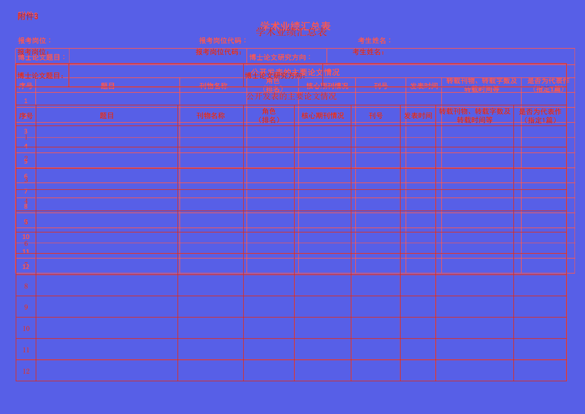</td>
  <td>changed: 188622 px (8.67%)<br>bbox: [45, 34, 1725, 1143]<br>mean abs RGB: 13.843<br>RMSE RGB: 52.5804<br>threshold: 12, gain: 5.0</td>
</tr>
<tr>
  <td><b>AcademicAchievement_temp</b><br>Page 2</td>
  <td>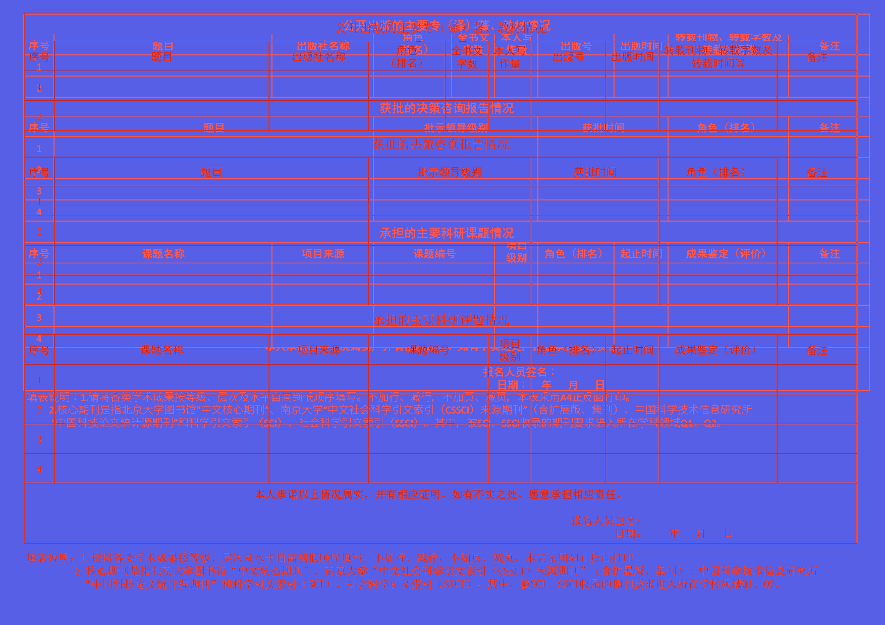</td>
  <td>changed: 264649 px (12.16%)<br>bbox: [45, 25, 1725, 1170]<br>mean abs RGB: 18.4129<br>RMSE RGB: 59.8609<br>threshold: 12, gain: 5.0</td>
</tr>
<tr>
  <td><b>Business expense budget1</b><br>Page 1</td>
  <td></td>
  <td>changed: 467855 px (21.49%)<br>bbox: [147, 176, 1018, 1597]<br>mean abs RGB: 28.4333<br>RMSE RGB: 73.3179<br>threshold: 12, gain: 5.0</td>
</tr>
<tr>
  <td><b>Business expense budget1</b><br>Page 2</td>
  <td></td>
  <td>changed: 227457 px (10.45%)<br>bbox: [112, 148, 1018, 1225]<br>mean abs RGB: 15.1342<br>RMSE RGB: 51.3412<br>threshold: 12, gain: 5.0</td>
</tr>
<tr>
  <td><b>Business expense budget1</b><br>Page 3</td>
  <td></td>
  <td>changed: 175112 px (8.04%)<br>bbox: [111, 296, 452, 1597]<br>mean abs RGB: 10.4491<br>RMSE RGB: 44.2403<br>threshold: 12, gain: 5.0</td>
</tr>
<tr>
  <td><b>Business expense budget1</b><br>Page 4</td>
  <td></td>
  <td>changed: 48167 px (2.21%)<br>bbox: [111, 148, 452, 1225]<br>mean abs RGB: 3.2966<br>RMSE RGB: 24.4596<br>threshold: 12, gain: 5.0</td>
</tr>
<tr>
  <td><b>Business expenses budget2</b><br>Page 1</td>
  <td></td>
  <td>changed: 660460 px (32.25%)<br>bbox: [140, 73, 1509, 1140]<br>mean abs RGB: 16.0908<br>RMSE RGB: 40.1071<br>threshold: 12, gain: 5.0</td>
</tr>
<tr>
  <td><b>Business expenses budget2</b><br>Page 2</td>
  <td></td>
  <td>changed: 1358929 px (66.37%)<br>bbox: [192, 75, 1456, 1163]<br>mean abs RGB: 34.2531<br>RMSE RGB: 69.1636<br>threshold: 12, gain: 5.0</td>
</tr>
<tr>
  <td><b>Business expenses budget2</b><br>Page 3</td>
  <td></td>
  <td>changed: 845692 px (41.30%)<br>bbox: [122, 72, 1527, 1163]<br>mean abs RGB: 24.1219<br>RMSE RGB: 51.007<br>threshold: 12, gain: 5.0</td>
</tr>
<tr>
  <td><b>Business expenses budget2</b><br>Page 4</td>
  <td></td>
  <td>changed: 1200984 px (58.65%)<br>bbox: [123, 75, 1527, 1160]<br>mean abs RGB: 27.8551<br>RMSE RGB: 60.6646<br>threshold: 12, gain: 5.0</td>
</tr>
<tr>
  <td><b>Business plan checklist with SWOT analysis1</b><br>Page 1</td>
  <td></td>
  <td>changed: 814131 px (39.76%)<br>bbox: [88, 58, 1182, 1477]<br>mean abs RGB: 27.06<br>RMSE RGB: 62.7658<br>threshold: 12, gain: 5.0</td>
</tr>
<tr>
  <td><b>Event budget1</b><br>Page 1</td>
  <td></td>
  <td>changed: 91980 px (4.23%)<br>bbox: [73, 153, 1165, 779]<br>mean abs RGB: 5.927<br>RMSE RGB: 34.5855<br>threshold: 12, gain: 5.0</td>
</tr>
<tr>
  <td><b>Event budget1</b><br>Page 2</td>
  <td></td>
  <td>changed: 840278 px (38.60%)<br>bbox: [62, 140, 1184, 1625]<br>mean abs RGB: 21.2026<br>RMSE RGB: 47.9683<br>threshold: 12, gain: 5.0</td>
</tr>
<tr>
  <td><b>Event budget1</b><br>Page 3</td>
  <td></td>
  <td>changed: 1314586 px (60.39%)<br>bbox: [60, 114, 1185, 1323]<br>mean abs RGB: 17.5314<br>RMSE RGB: 38.4485<br>threshold: 12, gain: 5.0</td>
</tr>
<tr>
  <td><b>Event budget1</b><br>Page 4</td>
  <td></td>
  <td>changed: 1214594 px (59.32%)<br>bbox: [59, 133, 1187, 1508]<br>mean abs RGB: 21.7807<br>RMSE RGB: 44.7057<br>threshold: 12, gain: 5.0</td>
</tr>
<tr>
  <td><b>Expense report basic1</b><br>Page 1</td>
  <td></td>
  <td>changed: 283123 px (13.83%)<br>bbox: [60, 61, 1590, 853]<br>mean abs RGB: 6.1984<br>RMSE RGB: 24.737<br>threshold: 12, gain: 5.0</td>
</tr>
<tr>
  <td><b>Grocery list1</b><br>Page 1</td>
  <td></td>
  <td>changed: 602000 px (29.40%)<br>bbox: [45, 72, 1197, 833]<br>mean abs RGB: 13.8314<br>RMSE RGB: 37.5938<br>threshold: 12, gain: 5.0</td>
</tr>
<tr>
  <td><b>Issue202609031340</b><br>Page 1</td>
  <td></td>
  <td>changed: 337055 px (15.48%)<br>bbox: [30, 55, 1195, 1754]<br>mean abs RGB: 15.6991<br>RMSE RGB: 48.7136<br>threshold: 12, gain: 5.0</td>
</tr>
<tr>
  <td><b>Issue202609031340</b><br>Page 2</td>
  <td></td>
  <td>changed: 45503 px (2.09%)<br>bbox: [43, 738, 1195, 1014]<br>mean abs RGB: 2.3791<br>RMSE RGB: 18.9014<br>threshold: 12, gain: 5.0</td>
</tr>
<tr>
  <td><b>Issue202609031340</b><br>Page 3</td>
  <td></td>
  <td>changed: 195838 px (9.00%)<br>bbox: [28, 40, 1196, 1754]<br>mean abs RGB: 12.2294<br>RMSE RGB: 48.2933<br>threshold: 12, gain: 5.0</td>
</tr>
<tr>
  <td><b>Issue202609031340</b><br>Page 4</td>
  <td></td>
  <td>changed: 17387 px (0.80%)<br>bbox: [28, 743, 1196, 1009]<br>mean abs RGB: 0.9005<br>RMSE RGB: 12.1593<br>threshold: 12, gain: 5.0</td>
</tr>
<tr>
  <td><b>payroll-calculator_f</b><br>Page 1</td>
  <td>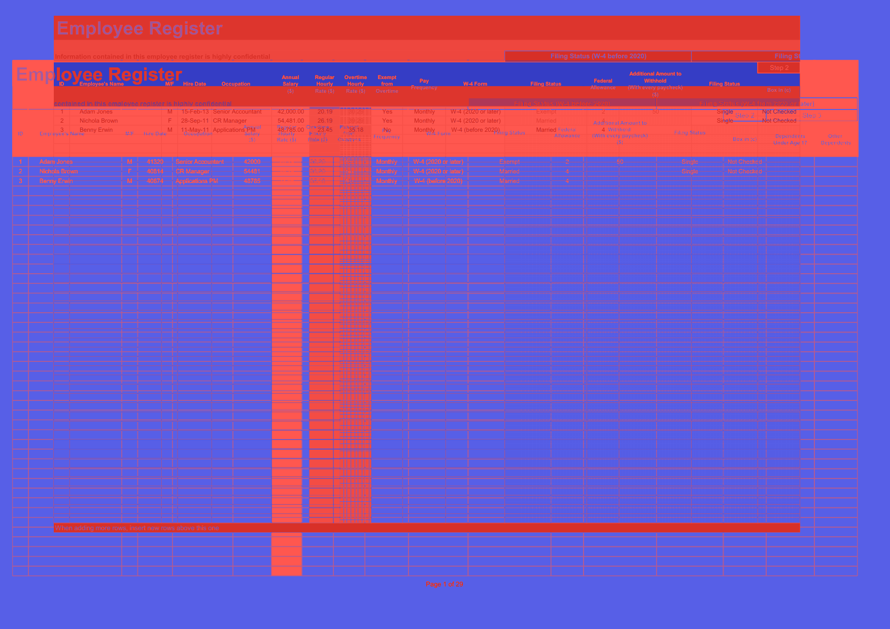</td>
  <td>changed: 809437 px (37.19%)<br>bbox: [23, 31, 1692, 1160]<br>mean abs RGB: 31.465<br>RMSE RGB: 62.1726<br>threshold: 12, gain: 5.0</td>
</tr>
<tr>
  <td><b>payroll-calculator_f</b><br>Page 2</td>
  <td>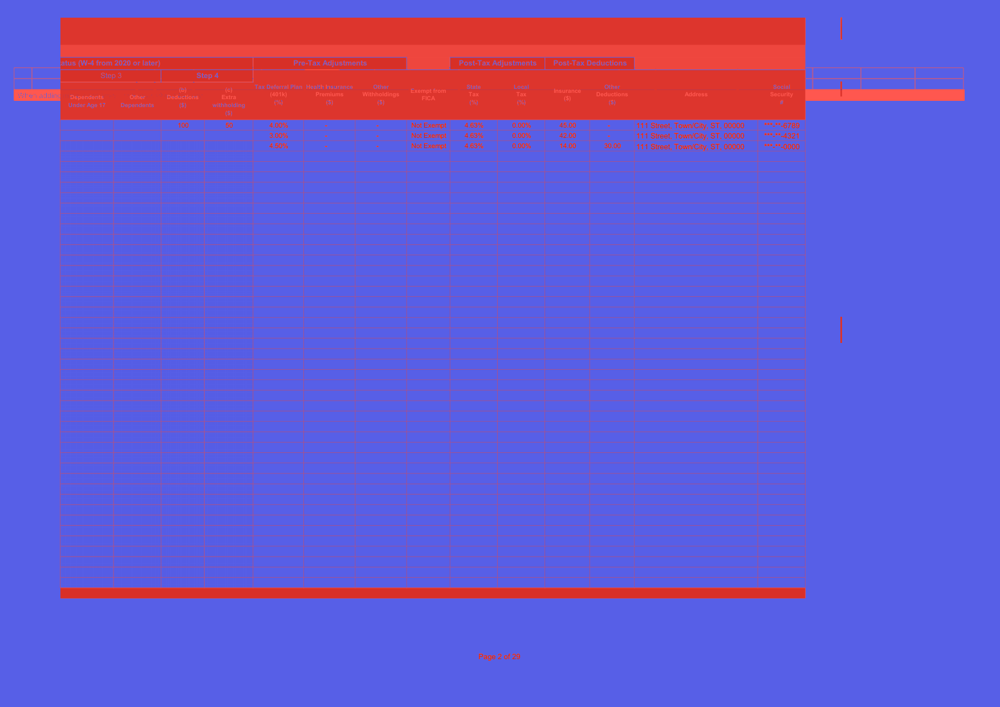</td>
  <td>changed: 395067 px (18.15%)<br>bbox: [23, 30, 1692, 1160]<br>mean abs RGB: 19.3981<br>RMSE RGB: 52.8391<br>threshold: 12, gain: 5.0</td>
</tr>
<tr>
  <td><b>payroll-calculator_f</b><br>Page 3</td>
  <td>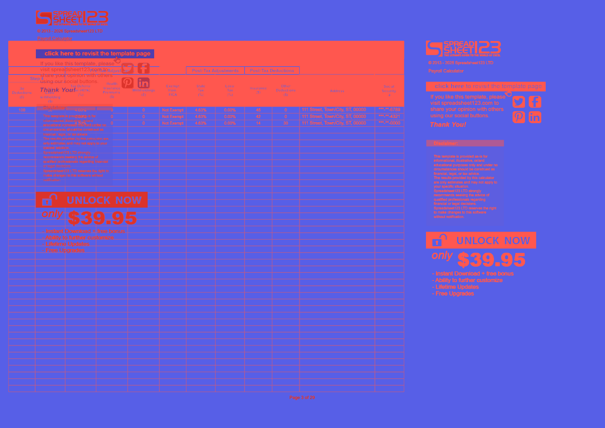</td>
  <td>changed: 541833 px (24.89%)<br>bbox: [23, 30, 1582, 1160]<br>mean abs RGB: 22.1539<br>RMSE RGB: 56.3624<br>threshold: 12, gain: 5.0</td>
</tr>
<tr>
  <td><b>payroll-calculator_f</b><br>Page 4</td>
  <td>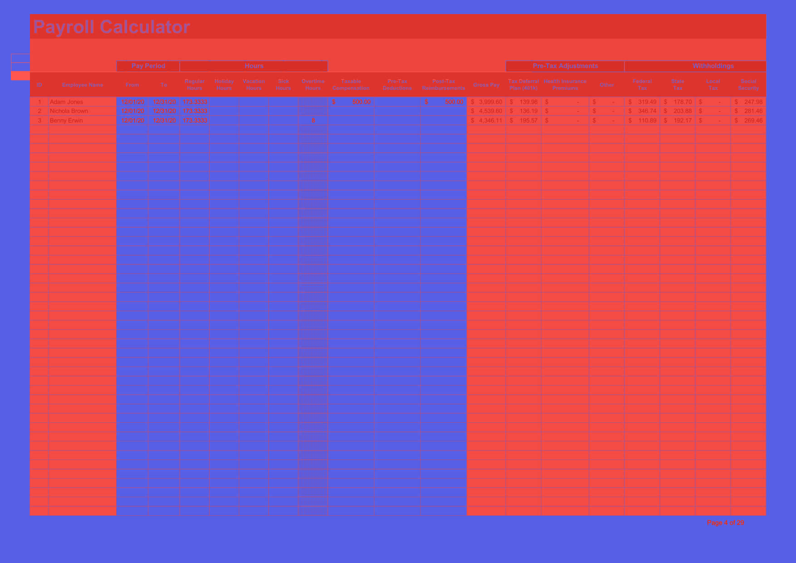</td>
  <td>changed: 1208278 px (55.51%)<br>bbox: [23, 31, 1689, 1160]<br>mean abs RGB: 35.928<br>RMSE RGB: 59.4032<br>threshold: 12, gain: 5.0</td>
</tr>
<tr>
  <td><b>payroll-calculator_f</b><br>Page 5</td>
  <td>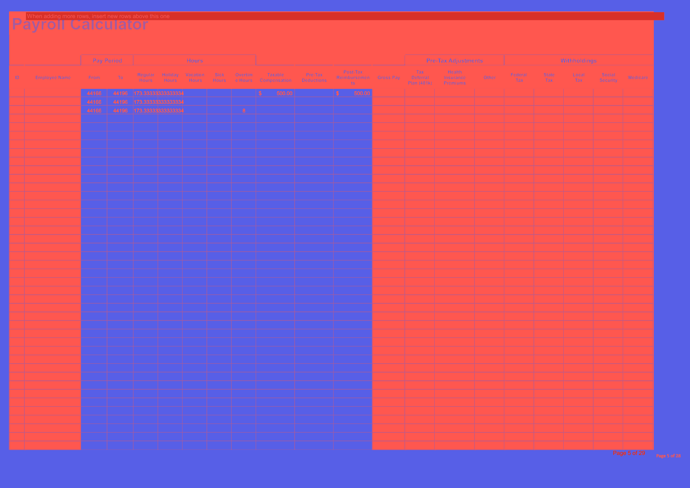</td>
  <td>changed: 1221059 px (56.10%)<br>bbox: [22, 29, 1730, 1166]<br>mean abs RGB: 37.0401<br>RMSE RGB: 60.3751<br>threshold: 12, gain: 5.0</td>
</tr>
<tr>
  <td><b>payroll-calculator_f</b><br>Page 6</td>
  <td>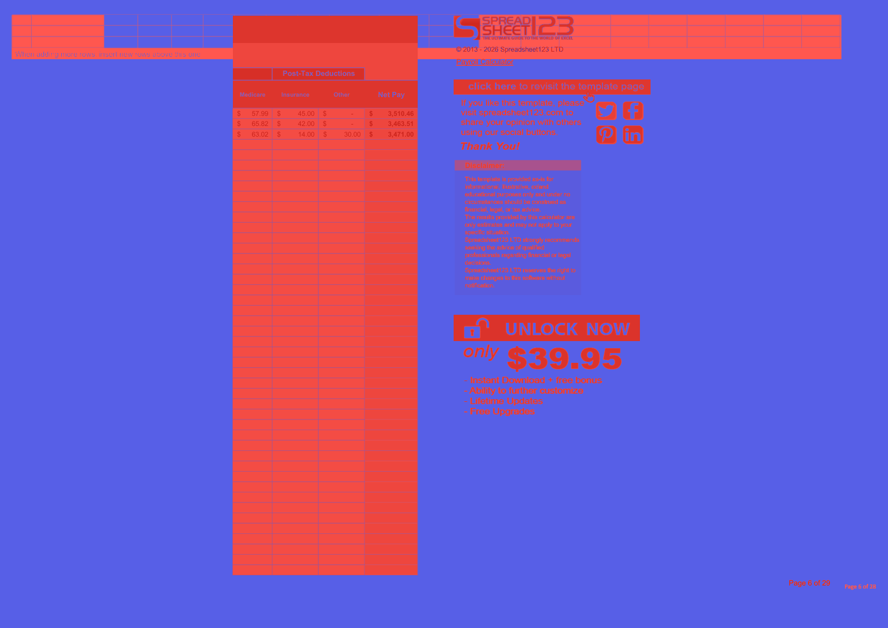</td>
  <td>changed: 616887 px (28.34%)<br>bbox: [22, 28, 1730, 1166]<br>mean abs RGB: 21.0023<br>RMSE RGB: 49.0035<br>threshold: 12, gain: 5.0</td>
</tr>
<tr>
  <td><b>payroll-calculator_f</b><br>Page 7</td>
  <td>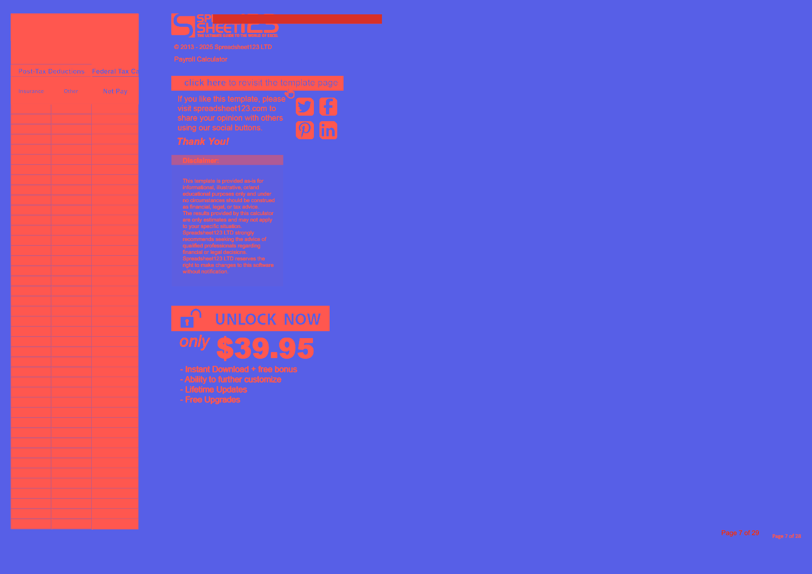</td>
  <td>changed: 444954 px (20.44%)<br>bbox: [22, 29, 1730, 1166]<br>mean abs RGB: 15.0918<br>RMSE RGB: 41.7348<br>threshold: 12, gain: 5.0</td>
</tr>
<tr>
  <td><b>payroll-calculator_f</b><br>Page 8</td>
  <td>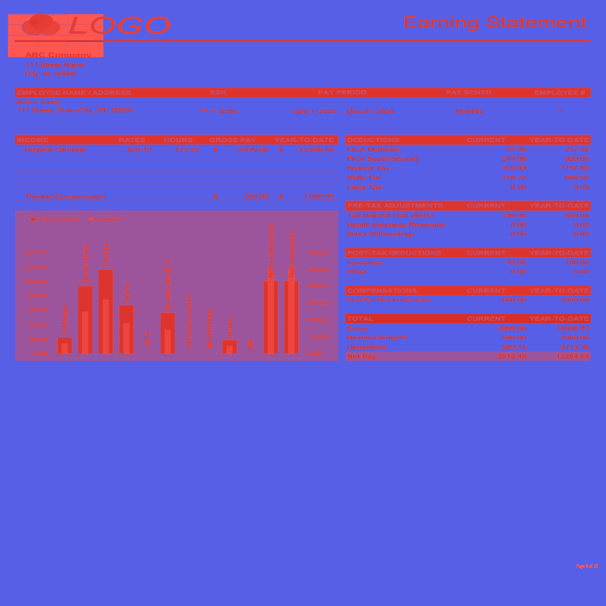</td>
  <td>changed: 357390 px (23.21%)<br>bbox: [15, 27, 1225, 1166]<br>mean abs RGB: 17.3756<br>RMSE RGB: 48.1625<br>threshold: 12, gain: 5.0</td>
</tr>
<tr>
  <td><b>payroll-calculator_f</b><br>Page 9</td>
  <td>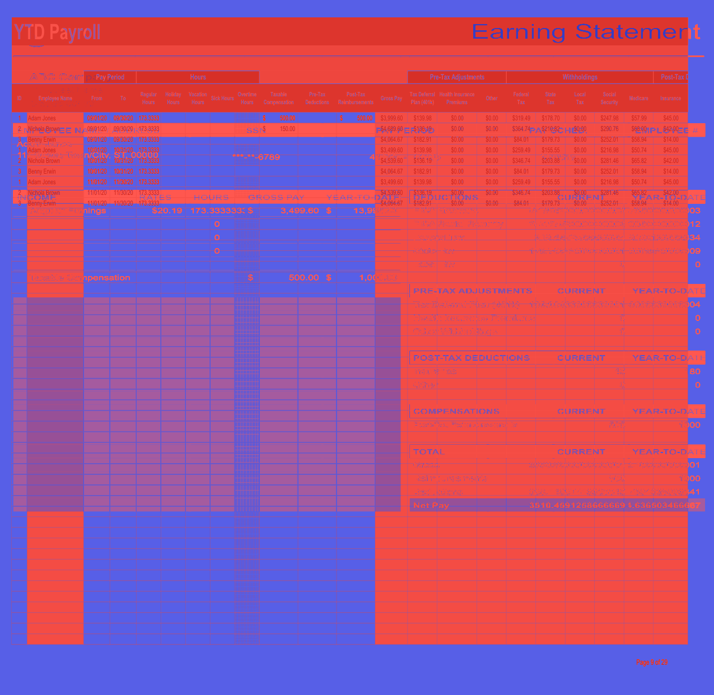</td>
  <td>changed: 1124936 px (71.10%)<br>bbox: [20, 30, 1260, 1190]<br>mean abs RGB: 45.2669<br>RMSE RGB: 68.9472<br>threshold: 12, gain: 5.0</td>
</tr>
<tr>
  <td><b>payroll-calculator_f</b><br>Page 10</td>
  <td>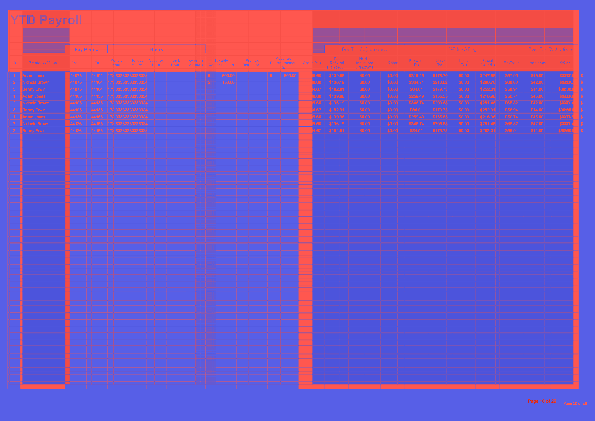</td>
  <td>changed: 738687 px (33.94%)<br>bbox: [22, 29, 1730, 1196]<br>mean abs RGB: 21.0908<br>RMSE RGB: 47.9286<br>threshold: 12, gain: 5.0</td>
</tr>
<tr>
  <td><b>payroll-calculator_f</b><br>Page 11</td>
  <td>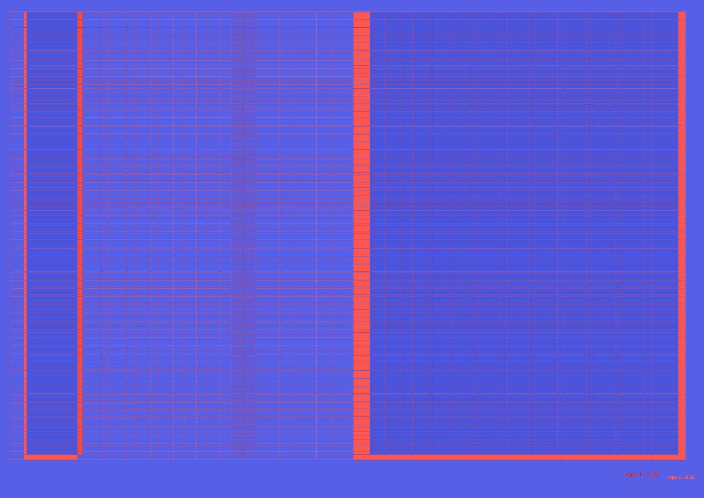</td>
  <td>changed: 479639 px (22.04%)<br>bbox: [22, 27, 1730, 1196]<br>mean abs RGB: 6.1756<br>RMSE RGB: 14.71<br>threshold: 12, gain: 5.0</td>
</tr>
<tr>
  <td><b>payroll-calculator_f</b><br>Page 12</td>
  <td>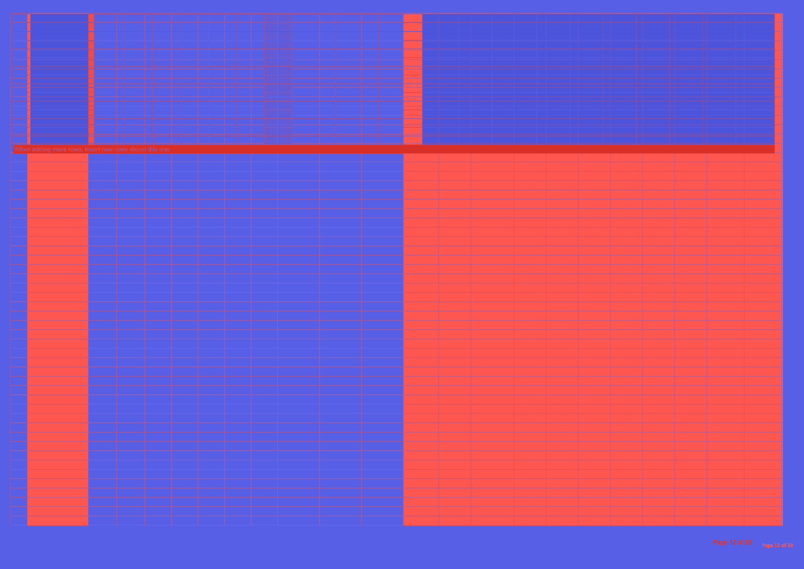</td>
  <td>changed: 993566 px (45.65%)<br>bbox: [22, 27, 1730, 1196]<br>mean abs RGB: 22.1251<br>RMSE RGB: 37.3256<br>threshold: 12, gain: 5.0</td>
</tr>
<tr>
  <td><b>payroll-calculator_f</b><br>Page 13</td>
  <td>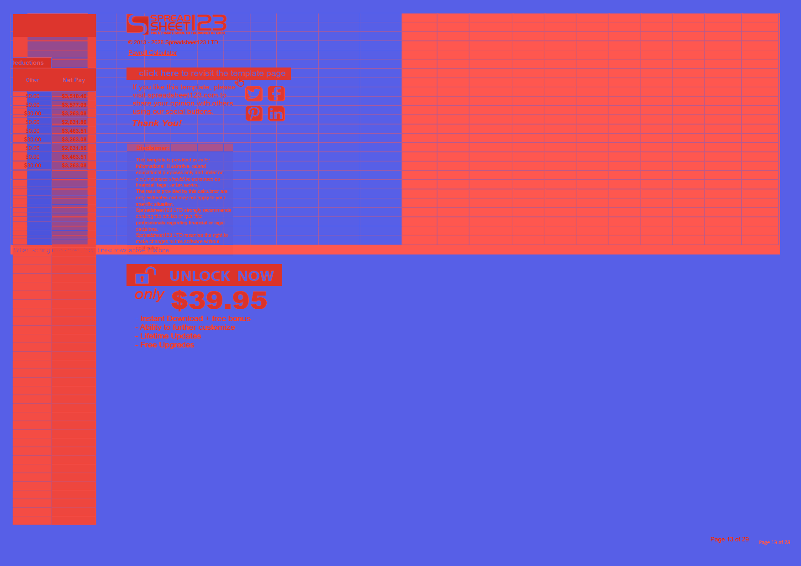</td>
  <td>changed: 775480 px (35.63%)<br>bbox: [22, 27, 1730, 1196]<br>mean abs RGB: 21.8837<br>RMSE RGB: 45.604<br>threshold: 12, gain: 5.0</td>
</tr>
<tr>
  <td><b>payroll-calculator_f</b><br>Page 14</td>
  <td></td>
  <td>changed: 306368 px (14.07%)<br>bbox: [22, 28, 1730, 1196]<br>mean abs RGB: 8.9372<br>RMSE RGB: 31.14<br>threshold: 12, gain: 5.0</td>
</tr>
<tr>
  <td><b>payroll-calculator_f</b><br>Page 15</td>
  <td></td>
  <td>changed: 205523 px (9.44%)<br>bbox: [22, 28, 1730, 1196]<br>mean abs RGB: 4.711<br>RMSE RGB: 18.289<br>threshold: 12, gain: 5.0</td>
</tr>
<tr>
  <td><b>PO_anonymized</b><br>Page 1</td>
  <td></td>
  <td>changed: 383583 px (17.62%)<br>bbox: [61, 72, 1173, 1719]<br>mean abs RGB: 23.1305<br>RMSE RGB: 66.0076<br>threshold: 12, gain: 5.0</td>
</tr>
<tr>
  <td><b>PO_anonymized</b><br>Page 2</td>
  <td>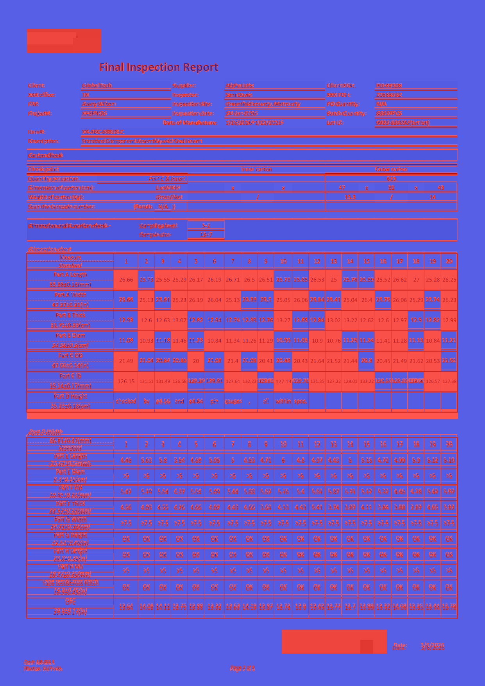</td>
  <td>changed: 556139 px (25.55%)<br>bbox: [61, 74, 1172, 1719]<br>mean abs RGB: 29.5648<br>RMSE RGB: 72.9876<br>threshold: 12, gain: 5.0</td>
</tr>
<tr>
  <td><b>PO_anonymized</b><br>Page 3</td>
  <td></td>
  <td>changed: 73616 px (3.38%)<br>bbox: [61, 74, 1171, 1719]<br>mean abs RGB: 4.3677<br>RMSE RGB: 27.4185<br>threshold: 12, gain: 5.0</td>
</tr>
<tr>
  <td><b>PO_anonymized</b><br>Page 4</td>
  <td></td>
  <td>changed: 58905 px (2.71%)<br>bbox: [61, 45, 1156, 1719]<br>mean abs RGB: 3.2783<br>RMSE RGB: 24.0597<br>threshold: 12, gain: 5.0</td>
</tr>
<tr>
  <td><b>PO_anonymized</b><br>Page 5</td>
  <td></td>
  <td>changed: 59965 px (2.75%)<br>bbox: [61, 45, 1155, 1719]<br>mean abs RGB: 3.3248<br>RMSE RGB: 24.2187<br>threshold: 12, gain: 5.0</td>
</tr>
<tr>
  <td><b>PO_anonymized</b><br>Page 6</td>
  <td></td>
  <td>changed: 55917 px (2.57%)<br>bbox: [61, 45, 1156, 1719]<br>mean abs RGB: 3.1978<br>RMSE RGB: 23.8877<br>threshold: 12, gain: 5.0</td>
</tr>
<tr>
  <td><b>PO_anonymized</b><br>Page 7</td>
  <td></td>
  <td>changed: 60594 px (2.78%)<br>bbox: [61, 45, 1156, 1719]<br>mean abs RGB: 3.3376<br>RMSE RGB: 24.1392<br>threshold: 12, gain: 5.0</td>
</tr>
<tr>
  <td><b>PO_anonymized</b><br>Page 8</td>
  <td></td>
  <td>changed: 56270 px (2.59%)<br>bbox: [61, 45, 1155, 1719]<br>mean abs RGB: 3.1713<br>RMSE RGB: 23.7639<br>threshold: 12, gain: 5.0</td>
</tr>
<tr>
  <td><b>PO_anonymized</b><br>Page 9</td>
  <td></td>
  <td>changed: 57108 px (2.62%)<br>bbox: [61, 45, 1155, 1719]<br>mean abs RGB: 3.237<br>RMSE RGB: 24.0843<br>threshold: 12, gain: 5.0</td>
</tr>
<tr>
  <td><b>Simple invoice1</b><br>Page 1</td>
  <td></td>
  <td>changed: 355036 px (17.34%)<br>bbox: [38, 107, 1203, 1361]<br>mean abs RGB: 17.5949<br>RMSE RGB: 57.6077<br>threshold: 12, gain: 5.0</td>
</tr>
<tr>
  <td><b>Small business cash flow forecast1</b><br>Page 1</td>
  <td></td>
  <td>changed: 851695 px (39.13%)<br>bbox: [66, 73, 1173, 1682]<br>mean abs RGB: 17.3431<br>RMSE RGB: 42.3066<br>threshold: 12, gain: 5.0</td>
</tr>
<tr>
  <td><b>Small business cash flow forecast1</b><br>Page 2</td>
  <td></td>
  <td>changed: 501550 px (23.04%)<br>bbox: [97, 114, 1532, 1080]<br>mean abs RGB: 25.8079<br>RMSE RGB: 66.7855<br>threshold: 12, gain: 5.0</td>
</tr>
<tr>
  <td><b>Small business cash flow forecast1</b><br>Page 3</td>
  <td></td>
  <td>changed: 2092 px (0.10%)<br>bbox: [835, 112, 1532, 116]<br>mean abs RGB: 0.0692<br>RMSE RGB: 2.9896<br>threshold: 12, gain: 5.0</td>
</tr>
<tr>
  <td><b>Wedding_timeline_planner1_copy</b><br>Page 1</td>
  <td>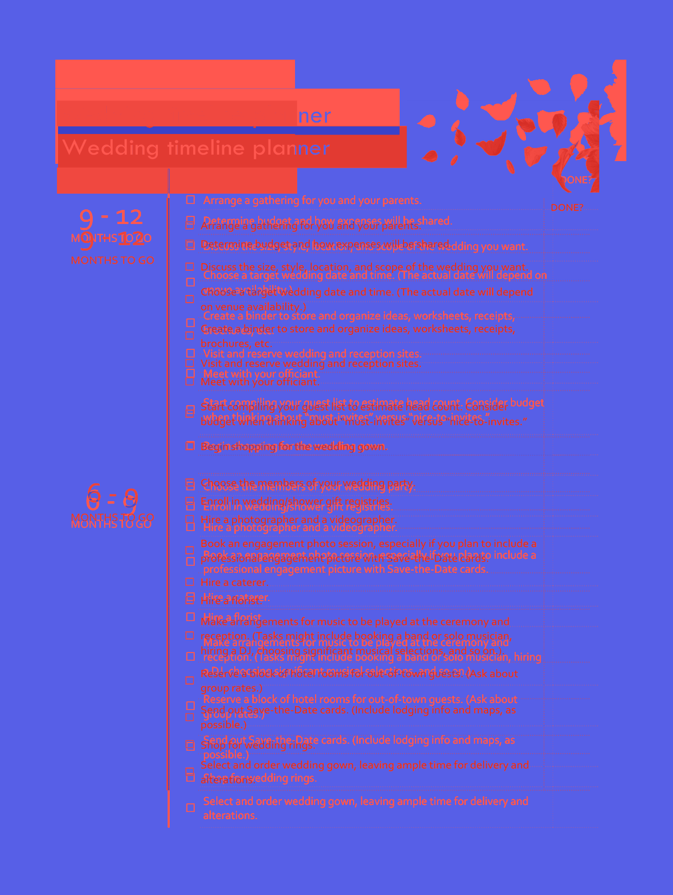</td>
  <td>changed: 331974 px (16.21%)<br>bbox: [102, 110, 1155, 1526]<br>mean abs RGB: 16.3678<br>RMSE RGB: 48.6299<br>threshold: 12, gain: 5.0</td>
</tr>
<tr>
  <td><b>Wedding_timeline_planner1_copy</b><br>Page 2</td>
  <td>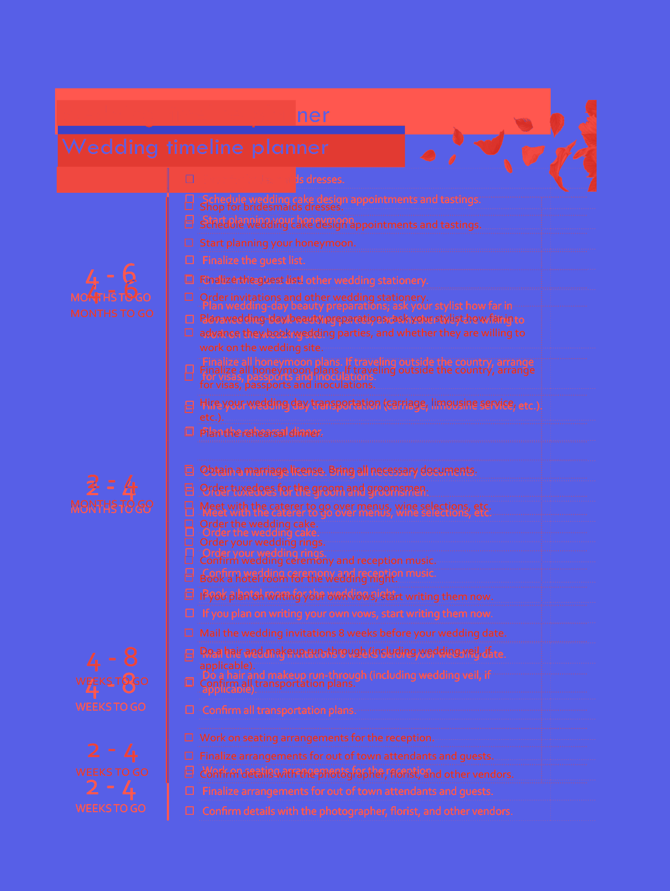</td>
  <td>changed: 323030 px (15.78%)<br>bbox: [102, 163, 1105, 1520]<br>mean abs RGB: 16.6693<br>RMSE RGB: 48.8111<br>threshold: 12, gain: 5.0</td>
</tr>
<tr>
  <td><b>Wedding_timeline_planner1_copy</b><br>Page 3</td>
  <td>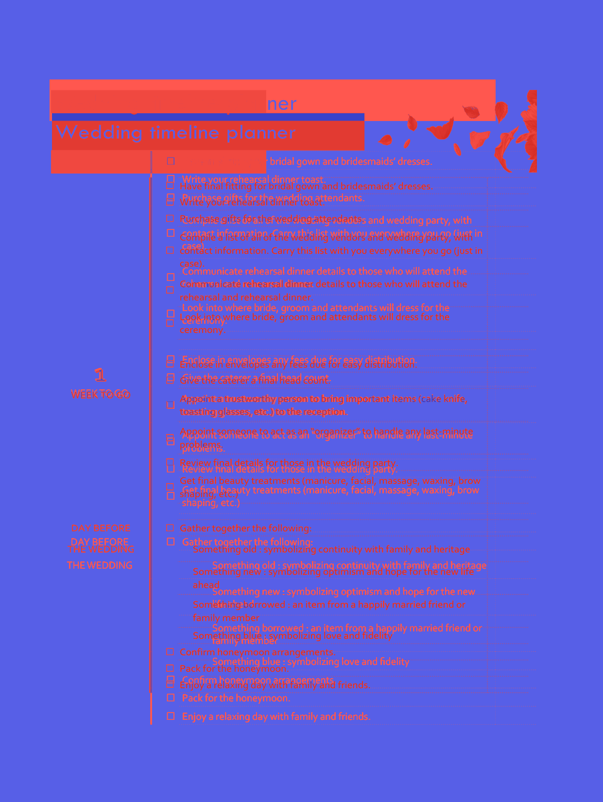</td>
  <td>changed: 304654 px (14.88%)<br>bbox: [102, 163, 1105, 1491]<br>mean abs RGB: 16.0328<br>RMSE RGB: 48.0832<br>threshold: 12, gain: 5.0</td>
</tr>
<tr>
  <td><b>Wedding_timeline_planner1_copy</b><br>Page 4</td>
  <td>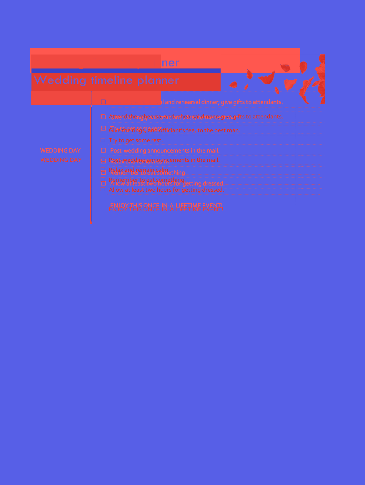</td>
  <td>changed: 184454 px (9.01%)<br>bbox: [102, 163, 1105, 763]<br>mean abs RGB: 9.5128<br>RMSE RGB: 35.8589<br>threshold: 12, gain: 5.0</td>
</tr>
<tr>
  <td><b>Weekly schedule planner1</b><br>Page 1</td>
  <td></td>
  <td>changed: 671773 px (32.45%)<br>bbox: [62, 96, 1604, 1144]<br>mean abs RGB: 22.5853<br>RMSE RGB: 55.3776<br>threshold: 12, gain: 5.0</td>
</tr>
<tr>
  <td><b>XlsxIssue75</b><br>Page 1</td>
  <td></td>
  <td>changed: 109169 px (5.02%)<br>bbox: [112, 112, 1116, 1669]<br>mean abs RGB: 7.5808<br>RMSE RGB: 38.5703<br>threshold: 12, gain: 5.0</td>
</tr>
<tr>
  <td><b>XlsxIssue75</b><br>Page 2</td>
  <td></td>
  <td>changed: 112131 px (5.15%)<br>bbox: [118, 120, 1088, 1669]<br>mean abs RGB: 8.1596<br>RMSE RGB: 40.4683<br>threshold: 12, gain: 5.0</td>
</tr>
<tr>
  <td><b>XlsxIssue75</b><br>Page 3</td>
  <td></td>
  <td>changed: 103805 px (4.77%)<br>bbox: [118, 120, 1088, 1669]<br>mean abs RGB: 7.512<br>RMSE RGB: 38.7322<br>threshold: 12, gain: 5.0</td>
</tr>
<tr>
  <td><b>XlsxIssue75</b><br>Page 4</td>
  <td></td>
  <td>changed: 96978 px (4.46%)<br>bbox: [118, 120, 1088, 1669]<br>mean abs RGB: 7.0016<br>RMSE RGB: 37.3911<br>threshold: 12, gain: 5.0</td>
</tr>
<tr>
  <td><b>XlsxIssue75</b><br>Page 5</td>
  <td></td>
  <td>changed: 93354 px (4.29%)<br>bbox: [119, 120, 1088, 1669]<br>mean abs RGB: 6.7155<br>RMSE RGB: 36.5882<br>threshold: 12, gain: 5.0</td>
</tr>
<tr>
  <td><b>XlsxIssue75</b><br>Page 6</td>
  <td></td>
  <td>changed: 105439 px (4.84%)<br>bbox: [118, 120, 1088, 1669]<br>mean abs RGB: 7.629<br>RMSE RGB: 39.0392<br>threshold: 12, gain: 5.0</td>
</tr>
<tr>
  <td><b>XlsxIssue75</b><br>Page 7</td>
  <td></td>
  <td>changed: 100712 px (4.63%)<br>bbox: [118, 120, 1031, 1669]<br>mean abs RGB: 7.28<br>RMSE RGB: 38.1016<br>threshold: 12, gain: 5.0</td>
</tr>
<tr>
  <td><b>XlsxIssue75</b><br>Page 8</td>
  <td></td>
  <td>changed: 98482 px (4.52%)<br>bbox: [118, 120, 1031, 1669]<br>mean abs RGB: 7.0597<br>RMSE RGB: 37.4203<br>threshold: 12, gain: 5.0</td>
</tr>
<tr>
  <td><b>XlsxIssue75</b><br>Page 9</td>
  <td></td>
  <td>changed: 102139 px (4.69%)<br>bbox: [118, 120, 1088, 1669]<br>mean abs RGB: 7.3541<br>RMSE RGB: 38.2725<br>threshold: 12, gain: 5.0</td>
</tr>
<tr>
  <td><b>XlsxIssue75</b><br>Page 10</td>
  <td></td>
  <td>changed: 100640 px (4.62%)<br>bbox: [118, 120, 1088, 1669]<br>mean abs RGB: 7.1812<br>RMSE RGB: 37.7359<br>threshold: 12, gain: 5.0</td>
</tr>
<tr>
  <td><b>XlsxIssue75</b><br>Page 11</td>
  <td></td>
  <td>changed: 101994 px (4.69%)<br>bbox: [118, 120, 1088, 1669]<br>mean abs RGB: 7.2836<br>RMSE RGB: 38.018<br>threshold: 12, gain: 5.0</td>
</tr>
<tr>
  <td><b>XlsxIssue75</b><br>Page 12</td>
  <td></td>
  <td>changed: 100618 px (4.62%)<br>bbox: [118, 120, 1088, 1669]<br>mean abs RGB: 7.1803<br>RMSE RGB: 37.7329<br>threshold: 12, gain: 5.0</td>
</tr>
<tr>
  <td><b>XlsxIssue75</b><br>Page 13</td>
  <td></td>
  <td>changed: 106188 px (4.88%)<br>bbox: [118, 120, 1088, 1669]<br>mean abs RGB: 7.7483<br>RMSE RGB: 39.3768<br>threshold: 12, gain: 5.0</td>
</tr>
<tr>
  <td><b>XlsxIssue75</b><br>Page 14</td>
  <td></td>
  <td>changed: 118862 px (5.46%)<br>bbox: [119, 120, 1031, 1669]<br>mean abs RGB: 8.6199<br>RMSE RGB: 41.4468<br>threshold: 12, gain: 5.0</td>
</tr>
<tr>
  <td><b>XlsxIssue75</b><br>Page 15</td>
  <td></td>
  <td>changed: 118862 px (5.46%)<br>bbox: [119, 120, 1031, 1669]<br>mean abs RGB: 8.6199<br>RMSE RGB: 41.4468<br>threshold: 12, gain: 5.0</td>
</tr>
<tr>
  <td><b>XlsxIssue77_MergedCellAlignment</b><br>Page 1</td>
  <td>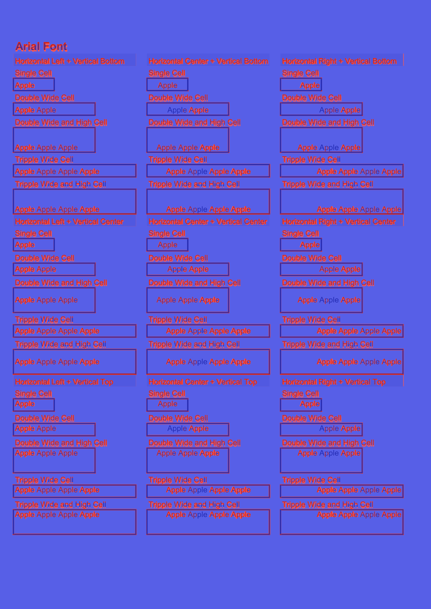</td>
  <td>changed: 259750 px (11.93%)<br>bbox: [36, 121, 1163, 1541]<br>mean abs RGB: 14.4315<br>RMSE RGB: 50.3807<br>threshold: 12, gain: 5.0</td>
</tr>
<tr>
  <td><b>XlsxIssue77_MergedCellAlignment</b><br>Page 2</td>
  <td>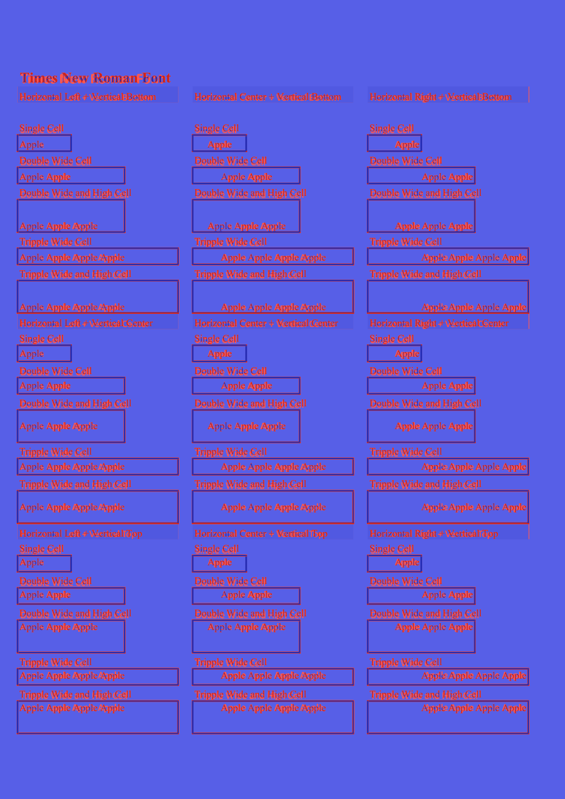</td>
  <td>changed: 250367 px (11.50%)<br>bbox: [36, 159, 1163, 1612]<br>mean abs RGB: 13.6312<br>RMSE RGB: 48.5994<br>threshold: 12, gain: 5.0</td>
</tr>
<tr>
  <td><b>XlsxIssue77_Template1</b><br>Page 1</td>
  <td></td>
  <td>changed: 440593 px (21.52%)<br>bbox: [82, 95, 1157, 1547]<br>mean abs RGB: 25.5866<br>RMSE RGB: 69.9105<br>threshold: 12, gain: 5.0</td>
</tr>
<tr>
  <td><b>XlsxIssue77_Template1</b><br>Page 2</td>
  <td>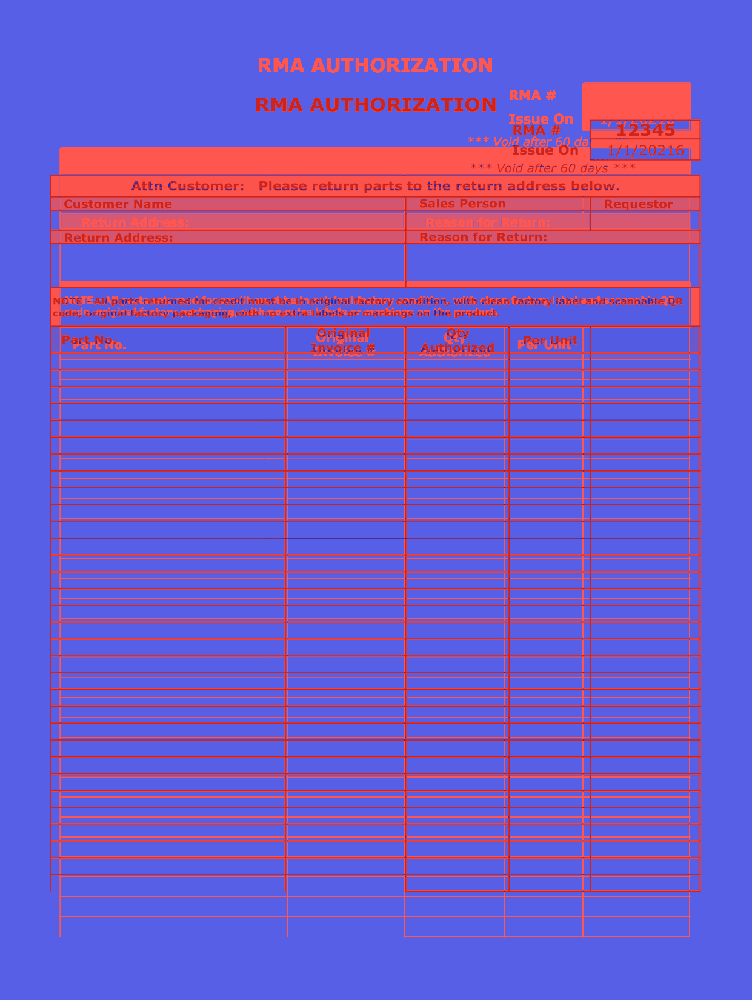</td>
  <td>changed: 440522 px (21.51%)<br>bbox: [82, 95, 1157, 1547]<br>mean abs RGB: 25.381<br>RMSE RGB: 69.5132<br>threshold: 12, gain: 5.0</td>
</tr>
<tr>
  <td><b>XlsxIssue77_Template1</b><br>Page 3</td>
  <td></td>
  <td>changed: 440521 px (21.51%)<br>bbox: [82, 95, 1157, 1547]<br>mean abs RGB: 25.3099<br>RMSE RGB: 69.3504<br>threshold: 12, gain: 5.0</td>
</tr>
<tr>
  <td><b>XlsxIssue77_Template1</b><br>Page 4</td>
  <td></td>
  <td>changed: 440518 px (21.51%)<br>bbox: [82, 95, 1157, 1547]<br>mean abs RGB: 25.3105<br>RMSE RGB: 69.3719<br>threshold: 12, gain: 5.0</td>
</tr>
<tr>
  <td><b>XlsxIssue77_Template1</b><br>Page 5</td>
  <td></td>
  <td>changed: 440528 px (21.51%)<br>bbox: [82, 95, 1157, 1547]<br>mean abs RGB: 25.3051<br>RMSE RGB: 69.3349<br>threshold: 12, gain: 5.0</td>
</tr>
<tr>
  <td><b>XlsxIssue77_Template1</b><br>Page 6</td>
  <td>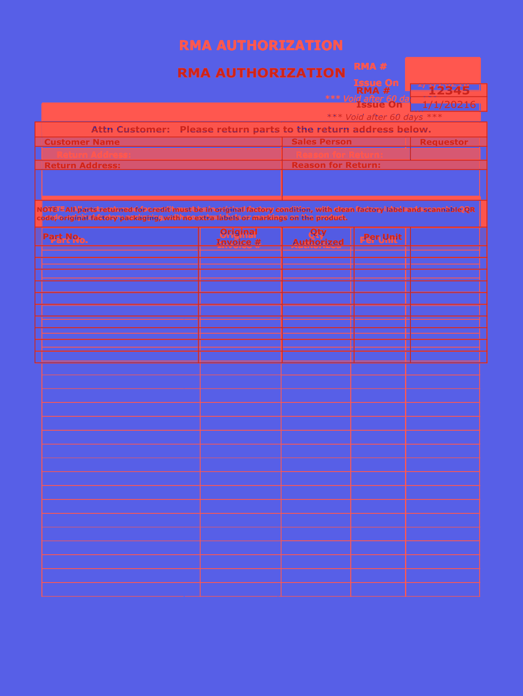</td>
  <td>changed: 361308 px (17.64%)<br>bbox: [82, 95, 1157, 1415]<br>mean abs RGB: 18.9626<br>RMSE RGB: 59.5404<br>threshold: 12, gain: 5.0</td>
</tr>
<tr>
  <td><b>XlsxIssue77_Template2_Workaround</b><br>Page 1</td>
  <td></td>
  <td>changed: 444756 px (21.72%)<br>bbox: [78, 95, 1153, 1553]<br>mean abs RGB: 25.2024<br>RMSE RGB: 69.4511<br>threshold: 12, gain: 5.0</td>
</tr>
<tr>
  <td><b>XlsxIssue77_Template2_Workaround</b><br>Page 2</td>
  <td>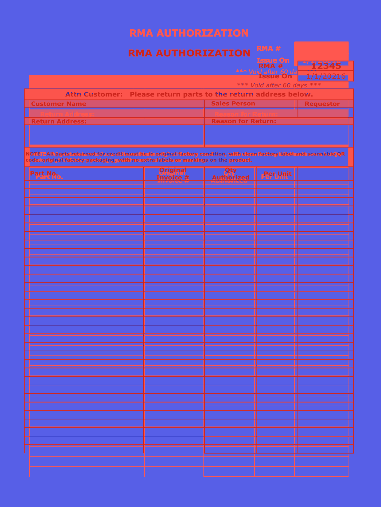</td>
  <td>changed: 443594 px (21.66%)<br>bbox: [78, 95, 1153, 1553]<br>mean abs RGB: 25.0351<br>RMSE RGB: 69.1516<br>threshold: 12, gain: 5.0</td>
</tr>
<tr>
  <td><b>XlsxIssue77_Template2_Workaround</b><br>Page 3</td>
  <td></td>
  <td>changed: 444093 px (21.69%)<br>bbox: [78, 95, 1153, 1553]<br>mean abs RGB: 25.0102<br>RMSE RGB: 69.0715<br>threshold: 12, gain: 5.0</td>
</tr>
<tr>
  <td><b>XlsxIssue77_Template2_Workaround</b><br>Page 4</td>
  <td></td>
  <td>changed: 443541 px (21.66%)<br>bbox: [78, 95, 1153, 1553]<br>mean abs RGB: 24.9239<br>RMSE RGB: 68.9211<br>threshold: 12, gain: 5.0</td>
</tr>
<tr>
  <td><b>XlsxIssue77_Template2_Workaround</b><br>Page 5</td>
  <td></td>
  <td>changed: 444095 px (21.69%)<br>bbox: [78, 95, 1153, 1553]<br>mean abs RGB: 25.0132<br>RMSE RGB: 69.0832<br>threshold: 12, gain: 5.0</td>
</tr>
<tr>
  <td><b>XlsxIssue77_Template2_Workaround</b><br>Page 6</td>
  <td>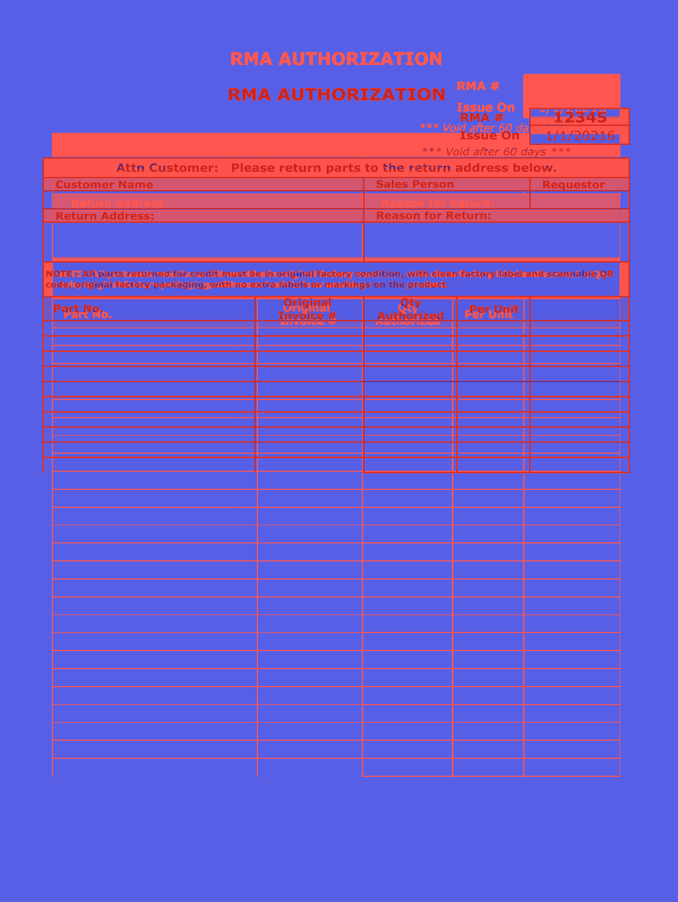</td>
  <td>changed: 360983 px (17.63%)<br>bbox: [78, 95, 1153, 1422]<br>mean abs RGB: 18.5556<br>RMSE RGB: 58.9521<br>threshold: 12, gain: 5.0</td>
</tr>
<tr>
  <td><b>XlsxIssue81_LayoutOptions</b><br>Page 1</td>
  <td>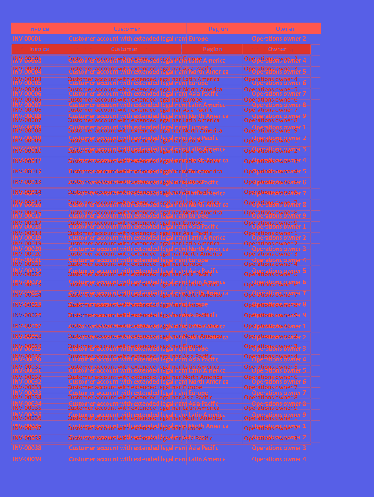</td>
  <td>changed: 569573 px (27.82%)<br>bbox: [35, 73, 1066, 1545]<br>mean abs RGB: 32.1578<br>RMSE RGB: 76.3458<br>threshold: 12, gain: 5.0</td>
</tr>
<tr>
  <td><b>XlsxIssue81_LayoutOptions</b><br>Page 2</td>
  <td>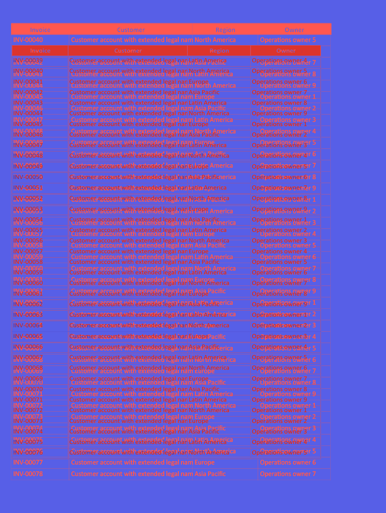</td>
  <td>changed: 570310 px (27.85%)<br>bbox: [35, 73, 1066, 1545]<br>mean abs RGB: 32.2221<br>RMSE RGB: 76.4271<br>threshold: 12, gain: 5.0</td>
</tr>
<tr>
  <td><b>XlsxIssue81_LayoutOptions</b><br>Page 3</td>
  <td>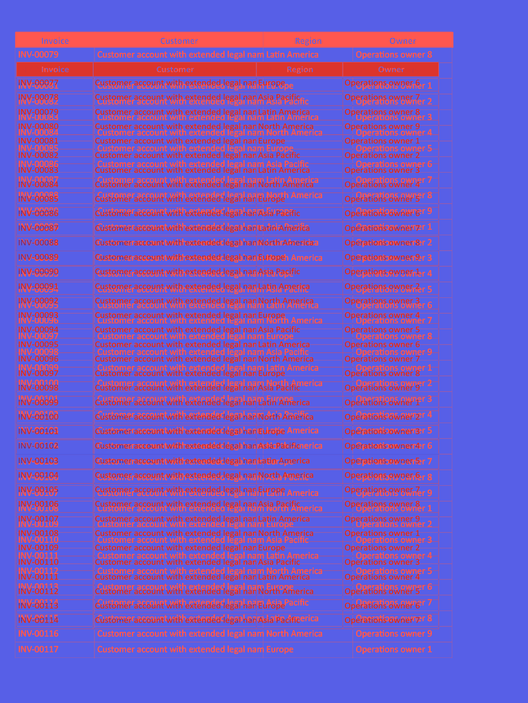</td>
  <td>changed: 569448 px (27.81%)<br>bbox: [35, 73, 1066, 1545]<br>mean abs RGB: 32.1356<br>RMSE RGB: 76.3234<br>threshold: 12, gain: 5.0</td>
</tr>
<tr>
  <td><b>XlsxIssue81_LayoutOptions</b><br>Page 4</td>
  <td></td>
  <td>changed: 131263 px (6.41%)<br>bbox: [35, 73, 1066, 386]<br>mean abs RGB: 8.112<br>RMSE RGB: 37.4278<br>threshold: 12, gain: 5.0</td>
</tr>
<tr>
  <td><b>XlsxIssue81_LayoutOptions</b><br>Page 5</td>
  <td>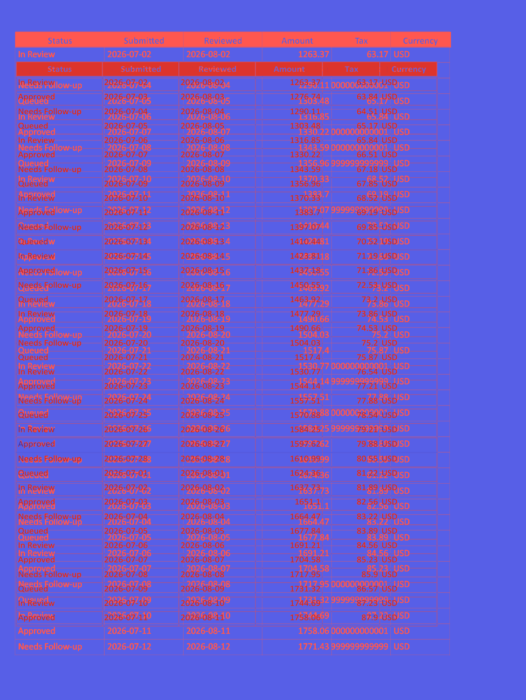</td>
  <td>changed: 472097 px (23.06%)<br>bbox: [35, 73, 1064, 1545]<br>mean abs RGB: 24.3907<br>RMSE RGB: 65.763<br>threshold: 12, gain: 5.0</td>
</tr>
<tr>
  <td><b>XlsxIssue81_LayoutOptions</b><br>Page 6</td>
  <td>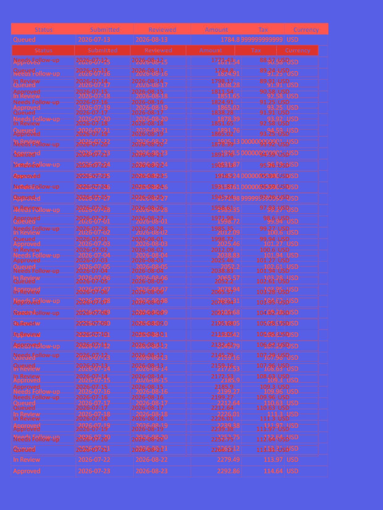</td>
  <td>changed: 470163 px (22.96%)<br>bbox: [35, 73, 1064, 1545]<br>mean abs RGB: 24.2492<br>RMSE RGB: 65.5652<br>threshold: 12, gain: 5.0</td>
</tr>
<tr>
  <td><b>XlsxIssue81_LayoutOptions</b><br>Page 7</td>
  <td>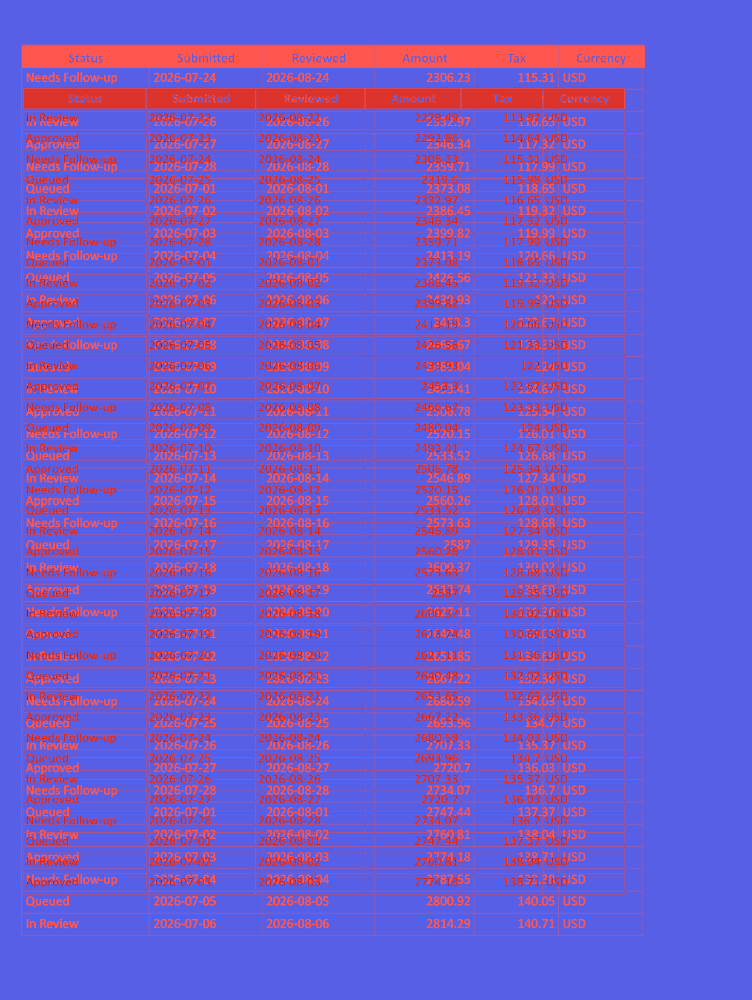</td>
  <td>changed: 468136 px (22.86%)<br>bbox: [35, 73, 1064, 1545]<br>mean abs RGB: 24.0419<br>RMSE RGB: 65.2104<br>threshold: 12, gain: 5.0</td>
</tr>
<tr>
  <td><b>XlsxIssue81_LayoutOptions</b><br>Page 8</td>
  <td></td>
  <td>changed: 118693 px (5.80%)<br>bbox: [35, 73, 1064, 386]<br>mean abs RGB: 7.1199<br>RMSE RGB: 34.7633<br>threshold: 12, gain: 5.0</td>
</tr>
<tr>
  <td><b>XlsxIssue81_LayoutOptions</b><br>Page 9</td>
  <td>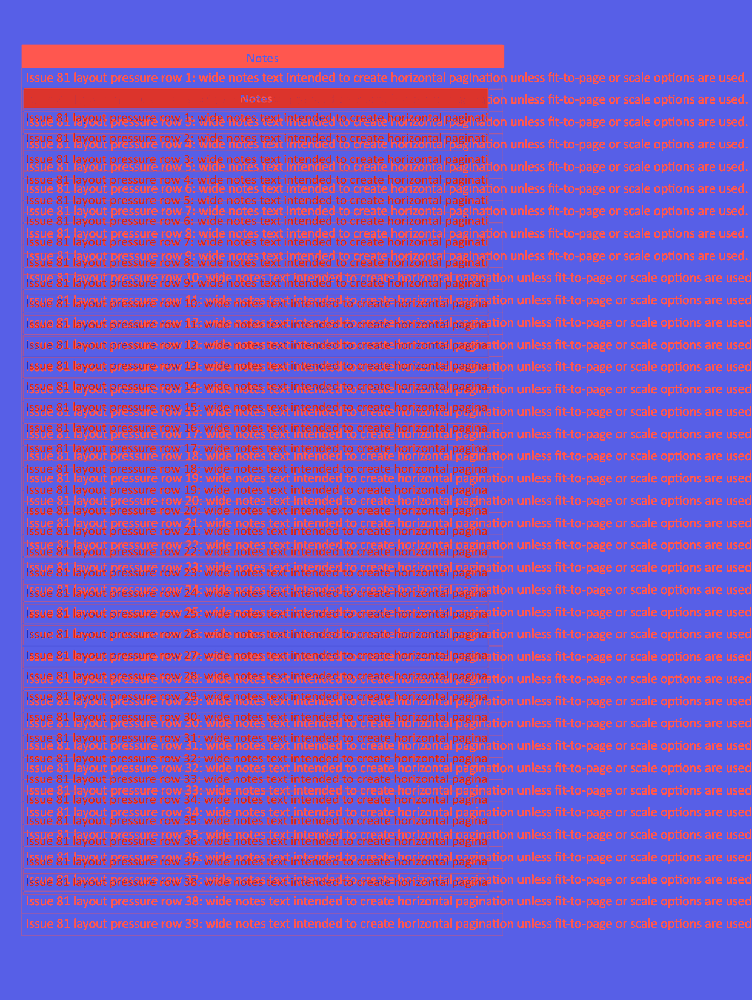</td>
  <td>changed: 603518 px (29.47%)<br>bbox: [35, 73, 1240, 1545]<br>mean abs RGB: 37.8769<br>RMSE RGB: 84.1373<br>threshold: 12, gain: 5.0</td>
</tr>
<tr>
  <td><b>XlsxIssue81_LayoutOptions</b><br>Page 10</td>
  <td>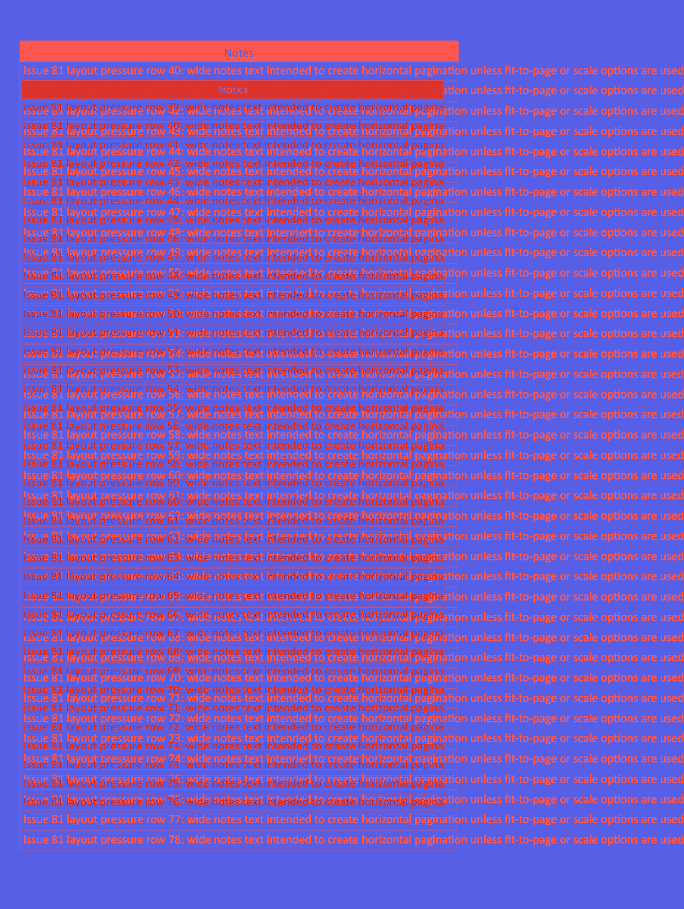</td>
  <td>changed: 604727 px (29.53%)<br>bbox: [35, 73, 1240, 1545]<br>mean abs RGB: 37.9526<br>RMSE RGB: 84.205<br>threshold: 12, gain: 5.0</td>
</tr>
<tr>
  <td><b>XlsxIssue81_LayoutOptions</b><br>Page 11</td>
  <td>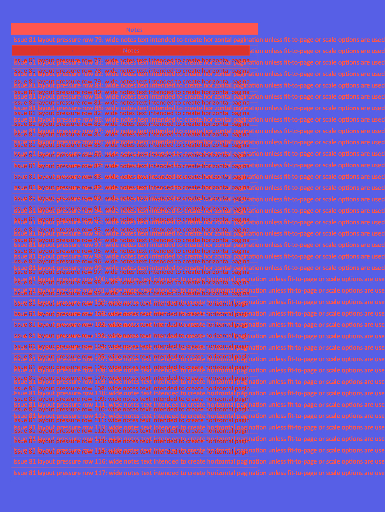</td>
  <td>changed: 604269 px (29.51%)<br>bbox: [35, 73, 1240, 1545]<br>mean abs RGB: 37.951<br>RMSE RGB: 84.2228<br>threshold: 12, gain: 5.0</td>
</tr>
<tr>
  <td><b>XlsxIssue81_LayoutOptions</b><br>Page 12</td>
  <td></td>
  <td>changed: 116636 px (5.70%)<br>bbox: [35, 73, 1240, 386]<br>mean abs RGB: 7.5099<br>RMSE RGB: 36.429<br>threshold: 12, gain: 5.0</td>
</tr>
<tr>
  <td><b>XlsxIssue81_LayoutOptions</b><br>Page 13</td>
  <td>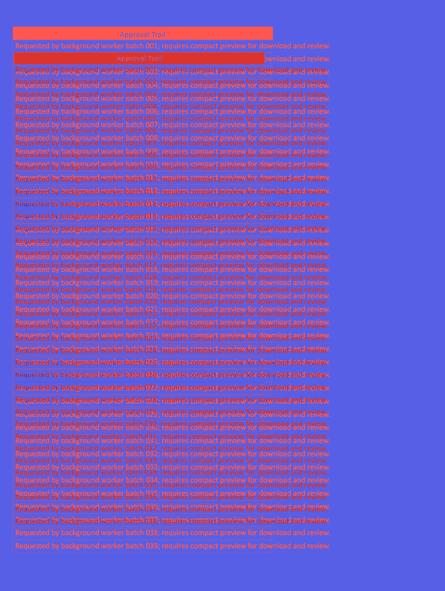</td>
  <td>changed: 533758 px (26.07%)<br>bbox: [35, 73, 920, 1545]<br>mean abs RGB: 33.5426<br>RMSE RGB: 79.1798<br>threshold: 12, gain: 5.0</td>
</tr>
<tr>
  <td><b>XlsxIssue81_LayoutOptions</b><br>Page 14</td>
  <td></td>
  <td>changed: 533764 px (26.07%)<br>bbox: [35, 73, 920, 1545]<br>mean abs RGB: 33.54<br>RMSE RGB: 79.1746<br>threshold: 12, gain: 5.0</td>
</tr>
<tr>
  <td><b>XlsxIssue81_LayoutOptions</b><br>Page 15</td>
  <td>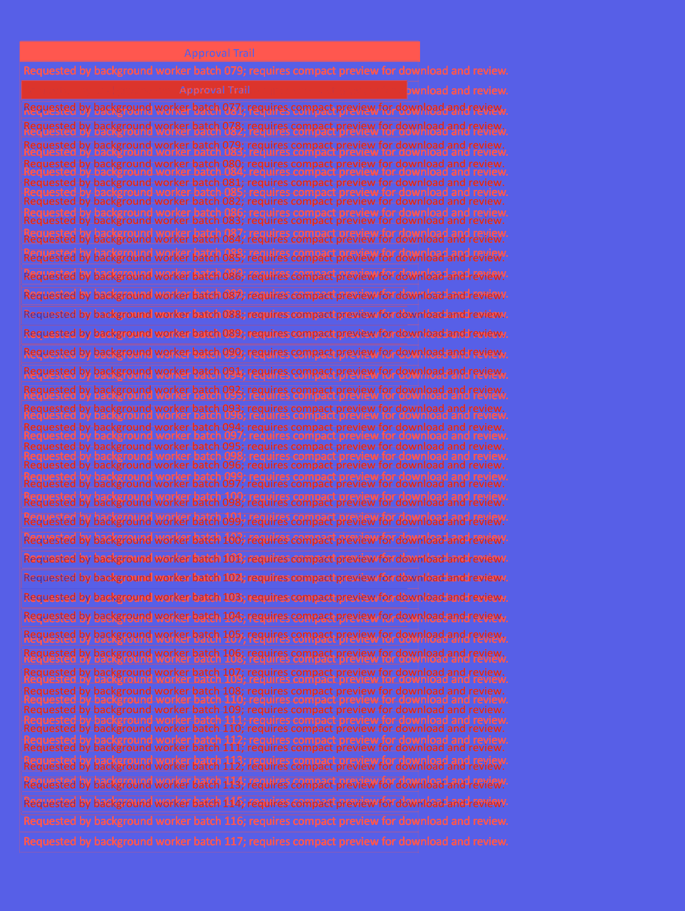</td>
  <td>changed: 533496 px (26.05%)<br>bbox: [35, 73, 920, 1545]<br>mean abs RGB: 33.523<br>RMSE RGB: 79.156<br>threshold: 12, gain: 5.0</td>
</tr>
<tr>
  <td><b>XlsxIssue82_5mb</b><br>Page 1</td>
  <td>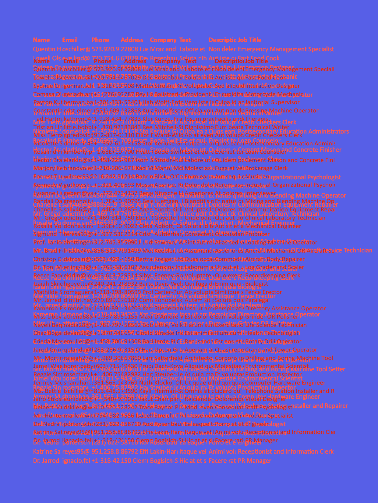</td>
  <td>changed: 467730 px (22.84%)<br>bbox: [108, 122, 1222, 1523]<br>mean abs RGB: 34.2896<br>RMSE RGB: 81.5064<br>threshold: 12, gain: 5.0</td>
</tr>
<tr>
  <td><b>XlsxIssue82_5mb</b><br>Page 2</td>
  <td>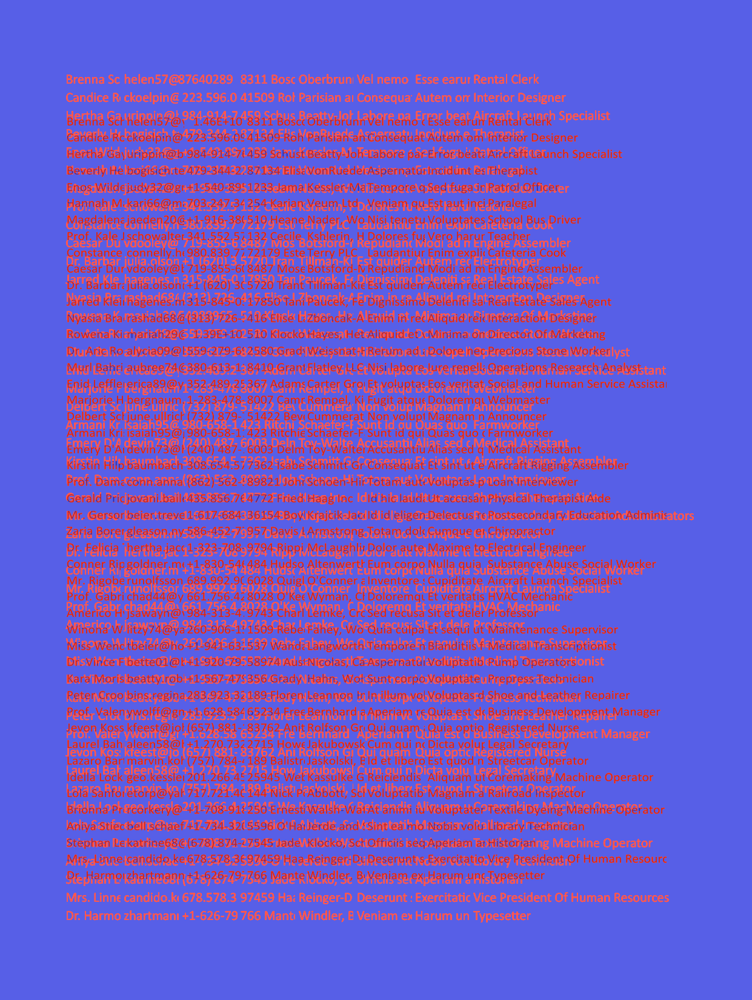</td>
  <td>changed: 454504 px (22.20%)<br>bbox: [108, 122, 1145, 1523]<br>mean abs RGB: 33.1812<br>RMSE RGB: 80.0374<br>threshold: 12, gain: 5.0</td>
</tr>
<tr>
  <td><b>XlsxIssue82_5mb</b><br>Page 3</td>
  <td>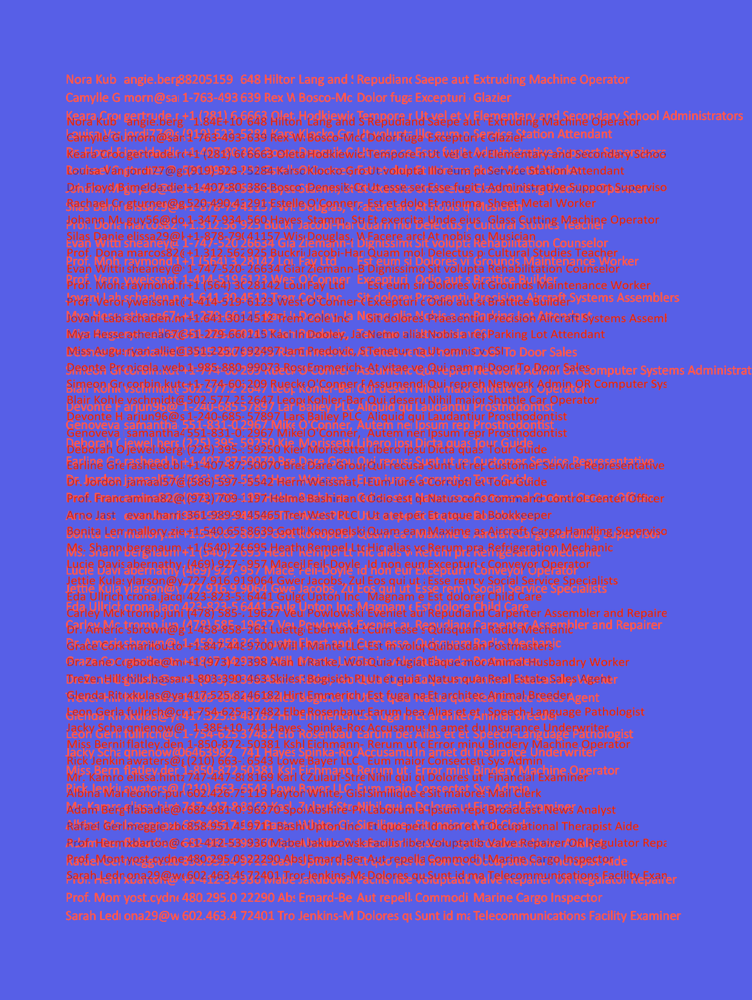</td>
  <td>changed: 465911 px (22.75%)<br>bbox: [108, 122, 1240, 1523]<br>mean abs RGB: 34.0582<br>RMSE RGB: 81.124<br>threshold: 12, gain: 5.0</td>
</tr>
<tr>
  <td><b>XlsxIssue82_5mb</b><br>Page 4</td>
  <td>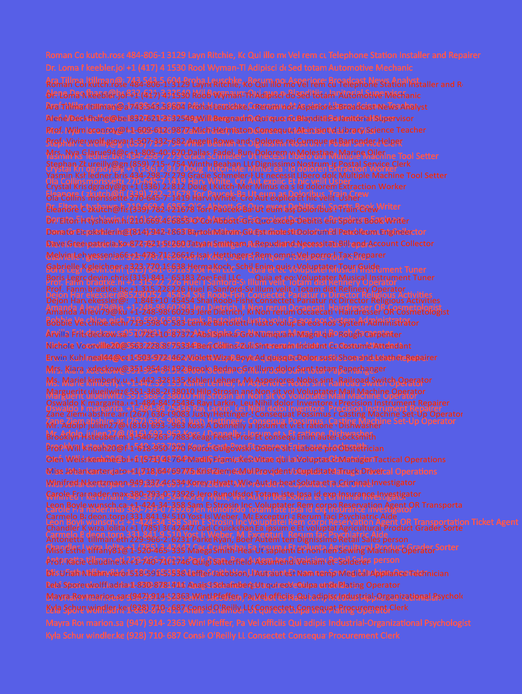</td>
  <td>changed: 460777 px (22.50%)<br>bbox: [108, 122, 1233, 1523]<br>mean abs RGB: 33.6906<br>RMSE RGB: 80.6938<br>threshold: 12, gain: 5.0</td>
</tr>
<tr>
  <td><b>XlsxIssue82_5mb</b><br>Page 5</td>
  <td>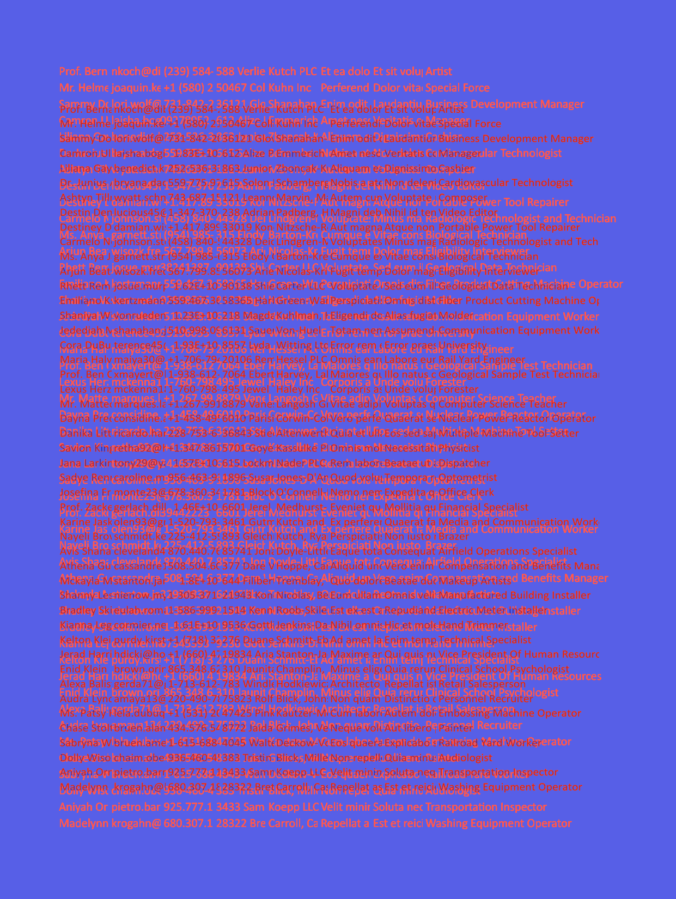</td>
  <td>changed: 460561 px (22.49%)<br>bbox: [108, 122, 1144, 1523]<br>mean abs RGB: 33.728<br>RMSE RGB: 80.7512<br>threshold: 12, gain: 5.0</td>
</tr>
<tr>
  <td><b>XlsxIssue82_5mb</b><br>Page 6</td>
  <td>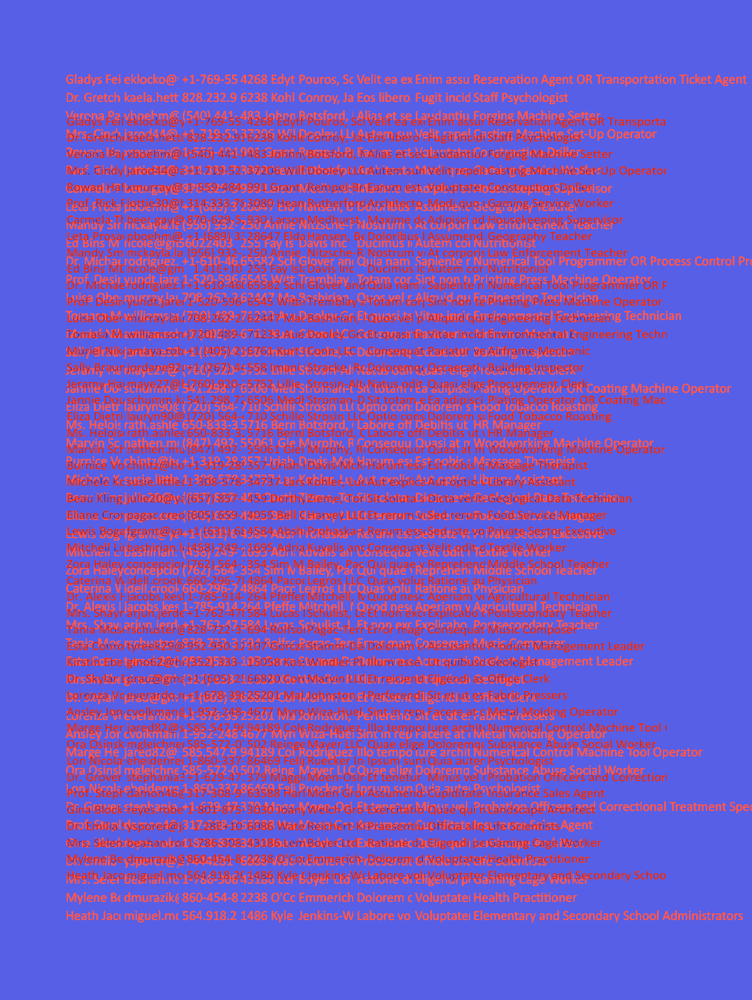</td>
  <td>changed: 474827 px (23.19%)<br>bbox: [108, 122, 1241, 1523]<br>mean abs RGB: 34.7897<br>RMSE RGB: 82.0342<br>threshold: 12, gain: 5.0</td>
</tr>
<tr>
  <td><b>XlsxIssue82_5mb</b><br>Page 7</td>
  <td>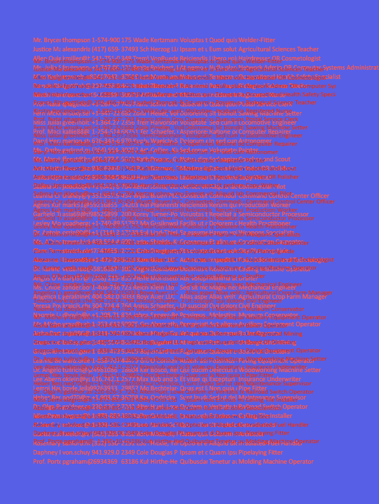</td>
  <td>changed: 462243 px (22.57%)<br>bbox: [108, 122, 1240, 1523]<br>mean abs RGB: 33.7898<br>RMSE RGB: 80.7898<br>threshold: 12, gain: 5.0</td>
</tr>
<tr>
  <td><b>XlsxIssue82_5mb</b><br>Page 8</td>
  <td>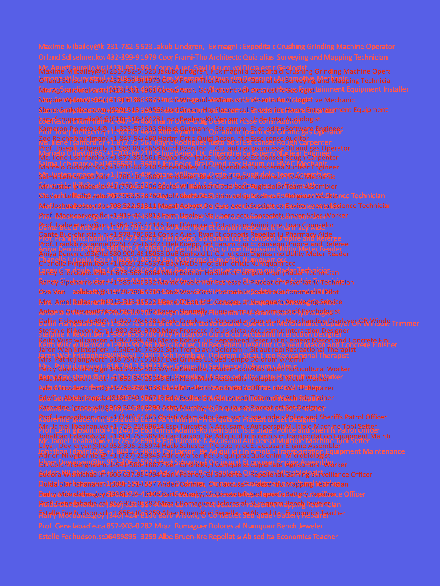</td>
  <td>changed: 456095 px (22.27%)<br>bbox: [108, 122, 1183, 1522]<br>mean abs RGB: 33.369<br>RMSE RGB: 80.3256<br>threshold: 12, gain: 5.0</td>
</tr>
<tr>
  <td><b>XlsxIssue82_5mb</b><br>Page 9</td>
  <td>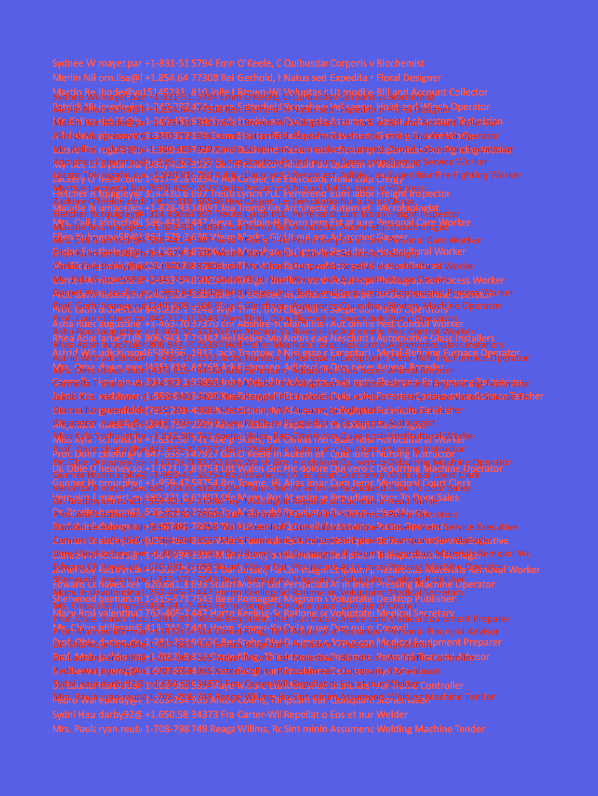</td>
  <td>changed: 456792 px (22.31%)<br>bbox: [108, 122, 1129, 1523]<br>mean abs RGB: 33.3972<br>RMSE RGB: 80.3249<br>threshold: 12, gain: 5.0</td>
</tr>
<tr>
  <td><b>XlsxIssue82_5mb</b><br>Page 10</td>
  <td>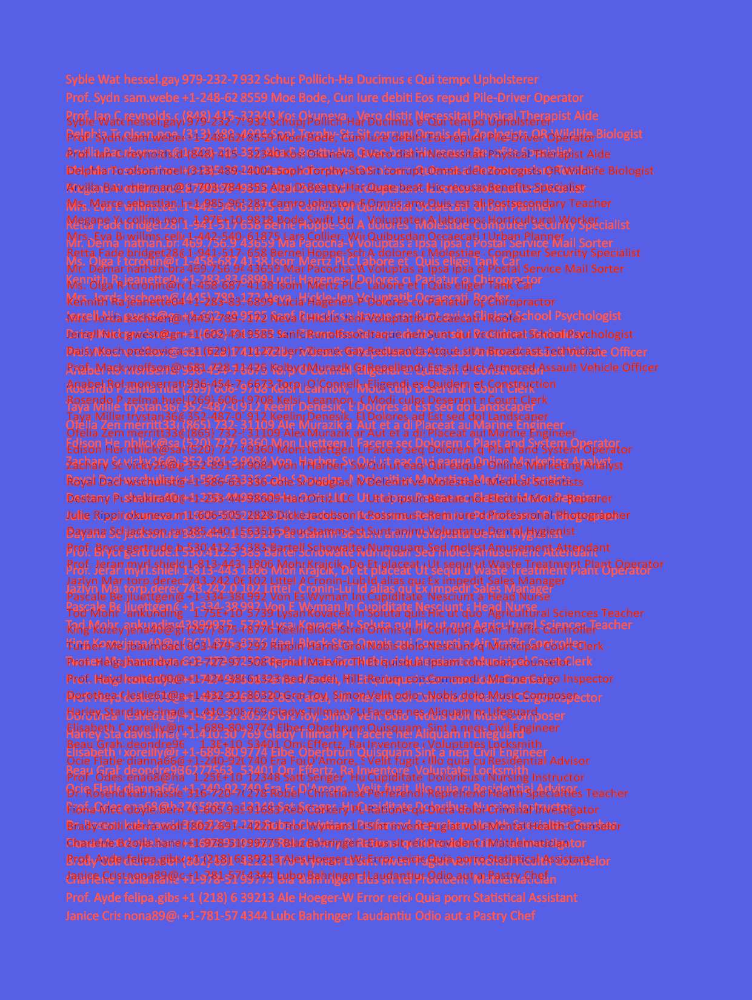</td>
  <td>changed: 451709 px (22.06%)<br>bbox: [108, 122, 1096, 1523]<br>mean abs RGB: 33.0295<br>RMSE RGB: 79.9006<br>threshold: 12, gain: 5.0</td>
</tr>
<tr>
  <td><b>XlsxIssue82_5mb</b><br>Page 11</td>
  <td>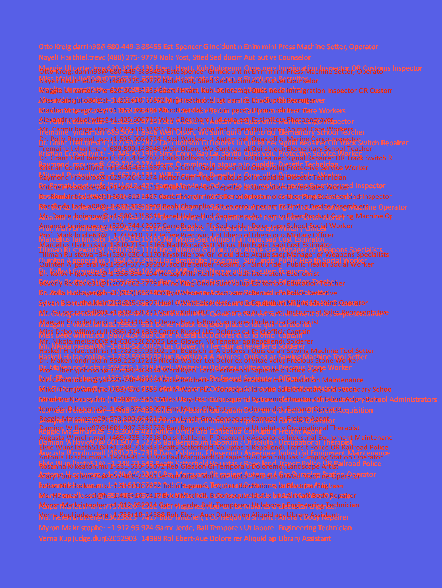</td>
  <td>changed: 467115 px (22.81%)<br>bbox: [108, 122, 1226, 1523]<br>mean abs RGB: 34.1639<br>RMSE RGB: 81.2587<br>threshold: 12, gain: 5.0</td>
</tr>
<tr>
  <td><b>XlsxIssue82_5mb</b><br>Page 12</td>
  <td>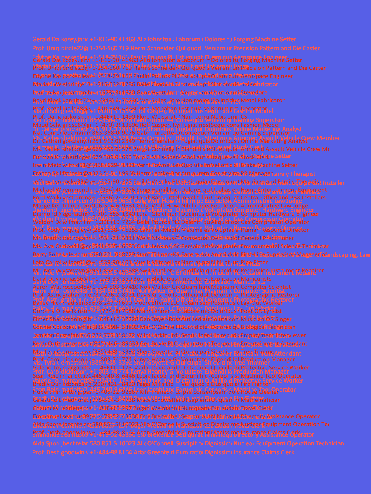</td>
  <td>changed: 463165 px (22.62%)<br>bbox: [108, 122, 1241, 1523]<br>mean abs RGB: 33.8892<br>RMSE RGB: 80.9411<br>threshold: 12, gain: 5.0</td>
</tr>
<tr>
  <td><b>XlsxIssue82_5mb</b><br>Page 13</td>
  <td>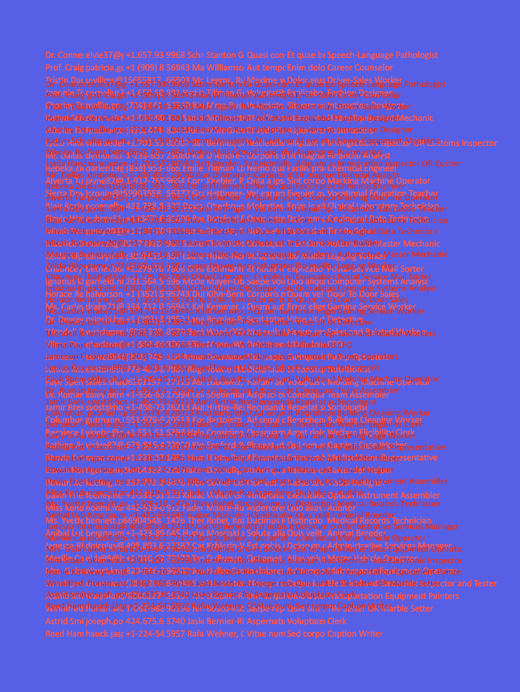</td>
  <td>changed: 465851 px (22.75%)<br>bbox: [108, 122, 1187, 1523]<br>mean abs RGB: 33.9821<br>RMSE RGB: 81.012<br>threshold: 12, gain: 5.0</td>
</tr>
<tr>
  <td><b>XlsxIssue82_5mb</b><br>Page 14</td>
  <td></td>
  <td>changed: 456789 px (22.31%)<br>bbox: [108, 122, 1241, 1523]<br>mean abs RGB: 33.323<br>RMSE RGB: 80.2318<br>threshold: 12, gain: 5.0</td>
</tr>
<tr>
  <td><b>XlsxIssue82_5mb</b><br>Page 15</td>
  <td></td>
  <td>changed: 465547 px (22.74%)<br>bbox: [108, 122, 1222, 1523]<br>mean abs RGB: 34.0295<br>RMSE RGB: 81.1064<br>threshold: 12, gain: 5.0</td>
</tr>
<tr>
  <td><b>XlsxIssue82_SampleTestData5mb</b><br>Page 1</td>
  <td></td>
  <td>changed: 432033 px (19.85%)<br>bbox: [119, 157, 1241, 1599]<br>mean abs RGB: 32.518<br>RMSE RGB: 81.6347<br>threshold: 12, gain: 5.0</td>
</tr>
<tr>
  <td><b>XlsxIssue82_SampleTestData5mb</b><br>Page 2</td>
  <td></td>
  <td>changed: 441181 px (20.27%)<br>bbox: [182, 157, 1241, 1600]<br>mean abs RGB: 33.1487<br>RMSE RGB: 82.3746<br>threshold: 12, gain: 5.0</td>
</tr>
<tr>
  <td><b>XlsxIssue82_SampleTestData5mb</b><br>Page 3</td>
  <td></td>
  <td>changed: 447788 px (20.57%)<br>bbox: [172, 157, 1241, 1599]<br>mean abs RGB: 33.6999<br>RMSE RGB: 83.1457<br>threshold: 12, gain: 5.0</td>
</tr>
<tr>
  <td><b>XlsxIssue82_SampleTestData5mb</b><br>Page 4</td>
  <td></td>
  <td>changed: 451199 px (20.73%)<br>bbox: [172, 157, 1241, 1600]<br>mean abs RGB: 33.9513<br>RMSE RGB: 83.448<br>threshold: 12, gain: 5.0</td>
</tr>
<tr>
  <td><b>XlsxIssue82_SampleTestData5mb</b><br>Page 5</td>
  <td></td>
  <td>changed: 456816 px (20.99%)<br>bbox: [171, 157, 1241, 1600]<br>mean abs RGB: 34.415<br>RMSE RGB: 84.0442<br>threshold: 12, gain: 5.0</td>
</tr>
<tr>
  <td><b>XlsxIssue82_SampleTestData5mb</b><br>Page 6</td>
  <td></td>
  <td>changed: 455483 px (20.93%)<br>bbox: [171, 157, 1241, 1600]<br>mean abs RGB: 34.252<br>RMSE RGB: 83.7777<br>threshold: 12, gain: 5.0</td>
</tr>
<tr>
  <td><b>XlsxIssue82_SampleTestData5mb</b><br>Page 7</td>
  <td></td>
  <td>changed: 454333 px (20.87%)<br>bbox: [171, 157, 1241, 1600]<br>mean abs RGB: 34.15<br>RMSE RGB: 83.6377<br>threshold: 12, gain: 5.0</td>
</tr>
<tr>
  <td><b>XlsxIssue82_SampleTestData5mb</b><br>Page 8</td>
  <td></td>
  <td>changed: 457503 px (21.02%)<br>bbox: [171, 157, 1241, 1600]<br>mean abs RGB: 34.3154<br>RMSE RGB: 83.8059<br>threshold: 12, gain: 5.0</td>
</tr>
<tr>
  <td><b>XlsxIssue82_SampleTestData5mb</b><br>Page 9</td>
  <td></td>
  <td>changed: 456276 px (20.96%)<br>bbox: [170, 157, 1241, 1600]<br>mean abs RGB: 34.3452<br>RMSE RGB: 83.9033<br>threshold: 12, gain: 5.0</td>
</tr>
<tr>
  <td><b>XlsxIssue82_SampleTestData5mb</b><br>Page 10</td>
  <td></td>
  <td>changed: 451477 px (20.74%)<br>bbox: [170, 157, 1241, 1600]<br>mean abs RGB: 33.977<br>RMSE RGB: 83.3928<br>threshold: 12, gain: 5.0</td>
</tr>
<tr>
  <td><b>XlsxIssue82_SampleTestData5mb</b><br>Page 11</td>
  <td></td>
  <td>changed: 457390 px (21.01%)<br>bbox: [170, 157, 1241, 1598]<br>mean abs RGB: 34.3489<br>RMSE RGB: 83.8695<br>threshold: 12, gain: 5.0</td>
</tr>
<tr>
  <td><b>XlsxIssue82_SampleTestData5mb</b><br>Page 12</td>
  <td></td>
  <td>changed: 458993 px (21.09%)<br>bbox: [171, 157, 1241, 1598]<br>mean abs RGB: 34.3794<br>RMSE RGB: 83.8447<br>threshold: 12, gain: 5.0</td>
</tr>
<tr>
  <td><b>XlsxIssue82_SampleTestData5mb</b><br>Page 13</td>
  <td></td>
  <td>changed: 459398 px (21.11%)<br>bbox: [171, 157, 1241, 1598]<br>mean abs RGB: 34.4154<br>RMSE RGB: 83.9025<br>threshold: 12, gain: 5.0</td>
</tr>
<tr>
  <td><b>XlsxIssue82_SampleTestData5mb</b><br>Page 14</td>
  <td></td>
  <td>changed: 456752 px (20.98%)<br>bbox: [171, 157, 1241, 1599]<br>mean abs RGB: 34.3786<br>RMSE RGB: 83.9408<br>threshold: 12, gain: 5.0</td>
</tr>
<tr>
  <td><b>XlsxIssue82_SampleTestData5mb</b><br>Page 15</td>
  <td></td>
  <td>changed: 456650 px (20.98%)<br>bbox: [171, 157, 1241, 1599]<br>mean abs RGB: 34.3504<br>RMSE RGB: 83.9074<br>threshold: 12, gain: 5.0</td>
</tr>
<tr>
  <td><b>XlsxIssue82_WideTable</b><br>Page 1</td>
  <td></td>
  <td>changed: 539181 px (26.33%)<br>bbox: [51, 71, 1517, 1147]<br>mean abs RGB: 28.0124<br>RMSE RGB: 69.8848<br>threshold: 12, gain: 5.0</td>
</tr>
<tr>
  <td><b>XlsxIssue82_WideTable</b><br>Page 2</td>
  <td></td>
  <td>changed: 532944 px (26.03%)<br>bbox: [51, 71, 1517, 1147]<br>mean abs RGB: 28.0639<br>RMSE RGB: 70.0123<br>threshold: 12, gain: 5.0</td>
</tr>
<tr>
  <td><b>XlsxIssue82_WideTable</b><br>Page 3</td>
  <td></td>
  <td>changed: 540324 px (26.39%)<br>bbox: [51, 71, 1517, 1147]<br>mean abs RGB: 28.094<br>RMSE RGB: 69.9964<br>threshold: 12, gain: 5.0</td>
</tr>
<tr>
  <td><b>XlsxIssue82_WideTable</b><br>Page 4</td>
  <td></td>
  <td>changed: 220203 px (10.75%)<br>bbox: [51, 71, 1517, 550]<br>mean abs RGB: 11.785<br>RMSE RGB: 44.7725<br>threshold: 12, gain: 5.0</td>
</tr>
<tr>
  <td><b>XlsxIssue82_WideTable</b><br>Page 5</td>
  <td></td>
  <td>changed: 507797 px (24.80%)<br>bbox: [51, 71, 1398, 1146]<br>mean abs RGB: 26.8577<br>RMSE RGB: 68.4358<br>threshold: 12, gain: 5.0</td>
</tr>
<tr>
  <td><b>XlsxIssue82_WideTable</b><br>Page 6</td>
  <td></td>
  <td>changed: 502379 px (24.53%)<br>bbox: [51, 71, 1398, 1146]<br>mean abs RGB: 26.9305<br>RMSE RGB: 68.5766<br>threshold: 12, gain: 5.0</td>
</tr>
<tr>
  <td><b>XlsxIssue82_WideTable</b><br>Page 7</td>
  <td></td>
  <td>changed: 510246 px (24.92%)<br>bbox: [51, 71, 1398, 1146]<br>mean abs RGB: 27.0084<br>RMSE RGB: 68.6201<br>threshold: 12, gain: 5.0</td>
</tr>
<tr>
  <td><b>XlsxIssue82_WideTable</b><br>Page 8</td>
  <td></td>
  <td>changed: 209126 px (10.21%)<br>bbox: [51, 71, 1398, 550]<br>mean abs RGB: 11.4924<br>RMSE RGB: 44.3795<br>threshold: 12, gain: 5.0</td>
</tr>
<tr>
  <td><b>XlsxIssue82_WideTable</b><br>Page 9</td>
  <td></td>
  <td>changed: 382590 px (18.68%)<br>bbox: [51, 71, 932, 1146]<br>mean abs RGB: 24.7622<br>RMSE RGB: 68.068<br>threshold: 12, gain: 5.0</td>
</tr>
<tr>
  <td><b>XlsxIssue82_WideTable</b><br>Page 10</td>
  <td></td>
  <td>changed: 381932 px (18.65%)<br>bbox: [51, 71, 932, 1146]<br>mean abs RGB: 24.8435<br>RMSE RGB: 68.2158<br>threshold: 12, gain: 5.0</td>
</tr>
<tr>
  <td><b>XlsxIssue82_WideTable</b><br>Page 11</td>
  <td></td>
  <td>changed: 384842 px (18.79%)<br>bbox: [51, 71, 944, 1146]<br>mean abs RGB: 24.9016<br>RMSE RGB: 68.2822<br>threshold: 12, gain: 5.0</td>
</tr>
<tr>
  <td><b>XlsxIssue82_WideTable</b><br>Page 12</td>
  <td></td>
  <td>changed: 154105 px (7.53%)<br>bbox: [51, 71, 944, 550]<br>mean abs RGB: 10.0243<br>RMSE RGB: 43.2174<br>threshold: 12, gain: 5.0</td>
</tr>
<tr>
  <td><b>XlsxIssue82_WideTable</b><br>Page 13</td>
  <td></td>
  <td>changed: 263677 px (12.88%)<br>bbox: [60, 82, 1019, 1016]<br>mean abs RGB: 19.809<br>RMSE RGB: 62.3815<br>threshold: 12, gain: 5.0</td>
</tr>
</table>

## Visual Comparison

Scores compare python MiniPdf against Microsoft 365 Excel Reference. LibreOffice is an auxiliary rendering and does not affect scores.

<table>
<tr><th>python MiniPdf</th><th>Microsoft 365 Excel Reference</th><th>LibreOffice</th></tr>
<tr>
  <td><b>Academic Achievement Summary Table<br><small>format: xlsx | case: Academic Achievement Summary Table | scope: python-issue-xlsx</small></b></td>
  <td colspan="2">Academic Achievement Summary Table <span style="color:#3fb950">⬤</span> 93.7%</td>
</tr>
<tr>
  <td></td>
  <td></td>
  <td></td>
</tr>
<tr>
  <td></td>
  <td></td>
  <td></td>
</tr>
<tr>
  <td><b>AcademicAchievement_temp<br><small>format: xlsx | case: AcademicAchievement_temp | scope: python-issue-xlsx</small></b></td>
  <td colspan="2">AcademicAchievement_temp <span style="color:#3fb950">⬤</span> 93.7%</td>
</tr>
<tr>
  <td></td>
  <td></td>
  <td></td>
</tr>
<tr>
  <td></td>
  <td></td>
  <td></td>
</tr>
<tr>
  <td><b>Business expense budget1<br><small>format: xlsx | case: Business expense budget1 | scope: python-issue-xlsx</small></b></td>
  <td colspan="2">Business expense budget1 <span style="color:#3fb950">⬤</span> 94.6%</td>
</tr>
<tr>
  <td></td>
  <td></td>
  <td></td>
</tr>
<tr>
  <td></td>
  <td></td>
  <td></td>
</tr>
<tr>
  <td></td>
  <td></td>
  <td></td>
</tr>
<tr>
  <td></td>
  <td></td>
  <td></td>
</tr>
<tr>
  <td><b>Business expenses budget2<br><small>format: xlsx | case: Business expenses budget2 | scope: python-issue-xlsx</small></b></td>
  <td colspan="2">Business expenses budget2 <span style="color:#f85149">⬤</span> 58.1%</td>
</tr>
<tr>
  <td></td>
  <td></td>
  <td></td>
</tr>
<tr>
  <td></td>
  <td></td>
  <td></td>
</tr>
<tr>
  <td></td>
  <td></td>
  <td></td>
</tr>
<tr>
  <td></td>
  <td></td>
  <td></td>
</tr>
<tr>
  <td></td>
  <td><i>missing</i></td>
  <td><i>missing</i></td>
</tr>
<tr>
  <td></td>
  <td><i>missing</i></td>
  <td><i>missing</i></td>
</tr>
<tr>
  <td></td>
  <td><i>missing</i></td>
  <td><i>missing</i></td>
</tr>
<tr>
  <td></td>
  <td><i>missing</i></td>
  <td><i>missing</i></td>
</tr>
<tr>
  <td><b>Business plan checklist with SWOT analysis1<br><small>format: xlsx | case: Business plan checklist with SWOT analysis1 | scope: python-issue-xlsx</small></b></td>
  <td colspan="2">Business plan checklist with SWOT analysis1 <span style="color:#f85149">⬤</span> 58.7%</td>
</tr>
<tr>
  <td></td>
  <td></td>
  <td></td>
</tr>
<tr>
  <td></td>
  <td><i>missing</i></td>
  <td><i>missing</i></td>
</tr>
<tr>
  <td><b>Event budget1<br><small>format: xlsx | case: Event budget1 | scope: python-issue-xlsx</small></b></td>
  <td colspan="2">Event budget1 <span style="color:#f85149">⬤</span> 69.7%</td>
</tr>
<tr>
  <td></td>
  <td></td>
  <td></td>
</tr>
<tr>
  <td></td>
  <td></td>
  <td></td>
</tr>
<tr>
  <td></td>
  <td></td>
  <td></td>
</tr>
<tr>
  <td></td>
  <td></td>
  <td></td>
</tr>
<tr>
  <td><i>missing</i></td>
  <td></td>
  <td></td>
</tr>
<tr>
  <td><b>Expense report basic1<br><small>format: xlsx | case: Expense report basic1 | scope: python-issue-xlsx</small></b></td>
  <td colspan="2">Expense report basic1 <span style="color:#3fb950">⬤</span> 94.8%</td>
</tr>
<tr>
  <td></td>
  <td></td>
  <td></td>
</tr>
<tr>
  <td><b>Grocery list1<br><small>format: xlsx | case: Grocery list1 | scope: python-issue-xlsx</small></b></td>
  <td colspan="2">Grocery list1 <span style="color:#d29922">⬤</span> 87.2%</td>
</tr>
<tr>
  <td></td>
  <td></td>
  <td></td>
</tr>
<tr>
  <td><b>Issue202609031340<br><small>format: xlsx | case: Issue202609031340 | scope: python-issue-xlsx</small></b></td>
  <td colspan="2">Issue202609031340 <span style="color:#3fb950">⬤</span> 95.9%</td>
</tr>
<tr>
  <td></td>
  <td></td>
  <td></td>
</tr>
<tr>
  <td></td>
  <td></td>
  <td></td>
</tr>
<tr>
  <td></td>
  <td></td>
  <td></td>
</tr>
<tr>
  <td></td>
  <td></td>
  <td></td>
</tr>
<tr>
  <td><b>payroll-calculator_f<br><small>format: xlsx | case: payroll-calculator_f | scope: python-issue-xlsx</small></b></td>
  <td colspan="2">payroll-calculator_f <span style="color:#f85149">⬤</span> 62.7%</td>
</tr>
<tr>
  <td></td>
  <td></td>
  <td></td>
</tr>
<tr>
  <td></td>
  <td></td>
  <td></td>
</tr>
<tr>
  <td></td>
  <td></td>
  <td></td>
</tr>
<tr>
  <td></td>
  <td></td>
  <td></td>
</tr>
<tr>
  <td></td>
  <td></td>
  <td></td>
</tr>
<tr>
  <td></td>
  <td></td>
  <td></td>
</tr>
<tr>
  <td></td>
  <td></td>
  <td></td>
</tr>
<tr>
  <td></td>
  <td></td>
  <td></td>
</tr>
<tr>
  <td></td>
  <td></td>
  <td></td>
</tr>
<tr>
  <td></td>
  <td></td>
  <td></td>
</tr>
<tr>
  <td></td>
  <td></td>
  <td></td>
</tr>
<tr>
  <td></td>
  <td></td>
  <td></td>
</tr>
<tr>
  <td></td>
  <td></td>
  <td></td>
</tr>
<tr>
  <td></td>
  <td></td>
  <td></td>
</tr>
<tr>
  <td></td>
  <td></td>
  <td></td>
</tr>
<tr>
  <td><b>PO_anonymized<br><small>format: xlsx | case: PO_anonymized | scope: python-issue-xlsx</small></b></td>
  <td colspan="2">PO_anonymized <span style="color:#3fb950">⬤</span> 97.9%</td>
</tr>
<tr>
  <td></td>
  <td></td>
  <td></td>
</tr>
<tr>
  <td></td>
  <td></td>
  <td></td>
</tr>
<tr>
  <td></td>
  <td></td>
  <td></td>
</tr>
<tr>
  <td></td>
  <td></td>
  <td></td>
</tr>
<tr>
  <td></td>
  <td></td>
  <td></td>
</tr>
<tr>
  <td></td>
  <td></td>
  <td></td>
</tr>
<tr>
  <td></td>
  <td></td>
  <td></td>
</tr>
<tr>
  <td></td>
  <td></td>
  <td></td>
</tr>
<tr>
  <td></td>
  <td></td>
  <td><i>missing</i></td>
</tr>
<tr>
  <td><b>Simple invoice1<br><small>format: xlsx | case: Simple invoice1 | scope: python-issue-xlsx</small></b></td>
  <td colspan="2">Simple invoice1 <span style="color:#3fb950">⬤</span> 93.9%</td>
</tr>
<tr>
  <td></td>
  <td></td>
  <td></td>
</tr>
<tr>
  <td><b>Small business cash flow forecast1<br><small>format: xlsx | case: Small business cash flow forecast1 | scope: python-issue-xlsx</small></b></td>
  <td colspan="2">Small business cash flow forecast1 <span style="color:#f85149">⬤</span> 64.8%</td>
</tr>
<tr>
  <td></td>
  <td></td>
  <td></td>
</tr>
<tr>
  <td></td>
  <td></td>
  <td></td>
</tr>
<tr>
  <td></td>
  <td></td>
  <td></td>
</tr>
<tr>
  <td><i>missing</i></td>
  <td></td>
  <td></td>
</tr>
<tr>
  <td><i>missing</i></td>
  <td></td>
  <td></td>
</tr>
<tr>
  <td><b>Wedding_timeline_planner1_copy<br><small>format: xlsx | case: Wedding_timeline_planner1_copy | scope: python-issue-xlsx</small></b></td>
  <td colspan="2">Wedding_timeline_planner1_copy <span style="color:#f85149">⬤</span> 65.8%</td>
</tr>
<tr>
  <td></td>
  <td></td>
  <td></td>
</tr>
<tr>
  <td></td>
  <td></td>
  <td></td>
</tr>
<tr>
  <td></td>
  <td></td>
  <td></td>
</tr>
<tr>
  <td></td>
  <td></td>
  <td></td>
</tr>
<tr>
  <td><i>missing</i></td>
  <td></td>
  <td></td>
</tr>
<tr>
  <td><i>missing</i></td>
  <td></td>
  <td><i>missing</i></td>
</tr>
<tr>
  <td><i>missing</i></td>
  <td></td>
  <td><i>missing</i></td>
</tr>
<tr>
  <td><i>missing</i></td>
  <td></td>
  <td><i>missing</i></td>
</tr>
<tr>
  <td><b>Weekly schedule planner1<br><small>format: xlsx | case: Weekly schedule planner1 | scope: python-issue-xlsx</small></b></td>
  <td colspan="2">Weekly schedule planner1 <span style="color:#f85149">⬤</span> 60.8%</td>
</tr>
<tr>
  <td></td>
  <td></td>
  <td></td>
</tr>
<tr>
  <td></td>
  <td><i>missing</i></td>
  <td><i>missing</i></td>
</tr>
<tr>
  <td><b>XlsxIssue75<br><small>format: xlsx | case: XlsxIssue75 | scope: python-issue-xlsx</small></b></td>
  <td colspan="2">XlsxIssue75 <span style="color:#d29922">⬤</span> 88.5%</td>
</tr>
<tr>
  <td></td>
  <td></td>
  <td></td>
</tr>
<tr>
  <td></td>
  <td></td>
  <td></td>
</tr>
<tr>
  <td></td>
  <td></td>
  <td></td>
</tr>
<tr>
  <td></td>
  <td></td>
  <td></td>
</tr>
<tr>
  <td></td>
  <td></td>
  <td></td>
</tr>
<tr>
  <td></td>
  <td></td>
  <td></td>
</tr>
<tr>
  <td></td>
  <td></td>
  <td></td>
</tr>
<tr>
  <td></td>
  <td></td>
  <td></td>
</tr>
<tr>
  <td></td>
  <td></td>
  <td></td>
</tr>
<tr>
  <td></td>
  <td></td>
  <td></td>
</tr>
<tr>
  <td></td>
  <td></td>
  <td></td>
</tr>
<tr>
  <td></td>
  <td></td>
  <td></td>
</tr>
<tr>
  <td></td>
  <td></td>
  <td></td>
</tr>
<tr>
  <td></td>
  <td></td>
  <td></td>
</tr>
<tr>
  <td></td>
  <td></td>
  <td></td>
</tr>
<tr>
  <td><b>XlsxIssue77_MergedCellAlignment<br><small>format: xlsx | case: XlsxIssue77_MergedCellAlignment | scope: python-issue-xlsx</small></b></td>
  <td colspan="2">XlsxIssue77_MergedCellAlignment <span style="color:#3fb950">⬤</span> 97.5%</td>
</tr>
<tr>
  <td></td>
  <td></td>
  <td></td>
</tr>
<tr>
  <td></td>
  <td></td>
  <td></td>
</tr>
<tr>
  <td><b>XlsxIssue77_Template1<br><small>format: xlsx | case: XlsxIssue77_Template1 | scope: python-issue-xlsx</small></b></td>
  <td colspan="2">XlsxIssue77_Template1 <span style="color:#3fb950">⬤</span> 94.0%</td>
</tr>
<tr>
  <td></td>
  <td></td>
  <td></td>
</tr>
<tr>
  <td></td>
  <td></td>
  <td></td>
</tr>
<tr>
  <td></td>
  <td></td>
  <td></td>
</tr>
<tr>
  <td></td>
  <td></td>
  <td></td>
</tr>
<tr>
  <td></td>
  <td></td>
  <td></td>
</tr>
<tr>
  <td></td>
  <td></td>
  <td></td>
</tr>
<tr>
  <td><b>XlsxIssue77_Template2_Workaround<br><small>format: xlsx | case: XlsxIssue77_Template2_Workaround | scope: python-issue-xlsx</small></b></td>
  <td colspan="2">XlsxIssue77_Template2_Workaround <span style="color:#3fb950">⬤</span> 93.8%</td>
</tr>
<tr>
  <td></td>
  <td></td>
  <td></td>
</tr>
<tr>
  <td></td>
  <td></td>
  <td></td>
</tr>
<tr>
  <td></td>
  <td></td>
  <td></td>
</tr>
<tr>
  <td></td>
  <td></td>
  <td></td>
</tr>
<tr>
  <td></td>
  <td></td>
  <td></td>
</tr>
<tr>
  <td></td>
  <td></td>
  <td></td>
</tr>
<tr>
  <td><b>XlsxIssue81_LayoutOptions<br><small>format: xlsx | case: XlsxIssue81_LayoutOptions | scope: python-issue-xlsx</small></b></td>
  <td colspan="2">XlsxIssue81_LayoutOptions <span style="color:#d29922">⬤</span> 85.0%</td>
</tr>
<tr>
  <td></td>
  <td></td>
  <td></td>
</tr>
<tr>
  <td></td>
  <td></td>
  <td></td>
</tr>
<tr>
  <td></td>
  <td></td>
  <td></td>
</tr>
<tr>
  <td></td>
  <td></td>
  <td></td>
</tr>
<tr>
  <td></td>
  <td></td>
  <td></td>
</tr>
<tr>
  <td></td>
  <td></td>
  <td></td>
</tr>
<tr>
  <td></td>
  <td></td>
  <td></td>
</tr>
<tr>
  <td></td>
  <td></td>
  <td></td>
</tr>
<tr>
  <td></td>
  <td></td>
  <td></td>
</tr>
<tr>
  <td></td>
  <td></td>
  <td></td>
</tr>
<tr>
  <td></td>
  <td></td>
  <td></td>
</tr>
<tr>
  <td></td>
  <td></td>
  <td></td>
</tr>
<tr>
  <td></td>
  <td></td>
  <td></td>
</tr>
<tr>
  <td></td>
  <td></td>
  <td></td>
</tr>
<tr>
  <td></td>
  <td></td>
  <td></td>
</tr>
<tr>
  <td><b>XlsxIssue82_5mb<br><small>format: xlsx | case: XlsxIssue82_5mb | scope: python-issue-xlsx</small></b></td>
  <td colspan="2">XlsxIssue82_5mb <span style="color:#f85149">⬤</span> 60.1%</td>
</tr>
<tr>
  <td></td>
  <td></td>
  <td></td>
</tr>
<tr>
  <td></td>
  <td></td>
  <td></td>
</tr>
<tr>
  <td></td>
  <td></td>
  <td></td>
</tr>
<tr>
  <td></td>
  <td></td>
  <td></td>
</tr>
<tr>
  <td></td>
  <td></td>
  <td></td>
</tr>
<tr>
  <td></td>
  <td></td>
  <td></td>
</tr>
<tr>
  <td></td>
  <td></td>
  <td></td>
</tr>
<tr>
  <td></td>
  <td></td>
  <td></td>
</tr>
<tr>
  <td></td>
  <td></td>
  <td></td>
</tr>
<tr>
  <td></td>
  <td></td>
  <td></td>
</tr>
<tr>
  <td></td>
  <td></td>
  <td></td>
</tr>
<tr>
  <td></td>
  <td></td>
  <td></td>
</tr>
<tr>
  <td></td>
  <td></td>
  <td></td>
</tr>
<tr>
  <td></td>
  <td></td>
  <td></td>
</tr>
<tr>
  <td></td>
  <td></td>
  <td></td>
</tr>
<tr>
  <td><b>XlsxIssue82_SampleTestData5mb<br><small>format: xlsx | case: XlsxIssue82_SampleTestData5mb | scope: python-issue-xlsx</small></b></td>
  <td colspan="2">XlsxIssue82_SampleTestData5mb <span style="color:#f85149">⬤</span> 67.6%</td>
</tr>
<tr>
  <td></td>
  <td></td>
  <td></td>
</tr>
<tr>
  <td></td>
  <td></td>
  <td></td>
</tr>
<tr>
  <td></td>
  <td></td>
  <td></td>
</tr>
<tr>
  <td></td>
  <td></td>
  <td></td>
</tr>
<tr>
  <td></td>
  <td></td>
  <td></td>
</tr>
<tr>
  <td></td>
  <td></td>
  <td></td>
</tr>
<tr>
  <td></td>
  <td></td>
  <td></td>
</tr>
<tr>
  <td></td>
  <td></td>
  <td></td>
</tr>
<tr>
  <td></td>
  <td></td>
  <td></td>
</tr>
<tr>
  <td></td>
  <td></td>
  <td></td>
</tr>
<tr>
  <td></td>
  <td></td>
  <td></td>
</tr>
<tr>
  <td></td>
  <td></td>
  <td></td>
</tr>
<tr>
  <td></td>
  <td></td>
  <td></td>
</tr>
<tr>
  <td></td>
  <td></td>
  <td></td>
</tr>
<tr>
  <td></td>
  <td></td>
  <td></td>
</tr>
<tr>
  <td><b>XlsxIssue82_WideTable<br><small>format: xlsx | case: XlsxIssue82_WideTable | scope: python-issue-xlsx</small></b></td>
  <td colspan="2">XlsxIssue82_WideTable <span style="color:#3fb950">⬤</span> 91.7%</td>
</tr>
<tr>
  <td></td>
  <td></td>
  <td></td>
</tr>
<tr>
  <td></td>
  <td></td>
  <td></td>
</tr>
<tr>
  <td></td>
  <td></td>
  <td></td>
</tr>
<tr>
  <td></td>
  <td></td>
  <td></td>
</tr>
<tr>
  <td></td>
  <td></td>
  <td></td>
</tr>
<tr>
  <td></td>
  <td></td>
  <td></td>
</tr>
<tr>
  <td></td>
  <td></td>
  <td></td>
</tr>
<tr>
  <td></td>
  <td></td>
  <td></td>
</tr>
<tr>
  <td></td>
  <td></td>
  <td></td>
</tr>
<tr>
  <td></td>
  <td></td>
  <td></td>
</tr>
<tr>
  <td></td>
  <td></td>
  <td></td>
</tr>
<tr>
  <td></td>
  <td></td>
  <td></td>
</tr>
<tr>
  <td></td>
  <td></td>
  <td></td>
</tr>
<tr>
  <td><b>XlsxIssue152_ClusteredNonZeroBarChart<br><small>format: xlsx | case: XlsxIssue152_ClusteredNonZeroBarChart | scope: python-issue-xlsx</small></b></td>
  <td colspan="2">XlsxIssue152_ClusteredNonZeroBarChart N/A</td>
</tr>
<tr>
  <td colspan="3"><i>No images</i></td>
</tr>
</table>

## Detailed Results

### Academic Achievement Summary Table

- **Case Metadata:** format: xlsx | case: Academic Achievement Summary Table | scope: python-issue-xlsx
- **Source:** tests/Issue_Files/xlsx/Academic Achievement Summary Table.xlsx
- **Text Similarity:** 0.9121
- **Visual Average:** 0.9296
- **Overall Score:** 0.9367
- **Pages:** MiniPdf=2, Reference=2
- **File Size:** MiniPdf=246090 bytes, Reference=151877 bytes

<details><summary>Text Diff</summary>

```diff
--- minipdf/Academic Achievement Summary Table.pdf
+++ reference/Academic Achievement Summary Table.pdf
@@ -1,11 +1,11 @@
-附件 3

+附件3

 学术业绩汇总表

-报考岗位 ： 报考岗位代码 ： 考生姓名 ：

-博士论文题目 ： 博士论文研究方向 ：

+报考岗位： 报考岗位代码： 考生姓名：

+博士论文题目： 博士论文研究方向：

 公开发表的主要论文情况

 角色 转载刊物、转载字数及 是否为代表作

 序号 题目 刊物名称 核心期刊情况 刊号 发表时间

-（ 排名 ） 转载时间等 （ 指定 1 篇 ）

+（排名） 转载时间等 （指定1篇）

 1

 2

 3

@@ -19,29 +19,29 @@
 11

 12

 ---PAGE---

-公开出版的主要专 （ 译 ） 著、教材情况

+公开出版的主要专（译）著、教材情况

 角色 全书文 本人写 转载刊物、转载字数及

 序号 题目 出版社名称 出版号 出版时间 备注

-（ 排名 ） 字数 作量 转载时间等

+（排名） 字数 作量 转载时间等

 1

 2

 获批的决策咨询报告情况

-序号 题目 批示领导级别 获批时间 角色 （ 排名 ） 备注

+序号 题目 批示领导级别 获批时间 角色（排名） 备注

 1

 2

 3

 4

 承担的主要科研课题情况

 项目

-序号 课题名称 项目来源 课题编号 角色 （ 排名 ） 起止时间 成果鉴定 （ 评价 ） 备注

+序号 课题名称 项目来源 课题编号 角色（排名） 起止时间 成果鉴定（评价） 备注

 级别

 1

 2

 3

 4

-本人承诺以上情况属实 ， 并有相应证明。如有不实之处 ， 愿意承担相应责任。

-报名人员签名 ：

-日期 ： 年   月   日

-填表说明 ： 1. 请将各类学术成果按等级、层次及水平自高到低顺序填写。不加行、减行 ， 不加页、减页 ， 本表采用 A4 正反面打印。

-2. 核心期刊是指北京大学图书馆 “ 中文核心期刊 ” 、南京大学 “ 中文社会科学引文索引 （ CSSCI ） 来源期刊 ” （ 含扩展版、集刊 ） 、中国科学技术信息研究所

-“ 中国科技论文统计源期刊 ” 和科学引文索引 （ SCI ） 、社会科学引文索引 （ SSCI ） 。其中 ， 被 SCI 、 SSCI 收录的期刊要求进入所在学科领域 Q1 、 Q2 。
+本人承诺以上情况属实，并有相应证明。如有不实之处，愿意承担相应责任。

+报名人员签名：

+日期：    年   月   日

+填表说明：1.请将各类学术成果按等级、层次及水平自高到低顺序填写。不加行、减行，不加页、减页，本表采用A4正反面打印。

+2.核心期刊是指北京大学图书馆“中文核心期刊”、南京大学“中文社会科学引文索引（CSSCI）来源期刊”（含扩展版、集刊）、中国科学技术信息研究所

+“中国科技论文统计源期刊”和科学引文索引（SCI）、社会科学引文索引（SSCI）。其中，被SCI、SSCI收录的期刊要求进入所在学科领域Q1、Q2。
```
</details>

### AcademicAchievement_temp

- **Case Metadata:** format: xlsx | case: AcademicAchievement_temp | scope: python-issue-xlsx
- **Source:** tests/Issue_Files/xlsx/AcademicAchievement_temp.xlsx
- **Text Similarity:** 0.9121
- **Visual Average:** 0.9296
- **Overall Score:** 0.9367
- **Pages:** MiniPdf=2, Reference=2
- **File Size:** MiniPdf=246090 bytes, Reference=151877 bytes

<details><summary>Text Diff</summary>

```diff
--- minipdf/AcademicAchievement_temp.pdf
+++ reference/AcademicAchievement_temp.pdf
@@ -1,11 +1,11 @@
-附件 3

+附件3

 学术业绩汇总表

-报考岗位 ： 报考岗位代码 ： 考生姓名 ：

-博士论文题目 ： 博士论文研究方向 ：

+报考岗位： 报考岗位代码： 考生姓名：

+博士论文题目： 博士论文研究方向：

 公开发表的主要论文情况

 角色 转载刊物、转载字数及 是否为代表作

 序号 题目 刊物名称 核心期刊情况 刊号 发表时间

-（ 排名 ） 转载时间等 （ 指定 1 篇 ）

+（排名） 转载时间等 （指定1篇）

 1

 2

 3

@@ -19,29 +19,29 @@
 11

 12

 ---PAGE---

-公开出版的主要专 （ 译 ） 著、教材情况

+公开出版的主要专（译）著、教材情况

 角色 全书文 本人写 转载刊物、转载字数及

 序号 题目 出版社名称 出版号 出版时间 备注

-（ 排名 ） 字数 作量 转载时间等

+（排名） 字数 作量 转载时间等

 1

 2

 获批的决策咨询报告情况

-序号 题目 批示领导级别 获批时间 角色 （ 排名 ） 备注

+序号 题目 批示领导级别 获批时间 角色（排名） 备注

 1

 2

 3

 4

 承担的主要科研课题情况

 项目

-序号 课题名称 项目来源 课题编号 角色 （ 排名 ） 起止时间 成果鉴定 （ 评价 ） 备注

+序号 课题名称 项目来源 课题编号 角色（排名） 起止时间 成果鉴定（评价） 备注

 级别

 1

 2

 3

 4

-本人承诺以上情况属实 ， 并有相应证明。如有不实之处 ， 愿意承担相应责任。

-报名人员签名 ：

-日期 ： 年   月   日

-填表说明 ： 1. 请将各类学术成果按等级、层次及水平自高到低顺序填写。不加行、减行 ， 不加页、减页 ， 本表采用 A4 正反面打印。

-2. 核心期刊是指北京大学图书馆 “ 中文核心期刊 ” 、南京大学 “ 中文社会科学引文索引 （ CSSCI ） 来源期刊 ” （ 含扩展版、集刊 ） 、中国科学技术信息研究所

-“ 中国科技论文统计源期刊 ” 和科学引文索引 （ SCI ） 、社会科学引文索引 （ SSCI ） 。其中 ， 被 SCI 、 SSCI 收录的期刊要求进入所在学科领域 Q1 、 Q2 。
+本人承诺以上情况属实，并有相应证明。如有不实之处，愿意承担相应责任。

+报名人员签名：

+日期：    年   月   日

+填表说明：1.请将各类学术成果按等级、层次及水平自高到低顺序填写。不加行、减行，不加页、减页，本表采用A4正反面打印。

+2.核心期刊是指北京大学图书馆“中文核心期刊”、南京大学“中文社会科学引文索引（CSSCI）来源期刊”（含扩展版、集刊）、中国科学技术信息研究所

+“中国科技论文统计源期刊”和科学引文索引（SCI）、社会科学引文索引（SSCI）。其中，被SCI、SSCI收录的期刊要求进入所在学科领域Q1、Q2。
```
</details>

### Business expense budget1

- **Case Metadata:** format: xlsx | case: Business expense budget1 | scope: python-issue-xlsx
- **Source:** tests/Issue_Files/xlsx/Business expense budget1.xlsx
- **Text Similarity:** 0.9821
- **Visual Average:** 0.8821
- **Overall Score:** 0.9457
- **Pages:** MiniPdf=4, Reference=4
- **File Size:** MiniPdf=283740 bytes, Reference=159864 bytes

<details><summary>Text Diff</summary>

```diff
--- minipdf/Business expense budget1.pdf
+++ reference/Business expense budget1.pdf
@@ -40,6 +40,9 @@
 Marketing 24200 23750

 Travel & Entertainment 24700 22100

 Professional Services 24600 23400

+Budget vs Actual by Category

+Amount (\$)

+Category

 ---PAGE---

 Q2 ACTUAL VARIANCE

 45,800.00 1,000.00

@@ -69,4 +72,6 @@
 2,100.00 0.00

 12,600.00 1,200.00

 ---PAGE---

-121,600.00 6,350.00
+121,600.00 6,350.00

+Total Budget

+Total Actual
```
</details>

### Business expenses budget2

- **Case Metadata:** format: xlsx | case: Business expenses budget2 | scope: python-issue-xlsx
- **Source:** tests/Issue_Files/xlsx/Business expenses budget2.xlsx
- **Text Similarity:** 0.9917
- **Visual Average:** 0.2098
- **Overall Score:** 0.5806
- **Pages:** MiniPdf=8, Reference=4
- **File Size:** MiniPdf=1042461 bytes, Reference=376973 bytes

<details><summary>Text Diff</summary>

```diff
--- minipdf/Business expenses budget2.pdf
+++ reference/Business expenses budget2.pdf
@@ -25,8 +25,6 @@
 Travel costs $ 2,000.00 $ 2,000.00 $ 2,000.00 $ 2,000.00 $ 2,000.00 $ 2,000.00 $ 2,000.00 $ 2,000.00 $ 2,000.00 $ 2,000.00 $ 2,000.00 $ 2,000.00 $ 24,000.00

 MONTHLY TOTAL $ 131,420.00 $ 126,820.00 $ 126,820.00 $ 137,695.00 $ 129,695.00 $ 130,495.00 $ 134,695.00 $ 138,918.00 $ 135,918.00 $ 140,918.00 $ 136,218.00 $ 140,018.00 $ 1,609,630.00

 ---PAGE---

-

----PAGE---

 Market Financial Consulting

 ACTUAL EXPENSES

 January February March April May June July August September October November December Total

@@ -53,8 +51,6 @@
 Training classes $ 1,600.00 $ 2,400.00 $ 1,400.00 $ 1,600.00 $ 1,200.00 $ 2,800.00 $ 11,000.00

 Travel costs $ 1,200.00 $ 2,200.00 $ 1,400.00 $ 1,200.00 $ 800.00 $ 3,500.00 $ 10,300.00

 MONTHLY TOTAL $ 129,682.00 $ 127,804.00 $ 125,565.00 $ 137,394.00 $ 128,255.00 $ 134,239.00 $ - $ - $ - $ - $ - $ - $ 782,939.00

----PAGE---

-

 ---PAGE---

 Market Financial Consulting

 EXPENSE VARIANCES

@@ -84,18 +80,30 @@
 Travel costs $ 800.00 $ (200.00) $ 600.00 $ 800.00 $ 1,200.00 $ (1,500.00) $ 1,700.00

 MONTHLY VARIANCE $ 1,738.00 $ (984.00) $ 1,255.00 $ 301.00 $ 1,440.00 $ (3,744.00) $ - $ - $ - $ - $ - $ - $ 6.00

 ---PAGE---

-

----PAGE---

-.

 Market Financial Consulting

 EXPENSES ANALYSIS

 Analysis of data from January to June

 PLANNED vs ACTUAL EXPENSES MONTHLY EXPENSES

+Planned Actual Planned Actual

+January

+Employee costs

+February

+Office costs

+March

+April

+Marketing costs

+May

+Training / travel

+June

+July

 PLANNED ACTUAL

 CATEGORY VARIANCE VARIANCE %

 EXPENSES EXPENSES

+August

 Employee costs $ 657,225.00 $ 659,130.00 $ (1,905.00) -0.29%

+September

 Office costs $ 69,320.00 $ 69,350.00 $ (30.00) -0.04%

+October

 Marketing costs $ 32,400.00 $ 33,159.00 $ (759.00) -2.34%

-Training / travel $ 24,000.00 $ 21,300.00 $ 2,700.00 11.25%

----PAGE---
+November

+Training / travel $ 24,000.00 $ 21,300.00 $ 2,700.00 11.25% December
```
</details>

### Business plan checklist with SWOT analysis1

- **Case Metadata:** format: xlsx | case: Business plan checklist with SWOT analysis1 | scope: python-issue-xlsx
- **Source:** tests/Issue_Files/xlsx/Business plan checklist with SWOT analysis1.xlsx
- **Text Similarity:** 0.9202
- **Visual Average:** 0.2978
- **Overall Score:** 0.5872
- **Pages:** MiniPdf=2, Reference=1
- **File Size:** MiniPdf=212386 bytes, Reference=64252 bytes

<details><summary>Text Diff</summary>

```diff
--- minipdf/Business plan checklist with SWOT analysis1.pdf
+++ reference/Business plan checklist with SWOT analysis1.pdf
@@ -1,7 +1,7 @@
 Northwind Traders

 Business planning checklist

-Using the strength, weakness, opportunity, and threat (SWOT) analysis framework, develop a checklist of the key

-activities that need to be performed when preparing a formal business plan in the table, below.

+Using the strength, weakness, opportunity, and threat (SWOT) analysis framework, develop a checklist of the key activities

+that need to be performed when preparing a formal business plan in the table, below.

 Activity Owner Completion date

 Strengths: Define the company's current mission

 Luca Richter 1/9/2023

@@ -9,31 +9,29 @@
 Strengths: Identify market segments in which the

 company will participate by conducting primary and Dylan Williams 1/9/2023

 secondary market research.

-Strengths: Identify the company's value proposition

-and how it will differentiate itself within the Kristin Orav 1/16/2023

-marketplace.

-Weaknesses: Identify any barriers to market entry

-(for example, capital requirements, technical

+Strengths: Identify the company's value proposition and

+Kristin Orav 1/16/2023

+how it will differentiate itself within the marketplace.

+Weaknesses: Identify any barriers to market entry (for

+example, capital requirements, technical barriers, patents,

 Flora Berggren 1/6/2023

-barriers, patents, and process barriers) that the

-company needs to overcome.

+and process barriers) that the company needs to

+overcome.

 Weaknesses: Identify any risks inherent to the

-organization that need to be mitigated so that the Flora Berggren 1/6/2023

-company can realize the business plan.

-Opportunities: Identify areas where the current

-market is underserved that provide an opportunity Kristin Orav 1/6/2023

-for the company.

-Opportunities: Identify any key processes,

-intellectual capital, or other resources that the Ian Hansson 1/9/2023

-company can use to its advantage in the marketplace.

-Threats: Identify primary competitors, and then

-analyze competitor performance by using all available Gaurav Cheema 1/9/2023

-data and additional data that can be verified.

+organization that need to be mitigated so that the company Flora Berggren 1/6/2023

+can realize the business plan.

+Opportunities: Identify areas where the current market is

+Kristin Orav 1/6/2023

+underserved that provide an opportunity for the company.

+Opportunities: Identify any key processes, intellectual

+capital, or other resources that the company can use to its Ian Hansson 1/9/2023

+advantage in the marketplace.

+Threats: Identify primary competitors, and then analyze

+competitor performance by using all available data and Gaurav Cheema 1/9/2023

+additional data that can be verified.

 Threats: Identify secondary and potential future

 Chela Arapelli 1/16/2023

 competitors that might affect the business plan.

----PAGE---

-Activity Owner Com
... (217 more characters)

```
</details>

### Event budget1

- **Case Metadata:** format: xlsx | case: Event budget1 | scope: python-issue-xlsx
- **Source:** tests/Issue_Files/xlsx/Event budget1.xlsx
- **Text Similarity:** 0.9709
- **Visual Average:** 0.5219
- **Overall Score:** 0.6971
- **Pages:** MiniPdf=4, Reference=5
- **File Size:** MiniPdf=317665 bytes, Reference=121223 bytes

<details><summary>Text Diff</summary>

```diff
--- minipdf/Event budget1.pdf
+++ reference/Event budget1.pdf
@@ -1,16 +1,16 @@
 ABOUT THIS TEMPLATE

-Use this event budget workbook to track expenses incurred on and income earned from an event.

+Use this event budget workbook to track expenses incurred on and income earned from an

+event.

 Enter details in tables in expenses worksheet and income worksheet.

 Total expenses and total income are auto-calculated.

 Profit & loss summary and chart are auto-updated in profit-loss summary worksheet.

 Note:

-Additional instructions have been provided in column A in each worksheet. This text has been intentionally

-hidden. To remove text, select column A, then select DELETE.

-To learn more about tables, press SHIFT and then F10 within a table, select the TABLE option, and then select

-ALTERNATIVE TEXT

+Additional instructions have been provided in column A in each worksheet. This text has been

+intentionally hidden. To remove text, select column A, then select DELETE.

+To learn more about tables, press SHIFT and then F10 within a table, select the TABLE option, and

+then select ALTERNATIVE TEXT

 ---PAGE---

-Event budget

-EXPENSES

+Event budget EXPENSES

 Estimated Actual

 TOTAL EXPENSES

 $882.00 $333.00

@@ -39,8 +39,9 @@
 Fax services

 Total $12.00 $13.00

 ---PAGE---

-Event budget

-INCOME

+

+---PAGE---

+Event budget INCOME

 Estimated Actual

 TOTAL INCOME

 $1,936.00 $1,831.00

@@ -70,10 +71,15 @@
 Items @ $0.00 $0.00

 Total $0.00 $0.00

 ---PAGE---

-Event budget

-PROFIT

+Event budget PROFIT

+Total income

 LOSS SUMMARY

-Total Estimated Actual

+Total expenses

+Estimated Actual

+$1,831 $333

+ACT U AL

 Total income $1,936.00 $1,831.00

 Total expenses $882.00 $333.00

-Total profit (or loss) $1,054.00 $1,498.00
+$1,936 $882

+Total profit (or loss) $1,054.00 $1,498.00

+E ST I M AT E D
```
</details>

### Expense report basic1

- **Case Metadata:** format: xlsx | case: Expense report basic1 | scope: python-issue-xlsx
- **Source:** tests/Issue_Files/xlsx/Expense report basic1.xlsx
- **Text Similarity:** 0.9889
- **Visual Average:** 0.8811
- **Overall Score:** 0.948
- **Pages:** MiniPdf=1, Reference=1
- **File Size:** MiniPdf=161159 bytes, Reference=47896 bytes

<details><summary>Text Diff</summary>

```diff
--- minipdf/Expense report basic1.pdf
+++ reference/Expense report basic1.pdf
@@ -17,6 +17,7 @@
 $0.00

 Total $111.00 $250.00 $60.00 $50.00 $0.00 $300.00 $25.00 $796.00

 Subtotal $796.00

-APPROVED Advances $0.00

+Advances $0.00

+APPROVED

 NOTES

 Total $796.00
```
</details>

### Grocery list1

- **Case Metadata:** format: xlsx | case: Grocery list1 | scope: python-issue-xlsx
- **Source:** tests/Issue_Files/xlsx/Grocery list1.xlsx
- **Text Similarity:** 0.9506
- **Visual Average:** 0.7304
- **Overall Score:** 0.8724
- **Pages:** MiniPdf=1, Reference=1
- **File Size:** MiniPdf=168369 bytes, Reference=71396 bytes

<details><summary>Text Diff</summary>

```diff
--- minipdf/Grocery list1.pdf
+++ reference/Grocery list1.pdf
@@ -1,6 +1,8 @@
-GROCERY LIST ORCHARD GROCERY HOME DELIVERY LOCAL MARKET OTHER GRAND TOTAL

+ORCHARD GROCERY HOME DELIVERY LOCAL MARKET OTHER GRAND TOTAL

+GROCERY LIST

 Customize this list. Replace the entries above with your own to track your

-most frequently used categories. $11.95 $6.12 $31.85 $216.60 $3.99 $270.51

+$11.95 $6.12 $31.85 $216.60 $3.99 $270.51

+most frequently used categories.

 DONE? ITEM STORE CATEGORY QTY UNIT UNIT PRICE TOTAL NOTE

 Yes Peaches Azure River Farm ORCHARD 2 lbs $2.99 $5.98

 Yes Apples Azure River Farm ORCHARD 3 lbs $1.99 $5.97 Have coupon

@@ -12,13 +14,15 @@
 Cucumber Market LOCAL MARKET 1 lbs $2.29 $2.29

 Mushrooms Wide World Importers GROCERY 0.5 lbs $2.25 $1.13

 Yes Milk Local Farmer HOME DELIVERY 2 gal $3.99 $7.98

-y

-Yes Cheese Local Farmer HOME DELIVERY 1 lbs $9.99 $9.99 cheeses

+Variety of block

+Yes Cheese Local Farmer HOME DELIVERY 1 lbs $9.99 $9.99

+cheeses

 Yes Eggs Local Farmer HOME DELIVERY 2 doz $3.50 $7.00

 Yes Cottage cheese Local Farmer HOME DELIVERY 1 16 oz $3.89 $3.89

 Yes Sour cream Local Farmer HOME DELIVERY 1 8 oz $2.99 $2.99

-Yogurt Wide World Importers GROCERY 1 16 oz $4.99 $4.99 honey

-pp

-Beef Farmer's Market LOCAL MARKET 10 lbs $7.99 $79.90 filets

+Yogurt Wide World Importers GROCERY 1 16 oz $4.99 $4.99 Greek with honey

+Bacon wrapped

+Beef Farmer's Market LOCAL MARKET 10 lbs $7.99 $79.90

+filets

 Wild Salmon Fish Market LOCAL MARKET 6 lbs $8.99 $53.94

 Alaskan King Crab Legs Fish Market LOCAL MARKET 5 lbs $10.99 $54.95
```
</details>

### Issue202609031340

- **Case Metadata:** format: xlsx | case: Issue202609031340 | scope: python-issue-xlsx
- **Source:** tests/Issue_Files/xlsx/Issue202609031340.xlsx
- **Text Similarity:** 0.9437
- **Visual Average:** 0.9543
- **Overall Score:** 0.9592
- **Pages:** MiniPdf=4, Reference=4
- **File Size:** MiniPdf=533862 bytes, Reference=346206 bytes

<details><summary>Text Diff</summary>

```diff
--- minipdf/Issue202609031340.pdf
+++ reference/Issue202609031340.pdf
@@ -1,12 +1,10 @@
 表单编号 XXX-XXX-051-01

-QA-SIPI-XXXX-01-1-

-文件编号

-XXXXXX有限公司

-1

+XXXXXX有限公司 文件编号QA-SIPI-XXXX-01-1-1

 发行日期 2025-04-11

 文件版本 03 修订日期 2025-11-25

 产品穴号 详见注意事项 产品单重 20.45±1.05 g

-注塑制程检验标准书 ￠1.18*10MM(320度加强

+注塑制程检验标准书

+￠1.18*10MM(320度加强

 附件编号 / 销钉规格

 型)

 产品型号 XXXX 部件名称 盖塑胶件 抽样计划 ANSI/ASQ Z1.4Ⅱ 巡检频率 2H/次

@@ -48,7 +46,17 @@
 1次/

 高度规 L*2 4.65＋0.00/－0.10 后钮针孔中心至口部平面间距

 班

-参考资料/项目 代码 取样数量频率 代码 取样数量频率 注意事项及品质履历

+产品后钮装饰片槽缺

+口竖边同卡尺贴紧

+68.16 mm 62.03 mm

+产品口部平面同

+产品口部平面同

+卡尺上平面平行

+卡尺上平面平行

+产品后钮装饰片槽缺

+口竖边同卡尺贴紧

+0.00 ~ 300mm卡尺

+参考资料/项目 代码 取样数量 频率 代码 取样数量 频率 注意事项及品质履历

 1.MO25XXXX0100：1#~4#/MO25XXXX0110：5#~12#

 尺

 寸

@@ -58,25 +66,27 @@
 准书 1# 一模 2# 一模

 班 班

 合

-XXXX-00组装成

-功 1次/ 1次/

+XXXX-

+功

+1次/ 1次/

 3# 一模 5# 一模

-品 班 班

+00组装成品 班 班

 能

 1次/

 6# 一模

 班

-日期 版本工程担当 品质担当 修    订    内    容

+日期 版本 工程担当 品质担当 修    订    内    容

 2025/4/11 00 AAAA AAA 初版发行

 修

+---PAGE---

+修

+A：68.16 ＋0.05/－0.13改为68.16 ＋0.05/－0.17；B：62.03 ＋0.05/－0.10改为62.03 ＋0.05/－0.20；D：18.87

 订

-记

----PAGE---

-A：68.16 ＋0.05/－0.13改为68.16 ＋0.05/－0.17；B：62.03 ＋0.05/－0.10改为62.03 ＋0.05/－0.20；D：18.87

 ＋0.00/－0.05改为18.87

 2025/5/12 01 BBBB BBB

+记

 ＋0.00/－0.10；I：8.35＋0.00/－0.16改为8.35＋0.10/－0.05；J：53.93＋0.00/－0.10改为53.93＋0.05/－0.10；

-L*2：4.65±0.05改成4.65＋0.00/－0.10；更新检验频率

+录 L*2：4.65±0.05改成4.65＋0.00/－0.10；更新检验频率

 2025/8/6 02 CCCC CCCC 新增模具编号：MO25XXXX0110

 2025/11/25 03 DDDD DDDD J：53.93＋0.05/－0.10改为53.93＋0.04/－0.03

 研 制

@@ -96,6 +106,7 @@
 产品品质履历（SIP附件）

 版本 日期 问题描述 图片

 00 7/30/2025 口部有麻点印NG，图1

+图 1

 ---PAGE---

 审 制

 刘伟鹏
```
</details>

### payroll-calculator_f

- **Case Metadata:** format: xlsx | case: payroll-calculator_f | scope: python-issue-xlsx
- **Source:** tests/Issue_Files/xlsx/payroll-calculator_f.xlsx
- **Text Similarity:** 0.783
- **Visual Average:** 0.5346
- **Overall Score:** 0.627
- **Pages:** MiniPdf=28, Reference=29
- **File Size:** MiniPdf=4799131 bytes, Reference=606513 bytes

<details><summary>Text Diff</summary>

```diff
--- minipdf/payroll-calculator_f.pdf
+++ reference/payroll-calculator_f.pdf
@@ -1,93 +1,92 @@
 Employee Register

-Information contained in this employee register is highly confidential Filing Status (W-4 before 2020) Filing Status (W-4 from 2020 or later)

-Step 2 Step 3

+Information contained in this employee register is highly confidential Filing Status (W-4 before 2020) Filing St

+Step 2

 Additional Amount to

 Annual Regular Overtime Exempt

 Pay Federal Withhold

 ID Employee's Name M/F Hire Date Occupation Salary Hourly Hourly from W-4 Form Filing Status Filing Status

-Frequency Allowance (With every paycheck) Dependents Other

+Frequency Allowance (With every paycheck)

 ($) Rate ($) Rate ($) Overtime Box in (c)

-($) Under Age 17 Dependents

-1 Adam Jones M 41320 Senior Accountant 42000 20.19 30.29 Yes Monthly W-4 (2020 or later) Exempt 2 50 Single Not Checked

-2 Nichola Brown F 40814 CR Manager 54481 26.19 39.29 Yes Monthly W-4 (2020 or later) Married 4 Single Not Checked

-3 Benny Erwin M 40674 Applications PM 48785 23.45 35.18 No Monthly W-4 (before 2020) Married 4

+($)

+1 Adam Jones M 15-Feb-13 Senior Accountant 42,000.00 20.19 30.29 Yes Monthly W-4 (2020 or later) Exempt 2 50 Single Not Checked

+2 Nichola Brown F 28-Sep-11 CR Manager 54,481.00 26.19 39.29 Yes Monthly W-4 (2020 or later) Married 4 Single Not Checked

+3 Benny Erwin M 11-May-11 Applications PM 48,785.00 23.45 35.18 No Monthly W-4 (before 2020) Married 4

+When adding more rows, insert new rows above this one

+Page 1 of 29

 ---PAGE---

-When adding more rows, insert new rows above this one

+tatus (W-4 from 2020 or later) Pre-Tax Adjustments Post-Tax Adjustments Post-Tax Deductions

+Step 3 Step 4

+Tax Deferral Plan Health Insurance Other State Local Other Social

+(b) (c) Exempt from Insurance

+(401k) Premiums Withholdings Tax Tax Deductions Address Security

+Dependents Other Deductions Extra FICA ($)

+(%) ($) ($) (%) (%) ($) #

+Under Age 17 Dependents ($) withholding

+($)

+100 50 4.00% - - Not Exempt 4.63% 0.00% 45.00 - 111 Street, Town/City, ST, 00000 ***-**-6789

+3.00% - - Not Exempt 4.63% 0.00% 42.00 - 111 Street, Town/City, ST, 00000 ***-**-4321

+4.50% - - Not Exempt 4.63% 0.00% 14.00 30.00 111 Street, Town/City, ST, 00000 ***-**-0000

+Page 2 of 29

 ---PAGE---

-© 2013 - 2025 Spreadsheet123 LTD

-Pre-Tax Adjustments Post-Tax Adjustments Post-Tax Deductions Payroll Calculator

-Step 4

-Health

-Tax Deferral Other Exempt State Local Other Social

-(b) (c) Insurance Insurance

-Plan (401k) Withholdings from Tax Tax Deductions Address Security

-Deductions Extra Premiums ($)

-(%) ($) FICA (%) (%) ($) #

-($) withholding ($)

-($)

-100 50 4.00% 0 0 Not Exempt 4.63% 0.00% 45 0 111 Street, Town/City, ST, 00000 ***-**-6789

-3.00% 0 0 Not Exempt 4.63% 0.00% 42 0 111 Street, Town/City, ST, 00000 ***-**-4321

-4.50% 0 0 Not Exempt 4.63% 0.00% 14 30 111 Street, Town/City, ST, 00000 ***-**-0000

+© 2013 - 2026 Spreadsheet123 LTD

+Payroll Calculator

... (10807 more characters)

```
</details>

### PO_anonymized

- **Case Metadata:** format: xlsx | case: PO_anonymized | scope: python-issue-xlsx
- **Source:** tests/Issue_Files/xlsx/PO_anonymized.xlsx
- **Text Similarity:** 0.9908
- **Visual Average:** 0.9559
- **Overall Score:** 0.9787
- **Pages:** MiniPdf=9, Reference=9
- **File Size:** MiniPdf=944146 bytes, Reference=409049 bytes

<details><summary>Text Diff</summary>

```diff
--- minipdf/PO_anonymized.pdf
+++ reference/PO_anonymized.pdf
@@ -3,7 +3,7 @@
 XXX office: TX Inspector: Sam Davis XXX PO#: 21668732

 PM: Avery Wilson Inspection Site: Greenfield county, Metro city PO Quantity: N/A

 Project#: XXBFNO6 Inspection date: 24-Jan-2026 Batch Quantity: 88907PCS

-Date of Manufacture:    1/18/2026~1/21/2026 Lot ID: 9928-539898(1st lot)

+Date of Manufacture: 1/18/2026~1/21/2026 Lot ID: 9928-539898(1st lot)

 Item#: XX-ABC-68878-C

 Description: Standard Component Assembly with Seal Insert

 Sign-off sample: Yes Approved drawings Yes (Drawing#: K1VRJNVG REV: C )

@@ -53,7 +53,7 @@
 XXX office: TX Inspector: Sam Davis XXX PO#: 21668732

 PM: Avery Wilson Inspection Site: Greenfield county, Metro city PO Quantity: N/A

 Project#: XXBFNO6 Inspection date: 24-Jan-2026 Batch Quantity: 88907PCS

-Date of Manufacture:    1/18/2026~1/21/2026 Lot ID: 9928-539898(1st lot)

+Date of Manufacture: 1/18/2026~1/21/2026 Lot ID: 9928-539898(1st lot)

 Item#: XX-ABC-68878-C

 Description: Standard Component Assembly with Seal Insert

 Carton Check

@@ -84,7 +84,7 @@
 21.49 21.04 20.84 20.86 20 21.08 21.4 21.08 20.41 20.89 20.43 21.64 21.52 21.44 20.8 20.45 21.49 21.62 20.53 21.01

 47.06±0.14(in)

 Part C ID

-126.15 131.51131.49126.58129.29129.91 127.64132.22999999999999 128.91127.19129.78131.35127.22128.01133.22130.59129.02000000000001 129.68126.57127.38

+126.15 131.51 131.49 126.58 129.29 129.91 127.64 132.23 128.91 127.19 129.78 131.35 127.22 128.01 133.22 130.59 129.02 129.68 126.57 127.38

 19.14±0.17(mm)

 Part D Height

 checked by ø4.56 and ø4.64 pin gauges , all within spec.

@@ -132,7 +132,7 @@
 XXX office: TX Inspector: Sam Davis XXX PO#: 21668732

 PM: Avery Wilson Inspection Site: Greenfield county, Metro city PO Quantity: N/A

 Project#: XXBFNO6 Inspection date: 24-Jan-2026 Batch Quantity: 88907PCS

-Date of Manufacture:    1/18/2026~1/21/2026 Lot ID: 9928-539898(1st lot)

+Date of Manufacture: 1/18/2026~1/21/2026 Lot ID: 9928-539898(1st lot)

 Item#: XX-ABC-68878-C

 Description: Standard Component Assembly with Seal Insert

 Authorized QC Inspector of XXX
```
</details>

### Simple invoice1

- **Case Metadata:** format: xlsx | case: Simple invoice1 | scope: python-issue-xlsx
- **Source:** tests/Issue_Files/xlsx/Simple invoice1.xlsx
- **Text Similarity:** 0.9806
- **Visual Average:** 0.8664
- **Overall Score:** 0.9388
- **Pages:** MiniPdf=1, Reference=1
- **File Size:** MiniPdf=159259 bytes, Reference=94130 bytes

<details><summary>Text Diff</summary>

```diff
--- minipdf/Simple invoice1.pdf
+++ reference/Simple invoice1.pdf
@@ -1,8 +1,6 @@
-INVOICE

-Elegant

+Elegant INVOICE

 Invoice #: 10654

-Embrace

-Invoice date: 9/19/2026

+Embrace Invoice date: 8/29/2026

 Job: Wedding florals

 345 W Main Bill to: Hailey Clark

 Los Angeles, CA 14151 Address: 123 Avenue A,
```
</details>

### Small business cash flow forecast1

- **Case Metadata:** format: xlsx | case: Small business cash flow forecast1 | scope: python-issue-xlsx
- **Source:** tests/Issue_Files/xlsx/Small business cash flow forecast1.xlsx
- **Text Similarity:** 0.8638
- **Visual Average:** 0.506
- **Overall Score:** 0.6479
- **Pages:** MiniPdf=3, Reference=5
- **File Size:** MiniPdf=449310 bytes, Reference=93247 bytes

<details><summary>Text Diff</summary>

```diff
--- minipdf/Small business cash flow forecast1.pdf
+++ reference/Small business cash flow forecast1.pdf
@@ -1,7 +1,7 @@
 ELBIDE REALTY

 Cash flow forecast

-Starting cash on hand $ 10,000.00 Starting date 46113 Cash minimum balance alert $ 2,000.00

-46113 46143 46174 46204 46235 46266 46296 46327 46357 46388 46419 46447

+Starting cash on hand $ 10,000.00 Starting date Sep 2026 Cash minimum balance alert $ 2,000.00

+Sep 2026 Oct 2026 Nov 2026 Dec 2026 Jan 2027 Feb 2027 Mar 2027 Apr 2027 May 2027 Jun 2027 Jul 2027 Aug 2027

 Total

 Cash on hand (beginning of month) $ 10,000.00 $ 8,050.00 $ 9,350.00 $ 890.00 $ 2,190.00 $ 13,590.00 $ 13,790.00 $ 15,290.00 $ 16,410.00 $ 14,360.00 $ 16,560.00 $ 18,780.00

 Cash receipts

@@ -58,30 +58,29 @@
 ---PAGE---

 ELBIDE REALTY

 Cash flow forecast

-Month Cash on hand Month

-46113 $ 10,000.00 46113

-46143 $ 8,050.00 46143

-46174 $ 9,350.00 46174

-46204 $ 890.00 46204

-46235 $ 2,190.00 46235

-46266 $ 13,590.00 46266

-46296 $ 13,790.00 46296

-46327 $ 15,290.00 46327

-46357 $ 16,410.00 46357

-46388 $ 14,360.00 46388

-46419 $ 16,560.00 46419

-46447 $ 18,780.00 46447

+Month Cash on hand $20,000

+September 2026 $ 10,000.00 $18,000

+October 2026 $ 8,050.00

+$16,000

+November 2026 $ 9,350.00

+$14,000

+December 2026 $ 890.00

+$12,000

+January 2027 $ 2,190.00

+$10,000

+February 2027 $ 13,590.00

+$8,000

+March 2027 $ 13,790.00

+April 2027 $ 15,290.00 $6,000

+May 2027 $ 16,410.00

+$4,000

+June 2027 $ 14,360.00

+$2,000

+July 2027 $ 16,560.00

+$-

+August 2027 $ 18,780.00 Sep Oct Nov Dec Jan Feb Mar Apr May

 ---PAGE---

-Not Below MiBelow Minimum

-$ 10,000.00 $ -

-$ 8,050.00 $ -

-$ 9,350.00 $ -

-$ - $ 890.00

-$ 2,190.00 $ -

-$ 13,590.00 $ -

-$ 13,790.00 $ -

-$ 15,290.00 $ -

-$ 16,410.00 $ -

-$ 14,360.00 $ -

-$ 16,560.00 $ -

-$ 18,780.00 $ -
+

+---PAGE---

+Jun Jul Aug

+---PAGE---
```
</details>

### Wedding_timeline_planner1_copy

- **Case Metadata:** format: xlsx | case: Wedding_timeline_planner1_copy | scope: python-issue-xlsx
- **Source:** tests/Issue_Files/xlsx/Wedding_timeline_planner1_copy.xlsx
- **Text Similarity:** 0.9954
- **Visual Average:** 0.3993
- **Overall Score:** 0.6579
- **Pages:** MiniPdf=4, Reference=8
- **File Size:** MiniPdf=522548 bytes, Reference=180076 bytes

<details><summary>Text Diff</summary>

```diff
--- minipdf/Wedding_timeline_planner1_copy.pdf
+++ reference/Wedding_timeline_planner1_copy.pdf
@@ -1,23 +1,25 @@
 Wedding timeline planner

 DONE?

 ☐ Arrange a gathering for you and your parents.

-9 - 12 ☐ Determine budget and how expenses will be shared.

+9 - 12

+☐ Determine budget and how expenses will be shared.

 MONTHS TO GO

 ☐ Discuss the size, style, location, and scope of the wedding you want.

-Choose a target wedding date and time. (The actual date will depend on

+Choose a target wedding date and time. (The actual date will depend

 ☐

-venue availability.)

+on venue availability.)

 Create a binder to store and organize ideas, worksheets, receipts,

 ☐

 brochures, etc.

 ☐ Visit and reserve wedding and reception sites.

 ☐ Meet with your officiant.

-Start compiling your guest list to estimate head count. Consider budget

+Start compiling your guest list to estimate head count. Consider

 ☐

-when thinking about “must-invites” versus “nice-to-invites.”

+budget when thinking about “must-invites” versus “nice-to-invites.”

 ☐ Begin shopping for the wedding gown.

 ☐ Choose the members of your wedding party.

-6 - 9 ☐ Enroll in wedding/shower gift registries.

+6 - 9

+☐ Enroll in wedding/shower gift registries.

 MONTHS TO GO

 ☐ Hire a photographer and a videographer.

 Book an engagement photo session, especially if you plan to include a

@@ -26,8 +28,8 @@
 ☐ Hire a caterer.

 ☐ Hire a florist.

 Make arrangements for music to be played at the ceremony and

-☐ reception. (Tasks might include booking a band or solo musician, hiring

-a DJ, choosing significant musical selections, and so on.).

+☐ reception. (Tasks might include booking a band or solo musician,

+hiring a DJ, choosing significant musical selections, and so on.).

 Reserve a block of hotel rooms for out-of-town guests. (Ask about

 ☐

 group rates.)

@@ -44,7 +46,8 @@
 ☐ Schedule wedding cake design appointments and tastings.

 ☐ Start planning your honeymoon.

 ☐ Finalize the guest list.

-4 - 6 ☐ Order invitations and other wedding stationery.

+4 - 6

+☐ Order invitations and other wedding stationery.

 MONTHS TO GO

 Plan wedding-day beauty preparations; ask your stylist how far in

 ☐ advance they book wedding parties, and whether they are willing to

@@ -52,10 +55,13 @@
 Finalize all honeymoon plans. If traveling outside the country, arrange

 ☐

 for visas, passports and inoculations.

-☐ Hire your wedding day transportation (carriage, limousine service, etc.).

+Hire your wedding day transportation (carriage, limousine service,

+☐

+etc.).

 ☐ Plan the rehearsal dinner.

 ☐ Obtain a marriage license. Bring all necessary documents.

-2 - 4 ☐ Order tuxedoes for the groom and groomsmen.

+2 - 4

+☐ Order tuxedoes for the groom and groomsmen.

 MONTHS TO GO

 ☐ Meet with the caterer to go over menus, wine selections, etc.

 ☐ Order the wedding cake.

@@ -66,11 +72,13 @@
 ☐ Mail the wedding invitations 8 weeks before your wedding date.

 Do a hair and makeup
... (1406 more characters)

```
</details>

### Weekly schedule planner1

- **Case Metadata:** format: xlsx | case: Weekly schedule planner1 | scope: python-issue-xlsx
- **Source:** tests/Issue_Files/xlsx/Weekly schedule planner1.xlsx
- **Text Similarity:** 0.9016
- **Visual Average:** 0.368
- **Overall Score:** 0.6078
- **Pages:** MiniPdf=2, Reference=1
- **File Size:** MiniPdf=213642 bytes, Reference=148591 bytes

<details><summary>Text Diff</summary>

```diff
--- minipdf/Weekly schedule planner1.pdf
+++ reference/Weekly schedule planner1.pdf
@@ -1,17 +1,15 @@
 Weekly schedule planner

-Week of: 3/23/2026

+Week of: 8/24/2026

 Weekly objectives To do items Deadlines this week

 Run 3 miles Take FiFi to vet Presentation on Thursday

 Read 30 min/day Go grocery shopping

 Stretch Pick up dry cleaning

 Monday Tuesday Wednesday Thursday Friday Saturday Sunday

-23

-24 25 26 27 28 29

-March March March March March March March

+24 25 26 27 28 29 30

+August August August August August August August

 ✔ Run ✔ Run ✖ Run Run Run Run Run

 ✖ Read ✔ Read ✔ Read Read Read Read Read

 ✔ Stretch ✔ Stretch ✖ Stretch Stretch Stretch Stretch Stretch

 ✔ Go to vet ✔ Shopping Present

 ✔ Rehearse

-Notes

----PAGE---
+Notes
```
</details>

### XlsxIssue75

- **Case Metadata:** format: xlsx | case: XlsxIssue75 | scope: python-issue-xlsx
- **Source:** tests/Issue_Files/xlsx/XlsxIssue75.xlsx
- **Text Similarity:** 0.9904
- **Visual Average:** 0.9731
- **Overall Score:** 0.8854
- **Pages:** MiniPdf=140, Reference=144
- **File Size:** MiniPdf=13721851 bytes, Reference=5896201 bytes

<details><summary>Text Diff</summary>

```diff
--- minipdf/XlsxIssue75.pdf
+++ reference/XlsxIssue75.pdf
@@ -49,8 +49,8 @@
 30184 Fred Invoice

 30184 Fred Invoice

 30184 Fred Invoice

-30184 Fred Invoice

----PAGE---

+---PAGE---

+30184 Fred Invoice

 30184 Fred Invoice

 30184 Fred Invoice

 30184 Fred Invoice

@@ -101,9 +101,9 @@
 BLAC002 Fred Invoice

 BLAC002 Fred Invoice

 BLAC002 Fred Invoice

+---PAGE---

 BLAC002 Fred Credit Memo

 BLAC002 Fred Invoice

----PAGE---

 BLAC002 Fred Invoice

 BLAC002 Fred Invoice

 BLAC002 Fred Invoice

@@ -153,10 +153,10 @@
 48105 Fred Credit Memo

 12112 Fred Invoice

 14449 Fred Invoice

+---PAGE---

 16668 Fred Invoice

 16668 Fred Credit Memo

 16668 Fred Credit Memo

----PAGE---

 16668 Fred Credit Memo

 16668 Fred Credit Memo

 16668 Fred Credit Memo

@@ -205,11 +205,11 @@
 17957 Fred Invoice

 17957 Fred Invoice

 17957 Fred Invoice

-17957 Fred Invoice

-17957 Fred Invoice

-17957 Fred Invoice

-17957 Fred Invoice

----PAGE---

+---PAGE---

+17957 Fred Invoice

+17957 Fred Invoice

+17957 Fred Invoice

+17957 Fred Invoice

 17957 Fred Invoice

 17957 Fred Invoice

 17957 Fred Invoice

@@ -257,12 +257,12 @@
 17957 Fred Invoice

 17957 Fred Invoice

 17957 Fred Invoice

-17957 Fred Invoice

-17957 Fred Invoice

-17957 Fred Invoice

-17957 Fred Invoice

-17957 Fred Invoice

----PAGE---

+---PAGE---

+17957 Fred Invoice

+17957 Fred Invoice

+17957 Fred Invoice

+17957 Fred Invoice

+17957 Fred Invoice

 17957 Fred Invoice

 17957 Fred Invoice

 17957 Fred Invoice

@@ -309,13 +309,13 @@
 DUOC031 Fred Invoice

 DUOC031 Fred Invoice

 EPICOR Fred Invoice

+---PAGE---

 EPICOR Fred Invoice

 EPICOR Fred Invoice

 EPICOR Fred Invoice

 99236 Fred Invoice

 99236 Fred Invoice

 99236 Fred Invoice

----PAGE---

 99236 Fred Invoice

 99236 Fred Invoice

 99236 Fred Invoice

@@ -361,67 +361,67 @@
 36853 Fred Invoice

 36853 Fred Invoice

 36853 Fred Invoice

-36853 Fred Invoice

-36853 Fred Invoice

-36853 Fred Invoice

-36853 Fred Invoice

-36853 Fred Invoice

-36853 Fred Invoice

-36853 Fred Invoice

----PAGE---

-36853 Fred Invoice

-36853 Fred Invoice

-36853 Fred Invoice

-36853 Fred Invoice

-36853 Fred Invoice

-36853 Fred Invoice

-36853 Fred Invoice

-36853 Fred Invoice

-36853 Fred Invoice

-36853 Fred Invoice

-36853 Fred Invoice

-36853 Fred Invoice

-36853 Fred Invoice

-36853 Fred Invoice

-36853 Fred Invoice

-36853 Fred Invoice

-36853 Fred Invoice

-36853 Fred Invoice

-36853 Fred Invoice

-36853 Fred Invoice

-36853 Fred Invoice

-36853 Fred Invoice

-36853 Fred Invoice

-36853 Fred Invoice

-36853 Fred Invoice

-36853 Fred Invoice

-36853 Fred Invoice

-36853 Fred Invoice

-36853 Fred Invoice

-36853 Fred Invoice

-36853 Fred Invoice

-36853 Fred Invoice

-36853 Fred Invoice

-36853 Fred Invoice

-36853 Fred Invoice

-36853 Fred Invoice

-36853 Fred Invoice

-36853 Fred Invoice

-36853 Fred Invoice

-36853 Fred Invoice

-36853 Fred Invoice

-36853 Fred Invoice

-36853 Fred Invoice

-36853 Fred Invoice

-36853 Fred Invoice

-36853 Fred
... (11629 more characters)

```
</details>

### XlsxIssue77_MergedCellAlignment

- **Case Metadata:** format: xlsx | case: XlsxIssue77_MergedCellAlignment | scope: python-issue-xlsx
- **Source:** tests/Issue_Files/xlsx/XlsxIssue77_MergedCellAlignment.xlsx
- **Text Similarity:** 1.0
- **Visual Average:** 0.9388
- **Overall Score:** 0.9755
- **Pages:** MiniPdf=2, Reference=2
- **File Size:** MiniPdf=450282 bytes, Reference=172385 bytes

Text content: ✅ Identical

### XlsxIssue77_Template1

- **Case Metadata:** format: xlsx | case: XlsxIssue77_Template1 | scope: python-issue-xlsx
- **Source:** tests/Issue_Files/xlsx/XlsxIssue77_Template1.xlsx
- **Text Similarity:** 1.0
- **Visual Average:** 0.8508
- **Overall Score:** 0.9403
- **Pages:** MiniPdf=6, Reference=6
- **File Size:** MiniPdf=528694 bytes, Reference=64464 bytes

Text content: ✅ Identical

### XlsxIssue77_Template2_Workaround

- **Case Metadata:** format: xlsx | case: XlsxIssue77_Template2_Workaround | scope: python-issue-xlsx
- **Source:** tests/Issue_Files/xlsx/XlsxIssue77_Template2_Workaround.xlsx
- **Text Similarity:** 1.0
- **Visual Average:** 0.8451
- **Overall Score:** 0.938
- **Pages:** MiniPdf=6, Reference=6
- **File Size:** MiniPdf=531407 bytes, Reference=64466 bytes

Text content: ✅ Identical

### XlsxIssue81_LayoutOptions

- **Case Metadata:** format: xlsx | case: XlsxIssue81_LayoutOptions | scope: python-issue-xlsx
- **Source:** tests/Issue_Files/xlsx/XlsxIssue81_LayoutOptions.xlsx
- **Text Similarity:** 0.8119
- **Visual Average:** 0.8139
- **Overall Score:** 0.8503
- **Pages:** MiniPdf=16, Reference=16
- **File Size:** MiniPdf=3842287 bytes, Reference=242251 bytes

<details><summary>Text Diff</summary>

```diff
--- minipdf/XlsxIssue81_LayoutOptions.pdf
+++ reference/XlsxIssue81_LayoutOptions.pdf
@@ -1,143 +1,143 @@
 Invoice Customer Region Owner

-INV-00001 Customer account with extended legal nam Europe Operations owner 2

-INV-00002 Customer account with extended legal nam Asia Pacific Operations owner 3

-INV-00003 Customer account with extended legal nam Latin America Operations owner 4

-INV-00004 Customer account with extended legal nam North America Operations owner 5

-INV-00005 Customer account with extended legal nam Europe Operations owner 6

-INV-00006 Customer account with extended legal nam Asia Pacific Operations owner 7

-INV-00007 Customer account with extended legal nam Latin America Operations owner 8

-INV-00008 Customer account with extended legal nam North America Operations owner 9

-INV-00009 Customer account with extended legal nam Europe Operations owner 1

-INV-00010 Customer account with extended legal nam Asia Pacific Operations owner 2

-INV-00011 Customer account with extended legal nam Latin America Operations owner 3

-INV-00012 Customer account with extended legal nam North America Operations owner 4

-INV-00013 Customer account with extended legal nam Europe Operations owner 5

-INV-00014 Customer account with extended legal nam Asia Pacific Operations owner 6

-INV-00015 Customer account with extended legal nam Latin America Operations owner 7

-INV-00016 Customer account with extended legal nam North America Operations owner 8

-INV-00017 Customer account with extended legal nam Europe Operations owner 9

-INV-00018 Customer account with extended legal nam Asia Pacific Operations owner 1

-INV-00019 Customer account with extended legal nam Latin America Operations owner 2

-INV-00020 Customer account with extended legal nam North America Operations owner 3

-INV-00021 Customer account with extended legal nam Europe Operations owner 4

-INV-00022 Customer account with extended legal nam Asia Pacific Operations owner 5

-INV-00023 Customer account with extended legal nam Latin America Operations owner 6

-INV-00024 Customer account with extended legal nam North America Operations owner 7

-INV-00025 Customer account with extended legal nam Europe Operations owner 8

-INV-00026 Customer account with extended legal nam Asia Pacific Operations owner 9

-INV-00027 Customer account with extended legal nam Latin America Operations owner 1

-INV-00028 Customer account with extended legal nam North America Operations owner 2

-INV-00029 Customer account with extended legal nam Europe Operations owner 3

-INV-00030 Customer account with extended legal nam Asia Pacific Operations owner 4

-INV-00031 Customer account with extended legal nam Latin America Operations owner 5

-INV-00032 Customer account with extended legal nam North America Operations owner 6

-INV-00033 Customer account with extended legal nam Europe Operations owner 7

-INV-00034 Customer account with extended legal nam Asia Pacific Operations owner 8

-INV-00035
... (51945 more characters)

```
</details>

### XlsxIssue82_5mb

- **Case Metadata:** format: xlsx | case: XlsxIssue82_5mb | scope: python-issue-xlsx
- **Source:** tests/Issue_Files/xlsx/XlsxIssue82_5mb.xlsx
- **Text Similarity:** 0.4193
- **Visual Average:** 0.8343
- **Overall Score:** 0.6014
- **Pages:** MiniPdf=383, Reference=766
- **File Size:** MiniPdf=1093160831 bytes, Reference=21494385 bytes

<details><summary>Text Diff</summary>

```diff
--- minipdf/XlsxIssue82_5mb.pdf
+++ reference/XlsxIssue82_5mb.pdf
@@ -1,719 +1,719 @@
-Name Email Phone Address Company Text DescriptioJob Title

-Quentin H oschiller@573.920.9 22808 LueMraz and Labore et Non deleniEmergency Management Specialist

-Lowell Ols eve.lind@ 720.754.6 67029 DecRosenbau Soluta nih Aut iste quFast Food Cook

-Sydnee Cr gunnar.sch28126117 908 MatteStrosin, Ki VoluptatemSed aliquidInteraction Designer

-Tomasa Di gerlach.ar +1 (276) 9 787 Rey H Balistreri-KProvident Et cupiditaMotorcycle Mechanic

-Payton Ku herman.ba1-201-33353401 HahWolff-ErdmVero iste laCulpa id a Janitorial Supervisor

-Constantincrist.elme (551) 609-32868 Kul RunolfssonOfficia vol Aut non d Pressing Machine Operator

-Tad Hartmkathryn04 1-928-43477833 Kle Kunze, FraIpsum pra Facilis undTherapist

-Tristian Linlittle.bobb+1.870.92 83843 ReeMitchell-Si DignissimoEum beataTechnical Writer

-Miss Tierragpredovic@912-817-0310 Elliot Ward-WildAb at evenAut voluptCredit Checkers Clerk

-Nicolette Sdomenic4 +1-352-61 13158 Sto Kerluke GrCulpa ea aQuos earuPostsecondary Education Administrators

-Rosalind F kimberly.p86269653 700 Hyatt Bode-SwiftEst et qui qEveniet te Loan Counselor

-Hector Braelarkin@s 1-458-225987 Isom SStrosin-Ku Labore ut Quidem p Cement Mason and Concrete Finisher

-Marjory Kebrandyn.e 1-210-606671 Kaci VMann, Mc Molestias Fuga et ve Brokerage Clerk

-Forrest Tu wilmer93@216.242.5 214 BahrinBlick, O'CoEnim earu Aut sequi Musician

-Kennedy Wgutkowski +1.321.40 693 Mossi Abshire, R Dolor doloRerum aspIndustrial-Organizational Psychologist

-Lysanne H gebert@y +1.272.47 4137 Berg Nitzsche L AsperioresAt dolores Interviewer

-Randall Dagreenholt.24567844 90795 Bei Luettgen, Blanditiis nEt natus q Mixing and Blending Machine Operator

-Chanelle Bsally46@g38889219 8856 AngeYundt-KirliVoluptas laDolores m Communication Equipment Repairer

-Mr. Grego udietrich@1-469-314750 Ebert Goyette InUnde odit Qui aut doClinical Laboratory Technician

-Rosalia Vo donna.sim53465388 9022 CletaAbbott, CaSoluta id t Aut sit et aMechanical Engineer

-Sigmund Tteresa93@+1.937.53 2314 Crist Aufderhar Consectet QuibusdamProducer

-Prof. Janic ahettinger312.745.3 50901 LudSawayn, WSint aut reAlias sed vLoading Machine Operator

-Mr. Brad F lhickle@ya856-513-791499 Mo Keebler, LuAssumendAsperioresAircraft Mechanics OR Aircraft Service Technician

-Christop Gdstrosin@ (563) 429-150 BertraKreiger LtdQuas occa Commodi Aircraft Body Repairer

-Dr. Toni M erling43@+1-765-38 6102 Assu Jenkins IncLaborum aUt aut et uLog Grader and Scaler

-Reece Fad ekirlin@lo463.613.7 9314 Sibyl Feeney Gr Voluptate Quo exerc Recordkeeping Clerk

-Izaiah Skilehgoyette@240-241-28932 BartoDavis-Wel Qui fuga dEnim quia Biologist

-Mathilde Siromaguera1-218-29880599 Pro Carter-PurAb voluptaSimilique sFence Erector

-Mr. Jarred dimitri.hay279.899.6 6187 ConnKonopelskAutem sit Soluta dol Paralegal

-Kameron Psimone.hy1-510-89134203 Kat StiedemanIpsa ut amPerspiciati Directory Assistance Operator
... (130596 more characters)

```
</details>

### XlsxIssue82_SampleTestData5mb

- **Case Metadata:** format: xlsx | case: XlsxIssue82_SampleTestData5mb | scope: python-issue-xlsx
- **Source:** tests/Issue_Files/xlsx/XlsxIssue82_SampleTestData5mb.xlsx
- **Text Similarity:** 0.5586
- **Visual Average:** 0.8804
- **Overall Score:** 0.6756
- **Pages:** MiniPdf=435, Reference=1668
- **File Size:** MiniPdf=705787483 bytes, Reference=32924505 bytes

<details><summary>Text Diff</summary>

```diff
--- minipdf/XlsxIssue82_SampleTestData5mb.pdf
+++ reference/XlsxIssue82_SampleTestData5mb.pdf
@@ -1,704 +1,734 @@
-ID Name Email City Country Departme Notes Value1 Value2 RandomText

-1 User 1 user1@ex Toronto UK IT pwJqdCFm 760613 72576615 aJ3NulIjekFszDr5uAOvjTW

-2 User 2 user2@ex Delhi Germany IT S6gIttJQrY 456305 24213791 pf092rX59pMVKusbfiaJYv

-3 User 3 user3@ex Sydney UK Finance mmp5R2o 802115 90762297 FICghVXe4Pd3hKRCupNh

-4 User 4 user4@ex Berlin Australia HR BpiYtDuC1 929132 97747054 Dqy4YfhZVRKoU4MQPEw

-5 User 5 user5@ex Berlin France HR DXnTIbeTy 178492 57171228 KXaj1XiogboogGppXhSvE

-6 User 6 user6@ex Delhi Australia HR Iw9DkBED 518412 95574193 U601Kz3aUylPSRV6SVs0t

-7 User 7 user7@ex Toronto Australia Finance tN5mvZpZ 72218 70818228 GuleIeBIYZczfrOqI0XBrqF

-8 User 8 user8@ex Tokyo USA Ops xqmF3Xc2 238623 86525974 kEPOh7wmqkRjD7laS1MA

-9 User 9 user9@ex London Australia Ops k099328N 369743 49049124 D5YOUBWJGzP43Qafmuu

-10 User 10 user10@eDelhi Germany IT 3YvAHvcSG 24089 21668827 goDwaKqvlHPqqXocf2nUy

-11 User 11 user11@eSydney France Sales r2O9ZtMJy 929463 27573623 F4rYXgsl2m3XP9ocAJxMN

-12 User 12 user12@eTokyo Japan Sales y8JVUgTdff 777742 93571132 wNpAAEwHvkZhFUlh99tH

-13 User 13 user13@eTokyo India Support v5XTbqBU 223784 91246594 FlobOTEN9qfliiewj5lxRLM

-14 User 14 user14@eNew York Japan Ops pxwvBMP 187168 93853101 cJSx1oYMF9mqkznD1QT8

-15 User 15 user15@eSydney Japan Ops NPs68SCLX 332785 50121304 82hWYSRrOSFlomH3Gvv1

-16 User 16 user16@eDelhi Canada Ops JMgIo6JDv 966595 07984397 4BAbUAcF8HLYK9JHq3jj4

-17 User 17 user17@eParis Australia Ops LWFef8uC 429423 22218843 UQEtbOYiFJw9CXErvuTiEr

-18 User 18 user18@eTokyo Australia Ops 4y2atULBn 179954 52678655 AKEBEMk7LmS6Dgg9YcYn

-19 User 19 user19@eBerlin France Finance MoiyHIdz6 416476 24642597 yKogEsvtgjzTqXNVWBylLq

-20 User 20 user20@eLondon India Sales Gg4eeM2f 152083 09921012 4bCh4zWg5rIe3yJ1k2lGW

-21 User 21 user21@eTokyo India Finance hk0tj7hQt 913510 07502412 uQ5Qw22c6qfmDqQ0pPJ

-22 User 22 user22@eNew York UK IT FexqT7i2Z 959850 19319215 6WLsCwBvSzwhTYPQGlPO

-23 User 23 user23@eSydney Japan Ops wZdZL0KlV 813108 06367596 ovnVvOjCS3spejVOAdM6

-24 User 24 user24@eLondon Germany Support I6go0j9fZK 175461 39029965 euHzFEtXjD0gPbUSMXjUS

-25 User 25 user25@eLondon Canada Ops eE9wvY61 582815 09838566 4E725SLTRuB0TDyewF1iU

-26 User 26 user26@eTokyo Japan Support vTlTmSLZK 698910 16223284 63fo6sebUsgvmf5Tdgu2J

-27 User 27 user27@eDelhi UK Ops 001jLkp56 463742 27812386 cPF7y1qrqrbXduLROmKIG

-28 User 28 user28@eTokyo India Ops JYMn1HVG 185984 14627172 aFVmUW0iuXfHDfK7hWM

-29 User 29 user29@eLondon India Sales kDD8aBkf 110478 74045311 e8DIRNwLNuloNl30L338n

-30 User 30 user30@eBerlin UK Ops vt3rlC8s2T 165682 37984582 cuF6nwLUR8OzYfBCiBYK0

-31 User 31 user31@eSydney Canada Ops Sy0TGdVh 300288 32443793 17YQUGbpPgEUpY1pIVyQ

-32 User 32 user32@eLondon Japan IT nuLK3hv5 932811 76962846 RGlzsAMoPYS7aALJLOK1x

-33 User 33 user33@eTokyo Australia Finance 8QxYNykp 7322
... (107350 more characters)

```
</details>

### XlsxIssue82_WideTable

- **Case Metadata:** format: xlsx | case: XlsxIssue82_WideTable | scope: python-issue-xlsx
- **Source:** tests/Issue_Files/xlsx/XlsxIssue82_WideTable.xlsx
- **Text Similarity:** 0.9704
- **Visual Average:** 0.8228
- **Overall Score:** 0.9173
- **Pages:** MiniPdf=13, Reference=13
- **File Size:** MiniPdf=3045170 bytes, Reference=467940 bytes

<details><summary>Text Diff</summary>

```diff
--- minipdf/XlsxIssue82_WideTable.pdf
+++ reference/XlsxIssue82_WideTable.pdf
@@ -34,9 +34,9 @@
 ID-00033 Marcus Bennett 1032 North Evergreen Avenue Suite 232 Kathmandu WA 98032

 ID-00034 Priya Olsen 1033 North Evergreen Avenue Suite 233 Dublin BC 98033

 ID-00035 Daniel Chen 1034 North Evergreen Avenue Suite 234 Austin WA 98034

+ID-00036 Mei Tanaka 1035 North Evergreen Avenue Suite 235 Berlin BC 98035

 ---PAGE---

 Record ID First Name Last Name Street Address City Region Postal Code

-ID-00036 Mei Tanaka 1035 North Evergreen Avenue Suite 235 Berlin BC 98035

 ID-00037 Sofia Kim 1036 North Evergreen Avenue Suite 236 Singapore WA 98036

 ID-00038 Owen Morrison 1037 North Evergreen Avenue Suite 237 Seattle BC 98037

 ID-00039 Ibrahim Rodriguez 1038 North Evergreen Avenue Suite 238 Melbourne WA 98038

@@ -71,10 +71,10 @@
 ID-00068 Owen Morrison 1067 North Evergreen Avenue Suite 217 Berlin BC 98067

 ID-00069 Ibrahim Rodriguez 1068 North Evergreen Avenue Suite 218 Singapore WA 98068

 ID-00070 Caroline Singh 1069 North Evergreen Avenue Suite 219 Seattle BC 98069

----PAGE---

-Record ID First Name Last Name Street Address City Region Postal Code

 ID-00071 Naveen Adhikari 1070 North Evergreen Avenue Suite 220 Melbourne WA 98070

 ID-00072 Alicia Patel 1071 North Evergreen Avenue Suite 221 Toronto BC 98071

+---PAGE---

+Record ID First Name Last Name Street Address City Region Postal Code

 ID-00073 Marcus Bennett 1072 North Evergreen Avenue Suite 222 Kathmandu WA 98072

 ID-00074 Priya Olsen 1073 North Evergreen Avenue Suite 223 Dublin BC 98073

 ID-00075 Daniel Chen 1074 North Evergreen Avenue Suite 224 Austin WA 98074

@@ -108,11 +108,11 @@
 ID-00103 Marcus Bennett 1102 North Evergreen Avenue Suite 202 Melbourne WA 98102

 ID-00104 Priya Olsen 1103 North Evergreen Avenue Suite 203 Toronto BC 98103

 ID-00105 Daniel Chen 1104 North Evergreen Avenue Suite 204 Kathmandu WA 98104

----PAGE---

-Record ID First Name Last Name Street Address City Region Postal Code

 ID-00106 Mei Tanaka 1105 North Evergreen Avenue Suite 205 Dublin BC 98105

 ID-00107 Sofia Kim 1106 North Evergreen Avenue Suite 206 Austin WA 98106

 ID-00108 Owen Morrison 1107 North Evergreen Avenue Suite 207 Berlin BC 98107

+---PAGE---

+Record ID First Name Last Name Street Address City Region Postal Code

 ID-00109 Ibrahim Rodriguez 1108 North Evergreen Avenue Suite 208 Singapore WA 98108

 ID-00110 Caroline Singh 1109 North Evergreen Avenue Suite 209 Seattle BC 98109

 ID-00111 Naveen Adhikari 1110 North Evergreen Avenue Suite 210 Melbourne WA 98110

@@ -162,9 +162,9 @@
 555-0132 marcus.bennett32@example.test Litware Systems Customer Success Manager

 555-0133 priya.olsen33@example.test Northwind Logistics Field Operations Analyst

 555-0134 daniel.chen34@example.test Adventure Works Principal Support Engineer

+555-0135 mei.tanaka35@example.test Contoso Operations QA Automation Specialist

 ---PAGE---

 Phone Email Company Job Title

-555-0135 mei.tanaka35@example.test Contoso
... (9315 more characters)

```
</details>

### XlsxIssue152_ClusteredNonZeroBarChart

**Error:** Reference PDF not found

## Improvement Suggestions

### ⚠ Low-Score Test Cases (below 0.8)

1. **Business expenses budget2** (score: 0.5806)
1. **Business plan checklist with SWOT analysis1** (score: 0.5872)
1. **XlsxIssue82_5mb** (score: 0.6014)
1. **Weekly schedule planner1** (score: 0.6078)
1. **payroll-calculator_f** (score: 0.627)
1. **Small business cash flow forecast1** (score: 0.6479)
1. **Wedding_timeline_planner1_copy** (score: 0.6579)
1. **XlsxIssue82_SampleTestData5mb** (score: 0.6756)
1. **Event budget1** (score: 0.6971)

Review the text diffs and visual comparisons above to identify specific rendering issues.
