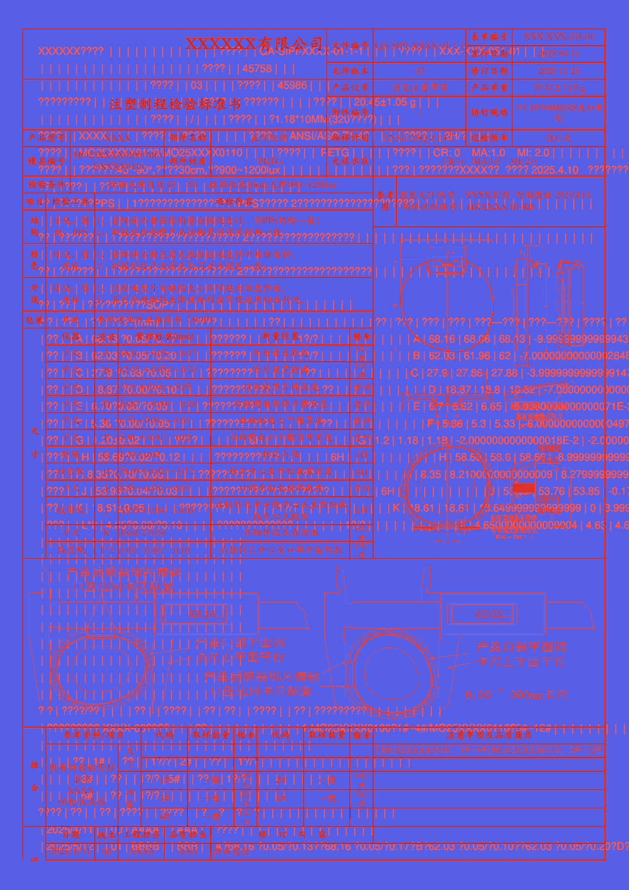
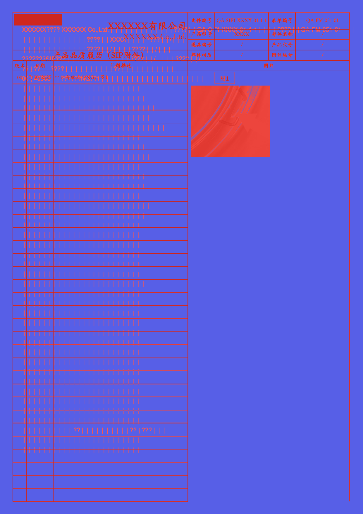
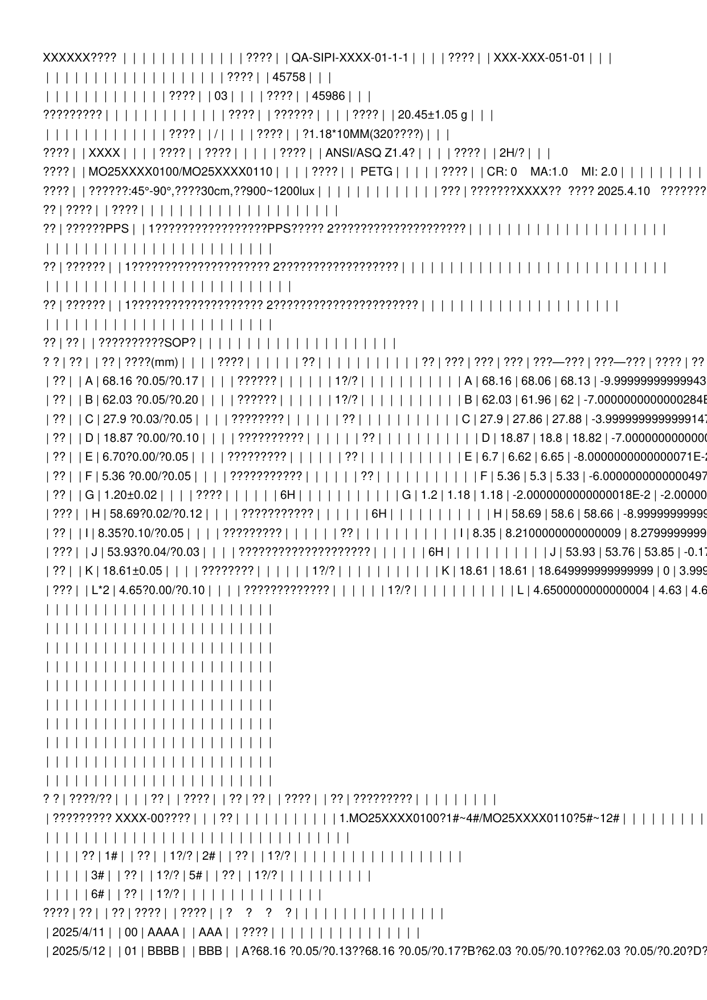
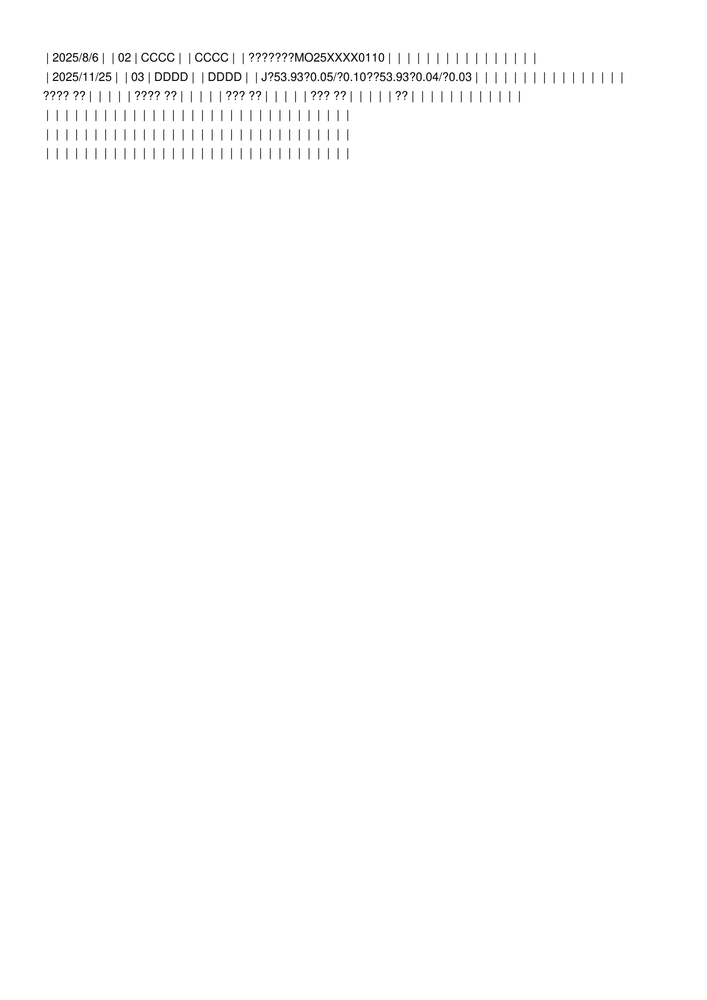
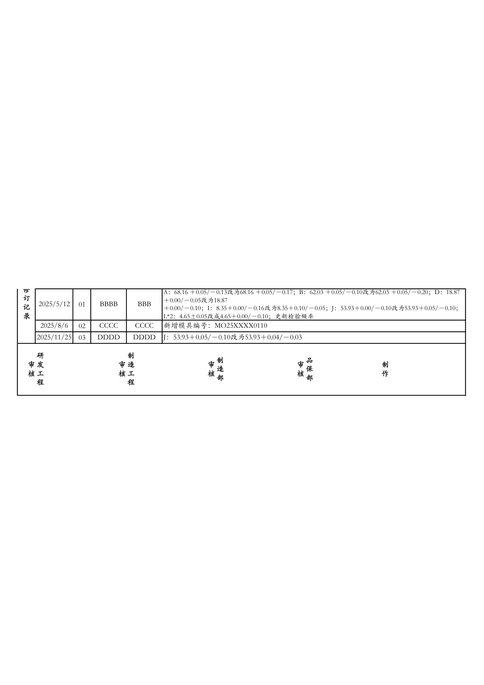
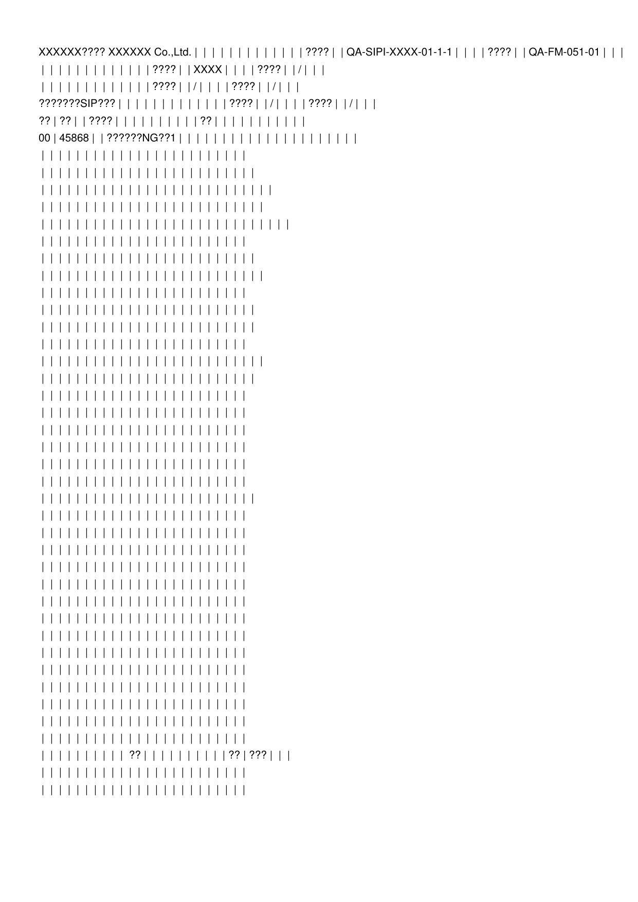

# python MiniPdf vs Microsoft 365 Excel Reference PDF Comparison Report

Generated: 2026-09-05T15:55:07.256581

## Summary

| # | Test Case | Valid | Text Sim | Visual Avg | Pages (M/R) | Overall |
|---|-----------|-------|----------|------------|-------------|--------|
| 1 | 🔴 Issue202609031340 | ❌ | 0.0659 | 0.6428 | 3/4 | **0.3835** |

**Average Overall Score: 0.3835**

## Labeled Side-by-Side Comparison

<table>
<tr><th>Case</th><th>Comparison</th></tr>
<tr>
  <td><b>Issue202609031340<br><small>format: xlsx | case: Issue202609031340 | scope: python-issue-xlsx</small></b><br>Page 1</td>
  <td></td>
</tr>
<tr>
  <td><b>Issue202609031340<br><small>format: xlsx | case: Issue202609031340 | scope: python-issue-xlsx</small></b><br>Page 2</td>
  <td></td>
</tr>
<tr>
  <td><b>Issue202609031340<br><small>format: xlsx | case: Issue202609031340 | scope: python-issue-xlsx</small></b><br>Page 3</td>
  <td></td>
</tr>
<tr>
  <td><b>Issue202609031340<br><small>format: xlsx | case: Issue202609031340 | scope: python-issue-xlsx</small></b><br>Page 4</td>
  <td></td>
</tr>
</table>

## Difference Heatmaps

Blue areas are below the configured difference threshold; red areas have stronger pixel differences. The reference rendering is retained as faint context.

<table>
<tr><th>Case</th><th>Heatmap</th><th>Metrics</th></tr>
<tr>
  <td><b>Issue202609031340</b><br>Page 1</td>
  <td></td>
  <td>changed: 415442 px (19.09%)<br>bbox: [43, 55, 1241, 1697]<br>mean abs RGB: 27.6762<br>RMSE RGB: 73.5009<br>threshold: 12, gain: 5.0</td>
</tr>
<tr>
  <td><b>Issue202609031340</b><br>Page 2</td>
  <td></td>
  <td>changed: 56878 px (2.61%)<br>bbox: [43, 92, 1195, 1014]<br>mean abs RGB: 3.9949<br>RMSE RGB: 27.9287<br>threshold: 12, gain: 5.0</td>
</tr>
<tr>
  <td><b>Issue202609031340</b><br>Page 3</td>
  <td></td>
  <td>changed: 250808 px (11.52%)<br>bbox: [42, 40, 1211, 1712]<br>mean abs RGB: 16.3757<br>RMSE RGB: 56.4463<br>threshold: 12, gain: 5.0</td>
</tr>
</table>

## Visual Comparison

Scores compare python MiniPdf against Microsoft 365 Excel Reference. LibreOffice is an auxiliary rendering and does not affect scores.

<table>
<tr><th>python MiniPdf</th><th>Microsoft 365 Excel Reference</th><th>LibreOffice</th></tr>
<tr>
  <td><b>Issue202609031340<br><small>format: xlsx | case: Issue202609031340 | scope: python-issue-xlsx</small></b></td>
  <td colspan="2">Issue202609031340 <span style="color:#f85149">⬤</span> 38.4%</td>
</tr>
<tr>
  <td></td>
  <td></td>
  <td></td>
</tr>
<tr>
  <td></td>
  <td></td>
  <td></td>
</tr>
<tr>
  <td></td>
  <td></td>
  <td></td>
</tr>
<tr>
  <td><i>missing</i></td>
  <td></td>
  <td></td>
</tr>
</table>

## Detailed Results

### Issue202609031340

- **Case Metadata:** format: xlsx | case: Issue202609031340 | scope: python-issue-xlsx
- **Source:** tests/Issue_Files/xlsx/Issue202609031340.xlsx
- **Text Similarity:** 0.0659
- **Visual Average:** 0.6428
- **Overall Score:** 0.3835
- **Pages:** MiniPdf=3, Reference=4
- **File Size:** MiniPdf=16906 bytes, Reference=346206 bytes

<details><summary>Text Diff</summary>

```diff
--- minipdf/Issue202609031340.pdf
+++ reference/Issue202609031340.pdf
@@ -1,103 +1,113 @@
-XXXXXX???? |  |  |  |  |  |  |  |  |  |  |  |  | ???? |  | QA-SIPI-XXXX-01-1-1 |  |  |  | ???? |  | XXX-XXX-051-01 |  |  |

-|  |  |  |  |  |  |  |  |  |  |  |  |  |  |  |  |  |  | ???? |  | 45758 |  |  |

-|  |  |  |  |  |  |  |  |  |  |  |  | ???? |  | 03 |  |  |  | ???? |  | 45986 |  |  |

-????????? |  |  |  |  |  |  |  |  |  |  |  |  | ???? |  | ?????? |  |  |  | ???? |  | 20.45±1.05 g |  |  |

-|  |  |  |  |  |  |  |  |  |  |  |  | ???? |  | / |  |  |  | ???? |  | ?1.18*10MM(320????) |  |  |

-???? |  | XXXX |  |  |  | ???? |  | ???? |  |  |  |  | ???? |  | ANSI/ASQ Z1.4? |  |  |  | ???? |  | 2H/? |  |  |

-???? |  | MO25XXXX0100/MO25XXXX0110 |  |  |  | ???? |  |  PETG |  |  |  |  | ???? |  | CR: 0    MA:1.0    MI: 2.0 |  |  |  |  |  |  |  |  |

-???? |  | ??????:45°-90°,????30cm,??900~1200lux |  |  |  |  |  |  |  |  |  |  |  |  | ??? | ???????XXXX??  ???? 2025.4.10 ???????

-?? | ???? |  | ???? |  |  |  |  |  |  |  |  |  |  |  |  |  |  |  |  |  |  |  |  |

-?? | ??????PPS |  | 1?????????????????PPS????? 2???????????????????? |  |  |  |  |  |  |  |  |  |  |  |  |  |  |  |  |  |  |  |  |

-|  |  |  |  |  |  |  |  |  |  |  |  |  |  |  |  |  |  |  |  |  |  |  |

-?? | ?????? |  | 1????????????????????? 2?????????????????? |  |  |  |  |  |  |  |  |  |  |  |  |  |  |  |  |  |  |  |  |  |  |  |  |  |  |  |

-|  |  |  |  |  |  |  |  |  |  |  |  |  |  |  |  |  |  |  |  |  |  |  |  |  |

-?? | ?????? |  | 1???????????????????? 2?????????????????????? |  |  |  |  |  |  |  |  |  |  |  |  |  |  |  |  |  |  |  |  |

-|  |  |  |  |  |  |  |  |  |  |  |  |  |  |  |  |  |  |  |  |  |  |  |

-?? | ?? |  | ??????????SOP? |  |  |  |  |  |  |  |  |  |  |  |  |  |  |  |  |  |  |  |  |

-? ? | ?? |  | ?? | ????(mm) |  |  |  | ???? |  |  |  |  |  | ?? |  |  |  |  |  |  |  |  |  |  | ?? | ??? | ??? | ??? | ???—??? | ???—??? | ???? | ??

-| ?? |  | A | 68.16 ?0.05/?0.17 |  |  |  | ?????? |  |  |  |  |  | 1?/? |  |  |  |  |  |  |  |  |  |  | A | 68.16 | 68.06 | 68.13 | -9.99999999999943

-| ?? |  | B | 62.03 ?0.05/?0.20 |  |  |  | ?????? |  |  |  |  |  | 1?/? |  |  |  |  |  |  |  |  |  |  | B | 62.03 | 61.96 | 62 | -7.0000000000000284E

-| ?? |  | C | 27.9 ?0.03/?0.05 |  |  |  | ???????? |  |  |  |  |  | ?? |  |  |  |  |  |  |  |  |  |  | C | 27.9 | 27.86 | 27.88 | -3.9999999999999147

-| ?? |  | D | 18.87 ?0.00/?0.10 |  |  |  | ?????????? |  |  |  |  |  | ?? |  |  |  |  |  |  |  |  |  |  | D | 18.87 | 18.8 | 18.82 | -7.0000000000000

-| ?? |  | E | 6.70?0.00/?0.05 |  |  |  | ????????? |  |  |  |  |  | ?? |  |  |  |  |  |  |  |  |  |  | E | 6.7 | 6.62 | 6.65 | -8.0000000000000071E-2

-| ?? |  | F | 5.36 ?0.00/?0.05 |  |  |  | ??????????? |  |  |  |  |  | ?? |  |  |  |  |  |  |  |  |  |  | F | 5.36 | 5.3 | 5.33 | -6.0000000000000497

-| ?? |  | G | 1.20±0.02 |  |  |  | ???? |  |  |  |  |  | 6H |  |  |  |  |  |  |  |  |  |  | G | 1.2 | 1.18 | 1.18 | -2.0000000000000018E-2 | -2.0
... (8778 more characters)

```
</details>

## Improvement Suggestions

### ⚠ Low-Score Test Cases (below 0.8)

1. **Issue202609031340** (score: 0.3835)

Review the text diffs and visual comparisons above to identify specific rendering issues.
