# Rust MiniPdf vs Microsoft 365 Word Reference PDF Comparison Report

Generated: 2026-09-02T09:25:33.261091

## Summary

| # | Test Case | Valid | Text Sim | Visual Avg | Pages (M/R) | Overall |
|---|-----------|-------|----------|------------|-------------|--------|
| 1 | 🟢 docx_classic01_single_paragraph | ✅ | 0.9868 | 0.997 | 1/1 | **0.9935** |
| 2 | 🟢 docx_classic02_multiple_paragraphs | ✅ | 0.9268 | 0.9836 | 1/1 | **0.9642** |
| 3 | 🟢 docx_classic03_headings | ✅ | 1.0 | 0.9969 | 1/1 | **0.9988** |
| 4 | 🟢 docx_classic04_bold_italic | ✅ | 1.0 | 0.9983 | 1/1 | **0.9993** |
| 5 | 🟢 docx_classic05_font_sizes | ✅ | 1.0 | 0.9911 | 1/1 | **0.9964** |
| 6 | 🟢 docx_classic06_font_colors | ✅ | 1.0 | 0.999 | 1/1 | **0.9996** |
| 7 | 🟢 docx_classic07_alignment | ✅ | 0.9477 | 0.9853 | 1/1 | **0.9732** |
| 8 | 🟢 docx_classic08_bullet_list | ✅ | 0.918 | 0.9979 | 1/1 | **0.9664** |
| 9 | 🟢 docx_classic09_numbered_list | ✅ | 0.9282 | 0.9972 | 1/1 | **0.9702** |
| 10 | 🟢 docx_classic10_simple_table | ✅ | 1.0 | 0.9916 | 1/1 | **0.9966** |
| 11 | 🟢 docx_classic11_table_with_shading | ✅ | 1.0 | 0.9831 | 1/1 | **0.9932** |
| 12 | 🟢 docx_classic12_merged_cells_table | ✅ | 1.0 | 0.9924 | 1/1 | **0.997** |
| 13 | 🟢 docx_classic13_long_document | ✅ | 0.8348 | 0.9303 | 4/4 | **0.906** |
| 14 | 🟢 docx_classic14_mixed_content | ✅ | 0.9929 | 0.9841 | 1/1 | **0.9908** |
| 15 | 🟢 docx_classic15_indentation | ✅ | 1.0 | 0.9879 | 1/1 | **0.9952** |
| 16 | 🟢 docx_classic16_line_spacing | ✅ | 0.9441 | 0.9874 | 1/1 | **0.9726** |
| 17 | 🟢 docx_classic17_page_break | ✅ | 1.0 | 0.9953 | 3/3 | **0.9981** |
| 18 | 🟢 docx_classic18_embedded_image | ✅ | 1.0 | 0.9972 | 1/1 | **0.9989** |
| 19 | 🟢 docx_classic19_multiple_images | ✅ | 1.0 | 0.9602 | 1/1 | **0.9841** |
| 20 | 🟢 docx_classic20_table_with_many_rows | ✅ | 1.0 | 0.9657 | 1/1 | **0.9863** |
| 21 | 🟢 docx_classic21_nested_lists | ✅ | 0.9371 | 0.9959 | 1/1 | **0.9732** |
| 22 | 🟢 docx_classic22_horizontal_rule | ✅ | 1.0 | 0.9942 | 1/1 | **0.9977** |
| 23 | 🟢 docx_classic23_mixed_formatting_runs | ✅ | 1.0 | 0.9979 | 1/1 | **0.9992** |
| 24 | 🟢 docx_classic24_two_column_table_layout | ✅ | 0.8235 | 0.988 | 1/1 | **0.9246** |
| 25 | 🟢 docx_classic25_title_and_subtitle | ✅ | 1.0 | 0.99 | 2/2 | **0.996** |
| 26 | 🟢 docx_classic26_table_alignment | ✅ | 1.0 | 0.992 | 1/1 | **0.9968** |
| 27 | 🟢 docx_classic27_long_paragraph_wrapping | ✅ | 0.9592 | 0.9541 | 1/1 | **0.9653** |
| 28 | 🟢 docx_classic28_special_characters | ✅ | 1.0 | 0.9964 | 1/1 | **0.9986** |
| 29 | 🟢 docx_classic29_table_with_image | ✅ | 1.0 | 0.9908 | 1/1 | **0.9963** |
| 30 | 🟢 docx_classic30_comprehensive_report | ✅ | 0.9726 | 0.9797 | 3/3 | **0.9809** |
| 31 | 🟢 docx_classic31_product_card_with_image | ✅ | 0.9945 | 0.9828 | 1/1 | **0.9909** |
| 32 | 🟢 docx_classic31_strikethrough_text | ✅ | 1.0 | 0.9932 | 1/1 | **0.9973** |
| 33 | 🟢 docx_classic32_company_logo_header | ✅ | 1.0 | 0.9741 | 1/1 | **0.9896** |
| 34 | 🟢 docx_classic32_superscript_subscript | ✅ | 0.9262 | 0.9978 | 1/1 | **0.9696** |
| 35 | 🟢 docx_classic33_highlighted_text | ✅ | 1.0 | 0.9396 | 1/1 | **0.9758** |
| 36 | 🟢 docx_classic33_two_products_side_by_side | ✅ | 1.0 | 0.957 | 1/1 | **0.9828** |
| 37 | 🟢 docx_classic34_employee_directory_with_photo | ✅ | 0.9811 | 0.9832 | 2/2 | **0.9857** |
| 38 | 🟢 docx_classic34_paragraph_borders | ✅ | 1.0 | 0.9876 | 1/1 | **0.995** |
| 39 | 🔴 docx_classic35_inventory_with_product_photos | ✅ | 1.0 | 0.4699 | 1/2 | **0.688** |
| 40 | 🟢 docx_classic35_tab_stops | ✅ | 0.8727 | 0.991 | 1/1 | **0.9455** |
| 41 | 🟢 docx_classic36_invoice_with_logo | ✅ | 1.0 | 0.9717 | 1/1 | **0.9887** |
| 42 | 🟢 docx_classic36_wide_table | ✅ | 1.0 | 0.9807 | 1/1 | **0.9923** |
| 43 | 🟢 docx_classic37_nested_table | ✅ | 0.8897 | 0.9917 | 1/1 | **0.9526** |
| 44 | 🟢 docx_classic37_real_estate_listing | ✅ | 1.0 | 0.9768 | 1/1 | **0.9907** |
| 45 | 🟢 docx_classic38_restaurant_menu_with_photos | ✅ | 1.0 | 0.9218 | 2/2 | **0.9687** |
| 46 | 🟢 docx_classic38_table_column_widths | ✅ | 0.8485 | 0.9832 | 1/1 | **0.9327** |
| 47 | 🟢 docx_classic39_cover_page_with_image | ✅ | 1.0 | 0.9525 | 2/2 | **0.981** |
| 48 | 🟢 docx_classic39_financial_report | ✅ | 1.0 | 0.9844 | 1/1 | **0.9938** |
| 49 | 🟢 docx_classic40_product_catalog_with_images | ✅ | 1.0 | 0.9798 | 1/1 | **0.9919** |
| 50 | 🟢 docx_classic40_resume | ✅ | 0.9734 | 0.9712 | 1/1 | **0.9778** |
| 51 | 🟢 docx_classic41_business_letter | ✅ | 0.9936 | 0.976 | 1/1 | **0.9878** |
| 52 | 🟢 docx_classic41_newsletter_with_hero_image | ✅ | 0.9841 | 0.9566 | 1/1 | **0.9763** |
| 53 | 🟢 docx_classic42_chart_image_with_data | ✅ | 1.0 | 0.973 | 1/1 | **0.9892** |
| 54 | 🟢 docx_classic42_meeting_minutes | ✅ | 0.9903 | 0.9632 | 1/1 | **0.9814** |
| 55 | 🟢 docx_classic43_event_flyer_with_banner | ✅ | 1.0 | 0.9675 | 1/1 | **0.987** |
| 56 | 🟢 docx_classic43_invoice_document | ✅ | 0.9775 | 0.9458 | 1/1 | **0.9693** |
| 57 | 🟢 docx_classic44_dashboard_with_kpi_image | ✅ | 1.0 | 0.9743 | 1/1 | **0.9897** |
| 58 | 🟢 docx_classic44_memo | ✅ | 0.9532 | 0.9741 | 1/1 | **0.9709** |
| 59 | 🟢 docx_classic45_certificate_with_seal | ✅ | 1.0 | 0.9727 | 1/1 | **0.9891** |
| 60 | 🟢 docx_classic45_project_plan | ✅ | 0.9911 | 0.9665 | 1/1 | **0.983** |
| 61 | 🟢 docx_classic46_comparison_table | ✅ | 1.0 | 0.9803 | 1/1 | **0.9921** |
| 62 | 🟢 docx_classic46_product_image_grid | ✅ | 1.0 | 0.9477 | 1/1 | **0.9791** |
| 63 | 🟢 docx_classic47_data_dictionary | ✅ | 1.0 | 0.9571 | 1/1 | **0.9828** |
| 64 | 🟢 docx_classic47_news_article_with_hero_image | ✅ | 0.9568 | 0.9778 | 1/1 | **0.9738** |
| 65 | 🟢 docx_classic48_multi_level_headings | ✅ | 1.0 | 0.9752 | 3/3 | **0.9901** |
| 66 | 🟢 docx_classic48_task_list_with_status_icons | ✅ | 1.0 | 0.9784 | 1/1 | **0.9914** |
| 67 | 🟢 docx_classic49_cjk_document | ✅ | 0.9782 | 0.9767 | 1/1 | **0.982** |
| 68 | 🟢 docx_classic49_wide_panoramic_banner | ✅ | 1.0 | 0.9439 | 1/1 | **0.9776** |
| 69 | 🔴 docx_classic50_long_table_with_formatting | ✅ | 0.6959 | 0.414 | 1/2 | **0.544** |
| 70 | 🟢 docx_classic50_portrait_tall_image | ✅ | 0.9839 | 0.9839 | 1/1 | **0.9871** |
| 71 | 🟢 docx_classic51_step_by_step_with_images | ✅ | 1.0 | 0.9535 | 1/1 | **0.9814** |
| 72 | 🟢 docx_classic51_underline_styles | ✅ | 1.0 | 0.997 | 1/1 | **0.9988** |
| 73 | 🟢 docx_classic52_before_after_comparison | ✅ | 1.0 | 0.9519 | 1/1 | **0.9808** |
| 74 | 🟢 docx_classic52_spacing_before_after | ✅ | 1.0 | 0.9892 | 1/1 | **0.9957** |
| 75 | 🟢 docx_classic53_color_swatch_palette | ✅ | 1.0 | 0.9469 | 1/1 | **0.9788** |
| 76 | 🟢 docx_classic53_table_merged_complex | ✅ | 0.9513 | 0.9786 | 1/1 | **0.972** |
| 77 | 🟢 docx_classic54_multi_font_family | ✅ | 1.0 | 0.9913 | 1/1 | **0.9965** |
| 78 | 🟢 docx_classic54_travel_destination_cards | ✅ | 1.0 | 0.9751 | 1/1 | **0.99** |
| 79 | 🟢 docx_classic55_background_shading_paragraph | ✅ | 1.0 | 0.9192 | 1/1 | **0.9677** |
| 80 | 🟢 docx_classic55_lab_results_with_image | ✅ | 1.0 | 0.9631 | 1/1 | **0.9852** |
| 81 | 🟢 docx_classic56_images_and_tables_mixed | ✅ | 1.0 | 0.9568 | 1/1 | **0.9827** |
| 82 | 🟢 docx_classic56_software_screenshot_features | ✅ | 1.0 | 0.9763 | 1/1 | **0.9905** |
| 83 | 🟢 docx_classic57_right_to_left_text | ✅ | 0.9478 | 0.9922 | 1/1 | **0.976** |
| 84 | 🟢 docx_classic57_sports_results_with_logos | ✅ | 1.0 | 0.9352 | 1/1 | **0.9741** |
| 85 | 🟡 docx_classic58_dense_paragraph_document | ✅ | 0.9793 | 0.796 | 8/7 | **0.8101** |
| 86 | 🟢 docx_classic58_report_with_footer_image | ✅ | 1.0 | 0.9825 | 1/1 | **0.993** |
| 87 | 🟢 docx_classic59_numbered_and_bullet_mixed | ✅ | 0.9656 | 0.9842 | 1/1 | **0.9799** |
| 88 | 🟢 docx_classic59_nutrition_label_with_image | ✅ | 1.0 | 0.9709 | 1/1 | **0.9884** |
| 89 | 🟢 docx_classic60_comprehensive_styled_report | ✅ | 0.9852 | 0.9522 | 3/3 | **0.975** |
| 90 | 🔴 docx_classic60_project_status_with_milestones | ✅ | 0.9947 | 0.4719 | 1/2 | **0.6866** |
| 91 | 🟢 docx_classic61_header_and_footer | ✅ | 0.9596 | 0.9802 | 1/1 | **0.9759** |
| 92 | 🟢 docx_classic62_footnote_references | ✅ | 0.9863 | 0.991 | 1/1 | **0.9909** |
| 93 | 🟢 docx_classic63_toc_style_headings | ✅ | 1.0 | 0.972 | 1/1 | **0.9888** |
| 94 | 🟢 docx_classic64_multi_column_layout | ✅ | 0.8582 | 0.9638 | 1/1 | **0.9288** |
| 95 | 🟢 docx_classic65_code_block_styling | ✅ | 1.0 | 0.8669 | 1/1 | **0.9468** |
| 96 | 🟢 docx_classic66_colored_title_page | ✅ | 1.0 | 0.9169 | 1/1 | **0.9668** |
| 97 | 🟢 docx_classic67_alternating_row_table | ✅ | 0.9889 | 0.9471 | 1/1 | **0.9744** |
| 98 | 🟢 docx_classic68_sidebar_layout | ✅ | 0.8283 | 0.9334 | 1/1 | **0.9047** |
| 99 | 🟢 docx_classic69_blockquote_styling | ✅ | 1.0 | 0.9857 | 1/1 | **0.9943** |
| 100 | 🟢 docx_classic70_academic_paper | ✅ | 0.9622 | 0.9576 | 1/1 | **0.9679** |
| 101 | 🟢 docx_classic71_legal_document | ✅ | 0.9848 | 0.9531 | 1/1 | **0.9752** |
| 102 | 🟢 docx_classic72_technical_specification | ✅ | 0.9953 | 0.9573 | 1/1 | **0.981** |
| 103 | 🟢 docx_classic73_calendar_layout | ✅ | 1.0 | 0.9822 | 1/1 | **0.9929** |
| 104 | 🟢 docx_classic74_org_chart | ✅ | 1.0 | 0.8991 | 1/1 | **0.9596** |
| 105 | 🟢 docx_classic75_newsletter_layout | ✅ | 0.986 | 0.9743 | 1/1 | **0.9841** |
| 106 | 🟢 docx_classic76_recipe_card | ✅ | 0.9715 | 0.9749 | 1/1 | **0.9786** |
| 107 | 🟢 docx_classic77_timeline_layout | ✅ | 1.0 | 0.9347 | 1/1 | **0.9739** |
| 108 | 🟢 docx_classic78_faq_document | ✅ | 0.9789 | 0.9577 | 2/2 | **0.9746** |
| 109 | 🟢 docx_classic79_glossary | ✅ | 0.9949 | 0.9787 | 1/1 | **0.9894** |
| 110 | 🟢 docx_classic80_matrix_grid | ✅ | 0.9737 | 0.9603 | 1/1 | **0.9736** |
| 111 | 🟢 docx_classic81_budget_table | ✅ | 1.0 | 0.9225 | 1/1 | **0.969** |
| 112 | 🟢 docx_classic82_survey_questionnaire | ✅ | 0.9561 | 0.967 | 2/2 | **0.9692** |
| 113 | 🟢 docx_classic83_medical_form | ✅ | 1.0 | 0.961 | 1/1 | **0.9844** |
| 114 | 🟢 docx_classic84_shipping_label | ✅ | 0.9714 | 0.9183 | 1/1 | **0.9559** |
| 115 | 🟢 docx_classic85_report_card | ✅ | 1.0 | 0.9572 | 1/1 | **0.9829** |
| 116 | 🟢 docx_classic86_checklist_document | ✅ | 1.0 | 0.9819 | 1/1 | **0.9928** |
| 117 | 🟢 docx_classic87_bibliography | ✅ | 0.9813 | 0.9738 | 1/1 | **0.982** |
| 118 | 🟡 docx_classic88_presentation_handout | ✅ | 0.7273 | 0.7273 | 2/2 | **0.7818** |
| 119 | 🟢 docx_classic89_multi_image_gallery | ✅ | 0.9939 | 0.9592 | 1/1 | **0.9812** |
| 120 | 🟢 docx_classic90_comprehensive_annual_report | ✅ | 0.9898 | 0.9476 | 4/4 | **0.975** |
| 121 | 🟢 docx_classic91_landscape_page | ✅ | 1.0 | 0.9833 | 1/1 | **0.9933** |
| 122 | 🟢 docx_classic92_first_line_indent | ✅ | 0.9224 | 0.9801 | 1/1 | **0.961** |
| 123 | 🟢 docx_classic93_hanging_indent | ✅ | 0.9822 | 0.9713 | 1/1 | **0.9814** |
| 124 | 🟢 docx_classic94_custom_bullet_characters | ✅ | 0.9932 | 0.9873 | 1/1 | **0.9922** |
| 125 | 🟢 docx_classic95_contract_template | ✅ | 0.9922 | 0.9705 | 1/1 | **0.9851** |
| 126 | 🟢 docx_classic96_dense_data_table | ✅ | 1.0 | 0.9061 | 1/1 | **0.9624** |
| 127 | 🟢 docx_classic97_product_catalog | ✅ | 1.0 | 0.946 | 1/1 | **0.9784** |
| 128 | 🟢 docx_classic98_training_manual | ✅ | 0.9709 | 0.9716 | 1/1 | **0.977** |
| 129 | 🟢 docx_classic99_policy_document | ✅ | 0.9816 | 0.9627 | 1/1 | **0.9777** |
| 130 | 🟢 docx_classic100_multi_page_table | ✅ | 0.9932 | 0.8621 | 2/2 | **0.9421** |
| 131 | 🟢 docx_classic101_warranty_document | ✅ | 0.9688 | 0.9609 | 1/1 | **0.9719** |
| 132 | 🟢 docx_classic102_curriculum_syllabus | ✅ | 0.9915 | 0.9628 | 1/1 | **0.9817** |
| 133 | 🟢 docx_classic103_event_program | ✅ | 0.9917 | 0.9354 | 2/2 | **0.9708** |
| 134 | 🟢 docx_classic104_sop_document | ✅ | 0.9798 | 0.9779 | 2/2 | **0.9831** |
| 135 | 🟢 docx_classic105_certificate | ✅ | 1.0 | 0.9656 | 1/1 | **0.9862** |
| 136 | 🔴 docx_classic106_multi_section_orientation | ✅ | 0.955 | 0.3207 | 1/3 | **0.6103** |
| 137 | 🟢 docx_classic107_order_form | ✅ | 1.0 | 0.9417 | 1/1 | **0.9767** |
| 138 | 🟢 docx_classic108_comparison_matrix | ✅ | 0.963 | 0.9121 | 1/1 | **0.95** |
| 139 | 🟢 docx_classic109_release_notes | ✅ | 0.978 | 0.971 | 1/1 | **0.9796** |
| 140 | 🟢 docx_classic110_troubleshooting_guide | ✅ | 1.0 | 0.9861 | 1/1 | **0.9944** |
| 141 | 🟢 docx_classic111_meeting_agenda | ✅ | 0.9912 | 0.9581 | 1/1 | **0.9797** |
| 142 | 🟢 docx_classic112_project_status_report | ✅ | 0.9798 | 0.971 | 1/1 | **0.9803** |
| 143 | 🟢 docx_classic113_address_labels | ✅ | 1.0 | 0.978 | 1/1 | **0.9912** |
| 144 | 🟢 docx_classic114_test_report | ✅ | 0.9934 | 0.9679 | 1/1 | **0.9845** |
| 145 | 🟢 docx_classic115_price_list | ✅ | 0.9806 | 0.9405 | 1/1 | **0.9684** |
| 146 | 🟢 docx_classic116_risk_assessment | ✅ | 1.0 | 0.948 | 1/1 | **0.9792** |
| 147 | 🟢 docx_classic117_employee_handbook_excerpt | ✅ | 0.9708 | 0.9634 | 1/1 | **0.9737** |
| 148 | 🟢 docx_classic118_data_report_with_summary | ✅ | 0.9952 | 0.9559 | 1/1 | **0.9804** |
| 149 | 🟢 docx_classic119_multi_language_document | ✅ | 0.9974 | 0.9811 | 1/1 | **0.9914** |
| 150 | 🟢 docx_classic120_comprehensive_business_proposal | ✅ | 0.9851 | 0.9234 | 3/3 | **0.9634** |
| 151 | 🟢 docx_classic121_thin_border_table | ✅ | 1.0 | 0.987 | 1/1 | **0.9948** |
| 152 | 🟢 docx_classic122_thick_outer_border_table | ✅ | 1.0 | 0.983 | 1/1 | **0.9932** |
| 153 | 🟢 docx_classic123_dashed_border_table | ✅ | 1.0 | 0.9863 | 1/1 | **0.9945** |
| 154 | 🟢 docx_classic124_colored_border_table | ✅ | 1.0 | 0.9841 | 1/1 | **0.9936** |
| 155 | 🟢 docx_classic125_solid_cell_fills | ✅ | 1.0 | 0.9714 | 1/1 | **0.9886** |
| 156 | 🟢 docx_classic126_dark_header_table | ✅ | 1.0 | 0.983 | 1/1 | **0.9932** |
| 157 | 🟢 docx_classic127_font_styles_showcase | ✅ | 1.0 | 0.9823 | 1/1 | **0.9929** |
| 158 | 🟢 docx_classic128_font_sizes_showcase | ✅ | 0.9774 | 0.9695 | 1/1 | **0.9788** |
| 159 | 🟢 docx_classic129_alignment_combinations | ✅ | 1.0 | 0.9846 | 1/1 | **0.9938** |
| 160 | 🟢 docx_classic130_wrap_and_indent | ✅ | 0.9795 | 0.9874 | 1/1 | **0.9868** |
| 161 | 🟢 docx_classic131_number_format_table | ✅ | 1.0 | 0.9801 | 1/1 | **0.992** |
| 162 | 🟢 docx_classic132_striped_table | ✅ | 1.0 | 0.933 | 1/1 | **0.9732** |
| 163 | 🟢 docx_classic133_gradient_rows_table | ✅ | 1.0 | 0.9614 | 1/1 | **0.9846** |
| 164 | 🟢 docx_classic134_heatmap_table | ✅ | 1.0 | 0.9631 | 1/1 | **0.9852** |
| 165 | 🟢 docx_classic135_bottom_border_paragraphs | ✅ | 1.0 | 0.9854 | 1/1 | **0.9942** |
| 166 | 🟢 docx_classic136_financial_statement | ✅ | 1.0 | 0.9746 | 1/1 | **0.9898** |
| 167 | 🟢 docx_classic137_checkerboard_table | ✅ | 1.0 | 0.9572 | 1/1 | **0.9829** |
| 168 | 🟢 docx_classic138_color_grid_table | ✅ | 1.0 | 0.9828 | 1/1 | **0.9931** |
| 169 | 🟢 docx_classic139_paragraph_shading_patterns | ✅ | 1.0 | 0.8913 | 1/1 | **0.9565** |
| 170 | 🟢 docx_classic140_rotated_text_table | ✅ | 0.8158 | 0.9879 | 1/1 | **0.9215** |
| 171 | 🟢 docx_classic141_mixed_border_styles | ✅ | 1.0 | 0.9826 | 1/1 | **0.993** |
| 172 | 🟢 docx_classic142_styled_invoice_document | ✅ | 1.0 | 0.948 | 1/1 | **0.9792** |
| 173 | 🟢 docx_classic143_multi_section_document | ✅ | 1.0 | 0.9442 | 1/1 | **0.9777** |
| 174 | 🟢 docx_classic144_note_style_paragraphs | ✅ | 1.0 | 0.9855 | 1/1 | **0.9942** |
| 175 | 🟢 docx_classic145_status_badge_table | ✅ | 1.0 | 0.9722 | 1/1 | **0.9889** |
| 176 | 🟢 docx_classic146_double_border_table | ✅ | 1.0 | 0.984 | 1/1 | **0.9936** |
| 177 | 🟢 docx_classic147_multi_section_styled_report | ✅ | 1.0 | 0.9604 | 1/1 | **0.9842** |
| 178 | 🟢 docx_classic148_data_grid_document | ✅ | 1.0 | 0.8972 | 1/1 | **0.9589** |
| 179 | 🟢 docx_classic149_merged_section_report | ✅ | 1.0 | 0.9533 | 1/1 | **0.9813** |
| 180 | 🟢 docx_classic150_kitchen_sink_styles | ✅ | 1.0 | 0.9788 | 2/2 | **0.9915** |

**Average Overall Score: 0.9705**

## Labeled Side-by-Side Comparison

<table>
<tr><th>Case</th><th>Comparison</th></tr>
<tr>
  <td><b>docx_classic01_single_paragraph<br><small>format: docx | case: docx_classic01_single_paragraph | scope: rust-classic-docx</small></b><br>Page 1</td>
  <td></td>
</tr>
<tr>
  <td><b>docx_classic02_multiple_paragraphs<br><small>format: docx | case: docx_classic02_multiple_paragraphs | scope: rust-classic-docx</small></b><br>Page 1</td>
  <td></td>
</tr>
<tr>
  <td><b>docx_classic03_headings<br><small>format: docx | case: docx_classic03_headings | scope: rust-classic-docx</small></b><br>Page 1</td>
  <td></td>
</tr>
<tr>
  <td><b>docx_classic04_bold_italic<br><small>format: docx | case: docx_classic04_bold_italic | scope: rust-classic-docx</small></b><br>Page 1</td>
  <td></td>
</tr>
<tr>
  <td><b>docx_classic05_font_sizes<br><small>format: docx | case: docx_classic05_font_sizes | scope: rust-classic-docx</small></b><br>Page 1</td>
  <td></td>
</tr>
<tr>
  <td><b>docx_classic06_font_colors<br><small>format: docx | case: docx_classic06_font_colors | scope: rust-classic-docx</small></b><br>Page 1</td>
  <td></td>
</tr>
<tr>
  <td><b>docx_classic07_alignment<br><small>format: docx | case: docx_classic07_alignment | scope: rust-classic-docx</small></b><br>Page 1</td>
  <td></td>
</tr>
<tr>
  <td><b>docx_classic08_bullet_list<br><small>format: docx | case: docx_classic08_bullet_list | scope: rust-classic-docx</small></b><br>Page 1</td>
  <td></td>
</tr>
<tr>
  <td><b>docx_classic09_numbered_list<br><small>format: docx | case: docx_classic09_numbered_list | scope: rust-classic-docx</small></b><br>Page 1</td>
  <td></td>
</tr>
<tr>
  <td><b>docx_classic10_simple_table<br><small>format: docx | case: docx_classic10_simple_table | scope: rust-classic-docx</small></b><br>Page 1</td>
  <td></td>
</tr>
<tr>
  <td><b>docx_classic11_table_with_shading<br><small>format: docx | case: docx_classic11_table_with_shading | scope: rust-classic-docx</small></b><br>Page 1</td>
  <td></td>
</tr>
<tr>
  <td><b>docx_classic12_merged_cells_table<br><small>format: docx | case: docx_classic12_merged_cells_table | scope: rust-classic-docx</small></b><br>Page 1</td>
  <td></td>
</tr>
<tr>
  <td><b>docx_classic13_long_document<br><small>format: docx | case: docx_classic13_long_document | scope: rust-classic-docx</small></b><br>Page 1</td>
  <td></td>
</tr>
<tr>
  <td><b>docx_classic13_long_document<br><small>format: docx | case: docx_classic13_long_document | scope: rust-classic-docx</small></b><br>Page 2</td>
  <td></td>
</tr>
<tr>
  <td><b>docx_classic13_long_document<br><small>format: docx | case: docx_classic13_long_document | scope: rust-classic-docx</small></b><br>Page 3</td>
  <td></td>
</tr>
<tr>
  <td><b>docx_classic13_long_document<br><small>format: docx | case: docx_classic13_long_document | scope: rust-classic-docx</small></b><br>Page 4</td>
  <td></td>
</tr>
<tr>
  <td><b>docx_classic14_mixed_content<br><small>format: docx | case: docx_classic14_mixed_content | scope: rust-classic-docx</small></b><br>Page 1</td>
  <td></td>
</tr>
<tr>
  <td><b>docx_classic15_indentation<br><small>format: docx | case: docx_classic15_indentation | scope: rust-classic-docx</small></b><br>Page 1</td>
  <td></td>
</tr>
<tr>
  <td><b>docx_classic16_line_spacing<br><small>format: docx | case: docx_classic16_line_spacing | scope: rust-classic-docx</small></b><br>Page 1</td>
  <td></td>
</tr>
<tr>
  <td><b>docx_classic17_page_break<br><small>format: docx | case: docx_classic17_page_break | scope: rust-classic-docx</small></b><br>Page 1</td>
  <td></td>
</tr>
<tr>
  <td><b>docx_classic17_page_break<br><small>format: docx | case: docx_classic17_page_break | scope: rust-classic-docx</small></b><br>Page 2</td>
  <td></td>
</tr>
<tr>
  <td><b>docx_classic17_page_break<br><small>format: docx | case: docx_classic17_page_break | scope: rust-classic-docx</small></b><br>Page 3</td>
  <td></td>
</tr>
<tr>
  <td><b>docx_classic18_embedded_image<br><small>format: docx | case: docx_classic18_embedded_image | scope: rust-classic-docx</small></b><br>Page 1</td>
  <td></td>
</tr>
<tr>
  <td><b>docx_classic19_multiple_images<br><small>format: docx | case: docx_classic19_multiple_images | scope: rust-classic-docx</small></b><br>Page 1</td>
  <td></td>
</tr>
<tr>
  <td><b>docx_classic20_table_with_many_rows<br><small>format: docx | case: docx_classic20_table_with_many_rows | scope: rust-classic-docx</small></b><br>Page 1</td>
  <td></td>
</tr>
<tr>
  <td><b>docx_classic21_nested_lists<br><small>format: docx | case: docx_classic21_nested_lists | scope: rust-classic-docx</small></b><br>Page 1</td>
  <td></td>
</tr>
<tr>
  <td><b>docx_classic22_horizontal_rule<br><small>format: docx | case: docx_classic22_horizontal_rule | scope: rust-classic-docx</small></b><br>Page 1</td>
  <td></td>
</tr>
<tr>
  <td><b>docx_classic23_mixed_formatting_runs<br><small>format: docx | case: docx_classic23_mixed_formatting_runs | scope: rust-classic-docx</small></b><br>Page 1</td>
  <td></td>
</tr>
<tr>
  <td><b>docx_classic24_two_column_table_layout<br><small>format: docx | case: docx_classic24_two_column_table_layout | scope: rust-classic-docx</small></b><br>Page 1</td>
  <td></td>
</tr>
<tr>
  <td><b>docx_classic25_title_and_subtitle<br><small>format: docx | case: docx_classic25_title_and_subtitle | scope: rust-classic-docx</small></b><br>Page 1</td>
  <td></td>
</tr>
<tr>
  <td><b>docx_classic25_title_and_subtitle<br><small>format: docx | case: docx_classic25_title_and_subtitle | scope: rust-classic-docx</small></b><br>Page 2</td>
  <td></td>
</tr>
<tr>
  <td><b>docx_classic26_table_alignment<br><small>format: docx | case: docx_classic26_table_alignment | scope: rust-classic-docx</small></b><br>Page 1</td>
  <td></td>
</tr>
<tr>
  <td><b>docx_classic27_long_paragraph_wrapping<br><small>format: docx | case: docx_classic27_long_paragraph_wrapping | scope: rust-classic-docx</small></b><br>Page 1</td>
  <td></td>
</tr>
<tr>
  <td><b>docx_classic28_special_characters<br><small>format: docx | case: docx_classic28_special_characters | scope: rust-classic-docx</small></b><br>Page 1</td>
  <td></td>
</tr>
<tr>
  <td><b>docx_classic29_table_with_image<br><small>format: docx | case: docx_classic29_table_with_image | scope: rust-classic-docx</small></b><br>Page 1</td>
  <td></td>
</tr>
<tr>
  <td><b>docx_classic30_comprehensive_report<br><small>format: docx | case: docx_classic30_comprehensive_report | scope: rust-classic-docx</small></b><br>Page 1</td>
  <td></td>
</tr>
<tr>
  <td><b>docx_classic30_comprehensive_report<br><small>format: docx | case: docx_classic30_comprehensive_report | scope: rust-classic-docx</small></b><br>Page 2</td>
  <td></td>
</tr>
<tr>
  <td><b>docx_classic30_comprehensive_report<br><small>format: docx | case: docx_classic30_comprehensive_report | scope: rust-classic-docx</small></b><br>Page 3</td>
  <td></td>
</tr>
<tr>
  <td><b>docx_classic31_product_card_with_image<br><small>format: docx | case: docx_classic31_product_card_with_image | scope: rust-classic-docx</small></b><br>Page 1</td>
  <td></td>
</tr>
<tr>
  <td><b>docx_classic31_strikethrough_text<br><small>format: docx | case: docx_classic31_strikethrough_text | scope: rust-classic-docx</small></b><br>Page 1</td>
  <td></td>
</tr>
<tr>
  <td><b>docx_classic32_company_logo_header<br><small>format: docx | case: docx_classic32_company_logo_header | scope: rust-classic-docx</small></b><br>Page 1</td>
  <td></td>
</tr>
<tr>
  <td><b>docx_classic32_superscript_subscript<br><small>format: docx | case: docx_classic32_superscript_subscript | scope: rust-classic-docx</small></b><br>Page 1</td>
  <td></td>
</tr>
<tr>
  <td><b>docx_classic33_highlighted_text<br><small>format: docx | case: docx_classic33_highlighted_text | scope: rust-classic-docx</small></b><br>Page 1</td>
  <td></td>
</tr>
<tr>
  <td><b>docx_classic33_two_products_side_by_side<br><small>format: docx | case: docx_classic33_two_products_side_by_side | scope: rust-classic-docx</small></b><br>Page 1</td>
  <td></td>
</tr>
<tr>
  <td><b>docx_classic34_employee_directory_with_photo<br><small>format: docx | case: docx_classic34_employee_directory_with_photo | scope: rust-classic-docx</small></b><br>Page 1</td>
  <td></td>
</tr>
<tr>
  <td><b>docx_classic34_employee_directory_with_photo<br><small>format: docx | case: docx_classic34_employee_directory_with_photo | scope: rust-classic-docx</small></b><br>Page 2</td>
  <td></td>
</tr>
<tr>
  <td><b>docx_classic34_paragraph_borders<br><small>format: docx | case: docx_classic34_paragraph_borders | scope: rust-classic-docx</small></b><br>Page 1</td>
  <td></td>
</tr>
<tr>
  <td><b>docx_classic35_inventory_with_product_photos<br><small>format: docx | case: docx_classic35_inventory_with_product_photos | scope: rust-classic-docx</small></b><br>Page 1</td>
  <td></td>
</tr>
<tr>
  <td><b>docx_classic35_inventory_with_product_photos<br><small>format: docx | case: docx_classic35_inventory_with_product_photos | scope: rust-classic-docx</small></b><br>Page 2</td>
  <td></td>
</tr>
<tr>
  <td><b>docx_classic35_tab_stops<br><small>format: docx | case: docx_classic35_tab_stops | scope: rust-classic-docx</small></b><br>Page 1</td>
  <td></td>
</tr>
<tr>
  <td><b>docx_classic36_invoice_with_logo<br><small>format: docx | case: docx_classic36_invoice_with_logo | scope: rust-classic-docx</small></b><br>Page 1</td>
  <td></td>
</tr>
<tr>
  <td><b>docx_classic36_wide_table<br><small>format: docx | case: docx_classic36_wide_table | scope: rust-classic-docx</small></b><br>Page 1</td>
  <td></td>
</tr>
<tr>
  <td><b>docx_classic37_nested_table<br><small>format: docx | case: docx_classic37_nested_table | scope: rust-classic-docx</small></b><br>Page 1</td>
  <td></td>
</tr>
<tr>
  <td><b>docx_classic37_real_estate_listing<br><small>format: docx | case: docx_classic37_real_estate_listing | scope: rust-classic-docx</small></b><br>Page 1</td>
  <td></td>
</tr>
<tr>
  <td><b>docx_classic38_restaurant_menu_with_photos<br><small>format: docx | case: docx_classic38_restaurant_menu_with_photos | scope: rust-classic-docx</small></b><br>Page 1</td>
  <td></td>
</tr>
<tr>
  <td><b>docx_classic38_restaurant_menu_with_photos<br><small>format: docx | case: docx_classic38_restaurant_menu_with_photos | scope: rust-classic-docx</small></b><br>Page 2</td>
  <td></td>
</tr>
<tr>
  <td><b>docx_classic38_table_column_widths<br><small>format: docx | case: docx_classic38_table_column_widths | scope: rust-classic-docx</small></b><br>Page 1</td>
  <td></td>
</tr>
<tr>
  <td><b>docx_classic39_cover_page_with_image<br><small>format: docx | case: docx_classic39_cover_page_with_image | scope: rust-classic-docx</small></b><br>Page 1</td>
  <td></td>
</tr>
<tr>
  <td><b>docx_classic39_cover_page_with_image<br><small>format: docx | case: docx_classic39_cover_page_with_image | scope: rust-classic-docx</small></b><br>Page 2</td>
  <td></td>
</tr>
<tr>
  <td><b>docx_classic39_financial_report<br><small>format: docx | case: docx_classic39_financial_report | scope: rust-classic-docx</small></b><br>Page 1</td>
  <td></td>
</tr>
<tr>
  <td><b>docx_classic40_product_catalog_with_images<br><small>format: docx | case: docx_classic40_product_catalog_with_images | scope: rust-classic-docx</small></b><br>Page 1</td>
  <td></td>
</tr>
<tr>
  <td><b>docx_classic40_resume<br><small>format: docx | case: docx_classic40_resume | scope: rust-classic-docx</small></b><br>Page 1</td>
  <td></td>
</tr>
<tr>
  <td><b>docx_classic41_business_letter<br><small>format: docx | case: docx_classic41_business_letter | scope: rust-classic-docx</small></b><br>Page 1</td>
  <td></td>
</tr>
<tr>
  <td><b>docx_classic41_newsletter_with_hero_image<br><small>format: docx | case: docx_classic41_newsletter_with_hero_image | scope: rust-classic-docx</small></b><br>Page 1</td>
  <td></td>
</tr>
<tr>
  <td><b>docx_classic42_chart_image_with_data<br><small>format: docx | case: docx_classic42_chart_image_with_data | scope: rust-classic-docx</small></b><br>Page 1</td>
  <td></td>
</tr>
<tr>
  <td><b>docx_classic42_meeting_minutes<br><small>format: docx | case: docx_classic42_meeting_minutes | scope: rust-classic-docx</small></b><br>Page 1</td>
  <td></td>
</tr>
<tr>
  <td><b>docx_classic43_event_flyer_with_banner<br><small>format: docx | case: docx_classic43_event_flyer_with_banner | scope: rust-classic-docx</small></b><br>Page 1</td>
  <td></td>
</tr>
<tr>
  <td><b>docx_classic43_invoice_document<br><small>format: docx | case: docx_classic43_invoice_document | scope: rust-classic-docx</small></b><br>Page 1</td>
  <td></td>
</tr>
<tr>
  <td><b>docx_classic44_dashboard_with_kpi_image<br><small>format: docx | case: docx_classic44_dashboard_with_kpi_image | scope: rust-classic-docx</small></b><br>Page 1</td>
  <td></td>
</tr>
<tr>
  <td><b>docx_classic44_memo<br><small>format: docx | case: docx_classic44_memo | scope: rust-classic-docx</small></b><br>Page 1</td>
  <td></td>
</tr>
<tr>
  <td><b>docx_classic45_certificate_with_seal<br><small>format: docx | case: docx_classic45_certificate_with_seal | scope: rust-classic-docx</small></b><br>Page 1</td>
  <td></td>
</tr>
<tr>
  <td><b>docx_classic45_project_plan<br><small>format: docx | case: docx_classic45_project_plan | scope: rust-classic-docx</small></b><br>Page 1</td>
  <td></td>
</tr>
<tr>
  <td><b>docx_classic46_comparison_table<br><small>format: docx | case: docx_classic46_comparison_table | scope: rust-classic-docx</small></b><br>Page 1</td>
  <td></td>
</tr>
<tr>
  <td><b>docx_classic46_product_image_grid<br><small>format: docx | case: docx_classic46_product_image_grid | scope: rust-classic-docx</small></b><br>Page 1</td>
  <td></td>
</tr>
<tr>
  <td><b>docx_classic47_data_dictionary<br><small>format: docx | case: docx_classic47_data_dictionary | scope: rust-classic-docx</small></b><br>Page 1</td>
  <td></td>
</tr>
<tr>
  <td><b>docx_classic47_news_article_with_hero_image<br><small>format: docx | case: docx_classic47_news_article_with_hero_image | scope: rust-classic-docx</small></b><br>Page 1</td>
  <td></td>
</tr>
<tr>
  <td><b>docx_classic48_multi_level_headings<br><small>format: docx | case: docx_classic48_multi_level_headings | scope: rust-classic-docx</small></b><br>Page 1</td>
  <td></td>
</tr>
<tr>
  <td><b>docx_classic48_multi_level_headings<br><small>format: docx | case: docx_classic48_multi_level_headings | scope: rust-classic-docx</small></b><br>Page 2</td>
  <td></td>
</tr>
<tr>
  <td><b>docx_classic48_multi_level_headings<br><small>format: docx | case: docx_classic48_multi_level_headings | scope: rust-classic-docx</small></b><br>Page 3</td>
  <td></td>
</tr>
<tr>
  <td><b>docx_classic48_task_list_with_status_icons<br><small>format: docx | case: docx_classic48_task_list_with_status_icons | scope: rust-classic-docx</small></b><br>Page 1</td>
  <td></td>
</tr>
<tr>
  <td><b>docx_classic49_cjk_document<br><small>format: docx | case: docx_classic49_cjk_document | scope: rust-classic-docx</small></b><br>Page 1</td>
  <td></td>
</tr>
<tr>
  <td><b>docx_classic49_wide_panoramic_banner<br><small>format: docx | case: docx_classic49_wide_panoramic_banner | scope: rust-classic-docx</small></b><br>Page 1</td>
  <td></td>
</tr>
<tr>
  <td><b>docx_classic50_long_table_with_formatting<br><small>format: docx | case: docx_classic50_long_table_with_formatting | scope: rust-classic-docx</small></b><br>Page 1</td>
  <td></td>
</tr>
<tr>
  <td><b>docx_classic50_long_table_with_formatting<br><small>format: docx | case: docx_classic50_long_table_with_formatting | scope: rust-classic-docx</small></b><br>Page 2</td>
  <td></td>
</tr>
<tr>
  <td><b>docx_classic50_portrait_tall_image<br><small>format: docx | case: docx_classic50_portrait_tall_image | scope: rust-classic-docx</small></b><br>Page 1</td>
  <td></td>
</tr>
<tr>
  <td><b>docx_classic51_step_by_step_with_images<br><small>format: docx | case: docx_classic51_step_by_step_with_images | scope: rust-classic-docx</small></b><br>Page 1</td>
  <td></td>
</tr>
<tr>
  <td><b>docx_classic51_underline_styles<br><small>format: docx | case: docx_classic51_underline_styles | scope: rust-classic-docx</small></b><br>Page 1</td>
  <td></td>
</tr>
<tr>
  <td><b>docx_classic52_before_after_comparison<br><small>format: docx | case: docx_classic52_before_after_comparison | scope: rust-classic-docx</small></b><br>Page 1</td>
  <td></td>
</tr>
<tr>
  <td><b>docx_classic52_spacing_before_after<br><small>format: docx | case: docx_classic52_spacing_before_after | scope: rust-classic-docx</small></b><br>Page 1</td>
  <td></td>
</tr>
<tr>
  <td><b>docx_classic53_color_swatch_palette<br><small>format: docx | case: docx_classic53_color_swatch_palette | scope: rust-classic-docx</small></b><br>Page 1</td>
  <td></td>
</tr>
<tr>
  <td><b>docx_classic53_table_merged_complex<br><small>format: docx | case: docx_classic53_table_merged_complex | scope: rust-classic-docx</small></b><br>Page 1</td>
  <td></td>
</tr>
<tr>
  <td><b>docx_classic54_multi_font_family<br><small>format: docx | case: docx_classic54_multi_font_family | scope: rust-classic-docx</small></b><br>Page 1</td>
  <td></td>
</tr>
<tr>
  <td><b>docx_classic54_travel_destination_cards<br><small>format: docx | case: docx_classic54_travel_destination_cards | scope: rust-classic-docx</small></b><br>Page 1</td>
  <td></td>
</tr>
<tr>
  <td><b>docx_classic55_background_shading_paragraph<br><small>format: docx | case: docx_classic55_background_shading_paragraph | scope: rust-classic-docx</small></b><br>Page 1</td>
  <td></td>
</tr>
<tr>
  <td><b>docx_classic55_lab_results_with_image<br><small>format: docx | case: docx_classic55_lab_results_with_image | scope: rust-classic-docx</small></b><br>Page 1</td>
  <td></td>
</tr>
<tr>
  <td><b>docx_classic56_images_and_tables_mixed<br><small>format: docx | case: docx_classic56_images_and_tables_mixed | scope: rust-classic-docx</small></b><br>Page 1</td>
  <td></td>
</tr>
<tr>
  <td><b>docx_classic56_software_screenshot_features<br><small>format: docx | case: docx_classic56_software_screenshot_features | scope: rust-classic-docx</small></b><br>Page 1</td>
  <td></td>
</tr>
<tr>
  <td><b>docx_classic57_right_to_left_text<br><small>format: docx | case: docx_classic57_right_to_left_text | scope: rust-classic-docx</small></b><br>Page 1</td>
  <td></td>
</tr>
<tr>
  <td><b>docx_classic57_sports_results_with_logos<br><small>format: docx | case: docx_classic57_sports_results_with_logos | scope: rust-classic-docx</small></b><br>Page 1</td>
  <td></td>
</tr>
<tr>
  <td><b>docx_classic58_dense_paragraph_document<br><small>format: docx | case: docx_classic58_dense_paragraph_document | scope: rust-classic-docx</small></b><br>Page 1</td>
  <td></td>
</tr>
<tr>
  <td><b>docx_classic58_dense_paragraph_document<br><small>format: docx | case: docx_classic58_dense_paragraph_document | scope: rust-classic-docx</small></b><br>Page 2</td>
  <td></td>
</tr>
<tr>
  <td><b>docx_classic58_dense_paragraph_document<br><small>format: docx | case: docx_classic58_dense_paragraph_document | scope: rust-classic-docx</small></b><br>Page 3</td>
  <td></td>
</tr>
<tr>
  <td><b>docx_classic58_dense_paragraph_document<br><small>format: docx | case: docx_classic58_dense_paragraph_document | scope: rust-classic-docx</small></b><br>Page 4</td>
  <td></td>
</tr>
<tr>
  <td><b>docx_classic58_dense_paragraph_document<br><small>format: docx | case: docx_classic58_dense_paragraph_document | scope: rust-classic-docx</small></b><br>Page 5</td>
  <td></td>
</tr>
<tr>
  <td><b>docx_classic58_dense_paragraph_document<br><small>format: docx | case: docx_classic58_dense_paragraph_document | scope: rust-classic-docx</small></b><br>Page 6</td>
  <td></td>
</tr>
<tr>
  <td><b>docx_classic58_dense_paragraph_document<br><small>format: docx | case: docx_classic58_dense_paragraph_document | scope: rust-classic-docx</small></b><br>Page 7</td>
  <td></td>
</tr>
<tr>
  <td><b>docx_classic58_report_with_footer_image<br><small>format: docx | case: docx_classic58_report_with_footer_image | scope: rust-classic-docx</small></b><br>Page 1</td>
  <td></td>
</tr>
<tr>
  <td><b>docx_classic59_numbered_and_bullet_mixed<br><small>format: docx | case: docx_classic59_numbered_and_bullet_mixed | scope: rust-classic-docx</small></b><br>Page 1</td>
  <td></td>
</tr>
<tr>
  <td><b>docx_classic59_nutrition_label_with_image<br><small>format: docx | case: docx_classic59_nutrition_label_with_image | scope: rust-classic-docx</small></b><br>Page 1</td>
  <td></td>
</tr>
<tr>
  <td><b>docx_classic60_comprehensive_styled_report<br><small>format: docx | case: docx_classic60_comprehensive_styled_report | scope: rust-classic-docx</small></b><br>Page 1</td>
  <td></td>
</tr>
<tr>
  <td><b>docx_classic60_comprehensive_styled_report<br><small>format: docx | case: docx_classic60_comprehensive_styled_report | scope: rust-classic-docx</small></b><br>Page 2</td>
  <td></td>
</tr>
<tr>
  <td><b>docx_classic60_comprehensive_styled_report<br><small>format: docx | case: docx_classic60_comprehensive_styled_report | scope: rust-classic-docx</small></b><br>Page 3</td>
  <td></td>
</tr>
<tr>
  <td><b>docx_classic60_project_status_with_milestones<br><small>format: docx | case: docx_classic60_project_status_with_milestones | scope: rust-classic-docx</small></b><br>Page 1</td>
  <td></td>
</tr>
<tr>
  <td><b>docx_classic60_project_status_with_milestones<br><small>format: docx | case: docx_classic60_project_status_with_milestones | scope: rust-classic-docx</small></b><br>Page 2</td>
  <td></td>
</tr>
<tr>
  <td><b>docx_classic61_header_and_footer<br><small>format: docx | case: docx_classic61_header_and_footer | scope: rust-classic-docx</small></b><br>Page 1</td>
  <td></td>
</tr>
<tr>
  <td><b>docx_classic62_footnote_references<br><small>format: docx | case: docx_classic62_footnote_references | scope: rust-classic-docx</small></b><br>Page 1</td>
  <td></td>
</tr>
<tr>
  <td><b>docx_classic63_toc_style_headings<br><small>format: docx | case: docx_classic63_toc_style_headings | scope: rust-classic-docx</small></b><br>Page 1</td>
  <td></td>
</tr>
<tr>
  <td><b>docx_classic64_multi_column_layout<br><small>format: docx | case: docx_classic64_multi_column_layout | scope: rust-classic-docx</small></b><br>Page 1</td>
  <td></td>
</tr>
<tr>
  <td><b>docx_classic65_code_block_styling<br><small>format: docx | case: docx_classic65_code_block_styling | scope: rust-classic-docx</small></b><br>Page 1</td>
  <td></td>
</tr>
<tr>
  <td><b>docx_classic66_colored_title_page<br><small>format: docx | case: docx_classic66_colored_title_page | scope: rust-classic-docx</small></b><br>Page 1</td>
  <td></td>
</tr>
<tr>
  <td><b>docx_classic67_alternating_row_table<br><small>format: docx | case: docx_classic67_alternating_row_table | scope: rust-classic-docx</small></b><br>Page 1</td>
  <td></td>
</tr>
<tr>
  <td><b>docx_classic68_sidebar_layout<br><small>format: docx | case: docx_classic68_sidebar_layout | scope: rust-classic-docx</small></b><br>Page 1</td>
  <td></td>
</tr>
<tr>
  <td><b>docx_classic69_blockquote_styling<br><small>format: docx | case: docx_classic69_blockquote_styling | scope: rust-classic-docx</small></b><br>Page 1</td>
  <td></td>
</tr>
<tr>
  <td><b>docx_classic70_academic_paper<br><small>format: docx | case: docx_classic70_academic_paper | scope: rust-classic-docx</small></b><br>Page 1</td>
  <td></td>
</tr>
<tr>
  <td><b>docx_classic71_legal_document<br><small>format: docx | case: docx_classic71_legal_document | scope: rust-classic-docx</small></b><br>Page 1</td>
  <td></td>
</tr>
<tr>
  <td><b>docx_classic72_technical_specification<br><small>format: docx | case: docx_classic72_technical_specification | scope: rust-classic-docx</small></b><br>Page 1</td>
  <td></td>
</tr>
<tr>
  <td><b>docx_classic73_calendar_layout<br><small>format: docx | case: docx_classic73_calendar_layout | scope: rust-classic-docx</small></b><br>Page 1</td>
  <td></td>
</tr>
<tr>
  <td><b>docx_classic74_org_chart<br><small>format: docx | case: docx_classic74_org_chart | scope: rust-classic-docx</small></b><br>Page 1</td>
  <td></td>
</tr>
<tr>
  <td><b>docx_classic75_newsletter_layout<br><small>format: docx | case: docx_classic75_newsletter_layout | scope: rust-classic-docx</small></b><br>Page 1</td>
  <td></td>
</tr>
<tr>
  <td><b>docx_classic76_recipe_card<br><small>format: docx | case: docx_classic76_recipe_card | scope: rust-classic-docx</small></b><br>Page 1</td>
  <td></td>
</tr>
<tr>
  <td><b>docx_classic77_timeline_layout<br><small>format: docx | case: docx_classic77_timeline_layout | scope: rust-classic-docx</small></b><br>Page 1</td>
  <td></td>
</tr>
<tr>
  <td><b>docx_classic78_faq_document<br><small>format: docx | case: docx_classic78_faq_document | scope: rust-classic-docx</small></b><br>Page 1</td>
  <td></td>
</tr>
<tr>
  <td><b>docx_classic78_faq_document<br><small>format: docx | case: docx_classic78_faq_document | scope: rust-classic-docx</small></b><br>Page 2</td>
  <td></td>
</tr>
<tr>
  <td><b>docx_classic79_glossary<br><small>format: docx | case: docx_classic79_glossary | scope: rust-classic-docx</small></b><br>Page 1</td>
  <td></td>
</tr>
<tr>
  <td><b>docx_classic80_matrix_grid<br><small>format: docx | case: docx_classic80_matrix_grid | scope: rust-classic-docx</small></b><br>Page 1</td>
  <td></td>
</tr>
<tr>
  <td><b>docx_classic81_budget_table<br><small>format: docx | case: docx_classic81_budget_table | scope: rust-classic-docx</small></b><br>Page 1</td>
  <td></td>
</tr>
<tr>
  <td><b>docx_classic82_survey_questionnaire<br><small>format: docx | case: docx_classic82_survey_questionnaire | scope: rust-classic-docx</small></b><br>Page 1</td>
  <td></td>
</tr>
<tr>
  <td><b>docx_classic82_survey_questionnaire<br><small>format: docx | case: docx_classic82_survey_questionnaire | scope: rust-classic-docx</small></b><br>Page 2</td>
  <td></td>
</tr>
<tr>
  <td><b>docx_classic83_medical_form<br><small>format: docx | case: docx_classic83_medical_form | scope: rust-classic-docx</small></b><br>Page 1</td>
  <td></td>
</tr>
<tr>
  <td><b>docx_classic84_shipping_label<br><small>format: docx | case: docx_classic84_shipping_label | scope: rust-classic-docx</small></b><br>Page 1</td>
  <td></td>
</tr>
<tr>
  <td><b>docx_classic85_report_card<br><small>format: docx | case: docx_classic85_report_card | scope: rust-classic-docx</small></b><br>Page 1</td>
  <td></td>
</tr>
<tr>
  <td><b>docx_classic86_checklist_document<br><small>format: docx | case: docx_classic86_checklist_document | scope: rust-classic-docx</small></b><br>Page 1</td>
  <td></td>
</tr>
<tr>
  <td><b>docx_classic87_bibliography<br><small>format: docx | case: docx_classic87_bibliography | scope: rust-classic-docx</small></b><br>Page 1</td>
  <td></td>
</tr>
<tr>
  <td><b>docx_classic88_presentation_handout<br><small>format: docx | case: docx_classic88_presentation_handout | scope: rust-classic-docx</small></b><br>Page 1</td>
  <td></td>
</tr>
<tr>
  <td><b>docx_classic88_presentation_handout<br><small>format: docx | case: docx_classic88_presentation_handout | scope: rust-classic-docx</small></b><br>Page 2</td>
  <td></td>
</tr>
<tr>
  <td><b>docx_classic89_multi_image_gallery<br><small>format: docx | case: docx_classic89_multi_image_gallery | scope: rust-classic-docx</small></b><br>Page 1</td>
  <td></td>
</tr>
<tr>
  <td><b>docx_classic90_comprehensive_annual_report<br><small>format: docx | case: docx_classic90_comprehensive_annual_report | scope: rust-classic-docx</small></b><br>Page 1</td>
  <td></td>
</tr>
<tr>
  <td><b>docx_classic90_comprehensive_annual_report<br><small>format: docx | case: docx_classic90_comprehensive_annual_report | scope: rust-classic-docx</small></b><br>Page 2</td>
  <td></td>
</tr>
<tr>
  <td><b>docx_classic90_comprehensive_annual_report<br><small>format: docx | case: docx_classic90_comprehensive_annual_report | scope: rust-classic-docx</small></b><br>Page 3</td>
  <td></td>
</tr>
<tr>
  <td><b>docx_classic90_comprehensive_annual_report<br><small>format: docx | case: docx_classic90_comprehensive_annual_report | scope: rust-classic-docx</small></b><br>Page 4</td>
  <td></td>
</tr>
<tr>
  <td><b>docx_classic91_landscape_page<br><small>format: docx | case: docx_classic91_landscape_page | scope: rust-classic-docx</small></b><br>Page 1</td>
  <td></td>
</tr>
<tr>
  <td><b>docx_classic92_first_line_indent<br><small>format: docx | case: docx_classic92_first_line_indent | scope: rust-classic-docx</small></b><br>Page 1</td>
  <td></td>
</tr>
<tr>
  <td><b>docx_classic93_hanging_indent<br><small>format: docx | case: docx_classic93_hanging_indent | scope: rust-classic-docx</small></b><br>Page 1</td>
  <td></td>
</tr>
<tr>
  <td><b>docx_classic94_custom_bullet_characters<br><small>format: docx | case: docx_classic94_custom_bullet_characters | scope: rust-classic-docx</small></b><br>Page 1</td>
  <td></td>
</tr>
<tr>
  <td><b>docx_classic95_contract_template<br><small>format: docx | case: docx_classic95_contract_template | scope: rust-classic-docx</small></b><br>Page 1</td>
  <td></td>
</tr>
<tr>
  <td><b>docx_classic96_dense_data_table<br><small>format: docx | case: docx_classic96_dense_data_table | scope: rust-classic-docx</small></b><br>Page 1</td>
  <td></td>
</tr>
<tr>
  <td><b>docx_classic97_product_catalog<br><small>format: docx | case: docx_classic97_product_catalog | scope: rust-classic-docx</small></b><br>Page 1</td>
  <td></td>
</tr>
<tr>
  <td><b>docx_classic98_training_manual<br><small>format: docx | case: docx_classic98_training_manual | scope: rust-classic-docx</small></b><br>Page 1</td>
  <td></td>
</tr>
<tr>
  <td><b>docx_classic99_policy_document<br><small>format: docx | case: docx_classic99_policy_document | scope: rust-classic-docx</small></b><br>Page 1</td>
  <td></td>
</tr>
<tr>
  <td><b>docx_classic100_multi_page_table<br><small>format: docx | case: docx_classic100_multi_page_table | scope: rust-classic-docx</small></b><br>Page 1</td>
  <td></td>
</tr>
<tr>
  <td><b>docx_classic100_multi_page_table<br><small>format: docx | case: docx_classic100_multi_page_table | scope: rust-classic-docx</small></b><br>Page 2</td>
  <td></td>
</tr>
<tr>
  <td><b>docx_classic101_warranty_document<br><small>format: docx | case: docx_classic101_warranty_document | scope: rust-classic-docx</small></b><br>Page 1</td>
  <td></td>
</tr>
<tr>
  <td><b>docx_classic102_curriculum_syllabus<br><small>format: docx | case: docx_classic102_curriculum_syllabus | scope: rust-classic-docx</small></b><br>Page 1</td>
  <td></td>
</tr>
<tr>
  <td><b>docx_classic103_event_program<br><small>format: docx | case: docx_classic103_event_program | scope: rust-classic-docx</small></b><br>Page 1</td>
  <td></td>
</tr>
<tr>
  <td><b>docx_classic103_event_program<br><small>format: docx | case: docx_classic103_event_program | scope: rust-classic-docx</small></b><br>Page 2</td>
  <td></td>
</tr>
<tr>
  <td><b>docx_classic104_sop_document<br><small>format: docx | case: docx_classic104_sop_document | scope: rust-classic-docx</small></b><br>Page 1</td>
  <td></td>
</tr>
<tr>
  <td><b>docx_classic104_sop_document<br><small>format: docx | case: docx_classic104_sop_document | scope: rust-classic-docx</small></b><br>Page 2</td>
  <td></td>
</tr>
<tr>
  <td><b>docx_classic105_certificate<br><small>format: docx | case: docx_classic105_certificate | scope: rust-classic-docx</small></b><br>Page 1</td>
  <td></td>
</tr>
<tr>
  <td><b>docx_classic106_multi_section_orientation<br><small>format: docx | case: docx_classic106_multi_section_orientation | scope: rust-classic-docx</small></b><br>Page 1</td>
  <td></td>
</tr>
<tr>
  <td><b>docx_classic106_multi_section_orientation<br><small>format: docx | case: docx_classic106_multi_section_orientation | scope: rust-classic-docx</small></b><br>Page 2</td>
  <td></td>
</tr>
<tr>
  <td><b>docx_classic106_multi_section_orientation<br><small>format: docx | case: docx_classic106_multi_section_orientation | scope: rust-classic-docx</small></b><br>Page 3</td>
  <td></td>
</tr>
<tr>
  <td><b>docx_classic107_order_form<br><small>format: docx | case: docx_classic107_order_form | scope: rust-classic-docx</small></b><br>Page 1</td>
  <td></td>
</tr>
<tr>
  <td><b>docx_classic108_comparison_matrix<br><small>format: docx | case: docx_classic108_comparison_matrix | scope: rust-classic-docx</small></b><br>Page 1</td>
  <td></td>
</tr>
<tr>
  <td><b>docx_classic109_release_notes<br><small>format: docx | case: docx_classic109_release_notes | scope: rust-classic-docx</small></b><br>Page 1</td>
  <td></td>
</tr>
<tr>
  <td><b>docx_classic110_troubleshooting_guide<br><small>format: docx | case: docx_classic110_troubleshooting_guide | scope: rust-classic-docx</small></b><br>Page 1</td>
  <td></td>
</tr>
<tr>
  <td><b>docx_classic111_meeting_agenda<br><small>format: docx | case: docx_classic111_meeting_agenda | scope: rust-classic-docx</small></b><br>Page 1</td>
  <td></td>
</tr>
<tr>
  <td><b>docx_classic112_project_status_report<br><small>format: docx | case: docx_classic112_project_status_report | scope: rust-classic-docx</small></b><br>Page 1</td>
  <td></td>
</tr>
<tr>
  <td><b>docx_classic113_address_labels<br><small>format: docx | case: docx_classic113_address_labels | scope: rust-classic-docx</small></b><br>Page 1</td>
  <td></td>
</tr>
<tr>
  <td><b>docx_classic114_test_report<br><small>format: docx | case: docx_classic114_test_report | scope: rust-classic-docx</small></b><br>Page 1</td>
  <td></td>
</tr>
<tr>
  <td><b>docx_classic115_price_list<br><small>format: docx | case: docx_classic115_price_list | scope: rust-classic-docx</small></b><br>Page 1</td>
  <td></td>
</tr>
<tr>
  <td><b>docx_classic116_risk_assessment<br><small>format: docx | case: docx_classic116_risk_assessment | scope: rust-classic-docx</small></b><br>Page 1</td>
  <td></td>
</tr>
<tr>
  <td><b>docx_classic117_employee_handbook_excerpt<br><small>format: docx | case: docx_classic117_employee_handbook_excerpt | scope: rust-classic-docx</small></b><br>Page 1</td>
  <td></td>
</tr>
<tr>
  <td><b>docx_classic118_data_report_with_summary<br><small>format: docx | case: docx_classic118_data_report_with_summary | scope: rust-classic-docx</small></b><br>Page 1</td>
  <td></td>
</tr>
<tr>
  <td><b>docx_classic119_multi_language_document<br><small>format: docx | case: docx_classic119_multi_language_document | scope: rust-classic-docx</small></b><br>Page 1</td>
  <td></td>
</tr>
<tr>
  <td><b>docx_classic120_comprehensive_business_proposal<br><small>format: docx | case: docx_classic120_comprehensive_business_proposal | scope: rust-classic-docx</small></b><br>Page 1</td>
  <td></td>
</tr>
<tr>
  <td><b>docx_classic120_comprehensive_business_proposal<br><small>format: docx | case: docx_classic120_comprehensive_business_proposal | scope: rust-classic-docx</small></b><br>Page 2</td>
  <td></td>
</tr>
<tr>
  <td><b>docx_classic120_comprehensive_business_proposal<br><small>format: docx | case: docx_classic120_comprehensive_business_proposal | scope: rust-classic-docx</small></b><br>Page 3</td>
  <td></td>
</tr>
<tr>
  <td><b>docx_classic121_thin_border_table<br><small>format: docx | case: docx_classic121_thin_border_table | scope: rust-classic-docx</small></b><br>Page 1</td>
  <td></td>
</tr>
<tr>
  <td><b>docx_classic122_thick_outer_border_table<br><small>format: docx | case: docx_classic122_thick_outer_border_table | scope: rust-classic-docx</small></b><br>Page 1</td>
  <td></td>
</tr>
<tr>
  <td><b>docx_classic123_dashed_border_table<br><small>format: docx | case: docx_classic123_dashed_border_table | scope: rust-classic-docx</small></b><br>Page 1</td>
  <td></td>
</tr>
<tr>
  <td><b>docx_classic124_colored_border_table<br><small>format: docx | case: docx_classic124_colored_border_table | scope: rust-classic-docx</small></b><br>Page 1</td>
  <td></td>
</tr>
<tr>
  <td><b>docx_classic125_solid_cell_fills<br><small>format: docx | case: docx_classic125_solid_cell_fills | scope: rust-classic-docx</small></b><br>Page 1</td>
  <td></td>
</tr>
<tr>
  <td><b>docx_classic126_dark_header_table<br><small>format: docx | case: docx_classic126_dark_header_table | scope: rust-classic-docx</small></b><br>Page 1</td>
  <td></td>
</tr>
<tr>
  <td><b>docx_classic127_font_styles_showcase<br><small>format: docx | case: docx_classic127_font_styles_showcase | scope: rust-classic-docx</small></b><br>Page 1</td>
  <td></td>
</tr>
<tr>
  <td><b>docx_classic128_font_sizes_showcase<br><small>format: docx | case: docx_classic128_font_sizes_showcase | scope: rust-classic-docx</small></b><br>Page 1</td>
  <td></td>
</tr>
<tr>
  <td><b>docx_classic129_alignment_combinations<br><small>format: docx | case: docx_classic129_alignment_combinations | scope: rust-classic-docx</small></b><br>Page 1</td>
  <td></td>
</tr>
<tr>
  <td><b>docx_classic130_wrap_and_indent<br><small>format: docx | case: docx_classic130_wrap_and_indent | scope: rust-classic-docx</small></b><br>Page 1</td>
  <td></td>
</tr>
<tr>
  <td><b>docx_classic131_number_format_table<br><small>format: docx | case: docx_classic131_number_format_table | scope: rust-classic-docx</small></b><br>Page 1</td>
  <td></td>
</tr>
<tr>
  <td><b>docx_classic132_striped_table<br><small>format: docx | case: docx_classic132_striped_table | scope: rust-classic-docx</small></b><br>Page 1</td>
  <td></td>
</tr>
<tr>
  <td><b>docx_classic133_gradient_rows_table<br><small>format: docx | case: docx_classic133_gradient_rows_table | scope: rust-classic-docx</small></b><br>Page 1</td>
  <td></td>
</tr>
<tr>
  <td><b>docx_classic134_heatmap_table<br><small>format: docx | case: docx_classic134_heatmap_table | scope: rust-classic-docx</small></b><br>Page 1</td>
  <td></td>
</tr>
<tr>
  <td><b>docx_classic135_bottom_border_paragraphs<br><small>format: docx | case: docx_classic135_bottom_border_paragraphs | scope: rust-classic-docx</small></b><br>Page 1</td>
  <td></td>
</tr>
<tr>
  <td><b>docx_classic136_financial_statement<br><small>format: docx | case: docx_classic136_financial_statement | scope: rust-classic-docx</small></b><br>Page 1</td>
  <td></td>
</tr>
<tr>
  <td><b>docx_classic137_checkerboard_table<br><small>format: docx | case: docx_classic137_checkerboard_table | scope: rust-classic-docx</small></b><br>Page 1</td>
  <td></td>
</tr>
<tr>
  <td><b>docx_classic138_color_grid_table<br><small>format: docx | case: docx_classic138_color_grid_table | scope: rust-classic-docx</small></b><br>Page 1</td>
  <td></td>
</tr>
<tr>
  <td><b>docx_classic139_paragraph_shading_patterns<br><small>format: docx | case: docx_classic139_paragraph_shading_patterns | scope: rust-classic-docx</small></b><br>Page 1</td>
  <td></td>
</tr>
<tr>
  <td><b>docx_classic140_rotated_text_table<br><small>format: docx | case: docx_classic140_rotated_text_table | scope: rust-classic-docx</small></b><br>Page 1</td>
  <td></td>
</tr>
<tr>
  <td><b>docx_classic141_mixed_border_styles<br><small>format: docx | case: docx_classic141_mixed_border_styles | scope: rust-classic-docx</small></b><br>Page 1</td>
  <td></td>
</tr>
<tr>
  <td><b>docx_classic142_styled_invoice_document<br><small>format: docx | case: docx_classic142_styled_invoice_document | scope: rust-classic-docx</small></b><br>Page 1</td>
  <td></td>
</tr>
<tr>
  <td><b>docx_classic143_multi_section_document<br><small>format: docx | case: docx_classic143_multi_section_document | scope: rust-classic-docx</small></b><br>Page 1</td>
  <td></td>
</tr>
<tr>
  <td><b>docx_classic144_note_style_paragraphs<br><small>format: docx | case: docx_classic144_note_style_paragraphs | scope: rust-classic-docx</small></b><br>Page 1</td>
  <td></td>
</tr>
<tr>
  <td><b>docx_classic145_status_badge_table<br><small>format: docx | case: docx_classic145_status_badge_table | scope: rust-classic-docx</small></b><br>Page 1</td>
  <td></td>
</tr>
<tr>
  <td><b>docx_classic146_double_border_table<br><small>format: docx | case: docx_classic146_double_border_table | scope: rust-classic-docx</small></b><br>Page 1</td>
  <td></td>
</tr>
<tr>
  <td><b>docx_classic147_multi_section_styled_report<br><small>format: docx | case: docx_classic147_multi_section_styled_report | scope: rust-classic-docx</small></b><br>Page 1</td>
  <td></td>
</tr>
<tr>
  <td><b>docx_classic148_data_grid_document<br><small>format: docx | case: docx_classic148_data_grid_document | scope: rust-classic-docx</small></b><br>Page 1</td>
  <td></td>
</tr>
<tr>
  <td><b>docx_classic149_merged_section_report<br><small>format: docx | case: docx_classic149_merged_section_report | scope: rust-classic-docx</small></b><br>Page 1</td>
  <td></td>
</tr>
<tr>
  <td><b>docx_classic150_kitchen_sink_styles<br><small>format: docx | case: docx_classic150_kitchen_sink_styles | scope: rust-classic-docx</small></b><br>Page 1</td>
  <td></td>
</tr>
<tr>
  <td><b>docx_classic150_kitchen_sink_styles<br><small>format: docx | case: docx_classic150_kitchen_sink_styles | scope: rust-classic-docx</small></b><br>Page 2</td>
  <td></td>
</tr>
</table>

## Difference Heatmaps

Blue areas are below the configured difference threshold; red areas have stronger pixel differences. The reference rendering is retained as faint context.

<table>
<tr><th>Case</th><th>Heatmap</th><th>Metrics</th></tr>
<tr>
  <td><b>docx_classic01_single_paragraph</b><br>Page 1</td>
  <td></td>
  <td>changed: 10882 px (0.52%)<br>bbox: [188, 155, 1088, 205]<br>mean abs RGB: 0.7992<br>RMSE RGB: 12.5699<br>threshold: 12, gain: 5.0</td>
</tr>
<tr>
  <td><b>docx_classic02_multiple_paragraphs</b><br>Page 1</td>
  <td>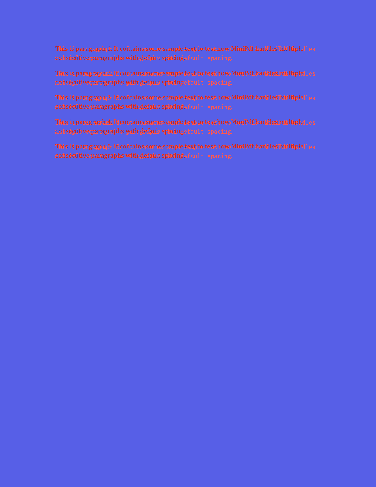</td>
  <td>changed: 61499 px (2.92%)<br>bbox: [187, 155, 1079, 541]<br>mean abs RGB: 4.5013<br>RMSE RGB: 29.7774<br>threshold: 12, gain: 5.0</td>
</tr>
<tr>
  <td><b>docx_classic03_headings</b><br>Page 1</td>
  <td>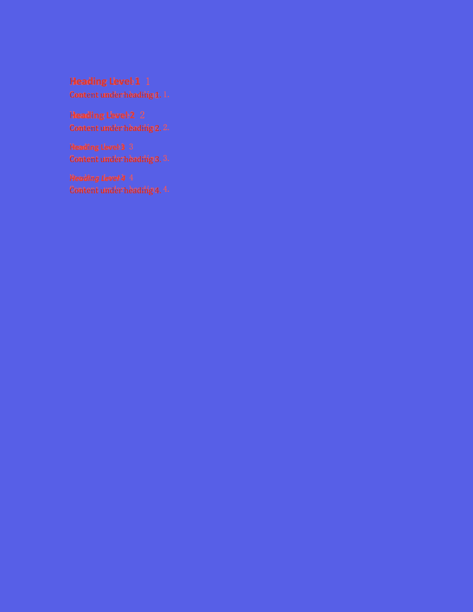</td>
  <td>changed: 12953 px (0.62%)<br>bbox: [188, 208, 434, 526]<br>mean abs RGB: 0.8196<br>RMSE RGB: 12.3004<br>threshold: 12, gain: 5.0</td>
</tr>
<tr>
  <td><b>docx_classic04_bold_italic</b><br>Page 1</td>
  <td></td>
  <td>changed: 5171 px (0.25%)<br>bbox: [188, 155, 716, 174]<br>mean abs RGB: 0.3901<br>RMSE RGB: 8.9057<br>threshold: 12, gain: 5.0</td>
</tr>
<tr>
  <td><b>docx_classic05_font_sizes</b><br>Page 1</td>
  <td>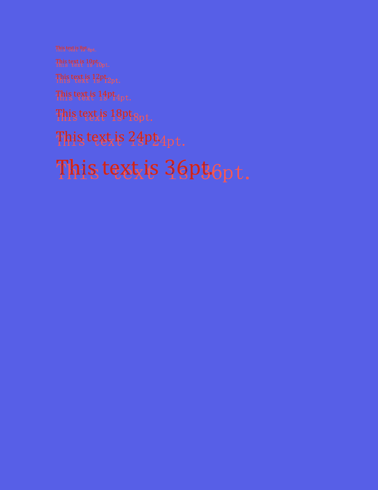</td>
  <td>changed: 31536 px (1.50%)<br>bbox: [187, 154, 715, 618]<br>mean abs RGB: 2.923<br>RMSE RGB: 25.7964<br>threshold: 12, gain: 5.0</td>
</tr>
<tr>
  <td><b>docx_classic06_font_colors</b><br>Page 1</td>
  <td></td>
  <td>changed: 4807 px (0.23%)<br>bbox: [188, 156, 302, 385]<br>mean abs RGB: 0.2233<br>RMSE RGB: 6.2288<br>threshold: 12, gain: 5.0</td>
</tr>
<tr>
  <td><b>docx_classic07_alignment</b><br>Page 1</td>
  <td></td>
  <td>changed: 54226 px (2.58%)<br>bbox: [188, 155, 1088, 508]<br>mean abs RGB: 4.2097<br>RMSE RGB: 29.2983<br>threshold: 12, gain: 5.0</td>
</tr>
<tr>
  <td><b>docx_classic08_bullet_list</b><br>Page 1</td>
  <td></td>
  <td>changed: 5776 px (0.27%)<br>bbox: [188, 178, 347, 362]<br>mean abs RGB: 0.396<br>RMSE RGB: 8.7554<br>threshold: 12, gain: 5.0</td>
</tr>
<tr>
  <td><b>docx_classic09_numbered_list</b><br>Page 1</td>
  <td></td>
  <td>changed: 9135 px (0.43%)<br>bbox: [188, 179, 406, 356]<br>mean abs RGB: 0.5949<br>RMSE RGB: 10.6099<br>threshold: 12, gain: 5.0</td>
</tr>
<tr>
  <td><b>docx_classic10_simple_table</b><br>Page 1</td>
  <td></td>
  <td>changed: 35690 px (1.70%)<br>bbox: [175, 178, 1088, 333]<br>mean abs RGB: 2.5365<br>RMSE RGB: 21.9304<br>threshold: 12, gain: 5.0</td>
</tr>
<tr>
  <td><b>docx_classic11_table_with_shading</b><br>Page 1</td>
  <td></td>
  <td>changed: 59146 px (2.81%)<br>bbox: [175, 178, 1088, 365]<br>mean abs RGB: 2.9437<br>RMSE RGB: 22.2393<br>threshold: 12, gain: 5.0</td>
</tr>
<tr>
  <td><b>docx_classic12_merged_cells_table</b><br>Page 1</td>
  <td></td>
  <td>changed: 31416 px (1.49%)<br>bbox: [175, 178, 1088, 333]<br>mean abs RGB: 2.2184<br>RMSE RGB: 20.3904<br>threshold: 12, gain: 5.0</td>
</tr>
<tr>
  <td><b>docx_classic13_long_document</b><br>Page 1</td>
  <td></td>
  <td>changed: 239447 px (11.38%)<br>bbox: [187, 208, 1080, 1489]<br>mean abs RGB: 17.6893<br>RMSE RGB: 59.1974<br>threshold: 12, gain: 5.0</td>
</tr>
<tr>
  <td><b>docx_classic13_long_document</b><br>Page 2</td>
  <td></td>
  <td>changed: 259345 px (12.33%)<br>bbox: [187, 155, 1080, 1401]<br>mean abs RGB: 19.02<br>RMSE RGB: 61.2528<br>threshold: 12, gain: 5.0</td>
</tr>
<tr>
  <td><b>docx_classic13_long_document</b><br>Page 3</td>
  <td>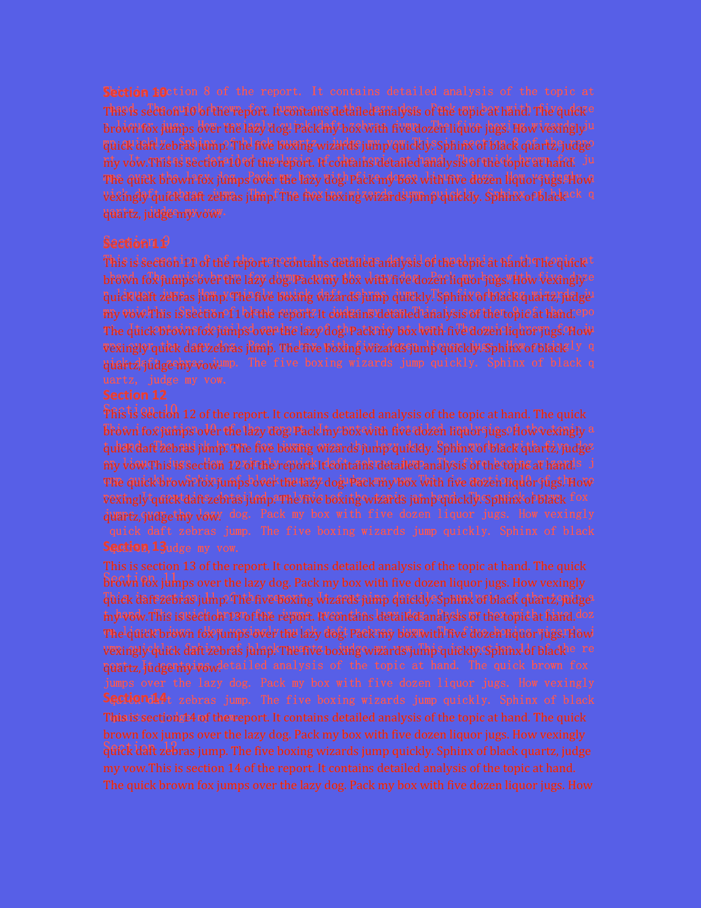</td>
  <td>changed: 297050 px (14.12%)<br>bbox: [187, 157, 1080, 1439]<br>mean abs RGB: 22.6045<br>RMSE RGB: 67.4542<br>threshold: 12, gain: 5.0</td>
</tr>
<tr>
  <td><b>docx_classic13_long_document</b><br>Page 4</td>
  <td></td>
  <td>changed: 65121 px (3.10%)<br>bbox: [187, 155, 1080, 483]<br>mean abs RGB: 4.9692<br>RMSE RGB: 31.6638<br>threshold: 12, gain: 5.0</td>
</tr>
<tr>
  <td><b>docx_classic14_mixed_content</b><br>Page 1</td>
  <td>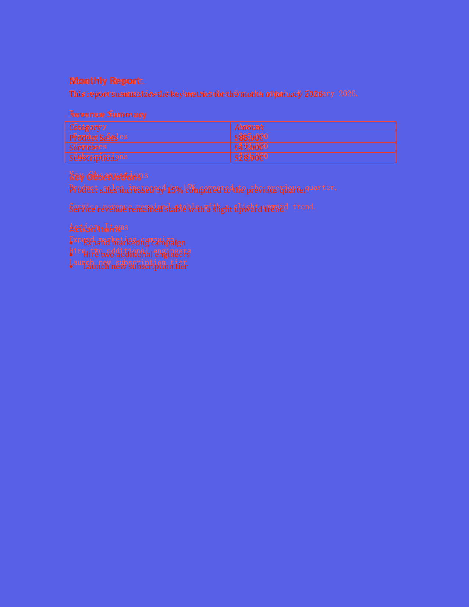</td>
  <td>changed: 62560 px (2.97%)<br>bbox: [175, 208, 1088, 741]<br>mean abs RGB: 4.3004<br>RMSE RGB: 28.2389<br>threshold: 12, gain: 5.0</td>
</tr>
<tr>
  <td><b>docx_classic15_indentation</b><br>Page 1</td>
  <td></td>
  <td>changed: 41376 px (1.97%)<br>bbox: [187, 178, 1082, 556]<br>mean abs RGB: 3.0033<br>RMSE RGB: 24.2673<br>threshold: 12, gain: 5.0</td>
</tr>
<tr>
  <td><b>docx_classic16_line_spacing</b><br>Page 1</td>
  <td></td>
  <td>changed: 45700 px (2.17%)<br>bbox: [187, 179, 1078, 724]<br>mean abs RGB: 3.4674<br>RMSE RGB: 26.4159<br>threshold: 12, gain: 5.0</td>
</tr>
<tr>
  <td><b>docx_classic17_page_break</b><br>Page 1</td>
  <td></td>
  <td>changed: 2915 px (0.14%)<br>bbox: [188, 209, 432, 268]<br>mean abs RGB: 0.1901<br>RMSE RGB: 5.9379<br>threshold: 12, gain: 5.0</td>
</tr>
<tr>
  <td><b>docx_classic17_page_break</b><br>Page 2</td>
  <td></td>
  <td>changed: 7115 px (0.34%)<br>bbox: [188, 159, 642, 267]<br>mean abs RGB: 0.523<br>RMSE RGB: 10.0896<br>threshold: 12, gain: 5.0</td>
</tr>
<tr>
  <td><b>docx_classic17_page_break</b><br>Page 3</td>
  <td></td>
  <td>changed: 4669 px (0.22%)<br>bbox: [188, 159, 441, 267]<br>mean abs RGB: 0.3333<br>RMSE RGB: 7.9433<br>threshold: 12, gain: 5.0</td>
</tr>
<tr>
  <td><b>docx_classic18_embedded_image</b><br>Page 1</td>
  <td>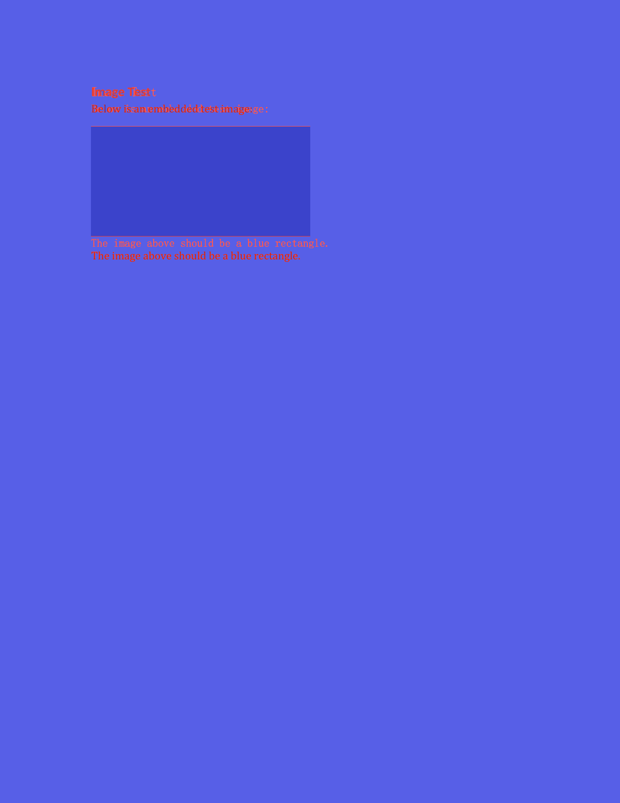</td>
  <td>changed: 9917 px (0.47%)<br>bbox: [187, 179, 638, 538]<br>mean abs RGB: 0.6998<br>RMSE RGB: 11.5926<br>threshold: 12, gain: 5.0</td>
</tr>
<tr>
  <td><b>docx_classic19_multiple_images</b><br>Page 1</td>
  <td></td>
  <td>changed: 61931 px (2.94%)<br>bbox: [187, 178, 563, 977]<br>mean abs RGB: 4.4087<br>RMSE RGB: 28.8074<br>threshold: 12, gain: 5.0</td>
</tr>
<tr>
  <td><b>docx_classic20_table_with_many_rows</b><br>Page 1</td>
  <td>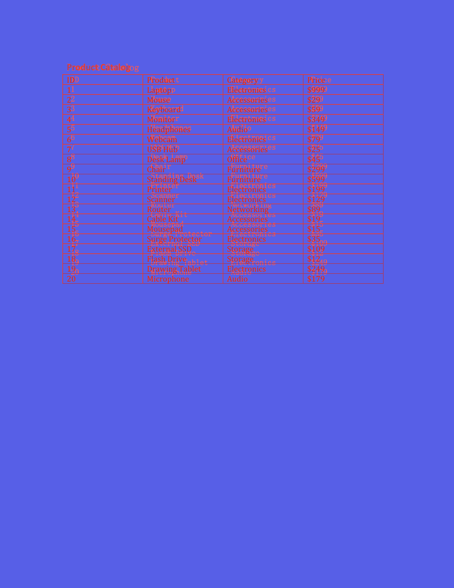</td>
  <td>changed: 143391 px (6.82%)<br>bbox: [175, 178, 1088, 864]<br>mean abs RGB: 10.5078<br>RMSE RGB: 45.2901<br>threshold: 12, gain: 5.0</td>
</tr>
<tr>
  <td><b>docx_classic21_nested_lists</b><br>Page 1</td>
  <td>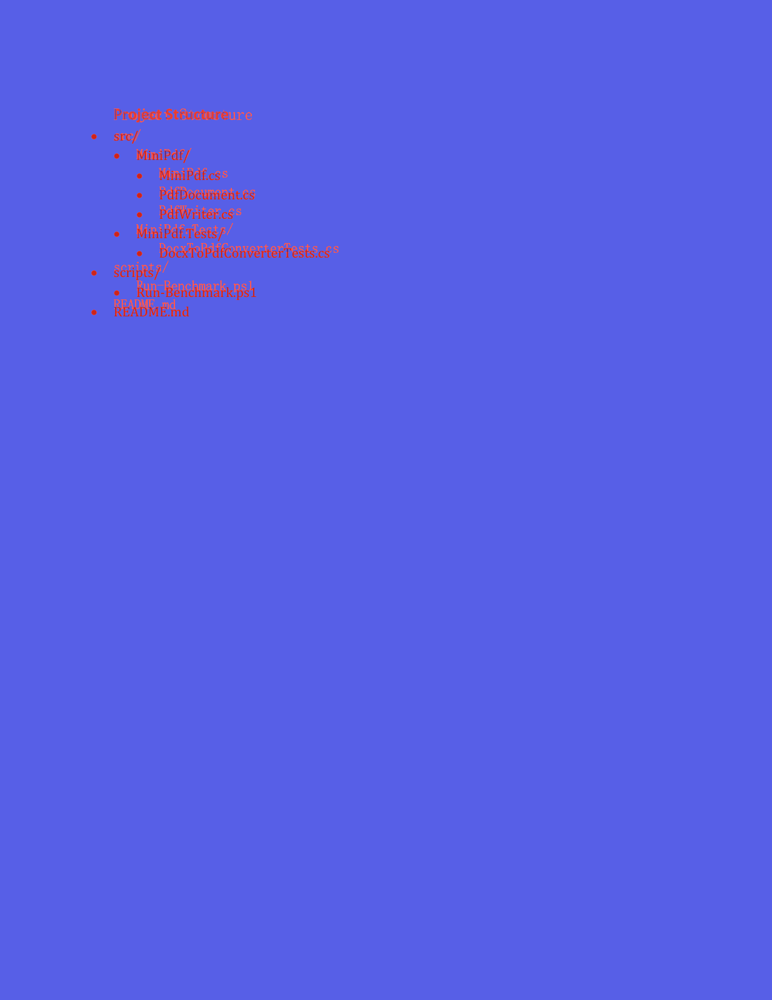</td>
  <td>changed: 16645 px (0.79%)<br>bbox: [151, 179, 544, 523]<br>mean abs RGB: 1.2224<br>RMSE RGB: 15.6738<br>threshold: 12, gain: 5.0</td>
</tr>
<tr>
  <td><b>docx_classic22_horizontal_rule</b><br>Page 1</td>
  <td></td>
  <td>changed: 24207 px (1.15%)<br>bbox: [184, 179, 1091, 522]<br>mean abs RGB: 1.7171<br>RMSE RGB: 18.5532<br>threshold: 12, gain: 5.0</td>
</tr>
<tr>
  <td><b>docx_classic23_mixed_formatting_runs</b><br>Page 1</td>
  <td></td>
  <td>changed: 6911 px (0.33%)<br>bbox: [188, 178, 707, 254]<br>mean abs RGB: 0.4329<br>RMSE RGB: 9.0511<br>threshold: 12, gain: 5.0</td>
</tr>
<tr>
  <td><b>docx_classic24_two_column_table_layout</b><br>Page 1</td>
  <td></td>
  <td>changed: 28061 px (1.33%)<br>bbox: [186, 178, 1088, 329]<br>mean abs RGB: 1.9685<br>RMSE RGB: 19.6498<br>threshold: 12, gain: 5.0</td>
</tr>
<tr>
  <td><b>docx_classic25_title_and_subtitle</b><br>Page 1</td>
  <td>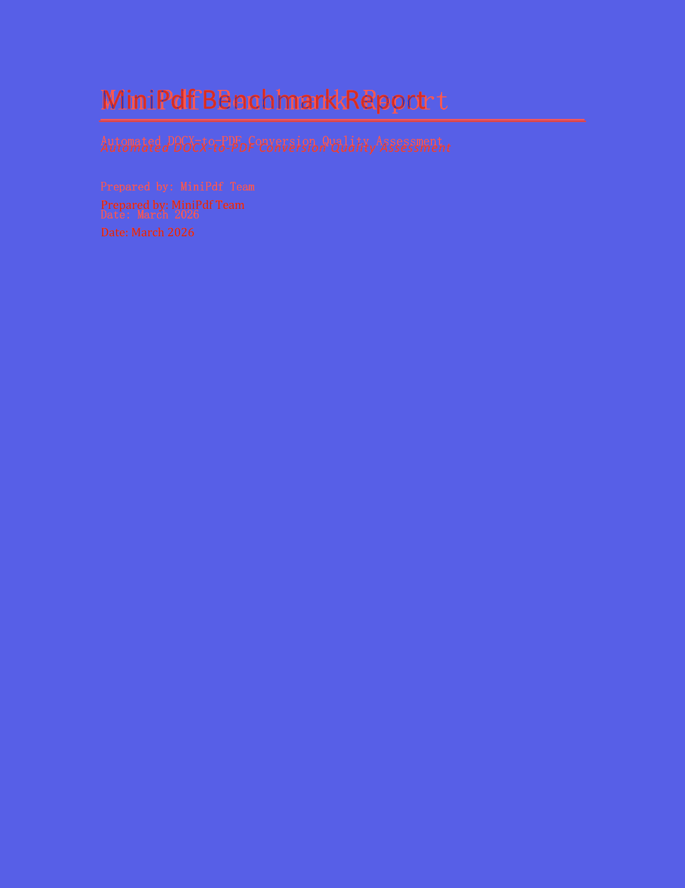</td>
  <td>changed: 28270 px (1.34%)<br>bbox: [184, 165, 1091, 440]<br>mean abs RGB: 1.6781<br>RMSE RGB: 16.7499<br>threshold: 12, gain: 5.0</td>
</tr>
<tr>
  <td><b>docx_classic25_title_and_subtitle</b><br>Page 2</td>
  <td></td>
  <td>changed: 11265 px (0.54%)<br>bbox: [187, 158, 879, 267]<br>mean abs RGB: 0.8223<br>RMSE RGB: 12.6287<br>threshold: 12, gain: 5.0</td>
</tr>
<tr>
  <td><b>docx_classic26_table_alignment</b><br>Page 1</td>
  <td></td>
  <td>changed: 29951 px (1.42%)<br>bbox: [175, 178, 1088, 333]<br>mean abs RGB: 2.1204<br>RMSE RGB: 19.985<br>threshold: 12, gain: 5.0</td>
</tr>
<tr>
  <td><b>docx_classic27_long_paragraph_wrapping</b><br>Page 1</td>
  <td></td>
  <td>changed: 189292 px (9.00%)<br>bbox: [187, 178, 1084, 943]<br>mean abs RGB: 13.713<br>RMSE RGB: 51.8089<br>threshold: 12, gain: 5.0</td>
</tr>
<tr>
  <td><b>docx_classic28_special_characters</b><br>Page 1</td>
  <td></td>
  <td>changed: 14987 px (0.71%)<br>bbox: [187, 178, 724, 439]<br>mean abs RGB: 0.9748<br>RMSE RGB: 13.4881<br>threshold: 12, gain: 5.0</td>
</tr>
<tr>
  <td><b>docx_classic29_table_with_image</b><br>Page 1</td>
  <td></td>
  <td>changed: 26867 px (1.28%)<br>bbox: [175, 178, 1088, 379]<br>mean abs RGB: 1.9001<br>RMSE RGB: 18.998<br>threshold: 12, gain: 5.0</td>
</tr>
<tr>
  <td><b>docx_classic30_comprehensive_report</b><br>Page 1</td>
  <td></td>
  <td>changed: 21313 px (1.01%)<br>bbox: [184, 165, 1091, 287]<br>mean abs RGB: 1.2618<br>RMSE RGB: 14.2927<br>threshold: 12, gain: 5.0</td>
</tr>
<tr>
  <td><b>docx_classic30_comprehensive_report</b><br>Page 2</td>
  <td>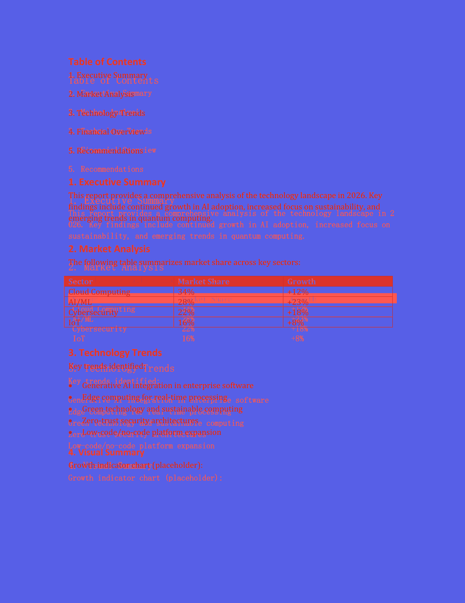</td>
  <td>changed: 164370 px (7.81%)<br>bbox: [175, 158, 1088, 1341]<br>mean abs RGB: 11.896<br>RMSE RGB: 47.1854<br>threshold: 12, gain: 5.0</td>
</tr>
<tr>
  <td><b>docx_classic30_comprehensive_report</b><br>Page 3</td>
  <td></td>
  <td>changed: 17517 px (0.83%)<br>bbox: [188, 509, 635, 665]<br>mean abs RGB: 1.2358<br>RMSE RGB: 15.3912<br>threshold: 12, gain: 5.0</td>
</tr>
<tr>
  <td><b>docx_classic31_product_card_with_image</b><br>Page 1</td>
  <td></td>
  <td>changed: 57575 px (2.74%)<br>bbox: [175, 208, 1088, 968]<br>mean abs RGB: 4.3892<br>RMSE RGB: 30.0108<br>threshold: 12, gain: 5.0</td>
</tr>
<tr>
  <td><b>docx_classic31_strikethrough_text</b><br>Page 1</td>
  <td>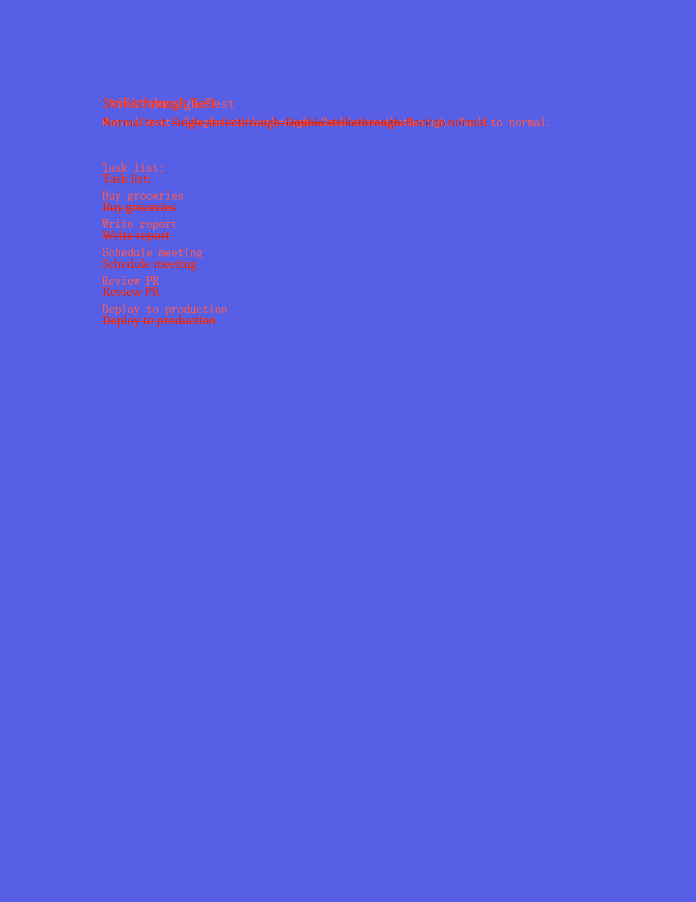</td>
  <td>changed: 19495 px (0.93%)<br>bbox: [187, 178, 895, 598]<br>mean abs RGB: 1.42<br>RMSE RGB: 16.7195<br>threshold: 12, gain: 5.0</td>
</tr>
<tr>
  <td><b>docx_classic32_company_logo_header</b><br>Page 1</td>
  <td>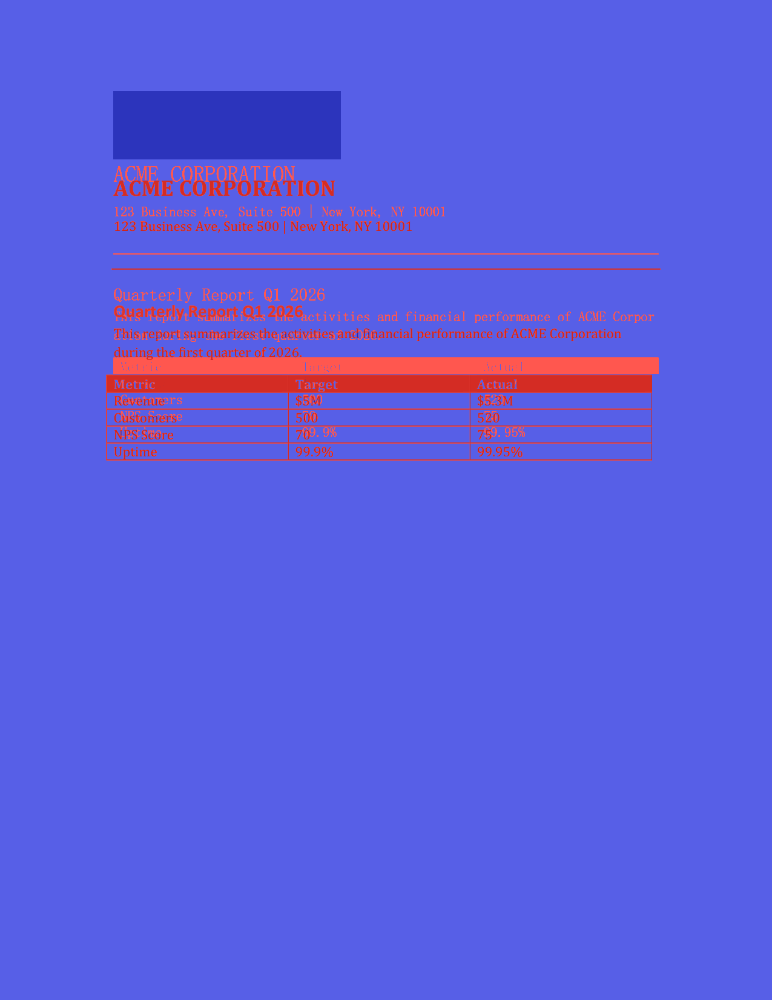</td>
  <td>changed: 112628 px (5.35%)<br>bbox: [175, 275, 1091, 760]<br>mean abs RGB: 9.0343<br>RMSE RGB: 42.4258<br>threshold: 12, gain: 5.0</td>
</tr>
<tr>
  <td><b>docx_classic32_superscript_subscript</b><br>Page 1</td>
  <td>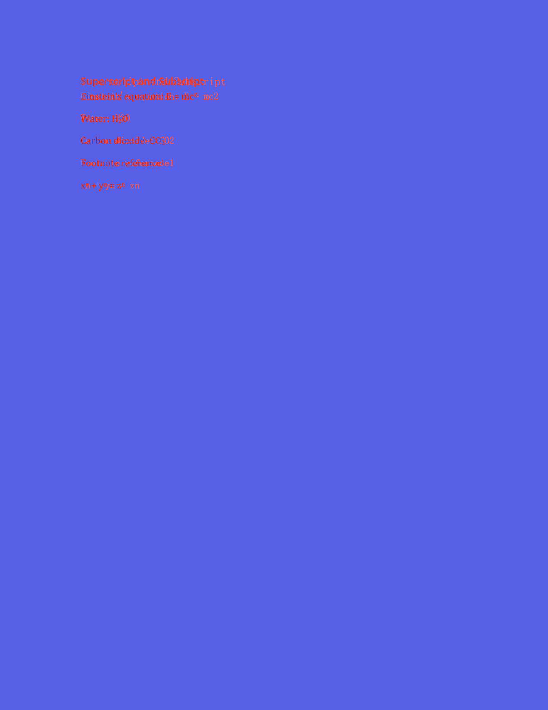</td>
  <td>changed: 9250 px (0.44%)<br>bbox: [187, 178, 474, 443]<br>mean abs RGB: 0.5756<br>RMSE RGB: 10.307<br>threshold: 12, gain: 5.0</td>
</tr>
<tr>
  <td><b>docx_classic33_highlighted_text</b><br>Page 1</td>
  <td>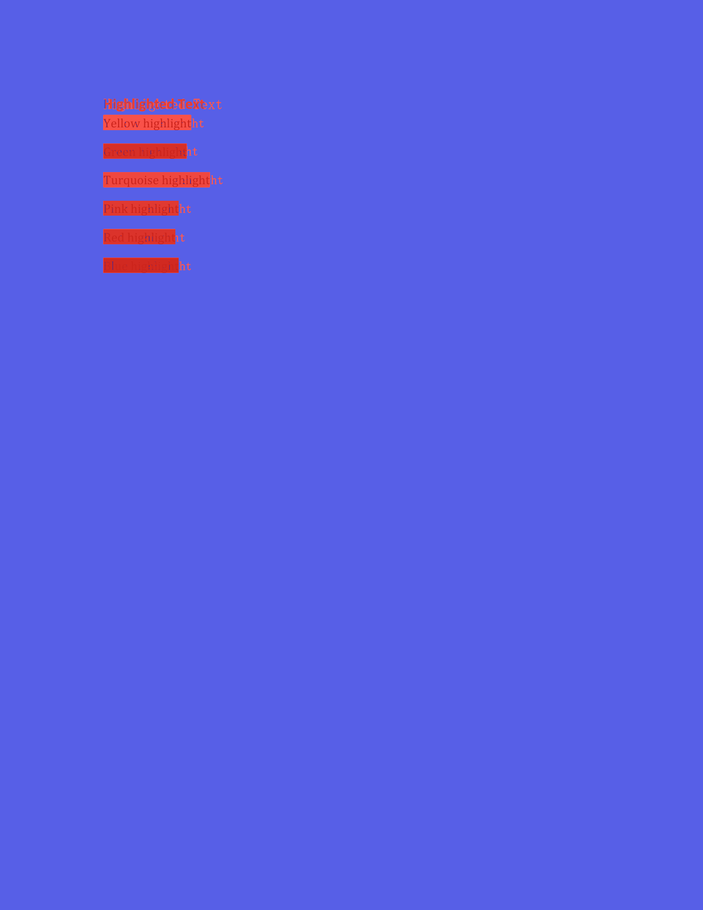</td>
  <td>changed: 26322 px (1.25%)<br>bbox: [187, 178, 381, 495]<br>mean abs RGB: 1.6443<br>RMSE RGB: 19.1809<br>threshold: 12, gain: 5.0</td>
</tr>
<tr>
  <td><b>docx_classic33_two_products_side_by_side</b><br>Page 1</td>
  <td>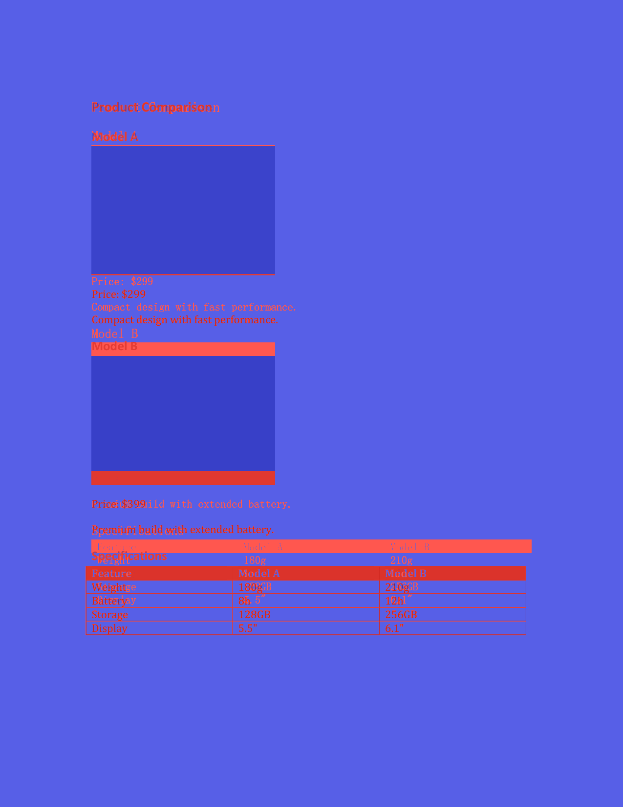</td>
  <td>changed: 116375 px (5.53%)<br>bbox: [175, 208, 1088, 1299]<br>mean abs RGB: 8.2031<br>RMSE RGB: 38.0033<br>threshold: 12, gain: 5.0</td>
</tr>
<tr>
  <td><b>docx_classic34_employee_directory_with_photo</b><br>Page 1</td>
  <td></td>
  <td>changed: 70491 px (3.35%)<br>bbox: [184, 208, 1091, 1490]<br>mean abs RGB: 4.8086<br>RMSE RGB: 29.1518<br>threshold: 12, gain: 5.0</td>
</tr>
<tr>
  <td><b>docx_classic34_employee_directory_with_photo</b><br>Page 2</td>
  <td></td>
  <td>changed: 4903 px (0.23%)<br>bbox: [184, 156, 1091, 236]<br>mean abs RGB: 0.4294<br>RMSE RGB: 9.4354<br>threshold: 12, gain: 5.0</td>
</tr>
<tr>
  <td><b>docx_classic34_paragraph_borders</b><br>Page 1</td>
  <td>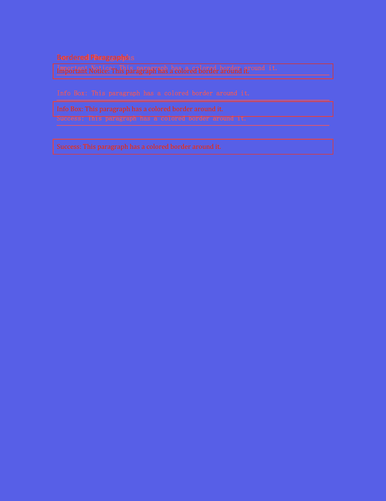</td>
  <td>changed: 46346 px (2.20%)<br>bbox: [174, 178, 1101, 509]<br>mean abs RGB: 2.9095<br>RMSE RGB: 23.7679<br>threshold: 12, gain: 5.0</td>
</tr>
<tr>
  <td><b>docx_classic35_inventory_with_product_photos</b><br>Page 1</td>
  <td>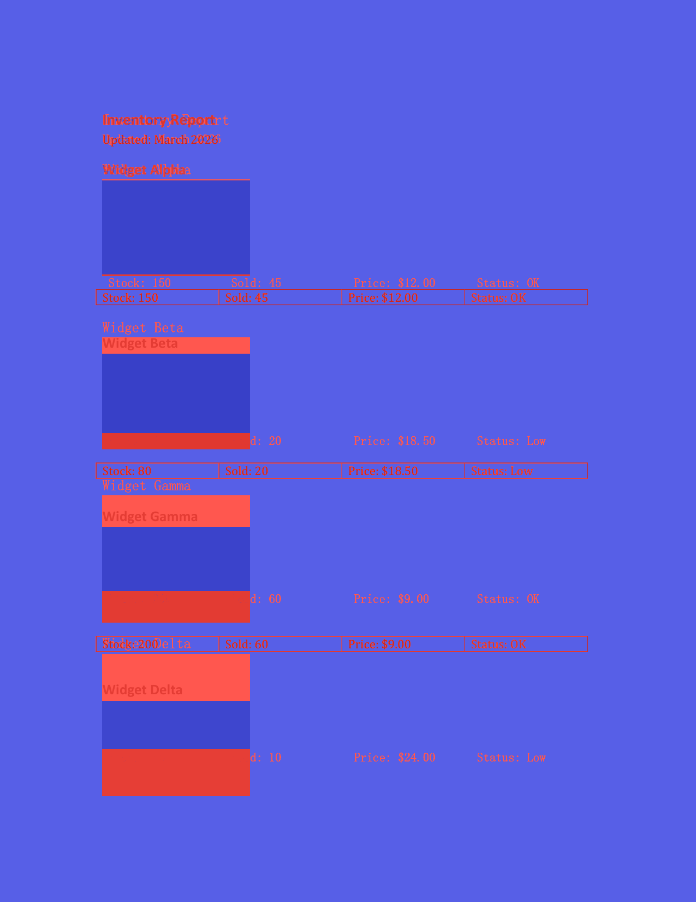</td>
  <td>changed: 130770 px (6.22%)<br>bbox: [175, 209, 1088, 1456]<br>mean abs RGB: 8.5942<br>RMSE RGB: 38.0429<br>threshold: 12, gain: 5.0</td>
</tr>
<tr>
  <td><b>docx_classic35_tab_stops</b><br>Page 1</td>
  <td></td>
  <td>changed: 21162 px (1.01%)<br>bbox: [187, 178, 1162, 443]<br>mean abs RGB: 1.4706<br>RMSE RGB: 16.7239<br>threshold: 12, gain: 5.0</td>
</tr>
<tr>
  <td><b>docx_classic36_invoice_with_logo</b><br>Page 1</td>
  <td></td>
  <td>changed: 104195 px (4.95%)<br>bbox: [175, 248, 1091, 865]<br>mean abs RGB: 8.2027<br>RMSE RGB: 40.626<br>threshold: 12, gain: 5.0</td>
</tr>
<tr>
  <td><b>docx_classic36_wide_table</b><br>Page 1</td>
  <td>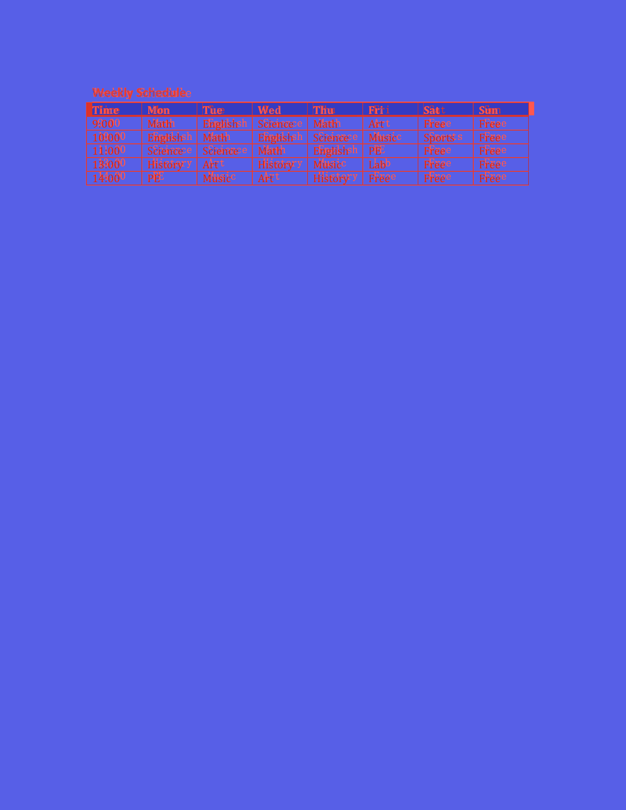</td>
  <td>changed: 58910 px (2.80%)<br>bbox: [175, 178, 1088, 396]<br>mean abs RGB: 3.9665<br>RMSE RGB: 27.161<br>threshold: 12, gain: 5.0</td>
</tr>
<tr>
  <td><b>docx_classic37_nested_table</b><br>Page 1</td>
  <td></td>
  <td>changed: 28066 px (1.33%)<br>bbox: [175, 178, 1088, 351]<br>mean abs RGB: 1.9291<br>RMSE RGB: 18.7176<br>threshold: 12, gain: 5.0</td>
</tr>
<tr>
  <td><b>docx_classic37_real_estate_listing</b><br>Page 1</td>
  <td></td>
  <td>changed: 65486 px (3.11%)<br>bbox: [175, 208, 1088, 913]<br>mean abs RGB: 3.8941<br>RMSE RGB: 26.5428<br>threshold: 12, gain: 5.0</td>
</tr>
<tr>
  <td><b>docx_classic38_restaurant_menu_with_photos</b><br>Page 1</td>
  <td></td>
  <td>changed: 131078 px (6.23%)<br>bbox: [184, 208, 1091, 1461]<br>mean abs RGB: 8.681<br>RMSE RGB: 37.3642<br>threshold: 12, gain: 5.0</td>
</tr>
<tr>
  <td><b>docx_classic38_restaurant_menu_with_photos</b><br>Page 2</td>
  <td></td>
  <td>changed: 101650 px (4.83%)<br>bbox: [187, 150, 447, 717]<br>mean abs RGB: 7.799<br>RMSE RGB: 37.9402<br>threshold: 12, gain: 5.0</td>
</tr>
<tr>
  <td><b>docx_classic38_table_column_widths</b><br>Page 1</td>
  <td></td>
  <td>changed: 49581 px (2.36%)<br>bbox: [175, 178, 1100, 473]<br>mean abs RGB: 3.6536<br>RMSE RGB: 26.6504<br>threshold: 12, gain: 5.0</td>
</tr>
<tr>
  <td><b>docx_classic39_cover_page_with_image</b><br>Page 1</td>
  <td></td>
  <td>changed: 83423 px (3.97%)<br>bbox: [262, 212, 1013, 1027]<br>mean abs RGB: 6.9582<br>RMSE RGB: 36.2114<br>threshold: 12, gain: 5.0</td>
</tr>
<tr>
  <td><b>docx_classic39_cover_page_with_image</b><br>Page 2</td>
  <td></td>
  <td>changed: 12071 px (0.57%)<br>bbox: [187, 158, 405, 423]<br>mean abs RGB: 0.8247<br>RMSE RGB: 12.2874<br>threshold: 12, gain: 5.0</td>
</tr>
<tr>
  <td><b>docx_classic39_financial_report</b><br>Page 1</td>
  <td></td>
  <td>changed: 60005 px (2.85%)<br>bbox: [175, 208, 1088, 569]<br>mean abs RGB: 4.0908<br>RMSE RGB: 27.9144<br>threshold: 12, gain: 5.0</td>
</tr>
<tr>
  <td><b>docx_classic40_product_catalog_with_images</b><br>Page 1</td>
  <td></td>
  <td>changed: 66418 px (3.16%)<br>bbox: [175, 208, 1088, 1094]<br>mean abs RGB: 4.6125<br>RMSE RGB: 28.8334<br>threshold: 12, gain: 5.0</td>
</tr>
<tr>
  <td><b>docx_classic40_resume</b><br>Page 1</td>
  <td></td>
  <td>changed: 108218 px (5.14%)<br>bbox: [184, 167, 1091, 1088]<br>mean abs RGB: 8.0658<br>RMSE RGB: 40.0853<br>threshold: 12, gain: 5.0</td>
</tr>
<tr>
  <td><b>docx_classic41_business_letter</b><br>Page 1</td>
  <td></td>
  <td>changed: 76162 px (3.62%)<br>bbox: [187, 156, 1087, 1356]<br>mean abs RGB: 5.8721<br>RMSE RGB: 34.5469<br>threshold: 12, gain: 5.0</td>
</tr>
<tr>
  <td><b>docx_classic41_newsletter_with_hero_image</b><br>Page 1</td>
  <td></td>
  <td>changed: 118713 px (5.64%)<br>bbox: [184, 149, 1091, 1312]<br>mean abs RGB: 8.7746<br>RMSE RGB: 40.4753<br>threshold: 12, gain: 5.0</td>
</tr>
<tr>
  <td><b>docx_classic42_chart_image_with_data</b><br>Page 1</td>
  <td>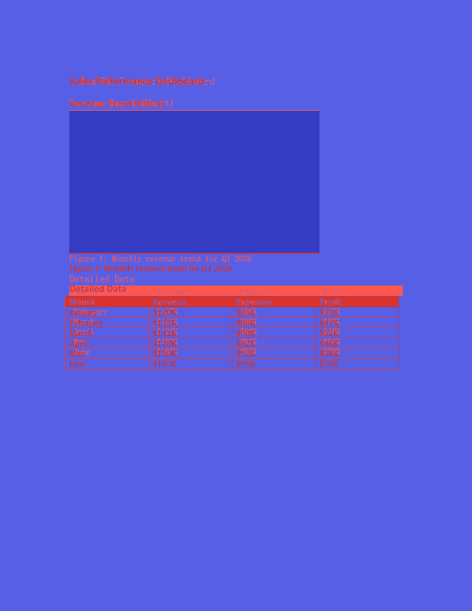</td>
  <td>changed: 104214 px (4.95%)<br>bbox: [175, 208, 1088, 997]<br>mean abs RGB: 7.2835<br>RMSE RGB: 36.1551<br>threshold: 12, gain: 5.0</td>
</tr>
<tr>
  <td><b>docx_classic42_meeting_minutes</b><br>Page 1</td>
  <td></td>
  <td>changed: 129728 px (6.17%)<br>bbox: [175, 208, 1088, 1113]<br>mean abs RGB: 8.3949<br>RMSE RGB: 39.7827<br>threshold: 12, gain: 5.0</td>
</tr>
<tr>
  <td><b>docx_classic43_event_flyer_with_banner</b><br>Page 1</td>
  <td>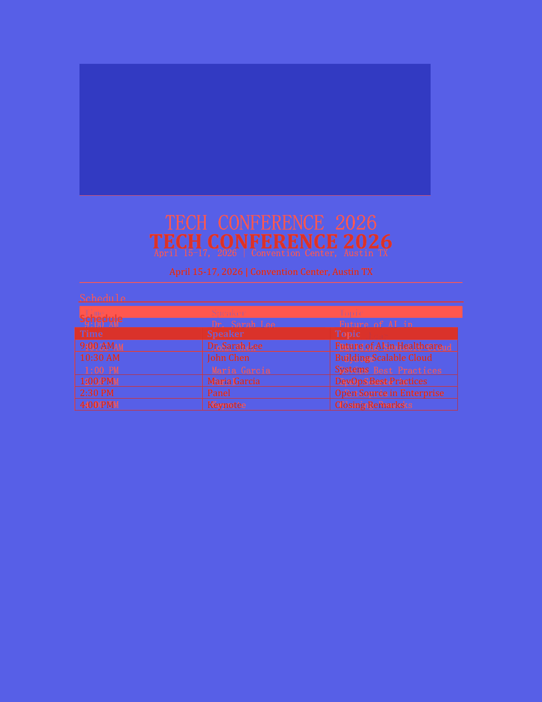</td>
  <td>changed: 125005 px (5.94%)<br>bbox: [175, 459, 1091, 965]<br>mean abs RGB: 8.9976<br>RMSE RGB: 40.3472<br>threshold: 12, gain: 5.0</td>
</tr>
<tr>
  <td><b>docx_classic43_invoice_document</b><br>Page 1</td>
  <td></td>
  <td>changed: 159324 px (7.57%)<br>bbox: [175, 160, 1091, 1261]<br>mean abs RGB: 11.8922<br>RMSE RGB: 47.9426<br>threshold: 12, gain: 5.0</td>
</tr>
<tr>
  <td><b>docx_classic44_dashboard_with_kpi_image</b><br>Page 1</td>
  <td></td>
  <td>changed: 102784 px (4.89%)<br>bbox: [175, 208, 1088, 1049]<br>mean abs RGB: 7.1411<br>RMSE RGB: 35.857<br>threshold: 12, gain: 5.0</td>
</tr>
<tr>
  <td><b>docx_classic44_memo</b><br>Page 1</td>
  <td></td>
  <td>changed: 93299 px (4.43%)<br>bbox: [184, 159, 1091, 1011]<br>mean abs RGB: 7.0571<br>RMSE RGB: 37.6983<br>threshold: 12, gain: 5.0</td>
</tr>
<tr>
  <td><b>docx_classic45_certificate_with_seal</b><br>Page 1</td>
  <td>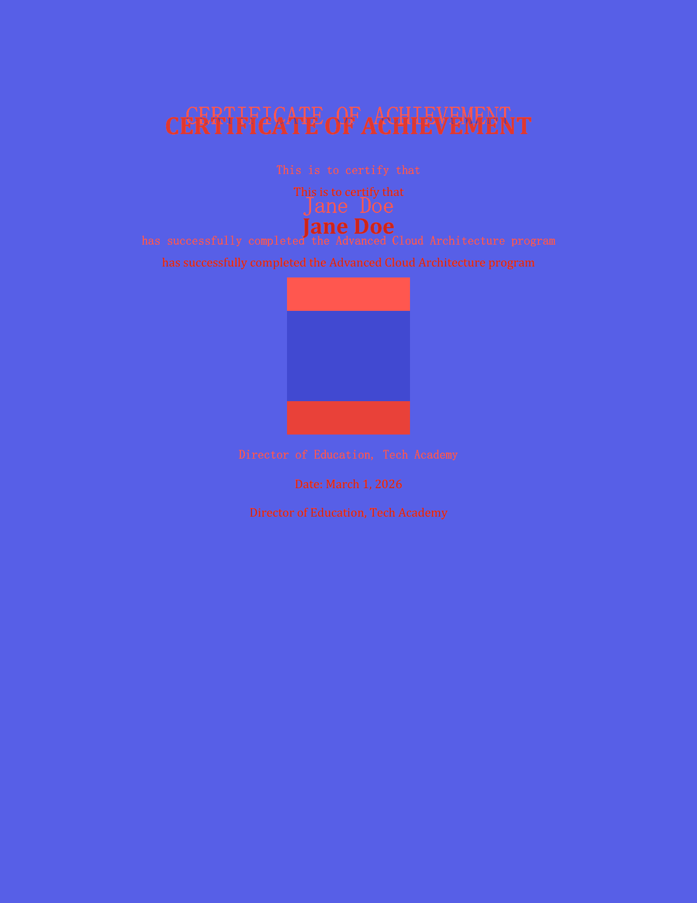</td>
  <td>changed: 63710 px (3.03%)<br>bbox: [297, 197, 978, 949]<br>mean abs RGB: 4.5267<br>RMSE RGB: 29.0179<br>threshold: 12, gain: 5.0</td>
</tr>
<tr>
  <td><b>docx_classic45_project_plan</b><br>Page 1</td>
  <td>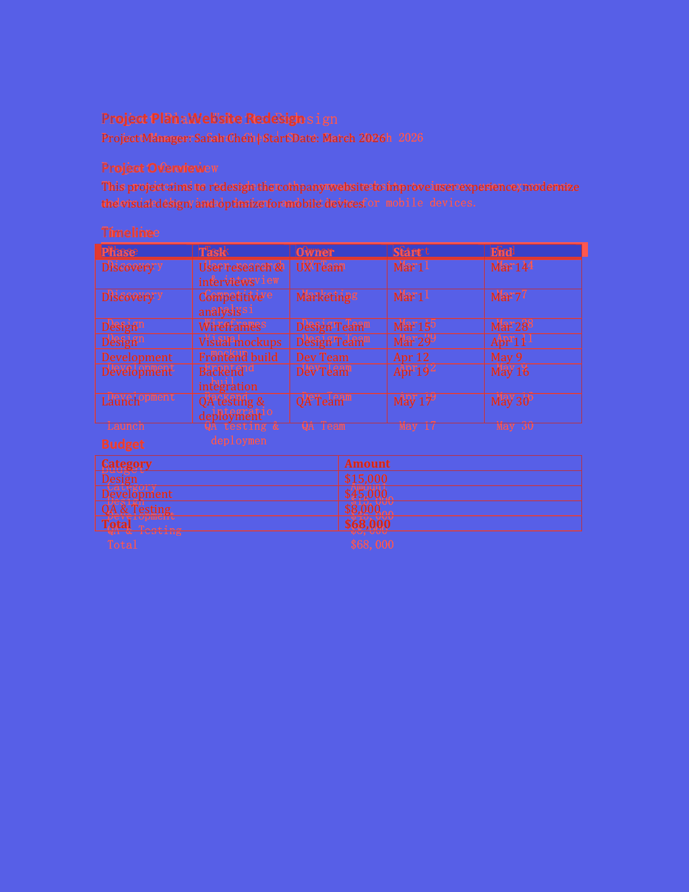</td>
  <td>changed: 138673 px (6.59%)<br>bbox: [175, 208, 1088, 1020]<br>mean abs RGB: 9.5098<br>RMSE RGB: 42.9039<br>threshold: 12, gain: 5.0</td>
</tr>
<tr>
  <td><b>docx_classic46_comparison_table</b><br>Page 1</td>
  <td></td>
  <td>changed: 68149 px (3.24%)<br>bbox: [175, 208, 1088, 521]<br>mean abs RGB: 4.717<br>RMSE RGB: 29.8008<br>threshold: 12, gain: 5.0</td>
</tr>
<tr>
  <td><b>docx_classic46_product_image_grid</b><br>Page 1</td>
  <td></td>
  <td>changed: 96914 px (4.61%)<br>bbox: [187, 208, 488, 1329]<br>mean abs RGB: 6.8553<br>RMSE RGB: 34.4547<br>threshold: 12, gain: 5.0</td>
</tr>
<tr>
  <td><b>docx_classic47_data_dictionary</b><br>Page 1</td>
  <td></td>
  <td>changed: 147380 px (7.01%)<br>bbox: [175, 208, 1088, 874]<br>mean abs RGB: 9.6995<br>RMSE RGB: 42.287<br>threshold: 12, gain: 5.0</td>
</tr>
<tr>
  <td><b>docx_classic47_news_article_with_hero_image</b><br>Page 1</td>
  <td>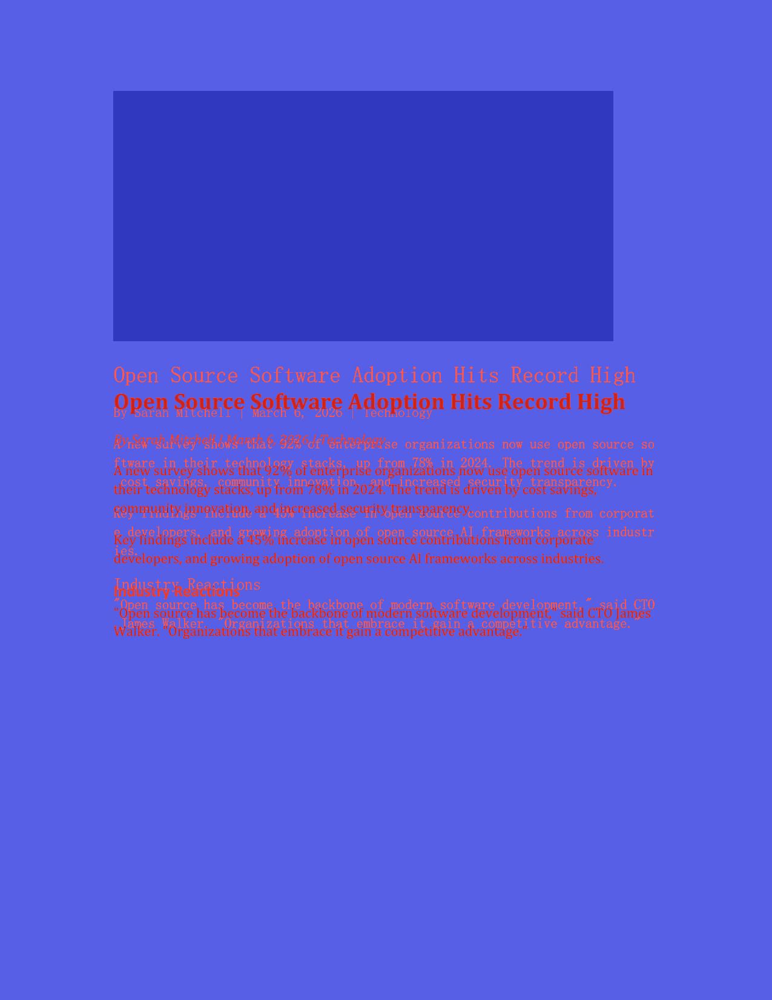</td>
  <td>changed: 89665 px (4.26%)<br>bbox: [187, 605, 1080, 1054]<br>mean abs RGB: 7.0963<br>RMSE RGB: 38.3861<br>threshold: 12, gain: 5.0</td>
</tr>
<tr>
  <td><b>docx_classic48_multi_level_headings</b><br>Page 1</td>
  <td>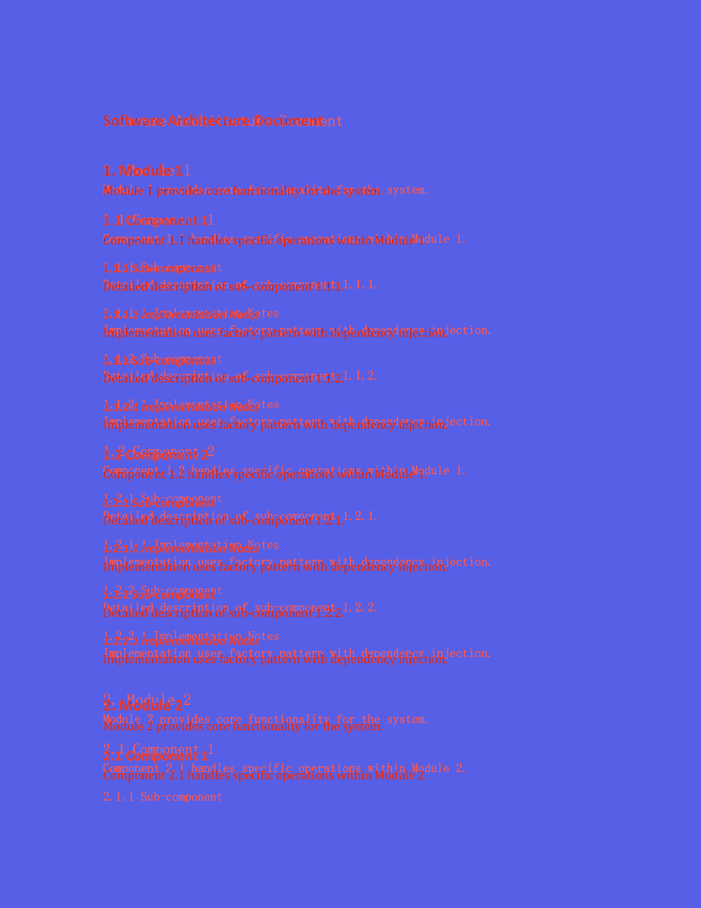</td>
  <td>changed: 109671 px (5.21%)<br>bbox: [188, 208, 814, 1459]<br>mean abs RGB: 7.1946<br>RMSE RGB: 36.5207<br>threshold: 12, gain: 5.0</td>
</tr>
<tr>
  <td><b>docx_classic48_multi_level_headings</b><br>Page 2</td>
  <td>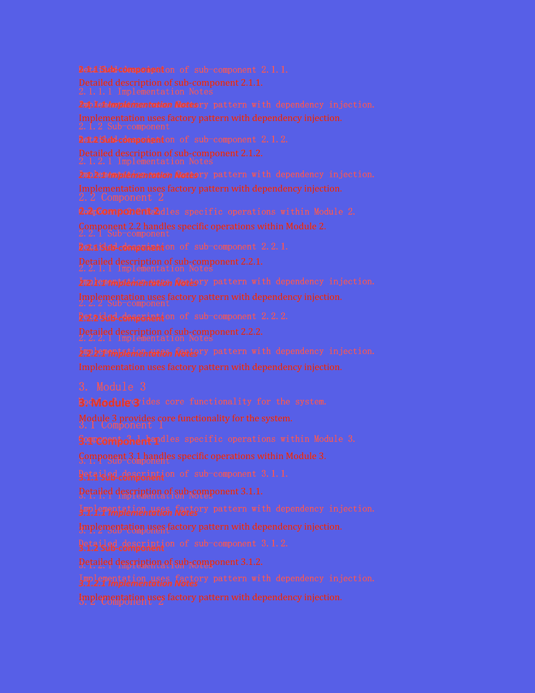</td>
  <td>changed: 140668 px (6.69%)<br>bbox: [187, 156, 814, 1445]<br>mean abs RGB: 9.3978<br>RMSE RGB: 41.8213<br>threshold: 12, gain: 5.0</td>
</tr>
<tr>
  <td><b>docx_classic48_multi_level_headings</b><br>Page 3</td>
  <td>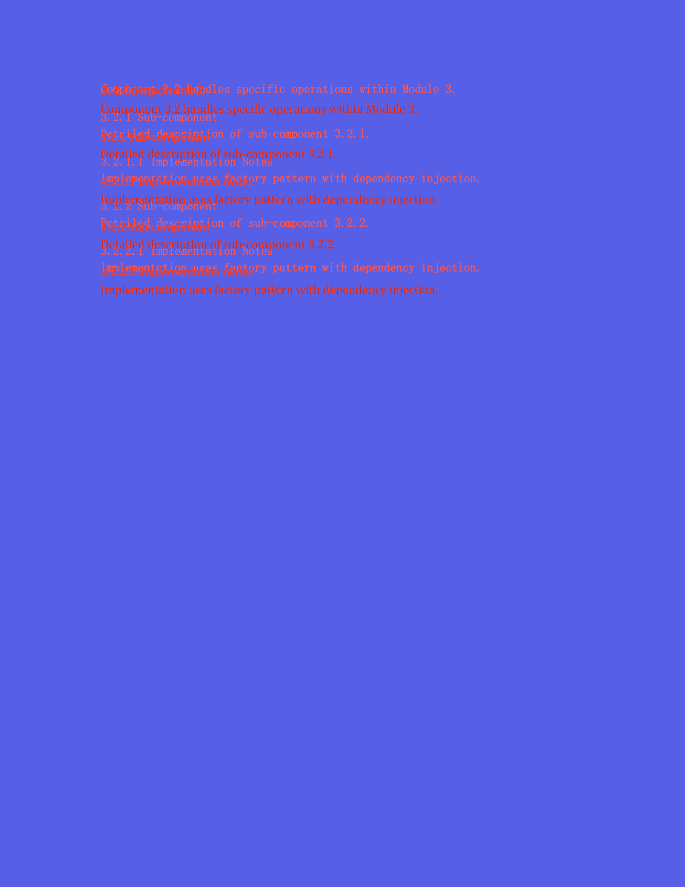</td>
  <td>changed: 46554 px (2.21%)<br>bbox: [187, 157, 814, 551]<br>mean abs RGB: 3.1341<br>RMSE RGB: 24.2347<br>threshold: 12, gain: 5.0</td>
</tr>
<tr>
  <td><b>docx_classic48_task_list_with_status_icons</b><br>Page 1</td>
  <td>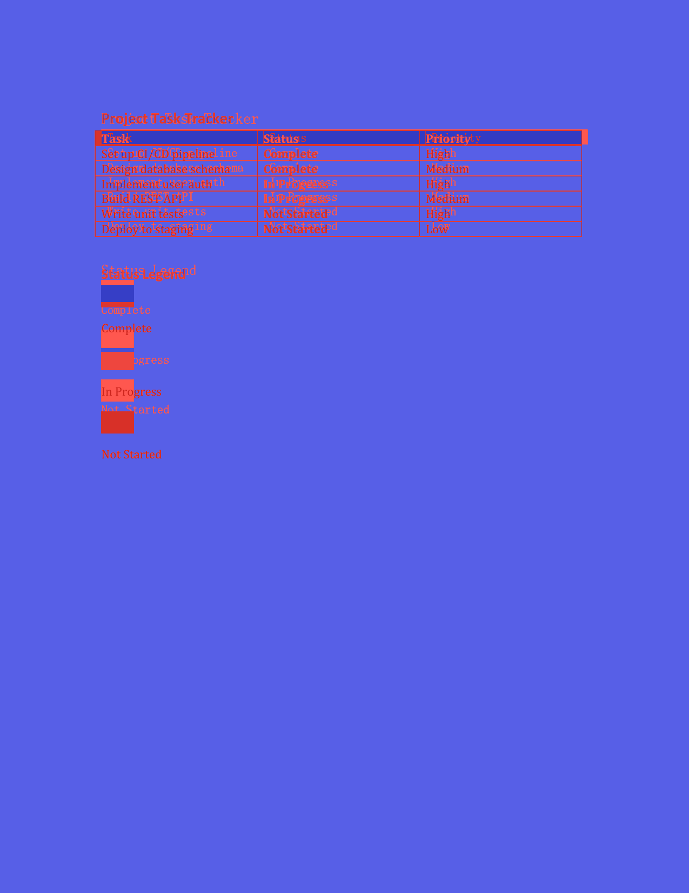</td>
  <td>changed: 72562 px (3.45%)<br>bbox: [175, 208, 1088, 848]<br>mean abs RGB: 4.9302<br>RMSE RGB: 30.5659<br>threshold: 12, gain: 5.0</td>
</tr>
<tr>
  <td><b>docx_classic49_cjk_document</b><br>Page 1</td>
  <td>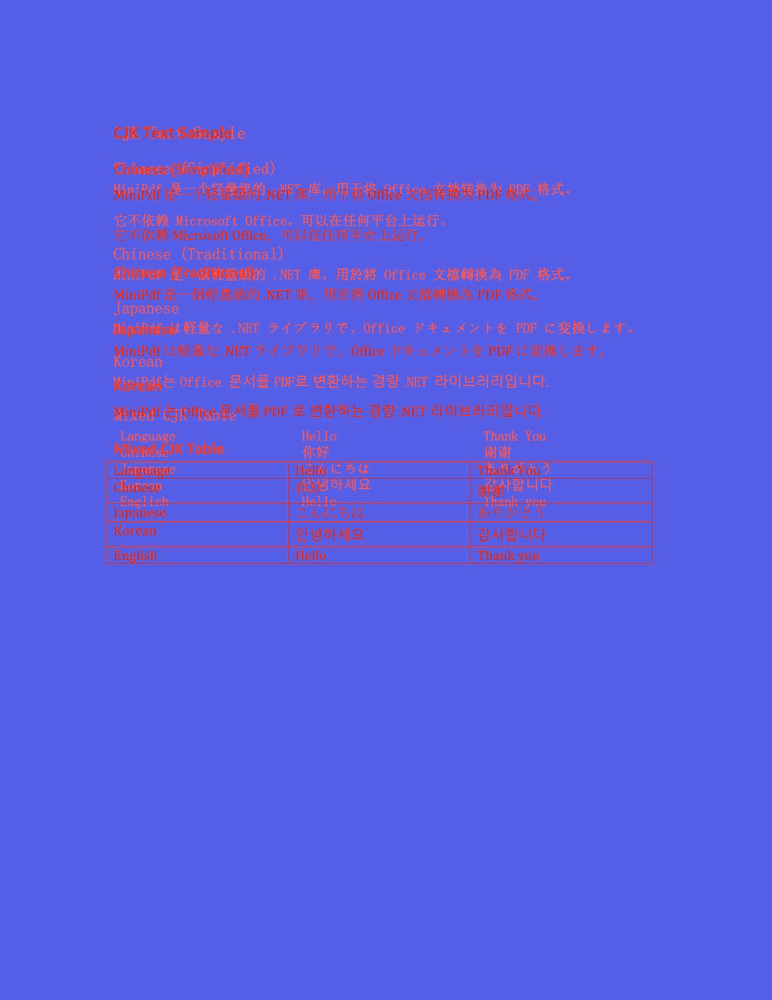</td>
  <td>changed: 89887 px (4.27%)<br>bbox: [175, 208, 1088, 931]<br>mean abs RGB: 5.7632<br>RMSE RGB: 32.2322<br>threshold: 12, gain: 5.0</td>
</tr>
<tr>
  <td><b>docx_classic49_wide_panoramic_banner</b><br>Page 1</td>
  <td></td>
  <td>changed: 142891 px (6.79%)<br>bbox: [175, 374, 1088, 1206]<br>mean abs RGB: 8.7291<br>RMSE RGB: 39.3642<br>threshold: 12, gain: 5.0</td>
</tr>
<tr>
  <td><b>docx_classic50_long_table_with_formatting</b><br>Page 1</td>
  <td>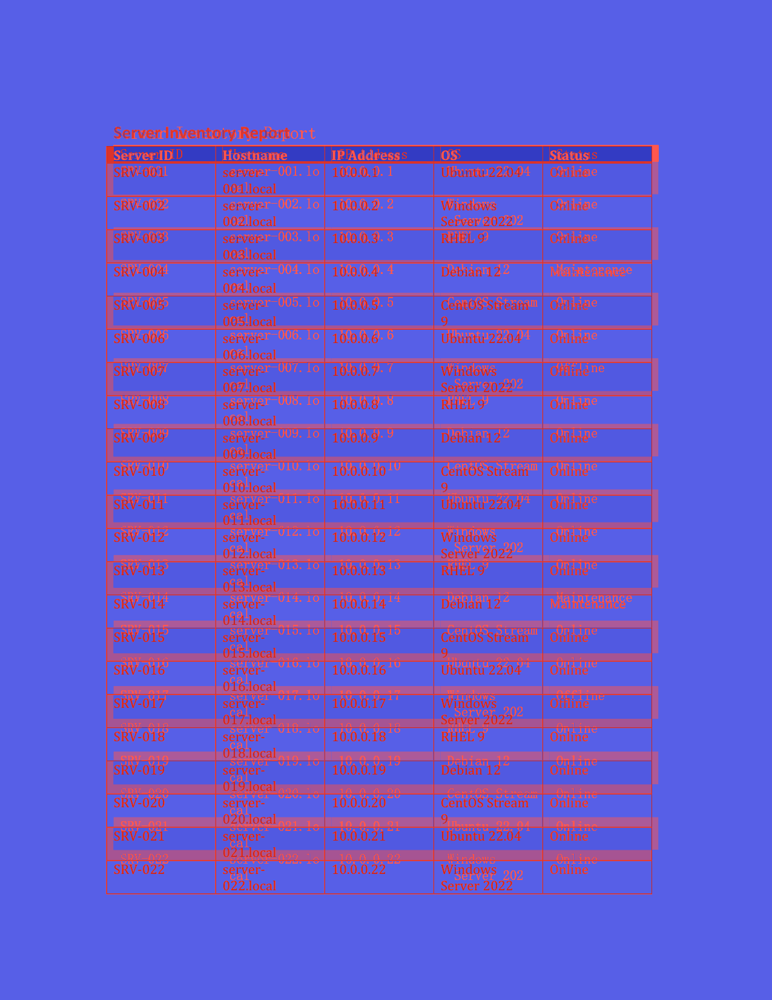</td>
  <td>changed: 696269 px (33.10%)<br>bbox: [175, 209, 1088, 1476]<br>mean abs RGB: 24.4625<br>RMSE RGB: 61.4606<br>threshold: 12, gain: 5.0</td>
</tr>
<tr>
  <td><b>docx_classic50_portrait_tall_image</b><br>Page 1</td>
  <td></td>
  <td>changed: 55394 px (2.63%)<br>bbox: [187, 208, 1075, 1049]<br>mean abs RGB: 4.2046<br>RMSE RGB: 29.1303<br>threshold: 12, gain: 5.0</td>
</tr>
<tr>
  <td><b>docx_classic51_step_by_step_with_images</b><br>Page 1</td>
  <td>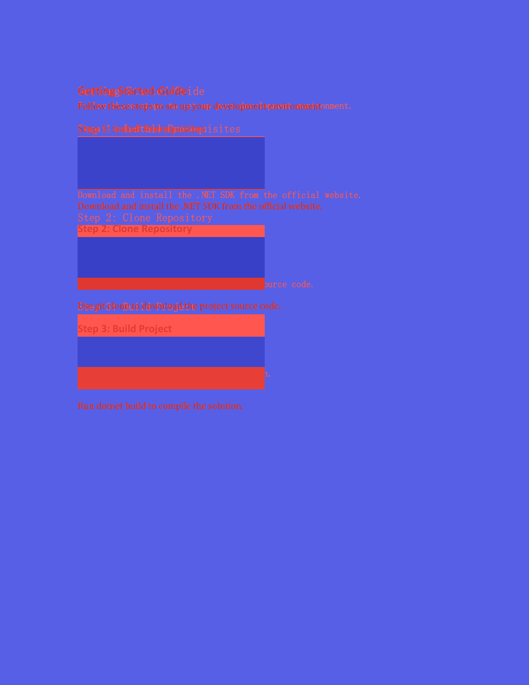</td>
  <td>changed: 102636 px (4.88%)<br>bbox: [187, 208, 778, 990]<br>mean abs RGB: 6.5462<br>RMSE RGB: 32.7192<br>threshold: 12, gain: 5.0</td>
</tr>
<tr>
  <td><b>docx_classic51_underline_styles</b><br>Page 1</td>
  <td></td>
  <td>changed: 12619 px (0.60%)<br>bbox: [187, 178, 371, 495]<br>mean abs RGB: 0.8577<br>RMSE RGB: 12.7507<br>threshold: 12, gain: 5.0</td>
</tr>
<tr>
  <td><b>docx_classic52_before_after_comparison</b><br>Page 1</td>
  <td></td>
  <td>changed: 98387 px (4.68%)<br>bbox: [187, 208, 596, 1370]<br>mean abs RGB: 6.6921<br>RMSE RGB: 33.0115<br>threshold: 12, gain: 5.0</td>
</tr>
<tr>
  <td><b>docx_classic52_spacing_before_after</b><br>Page 1</td>
  <td>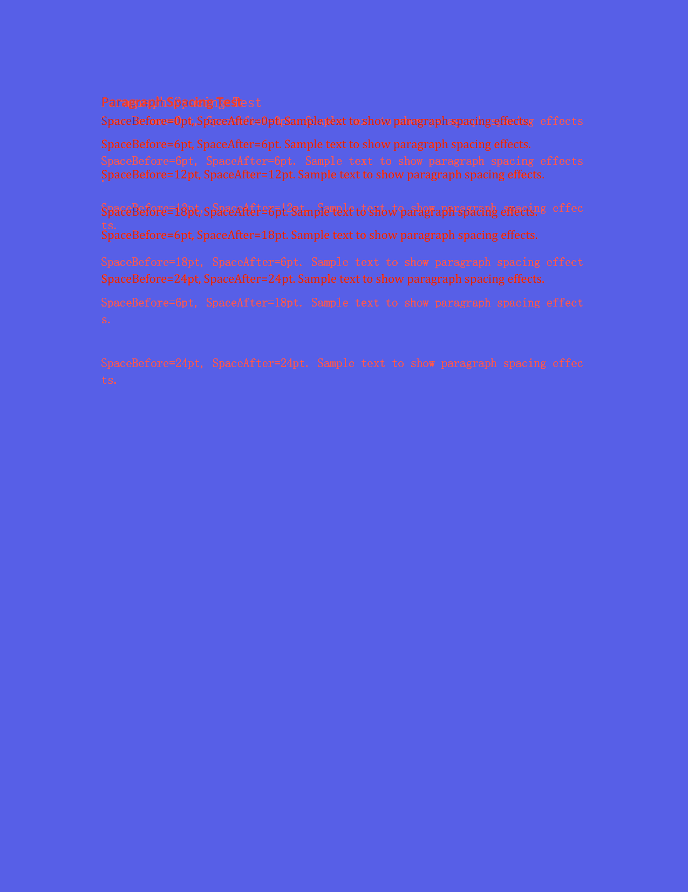</td>
  <td>changed: 47152 px (2.24%)<br>bbox: [188, 178, 1008, 529]<br>mean abs RGB: 3.2454<br>RMSE RGB: 24.9151<br>threshold: 12, gain: 5.0</td>
</tr>
<tr>
  <td><b>docx_classic53_color_swatch_palette</b><br>Page 1</td>
  <td>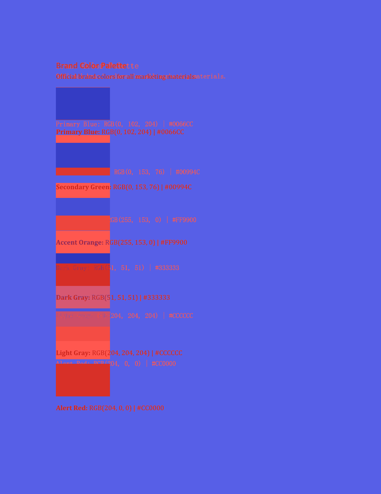</td>
  <td>changed: 144506 px (6.87%)<br>bbox: [187, 208, 655, 1375]<br>mean abs RGB: 10.1025<br>RMSE RGB: 45.0765<br>threshold: 12, gain: 5.0</td>
</tr>
<tr>
  <td><b>docx_classic53_table_merged_complex</b><br>Page 1</td>
  <td>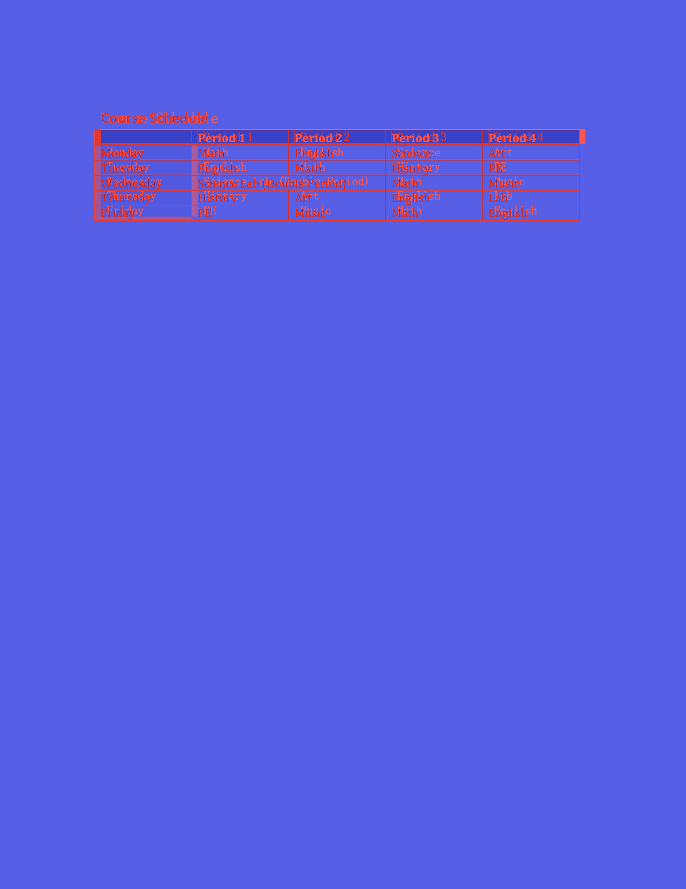</td>
  <td>changed: 62331 px (2.96%)<br>bbox: [175, 208, 1088, 455]<br>mean abs RGB: 3.6266<br>RMSE RGB: 25.309<br>threshold: 12, gain: 5.0</td>
</tr>
<tr>
  <td><b>docx_classic54_multi_font_family</b><br>Page 1</td>
  <td></td>
  <td>changed: 32147 px (1.53%)<br>bbox: [187, 178, 967, 495]<br>mean abs RGB: 2.2348<br>RMSE RGB: 20.7772<br>threshold: 12, gain: 5.0</td>
</tr>
<tr>
  <td><b>docx_classic54_travel_destination_cards</b><br>Page 1</td>
  <td></td>
  <td>changed: 65195 px (3.10%)<br>bbox: [175, 208, 1088, 1032]<br>mean abs RGB: 3.9884<br>RMSE RGB: 26.3881<br>threshold: 12, gain: 5.0</td>
</tr>
<tr>
  <td><b>docx_classic55_background_shading_paragraph</b><br>Page 1</td>
  <td>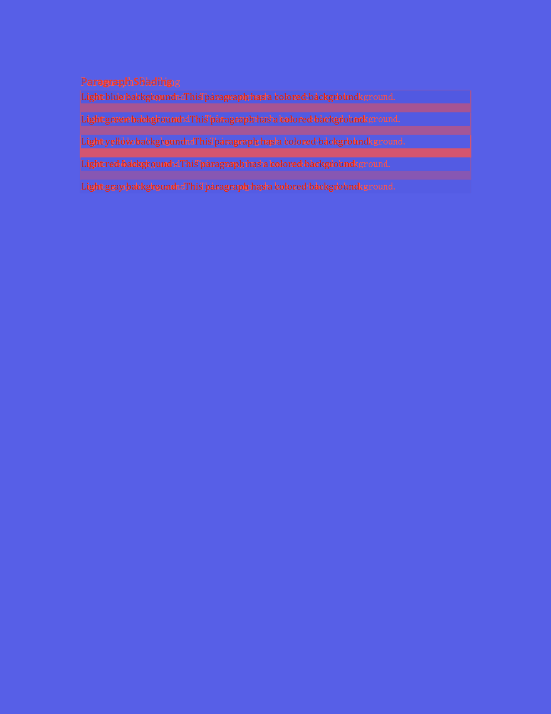</td>
  <td>changed: 113430 px (5.39%)<br>bbox: [184, 178, 1091, 446]<br>mean abs RGB: 2.8943<br>RMSE RGB: 19.5296<br>threshold: 12, gain: 5.0</td>
</tr>
<tr>
  <td><b>docx_classic55_lab_results_with_image</b><br>Page 1</td>
  <td>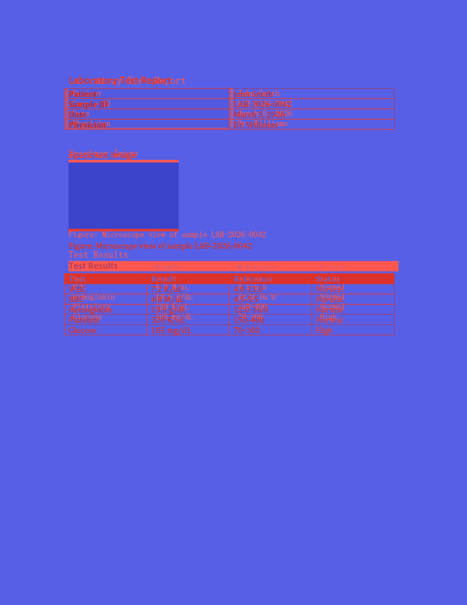</td>
  <td>changed: 120866 px (5.75%)<br>bbox: [175, 208, 1088, 917]<br>mean abs RGB: 7.866<br>RMSE RGB: 37.5344<br>threshold: 12, gain: 5.0</td>
</tr>
<tr>
  <td><b>docx_classic56_images_and_tables_mixed</b><br>Page 1</td>
  <td>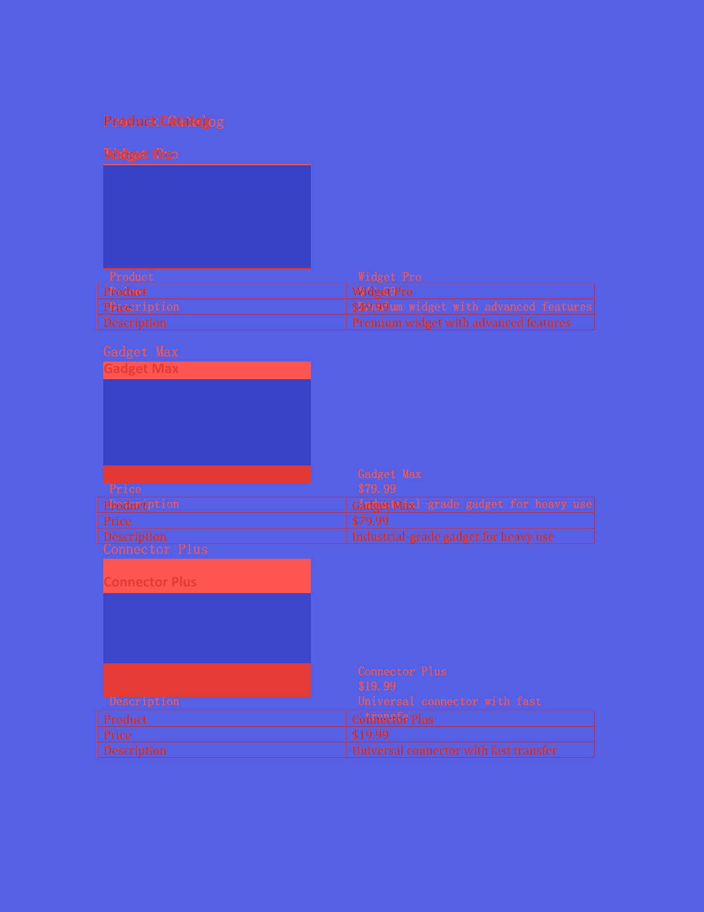</td>
  <td>changed: 120453 px (5.73%)<br>bbox: [175, 208, 1088, 1371]<br>mean abs RGB: 8.212<br>RMSE RGB: 39.3333<br>threshold: 12, gain: 5.0</td>
</tr>
<tr>
  <td><b>docx_classic56_software_screenshot_features</b><br>Page 1</td>
  <td></td>
  <td>changed: 91635 px (4.36%)<br>bbox: [175, 208, 1088, 1112]<br>mean abs RGB: 6.8921<br>RMSE RGB: 37.2651<br>threshold: 12, gain: 5.0</td>
</tr>
<tr>
  <td><b>docx_classic57_right_to_left_text</b><br>Page 1</td>
  <td>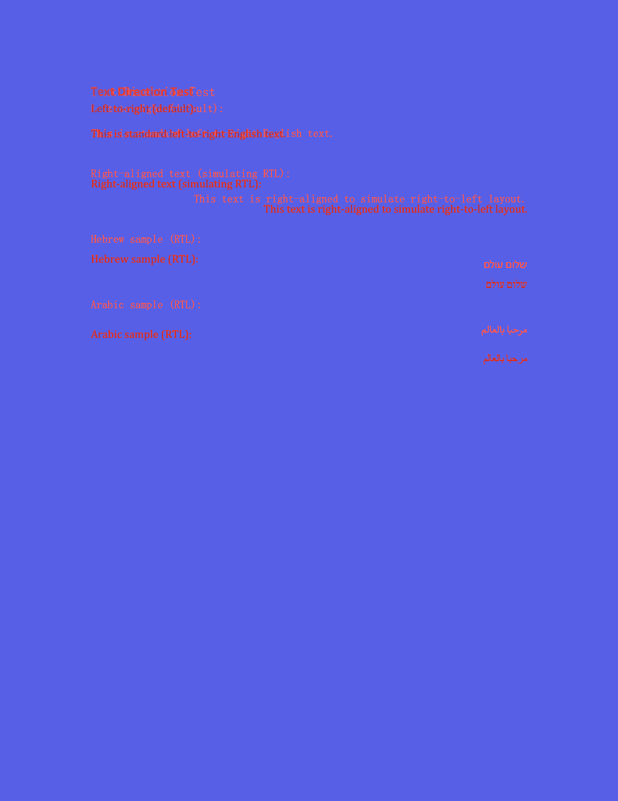</td>
  <td>changed: 26739 px (1.27%)<br>bbox: [187, 179, 1088, 752]<br>mean abs RGB: 1.9799<br>RMSE RGB: 19.8302<br>threshold: 12, gain: 5.0</td>
</tr>
<tr>
  <td><b>docx_classic57_sports_results_with_logos</b><br>Page 1</td>
  <td></td>
  <td>changed: 154105 px (7.33%)<br>bbox: [175, 208, 1088, 1399]<br>mean abs RGB: 11.5646<br>RMSE RGB: 47.1183<br>threshold: 12, gain: 5.0</td>
</tr>
<tr>
  <td><b>docx_classic58_dense_paragraph_document</b><br>Page 1</td>
  <td>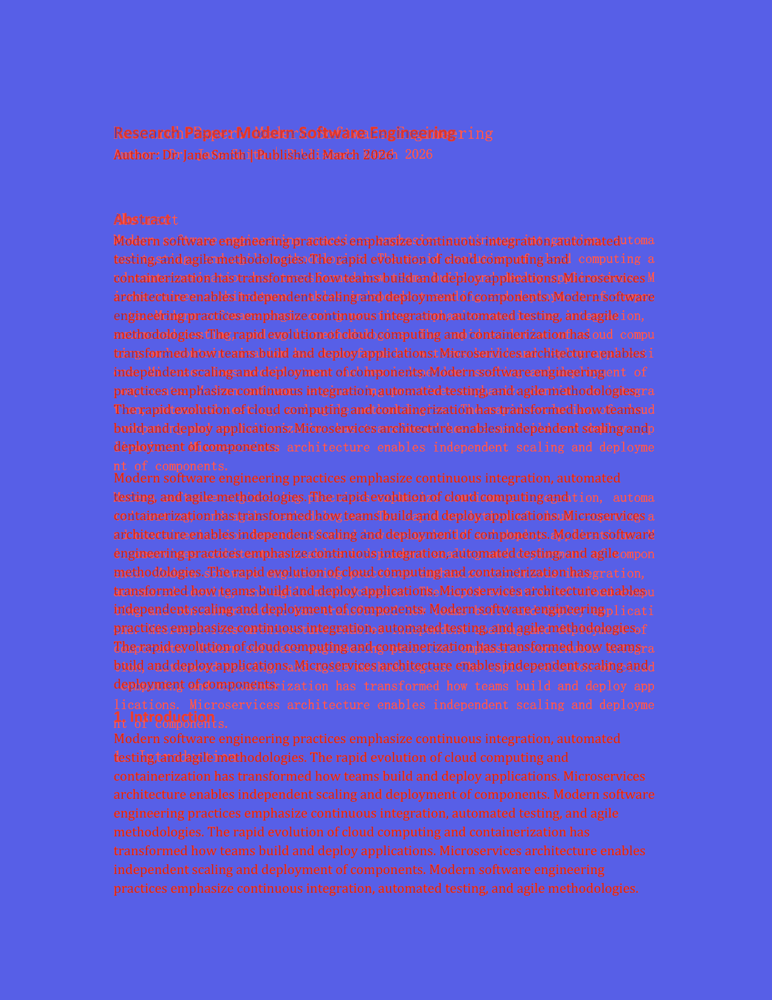</td>
  <td>changed: 242468 px (11.53%)<br>bbox: [187, 208, 1084, 1478]<br>mean abs RGB: 17.6241<br>RMSE RGB: 58.8227<br>threshold: 12, gain: 5.0</td>
</tr>
<tr>
  <td><b>docx_classic58_dense_paragraph_document</b><br>Page 2</td>
  <td></td>
  <td>changed: 342301 px (16.27%)<br>bbox: [188, 155, 1084, 1452]<br>mean abs RGB: 26.411<br>RMSE RGB: 73.2471<br>threshold: 12, gain: 5.0</td>
</tr>
<tr>
  <td><b>docx_classic58_dense_paragraph_document</b><br>Page 3</td>
  <td></td>
  <td>changed: 316759 px (15.06%)<br>bbox: [188, 155, 1084, 1483]<br>mean abs RGB: 23.7007<br>RMSE RGB: 68.7614<br>threshold: 12, gain: 5.0</td>
</tr>
<tr>
  <td><b>docx_classic58_dense_paragraph_document</b><br>Page 4</td>
  <td></td>
  <td>changed: 345461 px (16.42%)<br>bbox: [188, 155, 1084, 1483]<br>mean abs RGB: 26.6135<br>RMSE RGB: 73.5015<br>threshold: 12, gain: 5.0</td>
</tr>
<tr>
  <td><b>docx_classic58_dense_paragraph_document</b><br>Page 5</td>
  <td></td>
  <td>changed: 347675 px (16.53%)<br>bbox: [188, 156, 1084, 1445]<br>mean abs RGB: 26.9894<br>RMSE RGB: 74.1691<br>threshold: 12, gain: 5.0</td>
</tr>
<tr>
  <td><b>docx_classic58_dense_paragraph_document</b><br>Page 6</td>
  <td>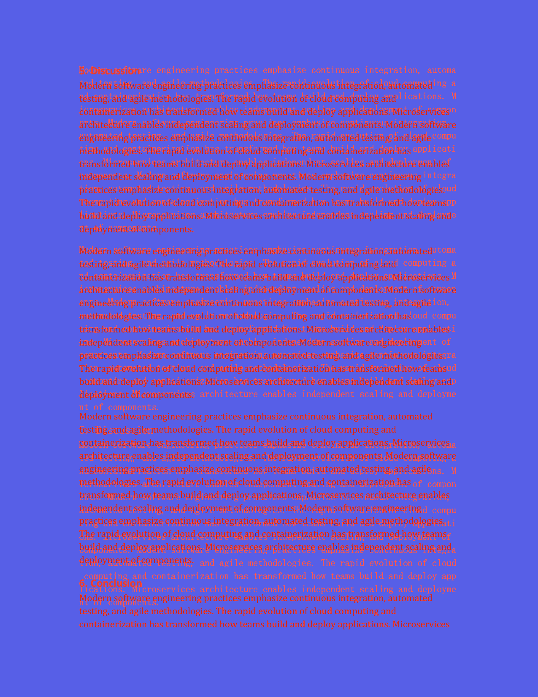</td>
  <td>changed: 321260 px (15.27%)<br>bbox: [188, 157, 1084, 1490]<br>mean abs RGB: 24.2109<br>RMSE RGB: 69.6528<br>threshold: 12, gain: 5.0</td>
</tr>
<tr>
  <td><b>docx_classic58_dense_paragraph_document</b><br>Page 7</td>
  <td>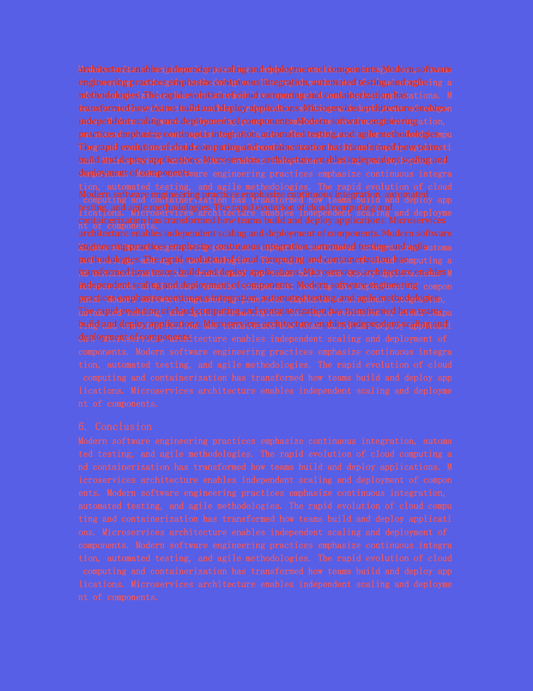</td>
  <td>changed: 237907 px (11.31%)<br>bbox: [188, 155, 1084, 1251]<br>mean abs RGB: 17.9136<br>RMSE RGB: 59.9187<br>threshold: 12, gain: 5.0</td>
</tr>
<tr>
  <td><b>docx_classic58_report_with_footer_image</b><br>Page 1</td>
  <td>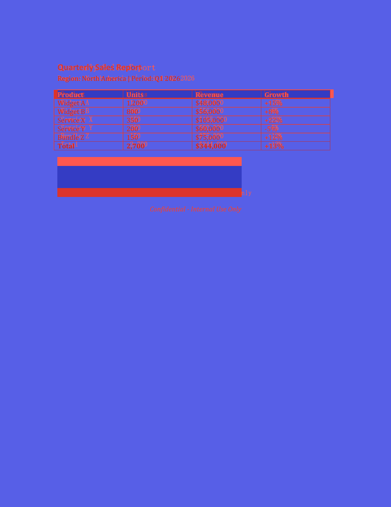</td>
  <td>changed: 62685 px (2.98%)<br>bbox: [175, 208, 1088, 693]<br>mean abs RGB: 4.2487<br>RMSE RGB: 28.3259<br>threshold: 12, gain: 5.0</td>
</tr>
<tr>
  <td><b>docx_classic59_numbered_and_bullet_mixed</b><br>Page 1</td>
  <td></td>
  <td>changed: 60916 px (2.90%)<br>bbox: [187, 208, 711, 945]<br>mean abs RGB: 4.2913<br>RMSE RGB: 28.8745<br>threshold: 12, gain: 5.0</td>
</tr>
<tr>
  <td><b>docx_classic59_nutrition_label_with_image</b><br>Page 1</td>
  <td></td>
  <td>changed: 104356 px (4.96%)<br>bbox: [175, 208, 1088, 1189]<br>mean abs RGB: 8.3248<br>RMSE RGB: 40.871<br>threshold: 12, gain: 5.0</td>
</tr>
<tr>
  <td><b>docx_classic60_comprehensive_styled_report</b><br>Page 1</td>
  <td></td>
  <td>changed: 23030 px (1.09%)<br>bbox: [184, 165, 1091, 389]<br>mean abs RGB: 1.4525<br>RMSE RGB: 15.895<br>threshold: 12, gain: 5.0</td>
</tr>
<tr>
  <td><b>docx_classic60_comprehensive_styled_report</b><br>Page 2</td>
  <td>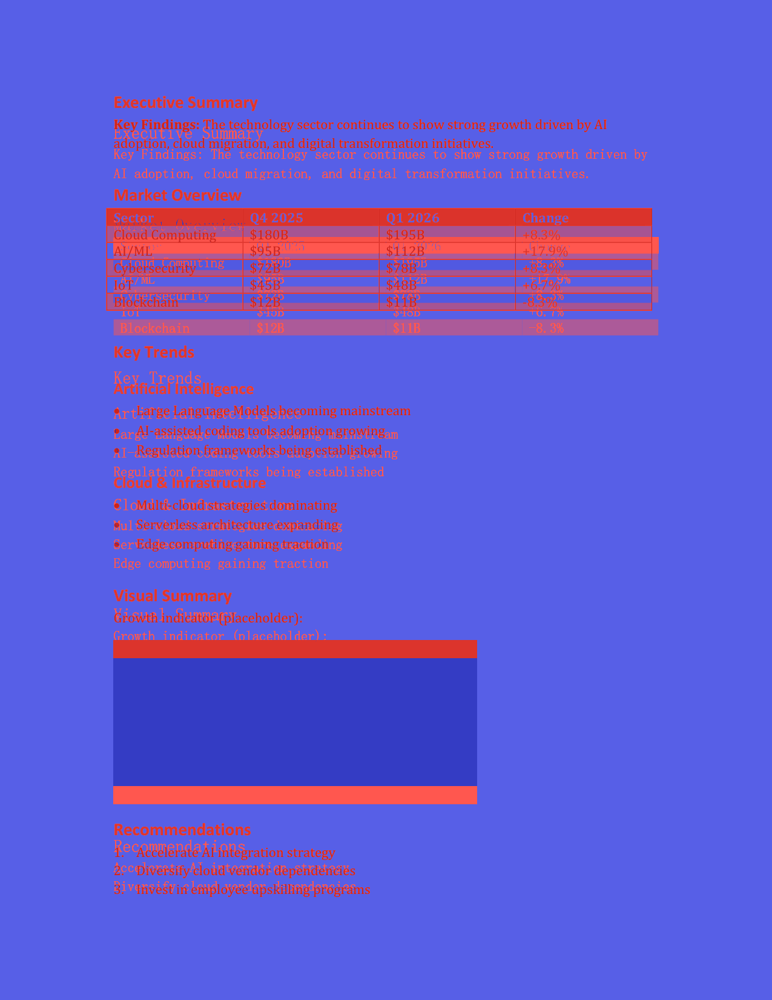</td>
  <td>changed: 275883 px (13.11%)<br>bbox: [175, 158, 1088, 1480]<br>mean abs RGB: 17.1345<br>RMSE RGB: 54.5777<br>threshold: 12, gain: 5.0</td>
</tr>
<tr>
  <td><b>docx_classic60_comprehensive_styled_report</b><br>Page 3</td>
  <td></td>
  <td>changed: 15884 px (0.76%)<br>bbox: [188, 155, 729, 353]<br>mean abs RGB: 1.1398<br>RMSE RGB: 14.9013<br>threshold: 12, gain: 5.0</td>
</tr>
<tr>
  <td><b>docx_classic60_project_status_with_milestones</b><br>Page 1</td>
  <td>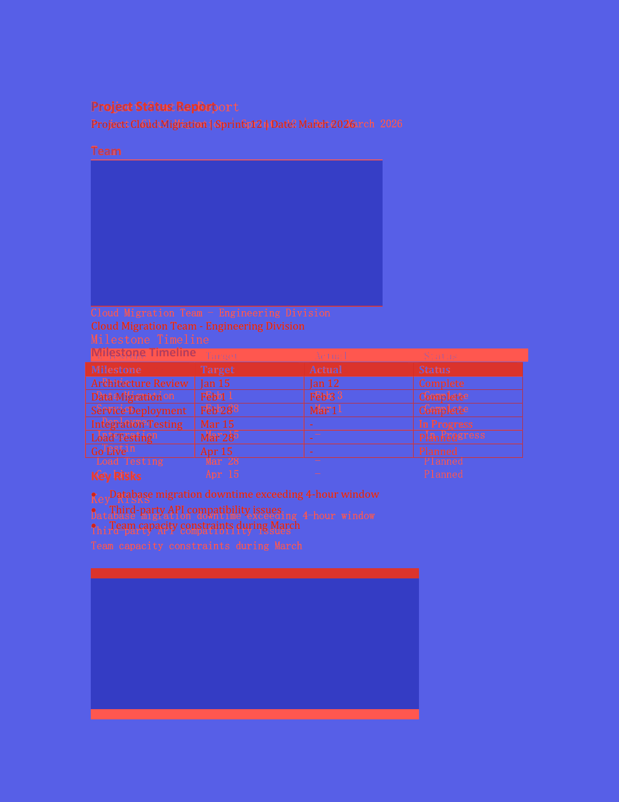</td>
  <td>changed: 170024 px (8.08%)<br>bbox: [175, 208, 1088, 1459]<br>mean abs RGB: 11.9901<br>RMSE RGB: 46.6143<br>threshold: 12, gain: 5.0</td>
</tr>
<tr>
  <td><b>docx_classic61_header_and_footer</b><br>Page 1</td>
  <td></td>
  <td>changed: 70709 px (3.36%)<br>bbox: [188, 79, 1070, 1575]<br>mean abs RGB: 5.0035<br>RMSE RGB: 31.1419<br>threshold: 12, gain: 5.0</td>
</tr>
<tr>
  <td><b>docx_classic62_footnote_references</b><br>Page 1</td>
  <td></td>
  <td>changed: 38765 px (1.84%)<br>bbox: [184, 208, 1091, 571]<br>mean abs RGB: 2.6679<br>RMSE RGB: 22.4855<br>threshold: 12, gain: 5.0</td>
</tr>
<tr>
  <td><b>docx_classic63_toc_style_headings</b><br>Page 1</td>
  <td>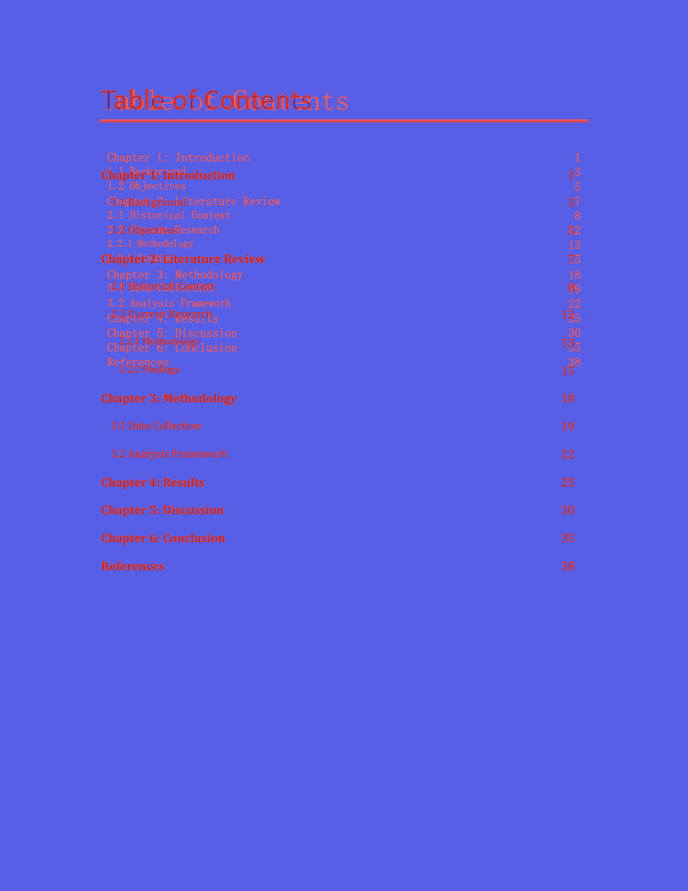</td>
  <td>changed: 82011 px (3.90%)<br>bbox: [184, 165, 1091, 1057]<br>mean abs RGB: 6.3365<br>RMSE RGB: 35.9659<br>threshold: 12, gain: 5.0</td>
</tr>
<tr>
  <td><b>docx_classic64_multi_column_layout</b><br>Page 1</td>
  <td></td>
  <td>changed: 119319 px (5.67%)<br>bbox: [186, 208, 1088, 749]<br>mean abs RGB: 8.9584<br>RMSE RGB: 42.4029<br>threshold: 12, gain: 5.0</td>
</tr>
<tr>
  <td><b>docx_classic65_code_block_styling</b><br>Page 1</td>
  <td>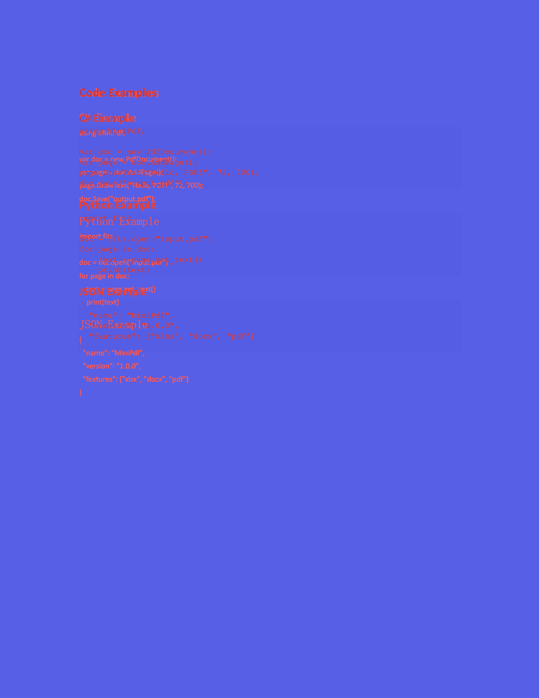</td>
  <td>changed: 29267 px (1.39%)<br>bbox: [187, 208, 611, 936]<br>mean abs RGB: 2.9078<br>RMSE RGB: 16.8277<br>threshold: 12, gain: 5.0</td>
</tr>
<tr>
  <td><b>docx_classic66_colored_title_page</b><br>Page 1</td>
  <td>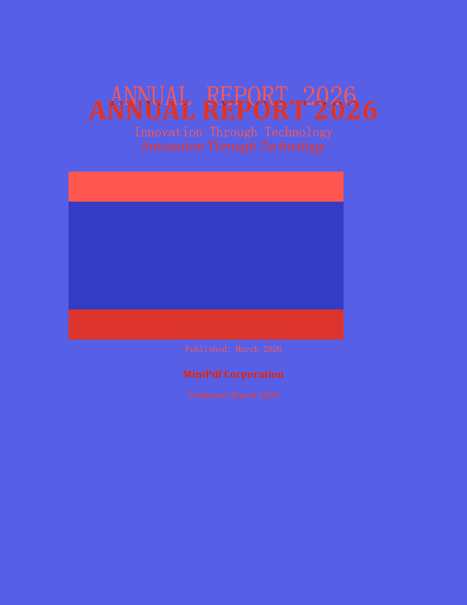</td>
  <td>changed: 169076 px (8.04%)<br>bbox: [187, 238, 1029, 1087]<br>mean abs RGB: 12.4686<br>RMSE RGB: 46.0974<br>threshold: 12, gain: 5.0</td>
</tr>
<tr>
  <td><b>docx_classic67_alternating_row_table</b><br>Page 1</td>
  <td></td>
  <td>changed: 182105 px (8.66%)<br>bbox: [175, 208, 1088, 781]<br>mean abs RGB: 9.5294<br>RMSE RGB: 41.0108<br>threshold: 12, gain: 5.0</td>
</tr>
<tr>
  <td><b>docx_classic68_sidebar_layout</b><br>Page 1</td>
  <td>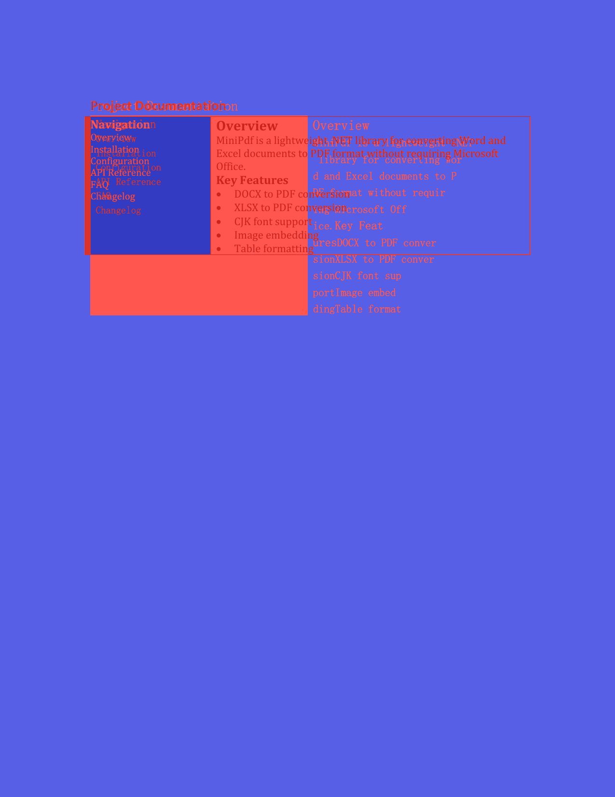</td>
  <td>changed: 156239 px (7.43%)<br>bbox: [175, 208, 1100, 623]<br>mean abs RGB: 11.6201<br>RMSE RGB: 46.2397<br>threshold: 12, gain: 5.0</td>
</tr>
<tr>
  <td><b>docx_classic69_blockquote_styling</b><br>Page 1</td>
  <td></td>
  <td>changed: 46442 px (2.21%)<br>bbox: [189, 208, 1003, 951]<br>mean abs RGB: 3.1991<br>RMSE RGB: 24.5655<br>threshold: 12, gain: 5.0</td>
</tr>
<tr>
  <td><b>docx_classic70_academic_paper</b><br>Page 1</td>
  <td></td>
  <td>changed: 170688 px (8.11%)<br>bbox: [175, 158, 1088, 1357]<br>mean abs RGB: 12.1827<br>RMSE RGB: 48.6207<br>threshold: 12, gain: 5.0</td>
</tr>
<tr>
  <td><b>docx_classic71_legal_document</b><br>Page 1</td>
  <td>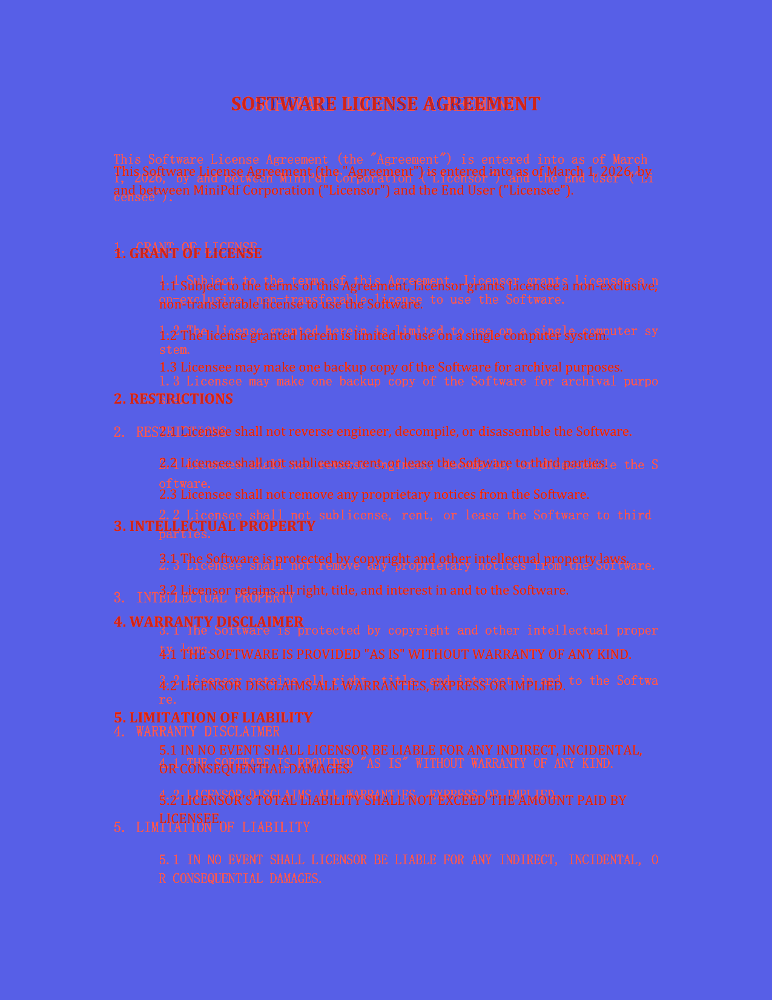</td>
  <td>changed: 167838 px (7.98%)<br>bbox: [187, 159, 1085, 1359]<br>mean abs RGB: 13.5845<br>RMSE RGB: 53.3846<br>threshold: 12, gain: 5.0</td>
</tr>
<tr>
  <td><b>docx_classic72_technical_specification</b><br>Page 1</td>
  <td>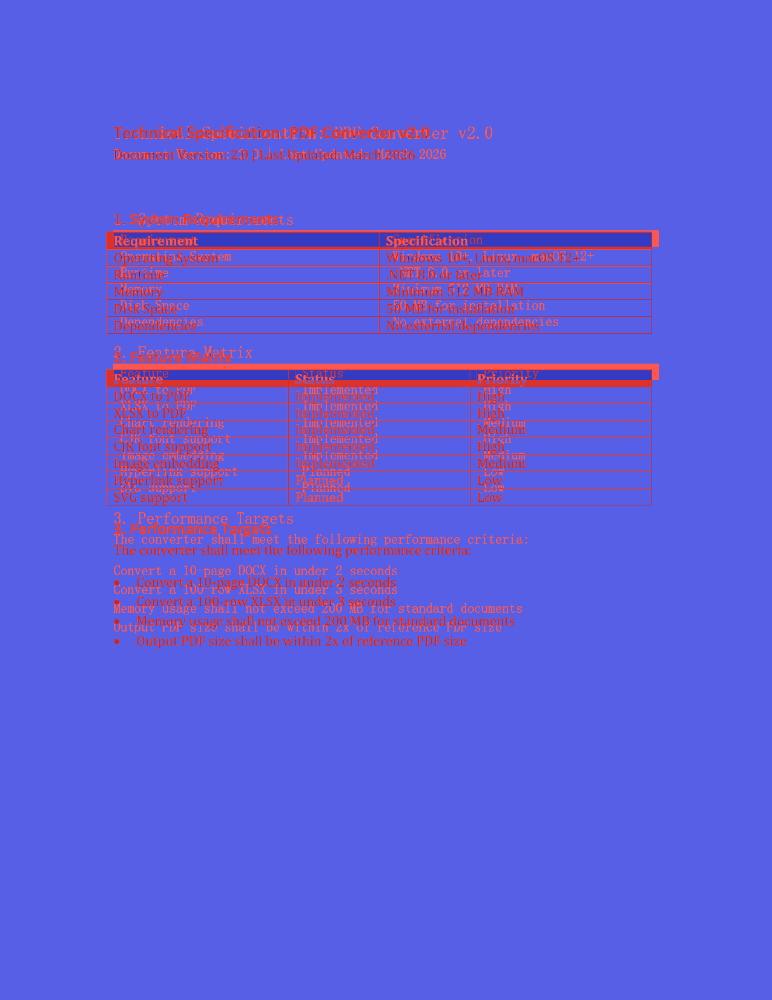</td>
  <td>changed: 177596 px (8.44%)<br>bbox: [175, 208, 1088, 1104]<br>mean abs RGB: 12.1005<br>RMSE RGB: 47.5053<br>threshold: 12, gain: 5.0</td>
</tr>
<tr>
  <td><b>docx_classic73_calendar_layout</b><br>Page 1</td>
  <td>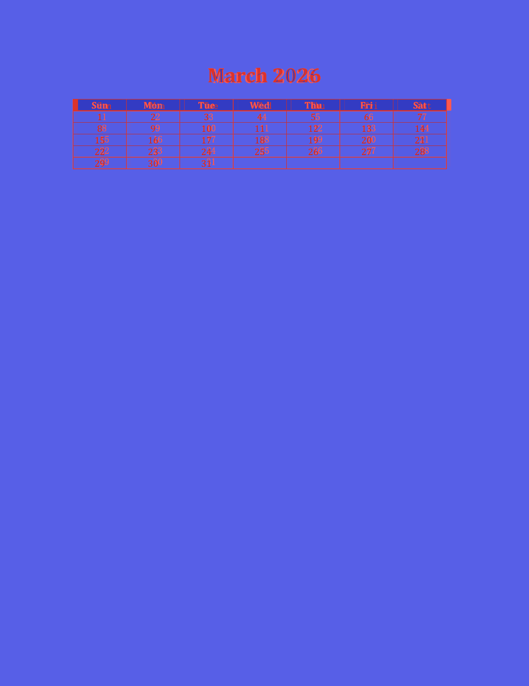</td>
  <td>changed: 51364 px (2.44%)<br>bbox: [175, 163, 1088, 427]<br>mean abs RGB: 3.0104<br>RMSE RGB: 23.4428<br>threshold: 12, gain: 5.0</td>
</tr>
<tr>
  <td><b>docx_classic74_org_chart</b><br>Page 1</td>
  <td></td>
  <td>changed: 208685 px (9.92%)<br>bbox: [175, 208, 1088, 594]<br>mean abs RGB: 8.5225<br>RMSE RGB: 34.8854<br>threshold: 12, gain: 5.0</td>
</tr>
<tr>
  <td><b>docx_classic75_newsletter_layout</b><br>Page 1</td>
  <td></td>
  <td>changed: 80371 px (3.82%)<br>bbox: [184, 166, 1091, 1064]<br>mean abs RGB: 5.9336<br>RMSE RGB: 34.0091<br>threshold: 12, gain: 5.0</td>
</tr>
<tr>
  <td><b>docx_classic76_recipe_card</b><br>Page 1</td>
  <td></td>
  <td>changed: 95198 px (4.53%)<br>bbox: [175, 160, 1088, 990]<br>mean abs RGB: 7.0912<br>RMSE RGB: 37.6143<br>threshold: 12, gain: 5.0</td>
</tr>
<tr>
  <td><b>docx_classic77_timeline_layout</b><br>Page 1</td>
  <td></td>
  <td>changed: 165432 px (7.86%)<br>bbox: [175, 208, 1088, 706]<br>mean abs RGB: 11.3469<br>RMSE RGB: 45.9896<br>threshold: 12, gain: 5.0</td>
</tr>
<tr>
  <td><b>docx_classic78_faq_document</b><br>Page 1</td>
  <td></td>
  <td>changed: 152465 px (7.25%)<br>bbox: [188, 208, 1083, 1430]<br>mean abs RGB: 10.9556<br>RMSE RGB: 46.0442<br>threshold: 12, gain: 5.0</td>
</tr>
<tr>
  <td><b>docx_classic78_faq_document</b><br>Page 2</td>
  <td></td>
  <td>changed: 117836 px (5.60%)<br>bbox: [188, 155, 1082, 1190]<br>mean abs RGB: 8.3796<br>RMSE RGB: 40.083<br>threshold: 12, gain: 5.0</td>
</tr>
<tr>
  <td><b>docx_classic79_glossary</b><br>Page 1</td>
  <td></td>
  <td>changed: 87921 px (4.18%)<br>bbox: [187, 208, 1079, 1412]<br>mean abs RGB: 6.2738<br>RMSE RGB: 34.8493<br>threshold: 12, gain: 5.0</td>
</tr>
<tr>
  <td><b>docx_classic80_matrix_grid</b><br>Page 1</td>
  <td></td>
  <td>changed: 136728 px (6.50%)<br>bbox: [175, 208, 1088, 773]<br>mean abs RGB: 6.2271<br>RMSE RGB: 32.7544<br>threshold: 12, gain: 5.0</td>
</tr>
<tr>
  <td><b>docx_classic81_budget_table</b><br>Page 1</td>
  <td></td>
  <td>changed: 270554 px (12.86%)<br>bbox: [175, 208, 1088, 802]<br>mean abs RGB: 12.9652<br>RMSE RGB: 46.6199<br>threshold: 12, gain: 5.0</td>
</tr>
<tr>
  <td><b>docx_classic82_survey_questionnaire</b><br>Page 1</td>
  <td></td>
  <td>changed: 133214 px (6.33%)<br>bbox: [175, 208, 1088, 1475]<br>mean abs RGB: 8.4504<br>RMSE RGB: 39.3525<br>threshold: 12, gain: 5.0</td>
</tr>
<tr>
  <td><b>docx_classic82_survey_questionnaire</b><br>Page 2</td>
  <td></td>
  <td>changed: 117632 px (5.59%)<br>bbox: [175, 149, 1088, 1021]<br>mean abs RGB: 7.975<br>RMSE RGB: 37.681<br>threshold: 12, gain: 5.0</td>
</tr>
<tr>
  <td><b>docx_classic83_medical_form</b><br>Page 1</td>
  <td></td>
  <td>changed: 149359 px (7.10%)<br>bbox: [175, 208, 1088, 1035]<br>mean abs RGB: 9.375<br>RMSE RGB: 41.0131<br>threshold: 12, gain: 5.0</td>
</tr>
<tr>
  <td><b>docx_classic84_shipping_label</b><br>Page 1</td>
  <td></td>
  <td>changed: 211926 px (10.07%)<br>bbox: [175, 149, 1091, 1277]<br>mean abs RGB: 9.2306<br>RMSE RGB: 41.7206<br>threshold: 12, gain: 5.0</td>
</tr>
<tr>
  <td><b>docx_classic85_report_card</b><br>Page 1</td>
  <td></td>
  <td>changed: 162242 px (7.71%)<br>bbox: [175, 160, 1088, 740]<br>mean abs RGB: 10.107<br>RMSE RGB: 42.5093<br>threshold: 12, gain: 5.0</td>
</tr>
<tr>
  <td><b>docx_classic86_checklist_document</b><br>Page 1</td>
  <td></td>
  <td>changed: 70551 px (3.35%)<br>bbox: [188, 208, 701, 1472]<br>mean abs RGB: 4.8338<br>RMSE RGB: 30.3065<br>threshold: 12, gain: 5.0</td>
</tr>
<tr>
  <td><b>docx_classic87_bibliography</b><br>Page 1</td>
  <td></td>
  <td>changed: 106196 px (5.05%)<br>bbox: [189, 208, 1084, 846]<br>mean abs RGB: 8.3419<br>RMSE RGB: 41.4095<br>threshold: 12, gain: 5.0</td>
</tr>
<tr>
  <td><b>docx_classic88_presentation_handout</b><br>Page 1</td>
  <td></td>
  <td>changed: 583952 px (27.76%)<br>bbox: [175, 208, 1077, 1465]<br>mean abs RGB: 40.7949<br>RMSE RGB: 86.8313<br>threshold: 12, gain: 5.0</td>
</tr>
<tr>
  <td><b>docx_classic88_presentation_handout</b><br>Page 2</td>
  <td></td>
  <td>changed: 432062 px (20.54%)<br>bbox: [175, 149, 1077, 1253]<br>mean abs RGB: 28.259<br>RMSE RGB: 70.3829<br>threshold: 12, gain: 5.0</td>
</tr>
<tr>
  <td><b>docx_classic89_multi_image_gallery</b><br>Page 1</td>
  <td></td>
  <td>changed: 125141 px (5.95%)<br>bbox: [175, 208, 1088, 974]<br>mean abs RGB: 7.2548<br>RMSE RGB: 35.9976<br>threshold: 12, gain: 5.0</td>
</tr>
<tr>
  <td><b>docx_classic90_comprehensive_annual_report</b><br>Page 1</td>
  <td></td>
  <td>changed: 56981 px (2.71%)<br>bbox: [187, 201, 963, 702]<br>mean abs RGB: 4.1856<br>RMSE RGB: 27.1354<br>threshold: 12, gain: 5.0</td>
</tr>
<tr>
  <td><b>docx_classic90_comprehensive_annual_report</b><br>Page 2</td>
  <td></td>
  <td>changed: 20462 px (0.97%)<br>bbox: [187, 158, 581, 527]<br>mean abs RGB: 1.4591<br>RMSE RGB: 16.6877<br>threshold: 12, gain: 5.0</td>
</tr>
<tr>
  <td><b>docx_classic90_comprehensive_annual_report</b><br>Page 3</td>
  <td></td>
  <td>changed: 373317 px (17.75%)<br>bbox: [175, 158, 1088, 1463]<br>mean abs RGB: 24.3152<br>RMSE RGB: 65.2504<br>threshold: 12, gain: 5.0</td>
</tr>
<tr>
  <td><b>docx_classic90_comprehensive_annual_report</b><br>Page 4</td>
  <td></td>
  <td>changed: 30201 px (1.44%)<br>bbox: [188, 158, 766, 474]<br>mean abs RGB: 2.194<br>RMSE RGB: 20.602<br>threshold: 12, gain: 5.0</td>
</tr>
<tr>
  <td><b>docx_classic91_landscape_page</b><br>Page 1</td>
  <td></td>
  <td>changed: 70635 px (3.36%)<br>bbox: [175, 208, 1463, 479]<br>mean abs RGB: 4.6943<br>RMSE RGB: 29.5726<br>threshold: 12, gain: 5.0</td>
</tr>
<tr>
  <td><b>docx_classic92_first_line_indent</b><br>Page 1</td>
  <td></td>
  <td>changed: 73573 px (3.50%)<br>bbox: [187, 208, 1083, 640]<br>mean abs RGB: 5.2724<br>RMSE RGB: 32.0417<br>threshold: 12, gain: 5.0</td>
</tr>
<tr>
  <td><b>docx_classic93_hanging_indent</b><br>Page 1</td>
  <td></td>
  <td>changed: 106987 px (5.09%)<br>bbox: [187, 207, 1083, 826]<br>mean abs RGB: 8.2232<br>RMSE RGB: 40.8355<br>threshold: 12, gain: 5.0</td>
</tr>
<tr>
  <td><b>docx_classic94_custom_bullet_characters</b><br>Page 1</td>
  <td></td>
  <td>changed: 48989 px (2.33%)<br>bbox: [187, 208, 540, 1148]<br>mean abs RGB: 2.9493<br>RMSE RGB: 22.8004<br>threshold: 12, gain: 5.0</td>
</tr>
<tr>
  <td><b>docx_classic95_contract_template</b><br>Page 1</td>
  <td></td>
  <td>changed: 101583 px (4.83%)<br>bbox: [186, 160, 1088, 1136]<br>mean abs RGB: 8.1516<br>RMSE RGB: 41.2753<br>threshold: 12, gain: 5.0</td>
</tr>
<tr>
  <td><b>docx_classic96_dense_data_table</b><br>Page 1</td>
  <td></td>
  <td>changed: 372165 px (17.69%)<br>bbox: [175, 208, 1088, 888]<br>mean abs RGB: 13.2416<br>RMSE RGB: 46.7152<br>threshold: 12, gain: 5.0</td>
</tr>
<tr>
  <td><b>docx_classic97_product_catalog</b><br>Page 1</td>
  <td></td>
  <td>changed: 154200 px (7.33%)<br>bbox: [175, 163, 1088, 925]<br>mean abs RGB: 10.3505<br>RMSE RGB: 42.9212<br>threshold: 12, gain: 5.0</td>
</tr>
<tr>
  <td><b>docx_classic98_training_manual</b><br>Page 1</td>
  <td></td>
  <td>changed: 112311 px (5.34%)<br>bbox: [187, 208, 1077, 1427]<br>mean abs RGB: 8.0009<br>RMSE RGB: 39.5363<br>threshold: 12, gain: 5.0</td>
</tr>
<tr>
  <td><b>docx_classic99_policy_document</b><br>Page 1</td>
  <td></td>
  <td>changed: 152222 px (7.24%)<br>bbox: [175, 160, 1088, 1409]<br>mean abs RGB: 11.2306<br>RMSE RGB: 47.1316<br>threshold: 12, gain: 5.0</td>
</tr>
<tr>
  <td><b>docx_classic100_multi_page_table</b><br>Page 1</td>
  <td></td>
  <td>changed: 722560 px (34.35%)<br>bbox: [175, 208, 1088, 1490]<br>mean abs RGB: 29.5643<br>RMSE RGB: 72.0731<br>threshold: 12, gain: 5.0</td>
</tr>
<tr>
  <td><b>docx_classic100_multi_page_table</b><br>Page 2</td>
  <td></td>
  <td>changed: 247953 px (11.79%)<br>bbox: [175, 149, 1088, 588]<br>mean abs RGB: 10.5481<br>RMSE RGB: 43.1779<br>threshold: 12, gain: 5.0</td>
</tr>
<tr>
  <td><b>docx_classic101_warranty_document</b><br>Page 1</td>
  <td></td>
  <td>changed: 142603 px (6.78%)<br>bbox: [184, 162, 1091, 1143]<br>mean abs RGB: 10.9303<br>RMSE RGB: 47.0374<br>threshold: 12, gain: 5.0</td>
</tr>
<tr>
  <td><b>docx_classic102_curriculum_syllabus</b><br>Page 1</td>
  <td></td>
  <td>changed: 159105 px (7.56%)<br>bbox: [175, 208, 1088, 1172]<br>mean abs RGB: 10.6851<br>RMSE RGB: 44.4764<br>threshold: 12, gain: 5.0</td>
</tr>
<tr>
  <td><b>docx_classic103_event_program</b><br>Page 1</td>
  <td></td>
  <td>changed: 39835 px (1.89%)<br>bbox: [337, 165, 938, 551]<br>mean abs RGB: 2.8626<br>RMSE RGB: 22.5004<br>threshold: 12, gain: 5.0</td>
</tr>
<tr>
  <td><b>docx_classic103_event_program</b><br>Page 2</td>
  <td></td>
  <td>changed: 198235 px (9.42%)<br>bbox: [175, 158, 1088, 1236]<br>mean abs RGB: 11.9567<br>RMSE RGB: 47.2173<br>threshold: 12, gain: 5.0</td>
</tr>
<tr>
  <td><b>docx_classic104_sop_document</b><br>Page 1</td>
  <td></td>
  <td>changed: 136822 px (6.50%)<br>bbox: [175, 149, 1088, 1482]<br>mean abs RGB: 10.4132<br>RMSE RGB: 45.7751<br>threshold: 12, gain: 5.0</td>
</tr>
<tr>
  <td><b>docx_classic104_sop_document</b><br>Page 2</td>
  <td></td>
  <td>changed: 20265 px (0.96%)<br>bbox: [188, 157, 670, 313]<br>mean abs RGB: 1.4874<br>RMSE RGB: 17.1704<br>threshold: 12, gain: 5.0</td>
</tr>
<tr>
  <td><b>docx_classic105_certificate</b><br>Page 1</td>
  <td></td>
  <td>changed: 88698 px (4.22%)<br>bbox: [186, 220, 1088, 1302]<br>mean abs RGB: 6.6469<br>RMSE RGB: 36.1518<br>threshold: 12, gain: 5.0</td>
</tr>
<tr>
  <td><b>docx_classic106_multi_section_orientation</b><br>Page 1</td>
  <td></td>
  <td>changed: 116819 px (5.55%)<br>bbox: [186, 207, 1088, 1136]<br>mean abs RGB: 8.4401<br>RMSE RGB: 40.0257<br>threshold: 12, gain: 5.0</td>
</tr>
<tr>
  <td><b>docx_classic107_order_form</b><br>Page 1</td>
  <td></td>
  <td>changed: 185631 px (8.82%)<br>bbox: [175, 161, 1088, 959]<br>mean abs RGB: 12.0515<br>RMSE RGB: 47.3631<br>threshold: 12, gain: 5.0</td>
</tr>
<tr>
  <td><b>docx_classic108_comparison_matrix</b><br>Page 1</td>
  <td></td>
  <td>changed: 319701 px (15.20%)<br>bbox: [175, 208, 1088, 820]<br>mean abs RGB: 10.4963<br>RMSE RGB: 41.9716<br>threshold: 12, gain: 5.0</td>
</tr>
<tr>
  <td><b>docx_classic109_release_notes</b><br>Page 1</td>
  <td></td>
  <td>changed: 97204 px (4.62%)<br>bbox: [184, 208, 1091, 1441]<br>mean abs RGB: 6.681<br>RMSE RGB: 35.6278<br>threshold: 12, gain: 5.0</td>
</tr>
<tr>
  <td><b>docx_classic110_troubleshooting_guide</b><br>Page 1</td>
  <td></td>
  <td>changed: 60540 px (2.88%)<br>bbox: [188, 208, 1031, 848]<br>mean abs RGB: 3.7905<br>RMSE RGB: 26.3235<br>threshold: 12, gain: 5.0</td>
</tr>
<tr>
  <td><b>docx_classic111_meeting_agenda</b><br>Page 1</td>
  <td></td>
  <td>changed: 165703 px (7.88%)<br>bbox: [175, 160, 1091, 1266]<br>mean abs RGB: 12.0131<br>RMSE RGB: 47.5594<br>threshold: 12, gain: 5.0</td>
</tr>
<tr>
  <td><b>docx_classic112_project_status_report</b><br>Page 1</td>
  <td></td>
  <td>changed: 113886 px (5.41%)<br>bbox: [175, 208, 1088, 1000]<br>mean abs RGB: 7.6508<br>RMSE RGB: 37.8905<br>threshold: 12, gain: 5.0</td>
</tr>
<tr>
  <td><b>docx_classic113_address_labels</b><br>Page 1</td>
  <td></td>
  <td>changed: 93898 px (4.46%)<br>bbox: [175, 208, 1088, 783]<br>mean abs RGB: 7.3535<br>RMSE RGB: 39.0028<br>threshold: 12, gain: 5.0</td>
</tr>
<tr>
  <td><b>docx_classic114_test_report</b><br>Page 1</td>
  <td></td>
  <td>changed: 128800 px (6.12%)<br>bbox: [175, 208, 1088, 1040]<br>mean abs RGB: 8.6269<br>RMSE RGB: 40.0537<br>threshold: 12, gain: 5.0</td>
</tr>
<tr>
  <td><b>docx_classic115_price_list</b><br>Page 1</td>
  <td></td>
  <td>changed: 209958 px (9.98%)<br>bbox: [175, 161, 1088, 1083]<br>mean abs RGB: 11.0889<br>RMSE RGB: 44.316<br>threshold: 12, gain: 5.0</td>
</tr>
<tr>
  <td><b>docx_classic116_risk_assessment</b><br>Page 1</td>
  <td></td>
  <td>changed: 164549 px (7.82%)<br>bbox: [175, 208, 1088, 951]<br>mean abs RGB: 10.6833<br>RMSE RGB: 44.386<br>threshold: 12, gain: 5.0</td>
</tr>
<tr>
  <td><b>docx_classic117_employee_handbook_excerpt</b><br>Page 1</td>
  <td></td>
  <td>changed: 151514 px (7.20%)<br>bbox: [175, 208, 1088, 1462]<br>mean abs RGB: 10.2552<br>RMSE RGB: 44.0517<br>threshold: 12, gain: 5.0</td>
</tr>
<tr>
  <td><b>docx_classic118_data_report_with_summary</b><br>Page 1</td>
  <td></td>
  <td>changed: 176182 px (8.37%)<br>bbox: [175, 208, 1088, 1046]<br>mean abs RGB: 11.3128<br>RMSE RGB: 44.6996<br>threshold: 12, gain: 5.0</td>
</tr>
<tr>
  <td><b>docx_classic119_multi_language_document</b><br>Page 1</td>
  <td></td>
  <td>changed: 66011 px (3.14%)<br>bbox: [187, 208, 1077, 1116]<br>mean abs RGB: 4.5447<br>RMSE RGB: 29.3708<br>threshold: 12, gain: 5.0</td>
</tr>
<tr>
  <td><b>docx_classic120_comprehensive_business_proposal</b><br>Page 1</td>
  <td></td>
  <td>changed: 161956 px (7.70%)<br>bbox: [262, 222, 1013, 1032]<br>mean abs RGB: 11.9315<br>RMSE RGB: 45.2799<br>threshold: 12, gain: 5.0</td>
</tr>
<tr>
  <td><b>docx_classic120_comprehensive_business_proposal</b><br>Page 2</td>
  <td></td>
  <td>changed: 26203 px (1.25%)<br>bbox: [187, 158, 607, 627]<br>mean abs RGB: 1.8935<br>RMSE RGB: 19.1126<br>threshold: 12, gain: 5.0</td>
</tr>
<tr>
  <td><b>docx_classic120_comprehensive_business_proposal</b><br>Page 3</td>
  <td></td>
  <td>changed: 329396 px (15.66%)<br>bbox: [175, 158, 1088, 1384]<br>mean abs RGB: 21.71<br>RMSE RGB: 63.1352<br>threshold: 12, gain: 5.0</td>
</tr>
<tr>
  <td><b>docx_classic121_thin_border_table</b><br>Page 1</td>
  <td></td>
  <td>changed: 45193 px (2.15%)<br>bbox: [175, 208, 1088, 428]<br>mean abs RGB: 3.2393<br>RMSE RGB: 24.9403<br>threshold: 12, gain: 5.0</td>
</tr>
<tr>
  <td><b>docx_classic122_thick_outer_border_table</b><br>Page 1</td>
  <td></td>
  <td>changed: 49246 px (2.34%)<br>bbox: [174, 208, 1088, 428]<br>mean abs RGB: 3.7991<br>RMSE RGB: 27.7424<br>threshold: 12, gain: 5.0</td>
</tr>
<tr>
  <td><b>docx_classic123_dashed_border_table</b><br>Page 1</td>
  <td></td>
  <td>changed: 32498 px (1.54%)<br>bbox: [186, 208, 1088, 545]<br>mean abs RGB: 2.3781<br>RMSE RGB: 21.7557<br>threshold: 12, gain: 5.0</td>
</tr>
<tr>
  <td><b>docx_classic124_colored_border_table</b><br>Page 1</td>
  <td></td>
  <td>changed: 58672 px (2.79%)<br>bbox: [175, 208, 1088, 459]<br>mean abs RGB: 4.2022<br>RMSE RGB: 28.8173<br>threshold: 12, gain: 5.0</td>
</tr>
<tr>
  <td><b>docx_classic125_solid_cell_fills</b><br>Page 1</td>
  <td></td>
  <td>changed: 108761 px (5.17%)<br>bbox: [175, 208, 1088, 521]<br>mean abs RGB: 4.6926<br>RMSE RGB: 27.9827<br>threshold: 12, gain: 5.0</td>
</tr>
<tr>
  <td><b>docx_classic126_dark_header_table</b><br>Page 1</td>
  <td></td>
  <td>changed: 54769 px (2.60%)<br>bbox: [175, 208, 1088, 428]<br>mean abs RGB: 3.755<br>RMSE RGB: 26.5087<br>threshold: 12, gain: 5.0</td>
</tr>
<tr>
  <td><b>docx_classic127_font_styles_showcase</b><br>Page 1</td>
  <td></td>
  <td>changed: 65049 px (3.09%)<br>bbox: [175, 208, 1088, 490]<br>mean abs RGB: 4.7088<br>RMSE RGB: 30.2626<br>threshold: 12, gain: 5.0</td>
</tr>
<tr>
  <td><b>docx_classic128_font_sizes_showcase</b><br>Page 1</td>
  <td></td>
  <td>changed: 114011 px (5.42%)<br>bbox: [188, 208, 1080, 1012]<br>mean abs RGB: 9.9193<br>RMSE RGB: 46.6429<br>threshold: 12, gain: 5.0</td>
</tr>
<tr>
  <td><b>docx_classic129_alignment_combinations</b><br>Page 1</td>
  <td></td>
  <td>changed: 41463 px (1.97%)<br>bbox: [175, 208, 1088, 628]<br>mean abs RGB: 3.082<br>RMSE RGB: 24.9041<br>threshold: 12, gain: 5.0</td>
</tr>
<tr>
  <td><b>docx_classic130_wrap_and_indent</b><br>Page 1</td>
  <td></td>
  <td>changed: 53657 px (2.55%)<br>bbox: [187, 208, 1079, 743]<br>mean abs RGB: 3.7397<br>RMSE RGB: 26.7196<br>threshold: 12, gain: 5.0</td>
</tr>
<tr>
  <td><b>docx_classic131_number_format_table</b><br>Page 1</td>
  <td></td>
  <td>changed: 75868 px (3.61%)<br>bbox: [175, 208, 1088, 584]<br>mean abs RGB: 5.4915<br>RMSE RGB: 32.7118<br>threshold: 12, gain: 5.0</td>
</tr>
<tr>
  <td><b>docx_classic132_striped_table</b><br>Page 1</td>
  <td></td>
  <td>changed: 210288 px (10.00%)<br>bbox: [175, 208, 1088, 584]<br>mean abs RGB: 6.1875<br>RMSE RGB: 31.5496<br>threshold: 12, gain: 5.0</td>
</tr>
<tr>
  <td><b>docx_classic133_gradient_rows_table</b><br>Page 1</td>
  <td></td>
  <td>changed: 209523 px (9.96%)<br>bbox: [175, 208, 1088, 584]<br>mean abs RGB: 6.5104<br>RMSE RGB: 36.3538<br>threshold: 12, gain: 5.0</td>
</tr>
<tr>
  <td><b>docx_classic134_heatmap_table</b><br>Page 1</td>
  <td></td>
  <td>changed: 121092 px (5.76%)<br>bbox: [175, 208, 1088, 490]<br>mean abs RGB: 5.7902<br>RMSE RGB: 31.5821<br>threshold: 12, gain: 5.0</td>
</tr>
<tr>
  <td><b>docx_classic135_bottom_border_paragraphs</b><br>Page 1</td>
  <td></td>
  <td>changed: 54334 px (2.58%)<br>bbox: [184, 208, 1091, 568]<br>mean abs RGB: 4.4417<br>RMSE RGB: 30.3807<br>threshold: 12, gain: 5.0</td>
</tr>
<tr>
  <td><b>docx_classic136_financial_statement</b><br>Page 1</td>
  <td></td>
  <td>changed: 94732 px (4.50%)<br>bbox: [175, 208, 1088, 566]<br>mean abs RGB: 5.8474<br>RMSE RGB: 33.5747<br>threshold: 12, gain: 5.0</td>
</tr>
<tr>
  <td><b>docx_classic137_checkerboard_table</b><br>Page 1</td>
  <td></td>
  <td>changed: 119095 px (5.66%)<br>bbox: [175, 208, 1088, 490]<br>mean abs RGB: 8.6448<br>RMSE RGB: 39.7596<br>threshold: 12, gain: 5.0</td>
</tr>
<tr>
  <td><b>docx_classic138_color_grid_table</b><br>Page 1</td>
  <td></td>
  <td>changed: 50723 px (2.41%)<br>bbox: [175, 208, 1088, 365]<br>mean abs RGB: 2.2308<br>RMSE RGB: 18.2068<br>threshold: 12, gain: 5.0</td>
</tr>
<tr>
  <td><b>docx_classic139_paragraph_shading_patterns</b><br>Page 1</td>
  <td></td>
  <td>changed: 172609 px (8.20%)<br>bbox: [184, 208, 1091, 634]<br>mean abs RGB: 6.9212<br>RMSE RGB: 28.7222<br>threshold: 12, gain: 5.0</td>
</tr>
<tr>
  <td><b>docx_classic140_rotated_text_table</b><br>Page 1</td>
  <td></td>
  <td>changed: 42803 px (2.03%)<br>bbox: [175, 208, 1088, 560]<br>mean abs RGB: 2.9812<br>RMSE RGB: 24.0567<br>threshold: 12, gain: 5.0</td>
</tr>
<tr>
  <td><b>docx_classic141_mixed_border_styles</b><br>Page 1</td>
  <td></td>
  <td>changed: 42628 px (2.03%)<br>bbox: [186, 208, 1088, 667]<br>mean abs RGB: 3.0957<br>RMSE RGB: 25.1819<br>threshold: 12, gain: 5.0</td>
</tr>
<tr>
  <td><b>docx_classic142_styled_invoice_document</b><br>Page 1</td>
  <td></td>
  <td>changed: 186824 px (8.88%)<br>bbox: [175, 150, 1091, 806]<br>mean abs RGB: 9.0592<br>RMSE RGB: 40.4657<br>threshold: 12, gain: 5.0</td>
</tr>
<tr>
  <td><b>docx_classic143_multi_section_document</b><br>Page 1</td>
  <td></td>
  <td>changed: 205941 px (9.79%)<br>bbox: [175, 149, 1091, 908]<br>mean abs RGB: 14.2245<br>RMSE RGB: 54.8949<br>threshold: 12, gain: 5.0</td>
</tr>
<tr>
  <td><b>docx_classic144_note_style_paragraphs</b><br>Page 1</td>
  <td></td>
  <td>changed: 50526 px (2.40%)<br>bbox: [175, 209, 1088, 428]<br>mean abs RGB: 2.7534<br>RMSE RGB: 21.7081<br>threshold: 12, gain: 5.0</td>
</tr>
<tr>
  <td><b>docx_classic145_status_badge_table</b><br>Page 1</td>
  <td></td>
  <td>changed: 87365 px (4.15%)<br>bbox: [175, 208, 1088, 490]<br>mean abs RGB: 5.0128<br>RMSE RGB: 29.5528<br>threshold: 12, gain: 5.0</td>
</tr>
<tr>
  <td><b>docx_classic146_double_border_table</b><br>Page 1</td>
  <td></td>
  <td>changed: 43302 px (2.06%)<br>bbox: [174, 208, 1088, 397]<br>mean abs RGB: 3.1957<br>RMSE RGB: 25.1517<br>threshold: 12, gain: 5.0</td>
</tr>
<tr>
  <td><b>docx_classic147_multi_section_styled_report</b><br>Page 1</td>
  <td></td>
  <td>changed: 171167 px (8.14%)<br>bbox: [175, 208, 1088, 944]<br>mean abs RGB: 11.4237<br>RMSE RGB: 45.6958<br>threshold: 12, gain: 5.0</td>
</tr>
<tr>
  <td><b>docx_classic148_data_grid_document</b><br>Page 1</td>
  <td></td>
  <td>changed: 372473 px (17.71%)<br>bbox: [175, 208, 1088, 896]<br>mean abs RGB: 14.938<br>RMSE RGB: 49.129<br>threshold: 12, gain: 5.0</td>
</tr>
<tr>
  <td><b>docx_classic149_merged_section_report</b><br>Page 1</td>
  <td></td>
  <td>changed: 161489 px (7.68%)<br>bbox: [175, 149, 1091, 671]<br>mean abs RGB: 10.3218<br>RMSE RGB: 45.5217<br>threshold: 12, gain: 5.0</td>
</tr>
<tr>
  <td><b>docx_classic150_kitchen_sink_styles</b><br>Page 1</td>
  <td></td>
  <td>changed: 139531 px (6.63%)<br>bbox: [175, 149, 1091, 1451]<br>mean abs RGB: 7.5587<br>RMSE RGB: 36.8086<br>threshold: 12, gain: 5.0</td>
</tr>
<tr>
  <td><b>docx_classic150_kitchen_sink_styles</b><br>Page 2</td>
  <td></td>
  <td>changed: 11933 px (0.57%)<br>bbox: [190, 159, 742, 388]<br>mean abs RGB: 0.9212<br>RMSE RGB: 13.7802<br>threshold: 12, gain: 5.0</td>
</tr>
</table>

## Visual Comparison

Scores compare Rust MiniPdf against Microsoft 365 Word Reference. LibreOffice is an auxiliary rendering and does not affect scores.

<table>
<tr><th>Rust MiniPdf</th><th>Microsoft 365 Word Reference</th><th>LibreOffice</th></tr>
<tr>
  <td><b>docx_classic01_single_paragraph<br><small>format: docx | case: docx_classic01_single_paragraph | scope: rust-classic-docx</small></b></td>
  <td colspan="2">docx_classic01_single_paragraph <span style="color:#3fb950">⬤</span> 99.4%</td>
</tr>
<tr>
  <td></td>
  <td></td>
  <td></td>
</tr>
<tr>
  <td><b>docx_classic02_multiple_paragraphs<br><small>format: docx | case: docx_classic02_multiple_paragraphs | scope: rust-classic-docx</small></b></td>
  <td colspan="2">docx_classic02_multiple_paragraphs <span style="color:#3fb950">⬤</span> 96.4%</td>
</tr>
<tr>
  <td></td>
  <td></td>
  <td></td>
</tr>
<tr>
  <td><b>docx_classic03_headings<br><small>format: docx | case: docx_classic03_headings | scope: rust-classic-docx</small></b></td>
  <td colspan="2">docx_classic03_headings <span style="color:#3fb950">⬤</span> 99.9%</td>
</tr>
<tr>
  <td></td>
  <td></td>
  <td></td>
</tr>
<tr>
  <td><b>docx_classic04_bold_italic<br><small>format: docx | case: docx_classic04_bold_italic | scope: rust-classic-docx</small></b></td>
  <td colspan="2">docx_classic04_bold_italic <span style="color:#3fb950">⬤</span> 99.9%</td>
</tr>
<tr>
  <td></td>
  <td></td>
  <td></td>
</tr>
<tr>
  <td><b>docx_classic05_font_sizes<br><small>format: docx | case: docx_classic05_font_sizes | scope: rust-classic-docx</small></b></td>
  <td colspan="2">docx_classic05_font_sizes <span style="color:#3fb950">⬤</span> 99.6%</td>
</tr>
<tr>
  <td></td>
  <td></td>
  <td></td>
</tr>
<tr>
  <td><b>docx_classic06_font_colors<br><small>format: docx | case: docx_classic06_font_colors | scope: rust-classic-docx</small></b></td>
  <td colspan="2">docx_classic06_font_colors <span style="color:#3fb950">⬤</span> 100.0%</td>
</tr>
<tr>
  <td></td>
  <td></td>
  <td></td>
</tr>
<tr>
  <td><b>docx_classic07_alignment<br><small>format: docx | case: docx_classic07_alignment | scope: rust-classic-docx</small></b></td>
  <td colspan="2">docx_classic07_alignment <span style="color:#3fb950">⬤</span> 97.3%</td>
</tr>
<tr>
  <td></td>
  <td></td>
  <td></td>
</tr>
<tr>
  <td><b>docx_classic08_bullet_list<br><small>format: docx | case: docx_classic08_bullet_list | scope: rust-classic-docx</small></b></td>
  <td colspan="2">docx_classic08_bullet_list <span style="color:#3fb950">⬤</span> 96.6%</td>
</tr>
<tr>
  <td></td>
  <td></td>
  <td></td>
</tr>
<tr>
  <td><b>docx_classic09_numbered_list<br><small>format: docx | case: docx_classic09_numbered_list | scope: rust-classic-docx</small></b></td>
  <td colspan="2">docx_classic09_numbered_list <span style="color:#3fb950">⬤</span> 97.0%</td>
</tr>
<tr>
  <td></td>
  <td></td>
  <td></td>
</tr>
<tr>
  <td><b>docx_classic10_simple_table<br><small>format: docx | case: docx_classic10_simple_table | scope: rust-classic-docx</small></b></td>
  <td colspan="2">docx_classic10_simple_table <span style="color:#3fb950">⬤</span> 99.7%</td>
</tr>
<tr>
  <td></td>
  <td></td>
  <td></td>
</tr>
<tr>
  <td><b>docx_classic11_table_with_shading<br><small>format: docx | case: docx_classic11_table_with_shading | scope: rust-classic-docx</small></b></td>
  <td colspan="2">docx_classic11_table_with_shading <span style="color:#3fb950">⬤</span> 99.3%</td>
</tr>
<tr>
  <td></td>
  <td></td>
  <td></td>
</tr>
<tr>
  <td><b>docx_classic12_merged_cells_table<br><small>format: docx | case: docx_classic12_merged_cells_table | scope: rust-classic-docx</small></b></td>
  <td colspan="2">docx_classic12_merged_cells_table <span style="color:#3fb950">⬤</span> 99.7%</td>
</tr>
<tr>
  <td></td>
  <td></td>
  <td></td>
</tr>
<tr>
  <td><b>docx_classic13_long_document<br><small>format: docx | case: docx_classic13_long_document | scope: rust-classic-docx</small></b></td>
  <td colspan="2">docx_classic13_long_document <span style="color:#3fb950">⬤</span> 90.6%</td>
</tr>
<tr>
  <td></td>
  <td></td>
  <td></td>
</tr>
<tr>
  <td></td>
  <td></td>
  <td></td>
</tr>
<tr>
  <td></td>
  <td></td>
  <td></td>
</tr>
<tr>
  <td></td>
  <td></td>
  <td></td>
</tr>
<tr>
  <td><b>docx_classic14_mixed_content<br><small>format: docx | case: docx_classic14_mixed_content | scope: rust-classic-docx</small></b></td>
  <td colspan="2">docx_classic14_mixed_content <span style="color:#3fb950">⬤</span> 99.1%</td>
</tr>
<tr>
  <td></td>
  <td></td>
  <td></td>
</tr>
<tr>
  <td><b>docx_classic15_indentation<br><small>format: docx | case: docx_classic15_indentation | scope: rust-classic-docx</small></b></td>
  <td colspan="2">docx_classic15_indentation <span style="color:#3fb950">⬤</span> 99.5%</td>
</tr>
<tr>
  <td></td>
  <td></td>
  <td></td>
</tr>
<tr>
  <td><b>docx_classic16_line_spacing<br><small>format: docx | case: docx_classic16_line_spacing | scope: rust-classic-docx</small></b></td>
  <td colspan="2">docx_classic16_line_spacing <span style="color:#3fb950">⬤</span> 97.3%</td>
</tr>
<tr>
  <td></td>
  <td></td>
  <td></td>
</tr>
<tr>
  <td><b>docx_classic17_page_break<br><small>format: docx | case: docx_classic17_page_break | scope: rust-classic-docx</small></b></td>
  <td colspan="2">docx_classic17_page_break <span style="color:#3fb950">⬤</span> 99.8%</td>
</tr>
<tr>
  <td></td>
  <td></td>
  <td></td>
</tr>
<tr>
  <td></td>
  <td></td>
  <td></td>
</tr>
<tr>
  <td></td>
  <td></td>
  <td></td>
</tr>
<tr>
  <td><b>docx_classic18_embedded_image<br><small>format: docx | case: docx_classic18_embedded_image | scope: rust-classic-docx</small></b></td>
  <td colspan="2">docx_classic18_embedded_image <span style="color:#3fb950">⬤</span> 99.9%</td>
</tr>
<tr>
  <td></td>
  <td></td>
  <td></td>
</tr>
<tr>
  <td><b>docx_classic19_multiple_images<br><small>format: docx | case: docx_classic19_multiple_images | scope: rust-classic-docx</small></b></td>
  <td colspan="2">docx_classic19_multiple_images <span style="color:#3fb950">⬤</span> 98.4%</td>
</tr>
<tr>
  <td></td>
  <td></td>
  <td></td>
</tr>
<tr>
  <td><b>docx_classic20_table_with_many_rows<br><small>format: docx | case: docx_classic20_table_with_many_rows | scope: rust-classic-docx</small></b></td>
  <td colspan="2">docx_classic20_table_with_many_rows <span style="color:#3fb950">⬤</span> 98.6%</td>
</tr>
<tr>
  <td></td>
  <td></td>
  <td></td>
</tr>
<tr>
  <td><b>docx_classic21_nested_lists<br><small>format: docx | case: docx_classic21_nested_lists | scope: rust-classic-docx</small></b></td>
  <td colspan="2">docx_classic21_nested_lists <span style="color:#3fb950">⬤</span> 97.3%</td>
</tr>
<tr>
  <td></td>
  <td></td>
  <td></td>
</tr>
<tr>
  <td><b>docx_classic22_horizontal_rule<br><small>format: docx | case: docx_classic22_horizontal_rule | scope: rust-classic-docx</small></b></td>
  <td colspan="2">docx_classic22_horizontal_rule <span style="color:#3fb950">⬤</span> 99.8%</td>
</tr>
<tr>
  <td></td>
  <td></td>
  <td></td>
</tr>
<tr>
  <td><b>docx_classic23_mixed_formatting_runs<br><small>format: docx | case: docx_classic23_mixed_formatting_runs | scope: rust-classic-docx</small></b></td>
  <td colspan="2">docx_classic23_mixed_formatting_runs <span style="color:#3fb950">⬤</span> 99.9%</td>
</tr>
<tr>
  <td></td>
  <td></td>
  <td></td>
</tr>
<tr>
  <td><b>docx_classic24_two_column_table_layout<br><small>format: docx | case: docx_classic24_two_column_table_layout | scope: rust-classic-docx</small></b></td>
  <td colspan="2">docx_classic24_two_column_table_layout <span style="color:#3fb950">⬤</span> 92.5%</td>
</tr>
<tr>
  <td></td>
  <td></td>
  <td></td>
</tr>
<tr>
  <td><b>docx_classic25_title_and_subtitle<br><small>format: docx | case: docx_classic25_title_and_subtitle | scope: rust-classic-docx</small></b></td>
  <td colspan="2">docx_classic25_title_and_subtitle <span style="color:#3fb950">⬤</span> 99.6%</td>
</tr>
<tr>
  <td></td>
  <td></td>
  <td></td>
</tr>
<tr>
  <td></td>
  <td></td>
  <td></td>
</tr>
<tr>
  <td><b>docx_classic26_table_alignment<br><small>format: docx | case: docx_classic26_table_alignment | scope: rust-classic-docx</small></b></td>
  <td colspan="2">docx_classic26_table_alignment <span style="color:#3fb950">⬤</span> 99.7%</td>
</tr>
<tr>
  <td></td>
  <td></td>
  <td></td>
</tr>
<tr>
  <td><b>docx_classic27_long_paragraph_wrapping<br><small>format: docx | case: docx_classic27_long_paragraph_wrapping | scope: rust-classic-docx</small></b></td>
  <td colspan="2">docx_classic27_long_paragraph_wrapping <span style="color:#3fb950">⬤</span> 96.5%</td>
</tr>
<tr>
  <td></td>
  <td></td>
  <td></td>
</tr>
<tr>
  <td><b>docx_classic28_special_characters<br><small>format: docx | case: docx_classic28_special_characters | scope: rust-classic-docx</small></b></td>
  <td colspan="2">docx_classic28_special_characters <span style="color:#3fb950">⬤</span> 99.9%</td>
</tr>
<tr>
  <td></td>
  <td></td>
  <td></td>
</tr>
<tr>
  <td><b>docx_classic29_table_with_image<br><small>format: docx | case: docx_classic29_table_with_image | scope: rust-classic-docx</small></b></td>
  <td colspan="2">docx_classic29_table_with_image <span style="color:#3fb950">⬤</span> 99.6%</td>
</tr>
<tr>
  <td></td>
  <td></td>
  <td></td>
</tr>
<tr>
  <td><b>docx_classic30_comprehensive_report<br><small>format: docx | case: docx_classic30_comprehensive_report | scope: rust-classic-docx</small></b></td>
  <td colspan="2">docx_classic30_comprehensive_report <span style="color:#3fb950">⬤</span> 98.1%</td>
</tr>
<tr>
  <td></td>
  <td></td>
  <td></td>
</tr>
<tr>
  <td></td>
  <td></td>
  <td></td>
</tr>
<tr>
  <td></td>
  <td></td>
  <td></td>
</tr>
<tr>
  <td><b>docx_classic31_product_card_with_image<br><small>format: docx | case: docx_classic31_product_card_with_image | scope: rust-classic-docx</small></b></td>
  <td colspan="2">docx_classic31_product_card_with_image <span style="color:#3fb950">⬤</span> 99.1%</td>
</tr>
<tr>
  <td></td>
  <td></td>
  <td></td>
</tr>
<tr>
  <td><b>docx_classic31_strikethrough_text<br><small>format: docx | case: docx_classic31_strikethrough_text | scope: rust-classic-docx</small></b></td>
  <td colspan="2">docx_classic31_strikethrough_text <span style="color:#3fb950">⬤</span> 99.7%</td>
</tr>
<tr>
  <td></td>
  <td></td>
  <td></td>
</tr>
<tr>
  <td><b>docx_classic32_company_logo_header<br><small>format: docx | case: docx_classic32_company_logo_header | scope: rust-classic-docx</small></b></td>
  <td colspan="2">docx_classic32_company_logo_header <span style="color:#3fb950">⬤</span> 99.0%</td>
</tr>
<tr>
  <td></td>
  <td></td>
  <td></td>
</tr>
<tr>
  <td><b>docx_classic32_superscript_subscript<br><small>format: docx | case: docx_classic32_superscript_subscript | scope: rust-classic-docx</small></b></td>
  <td colspan="2">docx_classic32_superscript_subscript <span style="color:#3fb950">⬤</span> 97.0%</td>
</tr>
<tr>
  <td></td>
  <td></td>
  <td></td>
</tr>
<tr>
  <td><b>docx_classic33_highlighted_text<br><small>format: docx | case: docx_classic33_highlighted_text | scope: rust-classic-docx</small></b></td>
  <td colspan="2">docx_classic33_highlighted_text <span style="color:#3fb950">⬤</span> 97.6%</td>
</tr>
<tr>
  <td></td>
  <td></td>
  <td></td>
</tr>
<tr>
  <td><b>docx_classic33_two_products_side_by_side<br><small>format: docx | case: docx_classic33_two_products_side_by_side | scope: rust-classic-docx</small></b></td>
  <td colspan="2">docx_classic33_two_products_side_by_side <span style="color:#3fb950">⬤</span> 98.3%</td>
</tr>
<tr>
  <td></td>
  <td></td>
  <td></td>
</tr>
<tr>
  <td><b>docx_classic34_employee_directory_with_photo<br><small>format: docx | case: docx_classic34_employee_directory_with_photo | scope: rust-classic-docx</small></b></td>
  <td colspan="2">docx_classic34_employee_directory_with_photo <span style="color:#3fb950">⬤</span> 98.6%</td>
</tr>
<tr>
  <td></td>
  <td></td>
  <td></td>
</tr>
<tr>
  <td></td>
  <td></td>
  <td></td>
</tr>
<tr>
  <td><b>docx_classic34_paragraph_borders<br><small>format: docx | case: docx_classic34_paragraph_borders | scope: rust-classic-docx</small></b></td>
  <td colspan="2">docx_classic34_paragraph_borders <span style="color:#3fb950">⬤</span> 99.5%</td>
</tr>
<tr>
  <td></td>
  <td></td>
  <td></td>
</tr>
<tr>
  <td><b>docx_classic35_inventory_with_product_photos<br><small>format: docx | case: docx_classic35_inventory_with_product_photos | scope: rust-classic-docx</small></b></td>
  <td colspan="2">docx_classic35_inventory_with_product_photos <span style="color:#f85149">⬤</span> 68.8%</td>
</tr>
<tr>
  <td></td>
  <td></td>
  <td></td>
</tr>
<tr>
  <td><i>missing</i></td>
  <td></td>
  <td></td>
</tr>
<tr>
  <td><b>docx_classic35_tab_stops<br><small>format: docx | case: docx_classic35_tab_stops | scope: rust-classic-docx</small></b></td>
  <td colspan="2">docx_classic35_tab_stops <span style="color:#3fb950">⬤</span> 94.5%</td>
</tr>
<tr>
  <td></td>
  <td></td>
  <td></td>
</tr>
<tr>
  <td><b>docx_classic36_invoice_with_logo<br><small>format: docx | case: docx_classic36_invoice_with_logo | scope: rust-classic-docx</small></b></td>
  <td colspan="2">docx_classic36_invoice_with_logo <span style="color:#3fb950">⬤</span> 98.9%</td>
</tr>
<tr>
  <td></td>
  <td></td>
  <td></td>
</tr>
<tr>
  <td><b>docx_classic36_wide_table<br><small>format: docx | case: docx_classic36_wide_table | scope: rust-classic-docx</small></b></td>
  <td colspan="2">docx_classic36_wide_table <span style="color:#3fb950">⬤</span> 99.2%</td>
</tr>
<tr>
  <td></td>
  <td></td>
  <td></td>
</tr>
<tr>
  <td><b>docx_classic37_nested_table<br><small>format: docx | case: docx_classic37_nested_table | scope: rust-classic-docx</small></b></td>
  <td colspan="2">docx_classic37_nested_table <span style="color:#3fb950">⬤</span> 95.3%</td>
</tr>
<tr>
  <td></td>
  <td></td>
  <td></td>
</tr>
<tr>
  <td><b>docx_classic37_real_estate_listing<br><small>format: docx | case: docx_classic37_real_estate_listing | scope: rust-classic-docx</small></b></td>
  <td colspan="2">docx_classic37_real_estate_listing <span style="color:#3fb950">⬤</span> 99.1%</td>
</tr>
<tr>
  <td></td>
  <td></td>
  <td></td>
</tr>
<tr>
  <td><b>docx_classic38_restaurant_menu_with_photos<br><small>format: docx | case: docx_classic38_restaurant_menu_with_photos | scope: rust-classic-docx</small></b></td>
  <td colspan="2">docx_classic38_restaurant_menu_with_photos <span style="color:#3fb950">⬤</span> 96.9%</td>
</tr>
<tr>
  <td></td>
  <td></td>
  <td></td>
</tr>
<tr>
  <td></td>
  <td></td>
  <td></td>
</tr>
<tr>
  <td><b>docx_classic38_table_column_widths<br><small>format: docx | case: docx_classic38_table_column_widths | scope: rust-classic-docx</small></b></td>
  <td colspan="2">docx_classic38_table_column_widths <span style="color:#3fb950">⬤</span> 93.3%</td>
</tr>
<tr>
  <td></td>
  <td></td>
  <td></td>
</tr>
<tr>
  <td><b>docx_classic39_cover_page_with_image<br><small>format: docx | case: docx_classic39_cover_page_with_image | scope: rust-classic-docx</small></b></td>
  <td colspan="2">docx_classic39_cover_page_with_image <span style="color:#3fb950">⬤</span> 98.1%</td>
</tr>
<tr>
  <td></td>
  <td></td>
  <td></td>
</tr>
<tr>
  <td></td>
  <td></td>
  <td></td>
</tr>
<tr>
  <td><b>docx_classic39_financial_report<br><small>format: docx | case: docx_classic39_financial_report | scope: rust-classic-docx</small></b></td>
  <td colspan="2">docx_classic39_financial_report <span style="color:#3fb950">⬤</span> 99.4%</td>
</tr>
<tr>
  <td></td>
  <td></td>
  <td></td>
</tr>
<tr>
  <td><b>docx_classic40_product_catalog_with_images<br><small>format: docx | case: docx_classic40_product_catalog_with_images | scope: rust-classic-docx</small></b></td>
  <td colspan="2">docx_classic40_product_catalog_with_images <span style="color:#3fb950">⬤</span> 99.2%</td>
</tr>
<tr>
  <td></td>
  <td></td>
  <td></td>
</tr>
<tr>
  <td><b>docx_classic40_resume<br><small>format: docx | case: docx_classic40_resume | scope: rust-classic-docx</small></b></td>
  <td colspan="2">docx_classic40_resume <span style="color:#3fb950">⬤</span> 97.8%</td>
</tr>
<tr>
  <td></td>
  <td></td>
  <td></td>
</tr>
<tr>
  <td><b>docx_classic41_business_letter<br><small>format: docx | case: docx_classic41_business_letter | scope: rust-classic-docx</small></b></td>
  <td colspan="2">docx_classic41_business_letter <span style="color:#3fb950">⬤</span> 98.8%</td>
</tr>
<tr>
  <td></td>
  <td></td>
  <td></td>
</tr>
<tr>
  <td><b>docx_classic41_newsletter_with_hero_image<br><small>format: docx | case: docx_classic41_newsletter_with_hero_image | scope: rust-classic-docx</small></b></td>
  <td colspan="2">docx_classic41_newsletter_with_hero_image <span style="color:#3fb950">⬤</span> 97.6%</td>
</tr>
<tr>
  <td></td>
  <td></td>
  <td></td>
</tr>
<tr>
  <td><b>docx_classic42_chart_image_with_data<br><small>format: docx | case: docx_classic42_chart_image_with_data | scope: rust-classic-docx</small></b></td>
  <td colspan="2">docx_classic42_chart_image_with_data <span style="color:#3fb950">⬤</span> 98.9%</td>
</tr>
<tr>
  <td></td>
  <td></td>
  <td></td>
</tr>
<tr>
  <td><b>docx_classic42_meeting_minutes<br><small>format: docx | case: docx_classic42_meeting_minutes | scope: rust-classic-docx</small></b></td>
  <td colspan="2">docx_classic42_meeting_minutes <span style="color:#3fb950">⬤</span> 98.1%</td>
</tr>
<tr>
  <td></td>
  <td></td>
  <td></td>
</tr>
<tr>
  <td><b>docx_classic43_event_flyer_with_banner<br><small>format: docx | case: docx_classic43_event_flyer_with_banner | scope: rust-classic-docx</small></b></td>
  <td colspan="2">docx_classic43_event_flyer_with_banner <span style="color:#3fb950">⬤</span> 98.7%</td>
</tr>
<tr>
  <td></td>
  <td></td>
  <td></td>
</tr>
<tr>
  <td><b>docx_classic43_invoice_document<br><small>format: docx | case: docx_classic43_invoice_document | scope: rust-classic-docx</small></b></td>
  <td colspan="2">docx_classic43_invoice_document <span style="color:#3fb950">⬤</span> 96.9%</td>
</tr>
<tr>
  <td></td>
  <td></td>
  <td></td>
</tr>
<tr>
  <td><b>docx_classic44_dashboard_with_kpi_image<br><small>format: docx | case: docx_classic44_dashboard_with_kpi_image | scope: rust-classic-docx</small></b></td>
  <td colspan="2">docx_classic44_dashboard_with_kpi_image <span style="color:#3fb950">⬤</span> 99.0%</td>
</tr>
<tr>
  <td></td>
  <td></td>
  <td></td>
</tr>
<tr>
  <td><b>docx_classic44_memo<br><small>format: docx | case: docx_classic44_memo | scope: rust-classic-docx</small></b></td>
  <td colspan="2">docx_classic44_memo <span style="color:#3fb950">⬤</span> 97.1%</td>
</tr>
<tr>
  <td></td>
  <td></td>
  <td></td>
</tr>
<tr>
  <td><b>docx_classic45_certificate_with_seal<br><small>format: docx | case: docx_classic45_certificate_with_seal | scope: rust-classic-docx</small></b></td>
  <td colspan="2">docx_classic45_certificate_with_seal <span style="color:#3fb950">⬤</span> 98.9%</td>
</tr>
<tr>
  <td></td>
  <td></td>
  <td></td>
</tr>
<tr>
  <td><b>docx_classic45_project_plan<br><small>format: docx | case: docx_classic45_project_plan | scope: rust-classic-docx</small></b></td>
  <td colspan="2">docx_classic45_project_plan <span style="color:#3fb950">⬤</span> 98.3%</td>
</tr>
<tr>
  <td></td>
  <td></td>
  <td></td>
</tr>
<tr>
  <td><b>docx_classic46_comparison_table<br><small>format: docx | case: docx_classic46_comparison_table | scope: rust-classic-docx</small></b></td>
  <td colspan="2">docx_classic46_comparison_table <span style="color:#3fb950">⬤</span> 99.2%</td>
</tr>
<tr>
  <td></td>
  <td></td>
  <td></td>
</tr>
<tr>
  <td><b>docx_classic46_product_image_grid<br><small>format: docx | case: docx_classic46_product_image_grid | scope: rust-classic-docx</small></b></td>
  <td colspan="2">docx_classic46_product_image_grid <span style="color:#3fb950">⬤</span> 97.9%</td>
</tr>
<tr>
  <td></td>
  <td></td>
  <td></td>
</tr>
<tr>
  <td><b>docx_classic47_data_dictionary<br><small>format: docx | case: docx_classic47_data_dictionary | scope: rust-classic-docx</small></b></td>
  <td colspan="2">docx_classic47_data_dictionary <span style="color:#3fb950">⬤</span> 98.3%</td>
</tr>
<tr>
  <td></td>
  <td></td>
  <td></td>
</tr>
<tr>
  <td><b>docx_classic47_news_article_with_hero_image<br><small>format: docx | case: docx_classic47_news_article_with_hero_image | scope: rust-classic-docx</small></b></td>
  <td colspan="2">docx_classic47_news_article_with_hero_image <span style="color:#3fb950">⬤</span> 97.4%</td>
</tr>
<tr>
  <td></td>
  <td></td>
  <td></td>
</tr>
<tr>
  <td><b>docx_classic48_multi_level_headings<br><small>format: docx | case: docx_classic48_multi_level_headings | scope: rust-classic-docx</small></b></td>
  <td colspan="2">docx_classic48_multi_level_headings <span style="color:#3fb950">⬤</span> 99.0%</td>
</tr>
<tr>
  <td></td>
  <td></td>
  <td></td>
</tr>
<tr>
  <td></td>
  <td></td>
  <td></td>
</tr>
<tr>
  <td></td>
  <td></td>
  <td></td>
</tr>
<tr>
  <td><b>docx_classic48_task_list_with_status_icons<br><small>format: docx | case: docx_classic48_task_list_with_status_icons | scope: rust-classic-docx</small></b></td>
  <td colspan="2">docx_classic48_task_list_with_status_icons <span style="color:#3fb950">⬤</span> 99.1%</td>
</tr>
<tr>
  <td></td>
  <td></td>
  <td></td>
</tr>
<tr>
  <td><b>docx_classic49_cjk_document<br><small>format: docx | case: docx_classic49_cjk_document | scope: rust-classic-docx</small></b></td>
  <td colspan="2">docx_classic49_cjk_document <span style="color:#3fb950">⬤</span> 98.2%</td>
</tr>
<tr>
  <td></td>
  <td></td>
  <td></td>
</tr>
<tr>
  <td><b>docx_classic49_wide_panoramic_banner<br><small>format: docx | case: docx_classic49_wide_panoramic_banner | scope: rust-classic-docx</small></b></td>
  <td colspan="2">docx_classic49_wide_panoramic_banner <span style="color:#3fb950">⬤</span> 97.8%</td>
</tr>
<tr>
  <td></td>
  <td></td>
  <td></td>
</tr>
<tr>
  <td><b>docx_classic50_long_table_with_formatting<br><small>format: docx | case: docx_classic50_long_table_with_formatting | scope: rust-classic-docx</small></b></td>
  <td colspan="2">docx_classic50_long_table_with_formatting <span style="color:#f85149">⬤</span> 54.4%</td>
</tr>
<tr>
  <td></td>
  <td></td>
  <td></td>
</tr>
<tr>
  <td><i>missing</i></td>
  <td></td>
  <td></td>
</tr>
<tr>
  <td><b>docx_classic50_portrait_tall_image<br><small>format: docx | case: docx_classic50_portrait_tall_image | scope: rust-classic-docx</small></b></td>
  <td colspan="2">docx_classic50_portrait_tall_image <span style="color:#3fb950">⬤</span> 98.7%</td>
</tr>
<tr>
  <td></td>
  <td></td>
  <td></td>
</tr>
<tr>
  <td><b>docx_classic51_step_by_step_with_images<br><small>format: docx | case: docx_classic51_step_by_step_with_images | scope: rust-classic-docx</small></b></td>
  <td colspan="2">docx_classic51_step_by_step_with_images <span style="color:#3fb950">⬤</span> 98.1%</td>
</tr>
<tr>
  <td></td>
  <td></td>
  <td></td>
</tr>
<tr>
  <td><b>docx_classic51_underline_styles<br><small>format: docx | case: docx_classic51_underline_styles | scope: rust-classic-docx</small></b></td>
  <td colspan="2">docx_classic51_underline_styles <span style="color:#3fb950">⬤</span> 99.9%</td>
</tr>
<tr>
  <td></td>
  <td></td>
  <td></td>
</tr>
<tr>
  <td><b>docx_classic52_before_after_comparison<br><small>format: docx | case: docx_classic52_before_after_comparison | scope: rust-classic-docx</small></b></td>
  <td colspan="2">docx_classic52_before_after_comparison <span style="color:#3fb950">⬤</span> 98.1%</td>
</tr>
<tr>
  <td></td>
  <td></td>
  <td></td>
</tr>
<tr>
  <td><b>docx_classic52_spacing_before_after<br><small>format: docx | case: docx_classic52_spacing_before_after | scope: rust-classic-docx</small></b></td>
  <td colspan="2">docx_classic52_spacing_before_after <span style="color:#3fb950">⬤</span> 99.6%</td>
</tr>
<tr>
  <td></td>
  <td></td>
  <td></td>
</tr>
<tr>
  <td><b>docx_classic53_color_swatch_palette<br><small>format: docx | case: docx_classic53_color_swatch_palette | scope: rust-classic-docx</small></b></td>
  <td colspan="2">docx_classic53_color_swatch_palette <span style="color:#3fb950">⬤</span> 97.9%</td>
</tr>
<tr>
  <td></td>
  <td></td>
  <td></td>
</tr>
<tr>
  <td><b>docx_classic53_table_merged_complex<br><small>format: docx | case: docx_classic53_table_merged_complex | scope: rust-classic-docx</small></b></td>
  <td colspan="2">docx_classic53_table_merged_complex <span style="color:#3fb950">⬤</span> 97.2%</td>
</tr>
<tr>
  <td></td>
  <td></td>
  <td></td>
</tr>
<tr>
  <td><b>docx_classic54_multi_font_family<br><small>format: docx | case: docx_classic54_multi_font_family | scope: rust-classic-docx</small></b></td>
  <td colspan="2">docx_classic54_multi_font_family <span style="color:#3fb950">⬤</span> 99.7%</td>
</tr>
<tr>
  <td></td>
  <td></td>
  <td></td>
</tr>
<tr>
  <td><b>docx_classic54_travel_destination_cards<br><small>format: docx | case: docx_classic54_travel_destination_cards | scope: rust-classic-docx</small></b></td>
  <td colspan="2">docx_classic54_travel_destination_cards <span style="color:#3fb950">⬤</span> 99.0%</td>
</tr>
<tr>
  <td></td>
  <td></td>
  <td></td>
</tr>
<tr>
  <td><b>docx_classic55_background_shading_paragraph<br><small>format: docx | case: docx_classic55_background_shading_paragraph | scope: rust-classic-docx</small></b></td>
  <td colspan="2">docx_classic55_background_shading_paragraph <span style="color:#3fb950">⬤</span> 96.8%</td>
</tr>
<tr>
  <td></td>
  <td></td>
  <td></td>
</tr>
<tr>
  <td><b>docx_classic55_lab_results_with_image<br><small>format: docx | case: docx_classic55_lab_results_with_image | scope: rust-classic-docx</small></b></td>
  <td colspan="2">docx_classic55_lab_results_with_image <span style="color:#3fb950">⬤</span> 98.5%</td>
</tr>
<tr>
  <td></td>
  <td></td>
  <td></td>
</tr>
<tr>
  <td><b>docx_classic56_images_and_tables_mixed<br><small>format: docx | case: docx_classic56_images_and_tables_mixed | scope: rust-classic-docx</small></b></td>
  <td colspan="2">docx_classic56_images_and_tables_mixed <span style="color:#3fb950">⬤</span> 98.3%</td>
</tr>
<tr>
  <td></td>
  <td></td>
  <td></td>
</tr>
<tr>
  <td><b>docx_classic56_software_screenshot_features<br><small>format: docx | case: docx_classic56_software_screenshot_features | scope: rust-classic-docx</small></b></td>
  <td colspan="2">docx_classic56_software_screenshot_features <span style="color:#3fb950">⬤</span> 99.1%</td>
</tr>
<tr>
  <td></td>
  <td></td>
  <td></td>
</tr>
<tr>
  <td><b>docx_classic57_right_to_left_text<br><small>format: docx | case: docx_classic57_right_to_left_text | scope: rust-classic-docx</small></b></td>
  <td colspan="2">docx_classic57_right_to_left_text <span style="color:#3fb950">⬤</span> 97.6%</td>
</tr>
<tr>
  <td></td>
  <td></td>
  <td></td>
</tr>
<tr>
  <td><b>docx_classic57_sports_results_with_logos<br><small>format: docx | case: docx_classic57_sports_results_with_logos | scope: rust-classic-docx</small></b></td>
  <td colspan="2">docx_classic57_sports_results_with_logos <span style="color:#3fb950">⬤</span> 97.4%</td>
</tr>
<tr>
  <td></td>
  <td></td>
  <td></td>
</tr>
<tr>
  <td><b>docx_classic58_dense_paragraph_document<br><small>format: docx | case: docx_classic58_dense_paragraph_document | scope: rust-classic-docx</small></b></td>
  <td colspan="2">docx_classic58_dense_paragraph_document <span style="color:#d29922">⬤</span> 81.0%</td>
</tr>
<tr>
  <td></td>
  <td></td>
  <td></td>
</tr>
<tr>
  <td></td>
  <td></td>
  <td></td>
</tr>
<tr>
  <td></td>
  <td></td>
  <td></td>
</tr>
<tr>
  <td></td>
  <td></td>
  <td></td>
</tr>
<tr>
  <td></td>
  <td></td>
  <td></td>
</tr>
<tr>
  <td></td>
  <td></td>
  <td></td>
</tr>
<tr>
  <td></td>
  <td></td>
  <td></td>
</tr>
<tr>
  <td></td>
  <td><i>missing</i></td>
  <td><i>missing</i></td>
</tr>
<tr>
  <td><b>docx_classic58_report_with_footer_image<br><small>format: docx | case: docx_classic58_report_with_footer_image | scope: rust-classic-docx</small></b></td>
  <td colspan="2">docx_classic58_report_with_footer_image <span style="color:#3fb950">⬤</span> 99.3%</td>
</tr>
<tr>
  <td></td>
  <td></td>
  <td></td>
</tr>
<tr>
  <td><b>docx_classic59_numbered_and_bullet_mixed<br><small>format: docx | case: docx_classic59_numbered_and_bullet_mixed | scope: rust-classic-docx</small></b></td>
  <td colspan="2">docx_classic59_numbered_and_bullet_mixed <span style="color:#3fb950">⬤</span> 98.0%</td>
</tr>
<tr>
  <td></td>
  <td></td>
  <td></td>
</tr>
<tr>
  <td><b>docx_classic59_nutrition_label_with_image<br><small>format: docx | case: docx_classic59_nutrition_label_with_image | scope: rust-classic-docx</small></b></td>
  <td colspan="2">docx_classic59_nutrition_label_with_image <span style="color:#3fb950">⬤</span> 98.8%</td>
</tr>
<tr>
  <td></td>
  <td></td>
  <td></td>
</tr>
<tr>
  <td><b>docx_classic60_comprehensive_styled_report<br><small>format: docx | case: docx_classic60_comprehensive_styled_report | scope: rust-classic-docx</small></b></td>
  <td colspan="2">docx_classic60_comprehensive_styled_report <span style="color:#3fb950">⬤</span> 97.5%</td>
</tr>
<tr>
  <td></td>
  <td></td>
  <td></td>
</tr>
<tr>
  <td></td>
  <td></td>
  <td></td>
</tr>
<tr>
  <td></td>
  <td></td>
  <td></td>
</tr>
<tr>
  <td><b>docx_classic60_project_status_with_milestones<br><small>format: docx | case: docx_classic60_project_status_with_milestones | scope: rust-classic-docx</small></b></td>
  <td colspan="2">docx_classic60_project_status_with_milestones <span style="color:#f85149">⬤</span> 68.7%</td>
</tr>
<tr>
  <td></td>
  <td></td>
  <td></td>
</tr>
<tr>
  <td><i>missing</i></td>
  <td></td>
  <td></td>
</tr>
<tr>
  <td><b>docx_classic61_header_and_footer<br><small>format: docx | case: docx_classic61_header_and_footer | scope: rust-classic-docx</small></b></td>
  <td colspan="2">docx_classic61_header_and_footer <span style="color:#3fb950">⬤</span> 97.6%</td>
</tr>
<tr>
  <td></td>
  <td></td>
  <td></td>
</tr>
<tr>
  <td><b>docx_classic62_footnote_references<br><small>format: docx | case: docx_classic62_footnote_references | scope: rust-classic-docx</small></b></td>
  <td colspan="2">docx_classic62_footnote_references <span style="color:#3fb950">⬤</span> 99.1%</td>
</tr>
<tr>
  <td></td>
  <td></td>
  <td></td>
</tr>
<tr>
  <td><b>docx_classic63_toc_style_headings<br><small>format: docx | case: docx_classic63_toc_style_headings | scope: rust-classic-docx</small></b></td>
  <td colspan="2">docx_classic63_toc_style_headings <span style="color:#3fb950">⬤</span> 98.9%</td>
</tr>
<tr>
  <td></td>
  <td></td>
  <td></td>
</tr>
<tr>
  <td><b>docx_classic64_multi_column_layout<br><small>format: docx | case: docx_classic64_multi_column_layout | scope: rust-classic-docx</small></b></td>
  <td colspan="2">docx_classic64_multi_column_layout <span style="color:#3fb950">⬤</span> 92.9%</td>
</tr>
<tr>
  <td></td>
  <td></td>
  <td></td>
</tr>
<tr>
  <td><b>docx_classic65_code_block_styling<br><small>format: docx | case: docx_classic65_code_block_styling | scope: rust-classic-docx</small></b></td>
  <td colspan="2">docx_classic65_code_block_styling <span style="color:#3fb950">⬤</span> 94.7%</td>
</tr>
<tr>
  <td></td>
  <td></td>
  <td></td>
</tr>
<tr>
  <td><b>docx_classic66_colored_title_page<br><small>format: docx | case: docx_classic66_colored_title_page | scope: rust-classic-docx</small></b></td>
  <td colspan="2">docx_classic66_colored_title_page <span style="color:#3fb950">⬤</span> 96.7%</td>
</tr>
<tr>
  <td></td>
  <td></td>
  <td></td>
</tr>
<tr>
  <td><b>docx_classic67_alternating_row_table<br><small>format: docx | case: docx_classic67_alternating_row_table | scope: rust-classic-docx</small></b></td>
  <td colspan="2">docx_classic67_alternating_row_table <span style="color:#3fb950">⬤</span> 97.4%</td>
</tr>
<tr>
  <td></td>
  <td></td>
  <td></td>
</tr>
<tr>
  <td><b>docx_classic68_sidebar_layout<br><small>format: docx | case: docx_classic68_sidebar_layout | scope: rust-classic-docx</small></b></td>
  <td colspan="2">docx_classic68_sidebar_layout <span style="color:#3fb950">⬤</span> 90.5%</td>
</tr>
<tr>
  <td></td>
  <td></td>
  <td></td>
</tr>
<tr>
  <td><b>docx_classic69_blockquote_styling<br><small>format: docx | case: docx_classic69_blockquote_styling | scope: rust-classic-docx</small></b></td>
  <td colspan="2">docx_classic69_blockquote_styling <span style="color:#3fb950">⬤</span> 99.4%</td>
</tr>
<tr>
  <td></td>
  <td></td>
  <td></td>
</tr>
<tr>
  <td><b>docx_classic70_academic_paper<br><small>format: docx | case: docx_classic70_academic_paper | scope: rust-classic-docx</small></b></td>
  <td colspan="2">docx_classic70_academic_paper <span style="color:#3fb950">⬤</span> 96.8%</td>
</tr>
<tr>
  <td></td>
  <td></td>
  <td></td>
</tr>
<tr>
  <td><b>docx_classic71_legal_document<br><small>format: docx | case: docx_classic71_legal_document | scope: rust-classic-docx</small></b></td>
  <td colspan="2">docx_classic71_legal_document <span style="color:#3fb950">⬤</span> 97.5%</td>
</tr>
<tr>
  <td></td>
  <td></td>
  <td></td>
</tr>
<tr>
  <td><b>docx_classic72_technical_specification<br><small>format: docx | case: docx_classic72_technical_specification | scope: rust-classic-docx</small></b></td>
  <td colspan="2">docx_classic72_technical_specification <span style="color:#3fb950">⬤</span> 98.1%</td>
</tr>
<tr>
  <td></td>
  <td></td>
  <td></td>
</tr>
<tr>
  <td><b>docx_classic73_calendar_layout<br><small>format: docx | case: docx_classic73_calendar_layout | scope: rust-classic-docx</small></b></td>
  <td colspan="2">docx_classic73_calendar_layout <span style="color:#3fb950">⬤</span> 99.3%</td>
</tr>
<tr>
  <td></td>
  <td></td>
  <td></td>
</tr>
<tr>
  <td><b>docx_classic74_org_chart<br><small>format: docx | case: docx_classic74_org_chart | scope: rust-classic-docx</small></b></td>
  <td colspan="2">docx_classic74_org_chart <span style="color:#3fb950">⬤</span> 96.0%</td>
</tr>
<tr>
  <td></td>
  <td></td>
  <td></td>
</tr>
<tr>
  <td><b>docx_classic75_newsletter_layout<br><small>format: docx | case: docx_classic75_newsletter_layout | scope: rust-classic-docx</small></b></td>
  <td colspan="2">docx_classic75_newsletter_layout <span style="color:#3fb950">⬤</span> 98.4%</td>
</tr>
<tr>
  <td></td>
  <td></td>
  <td></td>
</tr>
<tr>
  <td><b>docx_classic76_recipe_card<br><small>format: docx | case: docx_classic76_recipe_card | scope: rust-classic-docx</small></b></td>
  <td colspan="2">docx_classic76_recipe_card <span style="color:#3fb950">⬤</span> 97.9%</td>
</tr>
<tr>
  <td></td>
  <td></td>
  <td></td>
</tr>
<tr>
  <td><b>docx_classic77_timeline_layout<br><small>format: docx | case: docx_classic77_timeline_layout | scope: rust-classic-docx</small></b></td>
  <td colspan="2">docx_classic77_timeline_layout <span style="color:#3fb950">⬤</span> 97.4%</td>
</tr>
<tr>
  <td></td>
  <td></td>
  <td></td>
</tr>
<tr>
  <td><b>docx_classic78_faq_document<br><small>format: docx | case: docx_classic78_faq_document | scope: rust-classic-docx</small></b></td>
  <td colspan="2">docx_classic78_faq_document <span style="color:#3fb950">⬤</span> 97.5%</td>
</tr>
<tr>
  <td></td>
  <td></td>
  <td></td>
</tr>
<tr>
  <td></td>
  <td></td>
  <td></td>
</tr>
<tr>
  <td><b>docx_classic79_glossary<br><small>format: docx | case: docx_classic79_glossary | scope: rust-classic-docx</small></b></td>
  <td colspan="2">docx_classic79_glossary <span style="color:#3fb950">⬤</span> 98.9%</td>
</tr>
<tr>
  <td></td>
  <td></td>
  <td></td>
</tr>
<tr>
  <td><b>docx_classic80_matrix_grid<br><small>format: docx | case: docx_classic80_matrix_grid | scope: rust-classic-docx</small></b></td>
  <td colspan="2">docx_classic80_matrix_grid <span style="color:#3fb950">⬤</span> 97.4%</td>
</tr>
<tr>
  <td></td>
  <td></td>
  <td></td>
</tr>
<tr>
  <td><b>docx_classic81_budget_table<br><small>format: docx | case: docx_classic81_budget_table | scope: rust-classic-docx</small></b></td>
  <td colspan="2">docx_classic81_budget_table <span style="color:#3fb950">⬤</span> 96.9%</td>
</tr>
<tr>
  <td></td>
  <td></td>
  <td></td>
</tr>
<tr>
  <td><b>docx_classic82_survey_questionnaire<br><small>format: docx | case: docx_classic82_survey_questionnaire | scope: rust-classic-docx</small></b></td>
  <td colspan="2">docx_classic82_survey_questionnaire <span style="color:#3fb950">⬤</span> 96.9%</td>
</tr>
<tr>
  <td></td>
  <td></td>
  <td></td>
</tr>
<tr>
  <td></td>
  <td></td>
  <td></td>
</tr>
<tr>
  <td><b>docx_classic83_medical_form<br><small>format: docx | case: docx_classic83_medical_form | scope: rust-classic-docx</small></b></td>
  <td colspan="2">docx_classic83_medical_form <span style="color:#3fb950">⬤</span> 98.4%</td>
</tr>
<tr>
  <td></td>
  <td></td>
  <td></td>
</tr>
<tr>
  <td><b>docx_classic84_shipping_label<br><small>format: docx | case: docx_classic84_shipping_label | scope: rust-classic-docx</small></b></td>
  <td colspan="2">docx_classic84_shipping_label <span style="color:#3fb950">⬤</span> 95.6%</td>
</tr>
<tr>
  <td></td>
  <td></td>
  <td></td>
</tr>
<tr>
  <td><b>docx_classic85_report_card<br><small>format: docx | case: docx_classic85_report_card | scope: rust-classic-docx</small></b></td>
  <td colspan="2">docx_classic85_report_card <span style="color:#3fb950">⬤</span> 98.3%</td>
</tr>
<tr>
  <td></td>
  <td></td>
  <td></td>
</tr>
<tr>
  <td><b>docx_classic86_checklist_document<br><small>format: docx | case: docx_classic86_checklist_document | scope: rust-classic-docx</small></b></td>
  <td colspan="2">docx_classic86_checklist_document <span style="color:#3fb950">⬤</span> 99.3%</td>
</tr>
<tr>
  <td></td>
  <td></td>
  <td></td>
</tr>
<tr>
  <td><b>docx_classic87_bibliography<br><small>format: docx | case: docx_classic87_bibliography | scope: rust-classic-docx</small></b></td>
  <td colspan="2">docx_classic87_bibliography <span style="color:#3fb950">⬤</span> 98.2%</td>
</tr>
<tr>
  <td></td>
  <td></td>
  <td></td>
</tr>
<tr>
  <td><b>docx_classic88_presentation_handout<br><small>format: docx | case: docx_classic88_presentation_handout | scope: rust-classic-docx</small></b></td>
  <td colspan="2">docx_classic88_presentation_handout <span style="color:#d29922">⬤</span> 78.2%</td>
</tr>
<tr>
  <td></td>
  <td></td>
  <td></td>
</tr>
<tr>
  <td></td>
  <td></td>
  <td></td>
</tr>
<tr>
  <td><b>docx_classic89_multi_image_gallery<br><small>format: docx | case: docx_classic89_multi_image_gallery | scope: rust-classic-docx</small></b></td>
  <td colspan="2">docx_classic89_multi_image_gallery <span style="color:#3fb950">⬤</span> 98.1%</td>
</tr>
<tr>
  <td></td>
  <td></td>
  <td></td>
</tr>
<tr>
  <td><b>docx_classic90_comprehensive_annual_report<br><small>format: docx | case: docx_classic90_comprehensive_annual_report | scope: rust-classic-docx</small></b></td>
  <td colspan="2">docx_classic90_comprehensive_annual_report <span style="color:#3fb950">⬤</span> 97.5%</td>
</tr>
<tr>
  <td></td>
  <td></td>
  <td></td>
</tr>
<tr>
  <td></td>
  <td></td>
  <td></td>
</tr>
<tr>
  <td></td>
  <td></td>
  <td></td>
</tr>
<tr>
  <td></td>
  <td></td>
  <td></td>
</tr>
<tr>
  <td><b>docx_classic91_landscape_page<br><small>format: docx | case: docx_classic91_landscape_page | scope: rust-classic-docx</small></b></td>
  <td colspan="2">docx_classic91_landscape_page <span style="color:#3fb950">⬤</span> 99.3%</td>
</tr>
<tr>
  <td></td>
  <td></td>
  <td></td>
</tr>
<tr>
  <td><b>docx_classic92_first_line_indent<br><small>format: docx | case: docx_classic92_first_line_indent | scope: rust-classic-docx</small></b></td>
  <td colspan="2">docx_classic92_first_line_indent <span style="color:#3fb950">⬤</span> 96.1%</td>
</tr>
<tr>
  <td></td>
  <td></td>
  <td></td>
</tr>
<tr>
  <td><b>docx_classic93_hanging_indent<br><small>format: docx | case: docx_classic93_hanging_indent | scope: rust-classic-docx</small></b></td>
  <td colspan="2">docx_classic93_hanging_indent <span style="color:#3fb950">⬤</span> 98.1%</td>
</tr>
<tr>
  <td></td>
  <td></td>
  <td></td>
</tr>
<tr>
  <td><b>docx_classic94_custom_bullet_characters<br><small>format: docx | case: docx_classic94_custom_bullet_characters | scope: rust-classic-docx</small></b></td>
  <td colspan="2">docx_classic94_custom_bullet_characters <span style="color:#3fb950">⬤</span> 99.2%</td>
</tr>
<tr>
  <td></td>
  <td></td>
  <td></td>
</tr>
<tr>
  <td><b>docx_classic95_contract_template<br><small>format: docx | case: docx_classic95_contract_template | scope: rust-classic-docx</small></b></td>
  <td colspan="2">docx_classic95_contract_template <span style="color:#3fb950">⬤</span> 98.5%</td>
</tr>
<tr>
  <td></td>
  <td></td>
  <td></td>
</tr>
<tr>
  <td><b>docx_classic96_dense_data_table<br><small>format: docx | case: docx_classic96_dense_data_table | scope: rust-classic-docx</small></b></td>
  <td colspan="2">docx_classic96_dense_data_table <span style="color:#3fb950">⬤</span> 96.2%</td>
</tr>
<tr>
  <td></td>
  <td></td>
  <td></td>
</tr>
<tr>
  <td><b>docx_classic97_product_catalog<br><small>format: docx | case: docx_classic97_product_catalog | scope: rust-classic-docx</small></b></td>
  <td colspan="2">docx_classic97_product_catalog <span style="color:#3fb950">⬤</span> 97.8%</td>
</tr>
<tr>
  <td></td>
  <td></td>
  <td></td>
</tr>
<tr>
  <td><b>docx_classic98_training_manual<br><small>format: docx | case: docx_classic98_training_manual | scope: rust-classic-docx</small></b></td>
  <td colspan="2">docx_classic98_training_manual <span style="color:#3fb950">⬤</span> 97.7%</td>
</tr>
<tr>
  <td></td>
  <td></td>
  <td></td>
</tr>
<tr>
  <td><b>docx_classic99_policy_document<br><small>format: docx | case: docx_classic99_policy_document | scope: rust-classic-docx</small></b></td>
  <td colspan="2">docx_classic99_policy_document <span style="color:#3fb950">⬤</span> 97.8%</td>
</tr>
<tr>
  <td></td>
  <td></td>
  <td></td>
</tr>
<tr>
  <td><b>docx_classic100_multi_page_table<br><small>format: docx | case: docx_classic100_multi_page_table | scope: rust-classic-docx</small></b></td>
  <td colspan="2">docx_classic100_multi_page_table <span style="color:#3fb950">⬤</span> 94.2%</td>
</tr>
<tr>
  <td></td>
  <td></td>
  <td></td>
</tr>
<tr>
  <td></td>
  <td></td>
  <td></td>
</tr>
<tr>
  <td><b>docx_classic101_warranty_document<br><small>format: docx | case: docx_classic101_warranty_document | scope: rust-classic-docx</small></b></td>
  <td colspan="2">docx_classic101_warranty_document <span style="color:#3fb950">⬤</span> 97.2%</td>
</tr>
<tr>
  <td></td>
  <td></td>
  <td></td>
</tr>
<tr>
  <td><b>docx_classic102_curriculum_syllabus<br><small>format: docx | case: docx_classic102_curriculum_syllabus | scope: rust-classic-docx</small></b></td>
  <td colspan="2">docx_classic102_curriculum_syllabus <span style="color:#3fb950">⬤</span> 98.2%</td>
</tr>
<tr>
  <td></td>
  <td></td>
  <td></td>
</tr>
<tr>
  <td><b>docx_classic103_event_program<br><small>format: docx | case: docx_classic103_event_program | scope: rust-classic-docx</small></b></td>
  <td colspan="2">docx_classic103_event_program <span style="color:#3fb950">⬤</span> 97.1%</td>
</tr>
<tr>
  <td></td>
  <td></td>
  <td></td>
</tr>
<tr>
  <td></td>
  <td></td>
  <td></td>
</tr>
<tr>
  <td><b>docx_classic104_sop_document<br><small>format: docx | case: docx_classic104_sop_document | scope: rust-classic-docx</small></b></td>
  <td colspan="2">docx_classic104_sop_document <span style="color:#3fb950">⬤</span> 98.3%</td>
</tr>
<tr>
  <td></td>
  <td></td>
  <td></td>
</tr>
<tr>
  <td></td>
  <td></td>
  <td></td>
</tr>
<tr>
  <td><b>docx_classic105_certificate<br><small>format: docx | case: docx_classic105_certificate | scope: rust-classic-docx</small></b></td>
  <td colspan="2">docx_classic105_certificate <span style="color:#3fb950">⬤</span> 98.6%</td>
</tr>
<tr>
  <td></td>
  <td></td>
  <td></td>
</tr>
<tr>
  <td><b>docx_classic106_multi_section_orientation<br><small>format: docx | case: docx_classic106_multi_section_orientation | scope: rust-classic-docx</small></b></td>
  <td colspan="2">docx_classic106_multi_section_orientation <span style="color:#f85149">⬤</span> 61.0%</td>
</tr>
<tr>
  <td></td>
  <td></td>
  <td></td>
</tr>
<tr>
  <td><i>missing</i></td>
  <td></td>
  <td></td>
</tr>
<tr>
  <td><i>missing</i></td>
  <td></td>
  <td></td>
</tr>
<tr>
  <td><b>docx_classic107_order_form<br><small>format: docx | case: docx_classic107_order_form | scope: rust-classic-docx</small></b></td>
  <td colspan="2">docx_classic107_order_form <span style="color:#3fb950">⬤</span> 97.7%</td>
</tr>
<tr>
  <td></td>
  <td></td>
  <td></td>
</tr>
<tr>
  <td><b>docx_classic108_comparison_matrix<br><small>format: docx | case: docx_classic108_comparison_matrix | scope: rust-classic-docx</small></b></td>
  <td colspan="2">docx_classic108_comparison_matrix <span style="color:#3fb950">⬤</span> 95.0%</td>
</tr>
<tr>
  <td></td>
  <td></td>
  <td></td>
</tr>
<tr>
  <td><b>docx_classic109_release_notes<br><small>format: docx | case: docx_classic109_release_notes | scope: rust-classic-docx</small></b></td>
  <td colspan="2">docx_classic109_release_notes <span style="color:#3fb950">⬤</span> 98.0%</td>
</tr>
<tr>
  <td></td>
  <td></td>
  <td></td>
</tr>
<tr>
  <td><b>docx_classic110_troubleshooting_guide<br><small>format: docx | case: docx_classic110_troubleshooting_guide | scope: rust-classic-docx</small></b></td>
  <td colspan="2">docx_classic110_troubleshooting_guide <span style="color:#3fb950">⬤</span> 99.4%</td>
</tr>
<tr>
  <td></td>
  <td></td>
  <td></td>
</tr>
<tr>
  <td><b>docx_classic111_meeting_agenda<br><small>format: docx | case: docx_classic111_meeting_agenda | scope: rust-classic-docx</small></b></td>
  <td colspan="2">docx_classic111_meeting_agenda <span style="color:#3fb950">⬤</span> 98.0%</td>
</tr>
<tr>
  <td></td>
  <td></td>
  <td></td>
</tr>
<tr>
  <td><b>docx_classic112_project_status_report<br><small>format: docx | case: docx_classic112_project_status_report | scope: rust-classic-docx</small></b></td>
  <td colspan="2">docx_classic112_project_status_report <span style="color:#3fb950">⬤</span> 98.0%</td>
</tr>
<tr>
  <td></td>
  <td></td>
  <td></td>
</tr>
<tr>
  <td><b>docx_classic113_address_labels<br><small>format: docx | case: docx_classic113_address_labels | scope: rust-classic-docx</small></b></td>
  <td colspan="2">docx_classic113_address_labels <span style="color:#3fb950">⬤</span> 99.1%</td>
</tr>
<tr>
  <td></td>
  <td></td>
  <td></td>
</tr>
<tr>
  <td><b>docx_classic114_test_report<br><small>format: docx | case: docx_classic114_test_report | scope: rust-classic-docx</small></b></td>
  <td colspan="2">docx_classic114_test_report <span style="color:#3fb950">⬤</span> 98.5%</td>
</tr>
<tr>
  <td></td>
  <td></td>
  <td></td>
</tr>
<tr>
  <td><b>docx_classic115_price_list<br><small>format: docx | case: docx_classic115_price_list | scope: rust-classic-docx</small></b></td>
  <td colspan="2">docx_classic115_price_list <span style="color:#3fb950">⬤</span> 96.8%</td>
</tr>
<tr>
  <td></td>
  <td></td>
  <td></td>
</tr>
<tr>
  <td><b>docx_classic116_risk_assessment<br><small>format: docx | case: docx_classic116_risk_assessment | scope: rust-classic-docx</small></b></td>
  <td colspan="2">docx_classic116_risk_assessment <span style="color:#3fb950">⬤</span> 97.9%</td>
</tr>
<tr>
  <td></td>
  <td></td>
  <td></td>
</tr>
<tr>
  <td><b>docx_classic117_employee_handbook_excerpt<br><small>format: docx | case: docx_classic117_employee_handbook_excerpt | scope: rust-classic-docx</small></b></td>
  <td colspan="2">docx_classic117_employee_handbook_excerpt <span style="color:#3fb950">⬤</span> 97.4%</td>
</tr>
<tr>
  <td></td>
  <td></td>
  <td></td>
</tr>
<tr>
  <td><b>docx_classic118_data_report_with_summary<br><small>format: docx | case: docx_classic118_data_report_with_summary | scope: rust-classic-docx</small></b></td>
  <td colspan="2">docx_classic118_data_report_with_summary <span style="color:#3fb950">⬤</span> 98.0%</td>
</tr>
<tr>
  <td></td>
  <td></td>
  <td></td>
</tr>
<tr>
  <td><b>docx_classic119_multi_language_document<br><small>format: docx | case: docx_classic119_multi_language_document | scope: rust-classic-docx</small></b></td>
  <td colspan="2">docx_classic119_multi_language_document <span style="color:#3fb950">⬤</span> 99.1%</td>
</tr>
<tr>
  <td></td>
  <td></td>
  <td></td>
</tr>
<tr>
  <td><b>docx_classic120_comprehensive_business_proposal<br><small>format: docx | case: docx_classic120_comprehensive_business_proposal | scope: rust-classic-docx</small></b></td>
  <td colspan="2">docx_classic120_comprehensive_business_proposal <span style="color:#3fb950">⬤</span> 96.3%</td>
</tr>
<tr>
  <td></td>
  <td></td>
  <td></td>
</tr>
<tr>
  <td></td>
  <td></td>
  <td></td>
</tr>
<tr>
  <td></td>
  <td></td>
  <td></td>
</tr>
<tr>
  <td><b>docx_classic121_thin_border_table<br><small>format: docx | case: docx_classic121_thin_border_table | scope: rust-classic-docx</small></b></td>
  <td colspan="2">docx_classic121_thin_border_table <span style="color:#3fb950">⬤</span> 99.5%</td>
</tr>
<tr>
  <td></td>
  <td></td>
  <td></td>
</tr>
<tr>
  <td><b>docx_classic122_thick_outer_border_table<br><small>format: docx | case: docx_classic122_thick_outer_border_table | scope: rust-classic-docx</small></b></td>
  <td colspan="2">docx_classic122_thick_outer_border_table <span style="color:#3fb950">⬤</span> 99.3%</td>
</tr>
<tr>
  <td></td>
  <td></td>
  <td></td>
</tr>
<tr>
  <td><b>docx_classic123_dashed_border_table<br><small>format: docx | case: docx_classic123_dashed_border_table | scope: rust-classic-docx</small></b></td>
  <td colspan="2">docx_classic123_dashed_border_table <span style="color:#3fb950">⬤</span> 99.5%</td>
</tr>
<tr>
  <td></td>
  <td></td>
  <td></td>
</tr>
<tr>
  <td><b>docx_classic124_colored_border_table<br><small>format: docx | case: docx_classic124_colored_border_table | scope: rust-classic-docx</small></b></td>
  <td colspan="2">docx_classic124_colored_border_table <span style="color:#3fb950">⬤</span> 99.4%</td>
</tr>
<tr>
  <td></td>
  <td></td>
  <td></td>
</tr>
<tr>
  <td><b>docx_classic125_solid_cell_fills<br><small>format: docx | case: docx_classic125_solid_cell_fills | scope: rust-classic-docx</small></b></td>
  <td colspan="2">docx_classic125_solid_cell_fills <span style="color:#3fb950">⬤</span> 98.9%</td>
</tr>
<tr>
  <td></td>
  <td></td>
  <td></td>
</tr>
<tr>
  <td><b>docx_classic126_dark_header_table<br><small>format: docx | case: docx_classic126_dark_header_table | scope: rust-classic-docx</small></b></td>
  <td colspan="2">docx_classic126_dark_header_table <span style="color:#3fb950">⬤</span> 99.3%</td>
</tr>
<tr>
  <td></td>
  <td></td>
  <td></td>
</tr>
<tr>
  <td><b>docx_classic127_font_styles_showcase<br><small>format: docx | case: docx_classic127_font_styles_showcase | scope: rust-classic-docx</small></b></td>
  <td colspan="2">docx_classic127_font_styles_showcase <span style="color:#3fb950">⬤</span> 99.3%</td>
</tr>
<tr>
  <td></td>
  <td></td>
  <td></td>
</tr>
<tr>
  <td><b>docx_classic128_font_sizes_showcase<br><small>format: docx | case: docx_classic128_font_sizes_showcase | scope: rust-classic-docx</small></b></td>
  <td colspan="2">docx_classic128_font_sizes_showcase <span style="color:#3fb950">⬤</span> 97.9%</td>
</tr>
<tr>
  <td></td>
  <td></td>
  <td></td>
</tr>
<tr>
  <td><b>docx_classic129_alignment_combinations<br><small>format: docx | case: docx_classic129_alignment_combinations | scope: rust-classic-docx</small></b></td>
  <td colspan="2">docx_classic129_alignment_combinations <span style="color:#3fb950">⬤</span> 99.4%</td>
</tr>
<tr>
  <td></td>
  <td></td>
  <td></td>
</tr>
<tr>
  <td><b>docx_classic130_wrap_and_indent<br><small>format: docx | case: docx_classic130_wrap_and_indent | scope: rust-classic-docx</small></b></td>
  <td colspan="2">docx_classic130_wrap_and_indent <span style="color:#3fb950">⬤</span> 98.7%</td>
</tr>
<tr>
  <td></td>
  <td></td>
  <td></td>
</tr>
<tr>
  <td><b>docx_classic131_number_format_table<br><small>format: docx | case: docx_classic131_number_format_table | scope: rust-classic-docx</small></b></td>
  <td colspan="2">docx_classic131_number_format_table <span style="color:#3fb950">⬤</span> 99.2%</td>
</tr>
<tr>
  <td></td>
  <td></td>
  <td></td>
</tr>
<tr>
  <td><b>docx_classic132_striped_table<br><small>format: docx | case: docx_classic132_striped_table | scope: rust-classic-docx</small></b></td>
  <td colspan="2">docx_classic132_striped_table <span style="color:#3fb950">⬤</span> 97.3%</td>
</tr>
<tr>
  <td></td>
  <td></td>
  <td></td>
</tr>
<tr>
  <td><b>docx_classic133_gradient_rows_table<br><small>format: docx | case: docx_classic133_gradient_rows_table | scope: rust-classic-docx</small></b></td>
  <td colspan="2">docx_classic133_gradient_rows_table <span style="color:#3fb950">⬤</span> 98.5%</td>
</tr>
<tr>
  <td></td>
  <td></td>
  <td></td>
</tr>
<tr>
  <td><b>docx_classic134_heatmap_table<br><small>format: docx | case: docx_classic134_heatmap_table | scope: rust-classic-docx</small></b></td>
  <td colspan="2">docx_classic134_heatmap_table <span style="color:#3fb950">⬤</span> 98.5%</td>
</tr>
<tr>
  <td></td>
  <td></td>
  <td></td>
</tr>
<tr>
  <td><b>docx_classic135_bottom_border_paragraphs<br><small>format: docx | case: docx_classic135_bottom_border_paragraphs | scope: rust-classic-docx</small></b></td>
  <td colspan="2">docx_classic135_bottom_border_paragraphs <span style="color:#3fb950">⬤</span> 99.4%</td>
</tr>
<tr>
  <td></td>
  <td></td>
  <td></td>
</tr>
<tr>
  <td><b>docx_classic136_financial_statement<br><small>format: docx | case: docx_classic136_financial_statement | scope: rust-classic-docx</small></b></td>
  <td colspan="2">docx_classic136_financial_statement <span style="color:#3fb950">⬤</span> 99.0%</td>
</tr>
<tr>
  <td></td>
  <td></td>
  <td></td>
</tr>
<tr>
  <td><b>docx_classic137_checkerboard_table<br><small>format: docx | case: docx_classic137_checkerboard_table | scope: rust-classic-docx</small></b></td>
  <td colspan="2">docx_classic137_checkerboard_table <span style="color:#3fb950">⬤</span> 98.3%</td>
</tr>
<tr>
  <td></td>
  <td></td>
  <td></td>
</tr>
<tr>
  <td><b>docx_classic138_color_grid_table<br><small>format: docx | case: docx_classic138_color_grid_table | scope: rust-classic-docx</small></b></td>
  <td colspan="2">docx_classic138_color_grid_table <span style="color:#3fb950">⬤</span> 99.3%</td>
</tr>
<tr>
  <td></td>
  <td></td>
  <td></td>
</tr>
<tr>
  <td><b>docx_classic139_paragraph_shading_patterns<br><small>format: docx | case: docx_classic139_paragraph_shading_patterns | scope: rust-classic-docx</small></b></td>
  <td colspan="2">docx_classic139_paragraph_shading_patterns <span style="color:#3fb950">⬤</span> 95.7%</td>
</tr>
<tr>
  <td></td>
  <td></td>
  <td></td>
</tr>
<tr>
  <td><b>docx_classic140_rotated_text_table<br><small>format: docx | case: docx_classic140_rotated_text_table | scope: rust-classic-docx</small></b></td>
  <td colspan="2">docx_classic140_rotated_text_table <span style="color:#3fb950">⬤</span> 92.2%</td>
</tr>
<tr>
  <td></td>
  <td></td>
  <td></td>
</tr>
<tr>
  <td><b>docx_classic141_mixed_border_styles<br><small>format: docx | case: docx_classic141_mixed_border_styles | scope: rust-classic-docx</small></b></td>
  <td colspan="2">docx_classic141_mixed_border_styles <span style="color:#3fb950">⬤</span> 99.3%</td>
</tr>
<tr>
  <td></td>
  <td></td>
  <td></td>
</tr>
<tr>
  <td><b>docx_classic142_styled_invoice_document<br><small>format: docx | case: docx_classic142_styled_invoice_document | scope: rust-classic-docx</small></b></td>
  <td colspan="2">docx_classic142_styled_invoice_document <span style="color:#3fb950">⬤</span> 97.9%</td>
</tr>
<tr>
  <td></td>
  <td></td>
  <td></td>
</tr>
<tr>
  <td><b>docx_classic143_multi_section_document<br><small>format: docx | case: docx_classic143_multi_section_document | scope: rust-classic-docx</small></b></td>
  <td colspan="2">docx_classic143_multi_section_document <span style="color:#3fb950">⬤</span> 97.8%</td>
</tr>
<tr>
  <td></td>
  <td></td>
  <td></td>
</tr>
<tr>
  <td><b>docx_classic144_note_style_paragraphs<br><small>format: docx | case: docx_classic144_note_style_paragraphs | scope: rust-classic-docx</small></b></td>
  <td colspan="2">docx_classic144_note_style_paragraphs <span style="color:#3fb950">⬤</span> 99.4%</td>
</tr>
<tr>
  <td></td>
  <td></td>
  <td></td>
</tr>
<tr>
  <td><b>docx_classic145_status_badge_table<br><small>format: docx | case: docx_classic145_status_badge_table | scope: rust-classic-docx</small></b></td>
  <td colspan="2">docx_classic145_status_badge_table <span style="color:#3fb950">⬤</span> 98.9%</td>
</tr>
<tr>
  <td></td>
  <td></td>
  <td></td>
</tr>
<tr>
  <td><b>docx_classic146_double_border_table<br><small>format: docx | case: docx_classic146_double_border_table | scope: rust-classic-docx</small></b></td>
  <td colspan="2">docx_classic146_double_border_table <span style="color:#3fb950">⬤</span> 99.4%</td>
</tr>
<tr>
  <td></td>
  <td></td>
  <td></td>
</tr>
<tr>
  <td><b>docx_classic147_multi_section_styled_report<br><small>format: docx | case: docx_classic147_multi_section_styled_report | scope: rust-classic-docx</small></b></td>
  <td colspan="2">docx_classic147_multi_section_styled_report <span style="color:#3fb950">⬤</span> 98.4%</td>
</tr>
<tr>
  <td></td>
  <td></td>
  <td></td>
</tr>
<tr>
  <td><b>docx_classic148_data_grid_document<br><small>format: docx | case: docx_classic148_data_grid_document | scope: rust-classic-docx</small></b></td>
  <td colspan="2">docx_classic148_data_grid_document <span style="color:#3fb950">⬤</span> 95.9%</td>
</tr>
<tr>
  <td></td>
  <td></td>
  <td></td>
</tr>
<tr>
  <td><b>docx_classic149_merged_section_report<br><small>format: docx | case: docx_classic149_merged_section_report | scope: rust-classic-docx</small></b></td>
  <td colspan="2">docx_classic149_merged_section_report <span style="color:#3fb950">⬤</span> 98.1%</td>
</tr>
<tr>
  <td></td>
  <td></td>
  <td></td>
</tr>
<tr>
  <td><b>docx_classic150_kitchen_sink_styles<br><small>format: docx | case: docx_classic150_kitchen_sink_styles | scope: rust-classic-docx</small></b></td>
  <td colspan="2">docx_classic150_kitchen_sink_styles <span style="color:#3fb950">⬤</span> 99.2%</td>
</tr>
<tr>
  <td></td>
  <td></td>
  <td></td>
</tr>
<tr>
  <td></td>
  <td></td>
  <td></td>
</tr>
</table>

## Detailed Results

### docx_classic01_single_paragraph

- **Case Metadata:** format: docx | case: docx_classic01_single_paragraph | scope: rust-classic-docx
- **Source:** tests/MiniPdf.Scripts/output_docx/docx_classic01_single_paragraph.docx
- **Text Similarity:** 0.9868
- **Visual Average:** 0.997
- **Overall Score:** 0.9935
- **Pages:** MiniPdf=1, Reference=1
- **File Size:** MiniPdf=46588 bytes, Reference=48037 bytes

<details><summary>Text Diff</summary>

```diff
--- minipdf/docx_classic01_single_paragraph.pdf
+++ reference/docx_classic01_single_paragraph.pdf
@@ -1,2 +1,2 @@
-Hello, World! This is a simple single paragraph document created for benchmarking MiniPdf DO

-CX-to-PDF conversion.
+Hello, World! This is a simple single paragraph document created for benchmarking MiniPdf

+DOCX-to-PDF conversion.
```
</details>

### docx_classic02_multiple_paragraphs

- **Case Metadata:** format: docx | case: docx_classic02_multiple_paragraphs | scope: rust-classic-docx
- **Source:** tests/MiniPdf.Scripts/output_docx/docx_classic02_multiple_paragraphs.docx
- **Text Similarity:** 0.9268
- **Visual Average:** 0.9836
- **Overall Score:** 0.9642
- **Pages:** MiniPdf=1, Reference=1
- **File Size:** MiniPdf=89932 bytes, Reference=48946 bytes

<details><summary>Text Diff</summary>

```diff
--- minipdf/docx_classic02_multiple_paragraphs.pdf
+++ reference/docx_classic02_multiple_paragraphs.pdf
@@ -1,10 +1,10 @@
-This is paragraph 1. It contains some sample text to test how MiniPdf handles multiple consecuti

-ve paragraphs with default spacing.

-This is paragraph 2. It contains some sample text to test how MiniPdf handles multiple consecuti

-ve paragraphs with default spacing.

-This is paragraph 3. It contains some sample text to test how MiniPdf handles multiple consecuti

-ve paragraphs with default spacing.

-This is paragraph 4. It contains some sample text to test how MiniPdf handles multiple consecuti

-ve paragraphs with default spacing.

-This is paragraph 5. It contains some sample text to test how MiniPdf handles multiple consecuti

-ve paragraphs with default spacing.
+This is paragraph 1. It contains some sample text to test how MiniPdf handles multiple

+consecutive paragraphs with default spacing.

+This is paragraph 2. It contains some sample text to test how MiniPdf handles multiple

+consecutive paragraphs with default spacing.

+This is paragraph 3. It contains some sample text to test how MiniPdf handles multiple

+consecutive paragraphs with default spacing.

+This is paragraph 4. It contains some sample text to test how MiniPdf handles multiple

+consecutive paragraphs with default spacing.

+This is paragraph 5. It contains some sample text to test how MiniPdf handles multiple

+consecutive paragraphs with default spacing.
```
</details>

### docx_classic03_headings

- **Case Metadata:** format: docx | case: docx_classic03_headings | scope: rust-classic-docx
- **Source:** tests/MiniPdf.Scripts/output_docx/docx_classic03_headings.docx
- **Text Similarity:** 1.0
- **Visual Average:** 0.9969
- **Overall Score:** 0.9988
- **Pages:** MiniPdf=1, Reference=1
- **File Size:** MiniPdf=95232 bytes, Reference=95865 bytes

Text content: ✅ Identical

### docx_classic04_bold_italic

- **Case Metadata:** format: docx | case: docx_classic04_bold_italic | scope: rust-classic-docx
- **Source:** tests/MiniPdf.Scripts/output_docx/docx_classic04_bold_italic.docx
- **Text Similarity:** 1.0
- **Visual Average:** 0.9983
- **Overall Score:** 0.9993
- **Pages:** MiniPdf=1, Reference=1
- **File Size:** MiniPdf=104603 bytes, Reference=94134 bytes

Text content: ✅ Identical

### docx_classic05_font_sizes

- **Case Metadata:** format: docx | case: docx_classic05_font_sizes | scope: rust-classic-docx
- **Source:** tests/MiniPdf.Scripts/output_docx/docx_classic05_font_sizes.docx
- **Text Similarity:** 1.0
- **Visual Average:** 0.9911
- **Overall Score:** 0.9964
- **Pages:** MiniPdf=1, Reference=1
- **File Size:** MiniPdf=42723 bytes, Reference=43230 bytes

Text content: ✅ Identical

### docx_classic06_font_colors

- **Case Metadata:** format: docx | case: docx_classic06_font_colors | scope: rust-classic-docx
- **Source:** tests/MiniPdf.Scripts/output_docx/docx_classic06_font_colors.docx
- **Text Similarity:** 1.0
- **Visual Average:** 0.999
- **Overall Score:** 0.9996
- **Pages:** MiniPdf=1, Reference=1
- **File Size:** MiniPdf=36172 bytes, Reference=41050 bytes

Text content: ✅ Identical

### docx_classic07_alignment

- **Case Metadata:** format: docx | case: docx_classic07_alignment | scope: rust-classic-docx
- **Source:** tests/MiniPdf.Scripts/output_docx/docx_classic07_alignment.docx
- **Text Similarity:** 0.9477
- **Visual Average:** 0.9853
- **Overall Score:** 0.9732
- **Pages:** MiniPdf=1, Reference=1
- **File Size:** MiniPdf=73281 bytes, Reference=43210 bytes

<details><summary>Text Diff</summary>

```diff
--- minipdf/docx_classic07_alignment.pdf
+++ reference/docx_classic07_alignment.pdf
@@ -1,8 +1,8 @@
-Lorem ipsum dolor sit amet, consectetur adipiscing elit. Sed do eiusmod tempor incididunt ut la

-bore et dolore magna aliqua.

-Lorem ipsum dolor sit amet, consectetur adipiscing elit. Sed do eiusmod tempor incididunt ut la

-bore et dolore magna aliqua.

-Lorem ipsum dolor sit amet, consectetur adipiscing elit. Sed do eiusmod tempor incididunt ut la

-bore et dolore magna aliqua.

-Lorem ipsum dolor sit amet, consectetur adipiscing elit. Sed do eiusmod tempor incididunt ut la

-bore et dolore magna aliqua.
+Lorem ipsum dolor sit amet, consectetur adipiscing elit. Sed do eiusmod tempor incididunt

+ut labore et dolore magna aliqua.

+Lorem ipsum dolor sit amet, consectetur adipiscing elit. Sed do eiusmod tempor incididunt

+ut labore et dolore magna aliqua.

+Lorem ipsum dolor sit amet, consectetur adipiscing elit. Sed do eiusmod tempor incididunt

+ut labore et dolore magna aliqua.

+Lorem ipsum dolor sit amet, consectetur adipiscing elit. Sed do eiusmod tempor incididunt

+ut labore et dolore magna aliqua.
```
</details>

### docx_classic08_bullet_list

- **Case Metadata:** format: docx | case: docx_classic08_bullet_list | scope: rust-classic-docx
- **Source:** tests/MiniPdf.Scripts/output_docx/docx_classic08_bullet_list.docx
- **Text Similarity:** 0.918
- **Visual Average:** 0.9979
- **Overall Score:** 0.9664
- **Pages:** MiniPdf=1, Reference=1
- **File Size:** MiniPdf=60507 bytes, Reference=92213 bytes

<details><summary>Text Diff</summary>

```diff
--- minipdf/docx_classic08_bullet_list.pdf
+++ reference/docx_classic08_bullet_list.pdf
@@ -1,6 +1,6 @@
 Shopping List

-Apples

-Bananas

-Cherries

-Dates

-Elderberries
+• Apples

+• Bananas

+• Cherries

+• Dates

+• Elderberries
```
</details>

### docx_classic09_numbered_list

- **Case Metadata:** format: docx | case: docx_classic09_numbered_list | scope: rust-classic-docx
- **Source:** tests/MiniPdf.Scripts/output_docx/docx_classic09_numbered_list.docx
- **Text Similarity:** 0.9282
- **Visual Average:** 0.9972
- **Overall Score:** 0.9702
- **Pages:** MiniPdf=1, Reference=1
- **File Size:** MiniPdf=65445 bytes, Reference=91983 bytes

<details><summary>Text Diff</summary>

```diff
--- minipdf/docx_classic09_numbered_list.pdf
+++ reference/docx_classic09_numbered_list.pdf
@@ -1,6 +1,6 @@
 Steps to Success

-Define the goal

-Research the topic

-Create a plan

-Execute the plan

-Review results
+1. Define the goal

+2. Research the topic

+3. Create a plan

+4. Execute the plan

+5. Review results
```
</details>

### docx_classic10_simple_table

- **Case Metadata:** format: docx | case: docx_classic10_simple_table | scope: rust-classic-docx
- **Source:** tests/MiniPdf.Scripts/output_docx/docx_classic10_simple_table.docx
- **Text Similarity:** 1.0
- **Visual Average:** 0.9916
- **Overall Score:** 0.9966
- **Pages:** MiniPdf=1, Reference=1
- **File Size:** MiniPdf=77619 bytes, Reference=73744 bytes

Text content: ✅ Identical

### docx_classic11_table_with_shading

- **Case Metadata:** format: docx | case: docx_classic11_table_with_shading | scope: rust-classic-docx
- **Source:** tests/MiniPdf.Scripts/output_docx/docx_classic11_table_with_shading.docx
- **Text Similarity:** 1.0
- **Visual Average:** 0.9831
- **Overall Score:** 0.9932
- **Pages:** MiniPdf=1, Reference=1
- **File Size:** MiniPdf=77975 bytes, Reference=91111 bytes

Text content: ✅ Identical

### docx_classic12_merged_cells_table

- **Case Metadata:** format: docx | case: docx_classic12_merged_cells_table | scope: rust-classic-docx
- **Source:** tests/MiniPdf.Scripts/output_docx/docx_classic12_merged_cells_table.docx
- **Text Similarity:** 1.0
- **Visual Average:** 0.9924
- **Overall Score:** 0.997
- **Pages:** MiniPdf=1, Reference=1
- **File Size:** MiniPdf=73522 bytes, Reference=71750 bytes

Text content: ✅ Identical

### docx_classic13_long_document

- **Case Metadata:** format: docx | case: docx_classic13_long_document | scope: rust-classic-docx
- **Source:** tests/MiniPdf.Scripts/output_docx/docx_classic13_long_document.docx
- **Text Similarity:** 0.8348
- **Visual Average:** 0.9303
- **Overall Score:** 0.906
- **Pages:** MiniPdf=4, Reference=4
- **File Size:** MiniPdf=766490 bytes, Reference=102517 bytes

<details><summary>Text Diff</summary>

```diff
--- minipdf/docx_classic13_long_document.pdf
+++ reference/docx_classic13_long_document.pdf
@@ -1,110 +1,125 @@
 Project Report

 This document is designed to span multiple pages to test pagination in MiniPdf.

 Section 1

-This is section 1 of the report. It contains detailed analysis of the topic at hand. The quick brown

-fox jumps over the lazy dog. Pack my box with five dozen liquor jugs. How vexingly quick daft ze

-bras jump. The five boxing wizards jump quickly. Sphinx of black quartz, judge my vow.This is sec

-tion 1 of the report. It contains detailed analysis of the topic at hand. The quick brown fox jumps

-over the lazy dog. Pack my box with five dozen liquor jugs. How vexingly quick daft zebras jump.

-The five boxing wizards jump quickly. Sphinx of black quartz, judge my vow.

+This is section 1 of the report. It contains detailed analysis of the topic at hand. The quick

+brown fox jumps over the lazy dog. Pack my box with five dozen liquor jugs. How vexingly

+quick daft zebras jump. The five boxing wizards jump quickly. Sphinx of black quartz, judge

+my vow.This is section 1 of the report. It contains detailed analysis of the topic at hand. The

+quick brown fox jumps over the lazy dog. Pack my box with five dozen liquor jugs. How

+vexingly quick daft zebras jump. The five boxing wizards jump quickly. Sphinx of black

+quartz, judge my vow.

 Section 2

-This is section 2 of the report. It contains detailed analysis of the topic at hand. The quick brown

-fox jumps over the lazy dog. Pack my box with five dozen liquor jugs. How vexingly quick daft ze

-bras jump. The five boxing wizards jump quickly. Sphinx of black quartz, judge my vow.This is sec

-tion 2 of the report. It contains detailed analysis of the topic at hand. The quick brown fox jumps

-over the lazy dog. Pack my box with five dozen liquor jugs. How vexingly quick daft zebras jump.

-The five boxing wizards jump quickly. Sphinx of black quartz, judge my vow.

+This is section 2 of the report. It contains detailed analysis of the topic at hand. The quick

+brown fox jumps over the lazy dog. Pack my box with five dozen liquor jugs. How vexingly

+quick daft zebras jump. The five boxing wizards jump quickly. Sphinx of black quartz, judge

+my vow.This is section 2 of the report. It contains detailed analysis of the topic at hand. The

+quick brown fox jumps over the lazy dog. Pack my box with five dozen liquor jugs. How

+vexingly quick daft zebras jump. The five boxing wizards jump quickly. Sphinx of black

+quartz, judge my vow.

 Section 3

-This is section 3 of the report. It contains detailed analysis of the topic at hand. The quick brown

-fox jumps over the lazy dog. Pack my box with five dozen liquor jugs. How vexingly quick daft ze

-bras jump. The five boxing wizards jump quickly. Sphinx of black quartz, judge my vow.This is sec

-tion 3 of the report. It contains detailed analysis of the topic at hand. The quick brown fox jumps

-over the lazy dog. Pack
... (14970 more characters)

```
</details>

### docx_classic14_mixed_content

- **Case Metadata:** format: docx | case: docx_classic14_mixed_content | scope: rust-classic-docx
- **Source:** tests/MiniPdf.Scripts/output_docx/docx_classic14_mixed_content.docx
- **Text Similarity:** 0.9929
- **Visual Average:** 0.9841
- **Overall Score:** 0.9908
- **Pages:** MiniPdf=1, Reference=1
- **File Size:** MiniPdf=106260 bytes, Reference=115112 bytes

<details><summary>Text Diff</summary>

```diff
--- minipdf/docx_classic14_mixed_content.pdf
+++ reference/docx_classic14_mixed_content.pdf
@@ -9,6 +9,6 @@
 Product sales increased by 15% compared to the previous quarter.

 Service revenue remained stable with a slight upward trend.

 Action Items

-Expand marketing campaign

-Hire two additional engineers

-Launch new subscription tier
+• Expand marketing campaign

+• Hire two additional engineers

+• Launch new subscription tier
```
</details>

### docx_classic15_indentation

- **Case Metadata:** format: docx | case: docx_classic15_indentation | scope: rust-classic-docx
- **Source:** tests/MiniPdf.Scripts/output_docx/docx_classic15_indentation.docx
- **Text Similarity:** 1.0
- **Visual Average:** 0.9879
- **Overall Score:** 0.9952
- **Pages:** MiniPdf=1, Reference=1
- **File Size:** MiniPdf=97257 bytes, Reference=74243 bytes

<details><summary>Text Diff</summary>

```diff
--- minipdf/docx_classic15_indentation.pdf
+++ reference/docx_classic15_indentation.pdf
@@ -3,6 +3,7 @@
 This paragraph is indented by 36 points from the left margin.

 This paragraph is indented by 72 points from the left margin.

 This paragraph is indented by 108 points from the left margin.

-This paragraph is indented by 144 points from the left margin.

-This paragraph has a first-line indent of 36 points. The remaining lines wrap normally back to the

-left margin.
+This paragraph is indented by 144 points from the left

+margin.

+This paragraph has a first-line indent of 36 points. The remaining lines wrap

+normally back to the left margin.
```
</details>

### docx_classic16_line_spacing

- **Case Metadata:** format: docx | case: docx_classic16_line_spacing | scope: rust-classic-docx
- **Source:** tests/MiniPdf.Scripts/output_docx/docx_classic16_line_spacing.docx
- **Text Similarity:** 0.9441
- **Visual Average:** 0.9874
- **Overall Score:** 0.9726
- **Pages:** MiniPdf=1, Reference=1
- **File Size:** MiniPdf=99222 bytes, Reference=78004 bytes

<details><summary>Text Diff</summary>

```diff
--- minipdf/docx_classic16_line_spacing.pdf
+++ reference/docx_classic16_line_spacing.pdf
@@ -1,10 +1,10 @@
 Line Spacing Test

 Single spacing:

-The quick brown fox jumps over the lazy dog. Pack my box with five dozen liquor jugs. How vexi

-ngly quick daft zebras jump.

+The quick brown fox jumps over the lazy dog. Pack my box with five dozen liquor jugs. How

+vexingly quick daft zebras jump.

 1.5 Lines spacing:

-The quick brown fox jumps over the lazy dog. Pack my box with five dozen liquor jugs. How vexi

-ngly quick daft zebras jump.

+The quick brown fox jumps over the lazy dog. Pack my box with five dozen liquor jugs. How

+vexingly quick daft zebras jump.

 Double spacing:

-The quick brown fox jumps over the lazy dog. Pack my box with five dozen liquor jugs. How vexi

-ngly quick daft zebras jump.
+The quick brown fox jumps over the lazy dog. Pack my box with five dozen liquor jugs. How

+vexingly quick daft zebras jump.
```
</details>

### docx_classic17_page_break

- **Case Metadata:** format: docx | case: docx_classic17_page_break | scope: rust-classic-docx
- **Source:** tests/MiniPdf.Scripts/output_docx/docx_classic17_page_break.docx
- **Text Similarity:** 1.0
- **Visual Average:** 0.9953
- **Overall Score:** 0.9981
- **Pages:** MiniPdf=3, Reference=3
- **File Size:** MiniPdf=67010 bytes, Reference=69855 bytes

Text content: ✅ Identical

### docx_classic18_embedded_image

- **Case Metadata:** format: docx | case: docx_classic18_embedded_image | scope: rust-classic-docx
- **Source:** tests/MiniPdf.Scripts/output_docx/docx_classic18_embedded_image.docx
- **Text Similarity:** 1.0
- **Visual Average:** 0.9972
- **Overall Score:** 0.9989
- **Pages:** MiniPdf=1, Reference=1
- **File Size:** MiniPdf=65490 bytes, Reference=67381 bytes

Text content: ✅ Identical

### docx_classic19_multiple_images

- **Case Metadata:** format: docx | case: docx_classic19_multiple_images | scope: rust-classic-docx
- **Source:** tests/MiniPdf.Scripts/output_docx/docx_classic19_multiple_images.docx
- **Text Similarity:** 1.0
- **Visual Average:** 0.9602
- **Overall Score:** 0.9841
- **Pages:** MiniPdf=1, Reference=1
- **File Size:** MiniPdf=61825 bytes, Reference=66233 bytes

Text content: ✅ Identical

### docx_classic20_table_with_many_rows

- **Case Metadata:** format: docx | case: docx_classic20_table_with_many_rows | scope: rust-classic-docx
- **Source:** tests/MiniPdf.Scripts/output_docx/docx_classic20_table_with_many_rows.docx
- **Text Similarity:** 1.0
- **Visual Average:** 0.9657
- **Overall Score:** 0.9863
- **Pages:** MiniPdf=1, Reference=1
- **File Size:** MiniPdf=137502 bytes, Reference=95029 bytes

Text content: ✅ Identical

### docx_classic21_nested_lists

- **Case Metadata:** format: docx | case: docx_classic21_nested_lists | scope: rust-classic-docx
- **Source:** tests/MiniPdf.Scripts/output_docx/docx_classic21_nested_lists.docx
- **Text Similarity:** 0.9371
- **Visual Average:** 0.9959
- **Overall Score:** 0.9732
- **Pages:** MiniPdf=1, Reference=1
- **File Size:** MiniPdf=72352 bytes, Reference=98694 bytes

<details><summary>Text Diff</summary>

```diff
--- minipdf/docx_classic21_nested_lists.pdf
+++ reference/docx_classic21_nested_lists.pdf
@@ -1,11 +1,11 @@
 Project Structure

-src/

-MiniPdf/

-MiniPdf.cs

-PdfDocument.cs

-PdfWriter.cs

-MiniPdf.Tests/

-DocxToPdfConverterTests.cs

-scripts/

-Run-Benchmark.ps1

-README.md
+• src/

+• MiniPdf/

+• MiniPdf.cs

+• PdfDocument.cs

+• PdfWriter.cs

+• MiniPdf.Tests/

+• DocxToPdfConverterTests.cs

+• scripts/

+• Run-Benchmark.ps1

+• README.md
```
</details>

### docx_classic22_horizontal_rule

- **Case Metadata:** format: docx | case: docx_classic22_horizontal_rule | scope: rust-classic-docx
- **Source:** tests/MiniPdf.Scripts/output_docx/docx_classic22_horizontal_rule.docx
- **Text Similarity:** 1.0
- **Visual Average:** 0.9942
- **Overall Score:** 0.9977
- **Pages:** MiniPdf=1, Reference=1
- **File Size:** MiniPdf=73798 bytes, Reference=70951 bytes

Text content: ✅ Identical

### docx_classic23_mixed_formatting_runs

- **Case Metadata:** format: docx | case: docx_classic23_mixed_formatting_runs | scope: rust-classic-docx
- **Source:** tests/MiniPdf.Scripts/output_docx/docx_classic23_mixed_formatting_runs.docx
- **Text Similarity:** 1.0
- **Visual Average:** 0.9979
- **Overall Score:** 0.9992
- **Pages:** MiniPdf=1, Reference=1
- **File Size:** MiniPdf=86826 bytes, Reference=100389 bytes

Text content: ✅ Identical

### docx_classic24_two_column_table_layout

- **Case Metadata:** format: docx | case: docx_classic24_two_column_table_layout | scope: rust-classic-docx
- **Source:** tests/MiniPdf.Scripts/output_docx/docx_classic24_two_column_table_layout.docx
- **Text Similarity:** 0.8235
- **Visual Average:** 0.988
- **Overall Score:** 0.9246
- **Pages:** MiniPdf=1, Reference=1
- **File Size:** MiniPdf=82934 bytes, Reference=72170 bytes

<details><summary>Text Diff</summary>

```diff
--- minipdf/docx_classic24_two_column_table_layout.pdf
+++ reference/docx_classic24_two_column_table_layout.pdf
@@ -1,4 +1,5 @@
 Two-Column Layout

-Left column content. This is the first column Right column content. This is the second

-of a two-column layout. It demonstrates how column. Both columns should render

-tables can be used for text layout purposes. side-by-side in the PDF output.
+Left column content. This is the first Right column content. This is the second

+column of a two-column layout. It column. Both columns should render side-

+demonstrates how tables can be used for by-side in the PDF output.

+text layout purposes.
```
</details>

### docx_classic25_title_and_subtitle

- **Case Metadata:** format: docx | case: docx_classic25_title_and_subtitle | scope: rust-classic-docx
- **Source:** tests/MiniPdf.Scripts/output_docx/docx_classic25_title_and_subtitle.docx
- **Text Similarity:** 1.0
- **Visual Average:** 0.99
- **Overall Score:** 0.996
- **Pages:** MiniPdf=2, Reference=2
- **File Size:** MiniPdf=105961 bytes, Reference=134268 bytes

Text content: ✅ Identical

### docx_classic26_table_alignment

- **Case Metadata:** format: docx | case: docx_classic26_table_alignment | scope: rust-classic-docx
- **Source:** tests/MiniPdf.Scripts/output_docx/docx_classic26_table_alignment.docx
- **Text Similarity:** 1.0
- **Visual Average:** 0.992
- **Overall Score:** 0.9968
- **Pages:** MiniPdf=1, Reference=1
- **File Size:** MiniPdf=73002 bytes, Reference=94051 bytes

Text content: ✅ Identical

### docx_classic27_long_paragraph_wrapping

- **Case Metadata:** format: docx | case: docx_classic27_long_paragraph_wrapping | scope: rust-classic-docx
- **Source:** tests/MiniPdf.Scripts/output_docx/docx_classic27_long_paragraph_wrapping.docx
- **Text Similarity:** 0.9592
- **Visual Average:** 0.9541
- **Overall Score:** 0.9653
- **Pages:** MiniPdf=1, Reference=1
- **File Size:** MiniPdf=223987 bytes, Reference=72456 bytes

<details><summary>Text Diff</summary>

```diff
--- minipdf/docx_classic27_long_paragraph_wrapping.pdf
+++ reference/docx_classic27_long_paragraph_wrapping.pdf
@@ -1,23 +1,25 @@
 Word Wrapping Test

-This is a very long paragraph designed to test how MiniPdf handles word wrapping across line b

-oundaries. The text should flow naturally from one line to the next without any awkward breaks

-or overflow. This is a very long paragraph designed to test how MiniPdf handles word wrapping

-across line boundaries. The text should flow naturally from one line to the next without any awk

-ward breaks or overflow. This is a very long paragraph designed to test how MiniPdf handles wo

-rd wrapping across line boundaries. The text should flow naturally from one line to the next with

-out any awkward breaks or overflow. This is a very long paragraph designed to test how MiniPdf

-handles word wrapping across line boundaries. The text should flow naturally from one line to t

-he next without any awkward breaks or overflow. This is a very long paragraph designed to test

-how MiniPdf handles word wrapping across line boundaries. The text should flow naturally from

-one line to the next without any awkward breaks or overflow. This is a very long paragraph desi

-gned to test how MiniPdf handles word wrapping across line boundaries. The text should flow n

-aturally from one line to the next without any awkward breaks or overflow. This is a very long pa

-ragraph designed to test how MiniPdf handles word wrapping across line boundaries. The text s

-hould flow naturally from one line to the next without any awkward breaks or overflow. This is a

-very long paragraph designed to test how MiniPdf handles word wrapping across line boundarie

-s. The text should flow naturally from one line to the next without any awkward breaks or overfl

-ow. This is a very long paragraph designed to test how MiniPdf handles word wrapping across lin

-e boundaries. The text should flow naturally from one line to the next without any awkward bre

-aks or overflow. This is a very long paragraph designed to test how MiniPdf handles word wrappi

-ng across line boundaries. The text should flow naturally from one line to the next without any a

-wkward breaks or overflow.
+This is a very long paragraph designed to test how MiniPdf handles word wrapping across

+line boundaries. The text should flow naturally from one line to the next without any

+awkward breaks or overflow. This is a very long paragraph designed to test how MiniPdf

+handles word wrapping across line boundaries. The text should flow naturally from one line

+to the next without any awkward breaks or overflow. This is a very long paragraph

+designed to test how MiniPdf handles word wrapping across line boundaries. The text

+should flow naturally from one line to the next without any awkward breaks or overflow.

+This is a very long paragraph designed to test how MiniPdf handles word wrapping across

+line boundaries. The text should flow naturally from one lin
... (1295 more characters)

```
</details>

### docx_classic28_special_characters

- **Case Metadata:** format: docx | case: docx_classic28_special_characters | scope: rust-classic-docx
- **Source:** tests/MiniPdf.Scripts/output_docx/docx_classic28_special_characters.docx
- **Text Similarity:** 1.0
- **Visual Average:** 0.9964
- **Overall Score:** 0.9986
- **Pages:** MiniPdf=1, Reference=1
- **File Size:** MiniPdf=85562 bytes, Reference=80991 bytes

Text content: ✅ Identical

### docx_classic29_table_with_image

- **Case Metadata:** format: docx | case: docx_classic29_table_with_image | scope: rust-classic-docx
- **Source:** tests/MiniPdf.Scripts/output_docx/docx_classic29_table_with_image.docx
- **Text Similarity:** 1.0
- **Visual Average:** 0.9908
- **Overall Score:** 0.9963
- **Pages:** MiniPdf=1, Reference=1
- **File Size:** MiniPdf=72469 bytes, Reference=70208 bytes

<details><summary>Text Diff</summary>

```diff
--- minipdf/docx_classic29_table_with_image.pdf
+++ reference/docx_classic29_table_with_image.pdf
@@ -1,5 +1,5 @@
 Product Card

 Product Description

-MiniPdf Widget - A compact, efficient tool for

-PDF conversion. Lightweight and

+MiniPdf Widget - A compact, efficient tool

+for PDF conversion. Lightweight and

 dependency-free.
```
</details>

### docx_classic30_comprehensive_report

- **Case Metadata:** format: docx | case: docx_classic30_comprehensive_report | scope: rust-classic-docx
- **Source:** tests/MiniPdf.Scripts/output_docx/docx_classic30_comprehensive_report.docx
- **Text Similarity:** 0.9726
- **Visual Average:** 0.9797
- **Overall Score:** 0.9809
- **Pages:** MiniPdf=3, Reference=3
- **File Size:** MiniPdf=194077 bytes, Reference=220886 bytes

<details><summary>Text Diff</summary>

```diff
--- minipdf/docx_classic30_comprehensive_report.pdf
+++ reference/docx_classic30_comprehensive_report.pdf
@@ -8,9 +8,9 @@
 4. Financial Overview

 5. Recommendations

 1. Executive Summary

-This report provides a comprehensive analysis of the technology landscape in 2026. Key findings

-include continued growth in AI adoption, increased focus on sustainability, and emerging trends

-in quantum computing.

+This report provides a comprehensive analysis of the technology landscape in 2026. Key

+findings include continued growth in AI adoption, increased focus on sustainability, and

+emerging trends in quantum computing.

 2. Market Analysis

 The following table summarizes market share across key sectors:

 Sector Market Share Growth

@@ -20,16 +20,16 @@
 IoT 16% +8%

 3. Technology Trends

 Key trends identified:

-Generative AI integration in enterprise software

-Edge computing for real-time processing

-Green technology and sustainable computing

-Zero-trust security architectures

-Low-code/no-code platform expansion

+• Generative AI integration in enterprise software

+• Edge computing for real-time processing

+• Green technology and sustainable computing

+• Zero-trust security architectures

+• Low-code/no-code platform expansion

 4. Visual Summary

 Growth indicator chart (placeholder):

 ---PAGE---

 5. Recommendations

-Invest in AI-driven automation tools

-Prioritize cloud-native architectures

-Strengthen cybersecurity posture

-Explore quantum computing partnerships
+1. Invest in AI-driven automation tools

+2. Prioritize cloud-native architectures

+3. Strengthen cybersecurity posture

+4. Explore quantum computing partnerships
```
</details>

### docx_classic31_product_card_with_image

- **Case Metadata:** format: docx | case: docx_classic31_product_card_with_image | scope: rust-classic-docx
- **Source:** tests/MiniPdf.Scripts/output_docx/docx_classic31_product_card_with_image.docx
- **Text Similarity:** 0.9945
- **Visual Average:** 0.9828
- **Overall Score:** 0.9909
- **Pages:** MiniPdf=1, Reference=1
- **File Size:** MiniPdf=97615 bytes, Reference=108260 bytes

<details><summary>Text Diff</summary>

```diff
--- minipdf/docx_classic31_product_card_with_image.pdf
+++ reference/docx_classic31_product_card_with_image.pdf
@@ -1,8 +1,8 @@
 Product Card

 Wireless Bluetooth Speaker

 SKU: WBS-2026-PRO | Price: $49.99

-High-fidelity wireless speaker with 12-hour battery life, IPX7 waterproof rating, and built-in micr

-ophone for hands-free calls.

+High-fidelity wireless speaker with 12-hour battery life, IPX7 waterproof rating, and built-in

+microphone for hands-free calls.

 Battery 12 hours

 Weight 350g

 Connectivity Bluetooth 5.3
```
</details>

### docx_classic31_strikethrough_text

- **Case Metadata:** format: docx | case: docx_classic31_strikethrough_text | scope: rust-classic-docx
- **Source:** tests/MiniPdf.Scripts/output_docx/docx_classic31_strikethrough_text.docx
- **Text Similarity:** 1.0
- **Visual Average:** 0.9932
- **Overall Score:** 0.9973
- **Pages:** MiniPdf=1, Reference=1
- **File Size:** MiniPdf=76823 bytes, Reference=73919 bytes

Text content: ✅ Identical

### docx_classic32_company_logo_header

- **Case Metadata:** format: docx | case: docx_classic32_company_logo_header | scope: rust-classic-docx
- **Source:** tests/MiniPdf.Scripts/output_docx/docx_classic32_company_logo_header.docx
- **Text Similarity:** 1.0
- **Visual Average:** 0.9741
- **Overall Score:** 0.9896
- **Pages:** MiniPdf=1, Reference=1
- **File Size:** MiniPdf=102050 bytes, Reference=112769 bytes

<details><summary>Text Diff</summary>

```diff
--- minipdf/docx_classic32_company_logo_header.pdf
+++ reference/docx_classic32_company_logo_header.pdf
@@ -1,8 +1,8 @@
 ACME CORPORATION

 123 Business Ave, Suite 500 | New York, NY 10001

 Quarterly Report Q1 2026

-This report summarizes the activities and financial performance of ACME Corporation during the

-first quarter of 2026.

+This report summarizes the activities and financial performance of ACME Corporation

+during the first quarter of 2026.

 Metric Target Actual

 Revenue $5M $5.3M

 Customers 500 520
```
</details>

### docx_classic32_superscript_subscript

- **Case Metadata:** format: docx | case: docx_classic32_superscript_subscript | scope: rust-classic-docx
- **Source:** tests/MiniPdf.Scripts/output_docx/docx_classic32_superscript_subscript.docx
- **Text Similarity:** 0.9262
- **Visual Average:** 0.9978
- **Overall Score:** 0.9696
- **Pages:** MiniPdf=1, Reference=1
- **File Size:** MiniPdf=71563 bytes, Reference=73303 bytes

<details><summary>Text Diff</summary>

```diff
--- minipdf/docx_classic32_superscript_subscript.pdf
+++ reference/docx_classic32_superscript_subscript.pdf
@@ -1,6 +1,9 @@
 Superscript and Subscript

-Einstein's equation: E = mc2

-Water: H2O

-Carbon dioxide: CO2

-Footnote reference1

-xn + yn = zn
+2

+Einstein's equation: E = mc

+Water: H 2 O

+Carbon dioxide: CO 2

+1

+Footnote reference

+n n n

+x + y = z
```
</details>

### docx_classic33_highlighted_text

- **Case Metadata:** format: docx | case: docx_classic33_highlighted_text | scope: rust-classic-docx
- **Source:** tests/MiniPdf.Scripts/output_docx/docx_classic33_highlighted_text.docx
- **Text Similarity:** 1.0
- **Visual Average:** 0.9396
- **Overall Score:** 0.9758
- **Pages:** MiniPdf=1, Reference=1
- **File Size:** MiniPdf=66662 bytes, Reference=67420 bytes

Text content: ✅ Identical

### docx_classic33_two_products_side_by_side

- **Case Metadata:** format: docx | case: docx_classic33_two_products_side_by_side | scope: rust-classic-docx
- **Source:** tests/MiniPdf.Scripts/output_docx/docx_classic33_two_products_side_by_side.docx
- **Text Similarity:** 1.0
- **Visual Average:** 0.957
- **Overall Score:** 0.9828
- **Pages:** MiniPdf=1, Reference=1
- **File Size:** MiniPdf=94209 bytes, Reference=107718 bytes

Text content: ✅ Identical

### docx_classic34_employee_directory_with_photo

- **Case Metadata:** format: docx | case: docx_classic34_employee_directory_with_photo | scope: rust-classic-docx
- **Source:** tests/MiniPdf.Scripts/output_docx/docx_classic34_employee_directory_with_photo.docx
- **Text Similarity:** 0.9811
- **Visual Average:** 0.9832
- **Overall Score:** 0.9857
- **Pages:** MiniPdf=2, Reference=2
- **File Size:** MiniPdf=84593 bytes, Reference=99625 bytes

<details><summary>Text Diff</summary>

```diff
--- minipdf/docx_classic34_employee_directory_with_photo.pdf
+++ reference/docx_classic34_employee_directory_with_photo.pdf
@@ -10,5 +10,5 @@
 Carol Williams

 UX Designer

 Email: carol@company.com

-Department: Design

----PAGE---
+---PAGE---

+Department: Design
```
</details>

### docx_classic34_paragraph_borders

- **Case Metadata:** format: docx | case: docx_classic34_paragraph_borders | scope: rust-classic-docx
- **Source:** tests/MiniPdf.Scripts/output_docx/docx_classic34_paragraph_borders.docx
- **Text Similarity:** 1.0
- **Visual Average:** 0.9876
- **Overall Score:** 0.995
- **Pages:** MiniPdf=1, Reference=1
- **File Size:** MiniPdf=76422 bytes, Reference=69819 bytes

Text content: ✅ Identical

### docx_classic35_inventory_with_product_photos

- **Case Metadata:** format: docx | case: docx_classic35_inventory_with_product_photos | scope: rust-classic-docx
- **Source:** tests/MiniPdf.Scripts/output_docx/docx_classic35_inventory_with_product_photos.docx
- **Text Similarity:** 1.0
- **Visual Average:** 0.4699
- **Overall Score:** 0.688
- **Pages:** MiniPdf=1, Reference=2
- **File Size:** MiniPdf=93448 bytes, Reference=84431 bytes

<details><summary>Text Diff</summary>

```diff
--- minipdf/docx_classic35_inventory_with_product_photos.pdf
+++ reference/docx_classic35_inventory_with_product_photos.pdf
@@ -7,4 +7,5 @@
 Widget Gamma

 Stock: 200 Sold: 60 Price: $9.00 Status: OK

 Widget Delta

+---PAGE---

 Stock: 50 Sold: 10 Price: $24.00 Status: Low
```
</details>

### docx_classic35_tab_stops

- **Case Metadata:** format: docx | case: docx_classic35_tab_stops | scope: rust-classic-docx
- **Source:** tests/MiniPdf.Scripts/output_docx/docx_classic35_tab_stops.docx
- **Text Similarity:** 0.8727
- **Visual Average:** 0.991
- **Overall Score:** 0.9455
- **Pages:** MiniPdf=1, Reference=1
- **File Size:** MiniPdf=76923 bytes, Reference=76285 bytes

<details><summary>Text Diff</summary>

```diff
--- minipdf/docx_classic35_tab_stops.pdf
+++ reference/docx_classic35_tab_stops.pdf
@@ -1,6 +1,6 @@
 Tab Stop Alignment

-Chapter 1: Introduction 1

-Chapter 2: Getting Started 5

-Chapter 3: Advanced Topics 15

-Chapter 4: Best Practices 28

-Chapter 5: Conclusion 35
+Chapter 1: Introduction ......................................................................................................................................................... 1

+Chapter 2: Getting Started..................................................................................................................................................... 5

+Chapter 3: Advanced Topics.............................................................................................................................................. 15

+Chapter 4: Best Practices .................................................................................................................................................... 28

+Chapter 5: Conclusion .......................................................................................................................................................... 35
```
</details>

### docx_classic36_invoice_with_logo

- **Case Metadata:** format: docx | case: docx_classic36_invoice_with_logo | scope: rust-classic-docx
- **Source:** tests/MiniPdf.Scripts/output_docx/docx_classic36_invoice_with_logo.docx
- **Text Similarity:** 1.0
- **Visual Average:** 0.9717
- **Overall Score:** 0.9887
- **Pages:** MiniPdf=1, Reference=1
- **File Size:** MiniPdf=97864 bytes, Reference=86303 bytes

Text content: ✅ Identical

### docx_classic36_wide_table

- **Case Metadata:** format: docx | case: docx_classic36_wide_table | scope: rust-classic-docx
- **Source:** tests/MiniPdf.Scripts/output_docx/docx_classic36_wide_table.docx
- **Text Similarity:** 1.0
- **Visual Average:** 0.9807
- **Overall Score:** 0.9923
- **Pages:** MiniPdf=1, Reference=1
- **File Size:** MiniPdf=98627 bytes, Reference=100125 bytes

Text content: ✅ Identical

### docx_classic37_nested_table

- **Case Metadata:** format: docx | case: docx_classic37_nested_table | scope: rust-classic-docx
- **Source:** tests/MiniPdf.Scripts/output_docx/docx_classic37_nested_table.docx
- **Text Similarity:** 0.8897
- **Visual Average:** 0.9917
- **Overall Score:** 0.9526
- **Pages:** MiniPdf=1, Reference=1
- **File Size:** MiniPdf=70102 bytes, Reference=76696 bytes

<details><summary>Text Diff</summary>

```diff
--- minipdf/docx_classic37_nested_table.pdf
+++ reference/docx_classic37_nested_table.pdf
@@ -1,4 +1,6 @@
 Nested Table Layout

 Section A Section B

-Details: This cell contains plain text while the adjacent

-cell has a nested table.
+Details: This cell contains plain text while the

+Item Qty adjacent cell has a nested table.

+Widget 10

+Gadget 5
```
</details>

### docx_classic37_real_estate_listing

- **Case Metadata:** format: docx | case: docx_classic37_real_estate_listing | scope: rust-classic-docx
- **Source:** tests/MiniPdf.Scripts/output_docx/docx_classic37_real_estate_listing.docx
- **Text Similarity:** 1.0
- **Visual Average:** 0.9768
- **Overall Score:** 0.9907
- **Pages:** MiniPdf=1, Reference=1
- **File Size:** MiniPdf=85420 bytes, Reference=106313 bytes

Text content: ✅ Identical

### docx_classic38_restaurant_menu_with_photos

- **Case Metadata:** format: docx | case: docx_classic38_restaurant_menu_with_photos | scope: rust-classic-docx
- **Source:** tests/MiniPdf.Scripts/output_docx/docx_classic38_restaurant_menu_with_photos.docx
- **Text Similarity:** 1.0
- **Visual Average:** 0.9218
- **Overall Score:** 0.9687
- **Pages:** MiniPdf=2, Reference=2
- **File Size:** MiniPdf=85645 bytes, Reference=104667 bytes

<details><summary>Text Diff</summary>

```diff
--- minipdf/docx_classic38_restaurant_menu_with_photos.pdf
+++ reference/docx_classic38_restaurant_menu_with_photos.pdf
@@ -6,7 +6,7 @@
 Main Courses

 Grilled Salmon $22

 Filet Mignon $32

+---PAGE---

 Desserts

----PAGE---

 Tiramisu $10

 Chocolate Lava Cake $12
```
</details>

### docx_classic38_table_column_widths

- **Case Metadata:** format: docx | case: docx_classic38_table_column_widths | scope: rust-classic-docx
- **Source:** tests/MiniPdf.Scripts/output_docx/docx_classic38_table_column_widths.docx
- **Text Similarity:** 0.8485
- **Visual Average:** 0.9832
- **Overall Score:** 0.9327
- **Pages:** MiniPdf=1, Reference=1
- **File Size:** MiniPdf=91214 bytes, Reference=102328 bytes

<details><summary>Text Diff</summary>

```diff
--- minipdf/docx_classic38_table_column_widths.pdf
+++ reference/docx_classic38_table_column_widths.pdf
@@ -1,10 +1,6 @@
 Custom Column Widths

 # Description Category Amount

-1 Office supplies and Operations $245.00

-stationery

-2 Cloud hosting Technology $1,200.00

-monthly fee

-3 Team lunch and Meals $380.00

-catering

-4 Conference Travel $599.00

-registration
+1 Office supplies and stationery Operations $245.00

+2 Cloud hosting monthly fee Technology $1,200.00

+3 Team lunch and catering Meals $380.00

+4 Conference registration Travel $599.00
```
</details>

### docx_classic39_cover_page_with_image

- **Case Metadata:** format: docx | case: docx_classic39_cover_page_with_image | scope: rust-classic-docx
- **Source:** tests/MiniPdf.Scripts/output_docx/docx_classic39_cover_page_with_image.docx
- **Text Similarity:** 1.0
- **Visual Average:** 0.9525
- **Overall Score:** 0.981
- **Pages:** MiniPdf=2, Reference=2
- **File Size:** MiniPdf=103378 bytes, Reference=120726 bytes

Text content: ✅ Identical

### docx_classic39_financial_report

- **Case Metadata:** format: docx | case: docx_classic39_financial_report | scope: rust-classic-docx
- **Source:** tests/MiniPdf.Scripts/output_docx/docx_classic39_financial_report.docx
- **Text Similarity:** 1.0
- **Visual Average:** 0.9844
- **Overall Score:** 0.9938
- **Pages:** MiniPdf=1, Reference=1
- **File Size:** MiniPdf=102024 bytes, Reference=111342 bytes

Text content: ✅ Identical

### docx_classic40_product_catalog_with_images

- **Case Metadata:** format: docx | case: docx_classic40_product_catalog_with_images | scope: rust-classic-docx
- **Source:** tests/MiniPdf.Scripts/output_docx/docx_classic40_product_catalog_with_images.docx
- **Text Similarity:** 1.0
- **Visual Average:** 0.9798
- **Overall Score:** 0.9919
- **Pages:** MiniPdf=1, Reference=1
- **File Size:** MiniPdf=93053 bytes, Reference=117045 bytes

Text content: ✅ Identical

### docx_classic40_resume

- **Case Metadata:** format: docx | case: docx_classic40_resume | scope: rust-classic-docx
- **Source:** tests/MiniPdf.Scripts/output_docx/docx_classic40_resume.docx
- **Text Similarity:** 0.9734
- **Visual Average:** 0.9712
- **Overall Score:** 0.9778
- **Pages:** MiniPdf=1, Reference=1
- **File Size:** MiniPdf=167853 bytes, Reference=197726 bytes

<details><summary>Text Diff</summary>

```diff
--- minipdf/docx_classic40_resume.pdf
+++ reference/docx_classic40_resume.pdf
@@ -1,18 +1,18 @@
 JOHN DOE

 john.doe@email.com | +1-555-0100 | New York, NY

 Professional Summary

-Experienced software engineer with 8+ years of expertise in building scalable web applications a

-nd distributed systems. Proficient in C#, Python, and JavaScript.

+Experienced software engineer with 8+ years of expertise in building scalable web

+applications and distributed systems. Proficient in C#, Python, and JavaScript.

 Experience

 Senior Software Engineer - Tech Corp Inc.

 January 2020 - Present

-Led team of 5 engineers on microservices migration

-Reduced API latency by 40% through caching optimization

-Implemented CI/CD pipeline using GitHub Actions

+• Led team of 5 engineers on microservices migration

+• Reduced API latency by 40% through caching optimization

+• Implemented CI/CD pipeline using GitHub Actions

 Software Engineer - StartupXYZ

 June 2016 - December 2019

-Built RESTful APIs serving 1M+ daily requests

-Developed real-time notification system using WebSockets

+• Built RESTful APIs serving 1M+ daily requests

+• Developed real-time notification system using WebSockets

 Education

 B.S. Computer Science - State University, 2016

 Skills
```
</details>

### docx_classic41_business_letter

- **Case Metadata:** format: docx | case: docx_classic41_business_letter | scope: rust-classic-docx
- **Source:** tests/MiniPdf.Scripts/output_docx/docx_classic41_business_letter.docx
- **Text Similarity:** 0.9936
- **Visual Average:** 0.976
- **Overall Score:** 0.9878
- **Pages:** MiniPdf=1, Reference=1
- **File Size:** MiniPdf=125370 bytes, Reference=80009 bytes

<details><summary>Text Diff</summary>

```diff
--- minipdf/docx_classic41_business_letter.pdf
+++ reference/docx_classic41_business_letter.pdf
@@ -7,11 +7,11 @@
 456 Commerce St

 San Francisco, CA 94102

 Dear Mr. Wilson,

-Thank you for your interest in our products. We are pleased to inform you that your order #ORD

--2026-0315 has been processed and is scheduled for delivery by March 15, 2026.

-Please find enclosed the detailed invoice and shipping confirmation. If you have any questions re

-garding your order, please do not hesitate to contact our customer service team at support@ac

-me.com or call us at +1-555-0200.

+Thank you for your interest in our products. We are pleased to inform you that your order

+#ORD-2026-0315 has been processed and is scheduled for delivery by March 15, 2026.

+Please find enclosed the detailed invoice and shipping confirmation. If you have any

+questions regarding your order, please do not hesitate to contact our customer service team

+at support@acme.com or call us at +1-555-0200.

 We value your business and look forward to a continued partnership.

 Sincerely,

 Sarah Johnson
```
</details>

### docx_classic41_newsletter_with_hero_image

- **Case Metadata:** format: docx | case: docx_classic41_newsletter_with_hero_image | scope: rust-classic-docx
- **Source:** tests/MiniPdf.Scripts/output_docx/docx_classic41_newsletter_with_hero_image.docx
- **Text Similarity:** 0.9841
- **Visual Average:** 0.9566
- **Overall Score:** 0.9763
- **Pages:** MiniPdf=1, Reference=1
- **File Size:** MiniPdf=118105 bytes, Reference=132792 bytes

<details><summary>Text Diff</summary>

```diff
--- minipdf/docx_classic41_newsletter_with_hero_image.pdf
+++ reference/docx_classic41_newsletter_with_hero_image.pdf
@@ -1,13 +1,13 @@
 TECH WEEKLY

 Issue #42 | March 2026

 AI-Powered Code Review Tools

-New AI-powered code review tools are transforming how development teams collaborate. Early

-adopters report 30% faster review cycles and 25% fewer bugs reaching production.

+New AI-powered code review tools are transforming how development teams collaborate.

+Early adopters report 30% faster review cycles and 25% fewer bugs reaching production.

 Cloud Migration Best Practices

-As organizations accelerate cloud adoption, a structured migration approach becomes critical.

-We explore five proven strategies for seamless transitions.

-Assess workload compatibility

-Plan data migration carefully

-Implement security from day one

-Train your team early

-Monitor costs continuously
+As organizations accelerate cloud adoption, a structured migration approach becomes

+critical. We explore five proven strategies for seamless transitions.

+• Assess workload compatibility

+• Plan data migration carefully

+• Implement security from day one

+• Train your team early

+• Monitor costs continuously
```
</details>

### docx_classic42_chart_image_with_data

- **Case Metadata:** format: docx | case: docx_classic42_chart_image_with_data | scope: rust-classic-docx
- **Source:** tests/MiniPdf.Scripts/output_docx/docx_classic42_chart_image_with_data.docx
- **Text Similarity:** 1.0
- **Visual Average:** 0.973
- **Overall Score:** 0.9892
- **Pages:** MiniPdf=1, Reference=1
- **File Size:** MiniPdf=99131 bytes, Reference=112851 bytes

Text content: ✅ Identical

### docx_classic42_meeting_minutes

- **Case Metadata:** format: docx | case: docx_classic42_meeting_minutes | scope: rust-classic-docx
- **Source:** tests/MiniPdf.Scripts/output_docx/docx_classic42_meeting_minutes.docx
- **Text Similarity:** 0.9903
- **Visual Average:** 0.9632
- **Overall Score:** 0.9814
- **Pages:** MiniPdf=1, Reference=1
- **File Size:** MiniPdf=129938 bytes, Reference=112714 bytes

<details><summary>Text Diff</summary>

```diff
--- minipdf/docx_classic42_meeting_minutes.pdf
+++ reference/docx_classic42_meeting_minutes.pdf
@@ -9,14 +9,15 @@
 3. New Hire Onboarding

 4. Action Items

 Discussion Summary

-Alice presented the Q4 results showing a 15% revenue increase. Bob proposed reallocating 10%

-of the marketing budget to R&D. Carol reported that three new engineering positions have been

-approved.

+Alice presented the Q4 results showing a 15% revenue increase. Bob proposed reallocating

+10% of the marketing budget to R&D. Carol reported that three new engineering positions

+have been approved.

 Action Items

 Owner Action Due Date

 Bob Submit revised budget March 10

 proposal

 Carol Post job listings for March 7

 engineering roles

-David Prepare onboarding materials March 14

+David Prepare onboarding March 14

+materials

 Eve Schedule follow-up meeting March 5
```
</details>

### docx_classic43_event_flyer_with_banner

- **Case Metadata:** format: docx | case: docx_classic43_event_flyer_with_banner | scope: rust-classic-docx
- **Source:** tests/MiniPdf.Scripts/output_docx/docx_classic43_event_flyer_with_banner.docx
- **Text Similarity:** 1.0
- **Visual Average:** 0.9675
- **Overall Score:** 0.987
- **Pages:** MiniPdf=1, Reference=1
- **File Size:** MiniPdf=104419 bytes, Reference=109856 bytes

Text content: ✅ Identical

### docx_classic43_invoice_document

- **Case Metadata:** format: docx | case: docx_classic43_invoice_document | scope: rust-classic-docx
- **Source:** tests/MiniPdf.Scripts/output_docx/docx_classic43_invoice_document.docx
- **Text Similarity:** 0.9775
- **Visual Average:** 0.9458
- **Overall Score:** 0.9693
- **Pages:** MiniPdf=1, Reference=1
- **File Size:** MiniPdf=141461 bytes, Reference=99728 bytes

<details><summary>Text Diff</summary>

```diff
--- minipdf/docx_classic43_invoice_document.pdf
+++ reference/docx_classic43_invoice_document.pdf
@@ -7,14 +7,18 @@
 Bill To: Widget Industries Ship To: Same as billing

 Item Description Qty Unit Price Total

 SVC-001 Consulting 40 $150.00 $6,000.00

-Services (40 hrs)

+Services (40

+hrs)

 LIC-002 Enterprise 5 $499.00 $2,495.00

-License (Annual)

-HW-003 Server Hardware 2 $2,499.00 $4,998.00

+License

+(Annual)

+HW-003 Server 2 $2,499.00 $4,998.00

+Hardware

 SUP-004 Premium 1 $1,800.00 $1,800.00

 Support Plan

-TRN-005 On-site Training 1 $3,000.00 $3,000.00

-(2 days)

+TRN-005 On-site 1 $3,000.00 $3,000.00

+Training (2

+days)

 Subtotal:  $18,293.00

 Tax (8.25%):  $1,509.17

 Total Due: $19,802.17
```
</details>

### docx_classic44_dashboard_with_kpi_image

- **Case Metadata:** format: docx | case: docx_classic44_dashboard_with_kpi_image | scope: rust-classic-docx
- **Source:** tests/MiniPdf.Scripts/output_docx/docx_classic44_dashboard_with_kpi_image.docx
- **Text Similarity:** 1.0
- **Visual Average:** 0.9743
- **Overall Score:** 0.9897
- **Pages:** MiniPdf=1, Reference=1
- **File Size:** MiniPdf=106513 bytes, Reference=116297 bytes

Text content: ✅ Identical

### docx_classic44_memo

- **Case Metadata:** format: docx | case: docx_classic44_memo | scope: rust-classic-docx
- **Source:** tests/MiniPdf.Scripts/output_docx/docx_classic44_memo.docx
- **Text Similarity:** 0.9532
- **Visual Average:** 0.9741
- **Overall Score:** 0.9709
- **Pages:** MiniPdf=1, Reference=1
- **File Size:** MiniPdf=135880 bytes, Reference=129775 bytes

<details><summary>Text Diff</summary>

```diff
--- minipdf/docx_classic44_memo.pdf
+++ reference/docx_classic44_memo.pdf
@@ -3,14 +3,14 @@
 FROM: Maria Garcia, CEO

 DATE: March 3, 2026

 RE: Quarterly Performance Review Process Changes

-Effective immediately, we are implementing several changes to our quarterly performance revie

-w process. These changes are designed to streamline evaluation procedures and provide more a

-ctionable feedback to team members.

+Effective immediately, we are implementing several changes to our quarterly performance

+review process. These changes are designed to streamline evaluation procedures and

+provide more actionable feedback to team members.

 Key Changes

-Reviews will now be conducted bi-monthly instead of quarterly

-Self-assessment forms must be submitted 5 business days before the review

-360-degree feedback will be incorporated for all managerial positions

-New rating scale: 1-5 (replacing the current A-F system)

-All reviews must be completed within a 2-week window

-Please share this information with your teams and direct any questions to the HR department at

-hr@company.com.
+• Reviews will now be conducted bi-monthly instead of quarterly

+• Self-assessment forms must be submitted 5 business days before the review

+• 360-degree feedback will be incorporated for all managerial positions

+• New rating scale: 1-5 (replacing the current A-F system)

+• All reviews must be completed within a 2-week window

+Please share this information with your teams and direct any questions to the HR

+department at hr@company.com.
```
</details>

### docx_classic45_certificate_with_seal

- **Case Metadata:** format: docx | case: docx_classic45_certificate_with_seal | scope: rust-classic-docx
- **Source:** tests/MiniPdf.Scripts/output_docx/docx_classic45_certificate_with_seal.docx
- **Text Similarity:** 1.0
- **Visual Average:** 0.9727
- **Overall Score:** 0.9891
- **Pages:** MiniPdf=1, Reference=1
- **File Size:** MiniPdf=78978 bytes, Reference=71997 bytes

Text content: ✅ Identical

### docx_classic45_project_plan

- **Case Metadata:** format: docx | case: docx_classic45_project_plan | scope: rust-classic-docx
- **Source:** tests/MiniPdf.Scripts/output_docx/docx_classic45_project_plan.docx
- **Text Similarity:** 0.9911
- **Visual Average:** 0.9665
- **Overall Score:** 0.983
- **Pages:** MiniPdf=1, Reference=1
- **File Size:** MiniPdf=149492 bytes, Reference=128979 bytes

<details><summary>Text Diff</summary>

```diff
--- minipdf/docx_classic45_project_plan.pdf
+++ reference/docx_classic45_project_plan.pdf
@@ -1,8 +1,8 @@
 Project Plan: Website Redesign

 Project Manager: Sarah Chen | Start Date: March 2026

 Project Overview

-This project aims to redesign the company website to improve user experience, modernize the v

-isual design, and optimize for mobile devices.

+This project aims to redesign the company website to improve user experience, modernize

+the visual design, and optimize for mobile devices.

 Timeline

 Phase Task Owner Start End

 Discovery User research & UX Team Mar 1 Mar 14
```
</details>

### docx_classic46_comparison_table

- **Case Metadata:** format: docx | case: docx_classic46_comparison_table | scope: rust-classic-docx
- **Source:** tests/MiniPdf.Scripts/output_docx/docx_classic46_comparison_table.docx
- **Text Similarity:** 1.0
- **Visual Average:** 0.9803
- **Overall Score:** 0.9921
- **Pages:** MiniPdf=1, Reference=1
- **File Size:** MiniPdf=98834 bytes, Reference=107695 bytes

Text content: ✅ Identical

### docx_classic46_product_image_grid

- **Case Metadata:** format: docx | case: docx_classic46_product_image_grid | scope: rust-classic-docx
- **Source:** tests/MiniPdf.Scripts/output_docx/docx_classic46_product_image_grid.docx
- **Text Similarity:** 1.0
- **Visual Average:** 0.9477
- **Overall Score:** 0.9791
- **Pages:** MiniPdf=1, Reference=1
- **File Size:** MiniPdf=36459 bytes, Reference=83076 bytes

Text content: ✅ Identical

### docx_classic47_data_dictionary

- **Case Metadata:** format: docx | case: docx_classic47_data_dictionary | scope: rust-classic-docx
- **Source:** tests/MiniPdf.Scripts/output_docx/docx_classic47_data_dictionary.docx
- **Text Similarity:** 1.0
- **Visual Average:** 0.9571
- **Overall Score:** 0.9828
- **Pages:** MiniPdf=1, Reference=1
- **File Size:** MiniPdf=134859 bytes, Reference=114030 bytes

Text content: ✅ Identical

### docx_classic47_news_article_with_hero_image

- **Case Metadata:** format: docx | case: docx_classic47_news_article_with_hero_image | scope: rust-classic-docx
- **Source:** tests/MiniPdf.Scripts/output_docx/docx_classic47_news_article_with_hero_image.docx
- **Text Similarity:** 0.9568
- **Visual Average:** 0.9778
- **Overall Score:** 0.9738
- **Pages:** MiniPdf=1, Reference=1
- **File Size:** MiniPdf=151502 bytes, Reference=131080 bytes

<details><summary>Text Diff</summary>

```diff
--- minipdf/docx_classic47_news_article_with_hero_image.pdf
+++ reference/docx_classic47_news_article_with_hero_image.pdf
@@ -1,10 +1,10 @@
 Open Source Software Adoption Hits Record High

 By Sarah Mitchell | March 6, 2026 | Technology

-A new survey shows that 92% of enterprise organizations now use open source software in their

-technology stacks, up from 78% in 2024. The trend is driven by cost savings, community innovat

-ion, and increased security transparency.

-Key findings include a 45% increase in open source contributions from corporate developers, an

-d growing adoption of open source AI frameworks across industries.

+A new survey shows that 92% of enterprise organizations now use open source software in

+their technology stacks, up from 78% in 2024. The trend is driven by cost savings,

+community innovation, and increased security transparency.

+Key findings include a 45% increase in open source contributions from corporate

+developers, and growing adoption of open source AI frameworks across industries.

 Industry Reactions

-"Open source has become the backbone of modern software development," said CTO James Wa

-lker. "Organizations that embrace it gain a competitive advantage."
+"Open source has become the backbone of modern software development," said CTO James

+Walker. "Organizations that embrace it gain a competitive advantage."
```
</details>

### docx_classic48_multi_level_headings

- **Case Metadata:** format: docx | case: docx_classic48_multi_level_headings | scope: rust-classic-docx
- **Source:** tests/MiniPdf.Scripts/output_docx/docx_classic48_multi_level_headings.docx
- **Text Similarity:** 1.0
- **Visual Average:** 0.9752
- **Overall Score:** 0.9901
- **Pages:** MiniPdf=3, Reference=3
- **File Size:** MiniPdf=290534 bytes, Reference=118651 bytes

<details><summary>Text Diff</summary>

```diff
--- minipdf/docx_classic48_multi_level_headings.pdf
+++ reference/docx_classic48_multi_level_headings.pdf
@@ -25,8 +25,8 @@
 Module 2 provides core functionality for the system.

 2.1 Component 1

 Component 2.1 handles specific operations within Module 2.

+---PAGE---

 2.1.1 Sub-component

----PAGE---

 Detailed description of sub-component 2.1.1.

 2.1.1.1 Implementation Notes

 Implementation uses factory pattern with dependency injection.

@@ -56,8 +56,8 @@
 Detailed description of sub-component 3.1.2.

 3.1.2.1 Implementation Notes

 Implementation uses factory pattern with dependency injection.

+---PAGE---

 3.2 Component 2

----PAGE---

 Component 3.2 handles specific operations within Module 3.

 3.2.1 Sub-component

 Detailed description of sub-component 3.2.1.
```
</details>

### docx_classic48_task_list_with_status_icons

- **Case Metadata:** format: docx | case: docx_classic48_task_list_with_status_icons | scope: rust-classic-docx
- **Source:** tests/MiniPdf.Scripts/output_docx/docx_classic48_task_list_with_status_icons.docx
- **Text Similarity:** 1.0
- **Visual Average:** 0.9784
- **Overall Score:** 0.9914
- **Pages:** MiniPdf=1, Reference=1
- **File Size:** MiniPdf=97925 bytes, Reference=106209 bytes

Text content: ✅ Identical

### docx_classic49_cjk_document

- **Case Metadata:** format: docx | case: docx_classic49_cjk_document | scope: rust-classic-docx
- **Source:** tests/MiniPdf.Scripts/output_docx/docx_classic49_cjk_document.docx
- **Text Similarity:** 0.9782
- **Visual Average:** 0.9767
- **Overall Score:** 0.982
- **Pages:** MiniPdf=1, Reference=1
- **File Size:** MiniPdf=148681 bytes, Reference=141092 bytes

<details><summary>Text Diff</summary>

```diff
--- minipdf/docx_classic49_cjk_document.pdf
+++ reference/docx_classic49_cjk_document.pdf
@@ -1,16 +1,18 @@
 CJK Text Sample

 Chinese (Simplified)

-MiniPdf 是一个轻量级的 . NET 库 ， 用于将 Office 文档转换为 PDF 格式。

-它不依赖 Microsoft Office ， 可以在任何平台上运行。

+MiniPdf 是一个 轻 量 级 的 .NET 库 ，用于将 Office 文档 转换为 PDF 格式。

+它不依 赖 Microsoft Office ，可以在任何平台上运行。

 Chinese (Traditional)

-MiniPdf 是一個輕量級的 . NET 庫 ， 用於將 Office 文檔轉換為 PDF 格式。

+MiniPdf 是一個輕量級的 .NET 庫，用於將 Office 文檔轉換為 PDF 格式。

 Japanese

-MiniPdf は軽量な . NET ライブラリで、 Office ドキュメントを PDF に変換します。

+MiniPdf は軽量な .NET ライブラリで、 Office ドキュメントを PDF に変換します。

 Korean

-MiniPdf 는 Office 문서를 PDF 로 변환하는 경량 . NET 라이브러리입니다.

+MiniPdf 는 Office 문서를 PDF 로 변환하는 경량 .NET 라이브러리입니다 .

 Mixed CJK Table

 Language Hello Thank You

-Chinese 你好 谢谢

+Chinese 你好

+谢谢

 Japanese こんにちは ありがとう

-Korean 안녕하세요 감사합니다

+Korean

+안녕하세요 감사합니다

 English Hello Thank you
```
</details>

### docx_classic49_wide_panoramic_banner

- **Case Metadata:** format: docx | case: docx_classic49_wide_panoramic_banner | scope: rust-classic-docx
- **Source:** tests/MiniPdf.Scripts/output_docx/docx_classic49_wide_panoramic_banner.docx
- **Text Similarity:** 1.0
- **Visual Average:** 0.9439
- **Overall Score:** 0.9776
- **Pages:** MiniPdf=1, Reference=1
- **File Size:** MiniPdf=89943 bytes, Reference=108687 bytes

Text content: ✅ Identical

### docx_classic50_long_table_with_formatting

- **Case Metadata:** format: docx | case: docx_classic50_long_table_with_formatting | scope: rust-classic-docx
- **Source:** tests/MiniPdf.Scripts/output_docx/docx_classic50_long_table_with_formatting.docx
- **Text Similarity:** 0.6959
- **Visual Average:** 0.414
- **Overall Score:** 0.544
- **Pages:** MiniPdf=1, Reference=2
- **File Size:** MiniPdf=247470 bytes, Reference=122324 bytes

<details><summary>Text Diff</summary>

```diff
--- minipdf/docx_classic50_long_table_with_formatting.pdf
+++ reference/docx_classic50_long_table_with_formatting.pdf
@@ -1,38 +1,63 @@
 Server Inventory Report

 Server ID Hostname IP Address OS Status

-SRV-001 server-001.local 10.0.0.1 Ubuntu 22.04 Online

-SRV-002 server-002.local 10.0.0.2 Windows Server Online

-2022

-SRV-003 server-003.local 10.0.0.3 RHEL 9 Online

-SRV-004 server-004.local 10.0.0.4 Debian 12 Maintenance

-SRV-005 server-005.local 10.0.0.5 CentOS Stream 9 Online

-SRV-006 server-006.local 10.0.0.6 Ubuntu 22.04 Online

-SRV-007 server-007.local 10.0.0.7 Windows Server Offline

-2022

-SRV-008 server-008.local 10.0.0.8 RHEL 9 Online

-SRV-009 server-009.local 10.0.0.9 Debian 12 Online

-SRV-010 server-010.local 10.0.0.10 CentOS Stream 9 Online

-SRV-011 server-011.local 10.0.0.11 Ubuntu 22.04 Online

-SRV-012 server-012.local 10.0.0.12 Windows Server Online

-2022

-SRV-013 server-013.local 10.0.0.13 RHEL 9 Online

-SRV-014 server-014.local 10.0.0.14 Debian 12 Maintenance

-SRV-015 server-015.local 10.0.0.15 CentOS Stream 9 Online

-SRV-016 server-016.local 10.0.0.16 Ubuntu 22.04 Online

-SRV-017 server-017.local 10.0.0.17 Windows Server Offline

-2022

-SRV-018 server-018.local 10.0.0.18 RHEL 9 Online

-SRV-019 server-019.local 10.0.0.19 Debian 12 Online

-SRV-020 server-020.local 10.0.0.20 CentOS Stream 9 Online

-SRV-021 server-021.local 10.0.0.21 Ubuntu 22.04 Online

-SRV-022 server-022.local 10.0.0.22 Windows Server Online

-2022

-SRV-023 server-023.local 10.0.0.23 RHEL 9 Online

-SRV-024 server-024.local 10.0.0.24 Debian 12 Maintenance

-SRV-025 server-025.local 10.0.0.25 CentOS Stream 9 Online

-SRV-026 server-026.local 10.0.0.26 Ubuntu 22.04 Online

-SRV-027 server-027.local 10.0.0.27 Windows Server Offline

-2022

-SRV-028 server-028.local 10.0.0.28 RHEL 9 Online

-SRV-029 server-029.local 10.0.0.29 Debian 12 Online

-SRV-030 server-030.local 10.0.0.30 CentOS Stream 9 Online
+SRV-001 server- 10.0.0.1 Ubuntu 22.04 Online

+001.local

+SRV-002 server- 10.0.0.2 Windows Online

+002.local Server 2022

+SRV-003 server- 10.0.0.3 RHEL 9 Online

+003.local

+SRV-004 server- 10.0.0.4 Debian 12 Maintenance

+004.local

+SRV-005 server- 10.0.0.5 CentOS Stream Online

+005.local 9

+SRV-006 server- 10.0.0.6 Ubuntu 22.04 Online

+006.local

+SRV-007 server- 10.0.0.7 Windows Offline

+007.local Server 2022

+SRV-008 server- 10.0.0.8 RHEL 9 Online

+008.local

+SRV-009 server- 10.0.0.9 Debian 12 Online

+009.local

+SRV-010 server- 10.0.0.10 CentOS Stream Online

+010.local 9

+SRV-011 server- 10.0.0.11 Ubuntu 22.04 Online

+011.local

+SRV-012 server- 10.0.0.12 Windows Online

+012.local Server 2022

+SRV-013 server- 10.0.0.13 RHEL 9 Online

+013.local

+SRV-014 server- 10.0.0.14 Debian 12 Maintenance

+014.local

+SRV-015 server- 10.0.0.15 CentOS Stream Online

+015.local 9

+SRV-016 server- 10.0.0.16 Ubuntu 22.04 Online

+016.local

+SRV-017 server- 10.0.0.17 Windows Offline

+017.local Server 2022

+SRV-018 server- 10.0.0.18
... (766 more characters)

```
</details>

### docx_classic50_portrait_tall_image

- **Case Metadata:** format: docx | case: docx_classic50_portrait_tall_image | scope: rust-classic-docx
- **Source:** tests/MiniPdf.Scripts/output_docx/docx_classic50_portrait_tall_image.docx
- **Text Similarity:** 0.9839
- **Visual Average:** 0.9839
- **Overall Score:** 0.9871
- **Pages:** MiniPdf=1, Reference=1
- **File Size:** MiniPdf=131895 bytes, Reference=156207 bytes

<details><summary>Text Diff</summary>

```diff
--- minipdf/docx_classic50_portrait_tall_image.pdf
+++ reference/docx_classic50_portrait_tall_image.pdf
@@ -2,11 +2,11 @@
 Dr. Emily Zhang

 Chief Technology Officer, NovaTech Inc.

 Biography

-Dr. Zhang is a recognized leader in distributed systems with over 15 years of experience in buildi

-ng large-scale cloud platforms. She holds a Ph.D. in Computer Science from MIT and has publish

-ed 30+ papers on scalable architectures.

+Dr. Zhang is a recognized leader in distributed systems with over 15 years of experience in

+building large-scale cloud platforms. She holds a Ph.D. in Computer Science from MIT and

+has published 30+ papers on scalable architectures.

 Speaking Topics

-Microservices at Scale

-AI-Driven Infrastructure

-Building Resilient Systems

-Cloud Cost Optimization
+• Microservices at Scale

+• AI-Driven Infrastructure

+• Building Resilient Systems

+• Cloud Cost Optimization
```
</details>

### docx_classic51_step_by_step_with_images

- **Case Metadata:** format: docx | case: docx_classic51_step_by_step_with_images | scope: rust-classic-docx
- **Source:** tests/MiniPdf.Scripts/output_docx/docx_classic51_step_by_step_with_images.docx
- **Text Similarity:** 1.0
- **Visual Average:** 0.9535
- **Overall Score:** 0.9814
- **Pages:** MiniPdf=1, Reference=1
- **File Size:** MiniPdf=95361 bytes, Reference=86405 bytes

Text content: ✅ Identical

### docx_classic51_underline_styles

- **Case Metadata:** format: docx | case: docx_classic51_underline_styles | scope: rust-classic-docx
- **Source:** tests/MiniPdf.Scripts/output_docx/docx_classic51_underline_styles.docx
- **Text Similarity:** 1.0
- **Visual Average:** 0.997
- **Overall Score:** 0.9988
- **Pages:** MiniPdf=1, Reference=1
- **File Size:** MiniPdf=67581 bytes, Reference=68896 bytes

Text content: ✅ Identical

### docx_classic52_before_after_comparison

- **Case Metadata:** format: docx | case: docx_classic52_before_after_comparison | scope: rust-classic-docx
- **Source:** tests/MiniPdf.Scripts/output_docx/docx_classic52_before_after_comparison.docx
- **Text Similarity:** 1.0
- **Visual Average:** 0.9519
- **Overall Score:** 0.9808
- **Pages:** MiniPdf=1, Reference=1
- **File Size:** MiniPdf=66476 bytes, Reference=71180 bytes

Text content: ✅ Identical

### docx_classic52_spacing_before_after

- **Case Metadata:** format: docx | case: docx_classic52_spacing_before_after | scope: rust-classic-docx
- **Source:** tests/MiniPdf.Scripts/output_docx/docx_classic52_spacing_before_after.docx
- **Text Similarity:** 1.0
- **Visual Average:** 0.9892
- **Overall Score:** 0.9957
- **Pages:** MiniPdf=1, Reference=1
- **File Size:** MiniPdf=103320 bytes, Reference=76163 bytes

Text content: ✅ Identical

### docx_classic53_color_swatch_palette

- **Case Metadata:** format: docx | case: docx_classic53_color_swatch_palette | scope: rust-classic-docx
- **Source:** tests/MiniPdf.Scripts/output_docx/docx_classic53_color_swatch_palette.docx
- **Text Similarity:** 1.0
- **Visual Average:** 0.9469
- **Overall Score:** 0.9788
- **Pages:** MiniPdf=1, Reference=1
- **File Size:** MiniPdf=97875 bytes, Reference=105872 bytes

Text content: ✅ Identical

### docx_classic53_table_merged_complex

- **Case Metadata:** format: docx | case: docx_classic53_table_merged_complex | scope: rust-classic-docx
- **Source:** tests/MiniPdf.Scripts/output_docx/docx_classic53_table_merged_complex.docx
- **Text Similarity:** 0.9513
- **Visual Average:** 0.9786
- **Overall Score:** 0.972
- **Pages:** MiniPdf=1, Reference=1
- **File Size:** MiniPdf=88036 bytes, Reference=93385 bytes

<details><summary>Text Diff</summary>

```diff
--- minipdf/docx_classic53_table_merged_complex.pdf
+++ reference/docx_classic53_table_merged_complex.pdf
@@ -2,7 +2,6 @@
 Period 1 Period 2 Period 3 Period 4

 Monday Math English Science Art

 Tuesday English Math History PE

-Wednesday Science Lab Math Music

-(Double Period)

+Wednesday Science Lab (Double Period) Math Music

 Thursday History Art English Lab

 Friday PE Music Math English
```
</details>

### docx_classic54_multi_font_family

- **Case Metadata:** format: docx | case: docx_classic54_multi_font_family | scope: rust-classic-docx
- **Source:** tests/MiniPdf.Scripts/output_docx/docx_classic54_multi_font_family.docx
- **Text Similarity:** 1.0
- **Visual Average:** 0.9913
- **Overall Score:** 0.9965
- **Pages:** MiniPdf=1, Reference=1
- **File Size:** MiniPdf=92493 bytes, Reference=250187 bytes

Text content: ✅ Identical

### docx_classic54_travel_destination_cards

- **Case Metadata:** format: docx | case: docx_classic54_travel_destination_cards | scope: rust-classic-docx
- **Source:** tests/MiniPdf.Scripts/output_docx/docx_classic54_travel_destination_cards.docx
- **Text Similarity:** 1.0
- **Visual Average:** 0.9751
- **Overall Score:** 0.99
- **Pages:** MiniPdf=1, Reference=1
- **File Size:** MiniPdf=86155 bytes, Reference=105061 bytes

Text content: ✅ Identical

### docx_classic55_background_shading_paragraph

- **Case Metadata:** format: docx | case: docx_classic55_background_shading_paragraph | scope: rust-classic-docx
- **Source:** tests/MiniPdf.Scripts/output_docx/docx_classic55_background_shading_paragraph.docx
- **Text Similarity:** 1.0
- **Visual Average:** 0.9192
- **Overall Score:** 0.9677
- **Pages:** MiniPdf=1, Reference=1
- **File Size:** MiniPdf=85765 bytes, Reference=67663 bytes

Text content: ✅ Identical

### docx_classic55_lab_results_with_image

- **Case Metadata:** format: docx | case: docx_classic55_lab_results_with_image | scope: rust-classic-docx
- **Source:** tests/MiniPdf.Scripts/output_docx/docx_classic55_lab_results_with_image.docx
- **Text Similarity:** 1.0
- **Visual Average:** 0.9631
- **Overall Score:** 0.9852
- **Pages:** MiniPdf=1, Reference=1
- **File Size:** MiniPdf=111459 bytes, Reference=118015 bytes

Text content: ✅ Identical

### docx_classic56_images_and_tables_mixed

- **Case Metadata:** format: docx | case: docx_classic56_images_and_tables_mixed | scope: rust-classic-docx
- **Source:** tests/MiniPdf.Scripts/output_docx/docx_classic56_images_and_tables_mixed.docx
- **Text Similarity:** 1.0
- **Visual Average:** 0.9568
- **Overall Score:** 0.9827
- **Pages:** MiniPdf=1, Reference=1
- **File Size:** MiniPdf=96623 bytes, Reference=84307 bytes

Text content: ✅ Identical

### docx_classic56_software_screenshot_features

- **Case Metadata:** format: docx | case: docx_classic56_software_screenshot_features | scope: rust-classic-docx
- **Source:** tests/MiniPdf.Scripts/output_docx/docx_classic56_software_screenshot_features.docx
- **Text Similarity:** 1.0
- **Visual Average:** 0.9763
- **Overall Score:** 0.9905
- **Pages:** MiniPdf=1, Reference=1
- **File Size:** MiniPdf=126947 bytes, Reference=118476 bytes

Text content: ✅ Identical

### docx_classic57_right_to_left_text

- **Case Metadata:** format: docx | case: docx_classic57_right_to_left_text | scope: rust-classic-docx
- **Source:** tests/MiniPdf.Scripts/output_docx/docx_classic57_right_to_left_text.docx
- **Text Similarity:** 0.9478
- **Visual Average:** 0.9922
- **Overall Score:** 0.976
- **Pages:** MiniPdf=1, Reference=1
- **File Size:** MiniPdf=84927 bytes, Reference=97228 bytes

<details><summary>Text Diff</summary>

```diff
--- minipdf/docx_classic57_right_to_left_text.pdf
+++ reference/docx_classic57_right_to_left_text.pdf
@@ -4,6 +4,6 @@
 Right-aligned text (simulating RTL):

 This text is right-aligned to simulate right-to-left layout.

 Hebrew sample (RTL):

-ם

+עולם שלום

 Arabic sample (RTL):

-ب ابحرماملاعل
+بالعالم مرحبا
```
</details>

### docx_classic57_sports_results_with_logos

- **Case Metadata:** format: docx | case: docx_classic57_sports_results_with_logos | scope: rust-classic-docx
- **Source:** tests/MiniPdf.Scripts/output_docx/docx_classic57_sports_results_with_logos.docx
- **Text Similarity:** 1.0
- **Visual Average:** 0.9352
- **Overall Score:** 0.9741
- **Pages:** MiniPdf=1, Reference=1
- **File Size:** MiniPdf=116406 bytes, Reference=112026 bytes

Text content: ✅ Identical

### docx_classic58_dense_paragraph_document

- **Case Metadata:** format: docx | case: docx_classic58_dense_paragraph_document | scope: rust-classic-docx
- **Source:** tests/MiniPdf.Scripts/output_docx/docx_classic58_dense_paragraph_document.docx
- **Text Similarity:** 0.9793
- **Visual Average:** 0.796
- **Overall Score:** 0.8101
- **Pages:** MiniPdf=8, Reference=7
- **File Size:** MiniPdf=1658328 bytes, Reference=107116 bytes

<details><summary>Text Diff</summary>

```diff
--- minipdf/docx_classic58_dense_paragraph_document.pdf
+++ reference/docx_classic58_dense_paragraph_document.pdf
@@ -1,247 +1,267 @@
 Research Paper: Modern Software Engineering

 Author: Dr. Jane Smith | Published: March 2026

 Abstract

-Modern software engineering practices emphasize continuous integration, automated testing, a

-nd agile methodologies. The rapid evolution of cloud computing and containerization has transf

-ormed how teams build and deploy applications. Microservices architecture enables independe

-nt scaling and deployment of components. Modern software engineering practices emphasize c

-ontinuous integration, automated testing, and agile methodologies. The rapid evolution of cloud

-computing and containerization has transformed how teams build and deploy applications. Mic

-roservices architecture enables independent scaling and deployment of components. Modern so

-ftware engineering practices emphasize continuous integration, automated testing, and agile m

-ethodologies. The rapid evolution of cloud computing and containerization has transformed ho

-w teams build and deploy applications. Microservices architecture enables independent scaling

-and deployment of components.

-Modern software engineering practices emphasize continuous integration, automated testing, a

-nd agile methodologies. The rapid evolution of cloud computing and containerization has transf

-ormed how teams build and deploy applications. Microservices architecture enables independe

-nt scaling and deployment of components. Modern software engineering practices emphasize c

-ontinuous integration, automated testing, and agile methodologies. The rapid evolution of cloud

-computing and containerization has transformed how teams build and deploy applications. Mic

-roservices architecture enables independent scaling and deployment of components. Modern so

-ftware engineering practices emphasize continuous integration, automated testing, and agile m

-ethodologies. The rapid evolution of cloud computing and containerization has transformed ho

-w teams build and deploy applications. Microservices architecture enables independent scaling

-and deployment of components.

+Modern software engineering practices emphasize continuous integration, automated

+testing, and agile methodologies. The rapid evolution of cloud computing and

+containerization has transformed how teams build and deploy applications. Microservices

+architecture enables independent scaling and deployment of components. Modern software

+engineering practices emphasize continuous integration, automated testing, and agile

+methodologies. The rapid evolution of cloud computing and containerization has

+transformed how teams build and deploy applications. Microservices architecture enables

+independent scaling and deployment of components. Modern software engineering

+practices emphasize continuous integration, automated testing, and agile methodologies.

+The rapid evolution o
... (38711 more characters)

```
</details>

### docx_classic58_report_with_footer_image

- **Case Metadata:** format: docx | case: docx_classic58_report_with_footer_image | scope: rust-classic-docx
- **Source:** tests/MiniPdf.Scripts/output_docx/docx_classic58_report_with_footer_image.docx
- **Text Similarity:** 1.0
- **Visual Average:** 0.9825
- **Overall Score:** 0.993
- **Pages:** MiniPdf=1, Reference=1
- **File Size:** MiniPdf=129068 bytes, Reference=136402 bytes

Text content: ✅ Identical

### docx_classic59_numbered_and_bullet_mixed

- **Case Metadata:** format: docx | case: docx_classic59_numbered_and_bullet_mixed | scope: rust-classic-docx
- **Source:** tests/MiniPdf.Scripts/output_docx/docx_classic59_numbered_and_bullet_mixed.docx
- **Text Similarity:** 0.9656
- **Visual Average:** 0.9842
- **Overall Score:** 0.9799
- **Pages:** MiniPdf=1, Reference=1
- **File Size:** MiniPdf=113666 bytes, Reference=119386 bytes

<details><summary>Text Diff</summary>

```diff
--- minipdf/docx_classic59_numbered_and_bullet_mixed.pdf
+++ reference/docx_classic59_numbered_and_bullet_mixed.pdf
@@ -1,20 +1,20 @@
 Installation Guide

 Prerequisites

-.NET 8.0 SDK or later

-Visual Studio Code

-Git

-Python 3.10+

+• .NET 8.0 SDK or later

+• Visual Studio Code

+• Git

+• Python 3.10+

 Installation Steps

-Clone the repository from GitHub

-Open the project in Visual Studio Code

-Restore NuGet packages

-Build the solution

-Run the test suite

+1. Clone the repository from GitHub

+2. Open the project in Visual Studio Code

+3. Restore NuGet packages

+4. Build the solution

+5. Run the test suite

 Configuration Options

-Set output directory in appsettings.json

-Configure font embedding preferences

-Enable or disable image compression

+• Set output directory in appsettings.json

+• Configure font embedding preferences

+• Enable or disable image compression

 Troubleshooting

-Verify .NET SDK installation with dotnet --version

-Clear NuGet cache if packages fail to restore

-Check file permissions on output directory
+6. Verify .NET SDK installation with dotnet --version

+7. Clear NuGet cache if packages fail to restore

+8. Check file permissions on output directory
```
</details>

### docx_classic59_nutrition_label_with_image

- **Case Metadata:** format: docx | case: docx_classic59_nutrition_label_with_image | scope: rust-classic-docx
- **Source:** tests/MiniPdf.Scripts/output_docx/docx_classic59_nutrition_label_with_image.docx
- **Text Similarity:** 1.0
- **Visual Average:** 0.9709
- **Overall Score:** 0.9884
- **Pages:** MiniPdf=1, Reference=1
- **File Size:** MiniPdf=96747 bytes, Reference=109697 bytes

Text content: ✅ Identical

### docx_classic60_comprehensive_styled_report

- **Case Metadata:** format: docx | case: docx_classic60_comprehensive_styled_report | scope: rust-classic-docx
- **Source:** tests/MiniPdf.Scripts/output_docx/docx_classic60_comprehensive_styled_report.docx
- **Text Similarity:** 0.9852
- **Visual Average:** 0.9522
- **Overall Score:** 0.975
- **Pages:** MiniPdf=3, Reference=3
- **File Size:** MiniPdf=197101 bytes, Reference=244937 bytes

<details><summary>Text Diff</summary>

```diff
--- minipdf/docx_classic60_comprehensive_styled_report.pdf
+++ reference/docx_classic60_comprehensive_styled_report.pdf
@@ -4,8 +4,8 @@
 March 2026

 ---PAGE---

 Executive Summary

-Key Findings: The technology sector continues to show strong growth driven by AI adoption, clo

-ud migration, and digital transformation initiatives.

+Key Findings: The technology sector continues to show strong growth driven by AI

+adoption, cloud migration, and digital transformation initiatives.

 Market Overview

 Sector Q4 2025 Q1 2026 Change

 Cloud Computing $180B $195B +8.3%

@@ -15,20 +15,20 @@
 Blockchain $12B $11B -8.3%

 Key Trends

 Artificial Intelligence

-Large Language Models becoming mainstream

-AI-assisted coding tools adoption growing

-Regulation frameworks being established

+• Large Language Models becoming mainstream

+• AI-assisted coding tools adoption growing

+• Regulation frameworks being established

 Cloud & Infrastructure

-Multi-cloud strategies dominating

-Serverless architecture expanding

-Edge computing gaining traction

+• Multi-cloud strategies dominating

+• Serverless architecture expanding

+• Edge computing gaining traction

 Visual Summary

 Growth indicator (placeholder):

 Recommendations

-Accelerate AI integration strategy

+1. Accelerate AI integration strategy

+2. Diversify cloud vendor dependencies

+3. Invest in employee upskilling programs

 ---PAGE---

-Diversify cloud vendor dependencies

-Invest in employee upskilling programs

-Strengthen data governance frameworks

-Evaluate emerging quantum computing capabilities

+4. Strengthen data governance frameworks

+5. Evaluate emerging quantum computing capabilities

 --- End of Report ---
```
</details>

### docx_classic60_project_status_with_milestones

- **Case Metadata:** format: docx | case: docx_classic60_project_status_with_milestones | scope: rust-classic-docx
- **Source:** tests/MiniPdf.Scripts/output_docx/docx_classic60_project_status_with_milestones.docx
- **Text Similarity:** 0.9947
- **Visual Average:** 0.4719
- **Overall Score:** 0.6866
- **Pages:** MiniPdf=1, Reference=2
- **File Size:** MiniPdf=124564 bytes, Reference=141002 bytes

<details><summary>Text Diff</summary>

```diff
--- minipdf/docx_classic60_project_status_with_milestones.pdf
+++ reference/docx_classic60_project_status_with_milestones.pdf
@@ -11,7 +11,8 @@
 Load Testing Mar 28 - Planned

 Go Live Apr 15 - Planned

 Key Risks

-Database migration downtime exceeding 4-hour window

-Third-party API compatibility issues

-Team capacity constraints during March

+• Database migration downtime exceeding 4-hour window

+• Third-party API compatibility issues

+• Team capacity constraints during March

+---PAGE---

 Figure: Sprint velocity chart
```
</details>

### docx_classic61_header_and_footer

- **Case Metadata:** format: docx | case: docx_classic61_header_and_footer | scope: rust-classic-docx
- **Source:** tests/MiniPdf.Scripts/output_docx/docx_classic61_header_and_footer.docx
- **Text Similarity:** 0.9596
- **Visual Average:** 0.9802
- **Overall Score:** 0.9759
- **Pages:** MiniPdf=1, Reference=1
- **File Size:** MiniPdf=123058 bytes, Reference=76328 bytes

<details><summary>Text Diff</summary>

```diff
--- minipdf/docx_classic61_header_and_footer.pdf
+++ reference/docx_classic61_header_and_footer.pdf
@@ -1,11 +1,13 @@
+MiniPdf Benchmark Report

 Header and Footer Test

-Section 1: This content appears between the header and footer. It demonstrates how MiniPdf h

-andles page headers and footers in DOCX conversion.

-Section 2: This content appears between the header and footer. It demonstrates how MiniPdf h

-andles page headers and footers in DOCX conversion.

-Section 3: This content appears between the header and footer. It demonstrates how MiniPdf h

-andles page headers and footers in DOCX conversion.

-Section 4: This content appears between the header and footer. It demonstrates how MiniPdf h

-andles page headers and footers in DOCX conversion.

-Section 5: This content appears between the header and footer. It demonstrates how MiniPdf h

-andles page headers and footers in DOCX conversion.
+Section 1: This content appears between the header and footer. It demonstrates how

+MiniPdf handles page headers and footers in DOCX conversion.

+Section 2: This content appears between the header and footer. It demonstrates how

+MiniPdf handles page headers and footers in DOCX conversion.

+Section 3: This content appears between the header and footer. It demonstrates how

+MiniPdf handles page headers and footers in DOCX conversion.

+Section 4: This content appears between the header and footer. It demonstrates how

+MiniPdf handles page headers and footers in DOCX conversion.

+Section 5: This content appears between the header and footer. It demonstrates how

+MiniPdf handles page headers and footers in DOCX conversion.

+Page 1 | Confidential
```
</details>

### docx_classic62_footnote_references

- **Case Metadata:** format: docx | case: docx_classic62_footnote_references | scope: rust-classic-docx
- **Source:** tests/MiniPdf.Scripts/output_docx/docx_classic62_footnote_references.docx
- **Text Similarity:** 0.9863
- **Visual Average:** 0.991
- **Overall Score:** 0.9909
- **Pages:** MiniPdf=1, Reference=1
- **File Size:** MiniPdf=103457 bytes, Reference=83417 bytes

<details><summary>Text Diff</summary>

```diff
--- minipdf/docx_classic62_footnote_references.pdf
+++ reference/docx_classic62_footnote_references.pdf
@@ -1,7 +1,10 @@
 Research with Footnotes

-The theory of relativity 1 fundamentally changed our understanding of space and time.

-Quantum mechanics 2 describes the behavior of particles at the atomic level.

-The Standard Model 3 classifies all known elementary particles.

+1

+The theory of relativity fundamentally changed our understanding of space and time.

+2

+Quantum mechanics describes the behavior of particles at the atomic level.

+3

+The Standard Model classifies all known elementary particles.

 1. Einstein, A. (1905). On the Electrodynamics of Moving Bodies.

 2. Planck, M. (1900). On the Law of Distribution of Energy.

 3. Glashow, S. (1961). Partial-symmetries of Weak Interactions.
```
</details>

### docx_classic63_toc_style_headings

- **Case Metadata:** format: docx | case: docx_classic63_toc_style_headings | scope: rust-classic-docx
- **Source:** tests/MiniPdf.Scripts/output_docx/docx_classic63_toc_style_headings.docx
- **Text Similarity:** 1.0
- **Visual Average:** 0.972
- **Overall Score:** 0.9888
- **Pages:** MiniPdf=1, Reference=1
- **File Size:** MiniPdf=109958 bytes, Reference=116889 bytes

<details><summary>Text Diff</summary>

```diff
--- minipdf/docx_classic63_toc_style_headings.pdf
+++ reference/docx_classic63_toc_style_headings.pdf
@@ -1,17 +1,22 @@
 Table of Contents

 Chapter 1: Introduction 1

-1.1 Background 3

-1.2 Objectives 5

+1.1 Background

+3

+1.2 Objectives

+5

 Chapter 2: Literature Review 7

 2.1 Historical Context 8

-2.2 Current Research 12

+2.2 Current Research

+12

 2.2.1 Methodology

 13

 2.2.2 Findings

 15

 Chapter 3: Methodology 18

-3.1 Data Collection 19

-3.2 Analysis Framework 22

+3.1 Data Collection

+19

+3.2 Analysis Framework

+22

 Chapter 4: Results 25

 Chapter 5: Discussion 30

 Chapter 6: Conclusion 35
```
</details>

### docx_classic64_multi_column_layout

- **Case Metadata:** format: docx | case: docx_classic64_multi_column_layout | scope: rust-classic-docx
- **Source:** tests/MiniPdf.Scripts/output_docx/docx_classic64_multi_column_layout.docx
- **Text Similarity:** 0.8582
- **Visual Average:** 0.9638
- **Overall Score:** 0.9288
- **Pages:** MiniPdf=1, Reference=1
- **File Size:** MiniPdf=148761 bytes, Reference=84036 bytes

<details><summary>Text Diff</summary>

```diff
--- minipdf/docx_classic64_multi_column_layout.pdf
+++ reference/docx_classic64_multi_column_layout.pdf
@@ -1,14 +1,15 @@
 Newsletter - March 2026

-Artificial intelligence continues to reshape the Cloud computing has become the backbone

-technology landscape. New advances in large of modern enterprise IT. Multi-cloud

-language models enable more natural strategies allow organizations to leverage the

-human-computer interaction. Companies best features of different providers while

-worldwide are investing heavily in AI research avoiding vendor lock-in. Edge computing

-and development, anticipating transformative supplements cloud by processing data closer

-impacts across industries from healthcare to to its source, reducing latency for critical

-manufacturing. applications.

+Artificial intelligence continues to reshape Cloud computing has become the backbone

+the technology landscape. New advances in of modern enterprise IT. Multi-cloud

+large language models enable more natural strategies allow organizations to leverage

+human-computer interaction. Companies the best features of different providers

+worldwide are investing heavily in AI while avoiding vendor lock-in. Edge

+research and development, anticipating computing supplements cloud by

+transformative impacts across industries processing data closer to its source,

+from healthcare to manufacturing. reducing latency for critical applications.

 Featured Article

-Open source software has become the foundation of modern software development. Projects lik

-e Linux, Kubernetes, and .NET have demonstrated how community-driven development can pro

-duce enterprise-grade software. The MiniPdf project itself is an example of this approach, provid

-ing PDF generation capabilities without proprietary dependencies.
+Open source software has become the foundation of modern software development.

+Projects like Linux, Kubernetes, and .NET have demonstrated how community-driven

+development can produce enterprise-grade software. The MiniPdf project itself is an

+example of this approach, providing PDF generation capabilities without proprietary

+dependencies.
```
</details>

### docx_classic65_code_block_styling

- **Case Metadata:** format: docx | case: docx_classic65_code_block_styling | scope: rust-classic-docx
- **Source:** tests/MiniPdf.Scripts/output_docx/docx_classic65_code_block_styling.docx
- **Text Similarity:** 1.0
- **Visual Average:** 0.8669
- **Overall Score:** 0.9468
- **Pages:** MiniPdf=1, Reference=1
- **File Size:** MiniPdf=97749 bytes, Reference=91759 bytes

Text content: ✅ Identical

### docx_classic66_colored_title_page

- **Case Metadata:** format: docx | case: docx_classic66_colored_title_page | scope: rust-classic-docx
- **Source:** tests/MiniPdf.Scripts/output_docx/docx_classic66_colored_title_page.docx
- **Text Similarity:** 1.0
- **Visual Average:** 0.9169
- **Overall Score:** 0.9668
- **Pages:** MiniPdf=1, Reference=1
- **File Size:** MiniPdf=93545 bytes, Reference=89358 bytes

Text content: ✅ Identical

### docx_classic67_alternating_row_table

- **Case Metadata:** format: docx | case: docx_classic67_alternating_row_table | scope: rust-classic-docx
- **Source:** tests/MiniPdf.Scripts/output_docx/docx_classic67_alternating_row_table.docx
- **Text Similarity:** 0.9889
- **Visual Average:** 0.9471
- **Overall Score:** 0.9744
- **Pages:** MiniPdf=1, Reference=1
- **File Size:** MiniPdf=140872 bytes, Reference=115887 bytes

<details><summary>Text Diff</summary>

```diff
--- minipdf/docx_classic67_alternating_row_table.pdf
+++ reference/docx_classic67_alternating_row_table.pdf
@@ -4,7 +4,8 @@
 Developer

 E002 Bob Williams Marketing Marketing $95,000

 Manager

-E003 Carol Davis Finance Financial Analyst $88,000

+E003 Carol Davis Finance Financial $88,000

+Analyst

 E004 David Brown Engineering Tech Lead $135,000

 E005 Emily Chen Design UX Designer $92,000

 E006 Frank Miller Engineering Junior $75,000
```
</details>

### docx_classic68_sidebar_layout

- **Case Metadata:** format: docx | case: docx_classic68_sidebar_layout | scope: rust-classic-docx
- **Source:** tests/MiniPdf.Scripts/output_docx/docx_classic68_sidebar_layout.docx
- **Text Similarity:** 0.8283
- **Visual Average:** 0.9334
- **Overall Score:** 0.9047
- **Pages:** MiniPdf=1, Reference=1
- **File Size:** MiniPdf=63857 bytes, Reference=129996 bytes

<details><summary>Text Diff</summary>

```diff
--- minipdf/docx_classic68_sidebar_layout.pdf
+++ reference/docx_classic68_sidebar_layout.pdf
@@ -2,17 +2,17 @@
 Navigation

 Overview

 Overview

-MiniPdf is a lightweight .NET

+MiniPdf is a lightweight .NET library for converting Word and

 Installation

-library for converting Word and

+Excel documents to PDF format without requiring Microsoft

 Configuration

-Excel documents to PDF format

+Office.

 API Reference

-without requiring Microsoft Office.

+Key Features

 FAQ

-Changelog Key Features

-DOCX to PDF conversion

-XLSX to PDF conversion

-CJK font support

-Image embedding

-Table formatting
+• DOCX to PDF conversion

+Changelog

+• XLSX to PDF conversion

+• CJK font support

+• Image embedding

+• Table formatting
```
</details>

### docx_classic69_blockquote_styling

- **Case Metadata:** format: docx | case: docx_classic69_blockquote_styling | scope: rust-classic-docx
- **Source:** tests/MiniPdf.Scripts/output_docx/docx_classic69_blockquote_styling.docx
- **Text Similarity:** 1.0
- **Visual Average:** 0.9857
- **Overall Score:** 0.9943
- **Pages:** MiniPdf=1, Reference=1
- **File Size:** MiniPdf=90316 bytes, Reference=110121 bytes

Text content: ✅ Identical

### docx_classic70_academic_paper

- **Case Metadata:** format: docx | case: docx_classic70_academic_paper | scope: rust-classic-docx
- **Source:** tests/MiniPdf.Scripts/output_docx/docx_classic70_academic_paper.docx
- **Text Similarity:** 0.9622
- **Visual Average:** 0.9576
- **Overall Score:** 0.9679
- **Pages:** MiniPdf=1, Reference=1
- **File Size:** MiniPdf=224461 bytes, Reference=158286 bytes

<details><summary>Text Diff</summary>

```diff
--- minipdf/docx_classic70_academic_paper.pdf
+++ reference/docx_classic70_academic_paper.pdf
@@ -2,18 +2,18 @@
 John Smith, Jane Doe, Robert Johnson

 Department of Computer Science, University of Technology

 Abstract

-This paper surveys modern techniques for generating PDF documents from stru

-ctured office formats. We evaluate the quality and performance of conversion t

-ools across a benchmark suite of 90 test documents covering diverse formatting

-features.

+This paper surveys modern techniques for generating PDF documents from

+structured office formats. We evaluate the quality and performance of

+conversion tools across a benchmark suite of 90 test documents covering

+diverse formatting features.

 1. Introduction

-PDF (Portable Document Format) remains the standard for sharing documents with consistent vi

-sual fidelity. Converting from editable office formats such as DOCX and XLSX to PDF requires car

-eful handling of fonts, layouts, images, and styling attributes.

+PDF (Portable Document Format) remains the standard for sharing documents with

+consistent visual fidelity. Converting from editable office formats such as DOCX and XLSX to

+PDF requires careful handling of fonts, layouts, images, and styling attributes.

 2. Methodology

-Our benchmark suite consists of 90 DOCX test files and 90 XLSX test files, each targeting specific

-formatting features. We compare output from MiniPdf against LibreOffice-generated reference

-PDFs using pixel-level similarity scoring.

+Our benchmark suite consists of 90 DOCX test files and 90 XLSX test files, each targeting

+specific formatting features. We compare output from MiniPdf against LibreOffice-

+generated reference PDFs using pixel-level similarity scoring.

 3. Results

 Feature Category Avg Score Sample Size

 Basic Text 98.5% 20

@@ -21,8 +21,8 @@
 Images 94.8% 15

 Mixed Content 95.1% 30

 4. Conclusion

-Modern lightweight PDF generation libraries can achieve high fidelity output for the majority of

-common document formatting features.

+Modern lightweight PDF generation libraries can achieve high fidelity output for the

+majority of common document formatting features.

 References

 [1] ISO 32000-2:2020. Document management - Portable document format.

 [2] ECMA-376. Office Open XML File Formats.
```
</details>

### docx_classic71_legal_document

- **Case Metadata:** format: docx | case: docx_classic71_legal_document | scope: rust-classic-docx
- **Source:** tests/MiniPdf.Scripts/output_docx/docx_classic71_legal_document.docx
- **Text Similarity:** 0.9848
- **Visual Average:** 0.9531
- **Overall Score:** 0.9752
- **Pages:** MiniPdf=1, Reference=1
- **File Size:** MiniPdf=178410 bytes, Reference=91798 bytes

<details><summary>Text Diff</summary>

```diff
--- minipdf/docx_classic71_legal_document.pdf
+++ reference/docx_classic71_legal_document.pdf
@@ -1,9 +1,9 @@
 SOFTWARE LICENSE AGREEMENT

-This Software License Agreement (the "Agreement") is entered into as of March 1, 2026, by and

-between MiniPdf Corporation ("Licensor") and the End User ("Licensee").

+This Software License Agreement (the "Agreement") is entered into as of March 1, 2026, by

+and between MiniPdf Corporation ("Licensor") and the End User ("Licensee").

 1. GRANT OF LICENSE

-1.1 Subject to the terms of this Agreement, Licensor grants Licensee a non-exclusive, no

-n-transferable license to use the Software.

+1.1 Subject to the terms of this Agreement, Licensor grants Licensee a non-exclusive,

+non-transferable license to use the Software.

 1.2 The license granted herein is limited to use on a single computer system.

 1.3 Licensee may make one backup copy of the Software for archival purposes.

 2. RESTRICTIONS

@@ -17,6 +17,7 @@
 4.1 THE SOFTWARE IS PROVIDED "AS IS" WITHOUT WARRANTY OF ANY KIND.

 4.2 LICENSOR DISCLAIMS ALL WARRANTIES, EXPRESS OR IMPLIED.

 5. LIMITATION OF LIABILITY

-5.1 IN NO EVENT SHALL LICENSOR BE LIABLE FOR ANY INDIRECT, INCIDENTAL, OR CONSE

-QUENTIAL DAMAGES.

-5.2 LICENSOR'S TOTAL LIABILITY SHALL NOT EXCEED THE AMOUNT PAID BY LICENSEE.
+5.1 IN NO EVENT SHALL LICENSOR BE LIABLE FOR ANY INDIRECT, INCIDENTAL,

+OR CONSEQUENTIAL DAMAGES.

+5.2 LICENSOR'S TOTAL LIABILITY SHALL NOT EXCEED THE AMOUNT PAID BY

+LICENSEE.
```
</details>

### docx_classic72_technical_specification

- **Case Metadata:** format: docx | case: docx_classic72_technical_specification | scope: rust-classic-docx
- **Source:** tests/MiniPdf.Scripts/output_docx/docx_classic72_technical_specification.docx
- **Text Similarity:** 0.9953
- **Visual Average:** 0.9573
- **Overall Score:** 0.981
- **Pages:** MiniPdf=1, Reference=1
- **File Size:** MiniPdf=156352 bytes, Reference=158590 bytes

<details><summary>Text Diff</summary>

```diff
--- minipdf/docx_classic72_technical_specification.pdf
+++ reference/docx_classic72_technical_specification.pdf
@@ -18,7 +18,7 @@
 SVG support Planned Low

 3. Performance Targets

 The converter shall meet the following performance criteria:

-Convert a 10-page DOCX in under 2 seconds

-Convert a 100-row XLSX in under 3 seconds

-Memory usage shall not exceed 200 MB for standard documents

-Output PDF size shall be within 2x of reference PDF size
+• Convert a 10-page DOCX in under 2 seconds

+• Convert a 100-row XLSX in under 3 seconds

+• Memory usage shall not exceed 200 MB for standard documents

+• Output PDF size shall be within 2x of reference PDF size
```
</details>

### docx_classic73_calendar_layout

- **Case Metadata:** format: docx | case: docx_classic73_calendar_layout | scope: rust-classic-docx
- **Source:** tests/MiniPdf.Scripts/output_docx/docx_classic73_calendar_layout.docx
- **Text Similarity:** 1.0
- **Visual Average:** 0.9822
- **Overall Score:** 0.9929
- **Pages:** MiniPdf=1, Reference=1
- **File Size:** MiniPdf=78728 bytes, Reference=68915 bytes

Text content: ✅ Identical

### docx_classic74_org_chart

- **Case Metadata:** format: docx | case: docx_classic74_org_chart | scope: rust-classic-docx
- **Source:** tests/MiniPdf.Scripts/output_docx/docx_classic74_org_chart.docx
- **Text Similarity:** 1.0
- **Visual Average:** 0.8991
- **Overall Score:** 0.9596
- **Pages:** MiniPdf=1, Reference=1
- **File Size:** MiniPdf=87816 bytes, Reference=102171 bytes

Text content: ✅ Identical

### docx_classic75_newsletter_layout

- **Case Metadata:** format: docx | case: docx_classic75_newsletter_layout | scope: rust-classic-docx
- **Source:** tests/MiniPdf.Scripts/output_docx/docx_classic75_newsletter_layout.docx
- **Text Similarity:** 0.986
- **Visual Average:** 0.9743
- **Overall Score:** 0.9841
- **Pages:** MiniPdf=1, Reference=1
- **File Size:** MiniPdf=115463 bytes, Reference=112463 bytes

<details><summary>Text Diff</summary>

```diff
--- minipdf/docx_classic75_newsletter_layout.pdf
+++ reference/docx_classic75_newsletter_layout.pdf
@@ -1,9 +1,9 @@
 THE TECH WEEKLY

 Issue #42 | March 6, 2026

 AI Revolution in Software Development

-The integration of large language models into development workflows is transforming how team

-s write, review, and deploy code. Industry experts predict that AI-assisted development will bec

-ome standard practice by 2027.

+The integration of large language models into development workflows is transforming how

+teams write, review, and deploy code. Industry experts predict that AI-assisted

+development will become standard practice by 2027.

 Quick Updates

 Cloud Infrastructure Open Source

 Major cloud providers announce new edge The .NET Foundation releases new
```
</details>

### docx_classic76_recipe_card

- **Case Metadata:** format: docx | case: docx_classic76_recipe_card | scope: rust-classic-docx
- **Source:** tests/MiniPdf.Scripts/output_docx/docx_classic76_recipe_card.docx
- **Text Similarity:** 0.9715
- **Visual Average:** 0.9749
- **Overall Score:** 0.9786
- **Pages:** MiniPdf=1, Reference=1
- **File Size:** MiniPdf=134852 bytes, Reference=138002 bytes

<details><summary>Text Diff</summary>

```diff
--- minipdf/docx_classic76_recipe_card.pdf
+++ reference/docx_classic76_recipe_card.pdf
@@ -2,22 +2,22 @@
 Prep Time Cook Time Servings

 15 min 12 min 36 cookies

 Ingredients

-2 1/4 cups all-purpose flour

-1 tsp baking soda

-1 tsp salt

-1 cup (2 sticks) butter, softened

-3/4 cup granulated sugar

-3/4 cup packed brown sugar

-2 large eggs

-2 tsp vanilla extract

-2 cups chocolate chips

+• 2 1/4 cups all-purpose flour

+• 1 tsp baking soda

+• 1 tsp salt

+• 1 cup (2 sticks) butter, softened

+• 3/4 cup granulated sugar

+• 3/4 cup packed brown sugar

+• 2 large eggs

+• 2 tsp vanilla extract

+• 2 cups chocolate chips

 Instructions

-Preheat oven to 375 degrees F.

-Combine flour, baking soda, and salt in a small bowl.

-Beat butter, granulated sugar, and brown sugar in a large mixer bowl until creamy.

-Add eggs and vanilla extract; beat well.

-Gradually blend in flour mixture.

-Stir in chocolate chips.

-Drop rounded tablespoon of dough onto ungreased baking sheets.

-Bake for 9 to 11 minutes or until golden brown.

-Cool on baking sheets for 2 minutes; remove to wire racks to cool completely.
+1. Preheat oven to 375 degrees F.

+2. Combine flour, baking soda, and salt in a small bowl.

+3. Beat butter, granulated sugar, and brown sugar in a large mixer bowl until creamy.

+4. Add eggs and vanilla extract; beat well.

+5. Gradually blend in flour mixture.

+6. Stir in chocolate chips.

+7. Drop rounded tablespoon of dough onto ungreased baking sheets.

+8. Bake for 9 to 11 minutes or until golden brown.

+9. Cool on baking sheets for 2 minutes; remove to wire racks to cool completely.
```
</details>

### docx_classic77_timeline_layout

- **Case Metadata:** format: docx | case: docx_classic77_timeline_layout | scope: rust-classic-docx
- **Source:** tests/MiniPdf.Scripts/output_docx/docx_classic77_timeline_layout.docx
- **Text Similarity:** 1.0
- **Visual Average:** 0.9347
- **Overall Score:** 0.9739
- **Pages:** MiniPdf=1, Reference=1
- **File Size:** MiniPdf=120662 bytes, Reference=120673 bytes

<details><summary>Text Diff</summary>

```diff
--- minipdf/docx_classic77_timeline_layout.pdf
+++ reference/docx_classic77_timeline_layout.pdf
@@ -1,6 +1,7 @@
 Project Timeline: MiniPdf v2.0

-Q1 2025 Project Inception Initial requirements gathering

-and architecture design.

+Q1 2025 Project Inception Initial requirements

+gathering and architecture

+design.

 Q2 2025 XLSX Support Implemented Excel-to-PDF

 conversion with chart

 support.
```
</details>

### docx_classic78_faq_document

- **Case Metadata:** format: docx | case: docx_classic78_faq_document | scope: rust-classic-docx
- **Source:** tests/MiniPdf.Scripts/output_docx/docx_classic78_faq_document.docx
- **Text Similarity:** 0.9789
- **Visual Average:** 0.9577
- **Overall Score:** 0.9746
- **Pages:** MiniPdf=2, Reference=2
- **File Size:** MiniPdf=264825 bytes, Reference=128489 bytes

<details><summary>Text Diff</summary>

```diff
--- minipdf/docx_classic78_faq_document.pdf
+++ reference/docx_classic78_faq_document.pdf
@@ -1,39 +1,40 @@
 Frequently Asked Questions

 Find answers to the most common questions about MiniPdf.

 Q1: What is MiniPdf?

-A: MiniPdf is a lightweight .NET library for converting DOCX and XLSX files to PDF without re

-quiring Microsoft Office installation. It supports both DOCX and XLSX formats.

+A: MiniPdf is a lightweight .NET library for converting DOCX and XLSX files to PDF

+without requiring Microsoft Office installation. It supports both DOCX and XLSX

+formats.

 Q2: Which .NET versions are supported?

-A: .NET 8.0 and later versions are supported. The library targets .NET Standard 2.0 for maxi

-mum compatibility across different .NET implementations.

+A: .NET 8.0 and later versions are supported. The library targets .NET Standard 2.0 for

+maximum compatibility across different .NET implementations.

 Q3: Does MiniPdf support images in documents?

-A: Yes, MiniPdf supports embedded images in both DOCX and XLSX formats. Images are con

-verted and embedded in the output PDF with proper scaling.

+A: Yes, MiniPdf supports embedded images in both DOCX and XLSX formats. Images are

+converted and embedded in the output PDF with proper scaling.

 Q4: How is the conversion quality measured?

-A: Quality is measured by pixel-level comparison against LibreOffice-generated reference P

-DFs. Each test case receives a similarity score from 0% to 100%.

+A: Quality is measured by pixel-level comparison against LibreOffice-generated

+reference PDFs. Each test case receives a similarity score from 0% to 100%.

 Q5: Can MiniPdf handle CJK characters?

-A: Yes, MiniPdf includes CJK font embedding support for Chinese, Japanese, and Korean tex

-t in both DOCX and XLSX documents.

+A: Yes, MiniPdf includes CJK font embedding support for Chinese, Japanese, and Korean

+text in both DOCX and XLSX documents.

 Q6: Is MiniPdf available on NuGet?

-A: Yes, MiniPdf is published as a NuGet package and can be installed via dotnet add packag

-e MiniPdf.

+A: Yes, MiniPdf is published as a NuGet package and can be installed via dotnet add

+package MiniPdf.

+---PAGE---

 Q7: What table features are supported?

-A: MiniPdf supports table borders, cell shading, merged cells, column widths, and alternatin

-g row colors in both DOCX and XLSX formats.

----PAGE---

+A: MiniPdf supports table borders, cell shading, merged cells, column widths, and

+alternating row colors in both DOCX and XLSX formats.

 Q8: How do I report a bug?

-A: Please open an issue on the GitHub repository with a minimal reproduction case and the

-expected vs actual output.

+A: Please open an issue on the GitHub repository with a minimal reproduction case and

+the expected vs actual output.

 Q9: Does MiniPdf support headers and footers?

-A: MiniPdf does not currently render headers and footers from DOCX files. The content are

-a of each page is fully supported including text, tables, an
... (1204 more characters)

```
</details>

### docx_classic79_glossary

- **Case Metadata:** format: docx | case: docx_classic79_glossary | scope: rust-classic-docx
- **Source:** tests/MiniPdf.Scripts/output_docx/docx_classic79_glossary.docx
- **Text Similarity:** 0.9949
- **Visual Average:** 0.9787
- **Overall Score:** 0.9894
- **Pages:** MiniPdf=1, Reference=1
- **File Size:** MiniPdf=146639 bytes, Reference=112625 bytes

<details><summary>Text Diff</summary>

```diff
--- minipdf/docx_classic79_glossary.pdf
+++ reference/docx_classic79_glossary.pdf
@@ -1,17 +1,17 @@
 Glossary of Terms

 API

-Application Programming Interface. A set of protocols and tools for building software ap

-plications.

+Application Programming Interface. A set of protocols and tools for building

+software applications.

 CI/CD

-Continuous Integration / Continuous Deployment. Practices for automating software del

-ivery.

+Continuous Integration / Continuous Deployment. Practices for automating

+software delivery.

 CJK

 Chinese, Japanese, Korean. Refers to the character sets used in these languages.

 DOCX

 The XML-based file format for Microsoft Word documents, defined by ECMA-376.

 EMU

-English Metric Unit. The base unit of measurement in OOXML documents (1 inch = 9144

-00 EMU).

+English Metric Unit. The base unit of measurement in OOXML documents (1 inch =

+914400 EMU).

 NuGet

 The package manager for .NET, used to distribute and consume .NET libraries.

 OOXML
```
</details>

### docx_classic80_matrix_grid

- **Case Metadata:** format: docx | case: docx_classic80_matrix_grid | scope: rust-classic-docx
- **Source:** tests/MiniPdf.Scripts/output_docx/docx_classic80_matrix_grid.docx
- **Text Similarity:** 0.9737
- **Visual Average:** 0.9603
- **Overall Score:** 0.9736
- **Pages:** MiniPdf=1, Reference=1
- **File Size:** MiniPdf=111647 bytes, Reference=111032 bytes

<details><summary>Text Diff</summary>

```diff
--- minipdf/docx_classic80_matrix_grid.pdf
+++ reference/docx_classic80_matrix_grid.pdf
@@ -10,9 +10,10 @@
 implementation

 PDF writer A R I I

 implementation

-Benchmark suite C R A I

-creation

-CJK font support A R C I

+Benchmark C R A I

+suite creation

+CJK font A R C I

+support

 Code review C R A I

 Documentation A R C C

 Release R I C A
```
</details>

### docx_classic81_budget_table

- **Case Metadata:** format: docx | case: docx_classic81_budget_table | scope: rust-classic-docx
- **Source:** tests/MiniPdf.Scripts/output_docx/docx_classic81_budget_table.docx
- **Text Similarity:** 1.0
- **Visual Average:** 0.9225
- **Overall Score:** 0.969
- **Pages:** MiniPdf=1, Reference=1
- **File Size:** MiniPdf=130229 bytes, Reference=129792 bytes

Text content: ✅ Identical

### docx_classic82_survey_questionnaire

- **Case Metadata:** format: docx | case: docx_classic82_survey_questionnaire | scope: rust-classic-docx
- **Source:** tests/MiniPdf.Scripts/output_docx/docx_classic82_survey_questionnaire.docx
- **Text Similarity:** 0.9561
- **Visual Average:** 0.967
- **Overall Score:** 0.9692
- **Pages:** MiniPdf=2, Reference=2
- **File Size:** MiniPdf=161781 bytes, Reference=123279 bytes

<details><summary>Text Diff</summary>

```diff
--- minipdf/docx_classic82_survey_questionnaire.pdf
+++ reference/docx_classic82_survey_questionnaire.pdf
@@ -3,11 +3,11 @@
 Work Environment

 Statement 1 2 3 4 5

 My

-workspace is

+workspace

+is

 comfortable

-and

-well-equippe

-d.

+and well-

+equipped.

 The office

 environment

 supports

@@ -21,7 +21,8 @@
 My manager

 provides

 clear

-direction and

+direction

+and

 expectations.

 I receive

 regular and

@@ -35,8 +36,8 @@
 goals.

 Career Development

 Statement 1 2 3 4 5

+I have

 ---PAGE---

-I have

 opportunities

 for

 professional

@@ -48,19 +49,16 @@
 There is a

 clear path for

 career

-advancement

-.

+advancement.

 Work-Life Balance

 Statement 1 2 3 4 5

 I can

 maintain a

-healthy

-work-life

-balance.

+healthy work-

+life balance.

 Flexible work

-arrangement

-s are

-available.

+arrangements

+are available.

 Workload is

 reasonable

 and
```
</details>

### docx_classic83_medical_form

- **Case Metadata:** format: docx | case: docx_classic83_medical_form | scope: rust-classic-docx
- **Source:** tests/MiniPdf.Scripts/output_docx/docx_classic83_medical_form.docx
- **Text Similarity:** 1.0
- **Visual Average:** 0.961
- **Overall Score:** 0.9844
- **Pages:** MiniPdf=1, Reference=1
- **File Size:** MiniPdf=124791 bytes, Reference=116392 bytes

Text content: ✅ Identical

### docx_classic84_shipping_label

- **Case Metadata:** format: docx | case: docx_classic84_shipping_label | scope: rust-classic-docx
- **Source:** tests/MiniPdf.Scripts/output_docx/docx_classic84_shipping_label.docx
- **Text Similarity:** 0.9714
- **Visual Average:** 0.9183
- **Overall Score:** 0.9559
- **Pages:** MiniPdf=1, Reference=1
- **File Size:** MiniPdf=125603 bytes, Reference=115136 bytes

<details><summary>Text Diff</summary>

```diff
--- minipdf/docx_classic84_shipping_label.pdf
+++ reference/docx_classic84_shipping_label.pdf
@@ -1,6 +1,6 @@
 FROM: TRACKING #:

+1Z999AA10123456784

 MiniPdf Corp

-1Z999AA10123456784

 123 Tech Ave

 Suite 101

 San Francisco, CA 94105

@@ -8,11 +8,10 @@
 Customer 1

 556 Main Street

 New York, NY 10001

-PRIORITY MAIL | Weight: 2.5 lbs | Ship Date:

-03/01/2026

+PRIORITY MAIL | Weight: 2.5 lbs | Ship Date: 03/01/2026

 FROM: TRACKING #:

+1Z999AA20123456784

 MiniPdf Corp

-1Z999AA20123456784

 123 Tech Ave

 Suite 102

 San Francisco, CA 94105

@@ -20,11 +19,10 @@
 Customer 2

 656 Main Street

 New York, NY 10002

-PRIORITY MAIL | Weight: 5.0 lbs | Ship Date:

-03/02/2026

+PRIORITY MAIL | Weight: 5.0 lbs | Ship Date: 03/02/2026

 FROM: TRACKING #:

+1Z999AA30123456784

 MiniPdf Corp

-1Z999AA30123456784

 123 Tech Ave

 Suite 103

 San Francisco, CA 94105

@@ -32,5 +30,4 @@
 Customer 3

 756 Main Street

 New York, NY 10003

-PRIORITY MAIL | Weight: 7.5 lbs | Ship Date:

-03/03/2026
+PRIORITY MAIL | Weight: 7.5 lbs | Ship Date: 03/03/2026
```
</details>

### docx_classic85_report_card

- **Case Metadata:** format: docx | case: docx_classic85_report_card | scope: rust-classic-docx
- **Source:** tests/MiniPdf.Scripts/output_docx/docx_classic85_report_card.docx
- **Text Similarity:** 1.0
- **Visual Average:** 0.9572
- **Overall Score:** 0.9829
- **Pages:** MiniPdf=1, Reference=1
- **File Size:** MiniPdf=121159 bytes, Reference=95268 bytes

Text content: ✅ Identical

### docx_classic86_checklist_document

- **Case Metadata:** format: docx | case: docx_classic86_checklist_document | scope: rust-classic-docx
- **Source:** tests/MiniPdf.Scripts/output_docx/docx_classic86_checklist_document.docx
- **Text Similarity:** 1.0
- **Visual Average:** 0.9819
- **Overall Score:** 0.9928
- **Pages:** MiniPdf=1, Reference=1
- **File Size:** MiniPdf=130442 bytes, Reference=89619 bytes

Text content: ✅ Identical

### docx_classic87_bibliography

- **Case Metadata:** format: docx | case: docx_classic87_bibliography | scope: rust-classic-docx
- **Source:** tests/MiniPdf.Scripts/output_docx/docx_classic87_bibliography.docx
- **Text Similarity:** 0.9813
- **Visual Average:** 0.9738
- **Overall Score:** 0.982
- **Pages:** MiniPdf=1, Reference=1
- **File Size:** MiniPdf=185384 bytes, Reference=141475 bytes

<details><summary>Text Diff</summary>

```diff
--- minipdf/docx_classic87_bibliography.pdf
+++ reference/docx_classic87_bibliography.pdf
@@ -1,15 +1,15 @@
 Bibliography

-[1] Smith, J., & Johnson, R. (2025). Modern Document Processing: A Comprehensive Surv

-ey. Journal of Software Engineering, 42(3), 125-148.

-[2] Chen, L., Wang, M., & Liu, X. (2024). Benchmarking PDF Generation Libraries: Quality

-and Performance. ACM Computing Surveys, 57(1), 1-35.

-[3] Brown, A. (2025). Office Open XML: Architecture and Implementation. IEEE Transacti

-ons on Document Analysis, 28(4), 890-905.

-[4] ISO (2020). ISO 32000-2:2020 Document Management - Portable Document Format. I

-nternational Organization for Standardization.

-[5] ECMA International (2016). ECMA-376: Office Open XML File Formats. ECMA Internat

-ional, 5th Edition.

-[6] Davis, K., & Martinez, S. (2024). AI-Driven Code Review: Patterns and Anti-Patterns. P

-roceedings of ICSE 2024, pp. 445-460.

-[7] Taylor, P. (2025). CJK Font Embedding in Portable Documents. International Journal o

-f Digital Typography, 15(2), 78-92.
+[1] Smith, J., & Johnson, R. (2025). Modern Document Processing: A Comprehensive Survey.

+Journal of Software Engineering, 42(3), 125-148.

+[2] Chen, L., Wang, M., & Liu, X. (2024). Benchmarking PDF Generation Libraries: Quality and

+Performance. ACM Computing Surveys, 57(1), 1-35.

+[3] Brown, A. (2025). Office Open XML: Architecture and Implementation. IEEE Transactions

+on Document Analysis, 28(4), 890-905.

+[4] ISO (2020). ISO 32000-2:2020 Document Management - Portable Document Format.

+International Organization for Standardization.

+[5] ECMA International (2016). ECMA-376: Office Open XML File Formats. ECMA

+International, 5th Edition.

+[6] Davis, K., & Martinez, S. (2024). AI-Driven Code Review: Patterns and Anti-Patterns.

+Proceedings of ICSE 2024, pp. 445-460.

+[7] Taylor, P. (2025). CJK Font Embedding in Portable Documents. International Journal of

+Digital Typography, 15(2), 78-92.
```
</details>

### docx_classic88_presentation_handout

- **Case Metadata:** format: docx | case: docx_classic88_presentation_handout | scope: rust-classic-docx
- **Source:** tests/MiniPdf.Scripts/output_docx/docx_classic88_presentation_handout.docx
- **Text Similarity:** 0.7273
- **Visual Average:** 0.7273
- **Overall Score:** 0.7818
- **Pages:** MiniPdf=2, Reference=2
- **File Size:** MiniPdf=216848 bytes, Reference=113749 bytes

<details><summary>Text Diff</summary>

```diff
--- minipdf/docx_classic88_presentation_handout.pdf
+++ reference/docx_classic88_presentation_handout.pdf
@@ -1,62 +1,39 @@
 Presentation Handout

 MiniPdf: Lightweight Document Conversion for .NET

 Slide 1: Introduction

-What is MiniPdf and why does

-it matter?

+What is MiniPdf and why does it matter?

 Notes:

-_____________________________________________

-_________________________

-_____________________________________________

-_________________________

-_____________________________________________

-_________________________

+______________________________________________________________________

+______________________________________________________________________

+______________________________________________________________________

 Slide 2: Architecture

-Core components and design

-decisions.

+Core components and design decisions.

 Notes:

-_____________________________________________

-_________________________

-_____________________________________________

-_________________________

-_____________________________________________

-_________________________

+______________________________________________________________________

+______________________________________________________________________

+______________________________________________________________________

 Slide 3: DOCX Support

-How Word documents are

-parsed and converted.

+How Word documents are parsed and converted.

 Notes:

-_____________________________________________

-_________________________

-_____________________________________________

-_________________________

-_____________________________________________

-_________________________

+______________________________________________________________________

+______________________________________________________________________

+______________________________________________________________________

+Slide 4: XLSX Support

+Excel workbook processing and chart rendering.

+Notes:

+______________________________________________________________________

+______________________________________________________________________

+______________________________________________________________________

 ---PAGE---

-Slide 4: XLSX Support

-Excel workbook processing

-and chart rendering.

+Slide 5: Quality Assurance

+Benchmark pipeline and self-evolution cycle.

 Notes:

-_____________________________________________

-_________________________

-_____________________________________________

-_________________________

-_____________________________________________

-_________________________

-Slide 5: Quality Assurance

-Benchmark pipeline and

-self-evolution cycle.

-Notes:

-_____________________________________________

-_________________________

-_____________________________________________

-_________________________

-_____________________________________________

-_________________________

+______________________________________________________________________

+______
... (647 more characters)

```
</details>

### docx_classic89_multi_image_gallery

- **Case Metadata:** format: docx | case: docx_classic89_multi_image_gallery | scope: rust-classic-docx
- **Source:** tests/MiniPdf.Scripts/output_docx/docx_classic89_multi_image_gallery.docx
- **Text Similarity:** 0.9939
- **Visual Average:** 0.9592
- **Overall Score:** 0.9812
- **Pages:** MiniPdf=1, Reference=1
- **File Size:** MiniPdf=90834 bytes, Reference=103275 bytes

<details><summary>Text Diff</summary>

```diff
--- minipdf/docx_classic89_multi_image_gallery.pdf
+++ reference/docx_classic89_multi_image_gallery.pdf
@@ -3,5 +3,5 @@
 Steel Blue Crimson Lime Green

 Orange Purple Turquoise

 Gold Rosy Brown Cornflower

-Each image demonstrates a different color channel for testing image encoding fidelity in PDF out

-put.
+Each image demonstrates a different color channel for testing image encoding fidelity in

+PDF output.
```
</details>

### docx_classic90_comprehensive_annual_report

- **Case Metadata:** format: docx | case: docx_classic90_comprehensive_annual_report | scope: rust-classic-docx
- **Source:** tests/MiniPdf.Scripts/output_docx/docx_classic90_comprehensive_annual_report.docx
- **Text Similarity:** 0.9898
- **Visual Average:** 0.9476
- **Overall Score:** 0.975
- **Pages:** MiniPdf=4, Reference=4
- **File Size:** MiniPdf=241151 bytes, Reference=198796 bytes

<details><summary>Text Diff</summary>

```diff
--- minipdf/docx_classic90_comprehensive_annual_report.pdf
+++ reference/docx_classic90_comprehensive_annual_report.pdf
@@ -11,9 +11,9 @@
 Outlook & Strategy................................10

 ---PAGE---

 Executive Summary

-Dear Stakeholders, We are pleased to present the annual report for MiniPdf Corporation. This y

-ear marked significant milestones in our product development, including the launch of DOCX-to-

-PDF conversion and expansion of our benchmark suite to 180 test cases.

+Dear Stakeholders, We are pleased to present the annual report for MiniPdf Corporation.

+This year marked significant milestones in our product development, including the launch

+of DOCX-to-PDF conversion and expansion of our benchmark suite to 180 test cases.

 Key Metrics

 Revenue Users Test Cases Quality Score

 $2.4M 12,500 180 97.2%

@@ -27,17 +27,17 @@
 Headcount 8 15 25

 Product Development

 Milestones Achieved

-XLSX-to-PDF conversion with chart support

-DOCX-to-PDF conversion achieving 97% quality score

-CJK font embedding for Chinese, Japanese, and Korean

-Automated benchmark pipeline with 180 test cases

-AI-powered code review integration

+• XLSX-to-PDF conversion with chart support

+• DOCX-to-PDF conversion achieving 97% quality score

+• CJK font embedding for Chinese, Japanese, and Korean

+• Automated benchmark pipeline with 180 test cases

+• AI-powered code review integration

 Quality Metrics

 ---PAGE---

 Outlook & Strategy

-Expand format support to include PPTX

-Achieve 99% average quality score

-Release v2.0 on NuGet with full documentation

-Build enterprise partnerships

-Establish community contributor program

+1. Expand format support to include PPTX

+2. Achieve 99% average quality score

+3. Release v2.0 on NuGet with full documentation

+4. Build enterprise partnerships

+5. Establish community contributor program

 --- End of Annual Report ---
```
</details>

### docx_classic91_landscape_page

- **Case Metadata:** format: docx | case: docx_classic91_landscape_page | scope: rust-classic-docx
- **Source:** tests/MiniPdf.Scripts/output_docx/docx_classic91_landscape_page.docx
- **Text Similarity:** 1.0
- **Visual Average:** 0.9833
- **Overall Score:** 0.9933
- **Pages:** MiniPdf=1, Reference=1
- **File Size:** MiniPdf=110607 bytes, Reference=109003 bytes

Text content: ✅ Identical

### docx_classic92_first_line_indent

- **Case Metadata:** format: docx | case: docx_classic92_first_line_indent | scope: rust-classic-docx
- **Source:** tests/MiniPdf.Scripts/output_docx/docx_classic92_first_line_indent.docx
- **Text Similarity:** 0.9224
- **Visual Average:** 0.9801
- **Overall Score:** 0.961
- **Pages:** MiniPdf=1, Reference=1
- **File Size:** MiniPdf=128037 bytes, Reference=77578 bytes

<details><summary>Text Diff</summary>

```diff
--- minipdf/docx_classic92_first_line_indent.pdf
+++ reference/docx_classic92_first_line_indent.pdf
@@ -1,11 +1,12 @@
 First-Line Indentation Example

-The quick brown fox jumps over the lazy dog. This paragraph demonstrates first-line indentation

-, a common typographic convention in printed books and formal documents to indicate the start

-of a new paragraph.

-Lorem ipsum dolor sit amet, consectetur adipiscing elit. Sed do eiusmod tempor incididunt ut la

-bore et dolore magna aliqua. Ut enim ad minim veniam, quis nostrud exercitation ullamco labori

-s.

-In traditional typography, the first paragraph after a heading is often not indented, while subseq

-uent paragraphs use a first-line indent of about 0.5 inches to visually separate them.

-This style of formatting creates a clean, professional appearance and helps readers distinguish b

-etween paragraph boundaries without relying on extra spacing.
+The quick brown fox jumps over the lazy dog. This paragraph demonstrates first-

+line indentation, a common typographic convention in printed books and formal documents

+to indicate the start of a new paragraph.

+Lorem ipsum dolor sit amet, consectetur adipiscing elit. Sed do eiusmod tempor

+incididunt ut labore et dolore magna aliqua. Ut enim ad minim veniam, quis nostrud

+exercitation ullamco laboris.

+In traditional typography, the first paragraph after a heading is often not indented,

+while subsequent paragraphs use a first-line indent of about 0.5 inches to visually separate

+them.

+This style of formatting creates a clean, professional appearance and helps readers

+distinguish between paragraph boundaries without relying on extra spacing.
```
</details>

### docx_classic93_hanging_indent

- **Case Metadata:** format: docx | case: docx_classic93_hanging_indent | scope: rust-classic-docx
- **Source:** tests/MiniPdf.Scripts/output_docx/docx_classic93_hanging_indent.docx
- **Text Similarity:** 0.9822
- **Visual Average:** 0.9713
- **Overall Score:** 0.9814
- **Pages:** MiniPdf=1, Reference=1
- **File Size:** MiniPdf=151244 bytes, Reference=93155 bytes

<details><summary>Text Diff</summary>

```diff
--- minipdf/docx_classic93_hanging_indent.pdf
+++ reference/docx_classic93_hanging_indent.pdf
@@ -1,14 +1,15 @@
 References (Hanging Indent)

-The following references use hanging indentation, a common format for bibliographies and refer

-ence lists.

+The following references use hanging indentation, a common format for bibliographies and

+reference lists.

 Smith, J. A., & Johnson, B. C. (2024). "Advanced PDF Generation Techniques for Modern

 Applications." Journal of Document Processing, 15(3), 234-251.

-Williams, D. R. (2023). "Cross-Platform Document Conversion: Challenges and Solutions.

-" In Proceedings of the International Conference on Software Engineering, pp. 89-102.

-Chen, L., & Martinez, R. (2025). "Benchmarking Document Fidelity: A Comprehensive Fra

-mework for PDF Quality Assessment." ACM Computing Surveys, 58(1), Article 12.

-Anderson, K. M., Brown, T. P., & Davis, S. (2024). "Open-Source Approaches to Office Do

-cument Rendering Without Native Dependencies." Software: Practice and Experience, 5

-4(7), 1120-1145.

-Taylor, E. F. (2025). "CJK Font Embedding Strategies in Cross-Platform PDF Generators." I

-nternational Journal of Digital Typography, 8(2), 67-84.
+Williams, D. R. (2023). "Cross-Platform Document Conversion: Challenges and Solutions." In

+Proceedings of the International Conference on Software Engineering, pp. 89-102.

+Chen, L., & Martinez, R. (2025). "Benchmarking Document Fidelity: A Comprehensive

+Framework for PDF Quality Assessment." ACM Computing Surveys, 58(1), Article

+12.

+Anderson, K. M., Brown, T. P., & Davis, S. (2024). "Open-Source Approaches to Office

+Document Rendering Without Native Dependencies." Software: Practice and

+Experience, 54(7), 1120-1145.

+Taylor, E. F. (2025). "CJK Font Embedding Strategies in Cross-Platform PDF Generators."

+International Journal of Digital Typography, 8(2), 67-84.
```
</details>

### docx_classic94_custom_bullet_characters

- **Case Metadata:** format: docx | case: docx_classic94_custom_bullet_characters | scope: rust-classic-docx
- **Source:** tests/MiniPdf.Scripts/output_docx/docx_classic94_custom_bullet_characters.docx
- **Text Similarity:** 0.9932
- **Visual Average:** 0.9873
- **Overall Score:** 0.9922
- **Pages:** MiniPdf=1, Reference=1
- **File Size:** MiniPdf=117037 bytes, Reference=117189 bytes

<details><summary>Text Diff</summary>

```diff
--- minipdf/docx_classic94_custom_bullet_characters.pdf
+++ reference/docx_classic94_custom_bullet_characters.pdf
@@ -1,8 +1,8 @@
 Custom Bullet Characters

 Standard Bullets

-First item with default bullet

-Second item

-Third item

+• First item with default bullet

+• Second item

+• Third item

 Arrow-Style Items

 → Navigate to the settings page

 → Click on account preferences
```
</details>

### docx_classic95_contract_template

- **Case Metadata:** format: docx | case: docx_classic95_contract_template | scope: rust-classic-docx
- **Source:** tests/MiniPdf.Scripts/output_docx/docx_classic95_contract_template.docx
- **Text Similarity:** 0.9922
- **Visual Average:** 0.9705
- **Overall Score:** 0.9851
- **Pages:** MiniPdf=1, Reference=1
- **File Size:** MiniPdf=134405 bytes, Reference=82650 bytes

<details><summary>Text Diff</summary>

```diff
--- minipdf/docx_classic95_contract_template.pdf
+++ reference/docx_classic95_contract_template.pdf
@@ -1,13 +1,13 @@
 SERVICE AGREEMENT

-This Service Agreement ("Agreement") is entered into as of March 1, 2026, by and between Mini

-Pdf Corporation ("Provider") and the undersigned client ("Client").

+This Service Agreement ("Agreement") is entered into as of March 1, 2026, by and between

+MiniPdf Corporation ("Provider") and the undersigned client ("Client").

 1. SCOPE OF SERVICES

 Provider shall deliver document conversion services including DOCX-to-PDF conversion.

 2. TERM

 This Agreement shall continue for twelve (12) months unless terminated earlier.

 3. COMPENSATION

-Client shall pay Provider a monthly fee of $5,000 USD, due on the first business day of each mon

-th.

+Client shall pay Provider a monthly fee of $5,000 USD, due on the first business day of each

+month.

 4. GOVERNING LAW

 This Agreement shall be governed by the laws of the State of California, USA.

 PROVIDER: CLIENT:
```
</details>

### docx_classic96_dense_data_table

- **Case Metadata:** format: docx | case: docx_classic96_dense_data_table | scope: rust-classic-docx
- **Source:** tests/MiniPdf.Scripts/output_docx/docx_classic96_dense_data_table.docx
- **Text Similarity:** 1.0
- **Visual Average:** 0.9061
- **Overall Score:** 0.9624
- **Pages:** MiniPdf=1, Reference=1
- **File Size:** MiniPdf=203328 bytes, Reference=126875 bytes

Text content: ✅ Identical

### docx_classic97_product_catalog

- **Case Metadata:** format: docx | case: docx_classic97_product_catalog | scope: rust-classic-docx
- **Source:** tests/MiniPdf.Scripts/output_docx/docx_classic97_product_catalog.docx
- **Text Similarity:** 1.0
- **Visual Average:** 0.946
- **Overall Score:** 0.9784
- **Pages:** MiniPdf=1, Reference=1
- **File Size:** MiniPdf=75254 bytes, Reference=84145 bytes

<details><summary>Text Diff</summary>

```diff
--- minipdf/docx_classic97_product_catalog.pdf
+++ reference/docx_classic97_product_catalog.pdf
@@ -1,18 +1,16 @@
 PRODUCT CATALOG 2026

 MiniPdf Standard

 $29/mo

-Essential document conversion for

-small teams. Includes XLSX and

-DOCX to PDF conversion with basic

-formatting support.

+Essential document conversion for small

+teams. Includes XLSX and DOCX to PDF

+conversion with basic formatting support.

 MiniPdf Professional

 $79/mo

-Advanced conversion with full

-formatting fidelity. Includes CJK

-font support, chart rendering, and

-batch processing.

+Advanced conversion with full formatting

+fidelity. Includes CJK font support, chart

+rendering, and batch processing.

 MiniPdf Enterprise

 $199/mo

-Complete enterprise solution with

-API access, custom branding, SLA

-guarantee, and dedicated support.
+Complete enterprise solution with API

+access, custom branding, SLA guarantee,

+and dedicated support.
```
</details>

### docx_classic98_training_manual

- **Case Metadata:** format: docx | case: docx_classic98_training_manual | scope: rust-classic-docx
- **Source:** tests/MiniPdf.Scripts/output_docx/docx_classic98_training_manual.docx
- **Text Similarity:** 0.9709
- **Visual Average:** 0.9716
- **Overall Score:** 0.977
- **Pages:** MiniPdf=1, Reference=1
- **File Size:** MiniPdf=165187 bytes, Reference=173553 bytes

<details><summary>Text Diff</summary>

```diff
--- minipdf/docx_classic98_training_manual.pdf
+++ reference/docx_classic98_training_manual.pdf
@@ -1,10 +1,10 @@
 MiniPdf Getting Started Guide

 Version 2.0 | Last Updated: March 2026

 Chapter 1: Installation

-1. Open your terminal or command prompt.

-2. Run: dotnet add package MiniPdf

-3. Verify installation by running: dotnet list package

-4. Import the namespace in your code: using MiniPdf;

+1. 1. Open your terminal or command prompt.

+2. 2. Run: dotnet add package MiniPdf

+3. 3. Verify installation by running: dotnet list package

+4. 4. Import the namespace in your code: using MiniPdf;

 TIP: Make sure you have .NET 6.0 or later installed before proceeding.

 Chapter 2: Basic Usage

 Converting XLSX to PDF

@@ -15,11 +15,11 @@
 using MiniPdf;

 var converter = new DocxToPdfConverter();

 converter.Convert("input.docx", "output.pdf");

-WARNING: Large files may require additional memory. Set appropriate limits for production use

-.

+WARNING: Large files may require additional memory. Set appropriate limits for

+production use.

 Chapter 3: Advanced Features

-CJK Support: Enable Chinese, Japanese, and Korean font embedding for international document

-s.

+CJK Support: Enable Chinese, Japanese, and Korean font embedding for international

+documents.

 Batch Processing: Convert multiple files at once using the batch API.

 Custom Page Size: Set custom page dimensions for non-standard output.

 Quality Metrics: Use the built-in benchmark to verify conversion quality.
```
</details>

### docx_classic99_policy_document

- **Case Metadata:** format: docx | case: docx_classic99_policy_document | scope: rust-classic-docx
- **Source:** tests/MiniPdf.Scripts/output_docx/docx_classic99_policy_document.docx
- **Text Similarity:** 0.9816
- **Visual Average:** 0.9627
- **Overall Score:** 0.9777
- **Pages:** MiniPdf=1, Reference=1
- **File Size:** MiniPdf=207366 bytes, Reference=139982 bytes

<details><summary>Text Diff</summary>

```diff
--- minipdf/docx_classic99_policy_document.pdf
+++ reference/docx_classic99_policy_document.pdf
@@ -6,21 +6,21 @@
 Reviewer A. Chen 2026-02-20

 Approver D. Williams 2026-03-01

 1. PURPOSE

-This policy establishes the information security requirements for all employees, contractors, and

-third-party users of MiniPdf Corporation systems and data.

+This policy establishes the information security requirements for all employees,

+contractors, and third-party users of MiniPdf Corporation systems and data.

 2. SCOPE

-This policy applies to all information assets, IT systems, and personnel who access, process, stor

-e, or transmit company data regardless of format or location.

+This policy applies to all information assets, IT systems, and personnel who access, process,

+store, or transmit company data regardless of format or location.

 3. PASSWORD REQUIREMENTS

-All passwords must be at least 12 characters long and include uppercase letters, lowercase letter

-s, numbers, and special characters. Passwords must be changed every 90 days.

+All passwords must be at least 12 characters long and include uppercase letters, lowercase

+letters, numbers, and special characters. Passwords must be changed every 90 days.

 4. DATA CLASSIFICATION

-Data shall be classified as: Public, Internal, Confidential, or Restricted. Each classification level ha

-s specific handling requirements detailed in Appendix A.

+Data shall be classified as: Public, Internal, Confidential, or Restricted. Each classification

+level has specific handling requirements detailed in Appendix A.

 5. INCIDENT REPORTING

-All security incidents must be reported within 24 hours to the Information Security Team. Failur

-e to report incidents may result in disciplinary action.

+All security incidents must be reported within 24 hours to the Information Security Team.

+Failure to report incidents may result in disciplinary action.

 6. COMPLIANCE

-Violations of this policy may result in disciplinary action up to and including termination of empl

-oyment or contract.

+Violations of this policy may result in disciplinary action up to and including termination of

+employment or contract.

 --- End of Policy ---
```
</details>

### docx_classic100_multi_page_table

- **Case Metadata:** format: docx | case: docx_classic100_multi_page_table | scope: rust-classic-docx
- **Source:** tests/MiniPdf.Scripts/output_docx/docx_classic100_multi_page_table.docx
- **Text Similarity:** 0.9932
- **Visual Average:** 0.8621
- **Overall Score:** 0.9421
- **Pages:** MiniPdf=2, Reference=2
- **File Size:** MiniPdf=337705 bytes, Reference=141154 bytes

<details><summary>Text Diff</summary>

```diff
--- minipdf/docx_classic100_multi_page_table.pdf
+++ reference/docx_classic100_multi_page_table.pdf
@@ -37,11 +37,12 @@
 EMP-034 Grace Johnson HR Analyst Tokyo

 EMP-035 Eva Johnson Marketing Senior Engineer San Francisco

 EMP-036 Grace Jones Engineering Analyst London

----PAGE---

 EMP-037 Alice Smith HR Analyst New York

 EMP-038 Grace Smith Operations Manager New York

 EMP-039 Eva Smith Engineering Coordinator London

 EMP-040 Frank Davis Engineering Specialist New York

+---PAGE---

+ID Name Department Title Location

 EMP-041 Bob Smith Operations Coordinator London

 EMP-042 Iris Williams Marketing Specialist San Francisco

 EMP-043 Alice Garcia HR Director New York
```
</details>

### docx_classic101_warranty_document

- **Case Metadata:** format: docx | case: docx_classic101_warranty_document | scope: rust-classic-docx
- **Source:** tests/MiniPdf.Scripts/output_docx/docx_classic101_warranty_document.docx
- **Text Similarity:** 0.9688
- **Visual Average:** 0.9609
- **Overall Score:** 0.9719
- **Pages:** MiniPdf=1, Reference=1
- **File Size:** MiniPdf=148251 bytes, Reference=134098 bytes

<details><summary>Text Diff</summary>

```diff
--- minipdf/docx_classic101_warranty_document.pdf
+++ reference/docx_classic101_warranty_document.pdf
@@ -1,21 +1,21 @@
 LIMITED WARRANTY

 MiniPdf Software Products

 WARRANTY COVERAGE

-MiniPdf Corporation ("Company") warrants that the Software will perform substantially in accor

-dance with the accompanying documentation for a period of one (1) year from the date of purc

-hase ("Warranty Period").

+MiniPdf Corporation ("Company") warrants that the Software will perform substantially in

+accordance with the accompanying documentation for a period of one (1) year from the

+date of purchase ("Warranty Period").

 WHAT IS COVERED

-Defects in the conversion engine that cause incorrect output

-Font rendering issues for supported font families

-Table layout errors for standard table structures

-Image embedding failures for supported image formats (PNG, JPEG)

+• Defects in the conversion engine that cause incorrect output

+• Font rendering issues for supported font families

+• Table layout errors for standard table structures

+• Image embedding failures for supported image formats (PNG, JPEG)

 WHAT IS NOT COVERED

-Issues caused by unsupported file format features

-Performance degradation due to insufficient system resources

-Third-party integration failures

-Cosmetic differences between source and output documents

+• Issues caused by unsupported file format features

+• Performance degradation due to insufficient system resources

+• Third-party integration failures

+• Cosmetic differences between source and output documents

 LIMITATION OF LIABILITY

-IN NO EVENT SHALL THE COMPANY BE LIABLE FOR ANY INDIRECT, INCIDENTAL, SPECIAL, CONS

-EQUENTIAL, OR PUNITIVE DAMAGES ARISING OUT OF OR IN CONNECTION WITH THIS WARRA

-NTY.

+IN NO EVENT SHALL THE COMPANY BE LIABLE FOR ANY INDIRECT, INCIDENTAL,

+SPECIAL, CONSEQUENTIAL, OR PUNITIVE DAMAGES ARISING OUT OF OR IN

+CONNECTION WITH THIS WARRANTY.

 For warranty claims, contact: support@minipdf.example.com
```
</details>

### docx_classic102_curriculum_syllabus

- **Case Metadata:** format: docx | case: docx_classic102_curriculum_syllabus | scope: rust-classic-docx
- **Source:** tests/MiniPdf.Scripts/output_docx/docx_classic102_curriculum_syllabus.docx
- **Text Similarity:** 0.9915
- **Visual Average:** 0.9628
- **Overall Score:** 0.9817
- **Pages:** MiniPdf=1, Reference=1
- **File Size:** MiniPdf=157984 bytes, Reference=150812 bytes

<details><summary>Text Diff</summary>

```diff
--- minipdf/docx_classic102_curriculum_syllabus.pdf
+++ reference/docx_classic102_curriculum_syllabus.pdf
@@ -3,13 +3,13 @@
 Instructor

 Dr. Jane Smith | jane.smith@university.edu | Office: CS Building 312

 Course Description

-This course covers modern software engineering practices including agile methodologies, test-dr

-iven development, continuous integration, and software architecture patterns. Students will wo

-rk in teams on a semester-long project.

+This course covers modern software engineering practices including agile methodologies,

+test-driven development, continuous integration, and software architecture patterns.

+Students will work in teams on a semester-long project.

 Learning Objectives

-Apply software design patterns to real-world problems

-Implement CI/CD pipelines for automated testing

-Practice code review and collaborative development

+1. Apply software design patterns to real-world problems

+2. Implement CI/CD pipelines for automated testing

+3. Practice code review and collaborative development

 Grading

 Component Weight

 Assignments 30%
```
</details>

### docx_classic103_event_program

- **Case Metadata:** format: docx | case: docx_classic103_event_program | scope: rust-classic-docx
- **Source:** tests/MiniPdf.Scripts/output_docx/docx_classic103_event_program.docx
- **Text Similarity:** 0.9917
- **Visual Average:** 0.9354
- **Overall Score:** 0.9708
- **Pages:** MiniPdf=2, Reference=2
- **File Size:** MiniPdf=175959 bytes, Reference=147081 bytes

<details><summary>Text Diff</summary>

```diff
--- minipdf/docx_classic103_event_program.pdf
+++ reference/docx_classic103_event_program.pdf
@@ -5,7 +5,8 @@
 Time Session Location

 09:00 - 09:30 Registration & Coffee Lobby

 09:30 - 10:30 Keynote: The Future of .NET Main Hall

-10:45 - 11:30 Building PDF Libraries in C# Room A

+10:45 - 11:30 Building PDF Libraries in Room A

+C#

 11:45 - 12:30 AI-Powered Code Review Room B

 12:30 - 14:00 Lunch Break Restaurant

 14:00 - 14:45 Benchmark-Driven Room A
```
</details>

### docx_classic104_sop_document

- **Case Metadata:** format: docx | case: docx_classic104_sop_document | scope: rust-classic-docx
- **Source:** tests/MiniPdf.Scripts/output_docx/docx_classic104_sop_document.docx
- **Text Similarity:** 0.9798
- **Visual Average:** 0.9779
- **Overall Score:** 0.9831
- **Pages:** MiniPdf=2, Reference=2
- **File Size:** MiniPdf=177121 bytes, Reference=161569 bytes

<details><summary>Text Diff</summary>

```diff
--- minipdf/docx_classic104_sop_document.pdf
+++ reference/docx_classic104_sop_document.pdf
@@ -1,15 +1,14 @@
 MiniPdf Corp SOP-QA-001 Rev: 3 Page 1 of 1

-Department: QA Effective: 2026-03-01 Author: J. Smith Approved: D. Lee

-STANDARD

-OPERATING

-PROCEDURE

+Department: QA Effective: 2026-03- Author: J. Smith Approved: D. Lee

+01

+STANDARD OPERATING PROCEDURE

 Quality Assurance Testing Procedure

 1. Purpose

-This SOP defines the standard process for running quality assurance benchmarks on the MiniPdf

-conversion engine.

+This SOP defines the standard process for running quality assurance benchmarks on the

+MiniPdf conversion engine.

 2. Scope

-Applies to all QA engineers responsible for validating DOCX-to-PDF and XLSX-to-PDF conversion

-quality.

+Applies to all QA engineers responsible for validating DOCX-to-PDF and XLSX-to-PDF

+conversion quality.

 3. Procedure

 3.1 Prepare Test Files

 Generate test documents using the benchmark generator scripts.

@@ -25,9 +24,9 @@
 Create GitHub issues for any identified regressions.

 3.7 Verify Fixes

 Re-run the benchmark after code changes to confirm improvements.

+---PAGE---

 4. Acceptance Criteria

----PAGE---

-Average quality score must be >= 97%

-No individual test case shall score below 80%

-All new test cases must have reference PDFs

-Regression tests must pass before release
+• Average quality score must be >= 97%

+• No individual test case shall score below 80%

+• All new test cases must have reference PDFs

+• Regression tests must pass before release
```
</details>

### docx_classic105_certificate

- **Case Metadata:** format: docx | case: docx_classic105_certificate | scope: rust-classic-docx
- **Source:** tests/MiniPdf.Scripts/output_docx/docx_classic105_certificate.docx
- **Text Similarity:** 1.0
- **Visual Average:** 0.9656
- **Overall Score:** 0.9862
- **Pages:** MiniPdf=1, Reference=1
- **File Size:** MiniPdf=119787 bytes, Reference=104606 bytes

Text content: ✅ Identical

### docx_classic106_multi_section_orientation

- **Case Metadata:** format: docx | case: docx_classic106_multi_section_orientation | scope: rust-classic-docx
- **Source:** tests/MiniPdf.Scripts/output_docx/docx_classic106_multi_section_orientation.docx
- **Text Similarity:** 0.955
- **Visual Average:** 0.3207
- **Overall Score:** 0.6103
- **Pages:** MiniPdf=1, Reference=3
- **File Size:** MiniPdf=161614 bytes, Reference=121828 bytes

<details><summary>Text Diff</summary>

```diff
--- minipdf/docx_classic106_multi_section_orientation.pdf
+++ reference/docx_classic106_multi_section_orientation.pdf
@@ -1,22 +1,22 @@
 Section 1: Executive Summary (Portrait)

-This document demonstrates multiple sections with different page orientations. The first section

-uses portrait layout for narrative content.

-Key finding 1: The analysis shows significant improvement in document conversion quality metri

-cs across all test categories.

-Key finding 2: The analysis shows significant improvement in document conversion quality metri

-cs across all test categories.

-Key finding 3: The analysis shows significant improvement in document conversion quality metri

-cs across all test categories.

+This document demonstrates multiple sections with different page orientations. The first

+section uses portrait layout for narrative content.

+Key finding 1: The analysis shows significant improvement in document conversion quality

+metrics across all test categories.

+Key finding 2: The analysis shows significant improvement in document conversion quality

+metrics across all test categories.

+Key finding 3: The analysis shows significant improvement in document conversion quality

+metrics across all test categories.

+---PAGE---

 Section 2: Data Analysis (Landscape)

 Metric Jan Feb Mar Apr May Jun Avg

-Quality 96% 99% 92% 85% 93% 93% 93%

-Score

-Conversi 98% 92% 85% 97% 89% 97% 93%

-on Time

+Quality Score 96% 99% 92% 85% 93% 93% 93%

+Conversion 98% 92% 85% 97% 89% 97% 93%

+Time

 File Size 86% 88% 97% 92% 90% 91% 90%

 Ratio

-Error 92% 96% 95% 89% 96% 88% 92%

-Rate

+Error Rate 92% 96% 95% 89% 96% 88% 92%

+---PAGE---

 Section 3: Conclusions (Portrait)

-Based on the data analysis presented in Section 2, we recommend continuing the current optimi

-zation strategy with focus on edge cases.
+Based on the data analysis presented in Section 2, we recommend continuing the current

+optimization strategy with focus on edge cases.
```
</details>

### docx_classic107_order_form

- **Case Metadata:** format: docx | case: docx_classic107_order_form | scope: rust-classic-docx
- **Source:** tests/MiniPdf.Scripts/output_docx/docx_classic107_order_form.docx
- **Text Similarity:** 1.0
- **Visual Average:** 0.9417
- **Overall Score:** 0.9767
- **Pages:** MiniPdf=1, Reference=1
- **File Size:** MiniPdf=127552 bytes, Reference=96453 bytes

<details><summary>Text Diff</summary>

```diff
--- minipdf/docx_classic107_order_form.pdf
+++ reference/docx_classic107_order_form.pdf
@@ -4,7 +4,8 @@
 Payment: Net 30 Delivery: March 20, 2026

 Item # Description Qty Unit Price Total

 001 MiniPdf 5 $29.00 $145.00

-Standard License

+Standard

+License

 002 MiniPdf 2 $199.00 $398.00

 Enterprise

 License
```
</details>

### docx_classic108_comparison_matrix

- **Case Metadata:** format: docx | case: docx_classic108_comparison_matrix | scope: rust-classic-docx
- **Source:** tests/MiniPdf.Scripts/output_docx/docx_classic108_comparison_matrix.docx
- **Text Similarity:** 0.963
- **Visual Average:** 0.9121
- **Overall Score:** 0.95
- **Pages:** MiniPdf=1, Reference=1
- **File Size:** MiniPdf=135065 bytes, Reference=118891 bytes

<details><summary>Text Diff</summary>

```diff
--- minipdf/docx_classic108_comparison_matrix.pdf
+++ reference/docx_classic108_comparison_matrix.pdf
@@ -1,17 +1,30 @@
 PDF Library Comparison Matrix

 Feature comparison across leading PDF generation libraries.

 Feature MiniPdf LibreOffice Commercial

-XLSX to PDF ✓ ✓ ✓

-DOCX to PDF ✓ ✓ ✓

-No Office ✓ ✗ ✓

+XLSX to PDF

+✓ ✓ ✓

+DOCX to PDF

+✓ ✓ ✓

+No Office

+✓ ✗ ✓

 Dependency

-CJK Font Support ✓ ✓ ✓

-Chart Rendering ✓ ✓ ✓

-Cross-Platform ✓ ✓ Varies

-Open Source ✓ ✓ ✗

-NuGet Package ✓ ✗ ✓

-Batch Processing ✓ ✓ ✓

-Custom Page Size ✓ ✓ ✓

-Free for Commercial ✓ ✓ ✗

-Active Benchmark ✓ N/A Varies

+CJK Font Support

+✓ ✓ ✓

+Chart Rendering

+✓ ✓ ✓

+Cross-Platform Varies

+✓ ✓

+Open Source

+✓ ✓ ✗

+NuGet Package

+✓ ✗ ✓

+Batch Processing

+✓ ✓ ✓

+Custom Page Size

+✓ ✓ ✓

+Free for

+✓ ✓ ✗

+Commercial

+Active Benchmark N/A Varies

+✓

 Suite
```
</details>

### docx_classic109_release_notes

- **Case Metadata:** format: docx | case: docx_classic109_release_notes | scope: rust-classic-docx
- **Source:** tests/MiniPdf.Scripts/output_docx/docx_classic109_release_notes.docx
- **Text Similarity:** 0.978
- **Visual Average:** 0.971
- **Overall Score:** 0.9796
- **Pages:** MiniPdf=1, Reference=1
- **File Size:** MiniPdf=156917 bytes, Reference=161252 bytes

<details><summary>Text Diff</summary>

```diff
--- minipdf/docx_classic109_release_notes.pdf
+++ reference/docx_classic109_release_notes.pdf
@@ -2,25 +2,25 @@
 v2.0.0 - March 2026

 Major Release

 New Features

-DOCX-to-PDF conversion engine

-CJK font auto-embedding

-Benchmark suite with 120 test cases

-AI-powered code review integration

+• DOCX-to-PDF conversion engine

+• CJK font auto-embedding

+• Benchmark suite with 120 test cases

+• AI-powered code review integration

 Improvements

-40% faster XLSX conversion

-Improved table border rendering

-Better image scaling algorithm

-Enhanced chart axis label positioning

+• 40% faster XLSX conversion

+• Improved table border rendering

+• Better image scaling algorithm

+• Enhanced chart axis label positioning

 Bug Fixes

-Fixed merged cell alignment in complex tables

-Resolved font fallback issue for special characters

-Corrected page break positioning after images

+• Fixed merged cell alignment in complex tables

+• Resolved font fallback issue for special characters

+• Corrected page break positioning after images

 v1.5.0 - January 2026

 Feature Release

 New Features

-Excel chart rendering (bar, line, pie)

-Custom page size support

-Batch conversion API

+• Excel chart rendering (bar, line, pie)

+• Custom page size support

+• Batch conversion API

 Bug Fixes

-Fixed number format handling for currency

-Resolved overflow for wide columns
+• Fixed number format handling for currency

+• Resolved overflow for wide columns
```
</details>

### docx_classic110_troubleshooting_guide

- **Case Metadata:** format: docx | case: docx_classic110_troubleshooting_guide | scope: rust-classic-docx
- **Source:** tests/MiniPdf.Scripts/output_docx/docx_classic110_troubleshooting_guide.docx
- **Text Similarity:** 1.0
- **Visual Average:** 0.9861
- **Overall Score:** 0.9944
- **Pages:** MiniPdf=1, Reference=1
- **File Size:** MiniPdf=123925 bytes, Reference=111746 bytes

Text content: ✅ Identical

### docx_classic111_meeting_agenda

- **Case Metadata:** format: docx | case: docx_classic111_meeting_agenda | scope: rust-classic-docx
- **Source:** tests/MiniPdf.Scripts/output_docx/docx_classic111_meeting_agenda.docx
- **Text Similarity:** 0.9912
- **Visual Average:** 0.9581
- **Overall Score:** 0.9797
- **Pages:** MiniPdf=1, Reference=1
- **File Size:** MiniPdf=152401 bytes, Reference=130313 bytes

<details><summary>Text Diff</summary>

```diff
--- minipdf/docx_classic111_meeting_agenda.pdf
+++ reference/docx_classic111_meeting_agenda.pdf
@@ -12,8 +12,8 @@
 Update

 10:30 DOCX Benchmark Bob 15 min

 Results Review

-10:45 Code Quality Metrics Alice 15 min

-Discussion

+10:45 Code Quality Alice 15 min

+Metrics Discussion

 11:00 Upcoming Release Jane 20 min

 Planning

 11:20 Open Discussion & All 10 min
```
</details>

### docx_classic112_project_status_report

- **Case Metadata:** format: docx | case: docx_classic112_project_status_report | scope: rust-classic-docx
- **Source:** tests/MiniPdf.Scripts/output_docx/docx_classic112_project_status_report.docx
- **Text Similarity:** 0.9798
- **Visual Average:** 0.971
- **Overall Score:** 0.9803
- **Pages:** MiniPdf=1, Reference=1
- **File Size:** MiniPdf=167907 bytes, Reference=159646 bytes

<details><summary>Text Diff</summary>

```diff
--- minipdf/docx_classic112_project_status_report.pdf
+++ reference/docx_classic112_project_status_report.pdf
@@ -5,12 +5,16 @@
 GREEN GREEN AMBER GREEN

 Key Milestones

 Milestone Target Date Status Notes

-DOCX Parser Feb 28 ✓ Done

+DOCX Parser Feb 28

+✓ Done

 Complete

-Benchmark 90 Cases Mar 1 ✓ Done

+Benchmark 90 Mar 1

+✓ Done

+Cases

 Benchmark 120 Mar 6 In Progress On track

 Cases

-Quality Score >= 97% Mar 10 Pending Currently 95.8%

+Quality Score >= Mar 10 Pending Currently 95.8%

+97%

 NuGet Package Mar 15 Pending Blocked on quality

 Release

 Risks & Issues
```
</details>

### docx_classic113_address_labels

- **Case Metadata:** format: docx | case: docx_classic113_address_labels | scope: rust-classic-docx
- **Source:** tests/MiniPdf.Scripts/output_docx/docx_classic113_address_labels.docx
- **Text Similarity:** 1.0
- **Visual Average:** 0.978
- **Overall Score:** 0.9912
- **Pages:** MiniPdf=1, Reference=1
- **File Size:** MiniPdf=87702 bytes, Reference=116233 bytes

Text content: ✅ Identical

### docx_classic114_test_report

- **Case Metadata:** format: docx | case: docx_classic114_test_report | scope: rust-classic-docx
- **Source:** tests/MiniPdf.Scripts/output_docx/docx_classic114_test_report.docx
- **Text Similarity:** 0.9934
- **Visual Average:** 0.9679
- **Overall Score:** 0.9845
- **Pages:** MiniPdf=1, Reference=1
- **File Size:** MiniPdf=142188 bytes, Reference=147821 bytes

<details><summary>Text Diff</summary>

```diff
--- minipdf/docx_classic114_test_report.pdf
+++ reference/docx_classic114_test_report.pdf
@@ -16,6 +16,6 @@
 classic62_footnote Structure SKIPPED Footnotes not

 implemented

 Recommendations

-Implement CJK font fallback chain for missing glyphs

-Add RTL text direction support in paragraph renderer

-Investigate multi-column layout approach for simple cases
+1. Implement CJK font fallback chain for missing glyphs

+2. Add RTL text direction support in paragraph renderer

+3. Investigate multi-column layout approach for simple cases
```
</details>

### docx_classic115_price_list

- **Case Metadata:** format: docx | case: docx_classic115_price_list | scope: rust-classic-docx
- **Source:** tests/MiniPdf.Scripts/output_docx/docx_classic115_price_list.docx
- **Text Similarity:** 0.9806
- **Visual Average:** 0.9405
- **Overall Score:** 0.9684
- **Pages:** MiniPdf=1, Reference=1
- **File Size:** MiniPdf=149031 bytes, Reference=123194 bytes

<details><summary>Text Diff</summary>

```diff
--- minipdf/docx_classic115_price_list.pdf
+++ reference/docx_classic115_price_list.pdf
@@ -4,7 +4,8 @@
 Product 1-9 Seats 10-49 Seats 50+ Seats

 MiniPdf Community Free Free Free

 MiniPdf Standard $29/mo $24/mo $19/mo

-MiniPdf Professional $79/mo $67/mo $55/mo

+MiniPdf $79/mo $67/mo $55/mo

+Professional

 MiniPdf Enterprise $199/mo $169/mo $149/mo

 Support Plans

 Product 1-9 Seats 10-49 Seats 50+ Seats

@@ -15,7 +16,8 @@
 Product 1-9 Seats 10-49 Seats 50+ Seats

 Integration $150/hr $130/hr $110/hr

 Consulting

-Custom Development $200/hr $175/hr $150/hr

+Custom $200/hr $175/hr $150/hr

+Development

 Training Workshop $500/day $425/day $350/day

-Note: Volume discounts are applied automatically. Contact sales for enterprise agreements over

-100 seats.
+Note: Volume discounts are applied automatically. Contact sales for enterprise agreements

+over 100 seats.
```
</details>

### docx_classic116_risk_assessment

- **Case Metadata:** format: docx | case: docx_classic116_risk_assessment | scope: rust-classic-docx
- **Source:** tests/MiniPdf.Scripts/output_docx/docx_classic116_risk_assessment.docx
- **Text Similarity:** 1.0
- **Visual Average:** 0.948
- **Overall Score:** 0.9792
- **Pages:** MiniPdf=1, Reference=1
- **File Size:** MiniPdf=134144 bytes, Reference=120292 bytes

Text content: ✅ Identical

### docx_classic117_employee_handbook_excerpt

- **Case Metadata:** format: docx | case: docx_classic117_employee_handbook_excerpt | scope: rust-classic-docx
- **Source:** tests/MiniPdf.Scripts/output_docx/docx_classic117_employee_handbook_excerpt.docx
- **Text Similarity:** 0.9708
- **Visual Average:** 0.9634
- **Overall Score:** 0.9737
- **Pages:** MiniPdf=1, Reference=1
- **File Size:** MiniPdf=208358 bytes, Reference=179606 bytes

<details><summary>Text Diff</summary>

```diff
--- minipdf/docx_classic117_employee_handbook_excerpt.pdf
+++ reference/docx_classic117_employee_handbook_excerpt.pdf
@@ -2,27 +2,27 @@
 MiniPdf Corporation | Revised March 2026

 Chapter 5: Leave Policies

 5.1 Annual Leave

-Full-time employees are entitled to 20 days of paid annual leave per calendar year. Leave accrue

-s at a rate of 1.67 days per month of service.

+Full-time employees are entitled to 20 days of paid annual leave per calendar year. Leave

+accrues at a rate of 1.67 days per month of service.

 Years of Service Annual Days Max Carry Over

 0-2 years 20 days 5 days

 3-5 years 23 days 7 days

 6-10 years 25 days 10 days

 10+ years 30 days 15 days

 5.2 Sick Leave

-Employees are entitled to 10 days of paid sick leave per year. A medical certificate is required fo

-r absences of three or more consecutive days.

+Employees are entitled to 10 days of paid sick leave per year. A medical certificate is

+required for absences of three or more consecutive days.

 5.3 Parental Leave

-Primary caregivers are entitled to 16 weeks of paid parental leave. Secondary caregivers receive

-4 weeks of paid leave. Leave must be taken within 12 months of the child's birth or adoption dat

-e.

+Primary caregivers are entitled to 16 weeks of paid parental leave. Secondary caregivers

+receive 4 weeks of paid leave. Leave must be taken within 12 months of the child's birth or

+adoption date.

 Chapter 6: Code of Conduct

 6.1 Professional Behavior

-Treat all colleagues with respect and dignity

-Maintain confidentiality of company information

-Report conflicts of interest promptly

-Comply with all applicable laws and regulations

-Use company resources responsibly

+• Treat all colleagues with respect and dignity

+• Maintain confidentiality of company information

+• Report conflicts of interest promptly

+• Comply with all applicable laws and regulations

+• Use company resources responsibly

 6.2 Disciplinary Process

 Step 1: Verbal warning with documented discussion

 Step 2: Written warning with improvement plan
```
</details>

### docx_classic118_data_report_with_summary

- **Case Metadata:** format: docx | case: docx_classic118_data_report_with_summary | scope: rust-classic-docx
- **Source:** tests/MiniPdf.Scripts/output_docx/docx_classic118_data_report_with_summary.docx
- **Text Similarity:** 0.9952
- **Visual Average:** 0.9559
- **Overall Score:** 0.9804
- **Pages:** MiniPdf=1, Reference=1
- **File Size:** MiniPdf=137306 bytes, Reference=130167 bytes

<details><summary>Text Diff</summary>

```diff
--- minipdf/docx_classic118_data_report_with_summary.pdf
+++ reference/docx_classic118_data_report_with_summary.pdf
@@ -13,9 +13,8 @@
 Mixed Content 15 95.0% PASS

 Score Distribution

 Score Range Count Bar

-████████████████

+██████████████████

 98-100% 45

-██

 ██████████████

 95-97% 35

 ██████████
```
</details>

### docx_classic119_multi_language_document

- **Case Metadata:** format: docx | case: docx_classic119_multi_language_document | scope: rust-classic-docx
- **Source:** tests/MiniPdf.Scripts/output_docx/docx_classic119_multi_language_document.docx
- **Text Similarity:** 0.9974
- **Visual Average:** 0.9811
- **Overall Score:** 0.9914
- **Pages:** MiniPdf=1, Reference=1
- **File Size:** MiniPdf=132680 bytes, Reference=136786 bytes

<details><summary>Text Diff</summary>

```diff
--- minipdf/docx_classic119_multi_language_document.pdf
+++ reference/docx_classic119_multi_language_document.pdf
@@ -1,7 +1,7 @@
 Multilingual Document Sample

 This document demonstrates text rendering in multiple languages and scripts.

-English: The quick brown fox jumps over the lazy dog. MiniPdf converts documents with high fid

-elity.

+English: The quick brown fox jumps over the lazy dog. MiniPdf converts documents with

+high fidelity.

 French: Le renard brun rapide saute par-dessus le chien paresseux.

 German: Der schnelle braune Fuchs springt über den faulen Hund.

 Spanish: El rápido zorro marrón salta sobre el perro perezoso.
```
</details>

### docx_classic120_comprehensive_business_proposal

- **Case Metadata:** format: docx | case: docx_classic120_comprehensive_business_proposal | scope: rust-classic-docx
- **Source:** tests/MiniPdf.Scripts/output_docx/docx_classic120_comprehensive_business_proposal.docx
- **Text Similarity:** 0.9851
- **Visual Average:** 0.9234
- **Overall Score:** 0.9634
- **Pages:** MiniPdf=3, Reference=3
- **File Size:** MiniPdf=283987 bytes, Reference=200101 bytes

<details><summary>Text Diff</summary>

```diff
--- minipdf/docx_classic120_comprehensive_business_proposal.pdf
+++ reference/docx_classic120_comprehensive_business_proposal.pdf
@@ -16,30 +16,31 @@
 8. Terms & Conditions..................................9

 ---PAGE---

 1. Executive Summary

-MiniPdf Corporation proposes an enterprise document processing solution that eliminates the d

-ependency on Microsoft Office for PDF generation. Our solution provides high-fidelity conversio

-n of XLSX and DOCX files to PDF format with an average quality score of 97%.

+MiniPdf Corporation proposes an enterprise document processing solution that eliminates

+the dependency on Microsoft Office for PDF generation. Our solution provides high-fidelity

+conversion of XLSX and DOCX files to PDF format with an average quality score of 97%.

 Key Benefits

 Cost Reduction Performance Quality

-60% lower licensing costs 3x faster conversion with no 97%+ fidelity score verified

-compared to traditional external dependencies by automated benchmarks

+60% lower licensing costs 3x faster conversion with 97%+ fidelity score verified

+compared to traditional no external dependencies by automated benchmarks

 solutions

 2. Problem Statement

-Heavy dependency on Microsoft Office installations for PDF generation

-Inconsistent output across different Office versions and platforms

-High licensing costs for enterprise-scale document processing

-Limited automation capabilities with traditional office suites

+• Heavy dependency on Microsoft Office installations for PDF generation

+• Inconsistent output across different Office versions and platforms

+• High licensing costs for enterprise-scale document processing

+• Limited automation capabilities with traditional office suites

 3. Proposed Solution

-MiniPdf is a lightweight .NET library that provides native document-to-PDF conversion without r

-equiring Microsoft Office installation. Key features include:

-XLSX to PDF with chart and formula support

-DOCX to PDF with full formatting preservation

-CJK font auto-embedding for international documents

-Automated quality benchmarking suite

-Cross-platform support (.NET 6+)

+MiniPdf is a lightweight .NET library that provides native document-to-PDF conversion

+without requiring Microsoft Office installation. Key features include:

+1. XLSX to PDF with chart and formula support

+2. DOCX to PDF with full formatting preservation

+3. CJK font auto-embedding for international documents

+4. Automated quality benchmarking suite

+5. Cross-platform support (.NET 6+)

 4. Pricing

 Component Annual Cost Notes

-Enterprise License (100 seats) $18,000 Unlimited conversions

+Enterprise License (100 $18,000 Unlimited conversions

+seats)

 Premium Support $5,000 24/7 with SLA

 Custom Integration $15,000 One-time setup

 TOTAL (Year 1) $38,000
```
</details>

### docx_classic121_thin_border_table

- **Case Metadata:** format: docx | case: docx_classic121_thin_border_table | scope: rust-classic-docx
- **Source:** tests/MiniPdf.Scripts/output_docx/docx_classic121_thin_border_table.docx
- **Text Similarity:** 1.0
- **Visual Average:** 0.987
- **Overall Score:** 0.9948
- **Pages:** MiniPdf=1, Reference=1
- **File Size:** MiniPdf=80266 bytes, Reference=93903 bytes

Text content: ✅ Identical

### docx_classic122_thick_outer_border_table

- **Case Metadata:** format: docx | case: docx_classic122_thick_outer_border_table | scope: rust-classic-docx
- **Source:** tests/MiniPdf.Scripts/output_docx/docx_classic122_thick_outer_border_table.docx
- **Text Similarity:** 1.0
- **Visual Average:** 0.983
- **Overall Score:** 0.9932
- **Pages:** MiniPdf=1, Reference=1
- **File Size:** MiniPdf=82017 bytes, Reference=98269 bytes

Text content: ✅ Identical

### docx_classic123_dashed_border_table

- **Case Metadata:** format: docx | case: docx_classic123_dashed_border_table | scope: rust-classic-docx
- **Source:** tests/MiniPdf.Scripts/output_docx/docx_classic123_dashed_border_table.docx
- **Text Similarity:** 1.0
- **Visual Average:** 0.9863
- **Overall Score:** 0.9945
- **Pages:** MiniPdf=1, Reference=1
- **File Size:** MiniPdf=72687 bytes, Reference=94837 bytes

Text content: ✅ Identical

### docx_classic124_colored_border_table

- **Case Metadata:** format: docx | case: docx_classic124_colored_border_table | scope: rust-classic-docx
- **Source:** tests/MiniPdf.Scripts/output_docx/docx_classic124_colored_border_table.docx
- **Text Similarity:** 1.0
- **Visual Average:** 0.9841
- **Overall Score:** 0.9936
- **Pages:** MiniPdf=1, Reference=1
- **File Size:** MiniPdf=83053 bytes, Reference=88322 bytes

Text content: ✅ Identical

### docx_classic125_solid_cell_fills

- **Case Metadata:** format: docx | case: docx_classic125_solid_cell_fills | scope: rust-classic-docx
- **Source:** tests/MiniPdf.Scripts/output_docx/docx_classic125_solid_cell_fills.docx
- **Text Similarity:** 1.0
- **Visual Average:** 0.9714
- **Overall Score:** 0.9886
- **Pages:** MiniPdf=1, Reference=1
- **File Size:** MiniPdf=83363 bytes, Reference=92426 bytes

Text content: ✅ Identical

### docx_classic126_dark_header_table

- **Case Metadata:** format: docx | case: docx_classic126_dark_header_table | scope: rust-classic-docx
- **Source:** tests/MiniPdf.Scripts/output_docx/docx_classic126_dark_header_table.docx
- **Text Similarity:** 1.0
- **Visual Average:** 0.983
- **Overall Score:** 0.9932
- **Pages:** MiniPdf=1, Reference=1
- **File Size:** MiniPdf=94711 bytes, Reference=101627 bytes

Text content: ✅ Identical

### docx_classic127_font_styles_showcase

- **Case Metadata:** format: docx | case: docx_classic127_font_styles_showcase | scope: rust-classic-docx
- **Source:** tests/MiniPdf.Scripts/output_docx/docx_classic127_font_styles_showcase.docx
- **Text Similarity:** 1.0
- **Visual Average:** 0.9823
- **Overall Score:** 0.9929
- **Pages:** MiniPdf=1, Reference=1
- **File Size:** MiniPdf=137574 bytes, Reference=138431 bytes

Text content: ✅ Identical

### docx_classic128_font_sizes_showcase

- **Case Metadata:** format: docx | case: docx_classic128_font_sizes_showcase | scope: rust-classic-docx
- **Source:** tests/MiniPdf.Scripts/output_docx/docx_classic128_font_sizes_showcase.docx
- **Text Similarity:** 0.9774
- **Visual Average:** 0.9695
- **Overall Score:** 0.9788
- **Pages:** MiniPdf=1, Reference=1
- **File Size:** MiniPdf=113504 bytes, Reference=79780 bytes

<details><summary>Text Diff</summary>

```diff
--- minipdf/docx_classic128_font_sizes_showcase.pdf
+++ reference/docx_classic128_font_sizes_showcase.pdf
@@ -6,9 +6,9 @@
 Font size 12pt — The quick brown fox jumps over the lazy dog.

 Font size 14pt — The quick brown fox jumps over the lazy dog.

 Font size 16pt — The quick brown fox jumps over the lazy dog.

-Font size 18pt — The quick brown fox jumps over the lazy

-dog.

-Font size 20pt — The quick brown fox jumps over th

-e lazy dog.

-Font size 24pt — The quick brown fox jump

-s over the lazy dog.
+Font size 18pt — The quick brown fox jumps over the

+lazy dog.

+Font size 20pt — The quick brown fox jumps over

+the lazy dog.

+Font size 24pt — The quick brown fox

+jumps over the lazy dog.
```
</details>

### docx_classic129_alignment_combinations

- **Case Metadata:** format: docx | case: docx_classic129_alignment_combinations | scope: rust-classic-docx
- **Source:** tests/MiniPdf.Scripts/output_docx/docx_classic129_alignment_combinations.docx
- **Text Similarity:** 1.0
- **Visual Average:** 0.9846
- **Overall Score:** 0.9938
- **Pages:** MiniPdf=1, Reference=1
- **File Size:** MiniPdf=77643 bytes, Reference=93307 bytes

<details><summary>Text Diff</summary>

```diff
--- minipdf/docx_classic129_alignment_combinations.pdf
+++ reference/docx_classic129_alignment_combinations.pdf
@@ -1,5 +1,7 @@
 Alignment Combinations

 Left Center Right

 Top Left/Top Center/Top Right/Top

-Center Left/Center Center/Center Right/Center

-Bottom Left/Bottom Center/Bottom Right/Bottom
+Center

+Left/Center Center/Center Right/Center

+Bottom

+Left/Bottom Center/Bottom Right/Bottom
```
</details>

### docx_classic130_wrap_and_indent

- **Case Metadata:** format: docx | case: docx_classic130_wrap_and_indent | scope: rust-classic-docx
- **Source:** tests/MiniPdf.Scripts/output_docx/docx_classic130_wrap_and_indent.docx
- **Text Similarity:** 0.9795
- **Visual Average:** 0.9874
- **Overall Score:** 0.9868
- **Pages:** MiniPdf=1, Reference=1
- **File Size:** MiniPdf=111832 bytes, Reference=80252 bytes

<details><summary>Text Diff</summary>

```diff
--- minipdf/docx_classic130_wrap_and_indent.pdf
+++ reference/docx_classic130_wrap_and_indent.pdf
@@ -1,10 +1,10 @@
 Text Wrapping and Indentation

 Long Wrapping Text

-This is a long text that should wrap within the page margins when rendered to PDF. It tests the a

-bility of the converter to handle text that flows across multiple lines without explicit line breaks.

-The paragraph continues with additional sentences to ensure sufficient length for wrapping. Mo

-dern document processing must handle variable-width fonts, kerning, and proper hyphenation t

-o produce high-quality output.

+This is a long text that should wrap within the page margins when rendered to PDF. It tests

+the ability of the converter to handle text that flows across multiple lines without explicit

+line breaks. The paragraph continues with additional sentences to ensure sufficient length

+for wrapping. Modern document processing must handle variable-width fonts, kerning, and

+proper hyphenation to produce high-quality output.

 Indented Paragraphs

 Indent level 0

 Indent level 1
```
</details>

### docx_classic131_number_format_table

- **Case Metadata:** format: docx | case: docx_classic131_number_format_table | scope: rust-classic-docx
- **Source:** tests/MiniPdf.Scripts/output_docx/docx_classic131_number_format_table.docx
- **Text Similarity:** 1.0
- **Visual Average:** 0.9801
- **Overall Score:** 0.992
- **Pages:** MiniPdf=1, Reference=1
- **File Size:** MiniPdf=92858 bytes, Reference=98702 bytes

Text content: ✅ Identical

### docx_classic132_striped_table

- **Case Metadata:** format: docx | case: docx_classic132_striped_table | scope: rust-classic-docx
- **Source:** tests/MiniPdf.Scripts/output_docx/docx_classic132_striped_table.docx
- **Text Similarity:** 1.0
- **Visual Average:** 0.933
- **Overall Score:** 0.9732
- **Pages:** MiniPdf=1, Reference=1
- **File Size:** MiniPdf=104917 bytes, Reference=103001 bytes

Text content: ✅ Identical

### docx_classic133_gradient_rows_table

- **Case Metadata:** format: docx | case: docx_classic133_gradient_rows_table | scope: rust-classic-docx
- **Source:** tests/MiniPdf.Scripts/output_docx/docx_classic133_gradient_rows_table.docx
- **Text Similarity:** 1.0
- **Visual Average:** 0.9614
- **Overall Score:** 0.9846
- **Pages:** MiniPdf=1, Reference=1
- **File Size:** MiniPdf=88187 bytes, Reference=96779 bytes

Text content: ✅ Identical

### docx_classic134_heatmap_table

- **Case Metadata:** format: docx | case: docx_classic134_heatmap_table | scope: rust-classic-docx
- **Source:** tests/MiniPdf.Scripts/output_docx/docx_classic134_heatmap_table.docx
- **Text Similarity:** 1.0
- **Visual Average:** 0.9631
- **Overall Score:** 0.9852
- **Pages:** MiniPdf=1, Reference=1
- **File Size:** MiniPdf=90607 bytes, Reference=92444 bytes

Text content: ✅ Identical

### docx_classic135_bottom_border_paragraphs

- **Case Metadata:** format: docx | case: docx_classic135_bottom_border_paragraphs | scope: rust-classic-docx
- **Source:** tests/MiniPdf.Scripts/output_docx/docx_classic135_bottom_border_paragraphs.docx
- **Text Similarity:** 1.0
- **Visual Average:** 0.9854
- **Overall Score:** 0.9942
- **Pages:** MiniPdf=1, Reference=1
- **File Size:** MiniPdf=72770 bytes, Reference=87812 bytes

Text content: ✅ Identical

### docx_classic136_financial_statement

- **Case Metadata:** format: docx | case: docx_classic136_financial_statement | scope: rust-classic-docx
- **Source:** tests/MiniPdf.Scripts/output_docx/docx_classic136_financial_statement.docx
- **Text Similarity:** 1.0
- **Visual Average:** 0.9746
- **Overall Score:** 0.9898
- **Pages:** MiniPdf=1, Reference=1
- **File Size:** MiniPdf=100278 bytes, Reference=114465 bytes

Text content: ✅ Identical

### docx_classic137_checkerboard_table

- **Case Metadata:** format: docx | case: docx_classic137_checkerboard_table | scope: rust-classic-docx
- **Source:** tests/MiniPdf.Scripts/output_docx/docx_classic137_checkerboard_table.docx
- **Text Similarity:** 1.0
- **Visual Average:** 0.9572
- **Overall Score:** 0.9829
- **Pages:** MiniPdf=1, Reference=1
- **File Size:** MiniPdf=46965 bytes, Reference=63596 bytes

Text content: ✅ Identical

### docx_classic138_color_grid_table

- **Case Metadata:** format: docx | case: docx_classic138_color_grid_table | scope: rust-classic-docx
- **Source:** tests/MiniPdf.Scripts/output_docx/docx_classic138_color_grid_table.docx
- **Text Similarity:** 1.0
- **Visual Average:** 0.9828
- **Overall Score:** 0.9931
- **Pages:** MiniPdf=1, Reference=1
- **File Size:** MiniPdf=67512 bytes, Reference=65776 bytes

Text content: ✅ Identical

### docx_classic139_paragraph_shading_patterns

- **Case Metadata:** format: docx | case: docx_classic139_paragraph_shading_patterns | scope: rust-classic-docx
- **Source:** tests/MiniPdf.Scripts/output_docx/docx_classic139_paragraph_shading_patterns.docx
- **Text Similarity:** 1.0
- **Visual Average:** 0.8913
- **Overall Score:** 0.9565
- **Pages:** MiniPdf=1, Reference=1
- **File Size:** MiniPdf=85038 bytes, Reference=72758 bytes

Text content: ✅ Identical

### docx_classic140_rotated_text_table

- **Case Metadata:** format: docx | case: docx_classic140_rotated_text_table | scope: rust-classic-docx
- **Source:** tests/MiniPdf.Scripts/output_docx/docx_classic140_rotated_text_table.docx
- **Text Similarity:** 0.8158
- **Visual Average:** 0.9879
- **Overall Score:** 0.9215
- **Pages:** MiniPdf=1, Reference=1
- **File Size:** MiniPdf=84966 bytes, Reference=90797 bytes

<details><summary>Text Diff</summary>

```diff
--- minipdf/docx_classic140_rotated_text_table.pdf
+++ reference/docx_classic140_rotated_text_table.pdf
@@ -1,5 +1,7 @@
 Rotated Text in Table

 Note: Text rotation in table cells uses vertical text direction via the textDirection element.

 Normal Bottom-to-Top Top-to-Bottom TB-LR-V TB-RL

-Rotated text Rotated text Rotated text Rotated text Rotated text

-sample sample sample sample sample
+Rotated text sample Rotated text sample Rotated text sample

+Rotated text

+sample

+Rotated text sample
```
</details>

### docx_classic141_mixed_border_styles

- **Case Metadata:** format: docx | case: docx_classic141_mixed_border_styles | scope: rust-classic-docx
- **Source:** tests/MiniPdf.Scripts/output_docx/docx_classic141_mixed_border_styles.docx
- **Text Similarity:** 1.0
- **Visual Average:** 0.9826
- **Overall Score:** 0.993
- **Pages:** MiniPdf=1, Reference=1
- **File Size:** MiniPdf=77900 bytes, Reference=91481 bytes

Text content: ✅ Identical

### docx_classic142_styled_invoice_document

- **Case Metadata:** format: docx | case: docx_classic142_styled_invoice_document | scope: rust-classic-docx
- **Source:** tests/MiniPdf.Scripts/output_docx/docx_classic142_styled_invoice_document.docx
- **Text Similarity:** 1.0
- **Visual Average:** 0.948
- **Overall Score:** 0.9792
- **Pages:** MiniPdf=1, Reference=1
- **File Size:** MiniPdf=107350 bytes, Reference=94931 bytes

Text content: ✅ Identical

### docx_classic143_multi_section_document

- **Case Metadata:** format: docx | case: docx_classic143_multi_section_document | scope: rust-classic-docx
- **Source:** tests/MiniPdf.Scripts/output_docx/docx_classic143_multi_section_document.docx
- **Text Similarity:** 1.0
- **Visual Average:** 0.9442
- **Overall Score:** 0.9777
- **Pages:** MiniPdf=1, Reference=1
- **File Size:** MiniPdf=88636 bytes, Reference=80334 bytes

Text content: ✅ Identical

### docx_classic144_note_style_paragraphs

- **Case Metadata:** format: docx | case: docx_classic144_note_style_paragraphs | scope: rust-classic-docx
- **Source:** tests/MiniPdf.Scripts/output_docx/docx_classic144_note_style_paragraphs.docx
- **Text Similarity:** 1.0
- **Visual Average:** 0.9855
- **Overall Score:** 0.9942
- **Pages:** MiniPdf=1, Reference=1
- **File Size:** MiniPdf=101919 bytes, Reference=110519 bytes

Text content: ✅ Identical

### docx_classic145_status_badge_table

- **Case Metadata:** format: docx | case: docx_classic145_status_badge_table | scope: rust-classic-docx
- **Source:** tests/MiniPdf.Scripts/output_docx/docx_classic145_status_badge_table.docx
- **Text Similarity:** 1.0
- **Visual Average:** 0.9722
- **Overall Score:** 0.9889
- **Pages:** MiniPdf=1, Reference=1
- **File Size:** MiniPdf=105118 bytes, Reference=110142 bytes

Text content: ✅ Identical

### docx_classic146_double_border_table

- **Case Metadata:** format: docx | case: docx_classic146_double_border_table | scope: rust-classic-docx
- **Source:** tests/MiniPdf.Scripts/output_docx/docx_classic146_double_border_table.docx
- **Text Similarity:** 1.0
- **Visual Average:** 0.984
- **Overall Score:** 0.9936
- **Pages:** MiniPdf=1, Reference=1
- **File Size:** MiniPdf=81564 bytes, Reference=96549 bytes

Text content: ✅ Identical

### docx_classic147_multi_section_styled_report

- **Case Metadata:** format: docx | case: docx_classic147_multi_section_styled_report | scope: rust-classic-docx
- **Source:** tests/MiniPdf.Scripts/output_docx/docx_classic147_multi_section_styled_report.docx
- **Text Similarity:** 1.0
- **Visual Average:** 0.9604
- **Overall Score:** 0.9842
- **Pages:** MiniPdf=1, Reference=1
- **File Size:** MiniPdf=115181 bytes, Reference=115750 bytes

Text content: ✅ Identical

### docx_classic148_data_grid_document

- **Case Metadata:** format: docx | case: docx_classic148_data_grid_document | scope: rust-classic-docx
- **Source:** tests/MiniPdf.Scripts/output_docx/docx_classic148_data_grid_document.docx
- **Text Similarity:** 1.0
- **Visual Average:** 0.8972
- **Overall Score:** 0.9589
- **Pages:** MiniPdf=1, Reference=1
- **File Size:** MiniPdf=169541 bytes, Reference=111668 bytes

Text content: ✅ Identical

### docx_classic149_merged_section_report

- **Case Metadata:** format: docx | case: docx_classic149_merged_section_report | scope: rust-classic-docx
- **Source:** tests/MiniPdf.Scripts/output_docx/docx_classic149_merged_section_report.docx
- **Text Similarity:** 1.0
- **Visual Average:** 0.9533
- **Overall Score:** 0.9813
- **Pages:** MiniPdf=1, Reference=1
- **File Size:** MiniPdf=99759 bytes, Reference=84151 bytes

Text content: ✅ Identical

### docx_classic150_kitchen_sink_styles

- **Case Metadata:** format: docx | case: docx_classic150_kitchen_sink_styles | scope: rust-classic-docx
- **Source:** tests/MiniPdf.Scripts/output_docx/docx_classic150_kitchen_sink_styles.docx
- **Text Similarity:** 1.0
- **Visual Average:** 0.9788
- **Overall Score:** 0.9915
- **Pages:** MiniPdf=2, Reference=2
- **File Size:** MiniPdf=187257 bytes, Reference=159873 bytes

Text content: ✅ Identical

## Improvement Suggestions

### ⚠ Low-Score Test Cases (below 0.8)

1. **docx_classic50_long_table_with_formatting** (score: 0.544)
1. **docx_classic106_multi_section_orientation** (score: 0.6103)
1. **docx_classic60_project_status_with_milestones** (score: 0.6866)
1. **docx_classic35_inventory_with_product_photos** (score: 0.688)
1. **docx_classic88_presentation_handout** (score: 0.7818)

Review the text diffs and visual comparisons above to identify specific rendering issues.
