# Rust MiniPdf vs Microsoft 365 Excel Reference PDF Comparison Report

Generated: 2026-09-02T17:18:45.222192

## Summary

| # | Test Case | Valid | Text Sim | Visual Avg | Pages (M/R) | Overall |
|---|-----------|-------|----------|------------|-------------|--------|
| 1 | 🟢 classic01_basic_table_with_headers | ✅ | 1.0 | 0.9973 | 1/1 | **0.9989** |
| 2 | 🟢 classic02_multiple_worksheets | ✅ | 1.0 | 0.9983 | 3/3 | **0.9993** |
| 3 | 🔴 classic03_empty_workbook | ✅ | 1.0 | 0.0 | 0/1 | **0.5** |
| 4 | 🟢 classic04_single_cell | ✅ | 1.0 | 0.9998 | 1/1 | **0.9999** |
| 5 | 🟢 classic05_wide_table | ✅ | 0.8846 | 0.9943 | 3/3 | **0.9516** |
| 6 | 🟢 classic06_tall_table | ✅ | 1.0 | 0.9457 | 5/5 | **0.9783** |
| 7 | 🟢 classic07_numbers_only | ✅ | 1.0 | 0.9987 | 1/1 | **0.9995** |
| 8 | 🟢 classic08_mixed_text_and_numbers | ✅ | 1.0 | 0.9978 | 1/1 | **0.9991** |
| 9 | 🔴 classic09_long_text | ✅ | 0.22 | 0.0821 | 1/12 | **0.2208** |
| 10 | 🟢 classic10_special_xml_characters | ✅ | 1.0 | 0.9971 | 1/1 | **0.9988** |
| 11 | 🟢 classic11_sparse_rows | ✅ | 1.0 | 0.9995 | 2/2 | **0.9998** |
| 12 | 🔴 classic12_sparse_columns | ✅ | 1.0 | 0.499 | 1/2 | **0.6996** |
| 13 | 🟢 classic13_date_strings | ✅ | 0.9738 | 0.9965 | 1/1 | **0.9881** |
| 14 | 🟢 classic14_decimal_numbers | ✅ | 1.0 | 0.9975 | 1/1 | **0.999** |
| 15 | 🟢 classic15_negative_numbers | ✅ | 0.9693 | 0.9977 | 1/1 | **0.9868** |
| 16 | 🟢 classic16_percentage_strings | ✅ | 0.9877 | 0.9971 | 1/1 | **0.9939** |
| 17 | 🟢 classic17_currency_strings | ✅ | 1.0 | 0.9966 | 1/1 | **0.9986** |
| 18 | 🔴 classic18_large_dataset | ✅ | 0.9001 | 0.4709 | 22/42 | **0.6484** |
| 19 | 🟢 classic19_single_column_list | ✅ | 1.0 | 0.9963 | 1/1 | **0.9985** |
| 20 | 🔴 classic20_all_empty_cells | ✅ | 1.0 | 0.0 | 0/1 | **0.5** |
| 21 | 🟢 classic21_header_only | ✅ | 1.0 | 0.9993 | 1/1 | **0.9997** |
| 22 | 🟢 classic22_long_sheet_name | ✅ | 1.0 | 0.9992 | 1/1 | **0.9997** |
| 23 | 🟢 classic23_unicode_text | ✅ | 0.952 | 0.9949 | 1/1 | **0.9788** |
| 24 | 🟢 classic24_red_text | ✅ | 1.0 | 0.9968 | 1/1 | **0.9987** |
| 25 | 🟢 classic25_multiple_colors | ✅ | 0.9978 | 0.9954 | 1/1 | **0.9973** |
| 26 | 🟢 classic26_inline_strings | ✅ | 1.0 | 0.9986 | 1/1 | **0.9994** |
| 27 | 🟢 classic27_single_row | ✅ | 1.0 | 0.999 | 1/1 | **0.9996** |
| 28 | 🟢 classic28_duplicate_values | ✅ | 1.0 | 0.9975 | 1/1 | **0.999** |
| 29 | 🟢 classic29_formula_results | ✅ | 1.0 | 0.9969 | 1/1 | **0.9988** |
| 30 | 🟢 classic30_mixed_empty_and_filled_sheets | ✅ | 1.0 | 0.9992 | 2/2 | **0.9997** |
| 31 | 🟢 classic31_bold_header_row | ✅ | 0.996 | 0.9954 | 1/1 | **0.9966** |
| 32 | 🟢 classic32_right_aligned_numbers | ✅ | 1.0 | 0.9982 | 1/1 | **0.9993** |
| 33 | 🟢 classic33_centered_text | ✅ | 1.0 | 0.9987 | 1/1 | **0.9995** |
| 34 | 🟢 classic34_explicit_column_widths | ✅ | 1.0 | 0.9961 | 1/1 | **0.9984** |
| 35 | 🟢 classic35_explicit_row_heights | ✅ | 0.9888 | 0.9991 | 1/1 | **0.9952** |
| 36 | 🟢 classic36_merged_cells | ✅ | 0.9643 | 0.9973 | 1/1 | **0.9846** |
| 37 | 🟢 classic37_freeze_panes | ✅ | 1.0 | 0.9892 | 1/1 | **0.9957** |
| 38 | 🟢 classic38_hyperlink_cell | ✅ | 1.0 | 0.9983 | 1/1 | **0.9993** |
| 39 | 🟢 classic39_financial_table | ✅ | 1.0 | 0.9942 | 1/1 | **0.9977** |
| 40 | 🟢 classic40_scientific_notation | ✅ | 0.7864 | 0.997 | 1/1 | **0.9134** |
| 41 | 🟢 classic41_integer_vs_float | ✅ | 0.9453 | 0.9971 | 1/1 | **0.977** |
| 42 | 🟢 classic42_boolean_values | ✅ | 0.8235 | 0.995 | 1/1 | **0.9274** |
| 43 | 🟢 classic43_inventory_report | ✅ | 1.0 | 0.9887 | 1/1 | **0.9955** |
| 44 | 🟢 classic44_employee_roster | ✅ | 0.9674 | 0.9842 | 1/1 | **0.9806** |
| 45 | 🟢 classic45_sales_by_region | ✅ | 1.0 | 0.9981 | 4/4 | **0.9992** |
| 46 | 🟢 classic46_grade_book | ✅ | 1.0 | 0.9926 | 1/1 | **0.997** |
| 47 | 🟢 classic47_time_series | ✅ | 1.0 | 0.9826 | 1/1 | **0.993** |
| 48 | 🟢 classic48_survey_results | ✅ | 0.9885 | 0.9943 | 1/1 | **0.9931** |
| 49 | 🟢 classic49_contact_list | ✅ | 0.9145 | 0.9888 | 1/1 | **0.9613** |
| 50 | 🟢 classic50_budget_vs_actuals | ✅ | 0.9956 | 0.9903 | 3/3 | **0.9944** |
| 51 | 🟢 classic51_product_catalog | ✅ | 0.946 | 0.9868 | 1/1 | **0.9731** |
| 52 | 🟢 classic52_pivot_summary | ✅ | 0.9956 | 0.9902 | 1/1 | **0.9943** |
| 53 | 🟢 classic53_invoice | ✅ | 0.9968 | 0.9908 | 1/1 | **0.995** |
| 54 | 🟢 classic54_multi_level_header | ✅ | 1.0 | 0.9918 | 1/1 | **0.9967** |
| 55 | 🟢 classic55_error_values | ✅ | 1.0 | 0.9951 | 1/1 | **0.998** |
| 56 | 🟢 classic56_alternating_row_colors | ✅ | 1.0 | 0.9886 | 1/1 | **0.9954** |
| 57 | 🟢 classic57_cjk_only | ✅ | 0.9944 | 0.9932 | 1/1 | **0.995** |
| 58 | 🟢 classic58_mixed_numeric_formats | ✅ | 0.8931 | 0.9953 | 1/1 | **0.9554** |
| 59 | 🟢 classic59_multi_sheet_summary | ✅ | 1.0 | 0.9968 | 4/4 | **0.9987** |
| 60 | 🔴 classic60_large_wide_table | ✅ | 0.852 | 0.6275 | 4/6 | **0.6918** |
| 61 | 🟢 classic61_product_card_with_image | ✅ | 1.0 | 0.9984 | 1/1 | **0.9994** |
| 62 | 🟢 classic62_company_logo_header | ✅ | 0.9919 | 0.9957 | 1/1 | **0.995** |
| 63 | 🟢 classic63_two_products_side_by_side | ✅ | 1.0 | 0.9959 | 1/1 | **0.9984** |
| 64 | 🟢 classic64_employee_directory_with_photo | ✅ | 0.9868 | 0.9948 | 1/1 | **0.9926** |
| 65 | 🟢 classic65_inventory_with_product_photos | ✅ | 0.9937 | 0.9951 | 1/1 | **0.9955** |
| 66 | 🟢 classic66_invoice_with_logo | ✅ | 0.9967 | 0.995 | 1/1 | **0.9967** |
| 67 | 🟢 classic67_real_estate_listing | ✅ | 0.9966 | 0.9966 | 1/1 | **0.9973** |
| 68 | 🟢 classic68_restaurant_menu | ✅ | 0.993 | 0.9818 | 1/1 | **0.9899** |
| 69 | 🟢 classic69_image_only_sheet | ✅ | 1.0 | 1.0 | 1/1 | **1.0** |
| 70 | 🟢 classic70_product_catalog_with_images | ✅ | 0.9898 | 0.9946 | 1/1 | **0.9938** |
| 71 | 🟢 classic71_multi_sheet_with_images | ✅ | 0.9931 | 0.9991 | 3/3 | **0.9969** |
| 72 | 🟢 classic72_bar_chart_image_with_data | ✅ | 1.0 | 0.985 | 1/1 | **0.994** |
| 73 | 🟢 classic73_event_flyer_with_banner | ✅ | 0.9429 | 0.9947 | 1/1 | **0.975** |
| 74 | 🟡 classic74_dashboard_with_kpi_image | ✅ | 0.9938 | 0.7333 | 1/1 | **0.8908** |
| 75 | 🟢 classic75_certificate_with_seal | ✅ | 1.0 | 0.9189 | 1/1 | **0.9676** |
| 76 | 🟢 classic76_product_image_grid | ✅ | 1.0 | 0.9887 | 1/1 | **0.9955** |
| 77 | 🟢 classic77_news_article_with_hero_image | ✅ | 1.0 | 0.9922 | 1/1 | **0.9969** |
| 78 | 🟢 classic78_small_icon_per_row | ✅ | 0.9831 | 0.9964 | 1/1 | **0.9918** |
| 79 | 🟢 classic79_wide_panoramic_banner | ✅ | 1.0 | 0.995 | 1/1 | **0.998** |
| 80 | 🟢 classic80_portrait_tall_image | ✅ | 1.0 | 0.9957 | 1/1 | **0.9983** |
| 81 | 🟢 classic81_step_by_step_with_images | ✅ | 1.0 | 0.9927 | 1/1 | **0.9971** |
| 82 | 🟢 classic82_before_after_images | ✅ | 0.9926 | 0.9918 | 1/1 | **0.9938** |
| 83 | 🟢 classic83_color_swatch_palette | ✅ | 0.989 | 0.9936 | 1/1 | **0.993** |
| 84 | 🟢 classic84_travel_destination_cards | ✅ | 1.0 | 0.9917 | 1/1 | **0.9967** |
| 85 | 🟢 classic85_lab_results_with_image | ✅ | 0.9933 | 0.8363 | 1/1 | **0.9318** |
| 86 | 🟢 classic86_software_screenshot_features | ✅ | 0.9831 | 0.9969 | 1/1 | **0.992** |
| 87 | 🟢 classic87_sports_results_with_logos | ✅ | 1.0 | 0.996 | 1/1 | **0.9984** |
| 88 | 🟢 classic88_image_after_data | ✅ | 1.0 | 0.9902 | 1/1 | **0.9961** |
| 89 | 🟢 classic89_nutrition_label_with_image | ✅ | 0.9879 | 0.995 | 1/1 | **0.9932** |
| 90 | 🟢 classic90_project_status_with_milestones | ✅ | 0.9944 | 0.9843 | 1/1 | **0.9915** |
| 91 | 🔴 classic91_simple_bar_chart | ✅ | 0.6939 | 0.3005 | 1/2 | **0.4978** |
| 92 | 🔴 classic92_horizontal_bar_chart | ✅ | 0.6831 | 0.2943 | 1/2 | **0.491** |
| 93 | 🔴 classic93_line_chart | ✅ | 0.7671 | 0.3794 | 1/2 | **0.5586** |
| 94 | 🔴 classic94_pie_chart | ✅ | 0.6667 | 0.2223 | 1/2 | **0.4556** |
| 95 | 🔴 classic95_area_chart | ✅ | 0.9434 | 0.3165 | 1/2 | **0.604** |
| 96 | 🔴 classic96_scatter_chart | ✅ | 0.7857 | 0.3459 | 1/2 | **0.5526** |
| 97 | 🔴 classic97_doughnut_chart | ✅ | 0.7163 | 0.2249 | 1/2 | **0.4765** |
| 98 | 🔴 classic98_radar_chart | ✅ | 0.7179 | 0.3519 | 1/2 | **0.5279** |
| 99 | 🔴 classic99_bubble_chart | ✅ | 0.807 | 0.3166 | 1/2 | **0.5494** |
| 100 | 🟡 classic100_stacked_bar_chart | ✅ | 0.8621 | 0.606 | 1/1 | **0.7872** |
| 101 | 🟡 classic101_percent_stacked_bar | ✅ | 0.8696 | 0.603 | 1/1 | **0.789** |
| 102 | 🔴 classic102_line_chart_with_markers | ✅ | 0.8364 | 0.4021 | 1/2 | **0.5954** |
| 103 | 🔴 classic103_pie_chart_with_labels | ✅ | 0.4333 | 0.2427 | 1/2 | **0.3704** |
| 104 | 🔴 classic104_combo_bar_line_chart | ✅ | 0.875 | 0.2989 | 1/2 | **0.5696** |
| 105 | 🔴 classic105_3d_bar_chart | ✅ | 0.8108 | 0.2717 | 1/2 | **0.533** |
| 106 | 🔴 classic106_3d_pie_chart | ✅ | 0.6519 | 0.268 | 1/2 | **0.468** |
| 107 | 🔴 classic107_multi_series_line | ✅ | 0.9498 | 0.4837 | 1/2 | **0.6734** |
| 108 | 🔴 classic108_stacked_area_chart | ✅ | 0.8861 | 0.2163 | 1/2 | **0.541** |
| 109 | 🔴 classic109_scatter_with_trendline | ✅ | 0.7529 | 0.3352 | 1/2 | **0.5352** |
| 110 | 🔴 classic110_chart_with_legend | ✅ | 0.7547 | 0.2949 | 1/2 | **0.5198** |
| 111 | 🔴 classic111_chart_with_axis_labels | ✅ | 0.6818 | 0.3156 | 1/2 | **0.499** |
| 112 | 🔴 classic112_multiple_charts | ✅ | 0.8 | 0.3101 | 1/2 | **0.544** |
| 113 | 🔴 classic113_chart_sheet | ✅ | 0.7692 | 0.2702 | 1/2 | **0.5158** |
| 114 | 🟡 classic114_chart_large_dataset | ✅ | 0.9121 | 0.7397 | 3/4 | **0.7607** |
| 115 | 🔴 classic115_chart_negative_values | ✅ | 0.72 | 0.3157 | 1/2 | **0.5143** |
| 116 | 🔴 classic116_percent_stacked_area | ✅ | 0.8974 | 0.1935 | 1/2 | **0.5364** |
| 117 | 🔴 classic117_stock_ohlc_chart | ✅ | 0.9342 | 0.3769 | 1/2 | **0.6244** |
| 118 | 🔴 classic118_bar_chart_custom_colors | ✅ | 0.7429 | 0.2935 | 1/2 | **0.5146** |
| 119 | 🔴 classic119_dashboard_multi_charts | ✅ | 0.7937 | 0.2515 | 1/2 | **0.5181** |
| 120 | 🔴 classic120_chart_with_date_axis | ✅ | 0.4 | 0.4153 | 1/2 | **0.4261** |
| 121 | 🟢 classic121_thin_borders | ✅ | 1.0 | 0.9882 | 1/1 | **0.9953** |
| 122 | 🟢 classic122_thick_outer_thin_inner | ✅ | 1.0 | 0.9844 | 1/1 | **0.9938** |
| 123 | 🟢 classic123_dashed_borders | ✅ | 0.988 | 0.9952 | 1/1 | **0.9933** |
| 124 | 🟢 classic124_colored_borders | ✅ | 1.0 | 0.9896 | 1/1 | **0.9958** |
| 125 | 🟢 classic125_solid_fills | ✅ | 0.9845 | 0.9906 | 1/1 | **0.99** |
| 126 | 🟢 classic126_dark_header | ✅ | 0.993 | 0.9913 | 1/1 | **0.9937** |
| 127 | 🟢 classic127_font_styles | ✅ | 0.9928 | 0.991 | 1/1 | **0.9935** |
| 128 | 🟢 classic128_font_sizes | ✅ | 0.9521 | 0.993 | 1/1 | **0.978** |
| 129 | 🟢 classic129_alignment_combos | ✅ | 1.0 | 0.9971 | 1/1 | **0.9988** |
| 130 | 🟢 classic130_wrap_and_indent | ✅ | 1.0 | 0.9952 | 1/1 | **0.9981** |
| 131 | 🟢 classic131_number_formats | ✅ | 0.8182 | 0.991 | 1/1 | **0.9237** |
| 132 | 🟢 classic132_striped_table | ✅ | 0.9984 | 0.9768 | 1/1 | **0.9901** |
| 133 | 🟢 classic133_gradient_rows | ✅ | 1.0 | 0.9872 | 1/1 | **0.9949** |
| 134 | 🟢 classic134_heatmap | ✅ | 1.0 | 0.9739 | 1/1 | **0.9896** |
| 135 | 🟢 classic135_bottom_border_only | ✅ | 1.0 | 0.9929 | 1/1 | **0.9972** |
| 136 | 🟢 classic136_financial_report_styled | ✅ | 1.0 | 0.9796 | 1/1 | **0.9918** |
| 137 | 🟢 classic137_checkerboard | ✅ | 1.0 | 0.9843 | 1/1 | **0.9937** |
| 138 | 🟢 classic138_color_grid | ✅ | 1.0 | 0.988 | 1/1 | **0.9952** |
| 139 | 🟢 classic139_pattern_fills | ✅ | 1.0 | 0.824 | 1/1 | **0.9296** |
| 140 | 🟢 classic140_rotated_text | ✅ | 0.9583 | 0.9951 | 1/1 | **0.9814** |
| 141 | 🟢 classic141_mixed_edge_borders | ✅ | 1.0 | 0.993 | 1/1 | **0.9972** |
| 142 | 🟢 classic142_styled_invoice | ✅ | 1.0 | 0.9286 | 1/1 | **0.9714** |
| 143 | 🟢 classic143_colored_tabs | ✅ | 0.9944 | 0.999 | 4/4 | **0.9974** |
| 144 | 🟢 classic144_note_style_cells | ✅ | 1.0 | 0.9892 | 1/1 | **0.9957** |
| 145 | 🟢 classic145_status_badges | ✅ | 1.0 | 0.981 | 1/1 | **0.9924** |
| 146 | 🟢 classic146_double_border_table | ✅ | 1.0 | 0.9867 | 1/1 | **0.9947** |
| 147 | 🟢 classic147_multi_sheet_styled | ✅ | 1.0 | 0.9904 | 3/3 | **0.9962** |
| 148 | 🟢 classic148_frozen_styled_grid | ✅ | 0.9921 | 0.9158 | 1/1 | **0.9632** |
| 149 | 🟢 classic149_merged_styled_sections | ✅ | 1.0 | 0.9494 | 1/1 | **0.9798** |
| 150 | 🟢 classic150_kitchen_sink_styles | ✅ | 0.9839 | 0.9386 | 1/1 | **0.969** |
| 151 | 🟢 classic151_multilingual_greetings | ✅ | 0.9761 | 0.9902 | 1/1 | **0.9865** |
| 152 | 🟢 classic152_emoji_sampler | ✅ | 0.9677 | 0.9926 | 1/1 | **0.9841** |
| 153 | 🟢 classic153_currency_symbols | ✅ | 0.9984 | 0.9912 | 1/1 | **0.9958** |
| 154 | 🟢 classic154_math_symbols | ✅ | 1.0 | 0.9935 | 1/1 | **0.9974** |
| 155 | 🟢 classic155_diacritical_marks | ✅ | 1.0 | 0.9948 | 1/1 | **0.9979** |
| 156 | 🟡 classic156_rtl_bidi_text | ✅ | 0.6818 | 0.9975 | 1/1 | **0.8717** |
| 157 | 🔴 classic157_cjk_extended | ✅ | 0.5745 | 0.4901 | 2/1 | **0.5258** |
| 158 | 🟢 classic158_emoji_skin_tones | ✅ | 0.9673 | 0.9938 | 1/1 | **0.9844** |
| 159 | 🟢 classic159_zwj_emoji | ✅ | 0.9372 | 0.9918 | 1/1 | **0.9716** |
| 160 | 🟢 classic160_punctuation_marks | ✅ | 0.9683 | 0.9961 | 1/1 | **0.9858** |
| 161 | 🟢 classic161_box_drawing | ✅ | 0.9752 | 0.9924 | 1/1 | **0.987** |
| 162 | 🟢 classic162_cjk_emoji_styled | ✅ | 1.0 | 0.9952 | 1/1 | **0.9981** |
| 163 | 🟢 classic163_cyrillic_alphabets | ✅ | 1.0 | 0.9907 | 1/1 | **0.9963** |
| 164 | 🟢 classic164_indic_scripts | ✅ | 0.9947 | 0.9968 | 1/1 | **0.9966** |
| 165 | 🟡 classic165_southeast_asian | ✅ | 0.663 | 0.9934 | 1/1 | **0.8626** |
| 166 | 🟢 classic166_emoji_progress | ✅ | 0.9881 | 0.9842 | 1/1 | **0.9889** |
| 167 | 🟢 classic167_musical_symbols | ✅ | 1.0 | 0.9926 | 1/1 | **0.997** |
| 168 | 🟢 classic168_mixed_ltr_rtl_styled | ✅ | 0.9302 | 0.9892 | 1/1 | **0.9678** |
| 169 | 🟢 classic169_korean_invoice | ✅ | 0.993 | 0.9895 | 1/1 | **0.993** |
| 170 | 🟢 classic170_emoji_dashboard | ✅ | 1.0 | 0.9914 | 1/1 | **0.9966** |
| 171 | 🟢 classic171_ipa_phonetic | ✅ | 1.0 | 0.9939 | 1/1 | **0.9976** |
| 172 | 🟢 classic172_emoji_timeline | ✅ | 1.0 | 0.9868 | 1/1 | **0.9947** |
| 173 | 🟢 classic173_african_languages | ✅ | 0.9927 | 0.9917 | 1/1 | **0.9938** |
| 174 | 🟢 classic174_technical_symbols | ✅ | 0.9971 | 0.9902 | 1/1 | **0.9949** |
| 175 | 🟢 classic175_multiscript_catalog | ✅ | 0.9886 | 0.9899 | 1/1 | **0.9914** |
| 176 | 🟢 classic176_combining_characters | ✅ | 0.9837 | 0.993 | 1/1 | **0.9907** |
| 177 | 🟢 classic177_emoji_calendar | ✅ | 1.0 | 0.9903 | 1/1 | **0.9961** |
| 178 | 🟢 classic178_caucasus_ethiopic | ✅ | 0.9957 | 0.993 | 1/1 | **0.9955** |
| 179 | 🟢 classic179_emoji_inventory | ✅ | 1.0 | 0.9876 | 1/1 | **0.995** |
| 180 | 🟢 classic180_polyglot_paragraph | ✅ | 0.9846 | 0.9931 | 1/1 | **0.9911** |
| 181 | 🟢 classic181_feedback_tracker_with_images | ✅ | 0.9865 | 0.9881 | 2/2 | **0.9898** |
| 182 | 🟢 classic182_dense_long_text_columns | ✅ | 0.929 | 0.9819 | 2/2 | **0.9644** |
| 183 | 🟢 classic183_mixed_content_grid | ✅ | 1.0 | 0.9886 | 1/1 | **0.9954** |
| 184 | 🟢 classic184_wide_narrow_columns | ✅ | 1.0 | 0.9667 | 1/1 | **0.9867** |
| 185 | 🟢 classic185_tall_rows_vertical_align | ✅ | 1.0 | 0.993 | 1/1 | **0.9972** |
| 186 | 🟢 classic186_multi_sheet_image_report | ✅ | 1.0 | 0.9926 | 2/2 | **0.997** |
| 187 | 🟢 classic187_bug_report_with_screenshots | ✅ | 1.0 | 0.9738 | 1/1 | **0.9895** |
| 188 | 🟢 classic188_merged_header_with_images | ✅ | 1.0 | 0.9923 | 1/1 | **0.9969** |
| 189 | 🟢 classic189_alternating_image_text_rows | ✅ | 0.8947 | 0.9853 | 1/1 | **0.952** |
| 190 | 🟢 classic190_dashboard_kpi_images | ✅ | 1.0 | 0.9903 | 1/1 | **0.9961** |
| 191 | 🟢 classic191_payroll_calculator | ✅ | 0.9944 | 0.9768 | 9/9 | **0.9885** |

**Average Overall Score: 0.9025**

## Labeled Side-by-Side Comparison

<table>
<tr><th>Case</th><th>Comparison</th></tr>
<tr>
  <td><b>classic01_basic_table_with_headers<br><small>format: xlsx | case: classic01_basic_table_with_headers | scope: rust-classic-xlsx</small></b><br>Page 1</td>
  <td></td>
</tr>
<tr>
  <td><b>classic02_multiple_worksheets<br><small>format: xlsx | case: classic02_multiple_worksheets | scope: rust-classic-xlsx</small></b><br>Page 1</td>
  <td></td>
</tr>
<tr>
  <td><b>classic02_multiple_worksheets<br><small>format: xlsx | case: classic02_multiple_worksheets | scope: rust-classic-xlsx</small></b><br>Page 2</td>
  <td></td>
</tr>
<tr>
  <td><b>classic02_multiple_worksheets<br><small>format: xlsx | case: classic02_multiple_worksheets | scope: rust-classic-xlsx</small></b><br>Page 3</td>
  <td></td>
</tr>
<tr>
  <td><b>classic03_empty_workbook<br><small>format: xlsx | case: classic03_empty_workbook | scope: rust-classic-xlsx</small></b><br>Page 1</td>
  <td></td>
</tr>
<tr>
  <td><b>classic04_single_cell<br><small>format: xlsx | case: classic04_single_cell | scope: rust-classic-xlsx</small></b><br>Page 1</td>
  <td></td>
</tr>
<tr>
  <td><b>classic05_wide_table<br><small>format: xlsx | case: classic05_wide_table | scope: rust-classic-xlsx</small></b><br>Page 1</td>
  <td></td>
</tr>
<tr>
  <td><b>classic05_wide_table<br><small>format: xlsx | case: classic05_wide_table | scope: rust-classic-xlsx</small></b><br>Page 2</td>
  <td></td>
</tr>
<tr>
  <td><b>classic05_wide_table<br><small>format: xlsx | case: classic05_wide_table | scope: rust-classic-xlsx</small></b><br>Page 3</td>
  <td></td>
</tr>
<tr>
  <td><b>classic06_tall_table<br><small>format: xlsx | case: classic06_tall_table | scope: rust-classic-xlsx</small></b><br>Page 1</td>
  <td></td>
</tr>
<tr>
  <td><b>classic06_tall_table<br><small>format: xlsx | case: classic06_tall_table | scope: rust-classic-xlsx</small></b><br>Page 2</td>
  <td></td>
</tr>
<tr>
  <td><b>classic06_tall_table<br><small>format: xlsx | case: classic06_tall_table | scope: rust-classic-xlsx</small></b><br>Page 3</td>
  <td></td>
</tr>
<tr>
  <td><b>classic06_tall_table<br><small>format: xlsx | case: classic06_tall_table | scope: rust-classic-xlsx</small></b><br>Page 4</td>
  <td></td>
</tr>
<tr>
  <td><b>classic06_tall_table<br><small>format: xlsx | case: classic06_tall_table | scope: rust-classic-xlsx</small></b><br>Page 5</td>
  <td></td>
</tr>
<tr>
  <td><b>classic07_numbers_only<br><small>format: xlsx | case: classic07_numbers_only | scope: rust-classic-xlsx</small></b><br>Page 1</td>
  <td></td>
</tr>
<tr>
  <td><b>classic08_mixed_text_and_numbers<br><small>format: xlsx | case: classic08_mixed_text_and_numbers | scope: rust-classic-xlsx</small></b><br>Page 1</td>
  <td></td>
</tr>
<tr>
  <td><b>classic09_long_text<br><small>format: xlsx | case: classic09_long_text | scope: rust-classic-xlsx</small></b><br>Page 1</td>
  <td></td>
</tr>
<tr>
  <td><b>classic09_long_text<br><small>format: xlsx | case: classic09_long_text | scope: rust-classic-xlsx</small></b><br>Page 2</td>
  <td></td>
</tr>
<tr>
  <td><b>classic09_long_text<br><small>format: xlsx | case: classic09_long_text | scope: rust-classic-xlsx</small></b><br>Page 3</td>
  <td></td>
</tr>
<tr>
  <td><b>classic09_long_text<br><small>format: xlsx | case: classic09_long_text | scope: rust-classic-xlsx</small></b><br>Page 4</td>
  <td></td>
</tr>
<tr>
  <td><b>classic09_long_text<br><small>format: xlsx | case: classic09_long_text | scope: rust-classic-xlsx</small></b><br>Page 5</td>
  <td></td>
</tr>
<tr>
  <td><b>classic09_long_text<br><small>format: xlsx | case: classic09_long_text | scope: rust-classic-xlsx</small></b><br>Page 6</td>
  <td></td>
</tr>
<tr>
  <td><b>classic09_long_text<br><small>format: xlsx | case: classic09_long_text | scope: rust-classic-xlsx</small></b><br>Page 7</td>
  <td></td>
</tr>
<tr>
  <td><b>classic09_long_text<br><small>format: xlsx | case: classic09_long_text | scope: rust-classic-xlsx</small></b><br>Page 8</td>
  <td></td>
</tr>
<tr>
  <td><b>classic09_long_text<br><small>format: xlsx | case: classic09_long_text | scope: rust-classic-xlsx</small></b><br>Page 9</td>
  <td></td>
</tr>
<tr>
  <td><b>classic09_long_text<br><small>format: xlsx | case: classic09_long_text | scope: rust-classic-xlsx</small></b><br>Page 10</td>
  <td></td>
</tr>
<tr>
  <td><b>classic09_long_text<br><small>format: xlsx | case: classic09_long_text | scope: rust-classic-xlsx</small></b><br>Page 11</td>
  <td></td>
</tr>
<tr>
  <td><b>classic09_long_text<br><small>format: xlsx | case: classic09_long_text | scope: rust-classic-xlsx</small></b><br>Page 12</td>
  <td></td>
</tr>
<tr>
  <td><b>classic10_special_xml_characters<br><small>format: xlsx | case: classic10_special_xml_characters | scope: rust-classic-xlsx</small></b><br>Page 1</td>
  <td></td>
</tr>
<tr>
  <td><b>classic11_sparse_rows<br><small>format: xlsx | case: classic11_sparse_rows | scope: rust-classic-xlsx</small></b><br>Page 1</td>
  <td></td>
</tr>
<tr>
  <td><b>classic11_sparse_rows<br><small>format: xlsx | case: classic11_sparse_rows | scope: rust-classic-xlsx</small></b><br>Page 2</td>
  <td></td>
</tr>
<tr>
  <td><b>classic12_sparse_columns<br><small>format: xlsx | case: classic12_sparse_columns | scope: rust-classic-xlsx</small></b><br>Page 1</td>
  <td></td>
</tr>
<tr>
  <td><b>classic13_date_strings<br><small>format: xlsx | case: classic13_date_strings | scope: rust-classic-xlsx</small></b><br>Page 1</td>
  <td></td>
</tr>
<tr>
  <td><b>classic14_decimal_numbers<br><small>format: xlsx | case: classic14_decimal_numbers | scope: rust-classic-xlsx</small></b><br>Page 1</td>
  <td></td>
</tr>
<tr>
  <td><b>classic15_negative_numbers<br><small>format: xlsx | case: classic15_negative_numbers | scope: rust-classic-xlsx</small></b><br>Page 1</td>
  <td></td>
</tr>
<tr>
  <td><b>classic16_percentage_strings<br><small>format: xlsx | case: classic16_percentage_strings | scope: rust-classic-xlsx</small></b><br>Page 1</td>
  <td></td>
</tr>
<tr>
  <td><b>classic17_currency_strings<br><small>format: xlsx | case: classic17_currency_strings | scope: rust-classic-xlsx</small></b><br>Page 1</td>
  <td></td>
</tr>
<tr>
  <td><b>classic18_large_dataset<br><small>format: xlsx | case: classic18_large_dataset | scope: rust-classic-xlsx</small></b><br>Page 1</td>
  <td></td>
</tr>
<tr>
  <td><b>classic18_large_dataset<br><small>format: xlsx | case: classic18_large_dataset | scope: rust-classic-xlsx</small></b><br>Page 2</td>
  <td></td>
</tr>
<tr>
  <td><b>classic18_large_dataset<br><small>format: xlsx | case: classic18_large_dataset | scope: rust-classic-xlsx</small></b><br>Page 3</td>
  <td></td>
</tr>
<tr>
  <td><b>classic18_large_dataset<br><small>format: xlsx | case: classic18_large_dataset | scope: rust-classic-xlsx</small></b><br>Page 4</td>
  <td></td>
</tr>
<tr>
  <td><b>classic18_large_dataset<br><small>format: xlsx | case: classic18_large_dataset | scope: rust-classic-xlsx</small></b><br>Page 5</td>
  <td></td>
</tr>
<tr>
  <td><b>classic18_large_dataset<br><small>format: xlsx | case: classic18_large_dataset | scope: rust-classic-xlsx</small></b><br>Page 6</td>
  <td></td>
</tr>
<tr>
  <td><b>classic18_large_dataset<br><small>format: xlsx | case: classic18_large_dataset | scope: rust-classic-xlsx</small></b><br>Page 7</td>
  <td></td>
</tr>
<tr>
  <td><b>classic18_large_dataset<br><small>format: xlsx | case: classic18_large_dataset | scope: rust-classic-xlsx</small></b><br>Page 8</td>
  <td></td>
</tr>
<tr>
  <td><b>classic18_large_dataset<br><small>format: xlsx | case: classic18_large_dataset | scope: rust-classic-xlsx</small></b><br>Page 9</td>
  <td></td>
</tr>
<tr>
  <td><b>classic18_large_dataset<br><small>format: xlsx | case: classic18_large_dataset | scope: rust-classic-xlsx</small></b><br>Page 10</td>
  <td></td>
</tr>
<tr>
  <td><b>classic18_large_dataset<br><small>format: xlsx | case: classic18_large_dataset | scope: rust-classic-xlsx</small></b><br>Page 11</td>
  <td></td>
</tr>
<tr>
  <td><b>classic18_large_dataset<br><small>format: xlsx | case: classic18_large_dataset | scope: rust-classic-xlsx</small></b><br>Page 12</td>
  <td></td>
</tr>
<tr>
  <td><b>classic18_large_dataset<br><small>format: xlsx | case: classic18_large_dataset | scope: rust-classic-xlsx</small></b><br>Page 13</td>
  <td></td>
</tr>
<tr>
  <td><b>classic18_large_dataset<br><small>format: xlsx | case: classic18_large_dataset | scope: rust-classic-xlsx</small></b><br>Page 14</td>
  <td></td>
</tr>
<tr>
  <td><b>classic18_large_dataset<br><small>format: xlsx | case: classic18_large_dataset | scope: rust-classic-xlsx</small></b><br>Page 15</td>
  <td></td>
</tr>
<tr>
  <td><b>classic18_large_dataset<br><small>format: xlsx | case: classic18_large_dataset | scope: rust-classic-xlsx</small></b><br>Page 16</td>
  <td></td>
</tr>
<tr>
  <td><b>classic18_large_dataset<br><small>format: xlsx | case: classic18_large_dataset | scope: rust-classic-xlsx</small></b><br>Page 17</td>
  <td></td>
</tr>
<tr>
  <td><b>classic18_large_dataset<br><small>format: xlsx | case: classic18_large_dataset | scope: rust-classic-xlsx</small></b><br>Page 18</td>
  <td></td>
</tr>
<tr>
  <td><b>classic18_large_dataset<br><small>format: xlsx | case: classic18_large_dataset | scope: rust-classic-xlsx</small></b><br>Page 19</td>
  <td></td>
</tr>
<tr>
  <td><b>classic18_large_dataset<br><small>format: xlsx | case: classic18_large_dataset | scope: rust-classic-xlsx</small></b><br>Page 20</td>
  <td></td>
</tr>
<tr>
  <td><b>classic18_large_dataset<br><small>format: xlsx | case: classic18_large_dataset | scope: rust-classic-xlsx</small></b><br>Page 21</td>
  <td></td>
</tr>
<tr>
  <td><b>classic18_large_dataset<br><small>format: xlsx | case: classic18_large_dataset | scope: rust-classic-xlsx</small></b><br>Page 22</td>
  <td></td>
</tr>
<tr>
  <td><b>classic18_large_dataset<br><small>format: xlsx | case: classic18_large_dataset | scope: rust-classic-xlsx</small></b><br>Page 23</td>
  <td></td>
</tr>
<tr>
  <td><b>classic18_large_dataset<br><small>format: xlsx | case: classic18_large_dataset | scope: rust-classic-xlsx</small></b><br>Page 24</td>
  <td></td>
</tr>
<tr>
  <td><b>classic19_single_column_list<br><small>format: xlsx | case: classic19_single_column_list | scope: rust-classic-xlsx</small></b><br>Page 1</td>
  <td></td>
</tr>
<tr>
  <td><b>classic20_all_empty_cells<br><small>format: xlsx | case: classic20_all_empty_cells | scope: rust-classic-xlsx</small></b><br>Page 1</td>
  <td></td>
</tr>
<tr>
  <td><b>classic21_header_only<br><small>format: xlsx | case: classic21_header_only | scope: rust-classic-xlsx</small></b><br>Page 1</td>
  <td></td>
</tr>
<tr>
  <td><b>classic22_long_sheet_name<br><small>format: xlsx | case: classic22_long_sheet_name | scope: rust-classic-xlsx</small></b><br>Page 1</td>
  <td></td>
</tr>
<tr>
  <td><b>classic23_unicode_text<br><small>format: xlsx | case: classic23_unicode_text | scope: rust-classic-xlsx</small></b><br>Page 1</td>
  <td></td>
</tr>
<tr>
  <td><b>classic24_red_text<br><small>format: xlsx | case: classic24_red_text | scope: rust-classic-xlsx</small></b><br>Page 1</td>
  <td></td>
</tr>
<tr>
  <td><b>classic25_multiple_colors<br><small>format: xlsx | case: classic25_multiple_colors | scope: rust-classic-xlsx</small></b><br>Page 1</td>
  <td></td>
</tr>
<tr>
  <td><b>classic26_inline_strings<br><small>format: xlsx | case: classic26_inline_strings | scope: rust-classic-xlsx</small></b><br>Page 1</td>
  <td></td>
</tr>
<tr>
  <td><b>classic27_single_row<br><small>format: xlsx | case: classic27_single_row | scope: rust-classic-xlsx</small></b><br>Page 1</td>
  <td></td>
</tr>
<tr>
  <td><b>classic28_duplicate_values<br><small>format: xlsx | case: classic28_duplicate_values | scope: rust-classic-xlsx</small></b><br>Page 1</td>
  <td></td>
</tr>
<tr>
  <td><b>classic29_formula_results<br><small>format: xlsx | case: classic29_formula_results | scope: rust-classic-xlsx</small></b><br>Page 1</td>
  <td></td>
</tr>
<tr>
  <td><b>classic30_mixed_empty_and_filled_sheets<br><small>format: xlsx | case: classic30_mixed_empty_and_filled_sheets | scope: rust-classic-xlsx</small></b><br>Page 1</td>
  <td></td>
</tr>
<tr>
  <td><b>classic30_mixed_empty_and_filled_sheets<br><small>format: xlsx | case: classic30_mixed_empty_and_filled_sheets | scope: rust-classic-xlsx</small></b><br>Page 2</td>
  <td></td>
</tr>
<tr>
  <td><b>classic31_bold_header_row<br><small>format: xlsx | case: classic31_bold_header_row | scope: rust-classic-xlsx</small></b><br>Page 1</td>
  <td></td>
</tr>
<tr>
  <td><b>classic32_right_aligned_numbers<br><small>format: xlsx | case: classic32_right_aligned_numbers | scope: rust-classic-xlsx</small></b><br>Page 1</td>
  <td></td>
</tr>
<tr>
  <td><b>classic33_centered_text<br><small>format: xlsx | case: classic33_centered_text | scope: rust-classic-xlsx</small></b><br>Page 1</td>
  <td></td>
</tr>
<tr>
  <td><b>classic34_explicit_column_widths<br><small>format: xlsx | case: classic34_explicit_column_widths | scope: rust-classic-xlsx</small></b><br>Page 1</td>
  <td></td>
</tr>
<tr>
  <td><b>classic35_explicit_row_heights<br><small>format: xlsx | case: classic35_explicit_row_heights | scope: rust-classic-xlsx</small></b><br>Page 1</td>
  <td></td>
</tr>
<tr>
  <td><b>classic36_merged_cells<br><small>format: xlsx | case: classic36_merged_cells | scope: rust-classic-xlsx</small></b><br>Page 1</td>
  <td></td>
</tr>
<tr>
  <td><b>classic37_freeze_panes<br><small>format: xlsx | case: classic37_freeze_panes | scope: rust-classic-xlsx</small></b><br>Page 1</td>
  <td></td>
</tr>
<tr>
  <td><b>classic38_hyperlink_cell<br><small>format: xlsx | case: classic38_hyperlink_cell | scope: rust-classic-xlsx</small></b><br>Page 1</td>
  <td></td>
</tr>
<tr>
  <td><b>classic39_financial_table<br><small>format: xlsx | case: classic39_financial_table | scope: rust-classic-xlsx</small></b><br>Page 1</td>
  <td></td>
</tr>
<tr>
  <td><b>classic40_scientific_notation<br><small>format: xlsx | case: classic40_scientific_notation | scope: rust-classic-xlsx</small></b><br>Page 1</td>
  <td></td>
</tr>
<tr>
  <td><b>classic41_integer_vs_float<br><small>format: xlsx | case: classic41_integer_vs_float | scope: rust-classic-xlsx</small></b><br>Page 1</td>
  <td></td>
</tr>
<tr>
  <td><b>classic42_boolean_values<br><small>format: xlsx | case: classic42_boolean_values | scope: rust-classic-xlsx</small></b><br>Page 1</td>
  <td></td>
</tr>
<tr>
  <td><b>classic43_inventory_report<br><small>format: xlsx | case: classic43_inventory_report | scope: rust-classic-xlsx</small></b><br>Page 1</td>
  <td></td>
</tr>
<tr>
  <td><b>classic44_employee_roster<br><small>format: xlsx | case: classic44_employee_roster | scope: rust-classic-xlsx</small></b><br>Page 1</td>
  <td></td>
</tr>
<tr>
  <td><b>classic45_sales_by_region<br><small>format: xlsx | case: classic45_sales_by_region | scope: rust-classic-xlsx</small></b><br>Page 1</td>
  <td></td>
</tr>
<tr>
  <td><b>classic45_sales_by_region<br><small>format: xlsx | case: classic45_sales_by_region | scope: rust-classic-xlsx</small></b><br>Page 2</td>
  <td></td>
</tr>
<tr>
  <td><b>classic45_sales_by_region<br><small>format: xlsx | case: classic45_sales_by_region | scope: rust-classic-xlsx</small></b><br>Page 3</td>
  <td></td>
</tr>
<tr>
  <td><b>classic45_sales_by_region<br><small>format: xlsx | case: classic45_sales_by_region | scope: rust-classic-xlsx</small></b><br>Page 4</td>
  <td></td>
</tr>
<tr>
  <td><b>classic46_grade_book<br><small>format: xlsx | case: classic46_grade_book | scope: rust-classic-xlsx</small></b><br>Page 1</td>
  <td></td>
</tr>
<tr>
  <td><b>classic47_time_series<br><small>format: xlsx | case: classic47_time_series | scope: rust-classic-xlsx</small></b><br>Page 1</td>
  <td></td>
</tr>
<tr>
  <td><b>classic48_survey_results<br><small>format: xlsx | case: classic48_survey_results | scope: rust-classic-xlsx</small></b><br>Page 1</td>
  <td></td>
</tr>
<tr>
  <td><b>classic49_contact_list<br><small>format: xlsx | case: classic49_contact_list | scope: rust-classic-xlsx</small></b><br>Page 1</td>
  <td></td>
</tr>
<tr>
  <td><b>classic50_budget_vs_actuals<br><small>format: xlsx | case: classic50_budget_vs_actuals | scope: rust-classic-xlsx</small></b><br>Page 1</td>
  <td></td>
</tr>
<tr>
  <td><b>classic50_budget_vs_actuals<br><small>format: xlsx | case: classic50_budget_vs_actuals | scope: rust-classic-xlsx</small></b><br>Page 2</td>
  <td></td>
</tr>
<tr>
  <td><b>classic50_budget_vs_actuals<br><small>format: xlsx | case: classic50_budget_vs_actuals | scope: rust-classic-xlsx</small></b><br>Page 3</td>
  <td></td>
</tr>
<tr>
  <td><b>classic51_product_catalog<br><small>format: xlsx | case: classic51_product_catalog | scope: rust-classic-xlsx</small></b><br>Page 1</td>
  <td></td>
</tr>
<tr>
  <td><b>classic52_pivot_summary<br><small>format: xlsx | case: classic52_pivot_summary | scope: rust-classic-xlsx</small></b><br>Page 1</td>
  <td></td>
</tr>
<tr>
  <td><b>classic53_invoice<br><small>format: xlsx | case: classic53_invoice | scope: rust-classic-xlsx</small></b><br>Page 1</td>
  <td></td>
</tr>
<tr>
  <td><b>classic54_multi_level_header<br><small>format: xlsx | case: classic54_multi_level_header | scope: rust-classic-xlsx</small></b><br>Page 1</td>
  <td></td>
</tr>
<tr>
  <td><b>classic55_error_values<br><small>format: xlsx | case: classic55_error_values | scope: rust-classic-xlsx</small></b><br>Page 1</td>
  <td></td>
</tr>
<tr>
  <td><b>classic56_alternating_row_colors<br><small>format: xlsx | case: classic56_alternating_row_colors | scope: rust-classic-xlsx</small></b><br>Page 1</td>
  <td></td>
</tr>
<tr>
  <td><b>classic57_cjk_only<br><small>format: xlsx | case: classic57_cjk_only | scope: rust-classic-xlsx</small></b><br>Page 1</td>
  <td></td>
</tr>
<tr>
  <td><b>classic58_mixed_numeric_formats<br><small>format: xlsx | case: classic58_mixed_numeric_formats | scope: rust-classic-xlsx</small></b><br>Page 1</td>
  <td></td>
</tr>
<tr>
  <td><b>classic59_multi_sheet_summary<br><small>format: xlsx | case: classic59_multi_sheet_summary | scope: rust-classic-xlsx</small></b><br>Page 1</td>
  <td></td>
</tr>
<tr>
  <td><b>classic59_multi_sheet_summary<br><small>format: xlsx | case: classic59_multi_sheet_summary | scope: rust-classic-xlsx</small></b><br>Page 2</td>
  <td></td>
</tr>
<tr>
  <td><b>classic59_multi_sheet_summary<br><small>format: xlsx | case: classic59_multi_sheet_summary | scope: rust-classic-xlsx</small></b><br>Page 3</td>
  <td></td>
</tr>
<tr>
  <td><b>classic59_multi_sheet_summary<br><small>format: xlsx | case: classic59_multi_sheet_summary | scope: rust-classic-xlsx</small></b><br>Page 4</td>
  <td></td>
</tr>
<tr>
  <td><b>classic60_large_wide_table<br><small>format: xlsx | case: classic60_large_wide_table | scope: rust-classic-xlsx</small></b><br>Page 1</td>
  <td></td>
</tr>
<tr>
  <td><b>classic60_large_wide_table<br><small>format: xlsx | case: classic60_large_wide_table | scope: rust-classic-xlsx</small></b><br>Page 2</td>
  <td></td>
</tr>
<tr>
  <td><b>classic60_large_wide_table<br><small>format: xlsx | case: classic60_large_wide_table | scope: rust-classic-xlsx</small></b><br>Page 3</td>
  <td></td>
</tr>
<tr>
  <td><b>classic60_large_wide_table<br><small>format: xlsx | case: classic60_large_wide_table | scope: rust-classic-xlsx</small></b><br>Page 4</td>
  <td></td>
</tr>
<tr>
  <td><b>classic61_product_card_with_image<br><small>format: xlsx | case: classic61_product_card_with_image | scope: rust-classic-xlsx</small></b><br>Page 1</td>
  <td></td>
</tr>
<tr>
  <td><b>classic62_company_logo_header<br><small>format: xlsx | case: classic62_company_logo_header | scope: rust-classic-xlsx</small></b><br>Page 1</td>
  <td></td>
</tr>
<tr>
  <td><b>classic63_two_products_side_by_side<br><small>format: xlsx | case: classic63_two_products_side_by_side | scope: rust-classic-xlsx</small></b><br>Page 1</td>
  <td></td>
</tr>
<tr>
  <td><b>classic64_employee_directory_with_photo<br><small>format: xlsx | case: classic64_employee_directory_with_photo | scope: rust-classic-xlsx</small></b><br>Page 1</td>
  <td></td>
</tr>
<tr>
  <td><b>classic65_inventory_with_product_photos<br><small>format: xlsx | case: classic65_inventory_with_product_photos | scope: rust-classic-xlsx</small></b><br>Page 1</td>
  <td></td>
</tr>
<tr>
  <td><b>classic66_invoice_with_logo<br><small>format: xlsx | case: classic66_invoice_with_logo | scope: rust-classic-xlsx</small></b><br>Page 1</td>
  <td></td>
</tr>
<tr>
  <td><b>classic67_real_estate_listing<br><small>format: xlsx | case: classic67_real_estate_listing | scope: rust-classic-xlsx</small></b><br>Page 1</td>
  <td></td>
</tr>
<tr>
  <td><b>classic68_restaurant_menu<br><small>format: xlsx | case: classic68_restaurant_menu | scope: rust-classic-xlsx</small></b><br>Page 1</td>
  <td></td>
</tr>
<tr>
  <td><b>classic69_image_only_sheet<br><small>format: xlsx | case: classic69_image_only_sheet | scope: rust-classic-xlsx</small></b><br>Page 1</td>
  <td></td>
</tr>
<tr>
  <td><b>classic70_product_catalog_with_images<br><small>format: xlsx | case: classic70_product_catalog_with_images | scope: rust-classic-xlsx</small></b><br>Page 1</td>
  <td></td>
</tr>
<tr>
  <td><b>classic71_multi_sheet_with_images<br><small>format: xlsx | case: classic71_multi_sheet_with_images | scope: rust-classic-xlsx</small></b><br>Page 1</td>
  <td></td>
</tr>
<tr>
  <td><b>classic71_multi_sheet_with_images<br><small>format: xlsx | case: classic71_multi_sheet_with_images | scope: rust-classic-xlsx</small></b><br>Page 2</td>
  <td></td>
</tr>
<tr>
  <td><b>classic71_multi_sheet_with_images<br><small>format: xlsx | case: classic71_multi_sheet_with_images | scope: rust-classic-xlsx</small></b><br>Page 3</td>
  <td></td>
</tr>
<tr>
  <td><b>classic72_bar_chart_image_with_data<br><small>format: xlsx | case: classic72_bar_chart_image_with_data | scope: rust-classic-xlsx</small></b><br>Page 1</td>
  <td></td>
</tr>
<tr>
  <td><b>classic73_event_flyer_with_banner<br><small>format: xlsx | case: classic73_event_flyer_with_banner | scope: rust-classic-xlsx</small></b><br>Page 1</td>
  <td></td>
</tr>
<tr>
  <td><b>classic74_dashboard_with_kpi_image<br><small>format: xlsx | case: classic74_dashboard_with_kpi_image | scope: rust-classic-xlsx</small></b><br>Page 1</td>
  <td></td>
</tr>
<tr>
  <td><b>classic75_certificate_with_seal<br><small>format: xlsx | case: classic75_certificate_with_seal | scope: rust-classic-xlsx</small></b><br>Page 1</td>
  <td></td>
</tr>
<tr>
  <td><b>classic76_product_image_grid<br><small>format: xlsx | case: classic76_product_image_grid | scope: rust-classic-xlsx</small></b><br>Page 1</td>
  <td></td>
</tr>
<tr>
  <td><b>classic77_news_article_with_hero_image<br><small>format: xlsx | case: classic77_news_article_with_hero_image | scope: rust-classic-xlsx</small></b><br>Page 1</td>
  <td></td>
</tr>
<tr>
  <td><b>classic78_small_icon_per_row<br><small>format: xlsx | case: classic78_small_icon_per_row | scope: rust-classic-xlsx</small></b><br>Page 1</td>
  <td></td>
</tr>
<tr>
  <td><b>classic79_wide_panoramic_banner<br><small>format: xlsx | case: classic79_wide_panoramic_banner | scope: rust-classic-xlsx</small></b><br>Page 1</td>
  <td></td>
</tr>
<tr>
  <td><b>classic80_portrait_tall_image<br><small>format: xlsx | case: classic80_portrait_tall_image | scope: rust-classic-xlsx</small></b><br>Page 1</td>
  <td></td>
</tr>
<tr>
  <td><b>classic81_step_by_step_with_images<br><small>format: xlsx | case: classic81_step_by_step_with_images | scope: rust-classic-xlsx</small></b><br>Page 1</td>
  <td></td>
</tr>
<tr>
  <td><b>classic82_before_after_images<br><small>format: xlsx | case: classic82_before_after_images | scope: rust-classic-xlsx</small></b><br>Page 1</td>
  <td></td>
</tr>
<tr>
  <td><b>classic83_color_swatch_palette<br><small>format: xlsx | case: classic83_color_swatch_palette | scope: rust-classic-xlsx</small></b><br>Page 1</td>
  <td></td>
</tr>
<tr>
  <td><b>classic84_travel_destination_cards<br><small>format: xlsx | case: classic84_travel_destination_cards | scope: rust-classic-xlsx</small></b><br>Page 1</td>
  <td></td>
</tr>
<tr>
  <td><b>classic85_lab_results_with_image<br><small>format: xlsx | case: classic85_lab_results_with_image | scope: rust-classic-xlsx</small></b><br>Page 1</td>
  <td></td>
</tr>
<tr>
  <td><b>classic86_software_screenshot_features<br><small>format: xlsx | case: classic86_software_screenshot_features | scope: rust-classic-xlsx</small></b><br>Page 1</td>
  <td></td>
</tr>
<tr>
  <td><b>classic87_sports_results_with_logos<br><small>format: xlsx | case: classic87_sports_results_with_logos | scope: rust-classic-xlsx</small></b><br>Page 1</td>
  <td></td>
</tr>
<tr>
  <td><b>classic88_image_after_data<br><small>format: xlsx | case: classic88_image_after_data | scope: rust-classic-xlsx</small></b><br>Page 1</td>
  <td></td>
</tr>
<tr>
  <td><b>classic89_nutrition_label_with_image<br><small>format: xlsx | case: classic89_nutrition_label_with_image | scope: rust-classic-xlsx</small></b><br>Page 1</td>
  <td></td>
</tr>
<tr>
  <td><b>classic90_project_status_with_milestones<br><small>format: xlsx | case: classic90_project_status_with_milestones | scope: rust-classic-xlsx</small></b><br>Page 1</td>
  <td></td>
</tr>
<tr>
  <td><b>classic91_simple_bar_chart<br><small>format: xlsx | case: classic91_simple_bar_chart | scope: rust-classic-xlsx</small></b><br>Page 1</td>
  <td></td>
</tr>
<tr>
  <td><b>classic91_simple_bar_chart<br><small>format: xlsx | case: classic91_simple_bar_chart | scope: rust-classic-xlsx</small></b><br>Page 2</td>
  <td></td>
</tr>
<tr>
  <td><b>classic92_horizontal_bar_chart<br><small>format: xlsx | case: classic92_horizontal_bar_chart | scope: rust-classic-xlsx</small></b><br>Page 1</td>
  <td></td>
</tr>
<tr>
  <td><b>classic92_horizontal_bar_chart<br><small>format: xlsx | case: classic92_horizontal_bar_chart | scope: rust-classic-xlsx</small></b><br>Page 2</td>
  <td></td>
</tr>
<tr>
  <td><b>classic93_line_chart<br><small>format: xlsx | case: classic93_line_chart | scope: rust-classic-xlsx</small></b><br>Page 1</td>
  <td></td>
</tr>
<tr>
  <td><b>classic93_line_chart<br><small>format: xlsx | case: classic93_line_chart | scope: rust-classic-xlsx</small></b><br>Page 2</td>
  <td></td>
</tr>
<tr>
  <td><b>classic94_pie_chart<br><small>format: xlsx | case: classic94_pie_chart | scope: rust-classic-xlsx</small></b><br>Page 1</td>
  <td></td>
</tr>
<tr>
  <td><b>classic94_pie_chart<br><small>format: xlsx | case: classic94_pie_chart | scope: rust-classic-xlsx</small></b><br>Page 2</td>
  <td></td>
</tr>
<tr>
  <td><b>classic95_area_chart<br><small>format: xlsx | case: classic95_area_chart | scope: rust-classic-xlsx</small></b><br>Page 1</td>
  <td></td>
</tr>
<tr>
  <td><b>classic95_area_chart<br><small>format: xlsx | case: classic95_area_chart | scope: rust-classic-xlsx</small></b><br>Page 2</td>
  <td></td>
</tr>
<tr>
  <td><b>classic96_scatter_chart<br><small>format: xlsx | case: classic96_scatter_chart | scope: rust-classic-xlsx</small></b><br>Page 1</td>
  <td></td>
</tr>
<tr>
  <td><b>classic96_scatter_chart<br><small>format: xlsx | case: classic96_scatter_chart | scope: rust-classic-xlsx</small></b><br>Page 2</td>
  <td></td>
</tr>
<tr>
  <td><b>classic97_doughnut_chart<br><small>format: xlsx | case: classic97_doughnut_chart | scope: rust-classic-xlsx</small></b><br>Page 1</td>
  <td></td>
</tr>
<tr>
  <td><b>classic97_doughnut_chart<br><small>format: xlsx | case: classic97_doughnut_chart | scope: rust-classic-xlsx</small></b><br>Page 2</td>
  <td></td>
</tr>
<tr>
  <td><b>classic98_radar_chart<br><small>format: xlsx | case: classic98_radar_chart | scope: rust-classic-xlsx</small></b><br>Page 1</td>
  <td></td>
</tr>
<tr>
  <td><b>classic98_radar_chart<br><small>format: xlsx | case: classic98_radar_chart | scope: rust-classic-xlsx</small></b><br>Page 2</td>
  <td></td>
</tr>
<tr>
  <td><b>classic99_bubble_chart<br><small>format: xlsx | case: classic99_bubble_chart | scope: rust-classic-xlsx</small></b><br>Page 1</td>
  <td></td>
</tr>
<tr>
  <td><b>classic99_bubble_chart<br><small>format: xlsx | case: classic99_bubble_chart | scope: rust-classic-xlsx</small></b><br>Page 2</td>
  <td></td>
</tr>
<tr>
  <td><b>classic100_stacked_bar_chart<br><small>format: xlsx | case: classic100_stacked_bar_chart | scope: rust-classic-xlsx</small></b><br>Page 1</td>
  <td></td>
</tr>
<tr>
  <td><b>classic101_percent_stacked_bar<br><small>format: xlsx | case: classic101_percent_stacked_bar | scope: rust-classic-xlsx</small></b><br>Page 1</td>
  <td></td>
</tr>
<tr>
  <td><b>classic102_line_chart_with_markers<br><small>format: xlsx | case: classic102_line_chart_with_markers | scope: rust-classic-xlsx</small></b><br>Page 1</td>
  <td></td>
</tr>
<tr>
  <td><b>classic102_line_chart_with_markers<br><small>format: xlsx | case: classic102_line_chart_with_markers | scope: rust-classic-xlsx</small></b><br>Page 2</td>
  <td></td>
</tr>
<tr>
  <td><b>classic103_pie_chart_with_labels<br><small>format: xlsx | case: classic103_pie_chart_with_labels | scope: rust-classic-xlsx</small></b><br>Page 1</td>
  <td></td>
</tr>
<tr>
  <td><b>classic103_pie_chart_with_labels<br><small>format: xlsx | case: classic103_pie_chart_with_labels | scope: rust-classic-xlsx</small></b><br>Page 2</td>
  <td></td>
</tr>
<tr>
  <td><b>classic104_combo_bar_line_chart<br><small>format: xlsx | case: classic104_combo_bar_line_chart | scope: rust-classic-xlsx</small></b><br>Page 1</td>
  <td></td>
</tr>
<tr>
  <td><b>classic104_combo_bar_line_chart<br><small>format: xlsx | case: classic104_combo_bar_line_chart | scope: rust-classic-xlsx</small></b><br>Page 2</td>
  <td></td>
</tr>
<tr>
  <td><b>classic105_3d_bar_chart<br><small>format: xlsx | case: classic105_3d_bar_chart | scope: rust-classic-xlsx</small></b><br>Page 1</td>
  <td></td>
</tr>
<tr>
  <td><b>classic105_3d_bar_chart<br><small>format: xlsx | case: classic105_3d_bar_chart | scope: rust-classic-xlsx</small></b><br>Page 2</td>
  <td></td>
</tr>
<tr>
  <td><b>classic106_3d_pie_chart<br><small>format: xlsx | case: classic106_3d_pie_chart | scope: rust-classic-xlsx</small></b><br>Page 1</td>
  <td></td>
</tr>
<tr>
  <td><b>classic106_3d_pie_chart<br><small>format: xlsx | case: classic106_3d_pie_chart | scope: rust-classic-xlsx</small></b><br>Page 2</td>
  <td></td>
</tr>
<tr>
  <td><b>classic107_multi_series_line<br><small>format: xlsx | case: classic107_multi_series_line | scope: rust-classic-xlsx</small></b><br>Page 1</td>
  <td></td>
</tr>
<tr>
  <td><b>classic107_multi_series_line<br><small>format: xlsx | case: classic107_multi_series_line | scope: rust-classic-xlsx</small></b><br>Page 2</td>
  <td></td>
</tr>
<tr>
  <td><b>classic108_stacked_area_chart<br><small>format: xlsx | case: classic108_stacked_area_chart | scope: rust-classic-xlsx</small></b><br>Page 1</td>
  <td></td>
</tr>
<tr>
  <td><b>classic109_scatter_with_trendline<br><small>format: xlsx | case: classic109_scatter_with_trendline | scope: rust-classic-xlsx</small></b><br>Page 1</td>
  <td></td>
</tr>
<tr>
  <td><b>classic109_scatter_with_trendline<br><small>format: xlsx | case: classic109_scatter_with_trendline | scope: rust-classic-xlsx</small></b><br>Page 2</td>
  <td></td>
</tr>
<tr>
  <td><b>classic110_chart_with_legend<br><small>format: xlsx | case: classic110_chart_with_legend | scope: rust-classic-xlsx</small></b><br>Page 1</td>
  <td></td>
</tr>
<tr>
  <td><b>classic110_chart_with_legend<br><small>format: xlsx | case: classic110_chart_with_legend | scope: rust-classic-xlsx</small></b><br>Page 2</td>
  <td></td>
</tr>
<tr>
  <td><b>classic111_chart_with_axis_labels<br><small>format: xlsx | case: classic111_chart_with_axis_labels | scope: rust-classic-xlsx</small></b><br>Page 1</td>
  <td></td>
</tr>
<tr>
  <td><b>classic111_chart_with_axis_labels<br><small>format: xlsx | case: classic111_chart_with_axis_labels | scope: rust-classic-xlsx</small></b><br>Page 2</td>
  <td></td>
</tr>
<tr>
  <td><b>classic112_multiple_charts<br><small>format: xlsx | case: classic112_multiple_charts | scope: rust-classic-xlsx</small></b><br>Page 1</td>
  <td></td>
</tr>
<tr>
  <td><b>classic112_multiple_charts<br><small>format: xlsx | case: classic112_multiple_charts | scope: rust-classic-xlsx</small></b><br>Page 2</td>
  <td></td>
</tr>
<tr>
  <td><b>classic113_chart_sheet<br><small>format: xlsx | case: classic113_chart_sheet | scope: rust-classic-xlsx</small></b><br>Page 1</td>
  <td></td>
</tr>
<tr>
  <td><b>classic113_chart_sheet<br><small>format: xlsx | case: classic113_chart_sheet | scope: rust-classic-xlsx</small></b><br>Page 2</td>
  <td></td>
</tr>
<tr>
  <td><b>classic114_chart_large_dataset<br><small>format: xlsx | case: classic114_chart_large_dataset | scope: rust-classic-xlsx</small></b><br>Page 1</td>
  <td></td>
</tr>
<tr>
  <td><b>classic114_chart_large_dataset<br><small>format: xlsx | case: classic114_chart_large_dataset | scope: rust-classic-xlsx</small></b><br>Page 2</td>
  <td></td>
</tr>
<tr>
  <td><b>classic114_chart_large_dataset<br><small>format: xlsx | case: classic114_chart_large_dataset | scope: rust-classic-xlsx</small></b><br>Page 3</td>
  <td></td>
</tr>
<tr>
  <td><b>classic114_chart_large_dataset<br><small>format: xlsx | case: classic114_chart_large_dataset | scope: rust-classic-xlsx</small></b><br>Page 4</td>
  <td></td>
</tr>
<tr>
  <td><b>classic115_chart_negative_values<br><small>format: xlsx | case: classic115_chart_negative_values | scope: rust-classic-xlsx</small></b><br>Page 1</td>
  <td></td>
</tr>
<tr>
  <td><b>classic115_chart_negative_values<br><small>format: xlsx | case: classic115_chart_negative_values | scope: rust-classic-xlsx</small></b><br>Page 2</td>
  <td></td>
</tr>
<tr>
  <td><b>classic116_percent_stacked_area<br><small>format: xlsx | case: classic116_percent_stacked_area | scope: rust-classic-xlsx</small></b><br>Page 1</td>
  <td></td>
</tr>
<tr>
  <td><b>classic117_stock_ohlc_chart<br><small>format: xlsx | case: classic117_stock_ohlc_chart | scope: rust-classic-xlsx</small></b><br>Page 1</td>
  <td></td>
</tr>
<tr>
  <td><b>classic117_stock_ohlc_chart<br><small>format: xlsx | case: classic117_stock_ohlc_chart | scope: rust-classic-xlsx</small></b><br>Page 2</td>
  <td></td>
</tr>
<tr>
  <td><b>classic118_bar_chart_custom_colors<br><small>format: xlsx | case: classic118_bar_chart_custom_colors | scope: rust-classic-xlsx</small></b><br>Page 1</td>
  <td></td>
</tr>
<tr>
  <td><b>classic118_bar_chart_custom_colors<br><small>format: xlsx | case: classic118_bar_chart_custom_colors | scope: rust-classic-xlsx</small></b><br>Page 2</td>
  <td></td>
</tr>
<tr>
  <td><b>classic119_dashboard_multi_charts<br><small>format: xlsx | case: classic119_dashboard_multi_charts | scope: rust-classic-xlsx</small></b><br>Page 1</td>
  <td></td>
</tr>
<tr>
  <td><b>classic119_dashboard_multi_charts<br><small>format: xlsx | case: classic119_dashboard_multi_charts | scope: rust-classic-xlsx</small></b><br>Page 2</td>
  <td></td>
</tr>
<tr>
  <td><b>classic120_chart_with_date_axis<br><small>format: xlsx | case: classic120_chart_with_date_axis | scope: rust-classic-xlsx</small></b><br>Page 1</td>
  <td></td>
</tr>
<tr>
  <td><b>classic120_chart_with_date_axis<br><small>format: xlsx | case: classic120_chart_with_date_axis | scope: rust-classic-xlsx</small></b><br>Page 2</td>
  <td></td>
</tr>
<tr>
  <td><b>classic121_thin_borders<br><small>format: xlsx | case: classic121_thin_borders | scope: rust-classic-xlsx</small></b><br>Page 1</td>
  <td></td>
</tr>
<tr>
  <td><b>classic122_thick_outer_thin_inner<br><small>format: xlsx | case: classic122_thick_outer_thin_inner | scope: rust-classic-xlsx</small></b><br>Page 1</td>
  <td></td>
</tr>
<tr>
  <td><b>classic123_dashed_borders<br><small>format: xlsx | case: classic123_dashed_borders | scope: rust-classic-xlsx</small></b><br>Page 1</td>
  <td></td>
</tr>
<tr>
  <td><b>classic124_colored_borders<br><small>format: xlsx | case: classic124_colored_borders | scope: rust-classic-xlsx</small></b><br>Page 1</td>
  <td></td>
</tr>
<tr>
  <td><b>classic125_solid_fills<br><small>format: xlsx | case: classic125_solid_fills | scope: rust-classic-xlsx</small></b><br>Page 1</td>
  <td></td>
</tr>
<tr>
  <td><b>classic126_dark_header<br><small>format: xlsx | case: classic126_dark_header | scope: rust-classic-xlsx</small></b><br>Page 1</td>
  <td></td>
</tr>
<tr>
  <td><b>classic127_font_styles<br><small>format: xlsx | case: classic127_font_styles | scope: rust-classic-xlsx</small></b><br>Page 1</td>
  <td></td>
</tr>
<tr>
  <td><b>classic128_font_sizes<br><small>format: xlsx | case: classic128_font_sizes | scope: rust-classic-xlsx</small></b><br>Page 1</td>
  <td></td>
</tr>
<tr>
  <td><b>classic129_alignment_combos<br><small>format: xlsx | case: classic129_alignment_combos | scope: rust-classic-xlsx</small></b><br>Page 1</td>
  <td></td>
</tr>
<tr>
  <td><b>classic130_wrap_and_indent<br><small>format: xlsx | case: classic130_wrap_and_indent | scope: rust-classic-xlsx</small></b><br>Page 1</td>
  <td></td>
</tr>
<tr>
  <td><b>classic131_number_formats<br><small>format: xlsx | case: classic131_number_formats | scope: rust-classic-xlsx</small></b><br>Page 1</td>
  <td></td>
</tr>
<tr>
  <td><b>classic132_striped_table<br><small>format: xlsx | case: classic132_striped_table | scope: rust-classic-xlsx</small></b><br>Page 1</td>
  <td></td>
</tr>
<tr>
  <td><b>classic133_gradient_rows<br><small>format: xlsx | case: classic133_gradient_rows | scope: rust-classic-xlsx</small></b><br>Page 1</td>
  <td></td>
</tr>
<tr>
  <td><b>classic134_heatmap<br><small>format: xlsx | case: classic134_heatmap | scope: rust-classic-xlsx</small></b><br>Page 1</td>
  <td></td>
</tr>
<tr>
  <td><b>classic135_bottom_border_only<br><small>format: xlsx | case: classic135_bottom_border_only | scope: rust-classic-xlsx</small></b><br>Page 1</td>
  <td></td>
</tr>
<tr>
  <td><b>classic136_financial_report_styled<br><small>format: xlsx | case: classic136_financial_report_styled | scope: rust-classic-xlsx</small></b><br>Page 1</td>
  <td></td>
</tr>
<tr>
  <td><b>classic137_checkerboard<br><small>format: xlsx | case: classic137_checkerboard | scope: rust-classic-xlsx</small></b><br>Page 1</td>
  <td></td>
</tr>
<tr>
  <td><b>classic138_color_grid<br><small>format: xlsx | case: classic138_color_grid | scope: rust-classic-xlsx</small></b><br>Page 1</td>
  <td></td>
</tr>
<tr>
  <td><b>classic139_pattern_fills<br><small>format: xlsx | case: classic139_pattern_fills | scope: rust-classic-xlsx</small></b><br>Page 1</td>
  <td></td>
</tr>
<tr>
  <td><b>classic140_rotated_text<br><small>format: xlsx | case: classic140_rotated_text | scope: rust-classic-xlsx</small></b><br>Page 1</td>
  <td></td>
</tr>
<tr>
  <td><b>classic141_mixed_edge_borders<br><small>format: xlsx | case: classic141_mixed_edge_borders | scope: rust-classic-xlsx</small></b><br>Page 1</td>
  <td></td>
</tr>
<tr>
  <td><b>classic142_styled_invoice<br><small>format: xlsx | case: classic142_styled_invoice | scope: rust-classic-xlsx</small></b><br>Page 1</td>
  <td></td>
</tr>
<tr>
  <td><b>classic143_colored_tabs<br><small>format: xlsx | case: classic143_colored_tabs | scope: rust-classic-xlsx</small></b><br>Page 1</td>
  <td></td>
</tr>
<tr>
  <td><b>classic143_colored_tabs<br><small>format: xlsx | case: classic143_colored_tabs | scope: rust-classic-xlsx</small></b><br>Page 2</td>
  <td></td>
</tr>
<tr>
  <td><b>classic143_colored_tabs<br><small>format: xlsx | case: classic143_colored_tabs | scope: rust-classic-xlsx</small></b><br>Page 3</td>
  <td></td>
</tr>
<tr>
  <td><b>classic143_colored_tabs<br><small>format: xlsx | case: classic143_colored_tabs | scope: rust-classic-xlsx</small></b><br>Page 4</td>
  <td></td>
</tr>
<tr>
  <td><b>classic144_note_style_cells<br><small>format: xlsx | case: classic144_note_style_cells | scope: rust-classic-xlsx</small></b><br>Page 1</td>
  <td></td>
</tr>
<tr>
  <td><b>classic145_status_badges<br><small>format: xlsx | case: classic145_status_badges | scope: rust-classic-xlsx</small></b><br>Page 1</td>
  <td></td>
</tr>
<tr>
  <td><b>classic146_double_border_table<br><small>format: xlsx | case: classic146_double_border_table | scope: rust-classic-xlsx</small></b><br>Page 1</td>
  <td></td>
</tr>
<tr>
  <td><b>classic147_multi_sheet_styled<br><small>format: xlsx | case: classic147_multi_sheet_styled | scope: rust-classic-xlsx</small></b><br>Page 1</td>
  <td></td>
</tr>
<tr>
  <td><b>classic147_multi_sheet_styled<br><small>format: xlsx | case: classic147_multi_sheet_styled | scope: rust-classic-xlsx</small></b><br>Page 2</td>
  <td></td>
</tr>
<tr>
  <td><b>classic147_multi_sheet_styled<br><small>format: xlsx | case: classic147_multi_sheet_styled | scope: rust-classic-xlsx</small></b><br>Page 3</td>
  <td></td>
</tr>
<tr>
  <td><b>classic148_frozen_styled_grid<br><small>format: xlsx | case: classic148_frozen_styled_grid | scope: rust-classic-xlsx</small></b><br>Page 1</td>
  <td></td>
</tr>
<tr>
  <td><b>classic149_merged_styled_sections<br><small>format: xlsx | case: classic149_merged_styled_sections | scope: rust-classic-xlsx</small></b><br>Page 1</td>
  <td></td>
</tr>
<tr>
  <td><b>classic150_kitchen_sink_styles<br><small>format: xlsx | case: classic150_kitchen_sink_styles | scope: rust-classic-xlsx</small></b><br>Page 1</td>
  <td></td>
</tr>
<tr>
  <td><b>classic151_multilingual_greetings<br><small>format: xlsx | case: classic151_multilingual_greetings | scope: rust-classic-xlsx</small></b><br>Page 1</td>
  <td></td>
</tr>
<tr>
  <td><b>classic152_emoji_sampler<br><small>format: xlsx | case: classic152_emoji_sampler | scope: rust-classic-xlsx</small></b><br>Page 1</td>
  <td></td>
</tr>
<tr>
  <td><b>classic153_currency_symbols<br><small>format: xlsx | case: classic153_currency_symbols | scope: rust-classic-xlsx</small></b><br>Page 1</td>
  <td></td>
</tr>
<tr>
  <td><b>classic154_math_symbols<br><small>format: xlsx | case: classic154_math_symbols | scope: rust-classic-xlsx</small></b><br>Page 1</td>
  <td></td>
</tr>
<tr>
  <td><b>classic155_diacritical_marks<br><small>format: xlsx | case: classic155_diacritical_marks | scope: rust-classic-xlsx</small></b><br>Page 1</td>
  <td></td>
</tr>
<tr>
  <td><b>classic156_rtl_bidi_text<br><small>format: xlsx | case: classic156_rtl_bidi_text | scope: rust-classic-xlsx</small></b><br>Page 1</td>
  <td></td>
</tr>
<tr>
  <td><b>classic157_cjk_extended<br><small>format: xlsx | case: classic157_cjk_extended | scope: rust-classic-xlsx</small></b><br>Page 1</td>
  <td></td>
</tr>
<tr>
  <td><b>classic158_emoji_skin_tones<br><small>format: xlsx | case: classic158_emoji_skin_tones | scope: rust-classic-xlsx</small></b><br>Page 1</td>
  <td></td>
</tr>
<tr>
  <td><b>classic159_zwj_emoji<br><small>format: xlsx | case: classic159_zwj_emoji | scope: rust-classic-xlsx</small></b><br>Page 1</td>
  <td></td>
</tr>
<tr>
  <td><b>classic160_punctuation_marks<br><small>format: xlsx | case: classic160_punctuation_marks | scope: rust-classic-xlsx</small></b><br>Page 1</td>
  <td></td>
</tr>
<tr>
  <td><b>classic161_box_drawing<br><small>format: xlsx | case: classic161_box_drawing | scope: rust-classic-xlsx</small></b><br>Page 1</td>
  <td></td>
</tr>
<tr>
  <td><b>classic162_cjk_emoji_styled<br><small>format: xlsx | case: classic162_cjk_emoji_styled | scope: rust-classic-xlsx</small></b><br>Page 1</td>
  <td></td>
</tr>
<tr>
  <td><b>classic163_cyrillic_alphabets<br><small>format: xlsx | case: classic163_cyrillic_alphabets | scope: rust-classic-xlsx</small></b><br>Page 1</td>
  <td></td>
</tr>
<tr>
  <td><b>classic164_indic_scripts<br><small>format: xlsx | case: classic164_indic_scripts | scope: rust-classic-xlsx</small></b><br>Page 1</td>
  <td></td>
</tr>
<tr>
  <td><b>classic165_southeast_asian<br><small>format: xlsx | case: classic165_southeast_asian | scope: rust-classic-xlsx</small></b><br>Page 1</td>
  <td></td>
</tr>
<tr>
  <td><b>classic166_emoji_progress<br><small>format: xlsx | case: classic166_emoji_progress | scope: rust-classic-xlsx</small></b><br>Page 1</td>
  <td></td>
</tr>
<tr>
  <td><b>classic167_musical_symbols<br><small>format: xlsx | case: classic167_musical_symbols | scope: rust-classic-xlsx</small></b><br>Page 1</td>
  <td></td>
</tr>
<tr>
  <td><b>classic168_mixed_ltr_rtl_styled<br><small>format: xlsx | case: classic168_mixed_ltr_rtl_styled | scope: rust-classic-xlsx</small></b><br>Page 1</td>
  <td></td>
</tr>
<tr>
  <td><b>classic169_korean_invoice<br><small>format: xlsx | case: classic169_korean_invoice | scope: rust-classic-xlsx</small></b><br>Page 1</td>
  <td></td>
</tr>
<tr>
  <td><b>classic170_emoji_dashboard<br><small>format: xlsx | case: classic170_emoji_dashboard | scope: rust-classic-xlsx</small></b><br>Page 1</td>
  <td></td>
</tr>
<tr>
  <td><b>classic171_ipa_phonetic<br><small>format: xlsx | case: classic171_ipa_phonetic | scope: rust-classic-xlsx</small></b><br>Page 1</td>
  <td></td>
</tr>
<tr>
  <td><b>classic172_emoji_timeline<br><small>format: xlsx | case: classic172_emoji_timeline | scope: rust-classic-xlsx</small></b><br>Page 1</td>
  <td></td>
</tr>
<tr>
  <td><b>classic173_african_languages<br><small>format: xlsx | case: classic173_african_languages | scope: rust-classic-xlsx</small></b><br>Page 1</td>
  <td></td>
</tr>
<tr>
  <td><b>classic174_technical_symbols<br><small>format: xlsx | case: classic174_technical_symbols | scope: rust-classic-xlsx</small></b><br>Page 1</td>
  <td></td>
</tr>
<tr>
  <td><b>classic175_multiscript_catalog<br><small>format: xlsx | case: classic175_multiscript_catalog | scope: rust-classic-xlsx</small></b><br>Page 1</td>
  <td></td>
</tr>
<tr>
  <td><b>classic176_combining_characters<br><small>format: xlsx | case: classic176_combining_characters | scope: rust-classic-xlsx</small></b><br>Page 1</td>
  <td></td>
</tr>
<tr>
  <td><b>classic177_emoji_calendar<br><small>format: xlsx | case: classic177_emoji_calendar | scope: rust-classic-xlsx</small></b><br>Page 1</td>
  <td></td>
</tr>
<tr>
  <td><b>classic178_caucasus_ethiopic<br><small>format: xlsx | case: classic178_caucasus_ethiopic | scope: rust-classic-xlsx</small></b><br>Page 1</td>
  <td></td>
</tr>
<tr>
  <td><b>classic179_emoji_inventory<br><small>format: xlsx | case: classic179_emoji_inventory | scope: rust-classic-xlsx</small></b><br>Page 1</td>
  <td></td>
</tr>
<tr>
  <td><b>classic180_polyglot_paragraph<br><small>format: xlsx | case: classic180_polyglot_paragraph | scope: rust-classic-xlsx</small></b><br>Page 1</td>
  <td></td>
</tr>
<tr>
  <td><b>classic181_feedback_tracker_with_images<br><small>format: xlsx | case: classic181_feedback_tracker_with_images | scope: rust-classic-xlsx</small></b><br>Page 1</td>
  <td></td>
</tr>
<tr>
  <td><b>classic181_feedback_tracker_with_images<br><small>format: xlsx | case: classic181_feedback_tracker_with_images | scope: rust-classic-xlsx</small></b><br>Page 2</td>
  <td></td>
</tr>
<tr>
  <td><b>classic182_dense_long_text_columns<br><small>format: xlsx | case: classic182_dense_long_text_columns | scope: rust-classic-xlsx</small></b><br>Page 1</td>
  <td></td>
</tr>
<tr>
  <td><b>classic182_dense_long_text_columns<br><small>format: xlsx | case: classic182_dense_long_text_columns | scope: rust-classic-xlsx</small></b><br>Page 2</td>
  <td></td>
</tr>
<tr>
  <td><b>classic183_mixed_content_grid<br><small>format: xlsx | case: classic183_mixed_content_grid | scope: rust-classic-xlsx</small></b><br>Page 1</td>
  <td></td>
</tr>
<tr>
  <td><b>classic184_wide_narrow_columns<br><small>format: xlsx | case: classic184_wide_narrow_columns | scope: rust-classic-xlsx</small></b><br>Page 1</td>
  <td></td>
</tr>
<tr>
  <td><b>classic185_tall_rows_vertical_align<br><small>format: xlsx | case: classic185_tall_rows_vertical_align | scope: rust-classic-xlsx</small></b><br>Page 1</td>
  <td></td>
</tr>
<tr>
  <td><b>classic186_multi_sheet_image_report<br><small>format: xlsx | case: classic186_multi_sheet_image_report | scope: rust-classic-xlsx</small></b><br>Page 1</td>
  <td></td>
</tr>
<tr>
  <td><b>classic186_multi_sheet_image_report<br><small>format: xlsx | case: classic186_multi_sheet_image_report | scope: rust-classic-xlsx</small></b><br>Page 2</td>
  <td></td>
</tr>
<tr>
  <td><b>classic187_bug_report_with_screenshots<br><small>format: xlsx | case: classic187_bug_report_with_screenshots | scope: rust-classic-xlsx</small></b><br>Page 1</td>
  <td></td>
</tr>
<tr>
  <td><b>classic188_merged_header_with_images<br><small>format: xlsx | case: classic188_merged_header_with_images | scope: rust-classic-xlsx</small></b><br>Page 1</td>
  <td></td>
</tr>
<tr>
  <td><b>classic189_alternating_image_text_rows<br><small>format: xlsx | case: classic189_alternating_image_text_rows | scope: rust-classic-xlsx</small></b><br>Page 1</td>
  <td></td>
</tr>
<tr>
  <td><b>classic190_dashboard_kpi_images<br><small>format: xlsx | case: classic190_dashboard_kpi_images | scope: rust-classic-xlsx</small></b><br>Page 1</td>
  <td></td>
</tr>
<tr>
  <td><b>classic191_payroll_calculator<br><small>format: xlsx | case: classic191_payroll_calculator | scope: rust-classic-xlsx</small></b><br>Page 1</td>
  <td></td>
</tr>
<tr>
  <td><b>classic191_payroll_calculator<br><small>format: xlsx | case: classic191_payroll_calculator | scope: rust-classic-xlsx</small></b><br>Page 2</td>
  <td></td>
</tr>
<tr>
  <td><b>classic191_payroll_calculator<br><small>format: xlsx | case: classic191_payroll_calculator | scope: rust-classic-xlsx</small></b><br>Page 3</td>
  <td></td>
</tr>
<tr>
  <td><b>classic191_payroll_calculator<br><small>format: xlsx | case: classic191_payroll_calculator | scope: rust-classic-xlsx</small></b><br>Page 4</td>
  <td></td>
</tr>
<tr>
  <td><b>classic191_payroll_calculator<br><small>format: xlsx | case: classic191_payroll_calculator | scope: rust-classic-xlsx</small></b><br>Page 5</td>
  <td></td>
</tr>
<tr>
  <td><b>classic191_payroll_calculator<br><small>format: xlsx | case: classic191_payroll_calculator | scope: rust-classic-xlsx</small></b><br>Page 6</td>
  <td></td>
</tr>
<tr>
  <td><b>classic191_payroll_calculator<br><small>format: xlsx | case: classic191_payroll_calculator | scope: rust-classic-xlsx</small></b><br>Page 7</td>
  <td></td>
</tr>
<tr>
  <td><b>classic191_payroll_calculator<br><small>format: xlsx | case: classic191_payroll_calculator | scope: rust-classic-xlsx</small></b><br>Page 8</td>
  <td></td>
</tr>
<tr>
  <td><b>classic191_payroll_calculator<br><small>format: xlsx | case: classic191_payroll_calculator | scope: rust-classic-xlsx</small></b><br>Page 9</td>
  <td></td>
</tr>
</table>

## Difference Heatmaps

Blue areas are below the configured difference threshold; red areas have stronger pixel differences. The reference rendering is retained as faint context.

<table>
<tr><th>Case</th><th>Heatmap</th><th>Metrics</th></tr>
<tr>
  <td><b>classic01_basic_table_with_headers</b><br>Page 1</td>
  <td></td>
  <td>changed: 8070 px (0.37%)<br>bbox: [118, 158, 416, 303]<br>mean abs RGB: 0.5885<br>RMSE RGB: 10.8647<br>threshold: 12, gain: 5.0</td>
</tr>
<tr>
  <td><b>classic02_multiple_worksheets</b><br>Page 1</td>
  <td></td>
  <td>changed: 4862 px (0.22%)<br>bbox: [118, 158, 318, 304]<br>mean abs RGB: 0.3564<br>RMSE RGB: 8.461<br>threshold: 12, gain: 5.0</td>
</tr>
<tr>
  <td><b>classic02_multiple_worksheets</b><br>Page 2</td>
  <td></td>
  <td>changed: 5172 px (0.24%)<br>bbox: [118, 158, 318, 271]<br>mean abs RGB: 0.3744<br>RMSE RGB: 8.6311<br>threshold: 12, gain: 5.0</td>
</tr>
<tr>
  <td><b>classic02_multiple_worksheets</b><br>Page 3</td>
  <td></td>
  <td>changed: 5421 px (0.25%)<br>bbox: [117, 157, 318, 271]<br>mean abs RGB: 0.3949<br>RMSE RGB: 8.8801<br>threshold: 12, gain: 5.0</td>
</tr>
<tr>
  <td><b>classic04_single_cell</b><br>Page 1</td>
  <td></td>
  <td>changed: 526 px (0.02%)<br>bbox: [119, 157, 167, 178]<br>mean abs RGB: 0.0379<br>RMSE RGB: 2.7565<br>threshold: 12, gain: 5.0</td>
</tr>
<tr>
  <td><b>classic05_wide_table</b><br>Page 1</td>
  <td></td>
  <td>changed: 16630 px (0.76%)<br>bbox: [118, 158, 1026, 334]<br>mean abs RGB: 1.2616<br>RMSE RGB: 16.1454<br>threshold: 12, gain: 5.0</td>
</tr>
<tr>
  <td><b>classic05_wide_table</b><br>Page 2</td>
  <td></td>
  <td>changed: 17913 px (0.82%)<br>bbox: [117, 158, 1030, 336]<br>mean abs RGB: 1.3812<br>RMSE RGB: 16.9491<br>threshold: 12, gain: 5.0</td>
</tr>
<tr>
  <td><b>classic05_wide_table</b><br>Page 3</td>
  <td></td>
  <td>changed: 12629 px (0.58%)<br>bbox: [118, 158, 871, 334]<br>mean abs RGB: 0.9571<br>RMSE RGB: 14.0137<br>threshold: 12, gain: 5.0</td>
</tr>
<tr>
  <td><b>classic06_tall_table</b><br>Page 1</td>
  <td>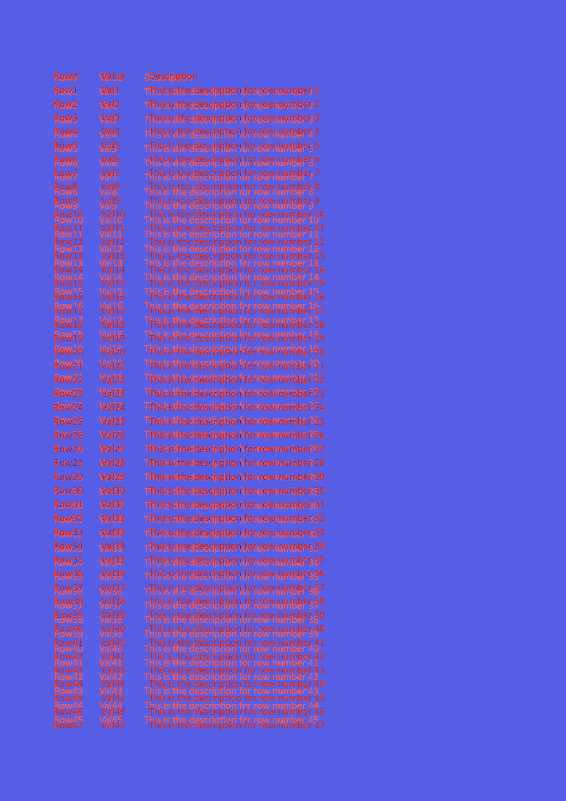</td>
  <td>changed: 254544 px (11.69%)<br>bbox: [119, 157, 712, 1600]<br>mean abs RGB: 18.9083<br>RMSE RGB: 61.9027<br>threshold: 12, gain: 5.0</td>
</tr>
<tr>
  <td><b>classic06_tall_table</b><br>Page 2</td>
  <td>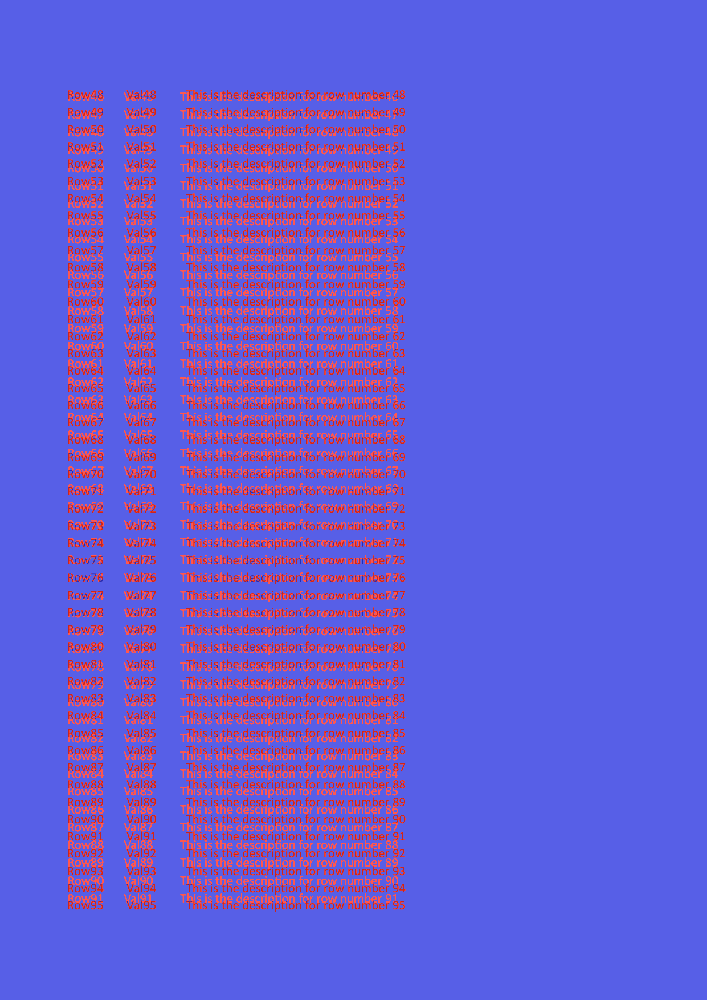</td>
  <td>changed: 263612 px (12.11%)<br>bbox: [119, 157, 712, 1600]<br>mean abs RGB: 19.5412<br>RMSE RGB: 62.8927<br>threshold: 12, gain: 5.0</td>
</tr>
<tr>
  <td><b>classic06_tall_table</b><br>Page 3</td>
  <td>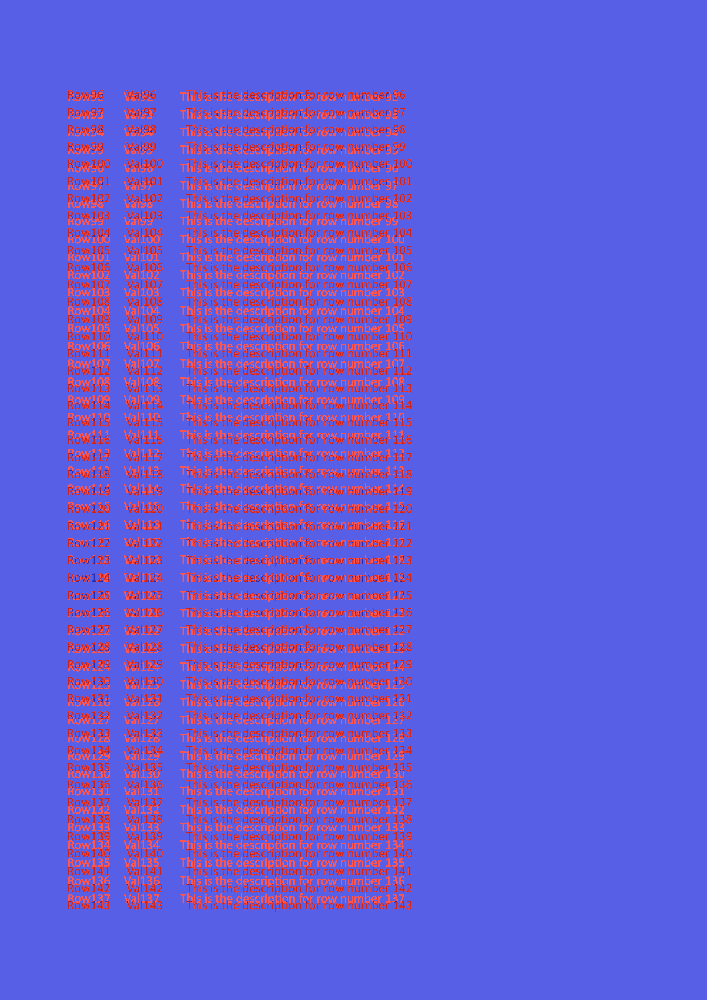</td>
  <td>changed: 276972 px (12.72%)<br>bbox: [119, 157, 724, 1600]<br>mean abs RGB: 20.5533<br>RMSE RGB: 64.5357<br>threshold: 12, gain: 5.0</td>
</tr>
<tr>
  <td><b>classic06_tall_table</b><br>Page 4</td>
  <td>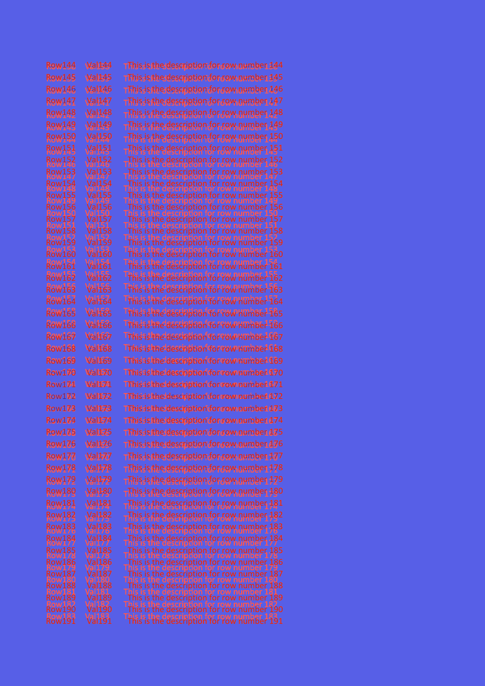</td>
  <td>changed: 279637 px (12.85%)<br>bbox: [119, 157, 724, 1600]<br>mean abs RGB: 20.7213<br>RMSE RGB: 64.7664<br>threshold: 12, gain: 5.0</td>
</tr>
<tr>
  <td><b>classic06_tall_table</b><br>Page 5</td>
  <td>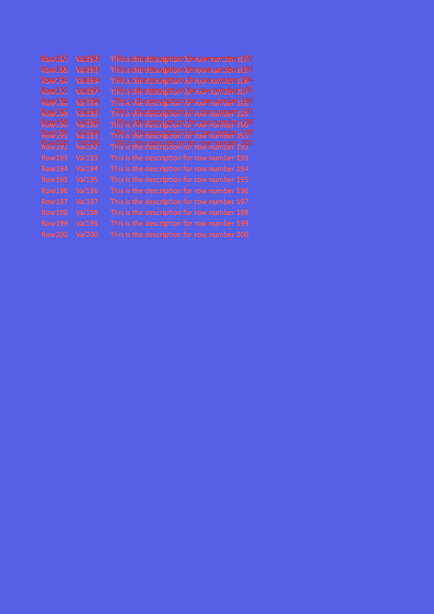</td>
  <td>changed: 80159 px (3.68%)<br>bbox: [119, 157, 724, 682]<br>mean abs RGB: 5.9794<br>RMSE RGB: 34.863<br>threshold: 12, gain: 5.0</td>
</tr>
<tr>
  <td><b>classic07_numbers_only</b><br>Page 1</td>
  <td></td>
  <td>changed: 2933 px (0.13%)<br>bbox: [183, 158, 423, 271]<br>mean abs RGB: 0.2244<br>RMSE RGB: 6.8054<br>threshold: 12, gain: 5.0</td>
</tr>
<tr>
  <td><b>classic08_mixed_text_and_numbers</b><br>Page 1</td>
  <td></td>
  <td>changed: 6422 px (0.29%)<br>bbox: [117, 158, 318, 334]<br>mean abs RGB: 0.4706<br>RMSE RGB: 9.7102<br>threshold: 12, gain: 5.0</td>
</tr>
<tr>
  <td><b>classic09_long_text</b><br>Page 1</td>
  <td></td>
  <td>changed: 38203 px (1.76%)<br>bbox: [118, 157, 1241, 302]<br>mean abs RGB: 2.7843<br>RMSE RGB: 23.7631<br>threshold: 12, gain: 5.0</td>
</tr>
<tr>
  <td><b>classic10_special_xml_characters</b><br>Page 1</td>
  <td></td>
  <td>changed: 10381 px (0.48%)<br>bbox: [117, 157, 442, 369]<br>mean abs RGB: 0.752<br>RMSE RGB: 12.2956<br>threshold: 12, gain: 5.0</td>
</tr>
<tr>
  <td><b>classic11_sparse_rows</b><br>Page 1</td>
  <td></td>
  <td>changed: 2895 px (0.13%)<br>bbox: [117, 158, 212, 771]<br>mean abs RGB: 0.2147<br>RMSE RGB: 6.5755<br>threshold: 12, gain: 5.0</td>
</tr>
<tr>
  <td><b>classic11_sparse_rows</b><br>Page 2</td>
  <td></td>
  <td>changed: 955 px (0.04%)<br>bbox: [119, 161, 184, 205]<br>mean abs RGB: 0.0722<br>RMSE RGB: 3.8313<br>threshold: 12, gain: 5.0</td>
</tr>
<tr>
  <td><b>classic12_sparse_columns</b><br>Page 1</td>
  <td></td>
  <td>changed: 3569 px (0.16%)<br>bbox: [119, 157, 1078, 243]<br>mean abs RGB: 0.2552<br>RMSE RGB: 7.126<br>threshold: 12, gain: 5.0</td>
</tr>
<tr>
  <td><b>classic13_date_strings</b><br>Page 1</td>
  <td></td>
  <td>changed: 10363 px (0.48%)<br>bbox: [118, 158, 312, 337]<br>mean abs RGB: 0.753<br>RMSE RGB: 12.3058<br>threshold: 12, gain: 5.0</td>
</tr>
<tr>
  <td><b>classic14_decimal_numbers</b><br>Page 1</td>
  <td></td>
  <td>changed: 7782 px (0.36%)<br>bbox: [118, 157, 318, 337]<br>mean abs RGB: 0.5681<br>RMSE RGB: 10.6798<br>threshold: 12, gain: 5.0</td>
</tr>
<tr>
  <td><b>classic15_negative_numbers</b><br>Page 1</td>
  <td></td>
  <td>changed: 8098 px (0.37%)<br>bbox: [117, 157, 318, 369]<br>mean abs RGB: 0.5906<br>RMSE RGB: 10.8801<br>threshold: 12, gain: 5.0</td>
</tr>
<tr>
  <td><b>classic16_percentage_strings</b><br>Page 1</td>
  <td></td>
  <td>changed: 8738 px (0.40%)<br>bbox: [118, 158, 291, 334]<br>mean abs RGB: 0.626<br>RMSE RGB: 11.1322<br>threshold: 12, gain: 5.0</td>
</tr>
<tr>
  <td><b>classic17_currency_strings</b><br>Page 1</td>
  <td></td>
  <td>changed: 11149 px (0.51%)<br>bbox: [118, 158, 315, 365]<br>mean abs RGB: 0.8026<br>RMSE RGB: 12.6367<br>threshold: 12, gain: 5.0</td>
</tr>
<tr>
  <td><b>classic18_large_dataset</b><br>Page 1</td>
  <td>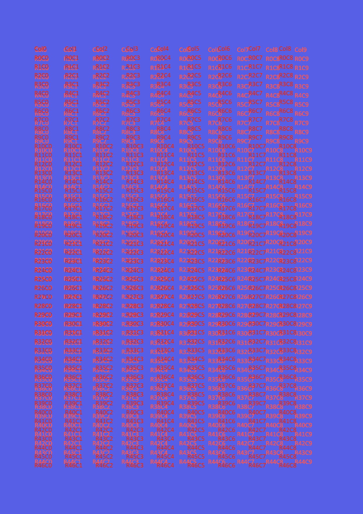</td>
  <td>changed: 341987 px (15.71%)<br>bbox: [118, 157, 1066, 1596]<br>mean abs RGB: 25.8631<br>RMSE RGB: 73.0282<br>threshold: 12, gain: 5.0</td>
</tr>
<tr>
  <td><b>classic18_large_dataset</b><br>Page 2</td>
  <td>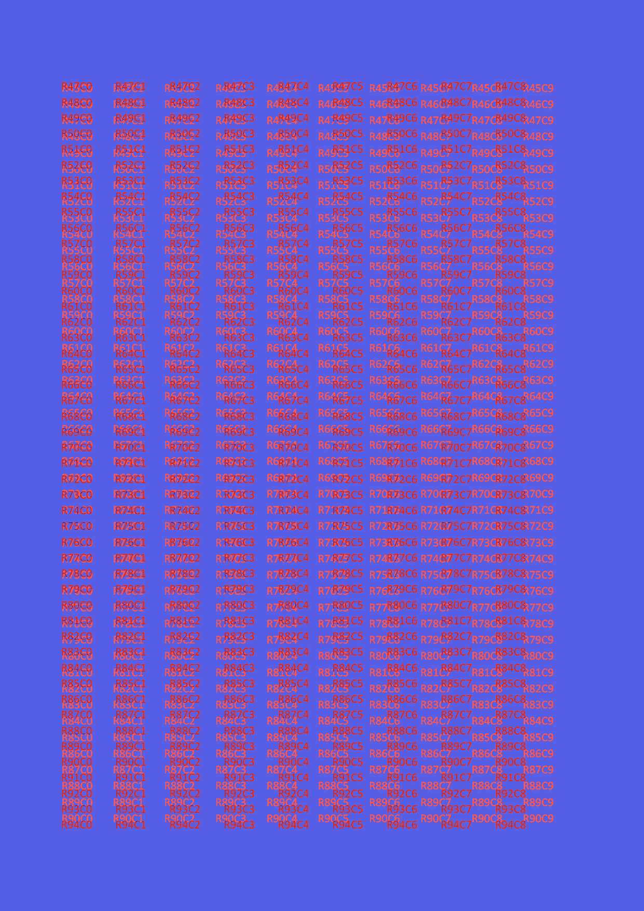</td>
  <td>changed: 366896 px (16.86%)<br>bbox: [119, 158, 1066, 1596]<br>mean abs RGB: 27.6082<br>RMSE RGB: 75.3213<br>threshold: 12, gain: 5.0</td>
</tr>
<tr>
  <td><b>classic18_large_dataset</b><br>Page 3</td>
  <td>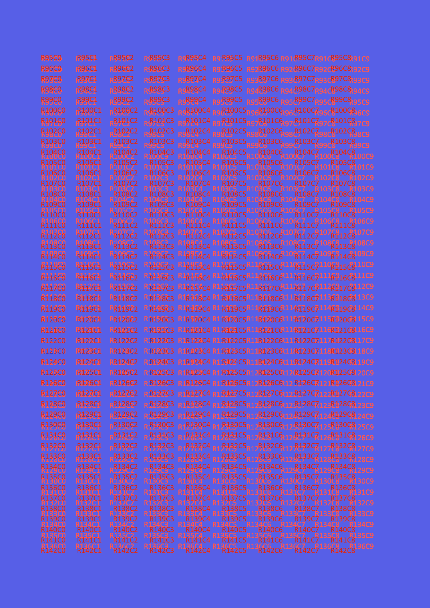</td>
  <td>changed: 405288 px (18.62%)<br>bbox: [119, 158, 1078, 1596]<br>mean abs RGB: 30.5084<br>RMSE RGB: 79.2262<br>threshold: 12, gain: 5.0</td>
</tr>
<tr>
  <td><b>classic18_large_dataset</b><br>Page 4</td>
  <td>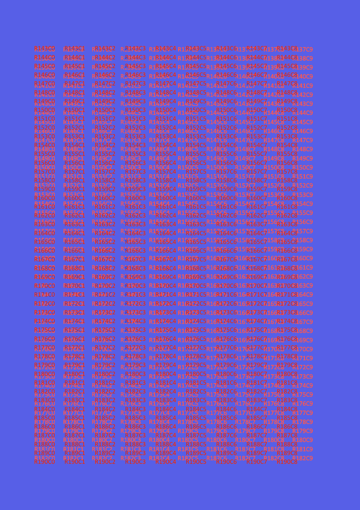</td>
  <td>changed: 413635 px (19.00%)<br>bbox: [119, 158, 1078, 1596]<br>mean abs RGB: 31.0416<br>RMSE RGB: 79.8048<br>threshold: 12, gain: 5.0</td>
</tr>
<tr>
  <td><b>classic18_large_dataset</b><br>Page 5</td>
  <td>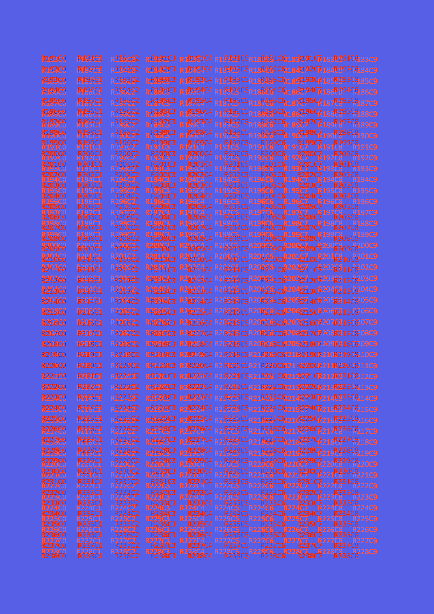</td>
  <td>changed: 419534 px (19.27%)<br>bbox: [119, 158, 1078, 1596]<br>mean abs RGB: 31.6261<br>RMSE RGB: 80.6974<br>threshold: 12, gain: 5.0</td>
</tr>
<tr>
  <td><b>classic18_large_dataset</b><br>Page 6</td>
  <td>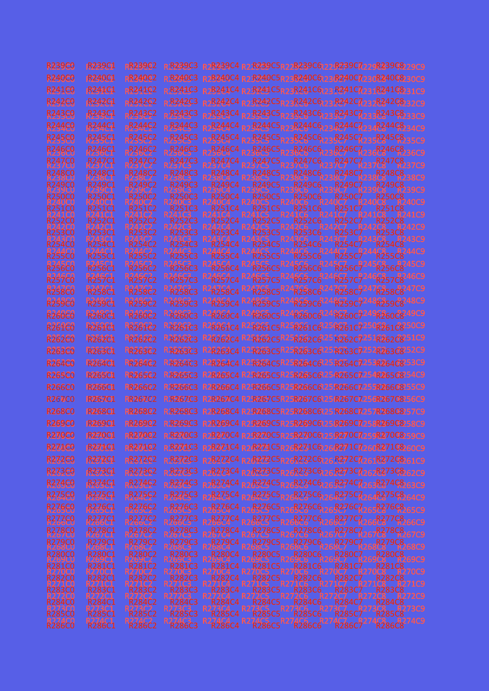</td>
  <td>changed: 421788 px (19.38%)<br>bbox: [119, 158, 1078, 1596]<br>mean abs RGB: 31.753<br>RMSE RGB: 80.8012<br>threshold: 12, gain: 5.0</td>
</tr>
<tr>
  <td><b>classic18_large_dataset</b><br>Page 7</td>
  <td>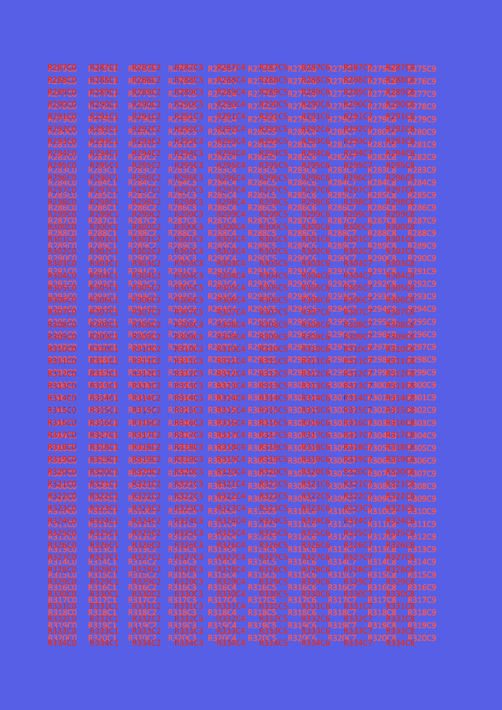</td>
  <td>changed: 427084 px (19.62%)<br>bbox: [119, 158, 1078, 1596]<br>mean abs RGB: 32.0161<br>RMSE RGB: 81.0944<br>threshold: 12, gain: 5.0</td>
</tr>
<tr>
  <td><b>classic18_large_dataset</b><br>Page 8</td>
  <td>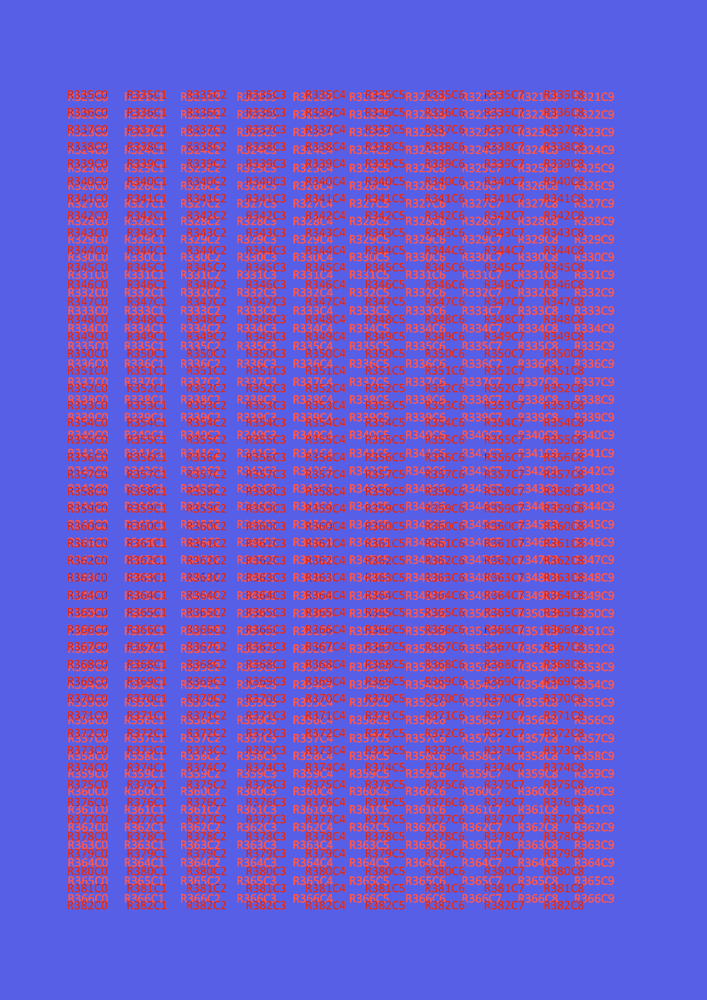</td>
  <td>changed: 427222 px (19.63%)<br>bbox: [119, 158, 1078, 1596]<br>mean abs RGB: 31.8143<br>RMSE RGB: 80.6783<br>threshold: 12, gain: 5.0</td>
</tr>
<tr>
  <td><b>classic18_large_dataset</b><br>Page 9</td>
  <td>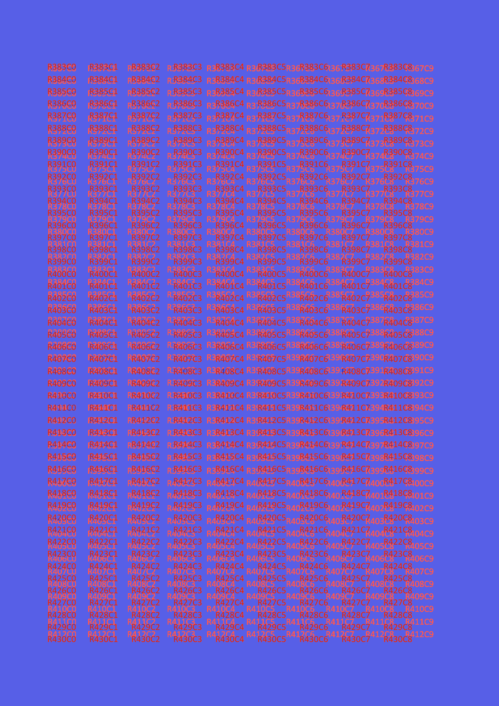</td>
  <td>changed: 429759 px (19.74%)<br>bbox: [119, 158, 1078, 1596]<br>mean abs RGB: 32.246<br>RMSE RGB: 81.3467<br>threshold: 12, gain: 5.0</td>
</tr>
<tr>
  <td><b>classic18_large_dataset</b><br>Page 10</td>
  <td>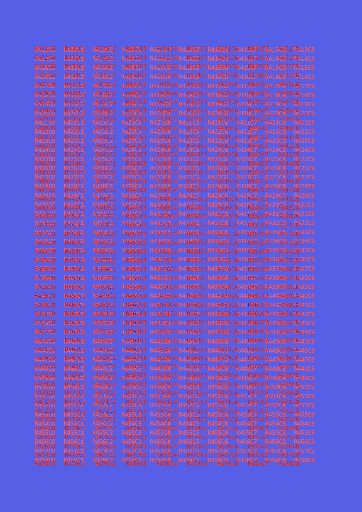</td>
  <td>changed: 422578 px (19.41%)<br>bbox: [119, 158, 1078, 1596]<br>mean abs RGB: 31.8416<br>RMSE RGB: 80.8378<br>threshold: 12, gain: 5.0</td>
</tr>
<tr>
  <td><b>classic18_large_dataset</b><br>Page 11</td>
  <td>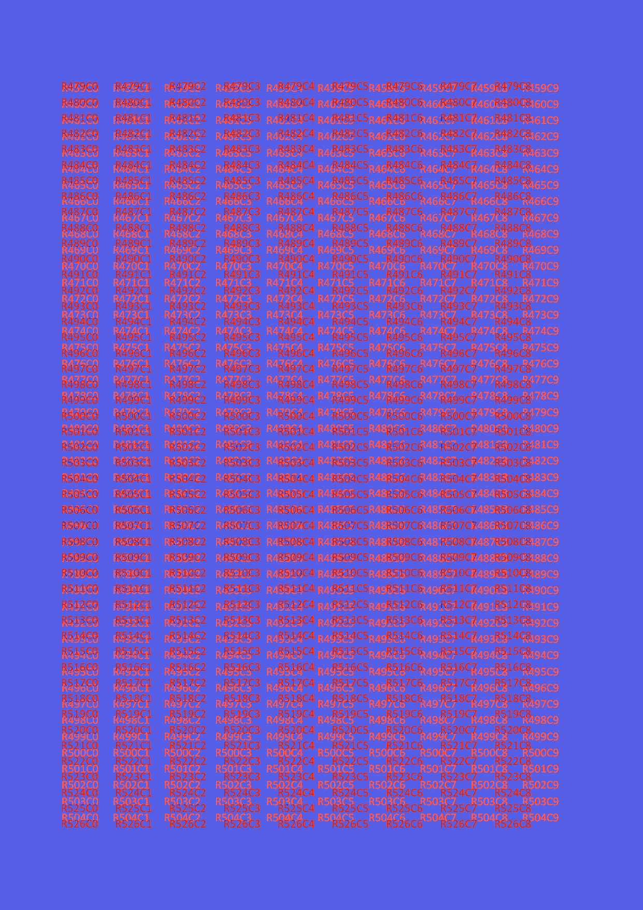</td>
  <td>changed: 430510 px (19.78%)<br>bbox: [119, 158, 1078, 1596]<br>mean abs RGB: 32.3463<br>RMSE RGB: 81.4722<br>threshold: 12, gain: 5.0</td>
</tr>
<tr>
  <td><b>classic18_large_dataset</b><br>Page 12</td>
  <td>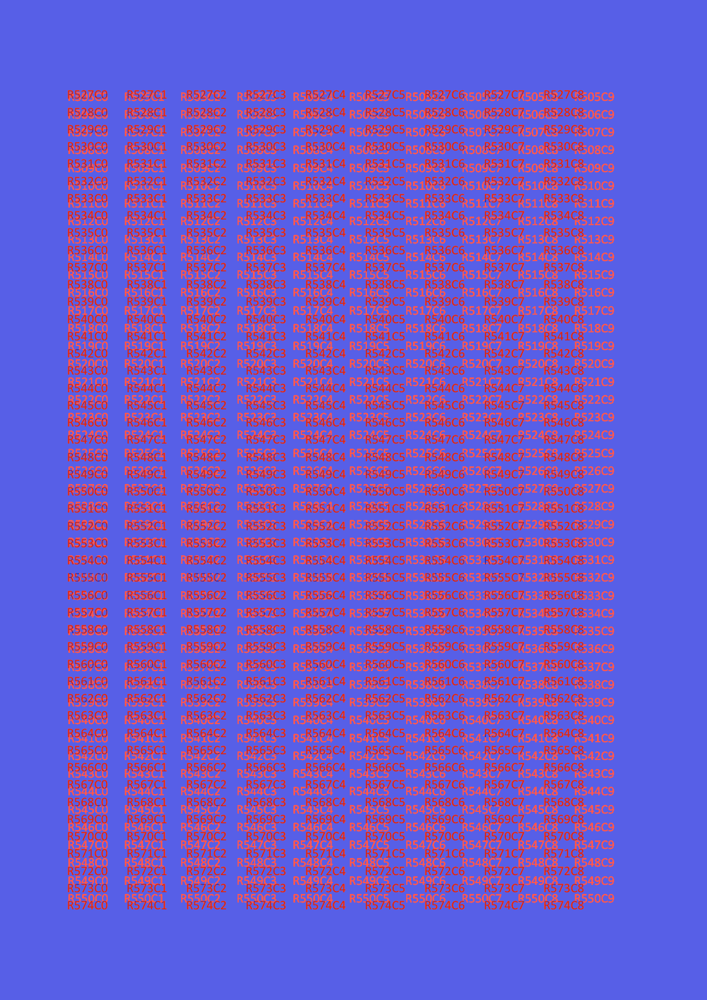</td>
  <td>changed: 425851 px (19.56%)<br>bbox: [119, 158, 1078, 1596]<br>mean abs RGB: 31.6676<br>RMSE RGB: 80.4645<br>threshold: 12, gain: 5.0</td>
</tr>
<tr>
  <td><b>classic18_large_dataset</b><br>Page 13</td>
  <td>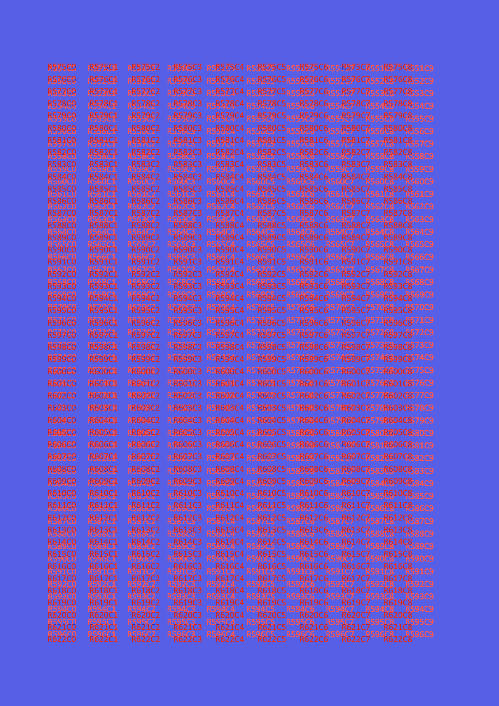</td>
  <td>changed: 432389 px (19.86%)<br>bbox: [119, 158, 1078, 1596]<br>mean abs RGB: 32.2062<br>RMSE RGB: 81.1724<br>threshold: 12, gain: 5.0</td>
</tr>
<tr>
  <td><b>classic18_large_dataset</b><br>Page 14</td>
  <td>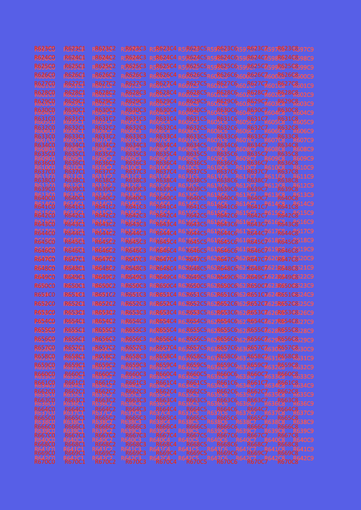</td>
  <td>changed: 433056 px (19.89%)<br>bbox: [119, 158, 1078, 1596]<br>mean abs RGB: 32.4636<br>RMSE RGB: 81.5759<br>threshold: 12, gain: 5.0</td>
</tr>
<tr>
  <td><b>classic18_large_dataset</b><br>Page 15</td>
  <td>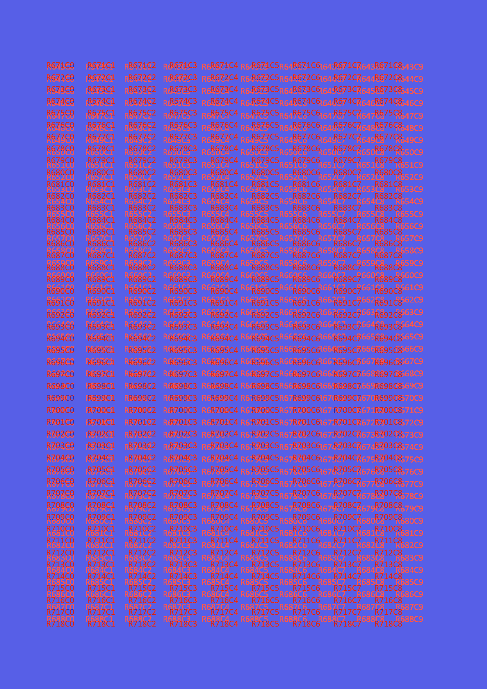</td>
  <td>changed: 432573 px (19.87%)<br>bbox: [119, 158, 1078, 1596]<br>mean abs RGB: 32.3618<br>RMSE RGB: 81.4199<br>threshold: 12, gain: 5.0</td>
</tr>
<tr>
  <td><b>classic18_large_dataset</b><br>Page 16</td>
  <td>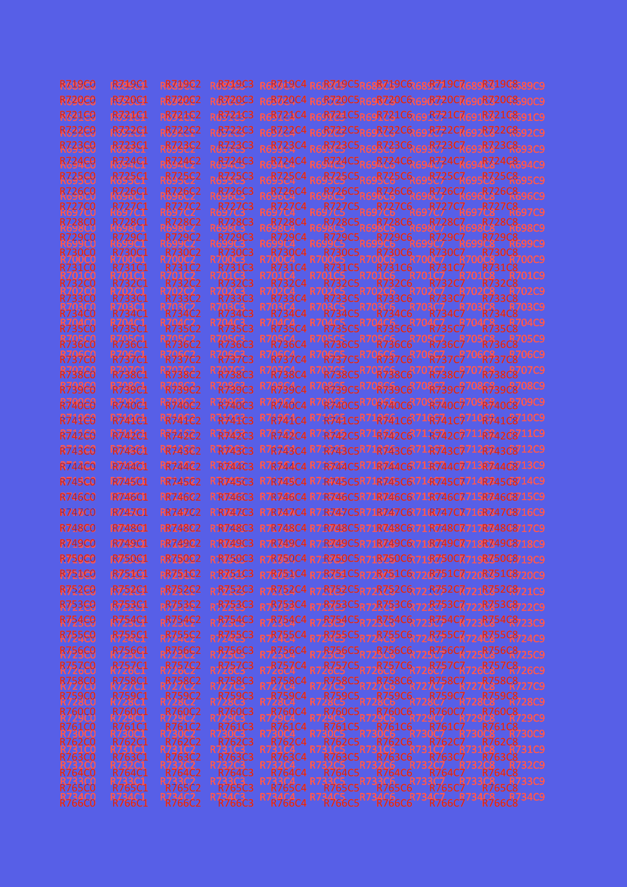</td>
  <td>changed: 417004 px (19.16%)<br>bbox: [119, 158, 1078, 1596]<br>mean abs RGB: 31.1361<br>RMSE RGB: 79.8962<br>threshold: 12, gain: 5.0</td>
</tr>
<tr>
  <td><b>classic18_large_dataset</b><br>Page 17</td>
  <td>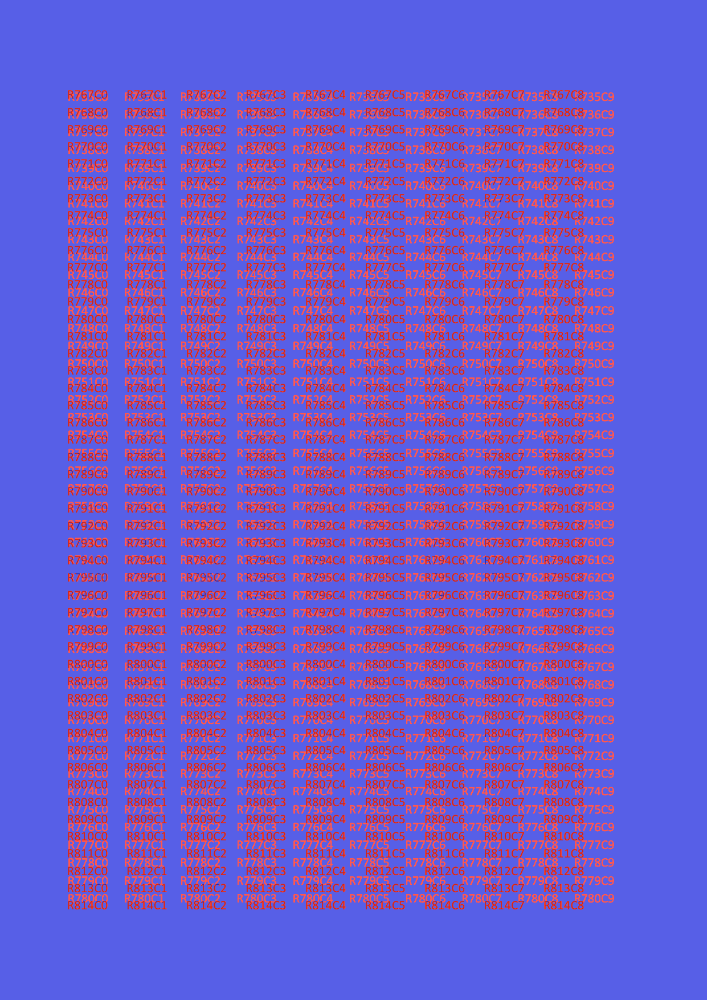</td>
  <td>changed: 419405 px (19.27%)<br>bbox: [119, 158, 1078, 1596]<br>mean abs RGB: 31.2608<br>RMSE RGB: 80.0009<br>threshold: 12, gain: 5.0</td>
</tr>
<tr>
  <td><b>classic18_large_dataset</b><br>Page 18</td>
  <td>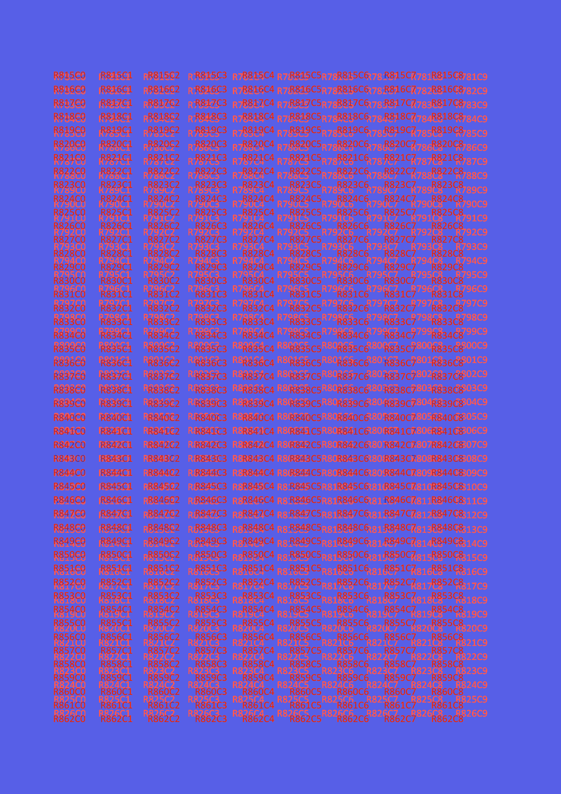</td>
  <td>changed: 436540 px (20.05%)<br>bbox: [119, 158, 1078, 1596]<br>mean abs RGB: 32.729<br>RMSE RGB: 81.9639<br>threshold: 12, gain: 5.0</td>
</tr>
<tr>
  <td><b>classic18_large_dataset</b><br>Page 19</td>
  <td>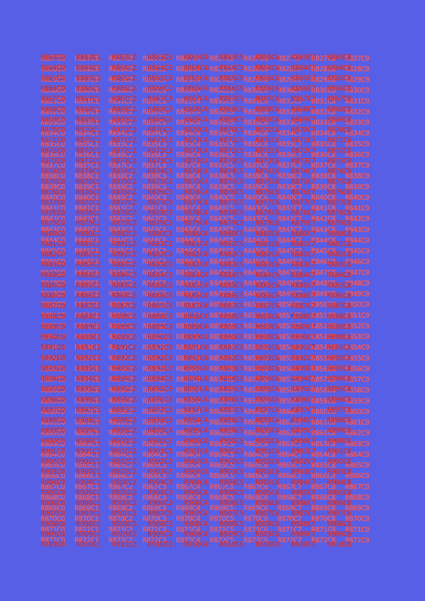</td>
  <td>changed: 444186 px (20.41%)<br>bbox: [119, 158, 1078, 1596]<br>mean abs RGB: 33.2563<br>RMSE RGB: 82.5686<br>threshold: 12, gain: 5.0</td>
</tr>
<tr>
  <td><b>classic18_large_dataset</b><br>Page 20</td>
  <td>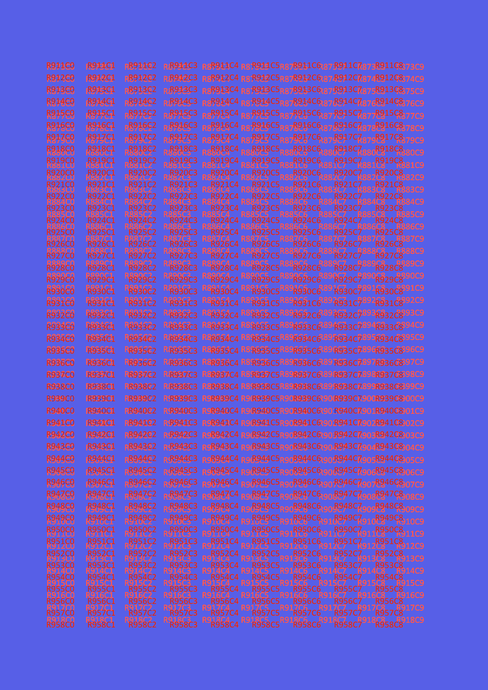</td>
  <td>changed: 437547 px (20.10%)<br>bbox: [119, 158, 1078, 1596]<br>mean abs RGB: 32.775<br>RMSE RGB: 81.9854<br>threshold: 12, gain: 5.0</td>
</tr>
<tr>
  <td><b>classic18_large_dataset</b><br>Page 21</td>
  <td>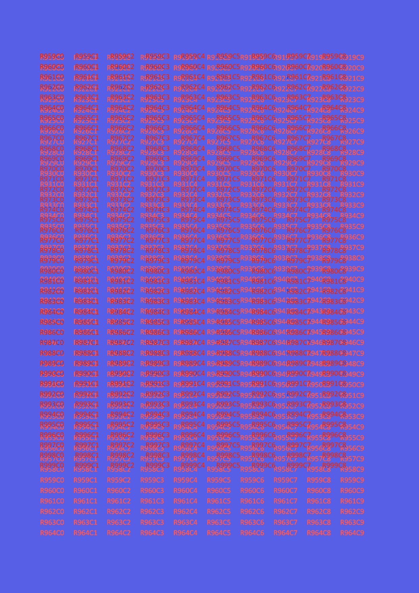</td>
  <td>changed: 404077 px (18.56%)<br>bbox: [119, 158, 1078, 1584]<br>mean abs RGB: 30.1311<br>RMSE RGB: 78.4909<br>threshold: 12, gain: 5.0</td>
</tr>
<tr>
  <td><b>classic18_large_dataset</b><br>Page 22</td>
  <td>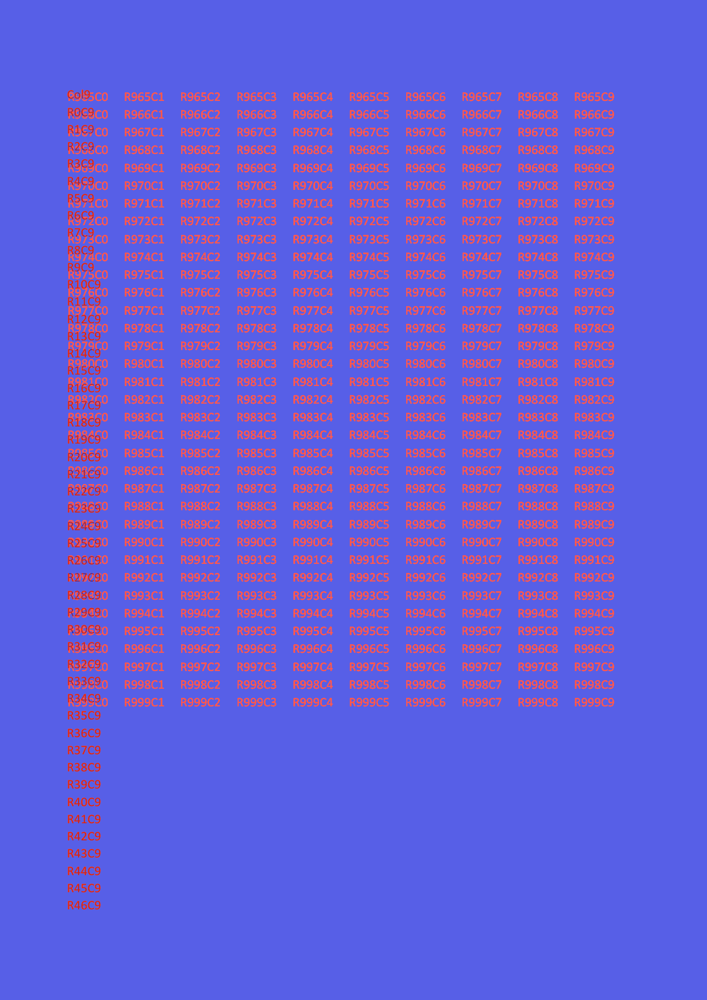</td>
  <td>changed: 205645 px (9.45%)<br>bbox: [118, 157, 1078, 1596]<br>mean abs RGB: 15.6152<br>RMSE RGB: 56.8365<br>threshold: 12, gain: 5.0</td>
</tr>
<tr>
  <td><b>classic19_single_column_list</b><br>Page 1</td>
  <td></td>
  <td>changed: 15392 px (0.71%)<br>bbox: [119, 158, 190, 803]<br>mean abs RGB: 1.154<br>RMSE RGB: 15.2715<br>threshold: 12, gain: 5.0</td>
</tr>
<tr>
  <td><b>classic21_header_only</b><br>Page 1</td>
  <td></td>
  <td>changed: 2422 px (0.11%)<br>bbox: [118, 157, 576, 178]<br>mean abs RGB: 0.1765<br>RMSE RGB: 5.9527<br>threshold: 12, gain: 5.0</td>
</tr>
<tr>
  <td><b>classic22_long_sheet_name</b><br>Page 1</td>
  <td></td>
  <td>changed: 3120 px (0.14%)<br>bbox: [119, 157, 318, 240]<br>mean abs RGB: 0.2258<br>RMSE RGB: 6.6918<br>threshold: 12, gain: 5.0</td>
</tr>
<tr>
  <td><b>classic23_unicode_text</b><br>Page 1</td>
  <td></td>
  <td>changed: 15440 px (0.71%)<br>bbox: [117, 158, 423, 369]<br>mean abs RGB: 1.0911<br>RMSE RGB: 14.6079<br>threshold: 12, gain: 5.0</td>
</tr>
<tr>
  <td><b>classic24_red_text</b><br>Page 1</td>
  <td></td>
  <td>changed: 9350 px (0.43%)<br>bbox: [118, 158, 440, 275]<br>mean abs RGB: 0.4989<br>RMSE RGB: 9.773<br>threshold: 12, gain: 5.0</td>
</tr>
<tr>
  <td><b>classic25_multiple_colors</b><br>Page 1</td>
  <td></td>
  <td>changed: 21438 px (0.98%)<br>bbox: [118, 157, 409, 432]<br>mean abs RGB: 0.8656<br>RMSE RGB: 12.7689<br>threshold: 12, gain: 5.0</td>
</tr>
<tr>
  <td><b>classic26_inline_strings</b><br>Page 1</td>
  <td></td>
  <td>changed: 5660 px (0.26%)<br>bbox: [117, 157, 391, 240]<br>mean abs RGB: 0.3973<br>RMSE RGB: 8.8543<br>threshold: 12, gain: 5.0</td>
</tr>
<tr>
  <td><b>classic27_single_row</b><br>Page 1</td>
  <td></td>
  <td>changed: 2896 px (0.13%)<br>bbox: [119, 157, 778, 178]<br>mean abs RGB: 0.2182<br>RMSE RGB: 6.6587<br>threshold: 12, gain: 5.0</td>
</tr>
<tr>
  <td><b>classic28_duplicate_values</b><br>Page 1</td>
  <td></td>
  <td>changed: 7090 px (0.33%)<br>bbox: [118, 158, 462, 303]<br>mean abs RGB: 0.5248<br>RMSE RGB: 10.3435<br>threshold: 12, gain: 5.0</td>
</tr>
<tr>
  <td><b>classic29_formula_results</b><br>Page 1</td>
  <td></td>
  <td>changed: 7831 px (0.36%)<br>bbox: [118, 157, 527, 303]<br>mean abs RGB: 0.594<br>RMSE RGB: 11.0694<br>threshold: 12, gain: 5.0</td>
</tr>
<tr>
  <td><b>classic30_mixed_empty_and_filled_sheets</b><br>Page 1</td>
  <td></td>
  <td>changed: 2733 px (0.13%)<br>bbox: [119, 157, 279, 242]<br>mean abs RGB: 0.1982<br>RMSE RGB: 6.2709<br>threshold: 12, gain: 5.0</td>
</tr>
<tr>
  <td><b>classic30_mixed_empty_and_filled_sheets</b><br>Page 2</td>
  <td></td>
  <td>changed: 3021 px (0.14%)<br>bbox: [118, 157, 422, 209]<br>mean abs RGB: 0.2199<br>RMSE RGB: 6.6386<br>threshold: 12, gain: 5.0</td>
</tr>
<tr>
  <td><b>classic31_bold_header_row</b><br>Page 1</td>
  <td></td>
  <td>changed: 13483 px (0.62%)<br>bbox: [118, 157, 527, 303]<br>mean abs RGB: 1.0079<br>RMSE RGB: 14.3585<br>threshold: 12, gain: 5.0</td>
</tr>
<tr>
  <td><b>classic32_right_aligned_numbers</b><br>Page 1</td>
  <td></td>
  <td>changed: 5967 px (0.27%)<br>bbox: [119, 157, 318, 271]<br>mean abs RGB: 0.431<br>RMSE RGB: 9.25<br>threshold: 12, gain: 5.0</td>
</tr>
<tr>
  <td><b>classic33_centered_text</b><br>Page 1</td>
  <td></td>
  <td>changed: 4557 px (0.21%)<br>bbox: [119, 157, 596, 240]<br>mean abs RGB: 0.3466<br>RMSE RGB: 8.4258<br>threshold: 12, gain: 5.0</td>
</tr>
<tr>
  <td><b>classic34_explicit_column_widths</b><br>Page 1</td>
  <td></td>
  <td>changed: 10036 px (0.46%)<br>bbox: [119, 157, 670, 275]<br>mean abs RGB: 0.7333<br>RMSE RGB: 12.1187<br>threshold: 12, gain: 5.0</td>
</tr>
<tr>
  <td><b>classic35_explicit_row_heights</b><br>Page 1</td>
  <td></td>
  <td>changed: 3681 px (0.17%)<br>bbox: [117, 190, 318, 344]<br>mean abs RGB: 0.2495<br>RMSE RGB: 6.837<br>threshold: 12, gain: 5.0</td>
</tr>
<tr>
  <td><b>classic36_merged_cells</b><br>Page 1</td>
  <td></td>
  <td>changed: 9340 px (0.43%)<br>bbox: [118, 157, 500, 271]<br>mean abs RGB: 0.6636<br>RMSE RGB: 11.4526<br>threshold: 12, gain: 5.0</td>
</tr>
<tr>
  <td><b>classic37_freeze_panes</b><br>Page 1</td>
  <td>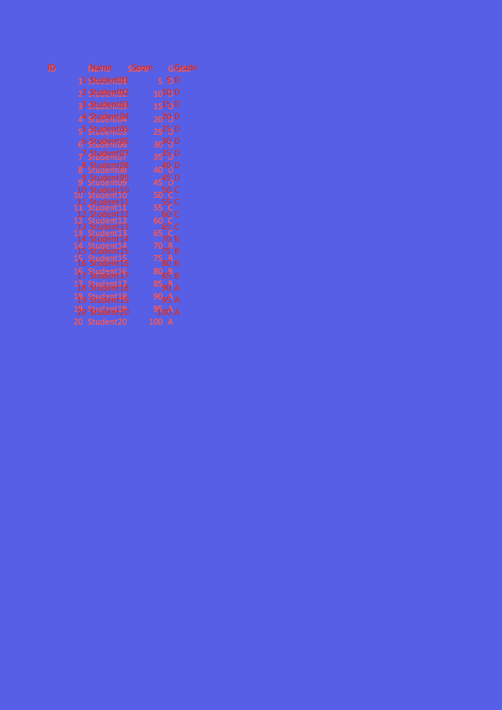</td>
  <td>changed: 42421 px (1.95%)<br>bbox: [119, 157, 487, 803]<br>mean abs RGB: 3.2235<br>RMSE RGB: 25.8535<br>threshold: 12, gain: 5.0</td>
</tr>
<tr>
  <td><b>classic38_hyperlink_cell</b><br>Page 1</td>
  <td></td>
  <td>changed: 6894 px (0.32%)<br>bbox: [119, 158, 478, 244]<br>mean abs RGB: 0.4662<br>RMSE RGB: 9.5482<br>threshold: 12, gain: 5.0</td>
</tr>
<tr>
  <td><b>classic39_financial_table</b><br>Page 1</td>
  <td></td>
  <td>changed: 17893 px (0.82%)<br>bbox: [117, 157, 527, 365]<br>mean abs RGB: 1.2795<br>RMSE RGB: 16.1024<br>threshold: 12, gain: 5.0</td>
</tr>
<tr>
  <td><b>classic40_scientific_notation</b><br>Page 1</td>
  <td></td>
  <td>changed: 11248 px (0.52%)<br>bbox: [118, 157, 318, 338]<br>mean abs RGB: 0.8147<br>RMSE RGB: 12.7618<br>threshold: 12, gain: 5.0</td>
</tr>
<tr>
  <td><b>classic41_integer_vs_float</b><br>Page 1</td>
  <td></td>
  <td>changed: 10581 px (0.49%)<br>bbox: [117, 157, 318, 428]<br>mean abs RGB: 0.7781<br>RMSE RGB: 12.5185<br>threshold: 12, gain: 5.0</td>
</tr>
<tr>
  <td><b>classic42_boolean_values</b><br>Page 1</td>
  <td></td>
  <td>changed: 9024 px (0.41%)<br>bbox: [118, 157, 298, 334]<br>mean abs RGB: 0.6471<br>RMSE RGB: 11.3383<br>threshold: 12, gain: 5.0</td>
</tr>
<tr>
  <td><b>classic43_inventory_report</b><br>Page 1</td>
  <td></td>
  <td>changed: 36006 px (1.65%)<br>bbox: [118, 157, 748, 397]<br>mean abs RGB: 2.6891<br>RMSE RGB: 23.4897<br>threshold: 12, gain: 5.0</td>
</tr>
<tr>
  <td><b>classic44_employee_roster</b><br>Page 1</td>
  <td></td>
  <td>changed: 53155 px (2.44%)<br>bbox: [119, 157, 839, 432]<br>mean abs RGB: 3.9531<br>RMSE RGB: 28.3539<br>threshold: 12, gain: 5.0</td>
</tr>
<tr>
  <td><b>classic45_sales_by_region</b><br>Page 1</td>
  <td></td>
  <td>changed: 5775 px (0.27%)<br>bbox: [118, 157, 318, 304]<br>mean abs RGB: 0.4256<br>RMSE RGB: 9.2835<br>threshold: 12, gain: 5.0</td>
</tr>
<tr>
  <td><b>classic45_sales_by_region</b><br>Page 2</td>
  <td></td>
  <td>changed: 5894 px (0.27%)<br>bbox: [118, 157, 318, 304]<br>mean abs RGB: 0.4353<br>RMSE RGB: 9.386<br>threshold: 12, gain: 5.0</td>
</tr>
<tr>
  <td><b>classic45_sales_by_region</b><br>Page 3</td>
  <td></td>
  <td>changed: 5957 px (0.27%)<br>bbox: [118, 157, 318, 304]<br>mean abs RGB: 0.4395<br>RMSE RGB: 9.4398<br>threshold: 12, gain: 5.0</td>
</tr>
<tr>
  <td><b>classic45_sales_by_region</b><br>Page 4</td>
  <td></td>
  <td>changed: 5868 px (0.27%)<br>bbox: [118, 157, 318, 304]<br>mean abs RGB: 0.4337<br>RMSE RGB: 9.3729<br>threshold: 12, gain: 5.0</td>
</tr>
<tr>
  <td><b>classic46_grade_book</b><br>Page 1</td>
  <td></td>
  <td>changed: 23583 px (1.08%)<br>bbox: [118, 157, 801, 396]<br>mean abs RGB: 1.7791<br>RMSE RGB: 19.0972<br>threshold: 12, gain: 5.0</td>
</tr>
<tr>
  <td><b>classic47_time_series</b><br>Page 1</td>
  <td>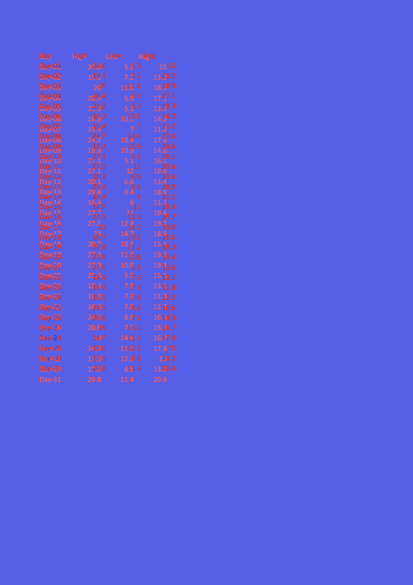</td>
  <td>changed: 64124 px (2.95%)<br>bbox: [119, 157, 527, 1150]<br>mean abs RGB: 4.7815<br>RMSE RGB: 31.2377<br>threshold: 12, gain: 5.0</td>
</tr>
<tr>
  <td><b>classic48_survey_results</b><br>Page 1</td>
  <td></td>
  <td>changed: 17738 px (0.81%)<br>bbox: [118, 157, 782, 334]<br>mean abs RGB: 1.3047<br>RMSE RGB: 16.2187<br>threshold: 12, gain: 5.0</td>
</tr>
<tr>
  <td><b>classic49_contact_list</b><br>Page 1</td>
  <td></td>
  <td>changed: 35751 px (1.64%)<br>bbox: [118, 157, 621, 400]<br>mean abs RGB: 2.6253<br>RMSE RGB: 23.0226<br>threshold: 12, gain: 5.0</td>
</tr>
<tr>
  <td><b>classic50_budget_vs_actuals</b><br>Page 1</td>
  <td></td>
  <td>changed: 30019 px (1.38%)<br>bbox: [118, 157, 736, 334]<br>mean abs RGB: 2.2643<br>RMSE RGB: 21.5176<br>threshold: 12, gain: 5.0</td>
</tr>
<tr>
  <td><b>classic50_budget_vs_actuals</b><br>Page 2</td>
  <td></td>
  <td>changed: 29671 px (1.36%)<br>bbox: [118, 157, 736, 334]<br>mean abs RGB: 2.2332<br>RMSE RGB: 21.3639<br>threshold: 12, gain: 5.0</td>
</tr>
<tr>
  <td><b>classic50_budget_vs_actuals</b><br>Page 3</td>
  <td></td>
  <td>changed: 24029 px (1.10%)<br>bbox: [118, 157, 736, 334]<br>mean abs RGB: 1.8075<br>RMSE RGB: 19.2347<br>threshold: 12, gain: 5.0</td>
</tr>
<tr>
  <td><b>classic51_product_catalog</b><br>Page 1</td>
  <td></td>
  <td>changed: 44953 px (2.07%)<br>bbox: [119, 157, 631, 494]<br>mean abs RGB: 3.3343<br>RMSE RGB: 26.048<br>threshold: 12, gain: 5.0</td>
</tr>
<tr>
  <td><b>classic52_pivot_summary</b><br>Page 1</td>
  <td></td>
  <td>changed: 29560 px (1.36%)<br>bbox: [117, 157, 736, 334]<br>mean abs RGB: 2.2751<br>RMSE RGB: 21.7429<br>threshold: 12, gain: 5.0</td>
</tr>
<tr>
  <td><b>classic53_invoice</b><br>Page 1</td>
  <td>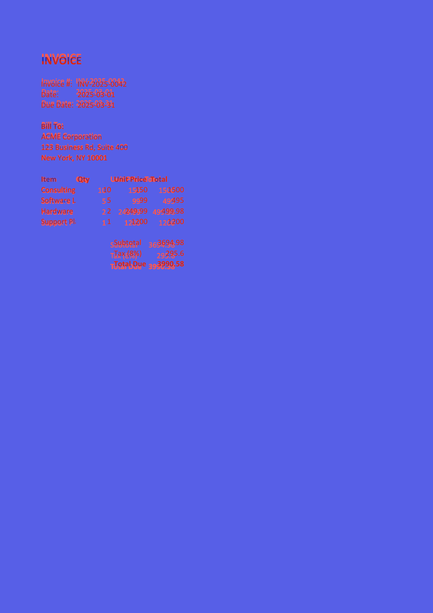</td>
  <td>changed: 33014 px (1.52%)<br>bbox: [118, 153, 527, 771]<br>mean abs RGB: 2.4454<br>RMSE RGB: 22.3335<br>threshold: 12, gain: 5.0</td>
</tr>
<tr>
  <td><b>classic54_multi_level_header</b><br>Page 1</td>
  <td></td>
  <td>changed: 22463 px (1.03%)<br>bbox: [119, 158, 841, 303]<br>mean abs RGB: 1.7462<br>RMSE RGB: 19.1271<br>threshold: 12, gain: 5.0</td>
</tr>
<tr>
  <td><b>classic55_error_values</b><br>Page 1</td>
  <td></td>
  <td>changed: 15554 px (0.71%)<br>bbox: [117, 157, 436, 369]<br>mean abs RGB: 1.1433<br>RMSE RGB: 15.1978<br>threshold: 12, gain: 5.0</td>
</tr>
<tr>
  <td><b>classic56_alternating_row_colors</b><br>Page 1</td>
  <td></td>
  <td>changed: 35473 px (1.63%)<br>bbox: [112, 157, 427, 494]<br>mean abs RGB: 1.4545<br>RMSE RGB: 15.9316<br>threshold: 12, gain: 5.0</td>
</tr>
<tr>
  <td><b>classic57_cjk_only</b><br>Page 1</td>
  <td></td>
  <td>changed: 15048 px (0.69%)<br>bbox: [119, 154, 527, 335]<br>mean abs RGB: 0.989<br>RMSE RGB: 13.5327<br>threshold: 12, gain: 5.0</td>
</tr>
<tr>
  <td><b>classic58_mixed_numeric_formats</b><br>Page 1</td>
  <td></td>
  <td>changed: 16779 px (0.77%)<br>bbox: [117, 157, 318, 459]<br>mean abs RGB: 1.2326<br>RMSE RGB: 15.7623<br>threshold: 12, gain: 5.0</td>
</tr>
<tr>
  <td><b>classic59_multi_sheet_summary</b><br>Page 1</td>
  <td></td>
  <td>changed: 11014 px (0.51%)<br>bbox: [119, 157, 422, 334]<br>mean abs RGB: 0.815<br>RMSE RGB: 12.8216<br>threshold: 12, gain: 5.0</td>
</tr>
<tr>
  <td><b>classic59_multi_sheet_summary</b><br>Page 2</td>
  <td></td>
  <td>changed: 11014 px (0.51%)<br>bbox: [119, 157, 422, 334]<br>mean abs RGB: 0.815<br>RMSE RGB: 12.8216<br>threshold: 12, gain: 5.0</td>
</tr>
<tr>
  <td><b>classic59_multi_sheet_summary</b><br>Page 3</td>
  <td></td>
  <td>changed: 11014 px (0.51%)<br>bbox: [119, 157, 422, 334]<br>mean abs RGB: 0.815<br>RMSE RGB: 12.8216<br>threshold: 12, gain: 5.0</td>
</tr>
<tr>
  <td><b>classic59_multi_sheet_summary</b><br>Page 4</td>
  <td></td>
  <td>changed: 5560 px (0.26%)<br>bbox: [117, 157, 356, 271]<br>mean abs RGB: 0.4073<br>RMSE RGB: 9.0241<br>threshold: 12, gain: 5.0</td>
</tr>
<tr>
  <td><b>classic60_large_wide_table</b><br>Page 1</td>
  <td></td>
  <td>changed: 428782 px (19.70%)<br>bbox: [118, 157, 1078, 1596]<br>mean abs RGB: 32.359<br>RMSE RGB: 81.5934<br>threshold: 12, gain: 5.0</td>
</tr>
<tr>
  <td><b>classic60_large_wide_table</b><br>Page 2</td>
  <td></td>
  <td>changed: 37589 px (1.73%)<br>bbox: [119, 158, 1078, 303]<br>mean abs RGB: 2.8176<br>RMSE RGB: 24.0204<br>threshold: 12, gain: 5.0</td>
</tr>
<tr>
  <td><b>classic60_large_wide_table</b><br>Page 3</td>
  <td>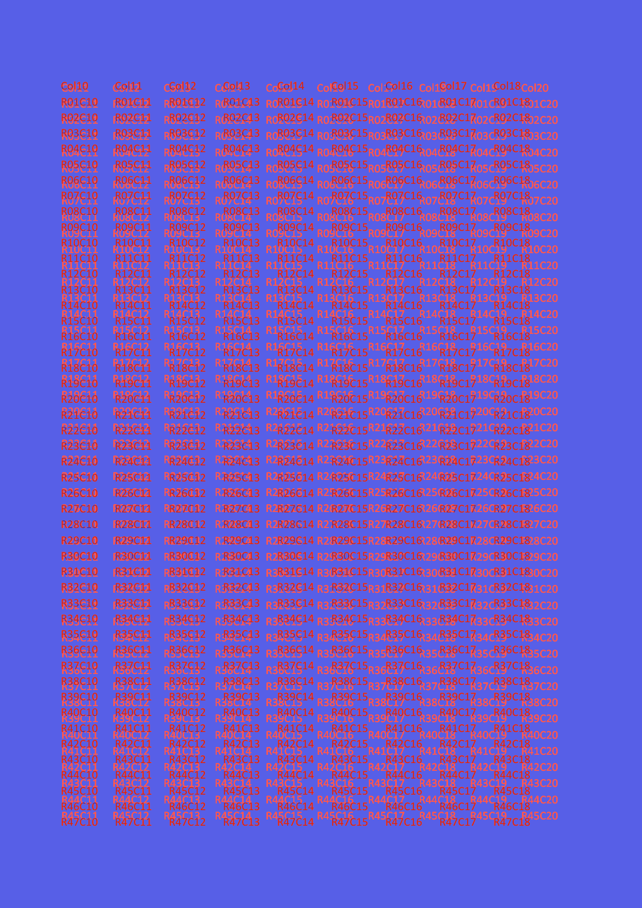</td>
  <td>changed: 408333 px (18.76%)<br>bbox: [118, 157, 1078, 1596]<br>mean abs RGB: 30.7561<br>RMSE RGB: 79.5765<br>threshold: 12, gain: 5.0</td>
</tr>
<tr>
  <td><b>classic60_large_wide_table</b><br>Page 4</td>
  <td></td>
  <td>changed: 35890 px (1.65%)<br>bbox: [119, 158, 1078, 303]<br>mean abs RGB: 2.686<br>RMSE RGB: 23.458<br>threshold: 12, gain: 5.0</td>
</tr>
<tr>
  <td><b>classic61_product_card_with_image</b><br>Page 1</td>
  <td></td>
  <td>changed: 6140 px (0.28%)<br>bbox: [415, 270, 588, 444]<br>mean abs RGB: 0.4587<br>RMSE RGB: 9.7126<br>threshold: 12, gain: 5.0</td>
</tr>
<tr>
  <td><b>classic62_company_logo_header</b><br>Page 1</td>
  <td></td>
  <td>changed: 15008 px (0.69%)<br>bbox: [118, 216, 632, 432]<br>mean abs RGB: 1.1282<br>RMSE RGB: 15.2331<br>threshold: 12, gain: 5.0</td>
</tr>
<tr>
  <td><b>classic63_two_products_side_by_side</b><br>Page 1</td>
  <td></td>
  <td>changed: 11217 px (0.52%)<br>bbox: [119, 150, 567, 382]<br>mean abs RGB: 0.8236<br>RMSE RGB: 12.6956<br>threshold: 12, gain: 5.0</td>
</tr>
<tr>
  <td><b>classic64_employee_directory_with_photo</b><br>Page 1</td>
  <td></td>
  <td>changed: 19108 px (0.88%)<br>bbox: [112, 150, 727, 407]<br>mean abs RGB: 1.3449<br>RMSE RGB: 16.1451<br>threshold: 12, gain: 5.0</td>
</tr>
<tr>
  <td><b>classic65_inventory_with_product_photos</b><br>Page 1</td>
  <td>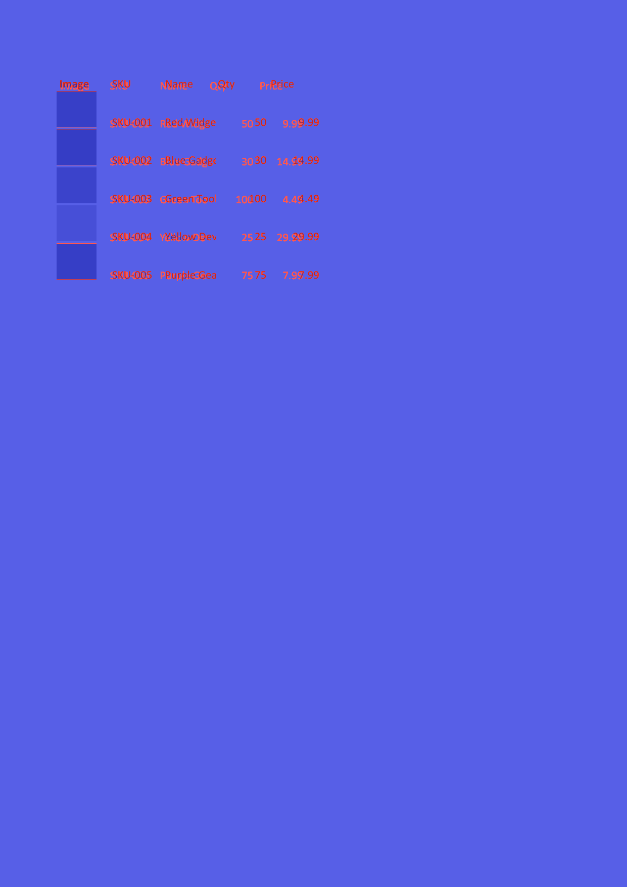</td>
  <td>changed: 17876 px (0.82%)<br>bbox: [112, 158, 631, 556]<br>mean abs RGB: 1.3031<br>RMSE RGB: 16.1941<br>threshold: 12, gain: 5.0</td>
</tr>
<tr>
  <td><b>classic66_invoice_with_logo</b><br>Page 1</td>
  <td></td>
  <td>changed: 18154 px (0.83%)<br>bbox: [118, 202, 660, 515]<br>mean abs RGB: 1.4034<br>RMSE RGB: 17.1487<br>threshold: 12, gain: 5.0</td>
</tr>
<tr>
  <td><b>classic67_real_estate_listing</b><br>Page 1</td>
  <td></td>
  <td>changed: 12779 px (0.59%)<br>bbox: [118, 151, 640, 417]<br>mean abs RGB: 0.8728<br>RMSE RGB: 12.9309<br>threshold: 12, gain: 5.0</td>
</tr>
<tr>
  <td><b>classic68_restaurant_menu</b><br>Page 1</td>
  <td></td>
  <td>changed: 43713 px (2.01%)<br>bbox: [118, 159, 656, 886]<br>mean abs RGB: 2.3819<br>RMSE RGB: 20.1255<br>threshold: 12, gain: 5.0</td>
</tr>
<tr>
  <td><b>classic69_image_only_sheet</b><br>Page 1</td>
  <td></td>
  <td>changed: 0 px (0.00%)<br>bbox: None<br>mean abs RGB: 0.0<br>RMSE RGB: 0.0<br>threshold: 12, gain: 5.0</td>
</tr>
<tr>
  <td><b>classic70_product_catalog_with_images</b><br>Page 1</td>
  <td>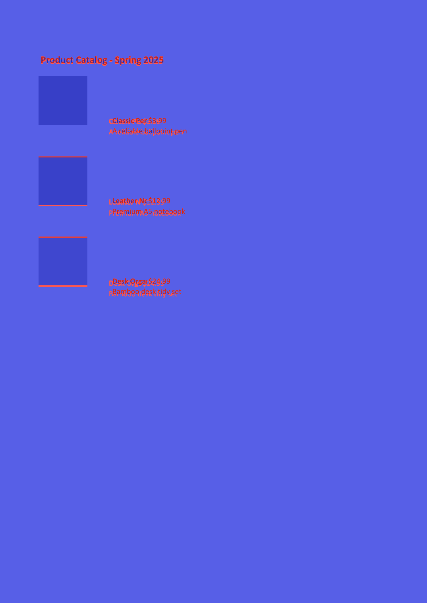</td>
  <td>changed: 18808 px (0.86%)<br>bbox: [112, 163, 542, 866]<br>mean abs RGB: 1.4079<br>RMSE RGB: 16.8103<br>threshold: 12, gain: 5.0</td>
</tr>
<tr>
  <td><b>classic71_multi_sheet_with_images</b><br>Page 1</td>
  <td></td>
  <td>changed: 3904 px (0.18%)<br>bbox: [118, 240, 318, 319]<br>mean abs RGB: 0.2575<br>RMSE RGB: 7.0659<br>threshold: 12, gain: 5.0</td>
</tr>
<tr>
  <td><b>classic71_multi_sheet_with_images</b><br>Page 2</td>
  <td></td>
  <td>changed: 3819 px (0.18%)<br>bbox: [119, 240, 318, 319]<br>mean abs RGB: 0.2411<br>RMSE RGB: 6.7387<br>threshold: 12, gain: 5.0</td>
</tr>
<tr>
  <td><b>classic71_multi_sheet_with_images</b><br>Page 3</td>
  <td></td>
  <td>changed: 3643 px (0.17%)<br>bbox: [118, 239, 324, 319]<br>mean abs RGB: 0.2212<br>RMSE RGB: 6.3234<br>threshold: 12, gain: 5.0</td>
</tr>
<tr>
  <td><b>classic72_bar_chart_image_with_data</b><br>Page 1</td>
  <td></td>
  <td>changed: 15831 px (0.73%)<br>bbox: [117, 157, 423, 428]<br>mean abs RGB: 1.2089<br>RMSE RGB: 15.1605<br>threshold: 12, gain: 5.0</td>
</tr>
<tr>
  <td><b>classic73_event_flyer_with_banner</b><br>Page 1</td>
  <td></td>
  <td>changed: 24104 px (1.11%)<br>bbox: [117, 497, 464, 809]<br>mean abs RGB: 1.7461<br>RMSE RGB: 18.7365<br>threshold: 12, gain: 5.0</td>
</tr>
<tr>
  <td><b>classic74_dashboard_with_kpi_image</b><br>Page 1</td>
  <td></td>
  <td>changed: 71375 px (3.28%)<br>bbox: [118, 155, 917, 376]<br>mean abs RGB: 1.5253<br>RMSE RGB: 16.5927<br>threshold: 12, gain: 5.0</td>
</tr>
<tr>
  <td><b>classic75_certificate_with_seal</b><br>Page 1</td>
  <td></td>
  <td>changed: 43498 px (2.00%)<br>bbox: [217, 175, 776, 396]<br>mean abs RGB: 3.29<br>RMSE RGB: 26.351<br>threshold: 12, gain: 5.0</td>
</tr>
<tr>
  <td><b>classic76_product_image_grid</b><br>Page 1</td>
  <td>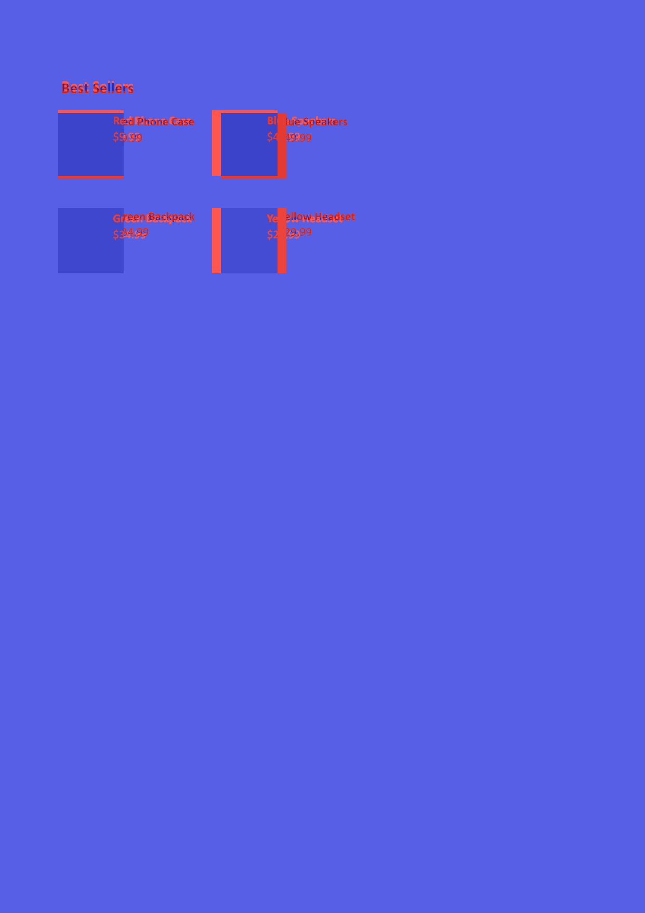</td>
  <td>changed: 21817 px (1.00%)<br>bbox: [112, 155, 683, 525]<br>mean abs RGB: 1.3934<br>RMSE RGB: 16.166<br>threshold: 12, gain: 5.0</td>
</tr>
<tr>
  <td><b>classic77_news_article_with_hero_image</b><br>Page 1</td>
  <td>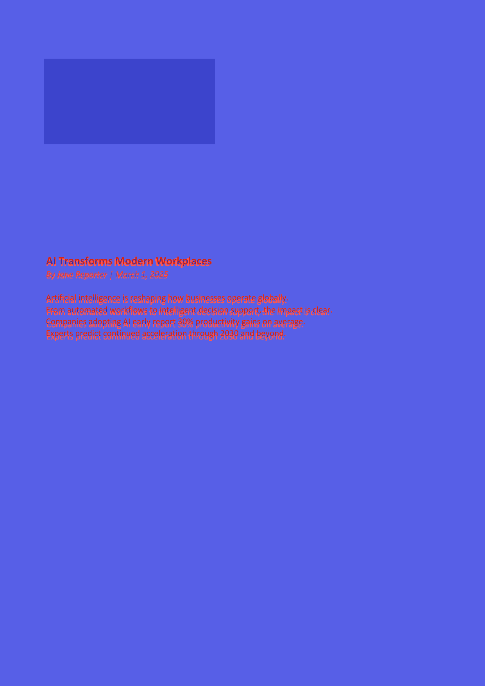</td>
  <td>changed: 37572 px (1.73%)<br>bbox: [118, 656, 850, 873]<br>mean abs RGB: 2.7231<br>RMSE RGB: 23.4305<br>threshold: 12, gain: 5.0</td>
</tr>
<tr>
  <td><b>classic78_small_icon_per_row</b><br>Page 1</td>
  <td></td>
  <td>changed: 14946 px (0.69%)<br>bbox: [112, 157, 534, 390]<br>mean abs RGB: 1.098<br>RMSE RGB: 14.938<br>threshold: 12, gain: 5.0</td>
</tr>
<tr>
  <td><b>classic79_wide_panoramic_banner</b><br>Page 1</td>
  <td>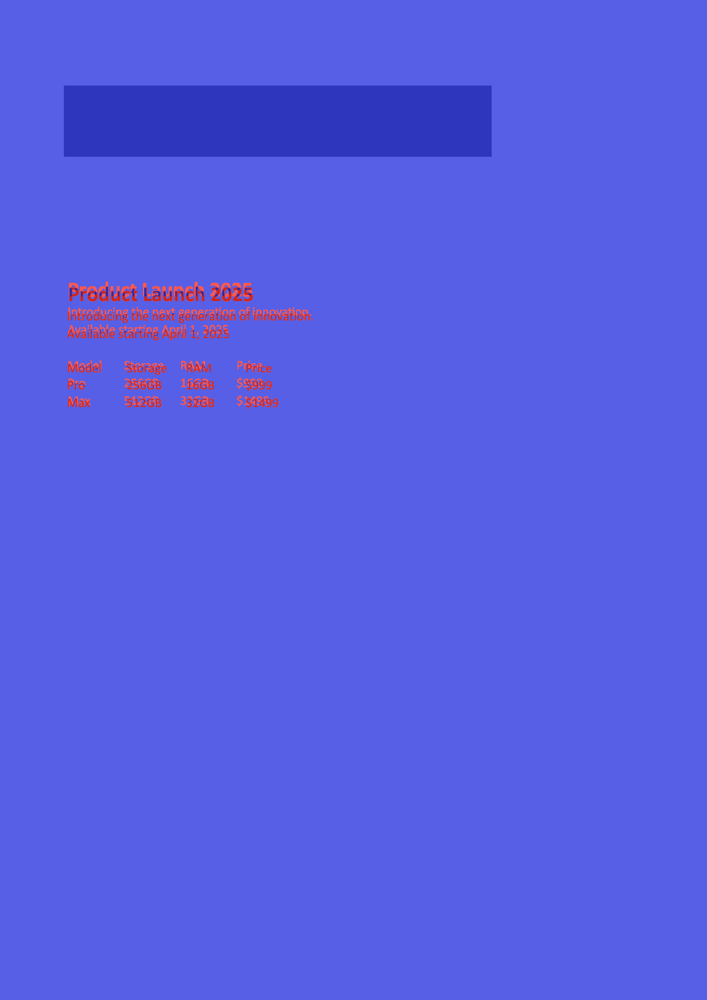</td>
  <td>changed: 20913 px (0.96%)<br>bbox: [118, 494, 550, 717]<br>mean abs RGB: 1.6032<br>RMSE RGB: 18.2743<br>threshold: 12, gain: 5.0</td>
</tr>
<tr>
  <td><b>classic80_portrait_tall_image</b><br>Page 1</td>
  <td></td>
  <td>changed: 15916 px (0.73%)<br>bbox: [415, 155, 740, 368]<br>mean abs RGB: 1.1404<br>RMSE RGB: 15.0687<br>threshold: 12, gain: 5.0</td>
</tr>
<tr>
  <td><b>classic81_step_by_step_with_images</b><br>Page 1</td>
  <td>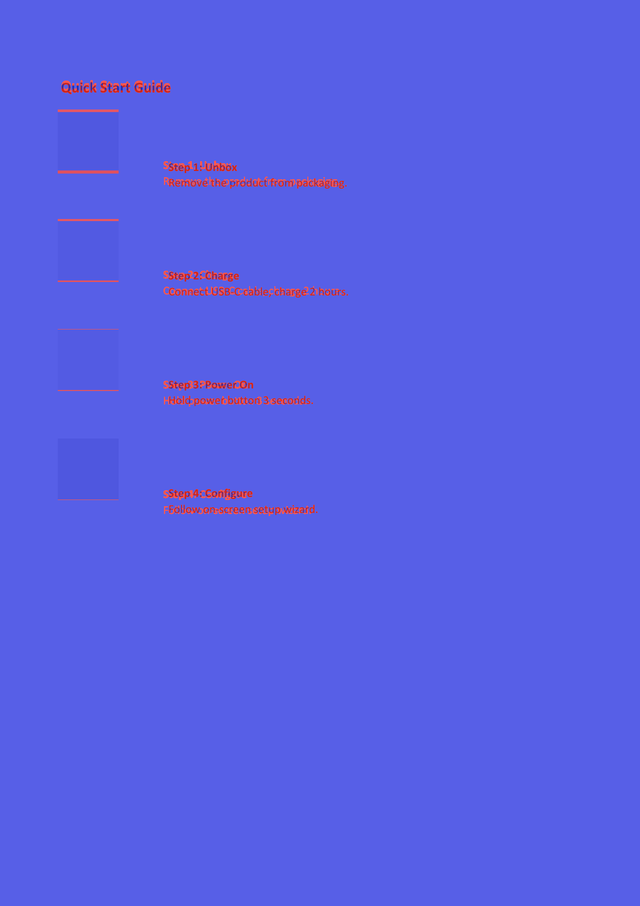</td>
  <td>changed: 23890 px (1.10%)<br>bbox: [112, 155, 675, 1000]<br>mean abs RGB: 1.6243<br>RMSE RGB: 18.0904<br>threshold: 12, gain: 5.0</td>
</tr>
<tr>
  <td><b>classic82_before_after_images</b><br>Page 1</td>
  <td>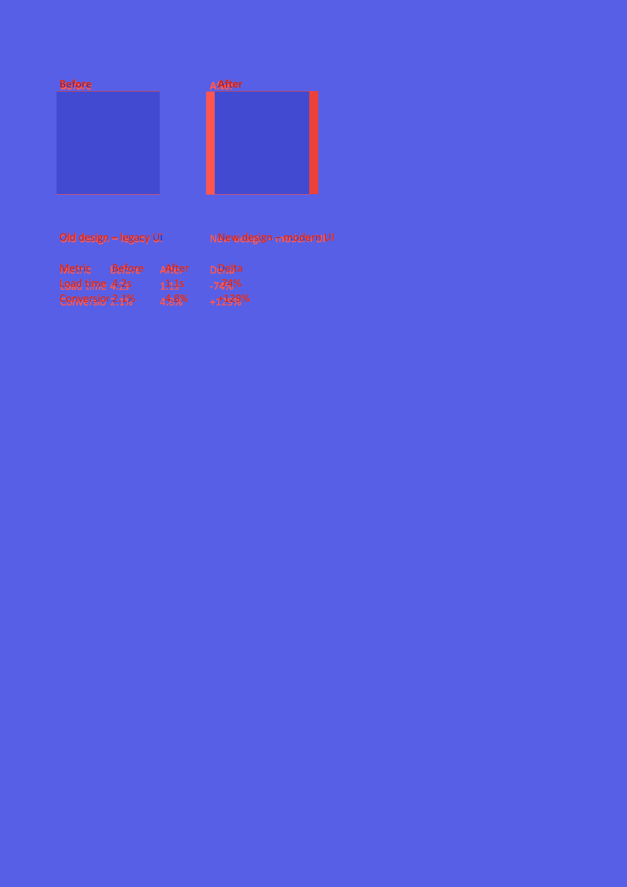</td>
  <td>changed: 21151 px (0.97%)<br>bbox: [112, 157, 660, 605]<br>mean abs RGB: 1.3509<br>RMSE RGB: 15.4232<br>threshold: 12, gain: 5.0</td>
</tr>
<tr>
  <td><b>classic83_color_swatch_palette</b><br>Page 1</td>
  <td>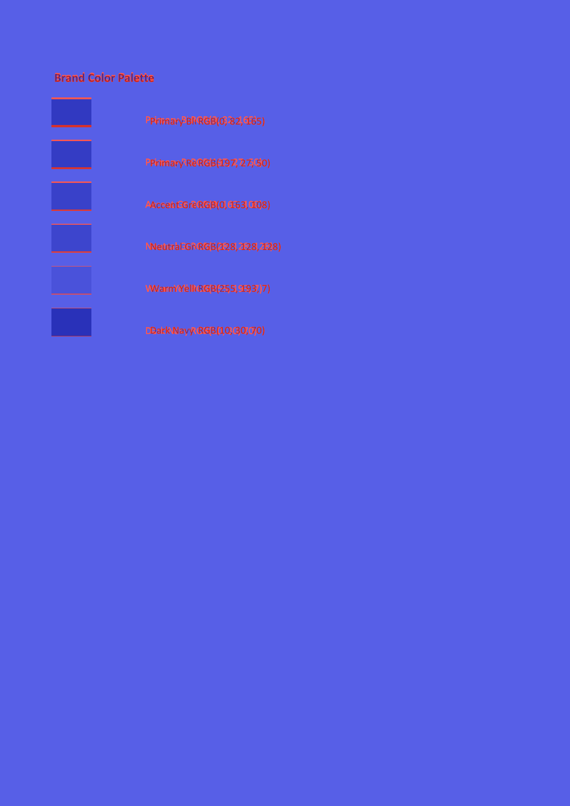</td>
  <td>changed: 21084 px (0.97%)<br>bbox: [112, 157, 611, 732]<br>mean abs RGB: 1.5356<br>RMSE RGB: 17.5357<br>threshold: 12, gain: 5.0</td>
</tr>
<tr>
  <td><b>classic84_travel_destination_cards</b><br>Page 1</td>
  <td>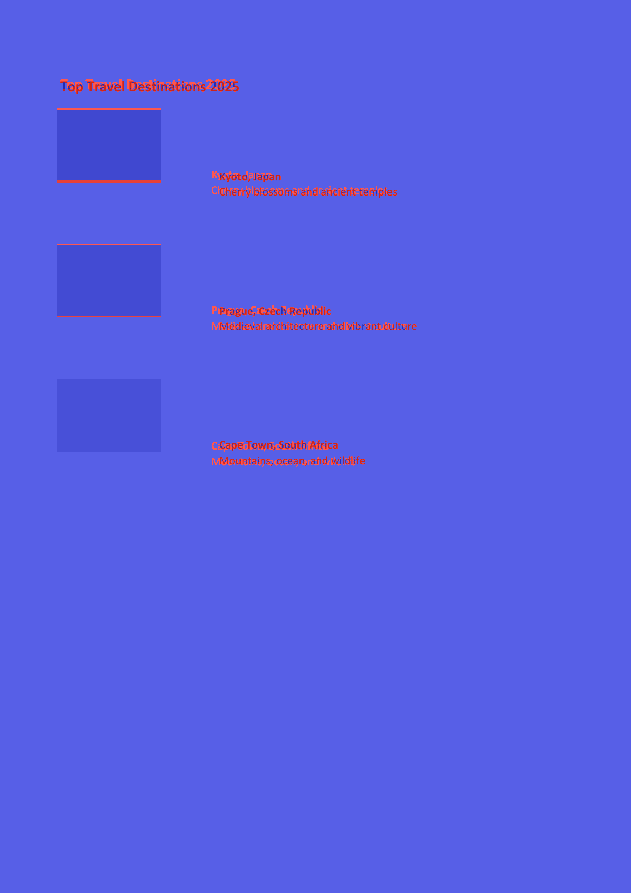</td>
  <td>changed: 23973 px (1.10%)<br>bbox: [112, 155, 820, 918]<br>mean abs RGB: 1.7082<br>RMSE RGB: 18.3808<br>threshold: 12, gain: 5.0</td>
</tr>
<tr>
  <td><b>classic85_lab_results_with_image</b><br>Page 1</td>
  <td></td>
  <td>changed: 48547 px (2.23%)<br>bbox: [118, 157, 718, 400]<br>mean abs RGB: 1.8911<br>RMSE RGB: 17.3507<br>threshold: 12, gain: 5.0</td>
</tr>
<tr>
  <td><b>classic86_software_screenshot_features</b><br>Page 1</td>
  <td></td>
  <td>changed: 11386 px (0.52%)<br>bbox: [119, 148, 684, 400]<br>mean abs RGB: 0.8493<br>RMSE RGB: 13.1074<br>threshold: 12, gain: 5.0</td>
</tr>
<tr>
  <td><b>classic87_sports_results_with_logos</b><br>Page 1</td>
  <td></td>
  <td>changed: 14508 px (0.67%)<br>bbox: [112, 157, 736, 461]<br>mean abs RGB: 1.0917<br>RMSE RGB: 14.9498<br>threshold: 12, gain: 5.0</td>
</tr>
<tr>
  <td><b>classic88_image_after_data</b><br>Page 1</td>
  <td></td>
  <td>changed: 25448 px (1.17%)<br>bbox: [112, 157, 678, 494]<br>mean abs RGB: 1.6389<br>RMSE RGB: 18.2107<br>threshold: 12, gain: 5.0</td>
</tr>
<tr>
  <td><b>classic89_nutrition_label_with_image</b><br>Page 1</td>
  <td></td>
  <td>changed: 20020 px (0.92%)<br>bbox: [117, 155, 627, 525]<br>mean abs RGB: 1.4329<br>RMSE RGB: 16.8292<br>threshold: 12, gain: 5.0</td>
</tr>
<tr>
  <td><b>classic90_project_status_with_milestones</b><br>Page 1</td>
  <td></td>
  <td>changed: 38335 px (1.76%)<br>bbox: [118, 155, 885, 432]<br>mean abs RGB: 2.2235<br>RMSE RGB: 20.2507<br>threshold: 12, gain: 5.0</td>
</tr>
<tr>
  <td><b>classic91_simple_bar_chart</b><br>Page 1</td>
  <td>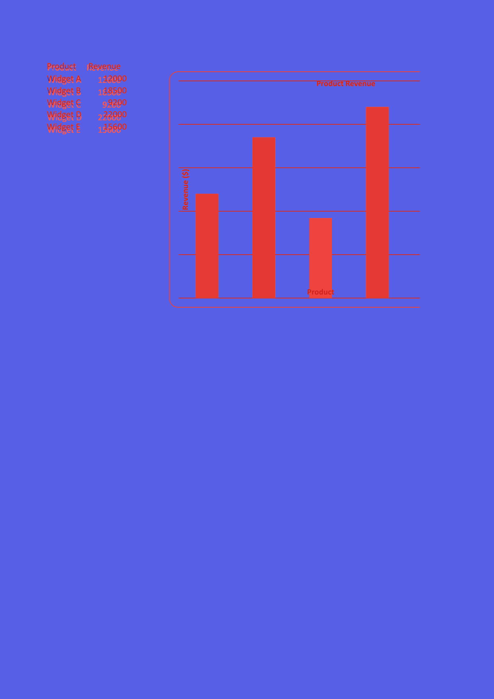</td>
  <td>changed: 99906 px (4.59%)<br>bbox: [118, 157, 1055, 772]<br>mean abs RGB: 6.1121<br>RMSE RGB: 30.7325<br>threshold: 12, gain: 5.0</td>
</tr>
<tr>
  <td><b>classic92_horizontal_bar_chart</b><br>Page 1</td>
  <td>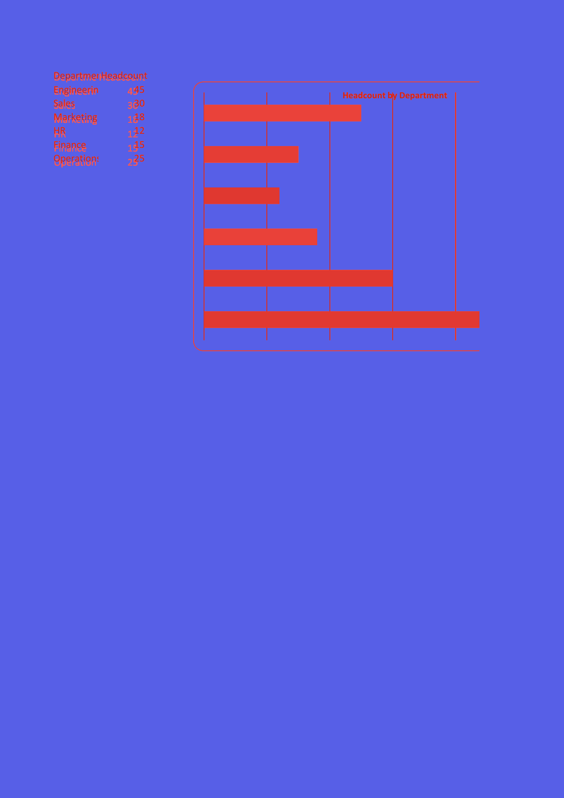</td>
  <td>changed: 93194 px (4.28%)<br>bbox: [118, 157, 1055, 772]<br>mean abs RGB: 5.8556<br>RMSE RGB: 30.6082<br>threshold: 12, gain: 5.0</td>
</tr>
<tr>
  <td><b>classic93_line_chart</b><br>Page 1</td>
  <td>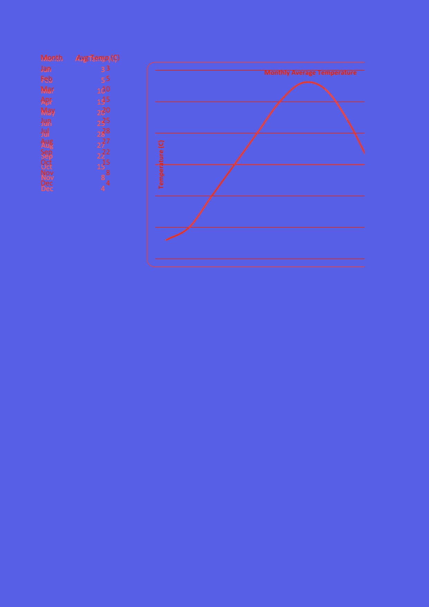</td>
  <td>changed: 31548 px (1.45%)<br>bbox: [117, 157, 1055, 772]<br>mean abs RGB: 2.2102<br>RMSE RGB: 20.4699<br>threshold: 12, gain: 5.0</td>
</tr>
<tr>
  <td><b>classic94_pie_chart</b><br>Page 1</td>
  <td></td>
  <td>changed: 246409 px (11.32%)<br>bbox: [118, 157, 1055, 772]<br>mean abs RGB: 14.2217<br>RMSE RGB: 45.4347<br>threshold: 12, gain: 5.0</td>
</tr>
<tr>
  <td><b>classic95_area_chart</b><br>Page 1</td>
  <td>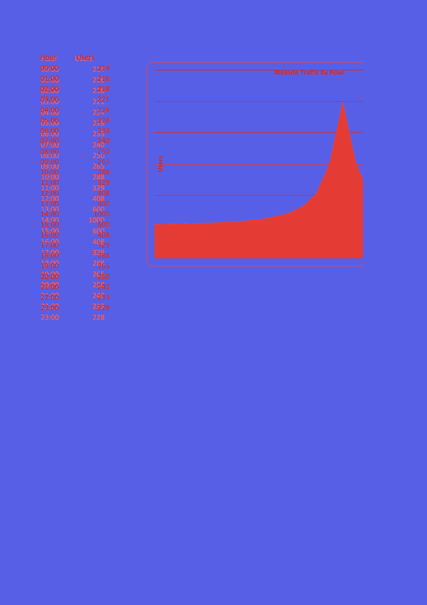</td>
  <td>changed: 138328 px (6.35%)<br>bbox: [118, 158, 1055, 928]<br>mean abs RGB: 8.474<br>RMSE RGB: 36.9065<br>threshold: 12, gain: 5.0</td>
</tr>
<tr>
  <td><b>classic96_scatter_chart</b><br>Page 1</td>
  <td>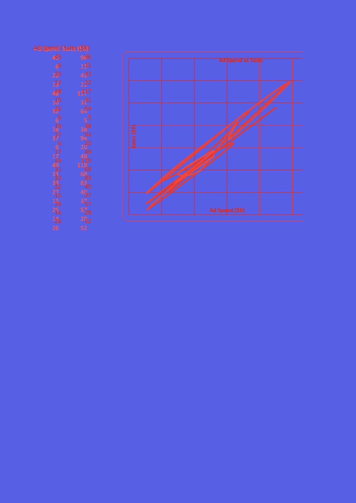</td>
  <td>changed: 60155 px (2.76%)<br>bbox: [118, 156, 1055, 803]<br>mean abs RGB: 3.9401<br>RMSE RGB: 26.7469<br>threshold: 12, gain: 5.0</td>
</tr>
<tr>
  <td><b>classic97_doughnut_chart</b><br>Page 1</td>
  <td>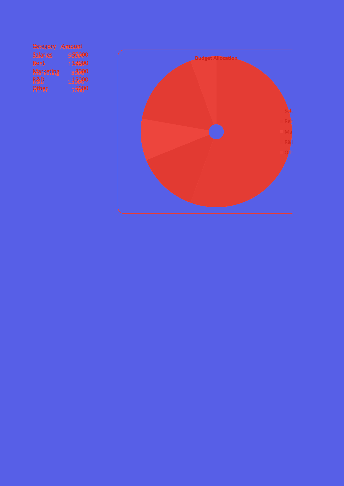</td>
  <td>changed: 244691 px (11.24%)<br>bbox: [118, 158, 1055, 772]<br>mean abs RGB: 14.0363<br>RMSE RGB: 44.7943<br>threshold: 12, gain: 5.0</td>
</tr>
<tr>
  <td><b>classic98_radar_chart</b><br>Page 1</td>
  <td>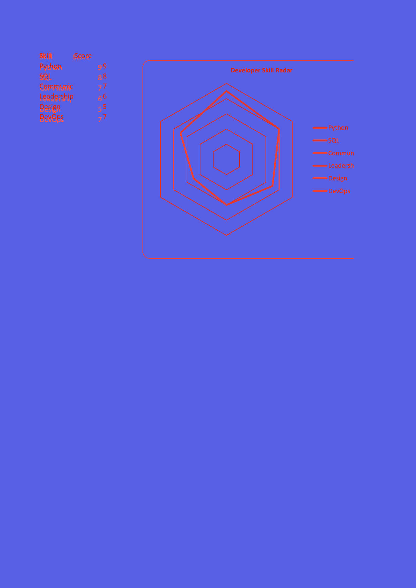</td>
  <td>changed: 30818 px (1.42%)<br>bbox: [118, 157, 1055, 772]<br>mean abs RGB: 2.0492<br>RMSE RGB: 19.4556<br>threshold: 12, gain: 5.0</td>
</tr>
<tr>
  <td><b>classic99_bubble_chart</b><br>Page 1</td>
  <td></td>
  <td>changed: 65216 px (3.00%)<br>bbox: [119, 155, 1055, 772]<br>mean abs RGB: 4.2488<br>RMSE RGB: 27.1966<br>threshold: 12, gain: 5.0</td>
</tr>
<tr>
  <td><b>classic100_stacked_bar_chart</b><br>Page 1</td>
  <td>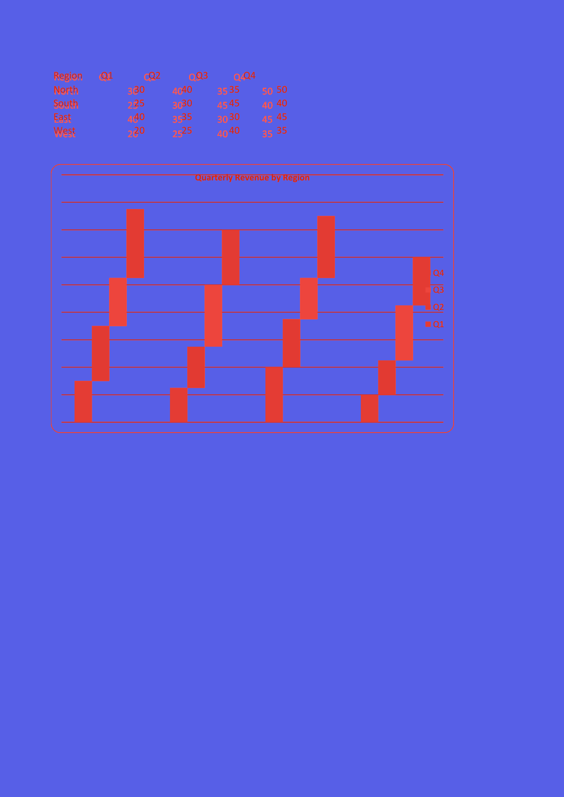</td>
  <td>changed: 104539 px (4.80%)<br>bbox: [112, 158, 999, 953]<br>mean abs RGB: 6.2602<br>RMSE RGB: 31.6932<br>threshold: 12, gain: 5.0</td>
</tr>
<tr>
  <td><b>classic101_percent_stacked_bar</b><br>Page 1</td>
  <td>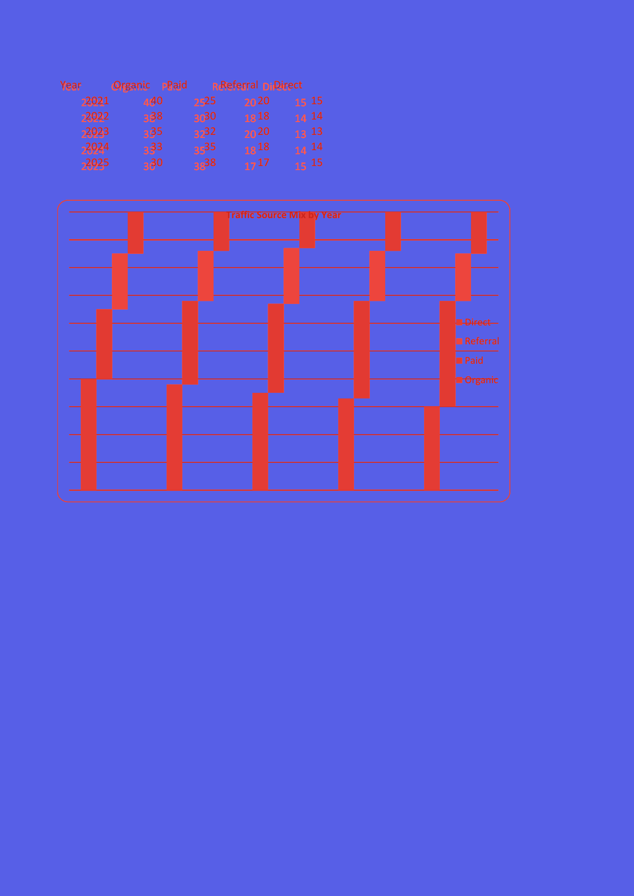</td>
  <td>changed: 127491 px (5.86%)<br>bbox: [112, 157, 999, 984]<br>mean abs RGB: 7.6662<br>RMSE RGB: 35.1477<br>threshold: 12, gain: 5.0</td>
</tr>
<tr>
  <td><b>classic102_line_chart_with_markers</b><br>Page 1</td>
  <td>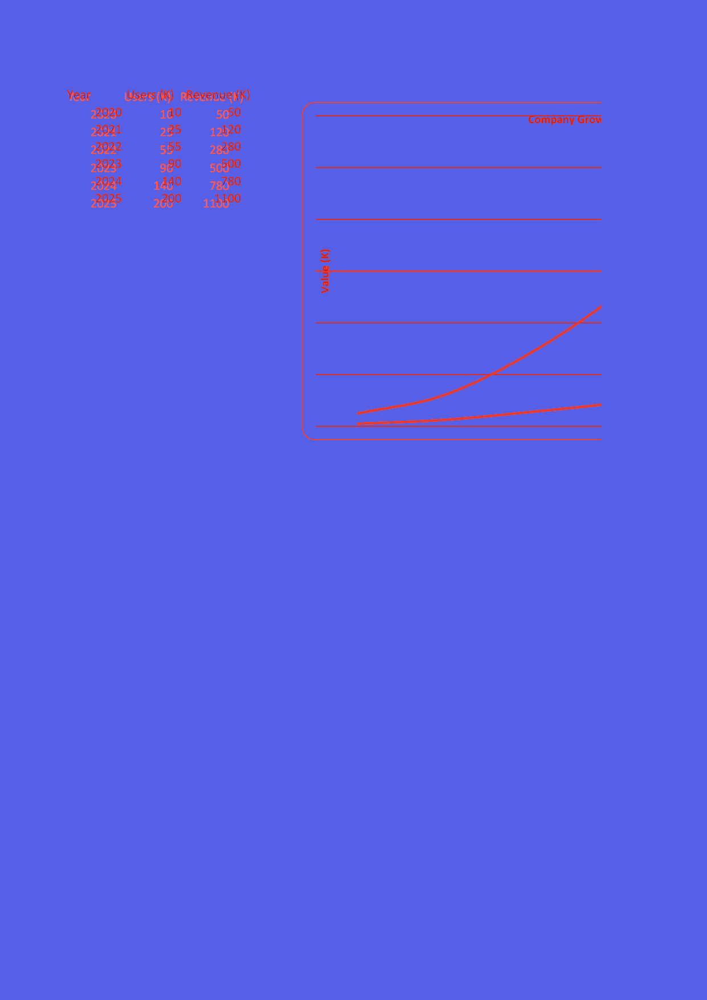</td>
  <td>changed: 28982 px (1.33%)<br>bbox: [118, 157, 1055, 772]<br>mean abs RGB: 1.9792<br>RMSE RGB: 19.4035<br>threshold: 12, gain: 5.0</td>
</tr>
<tr>
  <td><b>classic103_pie_chart_with_labels</b><br>Page 1</td>
  <td></td>
  <td>changed: 189778 px (8.72%)<br>bbox: [118, 157, 1055, 772]<br>mean abs RGB: 11.1591<br>RMSE RGB: 40.7586<br>threshold: 12, gain: 5.0</td>
</tr>
<tr>
  <td><b>classic104_combo_bar_line_chart</b><br>Page 1</td>
  <td></td>
  <td>changed: 90644 px (4.16%)<br>bbox: [117, 157, 1055, 772]<br>mean abs RGB: 5.4553<br>RMSE RGB: 29.2297<br>threshold: 12, gain: 5.0</td>
</tr>
<tr>
  <td><b>classic105_3d_bar_chart</b><br>Page 1</td>
  <td></td>
  <td>changed: 135978 px (6.25%)<br>bbox: [118, 158, 1055, 772]<br>mean abs RGB: 8.4751<br>RMSE RGB: 36.854<br>threshold: 12, gain: 5.0</td>
</tr>
<tr>
  <td><b>classic106_3d_pie_chart</b><br>Page 1</td>
  <td></td>
  <td>changed: 149898 px (6.89%)<br>bbox: [117, 158, 1055, 772]<br>mean abs RGB: 10.8982<br>RMSE RGB: 43.5025<br>threshold: 12, gain: 5.0</td>
</tr>
<tr>
  <td><b>classic107_multi_series_line</b><br>Page 1</td>
  <td></td>
  <td>changed: 81056 px (3.72%)<br>bbox: [119, 158, 1055, 807]<br>mean abs RGB: 5.8922<br>RMSE RGB: 34.3325<br>threshold: 12, gain: 5.0</td>
</tr>
<tr>
  <td><b>classic108_stacked_area_chart</b><br>Page 1</td>
  <td></td>
  <td>changed: 395175 px (18.15%)<br>bbox: [112, 157, 1055, 1014]<br>mean abs RGB: 22.6458<br>RMSE RGB: 56.9011<br>threshold: 12, gain: 5.0</td>
</tr>
<tr>
  <td><b>classic109_scatter_with_trendline</b><br>Page 1</td>
  <td></td>
  <td>changed: 52147 px (2.40%)<br>bbox: [118, 157, 1055, 772]<br>mean abs RGB: 3.3764<br>RMSE RGB: 24.7231<br>threshold: 12, gain: 5.0</td>
</tr>
<tr>
  <td><b>classic110_chart_with_legend</b><br>Page 1</td>
  <td></td>
  <td>changed: 91252 px (4.19%)<br>bbox: [118, 157, 1055, 772]<br>mean abs RGB: 5.6557<br>RMSE RGB: 30.2491<br>threshold: 12, gain: 5.0</td>
</tr>
<tr>
  <td><b>classic111_chart_with_axis_labels</b><br>Page 1</td>
  <td></td>
  <td>changed: 72607 px (3.34%)<br>bbox: [117, 157, 1055, 772]<br>mean abs RGB: 4.6917<br>RMSE RGB: 27.9161<br>threshold: 12, gain: 5.0</td>
</tr>
<tr>
  <td><b>classic112_multiple_charts</b><br>Page 1</td>
  <td></td>
  <td>changed: 86028 px (3.95%)<br>bbox: [117, 157, 1055, 1197]<br>mean abs RGB: 5.3807<br>RMSE RGB: 29.7385<br>threshold: 12, gain: 5.0</td>
</tr>
<tr>
  <td><b>classic113_chart_sheet</b><br>Page 1</td>
  <td></td>
  <td>changed: 127123 px (5.84%)<br>bbox: [118, 158, 1055, 890]<br>mean abs RGB: 7.5398<br>RMSE RGB: 34.0445<br>threshold: 12, gain: 5.0</td>
</tr>
<tr>
  <td><b>classic114_chart_large_dataset</b><br>Page 1</td>
  <td></td>
  <td>changed: 66074 px (3.04%)<br>bbox: [119, 157, 1055, 1595]<br>mean abs RGB: 4.7196<br>RMSE RGB: 30.5945<br>threshold: 12, gain: 5.0</td>
</tr>
<tr>
  <td><b>classic114_chart_large_dataset</b><br>Page 2</td>
  <td></td>
  <td>changed: 43512 px (2.00%)<br>bbox: [182, 158, 318, 1596]<br>mean abs RGB: 3.2887<br>RMSE RGB: 26.0355<br>threshold: 12, gain: 5.0</td>
</tr>
<tr>
  <td><b>classic114_chart_large_dataset</b><br>Page 3</td>
  <td></td>
  <td>changed: 6629 px (0.30%)<br>bbox: [172, 158, 318, 428]<br>mean abs RGB: 0.498<br>RMSE RGB: 10.139<br>threshold: 12, gain: 5.0</td>
</tr>
<tr>
  <td><b>classic115_chart_negative_values</b><br>Page 1</td>
  <td></td>
  <td>changed: 59859 px (2.75%)<br>bbox: [117, 156, 1055, 772]<br>mean abs RGB: 3.8088<br>RMSE RGB: 25.3362<br>threshold: 12, gain: 5.0</td>
</tr>
<tr>
  <td><b>classic116_percent_stacked_area</b><br>Page 1</td>
  <td></td>
  <td>changed: 511712 px (23.51%)<br>bbox: [112, 157, 1055, 1014]<br>mean abs RGB: 29.8765<br>RMSE RGB: 65.5122<br>threshold: 12, gain: 5.0</td>
</tr>
<tr>
  <td><b>classic117_stock_ohlc_chart</b><br>Page 1</td>
  <td></td>
  <td>changed: 105731 px (4.86%)<br>bbox: [119, 157, 1055, 772]<br>mean abs RGB: 6.7546<br>RMSE RGB: 33.8499<br>threshold: 12, gain: 5.0</td>
</tr>
<tr>
  <td><b>classic118_bar_chart_custom_colors</b><br>Page 1</td>
  <td></td>
  <td>changed: 86324 px (3.97%)<br>bbox: [118, 158, 1055, 772]<br>mean abs RGB: 6.1452<br>RMSE RGB: 34.7235<br>threshold: 12, gain: 5.0</td>
</tr>
<tr>
  <td><b>classic119_dashboard_multi_charts</b><br>Page 1</td>
  <td></td>
  <td>changed: 238023 px (10.94%)<br>bbox: [118, 155, 1055, 1085]<br>mean abs RGB: 14.1494<br>RMSE RGB: 46.3143<br>threshold: 12, gain: 5.0</td>
</tr>
<tr>
  <td><b>classic120_chart_with_date_axis</b><br>Page 1</td>
  <td></td>
  <td>changed: 46885 px (2.15%)<br>bbox: [118, 157, 1055, 772]<br>mean abs RGB: 3.3316<br>RMSE RGB: 25.4201<br>threshold: 12, gain: 5.0</td>
</tr>
<tr>
  <td><b>classic121_thin_borders</b><br>Page 1</td>
  <td></td>
  <td>changed: 27090 px (1.24%)<br>bbox: [111, 148, 533, 338]<br>mean abs RGB: 2.0113<br>RMSE RGB: 20.236<br>threshold: 12, gain: 5.0</td>
</tr>
<tr>
  <td><b>classic122_thick_outer_thin_inner</b><br>Page 1</td>
  <td></td>
  <td>changed: 32048 px (1.47%)<br>bbox: [110, 147, 535, 339]<br>mean abs RGB: 2.4948<br>RMSE RGB: 22.9682<br>threshold: 12, gain: 5.0</td>
</tr>
<tr>
  <td><b>classic123_dashed_borders</b><br>Page 1</td>
  <td></td>
  <td>changed: 16922 px (0.78%)<br>bbox: [118, 157, 346, 339]<br>mean abs RGB: 1.2172<br>RMSE RGB: 15.5068<br>threshold: 12, gain: 5.0</td>
</tr>
<tr>
  <td><b>classic124_colored_borders</b><br>Page 1</td>
  <td></td>
  <td>changed: 30455 px (1.40%)<br>bbox: [117, 157, 545, 370]<br>mean abs RGB: 2.1405<br>RMSE RGB: 20.7152<br>threshold: 12, gain: 5.0</td>
</tr>
<tr>
  <td><b>classic125_solid_fills</b><br>Page 1</td>
  <td></td>
  <td>changed: 27502 px (1.26%)<br>bbox: [118, 157, 332, 432]<br>mean abs RGB: 1.5697<br>RMSE RGB: 17.1302<br>threshold: 12, gain: 5.0</td>
</tr>
<tr>
  <td><b>classic126_dark_header</b><br>Page 1</td>
  <td></td>
  <td>changed: 25540 px (1.17%)<br>bbox: [112, 150, 539, 334]<br>mean abs RGB: 1.7836<br>RMSE RGB: 18.5988<br>threshold: 12, gain: 5.0</td>
</tr>
<tr>
  <td><b>classic127_font_styles</b><br>Page 1</td>
  <td></td>
  <td>changed: 32651 px (1.50%)<br>bbox: [118, 157, 504, 431]<br>mean abs RGB: 2.4336<br>RMSE RGB: 22.4577<br>threshold: 12, gain: 5.0</td>
</tr>
<tr>
  <td><b>classic128_font_sizes</b><br>Page 1</td>
  <td></td>
  <td>changed: 23015 px (1.06%)<br>bbox: [118, 157, 465, 568]<br>mean abs RGB: 1.8816<br>RMSE RGB: 20.1854<br>threshold: 12, gain: 5.0</td>
</tr>
<tr>
  <td><b>classic129_alignment_combos</b><br>Page 1</td>
  <td></td>
  <td>changed: 12389 px (0.57%)<br>bbox: [117, 157, 857, 432]<br>mean abs RGB: 0.8491<br>RMSE RGB: 12.8804<br>threshold: 12, gain: 5.0</td>
</tr>
<tr>
  <td><b>classic130_wrap_and_indent</b><br>Page 1</td>
  <td></td>
  <td>changed: 17945 px (0.82%)<br>bbox: [117, 157, 739, 438]<br>mean abs RGB: 1.333<br>RMSE RGB: 16.4351<br>threshold: 12, gain: 5.0</td>
</tr>
<tr>
  <td><b>classic131_number_formats</b><br>Page 1</td>
  <td></td>
  <td>changed: 32162 px (1.48%)<br>bbox: [118, 157, 851, 490]<br>mean abs RGB: 2.4083<br>RMSE RGB: 22.1759<br>threshold: 12, gain: 5.0</td>
</tr>
<tr>
  <td><b>classic132_striped_table</b><br>Page 1</td>
  <td></td>
  <td>changed: 64957 px (2.98%)<br>bbox: [111, 148, 533, 494]<br>mean abs RGB: 2.7901<br>RMSE RGB: 21.2837<br>threshold: 12, gain: 5.0</td>
</tr>
<tr>
  <td><b>classic133_gradient_rows</b><br>Page 1</td>
  <td></td>
  <td>changed: 42862 px (1.97%)<br>bbox: [112, 157, 467, 494]<br>mean abs RGB: 1.8872<br>RMSE RGB: 19.3882<br>threshold: 12, gain: 5.0</td>
</tr>
<tr>
  <td><b>classic134_heatmap</b><br>Page 1</td>
  <td></td>
  <td>changed: 73266 px (3.37%)<br>bbox: [119, 157, 846, 400]<br>mean abs RGB: 3.3078<br>RMSE RGB: 23.7107<br>threshold: 12, gain: 5.0</td>
</tr>
<tr>
  <td><b>classic135_bottom_border_only</b><br>Page 1</td>
  <td></td>
  <td>changed: 17577 px (0.81%)<br>bbox: [112, 155, 558, 343]<br>mean abs RGB: 1.4511<br>RMSE RGB: 17.8381<br>threshold: 12, gain: 5.0</td>
</tr>
<tr>
  <td><b>classic136_financial_report_styled</b><br>Page 1</td>
  <td></td>
  <td>changed: 69047 px (3.17%)<br>bbox: [111, 148, 774, 464]<br>mean abs RGB: 4.1206<br>RMSE RGB: 27.1463<br>threshold: 12, gain: 5.0</td>
</tr>
<tr>
  <td><b>classic137_checkerboard</b><br>Page 1</td>
  <td></td>
  <td>changed: 23775 px (1.09%)<br>bbox: [112, 150, 590, 572]<br>mean abs RGB: 1.4442<br>RMSE RGB: 15.3534<br>threshold: 12, gain: 5.0</td>
</tr>
<tr>
  <td><b>classic138_color_grid</b><br>Page 1</td>
  <td></td>
  <td>changed: 23345 px (1.07%)<br>bbox: [112, 150, 621, 404]<br>mean abs RGB: 0.847<br>RMSE RGB: 10.5878<br>threshold: 12, gain: 5.0</td>
</tr>
<tr>
  <td><b>classic139_pattern_fills</b><br>Page 1</td>
  <td></td>
  <td>changed: 68272 px (3.14%)<br>bbox: [118, 157, 596, 557]<br>mean abs RGB: 3.3309<br>RMSE RGB: 24.1793<br>threshold: 12, gain: 5.0</td>
</tr>
<tr>
  <td><b>classic140_rotated_text</b><br>Page 1</td>
  <td></td>
  <td>changed: 15856 px (0.73%)<br>bbox: [118, 157, 421, 1102]<br>mean abs RGB: 1.1666<br>RMSE RGB: 15.4019<br>threshold: 12, gain: 5.0</td>
</tr>
<tr>
  <td><b>classic141_mixed_edge_borders</b><br>Page 1</td>
  <td></td>
  <td>changed: 25918 px (1.19%)<br>bbox: [117, 157, 715, 500]<br>mean abs RGB: 1.6685<br>RMSE RGB: 18.4111<br>threshold: 12, gain: 5.0</td>
</tr>
<tr>
  <td><b>classic142_styled_invoice</b><br>Page 1</td>
  <td></td>
  <td>changed: 148571 px (6.83%)<br>bbox: [111, 146, 932, 608]<br>mean abs RGB: 6.7672<br>RMSE RGB: 33.9496<br>threshold: 12, gain: 5.0</td>
</tr>
<tr>
  <td><b>classic143_colored_tabs</b><br>Page 1</td>
  <td></td>
  <td>changed: 3995 px (0.18%)<br>bbox: [119, 157, 318, 240]<br>mean abs RGB: 0.2916<br>RMSE RGB: 7.6614<br>threshold: 12, gain: 5.0</td>
</tr>
<tr>
  <td><b>classic143_colored_tabs</b><br>Page 2</td>
  <td></td>
  <td>changed: 3827 px (0.18%)<br>bbox: [118, 157, 318, 244]<br>mean abs RGB: 0.2788<br>RMSE RGB: 7.5015<br>threshold: 12, gain: 5.0</td>
</tr>
<tr>
  <td><b>classic143_colored_tabs</b><br>Page 3</td>
  <td></td>
  <td>changed: 4066 px (0.19%)<br>bbox: [118, 157, 318, 240]<br>mean abs RGB: 0.3015<br>RMSE RGB: 7.8494<br>threshold: 12, gain: 5.0</td>
</tr>
<tr>
  <td><b>classic143_colored_tabs</b><br>Page 4</td>
  <td></td>
  <td>changed: 3756 px (0.17%)<br>bbox: [118, 157, 318, 244]<br>mean abs RGB: 0.2748<br>RMSE RGB: 7.4443<br>threshold: 12, gain: 5.0</td>
</tr>
<tr>
  <td><b>classic144_note_style_cells</b><br>Page 1</td>
  <td></td>
  <td>changed: 30579 px (1.40%)<br>bbox: [118, 157, 776, 338]<br>mean abs RGB: 1.2591<br>RMSE RGB: 13.7447<br>threshold: 12, gain: 5.0</td>
</tr>
<tr>
  <td><b>classic145_status_badges</b><br>Page 1</td>
  <td></td>
  <td>changed: 63881 px (2.93%)<br>bbox: [111, 148, 871, 400]<br>mean abs RGB: 2.8549<br>RMSE RGB: 21.2753<br>threshold: 12, gain: 5.0</td>
</tr>
<tr>
  <td><b>classic146_double_border_table</b><br>Page 1</td>
  <td></td>
  <td>changed: 32841 px (1.51%)<br>bbox: [110, 147, 691, 308]<br>mean abs RGB: 2.4007<br>RMSE RGB: 21.8459<br>threshold: 12, gain: 5.0</td>
</tr>
<tr>
  <td><b>classic147_multi_sheet_styled</b><br>Page 1</td>
  <td></td>
  <td>changed: 19265 px (0.89%)<br>bbox: [111, 148, 499, 307]<br>mean abs RGB: 0.9892<br>RMSE RGB: 12.5402<br>threshold: 12, gain: 5.0</td>
</tr>
<tr>
  <td><b>classic147_multi_sheet_styled</b><br>Page 2</td>
  <td></td>
  <td>changed: 33843 px (1.55%)<br>bbox: [111, 148, 884, 307]<br>mean abs RGB: 1.685<br>RMSE RGB: 16.1845<br>threshold: 12, gain: 5.0</td>
</tr>
<tr>
  <td><b>classic147_multi_sheet_styled</b><br>Page 3</td>
  <td></td>
  <td>changed: 24850 px (1.14%)<br>bbox: [111, 148, 692, 307]<br>mean abs RGB: 1.1504<br>RMSE RGB: 13.1502<br>threshold: 12, gain: 5.0</td>
</tr>
<tr>
  <td><b>classic148_frozen_styled_grid</b><br>Page 1</td>
  <td></td>
  <td>changed: 329366 px (15.13%)<br>bbox: [111, 148, 1127, 807]<br>mean abs RGB: 11.081<br>RMSE RGB: 39.5577<br>threshold: 12, gain: 5.0</td>
</tr>
<tr>
  <td><b>classic149_merged_styled_sections</b><br>Page 1</td>
  <td></td>
  <td>changed: 120206 px (5.52%)<br>bbox: [111, 150, 884, 565]<br>mean abs RGB: 6.5451<br>RMSE RGB: 33.4342<br>threshold: 12, gain: 5.0</td>
</tr>
<tr>
  <td><b>classic150_kitchen_sink_styles</b><br>Page 1</td>
  <td></td>
  <td>changed: 102718 px (4.72%)<br>bbox: [112, 150, 1017, 623]<br>mean abs RGB: 6.8976<br>RMSE RGB: 36.3654<br>threshold: 12, gain: 5.0</td>
</tr>
<tr>
  <td><b>classic151_multilingual_greetings</b><br>Page 1</td>
  <td></td>
  <td>changed: 34051 px (1.56%)<br>bbox: [117, 157, 998, 556]<br>mean abs RGB: 2.4986<br>RMSE RGB: 22.3722<br>threshold: 12, gain: 5.0</td>
</tr>
<tr>
  <td><b>classic152_emoji_sampler</b><br>Page 1</td>
  <td></td>
  <td>changed: 27605 px (1.27%)<br>bbox: [117, 158, 491, 432]<br>mean abs RGB: 1.9912<br>RMSE RGB: 19.9456<br>threshold: 12, gain: 5.0</td>
</tr>
<tr>
  <td><b>classic153_currency_symbols</b><br>Page 1</td>
  <td></td>
  <td>changed: 33935 px (1.56%)<br>bbox: [117, 157, 579, 553]<br>mean abs RGB: 2.5421<br>RMSE RGB: 22.7775<br>threshold: 12, gain: 5.0</td>
</tr>
<tr>
  <td><b>classic154_math_symbols</b><br>Page 1</td>
  <td></td>
  <td>changed: 23026 px (1.06%)<br>bbox: [118, 157, 644, 462]<br>mean abs RGB: 1.6306<br>RMSE RGB: 17.8988<br>threshold: 12, gain: 5.0</td>
</tr>
<tr>
  <td><b>classic155_diacritical_marks</b><br>Page 1</td>
  <td></td>
  <td>changed: 18479 px (0.85%)<br>bbox: [117, 157, 483, 494]<br>mean abs RGB: 1.3488<br>RMSE RGB: 16.4454<br>threshold: 12, gain: 5.0</td>
</tr>
<tr>
  <td><b>classic156_rtl_bidi_text</b><br>Page 1</td>
  <td></td>
  <td>changed: 6859 px (0.32%)<br>bbox: [118, 158, 815, 307]<br>mean abs RGB: 0.4935<br>RMSE RGB: 9.9094<br>threshold: 12, gain: 5.0</td>
</tr>
<tr>
  <td><b>classic157_cjk_extended</b><br>Page 1</td>
  <td></td>
  <td>changed: 32880 px (1.51%)<br>bbox: [117, 158, 975, 396]<br>mean abs RGB: 2.2496<br>RMSE RGB: 20.741<br>threshold: 12, gain: 5.0</td>
</tr>
<tr>
  <td><b>classic158_emoji_skin_tones</b><br>Page 1</td>
  <td></td>
  <td>changed: 21485 px (0.99%)<br>bbox: [117, 157, 572, 338]<br>mean abs RGB: 1.5635<br>RMSE RGB: 17.7283<br>threshold: 12, gain: 5.0</td>
</tr>
<tr>
  <td><b>classic159_zwj_emoji</b><br>Page 1</td>
  <td></td>
  <td>changed: 24194 px (1.11%)<br>bbox: [117, 158, 503, 463]<br>mean abs RGB: 1.8458<br>RMSE RGB: 19.5044<br>threshold: 12, gain: 5.0</td>
</tr>
<tr>
  <td><b>classic160_punctuation_marks</b><br>Page 1</td>
  <td></td>
  <td>changed: 15357 px (0.71%)<br>bbox: [117, 157, 850, 400]<br>mean abs RGB: 1.0958<br>RMSE RGB: 14.7512<br>threshold: 12, gain: 5.0</td>
</tr>
<tr>
  <td><b>classic161_box_drawing</b><br>Page 1</td>
  <td></td>
  <td>changed: 26805 px (1.23%)<br>bbox: [117, 157, 897, 365]<br>mean abs RGB: 2.0534<br>RMSE RGB: 20.7577<br>threshold: 12, gain: 5.0</td>
</tr>
<tr>
  <td><b>classic162_cjk_emoji_styled</b><br>Page 1</td>
  <td></td>
  <td>changed: 16331 px (0.75%)<br>bbox: [112, 150, 693, 306]<br>mean abs RGB: 1.1101<br>RMSE RGB: 14.7983<br>threshold: 12, gain: 5.0</td>
</tr>
<tr>
  <td><b>classic163_cyrillic_alphabets</b><br>Page 1</td>
  <td></td>
  <td>changed: 27992 px (1.29%)<br>bbox: [118, 157, 879, 338]<br>mean abs RGB: 2.0507<br>RMSE RGB: 20.2714<br>threshold: 12, gain: 5.0</td>
</tr>
<tr>
  <td><b>classic164_indic_scripts</b><br>Page 1</td>
  <td></td>
  <td>changed: 10806 px (0.50%)<br>bbox: [117, 157, 433, 337]<br>mean abs RGB: 0.7829<br>RMSE RGB: 12.4929<br>threshold: 12, gain: 5.0</td>
</tr>
<tr>
  <td><b>classic165_southeast_asian</b><br>Page 1</td>
  <td></td>
  <td>changed: 20097 px (0.92%)<br>bbox: [117, 157, 707, 334]<br>mean abs RGB: 1.4134<br>RMSE RGB: 16.6195<br>threshold: 12, gain: 5.0</td>
</tr>
<tr>
  <td><b>classic166_emoji_progress</b><br>Page 1</td>
  <td></td>
  <td>changed: 46890 px (2.15%)<br>bbox: [117, 157, 828, 369]<br>mean abs RGB: 3.0755<br>RMSE RGB: 23.8789<br>threshold: 12, gain: 5.0</td>
</tr>
<tr>
  <td><b>classic167_musical_symbols</b><br>Page 1</td>
  <td></td>
  <td>changed: 17173 px (0.79%)<br>bbox: [118, 157, 752, 336]<br>mean abs RGB: 1.2413<br>RMSE RGB: 15.663<br>threshold: 12, gain: 5.0</td>
</tr>
<tr>
  <td><b>classic168_mixed_ltr_rtl_styled</b><br>Page 1</td>
  <td></td>
  <td>changed: 29983 px (1.38%)<br>bbox: [111, 148, 813, 307]<br>mean abs RGB: 1.4246<br>RMSE RGB: 14.8054<br>threshold: 12, gain: 5.0</td>
</tr>
<tr>
  <td><b>classic169_korean_invoice</b><br>Page 1</td>
  <td></td>
  <td>changed: 32403 px (1.49%)<br>bbox: [120, 150, 882, 462]<br>mean abs RGB: 2.4202<br>RMSE RGB: 22.1747<br>threshold: 12, gain: 5.0</td>
</tr>
<tr>
  <td><b>classic170_emoji_dashboard</b><br>Page 1</td>
  <td></td>
  <td>changed: 26985 px (1.24%)<br>bbox: [120, 157, 684, 369]<br>mean abs RGB: 1.6036<br>RMSE RGB: 17.0922<br>threshold: 12, gain: 5.0</td>
</tr>
<tr>
  <td><b>classic171_ipa_phonetic</b><br>Page 1</td>
  <td></td>
  <td>changed: 21957 px (1.01%)<br>bbox: [117, 157, 725, 401]<br>mean abs RGB: 1.6189<br>RMSE RGB: 18.06<br>threshold: 12, gain: 5.0</td>
</tr>
<tr>
  <td><b>classic172_emoji_timeline</b><br>Page 1</td>
  <td></td>
  <td>changed: 35445 px (1.63%)<br>bbox: [118, 157, 716, 431]<br>mean abs RGB: 2.6821<br>RMSE RGB: 23.5192<br>threshold: 12, gain: 5.0</td>
</tr>
<tr>
  <td><b>classic173_african_languages</b><br>Page 1</td>
  <td></td>
  <td>changed: 28383 px (1.30%)<br>bbox: [117, 158, 843, 400]<br>mean abs RGB: 2.0844<br>RMSE RGB: 20.5244<br>threshold: 12, gain: 5.0</td>
</tr>
<tr>
  <td><b>classic174_technical_symbols</b><br>Page 1</td>
  <td></td>
  <td>changed: 32726 px (1.50%)<br>bbox: [117, 156, 808, 428]<br>mean abs RGB: 2.373<br>RMSE RGB: 21.8204<br>threshold: 12, gain: 5.0</td>
</tr>
<tr>
  <td><b>classic175_multiscript_catalog</b><br>Page 1</td>
  <td></td>
  <td>changed: 31701 px (1.46%)<br>bbox: [112, 150, 1027, 432]<br>mean abs RGB: 2.1331<br>RMSE RGB: 20.4203<br>threshold: 12, gain: 5.0</td>
</tr>
<tr>
  <td><b>classic176_combining_characters</b><br>Page 1</td>
  <td></td>
  <td>changed: 22602 px (1.04%)<br>bbox: [117, 157, 757, 369]<br>mean abs RGB: 1.6138<br>RMSE RGB: 17.8687<br>threshold: 12, gain: 5.0</td>
</tr>
<tr>
  <td><b>classic177_emoji_calendar</b><br>Page 1</td>
  <td></td>
  <td>changed: 36666 px (1.68%)<br>bbox: [117, 157, 558, 557]<br>mean abs RGB: 2.7367<br>RMSE RGB: 23.6055<br>threshold: 12, gain: 5.0</td>
</tr>
<tr>
  <td><b>classic178_caucasus_ethiopic</b><br>Page 1</td>
  <td></td>
  <td>changed: 27153 px (1.25%)<br>bbox: [118, 157, 767, 337]<br>mean abs RGB: 1.9943<br>RMSE RGB: 20.0352<br>threshold: 12, gain: 5.0</td>
</tr>
<tr>
  <td><b>classic179_emoji_inventory</b><br>Page 1</td>
  <td></td>
  <td>changed: 41382 px (1.90%)<br>bbox: [112, 150, 860, 494]<br>mean abs RGB: 2.8172<br>RMSE RGB: 23.3124<br>threshold: 12, gain: 5.0</td>
</tr>
<tr>
  <td><b>classic180_polyglot_paragraph</b><br>Page 1</td>
  <td></td>
  <td>changed: 23685 px (1.09%)<br>bbox: [117, 158, 676, 432]<br>mean abs RGB: 1.7203<br>RMSE RGB: 18.4793<br>threshold: 12, gain: 5.0</td>
</tr>
<tr>
  <td><b>classic181_feedback_tracker_with_images</b><br>Page 1</td>
  <td></td>
  <td>changed: 52066 px (2.39%)<br>bbox: [112, 150, 1016, 1387]<br>mean abs RGB: 3.6293<br>RMSE RGB: 26.4571<br>threshold: 12, gain: 5.0</td>
</tr>
<tr>
  <td><b>classic181_feedback_tracker_with_images</b><br>Page 2</td>
  <td></td>
  <td>changed: 14976 px (0.69%)<br>bbox: [112, 150, 379, 1387]<br>mean abs RGB: 0.8974<br>RMSE RGB: 11.7417<br>threshold: 12, gain: 5.0</td>
</tr>
<tr>
  <td><b>classic182_dense_long_text_columns</b><br>Page 1</td>
  <td></td>
  <td>changed: 60757 px (2.79%)<br>bbox: [119, 157, 968, 432]<br>mean abs RGB: 4.5379<br>RMSE RGB: 30.4115<br>threshold: 12, gain: 5.0</td>
</tr>
<tr>
  <td><b>classic182_dense_long_text_columns</b><br>Page 2</td>
  <td></td>
  <td>changed: 70873 px (3.26%)<br>bbox: [117, 157, 1009, 432]<br>mean abs RGB: 5.2647<br>RMSE RGB: 32.7114<br>threshold: 12, gain: 5.0</td>
</tr>
<tr>
  <td><b>classic183_mixed_content_grid</b><br>Page 1</td>
  <td></td>
  <td>changed: 33794 px (1.55%)<br>bbox: [118, 157, 1007, 632]<br>mean abs RGB: 2.2211<br>RMSE RGB: 20.1263<br>threshold: 12, gain: 5.0</td>
</tr>
<tr>
  <td><b>classic184_wide_narrow_columns</b><br>Page 1</td>
  <td></td>
  <td>changed: 133838 px (6.15%)<br>bbox: [112, 150, 957, 803]<br>mean abs RGB: 9.9288<br>RMSE RGB: 44.9056<br>threshold: 12, gain: 5.0</td>
</tr>
<tr>
  <td><b>classic185_tall_rows_vertical_align</b><br>Page 1</td>
  <td></td>
  <td>changed: 28700 px (1.32%)<br>bbox: [117, 159, 1023, 622]<br>mean abs RGB: 2.098<br>RMSE RGB: 20.4724<br>threshold: 12, gain: 5.0</td>
</tr>
<tr>
  <td><b>classic186_multi_sheet_image_report</b><br>Page 1</td>
  <td></td>
  <td>changed: 14066 px (0.65%)<br>bbox: [118, 158, 630, 334]<br>mean abs RGB: 1.0283<br>RMSE RGB: 14.3919<br>threshold: 12, gain: 5.0</td>
</tr>
<tr>
  <td><b>classic186_multi_sheet_image_report</b><br>Page 2</td>
  <td></td>
  <td>changed: 26235 px (1.21%)<br>bbox: [117, 157, 811, 783]<br>mean abs RGB: 1.7283<br>RMSE RGB: 17.9085<br>threshold: 12, gain: 5.0</td>
</tr>
<tr>
  <td><b>classic187_bug_report_with_screenshots</b><br>Page 1</td>
  <td></td>
  <td>changed: 58654 px (2.69%)<br>bbox: [112, 150, 1126, 748]<br>mean abs RGB: 3.7469<br>RMSE RGB: 26.2402<br>threshold: 12, gain: 5.0</td>
</tr>
<tr>
  <td><b>classic188_merged_header_with_images</b><br>Page 1</td>
  <td></td>
  <td>changed: 20983 px (0.96%)<br>bbox: [117, 172, 909, 609]<br>mean abs RGB: 1.4332<br>RMSE RGB: 16.5641<br>threshold: 12, gain: 5.0</td>
</tr>
<tr>
  <td><b>classic189_alternating_image_text_rows</b><br>Page 1</td>
  <td></td>
  <td>changed: 51790 px (2.38%)<br>bbox: [118, 157, 889, 1080]<br>mean abs RGB: 3.6903<br>RMSE RGB: 26.8437<br>threshold: 12, gain: 5.0</td>
</tr>
<tr>
  <td><b>classic190_dashboard_kpi_images</b><br>Page 1</td>
  <td></td>
  <td>changed: 35131 px (1.61%)<br>bbox: [118, 189, 936, 640]<br>mean abs RGB: 2.7587<br>RMSE RGB: 24.0977<br>threshold: 12, gain: 5.0</td>
</tr>
<tr>
  <td><b>classic191_payroll_calculator</b><br>Page 1</td>
  <td></td>
  <td>changed: 52213 px (2.40%)<br>bbox: [111, 150, 895, 511]<br>mean abs RGB: 2.3953<br>RMSE RGB: 19.1139<br>threshold: 12, gain: 5.0</td>
</tr>
<tr>
  <td><b>classic191_payroll_calculator</b><br>Page 2</td>
  <td></td>
  <td>changed: 64148 px (2.95%)<br>bbox: [111, 150, 1098, 511]<br>mean abs RGB: 2.9271<br>RMSE RGB: 20.9626<br>threshold: 12, gain: 5.0</td>
</tr>
<tr>
  <td><b>classic191_payroll_calculator</b><br>Page 3</td>
  <td></td>
  <td>changed: 58126 px (2.67%)<br>bbox: [111, 150, 1013, 511]<br>mean abs RGB: 2.6624<br>RMSE RGB: 19.9682<br>threshold: 12, gain: 5.0</td>
</tr>
<tr>
  <td><b>classic191_payroll_calculator</b><br>Page 4</td>
  <td></td>
  <td>changed: 65899 px (3.03%)<br>bbox: [111, 150, 1007, 542]<br>mean abs RGB: 2.9324<br>RMSE RGB: 20.881<br>threshold: 12, gain: 5.0</td>
</tr>
<tr>
  <td><b>classic191_payroll_calculator</b><br>Page 5</td>
  <td></td>
  <td>changed: 69619 px (3.20%)<br>bbox: [111, 150, 1127, 542]<br>mean abs RGB: 2.9863<br>RMSE RGB: 20.7499<br>threshold: 12, gain: 5.0</td>
</tr>
<tr>
  <td><b>classic191_payroll_calculator</b><br>Page 6</td>
  <td></td>
  <td>changed: 75393 px (3.46%)<br>bbox: [111, 150, 1127, 542]<br>mean abs RGB: 3.4045<br>RMSE RGB: 22.6328<br>threshold: 12, gain: 5.0</td>
</tr>
<tr>
  <td><b>classic191_payroll_calculator</b><br>Page 7</td>
  <td></td>
  <td>changed: 23458 px (1.08%)<br>bbox: [111, 150, 452, 542]<br>mean abs RGB: 0.9904<br>RMSE RGB: 11.8124<br>threshold: 12, gain: 5.0</td>
</tr>
<tr>
  <td><b>classic191_payroll_calculator</b><br>Page 8</td>
  <td></td>
  <td>changed: 108075 px (4.97%)<br>bbox: [111, 255, 1126, 744]<br>mean abs RGB: 4.3934<br>RMSE RGB: 25.1813<br>threshold: 12, gain: 5.0</td>
</tr>
<tr>
  <td><b>classic191_payroll_calculator</b><br>Page 9</td>
  <td></td>
  <td>changed: 78566 px (3.61%)<br>bbox: [111, 155, 932, 744]<br>mean abs RGB: 3.3228<br>RMSE RGB: 22.7885<br>threshold: 12, gain: 5.0</td>
</tr>
</table>

## Visual Comparison

Scores compare Rust MiniPdf against Microsoft 365 Excel Reference. LibreOffice is an auxiliary rendering and does not affect scores.

<table>
<tr><th>Rust MiniPdf</th><th>Microsoft 365 Excel Reference</th><th>LibreOffice</th></tr>
<tr>
  <td><b>classic01_basic_table_with_headers<br><small>format: xlsx | case: classic01_basic_table_with_headers | scope: rust-classic-xlsx</small></b></td>
  <td colspan="2">classic01_basic_table_with_headers <span style="color:#3fb950">⬤</span> 99.9%</td>
</tr>
<tr>
  <td></td>
  <td></td>
  <td></td>
</tr>
<tr>
  <td><b>classic02_multiple_worksheets<br><small>format: xlsx | case: classic02_multiple_worksheets | scope: rust-classic-xlsx</small></b></td>
  <td colspan="2">classic02_multiple_worksheets <span style="color:#3fb950">⬤</span> 99.9%</td>
</tr>
<tr>
  <td></td>
  <td></td>
  <td></td>
</tr>
<tr>
  <td></td>
  <td></td>
  <td></td>
</tr>
<tr>
  <td></td>
  <td></td>
  <td></td>
</tr>
<tr>
  <td><b>classic03_empty_workbook<br><small>format: xlsx | case: classic03_empty_workbook | scope: rust-classic-xlsx</small></b></td>
  <td colspan="2">classic03_empty_workbook <span style="color:#f85149">⬤</span> 50.0%</td>
</tr>
<tr>
  <td><i>missing</i></td>
  <td></td>
  <td></td>
</tr>
<tr>
  <td><b>classic04_single_cell<br><small>format: xlsx | case: classic04_single_cell | scope: rust-classic-xlsx</small></b></td>
  <td colspan="2">classic04_single_cell <span style="color:#3fb950">⬤</span> 100.0%</td>
</tr>
<tr>
  <td></td>
  <td></td>
  <td></td>
</tr>
<tr>
  <td><b>classic05_wide_table<br><small>format: xlsx | case: classic05_wide_table | scope: rust-classic-xlsx</small></b></td>
  <td colspan="2">classic05_wide_table <span style="color:#3fb950">⬤</span> 95.2%</td>
</tr>
<tr>
  <td></td>
  <td></td>
  <td></td>
</tr>
<tr>
  <td></td>
  <td></td>
  <td></td>
</tr>
<tr>
  <td></td>
  <td></td>
  <td></td>
</tr>
<tr>
  <td><b>classic06_tall_table<br><small>format: xlsx | case: classic06_tall_table | scope: rust-classic-xlsx</small></b></td>
  <td colspan="2">classic06_tall_table <span style="color:#3fb950">⬤</span> 97.8%</td>
</tr>
<tr>
  <td></td>
  <td></td>
  <td></td>
</tr>
<tr>
  <td></td>
  <td></td>
  <td></td>
</tr>
<tr>
  <td></td>
  <td></td>
  <td></td>
</tr>
<tr>
  <td></td>
  <td></td>
  <td></td>
</tr>
<tr>
  <td></td>
  <td></td>
  <td></td>
</tr>
<tr>
  <td><b>classic07_numbers_only<br><small>format: xlsx | case: classic07_numbers_only | scope: rust-classic-xlsx</small></b></td>
  <td colspan="2">classic07_numbers_only <span style="color:#3fb950">⬤</span> 100.0%</td>
</tr>
<tr>
  <td></td>
  <td></td>
  <td></td>
</tr>
<tr>
  <td><b>classic08_mixed_text_and_numbers<br><small>format: xlsx | case: classic08_mixed_text_and_numbers | scope: rust-classic-xlsx</small></b></td>
  <td colspan="2">classic08_mixed_text_and_numbers <span style="color:#3fb950">⬤</span> 99.9%</td>
</tr>
<tr>
  <td></td>
  <td></td>
  <td></td>
</tr>
<tr>
  <td><b>classic09_long_text<br><small>format: xlsx | case: classic09_long_text | scope: rust-classic-xlsx</small></b></td>
  <td colspan="2">classic09_long_text <span style="color:#f85149">⬤</span> 22.1%</td>
</tr>
<tr>
  <td></td>
  <td></td>
  <td></td>
</tr>
<tr>
  <td><i>missing</i></td>
  <td></td>
  <td></td>
</tr>
<tr>
  <td><i>missing</i></td>
  <td></td>
  <td></td>
</tr>
<tr>
  <td><i>missing</i></td>
  <td></td>
  <td></td>
</tr>
<tr>
  <td><i>missing</i></td>
  <td></td>
  <td></td>
</tr>
<tr>
  <td><i>missing</i></td>
  <td></td>
  <td></td>
</tr>
<tr>
  <td><i>missing</i></td>
  <td></td>
  <td></td>
</tr>
<tr>
  <td><i>missing</i></td>
  <td></td>
  <td></td>
</tr>
<tr>
  <td><i>missing</i></td>
  <td></td>
  <td></td>
</tr>
<tr>
  <td><i>missing</i></td>
  <td></td>
  <td></td>
</tr>
<tr>
  <td><i>missing</i></td>
  <td></td>
  <td></td>
</tr>
<tr>
  <td><i>missing</i></td>
  <td></td>
  <td></td>
</tr>
<tr>
  <td><b>classic10_special_xml_characters<br><small>format: xlsx | case: classic10_special_xml_characters | scope: rust-classic-xlsx</small></b></td>
  <td colspan="2">classic10_special_xml_characters <span style="color:#3fb950">⬤</span> 99.9%</td>
</tr>
<tr>
  <td></td>
  <td></td>
  <td></td>
</tr>
<tr>
  <td><b>classic11_sparse_rows<br><small>format: xlsx | case: classic11_sparse_rows | scope: rust-classic-xlsx</small></b></td>
  <td colspan="2">classic11_sparse_rows <span style="color:#3fb950">⬤</span> 100.0%</td>
</tr>
<tr>
  <td></td>
  <td></td>
  <td></td>
</tr>
<tr>
  <td></td>
  <td></td>
  <td></td>
</tr>
<tr>
  <td><b>classic12_sparse_columns<br><small>format: xlsx | case: classic12_sparse_columns | scope: rust-classic-xlsx</small></b></td>
  <td colspan="2">classic12_sparse_columns <span style="color:#f85149">⬤</span> 70.0%</td>
</tr>
<tr>
  <td></td>
  <td></td>
  <td></td>
</tr>
<tr>
  <td><i>missing</i></td>
  <td></td>
  <td><i>missing</i></td>
</tr>
<tr>
  <td><b>classic13_date_strings<br><small>format: xlsx | case: classic13_date_strings | scope: rust-classic-xlsx</small></b></td>
  <td colspan="2">classic13_date_strings <span style="color:#3fb950">⬤</span> 98.8%</td>
</tr>
<tr>
  <td></td>
  <td></td>
  <td></td>
</tr>
<tr>
  <td><b>classic14_decimal_numbers<br><small>format: xlsx | case: classic14_decimal_numbers | scope: rust-classic-xlsx</small></b></td>
  <td colspan="2">classic14_decimal_numbers <span style="color:#3fb950">⬤</span> 99.9%</td>
</tr>
<tr>
  <td></td>
  <td></td>
  <td></td>
</tr>
<tr>
  <td><b>classic15_negative_numbers<br><small>format: xlsx | case: classic15_negative_numbers | scope: rust-classic-xlsx</small></b></td>
  <td colspan="2">classic15_negative_numbers <span style="color:#3fb950">⬤</span> 98.7%</td>
</tr>
<tr>
  <td></td>
  <td></td>
  <td></td>
</tr>
<tr>
  <td><b>classic16_percentage_strings<br><small>format: xlsx | case: classic16_percentage_strings | scope: rust-classic-xlsx</small></b></td>
  <td colspan="2">classic16_percentage_strings <span style="color:#3fb950">⬤</span> 99.4%</td>
</tr>
<tr>
  <td></td>
  <td></td>
  <td></td>
</tr>
<tr>
  <td><b>classic17_currency_strings<br><small>format: xlsx | case: classic17_currency_strings | scope: rust-classic-xlsx</small></b></td>
  <td colspan="2">classic17_currency_strings <span style="color:#3fb950">⬤</span> 99.9%</td>
</tr>
<tr>
  <td></td>
  <td></td>
  <td></td>
</tr>
<tr>
  <td><b>classic18_large_dataset<br><small>format: xlsx | case: classic18_large_dataset | scope: rust-classic-xlsx</small></b></td>
  <td colspan="2">classic18_large_dataset <span style="color:#f85149">⬤</span> 64.8%</td>
</tr>
<tr>
  <td></td>
  <td></td>
  <td></td>
</tr>
<tr>
  <td></td>
  <td></td>
  <td></td>
</tr>
<tr>
  <td></td>
  <td></td>
  <td></td>
</tr>
<tr>
  <td></td>
  <td></td>
  <td></td>
</tr>
<tr>
  <td></td>
  <td></td>
  <td></td>
</tr>
<tr>
  <td></td>
  <td></td>
  <td></td>
</tr>
<tr>
  <td></td>
  <td></td>
  <td></td>
</tr>
<tr>
  <td></td>
  <td></td>
  <td></td>
</tr>
<tr>
  <td></td>
  <td></td>
  <td></td>
</tr>
<tr>
  <td></td>
  <td></td>
  <td></td>
</tr>
<tr>
  <td></td>
  <td></td>
  <td></td>
</tr>
<tr>
  <td></td>
  <td></td>
  <td></td>
</tr>
<tr>
  <td></td>
  <td></td>
  <td></td>
</tr>
<tr>
  <td></td>
  <td></td>
  <td></td>
</tr>
<tr>
  <td></td>
  <td></td>
  <td></td>
</tr>
<tr>
  <td></td>
  <td></td>
  <td></td>
</tr>
<tr>
  <td></td>
  <td></td>
  <td></td>
</tr>
<tr>
  <td></td>
  <td></td>
  <td></td>
</tr>
<tr>
  <td></td>
  <td></td>
  <td></td>
</tr>
<tr>
  <td></td>
  <td></td>
  <td></td>
</tr>
<tr>
  <td></td>
  <td></td>
  <td></td>
</tr>
<tr>
  <td></td>
  <td></td>
  <td></td>
</tr>
<tr>
  <td><i>missing</i></td>
  <td></td>
  <td></td>
</tr>
<tr>
  <td><i>missing</i></td>
  <td></td>
  <td></td>
</tr>
<tr>
  <td><i>missing</i></td>
  <td></td>
  <td><i>missing</i></td>
</tr>
<tr>
  <td><i>missing</i></td>
  <td></td>
  <td><i>missing</i></td>
</tr>
<tr>
  <td><i>missing</i></td>
  <td></td>
  <td><i>missing</i></td>
</tr>
<tr>
  <td><i>missing</i></td>
  <td></td>
  <td><i>missing</i></td>
</tr>
<tr>
  <td><i>missing</i></td>
  <td></td>
  <td><i>missing</i></td>
</tr>
<tr>
  <td><i>missing</i></td>
  <td></td>
  <td><i>missing</i></td>
</tr>
<tr>
  <td><i>missing</i></td>
  <td></td>
  <td><i>missing</i></td>
</tr>
<tr>
  <td><i>missing</i></td>
  <td></td>
  <td><i>missing</i></td>
</tr>
<tr>
  <td><i>missing</i></td>
  <td></td>
  <td><i>missing</i></td>
</tr>
<tr>
  <td><i>missing</i></td>
  <td></td>
  <td><i>missing</i></td>
</tr>
<tr>
  <td><i>missing</i></td>
  <td></td>
  <td><i>missing</i></td>
</tr>
<tr>
  <td><i>missing</i></td>
  <td></td>
  <td><i>missing</i></td>
</tr>
<tr>
  <td><i>missing</i></td>
  <td></td>
  <td><i>missing</i></td>
</tr>
<tr>
  <td><i>missing</i></td>
  <td></td>
  <td><i>missing</i></td>
</tr>
<tr>
  <td><i>missing</i></td>
  <td></td>
  <td><i>missing</i></td>
</tr>
<tr>
  <td><i>missing</i></td>
  <td></td>
  <td><i>missing</i></td>
</tr>
<tr>
  <td><i>missing</i></td>
  <td></td>
  <td><i>missing</i></td>
</tr>
<tr>
  <td><i>missing</i></td>
  <td></td>
  <td><i>missing</i></td>
</tr>
<tr>
  <td><b>classic19_single_column_list<br><small>format: xlsx | case: classic19_single_column_list | scope: rust-classic-xlsx</small></b></td>
  <td colspan="2">classic19_single_column_list <span style="color:#3fb950">⬤</span> 99.9%</td>
</tr>
<tr>
  <td></td>
  <td></td>
  <td></td>
</tr>
<tr>
  <td><b>classic20_all_empty_cells<br><small>format: xlsx | case: classic20_all_empty_cells | scope: rust-classic-xlsx</small></b></td>
  <td colspan="2">classic20_all_empty_cells <span style="color:#f85149">⬤</span> 50.0%</td>
</tr>
<tr>
  <td><i>missing</i></td>
  <td></td>
  <td></td>
</tr>
<tr>
  <td><b>classic21_header_only<br><small>format: xlsx | case: classic21_header_only | scope: rust-classic-xlsx</small></b></td>
  <td colspan="2">classic21_header_only <span style="color:#3fb950">⬤</span> 100.0%</td>
</tr>
<tr>
  <td></td>
  <td></td>
  <td></td>
</tr>
<tr>
  <td><b>classic22_long_sheet_name<br><small>format: xlsx | case: classic22_long_sheet_name | scope: rust-classic-xlsx</small></b></td>
  <td colspan="2">classic22_long_sheet_name <span style="color:#3fb950">⬤</span> 100.0%</td>
</tr>
<tr>
  <td></td>
  <td></td>
  <td></td>
</tr>
<tr>
  <td><b>classic23_unicode_text<br><small>format: xlsx | case: classic23_unicode_text | scope: rust-classic-xlsx</small></b></td>
  <td colspan="2">classic23_unicode_text <span style="color:#3fb950">⬤</span> 97.9%</td>
</tr>
<tr>
  <td></td>
  <td></td>
  <td></td>
</tr>
<tr>
  <td><b>classic24_red_text<br><small>format: xlsx | case: classic24_red_text | scope: rust-classic-xlsx</small></b></td>
  <td colspan="2">classic24_red_text <span style="color:#3fb950">⬤</span> 99.9%</td>
</tr>
<tr>
  <td></td>
  <td></td>
  <td></td>
</tr>
<tr>
  <td><b>classic25_multiple_colors<br><small>format: xlsx | case: classic25_multiple_colors | scope: rust-classic-xlsx</small></b></td>
  <td colspan="2">classic25_multiple_colors <span style="color:#3fb950">⬤</span> 99.7%</td>
</tr>
<tr>
  <td></td>
  <td></td>
  <td></td>
</tr>
<tr>
  <td><b>classic26_inline_strings<br><small>format: xlsx | case: classic26_inline_strings | scope: rust-classic-xlsx</small></b></td>
  <td colspan="2">classic26_inline_strings <span style="color:#3fb950">⬤</span> 99.9%</td>
</tr>
<tr>
  <td></td>
  <td></td>
  <td></td>
</tr>
<tr>
  <td><b>classic27_single_row<br><small>format: xlsx | case: classic27_single_row | scope: rust-classic-xlsx</small></b></td>
  <td colspan="2">classic27_single_row <span style="color:#3fb950">⬤</span> 100.0%</td>
</tr>
<tr>
  <td></td>
  <td></td>
  <td></td>
</tr>
<tr>
  <td><b>classic28_duplicate_values<br><small>format: xlsx | case: classic28_duplicate_values | scope: rust-classic-xlsx</small></b></td>
  <td colspan="2">classic28_duplicate_values <span style="color:#3fb950">⬤</span> 99.9%</td>
</tr>
<tr>
  <td></td>
  <td></td>
  <td></td>
</tr>
<tr>
  <td><b>classic29_formula_results<br><small>format: xlsx | case: classic29_formula_results | scope: rust-classic-xlsx</small></b></td>
  <td colspan="2">classic29_formula_results <span style="color:#3fb950">⬤</span> 99.9%</td>
</tr>
<tr>
  <td></td>
  <td></td>
  <td></td>
</tr>
<tr>
  <td><b>classic30_mixed_empty_and_filled_sheets<br><small>format: xlsx | case: classic30_mixed_empty_and_filled_sheets | scope: rust-classic-xlsx</small></b></td>
  <td colspan="2">classic30_mixed_empty_and_filled_sheets <span style="color:#3fb950">⬤</span> 100.0%</td>
</tr>
<tr>
  <td></td>
  <td></td>
  <td></td>
</tr>
<tr>
  <td></td>
  <td></td>
  <td></td>
</tr>
<tr>
  <td><b>classic31_bold_header_row<br><small>format: xlsx | case: classic31_bold_header_row | scope: rust-classic-xlsx</small></b></td>
  <td colspan="2">classic31_bold_header_row <span style="color:#3fb950">⬤</span> 99.7%</td>
</tr>
<tr>
  <td></td>
  <td></td>
  <td></td>
</tr>
<tr>
  <td><b>classic32_right_aligned_numbers<br><small>format: xlsx | case: classic32_right_aligned_numbers | scope: rust-classic-xlsx</small></b></td>
  <td colspan="2">classic32_right_aligned_numbers <span style="color:#3fb950">⬤</span> 99.9%</td>
</tr>
<tr>
  <td></td>
  <td></td>
  <td></td>
</tr>
<tr>
  <td><b>classic33_centered_text<br><small>format: xlsx | case: classic33_centered_text | scope: rust-classic-xlsx</small></b></td>
  <td colspan="2">classic33_centered_text <span style="color:#3fb950">⬤</span> 100.0%</td>
</tr>
<tr>
  <td></td>
  <td></td>
  <td></td>
</tr>
<tr>
  <td><b>classic34_explicit_column_widths<br><small>format: xlsx | case: classic34_explicit_column_widths | scope: rust-classic-xlsx</small></b></td>
  <td colspan="2">classic34_explicit_column_widths <span style="color:#3fb950">⬤</span> 99.8%</td>
</tr>
<tr>
  <td></td>
  <td></td>
  <td></td>
</tr>
<tr>
  <td><b>classic35_explicit_row_heights<br><small>format: xlsx | case: classic35_explicit_row_heights | scope: rust-classic-xlsx</small></b></td>
  <td colspan="2">classic35_explicit_row_heights <span style="color:#3fb950">⬤</span> 99.5%</td>
</tr>
<tr>
  <td></td>
  <td></td>
  <td></td>
</tr>
<tr>
  <td><b>classic36_merged_cells<br><small>format: xlsx | case: classic36_merged_cells | scope: rust-classic-xlsx</small></b></td>
  <td colspan="2">classic36_merged_cells <span style="color:#3fb950">⬤</span> 98.5%</td>
</tr>
<tr>
  <td></td>
  <td></td>
  <td></td>
</tr>
<tr>
  <td><b>classic37_freeze_panes<br><small>format: xlsx | case: classic37_freeze_panes | scope: rust-classic-xlsx</small></b></td>
  <td colspan="2">classic37_freeze_panes <span style="color:#3fb950">⬤</span> 99.6%</td>
</tr>
<tr>
  <td></td>
  <td></td>
  <td></td>
</tr>
<tr>
  <td><b>classic38_hyperlink_cell<br><small>format: xlsx | case: classic38_hyperlink_cell | scope: rust-classic-xlsx</small></b></td>
  <td colspan="2">classic38_hyperlink_cell <span style="color:#3fb950">⬤</span> 99.9%</td>
</tr>
<tr>
  <td></td>
  <td></td>
  <td></td>
</tr>
<tr>
  <td><b>classic39_financial_table<br><small>format: xlsx | case: classic39_financial_table | scope: rust-classic-xlsx</small></b></td>
  <td colspan="2">classic39_financial_table <span style="color:#3fb950">⬤</span> 99.8%</td>
</tr>
<tr>
  <td></td>
  <td></td>
  <td></td>
</tr>
<tr>
  <td><b>classic40_scientific_notation<br><small>format: xlsx | case: classic40_scientific_notation | scope: rust-classic-xlsx</small></b></td>
  <td colspan="2">classic40_scientific_notation <span style="color:#3fb950">⬤</span> 91.3%</td>
</tr>
<tr>
  <td></td>
  <td></td>
  <td></td>
</tr>
<tr>
  <td><b>classic41_integer_vs_float<br><small>format: xlsx | case: classic41_integer_vs_float | scope: rust-classic-xlsx</small></b></td>
  <td colspan="2">classic41_integer_vs_float <span style="color:#3fb950">⬤</span> 97.7%</td>
</tr>
<tr>
  <td></td>
  <td></td>
  <td></td>
</tr>
<tr>
  <td><b>classic42_boolean_values<br><small>format: xlsx | case: classic42_boolean_values | scope: rust-classic-xlsx</small></b></td>
  <td colspan="2">classic42_boolean_values <span style="color:#3fb950">⬤</span> 92.7%</td>
</tr>
<tr>
  <td></td>
  <td></td>
  <td></td>
</tr>
<tr>
  <td><b>classic43_inventory_report<br><small>format: xlsx | case: classic43_inventory_report | scope: rust-classic-xlsx</small></b></td>
  <td colspan="2">classic43_inventory_report <span style="color:#3fb950">⬤</span> 99.6%</td>
</tr>
<tr>
  <td></td>
  <td></td>
  <td></td>
</tr>
<tr>
  <td><b>classic44_employee_roster<br><small>format: xlsx | case: classic44_employee_roster | scope: rust-classic-xlsx</small></b></td>
  <td colspan="2">classic44_employee_roster <span style="color:#3fb950">⬤</span> 98.1%</td>
</tr>
<tr>
  <td></td>
  <td></td>
  <td></td>
</tr>
<tr>
  <td><b>classic45_sales_by_region<br><small>format: xlsx | case: classic45_sales_by_region | scope: rust-classic-xlsx</small></b></td>
  <td colspan="2">classic45_sales_by_region <span style="color:#3fb950">⬤</span> 99.9%</td>
</tr>
<tr>
  <td></td>
  <td></td>
  <td></td>
</tr>
<tr>
  <td></td>
  <td></td>
  <td></td>
</tr>
<tr>
  <td></td>
  <td></td>
  <td></td>
</tr>
<tr>
  <td></td>
  <td></td>
  <td></td>
</tr>
<tr>
  <td><b>classic46_grade_book<br><small>format: xlsx | case: classic46_grade_book | scope: rust-classic-xlsx</small></b></td>
  <td colspan="2">classic46_grade_book <span style="color:#3fb950">⬤</span> 99.7%</td>
</tr>
<tr>
  <td></td>
  <td></td>
  <td></td>
</tr>
<tr>
  <td><b>classic47_time_series<br><small>format: xlsx | case: classic47_time_series | scope: rust-classic-xlsx</small></b></td>
  <td colspan="2">classic47_time_series <span style="color:#3fb950">⬤</span> 99.3%</td>
</tr>
<tr>
  <td></td>
  <td></td>
  <td></td>
</tr>
<tr>
  <td><b>classic48_survey_results<br><small>format: xlsx | case: classic48_survey_results | scope: rust-classic-xlsx</small></b></td>
  <td colspan="2">classic48_survey_results <span style="color:#3fb950">⬤</span> 99.3%</td>
</tr>
<tr>
  <td></td>
  <td></td>
  <td></td>
</tr>
<tr>
  <td><b>classic49_contact_list<br><small>format: xlsx | case: classic49_contact_list | scope: rust-classic-xlsx</small></b></td>
  <td colspan="2">classic49_contact_list <span style="color:#3fb950">⬤</span> 96.1%</td>
</tr>
<tr>
  <td></td>
  <td></td>
  <td></td>
</tr>
<tr>
  <td><b>classic50_budget_vs_actuals<br><small>format: xlsx | case: classic50_budget_vs_actuals | scope: rust-classic-xlsx</small></b></td>
  <td colspan="2">classic50_budget_vs_actuals <span style="color:#3fb950">⬤</span> 99.4%</td>
</tr>
<tr>
  <td></td>
  <td></td>
  <td></td>
</tr>
<tr>
  <td></td>
  <td></td>
  <td></td>
</tr>
<tr>
  <td></td>
  <td></td>
  <td></td>
</tr>
<tr>
  <td><b>classic51_product_catalog<br><small>format: xlsx | case: classic51_product_catalog | scope: rust-classic-xlsx</small></b></td>
  <td colspan="2">classic51_product_catalog <span style="color:#3fb950">⬤</span> 97.3%</td>
</tr>
<tr>
  <td></td>
  <td></td>
  <td></td>
</tr>
<tr>
  <td><b>classic52_pivot_summary<br><small>format: xlsx | case: classic52_pivot_summary | scope: rust-classic-xlsx</small></b></td>
  <td colspan="2">classic52_pivot_summary <span style="color:#3fb950">⬤</span> 99.4%</td>
</tr>
<tr>
  <td></td>
  <td></td>
  <td></td>
</tr>
<tr>
  <td><b>classic53_invoice<br><small>format: xlsx | case: classic53_invoice | scope: rust-classic-xlsx</small></b></td>
  <td colspan="2">classic53_invoice <span style="color:#3fb950">⬤</span> 99.5%</td>
</tr>
<tr>
  <td></td>
  <td></td>
  <td></td>
</tr>
<tr>
  <td><b>classic54_multi_level_header<br><small>format: xlsx | case: classic54_multi_level_header | scope: rust-classic-xlsx</small></b></td>
  <td colspan="2">classic54_multi_level_header <span style="color:#3fb950">⬤</span> 99.7%</td>
</tr>
<tr>
  <td></td>
  <td></td>
  <td></td>
</tr>
<tr>
  <td><b>classic55_error_values<br><small>format: xlsx | case: classic55_error_values | scope: rust-classic-xlsx</small></b></td>
  <td colspan="2">classic55_error_values <span style="color:#3fb950">⬤</span> 99.8%</td>
</tr>
<tr>
  <td></td>
  <td></td>
  <td></td>
</tr>
<tr>
  <td><b>classic56_alternating_row_colors<br><small>format: xlsx | case: classic56_alternating_row_colors | scope: rust-classic-xlsx</small></b></td>
  <td colspan="2">classic56_alternating_row_colors <span style="color:#3fb950">⬤</span> 99.5%</td>
</tr>
<tr>
  <td></td>
  <td></td>
  <td></td>
</tr>
<tr>
  <td><b>classic57_cjk_only<br><small>format: xlsx | case: classic57_cjk_only | scope: rust-classic-xlsx</small></b></td>
  <td colspan="2">classic57_cjk_only <span style="color:#3fb950">⬤</span> 99.5%</td>
</tr>
<tr>
  <td></td>
  <td></td>
  <td></td>
</tr>
<tr>
  <td><b>classic58_mixed_numeric_formats<br><small>format: xlsx | case: classic58_mixed_numeric_formats | scope: rust-classic-xlsx</small></b></td>
  <td colspan="2">classic58_mixed_numeric_formats <span style="color:#3fb950">⬤</span> 95.5%</td>
</tr>
<tr>
  <td></td>
  <td></td>
  <td></td>
</tr>
<tr>
  <td><b>classic59_multi_sheet_summary<br><small>format: xlsx | case: classic59_multi_sheet_summary | scope: rust-classic-xlsx</small></b></td>
  <td colspan="2">classic59_multi_sheet_summary <span style="color:#3fb950">⬤</span> 99.9%</td>
</tr>
<tr>
  <td></td>
  <td></td>
  <td></td>
</tr>
<tr>
  <td></td>
  <td></td>
  <td></td>
</tr>
<tr>
  <td></td>
  <td></td>
  <td></td>
</tr>
<tr>
  <td></td>
  <td></td>
  <td></td>
</tr>
<tr>
  <td><b>classic60_large_wide_table<br><small>format: xlsx | case: classic60_large_wide_table | scope: rust-classic-xlsx</small></b></td>
  <td colspan="2">classic60_large_wide_table <span style="color:#f85149">⬤</span> 69.2%</td>
</tr>
<tr>
  <td></td>
  <td></td>
  <td></td>
</tr>
<tr>
  <td></td>
  <td></td>
  <td></td>
</tr>
<tr>
  <td></td>
  <td></td>
  <td></td>
</tr>
<tr>
  <td></td>
  <td></td>
  <td></td>
</tr>
<tr>
  <td><i>missing</i></td>
  <td></td>
  <td><i>missing</i></td>
</tr>
<tr>
  <td><i>missing</i></td>
  <td></td>
  <td><i>missing</i></td>
</tr>
<tr>
  <td><b>classic61_product_card_with_image<br><small>format: xlsx | case: classic61_product_card_with_image | scope: rust-classic-xlsx</small></b></td>
  <td colspan="2">classic61_product_card_with_image <span style="color:#3fb950">⬤</span> 99.9%</td>
</tr>
<tr>
  <td></td>
  <td></td>
  <td></td>
</tr>
<tr>
  <td><b>classic62_company_logo_header<br><small>format: xlsx | case: classic62_company_logo_header | scope: rust-classic-xlsx</small></b></td>
  <td colspan="2">classic62_company_logo_header <span style="color:#3fb950">⬤</span> 99.5%</td>
</tr>
<tr>
  <td></td>
  <td></td>
  <td></td>
</tr>
<tr>
  <td><b>classic63_two_products_side_by_side<br><small>format: xlsx | case: classic63_two_products_side_by_side | scope: rust-classic-xlsx</small></b></td>
  <td colspan="2">classic63_two_products_side_by_side <span style="color:#3fb950">⬤</span> 99.8%</td>
</tr>
<tr>
  <td></td>
  <td></td>
  <td></td>
</tr>
<tr>
  <td><b>classic64_employee_directory_with_photo<br><small>format: xlsx | case: classic64_employee_directory_with_photo | scope: rust-classic-xlsx</small></b></td>
  <td colspan="2">classic64_employee_directory_with_photo <span style="color:#3fb950">⬤</span> 99.3%</td>
</tr>
<tr>
  <td></td>
  <td></td>
  <td></td>
</tr>
<tr>
  <td><b>classic65_inventory_with_product_photos<br><small>format: xlsx | case: classic65_inventory_with_product_photos | scope: rust-classic-xlsx</small></b></td>
  <td colspan="2">classic65_inventory_with_product_photos <span style="color:#3fb950">⬤</span> 99.6%</td>
</tr>
<tr>
  <td></td>
  <td></td>
  <td></td>
</tr>
<tr>
  <td><b>classic66_invoice_with_logo<br><small>format: xlsx | case: classic66_invoice_with_logo | scope: rust-classic-xlsx</small></b></td>
  <td colspan="2">classic66_invoice_with_logo <span style="color:#3fb950">⬤</span> 99.7%</td>
</tr>
<tr>
  <td></td>
  <td></td>
  <td></td>
</tr>
<tr>
  <td><b>classic67_real_estate_listing<br><small>format: xlsx | case: classic67_real_estate_listing | scope: rust-classic-xlsx</small></b></td>
  <td colspan="2">classic67_real_estate_listing <span style="color:#3fb950">⬤</span> 99.7%</td>
</tr>
<tr>
  <td></td>
  <td></td>
  <td></td>
</tr>
<tr>
  <td><b>classic68_restaurant_menu<br><small>format: xlsx | case: classic68_restaurant_menu | scope: rust-classic-xlsx</small></b></td>
  <td colspan="2">classic68_restaurant_menu <span style="color:#3fb950">⬤</span> 99.0%</td>
</tr>
<tr>
  <td></td>
  <td></td>
  <td></td>
</tr>
<tr>
  <td><b>classic69_image_only_sheet<br><small>format: xlsx | case: classic69_image_only_sheet | scope: rust-classic-xlsx</small></b></td>
  <td colspan="2">classic69_image_only_sheet <span style="color:#3fb950">⬤</span> 100.0%</td>
</tr>
<tr>
  <td></td>
  <td></td>
  <td></td>
</tr>
<tr>
  <td><b>classic70_product_catalog_with_images<br><small>format: xlsx | case: classic70_product_catalog_with_images | scope: rust-classic-xlsx</small></b></td>
  <td colspan="2">classic70_product_catalog_with_images <span style="color:#3fb950">⬤</span> 99.4%</td>
</tr>
<tr>
  <td></td>
  <td></td>
  <td></td>
</tr>
<tr>
  <td><b>classic71_multi_sheet_with_images<br><small>format: xlsx | case: classic71_multi_sheet_with_images | scope: rust-classic-xlsx</small></b></td>
  <td colspan="2">classic71_multi_sheet_with_images <span style="color:#3fb950">⬤</span> 99.7%</td>
</tr>
<tr>
  <td></td>
  <td></td>
  <td></td>
</tr>
<tr>
  <td></td>
  <td></td>
  <td></td>
</tr>
<tr>
  <td></td>
  <td></td>
  <td></td>
</tr>
<tr>
  <td><b>classic72_bar_chart_image_with_data<br><small>format: xlsx | case: classic72_bar_chart_image_with_data | scope: rust-classic-xlsx</small></b></td>
  <td colspan="2">classic72_bar_chart_image_with_data <span style="color:#3fb950">⬤</span> 99.4%</td>
</tr>
<tr>
  <td></td>
  <td></td>
  <td></td>
</tr>
<tr>
  <td><b>classic73_event_flyer_with_banner<br><small>format: xlsx | case: classic73_event_flyer_with_banner | scope: rust-classic-xlsx</small></b></td>
  <td colspan="2">classic73_event_flyer_with_banner <span style="color:#3fb950">⬤</span> 97.5%</td>
</tr>
<tr>
  <td></td>
  <td></td>
  <td></td>
</tr>
<tr>
  <td><b>classic74_dashboard_with_kpi_image<br><small>format: xlsx | case: classic74_dashboard_with_kpi_image | scope: rust-classic-xlsx</small></b></td>
  <td colspan="2">classic74_dashboard_with_kpi_image <span style="color:#d29922">⬤</span> 89.1%</td>
</tr>
<tr>
  <td></td>
  <td></td>
  <td></td>
</tr>
<tr>
  <td><b>classic75_certificate_with_seal<br><small>format: xlsx | case: classic75_certificate_with_seal | scope: rust-classic-xlsx</small></b></td>
  <td colspan="2">classic75_certificate_with_seal <span style="color:#3fb950">⬤</span> 96.8%</td>
</tr>
<tr>
  <td></td>
  <td></td>
  <td></td>
</tr>
<tr>
  <td><b>classic76_product_image_grid<br><small>format: xlsx | case: classic76_product_image_grid | scope: rust-classic-xlsx</small></b></td>
  <td colspan="2">classic76_product_image_grid <span style="color:#3fb950">⬤</span> 99.6%</td>
</tr>
<tr>
  <td></td>
  <td></td>
  <td></td>
</tr>
<tr>
  <td><b>classic77_news_article_with_hero_image<br><small>format: xlsx | case: classic77_news_article_with_hero_image | scope: rust-classic-xlsx</small></b></td>
  <td colspan="2">classic77_news_article_with_hero_image <span style="color:#3fb950">⬤</span> 99.7%</td>
</tr>
<tr>
  <td></td>
  <td></td>
  <td></td>
</tr>
<tr>
  <td><b>classic78_small_icon_per_row<br><small>format: xlsx | case: classic78_small_icon_per_row | scope: rust-classic-xlsx</small></b></td>
  <td colspan="2">classic78_small_icon_per_row <span style="color:#3fb950">⬤</span> 99.2%</td>
</tr>
<tr>
  <td></td>
  <td></td>
  <td></td>
</tr>
<tr>
  <td><b>classic79_wide_panoramic_banner<br><small>format: xlsx | case: classic79_wide_panoramic_banner | scope: rust-classic-xlsx</small></b></td>
  <td colspan="2">classic79_wide_panoramic_banner <span style="color:#3fb950">⬤</span> 99.8%</td>
</tr>
<tr>
  <td></td>
  <td></td>
  <td></td>
</tr>
<tr>
  <td><b>classic80_portrait_tall_image<br><small>format: xlsx | case: classic80_portrait_tall_image | scope: rust-classic-xlsx</small></b></td>
  <td colspan="2">classic80_portrait_tall_image <span style="color:#3fb950">⬤</span> 99.8%</td>
</tr>
<tr>
  <td></td>
  <td></td>
  <td></td>
</tr>
<tr>
  <td><b>classic81_step_by_step_with_images<br><small>format: xlsx | case: classic81_step_by_step_with_images | scope: rust-classic-xlsx</small></b></td>
  <td colspan="2">classic81_step_by_step_with_images <span style="color:#3fb950">⬤</span> 99.7%</td>
</tr>
<tr>
  <td></td>
  <td></td>
  <td></td>
</tr>
<tr>
  <td><b>classic82_before_after_images<br><small>format: xlsx | case: classic82_before_after_images | scope: rust-classic-xlsx</small></b></td>
  <td colspan="2">classic82_before_after_images <span style="color:#3fb950">⬤</span> 99.4%</td>
</tr>
<tr>
  <td></td>
  <td></td>
  <td></td>
</tr>
<tr>
  <td><b>classic83_color_swatch_palette<br><small>format: xlsx | case: classic83_color_swatch_palette | scope: rust-classic-xlsx</small></b></td>
  <td colspan="2">classic83_color_swatch_palette <span style="color:#3fb950">⬤</span> 99.3%</td>
</tr>
<tr>
  <td></td>
  <td></td>
  <td></td>
</tr>
<tr>
  <td><b>classic84_travel_destination_cards<br><small>format: xlsx | case: classic84_travel_destination_cards | scope: rust-classic-xlsx</small></b></td>
  <td colspan="2">classic84_travel_destination_cards <span style="color:#3fb950">⬤</span> 99.7%</td>
</tr>
<tr>
  <td></td>
  <td></td>
  <td></td>
</tr>
<tr>
  <td><b>classic85_lab_results_with_image<br><small>format: xlsx | case: classic85_lab_results_with_image | scope: rust-classic-xlsx</small></b></td>
  <td colspan="2">classic85_lab_results_with_image <span style="color:#3fb950">⬤</span> 93.2%</td>
</tr>
<tr>
  <td></td>
  <td></td>
  <td></td>
</tr>
<tr>
  <td><b>classic86_software_screenshot_features<br><small>format: xlsx | case: classic86_software_screenshot_features | scope: rust-classic-xlsx</small></b></td>
  <td colspan="2">classic86_software_screenshot_features <span style="color:#3fb950">⬤</span> 99.2%</td>
</tr>
<tr>
  <td></td>
  <td></td>
  <td></td>
</tr>
<tr>
  <td><b>classic87_sports_results_with_logos<br><small>format: xlsx | case: classic87_sports_results_with_logos | scope: rust-classic-xlsx</small></b></td>
  <td colspan="2">classic87_sports_results_with_logos <span style="color:#3fb950">⬤</span> 99.8%</td>
</tr>
<tr>
  <td></td>
  <td></td>
  <td></td>
</tr>
<tr>
  <td><b>classic88_image_after_data<br><small>format: xlsx | case: classic88_image_after_data | scope: rust-classic-xlsx</small></b></td>
  <td colspan="2">classic88_image_after_data <span style="color:#3fb950">⬤</span> 99.6%</td>
</tr>
<tr>
  <td></td>
  <td></td>
  <td></td>
</tr>
<tr>
  <td><b>classic89_nutrition_label_with_image<br><small>format: xlsx | case: classic89_nutrition_label_with_image | scope: rust-classic-xlsx</small></b></td>
  <td colspan="2">classic89_nutrition_label_with_image <span style="color:#3fb950">⬤</span> 99.3%</td>
</tr>
<tr>
  <td></td>
  <td></td>
  <td></td>
</tr>
<tr>
  <td><b>classic90_project_status_with_milestones<br><small>format: xlsx | case: classic90_project_status_with_milestones | scope: rust-classic-xlsx</small></b></td>
  <td colspan="2">classic90_project_status_with_milestones <span style="color:#3fb950">⬤</span> 99.2%</td>
</tr>
<tr>
  <td></td>
  <td></td>
  <td></td>
</tr>
<tr>
  <td><b>classic91_simple_bar_chart<br><small>format: xlsx | case: classic91_simple_bar_chart | scope: rust-classic-xlsx</small></b></td>
  <td colspan="2">classic91_simple_bar_chart <span style="color:#f85149">⬤</span> 49.8%</td>
</tr>
<tr>
  <td></td>
  <td></td>
  <td></td>
</tr>
<tr>
  <td><i>missing</i></td>
  <td></td>
  <td></td>
</tr>
<tr>
  <td><b>classic92_horizontal_bar_chart<br><small>format: xlsx | case: classic92_horizontal_bar_chart | scope: rust-classic-xlsx</small></b></td>
  <td colspan="2">classic92_horizontal_bar_chart <span style="color:#f85149">⬤</span> 49.1%</td>
</tr>
<tr>
  <td></td>
  <td></td>
  <td></td>
</tr>
<tr>
  <td><i>missing</i></td>
  <td></td>
  <td></td>
</tr>
<tr>
  <td><b>classic93_line_chart<br><small>format: xlsx | case: classic93_line_chart | scope: rust-classic-xlsx</small></b></td>
  <td colspan="2">classic93_line_chart <span style="color:#f85149">⬤</span> 55.9%</td>
</tr>
<tr>
  <td></td>
  <td></td>
  <td></td>
</tr>
<tr>
  <td><i>missing</i></td>
  <td></td>
  <td></td>
</tr>
<tr>
  <td><b>classic94_pie_chart<br><small>format: xlsx | case: classic94_pie_chart | scope: rust-classic-xlsx</small></b></td>
  <td colspan="2">classic94_pie_chart <span style="color:#f85149">⬤</span> 45.6%</td>
</tr>
<tr>
  <td></td>
  <td></td>
  <td></td>
</tr>
<tr>
  <td><i>missing</i></td>
  <td></td>
  <td></td>
</tr>
<tr>
  <td><b>classic95_area_chart<br><small>format: xlsx | case: classic95_area_chart | scope: rust-classic-xlsx</small></b></td>
  <td colspan="2">classic95_area_chart <span style="color:#f85149">⬤</span> 60.4%</td>
</tr>
<tr>
  <td></td>
  <td></td>
  <td></td>
</tr>
<tr>
  <td><i>missing</i></td>
  <td></td>
  <td></td>
</tr>
<tr>
  <td><b>classic96_scatter_chart<br><small>format: xlsx | case: classic96_scatter_chart | scope: rust-classic-xlsx</small></b></td>
  <td colspan="2">classic96_scatter_chart <span style="color:#f85149">⬤</span> 55.3%</td>
</tr>
<tr>
  <td></td>
  <td></td>
  <td></td>
</tr>
<tr>
  <td><i>missing</i></td>
  <td></td>
  <td></td>
</tr>
<tr>
  <td><b>classic97_doughnut_chart<br><small>format: xlsx | case: classic97_doughnut_chart | scope: rust-classic-xlsx</small></b></td>
  <td colspan="2">classic97_doughnut_chart <span style="color:#f85149">⬤</span> 47.6%</td>
</tr>
<tr>
  <td></td>
  <td></td>
  <td></td>
</tr>
<tr>
  <td><i>missing</i></td>
  <td></td>
  <td></td>
</tr>
<tr>
  <td><b>classic98_radar_chart<br><small>format: xlsx | case: classic98_radar_chart | scope: rust-classic-xlsx</small></b></td>
  <td colspan="2">classic98_radar_chart <span style="color:#f85149">⬤</span> 52.8%</td>
</tr>
<tr>
  <td></td>
  <td></td>
  <td></td>
</tr>
<tr>
  <td><i>missing</i></td>
  <td></td>
  <td></td>
</tr>
<tr>
  <td><b>classic99_bubble_chart<br><small>format: xlsx | case: classic99_bubble_chart | scope: rust-classic-xlsx</small></b></td>
  <td colspan="2">classic99_bubble_chart <span style="color:#f85149">⬤</span> 54.9%</td>
</tr>
<tr>
  <td></td>
  <td></td>
  <td></td>
</tr>
<tr>
  <td><i>missing</i></td>
  <td></td>
  <td></td>
</tr>
<tr>
  <td><b>classic100_stacked_bar_chart<br><small>format: xlsx | case: classic100_stacked_bar_chart | scope: rust-classic-xlsx</small></b></td>
  <td colspan="2">classic100_stacked_bar_chart <span style="color:#d29922">⬤</span> 78.7%</td>
</tr>
<tr>
  <td></td>
  <td></td>
  <td></td>
</tr>
<tr>
  <td><b>classic101_percent_stacked_bar<br><small>format: xlsx | case: classic101_percent_stacked_bar | scope: rust-classic-xlsx</small></b></td>
  <td colspan="2">classic101_percent_stacked_bar <span style="color:#d29922">⬤</span> 78.9%</td>
</tr>
<tr>
  <td></td>
  <td></td>
  <td></td>
</tr>
<tr>
  <td><b>classic102_line_chart_with_markers<br><small>format: xlsx | case: classic102_line_chart_with_markers | scope: rust-classic-xlsx</small></b></td>
  <td colspan="2">classic102_line_chart_with_markers <span style="color:#f85149">⬤</span> 59.5%</td>
</tr>
<tr>
  <td></td>
  <td></td>
  <td></td>
</tr>
<tr>
  <td><i>missing</i></td>
  <td></td>
  <td></td>
</tr>
<tr>
  <td><b>classic103_pie_chart_with_labels<br><small>format: xlsx | case: classic103_pie_chart_with_labels | scope: rust-classic-xlsx</small></b></td>
  <td colspan="2">classic103_pie_chart_with_labels <span style="color:#f85149">⬤</span> 37.0%</td>
</tr>
<tr>
  <td></td>
  <td></td>
  <td></td>
</tr>
<tr>
  <td><i>missing</i></td>
  <td></td>
  <td></td>
</tr>
<tr>
  <td><b>classic104_combo_bar_line_chart<br><small>format: xlsx | case: classic104_combo_bar_line_chart | scope: rust-classic-xlsx</small></b></td>
  <td colspan="2">classic104_combo_bar_line_chart <span style="color:#f85149">⬤</span> 57.0%</td>
</tr>
<tr>
  <td></td>
  <td></td>
  <td></td>
</tr>
<tr>
  <td><i>missing</i></td>
  <td></td>
  <td></td>
</tr>
<tr>
  <td><b>classic105_3d_bar_chart<br><small>format: xlsx | case: classic105_3d_bar_chart | scope: rust-classic-xlsx</small></b></td>
  <td colspan="2">classic105_3d_bar_chart <span style="color:#f85149">⬤</span> 53.3%</td>
</tr>
<tr>
  <td></td>
  <td></td>
  <td></td>
</tr>
<tr>
  <td><i>missing</i></td>
  <td></td>
  <td></td>
</tr>
<tr>
  <td><b>classic106_3d_pie_chart<br><small>format: xlsx | case: classic106_3d_pie_chart | scope: rust-classic-xlsx</small></b></td>
  <td colspan="2">classic106_3d_pie_chart <span style="color:#f85149">⬤</span> 46.8%</td>
</tr>
<tr>
  <td></td>
  <td></td>
  <td></td>
</tr>
<tr>
  <td><i>missing</i></td>
  <td></td>
  <td></td>
</tr>
<tr>
  <td><b>classic107_multi_series_line<br><small>format: xlsx | case: classic107_multi_series_line | scope: rust-classic-xlsx</small></b></td>
  <td colspan="2">classic107_multi_series_line <span style="color:#f85149">⬤</span> 67.3%</td>
</tr>
<tr>
  <td></td>
  <td></td>
  <td></td>
</tr>
<tr>
  <td><i>missing</i></td>
  <td></td>
  <td></td>
</tr>
<tr>
  <td><b>classic108_stacked_area_chart<br><small>format: xlsx | case: classic108_stacked_area_chart | scope: rust-classic-xlsx</small></b></td>
  <td colspan="2">classic108_stacked_area_chart <span style="color:#f85149">⬤</span> 54.1%</td>
</tr>
<tr>
  <td></td>
  <td></td>
  <td></td>
</tr>
<tr>
  <td><i>missing</i></td>
  <td></td>
  <td><i>missing</i></td>
</tr>
<tr>
  <td><b>classic109_scatter_with_trendline<br><small>format: xlsx | case: classic109_scatter_with_trendline | scope: rust-classic-xlsx</small></b></td>
  <td colspan="2">classic109_scatter_with_trendline <span style="color:#f85149">⬤</span> 53.5%</td>
</tr>
<tr>
  <td></td>
  <td></td>
  <td></td>
</tr>
<tr>
  <td><i>missing</i></td>
  <td></td>
  <td></td>
</tr>
<tr>
  <td><b>classic110_chart_with_legend<br><small>format: xlsx | case: classic110_chart_with_legend | scope: rust-classic-xlsx</small></b></td>
  <td colspan="2">classic110_chart_with_legend <span style="color:#f85149">⬤</span> 52.0%</td>
</tr>
<tr>
  <td></td>
  <td></td>
  <td></td>
</tr>
<tr>
  <td><i>missing</i></td>
  <td></td>
  <td></td>
</tr>
<tr>
  <td><b>classic111_chart_with_axis_labels<br><small>format: xlsx | case: classic111_chart_with_axis_labels | scope: rust-classic-xlsx</small></b></td>
  <td colspan="2">classic111_chart_with_axis_labels <span style="color:#f85149">⬤</span> 49.9%</td>
</tr>
<tr>
  <td></td>
  <td></td>
  <td></td>
</tr>
<tr>
  <td><i>missing</i></td>
  <td></td>
  <td></td>
</tr>
<tr>
  <td><b>classic112_multiple_charts<br><small>format: xlsx | case: classic112_multiple_charts | scope: rust-classic-xlsx</small></b></td>
  <td colspan="2">classic112_multiple_charts <span style="color:#f85149">⬤</span> 54.4%</td>
</tr>
<tr>
  <td></td>
  <td></td>
  <td></td>
</tr>
<tr>
  <td><i>missing</i></td>
  <td></td>
  <td></td>
</tr>
<tr>
  <td><b>classic113_chart_sheet<br><small>format: xlsx | case: classic113_chart_sheet | scope: rust-classic-xlsx</small></b></td>
  <td colspan="2">classic113_chart_sheet <span style="color:#f85149">⬤</span> 51.6%</td>
</tr>
<tr>
  <td></td>
  <td></td>
  <td></td>
</tr>
<tr>
  <td><i>missing</i></td>
  <td></td>
  <td></td>
</tr>
<tr>
  <td><b>classic114_chart_large_dataset<br><small>format: xlsx | case: classic114_chart_large_dataset | scope: rust-classic-xlsx</small></b></td>
  <td colspan="2">classic114_chart_large_dataset <span style="color:#d29922">⬤</span> 76.1%</td>
</tr>
<tr>
  <td></td>
  <td></td>
  <td></td>
</tr>
<tr>
  <td></td>
  <td></td>
  <td></td>
</tr>
<tr>
  <td></td>
  <td></td>
  <td></td>
</tr>
<tr>
  <td><i>missing</i></td>
  <td></td>
  <td></td>
</tr>
<tr>
  <td><b>classic115_chart_negative_values<br><small>format: xlsx | case: classic115_chart_negative_values | scope: rust-classic-xlsx</small></b></td>
  <td colspan="2">classic115_chart_negative_values <span style="color:#f85149">⬤</span> 51.4%</td>
</tr>
<tr>
  <td></td>
  <td></td>
  <td></td>
</tr>
<tr>
  <td><i>missing</i></td>
  <td></td>
  <td></td>
</tr>
<tr>
  <td><b>classic116_percent_stacked_area<br><small>format: xlsx | case: classic116_percent_stacked_area | scope: rust-classic-xlsx</small></b></td>
  <td colspan="2">classic116_percent_stacked_area <span style="color:#f85149">⬤</span> 53.6%</td>
</tr>
<tr>
  <td></td>
  <td></td>
  <td></td>
</tr>
<tr>
  <td><i>missing</i></td>
  <td></td>
  <td><i>missing</i></td>
</tr>
<tr>
  <td><b>classic117_stock_ohlc_chart<br><small>format: xlsx | case: classic117_stock_ohlc_chart | scope: rust-classic-xlsx</small></b></td>
  <td colspan="2">classic117_stock_ohlc_chart <span style="color:#f85149">⬤</span> 62.4%</td>
</tr>
<tr>
  <td></td>
  <td></td>
  <td></td>
</tr>
<tr>
  <td><i>missing</i></td>
  <td></td>
  <td></td>
</tr>
<tr>
  <td><b>classic118_bar_chart_custom_colors<br><small>format: xlsx | case: classic118_bar_chart_custom_colors | scope: rust-classic-xlsx</small></b></td>
  <td colspan="2">classic118_bar_chart_custom_colors <span style="color:#f85149">⬤</span> 51.5%</td>
</tr>
<tr>
  <td></td>
  <td></td>
  <td></td>
</tr>
<tr>
  <td><i>missing</i></td>
  <td></td>
  <td></td>
</tr>
<tr>
  <td><b>classic119_dashboard_multi_charts<br><small>format: xlsx | case: classic119_dashboard_multi_charts | scope: rust-classic-xlsx</small></b></td>
  <td colspan="2">classic119_dashboard_multi_charts <span style="color:#f85149">⬤</span> 51.8%</td>
</tr>
<tr>
  <td></td>
  <td></td>
  <td></td>
</tr>
<tr>
  <td><i>missing</i></td>
  <td></td>
  <td></td>
</tr>
<tr>
  <td><b>classic120_chart_with_date_axis<br><small>format: xlsx | case: classic120_chart_with_date_axis | scope: rust-classic-xlsx</small></b></td>
  <td colspan="2">classic120_chart_with_date_axis <span style="color:#f85149">⬤</span> 42.6%</td>
</tr>
<tr>
  <td></td>
  <td></td>
  <td></td>
</tr>
<tr>
  <td><i>missing</i></td>
  <td></td>
  <td></td>
</tr>
<tr>
  <td><b>classic121_thin_borders<br><small>format: xlsx | case: classic121_thin_borders | scope: rust-classic-xlsx</small></b></td>
  <td colspan="2">classic121_thin_borders <span style="color:#3fb950">⬤</span> 99.5%</td>
</tr>
<tr>
  <td></td>
  <td></td>
  <td></td>
</tr>
<tr>
  <td><b>classic122_thick_outer_thin_inner<br><small>format: xlsx | case: classic122_thick_outer_thin_inner | scope: rust-classic-xlsx</small></b></td>
  <td colspan="2">classic122_thick_outer_thin_inner <span style="color:#3fb950">⬤</span> 99.4%</td>
</tr>
<tr>
  <td></td>
  <td></td>
  <td></td>
</tr>
<tr>
  <td><b>classic123_dashed_borders<br><small>format: xlsx | case: classic123_dashed_borders | scope: rust-classic-xlsx</small></b></td>
  <td colspan="2">classic123_dashed_borders <span style="color:#3fb950">⬤</span> 99.3%</td>
</tr>
<tr>
  <td></td>
  <td></td>
  <td></td>
</tr>
<tr>
  <td><b>classic124_colored_borders<br><small>format: xlsx | case: classic124_colored_borders | scope: rust-classic-xlsx</small></b></td>
  <td colspan="2">classic124_colored_borders <span style="color:#3fb950">⬤</span> 99.6%</td>
</tr>
<tr>
  <td></td>
  <td></td>
  <td></td>
</tr>
<tr>
  <td><b>classic125_solid_fills<br><small>format: xlsx | case: classic125_solid_fills | scope: rust-classic-xlsx</small></b></td>
  <td colspan="2">classic125_solid_fills <span style="color:#3fb950">⬤</span> 99.0%</td>
</tr>
<tr>
  <td></td>
  <td></td>
  <td></td>
</tr>
<tr>
  <td><b>classic126_dark_header<br><small>format: xlsx | case: classic126_dark_header | scope: rust-classic-xlsx</small></b></td>
  <td colspan="2">classic126_dark_header <span style="color:#3fb950">⬤</span> 99.4%</td>
</tr>
<tr>
  <td></td>
  <td></td>
  <td></td>
</tr>
<tr>
  <td><b>classic127_font_styles<br><small>format: xlsx | case: classic127_font_styles | scope: rust-classic-xlsx</small></b></td>
  <td colspan="2">classic127_font_styles <span style="color:#3fb950">⬤</span> 99.4%</td>
</tr>
<tr>
  <td></td>
  <td></td>
  <td></td>
</tr>
<tr>
  <td><b>classic128_font_sizes<br><small>format: xlsx | case: classic128_font_sizes | scope: rust-classic-xlsx</small></b></td>
  <td colspan="2">classic128_font_sizes <span style="color:#3fb950">⬤</span> 97.8%</td>
</tr>
<tr>
  <td></td>
  <td></td>
  <td></td>
</tr>
<tr>
  <td><b>classic129_alignment_combos<br><small>format: xlsx | case: classic129_alignment_combos | scope: rust-classic-xlsx</small></b></td>
  <td colspan="2">classic129_alignment_combos <span style="color:#3fb950">⬤</span> 99.9%</td>
</tr>
<tr>
  <td></td>
  <td></td>
  <td></td>
</tr>
<tr>
  <td><b>classic130_wrap_and_indent<br><small>format: xlsx | case: classic130_wrap_and_indent | scope: rust-classic-xlsx</small></b></td>
  <td colspan="2">classic130_wrap_and_indent <span style="color:#3fb950">⬤</span> 99.8%</td>
</tr>
<tr>
  <td></td>
  <td></td>
  <td></td>
</tr>
<tr>
  <td><b>classic131_number_formats<br><small>format: xlsx | case: classic131_number_formats | scope: rust-classic-xlsx</small></b></td>
  <td colspan="2">classic131_number_formats <span style="color:#3fb950">⬤</span> 92.4%</td>
</tr>
<tr>
  <td></td>
  <td></td>
  <td></td>
</tr>
<tr>
  <td><b>classic132_striped_table<br><small>format: xlsx | case: classic132_striped_table | scope: rust-classic-xlsx</small></b></td>
  <td colspan="2">classic132_striped_table <span style="color:#3fb950">⬤</span> 99.0%</td>
</tr>
<tr>
  <td></td>
  <td></td>
  <td></td>
</tr>
<tr>
  <td><b>classic133_gradient_rows<br><small>format: xlsx | case: classic133_gradient_rows | scope: rust-classic-xlsx</small></b></td>
  <td colspan="2">classic133_gradient_rows <span style="color:#3fb950">⬤</span> 99.5%</td>
</tr>
<tr>
  <td></td>
  <td></td>
  <td></td>
</tr>
<tr>
  <td><b>classic134_heatmap<br><small>format: xlsx | case: classic134_heatmap | scope: rust-classic-xlsx</small></b></td>
  <td colspan="2">classic134_heatmap <span style="color:#3fb950">⬤</span> 99.0%</td>
</tr>
<tr>
  <td></td>
  <td></td>
  <td></td>
</tr>
<tr>
  <td><b>classic135_bottom_border_only<br><small>format: xlsx | case: classic135_bottom_border_only | scope: rust-classic-xlsx</small></b></td>
  <td colspan="2">classic135_bottom_border_only <span style="color:#3fb950">⬤</span> 99.7%</td>
</tr>
<tr>
  <td></td>
  <td></td>
  <td></td>
</tr>
<tr>
  <td><b>classic136_financial_report_styled<br><small>format: xlsx | case: classic136_financial_report_styled | scope: rust-classic-xlsx</small></b></td>
  <td colspan="2">classic136_financial_report_styled <span style="color:#3fb950">⬤</span> 99.2%</td>
</tr>
<tr>
  <td></td>
  <td></td>
  <td></td>
</tr>
<tr>
  <td><b>classic137_checkerboard<br><small>format: xlsx | case: classic137_checkerboard | scope: rust-classic-xlsx</small></b></td>
  <td colspan="2">classic137_checkerboard <span style="color:#3fb950">⬤</span> 99.4%</td>
</tr>
<tr>
  <td></td>
  <td></td>
  <td></td>
</tr>
<tr>
  <td><b>classic138_color_grid<br><small>format: xlsx | case: classic138_color_grid | scope: rust-classic-xlsx</small></b></td>
  <td colspan="2">classic138_color_grid <span style="color:#3fb950">⬤</span> 99.5%</td>
</tr>
<tr>
  <td></td>
  <td></td>
  <td></td>
</tr>
<tr>
  <td><b>classic139_pattern_fills<br><small>format: xlsx | case: classic139_pattern_fills | scope: rust-classic-xlsx</small></b></td>
  <td colspan="2">classic139_pattern_fills <span style="color:#3fb950">⬤</span> 93.0%</td>
</tr>
<tr>
  <td></td>
  <td></td>
  <td></td>
</tr>
<tr>
  <td><b>classic140_rotated_text<br><small>format: xlsx | case: classic140_rotated_text | scope: rust-classic-xlsx</small></b></td>
  <td colspan="2">classic140_rotated_text <span style="color:#3fb950">⬤</span> 98.1%</td>
</tr>
<tr>
  <td></td>
  <td></td>
  <td></td>
</tr>
<tr>
  <td><b>classic141_mixed_edge_borders<br><small>format: xlsx | case: classic141_mixed_edge_borders | scope: rust-classic-xlsx</small></b></td>
  <td colspan="2">classic141_mixed_edge_borders <span style="color:#3fb950">⬤</span> 99.7%</td>
</tr>
<tr>
  <td></td>
  <td></td>
  <td></td>
</tr>
<tr>
  <td><b>classic142_styled_invoice<br><small>format: xlsx | case: classic142_styled_invoice | scope: rust-classic-xlsx</small></b></td>
  <td colspan="2">classic142_styled_invoice <span style="color:#3fb950">⬤</span> 97.1%</td>
</tr>
<tr>
  <td></td>
  <td></td>
  <td></td>
</tr>
<tr>
  <td><b>classic143_colored_tabs<br><small>format: xlsx | case: classic143_colored_tabs | scope: rust-classic-xlsx</small></b></td>
  <td colspan="2">classic143_colored_tabs <span style="color:#3fb950">⬤</span> 99.7%</td>
</tr>
<tr>
  <td></td>
  <td></td>
  <td></td>
</tr>
<tr>
  <td></td>
  <td></td>
  <td></td>
</tr>
<tr>
  <td></td>
  <td></td>
  <td></td>
</tr>
<tr>
  <td></td>
  <td></td>
  <td></td>
</tr>
<tr>
  <td><b>classic144_note_style_cells<br><small>format: xlsx | case: classic144_note_style_cells | scope: rust-classic-xlsx</small></b></td>
  <td colspan="2">classic144_note_style_cells <span style="color:#3fb950">⬤</span> 99.6%</td>
</tr>
<tr>
  <td></td>
  <td></td>
  <td></td>
</tr>
<tr>
  <td><b>classic145_status_badges<br><small>format: xlsx | case: classic145_status_badges | scope: rust-classic-xlsx</small></b></td>
  <td colspan="2">classic145_status_badges <span style="color:#3fb950">⬤</span> 99.2%</td>
</tr>
<tr>
  <td></td>
  <td></td>
  <td></td>
</tr>
<tr>
  <td><b>classic146_double_border_table<br><small>format: xlsx | case: classic146_double_border_table | scope: rust-classic-xlsx</small></b></td>
  <td colspan="2">classic146_double_border_table <span style="color:#3fb950">⬤</span> 99.5%</td>
</tr>
<tr>
  <td></td>
  <td></td>
  <td></td>
</tr>
<tr>
  <td><b>classic147_multi_sheet_styled<br><small>format: xlsx | case: classic147_multi_sheet_styled | scope: rust-classic-xlsx</small></b></td>
  <td colspan="2">classic147_multi_sheet_styled <span style="color:#3fb950">⬤</span> 99.6%</td>
</tr>
<tr>
  <td></td>
  <td></td>
  <td></td>
</tr>
<tr>
  <td></td>
  <td></td>
  <td></td>
</tr>
<tr>
  <td></td>
  <td></td>
  <td></td>
</tr>
<tr>
  <td><b>classic148_frozen_styled_grid<br><small>format: xlsx | case: classic148_frozen_styled_grid | scope: rust-classic-xlsx</small></b></td>
  <td colspan="2">classic148_frozen_styled_grid <span style="color:#3fb950">⬤</span> 96.3%</td>
</tr>
<tr>
  <td></td>
  <td></td>
  <td></td>
</tr>
<tr>
  <td><b>classic149_merged_styled_sections<br><small>format: xlsx | case: classic149_merged_styled_sections | scope: rust-classic-xlsx</small></b></td>
  <td colspan="2">classic149_merged_styled_sections <span style="color:#3fb950">⬤</span> 98.0%</td>
</tr>
<tr>
  <td></td>
  <td></td>
  <td></td>
</tr>
<tr>
  <td><b>classic150_kitchen_sink_styles<br><small>format: xlsx | case: classic150_kitchen_sink_styles | scope: rust-classic-xlsx</small></b></td>
  <td colspan="2">classic150_kitchen_sink_styles <span style="color:#3fb950">⬤</span> 96.9%</td>
</tr>
<tr>
  <td></td>
  <td></td>
  <td></td>
</tr>
<tr>
  <td><b>classic151_multilingual_greetings<br><small>format: xlsx | case: classic151_multilingual_greetings | scope: rust-classic-xlsx</small></b></td>
  <td colspan="2">classic151_multilingual_greetings <span style="color:#3fb950">⬤</span> 98.7%</td>
</tr>
<tr>
  <td></td>
  <td></td>
  <td></td>
</tr>
<tr>
  <td><b>classic152_emoji_sampler<br><small>format: xlsx | case: classic152_emoji_sampler | scope: rust-classic-xlsx</small></b></td>
  <td colspan="2">classic152_emoji_sampler <span style="color:#3fb950">⬤</span> 98.4%</td>
</tr>
<tr>
  <td></td>
  <td></td>
  <td></td>
</tr>
<tr>
  <td><b>classic153_currency_symbols<br><small>format: xlsx | case: classic153_currency_symbols | scope: rust-classic-xlsx</small></b></td>
  <td colspan="2">classic153_currency_symbols <span style="color:#3fb950">⬤</span> 99.6%</td>
</tr>
<tr>
  <td></td>
  <td></td>
  <td></td>
</tr>
<tr>
  <td><b>classic154_math_symbols<br><small>format: xlsx | case: classic154_math_symbols | scope: rust-classic-xlsx</small></b></td>
  <td colspan="2">classic154_math_symbols <span style="color:#3fb950">⬤</span> 99.7%</td>
</tr>
<tr>
  <td></td>
  <td></td>
  <td></td>
</tr>
<tr>
  <td><b>classic155_diacritical_marks<br><small>format: xlsx | case: classic155_diacritical_marks | scope: rust-classic-xlsx</small></b></td>
  <td colspan="2">classic155_diacritical_marks <span style="color:#3fb950">⬤</span> 99.8%</td>
</tr>
<tr>
  <td></td>
  <td></td>
  <td></td>
</tr>
<tr>
  <td><b>classic156_rtl_bidi_text<br><small>format: xlsx | case: classic156_rtl_bidi_text | scope: rust-classic-xlsx</small></b></td>
  <td colspan="2">classic156_rtl_bidi_text <span style="color:#d29922">⬤</span> 87.2%</td>
</tr>
<tr>
  <td></td>
  <td></td>
  <td></td>
</tr>
<tr>
  <td><b>classic157_cjk_extended<br><small>format: xlsx | case: classic157_cjk_extended | scope: rust-classic-xlsx</small></b></td>
  <td colspan="2">classic157_cjk_extended <span style="color:#f85149">⬤</span> 52.6%</td>
</tr>
<tr>
  <td></td>
  <td></td>
  <td></td>
</tr>
<tr>
  <td></td>
  <td><i>missing</i></td>
  <td><i>missing</i></td>
</tr>
<tr>
  <td><b>classic158_emoji_skin_tones<br><small>format: xlsx | case: classic158_emoji_skin_tones | scope: rust-classic-xlsx</small></b></td>
  <td colspan="2">classic158_emoji_skin_tones <span style="color:#3fb950">⬤</span> 98.4%</td>
</tr>
<tr>
  <td></td>
  <td></td>
  <td></td>
</tr>
<tr>
  <td><b>classic159_zwj_emoji<br><small>format: xlsx | case: classic159_zwj_emoji | scope: rust-classic-xlsx</small></b></td>
  <td colspan="2">classic159_zwj_emoji <span style="color:#3fb950">⬤</span> 97.2%</td>
</tr>
<tr>
  <td></td>
  <td></td>
  <td></td>
</tr>
<tr>
  <td><b>classic160_punctuation_marks<br><small>format: xlsx | case: classic160_punctuation_marks | scope: rust-classic-xlsx</small></b></td>
  <td colspan="2">classic160_punctuation_marks <span style="color:#3fb950">⬤</span> 98.6%</td>
</tr>
<tr>
  <td></td>
  <td></td>
  <td></td>
</tr>
<tr>
  <td><b>classic161_box_drawing<br><small>format: xlsx | case: classic161_box_drawing | scope: rust-classic-xlsx</small></b></td>
  <td colspan="2">classic161_box_drawing <span style="color:#3fb950">⬤</span> 98.7%</td>
</tr>
<tr>
  <td></td>
  <td></td>
  <td></td>
</tr>
<tr>
  <td><b>classic162_cjk_emoji_styled<br><small>format: xlsx | case: classic162_cjk_emoji_styled | scope: rust-classic-xlsx</small></b></td>
  <td colspan="2">classic162_cjk_emoji_styled <span style="color:#3fb950">⬤</span> 99.8%</td>
</tr>
<tr>
  <td></td>
  <td></td>
  <td></td>
</tr>
<tr>
  <td><b>classic163_cyrillic_alphabets<br><small>format: xlsx | case: classic163_cyrillic_alphabets | scope: rust-classic-xlsx</small></b></td>
  <td colspan="2">classic163_cyrillic_alphabets <span style="color:#3fb950">⬤</span> 99.6%</td>
</tr>
<tr>
  <td></td>
  <td></td>
  <td></td>
</tr>
<tr>
  <td><b>classic164_indic_scripts<br><small>format: xlsx | case: classic164_indic_scripts | scope: rust-classic-xlsx</small></b></td>
  <td colspan="2">classic164_indic_scripts <span style="color:#3fb950">⬤</span> 99.7%</td>
</tr>
<tr>
  <td></td>
  <td></td>
  <td></td>
</tr>
<tr>
  <td><b>classic165_southeast_asian<br><small>format: xlsx | case: classic165_southeast_asian | scope: rust-classic-xlsx</small></b></td>
  <td colspan="2">classic165_southeast_asian <span style="color:#d29922">⬤</span> 86.3%</td>
</tr>
<tr>
  <td></td>
  <td></td>
  <td></td>
</tr>
<tr>
  <td><b>classic166_emoji_progress<br><small>format: xlsx | case: classic166_emoji_progress | scope: rust-classic-xlsx</small></b></td>
  <td colspan="2">classic166_emoji_progress <span style="color:#3fb950">⬤</span> 98.9%</td>
</tr>
<tr>
  <td></td>
  <td></td>
  <td></td>
</tr>
<tr>
  <td><b>classic167_musical_symbols<br><small>format: xlsx | case: classic167_musical_symbols | scope: rust-classic-xlsx</small></b></td>
  <td colspan="2">classic167_musical_symbols <span style="color:#3fb950">⬤</span> 99.7%</td>
</tr>
<tr>
  <td></td>
  <td></td>
  <td></td>
</tr>
<tr>
  <td><b>classic168_mixed_ltr_rtl_styled<br><small>format: xlsx | case: classic168_mixed_ltr_rtl_styled | scope: rust-classic-xlsx</small></b></td>
  <td colspan="2">classic168_mixed_ltr_rtl_styled <span style="color:#3fb950">⬤</span> 96.8%</td>
</tr>
<tr>
  <td></td>
  <td></td>
  <td></td>
</tr>
<tr>
  <td><b>classic169_korean_invoice<br><small>format: xlsx | case: classic169_korean_invoice | scope: rust-classic-xlsx</small></b></td>
  <td colspan="2">classic169_korean_invoice <span style="color:#3fb950">⬤</span> 99.3%</td>
</tr>
<tr>
  <td></td>
  <td></td>
  <td></td>
</tr>
<tr>
  <td><b>classic170_emoji_dashboard<br><small>format: xlsx | case: classic170_emoji_dashboard | scope: rust-classic-xlsx</small></b></td>
  <td colspan="2">classic170_emoji_dashboard <span style="color:#3fb950">⬤</span> 99.7%</td>
</tr>
<tr>
  <td></td>
  <td></td>
  <td></td>
</tr>
<tr>
  <td><b>classic171_ipa_phonetic<br><small>format: xlsx | case: classic171_ipa_phonetic | scope: rust-classic-xlsx</small></b></td>
  <td colspan="2">classic171_ipa_phonetic <span style="color:#3fb950">⬤</span> 99.8%</td>
</tr>
<tr>
  <td></td>
  <td></td>
  <td></td>
</tr>
<tr>
  <td><b>classic172_emoji_timeline<br><small>format: xlsx | case: classic172_emoji_timeline | scope: rust-classic-xlsx</small></b></td>
  <td colspan="2">classic172_emoji_timeline <span style="color:#3fb950">⬤</span> 99.5%</td>
</tr>
<tr>
  <td></td>
  <td></td>
  <td></td>
</tr>
<tr>
  <td><b>classic173_african_languages<br><small>format: xlsx | case: classic173_african_languages | scope: rust-classic-xlsx</small></b></td>
  <td colspan="2">classic173_african_languages <span style="color:#3fb950">⬤</span> 99.4%</td>
</tr>
<tr>
  <td></td>
  <td></td>
  <td></td>
</tr>
<tr>
  <td><b>classic174_technical_symbols<br><small>format: xlsx | case: classic174_technical_symbols | scope: rust-classic-xlsx</small></b></td>
  <td colspan="2">classic174_technical_symbols <span style="color:#3fb950">⬤</span> 99.5%</td>
</tr>
<tr>
  <td></td>
  <td></td>
  <td></td>
</tr>
<tr>
  <td><b>classic175_multiscript_catalog<br><small>format: xlsx | case: classic175_multiscript_catalog | scope: rust-classic-xlsx</small></b></td>
  <td colspan="2">classic175_multiscript_catalog <span style="color:#3fb950">⬤</span> 99.1%</td>
</tr>
<tr>
  <td></td>
  <td></td>
  <td></td>
</tr>
<tr>
  <td><b>classic176_combining_characters<br><small>format: xlsx | case: classic176_combining_characters | scope: rust-classic-xlsx</small></b></td>
  <td colspan="2">classic176_combining_characters <span style="color:#3fb950">⬤</span> 99.1%</td>
</tr>
<tr>
  <td></td>
  <td></td>
  <td></td>
</tr>
<tr>
  <td><b>classic177_emoji_calendar<br><small>format: xlsx | case: classic177_emoji_calendar | scope: rust-classic-xlsx</small></b></td>
  <td colspan="2">classic177_emoji_calendar <span style="color:#3fb950">⬤</span> 99.6%</td>
</tr>
<tr>
  <td></td>
  <td></td>
  <td></td>
</tr>
<tr>
  <td><b>classic178_caucasus_ethiopic<br><small>format: xlsx | case: classic178_caucasus_ethiopic | scope: rust-classic-xlsx</small></b></td>
  <td colspan="2">classic178_caucasus_ethiopic <span style="color:#3fb950">⬤</span> 99.6%</td>
</tr>
<tr>
  <td></td>
  <td></td>
  <td></td>
</tr>
<tr>
  <td><b>classic179_emoji_inventory<br><small>format: xlsx | case: classic179_emoji_inventory | scope: rust-classic-xlsx</small></b></td>
  <td colspan="2">classic179_emoji_inventory <span style="color:#3fb950">⬤</span> 99.5%</td>
</tr>
<tr>
  <td></td>
  <td></td>
  <td></td>
</tr>
<tr>
  <td><b>classic180_polyglot_paragraph<br><small>format: xlsx | case: classic180_polyglot_paragraph | scope: rust-classic-xlsx</small></b></td>
  <td colspan="2">classic180_polyglot_paragraph <span style="color:#3fb950">⬤</span> 99.1%</td>
</tr>
<tr>
  <td></td>
  <td></td>
  <td></td>
</tr>
<tr>
  <td><b>classic181_feedback_tracker_with_images<br><small>format: xlsx | case: classic181_feedback_tracker_with_images | scope: rust-classic-xlsx</small></b></td>
  <td colspan="2">classic181_feedback_tracker_with_images <span style="color:#3fb950">⬤</span> 99.0%</td>
</tr>
<tr>
  <td></td>
  <td></td>
  <td></td>
</tr>
<tr>
  <td></td>
  <td></td>
  <td></td>
</tr>
<tr>
  <td><b>classic182_dense_long_text_columns<br><small>format: xlsx | case: classic182_dense_long_text_columns | scope: rust-classic-xlsx</small></b></td>
  <td colspan="2">classic182_dense_long_text_columns <span style="color:#3fb950">⬤</span> 96.4%</td>
</tr>
<tr>
  <td></td>
  <td></td>
  <td></td>
</tr>
<tr>
  <td></td>
  <td></td>
  <td></td>
</tr>
<tr>
  <td><b>classic183_mixed_content_grid<br><small>format: xlsx | case: classic183_mixed_content_grid | scope: rust-classic-xlsx</small></b></td>
  <td colspan="2">classic183_mixed_content_grid <span style="color:#3fb950">⬤</span> 99.5%</td>
</tr>
<tr>
  <td></td>
  <td></td>
  <td></td>
</tr>
<tr>
  <td><b>classic184_wide_narrow_columns<br><small>format: xlsx | case: classic184_wide_narrow_columns | scope: rust-classic-xlsx</small></b></td>
  <td colspan="2">classic184_wide_narrow_columns <span style="color:#3fb950">⬤</span> 98.7%</td>
</tr>
<tr>
  <td></td>
  <td></td>
  <td></td>
</tr>
<tr>
  <td><b>classic185_tall_rows_vertical_align<br><small>format: xlsx | case: classic185_tall_rows_vertical_align | scope: rust-classic-xlsx</small></b></td>
  <td colspan="2">classic185_tall_rows_vertical_align <span style="color:#3fb950">⬤</span> 99.7%</td>
</tr>
<tr>
  <td></td>
  <td></td>
  <td></td>
</tr>
<tr>
  <td><b>classic186_multi_sheet_image_report<br><small>format: xlsx | case: classic186_multi_sheet_image_report | scope: rust-classic-xlsx</small></b></td>
  <td colspan="2">classic186_multi_sheet_image_report <span style="color:#3fb950">⬤</span> 99.7%</td>
</tr>
<tr>
  <td></td>
  <td></td>
  <td></td>
</tr>
<tr>
  <td></td>
  <td></td>
  <td></td>
</tr>
<tr>
  <td><b>classic187_bug_report_with_screenshots<br><small>format: xlsx | case: classic187_bug_report_with_screenshots | scope: rust-classic-xlsx</small></b></td>
  <td colspan="2">classic187_bug_report_with_screenshots <span style="color:#3fb950">⬤</span> 99.0%</td>
</tr>
<tr>
  <td></td>
  <td></td>
  <td></td>
</tr>
<tr>
  <td><b>classic188_merged_header_with_images<br><small>format: xlsx | case: classic188_merged_header_with_images | scope: rust-classic-xlsx</small></b></td>
  <td colspan="2">classic188_merged_header_with_images <span style="color:#3fb950">⬤</span> 99.7%</td>
</tr>
<tr>
  <td></td>
  <td></td>
  <td></td>
</tr>
<tr>
  <td><b>classic189_alternating_image_text_rows<br><small>format: xlsx | case: classic189_alternating_image_text_rows | scope: rust-classic-xlsx</small></b></td>
  <td colspan="2">classic189_alternating_image_text_rows <span style="color:#3fb950">⬤</span> 95.2%</td>
</tr>
<tr>
  <td></td>
  <td></td>
  <td></td>
</tr>
<tr>
  <td><b>classic190_dashboard_kpi_images<br><small>format: xlsx | case: classic190_dashboard_kpi_images | scope: rust-classic-xlsx</small></b></td>
  <td colspan="2">classic190_dashboard_kpi_images <span style="color:#3fb950">⬤</span> 99.6%</td>
</tr>
<tr>
  <td></td>
  <td></td>
  <td></td>
</tr>
<tr>
  <td><b>classic191_payroll_calculator<br><small>format: xlsx | case: classic191_payroll_calculator | scope: rust-classic-xlsx</small></b></td>
  <td colspan="2">classic191_payroll_calculator <span style="color:#3fb950">⬤</span> 98.9%</td>
</tr>
<tr>
  <td></td>
  <td></td>
  <td></td>
</tr>
<tr>
  <td></td>
  <td></td>
  <td></td>
</tr>
<tr>
  <td></td>
  <td></td>
  <td></td>
</tr>
<tr>
  <td></td>
  <td></td>
  <td></td>
</tr>
<tr>
  <td></td>
  <td></td>
  <td></td>
</tr>
<tr>
  <td></td>
  <td></td>
  <td></td>
</tr>
<tr>
  <td></td>
  <td></td>
  <td></td>
</tr>
<tr>
  <td></td>
  <td></td>
  <td></td>
</tr>
<tr>
  <td></td>
  <td></td>
  <td></td>
</tr>
</table>

## Detailed Results

### classic01_basic_table_with_headers

- **Case Metadata:** format: xlsx | case: classic01_basic_table_with_headers | scope: rust-classic-xlsx
- **Source:** tests/MiniPdf.Scripts/output/classic01_basic_table_with_headers.xlsx
- **Text Similarity:** 1.0
- **Visual Average:** 0.9973
- **Overall Score:** 0.9989
- **Pages:** MiniPdf=1, Reference=1
- **File Size:** MiniPdf=43997 bytes, Reference=51282 bytes

Text content: ✅ Identical

### classic02_multiple_worksheets

- **Case Metadata:** format: xlsx | case: classic02_multiple_worksheets | scope: rust-classic-xlsx
- **Source:** tests/MiniPdf.Scripts/output/classic02_multiple_worksheets.xlsx
- **Text Similarity:** 1.0
- **Visual Average:** 0.9983
- **Overall Score:** 0.9993
- **Pages:** MiniPdf=3, Reference=3
- **File Size:** MiniPdf=51548 bytes, Reference=56518 bytes

Text content: ✅ Identical

### classic03_empty_workbook

- **Case Metadata:** format: xlsx | case: classic03_empty_workbook | scope: rust-classic-xlsx
- **Source:** tests/MiniPdf.Scripts/output/classic03_empty_workbook.xlsx
- **Text Similarity:** 1.0
- **Visual Average:** 0.0
- **Overall Score:** 0.5
- **Pages:** MiniPdf=0, Reference=1
- **File Size:** MiniPdf=624 bytes, Reference=25793 bytes

Text content: ✅ Identical

### classic04_single_cell

- **Case Metadata:** format: xlsx | case: classic04_single_cell | scope: rust-classic-xlsx
- **Source:** tests/MiniPdf.Scripts/output/classic04_single_cell.xlsx
- **Text Similarity:** 1.0
- **Visual Average:** 0.9998
- **Overall Score:** 0.9999
- **Pages:** MiniPdf=1, Reference=1
- **File Size:** MiniPdf=27862 bytes, Reference=27469 bytes

Text content: ✅ Identical

### classic05_wide_table

- **Case Metadata:** format: xlsx | case: classic05_wide_table | scope: rust-classic-xlsx
- **Source:** tests/MiniPdf.Scripts/output/classic05_wide_table.xlsx
- **Text Similarity:** 0.8846
- **Visual Average:** 0.9943
- **Overall Score:** 0.9516
- **Pages:** MiniPdf=3, Reference=3
- **File Size:** MiniPdf=66485 bytes, Reference=60760 bytes

<details><summary>Text Diff</summary>

```diff
--- minipdf/classic05_wide_table.pdf
+++ reference/classic05_wide_table.pdf
@@ -1,20 +1,20 @@
-A B C D E F G H I J

-A1 B1 C1 D1 E1 F1 G1 H1 I1 J1

-A2 B2 C2 D2 E2 F2 G2 H2 I2 J2

-A3 B3 C3 D3 E3 F3 G3 H3 I3 J3

-A4 B4 C4 D4 E4 F4 G4 H4 I4 J4

-A5 B5 C5 D5 E5 F5 G5 H5 I5 J5

+A B C D E F G H I

+A1 B1 C1 D1 E1 F1 G1 H1 I1

+A2 B2 C2 D2 E2 F2 G2 H2 I2

+A3 B3 C3 D3 E3 F3 G3 H3 I3

+A4 B4 C4 D4 E4 F4 G4 H4 I4

+A5 B5 C5 D5 E5 F5 G5 H5 I5

 ---PAGE---

-K L M N O P Q R S T

-K1 L1 M1 N1 O1 P1 Q1 R1 S1 T1

-K2 L2 M2 N2 O2 P2 Q2 R2 S2 T2

-K3 L3 M3 N3 O3 P3 Q3 R3 S3 T3

-K4 L4 M4 N4 O4 P4 Q4 R4 S4 T4

-K5 L5 M5 N5 O5 P5 Q5 R5 S5 T5

+J K L M N O P Q R

+J1 K1 L1 M1 N1 O1 P1 Q1 R1

+J2 K2 L2 M2 N2 O2 P2 Q2 R2

+J3 K3 L3 M3 N3 O3 P3 Q3 R3

+J4 K4 L4 M4 N4 O4 P4 Q4 R4

+J5 K5 L5 M5 N5 O5 P5 Q5 R5

 ---PAGE---

-U V W X Y Z

-U1 V1 W1 X1 Y1 Z1

-U2 V2 W2 X2 Y2 Z2

-U3 V3 W3 X3 Y3 Z3

-U4 V4 W4 X4 Y4 Z4

-U5 V5 W5 X5 Y5 Z5
+S T U V W X Y Z

+S1 T1 U1 V1 W1 X1 Y1 Z1

+S2 T2 U2 V2 W2 X2 Y2 Z2

+S3 T3 U3 V3 W3 X3 Y3 Z3

+S4 T4 U4 V4 W4 X4 Y4 Z4

+S5 T5 U5 V5 W5 X5 Y5 Z5
```
</details>

### classic06_tall_table

- **Case Metadata:** format: xlsx | case: classic06_tall_table | scope: rust-classic-xlsx
- **Source:** tests/MiniPdf.Scripts/output/classic06_tall_table.xlsx
- **Text Similarity:** 1.0
- **Visual Average:** 0.9457
- **Overall Score:** 0.9783
- **Pages:** MiniPdf=5, Reference=5
- **File Size:** MiniPdf=887245 bytes, Reference=116996 bytes

<details><summary>Text Diff</summary>

```diff
--- minipdf/classic06_tall_table.pdf
+++ reference/classic06_tall_table.pdf
@@ -44,9 +44,9 @@
 Row43 Val43 This is the description for row number 43

 Row44 Val44 This is the description for row number 44

 Row45 Val45 This is the description for row number 45

----PAGE---

 Row46 Val46 This is the description for row number 46

 Row47 Val47 This is the description for row number 47

+---PAGE---

 Row48 Val48 This is the description for row number 48

 Row49 Val49 This is the description for row number 49

 Row50 Val50 This is the description for row number 50

@@ -91,11 +91,11 @@
 Row89 Val89 This is the description for row number 89

 Row90 Val90 This is the description for row number 90

 Row91 Val91 This is the description for row number 91

----PAGE---

 Row92 Val92 This is the description for row number 92

 Row93 Val93 This is the description for row number 93

 Row94 Val94 This is the description for row number 94

 Row95 Val95 This is the description for row number 95

+---PAGE---

 Row96 Val96 This is the description for row number 96

 Row97 Val97 This is the description for row number 97

 Row98 Val98 This is the description for row number 98

@@ -138,13 +138,13 @@
 Row135 Val135 This is the description for row number 135

 Row136 Val136 This is the description for row number 136

 Row137 Val137 This is the description for row number 137

----PAGE---

 Row138 Val138 This is the description for row number 138

 Row139 Val139 This is the description for row number 139

 Row140 Val140 This is the description for row number 140

 Row141 Val141 This is the description for row number 141

 Row142 Val142 This is the description for row number 142

 Row143 Val143 This is the description for row number 143

+---PAGE---

 Row144 Val144 This is the description for row number 144

 Row145 Val145 This is the description for row number 145

 Row146 Val146 This is the description for row number 146

@@ -185,7 +185,6 @@
 Row181 Val181 This is the description for row number 181

 Row182 Val182 This is the description for row number 182

 Row183 Val183 This is the description for row number 183

----PAGE---

 Row184 Val184 This is the description for row number 184

 Row185 Val185 This is the description for row number 185

 Row186 Val186 This is the description for row number 186

@@ -194,6 +193,7 @@
 Row189 Val189 This is the description for row number 189

 Row190 Val190 This is the description for row number 190

 Row191 Val191 This is the description for row number 191

+---PAGE---

 Row192 Val192 This is the description for row number 192

 Row193 Val193 This is the description for row number 193

 Row194 Val194 This is the description for row number 194
```
</details>

### classic07_numbers_only

- **Case Metadata:** format: xlsx | case: classic07_numbers_only | scope: rust-classic-xlsx
- **Source:** tests/MiniPdf.Scripts/output/classic07_numbers_only.xlsx
- **Text Similarity:** 1.0
- **Visual Average:** 0.9987
- **Overall Score:** 0.9995
- **Pages:** MiniPdf=1, Reference=1
- **File Size:** MiniPdf=32658 bytes, Reference=42110 bytes

Text content: ✅ Identical

### classic08_mixed_text_and_numbers

- **Case Metadata:** format: xlsx | case: classic08_mixed_text_and_numbers | scope: rust-classic-xlsx
- **Source:** tests/MiniPdf.Scripts/output/classic08_mixed_text_and_numbers.xlsx
- **Text Similarity:** 1.0
- **Visual Average:** 0.9978
- **Overall Score:** 0.9991
- **Pages:** MiniPdf=1, Reference=1
- **File Size:** MiniPdf=39496 bytes, Reference=44923 bytes

Text content: ✅ Identical

### classic09_long_text

- **Case Metadata:** format: xlsx | case: classic09_long_text | scope: rust-classic-xlsx
- **Source:** tests/MiniPdf.Scripts/output/classic09_long_text.xlsx
- **Text Similarity:** 0.22
- **Visual Average:** 0.0821
- **Overall Score:** 0.2208
- **Pages:** MiniPdf=1, Reference=12
- **File Size:** MiniPdf=196282 bytes, Reference=44367 bytes

<details><summary>Text Diff</summary>

```diff
--- minipdf/classic09_long_text.pdf
+++ reference/classic09_long_text.pdf
@@ -1,5 +1,38 @@
 Long Text Column

-XXXXXXXXXXXXXXXXXXXXXXXXXXXXXXXXXXXXXXXXXXXXXXXXXXXXXXXXXXXXXXXXXXXXXXXXXXXXXXXXXXXXXXXXXXXXXXX

-AAAAAAAAAAAAAAAAAAAAAAAAAAAAAAAAAAAAAAAAAAAAAAAAAAAAAAAAAAAAAAAAAAAAAAAAAAAAAAAAAAAAA

+XXXXXXXXXXXXXXXXXXXXXXXXXXXXXXXXXXXXXXXXXXXXXXXXXXXXXXXXXXXXXXXXXXXXXXXXXXXXXXX

+AAAAAAAAAAAAAAAAAAAAAAAAAAAAAAAAAAAAAAAAAAAAAAAAAAAAAAAAAAAAAAAAAAAAAAA

 Short

-YYYYYYYYYYYYYYYYYYYYYYYYYYYYYYYYYYYYYYYYYYYYYYYYYYYYYYYYYYYYYYYYYYYYYYYYYYYYYYYYYYYYYYYYYYYYYYYYYYYYY
+YYYYYYYYYYYYYYYYYYYYYYYYYYYYYYYYYYYYYYYYYYYYYYYYYYYYYYYYYYYYYYYYYYYYYYYYYYYYYYYYYYYY

+---PAGE---

+XXXXXXXXXXXXXXXXXXXXXXXXXXXXXXXXXXXXXXXXXXXXXXXXXXXXXXXXXXXXXXXXXXXXXXXXXXXXXXX

+AAAAAAAAAAAAAAAAAAAAAAAAAAAAAAAAAAAAAAAAAAAAAAAAAAAAAAAAAAAAAAAAAAAAAAAA

+YYYYYYYYYYYYYYYYYYYYYYYYYYYYYYYYYYYYYYYYYYYYYYYYYYYYYYYYYYYYYYYYYYYYYYYYYYYYYYYYYYYY

+---PAGE---

+XXXXXXXXXXXXXXXXXXXXXXXXXXXXXXXXXXXXXXXXXXXXXXXXXXXXXXXXXXXXXXXXXXXXXXXXXXXXXXX

+AAAAAAAAAAAAAAAAAAAAAAAAAAAAAAAAAAAAAAAAAAAAAAAAAAAAAAAAAAAAAAAAAAAAAAAA

+YYYYYYYYYYYYYYYYYYYYYYYYYYYYYYYYYYYYYYYYYYYYYYYYYYYYYYYYYYYYYYYYYYYYYYYYYYYYYYYYYYYY

+---PAGE---

+XXXXXXXXXXXXXXXXXXXXXXXXXXXXXXXXXXXXXXXXXXXXXXXXXXXXXXXXXXXXXXXXXXXXXXXXXXXXXXXX

+AAAAAAAAAAAAAAAAAAAAAAAAAAAAAAAAAAAAAAAAAAAAAAAAAAAAAAAAAAAAAAAAAAAAAAAA

+YYYYYYYYYYYYYYYYYYYYYYYYYYYYYYYYYYYYYYYYYYYYYYYYYYYYYYYYYYYYYYYYYYYYYYYYYYYYYYYYYYYYY

+---PAGE---

+XXXXXXXXXXXXXXXXXXXXXXXXXXXXXXXXXXXXXXXXXXXXXXXXXXXXXXXXXXXXXXXXXXXXXXXXXXXXXXX

+AAAAAAAAAAAAAAAAA BBBBBBBBBBBBBBBBBBBBBBBBBBBBBBBBBBBBBBBBBBBBBBBBBBBBBBBBBB

+YYYYYYYYYYYYYYYYYYYYYYYYYYYYYYYYYYYYYYYYYYYYYYYYYYYYYYYYYYYYYYYYYYYYYYYYYYYYYYYYYYYY

+---PAGE---

+XXXXXXXXXXXXXXXXXXXXXXXXXXXXXXXXXXXXXXXXXXXXXXXXXXXXXXXXXXXXXXXXXXXXXXXXXXXXXXXX

+BBBBBBBBBBBBBBBBBBBBBBBBBBBBBBBBBBBBBBBBBBBBBBBBBBBBBBBBBBBBBBBBBBBBBBBBBBBB

+YYYYYYYYYYYYYYYYYYYYYYYYYYYYYYYYYYYYYYYYYYYYYYYYYYYYYYYYYYYYYYYYYYYYYYYYYYYYYYYYYYYYY

+---PAGE---

+BBBBBBBBBBBBBBBBBBBBBBBBBBBBBBBBBBBBBBBBBBBBBBBBBBBBBBBBBBBBBBBBBBB

+YYYYYYYYYYYYYYYYYYYYYYYYYYYYYYYYYYYYYYYYYYYYYYYYYYYYYYYYYYYYYYYYYYYYYYYYYYYYYYYYYYYYY

+---PAGE---

+YYYYYYYYYYYYYYYYYYYYYYYYYYYYYYYYYYYYYYYYYYYYYYYYYYYYYYYYYYYYYYYYYYYYYYYYYYYYYYYYYYYY

+---PAGE---

+YYYYYYYYYYYYYYYYYYYYYYYYYYYYYYYYYYYYYYYYYYYYYYYYYYYYYYYYYYYYYYYYYYYYYYYYYYYYYYYYYYYYY

+---PAGE---

+YYYYYYYYYYYYYYYYYYYYYYYYYYYYYYYYYYYYYYYYYYYYYYYYYYYYYYYYYYYYYYYYYYYYYYYYYYYYYYYYYYYY

+---PAGE---

+YYYYYYYYYYYYYYYYYYYYYYYYYYYYYYYYYYYYYYYYYYYYYYYYYYYYYYYYYYYYYYYYYYYYYYYYYYYYYYYYYYYYY

+---PAGE---

+YYYYYYYYYYYYYYYYYYYYYYYYYYYYYYYYYYYYYYYYYYYYYYYYYYYYYYYYYYYYYYYYYYYYYYYYYYYYYYYYY
```
</details>

### classic10_special_xml_characters

- **Case Metadata:** format: xlsx | case: classic10_special_xml_characters | scope: rust-classic-xlsx
- **Source:** tests/MiniPdf.Scripts/output/classic10_special_xml_characters.xlsx
- **Text Similarity:** 1.0
- **Visual Average:** 0.9971
- **Overall Score:** 0.9988
- **Pages:** MiniPdf=1, Reference=1
- **File Size:** MiniPdf=45034 bytes, Reference=43022 bytes

Text content: ✅ Identical

### classic11_sparse_rows

- **Case Metadata:** format: xlsx | case: classic11_sparse_rows | scope: rust-classic-xlsx
- **Source:** tests/MiniPdf.Scripts/output/classic11_sparse_rows.xlsx
- **Text Similarity:** 1.0
- **Visual Average:** 0.9995
- **Overall Score:** 0.9998
- **Pages:** MiniPdf=2, Reference=2
- **File Size:** MiniPdf=33349 bytes, Reference=34964 bytes

Text content: ✅ Identical

### classic12_sparse_columns

- **Case Metadata:** format: xlsx | case: classic12_sparse_columns | scope: rust-classic-xlsx
- **Source:** tests/MiniPdf.Scripts/output/classic12_sparse_columns.xlsx
- **Text Similarity:** 1.0
- **Visual Average:** 0.499
- **Overall Score:** 0.6996
- **Pages:** MiniPdf=1, Reference=2
- **File Size:** MiniPdf=35633 bytes, Reference=41546 bytes

<details><summary>Text Diff</summary>

```diff
--- minipdf/classic12_sparse_columns.pdf
+++ reference/classic12_sparse_columns.pdf
@@ -1,3 +1,5 @@
 Left Right

 Data1 FarRight

-Row3 VeryFar
+Row3

+---PAGE---

+VeryFar
```
</details>

### classic13_date_strings

- **Case Metadata:** format: xlsx | case: classic13_date_strings | scope: rust-classic-xlsx
- **Source:** tests/MiniPdf.Scripts/output/classic13_date_strings.xlsx
- **Text Similarity:** 0.9738
- **Visual Average:** 0.9965
- **Overall Score:** 0.9881
- **Pages:** MiniPdf=1, Reference=1
- **File Size:** MiniPdf=45292 bytes, Reference=49430 bytes

<details><summary>Text Diff</summary>

```diff
--- minipdf/classic13_date_strings.pdf
+++ reference/classic13_date_strings.pdf
@@ -1,6 +1,6 @@
 Date Event

-2025-01-1Launch

-2025-06-3Release

-2025-12-2Holiday

-2026-01-0New Year

-2026-02-2Today
+2025-01-15Launch

+2025-06-30Release

+2025-12-25Holiday

+2026-01-01New Year

+2026-02-23Today
```
</details>

### classic14_decimal_numbers

- **Case Metadata:** format: xlsx | case: classic14_decimal_numbers | scope: rust-classic-xlsx
- **Source:** tests/MiniPdf.Scripts/output/classic14_decimal_numbers.xlsx
- **Text Similarity:** 1.0
- **Visual Average:** 0.9975
- **Overall Score:** 0.999
- **Pages:** MiniPdf=1, Reference=1
- **File Size:** MiniPdf=42865 bytes, Reference=52898 bytes

Text content: ✅ Identical

### classic15_negative_numbers

- **Case Metadata:** format: xlsx | case: classic15_negative_numbers | scope: rust-classic-xlsx
- **Source:** tests/MiniPdf.Scripts/output/classic15_negative_numbers.xlsx
- **Text Similarity:** 0.9693
- **Visual Average:** 0.9977
- **Overall Score:** 0.9868
- **Pages:** MiniPdf=1, Reference=1
- **File Size:** MiniPdf=42240 bytes, Reference=42915 bytes

<details><summary>Text Diff</summary>

```diff
--- minipdf/classic15_negative_numbers.pdf
+++ reference/classic15_negative_numbers.pdf
@@ -3,5 +3,5 @@
 Small Loss -0.5

 Zero 0

 Gain 50

-Big Loss 00000001

+Big Loss -100000

 Tiny -0.001
```
</details>

### classic16_percentage_strings

- **Case Metadata:** format: xlsx | case: classic16_percentage_strings | scope: rust-classic-xlsx
- **Source:** tests/MiniPdf.Scripts/output/classic16_percentage_strings.xlsx
- **Text Similarity:** 0.9877
- **Visual Average:** 0.9971
- **Overall Score:** 0.9939
- **Pages:** MiniPdf=1, Reference=1
- **File Size:** MiniPdf=44387 bytes, Reference=52564 bytes

<details><summary>Text Diff</summary>

```diff
--- minipdf/classic16_percentage_strings.pdf
+++ reference/classic16_percentage_strings.pdf
@@ -1,5 +1,5 @@
 Metric Rate

-Conversio 12.5%

+Conversion12.5%

 Bounce 45.3%

 Retention 88.7%

 Churn 3.2%
```
</details>

### classic17_currency_strings

- **Case Metadata:** format: xlsx | case: classic17_currency_strings | scope: rust-classic-xlsx
- **Source:** tests/MiniPdf.Scripts/output/classic17_currency_strings.xlsx
- **Text Similarity:** 1.0
- **Visual Average:** 0.9966
- **Overall Score:** 0.9986
- **Pages:** MiniPdf=1, Reference=1
- **File Size:** MiniPdf=44970 bytes, Reference=52509 bytes

Text content: ✅ Identical

### classic18_large_dataset

- **Case Metadata:** format: xlsx | case: classic18_large_dataset | scope: rust-classic-xlsx
- **Source:** tests/MiniPdf.Scripts/output/classic18_large_dataset.xlsx
- **Text Similarity:** 0.9001
- **Visual Average:** 0.4709
- **Overall Score:** 0.6484
- **Pages:** MiniPdf=22, Reference=42
- **File Size:** MiniPdf=5135409 bytes, Reference=920992 bytes

<details><summary>Text Diff</summary>

```diff
--- minipdf/classic18_large_dataset.pdf
+++ reference/classic18_large_dataset.pdf
@@ -1,1022 +1,2043 @@
-Col0 Col1 Col2 Col3 Col4 Col5 Col6 Col7 Col8 Col9

-R0C0 R0C1 R0C2 R0C3 R0C4 R0C5 R0C6 R0C7 R0C8 R0C9

-R1C0 R1C1 R1C2 R1C3 R1C4 R1C5 R1C6 R1C7 R1C8 R1C9

-R2C0 R2C1 R2C2 R2C3 R2C4 R2C5 R2C6 R2C7 R2C8 R2C9

-R3C0 R3C1 R3C2 R3C3 R3C4 R3C5 R3C6 R3C7 R3C8 R3C9

-R4C0 R4C1 R4C2 R4C3 R4C4 R4C5 R4C6 R4C7 R4C8 R4C9

-R5C0 R5C1 R5C2 R5C3 R5C4 R5C5 R5C6 R5C7 R5C8 R5C9

-R6C0 R6C1 R6C2 R6C3 R6C4 R6C5 R6C6 R6C7 R6C8 R6C9

-R7C0 R7C1 R7C2 R7C3 R7C4 R7C5 R7C6 R7C7 R7C8 R7C9

-R8C0 R8C1 R8C2 R8C3 R8C4 R8C5 R8C6 R8C7 R8C8 R8C9

-R9C0 R9C1 R9C2 R9C3 R9C4 R9C5 R9C6 R9C7 R9C8 R9C9

-R10C0 R10C1 R10C2 R10C3 R10C4 R10C5 R10C6 R10C7 R10C8 R10C9

-R11C0 R11C1 R11C2 R11C3 R11C4 R11C5 R11C6 R11C7 R11C8 R11C9

-R12C0 R12C1 R12C2 R12C3 R12C4 R12C5 R12C6 R12C7 R12C8 R12C9

-R13C0 R13C1 R13C2 R13C3 R13C4 R13C5 R13C6 R13C7 R13C8 R13C9

-R14C0 R14C1 R14C2 R14C3 R14C4 R14C5 R14C6 R14C7 R14C8 R14C9

-R15C0 R15C1 R15C2 R15C3 R15C4 R15C5 R15C6 R15C7 R15C8 R15C9

-R16C0 R16C1 R16C2 R16C3 R16C4 R16C5 R16C6 R16C7 R16C8 R16C9

-R17C0 R17C1 R17C2 R17C3 R17C4 R17C5 R17C6 R17C7 R17C8 R17C9

-R18C0 R18C1 R18C2 R18C3 R18C4 R18C5 R18C6 R18C7 R18C8 R18C9

-R19C0 R19C1 R19C2 R19C3 R19C4 R19C5 R19C6 R19C7 R19C8 R19C9

-R20C0 R20C1 R20C2 R20C3 R20C4 R20C5 R20C6 R20C7 R20C8 R20C9

-R21C0 R21C1 R21C2 R21C3 R21C4 R21C5 R21C6 R21C7 R21C8 R21C9

-R22C0 R22C1 R22C2 R22C3 R22C4 R22C5 R22C6 R22C7 R22C8 R22C9

-R23C0 R23C1 R23C2 R23C3 R23C4 R23C5 R23C6 R23C7 R23C8 R23C9

-R24C0 R24C1 R24C2 R24C3 R24C4 R24C5 R24C6 R24C7 R24C8 R24C9

-R25C0 R25C1 R25C2 R25C3 R25C4 R25C5 R25C6 R25C7 R25C8 R25C9

-R26C0 R26C1 R26C2 R26C3 R26C4 R26C5 R26C6 R26C7 R26C8 R26C9

-R27C0 R27C1 R27C2 R27C3 R27C4 R27C5 R27C6 R27C7 R27C8 R27C9

-R28C0 R28C1 R28C2 R28C3 R28C4 R28C5 R28C6 R28C7 R28C8 R28C9

-R29C0 R29C1 R29C2 R29C3 R29C4 R29C5 R29C6 R29C7 R29C8 R29C9

-R30C0 R30C1 R30C2 R30C3 R30C4 R30C5 R30C6 R30C7 R30C8 R30C9

-R31C0 R31C1 R31C2 R31C3 R31C4 R31C5 R31C6 R31C7 R31C8 R31C9

-R32C0 R32C1 R32C2 R32C3 R32C4 R32C5 R32C6 R32C7 R32C8 R32C9

-R33C0 R33C1 R33C2 R33C3 R33C4 R33C5 R33C6 R33C7 R33C8 R33C9

-R34C0 R34C1 R34C2 R34C3 R34C4 R34C5 R34C6 R34C7 R34C8 R34C9

-R35C0 R35C1 R35C2 R35C3 R35C4 R35C5 R35C6 R35C7 R35C8 R35C9

-R36C0 R36C1 R36C2 R36C3 R36C4 R36C5 R36C6 R36C7 R36C8 R36C9

-R37C0 R37C1 R37C2 R37C3 R37C4 R37C5 R37C6 R37C7 R37C8 R37C9

-R38C0 R38C1 R38C2 R38C3 R38C4 R38C5 R38C6 R38C7 R38C8 R38C9

-R39C0 R39C1 R39C2 R39C3 R39C4 R39C5 R39C6 R39C7 R39C8 R39C9

-R40C0 R40C1 R40C2 R40C3 R40C4 R40C5 R40C6 R40C7 R40C8 R40C9

-R41C0 R41C1 R41C2 R41C3 R41C4 R41C5 R41C6 R41C7 R41C8 R41C9

-R42C0 R42C1 R42C2 R42C3 R42C4 R42C5 R42C6 R42C7 R42C8 R42C9

-R43C0 R43C1 R43C2 R43C3 R43C4 R43C5 R43C6 R43C7 R43C8 R43C9

-R44C0 R44C1 R44C2 R44C3 R44C4 R44C5 R44C6 R44C7 R44C8 R44C9

----PAGE---

-R45C0 R45C1 R45C2 R45C3 R45C4 R45C5 R45C6 R45C7 R45C8 R45C9

-R46C0 R46C1 R46C2 R46C3 R46C4 R46C5 R46C6 R46C7 R46C8 R46C9

-R47C0 R47C1 R47C
... (141813 more characters)

```
</details>

### classic19_single_column_list

- **Case Metadata:** format: xlsx | case: classic19_single_column_list | scope: rust-classic-xlsx
- **Source:** tests/MiniPdf.Scripts/output/classic19_single_column_list.xlsx
- **Text Similarity:** 1.0
- **Visual Average:** 0.9963
- **Overall Score:** 0.9985
- **Pages:** MiniPdf=1, Reference=1
- **File Size:** MiniPdf=44301 bytes, Reference=47524 bytes

Text content: ✅ Identical

### classic20_all_empty_cells

- **Case Metadata:** format: xlsx | case: classic20_all_empty_cells | scope: rust-classic-xlsx
- **Source:** tests/MiniPdf.Scripts/output/classic20_all_empty_cells.xlsx
- **Text Similarity:** 1.0
- **Visual Average:** 0.0
- **Overall Score:** 0.5
- **Pages:** MiniPdf=0, Reference=1
- **File Size:** MiniPdf=624 bytes, Reference=25793 bytes

Text content: ✅ Identical

### classic21_header_only

- **Case Metadata:** format: xlsx | case: classic21_header_only | scope: rust-classic-xlsx
- **Source:** tests/MiniPdf.Scripts/output/classic21_header_only.xlsx
- **Text Similarity:** 1.0
- **Visual Average:** 0.9993
- **Overall Score:** 0.9997
- **Pages:** MiniPdf=1, Reference=1
- **File Size:** MiniPdf=31068 bytes, Reference=35519 bytes

Text content: ✅ Identical

### classic22_long_sheet_name

- **Case Metadata:** format: xlsx | case: classic22_long_sheet_name | scope: rust-classic-xlsx
- **Source:** tests/MiniPdf.Scripts/output/classic22_long_sheet_name.xlsx
- **Text Similarity:** 1.0
- **Visual Average:** 0.9992
- **Overall Score:** 0.9997
- **Pages:** MiniPdf=1, Reference=1
- **File Size:** MiniPdf=32990 bytes, Reference=36175 bytes

Text content: ✅ Identical

### classic23_unicode_text

- **Case Metadata:** format: xlsx | case: classic23_unicode_text | scope: rust-classic-xlsx
- **Source:** tests/MiniPdf.Scripts/output/classic23_unicode_text.xlsx
- **Text Similarity:** 0.952
- **Visual Average:** 0.9949
- **Overall Score:** 0.9788
- **Pages:** MiniPdf=1, Reference=1
- **File Size:** MiniPdf=81752 bytes, Reference=121984 bytes

<details><summary>Text Diff</summary>

```diff
--- minipdf/classic23_unicode_text.pdf
+++ reference/classic23_unicode_text.pdf
@@ -1,7 +1,7 @@
 Language Greeting Extra

 English Hello World

 Chinese 你好 世界

-Japanese こんにち世界

-Korean 안녕하세세계

-Arabicا م

+Japanese こんにちは世界

+Korean 안녕하세요세계

+Arabicمرحبا العالم

 Emoji 😀🎉 ✅❌
```
</details>

### classic24_red_text

- **Case Metadata:** format: xlsx | case: classic24_red_text | scope: rust-classic-xlsx
- **Source:** tests/MiniPdf.Scripts/output/classic24_red_text.xlsx
- **Text Similarity:** 1.0
- **Visual Average:** 0.9968
- **Overall Score:** 0.9987
- **Pages:** MiniPdf=1, Reference=1
- **File Size:** MiniPdf=43848 bytes, Reference=41978 bytes

Text content: ✅ Identical

### classic25_multiple_colors

- **Case Metadata:** format: xlsx | case: classic25_multiple_colors | scope: rust-classic-xlsx
- **Source:** tests/MiniPdf.Scripts/output/classic25_multiple_colors.xlsx
- **Text Similarity:** 0.9978
- **Visual Average:** 0.9954
- **Overall Score:** 0.9973
- **Pages:** MiniPdf=1, Reference=1
- **File Size:** MiniPdf=55046 bytes, Reference=44930 bytes

<details><summary>Text Diff</summary>

```diff
--- minipdf/classic25_multiple_colors.pdf
+++ reference/classic25_multiple_colors.pdf
@@ -1,4 +1,4 @@
-Color NamSample Text

+Color Nam Sample Text

 Red This is red text

 Green This is green text

 Blue This is blue text
```
</details>

### classic26_inline_strings

- **Case Metadata:** format: xlsx | case: classic26_inline_strings | scope: rust-classic-xlsx
- **Source:** tests/MiniPdf.Scripts/output/classic26_inline_strings.xlsx
- **Text Similarity:** 1.0
- **Visual Average:** 0.9986
- **Overall Score:** 0.9994
- **Pages:** MiniPdf=1, Reference=1
- **File Size:** MiniPdf=36905 bytes, Reference=39664 bytes

Text content: ✅ Identical

### classic27_single_row

- **Case Metadata:** format: xlsx | case: classic27_single_row | scope: rust-classic-xlsx
- **Source:** tests/MiniPdf.Scripts/output/classic27_single_row.xlsx
- **Text Similarity:** 1.0
- **Visual Average:** 0.999
- **Overall Score:** 0.9996
- **Pages:** MiniPdf=1, Reference=1
- **File Size:** MiniPdf=33416 bytes, Reference=33233 bytes

Text content: ✅ Identical

### classic28_duplicate_values

- **Case Metadata:** format: xlsx | case: classic28_duplicate_values | scope: rust-classic-xlsx
- **Source:** tests/MiniPdf.Scripts/output/classic28_duplicate_values.xlsx
- **Text Similarity:** 1.0
- **Visual Average:** 0.9975
- **Overall Score:** 0.999
- **Pages:** MiniPdf=1, Reference=1
- **File Size:** MiniPdf=32762 bytes, Reference=30315 bytes

Text content: ✅ Identical

### classic29_formula_results

- **Case Metadata:** format: xlsx | case: classic29_formula_results | scope: rust-classic-xlsx
- **Source:** tests/MiniPdf.Scripts/output/classic29_formula_results.xlsx
- **Text Similarity:** 1.0
- **Visual Average:** 0.9969
- **Overall Score:** 0.9988
- **Pages:** MiniPdf=1, Reference=1
- **File Size:** MiniPdf=37695 bytes, Reference=42240 bytes

Text content: ✅ Identical

### classic30_mixed_empty_and_filled_sheets

- **Case Metadata:** format: xlsx | case: classic30_mixed_empty_and_filled_sheets | scope: rust-classic-xlsx
- **Source:** tests/MiniPdf.Scripts/output/classic30_mixed_empty_and_filled_sheets.xlsx
- **Text Similarity:** 1.0
- **Visual Average:** 0.9992
- **Overall Score:** 0.9997
- **Pages:** MiniPdf=2, Reference=2
- **File Size:** MiniPdf=38025 bytes, Reference=40960 bytes

Text content: ✅ Identical

### classic31_bold_header_row

- **Case Metadata:** format: xlsx | case: classic31_bold_header_row | scope: rust-classic-xlsx
- **Source:** tests/MiniPdf.Scripts/output/classic31_bold_header_row.xlsx
- **Text Similarity:** 0.996
- **Visual Average:** 0.9954
- **Overall Score:** 0.9966
- **Pages:** MiniPdf=1, Reference=1
- **File Size:** MiniPdf=72364 bytes, Reference=77301 bytes

<details><summary>Text Diff</summary>

```diff
--- minipdf/classic31_bold_header_row.pdf
+++ reference/classic31_bold_header_row.pdf
@@ -1,5 +1,5 @@
 Product Category Price Stock

-Laptop Electronic 999.99 50

+Laptop Electronics 999.99 50

 Desk Furniture 349 20

 Pen Stationery 1.99 500

 Chair Furniture 199 30
```
</details>

### classic32_right_aligned_numbers

- **Case Metadata:** format: xlsx | case: classic32_right_aligned_numbers | scope: rust-classic-xlsx
- **Source:** tests/MiniPdf.Scripts/output/classic32_right_aligned_numbers.xlsx
- **Text Similarity:** 1.0
- **Visual Average:** 0.9982
- **Overall Score:** 0.9993
- **Pages:** MiniPdf=1, Reference=1
- **File Size:** MiniPdf=40773 bytes, Reference=50644 bytes

Text content: ✅ Identical

### classic33_centered_text

- **Case Metadata:** format: xlsx | case: classic33_centered_text | scope: rust-classic-xlsx
- **Source:** tests/MiniPdf.Scripts/output/classic33_centered_text.xlsx
- **Text Similarity:** 1.0
- **Visual Average:** 0.9987
- **Overall Score:** 0.9995
- **Pages:** MiniPdf=1, Reference=1
- **File Size:** MiniPdf=36262 bytes, Reference=41368 bytes

Text content: ✅ Identical

### classic34_explicit_column_widths

- **Case Metadata:** format: xlsx | case: classic34_explicit_column_widths | scope: rust-classic-xlsx
- **Source:** tests/MiniPdf.Scripts/output/classic34_explicit_column_widths.xlsx
- **Text Similarity:** 1.0
- **Visual Average:** 0.9961
- **Overall Score:** 0.9984
- **Pages:** MiniPdf=1, Reference=1
- **File Size:** MiniPdf=44999 bytes, Reference=47831 bytes

Text content: ✅ Identical

### classic35_explicit_row_heights

- **Case Metadata:** format: xlsx | case: classic35_explicit_row_heights | scope: rust-classic-xlsx
- **Source:** tests/MiniPdf.Scripts/output/classic35_explicit_row_heights.xlsx
- **Text Similarity:** 0.9888
- **Visual Average:** 0.9991
- **Overall Score:** 0.9952
- **Pages:** MiniPdf=1, Reference=1
- **File Size:** MiniPdf=37894 bytes, Reference=40677 bytes

<details><summary>Text Diff</summary>

```diff
--- minipdf/classic35_explicit_row_heights.pdf
+++ reference/classic35_explicit_row_heights.pdf
@@ -1,3 +1,3 @@
-Tall HeadeValue

+Tall Heade Value

 Extra Tall R 42

 Normal Ro 10
```
</details>

### classic36_merged_cells

- **Case Metadata:** format: xlsx | case: classic36_merged_cells | scope: rust-classic-xlsx
- **Source:** tests/MiniPdf.Scripts/output/classic36_merged_cells.xlsx
- **Text Similarity:** 0.9643
- **Visual Average:** 0.9973
- **Overall Score:** 0.9846
- **Pages:** MiniPdf=1, Reference=1
- **File Size:** MiniPdf=43222 bytes, Reference=43920 bytes

<details><summary>Text Diff</summary>

```diff
--- minipdf/classic36_merged_cells.pdf
+++ reference/classic36_merged_cells.pdf
@@ -1,4 +1,4 @@
-Merged Header Spanning Three Columns

+Merged Header Spanning Three C

 Col1 Col2 Col3

 Row2A Row2B Row2C

 Row3A Row3B Row3C
```
</details>

### classic37_freeze_panes

- **Case Metadata:** format: xlsx | case: classic37_freeze_panes | scope: rust-classic-xlsx
- **Source:** tests/MiniPdf.Scripts/output/classic37_freeze_panes.xlsx
- **Text Similarity:** 1.0
- **Visual Average:** 0.9892
- **Overall Score:** 0.9957
- **Pages:** MiniPdf=1, Reference=1
- **File Size:** MiniPdf=63721 bytes, Reference=58159 bytes

Text content: ✅ Identical

### classic38_hyperlink_cell

- **Case Metadata:** format: xlsx | case: classic38_hyperlink_cell | scope: rust-classic-xlsx
- **Source:** tests/MiniPdf.Scripts/output/classic38_hyperlink_cell.xlsx
- **Text Similarity:** 1.0
- **Visual Average:** 0.9983
- **Overall Score:** 0.9993
- **Pages:** MiniPdf=1, Reference=1
- **File Size:** MiniPdf=40144 bytes, Reference=41405 bytes

Text content: ✅ Identical

### classic39_financial_table

- **Case Metadata:** format: xlsx | case: classic39_financial_table | scope: rust-classic-xlsx
- **Source:** tests/MiniPdf.Scripts/output/classic39_financial_table.xlsx
- **Text Similarity:** 1.0
- **Visual Average:** 0.9942
- **Overall Score:** 0.9977
- **Pages:** MiniPdf=1, Reference=1
- **File Size:** MiniPdf=48480 bytes, Reference=52570 bytes

Text content: ✅ Identical

### classic40_scientific_notation

- **Case Metadata:** format: xlsx | case: classic40_scientific_notation | scope: rust-classic-xlsx
- **Source:** tests/MiniPdf.Scripts/output/classic40_scientific_notation.xlsx
- **Text Similarity:** 0.7864
- **Visual Average:** 0.997
- **Overall Score:** 0.9134
- **Pages:** MiniPdf=1, Reference=1
- **File Size:** MiniPdf=51717 bytes, Reference=60659 bytes

<details><summary>Text Diff</summary>

```diff
--- minipdf/classic40_scientific_notation.pdf
+++ reference/classic40_scientific_notation.pdf
@@ -1,6 +1,6 @@
 Label Value

-Avogadro6.022e+23

-Planck 6.626e-34

-Speed of L99800000

-Electron m99999e-31

-Pi approx 65358979
+Avogadro 6.02E+23

+Planck 6.63E-34

+Speed of Li 3E+08

+Electron m 9.11E-31

+Pi approx 3.141593
```
</details>

### classic41_integer_vs_float

- **Case Metadata:** format: xlsx | case: classic41_integer_vs_float | scope: rust-classic-xlsx
- **Source:** tests/MiniPdf.Scripts/output/classic41_integer_vs_float.xlsx
- **Text Similarity:** 0.9453
- **Visual Average:** 0.9971
- **Overall Score:** 0.977
- **Pages:** MiniPdf=1, Reference=1
- **File Size:** MiniPdf=43305 bytes, Reference=46475 bytes

<details><summary>Text Diff</summary>

```diff
--- minipdf/classic41_integer_vs_float.pdf
+++ reference/classic41_integer_vs_float.pdf
@@ -6,4 +6,4 @@
 Zero 0

 ZeroFloat 0

 Large 1000000

-Small 1e-06
+Small 0.000001
```
</details>

### classic42_boolean_values

- **Case Metadata:** format: xlsx | case: classic42_boolean_values | scope: rust-classic-xlsx
- **Source:** tests/MiniPdf.Scripts/output/classic42_boolean_values.xlsx
- **Text Similarity:** 0.8235
- **Visual Average:** 0.995
- **Overall Score:** 0.9274
- **Pages:** MiniPdf=1, Reference=1
- **File Size:** MiniPdf=41795 bytes, Reference=44451 bytes

<details><summary>Text Diff</summary>

```diff
--- minipdf/classic42_boolean_values.pdf
+++ reference/classic42_boolean_values.pdf
@@ -1,6 +1,6 @@
 Feature Enabled

-Dark Mod 1

-Notificatio0

-Auto-save 1

-Analytics 0

-Beta Featu1
+Dark Mode TRUE

+Notificatio FALSE

+Auto-save TRUE

+Analytics FALSE

+Beta Featu TRUE
```
</details>

### classic43_inventory_report

- **Case Metadata:** format: xlsx | case: classic43_inventory_report | scope: rust-classic-xlsx
- **Source:** tests/MiniPdf.Scripts/output/classic43_inventory_report.xlsx
- **Text Similarity:** 1.0
- **Visual Average:** 0.9887
- **Overall Score:** 0.9955
- **Pages:** MiniPdf=1, Reference=1
- **File Size:** MiniPdf=89244 bytes, Reference=89289 bytes

Text content: ✅ Identical

### classic44_employee_roster

- **Case Metadata:** format: xlsx | case: classic44_employee_roster | scope: rust-classic-xlsx
- **Source:** tests/MiniPdf.Scripts/output/classic44_employee_roster.xlsx
- **Text Similarity:** 0.9674
- **Visual Average:** 0.9842
- **Overall Score:** 0.9806
- **Pages:** MiniPdf=1, Reference=1
- **File Size:** MiniPdf=84726 bytes, Reference=69090 bytes

<details><summary>Text Diff</summary>

```diff
--- minipdf/classic44_employee_roster.pdf
+++ reference/classic44_employee_roster.pdf
@@ -1,9 +1,9 @@
 EmpID First Last Dept Title Email

-1001 Alice Smith EngineerinSenior Engalice@example.com

+1001 Alice Smith Engineerin Senior Eng alice@example.com

 1002 Bob Jones Marketing Marketing bob@example.com

-1003 Carol Williams HR HR Specia carol@example.com

-1004 David Brown EngineerinJunior Engdavid@example.com

-1005 Eve Davis Finance Financial Aeve@example.com

-1006 Frank Miller Sales Sales Reprfrank@example.com

-1007 Grace Wilson EngineerinTech Lead grace@example.com

+1003 Carol Williams HR HR Specialicarol@example.com

+1004 David Brown Engineerin Junior Engidavid@example.com

+1005 Eve Davis Finance Financial A eve@example.com

+1006 Frank Miller Sales Sales Reprefrank@example.com

+1007 Grace Wilson Engineerin Tech Lead grace@example.com

 1008 Henry Moore Support Support Sphenry@example.com
```
</details>

### classic45_sales_by_region

- **Case Metadata:** format: xlsx | case: classic45_sales_by_region | scope: rust-classic-xlsx
- **Source:** tests/MiniPdf.Scripts/output/classic45_sales_by_region.xlsx
- **Text Similarity:** 1.0
- **Visual Average:** 0.9981
- **Overall Score:** 0.9992
- **Pages:** MiniPdf=4, Reference=4
- **File Size:** MiniPdf=49347 bytes, Reference=52603 bytes

Text content: ✅ Identical

### classic46_grade_book

- **Case Metadata:** format: xlsx | case: classic46_grade_book | scope: rust-classic-xlsx
- **Source:** tests/MiniPdf.Scripts/output/classic46_grade_book.xlsx
- **Text Similarity:** 1.0
- **Visual Average:** 0.9926
- **Overall Score:** 0.997
- **Pages:** MiniPdf=1, Reference=1
- **File Size:** MiniPdf=55393 bytes, Reference=60464 bytes

Text content: ✅ Identical

### classic47_time_series

- **Case Metadata:** format: xlsx | case: classic47_time_series | scope: rust-classic-xlsx
- **Source:** tests/MiniPdf.Scripts/output/classic47_time_series.xlsx
- **Text Similarity:** 1.0
- **Visual Average:** 0.9826
- **Overall Score:** 0.993
- **Pages:** MiniPdf=1, Reference=1
- **File Size:** MiniPdf=83253 bytes, Reference=60034 bytes

Text content: ✅ Identical

### classic48_survey_results

- **Case Metadata:** format: xlsx | case: classic48_survey_results | scope: rust-classic-xlsx
- **Source:** tests/MiniPdf.Scripts/output/classic48_survey_results.xlsx
- **Text Similarity:** 0.9885
- **Visual Average:** 0.9943
- **Overall Score:** 0.9931
- **Pages:** MiniPdf=1, Reference=1
- **File Size:** MiniPdf=53073 bytes, Reference=57959 bytes

<details><summary>Text Diff</summary>

```diff
--- minipdf/classic48_survey_results.pdf
+++ reference/classic48_survey_results.pdf
@@ -1,6 +1,6 @@
-Question StrongAgr Agree Neutral Disagree StrongDisagree

-Easy to us 30 45 15 7 3

-Recomme 25 40 20 10 5

+Question StrongAgreAgree Neutral Disagree StrongDisagree

+Easy to use 30 45 15 7 3

+Recommen 25 40 20 10 5

 Fair price 20 35 25 15 5

 Good supp 35 40 15 7 3

 Satisfied 28 42 18 8 4
```
</details>

### classic49_contact_list

- **Case Metadata:** format: xlsx | case: classic49_contact_list | scope: rust-classic-xlsx
- **Source:** tests/MiniPdf.Scripts/output/classic49_contact_list.xlsx
- **Text Similarity:** 0.9145
- **Visual Average:** 0.9888
- **Overall Score:** 0.9613
- **Pages:** MiniPdf=1, Reference=1
- **File Size:** MiniPdf=80662 bytes, Reference=72007 bytes

<details><summary>Text Diff</summary>

```diff
--- minipdf/classic49_contact_list.pdf
+++ reference/classic49_contact_list.pdf
@@ -1,8 +1,8 @@
 Name Phone Email City Country

-Alice Smit +1-555-01 alice@exa New York USA

-Bob Jones +44-20-79 bob@examLondon UK

-Carol Wan+86-10-12 carol@exaBeijing China

-David Mul +49-30-12 david@exaBerlin Germany

+Alice Smith+1-555-010alice@examNew York USA

+Bob Jones +44-20-794bob@examLondon UK

+Carol Wang+86-10-123carol@exa Beijing China

+David Mull +49-30-123david@exaBerlin Germany

 Eve Martin+33-1-23-4eve@examParis France

-Frank Tana+81-3-123 frank@exaTokyo Japan

-Grace Kim +82-2-123 grace@exaSeoul Korea
+Frank Tana+81-3-1234frank@exaTokyo Japan

+Grace Kim +82-2-1234grace@exaSeoul Korea
```
</details>

### classic50_budget_vs_actuals

- **Case Metadata:** format: xlsx | case: classic50_budget_vs_actuals | scope: rust-classic-xlsx
- **Source:** tests/MiniPdf.Scripts/output/classic50_budget_vs_actuals.xlsx
- **Text Similarity:** 0.9956
- **Visual Average:** 0.9903
- **Overall Score:** 0.9944
- **Pages:** MiniPdf=3, Reference=3
- **File Size:** MiniPdf=89183 bytes, Reference=65935 bytes

<details><summary>Text Diff</summary>

```diff
--- minipdf/classic50_budget_vs_actuals.pdf
+++ reference/classic50_budget_vs_actuals.pdf
@@ -1,18 +1,18 @@
-Departme Q1 Q2 Q3 Q4 Annual

+DepartmenQ1 Q2 Q3 Q4 Annual

 Engineerin 200000 200000 210000 220000 830000

 Marketing 80000 90000 85000 95000 350000

 Sales 120000 130000 140000 150000 540000

 HR 40000 40000 42000 43000 165000

 Finance 35000 35000 37000 38000 145000

 ---PAGE---

-Departme Q1 Q2 Q3 Q4 Annual

+DepartmenQ1 Q2 Q3 Q4 Annual

 Engineerin 195000 205000 215000 225000 840000

 Marketing 82000 88000 91000 97000 358000

 Sales 118000 135000 142000 148000 543000

 HR 39000 41000 41500 44000 165500

 Finance 34000 36000 37500 39000 146500

 ---PAGE---

-Departme Q1 Q2 Q3 Q4 Annual

+DepartmenQ1 Q2 Q3 Q4 Annual

 Engineerin -5000 5000 5000 5000 10000

 Marketing 2000 -2000 6000 2000 8000

 Sales -2000 5000 2000 -2000 3000
```
</details>

### classic51_product_catalog

- **Case Metadata:** format: xlsx | case: classic51_product_catalog | scope: rust-classic-xlsx
- **Source:** tests/MiniPdf.Scripts/output/classic51_product_catalog.xlsx
- **Text Similarity:** 0.946
- **Visual Average:** 0.9868
- **Overall Score:** 0.9731
- **Pages:** MiniPdf=1, Reference=1
- **File Size:** MiniPdf=94362 bytes, Reference=72763 bytes

<details><summary>Text Diff</summary>

```diff
--- minipdf/classic51_product_catalog.pdf
+++ reference/classic51_product_catalog.pdf
@@ -1,11 +1,11 @@
-Part# Name Descriptio Weight(g) Price

+Part# Name DescriptionWeight(g) Price

 P-001 Basic WidgStandard w 150 4.99

-P-002 Pro WidgeEnhanced 180 12.99

-P-003 Mini GadgCompact g 90 19.99

-P-004 Max Gadg Full-size ga 450 99999999

-P-005 ConnectorType-A co 80 7.49

-P-006 ConnectorType-B con 110 9.99

-P-007 Adapter X Universal 200 15.99

+P-002 Pro WidgetEnhanced w 180 12.99

+P-003 Mini GadgeCompact g 90 19.99

+P-004 Max GadgeFull-size ga 450 89.99

+P-005 Connector Type-A con 80 7.49

+P-006 Connector Type-B con 110 9.99

+P-007 Adapter X Universal p 200 15.99

 P-008 Adapter Y Travel pow 120 11.99

-P-009 Mount BraWall moun 600 24.99

-P-010 Carry CasePadded ca 350 34.99
+P-009 Mount Bra Wall moun 600 24.99

+P-010 Carry Case Padded car 350 34.99
```
</details>

### classic52_pivot_summary

- **Case Metadata:** format: xlsx | case: classic52_pivot_summary | scope: rust-classic-xlsx
- **Source:** tests/MiniPdf.Scripts/output/classic52_pivot_summary.xlsx
- **Text Similarity:** 0.9956
- **Visual Average:** 0.9902
- **Overall Score:** 0.9943
- **Pages:** MiniPdf=1, Reference=1
- **File Size:** MiniPdf=81054 bytes, Reference=88958 bytes

<details><summary>Text Diff</summary>

```diff
--- minipdf/classic52_pivot_summary.pdf
+++ reference/classic52_pivot_summary.pdf
@@ -1,4 +1,4 @@
-Region Electronic Furniture Clothing Food Total

+Region ElectronicsFurniture Clothing Food Total

 North 45000 12000 8000 22000 87000

 South 38000 15000 11000 25000 89000

 East 52000 9000 14000 18000 93000
```
</details>

### classic53_invoice

- **Case Metadata:** format: xlsx | case: classic53_invoice | scope: rust-classic-xlsx
- **Source:** tests/MiniPdf.Scripts/output/classic53_invoice.xlsx
- **Text Similarity:** 0.9968
- **Visual Average:** 0.9908
- **Overall Score:** 0.995
- **Pages:** MiniPdf=1, Reference=1
- **File Size:** MiniPdf=101302 bytes, Reference=105898 bytes

<details><summary>Text Diff</summary>

```diff
--- minipdf/classic53_invoice.pdf
+++ reference/classic53_invoice.pdf
@@ -10,7 +10,7 @@
 Consulting 10 150 1500

 Software L 5 99 495

 Hardware 2 249.99 499.98

-Support P 1 1200 1200

+Support Pla 1 1200 1200

 Subtotal 3694.98

 Tax (8%) 295.6

 Total Due 3990.58
```
</details>

### classic54_multi_level_header

- **Case Metadata:** format: xlsx | case: classic54_multi_level_header | scope: rust-classic-xlsx
- **Source:** tests/MiniPdf.Scripts/output/classic54_multi_level_header.xlsx
- **Text Similarity:** 1.0
- **Visual Average:** 0.9918
- **Overall Score:** 0.9967
- **Pages:** MiniPdf=1, Reference=1
- **File Size:** MiniPdf=68510 bytes, Reference=73000 bytes

Text content: ✅ Identical

### classic55_error_values

- **Case Metadata:** format: xlsx | case: classic55_error_values | scope: rust-classic-xlsx
- **Source:** tests/MiniPdf.Scripts/output/classic55_error_values.xlsx
- **Text Similarity:** 1.0
- **Visual Average:** 0.9951
- **Overall Score:** 0.998
- **Pages:** MiniPdf=1, Reference=1
- **File Size:** MiniPdf=53863 bytes, Reference=60359 bytes

Text content: ✅ Identical

### classic56_alternating_row_colors

- **Case Metadata:** format: xlsx | case: classic56_alternating_row_colors | scope: rust-classic-xlsx
- **Source:** tests/MiniPdf.Scripts/output/classic56_alternating_row_colors.xlsx
- **Text Similarity:** 1.0
- **Visual Average:** 0.9886
- **Overall Score:** 0.9954
- **Pages:** MiniPdf=1, Reference=1
- **File Size:** MiniPdf=48047 bytes, Reference=50296 bytes

Text content: ✅ Identical

### classic57_cjk_only

- **Case Metadata:** format: xlsx | case: classic57_cjk_only | scope: rust-classic-xlsx
- **Source:** tests/MiniPdf.Scripts/output/classic57_cjk_only.xlsx
- **Text Similarity:** 0.9944
- **Visual Average:** 0.9932
- **Overall Score:** 0.995
- **Pages:** MiniPdf=1, Reference=1
- **File Size:** MiniPdf=45738 bytes, Reference=54240 bytes

<details><summary>Text Diff</summary>

```diff
--- minipdf/classic57_cjk_only.pdf
+++ reference/classic57_cjk_only.pdf
@@ -1,5 +1,5 @@
 序号 产品名称价格 库存

-1 笔记本电 5999 100

+1 笔记本电脑 5999 100

 2 智能手机 2999 250

 3 平板电脑 1999 150

 4 蓝牙耳机 299 500
```
</details>

### classic58_mixed_numeric_formats

- **Case Metadata:** format: xlsx | case: classic58_mixed_numeric_formats | scope: rust-classic-xlsx
- **Source:** tests/MiniPdf.Scripts/output/classic58_mixed_numeric_formats.xlsx
- **Text Similarity:** 0.8931
- **Visual Average:** 0.9953
- **Overall Score:** 0.9554
- **Pages:** MiniPdf=1, Reference=1
- **File Size:** MiniPdf=52513 bytes, Reference=56245 bytes

<details><summary>Text Diff</summary>

```diff
--- minipdf/classic58_mixed_numeric_formats.pdf
+++ reference/classic58_mixed_numeric_formats.pdf
@@ -2,9 +2,9 @@
 Integer 1000000

 Float 2dp 3.14

 Float 5dp 3.14159

-Negative i -42

+Negative in -42

 Negative fl -3.14

 Very small 0.0001

-Very large999999.99

+Very large 10000000

 Zero 0

-Scientific a00000000
+Scientific a 1.23E+10
```
</details>

### classic59_multi_sheet_summary

- **Case Metadata:** format: xlsx | case: classic59_multi_sheet_summary | scope: rust-classic-xlsx
- **Source:** tests/MiniPdf.Scripts/output/classic59_multi_sheet_summary.xlsx
- **Text Similarity:** 1.0
- **Visual Average:** 0.9968
- **Overall Score:** 0.9987
- **Pages:** MiniPdf=4, Reference=4
- **File Size:** MiniPdf=65776 bytes, Reference=61161 bytes

Text content: ✅ Identical

### classic60_large_wide_table

- **Case Metadata:** format: xlsx | case: classic60_large_wide_table | scope: rust-classic-xlsx
- **Source:** tests/MiniPdf.Scripts/output/classic60_large_wide_table.xlsx
- **Text Similarity:** 0.852
- **Visual Average:** 0.6275
- **Overall Score:** 0.6918
- **Pages:** MiniPdf=4, Reference=6
- **File Size:** MiniPdf=559845 bytes, Reference=130804 bytes

<details><summary>Text Diff</summary>

```diff
--- minipdf/classic60_large_wide_table.pdf
+++ reference/classic60_large_wide_table.pdf
@@ -1,105 +1,158 @@
-Col01 Col02 Col03 Col04 Col05 Col06 Col07 Col08 Col09 Col10

-R01C01 R01C02 R01C03 R01C04 R01C05 R01C06 R01C07 R01C08 R01C09 R01C10

-R02C01 R02C02 R02C03 R02C04 R02C05 R02C06 R02C07 R02C08 R02C09 R02C10

-R03C01 R03C02 R03C03 R03C04 R03C05 R03C06 R03C07 R03C08 R03C09 R03C10

-R04C01 R04C02 R04C03 R04C04 R04C05 R04C06 R04C07 R04C08 R04C09 R04C10

-R05C01 R05C02 R05C03 R05C04 R05C05 R05C06 R05C07 R05C08 R05C09 R05C10

-R06C01 R06C02 R06C03 R06C04 R06C05 R06C06 R06C07 R06C08 R06C09 R06C10

-R07C01 R07C02 R07C03 R07C04 R07C05 R07C06 R07C07 R07C08 R07C09 R07C10

-R08C01 R08C02 R08C03 R08C04 R08C05 R08C06 R08C07 R08C08 R08C09 R08C10

-R09C01 R09C02 R09C03 R09C04 R09C05 R09C06 R09C07 R09C08 R09C09 R09C10

-R10C01 R10C02 R10C03 R10C04 R10C05 R10C06 R10C07 R10C08 R10C09 R10C10

-R11C01 R11C02 R11C03 R11C04 R11C05 R11C06 R11C07 R11C08 R11C09 R11C10

-R12C01 R12C02 R12C03 R12C04 R12C05 R12C06 R12C07 R12C08 R12C09 R12C10

-R13C01 R13C02 R13C03 R13C04 R13C05 R13C06 R13C07 R13C08 R13C09 R13C10

-R14C01 R14C02 R14C03 R14C04 R14C05 R14C06 R14C07 R14C08 R14C09 R14C10

-R15C01 R15C02 R15C03 R15C04 R15C05 R15C06 R15C07 R15C08 R15C09 R15C10

-R16C01 R16C02 R16C03 R16C04 R16C05 R16C06 R16C07 R16C08 R16C09 R16C10

-R17C01 R17C02 R17C03 R17C04 R17C05 R17C06 R17C07 R17C08 R17C09 R17C10

-R18C01 R18C02 R18C03 R18C04 R18C05 R18C06 R18C07 R18C08 R18C09 R18C10

-R19C01 R19C02 R19C03 R19C04 R19C05 R19C06 R19C07 R19C08 R19C09 R19C10

-R20C01 R20C02 R20C03 R20C04 R20C05 R20C06 R20C07 R20C08 R20C09 R20C10

-R21C01 R21C02 R21C03 R21C04 R21C05 R21C06 R21C07 R21C08 R21C09 R21C10

-R22C01 R22C02 R22C03 R22C04 R22C05 R22C06 R22C07 R22C08 R22C09 R22C10

-R23C01 R23C02 R23C03 R23C04 R23C05 R23C06 R23C07 R23C08 R23C09 R23C10

-R24C01 R24C02 R24C03 R24C04 R24C05 R24C06 R24C07 R24C08 R24C09 R24C10

-R25C01 R25C02 R25C03 R25C04 R25C05 R25C06 R25C07 R25C08 R25C09 R25C10

-R26C01 R26C02 R26C03 R26C04 R26C05 R26C06 R26C07 R26C08 R26C09 R26C10

-R27C01 R27C02 R27C03 R27C04 R27C05 R27C06 R27C07 R27C08 R27C09 R27C10

-R28C01 R28C02 R28C03 R28C04 R28C05 R28C06 R28C07 R28C08 R28C09 R28C10

-R29C01 R29C02 R29C03 R29C04 R29C05 R29C06 R29C07 R29C08 R29C09 R29C10

-R30C01 R30C02 R30C03 R30C04 R30C05 R30C06 R30C07 R30C08 R30C09 R30C10

-R31C01 R31C02 R31C03 R31C04 R31C05 R31C06 R31C07 R31C08 R31C09 R31C10

-R32C01 R32C02 R32C03 R32C04 R32C05 R32C06 R32C07 R32C08 R32C09 R32C10

-R33C01 R33C02 R33C03 R33C04 R33C05 R33C06 R33C07 R33C08 R33C09 R33C10

-R34C01 R34C02 R34C03 R34C04 R34C05 R34C06 R34C07 R34C08 R34C09 R34C10

-R35C01 R35C02 R35C03 R35C04 R35C05 R35C06 R35C07 R35C08 R35C09 R35C10

-R36C01 R36C02 R36C03 R36C04 R36C05 R36C06 R36C07 R36C08 R36C09 R36C10

-R37C01 R37C02 R37C03 R37C04 R37C05 R37C06 R37C07 R37C08 R37C09 R37C10

-R38C01 R38C02 R38C03 R38C04 R38C05 R38C06 R38C07 R38C08 R38C09 R38C10

-R39C01 R39C02 R39C03 R39C04 R39C05 R39C06 R39C07 R39C08 R39C09 R39C10

-R40C01 R40C02 R40C03
... (11920 more characters)

```
</details>

### classic61_product_card_with_image

- **Case Metadata:** format: xlsx | case: classic61_product_card_with_image | scope: rust-classic-xlsx
- **Source:** tests/MiniPdf.Scripts/output/classic61_product_card_with_image.xlsx
- **Text Similarity:** 1.0
- **Visual Average:** 0.9984
- **Overall Score:** 0.9994
- **Pages:** MiniPdf=1, Reference=1
- **File Size:** MiniPdf=64576 bytes, Reference=71701 bytes

Text content: ✅ Identical

### classic62_company_logo_header

- **Case Metadata:** format: xlsx | case: classic62_company_logo_header | scope: rust-classic-xlsx
- **Source:** tests/MiniPdf.Scripts/output/classic62_company_logo_header.xlsx
- **Text Similarity:** 0.9919
- **Visual Average:** 0.9957
- **Overall Score:** 0.995
- **Pages:** MiniPdf=1, Reference=1
- **File Size:** MiniPdf=73878 bytes, Reference=79788 bytes

<details><summary>Text Diff</summary>

```diff
--- minipdf/classic62_company_logo_header.pdf
+++ reference/classic62_company_logo_header.pdf
@@ -1,6 +1,6 @@
 ACME Corporation

 Annual Report 2025

-Departme Q1 Q2 Q3 Q4

+DepartmenQ1 Q2 Q3 Q4

 Sales 120 135 142 160

 Engineerin 85 90 95 100

 Marketing 60 65 70 75
```
</details>

### classic63_two_products_side_by_side

- **Case Metadata:** format: xlsx | case: classic63_two_products_side_by_side | scope: rust-classic-xlsx
- **Source:** tests/MiniPdf.Scripts/output/classic63_two_products_side_by_side.xlsx
- **Text Similarity:** 1.0
- **Visual Average:** 0.9959
- **Overall Score:** 0.9984
- **Pages:** MiniPdf=1, Reference=1
- **File Size:** MiniPdf=42603 bytes, Reference=46024 bytes

Text content: ✅ Identical

### classic64_employee_directory_with_photo

- **Case Metadata:** format: xlsx | case: classic64_employee_directory_with_photo | scope: rust-classic-xlsx
- **Source:** tests/MiniPdf.Scripts/output/classic64_employee_directory_with_photo.xlsx
- **Text Similarity:** 0.9868
- **Visual Average:** 0.9948
- **Overall Score:** 0.9926
- **Pages:** MiniPdf=1, Reference=1
- **File Size:** MiniPdf=78095 bytes, Reference=71738 bytes

<details><summary>Text Diff</summary>

```diff
--- minipdf/classic64_employee_directory_with_photo.pdf
+++ reference/classic64_employee_directory_with_photo.pdf
@@ -1,4 +1,4 @@
-Photo Name Title DepartmeEmail

-Alice ChenEngineer R&D alice@example.com

-Bob SmithManager Sales bob@example.com

-Carol WanDesigner UX carol@example.com
+Photo Name Title DepartmenEmail

+Alice Chen Engineer R&D alice@example.com

+Bob Smith Manager Sales bob@example.com

+Carol WangDesigner UX carol@example.com
```
</details>

### classic65_inventory_with_product_photos

- **Case Metadata:** format: xlsx | case: classic65_inventory_with_product_photos | scope: rust-classic-xlsx
- **Source:** tests/MiniPdf.Scripts/output/classic65_inventory_with_product_photos.xlsx
- **Text Similarity:** 0.9937
- **Visual Average:** 0.9951
- **Overall Score:** 0.9955
- **Pages:** MiniPdf=1, Reference=1
- **File Size:** MiniPdf=81146 bytes, Reference=81216 bytes

<details><summary>Text Diff</summary>

```diff
--- minipdf/classic65_inventory_with_product_photos.pdf
+++ reference/classic65_inventory_with_product_photos.pdf
@@ -1,6 +1,6 @@
 Image SKU Name Qty Price

 SKU-001 Red Widge 50 9.99

-SKU-002 Blue Gadg 30 14.99

+SKU-002 Blue Gadge 30 14.99

 SKU-003 Green Too 100 4.49

 SKU-004 Yellow Dev 25 29.99

-SKU-005 Purple Ge 75 7.99
+SKU-005 Purple Gea 75 7.99
```
</details>

### classic66_invoice_with_logo

- **Case Metadata:** format: xlsx | case: classic66_invoice_with_logo | scope: rust-classic-xlsx
- **Source:** tests/MiniPdf.Scripts/output/classic66_invoice_with_logo.xlsx
- **Text Similarity:** 0.9967
- **Visual Average:** 0.995
- **Overall Score:** 0.9967
- **Pages:** MiniPdf=1, Reference=1
- **File Size:** MiniPdf=82055 bytes, Reference=87535 bytes

<details><summary>Text Diff</summary>

```diff
--- minipdf/classic66_invoice_with_logo.pdf
+++ reference/classic66_invoice_with_logo.pdf
@@ -1,7 +1,7 @@
 INVOICE

 Invoice #: INV-20250301

 Date: 2025-03-01

-DescriptioQty Unit Price Total

+DescriptionQty Unit Price Total

 Consulting 8 150 1200

 Software L 1 299 299

 Support Pa 1 99 99
```
</details>

### classic67_real_estate_listing

- **Case Metadata:** format: xlsx | case: classic67_real_estate_listing | scope: rust-classic-xlsx
- **Source:** tests/MiniPdf.Scripts/output/classic67_real_estate_listing.xlsx
- **Text Similarity:** 0.9966
- **Visual Average:** 0.9966
- **Overall Score:** 0.9973
- **Pages:** MiniPdf=1, Reference=1
- **File Size:** MiniPdf=80946 bytes, Reference=95016 bytes

<details><summary>Text Diff</summary>

```diff
--- minipdf/classic67_real_estate_listing.pdf
+++ reference/classic67_real_estate_listing.pdf
@@ -3,7 +3,7 @@
 List Price: $485,000

 Feature Detail

 Bedrooms 4

-Bathroom 2.5

+Bathrooms 2.5

 Sq Ft 2100

 Lot Size 0.25 acres

 Year Built 1998
```
</details>

### classic68_restaurant_menu

- **Case Metadata:** format: xlsx | case: classic68_restaurant_menu | scope: rust-classic-xlsx
- **Source:** tests/MiniPdf.Scripts/output/classic68_restaurant_menu.xlsx
- **Text Similarity:** 0.993
- **Visual Average:** 0.9818
- **Overall Score:** 0.9899
- **Pages:** MiniPdf=1, Reference=1
- **File Size:** MiniPdf=89786 bytes, Reference=89964 bytes

<details><summary>Text Diff</summary>

```diff
--- minipdf/classic68_restaurant_menu.pdf
+++ reference/classic68_restaurant_menu.pdf
@@ -1,9 +1,9 @@
 Today's Menu

-Grilled Sal $18.99

+Grilled Salm $18.99

 Fresh Atlantic salmon with herbs

-Caesar Sal $12.99

+Caesar Sala $12.99

 Romaine lettuce, croutons, parmesan

-Beef Burg $14.99

+Beef Burge $14.99

 8oz Angus beef, brioche bun

 Pasta Prim $13.99

 Seasonal vegetables, olive oil
```
</details>

### classic69_image_only_sheet

- **Case Metadata:** format: xlsx | case: classic69_image_only_sheet | scope: rust-classic-xlsx
- **Source:** tests/MiniPdf.Scripts/output/classic69_image_only_sheet.xlsx
- **Text Similarity:** 1.0
- **Visual Average:** 1.0
- **Overall Score:** 1.0
- **Pages:** MiniPdf=1, Reference=1
- **File Size:** MiniPdf=2761 bytes, Reference=6125 bytes

Text content: ✅ Identical

### classic70_product_catalog_with_images

- **Case Metadata:** format: xlsx | case: classic70_product_catalog_with_images | scope: rust-classic-xlsx
- **Source:** tests/MiniPdf.Scripts/output/classic70_product_catalog_with_images.xlsx
- **Text Similarity:** 0.9898
- **Visual Average:** 0.9946
- **Overall Score:** 0.9938
- **Pages:** MiniPdf=1, Reference=1
- **File Size:** MiniPdf=82624 bytes, Reference=85583 bytes

<details><summary>Text Diff</summary>

```diff
--- minipdf/classic70_product_catalog_with_images.pdf
+++ reference/classic70_product_catalog_with_images.pdf
@@ -1,7 +1,7 @@
 Product Catalog - Spring 2025

-Classic Pe $3.99

+Classic Pen $3.99

 A reliable ballpoint pen

-Leather N $12.99

+Leather No $12.99

 Premium A5 notebook

-Desk Orga $24.99

+Desk Organ $24.99

 Bamboo desk tidy set
```
</details>

### classic71_multi_sheet_with_images

- **Case Metadata:** format: xlsx | case: classic71_multi_sheet_with_images | scope: rust-classic-xlsx
- **Source:** tests/MiniPdf.Scripts/output/classic71_multi_sheet_with_images.xlsx
- **Text Similarity:** 0.9931
- **Visual Average:** 0.9991
- **Overall Score:** 0.9969
- **Pages:** MiniPdf=3, Reference=3
- **File Size:** MiniPdf=52862 bytes, Reference=56101 bytes

<details><summary>Text Diff</summary>

```diff
--- minipdf/classic71_multi_sheet_with_images.pdf
+++ reference/classic71_multi_sheet_with_images.pdf
@@ -6,6 +6,6 @@
 Digital 50000

 Print 20000

 ---PAGE---

-Departme Headcount

+DepartmenHeadcount

 Engineerin 45

 Sales 30
```
</details>

### classic72_bar_chart_image_with_data

- **Case Metadata:** format: xlsx | case: classic72_bar_chart_image_with_data | scope: rust-classic-xlsx
- **Source:** tests/MiniPdf.Scripts/output/classic72_bar_chart_image_with_data.xlsx
- **Text Similarity:** 1.0
- **Visual Average:** 0.985
- **Overall Score:** 0.994
- **Pages:** MiniPdf=1, Reference=1
- **File Size:** MiniPdf=72776 bytes, Reference=74026 bytes

Text content: ✅ Identical

### classic73_event_flyer_with_banner

- **Case Metadata:** format: xlsx | case: classic73_event_flyer_with_banner | scope: rust-classic-xlsx
- **Source:** tests/MiniPdf.Scripts/output/classic73_event_flyer_with_banner.xlsx
- **Text Similarity:** 0.9429
- **Visual Average:** 0.9947
- **Overall Score:** 0.975
- **Pages:** MiniPdf=1, Reference=1
- **File Size:** MiniPdf=89278 bytes, Reference=87466 bytes

<details><summary>Text Diff</summary>

```diff
--- minipdf/classic73_event_flyer_with_banner.pdf
+++ reference/classic73_event_flyer_with_banner.pdf
@@ -3,7 +3,7 @@
 Venue: Convention Center Hall A

 Speakers: 20+ Industry Leaders

 Time Session Speaker

-09:00 Opening KDr. Jane Kim

-10:30 AI in PractiProf. Mark Liu

+09:00 Opening KeDr. Jane Kim

+10:30 AI in Practi Prof. Mark Liu

 13:00 Cloud ArchEng. Sara Patel

-15:00 Panel Disc All Speakers
+15:00 Panel DiscuAll Speakers
```
</details>

### classic74_dashboard_with_kpi_image

- **Case Metadata:** format: xlsx | case: classic74_dashboard_with_kpi_image | scope: rust-classic-xlsx
- **Source:** tests/MiniPdf.Scripts/output/classic74_dashboard_with_kpi_image.xlsx
- **Text Similarity:** 0.9938
- **Visual Average:** 0.7333
- **Overall Score:** 0.8908
- **Pages:** MiniPdf=1, Reference=1
- **File Size:** MiniPdf=97726 bytes, Reference=99265 bytes

<details><summary>Text Diff</summary>

```diff
--- minipdf/classic74_dashboard_with_kpi_image.pdf
+++ reference/classic74_dashboard_with_kpi_image.pdf
@@ -3,4 +3,4 @@
 Revenue 500000 523000 ✓ Above

 New Custo 200 187 ✗ Below

 NPS Score 70 74 ✓ Above

-Churn Rat < 3% 2.8% ✓ Above
+Churn Rate< 3% 2.8% ✓ Above
```
</details>

### classic75_certificate_with_seal

- **Case Metadata:** format: xlsx | case: classic75_certificate_with_seal | scope: rust-classic-xlsx
- **Source:** tests/MiniPdf.Scripts/output/classic75_certificate_with_seal.xlsx
- **Text Similarity:** 1.0
- **Visual Average:** 0.9189
- **Overall Score:** 0.9676
- **Pages:** MiniPdf=1, Reference=1
- **File Size:** MiniPdf=76111 bytes, Reference=77570 bytes

Text content: ✅ Identical

### classic76_product_image_grid

- **Case Metadata:** format: xlsx | case: classic76_product_image_grid | scope: rust-classic-xlsx
- **Source:** tests/MiniPdf.Scripts/output/classic76_product_image_grid.xlsx
- **Text Similarity:** 1.0
- **Visual Average:** 0.9887
- **Overall Score:** 0.9955
- **Pages:** MiniPdf=1, Reference=1
- **File Size:** MiniPdf=68455 bytes, Reference=67180 bytes

Text content: ✅ Identical

### classic77_news_article_with_hero_image

- **Case Metadata:** format: xlsx | case: classic77_news_article_with_hero_image | scope: rust-classic-xlsx
- **Source:** tests/MiniPdf.Scripts/output/classic77_news_article_with_hero_image.xlsx
- **Text Similarity:** 1.0
- **Visual Average:** 0.9922
- **Overall Score:** 0.9969
- **Pages:** MiniPdf=1, Reference=1
- **File Size:** MiniPdf=121784 bytes, Reference=112553 bytes

Text content: ✅ Identical

### classic78_small_icon_per_row

- **Case Metadata:** format: xlsx | case: classic78_small_icon_per_row | scope: rust-classic-xlsx
- **Source:** tests/MiniPdf.Scripts/output/classic78_small_icon_per_row.xlsx
- **Text Similarity:** 0.9831
- **Visual Average:** 0.9964
- **Overall Score:** 0.9918
- **Pages:** MiniPdf=1, Reference=1
- **File Size:** MiniPdf=81525 bytes, Reference=76703 bytes

<details><summary>Text Diff</summary>

```diff
--- minipdf/classic78_small_icon_per_row.pdf
+++ reference/classic78_small_icon_per_row.pdf
@@ -1,6 +1,6 @@
 Icon Task Assignee Status

-Fix login b Alice Done

+Fix login buAlice Done

 Write unit Bob In Progress

-Deploy to Carol Pending

-Code revieAlice Done

-Update doDave In Progress
+Deploy to sCarol Pending

+Code revie Alice Done

+Update docDave In Progress
```
</details>

### classic79_wide_panoramic_banner

- **Case Metadata:** format: xlsx | case: classic79_wide_panoramic_banner | scope: rust-classic-xlsx
- **Source:** tests/MiniPdf.Scripts/output/classic79_wide_panoramic_banner.xlsx
- **Text Similarity:** 1.0
- **Visual Average:** 0.995
- **Overall Score:** 0.998
- **Pages:** MiniPdf=1, Reference=1
- **File Size:** MiniPdf=80189 bytes, Reference=87926 bytes

Text content: ✅ Identical

### classic80_portrait_tall_image

- **Case Metadata:** format: xlsx | case: classic80_portrait_tall_image | scope: rust-classic-xlsx
- **Source:** tests/MiniPdf.Scripts/output/classic80_portrait_tall_image.xlsx
- **Text Similarity:** 1.0
- **Visual Average:** 0.9957
- **Overall Score:** 0.9983
- **Pages:** MiniPdf=1, Reference=1
- **File Size:** MiniPdf=76221 bytes, Reference=71550 bytes

Text content: ✅ Identical

### classic81_step_by_step_with_images

- **Case Metadata:** format: xlsx | case: classic81_step_by_step_with_images | scope: rust-classic-xlsx
- **Source:** tests/MiniPdf.Scripts/output/classic81_step_by_step_with_images.xlsx
- **Text Similarity:** 1.0
- **Visual Average:** 0.9927
- **Overall Score:** 0.9971
- **Pages:** MiniPdf=1, Reference=1
- **File Size:** MiniPdf=90598 bytes, Reference=93150 bytes

Text content: ✅ Identical

### classic82_before_after_images

- **Case Metadata:** format: xlsx | case: classic82_before_after_images | scope: rust-classic-xlsx
- **Source:** tests/MiniPdf.Scripts/output/classic82_before_after_images.xlsx
- **Text Similarity:** 0.9926
- **Visual Average:** 0.9918
- **Overall Score:** 0.9938
- **Pages:** MiniPdf=1, Reference=1
- **File Size:** MiniPdf=76186 bytes, Reference=79534 bytes

<details><summary>Text Diff</summary>

```diff
--- minipdf/classic82_before_after_images.pdf
+++ reference/classic82_before_after_images.pdf
@@ -2,4 +2,4 @@
 Old design – legacy UI New design – modern UI

 Metric Before After Delta

 Load time 4.2s 1.1s -74%

-Conversio 2.1% 4.8% +129%
+Conversion2.1% 4.8% +129%
```
</details>

### classic83_color_swatch_palette

- **Case Metadata:** format: xlsx | case: classic83_color_swatch_palette | scope: rust-classic-xlsx
- **Source:** tests/MiniPdf.Scripts/output/classic83_color_swatch_palette.xlsx
- **Text Similarity:** 0.989
- **Visual Average:** 0.9936
- **Overall Score:** 0.993
- **Pages:** MiniPdf=1, Reference=1
- **File Size:** MiniPdf=85071 bytes, Reference=82749 bytes

<details><summary>Text Diff</summary>

```diff
--- minipdf/classic83_color_swatch_palette.pdf
+++ reference/classic83_color_swatch_palette.pdf
@@ -1,7 +1,7 @@
 Brand Color Palette

-Primary BlRGB(0, 82, 165)

+Primary BluRGB(0, 82, 165)

 Primary ReRGB(197, 27, 50)

 Accent GreRGB(0, 163, 108)

-Neutral GrRGB(128, 128, 128)

-Warm Yell RGB(255, 193, 7)

+Neutral GreRGB(128, 128, 128)

+Warm YelloRGB(255, 193, 7)

 Dark Navy RGB(10, 30, 70)
```
</details>

### classic84_travel_destination_cards

- **Case Metadata:** format: xlsx | case: classic84_travel_destination_cards | scope: rust-classic-xlsx
- **Source:** tests/MiniPdf.Scripts/output/classic84_travel_destination_cards.xlsx
- **Text Similarity:** 1.0
- **Visual Average:** 0.9917
- **Overall Score:** 0.9967
- **Pages:** MiniPdf=1, Reference=1
- **File Size:** MiniPdf=84931 bytes, Reference=83209 bytes

Text content: ✅ Identical

### classic85_lab_results_with_image

- **Case Metadata:** format: xlsx | case: classic85_lab_results_with_image | scope: rust-classic-xlsx
- **Source:** tests/MiniPdf.Scripts/output/classic85_lab_results_with_image.xlsx
- **Text Similarity:** 0.9933
- **Visual Average:** 0.8363
- **Overall Score:** 0.9318
- **Pages:** MiniPdf=1, Reference=1
- **File Size:** MiniPdf=87106 bytes, Reference=91041 bytes

<details><summary>Text Diff</summary>

```diff
--- minipdf/classic85_lab_results_with_image.pdf
+++ reference/classic85_lab_results_with_image.pdf
@@ -1,6 +1,6 @@
 Sample Analysis Report

-Paramete Value Unit Reference Flag

-pH 7.35 7.35 – 7.4 Normal

+Parameter Value Unit Reference Flag

+pH 7.35 7.35 – 7.45Normal

 Glucose 5.2 mmol/L 3.9 – 5.5 Normal

 Sodium 142 mEq/L 136 – 145 Normal

 Potassium 5 mEq/L 3.5 – 5.0 Normal
```
</details>

### classic86_software_screenshot_features

- **Case Metadata:** format: xlsx | case: classic86_software_screenshot_features | scope: rust-classic-xlsx
- **Source:** tests/MiniPdf.Scripts/output/classic86_software_screenshot_features.xlsx
- **Text Similarity:** 0.9831
- **Visual Average:** 0.9969
- **Overall Score:** 0.992
- **Pages:** MiniPdf=1, Reference=1
- **File Size:** MiniPdf=77644 bytes, Reference=75924 bytes

<details><summary>Text Diff</summary>

```diff
--- minipdf/classic86_software_screenshot_features.pdf
+++ reference/classic86_software_screenshot_features.pdf
@@ -1,9 +1,9 @@
 MiniApp v2.0

 The fastest lightweight app

 Feature Available

-Dark Mod Yes

+Dark ModeYes

 Auto Save Yes

 Cloud SyncYes

-Offline MoYes

-API AccessPro only

-Export to Yes
+Offline Mo Yes

+API Access Pro only

+Export to PYes
```
</details>

### classic87_sports_results_with_logos

- **Case Metadata:** format: xlsx | case: classic87_sports_results_with_logos | scope: rust-classic-xlsx
- **Source:** tests/MiniPdf.Scripts/output/classic87_sports_results_with_logos.xlsx
- **Text Similarity:** 1.0
- **Visual Average:** 0.996
- **Overall Score:** 0.9984
- **Pages:** MiniPdf=1, Reference=1
- **File Size:** MiniPdf=75897 bytes, Reference=84228 bytes

Text content: ✅ Identical

### classic88_image_after_data

- **Case Metadata:** format: xlsx | case: classic88_image_after_data | scope: rust-classic-xlsx
- **Source:** tests/MiniPdf.Scripts/output/classic88_image_after_data.xlsx
- **Text Similarity:** 1.0
- **Visual Average:** 0.9902
- **Overall Score:** 0.9961
- **Pages:** MiniPdf=1, Reference=1
- **File Size:** MiniPdf=77522 bytes, Reference=84797 bytes

Text content: ✅ Identical

### classic89_nutrition_label_with_image

- **Case Metadata:** format: xlsx | case: classic89_nutrition_label_with_image | scope: rust-classic-xlsx
- **Source:** tests/MiniPdf.Scripts/output/classic89_nutrition_label_with_image.xlsx
- **Text Similarity:** 0.9879
- **Visual Average:** 0.995
- **Overall Score:** 0.9932
- **Pages:** MiniPdf=1, Reference=1
- **File Size:** MiniPdf=88513 bytes, Reference=90810 bytes

<details><summary>Text Diff</summary>

```diff
--- minipdf/classic89_nutrition_label_with_image.pdf
+++ reference/classic89_nutrition_label_with_image.pdf
@@ -1,11 +1,11 @@
 Nutrition Facts

 Serving Size: 30g (approx. 1 cup)

-Nutrient Amount p % Daily Value

+Nutrient Amount pe% Daily Value

 Calories 120 kcal

 Total Fat 3g 4%

-Saturated 0.5g 3%

+Saturated F0.5g 3%

 Sodium 160mg 7%

-Total Carb 22g 8%

+Total Carbo22g 8%

 Dietary Fib3g 11%

 Sugars 4g

 Protein 3g
```
</details>

### classic90_project_status_with_milestones

- **Case Metadata:** format: xlsx | case: classic90_project_status_with_milestones | scope: rust-classic-xlsx
- **Source:** tests/MiniPdf.Scripts/output/classic90_project_status_with_milestones.xlsx
- **Text Similarity:** 0.9944
- **Visual Average:** 0.9843
- **Overall Score:** 0.9915
- **Pages:** MiniPdf=1, Reference=1
- **File Size:** MiniPdf=94978 bytes, Reference=88752 bytes

<details><summary>Text Diff</summary>

```diff
--- minipdf/classic90_project_status_with_milestones.pdf
+++ reference/classic90_project_status_with_milestones.pdf
@@ -1,8 +1,8 @@
 Project Orion – Status Report

 Reporting Period: Q1 2025

-MilestoneDue Date Owner Status

+Milestone Due Date Owner Status

 RequiremeJan 15 PM Team Complete

-ArchitectuFeb 1 Tech Lead Complete

-Alpha ReleFeb 28 Dev Team In Progress

+ArchitecturFeb 1 Tech Lead Complete

+Alpha Rele Feb 28 Dev Team In Progress

 Beta TestinMar 31 QA Team Not Started

 ProductionApr 15 DevOps Not Started
```
</details>

### classic91_simple_bar_chart

- **Case Metadata:** format: xlsx | case: classic91_simple_bar_chart | scope: rust-classic-xlsx
- **Source:** tests/MiniPdf.Scripts/output/classic91_simple_bar_chart.xlsx
- **Text Similarity:** 0.6939
- **Visual Average:** 0.3005
- **Overall Score:** 0.4978
- **Pages:** MiniPdf=1, Reference=2
- **File Size:** MiniPdf=43023 bytes, Reference=76902 bytes

<details><summary>Text Diff</summary>

```diff
--- minipdf/classic91_simple_bar_chart.pdf
+++ reference/classic91_simple_bar_chart.pdf
@@ -1,6 +1,15 @@
 Product Revenue

 Widget A 12000

+Product Revenue

 Widget B 18500

 Widget C 9200

 Widget D 22000

-Widget E 15600
+Widget E 15600

+Revenue ($)

+Product

+---PAGE---

+Widget A

+Widget B

+Widget C

+Widget D

+Widget E
```
</details>

### classic92_horizontal_bar_chart

- **Case Metadata:** format: xlsx | case: classic92_horizontal_bar_chart | scope: rust-classic-xlsx
- **Source:** tests/MiniPdf.Scripts/output/classic92_horizontal_bar_chart.xlsx
- **Text Similarity:** 0.6831
- **Visual Average:** 0.2943
- **Overall Score:** 0.491
- **Pages:** MiniPdf=1, Reference=2
- **File Size:** MiniPdf=45463 bytes, Reference=78581 bytes

<details><summary>Text Diff</summary>

```diff
--- minipdf/classic92_horizontal_bar_chart.pdf
+++ reference/classic92_horizontal_bar_chart.pdf
@@ -1,7 +1,15 @@
-Departme Headcount

+DepartmenHeadcount

 Engineerin 45

+Headcount by Department

 Sales 30

 Marketing 18

 HR 12

 Finance 15

-Operation 25
+Operations 25

+---PAGE---

+Engineering

+Sales

+Marketing

+HR

+Finance

+Operations
```
</details>

### classic93_line_chart

- **Case Metadata:** format: xlsx | case: classic93_line_chart | scope: rust-classic-xlsx
- **Source:** tests/MiniPdf.Scripts/output/classic93_line_chart.xlsx
- **Text Similarity:** 0.7671
- **Visual Average:** 0.3794
- **Overall Score:** 0.5586
- **Pages:** MiniPdf=1, Reference=2
- **File Size:** MiniPdf=46505 bytes, Reference=85633 bytes

<details><summary>Text Diff</summary>

```diff
--- minipdf/classic93_line_chart.pdf
+++ reference/classic93_line_chart.pdf
@@ -1,5 +1,6 @@
 Month Avg Temp (C)

 Jan 3

+Monthly Average Temperature

 Feb 5

 Mar 10

 Apr 15

@@ -10,4 +11,18 @@
 Sep 22

 Oct 15

 Nov 8

-Dec 4
+Dec 4

+Temperature (C)

+---PAGE---

+Jan

+Feb

+Mar

+Apr

+May

+Jun

+Jul

+Aug

+Sep

+Oct

+Nov

+Dec
```
</details>

### classic94_pie_chart

- **Case Metadata:** format: xlsx | case: classic94_pie_chart | scope: rust-classic-xlsx
- **Source:** tests/MiniPdf.Scripts/output/classic94_pie_chart.xlsx
- **Text Similarity:** 0.6667
- **Visual Average:** 0.2223
- **Overall Score:** 0.4556
- **Pages:** MiniPdf=1, Reference=2
- **File Size:** MiniPdf=44680 bytes, Reference=78532 bytes

<details><summary>Text Diff</summary>

```diff
--- minipdf/classic94_pie_chart.pdf
+++ reference/classic94_pie_chart.pdf
@@ -1,6 +1,17 @@
 Segment Share (%)

 Enterprise 35

+Market Share by Segment

 SMB 28

 Consumer 22

 Governme 10

-Education 5
+Education 5

+Enterp

+SMB

+Consu

+Gover

+Educa

+---PAGE---

+prise

+umer

+rnment

+ation
```
</details>

### classic95_area_chart

- **Case Metadata:** format: xlsx | case: classic95_area_chart | scope: rust-classic-xlsx
- **Source:** tests/MiniPdf.Scripts/output/classic95_area_chart.xlsx
- **Text Similarity:** 0.9434
- **Visual Average:** 0.3165
- **Overall Score:** 0.604
- **Pages:** MiniPdf=1, Reference=2
- **File Size:** MiniPdf=51582 bytes, Reference=80677 bytes

<details><summary>Text Diff</summary>

```diff
--- minipdf/classic95_area_chart.pdf
+++ reference/classic95_area_chart.pdf
@@ -1,5 +1,6 @@
 Hour Users

 00:00 214

+Website Traffic by Hour

 01:00 216

 02:00 218

 03:00 221

@@ -9,6 +10,7 @@
 07:00 240

 08:00 250

 09:00 265

+Users

 10:00 288

 11:00 329

 12:00 408

@@ -22,4 +24,6 @@
 20:00 250

 21:00 240

 22:00 233

-23:00 228
+23:00 228

+---PAGE---

+Users
```
</details>

### classic96_scatter_chart

- **Case Metadata:** format: xlsx | case: classic96_scatter_chart | scope: rust-classic-xlsx
- **Source:** tests/MiniPdf.Scripts/output/classic96_scatter_chart.xlsx
- **Text Similarity:** 0.7857
- **Visual Average:** 0.3459
- **Overall Score:** 0.5526
- **Pages:** MiniPdf=1, Reference=2
- **File Size:** MiniPdf=45201 bytes, Reference=82367 bytes

<details><summary>Text Diff</summary>

```diff
--- minipdf/classic96_scatter_chart.pdf
+++ reference/classic96_scatter_chart.pdf
@@ -1,5 +1,6 @@
-Ad Spend Sales ($K)

+Ad Spend ( Sales ($K)

 45 96

+Ad Spend vs Sales

 6 11

 20 43

 13 22

@@ -10,6 +11,7 @@
 18 38

 37 94

 6 20

+Sales ($K)

 17 49

 49 119

 31 68

@@ -17,5 +19,21 @@
 22 40

 15 37

 26 57

+Ad Spend ($K)

 14 28

-26 52
+26 52

+---PAGE---

+45

+6

+20

+13

+48

+10

+32

+6

+18

+37

+6

+17

+49

+31
```
</details>

### classic97_doughnut_chart

- **Case Metadata:** format: xlsx | case: classic97_doughnut_chart | scope: rust-classic-xlsx
- **Source:** tests/MiniPdf.Scripts/output/classic97_doughnut_chart.xlsx
- **Text Similarity:** 0.7163
- **Visual Average:** 0.2249
- **Overall Score:** 0.4765
- **Pages:** MiniPdf=1, Reference=2
- **File Size:** MiniPdf=43236 bytes, Reference=76024 bytes

<details><summary>Text Diff</summary>

```diff
--- minipdf/classic97_doughnut_chart.pdf
+++ reference/classic97_doughnut_chart.pdf
@@ -1,6 +1,18 @@
 Category Amount

 Salaries 50000

+Budget Allocation

 Rent 12000

 Marketing 8000

 R&D 15000

-Other 5000
+Other 5000

+Sala

+Ren

+Ma

+R&D

+Oth

+---PAGE---

+aries

+nt

+rketing

+D

+her
```
</details>

### classic98_radar_chart

- **Case Metadata:** format: xlsx | case: classic98_radar_chart | scope: rust-classic-xlsx
- **Source:** tests/MiniPdf.Scripts/output/classic98_radar_chart.xlsx
- **Text Similarity:** 0.7179
- **Visual Average:** 0.3519
- **Overall Score:** 0.5279
- **Pages:** MiniPdf=1, Reference=2
- **File Size:** MiniPdf=43688 bytes, Reference=75968 bytes

<details><summary>Text Diff</summary>

```diff
--- minipdf/classic98_radar_chart.pdf
+++ reference/classic98_radar_chart.pdf
@@ -1,7 +1,17 @@
 Skill Score

 Python 9

+Developer Skill Radar

 SQL 8

 Communic 7

 Leadership 6

 Design 5

-DevOps 7
+DevOps 7

+Python

+SQL

+Commun

+Leadersh

+Design

+DevOps

+---PAGE---

+nication

+hip
```
</details>

### classic99_bubble_chart

- **Case Metadata:** format: xlsx | case: classic99_bubble_chart | scope: rust-classic-xlsx
- **Source:** tests/MiniPdf.Scripts/output/classic99_bubble_chart.xlsx
- **Text Similarity:** 0.807
- **Visual Average:** 0.3166
- **Overall Score:** 0.5494
- **Pages:** MiniPdf=1, Reference=2
- **File Size:** MiniPdf=44137 bytes, Reference=86738 bytes

<details><summary>Text Diff</summary>

```diff
--- minipdf/classic99_bubble_chart.pdf
+++ reference/classic99_bubble_chart.pdf
@@ -1,7 +1,17 @@
 Price ($) Rating Units Sold

 10 4.2 500

+Product Comparison

 25 4.5 300

 50 3.8 150

 15 4 420

 35 4.7 200

-8 3.5 600
+8 3.5 600

+Rating

+Price ($)

+---PAGE---

+10

+25

+50

+15

+35

+8
```
</details>

### classic100_stacked_bar_chart

- **Case Metadata:** format: xlsx | case: classic100_stacked_bar_chart | scope: rust-classic-xlsx
- **Source:** tests/MiniPdf.Scripts/output/classic100_stacked_bar_chart.xlsx
- **Text Similarity:** 0.8621
- **Visual Average:** 0.606
- **Overall Score:** 0.7872
- **Pages:** MiniPdf=1, Reference=1
- **File Size:** MiniPdf=41521 bytes, Reference=75642 bytes

<details><summary>Text Diff</summary>

```diff
--- minipdf/classic100_stacked_bar_chart.pdf
+++ reference/classic100_stacked_bar_chart.pdf
@@ -2,4 +2,9 @@
 North 30 40 35 50

 South 25 30 45 40

 East 40 35 30 45

-West 20 25 40 35
+West 20 25 40 35

+Quarterly Revenue by Region

+Q4

+Q3

+Q2

+Q1
```
</details>

### classic101_percent_stacked_bar

- **Case Metadata:** format: xlsx | case: classic101_percent_stacked_bar | scope: rust-classic-xlsx
- **Source:** tests/MiniPdf.Scripts/output/classic101_percent_stacked_bar.xlsx
- **Text Similarity:** 0.8696
- **Visual Average:** 0.603
- **Overall Score:** 0.789
- **Pages:** MiniPdf=1, Reference=1
- **File Size:** MiniPdf=43699 bytes, Reference=78650 bytes

<details><summary>Text Diff</summary>

```diff
--- minipdf/classic101_percent_stacked_bar.pdf
+++ reference/classic101_percent_stacked_bar.pdf
@@ -3,4 +3,9 @@
 2022 38 30 18 14

 2023 35 32 20 13

 2024 33 35 18 14

-2025 30 38 17 15
+2025 30 38 17 15

+Traffic Source Mix by Year

+Direct

+Referral

+Paid

+Organic
```
</details>

### classic102_line_chart_with_markers

- **Case Metadata:** format: xlsx | case: classic102_line_chart_with_markers | scope: rust-classic-xlsx
- **Source:** tests/MiniPdf.Scripts/output/classic102_line_chart_with_markers.xlsx
- **Text Similarity:** 0.8364
- **Visual Average:** 0.4021
- **Overall Score:** 0.5954
- **Pages:** MiniPdf=1, Reference=2
- **File Size:** MiniPdf=42081 bytes, Reference=78986 bytes

<details><summary>Text Diff</summary>

```diff
--- minipdf/classic102_line_chart_with_markers.pdf
+++ reference/classic102_line_chart_with_markers.pdf
@@ -1,7 +1,13 @@
 Year Users (K) Revenue (K)

 2020 10 50

+Company Grow

 2021 25 120

 2022 55 280

 2023 90 500

 2024 140 780

-2025 200 1100
+2025 200 1100

+Value (K)

+---PAGE---

+wth

+Users (K)

+Revenue (K)
```
</details>

### classic103_pie_chart_with_labels

- **Case Metadata:** format: xlsx | case: classic103_pie_chart_with_labels | scope: rust-classic-xlsx
- **Source:** tests/MiniPdf.Scripts/output/classic103_pie_chart_with_labels.xlsx
- **Text Similarity:** 0.4333
- **Visual Average:** 0.2427
- **Overall Score:** 0.3704
- **Pages:** MiniPdf=1, Reference=2
- **File Size:** MiniPdf=41763 bytes, Reference=76626 bytes

<details><summary>Text Diff</summary>

```diff
--- minipdf/classic103_pie_chart_with_labels.pdf
+++ reference/classic103_pie_chart_with_labels.pdf
@@ -1,6 +1,23 @@
 OS Share (%)

 Windows 42

-macOS 28

-Linux 15

+Share (%),

+Desktop OS Market Share

+macOS 28 Other, 5, 5%

+Share (%),

+Linux 15 ChromeOS, 10,

+10%

 ChromeOS 10

-Other 5
+Other 5

+Share (%),

+Share (%), Linux,

+Windows, 42,

+15, 15%

+42%

+Share (%),

+macOS, 28, 28%

+---PAGE---

+Windows

+macOS

+Linux

+ChromeOS

+Other
```
</details>

### classic104_combo_bar_line_chart

- **Case Metadata:** format: xlsx | case: classic104_combo_bar_line_chart | scope: rust-classic-xlsx
- **Source:** tests/MiniPdf.Scripts/output/classic104_combo_bar_line_chart.xlsx
- **Text Similarity:** 0.875
- **Visual Average:** 0.2989
- **Overall Score:** 0.5696
- **Pages:** MiniPdf=1, Reference=2
- **File Size:** MiniPdf=42429 bytes, Reference=76509 bytes

<details><summary>Text Diff</summary>

```diff
--- minipdf/classic104_combo_bar_line_chart.pdf
+++ reference/classic104_combo_bar_line_chart.pdf
@@ -1,7 +1,12 @@
 Month Sales Target

 Jan 42 45

+Sales vs Targe

 Feb 48 47

 Mar 51 50

 Apr 45 50

 May 56 54

-Jun 62 60
+Jun 62 60

+---PAGE---

+et

+Sales

+Target
```
</details>

### classic105_3d_bar_chart

- **Case Metadata:** format: xlsx | case: classic105_3d_bar_chart | scope: rust-classic-xlsx
- **Source:** tests/MiniPdf.Scripts/output/classic105_3d_bar_chart.xlsx
- **Text Similarity:** 0.8108
- **Visual Average:** 0.2717
- **Overall Score:** 0.533
- **Pages:** MiniPdf=1, Reference=2
- **File Size:** MiniPdf=40890 bytes, Reference=103065 bytes

<details><summary>Text Diff</summary>

```diff
--- minipdf/classic105_3d_bar_chart.pdf
+++ reference/classic105_3d_bar_chart.pdf
@@ -1,5 +1,10 @@
 Region 2024 2025

 APAC 120 145

+Revenue by Region (3

 EMEA 95 110

 Americas 150 175

-LATAM 40 55
+LATAM 40 55

+---PAGE---

+3D)

+2024

+2025
```
</details>

### classic106_3d_pie_chart

- **Case Metadata:** format: xlsx | case: classic106_3d_pie_chart | scope: rust-classic-xlsx
- **Source:** tests/MiniPdf.Scripts/output/classic106_3d_pie_chart.xlsx
- **Text Similarity:** 0.6519
- **Visual Average:** 0.268
- **Overall Score:** 0.468
- **Pages:** MiniPdf=1, Reference=2
- **File Size:** MiniPdf=45669 bytes, Reference=113696 bytes

<details><summary>Text Diff</summary>

```diff
--- minipdf/classic106_3d_pie_chart.pdf
+++ reference/classic106_3d_pie_chart.pdf
@@ -1,7 +1,21 @@
 Category Amount

 Food 800

+Monthly Expense Breakdown (3D)

 Housing 1500

 Transport 400

 Entertainm 300

 Savings 700

-Other 200
+Other 200

+F

+H

+T

+E

+S

+O

+---PAGE---

+Food

+Housing

+Transport

+Entertainment

+Savings

+Other
```
</details>

### classic107_multi_series_line

- **Case Metadata:** format: xlsx | case: classic107_multi_series_line | scope: rust-classic-xlsx
- **Source:** tests/MiniPdf.Scripts/output/classic107_multi_series_line.xlsx
- **Text Similarity:** 0.9498
- **Visual Average:** 0.4837
- **Overall Score:** 0.6734
- **Pages:** MiniPdf=1, Reference=2
- **File Size:** MiniPdf=76148 bytes, Reference=91236 bytes

<details><summary>Text Diff</summary>

```diff
--- minipdf/classic107_multi_series_line.pdf
+++ reference/classic107_multi_series_line.pdf
@@ -1,5 +1,6 @@
 Day AAPL GOOG MSFT

 Day 1 178.48 140.49 402.83

+S

 Day 2 179.43 140.38 401.69

 Day 3 177.25 143.38 403.21

 Day 4 175.75 143.94 404.47

@@ -10,6 +11,7 @@
 Day 9 173.1 137.59 403.53

 Day 10 172.64 139.72 401.94

 Day 11 173.32 139.12 400.69

+Price ($)

 Day 12 172.11 140.8 402.75

 Day 13 173.5 143.13 404.12

 Day 14 172.29 141.53 404.52

@@ -18,4 +20,9 @@
 Day 17 175.83 147.89 407.98

 Day 18 177.62 150.15 408.05

 Day 19 176.68 149.43 408.73

-Day 20 177.07 149.4 408.07
+Day 20 177.07 149.4 408.07

+---PAGE---

+Stock Price Trend (20 Days)

+AAPL

+GOOG

+MSFT
```
</details>

### classic108_stacked_area_chart

- **Case Metadata:** format: xlsx | case: classic108_stacked_area_chart | scope: rust-classic-xlsx
- **Source:** tests/MiniPdf.Scripts/output/classic108_stacked_area_chart.xlsx
- **Text Similarity:** 0.8861
- **Visual Average:** 0.2163
- **Overall Score:** 0.541
- **Pages:** MiniPdf=1, Reference=2
- **File Size:** MiniPdf=48749 bytes, Reference=86751 bytes

<details><summary>Text Diff</summary>

```diff
--- minipdf/classic108_stacked_area_chart.pdf
+++ reference/classic108_stacked_area_chart.pdf
@@ -4,4 +4,10 @@
 Mar 125 110 230 115

 Apr 140 120 250 120

 May 150 130 240 125

-Jun 160 140 260 130
+Jun 160 140 260 130

+Traffic by Channel (Stacked)

+Direct

+Search

+Social

+Email

+---PAGE---
```
</details>

### classic109_scatter_with_trendline

- **Case Metadata:** format: xlsx | case: classic109_scatter_with_trendline | scope: rust-classic-xlsx
- **Source:** tests/MiniPdf.Scripts/output/classic109_scatter_with_trendline.xlsx
- **Text Similarity:** 0.7529
- **Visual Average:** 0.3352
- **Overall Score:** 0.5352
- **Pages:** MiniPdf=1, Reference=2
- **File Size:** MiniPdf=42927 bytes, Reference=86322 bytes

<details><summary>Text Diff</summary>

```diff
--- minipdf/classic109_scatter_with_trendline.pdf
+++ reference/classic109_scatter_with_trendline.pdf
@@ -1,16 +1,25 @@
-Study HouExam Score

+Study HourExam Score

 5 59

+Study Hours vs Exam Score

 8 90

 9 85

+y = 8.1272x + 20.8

 2 35

+R² = 0.9586

 9 99

 5 68

 2 35

 8 92

 5 65

 3 45

+Score

 9 100

 6 62

 9 89

 1 30

-10 98
+10 98

+Hours

+---PAGE---

+828

+Students

+Linear (Students)
```
</details>

### classic110_chart_with_legend

- **Case Metadata:** format: xlsx | case: classic110_chart_with_legend | scope: rust-classic-xlsx
- **Source:** tests/MiniPdf.Scripts/output/classic110_chart_with_legend.xlsx
- **Text Similarity:** 0.7547
- **Visual Average:** 0.2949
- **Overall Score:** 0.5198
- **Pages:** MiniPdf=1, Reference=2
- **File Size:** MiniPdf=44867 bytes, Reference=88129 bytes

<details><summary>Text Diff</summary>

```diff
--- minipdf/classic110_chart_with_legend.pdf
+++ reference/classic110_chart_with_legend.pdf
@@ -1,6 +1,12 @@
 Browser 2024 (%) 2025 (%)

 Chrome 65 62

+Browser Market Share Com

 Safari 18 20

 Firefox 8 7

 Edge 6 8

-Other 3 3
+Other 3 3

+Market Share (%)

+2024 (%) 2025 (

+---PAGE---

+mparison

+(%)
```
</details>

### classic111_chart_with_axis_labels

- **Case Metadata:** format: xlsx | case: classic111_chart_with_axis_labels | scope: rust-classic-xlsx
- **Source:** tests/MiniPdf.Scripts/output/classic111_chart_with_axis_labels.xlsx
- **Text Similarity:** 0.6818
- **Visual Average:** 0.3156
- **Overall Score:** 0.499
- **Pages:** MiniPdf=1, Reference=2
- **File Size:** MiniPdf=43489 bytes, Reference=79609 bytes

<details><summary>Text Diff</summary>

```diff
--- minipdf/classic111_chart_with_axis_labels.pdf
+++ reference/classic111_chart_with_axis_labels.pdf
@@ -1,7 +1,17 @@
 Country CO2 (Mt)

 China 10500

+CO2 Emissions by Country

 USA 5000

 India 2700

 Russia 1700

 Japan 1100

-Germany 700
+Germany 700

+Country

+CO2 Emissions (Megatons)

+---PAGE---

+China

+USA

+India

+Russia

+Japan

+Germany
```
</details>

### classic112_multiple_charts

- **Case Metadata:** format: xlsx | case: classic112_multiple_charts | scope: rust-classic-xlsx
- **Source:** tests/MiniPdf.Scripts/output/classic112_multiple_charts.xlsx
- **Text Similarity:** 0.8
- **Visual Average:** 0.3101
- **Overall Score:** 0.544
- **Pages:** MiniPdf=1, Reference=2
- **File Size:** MiniPdf=44637 bytes, Reference=86399 bytes

<details><summary>Text Diff</summary>

```diff
--- minipdf/classic112_multiple_charts.pdf
+++ reference/classic112_multiple_charts.pdf
@@ -1,7 +1,20 @@
 Month Revenue Costs Profit

 Jan 50 30 20

+Revenue

 Feb 55 32 23

 Mar 60 35 25

 Apr 52 28 24

 May 70 40 30

-Jun 75 42 33
+Jun 75 42 33

+Profit T

+---PAGE---

+& Costs

+Revenue

+Costs

+Trend

+Jan

+Feb

+Mar

+Apr

+May

+Jun
```
</details>

### classic113_chart_sheet

- **Case Metadata:** format: xlsx | case: classic113_chart_sheet | scope: rust-classic-xlsx
- **Source:** tests/MiniPdf.Scripts/output/classic113_chart_sheet.xlsx
- **Text Similarity:** 0.7692
- **Visual Average:** 0.2702
- **Overall Score:** 0.5158
- **Pages:** MiniPdf=1, Reference=2
- **File Size:** MiniPdf=36040 bytes, Reference=68612 bytes

<details><summary>Text Diff</summary>

```diff
--- minipdf/classic113_chart_sheet.pdf
+++ reference/classic113_chart_sheet.pdf
@@ -1,5 +1,11 @@
 Quarter Revenue

 Q1 250

+Quarterly Revenue

 Q2 310

 Q3 285

-Q4 400
+Q4 400

+---PAGE---

+Q1

+Q2

+Q3

+Q4
```
</details>

### classic114_chart_large_dataset

- **Case Metadata:** format: xlsx | case: classic114_chart_large_dataset | scope: rust-classic-xlsx
- **Source:** tests/MiniPdf.Scripts/output/classic114_chart_large_dataset.xlsx
- **Text Similarity:** 0.9121
- **Visual Average:** 0.7397
- **Overall Score:** 0.7607
- **Pages:** MiniPdf=3, Reference=4
- **File Size:** MiniPdf=104333 bytes, Reference=97214 bytes

<details><summary>Text Diff</summary>

```diff
--- minipdf/classic114_chart_large_dataset.pdf
+++ reference/classic114_chart_large_dataset.pdf
@@ -1,18 +1,19 @@
 Day Value

 1 97.7

+100-Day Value

 2 93.7

-3 99999999

+3 96.1

 4 93.7

-5 99999999

+5 95.6

 6 92.3

-7 99999999

+7 98.1

 8 100.5

 9 98.7

-10 00000001

-11 99999999

+10 94.4

+11 98.6

 12 103.5

 13 102.2

-14 00000001

+14 98.4

 15 104.2

 16 109

 17 109.1

@@ -44,9 +45,9 @@
 43 137.6

 44 133.5

 45 130

----PAGE---

 46 128.3

 47 127

+---PAGE---

 48 124.3

 49 120.2

 50 118.9

@@ -62,9 +63,9 @@
 60 101.1

 61 99

 62 103.9

-63 99999999

-64 00000001

-65 99999999

+63 99.6

+64 99.9

+65 95.1

 66 94

 67 99.8

 68 104

@@ -74,7 +75,7 @@
 72 101

 73 100.8

 74 98.7

-75 99999999

+75 94.1

 76 97.7

 77 103.7

 78 109.2

@@ -91,13 +92,29 @@
 89 116.2

 90 120.1

 91 123.3

----PAGE---

 92 123.9

 93 129.2

 94 126.2

 95 131.7

+---PAGE---

 96 133.1

 97 129.3

 98 133.6

 99 138

-100 142.1
+100 142.1

+---PAGE---

+Trend

+1

+2

+3

+4

+5

+6

+7

+8

+9

+10

+11

+12

+13

+14
```
</details>

### classic115_chart_negative_values

- **Case Metadata:** format: xlsx | case: classic115_chart_negative_values | scope: rust-classic-xlsx
- **Source:** tests/MiniPdf.Scripts/output/classic115_chart_negative_values.xlsx
- **Text Similarity:** 0.72
- **Visual Average:** 0.3157
- **Overall Score:** 0.5143
- **Pages:** MiniPdf=1, Reference=2
- **File Size:** MiniPdf=41729 bytes, Reference=85182 bytes

<details><summary>Text Diff</summary>

```diff
--- minipdf/classic115_chart_negative_values.pdf
+++ reference/classic115_chart_negative_values.pdf
@@ -1,9 +1,20 @@
 Month Profit/Loss

 Jan 15

+Monthly Profit & Loss

 Feb -8

 Mar 22

 Apr -3

 May 30

 Jun -12

 Jul 18

-Aug 5
+Aug 5

+Amount ($K)

+---PAGE---

+Jan

+Feb

+Mar

+Apr

+May

+Jun

+Jul

+Aug
```
</details>

### classic116_percent_stacked_area

- **Case Metadata:** format: xlsx | case: classic116_percent_stacked_area | scope: rust-classic-xlsx
- **Source:** tests/MiniPdf.Scripts/output/classic116_percent_stacked_area.xlsx
- **Text Similarity:** 0.8974
- **Visual Average:** 0.1935
- **Overall Score:** 0.5364
- **Pages:** MiniPdf=1, Reference=2
- **File Size:** MiniPdf=46028 bytes, Reference=80966 bytes

<details><summary>Text Diff</summary>

```diff
--- minipdf/classic116_percent_stacked_area.pdf
+++ reference/classic116_percent_stacked_area.pdf
@@ -4,4 +4,10 @@
 2019 30 28 19 23

 2021 25 28 18 29

 2023 20 26 17 37

-2025 15 24 16 45
+2025 15 24 16 45

+Energy Mix Transition

+Renewable

+Nuclear

+Gas

+Coal

+---PAGE---
```
</details>

### classic117_stock_ohlc_chart

- **Case Metadata:** format: xlsx | case: classic117_stock_ohlc_chart | scope: rust-classic-xlsx
- **Source:** tests/MiniPdf.Scripts/output/classic117_stock_ohlc_chart.xlsx
- **Text Similarity:** 0.9342
- **Visual Average:** 0.3769
- **Overall Score:** 0.6244
- **Pages:** MiniPdf=1, Reference=2
- **File Size:** MiniPdf=63772 bytes, Reference=91947 bytes

<details><summary>Text Diff</summary>

```diff
--- minipdf/classic117_stock_ohlc_chart.pdf
+++ reference/classic117_stock_ohlc_chart.pdf
@@ -8,4 +8,11 @@
 Day 7 151.08 155.51 150.22 150.81

 Day 8 152.42 155.53 152.31 152.99

 Day 9 152.32 154.36 151.02 152.05

-Day 10 152.27 156.85 148.76 156.35
+Day 10 152.27 156.85 148.76 156.35

+Price ($)

+---PAGE---

+Stock OHLC (10 Days)

+Open

+High

+Low

+Close
```
</details>

### classic118_bar_chart_custom_colors

- **Case Metadata:** format: xlsx | case: classic118_bar_chart_custom_colors | scope: rust-classic-xlsx
- **Source:** tests/MiniPdf.Scripts/output/classic118_bar_chart_custom_colors.xlsx
- **Text Similarity:** 0.7429
- **Visual Average:** 0.2935
- **Overall Score:** 0.5146
- **Pages:** MiniPdf=1, Reference=2
- **File Size:** MiniPdf=41366 bytes, Reference=78458 bytes

<details><summary>Text Diff</summary>

```diff
--- minipdf/classic118_bar_chart_custom_colors.pdf
+++ reference/classic118_bar_chart_custom_colors.pdf
@@ -1,6 +1,13 @@
 Rating Count

 Excellent 45

+Customer Satisfaction Survey

 Good 30

 Average 15

 Poor 7

-Very Poor 3
+Very Poor 3

+---PAGE---

+Excellent

+Good

+Average

+Poor

+Very Poor
```
</details>

### classic119_dashboard_multi_charts

- **Case Metadata:** format: xlsx | case: classic119_dashboard_multi_charts | scope: rust-classic-xlsx
- **Source:** tests/MiniPdf.Scripts/output/classic119_dashboard_multi_charts.xlsx
- **Text Similarity:** 0.7937
- **Visual Average:** 0.2515
- **Overall Score:** 0.5181
- **Pages:** MiniPdf=1, Reference=2
- **File Size:** MiniPdf=78451 bytes, Reference=94742 bytes

<details><summary>Text Diff</summary>

```diff
--- minipdf/classic119_dashboard_multi_charts.pdf
+++ reference/classic119_dashboard_multi_charts.pdf
@@ -1,4 +1,5 @@
 KPI Dashboard - Q4 2025

+Revenue vs Expenses

 Month Revenue Expenses

 Oct 85 60

 Nov 92 65

@@ -6,4 +7,13 @@
 Segment Share

 Enterprise 45

 SMB 30

-Consumer 25
+Consumer 25

+Revenue by Segment

+Enter

+SMB

+Cons

+---PAGE---

+Revenue

+Expenses

+rprise

+sumer
```
</details>

### classic120_chart_with_date_axis

- **Case Metadata:** format: xlsx | case: classic120_chart_with_date_axis | scope: rust-classic-xlsx
- **Source:** tests/MiniPdf.Scripts/output/classic120_chart_with_date_axis.xlsx
- **Text Similarity:** 0.4
- **Visual Average:** 0.4153
- **Overall Score:** 0.4261
- **Pages:** MiniPdf=1, Reference=2
- **File Size:** MiniPdf=49487 bytes, Reference=82299 bytes

<details><summary>Text Diff</summary>

```diff
--- minipdf/classic120_chart_with_date_axis.pdf
+++ reference/classic120_chart_with_date_axis.pdf
@@ -1,13 +1,30 @@
 Date Downloads

-2025-01-0 581

-2025-01-3 594

-2025-03-0 592

-2025-04-0 692

-2025-05-0 760

-2025-05-3 733

-2025-06-3 763

-2025-07-3 767

-2025-08-2 774

-2025-09-2 788

-2025-10-2 820

-2025-11-2 865
+2025-01-01 581

+Monthly Downloads (202

+2025-01-31 594

+2025-03-02 592

+2025-04-01 692

+2025-05-01 760

+2025-05-31 733

+2025-06-30 763

+2025-07-30 767

+2025-08-29 774

+2025-09-28 788

+2025-10-28 820

+Downloads

+2025-11-27 865

+Date

+---PAGE---

+25)

+2025-01-01

+2025-01-31

+2025-03-02

+2025-04-01

+2025-05-01

+2025-05-31

+2025-06-30

+2025-07-30

+2025-08-29

+2025-09-28

+2025-10-28

+2025-11-27
```
</details>

### classic121_thin_borders

- **Case Metadata:** format: xlsx | case: classic121_thin_borders | scope: rust-classic-xlsx
- **Source:** tests/MiniPdf.Scripts/output/classic121_thin_borders.xlsx
- **Text Similarity:** 1.0
- **Visual Average:** 0.9882
- **Overall Score:** 0.9953
- **Pages:** MiniPdf=1, Reference=1
- **File Size:** MiniPdf=72605 bytes, Reference=74465 bytes

Text content: ✅ Identical

### classic122_thick_outer_thin_inner

- **Case Metadata:** format: xlsx | case: classic122_thick_outer_thin_inner | scope: rust-classic-xlsx
- **Source:** tests/MiniPdf.Scripts/output/classic122_thick_outer_thin_inner.xlsx
- **Text Similarity:** 1.0
- **Visual Average:** 0.9844
- **Overall Score:** 0.9938
- **Pages:** MiniPdf=1, Reference=1
- **File Size:** MiniPdf=74331 bytes, Reference=78822 bytes

Text content: ✅ Identical

### classic123_dashed_borders

- **Case Metadata:** format: xlsx | case: classic123_dashed_borders | scope: rust-classic-xlsx
- **Source:** tests/MiniPdf.Scripts/output/classic123_dashed_borders.xlsx
- **Text Similarity:** 0.988
- **Visual Average:** 0.9952
- **Overall Score:** 0.9933
- **Pages:** MiniPdf=1, Reference=1
- **File Size:** MiniPdf=68406 bytes, Reference=61720 bytes

<details><summary>Text Diff</summary>

```diff
--- minipdf/classic123_dashed_borders.pdf
+++ reference/classic123_dashed_borders.pdf
@@ -1,6 +1,6 @@
-Border StySample

+Border Sty Sample

 dashed Bordered cell

 dotted Bordered cell

 dashDot Bordered cell

-dashDotD Bordered cell

+dashDotDoBordered cell

 mediumDaBordered cell
```
</details>

### classic124_colored_borders

- **Case Metadata:** format: xlsx | case: classic124_colored_borders | scope: rust-classic-xlsx
- **Source:** tests/MiniPdf.Scripts/output/classic124_colored_borders.xlsx
- **Text Similarity:** 1.0
- **Visual Average:** 0.9896
- **Overall Score:** 0.9958
- **Pages:** MiniPdf=1, Reference=1
- **File Size:** MiniPdf=76526 bytes, Reference=63553 bytes

Text content: ✅ Identical

### classic125_solid_fills

- **Case Metadata:** format: xlsx | case: classic125_solid_fills | scope: rust-classic-xlsx
- **Source:** tests/MiniPdf.Scripts/output/classic125_solid_fills.xlsx
- **Text Similarity:** 0.9845
- **Visual Average:** 0.9906
- **Overall Score:** 0.99
- **Pages:** MiniPdf=1, Reference=1
- **File Size:** MiniPdf=76065 bytes, Reference=69321 bytes

<details><summary>Text Diff</summary>

```diff
--- minipdf/classic125_solid_fills.pdf
+++ reference/classic125_solid_fills.pdf
@@ -1,9 +1,9 @@
 Fill Name Filled Cell

 Light Blue Background

-Light Gree Background

-Light Yello Background

+Light GreenBackground

+Light YellowBackground

 Light Red Background

-Light Purp Background

-Light OranBackground

+Light Purpl Background

+Light OrangBackground

 Gray 25% Background

 Sky Blue Background
```
</details>

### classic126_dark_header

- **Case Metadata:** format: xlsx | case: classic126_dark_header | scope: rust-classic-xlsx
- **Source:** tests/MiniPdf.Scripts/output/classic126_dark_header.xlsx
- **Text Similarity:** 0.993
- **Visual Average:** 0.9913
- **Overall Score:** 0.9937
- **Pages:** MiniPdf=1, Reference=1
- **File Size:** MiniPdf=83860 bytes, Reference=83023 bytes

<details><summary>Text Diff</summary>

```diff
--- minipdf/classic126_dark_header.pdf
+++ reference/classic126_dark_header.pdf
@@ -1,5 +1,5 @@
-EmployeeDepartmen Salary Start Date

-Alice Smit Engineerin 95000 2020-03-15

+EmployeeDepartment Salary Start Date

+Alice SmithEngineerin 95000 2020-03-15

 Bob Jones Marketing 72000 2019-07-01

 Carol Lee Finance 88000 2021-01-10

 David Kim Engineerin 102000 2018-11-20
```
</details>

### classic127_font_styles

- **Case Metadata:** format: xlsx | case: classic127_font_styles | scope: rust-classic-xlsx
- **Source:** tests/MiniPdf.Scripts/output/classic127_font_styles.xlsx
- **Text Similarity:** 0.9928
- **Visual Average:** 0.991
- **Overall Score:** 0.9935
- **Pages:** MiniPdf=1, Reference=1
- **File Size:** MiniPdf=134122 bytes, Reference=121281 bytes

<details><summary>Text Diff</summary>

```diff
--- minipdf/classic127_font_styles.pdf
+++ reference/classic127_font_styles.pdf
@@ -2,8 +2,8 @@
 Bold Sample Bold text

 Italic Sample Italic text

 Underline Sample Underline text

-Strikethro Sample Strikethrough text

+StrikethrouSample Strikethrough text

 Bold Italic Sample Bold Italic text

-Bold Unde Sample Bold Underline text

-Double UnSample Double Underline text

+Bold Under Sample Bold Underline text

+Double Un Sample Double Underline text

 Bold + Red Sample Bold + Red text
```
</details>

### classic128_font_sizes

- **Case Metadata:** format: xlsx | case: classic128_font_sizes | scope: rust-classic-xlsx
- **Source:** tests/MiniPdf.Scripts/output/classic128_font_sizes.xlsx
- **Text Similarity:** 0.9521
- **Visual Average:** 0.993
- **Overall Score:** 0.978
- **Pages:** MiniPdf=1, Reference=1
- **File Size:** MiniPdf=68153 bytes, Reference=66894 bytes

<details><summary>Text Diff</summary>

```diff
--- minipdf/classic128_font_sizes.pdf
+++ reference/classic128_font_sizes.pdf
@@ -6,9 +6,6 @@
 12 Font size 12

 14 Font size 14

 16 Font size 16

-Font size 18

-18

-Font size 20

-20

-Font size 24

-24
+18 Font size 18

+20 Font size 20

+24 Font size 24
```
</details>

### classic129_alignment_combos

- **Case Metadata:** format: xlsx | case: classic129_alignment_combos | scope: rust-classic-xlsx
- **Source:** tests/MiniPdf.Scripts/output/classic129_alignment_combos.xlsx
- **Text Similarity:** 1.0
- **Visual Average:** 0.9971
- **Overall Score:** 0.9988
- **Pages:** MiniPdf=1, Reference=1
- **File Size:** MiniPdf=67927 bytes, Reference=65763 bytes

Text content: ✅ Identical

### classic130_wrap_and_indent

- **Case Metadata:** format: xlsx | case: classic130_wrap_and_indent | scope: rust-classic-xlsx
- **Source:** tests/MiniPdf.Scripts/output/classic130_wrap_and_indent.xlsx
- **Text Similarity:** 1.0
- **Visual Average:** 0.9952
- **Overall Score:** 0.9981
- **Pages:** MiniPdf=1, Reference=1
- **File Size:** MiniPdf=75020 bytes, Reference=70816 bytes

Text content: ✅ Identical

### classic131_number_formats

- **Case Metadata:** format: xlsx | case: classic131_number_formats | scope: rust-classic-xlsx
- **Source:** tests/MiniPdf.Scripts/output/classic131_number_formats.xlsx
- **Text Similarity:** 0.8182
- **Visual Average:** 0.991
- **Overall Score:** 0.9237
- **Pages:** MiniPdf=1, Reference=1
- **File Size:** MiniPdf=80528 bytes, Reference=77127 bytes

<details><summary>Text Diff</summary>

```diff
--- minipdf/classic131_number_formats.pdf
+++ reference/classic131_number_formats.pdf
@@ -3,9 +3,9 @@
 #,##0.00 1,234,567.89 1234567.891

 $#,##0.00 $9,876.50 9876.5

 0.00% 85.23% 0.8523

-0.00E+00 123456789 123456789

-0000 42 42

-#,##0;(#,##0) -5,000 -5000

-yyyy-mm-dd 45658 45658

-dd/mm/yyyy 45658 45658

-hh:mm:ss 0.75 0.75
+0.00E+00 1.23E+08 123456789

+0000 0042 42

+#,##0;(#,##0) (5,000) -5000

+yyyy-mm-dd 2025-01-01 45658

+dd/mm/yyyy 01/01/2025 45658

+hh:mm:ss 18:00:00 0.75
```
</details>

### classic132_striped_table

- **Case Metadata:** format: xlsx | case: classic132_striped_table | scope: rust-classic-xlsx
- **Source:** tests/MiniPdf.Scripts/output/classic132_striped_table.xlsx
- **Text Similarity:** 0.9984
- **Visual Average:** 0.9768
- **Overall Score:** 0.9901
- **Pages:** MiniPdf=1, Reference=1
- **File Size:** MiniPdf=98742 bytes, Reference=84504 bytes

<details><summary>Text Diff</summary>

```diff
--- minipdf/classic132_striped_table.pdf
+++ reference/classic132_striped_table.pdf
@@ -8,4 +8,4 @@
 Product 7 Sports 399.94 4.5

 Product 8 Sports 281.79 2.5

 Product 9 Sports 445.84 1.8

-Product 10Electronic 276.34 3.4
+Product 10Electronics 276.34 3.4
```
</details>

### classic133_gradient_rows

- **Case Metadata:** format: xlsx | case: classic133_gradient_rows | scope: rust-classic-xlsx
- **Source:** tests/MiniPdf.Scripts/output/classic133_gradient_rows.xlsx
- **Text Similarity:** 1.0
- **Visual Average:** 0.9872
- **Overall Score:** 0.9949
- **Pages:** MiniPdf=1, Reference=1
- **File Size:** MiniPdf=76488 bytes, Reference=75810 bytes

Text content: ✅ Identical

### classic134_heatmap

- **Case Metadata:** format: xlsx | case: classic134_heatmap | scope: rust-classic-xlsx
- **Source:** tests/MiniPdf.Scripts/output/classic134_heatmap.xlsx
- **Text Similarity:** 1.0
- **Visual Average:** 0.9739
- **Overall Score:** 0.9896
- **Pages:** MiniPdf=1, Reference=1
- **File Size:** MiniPdf=71090 bytes, Reference=78105 bytes

Text content: ✅ Identical

### classic135_bottom_border_only

- **Case Metadata:** format: xlsx | case: classic135_bottom_border_only | scope: rust-classic-xlsx
- **Source:** tests/MiniPdf.Scripts/output/classic135_bottom_border_only.xlsx
- **Text Similarity:** 1.0
- **Visual Average:** 0.9929
- **Overall Score:** 0.9972
- **Pages:** MiniPdf=1, Reference=1
- **File Size:** MiniPdf=61372 bytes, Reference=58955 bytes

Text content: ✅ Identical

### classic136_financial_report_styled

- **Case Metadata:** format: xlsx | case: classic136_financial_report_styled | scope: rust-classic-xlsx
- **Source:** tests/MiniPdf.Scripts/output/classic136_financial_report_styled.xlsx
- **Text Similarity:** 1.0
- **Visual Average:** 0.9796
- **Overall Score:** 0.9918
- **Pages:** MiniPdf=1, Reference=1
- **File Size:** MiniPdf=95549 bytes, Reference=100226 bytes

Text content: ✅ Identical

### classic137_checkerboard

- **Case Metadata:** format: xlsx | case: classic137_checkerboard | scope: rust-classic-xlsx
- **Source:** tests/MiniPdf.Scripts/output/classic137_checkerboard.xlsx
- **Text Similarity:** 1.0
- **Visual Average:** 0.9843
- **Overall Score:** 0.9937
- **Pages:** MiniPdf=1, Reference=1
- **File Size:** MiniPdf=37044 bytes, Reference=31191 bytes

Text content: ✅ Identical

### classic138_color_grid

- **Case Metadata:** format: xlsx | case: classic138_color_grid | scope: rust-classic-xlsx
- **Source:** tests/MiniPdf.Scripts/output/classic138_color_grid.xlsx
- **Text Similarity:** 1.0
- **Visual Average:** 0.988
- **Overall Score:** 0.9952
- **Pages:** MiniPdf=1, Reference=1
- **File Size:** MiniPdf=40601 bytes, Reference=45006 bytes

Text content: ✅ Identical

### classic139_pattern_fills

- **Case Metadata:** format: xlsx | case: classic139_pattern_fills | scope: rust-classic-xlsx
- **Source:** tests/MiniPdf.Scripts/output/classic139_pattern_fills.xlsx
- **Text Similarity:** 1.0
- **Visual Average:** 0.824
- **Overall Score:** 0.9296
- **Pages:** MiniPdf=1, Reference=1
- **File Size:** MiniPdf=80586 bytes, Reference=80842 bytes

Text content: ✅ Identical

### classic140_rotated_text

- **Case Metadata:** format: xlsx | case: classic140_rotated_text | scope: rust-classic-xlsx
- **Source:** tests/MiniPdf.Scripts/output/classic140_rotated_text.xlsx
- **Text Similarity:** 0.9583
- **Visual Average:** 0.9951
- **Overall Score:** 0.9814
- **Pages:** MiniPdf=1, Reference=1
- **File Size:** MiniPdf=66589 bytes, Reference=68994 bytes

<details><summary>Text Diff</summary>

```diff
--- minipdf/classic140_rotated_text.pdf
+++ reference/classic140_rotated_text.pdf
@@ -1,12 +1,22 @@
 Rotation Text

 0 Rotated

-15 Rotated

-30 Rotated

-45 Rotated

-60 Rotated

-90 Rotated

-105 Rotated

-120 Rotated

-135 Rotated

-150 Rotated

-180 Rotated
+15

+Rotated

+30

+Rotated

+45

+Rotated

+60

+Rotated

+90

+Rotated

+Rotated

+105

+Rotated

+120

+Rotated

+135

+Rotated

+150

+Rotated

+180
```
</details>

### classic141_mixed_edge_borders

- **Case Metadata:** format: xlsx | case: classic141_mixed_edge_borders | scope: rust-classic-xlsx
- **Source:** tests/MiniPdf.Scripts/output/classic141_mixed_edge_borders.xlsx
- **Text Similarity:** 1.0
- **Visual Average:** 0.993
- **Overall Score:** 0.9972
- **Pages:** MiniPdf=1, Reference=1
- **File Size:** MiniPdf=70126 bytes, Reference=66621 bytes

Text content: ✅ Identical

### classic142_styled_invoice

- **Case Metadata:** format: xlsx | case: classic142_styled_invoice | scope: rust-classic-xlsx
- **Source:** tests/MiniPdf.Scripts/output/classic142_styled_invoice.xlsx
- **Text Similarity:** 1.0
- **Visual Average:** 0.9286
- **Overall Score:** 0.9714
- **Pages:** MiniPdf=1, Reference=1
- **File Size:** MiniPdf=105482 bytes, Reference=105680 bytes

Text content: ✅ Identical

### classic143_colored_tabs

- **Case Metadata:** format: xlsx | case: classic143_colored_tabs | scope: rust-classic-xlsx
- **Source:** tests/MiniPdf.Scripts/output/classic143_colored_tabs.xlsx
- **Text Similarity:** 0.9944
- **Visual Average:** 0.999
- **Overall Score:** 0.9974
- **Pages:** MiniPdf=4, Reference=4
- **File Size:** MiniPdf=72847 bytes, Reference=74632 bytes

<details><summary>Text Diff</summary>

```diff
--- minipdf/classic143_colored_tabs.pdf
+++ reference/classic143_colored_tabs.pdf
@@ -11,5 +11,5 @@
 Cost 30000

 ---PAGE---

 Label Value

-Employee 50

-Open Role 5
+Employees 50

+Open Roles 5
```
</details>

### classic144_note_style_cells

- **Case Metadata:** format: xlsx | case: classic144_note_style_cells | scope: rust-classic-xlsx
- **Source:** tests/MiniPdf.Scripts/output/classic144_note_style_cells.xlsx
- **Text Similarity:** 1.0
- **Visual Average:** 0.9892
- **Overall Score:** 0.9957
- **Pages:** MiniPdf=1, Reference=1
- **File Size:** MiniPdf=98750 bytes, Reference=94925 bytes

Text content: ✅ Identical

### classic145_status_badges

- **Case Metadata:** format: xlsx | case: classic145_status_badges | scope: rust-classic-xlsx
- **Source:** tests/MiniPdf.Scripts/output/classic145_status_badges.xlsx
- **Text Similarity:** 1.0
- **Visual Average:** 0.981
- **Overall Score:** 0.9924
- **Pages:** MiniPdf=1, Reference=1
- **File Size:** MiniPdf=101862 bytes, Reference=89140 bytes

Text content: ✅ Identical

### classic146_double_border_table

- **Case Metadata:** format: xlsx | case: classic146_double_border_table | scope: rust-classic-xlsx
- **Source:** tests/MiniPdf.Scripts/output/classic146_double_border_table.xlsx
- **Text Similarity:** 1.0
- **Visual Average:** 0.9867
- **Overall Score:** 0.9947
- **Pages:** MiniPdf=1, Reference=1
- **File Size:** MiniPdf=76750 bytes, Reference=77024 bytes

Text content: ✅ Identical

### classic147_multi_sheet_styled

- **Case Metadata:** format: xlsx | case: classic147_multi_sheet_styled | scope: rust-classic-xlsx
- **Source:** tests/MiniPdf.Scripts/output/classic147_multi_sheet_styled.xlsx
- **Text Similarity:** 1.0
- **Visual Average:** 0.9904
- **Overall Score:** 0.9962
- **Pages:** MiniPdf=3, Reference=3
- **File Size:** MiniPdf=103316 bytes, Reference=97561 bytes

Text content: ✅ Identical

### classic148_frozen_styled_grid

- **Case Metadata:** format: xlsx | case: classic148_frozen_styled_grid | scope: rust-classic-xlsx
- **Source:** tests/MiniPdf.Scripts/output/classic148_frozen_styled_grid.xlsx
- **Text Similarity:** 0.9921
- **Visual Average:** 0.9158
- **Overall Score:** 0.9632
- **Pages:** MiniPdf=1, Reference=1
- **File Size:** MiniPdf=159523 bytes, Reference=90882 bytes

<details><summary>Text Diff</summary>

```diff
--- minipdf/classic148_frozen_styled_grid.pdf
+++ reference/classic148_frozen_styled_grid.pdf
@@ -1,5 +1,5 @@
 ID Name Category Value Status Date

-1 Item-001 Beta 5.1799999999999 Active 2025-11-13

+1 Item-001 Beta 705.18 Active 2025-11-13

 2 Item-002 Beta 290.98 Active 2025-04-16

 3 Item-003 Gamma 86.63 Inactive 2025-09-22

 4 Item-004 Gamma 702.78 Inactive 2025-06-14
```
</details>

### classic149_merged_styled_sections

- **Case Metadata:** format: xlsx | case: classic149_merged_styled_sections | scope: rust-classic-xlsx
- **Source:** tests/MiniPdf.Scripts/output/classic149_merged_styled_sections.xlsx
- **Text Similarity:** 1.0
- **Visual Average:** 0.9494
- **Overall Score:** 0.9798
- **Pages:** MiniPdf=1, Reference=1
- **File Size:** MiniPdf=97401 bytes, Reference=93062 bytes

Text content: ✅ Identical

### classic150_kitchen_sink_styles

- **Case Metadata:** format: xlsx | case: classic150_kitchen_sink_styles | scope: rust-classic-xlsx
- **Source:** tests/MiniPdf.Scripts/output/classic150_kitchen_sink_styles.xlsx
- **Text Similarity:** 0.9839
- **Visual Average:** 0.9386
- **Overall Score:** 0.969
- **Pages:** MiniPdf=1, Reference=1
- **File Size:** MiniPdf=132125 bytes, Reference=121318 bytes

<details><summary>Text Diff</summary>

```diff
--- minipdf/classic150_kitchen_sink_styles.pdf
+++ reference/classic150_kitchen_sink_styles.pdf
@@ -10,5 +10,4 @@
 This text wraps in the cell nicely

 Wrap + Center Multi-line

 Pattern Fill Gray pattern Hatched

-BIG

-Large Font Size 24
+Large Font BIG Size 24
```
</details>

### classic151_multilingual_greetings

- **Case Metadata:** format: xlsx | case: classic151_multilingual_greetings | scope: rust-classic-xlsx
- **Source:** tests/MiniPdf.Scripts/output/classic151_multilingual_greetings.xlsx
- **Text Similarity:** 0.9761
- **Visual Average:** 0.9902
- **Overall Score:** 0.9865
- **Pages:** MiniPdf=1, Reference=1
- **File Size:** MiniPdf=114449 bytes, Reference=108265 bytes

<details><summary>Text Diff</summary>

```diff
--- minipdf/classic151_multilingual_greetings.pdf
+++ reference/classic151_multilingual_greetings.pdf
@@ -5,8 +5,8 @@
 Korean 안녕하세요 감사합니다

 Thai สวัสดี ขอบคุณ

 Hindi नमस्ते धन्यवाद

-Arabicا ا

-Hebrewם ה

+Arabicمرحبا شكرا

+Hebrewשלום תודה

 Greek Γεια σου Ευχαριστώ

 Russian Привет Спасибо

 Vietnamese Xin chào Cảm ơn
```
</details>

### classic152_emoji_sampler

- **Case Metadata:** format: xlsx | case: classic152_emoji_sampler | scope: rust-classic-xlsx
- **Source:** tests/MiniPdf.Scripts/output/classic152_emoji_sampler.xlsx
- **Text Similarity:** 0.9677
- **Visual Average:** 0.9926
- **Overall Score:** 0.9841
- **Pages:** MiniPdf=1, Reference=1
- **File Size:** MiniPdf=85630 bytes, Reference=105280 bytes

<details><summary>Text Diff</summary>

```diff
--- minipdf/classic152_emoji_sampler.pdf
+++ reference/classic152_emoji_sampler.pdf
@@ -1,9 +1,9 @@
 Category Emoji

 Faces 😀😃😄😁😆

-Hearts ❤️ 🧡💛💚💙

+Hearts ❤️🧡💛💚💙

 Animals 🐶🐱🐭🐹🐰

 Food 🍎🍐🍊🍋🍌

-Travel ✈️ 🚗🚌🚂🚀

-Sports ⚽ 🏀🏈 ⚾ 🎾

-Symbols ✅❌ ⚠️ 🔴🟢

-Hands 👍👎👏🤝 ✌️
+Travel ✈️🚗🚌🚂🚀

+Sports ⚽🏀🏈⚾🎾

+Symbols ✅❌⚠️🔴🟢

+Hands 👍👎👏🤝✌️
```
</details>

### classic153_currency_symbols

- **Case Metadata:** format: xlsx | case: classic153_currency_symbols | scope: rust-classic-xlsx
- **Source:** tests/MiniPdf.Scripts/output/classic153_currency_symbols.xlsx
- **Text Similarity:** 0.9984
- **Visual Average:** 0.9912
- **Overall Score:** 0.9958
- **Pages:** MiniPdf=1, Reference=1
- **File Size:** MiniPdf=81068 bytes, Reference=66698 bytes

<details><summary>Text Diff</summary>

```diff
--- minipdf/classic153_currency_symbols.pdf
+++ reference/classic153_currency_symbols.pdf
@@ -6,7 +6,7 @@
 Chinese Yuan ¥ ¥1,234.56

 Korean Won ₩ ₩1,234,560

 Indian Rupee ₹ ₹1,23,456

-Thai Baht ฿ ฿ 1,234.56

+Thai Baht ฿ ฿1,234.56

 Russian Ruble ₽ ₽1 234,56

 Turkish Lira ₺ ₺1.234,56

 Bitcoin ₿ ₿0.05
```
</details>

### classic154_math_symbols

- **Case Metadata:** format: xlsx | case: classic154_math_symbols | scope: rust-classic-xlsx
- **Source:** tests/MiniPdf.Scripts/output/classic154_math_symbols.xlsx
- **Text Similarity:** 1.0
- **Visual Average:** 0.9935
- **Overall Score:** 0.9974
- **Pages:** MiniPdf=1, Reference=1
- **File Size:** MiniPdf=89753 bytes, Reference=85712 bytes

Text content: ✅ Identical

### classic155_diacritical_marks

- **Case Metadata:** format: xlsx | case: classic155_diacritical_marks | scope: rust-classic-xlsx
- **Source:** tests/MiniPdf.Scripts/output/classic155_diacritical_marks.xlsx
- **Text Similarity:** 1.0
- **Visual Average:** 0.9948
- **Overall Score:** 0.9979
- **Pages:** MiniPdf=1, Reference=1
- **File Size:** MiniPdf=61919 bytes, Reference=63383 bytes

Text content: ✅ Identical

### classic156_rtl_bidi_text

- **Case Metadata:** format: xlsx | case: classic156_rtl_bidi_text | scope: rust-classic-xlsx
- **Source:** tests/MiniPdf.Scripts/output/classic156_rtl_bidi_text.xlsx
- **Text Similarity:** 0.6818
- **Visual Average:** 0.9975
- **Overall Score:** 0.8717
- **Pages:** MiniPdf=1, Reference=1
- **File Size:** MiniPdf=45454 bytes, Reference=47337 bytes

<details><summary>Text Diff</summary>

```diff
--- minipdf/classic156_rtl_bidi_text.pdf
+++ reference/classic156_rtl_bidi_text.pdf
@@ -1,5 +1,5 @@
 Script Text

-Arabicب ابحرماملاعل

-Hebrewם

-Persianا

-Urduا
+Arabicمرحبا بالعالم

+Hebrewשלום עולם

+Persianسالم دنیا

+Urduہیلو دنیا
```
</details>

### classic157_cjk_extended

- **Case Metadata:** format: xlsx | case: classic157_cjk_extended | scope: rust-classic-xlsx
- **Source:** tests/MiniPdf.Scripts/output/classic157_cjk_extended.xlsx
- **Text Similarity:** 0.5745
- **Visual Average:** 0.4901
- **Overall Score:** 0.5258
- **Pages:** MiniPdf=2, Reference=1
- **File Size:** MiniPdf=95323 bytes, Reference=118156 bytes

<details><summary>Text Diff</summary>

```diff
--- minipdf/classic157_cjk_extended.pdf
+++ reference/classic157_cjk_extended.pdf
@@ -1,17 +1,8 @@
-Variant Text

-Simplified CN 简体中文测试字符串

-Traditional CN 繁體中文測試字串

-Japanese mixed 漢字とひらがなとカタカナ

-Korean mixed 한글과 漢字 혼용 텍스트

-Rare CJK ?????

-Full-width ＡＢＣＤ１２３４

-Half-width kana ｱｲｳｴｵ ｶｷｸｹｺ

----PAGE---

-Notes

-Mainland China

-Taiwan / HK

-Kanji + Hiragana + Katakana

-Hangul + Hanja

-CJK Ext-B (SMP)

-Full-width alphanumeric

-Half-width katakana
+Variant Text Notes

+Simplified CN 简体中文测试字符串 Mainland China

+Traditional CN 繁體中文測試字串 Taiwan / HK

+Japanese mixed 漢字とひらがなとカタカナ Kanji + Hiragana + Katakana

+Korean mixed 한글과 漢字 혼용 텍스트 Hangul + Hanja

+Rare CJK 𠀀𠀁𠀂𠀃𠀄 CJK Ext-B (SMP)

+Full-width ＡＢＣＤ１２３４ Full-width alphanumeric

+Half-width kana ｱｲｳｴｵ ｶｷｸｹｺ Half-width katakana
```
</details>

### classic158_emoji_skin_tones

- **Case Metadata:** format: xlsx | case: classic158_emoji_skin_tones | scope: rust-classic-xlsx
- **Source:** tests/MiniPdf.Scripts/output/classic158_emoji_skin_tones.xlsx
- **Text Similarity:** 0.9673
- **Visual Average:** 0.9938
- **Overall Score:** 0.9844
- **Pages:** MiniPdf=1, Reference=1
- **File Size:** MiniPdf=73331 bytes, Reference=99585 bytes

<details><summary>Text Diff</summary>

```diff
--- minipdf/classic158_emoji_skin_tones.pdf
+++ reference/classic158_emoji_skin_tones.pdf
@@ -2,5 +2,5 @@
 Thumbs up 👍🏻👍🏼👍🏽👍🏾👍🏿

 Waving 👋🏻👋🏼👋🏽👋🏾👋🏿

 Clapping 👏🏻👏🏼👏🏽👏🏾👏🏿

-Raised fist ✊ 🏻 ✊ 🏼 ✊ 🏽 ✊ 🏾 ✊ 🏿

+Raised fist ✊🏻✊🏼✊🏽✊🏾✊🏿

 Person 🧑🏻🧑🏼🧑🏽🧑🏾🧑🏿
```
</details>

### classic159_zwj_emoji

- **Case Metadata:** format: xlsx | case: classic159_zwj_emoji | scope: rust-classic-xlsx
- **Source:** tests/MiniPdf.Scripts/output/classic159_zwj_emoji.xlsx
- **Text Similarity:** 0.9372
- **Visual Average:** 0.9918
- **Overall Score:** 0.9716
- **Pages:** MiniPdf=1, Reference=1
- **File Size:** MiniPdf=77823 bytes, Reference=106035 bytes

<details><summary>Text Diff</summary>

```diff
--- minipdf/classic159_zwj_emoji.pdf
+++ reference/classic159_zwj_emoji.pdf
@@ -1,10 +1,10 @@
 Description Emoji

-Family 👨 ‍ 👩 ‍ 👧 ‍ 👦

-Couple with heart 👩 ‍ ❤️ ‍ 👨

-Woman technologist 👩 ‍ 💻

-Man cook 👨 ‍ 🍳

-Rainbow flag 🏳️ ‍ 🌈

-Trans flag 🏳️ ‍ ⚧️

-Firefighter 🧑 ‍ 🚒

-Health worker 🧑 ‍ ⚕️

-Service dog 🐕 ‍ 🦺
+Family 👨‍👩‍👧‍👦

+Couple with heart 👩‍❤️‍👨

+Woman technologist 👩‍💻

+Man cook 👨‍🍳

+Rainbow flag 🏳️‍🌈

+Trans flag 🏳️‍⚧️

+Firefighter 🧑‍🚒

+Health worker 🧑‍⚕️

+Service dog 🐕‍🦺
```
</details>

### classic160_punctuation_marks

- **Case Metadata:** format: xlsx | case: classic160_punctuation_marks | scope: rust-classic-xlsx
- **Source:** tests/MiniPdf.Scripts/output/classic160_punctuation_marks.xlsx
- **Text Similarity:** 0.9683
- **Visual Average:** 0.9961
- **Overall Score:** 0.9858
- **Pages:** MiniPdf=1, Reference=1
- **File Size:** MiniPdf=111097 bytes, Reference=110515 bytes

<details><summary>Text Diff</summary>

```diff
--- minipdf/classic160_punctuation_marks.pdf
+++ reference/classic160_punctuation_marks.pdf
@@ -1,7 +1,7 @@
 Type Characters

 Latin . , ; : ! ? … — – ' '  « »

-CJK 。、 ；：！？ 「」『』【】 （）

-Arabic ﷽

+CJK 。、；：！？「」『』【】（）

+Arabic ، ؛ ؟ ٪ ﷽

 Devanagari । ॥ ꣸ ꣹ ꣺

 Thai ฯ ๆ ๏ ๚ ๛

 Misc brackets ⟨⟩ ⟪⟫ ⌈⌉ ⌊⌋ ‖
```
</details>

### classic161_box_drawing

- **Case Metadata:** format: xlsx | case: classic161_box_drawing | scope: rust-classic-xlsx
- **Source:** tests/MiniPdf.Scripts/output/classic161_box_drawing.xlsx
- **Text Similarity:** 0.9752
- **Visual Average:** 0.9924
- **Overall Score:** 0.987
- **Pages:** MiniPdf=1, Reference=1
- **File Size:** MiniPdf=70204 bytes, Reference=94886 bytes

<details><summary>Text Diff</summary>

```diff
--- minipdf/classic161_box_drawing.pdf
+++ reference/classic161_box_drawing.pdf
@@ -2,6 +2,6 @@
 Light box ┌──┬──┐│  │  │├──┼──┤└──┴──┘

 Heavy box ┏━━┳━━┓┃  ┃  ┃┣━━╋━━┫┗━━┻━━┛

 Double box ╔══╦══╗║  ║  ║╠══╬══╣╚══╩══╝

-Blocks ▀▁▂▃▄▅▆▇█ ░▒▓

-Geometric ■□▪▫▲△▼▽◆◇○●◎

+Blocks ▀ ▁ ▂▃ ▄ ▅▆▇ █ ░▒▓

+Geometric ■□▪▫▲ △ ▼ ▽◆◇ ○● ◎

 Braille ⠁⠂⠃⠄⠅⠆⠇⠈⠉⠊
```
</details>

### classic162_cjk_emoji_styled

- **Case Metadata:** format: xlsx | case: classic162_cjk_emoji_styled | scope: rust-classic-xlsx
- **Source:** tests/MiniPdf.Scripts/output/classic162_cjk_emoji_styled.xlsx
- **Text Similarity:** 1.0
- **Visual Average:** 0.9952
- **Overall Score:** 0.9981
- **Pages:** MiniPdf=1, Reference=1
- **File Size:** MiniPdf=79070 bytes, Reference=133693 bytes

Text content: ✅ Identical

### classic163_cyrillic_alphabets

- **Case Metadata:** format: xlsx | case: classic163_cyrillic_alphabets | scope: rust-classic-xlsx
- **Source:** tests/MiniPdf.Scripts/output/classic163_cyrillic_alphabets.xlsx
- **Text Similarity:** 1.0
- **Visual Average:** 0.9907
- **Overall Score:** 0.9963
- **Pages:** MiniPdf=1, Reference=1
- **File Size:** MiniPdf=67496 bytes, Reference=56100 bytes

Text content: ✅ Identical

### classic164_indic_scripts

- **Case Metadata:** format: xlsx | case: classic164_indic_scripts | scope: rust-classic-xlsx
- **Source:** tests/MiniPdf.Scripts/output/classic164_indic_scripts.xlsx
- **Text Similarity:** 0.9947
- **Visual Average:** 0.9968
- **Overall Score:** 0.9966
- **Pages:** MiniPdf=1, Reference=1
- **File Size:** MiniPdf=59302 bytes, Reference=53352 bytes

<details><summary>Text Diff</summary>

```diff
--- minipdf/classic164_indic_scripts.pdf
+++ reference/classic164_indic_scripts.pdf
@@ -1,6 +1,6 @@
 Script Sample

 Devanagari नमस्ते

-Tamil வணக்கம்்

+Tamil வணக்கம்

 Bengali নমস্কার

 Telugu నమస్కారం

 Gujarati નમસ્તે
```
</details>

### classic165_southeast_asian

- **Case Metadata:** format: xlsx | case: classic165_southeast_asian | scope: rust-classic-xlsx
- **Source:** tests/MiniPdf.Scripts/output/classic165_southeast_asian.xlsx
- **Text Similarity:** 0.663
- **Visual Average:** 0.9934
- **Overall Score:** 0.8626
- **Pages:** MiniPdf=1, Reference=1
- **File Size:** MiniPdf=80718 bytes, Reference=94767 bytes

<details><summary>Text Diff</summary>

```diff
--- minipdf/classic165_southeast_asian.pdf
+++ reference/classic165_southeast_asian.pdf
@@ -1,6 +1,6 @@
 Script Sample

-Thai ภาษาไทยเป็นภาษาที่ มีวรรณยุกต์

-Lao ພາສາລາວເປັນພາສາທີ່ສວ

-Myanmar ????????????????? ??????

+Thai ภาษาไทยเป็นภาษาที่มีวรรณยุกต์

+Lao ພາສາລາວເປັນພາສາທ ີ່ສວຍງາມ

+Myanmar မြန်ြာဘာသာစကာားသည် လှပသည်

 Khmer ភាសាខ្មែរជាភាសាចំណាស់

-Tibetan ?????????????????????????????????
+Tibetan བོད་ཀྱི་སྐད་ཡྱིག་ནྱི་གལ་ཆེན་པོ་ཡྱིན།
```
</details>

### classic166_emoji_progress

- **Case Metadata:** format: xlsx | case: classic166_emoji_progress | scope: rust-classic-xlsx
- **Source:** tests/MiniPdf.Scripts/output/classic166_emoji_progress.xlsx
- **Text Similarity:** 0.9881
- **Visual Average:** 0.9842
- **Overall Score:** 0.9889
- **Pages:** MiniPdf=1, Reference=1
- **File Size:** MiniPdf=70214 bytes, Reference=101519 bytes

<details><summary>Text Diff</summary>

```diff
--- minipdf/classic166_emoji_progress.pdf
+++ reference/classic166_emoji_progress.pdf
@@ -1,7 +1,7 @@
 Task Status Progress

 Design ✅ 🟩🟩🟩🟩🟩🟩🟩🟩🟩🟩 100%

-Frontend 🔄 🟩🟩🟩🟩🟩🟩🟩 ⬜⬜⬜ 70%

-Backend 🔄 🟩🟩🟩🟩🟩 ⬜⬜⬜⬜⬜ 50%

-Testing ⏳ 🟩🟩 ⬜⬜⬜⬜⬜⬜⬜⬜ 20%

+Frontend 🔄 🟩🟩🟩🟩🟩🟩🟩⬜⬜⬜ 70%

+Backend 🔄 🟩🟩🟩🟩🟩⬜⬜⬜⬜⬜ 50%

+Testing ⏳ 🟩🟩⬜⬜⬜⬜⬜⬜⬜⬜ 20%

 Deploy ❌ ⬜⬜⬜⬜⬜⬜⬜⬜⬜⬜ 0%

-Docs 🔄 🟩🟩🟩🟩🟩🟩🟩🟩 ⬜⬜ 80%
+Docs 🔄 🟩🟩🟩🟩🟩🟩🟩🟩⬜⬜ 80%
```
</details>

### classic167_musical_symbols

- **Case Metadata:** format: xlsx | case: classic167_musical_symbols | scope: rust-classic-xlsx
- **Source:** tests/MiniPdf.Scripts/output/classic167_musical_symbols.xlsx
- **Text Similarity:** 1.0
- **Visual Average:** 0.9926
- **Overall Score:** 0.997
- **Pages:** MiniPdf=1, Reference=1
- **File Size:** MiniPdf=75960 bytes, Reference=107225 bytes

Text content: ✅ Identical

### classic168_mixed_ltr_rtl_styled

- **Case Metadata:** format: xlsx | case: classic168_mixed_ltr_rtl_styled | scope: rust-classic-xlsx
- **Source:** tests/MiniPdf.Scripts/output/classic168_mixed_ltr_rtl_styled.xlsx
- **Text Similarity:** 0.9302
- **Visual Average:** 0.9892
- **Overall Score:** 0.9678
- **Pages:** MiniPdf=1, Reference=1
- **File Size:** MiniPdf=79615 bytes, Reference=83592 bytes

<details><summary>Text Diff</summary>

```diff
--- minipdf/classic168_mixed_ltr_rtl_styled.pdf
+++ reference/classic168_mixed_ltr_rtl_styled.pdf
@@ -1,5 +1,5 @@
 Code Name Price

 EN-001 Programming Book $29.99

 FR-002 Livre de code €25.00

-AR-003ة50 SAR

-HE-004ד₪120
+AR-003كتاب برمجة50 SAR

+HE-004ספר קוד₪120
```
</details>

### classic169_korean_invoice

- **Case Metadata:** format: xlsx | case: classic169_korean_invoice | scope: rust-classic-xlsx
- **Source:** tests/MiniPdf.Scripts/output/classic169_korean_invoice.xlsx
- **Text Similarity:** 0.993
- **Visual Average:** 0.9895
- **Overall Score:** 0.993
- **Pages:** MiniPdf=1, Reference=1
- **File Size:** MiniPdf=94402 bytes, Reference=118888 bytes

<details><summary>Text Diff</summary>

```diff
--- minipdf/classic169_korean_invoice.pdf
+++ reference/classic169_korean_invoice.pdf
@@ -1,8 +1,8 @@
-거래명세서 ( Transaction Statement)

+거래명세서 (Transaction Statement)

 번호 상품명 수량 단가 금액

 1 노트북 컴퓨터 2 ₩1,200,000 ₩2,400,000

 2 무선 마우스 5 ₩25,000 ₩125,000

 3 모니터 27 인치 2 ₩350,000 ₩700,000

-4 키보드 (기계식) 3 ₩89,000 ₩267,000

+4 키보드 ( 기계식 ) 3 ₩89,000 ₩267,000

 5 USB 허브 10 ₩15,000 ₩150,000

 합계 ₩3,642,000
```
</details>

### classic170_emoji_dashboard

- **Case Metadata:** format: xlsx | case: classic170_emoji_dashboard | scope: rust-classic-xlsx
- **Source:** tests/MiniPdf.Scripts/output/classic170_emoji_dashboard.xlsx
- **Text Similarity:** 1.0
- **Visual Average:** 0.9914
- **Overall Score:** 0.9966
- **Pages:** MiniPdf=1, Reference=1
- **File Size:** MiniPdf=86098 bytes, Reference=137376 bytes

Text content: ✅ Identical

### classic171_ipa_phonetic

- **Case Metadata:** format: xlsx | case: classic171_ipa_phonetic | scope: rust-classic-xlsx
- **Source:** tests/MiniPdf.Scripts/output/classic171_ipa_phonetic.xlsx
- **Text Similarity:** 1.0
- **Visual Average:** 0.9939
- **Overall Score:** 0.9976
- **Pages:** MiniPdf=1, Reference=1
- **File Size:** MiniPdf=76266 bytes, Reference=76615 bytes

Text content: ✅ Identical

### classic172_emoji_timeline

- **Case Metadata:** format: xlsx | case: classic172_emoji_timeline | scope: rust-classic-xlsx
- **Source:** tests/MiniPdf.Scripts/output/classic172_emoji_timeline.xlsx
- **Text Similarity:** 1.0
- **Visual Average:** 0.9868
- **Overall Score:** 0.9947
- **Pages:** MiniPdf=1, Reference=1
- **File Size:** MiniPdf=86098 bytes, Reference=117160 bytes

Text content: ✅ Identical

### classic173_african_languages

- **Case Metadata:** format: xlsx | case: classic173_african_languages | scope: rust-classic-xlsx
- **Source:** tests/MiniPdf.Scripts/output/classic173_african_languages.xlsx
- **Text Similarity:** 0.9927
- **Visual Average:** 0.9917
- **Overall Score:** 0.9938
- **Pages:** MiniPdf=1, Reference=1
- **File Size:** MiniPdf=73412 bytes, Reference=64361 bytes

<details><summary>Text Diff</summary>

```diff
--- minipdf/classic173_african_languages.pdf
+++ reference/classic173_african_languages.pdf
@@ -1,8 +1,8 @@
 Language Greeting Region

 Swahili Habari! Karibu sana. East Africa

-Amharic ሰላም! እንኳን ደህና መጣህ. Ethiopia

+Amharic ሰላም ! እንኳን ደህና መጣህ . Ethiopia

 Yoruba Ẹ kú àárọ̀! Ẹ kú alẹ́! Nigeria

 Zulu Sawubona! Unjani? South Africa

 Hausa Sannu! Barka da zuwa. West Africa

 Igbo Nnọọ! Kedụ? Nigeria

-Tigrinya ሰላም! ከመይ ኣለኻ? Eritrea
+Tigrinya ሰላም ! ከመይ ኣለኻ ? Eritrea
```
</details>

### classic174_technical_symbols

- **Case Metadata:** format: xlsx | case: classic174_technical_symbols | scope: rust-classic-xlsx
- **Source:** tests/MiniPdf.Scripts/output/classic174_technical_symbols.xlsx
- **Text Similarity:** 0.9971
- **Visual Average:** 0.9902
- **Overall Score:** 0.9949
- **Pages:** MiniPdf=1, Reference=1
- **File Size:** MiniPdf=87553 bytes, Reference=81967 bytes

<details><summary>Text Diff</summary>

```diff
--- minipdf/classic174_technical_symbols.pdf
+++ reference/classic174_technical_symbols.pdf
@@ -6,4 +6,4 @@
 Temp 100°C = 212°F = 373.15 K

 Copyright © 2025 Company™ — All Rights Reserved®

 Fractions ½ ⅓ ¼ ⅕ ⅙ ⅛ ⅔ ¾ ⅘

-Roman nums Ⅰ Ⅱ Ⅲ Ⅳ Ⅴ Ⅵ Ⅶ Ⅷ Ⅸ Ⅹ Ⅺ Ⅻ
+Roman nums Ⅰ Ⅱ Ⅲ Ⅳ Ⅴ Ⅵ Ⅶ Ⅷ Ⅸ Ⅹ Ⅺ Ⅺ
```
</details>

### classic175_multiscript_catalog

- **Case Metadata:** format: xlsx | case: classic175_multiscript_catalog | scope: rust-classic-xlsx
- **Source:** tests/MiniPdf.Scripts/output/classic175_multiscript_catalog.xlsx
- **Text Similarity:** 0.9886
- **Visual Average:** 0.9899
- **Overall Score:** 0.9914
- **Pages:** MiniPdf=1, Reference=1
- **File Size:** MiniPdf=138271 bytes, Reference=191190 bytes

<details><summary>Text Diff</summary>

```diff
--- minipdf/classic175_multiscript_catalog.pdf
+++ reference/classic175_multiscript_catalog.pdf
@@ -5,5 +5,5 @@
 4 Croissant Croissant €2.50 🥐

 5 Taco Taco $3.99 🌮

 6 Borscht Борщ ₽250 🍲

-7 Falafelل₪15 🧆

-8 Pad Thai ผัดไทย ฿ 80 🍜
+7 Falafelفالفل₪15 🧆

+8 Pad Thai ผัดไทย ฿80 🍜
```
</details>

### classic176_combining_characters

- **Case Metadata:** format: xlsx | case: classic176_combining_characters | scope: rust-classic-xlsx
- **Source:** tests/MiniPdf.Scripts/output/classic176_combining_characters.xlsx
- **Text Similarity:** 0.9837
- **Visual Average:** 0.993
- **Overall Score:** 0.9907
- **Pages:** MiniPdf=1, Reference=1
- **File Size:** MiniPdf=74622 bytes, Reference=68236 bytes

<details><summary>Text Diff</summary>

```diff
--- minipdf/classic176_combining_characters.pdf
+++ reference/classic176_combining_characters.pdf
@@ -2,6 +2,6 @@
 Single combining é = e + ́   ñ = n + ̃

 Double combining ệ = e + ̣ + ̂

 Vietnamese ắ ằ ẵ ẳ ặ ố ồ ỗ ổ ộ ứ ừ ữ ử ự

-Zalgo-like H̵̖̘e̷̝̣l̶̤l̴̥o̸̮

-Precomposed vs decomposed ü (precomposed) vs ü (decomposed )

+Zalgo-like H ̵̖̘e ̣l ̶̤l ̴̥o ̸̮

+Precomposed vs decomposed ü (precomposed) vs ü (decomposed)

 Hangul Jamo ㅎ ㅏ ㄴ ㄱ ㅡ ㄹ → 한글
```
</details>

### classic177_emoji_calendar

- **Case Metadata:** format: xlsx | case: classic177_emoji_calendar | scope: rust-classic-xlsx
- **Source:** tests/MiniPdf.Scripts/output/classic177_emoji_calendar.xlsx
- **Text Similarity:** 1.0
- **Visual Average:** 0.9903
- **Overall Score:** 0.9961
- **Pages:** MiniPdf=1, Reference=1
- **File Size:** MiniPdf=82167 bytes, Reference=107156 bytes

Text content: ✅ Identical

### classic178_caucasus_ethiopic

- **Case Metadata:** format: xlsx | case: classic178_caucasus_ethiopic | scope: rust-classic-xlsx
- **Source:** tests/MiniPdf.Scripts/output/classic178_caucasus_ethiopic.xlsx
- **Text Similarity:** 0.9957
- **Visual Average:** 0.993
- **Overall Score:** 0.9955
- **Pages:** MiniPdf=1, Reference=1
- **File Size:** MiniPdf=89419 bytes, Reference=58144 bytes

<details><summary>Text Diff</summary>

```diff
--- minipdf/classic178_caucasus_ethiopic.pdf
+++ reference/classic178_caucasus_ethiopic.pdf
@@ -2,5 +2,5 @@
 Georgian საქართველო არის ძველი ცივილიზაცია.

 Armenian Հայաստանը հին քաղաքակրթություն ունի.

 Ethiopic ኢትዮጵያ የጥንታዊ ሥልጣኔ ምድር ናት።

-Georgian mkhedr ა ბ გ დ ე ვ ზ თ ი კ ლ მ ნ ო პ

-Armenian alphabe Ա Բ Գ Դ Ե Զ Է Ը Թ Ժ Ի Լ Խ Ծ Կ
+Georgian mkhedrა ბ გ დ ე ვ ზ თ ი კ ლ მ ნ ო პ

+Armenian alphab Ա Բ Գ Դ Ե Զ Է Ը Թ Ժ Ի Լ Խ Ծ Կ
```
</details>

### classic179_emoji_inventory

- **Case Metadata:** format: xlsx | case: classic179_emoji_inventory | scope: rust-classic-xlsx
- **Source:** tests/MiniPdf.Scripts/output/classic179_emoji_inventory.xlsx
- **Text Similarity:** 1.0
- **Visual Average:** 0.9876
- **Overall Score:** 0.995
- **Pages:** MiniPdf=1, Reference=1
- **File Size:** MiniPdf=109719 bytes, Reference=138581 bytes

Text content: ✅ Identical

### classic180_polyglot_paragraph

- **Case Metadata:** format: xlsx | case: classic180_polyglot_paragraph | scope: rust-classic-xlsx
- **Source:** tests/MiniPdf.Scripts/output/classic180_polyglot_paragraph.xlsx
- **Text Similarity:** 0.9846
- **Visual Average:** 0.9931
- **Overall Score:** 0.9911
- **Pages:** MiniPdf=1, Reference=1
- **File Size:** MiniPdf=110817 bytes, Reference=153951 bytes

<details><summary>Text Diff</summary>

```diff
--- minipdf/classic180_polyglot_paragraph.pdf
+++ reference/classic180_polyglot_paragraph.pdf
@@ -1,9 +1,9 @@
 Language Greeting

 English The quick brown fox.

 Japanese 速い茶色の狐。

-Korean 빠른 갈색 여우.

+Korean 빠른 갈색 여우 .

 Russian Быстрая бурая лиса.

 Greek Η γρήγορη αλεπού.

-Thai สุนัขจิ้งจอกสีน้ำตาล

-Hindi तेज़ भूरी लोमड़ीी

+Thai สุนัขจิ้งจอกสีน ้ำตำล

+Hindi तेज़ भूरी लोमडी

 Emoji 🦊 ➡️ 🐕
```
</details>

### classic181_feedback_tracker_with_images

- **Case Metadata:** format: xlsx | case: classic181_feedback_tracker_with_images | scope: rust-classic-xlsx
- **Source:** tests/MiniPdf.Scripts/output/classic181_feedback_tracker_with_images.xlsx
- **Text Similarity:** 0.9865
- **Visual Average:** 0.9881
- **Overall Score:** 0.9898
- **Pages:** MiniPdf=2, Reference=2
- **File Size:** MiniPdf=117663 bytes, Reference=93919 bytes

<details><summary>Text Diff</summary>

```diff
--- minipdf/classic181_feedback_tracker_with_images.pdf
+++ reference/classic181_feedback_tracker_with_images.pdf
@@ -6,6 +6,7 @@
 2026-03-03 Eve Wrong checklist used for application

 2026-03-03 Frank Name and contact details missing on cover letter

 2026-03-04 Grace Unable to scroll and read the privacy policy

-2026-03-04 Hank Applicant has three children, only one birth cert uploaded

+2026-03-04 Hank Applicant has three children, only one birth cert up

 ---PAGE---

-Screenshot
+Screenshot

+ploaded
```
</details>

### classic182_dense_long_text_columns

- **Case Metadata:** format: xlsx | case: classic182_dense_long_text_columns | scope: rust-classic-xlsx
- **Source:** tests/MiniPdf.Scripts/output/classic182_dense_long_text_columns.xlsx
- **Text Similarity:** 0.929
- **Visual Average:** 0.9819
- **Overall Score:** 0.9644
- **Pages:** MiniPdf=2, Reference=2
- **File Size:** MiniPdf=171719 bytes, Reference=105199 bytes

<details><summary>Text Diff</summary>

```diff
--- minipdf/classic182_dense_long_text_columns.pdf
+++ reference/classic182_dense_long_text_columns.pdf
@@ -1,19 +1,19 @@
 ID First Name Last Name Department Position Title

 1001 Alexander Papadopoulos Engineering Senior Software Engineer

-1002 Magdalena Kowalczyk Human ResourcesHR Business Partner Lead

+1002 Magdalena Kowalczyk Human Resource HR Business Partner Lead

 1003 Christopher O'Sullivan Finance Chief Financial Analyst

-1004 Priyanka RamasubramanMarketing Digital Marketing Strategist

-1005 Jean-Pierre Beaumont Sales Regional Sales Director (EMEA)

+1004 Priyanka Ramasubrama Marketing Digital Marketing Strategist

+1005 Jean-Pierre Beaumont Sales Regional Sales Director (EM

 1006 Anastasia Volkov Engineering Principal Data Scientist

-1007 Mohammed Al-Rashidi Operations Supply Chain Optimization Manager

+1007 Mohammed Al-Rashidi Operations Supply Chain Optimization

 1008 Guadalupe Hernandez Legal Senior Corporate Counsel

 ---PAGE---

 Email Address Phone Notes

-alexander.papadopoulos@example. +1-555-0101 Transferred from Athens office in Q2

-magdalena.kowalczyk@example.com+1-555-0102 Fluent in Polish, German, and English

-christopher.osullivan@example.com+1-555-0103 CPA certified, MBA from Wharton

+alexander.papadopoulos@example+1-555-0101 Transferred from Athens office in Q2

+magdalena.kowalczyk@example.co+1-555-0102 Fluent in Polish, German, and English

+christopher.osullivan@example.co +1-555-0103 CPA certified, MBA from Wharton

 priyanka.r@example.com +1-555-0104 Led rebranding campaign for APAC region

-jean-pierre.beaumont@example.co +1-555-0105 15+ years experience in B2B SaaS

+jean-pierre.beaumont@example.co+1-555-0105 15+ years experience in B2B SaaS

 anastasia.volkov@example.com +1-555-0106 PhD in Machine Learning, Stanford

-mohammed.alrashidi@example.com+1-555-0107 Six Sigma Black Belt certified

-guadalupe.hernandez@example.com+1-555-0108 Bar admitted in CA, NY, TX
+mohammed.alrashidi@example.co+1-555-0107 Six Sigma Black Belt certified

+guadalupe.hernandez@example.co+1-555-0108 Bar admitted in CA, NY, TX
```
</details>

### classic183_mixed_content_grid

- **Case Metadata:** format: xlsx | case: classic183_mixed_content_grid | scope: rust-classic-xlsx
- **Source:** tests/MiniPdf.Scripts/output/classic183_mixed_content_grid.xlsx
- **Text Similarity:** 1.0
- **Visual Average:** 0.9886
- **Overall Score:** 0.9954
- **Pages:** MiniPdf=1, Reference=1
- **File Size:** MiniPdf=88308 bytes, Reference=79725 bytes

Text content: ✅ Identical

### classic184_wide_narrow_columns

- **Case Metadata:** format: xlsx | case: classic184_wide_narrow_columns | scope: rust-classic-xlsx
- **Source:** tests/MiniPdf.Scripts/output/classic184_wide_narrow_columns.xlsx
- **Text Similarity:** 1.0
- **Visual Average:** 0.9667
- **Overall Score:** 0.9867
- **Pages:** MiniPdf=1, Reference=1
- **File Size:** MiniPdf=149881 bytes, Reference=102871 bytes

Text content: ✅ Identical

### classic185_tall_rows_vertical_align

- **Case Metadata:** format: xlsx | case: classic185_tall_rows_vertical_align | scope: rust-classic-xlsx
- **Source:** tests/MiniPdf.Scripts/output/classic185_tall_rows_vertical_align.xlsx
- **Text Similarity:** 1.0
- **Visual Average:** 0.993
- **Overall Score:** 0.9972
- **Pages:** MiniPdf=1, Reference=1
- **File Size:** MiniPdf=87665 bytes, Reference=72408 bytes

Text content: ✅ Identical

### classic186_multi_sheet_image_report

- **Case Metadata:** format: xlsx | case: classic186_multi_sheet_image_report | scope: rust-classic-xlsx
- **Source:** tests/MiniPdf.Scripts/output/classic186_multi_sheet_image_report.xlsx
- **Text Similarity:** 1.0
- **Visual Average:** 0.9926
- **Overall Score:** 0.997
- **Pages:** MiniPdf=2, Reference=2
- **File Size:** MiniPdf=96725 bytes, Reference=92322 bytes

Text content: ✅ Identical

### classic187_bug_report_with_screenshots

- **Case Metadata:** format: xlsx | case: classic187_bug_report_with_screenshots | scope: rust-classic-xlsx
- **Source:** tests/MiniPdf.Scripts/output/classic187_bug_report_with_screenshots.xlsx
- **Text Similarity:** 1.0
- **Visual Average:** 0.9738
- **Overall Score:** 0.9895
- **Pages:** MiniPdf=1, Reference=1
- **File Size:** MiniPdf=100165 bytes, Reference=94413 bytes

Text content: ✅ Identical

### classic188_merged_header_with_images

- **Case Metadata:** format: xlsx | case: classic188_merged_header_with_images | scope: rust-classic-xlsx
- **Source:** tests/MiniPdf.Scripts/output/classic188_merged_header_with_images.xlsx
- **Text Similarity:** 1.0
- **Visual Average:** 0.9923
- **Overall Score:** 0.9969
- **Pages:** MiniPdf=1, Reference=1
- **File Size:** MiniPdf=76774 bytes, Reference=81139 bytes

Text content: ✅ Identical

### classic189_alternating_image_text_rows

- **Case Metadata:** format: xlsx | case: classic189_alternating_image_text_rows | scope: rust-classic-xlsx
- **Source:** tests/MiniPdf.Scripts/output/classic189_alternating_image_text_rows.xlsx
- **Text Similarity:** 0.8947
- **Visual Average:** 0.9853
- **Overall Score:** 0.952
- **Pages:** MiniPdf=1, Reference=1
- **File Size:** MiniPdf=116446 bytes, Reference=93481 bytes

<details><summary>Text Diff</summary>

```diff
--- minipdf/classic189_alternating_image_text_rows.pdf
+++ reference/classic189_alternating_image_text_rows.pdf
@@ -1,7 +1,7 @@
 Step Action Expected Result Evidence

-Step 1 Open login page Login form is displayed with emSee below

-Step 2 Enter valid credentials Dashboard loads within 3 seco See below

-Step 3 Click export button CSV file downloads with all visi See below

-Step 4 Apply date filter Table updates to show only maSee below

-Step 5 Resize browser window Layout remains responsive at 7See below

-Step 6 Toggle dark mode All components switch to dark See below
+Step 1 Open login page Login form is displayed with e See below

+Step 2 Enter valid credentials Dashboard loads within 3 secoSee below

+Step 3 Click export button CSV file downloads with all visSee below

+Step 4 Apply date filter Table updates to show only mSee below

+Step 5 Resize browser window Layout remains responsive at See below

+Step 6 Toggle dark mode All components switch to darkSee below
```
</details>

### classic190_dashboard_kpi_images

- **Case Metadata:** format: xlsx | case: classic190_dashboard_kpi_images | scope: rust-classic-xlsx
- **Source:** tests/MiniPdf.Scripts/output/classic190_dashboard_kpi_images.xlsx
- **Text Similarity:** 1.0
- **Visual Average:** 0.9903
- **Overall Score:** 0.9961
- **Pages:** MiniPdf=1, Reference=1
- **File Size:** MiniPdf=87519 bytes, Reference=96601 bytes

Text content: ✅ Identical

### classic191_payroll_calculator

- **Case Metadata:** format: xlsx | case: classic191_payroll_calculator | scope: rust-classic-xlsx
- **Source:** tests/MiniPdf.Scripts/output/classic191_payroll_calculator.xlsx
- **Text Similarity:** 0.9944
- **Visual Average:** 0.9768
- **Overall Score:** 0.9885
- **Pages:** MiniPdf=9, Reference=9
- **File Size:** MiniPdf=358285 bytes, Reference=189742 bytes

<details><summary>Text Diff</summary>

```diff
--- minipdf/classic191_payroll_calculator.pdf
+++ reference/classic191_payroll_calculator.pdf
@@ -26,7 +26,7 @@
 Monthly W-4 (2020+) Single 0 0.00

 ---PAGE---

 Payroll Calculator

-Pay Period Hours

+Pay Period

 ID Employee Name From To Regular Hours

 1 Adam Jones 2020-12-01 2020-12-31 173.33

 2 Nichola Brown 2020-12-01 2020-12-31 173.33

@@ -34,6 +34,7 @@
 4 Rachel Kim 2020-12-01 2020-12-31 80.00

 5 Carlos Ruiz 2020-12-01 2020-12-31 173.33

 ---PAGE---

+Hours

 Taxable Pre-Tax

 Holiday Hours Vacation Hours Sick Hours Overtime Hours

 Compensation Deductions

@@ -43,7 +44,7 @@
 8.00 0.00 0.00 0.00 0.00 0.00

 0.00 16.00 0.00 4.00 200.00 0.00

 ---PAGE---

-Pre-Tax Adjustments Withholdings

+Pre-Tax Adjustments

 Post-Tax Tax Deferral Plan

 Gross Pay Health Insurance Other Federal Tax

 Reimbursements (401k)

@@ -53,6 +54,7 @@
 0.00 1,685.58 50.57 120.00 0.00 142.30

 200.00 4,613.00 138.39 0.00 0.00 360.20

 ---PAGE---

+Withholdings

 State Tax Local Tax

 178.70 0.00

 203.88 0.00
```
</details>

## Improvement Suggestions

### ⚠ Low-Score Test Cases (below 0.8)

1. **classic09_long_text** (score: 0.2208)
1. **classic103_pie_chart_with_labels** (score: 0.3704)
1. **classic120_chart_with_date_axis** (score: 0.4261)
1. **classic94_pie_chart** (score: 0.4556)
1. **classic106_3d_pie_chart** (score: 0.468)
1. **classic97_doughnut_chart** (score: 0.4765)
1. **classic92_horizontal_bar_chart** (score: 0.491)
1. **classic91_simple_bar_chart** (score: 0.4978)
1. **classic111_chart_with_axis_labels** (score: 0.499)
1. **classic03_empty_workbook** (score: 0.5)
1. **classic20_all_empty_cells** (score: 0.5)
1. **classic115_chart_negative_values** (score: 0.5143)
1. **classic118_bar_chart_custom_colors** (score: 0.5146)
1. **classic113_chart_sheet** (score: 0.5158)
1. **classic119_dashboard_multi_charts** (score: 0.5181)
1. **classic110_chart_with_legend** (score: 0.5198)
1. **classic157_cjk_extended** (score: 0.5258)
1. **classic98_radar_chart** (score: 0.5279)
1. **classic105_3d_bar_chart** (score: 0.533)
1. **classic109_scatter_with_trendline** (score: 0.5352)
1. **classic116_percent_stacked_area** (score: 0.5364)
1. **classic108_stacked_area_chart** (score: 0.541)
1. **classic112_multiple_charts** (score: 0.544)
1. **classic99_bubble_chart** (score: 0.5494)
1. **classic96_scatter_chart** (score: 0.5526)
1. **classic93_line_chart** (score: 0.5586)
1. **classic104_combo_bar_line_chart** (score: 0.5696)
1. **classic102_line_chart_with_markers** (score: 0.5954)
1. **classic95_area_chart** (score: 0.604)
1. **classic117_stock_ohlc_chart** (score: 0.6244)
1. **classic18_large_dataset** (score: 0.6484)
1. **classic107_multi_series_line** (score: 0.6734)
1. **classic60_large_wide_table** (score: 0.6918)
1. **classic12_sparse_columns** (score: 0.6996)
1. **classic114_chart_large_dataset** (score: 0.7607)
1. **classic100_stacked_bar_chart** (score: 0.7872)
1. **classic101_percent_stacked_bar** (score: 0.789)

Review the text diffs and visual comparisons above to identify specific rendering issues.
