# rust MiniPdf vs Microsoft 365 Word Reference PDF Comparison Report

Generated: 2026-09-19T22:45:02.348869

## Summary

| # | Test Case | Valid | Text Sim | Visual Avg | Pages (M/R) | Overall |
|---|-----------|-------|----------|------------|-------------|--------|
| 1 | 🟢 13_IEEE_Style_Paper | ✅ | 0.9453 | 0.9568 | 2/2 | **0.9608** |
| 2 | 🟢 14_Thesis_Chapter | ✅ | 0.9853 | 0.9643 | 2/2 | **0.9798** |
| 3 | 🔴 20260317_sample_CN | ✅ | 0.897 | 0.4657 | 1/2 | **0.6451** |
| 4 | 🔴 20260318_issue | ✅ | 0.9076 | 0.4577 | 6/7 | **0.6461** |
| 5 | 🔴 CCU_article | ✅ | 0.7056 | 0.5883 | 15/21 | **0.6176** |
| 6 | 🔴 Class News | ✅ | 0.1361 | 0.269 | 4/4 | **0.362** |
| 7 | 🟢 Confirmatory_Affidavit | ✅ | 0.9565 | 0.9667 | 2/2 | **0.9693** |
| 8 | 🔴 Cooperation Agreement Template | ✅ | 0.8728 | 0.424 | 14/7 | **0.6187** |
| 9 | 🔴 Fabrikam | ✅ | 0.8387 | 0.0232 | 2/1 | **0.4448** |
| 10 | 🟡 Invoice | ✅ | 0.6734 | 0.9395 | 1/1 | **0.8452** |
| 11 | 🔴 Issue79_FilledContract | ✅ | 0.9875 | 0.0302 | 20/1 | **0.5071** |
| 12 | 🔴 Issue79_TemplateContract | ✅ | 1.0 | 0.0302 | 20/1 | **0.5121** |
| 13 | 🟢 Issue83_Output | ✅ | 1.0 | 0.9836 | 1/1 | **0.9934** |
| 14 | 🟢 Issue159_PageLayoutOptions | ✅ | 1.0 | 0.9856 | 1/1 | **0.9942** |
| 15 | 🔴 issue202605 | ✅ | 0.8767 | 0.3463 | 4/2 | **0.5892** |
| 16 | 🟡 issue26050501 | ✅ | 0.8396 | 0.9013 | 2/2 | **0.8964** |
| 17 | 🔴 issues66 | ✅ | 0.8671 | 0.3124 | 1/3 | **0.5718** |
| 18 | 🔴 MODERN LIVING | ✅ | 0.2521 | 0.1448 | 2/2 | **0.3588** |
| 19 | 🟡 nthu_article | ✅ | 0.856 | 0.8808 | 18/18 | **0.8947** |
| 20 | 🟡 OSCAR WARD | ✅ | 0.965 | 0.3336 | 1/1 | **0.7194** |
| 21 | 🔴 SA8000 ch sample | ✅ | 0.8212 | 0.6069 | 3/2 | **0.6712** |
| 22 | 🟢 Support_Letter | ✅ | 0.9711 | 0.9541 | 1/1 | **0.9701** |
| 23 | 🟡 Template for MSc Thesis | ✅ | 0.9842 | 0.5999 | 11/17 | **0.7336** |
| 24 | 🟡 TestIssue61 | ✅ | 0.4545 | 0.9474 | 8/8 | **0.7608** |
| 25 | 🟢 TestIssue78 | ✅ | 0.9453 | 0.9692 | 1/1 | **0.9658** |
| 26 | 🟢 TestIssue90 | ✅ | 0.9613 | 0.9435 | 1/1 | **0.9619** |
| 27 | 🟢 TestIssue91 | ✅ | 0.9398 | 0.9471 | 3/3 | **0.9548** |
| 28 | 🟢 TestIssue93 | ✅ | 0.9746 | 0.961 | 1/1 | **0.9742** |

**Average Overall Score: 0.7542**

## Labeled Side-by-Side Comparison

<table>
<tr><th>Case</th><th>Comparison</th></tr>
<tr>
  <td><b>13_IEEE_Style_Paper<br><small>format: docx | case: 13_IEEE_Style_Paper | scope: rust-issue-docx</small></b><br>Page 1</td>
  <td></td>
</tr>
<tr>
  <td><b>13_IEEE_Style_Paper<br><small>format: docx | case: 13_IEEE_Style_Paper | scope: rust-issue-docx</small></b><br>Page 2</td>
  <td></td>
</tr>
<tr>
  <td><b>14_Thesis_Chapter<br><small>format: docx | case: 14_Thesis_Chapter | scope: rust-issue-docx</small></b><br>Page 1</td>
  <td></td>
</tr>
<tr>
  <td><b>14_Thesis_Chapter<br><small>format: docx | case: 14_Thesis_Chapter | scope: rust-issue-docx</small></b><br>Page 2</td>
  <td></td>
</tr>
<tr>
  <td><b>20260317_sample_CN<br><small>format: docx | case: 20260317_sample_CN | scope: rust-issue-docx</small></b><br>Page 1</td>
  <td></td>
</tr>
<tr>
  <td><b>20260317_sample_CN<br><small>format: docx | case: 20260317_sample_CN | scope: rust-issue-docx</small></b><br>Page 2</td>
  <td></td>
</tr>
<tr>
  <td><b>20260318_issue<br><small>format: docx | case: 20260318_issue | scope: rust-issue-docx</small></b><br>Page 1</td>
  <td></td>
</tr>
<tr>
  <td><b>20260318_issue<br><small>format: docx | case: 20260318_issue | scope: rust-issue-docx</small></b><br>Page 2</td>
  <td></td>
</tr>
<tr>
  <td><b>20260318_issue<br><small>format: docx | case: 20260318_issue | scope: rust-issue-docx</small></b><br>Page 3</td>
  <td></td>
</tr>
<tr>
  <td><b>20260318_issue<br><small>format: docx | case: 20260318_issue | scope: rust-issue-docx</small></b><br>Page 4</td>
  <td></td>
</tr>
<tr>
  <td><b>20260318_issue<br><small>format: docx | case: 20260318_issue | scope: rust-issue-docx</small></b><br>Page 5</td>
  <td></td>
</tr>
<tr>
  <td><b>20260318_issue<br><small>format: docx | case: 20260318_issue | scope: rust-issue-docx</small></b><br>Page 6</td>
  <td></td>
</tr>
<tr>
  <td><b>20260318_issue<br><small>format: docx | case: 20260318_issue | scope: rust-issue-docx</small></b><br>Page 7</td>
  <td></td>
</tr>
<tr>
  <td><b>CCU_article<br><small>format: docx | case: CCU_article | scope: rust-issue-docx</small></b><br>Page 1</td>
  <td></td>
</tr>
<tr>
  <td><b>CCU_article<br><small>format: docx | case: CCU_article | scope: rust-issue-docx</small></b><br>Page 2</td>
  <td></td>
</tr>
<tr>
  <td><b>CCU_article<br><small>format: docx | case: CCU_article | scope: rust-issue-docx</small></b><br>Page 3</td>
  <td></td>
</tr>
<tr>
  <td><b>CCU_article<br><small>format: docx | case: CCU_article | scope: rust-issue-docx</small></b><br>Page 4</td>
  <td></td>
</tr>
<tr>
  <td><b>CCU_article<br><small>format: docx | case: CCU_article | scope: rust-issue-docx</small></b><br>Page 5</td>
  <td></td>
</tr>
<tr>
  <td><b>CCU_article<br><small>format: docx | case: CCU_article | scope: rust-issue-docx</small></b><br>Page 6</td>
  <td></td>
</tr>
<tr>
  <td><b>CCU_article<br><small>format: docx | case: CCU_article | scope: rust-issue-docx</small></b><br>Page 7</td>
  <td></td>
</tr>
<tr>
  <td><b>CCU_article<br><small>format: docx | case: CCU_article | scope: rust-issue-docx</small></b><br>Page 8</td>
  <td></td>
</tr>
<tr>
  <td><b>CCU_article<br><small>format: docx | case: CCU_article | scope: rust-issue-docx</small></b><br>Page 9</td>
  <td></td>
</tr>
<tr>
  <td><b>CCU_article<br><small>format: docx | case: CCU_article | scope: rust-issue-docx</small></b><br>Page 10</td>
  <td></td>
</tr>
<tr>
  <td><b>CCU_article<br><small>format: docx | case: CCU_article | scope: rust-issue-docx</small></b><br>Page 11</td>
  <td></td>
</tr>
<tr>
  <td><b>CCU_article<br><small>format: docx | case: CCU_article | scope: rust-issue-docx</small></b><br>Page 12</td>
  <td></td>
</tr>
<tr>
  <td><b>CCU_article<br><small>format: docx | case: CCU_article | scope: rust-issue-docx</small></b><br>Page 13</td>
  <td></td>
</tr>
<tr>
  <td><b>CCU_article<br><small>format: docx | case: CCU_article | scope: rust-issue-docx</small></b><br>Page 14</td>
  <td></td>
</tr>
<tr>
  <td><b>CCU_article<br><small>format: docx | case: CCU_article | scope: rust-issue-docx</small></b><br>Page 15</td>
  <td></td>
</tr>
<tr>
  <td><b>CCU_article<br><small>format: docx | case: CCU_article | scope: rust-issue-docx</small></b><br>Page 16</td>
  <td></td>
</tr>
<tr>
  <td><b>CCU_article<br><small>format: docx | case: CCU_article | scope: rust-issue-docx</small></b><br>Page 17</td>
  <td></td>
</tr>
<tr>
  <td><b>CCU_article<br><small>format: docx | case: CCU_article | scope: rust-issue-docx</small></b><br>Page 18</td>
  <td></td>
</tr>
<tr>
  <td><b>CCU_article<br><small>format: docx | case: CCU_article | scope: rust-issue-docx</small></b><br>Page 19</td>
  <td></td>
</tr>
<tr>
  <td><b>CCU_article<br><small>format: docx | case: CCU_article | scope: rust-issue-docx</small></b><br>Page 20</td>
  <td></td>
</tr>
<tr>
  <td><b>CCU_article<br><small>format: docx | case: CCU_article | scope: rust-issue-docx</small></b><br>Page 21</td>
  <td></td>
</tr>
<tr>
  <td><b>Class News<br><small>format: docx | case: Class News | scope: rust-issue-docx</small></b><br>Page 1</td>
  <td></td>
</tr>
<tr>
  <td><b>Class News<br><small>format: docx | case: Class News | scope: rust-issue-docx</small></b><br>Page 2</td>
  <td></td>
</tr>
<tr>
  <td><b>Class News<br><small>format: docx | case: Class News | scope: rust-issue-docx</small></b><br>Page 3</td>
  <td></td>
</tr>
<tr>
  <td><b>Class News<br><small>format: docx | case: Class News | scope: rust-issue-docx</small></b><br>Page 4</td>
  <td></td>
</tr>
<tr>
  <td><b>Confirmatory_Affidavit<br><small>format: docx | case: Confirmatory_Affidavit | scope: rust-issue-docx</small></b><br>Page 1</td>
  <td></td>
</tr>
<tr>
  <td><b>Confirmatory_Affidavit<br><small>format: docx | case: Confirmatory_Affidavit | scope: rust-issue-docx</small></b><br>Page 2</td>
  <td></td>
</tr>
<tr>
  <td><b>Cooperation Agreement Template<br><small>format: docx | case: Cooperation Agreement Template | scope: rust-issue-docx</small></b><br>Page 1</td>
  <td></td>
</tr>
<tr>
  <td><b>Cooperation Agreement Template<br><small>format: docx | case: Cooperation Agreement Template | scope: rust-issue-docx</small></b><br>Page 2</td>
  <td></td>
</tr>
<tr>
  <td><b>Cooperation Agreement Template<br><small>format: docx | case: Cooperation Agreement Template | scope: rust-issue-docx</small></b><br>Page 3</td>
  <td></td>
</tr>
<tr>
  <td><b>Cooperation Agreement Template<br><small>format: docx | case: Cooperation Agreement Template | scope: rust-issue-docx</small></b><br>Page 4</td>
  <td></td>
</tr>
<tr>
  <td><b>Cooperation Agreement Template<br><small>format: docx | case: Cooperation Agreement Template | scope: rust-issue-docx</small></b><br>Page 5</td>
  <td></td>
</tr>
<tr>
  <td><b>Cooperation Agreement Template<br><small>format: docx | case: Cooperation Agreement Template | scope: rust-issue-docx</small></b><br>Page 6</td>
  <td></td>
</tr>
<tr>
  <td><b>Cooperation Agreement Template<br><small>format: docx | case: Cooperation Agreement Template | scope: rust-issue-docx</small></b><br>Page 7</td>
  <td></td>
</tr>
<tr>
  <td><b>Fabrikam<br><small>format: docx | case: Fabrikam | scope: rust-issue-docx</small></b><br>Page 1</td>
  <td></td>
</tr>
<tr>
  <td><b>Invoice<br><small>format: docx | case: Invoice | scope: rust-issue-docx</small></b><br>Page 1</td>
  <td></td>
</tr>
<tr>
  <td><b>Issue79_FilledContract<br><small>format: docx | case: Issue79_FilledContract | scope: rust-issue-docx</small></b><br>Page 1</td>
  <td></td>
</tr>
<tr>
  <td><b>Issue79_TemplateContract<br><small>format: docx | case: Issue79_TemplateContract | scope: rust-issue-docx</small></b><br>Page 1</td>
  <td></td>
</tr>
<tr>
  <td><b>Issue83_Output<br><small>format: docx | case: Issue83_Output | scope: rust-issue-docx</small></b><br>Page 1</td>
  <td></td>
</tr>
<tr>
  <td><b>Issue159_PageLayoutOptions<br><small>format: docx | case: Issue159_PageLayoutOptions | scope: rust-issue-docx</small></b><br>Page 1</td>
  <td></td>
</tr>
<tr>
  <td><b>issue202605<br><small>format: docx | case: issue202605 | scope: rust-issue-docx</small></b><br>Page 1</td>
  <td></td>
</tr>
<tr>
  <td><b>issue202605<br><small>format: docx | case: issue202605 | scope: rust-issue-docx</small></b><br>Page 2</td>
  <td></td>
</tr>
<tr>
  <td><b>issue26050501<br><small>format: docx | case: issue26050501 | scope: rust-issue-docx</small></b><br>Page 1</td>
  <td></td>
</tr>
<tr>
  <td><b>issue26050501<br><small>format: docx | case: issue26050501 | scope: rust-issue-docx</small></b><br>Page 2</td>
  <td></td>
</tr>
<tr>
  <td><b>issues66<br><small>format: docx | case: issues66 | scope: rust-issue-docx</small></b><br>Page 1</td>
  <td></td>
</tr>
<tr>
  <td><b>issues66<br><small>format: docx | case: issues66 | scope: rust-issue-docx</small></b><br>Page 2</td>
  <td></td>
</tr>
<tr>
  <td><b>issues66<br><small>format: docx | case: issues66 | scope: rust-issue-docx</small></b><br>Page 3</td>
  <td></td>
</tr>
<tr>
  <td><b>MODERN LIVING<br><small>format: docx | case: MODERN LIVING | scope: rust-issue-docx</small></b><br>Page 1</td>
  <td></td>
</tr>
<tr>
  <td><b>MODERN LIVING<br><small>format: docx | case: MODERN LIVING | scope: rust-issue-docx</small></b><br>Page 2</td>
  <td></td>
</tr>
<tr>
  <td><b>nthu_article<br><small>format: docx | case: nthu_article | scope: rust-issue-docx</small></b><br>Page 1</td>
  <td></td>
</tr>
<tr>
  <td><b>nthu_article<br><small>format: docx | case: nthu_article | scope: rust-issue-docx</small></b><br>Page 2</td>
  <td></td>
</tr>
<tr>
  <td><b>nthu_article<br><small>format: docx | case: nthu_article | scope: rust-issue-docx</small></b><br>Page 3</td>
  <td></td>
</tr>
<tr>
  <td><b>nthu_article<br><small>format: docx | case: nthu_article | scope: rust-issue-docx</small></b><br>Page 4</td>
  <td></td>
</tr>
<tr>
  <td><b>nthu_article<br><small>format: docx | case: nthu_article | scope: rust-issue-docx</small></b><br>Page 5</td>
  <td></td>
</tr>
<tr>
  <td><b>nthu_article<br><small>format: docx | case: nthu_article | scope: rust-issue-docx</small></b><br>Page 6</td>
  <td></td>
</tr>
<tr>
  <td><b>nthu_article<br><small>format: docx | case: nthu_article | scope: rust-issue-docx</small></b><br>Page 7</td>
  <td></td>
</tr>
<tr>
  <td><b>nthu_article<br><small>format: docx | case: nthu_article | scope: rust-issue-docx</small></b><br>Page 8</td>
  <td></td>
</tr>
<tr>
  <td><b>nthu_article<br><small>format: docx | case: nthu_article | scope: rust-issue-docx</small></b><br>Page 9</td>
  <td></td>
</tr>
<tr>
  <td><b>nthu_article<br><small>format: docx | case: nthu_article | scope: rust-issue-docx</small></b><br>Page 10</td>
  <td></td>
</tr>
<tr>
  <td><b>nthu_article<br><small>format: docx | case: nthu_article | scope: rust-issue-docx</small></b><br>Page 11</td>
  <td></td>
</tr>
<tr>
  <td><b>nthu_article<br><small>format: docx | case: nthu_article | scope: rust-issue-docx</small></b><br>Page 12</td>
  <td></td>
</tr>
<tr>
  <td><b>nthu_article<br><small>format: docx | case: nthu_article | scope: rust-issue-docx</small></b><br>Page 13</td>
  <td></td>
</tr>
<tr>
  <td><b>nthu_article<br><small>format: docx | case: nthu_article | scope: rust-issue-docx</small></b><br>Page 14</td>
  <td></td>
</tr>
<tr>
  <td><b>nthu_article<br><small>format: docx | case: nthu_article | scope: rust-issue-docx</small></b><br>Page 15</td>
  <td></td>
</tr>
<tr>
  <td><b>nthu_article<br><small>format: docx | case: nthu_article | scope: rust-issue-docx</small></b><br>Page 16</td>
  <td></td>
</tr>
<tr>
  <td><b>nthu_article<br><small>format: docx | case: nthu_article | scope: rust-issue-docx</small></b><br>Page 17</td>
  <td></td>
</tr>
<tr>
  <td><b>nthu_article<br><small>format: docx | case: nthu_article | scope: rust-issue-docx</small></b><br>Page 18</td>
  <td></td>
</tr>
<tr>
  <td><b>OSCAR WARD<br><small>format: docx | case: OSCAR WARD | scope: rust-issue-docx</small></b><br>Page 1</td>
  <td></td>
</tr>
<tr>
  <td><b>SA8000 ch sample<br><small>format: docx | case: SA8000 ch sample | scope: rust-issue-docx</small></b><br>Page 1</td>
  <td></td>
</tr>
<tr>
  <td><b>SA8000 ch sample<br><small>format: docx | case: SA8000 ch sample | scope: rust-issue-docx</small></b><br>Page 2</td>
  <td></td>
</tr>
<tr>
  <td><b>Support_Letter<br><small>format: docx | case: Support_Letter | scope: rust-issue-docx</small></b><br>Page 1</td>
  <td></td>
</tr>
<tr>
  <td><b>Template for MSc Thesis<br><small>format: docx | case: Template for MSc Thesis | scope: rust-issue-docx</small></b><br>Page 1</td>
  <td></td>
</tr>
<tr>
  <td><b>Template for MSc Thesis<br><small>format: docx | case: Template for MSc Thesis | scope: rust-issue-docx</small></b><br>Page 2</td>
  <td></td>
</tr>
<tr>
  <td><b>Template for MSc Thesis<br><small>format: docx | case: Template for MSc Thesis | scope: rust-issue-docx</small></b><br>Page 3</td>
  <td></td>
</tr>
<tr>
  <td><b>Template for MSc Thesis<br><small>format: docx | case: Template for MSc Thesis | scope: rust-issue-docx</small></b><br>Page 4</td>
  <td></td>
</tr>
<tr>
  <td><b>Template for MSc Thesis<br><small>format: docx | case: Template for MSc Thesis | scope: rust-issue-docx</small></b><br>Page 5</td>
  <td></td>
</tr>
<tr>
  <td><b>Template for MSc Thesis<br><small>format: docx | case: Template for MSc Thesis | scope: rust-issue-docx</small></b><br>Page 6</td>
  <td></td>
</tr>
<tr>
  <td><b>Template for MSc Thesis<br><small>format: docx | case: Template for MSc Thesis | scope: rust-issue-docx</small></b><br>Page 7</td>
  <td></td>
</tr>
<tr>
  <td><b>Template for MSc Thesis<br><small>format: docx | case: Template for MSc Thesis | scope: rust-issue-docx</small></b><br>Page 8</td>
  <td></td>
</tr>
<tr>
  <td><b>Template for MSc Thesis<br><small>format: docx | case: Template for MSc Thesis | scope: rust-issue-docx</small></b><br>Page 9</td>
  <td></td>
</tr>
<tr>
  <td><b>Template for MSc Thesis<br><small>format: docx | case: Template for MSc Thesis | scope: rust-issue-docx</small></b><br>Page 10</td>
  <td></td>
</tr>
<tr>
  <td><b>Template for MSc Thesis<br><small>format: docx | case: Template for MSc Thesis | scope: rust-issue-docx</small></b><br>Page 11</td>
  <td></td>
</tr>
<tr>
  <td><b>Template for MSc Thesis<br><small>format: docx | case: Template for MSc Thesis | scope: rust-issue-docx</small></b><br>Page 12</td>
  <td></td>
</tr>
<tr>
  <td><b>Template for MSc Thesis<br><small>format: docx | case: Template for MSc Thesis | scope: rust-issue-docx</small></b><br>Page 13</td>
  <td></td>
</tr>
<tr>
  <td><b>Template for MSc Thesis<br><small>format: docx | case: Template for MSc Thesis | scope: rust-issue-docx</small></b><br>Page 14</td>
  <td></td>
</tr>
<tr>
  <td><b>Template for MSc Thesis<br><small>format: docx | case: Template for MSc Thesis | scope: rust-issue-docx</small></b><br>Page 15</td>
  <td></td>
</tr>
<tr>
  <td><b>Template for MSc Thesis<br><small>format: docx | case: Template for MSc Thesis | scope: rust-issue-docx</small></b><br>Page 16</td>
  <td></td>
</tr>
<tr>
  <td><b>Template for MSc Thesis<br><small>format: docx | case: Template for MSc Thesis | scope: rust-issue-docx</small></b><br>Page 17</td>
  <td></td>
</tr>
<tr>
  <td><b>TestIssue61<br><small>format: docx | case: TestIssue61 | scope: rust-issue-docx</small></b><br>Page 1</td>
  <td></td>
</tr>
<tr>
  <td><b>TestIssue61<br><small>format: docx | case: TestIssue61 | scope: rust-issue-docx</small></b><br>Page 2</td>
  <td></td>
</tr>
<tr>
  <td><b>TestIssue61<br><small>format: docx | case: TestIssue61 | scope: rust-issue-docx</small></b><br>Page 3</td>
  <td></td>
</tr>
<tr>
  <td><b>TestIssue61<br><small>format: docx | case: TestIssue61 | scope: rust-issue-docx</small></b><br>Page 4</td>
  <td></td>
</tr>
<tr>
  <td><b>TestIssue61<br><small>format: docx | case: TestIssue61 | scope: rust-issue-docx</small></b><br>Page 5</td>
  <td></td>
</tr>
<tr>
  <td><b>TestIssue61<br><small>format: docx | case: TestIssue61 | scope: rust-issue-docx</small></b><br>Page 6</td>
  <td></td>
</tr>
<tr>
  <td><b>TestIssue61<br><small>format: docx | case: TestIssue61 | scope: rust-issue-docx</small></b><br>Page 7</td>
  <td></td>
</tr>
<tr>
  <td><b>TestIssue61<br><small>format: docx | case: TestIssue61 | scope: rust-issue-docx</small></b><br>Page 8</td>
  <td></td>
</tr>
<tr>
  <td><b>TestIssue78<br><small>format: docx | case: TestIssue78 | scope: rust-issue-docx</small></b><br>Page 1</td>
  <td></td>
</tr>
<tr>
  <td><b>TestIssue90<br><small>format: docx | case: TestIssue90 | scope: rust-issue-docx</small></b><br>Page 1</td>
  <td></td>
</tr>
<tr>
  <td><b>TestIssue91<br><small>format: docx | case: TestIssue91 | scope: rust-issue-docx</small></b><br>Page 1</td>
  <td></td>
</tr>
<tr>
  <td><b>TestIssue91<br><small>format: docx | case: TestIssue91 | scope: rust-issue-docx</small></b><br>Page 2</td>
  <td></td>
</tr>
<tr>
  <td><b>TestIssue91<br><small>format: docx | case: TestIssue91 | scope: rust-issue-docx</small></b><br>Page 3</td>
  <td></td>
</tr>
<tr>
  <td><b>TestIssue93<br><small>format: docx | case: TestIssue93 | scope: rust-issue-docx</small></b><br>Page 1</td>
  <td></td>
</tr>
</table>

## Difference Heatmaps

Blue areas are below the configured difference threshold; red areas have stronger pixel differences. The reference rendering is retained as faint context.

<table>
<tr><th>Case</th><th>Heatmap</th><th>Metrics</th></tr>
<tr>
  <td><b>13_IEEE_Style_Paper</b><br>Page 1</td>
  <td>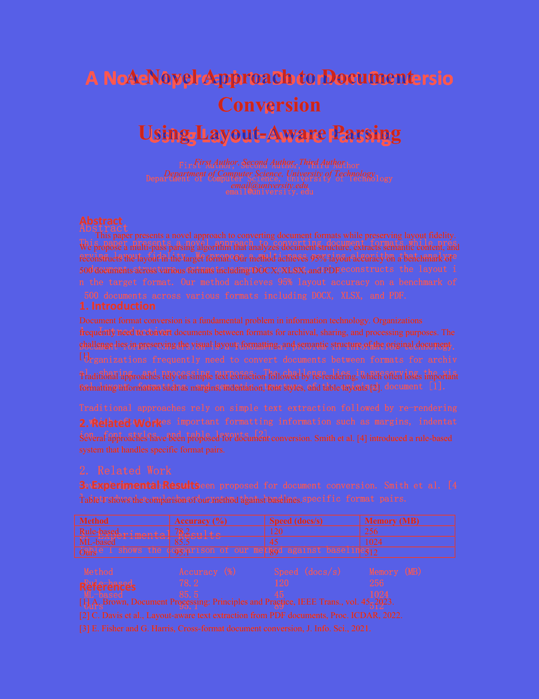</td>
  <td>changed: 188106 px (8.94%)<br>bbox: [175, 163, 1087, 1495]<br>mean abs RGB: 13.1221<br>RMSE RGB: 49.964<br>threshold: 12, gain: 5.0</td>
</tr>
<tr>
  <td><b>13_IEEE_Style_Paper</b><br>Page 2</td>
  <td>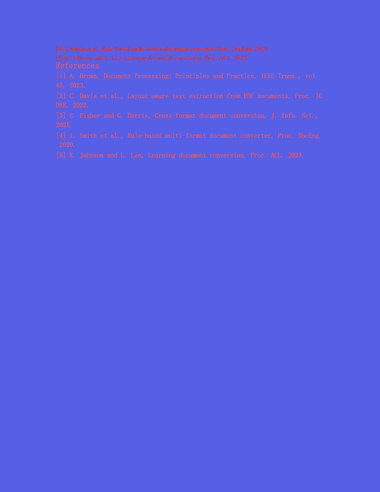</td>
  <td>changed: 27461 px (1.31%)<br>bbox: [188, 155, 1081, 531]<br>mean abs RGB: 1.7902<br>RMSE RGB: 17.8454<br>threshold: 12, gain: 5.0</td>
</tr>
<tr>
  <td><b>14_Thesis_Chapter</b><br>Page 1</td>
  <td>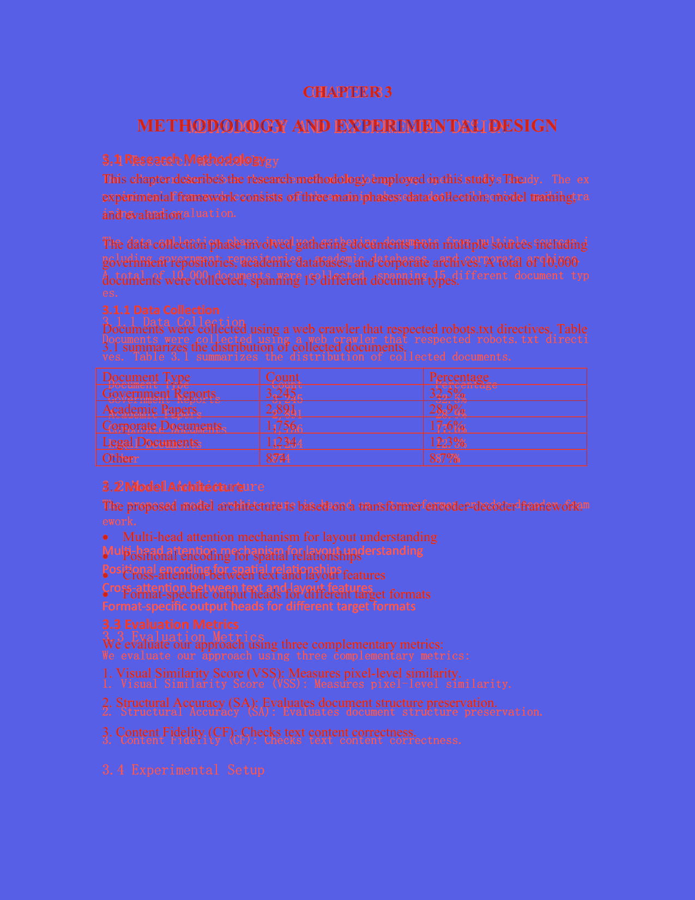</td>
  <td>changed: 181194 px (8.61%)<br>bbox: [175, 158, 1082, 1424]<br>mean abs RGB: 12.3912<br>RMSE RGB: 48.327<br>threshold: 12, gain: 5.0</td>
</tr>
<tr>
  <td><b>14_Thesis_Chapter</b><br>Page 2</td>
  <td></td>
  <td>changed: 29221 px (1.39%)<br>bbox: [187, 156, 1085, 284]<br>mean abs RGB: 1.9958<br>RMSE RGB: 19.3748<br>threshold: 12, gain: 5.0</td>
</tr>
<tr>
  <td><b>20260317_sample_CN</b><br>Page 1</td>
  <td>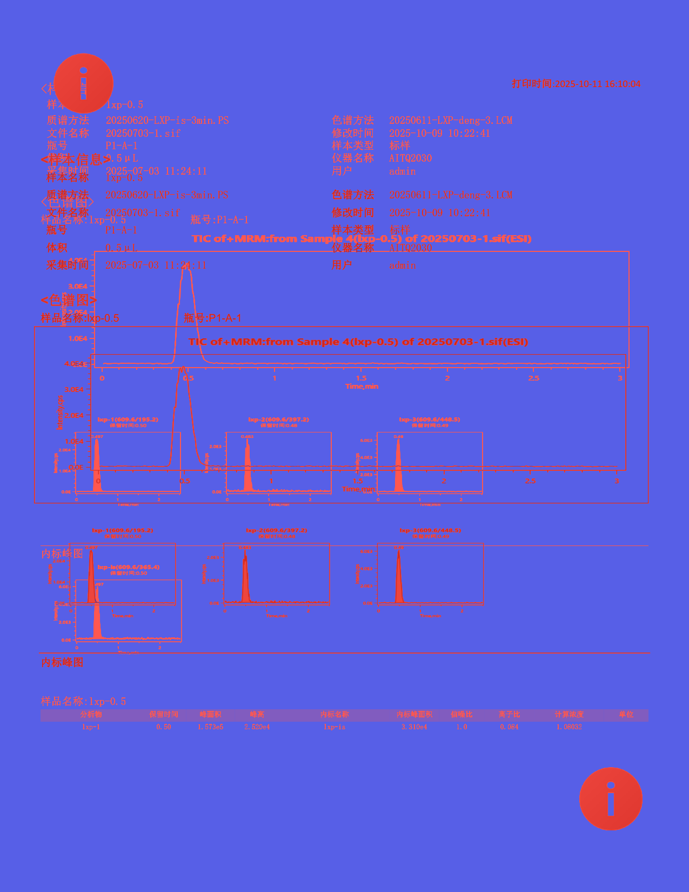</td>
  <td>changed: 155680 px (7.40%)<br>bbox: [63, 98, 1204, 1536]<br>mean abs RGB: 7.6243<br>RMSE RGB: 35.1705<br>threshold: 12, gain: 5.0</td>
</tr>
<tr>
  <td><b>20260318_issue</b><br>Page 1</td>
  <td>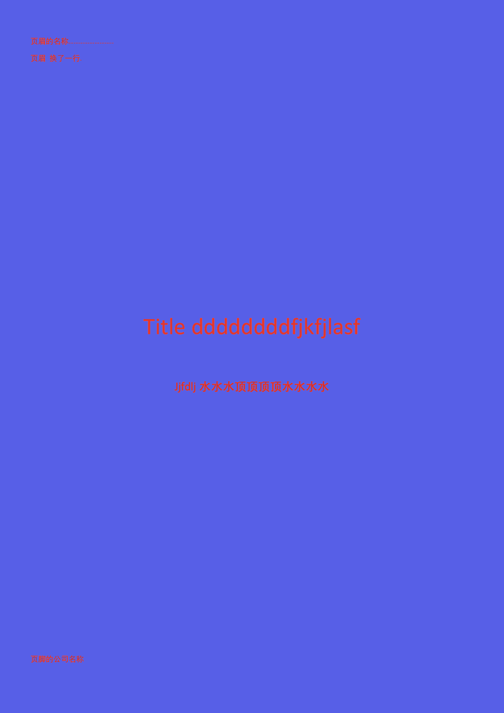</td>
  <td>changed: 14950 px (0.69%)<br>bbox: [76, 92, 888, 1630]<br>mean abs RGB: 0.8653<br>RMSE RGB: 12.1581<br>threshold: 12, gain: 5.0</td>
</tr>
<tr>
  <td><b>20260318_issue</b><br>Page 2</td>
  <td>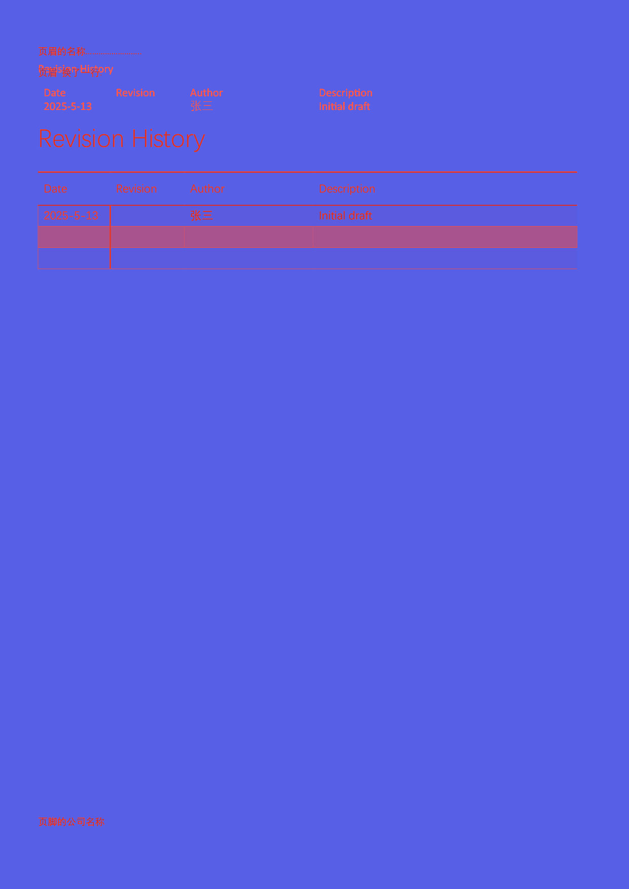</td>
  <td>changed: 149721 px (6.88%)<br>bbox: [74, 92, 1139, 1630]<br>mean abs RGB: 2.5245<br>RMSE RGB: 15.557<br>threshold: 12, gain: 5.0</td>
</tr>
<tr>
  <td><b>20260318_issue</b><br>Page 3</td>
  <td>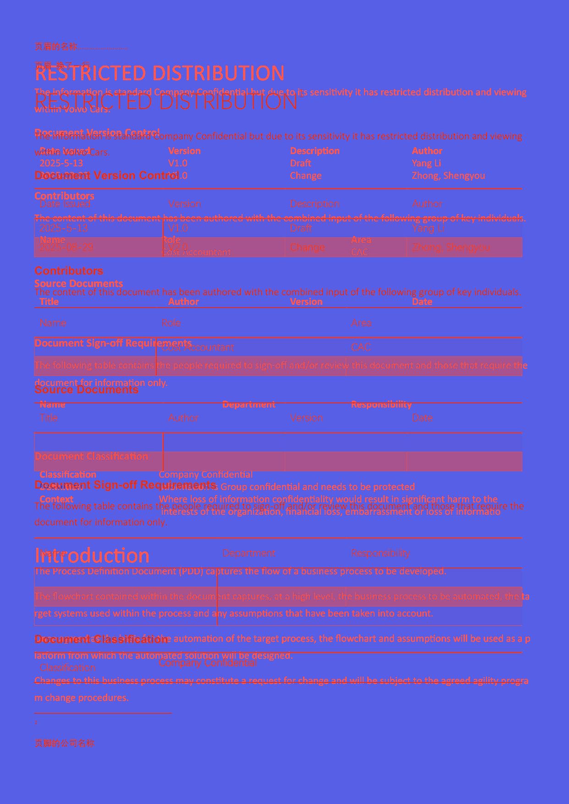</td>
  <td>changed: 538389 px (24.73%)<br>bbox: [73, 92, 1156, 1630]<br>mean abs RGB: 15.5035<br>RMSE RGB: 45.9654<br>threshold: 12, gain: 5.0</td>
</tr>
<tr>
  <td><b>20260318_issue</b><br>Page 4</td>
  <td>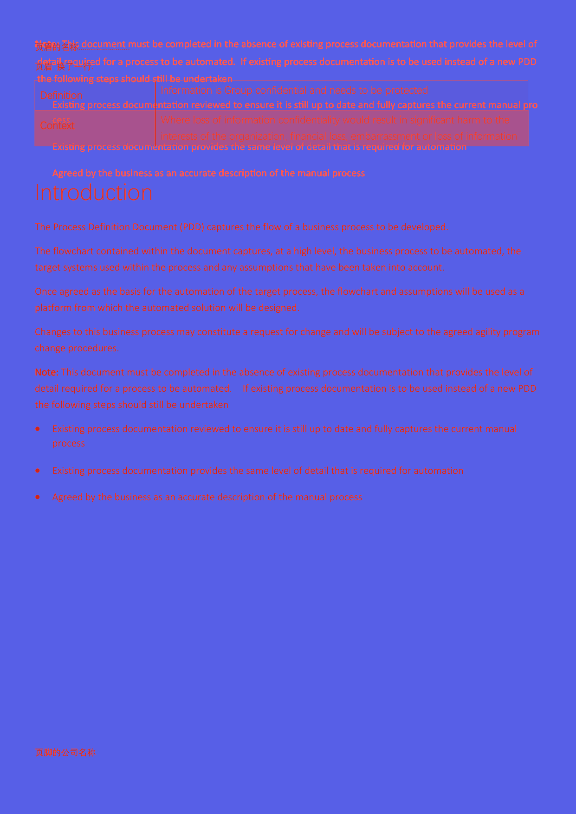</td>
  <td>changed: 236594 px (10.87%)<br>bbox: [74, 86, 1162, 1630]<br>mean abs RGB: 8.7988<br>RMSE RGB: 37.4304<br>threshold: 12, gain: 5.0</td>
</tr>
<tr>
  <td><b>20260318_issue</b><br>Page 5</td>
  <td>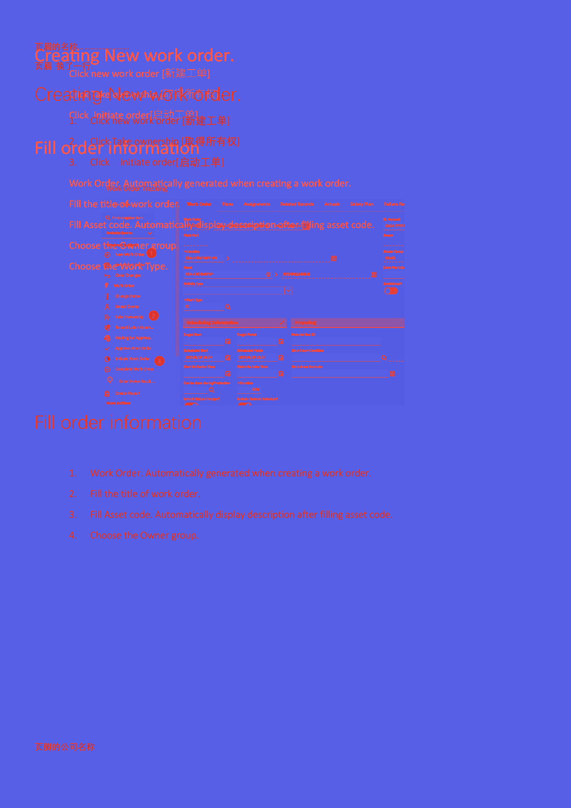</td>
  <td>changed: 90933 px (4.18%)<br>bbox: [76, 92, 879, 1630]<br>mean abs RGB: 5.2092<br>RMSE RGB: 27.147<br>threshold: 12, gain: 5.0</td>
</tr>
<tr>
  <td><b>20260318_issue</b><br>Page 6</td>
  <td>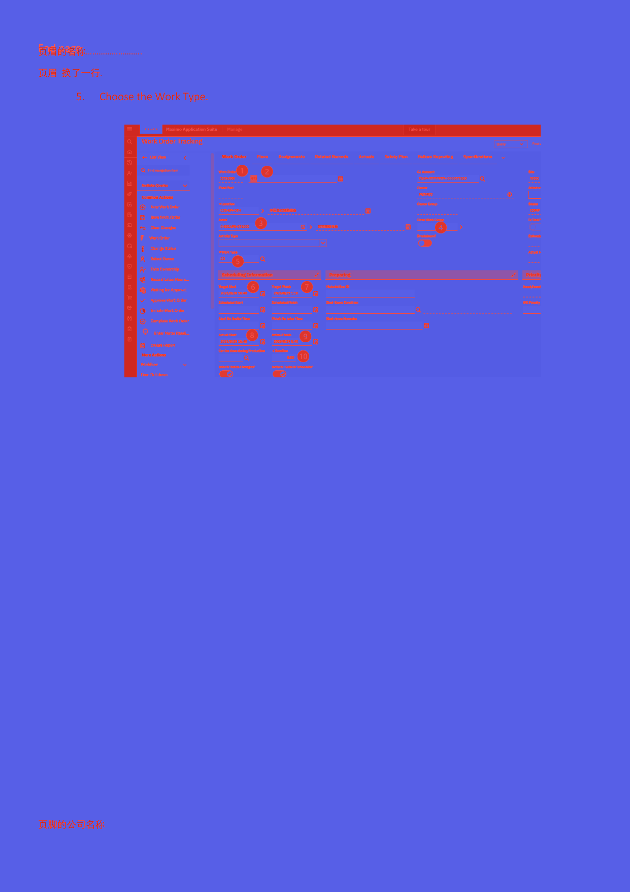</td>
  <td>changed: 85152 px (3.91%)<br>bbox: [76, 86, 1065, 1630]<br>mean abs RGB: 5.8645<br>RMSE RGB: 30.4219<br>threshold: 12, gain: 5.0</td>
</tr>
<tr>
  <td><b>CCU_article</b><br>Page 1</td>
  <td>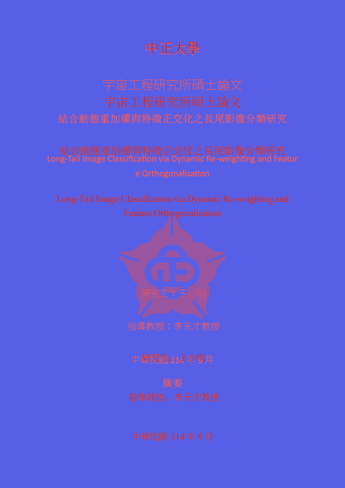</td>
  <td>changed: 127677 px (5.86%)<br>bbox: [171, 149, 1071, 1586]<br>mean abs RGB: 5.5222<br>RMSE RGB: 31.665<br>threshold: 12, gain: 5.0</td>
</tr>
<tr>
  <td><b>CCU_article</b><br>Page 2</td>
  <td>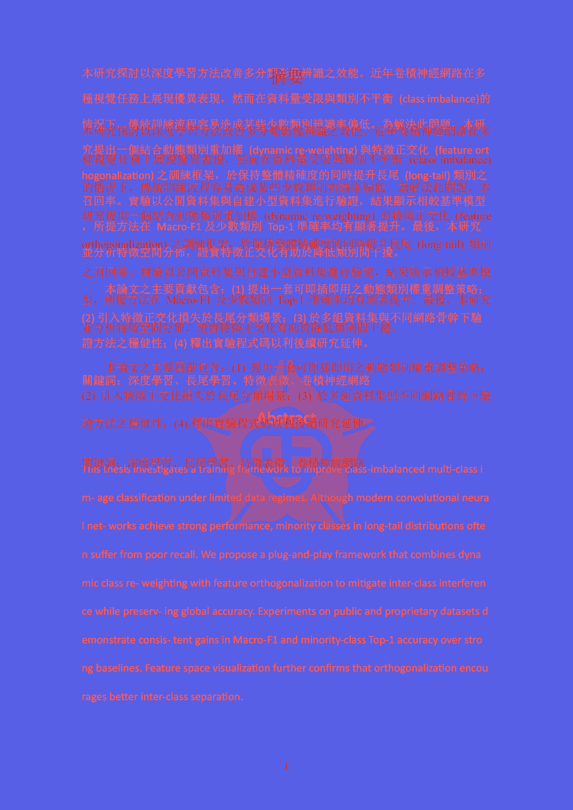</td>
  <td>changed: 260526 px (11.96%)<br>bbox: [177, 146, 1064, 1666]<br>mean abs RGB: 14.2299<br>RMSE RGB: 50.6125<br>threshold: 12, gain: 5.0</td>
</tr>
<tr>
  <td><b>CCU_article</b><br>Page 3</td>
  <td>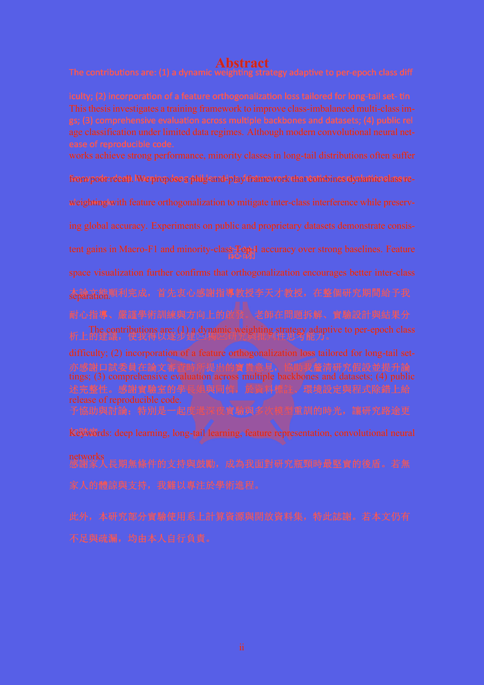</td>
  <td>changed: 211455 px (9.71%)<br>bbox: [177, 148, 1064, 1666]<br>mean abs RGB: 11.5837<br>RMSE RGB: 46.2668<br>threshold: 12, gain: 5.0</td>
</tr>
<tr>
  <td><b>CCU_article</b><br>Page 4</td>
  <td>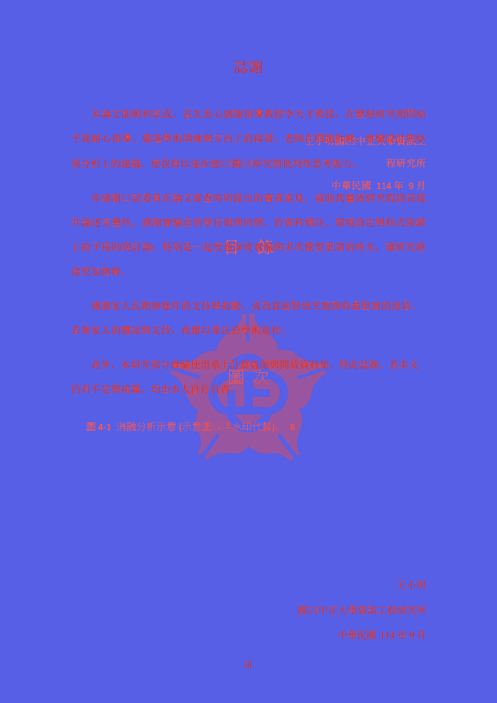</td>
  <td>changed: 136221 px (6.25%)<br>bbox: [178, 149, 1064, 1666]<br>mean abs RGB: 5.4074<br>RMSE RGB: 29.1278<br>threshold: 12, gain: 5.0</td>
</tr>
<tr>
  <td><b>CCU_article</b><br>Page 5</td>
  <td>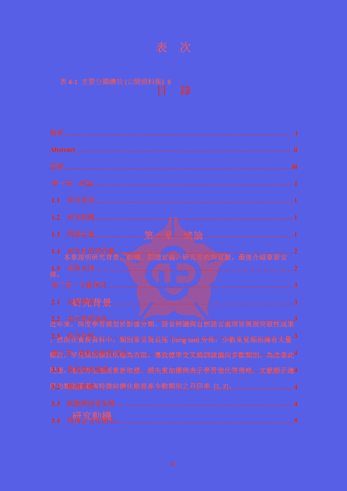</td>
  <td>changed: 151714 px (6.97%)<br>bbox: [177, 149, 1065, 1667]<br>mean abs RGB: 6.4065<br>RMSE RGB: 32.625<br>threshold: 12, gain: 5.0</td>
</tr>
<tr>
  <td><b>CCU_article</b><br>Page 6</td>
  <td>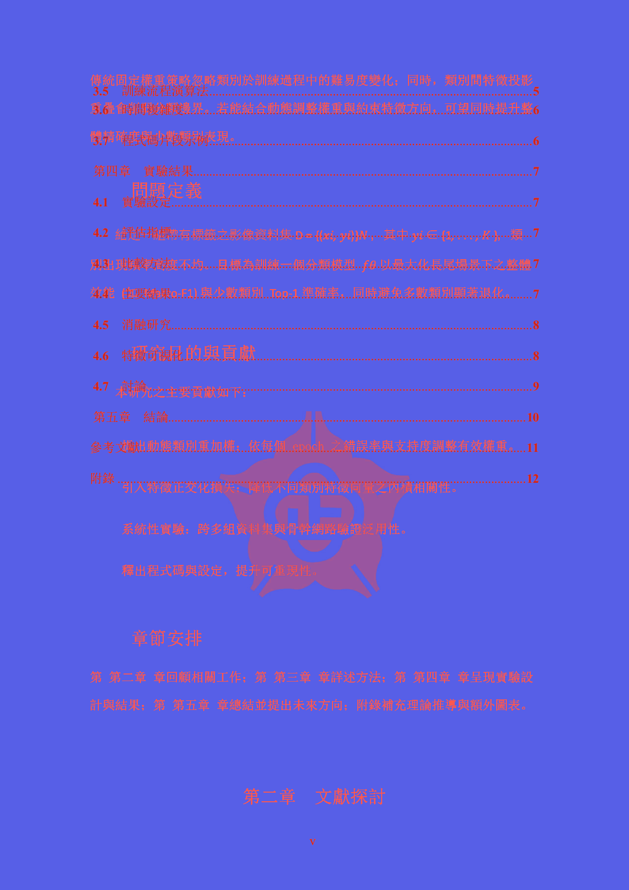</td>
  <td>changed: 169323 px (7.77%)<br>bbox: [177, 146, 1064, 1667]<br>mean abs RGB: 7.4779<br>RMSE RGB: 35.2219<br>threshold: 12, gain: 5.0</td>
</tr>
<tr>
  <td><b>CCU_article</b><br>Page 7</td>
  <td>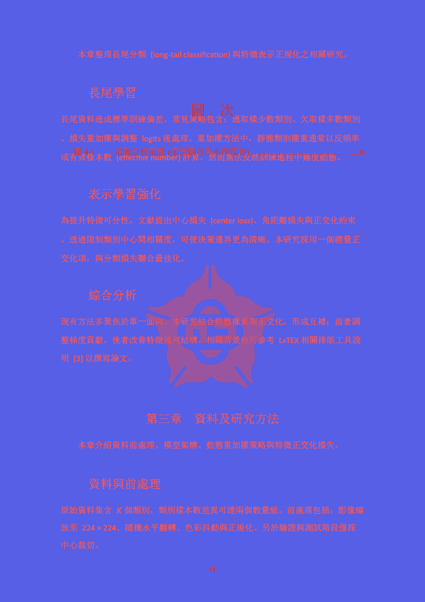</td>
  <td>changed: 153642 px (7.05%)<br>bbox: [178, 146, 1062, 1667]<br>mean abs RGB: 6.7081<br>RMSE RGB: 33.3335<br>threshold: 12, gain: 5.0</td>
</tr>
<tr>
  <td><b>CCU_article</b><br>Page 8</td>
  <td>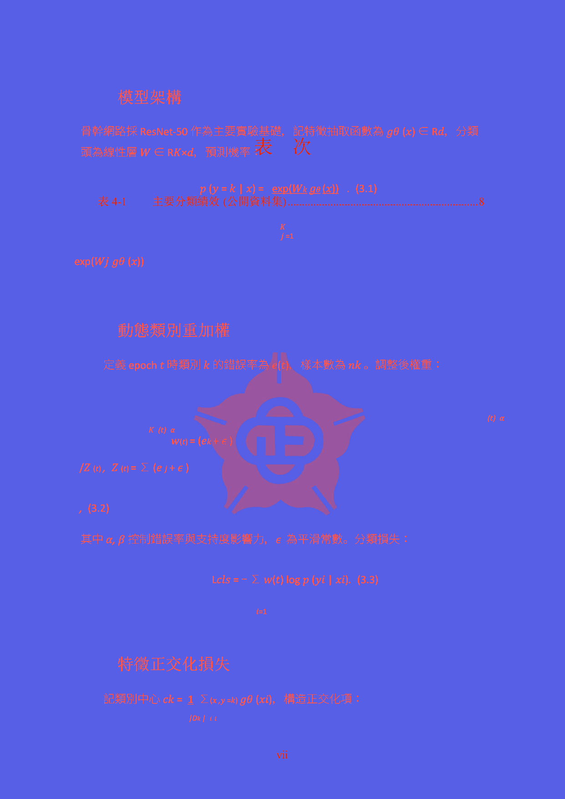</td>
  <td>changed: 102495 px (4.71%)<br>bbox: [164, 197, 1108, 1667]<br>mean abs RGB: 3.395<br>RMSE RGB: 22.706<br>threshold: 12, gain: 5.0</td>
</tr>
<tr>
  <td><b>CCU_article</b><br>Page 9</td>
  <td>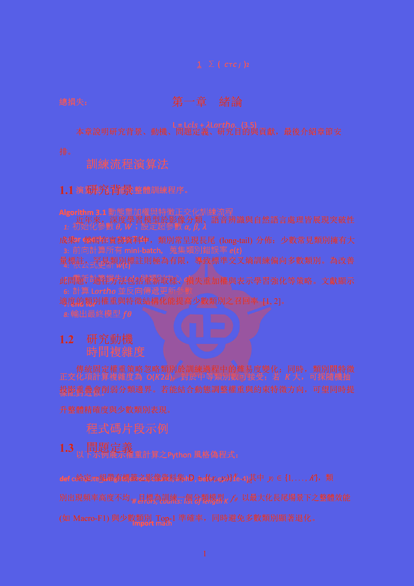</td>
  <td>changed: 189992 px (8.72%)<br>bbox: [177, 182, 1063, 1666]<br>mean abs RGB: 9.0629<br>RMSE RGB: 39.2171<br>threshold: 12, gain: 5.0</td>
</tr>
<tr>
  <td><b>CCU_article</b><br>Page 10</td>
  <td>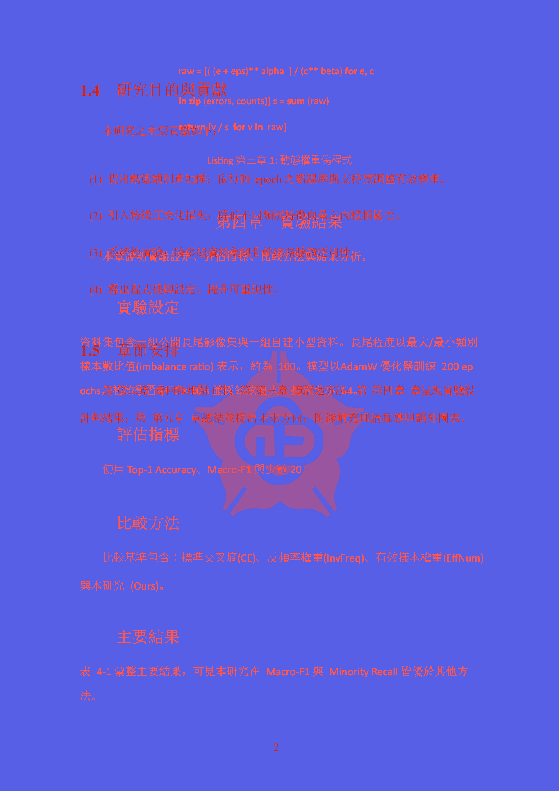</td>
  <td>changed: 151906 px (6.97%)<br>bbox: [178, 148, 1073, 1666]<br>mean abs RGB: 6.6828<br>RMSE RGB: 33.5272<br>threshold: 12, gain: 5.0</td>
</tr>
<tr>
  <td><b>CCU_article</b><br>Page 11</td>
  <td>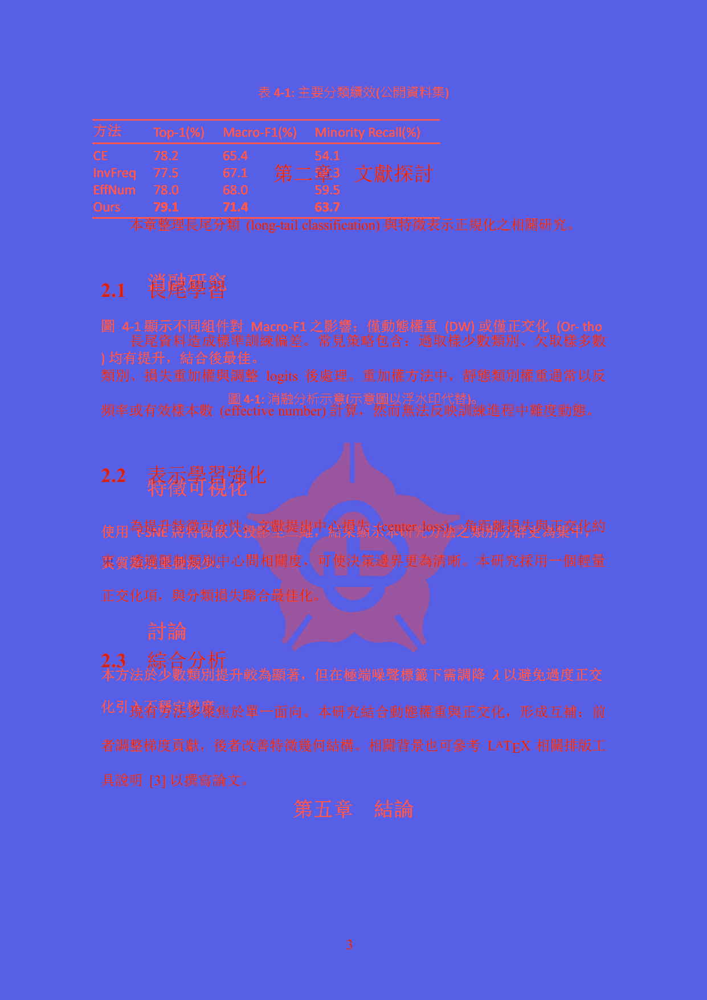</td>
  <td>changed: 174579 px (8.02%)<br>bbox: [162, 151, 1063, 1667]<br>mean abs RGB: 8.1664<br>RMSE RGB: 37.3751<br>threshold: 12, gain: 5.0</td>
</tr>
<tr>
  <td><b>CCU_article</b><br>Page 12</td>
  <td>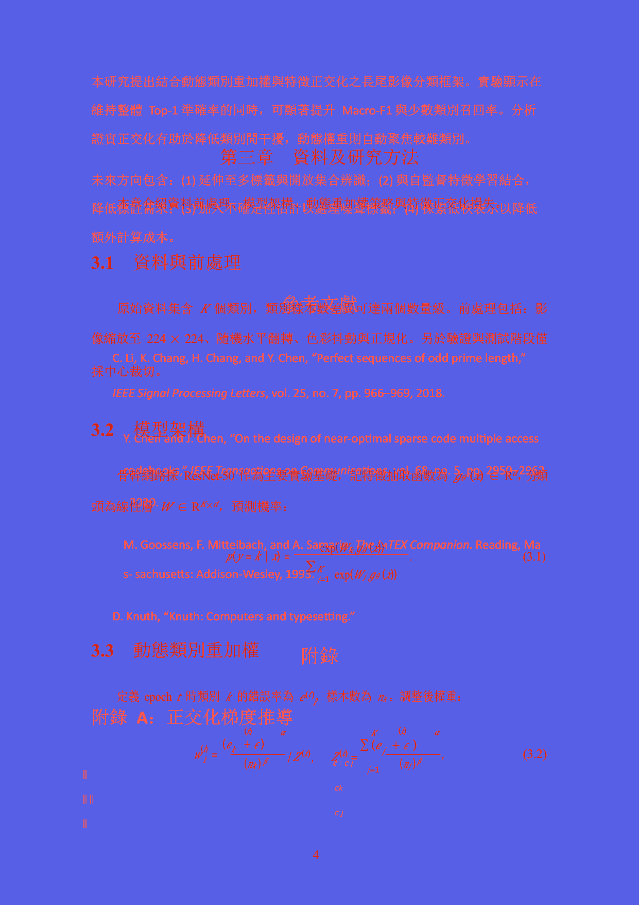</td>
  <td>changed: 124341 px (5.71%)<br>bbox: [162, 146, 1064, 1666]<br>mean abs RGB: 8.3985<br>RMSE RGB: 39.9108<br>threshold: 12, gain: 5.0</td>
</tr>
<tr>
  <td><b>CCU_article</b><br>Page 13</td>
  <td>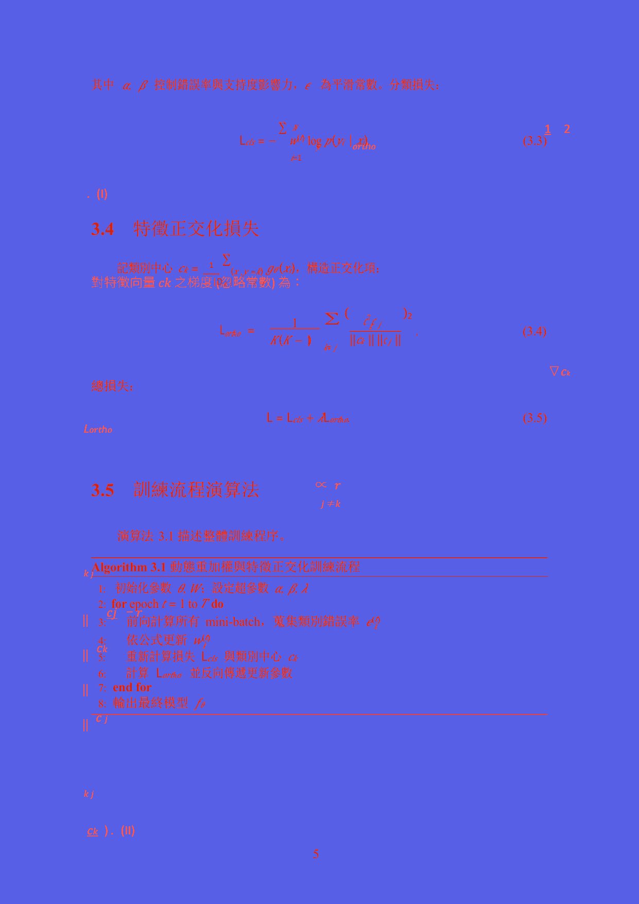</td>
  <td>changed: 57361 px (2.63%)<br>bbox: [162, 152, 1108, 1667]<br>mean abs RGB: 3.7066<br>RMSE RGB: 26.1711<br>threshold: 12, gain: 5.0</td>
</tr>
<tr>
  <td><b>CCU_article</b><br>Page 14</td>
  <td>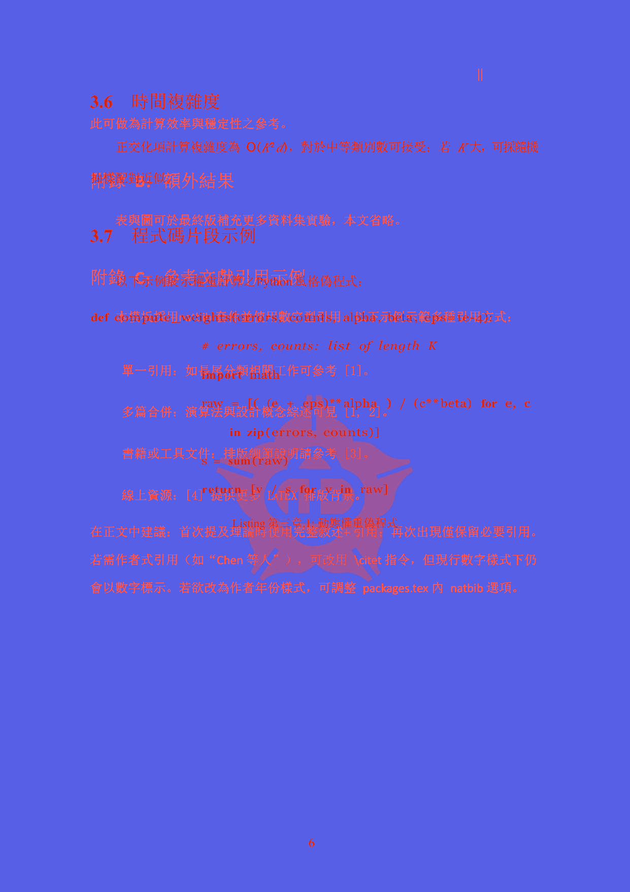</td>
  <td>changed: 138283 px (6.35%)<br>bbox: [178, 135, 1060, 1667]<br>mean abs RGB: 6.0859<br>RMSE RGB: 32.2379<br>threshold: 12, gain: 5.0</td>
</tr>
<tr>
  <td><b>CCU_article</b><br>Page 15</td>
  <td>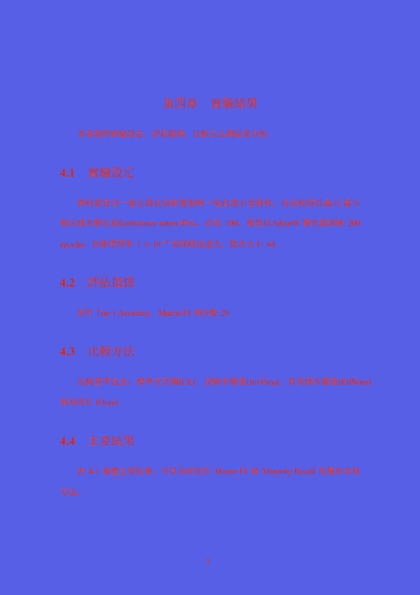</td>
  <td>changed: 49856 px (2.29%)<br>bbox: [178, 288, 1096, 1667]<br>mean abs RGB: 3.318<br>RMSE RGB: 24.9242<br>threshold: 12, gain: 5.0</td>
</tr>
<tr>
  <td><b>Class News</b><br>Page 1</td>
  <td></td>
  <td>changed: 1074898 px (51.09%)<br>bbox: [0, 0, 1275, 1650]<br>mean abs RGB: 51.7607<br>RMSE RGB: 87.5214<br>threshold: 12, gain: 5.0</td>
</tr>
<tr>
  <td><b>Class News</b><br>Page 2</td>
  <td></td>
  <td>changed: 1048001 px (49.82%)<br>bbox: [0, 0, 1275, 1650]<br>mean abs RGB: 49.2433<br>RMSE RGB: 86.157<br>threshold: 12, gain: 5.0</td>
</tr>
<tr>
  <td><b>Class News</b><br>Page 3</td>
  <td></td>
  <td>changed: 1111063 px (52.81%)<br>bbox: [0, 0, 1275, 1650]<br>mean abs RGB: 37.5927<br>RMSE RGB: 72.265<br>threshold: 12, gain: 5.0</td>
</tr>
<tr>
  <td><b>Class News</b><br>Page 4</td>
  <td></td>
  <td>changed: 1131965 px (53.81%)<br>bbox: [0, 0, 1275, 1650]<br>mean abs RGB: 39.8793<br>RMSE RGB: 76.0076<br>threshold: 12, gain: 5.0</td>
</tr>
<tr>
  <td><b>Confirmatory_Affidavit</b><br>Page 1</td>
  <td>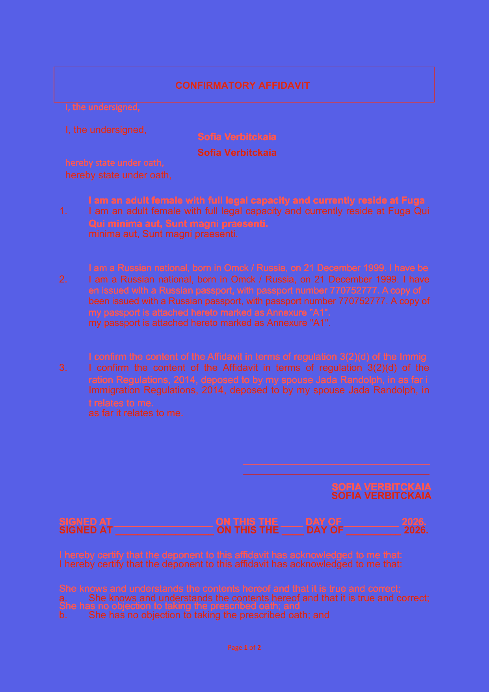</td>
  <td>changed: 151751 px (6.97%)<br>bbox: [136, 168, 1103, 1651]<br>mean abs RGB: 12.1691<br>RMSE RGB: 51.2887<br>threshold: 12, gain: 5.0</td>
</tr>
<tr>
  <td><b>Confirmatory_Affidavit</b><br>Page 2</td>
  <td>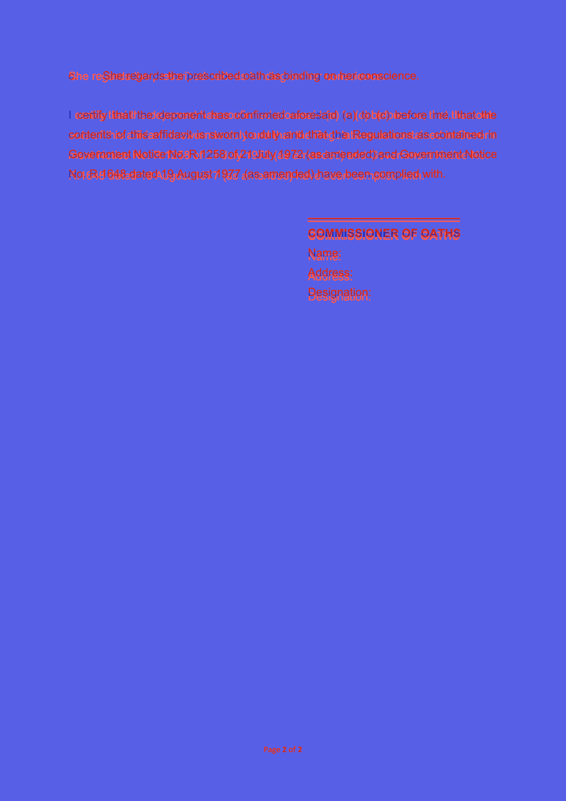</td>
  <td>changed: 58696 px (2.70%)<br>bbox: [150, 155, 1089, 1651]<br>mean abs RGB: 4.4478<br>RMSE RGB: 30.4846<br>threshold: 12, gain: 5.0</td>
</tr>
<tr>
  <td><b>Cooperation Agreement Template</b><br>Page 1</td>
  <td></td>
  <td>changed: 32090 px (1.47%)<br>bbox: [168, 183, 1070, 1638]<br>mean abs RGB: 2.8262<br>RMSE RGB: 25.2015<br>threshold: 12, gain: 5.0</td>
</tr>
<tr>
  <td><b>Cooperation Agreement Template</b><br>Page 2</td>
  <td></td>
  <td>changed: 63915 px (2.94%)<br>bbox: [166, 276, 1087, 1642]<br>mean abs RGB: 3.7621<br>RMSE RGB: 25.1685<br>threshold: 12, gain: 5.0</td>
</tr>
<tr>
  <td><b>Cooperation Agreement Template</b><br>Page 3</td>
  <td></td>
  <td>changed: 46663 px (2.14%)<br>bbox: [165, 180, 1070, 1643]<br>mean abs RGB: 2.5362<br>RMSE RGB: 19.8858<br>threshold: 12, gain: 5.0</td>
</tr>
<tr>
  <td><b>Cooperation Agreement Template</b><br>Page 4</td>
  <td></td>
  <td>changed: 20293 px (0.93%)<br>bbox: [166, 180, 1086, 1642]<br>mean abs RGB: 1.218<br>RMSE RGB: 14.4896<br>threshold: 12, gain: 5.0</td>
</tr>
<tr>
  <td><b>Cooperation Agreement Template</b><br>Page 5</td>
  <td></td>
  <td>changed: 75081 px (3.45%)<br>bbox: [165, 196, 1087, 1643]<br>mean abs RGB: 4.4764<br>RMSE RGB: 27.7371<br>threshold: 12, gain: 5.0</td>
</tr>
<tr>
  <td><b>Cooperation Agreement Template</b><br>Page 6</td>
  <td></td>
  <td>changed: 4968 px (0.23%)<br>bbox: [166, 181, 429, 1643]<br>mean abs RGB: 0.3152<br>RMSE RGB: 7.5819<br>threshold: 12, gain: 5.0</td>
</tr>
<tr>
  <td><b>Cooperation Agreement Template</b><br>Page 7</td>
  <td></td>
  <td>changed: 2766 px (0.13%)<br>bbox: [188, 180, 1036, 1643]<br>mean abs RGB: 0.1436<br>RMSE RGB: 4.5949<br>threshold: 12, gain: 5.0</td>
</tr>
<tr>
  <td><b>Fabrikam</b><br>Page 1</td>
  <td>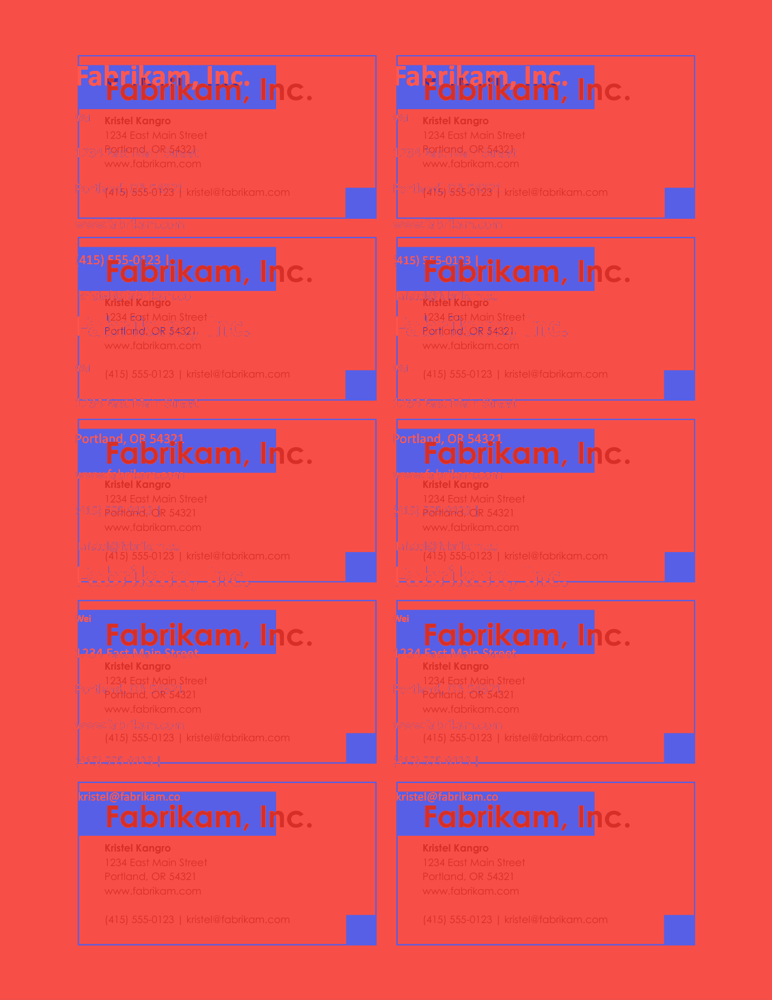</td>
  <td>changed: 1879429 px (89.34%)<br>bbox: [0, 0, 1275, 1650]<br>mean abs RGB: 40.4946<br>RMSE RGB: 55.3266<br>threshold: 12, gain: 5.0</td>
</tr>
<tr>
  <td><b>Invoice</b><br>Page 1</td>
  <td>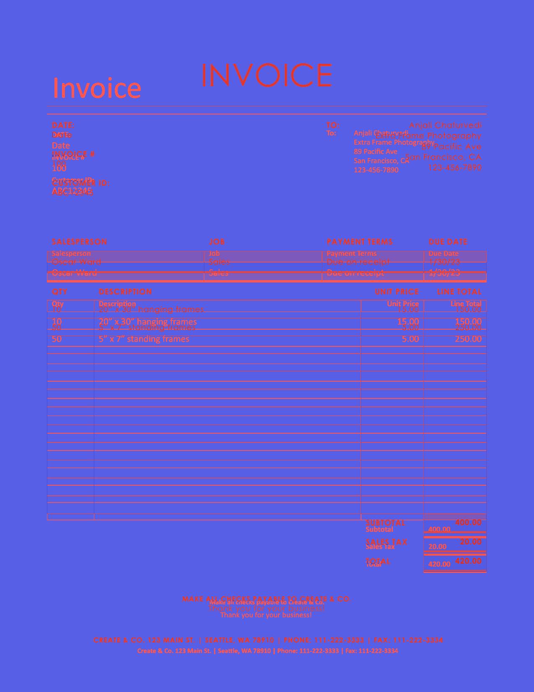</td>
  <td>changed: 181799 px (8.64%)<br>bbox: [111, 150, 1163, 1560]<br>mean abs RGB: 6.2182<br>RMSE RGB: 26.6097<br>threshold: 12, gain: 5.0</td>
</tr>
<tr>
  <td><b>Issue79_FilledContract</b><br>Page 1</td>
  <td>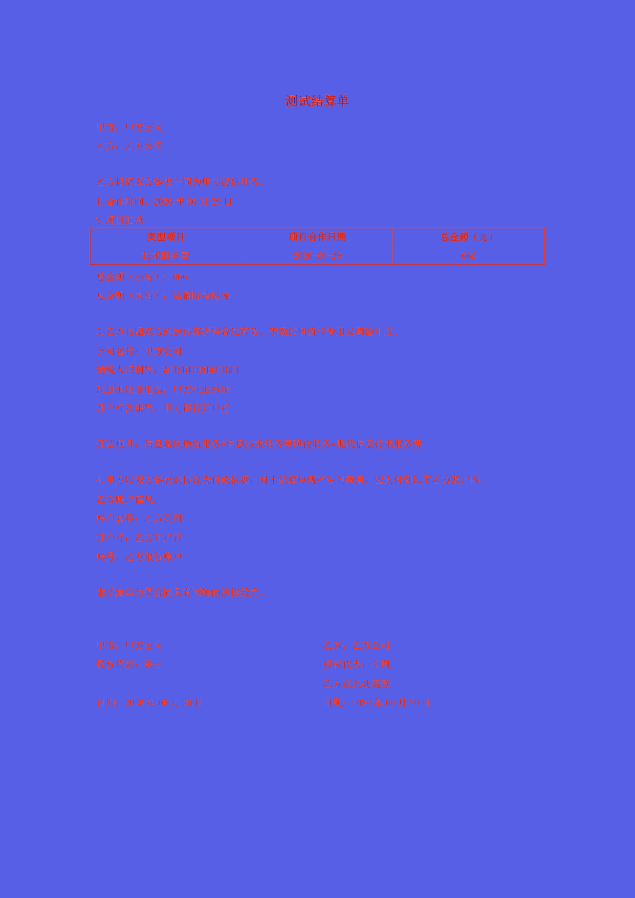</td>
  <td>changed: 46727 px (2.15%)<br>bbox: [175, 184, 1065, 1381]<br>mean abs RGB: 2.6826<br>RMSE RGB: 20.9824<br>threshold: 12, gain: 5.0</td>
</tr>
<tr>
  <td><b>Issue79_TemplateContract</b><br>Page 1</td>
  <td>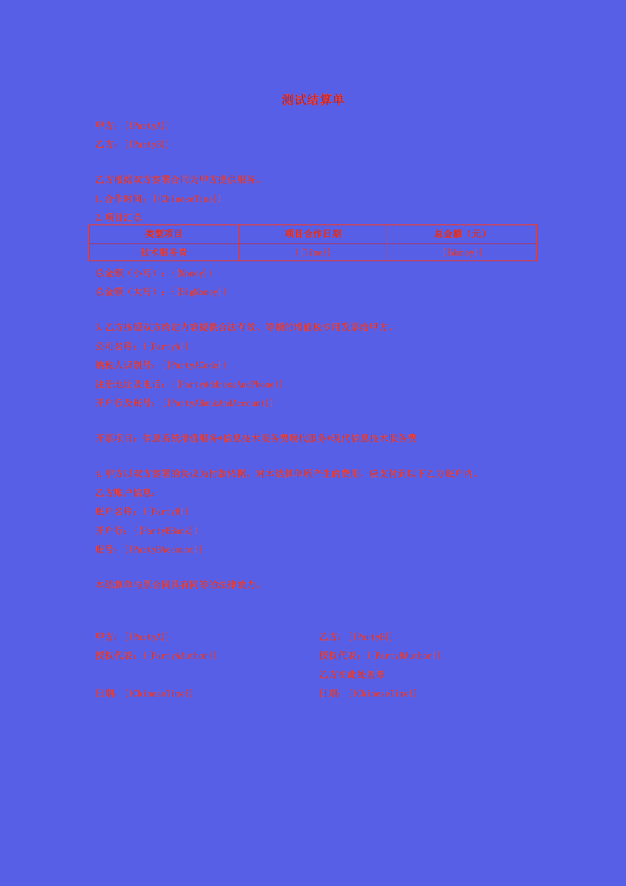</td>
  <td>changed: 47517 px (2.18%)<br>bbox: [175, 184, 1065, 1381]<br>mean abs RGB: 2.7051<br>RMSE RGB: 20.9493<br>threshold: 12, gain: 5.0</td>
</tr>
<tr>
  <td><b>Issue83_Output</b><br>Page 1</td>
  <td></td>
  <td>changed: 11690 px (0.54%)<br>bbox: [147, 178, 384, 289]<br>mean abs RGB: 0.8022<br>RMSE RGB: 12.9162<br>threshold: 12, gain: 5.0</td>
</tr>
<tr>
  <td><b>Issue159_PageLayoutOptions</b><br>Page 1</td>
  <td>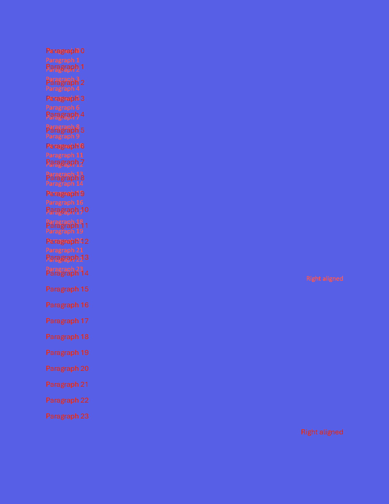</td>
  <td>changed: 40524 px (1.93%)<br>bbox: [151, 157, 1124, 1427]<br>mean abs RGB: 3.2488<br>RMSE RGB: 25.994<br>threshold: 12, gain: 5.0</td>
</tr>
<tr>
  <td><b>issue202605</b><br>Page 1</td>
  <td>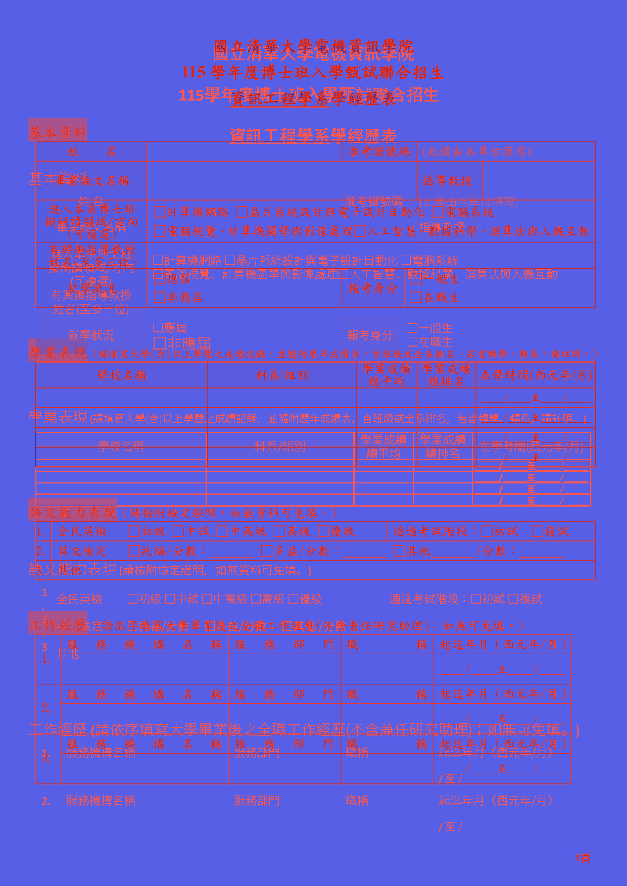</td>
  <td>changed: 437446 px (20.10%)<br>bbox: [56, 75, 1181, 1709]<br>mean abs RGB: 17.0638<br>RMSE RGB: 54.136<br>threshold: 12, gain: 5.0</td>
</tr>
<tr>
  <td><b>issue202605</b><br>Page 2</td>
  <td>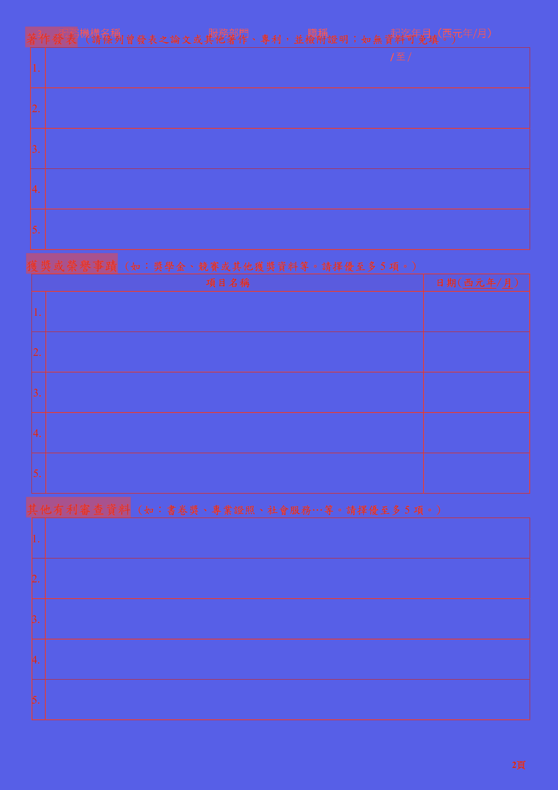</td>
  <td>changed: 134126 px (6.16%)<br>bbox: [56, 59, 1179, 1709]<br>mean abs RGB: 4.9846<br>RMSE RGB: 28.2782<br>threshold: 12, gain: 5.0</td>
</tr>
<tr>
  <td><b>issue26050501</b><br>Page 1</td>
  <td>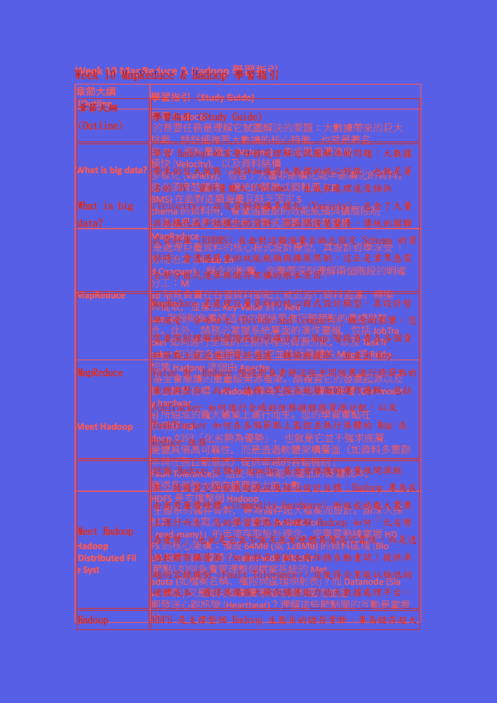</td>
  <td>changed: 311851 px (14.33%)<br>bbox: [186, 162, 1052, 1572]<br>mean abs RGB: 20.5767<br>RMSE RGB: 61.6954<br>threshold: 12, gain: 5.0</td>
</tr>
<tr>
  <td><b>issue26050501</b><br>Page 2</td>
  <td>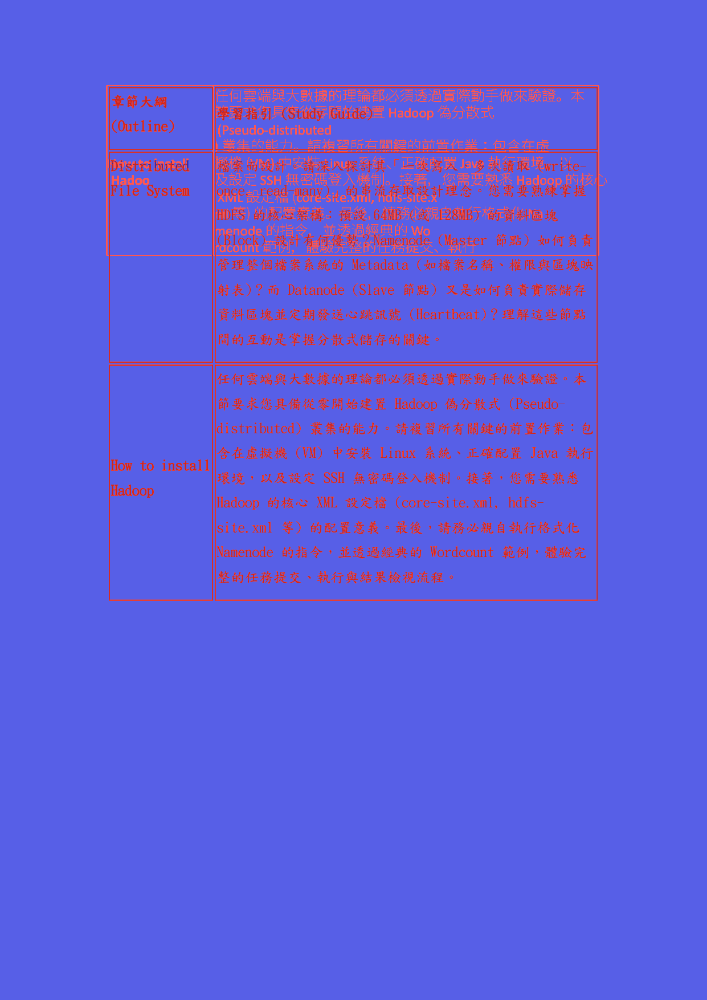</td>
  <td>changed: 137316 px (6.31%)<br>bbox: [186, 149, 1066, 1054]<br>mean abs RGB: 9.4384<br>RMSE RGB: 42.3403<br>threshold: 12, gain: 5.0</td>
</tr>
<tr>
  <td><b>issues66</b><br>Page 1</td>
  <td>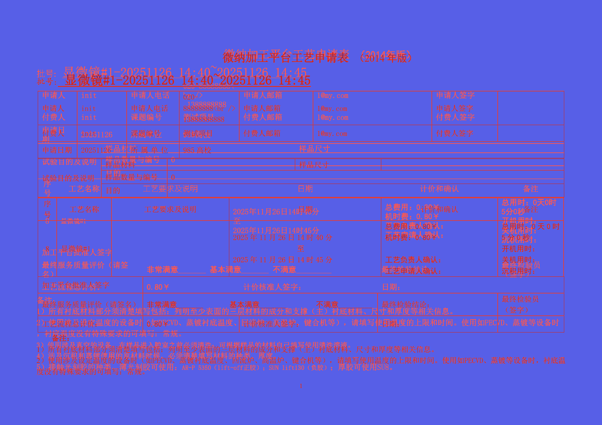</td>
  <td>changed: 228521 px (10.50%)<br>bbox: [106, 142, 1648, 1133]<br>mean abs RGB: 14.2727<br>RMSE RGB: 50.7337<br>threshold: 12, gain: 5.0</td>
</tr>
<tr>
  <td><b>MODERN LIVING</b><br>Page 1</td>
  <td></td>
  <td>changed: 1041849 px (49.52%)<br>bbox: [86, 0, 1275, 1650]<br>mean abs RGB: 22.697<br>RMSE RGB: 50.795<br>threshold: 12, gain: 5.0</td>
</tr>
<tr>
  <td><b>MODERN LIVING</b><br>Page 2</td>
  <td></td>
  <td>changed: 1124461 px (53.45%)<br>bbox: [0, 0, 1200, 1499]<br>mean abs RGB: 29.6685<br>RMSE RGB: 61.952<br>threshold: 12, gain: 5.0</td>
</tr>
<tr>
  <td><b>nthu_article</b><br>Page 1</td>
  <td>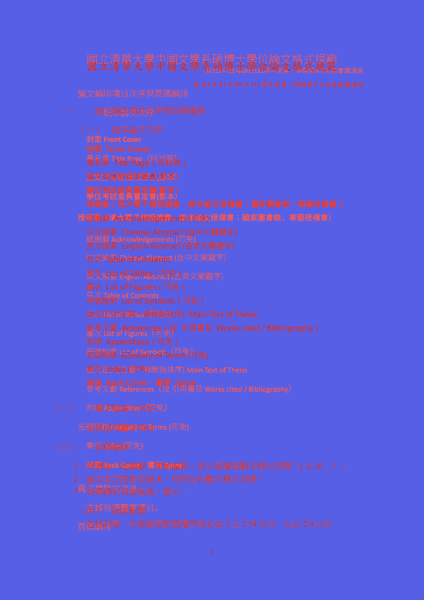</td>
  <td>changed: 143157 px (6.58%)<br>bbox: [178, 157, 1063, 1620]<br>mean abs RGB: 8.4746<br>RMSE RGB: 38.5848<br>threshold: 12, gain: 5.0</td>
</tr>
<tr>
  <td><b>nthu_article</b><br>Page 2</td>
  <td>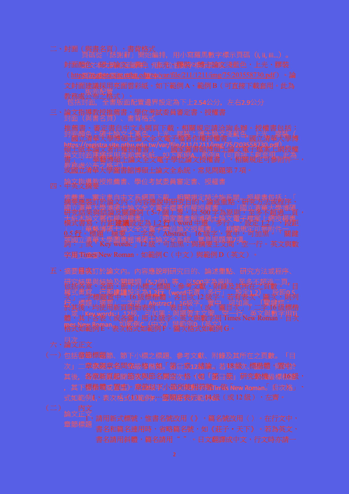</td>
  <td>changed: 263637 px (12.11%)<br>bbox: [178, 156, 1063, 1620]<br>mean abs RGB: 15.1329<br>RMSE RGB: 49.897<br>threshold: 12, gain: 5.0</td>
</tr>
<tr>
  <td><b>nthu_article</b><br>Page 3</td>
  <td>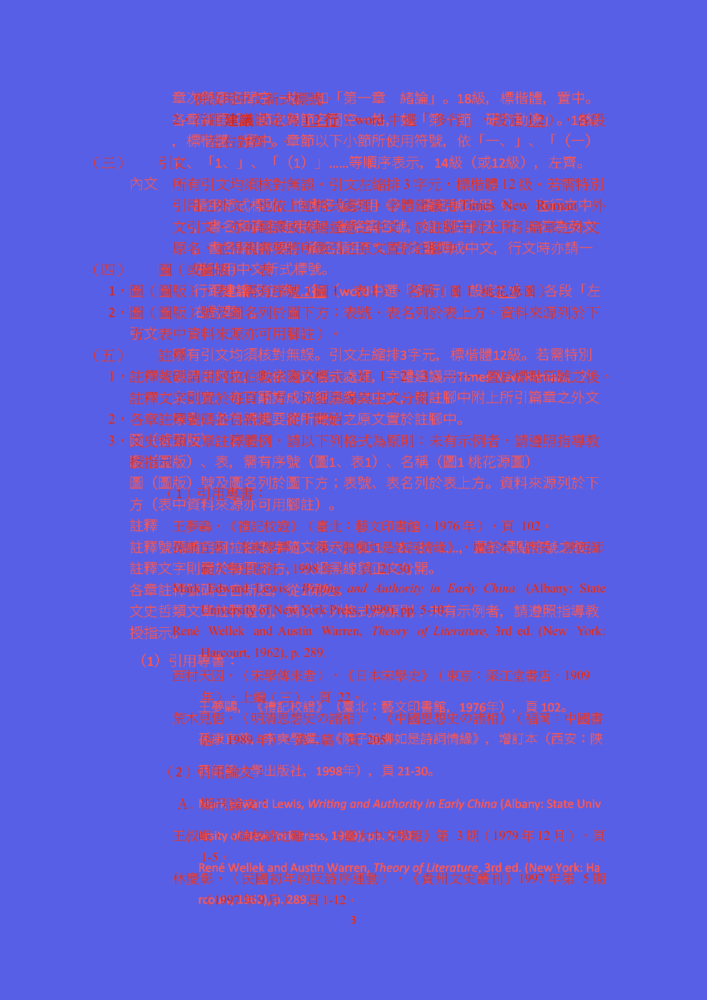</td>
  <td>changed: 214246 px (9.84%)<br>bbox: [228, 157, 1066, 1621]<br>mean abs RGB: 12.5356<br>RMSE RGB: 45.7703<br>threshold: 12, gain: 5.0</td>
</tr>
<tr>
  <td><b>nthu_article</b><br>Page 4</td>
  <td>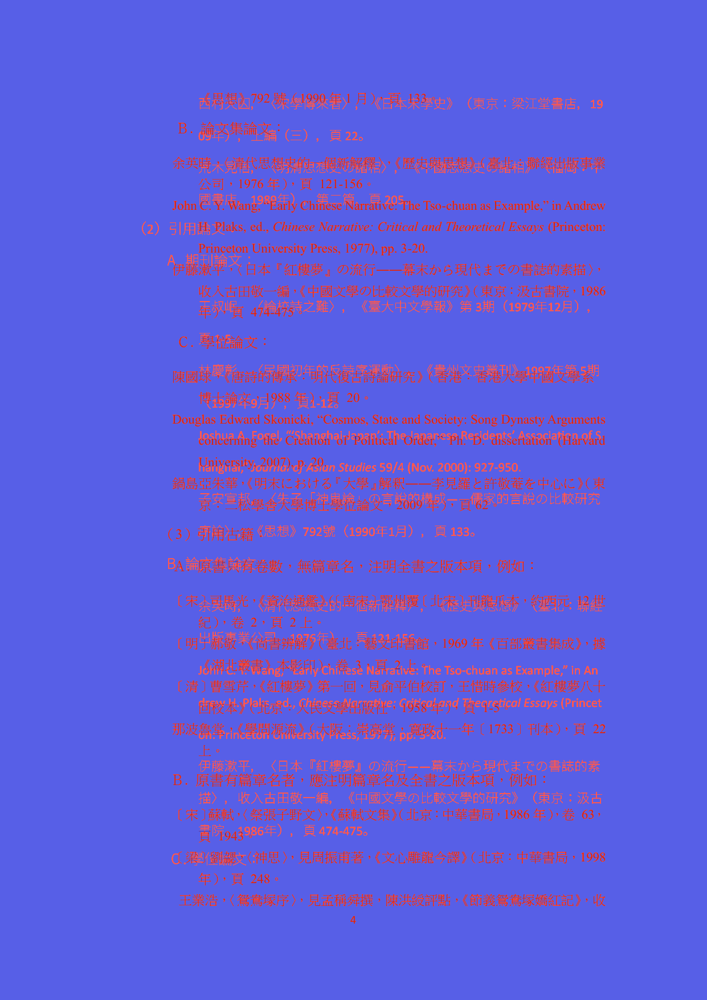</td>
  <td>changed: 171107 px (7.86%)<br>bbox: [249, 162, 1063, 1620]<br>mean abs RGB: 10.2392<br>RMSE RGB: 41.8906<br>threshold: 12, gain: 5.0</td>
</tr>
<tr>
  <td><b>nthu_article</b><br>Page 5</td>
  <td>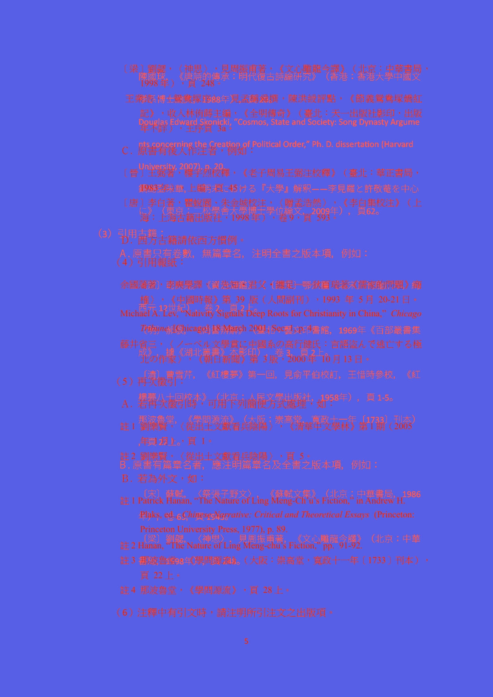</td>
  <td>changed: 163811 px (7.53%)<br>bbox: [249, 162, 1063, 1621]<br>mean abs RGB: 9.6799<br>RMSE RGB: 40.4414<br>threshold: 12, gain: 5.0</td>
</tr>
<tr>
  <td><b>nthu_article</b><br>Page 6</td>
  <td>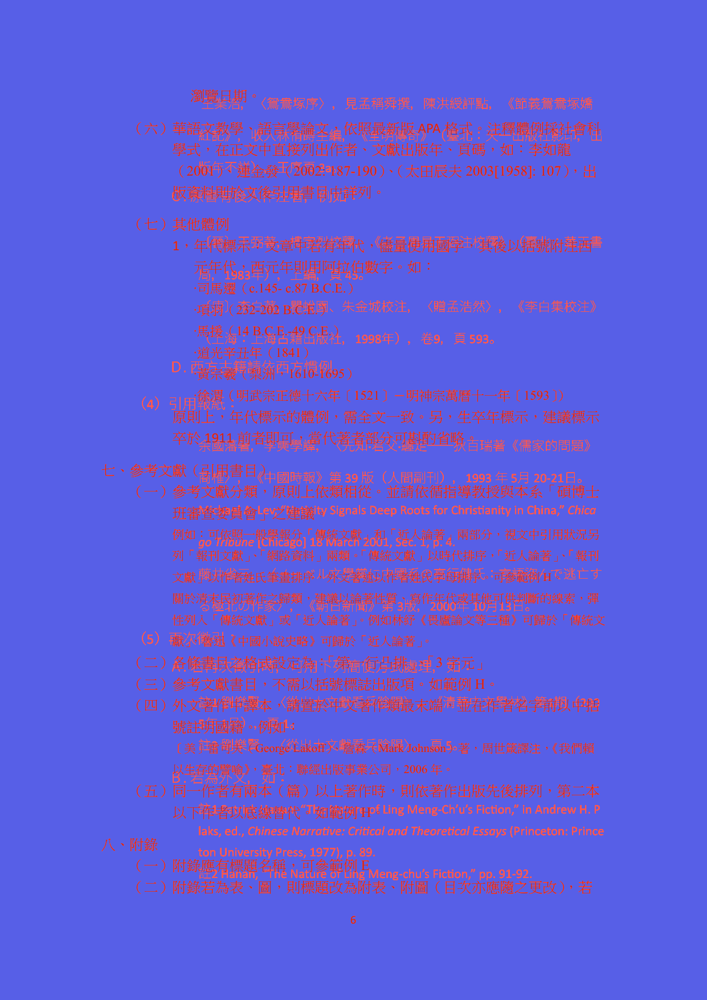</td>
  <td>changed: 193520 px (8.89%)<br>bbox: [178, 157, 1062, 1621]<br>mean abs RGB: 11.4254<br>RMSE RGB: 43.8262<br>threshold: 12, gain: 5.0</td>
</tr>
<tr>
  <td><b>nthu_article</b><br>Page 7</td>
  <td>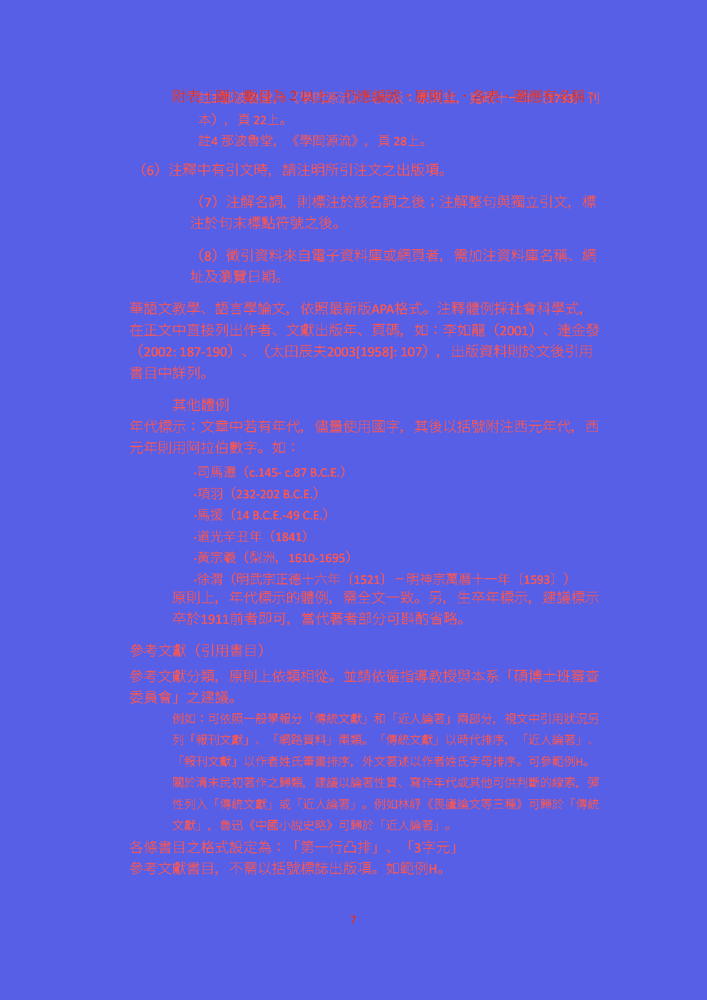</td>
  <td>changed: 109229 px (5.02%)<br>bbox: [228, 156, 1052, 1620]<br>mean abs RGB: 5.9922<br>RMSE RGB: 30.4548<br>threshold: 12, gain: 5.0</td>
</tr>
<tr>
  <td><b>nthu_article</b><br>Page 8</td>
  <td>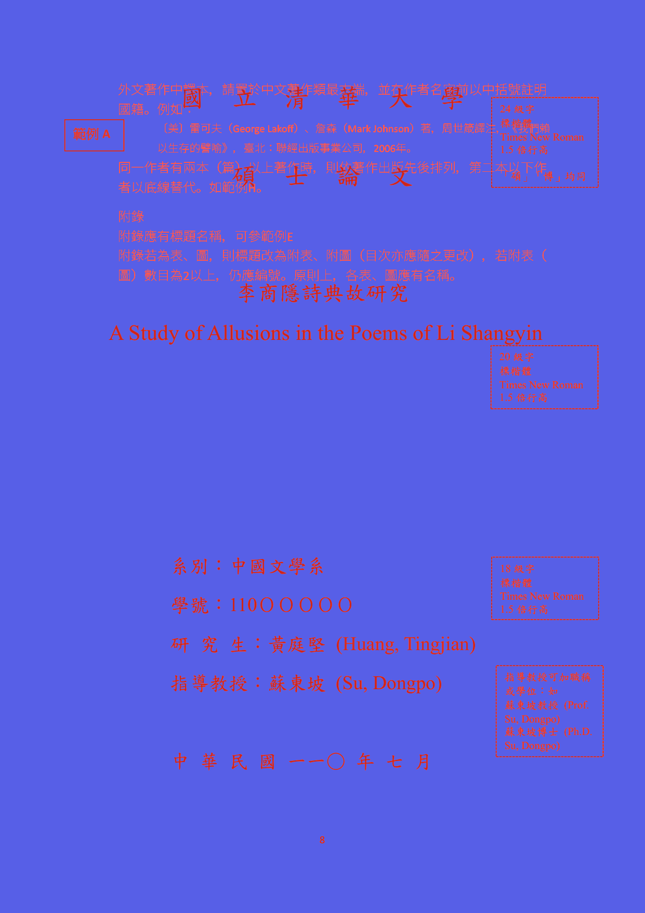</td>
  <td>changed: 88073 px (4.05%)<br>bbox: [123, 160, 1162, 1621]<br>mean abs RGB: 5.6584<br>RMSE RGB: 32.8601<br>threshold: 12, gain: 5.0</td>
</tr>
<tr>
  <td><b>nthu_article</b><br>Page 9</td>
  <td>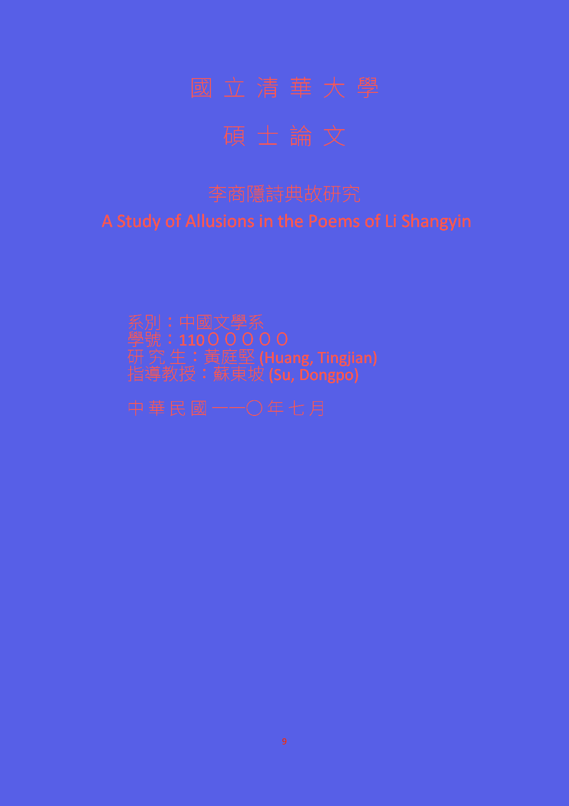</td>
  <td>changed: 55495 px (2.55%)<br>bbox: [177, 151, 1026, 1621]<br>mean abs RGB: 3.7492<br>RMSE RGB: 27.106<br>threshold: 12, gain: 5.0</td>
</tr>
<tr>
  <td><b>nthu_article</b><br>Page 10</td>
  <td>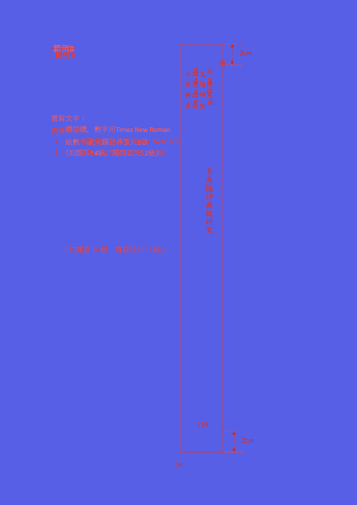</td>
  <td>changed: 104836 px (4.82%)<br>bbox: [178, 125, 1145, 1621]<br>mean abs RGB: 6.0906<br>RMSE RGB: 32.345<br>threshold: 12, gain: 5.0</td>
</tr>
<tr>
  <td><b>nthu_article</b><br>Page 11</td>
  <td>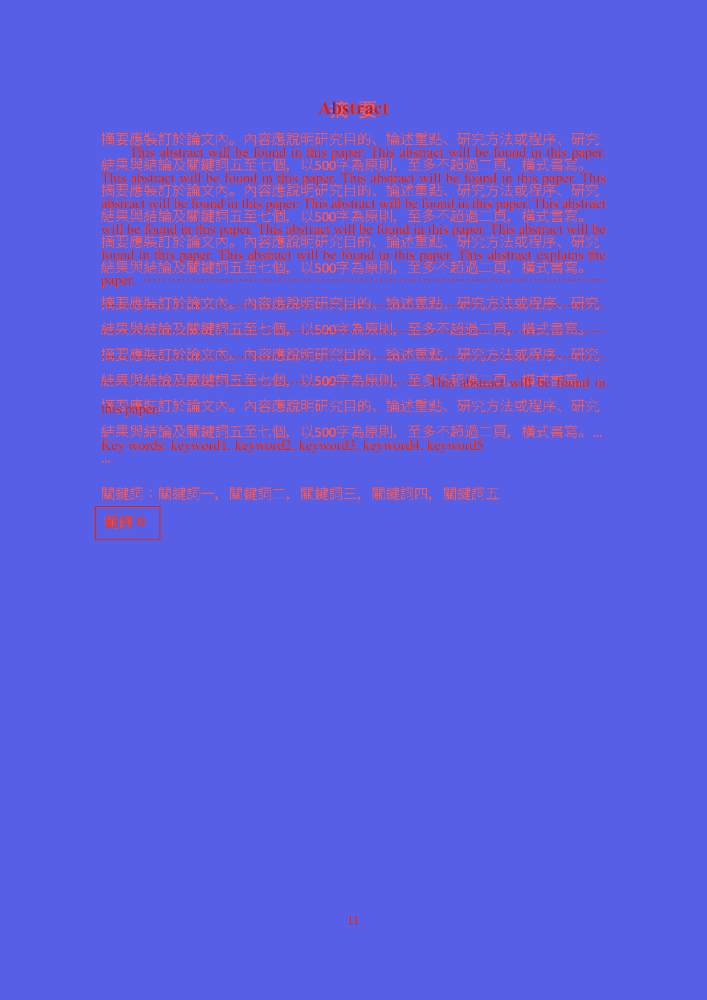</td>
  <td>changed: 118479 px (5.44%)<br>bbox: [166, 176, 1064, 1620]<br>mean abs RGB: 7.2818<br>RMSE RGB: 35.6793<br>threshold: 12, gain: 5.0</td>
</tr>
<tr>
  <td><b>nthu_article</b><br>Page 12</td>
  <td>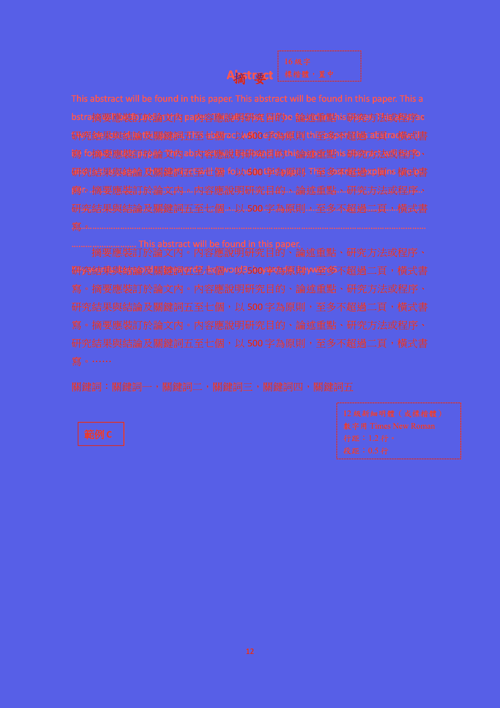</td>
  <td>changed: 108132 px (4.97%)<br>bbox: [140, 134, 1226, 1620]<br>mean abs RGB: 7.407<br>RMSE RGB: 38.4453<br>threshold: 12, gain: 5.0</td>
</tr>
<tr>
  <td><b>nthu_article</b><br>Page 13</td>
  <td>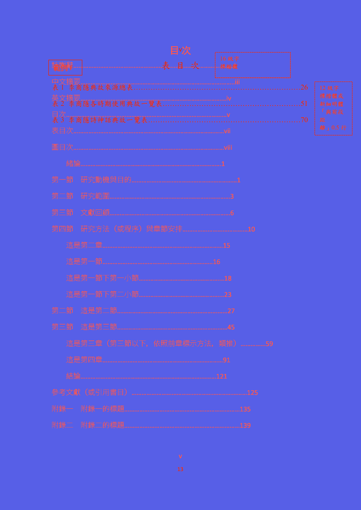</td>
  <td>changed: 69600 px (3.20%)<br>bbox: [166, 158, 1212, 1621]<br>mean abs RGB: 4.2728<br>RMSE RGB: 27.697<br>threshold: 12, gain: 5.0</td>
</tr>
<tr>
  <td><b>nthu_article</b><br>Page 14</td>
  <td></td>
  <td>changed: 29989 px (1.38%)<br>bbox: [166, 165, 1212, 1620]<br>mean abs RGB: 1.8132<br>RMSE RGB: 18.1939<br>threshold: 12, gain: 5.0</td>
</tr>
<tr>
  <td><b>nthu_article</b><br>Page 15</td>
  <td></td>
  <td>changed: 133912 px (6.15%)<br>bbox: [176, 156, 1226, 1621]<br>mean abs RGB: 7.9862<br>RMSE RGB: 37.1747<br>threshold: 12, gain: 5.0</td>
</tr>
<tr>
  <td><b>nthu_article</b><br>Page 16</td>
  <td></td>
  <td>changed: 135983 px (6.25%)<br>bbox: [178, 157, 1202, 1621]<br>mean abs RGB: 8.1941<br>RMSE RGB: 37.569<br>threshold: 12, gain: 5.0</td>
</tr>
<tr>
  <td><b>nthu_article</b><br>Page 17</td>
  <td></td>
  <td>changed: 850852 px (39.09%)<br>bbox: [71, 163, 1169, 1620]<br>mean abs RGB: 22.678<br>RMSE RGB: 51.2606<br>threshold: 12, gain: 5.0</td>
</tr>
<tr>
  <td><b>nthu_article</b><br>Page 18</td>
  <td></td>
  <td>changed: 119430 px (5.49%)<br>bbox: [178, 156, 1062, 1621]<br>mean abs RGB: 7.1259<br>RMSE RGB: 35.9033<br>threshold: 12, gain: 5.0</td>
</tr>
<tr>
  <td><b>OSCAR WARD</b><br>Page 1</td>
  <td></td>
  <td>changed: 528191 px (25.11%)<br>bbox: [0, 0, 1275, 1650]<br>mean abs RGB: 12.8586<br>RMSE RGB: 43.3094<br>threshold: 12, gain: 5.0</td>
</tr>
<tr>
  <td><b>SA8000 ch sample</b><br>Page 1</td>
  <td></td>
  <td>changed: 284802 px (13.08%)<br>bbox: [59, 22, 1178, 1705]<br>mean abs RGB: 18.0995<br>RMSE RGB: 57.1065<br>threshold: 12, gain: 5.0</td>
</tr>
<tr>
  <td><b>SA8000 ch sample</b><br>Page 2</td>
  <td></td>
  <td>changed: 282318 px (12.97%)<br>bbox: [59, 23, 1181, 1717]<br>mean abs RGB: 16.4428<br>RMSE RGB: 52.4298<br>threshold: 12, gain: 5.0</td>
</tr>
<tr>
  <td><b>Support_Letter</b><br>Page 1</td>
  <td></td>
  <td>changed: 173607 px (8.25%)<br>bbox: [150, 156, 1126, 1375]<br>mean abs RGB: 13.5824<br>RMSE RGB: 52.8476<br>threshold: 12, gain: 5.0</td>
</tr>
<tr>
  <td><b>Template for MSc Thesis</b><br>Page 1</td>
  <td></td>
  <td>changed: 322902 px (15.35%)<br>bbox: [107, 82, 1201, 1527]<br>mean abs RGB: 26.9445<br>RMSE RGB: 76.1709<br>threshold: 12, gain: 5.0</td>
</tr>
<tr>
  <td><b>Template for MSc Thesis</b><br>Page 2</td>
  <td></td>
  <td>changed: 278568 px (13.24%)<br>bbox: [105, 81, 1203, 1554]<br>mean abs RGB: 22.3302<br>RMSE RGB: 68.2924<br>threshold: 12, gain: 5.0</td>
</tr>
<tr>
  <td><b>Template for MSc Thesis</b><br>Page 3</td>
  <td></td>
  <td>changed: 143547 px (6.82%)<br>bbox: [131, 82, 1172, 1504]<br>mean abs RGB: 11.9375<br>RMSE RGB: 50.7055<br>threshold: 12, gain: 5.0</td>
</tr>
<tr>
  <td><b>Template for MSc Thesis</b><br>Page 4</td>
  <td></td>
  <td>changed: 162504 px (7.72%)<br>bbox: [128, 88, 1172, 1465]<br>mean abs RGB: 13.5175<br>RMSE RGB: 53.8227<br>threshold: 12, gain: 5.0</td>
</tr>
<tr>
  <td><b>Template for MSc Thesis</b><br>Page 5</td>
  <td></td>
  <td>changed: 230366 px (10.95%)<br>bbox: [105, 75, 1203, 1483]<br>mean abs RGB: 18.5487<br>RMSE RGB: 62.3327<br>threshold: 12, gain: 5.0</td>
</tr>
<tr>
  <td><b>Template for MSc Thesis</b><br>Page 6</td>
  <td></td>
  <td>changed: 20471 px (0.97%)<br>bbox: [187, 83, 1192, 312]<br>mean abs RGB: 1.8025<br>RMSE RGB: 19.9788<br>threshold: 12, gain: 5.0</td>
</tr>
<tr>
  <td><b>Template for MSc Thesis</b><br>Page 7</td>
  <td></td>
  <td>changed: 4996 px (0.24%)<br>bbox: [489, 83, 816, 114]<br>mean abs RGB: 0.4396<br>RMSE RGB: 9.9305<br>threshold: 12, gain: 5.0</td>
</tr>
<tr>
  <td><b>Template for MSc Thesis</b><br>Page 8</td>
  <td></td>
  <td>changed: 62001 px (2.95%)<br>bbox: [181, 83, 1199, 1501]<br>mean abs RGB: 5.6782<br>RMSE RGB: 35.8583<br>threshold: 12, gain: 5.0</td>
</tr>
<tr>
  <td><b>Template for MSc Thesis</b><br>Page 9</td>
  <td></td>
  <td>changed: 12863 px (0.61%)<br>bbox: [456, 83, 848, 294]<br>mean abs RGB: 1.257<br>RMSE RGB: 17.1136<br>threshold: 12, gain: 5.0</td>
</tr>
<tr>
  <td><b>Template for MSc Thesis</b><br>Page 10</td>
  <td></td>
  <td>changed: 49593 px (2.36%)<br>bbox: [106, 83, 1070, 1435]<br>mean abs RGB: 4.4727<br>RMSE RGB: 31.6688<br>threshold: 12, gain: 5.0</td>
</tr>
<tr>
  <td><b>Template for MSc Thesis</b><br>Page 11</td>
  <td></td>
  <td>changed: 6085 px (0.29%)<br>bbox: [509, 83, 795, 207]<br>mean abs RGB: 0.5589<br>RMSE RGB: 11.3227<br>threshold: 12, gain: 5.0</td>
</tr>
<tr>
  <td><b>TestIssue61</b><br>Page 1</td>
  <td></td>
  <td>changed: 63290 px (3.09%)<br>bbox: [147, 353, 1093, 1547]<br>mean abs RGB: 6.5375<br>RMSE RGB: 39.2703<br>threshold: 12, gain: 5.0</td>
</tr>
<tr>
  <td><b>TestIssue61</b><br>Page 2</td>
  <td></td>
  <td>changed: 21385 px (1.04%)<br>bbox: [114, 138, 1094, 1547]<br>mean abs RGB: 1.5423<br>RMSE RGB: 17.1699<br>threshold: 12, gain: 5.0</td>
</tr>
<tr>
  <td><b>TestIssue61</b><br>Page 3</td>
  <td></td>
  <td>changed: 3790 px (0.19%)<br>bbox: [114, 109, 627, 1548]<br>mean abs RGB: 0.2442<br>RMSE RGB: 6.4713<br>threshold: 12, gain: 5.0</td>
</tr>
<tr>
  <td><b>TestIssue61</b><br>Page 4</td>
  <td></td>
  <td>changed: 9153 px (0.45%)<br>bbox: [113, 109, 691, 1547]<br>mean abs RGB: 0.5739<br>RMSE RGB: 9.7995<br>threshold: 12, gain: 5.0</td>
</tr>
<tr>
  <td><b>TestIssue61</b><br>Page 5</td>
  <td></td>
  <td>changed: 2399 px (0.12%)<br>bbox: [114, 109, 627, 1548]<br>mean abs RGB: 0.1587<br>RMSE RGB: 5.3141<br>threshold: 12, gain: 5.0</td>
</tr>
<tr>
  <td><b>TestIssue61</b><br>Page 6</td>
  <td></td>
  <td>changed: 2414 px (0.12%)<br>bbox: [114, 109, 627, 1548]<br>mean abs RGB: 0.1579<br>RMSE RGB: 5.2633<br>threshold: 12, gain: 5.0</td>
</tr>
<tr>
  <td><b>TestIssue61</b><br>Page 7</td>
  <td></td>
  <td>changed: 2986 px (0.15%)<br>bbox: [114, 108, 627, 1547]<br>mean abs RGB: 0.1843<br>RMSE RGB: 5.5728<br>threshold: 12, gain: 5.0</td>
</tr>
<tr>
  <td><b>TestIssue61</b><br>Page 8</td>
  <td></td>
  <td>changed: 2345 px (0.11%)<br>bbox: [113, 109, 626, 1548]<br>mean abs RGB: 0.1573<br>RMSE RGB: 5.3048<br>threshold: 12, gain: 5.0</td>
</tr>
<tr>
  <td><b>TestIssue78</b><br>Page 1</td>
  <td></td>
  <td>changed: 122485 px (5.63%)<br>bbox: [188, 317, 1053, 1291]<br>mean abs RGB: 7.3136<br>RMSE RGB: 35.43<br>threshold: 12, gain: 5.0</td>
</tr>
<tr>
  <td><b>TestIssue90</b><br>Page 1</td>
  <td></td>
  <td>changed: 151953 px (7.22%)<br>bbox: [150, 119, 1125, 1501]<br>mean abs RGB: 10.8541<br>RMSE RGB: 48.6412<br>threshold: 12, gain: 5.0</td>
</tr>
<tr>
  <td><b>TestIssue91</b><br>Page 1</td>
  <td></td>
  <td>changed: 183899 px (8.74%)<br>bbox: [149, 106, 1123, 1538]<br>mean abs RGB: 14.0757<br>RMSE RGB: 54.416<br>threshold: 12, gain: 5.0</td>
</tr>
<tr>
  <td><b>TestIssue91</b><br>Page 2</td>
  <td></td>
  <td>changed: 283237 px (13.46%)<br>bbox: [150, 99, 1126, 1538]<br>mean abs RGB: 22.0527<br>RMSE RGB: 67.3469<br>threshold: 12, gain: 5.0</td>
</tr>
<tr>
  <td><b>TestIssue91</b><br>Page 3</td>
  <td></td>
  <td>changed: 150253 px (7.14%)<br>bbox: [150, 94, 1126, 1539]<br>mean abs RGB: 11.3111<br>RMSE RGB: 47.787<br>threshold: 12, gain: 5.0</td>
</tr>
<tr>
  <td><b>TestIssue93</b><br>Page 1</td>
  <td></td>
  <td>changed: 89294 px (4.10%)<br>bbox: [89, 96, 1147, 863]<br>mean abs RGB: 4.3798<br>RMSE RGB: 26.0289<br>threshold: 12, gain: 5.0</td>
</tr>
</table>

## Visual Comparison

Scores compare rust MiniPdf against Microsoft 365 Word Reference. LibreOffice is an auxiliary rendering and does not affect scores.

<table>
<tr><th>rust MiniPdf</th><th>Microsoft 365 Word Reference</th><th>LibreOffice</th></tr>
<tr>
  <td><b>13_IEEE_Style_Paper<br><small>format: docx | case: 13_IEEE_Style_Paper | scope: rust-issue-docx</small></b></td>
  <td colspan="2">13_IEEE_Style_Paper <span style="color:#3fb950">⬤</span> 96.1%</td>
</tr>
<tr>
  <td></td>
  <td></td>
  <td></td>
</tr>
<tr>
  <td></td>
  <td></td>
  <td></td>
</tr>
<tr>
  <td><b>14_Thesis_Chapter<br><small>format: docx | case: 14_Thesis_Chapter | scope: rust-issue-docx</small></b></td>
  <td colspan="2">14_Thesis_Chapter <span style="color:#3fb950">⬤</span> 98.0%</td>
</tr>
<tr>
  <td></td>
  <td></td>
  <td></td>
</tr>
<tr>
  <td></td>
  <td></td>
  <td></td>
</tr>
<tr>
  <td><b>20260317_sample_CN<br><small>format: docx | case: 20260317_sample_CN | scope: rust-issue-docx</small></b></td>
  <td colspan="2">20260317_sample_CN <span style="color:#f85149">⬤</span> 64.5%</td>
</tr>
<tr>
  <td></td>
  <td></td>
  <td></td>
</tr>
<tr>
  <td><i>missing</i></td>
  <td></td>
  <td></td>
</tr>
<tr>
  <td><b>20260318_issue<br><small>format: docx | case: 20260318_issue | scope: rust-issue-docx</small></b></td>
  <td colspan="2">20260318_issue <span style="color:#f85149">⬤</span> 64.6%</td>
</tr>
<tr>
  <td></td>
  <td></td>
  <td></td>
</tr>
<tr>
  <td></td>
  <td></td>
  <td></td>
</tr>
<tr>
  <td></td>
  <td></td>
  <td></td>
</tr>
<tr>
  <td></td>
  <td></td>
  <td></td>
</tr>
<tr>
  <td></td>
  <td></td>
  <td></td>
</tr>
<tr>
  <td></td>
  <td></td>
  <td></td>
</tr>
<tr>
  <td><i>missing</i></td>
  <td></td>
  <td></td>
</tr>
<tr>
  <td><b>CCU_article<br><small>format: docx | case: CCU_article | scope: rust-issue-docx</small></b></td>
  <td colspan="2">CCU_article <span style="color:#f85149">⬤</span> 61.8%</td>
</tr>
<tr>
  <td></td>
  <td></td>
  <td></td>
</tr>
<tr>
  <td></td>
  <td></td>
  <td></td>
</tr>
<tr>
  <td></td>
  <td></td>
  <td></td>
</tr>
<tr>
  <td></td>
  <td></td>
  <td></td>
</tr>
<tr>
  <td></td>
  <td></td>
  <td></td>
</tr>
<tr>
  <td></td>
  <td></td>
  <td></td>
</tr>
<tr>
  <td></td>
  <td></td>
  <td></td>
</tr>
<tr>
  <td></td>
  <td></td>
  <td></td>
</tr>
<tr>
  <td></td>
  <td></td>
  <td></td>
</tr>
<tr>
  <td></td>
  <td></td>
  <td></td>
</tr>
<tr>
  <td></td>
  <td></td>
  <td></td>
</tr>
<tr>
  <td></td>
  <td></td>
  <td></td>
</tr>
<tr>
  <td></td>
  <td></td>
  <td></td>
</tr>
<tr>
  <td></td>
  <td></td>
  <td></td>
</tr>
<tr>
  <td></td>
  <td></td>
  <td></td>
</tr>
<tr>
  <td><i>missing</i></td>
  <td></td>
  <td></td>
</tr>
<tr>
  <td><i>missing</i></td>
  <td></td>
  <td></td>
</tr>
<tr>
  <td><i>missing</i></td>
  <td></td>
  <td></td>
</tr>
<tr>
  <td><i>missing</i></td>
  <td></td>
  <td></td>
</tr>
<tr>
  <td><i>missing</i></td>
  <td></td>
  <td></td>
</tr>
<tr>
  <td><i>missing</i></td>
  <td></td>
  <td></td>
</tr>
<tr>
  <td><b>Class News<br><small>format: docx | case: Class News | scope: rust-issue-docx</small></b></td>
  <td colspan="2">Class News <span style="color:#f85149">⬤</span> 36.2%</td>
</tr>
<tr>
  <td></td>
  <td></td>
  <td></td>
</tr>
<tr>
  <td></td>
  <td></td>
  <td></td>
</tr>
<tr>
  <td></td>
  <td></td>
  <td></td>
</tr>
<tr>
  <td></td>
  <td></td>
  <td></td>
</tr>
<tr>
  <td><b>Confirmatory_Affidavit<br><small>format: docx | case: Confirmatory_Affidavit | scope: rust-issue-docx</small></b></td>
  <td colspan="2">Confirmatory_Affidavit <span style="color:#3fb950">⬤</span> 96.9%</td>
</tr>
<tr>
  <td></td>
  <td></td>
  <td></td>
</tr>
<tr>
  <td></td>
  <td></td>
  <td></td>
</tr>
<tr>
  <td><b>Cooperation Agreement Template<br><small>format: docx | case: Cooperation Agreement Template | scope: rust-issue-docx</small></b></td>
  <td colspan="2">Cooperation Agreement Template <span style="color:#f85149">⬤</span> 61.9%</td>
</tr>
<tr>
  <td></td>
  <td></td>
  <td></td>
</tr>
<tr>
  <td></td>
  <td></td>
  <td></td>
</tr>
<tr>
  <td></td>
  <td></td>
  <td></td>
</tr>
<tr>
  <td></td>
  <td></td>
  <td></td>
</tr>
<tr>
  <td></td>
  <td></td>
  <td></td>
</tr>
<tr>
  <td></td>
  <td></td>
  <td></td>
</tr>
<tr>
  <td></td>
  <td></td>
  <td></td>
</tr>
<tr>
  <td></td>
  <td><i>missing</i></td>
  <td><i>missing</i></td>
</tr>
<tr>
  <td></td>
  <td><i>missing</i></td>
  <td><i>missing</i></td>
</tr>
<tr>
  <td></td>
  <td><i>missing</i></td>
  <td><i>missing</i></td>
</tr>
<tr>
  <td></td>
  <td><i>missing</i></td>
  <td><i>missing</i></td>
</tr>
<tr>
  <td></td>
  <td><i>missing</i></td>
  <td><i>missing</i></td>
</tr>
<tr>
  <td></td>
  <td><i>missing</i></td>
  <td><i>missing</i></td>
</tr>
<tr>
  <td></td>
  <td><i>missing</i></td>
  <td><i>missing</i></td>
</tr>
<tr>
  <td><b>Fabrikam<br><small>format: docx | case: Fabrikam | scope: rust-issue-docx</small></b></td>
  <td colspan="2">Fabrikam <span style="color:#f85149">⬤</span> 44.5%</td>
</tr>
<tr>
  <td></td>
  <td></td>
  <td></td>
</tr>
<tr>
  <td></td>
  <td><i>missing</i></td>
  <td><i>missing</i></td>
</tr>
<tr>
  <td><b>Invoice<br><small>format: docx | case: Invoice | scope: rust-issue-docx</small></b></td>
  <td colspan="2">Invoice <span style="color:#d29922">⬤</span> 84.5%</td>
</tr>
<tr>
  <td></td>
  <td></td>
  <td></td>
</tr>
<tr>
  <td><b>Issue79_FilledContract<br><small>format: docx | case: Issue79_FilledContract | scope: rust-issue-docx</small></b></td>
  <td colspan="2">Issue79_FilledContract <span style="color:#f85149">⬤</span> 50.7%</td>
</tr>
<tr>
  <td></td>
  <td></td>
  <td></td>
</tr>
<tr>
  <td></td>
  <td><i>missing</i></td>
  <td><i>missing</i></td>
</tr>
<tr>
  <td></td>
  <td><i>missing</i></td>
  <td><i>missing</i></td>
</tr>
<tr>
  <td></td>
  <td><i>missing</i></td>
  <td><i>missing</i></td>
</tr>
<tr>
  <td></td>
  <td><i>missing</i></td>
  <td><i>missing</i></td>
</tr>
<tr>
  <td></td>
  <td><i>missing</i></td>
  <td><i>missing</i></td>
</tr>
<tr>
  <td></td>
  <td><i>missing</i></td>
  <td><i>missing</i></td>
</tr>
<tr>
  <td></td>
  <td><i>missing</i></td>
  <td><i>missing</i></td>
</tr>
<tr>
  <td></td>
  <td><i>missing</i></td>
  <td><i>missing</i></td>
</tr>
<tr>
  <td></td>
  <td><i>missing</i></td>
  <td><i>missing</i></td>
</tr>
<tr>
  <td></td>
  <td><i>missing</i></td>
  <td><i>missing</i></td>
</tr>
<tr>
  <td></td>
  <td><i>missing</i></td>
  <td><i>missing</i></td>
</tr>
<tr>
  <td></td>
  <td><i>missing</i></td>
  <td><i>missing</i></td>
</tr>
<tr>
  <td></td>
  <td><i>missing</i></td>
  <td><i>missing</i></td>
</tr>
<tr>
  <td></td>
  <td><i>missing</i></td>
  <td><i>missing</i></td>
</tr>
<tr>
  <td></td>
  <td><i>missing</i></td>
  <td><i>missing</i></td>
</tr>
<tr>
  <td></td>
  <td><i>missing</i></td>
  <td><i>missing</i></td>
</tr>
<tr>
  <td></td>
  <td><i>missing</i></td>
  <td><i>missing</i></td>
</tr>
<tr>
  <td></td>
  <td><i>missing</i></td>
  <td><i>missing</i></td>
</tr>
<tr>
  <td></td>
  <td><i>missing</i></td>
  <td><i>missing</i></td>
</tr>
<tr>
  <td><b>Issue79_TemplateContract<br><small>format: docx | case: Issue79_TemplateContract | scope: rust-issue-docx</small></b></td>
  <td colspan="2">Issue79_TemplateContract <span style="color:#f85149">⬤</span> 51.2%</td>
</tr>
<tr>
  <td></td>
  <td></td>
  <td></td>
</tr>
<tr>
  <td></td>
  <td><i>missing</i></td>
  <td><i>missing</i></td>
</tr>
<tr>
  <td></td>
  <td><i>missing</i></td>
  <td><i>missing</i></td>
</tr>
<tr>
  <td></td>
  <td><i>missing</i></td>
  <td><i>missing</i></td>
</tr>
<tr>
  <td></td>
  <td><i>missing</i></td>
  <td><i>missing</i></td>
</tr>
<tr>
  <td></td>
  <td><i>missing</i></td>
  <td><i>missing</i></td>
</tr>
<tr>
  <td></td>
  <td><i>missing</i></td>
  <td><i>missing</i></td>
</tr>
<tr>
  <td></td>
  <td><i>missing</i></td>
  <td><i>missing</i></td>
</tr>
<tr>
  <td></td>
  <td><i>missing</i></td>
  <td><i>missing</i></td>
</tr>
<tr>
  <td></td>
  <td><i>missing</i></td>
  <td><i>missing</i></td>
</tr>
<tr>
  <td></td>
  <td><i>missing</i></td>
  <td><i>missing</i></td>
</tr>
<tr>
  <td></td>
  <td><i>missing</i></td>
  <td><i>missing</i></td>
</tr>
<tr>
  <td></td>
  <td><i>missing</i></td>
  <td><i>missing</i></td>
</tr>
<tr>
  <td></td>
  <td><i>missing</i></td>
  <td><i>missing</i></td>
</tr>
<tr>
  <td></td>
  <td><i>missing</i></td>
  <td><i>missing</i></td>
</tr>
<tr>
  <td></td>
  <td><i>missing</i></td>
  <td><i>missing</i></td>
</tr>
<tr>
  <td></td>
  <td><i>missing</i></td>
  <td><i>missing</i></td>
</tr>
<tr>
  <td></td>
  <td><i>missing</i></td>
  <td><i>missing</i></td>
</tr>
<tr>
  <td></td>
  <td><i>missing</i></td>
  <td><i>missing</i></td>
</tr>
<tr>
  <td></td>
  <td><i>missing</i></td>
  <td><i>missing</i></td>
</tr>
<tr>
  <td><b>Issue83_Output<br><small>format: docx | case: Issue83_Output | scope: rust-issue-docx</small></b></td>
  <td colspan="2">Issue83_Output <span style="color:#3fb950">⬤</span> 99.3%</td>
</tr>
<tr>
  <td></td>
  <td></td>
  <td></td>
</tr>
<tr>
  <td><b>Issue159_PageLayoutOptions<br><small>format: docx | case: Issue159_PageLayoutOptions | scope: rust-issue-docx</small></b></td>
  <td colspan="2">Issue159_PageLayoutOptions <span style="color:#3fb950">⬤</span> 99.4%</td>
</tr>
<tr>
  <td></td>
  <td></td>
  <td></td>
</tr>
<tr>
  <td><b>issue202605<br><small>format: docx | case: issue202605 | scope: rust-issue-docx</small></b></td>
  <td colspan="2">issue202605 <span style="color:#f85149">⬤</span> 58.9%</td>
</tr>
<tr>
  <td></td>
  <td></td>
  <td></td>
</tr>
<tr>
  <td></td>
  <td></td>
  <td></td>
</tr>
<tr>
  <td></td>
  <td><i>missing</i></td>
  <td><i>missing</i></td>
</tr>
<tr>
  <td></td>
  <td><i>missing</i></td>
  <td><i>missing</i></td>
</tr>
<tr>
  <td><b>issue26050501<br><small>format: docx | case: issue26050501 | scope: rust-issue-docx</small></b></td>
  <td colspan="2">issue26050501 <span style="color:#d29922">⬤</span> 89.6%</td>
</tr>
<tr>
  <td></td>
  <td></td>
  <td></td>
</tr>
<tr>
  <td></td>
  <td></td>
  <td></td>
</tr>
<tr>
  <td><b>issues66<br><small>format: docx | case: issues66 | scope: rust-issue-docx</small></b></td>
  <td colspan="2">issues66 <span style="color:#f85149">⬤</span> 57.2%</td>
</tr>
<tr>
  <td></td>
  <td></td>
  <td></td>
</tr>
<tr>
  <td><i>missing</i></td>
  <td></td>
  <td></td>
</tr>
<tr>
  <td><i>missing</i></td>
  <td></td>
  <td></td>
</tr>
<tr>
  <td><b>MODERN LIVING<br><small>format: docx | case: MODERN LIVING | scope: rust-issue-docx</small></b></td>
  <td colspan="2">MODERN LIVING <span style="color:#f85149">⬤</span> 35.9%</td>
</tr>
<tr>
  <td></td>
  <td></td>
  <td></td>
</tr>
<tr>
  <td></td>
  <td></td>
  <td></td>
</tr>
<tr>
  <td><b>nthu_article<br><small>format: docx | case: nthu_article | scope: rust-issue-docx</small></b></td>
  <td colspan="2">nthu_article <span style="color:#d29922">⬤</span> 89.5%</td>
</tr>
<tr>
  <td></td>
  <td></td>
  <td></td>
</tr>
<tr>
  <td></td>
  <td></td>
  <td></td>
</tr>
<tr>
  <td></td>
  <td></td>
  <td></td>
</tr>
<tr>
  <td></td>
  <td></td>
  <td></td>
</tr>
<tr>
  <td></td>
  <td></td>
  <td></td>
</tr>
<tr>
  <td></td>
  <td></td>
  <td></td>
</tr>
<tr>
  <td></td>
  <td></td>
  <td></td>
</tr>
<tr>
  <td></td>
  <td></td>
  <td></td>
</tr>
<tr>
  <td></td>
  <td></td>
  <td></td>
</tr>
<tr>
  <td></td>
  <td></td>
  <td></td>
</tr>
<tr>
  <td></td>
  <td></td>
  <td></td>
</tr>
<tr>
  <td></td>
  <td></td>
  <td></td>
</tr>
<tr>
  <td></td>
  <td></td>
  <td></td>
</tr>
<tr>
  <td></td>
  <td></td>
  <td></td>
</tr>
<tr>
  <td></td>
  <td></td>
  <td></td>
</tr>
<tr>
  <td></td>
  <td></td>
  <td></td>
</tr>
<tr>
  <td></td>
  <td></td>
  <td></td>
</tr>
<tr>
  <td></td>
  <td></td>
  <td></td>
</tr>
<tr>
  <td><i>missing</i></td>
  <td><i>missing</i></td>
  <td></td>
</tr>
<tr>
  <td><i>missing</i></td>
  <td><i>missing</i></td>
  <td></td>
</tr>
<tr>
  <td><b>OSCAR WARD<br><small>format: docx | case: OSCAR WARD | scope: rust-issue-docx</small></b></td>
  <td colspan="2">OSCAR WARD <span style="color:#d29922">⬤</span> 71.9%</td>
</tr>
<tr>
  <td></td>
  <td></td>
  <td></td>
</tr>
<tr>
  <td><b>SA8000 ch sample<br><small>format: docx | case: SA8000 ch sample | scope: rust-issue-docx</small></b></td>
  <td colspan="2">SA8000 ch sample <span style="color:#f85149">⬤</span> 67.1%</td>
</tr>
<tr>
  <td></td>
  <td></td>
  <td></td>
</tr>
<tr>
  <td></td>
  <td></td>
  <td></td>
</tr>
<tr>
  <td></td>
  <td><i>missing</i></td>
  <td><i>missing</i></td>
</tr>
<tr>
  <td><b>Support_Letter<br><small>format: docx | case: Support_Letter | scope: rust-issue-docx</small></b></td>
  <td colspan="2">Support_Letter <span style="color:#3fb950">⬤</span> 97.0%</td>
</tr>
<tr>
  <td></td>
  <td></td>
  <td></td>
</tr>
<tr>
  <td><b>Template for MSc Thesis<br><small>format: docx | case: Template for MSc Thesis | scope: rust-issue-docx</small></b></td>
  <td colspan="2">Template for MSc Thesis <span style="color:#d29922">⬤</span> 73.4%</td>
</tr>
<tr>
  <td></td>
  <td></td>
  <td></td>
</tr>
<tr>
  <td></td>
  <td></td>
  <td></td>
</tr>
<tr>
  <td></td>
  <td></td>
  <td></td>
</tr>
<tr>
  <td></td>
  <td></td>
  <td></td>
</tr>
<tr>
  <td></td>
  <td></td>
  <td></td>
</tr>
<tr>
  <td></td>
  <td></td>
  <td></td>
</tr>
<tr>
  <td></td>
  <td></td>
  <td></td>
</tr>
<tr>
  <td></td>
  <td></td>
  <td></td>
</tr>
<tr>
  <td></td>
  <td></td>
  <td></td>
</tr>
<tr>
  <td></td>
  <td></td>
  <td></td>
</tr>
<tr>
  <td></td>
  <td></td>
  <td></td>
</tr>
<tr>
  <td><i>missing</i></td>
  <td></td>
  <td></td>
</tr>
<tr>
  <td><i>missing</i></td>
  <td></td>
  <td></td>
</tr>
<tr>
  <td><i>missing</i></td>
  <td></td>
  <td></td>
</tr>
<tr>
  <td><i>missing</i></td>
  <td></td>
  <td></td>
</tr>
<tr>
  <td><i>missing</i></td>
  <td></td>
  <td></td>
</tr>
<tr>
  <td><i>missing</i></td>
  <td></td>
  <td></td>
</tr>
<tr>
  <td><b>TestIssue61<br><small>format: docx | case: TestIssue61 | scope: rust-issue-docx</small></b></td>
  <td colspan="2">TestIssue61 <span style="color:#d29922">⬤</span> 76.1%</td>
</tr>
<tr>
  <td></td>
  <td></td>
  <td></td>
</tr>
<tr>
  <td></td>
  <td></td>
  <td></td>
</tr>
<tr>
  <td></td>
  <td></td>
  <td></td>
</tr>
<tr>
  <td></td>
  <td></td>
  <td></td>
</tr>
<tr>
  <td></td>
  <td></td>
  <td></td>
</tr>
<tr>
  <td></td>
  <td></td>
  <td></td>
</tr>
<tr>
  <td></td>
  <td></td>
  <td></td>
</tr>
<tr>
  <td></td>
  <td></td>
  <td></td>
</tr>
<tr>
  <td><b>TestIssue78<br><small>format: docx | case: TestIssue78 | scope: rust-issue-docx</small></b></td>
  <td colspan="2">TestIssue78 <span style="color:#3fb950">⬤</span> 96.6%</td>
</tr>
<tr>
  <td></td>
  <td></td>
  <td></td>
</tr>
<tr>
  <td><b>TestIssue90<br><small>format: docx | case: TestIssue90 | scope: rust-issue-docx</small></b></td>
  <td colspan="2">TestIssue90 <span style="color:#3fb950">⬤</span> 96.2%</td>
</tr>
<tr>
  <td></td>
  <td></td>
  <td></td>
</tr>
<tr>
  <td><b>TestIssue91<br><small>format: docx | case: TestIssue91 | scope: rust-issue-docx</small></b></td>
  <td colspan="2">TestIssue91 <span style="color:#3fb950">⬤</span> 95.5%</td>
</tr>
<tr>
  <td></td>
  <td></td>
  <td></td>
</tr>
<tr>
  <td></td>
  <td></td>
  <td></td>
</tr>
<tr>
  <td></td>
  <td></td>
  <td></td>
</tr>
<tr>
  <td><b>TestIssue93<br><small>format: docx | case: TestIssue93 | scope: rust-issue-docx</small></b></td>
  <td colspan="2">TestIssue93 <span style="color:#3fb950">⬤</span> 97.4%</td>
</tr>
<tr>
  <td></td>
  <td></td>
  <td></td>
</tr>
</table>

## Detailed Results

### 13_IEEE_Style_Paper

- **Case Metadata:** format: docx | case: 13_IEEE_Style_Paper | scope: rust-issue-docx
- **Source:** tests/Issue_Files/docx/13_IEEE_Style_Paper.docx
- **Text Similarity:** 0.9453
- **Visual Average:** 0.9568
- **Overall Score:** 0.9608
- **Pages:** MiniPdf=2, Reference=2
- **File Size:** MiniPdf=210735 bytes, Reference=175037 bytes

<details><summary>Text Diff</summary>

```diff
--- minipdf/13_IEEE_Style_Paper.pdf
+++ reference/13_IEEE_Style_Paper.pdf
@@ -1,40 +1,34 @@
-A Novel Approach to Document Conversio

-n

+A Novel Approach to Document

+Conversion

 Using Layout-Aware Parsing

 First Author, Second Author, Third Author

 Department of Computer Science, University of Technology

 email@university.edu

 Abstract

-This paper presents a novel approach to converting document formats while pres

-erving layout fidelity. We propose a multi-pass parsing algorithm that analyze

-s document structure, extracts semantic content, and reconstructs the layout i

-n the target format. Our method achieves 95% layout accuracy on a benchmark of

+This paper presents a novel approach to converting document formats while preserving layout fidelity.

+We propose a multi-pass parsing algorithm that analyzes document structure, extracts semantic content, and

+reconstructs the layout in the target format. Our method achieves 95% layout accuracy on a benchmark of

 500 documents across various formats including DOCX, XLSX, and PDF.

 1. Introduction

-Document format conversion is a fundamental problem in information technology.

-Organizations frequently need to convert documents between formats for archiv

-al, sharing, and processing purposes. The challenge lies in preserving the vis

-ual layout, formatting, and semantic structure of the original document [1].

-Traditional approaches rely on simple text extraction followed by re-rendering

-, which often loses important formatting information such as margins, indentat

-ion, font styles, and table layouts [2].

+Document format conversion is a fundamental problem in information technology. Organizations

+frequently need to convert documents between formats for archival, sharing, and processing purposes. The

+challenge lies in preserving the visual layout, formatting, and semantic structure of the original document

+[1].

+Traditional approaches rely on simple text extraction followed by re-rendering, which often loses important

+formatting information such as margins, indentation, font styles, and table layouts [2].

 2. Related Work

-Several approaches have been proposed for document conversion. Smith et al. [4

-] introduced a rule-based system that handles specific format pairs.

+Several approaches have been proposed for document conversion. Smith et al. [4] introduced a rule-based

+system that handles specific format pairs.

 3. Experimental Results

 Table 1 shows the comparison of our method against baselines.

 Method Accuracy (%) Speed (docs/s) Memory (MB)

 Rule-based 78.2 120 256

 ML-based 85.5 45 1024

 Ours 95.1 89 512

+References

+[1] A. Brown, Document Processing: Principles and Practice, IEEE Trans., vol. 45, 2023.

+[2] C. Davis et al., Layout-aware text extraction from PDF documents, Proc. ICDAR, 2022.

+[3] E. Fisher and G. Harris, Cross-format document conversion, J. Info. Sci., 2021.

 ---PAGE---

-References

-[1] A. Brown, Document Processing: Princ
... (483 more characters)

```
</details>

### 14_Thesis_Chapter

- **Case Metadata:** format: docx | case: 14_Thesis_Chapter | scope: rust-issue-docx
- **Source:** tests/Issue_Files/docx/14_Thesis_Chapter.docx
- **Text Similarity:** 0.9853
- **Visual Average:** 0.9643
- **Overall Score:** 0.9798
- **Pages:** MiniPdf=2, Reference=2
- **File Size:** MiniPdf=201510 bytes, Reference=159980 bytes

<details><summary>Text Diff</summary>

```diff
--- minipdf/14_Thesis_Chapter.pdf
+++ reference/14_Thesis_Chapter.pdf
@@ -1,16 +1,15 @@
 CHAPTER 3

 METHODOLOGY AND EXPERIMENTAL DESIGN

 3.1 Research Methodology

-This chapter describes the research methodology employed in this study. The ex

-perimental framework consists of three main phases: data collection, model tra

-ining, and evaluation.

-The data collection phase involved gathering documents from multiple sources i

-ncluding government repositories, academic databases, and corporate archives.

-A total of 10,000 documents were collected, spanning 15 different document typ

-es.

+This chapter describes the research methodology employed in this study. The

+experimental framework consists of three main phases: data collection, model training,

+and evaluation.

+The data collection phase involved gathering documents from multiple sources including

+government repositories, academic databases, and corporate archives. A total of 10,000

+documents were collected, spanning 15 different document types.

 3.1.1 Data Collection

-Documents were collected using a web crawler that respected robots.txt directi

-ves. Table 3.1 summarizes the distribution of collected documents.

+Documents were collected using a web crawler that respected robots.txt directives. Table

+3.1 summarizes the distribution of collected documents.

 Document Type Count Percentage

 Government Reports 3,245 32.5%

 Academic Papers 2,891 28.9%

@@ -18,20 +17,18 @@
 Legal Documents 1,234 12.3%

 Other 874 8.7%

 3.2 Model Architecture

-The proposed model architecture is based on a transformer encoder-decoder fram

-ework.

-Multi-head attention mechanism for layout understanding

-Positional encoding for spatial relationships

-Cross-attention between text and layout features

-Format-specific output heads for different target formats

+The proposed model architecture is based on a transformer encoder-decoder framework.

+• Multi-head attention mechanism for layout understanding

+• Positional encoding for spatial relationships

+• Cross-attention between text and layout features

+• Format-specific output heads for different target formats

 3.3 Evaluation Metrics

 We evaluate our approach using three complementary metrics:

 1. Visual Similarity Score (VSS): Measures pixel-level similarity.

 2. Structural Accuracy (SA): Evaluates document structure preservation.

 3. Content Fidelity (CF): Checks text content correctness.

+---PAGE---

 3.4 Experimental Setup

----PAGE---

-All experiments were conducted on a workstation equipped with an NVIDIA RTX 40

-90 GPU, 64 GB of RAM, and an Intel Core i9-13900K processor. The model was tra

-ined for 100 epochs using the AdamW optimizer with a learning rate of 1e-4 and

-batch size of 32.
+All experiments were conducted on a workstation equipped with an NVIDIA RTX 4090

+GPU, 64 GB of RAM, and an Intel Core i9-13900K processor. The model was trained for

+100 epochs using the AdamW optimizer with a learning rate of 1e-4 a
... (20 more characters)

```
</details>

### 20260317_sample_CN

- **Case Metadata:** format: docx | case: 20260317_sample_CN | scope: rust-issue-docx
- **Source:** tests/Issue_Files/docx/20260317_sample_CN.docx
- **Text Similarity:** 0.897
- **Visual Average:** 0.4657
- **Overall Score:** 0.6451
- **Pages:** MiniPdf=1, Reference=2
- **File Size:** MiniPdf=139854 bytes, Reference=201411 bytes

<details><summary>Text Diff</summary>

```diff
--- minipdf/20260317_sample_CN.pdf
+++ reference/20260317_sample_CN.pdf
@@ -1,13 +1,16 @@
-<样本信息>

+打印时间 :2025-10-11 16:10:04

+< 样本信息 >

 样本名称 lxp-0.5

 质谱方法 20250620-LXP-is-3min.PS 色谱方法 20250611-LXP-deng-3.LCM

 文件名称 20250703-1.sif 修改时间 2025-10-09 10:22:41

 瓶号 P1-A-1 样本类型 标样

 体积 0.5μL 仪器名称 AITQ2030

 采集时间 2025-07-03 11:24:11 用户 admin

-<色谱图>

-样品名称:lxp-0.5            瓶号:P1-A-1

+< 色谱图 >

+样品名称 : lxp-0.5 瓶号 : P1-A-1

 内标峰图

-样品名称:lxp-0.5

+---PAGE---

+打印时间 :2025-10-11 16:10:04

+样品名称 : lxp-0.5

 分析物 保留时间 峰面积 峰高 内标名称 内标峰面积 信噪比 离子比 计算浓度 单位

 lxp-1 0.50 1.573e5 2.520e4 lxp-is 3.310e4 1.0 0.084 1.08032
```
</details>

### 20260318_issue

- **Case Metadata:** format: docx | case: 20260318_issue | scope: rust-issue-docx
- **Source:** tests/Issue_Files/docx/20260318_issue.docx
- **Text Similarity:** 0.9076
- **Visual Average:** 0.4577
- **Overall Score:** 0.6461
- **Pages:** MiniPdf=6, Reference=7
- **File Size:** MiniPdf=294389 bytes, Reference=344825 bytes

<details><summary>Text Diff</summary>

```diff
--- minipdf/20260318_issue.pdf
+++ reference/20260318_issue.pdf
@@ -1,8 +1,19 @@
+页眉的名称 ……………………..

+页眉 换了一行 .

+Title ddddddddfjkfjlasf

+Jjfdlj 水水水顶顶顶顶水水水水

+页脚的公司名称

 ---PAGE---

+页眉的名称 ……………………..

+页眉 换了一行 .

 Revision History

 Date Revision Author Description

 2025-5-13 张三 Initial draft

+页脚的公司名称

 ---PAGE---

+页眉的名称 ……………………..

+页眉 换了一行 .

+1

 RESTRICTED DISTRIBUTION

 The information is standard Company Confidential but due to its sensitivity it has restricted distribution and viewing

 within Volvo Cars.

@@ -21,36 +32,54 @@
 document for information only.

 Name Department Responsibility

 Document Classification

-Classification Company Confidential

-Definition Information is Group confidential and needs to be protected

-Context Where loss of information confidentiality would result in significant harm to the

-interests of the organization, financial loss, embarrassment or loss of informatio

+Company Confidential

+Classification

+1

+页脚的公司名称

+---PAGE---

+页眉的名称 ……………………..

+页眉 换了一行 .

+Information is Group confidential and needs to be protected

+Definition

+Where loss of information confidentiality would result in significant harm to the

+Context

+interests of the organization, financial loss, embarrassment or loss of information

 Introduction

 The Process Definition Document (PDD) captures the flow of a business process to be developed.

-The flowchart contained within the document captures, at a high level, the business process to be automated, the ta

-rget systems used within the process and any assumptions that have been taken into account.

-Once agreed as the basis for the automation of the target process, the flowchart and assumptions will be used as a p

-latform from which the automated solution will be designed.

-Changes to this business process may constitute a request for change and will be subject to the agreed agility progra

-m change procedures.

----PAGE---

+The flowchart contained within the document captures, at a high level, the business process to be automated, the

+target systems used within the process and any assumptions that have been taken into account.

+Once agreed as the basis for the automation of the target process, the flowchart and assumptions will be used as a

+platform from which the automated solution will be designed.

+Changes to this business process may constitute a request for change and will be subject to the agreed agility program

+change procedures.

 Note: This document must be completed in the absence of existing process documentation that provides the level of

 detail required for a process to be automated.  If existing process documentation is to be used instead of a new PDD

 the following steps should still be undertaken

-Existing process documentation reviewed to ensure it is still up to date and fully captures the current manual pro

-cess

-Existing process documentation provides the same level of detail that is required for automation

-Agreed by the business
... (1267 more characters)

```
</details>

### CCU_article

- **Case Metadata:** format: docx | case: CCU_article | scope: rust-issue-docx
- **Source:** tests/Issue_Files/docx/CCU_article.docx
- **Text Similarity:** 0.7056
- **Visual Average:** 0.5883
- **Overall Score:** 0.6176
- **Pages:** MiniPdf=15, Reference=21
- **File Size:** MiniPdf=980983 bytes, Reference=625190 bytes

<details><summary>Text Diff</summary>

```diff
--- minipdf/CCU_article.pdf
+++ reference/CCU_article.pdf
@@ -1,175 +1,272 @@
 中正大學

 宇宙工程研究所碩士論文

 結合動態重加權與特徵正交化之長尾影像分類研究

-Long-Tail Image Classification via Dynamic Re-weighting and Featur

-e Orthogonalization

-研究生 ： 王小明

-指導教授 ： 李天才教授

+Long-Tail Image Classification via Dynamic Re-weighting and

+Feature Orthogonalization

+研究生：王小明

+指導教授：李天才教授

 中華民國 114 年 9 月

+---PAGE---

 摘要

----PAGE---

 本研究探討以深度學習方法改善多分類影像辨識之效能。近年卷積神經網路在多

-種視覺任務上展現優異表現，然而在資料量受限與類別不平衡 (class imbalance) 的

-情況下，傳統訓練流程容易造成某些少數類別辨識率偏低。為解決此問題，本研

-究提出一個結合動態類別重加權 (dynamic re-weighting) 與特徵正交化 (feature ort

-hogonalization) 之訓練框架，於保持整體精確度的同時提升長尾 (long-tail) 類別之

-召回率。實驗以公開資料集與自建小型資料集進行驗證，結果顯示相較基準模型

-，所提方法在 Macro-F1 及少數類別 Top-1 準確率均有顯著提升。最後，本研究

+種視覺任務上展現優異表現，然而在資料量受限與類別不平衡 (class imbalance)

+的情況下，傳統訓練流程容易造成某些少數類別辨識率偏低。為解決此問題，本

+研究提出一個結合動態類別重加權 (dynamic re-weighting) 與特徵正交化 (feature

+orthogonalization) 之訓練框架，於保持整體精確度的同時提升長尾 (long-tail) 類別

+之召回率。實驗以公開資料集與自建小型資料集進行驗證，結果顯示相較基準模

+型，所提方法在 Macro-F1 及少數類別 Top-1 準確率均有顯著提升。最後，本研究

 並分析特徵空間分佈，證實特徵正交化有助於降低類別間干擾。

 本論文之主要貢獻包含： (1) 提出一套可即插即用之動態類別權重調整策略；

 (2) 引入特徵正交化損失於長尾分類場景； (3) 於多組資料集與不同網路骨幹下驗

 證方法之穩健性； (4) 釋出實驗程式碼以利後續研究延伸。

 關鍵詞：深度學習、長尾學習、特徵表徵、卷積神經網路

+i

+---PAGE---

 Abstract

-This thesis investigates a training framework to improve class-imbalanced multi-class i

-m- age classification under limited data regimes. Although modern convolutional neura

-l net- works achieve strong performance, minority classes in long-tail distributions ofte

-n suffer from poor recall. We propose a plug-and-play framework that combines dyna

-mic class re- weighting with feature orthogonalization to mitigate inter-class interferen

-ce while preserv- ing global accuracy. Experiments on public and proprietary datasets d

-emonstrate consis- tent gains in Macro-F1 and minority-class Top-1 accuracy over stro

-ng baselines. Feature space visualization further confirms that orthogonalization encou

-rages better inter-class separation.

----PAGE---

-The contributions are: (1) a dynamic weighting strategy adaptive to per-epoch class diff

-iculty; (2) incorporation of a feature orthogonalization loss tailored for long-tail set- tin

-gs; (3) comprehensive evaluation across multiple backbones and datasets; (4) public rel

-ease of reproducible code.

-Keywords: deep learning, long-tail learning, feature representation, convolutional neur

-al networks

+This thesis investigates a training framework to improve class-imbalanced multi-class im-

+age classification under limited data regimes. Although modern convolutional neural net-

+works achieve strong performance, minority classes in long-tail distributions often suffer

+from poor recall. We propose a plug-and-play framework that combines dynamic class re-

+weighting with feature orthogonalization to mitigate inter-class interference while preserv-

+ing global accuracy. Experiments on public and proprietary datasets demonstrate consis-

+tent gains in Macro-F1 and minority-class Top-1 accu
... (14365 more characters)

```
</details>

### Class News

- **Case Metadata:** format: docx | case: Class News | scope: rust-issue-docx
- **Source:** tests/Issue_Files/docx/Class News.docx
- **Text Similarity:** 0.1361
- **Visual Average:** 0.269
- **Overall Score:** 0.362
- **Pages:** MiniPdf=4, Reference=4
- **File Size:** MiniPdf=282536 bytes, Reference=124498 bytes

<details><summary>Text Diff</summary>

```diff
--- minipdf/Class News.pdf
+++ reference/Class News.pdf
@@ -2,36 +2,135 @@
 Ms. Tanaka

 (718) 555–0100

 sycamoremiddle.org

-ytanaka@sycamoremid

-dle.edu

+ytanaka@sycamoremiddle.edu

 Welcome back to school!

+Lorem ipsum dolor sit amet, consectetur adipiscing elit. Aliquam non varius

+ipsum. Fusce venenatis quam vel libero scelerisque, a mattis diam

+sollicitudin. Lorem ipsum dolor sit amet, consectetur adipiscing elit. Aliquam

+non varius ipsum. Fusce venenatis quam vel libero sce lerisque, a mattis

+diam sollicitudin.

 Upcoming Events

-School Dance

+School Dance Maecenas massa velit, consectetur sit amet da pibus et, dapibus sit amet

 9.9 | 5-7pm

+odio. Vestibulum ultric ies erat sit amet massa ullamcorper ferm entum.

+Quisque a suscipit nulla, non posuere tellus. Vivamus justo erat, suscipit sit

 Book Fair

+amet ultr icie. Ma ecenas massa velit, consectetur sit amet dapibus et,

 10.1 - 11.1

+dapibus sit amet odio. Vestibulum ultricies erat sit amet massa ullamcorper.

 Picture Day

+Lorem ipsum dolor sit amet, consectetur adipi scing elit. Aliquam non varius

 10.15

+ipsum. Fusce ven enatis quam vel libero scelerisque, a mattis diam

+sollicitudin. Lorem ipsum dolor sit amet, cons ectetur adipiscing elit.

+Aliquam non varius ipsum. Fusce venenatis quam vel libero sce lerisque, a

+mattis diam sollicitudin. Quisque a suscipit nulla, non posuere tellus.

 ---PAGE---

 Recent highlights

-Our next area of focus

+Lorem ipsum dolor sit amet, consectetur adipiscing elit. Aliquam non varius

+ipsum. Fusce venenatis quam vel libero scelerisque, a mattis diam

+sollicitudin. Lorem ipsum dolor sit amet, consectetur adipiscing elit. Aliquam

+non varius ipsum. Fusce venenatis quam vel libero scelerisque, a mattis

+diam sollicitudin.

+Maecenas massa velit, consectetur sit amet dapibus et, dapibus sit amet

+odio. Vestibulum ultricies erat sit amet massa ullamco rper ferme ntum.

+Quisque a suscipit nulla, non posuere tellus. Viva mus justo erat, suscipit sit

+amet dui sed, ultricies porttitor mi.

+Aliquam pharetra risus vitae odio imperdiet condimentum. Fusce in quam

+varius, dictum mi sit amet, aliquam mi. Suspe ndisse potenti. Pellentesque

+auctor id neque vel maximus.

 Fall highlights

+Lorem ipsum dolor sit amet,

+consec tetur adi piscing elit.

+Aliquam non varius ipsum.

+Fusce venenatis quam vel

+libero scelerisque. Quam vel Our next area of focus

+libero sce lerisque, a matm.

+Lorem ipsum dolor sit amet, consectetur adipiscing elit. Ma ecenas massa

+Lorem ipsum dolor sit amet,

+velit, consectetur sit amet dapibus et, dapibus sit amet odio. Aliquam non

+consec tetur adi piscing elit.

+varius ipsum. Fusce venenatis quam vel libero scelerisque, a mattis diam

+Aliquam non varius ipsum.

+sollicitudin. Lorem ipsum dolor sit amet, consectetur adipiscing elit. Non

+Fusce venenatis quam vel

+varius ipsum. Fusce venenatis quam vel libero sce lerisque, a mattis.

+libero scelerisque. Quam vel

+libero sce lerisque, a
... (4001 more characters)

```
</details>

### Confirmatory_Affidavit

- **Case Metadata:** format: docx | case: Confirmatory_Affidavit | scope: rust-issue-docx
- **Source:** tests/Issue_Files/docx/Confirmatory_Affidavit.docx
- **Text Similarity:** 0.9565
- **Visual Average:** 0.9667
- **Overall Score:** 0.9693
- **Pages:** MiniPdf=2, Reference=2
- **File Size:** MiniPdf=226477 bytes, Reference=143270 bytes

<details><summary>Text Diff</summary>

```diff
--- minipdf/Confirmatory_Affidavit.pdf
+++ reference/Confirmatory_Affidavit.pdf
@@ -1,28 +1,31 @@
+CONFIRMATORY AFFIDAVIT

 I, the undersigned,

 Sofia Verbitckaia

 hereby state under oath,

-I am an adult female with full legal capacity and currently reside at Fuga

-Qui minima aut, Sunt magni praesenti.

-I am a Russian national, born in Omck / Russia, on 21 December 1999. I have be

-en issued with a Russian passport, with passport number 770752777. A copy of

+1. I am an adult female with full legal capacity and currently reside at Fuga Qui

+minima aut, Sunt magni praesenti.

+2. I am a Russian national, born in Omck / Russia, on 21 December 1999. I have

+been issued with a Russian passport, with passport number 770752777. A copy of

 my passport is attached hereto marked as Annexure "A1".

-I confirm the content of the Affidavit in terms of regulation 3(2)(d) of the Immig

-ration Regulations, 2014, deposed to by my spouse Jada Randolph, in as far i

-t relates to me.

+3. I confirm the content of the Affidavit in terms of regulation 3(2)(d) of the

+Immigration Regulations, 2014, deposed to by my spouse Jada Randolph, in

+as far it relates to me.

 __________________________________

 SOFIA VERBITCKAIA

 SIGNED AT __________________ ON THIS THE ____ DAY OF __________ 2026.

 I hereby certify that the deponent to this affidavit has acknowledged to me that:

-She knows and understands the contents hereof and that it is true and correct;

-She has no objection to taking the prescribed oath; and

+a. She knows and understands the contents hereof and that it is true and correct;

+b. She has no objection to taking the prescribed oath; and

+Page 1 of 2

 ---PAGE---

-She regards the prescribed oath as binding on her conscience.

-I certify that the deponent has confirmed aforesaid (a) to (c) before me, that the cont

-ents of this affidavit is sworn to duly and that the Regulations as contained in Govern

-ment Notice No. R.1258 of 21 July 1972 (as amended) and Government Notice No.

-R.1648 dated 19 August 1977 (as amended) have been complied with.

+c. She regards the prescribed oath as binding on her conscience.

+I certify that the deponent has confirmed aforesaid (a) to (c) before me, that the

+contents of this affidavit is sworn to duly and that the Regulations as contained in

+Government Notice No. R.1258 of 21 July 1972 (as amended) and Government Notice

+No. R.1648 dated 19 August 1977 (as amended) have been complied with.

 ________________________

 COMMISSIONER OF OATHS

 Name:

 Address:

-Designation:
+Designation:

+Page 2 of 2
```
</details>

### Cooperation Agreement Template

- **Case Metadata:** format: docx | case: Cooperation Agreement Template | scope: rust-issue-docx
- **Source:** tests/Issue_Files/docx/Cooperation Agreement Template.docx
- **Text Similarity:** 0.8728
- **Visual Average:** 0.424
- **Overall Score:** 0.6187
- **Pages:** MiniPdf=14, Reference=7
- **File Size:** MiniPdf=318305 bytes, Reference=259866 bytes

<details><summary>Text Diff</summary>

```diff
--- minipdf/Cooperation Agreement Template.pdf
+++ reference/Cooperation Agreement Template.pdf
@@ -1,111 +1,110 @@
-附件1

+附件 1

 XXXXXXX 项目

 合作协议

-（ 模板 ）

-甲    方 ：

-乙    方 ：

-丙    方 ：

-签约地点 ：

-签订日期 ： 年    月     日

+（模板）

+甲 方：

+乙 方：

+丙 方：

+签约地点：

+签订日期： 年 月 日

+— 1 —

 ---PAGE---

-甲    方 ：

-电    话 ： 地  址 ：

-乙    方 ：

-电    话 ： 地  址 ：

-丙    方 ：

-电    话 ： 地  址 ：

-经各主体单位友好协商 ， 各主体单位本着互相合作的精神 ， 自愿组成联合体 ， 就《 XXXXX 项

-目》 （ 以下简称本项目 ） 申报和执行中涉及的内容一致同意签订本协议如下 ：

+甲 方：

+电 话： 地 址：

+乙 方：

+电 话： 地 址：

+丙 方：

+电 话： 地 址：

+经各主体单位友好协商，各主体单位本着互相合作的精神，自愿组成联合体，就《 XXXXX

+项目》（以下简称本项目）申报和执行中涉及的内容一致同意签订本协议如下：

 一、合作模式

+由 （甲方） 作为承担单位， （乙方、丙方） 作为合作单位，组成联合体进行联

+合申报本项目。承担单位负责本项目的一切组织、协调、申报工作，合作单位授权承担单位牵头

+申报本项目并协助提供申报所需的相关材料。承担单位在申报和执行本项目过程中，与本项目主

+办单位签署的一切文件和处理本项目有关的一切事务，联合体各方均予以承认并承担法律责任。

+承担单位成功申报本项目后，由联合体各方按照本协议各主体单位职责执行，项目经费由承担单

+位向本项目主办单位申请，再由联合体各方按照本协议约定进行分配。

+二、任务分工

+联合体各方同意本项目按照如下分工：

+（一）甲方负责：

+1.

+2.

+— 2 —

 ---PAGE---

-由 （ 甲方 ） 作为承担单位 ， （ 乙方、丙方 ） 作为合作单位 ， 组成联合体进行联

-合申报本项目。承担单位负责本项目的一切组织、协调、申报工作 ， 合作单位授权承担单

-位牵头申报本项目并协助提供申报所需的相关材料。承担单位在申报和执行本项目过程中

-， 与本项目主办单位签署的一切文件和处理本项目有关的一切事务 ， 联合体各方均予以承

-认并承担法律责任。承担单位成功申报本项目后 ， 由联合体各方按照本协议各主体单位职

-责执行 ， 项目经费由承担单位向本项目主办单位申请 ， 再由联合体各方按照本协议约定进

-行分配。

-二、任务分工

-联合体各方同意本项目按照如下分工 ：

-（ 一 ） 甲方负责 ：

+3.

+......

+（二）乙方负责

 1.

 2.

 3.

 ......

-乙方负责

+（三）丙方负责

 1.

 2.

 3.

 ......

----PAGE---

-丙方负责

-1.

-2.

-3.

----PAGE---

-......

----PAGE---

 三、项目经费分配方式

----PAGE---

-联合体各方同意本项目经费按照如下分配 ：

----PAGE---

-甲方 ........ ； 乙方 ........ ； 丙方 ....... 。

+联合体各方同意本项目经费按照如下分配：

+甲方 ........ ；乙方 ........ ；丙方 ....... 。

 四、权利和义务

-（ 一 ） 甲方的权利和义务

+（一）甲方的权利和义务

 1.

 2.

 3.

 ......

-（ 二 ） 乙方的权利和义务

+（二）乙方的权利和义务

+— 3 —

+---PAGE---

 1.

 2.

 3.

 ......

-（ 三 ） 丙方的权利和义务

+（三）丙方的权利和义务

 1.

 2.

 3.

 ......

 五、付款方式

-（ 一 ） 款项支付 ：

+（一）款项支付：

+1.......

+2. 付款方式：采用支票、银行汇票、电汇三种形式。

+（二）乙方指定以下账号为唯一收款账号：

+户 名：

+账 号：

+开户银行：

+（三）丙方指定以下账号为唯一收款账号：

+户 名：

+账 号：

+开户银行：

+甲方向上述账号汇出款项即视为甲方已履行付款义务，在协议履行过程中，因乙方、丙方账

+— 4 —

 ---PAGE---

-1.......

-2. 付款方式 ： 采用支票、银行汇票、电汇三种形式。

-（ 二 ） 乙方指定以下账号为唯一收款账号 ：

-户    名 ：

-账    号 ：

-开户银行 ：

-（ 三 ） 丙方指定以下账号为唯一收款账号 ：

-户    名 ：

-账    号 ：

-开户银行 ：

-甲方向上述账号汇出款项即视为甲方已履行付款义务 ， 在协议履行过程中 ， 因乙方、丙方

-账户的原因 （ 包括但不限于账号被注销、被冻结等 ） 导致乙方、丙方无法收取款项的 ， 由

-乙方、丙方承担相应后果。

+户的原因（包括但不限于账号被注销、被冻结等）导致乙方、丙方无法收取款项的，由乙方、丙

+方承担相应后果。

+六、保密约定

+联合体各方均应对因协商、签订及执行本协议而了解的其他方的商业秘密承担保密责任。未

+经披露其他方事先书面许可，不得向任何第三人或公众泄露也不得从中牟利。如因一方泄露其他

+方商业秘密，则泄露方因承担相应责任，包括但不限于由此造成的损失以及律师费、保全费、诉

+讼费等合理维权费用。

+七、争议解决和适用法律

+（一）本协议适用于中华人民共和国法律。联合体各方同意，在本协议履行过程中如发生争

+议，应本着平等友好、相互理解的精神协商解决。如不能通过友好协商解决，任何一方应提交至

+广州仲裁委员会申请仲裁。

+八、不可抗力

+任何一方由于不可抗力原因不能履行协议时，应在不可抗力事件发生后 1 日内向联合体各方

+通报，以减轻可能给联合体各方造成的损失，在取得有关机构的不可抗力证明或联合体各方谅解

+确认后，根据情况可部分或全部免于承担违约责任。

+九、合同生效

+1 ）本合同在甲、乙、丙方法人代表或其授权代表签字盖章后生效。

+2 ）合同一式 陆 份，其中甲方 贰 份，乙方 贰 份，丙方 贰 份。

+甲方（盖章）： 乙方（盖章）：

+法定代表 / 授权代表（签字）： 法定代表 / 授权代表（签字）：

+日期： 日期：

+— 5 —

 ---PAGE---

-六、保密约定

+丙方（盖章）：

+法定代表 / 授权代表（签字）：

+日期：

+— 6 —

 ---PAGE---

-联合体各方均应对因协商、签订及执行本协议而了解的其他方的商业秘
... (632 more characters)

```
</details>

### Fabrikam

- **Case Metadata:** format: docx | case: Fabrikam | scope: rust-issue-docx
- **Source:** tests/Issue_Files/docx/Fabrikam.docx
- **Text Similarity:** 0.8387
- **Visual Average:** 0.0232
- **Overall Score:** 0.4448
- **Pages:** MiniPdf=2, Reference=1
- **File Size:** MiniPdf=152701 bytes, Reference=55486 bytes

<details><summary>Text Diff</summary>

```diff
--- minipdf/Fabrikam.pdf
+++ reference/Fabrikam.pdf
@@ -1,36 +1,30 @@
 Fabrikam, Inc. Fabrikam, Inc.

-Wei Wei

+Kristel Kangro Kristel Kangro

 1234 East Main Street 1234 East Main Street

 Portland, OR 54321 Portland, OR 54321

 www.fabrikam.com www.fabrikam.com

-(415) 555-0123 | (415) 555-0123 |

-kristel@fabrikam.co kristel@fabrikam.co

+(415) 555-0123 | kristel@fabrikam.com (415) 555-0123 | kristel@fabrikam.com

 Fabrikam, Inc. Fabrikam, Inc.

-Wei Wei

+Kristel Kangro Kristel Kangro

 1234 East Main Street 1234 East Main Street

 Portland, OR 54321 Portland, OR 54321

 www.fabrikam.com www.fabrikam.com

-(415) 555-0123 | (415) 555-0123 |

-kristel@fabrikam.co kristel@fabrikam.co

+(415) 555-0123 | kristel@fabrikam.com (415) 555-0123 | kristel@fabrikam.com

 Fabrikam, Inc. Fabrikam, Inc.

-Wei Wei

+Kristel Kangro Kristel Kangro

 1234 East Main Street 1234 East Main Street

 Portland, OR 54321 Portland, OR 54321

 www.fabrikam.com www.fabrikam.com

-(415) 555-0123 | (415) 555-0123 |

-kristel@fabrikam.co kristel@fabrikam.co

----PAGE---

+(415) 555-0123 | kristel@fabrikam.com (415) 555-0123 | kristel@fabrikam.com

 Fabrikam, Inc. Fabrikam, Inc.

-Wei Wei

+Kristel Kangro Kristel Kangro

 1234 East Main Street 1234 East Main Street

 Portland, OR 54321 Portland, OR 54321

 www.fabrikam.com www.fabrikam.com

-(415) 555-0123 | (415) 555-0123 |

-kristel@fabrikam.co kristel@fabrikam.co

+(415) 555-0123 | kristel@fabrikam.com (415) 555-0123 | kristel@fabrikam.com

 Fabrikam, Inc. Fabrikam, Inc.

-Wei Wei

+Kristel Kangro Kristel Kangro

 1234 East Main Street 1234 East Main Street

 Portland, OR 54321 Portland, OR 54321

 www.fabrikam.com www.fabrikam.com

-(415) 555-0123 | (415) 555-0123 |

-kristel@fabrikam.co kristel@fabrikam.co
+(415) 555-0123 | kristel@fabrikam.com (415) 555-0123 | kristel@fabrikam.com
```
</details>

### Invoice

- **Case Metadata:** format: docx | case: Invoice | scope: rust-issue-docx
- **Source:** tests/Issue_Files/docx/Invoice.docx
- **Text Similarity:** 0.6734
- **Visual Average:** 0.9395
- **Overall Score:** 0.8452
- **Pages:** MiniPdf=1, Reference=1
- **File Size:** MiniPdf=140667 bytes, Reference=54735 bytes

<details><summary>Text Diff</summary>

```diff
--- minipdf/Invoice.pdf
+++ reference/Invoice.pdf
@@ -1,23 +1,22 @@
-Invoice

-To: Anjali Chaturvedi

-DATE:

+INVOICE

+DATE: TO: Anjali Chaturvedi

+Date

 Extra Frame Photography

-Date

 89 Pacific Ave

 INVOICE #

 San Francisco, CA

 100

 123-456-7890

-Customer ID:

+CUSTOMER ID:

 ABC12345

-Salesperson Job Payment Terms Due Date

+SALESPERSON JOB PAYMENT TERMS DUE DATE

 Oscar Ward Sales Due on receipt 1/30/23

-Qty Description Unit Price Line Total

+QTY DESCRIPTION UNIT PRICE LINE TOTAL

 10 20” x 30” hanging frames 15.00 150.00

 50 5” x 7” standing frames 5.00 250.00

-Subtotal 400.00

-Sales Tax 20.00

-Total 420.00

-Make all checks payable to Create & Co.

+SUBTOTAL 400.00

+SALES TAX 20.00

+TOTAL 420.00

+MAKE ALL CHECKS PAYABLE TO CREATE & CO.

 Thank you for your business!

-Create & Co. 123 Main St. | Seattle, WA 78910 | Phone: 111-222-3333 | Fax: 111-222-3334
+CREATE & CO. 123 MAIN ST. | SEATTLE, WA 78910 | PHONE: 111-222-3333 | FAX: 111-222-3334
```
</details>

### Issue79_FilledContract

- **Case Metadata:** format: docx | case: Issue79_FilledContract | scope: rust-issue-docx
- **Source:** tests/Issue_Files/docx/Issue79_FilledContract.docx
- **Text Similarity:** 0.9875
- **Visual Average:** 0.0302
- **Overall Score:** 0.5071
- **Pages:** MiniPdf=20, Reference=1
- **File Size:** MiniPdf=88352 bytes, Reference=75476 bytes

<details><summary>Text Diff</summary>

```diff
--- minipdf/Issue79_FilledContract.pdf
+++ reference/Issue79_FilledContract.pdf
@@ -1,45 +1,26 @@
 测试结算单

----PAGE---

 甲方：甲方公司

----PAGE---

 乙方：乙方公司

----PAGE---

 乙方根据双方签署合同为甲方提供服务。

----PAGE---

-1.合作时间：2026年06月29日

----PAGE---

+1.合作时间：2026 年06 月29 日

 2.项目汇总

 类型项目 项目合作日期 总金额（元）

 技术服务费 2026-06-29 666

----PAGE---

 总金额（小写）：666

----PAGE---

 总金额（大写）：陆佰陆拾陆元

----PAGE---

 3.乙方按照双方约定内容提供合法有效、等额的增值税专用发票给甲方。

----PAGE---

 公司名称：甲方公司

----PAGE---

 纳税人识别号：WUISBIFUWBEUIBUI

----PAGE---

 注册地址及电话：甲方注册地址

----PAGE---

 开户行及账号：甲方银行开户行

----PAGE---

 开票项目：信息系统增值服务*信息技术服务费现代服务*现代信息技术服务费

----PAGE---

 4.甲方以双方签署的协议为付款依据，对本结算单所产生的费用，应支付到以下乙方账户内。

----PAGE---

 乙方账户信息：

----PAGE---

 账户名称：乙方公司

----PAGE---

 开户行：乙方开户行

----PAGE---

 账号：乙方银行账户

----PAGE---

 本结算单与原合同具有同等的法律效力。

 甲方：甲方公司 乙方：乙方公司

 授权代表：张三 授权代表：李四

 乙方在此处盖章

-日期：2026年06月29日 日期：2026年06月29日
+日期：2026 年06 月29 日 日期：2026 年06 月29 日
```
</details>

### Issue79_TemplateContract

- **Case Metadata:** format: docx | case: Issue79_TemplateContract | scope: rust-issue-docx
- **Source:** tests/Issue_Files/docx/Issue79_TemplateContract.docx
- **Text Similarity:** 1.0
- **Visual Average:** 0.0302
- **Overall Score:** 0.5121
- **Pages:** MiniPdf=20, Reference=1
- **File Size:** MiniPdf=101718 bytes, Reference=74748 bytes

<details><summary>Text Diff</summary>

```diff
--- minipdf/Issue79_TemplateContract.pdf
+++ reference/Issue79_TemplateContract.pdf
@@ -1,43 +1,24 @@
 测试结算单

----PAGE---

 甲方：{{PartyA}}

----PAGE---

 乙方：{{PartyB}}

----PAGE---

 乙方根据双方签署合同为甲方提供服务。

----PAGE---

 1.合作时间：{{ChineseTime}}

----PAGE---

 2.项目汇总

 类型项目 项目合作日期 总金额（元）

 技术服务费 {{Time}} {{Money}}

----PAGE---

 总金额（小写）：{{Money}}

----PAGE---

 总金额（大写）：{{BigMoney}}

----PAGE---

 3.乙方按照双方约定内容提供合法有效、等额的增值税专用发票给甲方。

----PAGE---

 公司名称：{{PartyA}}

----PAGE---

 纳税人识别号：{{PartyACode}}

----PAGE---

 注册地址及电话：{{PartyAddressAndPhone}}

----PAGE---

 开户行及账号：{{PartyABankAndAccount}}

----PAGE---

 开票项目：信息系统增值服务*信息技术服务费现代服务*现代信息技术服务费

----PAGE---

 4.甲方以双方签署的协议为付款依据，对本结算单所产生的费用，应支付到以下乙方账户内。

----PAGE---

 乙方账户信息：

----PAGE---

 账户名称：{{PartyB}}

----PAGE---

 开户行：{{PartyBBank}}

----PAGE---

 账号：{{PartyBAccount}}

----PAGE---

 本结算单与原合同具有同等的法律效力。

 甲方：{{PartyA}} 乙方：{{PartyB}}

 授权代表：{{PartyAAuthor}} 授权代表：{{PartyBAuthor}}
```
</details>

### Issue83_Output

- **Case Metadata:** format: docx | case: Issue83_Output | scope: rust-issue-docx
- **Source:** tests/Issue_Files/docx/Issue83_Output.docx
- **Text Similarity:** 1.0
- **Visual Average:** 0.9836
- **Overall Score:** 0.9934
- **Pages:** MiniPdf=1, Reference=1
- **File Size:** MiniPdf=2525 bytes, Reference=14968 bytes

Text content: ✅ Identical

### Issue159_PageLayoutOptions

- **Case Metadata:** format: docx | case: Issue159_PageLayoutOptions | scope: rust-issue-docx
- **Source:** tests/Issue_Files/docx/Issue159_PageLayoutOptions.docx
- **Text Similarity:** 1.0
- **Visual Average:** 0.9856
- **Overall Score:** 0.9942
- **Pages:** MiniPdf=1, Reference=1
- **File Size:** MiniPdf=59601 bytes, Reference=19277 bytes

Text content: ✅ Identical

### issue202605

- **Case Metadata:** format: docx | case: issue202605 | scope: rust-issue-docx
- **Source:** tests/Issue_Files/docx/issue202605.docx
- **Text Similarity:** 0.8767
- **Visual Average:** 0.3463
- **Overall Score:** 0.5892
- **Pages:** MiniPdf=4, Reference=2
- **File Size:** MiniPdf=218970 bytes, Reference=154739 bytes

<details><summary>Text Diff</summary>

```diff
--- minipdf/issue202605.pdf
+++ reference/issue202605.pdf
@@ -2,74 +2,59 @@
 115 學年度博士班入學甄試聯合招生

 資訊工程學系學經歷表

 基本資料

-姓 名 准考證號碼 ( 此欄由本單位填寫)

+姓  名 准考證號碼 ( 此欄由本單位填寫 )

 畢業論文名稱 指導教授

 進入本系博士班

 □計算機網路 □晶片系統設計與電子設計自動化 □電腦系統

 擬研讀領域/方向

 □電腦視覺、計算機圖學與影像處理□人工智慧、數據科學、演算法與人機互動

-( 可複選)

+(可複選)

 有興趣指導教授

 姓名(至多三位)

 □應屆 □一般生

 就學狀況 報考身分

-□在職生

-□非應屆

-學業表現 ( 請填寫大學(含)以上學歷之成績記錄 ， 並隨附歷年成績表 ， 含班級或全系排名 ， 若曾轉學、轉系 ， 請註明。 )

+□非應屆 □在職生

+學業表現 (請填寫大學(含)以上學歷之成績記錄，並隨附歷年成績表，含班級或全系排名，若曾轉學、轉系，請註明。)

 學業成績 學業成績

-學校名稱 科系/組別 在學時間(西元年/月)

+學校名稱 科系 / 組別 在學時間 ( 西元年 / 月 )

 總平均 總排名

-_____/_____ 至_____/_____

-_____/_____ 至_____/_____

-_____/_____ 至_____/_____

-_____/_____ 至_____/_____

-語文能力表現 ( 請檢附檢定證明 ， 如無資料可免填。 )

-1

-全民英檢 □初級 □中試 □中高級 □高級 □優級 通過考試階段 ： □初試 □複試

-.

-2

-英文檢定 □托福/分數 ： □多益/分數 ： □其他 /分數 ：

-.

-3

-其他

-.

-工作經歷 ( 請依序填寫大學畢業後之全職工作經歷(不含兼任研究助理) ； 如無可免填。 )

-1. 服務機構名稱 服務部門 職稱 起迄年月 （ 西元年/月 ）

-/ 至 /

-2. 服務機構名稱 服務部門 職稱 起迄年月 （ 西元年/月 ）

-/ 至 /

+_____/_____ 至 _____/_____

+_____/_____ 至 _____/_____

+_____/_____ 至 _____/_____

+_____/_____ 至 _____/_____

+語文能力表現 (請檢附檢定證明，如無資料可免填。)

+1. 全民英檢 □初級 □中試 □中高級 □高級 □優級 通過考試階段：□初試 □複試

+2. 英文檢定 □托福/分數：        □多益/分數：        □其他       /分數：

+3. 其他

+工作經歷 (請依序填寫大學畢業後之全職工作經歷(不含兼任研究助理)；如無可免填。)

+服 務 機 構 名 稱 服 務 部 門 職 稱 起迄年月（西元年/月）

+1.

+/     至    /

+服 務 機 構 名 稱 服 務 部 門 職 稱 起迄年月（西元年/月）

+2.

+/     至    /

+服 務 機 構 名 稱 服 務 部 門 職 稱 起迄年月（西元年/月）

+3.

+/     至    /

+1 頁

 ---PAGE---

-3. 服務機構名稱 服務部門 職稱 起迄年月 （ 西元年/月 ）

-/ 至 /

----PAGE---

-著作發表 ( 請條列曾發表之論文或其他著作、專利 ， 並檢附證明 ； 如無資料可

-免填。 )

-1

-.

-2

-.

-3

-.

-4

-.

-5

-.

-獲獎或榮譽事蹟 ( 如 ： 獎學金、競賽或其他獲獎資料等。請擇優至多 5 項。 )

-項目名稱 日期(西元年 / 月 )

+著作發表 (請條列曾發表之論文或其他著作 、 專利，並檢附證明；如無資料可免填。)

 1.

 2.

 3.

 4.

 5.

-其他有利審查資料 ( 如 ： 書卷獎、專業證照、社會服務 … 等。請擇優至多 5 項。 )

-1

-.

-2

-.

-3

-.

-4

-.

----PAGE---

-5

-.
+獲獎或榮譽事蹟 (如：獎學金 、 競賽或其他獲獎資料等。請擇優至多 5 項。)

+項目名稱 日期(西元年/月)

+1.

+2.

+3.

+4.

+5.

+其他有利審查資料 (如：書卷獎、專業證照、社會服務…等。請擇優至多 5 項。)

+1.

+2.

+3.

+4.

+5.

+2 頁
```
</details>

### issue26050501

- **Case Metadata:** format: docx | case: issue26050501 | scope: rust-issue-docx
- **Source:** tests/Issue_Files/docx/issue26050501.docx
- **Text Similarity:** 0.8396
- **Visual Average:** 0.9013
- **Overall Score:** 0.8964
- **Pages:** MiniPdf=2, Reference=2
- **File Size:** MiniPdf=323706 bytes, Reference=111155 bytes

<details><summary>Text Diff</summary>

```diff
--- minipdf/issue26050501.pdf
+++ reference/issue26050501.pdf
@@ -1,59 +1,54 @@
 Week 10 MapReduce & Hadoop 學習指引

 章節大綱

-學習指引 ( Study Guide)

-(Outline

-學習 Hadoop

-的首要任務是理解它試圖解決的問題 ： 大數據帶來的巨大

-挑戰。請詳細複習大數據的核心特徵 ， 也就是著名

-的 3V ： 資料量龐大 ( Volume) 、生成與處理速度

-極快 ( Velocity) ， 以及資料結構

-What is big data?

-多樣化 ( Variety) ， 包含了大量非結構化或半結構化的資料。

-您必須清楚釐清 ， 傳統的關聯式資料庫 ( RD

-BMS) 在面對這類海量且缺乏固定 S

-chema 的資料時 ， 會遭遇嚴重的效能瓶頸與擴展限制

-， 這正是業界急需全新分散式運算與儲存架構

-MapReduce

-是處理巨量資料的核心程式設計模型 ， 其設計哲學深受「

-分而治之 ( Divide an

-d Conquer) 」概念的影響。您需要深刻理解兩個階段的明確

-分工 ： M

-MapReduce ap 階段負責在各個資料節點上就近進行資料過濾、轉換

-與提取 ， 並產出 Key-Value 對 ； Red

-uce 階段則負責將這些中間結果進行跨節點的彙總與整

-合。此外 ， 請務必掌握系統層面的運作邏輯 ， 包括 JobTra

-cker 如何進行全域的任務排程與資源分配 ， 以及 TaskTr

-acker 如何在各個節點上監控並執行具體的 Map 或 Redu

-認識 Hadoop 這個由 Apache

-基金會維護的重量級開源框架。請複習它的發展起源以及

-核心設計目標 ： Hadoop 專為在由商用廉價硬體 ( Commodit

-y hardwar

-e) 所組成的龐大叢集上運行而生。您的學習重點在

-Meet Hadoop 於理解 Ha

-doop 如何「化劣勢為優勢」 ， 也就是它並不強求底層

-硬體具備高可靠性 ， 而是透過軟體架構層面 （ 如資料多重副

-本與任務自動重試 ） 提供卓越的容錯機制 (

-Fault Tolerance) 。這使得企業能以極低的硬體成本 ，

-獲得具備強大橫向擴展能力的大數

-HDFS 是支撐整個 Hadoop

-生態系的儲存骨幹 ， 專為儲存超大檔案而設計。請深入探

-討其「一次寫入 ， 多次讀取 ( write-once

-, read-many) 」的串流存取設計理念。您需要熟練掌握 HD

-Hadoop FS 的核心架構 ： 預設 64MB ( 或 128MB) 的資料區塊 ( Blo

-Distributed Fil ck) 設計有何優勢 ？ Namenode (Master

-e Syst 節點) 如何負責管理整個檔案系統的 Met

-adata ( 如檔案名稱、權限與區塊映射表) ？ 而 Datanode (Sla

-ve 節點) 又是如何負責實際儲存資料區塊並定

-期發送心跳訊號 ( Heartbeat) ？ 理解這些節點間的互動是掌握

-分

+學習指引 (Study Guide)

+(Outline)

+學習 Hadoop 的首要任務是理解它試圖解決的問題：大數據

+帶來的巨大挑戰。請詳細複習大數據的核心特徵，也就是著

+名的 3V：資料量龐大 (Volume)、生成與處理速度極快

+What is big (Velocity)，以及資料結構多樣化 (Variety)，包含了大量

+data? 非結構化或半結構化的資料。您必須清楚釐清，傳統的關聯

+式資料庫 (RDBMS) 在面對這類海量且缺乏固定 Schema 的資

+料時，會遭遇嚴重的效能瓶頸與擴展限制，這正是業界急需

+全新分散式運算與儲存架構的根本原因。

+MapReduce 是處理巨量資料的核心程式設計模型，其設計哲

+學深受「分而治之 (Divide and Conquer)」概念的影響。您

+需要深刻理解兩個階段的明確分工：Map 階段負責在各個資

+料節點上就近進行資料過濾、轉換與提取，並產出 Key-

+MapReduce Value 對；Reduce 階段則負責將這些中間結果進行跨節點的

+彙總與整合。此外，請務必掌握系統層面的運作邏輯，包括

+JobTracker 如何進行全域的任務排程與資源分配，以及

+TaskTracker 如何在各個節點上監控並執行具體的 Map 或

+Reduce 任務。

+認識 Hadoop 這個由 Apache 基金會維護的重量級開源框

+架。請複習它的發展起源以及核心設計目標：Hadoop 專為在

+由商用廉價硬體 (Commodity hardware) 所組成的龐大叢集

+上運行而生。您的學習重點在於理解 Hadoop 如何「化劣勢

+Meet Hadoop

+為優勢」，也就是它並不強求底層硬體具備高可靠性，而是透

+過軟體架構層面（如資料多重副本與任務自動重試）提供卓

+越的容錯機制 (Fault Tolerance)。這使得企業能以極低的

+硬體成本，獲得具備強大橫向擴展能力的大數據處理平台。

+Hadoop HDFS 是支撐整個 Hadoop 生態系的儲存骨幹，專為儲存超大

 ---PAGE---

+章節大綱

+學習指引 (Study Guide)

+(Outline)

+Distributed 檔案而設計。請深入探討其「一次寫入，多次讀取 (write-

+File System once, read-many)」的串流存取設計理念。您需要熟練掌握

+HDFS 的核心架構：預設 64MB (或 128MB) 的資料區塊

+(Block) 設計有何優勢？Namenode (Master 節點) 如何負責

+管理整個檔案系統的 Metadata (如檔案名稱、權限與區塊映

+射表)？而 Datanode (Slave 節點) 又是如何負責實際儲存

+資料區塊並定期發送心跳訊號 (Heartbeat)？理解這些節點

+間的互動是掌握分散式儲存的關鍵。

 任何雲端與大數據的理論都必須透過實際動手做來驗證。本

-節要求您具備從零開始建置 Hadoop 偽分散式

-(Pseudo-distributed

-) 叢集的能力。請複習所有關鍵的前置作業 ： 包含在虛

-How to install 擬機 ( VM) 中安裝 Linux 系統、正確配置 Java 執行環境 ， 以

-Hadoo 及設定 SSH 無密碼登入機制。接著 ， 您需要熟悉 Hadoop 的核心

-XML 設定檔 ( core-site.xml, hdfs-site.x

-ml 等) 的配置意義。最後 ， 請務必親自執行格式化 Na

-menode 的指令 ， 並透過經典的 Wo

-rdco
... (324 more characters)

```
</details>

### issues66

- **Case Metadata:** format: docx | case: issues66 | scope: rust-issue-docx
- **Source:** tests/Issue_Files/docx/issues66.docx
- **Text Similarity:** 0.8671
- **Visual Average:** 0.3124
- **Overall Score:** 0.5718
- **Pages:** MiniPdf=1, Reference=3
- **File Size:** MiniPdf=179457 bytes, Reference=229713 bytes

<details><summary>Text Diff</summary>

```diff
--- minipdf/issues66.pdf
+++ reference/issues66.pdf
@@ -1,12 +1,10 @@
-微纳加工平台工艺申请表 （2014年版）

+微纳加工平台工艺申请表 （ 2014 年版）

 批号 : 显微镜#1-20251126 14:40~20251126 14:45

-020-88888888<

-申请人 init 申请人电话 br /> 申请人邮箱 1@my.com 申请人签字

-1388888888

+020-

+申请人 init 申请人电话 88888888<br /> 申请人邮箱 1@my.com 申请人签字

+13888888888

 付费人 init 课题编号 测试项目 付费人邮箱 1@my.com 付费人签字

-申请日

-20251126 所属单位 985高校

-期

+申请日期 20251126 所属单位 985 高校

 样品材料 样品尺寸

 样品数量与编号 0

 试验目的及说明

@@ -14,24 +12,25 @@
 序

 工艺名称 工艺要求及说明 日期 计价和确认 备注

 号

-总用时：0天0时

-总费用：0.80￥

-2025年11月26日14时40分 5分0秒

-机时费：0.80￥

+总费用：0.80￥ 总用时：0 天0 时

+2025 年11 月26 日14 时40 分 机时费：0.80￥ 5 分0 秒

 8 显微镜#1 至 开机用时：

-工艺负责人确认：

-2025年11月26日14时45分 关机用时：

-工艺申请人确认：

-沉积用时：

+2025 年11 月26 日14 时45 分 工艺负责人确认： 关机用时：

+工艺申请人确认： 沉积用时：

 加工平台批准人签字

-最终服务质量评价（请签 最终检验员

-非常满意_______ 基本满意_______ 不满意_________ 最终检验结论：

-名） （签字）

+最终检验员

+最终服务质量评价（请签名） 非常满意_______       基本满意_______        不满意_________ 最终检验结论：

+（签字）

 工艺流程总计价： 0.80￥ 计价核准人签字： 日期：

 备注：

-1）所有衬底材料部分须清楚填写包括：列明至少表面的三层材料的成分和支撑（主）衬底材料、尺寸和厚度等相关信息。

-2）使用涉及设定温度的设备时（如PECVD、蒸镀衬底温度、回流炉、高温炉、键合机等），请填写使用温度的上限和时间。使用如PECVD、蒸镀等设备时

-，衬底温度没有特殊要求的可填写：常规。

+1 ）所有衬底材料部分须清楚填写包括：列明至少表面的三层材料的成分和支撑（主）衬底材料、尺寸和厚度等相关信息。

+2 ）使用涉及设定温度的设备时（如PECVD、蒸镀衬底温度、回流炉、高温炉、键合机等），请填写使用温度的上限和时间。使用如PECVD、蒸镀等设备时，衬底温

+度没有特殊要求的可填写：常规。

+1

+---PAGE---

 3）使用涉及真空的设备，在样品进入腔室之前必须清洗；可根据样品的材料自己填写使用清洗溶液。

 4）涉及沉积和蒸镀使用的原材料时候，必须清楚填写材料的种类、厚度。

-5）接触光刻胶的种类，薄光刻胶可使用： AR-P 5350（lift-off正胶）；SUN lift130（负胶） ；厚胶可使用SU8。
+5 ）接触光刻胶的种类，薄光刻胶可使用： AR-P 5350 （ lift-off 正胶）； SUN lift130 （负胶） ；厚胶可使用SU8。

+2

+---PAGE---

+3
```
</details>

### MODERN LIVING

- **Case Metadata:** format: docx | case: MODERN LIVING | scope: rust-issue-docx
- **Source:** tests/Issue_Files/docx/MODERN LIVING.docx
- **Text Similarity:** 0.2521
- **Visual Average:** 0.1448
- **Overall Score:** 0.3588
- **Pages:** MiniPdf=2, Reference=2
- **File Size:** MiniPdf=262621 bytes, Reference=212025 bytes

<details><summary>Text Diff</summary>

```diff
--- minipdf/MODERN LIVING.pdf
+++ reference/MODERN LIVING.pdf
@@ -1,26 +1,67 @@
 OCTOBER / 20XX / ISSUE #10

-MODERN LIVING

+M O D E R N L I V I N G

 Your guide to buy or rent

+WHAT’S NEW

 Ready to settle?

-What’s New

 By Peyton Davis

 TAKE A LOOK INSIDE

-Add description text here to get

-your subscribers interested i

-n your top

-ic PROPERTY TREN

-DS Add description text here to g

-et your subscribers interested

-in your t

-opic ARE YOU READY TO L

-IST? Add description text here to

-get your subscribers interest

-ed in your

+Newsletters are periodicals used to advertise or update your subscribers

+with information about your product or blog. They can be printed or

+Add description text here to get your

+emailed and are an excellent way to maintain regular contact with your subscribers interested in your topic

+subscribers and drive traffic to your site. Type the content of your

+newsletter here.

+PROPERTY TRENDS

+Add description text here to get your

+Newsletters are periodicals used to advertise or update your subscribers

+subscribers interested in your topic

+with information about your product or blog. They are an excellent way to

+maintain regular contact with your subscribers. Type the content of your

+ARE YOU READY TO LIST?

+newsletter here.

+Add description text here to get your

+Newsletters are periodicals used to advertise or update your subscribers subscribers interested in your topic

+with information about your product or blog. Type the content of your

+newsletter here.

 ---PAGE---

 Property trends

 Take a look inside

 By Vanja Jovanovic

 By Kemen Ikaztegieta

+Newsletters are periodicals used to advertise or update your

+subscribers with information about your product or blog. They

+can be printed or emailed and are an excellent way to maintain

+regular contact with your subscribers and drive traffic to your

+site. Type the content of your newsletter here.

+Newsletters are periodicals use to advertise or update your

+subscribers with information about your product or blog. They

+can be printed or emailed and are an excellent way to maintain

+Newsletters are periodicals used to

+regular contact with your subscribers and drive traffic to your

+advertise or update your subscribers with

+site. Type your content here.

+information about your product or blog.

+They can be printed or emailed and are an

+Newsletters are periodicals use to advertise or update your

+excellent way to maintain regular contact

+subscribers with information about your product or blog. Type

+with your subscribers and drive traffic to

+the content of your newsletter here.

+your site. Type the content of your

+newsletter here.

+Newsletters are periodicals used to

+advertise or update your subscribers with

+information about your product or blog.

+Type the content of your newsletter here.

+Newsletters are periodicals used to

+advertise or update your subscribers with

+information about your product o
... (596 more characters)

```
</details>

### nthu_article

- **Case Metadata:** format: docx | case: nthu_article | scope: rust-issue-docx
- **Source:** tests/Issue_Files/docx/nthu_article.docx
- **Text Similarity:** 0.856
- **Visual Average:** 0.8808
- **Overall Score:** 0.8947
- **Pages:** MiniPdf=18, Reference=18
- **File Size:** MiniPdf=1269513 bytes, Reference=910075 bytes

<details><summary>Text Diff</summary>

```diff
--- minipdf/nthu_article.pdf
+++ reference/nthu_article.pdf
@@ -1,362 +1,486 @@
 國立清華大學中國文學系碩博士學位論文格式規範

 經 111 年 11 月 09 日 111 學年度第一學期第 3 次系務會議通過

-論文編印項目次序與頁碼編排

-紙本論文次序

+一、論文編印項目次序與頁碼編排

+（一）紙本論文次序

 封面 Front Cover

-書名頁 Title Page （ 同封面 ）

-論文指導教授推薦書 ( 影本)

-學位考試委員審定書 ( 影本)

-授權書 （ 清大電子檔授權書、紙本論文授權書 ； 國家圖書館、華藝授權書 ）

-誌謝辭 Acknowledgements ( 可免 )

-中文摘要 Chinese Abstract ( 含中文關鍵字)

-英文摘要 English Abstract ( 含英文關鍵字)

+書名頁 Title Page（同封面）

+論文指導教授推薦書(影本)

+學位考試委員審定書(影本)

+授權書（清大電子檔授權書、紙本論文授權書；國家圖書館、華藝授權書）

+誌謝辭 Acknowledgements (可免)

+中文摘要 Chinese Abstract (含中文關鍵字)

+英文摘要 English Abstract (含英文關鍵字)

 目次 Table of Contents

-表次 List of Tables （ 可免 ）

-圖次 List of Figures （ 可免 ）

-符號說明 List of Symbols （ 可免 ）

+表次 List of Tables（可免）

+圖次 List of Figures（可免）

+符號說明 List of Symbols（可免）

 論文正文(從第一章開始排序) Main Text of Thesis

-參考文獻 References （ 或 引用書目 Works cited / Bibliography ）

-附錄 Appendixes （ 可免 ）

-名詞附 錄 Glossary of Terms ( 可免 )

-索 引 Index ( 可免 )

-封底 Back Cover 、書背 Spine

-電子檔論文次序

+參考文獻 References（或 引用書目 Works cited / Bibliography）

+附錄 Appendixes（可免）

+名詞附錄 Glossary of Terms (可免)

+索引 Index (可免)

+封底 Back Cover、書背 Spine

+（二）電子檔論文次序

 去掉前項 藍字 項目。

-頁碼編排

----PAGE---

-頁碼從「誌謝辭」開始編排 ， 用小寫羅馬數字標示頁碼 （ i, ii, iii… ） 。

-論文本文開始至最末 ， 用阿拉伯數字標示頁碼。

-頁碼標於頁面底端 ， 置中。

-版面配置

-包括封面 ， 全書版面配置邊界設定為下上 2.54 公分 ， 左右 2.9 公分

-封面 （ 與書名頁 ） 、書背格式

-封面顏色 ： 碩士論文 土黃色 ， 上光、膠裝 ； 博士論文 淺藍色 ， 上光、膠裝 （

-https://registra.site.nthu.edu.tw/var/file/211/1211/img/75/203558730.pdf ） 。

-論文封面建議採用亮面雲彩紙。如下範例 A 、範例 B （ 可直接下載套用。此為

-教務處公布之格式 ） 。

-論文指導教授推薦書、學位考試委員審定書、授權書

-推薦書、審定書自中文系網頁下載 ， 相關規定請洽詢系辦。授權書包括 ： 「

-國立清華大學博碩士論文全文電子檔著作權授權書」、「國立清華大學博碩

-士紙本論文著作權授權書」、「國家圖書館博碩士論文電子檔案上網授權書

-」、「華藝博碩士論文全文電子學位論文授權書」 ， 相關規定可參 附件一 ，

-或國立清華大學圖書館博碩士論文全系統 ， 常見問題第 7 項。

-中英文摘要

-摘要應裝訂於 論 文內。內容應 說 明研究目的、論述重點、研究方法或程序、

-研究結果與結論及關鍵詞 （ 5-7 個 ） 等 ， 以 500 字為原則 ， 至多不超過二頁 ，

-橫式書寫 ， 行距 建議 設定為 1.2 行 （ word 中選「多行」 ， 設定 1.2 ）， 段距 0.5

-行 。標題「摘要」二字或「 Abstract 」 16 級字 ， 置中 ， 可加黑。「關鍵詞 ：

-」或「 Key words: 」 12 級 ， 可加黑 ； 與摘要主文間 ， 空一行。英文與數字用 Ti

-mes New Roman 。如範 例 C （ 中文 ） 與範例 D （ 英文 ） 。

-目次

-包括各章、各節、節下小標之標題、 參 考文獻、附 錄 及其所在之頁 數 。「目

-次」二字標題置中 ， 16 級標楷體。各目次 12 級字。若有表次、圖次 ， 則列於

-其後 ， 均使用新頁開始表列 ， 「表目次」 （ 或「圖目次」 ） 二字 16 級標楷體

-， 其下各表 （ 或各圖 ） 用 12 級字。英文與數字用 Times New Roman 。目次格

-式如範例 E ， 表次格式如範例 F ， 圖次格式如範例 G 。

-論文正文

-章節標題

----PAGE---

-章次與章名間空一格 ， 如「第一章　緒論」。 18 級 ， 標楷體 ， 置中。

-各章新頁起。節次與節名間空一格 ， 如「第一節　研究動機」。 16 級

-， 標楷體 ， 置中。章節以下小節所使用符號 ， 依「一、」、「 （ 一 ）

-」、「 1 、」、「 （ 1 ） 」 …… 等順序表示 ， 14 級 （ 或 12 級 ）， 左齊。

-內文

-請用新式標號 ， 惟書名號改用《》 ， 篇名號改用〈〉。在行文中

-， 書名和篇名連用時 ， 省略篇名號 ， 如《莊子 ‧ 天下》。若為英文

-， 書名請用斜體 ， 篇名請用 “ ” 。日文翻譯成中文 ， 行文時亦請一

-併改用中文新式標號。

-行距 建議 設定為 1.2 行 （ word 中選「多行」 ， 設定 1.2 ）， 各段「左

-右對齊」。

-引文

-所有引文均須核對無誤。引文左縮排 3 字元 ， 標楷體 12 級。若需特別

-引用之外文 ， 也依上述格式處理 ， 字體建議用 Times New Roman 。外

-文引文 ， 亦可翻譯成流暢達意之中文 ， 於註腳中附上所引篇章之外文

-原名 ， 並得視需要將所徵引之原文置於註腳中。

-圖 （ 或圖版 ） 、表

-圖 （ 圖版 ） 、表 ， 需有序號 （ 圖 1 、表 1 ） 、名稱 （ 圖 1 桃花源圖 ）

-圖 （ 圖版 ） 號及圖名列於圖下方 ； 表號、表名列於表上方。資料來源列於下

-方 （ 表中資料來源亦可用腳註 ） 。

-註釋

-註釋號碼請用阿拉伯數字隨文標示 ， 如 1 、 2 、 3 、 …… ， 置於標點符號之後。
... (21204 more characters)

```
</details>

### OSCAR WARD

- **Case Metadata:** format: docx | case: OSCAR WARD | scope: rust-issue-docx
- **Source:** tests/Issue_Files/docx/OSCAR WARD.docx
- **Text Similarity:** 0.965
- **Visual Average:** 0.3336
- **Overall Score:** 0.7194
- **Pages:** MiniPdf=1, Reference=1
- **File Size:** MiniPdf=155903 bytes, Reference=62719 bytes

<details><summary>Text Diff</summary>

```diff
--- minipdf/OSCAR WARD.pdf
+++ reference/OSCAR WARD.pdf
@@ -6,15 +6,16 @@
 Chanchal Sharma

 123 45th Ave Chicago, IL

 Dear Chanchal,

-I sincerely appreciate the opportunity to interview and learn more about the role. Our conversa

-tion reinforced my enthusiasm for contributing to the team and bringing my expertise to the co

-mpany’s ongoing initiatives. I found our discussion about future goals particularly inspiring, and

-it further solidified my excitement about this opportunity.

-The role’s focus on impactful work aligns with my professional background, and I look forward t

-o the possibility of applying my skills to support the company’s growth. I am eager to bring my e

-xperience in driving efficiency and innovation to the team while continuing to develop and refin

-e my abilities in a fast-paced environment.

-Thank you again for your time and thoughtful discussion. I appreciate the chance to be consider

-ed and look forward to next steps. Please let me know if I can provide any additional details to a

-ssist in the decision-making process.

-Warm regards,
+I sincerely appreciate the opportunity to interview and learn more about the role. Our

+conversation reinforced my enthusiasm for contributing to the team and bringing my

+expertise to the company’s ongoing initiatives. I found our discussion about future goals

+particularly inspiring, and it further solidified my excitement about this opportunity.

+The role’s focus on impactful work aligns with my professional background, and I look

+forward to the possibility of applying my skills to support the company’s growth. I am eager to

+bring my experience in driving efficiency and innovation to the team while continuing to

+develop and refine my abilities in a fast-paced environment.

+Thank you again for your time and thoughtful discussion. I appreciate the chance to be

+considered and look forward to next steps. Please let me know if I can provide any additional

+details to assist in the decision-making process.

+Warm regards,

+Oscar Ward
```
</details>

### SA8000 ch sample

- **Case Metadata:** format: docx | case: SA8000 ch sample | scope: rust-issue-docx
- **Source:** tests/Issue_Files/docx/SA8000 ch sample.docx
- **Text Similarity:** 0.8212
- **Visual Average:** 0.6069
- **Overall Score:** 0.6712
- **Pages:** MiniPdf=3, Reference=2
- **File Size:** MiniPdf=448151 bytes, Reference=186097 bytes

<details><summary>Text Diff</summary>

```diff
--- minipdf/SA8000 ch sample.pdf
+++ reference/SA8000 ch sample.pdf
@@ -1,92 +1,91 @@
 SA8000 基础知识培训考试题

-部门 ： 工号 ： 姓名 ： 得分 ：

-一、判断题 （ 共 20 分 ， 每题 2 分 ）

-公司应在新员工入厂后一个月内与之签定劳动合同。 （ √ ）

-劳动合同签订后如果员工需要则发给其一份 ， 否公司可代为保管。 （ × ）

-一般地说 ， 公司的招聘广告不可有性别限制 ， 法规允许的情形除外。 （ √ ）

-公司员工每周至少要有一天休息。 （ √ ）

-童工是指年龄在 16 周岁以下的人 （ 按照我国法律规定 ） 。 （ √ ）

-公司在员工辞职或解雇时应一次性把工资结算并支付。 （ √ ）

-公司法定节假日安排上班的话 ， 可以在其他时间安排调休。 （ × ）

-当不同的法规、规章与 SA8000 标准同一议题时 ， 公司应遵守最严格的要求。 （ √ ）

-根据劳动法规定 ， 员工每月加班时间最多不超过 36 小时。 （ √ ）

-某公司将职工食堂的饭票作为工资支付给职工。 （ × ）

-二、不定项选择题 （ 共 20 分 ， 每题 2 分 ）

-1 、以下哪些形式属于强迫劳工 （ ABD ）

-A 、工厂对新员工要求扣押身份证一星期 B 、工厂使用监狱劳工

-C 、工厂只给 1.2 倍的加班费 D 、工厂要求员工晚上都加班 ， 如果不加班就要罚款

-2 、以下哪些属于特种作业 ， 需要操作人员具有特种设备作业证 （ ABCD ）

-A 、电工作业 B 、叉车 C 、锅炉 D 、电梯 E 、冲床操作

-3 、公司推行社会责任的好处 （ ABC ）

-A 、保护公司品牌形象 B 、改善公司守法表现

-C 、提高生产效率 D 、避免股价上涨

-4 、劳工标准包括 （ ABCDE ）

-A 、结社自由与集体谈判权 B 、就业的自由选择权、禁止强迫劳动

-C 、男女同工同酬的权利 D 、禁止童工 E 、合理的工作条件的权利

-5 、以下属于 SA8000 标准要素的是 （ ABCD ）

-A 、童工 B 、强迫性劳动 C 、歧视 D 、工作时间

-6 、中国规定 ， 未成年工是指任何年满 周岁但不满 周岁的工人 （ B ） 。

-A 、 14 , 16       B 、 16 , 18        C 、 16 ， 17      D 、 17 ， 18

-7 、 SA8000 标准中 ， 强迫劳动说法正确的是 （ B ）

-A 、监狱劳动 B 、标准禁止一切形式的强迫劳动

-C 、契约劳动合法 D 、抵债劳动

-8 、社会责任管理体系审核的准则包括 （ ABCD ）

-A 、 SA8000 社会责任国际标准 ； B 、客户提供的供应商社会责任守则 ；

-C 、适用的劳动保护及职业安全卫生法律法规和其他要求 ；

-D 、公司社会责任管理手册 ， 程序文件及其他社会责任管理体系文件。

-9 、 SA8000 现场审核包括 （ ABCDE ）

-A 、首次会议 ； B 、收集审核证据 ； C 、确定不符合项并编写不符合项报告 ；

-D 、召开末次会议 ； E 、宣布审核结果。

-10 、公司应在新员工入厂后 ( A  ) 个月内与之签定合同

-A 、 1 个月 B 、二个月 C 、 3 个月 D 、 6 个月

-三、案例分析题 （ 共 10 分 ， 每题 5 分 ）

+部门：                工号：           姓名：            得分：

+一、判断题（共20 分，每题2 分）

+1、公司应在新员工入厂后一个月内与之签定劳动合同。（ √  ）

+2、劳动合同签订后如果员工需要则发给其一份，否公司可代为保管。（  × ）

+3、一般地说，公司的招聘广告不可有性别限制，法规允许的情形除外。（  √   ）

+4、公司员工每周至少要有一天休息。（  √   ）

+5、童工是指年龄在16 周岁以下的人（按照我国法律规定）。（  √   ）

+6、公司在员工辞职或解雇时应一次性把工资结算并支付。（  √   ）

+7、公司法定节假日安排上班的话，可以在其他时间安排调休。（  ×   ）

+8、当不同的法规、规章与SA8000 标准同一议题时，公司应遵守最严格的要求。（  √    ）

+9、根据劳动法规定，员工每月加班时间最多不超过36 小时。（  √    ）

+10、 某公司将职工食堂的饭票作为工资支付给职工。（  ×   ）

+二、不定项选择题（共20 分，每题2 分）

+1、以下哪些形式属于强迫劳工（ ABD  ）

+A、工厂对新员工要求扣押身份证一星期       B、工厂使用监狱劳工

+C、工厂只给1.2 倍的加班费                 D、工厂要求员工晚上都加班，如果不加班就要罚款

+2、以下哪些属于特种作业，需要操作人员具有特种设备作业证（ ABCD  ）

+A、电工作业      B、叉车    C、锅炉      D、电梯     E、冲床操作

+3、公司推行社会责任的好处（  ABC  ）

+A、保护公司品牌形象              B、改善公司守法表现

+C、提高生产效率                  D、避免股价上涨

+4、劳工标准包括（ ABCDE  ）

+A、结社自由与集体谈判权           B、就业的自由选择权、禁止强迫劳动

+C、男女同工同酬的权利      D、禁止童工      E、合理的工作条件的权利

+5、以下属于SA8000 标准要素的是（ ABCD ）

+A、童工     B、强迫性劳动        C、歧视          D、工作时间

+6、中国规定，未成年工是指任何年满     周岁但不满    周岁的工人（ B ）。

+A、14 , 16       B、16 , 18        C、16 ， 17      D、17 ， 18

+7、SA8000 标准中，强迫劳动说法正确的是（  B  ）

+A、监狱劳动                 B、标准禁止一切形式的强迫劳动

+C、契约劳动合法             D、抵债劳动

+8、社会责任管理体系审核的准则包括（  ABCD  ）

+A、SA8000 社会责任国际标准；    B、客户提供的供应商社会责任守则；

+C、适用的劳动保护及职业安全卫生法律法规和其他要求；

+D、公司社会责任管理手册，程序文件及其他社会责任管理体系文件。

+9、SA8000 现场审核包括（  ABCDE  ）

+A、首次会议；    B、收集审核证据； C、确定不符合项并编写不符合项报告；

+D、召开末次会议；  E、宣布审核结果。

+10、公司应在新员工入厂后 (  A  )个月内与之签定合同

+A、1 个月   B、二个月  C、3 个月   D、6 个月

+三、案例分析
... (3400 more characters)

```
</details>

### Support_Letter

- **Case Metadata:** format: docx | case: Support_Letter | scope: rust-issue-docx
- **Source:** tests/Issue_Files/docx/Support_Letter.docx
- **Text Similarity:** 0.9711
- **Visual Average:** 0.9541
- **Overall Score:** 0.9701
- **Pages:** MiniPdf=1, Reference=1
- **File Size:** MiniPdf=199813 bytes, Reference=147353 bytes

<details><summary>Text Diff</summary>

```diff
--- minipdf/Support_Letter.pdf
+++ reference/Support_Letter.pdf
@@ -6,24 +6,24 @@
 0002

 12 March 2026

 To whom it may concern,

-RE: LETTER OF SUPPORT IN RESPECT OF THE APPLICATION FOR A RENEWAL OF A RELATIVE’S VISA IN TER

-MS OF SECTION 18 OF THE IMMIGRATION ACT, 2002 (ACT NO. 13 of 2002) MRS. SOFIA VERBITCKAIA PAS

-SPORT NUMBER 770752777

-I, Pascale Donaldson, a South African national born on 09 February 2006 with South African Iden

-tification Number: 658, (a South African born on 09 February 2006 and a permanent resident of

+RE: LETTER OF SUPPORT IN RESPECT OF THE APPLICATION FOR A RENEWAL OF A RELATIVE’S VISA IN

+TERMS OF SECTION 18 OF THE IMMIGRATION ACT, 2002 (ACT NO. 13 of 2002) MRS. SOFIA VERBITCKAIA

+PASSPORT NUMBER 770752777

+1. I, Pascale Donaldson, a South African national born on 09 February 2006 with South African

+Identification Number: 658, (a South African born on 09 February 2006 and a permanent resident of

 South Africa) hereby confirm that I am the life partner of Mrs. Sofia Verbitckaia (“Applicant”), a

-national born on 21 December 1999, and support her application for a renewal of his Relatives V

-isa in terms of section 18 of the Immigration Act, 2002 (Act No. 13 of 2002) (“Act”), read with th

-e relevant Immigration Regulations made under section 7 of the Act.

-I accept full responsibility of any financial costs and subsistence, including but not limited to, ho

-using, food, medical, physical and emotional needs he may require whilst residing with me in So

-uth Africa at the following address during his entire sojourn:

+national born on 21 December 1999, and support her application for a renewal of his Relatives Visa in

+terms of section 18 of the Immigration Act, 2002 (Act No. 13 of 2002) (“Act”), read with the relevant

+Immigration Regulations made under section 7 of the Act.

+2. I accept full responsibility of any financial costs and subsistence, including but not limited to, housing,

+food, medical, physical and emotional needs he may require whilst residing with me in South Africa at

+the following address during his entire sojourn:

 Dicta modi aut labor

 Voluptates alias exc

 Ut temporibus aliqui

 Qui magna fugiat cor

-I trust that this is in order, but should you require any additional information, please do not hesi

-tate to contact me.

+3. I trust that this is in order, but should you require any additional information, please do not hesitate

+to contact me.

 Yours sincerely,

 ___________________________

 Pascale Donaldson
```
</details>

### Template for MSc Thesis

- **Case Metadata:** format: docx | case: Template for MSc Thesis | scope: rust-issue-docx
- **Source:** tests/Issue_Files/docx/Template for MSc Thesis.docx
- **Text Similarity:** 0.9842
- **Visual Average:** 0.5999
- **Overall Score:** 0.7336
- **Pages:** MiniPdf=11, Reference=17
- **File Size:** MiniPdf=901543 bytes, Reference=403479 bytes

<details><summary>Text Diff</summary>

```diff
--- minipdf/Template for MSc Thesis.pdf
+++ reference/Template for MSc Thesis.pdf
@@ -1,66 +1,67 @@
 INDIAN INSTITUTE OF TECHNOLOGY INDORE

 Template for the M.Sc. Thesis

 SOME IMPORTANT POINTS

-COLOR COMBINATION for the Cover page of final thesis (i.e. Hard bound copies) :

+➢ COLOR COMBINATION for the Cover page of final thesis (i.e. Hard bound copies) :

 Color of the Front Page: Sky Blue; Color of Font on the Cover Page : Black.

-FONT SIZE on the cover page should be same as provided in this template

-Font and Font size for the general text of the report: Times New Roman 12

-LINE SPACING: 1.5

-MARGINS: At least 2.5 inch on the binding side; 1 inch at top and bottom

-PAGE NUMBERING: Roman numerals till the first page of first chapter. The chapters to

-be numbered in the Arabic numerals. The Page number should be bottom centered

-PAPER TYPE AND SIZE: A4 size Executive Bond Paper

-PRINTING: BOTH SIDE PRINTING

-Number of copies of M.Sc. thesis to be submitted: 5 + number of thesis supervisor(s)

-REFERENCES: List of References should include only those published or accepted for pu

-blication works that are cited in the text. Use of footnotes or endnotes should be avoid

-ed as a substitute for a reference list. Ideally, the names of all authors should be provid

-ed, but for the long author lists “ et al ” can be used.

+M.Sc. Thesis

+➢ FONT SIZE on the cover page should be same as provided in this template

+➢ Font and Font size for the general text of the report: Times New Roman 12

+➢ LINE SPACING: 1.5

+➢ MARGINS: At least 2.5 inch on the binding side; 1 inch at top and bottom

+➢ PAGE NUMBERING: Roman numerals till the first page of first chapter. The

+chapters to be numbered in the Arabic numerals. The Page number should be

+bottom centered

+➢ PAPER TYPE AND SIZE: A4 size Executive Bond Paper

+➢ PRINTING: BOTH SIDE PRINTING

+➢ Number of copies of M.Sc. thesis to be submitted: 5 + number of thesis supervisor(s)

+➢ REFERENCES: List of References should include only those published or accepted for

+publication works that are cited in the text. Use of footnotes or endnotes should be avoided

+as a substitute for a reference list. Ideally, the names of all authors should be provided, but

+for the long author lists “ et al ” can be used.

 Following are two ways of citing the references and preparing the list of references

-[A] Citations of the reference in the text by its number in a square bracket i.e. 1. Negoti

-ation research spans many departments [3]; 2. This result was later contradicted by Beck

-er and Seligman [5]. 3. This effect has been widely studied [1-3, 7].

-[A.1] Reference list: The references for such style should be listed and numbered consec

-utively in the order of citation.

+[A] Citations of the reference in the text by its number in a square bracket i.e. 1.

+Negotiation research spans many departments [3]; 2. This result was later contradicted by

+Becker and Seligman [5]. 3. This effect has been
... (8748 more characters)

```
</details>

### TestIssue61

- **Case Metadata:** format: docx | case: TestIssue61 | scope: rust-issue-docx
- **Source:** tests/Issue_Files/docx/TestIssue61.docx
- **Text Similarity:** 0.4545
- **Visual Average:** 0.9474
- **Overall Score:** 0.7608
- **Pages:** MiniPdf=8, Reference=8
- **File Size:** MiniPdf=94006 bytes, Reference=100753 bytes

<details><summary>Text Diff</summary>

```diff
--- minipdf/TestIssue61.pdf
+++ reference/TestIssue61.pdf
@@ -1,16 +1,30 @@
 114 學年度春季班國際學生招

 生簡章

+1

 ---PAGE---

+第一章 介紹與大綱 ........................................................................................................ 2

+1.1 背景與研究動機 ................................................................................................... 3

+1.1.1 技術定義 ....................................................................................................... 5

+1.2 專案目標 ............................................................................................................. 6

+第二章 系統設計 ........................................................................................................... 7

+2.1 系統架構 ............................................................................................................. 8

 第一章 介紹與大綱

+2

 ---PAGE---

 1.1 背景與研究動機

+3

 ---PAGE---

-這是一個普通段落的內容 ， 不會出現在導覽窗格中。

+這是一個普通段落的內容，不會出現在導覽窗格中。

+4

 ---PAGE---

 1.1.1 技術定義

+5

 ---PAGE---

 1.2 專案目標

+6

 ---PAGE---

 第二章 系統設計

+7

 ---PAGE---

-2.1 系統架構
+2.1 系統架構

+8
```
</details>

### TestIssue78

- **Case Metadata:** format: docx | case: TestIssue78 | scope: rust-issue-docx
- **Source:** tests/Issue_Files/docx/TestIssue78.docx
- **Text Similarity:** 0.9453
- **Visual Average:** 0.9692
- **Overall Score:** 0.9658
- **Pages:** MiniPdf=1, Reference=1
- **File Size:** MiniPdf=100416 bytes, Reference=117949 bytes

<details><summary>Text Diff</summary>

```diff
--- minipdf/TestIssue78.pdf
+++ reference/TestIssue78.pdf
@@ -1,18 +1,18 @@
 使 用 单 位 名 称： #[userCompany]#

-单 位 内 编 号： #[unitName]#

-设 备 代 码 ： #[deviceCode]#

-设 备 类 别 ： #[cardTypeName]#

-检 测 日 期 ： #[checkStart]# 至 #[checkEnd]#

+单  位  内  编 号： #[unitName]#

+设   备   代  码 ： #[deviceCode]#

+设   备   类  别 ： #[cardTypeName]#

+检   测   日  期 ： #[checkStart]# 至 #[checkEnd]#

 填 写 说 明

-本原始记录适用于曳引驱动乘客与载货电梯的自行检测；

-本原始记录的检测基本内容、要求和方法等均依据《电梯自行检测规则》（TSG T7008

--2023）和公司正式发布的《电梯检测作业指导书》制定；

-检测项目分为关键检测项目和一般检测项目两个类别，其中标有“*”的为关键检测项

-目；

-检测所使用的仪器、设备应完好，且在计量有效期内；

-检测过程中，检测人员应当使用检测信息化管理系统（如中奥智检系统、市场局检测

-系统等），按照《电梯检测作业指导书》的要求如实、规范地记录检测情况，不得漏

-检、漏记；

-检测记录填写，应按照如下要求进行填写：

-检测记录信息页按照检验报告、使用登记证、产品合格证、维保合同等现场实际情况信息

-进行填写，保证其信息的准确性；
+一、 本原始记录适用于曳引驱动乘客与载货电梯的自行检测；

+二、 本原始记录的检测基本内容、要求和方法等均依据《电梯自行检测规则》（TSG

+T7008-2023）和公司正式发布的《电梯检测作业指导书》制定；

+三、 检测项目分为关键检测项目和一般检测项目两个类别，其中标有“*”的为关键检

+测项目；

+四、 检测所使用的仪器、设备应完好，且在计量有效期内；

+五、 检测过程中，检测人员应当使用检测信息化管理系统（如中奥智检系统、市场局检

+测系统等），按照《电梯检测作业指导书》的要求如实、规范地记录检测情况，不

+得漏检、漏记；

+六、 检测记录填写，应按照如下要求进行填写：

+1） 检测记录信息页按照检验报告、使用登记证、产品合格证、维保合同等现场实际情

+况信息进行填写，保证其信息的准确性；
```
</details>

### TestIssue90

- **Case Metadata:** format: docx | case: TestIssue90 | scope: rust-issue-docx
- **Source:** tests/Issue_Files/docx/TestIssue90.docx
- **Text Similarity:** 0.9613
- **Visual Average:** 0.9435
- **Overall Score:** 0.9619
- **Pages:** MiniPdf=1, Reference=1
- **File Size:** MiniPdf=200404 bytes, Reference=169801 bytes

<details><summary>Text Diff</summary>

```diff
--- minipdf/TestIssue90.pdf
+++ reference/TestIssue90.pdf
@@ -4,14 +4,18 @@
 GIẤY ĐỀ NGHỊ MỞ TIỂU KHOẢN CHỨNG KHOÁN

 Kính gửi : CÔNG TY TNHH CHỨNG KHOÁN NHTMCP NGOẠI THƯƠNG VN (VCBS)

 Họ tên khách hàng: ____________

+1

 CC/CCCD/ĐKKD/GPTL số:____________ cấp ngày …./…./…..  tại

 Tài khoản chứng khoán tại VCBS:  _____________

-Nay, đề nghị VCBS thực hiện mở Tiểu khoản giao dịch và lưu ký chứng khoán cho Tài khoản c

-hứng khoán của tôi tại VCBS như sau:

+Nay, đề nghị VCBS thực hiện mở Tiểu khoản giao dịch và lưu ký chứng khoán cho Tài khoản

+chứng khoán của tôi tại VCBS như sau:

 Loại tiểu khoản: API-ALGO

+✓

 Đăng ký ứng trước tiền bán chứng khoán tự động: Có Không

-Tôi cam kết việc đề nghị mở tiểu khoản này được thực hiện hoàn toàn tự nguyện và xin chịu toà

-n bộ trách nhiệm trước pháp luật cũng như VCBS đối với yêu cầu của mình.

+Tôi cam kết việc đề nghị mở tiểu khoản này được thực hiện hoàn toàn tự nguyện và xin chịu toàn

+bộ trách nhiệm trước pháp luật cũng như VCBS đối với yêu cầu của mình.

 …….., ngày        tháng       năm 20

 BÊN ĐỀ NGHỊ

-(Ký và ghi rõ họ tên)
+(Ký và ghi rõ họ tên)

+1

+Giấy phép tương đương hợp pháp khác (nếu có)
```
</details>

### TestIssue91

- **Case Metadata:** format: docx | case: TestIssue91 | scope: rust-issue-docx
- **Source:** tests/Issue_Files/docx/TestIssue91.docx
- **Text Similarity:** 0.9398
- **Visual Average:** 0.9471
- **Overall Score:** 0.9548
- **Pages:** MiniPdf=3, Reference=3
- **File Size:** MiniPdf=513133 bytes, Reference=175213 bytes

<details><summary>Text Diff</summary>

```diff
--- minipdf/TestIssue91.pdf
+++ reference/TestIssue91.pdf
@@ -1,77 +1,85 @@
 Bên B chấp nhận chịu, chỉ được gia hạn khi có sự chấp nhận

 PHỤ LỤC - KHOẢN VAY VỐN ĐẦU TƯ

 Số: [CONTRACT_CODE]

-Căn cứ Hợp đồng vay vốn đầu tư chứng khoán số [CONTRACT_CODE ký ngày [OPEN_DATE] (“

-Hợp Đồng”)

+Căn cứ Hợp đồng vay vốn đầu tư chứng khoán số [CONTRACT_CODE ký ngày [OPEN_DATE]

+(“Hợp Đồng”)

 Hôm nay, ngày [DAY] tháng [MONTH] năm [YEAR], Chúng tôi gồm:

 I. BÊN CHO VAY (BÊN A): [DELIVER_CUST_NAME]

-Số CC/CCCD/Giấy ĐKKD/GPTL: [DELIVER_CARD_ID]

+1

+Số CC/CCCD/Giấy ĐKKD/GPTL : [DELIVER_CARD_ID]

 Ngày cấp: [DELIVER_ISSUE_DATE] Nơi cấp: [DELIVER_ISSUE_PLACE]

 Địa chỉ liên hệ: [DELIVER_ADDRESS]

-Email: [DELIVER_EMAIL] Điện thoại: [DELIVER_PHONE]

+Email:  [DELIVER_EMAIL] Điện thoại: [DELIVER_PHONE]

 Người đại diện: [DELIVER_REPRE_NAME]

 Chức vụ: [DELIVER_REPRE_POSITION]

 Giấy ủy quyền: [DELIVER_AUTHOR_NO]

 Số Tài khoản Ngân hàng: [DELIVER_ACC_BANK_CODE]

 mở tại Ngân hàng: [DELIVER_BANK_NAME]

 II. BÊN VAY (BÊN B): [CUST_NAME]

-Số CC/CCCD/Giấy ĐKKD/GPTL1: [CARD_ID]

+1

+Số CC/CCCD/Giấy ĐKKD/GPTL : [CARD_ID]

 Ngày cấp: [ISSUE_DATE]

 Nơi cấp: [ISSUE_PLACE]

 Địa chỉ liên hệ: [ADDRESS]

-Email: [EMAIL] Điện thoại: [PHONE]

+Email:  [EMAIL] Điện thoại: [PHONE]

 Người đại diện: [REPRE_NAME] Chức vụ: [REPRE_POSITION]

 Giấy ủy quyền: [AUTHOR_NO]

 Số Tài khoản Ngân hàng: [ACC_BANK_CODE]

 mở tại Ngân hàng: [BANK_NAME]

 Số Tài khoản Chứng khoán mở tại CTCK: [DCTERM_CODE]

+1

+Giấy phép tương đương hợp pháp khác (nếu có)

+1

 ---PAGE---

-Trong Phụ lục này, Bên Cho Vay và Bên Vay được gọi riêng là “ Bên ” và được gọi chung là “ Các B

-ên ”. Các Bên đã thống nhất ký kết và thực hiện Hợp Đồng với các nội dung tại Phụ Lục này như s

-au:

+Trong Phụ lục này, Bên Cho Vay và Bên Vay được gọi riêng là “ Bên ” và được gọi chung là

+“ Các Bên ”. Các Bên đã thống nhất ký kết và thực hiện Hợp Đồng với các nội dung tại Phụ Lục

+này như sau:

 ĐIỀU 1: GIÁ TRỊ TÀI SẢN CHO VAY

-Bên A đồng ý cho Bên B vay và Bên B đồng ý vay số tiền là: [CASH_LOAN] VNĐ (Bằng chữ: [CASH

-_LOAN_TEXT] đồng).

-Mụ c đí ch vay: Vay vốn đầu tư chứng khoán n

+Bên A đồng ý cho Bên B vay và Bên B đồng ý vay số tiền là: [CASH_LOAN] VNĐ (Bằng

+chữ: [CASH_LOAN_TEXT] đồng).

+Mục đích vay: Vay vốn đầu tư chứng khoán

 ĐIỀU 2: THỜI HẠN VÀ PHƯƠNG THỨC VAY

 Thời hạn vay là: [TERM] ngày, được tính kể từ ngày giải ngân thực tế.

-Phương thức vay: Bên A giao toàn bộ số tiền cho Bên B vay nêu trên bằng hình thứcc: Bên A hoặ

-c Bên thứ ba được Bên A ủy quyền chuyển khoản vào tài khoản chứng khoán của Bên B số tài k k

-hoản chứng khoán [DCTERM_CODE], mở tại CTCK.

-Phương thứ c và thời hạn trả nợ : Đến ngày đáo hạn, Bên B hoặc Bên thứ ba được Bên B ủy quyềề

-n sẽ chuyển khoản toàn bộ gốc và lãi cho bên A vào tài khoản ngân hàng của Bên A số tài khoản

-[DELIVER_REPRE_ACC_BANK_CODE], mở tại [REPRE_BANK_NAME].

+Phương thức vay: Bên A giao toàn bộ số tiền cho Bên B vay nêu trên
... (5573 more characters)

```
</details>

### TestIssue93

- **Case Metadata:** format: docx | case: TestIssue93 | scope: rust-issue-docx
- **Source:** tests/Issue_Files/docx/TestIssue93.docx
- **Text Similarity:** 0.9746
- **Visual Average:** 0.961
- **Overall Score:** 0.9742
- **Pages:** MiniPdf=1, Reference=1
- **File Size:** MiniPdf=105584 bytes, Reference=127582 bytes

<details><summary>Text Diff</summary>

```diff
--- minipdf/TestIssue93.pdf
+++ reference/TestIssue93.pdf
@@ -2,28 +2,34 @@
 基本信息

 使用单位名称： 产品整机编号：

 工作危险

-机房 可能出现下列危险：

+机房 可能出现下列危险 ：

 （扶梯 □1 挤压、 夹 □4 绊、滑、 落

 上机 □2 危险能 量 □5 扭 / 扭 伤

-舱） □3 打、撞 击 □6 快口 / 化学 品

-轿顶井 可能出现下列危险：

+舱 ）

+□3 打、撞 击 □6 快口 / 化学 品

+轿顶井 可能出现下列危险 ：

 道（扶 □1 挤压、 夹 □4 绊、滑、 落

 梯倾斜 □2 危险能 量 □5 扭 / 扭 伤

-段） □3 打、撞 击 □6 快口 / 化学 品

-底坑 可能出现下列危险：

+段 ）

+□3 打、撞 击 □6 快口 / 化学 品

+底坑 可能出现下列危险 ：

 （扶梯 □1 挤压、 夹 □4 绊、滑、 落

-下机 □2 危险能 量 □5 扭 / 扭 伤

-舱） □3 打、撞 击 □6 快口 / 化学 品

+下机

+□2 危险能 量 □5 扭 / 扭 伤

+舱 ）

+□3 打、撞 击 □6 快口 / 化学 品

 项目

 代码 项目 结果 代码 项目 结果

 A-1_1 机房、滑间境 半 A-1_27 底境

 月

 A-1_5 制器隙 A-1_31 底止装置

-半 项

+项

+半

 月 A-1_6 制动停子系

 季 A-2_2 制衬

 项 A-1_7 编器

 度

 层中传动钢丝绳、链号条、传动

-A-1_8 各部位 项 A-2_9

+项

+A-1_8 各部位 A-2_9

 带
```
</details>

## Improvement Suggestions

### ⚠ Low-Score Test Cases (below 0.8)

1. **MODERN LIVING** (score: 0.3588)
1. **Class News** (score: 0.362)
1. **Fabrikam** (score: 0.4448)
1. **Issue79_FilledContract** (score: 0.5071)
1. **Issue79_TemplateContract** (score: 0.5121)
1. **issues66** (score: 0.5718)
1. **issue202605** (score: 0.5892)
1. **CCU_article** (score: 0.6176)
1. **Cooperation Agreement Template** (score: 0.6187)
1. **20260317_sample_CN** (score: 0.6451)
1. **20260318_issue** (score: 0.6461)
1. **SA8000 ch sample** (score: 0.6712)
1. **OSCAR WARD** (score: 0.7194)
1. **Template for MSc Thesis** (score: 0.7336)
1. **TestIssue61** (score: 0.7608)

Review the text diffs and visual comparisons above to identify specific rendering issues.
