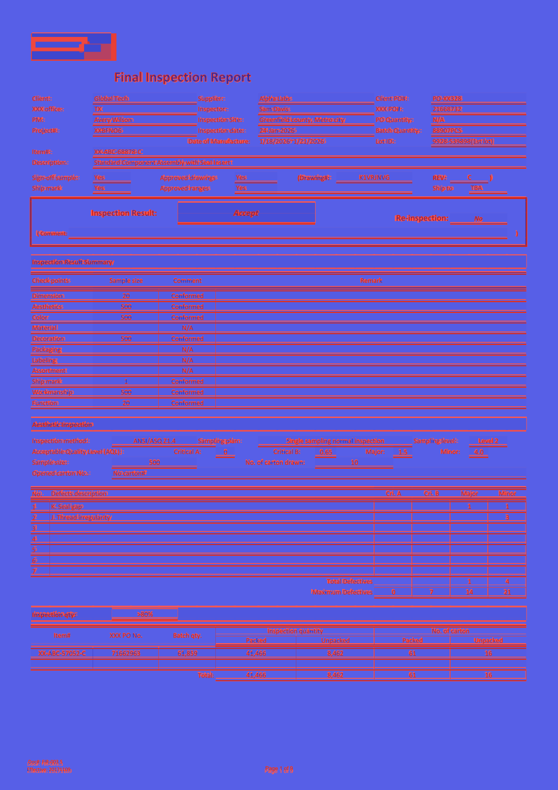
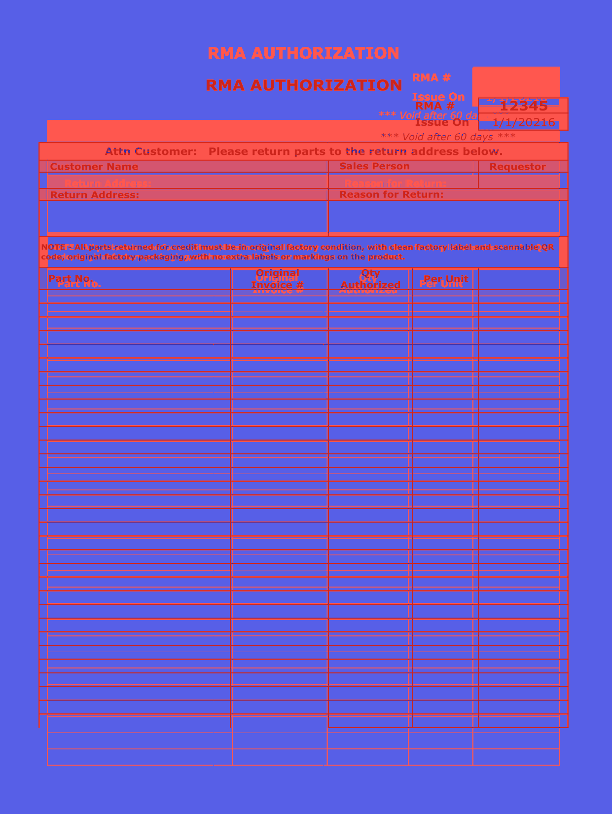
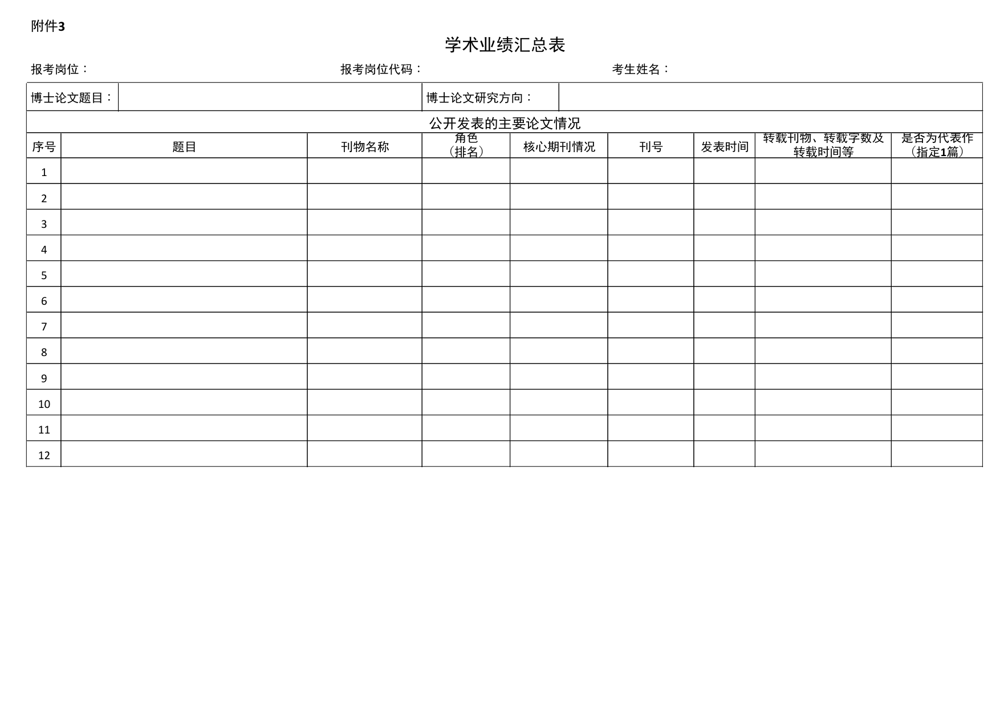
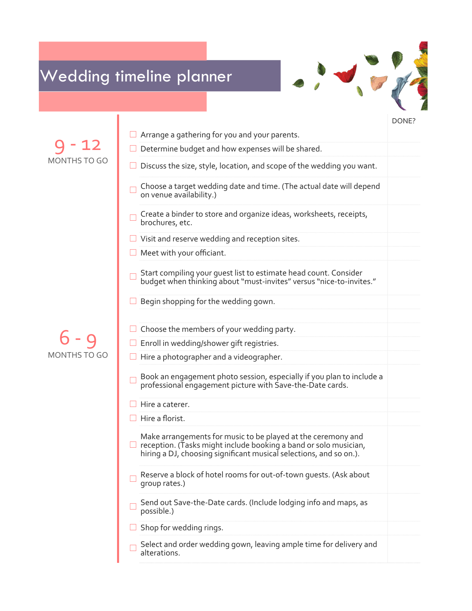
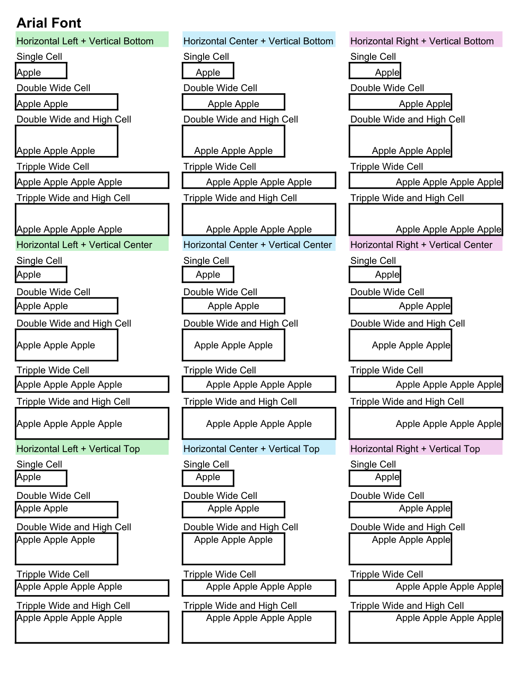
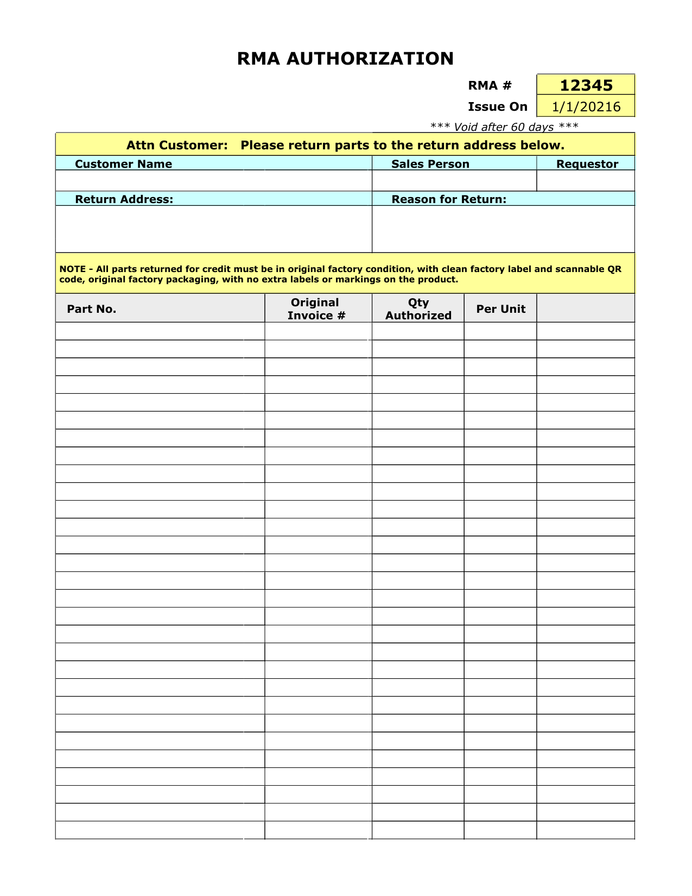
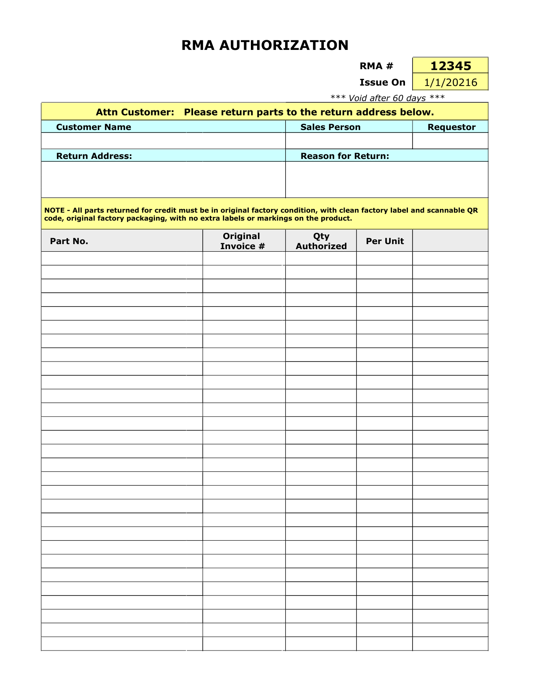
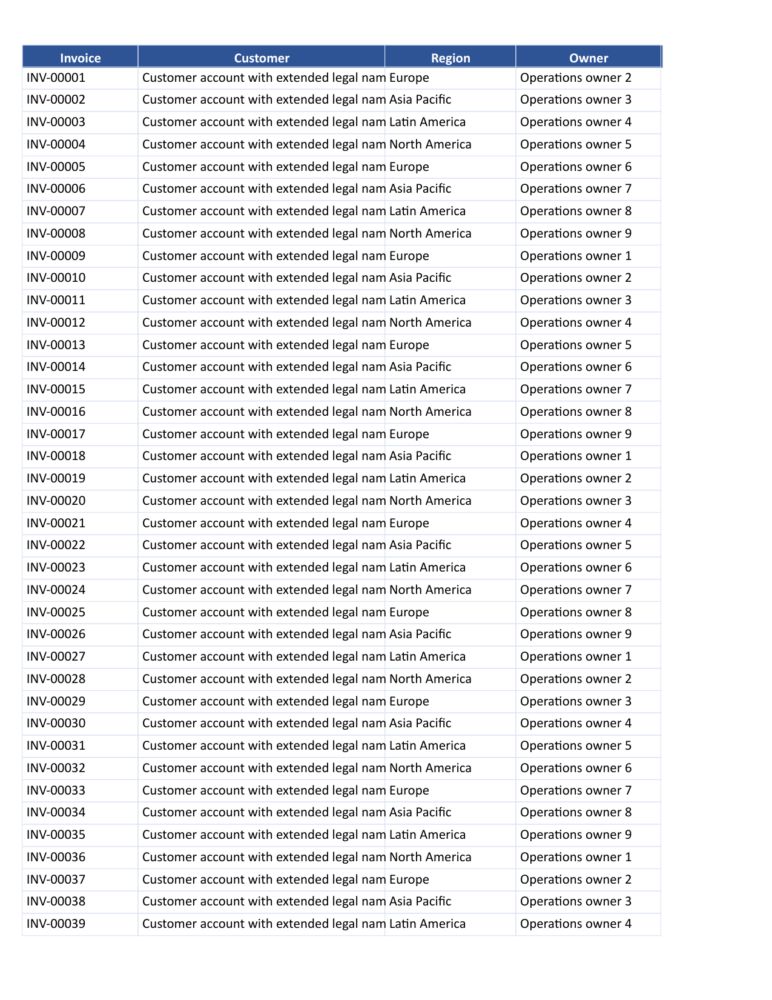

# Rust MiniPdf vs Microsoft 365 Excel Reference PDF Comparison Report

Generated: 2026-09-02T17:09:51.328246

## Summary

| # | Test Case | Valid | Text Sim | Visual Avg | Pages (M/R) | Overall |
|---|-----------|-------|----------|------------|-------------|--------|
| 1 | 🟢 Academic Achievement Summary Table | ✅ | 0.9623 | 0.9371 | 2/2 | **0.9598** |
| 2 | 🟢 AcademicAchievement_temp | ✅ | 0.9623 | 0.9371 | 2/2 | **0.9598** |
| 3 | 🟢 Business expense budget1 | ✅ | 1.0 | 0.8931 | 4/4 | **0.9572** |
| 4 | 🟡 Business expenses budget2 | ✅ | 1.0 | 0.7611 | 8/4 | **0.8044** |
| 5 | 🔴 Business plan checklist with SWOT analysis1 | ✅ | 0.902 | 0.5955 | 2/1 | **0.699** |
| 6 | 🟡 Event budget1 | ✅ | 1.0 | 0.9684 | 4/5 | **0.8874** |
| 7 | 🟢 Expense report basic1 | ✅ | 0.9889 | 0.8811 | 1/1 | **0.948** |
| 8 | 🟡 Grocery list1 | ✅ | 0.9506 | 0.7304 | 1/1 | **0.8724** |
| 9 | 🔴 payroll-calculator_f | ✅ | 0.8487 | 0.4264 | 28/29 | **0.61** |
| 10 | 🟢 PO_anonymized | ✅ | 1.0000 | 0.9002 | 9/9 | **0.9601** |
| 11 | 🟢 Simple invoice1 | ✅ | 0.9806 | 0.8664 | 1/1 | **0.9388** |
| 12 | 🟡 Small business cash flow forecast1 | ✅ | 0.9686 | 0.7277 | 3/5 | **0.7785** |
| 13 | 🟡 Wedding_timeline_planner1_copy | ✅ | 0.9916 | 0.7815 | 4/8 | **0.8092** |
| 14 | 🟡 Weekly schedule planner1 | ✅ | 0.9062 | 0.7361 | 2/1 | **0.7569** |
| 15 | 🟡 XlsxIssue75 | ✅ | 0.9908 | 0.9695 | 140/144 | **0.8841** |
| 16 | 🟢 XlsxIssue77_MergedCellAlignment | ✅ | 1.0 | 0.9382 | 2/2 | **0.9753** |
| 17 | 🟢 XlsxIssue77_Template1 | ✅ | 1.0 | 0.8456 | 6/6 | **0.9382** |
| 18 | 🟢 XlsxIssue77_Template2_Workaround | ✅ | 1.0 | 0.8395 | 6/6 | **0.9358** |
| 19 | 🟢 XlsxIssue81_LayoutOptions | ✅ | 0.9807 | 0.7905 | 16/16 | **0.9085** |
| 20 | ⚪ XlsxIssue82_5mb | ✅ | N/A | N/A | ?/? | **N/A** |
| 21 | ⚪ XlsxIssue82_SampleTestData5mb | ✅ | N/A | N/A | ?/? | **N/A** |
| 22 | ⚪ XlsxIssue82_WideTable | ✅ | N/A | N/A | ?/? | **N/A** |

**Average Overall Score: 0.7533**

## Labeled Side-by-Side Comparison

<table>
<tr><th>Case</th><th>Comparison</th></tr>
<tr>
  <td><b>Academic Achievement Summary Table<br><small>format: xlsx | case: Academic Achievement Summary Table | scope: rust-issue-xlsx</small></b><br>Page 1</td>
  <td></td>
</tr>
<tr>
  <td><b>AcademicAchievement_temp<br><small>format: xlsx | case: AcademicAchievement_temp | scope: rust-issue-xlsx</small></b><br>Page 1</td>
  <td></td>
</tr>
<tr>
  <td><b>Business expense budget1<br><small>format: xlsx | case: Business expense budget1 | scope: rust-issue-xlsx</small></b><br>Page 1</td>
  <td></td>
</tr>
<tr>
  <td><b>Business expenses budget2<br><small>format: xlsx | case: Business expenses budget2 | scope: rust-issue-xlsx</small></b><br>Page 1</td>
  <td></td>
</tr>
<tr>
  <td><b>Business plan checklist with SWOT analysis1<br><small>format: xlsx | case: Business plan checklist with SWOT analysis1 | scope: rust-issue-xlsx</small></b><br>Page 1</td>
  <td></td>
</tr>
<tr>
  <td><b>Event budget1<br><small>format: xlsx | case: Event budget1 | scope: rust-issue-xlsx</small></b><br>Page 1</td>
  <td></td>
</tr>
<tr>
  <td><b>Expense report basic1<br><small>format: xlsx | case: Expense report basic1 | scope: rust-issue-xlsx</small></b><br>Page 1</td>
  <td></td>
</tr>
<tr>
  <td><b>Grocery list1<br><small>format: xlsx | case: Grocery list1 | scope: rust-issue-xlsx</small></b><br>Page 1</td>
  <td></td>
</tr>
<tr>
  <td><b>payroll-calculator_f<br><small>format: xlsx | case: payroll-calculator_f | scope: rust-issue-xlsx</small></b><br>Page 1</td>
  <td></td>
</tr>
<tr>
  <td><b>PO_anonymized<br><small>format: xlsx | case: PO_anonymized | scope: rust-issue-xlsx</small></b><br>Page 1</td>
  <td></td>
</tr>
<tr>
  <td><b>Simple invoice1<br><small>format: xlsx | case: Simple invoice1 | scope: rust-issue-xlsx</small></b><br>Page 1</td>
  <td></td>
</tr>
<tr>
  <td><b>Small business cash flow forecast1<br><small>format: xlsx | case: Small business cash flow forecast1 | scope: rust-issue-xlsx</small></b><br>Page 1</td>
  <td></td>
</tr>
<tr>
  <td><b>Wedding_timeline_planner1_copy<br><small>format: xlsx | case: Wedding_timeline_planner1_copy | scope: rust-issue-xlsx</small></b><br>Page 1</td>
  <td></td>
</tr>
<tr>
  <td><b>Weekly schedule planner1<br><small>format: xlsx | case: Weekly schedule planner1 | scope: rust-issue-xlsx</small></b><br>Page 1</td>
  <td></td>
</tr>
<tr>
  <td><b>XlsxIssue75<br><small>format: xlsx | case: XlsxIssue75 | scope: rust-issue-xlsx</small></b><br>Page 1</td>
  <td></td>
</tr>
<tr>
  <td><b>XlsxIssue77_MergedCellAlignment<br><small>format: xlsx | case: XlsxIssue77_MergedCellAlignment | scope: rust-issue-xlsx</small></b><br>Page 1</td>
  <td></td>
</tr>
<tr>
  <td><b>XlsxIssue77_Template1<br><small>format: xlsx | case: XlsxIssue77_Template1 | scope: rust-issue-xlsx</small></b><br>Page 1</td>
  <td></td>
</tr>
<tr>
  <td><b>XlsxIssue77_Template2_Workaround<br><small>format: xlsx | case: XlsxIssue77_Template2_Workaround | scope: rust-issue-xlsx</small></b><br>Page 1</td>
  <td></td>
</tr>
<tr>
  <td><b>XlsxIssue81_LayoutOptions<br><small>format: xlsx | case: XlsxIssue81_LayoutOptions | scope: rust-issue-xlsx</small></b><br>Page 1</td>
  <td></td>
</tr>
</table>

## Difference Heatmaps

Blue areas are below the configured difference threshold; red areas have stronger pixel differences. The reference rendering is retained as faint context.

<table>
<tr><th>Case</th><th>Heatmap</th><th>Metrics</th></tr>
<tr>
  <td><b>Academic Achievement Summary Table</b><br>Page 1</td>
  <td></td>
  <td>changed: 188622 px (8.67%)<br>bbox: [45, 34, 1725, 1143]<br>mean abs RGB: 13.843<br>RMSE RGB: 52.5804<br>threshold: 12, gain: 5.0</td>
</tr>
<tr>
  <td><b>AcademicAchievement_temp</b><br>Page 1</td>
  <td></td>
  <td>changed: 188622 px (8.67%)<br>bbox: [45, 34, 1725, 1143]<br>mean abs RGB: 13.843<br>RMSE RGB: 52.5804<br>threshold: 12, gain: 5.0</td>
</tr>
<tr>
  <td><b>Business expense budget1</b><br>Page 1</td>
  <td></td>
  <td>changed: 467855 px (21.49%)<br>bbox: [147, 176, 1018, 1597]<br>mean abs RGB: 28.4333<br>RMSE RGB: 73.3179<br>threshold: 12, gain: 5.0</td>
</tr>
<tr>
  <td><b>Business expenses budget2</b><br>Page 1</td>
  <td></td>
  <td>changed: 660460 px (32.25%)<br>bbox: [140, 73, 1509, 1140]<br>mean abs RGB: 16.0908<br>RMSE RGB: 40.1071<br>threshold: 12, gain: 5.0</td>
</tr>
<tr>
  <td><b>Business plan checklist with SWOT analysis1</b><br>Page 1</td>
  <td></td>
  <td>changed: 814131 px (39.76%)<br>bbox: [88, 58, 1182, 1477]<br>mean abs RGB: 27.06<br>RMSE RGB: 62.7658<br>threshold: 12, gain: 5.0</td>
</tr>
<tr>
  <td><b>Event budget1</b><br>Page 1</td>
  <td></td>
  <td>changed: 91980 px (4.23%)<br>bbox: [73, 153, 1165, 779]<br>mean abs RGB: 5.927<br>RMSE RGB: 34.5855<br>threshold: 12, gain: 5.0</td>
</tr>
<tr>
  <td><b>Expense report basic1</b><br>Page 1</td>
  <td></td>
  <td>changed: 283123 px (13.83%)<br>bbox: [60, 61, 1590, 853]<br>mean abs RGB: 6.1984<br>RMSE RGB: 24.737<br>threshold: 12, gain: 5.0</td>
</tr>
<tr>
  <td><b>Grocery list1</b><br>Page 1</td>
  <td></td>
  <td>changed: 602000 px (29.40%)<br>bbox: [45, 72, 1197, 833]<br>mean abs RGB: 13.8314<br>RMSE RGB: 37.5938<br>threshold: 12, gain: 5.0</td>
</tr>
<tr>
  <td><b>payroll-calculator_f</b><br>Page 1</td>
  <td></td>
  <td>changed: 809437 px (37.19%)<br>bbox: [23, 31, 1692, 1160]<br>mean abs RGB: 31.465<br>RMSE RGB: 62.1726<br>threshold: 12, gain: 5.0</td>
</tr>
<tr>
  <td><b>PO_anonymized</b><br>Page 1</td>
  <td></td>
  <td>changed: 406279 px (18.66%)<br>bbox: [58, 72, 1181, 1713]<br>mean abs RGB: 24.1798<br>RMSE RGB: 67.5756<br>threshold: 12, gain: 5.0</td>
</tr>
<tr>
  <td><b>Simple invoice1</b><br>Page 1</td>
  <td></td>
  <td>changed: 355059 px (17.34%)<br>bbox: [38, 107, 1203, 1361]<br>mean abs RGB: 17.5937<br>RMSE RGB: 57.6067<br>threshold: 12, gain: 5.0</td>
</tr>
<tr>
  <td><b>Small business cash flow forecast1</b><br>Page 1</td>
  <td></td>
  <td>changed: 851695 px (39.13%)<br>bbox: [66, 73, 1173, 1682]<br>mean abs RGB: 17.3431<br>RMSE RGB: 42.3066<br>threshold: 12, gain: 5.0</td>
</tr>
<tr>
  <td><b>Wedding_timeline_planner1_copy</b><br>Page 1</td>
  <td></td>
  <td>changed: 331974 px (16.21%)<br>bbox: [102, 110, 1155, 1526]<br>mean abs RGB: 16.3678<br>RMSE RGB: 48.6299<br>threshold: 12, gain: 5.0</td>
</tr>
<tr>
  <td><b>Weekly schedule planner1</b><br>Page 1</td>
  <td></td>
  <td>changed: 671773 px (32.45%)<br>bbox: [62, 96, 1604, 1144]<br>mean abs RGB: 22.5853<br>RMSE RGB: 55.3776<br>threshold: 12, gain: 5.0</td>
</tr>
<tr>
  <td><b>XlsxIssue75</b><br>Page 1</td>
  <td></td>
  <td>changed: 109169 px (5.02%)<br>bbox: [112, 112, 1116, 1669]<br>mean abs RGB: 7.5808<br>RMSE RGB: 38.5703<br>threshold: 12, gain: 5.0</td>
</tr>
<tr>
  <td><b>XlsxIssue77_MergedCellAlignment</b><br>Page 1</td>
  <td></td>
  <td>changed: 259750 px (11.93%)<br>bbox: [36, 121, 1163, 1541]<br>mean abs RGB: 14.4315<br>RMSE RGB: 50.3807<br>threshold: 12, gain: 5.0</td>
</tr>
<tr>
  <td><b>XlsxIssue77_Template1</b><br>Page 1</td>
  <td></td>
  <td>changed: 440593 px (21.52%)<br>bbox: [82, 95, 1157, 1547]<br>mean abs RGB: 25.5866<br>RMSE RGB: 69.9105<br>threshold: 12, gain: 5.0</td>
</tr>
<tr>
  <td><b>XlsxIssue77_Template2_Workaround</b><br>Page 1</td>
  <td></td>
  <td>changed: 444756 px (21.72%)<br>bbox: [78, 95, 1153, 1553]<br>mean abs RGB: 25.2024<br>RMSE RGB: 69.4511<br>threshold: 12, gain: 5.0</td>
</tr>
<tr>
  <td><b>XlsxIssue81_LayoutOptions</b><br>Page 1</td>
  <td></td>
  <td>changed: 569573 px (27.82%)<br>bbox: [35, 73, 1066, 1545]<br>mean abs RGB: 32.1578<br>RMSE RGB: 76.3458<br>threshold: 12, gain: 5.0</td>
</tr>
</table>

## Visual Comparison

Scores compare Rust MiniPdf against Microsoft 365 Excel Reference. LibreOffice is an auxiliary rendering and does not affect scores.

<table>
<tr><th>Rust MiniPdf</th><th>Microsoft 365 Excel Reference</th><th>LibreOffice</th></tr>
<tr>
  <td><b>Academic Achievement Summary Table<br><small>format: xlsx | case: Academic Achievement Summary Table | scope: rust-issue-xlsx</small></b></td>
  <td colspan="2">Academic Achievement Summary Table <span style="color:#3fb950">⬤</span> 96.0%</td>
</tr>
<tr>
  <td></td>
  <td></td>
  <td></td>
</tr>
<tr>
  <td><b>AcademicAchievement_temp<br><small>format: xlsx | case: AcademicAchievement_temp | scope: rust-issue-xlsx</small></b></td>
  <td colspan="2">AcademicAchievement_temp <span style="color:#3fb950">⬤</span> 96.0%</td>
</tr>
<tr>
  <td></td>
  <td></td>
  <td></td>
</tr>
<tr>
  <td><b>Business expense budget1<br><small>format: xlsx | case: Business expense budget1 | scope: rust-issue-xlsx</small></b></td>
  <td colspan="2">Business expense budget1 <span style="color:#3fb950">⬤</span> 95.7%</td>
</tr>
<tr>
  <td></td>
  <td></td>
  <td></td>
</tr>
<tr>
  <td><b>Business expenses budget2<br><small>format: xlsx | case: Business expenses budget2 | scope: rust-issue-xlsx</small></b></td>
  <td colspan="2">Business expenses budget2 <span style="color:#d29922">⬤</span> 80.4%</td>
</tr>
<tr>
  <td></td>
  <td></td>
  <td></td>
</tr>
<tr>
  <td><b>Business plan checklist with SWOT analysis1<br><small>format: xlsx | case: Business plan checklist with SWOT analysis1 | scope: rust-issue-xlsx</small></b></td>
  <td colspan="2">Business plan checklist with SWOT analysis1 <span style="color:#f85149">⬤</span> 69.9%</td>
</tr>
<tr>
  <td></td>
  <td></td>
  <td></td>
</tr>
<tr>
  <td><b>Event budget1<br><small>format: xlsx | case: Event budget1 | scope: rust-issue-xlsx</small></b></td>
  <td colspan="2">Event budget1 <span style="color:#d29922">⬤</span> 88.7%</td>
</tr>
<tr>
  <td></td>
  <td></td>
  <td></td>
</tr>
<tr>
  <td><b>Expense report basic1<br><small>format: xlsx | case: Expense report basic1 | scope: rust-issue-xlsx</small></b></td>
  <td colspan="2">Expense report basic1 <span style="color:#3fb950">⬤</span> 94.8%</td>
</tr>
<tr>
  <td></td>
  <td></td>
  <td></td>
</tr>
<tr>
  <td><b>Grocery list1<br><small>format: xlsx | case: Grocery list1 | scope: rust-issue-xlsx</small></b></td>
  <td colspan="2">Grocery list1 <span style="color:#d29922">⬤</span> 87.2%</td>
</tr>
<tr>
  <td></td>
  <td></td>
  <td></td>
</tr>
<tr>
  <td><b>payroll-calculator_f<br><small>format: xlsx | case: payroll-calculator_f | scope: rust-issue-xlsx</small></b></td>
  <td colspan="2">payroll-calculator_f <span style="color:#f85149">⬤</span> 61.0%</td>
</tr>
<tr>
  <td></td>
  <td></td>
  <td></td>
</tr>
<tr>
  <td><b>PO_anonymized<br><small>format: xlsx | case: PO_anonymized | scope: rust-issue-xlsx</small></b></td>
  <td colspan="2">PO_anonymized <span style="color:#3fb950">⬤</span> 96.0%</td>
</tr>
<tr>
  <td></td>
  <td></td>
  <td></td>
</tr>
<tr>
  <td><b>Simple invoice1<br><small>format: xlsx | case: Simple invoice1 | scope: rust-issue-xlsx</small></b></td>
  <td colspan="2">Simple invoice1 <span style="color:#3fb950">⬤</span> 93.9%</td>
</tr>
<tr>
  <td></td>
  <td></td>
  <td></td>
</tr>
<tr>
  <td><b>Small business cash flow forecast1<br><small>format: xlsx | case: Small business cash flow forecast1 | scope: rust-issue-xlsx</small></b></td>
  <td colspan="2">Small business cash flow forecast1 <span style="color:#d29922">⬤</span> 77.8%</td>
</tr>
<tr>
  <td></td>
  <td></td>
  <td></td>
</tr>
<tr>
  <td><b>Wedding_timeline_planner1_copy<br><small>format: xlsx | case: Wedding_timeline_planner1_copy | scope: rust-issue-xlsx</small></b></td>
  <td colspan="2">Wedding_timeline_planner1_copy <span style="color:#d29922">⬤</span> 80.9%</td>
</tr>
<tr>
  <td></td>
  <td></td>
  <td></td>
</tr>
<tr>
  <td><b>Weekly schedule planner1<br><small>format: xlsx | case: Weekly schedule planner1 | scope: rust-issue-xlsx</small></b></td>
  <td colspan="2">Weekly schedule planner1 <span style="color:#d29922">⬤</span> 75.7%</td>
</tr>
<tr>
  <td></td>
  <td></td>
  <td></td>
</tr>
<tr>
  <td><b>XlsxIssue75<br><small>format: xlsx | case: XlsxIssue75 | scope: rust-issue-xlsx</small></b></td>
  <td colspan="2">XlsxIssue75 <span style="color:#d29922">⬤</span> 88.4%</td>
</tr>
<tr>
  <td></td>
  <td></td>
  <td></td>
</tr>
<tr>
  <td><b>XlsxIssue77_MergedCellAlignment<br><small>format: xlsx | case: XlsxIssue77_MergedCellAlignment | scope: rust-issue-xlsx</small></b></td>
  <td colspan="2">XlsxIssue77_MergedCellAlignment <span style="color:#3fb950">⬤</span> 97.5%</td>
</tr>
<tr>
  <td></td>
  <td></td>
  <td></td>
</tr>
<tr>
  <td><b>XlsxIssue77_Template1<br><small>format: xlsx | case: XlsxIssue77_Template1 | scope: rust-issue-xlsx</small></b></td>
  <td colspan="2">XlsxIssue77_Template1 <span style="color:#3fb950">⬤</span> 93.8%</td>
</tr>
<tr>
  <td></td>
  <td></td>
  <td></td>
</tr>
<tr>
  <td><b>XlsxIssue77_Template2_Workaround<br><small>format: xlsx | case: XlsxIssue77_Template2_Workaround | scope: rust-issue-xlsx</small></b></td>
  <td colspan="2">XlsxIssue77_Template2_Workaround <span style="color:#3fb950">⬤</span> 93.6%</td>
</tr>
<tr>
  <td></td>
  <td></td>
  <td></td>
</tr>
<tr>
  <td><b>XlsxIssue81_LayoutOptions<br><small>format: xlsx | case: XlsxIssue81_LayoutOptions | scope: rust-issue-xlsx</small></b></td>
  <td colspan="2">XlsxIssue81_LayoutOptions <span style="color:#3fb950">⬤</span> 90.8%</td>
</tr>
<tr>
  <td></td>
  <td></td>
  <td></td>
</tr>
<tr>
  <td><b>XlsxIssue82_5mb<br><small>format: xlsx | case: XlsxIssue82_5mb | scope: rust-issue-xlsx</small></b></td>
  <td colspan="2">XlsxIssue82_5mb N/A</td>
</tr>
<tr>
  <td colspan="3"><i>No images</i></td>
</tr>
<tr>
  <td><b>XlsxIssue82_SampleTestData5mb<br><small>format: xlsx | case: XlsxIssue82_SampleTestData5mb | scope: rust-issue-xlsx</small></b></td>
  <td colspan="2">XlsxIssue82_SampleTestData5mb N/A</td>
</tr>
<tr>
  <td colspan="3"><i>No images</i></td>
</tr>
<tr>
  <td><b>XlsxIssue82_WideTable<br><small>format: xlsx | case: XlsxIssue82_WideTable | scope: rust-issue-xlsx</small></b></td>
  <td colspan="2">XlsxIssue82_WideTable N/A</td>
</tr>
<tr>
  <td colspan="3"><i>No images</i></td>
</tr>
</table>

## Detailed Results

### Academic Achievement Summary Table

- **Case Metadata:** format: xlsx | case: Academic Achievement Summary Table | scope: rust-issue-xlsx
- **Source:** tests/Issue_Files/xlsx/Academic Achievement Summary Table.xlsx
- **Text Similarity:** 0.9623
- **Visual Average:** 0.9371
- **Overall Score:** 0.9598
- **Pages:** MiniPdf=2, Reference=2
- **File Size:** MiniPdf=246090 bytes, Reference=151877 bytes

<details><summary>Text Diff</summary>

```diff
--- minipdf/Academic Achievement Summary Table.pdf
+++ reference/Academic Achievement Summary Table.pdf
@@ -1,11 +1,11 @@
-附件 3

+附件3

 学术业绩汇总表

-报考岗位 ： 报考岗位代码 ： 考生姓名 ：

-博士论文题目 ： 博士论文研究方向 ：

+报考岗位： 报考岗位代码： 考生姓名：

+博士论文题目： 博士论文研究方向：

 公开发表的主要论文情况

 角色 转载刊物、转载字数及 是否为代表作

 序号 题目 刊物名称 核心期刊情况 刊号 发表时间

-（ 排名 ） 转载时间等 （ 指定 1 篇 ）

+（排名） 转载时间等 （指定1篇）

 1

 2

 3
```
</details>

### AcademicAchievement_temp

- **Case Metadata:** format: xlsx | case: AcademicAchievement_temp | scope: rust-issue-xlsx
- **Source:** tests/Issue_Files/xlsx/AcademicAchievement_temp.xlsx
- **Text Similarity:** 0.9623
- **Visual Average:** 0.9371
- **Overall Score:** 0.9598
- **Pages:** MiniPdf=2, Reference=2
- **File Size:** MiniPdf=246090 bytes, Reference=151877 bytes

<details><summary>Text Diff</summary>

```diff
--- minipdf/AcademicAchievement_temp.pdf
+++ reference/AcademicAchievement_temp.pdf
@@ -1,11 +1,11 @@
-附件 3

+附件3

 学术业绩汇总表

-报考岗位 ： 报考岗位代码 ： 考生姓名 ：

-博士论文题目 ： 博士论文研究方向 ：

+报考岗位： 报考岗位代码： 考生姓名：

+博士论文题目： 博士论文研究方向：

 公开发表的主要论文情况

 角色 转载刊物、转载字数及 是否为代表作

 序号 题目 刊物名称 核心期刊情况 刊号 发表时间

-（ 排名 ） 转载时间等 （ 指定 1 篇 ）

+（排名） 转载时间等 （指定1篇）

 1

 2

 3
```
</details>

### Business expense budget1

- **Case Metadata:** format: xlsx | case: Business expense budget1 | scope: rust-issue-xlsx
- **Source:** tests/Issue_Files/xlsx/Business expense budget1.xlsx
- **Text Similarity:** 1.0
- **Visual Average:** 0.8931
- **Overall Score:** 0.9572
- **Pages:** MiniPdf=4, Reference=4
- **File Size:** MiniPdf=283740 bytes, Reference=159864 bytes

Text content: ✅ Identical

### Business expenses budget2

- **Case Metadata:** format: xlsx | case: Business expenses budget2 | scope: rust-issue-xlsx
- **Source:** tests/Issue_Files/xlsx/Business expenses budget2.xlsx
- **Text Similarity:** 1.0
- **Visual Average:** 0.7611
- **Overall Score:** 0.8044
- **Pages:** MiniPdf=8, Reference=4
- **File Size:** MiniPdf=1042461 bytes, Reference=376973 bytes

Text content: ✅ Identical

### Business plan checklist with SWOT analysis1

- **Case Metadata:** format: xlsx | case: Business plan checklist with SWOT analysis1 | scope: rust-issue-xlsx
- **Source:** tests/Issue_Files/xlsx/Business plan checklist with SWOT analysis1.xlsx
- **Text Similarity:** 0.902
- **Visual Average:** 0.5955
- **Overall Score:** 0.699
- **Pages:** MiniPdf=2, Reference=1
- **File Size:** MiniPdf=212386 bytes, Reference=64252 bytes

<details><summary>Text Diff</summary>

```diff
--- minipdf/Business plan checklist with SWOT analysis1.pdf
+++ reference/Business plan checklist with SWOT analysis1.pdf
@@ -1,7 +1,7 @@
 Northwind Traders

 Business planning checklist

-Using the strength, weakness, opportunity, and threat (SWOT) analysis framework, develop a checklist of the key

-activities that need to be performed when preparing a formal business plan in the table, below.

+Using the strength, weakness, opportunity, and threat (SWOT) analysis framework, develop a checklist of the key activities

+that need to be performed when preparing a formal business plan in the table, below.

 Activity Owner Completion date

 Strengths: Define the company's current mission

 Luca Richter 1/9/2023

@@ -9,26 +9,29 @@
 Strengths: Identify market segments in which the

 company will participate by conducting primary and Dylan Williams 1/9/2023

 secondary market research.

-Strengths: Identify the company's value proposition

-and how it will differentiate itself within the Kristin Orav 1/16/2023

-marketplace.

-Weaknesses: Identify any barriers to market entry

-(for example, capital requirements, technical

+Strengths: Identify the company's value proposition and

+Kristin Orav 1/16/2023

+how it will differentiate itself within the marketplace.

+Weaknesses: Identify any barriers to market entry (for

+example, capital requirements, technical barriers, patents,

 Flora Berggren 1/6/2023

-barriers, patents, and process barriers) that the

-company needs to overcome.

+and process barriers) that the company needs to

+overcome.

 Weaknesses: Identify any risks inherent to the

-organization that need to be mitigated so that the Flora Berggren 1/6/2023

-company can realize the business plan.

-Opportunities: Identify areas where the current

-market is underserved that provide an opportunity Kristin Orav 1/6/2023

-for the company.

-Opportunities: Identify any key processes,

-intellectual capital, or other resources that the Ian Hansson 1/9/2023

-company can use to its advantage in the marketplace.

-Threats: Identify primary competitors, and then

-analyze competitor performance by using all available Gaurav Cheema 1/9/2023

-data and additional data that can be verified.

+organization that need to be mitigated so that the company Flora Berggren 1/6/2023

+can realize the business plan.

+Opportunities: Identify areas where the current market is

+Kristin Orav 1/6/2023

+underserved that provide an opportunity for the company.

+Opportunities: Identify any key processes, intellectual

+capital, or other resources that the company can use to its Ian Hansson 1/9/2023

+advantage in the marketplace.

+Threats: Identify primary competitors, and then analyze

+competitor performance by using all available data and Gaurav Cheema 1/9/2023

+additional data that can be verified.

 Threats: Identify secondary and potential future

 Chela Arapelli 1/16/2023

-competitors that might affect the business plan.
+competitors that might affect th
... (132 more characters)

```
</details>

### Event budget1

- **Case Metadata:** format: xlsx | case: Event budget1 | scope: rust-issue-xlsx
- **Source:** tests/Issue_Files/xlsx/Event budget1.xlsx
- **Text Similarity:** 1.0
- **Visual Average:** 0.9684
- **Overall Score:** 0.8874
- **Pages:** MiniPdf=4, Reference=5
- **File Size:** MiniPdf=317665 bytes, Reference=121223 bytes

<details><summary>Text Diff</summary>

```diff
--- minipdf/Event budget1.pdf
+++ reference/Event budget1.pdf
@@ -1,10 +1,11 @@
 ABOUT THIS TEMPLATE

-Use this event budget workbook to track expenses incurred on and income earned from an event.

+Use this event budget workbook to track expenses incurred on and income earned from an

+event.

 Enter details in tables in expenses worksheet and income worksheet.

 Total expenses and total income are auto-calculated.

 Profit & loss summary and chart are auto-updated in profit-loss summary worksheet.

 Note:

-Additional instructions have been provided in column A in each worksheet. This text has been intentionally

-hidden. To remove text, select column A, then select DELETE.

-To learn more about tables, press SHIFT and then F10 within a table, select the TABLE option, and then select

-ALTERNATIVE TEXT
+Additional instructions have been provided in column A in each worksheet. This text has been

+intentionally hidden. To remove text, select column A, then select DELETE.

+To learn more about tables, press SHIFT and then F10 within a table, select the TABLE option, and

+then select ALTERNATIVE TEXT
```
</details>

### Expense report basic1

- **Case Metadata:** format: xlsx | case: Expense report basic1 | scope: rust-issue-xlsx
- **Source:** tests/Issue_Files/xlsx/Expense report basic1.xlsx
- **Text Similarity:** 0.9889
- **Visual Average:** 0.8811
- **Overall Score:** 0.948
- **Pages:** MiniPdf=1, Reference=1
- **File Size:** MiniPdf=161159 bytes, Reference=47896 bytes

<details><summary>Text Diff</summary>

```diff
--- minipdf/Expense report basic1.pdf
+++ reference/Expense report basic1.pdf
@@ -17,6 +17,7 @@
 $0.00

 Total $111.00 $250.00 $60.00 $50.00 $0.00 $300.00 $25.00 $796.00

 Subtotal $796.00

-APPROVED Advances $0.00

+Advances $0.00

+APPROVED

 NOTES

 Total $796.00
```
</details>

### Grocery list1

- **Case Metadata:** format: xlsx | case: Grocery list1 | scope: rust-issue-xlsx
- **Source:** tests/Issue_Files/xlsx/Grocery list1.xlsx
- **Text Similarity:** 0.9506
- **Visual Average:** 0.7304
- **Overall Score:** 0.8724
- **Pages:** MiniPdf=1, Reference=1
- **File Size:** MiniPdf=168369 bytes, Reference=71396 bytes

<details><summary>Text Diff</summary>

```diff
--- minipdf/Grocery list1.pdf
+++ reference/Grocery list1.pdf
@@ -1,6 +1,8 @@
-GROCERY LIST ORCHARD GROCERY HOME DELIVERY LOCAL MARKET OTHER GRAND TOTAL

+ORCHARD GROCERY HOME DELIVERY LOCAL MARKET OTHER GRAND TOTAL

+GROCERY LIST

 Customize this list. Replace the entries above with your own to track your

-most frequently used categories. $11.95 $6.12 $31.85 $216.60 $3.99 $270.51

+$11.95 $6.12 $31.85 $216.60 $3.99 $270.51

+most frequently used categories.

 DONE? ITEM STORE CATEGORY QTY UNIT UNIT PRICE TOTAL NOTE

 Yes Peaches Azure River Farm ORCHARD 2 lbs $2.99 $5.98

 Yes Apples Azure River Farm ORCHARD 3 lbs $1.99 $5.97 Have coupon

@@ -12,13 +14,15 @@
 Cucumber Market LOCAL MARKET 1 lbs $2.29 $2.29

 Mushrooms Wide World Importers GROCERY 0.5 lbs $2.25 $1.13

 Yes Milk Local Farmer HOME DELIVERY 2 gal $3.99 $7.98

-y

-Yes Cheese Local Farmer HOME DELIVERY 1 lbs $9.99 $9.99 cheeses

+Variety of block

+Yes Cheese Local Farmer HOME DELIVERY 1 lbs $9.99 $9.99

+cheeses

 Yes Eggs Local Farmer HOME DELIVERY 2 doz $3.50 $7.00

 Yes Cottage cheese Local Farmer HOME DELIVERY 1 16 oz $3.89 $3.89

 Yes Sour cream Local Farmer HOME DELIVERY 1 8 oz $2.99 $2.99

-Yogurt Wide World Importers GROCERY 1 16 oz $4.99 $4.99 honey

-pp

-Beef Farmer's Market LOCAL MARKET 10 lbs $7.99 $79.90 filets

+Yogurt Wide World Importers GROCERY 1 16 oz $4.99 $4.99 Greek with honey

+Bacon wrapped

+Beef Farmer's Market LOCAL MARKET 10 lbs $7.99 $79.90

+filets

 Wild Salmon Fish Market LOCAL MARKET 6 lbs $8.99 $53.94

 Alaskan King Crab Legs Fish Market LOCAL MARKET 5 lbs $10.99 $54.95
```
</details>

### payroll-calculator_f

- **Case Metadata:** format: xlsx | case: payroll-calculator_f | scope: rust-issue-xlsx
- **Source:** tests/Issue_Files/xlsx/payroll-calculator_f.xlsx
- **Text Similarity:** 0.8487
- **Visual Average:** 0.4264
- **Overall Score:** 0.61
- **Pages:** MiniPdf=28, Reference=29
- **File Size:** MiniPdf=4743633 bytes, Reference=606513 bytes

<details><summary>Text Diff</summary>

```diff
--- minipdf/payroll-calculator_f.pdf
+++ reference/payroll-calculator_f.pdf
@@ -1,13 +1,15 @@
 Employee Register

-Information contained in this employee register is highly confidential Filing Status (W-4 before 2020) Filing Status (W-4 from 2020 or later)

-Step 2 Step 3

+Information contained in this employee register is highly confidential Filing Status (W-4 before 2020) Filing St

+Step 2

 Additional Amount to

 Annual Regular Overtime Exempt

 Pay Federal Withhold

 ID Employee's Name M/F Hire Date Occupation Salary Hourly Hourly from W-4 Form Filing Status Filing Status

-Frequency Allowance (With every paycheck) Dependents Other

+Frequency Allowance (With every paycheck)

 ($) Rate ($) Rate ($) Overtime Box in (c)

-($) Under Age 17 Dependents

-1 Adam Jones M 41320 Senior Accountant 42000 20.19 30.29 Yes Monthly W-4 (2020 or later) Exempt 2 50 Single Not Checked

-2 Nichola Brown F 40814 CR Manager 54481 26.19 39.29 Yes Monthly W-4 (2020 or later) Married 4 Single Not Checked

-3 Benny Erwin M 40674 Applications PM 48785 23.45 35.18 No Monthly W-4 (before 2020) Married 4
+($)

+1 Adam Jones M 15-Feb-13 Senior Accountant 42,000.00 20.19 30.29 Yes Monthly W-4 (2020 or later) Exempt 2 50 Single Not Checked

+2 Nichola Brown F 28-Sep-11 CR Manager 54,481.00 26.19 39.29 Yes Monthly W-4 (2020 or later) Married 4 Single Not Checked

+3 Benny Erwin M 11-May-11 Applications PM 48,785.00 23.45 35.18 No Monthly W-4 (before 2020) Married 4

+When adding more rows, insert new rows above this one

+Page 1 of 29
```
</details>

### PO_anonymized

- **Case Metadata:** format: xlsx | case: PO_anonymized | scope: rust-issue-xlsx
- **Source:** tests/Issue_Files/xlsx/PO_anonymized.xlsx
- **Text Similarity:** 1.0000
- **Visual Average:** 0.9002
- **Overall Score:** 0.9601
- **Pages:** MiniPdf=9, Reference=9
- **File Size:** MiniPdf=944128 bytes, Reference=409049 bytes

<details><summary>Text Diff</summary>

```diff
--- minipdf/PO_anonymized.pdf
+++ reference/PO_anonymized.pdf
@@ -3,7 +3,7 @@
 XXX office: TX Inspector: Sam Davis XXX PO#: 21668732

 PM: Avery Wilson Inspection Site: Greenfield county, Metro city PO Quantity: N/A

 Project#: XXBFNO6 Inspection date: 24-Jan-2026 Batch Quantity: 88907PCS

-Date of Manufacture:    1/18/2026~1/21/2026 Lot ID: 9928-539898(1st lot)

+Date of Manufacture: 1/18/2026~1/21/2026 Lot ID: 9928-539898(1st lot)

 Item#: XX-ABC-68878-C

 Description: Standard Component Assembly with Seal Insert

 Sign-off sample: Yes Approved drawings Yes (Drawing#: K1VRJNVG REV: C )

```
</details>

### Simple invoice1

- **Case Metadata:** format: xlsx | case: Simple invoice1 | scope: rust-issue-xlsx
- **Source:** tests/Issue_Files/xlsx/Simple invoice1.xlsx
- **Text Similarity:** 0.9806
- **Visual Average:** 0.8664
- **Overall Score:** 0.9388
- **Pages:** MiniPdf=1, Reference=1
- **File Size:** MiniPdf=159218 bytes, Reference=94130 bytes

<details><summary>Text Diff</summary>

```diff
--- minipdf/Simple invoice1.pdf
+++ reference/Simple invoice1.pdf
@@ -1,8 +1,6 @@
-INVOICE

-Elegant

+Elegant INVOICE

 Invoice #: 10654

-Embrace

-Invoice date: 9/2/2026

+Embrace Invoice date: 8/29/2026

 Job: Wedding florals

 345 W Main Bill to: Hailey Clark

 Los Angeles, CA 14151 Address: 123 Avenue A,
```
</details>

### Small business cash flow forecast1

- **Case Metadata:** format: xlsx | case: Small business cash flow forecast1 | scope: rust-issue-xlsx
- **Source:** tests/Issue_Files/xlsx/Small business cash flow forecast1.xlsx
- **Text Similarity:** 0.9686
- **Visual Average:** 0.7277
- **Overall Score:** 0.7785
- **Pages:** MiniPdf=3, Reference=5
- **File Size:** MiniPdf=449310 bytes, Reference=93247 bytes

<details><summary>Text Diff</summary>

```diff
--- minipdf/Small business cash flow forecast1.pdf
+++ reference/Small business cash flow forecast1.pdf
@@ -1,7 +1,7 @@
 ELBIDE REALTY

 Cash flow forecast

-Starting cash on hand $ 10,000.00 Starting date 46113 Cash minimum balance alert $ 2,000.00

-46113 46143 46174 46204 46235 46266 46296 46327 46357 46388 46419 46447

+Starting cash on hand $ 10,000.00 Starting date Sep 2026 Cash minimum balance alert $ 2,000.00

+Sep 2026 Oct 2026 Nov 2026 Dec 2026 Jan 2027 Feb 2027 Mar 2027 Apr 2027 May 2027 Jun 2027 Jul 2027 Aug 2027

 Total

 Cash on hand (beginning of month) $ 10,000.00 $ 8,050.00 $ 9,350.00 $ 890.00 $ 2,190.00 $ 13,590.00 $ 13,790.00 $ 15,290.00 $ 16,410.00 $ 14,360.00 $ 16,560.00 $ 18,780.00

 Cash receipts
```
</details>

### Wedding_timeline_planner1_copy

- **Case Metadata:** format: xlsx | case: Wedding_timeline_planner1_copy | scope: rust-issue-xlsx
- **Source:** tests/Issue_Files/xlsx/Wedding_timeline_planner1_copy.xlsx
- **Text Similarity:** 0.9916
- **Visual Average:** 0.7815
- **Overall Score:** 0.8092
- **Pages:** MiniPdf=4, Reference=8
- **File Size:** MiniPdf=521756 bytes, Reference=180076 bytes

<details><summary>Text Diff</summary>

```diff
--- minipdf/Wedding_timeline_planner1_copy.pdf
+++ reference/Wedding_timeline_planner1_copy.pdf
@@ -1,23 +1,25 @@
 Wedding timeline planner

 DONE?

 ☐ Arrange a gathering for you and your parents.

-9 - 12 ☐ Determine budget and how expenses will be shared.

+9 - 12

+☐ Determine budget and how expenses will be shared.

 MONTHS TO GO

 ☐ Discuss the size, style, location, and scope of the wedding you want.

-Choose a target wedding date and time. (The actual date will depend on

+Choose a target wedding date and time. (The actual date will depend

 ☐

-venue availability.)

+on venue availability.)

 Create a binder to store and organize ideas, worksheets, receipts,

 ☐

 brochures, etc.

 ☐ Visit and reserve wedding and reception sites.

 ☐ Meet with your officiant.

-Start compiling your guest list to estimate head count. Consider budget

+Start compiling your guest list to estimate head count. Consider

 ☐

-when thinking about “must-invites” versus “nice-to-invites.”

+budget when thinking about “must-invites” versus “nice-to-invites.”

 ☐ Begin shopping for the wedding gown.

 ☐ Choose the members of your wedding party.

-6 - 9 ☐ Enroll in wedding/shower gift registries.

+6 - 9

+☐ Enroll in wedding/shower gift registries.

 MONTHS TO GO

 ☐ Hire a photographer and a videographer.

 Book an engagement photo session, especially if you plan to include a

@@ -26,8 +28,8 @@
 ☐ Hire a caterer.

 ☐ Hire a florist.

 Make arrangements for music to be played at the ceremony and

-☐ reception. (Tasks might include booking a band or solo musician, hiring

-a DJ, choosing significant musical selections, and so on.).

+☐ reception. (Tasks might include booking a band or solo musician,

+hiring a DJ, choosing significant musical selections, and so on.).

 Reserve a block of hotel rooms for out-of-town guests. (Ask about

 ☐

 group rates.)
```
</details>

### Weekly schedule planner1

- **Case Metadata:** format: xlsx | case: Weekly schedule planner1 | scope: rust-issue-xlsx
- **Source:** tests/Issue_Files/xlsx/Weekly schedule planner1.xlsx
- **Text Similarity:** 0.9062
- **Visual Average:** 0.7361
- **Overall Score:** 0.7569
- **Pages:** MiniPdf=2, Reference=1
- **File Size:** MiniPdf=212568 bytes, Reference=148591 bytes

<details><summary>Text Diff</summary>

```diff
--- minipdf/Weekly schedule planner1.pdf
+++ reference/Weekly schedule planner1.pdf
@@ -1,13 +1,12 @@
 Weekly schedule planner

-Week of: 3/23/2026

+Week of: 8/24/2026

 Weekly objectives To do items Deadlines this week

 Run 3 miles Take FiFi to vet Presentation on Thursday

 Read 30 min/day Go grocery shopping

 Stretch Pick up dry cleaning

 Monday Tuesday Wednesday Thursday Friday Saturday Sunday

-23

-24 25 26 27 28 29

-March March March March March March March

+24 25 26 27 28 29 30

+August August August August August August August

 ✔ Run ✔ Run ✖ Run Run Run Run Run

 ✖ Read ✔ Read ✔ Read Read Read Read Read

 ✔ Stretch ✔ Stretch ✖ Stretch Stretch Stretch Stretch Stretch
```
</details>

### XlsxIssue75

- **Case Metadata:** format: xlsx | case: XlsxIssue75 | scope: rust-issue-xlsx
- **Source:** tests/Issue_Files/xlsx/XlsxIssue75.xlsx
- **Text Similarity:** 0.9908
- **Visual Average:** 0.9695
- **Overall Score:** 0.8841
- **Pages:** MiniPdf=140, Reference=144
- **File Size:** MiniPdf=13721851 bytes, Reference=5896201 bytes

<details><summary>Text Diff</summary>

```diff
--- minipdf/XlsxIssue75.pdf
+++ reference/XlsxIssue75.pdf
@@ -48,5 +48,4 @@
 30184 Fred Invoice

 30184 Fred Invoice

 30184 Fred Invoice

-30184 Fred Invoice

 30184 Fred Invoice
```
</details>

### XlsxIssue77_MergedCellAlignment

- **Case Metadata:** format: xlsx | case: XlsxIssue77_MergedCellAlignment | scope: rust-issue-xlsx
- **Source:** tests/Issue_Files/xlsx/XlsxIssue77_MergedCellAlignment.xlsx
- **Text Similarity:** 1.0
- **Visual Average:** 0.9382
- **Overall Score:** 0.9753
- **Pages:** MiniPdf=2, Reference=2
- **File Size:** MiniPdf=450282 bytes, Reference=172385 bytes

Text content: ✅ Identical

### XlsxIssue77_Template1

- **Case Metadata:** format: xlsx | case: XlsxIssue77_Template1 | scope: rust-issue-xlsx
- **Source:** tests/Issue_Files/xlsx/XlsxIssue77_Template1.xlsx
- **Text Similarity:** 1.0
- **Visual Average:** 0.8456
- **Overall Score:** 0.9382
- **Pages:** MiniPdf=6, Reference=6
- **File Size:** MiniPdf=528694 bytes, Reference=64464 bytes

Text content: ✅ Identical

### XlsxIssue77_Template2_Workaround

- **Case Metadata:** format: xlsx | case: XlsxIssue77_Template2_Workaround | scope: rust-issue-xlsx
- **Source:** tests/Issue_Files/xlsx/XlsxIssue77_Template2_Workaround.xlsx
- **Text Similarity:** 1.0
- **Visual Average:** 0.8395
- **Overall Score:** 0.9358
- **Pages:** MiniPdf=6, Reference=6
- **File Size:** MiniPdf=531407 bytes, Reference=64466 bytes

Text content: ✅ Identical

### XlsxIssue81_LayoutOptions

- **Case Metadata:** format: xlsx | case: XlsxIssue81_LayoutOptions | scope: rust-issue-xlsx
- **Source:** tests/Issue_Files/xlsx/XlsxIssue81_LayoutOptions.xlsx
- **Text Similarity:** 0.9807
- **Visual Average:** 0.7905
- **Overall Score:** 0.9085
- **Pages:** MiniPdf=16, Reference=16
- **File Size:** MiniPdf=3842287 bytes, Reference=242251 bytes

<details><summary>Text Diff</summary>

```diff
--- minipdf/XlsxIssue81_LayoutOptions.pdf
+++ reference/XlsxIssue81_LayoutOptions.pdf
@@ -1,40 +1,39 @@
 Invoice Customer Region Owner

-INV-00001 Customer account with extended legal nam Europe Operations owner 2

-INV-00002 Customer account with extended legal nam Asia Pacific Operations owner 3

-INV-00003 Customer account with extended legal nam Latin America Operations owner 4

-INV-00004 Customer account with extended legal nam North America Operations owner 5

-INV-00005 Customer account with extended legal nam Europe Operations owner 6

-INV-00006 Customer account with extended legal nam Asia Pacific Operations owner 7

-INV-00007 Customer account with extended legal nam Latin America Operations owner 8

-INV-00008 Customer account with extended legal nam North America Operations owner 9

-INV-00009 Customer account with extended legal nam Europe Operations owner 1

-INV-00010 Customer account with extended legal nam Asia Pacific Operations owner 2

-INV-00011 Customer account with extended legal nam Latin America Operations owner 3

-INV-00012 Customer account with extended legal nam North America Operations owner 4

-INV-00013 Customer account with extended legal nam Europe Operations owner 5

-INV-00014 Customer account with extended legal nam Asia Pacific Operations owner 6

-INV-00015 Customer account with extended legal nam Latin America Operations owner 7

-INV-00016 Customer account with extended legal nam North America Operations owner 8

-INV-00017 Customer account with extended legal nam Europe Operations owner 9

-INV-00018 Customer account with extended legal nam Asia Pacific Operations owner 1

-INV-00019 Customer account with extended legal nam Latin America Operations owner 2

-INV-00020 Customer account with extended legal nam North America Operations owner 3

-INV-00021 Customer account with extended legal nam Europe Operations owner 4

-INV-00022 Customer account with extended legal nam Asia Pacific Operations owner 5

-INV-00023 Customer account with extended legal nam Latin America Operations owner 6

-INV-00024 Customer account with extended legal nam North America Operations owner 7

-INV-00025 Customer account with extended legal nam Europe Operations owner 8

-INV-00026 Customer account with extended legal nam Asia Pacific Operations owner 9

-INV-00027 Customer account with extended legal nam Latin America Operations owner 1

-INV-00028 Customer account with extended legal nam North America Operations owner 2

-INV-00029 Customer account with extended legal nam Europe Operations owner 3

-INV-00030 Customer account with extended legal nam Asia Pacific Operations owner 4

-INV-00031 Customer account with extended legal nam Latin America Operations owner 5

-INV-00032 Customer account with extended legal nam North America Operations owner 6

-INV-00033 Customer account with extended legal nam Europe Operations owner 7

-INV-00034 Customer account with extended legal nam Asia Pacific Operations owner 8

-INV-00035 C
... (3557 more characters)

```
</details>

### XlsxIssue82_5mb

**Error:** MiniPdf PDF not found

### XlsxIssue82_SampleTestData5mb

**Error:** MiniPdf PDF not found

### XlsxIssue82_WideTable

**Error:** Reference PDF not found

## Improvement Suggestions

### ⚠ Low-Score Test Cases (below 0.8)

1. **payroll-calculator_f** (score: 0.61)
1. **Business plan checklist with SWOT analysis1** (score: 0.699)
1. **Weekly schedule planner1** (score: 0.7569)
1. **Small business cash flow forecast1** (score: 0.7785)

Review the text diffs and visual comparisons above to identify specific rendering issues.
